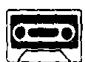

## Lesson 131 Don't be so sure! 别那么肯定!

Listen to the tape then answer this question.

What's the problem about deciding on a holiday?

听录音，然后回答问题。决定如何度假有什么为难的地方？

MARTIN: Where are you going to spend your holidays this year, Gary?

GARY: We may go abroad.  
I'm not sure.  
My wife wants to go to Egypt.  
I'd like to go there, too.  
We can't make up our minds.

MARTIN: Will you travel by sea or by air?

GARY : We may travel by sea.

MARTIN: It's cheaper, isn't it?

GARY : It may be cheaper,
but it takes a long time.

MARTIN: I'm sure you'll enjoy yourselves.

GARY: Don't be so sure.

We might not go anywhere.

My wife always worries too much.

Who's going to look after the dog?

Who's going to look after the house?

Who's going to look after the garden?

We have this problem every year.

In the end, we stay at home

and look after everything!

## New words and expressions 生词和短语

Egypt /'i:dʒɪpt/ n. 埃及

worry /'wʌri/ v. 担忧

abroad /ə'brɔːd/ adv. 国外

## Notes on the text 课文注释

1 We may go abroad. 我们可能去国外。

在英文中用 may 来表示可能发生的事情，在 may 后面加动词原形。请注意 may 表示的是一种可能性，这与第 127 课所讲的表示有根据的推论是有区别的。

2 make up our minds, 打定主意。

3 Don't be so sure. 别那么肯定。

在祈使句中，be 动词的否定形式要用 don't be，这种结构常常用于劝告。

4 We might not go anywhere. 我们可能哪里也去不成。

might 可以用来表示一种可能性，但它表示的“肯定”程度还不如 may 。和 may 一样，might 所表示的是现在或将来的一种可能性。

5 look after, 照看。

6 in the end, 最后。

## 参考译文

马丁：加里，今年你们打算去哪里度假？

加里：我们可能到国外去，但我不敢肯定。我妻子想到埃及去，我也想去那儿。我们还拿不定主意。

马丁：你们乘船去，还是乘飞机去？

加里：我们可能乘船去。

马丁：这更便宜些，是吗？

加里：可能是便宜些，但花的时间长。

马丁：我肯定你们一定会玩得很痛快。

加里：别那么肯定。我们可能哪里也去不成。我妻子总是担心这担心那的。谁来照看狗啦，谁来看管房子啦，谁来照料花园啦，我们每年都碰到这类问题。末了，我们呆在家里来照看一切。
