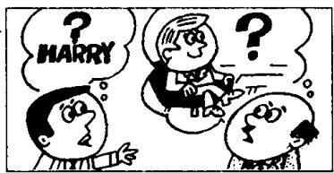
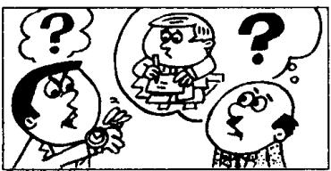
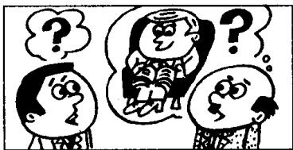
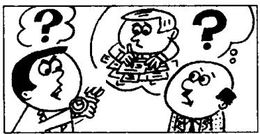
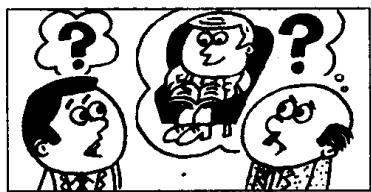

# Lesson 132 He may be... 他可能是…… He may have been... 他可能已经… I'm not sure. 我不敢肯定。

Listen to the tape and answer the questions.
听录音并回答问题。

1  
  
2  
Where's Harry?  
He may be in his room.  
I'm not sure.

  
Where will he go?  
He may go to the cinema.  
I'm not sure.

3  
  
Why is he late?
He may be busy.
I'm not sure.

4  
  
What is he doing?
He may be reading.
I'm not sure.

5  
  
6  
Why was he late?  
He may have been busy.  
I'm not sure.

  
What was he doing?
He may have been reading.
I'm not sure.

## Written exercises 书面练习

A Read the conversation in Lesson 131 again. Then answer these questions.

重读第 131 课的对话，然后回答以下问题：

1 Is Martin talking to Gary?

2 Where may Gary and his wife go this year?

3 Who wants to go to Egypt?

4 How will they travel?

5 Isn't it cheaper to travel by sea?

6 Doesn't it take a long time?

7 Why might Gary and his wife not go anywhere?

B Answer these questions.
模仿例句回答以下问题。

Examples:

Do you think she is Danish? (Swedish)

I'm not sure. She may be Swedish.

Do you think she was Danish? (Swedish)

I'm not sure. She may have been Swedish.

1 Do you think they are Canadian? (Australian)

2 Do you think she is Finnish? (Russian)

3 Do you think they are Japanese? (Chinese)

4 Do you think they were butchers? (bakers)

5 Do you think she was a dentist? (doctor)

6 Do you think he is a sales rep? (the boss)

7 Do you think she is seventeen? (twenty-one)

8 Do you think they were five? (seven)

9 Do you think he was seventy-six? (over eighty)

10 Do you think she was fifty-five? (under fifty)

11 Do you think it is the 17th today? (16th)

12. Do you think it was Tuesday yesterday? (Wednesday)

13 Do you think it is the 19th today? (20th)

14 Do you think it is cheap? (expensive)

15 Do you think it was easy? (difficult)

16 Do you think she was old? (young)

17 Do you think he was ill? (tired)

18 Do you think they are listening to the radio? (watching television)

19 Do you think she was retiring? (looking for a new job)

20 Do you think they are sitting? (standing)
