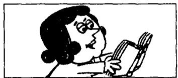

# Lesson 134 He said (that) he ... 他曾说他…… He told me (that) he ... 他曾告诉我说他……

10  

Listen to the tape and answer the questions.
听录音并回答问题。

1  
  
I'm tired.

2  
  
What did he say? What did he tell you?

3  
  
He said (that) he was tired.
He told me (that) he was
tired.

4  
  
I'm reading.

5  
  
What did she say? What did she tell you?

6  
  
reading.
She told me (that) she
was reading.

7  
  
We want our dinner.

8  
  
What did they say? What did they tell you?

9  
  
They said (that) they wanted their dinner. They told me (that) they wanted their dinner.

  
I've finished my homework.

  
What did he say? What did he tell you?

12  
  
He said (that) he had finished his homework. He told me (that) he had finished his homework.

## Written exercises 书面练习

A Read the conversation in Lesson 133 again. Then answer these questions.
重读第 133 课的对话，然后回答以下问题。

1 Has Miss Marsh just made a new film?

2 Who was asking her questions?

3 What is Miss Marsh going to do?

5 Who bought a newspaper?

4 Why doesn't Miss Marsh want to make another film?

6 Where did Miss Marsh arrive?

7 What was Miss Marsh wearing?

B Answer these questions.
模仿例句回答以下问题。

Example:

I'm tired. — What did he say?

He said he was tired.

I'm busy. — What did he say?

2 She's cold. — What did he say?

3 The book's interesting. — What did she say?

4 They're hungry. — What did he say?

C Answer these questions.
模仿例句回答以下问题。

## Example:

I'm reading. — What did he tell you?

He told me he was reading.

1 I'm working. — What did he tell you?

2 She's leaving. — What did they tell you?

3 They're joking. — What did she tell you?

4 Tom's waiting. — What did he tell you?

D Answer these questions.

模仿例句回答以下问题。

Example:

I've finished. — What did he tell you?

He told me he had finished.

1 I've met him. — What did he tell you?

2 I've lost it. — What did he tell you?

3 It has stopped. — What did she tell you?

4 She has arrived. — What did they tell you?
