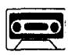
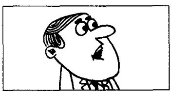
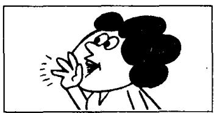
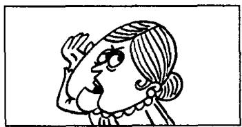
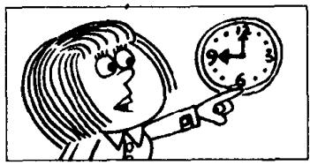
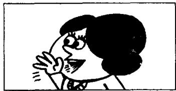

## Lesson 136 He said (that) he ... 他（曾）说他…… He told me (that) he ... 他（曾）告诉我说他……

Listen to the tape and answer the questions.
听录音并回答问题。

1  
  
I'll leave tomorrow.

2  
  
What did he say? What did he tell you?

3  
  
leave tomorrow.  
He told me (that) he would leave tomorrow.

4  
  
I can't do this Maths problem.

5  
  
What did he say? What did he tell you?

6  
  
He said (that) he couldn't do this Maths problem. He told me (that) he couldn't do this Maths problem.

7  
  
I may return at six o'clock.

8  
  
What did she say? What did she tell you?

9  
  
She said (that) she might return at six o'clock.
She told me (that) she might return at six o'clock.

## Written exercises 书面练习

A Read the conversation in Lesson 135 again. Then answer these questions.
重读第 135 课的对话，然后回答以下问题。

1 Is Karen Marsh really going to retire, or is she still not sure?

2 She can't make up her mind, can she?

4 When will they get married?

5 Where is Karen Marsh staying?

3 What is the name of her future husband?

6 Does Karen Marsh introduce Carlos to the reporters?

7 How does Liz describe the news?

## B Answer these questions.

模仿例句回答以下问题。

## Example:

I will leave tomorrow. — What did he say?

He said he would leave tomorrow.

1 Penny will open the window. — What did he say?

2 I will change some money. — What did she say?

3 It will rain tomorrow. — What did he say?

4 They will arrive later. — What did he say?

5 He will repair it. — What did she say?

6 I will write to him. — What did he say?

## C Answer these questions.

模仿例句回答以下问题。

## Example:

I can do this Maths problem. What did he tell you?

He told me he could do this Maths problem.

1 I can understand English. — What did he tell you? 4 I can remember him. — What did she tell you?

2 I can recognize him. — What did she tell you?

3 They can afford it. — What did they tell you?

5 I can change it. — What did he tell you?

6 I can finish it. — What did he tell you?

D Answer these questions.

模仿例句回答以下问题。

## Example:

I may go to the cinema. — What did he say?

He said he might go to the cinema.

1 They may arrive tomorrow. — What did they say?

4 I may sell it. — What did he tell you?

2 I may retire. — What did he tell you?

5 She may recognize you. — What did he say?

3 I may telephone him. — What did she say?

6 I may finish it. — What did she tell you?
