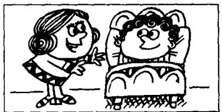

## Lesson 138 If... 如果

Listen to the tape and answer the questions.

听录音并回答问题。

  
If you break this window, you'll have to pay for it!

2  
  
If you don't hurry,
we'll miss the train.

3  
  
If he falls,
he'll hurt himself.

4  
  
If it rains tomorrow,
we won't go to the seaside.

5  
  
If you feel better,
you can get up.

6  
  
If he sells that car,
he can buy a new one.

## Written exercises 书面练习

A Read the conversation in Lesson 137 again. Then answer these questions: 重读第 137 课的对话，然后回答以下问题：

1 What is Brian doing?

2 Has Brian ever won anything on the football pools?

3 What will Brian buy his wife if he wins a lot of money?

4 She doesn't want a mink coat, does she?

5 What does Julie want instead of a mink coat?

6 What will Brian do if he spends all the money?

7 It's only a dream, isn't it?

8 What does it all depend on?

B Answer these questions.
模仿例句回答以下问题。

## Example:

What will you do if you win a lot of money?

Stay at the best hotels.

If I win a lot of money, I'll stay at the best hotels.

1 What will he do if he misses the bus?
Take a taxi.

2 What will he do if he doesn't sell his old car? He won't buy a new one.

3 What will you do if they offer you more money? Work less.

4 What will he do if she doesn't type the letter? Type it himself.

5 What will the children do if they come home early? Play in the garden.

6 What will you do if you are ill tomorrow?
I won't go to work.

7 What will you do if you go to the party? Enjoy myself.

8 What will you do if he asks you?
Tell him the truth.

9 What will they do if it rains tomorrow?
Stay at home.

C\~Write sentences using these words.

模仿例句改写以下句子。

Example:

Stay at the best hotels. (He)

He can stay at the best hotels if he is rich.

1 Live abroad. (She)

5 Enjoy myself. (I)

2 Travel round the world. (He)

6 Offer your boss a job. (You)

3 Buy a new house. (He)

7 Fly to Tokyo. (He)

4 Have a long holiday. (They)

8 Work less. (She)
