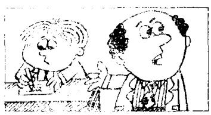
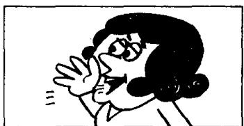

# Lesson 140 He wants to know if/why/what/when 他想知道是否／为什么／什么／什么时候

Listen to the tape and answer the questions.
听导者并回答问题。

1  
  
Are you tired?

2  

3  
  
Why are you tired?  
What does he want to know?
What does he want to know?  
He wants to know if you are tired.
He wants to know why you are tired.

  
As you reading?  
What are you reading?

5  
  
What does he want to know?
What does he want to know?

6  
  
He wants to know
if you are reading.
He wants to know
what you are reading.

  
Does I am always do.
His homework?

8  
  
9  
What does he want to know?

  
When does Tom do his
homework?  
What does he want to know?  
He wants to know if
Tom always does his
homework.
He wants to know when
Tom does his homework.

## Written exercises 书面练习

A Read the conversation in Lesson 139 again. Then answer these questions.
重读第 139 课的对话，然后回答以下问题。

1 Isn't Graham Turner speaking to John Smith?

2 Who invited Mr. and Mrs. Turner to dinner?

3 What time did Graham Turner say he would be there?

4 Why can't he be there at six o'clock?

5 Graham Turner doesn't know when he will finish work, does he?

6 What does Mr. Turner's wife want to know?

B Write new sentences.
模仿例句改写以下句子。

Example:

Are you tired? Why?
I want to know if you are tired. Tell me if you are tired.
I want to know why you are tired. Tell me why you are tired.

1 Are you late? Why? 2 Are you dirty? Why? 3 Are you lazy? Why? 4 Are you busy? Why?

C Write new sentences.
模仿例句改写以下句子。

Example:

Are you reading? What?

I want to know if you are reading. Tell me if you are reading.

I want to know what you are reading. Tell me what you are reading.

1 Are you writing? What?
3 Are you painting? What?

2 Are you cooking? What?
4 Are you playing? What?

D Write new sentences.
模仿例句改写以下句子。

Example:

Did Tom go to bed early? When?
I want to know if Tom went to bed early. Tell me if Tom went to bed early.
I want to know when Tom went to bed. Tell me when Tom went to bed.

1 Did Tom get up early? When?
3 Did Tom do his homework yesterday? When?

2 Did Tom arrive late? When?

4 Did Tom have a bath yesterday? When?
