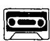

# Lesson 141 Sally's first train ride 萨莉第一次乘火车旅行

Listen to the tape then answer this question.

Why was the mother embarrassed?

听录音，然后回答问题。为什么母亲感到很尴尬？

Last week, my four-year-old daughter, Sally,

was invited to a children's party.

I decided to take her by train.

Sally was very excited

because she had never travelled

on a train before.

She sat near the window

and asked questions

about everything she saw.

Suddenly, a middle-aged lady

got on the train

and sat opposite Sally.

'Hello, little girl,' she said.

Sally did not answer,

but looked at her curiously.

The lady was dressed in a blue coat

and a large, funny hat.

After the train had left the station,

the lady opened her handbag and took out her powder compact.

She then began to make up her face.

'Why are you doing that?' Sally asked.

'To make myself beautiful,' the lady answered.

She put away her compact and smiled kindly.

'But you are still ugly,' Sally said.

Sally was amused,

but I was very embarrassed!

## New words and expressions 生词和短语

excited /ɪkˈsaɪtɪd/ adj. 兴奋的

compact /'kɒmpækt/ n. 带镜的化妆盒

get on 登上

kindly /'kaɪndli/ adv. 和蔼地

middle-aged /ˌmɪdl-ˈeɪdʒd/ adj. 中年的

ugly /'ʌgli/ adj. 丑陋的

opposite /'ɒpəzɪt/ prep. 在……对面

amused /ə'mju:zd/ adj. 有趣的

curiously /'kjʊəriəsli/ adv. 好奇地

funny /'fʌni/ adj. 可笑的，滑稽的

smile /smaɪl/ v. 微笑

powder /'paʊdə/ n. 香粉

embarrassed /ɪmˈbærəst/ adj. 尴尬的，窘迫的

## Notes on the text 课文注释

I my four-year-old daughter, 我那 4 岁的女儿。

four-year-old 是名词daughter的定语，常常用连字符连在一起，组成一个复合形容词。注意在这个复合词中仅用 year，而不用复数。

2 Sally was invited to a children's party.

这是一个被动语态的例子。在英文中，如果想避免用含混不清的词（如 someone 等）作主语，常常可使用被动语态。被动语态由相应的 be 动词加上过去分词组成。

3 she had never travelled on a train before,

副词 before 通常用于完成时（现在完成时或过去完成时）的句子里，ago 用在过去时的句子里。

4 be dressed in ..., 穿戴着……。

5 make up her face, 往她的脸上施脂粉。

6 make myself beautiful, 把自己打扮漂亮。

## 参考译文

上周，我4岁的女儿萨莉被邀请去参加一个儿童聚会。我决定带她乘火车去。萨莉非常激动，因为她从未乘过火车。她靠车窗坐着，对她所看到的一切都要问个明白。突然，一个中年妇女上了火车，坐在萨莉的对面。“你好，小姑娘，”她说。萨莉没回答，却好奇地看着她。那位妇女穿着一件蓝色的大衣，戴着一顶大而滑稽的帽子。火车开出车站后，那位妇女打开了手提包，拿出了粉盒。然后她开始打扮起来。“你为什么要那样做呢？”萨莉问。“为了把自己打扮漂亮啊，”那位妇女答道。她放好了粉盒，慈祥地微笑着。“可是你仍然难看呀，”萨莉说。萨莉感到很有趣，而我却很尴尬。
