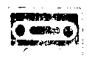
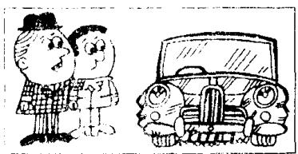
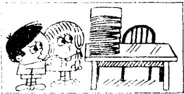
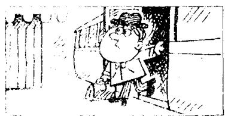

# Lesson 142 Someone invited Sally to a party. 有人邀请萨莉出席一个聚会。 Sally was invited to a party. 萨莉应邀出席一个聚会。

Listen to the tape and answer the questions.
听录音并回答问题。

  
She is embarrassed.

2  
  
They are worried.

  
Does anyone ever repair  
this

4  
  
Someone repairs it regularly.
It is repaired regularly.

  
Does anyone ever correct  
these exercise books?

6  
  
Someone corrects them regularly.
They are corrected regularly.

  
8  
Dr. G. S. van P##el him at the state, "I do morning?"

  
Someone met him at the station this morning.
He was met at the station this morning.

## New words and expressions 生词和短语

worried /'wʌrid/ adj. 担心，担忧

regularly /'regjʊləli/ adv. 经常地，无中

## Written exercises 书面练习

A Read the story in Lesson 141 again. Then answer these questions.

重读第 141 课的故事，然后回答以下问题。

1 How old is Sally?

2 Why did Sally's mother decide to take her by train?

5 How was the lady dressed?

3 Where did Sally sit?

6 What did the lady do?

7 Why did the lady make up her face!

4 Who got on the train?

8 Did Sally think the lady was beautiful?

## B Answer these questions.

用主动语态和被动语态两种形式来回答以下问题。

## Examples:

Does anyone ever open this window? Someone opens it regularly. It is opened regularly.

Does anyone ever open these windows? Someone opens them regularly. They are opened regularly.

1 Does anyone ever air this room?

2 Does anyone ever clean these rooms?

3 Does anyone ever empty this basket?

4 Does anyone ever sharpen this knife?

5 Does anyone ever turn on these taps?

6 Does anyone ever water these flowers $^{4}$

7 Does anyone ever repair this car?

8 Does anyone ever dust this cupboard?

9 Does anyone ever correct these exercise knows?

10 Does anyone ever shut this window.

## C Answer these questions.

## 模仿例句回答以下问题。

## Examples:

Did anyone open this window?

Someone opened it. It was opened this morning.

Did anyone open these windows?

Someone opened them. They were opened this morning.

1 Did anyone water these flowers?

6 Did anyone buy these models?

2 Did anyone repair this car?

7 Did anyone sweep this floor?

3 Did anyone dust this cupboard?

8 Did anyone take them to school?

4 Did anyone correct these exercise books?

9 Did anyone meet them at the station:

5 Did anyone shut this window?

10 Did anyone tell them?
