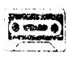
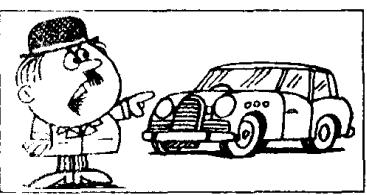
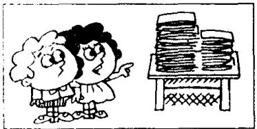
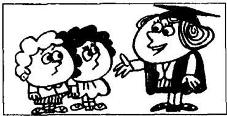
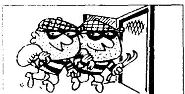
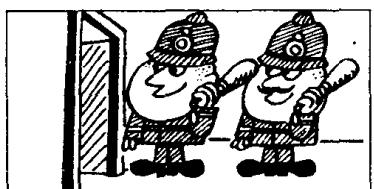

Listen to the tape and answer the questions.
听录音并回答问题。

  
Hasn't anyone repaired this car yet?

2  
  
It has already been repaired!

;  
  
Hasn't anyone corrected these exercise books yet?

4  
  
They have already been corrected!

5  
  
Hasn't anyone caught the thief yet?

6  
  
He hasn't been caught yet.  
He will be caught soon!

  
8  
Hasn't anyone caught the thieves yet?

  
They haven't been caught yet. They will be caught soon!

## Written exercises 书面练习

A Read the piece in Lesson 143 again. Then answer these questions.
重读第 143 课课文，然后回答以下问题：

1 Where does the writer live?

2 Why do visitors often come from the city?

5 Where did the writer go last Wednesday,

3 What have visitors been asked to do?

4 Where have litter baskets been placed?

6 He saw a lot of rubbish, didn't he?

7 What did he see among the rubbish.

## B Answer these questions.

8 What did the sign say?

模仿例句回答以下问题。

## Examples:

Hasn't anyone opened the window yet? Someone has opened it. It has already been opened.

Hasn't anyone opened the windows yet? Someone has opened them. They have already been opened.

1 Hasn't anyone aired this room yet?

2 Hasn't anyone cleaned these rooms yet?

3 Hasn't anyone emptied this basket yet?

4 Hasn't anyone sharpened this knife yet?

5 Hasn't anyone turned on the taps yet?

6 Hasn't anyone bought these models.

7 Hasn't anyone swept the floor yet!

8 Hasn't anyone taken them to school year.

9 Hasn't anyone invited them yet?

10 Hasn't anyone told them yet?

## C Answer these questions.

模仿例句回答以下问题。

## Examples:

Hasn't anyone opened the window yet? It hasn't been opened yet. It will be opened tomorrow.

Hasn't anyone opened the windows yet?

They haven't been opened yet. They will be opened tomorrow.

1 Hasn't anyone aired this room yet?

2 Hasn't anyone cleaned these rooms yet?

3 Hasn't anyone emptied this basket yet?

5 Hasn't anyone turned on the taps yet?

4 Hasn't anyone sharpened this knife yet?

6 Hasn't anyone watered these flowers.

7 Hasn't anyone repaired this car yet

8 Hasn't anyone dusted the cupboard yet

9 Hasn't anyone corrected these exercise books on?

10 Hasn't anyone shut the window yet?

## Appendix 1: Personal names 附录 1：人名中英文对照表

<table><tr><td>英文(课)</td><td>译文</td><td>John (139)</td><td>约翰</td></tr><tr><td>Amy (29)</td><td>艾米</td><td>Johnson (67)</td><td>约翰逊(姓)</td></tr><tr><td>Andy (99)</td><td>安迪</td><td>Jones (29)</td><td>琼斯(姓)</td></tr><tr><td>Ann (47)</td><td>安</td><td>Julie (137)</td><td>朱莉</td></tr><tr><td>Anna (13)</td><td>安娜</td><td>Karen Marsh (127)</td><td>卡伦·马什</td></tr><tr><td>Billy Steward (69)</td><td>比利·斯图尔特</td><td>Kate (127)</td><td>凯特</td></tr><tr><td>Bird (49)</td><td>伯德(姓)</td><td>Ken (85)</td><td>肯</td></tr><tr><td>Blake (5)</td><td>布莱克(姓)</td><td>Liz (127)</td><td>莉兹</td></tr><tr><td>Bob (45)</td><td>鲍勃</td><td>Louis (13)</td><td>路易丝</td></tr><tr><td>Brian (137)</td><td>布赖恩</td><td>Lucy (99)</td><td>露西</td></tr><tr><td>Carlos (135)</td><td>卡洛斯</td><td>Martin (131)</td><td>马丁</td></tr><tr><td>Carol (79)</td><td>卡罗尔</td><td>Mary (139)</td><td>玛丽</td></tr><tr><td>Carter (99)</td><td>卡特(姓)</td><td>Michael Baker (17)</td><td>迈克尔·贝克</td></tr><tr><td>Catherine (91)</td><td>凯瑟琳</td><td>Mike (123)</td><td>迈克</td></tr><tr><td>Chang-woo (5)</td><td>昌宇</td><td>Mills (73)</td><td>米尔斯(姓)</td></tr><tr><td>Charlotte (109)</td><td>夏洛特</td><td>Naoko (5)</td><td>直子</td></tr><tr><td>Christine (47)</td><td>克里斯廷</td><td>Nicola Grey (17)</td><td>尼古拉·格雷</td></tr><tr><td>Claire Taylor (17)</td><td>克莱尔·泰勒</td><td>Nigel (89)</td><td>奈杰尔</td></tr><tr><td>Conrad Reeves (127)</td><td>康拉德·里弗斯</td><td>Pamela (45)</td><td>帕梅拉</td></tr><tr><td>Croft (77)</td><td>克罗夫特(姓)</td><td>Pauline (71)</td><td>波琳</td></tr><tr><td>Dan (37)</td><td>丹</td><td>Penny (39)</td><td>彭妮</td></tr><tr><td>Dave (11)</td><td>戴夫</td><td>Peter (125)</td><td>彼得</td></tr><tr><td>David Hall (97)</td><td>大卫·霍尔</td><td>Richard (103)</td><td>理查德</td></tr><tr><td>Dimitri (51)</td><td>迪米特里</td><td>Richards (17)</td><td>理查兹(姓)</td></tr><tr><td>Emma (9)</td><td>埃玛</td><td>Robert (7)</td><td>罗伯特</td></tr><tr><td>Frith (111)</td><td>弗里斯(姓)</td><td>Ron Marston (71)</td><td>朗·马斯顿</td></tr><tr><td>Gary (103)</td><td>加里</td><td>Sally (31)</td><td>萨莉</td></tr><tr><td>George (37)</td><td>乔治</td><td>Sam (39)</td><td>萨姆</td></tr><tr><td>Graham Turner (139)</td><td>格雷厄姆·特纳</td><td>Sandra (105)</td><td>桑德拉</td></tr><tr><td>Hans (5)</td><td>汉斯</td><td>Sawyer (55)</td><td>索耶(姓)</td></tr><tr><td>Helen (9)</td><td>海伦</td><td>Scott (123)</td><td>斯科特</td></tr><tr><td>Henry (119)</td><td>亨利</td><td>Smith (25)</td><td>史密斯(姓)</td></tr><tr><td>Ian (89)</td><td>伊恩</td><td>Sophie Dupont (5)</td><td>索菲娅·杜邦</td></tr><tr><td>Jack (31)</td><td>杰克</td><td>Steven (9)</td><td>史帝文</td></tr><tr><td>Jackson (17)</td><td>杰克逊(姓)</td><td>Susan (37)</td><td>苏珊</td></tr><tr><td>Jane (71)</td><td>简</td><td>Tim (11)</td><td>蒂姆</td></tr><tr><td>Jean (31)</td><td>琼</td><td>Tom (79),Tommy (117)</td><td>汤姆,汤米</td></tr><tr><td>Jenny (91)</td><td>詹尼</td><td>Tony (9)</td><td>托尼</td></tr><tr><td>Jeremy Short (17)</td><td>杰里米·肖特</td><td>Turner (139)</td><td>特纳(姓)</td></tr><tr><td>Jill (65)</td><td>吉尔</td><td>Williams (61)</td><td>威廉斯(姓)</td></tr><tr><td>Jim (115),Jimmy (61)</td><td>吉姆,吉米</td><td>Wood (87)</td><td>伍德(姓)</td></tr></table>

<table><tr><td>英文(课)</td><td>译文</td><td>英文(课)</td><td>译文</td></tr><tr><td>Athens (94)</td><td>雅典</td><td>Madrid (93)</td><td>马德里</td></tr><tr><td>Australia (54)</td><td>澳大利亚</td><td>Moscow (94)</td><td>莫斯科</td></tr><tr><td>Austria (54)</td><td>奥地利</td><td>New York (93)</td><td>纽约</td></tr><tr><td>Berlin (94)</td><td>柏林</td><td>Nigeria (54)</td><td>尼日利亚</td></tr><tr><td>Bombay (94)</td><td>孟买</td><td>Norway (52)</td><td>挪威</td></tr><tr><td>Brazil (52)</td><td>巴西</td><td>Paris (85)</td><td>巴黎</td></tr><tr><td>Canada (54)</td><td>加拿大</td><td>Poland (54)</td><td>波兰</td></tr><tr><td>China (54)</td><td>中国</td><td>Rome (94)</td><td>罗马</td></tr><tr><td>Denmark (70)</td><td>丹麦</td><td>Russia (52)</td><td>俄罗斯</td></tr><tr><td>Egypt (131)</td><td>埃及</td><td>Scotland (101)</td><td>苏格兰</td></tr><tr><td>England (52)</td><td>英国</td><td>Seoul (94)</td><td>汉城</td></tr><tr><td>Finland (54)</td><td>芬兰</td><td>Spain (52)</td><td>西班牙</td></tr><tr><td>France (52)</td><td>法国</td><td>Stockholm (94)</td><td>斯德哥尔摩</td></tr><tr><td>Geneva (94)</td><td>日内瓦</td><td>Sweden (52)</td><td>瑞典</td></tr><tr><td>Germany (52)</td><td>德国</td><td>Sydney (94)</td><td>悉尼</td></tr><tr><td>Greece (51)</td><td>希腊</td><td>Thailand (54)</td><td>泰国</td></tr><tr><td>Holland (52)</td><td>荷兰</td><td>Tokyo (93)</td><td>东京</td></tr><tr><td>India (54)</td><td>印度</td><td>Turkey (54)</td><td>土耳其</td></tr><tr><td>Italy (52)</td><td>意大利</td><td>U. S., the (52)</td><td>美国</td></tr><tr><td>Japan (54)</td><td>日本</td><td></td><td></td></tr></table>

Appendix 3: Phonetic symbols 附录 3: 英语音标  
单元音和双元音

<table><tr><td colspan="2">音标 例词</td><td colspan="2">音标 例词</td><td colspan="2">音标 例词</td></tr><tr><td>i:</td><td>beat</td><td>u</td><td>actuality</td><td>ei</td><td>male</td></tr><tr><td>i</td><td>bit</td><td>ɑ:</td><td>car</td><td>ai</td><td>buy</td></tr><tr><td>e</td><td>let</td><td>ɔ:</td><td>born</td><td>ɔi</td><td>boy</td></tr><tr><td>æ</td><td>cat</td><td>u:</td><td>moon</td><td>əʊ</td><td>go</td></tr><tr><td>ɒ</td><td>hot</td><td>ɜ:</td><td>bird</td><td>aʊ</td><td>now</td></tr><tr><td>ʌ</td><td>but</td><td>ʊ</td><td>put</td><td>ɪə</td><td>real</td></tr><tr><td>ə</td><td>about</td><td></td><td></td><td>eə</td><td>pair</td></tr><tr><td>i</td><td>happy</td><td></td><td></td><td>ʊə</td><td>sure</td></tr><tr><td></td><td></td><td></td><td></td><td>iə</td><td>peculiar</td></tr></table>

辅音

<table><tr><td colspan="2">音标 例词</td><td colspan="2">音标 例词</td><td colspan="2">音标 例词</td></tr><tr><td>p</td><td>pen</td><td>f</td><td>five</td><td>h</td><td>how</td></tr><tr><td>b</td><td>bed</td><td>v</td><td>view</td><td>m</td><td>man</td></tr><tr><td>t</td><td>tea</td><td>θ</td><td>thin</td><td>n</td><td>no</td></tr><tr><td>d</td><td>day</td><td>ð</td><td>then</td><td>ŋ</td><td>sung</td></tr><tr><td>k</td><td>key</td><td>s</td><td>so</td><td>l</td><td>let</td></tr><tr><td>g</td><td>get</td><td>z</td><td>zoo</td><td>r</td><td>red</td></tr><tr><td>tʃ</td><td>chair</td><td>ʃ</td><td>ship</td><td>j</td><td>yet</td></tr><tr><td>dʒ</td><td>jump</td><td>ʒ</td><td>measure</td><td>w</td><td>wet</td></tr></table>
