# 第1章 植物界基本类群与分类

<!-- 章节边界按正文内容恢复；原始 MinerU 内容保留如下。 -->

植物界基本类群与分类

## 内容导读

现已知道，自然界的植物约有50万种。它们种类繁多，形态、结构、生活习性等方面各异。我们若要认识、利用或改造它们，就必须对它们进行分类，并建立起相应的分类系统。

人类对植物的认识和分类是一个漫长的历史过程。史前，人类就开始接触和利用植物，辨别可食的和有毒的植物，把某些植物的种子、果实、块茎、块根等作为食物。继后用植物治病，李时珍在《本草纲目》中对植物的类别、名称、性能和特征的描述，就是植物分类。

为了便于系统地、分门别类地认识、研究和利用植物，植物系统分类学家按照植物间亲缘关系的远近，将植物界分为门、纲、目、科、属和种级单位或等级。根据植物的形态结构、生活习性，通过检索表，方便快捷地检索出已有植物所属的等级与名称。例如，将植物界分成藻菌植物门（Thallophyta）、苔藓植物门（Bryophyta）、蕨类植物门（Pteridophyta）和种子植物门（Spermatophyta）等。

植物分类的目的，不仅是认识植物，给植物以名称和特征描述，而且还要按植物的亲缘关系，把它们分门别类，建立一个足以说明植物亲缘关系的分类系统，利用植物分类学等知识，进行植物的引种、驯化、培育和改造，为人类的生产、经济和生活服务。因此，我们有必要学习和了解植物分类的基础知识。

根据植物的形态、结构、生存方式等特征，人们将现存的近50万种植物划归于不同的门、纲、目、科和属。学习植物界的基本类群与进化的知识，了解不同类群植物在自然中的意义及其与人类的密切关系，对正确认识、利用和改造植物，树立进化论思想和形成科学的世界观等很有意义。

## 教法与学法

## 教法

（1）植物分类基础知识部分以讲授为主，建立知识框架，获得逻辑认识，激发学生学习动机和热情，在课堂上，可以口头、直观的方法强化和检查教学效果。

（2）植物界基本类群与进化部分的讲授，应充分利用多媒体手段，开展讲授式、演示法等相结合的灵活教学方法，帮助学生建立植物界植物类群多样性的知识框架和植物界形成与发展的进化论思想。

（3）对于高等植物类群，尤其是维管植物类群，还可采用实物法、现场教学法、比较式、讨论式或参与式教学，可激发学生学习热情和兴趣，培养学生关注自然、热爱自然、珍惜和保护植物的情感思想，延伸教学效果。

(4) 在训练好学生解剖观察、显微操作、植物检索表和数码互动教学系统使用技能的基础上, 指导和帮助学生分组、野外采集、观察, 实验室解剖观察、特征描述和物种所属科属种的鉴定, 开展反转课堂教学活动, 促使学生学会学习、自主学习、合作和探究学习。

## 学法

（1）本章内容多，涉及面较广。各大类群植物的基本特征、代表植物的生活史是本章的重点。要求学生必须做好课前预习，认真听讲、积极思考、适当做些课堂笔记。积极配合教师的课堂教学，主动回答问题或参与问题的讨论。

(2) 确立进化论思想。植物界的形成和发展是从少到多、由简单（低级）到复杂（高级）的过程，越进化的植物类群，其形态、结构越复杂，适应环境的能力就越强。因此，必须紧跟教师的讲课节奏，及时复习、归纳与消化所学内容。

（3）根据教师的指导或个人的学习兴趣，利用业余时间去图书馆借书阅读，或上网查阅相关文献和视频资料，进一步扩大知识面，增强学习效果。

（4）在教师的指导下，组建学习小组或实践小队，进行校园等的植物类群与种类的调查、采集、识别、解剖观察、检索鉴定与分类识别。学习资料的查询与归纳，积极参与小组交流和反转教学，学会自我构建知识体系。在野外调查学习过程中，注意安全，严守纪律。

## 第一节 植物分类的基础知识

## 一、植物分类的方法与分类知识的来源

## (一) 植物分类方法与分类系统

人类要利用植物，首先就要识别植物，并进行分类。植物的分类从人们对植物的辨识和分类到建立植物分类系统并发展成为一门学科，经过了漫长的历史。一般以Theophrastos Eresio所著De Historia et De Causis Plantarum（《植物的历史和植物本原》）一书的问世，作为植物分类系统的开始，此后人才辈出，学说纷纭，分类系统常有新制。

植物分类的历史大体上经历了人为分类、自然分类和系统发育分类三个时期，并建立有相对完整的植物分类系统。

## 1. 人为分类方法与人为分类系统（远古至1830年左右）

从远古原始人类认识植物开始到19世纪初，人类对植物的识别与分类主要是对植物的食用性、药用性或观赏性的认识。这一时期，是学者们根据植物的经济用途和食用部位，选择其一个或少数几个特征或属性作为标准将植物进行分门别类的时期，其所应用的植物分类方法，就是人为分类方法（method of artificial classification）。

依据人为分类法对植物所进行的分类，是一种机械的分类（mechanical taxonomy），它不考虑物种间亲缘关系的远近，常把亲缘关系极远的植物归并为一类，而相近的植物反被分离得很远，以致所建立的分类系统不能客观地反映出植物间的内在联系和固有次序。但是，对人类的生产和生活等实际应用却起了重要作用。例如，栽培学上所称粮食作物、油料作物、纤维植物等，果树学上将果树分为仁果类、核果类、坚果类、浆果类、柑果类等，通俗易懂、紧密联系生产实际，简单易行。其杰出的代表人物有：Theophrastos Eresio（希腊，B.C.371～B.C.286年）在他所著的《植物的历史和植物的本原》（De Historia et De Causis Plantarum）一书中记载已知植物近500种，将植物粗略地分为乔木、灌木、半灌木和草本4类，已知有限花序和无限花序；离瓣花和合瓣花之分。我国是记载和描述植物，特别是本草学研究最早的国家，西汉《淮南子·修务训》有“神农（B.C.2737年）尝百草，一日而遇七十毒”的记述。至东汉《神农本草经》（A.D.200年）记载植物药252种。明代药物学家李时珍（1518～1593年）著《本草纲目》，将其所收集的1000多种植物分为草、谷、菜、果、木5部。每部又分成若干类，如草部又分为山草、芳草、湿草、青草、水草和杂草等11类。木部分乔、灌木等6类，成为当时最具影响的世界性巨著。

## 2. 自然分类方法与自然分类系统（17世纪至19世纪中叶）

自然分类（natural taxonomy）是以植物间性状的相似程度所进行的植物分类方法。依据自然分类方法（method of natural classification）所建立的分类系统即为自然分类系统（system of natural classification）。其主要代表人物有：C. Linnaeus（1707～1778年）1735年著《自然系统》Systema Naturae，根据雄蕊的数目、特征以及和雌性的关系，将植物分成24纲。1753年完成《植物种志》，将约7700种植物归入1105个属，并首次完整地使用了双名法，被后人称为“分类学之父”。Augustin Pyrame de Candolle（瑞典，1778～1841年）1813年著《植物学的基本原理》（Therorie Elementaire De La Botanique）和《植物自然系统》（Prodromus Systematios Naturalis Regni Vegetabilis），将植物分成135目（科），其子A. decandolle发展到213科，肯定了子叶的数目和花部特征的重要性，并将维管束的有无及其排列情况列为门、纲的分类特征，并认为双子叶植物是被子植物的原始类群。

## 3. 系统发育分类法与现代分类系统（1859年至今）

现代植物分类系统（modern system of taxonomy）是在过去分类系统的基础上发展起来的。例如，从John Ray的系统和Carolus Linnaeus的性系统算起，到2011年经历了277～307年的历史。在达尔文进化论（1859年）发表以后，各类植物分类系统纷纷问世。现今，植物分类进入了系统发育分类时期。系统发育分类法是以植物进化的观点为出发点，按性状的演化趋势来进行分类，建立能反映植物类群之间亲缘关系和植物界客观演化规律的方法。依据系统发育分类法所建立的植物分类系统，即现代植物分类系统。

现代植物分类系统建立的主要代表人物和贡献有：Adolf Engler（德国，1844～1930年）与Karl Prantl（1849～1893年）合作出版20卷本巨著《自然植物科志》（Dienaturlichen Pflanzenfamilien）。在《植物科志略》（Syllabus der Pflanzenfamilien）中叙述了纲、目、科的系统排列。Армен Леонович Тахтаджян（俄罗斯，1910～2009年）的《有花植物多样性和分类》（Diversity and Classification of Flowering Plant）（1997年）将木兰植物门（Magnoliophyta）分为木兰纲（Magnoliopsida）（11亚纲）和百合纲（Liliopsida）（6亚纲），共71超目、232目、591科，并认为种子蕨可能是被子植物的祖先。Arthur Cronquist（美国，1919～1992年）的《有花植物的一个整合的分类系统》（An Integrated of System of Classification of Flowering Plant）（1981年）和《有花植物的进化和分类》（The Evolution and Classification of Flowering Plant）（1988年），将被子植物（有花植物）作为木兰门分为木兰纲（双子叶植物）（6个亚纲）和百合纲（单子叶植物）（5个亚纲）。J.Hutchinsen（英国，1884～1972年）的《有花植物科志》（The Families of Flowering Plants，1926～1934年，1972年）和《有花植物的进化和系统发育》（Evolution and Phylogeny of Flowering Plants，1969年），将被子植物分为双子叶植物和单子叶植物，并认为木兰科（Magnoliaceae）是现存被子植物最原始的科（详见第五章）。

系统分类法能够比较客观地说明植物界发生发展的本质和进化上的顺序性，但是由于百万年来植物的变化发展很复杂，许多古代植物早已灭绝，化石资料又残缺不全，新种还不断被发现。因此，从事这方面研究的学者们见解难以一致，在学术观点上形成了“假花说”（pseudanthium theory）和“真花说”（euanthium或anthostrobilus theory）两个学派，出现了各种不同的分类系统。现代被子植物的分类系统主要有：恩格勒分类系统（1897年）、哈钦松分类系统（1962年，1934年）、塔赫他间（A. Takhtajan）分类系统（1954年）、克朗奎斯特分类系统（1958年，1981年）、胡先骕（1894～1968年）的多元系统（1950年）、吴征镒（1916～2013年）的八纲系统（1998年）以及建立在分子系统学（molecular systematics）基础上的维管植物系统发育树（phylogeny tree）（Judd et al., Plant Systematics, 1999年）和APG系统（K.Brener et al., 1998年，2003年，2009年，2016年）等。这些系统从不同侧面反映了植物界的发生演化关系（参见第五章）。随着生产实践的发展和科学水平的提高，植物分类系统将会不断得到修正和完善。

## (二) 植物分类知识的来源

早期的植物分类工作是采集标本，根据植物形态器官的差别，进行分类和命名，工具比较简单，手段比较原始，所采用的方法也仅限于描述和绘图而已。自从达尔文进化学说创立后，认为物种起源于变异与自然选择，从而得知复杂的植物种类，大致是同源的，这对植物分类产生了很大影响。物种形态上的相似性程度，能显示它们的亲缘关系远近。例如，小麦与水稻之所以亲缘关系较近，是由于它们间的共同祖先较近；而小麦与甘薯、大豆的亲缘关系较远，是因为它们间的共同祖先较远。在进化论以前的形态学及解剖学等方面的资料，和以后增加的地理部分的知识，是现今植物分类学的重要组成部分。

随着植物学各分支学科的不断发展，形态学、解剖学、胚胎学、细胞学、孢粉学、遗传学、生态学等方面的资料，也已被应用于种以上的分类。近年来，生物化学和分子生物学的发展，使植物的分类进入到分子水平。核酸和蛋白质等的研究和资料应用于植物分类，便产生了植物化学分类学。孢粉学的建立和研究，对植物分类也有很大的帮助。在20世纪60年代以来，将统计学方法和计算机手段等应用于植物的分类，从而有了数值分类学。透射电子显微镜及扫描电子显微镜技术应用于观察植物的细微结构特征，又有了超微结构分类学（ultra-structural taxonomy）。

细胞分类学（cytotaxonomy），是利用细胞学的性状和现象来研究植物的自然分类、进化关系和起源的一门学科。采用常规的形态分析、带型分析、着色区段分析和定量细胞化学等方法研究染色体的数目、结构、形态，甚至行为，并作为分类性状的依据。这是因为，在自然条件下，同种个体均具有相同的染色体数目、结构和形态，不同种类的植物间可能具有不同的染色体数目、结构和形态，且植物间常有生殖隔离（reproductive isolation）。一般来说，种子植物的染色体数为2n=14\~24，蕨类植物染色体数普遍较多而且小。染色体的核型是某一个体或一群亲缘个体在有丝分裂中期时染色体数目、大小、形态和排列等特征的总和。以同源染色体为单位，按一定顺序排列起来的核型顺序称为核型图（karyogram）（图1-1）。

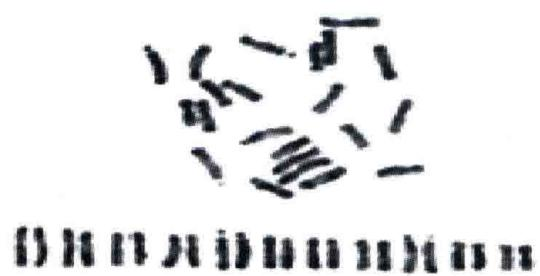  
图1-1 火柴头核型分析（陈建民等，2004）

此外，超微结构和微形态学特征也被用于被子植物的分类研究。例如，用扫描电镜（SEM）观察花粉、叶、种子和果实的表面细微特征，用透射电镜（TEM）研究韧皮部组织等，也在分类学中得到了很好的应用，使植物分类系统更加合理。

化学分类学（chemotaxonomy）由R. Hegnauer

于1958年首先提出，并在1962～1973年出版了6册《植物化学分类学》（Plant Chemical Taxonomy），按分类系统从低等的菌藻类植物开始，依次对苔藓植物、蕨类植物、裸子植物、单子叶植物和双子叶植物，分别描述了不同类群植物的化学成分特征及其分类系统学的关系。植物化学分类学的主要研究任务是探索各分类等级（如门、纲、目、科、属和种等）所含化学成分的特征和合成途径；探索和研究各化学成分在植物系统中的分布规律，以及以经典分类学为基础，综合植物化学组成（大分子或小分子）特征，结合其他有关学科，进一步研究植物的系统发育。

血清分类学（serotaxonomy）是用血清学的方法研究植物间的相关性或进行的植物分类，其结果与依据形态学等资料所得亲缘关系相关或相近，能在一定程度上反映物种间的相似性。

数量分类学（numerical taxonomy）是一门将数学、统计学原理和计算机技术应用于生物学的科学，它是用数量方法评价有机体类群之间的相似性，并根据其相似值把类群归属更高阶层的分类群（taxa）。数量分类学是以表型特征为基础，利用有机体大量性状、数据，按一定的数学模型（model），应用电子计算机运算得出的结果，从而客观地对有机体进行定量比较。目前，图论、概率论、信息论、统计数学和模糊数学等都已应用于分类学。已用的分析方法有主成分分析、聚类分类以及分支分类等。化学分类学与数量分类学的产生是植物分类学在20世纪的重大事件（英国，V.H.Heywood）。

## 二、植物分类的等级与命名法则

## (一) 植物分类的各级单位

为了有效地识别多样性的植物种类和系统地表示植物间的亲缘关系与系统发生的时序性，对全部植物进行分门别类，按照植物类群的阶元（或等级）系统，所给予的一定名称，就是分类上的各级阶元（或单位）（表1-1）。

各级阶元根据需要可再分成亚级，即在各级阶元之前，加上一个亚（sub-）字，如亚门、亚纲、亚目、亚科、亚属。种下面又分为亚种、变种和变型。现以水稻为例，说明它在分类上所属的各级阶元。

表1-1 植物分类的基本单位

<table><tr><td>中名</td><td>拉丁文</td><td>英文</td></tr><tr><td>界</td><td>Regnum</td><td>Kingdom</td></tr><tr><td>门</td><td>Divisio</td><td>Division</td></tr><tr><td>纲</td><td>Classis</td><td>Class</td></tr><tr><td>目</td><td>Ordo</td><td>Order</td></tr><tr><td>科</td><td>Familia</td><td>Family</td></tr><tr><td>属</td><td>Genus</td><td>Genus</td></tr><tr><td>种</td><td>Species</td><td>Species</td></tr></table>

界 植物界（Regnum vegetable）
门 被子植物门（Angiospermae）
纲 单子叶植物纲（Monocotyledoneae）
亚纲 颖花亚纲（Gillminorae）
目 禾本目（Poales, Graminales）
科 禾本科（Poaceae, Gramineae）
属 稻属（Oryza L.）
种 稻（Oryza sativa L.）

## （二）物种的概念及其意义

在进化论产生之前，分类学家根据生物的表型特征来识别和区分物种。就生物分类的目的而言，物种是生物界可依据生物表型特征识别和区分生物的基本单位。从进化的观点来看，物种是生物进化过程中从量变到质变的结果，是自然选择的历史产物。也就是说，物种是进化的，是在进化中产生的。

早在17世纪，John Ray（1686～1704年）在其《植物史》（1692年）一书中把物种定义为“形态类似的个体之集合”，同时认为物种具有“通过繁殖而永远延续的特点”。林奈继承了John Ray的观点，他认为，物种由形态相似的个体组成，同种个体可以自由交配，并能产生可育的后代，而异种杂交则不育。达尔文打破了物种永恒性的传统观点，认为一个物种可变为另一个物种，物种之间存在着不同程度的亲缘关系。

由上可见，物种（或“种”）是指具有一定的自然分布区和一定的生理、形态特征的植物类群。一般在同一种内的个体间具有相同的遗传性状，而且彼此能进行自然交配并产生可育后代（即种间具有生殖隔离现象）。种是生物进化和自然选择的产物，是植物分类的基本单位。

物种虽具有相对稳定的形态特征，但又处于不断发展演化之中。如果种内某些个体之间具有显著差异，则可视差异的大小，分为亚种、变种和变型等。亚种除形态结构和生理上有显著特征外，还具有一定的自然分布区。变种在植物分类中是一个比较常用的单位，它与原有种只是在特征上存在较小的差别。例如，花色的变化、毛的有无、枝条下垂与否等，这些特征是种内个体在不同环境条件影响下所产生的可遗传的变异，如糯稻（Oryza sativa var. glutinosa Matsum.）。变型是同一种内的植物，在形态上表现出与原有种有差异的个体群，其变异更小，不稳定，也不能遗传，如树木的形态、叶色的变异等。

在栽培植物中，人们常以品种（cultivar）来评价或区分种内不同栽培群体类型。因此，品种是人类在栽培某一物种的过程中，基于经济意义和形态上的考虑，而选择出来的变异群体类型。确立品种的指标主要有色、香、味、植株大小、产量高低等，如苹果有国光、香蕉、红元帅等品种，小麦、玉米、水稻、菊花等具有更多的品种。品种只用于栽培植物，不用于野生植物，实际上是栽培植物的变种或变型。种内各品种间的杂交，称为近亲杂交。种间、属间或更高级的单位之间的杂交，称远缘杂交。育种工作者，常常遵循近亲易于杂交的法则，培育出新的品种。

## (三) 植物的命名

人们在生产和科学研究中，为了识别、掌握和利用植物，常常给不同种类的植物起不同的名称，借以区别它们，所以各国、各地区或各民族对某种植物都有他们自己的通俗称呼，即俗名。俗名地方通用，一说皆知，具有描述性，形象性，如七叶一枝花、人参、钻天杨、龙爪槐等。但俗名也有其局限性：存在同物异名（synonym）或异物同名（homonym）的混乱现象，如马铃薯在南京称洋山芋，在东北和华北多称土豆，在西北则称洋芋。同称白头翁的植物多达16种，分属于4科16属，造成识别和利用植物及成果交流等方面的障碍。

为避免混乱，很早以前，植物学家就对制定国际通用的植物命名法做了很多努力。1753年，瑞典植物学家林奈发表的《植物种志》（Species Plantarum）一书系统规范应用了双名法（binomial nomenclature），后被世界植物学家所采用。1867年8月，在巴黎，由Augustin Pyrame de Candolle（1778～1841年）等拟定，并经国际植物学会确认通过了国际植物命名法规（International Code of Botanical Nomenclature，ICBN）。此后，每5年1次举行国际植物学会议，对其补充和完善。

双名法是用两个拉丁单词作为一种植物的名称，第一个单词是属名，是名词，其第一个字母要大写；第二个单词为种名形容词（或种加词）（specific opithet）；后边再写上定名人的姓氏或姓氏缩写（第一个字母要大写），便于考证。这种国际上统一的名称，就是学名（scientific name）。学名的属名和种名形容词应为斜体字。例如，稻的学名是Oryza sativa L.，第一个词是属名，是水稻的古希腊名，是名词；第二个字是种名形容词，是栽培的意思；后边大写“L.”，是定名人林奈（Linnaeus）的首字母。

种以下的分类单位有亚种（subspecies）、变种（varietas）、变型（forma）等，这三个词的缩写为subsp.或ssp.（亚种）、var.（变种）、f.（变型）。其命名方法是在原种名之后，加上拉丁文亚种或变种或变型的缩写，然后再加上亚种名、变种名或变型名，并斜体书写，最后附以定名人姓氏或姓氏缩写。例如，蟠桃（Prunus persica var. compressa Bean.）为桃的变种，白丁香（Syringa oblata Lindl. var. alba Rehd.）为紫丁香的变种，龙爪槐（Sophora japonica L. f. pendula Loud.）是槐树的变型等。

植物的科名常根据本科中某一显著特征而来，或根据一科中最显著的某一属名而定，如茄科（Solanaceae）是由茄属（Solanum L.）而来。科及科以上各级单位的名称均正体书写。

## 三、植物分类检索表的编制和使用

植物分类检索表，是鉴定植物种类的重要工具之一，一般植物志、植物分类手册都有检索表，通过检索表，可以查找某一植物的科、属和种名。检索表有门、纲、目、科、属、种等分类单位的检索表，其中以分科、分属、分种三种检索表为主。

## (一) 植物分类检索表的编制

检索表的编制是根据拉马克（Jean-Baptiste Lamarck，法国，1744～1829年）的二歧分类原则，把原来的一群植物相对的特征性状分成相对应的两个分支，再把每个分支中相对的性状又分成相对应的两个分支，依次下去，直到编制的科、属或种检索表的终点为止。

检索表采取 “由一般到特殊” 和 “由特殊到一般” 的原则编制而成。首先必须将所采到的地区植物标本进行有关习性、形态上的记载，将根、茎、叶、花、果和种子的各种特点进行详细的描述和绘图。在深入了解各种植物特征之后，再按照各种特征的异同来进行汇同辨异，找出互相矛盾和互相显著对立的主要特征，依主要、次要特征进行排列，将全部植物分成不同的门、纲、目、科、属、种等分类单位的检索表。

## （二）植物分类检索表的类型和使用

检索表的式样一般有定距检索表、平行检索表和连续平行检索表三种。定距检索表将每一对互相矛盾的特征分开间隔在一定的距离处，而注明同样号码，如1-1、2-2、3-3等，每两个相对应的分支，都编写在距左边有同等距离的地方。每一个分支下边相对应的两个分支，较先出现的又向右退一个字格，这样继续下去，直到要编制的终点为止（参见本章第二节）。

在进行植物鉴定时，应根据需要选用检索表，也可以从纲开始检索直到种。要达到预期检索的目的，必须同时具备完整的检索表资料和所检索对象性状完整而有代表性的标本。检索鉴定时，首先要弄清植物各部的形态特征，尤其要仔细解剖和观察花的构造，掌握所要鉴定植物花的各类特征，然后沿着纲、目、科、属、种的顺序进行检索。在初步确定了所鉴定植物所属的科、属、种的基础上，再用植物志、图鉴、分类手册等工具书，进一步核对已检索到的植物的生态习性、形态特征描述，以确保检索鉴定的准确性。

使用检索表检索时应注意以下几点：①一定要熟悉每组对立特征的表述；②理解表述的特征的含义，不能猜测；③有关大小的特征，用数字定量化，不能揣测；④细微特征用足够放大倍数的放大镜进行观察，不能马虎；⑤新鲜的植物标本，常有颜色等的变化，不能仅通过对一个材料的观察就下结论，一定要对材料各部分以及多份标本进行观察研究，选取要点进行检索。

在查检索表时，若发现特征不够，应从不同方向继续推敲两个可能的答案，再核对植物体的全部特征，并与学名进行核对。在检索过程中，要求耐心细致，讲究科学性、准确性和唯一性。对一个初学者或分类学爱好者来说，要经常反复地练习使用检索工具，检索鉴定的过程也是学习和掌握分类学知识的过程。

## 第二节 | 植物界基本类群与演化规律

据考证，地球上最原始的植物是原核的藻类植物，诞生于38亿年前的海洋，陆地植物的出现至少有26亿年的历史。陆地上出现真核植物至少有20亿年。植物经过长期的进化发展，出现了形态结构、生活习性等方面的差别。有些类群繁盛起来，有些类群衰退下去。老的物种不断消亡（来自植物化石的证据），新的物种不断产生。植物从无到有、从少到多、从简单到复杂、从水生到陆生、从低级到高级，进化着并繁荣着（表1-2）。

表1-2 不同地质年代和时期占优势的各类植物

<table><tr><td>代(P.ra)</td><td>纪(Period)</td><td colspan="2">世(期)(距今百万年前)(Epoch)</td><td>植物进化与发展</td><td>优势植物</td></tr><tr><td rowspan="4">新生代(Cenozoic)</td><td rowspan="2">第四纪(Quaternary)</td><td>全新世(Holocene)</td><td>0.01</td><td rowspan="2">被子植物占优势,草本植物大发展</td><td rowspan="4">被子植物</td></tr><tr><td>更新世(Pleistocene)</td><td>2.6</td></tr><tr><td rowspan="2">新近纪(Neogene)</td><td>上新世(Pliocene)</td><td>7</td><td rowspan="2">森林衰落,草本植物发生</td></tr><tr><td>中新世(Miocene)</td><td>26</td></tr><tr><td rowspan="3">新生代(Cenozoic)</td><td rowspan="3">古近纪(Paleogene)</td><td>渐新世(Oligocene)</td><td>38</td><td rowspan="3">被子植物进一步发展,森林出现</td><td rowspan="3">被子植物</td></tr><tr><td>始新世(Eocene)</td><td>54</td></tr><tr><td>古新世(Paleocene)</td><td>65</td></tr><tr><td rowspan="6">中生代(Mesozoic)</td><td rowspan="2">白垩纪(Cretaceous)</td><td>后期</td><td>90</td><td>被子植物发展</td><td>被子植物</td></tr><tr><td>早期</td><td>136</td><td>裸子植物衰退</td><td rowspan="6">裸子植物</td></tr><tr><td rowspan="2">侏罗纪(Jurassic)</td><td>后期</td><td>166</td><td rowspan="2">松柏类裸子植物占优势,被子植物出现</td></tr><tr><td>早期</td><td>190</td></tr><tr><td rowspan="2">三叠纪(Triassic)</td><td>后期</td><td>200</td><td rowspan="2">真蕨繁茂,裸子植物大发展</td></tr><tr><td>早期</td><td>225</td></tr><tr><td rowspan="10">古生代(Paleozoic)</td><td rowspan="2">二叠纪(Permian)</td><td>后期</td><td>260</td><td>苏铁、银杏类植物繁茂</td></tr><tr><td>早期</td><td>280</td><td>木本蕨类衰退</td><td rowspan="5">蕨类植物</td></tr><tr><td rowspan="2">石炭泥(Carboniferous)</td><td>后期</td><td>325</td><td rowspan="2">蕨类森林形成,真蕨出现,种子蕨发展</td></tr><tr><td>早期</td><td>345</td></tr><tr><td rowspan="3">泥盆纪(Devonian)</td><td>后期</td><td>360</td><td rowspan="2">裸蕨类由繁茂至衰退种子蕨、苔藓植物出现</td></tr><tr><td>中期</td><td>370</td></tr><tr><td>早期</td><td>395</td><td rowspan="2">裸蕨植物出现,藻类植物繁茂</td><td rowspan="5">藻类植物</td></tr><tr><td>志留纪(Silurian)</td><td></td><td>430</td></tr><tr><td>奥陶纪(Ordovician)</td><td></td><td>500</td><td>海洋藻类植物繁茂</td></tr><tr><td>寒武纪(Cambrian)</td><td></td><td>570</td><td rowspan="2">真核藻类植物形成和发展</td></tr><tr><td>元古代(Proterozoic)</td><td></td><td colspan="2">570~1500</td></tr><tr><td>太古代(Archaeozoic)</td><td></td><td colspan="2">1500~5000</td><td>原核植物形成和发展</td><td>生命起源</td></tr></table>

在形形色色、多种多样的植物中，有的结构简单、低等而古老，常生活于水中或阴湿地方。植物体没有根、茎、叶的分化，其生殖器官常为单个细胞；受精卵不发育成胚，故称为无胚植物（non-embryophyta）或低等植物（lower plant）。低等植物包括藻类（algae）、菌类（fungi）、地衣（lichenes）等植物类群，有10多万种。有些植物，形态构造和生理上都比较复杂，绝大多数营陆生生活，常有根、茎、叶的分化（苔藓植物可例外），生活周期有明显的世代交替，生殖器官由多个细胞构成；由受精卵发育成胚，继而形成植物体，因此，又称有胚植物（embryophyta）或高等植物（higher plant）。高等植物包括苔藓植物（bryophyta）、蕨类植物（pteridphyta）和种子植物（seed plant）等植物类群，有30万种以上。在形形色色的植物中，通过单细胞的繁殖孢子传播扩散的植物称为孢子植物（spore plant）或隐花植物（cryptogamae），通过产生种子来繁衍生息的植物称为种子植物或显花植物（phanerogamae）。蕨类植物、种子植物因其植物体有维管组织的分化，而被称为维管植物（vascular plant）。苔藓植物、蕨类植物的雌性生殖器官为颈卵器（archegonium），而裸子植物也有退化的颈卵器，因此将三者合称为颈卵器植物（archegoniatae）。

植物界的分门并不统一。根据多数学者的观点，植物界可分为15门（表1-3）。低等植物包括11门，高等植物为4门。本书在介绍有关“门”的基础上，同时按藻类、菌类、地衣、苔藓、蕨类、裸子植物和被子植物七大类群加以介绍。

表1-3 植物界基本类群  
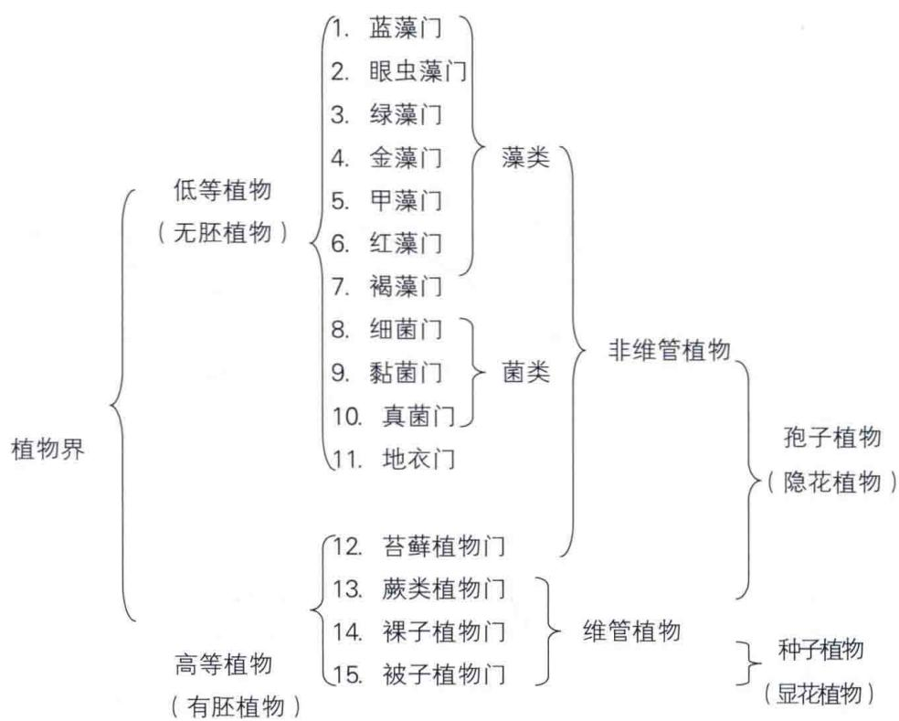

植物界各门及其主要特征检索表：

1. 植物体无根、茎、叶的分化，生殖器官为单细胞（极少数为多细胞）结构，合子直接发育成植物体而不形成胚……低等植物

2. 植物体不为菌、藻共生体

3. 细胞内含有叶绿素或其他光合色素，为自养植物 …… 藻类植物（Algae）

4. 原核生物 蓝藻门（Cyanophyta）

4. 真核生物

5. 植物体为单细胞，无细胞壁，具鞭毛，能游动……眼虫藻门（裸藻门）（Euglenophyta）

5. 植物体为单细胞、群体或多细胞个体，绝大多数有细胞壁

6. 细胞内色素与高等植物相同，细胞壁由纤维素构成，储藏物质为淀粉……绿藻门（Chlorophyta）

6. 细胞内色素与高等植物不同，大多数种类的细胞壁为纤维素或硅质，储藏物质不是真正的淀粉

7. 细胞内含有叶绿素a、叶绿素d、黄色素和藻红素，储藏物质为红藻淀粉……红藻门（Rhodophyta）

7. 细胞内含有叶绿素a、叶绿素c
8. 植物体无单细胞和群体类型，通常为大型海藻，细胞内除含叶绿素a、叶绿素c外还有褐藻黄素，呈褐色，储藏物质为海带多糖和甘露醇……褐藻门（Phaeophyta）
8. 多为单细胞个体，细胞内含有较多的叶黄素
9. 细胞壁常呈套合的两半，有些种类为无隔多核的分枝丝状体或球状体，储藏物质为金藻淀粉和油……金藻门（Chrysophyta）
9. 植物体常为花纹的甲片相连而成，储藏物质为淀粉和脂肪……甲藻门（Pyrrophyta）
3. 细胞内不含叶绿素，异养植物（除少数细菌外）……菌类植物（Fungi）
10. 原核生物……细菌门（Schizomycophyta）
10. 真核生物
11. 植物体在营养阶段为裸露的原生质体（无壁），能运动，吞食固体食物……黏菌门（Myxomycophyta）
11. 植物体在营养阶段有细胞壁，常呈丝状体……真菌门（Eumycophyta）
2. 植物体为菌、藻共生体……地衣门（Lichenes）
3. 植物体有根、茎、叶分化，生殖器官为多细胞结构，合子在母体内发育成胚……高等植物
12. 植物体内无维管束，配子体占优势，孢子体寄生在配子体上……苔藓植物门（Bryophyta）
12. 植物体有维管束
13. 孢子繁殖。孢子体发达，配子体退化，各自独立生活……蕨类植物门（Pteridophyta）
13. 种子繁殖。孢子体发达，配子体寄生在孢子体上……种子植物门（Spermatophyta）
14. 无子房构造，胚珠裸露……裸子植物门（Gymnospermae）
14. 有真正的花，胚珠包被在子房内，不裸露……被子植物门（Angiospermae）

## 一、藻类植物

## (一) 藻类植物的一般特征

藻类植物（Algae）是一群具有光合色素、能独立生活的自养原植体（没有根、茎、叶分化）植物（thallophyte）。现存的藻类植物有2万种左右，多生于海水或淡水，或潮湿的土壤、树皮和石头上。我国有海水藻类2400种以上，淡水藻类约9000种。

藻类植物植物体为单细胞个体或多个细胞的丝状体、球状体、片状体或枝状体等。

藻类植物的繁殖有营养繁殖、无性繁殖和有性生殖等方式。生活史过程具有核相交替（如衣藻、水绵等）和世代交替（如海带、紫菜等）两种。世代交替是在植物的生活史过程中，二倍体的孢子体世代（或称孢子体阶段、无性世代）和单倍体的配子体世代（或称配子体阶段、有性世代）有规律交替出现的现象。

## (二)藻类植物的代表与分类

藻类植物不是一个自然类群。根据藻类植物所含的色素、植物体细胞结构特征、鞭毛的有无和着生的位置与类型、光合色素的种类、储藏的养料、生殖方式等的不同，将其分为蓝藻门（Cyanophyta）、绿藻门（Chlorophyta）、裸藻门（Euglenophyta）、金藻门（Chrysophyta）、甲藻门（Pyrrophyta）、褐藻门（Phaeophyta）、红藻门（Rhodophyta）七门（表1-4），现选其主要者简述如下。

表1-4 藻类植物4个代表门的主要特征比较

<table><tr><td>门</td><td>藻体形态结构</td><td>色素成分</td><td>储藏物质</td><td>细胞壁的主要成分</td><td>繁殖方法</td><td>鞭毛</td><td>生境</td><td>种数</td></tr><tr><td>蓝藻门</td><td>原核生物,单细胞、丝状体、叶状体</td><td>叶绿素a、藻蓝素、藻红素、胡萝卜素、叶黄素</td><td>蓝藻淀粉</td><td>果胶、黏多糖、肽聚糖</td><td>营养繁殖,无性繁殖</td><td>无</td><td>多生于海洋、污水,少陆生</td><td>2000</td></tr><tr><td>绿藻门</td><td>单细胞、群体、叶状体、丝状体</td><td>叶绿素a、叶绿素b、胡萝卜素、叶黄素</td><td>淀粉</td><td>纤维素</td><td>营养繁殖,无性繁殖、有性生殖(同配、异配、卵式)</td><td>2~8根等长鞭毛,顶生</td><td>分布广泛</td><td>8600</td></tr><tr><td>褐藻门</td><td>多细胞丝状体,或有组织分化的组织体</td><td>叶绿素a、叶绿素c、胡萝卜素、墨角藻黄素</td><td>褐藻淀粉、甘露醇</td><td>纤维素加褐藻胶</td><td>营养繁殖、有性生殖(同配、异配、卵式)</td><td>2根不等长鞭毛,侧生</td><td>绝大多数生于浅海中</td><td>1500</td></tr><tr><td>红藻门</td><td>绝大多数为叶状体、丝状体、枝状体,极少为单细胞</td><td>叶绿素a、藻蓝素、藻红素、胡萝卜素、叶黄素</td><td>红藻淀粉</td><td>纤维素或琼脂、鹿角菜胶</td><td>无性繁殖、有性生殖(卵式)</td><td>无</td><td>绝大多数生于寒冷浅海中</td><td>4410</td></tr></table>

## 蓝藻门

## 1）主要特征

蓝藻门（Cyanophyta）是最简单、也是最原始的自养植物类群。植物体或单细胞或多细胞丝状群体。蓝藻门植物细胞的原生质体分化为周质（periplasm）（色素片层等分布其中）和中央质（centroplasm）（常位于细胞中央，主要由染色质组成），没有真正的核结构，属于原核生物（procaryote）。周质中没有载色体（chromatophore），但有光合片层（photosynthetic lamella），含有叶绿素a、藻蓝素（phycocyanobilin），故植物体常呈蓝绿色，有的因含有藻红素（phycoerythrin），而呈其他色泽。储藏物质为蓝藻淀粉（cyanophycean starch）（图1-2）。

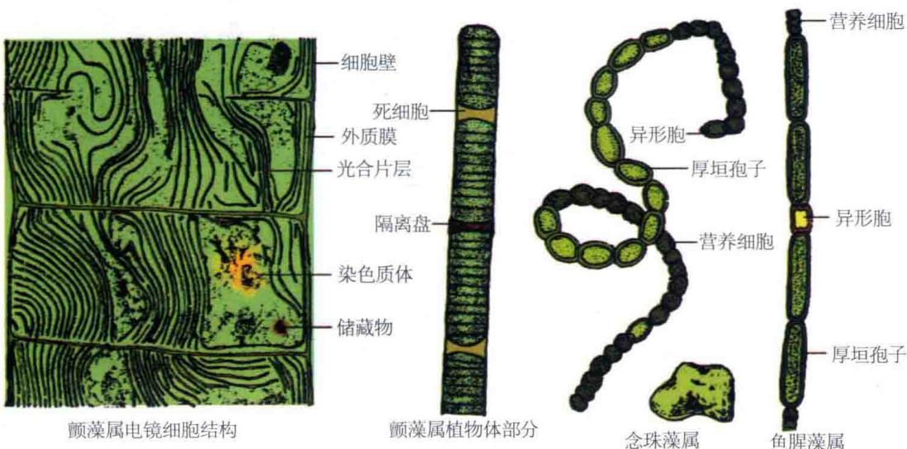  
图1-2 蓝藻

蓝藻门植物的繁殖方式主要为营养繁殖和无性繁殖，无有性生殖。营养繁殖通过细胞的直接分裂，故蓝藻又称裂殖藻（schizophyceae）。分裂时细胞中部向内生出新横壁，初生如环，逐渐向心扩展，直至将原生质体分为两半，中央质也同时分为两半。单细胞类型，其细胞分裂后，子细胞分离形成新的单细胞个体；群体类型是细胞反复分裂后，形成更多细胞的大群体，群体破裂后形成小群体；如果为丝状体，其丝状体可作断离繁殖。断离的丝状体段，称为藻殖段（hormogonium）。藻殖段由异形胞（heterocyst）或厚垣孢子（akinete）分隔形成。与厚垣孢子相比，异形胞较小、壁厚，所含物质均匀透明，与营养细胞连接的两端鼓胀，呈乳头状突起（papillae）。厚垣孢子是无性繁殖的结构，类似内生孢子（endospore），萌发之前，原生质体分裂发育形成新的植物。

蓝藻门植物约有150属，2000种，多数种类植物生于淡水中，海水中也有，甚至在85℃温度的热水泉中也有蓝藻的分布。还有的则附生于别的植物体上、光石上，或树干上等的阴湿之处，或与真菌共生形成地衣。

## 2）代表属种

## (1) 念珠藻属 (Nostoc)

念珠藻属植物生于水中、湿地或草地上，植物体为念珠状丝状群体，或外有公共的胶质鞘所包被的片状体。细胞为圆球形，丝状体上有异形胞和厚垣孢子（图1-2）。常见种如可食用的葛仙米（N. commune Vauch.）和发菜（N. flagelliforme Born. et Flah.）等，钝顶螺旋藻（Spirulina platensia L.）呈螺旋状，其蛋白质含量高达60%\~70%，长期食用该植物能降低胆固醇、抗癌和养胃护肝。

## (2) 鱼腥藻属 (Anabaena)

鱼腥藻属与念珠藻属相近，念珠状的丝状体无胶质鞘包被，营养细胞为球形或圆筒形，厚垣孢子较长或较大。有的鱼腥藻属植物能固定游离的氮，如能生长在满江红属（Azolla）植物的体内，固定游离态氮（图1-2）。

## 绿藻门（Chlorophyta）

## 1）主要特征

绿藻是最常见的藻类植物，90%的淡水藻类是绿藻，陆地上阴湿处或海水中也有少量分布。绿藻或附着生长，或浮游生活。有些种类与真菌共生成为地衣，有的则生活于绿水螅（Hydra viridis）体内。

绿藻的形态结构多样，有单细胞、群体型的球状体、丝状体、片状体和“茎叶体”。多数种类的游动细胞有2根或4根等长的顶生鞭毛。

绿藻植物细胞结构、细胞壁成分、胞内色素及其所储藏的养分与高等植物相似。细胞壁外层为果胶质，内层为纤维素。绿藻色素存在于载色体（含1个至几个蛋白核）中，有叶绿素a、叶绿素b、叶黄素和胡萝卜素。储藏的养料有淀粉和油类。

绿藻有营养繁殖、无性繁殖和有性生殖（同配、异配和卵式生殖）三种繁殖方式。

绿藻门是藻类植物中最大的一个门，约430属，8600种。一般将绿藻门分为绿藻纲（Chlorophyceae）和轮藻纲（Charophyceae）两个纲。

## 2）代表属种

## (1) 衣藻属 (Chlamydomonas)

衣藻属有100种以上，多生于有机质丰富的淡水中。植物体为单细胞，卵形，细胞内有1个核，一个杯状载色体，载色体中有淀粉粒（或称蛋白核），细胞前端有2条等长的鞭毛，其基部有2个伸缩泡，旁边有1个红色眼点。衣藻（Chlamydomonas reinhardtii Dang.）进行无性繁殖时，其营养细胞失去鞭毛，原生质体分为2团、4团、8团、16团，各形成具有两根鞭毛的游动孢子（zoospore）。游动孢子形成后，母细胞成为游动孢子囊，囊壁破裂后放出新个体。衣藻有性生殖为同配或异配，少为卵式生殖（oogamy）。同配生殖（isogamy），即结合的两个配子形状相似，大小相同。异配生殖（gamete），即结合的两个配子形状相似，大小不同，与游动孢子相似。配子结合，形成具有4条鞭毛的合子，以后再形成厚壁的合子（zygote）。休眠后，经过减数分裂，产生4个游动孢子。当合子壁破裂后，游动孢子散出新的衣藻个体（图1-3）。

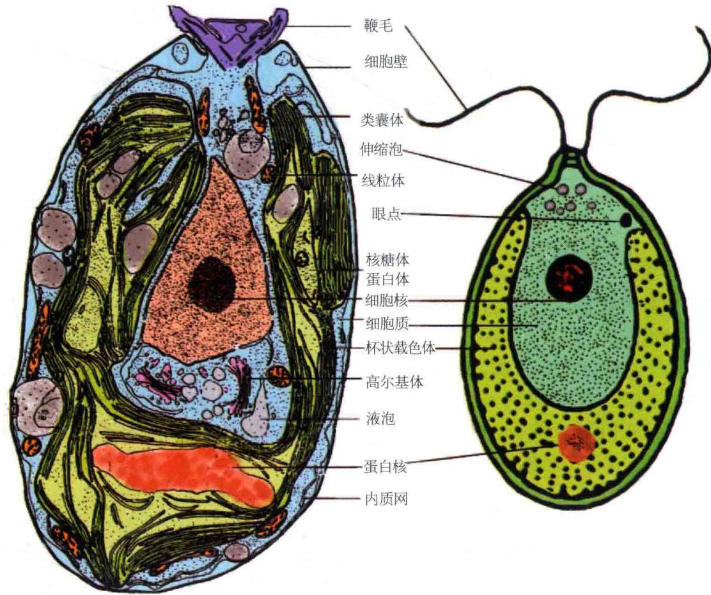  
图1-3 衣藻结构

## (2) 水绵属 (Spirogyra)

水绵属植物是最普通的淡水绿藻，分布于静水中。植物体为不分枝的丝状体，由许多圆筒状细胞连接而成。细胞壁外有很厚的果胶质，手感滑腻。细胞核位于细胞中央，通过原生质丝与贴近细胞壁的细胞质相连，有一个大液泡和一条至多条呈带状螺旋环绕于细胞质的载色体，载色体有多个淀粉粒。水绵以细胞分裂和丝状体的折断进行营养繁殖。水绵的有性生殖通过接合生殖（conjugation）方式进行。在春秋季节，具有性别差异的两条藻丝并列靠近，相对的细胞分别产生突起，并生长、接触直至接触点融通形成接合管（conjugation tube）。同时，各细胞中的原生质体收缩成为配子，其中一条藻丝中的全部配子分别以变形虫式运动到另一条藻丝的对应细胞中，并与其内的配子融合成合子（2n），这样的生殖方式称为梯形接合（scalariform conjugation）。合子形成后，产生厚壁，休眠，藻体腐解。环境适宜时，合子减数分裂，形成新的单倍体孢子，由此萌发形成新的个体（图1-4）。此外，水绵还可在同一藻丝体上以相邻两两细胞间进行侧面接合（lateral conjugation）的方式完成有性生殖。

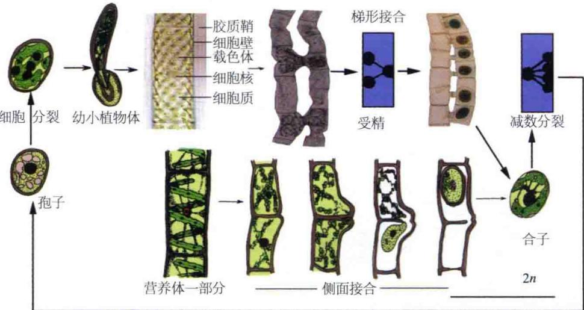  
图1-4 水绵属生活史

## (3) 轮藻属 (Chara)

轮藻属分布于流动缓慢、富含钙质的淡水中，如浅湖、池塘、稻田等。轮藻有灭蚊作用，凡轮藻多的地方，往往孑了很少。

轮藻属植物体直立多分枝，以单列多细胞的无色假根（rhizoid）固着于底泥。高10～60cm。体被钙质。枝顶有一个可持续生长的大型顶细胞（apical cell）。主枝和侧枝有“节”与“节间”之分，“节间”由有一个多核的中央大细胞和数个细长的外围细胞组成。“节”部生“侧枝”，“侧枝”的“节”上有轮生的“叶”（图1-5）。

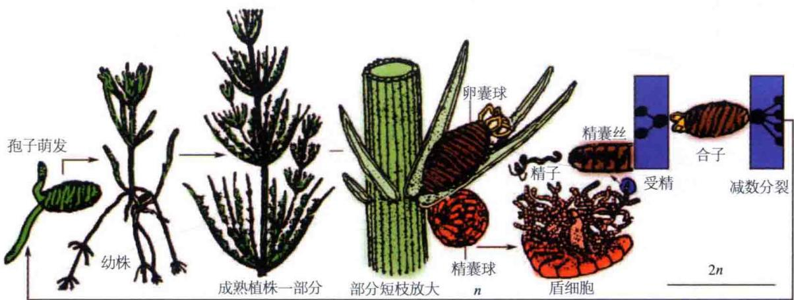  
图1-5 轮藻属生活史

轮藻的生殖只行卵式生殖。生殖器官的结构较其他藻类复杂、高级。雌性生殖结构称为卵囊球（oogonium nucule），雄性生殖结构称为精囊球（spermatangium或spermed-producing antheridia）；前者位于节之上侧，后者位于节之下侧。卵囊球卵形，由1个位于中央的卵细胞、5个螺旋形管细胞（tube cell）及其先端各一个冠细胞所组成。精囊球呈球形，由8个三角状的盾细胞（shield cell）组成，其细胞内的载色体呈橘红色。盾细胞内侧生有数个盾柄细胞（manubrium），盾柄细胞上生出1～2个头细胞和次生头细胞。次生头细胞上生出几条精囊丝（antheridia filament），其上每一个细胞中各有一个精子。精子放出后，进入卵囊球与卵结合形成受精卵。受精卵经休眠以后，减数分裂发育形成新的个体。轮藻的营养繁殖以藻体断裂为主。轮藻的枝状体基部也可长出珠芽，由珠芽长成植物体。

## 3. 红藻门（Rhodophyta）

## 1）主要特征

植物体多数为多细胞丝状体或假组织的片状体，很少是单细胞个体。

细胞壁分两层，内层由纤维素组成，外层为琼胶、海萝胶等红藻特有的果胶化合物。载色体含叶绿素a、类胡萝卜素、叶黄素、藻红素和藻蓝素，藻体多为红色或紫红色。储藏物质主要是红藻淀粉（floridean starch）。

繁殖方式有无性繁殖和有性生殖两种。无性繁殖产生静孢子，有性生殖为卵式生殖。

红藻门有550多属，4000多种，生于淡水或海水中，且多数种类固着生活。

## 2）代表属种

紫菜属（Porphyra）藻体为单层或双层细胞组成的叶状体，以固着器固着于基质上，细胞有1～2个星状载色体，载色体中央为一个蛋白核，紫菜一般长度为20～30cm，我国常见栽培及分布的紫菜有甘紫菜、圆紫菜和长紫菜等，现以甘紫菜（P. tenera Kjellm）为例介绍紫菜的生活史。

甘紫菜是雌雄同株植物，水温在15℃左右时，产生性器官。雄性生殖结构称精子囊，藻体的任何一个营养细胞，都可转变为精子囊器，其原生质体分裂形成64个精子囊，每个精子囊含有一个精子；雌性生殖结构又称为果孢（carpogonium），是由一个普通营养细胞稍加变态形成的。果孢子的一端或两端可产生突起，形成受精丝，果孢子内则含一个经转化而成的卵核。精子放出后可随水流漂至受精丝，并由此进入果胞内与卵核结合，形成二倍体的合子。合子经过分裂，形成8个果孢子。果孢子成熟后，落到文蛤、牡蛎或其他软体动物的壳上，萌发进入壳内，长成单列分枝的丝状体，即壳斑藻。壳斑藻产生壳孢子，由壳孢子萌发为夏季小紫菜，其直径约3mm。当水温在15℃左右时，壳孢子也可直接发育成大型紫菜。夏季因水中温度高，不能发育成大型紫菜，故小紫菜产生单孢子，发育为小紫菜。在整个夏季，小紫菜不断产生，不断死亡。大型紫菜也可以直接产生单孢子，发育成小紫菜。晚秋水温在15℃左右时，单孢子萌发为大型紫菜（图1-6）。

红藻门中的许多植物可以食用、药用和纺织工业用。从海萝 [Gloiopeltis furcata (P.et R.) J.Ag.] 中可提取海萝胶来浆丝，如广东的香云纱；可食用的植物除著名的蔬菜紫菜外，还有石花菜（Gelidium amansii Lamx.）、江篱 [Gracilaria confervoides (Huds. Paperfuss)] 等。此外，鹧鸪菜 [Caloglossa leprieurii (Mont.) J.Ag.]、海人草（Digenea simplex C.Ag.）常用作小儿驱虫药，以及从石花菜属、江篱属、麒麟菜属（Eucheuma）中提取琼胶（agar）做培养基等。

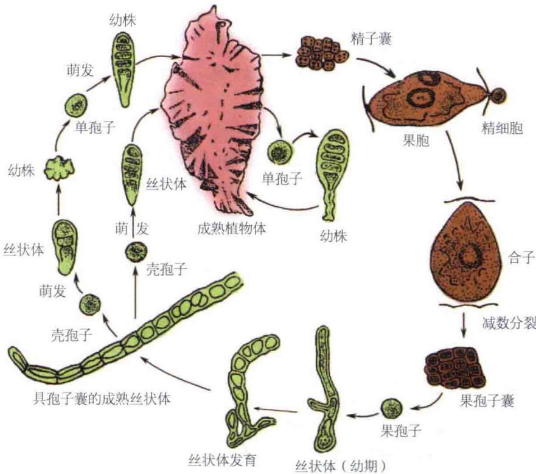  
图1-6 甘紫菜生活史

## 4. 褐藻门（Phaeophyta）

## 1）主要特征

褐藻植物体均为多细胞分枝的丝状体，直立或匍匐，或分枝的丝状体相互紧贴成假薄壁组织体，或分化成具有“表皮”、“皮层”和“髓”的假组织体，或有假根、假茎和假叶分化的巨大树状，如巨藻属（Macrocystis）等。

细胞壁的组成物质主要是纤维素和藻胶。载色体含叶绿素a、叶绿素c、胡萝卜素及叶黄素，且以可利用短波光的墨角藻黄素含量较多，藻体呈褐色。储藏物质主要是褐藻淀粉（laminarin）（或称海带糖，一种水溶性的多糖）和甘露醇（mannitol），有的种类（如海带），其体内含碘量很高。

褐藻的繁殖方式有营养繁殖、无性繁殖和有性生殖。有些种类以断裂方式进行营养繁殖；无性繁殖产生游动孢子和静孢子。褐藻有性生殖有同配、异配或卵配生殖。游动孢子和配子都具有侧生的2根不等长的鞭毛，一般向前的一根较长，向后的一根较短。褐藻植物有同形世代交替（isomorphic alternation of generations）和异形世代交替（heteromorphic alternation of generation）。同形世代交替即孢子体世代与配子体世代形状、大小相似。异形世代交替即孢子体发达，生活时间长，配子体小，经历时间短。

本门植物属于冷水藻类，几乎全为海产，且多见于寒带海水中，营固着生活，是“海底森林”的主要组成植物。本门约有250属，1500种。

## 2）代表属种

海带（Laminaria japonica Aresch）生长在比较寒冷的海洋中，植物体长达十几米，分为三部分：上部为平扁的带片（食用部分），下部为杆状的柄（其组织分为表皮、皮层和髓，髓中有类似筛管的构造，其功能为运输养分），基部为分枝的根状固着器（有些种类呈盘状）。藻体发育到一定时期，带片的两面丛生出许多棒状孢子囊，孢子母细胞经减数分裂产生许多单倍体的游动孢子，分别形成丝状的雌配子体或雄配子体。雌配子体、雄配子体小，雌配子体产生具卵细胞的卵囊，雄配子体产生具精子的精子囊，在卵囊口精卵结合，合子不离母体，萌发成新的孢子体（小海带）。所以，海带的世代交替为异形世代交替（图1-7）。

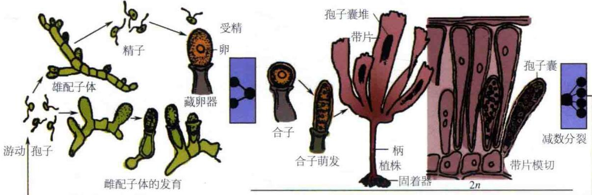  
图1-7 海带生活史

褐藻中除海带外，鹿角菜（Pelvetia siliguosa Tseng et C.F.Chang）、裙带菜 [Undaria pinnatifida（Harv.）Suringar] 等可食用或药用，马尾藻属（Sargassun）的植物还可作饲料或肥料。从马尾藻等植物中提取的褐藻胶、甘露醇、碘氯化钾、褐藻淀粉等，已用作食品或医药工业原料。

## （三）藻类植物与人类的关系

藻类植物是一类高度多样的植物类群，在地球表面的水生生态系统和湿地生态系统中发挥着重要的作用。由于自然环境的变化和人类经济活动的影响，特别是随着工业化、城市化进程的快速发展，以及不合理的水资源开发和利用的影响，我国的湖泊、水库、江河、溪水、沼泽、池塘、泉水等各种内陆水体的水质明显下降，藻类植物的生存面临前所未有的威胁，水体中藻类多样性水平降低，群落结构趋向简化，在许多污染严重的水体中，有些藻类已处于濒危状态，有必要尽早采取积极措施进行保护。

藻类植物具有重要的经济价值。人类对藻类的利用由来已久，应用领域广泛。

工业上提取藻胶。藻类是碘、琼脂、角叉菜胶（carrageenin）、藻酸和钾碱等的来源，在褐藻和红藻中可提取许多物质，如取自褐藻的藻胶酸，可制耐火性更强的人造纤维，作为食品工业中的稳定剂、牙医的牙模型材料，还能使染料、皮革、布匹等增加光泽，使水泥、混凝土、沥青更加不透水，以及提高生丝的质量等。琼胶和卡拉胶被广泛应用于食品、造纸、纤维板以及许多建筑工业。硅藻沉积成的硅藻土用作吸附剂、磨光剂、滤过剂、保温材料，或橡胶、化妆品、涂料等的填充剂，甚至在废水氧化池中用作消化剂。同时硅藻化石也是研究古地理、古气候和石油勘探的重要指示证据。

农业上蓝藻固氮。目前，世界上已知有70多种、我国有10多种固氮蓝藻，它们能增加稻田或水体的氮素营养。

藻类食品。人们常食用的蓝藻有葛仙米、发菜、海泡菜，绿藻有溪菜、石莼、浒苔、海松，褐藻有海带、裙带菜、羊栖菜、鹿角菜；红藻有紫菜、石花菜、海萝、麒麟菜、鸡冠菜、江篱等。据研究，小球藻含蛋白质50%、脂肪4%\~30%，其营养价值相当于鸡蛋的5倍、花生仁的2倍。蓝藻还含蛋白质类纤维和多种微量元素与维生素，成为未来食品来源中最有发展前途的重要藻类之一。海藻富含维生素A、维生素B $_{1}$ 、维生素B $_{6}$ 、维生素C、维生素D、维生素E、维生素K和微量元素硼、钴、铜、锰、锌、碘、钾、铁、镁和钙等，因此，增加藻类食品的摄入有利于健康。

藻类与鱼类关系密切。小型藻类，都直接或间接是鱼、虾的饵料，如甲藻为海产贝类的饵料，有“海洋牧草”之称。

此外，硅藻、甲藻等死亡后沉积海底，成为古生代含油地层中的主要化石。石油勘探中，常以硅藻、甲藻化石为石油蕴藏的依据。藻类用于废水处理，大大减少了常规废水处理中有毒化学品的使用。用藻类来生产优质的生物燃料，在未来能源领域具有广阔的应用前景。

## 二、菌类植物

## (一)菌类植物的一般特征

菌类植物通常是指不具有色素，不能进行光合作用，营异养生活的一类植物的总称。菌类植物除光合硫细菌、硝化细菌等极少数种类外，专营寄生或腐生生活。菌类植物分布广泛，在水中、陆地、动植物体内外都能见到。

菌类植物的繁殖有细胞分裂、营养繁殖、无性繁殖和有性生殖几种方式。生活史过程中，单倍体阶段长，二倍体阶段短。

菌类植物约有120 000种，分属细菌门（Schizomycophyta）、黏菌门（Myxomycophyta）和真菌门（Eumycophyta），其形态结构、繁殖方式和生活史等特征各不相同。菌类植物不是一个有自然亲缘关系的类群。

## （二）菌类植物的分类与代表植物

## 1. 细菌门（Schizomycophyta）

细菌是单细胞的原核生物（图1-8），一般有几微米大小，无色素，异养型，没有真正的核结构。细菌分布广，水、空气、土壤和许多动植物体内都有细菌。

根据细菌的形态，可将其分为球菌、杆菌和螺旋菌三类。球菌球状或半球状，直径0.5～2μm，一般无鞭毛。杆菌细胞呈棒状，长1.5～10μm，宽0.5～1μm。螺旋菌细胞细长而弯曲。多数杆菌和螺旋菌只有几微米，且其生活史的某一个阶段有鞭毛，能游动。

根据细菌获取营养方式的不同，分为寄生细菌和腐生细菌两类。寄生细菌能致人畜和植物病害，如水稻的白叶枯病、棉花的角斑病、花生的青枯病以及常见的蔬菜软腐病等都是细菌引起的。腐生细菌分布最广，它们生活在动物、植物的残体上和含有机物的土壤及污水中，人及动物的消化道中也有此类细菌存在，它们通过分解有机物质获取养料，营养自身。有少数细菌能利用二氧化碳自制养料，因而是自养的，如硝化细菌、铁细菌能借氧化作用获得能量制造养料，红硫细菌和红螺细菌含有细菌叶绿素，则是光合自养的细菌。

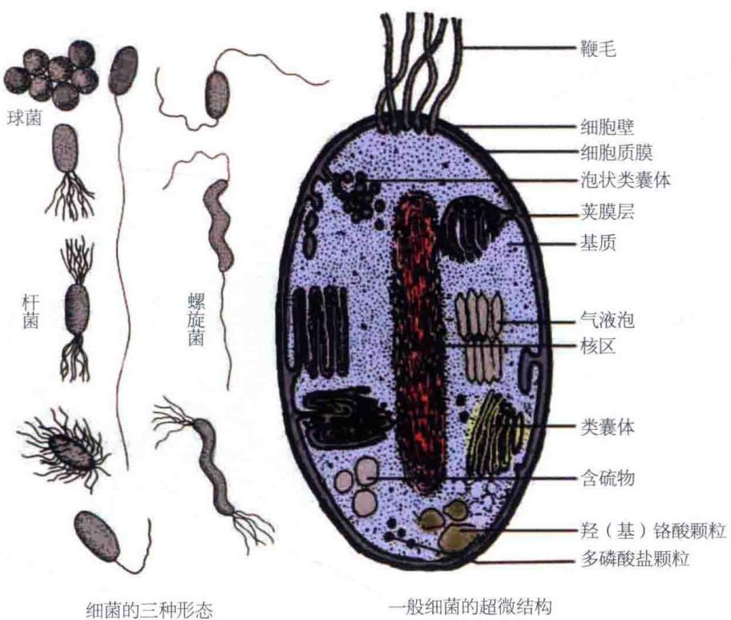  
图1-8 细菌的三种形态与一般细菌细胞的结构示意图

细菌的生殖方式是细胞分裂，一分为二。环境适宜时，细菌繁殖速度极快，可20～30min分裂一次，形成新的一代；环境不宜时，细菌可形成芽孢（spore），芽孢原生质体凝缩，其外包被着一层含脂肪、坚厚而不透水的壁，具有很强的抗不良环境的能力。细菌的芽孢能忍受约-253℃的低温，并且在沸水中30h不死，当环境再次适宜时，它们可重新萌发生长。

## 黏菌门（Myxomycophyta）

## 1）主要特征

黏菌约有500种，兼有动物和植物的特性。在生长期或营养阶段，菌体裸露、无细胞壁，呈多核的原生质体团，无叶绿素、异养，似变形虫（amoeba）式运动和吞食固体食物。繁殖时节或在劣境条件下，产生具纤维素壁的孢子，似真菌。因此，黏菌是介于动物和真菌之间的一类生物。

## 2）代表属种

发网菌属（Stemonitis）是黏菌中最常见、最广泛分布的一类，发网菌的营养体为裸露的原生质团，称变形体。变形体呈不规则的网状，直径数厘米，在阴湿处的腐木上或枯叶上缓缓爬行。在无性繁殖时，变形体爬到干燥光亮的地方，形成很多的发状突起，每个突起发育成一个具柄的孢子囊（子实体）。孢子囊通常呈长筒形、紫灰色，外有包被（peridium）。孢子囊柄伸入囊内的部分，称囊轴（columella），囊内有孢丝（capillitium）交织成孢网。然后原生质团中的许多核进行减数分裂，原生质团被割裂成许多块单核的小原生质团，每块小原生质团分泌出细胞壁，形成一个孢子，藏在孢丝的网眼中。成熟时，包被破裂，借助孢网的弹力将孢子散出。孢子在适宜的环境下，萌发成具两条不等长鞭毛的游动细胞。游动细胞的鞭毛可收缩成变形体状的细胞，称变形菌胞。有性生殖时，由游动细胞或变形菌胞两两结合，形成合子，合子不经过休眠，合子核进行多次有丝分裂，形成多个双倍体核，构成一个多核的变形体（图1-9）。

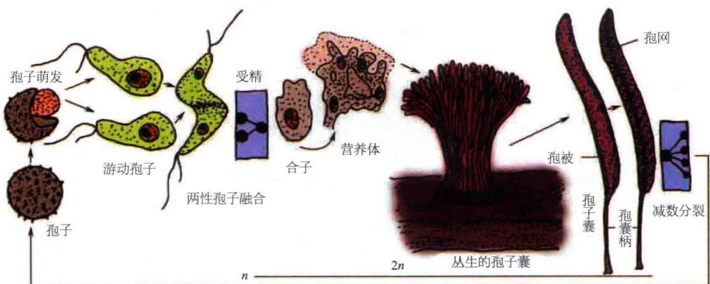  
图1-9 发网菌属生活史

## 3. 真菌门（Eumycophyta）

真菌是一类不含叶绿素、异养的真核生物。与细菌不同的是真菌的细胞都有细胞核，细胞壁多含几丁质（chitin），也有含纤维素的。大多数真菌由菌丝（hypha）构成，菌丝是纤细的管状体，组成一个菌体的所有菌丝称菌丝体（mycelium）。菌丝分为有隔菌丝（septate hypha）和无隔菌丝（nonseptate hypha）两种。某些高等真菌在环境条件不良或进入生殖阶段时，菌丝会相互密结形成具有特定形态的菌丝组织体，常见的有根状菌索（rhizomorph）、菌核（sclerotium）、子座（stroma）。

真菌因其不含光合色素而营异养生活。有的寄生，有的腐生。有的以腐生为主，兼寄生生活，而有的则以寄生为主，兼腐生生活。真菌中的绝对寄生者少，但常常是农作物病害的主要病原菌，如小麦秆锈菌（Puccinia graminis Pers.）、稻瘟菌（Piricularia oryzae Cav.）、玉米黑粉菌（Ustilago zeae L.）等。

真菌的繁殖方式有营养繁殖、无性繁殖和有性生殖三种。营养繁殖以菌丝断裂方式进行。无性繁殖可产生多种类型的孢子，孢子内生（即生于孢子囊内）或外生，如麦类白粉菌（Erysiphe graminis DC.）的分生孢子（图1-10）。有性生殖有同配生殖、异配生殖和卵式生殖等方式，低等真菌多为同配生殖或异配生殖，较高等的真菌，如子囊菌亚门的种类，有性生殖过程在子囊果（ascocarp）中完成，子囊果内有子囊（ascus），子囊内产生子囊孢子（ascospore）；担子菌纲的种类有性配合后形成担子（basidium），担子内产生担孢子（basidiospore）。子囊孢子和担孢子是有性结合后产生的孢子，与无性繁殖产生的孢子不同。

在真菌的生活史中，单倍体无性阶段所占的时间长，而有性生殖形成的二倍体合子很快进行减数分裂，形成单倍体的繁殖孢子。因此，真菌没有明显的世代交替，但有单倍体和二倍体的核相交替。

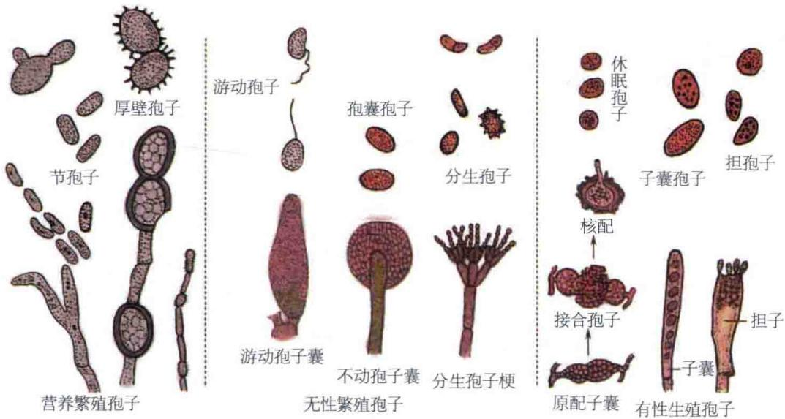  
图1-10 真菌的三类孢子

真菌的种类很多，有3800多属，7万～10万种，广布于陆地、水体及大气，而尤以土壤中最多，滋生于各种动物、植物的残体上，主要寄生于各类植物上，许多动物及人体上也有真菌寄生。Ainsworth（1971～1973年）将真菌分为鞭毛菌亚门、接合菌亚门、子囊菌亚门、担子菌亚门和半知菌亚门5个亚门，为多数人接受，现列其检索表如下。

## 1. 无真正的菌丝体，如有菌丝体，一般不具横隔壁

2. 无性繁殖产生单鞭毛或双鞭毛的游动孢子，有性生殖产生卵孢子……鞭毛菌亚门（Mastigomycotina）
2. 无性繁殖产生不动的孢囊孢子，有性生殖产生接合孢子……接合菌亚门（Zygomycotina）
1. 有真正的菌丝体，菌丝有横隔壁
3. 有性生殖阶段已经明了
4. 有性生殖时产生子囊，子囊内产生子囊孢子……子囊菌亚门（Ascomycotina）
4. 有性生殖时产生担子，担子中产生担孢子……担子菌亚门（Basidiomycotina）
3. 有性生殖阶段不清楚，甚至只知其菌丝体而未发现任何孢子……半知菌亚门（Deuteromycotina）

1) 鞭毛菌亚门（Mastigomycotina）

## (1) 基本特征

鞭毛菌亚门菌类除少数单细胞个体外，绝大多数是分枝的丝状体。菌丝多核，繁殖期菌丝的基部产生横隔，形成一个能产生单鞭毛或双鞭毛游动孢子的特定细胞。有性生殖时产生卵孢子（oospore）或休眠孢子；低等的种类为同配生殖或异配生殖。本亚门约有1100种，大多数是水生、两栖生，少数陆生、腐生或寄生。

## (2) 代表属种

## 水霉属（Saprolegnia）

水霉可生活在死鱼、蝌蚪、昆虫等尸体上，是鱼体上常见的一种病原菌。菌丝体无隔壁、多核，呈白色、多分枝的绒毛状。由短的根状菌丝（钻入寄主组织，吸收寄主养料）和众多细长、分枝繁茂的菌丝组成。无性繁殖时，菌丝的顶端稍膨大，在膨大部分的基部产生横隔壁，形成一个长筒形的游动孢子囊，其内产生的游动孢子呈球形或梨形，顶生两条鞭毛，称初生孢子。初生孢子形成不久，鞭毛收缩，变为球形的静孢子。不久静孢子萌发变成一个具侧生鞭毛的肾形游动孢子，称次生孢子。次生孢子不久又变为静孢子。静孢子在新寄主上萌发，再发育为新菌丝体。这种具两种游动孢子的现象，称双游现象（diplanetism）。营养不良，水霉进入有性生殖，菌丝顶端分别膨大形成精囊和卵囊。在精囊和卵囊内分别产生精子和卵，精卵结合后形成厚壁的合子或卵孢子。卵孢子休眠后经减数分裂和有丝分裂，发育成新的无隔菌丝体（图1-11）。

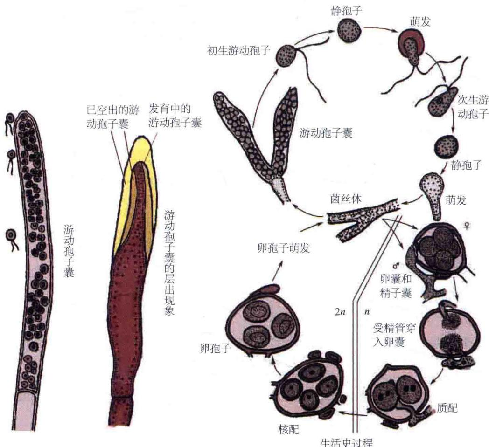  
图1-11 水霉属的游动孢子囊及生活史

## 2）接合菌亚门（Zygomycotina）

## (1) 主要特征

营养体由无隔、多核菌丝所组成。无性繁殖产生孢囊孢子，有性生殖产生接合孢子。接合菌是由鞭毛菌类向无鞭毛菌类演变的类群，也是由水生向陆生发展过渡的类群。本亚门约610种，有腐生、兼性寄生、寄生或专性寄生等营养类型。

## (2) 代表属种

根霉属（Rhizopus）

本属为腐生菌，最常见的是匍枝根霉 [R. stolonifer（Ehrenb. ex Fr.）Vuill]，又称黑根霉、面包霉。生于面包、馒头等淀粉类的食物上，会使食物腐烂变质。菌丝体由分枝、不具横隔壁的菌丝组成，含多个细胞核。菌丝常横生，向下生有假根；向上可生出孢子囊梗，其先端分隔形成孢子囊，其中生有许多孢子（内生孢子）。孢子成熟后呈黑色，当散落在适宜的基质上时，就萌发成新菌丝（图1-12）。

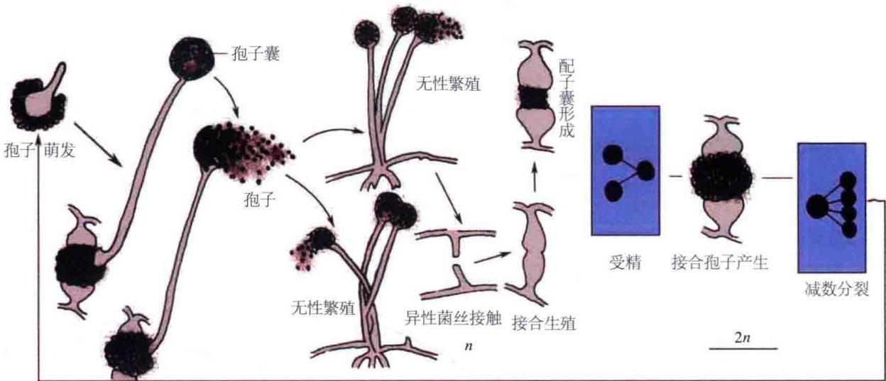  
图1-12 黑根霉生活史

黑根霉的有性生殖为接合生殖。在异性菌丝接触处产生短枝，两短枝的顶端膨大，产生横壁，使短枝与菌丝隔开，顶端形成配子囊（gametangium），横壁下部是配子囊柄（gametangiophore）。两个配子囊成熟后，它们之间接触的壁溶解，使原生质体融合为一体，形成合子。不久它的外壁加厚，合子休眠后，经过减数分裂，开始萌发，突破厚壁长出一直立不分枝的菌丝，顶端形成一个孢子囊，孢子囊里产生孢子，由孢子再发育成新的个体。黑根霉常使蔬菜、水果、食物等腐烂。

接合菌亚门中常见的还有毛霉属（Mucor）的毛霉，也广泛分布于自然界中。根霉和毛霉含有大量的淀粉酶，能将淀粉分解为葡萄糖。在酿酒业中，先利用毛霉和根霉制成“酒曲”后再酿酒。根霉和毛霉也能产生脂肪酶，分解脂肪，使羊毛脱脂，羊皮软化。

## 3）子囊菌亚门（Ascomycotina）

## (1) 主要特征

子囊菌亚门除酵母菌属（Saccharomyces）类为单细胞个体外，大多数为多细胞有机体，菌丝有隔。无性繁殖时，单细胞的种类出芽繁殖，多细胞的种类产生分生孢子。有性生殖时产生子囊，子囊内两性结合后的核经减数分裂，一般形成8个子囊孢子。本亚门子实体（产生孢子的结构）称为子囊果，其周围包被着由交织的菌丝构成的子囊果的壁，子囊果内排列着子囊层（子实层，hymenium）和与之相间的侧丝（paraphysis）。子囊果有3类。①闭囊壳（cleistothecium）。子囊果呈球形，无孔口，完全闭合。②子囊壳（perithecium）。子囊果呈瓶形，顶端有孔口，这种子囊果常埋于子座（stroma）中。③子囊盘（apothecium）。子囊果呈杯碟状，子实层常露在外。子囊果的有无和形状是分纲的主要依据（图1-13）。

质配  
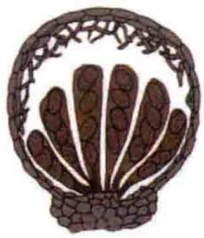  
闭囊壳

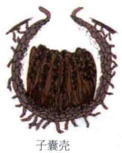  
图1-13 子囊果的三种类型

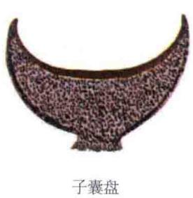

子囊菌种类繁多，类型复杂，约有1950属，15 000种。

## (2) 代表属种

## ①酵母菌属

本属是本亚门中最原始的种类，植物体为单细胞，卵形，有一大液泡，核很小。酵母菌的重要特征是出芽繁殖：首先母细胞的一端形成一个小芽——芽生孢子（blastospore），芽生孢子长大后脱离母细胞，成为新的酵母菌；有时芽生孢子可相连成为假菌丝（图1-14）。有性生殖时合子不转变为子囊，以芽殖法生二倍体的细胞，由二倍体的细胞转变成子囊，减数分裂后形成4个子囊孢子。酵母能无氧发酵，将糖类分解为二氧化碳和乙醇。酿酒酵母（Saccharomyces cerevisiae Hansen）是现代生物学研究最重要的模式生物之一。

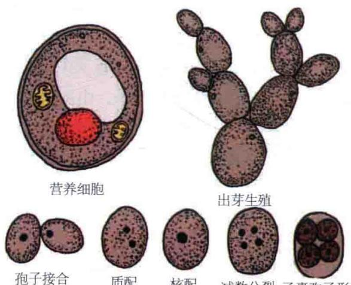  
核配  
减数分裂 子囊孢子形成  
图1-14 酵母属

## ②青霉属（Penicillium）

本属真菌最普遍，常滋生于水果、蔬菜及各种潮湿的有机质上，常使储藏的柑橘和苹果腐烂，引起青霉病。主要以分生孢子繁殖，从菌丝体上产生很多分生孢子梗，梗的先端分枝数次，呈扫帚状，最后的分枝称为小梗（sterigma），生小梗的枝称为梗基（图1-15）。小梗上生有一串分生孢子，青绿色。有性生殖仅在少数种中发现，形成闭囊壳。黄青霉（P.chrysogenum Thom.）和点青霉（P.nototum Westl.）等能分泌抗生素——青霉素（penicillin）。

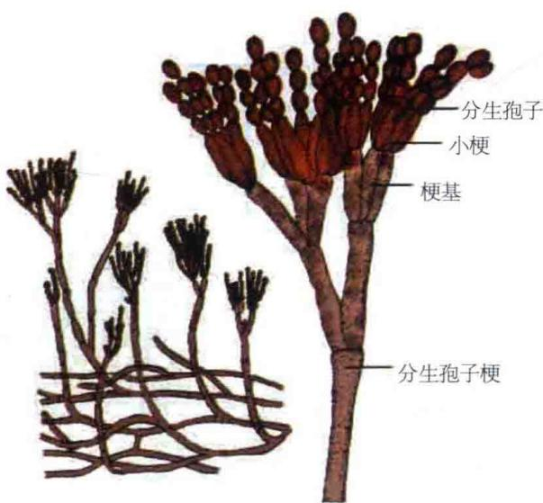  
图1-15 青霉属

## ③麦角菌属（Claviceps）

本属有麦角菌 [C.purpurea（Fr.）Tul]，其子囊壳瓶状，主要寄生于麦类的子房中，形成黑色坚硬的菌核，状似角，称为麦角（ergot）；麦角制剂可作收敛子宫、子宫出血或内部器官出血的止血剂，人畜误食也常会发生中毒、流产，甚至死亡。

4）担子菌亚门（Basidiomycotina）

## (1) 主要特征

担子菌都是多细胞有隔菌丝体，其菌丝有初生菌丝和次生菌丝之分。由担孢子萌发成单核、有隔且多分枝的菌丝称为初生菌丝；由部分初生菌丝经有性结合后的双核细胞分裂而来的双核菌丝称次生菌丝，由次生菌丝发育成子实体（又称担子果）。

担子菌的营养繁殖产生节孢子（arthrospore）、厚壁孢子（chlamydospore）或芽孢（blastospore）；无性繁殖可产生分生孢子（conidium或conidiospore）、粉孢子；有性生殖产生担子，担子经减数分裂形成担孢子，担孢子萌发形成新的单核菌丝。

担子菌类型多样，约有900属，22 000多种。多数种类是植物专性寄生菌和腐生菌，可食用、药用，但有毒的种类也不少，因此，担子菌与人类关系密切。

## (2) 代表属种

## ① 锈菌目（Uredinales）

本目菌类为专性寄生菌，主要的寄主为种子植物和蕨类植物，初生菌丝可形成性孢子，次生菌丝可产生秋孢子、夏孢子和冬孢子。大部分锈菌以冬孢子越冬。冬孢子萌发时，经减数分裂产生担孢子。锈菌种类极多，有5000余种。不同孢子的产生有一定的顺序。禾病锈菌（小麦秆锈病菌）（Puccinia graminis Pers.）生活史中有两个不同寄主，称转主寄生（heteroecism）。第一寄主为小麦、大麦、燕麦及其他禾本科植物，第二寄主为小檗属（Berberis）或十大功劳属（Mahonia）等属的某些植物（图1-16）。

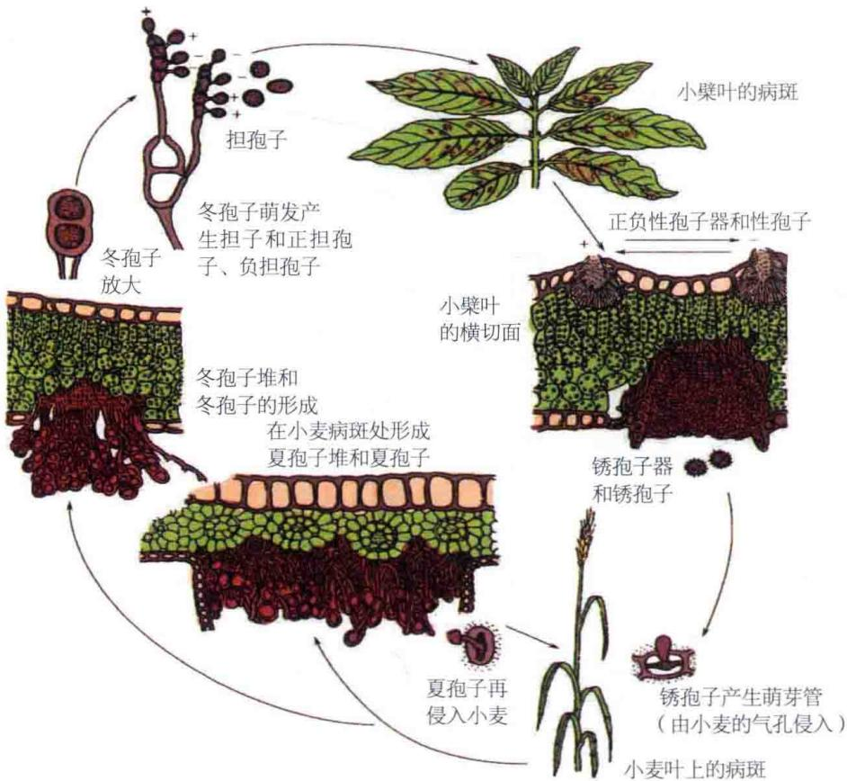  
图1-16 禾柄锈菌生活史

## ②伞菌目（Agaricales）

本目多数种类为腐生菌。子实体肉质，少革质、栓质或膜质。具有伞状或帽状的菌盖（pileus）和菌柄（stipe）。菌柄大多数中间生。菌盖的腹面为辐射状或放射状的菌褶（gill），子实层生于菌褶的两面，担子果幼嫩时常有内菌幕（partial veil）遮盖着菌褶。菌盖充分生长发育展开时，内菌幕破裂，在菌柄上残留着的部分常形成环状的菌环（annulus）。有些种类有外菌幕（universal veil）包围子实体，菌柄延长时外菌幕破裂后在菌柄基部的残留称菌托（volva）。

伞菌目的种类较多，已知的约有3250种。其中蘑菇属（Agaricus）的子实体有菌盖、菌柄和菌褶三个主要部分。菌盖肉质伞形，菌柄中生、柱状肉质，菌褶膜质。现多人工栽培。本目菌的子实体除味美可食外，还供药用，其所含的多糖类抗癌效力很强（图1-17）。

## ③ 多孔菌目（Polyporales）

本目子实体无菌褶，一年生至多年生，木质、栓质、肉质、蜡质、炭质、海绵质、酪质，稀胶质。形状多种多样，蹄形、扇形、半球形和珊瑚枝状等。担子单细胞，无分隔，担孢子4个。本目种类繁多，构造复杂，常生于树干或木材上，致木腐朽。例如，灵芝［Ganoderma lucidium（Leyss.ex Fr.）Karst］生于栎属或其他阔叶树干基部、干部或根部，子实体木质或木栓质，有侧生柄或无柄，有坚硬而光泽的皮壳。

本目植物在我国西北、华北、华中、西南、华东各省和台湾均有分布。有些可作为中药，用于健脑，治神经衰弱、慢性肝炎、消化不良，对防止血管硬化和调节血压也有一定效能，有些可用作滋补剂。

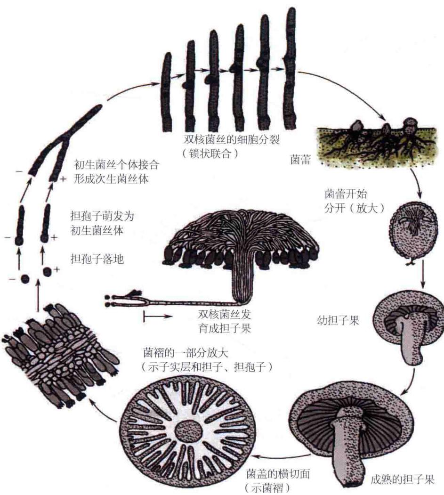  
图1-17 蘑菇属生活史

## 5) 半知菌亚门 (Deuteromycotina)

本亚门的菌类多为有隔菌丝体，在其生活史中，还只知其无性繁殖，有性阶段尚未发现。为了分类上的需要，人为地将这类真菌归纳为一亚门。半知菌大多是子囊菌亚门的无性阶段，少数是担子菌亚门的无性阶段，如发现其有性阶段，则按其有性特征进行归类。

本亚门已知有1800余属，26 000余种，其中约有300属是农作物和森林病害的病原菌，还有些属是能引起人类和一些动物皮肤病的病原菌。常见的农作物病害有引起水稻稻瘟病的稻瘟菌，引起水稻纹枯病的水稻纹枯菌（Rhizoctonia solani Kühn）和引起棉花炭疽病的棉花炭疽菌[Colletotrichum gossypii（Southw.）Edgerton]等（图1-18）。

## （三）菌类植物与人类的关系

菌类植物是自然物质的分解者。在自然界的物质循环中，菌类植物占有很重要的地位。菌的活动，对碳与氮的循环尤为重要。经菌类的活动，动植物残体腐烂分解成二氧化碳和水等简单的化合物，重新为植物所利用。土壤中不能被植物利用的物质转化成可利用的物质，森林下的枯枝落叶分解成腐殖质，增加土壤肥力。

真菌常通过产生胞外蛋白、有机酸和其他代谢产物来提高其适应严酷环境（如污染严重的环境）的能力。在工业生产中产生的废水往往富含金属、无机营养和有机化合物等，如果不进行净化处理直接排放将导致环境的持续恶化。白腐菌（Phanerochaete chrysosporium）被发现具有高效的废水处理能力，也被认为在土壤生物修复中具有潜在的应用价值。

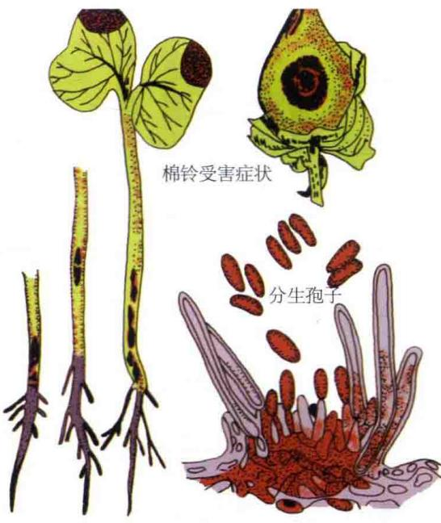  
分生孢子盘  
幼苗受害症状  
图1-18 棉花炭疽菌

除真菌外，细菌在环境净化中的作用不可忽视。某些光合细菌可在污染严重的水体环境下生存，并在其自身的代谢活动中降解有机物，发挥净化水质的作用。

在传统的食品工业中，食品的发酵生产是菌类利用中最广泛的应用领域。酵母菌、乙酸菌、乳酸菌、霉菌等是食品加工业中最常用的微生物，因而与人们的日常生活密切相关。酵母菌是面包、馒头、葡萄酒等的加工和生产中必不可少的常用真菌，而酸奶、泡菜的生产也离不开乳酸菌的发酵作用。此外，霉菌则被用于酱油、豆腐乳等的加工。石油原油的分解，以及制革、造纸、制糖和制作面包等都与菌类植物的利用有关。

人类经常食用的菌类植物主要是大型真菌。在我国，已知可用于食用的菌类多达350余种，常见的有隶属于担子菌亚门的香菇 [Lentinula edodes (Berk.) Pegler]、草菇 [Volvariella volvacea (Bull.ex Fr.) sing.]、蘑菇、黑木耳 [Auricularia auricula (L. ex Hook.) Underwood]、银耳 (Tremella fuciformis Berk.)、猴头 [Hericium erinaceus (Bull.Fr.) Pers]、竹荪 [Dictyophora indusiata (Vent.ex Pers) Fisch]、松口蘑 [Tricholoma matsutake (S.Ito. et Imai) Sing.]、红菇 (Russula lepida Fr.)、金针菇 [Flammulina velutipes (Curt. Fr) Sing] 和牛肝菌 (Boletus impolitus Fr.) 等，以及少数子囊菌亚门的种类 [如羊肚菌，Morchella esculenta (L.) Pers.等]。不同种类的食用菌具有各自独特的风味或专一的营养价值，除了直接采收野外自然生长的可食性真菌外，人类还掌握了食用菌栽培技术，不断地培育出新型的食用菌。

在农业上，根瘤菌属（Rhizobium）和梭状芽孢杆菌属（Clostridium）及固氮菌属（Azotobacter）等，都能摄取大气中的游离态氮（ $N_{2}$ ），合成有机态氮，直接或间接供给绿色植物。利用某些菌类植物还可制成生物肥料。例如，“5406”菌肥实际上就是放线菌类（Actinomycetes）的生物肥料，它能提高土壤肥力，刺激作物生长，并能抑制有害微生物活动。

在医药卫生方面，菌也有极广泛的用途。例如，预防和治疗疾病的抗血清以及常见的链霉素、四环素、土霉素、氯霉素等抗生素，都是由菌类植物中制取的。此外，灵芝、猴头菌有滋补、健生效能，可治疗胃炎和胃溃疡等，所含的多糖类还有抗癌效能。茯苓则有健脾宁心之功效，冬虫夏草能补肺益肾、止咳化痰。猪苓 [Grifula umbelletta (Pers.ex.fr)Pilat.]、茯苓 [Poria cocos (Schw.) Wolf.]、木耳、银耳等也都有很高的医药功能。

此外，菌对人类及动物、植物的健康生活有直接影响。致病菌能使人、禽、畜及植物生病受害，甚至造成死亡，如痢疾、伤寒、鼠疫、霍乱、白喉、破伤风、水稻白叶枯病、白菜霜霉病等。

## 三、地衣植物门

## (一) 地衣的一般特征

地衣（Lichenes）植物是一类由1种藻类与1种真菌建立的紧密共生关系而形成的多年生复合有机体（symbiotic plant），它们是一类特殊的低等植物类群。通常，将地衣中的真菌称为地衣型真菌（或共生菌），藻类称为共生藻。

地衣植物中真菌和藻类之间的共生关系具有一定程度的专一性，并非所有的真菌都可与藻类建立稳定的共生关系。地衣型真菌中绝大多数隶属于子囊菌纲，少数为担子菌纲和半知菌纲的种类。地衣中的共生藻类主要为隶属于绿藻门（共球藻属，Trebouxia；橘色藻属，Trentepohlia）和蓝藻门（念珠藻属、伪枝藻属，Scytonema）的种类。在一般情况下，菌类占地衣的大部分，藻类则在复合体的内部，成一层或若干团。藻类为整个植物体制造养分，而菌类则吸收水分与无机盐，为藻类制造养分提供原料，并围裹和保护藻细胞。

地衣的主要形态与类型有如下几种。

① 壳状地衣（crustose lichen） 植物体薄质扁平，呈壳状紧贴于树皮、岩石或其他基质的表面，如文字衣属（Graphis）（图1-19）。此类地衣群体外观上形成各色条带或板块，如橙衣属（Caloplaca）呈红色，微孢衣属（Acarospora）呈黄色，茶渍属（Lecanora）呈绿色。有些壳状地衣甚至可包埋在岩石中生长。壳状地衣约占全部地衣的80%。

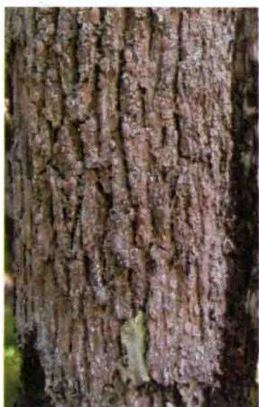  
壳状地衣

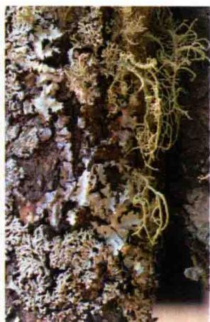  
叶状与枝状地衣

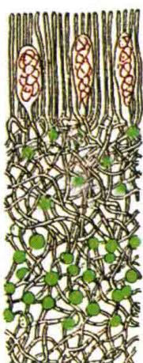  
同层地衣

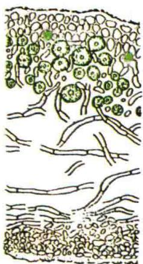  
异层地衣  
图1-19 地衣植物的形态与结构

② 叶状地衣（foliose lichen） 植物体薄片状，具背腹性，上表面和下表面差异显著。较高级的类型可为网状分枝状。具分枝的叶状地衣顶部和基部表面明显不同，因而可以将它们与绝大部分枝状地衣区分开来。叶状地衣一般通过细小的菌丝假根与基质接触，易于采下，如生于草地上的地卷属（Peltigera）和生长在岩石或树皮上的梅花衣属（Parmelia）及袋衣属（Hypogymnia）等（图1-19）。

③枝状地衣（fruticose lichen） 植物体直立，通常分枝，呈丛生状，是最为高级的地衣。其分枝在外形上更接近于“真正的”分枝，如石蕊属（Cladonia）、松萝属（Usnea）等（图1-19）。

此外，还有丝状地衣（filamentous lichen），如毡衣属（Ephebe）；皮屑状地衣（leprose lichen），如癞屑衣属（Lepraria），以及鳞片状（squamulose lichen）地衣，如小皿叶衣（Normandina pulchella）等一些过渡或中间类型。

根据地衣植物中藻体的分布规律，在结构层次上将其分为同层地衣（homolomerous lichen）和异层地衣（heteromerous lichen）两种结构类型。

同层地衣没有明显的藻胞层，其上、下“皮层”都有藻类细胞和真菌的菌丝呈交织状混合一起，中部菌丝稀疏，藻细胞均匀分布其中，下皮层的一些菌丝伸入基质内，具有吸收和固着作用，壳状地衣多为同层地衣。异层地衣具有明显的藻胞层，其藻类细胞集中排列于上皮层下方，形成绿色藻层。叶状地衣、枝状地衣一般为异层地衣。在显微镜下观察，典型的叶状地衣的叶状体部位，可以区分出上皮层、藻胞层、髓层和下皮层4个结构层次。最顶层是由共生菌的菌丝密集地交结在一起形成外层的保护层，称为上皮层。在上皮层内侧是由包埋在非常密集交织的菌丝中的藻细胞组成的藻胞层。每个藻细胞或藻细胞群通常由菌丝包裹着，有时则被吸器穿透。在藻胞层下，是由松散地交织在一起的菌丝组成的无藻细胞分布的髓层。在髓层以下的下表面部分，在结构上与上表面相似，菌丝紧密地交织，称为下皮层。下皮层上常带有假根或绒毛等结构，借此叶状体贴于其生长的基质上（图1-19）。有时地衣还含有真菌代谢产物组成的结构，如壳状地衣的皮层内还有多糖。

地衣植物的繁殖主要取决于地衣型真菌的类型和特性。其繁殖有营养繁殖、无性繁殖和有性生殖三种类型。

① 营养繁殖 是地衣最普通的繁殖方式。地衣的营养繁殖体主要有珊瑚芽、粉芽和碎裂片（lobules）3种主要形式。珊瑚芽是叶状体表面的扩展部分，可以是圆柱状的、球状的或十字分枝状的或耳垂状的。20%\~30%的叶状地衣和枝状地衣具有珊瑚芽。珊瑚芽是叶状体顶部的细小结构。粉芽是菌丝交织结构中的藻细胞细束，与珊瑚芽不同，粉芽不含皮层，相反，它们与叶状体的髓层（medulla）更为相似，极易自叶状体上脱离。碎裂片是生活的裂片，它生长在叶状地衣叶状体的边缘，它们的结构扁平，可以从叶状体上脱离后随风或水分布。

② 无性繁殖 地衣的藻类及真菌成员都可以产生无性繁殖的孢子。藻类的孢子可以独立生长发育，而真菌的孢子发芽后，幼菌丝若未找到合适的藻类细胞便会立即死亡。地衣型真菌的无性孢子由粉子腔（pycnidia）内产生，故这类孢子特称为粉子（pycnospores）。地衣中的藻类通常以二分分裂法在地衣叶状体内繁殖。

③ 有性生殖 是以其共生的地衣型真菌独立进行的。若共生真菌为子囊菌则产生子囊和子囊孢子，若为担子菌则产生担子和担孢子。地衣型真菌中子囊菌种类最多，子囊衣类地衣的藻胞层中的一些菌丝分化为囊卵胞（ascogonia）与精胞（spermogonia），两者接触，受精的囊卵胞发芽而伸出双核菌丝，即囊原菌丝，在其先端形成子囊，其中的两个核结合成接合子，并进行减数分裂形成8枚囊孢子。此类孢子自子囊释放后萌发成菌丝，待遇到适合的共生藻细胞后才可继续生存。

地衣植物分布广泛，它们可以在各种自然基质（树皮、岩石、土壤、苔藓和其他地衣）上生长，偶然地也可在人工表面（水泥、金属）上生长。

## (二) 地衣的分类

全世界有地衣约500属，25 000多种。地衣植物在形态、构造、生理和遗传特性上既完全不同于共生菌，也有别于共生的藻类。因此，在分类上，通常将地衣独立为一门。根据其共生真菌的门类将地衣植物分为子囊衣纲（Ascolichens）、担子衣纲（Basidiolichens）和半知衣纲（Deuterolichens）3个纲。

子囊衣纲的地衣种类最多，占地衣总数量的99%，约有18个目。属于担子菌的地衣型真菌约50种，分属白蘑目、鸡油菌目和展齿革菌目3个目。此外，还有少数种类属半知衣纲，为无子实体地衣或地衣型真菌，如白角衣属（Siphula）、地茶属（Thamnolia）、癞屑衣属（Lepraria）和绒枝属（Leprocaulon）等，它们的归属尚未完全确定。

## （三）地衣植物与人类的关系

地衣植物在结构上是植物界最奇特的类群，地衣体中藻菌间互惠共生关系的建立在很大程度上扩展了藻类和真菌的生态位，使地衣本身能在其他类群植物无法生存的干热贫瘠地区正常地生长，如壳状地衣往往是裸露岩石上唯一生长着的植物。地衣在生长过程中常不断地向体外分泌地衣酸，腐蚀岩石，借此加速岩石的风化和成土过程，因而，地衣植物是自然界名副其实的拓荒者。同时，地衣还是自然界最主要的先锋植物，地衣死亡后遗留下来的有机质，为岩石发育成土奠定了基础，也为苔藓植物等迁入、生长和定居创造了条件。

地衣植物也是一类对大气污染非常敏感的植物，空气中极少量的二氧化硫也能使其逐渐死亡。枝状地衣对大气污染最为敏感，叶状地衣次之，壳状地衣则抗污染能力最强。因此，地衣可作为污染监测的指示植物，根据地衣多样性、种群和时空分布的变化等监测空气污染的程度和对生态系统的影响等。

某些地衣被认为具有药用价值。粉芽肺衣（Lobaria pulmonaria Hoffm.）和槽梅衣（Parmelia sulcata Tayl.）用于肺病，犬地卷［Peltigera canina（L.）Willd.］则被用于狂犬病的治疗。在民间医学中，有些种类的地衣还被制作成“茶”而加以利用。例如，滇西北藏族和纳西族将白雪茶、红雪茶和青雪茶等作为传统保健茶。

有些地衣可以食用，石耳属（Umbilicaria）味道鲜美，在中国、日本和北美洲等地被广泛食用。有时，鹿蕊属（Cladina）及冰岛衣［Cetraria islandica（L.）Ach.］也用作救荒食物，但绝大部分地衣口味苦涩，营养价值较低。

在工业上，地衣主要用作染料和香料工业的原料。据记载，古罗马人用染料衣（Roccella tinctoria DC.）经发酵而获得一种紫罗兰色染料。而从梅衣属（Parmelia）、肉疣衣属（Ochrolechia）和扁枝衣属（Evernia）等地衣中提取的褐色染料仍用于羊毛的染色，并有杀菌作用。香料工业中则以拟扁枝衣属（Pseudevernia）、扁枝衣属（Evernia）地衣为原料加工提取物。石蕊、染料衣、红粉衣（Ochrolechia tartarea Mass.）可提取酸、碱指示剂；石蕊试纸就是以石蕊等地衣为原料生产的。此外，地衣植物还在控制土壤侵蚀方面发挥重要的作用。

但有的地衣可危及森林，尤其对茶树、柑橘之类危害较大，常以假根穿入寄主的皮层构成危害。

## 四、苔藓植物门

## (一)苔藓植物的一般特征

苔藓植物（Bryophyta）植株矮小，最大的也只有数十厘米。多生于阴湿处的土壤、林中树皮和朽木上，少数生于水中或岩石上。它们虽然脱离水生环境进入陆地生活，但大多数仍需生长在潮湿地区，它们是植物从水生到陆生过渡的代表类型。

苔藓植物结构简单，是一群小型的非维管高等植物。较低级的种类其植物体为扁平的叶状体，比较高级的种类其植物体有类似茎、叶的分化，称为拟茎叶体，但都没有维管组织和真根。只有假根，假根是单细胞或单列细胞组成的丝状分支结构，有吸收水分、无机盐和固着植物体的功能。

苔藓植物的生活史有明显的世代交替。在世代交替中，配子体绿色、独立生活、占优势，孢子体不发达，寄生于配子体上，依赖配子体提供养分。

苔藓植物现有约23 000种，遍布于世界各地，我国约有3450种。根据苔藓植物原丝体的发达程度和营养体的形态可将其分为苔纲（Hepaticae）、藓纲（Musci）。1899年，美国植物学家M.A.Howe又把角苔类从苔纲中分出，命名为角苔纲（Anthocerotae）（表1-5）。

表1-5 苔纲、藓纲和角苔纲的主要区别

<table><tr><td>特征\类型</td><td>角苔纲</td><td>苔纲</td><td>藓纲</td></tr><tr><td>植物体</td><td>构造简单的叶状体</td><td>叶状体</td><td>有假根和茎、叶的分化</td></tr><tr><td>孢蒴</td><td>无蒴柄,孢蒴长角状,常有蒴轴,纵长2瓣裂</td><td>蒴柄短,多无蒴轴、具弹丝,不规则(4瓣)开裂</td><td>蒴柄长,有蒴轴、无弹丝,盖裂</td></tr><tr><td>孢子萌发</td><td>原丝体不发达,不产生芽体,只形成1个简单的配子体植株</td><td>原丝体不发达,不产生芽体,只形成1个配子体植株</td><td>原丝体阶段发达,可产生多芽体、配子体植株多</td></tr><tr><td>代表植物</td><td>角苔</td><td>地钱等</td><td>葫芦藓、泥炭藓等</td></tr></table>

## （二）苔藓植物的分类与代表植物

## 苔纲（Hepaticae）

## 1）基本特征

植物体（配子体）为叶状体，或有“茎”、“叶”的分化，有背腹之分，常为两侧对称，有单细胞的假根。有性生殖器官埋藏于配子体中，孢子体不发达。多分布于热带、亚热带。

本纲分为五目：①藻苔目（Takakiales）、②美苔目（Calobryales）、③叶苔目（Jungermanniales）、④囊果苔目（Sphaerocarpales）和⑤地钱目（Marchantiales）。从形态学上，可以将苔类分为复杂叶状体（complex thalloid）、简单叶状体（simple thalloid）和茎叶体（leafy）三种类型。

## 2）代表属种

地钱（Marchantia polymorpha L.）生于阴湿地，其配子体为叉状分枝的叶状体，生长点位于分叉凹陷处。叶状体的背面有菱形或多边形的小区。各区中央有一个气孔。腹面有多细胞的鳞片和单细胞的假根。成熟的叶状体由上表皮、气室层（air camber）（或同化组织层）、薄壁细胞层和下表皮构成（图1-20）。

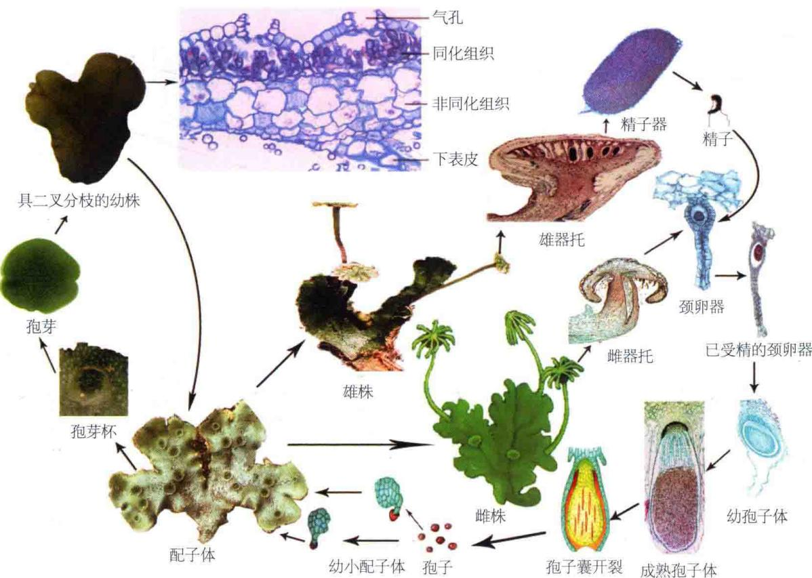  
图1-20 地钱生活史

地钱主要以孢芽（gemmae）进行营养繁殖。孢芽生于叶状体背面的芽杯（gemmacup）内，似倒挂的绿色“小提琴”，成熟后脱落，形成新配子体（图1-20）。

地钱为雌雄异株，雌配子体、雄配子体腹面（或背面）的中肋处产生雄器托（antheridiophore）和雌器托（archegoniophore），两者均呈伞状，均由托柄和托盘两部分组成。雌器托盘边缘有指状伸出的芒线，托盘腹面有倒悬的瓶状颈卵器（雌性生殖器官），两侧各有一片蒴苞（involucre），将颈卵器遮盖。颈卵器（archegonium）其形如瓶，分为腹部（venter）和颈部（neck）。“腹部”为一层壁细胞包裹着一个卵细胞和一个腹沟细胞（ventral canal cell）；“颈部”由一层壁细胞包裹着一串颈沟细胞（neck canal cell）组成。雄器托的托盘背面生有很多小孔，每一孔腔中各有一精子器（雄性生殖器官）。精子器（antheridium）呈棒状或球状，由一层壁细胞和其内的多数精子母细胞（n）或精子所组成。精子长而卷曲，具鞭毛（图1-20）。

苔藓植物的精子与卵细胞成熟后，精子借助于水游到颈卵器附近，解体中的颈沟细胞和腹沟细胞提供精子运动所需的物质、能量，并诱导精子游向卵细胞，精卵受精形成合子，合子有丝分裂，发育成胚，胚发育成孢子体。孢子体分为孢子囊（又称孢蒴，capsula）、蒴柄（seta）和基足（basal foot）三部分。基足嵌生于配子体植株顶端，呈吸器样吸取配子体中的养分，营养自身；蒴柄是连接基足与孢子囊的柄状结构；孢子囊是孢子体远离配子体一端的结构，其内的造孢组织发育成孢子母细胞，孢子母细胞经减数分裂发育成单倍体的孢子。孢蒴中有长形、壁上有螺旋状增厚的弹丝（elater），可帮助孢子散出。孢子传播后，在适宜的条件下，萌发成仅有6～7个细胞的丝状体（称原丝体，protonema），原丝体上生出芽体，芽体进一步发育成配子体。

现将地钱的生活史图解如下：

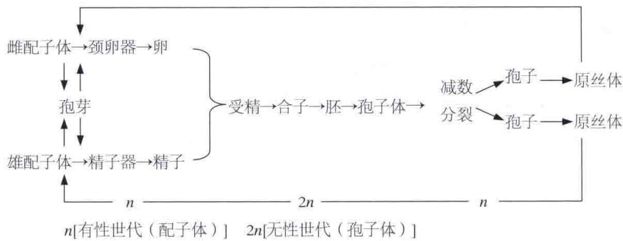

## 藓纲（Musci）

## 1）基本特征

藓纲的植物种类繁多，个体也多，分布遍及全球。植物体为具单列细胞假根的茎、叶（无背腹之分）体，多为辐射对称。孢子萌发形成原丝体（protonema），原丝体上生出带叶的配子枝（gametophore）。孢子体的结构较苔纲复杂，孢蒴具蒴盖、蒴齿，多数种类有蒴帽，其内有发达的蒴轴，但无弹丝。原丝体发达，每一原丝体可形成几个芽体。

本纲分为泥炭藓目（Sphagnales）、黑藓目（Andreaeales）和葫芦藓目（Funariales）3目。

## 2）代表属种

## (1) 泥炭藓属 (Sphagnum)

本属植物如泥炭藓（S. cymbifolium L.），其叶无中肋，由一层细胞组成。细胞有两种。细长的细胞含有叶绿体，连成网状，环围着大而无色的死细胞，且其细胞的壁呈螺纹增厚并具水孔。植物体吸水力强，消毒后可作药棉的代用品。死后的植株所形成的泥炭可作肥料及燃料。

## (2) 葫芦藓属 (Funaria)

现以葫芦藓（F. hygrometrica Hedw）为例介绍本属的特征。葫芦藓植株矮小，习生于阴湿含有机质或氮素丰富的地方，常分布于山林火烧迹地及村落附近。植物体绿色丛生，茎直立，有茎、叶分化，叶倒卵形，螺旋状排列于茎上。茎的基部产生多数假根，将植物体固着于基质上。雌雄同株，雄枝顶端的叶较大，中央为雄器苞（由橘红色的精子器与单列细胞的隔丝所组成）（图1-21）。精子器呈长棒状，有短柄，其中有很多螺旋状、具有两条鞭毛的精子。雌枝顶端的叶集生呈芽状，其中分布着数个颈卵器。精子借助水进入颈卵器并与其中的卵细胞结合发育成胚，胚发育形成孢子体。随着孢子体的生长，蒴柄迅速伸长，使颈卵器断裂成为上下两部，上部成为蒴帽（calyptra）。孢子体顶端膨大成的囊状部分称为孢蒴，孢蒴下为蒴柄和基足。孢蒴的顶部除去蒴帽可见蒴盖。孢蒴内的造孢组织发育为孢子母细胞。孢子母细胞经减数分裂后形成四分孢子，孢子成熟后，孢蒴盖裂，蒴齿帮助孢子散出。孢子遇到适宜环境萌发形成多细胞而有分枝的绿色原丝体，原丝体上发生芽体，芽体再发育成直立的营养体，即配子体（图1-21）。

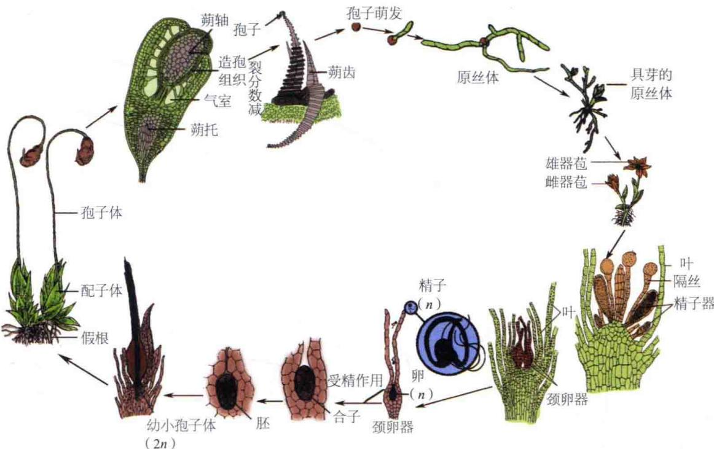  
图1-21 葫芦藓生活史

## （三）苔藓植物与人类的关系

苔藓植物与自然及人类的关系密切。苔藓植物是自然界的拓荒者之一，它们和蓝藻、地衣等植物常常首先出现于裸露的岩面、新形成的陆地表面或冻土、沙土地带，成为改造自然的先锋植物。苔藓植物可以分泌一些酸性物质，逐渐溶解岩面，还能积蓄空气中的灰尘和水分，再加上其残体的分解与有机物质的积累，在经历悠久岁月后，逐渐形成土壤，为其他植物的生存创造了有利条件。

苔藓植物生长快，吸水力强，能使沼泽陆地化或使森林沼泽化。在沼泽地带，苔藓植物往往吸干积水，同时它们的残体逐渐堆积填平洼地，并向沼泽地中心扩展，最后使沼泽变成陆地。在这些地方，草本植物和木本植物接踵而来，原有的湖泊、沼泽演替成森林。但在空气湿润而寒冷的北方针叶林地带中，常因过于繁茂的苔藓植物大量吸收水分而加大了土壤酸性，抑制了森林树木的生长，影响树种的萌发和林木的天然更新，长期作用的结果能使森林演变成沼泽地。

苔藓植物对水分、土壤、空气成分等环境因素的反应非常敏感，在不同的森林中或土地类型上常出现不同种类的苔藓植物，因而可利用苔藓植物来指示森林的类型和确定宜于造林的树种与林型。另外，苔藓植物因其结构简单，叶片多由单层细胞组成，又无角质层保护，易受有害气体的伤害，对大气污染很敏感。例如，空气中 $SO_{2}$ 平均浓度若高于0.154ppm $^{①}$ ，将造成苔藓的急性伤害，致使叶色由绿转黄、变褐。因此，国内外都已用苔藓植物作为监测大气污染的指示植物。

苔藓植物可作药用。400多年前，中国人就已利用凤尾藓属（Fissidens）和金发藓属（Polytrichum）的某些种类作为利尿和刺激毛发生长的药物。在印度和北美洲地区，则用桧叶金发藓（Polytrichum juniperinum Willd. ex Hedw）来治疗烧伤、青肿和创伤。在法国，地钱被用作利尿剂。

泥炭藓属（Sphagnum）中的泥炭藓醇（sphagnol）可用于治疗湿疹、干癣、瘙痒症、冻疮、疥疮、粉刺和其他皮肤疾病。从折叶苔［Diplophyllum albicans（L.）Dum.］和鳞叶折叶苔［D. taxifolium（Wahl.）Dum.］中分离得到的Diplophyllin对人类上皮样肿瘤细胞具有显著的抑制作用。

苔藓植物还可用作土壤添加剂、栽培中的装饰材料和庭院美化。泥炭是最重要的土壤调节剂，有利于土壤稳定和保湿，在世界各地被广泛采用。

泥炭藓沼泽地酸性很强（pH2～4），堆积若干年后往往形成泥炭层，俗称草炭或草煤，可作燃料，农业上可用于改良土壤和制造颗粒肥的原料。泥炭藓形成的泥炭含硫量低，与木材燃烧产热相比，其热能利用的环境和生态意义重大。

此外，泥炭藓具有重金属吸收特性，可用作过滤和吸收剂处理含Ag、Cu、Cd、Hg、Fe、Sb和Pb的工业废水。它也可用来过滤土壤、去污剂、染料和微生物等有机物。作为吸收剂的某些苔藓植物的产品，吸收能力强，吸收容量可达其自身重量的12倍以上，而且所需存储空间小，因而应用前景广阔。研究发现，波瓣合叶苔［Scapania undulata（L.）Dum.］对Pb、Hg、Cd、Cr、Cu和Ni等重金属具有超强的累积能力，被认为在污染水体和土壤的植物修复（phytoremediation）中具有巨大的应用潜力。因此，苔藓植物及其多样性的保护不但具有重要的生物学意义，而且具有潜在的应用价值。

## 五、蕨类植物门

## (一) 蕨类植物的一般特征

蕨类植物（Pteridophyta）又称羊齿植物（fern），有真正的根、茎、叶和维管组织的分化。维管组织包括木质部和韧皮部两部分，其中木质部由专门运输水分和无机盐的管胞组成，韧皮部由专门运输有机物的筛胞组成，一般无次生构造（图1-22）。因此，蕨类植物既是高等的孢子植物，又是原始的维管植物。维管组织的形成是植物适应陆地生活的结果。

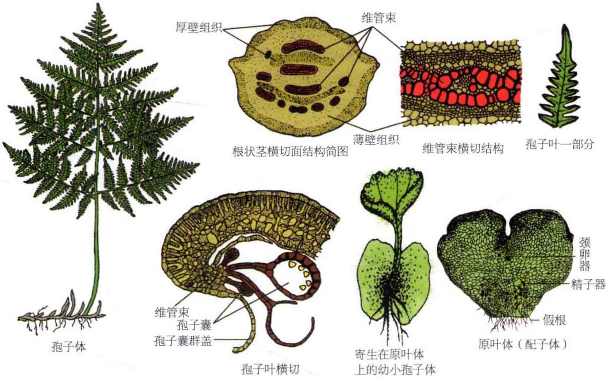  
图1-22 蕨成熟孢子体、幼孢子体与配子体（原叶体）

蕨类植物的根系为须根系。茎多为根状茎，在土中横走、上升或直立。茎的解剖结构包括表皮、皮层和中柱三部分。中柱有原生中柱（protostele）、管状中柱（siphonostele）、网状中柱（dictyostele）和多环管状中柱（polycyclic siphonostele）等多种类型（图1-23）。叶有小型叶（microphyll）和大型叶（macrophyll）之分，大型叶种类占绝大多数。大型叶常为多次羽状分裂或呈复叶。孢子囊（sporangium）单生或群生，着生孢子囊的叶称为孢子叶（sporophyll），因而有孢子叶和营养叶之分。有些种类的孢子叶集生茎顶，形成孢子叶球（strobilus）或称为孢子叶穗（sporophyll spike）。孢子有同型孢子（homospory）和异型孢子（heterospory）两类。

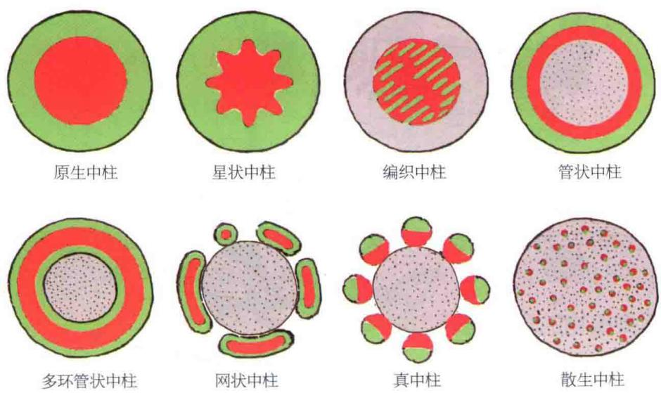  
图1-23 蕨类植物的中柱类型

蕨类植物无性繁殖时，在小型叶的种类中，孢子叶常聚生于枝顶，形成球状或穗状的孢子叶球或孢子叶穗，其孢子叶的近轴面或基部有由一群细胞发育形成的孢子囊，且孢子囊壁具多层细胞。这样的孢子囊称为厚孢子囊（eusporangium）；在进化的真蕨类植物中，孢子囊仅由一个细胞发育而来，且孢子囊壁仅有一层细胞，其孢子囊为薄孢子囊（leptosporangium）。高等蕨类植物的孢子囊或孢子囊群（堆）多生于孢子叶的背面、边缘或特定的孢子叶上。水生蕨类植物的孢子囊群生于特化的孢子果（sporocarp）内。孢子囊内的孢子母细胞减数分裂产生单倍体的孢子，孢子发育成微小的原叶体（prothallus，或配子体）。有性生殖时，在原叶体的腹面（少数为背面）产生颈卵器和精子器。精卵成熟后受精形成合子，合子发育成胚，胚进一步发育成孢子体。蕨类植物的配子体和孢子体皆能独立生活，但孢子体发达、占优势，有明显的世代交替（图1-24）。

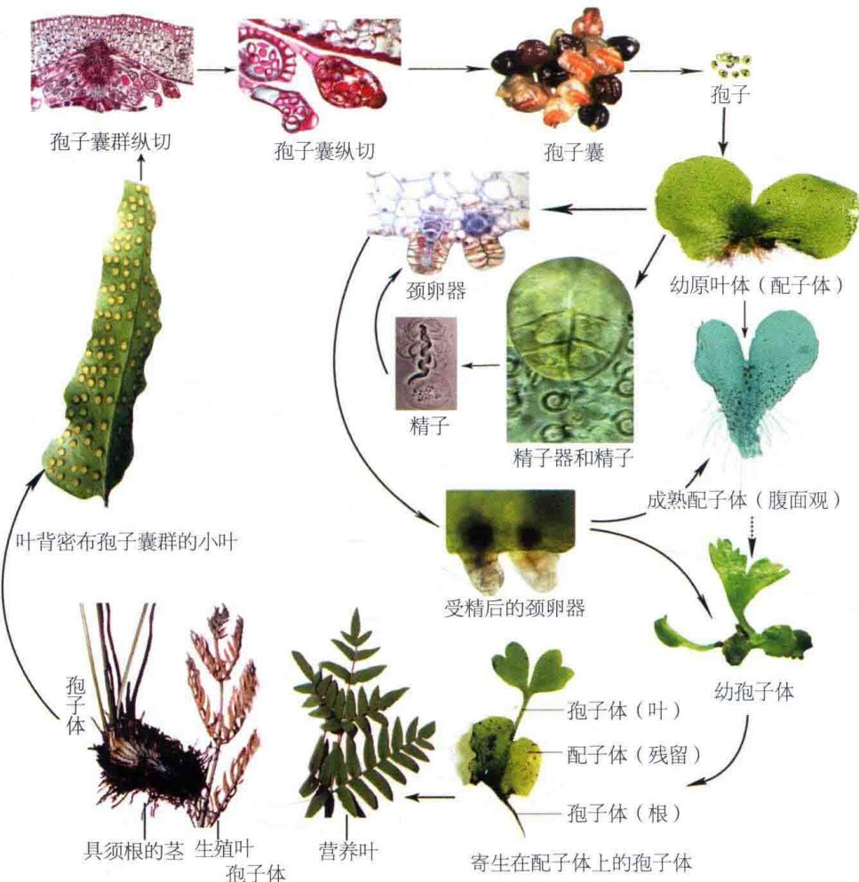  
图1-24 蕨类植物的生活史

蕨类植物多为草本植物，蕨类植物约有12 000种，我国约有2600种。主要分布于热带、亚热带地区水湿条件较好的地区，如森林、沼泽、溪流、岩缝或高山等地。

## (二)蕨类植物的分类与代表植物

蕨类植物（门）（Pteridophyta）是一个自然分类群。1987年，我国蕨类植物学家秦仁昌教授将蕨类植物门分为5个亚门，即石松亚门（Lycophytina）、水韭亚门（Isoephytina）、松叶蕨亚门（Psilophytina）、楔叶蕨亚门（Sphenophytina）和真蕨亚门（Filicophytina），它们的孢子体和配子体都能独立生活，孢子体具有维管组织，通常为多年生草本，产生孢子，孢子产生小的线状或叶状的配子体（原叶体），在同一个或不同的原叶体上生出颈卵器和（或）精子器进行有性生殖；前4个亚门为小叶型蕨类，又称为拟蕨植物（fern allies），是一些较原始而古老的蕨类植物，现存的种类很少；真蕨亚门为大叶型蕨类，是较进化的蕨类植物。

现将不同亚门的特征区别列检索表如下：

1. 叶小型，一般不分裂，茎相对于叶发达
2. 茎中实，叶绿色，螺旋排列
3. 茎块状，叶长；水生……水韭亚门（Isoephytina）
3. 茎伸长，叶小；多陆生
4. 孢子囊一室……石松亚门（Lycophytina）
4. 孢子囊三室……松叶蕨亚门（Psilophytina）
2. 茎中空，叶退化成膜质鳞片状，轮状排列……楔叶蕨亚门（Sphenophytina）
1. 叶大型，常羽状或掌状分裂，茎相对于叶不发达……真蕨亚门（Filicophytina）

## 1. 石松亚门（Lycophytina）

孢子体具匍匐的根状茎和直立的气生枝，茎二叉式（dichotomy）分枝，原生中柱，须毛状假根，小型叶，常螺旋状排列，有时对生或轮生。孢子囊属于厚孢子囊（由多层细胞组成）厚壁型，单生于孢子叶腋的基部，或聚生于枝端形成孢子叶球（穗），孢子同型或孢子异型。

本亚门的石松属（Lycopodium）约400种，广布世界各地。我国有20多种。叶螺旋状排列，无叶舌。孢子同型。配子体（雌雄同体）小。常见有石松（L. clavatum L.）（图1-25），全草可入药，孢子粉可做丸药包衣，也可作为铸造工业的优良分型剂和照明工业的闪光剂。

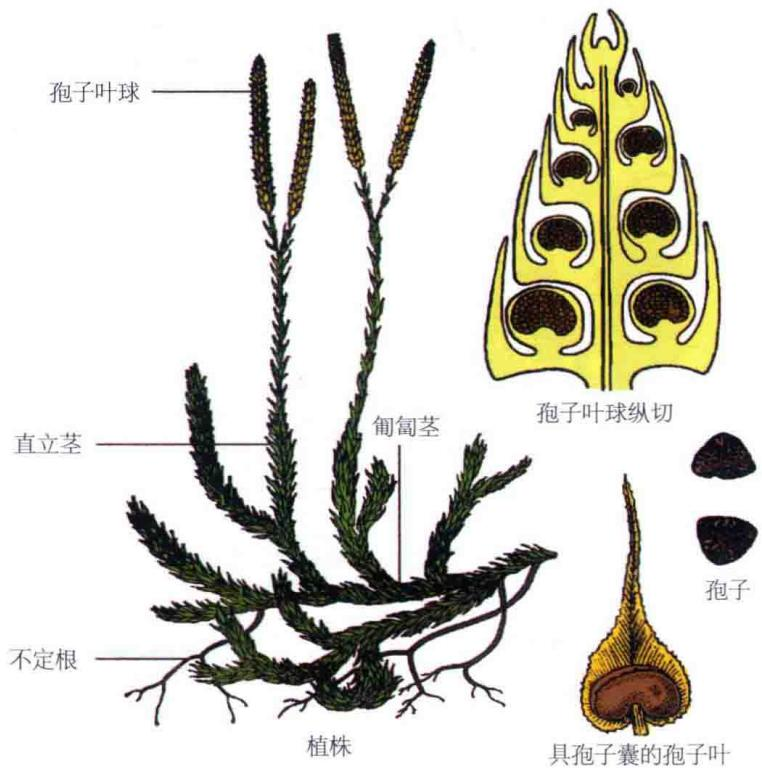  
图1-25 石松

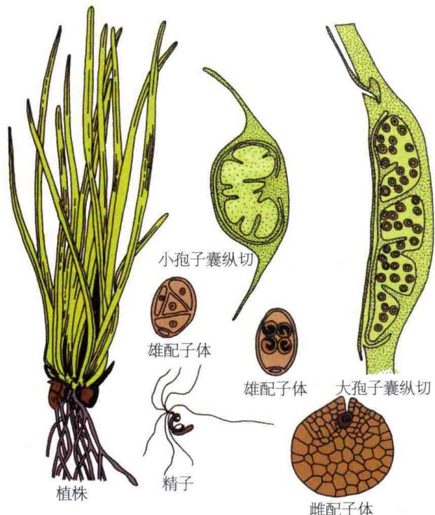  
图1-26 水韭属

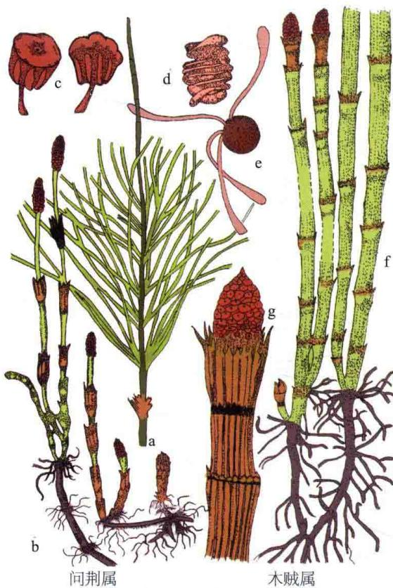  
图1-27 问荆属与木贼属

a. 不育茎一部分；b. 可育茎；c. 可育叶及孢子囊；d. 孢子，弹丝未弹开；e. 孢子，弹丝已弹开；f. 植株一部分；g. 孢子囊穗

## 2. 水韭亚门（Isoephytina）

水韭亚门仅存水韭属（Isoetes），有70多种，我国有4种，孢子体为草本，生于水边或水底，叶细长似韭，丛生于短粗的茎上，叶舌生于孢子囊的上方。有大孢子囊、小孢子囊及其孢子。精子具多鞭毛（图1-26）。常见的有中华水韭（I. sinensis Palmer）。分布于长江下游地区，由于适宜的生境受到人为干扰，植株已非常稀少，为国家一级重点保护植物。

## 3. 松叶蕨亚门（Psilophytina）

松叶蕨亚门为原始的陆生植物类群，孢子体仅有假根，叶为小叶型，枝多次二叉分枝。孢子囊生于柄状孢子叶近顶端，孢子同型。雌雄同体，游动精子螺旋形，具多数鞭毛。我国只有松叶蕨属（Psilotum）一属，分布于我国南方的有松叶蕨 [P. nudum（L.）Grised]。

## 4. 楔叶蕨亚门（Sphenophytina）

楔叶蕨亚门又称木贼亚门。有根、茎、叶的分化，茎具有明显的节和节间，叶小，鳞片状轮生；孢子囊穗生于枝顶，孢子叶盾状（peltate），下生多个孢子囊；孢子同型，具有两条弹丝（图1-27）；精子螺旋形，具多数鞭毛，可游动。

本亚门仅存木贼属（Hippochaete）和问荆属（Equisetum），有30多种，我国约有9种。问荆（E. arvense L.）入药清热利尿，也为田间杂草。

## 5. 真蕨亚门（Filicophytina）

## 1）基本特征

孢子体发达，有明显的根、茎、叶分化。根为不定根，茎除树蕨外全为根状茎，中柱类型多样，叶为大叶型叶，又分为单叶或复叶，幼时拳卷，成长中逐步展开。孢子囊着生于叶缘或叶背，汇集成各种孢子囊群（sorus），有或无囊群盖（indusium），孢子同型。配子体常为心脏形，雌雄生殖器官生于腹面。

真蕨亚门有10 000种以上，我国有40科，2500种。可分为厚囊蕨纲（Eusporangiopsida）、原始薄囊蕨纲（Protoleptosporangiopsida）和薄囊蕨纲（Leptosporangiopsida）。

## 2）代表植物

## (1) 厚囊蕨纲

孢子囊为厚囊型（eusporangiate type），由一群细胞发育而成。孢子囊壁具多层细胞。常见的有心叶瓶尔小草（Ophioglossum reticulatum L.）、瓶尔小草（O. vulgatum L.）和狭叶瓶尔小草（O. thermale Kom）等，生于森林、山坡或草地。根肉质无毛，有菌丝共生（图1-28）。

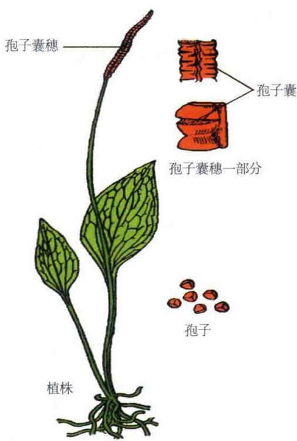  
图1-28 瓶尔小草

## (2) 薄囊蕨纲

孢子囊为薄囊型（leptosporomgiate type），由一个细胞发育而来。孢子囊壁仅一层细胞，具有各式环带。孢子囊汇聚为各式孢子囊堆。孢子同型，很少为异型。

本纲有真蕨目（Filicales）（或水龙骨目Polypodiales）、苹目（Marsileales）、槐叶苹目（Salviniales）3个目，是现存蕨类植物中种类最多的一类。

现以水龙骨（Polypodium niponicum Mett.）为例说明蕨类植物的生活史。孢子体有横走的根状茎，叶片长圆状披针形，羽状深裂。孢子囊群生于叶的背面，孢子囊群小，无囊群盖；孢子囊有柄，孢子囊壁由一行不均匀增厚的细胞环绕成环带（annulus），近柄的一侧，有几个薄壁大细胞，称为唇细胞（lip cell）。孢子成熟后于唇细胞处开裂散出，环境适宜时，孢子萌发生长成心形、扁平而绿色的原叶体，行独立生活。触地面为腹面，有假根，雌雄生殖器官生于此面。颈卵器瓶状，壁由多细胞组成；上部狭细部分称为颈部，其中有一列颈沟细胞；下部膨大部分称为腹部，其内有腹沟细胞和卵细胞。精子器球状，其壁仅由一层细胞组成，内生多数螺旋形、具多鞭毛的精子。精卵融合，受精卵在颈卵器中发育成胚，再成长为有根、茎、叶的孢子体，进行独立生活。叶的背面又生出孢子囊，孢子囊中的孢子母细胞进行减数分裂，形成单倍体（n）的孢子，完成世代交替过程（图1-29）。

## （三）蕨类植物与人类的关系

地球上现存的蕨类植物占维管植物物种多样性的2%\~5%。其中，85%的蕨类植物分布于热带地区，特别是中海拔的雨林或海洋性岛屿（如夏威夷群岛），在这些地区它们可占维管植物总数的16%以上。它们与其他绿色植物一样，承担着合成和积累有机物、释放氧气、净化环境等作用。

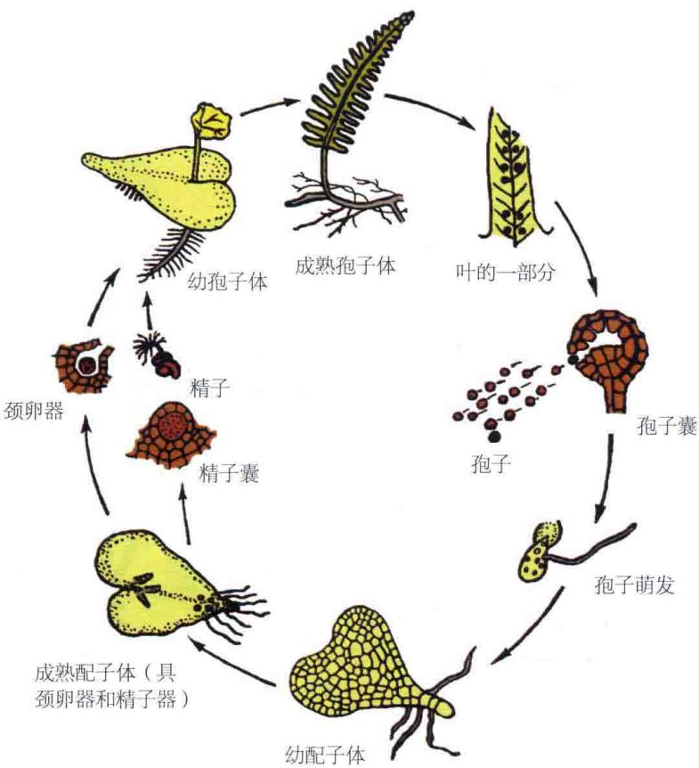  
图1-29 水龙骨生活史（依吴国芳）

在我国，作蔬菜食用的蕨类植物常见的有菜蕨 [Callipteris esculenta (Retz.) J. Smith] 或蕨 [Pteridium aquilium (L.) Kuhn.]、田字草 (Marsilea quadrifolia L.) 等。可供药用的蕨类植物有 400 多种，常见的如木贼、问荆、卷柏、石松、海金沙 [Lygodium japonicum (Thunb.) Sw.] 等。贯众 (Cyrtomium fortunei J. Sm.) 的根状茎可驱虫解毒、治流行性感冒，还可作农药。

凤尾蕨属植物全株含有鞣质，可提取栲胶。石松的孢子粉可做铸造脱模剂和闪光剂等。蕨类植物的生活对于外界环境条件的反应具有高度的敏感性，许多种类要求不同的特殊生态环境条件，因而可以作为地质、土壤、岩石、矿物质、气候等的指示植物。芒萁 [Dicranopteris dichotoma（Thunb.）Bernh.]、紫萁（Osmunda japonica Thunb.）常作为酸性土的指示植物，蜈蚣草（Pteris vittata L.）不仅可作为钙质土或石灰岩的指示植物，同时也对砷有着极强的富集能力，因此可用于砷等重金属污染严重的土壤环境修复。

在农业上，利用满江红（Azolla imbricata Nakai Roxb）叶内共生有固氮蓝藻，可以固定大气中的氮，其含氮量达干重的4.65%，是很好的稻田绿肥，也是家畜家禽的良好饲料。

许多蕨类植物由于具有奇特而优雅的形体，无性繁殖能力强，管理简易，有很高的观赏价值，如卷柏、铁线蕨、肾蕨、凤尾蕨（Pteirs cretica var. nervosa Ching et S. H. Wu）、鹿角蕨属（Platycerium）和巢蕨属（Neottopteris）等为著名的观叶植物。

桫椤 [Alsophila spinulosa (Wall. ex Hook.) R.M Tryon.] 为世界上最古老的活化石，是极少数幸存下来的木本蕨类之一。目前，桫椤分布已经极其稀少，处于濒危状态，被列为国家一级保护植物，既可观赏又可药用。

此外，古代蕨类植物残体被埋入地下，形成了煤炭，为人类提供了大量的能源。

因此，加强对蕨类植物的有效保护，改善蕨类植物的生长生活环境，避免现有物种衰退甚至灭绝，这与保护其他各类植物一样是全人类长期的重要任务之一。

## 六、裸子植物门

## (一) 裸子植物的一般特征

裸子植物（Gymnospermae）是一群介于蕨类植物和被子植物之间的高等植物。它们既是最进化的颈卵器植物，又是较原始的种子植物。因其种子外面没有果皮包被，是裸露的，故称为裸子植物。裸子植物的主要特征如下。

## 1) 孢子体发达

裸子植物的孢子体占绝对优势，多数种类为常绿乔木，有长枝和短枝之分；维管系统发达，网状中柱，无限外韧维管束，有形成层和次生结构。除买麻藤纲植物以外，木质部中只有管胞而无导管和纤维。韧皮部中有筛胞而无筛管和伴胞。叶针形、条形、披针形、鳞形，极少数呈带状；叶表面有较厚的角质层，气孔呈带状分布。

## 2）配子体退化

裸子植物的配子体寄生在孢子体上，不能独立生活。成熟的雄配子体（花粉粒）具有4个细胞，包括1个生殖细胞、1个管细胞和2个退化的原叶细胞。雌配子体在近珠孔端产生2个至多个颈卵器，但其结构比蕨类植物的颈卵器更加简单，仅含1个卵细胞和1个腹沟细胞，有的无颈沟细胞。雌配子体、雄配子体均无独立生活能力，完全依赖孢子体供给营养。

## 3）胚珠裸露

裸子植物的雌性、雄性生殖结构（大孢子叶、小孢子叶）分别聚生成单性的大孢子叶球、小孢子叶球，同株或异株；大孢子叶平展，腹面着生裸露的倒生胚珠，形成裸露的种子。裸子植物的种子由胚、胚乳和种皮组成。胚（2n）来自受精卵，是新一代的孢子体；胚乳（n）来自雌配子体；种皮（2n）来自珠被，是老一代孢子体。由于胚得到了胚乳提供的营养，受到了种皮的保护，使后代免受外界损伤，不仅大大延长了寿命，而且增加了传播的机会。种子的产生和成功繁衍，促使植物界有更大的发展，达到更高级的进化水平。

## 4）形成花粉管

小孢子叶背部丛生小孢子囊，孢子囊中的小孢子或花粉粒单沟型、有气囊，可发育成雄配子体。裸子植物花粉（雄配子体）成熟后，借风力传播到胚珠的珠孔处，并萌发产生花粉管，花粉管中的生殖细胞分裂成2个精子，其中1个精子与成熟的卵受精，受精卵发育成具有胚芽、胚根、胚轴和子叶的胚。原雌配子体的一部分则发育成胚乳，单层珠被发育成种皮，形成成熟的种子。花粉管的产生，摆脱了水对受精作用的限制，更适应陆地生活。少数种类，如苏铁属（Cycas）和银杏（Ginkgo biloba L.）等，其精子仍有多数鞭毛可游动。由此可以说明，裸子植物是一群介于蕨类植物与被子植物之间的维管植物。

## 5）具多胚现象

裸子植物常具多胚现象（polyembryony），多胚现象的产生有两个途径：一个是简单多胚现象（simple polyembryony），由一个雌配子体上的几个颈卵器同时受精，形成多胚；另一个是裂生多胚现象（cleavage polyembryony），仅一个卵受精，但在发育过程中，原胚分裂成几个胚。

裸子植物出现于3亿年前的古生代，最盛时期在中生代。现代裸子植物可被分为苏铁纲（Cycadopsida）、银杏纲（Ginkgopsida）、松柏纲（Coniferopsida）、买麻藤纲（Gnetopsida）4纲（表1-6）、9目、12科、71属，800种左右。我国是裸子植物种类最多、资源最丰富的国家，有4纲，8目，11科，41属，236种。有不少是第三纪的孑遗植物，或称“活化石”植物。

表1-6 裸子植物门四纲植物特征比较

<table><tr><td>类群\特征</td><td>习性</td><td>叶(聚生、散生)</td><td>大、小孢子叶球</td><td>精子与颈卵器</td><td>种子</td></tr><tr><td>苏铁纲</td><td>直立乔木少分枝</td><td>大型羽状复叶顶生</td><td>单性异株、大孢子叶聚成球状,小孢子叶圆柱状</td><td>精子有鞭毛、有颈卵器</td><td>核果状</td></tr><tr><td>银杏纲</td><td>乔木有长短枝</td><td>扇形叶、二叉脉</td><td>单性异株、大孢子叶简化为环状珠领和1~2胚珠,小孢子柔荑花序状</td><td>精子有鞭毛、有颈卵器</td><td>核果状</td></tr><tr><td>松柏纲</td><td>乔灌木有长短枝</td><td>针形、鳞形、条形叶</td><td>单性异株或同株,大孢子叶、小孢子叶聚成球柱状</td><td>精子无鞭毛、有颈卵器</td><td>核果状或浆果状</td></tr><tr><td>买麻藤纲</td><td>灌木藤本有导管</td><td>鳞片叶、带状</td><td>单性异株,大孢子叶、小孢子叶聚成球柱状,有假花被</td><td>精子无鞭毛、颈卵器退化或无</td><td>核果状,有假种皮</td></tr></table>

## （二）裸子植物的分类与代表植物

## 1. 苏铁纲（Cycadopsida）

## 1）基本特征

常绿植物，茎干一般不分枝。羽状复叶。大孢子叶、小孢子叶异株。精子具有鞭毛。

本纲现存苏铁科（Cycadaceae），含9属，100种左右。我国仅有苏铁属（Cycas），约8种，常见的有苏铁（C. revoluta Thunb.）和华南苏铁（C. rumphii Miq.）等。

## 2）代表属种

以苏铁为例：苏铁为雌雄异株，大孢子叶球、小孢子叶球均集生茎顶。小孢子叶球呈长椭圆形，由鳞片状的小孢子叶螺旋状排列而成，每个小孢子叶的背面生有许多由3～5个小孢子囊组成的小孢子囊群。大孢子叶球呈球形，大孢子叶密被淡黄色绒毛，上部羽状分裂，下部为狭长的柄，柄的两侧生有2～6枚胚珠。胚珠珠被一层，珠心顶端有储粉室（pollen chamber），珠心中的大孢子母细胞经减数分裂形成大孢子，进而由大孢子发育成胚乳（雌配子体）和位于其中的2～5个颈卵器。成熟的颈卵器一般有1个卵细胞和2个颈细胞。小孢子叶上有小孢子囊（厚囊型发育），小孢子母细胞经减数分裂，形成小孢子。成熟的小孢子进入花粉室，生出花粉管，在花粉管中形成2个陀螺形、有多数鞭毛的精子（图1-30）。精卵结合后形成合子，胚珠发育成红色种子（种皮三层，胚双子叶、胚乳丰富），继而长成为新的植物。

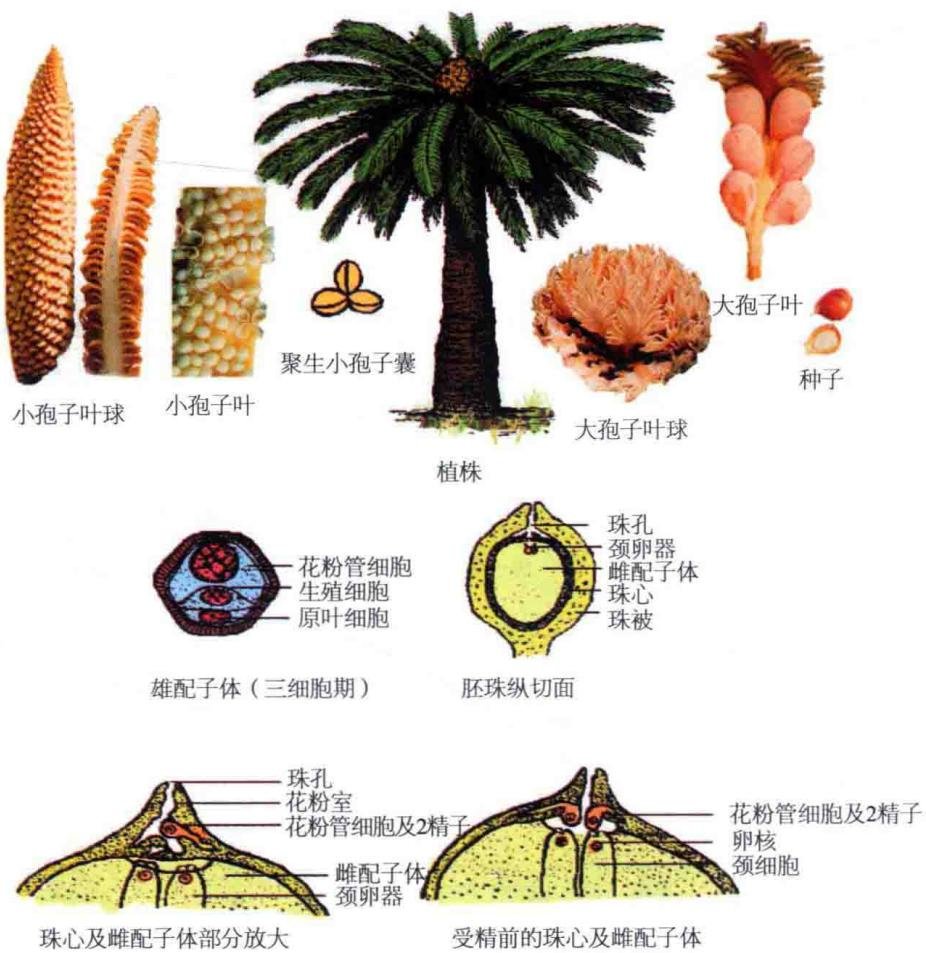  
图1-30 苏铁（依马炜良等）

## 2. 银杏纲（Ginkgopsida）

本纲为单目、单科、单属、单种纲，仅银杏一种，为我国所特有，被国内外广为栽培。

银杏是中生代子遗的稀有植物，又名白果、公孙树。银杏为落叶乔木，树干高大，枝分顶生营养性长枝和侧生生殖性短枝。年轮明显。各种器官内均有分泌腔。叶扇形，有柄，长枝上的叶大都是先端两裂，短枝上的叶常具波状缺刻，具分叉的脉序。

球花单性、异株。小孢子叶球呈柔荑花序状，生于短枝顶端的鳞片腋内。小孢子叶有一短柄，柄端常有由2个小孢子囊组成的悬垂的小孢子囊群。精子具多数单鞭毛。大孢子叶球简单，通常具长柄，柄端有2个环形的大孢子叶，称为珠领（collar），大孢子叶上各生1～2个直生胚珠，但通常只有1个成熟，种子近球形，核果状，熟时黄色，外被白粉，种皮分化为3层：外种皮厚，肉质，并含有油脂及芳香物质；中种皮白色，骨质，具2条纵脊；内种皮红色，膜质。胚乳肉质，来自于雌配子体。胚具2枚子叶。种子萌发时，子叶不出土。染色体：n=12（图1-31）。

银杏树形优美，春季叶色嫩绿，秋季鲜黄，颇美观，是行道树及园林绿化的珍贵树种。木材优良，可为建筑、雕刻、绘图板、家具等用材。种仁（白果）供食用（多食易中毒）及药用，入药有润肺、止咳、强壮等功效。叶可供药用和制杀虫剂，树皮含单宁。

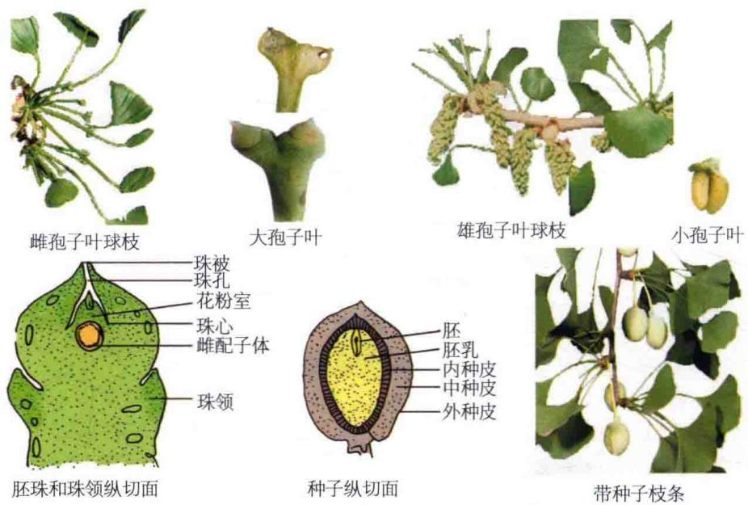  
图1-31 银杏

## 3. 松柏纲（球果纲）（Coniferopsida）

## 1）基本特征

常绿或落叶乔木、稀为灌木，茎多分枝，多数种类有长枝、短枝之分，具树脂道（resin duct）。叶单生或成束，针形、鳞形、钻形、条形或刺形，螺旋着生或交互对生或轮生，叶的表皮常具较厚的角质层及下陷的气孔。孢子叶球单性，同株或异株。大孢子叶常排列成球果状。小孢子叶球单生或组成花序，由多数小孢子叶组成，每个小孢子叶通常具2～9个小孢子囊，精子无鞭毛。大孢子叶由三至多数大孢子叶（珠鳞，ovuliferous scale）和苞鳞组成，大孢子叶内侧常生1～2枚倒生胚珠。种子核果状，胚具子叶2～18枚，胚乳丰富。松柏纲植物的叶多为针形，故有针叶树或针叶植物（conifer）之称。

松柏纲是现代裸子植物中数目最多、经济价值最大、分布最广的一个类群，有7科，51属，600余种，隶属于4目，即松柏目（Pinales）、罗汉松目（Podocarpales）、三尖杉目（Cephalotaxales）、红豆杉目（Taxales）。我国有6科，23属，约180种。

## 2）代表属种

以松属（Pinus）为例，其植物为常绿乔木，叶针形，常2针、3针、5针一束，生于短枝顶端，基部全为膜质鳞片。雌（大孢子叶球）、雄（小孢子叶球）同株（图1-32）。

组成大孢子叶球的大孢子叶又称珠鳞，珠鳞背面基部有膜状的苞鳞。珠鳞腹面基部有倒生胚珠2枚，胚珠由一层珠被、珠心和珠孔组成。珠心内的大孢子母细胞经减数分裂，形成大孢子，远离珠孔的一个大孢子（其余3个退化）以核型胚乳的方式发育成雌配子体。在雌配子体成熟过程中，原珠孔端的雌配子体细胞发育成2～7个颈卵器，其他细胞成为胚乳。

小孢子叶球（又称雄球花，由若干小孢子叶组成），生于当年生新枝基部的鳞片叶腋内，多数密集。每一小孢子叶球有一个纵轴，轴上螺旋排列着小孢子叶。小孢子叶背面（远轴面）有一对小孢子囊（花粉囊），小孢子囊中有多个小孢子母细胞，经减数分裂各形成4个小孢子（单核花粉粒）。小孢子经3次不等分裂，形成具4个细胞的花粉粒（雄配子体）。成熟的小孢子具有2个退化的原叶细胞（prothallial）、1个大的管细胞（tube cell）和1个较小的生殖细胞（generative cell），外壁向两侧突出形成气囊。小孢子囊破裂后，花粉粒散出，随风飘扬。

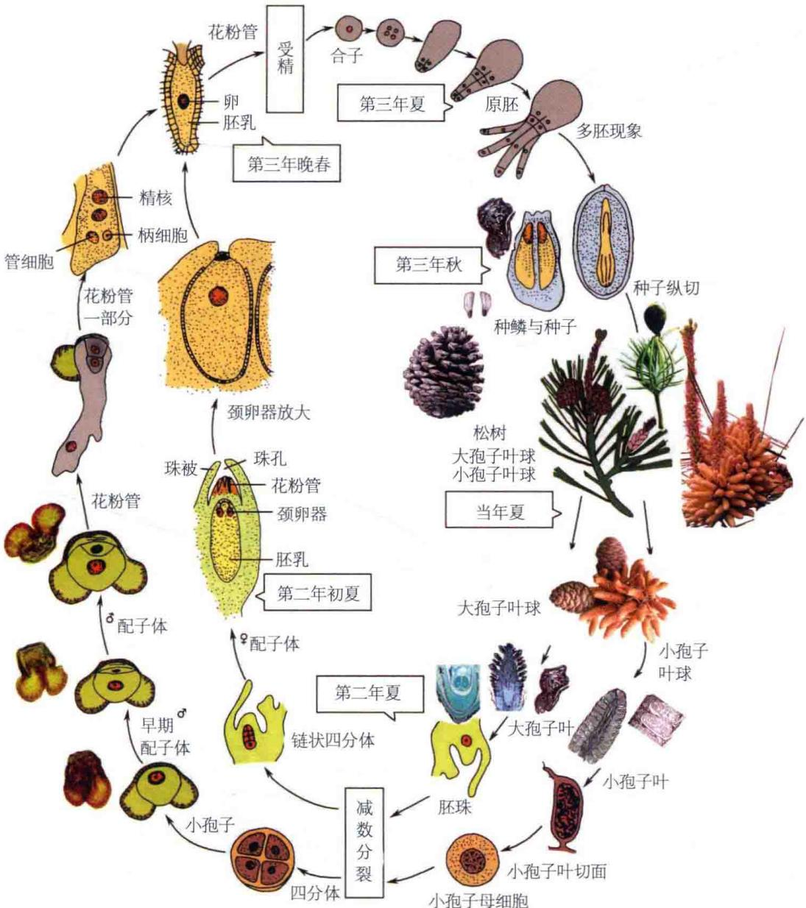  
图1-32 松属生活史

传粉后，小孢子经珠孔进入储粉室，并萌发形成花粉管。在花粉管内，生殖细胞分裂形成2个不具鞭毛的精子，精子随花粉管进入颈卵器，并与卵受精发育成胚。胚珠发育成种子，大孢子叶球发育成松球果。种子成熟后，珠鳞张开，种子散出。种子在适宜的条件下萌发，形成新的植株。

松属中常见的种类有：马尾松（P. massoniana Lamb.），2叶一束，长而柔；油松（P. tabulaeformis Carr.），2叶一束，较短而硬；白皮松（P. bungeana Zucc.ex Endl），3叶一束，树皮灰白色；红松（P. koraiensis Sieb.et Zucc），5叶一束。

本纲还有杉木科（Taxodiaceae）的杉木 [Cunninghamia lanceolata (Lamb.) Hook.]、中国特有树种水杉（Metasequoia glyptostroboides Hu et Cheng）（图1-33）；柏科（Cupressaceae）的侧柏［Biota orientalis（L.）Franco］（图1-34）、桧柏［Sabina chinensis（L.）Ant.］等优良造林树种。红豆杉［Taxus chinensis（Pilger.）Rehd.］，我国特有树种，常绿乔木，叶螺旋状排列，孢子叶球单生，成熟种子生于红色肉质、杯状的假种皮内，其特有生物碱（紫杉醇）是重要抗癌药物（图1-35）。

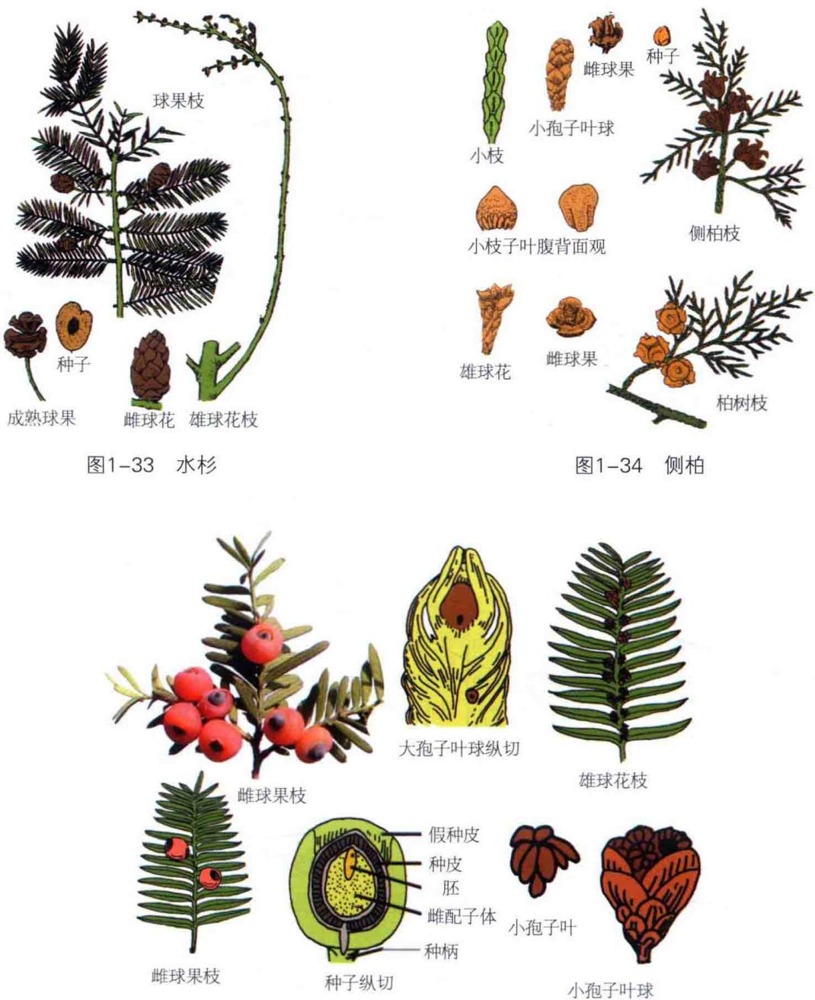  
图1-35 红豆杉

## 4. 买麻藤纲（Gnetopsida）

## 1）基本特征

次生木质部具导管，无树脂道。单叶对生，鳞片状或阔叶。孢子叶球序二叉分枝，孢子叶球有类似于花被的盖被，或有两性的痕迹。胚珠具1～2层珠被，有珠孔管（micropylar tube）。精子无鞭毛，颈卵器极其退化或无。成熟大孢子叶球球果状、浆果状或细长穗状，种子由盖被（假花被）发育而成的假种皮包裹，种皮1～2层，胚乳丰富，胚具2枚子叶。为裸子植物与被子植物的过渡类群。

本纲起源于新生代，现存植物共有3目，3科，3属，约80种。我国有2目，2科，2属，19种，全国分布。买麻藤纲某些植物的茎内次生木质部出现导管，孢子叶球有盖被，胚珠包裹于盖被内，以及许多种类有多核胚囊而无颈卵器等，成为裸子植物中最进化的类群。

## 2）代表属种

## (1) 麻黄属 (Ephedra)

植株为多分枝的小灌木。枝条绿色、多节；叶通常退化成膜鞘，对生或轮生，外形似木贼；雌球花、雄球花异株；种子成熟时花被为肉质，色鲜红，包于种子之外。该属植物草麻黄（E. sinica Stapf.）是我国西北与华北常见的药材（图1-36）。

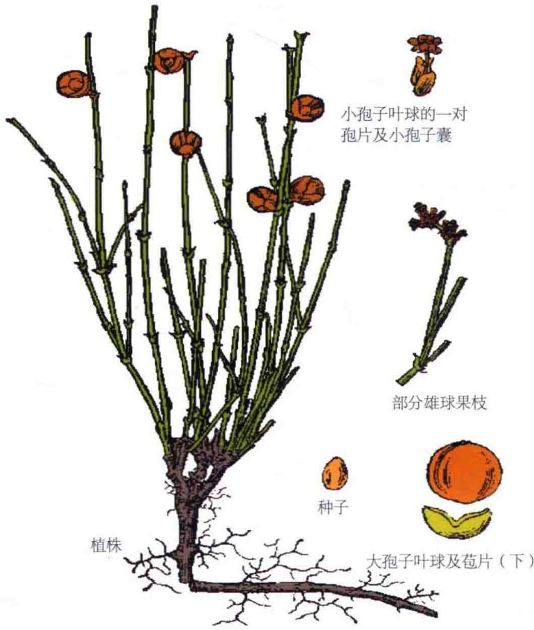  
图1-36 草麻黄

## (2) 买麻藤属 (Gnetum)

木质攀缘而缠绕的藤本植物。茎筒形，节部膨大；叶全缘对生，羽状脉。雌配子体无颈卵器。常见有买麻藤（G. montanum Markgr.）和小叶买麻藤［G. parvifolium（Warb.）G. Y. Cheng］，药用能祛风、行血、消肿、止痛，生汁内服可解蛇毒（图1-37）。

大孢子叶球，示轮生大孢子叶和不完全发育的胚珠

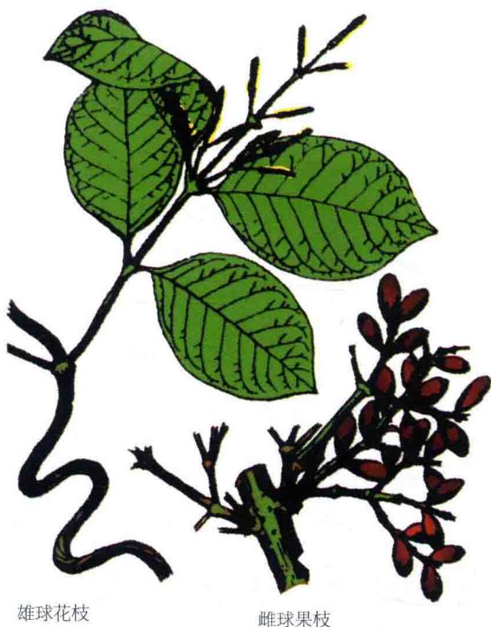  
图1-37 买麻藤

## (3) 百岁兰属 (Welwitschia)

仅百岁兰 [W.bainesii (HK. F.) Garr.] 1种，典型旱生植物，分布于非洲西南沙漠地带。茎短而粗、块状，终生只有一对大型带状叶片，叶长2～3m，可生存百年以上。雌配子体无颈卵器（图1-38）。

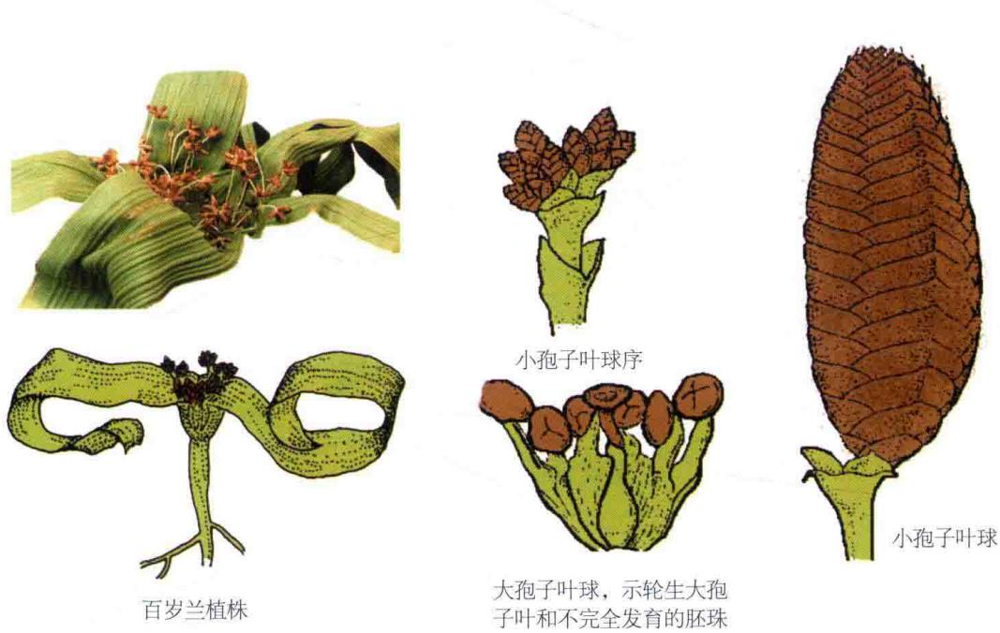  
图1-38 百岁兰

无脉蕨

## （三）裸子植物的起源与演化

裸子植物的演化有如下的趋向：①植物体的次生生长由弱到强；②茎干由不分枝到分枝；③孢子叶由散生到聚生成各式孢子叶球；④大孢子叶逐渐转化，颈卵器简化到无，雄配子体发展为花粉管，雄配子由游动精子到精细胞。生殖器官的演化，使裸子植物更能适应于陆地生活。

裸子植物的起源可远溯到3.5亿年之前。化石研究表明，中泥盆纪的无脉蕨（Aneurophyton）（图1-39）是一种原始的裸子植物。无脉蕨是高大的乔木，无叶脉，孢子囊小而呈卵形，生于末级枝顶；茎具具缘纹孔的管胞组成的次生木质组织，主根不发达。古蕨（Archaeopteris）（图1-39）是晚泥盆纪特有的一群较为进化的原始裸子植物，株高18m以上，茎粗1.5m，有形成层及次生结构，羽状复叶扁平而宽大；根系较无脉蕨发达；孢子囊单个或成束着生在不具叶片的小羽片上，孢子囊有大、小两种孢子，仍以孢子繁殖。其形态、结构和生殖器官的特征更接近裸子植物，因而推测它可能是由原始蕨向裸子植物演化的一个早期阶段或过渡类型，所以人们称古蕨为原裸子植物（Progymnospermae）或半裸子植物。到了晚泥盆纪、早石炭纪时，由原裸子植物演化出更高级的类型——种子蕨目（Pteridospermales）、苏铁蕨目（Cycadofilices）和苛得狄目（Cordaitales）等。

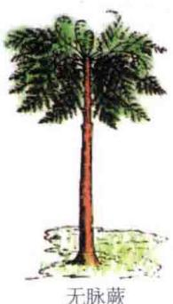

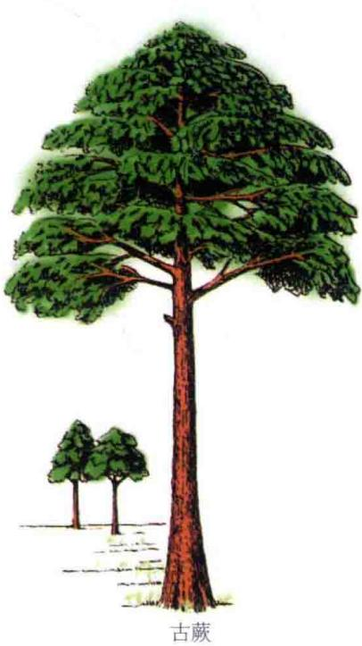  
图1-39 无脉蕨和古蕨

种子蕨是一种最原始的种子植物，最早出现于早石炭纪的地层中，在晚石炭纪和二叠纪得到了极大发展，是当时陆生植被中的优势类群。种子蕨植物体不高大，主茎很少分枝，叶为多回羽状复叶。种子小型，并有一杯状包被，其上生有腺体，种子中央为一颇大的雌配子体组织和颈卵器，珠心（大孢子囊）的顶端有一突出的喙，喙外又有一垣围之，两者之间为花粉室，其中有时可看见花粉粒，珠心之外有一层厚的珠被（图1-40）。由上可看，种子蕨是介于真蕨类植物和种子植物之间的一个过渡类型，但种子蕨并非起源于真蕨，而是从起源于裸蕨的原裸子植物演化而来。

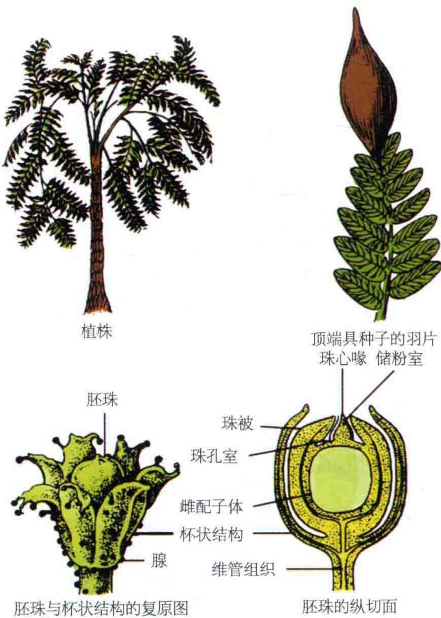  
图1-40 种子蕨

在石炭纪、二叠纪的地球植被中，除了外貌像蕨的种子蕨之外，还有一类高大乔木状的种子植物——苛得狄，其植株为高大乔木，茎粗一般不超过1m，茎干的内部构造和种子蕨颇相似，但木材较发达而致密，木质部或薄或厚，通常无年轮，髓由许多薄壁细胞横裂成片组成，似被子植物胡桃的髓；具较发达的根系和高大的树冠，叶皆是全缘的单叶，形态大小颇不一致，其上有许多粗细相等、分叉的、几乎是平行的叶脉；大孢子叶球、小孢子叶球分别组成松散的孢子叶球序，并在大孢子叶球、小孢子叶球的基部有多数不育的苞片；胚珠顶生，珠心和珠被完全分离（图1-41）。从上述特征可以看出，苛得狄植物在胚珠结构、叶的形态与结构等方面与种子蕨相似，而茎的构造和孢子叶的形态等又类似现有的裸子植物。

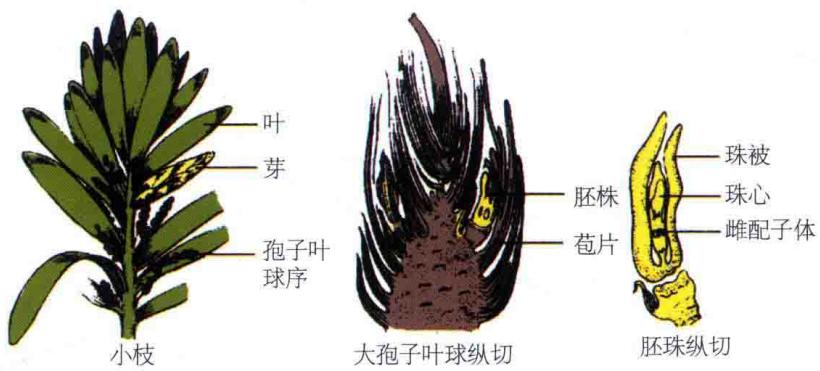  
图1-41 苛得狄

种子蕨和苛得狄之间并不存在系统发育上的祖裔关系，它们都是原裸子植物的后裔。根据现有的裸子植物化石资料，现存的裸子植物都是由原裸子植物沿两个方向演化而来。一个是由古蕨经过复杂的分枝和次生组织的发育，在石炭纪形成苛得狄，再进一步发展成为银杏类、松柏类和红豆杉类，现存的裸子植物大多属于此类。另一个则由无脉蕨经过侧枝的简化，形成种子蕨，再进一步发展成为拟苏铁类（Cycadeoides）（图1-42）和苏铁类（Cycads），其中拟苏铁类在白垩纪后期绝灭。至于买麻藤纲植物的起源和系统地位，至今尚存有争议，根据它们形体的结构和明显的分节，被认为与木贼类植物有一定的亲缘关系；但从它们孢子叶球的结构来看，其祖先曾具有两性的孢子叶球，而具有两性孢子叶球的植物只有起源于种子蕨的拟苏铁类，它们的孢子叶球呈二叉分支和具有珠孔管等特点说明买麻藤纲植物很可能是强烈退化或特化了的拟苏铁植物的后裔，但买麻藤植物茎内维管组织具导管、精子无鞭毛、颈卵器趋于消失，以及类似花被结构（盖被）的形成和虫媒的传粉方式等，其性状接近现代被子植物。

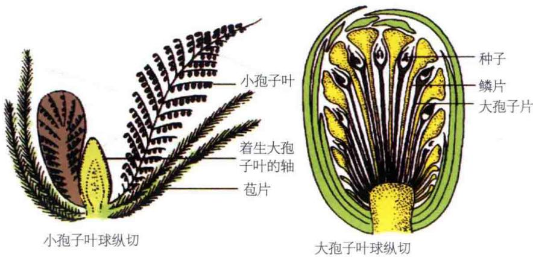  
图1-42 拟苏铁孢子叶球

## （四）裸子植物与人类的关系

裸子植物是林业生产上的主要用材树种，我国用在建筑、枕木、造船、家具上的大量木材，大部分是松柏类植物，如东北的红松，南方的杉木。裸子植物又是重要的工业原料植物，可以提供松节油、松香、单宁、树脂、栲胶等，在人民生活中都有重要的用途。

大多数裸子植物为常绿树，树冠美丽，在美化庭院、绿化环境上有很大价值。世界五大庭园植物雪松、南洋杉、金钱松、日本金松和巨杉都是裸子植物。我国的黄山松、水杉、水松、侧柏、龙柏等作为园林观赏树种，也为人类带来了美的享受。

有些裸子植物，如银杏、华山松、红松、香榧等的种子可供食用。有的作药用，如红豆杉属植物全株含三尖杉生物碱，供作抗癌药物；草麻黄为著名中药材，含麻黄碱，枝叶有镇咳、发汗、止喘、利尿等功效，根可止汗。

我国由于特殊的自然环境——第四纪冰河分散，使裸子植物在我国的残余种类特别丰富，很多稀有种类生活到现在，如我国特产的银杏、金钱松、水松、水杉、银杉、白豆杉等，都是地史上遗留的古老植物，因而称为“活化石”。上述6种植物也是我国特有的单种属植物。裸子植物中的珍稀濒危植物很多，它们在研究地史和植物界演化上具有极其重要的意义，但由于天然更新能力弱而造成资源日益枯竭，目前这些濒危植物的种群数量已很少。因此，必须采取有效措施，杜绝滥砍滥伐，保护好现存树种。同时，还应开展繁殖技术的研究，在适宜地区大力育苗造林，以求缓解珍稀濒危植物的生存危机。

## 七、被子植物门

## (一) 被子植物的一般特征

被子植物（angiospermae）是现存植物界最高级、最繁盛和分布最广的一个植物类群，在地球上占着绝对优势。现知被子植物共有1万多属，25万种，占植物界种数一半以上。我国有3100多属，约3万种，其中特有属多达100个以上。被子植物能有如此多的种类，有极其广泛的适应性，这和它的结构复杂化和完善化、生殖方式高效化和多样化有关。与裸子植物相比较，被子植物主要具有以下五个方面的进化特征。

## 1) 有真正的花

被子植物最显著的特征是具有真正的花。花的组成包括花被（花萼、花冠）、雄蕊群和雌蕊群等部分，雄蕊和雌蕊是花中最重要的结构。许多被子植物具有鲜艳的花朵和芬芳的气味，可吸引昆虫和鸟类，实现异花授粉。

## 2）有雌蕊和果实

雌蕊由心皮所组成，包括子房、花柱和柱头三部分。胚珠包藏在子房内，子房在受精后发育形成果实。果实有利于种子的发育、传播和保护种子免遭伤害。

## 3）有双受精现象

通过双受精作用，受精卵发育成胚（2n），融合了双亲的遗传特性；受精极核发育成胚乳（3n），更加丰富、稳定和增强子代的遗传优势。这与裸子植物的胚乳直接由雌配子体（n）发育而来不同，被子植物的幼胚以3n染色体的胚乳为营养，使胚更富于生命力和更强的适应外界环境的能力，更利于种族的繁茂。

## 4）孢子体高度发达和多样化

在形态、结构、生活型和生活方式等方面，被子植物比其他各类植物更完善和多样化；在解剖构造上，被子植物的输导组织更为完善，木质部中有导管和木纤维，韧皮部有筛管和韧皮纤维，使得体内物质运输更为畅通，机械支持和适应能力大为加强。

## 5）配子体进一步简化

雌配子体、雄配子体极简化，寄生在孢子体上，无独立生活能力，结构比裸子植物更简化。雄配子体为2个或3个细胞的成熟花粉粒；雌配子体为成熟的胚囊，颈卵器退化为卵器，仅由1个卵细胞和2个助细胞组成。

正是由于被子植物具备了上述适应陆地环境的更优越的形态结构，才使之得以在地球上迅速地发展和繁茂起来，以至成为现今地球上占统治地位的植物类群。因具有真正的花，所以被子植物又被称为真花植物（flowing plants）；由于具有雌蕊，也被称为雌蕊植物（gynoeciatae）。以此与其他具颈卵器的高等植物相区别。

## （二）被子植物的生活史特点

与苔藓植物和蕨类植物的生活史相比，被子植物的生活史具有极大的差异。被子植物与裸子植物同属于种子植物，两者的孢子体世代漫长，孢子体独立生活，在生活史中占据明显优势；配子体寄生在孢子体上，配子体世代在生活史中相对隐蔽而短暂。

在被子植物的生活史中，配子体更加简约化，雄配子体仅有2～3个细胞，雌配子体通常仅有7个细胞（蓼型胚囊）；孢子体更为复杂、多样性。被子植物具有双受精现象，即除了雌配子、雄配子受精外，胚囊中的中央细胞也与花粉管中进入胚囊的另一个精细胞受精，进而发育形成3n的胚乳（参见第四章）。

## （三）被子植物与人类的关系

被子植物与人类的关系密切。人类的衣、食、住、行物质生活和精神文化生活无一不是直接或间接地，或多或少地与植物有着千丝万缕的联系。现代化建设中的工业、农业、医学、国防、科学、文化等领域的生产和活动都与植物有着密切的关系。人类的文明和发展、地球生态平衡和稳定都离不开被子植物。

被子植物是丰富多样的，今天的被子植物是历史上植物的进化和发展。关于被子植物的系统发育和分类的知识将在第五章介绍。

## 八、植物界的演化规律

据考证，地球上植物的出现至今已约38亿年。在这漫长的进化历程中，植物不仅种类繁多，而且植物体的形态结构、植物的生活习性和生态适应性等方面都发生了深刻的变化。其进化规律可概述如下。

## 1）在形态结构方面

植物体形态结构的进化方向是：植物体由简单到复杂。植物体由单细胞个体到多细胞群体，再进化到多细胞有机体，逐渐出现细胞的分工、组织的分化和不同器官的形成。随着生境环境的不断变化和进一步复杂化，植物体形态结构发展也就更加完善、更加复杂和更具多样性。

## 2）在生态习性方面

植物生态习性的进化总趋势是：植物由水生进化到陆生。植物的保护组织、机械组织和维管组织等的逐渐发育和发展，各器官之间有了明确的分工和强化，适应性不断增强，植物能够在复杂多样、甚至很恶劣的生境环境中生存。

## 3）在生殖方式方面

植物由无性繁殖进化到有性生殖。在有性生殖中，植物又由同配生殖发展到异配生殖进而到卵式生殖，由简单的卵囊和精囊进化到复杂的颈卵器和精子器，由无胚到有胚。植物的繁殖从以单细胞的孢子进行繁殖到以有复杂结构的种子、果实等进行繁殖。

## 4）在生活史方面

植物的世代交替从不明显到同型世代交替再到异型世代交替，由配子体（有性）世代占优势到孢子体（无性）世代占优势。衣藻是单细胞、单倍体藻类植物，只有有性生殖过程的合子阶段是双倍体，生活史中只有核相交替而没有明显的世代交替过程。石莼属藻类植物的孢子体与配子体在形状、大小等方面基本相同，因而其世代交替属于同型世代交替，是较原始类型的世代交替。苔藓植物的孢子体寄生在配子体上，是配子体占优势的异型世代交替。蕨类植物的孢子体比较发达，配子体简单，但能独立生活，是孢子体占优势的异型世代交替。种子植物，尤其是被子植物，孢子体高度进化发达和多样性，配子体则极其简化，完全“寄生”在孢子体上。因此，被子植物的世代交替是植物界中最高级、复杂和进化的类型。

植物界的总体进化方向，粗略地讲就是由藻类植物演化为蕨类植物，由蕨类植物进一步演化为裸子植物，亦或再由裸子植物演化到被子植物。这是植物界进化中的主线（图1-43）。菌类植物和苔藓植物则是植物进化系统中的侧枝。菌类植物在形态结构、营养方式和生殖等方面都与高等植物差别很大，难以看出它们与高等植物有直接的联系。苔藓植物虽有某些进化的特征，但孢子体尚不能独立生活，不能脱离水湿环境，从而限制了它们的进化发展。

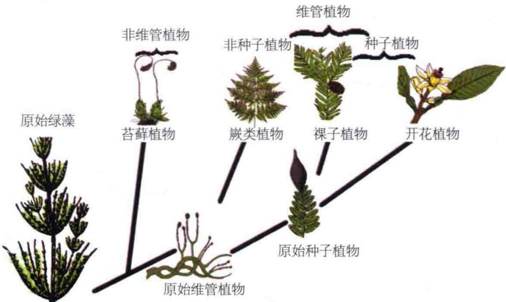  
图1-43 植物界演化

## 总结与复习

## 知识要点

植物分类的方法有人为分类法、自然分类法和系统发育分类法3种。人为分类法是人们依自己的方便或按用途进行分类的方法。自然分类法是依据植物间性状的相似程度所进行的植物分类方法。系统发育分类法是以植物性状的相似性程度和演化趋势进行分类，建立能反映植物类群之间亲缘关系和植物界客观演化规律的方法。不同分类方法的建立对人类认识、利用植物和促进植物科学的发展都起到了重要作用。依据系统发育分类法所建立的植物分类系统受到学者们的高度重视和广泛支持。

随着植物学分支学科的发展，建立了细胞分类学、化学分类学、数量分类学、超微结构分类学等。

植物分类的各级单位，以亲缘关系远近为根据，分为界、门、纲、目、科、属、种。种是植物分类的基本单位，种以下还有亚种、变种和变型。而科是植物分类的重要单位。

对于每种植物各国都有各自的名称，一个国家各地的名称也有差异。而世界各国都采用林奈创立的双名法作为一种植物的学名。双名法是用两个拉丁单词作为一种植物的名称，第一个单词是属名，第二个单词是种名种加词，最后加上命名人的姓氏或姓氏缩写。通过植物命名国际法规对植物的命名进行严格的规定。

植物检索表是根据拉马克二歧分类原则，将不同特征的植物，用对比方法，汇同辨异，逐一排列编制而成，用它可迅速鉴定不知学名的植物。使用检索表鉴定检索植物必须做到科学、准确和客观，不可有丝毫的马虎。

根据形态结构、生活习性和生活史等特点，可把植物界简单地分为低等植物和高等植物。低等植物没有根、茎、叶的分化，生殖器官单细胞，合子不发育成胚。低等植物包括藻类植物、菌类植物和地衣植物，它们分别具有不同的特征和代表植物。高等植物有根、茎、叶的分化，生殖器官多细胞，合子发育成胚。高等植物包括苔藓植物、蕨类植物和种子植物（包括裸子植物和被子植物）。

蓝藻是地球上出现最早的植物，属原核生物。其细胞中不具真正的核、载色体和各种细胞器。含蓝藻素，叶绿素中仅有叶绿素a，具蓝藻淀粉。繁殖通过细胞直接分裂或藻殖段进行，无有性生殖。

绿藻植物细胞与高等植物相似，有核和载色体，叶绿素a、叶绿素b最多，还有叶黄素和胡萝卜素，因而呈绿色；储藏的养料有淀粉和油类。形态多种多样，有单细胞群体和多细胞的个体。单细胞植物体的细胞没有营养与繁殖的分化。群体中实球藻也没有分化，多细胞的团藻和轮藻有明显的分化。繁殖方式有营养繁殖、无性繁殖和有性生殖（包括同配生殖、异配生殖和卵式生殖）3种。

红藻植物体多呈红色或紫红色，除含叶绿素、胡萝卜素及叶黄素外，还含藻红素和藻蓝素；储藏的养料是红藻淀粉；植物体为丝状、片状等。

褐藻植物体含有的色素是叶绿素、胡萝卜素及叶黄素，其中以胡萝卜素及叶黄素含量较多，故呈黄褐色；储藏的养料主要是褐藻淀粉和甘露醇；生活史有明显的世代交替。

菌类植物没有根、茎、叶结构，不含叶绿素。除极少数外，其营养方式均为异养。细菌也是原核单细胞生物，根据其形态特征，可将其分为球菌、杆菌和螺旋菌3类。黏菌是介于动物、植物之间的一类多核单细胞生物。黏菌的营养阶段呈一团裸露的原生质体，能做变形虫运动，吞食固体食物，其生殖阶段能产生具纤维素壁的孢子。真菌都具有细胞核、细胞器结构。多数植物体由丝状的菌丝组成，分枝的菌丝团称为菌丝体。高等种类的菌丝体常形成各种类型的子实体，如子囊果和担子果等。根据其菌丝体的有无、菌丝是否具有横隔和有性生殖的孢子类型等，可将真菌分为鞭毛菌亚门、接合菌亚门、子囊菌亚门、担子菌亚门和半知菌亚门。了解菌类植物的特征和不同类型的代表种类对生产、生活和生存与发展很有意义。

地衣是一类特殊的植物，是由某些藻类和菌类共同组合而成的一类互利互惠共生复合体。组成地衣的真菌多数为子囊菌或少数担子菌。藻类是一些单细胞的绿藻和蓝藻。在地衣生长过程中，菌类吸收水分和无机盐类为藻类制造养分提供原料，藻类通过光合作用制造有机物质供给菌类养料，这种互利互惠的关系称为共生关系。根据地衣的形态，地衣可为壳状地衣、叶状地衣和枝状地衣。地衣是陆地先锋植物，也是环境质量的指示植物。

苔藓植物是一类结构比较简单的高等植物，多生于阴湿之地，是植物从水生到陆生的过渡形式的代表。比较低级的种类为扁平的叶状体，比较高等的种类有茎、叶的分化，但都没有真正的根。植株吸收水分和无机盐以及固着是由其上的一些表皮细胞形成的假根来完成的，它们没有维管束那样真正的输导组织。苔藓植物的雌性生殖器官称为颈卵器，由颈部（包括壁细胞和颈沟细胞）和腹部（包括壁细胞和腹沟细胞及卵细胞）组成；雄性生殖器官称为精子器，由壁细胞和若干具2条鞭毛的精子组成。苔藓植物的孢子体分为孢蒴、蒴柄和基足三部分，孢蒴中的孢子母细胞减数分裂产生孢子，孢子发育形成配子体，配子体上产生生殖器官。苔藓植物的配子体占优势，孢子体不能离开配子体而独立生活。苔藓植物可分为角苔纲、苔纲和藓纲，常见的苔藓植物有地钱、葫芦藓等。

蕨类植物多为陆生，有真正的根、茎、叶的分化，有维管组织系统，既是高等的孢子植物，又是低等的维管植物。配子体与孢子体都能独立生活，且孢子体占优势。配子体称原叶体，个体小，通常所见的蕨类植物都是孢子体。蕨类植物有明显的世代交替。配子体产生颈卵器和精子器，孢子体产生孢子囊，孢子囊中产生孢子。孢子是单细胞，是蕨类植物繁殖和传播的结构。蕨类植物常分为石松亚门、水韭亚门、松叶蕨亚门、楔叶蕨亚门、真蕨亚门。常见的蕨类植物有卷柏、节节草、肾蕨、满江红等。

裸子植物属于种子植物，其胚珠和种子裸露。种子的出现使胚得到保护。孢子叶大多聚成孢子叶球，小孢子叶（雄性）生有小孢子囊（花粉囊），小孢子囊内产生很多小孢子（花粉粒）。大孢子叶（雌性）上形成胚珠，珠心内的大孢子母细胞减数分裂形成大孢子，继而形成胚乳和颈卵器。在受精时，花粉粒（雄配子体）产生花粉管，可将精子送到大孢子叶球（雌性）中的大孢子（胚囊）内的颈卵器中，与卵结合。受精脱离了水的限制，使之更适应陆地生活。裸子植物孢子体发达，占绝对优势，配子体十分简单而不能脱离孢子体独立生活。绝大多数裸子植物为常绿树木，有形成层和次生结构。木质部有管胞，极少出现导管；韧皮部仅有筛胞，无筛管和伴胞。裸子植物中大多数种类有颈卵器，少数种类仍有多鞭毛的游动精子，证明裸子植物是一群介于蕨类植物与被子植物之间的维管植物。裸子植物一般分为苏铁纲、银杏纲、松柏纲、买麻藤纲，常见的裸子植物有苏铁、银杏、松、杉、柏等。

被子植物是植物界最高级而复杂进化的一类植物。真正的花结构和种子包被于果皮之中，对种子起保护作用。它们的孢子体占绝对优势，有高度的分化。木质部有了导管和纤维，韧皮部有了筛管、伴胞和韧皮纤维。相反，雌配子体、雄配子体则进一步简化为成熟的胚囊和花粉粒，都不能离开孢子体而独立生活，对陆生生活高度适应。双受精作用和3n胚乳的出现，为被子植物所特有，有利于种族的繁衍。被子植物种类最多，与人类的关系十分密切。

植物界的演化进程中，植物的形态结构、生态习性、生殖方式和生活史的世代交替等方面都发生了深刻的变化，使其更加适应环境、保护自我和繁衍后代。

## 复习思考

1. 植物分类的方法有几种，各有什么特点？

2. 植物各级分类单位有哪些？物种的概念及其意义是什么？

3. 何谓双名法？举例说明。

4. 什么是检索表？如何编制和使用检索表？

5. 低等植物有哪些基本特征？包括哪几个类群？

6. 高等植物有哪些基本特征？包括哪几个类群？

7. 细菌和真菌的主要区别是什么？各有哪些代表植物？

8. 蓝藻有哪些基本特征？举出几种代表植物。

9. 绿藻有哪些基本特征？各有哪些代表植物？

10. 地衣的一般特征是什么？常见的代表植物有哪些？

11. 苔藓植物和蕨类植物的生活史和世代交替有何不同？原叶体是蕨类植物的哪个世代？

12. 如何判断生活史过程中的孢子体世代和配子体世代？裸子植物的配子体和被子植物的配子体有何不同？

13. 如何区别有胚植物与无胚植物？它们各有哪些类群？

14. 比较被子植物与裸子植物的进化特征，各举出两类植物类群的一些代表植物。

15. 解释名词：人为分类法，人为分类系统，自然分类法，自然分类系统，系统发育分类法，现代植物分类系统，物种，双名法，检索表，生活史，世代交替，有胚植物，颈卵器，接合生殖，孢子植物，种子植物，维管植物，菌丝体，子实体，同配生殖，地衣，孢子囊群，大孢子叶球，小孢子叶球，珠鳞。

## 阅读与探究

## 阅读参考

## (1) 本章知识参考阅读:

http://jpkc.yzu.edu.cn/course/zwx/0502jxrr.htm

金银根. 2010. 植物学（第二版）. 北京：科学出版社

## (2) 知识拓宽参考阅读:

植物分类学是主要研究整个植物界的不同类群的起源、亲缘关系，以及进化发展规律的一门基础学科。综合植物学及其相关学科研究的成果和知识，形成的多种不同类型和层次的植物分类学，把纷繁复杂的植物界分门别类一直鉴别到种，并建立系统，更有利于人们认识和利用植物。因此，要真正了解植物分类学，必须在学好本章和后续章节知识的同时，深入研和读相关知识。

物种是具有一定形态和生理特征以及一定自然分布区的生物类群，是生物分类的基本单元，也是生物繁殖和进化的基本单元。关于物种的形成条件和方式等的知识可以用“物种”（species）或“物种形成”（speciation）等关键词通过“Baidu”和“Google”查阅。

国际植物命名法规的发展与历届国际植物学会议的举办紧密相联。1900年第1届巴黎（Paris）国际植物学会议即为命名法规的诞生打下了基础。目前公认的国际植物命名法规的第1版是第2届维也纳（Vienna, 1905年）国际植物学会议的产物。第2、第3版法规分别是第3届布鲁塞尔（Brussels, 1910年）和第5届剑桥（Cambridge, 1930年）会议的结果。其中剑桥法规目前被认为是有史以来第一部最完整的法规。第二次世界大战（1939～1945年）前的另外两次国际会议，第4届伊塔卡（Ithaca, 1926年）和第6届阿姆斯特丹（Amsterdam, 1935年）会议，没有推出任何版本的法规。国际植物分类学会（International Association for Plant Taxonomy, IAPT）成立于第7届斯德哥尔摩（Stockholm, 1950年）国际植物学会议，并从此承担了国际植物命名法规的修订和出版的所有职责。斯德哥尔摩会议以后的各届国际植物学会议，分别依次为第8届巴黎（Paris, 1954年）、第9届蒙特利尔（Montreal, 1959年）、第10届爱丁堡（Edinburgh, 1964年）、第11届西雅图（Seattle, 1969年）、第12届列宁格勒（Leningrad, 1975年）、第13届悉尼（Sydney, 1981年）、第14届柏林（Berlin, 1987年）、第15届东京（Tokyo, 1993年）、第16届圣路易斯（St. Louis, 1999年）、第17届维也纳（Vienna, 2005年）、第18届墨尔本（Melbone, 2011年）会议，均出版了相应版本的法规。第19届深圳（Shenzhen, 2017年）会议已在2017年7月正式通过《藻类、菌物和植物国际命名法规（深圳）》，称为“深圳法规”，将在2018年正式出版。因此，进一步了解国际植物命名法规的具体内容，可登录国际植物分类学会主页查看（www.iapt-taxon.org/historic/index.htm）。

藻类植物是以水生植物为主的一个大类群，是重要的初级生产者，与人类关系极为密切。藻类学（phycology，algology）研究藻类植物的分类、形态、构造、生态、生理、生化、遗传及其他生物学和利用的植物学分支。藻类分类学研究藻类植物的门、纲、目、科、属、种系统地位，以了解它们的资源区系和进化系统。藻类形态学研究藻类植物的形态构造。藻类生态学研究藻类植物之间及其与周围环境的相互关系。藻类学还包括实验藻类生态学（藻类生态生理学），藻类生理、生化和藻类遗传学。进一步阅读可参考：①Graham L.E. and Wilcox L.W., 2000, Algae, Upper Saddle River, USA, Prentice Hall。②刘永定，范晓，胡征宇主编，2001，《中国藻类学研究》，武汉出版社。③Lee R.E., 1999. Phycology, Cambridge, Cambridge University Press。④Van Den Hoek C., Mann D.G. and Jahns H.M., 1995, Algae: an introduction to phycology, Cambridge, Cambridge University Press。⑤Bold H.C. and Wynne M.J., 1978, Introduction to the Algae, Structure and Reproduction, New Jersey, Prentice-Hall, Inc。⑥其他中外文期刊：Phycologia、Journal of Phycology、Applied Phycology、Botanic Marina、Aquatic Botany等。

细菌学（bacteriology）是微生物学的一个分支学科。它是主要研究细菌的形态、生理、生物化学、生态、遗传、进化、分类及其应用的科学。进一步阅读可参考：甄橙，微生物学的辉煌年代——19世纪的细菌学，生物学通报[J]，2007，42（9）：58-60。

黏菌（Myxomycetology）是一类奇妙的真核菌类，据推测，可能起源于100万年前。想详细了解黏菌孢子萌发条件，黏菌变形体和游动胞，以及原质团的形态和子实体的形成等的研究进展情况，可参考阅读：史立平，李玉．黏菌生物学研究进展[J]，吉林农业大学学报，2003,25(1):49-53,61。

真菌学（mycology, mycetology）是研究真菌形态、分类、生理、生态、发育和遗传的科学，揭示真菌生存和发展的规律，进而获得利用、控制和改造真菌的知识和技能。真菌学的研究主要分为基础研究和应用研究两个方面。基础研究有真菌分类学、真菌比较形态学、真菌生理学、真菌生态学、真菌地理学、真菌遗传学和锈菌学等。在应用研究方面有工业真菌学、工艺真菌学、医学真菌学、兽医真菌学、真菌毒素学、药用真菌学、食用菌学和伞菌学等。人类从几千年前就已开始认识和利用真菌，但是作为一门独立的学科，真菌学只有250年的历史。广义的真菌学研究黏菌、地衣和真菌；狭义的真菌学仅研究真菌。进一步阅读，可查询《微生物学杂志》《微生物学通报》《微生物学报》等刊物，或登录http://www.im.cas.cn/，查询有关微生物的研究和利用等的动态。

地衣是真菌与藻类共生的特殊低等植物。关于地衣的形态、结构、繁殖、生活史及其研究进展等可参考：付伟，赵遵田，郭守玉．从近年PNAS、Nature、Science发表的涉及地衣的文章看地衣学进展[J]，菌物研究，2007，5（3）：176-182。或直接以“地衣”“lichen”为关键词通过“Baidu”“Google”网站查询相关资料和图片。

关于苔藓植物、蕨类植物、裸子植物的形态特征、生长习性、地理分布、分类与代表植物、起源演化、价值与应用及其栽培管理等的知识，可参考阅读《中国苔藓志》《中国蕨类植物志》《中国蕨类植物图谱》和《中国裸子植物志》；或查询《植物学报》和研究与苔藓植物、蕨类植物相关的文献；或网上查询“Bryophyta”“Pteridphyta”和“Gymnospermae”获取相关知识。

随着地球上自然地理环境的变迁，植物界自身在不断的矛盾中运动和发展着。在一定的地质时期中占支配地位的类型，其优势在发展过程中被较为进化的另一类植物所取代，这时植物界就发生了质的变化，进入了一个新的发展阶段。一些类群的自然绝灭常伴随着新类群的形成，植物界的发展过程就是这样从低级向高级、从简单到复杂不断地变化。关于植物进化的知识，可查阅《植物进化历程》（本书编写组，世界图书出版公司，2010）、“David L. Dilcher, Ge Sun, Early evolution of angiosperms, Geosci. Res. NE Asia, 2005, 8 (1/2): 146”，或Plant Evolution、Origin and early evolution of angiosperms、The Origin and early evolution of species及Annals of the New York Academy of Sciences期刊上的相关文献。或登录“http://www.nature.com/nature/journal/v374/n6517/”“http://www.britannica.com”“http://www.britannica.com/EBchecked/topic/197367/evolution/”。

## 探究学习

在教师的指导下，除了进一步阅读扩大知识面外，还应选择校园等处不同类型的植物，根据其所熟悉的几个不同特征练习编制检索表。

本章涉及不同的植物类群，必须在老师的指导和提供一定条件的前提下，才能很好地完成所设定的探究性学习内容。例如，水体富营养化常导致水体出现“水华”现象，严重的直接产生藻毒（如微囊藻毒素）、诱发人肠胃炎等疾病，引起公共卫生问题。因此，水质的监测与评价对指导和控制工农业生产中污染排放具有重大的现实意义。针对这一问题，可“调查与鉴别不同水质中的藻类植物”进行探究性学习等。

又如，科学合理地利用有益真菌或有效控制有害真菌将极大地有益于人类的生活。利用和控制真菌，就必须准确地了解真菌的形态、鉴定真菌的种类。真菌种类不同，所需的生长条件或培养条件也不同。因此，可以某些代表性真菌为对象，在掌握简易培养方法的基础上，采用不同的培养基对简易培养得到的培养物进行分离纯化培养，通过显微观察了解各种真菌的形态特征，进而对真菌加以初步鉴定等。

蕨类植物具有适应陆生生活的能力，但生活史过程离不开水。裸子植物是除被子植物外结构最为复杂的一类植物，种类相对较少。同学们可在老师指导下，对一定区域内蕨类植物、裸子植物的种类和分布进行调查，分析其植物与生境的相互关系，提出保护其生存与繁衍的策略与措施。

第二章
