# 第2章 植物细胞和组织

<!-- 章节边界按正文内容恢复；原始 MinerU 内容保留如下。 -->

## 植物细胞和组织

## 内容导读

细胞是生命有机体进化发展到一定阶段的产物，是各种生命活动进行的场所，是组成多细胞群体、多细胞有机体的基本单位。细胞是什么，细胞有哪些类型，细胞的形态结构特征如何，为什么说细胞是构成一切多细胞生物体结构和生命活动的基本单位？通过本章学习，有助于了解植物细胞的形态结构、功能、繁殖和分化，对真正认识生命活动的基本特性和基本规律有重要意义。

组织是在单细胞生物体、多细胞群体型生物体基础上进化发展而来的，是组成多细胞有机体的结构层次。在进化发展较高级植物的类群中，其植物体都具有多种器官，每一种器官是由多种不同形态、结构和功能的组织构成的，而每一类组织又是由若干形态结构和功能特定的细胞所组成。因此，学习植物细胞和组织的有关知识，不仅有助于学习和掌握植物细胞、组织的形态、结构和功能及其相互关系，而且有助于理解植物体各器官的形态、结构和功能以及植物的种类和作用的多样性等内容。

## 教法与学法

## 教法

(1) 情境教学法, 设问式开头使学生进入学习情境。①通过简单介绍显微镜的发明和细胞的发现及细胞学说的诞生, 引出细胞的概念, 进而展开讲述细胞的形态、结构与功能, 介绍细胞的后含物种类及其意义; 讲解植物细胞的不同分裂方式及其特征, 最后说明细胞的生长与分化特征及其与植物生长发育的关系。②在复习归纳细胞的形态结构、分裂、生长与分化的基础上, 引申出一类 (群) 来源相同的细胞向着同一方向 (如细胞壁组成物质的改变、壁结构局部解离与增厚、细胞器的结构、数量、体积或功能的消长、细胞核分布位置的变化或消失等) 分化, 导致细胞 (群) 间形态、结构的分异, 以及它们与所担负的生理功能间的相互关系的一系列疑问, 将学生的兴趣与注意力引入到组织这一节内容的学习中去。

(2) 显微镜下直接拍摄不同类型植物细胞、组织的形态与结构, 多媒体课件显示植物细胞、组织的多样性; 运用微课、微视频展示扫描电镜、透射电镜或冰冻蚀刻下的超微形态结构特征、植物细胞分裂方式、分裂过程和特征等, 启发学生联想, 理解植物细胞的生长和分化是植物器官的生长发育的基础, 阐明组织的形成、组织的类型与组织系统与植物体形态结构和功能的统一性。在本章教学中, 还可运用概念图教学方法, 将细胞、组织的发育、结构和系统串联成一个整体图, 说明生物体形态、结构和功能的统一性。

（3）设计开展反转教学活动，促进学生知识的内化，提高学生学会学习、合作学习的意识与能力。

## 学法

（1）本章内容全面、详细地介绍了植物细胞、组织的形态、结构（尤其是细胞器的亚显微结构）与功能，是学好植物形态解剖学知识的基础。

<!-- END OFFICIAL API PART part_001 -->

<!-- BEGIN OFFICIAL API PART part_002 -->

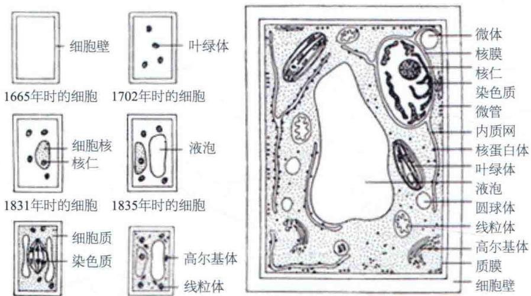  
1880年时的细胞 1927年时的细胞  
至1970年已了解到的细胞主要组成的图解  
图2-1 细胞结构研究历史示意图解  
（细胞内各部分未按比例绘制，依李扬汉）

(2) 学习本章内容, 要认真听讲、积极思考, 适当做些课堂笔记。积极配合教师的课堂教学, 主动回答问题或参与问题讨论等, 理解和记忆基本概念。提倡运用归纳比较的方法, 列表对比不同细胞器、不同组织所处的位置、结构特征、所担负的生理功能等, 归纳整理分散的知识, 集成为系统的知识表格, 这样易理解、好记忆。

（3）认真学习和掌握植物临时玻片标本的制作和显微观察方法，并分组开展解剖观察和自主学习活动，积极参与班级交流和讨论。

（4）在教师的指导下，查阅资料，进一步了解植物细胞增殖、细胞编程性死亡、极性分化和组织形成及其相互转化与功能一致性等的知识。

## 第一节 植物细胞

人类对植物细胞的认识与显微镜发明以及显微技术等的不断改进密切相关。1665年Robert Hooke（英国，1635～1703年）用自制的显微镜观察软木的结构，发现并命名了细胞（cell）。虽然他当时看到的只是植物死细胞的细胞壁，但这却是人类有史以来第一次看到细胞轮廓，开启了人类对细胞研究的历史。以后，Antonie van Leeuwenhoek（荷兰，1631～1723年）、Marcello Malpighi（意大利，1628～1694年）等先后用显微镜观察和研究了其他多种动物、植物材料，更丰富了人们对动物、植物细胞的认识。1838年植物学家M.J. Schleiden（德国，1804～1881年）和Hubert Schwann提出了细胞学说（cell theory），其主要内容有：植物和动物的组织都是由细胞构成的；所有的细胞都是由细胞分裂或融合而来；卵子和精子都是细胞；一个细胞可以分裂而形成组织。20世纪中叶，电子显微镜的发明和应用，人们对细胞的超微结构，以及其结构与功能间的相互关系等有了更为深入的理解（图2-1）。1958年F.C. Steward（美国，1904～1993年）等，利用胡萝卜根韧皮部细胞培养出完整的植株，证实了植物细胞的全能性。如今，人们能够从分子水平上阐明细胞的各种生命活动。

## 一、植物细胞的形态与结构

通常植物细胞都比较小，形状多种多样。细胞的形状和大小，取决于细胞的遗传性、所担负的生理功能以及对环境的适应性，且伴随着细胞的生长和分化，常相应地发生改变。

单细胞植物和细菌或分离的单个细胞，因细胞处于游离状态，常为球形或近球形。多细胞植物体中，细胞排列紧密、相互挤压，常呈不规则的多面体。

高度进化的植物，其体内的细胞形态具有多样性。输导水分和养料的细胞（导管分子和筛管分子），呈长筒形，并彼此连接成相通的“管道”，更利于物质的运输；起支持作用的细胞（纤维或石细胞），都有特别厚的细胞壁，加强支持功能；吸收水、肥的根毛细胞，其外壁向外突出形成一条长管状的结构，增加其吸收面积（图2-2）。

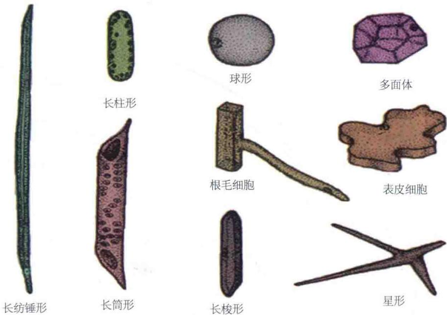  
图2-2 细胞的形状（依李杨汉）

植物细胞的大小因植物种类、细胞的生理年龄和所在部位的不同而差别很大。多数植物细胞的直径为10～100μm，肉眼难以辨别。棉籽的表皮毛细胞长达75mm，苎麻茎中的纤维细胞长达550mm，三叶胶属的无节乳管，是由一个细胞生长成的多核结构，贯穿植物体内，长达数米甚至数十米。多细胞植物体是由许许多多的、千差万别的、大小不同的细胞所组成的一个统一而复杂的生命有机体。

植物细胞虽然大小不一、形状多样，但其结构基本相同（图2-3）。植物细胞由原生质体（protoplast）和细胞壁（cell wall）两部分组成。原生质体是由细胞原生质（protoplasm）分化而成的结构，原生质是一个细胞内全部生活物质的总称。真核植物细胞的原生质体又可分为细胞膜、细胞质和细胞核3部分；原核植物细胞的原生质体中，没有明显的细胞质和细胞核的分化。细胞壁是包被原生质体的保护结构，动物细胞不具细胞壁。

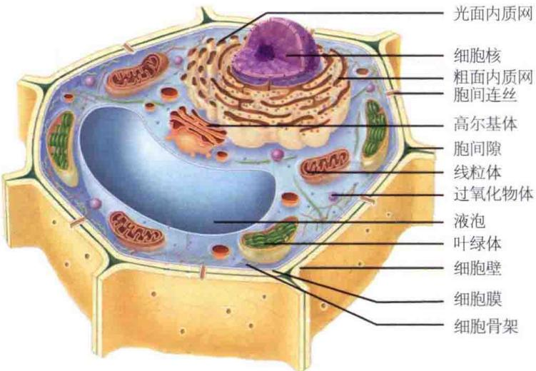  
图2-3 植物细胞的结构（模式图）

## (一) 原生质体

原生质体由质膜、细胞质和细胞核3部分组成。

## 1. 质膜

质膜（plasmalemma）又称细胞膜（cell membrane），是位于原生质体外围、紧贴细胞壁的膜结构。组成质膜的主要物质是蛋白质和脂类，以及少量的多糖、微量的核酸、无机盐和水。在电子显微镜下，用四氧化锇固定的质膜具有明显的“暗-明-暗”三条平行的带，其内、

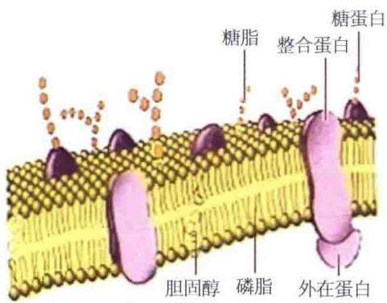  
图2-4 流动镶嵌模型的细胞膜图解（依Karp）

外两层暗带由蛋白质分子组成，中间一层明带由双层脂类分子组成，三者的厚度分别约为2.5nm、3.5nm和2.5nm，这样的膜又称为单位膜（unit membrane）或生物膜（biomembrane）（图2-4）。

质膜有重要的生理功能。例如，使细胞维持稳定代谢的胞内环境，调节和选择物质进出细胞，也与细胞识别、信号传递、纤维素合成和微纤丝的组装等有关。质膜通过胞饮作用（pinocytosis）、吞噬作用（phagocytosis）或胞吐作用（exocytosis）吸收、消化和外排细胞膜外、膜内的物质。

## 2. 细胞质

细胞膜以内、细胞核以外的原生质统称为细胞质（cytoplasm）。细胞质包括胞基质和细胞器两部分。胞基质（cytoplasmic matrix）是呈均质、半透明、胶网状的动态物质，其体积约占细胞质的一半。细胞与环境，细胞质与细胞核，以及细胞器之间的物质运输、能量交换、信息传递和许多重要的中间代谢反应等与胞基质有关。细胞器（organelle）是细胞内具有特定的形态、结构和功能的亚细胞结构。活细胞的细胞质内有多种细胞器，包括具有双层膜结构的质体、线粒体，具有单层膜结构的内质网、高尔基体、液泡、溶酶体、圆球体和微体，以及无膜结构的核糖体、微管、微丝等。

## 1）质体

质体（plastid）来自于前质体，是真核绿色植物细胞特有的细胞器，呈球形或椭圆形，一般大小为几微米至十几微米。前质体（proplastid）主要存在于根端、茎端、胚和卵等的幼龄细胞内。为无色或呈淡绿色的球状体，直径为1～1.5μm，其外有双层膜包被，内膜内褶，伸入基质中，或形成少许游离的小泡或类囊体（thylakoid），膜内基质中有少量的DNA、RNA、核糖体和可溶性蛋白等。当细胞生长分化时，前质体可发育或转变成叶绿体、白色体和有色体。

叶绿体 高等植物的叶绿体（chloroplast），主要存在于叶肉细胞内，在茎的皮层细胞、保卫细胞、花萼和未成熟的果实中也有分布，其功能是进行光合作用（photosynthesis），合成有机物。叶绿体呈透镜形或椭圆形，长径3～10μm，短径2～4μm。细胞内叶绿体的数目、大小和形状因植物种类和细胞类型不同而有很大差异。一个细胞内可能有十多个、几十个，甚至几百个叶绿体。叶绿体常分布在靠近质膜处的胞基质中。

在透射电子显微镜下，叶绿体由叶绿体被膜（chloroplast envelope）（由双层单位膜组成）、类囊体系统（thylakoid system）和基质（stroma）3部分构成（图2-5）。

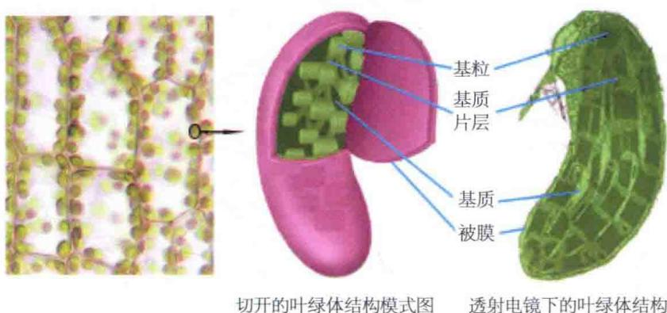  
切开的叶绿体结构模式图  
图2-5 叶绿体的结构  
透射电镜下的叶绿体结构

叶绿体被膜之间有10～20nm的膜间隙（intermembrane space）。外膜通透性强，内膜具有较强的选择透性，是细胞质和叶绿体基质之间的功能屏障。类囊体系统包括基粒（grana）和基粒间膜（fret）或基质片层（stroma lamella）；基粒是直径0.3～2μm的绿色小颗粒，由许多圆盘状的基粒片层（grana lamella）或类囊体（膜上分布着与光能转化有关的色素和酶类）整齐平行地垛叠在一起构成；基质片层在基质间到处延伸，并与基粒类囊体相连，共同组成了复杂的类囊体系统；类囊体是由单层膜围成的、并且具有很多穿孔的扁平小囊，囊内含有液状的内含物。一个叶绿体可含有40～60个基粒，基粒的数量和大小随植物种类、细胞类型和光照条件不同而变化。例如，烟草的基粒含10～15层，玉米为15～20层；冬小麦基粒所含类囊体层数随叶位上升而增多，以旗叶为最多。基粒以外为基质，基质中有与CO₂的同化固定有关的全套酶类，以及核糖体、DNA纤丝、淀粉粒、质体小球（plastoglobulus）和植物铁蛋白（phytoferritin）等。叶绿体含有DNA和核糖体，它可以合成某些蛋白质，在遗传上有一定的自主性。在叶绿体中，还可观察到脂质小球、淀粉粒等结构。

白色体 白色体（leucoplast）近球形，大小为2～5μm，结构简单，不含可见色素，常见于甘薯、马铃薯等植物的地下储藏器官、胚以及少数植物叶的表皮细胞中。根据白色体的功能及所储藏的物质不同可将其分为造粉体（amyloplast）、造蛋白体（proteinoplast）和造油体（elaioplast）。造粉体是储存淀粉的白色体，主要分布于子叶、胚乳、块茎和块根等储藏组织中，遇碘呈蓝紫色。储藏蛋白质的白色体称为造蛋白体，常见于分生组织、表皮和根冠等细胞中，遇碘呈黄色；储存脂类物质的白色体为造油体，存在于胞基质中，遇苏丹Ⅲ呈橙红色。

有色体 有色体（chromoplast）是含有类胡萝卜素，包括黄色的叶黄素（xanthophyll）和红色的胡萝卜素（carotene）的质体。有色体可见于部分植物的花瓣、成熟的果实、胡萝卜的储藏根以及衰老的叶片中。

## 2）线粒体

线粒体（mitochondrion）是细胞内物质氧化、化学能转变成生物能的主要场所。线粒体的形态与细胞类型和生理状况密切相关，常呈球状、杆状、分枝状等。线粒体的大小一般为 $(0.5\sim1.0)\mu m\times(1\sim2)\mu m$ ，有的可达 $(2\sim4)\mu m\times(7\sim14)\mu m$ 。细胞的种类或细胞的生理活性不同，线粒体的数目也有差异。一般代谢旺盛的细胞中线粒体数目多。

透射电子显微镜下，线粒体由双层被膜和基质（matrix）组成（图2-6）。

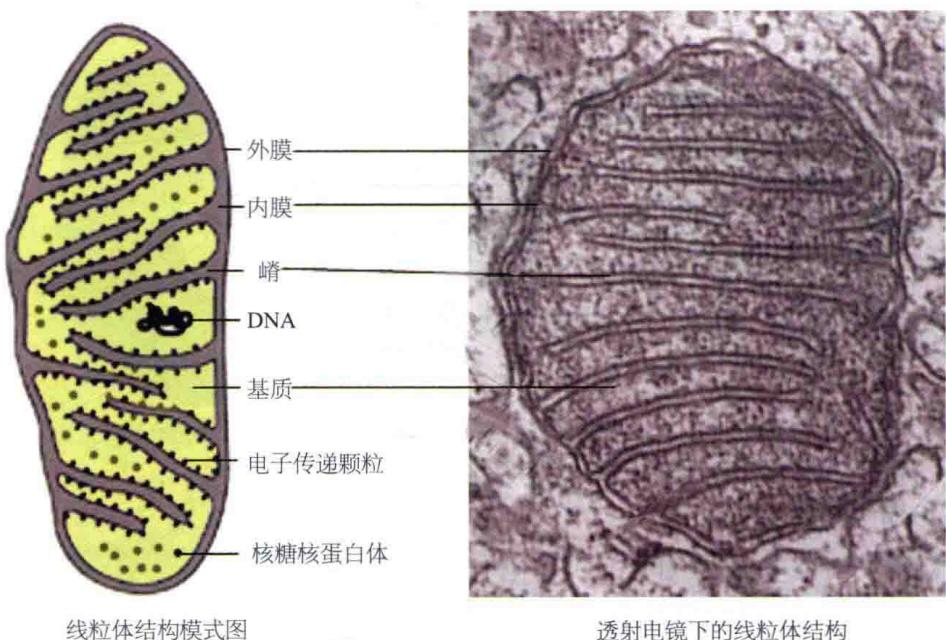  
图2-6 线粒体的结构

被膜包括外膜（outer membrane）、内膜（inner membrane）和膜间隙（intermembrane space）3部分。外膜有可透性孔，允许分子质量为10kDa以下的分子通过；膜间隙是线粒体内外膜之间的空隙，腔隙宽6\~8nm，内含许多可溶性酶类、底物和辅助因子；内膜向腔内突出形成嵴（cristae），嵴有不同的形状和排列方式，或分枝，或呈复杂的网状。一般来说，能量代谢旺盛，细胞中线粒体内膜上嵴的数目也多；嵴表面有许多圆球形颗粒，称为基粒（elementary particle）。基粒由头、柄和基部3部分组成，是ATP合酶（ATP synthase）分布和氧化磷酸化进行的关键部位；基质内主要有与物质氧化分解（三羧酸循环、脂肪酸和丙酮酸氧化等）有关的酶类以及脂类、蛋白质、核蛋白体和含钙颗粒。此外，线粒体内还含有DNA等少量遗传物质，具有遗传上的相对独立性。

## 3）核糖体

核糖体又称核蛋白体（ribosome）等，是合成蛋白质的细胞器。生长旺盛、代谢活跃的细胞内核糖体多。核糖体主要存在于胞基质中，但在细胞核、内质网外表面及质体和线粒体的基质中也有分布。核糖体含有大约60%的核糖核酸和40%的蛋白质。胞基质中的核糖体由两个近于半球形、大小不等的亚基结合而成，直径为17～23nm。多个核糖体可结合到一个mRNA链上，形成多聚核糖体（polyribosome）。

## 4）内质网

内质网（endoplasmic reticulum, ER）是由单层膜围成的扁平的囊、槽、池或管状的、相互沟通的网状系统（图2-7）。ER膜可和核膜的外层膜相连，也可经过胞间连丝和相邻细胞的ER相连，但是不与质膜相连。内质网有两种类型：①粗面内质网（rough endoplasmic reticulum, rER），其膜的外表面附着有核糖体；②光面内质网（smooth endoplasmic reticulum, sER），其膜上无核糖体。内质网是动态易变的结构，其形状、数量、类型以及在细胞内的分布位置，因细胞类型而异，并且随细胞的发育时期、生理状况而相应地变化。

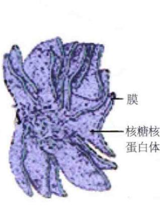  
内质网的立体图解

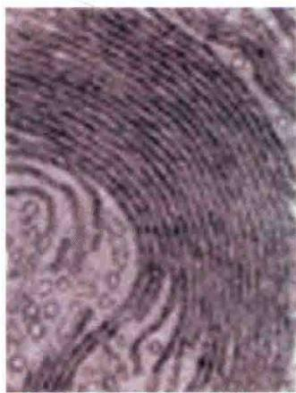  
透射电镜下的rER

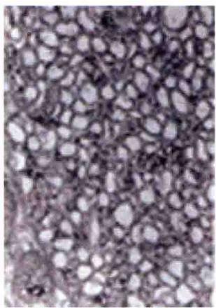  
透射电镜下的sER  
图2-7 内质网的结构

内质网具有制造、包装和运输代谢产物的作用。rER能合成蛋白质及一些脂类，并将其运到sER，再由sER形成小泡，运到高尔基体，然后分泌到细胞外。sER还可合成脂类、糖原等。ER特化或分离出的小泡可形成液泡、高尔基体、圆球体及微体等细胞器。内质网还有“分室”作用，便于不同细胞间代谢的顺利进行。

## 5）高尔基体

高尔基体（golgi body, dictyosome）是由一叠（一般1～8个）扁平、平滑、近圆形的单位膜围成的、直径为1～3μm的多囊结构（cisterna，或称小池、潴泡、槽库），在生长和分泌旺盛的细胞内特别多（图2-8）。高尔基体的主要功能是合成多糖，参与细胞壁的形成，有时也参与运输ER合成的物质。

## 6）液泡

液泡（vacuole）是由具选择通透性的液泡膜（tonoplast）和细胞液组成的细胞器。在不同类型或不同发育时期的细胞中，液泡的数目、大小、形状、成分都有差别。幼期的细胞，如顶端分生组织细胞内，液泡小、数量多，散布于胞基质中。随着细胞的长大和分化，小液泡增大，并逐渐合并为少数几个甚至一个位于细胞中央的大液泡，将其他的原生质都挤成一薄层，包在液泡的外围而紧贴着细胞壁，有利于新陈代谢和细胞的生长。

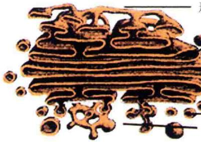  
高尔基体模式图

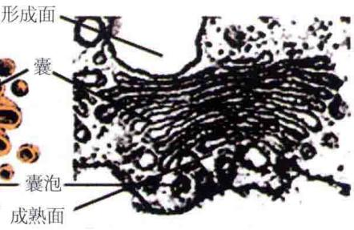  
透射电镜下的高尔基体解剖结构  
图2-8 高尔基体结构

液泡的主要生理功能包括如下几个。①调节细胞水势和维持细胞的膨压。液泡吸水膨胀，是植物体保持挺立状态的根本因素；若液泡失水，植株就萎蔫，影响植物生长。②参与细胞内物质的积累、储存与转化，控制液泡内的 $K^{+}$ 、 $Na^{+}$ 、 $Ca^{2+}$ 、 $Cl^{-}$ 以及磷酸盐、柠檬酸、苹果酸和多种氨基酸等物质的输入和输出，对细胞代谢起着调节和稳定的作用。液泡还储存糖、脂肪、蛋白质等。③防御作用。许多植物液泡中还有几丁质酶，它能分解破坏真菌的细胞壁，当植物体被真菌侵害时，几丁质酶合成增加，对病原体有杀伤作用。

## 7) 溶酶体和圆球体

溶酶体（lysosome）是由单层膜构成的能分解蛋白质、核酸、多糖等生物大分子的细胞器。溶酶体主要来自于高尔基体和内质网分离的小泡。它的形状和大小差异较大，一般为球形，直径0.2～0.8μm。溶酶体除含特有的酸性磷酸酶外，还有多种其他的水解酶。

溶酶体具有异体吞噬（heterophagy）、自体吞噬（autophagy）和自溶作用（autolysis）的功能。溶酶体分解从外界进入到细胞内的物质，称为异体吞噬。例如，有些大分子物质、病毒、细菌，经胞饮或吞噬作用被细胞摄入后，和溶酶体融合而被消化。溶酶体消化细胞自身的局部细胞质或细胞器称为自体吞噬。自溶作用是指在植物发育进程中，有一些细胞会逐步正常地死亡，这是在基因控制下，溶酶体膜破裂，将其中的水解酶释放到细胞内，而引起的细胞自身溶解死亡。

圆球体（spherosome）是由单层膜围成的细胞器。圆球体除含水解酶外，还有脂肪酶，能积累脂肪。圆球体普遍存在于植物细胞中，与脂肪的代谢有关。

## 8）微体

微体（microbody）是单层膜包围的呈球状或哑铃形的细胞器，其直径为0.2～1.5μm，普遍存在于植物细胞中。植物体内的微体有两种类型：一种是含过氧化氢酶的过氧化物酶体（peroxisome）；另一种是含乙醇酸氧化酶的乙醛酸循环体（glyoxysome）。

过氧化物酶体常和叶绿体、线粒体聚集在一起，将光呼吸（photorespiration）的底物乙醇酸氧化为乙醛酸。

乙醛酸循环体除存在于油料植物种子的胚乳或子叶细胞外，在大麦、小麦种子的糊粉层以及玉米的盾片细胞内也有存在。在种子萌发过程中，乙醛酸循环体将储存在子叶和胚乳中的脂类物质逐步转化为糖类，满足种子萌发之需。

## 9）细胞骨架

细胞骨架（cytoskeleton）是真核细胞的细胞质内普遍存在的蛋白质纤维网架系统，包括微丝（microfilament, MF）系统、微管（microtubule, MT）系统和中间纤维（intermediate filament, IF）系统。这三类骨架系统分别由不同蛋白质分子以不同方式装配成不同直径的纤维，然后靠许多连接蛋白相互连接形成既有柔韧性又有刚性的三维网架，把分散在细胞质中的细胞器及各种膜结构组织起来，固定在一定的位置，使细胞内新陈代谢有条不紊地进行（图2-9）。细胞骨架系统还是细胞内能量转换的主要场所，微丝系统、微管系统和相关的马达蛋白（motor protein）相

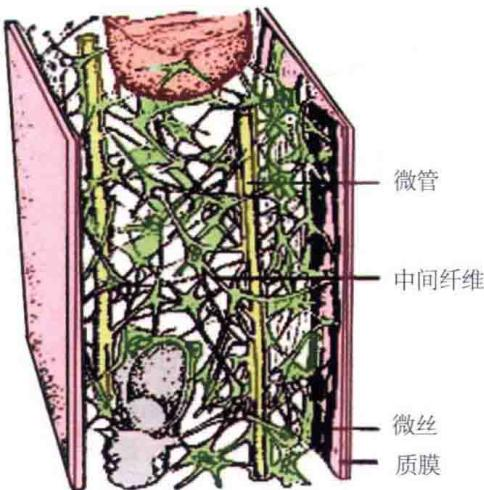  
图2-9 细胞骨架的立体观（依李杨汉）

互作用，将化学能直接转换为机械能，驱使细胞及细胞内组分的运动。

微丝是主要由肌动蛋白（actin）组成的直径6～8nm的细丝，与细胞质流动、染色体运动、叶绿体运动、胞质分裂、物质运输以及与膜有关的一些重要生命活动，如内吞作用和外排作用等有关。

微管主要由微管蛋白（tubulin）和少量微管结合蛋白组成。微管能支持和维持细胞的一定形状，参与纺锤丝的构成，调节细胞壁的生长和分化，影响胞内物质的运输和胞质运动等。

中间纤维直径约为10nm，是由长杆状的蛋白质装配的一种坚韧、耐久的蛋白质纤维。一般认为，中间纤维在维持细胞形态、调节胞内颗粒运动、控制细胞器和细胞核定位等方面有重要作用。

## 3. 细胞核

细胞核（nucleus）是真核细胞遗传与代谢的控制中心。细胞核的结构，随着细胞周期的改变而相应地变化。间期的细胞核可分为核被膜（nuclear membrane）、核仁（nucleolus）和核质（nucleoplasm）3部分（图2-10）。

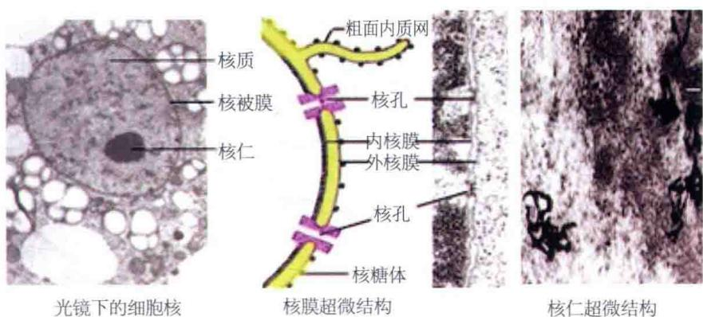  
图2-10 水稻胚乳细胞核结构

间期细胞核的主要功能是储存和复制DNA；合成和向细胞质转运RNA。DNA在间期一定阶段（S期，即DNA合成期）以半保留方式复制，其含量倍增，为子细胞准备一整套和母细胞相同的遗传物质，通过有丝分裂，分配给子细胞。由此可进一步认为细胞核是细胞的控制中心。rRNA在核仁中合成，并参与核蛋白体亚单位的形成，mRNA和tRNA是以染色质中的DNA为模板合成的，并经核孔转移到细胞质中，参与细胞质中的蛋白质合成。

细胞核的大小、形状以及在胞内所处的位置，与细胞的年龄、功能以及生理状况有关，而且也受某些外界因素的影响。分生组织细胞中的细胞核所占的体积通常较大，占整个细胞体积的1/3～1/2，直径为7～10μm。成熟细胞内的细胞核直径一般为35～50μm。有少数植物的细胞核很大，如苏铁的卵细胞核，直径可达1mm，肉眼可见，某些真菌的细胞核直径不超过0.5μm。细胞核的形状多近球形。在禾本科植物的保卫细胞中，细胞核呈哑铃形。在幼期细胞中，细胞核常位于细胞中央，细胞生长时，由于液泡的增大和合并，细胞核常被挤至细胞的一侧。一般植物细胞仅具一个细胞核，但花药绒毡层细胞、乳汁管以及许多真菌和藻类植物的细胞中常含有2个或更多的细胞核。分化成熟的筛管分子，其细胞核解体，因而不具细胞核。一般来说没有核的细胞不能长期正常生活。

在透射电子显微镜下，细胞核的结构由核被膜、核仁和核质3部分组成。

核被膜 核被膜（nuclear membrane）包被在核的外围，由内外两层相距十至几十纳米的单位膜组成。外核膜（outer nuclear membrane）面向胞质，表面附着有大量核糖体，常与内质网相连。内核膜（inner nuclear membrane）面向核质，和染色质紧密接触。两层核膜之间有20～40nm的核周间隙（perinuclear space），与内质网腔连通。双层核膜在一定间隔处愈合形成核孔（nuclear pore），又称为核孔复合体（nuclear pore complex），它是由一个中央颗粒、8个边围颗粒和连接中央颗粒与边围颗粒的纤丝所组成的复杂结构，是沟通核质与细胞质的通道。全部核孔约占核表面积的8%。高等植物的核，约有3000个核孔。核被膜是选择通透性膜，小于5kDa的小分子可通过核孔自由扩散，60kDa的球形蛋白则几乎完全不能扩散通过，大分子通过核孔靠主动运输完成。核孔既能将复制、转录、染色体构建等需要的组蛋白、DNA聚合酶、RNA聚合酶（分子质量100～200kDa）等运输到核内，又能把翻译所需的RNA、核糖体亚单位等从核内运到细胞质。核孔结构精致，其“开”“闭”与植物的生理状况或特性有关。例如，分蘖盛期的小麦核孔大；小麦抗寒品种的核孔，随温度的降低而逐渐关闭，但小麦不抗寒品种的核孔却依然张开。

内核膜的内侧有一层蛋白质网络结构，称为核纤层（nuclear lamina），它与内膜紧密结合，其厚薄随细胞不同而异。它由中间纤维蛋白组成，构成核纤层的中间纤维蛋白是核纤层蛋白（lamina）。核纤层为核膜和染色质提供了结构支架，并介导核膜与染色质之间的相互作用。当细胞分裂时，核被膜在分裂前期末瓦解，到末期形成两个子核时，又分别重现。

核仁 生活的细胞核内，常有一个或几个核仁（nucleolus）。核仁是真核细胞间期核中最明显的结构，在细胞周期中表现出周期性的消失与重建。在光学显微镜下，核仁是折光率比核质更强而致密的匀质球体。核仁的大小、形状和数目随植物种类、细胞类型、生理状态而异，也受环境的影响。蛋白质合成旺盛的细胞，其核仁的体积相对较大。核仁中的蛋白质占干重的80%，RNA占10%左右。此外，还有少量的DNA、脂类、碱性磷酸酶和ATP酶等。

核质 核质（nucleoplasm）主要包括染色质和核基质两部分。①染色质（chromatin）是间期细胞核内DNA、组蛋白、非组蛋白和少量RNA组成的线性复合物，是间期细胞核遗传物质的存在形式。一般认为，染色质细丝是由许多称为核小体（nucleosome）的基本单位连接而成的串珠状结构。每个核小体的中心有8个组蛋白分子，DNA双螺旋盘在它表面，核小体之间有一段DNA双螺旋，并与另一个组蛋白分子相连。由染色质细丝经多级盘绕、折叠、压缩、包装形成染色体（chromosome）。②核基质（nuclear matrix）是核内充满着的一个以非组蛋白成分为主的网络状结构，又称为核骨架（nuclear skeleton）。核骨架与核纤层和核孔结构有联系，为细胞核内组分提供了结构支架，使核内的各项代谢活动得以有序地进行，并可能对DNA复制、基因表达、染色体构建等起重要作用。

## (二) 细胞壁

细胞壁（cell wall）是植物细胞所特有的结构，是由细胞原生质体生命活动过程中向外分泌的多种物质复合而成的结构。细胞壁保护细胞、支持和巩固植物体，与维持原生质体的膨压和植物组织的吸收、蒸腾、运输和分泌等方面的生理活动有很大的关系。

## 1. 细胞壁的结构

在细胞发育生长过程中，因其所形成的壁物质在种类、数量、比例以及物理组成上的时空差异，细胞壁结构表现出分层现象（lamellation），在显微镜下可区分为胞间层、初生壁和次生壁（图2-11）。

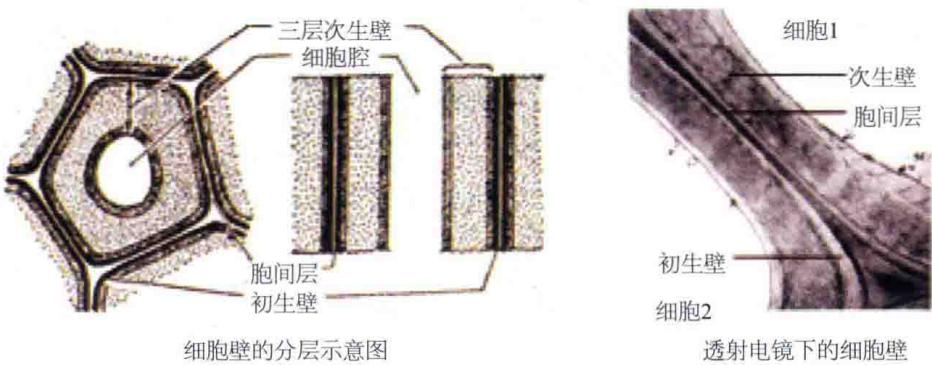  
图2-11 细胞壁的结构分层

## 1) 胞间层

胞间层（intercellular layer）是新的子细胞形成时产生的、以果胶为主的细胞壁结构。果胶是一类多糖物质，胶黏而柔软，能将相邻的细胞黏在一起，果胶物质的可塑性能缓冲细胞间的挤压又不致阻碍初生壁生长和扩大表面积。胞间层在一些酶（如果胶酶）或酸、碱的作用下会发生分解，使相邻细胞失去连接，而彼此分离。西瓜、番茄等果实成熟时，部分果肉细胞彼此分离就是这个原因。

## 2）初生壁

初生壁（primary wall）是细胞生长、体积增大时所形成的壁层，分别位于胞间层两侧。构成初生壁的主要物质有纤维素、半纤维素和果胶物质等。初生壁一般都很薄，厚度为1～3μm，不过也有均匀或局部增厚的，前者如柿胚乳细胞，后者如厚角组织细胞。然而，增厚的初生壁是可逆的，即在一定情况下厚的初生壁又可以变薄，如柿子胚乳细胞的壁物质在种子萌发时，分解转化，厚壁又变薄；厚角组织在转变成分生组织时，其增厚的壁也能变薄。

## 3）次生壁

次生壁（secondary wall）是某些细胞在生理上分化成熟、体积停止增大，或原生质体走向消失的过程中在初生壁内侧产生的壁层，一般比初生壁厚得多。例如，各种纤维细胞、导管、管胞、石细胞和木薄壁细胞等。构成次生壁的物质以纤维素为主，有的还有木质素、角质素、矿质等物质。

## 纹孔和胞间连丝

## 1）纹孔

初生壁的厚度往往是不均匀的，常有一些凹陷区域，其内有许多胞间连丝通过，这个区域称为初生纹孔场（primary pit field）（图2-12）。次生壁形成时，有的初生纹孔场所在的位置不形成次生壁，在细胞壁上，只有中层和初生壁隔开，而无次生壁的较薄区域称为纹孔（pit）。相邻两细胞的纹孔通常成对存在，合称纹孔对（pit pair）。纹孔对中的胞间层和两边的初生壁，合称纹孔膜（pit membrane）。纹孔的腔，称为纹孔腔（pit cavity）。

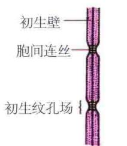  
初生纹孔示意图

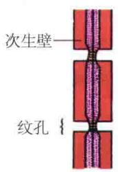  
纹孔示意图

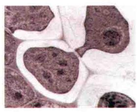  
透射电镜下的纹孔

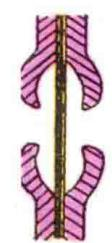  
具缘纹孔对

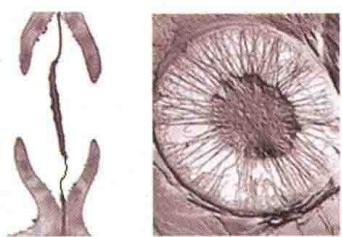  
松树具缘纹孔  
图2-12 初生纹孔场和具缘纹孔

## 2）胞间连丝

胞间连丝（plasmodesmata）是连接相邻两个植物细胞间的细胞质细丝，是细胞间物质、信息和能量交流的直接通道，行使水分、营养物质、小的信号分子以及大分子的胞间运输功能。胞间连丝一般都很细，直径小于0.1μm，经银、汞等重金属特殊处理，使它扩大，可在光学显微镜下分辨出来（图2-13）。

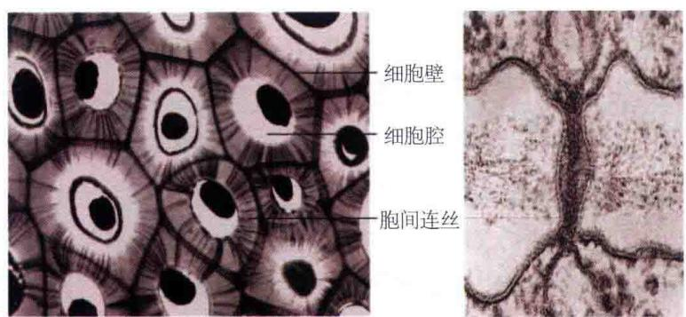  
图2-13 光学（左）电子（右）显微镜下柿胚乳细胞（示胞间连丝）

高等植物的生活细胞之间，一般都有胞间连丝相连，其数量、分布位置不一。一个分生组织细胞，可能有1000～10 000条胞间连丝。细胞的不同侧面，胞间连丝的数量不一，筛管分子和某些传递细胞之间，胞间连丝特别多。胞间连丝是相邻细胞间信息、物质和能量交换的通道。

## 3. 细胞壁的生长

植物细胞壁的生长包括初生壁的生长（主要增大面积）和次生壁的生长（主要是增加厚度）。随着细胞的生长，初生壁中的微纤丝由少到多、由稀疏到致密、由横向排列于细胞长轴转变成纵向排列。

在次生壁增厚过程中，随着微纤丝的大量沉积，细胞内合成一些特殊的物质掺入壁内，改变壁的性质以适应功能的变化。细胞壁的这种变化包括木质化、栓质化、角质化、矿质化。木质化是指木质素填充到细胞壁中去的过程，使胞壁的机械强度增加，如纤维、导管和管胞等的细胞壁增厚。细胞壁的栓质化是栓质素在细胞壁中沉积的过程，如老茎和老根表面木栓细胞壁中的栓质能有效地防止水分蒸发、凯氏带中的栓质是质外体运输的屏障等。角质化是细胞壁的表层沉积角质的过程，一般在植物地上器官的表皮细胞外壁会因角质渗入微纤丝之间而角质化，并形成角质膜，以减少植物体的水分损失、过滤强光、防止机械损伤、昆虫摄食和病菌侵染等。矿质化是细胞壁中积累矿物质，如钙、硅等的过程。例如，禾本科、莎草科等植物表皮细胞的外壁中，常积累有二氧化硅而硅质化，增加硬度，并有保护功能。

据估计，地球上的植物每年所形成的纤维素约有85亿t之多。纤维素是造纸、人造纤维、火药、胶片、绝缘材料及食品工业等的不可缺少的重要材料，木质素在石油、塑料、染料和制革等工业方面也有广泛的用途。此外，植物细胞壁在抵抗植物病原微生物的侵害和抗倒伏中起着非常重要的作用，因此，研究细胞壁有着极其重要的意义。

## (三) 植物细胞的后含物

植物细胞生活过程中，不仅为生长、分化供应营养物质和能量，同时也产生储藏物质、代谢废物或植物的次生物质等，这些非原生质的物质称为后含物（ergastic substance）。

## 1. 储藏物质

叶绿体光合作用的同化物除运往植物体各部位供新陈代谢消耗外，一部分可暂时储存起来，需要时经分解再利用。常见的储藏物质有淀粉、脂类（油和脂肪）和蛋白质。

## 1）淀粉

淀粉（starch）是植物细胞质体中形成的最普遍的储藏物质。储藏的淀粉常呈颗粒状，称为淀粉粒（starch grain）（图2-14），它主要分布于储藏组织的细胞中。不同植物的淀粉粒的大小、形状和脐所在的位置，都各有其特点，可作为商品检验、生药鉴定上的依据之一。

## 2）蛋白质

储藏蛋白以多种形式存在于细胞质中。除造蛋白体合成和积累蛋白质外，小麦胚乳细胞中储存的蛋白质粒（称糊粉粒，aleurone grain）是由储藏蛋白积累在液泡中形成的（图2-15）。蓖麻、油桐胚乳细胞的糊粉粒内，除了无定形的蛋白质外，还含有蛋白质的拟晶体；在马铃薯块茎外围的储藏细胞中，蛋白质的拟晶体和淀粉粒共存于同一细胞内。

果皮  
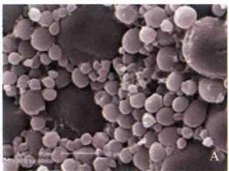

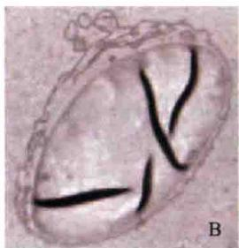

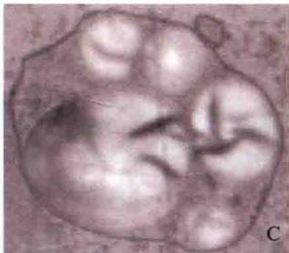

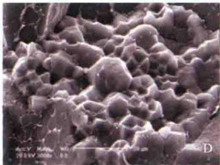

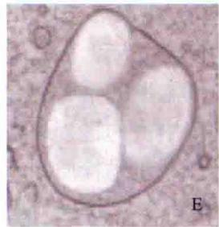

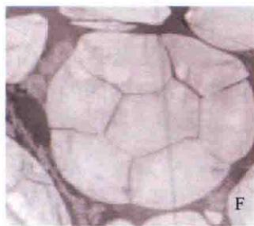  
图2-14 储藏淀粉粒的结构（韦存虚供）

A. 成熟小麦籽粒扫描电镜图，示大淀粉粒、小淀粉粒的形态和分布；B. 小麦胚乳发育过程中大淀粉粒的发育透射电镜图，示一个淀粉体内含有1个淀粉粒；C. 小麦胚乳发育过程中小淀粉粒的发育透射电镜图，示一个淀粉体内含有多个淀粉粒；D. 成熟水稻籽粒扫描电镜图，示复粒淀粉粒的形态和分布；E. 水稻胚乳发育过程中复粒淀粉粒的发育透射电镜图，示一个淀粉体内含有多个淀粉粒；F. 水稻胚乳接近成熟期复粒淀粉的形态和排列透射电镜图

内胚乳层

糊粉层种皮

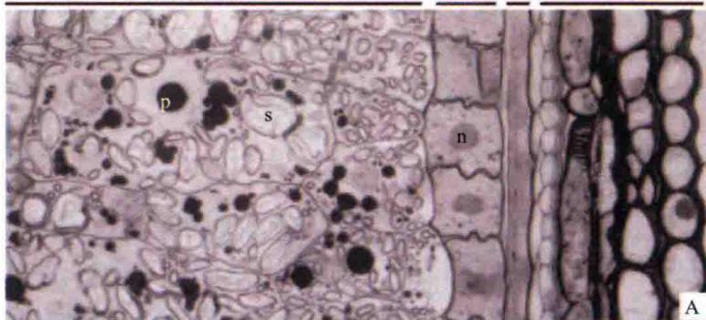

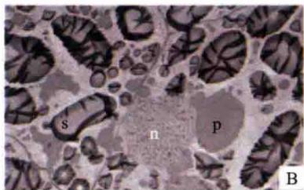

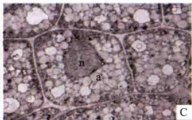  
图2-15 小麦储藏蛋白的结构（韦存虚供）  
A. 颖果积累淀粉和储藏蛋白光镜图；B. 内胚乳透射电镜图；C. 糊粉层透射电镜图  
a. 糊粉粒；n. 细胞核；p. 蛋白体；s. 淀粉粒

## 3）油和脂肪

在植物细胞中，油和脂肪是由造油体合成的重要的储藏物质，两者可能少量地存在于每个细胞内，呈小油滴或固体状，大量地存在于一些油料植物种子或果实内，子叶、花粉等细胞内。

## 2. 晶体和硅质小体

在植物细胞中的结晶（crystal）形成于液泡内，常为草酸钙结晶，呈各种形状，如印度橡皮树叶的上表皮细胞中的结晶呈钟乳体等，禾本科、莎草科、棕榈科植物茎、叶的表皮细胞内所含的二氧化硅晶体，称为硅质小体（silica body）。

## 二、植物细胞的分裂与分化

## (一) 植物细胞的分裂

分裂是植物细胞繁殖的方式，是细胞形成新个体或新细胞的过程。植物细胞的分裂有无丝分裂、有丝分裂、减数分裂和细胞的自由形成等不同方式。细胞分裂对植物的生活和繁衍后代有重大意义。

## 1. 细胞周期

细胞周期（cell cycle）是指持续分裂的细胞，从结束一次分裂开始，到下一次分裂完成为止所经历的整个过程（图2-16）。一个细胞周期包括细胞的间期（interphase）和分裂期。间期是细胞进行生长的时期，合成代谢最为活跃，包括合成DNA、蛋白质和积累能量等。分裂期是细胞分裂产生新的子细胞的时期。间期可进一步分 $G_{1}$ 期、S期和 $G_{2}$ 期。

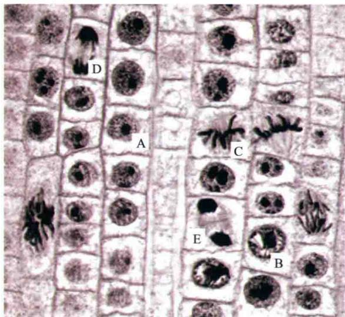  
图2-16 百合根尖分生组织细胞的有丝分裂各个时期  
A. 间期；B. 前期；C. 中期；D. 后期；E. 末期

$G_{1}$ 期是指从前一次分裂结束到DNA复制开始前的间隔时间。在 $G_{1}$ 期，RNA、蛋白质和酶的合成与蛋白质的磷酸化非常旺盛，膜系统不断完善，细胞器不断增多，细胞的体积、重量增加。S期又称为DNA复制期，即DNA复制、组蛋白和非组蛋白等的合成和新的核小体（nucleosome）等染色体结构的包装。在S期，DNA及组蛋白含量比 $G_{1}$ 期增加一倍。 $G_{2}$ 期是细胞分裂的准备期。DNA复制完成，并有少量的RNA合成，主要进行细胞分裂过程中所需的能量（ATP）、物质（微管蛋白等）的代谢和准备等。

细胞周期时间的长短因植物物种或变种的核内所含DNA的数量而定，凡DNA含量多的，细胞周期就长，环境条件，如温度等会明显影响细胞周期持续的时间，一般植物细胞的一个细胞周期所需时间为十几小时至几十小时。

## 2. 植物细胞的分裂方式与特点

## 1）有丝分裂（mitosis）

有丝分裂又称间接分裂（indirect division）。它是一种最普遍而常见的细胞分裂方式。有丝分裂过程包括核分裂（karyokinesis）和胞质分裂（cytokinesis）。核分裂是细胞核的周期性变化与再生的过程，根据其形态学特征可将其划分为前期、中期、后期和末期4个时期（图2-16）。胞质分裂出现在细胞分裂的末期，是细胞质一分为二的过程。

前期（prophase），染色质凝缩成染色体，每条染色体含有2条完全相同的染色单体（chromatid）。前期末，核仁解体，核膜消失，纺锤体逐渐形成。

中期（metaphase），纺锤体（spindle）完全形成，纺锤丝牵引染色体使其排列到赤道面。中期是计数细胞染色体数目最佳的时期。

后期（anaphase），每条染色体的2条染色单体在着丝点分开，分别移向细胞两极。

末期（telephase），到达两极后的染色体，由凝缩状态逐渐解旋伸延成为染色质细丝而进入间期状态；染色质周围的小囊泡组装成新的核膜，核仁重新出现，两子核形成。在末期，纺锤体和纺锤丝转变成成膜体（phragmoplast），并连同来自于高尔基体和内质网的小泡融合成为细胞板（cell plate），随着细胞板的延伸向四周扩展，完成细胞质的分裂，形成两个遗传组成完全相同的子细胞。参与形成细胞板的内质网等，将来发育成胞间连丝。

在有丝分裂过程中，每次核分裂前期必须进行一次染色体的复制。分裂时，每条染色体的两条染色单体分开，形成两条子染色体，平均地分配给两个子细胞，保证了每个子细胞具有与母细胞相同的遗传物质，保证了细胞遗传的稳定性。

## 2）减数分裂

减数分裂（meiosis）是与生殖细胞或雌雄配子形成有关的一种特殊的细胞有丝分裂方式。在减数分裂过程中，细胞连续分裂两次，但染色体只复制一次，因此，同一母细胞分裂成的4个子细胞的染色体数目只有母细胞的一半，减数分裂由此而得名。减数分裂是有性生殖的前提，是物种稳定性、变异性和进化适应性的基础（参见第三章）。

减数分裂对保持遗传的稳定性和丰富遗传的变异性具有十分重要的意义。通过减数分裂形成单核花粉粒和单核胚囊，由它们分别产生的精细胞和卵细胞都是单倍体，精细胞、卵细胞结合后，形成的合子再发育成胚，恢复了二倍体，从而使物种的染色体数目保持相对的稳定性；同时由于同源染色体的联会与交叉，使遗传物质发生交换与重组，提供了新的变异，使后代增强了生活力和适应性。因此，研究植物的减数分裂对于探讨植物的遗传、变异的内在规律和进行有性杂交育种等都有着重要的意义。

减数分裂的过程比较复杂，现简述如下（图2-17）。

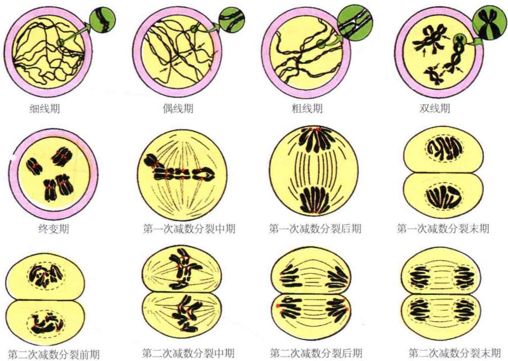  
第二次减数分裂前期  
第一次减数分裂后期  
第一次减数分裂末期

第二次减数分裂中期

第二次减数分裂后期

第二次减数分裂末期

图2-17 减数分裂过程图解（依翟中和）

## (1) 减数分裂的第一次有丝分裂

## ① 前期 I

细线期（leptotene）染色体含有两条染色单体，螺旋卷曲成细丝状，常附着在核膜的某处，临近核仁，并向另一方向散开呈花束状（如水稻等）。

偶线期（合线期zygotene）同源染色体配对联会（synapsis），伴有极少量DNA合成。

粗线期（pachytene）染色体缩短变粗，由于联会，染色体数目外观上为原来二倍体数目的一半。每个染色体被称为二价体（bivalent），含4条染色单体，又称为四联体（tetrad）。此时，二价体内相邻的染色单体之间，可发生染色单体片段的交换（crossing over），它是生物遗传变异的基础。

双线期（diplotene）染色体继续缩短变粗，联会染色体呈现X、V、8和0等形状，并能清楚地观察到二价体的4条染色单体。核仁体积缩小，有的仍与染色体相连。

终变期（diakinesis）染色体继续缩短变粗，染色体对常常分散排列在核膜的内侧，故此时期为观察、计算染色体数目的最适宜时期。以后同源染色体逐渐分开，仅以近端部的交叉处相衔接。终变期末，核膜、核仁相继消失，纺锤丝开始出现。

## ② 中期 I（metaphase I）

染色体螺旋化，缩短达到最大值。二价染色体以交叉处排列在细胞中部的赤道板上，两条染色体上的着丝粒以等距分列于赤道板的两侧，纺锤体形成。中期Ⅰ也是观察、研究染色体的适宜时期。

## ③ 后期 I (anaphase I)

由于纺锤丝的牵引，两个着丝粒分别向两极移动，使二价体分离，分别移向各自的极区，故每一个极区只有原来母细胞染色体的一半。

## ④末期I（telophase I）

两组染色体分别到达极区，有些物种在此期会有核膜形成和染色体螺旋解体。而另一些物种，则不形成核膜，染色体也不螺旋解体。但以上两种情况，核仁都不重现。

## (2) 减数分裂的第二次分裂 (减数分裂 II)

减数分裂第二次分裂（减数分裂Ⅱ）发生在第一次分裂结束后，细胞没有进行DNA复制，不存在间期或只有极短的间期，便进入到减数分裂Ⅱ。减数分裂Ⅱ也分为前期、中期、后期、末期4个时期，其分裂过程和特征与一般有丝分裂基本相同，所不同的是后期Ⅱ移向两极的染色体为单倍的染色体组。

减数分裂后形成4个子细胞，在没有分离前，称为四分体（tetrad）。子细胞的染色体数只有母细胞的一半，且由于发生过染色单体片段的交叉，其所含的遗传物质常有所不同，为后代的遗传变异奠定了基础。

花粉母细胞减数分裂的胞质分裂有两种类型，即连续型（successive type）和同时型（simultaneous type）。连续型是在减数分裂第一次分裂末，随即产生新壁形成二分体，然后在第二次分裂末，再在二分体各自的细胞中产生细胞板，形成四分体。由于第二次的分裂面与第一次的分裂面相垂直，四分体排列在一个平面上。其壁的发育为离心式，即胼胝质先在细胞板的中央沉积，然后向两侧扩展，直到和母细胞外围的胼胝质壁相接。这种类型在单子叶植物中占多数，如水稻、小麦、玉米、百合等，少数双子叶植物，如金鱼藻、夹竹桃等也属于本类型。同时型是指细胞壁发生在减数分裂的第二次分裂末，形成4个子细胞核以后，因细胞壁互不垂直，故四分体呈四面体。其壁的发育为向心式，胼胝质从母细胞壁的一侧开始，逐渐向四分体的中央积累，同时把四分体中的细胞核彼此隔开。这种类型在双子叶植物中占多数，如棉花、油菜、烟草、花生、茶等，但是单子叶的兰科、灯心草科以及莎草科等也属于本类型。

## 3）无丝分裂

无丝分裂（amitosis）是不出现染色体和纺锤体的细胞分裂形式（又称直接分裂），形成两个或多个近于相等或不等的子细胞，它是发现最早的一种细胞分裂方式。无丝分裂可见于根、茎、叶、花、果实和种子生长发育的某个时期或某些部位，如块根、块茎的发育，居间分生组织的活动等，在离体培养的愈伤组织中，更常见到细胞无丝分裂（图2-18）。

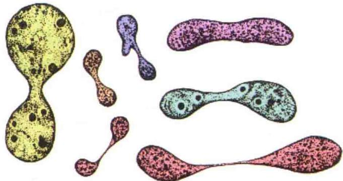  
图2-18 棉花胚乳游离核时期细胞核的无丝分裂（依胡适宜）

无丝分裂依其核的形态变化，可分为横缢、出芽等类型。横缢是指核仁分裂为二，接着细胞核伸长，中部横缢，断裂成为两个细胞核，在子核间产生新的细胞壁，最后形成两个子细胞。出芽也是一种无丝分裂，如酵母等细胞的分裂，在细胞的一端，细胞核与细胞质可同时缢缩，形成一至多个子细胞。无丝分裂过程比有丝分裂过程简单，不出现染色质体、纺锤体等一系列变化，消耗能量少，分裂速度快，但其遗传物质一般不能平均分配到子细胞，所以其遗传不稳定。

## 4）细胞的自由形成

细胞的自由形成实际上是细胞壁的自由形成，而细胞核还是有丝分裂或减数分裂形成的。苹果、小麦等许多被子植物的核型胚乳发育就是如此（参见第三章）。

## (二) 植物细胞的生长与分化

细胞通过分裂所产生的子细胞，有的进入下一个细胞周期，再行分裂；有的不再分裂，而朝着生长和分化的方向发展。

细胞进行生长时，活跃地合成大量的新原生质，同时在细胞内也出现许多中间产物和一些废物，从而使细胞的体积不断地增大，重量也相应地增加。在植物体的细胞分裂部位，可以明显地看到，有丝分裂刚产生的子细胞都很小，其体积仅约为母细胞体积的一半。但细胞成熟后，其体积可增加几倍、几十倍，甚至更多。例如，在器官内纵向伸长的纤维细胞，可增大几百倍、几千倍。因此，细胞的生长是细胞体积和重量增加的过程，也是植物体生长的基础。

细胞分化（cell differentiation）是细胞在形态、结构和功能上发生改变的过程。通过细胞分裂和分化，形成形态、结构和功能各异的细胞类型。脱分化（dedifferentiation）是指已分化的细胞在一定因素作用下可恢复分裂机能，重新恢复细胞分裂特性的过程。脱分化后产生的新细胞可以再分化（redifferentiation）成不同的组织。表皮、皮层、韧皮部和厚角组织等都可在一定条件下发生脱分化。可见，植物细胞具有很大的可塑性（plasticity）。

多细胞生物体的生长发育过程中，细胞分裂、生长和分化的同时，也不断地发生着细胞凋亡（apoptosis）或细胞程序性死亡（programmed cell death）。细胞程序性死亡是细胞在一定生理或病理条件下，依据自身的程序，主动结束其生命的过程，是正常的生理性死亡，是基因程序性活动的结果。例如，根系生长发育过程中表皮和根毛细胞的生理性枯萎、死亡，管状分子分化的结果导致细胞的死亡，花药发育过程中绒毡层细胞的降解，种子萌发时糊粉层和淀粉胚乳细胞的退化消失等。

## 第二节 植物组织

植物组织（plant tissue）是由形态结构相似、功能相同的一种或数种类型的细胞组合成的结构和功能单位，也是植物器官的基本组成结构单位。植物组织是植物在长期适应环境的过程中产生的，其发展和完善也是在适应环境的过程中实现的。植物的进化程度越高，其体内细胞（群）间的分工越细，植物体的结构越复杂，适应性越强。被子植物是现存植物中高度发达和进化的植物类群，具有最完善的组织分工，在形态结构和生理功能上表现出高度的统一，适应环境的能力也最强。

在个体发育中，组织的形成是植物体内细胞分裂、生长、分化的结果。高等的多细胞植物，尤其是种子植物，都是由多种类型的组织构成的。每一类组织的细胞在空间上紧密排列在一起，形态、结构相似，共同完成相同的生理功能。几种不同的组织有机配合、紧密联系，形成不同的器官（organ），不同的器官之间互相配合，更有效地完成有机体的整个生命活动过程。因此，由细胞构成组织，由组织构成器官，再构成的植物体是一个有机整体。

对多细胞植物体而言，细胞、组织或器官都有其相对的独立性和全息性，在一定的条件下，一个生活细胞、组织或器官的相对独立的组成部分都可发育成完整植株。组织与组织之间在一定程度上可相互转化。

植物组织中，细胞的形态结构与它们的生理功能是相适应的。例如，叶肉细胞含有许多叶绿体，执行光合作用、制造有机物质；茎干具有发达的管状系统，输导水分和营养物质；根系的根尖部分表皮细胞外壁凸出，形成毛状结构，扩大了根的表面，能够更多地接触土壤，从中

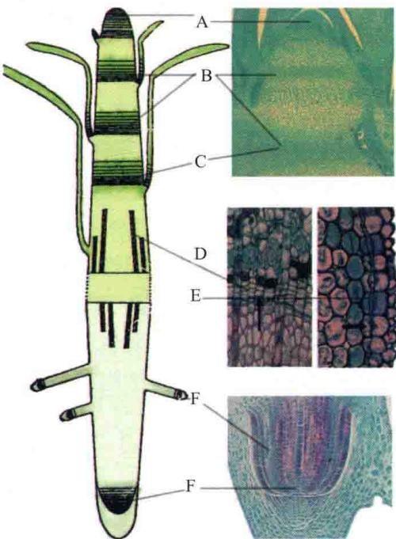  
图2-19 分生组织的分布与特征

A. 顶端分生组织（芽）；B、C. 居间分生组织；D、E. 侧生分生组织；F. 顶端分生组织（根）

吸收水分和溶于水的无机盐养分。这些都说明植物组织的形态、结构和功能是高度统一的。

根据组织的发育程度、形态结构及其生理功能的不同，通常将植物组织分为分生组织和成熟组织两大类。分生组织具有产生新细胞的特性，是产生和分化其他组织的基础。成熟组织由分生组织产生的细胞经生长、分化而形成。

## 一、分生组织

分生组织（meristem）是一类可连续性或周期性分裂产生新细胞的组织。分生组织的细胞经过分裂、生长、分化而形成其他各类组织，直接关系到植物的生长和发育。

分生组织的细胞排列紧密，一般无明显的细胞间隙；细胞壁薄，主要由果胶和纤维素构成；细胞核相对较大，细胞质浓、细胞器丰富，且一般没有液泡和质体的分化。

根据分生组织在植物体中的存在位置，将其分为顶端分生组织、侧生分生组织和居间分生组织（图2-19）。

## 1. 顶端分生组织

顶端分生组织（apical meristem）位于根和茎顶端的分生区部位，其细胞小、排列紧密、近方形，能较长期地保持旺盛的分裂能力。顶端分生组织分裂产生的细胞，一部分继续保持分裂能力，一部分逐渐分化、形成各种有关的成熟组织。顶端分生组织是根、茎、腋芽和幼叶生长的基础。当有花植物发育到一定阶段，茎的顶端分生组织可转化为产生花或花序的分生组织。

## 2. 侧生分生组织

侧生分生组织（lateral meristem）包括维管形成层（图2-19D）和木栓形成层（图2-19E、图2-20），它们是一类分布于植物体内、平行于所在器官的边缘，且与所在器官的增粗有关的次生分生组织。除维管形成层中有部分近于等径的细胞外，均为长轴形细胞所组成。它们的原生质体内具有不同程度的液泡化。

在多年生植物体内，维管形成层可逐年活动，产生新的细胞，位于维管形成层外侧的细胞分化为次生韧皮部，位于其内侧的细胞则分化为次生木质部；木栓形成层的分裂活动，向外形成木栓层，向内形成栓内层，覆盖于老根和老茎的外周。在裸子植物和多数双子叶植物中，侧生分生组织活动的结果，使根和茎得以增粗。

## 居间分生组织

居间分生组织（intercalary meristem）位于茎、叶、子房柄、花梗、花序轴等器官节段的基部或其成熟组织之间，其细胞的分裂仅局限于一定的时间和空间，便转为成熟组织。居间分生组织的细胞核大，细胞质浓，有一定程度的液泡化，主要进行横向分裂，是器官纵向伸长的基础。禾本科植物茎的每个节间的基部都具有居间分生组织，如水稻（Oryza sativa L.）、小麦（Triticum aestivum L.）等拔节、抽穗，竹类植物的雨后春笋，韭菜（Allium tuberosum Rottler）、葱（Allium fistulosum L.）叶子刈割后的快速生长，以及花生（Arachis hypogaea L.）子房柄的形成等，都与居间分生组织的活动密不可分。

此外，根据分生组织的来源、发育程度和性质，还可将其分为原分生组织、初生分生组织和次生分生组织。

原分生组织 原分生组织（promeristem）包括胚和顶端分生组织先端的原始细胞。原分生组织的细胞体积较小、近于正方体、细胞核相对较大、细胞质浓、细胞器丰富，有很强的持续分裂或潜在分裂能力，是产生其他组织的原初组织。

初生分生组织 初生分生组织（primary meristem）位于根端、茎端的原分生组织的后方，是原分生组织细胞分裂后经有限生长或衍生或保留的组织。初生分生组织的细胞分裂能力仍较强，部分细胞初步分化为原表皮、基本分生组织和原形成层。原表皮（protoderm）位于最外周，主要进行径向分裂；基本分生组织（ground meristem）位于原表皮之内，所占比例最大，可进行各个方向的分裂，以增加分生组织的体积；原形成层（procambium）位于基本分生组织中的特定部位，其细胞扁而长，是分化产生维管组织的基础。

次生分生组织 次生分生组织（secondary meristem）多位于较老的根、茎等器官的内侧，是由某些成熟组织经脱分化、重新恢复分裂能力而来的组织。次生分生组织的细胞扁长或短轴型的扁多角形，细胞呈不同程度的液泡化。次生分生组织包括木栓形成层（phellogen）和维管形成层（vascular meristem）（尤其是束间形成层），主要分布于根茎器官的内侧，并与其长轴相平行，与根茎的逐年增粗直接相关。

从组织发生的来源和性质分析，顶端分生组织包括原分生组织和初生分生组织。居间分生组织是由茎尖顶端分生组织衍生而遗留在某些器官局部区域的分生组织，属于初生分生组织。侧生分生组织的细胞是在初生分生组织分裂的细胞经生长、分化、成熟的基础上，由成熟组织经脱分化、恢复分裂而来。因此，侧生分生组织属于次生分生组织。

## 二、成熟组织

成熟组织（mature tissue）是由分生组织细胞分裂所产生的细胞经过生长和分化而来的组织。成熟组织在其形态、结构和生理功能上已经稳定，一般不表现分裂活性，因而有永久组织（permanent tissue）之称。某些成熟组织在一定条件下，通过脱分化可转变为次生分生组织。

成熟组织是植物生长成熟的基础，是形态、结构和生理功能各不相同的组织，也是植物体内分布最广、占比例最大的组织。根据成熟组织的细胞来源、在植物体内所处的位置和承担的生理功能，一般将其分为保护组织、基本组织、机械组织、输导组织和分泌结构5类。

## 1. 保护组织

保护组织（protective tissue）是存在于植物体表、由一层或数层细胞构成，具有防止水分过度蒸腾，抵抗外界风雨和病虫害侵入等作用的一种组织。根据保护组织的来源、形态结构及其功能的强弱，可将其分为初生保护组织——表皮和次生保护组织——木栓层。

## 1）表皮

表皮（epidermis）分布于幼嫩的根、茎、叶、花、果实和种子的表面，通常是一层由初生分生组织的原表皮分化而来的生活细胞（夹竹桃等植物叶的上表皮，具有多层生活细胞所组成的复表皮），是保护植株免于风、雨、病原微生物和虫害等伤害的初生保护组织。表皮以表皮细胞为主，另有保卫细胞、副卫细胞及表皮毛、腺毛等外生物。有些植物的表皮中还有特化的异细胞。表皮的形态特征是植物种类识别和鉴定的依据之一。

表皮细胞 表皮细胞呈各种形状的扁平体（叶）或长方体（根茎），其横切面为矩形。表皮细胞排列紧密，无细胞间隙，彼此常呈波状或不规则紧密嵌合（图2-20）。

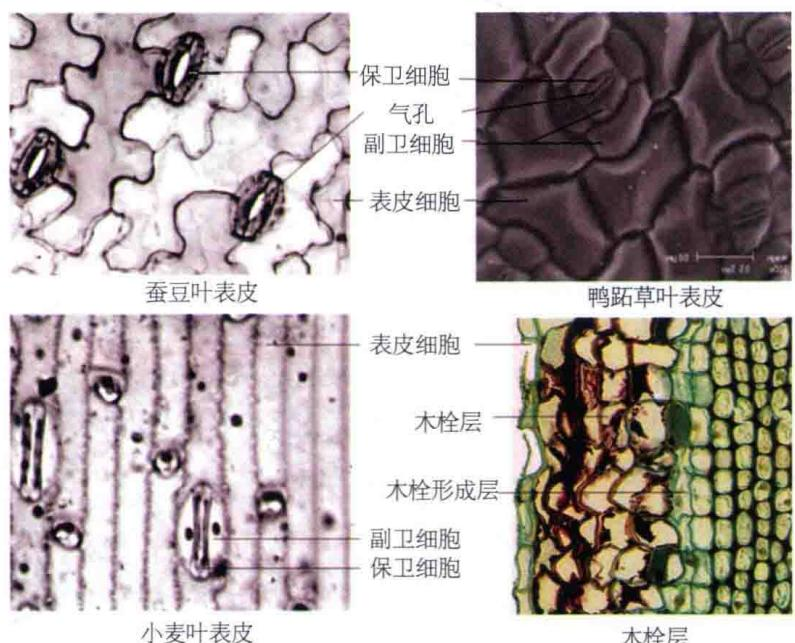  
图2-20 表皮与木栓层  
木栓层

气孔器 气孔器是表皮结构的重要组成部分，主要分布于叶片和幼茎的表面，是植株与外界进行气体交换的通道，与光合作用、蒸腾作用密切相关。一般植物的气孔器通常由一对肾形的保卫细胞和位于保卫细胞之间的呈凸透镜状的小孔（称为气孔）所组成。而将保卫细胞和在形态上有分化的细胞（称为副卫细胞，与保卫细胞紧邻）所组成的结构称为气孔器（图2-20）。

稻、麦等禾本科植物的保卫细胞呈哑铃形，中部壁厚，两头壁薄，其分列两侧的两个副卫细胞呈菱形（见第三章第三节）。保卫细胞中含有叶绿体和丰富的细胞质，气孔的开关与保卫细胞水势的变化有关。实验证明，保卫细胞的水势变化是由K+及苹果酸等渗透调节物质进出保卫细胞引起的。此外，光照强度、环境温度和CO2浓度对气孔的开关都有一定影响。

外生物 表皮外生物通常有表皮毛和外分泌结构等，其形状、类型和功能多种多样，对植株有良好的保护作用（图2-21）。

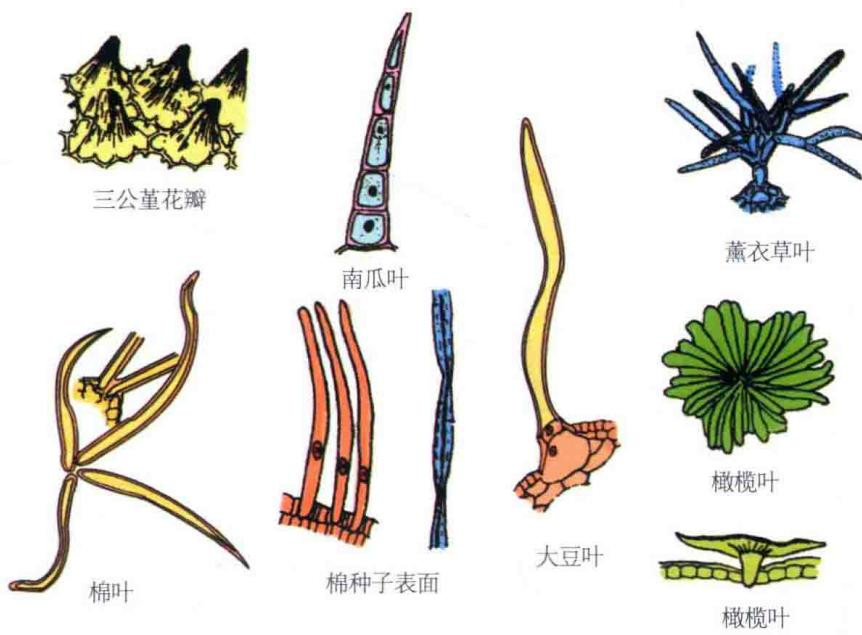  
图2-21 表皮毛状物

## 2）木栓层

木栓层（phellem）存在于裸子植物、双子叶植物的老根、老茎以及变态的块根、块茎的外表，是在器官增粗过程中由木栓形成层的活动产生的次生保护组织——周皮（图2-22）。木栓层细胞径向扁平，排列紧密，无胞间隙，细胞壁较厚并高度栓化，原生质体解体，细胞腔中常存在树脂和单宁。因此，木栓层具有不透水、绝缘、隔热、耐腐蚀、质轻等特性，其抗御逆境的能力强于表皮（图2-20、图2-22）。木栓层用途广泛，栓皮槠（Quercus suber L.）、栓皮栎（Quercus variabilis Bl.）和黄檗（Phellodendron amurense Rupr.）是商用木栓的主要原料。

## 2. 基本组织

基本组织（ground tissue）是植物体内分布最广、占有很大体积的一类组织。它们担负着吸收、同化、储藏、通气和传递等功能，因此又有营养组织（vegetative tissue）之称。基本组织虽有多种形态，但皆由薄壁细胞所组成，也称为薄壁组织（parenchyma tissue）。

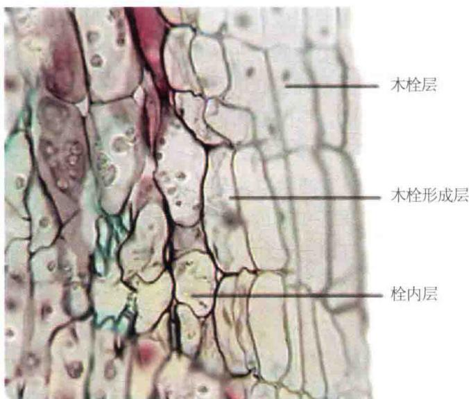  
图2-22 木栓形成层与周皮

基本组织细胞壁薄，仅有初生壁。细胞中含有质体、线粒体、内质网、高尔基体等细胞器，液泡较大，排列疏松，胞间隙明显。基本组织分化程度较浅，具有潜在的分裂能力，在一定条件下可经脱分化转变为分生组织。了解基本组织的这些特性，对于扦插、嫁接以及组织培养等工作均有实际意义。

根据基本组织的结构和生理功能的不同，可将其分为吸收组织、同化组织、储藏组织、通气组织和传递细胞5类。

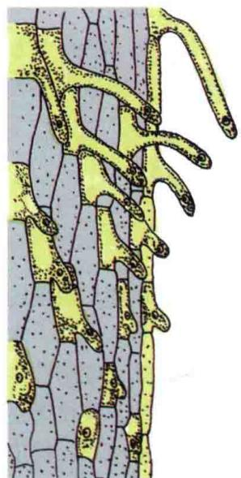  
图2-23 吸收组织——根毛

## 1）吸收组织

吸收组织（absorptive tissue）位于根尖稍后方的根毛区的表皮层上，其细胞壁薄且外壁向外突出形成毛状结构——根毛，是一类从外界吸收水分和溶于水的无机养分的组织（图2-23）。

## 2）同化组织

同化组织（assimilating tissue）位于植株的绿色部位，尤其是叶肉中，是利用水和 $CO_{2}$ 进行光合作用制造有机物质（同化产物）的组织。同化组织的细胞中含有大量的叶绿体，液泡化程度较高，具有发达的胞间隙（详见第三章第三节）。

## 3）储藏组织

储藏组织（storage tissue）是储藏淀粉、蛋白质、脂肪以及某些特殊物质（如单宁等次生代谢物质）的组织。主要分布于块根、块茎、果实、种子，以及根茎的某些结构中，如甘薯 [Ipomoea

batatas（L.）Lam.］的块根、马铃薯（Solanum tuberosum L.）的块茎的薄壁细胞储藏淀粉粒，蓖麻（Ricinus communis L.）种子的胚乳细胞储藏的糊粉粒，花生子叶和梨果肉细胞储藏的油滴等（图2-24）。仙人掌［Opuntia dillenii（Ker-Gawl.）Haw.］等旱生植物的茎叶中存在着一些充满水分的薄壁细胞，形成储水组织，使植物在干旱或盐碱条件下能正常生长。

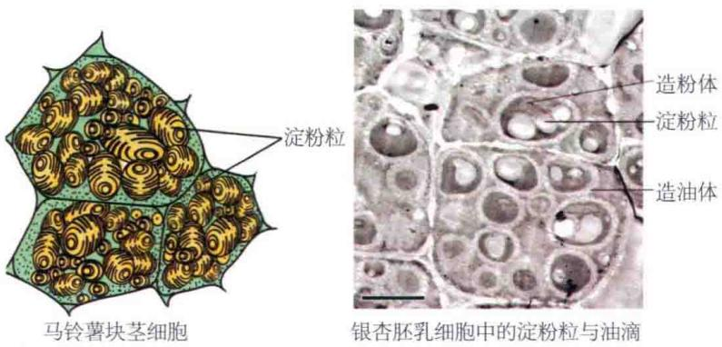  
图2-24 储藏组织

## 4）通气组织

通气组织（ventilating tissue）是水生植物和湿生植物中的一种能储存和输导气体的薄壁组织（见第三章第五节）。在这些植物的根、茎、叶结构的发育过程中，部分细胞程序性死亡，形成相互贯通的气道、气腔，储藏着大量的空气，有利于光合作用、呼吸作用过程中气体的交换，同时也可以有效地抵抗水生环境中所受到的机械应力。植物的通气组织发达与否常因物种、生存条件、发育程度和分布部位而不同。

## 5）传递细胞

传递细胞（transfer cell）是一类细胞壁显著向内生长、胞间连丝发达、短途运输物质能力强的薄壁细胞（图2-25）。植物体中的传递细胞分布广泛，常见于物质短途运输发达的部位，如叶表皮腺细胞、木质部或韧皮部薄壁细胞、维管束鞘、花药绒毡层、珠被、胚囊中的助细胞、反足细胞及子叶表皮细胞、胚乳细胞等。传递细胞非木质化的次生壁向内生长，突入细胞腔内，形成许多不规则的乳突状、指状、丝状或分枝状突起，曲折多褶至呈网状，极大地增加了细胞质膜的表面积，有利于细胞对物质的快速吸收与传递。

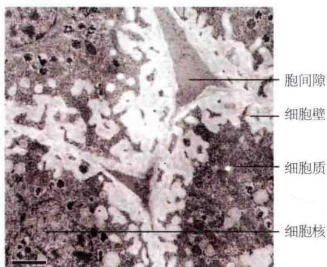  
图2-25 传递细胞

## 3. 机械组织

机械组织（mechanical tissue）在植物体内主要起机械支持作用和稳固作用。机械组织细胞的特点是其细胞壁均匀或不均匀加厚。根据其细胞的形态、细胞壁加厚程度与加厚方式，可将其分为厚角组织和厚壁组织。

## 1）厚角组织

厚角组织（collenchyma tissue）的细胞仅在其角隅处或相毗邻的细胞间的初生壁显著增厚（图2-26）。厚角组织主要出现在双子叶植物的幼茎、花梗、叶柄以及粗壮的叶脉等的薄壁组织外围，组成厚角组织的细胞是活细胞，常含叶绿体，有一定的分裂潜能。其细胞壁的局部增厚是伴随着器官的发育而增厚的。因此，厚角组织既有一定的坚韧性，又具有可塑性和延伸性。

厚角组织的细胞较长，两端呈方形、斜形或尖形，彼此重叠连接成束，在横切面上其细胞腔接近于圆形或椭圆形。

## 2）厚壁组织

厚壁组织（sclerenchyma tissue）的细胞壁全面次生增厚、常木质化，细胞腔狭小，细胞成熟时一般没有原生质体。根据其形状不同又可分为纤维和石细胞（图2-26）。

纤维 纤维（fiber）细胞狭长，两端尖细，其细胞壁极厚、木质化或多少木质化，细胞腔极小，一般没有原生质体。细胞壁上有少数小的斜缝隙状纹孔。纤维细胞互相以尖端穿插连接，多成束、成片分布于植物体中，形成植物体内主要的支持结构。根据纤维存在的部位，可将纤维分为韧皮纤维（phloem fiber）和木纤维（xylem fiber）。韧皮纤维主要存在于韧皮部，细胞长、壁厚，其组成主要为纤维素，柔韧性强，可做优质纺织原料；木纤维存在于木质部，细胞短小、壁厚、常木质化，硬度大而韧性差，可做填充料。

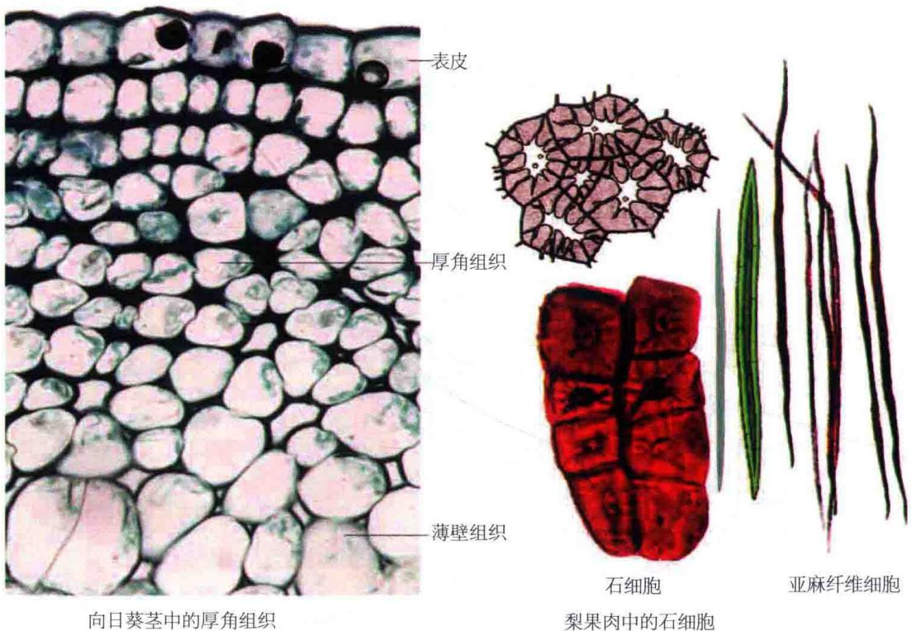  
梨果肉中的石细胞  
图2-26 机械组织

石细胞 石细胞（stone cell）一般是由薄壁细胞经过细胞壁的强烈增厚并高度木质化（有时也可栓质化或角质化）而来的特化细胞。石细胞的细胞壁坚硬、呈同心层次，分枝纹孔从细胞腔放射状分出，细胞腔很小，原生质体消失，故具有很强的支持作用。石细胞形状多种多样，或近于短径，或不规则，最常见的形状为等直径、椭圆形、球形、长形、分枝状或不规则形状。石细胞通常成群聚生，有时也可单生于植物茎的皮层、韧皮部、髓内，桃、杏（Prunus armeniaca L.）等的果皮和蚕豆（Vicia faba L.）等的种皮中也较常见。茶（Camellia sinensis O.Ktze.）等的叶肉、梨等的果肉中分布的石细胞形态、数量是鉴别其品质的依据。石细胞的形态特征有时也作为区分物种的参考依据。

## 4. 输导组织

输导组织（conducting tissue）是植物体内长距离运输物质的组织，其细胞呈长管状，相互贯通成为统一的整体。根据输导组织的结构和所运输的物质不同，可将其分为运输水分和无机盐类的导管与管胞，以及运输有机同化物的筛管与筛胞两大类。

## 1）导管

导管（vessel）普遍存在于被子植物的木质部，向上运输根从土壤中吸收的水分和无机盐。它们是由许多管状的、细胞壁木质化的死细胞纵向连接而成的一种输导组织。组成导管的每一个细胞称为导管分子（vessel element）。

导管分子的侧壁具有各种纹饰的次生加厚，端壁解体消失，形成不同形式的穿孔（具有穿孔的端壁称为穿孔板，perforation plate）。穿孔的形成及原生质体消失使导管成为中空的连续长管，有利于水分及无机盐的纵向运输。导管还可通过侧壁上的纹孔或未增厚的部分与毗邻的细胞进行横向运输。根据导管的发育先后和侧壁木质化增厚方式，可将其分为环纹导管、螺纹导管、梯纹导管、网纹导管和孔纹导管5种类型（图2-27）。

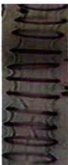  
环纹导管

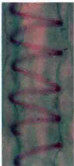  
螺纹导管

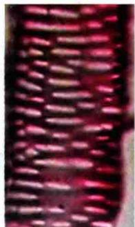  
梯纹导管

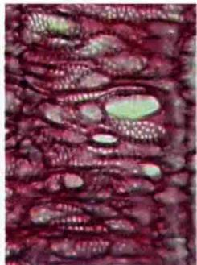  
网纹导管

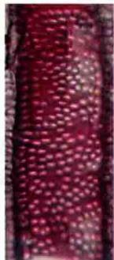  
孔纹导管  
图2-27 南瓜茎导管类型

环纹导管（annular vessel）和螺纹导管（spiral vessel）是在器官的初生生长早期形成的，位于初生木质部中的原生木质部，其导管分子细长而腔小（尤其是环纹导管），且其侧壁分别呈环状或螺旋状木质化加厚，输水能力弱，有时同一条导管的不同部分可出现环纹与螺纹增厚。由于其增厚的部分不多，未增厚的管壁部分仍可适应器官的生长而伸延，但易被拉断。

梯纹导管（scalariform vessel）、网纹导管（reticulated vessel）和孔纹导管（pitted vessel）是在器官的初生生长中后期和次生生长过程中形成的，位于初生木质部中的后生木质部和次生木质部，其导管分子粗短而腔大，输水效率高（尤其是孔纹导管）。梯纹导管和网纹导管的侧壁分别呈梯状和网状增厚，孔纹导管的侧壁则大部分木质化增厚，未加厚的部分则形成纹孔。

## 2）管胞

管胞（tracheid）是绝大部分蕨类植物和裸子植物的唯一输水组织。多数被子植物中，管胞和导管可同时存在于木质部中。管胞长梭状，两端尖斜不穿孔，横切面呈三角形、方形或多角形。管胞一般长为1～2mm，直径较小。各管胞间相互以偏斜的末端穿插纵向连接。水分和无机盐主要通过管胞间侧壁重叠处的纹孔来运输，因此，输导能力不及导管。管胞次生壁的木质化和增厚方式与导管相似，在侧壁上也呈现环纹、螺纹、梯纹和孔纹等多种方式的加厚纹饰（图2-28）。

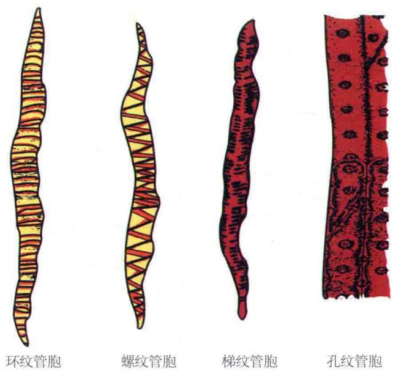  
图2-28 管胞的类型

## 3）筛管和伴胞

筛管（sieve tube）存在于被子植物的韧皮部中，由若干不具细胞核的管状活细胞（即筛管分子，sieve element）纵向连接而成，运输有机物质（图2-29）。筛管分子的细胞壁不次生加厚，端壁（称为筛板，sieve plate）上存在着成群的小孔——筛孔（sieve pore）。穿过筛孔连接相邻两个筛管分子的原生质呈束状，称为联络索（connecting strand）。联络索使纵接的筛管分子相互贯通，形成同化产物运输流。

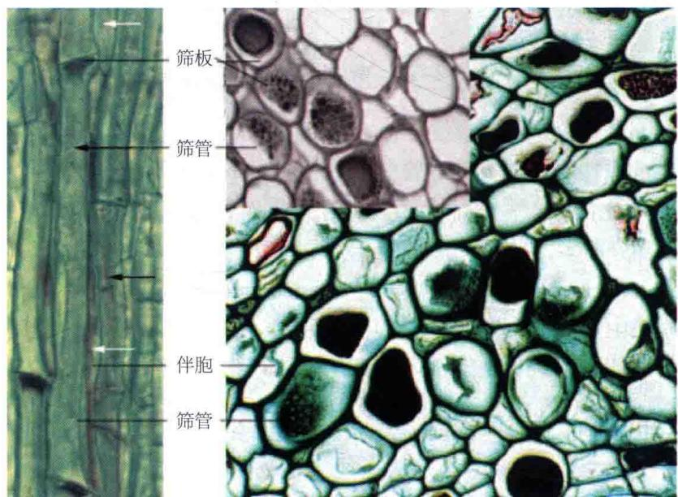  
图2-29 筛管（黑箭头）和伴胞（白箭头）

在每个筛管的旁边通常有一个或多个伴胞（companion cell）。伴胞与筛管在发育上具有同源性（由同一母细胞分裂而来），在功能上伴胞从属于筛管，协助和保证筛管的活性与运输功能。

## 4）筛胞

筛胞（sieve cell）是蕨类植物和裸子植物体内主要承担输导有机物的细胞。筛胞通常细长，末端尖斜，细胞壁上可能有不甚特化的筛域出现，筛孔细小，一般不形成筛板结构。许多筛胞的斜壁或侧壁相接而纵向叠生。运输有机物质的效率比筛管差得多，是比较原始的运输有机物质的组织。

导管和筛管是被子植物体内物质输导的重要组织，但也是病菌感染、传播扩散的主要通道。例如，土壤中的枯萎病菌入侵根部后，其菌丝可随导管到达地上部分的茎和叶，某些病毒可借昆虫刺吸取食而进入筛管，引起植株发病。

## 分泌结构

植物体中凡能产生分泌物质（如糖类、挥发油、有机酸、乳汁、蜜汁、单宁、树脂、生物碱、抗生素等）的有关细胞或特化的细胞组合称为分泌结构（secretary structure）。分泌结构一般由分泌细胞和其他薄壁细胞所组成。根据分泌结构的存在部位和分泌物的溢排情况，可将其划分为外分泌结构和内分泌结构两类。

## 1）外分泌结构

外分泌结构（external secretory structure）分布在植株的外表，其分泌物排出体外，如腺毛、腺鳞、盐腺、蜜腺和排水器等（图2-30）。

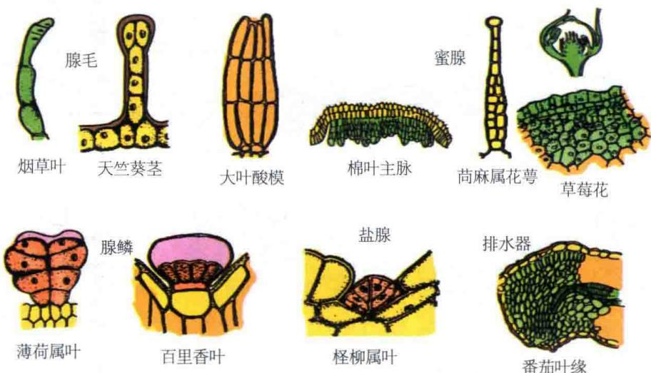  
图2-30 外分泌结构常见类型

腺毛和腺鳞 腺毛（glandular hair）一般具有头部和柄部两部分，头部由单个或多个产生分泌物的细胞组成，柄部由不具分泌功能的薄壁细胞组成，着生于表皮上。

蜜腺 蜜腺（nectary）是能分泌蜜汁的多细胞腺体结构，它们由表皮或表皮及其内层细胞共同形成，即由保护组织和分泌细胞构成。

盐腺 盐腺（salt gland）是将过多的盐分以盐溶液状态排出植物体外的外分泌结构。例如，盐生植物滨藜属（Atriplex L.）、柽柳属（Tamarix L.）等植物的茎、叶表面分布的排盐结构。

排水器 排水器（hydathode）是植物将体内多余的水分直接排出体外的结构，常分布于植物的叶尖和叶缘。排水器的排水过程称为吐水（guttation）。在温湿的夜间或清晨，常在叶尖或叶缘出现水滴，就是经排水器泌出的水液。吐水现象往往可作为根系正常生长活动的一种标志。

## 2）内分泌结构

内分泌结构（internal secretory structure）是将分泌物储存于植物体内的分泌结构。它们常存在于基本组织内，常见的有分泌囊（腔）、分泌道和乳汁管（图2-31）。

分泌细胞团 分泌细胞团（secretory cell nodule）一般由数层扁平的鞘细胞包裹着一团分泌细胞构成，其中央无腔隙。

分泌腔 分泌腔（secretory cavity）是由外侧1～2层扁平的鞘细胞包裹着一层长方形的上皮细胞（第一层分泌细胞）及其内的分泌腔共同构成。分泌腔是植物体内多细胞构成的储藏分泌物的腔室结构。根据腔室形成的方式可分为溶生分泌腔和裂生分泌腔两种类型。溶生（lysigenous）分泌腔较多，最初有一群具有分泌能力的分泌细胞，渐渐地细胞内的分泌物质增多，最后细胞解体，形成溶生的腔室，原来细胞中的分泌物储积在腔中，形成分泌腔，如橘（Citrus reticulata Blanco）的果皮和叶，棉的茎、叶、子叶中都有这种类型的分泌腔。裂生（schizogenous）分泌腔是构成分泌腔的细胞间隙扩大成的腔室，周围一至多层分泌细胞将分泌物排入腔室中。

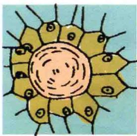

分泌细胞（鹅掌楸芽鳞）  
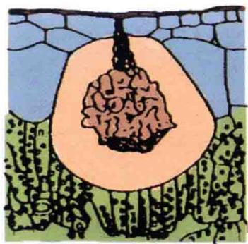  
钟乳体（三叶橡胶树叶）

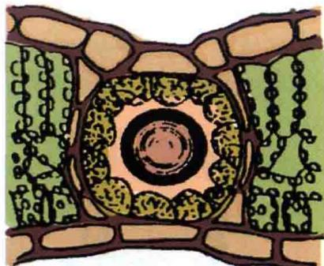  
裂生分泌腔（金丝桃叶）  
腺性细胞

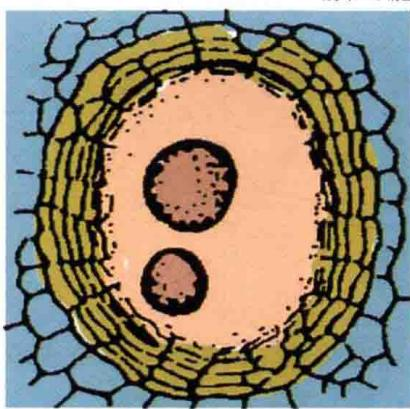  
溶生分泌腔（柑橘属果皮）

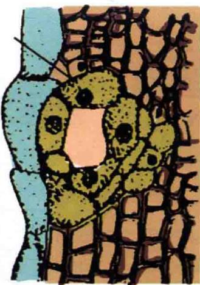  
树脂道（松树茎）

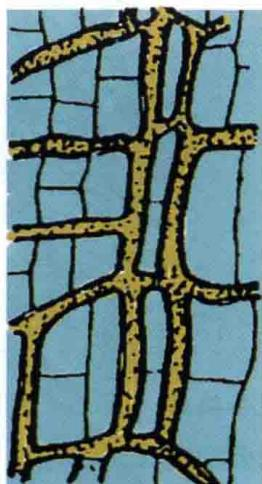  
乳汁管（蒲公英）  
图2-31 内分泌结构常见类型

分泌道 分泌道（secretory canal）为管状的内分泌结构，管内储存分泌物质。分泌道也有溶生型和裂生型两种方式，但多为裂生。例如，松柏类植物的树脂道即是分泌细胞的胞间层溶解，细胞相互分开而形成的长形细胞间隙，完整的分泌细胞环生于分泌道周围，由这些分泌细胞分泌的树脂储存于分泌道中。树脂的产生，增强了木材的耐腐性。漆树中裂生型分泌道称为漆汁道，其中储有漆汁。树脂和漆汁都是重要的工业原料，经济价值很高。

乳汁管 乳汁管（laticifer）是能分泌乳汁的管状结构。按其形态发生特点可分为无节乳汁管和有节乳汁管。无节乳汁管又称乳汁细胞，如大戟属（Euphorbia L.）植物的乳汁管。有节乳汁管由多数长圆柱形细胞连接而成，通常为端壁溶解而连通，在植物体内形成复杂的网络系统，如莴苣（Lactuca sativa L.）、蒲公英（Taraxacum mongolicum Hand.-Mazz.）等的乳汁管。

异细胞 异细胞（idioblast）是单独分散于其他各种组织中的含特殊分泌物的细胞。异细胞由薄壁细胞特化而来，其细胞壁稍厚、细胞体积较大，细胞中的内含物种类很多，有分类学价值，如内含挥发油、树脂、树胶、单宁、蛋白质或黏液等次生物质（含单宁异细胞、含晶异细胞等）。异细胞的研究对于了解植物的生理意义和生化调节机制有着重要的意义。

## 三、复合组织和组织系统

种子植物是具有复杂形态和结构的多细胞、多组织和多器官的有机体，是一个由不同层次的、不同特征的且丰富多样的组织复合而成的复杂系统，这个复杂系统包括不同的复合组织和组织系统。

## (一) 复合组织

复合组织（compound tissue）是指由发育上来源相同、结构和功能上密切相关的几种组织复合而成的、相对独立的结构。复合组织位于植物体的特定部位。例如，周皮、树皮、木质部、韧皮部、维管束和分泌结构（尤其是外分泌结构）等都是由多种组织复合而成的。

## 1. 周皮

周皮（periderm）由木栓层、木栓形成层和栓内层共同构成。木栓层和栓内层都是由木栓形成层分裂发育而来，分列于木栓形成层的外侧和内侧。从组织分类来看，木栓层属于次生保护组织，木栓形成层属于次生分生组织，而栓内层属于次生薄壁组织，因此，周皮是由3种不同组织组成的复合组织。

## 2. 木质部和韧皮部

木质部（xylem）和韧皮部（phloem）是植物体内主要起输导和支持作用的结构。木质部一般包括导管（多数蕨类植物及裸子植物无导管）、管胞、木薄壁组织和木纤维等；韧皮部包括筛管、伴胞（蕨类植物及裸子植物仅为筛胞，无筛管、伴胞）、韧皮薄壁组织和韧皮纤维等。木质部和韧皮部的组成包含输导组织、薄壁组织和机械组织等几种组织，因而被称为复合组织。由于木质部或韧皮部主要是管状结构，因此，常将木质部和韧皮部或者将其一称为维管组织（vascular tissue）。维管组织的形成，在植物系统进化过程中，对于适应陆生生活有着重要意义。蕨类植物、种子植物都有维管组织的分化，通常将它们总称为维管植物。

## 维管束

维管束（vascular bundle）存在于蕨类植物和种子植物中，是由原形成层分化而来、由木质部和韧皮部组成的束状结构。在不同种类的植物或不同的器官内，原形成层分化成木质部和韧皮部的情况不同，也就形成了不同类型的维管束。根据维管束中束内形成层的有无或能否增粗生长，可将其分为有限维管束和无限维管束两大类型（图2-32）。

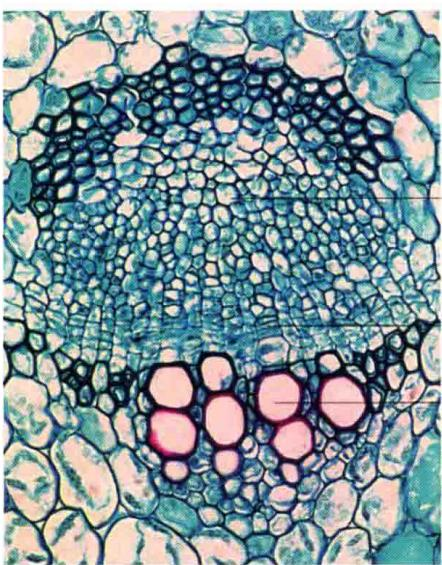

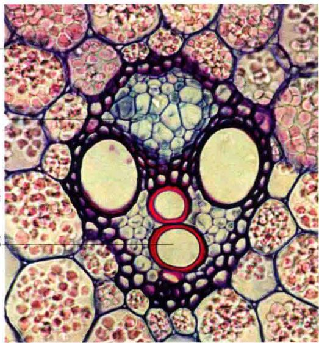  
图2-32 无限维管束（左）和有限维管束（右）

## 1）有限维管束

有限维管束（closed bundle）是其组成上仅有木质部和韧皮部、没有束中形成层的维管束。这类维管束一经形成便不再增粗，如大多数单子叶植物中的维管束等。

## 2）无限维管束

无限维管束（open bundle）是指组成上除含有木质部和韧皮部外，在两者之间还保留有束中（内）形成层的维管束。这类维管束以后能通过形成层的分裂活动，不断产生次生韧皮部和次生木质部，如裸子植物和许多双子叶植物的维管束。根据维管束中初生木质部和初生韧皮部的位置和排列情况，其可分为外韧维管束（collateral bundle）、双韧维管束（bicollateral bundle）、周木维管束（amphivasal bundle）、周韧维管束（amphicribral bundle）、辐射维管束（radial bundle）等类型。

## (二) 组织系统

种子植物的组织系统包括皮组织系统（skin tissue system）、基本组织系统（ground tissue system）和维管组织系统（vascular tissue system），它们在结构和功能上相对独立、相互联系，共同构成复杂的植物有机体。

## 1. 皮组织系统

皮组织系统（skin tissue system）又简称为皮系统，包括表皮及其外生物、外分泌结构周皮或树皮等。它们覆盖于植物体外表，在植物个体发育的不同时期，分别对植物体起着不同程度的保护作用，同时位于皮组织系统上的特定通道负责控制植物与环境的物质交换。表皮是植物体幼嫩部分或绿色部分的保护组织。草本植物的表皮终生存在，部分草本植物的老茎、老根的表皮和所有叶的表皮都是长期存在的。木本植物的根、茎表皮只存在一段时间，由于根、茎的增粗，表皮被挤毁脱落，周皮形成。树皮通常是指茎维管形成层以外的全部结构的总称，亦或仅是历年形成的周皮总称。周皮和树皮覆盖于裸子植物和多数双子叶植物老根和老茎的外周，周皮具有次生保护作用，其保护能力远远强于表皮。

## 2. 基本组织系统

基本组织系统（ground tissue system）简称基本系统，位于皮组织系统和维管组织系统之间，主要是各类薄壁组织和机械组织等组成的、与植物体的营养代谢和支持巩固植物体有关的组织结构。基本组织系统贯穿于植物的根、茎、叶、花、果实和种子等器官中，把植物体的地上和地下部分、营养和繁殖的各种器官连成一个有机整体。该系统中的代谢产物与储藏物质是人类生存与发展的重要资源物质。

## 3. 维管组织系统

维管组织系统（vascular tissue system）简称为维管系统（vascular system），是贯穿于整个植株、与体内物质的运输、支持和巩固作用有关的组织系统。根据维管系统形成的先后和组成特性，可将其分为初生维管系统和次生维管系统。初生维管系统主要存在于初生成熟组织，如绝大多数单子叶植物、裸子植物、双子叶植物幼嫩的根、茎、叶等的维管组织。次生维管系统则是次生成熟组织中的维管组织，主要存在于双子叶植物和裸子植物的老根和老茎之中。

## 总结与复习

## 知识要点

细胞是生命有机体进化发展的里程碑，是构成生物体的基本结构单元和生命活动的基本单位。细胞的发现、细胞学说的建立，各种专用显微镜、显微技术的发明和应用，以及植物细胞全能性的发现，极大地推动了生命科学的研究、发展和应用。

植物细胞大小不一、形状多样，但其结构基本相同。任何一个植物细胞都是由原生质体和细胞壁两部分组成的。原生质体是由原生质分化而成的结构。真核植物细胞的原生质体可分为质膜（细胞膜）、细胞质和细胞核三部分；细胞壁是包被在原生质体外的保护结构。

质膜主要由蛋白质和脂类物质组成，呈“暗-明-暗”条带状结构，质膜有重要的生理功能。细胞质是质膜以内、细胞核以外的原生质，分化为胞基质和细胞器。胞基质呈半透明、胶网状、流动态，是细胞器代谢的外环境。

细胞器是细胞内具有特定结构和功能的亚细胞结构。①质体是植物细胞特有的细胞器，包括叶绿体、白色体和有色体。叶绿体是光合作用（光能转化为化学能、生物能，无机物转化为有机物）的场所，由双层被膜、类囊体系统和基质三部分构成。②线粒体是有氧呼吸、有机物分解、化学能转化为生物能的场所。线粒体由双层被膜和基质组成。内膜内突形成嵴，嵴表面有许多球状基粒，基粒与ATP合成酶分布和氧化磷酸化有关；基质内主要进行物质氧化分解。叶绿体、线粒体都含有DNA，具半自主遗传特性。③核糖体是合成蛋白质的细胞器，由大小两个亚基组成。④内质网是由单层膜围成的扁平的囊、槽、池或管形成的、相互沟通的网状系统。内质网主要有粗糙型（粗面）内质网和光滑型（光面）内质网两种，具有制造、包装和运输代谢产物和“分室”的作用。⑤高尔基体是一叠由扁平、平滑、近圆形的单位膜围成的囊组成的扁囊堆，与多糖物质的合成和细胞壁的形成有关。⑥液泡是由具选择通透性的液泡膜和细胞液组成的细胞器。液泡的功能主要是调节细胞水势和维持细胞的膨压、参与细胞内物质的积累、储藏与转化。⑦溶酶体是含有多种水解酶，与大分子物质的分解和细胞的程序性死亡有关的细胞器。圆球体是由半个单位膜围成的细胞器，与脂肪的代谢有关。⑧微体包括过氧化物酶体和乙醛酸循环体，与光呼吸和脂类物质代谢有关。⑨细胞骨架是细胞质内的蛋白质纤维网架系统，与胞基质的运动、胞内能量转换和细胞壁发育分化有关。

细胞核是真核细胞遗传与代谢的控制中心。细胞核的大小、形状以及在胞内所处的位置，与细胞的年龄、功能以及生理状况有关，也受一些外界因素的影响。间期的细胞核可分为核被膜、核仁和核质。①核被膜，包被在核的外围，外核膜表面附着大量核糖体。核孔是沟通核质与细胞质的通道。②核仁是间期核中折光率最强的致密球体，是rRNA合成、加工和装配核糖体亚基等的重要场所。③核质包括染色质和核基质。染色质是间期细胞核内DNA、组蛋白、非组蛋白和少量RNA组成的线性复合物，是细胞核遗传物质的存在形式。染色质细丝经多级盘绕、折叠、压缩、包装形成染色体。染色体的结构、组型、形态、基因定位、分裂中的分子行为等一直是细胞生物学的研究热点。核基质是核内以非组蛋白成分为主的网络状结构，对DNA复制、基因表达、染色体构建等起重要作用。

细胞壁是原生质体生命活动过程中向外分泌的多种物质复合而成的结构，支撑和保护细胞、维持原生质体的膨压，与植物组织的吸收、蒸腾、运输和分泌等生理活动有关。细胞壁结构包括胞间层、初生壁和次生壁三部分。胞间层是新的子细胞形成时产生的、以果胶为主的细胞壁结构。初生壁是细胞生长、增大体积时所形成的壁层，主要成分为纤维素、半纤维素和果胶物质等。次生壁是某些细胞在生理上分化成熟、体积停止增大，或原生质体消亡过程中在初生壁内侧产生的细胞壁结构。构成次生壁的物质以纤维素为主，还有木质素、角质素、矿质等物质。

纹孔是次生壁形成过程中，在初生纹孔场处不完全被次生壁覆盖的区域。纹孔具有复杂的结构。胞间连丝是相邻两个植物细胞间的细胞质细丝，是细胞间物质、信息和能量交流的直接通道。

后含物包括储藏物质（淀粉、糊粉粒、油和脂肪）、晶体、硅质小体和植物的次生物质等。

细胞周期是指持续分裂的细胞，从结束一次分裂开始，到下一次分裂完成为止所经历的整个过程。一个细胞周期包括细胞的间期和分裂期两部分。

有丝分裂是一种最普遍而常见的细胞分裂方式。分为前期、中期、后期和末期4个时期。前期，核内的染色质凝缩成染色体，核仁解体，核膜消失以及纺锤体开始形成。中期，纺锤体完全形成，纺锤丝牵引染色体使其排列到赤道面。后期，各个染色体的两条染色单体分开，分别由赤道面移向细胞两极。末期，重新形成两个子核，完成细胞质的分裂。

减数分裂是与生殖细胞或配子形成有关的一种特殊的细胞有丝分裂方式。减数分裂包括2次连续的有丝分裂。与有丝分裂相比，它是与性细胞的发育有关的一次分裂，每条染色体包含4条染色单体。减数分裂过程相对复杂，具有同源染色体的联会和染色单体间的片段交换（染色体的组成发生改变）。减数分裂的结果是一个母细胞经减数分裂形成4个子细胞，且子细胞中的染色体数目减半，并具有新的遗传变异性。

无丝分裂是指不出现染色体和纺锤体的细胞分裂形式，直接分裂形成两个或多个近于相等或差不多相等的子细胞过程。可分为横缢、出芽等类型。

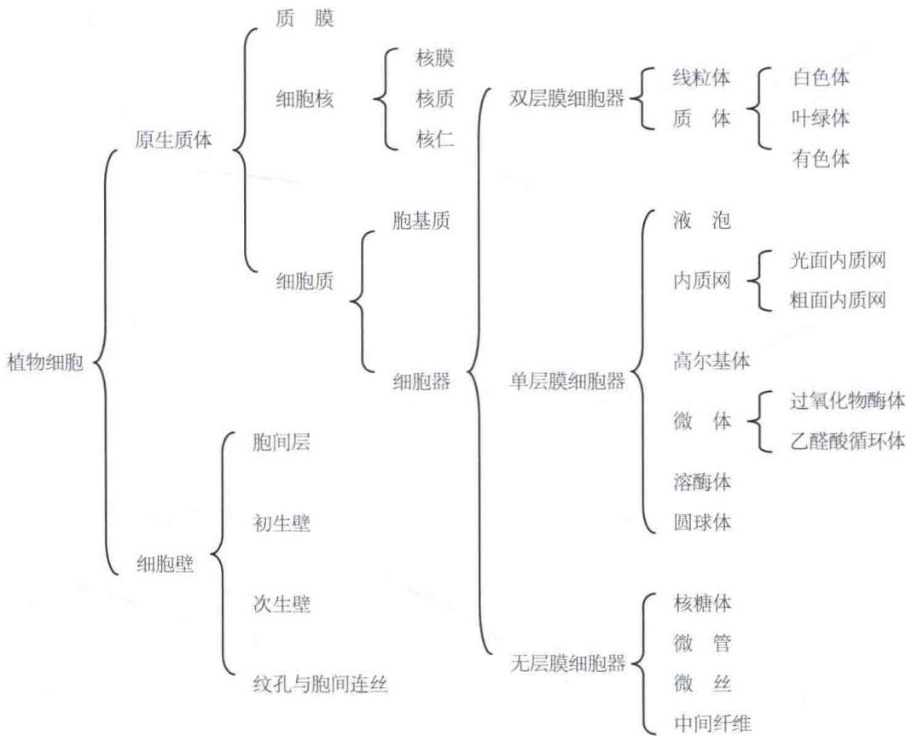

植物细胞的自由形成分裂方式有两种：①母细胞的细胞质不完全用于子细胞的构成；②母细胞先进行多次核分裂，形成若干游离于细胞质中的核，其后在各游离核间同时产生细胞壁，将细胞质完全分隔开，形成新的细胞。

细胞的生长是细胞体积和重量增加的过程。细胞在形态、结构和功能上发生改变的过程称为细胞分化。

细胞死亡有坏死性死亡和细胞编程性死亡两种不同的形式。前者是由于物理、化学损伤和生物侵袭等外界因素造成的非正常死亡，后者是细胞在一定生理或病理条件下的自主性死亡，是正常的生理性死亡。

植物组织是植物体中形态结构相似、在个体发育中来源相同、担负着一定生理功能的细胞组合。根据组织的发育程度、生理功能和形态结构的不同，可将组织分为分生组织和成熟组织两大类。

分生组织是存在于植物体的特定部位、分化程度较低或不分化、保持胚性细胞特点，并能继续进行分裂活动的细胞组合。

根据分生组织在植物体内的分布位置，可将其分为顶端分生组织、侧生分生组织和居间分生组织。顶端分生组织位于根和茎的顶端分生区，其活动的结果有利于根或茎的伸长生长。侧生分生组织分布于植物体内的周围，平行排列于所在器官的周缘，其活动的结果有利于根或茎的增粗生长。居间分生组织存在于茎、叶、子房柄、花梗等器官中的成熟组织之间，只在短时期内具有细胞分裂能力。

顶端分生组织包括原生分生组织和初生分生组织。居间分生组织属于初生分生组织。侧生分生组织属于次生分生组织。

根据分生组织来源和性质，将其分为原生分生组织、初生分生组织和次生分生组织三类。原生分生组织来源于胚或其他胚性细胞，存在于根尖、茎尖。初生分生组织由原生分生组织衍生而来，位于原生分生组织的后方，这些细胞一方面继续保持分裂能力，一方面已开始分化为原表皮、原形成层和基本分生组织。次生分生组织起源于成熟组织，是由某些成熟组织经过脱分化重新恢复分裂能力而来。束间形成层和木栓形成层是典型的次生分生组织。

成熟组织是由分生组织衍生的细胞，经过生长分化，逐渐形成的各种组织。根据成熟组织的形态特征和生理功能的不同，将其分为5种类型。

保护组织分布于植株各器官的表面，起保护作用，根据来源和形态分为初生保护组织——表皮和次生保护组织——木栓层。表皮上存在气孔。木栓层源自木栓形成层，木栓层、木栓形成层和栓内层三者共同组成周皮，取代表皮。周皮上有皮孔。

基本组织是植物体中最基本、分化程度相对较低、分布最广的一类细胞群，又称为薄壁组织、营养组织。其细胞壁薄、分化程度较低，具有潜在的分裂能力，在一定条件下可经脱分化，恢复分裂能力，进而转化为次生分生组织。同时薄壁组织也可以进一步分化为其他组织。根据薄壁组织的主要生理功能，又将其分为同化组织、吸收组织、储藏组织、通气组织和传递细胞。

机械组织在植物体内主要起机械支持作用，根据细胞形态和加厚程度不同可分为厚角组织和厚壁组织。构成厚角组织的细胞是生活细胞，其细胞壁的增厚不均匀，只发生在细胞角隅处，既有支持的功能，又不影响所在器官的生长。构成厚壁组织的细胞是死细胞，其细胞壁呈均匀的强烈次生增厚。厚壁组织又可分为纤维和石细胞两类。

输导组织分为两类：一类是输送水分和无机盐的导管和管胞；另一类是输送有机同化物的筛管、伴胞和筛胞。导管普遍存在于被子植物的木质部，输导水分和无机盐的效率较高，端壁有穿孔，为死细胞，老化后有侵填体产生。管胞是绝大多数蕨类植物和裸子植物中唯一的输导水分和无机盐的结构，输导效率较低。筛管存在于被子植物的韧皮部，运输有机物的效率较高，端壁有筛板，是无核的活细胞，老化后有胼胝体的产生。筛管旁边细长、小形的细胞称为伴胞，它与筛管有密切的关系。筛胞是蕨类植物和裸子植物内主要承担输导有机物的结构。

分泌结构是指植物体中能产生分泌物质（如糖类、挥发油、有机酸、乳汁、蜜汁、单宁、树脂、生物碱、抗生素等）的有关细胞或特化的细胞。分泌结构一般由分泌细胞和其他薄壁细胞所组成。分泌结构包括外分泌结构和内分泌结构两类。外分泌结构分布在植株的外表，其分泌物排出体外的分泌结构，如腺毛、腺鳞、盐腺、蜜腺和排水器等。内分泌结构是将分泌物储存于植物体内的分泌结构，它们常存在于基本组织内，常见的有分泌囊（腔）、分泌道和乳汁管等。异细胞是含有特殊分泌物的细胞，常单独分散于其他各种组织中。

复合组织是指由发育上来源相同、结构和功能上密切相关的几种组织复合而组成的、相对独立的结构。周皮、树皮、木质部、韧皮部、维管束、分泌结构都是由多种组织复合组成的结构，都是复合组织。

维管植物的组织系统包括皮组织系统、基本组织系统和维管组织系统，它们在植物体内存在的位置、包含的组织类型和担负的生理功能均不同。

## 复习思考

1. 如何区别真核细胞与原核细胞？

2. 试区别细胞质、原生质、原生质体。

3. 细胞质中各类细胞器的形态结构如何？各有什么功能？

4. 植物细胞中的质体可分为哪几种类型？各有些什么特征？

5. 细胞核的形态构造及其机能如何？

6. 细胞壁是怎样产生的？它分哪几层？各由什么物质组成？

7. 植物细胞的初生壁和次生壁有什么区别？在各种细胞中它们是否都存在？

8. 植物细胞后含物中包含哪些物质？各有什么特点？

9. 何谓细胞周期？细胞周期中各个阶段的主要活动有哪些？

10. 植物细胞的分裂方式有几种类型？有丝分裂和减数分裂的主要区别是什么？它们各有什么重要意义？

11. 什么是植物组织？植物组织可分为哪些类型？组织与细胞和器官之间的关系如何？

12. 分生组织和成熟组织各有何特点？两者之间有何关系？

13. 分生组织是如何进行分类的？不同分类间分生组织的关系如何？

14. 从细胞结构特征、功能两个方面区分：厚角组织和厚壁组织，表皮和周皮，筛管和导管，木质部和韧皮部。

15. 列表说明输导组织、机械组织的种类、结构、功能及分布情况。

16. 试简要叙述各类组织在植物体中的分布及功能。

17. 植物组织与组织系统有何区别？植物组织系统包括哪几类，其功能如何？

## 阅读与探究

## 阅读参考

## (1) 本章知识参考阅读:

http://jpkc.yzu.edu.cn/course/zwx/0502jxrr.htm

王金发. 2003. 细胞生物学. 北京: 科学出版社

## (2) 知识拓宽参考阅读:

细胞的极性，细胞的分裂、生长与分化，细胞的程序性死亡（PCD）都是现今细胞生物学研究的热点，如要真正了解相关研究的进展和成果，参考阅读MOLECULAR CELL BIOLOGY（第7版，2013年）。本书分别从基因表达调控和蛋白质修饰、细胞膜物质运输、细胞运动的分子基础、细胞增殖及其调控、细胞分化与干细胞和细胞凋亡等方面，结合最新研究发展动向，对细胞生物学的前沿领域进行了系统的阐述，并讨论了与细胞增殖、分化和死亡有关的信号网络的分子基础，分析了其与疾病发生的关系。此外，本书还特意介绍了分子细胞生物学最新研究领域，如干细胞、RNA干扰技术等，并尽量提供现代分子细胞生物学的研究方法和思路。

此外，也可参考阅读《植物细胞生物学：从天文学到动物学》（Randy Wayne，科学出版社，2011）。本书是植物细胞生物学领域的专著，也是美国康奈尔大学植物生物学系的Randy Wayne教授二十多年来从事植物细胞生物学教学和科研的结晶。书中选用了大量最原始的图片和数据，突出了现代植物细胞生物学的基本内容，由表及里、由结构到功能、按自然的内在联系依次介绍。使读者对植物细胞的主要结构和功能、两者之间的复杂关系和作用，以及细胞器和生命的起源与演化等有一个系统而全面的了解和认识。编者试图重新建立曾经在数学、天文学、物理学、化学、地质学、哲学和生物学之间存在的联系，使读者能从多维视角、多学科观察植物细胞，了解有机体内的细胞与其他细胞之间的相互作用，细胞与环境之间的相互作用，细胞的起源和进化。

还可参阅《分子细胞生物学（第二版）》（郭凌晨、殷明，上海交通大学出版社，2009）。该书以细胞为对象，主要在分子水平上研究细胞生命活动的分子机制，即研究细胞器、生物大分子与生命活动之间的变化发展过程，研究它们之间以及它们与环境之间的相互关系。

推荐网站：http://www2.estrellamountain.edu/faculty/farabee/biobk/biobookplantanat.html。这是一本国外的在线生物学课本（On-Line Biology Book）中的一部分，网站中用浅显易懂的英文、精美清晰的图片详细描述了各类组织的结构特征、在植物体中的分布、主要功能等方面的知识。

## 探究学习

(1) 选取不同色彩的果实、花瓣或叶片等, 制作徒手切片并在显微镜下观察, 探究花、果、叶等色彩的不同与细胞组成结构间的关系, 并进一步思考植物的色彩美与细胞结构的关系。通过查阅相资料探讨如何更好地利用植物的色彩美创造美好的生活。

(2) 利用细胞的全能性进行细胞或组织培养, 形成愈伤组织、产生胚状体, 繁殖新个体或生产人工种子已成为生物技术农业的重要方向。在教师的带领下, 应用悬浮培养法, 进行单个细胞的培养, 跟踪观察细胞的分裂、生长和分化的全过程, 加深对课堂知识的理解。还可选择不同的培养条件, 深入比较观察细胞分裂、生长和分化的动态及其与影响因子间的关系。

（3）利用分生组织的细胞具有持续不断分裂能力的特性，对果树、蔬菜等进行嫁接、扦插、压条等，扩大繁殖和获得高产优质的新个体，已被广泛应用。因此，可和老师一起，或在老师的指导下，以果树、蔬菜等为材料，进行嫁接或扦插、压条等试验，观察分析砧木与接穗间的细胞愈伤组织的发生、嫁接的成活等与分生组织细胞活性和分布间的关系。不仅可以巩固所学知识，而且能培养学生的科学态度和探究精神。

(4) 通过选取同一植物不同生态条件、不同生长状态下的新鲜植物的叶片、根或茎, 分别制作徒手切片, 简单染色后在显微镜下对比观察各种组织的细胞特征, 探究环境变化、生长发育状态对组织的分布部位、组成组织的细胞特征等的影响。

第三章
