# 第3章 被子植物营养器官的形态、结构与功能

<!-- 章节边界按正文内容恢复；原始 MinerU 内容保留如下。 -->

被子植物营养器官的形态、结构与功能

## 内容导读

被子植物以细胞为结构组成的基本单位，出现各种组织的分化，并由不同的组织构成具有特定形态结构和生理功能的器官（organ）。被子植物的器官有根、茎、叶、花、果实和种子等，它们在形态结构和生理功能上既各有其特点又彼此相互联系和相互影响。根、茎、叶与植物的营养生长和活动有关，它们统属于营养器官（vegetative organ）。花、果实、种子的形成是植物的繁殖生长和活动，与被子植物的生殖繁衍有关，它们都属于生殖器官（reproductive organ）。被子植物体的整体性、形态结构与生理功能的协调性，以及植物与环境的统一性是植物生长的重要规律。本章主要讲述被子植物营养器官的形态、结构、功能及其与环境间的统一性。

为什么移栽植物时必须带土？为什么巨大的树冠必然有庞大的根系？扦插和压条繁殖的原理是什么？植物的根和侧根是如何发生的，其作用是什么？为什么不同的植物类群具有不同的地下根系分布形态？植物的根系有哪些类型？被子植物根的结构如何？根的结构组成如何适应于吸收和支持功能？

低矮婆娑的小草、蓬勃蔓生的灌木、高大繁茂的木本，都是由植物的芽发育而成，植物的芽有哪些类型？枝条有几种不同的分枝方式？构成枝条的茎的结构如何，与根的结构和发生有何异同？茎为什么具有强大的输导功能？为什么一棵“空心”的树还能生长、枝繁叶茂？树为什么会有年轮，树的年轮是如何形成的？为什么树怕剥皮？木材为什么有差异？树木的哪部分木材最坚固？木材属于茎的哪一部分结构？

叶是植物进行光合作用的主要器官，不同植物的叶其形态、结构有何不同？叶的形态、结构、生理功能及其对环境的适应性如何？

学习完本章内容以后，相信以上这些问题都将会迎刃而解。

植物是不断进化的。植物在漫长的进化历程中，其营养器官的形态、结构和功能都会产生变态。变态器官的出现是植物长期适应特定或不同环境的结果，理解同源器官和同功器官的概念，有助于建立生物进化论的思想。通过本章内容的学习，你将懂得植物体各器官间在形态、结构和功能上既相互独立、又整体协调和高度统一，而且它们与环境也是相互影响和相互适应的。

## 教法与学法

## 教法

(1) 借助于实物或现场教学法直接进行被子植物根、茎、叶形态（形状、大小、类型）特征的展示教学，引导学生进行不同类型根、茎、叶的形态比较、识别和归类。应用微课、微视频或设问引导学生思考根、茎、叶与植物生活以及农业生产的关系，激发学习兴趣，集中精力听课；或提问启发学生说出根、茎、叶的多种生理功能后，反问：结构与功能是相适应的，那么根、茎、叶的结构又是如何与其所执行的功能相适应的呢？自然导入到本章各节相关内容的学习中去。

(2) 根、茎、叶形态、结构及其变态器官的发生和特征, 还可以通过典型植物形态、结构图片的拍摄、PPT显示或微视频、微课件、Flash演示，或通过互动教学系统进行教学，注意比较归纳根、茎、叶形态、结构和功能间的差异性、适应性和统一性。

(3) 在根的结构部分, 由于学生是第一次从微观领域接触植物, 而且有许多抽象的概念, 如初生生长、初生结构、次生生长、次生结构等, 所以单凭教师的讲授学生是很难掌握的, 结构是通过分生组织发生的。因此, 教师在进行这一部分内容的教学中可结合分生组织部分的知识, 按照从发生到结构的顺序进行讲解。教师以讲结构的发生、生长和形成过程为主, 初生结构、次生结构内容由学生参与总结归纳, 并以绘简图或文字图 (知识导图) 的形式将微观的知识直观化, 便于学生的理解和记忆, 激发学生的主动参与意识。最后提问: 请同学们从组织的角度分析, 根的结构是如何与功能相适应的? 学生在回答这一问题时一方面巩固了组织和根的相关知识, 另一方面又一次明确了生物学的基本规则, 即结构与功能相适应, 培养了学生的辩证唯物主义思维。如果将这一部分知识弄懂的话, 后面关于茎、叶部分结构的学习将会变得容易。

(4)“茎的形态特征”和“茎的分枝方式”两部分虽然知识点较多,也较繁杂,但都比较直观,建议教师通过多媒体手段,以大量的直观图片展示,配合教师的讲解分析,使学生在感性认识的基础上激发学习欲望和提高学习效率。“茎的发生和结构”是本章教学的重点,由于有前一节“根的形态、结构和功能”的知识基础,因此教师在本部分的教学中只需要发挥引导作用,引导学生主动学习,培养学生主动获取知识的能力。例如,茎的初生结构的知识可以通过与根的初生结构进行对比教学,让学生在相同(结构层次的名称)之中找不同(结构的组成特征、发育和排列方式等);在学生已掌握了根的次生生长与次生结构的基础上,茎的次生结构发生方式可通过自制多媒体动画的形式让学生在动态过程中观察茎和根的次生分生组织的发生与次生结构的形成过程,从区别中发现茎的次生分生组织与根的次生分生组织的发生部位及发生方式上的差异,并要求学生在总结茎的次生结构的同时,比较双子叶植物茎的次生结构与根的次生结构的异同点;茎的次生结构中有关年轮、木材、树皮方面的知识是本章节的难点所在,教师要通过讲解与板书相配合,运用形象的比喻,清楚地描述维管形成层和木栓层的活动发生和特点及活动的过程与结果,难点知识也便迎刃而解。

(5)“叶的形态结构与功能”的教学, 建议从“叶的功能”导入讲课内容, 通过生产生活中应用实例的描述使学生了解叶的主要生理功能。根据生物学中 “结构与功能相适应” 的思想, 设下悬念: 叶的形态与结构是如何与其所行使的功能相适应? 引入本节的教学重点: 叶的形态与结构及其与功能的关系。叶的结构与生境的知识可以通过给学生呈现不同生境下叶片结构的对比图片、数据等, 由学生自主归纳获取知识, 教师进行适当的引导、指正。

## 学法

（1）第一次从微观领域认识植物器官的形态、结构特征，必须在教师的指导下，在课前、课外完成校园不同类型植物的根、茎、叶形态观察与比较，并采集制作小标本，将疑问带入课堂请教任课教师。

(2) 课上认真听讲、勤于思考、强化理解, 带着问题 (尤其是预习中不易理解的知识点) 有重点地听课, 并记好笔记。课后可以通过绘简图 (或概念图、支架图)、一边或一侧逐一加注结构层次名称、特征、功能、适应性等的形式对相关知识加以归纳和内化。定根、不定根、主根、侧根、顶芽、侧芽、不定芽、混合芽、合轴分枝、单轴分枝、假二叉分枝、年轮、完全叶和叶肉等，都可以通过简图的形式记忆，而初生生长、次生生长过程与结构等有关的概念识记可通过在相关的简图/概念之间公式化表示，将抽象转化为直观，以利于理解、记忆和掌握。

(3) 确立 “植物形态、结构与功能相适应” 思想, 理解和记忆基本概念。联系各概念, 借助于图片资料列表比较单双子叶植物根、茎、叶各结构层次的异同点及其细胞组成特征、对应的生理功能等; 尝试以茎为导图起点, 画出从茎尖顶端分生组织, 经初生生长到初生结构, 再经次生生长到次生结构的概念图, 构建相关知识型网络。

(4) 实验课中, 对所观察对象的生境不同分析其形态、结构的变化, 注意从各部分组成中的细胞大小、细胞壁的厚薄和加厚方式、细胞间隙的有无及大小、输导组织的发育特征等加以比较, 理解植物根、茎、叶的形态、结构、功能与环境的适应性。

（5）被子植物的根、茎、叶形态虽然差别很大，但它们的初生结构层次基本相似。在单子叶植物与双子叶植物、草本植物与木本植物之间，根、茎、叶各结构层次特征与其功能和环境是相一致或相适应性的。有些植物的根、茎、叶可以增粗或增厚，形成次生结构，但植物种类不同，次生结构发生的位置、产生的组织和作用也不尽相同。木本植物粗壮的根、茎以及其质地的差异就是次生生长过程和结构组成不同的缘故。因此，必须辩证地学习和比较分析，变“要我学”为“我想学”“我要学”。

## 第一节 根的形态、结构与功能

根（root）是植物长期适应陆生生活环境而逐渐发展和完善的结构。根一般生长在相对稳定的土壤环境中，是植株吸收水分和矿质营养的主要器官，担负着固定植株的功能。此外，根能合成多种生物活性物质并调节植物的生长发育。有些植物的根常肉质化、储存大量营养物质，既具有繁殖的作用，同时也是人类食物和药物的重要来源。

## 一、根的形态

## (一) 定根与不定根

陆生植物种子萌发时，胚根先突破种皮生长，形成植株的主根（main root，taproot）。当主根生长到一定长度时，其上一定部位就会侧向生出支根，称为侧根（lateral root）。主根和侧根发生来源位置确定，又称为定根。侧根与主根往往形成一定角度，当侧根生长到一定长度时，又能生出新的次一级的侧根，这样的多次反复分支，形成整株植物的根系，以适应和满足植株的生长发育（图3-1）。

许多植物除了能产生定根外，还能从茎、叶、老根或胚轴上生出根来，这些根发生的位置不固定，都称为不定根（adventitious root）（图3-1）。不定根也能不断地产生侧根。禾本科植物的种子萌发时形成的主根，存活期不长，主要由胚轴上或茎的基部节上所产生的不定根所替代。生产上，扦插、压条等营养繁殖技术就是利用枝条、叶、地下茎等能产生不定根的习性进行的。

## (二) 直根系与须根系

任一植株地下部分根的总称为根系（root system）。根系是在植株的生长发育过程中逐渐形成的。依据根系的组成特点，可将其分为直根系（tap root system）和须根系（fibrous root system）两类（图3-1）。直根系由明显发达的主根及其各级侧根组成。直根系由于主根发达（粗且长），入土深，各级侧根次第短小，一般呈陀螺状分布，大多数双子叶植物（dicotyledons）的根系属于此种类型。须根系主根不发达，主要由不定根及其侧根所组成，且根的粗细长短相差不多，须根系入土较浅，呈丛生状态，似胡须样，故称为须根系，大多数单子叶植物（monocotyledons）的根系属于此种类型。

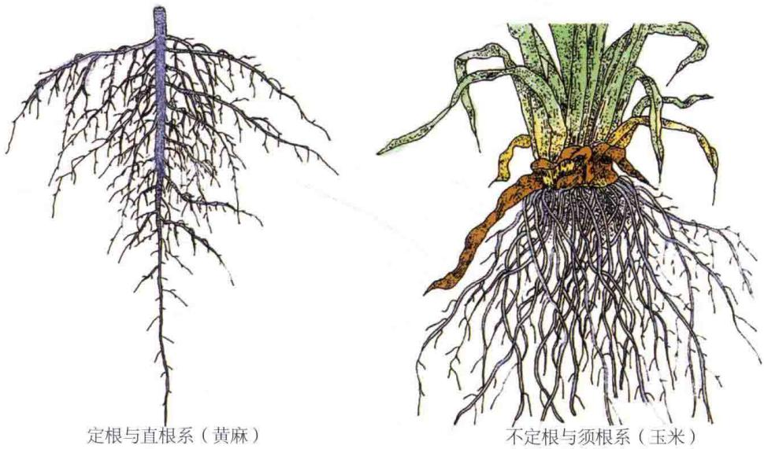  
图3-1 植物的根与根系

植物根系在土壤中分布的深度和广度常因植物的种类、生长发育的好坏、土壤条件以及人为因素的不同而异。生产上根据根系在土层中的分布深度将植物分为深根性植物和浅根性植物两类。根系分布于土壤深层的植物，称深根性植物。一般具有直根系的植物多为深根性植物，如大豆、蓖麻等。根系多在水平方向朝四周扩展，常分布在土壤的浅层中的植物，称浅根性植物。浅根性植物的主根不发达或不明显，常由不定根或侧根组成。一般须根系植物多为浅根性植物，如车前（Plantago asiatica L.）、小麦、水稻等。在生产上，深根性植物可适当深施肥，浅根性植物可适当浅施肥，并控制水、肥及光照强度来调整作物根系的生长与分布，以达到丰产的目的。

## 二、根的结构

## (一) 根尖分区

根尖（root tip）是指从根的顶端到着生根毛的部分，一般长1～5cm。无论主根、侧根和不定根都具有根尖，它是根的生命活动中最活跃的部分，是根进行吸收、合成、分泌等作用的主要部位。根的伸长、根系的形成以及根内组织的分化也都是在根尖进行的。因此，根尖的损伤会直接影响根和根系的发育。

纵切根尖，依据其各部分细胞的结构特点，从根尖顶端起，依次可分为根冠（root cap）、分生区（meristematic zone）、伸长区（elongation zone）和成熟区（maturation zone）4个部分（图3-2）。必须说明，从分生区到根毛区各区的细胞逐渐分化成熟，形态结构和生理功能各不相同，除根冠外，其他各区的细胞特征逐渐过渡，无严格界限（表3-1）。

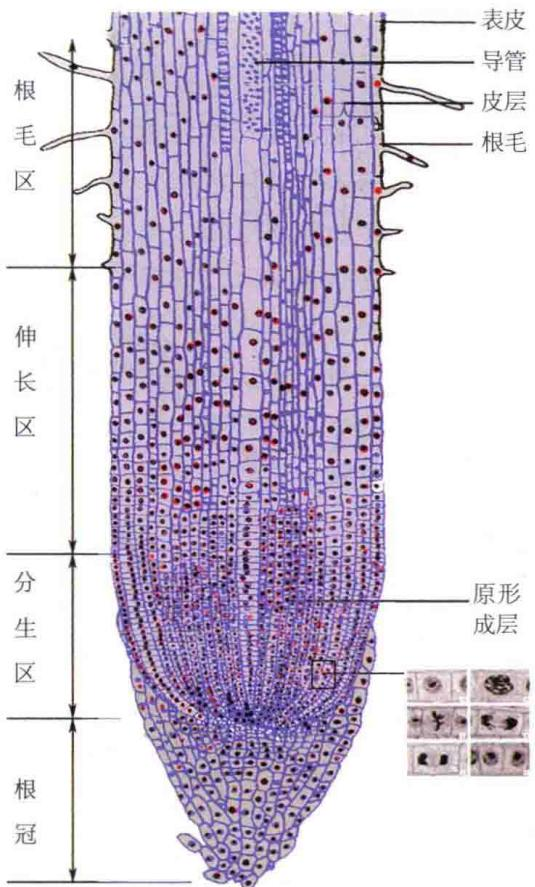  
图3-2 玉米根尖纵切，示根尖各分区

表3-1 根尖分区及其细胞特征

<table><tr><td>分区</td><td>外观</td><td>细胞特点</td><td>功能</td></tr><tr><td>根冠</td><td>帽状</td><td>不规则、外围细胞排列松散、具丰富的线粒体、质体、高尔基体和内质网</td><td>保护、向重性</td></tr><tr><td>分生区</td><td>圆锥状</td><td>等径、排列紧密、细胞质浓、细胞器丰富、核大、分裂能力强</td><td>分裂补充新细胞</td></tr><tr><td>伸长区</td><td>圆柱状</td><td>远离分生区的细胞体积较大,细胞沿纵轴方向伸长,液泡化明显、分化程度高</td><td>细胞生长和分化</td></tr><tr><td>成熟区</td><td>柱状具毛</td><td>细胞分化成熟,形成不同的组织结构,为了适应对水分等的吸收和运输</td><td>吸收水分和无机盐</td></tr></table>

## 1. 根冠

根冠是位于根尖顶端的帽状结构，由许多薄壁细胞组成，其作用主要是保护根尖的分生区细胞。根冠细胞不规则，外围细胞大、排列疏松，内部（近分生区）细胞小、排列紧密。根冠细胞含丰富的内质网、高尔基体、线粒体和质体等细胞器，其外壁常有多糖类物质的黏液，可润滑根冠表面、促进根表离子交换、减少根在土壤颗粒间穿行的摩擦阻力，利于根的伸长生长。根冠中部细胞内有若干被称为“平衡石”的淀粉体（图3-2），使根冠可以感受重力，而具有向地性生长的特性。

## 2. 分生区

分生区位于根冠内侧，由顶端分生组织组成，整体形状如圆锥，故又名生长锥或生长点，长度为1～3mm，主要功能是分裂产生新细胞，以促进根尖生长。分生区细胞小、近于等径、排列紧密，无细胞间隙，细胞壁薄、核大、质浓、液泡很小，分化程度低，具有很强的分裂能力，外观呈褐黄色。分生区产生的新细胞，一部分形成根冠细胞，以补偿根冠因受损伤而脱落的细胞；大部分细胞生长、分化，成为伸长区的部分，是产生和分化成根各部分结构的基础；同时，仍有一部分细胞保持分生能力，以维持分生区的体积和功能（图3-2）。

## 3. 伸长区

伸长区位于分生区的后方2～5mm处。此区细胞越远离分生区，则细胞分裂活动越弱，并逐渐停止。其细胞沿着根的纵轴方向伸长，体积增大，液泡化程度加强，细胞质成一薄层位于细胞的边缘部位。因此，外观近半透明状。伸长区细胞的伸长生长是根尖不断向土壤深处推进的动力，这样根不断到达新的土壤环境，便于吸取更多的营养物质、建立庞大的根系。伸长区是分生区到成熟区的过渡区域。

## 4. 成熟区

成熟区位于伸长区的后方，由伸长区细胞进一步分化而来。该区细胞已停止生长，并分化出各种成熟组织。其表面一般密被根毛，因而又称根毛区（root hair zone）。根毛是表皮细胞外壁向外突出形成的顶端封闭的管状结构，成熟的根毛长0.5～10mm，直径5～17μm。根毛形成时，表皮细胞液泡增大，多数细胞质集中于突出部位，并含有丰富的内质网、线粒体与核糖体，核也随之进入顶端（图3-3）。

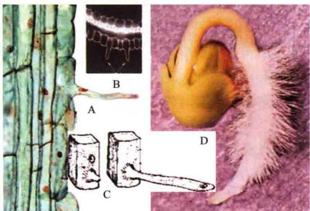  
图3-3 根尖与根毛

A、B.根尖纵切、横切部分放大；C.根毛细胞的发育；D.萝卜根尖

## (二) 双子叶植物根的结构

## 1. 双子叶植物根的初生结构

根尖顶端分生组织细胞分裂产生的新细胞经生长和分化，形成根毛区成熟结构的过程称为根的初生生长（primary growth）。根初生生长过程中形成的各种组织属于初生组织，由初生组织所复合而成的结构，称为根的初生结构（primary structure）。

横切双子叶植物根的成熟区，自外而内可分为表皮（epidermis）、皮层（cortex）和维管柱（cylinder of vascular tissues）或中柱（stele）3部分（图3-4）。

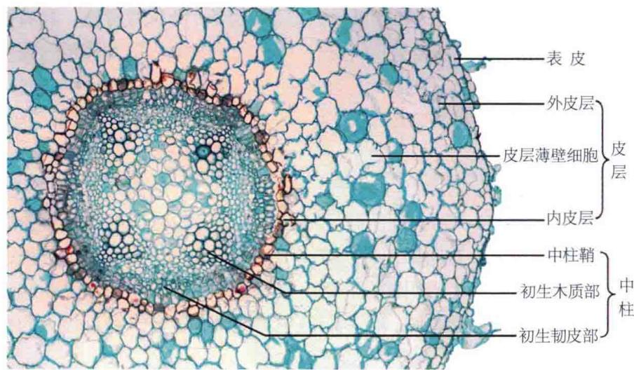  
图3-4 蚕豆幼根横切（示初生结构）

## 1）表皮

表皮是位于成熟区最外一层的生活细胞，由原表皮发育而来。细胞近于长方体形，长径与根的纵轴平行，排列紧密、整齐。对幼根来说，根表皮的吸收作用显然比保护作用更重要，所以根表皮是重要的吸收组织，其细胞壁薄，由纤维素和果胶质构成，水和溶质可以自由通过；许多表皮细胞的外壁向外突出形成根毛，以扩大吸收面积。有些植物的表皮由长、短两种细胞组成，其中长细胞为一般的表皮细胞，而短细胞含有较浓的细胞质和较大的细胞核，为生毛细胞。

某些附生的兰科植物的气生根表皮无根毛，而是经几次平周分裂形成套筒状的多层细胞构成的根被，即复表皮。根被由表皮原始细胞衍生，是一种保护组织，细胞排列紧密，细胞壁局部栓质化、加厚，原生质体瓦解，细胞腔内充满空气，主要可以减少气生根水分的丧失，并行使机械保护作用。

根毛细胞受伤、死亡后，表皮细胞会随之萎缩、凋落，表皮层失去保护作用。

## 2）皮层

皮层位于表皮与维管柱之间，由基本分生组织分化而来的多层薄壁细胞组成，在根中占有很大比例。皮层是水分和溶质从根毛到维管柱的横向输导途径，又是储藏营养物质和通气的部位，一些水生和湿生植物还在皮层中发育出气腔、通气道等。另外，皮层还是根进行合成、分泌等作用的主要场所。皮层一般又可分为外皮层、皮层薄壁细胞和内皮层3部分。

外皮层（exodermis）是多数植物根的皮层最外一层或数层形状较小、排列紧密而整齐的细胞。在表皮细胞死亡、凋落前，外皮层细胞壁常增厚并栓质化，形成保护组织代替表皮起保护作用。

皮层薄壁细胞位于外皮层和内皮层之间。其细胞层数较多，细胞体积最大，细胞间有明显的胞间隙，细胞中常储藏有各种后含物，以淀粉粒最为常见。水湿生植物的皮层薄壁细胞常部分解离成气腔和通气道。

内皮层（endodermis）是皮层最内一层形态结构和功能都比较特殊的细胞。内皮层细胞排列整齐而紧密，各细胞的上下横壁和径向壁上具有木质化和栓质化增厚的带状结构——凯（卡）氏带（casparian strip）。在横切面上，凯氏带在相邻细胞的径向壁上呈点状，称为凯（卡）氏点（图3-5）。“凯氏带”的特殊结构利于根的吸收作用。

一般具有次生生长的双子叶植物和裸子植物根的内皮层常保持凯氏带状增厚，其余的细胞壁不再继续增厚；也有少数的双子叶植物，其内皮层细胞壁早期为凯氏带增厚，以后细胞壁常在原有的凯氏带基础上再行增厚，覆盖一层木质化纤维层，甚至部分细胞的细胞壁全部都增厚，如毛茛（Ranunculus japonicus Thunb.）（图3-5）。

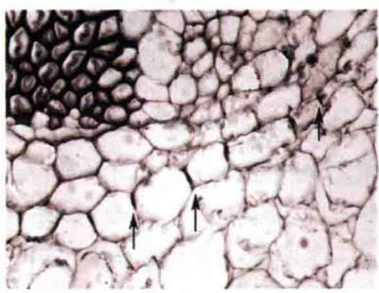  
幼根部分横切 [示凯氏带（箭头）]

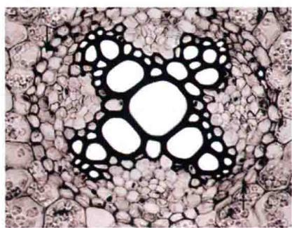  
毛茛根横切（示中柱和凯氏点）

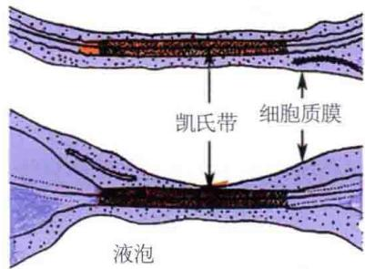  
内皮层径向壁增厚示意

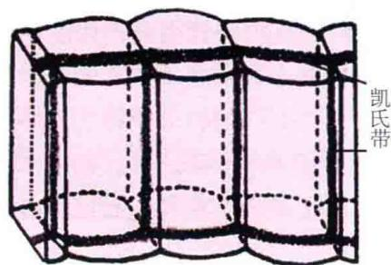  
内皮层细胞的立体观  
图3-5 蚕豆幼根横切 [示内皮层上的凯氏带（点）]

## 3）维管柱

维管柱，又称中柱，是内皮层以内结构的总称，其所占比例较小，由初生分生组织的原形成层分化而来，是根中物质运输的主要部位。维管柱包括维管（柱）鞘（又称中柱鞘）（pericycle）和维管组织（vascular tissue）（图3-4～图3-6）。

维管（柱）鞘是位于维管柱最外部、紧接内皮层细胞的一层（极少为不连续的数层）薄壁细胞。其细胞排列整齐，分化程度低，有潜在分裂能力，侧根、不定根、不定芽、木栓形成层

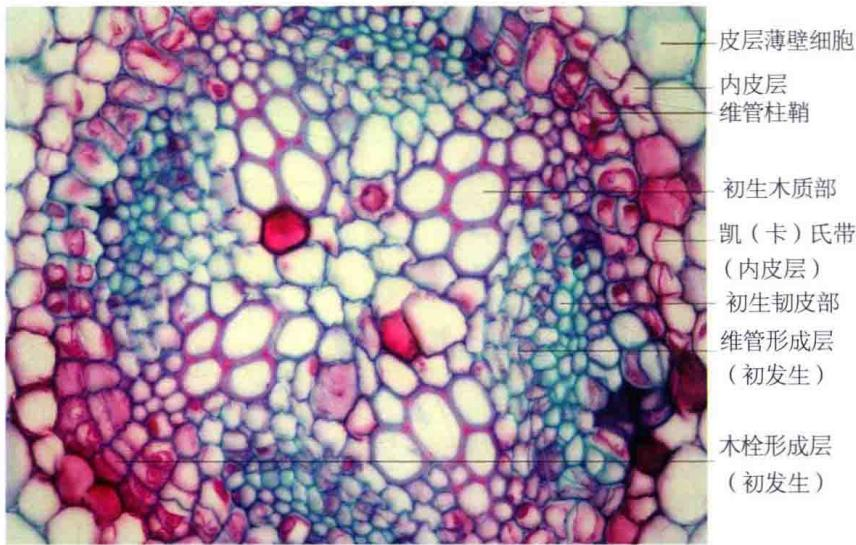  
图3-6 蚕豆根横切（示维管形成层和木栓形成层的发生位置）

和部分维管形成层等均发生于此。

维管组织位于维管（柱）鞘内，由初生木质部（primary xylem）、初生韧皮部（primary phloem）和薄壁细胞（parenchyma cell）构成。其中初生木质部与初生韧皮部呈辐射状相间排列，其间被薄壁细胞分隔。初生木质部是输导水分和溶于水的无机盐的组织，初生韧皮部是输导同化产物的组织。

初生木质部位于根的中央部位，主要由导管和木薄壁细胞组成，呈辐射状分布，辐射角处直接与维管柱鞘相连。原形成层发育分化出初生木质部的顺序是由外向内呈向心式并逐渐成熟的，这种初生木质部发育、分化成熟的方式称为外始式（exarch）。紧邻维管鞘、位于辐射角的外方部分的初生木质部称为原生木质部（protoxylem），是原形成层最初产生和分化成熟的初生木质部，主要由管腔较小、具弹性的环纹和螺纹导管组成，其输导、支持能力较弱，在根的初生生长过程中常被拉断而不连续；内方为较晚分化成熟的后生木质部（metaxylem），主要由管腔较大的梯纹、网纹和孔纹导管组成，其输导、支持能力较强。

在成熟根的横切面上，初生木质部的辐射棱角数称为束，不同植物其束数不同。双子叶植物的束数较少，一般为2～6束，分别称为二原型、三原型、四原型……单子叶植物的束数相对较多，一般有多元型初生木质部之称。初生木质部的束数在某些植物中是恒定的，因此有系统分类的价值，如二原型在十字花科、石竹科占优势，多元型在禾本科作物中多见。同一植物的不同品种有时束数有异，如茶（Camellia sinensis O.Ktze.），有五原型、六原型和十二原型之分；同一植株侧根中的束数有时少于主根，或相反；外因有时也可造成束数的改变，如用三原型的豌豆（Pisum sativum L.）根尖做离体培养时，适量的吲哚乙酸可使新生根成为六原型。初生木质部的束数多少与植株发育形成侧根的能力强弱和侧根分布格局直接相关，束数多形成的侧根就多，束数少则侧根少。

初生韧皮部位于初生木质部辐射角之间，束数与初生木质部相同，但体积较小。初生韧皮部主要由筛管和伴胞组成，也有少数韧皮薄壁细胞，有些植物还有韧皮纤维存在。其发育方式与初生木质部一样，也为外始式，即原生韧皮部（protophloem）在外，后生韧皮部（metaphloem）在内，但原生韧皮部和后生韧皮部界限不明确。初生木质部和初生韧皮部相间辐射状分布，有利于不同物质间的独立快速运输，且初生木质部的辐射角与维管柱鞘紧紧相接，缩短了径向运输距离，利于从皮层输入的溶液迅速进入导管运向地上部分。

在初生木质部与初生韧皮部之间有一层至几层薄壁细胞，在双子叶植物和裸子植物中，原形成层保留的细胞，将来成为次生分生组织（形成层）的一部分；而在单子叶植物中两者之间为成熟的薄壁细胞。

根中一般没有髓，绝大多数双子叶植物根的后生木质部一直分化到根中央；但少数双子叶植物的维管柱内由于后生木质部没有继续向中心分化，而形成由薄壁组织构成的髓（pith）。

## 2. 双子叶植物根的次生结构

大多数双子叶植物和裸子植物，特别是多年生木本植物的根，在初生生长的基础上，产生了次生分生组织——维管形成层（vascular cambium）（可简称为形成层）和木栓形成层（phellogen，cork cambium）。次生分生组织的细胞分裂、生长和分化的过程，称为次生生长（secondary growth）。次生生长产生的组织称为次生成熟组织，由次生成熟组织所复合的结构称为次生结构（secondary structure）。根的次生生长是根的增粗生长过程，根的不断增粗是根的维管形成层和木栓形成层共同作用的结果。

## 1）维管形成层与次生维管组织

## (1) 维管形成层的发生

根的维管形成层由位于初生木质部与初生韧皮部之间的、由原形成层保留下来的、未分化的薄壁细胞（图3-6）和维管（柱）鞘一定部位的、恢复分裂能力的细胞所组成。

根的次生生长起始于初生木质部和初生韧皮部间的、由原形成层保留下来的、未分化的那部分细胞，开始时它们主要平周分裂，形成几片弧状的形成层，其片段数量与根中初生木质部的束数相同。根横切面观，这部分细胞常为切向扁平形。然后，从这些弧形片段两端的细胞开始分裂，使形成层片段沿初生木质部辐射角扩展至维管（柱）鞘处；这时初生木质部辐射角处的维管（柱）鞘细胞脱分化，恢复分裂能力，与弧形片段相连为一圈，形成波浪形的筒状形成层环，此环完全包围了中央的初生木质部，初生韧皮部被隔在了形成层环的外方，其凸起数与根的原型数相同。以后，由于形成层环各处分裂速度不等，波浪状形成层环的凹段细胞形成较早，分裂速度快，而且向内形成的次生木质部细胞多于向外形成的次生韧皮部的细胞，使波浪状环的凹部逐渐被向外推移，使整个形成层呈圆环状，且各区段分裂速度相等（图3-7）。

## (2) 维管组织的组成

维管形成层主要进行平周分裂，其内侧的新生细胞经生长、分化成熟，形成次生木质部，位于初生木质部的外侧；其外侧的新生细胞经生长、分化成熟，形成次生韧皮部，位于初生韧皮部的内侧，次生木质部和次生韧皮部合称为次生维管组织。一般植物的根中，形成层活动产生的次生木质部的数量远远多于次生韧皮部。因此，在根的横切面上，次生木质部所占比例要比次生韧皮部大得多。形成层细胞除进行平周分裂外，还有少量的垂周分裂，以扩大本身的周径，适应根的增粗。在根的增粗过程中，由于初生韧皮部比较柔弱，它们常被挤压于次生韧皮部之外，有时候只剩下被挤碎后的残余部分，其输导同化产物的功能则由次生韧皮部来担负；另外，次生木质部则替代初生木质部行使输导和支持的功能。维管形成层的活动使根不断加粗，其本身的位置也不断外移。

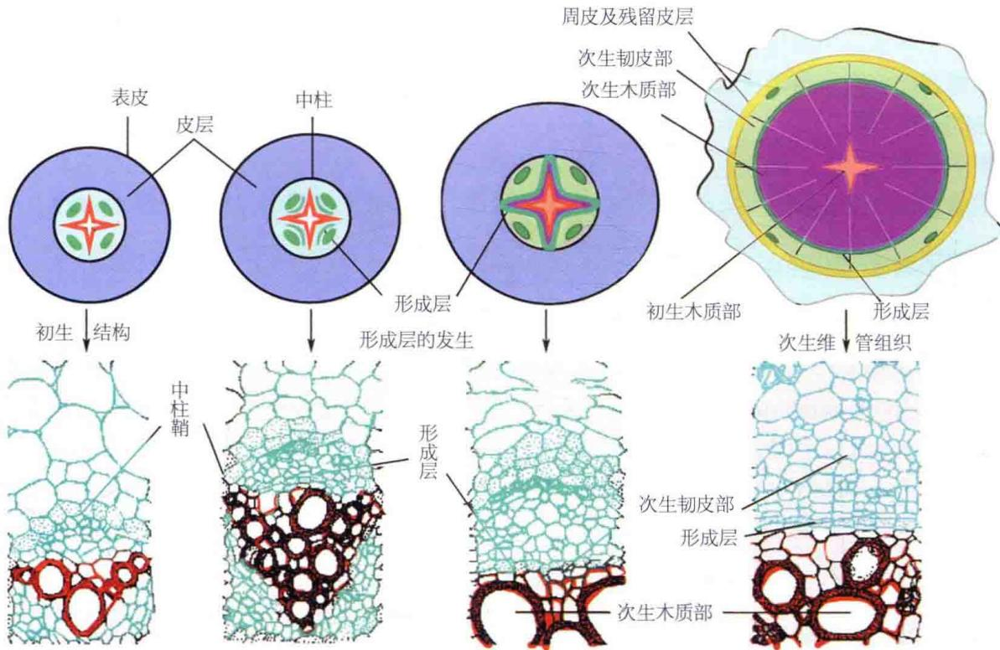  
图3-7 根次生维管组织的发生过程

根形成次生结构后，直径显著增粗，但呈辐射状态的初生木质部仍然保留于根的最中心，这是区分老根、老茎的标志之一。

## 2）木栓形成层与次生保护结构

## (1) 木栓形成层的发生

在维管形成层的活动使根不断增粗的同时，维管（柱）鞘细胞也在次生维管组织的挤压和外围的皮层及表皮的张力压迫下，通过脱分化恢复分裂能力，进行垂周（径向）和平周（切向）分裂而发育成木栓形成层。

## (2) 周皮的组成

木栓形成层进行平周分裂，其外侧的新细胞经生长、分化成熟，且细胞壁高度栓质化，形成了由多层木栓细胞组成的木栓层（cork）；其内侧的一至少数几层新细胞发育成栓内层（phelloderm），木栓层、木栓形成层和栓内层这三种不同类型的组织组成的结构称为周皮。周皮是次生保护结构，是比表皮的保护作用更强的复合组织。木栓细胞成熟时为死细胞，形状扁平，排列紧密而整齐，细胞壁栓质化，不透水气，腔内充满气体，可以防止根内部水分过度失散和抵抗病虫害侵袭，同时使其外方的组织（皮层和表皮部分）营养断绝而死亡。

根的维管形成层和木栓形成层活动的结果形成了根的次生结构，自外向内依次为周皮（木栓层、木栓形成层、栓内层）、初生韧皮部（常被挤毁）、次生韧皮部（含韧皮射线）、形成层、次生木质部（含木射线）和辐射状的初生木质部。除少数草本植物和部分木本植物（如槐树等）的根中有髓外，多数双子叶植物根中无髓（图3-8）。

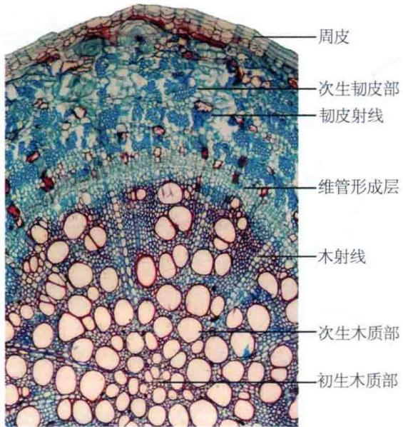  
图3-8 棉老根部分横切（示次生结构）

## （三）单子叶植物根的结构

## 1. 禾本科植物根的结构

禾本科植物，如小麦、玉米、水稻及甘蔗（Saccharum sinensis Roxb.）等根的基本结构与双子叶植物一样，也分为表皮、皮层、维管（中）柱3个基本部分。但各部分又各有其特点，尤其是没有维管形成层和木栓形成层，不能进行次生生长因而没有次生结构（图3-9～图3-11）。

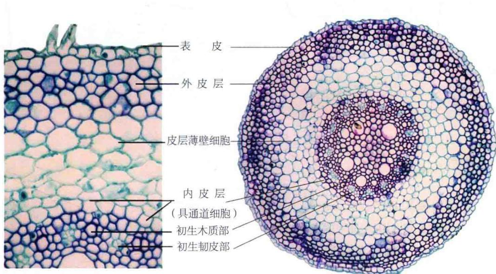  
图3-9 小麦根横切（示初生结构）

## 1）表皮

表皮是最外的一层生活细胞，但寿命较短，当根毛枯死后，往往解体而脱落死亡。

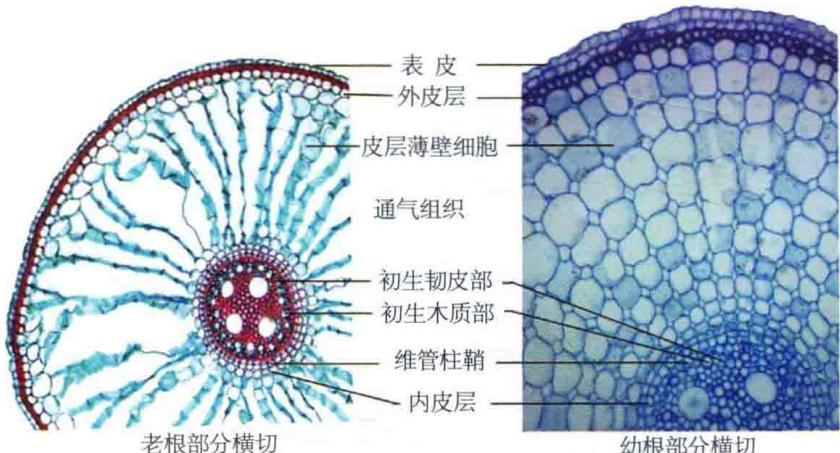  
幼根部分横切  
图3-10 水稻根部分横切结构

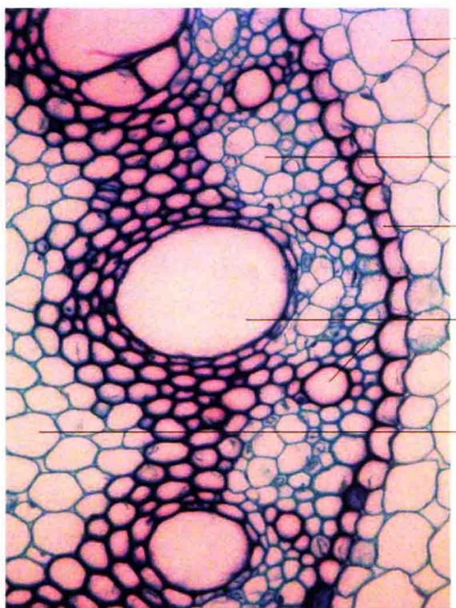

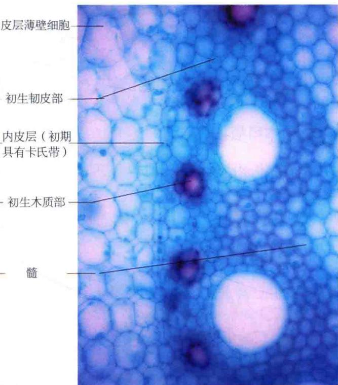  
图3-11 玉米幼根（右）与老根（左）部分横切（示维管柱结构）

## 2）皮层

皮层中靠近表皮的一至数层细胞较小，排列紧密，称为外皮层。在根发育后期，外皮层往往形成栓化的厚壁组织，在表皮和根毛枯萎后，代替表皮行使保护作用。

外皮层以内是占比例较大的皮层薄壁细胞。细胞间隙大，排列疏松，可能与通气作用有关，尤其在水稻等水湿生植物老根的皮层中，有明显的气腔，气腔中间被解体的皮层薄壁细胞及其残留的细胞壁所间隔。根、茎、叶的气腔互相贯通，形成良好的通气组织。

皮层最内一层特化的细胞为内皮层。与双子叶植物较长时间保留“凯氏带”结构不同的是，禾本科植物根的内皮层初期具有凯氏带的发育和结构。此后，大部分细胞除外切向壁外，两侧径向壁、上下横壁及内切向壁均次生加厚，在横切面上呈马蹄铁形；少部分没有增厚的细胞为通道细胞，分散位于正对初生木质部辐射角的位置，一般认为它们是根的初生结构部分内外物质运输的主要通道。但在玉米、大麦（Hordeum vulgare L.）等植物中，其根的内皮层细胞全部内五面加厚、无通道细胞（图3-11）。有人用透射电镜观察发现，大麦根的内皮层栓质化的细胞壁上有丰富的胞间连丝。

## 3）维管柱

维管柱由维管（柱）鞘和维管组织构成。维管柱的最外一层薄壁细胞为维管（柱）鞘。维管（柱）鞘在根发育后期常部分（如玉米）或全部（如水稻）木质化，产生侧根的功能减弱。

维管组织由初生木质部、初生韧皮部和髓构成。其中初生木质部一般为多原型，常为七原型以上，多至20原型；初生韧皮部与其相间排列，主要由少数筛管、伴胞组成。维管柱中央有发达的髓，由薄壁细胞组成，可以储藏营养物质。有的植物，如水稻等发育后期，除韧皮部外，维管柱其他组织全部木质化，既保持输导能力，又具有坚强的支持作用。

禾本科植物根的特点是：①外皮层细胞的细胞厚壁化或木质化；②多数内皮层细胞的细胞壁除外切向壁外为内五面增厚或全面增厚；③维管（柱）鞘细胞后期厚壁化；④初生木质部为多原型；⑤初生木质部与初生韧皮部之间的薄壁细胞分化成熟，不再有分裂能力。

## 2. 非禾本科植物根的结构

大多数非禾本科的单子叶植物，包括多年生植物，其根也只有初生生长和初生结构，由表及里分为表皮、皮层和维管柱3部分（图3-12）。

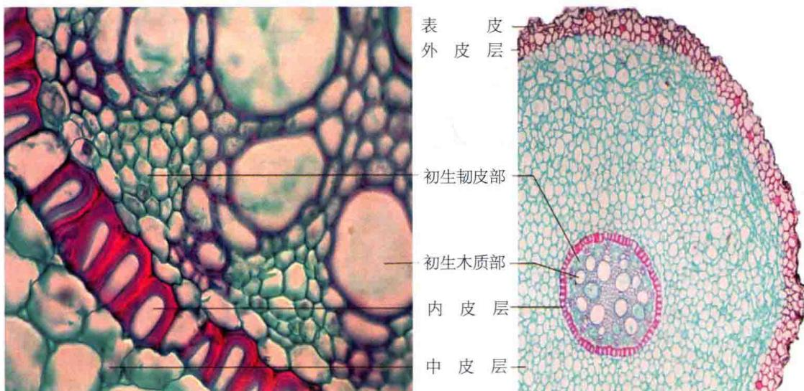  
图3-12 鸢尾根部分横切

非禾本科的单子叶植物根的主要特征与禾本科植物相似。但也有些非禾本科植物的根的初生木质部束数较少，如韭菜等的根初生木质部为四（或五）原型。

## 三、侧根的发生

植物的根在伸长过程中除了形成根毛以扩大吸收面积外，无论是主根还是不定根，都不是单独的一条根，总是产生许多侧根。侧根扩大植物地下根的分布范围，以便吸收更多的营养，并能进一步加强根的固着和支持能力。

## (一) 侧根的发生

侧根由侧根原基（primordium）发育而来。侧根原基由母根根毛区后方的维管（柱）鞘一定部位的细胞经脱分化、恢复分裂能力而来（图3-13、图3-14）。侧根起源于根内维管（柱）鞘部位的发生方式称为内起源（endogenous origin）。侧根在维管（柱）鞘的发生部位，与初生木质部和初生韧皮部的位置和束数有关。

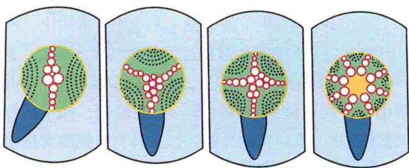  
图3-13 侧根的发生规律

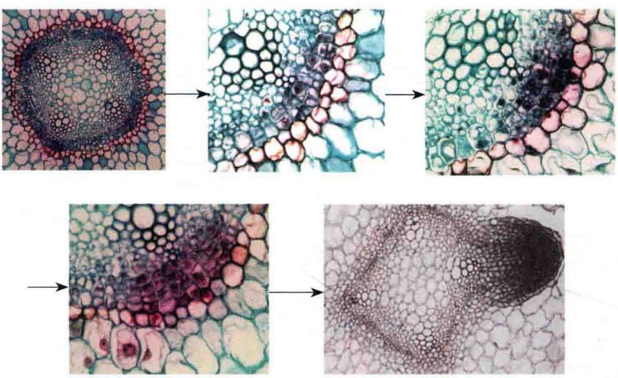  
图3-14 侧根原基的发生（金银根等摄）

侧根在维管（柱）鞘上发生的位置通常是稳定的，也常因植物种类而不同。在二原型根中，侧根发生于原生木质部和原生韧皮部之间或正对着原生木质部的维管（柱）鞘细胞。在前一种情况下，侧根行数为原生木质部辐射角的倍数，如胡萝卜为二原型，侧根有四行；在后一种情况下，则侧根只有两行，如二原型的萝卜。在三原型、四原型根中，侧根多发生于正对原生木质部的维管（柱）鞘细胞，初生木质部辐射角有几个，常产生几行侧根，如棉花为四原型，则侧根有四行（图3-13）。在多原型根中，侧根常产生于正对着原生韧皮部的维管（柱）鞘细胞。从外部观察，侧根在母根上沿长轴纵向排列，行列的数目等于初生木质部的束数。

## (二)侧根的形成

侧根是由侧根原基发育而来的。侧根发生时，维管（柱）鞘一定部位的细胞脱分化和恢复分裂后，经几次平周分裂和垂周分裂，形成侧根原基。以后侧根原基细胞继续分裂、生长，逐渐分化出生长点和根冠（图3-14）。随着生长点的细胞继续分裂、增大和分化，增大的侧根原基逐渐深入皮层，并分泌水解酶等，将部分皮层和表皮细胞溶解，因而侧根原基能够穿透皮层，突破表皮，伸出母根外，顺利地伸进土壤形成侧根。侧根伸出母根后，各种组织相继分化成熟，侧根维管组织也与母根的维管组织连接起来。新的支根的形成，扩大了根的吸收面积，增强了整个根系的吸收和固着能力。

侧根和主根有着密切的联系，截断主根能促进侧根和不定根的发生，从而形成更发达的根系。因此，研究根的特性，构建良好的根系，可使栽培植物高产优质。

根的发育和结构可图解总结如下。

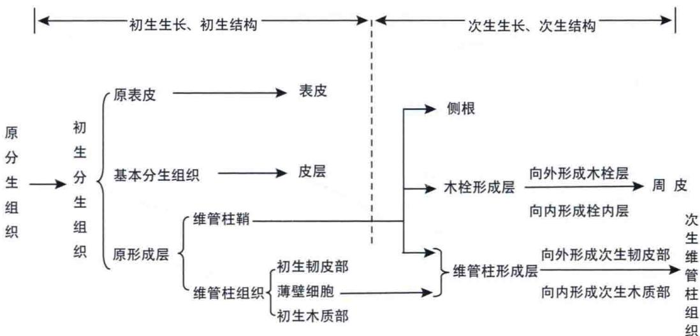

## 四、根瘤与菌根

在土壤中，植物的根系与土壤内的微生物（细菌、放线菌、真菌、藻类及原生动物等）有着密切的关系。一方面，植物新陈代谢活动产生的根系分泌物，很多都是微生物的营养来源；另一方面，土壤微生物的新陈代谢活动加速土壤养分的释放、产生一些刺激植物生长的物质，促进植物的生长。有些土壤微生物还能侵入某些植物的根部，使植物致病；也有些微生物入侵根部后，常形成特殊结构，彼此间建立互利共存共生（symbiosis）关系，形成共生结构，如根瘤（root nodule）和菌根（mycorrhiza）等。

## (一) 根瘤

根瘤的形状、大小因植物种类而异。土壤中的根瘤细菌、放线菌和某些线虫都能入侵宿主植物的根部形成根瘤。通常所讲的根瘤，主要是指豆科植物的根瘤（图3-15、图3-16），与农业生产有着密切的关系。

豆科植物的根瘤形成开始于豆科植物的苗期，幼苗根系的分泌物吸引分布在其附近的根瘤菌，使其聚集在根毛周围并大量繁殖。根瘤菌产生的分泌物使根毛卷曲、膨胀，并使部分细胞壁溶解，根瘤菌便由此侵入根毛。在根瘤菌的刺激下，受感染细胞相应地分泌出纤维素等物质包围感染丝，形成具有纤维素鞘的内生管——侵入线。根瘤菌沿侵入线进入幼根的皮层薄壁细胞中，一方面利用皮层的养分大量繁殖自身；另一方面，根瘤菌的分泌物刺激皮层细胞迅速分裂而增加细胞数目。致使皮层局部膨大、凸出，形成一个个瘤状凸起物。

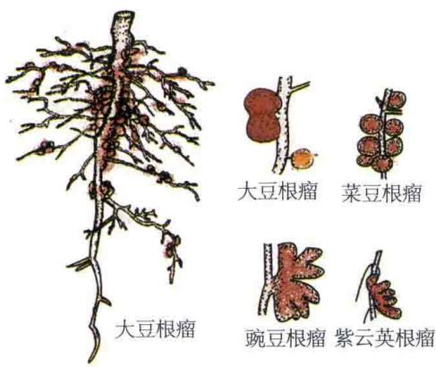  
图3-15 几种豆科植物的根瘤

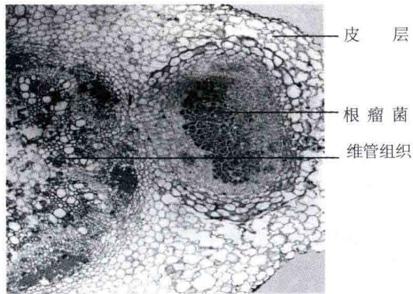  
图3-16 蚕豆根横切（示根瘤与根瘤菌）

在皮层薄壁细胞内大量繁殖的根瘤菌，逐渐转变为具有固氮能力的拟菌体（bacterioid）进行固氮作用（把空气中的游离氮转变为氨），增加植物生长的氮素营养；同时该区域周围分化出与根中维管组织相连的输导组织、外围薄壁组织鞘和内皮层。

在自然界，除豆科植物外，还有100多种植物，如早熟禾属、看麦娘属、胡颓子属、木麻黄属等植物的根，都可以结瘤固氮，与非豆科植物共生的固氮菌多为放线菌类。有人估计，全世界年产氮肥0.5亿t左右，而通过生物固氮的氮素可达1.5亿t。生物固氮不但量大、无污染，且可节能，实属低碳经济。

## (二)菌根

植物的根与土壤中的真菌结合而形成的共生体，称为菌根（mycorrhiza）。根据菌丝在根中生长分布的部位不同，可将菌根分为外生菌根、内生菌根和内外生菌根3类。

## 1. 外生菌根

外生菌根（ectotrophic mycorrhiza）的菌丝大部分包被在植物幼根的表面，形成白色丝状物覆盖层，只有少数菌丝伸入根的表皮、皮层细胞的胞间隙中，但不侵入细胞之中（图3-17）。外生菌根的菌丝具有根毛的功能，增加根的吸收面积。具有外生菌根的根尖通常略变粗。马尾松、云杉、山毛榉等木本植物的根上常有外生菌根。

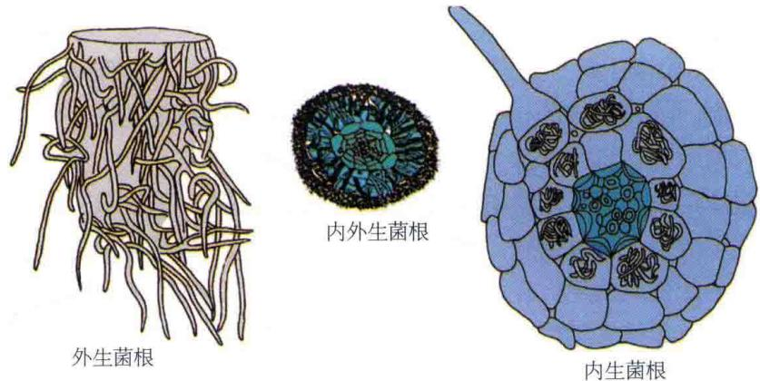  
图3-17 菌根

## 2. 内生菌根

内生菌根（endotrophic mycorrhiza）的真菌菌丝通过细胞壁大部分侵入到幼根皮层的活细胞内，呈盘旋状态。在显微镜下，可以看到表皮细胞和皮层细胞内散布着的菌丝，如柑橘、核桃（Juglans regia L.）、桑（Morus alba L.）、葡萄、李（Prunus salicina Lindl.）及兰科（Orchidaceae）等植物。

## 内外生菌根

内外生菌根（ectendotrophic mycorrhiza）是外生和内生菌根的混合型。在这种菌根中，真菌的菌丝不仅从外面包围根尖，而且还伸入到皮层细胞间隙和细胞腔内，如苹果、草莓等。

当真菌和植物共生时，真菌不仅可从宿主中吸取自身生长发育所需要的养分，同时真菌代谢的分泌物可促进土壤中无机养分的释放。菌丝吸收的水分、无机盐等可部分地供给绿色植物使用，利于植物的生长。此外，真菌产生的激素、维生素等物质可刺激根系的发育，促进植物生长。

在生产上，具有根瘤的植物和有些具有菌根的树种（如松、栎等），在缺乏相应共生菌的土壤中往往生长不良。因此，在播种或荒山造林时，常预先在土壤内接种相应的根瘤菌和真菌，或事先用根瘤菌和真菌拌种，并适当增施氮肥，以利植物的根系生长和根瘤、菌根的形成，保证植物生长良好，促进根瘤的固氮和菌根的吸收。但是，真菌生长过旺会使根的营养消耗过多，使树木生长不良。

## 第二节 茎的形态、结构与功能

## 一、茎的形态与分枝

种子萌发后，上胚轴和胚芽向上生长产生茎和叶。茎端和叶腋内的芽（bud）活动生长，形成分枝（twig）。继而新芽不断产生与生长，最后形成了繁茂的植株地上茎枝系统。

茎是植物的重要营养器官之一，其生理功能主要是支持和输导作用。茎支持植株上分布的叶、花和果实，使它们彼此镶嵌分布，更有利于光合作用和果实、种子的发育与传播。茎连接着植株的根和叶，根部从土壤中吸收的水分、矿质元素以及在根中合成或储藏的有机营养物质，通过茎输送到地上各部；叶进行光合作用所制造的有机物，也要通过茎输送到体内各部被利用或储藏。因此，茎是植物体内物质输导的主要通道。有些植物可以形成鳞茎、块茎、球茎、根状茎等变态茎，储藏大量养分，并可以进行营养繁殖。还可利用某些植物的茎易产生不定根和不定芽的特性，采用枝条扦插、压条和嫁接等方法繁殖植物。此外，一些植物的叶退化或早落，茎呈绿色扁平状，可终生进行光合作用，如仙人掌属（Opuntia）等。有的茎中还有大量的大型薄壁组织，富含水分，而发展成为储水组织。皂荚（Gleditsia sinensis Lam.）等植物茎的分枝可变为刺，具保护作用。葡萄、南瓜等植物茎的分枝还会变为卷须，成为重要的攀缘器官而具有攀缘作用（详见第四节）。

植物的茎常因特殊的结构组成、积累储藏某些特定的代谢产物而被广泛利用。木本植物的茎因其木质化程度很高，作为木材被广泛用于建筑、桥梁、家具、工艺雕刻等多种行业领域，如松、杉、柏、楠木、榆树和竹材等。有些植物的茎较为柔韧，可作编织的原料，如框柳（Salix horiganagi Kimura）等。有些植物茎的韧皮部中含有发达的纤维，可以用作纺织、麻绳、麻袋等的原料，如苎麻、黄麻、亚麻等。有些植物的茎中含有特殊物质，而可通过多种方法，加以提取利用。例如，橡胶、生漆、树胶、糖料、淀粉等均可从植物体中提取获得。有些植物的茎主要由含大量营养物质的薄壁细胞组成，可以食用，如莴苣（Lactuce indica L.）的肉质茎、马铃薯的块茎等。有些植物的茎中积累的代谢产物因具有一定的药用价值，可以用作药材，如天麻（Gastrodia elata Blume）等。有些植物的茎由于其形态奇异、色彩斑斓，或经雕琢作为观赏，如龟甲竹［Phyllostachys pubescens（Carr.）Mitford］及各种树桩盆景等。随着科学技术的发展，对茎的利用将会更加广泛。

## (一) 茎的形态与组成

## 1. 茎的形态

不同的植物，其茎的形态特征不同。多数植物的茎呈辐射对称的圆柱体；有些植物的茎呈三棱形，如莎草科植物；或四棱形，如唇形科植物薄荷、留兰香等；或多棱形，如芹菜等。多数植物的茎实心，如棉花、玉米等；也有些植物的茎有髓腔而中空，如毛竹、小麦等。

茎的大小因种和环境而异。有的矮小、幼嫩、可直立生长；有的高大、挺立、不断增粗并高度木质化；有的柔弱不能直立，或攀缘，或缠绕，或贴附于其他物体，蔓延生长（有关茎的性质，详细参见第五章）。有的植物茎秆高于100m，如澳大利亚的桉树（Eucalyptus globulus Labill.）；而有的则非常低矮，如牛毛毡［Eleocharis yokoscensis（Franch. et Savat.）Tang et Wang］；有的植物树冠庞大，占地面积可达1500m²以上，如生长于缅甸热带雨林中的榕树（Ficus microcarpa L.）等。茎的不同形态都是其自身遗传特性所决定的，是环境长期影响的结果。

## 2. 茎的组成

尽管茎的形态大小和习性千差万变，但其组成基本相似。一般植物的茎都具有节和节间，节上长叶，茎的顶端或叶腋中有芽。因此，茎就是枝条上除去叶和芽所留下的轴状部分。不同植物的节和节间的形状不同，节间的长短也不同（图3-18）。

不同植物产生的枝条长短不一，同一植株也可以有长枝和短枝之分。短枝节间短，长枝节间长。一般长枝是营养生长的枝条（裸子植物例外，如雪松等植物的长枝、短枝都是营养枝），短枝是开花结实的枝条，又称花枝或果枝。植株的长枝、短枝发育是物种的遗传特性决定的。枝条或节间的长短与植物的种类、枝条发生的位置、年龄、生育期、植株自身的营养状况和环境因素的影响有关。例如，玉米、甘蔗等植株中部的节间较长，茎端的节间较短；水稻、小麦等在幼苗期，各节密集于基部，节间极短，抽穗后的节间较长。在果树栽培上，常采取整枝或促控结合的方法来调节长短枝的数量和分布，以获得优质、高产和稳产。

在木本植物的枝条上，其叶片脱落后留下的疤痕称为叶痕（leaf scar）。叶痕中的点状突起是枝条与叶柄间的维管束断离后留下的痕迹，称为维管束痕（bundle scar）。有的枝条上还有芽鳞痕（bud scale scar）存在，这是密集的芽鳞片脱落后留下的痕迹。根据枝条芽鳞痕的数量等特征，可以判断枝条的生长年龄和生长速度（图3-18）。

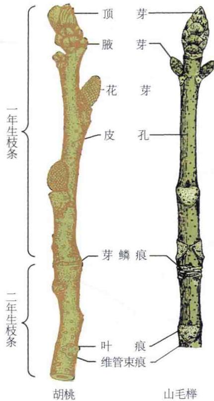  
图3-18 枝条形态

枝条外表常可见到的一些小型白色或褐色的斑点称为皮孔（lenticel），这是枝条与外界气体交换的通道。有些植物的枝条上生长有表皮毛、腺毛等多种类型的毛状附属物，它们具分泌作用或保护作用。皮孔、表皮附属物的形态大小、色泽因种而异，是区分物种的参考依据之一。

## (二)芽和茎的分枝

## 1. 芽的类型

芽（bud）分布于枝条的顶端或叶腋内，是未发育的枝条或花和花序的原始体。按照芽生长的位置、性质、结构和生理状态等不同，可将芽分为若干类型。

## 1) 定芽与不定芽

按芽发生位置是否确定，芽分为定芽（normal bud）和不定芽（adventitious bud）两类。定芽生于枝上且发生位置固定，顶芽（terminal bud）包括胚芽，只发生于枝的顶端，腋芽（axillary bud）或侧芽（lateral bud）则只发生于叶腋（叶的近轴面与茎的夹角处），顶芽和腋芽都是定芽。多数植物的一个叶腋中只有一个腋芽，称为单芽（single bud）；有些植物的叶腋可发生两个或几个芽，其中除一个为正芽外，其余均称副芽（accessory bud）（如桃为并生副芽、桂花为叠生副芽）。法国梧桐等植物的腋芽被包藏于鞘状膨大的叶柄基部内侧，叶柄脱落后腋芽露出，这样的芽称叶柄下芽（infrapetiolar bud）。不定芽只发生于植株的老茎、根、叶及创伤部位，其发生位置比较广泛，且没有确定性。例如，柳的老茎、甘薯的块根、秋海棠的叶上发生的芽都是不定芽。

## 2）叶芽、花芽与混合芽

按结构和性质，芽可分为叶芽、花芽和混合芽。叶芽（leaf bud）是将来发育成营养枝的芽，如水稻的分蘖（侧芽）芽；花芽（flower bud）是将来发育为花或花序的芽，如广玉兰和小麦的顶芽；混合芽（mixed bud）则为将来同时发育为枝叶和花或花序的芽，如梨、苹果等植物的顶芽。

叶芽相对瘦小，而花芽和混合芽通常比较肥大，易与叶芽区别。植物的顶芽和侧芽既可能是叶芽，也可能是花芽或混合芽。例如，禾本科植物的顶芽在营养生长期是叶芽，到幼穗分化时则转变成花芽。植物的副芽则通常是花芽，如桃、桂花等的副芽。

## 3）鳞芽与裸芽

按芽鳞的有无，芽可分为鳞芽和裸芽。鳞芽（scaly bud）是一些生长或起源在冬寒地带的多年生木本植物的芽，有芽鳞片包被，又称被芽。芽鳞片是叶的变态，其外层细胞角化或栓化、坚硬，外表常被以茸毛、蜡质，或可分泌黏液或树脂，因而可以有效地起到保护作用。随着鳞芽的活动生长，芽鳞片脱落，在枝条的一定部位留下密集的芽鳞痕，成为判别枝条生长年龄和生长速度或生长量的依据。

裸芽（naked bud）是无芽鳞片的仅被幼叶包围着生长锥的芽。所有一年生、两年生草本和一些分布于温暖地区的多年生木本植物的芽均属于裸芽。

## 4）活动芽与休眠芽

按芽的生理活动状态，可将芽分为活动芽和休眠芽。能在当年生长季节中萌发的芽称活动芽（active bud）。温带的多年生木本植物，其枝条上近下部的腋芽在生长季节里往往是不活动的，暂时保持休眠状态，这种芽称为休眠芽（dormant bud）。休眠芽仍具有生长活动的潜势。在一定的条件下活动芽与休眠芽可以互相转变。

## 5）珠芽

珠芽（bulbil）是一种未发育的球茎，呈球状、卵圆形等，通常生于叶腋，属于营养繁殖的器官。例如，两年生或三年生的半夏［Pinellia ternata（Thunb.）Breit.］叶柄的基部及百合（Lilium speciosum Thunb.）花茎的每一叶柄下部或叶子基部生出的珠芽等。此外，山药（Dioscorea spp.）、泽泻科（Alismataceae）、水麦冬科（Juncaginaceae）、天南星科（Araceae）和莎草科（Cyperaceae）部分种类都可在叶柄的基部形成珠芽。

此外，按芽形成的季节分，则生长季中形成并发育的芽称为夏芽，多见于草本和热带常绿植物；在生长季末形成，来年生长季才活动的芽称为冬芽或越冬芽，如多年生植物的某些芽。还有，按芽离地面的高低，芽可分为高位芽、地上芽、地面芽和地下芽或隐芽等类型。

一个具体的芽，由于分类依据的不同，可给予不同的名称。例如，梨的鳞芽可以是顶芽或侧芽，也可以是休眠芽，可以是叶芽，也可以是混合芽。种子萌发时，胚芽生长，逐渐发育为具叶的枝条。枝条的顶端和叶腋中生长幼芽。芽有多种类型，芽在茎或枝条上的位置因植物而不同，芽的位置和生长决定了植物地上部枝条分布的格局。

## 芽的结构

## 1）叶芽

叶芽是在植物营养生长的早期陆续出现的芽。其基本结构包括生长锥（growing tip; growth cone）（芽轴、茎尖分生区）、自内而外体积和发育程度递增的叶原基（leaf primordium）和幼叶（图3-19）。有的植物，芽外方还有一至几片芽鳞，以及从第二、第三个（自顶向基）叶原基内侧开始出现的腋芽原基（axillary bud primordium）。腋芽原基位于每个叶原基或幼叶的内侧。

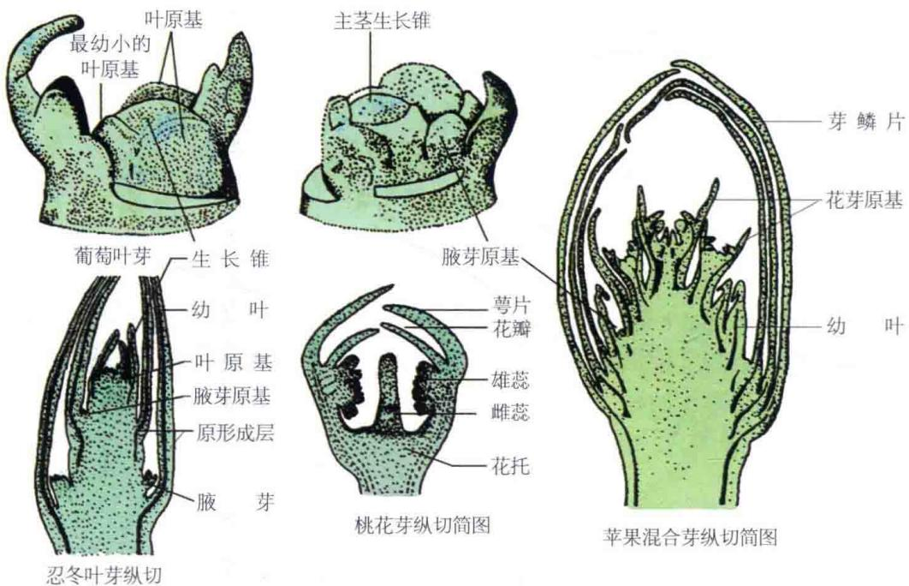  
图3-19 芽的类型与结构

## 2）花芽

当植株从营养生长转入生殖生长时，开始形成花芽。花芽是花或花序的原始体，外观较叶芽肥大，内含花或花序各部分（花萼、花瓣、雄蕊和雌蕊）的原基（详见第四章）。花芽中无叶原基和腋芽原基，茎尖分生组织在花芽分化完成后消失（图3-19）。

## 3）混合芽

混合芽有完整的叶芽结构，叶原基或幼叶的叶腋内还有花芽原基的分化，混合芽的外围常有芽鳞片包被（图3-19）。

## 茎的分枝方式

植物的顶芽和侧芽存在着一定的生长相关性。当顶芽活跃地生长时，侧芽的生长就受到一定的抑制。如果顶芽因某些原因而停止生长时，侧芽就会迅速生长，由于上述原因及植物的遗传特性，不同植物有不同的分枝方式，一般种子植物的分枝方式有以下几种（图3-20）。

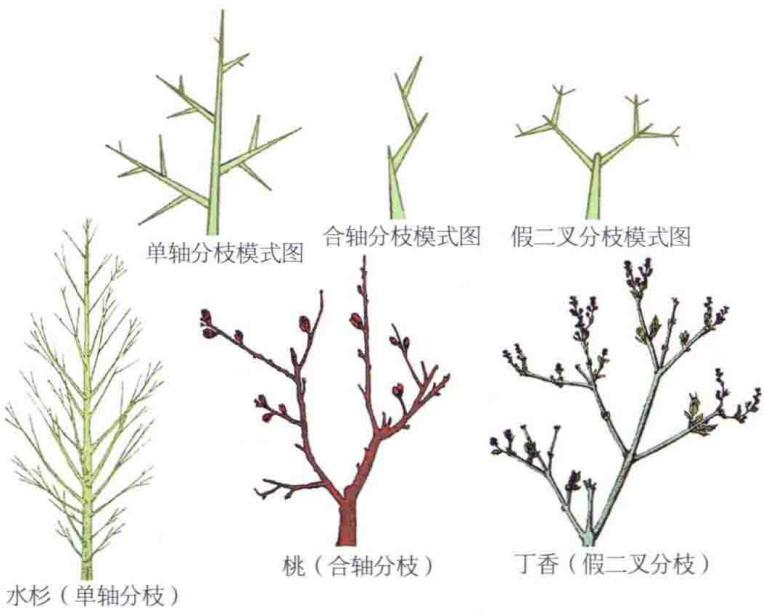  
图3-20 分枝类型

## 1）单轴分枝

单轴分枝（monopodial branching）又称总状分枝，是指从幼苗开始，主茎的顶芽活动始终占优势，形成一个直立的主轴，而侧枝则较不发达，其侧枝也以同样的方式形成次级分枝。单轴分枝方式的植株呈塔形，如杨、红麻、黄麻等。所以，栽培这类植物时要注意保护顶芽，以提高其产量与品质。

## 2）合轴分枝

合轴分枝（sympodial branching）的植株顶芽活动到一定时间后死亡，或分化为花芽，或发生变态，而靠近顶芽的一个腋芽迅速发展为新枝，代替主茎生长一定时间后，其顶芽又同样被其下方的侧芽替代生长。合轴分枝的主轴除了很短的主茎外，其余均为各级侧枝分段连接而成，因此，茎干弯曲、节间很短，而花芽较多。合轴分枝在农作物和果树中普遍存在，如棉（图3-20、图3-21）、番茄、马铃薯、柑橘类、葡萄、枣、李等的果枝（fruit shoot），茶树等在幼年期为单轴分枝，成长后则出现合轴分枝。生产上，常采用整枝法来调整果枝和营养枝（foliage shoot）的比例，在保证一定的营养面积的基础上，充分发挥果枝的增产作用，提高品质。

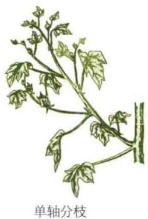

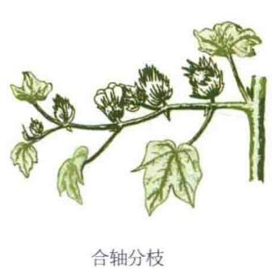  
图3-21 棉茎的分枝方式

## 3）假二叉分枝

假二叉分枝（false dichotomous branching）是指某些具有对生叶序的植物，如丁香、石竹和槲寄生等，其主茎和分枝的顶芽生长形成一段枝条后停止发育，由顶端下方对生的两个侧芽同时发育为新枝，且新枝的顶芽与侧芽生长规律与母枝一样，如此继续发育形成的分枝方式。这样的分枝在外表上形似二叉分枝，实际上它不同于顶端分生组织一分为二所形成的二叉分枝（如地钱，Marchantia polymorpha L.）（参见第一章）。

## 4. 分蘖

分蘖（tiller）是指植株的分枝主要集中于主茎的基部的一种分枝方式。其特点是主茎基部的节较密集，节上生出许多不定根，分枝的长短和粗细相近，呈丛生状态。典型的分蘖常见于禾本科作物，如水稻、小麦等的分枝方式（图3-22）。

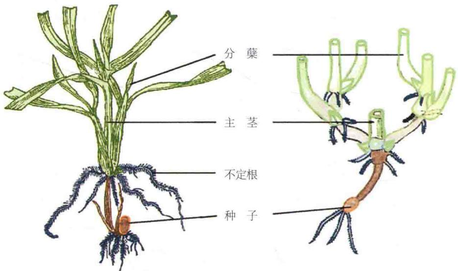  
图3-22 小麦分蘖示意图

## 二、茎的结构

## (一) 茎尖分区

茎的顶端叫做茎尖（stem tip），是由叶芽（顶芽）活动形成的。顶芽活动时，生长锥的原分生组织分裂，向下产生初生分生组织，初生分生组织经初生生长形成初生结构，从而形成茎尖。根据茎尖的形态和不同区域细胞组成特征，可将其划分为分生区、伸长区和成熟区3个区（图3-23）。茎尖细胞不断进行分裂、生长和分化，使茎不断伸长并不断产生新的枝叶。茎尖的生长分化过程与根尖基本相似，但由于茎尖所处的环境以及所担负的生理功能不同，其形态结构也有所不同。茎尖没有类似根冠的结构，然而分生区的基部次第形成了一些叶原基（有时有腋芽原基）和幼叶，以及未发育成的节和节间，增加了茎尖结构的复杂性。

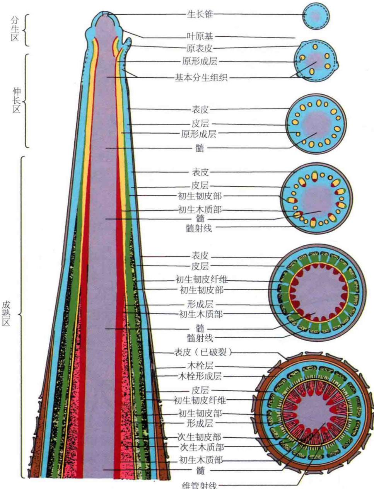  
图3-23 茎初生结构至次生结构的发育过程图解（依Strasburger）

## 1. 分生区

茎尖分生区又称生长锥，一般为半球形，由一团具有分裂能力的原分生组织所构成。茎尖顶端以下有叶原基和腋芽原基，有的还有芽鳞原基。现以原套原体学说或组织细胞分区学说来说明茎尖生长锥的结构和分化动态。

## 1) 原套原体学说

原套原体学说将茎生长锥分为原套（tunica）和原体（corpus）两部分。原套位于其表面，由一层或数层排列整齐的细胞组成。它们进行垂周分裂（anticlinal division），扩大其表面积。原体是原套内侧的一团不规则排列的细胞，它们可沿着各种方向进行分裂，增大体积（图3-24）。在营养生长过程中，原套和原体的细胞分裂活动，互相配合，故茎尖顶端始终保持原套、原体的结构。大多数植物的原套细胞通常是两层，有的单子叶植物则仅有一层。观察表明：当营养生长向生殖生长过渡时，茎尖的原套层数和原体的相对体积都会发生变化。此外，原套层数也可随季节、植株生长状况、发育阶段等的不同而改变。

## 2）细胞组织分区学说

根据细胞学特征和组织分化动态的观察，在裸子植物和已研究的大多数被子植物中发现茎端有分区现象（图3-25）。在原套、原体的中央部位，各有一个原始细胞群，前者称为顶端原始细胞区，后者称为中央母细胞区。这些细胞较大，并具较大的核和液泡，染色比周围的原套、原体细胞浅，细

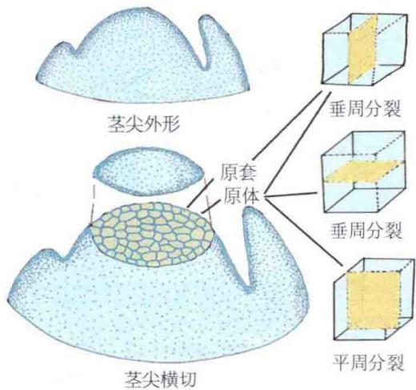  
图3-24 水稻茎尖纵剖面与原套原体细胞的分裂面

胞分裂较为频繁。这两群原始细胞分裂形成了围绕在它们周围的周围分生组织区（peripheral meristem zone）和下方的肋状分生组织区（rib meristem zone）。肋状分生组织区又称髓分生组织区（pith meristem zone），其细胞较周围分生组织细胞更液泡化，主要进行有规律的分裂，因而形成特殊的“肋状”。有些植物在肋状分生组织区和周围分生组织区上方还有整体如浅盘状的形成层状过渡区（cambium like transition zone），其细胞在茎端纵切面上为扁平状，排列整齐，如同形成层及其衍生细胞所形成的形成层带，如菊等植物的粗壮茎端。形成层状过渡区在叶原基形成的间隔期可以有体积的变化。分生区下方形成初步分化的初生分生组织；原套的表面细胞分化为原表皮层，周围分生组织和肋状分生组织分化形成基本分生组织和原形成层（图3-25，表3-2）。

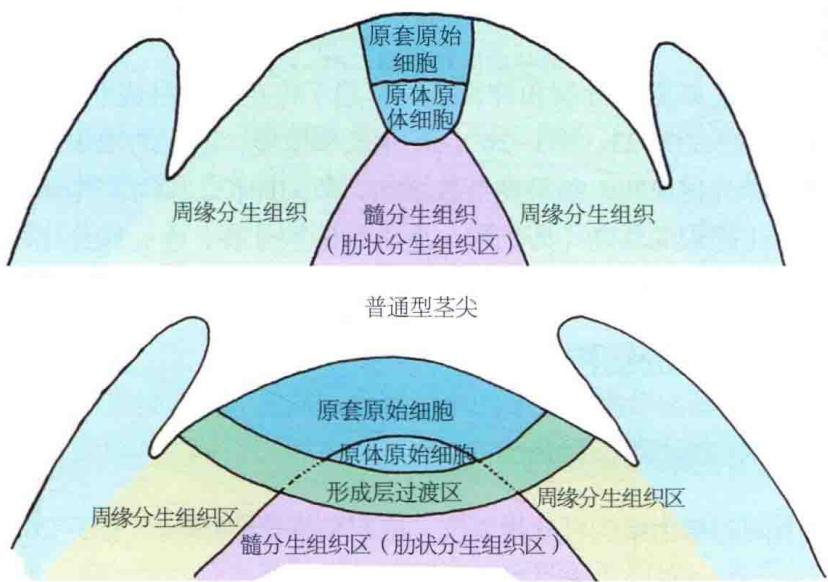  
图3-25 被子植物茎尖顶端分生组织分区图解（临Clowes）

表3-2 茎尖不同分区中各类组织的相互关系  
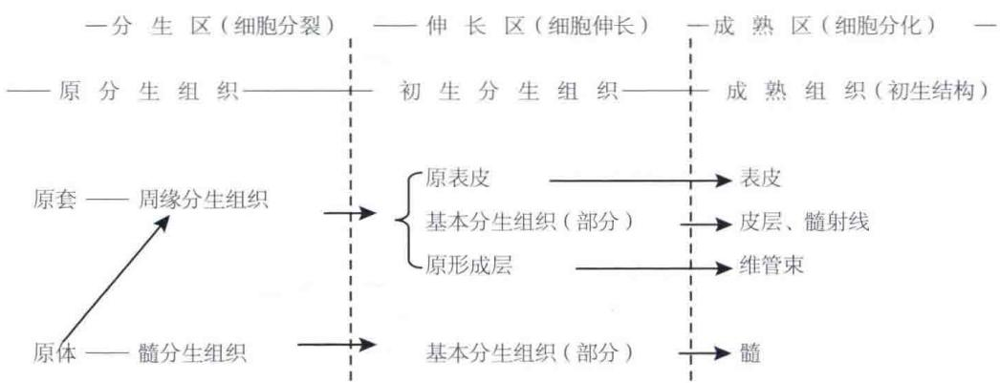

不同植物的细胞组织学分区的具体特征不同。茎尖顶端分生组织比较均匀的植物一般没有分区现象。

在茎尖顶端后部，周缘分生组织（周围区）和髓分生组织（髓区域）逐渐分化为3种初生分生组织。在周缘分生组织内侧维管组织开始以原形成层的方式出现，其细胞因为纵向分裂占优势而变得比较细长，它们可与比较短而宽的基本分生组织的细胞相区别。同时，原表皮也逐渐更多地显出成熟表皮的特征。

## 2. 伸长区

茎的伸长区的细胞学特征与根相似，但该区常包含几个节与节间，其长度可随环境改变。两年生和多年生植物在进入休眠期时，伸长区逐渐变为成熟区。伸长区由原表皮、基本分生组织、原形成层3种初生分生组织分别分化出一些初生组织，其细胞的有丝分裂活动逐渐减弱，伸长区可视为顶端分生组织发展为成熟组织的过渡区域（图3-23）。

## 3. 成熟区

成熟区的解剖特点是细胞的分裂和伸长生长都趋于停止，各种成熟组织的分化基本完成，具备了幼茎的初生结构（图3-23、图3-26）。在生长季节里，茎尖的顶端分生组织细胞不断地进行分裂、伸长生长和分化成熟，结果使节数增加，节间伸长，同时产生新的叶原基和腋芽原基。这种由于顶端分生组织的活动（即顶端分生组织细胞分裂、生长和分化的过程）而引起或表现出的生长称为顶端生长（apical growth）。

## (二) 双子叶植物茎的结构

## 1. 双子叶植物茎节间的初生结构

双子叶植物茎节间的初生结构可分为表皮、皮层和维管柱3部分（图3-26）。

## 1）表皮

表皮是幼茎最外的一层细胞，由初生分生组织的原表皮发育而来的初生保护组织。表皮包括表皮细胞、气孔器和各种表皮毛等表皮附属物。表皮细胞形状较规则，排列紧密、相互嵌合，细胞中一般不含叶绿体，有的含有花色素苷；细胞外壁厚、有角质层，有的还有蜡被，既能起到控制蒸腾、防止体内水分过度散失和病虫入侵的作用，又不影响透光和通气，仍能使幼茎内的绿色组织正常地进行光合作用，如蓖麻（Ricinus communis L.）和油菜（Brassica napus L.）等。表皮毛形状多样，有单细胞和多细胞的，具有加强保护的功能。有的表皮有腺毛或异细胞，如番茄（Lycopersicon esculentum Mill.）等。这些都是植物对环境的适应性。

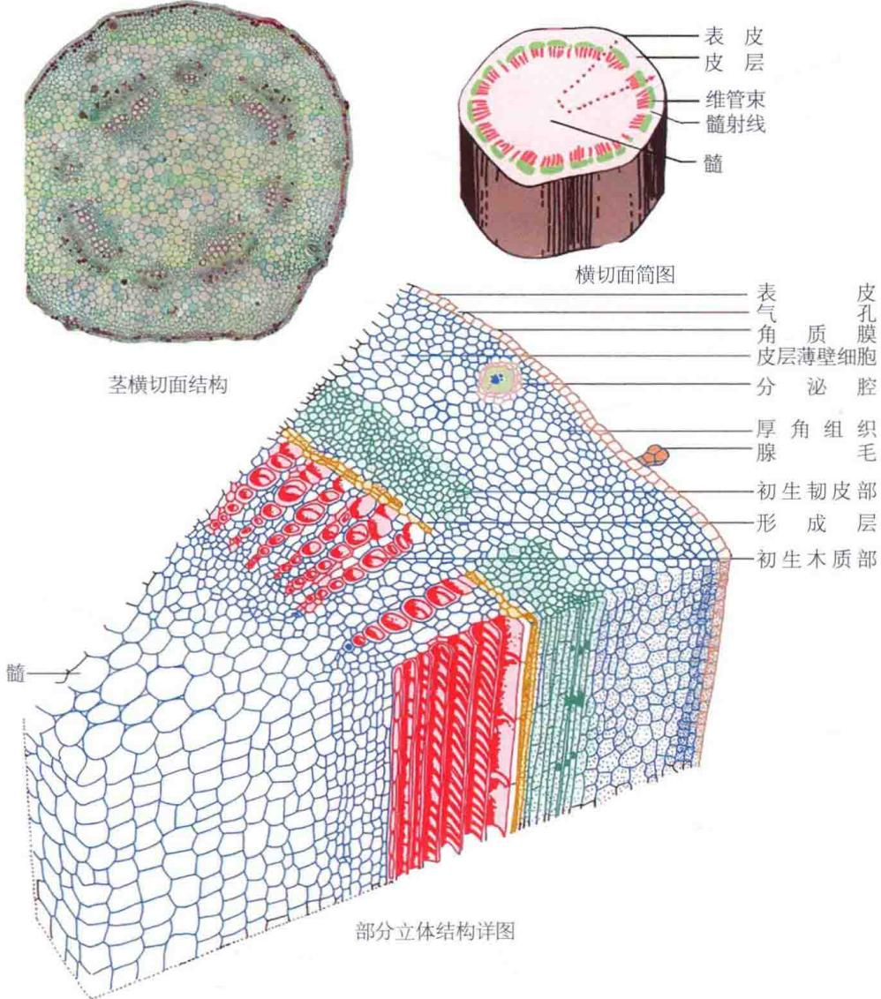  
图3-26 棉茎横切部分结构

## 2）皮层

皮层位于表皮与维管柱之间，由基本分生组织的部分细胞分化而来，皮层所占茎横切面比例远较根小。根据皮层细胞的特征，可将其分为厚角组织和皮层薄壁组织。

## (1) 厚角组织

位于表皮下方，由一至几层含有叶绿体的厚角组织细胞所组成。常成束或连接成片，起着加强幼茎的支持作用。

## (2) 皮层薄壁细胞

由数层体积较大、排列疏松的薄壁细胞所组成，通常含少量叶绿体。幼茎因皮层内细胞含

叶绿体而常为绿色。

有些植物幼茎的皮层有分泌道，如棉花、向日葵（Helianthus annuus L.）；或有乳汁管，如甘薯［Ipomoea batatas（L.）Lam.］；或有其他分泌结构的分化。有些植物也常含有各种晶体和丹宁等的异细胞，如花生（Arachis hypogaea L.）、桃（Amygdalus persica L.）等。水生植物的茎，一般缺乏厚角组织，细胞间隙发达，常常形成通气组织。

通常幼茎皮层的最内层细胞，其细胞壁不像根中具有特殊的增厚结构。只有少数植物才有内皮层的分化，且往往是地下茎（如根状茎）较地上茎具有较典型的内皮层。例如，千里光属（Senecio）、益母草属（Leonurus）的内皮层凯氏带，在开花时才出现。有些植物茎的内皮层富含淀粉粒，称为淀粉鞘，如大豆［Glycine max（L.）Merr.］等。

## 3）维管柱

维管柱是皮层以内的中轴部分，由原形成层和部分基本分生组织发育而来。它包括维管束、髓和髓射线3部分。大多数植物的幼茎内没有维管柱鞘或不明显。

## (1) 维管束

维管束是由原形成层发育而来的束状结构。具有次生生长特性的双子叶植物茎的维管束，包括位于外方的初生韧皮部、位于内方的初生木质部和束（中）内形成层3部分。这种具有束中形成层的外韧维管束称为无限外韧维管束。一般来说，草本双子叶植物幼茎各维管束之间的距离较大，它们环状排列于皮层的内侧。多数木本植物幼茎内的维管束，彼此间距很小，几乎连成完整的环。

在维管束发育过程中，初生韧皮部由外至内进行向心发育（centripetal development），为外始式，即原生韧皮部靠外方，后生韧皮部靠内方。而初生木质部却由内至外进行离心发育（centrifugal development），为内始式，即原生木质部靠内方，后生木质部靠外方。这与根初生木质部的外始式发育顺序，有着根本的不同。在初生韧皮部与初生木质部之间，还具有原形成层保留下来的一层分生组织细胞，称束中形成层，这是进行次生增粗生长的基础。

麻类作物茎有比较发达的韧皮纤维，其细胞经协同生长（symplastic growth）和侵入生长（intrusive growth）而较细长，且其细胞壁是纯纤维素的，故柔软而坚韧，品质最佳，为纺织工业的重要原料之一，如亚麻（Linnum usitatissimum L.）等。

## (2) 髓

髓（pith）位于幼茎中央，其细胞体积较大，常含淀粉粒，具有储藏作用。有时，髓细胞也有含晶体和含单宁等的异细胞。有些双子叶植物茎的髓细胞生长停止较早，而周围的细胞仍在伸长，从而形成中空髓腔（pith cavity），如蚕豆和南瓜等。有些植物的髓成为一系列水平片状的髓组织，如胡桃（Juglans regia L.）和枫杨（Pterocarya stenoptera DC.）等。

## (3) 髓射线

髓射线（pith ray）位于维管束之间，是连接皮层与髓的薄壁组织，有横向运输和储藏作用。在茎进行次生生长时，与束中形成层相连接的那部分髓射线细胞恢复分裂能力，转变为束间形成层（interfascicular cambium）。木本植物茎的髓射线狭窄，草本植物茎的髓射线较宽（图3-27）。

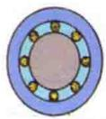

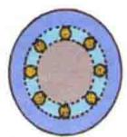

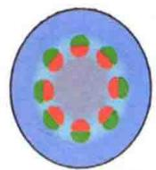  
马兜铃茎的次生生长过程

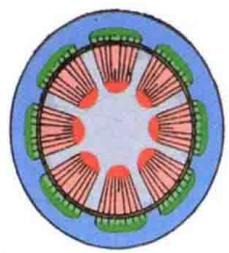

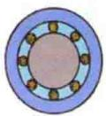

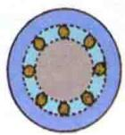

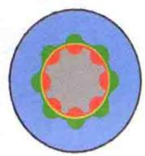  
蓖麻茎的次生生长过程

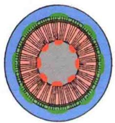

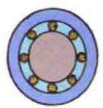

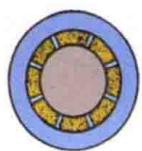

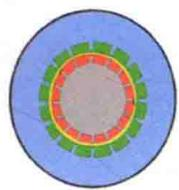  
椴树茎的次生生长过程

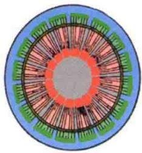  
图3-27 双子叶植物茎次生生长的三种主要类型图解

## 2. 双子叶植物茎节间的次生结构

大多数双子叶植物的茎同根一样，在初生生长的基础上，出现维管形成层和木栓形成层，通过它们的活动，进行次生增粗生长。

## 1）维管形成层的发生与次生维管组织

## (1) 维管形成层的发生

当茎进行次生生长时，首先是位于初生木质部与初生韧皮部之间的束内形成层（fascicular cambium）细胞开始分裂、生长分化，接着与束内形成层相连接的髓射线细胞恢复分裂能力，转变为束间形成层（interfascicular cambium）。这样，束内形成层和束间形成层就连成一环，它们共同构成维管形成层。木质化程度高的植物，其维管形成层主要是束内形成层；木质化程度低的草本植物，其维管形成层主要是束间形成层。

## (2) 维管形成层细胞

维管形成层的原始细胞有两种：一是切向面宽、径向面窄的两端尖斜的长梭形细胞，称为纺锤状原始细胞（fusiform initial cell）；一是较小、近于等径或稍长的细胞，称为射线原始细胞（ray initial cell）。前者是形成层的主要成员，沿茎的长轴平行排列，连成一片，发育成茎的纵向（轴向）系统；后者与茎轴垂直排列，分布于纺锤状原始细胞之间，发育成茎的横向（径向）系统。横切面上，纺锤状原始细胞呈扁平长方形，射线原始细胞宽长方形，两者紧密整齐地排列成一环（图3-28）。

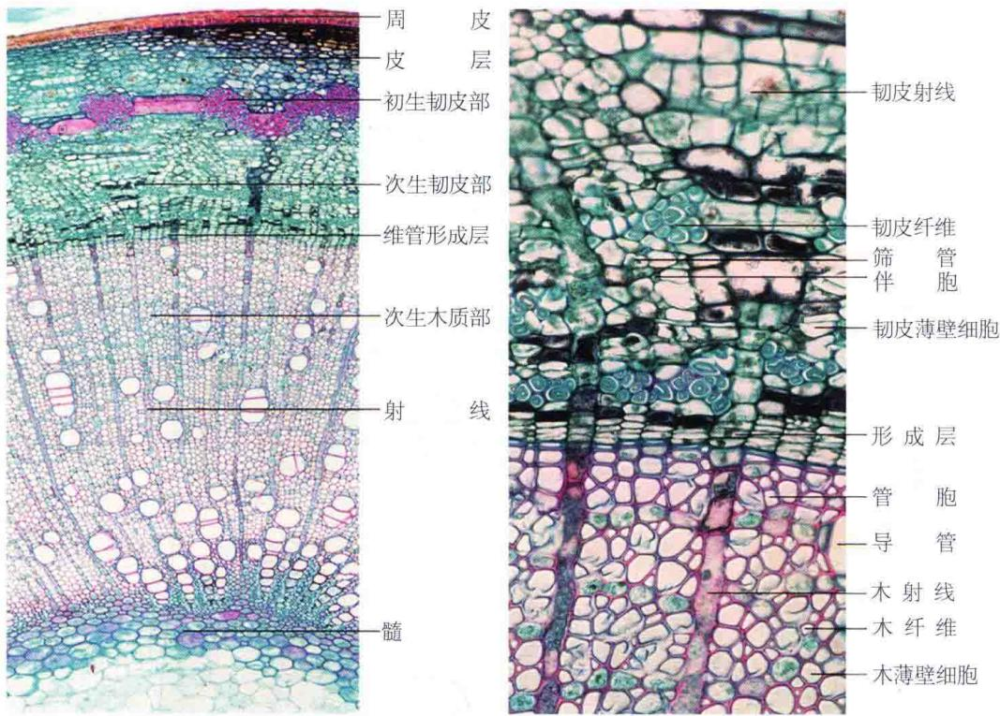  
图3-28 胡桃茎部分横切

## (3) 次生维管组织

维管形成层开始活动主要是纺锤状原始细胞不断进行切向分裂，向外所产生的新细胞经生长、分化形成次生韧皮部（包括筛管、伴胞、韧皮纤维和韧皮薄壁细胞），向内所产生的新细胞经生长、分化形成次生木质部（包括导管、管胞、木纤维、木薄壁细胞）。次生木质部和次生韧皮部共同构成次生维管组织，成为茎中纵向的输导系统。同时，射线原始细胞也不断进行切向分裂，其外侧的新细胞分化形成韧皮射线，内侧的新细胞分化形成木射线，这两种射线统称为维管射线（vascular ray），成为茎中横向的输导组织，并将次生维管组织隔成许多片区（图3-27、图3-29）。随着次生木质部的增加，维管形成层的位置逐渐外移，其周径也随之扩大。

维管形成层周径扩大的原因，主要是由于纺锤状原始细胞在进行平周的切向分裂的同时，还可以进行垂周的径向分裂。此外纺锤状原始细胞也进行横裂、侧向分裂衍生出新的射线原始细胞。而射线原始细胞本身又能径向分裂，从而使环径扩大，新的射线也将不断形成并贯穿于次生维管组织中。

了解维管形成层的特性，对植物嫁接有实际意义。因为，维管形成层的分裂活动，与枝条伤口的愈合有密切关系，所以在嫁接枝条时，必须使砧木和接穗之间的形成层区保持吻合，才能嫁接成活。

## (4) 木材

木材是指维管形成层历年产生的次生木质部的总称（因初生木质部占中央的一小部分，常可忽略）（图3-23、图3-28、图3-29）。

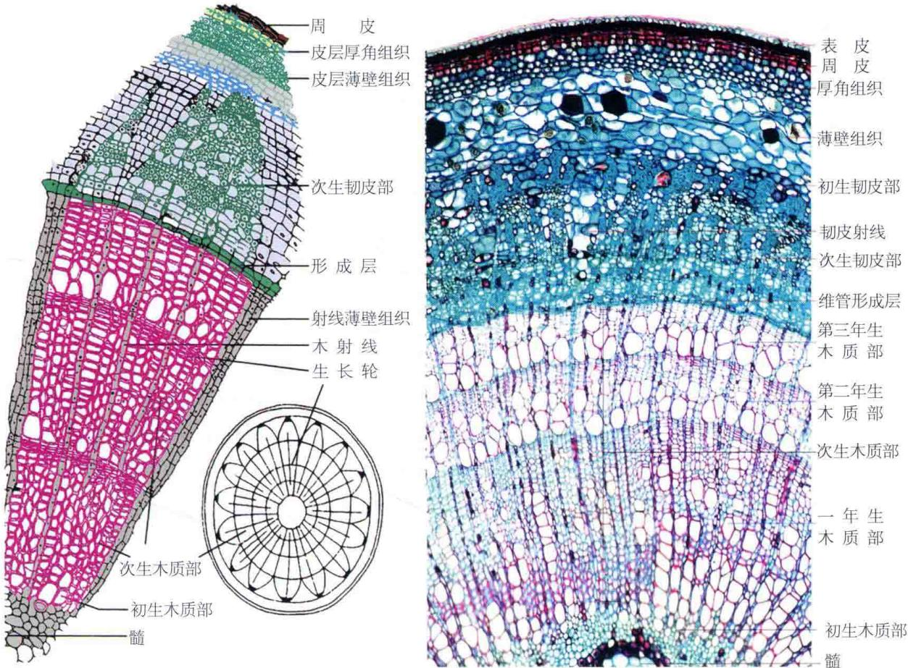  
图3-29 三年生椴树茎横切结构

## ① 年轮

年轮（annual ring）是指在季节性明显的地区，木本植物的维管形成层在一年中只活动一次而形成的次生木质部。因维管形成层在生长季节不同阶段的活动特性不同，所形成的新细胞的大小和分化成熟的结构有差异，使得所产生的次生木质部呈次第变化的同心环，故有生长轮之称。因此，在一个生长期中，维管形成层所产生的次生木质部（木材）构成一个生长轮，一年只有一个生长轮，这样的生长轮就是年轮（图3-29）。植物的年龄、各年份气候特征或变化等均与年轮的宽窄有一定的关系。因此，年轮可作为研究气候变迁的依据。

在温带的生长季初期（春季），气候温和、雨水充沛，适宜于维管形成层的活动，所产生的木材一般较快较多，其中的导管和管胞直径较大，而壁较薄。因此，这部分的木材，质地较疏松、颜色较浅，称为早材（early wood）或春材（spring wood）。在生长季的晚期（如夏末秋初），气温和水分等条件逐渐不宜于树木的生长，维管形成层的活动逐渐减弱，所产生的木材较少，其中的导管和管胞直径较小而壁较厚。因此，这部分的木材质地较坚实而颜色较深，称为晚材（late wood）或夏材（summer wood）。同一年内所产生的早材和晚材就是一个年轮，两者之间的细胞结构是逐渐转变的，没有明显的界限，但前一年的晚材与后一年的早材之间的界限就非常明显。

在次生木质部中，导管可单个或数个聚集分布、木薄壁组织与导管的相对位置、木射线的行数与宽窄程度等特点，因种而异，成为木材鉴定的重要依据。

现将维管形成层的活动及其与衍生组织的关系表解如下：

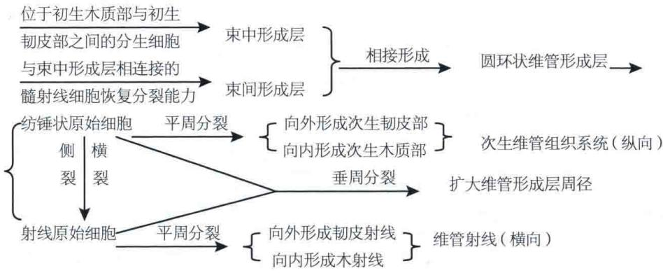

## ②边材和心材

横切多年生木本植物的树干，可见其木材的边缘部分和中央部分有所不同。靠近形成层部分的木材是近几年形成的次生木质部，颜色浅，其导管、管胞和木薄壁组织有效地担负着输导和储藏的功能，这样的木材称为边材（sap wood）。边材木质疏松、木质差。靠近茎中央部分的木材是形成较久的次生木质部，这部分颜色较深，其导管和管胞由于侵填体的形成，并因单宁、树脂、色素等有机物的累积而失去输导功能，这样的木材称为心材（heart wood）。心材木质致密、木质好。随着茎的次生生长，新的边材相继产生，老的边材逐年成为心材，能更强地巩固和支持植株。少数木本植物在生长后期，心材被菌类侵入而腐烂，形成空心树干，虽能生活，但易为外力所折断。

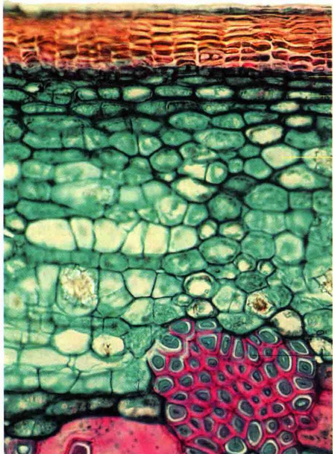  
图3-30 胡桃茎部分横切

## 2）木栓形成层的发生与周皮

随着维管形成层的活动和茎的不断增粗，其外周出现了木栓形成层，产生周皮，成为新的次生保护组织。

## (1) 木栓形成层的发生

木栓形成层最初发生的位置因植物种类不同而异。有的起源于表皮（如梨、苹果等），有的起源于近表皮的皮层薄壁组织（如马铃薯、桃等）或厚角组织（如花生、大豆等），有的起源于皮层较深处的薄壁组织（如棉花等），有的甚至在初生韧皮部中发生（如茶属）（图3-23、图3-30）。大多数植物茎中，木栓形成层的活动期是有限的，通常生存几个月就失去活力，以后木栓形成层每年重新发生，在第一次周皮的

内方产生第二层新的木栓形成层，再形成新的周皮。这样，木栓形成层的位置则渐向内移。在老茎中，木栓形成层可以在次生韧皮部中发生。当新的木栓层形成以后，由于木栓层细胞不透水、不透气，使新周皮以外的所有组织不能得到水分和养料的供应而死亡。

## (2) 木栓形成层的活动

木栓形成层主要进行切向分裂，向外产生的多层新细胞，经生长、分化为木栓层，向内产生的新细胞，经生长、分化为栓内层（图3-30）。木栓层、木栓形成层和栓内层三者构成周皮，保护其内部组织或结构，适应茎的次生增粗生长。木栓形成层产生的周皮包含的木栓组织较多，栓内层较少，有些树木可形成很厚的木栓层，如栓皮栎（Quercus variabilis Blume）和白千层（Melaleuca leucadendra L.）等。

## (3) 皮孔

皮孔（lenticel）是枝条外表上产生的一些呈圆形、椭圆形或枝状的褐色小突起，是茎与外界进行气体交换的通道，也是病虫入侵的“门户”（图3-31）。皮孔一般产生于原来气孔的位置，气孔处或其内方的木栓形成层不形成木栓细胞，而形成许多圆球形的薄壁细胞，其细胞排列疏松，细胞间隙发达，称为补充组织。随着补充组织越来越多，向外突出，形成裂口便有了皮孔。有的树木冬眠之前，在补充细胞群的外方形成封闭层，其细胞排列紧密并栓质化，具保护作用。进入生长季期间，因补充细胞的增多，可突破封闭层，以后又可产生新的封闭层。

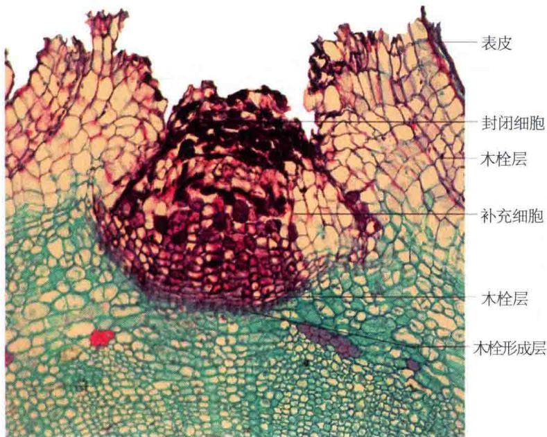  
图3-31 接骨木茎部分横切示皮孔结构

木栓形成层发生的位置因植物种类的不同而异，其活动的规律也有差异，因而不同的植物具有不同的皮孔特征或形状。皮孔可作为木本植物种间鉴别的依据之一。

现将木栓形成层的发生和活动表解如下：

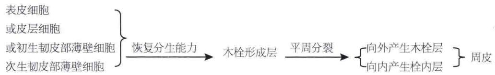

树皮 通常意义上的树皮是指维管形成层以外所有组织的总称。树皮的结构包括次生韧皮部和历年产生的周皮以及一些已死的皮层、韧皮部等组织结构。因此，树皮是茎内同化产物输导的通道，同时还具有极强的保护功能。由此可见，树怕剥（或环割）“皮”的真正含义。狭义概念的树皮是木栓形成层历年产生的周皮的总称，是老茎的重要保护结构。

在不同植物中，由于木栓形成层的发生、分布以及树皮组成分子的积累情况不同，树皮常表现出不同形态。例如，刺槐、栎树和大叶桉等的树皮，其木栓形成层呈条状分布，且死亡的组织较长时间不脱落，树皮形成许多深裂纵沟；榔榆、番石榴、悬铃木等树皮木栓层呈片状分化，老的周皮一片片地脱落，树干上常呈现鳞片状斑驳。柠檬桉的树皮木栓形成层为连续筒状分化，树皮一般比较光滑，最后呈套状剥落。

## 3. 双子叶植物茎节部结构特点

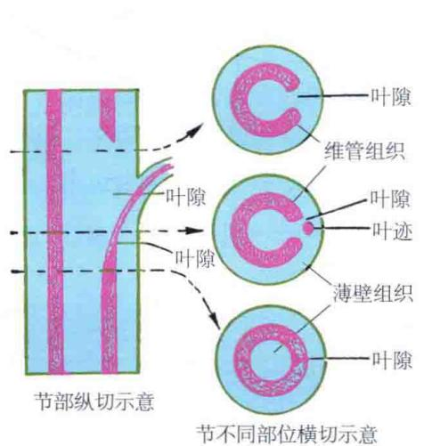  
图3-32 叶与枝条中的叶迹与叶隙图解

双子叶植物茎节部的结构与节间不同，主要表现在维管束的排列不同。茎内有些维管束由节部斜向伸入叶柄，这种斜生于茎内的维管束部分，称为叶迹（leaf trace）。有些维管束斜向伸入侧枝，与枝的维管束相连，这些斜生在茎内的维管束部分，称为枝迹（branch trace）。叶迹和枝迹的斜向伸出，它们的位置逐渐转移到茎的皮层和边缘部分。结果，节部的皮层和维管柱之间就没有截然划分的界限，各个维管束的排列也不成为一环。在茎的维管系统内，位于叶迹或枝迹近轴处的薄壁组织分别称为叶隙（leaf gap）和枝隙（branch gap）。在叶迹和枝迹的地方，存在着维管束的侧面联系。所以，节部的初生结构比较复杂（图3-32、图3-33）。  
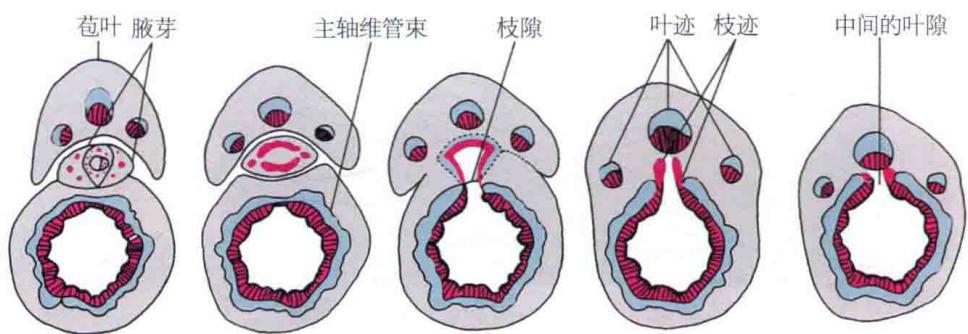  
图3-33 柳属一植物节部及其附近向上（由左至右）的连续横切（示主轴与腋芽间的维管束关系）（临Esau）

## （三）单子叶禾本科植物茎的结构

禾本科植物的茎与根一样，不能进行次生生长，没有次生结构。禾本科植物茎有明显的节和节间，节部略膨大，多数种类茎节间中空，少数植物，如玉米、甘蔗等的茎实心。维管束为外韧有限维管束，散生，没有皮层和维管柱之分。茎横切面上，可分为表皮、机械组织、基本组织和维管束等部分。现以水稻、小麦和玉米等为例说明禾本科植物茎节间的结构（图3-34）。

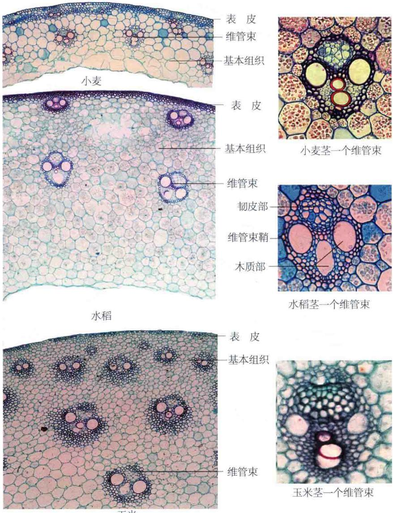  
图3-34 小麦、水稻、玉米茎部分横切及一个维管束放大

## 1. 表皮

表皮是位于茎最外面的一层细胞，由长细胞（long cell）、短细胞（short cell）和气孔器（stomatal apparatus）有规律地排列而成，外覆角质膜。长细胞是构成表皮的主要成分，其细胞壁厚，不仅角化且硅化，其纵向壁常呈细密的波浪状。短细胞有两种类型，即栓细胞（cork cell）和硅细胞（silica cell）。它们位于两个长细胞之间，排成整齐的纵列。栓细胞的细胞壁栓化，硅细胞含有大量二氧化硅，硅酸盐沉积于细胞壁上的多少，与茎秆强度和对病虫害抵抗力的强弱有关。甘蔗等的茎表皮上还覆盖着发达的蜡被。气孔器由一对哑铃形的保卫细胞、保卫细胞旁侧各一个副卫细胞和气孔构成，与长细胞间隔排列成纵行。

## 2. 基本组织

表皮以内，维管束之间的所有区域皆为基本组织，主要是由薄壁细胞组成。玉米、高粱和甘蔗等的茎内为基本组织所充满；而水稻、小麦和竹等茎内的中央薄壁细胞解体，形成中空的髓腔。水稻的维管束之间的基本组织中有大型的裂生通气道，成为良好的通气组织。

竹类植物、水稻和玉米茎中，表皮下方的基本组织后期细胞壁增厚，形成厚壁的机械组织。小麦等茎的机械组织环中间为同化组织隔开，幼茎外观可见绿色纵纹。

## 维管束

维管束为有限外韧型，散生于基本组织中。其排列方式有两类。一类以水稻和小麦等为代表，各维管束大体上排列为内、外两环。外环维管束较小，位于茎的边缘，其大部分埋藏于机械组织中；内环维管束较大，为基本组织所包围。另一类如玉米、甘蔗和高粱等，其茎内为基本组织所充满，维管束分散排列于其中；近边缘的维管束较小，相距较近，靠中央的维管束较大，相距较远。维管束的结构组成包括维管束鞘、初生韧皮部和初生木质部三部分。维管束鞘是坚强的厚壁机械组织，包围着初生木质部和初生韧皮部。初生木质部位于维管束的近轴方，整个横切面的轮廓呈V字形。V字形的基部为原生木质部，包括1至几个环纹或螺纹导管及少量木薄壁细胞。在分化成熟过程中，这些导管常被拉短、挤破，其四周的薄壁细胞互相分离形成气隙。在V字形的两臂上，各有1个后生的大型孔纹导管。在这两个导管之间充满薄壁细胞，有时也有小型的管胞。初生韧皮部位于初生木质部的外侧，其中原生韧皮部已被挤毁，后生韧皮部由筛管和伴胞组成。横切面观，筛管大而呈多边形，伴胞小，呈近长方形（图3-34）。

在禾本科植物茎的节部，茎和叶鞘相连。外观节部比较粗大，但其内部结构，由于节间的维管束在此分离、交叉、结合和分离，新的维管束结构延伸进入上一节间和叶鞘中去（图3-35）。金银根等的研究结果表明，水稻、小麦茎节部维管组织横切面积近等于上一节间维管组织和该节位叶鞘维管组织的总和，而略大于下一节间的维管组织横切面总量。

节下部横切（具髓腔）

节部维管束排列一

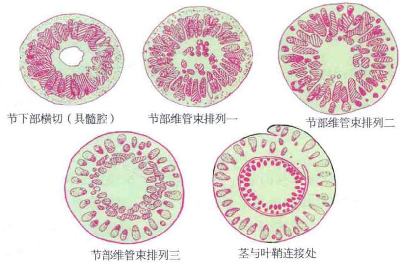  
节部维管束排列三

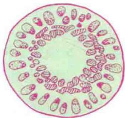  
茎与叶鞘连接处

图3-35 禾本科植物茎节部不同水平的横切结构示意图  
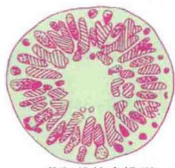

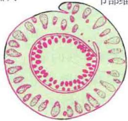

## (四) 禾本科植物茎的初生增粗生长与居间生长

## 1. 初生增粗生长

禾本科植物的维管束没有束中形成层，不能进行次生增粗生长。但是，甘蔗和高粱等的茎实际上比具有次生生长的棉花、花生等的茎还粗壮，其原因是在玉米和甘蔗等茎尖的正中纵切面上，可以看到在叶原基的下面有许多由顶端分生组织衍生而来的扁平初生分生组织细胞，它们有规律地排列为垂周行列，这称为初生增粗分生组织（primary thickening meristem）。它们快速进行平周分裂，衍生出大量薄壁组织细胞（其中穿插着原形成层），形成粗壮的芽尖，随着细胞的分裂和增大，形成粗壮的茎（图3-36）。

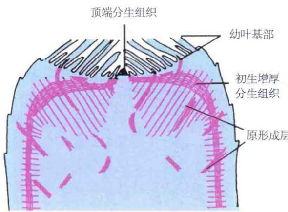  
茎尖纵切示初生增粗分生组织的分布

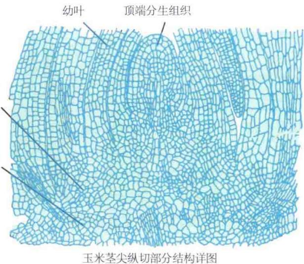  
图3-36 单子叶植物茎尖初生增粗分生组织的分布与特征

## 2. 居间生长

禾本科植物茎的每个节间基部都有居间分生组织，它们的细胞进行分裂、生长和分化就使每个节间伸长，这称为居间生长（intercalary growth）。拔节是居间生长的表现，抽穗是几个节间同时进行居间生长的结果。居间生长对植株倒伏后的复原起着重要作用。在节间基部的居间分生组织分布区，不同侧面生长的不平衡，引起向上弯曲生长，使植株部分恢复直立。

## 第三节 叶的形态、结构与功能

叶是植物的营养器官之一，是植物光合作用制造有机养分的重要场所，同时也是蒸腾作用促进植物吸收、运输和分配水分与矿质元素的重要器官。此外，叶还有吸收作用（absorbing function）、繁殖作用（propagating function）和储藏作用（storage function）。人类根据植物叶的不同特性而用作蔬菜（如大白菜、菠菜）、药物（银杏叶）、工业原料（如茶叶、烟叶）、提高环境质量（叶可吸附粉尘，吸收有毒有害气体，减少噪声）降低“温室效应”，以及栽培用作观叶植物等。

## 一、叶的形态与组成

## (一) 叶的发生与生长

叶由叶原基（leaf primordium）生长分化而来。当芽形成和生长时，在生长锥的亚顶端，周缘分生组织区的外层细胞不断分裂，形成侧生的突起。这些突起是一团原分生组织细胞，是叶生长发育的起点，因而被称为叶原基。叶原基经顶端生长，形成的圆柱状结构称为叶轴。叶轴是尚未分化的叶柄和叶片。具有托叶或叶鞘的植物，叶原基上部形成叶轴；叶原基基部两侧的细胞较上部分裂快，且发育早，分化成为托叶或叶鞘，包围着叶轴或茎顶端分生组织，起到保护作用。在叶轴伸长的同时，叶轴两侧边缘的细胞开始分裂，进行边缘生长（边缘生长进行一段时间后，顶端生长停止），叶轴两侧的细胞分裂加快，使叶轴逐渐呈扁平状，具备了叶的

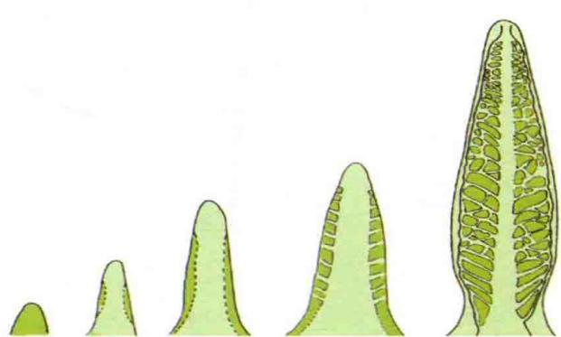  
图3-37 烟草叶的发育顺序图解

雏形；如果是复叶，则形成多数小叶片。叶轴基部未进行边缘生长的部分分化为叶柄。最后，随着叶柄伸长，幼叶由芽内逐渐伸出，边缘生长停止，叶片进入居间生长。这个时期幼叶叶片的各部分近乎等速生长，使叶片增大，直到发育成熟（图3-37）。但在有些植物中，幼叶不同部位细胞的生长速度不一致，因而出现了不同类型的叶形。叶的这种发生于植物表层或浅层组织的方式称为外起源（exogenous origin）。

## (二) 叶的形态

## 1. 叶的形状

不同种类植物叶的形态特征不同，其差异主要表现在叶的质地、形状、大小、叶尖、叶基、叶缘和叶脉等方面（详细参见第五章）。

叶形是指叶片和叶柄（有时也包括托叶）的整体轮廓。叶形多采用几何图形或生活中常见的物品形状来描述，如圆形、椭圆形、三角形、菱形、戟形、箭形、心形、肾形、匙形、镰形、提琴形、带形、条形、卵形、针形、披针形等。如果叶片的宽度与长度的比例较大，可在以上词汇前加上“阔”、“广”等词；如叶片最宽处的位置偏向叶尖，则加“倒”来描述（详细参见第五章）。

叶的大小差别很大，小的仅数毫米，如文竹的鳞叶；大的可达数米，王莲叶的直径可达2m，亚马孙酒椰的叶片可长达20多米等。

## 叶的组成

## 1) 双子叶植物叶的组成

一般双子叶植物的叶由叶片、叶柄及托叶组成，有的叶或无托叶或叶柄不明显（图3-38）。

叶片（blade）叶片大多呈典型的扁平体，不同的植物其叶片形状差异很大。叶片是进行光合作用和蒸腾作用的主要场所，是叶最重要的组成部分。叶片内有叶脉（通常呈网状），叶脉对维持叶片形态和叶片内的水分与养分的运输与分配起重要作用。

叶柄（petiole）叶柄位于叶片基部，上端与叶片相连，下端与茎相连，是连接叶片和茎的柱状结构。叶柄通过自身长短的变化和扭曲，支持叶片处于最有利于光合作用的位置，叶柄中的维管束将叶片及茎中的维管组织连接起来，成为茎与叶片之间物质运输的通道。

托叶（stipules）托叶是叶柄基部的附属物，多成对出现，通常比较细小且形状多样。托叶在发育过程中有保护幼叶叶片的作用，成长后或脱落或保留。

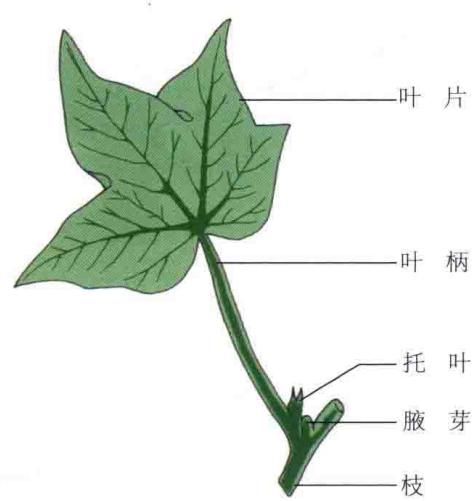  
图3-38 双子叶植物叶的组成

通常将具有叶片、叶柄和托叶3部分的叶称为完全叶（complete leaf），如杨树、棉花等。而将叶片、叶柄和托叶三者中缺少其任一部分或两部分的叶称为不完全叶（incomplete leaf）。例如，紫丁香（Syringa oblata Lindl.）叶无托叶，莴苣（Lactuca sativa L.）茎生叶无叶柄及托叶。

叶可分为单叶（simple leaf）和复叶（compound leaf）两类。如果在一个叶柄上只生一叶片的叶，不论是完全叶还是不完全叶，叶片是完整的还是分裂的，都称为单叶，如棉、梨和甘薯等的叶。绝大多数植物的叶是单叶。如果在一个叶柄上生有两个以上完全独立的小叶（leaflet），则称为复叶。有时，将复叶的叶柄称为总叶柄（common petiole），总叶柄上着生的叶片称为小叶，着生小叶的轴状部分（叶柄的延伸结构）称为叶轴（rachis）（图3-39）。复叶具有多种类型，详见第五章。

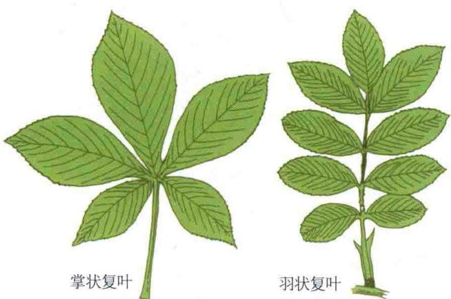  
图3-39 复叶

## 2）禾本科植物叶的组成

水稻、小麦等禾本科植物叶多由叶片和叶鞘（leaf sheath）组成，有的还具有叶枕（pulvinus）、叶舌（ligulate）和叶耳（auricle）等结构。其叶片条形，具平行脉。叶基部呈鞘状，叶鞘一侧开裂，包围着茎秆，有保护茎的居间生长、加强茎的支持作用及保护叶腋内幼芽的功能。叶鞘与叶片连接处的外侧称为叶枕（又称叶颈、叶环），叶枕具有弹性及伸延性，可

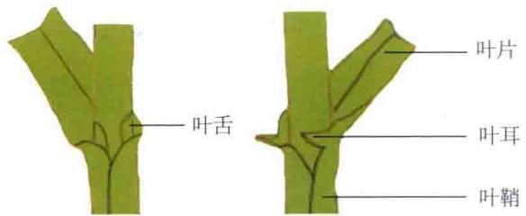  
图3-40 禾本科植物叶的组成

以调节叶片的位置。在叶鞘与叶片连接处的内侧，有些禾本科植物有一向上突起的膜状或毛状结构，称为叶舌；叶舌能使叶片向外弯曲，使叶片接受更多的阳光，同时可以防止水分、病原菌及害虫进入叶鞘内。有些植物在叶舌的两旁有一对从叶片基部边缘延伸出来的突出物，称为叶耳。叶舌、叶耳的有无、形态、大小及

色泽常作为禾本科植物分类的依据。例如，小麦叶耳明显，稗子 [Echinochloa cousgalli (L.) Beauv.] 则不具叶耳（图3-40）。

## 二、叶的结构

## (一) 双子叶植物叶的结构

## 叶片的结构

横切双子叶植物的叶片，其结构由表及里可分为表皮、叶肉和叶脉3部分。

## 1）表皮

表皮（epidermis）由初生分生组织的原表皮发育而来，是位于叶片上、下表层的初生保护组织。构成表皮的细胞或组织有表皮细胞、气孔器（stomatal apparatus）和表皮附属物等（图2-20，图3-41）。

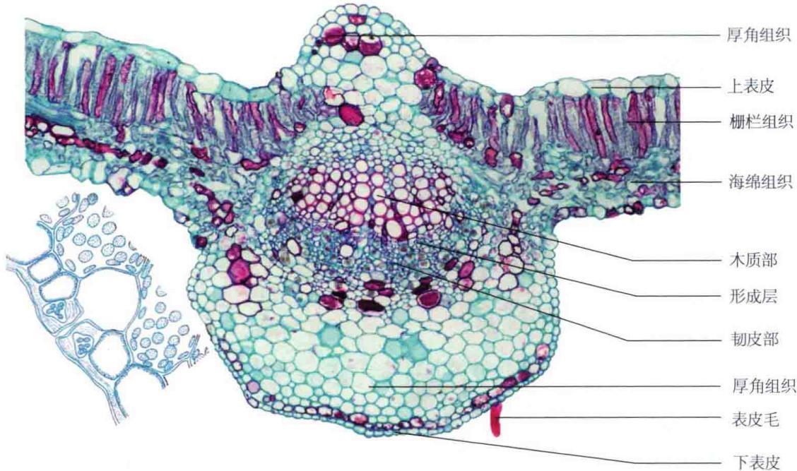  
图3-41 棉叶（中脉）及气孔与邻近细胞的横切

表皮细胞是生活细胞，形状不规则，彼此间紧密嵌合，一般不含叶绿体，有的植物表皮细胞内含有花青素，使叶片呈现红、紫、蓝等颜色。表皮细胞外切向壁较厚，常覆有一层角质层。角质层有较强的折光性，有减少强光对植物的伤害、减少水分过度蒸腾和防止病菌侵入的作用。

表皮一般为一层细胞，但少数植物的表皮可为多层细胞，称为复表皮，如印度橡皮树、夹竹桃等植物的叶，其复表皮由3～4层细胞组成。

在大多数双子叶植物叶表皮上，都有气孔器的分布。气孔器通常由两个肾形保卫细胞及其细胞间的气孔组成。气孔器的形态和组成因植物种类不同而异，不同植物、同株植物不同叶位上的表皮气孔器的数量及分布也不同。通常早生植物叶表皮的气孔数目远远多于湿生植物和水生植物，叶片的下表皮上的气孔数多于上表皮，但浮水植物例外。这些都是植物识别和分类的依据之一。

表皮上还有一些形态不同的表皮附属物，由表皮细胞向外突出分裂形成（参见第一篇第二章）。表皮附属物形状多样，多呈毛状、分枝状、星形或鳞片状，其形态是鉴定植物的特征之一；表皮附属物组成不同，有些是单细胞的，有些是多细胞的；表皮附属物功能不一，有些为分泌结构，有些起保护作用。表皮附属物可反射强光，分泌黏性物质，限制叶表面的空气流动，减缓蒸腾作用，更加强表皮的保护作用。

## 2）叶肉

叶肉（mesophyll）由含大量叶绿体的薄壁细胞组成，是叶进行光合作用的主要部位。根据细胞形态的不同，叶肉常可分为栅栏组织、海绵组织（图3-41）。

## (1) 栅栏组织

栅栏组织（palisade tissue）是紧贴上表皮的一至数层长圆柱状薄壁细胞，长轴垂直于表皮，排列紧密如栅栏状，细胞内富含叶绿体，光合作用强。

## (2) 海绵组织

海绵组织（spongy tissue）的细胞形状不规则，含叶绿体较少，排列疏松，胞间隙大，光合作用弱，但气体交换和蒸腾作用较强。

有些植物上表皮内侧为栅栏组织，下表皮内侧为海绵组织，这种上、下表皮内侧的叶肉组织形态不同的叶称为异面叶（背腹型叶、两面叶，dorsi-ventral leaf）。海绵组织细胞所含叶绿体较栅栏组织细胞的少，所以异面叶的背面一般绿色较淡。有些植物上、下表皮内侧的叶肉组织形态基本相同，或叶肉细胞没有明显的栅栏组织和海绵组织的分化，这样的叶称为等面叶（isobilateral leaf），如禾本科植物的叶等。

## 3）叶脉

叶脉（vein）是叶片中贯穿于叶肉组织间的脉纹结构。叶脉分布如茎枝系统，有粗细和主侧脉之分。位于叶片中央最粗大的叶脉称为主脉（中脉）；主脉的分支为侧脉，侧脉的分支称为细脉或小脉，细脉仍可再分支；细脉的末端称为脉梢。叶脉的分布方式叫做脉序（venation）。

## (1) 叶脉的组成

一般叶脉含有厚角组织、薄壁组织及一至数个维管束。薄壁组织包围在维管束外形成维管束鞘（bundle sheath）。较大叶脉的维管束由木质部、韧皮部和束中形成层组成，属无限维管束；束中形成层活动能力弱，活动时间短，只形成极少量的次生维管组织。叶脉中维管束可视作茎中维管束的延伸，茎中维管束的类型，决定了叶内维管束的初生木质部、初生韧皮部分布的相对位置。多数植物的木质部近上表皮、韧皮部近下表皮分布，但也有些植物上、下表皮内

侧均有韧皮部分布，而木质部居于其间。

主脉及侧脉中组成分子较多，尤其是厚角组织和薄壁组织，因而叶脉常会在叶面形成隆起（图3-41）。细脉中结构趋于简单，一般没有束中形成层和机械组织，维管束鞘细胞也较少，木质部和韧皮部的组成分子逐渐减少。到了脉梢，仍有一圈薄壁细胞围成的维管束鞘；维管束中仅余一列狭短的筛管分子和1～2个螺纹管胞，有时甚至没有筛管，只有管胞存在。

与小脉和脉梢进行物质交换的维管束鞘薄壁细胞，常具传递细胞（transfer cell）特征，对调节进出维管组织的物质起着重要作用。

在叶脉系统中，主脉及侧脉主要起轴向长距离输导作用，细脉则起释放水分、装载光合产物的横向输导作用。此外，叶脉也因其自身的结构而具有支持叶片的功能。

## (2) 叶脉的类型

不同的植物，其叶片内叶脉分布的方式不同。双子叶植物多具网状脉；单子叶植物多具平行脉、弧形脉、射出脉，偶有网状脉时，也与双子叶植物具游离脉梢的网状脉不同，其细脉多相互交汇、无脉梢游离，如天南星科、薯蓣科的一些植物（详见第五章）。

## 叶柄的结构

叶柄一般细长，横切面为半月形，其结构与茎大致相同，由表皮、基本组织（类似于茎的皮层）和维管（组织）束三部分组成。表皮为一层细胞，表皮下方、基本组织外围有较多的厚角组织，厚角组织有机械作用和一定的弹性，使得在对叶片支持的同时，又不影响叶柄的伸延、扭曲和摆动，使叶呈镶嵌状分布。维管（组织）束多呈半圆形排列在基本组织中（图3-42）。

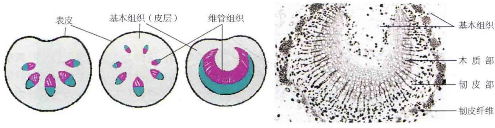  
三种不同类型植物叶柄横切面结构简图  
图3-42 叶柄的结构  
梨叶柄部分横切结构

## （二）单子叶植物叶的结构

## 1. 禾本科植物叶的结构

## 1）叶片

禾本科植物的叶片结构也分为表皮、叶肉和叶脉三部分。

## (1) 表皮

禾本科植物叶片的上表皮由表皮细胞（长细胞，long cell）、短细胞（short cell）（硅细胞和栓细胞）、泡状细胞（bulliform cell）和气孔器组成；下表皮组成稍有不同，没有泡状细胞（图3-43）。

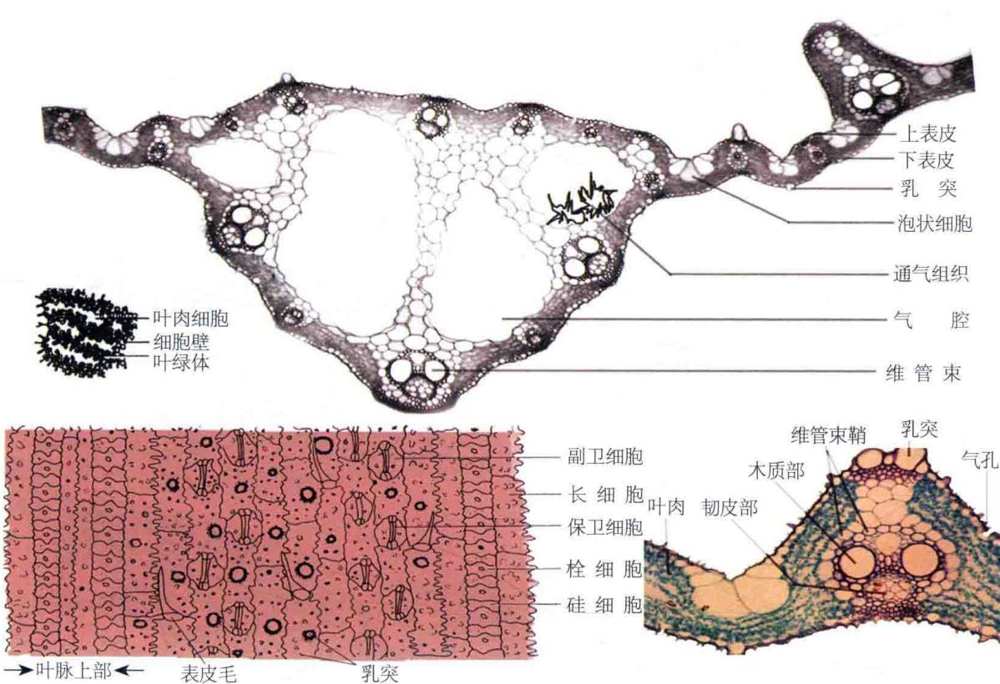  
图3-43 水稻叶片表皮及部分叶片横切结构

通过显微镜观察叶片上表皮，可见细胞排列规律，沿叶长轴方向整齐纵列。表皮细胞近长方形，长轴与叶的长轴平行，端壁较平，侧壁具细密锯齿，相邻两列细胞侧壁嵌合紧密，外壁角化且含硅质，可形成乳突。

短细胞包括硅细胞（silica cell）和栓细胞（cork cell），两者常成对分布；硅细胞内充满硅质，外切向壁外突成齿状或刚毛状。表皮细胞硅化及硅细胞的存在，增强了叶片的硬度和抗病虫害的能力。栓细胞是细胞壁明显栓质化的短细胞，有利于增强叶的抗性。

气孔器由一对哑铃形的保卫细胞和一对菱形或近半球形的副卫细胞组成。保卫细胞壁厚薄不均匀，与气孔相邻的细胞壁较厚，其他部分较薄、有弹性。保卫细胞吸水后，哑铃形的头部膨大明显，相互撑开，使气孔开放；保卫细胞失水后，细胞萎蔫，气孔关闭。上表皮、下表皮的气孔器数目相差不大，这与叶片近直立、背腹面受光基本相等有关。

表皮上常生有表皮毛，有些表皮毛基部较大、先端尖锐，且有木质化的厚壁，称为刺毛。

横切叶片可见长细胞、短细胞均近长方形；位于上表皮的泡状细胞（运动细胞）呈扇形、外壁稍厚。叶片失水时，泡状细胞明显较其他细胞萎蔫收缩，因而叶片内卷以减少蒸腾；待植物吸水大于失水时，叶片又可平展如初。

(2) 叶肉

大多数禾本科植物的叶为等面叶，叶肉没有栅栏组织和海绵组织的分化（图5-9）。叶肉细胞形状因植物种类不同而不同，在有些植物中细胞壁具发达的内褶。例如，小麦、水稻等旗叶的叶肉细胞形成“峰、谷、腰、环”的结构，其峰垂直于表皮，各环沿叶片长轴排列。细胞壁的内褶增大了质膜表面积，更有利于光合作用。

有些禾本科植物，最初的光合产物是四碳化合物（如草酰乙酸、苹果酸和天冬氨酸等），这些植物被称为 $C_{4}$ 植物，如玉米、甘蔗等植物。 $C_{4}$ 植物利用 $CO_{2}$ 的能力强于 $C_{3}$ 植物，且光合效率高，在高温、干旱等不利条件下尤为明显，因此， $C_{4}$ 又被称作为高光效植物。 $C_{4}$ 植物维管束鞘由一层薄壁细胞组成，细胞较大，所含叶绿体比周围叶肉细胞内的叶绿体大、且分布密集于叶肉细胞一侧。常呈明显的“花环”状结构，而不同于 $C_{3}$ 植物（图3-44）。

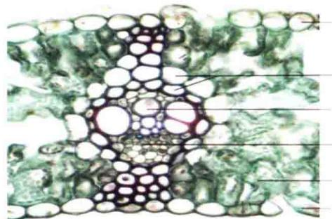

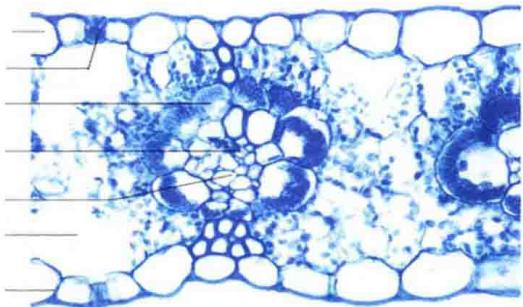

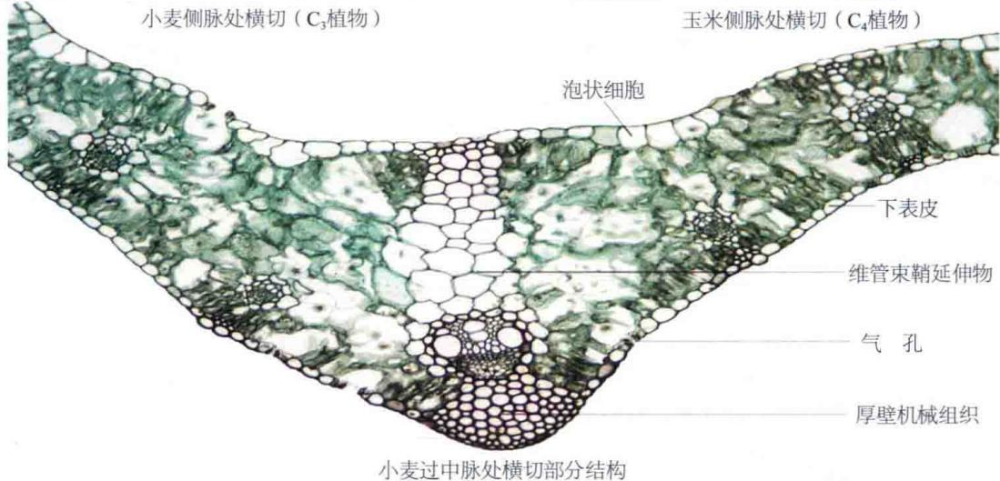  
图3-44 小麦、玉米叶横切（示维管束结构）

## 2）叶鞘

叶鞘由表皮、基本组织、维管束组成，维管束较多且彼此平行，维管束结构与茎中维管束结构相似（图3-45）。

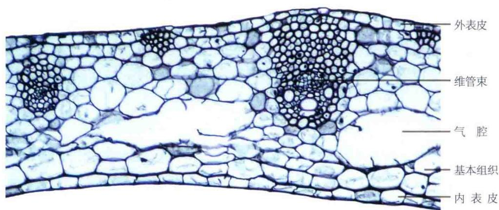  
图3-45 小麦叶鞘部分横切

## 2. 非禾本科植物叶片的结构

非禾本科植物的叶在形态和组成上具有多样性。其叶形态各异，主要为条形、披针形等。其组成也不一致，多数非禾本科植物的叶是不完全叶，由叶片和叶鞘两部分组成，如泽泻科（Alismataceae）、莎草科（Cyperaceae）、百合科（Liliaceae）、鸭跖草科（Commenilaceae）、兰科（Orchidaceae）等植物；少数植物的叶是完全叶，具有叶片、叶柄和托叶3部分，如菝葜属（Smilax）植物等。

非禾本科植物叶片的结构与禾本科植物叶片的结构基本相似。不同的是：少数非禾本科植物叶片的表皮细胞外壁角质化，具明显的角质层，表皮上的气孔器由两个肾形保卫细胞组成，如洋葱等，火柴头等叶的气孔器除含两个肾形保卫细胞外，还有4个副卫细胞（图2-20）。有的植物的叶肉具有栅栏组织和海绵组织的分化，如薯蓣和菝葜（Smilax china L.）等，有的植物近下表皮的叶肉细胞中不含叶绿体，如洋葱等（图3-46），有的植物的叶肉则没有栅栏组织和海绵组织的分化，如水仙、石蒜等；有的植物的叶脉为网状脉等，如玉簪（Hosta plantaginea L.）和菝葜等。

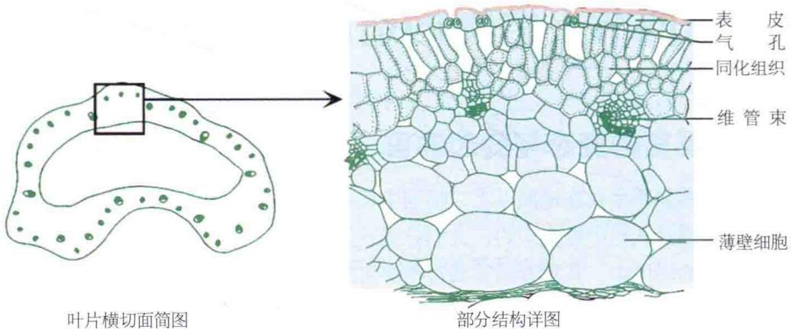  
图3-46 洋葱叶横切结构

## (三) 离层与落叶

植物的叶是有一定寿命的，不同植物叶的生活期可从数月至数年，如水稻等一年生植物，叶的生活期仅为几个月，当生活期终结时，叶就枯死而脱落。通常将植株四季均生有绿叶的木本植物称作常绿植物，而将当寒冷或干旱季节到来时，全株叶同时枯死脱落的木本植物称作落叶植物，如悬铃木（Platanus oreintalis L.）、水杉（Metasequoia glytostroboides Hu et Cheng）等。

落叶是多年生植物常见的现象。落叶时，有些植物在叶柄基部产生了离层，但有些植物则无离层出现，如大多数单子叶植物，叶的脱落似乎只是由于机械折断。

可产生离层的植物，在叶将落时，叶柄基部或近基部的部分薄壁组织细胞开始分裂，产生数层小细胞，这就是离区（abscission zone）。离区包括位于远茎端的离层（abscission layer）和近茎端的保护层（protective layer）两个部分。离区细胞层数多，但离层细胞仅有1～3层。离区产生不久，离层细胞开始黏液化、细胞彼此近乎呈游离状态，在其自身重量及外力的作用下，叶从离层处脱落（图3-47）。

离层下方的保护层，由数层栓质化的细胞组成，与加速叶的脱落、承担叶脱落后的初期保护有关。保护层的存在，使叶柄脱落后在茎上留下非常整齐、光滑的痕迹——叶痕。在木本植物中，保护层最终被保护层下发育的周皮所代替，并与茎的其他部分的周皮相连续。保护层的这些特点，能避免水分的散失和昆虫、病菌等对植物的伤害。

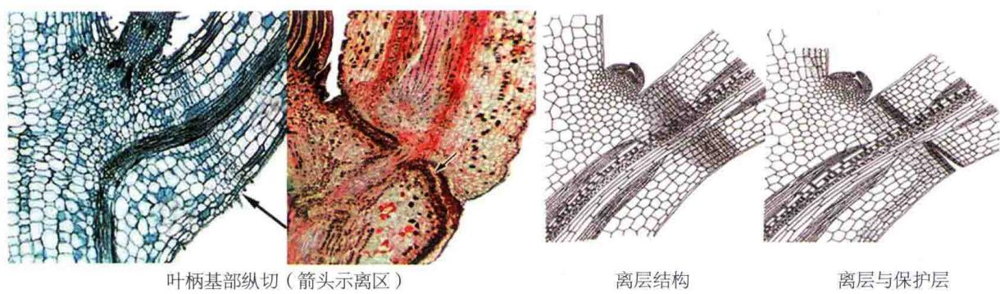  
图3-47 叶柄离层的形成

## 第四节 植物的适应性与整体性

## 一、营养器官的变态与变态器官

通常，植物的茎总是生长在地面以上，根则生长在地面以下。但是，有些植物的根、茎却不是如此。例如，莲藕是从泥中挖出来的，人们总误以为它是根，其实属于茎。在自然界，有些植物在长期适应特定的环境中，其营养器官或营养器官的一部分，在形态结构和生理功能方面均发生了显著变异，成为可以遗传的性状，这种现象称为营养器官的变态。发生变态的器官称为变态器官。

## (一) 根的变态

依据变态根生长的位置不同，可将其分为地下变态根和地上变态根两大类。

## 地下变态根

## 1）肉质直根

肉质直（fleshy tap root）根常见于两年生或多年生的草本双子叶植物。例如，萝卜、胡萝卜、甜菜（Beta vulgaris L.）和人参等植物都有一个肥大的肉质直根，其突出的功能是储藏养分、躲避不良环境，条件适宜时繁衍自身。肉质直根由下胚轴和主根基部共同发育而成。肉质直根上部来自下胚轴，没有侧根；下部主体部分来自主根，具多列侧根。肉质直根肥厚多汁，根内薄壁组织发达，细胞内储藏着大量的营养物质（图3-48）。

萝卜根的增粗主要是维管形成层的活动，次生木质部远比次生韧皮部发达。在次生木质部中，主要是储藏大量养分的木薄壁组织细胞，导管少，没有纤维。部分木薄壁细胞可以恢复分裂能力，转变成副形成层（accessory cambium）（三生分生组织），由此产生三生木质部（tertiaryxylem）和三生韧皮部（tertiary phloem），构成三生维管组织，形成三生结构。

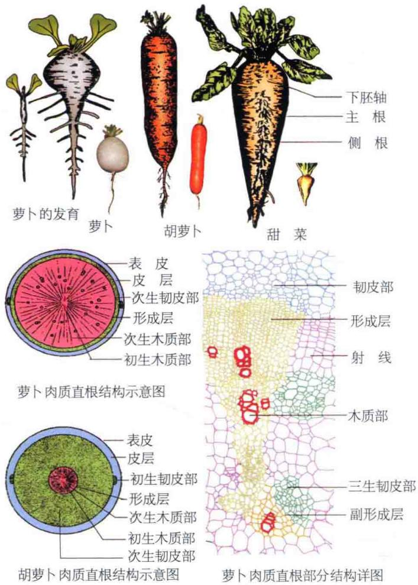  
图3-48 肉质直根的形态与结构

甜菜的肉质直根的增粗生长比较复杂，当维管形成层活动时，中柱鞘恢复分裂，产生副形成层，通过副形成层的分裂活动，形成具有大量薄壁组织的三生维管组织。以后再由三生韧皮部外侧薄壁组织产生新的副形成层，并形成新的维管组织。如此反复，三生维管束可以达到8～12圈，根据三生维管束圈数多少，特别是木薄壁组织的发达与否，可判断甜菜品种的优劣。

## 2）块根

块根（root tuber）由不定根或侧根经过增粗生长发育而来，所以一株植物可以形成多个块根。块根的主要功能是储藏养分和繁殖。例如，主要储藏淀粉的甘薯、木薯（Manihot esculenta Crantz）（图3-49、图3-50），主要储藏菊糖的大丽花（Dahlia Pinnata Cav.）等。现以甘薯为例，介绍块根的增粗过程。

甘薯块根是不定根在初生生长的基础上，维管形成层活动产生含有大量木薄壁组织细胞的次生木质部，此后，分散在导管周围的木薄壁细胞恢复分裂，转变为副形成层，由此产生三生结构。三生结构的薄壁细胞中储藏大量糖分和淀粉，在三生韧皮部中还可形成乳汁管。随着维管形成层不断地活动，副形成层可多次发生、生长，使块根迅速膨大。由于次生木质部中的导管分布不均匀，不同各部位生长速度和形成的组织多少不同，使块根呈

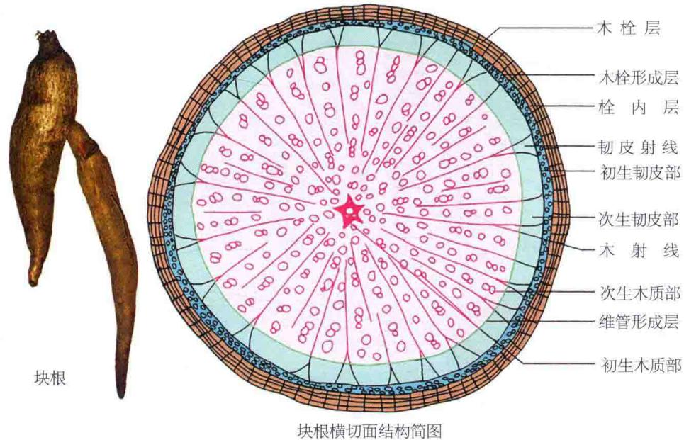  
图3-49 木薯块根横切面结构图解

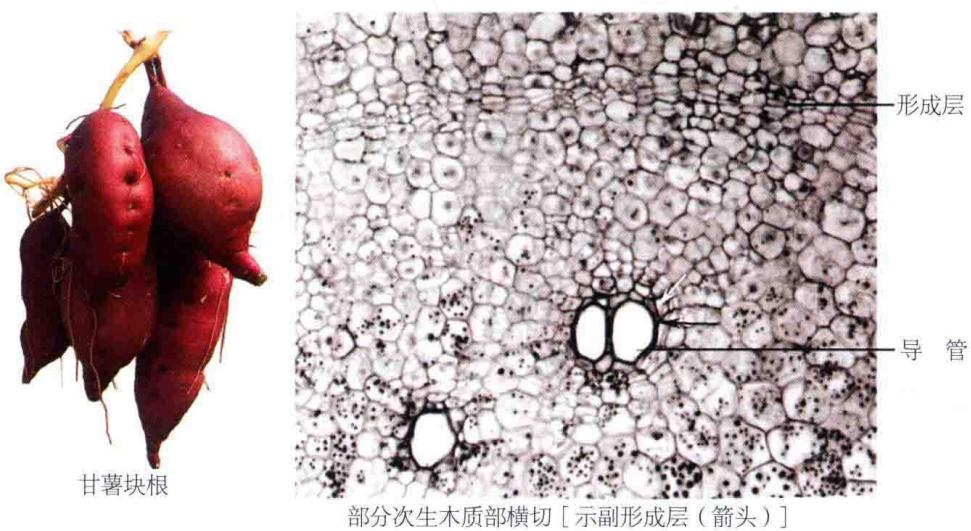  
图3-50 甘薯块根及其部分横切结构

现不规则形状。

## 3）板状根

在热带雨林中，常见某些木本植物茎的基部，由粗大的侧根发育而来的扁平板状的根，称为板状根（buttress root）。板状根外露土面，有时高达3～4m，对树木有较强的支持稳固和抵御风雨的作用。

## 4）呼吸根

一些生长在沼泽或热带海滩地带的植物所产生的一些垂直向上生长、伸出地面的根，这些根中常有发达的通气组织，可将空气储存并输送到地下根部，供给地下根进行呼吸作用，这样的根叫做呼吸根（respiratory root），如水龙（Jussiae repens L.）、红树（Rhizophora apiculata Bl.）等。

## 2. 地上变态根

凡露出地面，生长在空气中的根均称为气生根（aerial root）。根据气生根所行使的生理功能不同，又可将其分为支柱根、攀缘根及寄生根等类型。

## 1）支柱根

有些植物，常从茎节上生出不定根伸入土中，并继续产生正常的侧根，这些根不但能从土壤中吸收水分和无机盐，而且显著增强了根系对植物体的支持作用，因此，称这类根为支柱根（prop root），如榕树、玉米等。

## 2）攀缘根

藤本植物的茎往往细长柔软，不能直立，它们中有的从茎的一侧产生许多短的不定根，其先端扁平，且常可分泌黏液，易固着在其他植物的树干、山石或墙壁等的表面攀缘上升，这类气生根称为攀缘根（climbing root），如爬山虎［Parthenocissus tricuspidata（Sieb.et Zucc.）Planch.］、络石［Trachelospermum jasminoides（Lindl.）Lem.］等。

## 3）寄生根

寄生根（parasitic root）是寄生植物通过其不定根发育出的吸器伸入寄主植物的根或茎中以获取营养物质的结构。因此，寄生根又称为吸器。寄生根对寄主植物有害，如寄生于大豆等的菟丝子（Cuscuta chinensis Lam.）和寄生于向日葵等的列当（Orobanche coerulescens Steph.）等，它们都属于恶性杂草（图3-51）。

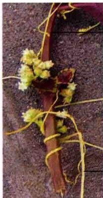

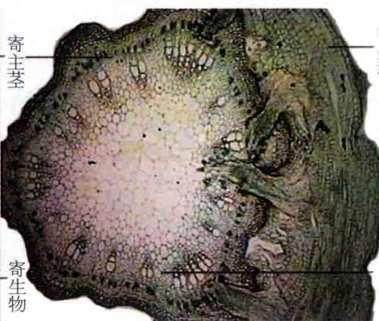  
图3-51 菟丝子寄生根

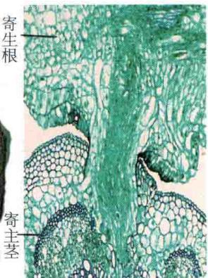

菟丝子的茎纤细柔长，缠绕寄主的茎、叶后，茎上生出许多不定根。不定根的先端首先形成一些丝状细胞，它们可以穿过寄主的表皮、皮层和维管组织，随后在其中分化出维管组织并与寄主的维管组织建立起联系，从寄主组织内摄取养分。

列当有直立的茎，但根不发育，形成吸器侵入寄主植物的根中吸取营养。其吸器细胞发育比较独特，成熟后原生质体消失，形成典型的管状分子，以纹孔与寄主细胞相连，从寄主体内吸取养分。

## (二) 茎的变态

茎的变态类型较多，按其生长位置，可将其分为地下变态茎与地上变态茎两大类。

## 1. 地下变态茎

植株分布于土壤中的茎，称为地下茎。地下茎的形态结构常发生明显变化，但仍保持枝条的基本特征，如具有节、节间、顶芽、侧芽和残存的叶等，故与根不同。地下变态茎常储藏大量的营养物质，为特殊的营养繁殖器官。常见的地下变态茎有根状茎、块茎、鳞茎和球茎。

## 1）根状茎

根状茎（rhizome）是蔓生于土层之中，具明显的节与节间，叶退化为非绿色的鳞片叶，叶腋中的腋芽或根状茎的顶芽可形成背地性直立的地上枝，同时在节上产生不定根的一类地下茎，如莎草科的香附子（Cyperus rotundus L.）和禾本科的竹、芦苇（Phragmites communis Trin.）等植物的根状茎（图3-52）。

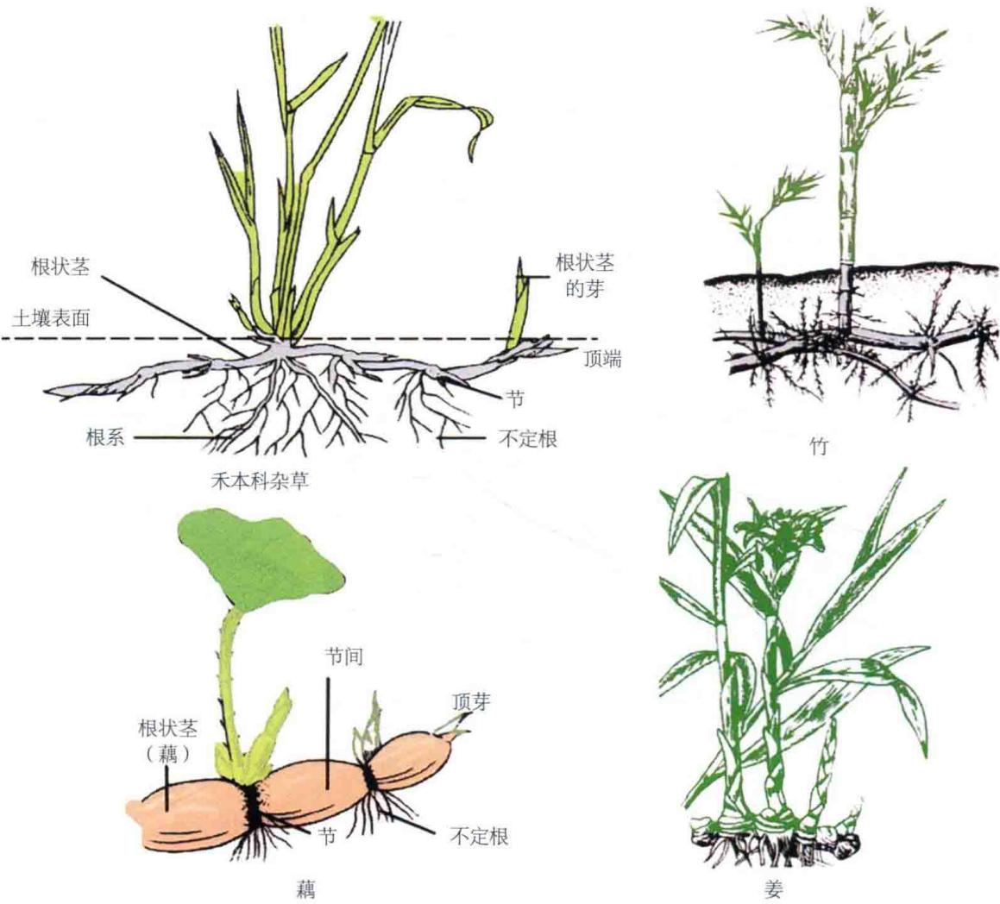  
图3-52 几种植物的根状茎

根状茎能存活一至多年，若因外力被切断时，茎段上的腋芽仍可再生为新株，故这类植物生命力强，如是杂草则很难治理。

姜（Zingiber officinale Rosc.）与菊芋（Helianthus tuberosus L.）的根状茎短、肉质；莲（Nelumbo nucifera Gaertn.）的根状茎即为藕，其中具发达的通气道。这几种根状茎既是储藏器官，同时也是营养繁殖器官（图3-52）。

## 2）块茎

块茎（tuber）是某些植物的顶芽节间短缩、呈不规则、块状膨大的地下茎。植物种类不同，块茎的形态也不同。块茎常肉质，能储藏大量的营养物质，如马铃薯（Solanum tuberosum L.）、天麻等。

马铃薯块茎形成于植物基部叶腋长出的入土匍匐枝顶端几个节与节间，经过特殊增粗生长而成，块茎顶端有顶芽，四周有许多作螺旋状排列的芽眼，每个芽眼内有几个芽，相当于腋芽和副芽。在块茎生长初期芽眼下方有鳞片，长大后脱落留下叶痕，称为芽眉。所以芽眼着生处为节，块茎实际上是缩短了节间的变态枝。成熟块茎的结构由周皮、皮层、维管束环、髓环区和髓等部分组成。表皮和皮层的最外层细胞转变为木栓形成层，产生周皮和皮孔，覆盖于块茎之外。周皮的细胞层数及皮孔数因品种和环境等不同而异；皮层由储藏组织组成，内含淀粉粒、蛋白质晶体；双韧维管组织呈筒状排列，外韧皮部与木质部均有发达的储藏组织，少量的输导组织分散其中，形成层不明显；内韧皮部与髓的外层细胞共同组成环髓区，也含大量储藏组织；中央髓和髓射线呈放射状，因细胞含水较多而较透亮（图3-53）。

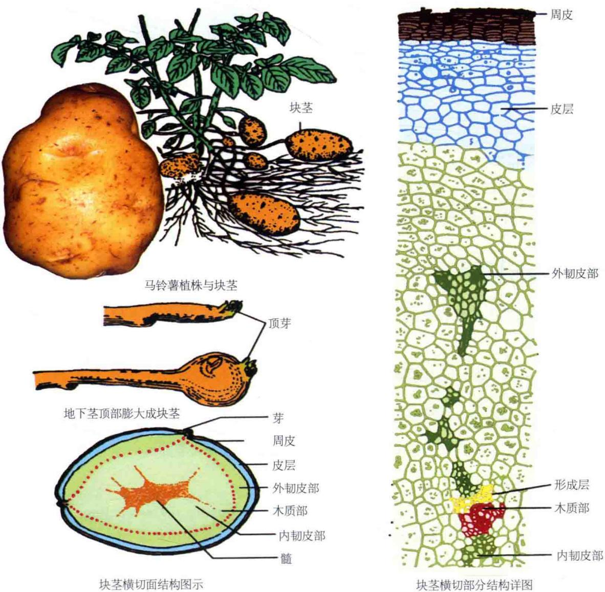  
图3-53 马铃薯及其块茎

## 3）鳞茎

鳞茎（bulb）是节间极度缩短的地下茎，其上所着生的叶通常肉质肥厚，如百合科等植物常见的营养繁殖器官和储藏器官。纵切洋葱（Allium cepa L.）鳞茎，可见其中央有一扁平、节间极短的鳞茎盘，其上有顶芽，将来发育为花序。四周有肉质鳞片叶重重包围着，它们储藏着大量的营养物质。叶腋有腋芽，鳞茎盘下端产生不定根。可见，鳞茎是一种缩短了节间的地下枝条的变态（图3-54）。

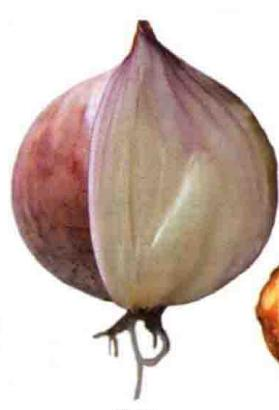  
洋葱

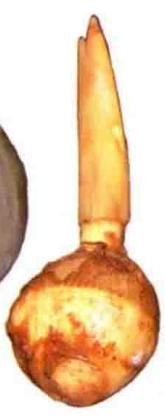  
慈姑

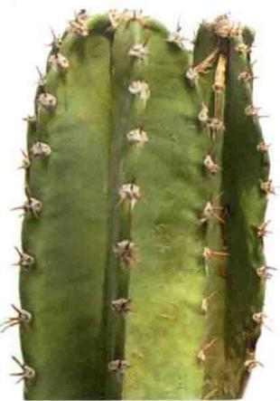  
仙人掌  
图3-54 鳞茎、球茎和肉质茎

## 4）球茎

球茎（corm）是短粗、呈球状的变态茎。荸荠（Eleocharis tuberosa Schult.）、慈姑（Sagittaria sagittifolia L.）的球茎由根状茎的顶芽发育而成（图3-54）；芋［Colocasia esculenta（L.）Sochott］的球茎由茎基部的几个节间发育而成，球茎顶芽粗壮，有时还有幼嫩的绿叶生于其上。

## 地上变态茎

有些植物的地上茎也会发生变态，其类型较多，也较复杂，通常有下列几种。

## 1）茎卷须

茎卷须（stem dendril）由茎的部分枝条特化而来，纤细呈须状，可卷曲、可分枝，并能缠绕其他物体而攀缘生长，如黄瓜（Cucumis sativus L.）、葡萄（Vitis vinifera L.）等。

卷须主要由薄壁组织组成，机械组织和输导组织均不发达。幼嫩的茎卷须感受性强，在接触支撑物后能在数分钟内作出卷曲、缠绕生长的反应，老卷须无卷曲反应能力（图3-55）。

## 2）芽球、花球与茎刺

有些植物其顶芽肉质化肥壮，如大白菜（黄芽菜）（Brassica pekinensis Rupr.）等的顶芽是一个硕大的芽球，花椰菜（Brassica oleracea var.botrytis L.）等的顶芽成为巨大的花球，它们储藏养分，有较高的食用价值；有些植物，如火棘［Pyracantha fortuneana（Maxim.）Li］、山楂（Crataegus pinnatifida Bunge）、皂荚（Gleditsia sinensis Lam.）等的顶芽、腋芽或不定芽变为茎刺（thorn），生于枝顶、叶腋或老茎上，有较好的自我保护作用（图3-55）。

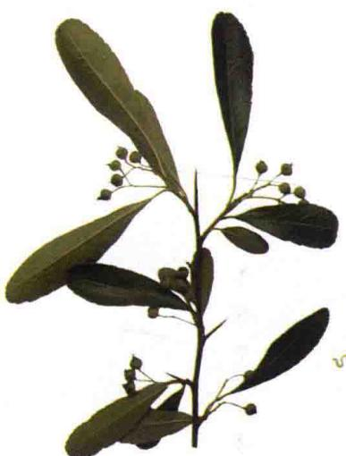  
火棘顶芽变态成茎刺

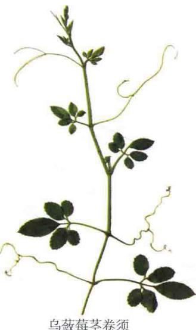  
乌蔹莓茎卷须

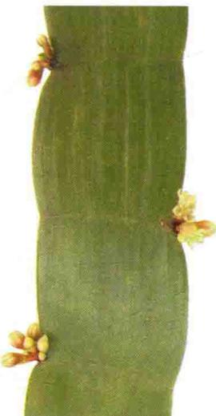  
竹节蓼叶状茎  
图3-55 茎刺、茎卷须和叶状茎

## 3）肉质茎

有些植物在适应干旱环境的过程中，叶片高度退化或呈刺状，其茎肥大多浆液，薄壁组织特别发达，适于储存水分和养料，并能进行光合作用，这类变态茎称为肉质茎（fleshy stem）。肉质茎肥大、粗壮，常为绿色，如仙人掌等植物（图3-55）。

## 4）叶状茎

有些植物的叶退化或早落，茎扁平、绿色，行使光合作用的功能，这种茎称为叶状茎（cladode，phylloclade或cladophyll），如假叶树（Ruscus aculeata L.）、竹节蓼［Homalocladium platycladium（F.Muell.）Bailey］、昙花［Epiphyllum oxypetalum（DC.）Haw.］、天门冬［Asparagus cochinchinensis（Lour.）Merr.］等（图3-55）。

## (三) 叶的变态

叶的变态器官类型主要有鳞叶、叶卷须、叶刺、捕虫叶、苞片和片状叶柄等。

## 1）鳞叶

鳞叶（scale leaf）是叶特化或退化成的鳞片状叶。鳞叶一般不呈绿色。鳞叶可分为革质鳞叶、肉质鳞叶和膜质鳞叶3种。革质鳞叶硬、常覆盖于冬芽外，呈褐色，保护着幼芽，又称为芽鳞片。肉质鳞叶肥厚，储藏大量的营养物质，如百合、洋葱等鳞茎上的鳞叶。膜质鳞叶薄，如蓼科植物的托叶，姜、荸荠等地下茎上的鳞片叶等。

## 2）叶卷须

有些植物的叶，常常整个地或部分地变为纤弱、细长的须状结构，借以攀缘向上，这种由叶变来的卷须状结构称为叶卷须（leaf tendril），如豌豆羽状复叶的上端部分小叶变态成叶卷须（图3-56），菝葜（Smilax china L.）的托叶变成卷须等。

## 3）叶刺

叶刺（leaf thorn）是由叶或托叶变态而成的刺状结构，如仙人掌科（Cactaceae）植物肉质茎上的刺（图6-9A），刺槐（Robinia pseudoacacia L.）叶柄两侧的托叶刺等（图3-56）和小檗属（Berberis L.）茎上的刺（图3-56）。虽然叶刺的来源不同，但它们都是叶的变态。

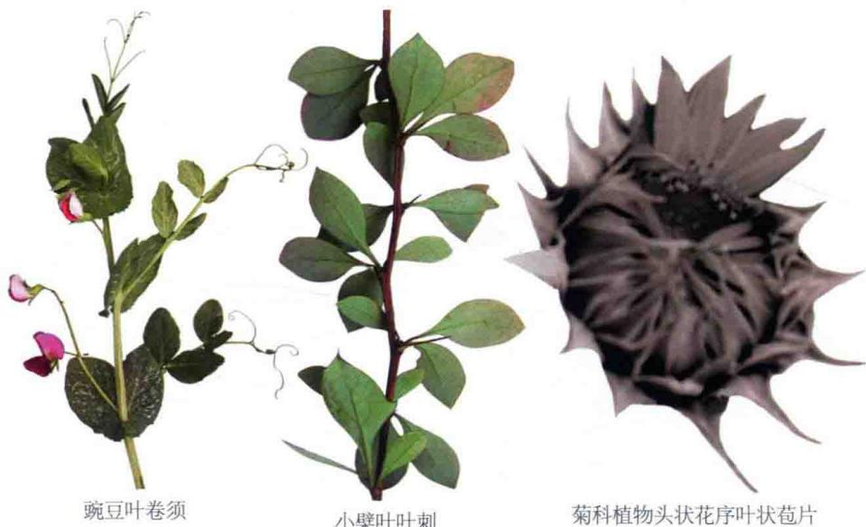  
小檗叶叶刺  
图3-56 叶卷须、叶刺和叶状苞片

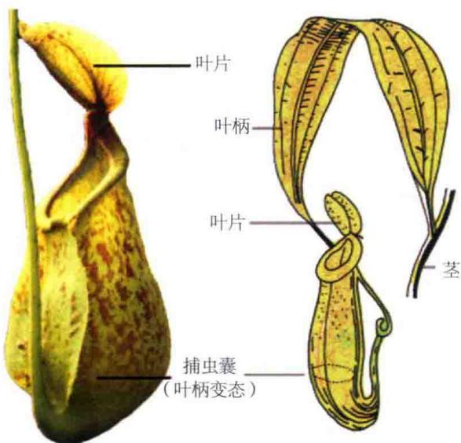  
图3-57 猪笼草捕虫囊

## 4）捕虫叶

捕虫叶（insectivorous leaf）是一类利于捕捉昆虫的变态叶。含有捕虫叶的植物称为食虫植物。食虫植物的捕虫叶，其叶片或叶柄常形成囊状、盘状或瓶状的捕虫器结构，其中有许多有感应性并能分泌消化液的腺毛或腺体，当昆虫触及时，捕虫器立即自动闭合，将昆虫捕获并消化吸收，如圆叶茅膏菜（Drosera rotundifolia L.）、猪笼草［Nepenthes mirabilis（Lour.）Druce］等（图3-57）。

## 5）苞片

苞片（bract）是被子植物的花序或花柄下的变态叶。苞片可有多种形状和色泽，即

使是绿色，其形态也有别于正常的营养叶，如向日葵、马蹄莲 [Zantedeschia aethiopica (L.) Spreng] 花序下的总苞片呈佛焰苞状，一品红花序的总苞片呈叶状等（图3-56）。

## 6）片状叶柄

片状叶柄（phyllode）是指有些植物的叶片退化，其叶柄扁平呈绿色叶状体的变态叶，如台湾相思树（Acacia confusa Merr.）。

## （四）同功器官与同源器官

根据达尔文的观点，在不同的变态器官中，那些来源不同，但功能相同，形态结构相似的变态器官，称为同功器官（analogous organ），如茎刺、叶刺与皮刺，它们分别来源于茎和叶，均呈刺状，是具有保护功能的变态器官；块根与块茎，分别来源于不定根和地下茎，呈团块状，是兼有储藏和繁殖功能的变态器官；而茎卷须与叶卷须，分别来源于茎和叶，呈细丝状，是攀缘附着的变态器官。此外，凡是来源相同，功能不同，形态结构不同的变态器官称为同源器官（homologous organ），如叶卷须、鳞叶与叶刺等，它们均由叶变态而成，但其形态结构和功能均不同。根状茎、块茎、鳞茎、茎刺等属同源器官，它们均来源于茎，但其形态结构和功能也都各不同。

在植物进化过程中，植物营养器官的变态，可朝着同功或同源两个方向发展。不同器官，因长期适应某种环境、产生相似的形态结构和相应的生理功能，而逐渐发生同功变态；同类器官，因长期适应不同环境、产生不同的形态结构和生理功能，而逐渐发生同源变态。因此，研究变态器官发生的分子机制，对研究物种的起源与进化、改造并创造植物新器官及新种质有重要的理论指导意义。

## 二、植物营养器官的形态、结构与环境的关系

植物是在不同生境中形成和发展起来的，生境的改变影响着植物的发育与生长，水分和光照是对植物营养器官形态结构影响最大的生态因子。根据植物与水分的适应性关系，可将植物分为水生植物（hydrophyte）、中生植物（mesophyte）和旱生植物（xerophyte）三大类。旱生植物是指长期适应干燥缺水环境生长的植物；整株或植株的一部分长期浸沉在水中生长的植物称为水生植物；中生植物是介于两者之间的植物，生活在既不太干旱也不过分潮湿或浸水的环境中。根据植物对光照强弱的适应性，可把植物分为阳性（生）植物（sun plant）和阴性（生）植物（shade plant），阳性（生）植物需要在阳光的直接照射下才能生长良好，但不能忍受荫蔽；阴性（生）植物适于生长在较弱的光照条件下，在全光照下光合作用反而降低，甚至受伤。

## (一) 水生植物的根、茎、叶形态与结构

水生植物（hydrophyte）一般是指能够在有水的环境中生活的高等植物，是植物高度进化的又一表现形式。水生植物一般分为沉水植物、浮水植物和挺水植物3种类型。

沉水植物（submerged plants）是指整个植物体完全沉没于水中的植物。沉水植物往往根系少或无根系，如金鱼藻（Ceratophyllum demersum L.）等，有些种类的根系无根毛（如荇菜等）。这主要由于其茎叶表面的角质层或蜡质层薄，溶于水的养分能够不同程度地透过其表皮直接进入植物体内。另外，沉水植物通常没有机械组织的分化或发育不完全，细胞的木质化、栓质化程度低，如苦草（Vallisneria spiralis L.）等；沉水植物细胞间隙大、排列疏松，通气组织发达、贯穿整个植物体，其内储藏着大量空气，以适应少氧的水环境，如穗状狐尾藻（Myriophyllum spicatum L.）等；木质部、韧皮部结构细小、组成成分少，如水鳖［Hydrocharis dubia（B1.）Backer］等；较少有次生生长和次生结构的发育与分化。

浮水植物（float plant）是指植株悬浮于水面上的植物，又称为漂浮植物。浮水植物的叶丛生，体形大小不一，须根系，根条数多少不一。浮水植物一般可分为漂浮植物和浮叶植物两类。漂浮植物均为体形小的草本植物，叶少而丛生，少根或具毛状根，如浮萍科（Lemnaceae）植物。有些漂浮植物的叶片或叶柄具有气囊，其根系发达，能使植物稳定于水中生长，当水少或干枯时，其根能扎入淤泥中继续生长，如水浮莲、水葫芦等。浮叶植物，如睡莲、菱属（Trapa L.）等，根状茎横卧或细而直立，叶柄细长，叶常浮于水，或挺出水面，或聚生于茎的

顶端，叶柄或叶片常有发达的气囊或通气组织。

挺水植物（emerged plant）是指植物的根和部分茎生长在水下底泥之中，茎、叶挺出水面生长的植物。挺水植物常分布于0～1.5m的浅水区，是陆生植物与水生植物的过渡类群，如香蒲、芦苇等。挺水植物的根、茎、叶内部结构特征与浮水植物相似。例如，根尖通常没有根冠，根的皮层、茎的基本组织等结构中都有发达的通气组织等，以适应水、湿生环境。

## (二) 旱生植物的根、茎、叶形态与结构

旱生植物通常是指能在长期缺水环境中正常生长发育的一类植物。尽管旱生植物所处的环境复杂，但其根、茎、叶形态结构特点及其对旱生环境的适应性表现相对一致，如肉质多浆、卷叶和叶片厚革质等。

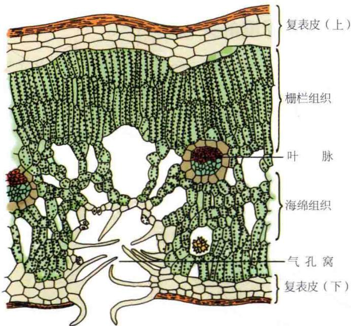  
图3-58 夹竹桃叶横切（示旱生结构）

旱生植物的共同点是：植株体形矮小、茎叶表面积与体积比小，根系发达，如甘草等，或不发达，如仙人掌类等；茎常肉质或肉质化、多浆质，多绿色，栅栏组织发达，有“同化枝”之称，如梭梭 [Haloxylon ammodendron (Mey.) Bunge]、仙人掌类植物等；叶主要朝着降低蒸腾和储藏水分两个方面发展。叶常不发达，小而厚，常密被茸毛，或退化呈鳞片状、膜状，如草麻黄（Ephedra sinica Stapf）、梭梭等，或肉质化肥厚的草本植物，如中华芦荟、猪毛菜（Salsola collina Pall.）等。有的植物，叶有复表皮，表皮气孔下陷成气孔窝，限制水分蒸腾，如夹竹桃（Nerium indicum Mill.）（图3-58）等；

## （三）阳生植物与阴生植物叶的形态与结构

阳生植物（heliophyte）是在阳光充足地带生长的植物。阳生植物的叶受光、受热较强，因而它们的叶趋向于旱生植物叶的结构特征，一般叶片较厚、较小，角质膜厚，栅栏组织和机械组织发达，叶肉细胞间隙较小。但阳生植物不等于旱生植物，有些阳生植物为水生。

阴生植物（shade plant）是指耐阴性强，分布于阴地环境的植物。阴生植物因长期处于荫蔽条件下，其结构常倾向于水生植物的特点。叶片一般大而薄，角质膜薄；栅栏组织不发达，细胞间隙较大，海绵组织占据叶肉的大部分空间；叶绿体较大；表皮细胞中也常含有叶绿体，可利用散射光进行光合作用。

在同一生境条件下，同一植株其顶部的叶和下部的叶，在结构上也存在着一些差异。越近顶部的叶或向阳一侧的叶，越倾向于旱生植物叶的结构，而下部的叶或生于阴面的叶则倾向于阴生植物叶的结构。

## 三、营养器官间结构与功能的统一性

## （一）根、茎、叶维管系统的联系

植物的器官是其长期适应环境进化发展起来的，是植物体高度复杂完善的标记，是自然选择的结果，器官间形态结构、功能各异，共同协调完成植物体的生命活动过程。但被子植物各器官间又是密切相关的，它们彼此贯通、紧密联系，表现出植物体结构上的整体性。

## 根、茎维管系统的联系

种子萌发时，胚轴的一端发育为主根，另一端发育为主茎，两者之间通过下胚轴相连。然而根的维管组织的特点（即间隔排列和外始式木质部）与茎的特点（外韧维管束的环状排列和内始式木质部）明显不同。所以，在根、茎的交界处，维管组织必须从一种形式逐步转变为另一种形式，发生转变的部位称为过渡区。Eames和Mac Danies（1947）认为“根、茎间过渡区位于植物幼苗系统中的下胚轴”，维管组织的转变与重构起始于下胚轴的基部，经过下胚轴的中部、上部而终止于子叶节。且认为：根的木质部外始式星状中柱是最原始的，茎的内始式真中柱是最进化的。维管组织在下胚轴部位发生，由根部向茎部转变。转变时维管柱有增粗，维管组织中木质部或韧皮部，或两者都发生分叉、旋转、靠拢和合并的变化过程。转变之后的维管组织在根茎间就建立起了统一联系。这一观点得到多数学者的认可。

现以四原型根转变为具有4个外韧维管束的茎为例，每个维管束的木质部分为二叉，顺势转向 $180^{\circ}$ ，每一分叉与相邻维管束的一个分叉汇合，并与邻近的韧皮部一起构成茎中的一个外韧型维管束（图3-59）。

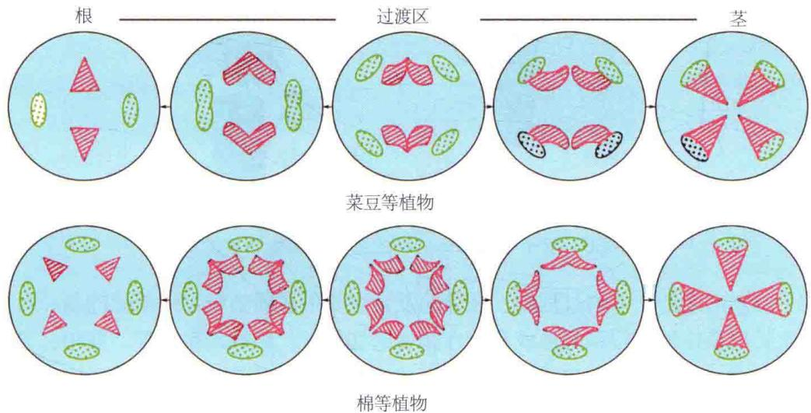  
图3-59 根茎过渡区（胚轴）维管组织的转换和联系

## 2. 茎、叶间维管系统的联系

在植物体中，维管束最初由下胚轴进入到子叶节，或由上胚轴进入到第一叶、继而进入到各叶内，其发生特点基本规律是：维管束先旋转、交叉、增粗和合并后，再发生分离，分别进入到下一节间和所在节部的腋芽与叶柄内。进入腋芽的维管束的发育、分布和结构特点与主茎相似；进入到叶内的维管束，如是外韧型维管束，其原本位于内侧的木质部则在进入叶内后，木质部总是朝向叶片的上（内）表面或叶结构的上表皮一侧，而韧皮部则总是位于朝向下（外）表皮或叶结构的下表皮一侧。

## （二）植物体局部与整体的统一性

## 1. 个体发育组成上的独立性与统一性

如前所述，组成植物体的根、茎、叶在形态结构和生理功能上是相对独立的，而各部分的发生生长又可能是同宗同源的（图3-60）。

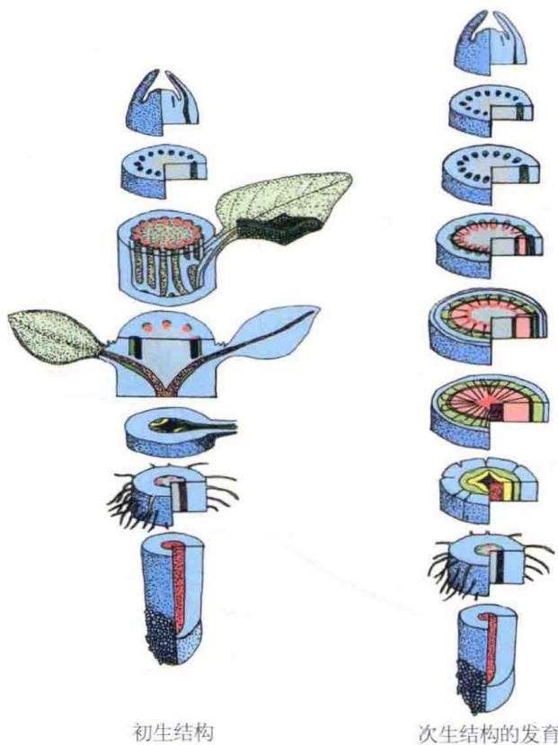  
图3-60 双子叶植物体的初生结构与次生结构的发育

在种子萌发形成新个体的过程中，胚芽的发育生长形成新植株地上部分的茎、叶系统，胚根的发育生长与植株地下根系的形成和分布特性密切相关，胚轴连接胚芽、胚根，参与新个体茎的发育与组成，子叶或参与新个体的形成，或在新个体的发育初期提供营养，调节其生长。胚芽、胚根、胚轴、子叶4部分共同组成一个完整的胚，它们均来自于受精卵的发育和分化。从受精卵到新一代个体的形成，是一个系统和整体发育的过程。

从组织系统的角度看，植株的根、茎、叶各组成部分，均是由皮组织系统、基本组织系统和维管组织系统3部分共同组成的。例如，组成叶的表皮、叶肉和叶脉，组成根、茎的表皮、皮层和中柱等分别属于组织系统中的皮组织系统、基本组织系统和维管组织系统，且其组成各组织系统的细胞来源、形态结构特征和所承担的生理功能等都有其相对的一致性和独立性。又如，皮组织系统位于植株的表面，抵御和适应外界环境，保护、协调和稳定植株代谢过程中的

植株 水分的吸收、运输与蒸腾相关的结构

内外环境，最大限度地保证植株正常生长代谢。基本组织系统与植物营养物质的吸收、同化和储存等有直接关系，既保持与外界环境的密切联系，又需要借助于其他组织系统不断地将合成和积累的产物重新分配到植物所需要的部位。因此，维管组织系统就成了植物内部营养物质长距离运输与再分配必不可少的结构部分，同时还兼有支持和巩固植物体等的重要生理功能。

## 2. 植物体结构的全息律

植物体结构的全息律是指组成植物体的任一个全息胚（embryo containing information whole organism）（张颖清，1986）的各个部位都分别在整体或其他全息胚上有各自对应的部位；全息胚的一个部位，相对于该全息胚的其他部位，与整体或其他全息胚上其所对应的部位的生物学性质相似程度较大；各部位在某一全息胚的分布规律与对应部位在整体或其他全息胚的分布规律相同；在生长轴线上连续的任意两个全息胚，生物学性质相似程度最大的两端总是处于相隔最远的位置，从而总是对立的两极连在一起。例如，植物的一张叶是一个全息胚，是植株整体的一个缩影，其叶片对应树冠，叶柄对应树干等。根据生物全息理论，生物体或某一全息胚在特定发育时期具有特殊强的遗传势，选用发育到该时期的全息胚作种，不仅能够显著提高作物产量和改进品质，而且能够提高品种的种性和利用价值。

## 3. 营养器官间生理功能的独立性与统一性

在被子植物的生活过程中，根系从土壤中吸收的水分必须通过幼根的表皮、皮层，进入根的中柱，借助于木质部的导管直接进入茎和叶，并在叶内扩散，大量的水分经由气孔蒸腾散发到大气中去，溶于水的无机盐和其余的水分则在植物体内被分配利用。因此，根系的吸水活动与茎的输导和叶的蒸腾作用密切相关（图3-61）。

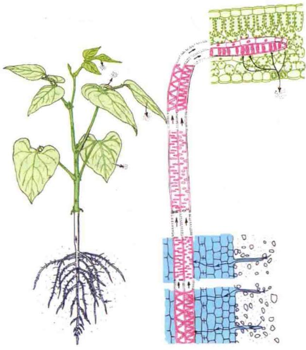  
图3-61 植株营养器官间的功能一体化

叶是植物光合作用的重要场所。叶片进行光合作用，合成和积累同化产物，部分供给叶自身的消耗，大量的养分则通过贯穿于整个植株的韧皮部中的筛管等由叶运往茎、芽、花、果实、种子和根系，或其他特定的储藏器官，供其生长发育利用或储存。

因此，植物体内进行的养分的吸收、合成、运输、利用和储藏的过程是植物体内各组织或组织系统协同行使生理功能的过程。在植物体正常生长、代谢和遗传的过程中，植株的形态结构和生理功能间达到了高度的统一性。

## 总结与复习

## 知识要点

植物的种子萌发后，胚根顶端分生组织的细胞经过分裂、生长、分化，形成了主根。主根上可以产生各级侧根，主根和侧根是定根；在茎、叶、老根或胚轴上产生不定根；一株植物所有根的总和，称为根系。根系可分为直根系和须根系两种：直根系由主根和侧根组成，为绝大多数双子叶植物和裸子植物所具有；须根系主要由不定根组成，为绝大多数单子叶植物和蕨类植物所具有。

根的主要生理功能是吸收、输导、固着、支持、合成、储藏和分泌。根据不同植物根的特点，可以应用到食用、药用、工业原料以及工艺品制作等各个方面。

从根的顶端到着生根毛的部位称为根尖。根尖是根中生命活动最旺盛的部位，担负着细胞分裂、根的伸长、根系形成和物质吸收等重要功能。根尖可分为根冠、分生区、伸长区、根毛区（成熟区）。被子植物根尖分生区的近根尖端为原分生组织的原始细胞，其上为初生分生组织，分化出原表皮、基本分生组织和原形成层，进一步分化为根的初生结构（根毛区）。

双子叶植物根的初生结构包括表皮、皮层和维管柱3部分。表皮细胞壁薄，角质膜不发达，水分易透过，多数表皮细胞的外壁向外延伸形成根毛，扩大了根的吸收面积；皮层由基本组织构成，可分为外皮层、中部皮层薄壁组织和内皮层；内皮层是皮层最内一层细胞，在双子叶植物的根中，其左、右径向壁和上、下横向壁一定位置上有一条木质化、栓质化的“凯氏带”，水分和溶质必须通过内皮层细胞的原生质体向内运输；维管柱的最外方是维管柱鞘，多为一层细胞，具有潜在的分裂能力，可产生维管形成层的一部分、木栓形成层、不定芽和侧根等；维管柱内的初生木质部和初生韧皮部相间排列，分化方式均为外始式。

大多数双子叶植物根可进行次生生长，形成次生结构。它是次生分生组织维管形成层和木栓形成层活动的结果。维管形成层发生于初生木质部和初生韧皮部之间的薄壁细胞（保留下来的一部分原形成层细胞）和正对初生木质部辐射角外面的维管柱鞘细胞，经过分裂、增加细胞数量，最终形成圆环形的维管形成层（横切面观察），维管形成层主要进行切向分裂，向内分裂产生的细胞形成次生木质部，向外分裂产生的细胞形成次生韧皮部，使根增粗。木栓形成层最初由维管柱鞘细胞恢复分裂能力产生，木栓形成层细胞分裂产生木栓层和栓内层，构成周皮。根的次生结构自外向内依次为周皮（木栓层、木栓形成层、栓内层）、初生韧皮部（常被挤毁）、次生韧皮部（含径向的韧皮射线）、维管形成层和次生木质部（含木射线）和辐射状的初生木质部。多数双子叶植物根中无髓。

禾本科植物根的基本结构与双子叶植物一样，也分为表皮、皮层和维管柱三个基本部分。但禾本科植物根与双子叶植物根的初生结构相比有其独特之处，主要表现在以下几个方面：①外皮层薄壁细胞厚壁化；②内皮层细胞的细胞壁为五面增厚结构（外切向壁不增厚）；③初生木质部为多原型；④不保留有分裂能力的细胞。

禾本科植物的根中无维管形成层和木栓形成层的发生，不能进行次生生长，因此不具有次生结构。

侧根是由侧根原基发育形成的。侧根原基的发生方式为内起源，是由母根维管柱鞘的一部分细胞恢复分裂能力形成。侧根只发生于维管柱鞘的一定部位，其发生部位与初生木质部和初生韧皮部的位置和束数有关。侧根的形成能扩大植物地下部分的分布范围，有利于吸收土壤中更多的营养，同时还能加强根的固着和支持能力。

根瘤和菌根是某些高等植物根部所形成的共生结构。根瘤是由根瘤细菌、放线菌侵染根部细胞而形成的瘤状共生结构；菌根是某些真菌与某些高等植物根部所形成的共生体。

茎的主要功能是输导和支持作用；茎还有储藏、繁殖作用，幼嫩的茎还可以进行光合作用。

茎多为圆柱形，茎上有节和节间，还有叶痕、维管束痕、芽鳞痕和皮孔等结构，着生叶和芽的茎称为枝条。

芽是未发育的枝条、花或花序的原始体。按芽将形成器官的性质分为叶芽、花芽和混合芽；按芽的生长位置分为定芽与不定芽；按生理活动状态分为活动芽和休眠芽；按芽鳞的有无分为裸芽和鳞芽；按芽形成季节分为夏芽和冬芽或越冬芽。

叶芽是将来发育为枝条的芽，包括中央的生长锥、叶原基和幼叶。有的植物还有芽鳞和腋芽。花芽是花或花序的原始体，含花或花序各部分（花萼、花瓣、雄蕊和雌蕊）的原基。生长锥、叶原基、腋芽原基和花部原基均由分生组织组成，是地上部分所有新结构、新器官的来源，是芽的主体。芽的形态结构体现了茎对环境的适应。种子植物的分枝方式主要有单轴分枝、合轴分枝、假二叉分枝和分蘖等，研究茎的分枝方式在农林生产上有重要意义。茎尖由上而下可分为分生区、伸长区和成熟区3部分，各区组织结构层次特征不同。

双子叶植物茎节间部分的初生结构可分为表皮、皮层和维管柱3部分。表皮是初生分生组织的原表皮发育而来的初生保护组织。表皮细胞外壁厚、角质化并有角质层，表皮上有气孔和表皮毛；皮层由部分基本分生组织分化而来，分为外皮层（厚角组织）、中皮层和内皮层（不明显）；维管柱是由原形成层和另一部分基本分生组织发育而来的结构，包括维管束、髓和髓射线3部分，维管束是由原形成层发育而来的束状结构，包括初生韧皮部、束内形成层和初生木质部3部分；双子叶植物茎的初生木质部产生、分化和成熟方式为内始式，初生韧皮部和初生木质部为内外排列，与根明显不同。髓射线位于两个维管束之间，连接皮层与髓，有横向运输的作用。

双子叶植物茎的次生结构是维管形成层和木栓形成层活动的结果。维管形成层是束中形成层和束间形成层两部分连接成环而成。维管形成层的细胞有两种：一种是纺锤状原始细胞，另一种是射线原始细胞。维管形成层活动主要是纺锤状原始细胞切向分裂，向外产生次生韧皮部，向内产生次生木质部，构成纵列的次生维管组织系统，成为茎中纵向的输导系统。射线原始细胞切向分裂产生维管射线，构成横向的次生组织系统，成为茎中横向的输导系统。

树皮是维管形成层以外所有组织的总称。木材是指维管形成层历年产生的次生木质部的总和。年轮是一年中只有一个生长期的形成层所产生的次生木质部，早材和晚材没有明显的

<!-- END OFFICIAL API PART part_002 -->

<!-- BEGIN OFFICIAL API PART part_003 -->

界限。边材是近树皮的色泽较淡的次生木质部，是后形成的，含有生活细胞，具输导和储藏作用。心材是茎内部色质较深的、较老的次生木质部，丧失了输导能力。

茎中第一次形成的木栓形成层在不同植物中的起源位置不同，最初可以出现在表皮、表皮或皮层的外层、厚角组织，或皮层薄壁组织中，甚至发生在初生韧皮部。木栓形成层细胞分裂活动方式、产生的结构特点与根的木栓形成层相似。向外产生的新细胞生长分化为木栓层，向内分裂的细胞发育成栓内层。木栓层、木栓形成层和栓内层构成周皮。在气孔下方，木栓形成层活动后产生皮孔结构，皮孔是老茎与外界进行气体交换的孔道。

禾本科植物茎节间的结构，可分为表皮、基本组织和维管束三种组织系统。表皮由一种长细胞、两种短细胞和保卫细胞有规律地排列而成，基本组织外围几层厚壁细胞形成坚硬的机械组织，维管束分散在基本组织中，或排列为内、外两环（如小麦、水稻等）。

部分禾本科植物（如玉米）茎尖的叶原基下面，有初生增粗分生组织，通过短期的初生增粗生长，使茎节间伸长后进一步增粗。

叶是绿色高等植物合成有机物的重要器官，叶的主要生理功能是光合作用和蒸腾作用。

叶由叶原基发育而来，发育过程包括顶端生长、边缘生长和居间生长3种方式。一般被子植物的叶呈扁平的薄片状，以叶柄或叶鞘（禾本科植物）着生于茎的节上。双子叶植物的完全叶包括叶片、叶柄和托叶3部分，缺一则称为不完全叶。禾本科植物的叶主要包括叶片和叶鞘两部分，有的在叶片、叶鞘相接处还有叶舌、叶耳和叶环，或只具其中一种。

双子叶植物的叶片，横切面观可分为表皮、叶肉和叶脉3个部分。表皮由原表皮发育而来，是覆盖在叶片上下表面的初生保护组织，一般包括表皮细胞、气孔器、表皮附属物等，表皮细胞一般不含叶绿体；气孔器由两个肾形的保卫细胞组成，之间的裂生胞间隙称为气孔，与叶光合作用时气体交换及进行蒸腾作用有关，有些植物，如甘薯等在保卫细胞外还有副卫细胞。叶肉由基本组织发育而来，是叶片进行光合作用的主要部分。背腹型叶的叶肉分化为栅栏组织（腹面）和海绵组织（背面）。等面型叶的叶肉，则无栅栏组织和海绵组织的分化，或上下两面都同为栅栏组织；叶脉主要由原形成层发育而来，主脉中具有微弱的形成层，叶脉越细，其结构越简单。

禾本科植物叶片也是由表皮、叶肉和叶脉3部分组成。表皮由表皮细胞、泡状细胞和气孔器等有规律地排列而成。表皮细胞有一种长细胞和两种短细胞，泡状细胞分布在两条平行叶脉之间的上表皮位置，在横剖面上形成展开的折扇状，可调节叶片水分，气孔器由两个哑铃形的保卫细胞及其外侧的两个近似菱形的副卫细胞组成；叶肉没有栅栏组织和海绵组织的分化；叶脉为平行叶脉，叶脉内的维管束是有限外韧维管束，各束外围为由1\~2层薄壁或厚壁细胞组成的维管束鞘。

落叶的原因与叶柄基部形成离区有关。离区可分化产生保护层和离层结构，叶脱落是离层细胞死亡和外力作用的结果。

植物在适应环境的过程中，有些营养器官的形态结构和生理功能都发生了显著变异，并且这种变异能够稳定地遗传下去，成为物种的特性，这种现象称为营养器官的变态，发生变态的器官称为变态器官。根、茎、叶都具有多种变态器官类型。

凡外形相似、功能相同、但形态学上来源不同的变态器官，称为同功器官，如茎刺、叶刺和皮刺，茎卷须和叶卷须，块茎和块根等都属于同功器官。反之，外形与功能有差别，而形态学上来源相同的变态器官，称为同源器官，如茎刺、茎卷须、根状茎、鳞茎等，都是茎的变

态，属于同源器官。

多数学者认为，根、茎间维管组织系统的过渡与转换区在“下胚轴”。在下胚轴区段，根茎维管组织发生初生木质部的分叉、旋转和合并，完成星状中柱向真中柱的转变和联系。

## 复习思考

1. 定根与不定根的区别有哪些？

2. 根系有哪些类型？不同类型的根系在土壤中的分布如何？

3. 根尖可分为哪几个区？各区细胞的特点及功能是什么？

4. 绘图或列表说明双子叶植物根的初生构造及其功能。

5. 简述双子叶植物根内皮层的结构特点。

6. 简述双子叶植物根的次生结构及其发生过程。

7. 试论述根的哪些结构与其吸收功能相适应。

8. 比较双子叶植物根初生结构与单子叶植物根结构的区别。

9. 茎的基本形态组成是什么？其重要组分有哪些？

10. 什么叫芽？芽可分为哪些类型？如何区分定芽和不定芽？

11. 分别叙述叶芽、花芽和混合芽的结构组成。

12. 被子植物常见的分枝方式有哪几种？试举例说明。

13. 根据植物的分枝方式特点，如何进行植物的株形修整？

14. 茎尖是如何分区的？各区有何特点？

15. 双子叶植物茎的初生结构层次性特征如何?

16. 与根相比，双子叶植物茎初生结构有哪些特殊性？

17. 依据根、茎的解剖结构，如何区分根和茎的初生结构？

18. 试比较说明单子叶植物茎的初生结构与双子叶植物茎的初生结构特征差异。

19. 简述双子叶植物茎的次生生长过程和次生结构特点，并说明与根的次生结构发生过程中的异同点。

20. 维管形成层由哪两类细胞组成？分别描述其分裂特性及分裂后产生的结构及其作用。

21. 什么是皮孔？其结构特点如何？

22. 什么是茎的初生增粗分生组织？什么是茎的初生增粗生长？

23. 试列表比较单子叶植物、双子叶植物叶的形态与结构异同点。

24. 叶有哪些生理功能？什么是完全叶、不完全叶？什么是单叶、复叶？如何区分单叶与复叶？

25. 禾本科植物的叶由哪几部分组成？其特征和作用分别是什么？

26. 叶是如何发生和生长的？各个生长阶段的作用是什么？

27. 以棉叶为例，简要叙述双子叶植物叶片的结构特点。

28. 以水稻为例，简要叙述禾本科植物叶片的结构特点。

29. 简要说明碳三植物与碳四植物叶片的结构异同点。

30. 分别举例说明叶的形态结构与生理功能及环境的统一性。

31. 植物的叶为什么会脱落？试解释其原因。

32. 名词解释：年轮，假年轮，心材，边材，变态。什么是同功器官、同源器官？分别举

例说明。

33. 植物的根、茎、叶常形成哪些变态类型？分别举例说明。

34. 肉质直根、块根、块茎的发生和结构特点是什么？举例说明。

35. 根、茎间维管束是如何转化和联系的？

## 阅读与探究

## 阅读参考

## (1) 本章知识参考阅读:

http://jpkc.yzu.edu.cn/course/zwx/0502jxrr.htm

http://www.enchantedlearning.com/subjects/plants/leaf/

Peter Gregory. 2006. Plant Roots: Growth, Activity and Interactions with the Soil. London: Blackwell Publishing

## (2) 知识拓宽参考阅读:

直接以 “根” “茎” “叶” 等相关词为检索词，应用 “baidu” “google” 等网站查询，根据你的兴趣和知识面选择相关条目进一步查询点击并扩大阅读。

根是植物、土壤和微生物及其环境相互作用的中心，是植物和土壤环境物质和能量交换最剧烈的区域，是各种养分和有害物质从无机环境进入生命系统参与食物链物质循环的必经通道和瓶颈。根际系统的研究是当今环境生物学研究的主要热点之一。对植物根、茎、叶的分子生物学研究已取得突破性成就，一大批与根、茎、叶发育有关的基因和基因组合被发现，人类定向改造和利用植物的时代将为期不远。要了解相关知识和进一步阅读，可在教师的指导下，利用网上图书、期刊资源有选择性地查询阅读。

Speck T., Plant Stems: Functional Design and Mechanics, Materials Research, 2011, 41: 169-193。不仅从细胞水平详细解读了茎的结构、结构与功能的关系，而且进一步地讨论了茎的组织、细胞的结构独特性与茎的生长习性的独特性、对不同环境的适应性的关系，此外文中还介绍了茎的层次性、多功能性的结构在工程仿生学上的应用。

Plant form: An illustrated guide to flowering plant morphology是由哈佛大学Adrian D. Bell和他的学生Alan Bryan在1991年出版第一版（Oxford University Press）后的再版（Timber Press，2008年），全书共431页，书中收集了大量的植物形态结构的彩色图页，作者以大量的插图描述了开花植物的形态解剖结构，详述了大量植物的生长发育过程中叶、花、根及种子等的结构变化，书中还附有大量的植物学术语的解释，该书不仅是学习植物叶的部分、而且还是学习植物形态解剖学各个部分知识的一本较好的参考用书。

## 探究学习

在本章内容学习的基础上，我们还可以试着去深入学习，拓宽自己的知识面，培养自己的科学素养。根据自己的兴趣、知识背景和专业特点或在教师的指导下，选择某类或不同类型植物的根、茎、叶进行形态和结构差异的比较学习，归纳器官间特征的一般性与特殊性，拓宽书本知识。或根据所学知识，联系生活、生产实际，野外调查、归纳、整理，真正认识和理解被子植物根、茎、叶形态结构与功能、植物与环境间的统一性。

不同的植物有不同特征的根系类型。要进一步了解植物根系类型和分布特征，可无土栽培、基质栽培甚至水培植物，观察和拍摄记录植物根系的生长发育规律。或选取同种植物种子萌发后分别进行土培、水培和营养液培养，在培养不同天数分别取样进行切片，观察比较距离根尖同样长度部位根表面的根毛密度、根的直径、根的内部解剖结构差异，探究不同生境条件对植物根的形态和结构发育的影响。

根是植物吸收养分的器官，不同的植物对营养物质的需求特性不同。应用测土配方施肥技术，可研究出植物不同养分的需求规律，实现精确定量施肥或肥力运筹。或配制全营养液，直接在水培条件下，应用等离子光谱仪（IPC）或原子吸收分光光度计，定期测定培养液中不同营养元素动态，由此可确定所培养植物的需肥特性和需肥规律，达到精确栽培和高产优质的目的。

茎包括主茎和分枝，是植物叶、花、果的承载体。茎有显著的向光性，不同的发育生长阶段，茎的形态一直在改变着。修枝整形可改变植物的生长状态和树冠形态，改变受光模式也可改变茎的生长态势，进而达到人为塑造树冠形状或艺术化植株形态的目的。

茎的结构与其所处的环境及执行的功能密切相关，同学们可以采集一年生草本植物的茎、多年生草本植物的茎、木本植物的幼茎等进行横切面的显微观察，了解不同类型茎的结构组成特征，分析茎的结构组成与其生长特性及执行功能间的关系。

“树怕剥皮”是真的吗？如何剥皮才不会影响树木的生长呢？不妨在教师的指导下，去亲自探究一下。

叶是植物光合自养的主要器官，对人类的物质生活和精神生活贡献巨大。叶对环境敏感，其形态、色泽、质地和作用都具有多样性。根据叶的属性，我们可以设计出许许多多的探究活动。

绿叶面积与环境质量有密切关系，茂密的绿叶可吸附粉尘、吸收有毒有害气体、减少噪声等。同学们可以选定一个城市绿化面积不同的多个小区或工厂区，通过绿叶面积测量、空气污染指数测定，建立绿叶面积与空气污染指数之间的相关性方程，探究增强绿化对改善空气质量的影响。

有兴趣的同学还可以通过气象资料分析等，探究叶的色彩与环境温度变化的关系。

植物全息胚的不同部位对特定性状的遗传势不同。植物的细胞、组织培养和诱导器官的发生与重建植物新个体等，都充分证实了构成植物体全息胚的胚胎学性质，也证实了离体器官的形态发生具有“位置效应”“时间效应”和“极性”等的特性。有关全息生物学及其应用的相关知识可参阅：金银根．1992．张颖清与全息生物学．科学，44（3）：51～55。

第四章
