# 第5章 被子植物主要分科概述

<!-- 章节边界按正文内容恢复；原始 MinerU 内容保留如下。 -->

被子植物
主要分科概述

## 内容导读

被子植物是植物界种类最多、结构最复杂、进化最高级的一大类群植物。现存已知的被子植物有25万种，一般将其归为2纲、300多科、8000多属。通过学习与了解那些与人类关系较为密切或在系统分类与进化上有重要地位的科、属和种的特征，建立被子植物分类知识框架，可为进一步研究、学习奠定基础。

植物与环境、植物与人类，甚至植物与地球的未来都有着十分密切的关系。只有学好植物分类学知识，懂得植物的作用和重要性，才能真正合理利用和保护植物。

## 教法与学法

## 教法

（1）充分利用现代教育技术，采用讲授式、演示式与实物展示相结合的教学方法，或直接利用体式显微镜互动教学系统，师生共同进行植物形态学特征多样性的互动式教学。

（2）指导学生在课余与课外观察与识别植物，制作植物小标本（并标注其重要特征）和参考阅读，加强指导并开展课堂交流讨论。

（3）加大和强化实验教学力度，面对面、手把手地指导和训练学生如何观察和描述植物特征，特别是如何解剖观察、识别花器官各部分的形态学特征，训练和教会学生熟练使用检索表或植物分类学工具书，开展反转课堂教学，促进学生自主和合作学习。

## 学法

（1）在认真学好植物分类学基础知识的同时，应用比对法自觉进行课外观察、记载和描述不同植物各个器官的形态学分类特征。

(2) 课前课外充分备课, 在认真听课的同时, 积极配合教师的课堂教学, 主动回答问题或参与课堂问题讨论与反转课堂教学。在学习中问, 在解剖中思, 在讨论中学。学用结合、学以致用。

（3）分组或分班级开展被子植物系统与进化不同学派的辩论赛活动，进一步理清真花说和假花说及其对应的分类系统。

(4) 实验课上, 自觉一丝不苟地学习、理解和掌握解剖、观察植物形态学特征的方法、技巧, 强化动手、动脑能力。经过训练, 独立完成若干种植物的解剖观察、特征描述和所属科、属、种的检索鉴定, 以便能够完成野外植物 (资源) 种类的调查、分类与评价。

## 第一节 被子植物分类的形态学基础知识

被子植物在长期演化、适应环境的过程中，出现了各种各样的形态特征，经典的植物分类学就是根据植物的不同器官的形态特征来进行的。

## 一、茎

## (一) 茎的生活习性

植物茎的生活习性是植物在长期适应环境的过程中形成的。根据茎的性质，可将植物分为木本植物、草本植物和半灌木3种类型。木本植物（wood plant）茎的主要部分为木质部，质地比较坚硬，寿命长。草本植物（herb plant）茎中的木质部不发达，质地通常脆嫩，寿命相对较短。半灌木（subshrub）是介于木本植物和草本植物之间的一类多年生植物，如沙拐枣属（Calligonum）和蒿属（Artemisia）的一些植物。

## 1. 木本植物

乔木（tree）乔木有明显的主干，通常树干高在3m以上，分枝距地面较远，如白玉兰（Magnolia denudata Desr.）等。

灌木（shrub）主干不明显，通常树高在3m以下，近地面分枝，如紫荆（Cercis chinensis Bunee.）、月季等。

## 2. 草本植物

一年生草本植物（annual herb）生活周期在一年内完成，如水稻、花生等。

二年生草本植物（biannual herb）生活周期跨越2个年份，如冬小麦等。

多年生草本植物（perennial herb）植物的地下部分或整个植株能生活多年，每年都能发芽继续生长，如荷花（Nelumbo nucifera Gaerth.）等。

藤本植物（vine） 植物体细长，不能直立，只能匍匐于地面，或缠绕或攀缘别的植物（或支持物）而生长，藤本植物依茎质地的不同，又可分为木质藤本与草质藤本两种类型。前者如葡萄、省藤（Calamus platyacanthoides Merr.）等，后者如牵牛［Pharbitis nil（L.）Choisy］等。

## (二) 茎的生长习性

根据茎的生长习性，可将茎分为以下几种（图5-1）。

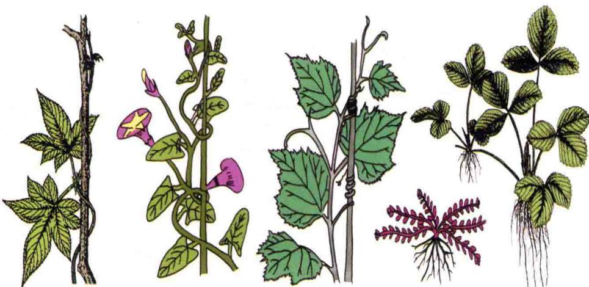  
葎草 —— 缠绕茎 —— 牵牛 攀缘茎：葡萄经卷须缠绕 平卧茎：地锦 匍匐茎：草莓

图5-1 茎的生长习性

直立茎（erect stem） 茎垂直立地，如杨树、小麦等。

平卧茎（prostrate stem）茎平铺于地面，如蒺藜（Tribulus terrestris L.）等。

匍匐茎（stolon stem）茎平卧地面，节上生根，如甘薯（Ipomoea batatas Lam.）等。

攀缘茎（climbing stem）借助于茎、叶等的变态器官攀缘于其他物体上，如黄瓜等。

缠绕茎（twining stem）茎缠绕于其他物体上，如牵牛等。

## 二、叶

叶的大小、形态和组成常因植物种类而异，变化较大，但分类地位相近的植物叶的形态常相似（图5-2）。

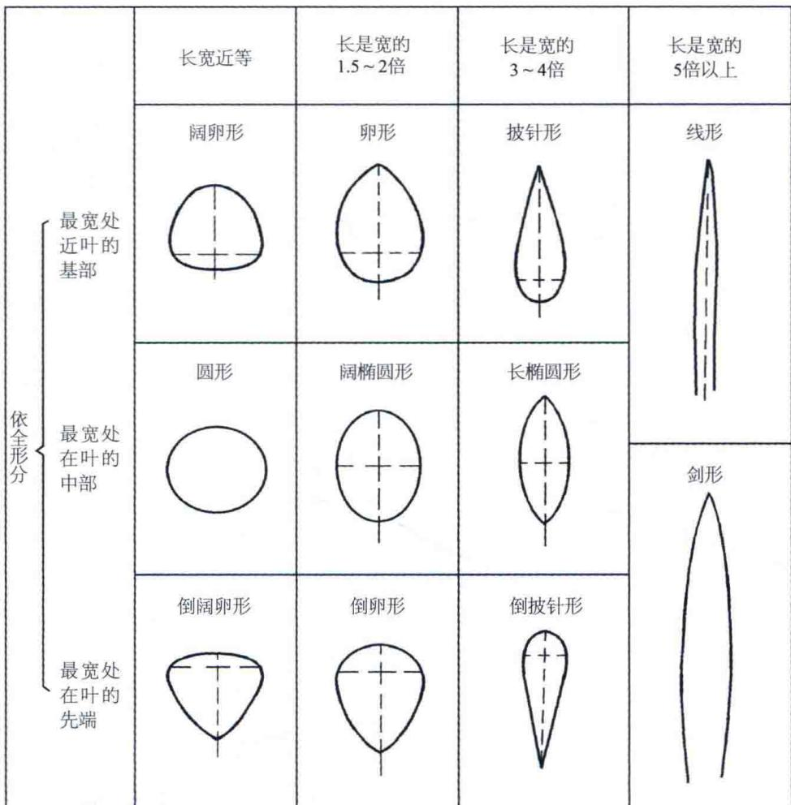  
图5-2 基本叶形

## (一) 叶的形态

## 1. 叶的质地

革质（coriaceous）叶厚韧似皮革，如大叶黄杨（Euonymus japonicus Thunb.）等。

膜质（membranaceous）叶薄而半透明、非绿色，如中麻黄（Ephedra intermedia Schrenk.）。

倒心形

肾形

草质（herbaceous）叶薄而柔软，如陆地棉（Gossypium hirsutum L.）等。

肉质（succulent）叶肥厚多汁，如马齿苋（Portulaca oleracea L.）等。

## 叶形

叶形是指叶片的整体形状。不同植物叶形往往不同，叶形是识别植物的重要依据之一。植物中，叶形近似条形、圆形、椭圆形和卵形的情况很普遍，为了利于区分植物，往往根据叶片最宽处位置及叶的长宽比对这类叶形进行细分，又可分为不同的类型（图5-2、图5-3）。

披针形

长椭圆形

椭圆形

卵形

圆形

菱形

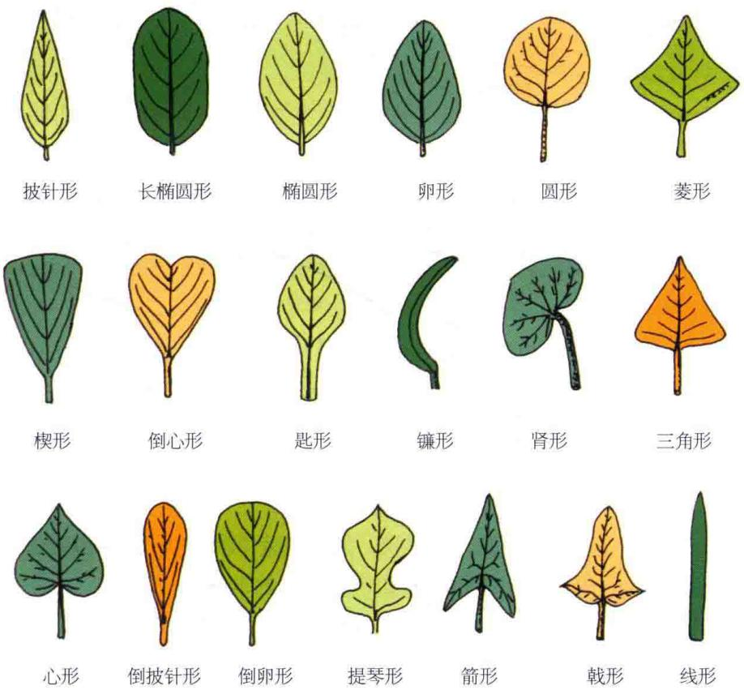  
楔形  
匙形  
镰形  
三角形  
心形  
倒披针形  
倒卵形  
提琴形  
箭形  
戟形  
线形

图5-3 叶的基本类型图解

条形（linear）（线形）和剑形（ensiform）叶的长宽比在5以上，前者叶片厚、硬，如凤尾丝兰（Yucca filamentosa L.），后者叶片薄、软（如小麦），如为宽阔且特别长的条形叶，又可称为带状叶（如玉米）。

圆形（orbicular）、阔椭圆形（broad elliptical）和长椭圆形（long elliptical）叶的最宽处位于中部，叶长是叶宽的1～1.5倍、1.5～2倍和3～4倍。莲（Nelumbo nucifera Gaertn.）多为圆形叶，印度胶树多为阔椭圆形叶，八角（Illicium verum Hook.），多为长椭圆形叶。

阔卵形（broad ovate）、卵形（ovate）和披针形（lanceolate）叶的最宽处位于中部以下偏向叶基，叶长是叶宽的1～1.5倍、1.5～2倍和3～4倍。毛白杨（Populus tomentosa Carr.）多为阔卵形叶，女贞（Ligustrun lucidum Ait.）多为卵形叶，垂柳（Salix babylonica L.）多为披针形叶。

倒阔卵形（broad obovate）、倒卵形（obovate）和倒披针形（oblanceolate）叶的最宽处位于中部以上偏向叶尖，叶长是叶宽的1～1.5倍、1.5～2倍和3～4倍。玉兰叶多为倒阔卵形叶，

凸尖

马齿苋叶多为倒卵形叶，蒲公英（Taraxacum mongolicum Hand.-Mazz.）多为倒披针形、倒长卵形叶，小蘖叶为倒披针形叶。

在具体描述叶形时，有些介于上述标准叶形间的过渡类型，常用复合名称来描述，如卵状披针形是指叶片兼有卵形和披针形的特征，矩圆形是指兼有矩形和椭圆形的特征等。有时植物叶形十分特殊，用其形描述更为准确、便捷，如管形（葱Allium fistulosum L.）、三角形［三角叶蟹甲草Cacalia deltophylla（Maxim.）Mattf.］、箭形（慈姑Sagittaria sagittifolia L.）、戟形（田旋花Convolvulus arvensis L.）、盾形（莲）、肾形［大黄橐吾Ligularia duciformis（C. Winkl.）Hand.-Mazz.］等。

## 叶尖

叶尖（leaf apex）是叶片的先端，其常见的叶尖类型（图5-4）有以下几种。

尾状

芒尖

聚凸

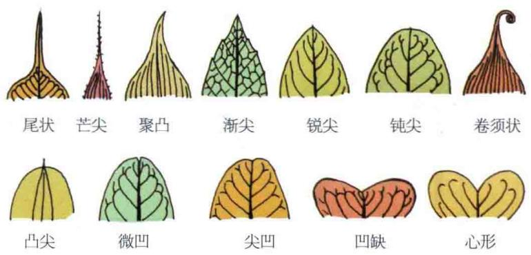  
渐尖  
锐尖  
钝尖  
卷须状  
微凹

图5-4 叶尖类型

尾尖（caudate）叶先端延伸较长，近尾状，如白豆蔻（Amomum kravanh Perre ex Gagnep.）。

骤尖（cuspidate）叶先端突起成短尖，如小叶黄杨的部分叶。

渐尖（acuminate）叶先端为锐角，如杏（Armeniaca vulgaris Lam.）。

锐尖（acute）叶先端为锐角，且叶边缘直顺，如桑（Morus alba L.）。

钝尖（obtuse）叶先端成一钝角或狭圆形，如大叶黄杨。

截形（truncate）叶先端平截，近乎成一直线，如鹅掌楸 [Liriodendron chinense（Hemsl.）Sargent.]。

尖凹（concave）叶先端稍凹入，如黄杨 [Buxus sinica（Rehd.et Wils.）Cheng.]。

倒心形（obcordate）叶先端宽圆且凹入明显，如酢浆草（Oxalis comiculata L.）。

## 叶基

叶基是叶片的基部，其常见的类型（图5-5）有以下几种。

心形（cordate）叶片在叶柄处凹入，叶柄两侧各有一圆裂片，如圆叶牵牛 [Pharbitis purpurea（L.）Voight.]。

耳垂形（auriculate）叶片在叶柄两侧的两个裂片如耳垂状，如油菜（Brassica campestris L.）。

偏斜（oblique）叶片在叶柄两侧的两个裂片大小不等，一侧大，一侧小，如秋海棠（Begonia evansiana Andr.）。

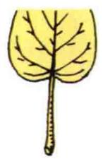  
心形

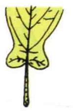  
耳垂形

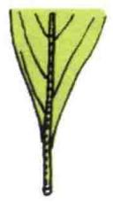  
楔形

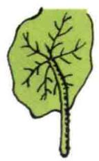  
盾状

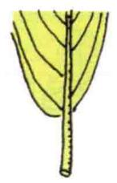  
歪斜

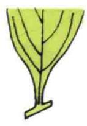  
渐狭

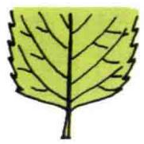  
截形

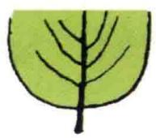  
圆形

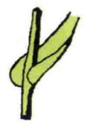  
报茎

  
穿茎

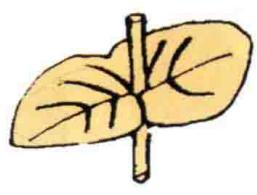  
图5-5 叶基类型  
合生穿茎

楔形（cuneate）叶片在近叶柄处渐变狭，两边一同趋向基部呈楔子状，如垂柳（Salix babylonica L.）。

截形（truncate）叶片在叶柄两侧的叶片平截，近乎成一直线，如有些杨树叶的基部。

圆形（rounded）叶片基部呈半圆形，如苹果（Malus pumila Mill.）。

抱茎（amplexicaul）无叶柄，叶基部的两个裂片围裹着茎，如抱茎苦荬菜（Ixeris sonchifolia Hance.）。

穿茎（perfoliate）无叶柄，叶基深凹，叶基部的两个裂片包围茎后合生，茎似穿叶而过，如金黄柴胡（Bupleurum aureum Fisch.）。

## 叶缘

叶缘指叶片的边缘。叶缘凹凸不齐时，缺陷处称为缺刻，两缺刻之间的部分叶称为裂片（图5-6）。

全缘（entire）叶边缘平整，如玉兰、女贞。

波状（undulate）叶边缘略有凹凸，曲线起伏平缓似波浪，如白菜（Brassica pekinensis Rupr.）。

钝齿状（obtusely serrate）叶缘缺刻明显，齿尖钝圆，如大叶黄杨。

锯齿状（serrate）叶缘缺刻明显，齿尖尖锐、两边不等，向叶尖偏斜，如月季（Rosa chinensis Jacq.）。

牙齿状（dentate）叶缘缺刻明显，齿尖尖锐、两边基本相等，齿尖直向外方，如桑（Morus alba L.）。

重锯齿状（double serrate）叶缘锯齿的边缘又具更小锯齿，如华北珍珠梅 [Sorbaria kirilowii (Regel) Maxim.]。

纤毛状（ciliiform）叶边缘有纤细睫毛状物外伸，如山樱花 [Cerasus serrulata (Lindl.) G. Don ex London.]。

刺芒状（aristate）叶缘有侧脉向外延伸的刺芒，如刺叶冬青（Ilex bioritsensis Hayata.）。

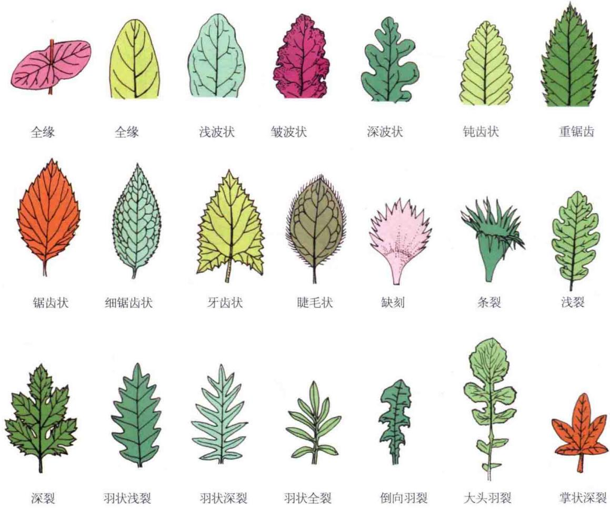  
图5-6 叶缘类型

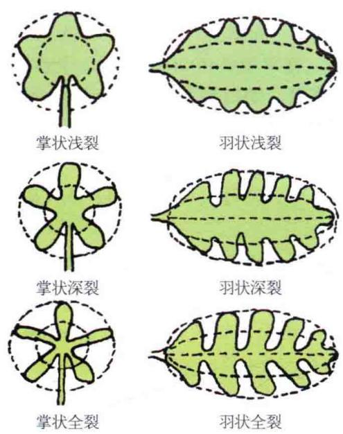  
图5-7 叶裂类型

叶裂指叶缘具有较大缺刻的边缘形态（图5-6、图5-7）。

## 1）叶裂形状

掌状裂（palmate）叶片如手掌状，各裂片或裂片的延伸线在叶柄顶端交汇于一点。

羽状裂（pinnate）叶片如羽毛状，各裂片分别在不同部位与中脉交汇。

## 2）叶裂缺程度

浅裂（lobate）叶裂不超过半个叶片的1/2，如菊花 [Dendranthema morifolium (Ramat.) Tzvel.] 叶羽状浅裂；棉叶掌状浅裂。

深裂（parted）叶裂超过半个叶片的1/2，但未达主脉或叶脉基部，如蒲公英叶羽状深裂；蓖麻叶掌状深裂。

全裂（divided）叶裂深达中脉或叶基，如马铃薯（Solanum tuberosum L.）叶羽状全裂；大麻（Cannabis sativa L.）叶掌状全裂。

通常同种植物的叶形较为相近，但有些植物，同一株植株的叶形差异较大，这种特性称为异形叶（heterophylly）。异形叶的出现，有些与植株发育年龄有关，如人参，第一年所生叶为三出复叶，从第二年起为掌状复叶；有些与环境有关，如慈姑沉水叶为线形，漂浮叶椭圆形，气生叶为箭形；有些与叶在植株上分布的位置有关，如薜荔（Ficus pumila L.）的营养枝上的叶小而薄，卵状心形，而花枝上的叶大而厚，呈卵状椭圆形。

## (二) 叶脉

不同的植物，其叶脉的分布格式，即脉序不同（图5-8）。双子叶植物多具网状脉；单子叶植物多具平行脉、弧形脉、射出脉，偶有网状脉，与双子叶植物具游离脉梢的网状脉不同，其细脉多相互交汇、无脉梢游离，如天南星科（Araceae）、薯蓣科（Dioscoreaceae）的一些植物；裸子植物多具单一主脉；叉状脉多见于蕨类植物，偶见于银杏等种子植物。

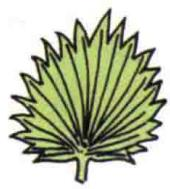  
掌状脉

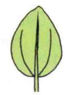  
掌状三出脉

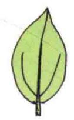  
离基三出脉

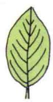  
羽状脉

图5-8 脉序类型  
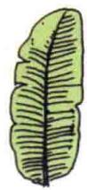  
平行脉

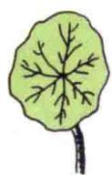  
射出脉

## 1. 网状脉（序）

网状脉（netted venation）的叶脉错综分枝，侧脉与细脉交织呈网状。根据中脉分枝情况的不同又可分为以下几种。

羽状（网）脉（reticulate venation）叶片中部具一条明显主脉，各侧脉自主脉两侧逐渐分出，排列似羽毛，如毛白杨（Populus tomentosa Carr.）、板栗等。

掌状（网）脉（palmate venation）几条近于等粗的叶脉自叶柄顶部发出，叶脉数回分支，排列似掌骨，如南瓜 [Cucurbita moschata (Duch.) Poiret.]、蓖麻等。

三出脉（ternately venation）主脉两侧只产生了一对侧脉。如果分支由主脉基部或近基部生出，则称为基生三出脉，如枣（Ziziphus jujuba Mill.）等；如分支离开主脉基部一段距离生出，则称为离基三出脉，如樟树［Cinnamomum camphora（L.）Presl.］等。

## 平行脉（序）

平行脉（parallel venation）的侧脉粗细相近，彼此大致平行，其分枝细脉可在叶尖或叶缘汇合，但不呈网状。常见于单子叶植物中的条形叶、剑形叶。依据侧脉的形状，又可分为以下几种。

直出平行脉叶的主脉、侧脉均从叶基发出，彼此近平行，直达叶尖汇合，如玉米（Zea mays L.）等。

横出平行脉 侧脉从主脉两侧分别发出，与主脉近垂直；侧脉彼此近平行至叶缘，如粉芭

蕉（Musa paradisiaca L.）等。

弧形脉（arcuate venation）主脉、侧脉从叶基呈明显弧形发出，至叶尖汇合，常见于单子叶植物中宽大的阔椭圆形、卵状椭圆形叶中，如玉簪［Hosta plantaginea（Lam.）Aschers.］等。

射出脉（radiate venation）主脉、侧脉从叶基辐射状发出，常见于单子叶植物中近圆形的叶，如蒲葵（Livistona chinensis R.Br.）等。盾形叶叶脉多为网状脉序，但因其各侧脉由叶柄顶端向四周发出，呈辐射状，又被称为射出脉，如荷花等。

## (三) 叶序

叶在茎上的排列方式称为叶序（phyllotaxy）（图5-9）。常见的有以下几种。

互生（alternate）每节上只着生一张叶，如小麦、大豆（Glycine max Merr.）、棉花等。

对生（opposite）每节上相对着生两张叶，如薄荷（Mentha haplocalyx Briq.）、石竹等。

轮生（whorl）同一个节上着生三张或三张以上的叶，如夹竹桃（Nerium indicum Mill.）等。

簇生（fascicled）三张或三张以上的叶着生于极度缩短的短枝或植株基部密集的节上，如车前（Plantago asiatica L.）等。

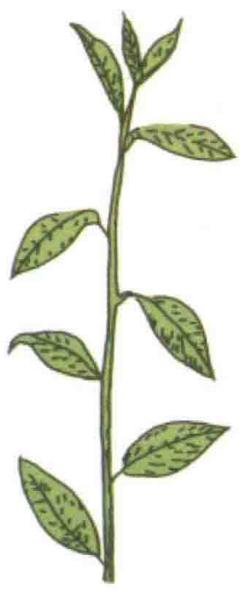  
互生叶序

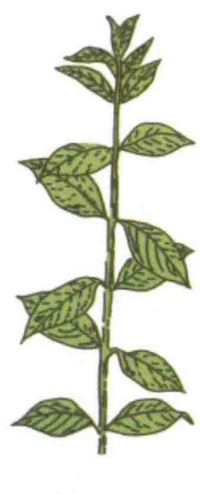  
对生叶序

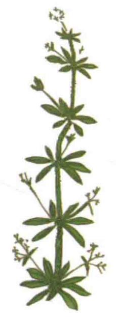  
轮生叶序

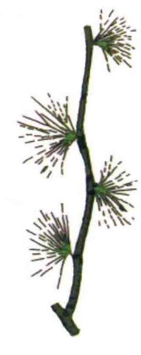  
簇生叶序  
图5-9 叶序类型  
(四) 叶的类型

## 1. 完全叶与不完全叶

具有叶片、叶柄和托叶3部分的叶称为完全叶（complete leaf），如杨树、棉花等；缺少其中任一部分或两部分的称为不完全叶（incomplete leaf），如丁香无托叶、莴苣（Lactuca sativa L.）无叶柄及托叶等。

羽状三出复叶

掌状复叶

## 2. 单叶与复叶

单叶（simple leaf）在一个叶柄上只着生一片叶，如棉花。

复叶（compound leaf）在一个叶柄上着生两片以上的叶。复叶的叶柄称为总叶柄（common petiole），总叶柄上着生的叶称为小叶（leaflet），着生小叶的轴状部分称为叶轴（rachis），如七叶树（Aesculus chinensis Bge.）。

一般认为，复叶由单叶发展演化而来，即单叶经过叶全缘至叶缘有缺刻、叶缘深裂至全裂，且小叶柄出现或小叶与叶轴间关节明显时，便形成了复叶。全裂叶是单叶与复叶的过渡类型，因而有时与复叶界限并不明显，但可根据全裂叶相邻裂片基部存有部分叶缘这一特点来分别。

根据小叶在总叶柄上的排列方式，可将复叶分为羽状复叶和掌状复叶两类（图5-10）。

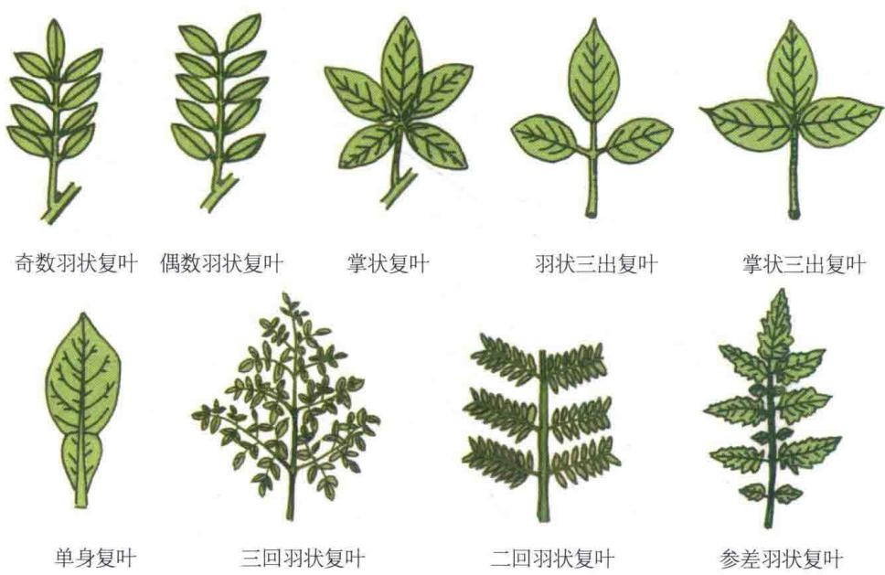  
图5-10 复叶类型

羽状复叶（pinnately compound leaf）3枚以上小叶，在总叶柄两侧相对排列。根据总叶柄分支的情况，复叶可分为以下几种。

一回羽状复叶 总叶柄不分支，小叶直接着生在总叶柄上，如刺槐（Robinia pseudoacacia L.）。

二回羽状复叶 总叶柄分支一次后再着生小叶，如合欢（Albizia julibrissin Durazz.）。

三回羽状复叶 总叶柄分支两次后再着生小叶，如南天竹（Nandina domestica Thunb.）。

根据组成复叶的小叶数目，羽状复叶又可分为奇数羽状复叶（odd-pinnate）和偶数羽状复叶（paripinnate）。

掌状复叶（palmately compound leaf）3枚以上小叶，着生在总叶柄顶端，呈掌状，如七叶树（Aesculus chinensis Bunge.）、人参等。根据总叶柄的分支情况可分为一回掌状复叶、二回掌状复叶等。

三出复叶（ternately compound leaf）3枚小叶着生在总叶柄上，根据3枚小叶叶柄的长短，可将其分为掌状三出复叶（如酢浆草）和羽状三出复叶（如刺桐，Erythrina indica Lam.）。

单身复叶（unifoliate compound leaf）是一种特殊形状的复叶，顶生小叶较大，与总叶柄间关节明显；两侧的小叶退化不存在，叶轴向两侧延展，常呈翅状。单身复叶可能是三出复叶的一退化类型，如柑橘属（Citrus）等植物。

复叶与生有单叶的小枝，叶轴与纤细的茎有时不易区分，识别时应仔细辨认。

## 三、花

## (一) 花冠的类型与特征

## 1. 花冠的类型

花冠的形态多种多样。由于花瓣的离合，花冠筒的长短，花冠裂片的形状和深浅等不同，形成各种类型的花冠（图5-11）。

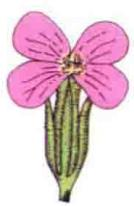  
十字形

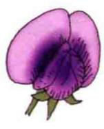  
蝶形

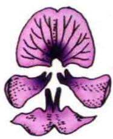

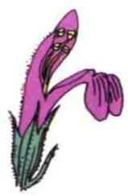  
唇形

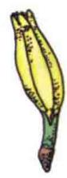  
舌状

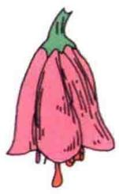  
钟状

  
高脚轮状

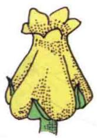  
坛状

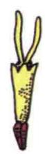  
筒状

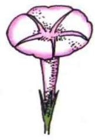  
漏斗状

图5-11 花冠类型

筒状（tubular）花冠大部分联合呈管状或圆筒状，花冠裂片向上伸展，如向日葵（Helianthus annuus L.）的盘花等。

漏斗状（funnel shapped）花冠下部呈筒状，并由基部逐渐向上扩大（或呈喇叭状），如甘薯等。

钟状（campanulate）花冠筒宽而短，上部扩大呈钟形，如南瓜、桔梗［Platycodon grandiflorus（Jacq.）A.DC.]等。

轮状（rotate）花冠筒短，裂片由基部向四周扩展，状如车轮，如番茄（Lycopersicon esculentum Miller.）等。

唇形（labiate）花冠基部筒状，上部略呈二唇形，如芝麻（Sesamun indicium L.）等。

舌状（liguate） 花冠基部呈一短筒，上端向一边张开呈扁平舌状，如向日葵花盘的边花等。

蝶形（papilionaceous）花冠含花瓣5枚，排列成蝶形，最上一瓣最大，称为旗瓣，两侧的两瓣状如翼，称为翼瓣，为旗瓣所覆盖，且较旗瓣小，最下两瓣位于翼瓣之间，其下缘常稍合生，状如龙骨，称龙骨瓣，如豌豆（Pisum sativum L.）等。

十字形（cruciform）花冠由4枚分离的花瓣排列成十字形，如油菜、白菜、萝卜（Raphanusp sativus L.）等。

此外，因为蔷薇科（Rosaceae）植物的花有多种花托类型，花萼、花冠、雄蕊和雌蕊的着生位置差别较大，但其花萼、花冠的形态、大小、数目及其相互关系又基本一致，均为五基数、相互分离，花瓣彼此覆瓦状排列等，因而被一些学者单列为一类，称其为蔷薇花或蔷薇花冠（图5-12）。

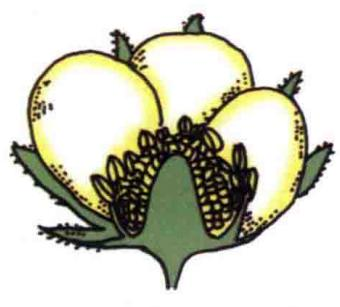

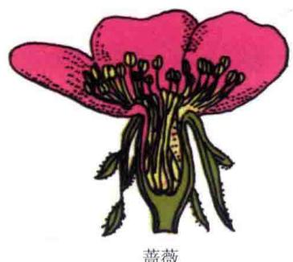

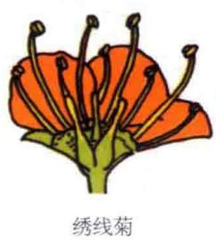

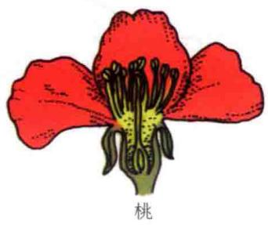

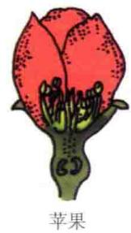  
图5-12 蔷薇花冠

筒状、漏斗状、钟状、轮状以及十字形花冠等的各枚花瓣的形状、大小基本一致，这类花呈辐射对称（radial symmetry）。蝶形、唇形、舌状花冠等至少有一枚花瓣的形状、大小明显与其他花瓣片不同，因此，这类花常呈两侧对称（bilateral symmetry）。也有一些植物的花是不对称的，如美人蕉的花冠位于花萼的上方或内轮，由若干“花瓣”排列为一轮或多轮。

## 花瓣的排列

组成花冠的花瓣数目常因植物种类的不同而不同，花瓣间的排列方式也因种而异，一般在花蕾初放时较为明显，常作为分类的依据。常见的花瓣间的排列方式有镊合状、覆瓦状和旋转状等类型（图5-13）。

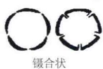

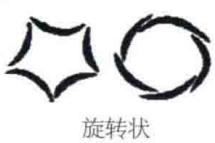

  
图5-13 花瓣的排列方式

镊合状（valvate）花瓣（裂）片边缘彼此互不覆盖，如茄、番茄等。若花瓣（裂）片边缘向内弯则为向内镊合状，若花瓣片边缘向外弯则为向外镊合状。

旋转状（convolute）指花瓣片的一边既覆盖着相邻一枚花瓣片的边缘而另一边又被另一相邻的花瓣片的边缘所覆盖，如棉花、牵牛等。

覆瓦状（imbricate）与旋转状相似，只是花冠中有一枚或两枚花瓣片完全包被在其相邻花瓣的外侧，一枚或两枚花瓣片完全被包被在其相邻花瓣的内侧，如蚕豆（Vicia faba L.）、油菜等。

## （二）雄蕊类型与特征

## 1. 雄蕊的类型

植物种类不同，花中雄蕊的数目、花丝的长短、花药和花丝的分离与联合方式常不同，从而形成不同的雄蕊类型（图5-14）。

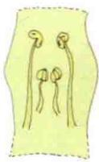  
二强雄蕊

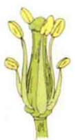  
四强雄蕊

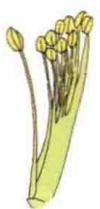  
二体雄蕊

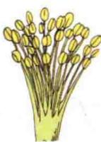  
单体雄蕊

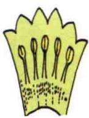  
冠生雄蕊

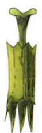  
聚药雄蕊

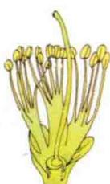  
多体雄蕊

  
离生雄蕊

图5-14 雄蕊类型

单体雄蕊（monadelphous stamen）一朵花中全部雄蕊的花丝联合成一体，花药分离，如棉等。

二体雄蕊（diadelphous stamen）一朵花中有10枚雄蕊，其中9枚雄蕊的花丝联合，另一枚雄蕊单生，呈两束，如蚕豆等；或是10枚雄蕊中，各5枚雄蕊的花丝联合而成2组，如合萌属（Aeschynomene）。

多体雄蕊（polyadelphous stamen）一朵花中雄蕊众多且全部花丝联合成多组，如金丝桃（Hypericum chinense L.）等。

聚药雄蕊（synantherous stamen）一朵花中雄蕊的花药合生，花丝彼此分离，如菊科（Asteraceae）植物。

二强雄蕊（didynamous stamen）一朵花中通常有4枚雄蕊，且2长2短，如唇形科（Lamiaceae）植物。

四强雄蕊（tetradynamous stamen）一朵花中通常有6枚雄蕊，且其花丝4长2短，如十字花科（Brassicaceae）植物。

冠生雄蕊一朵花中雄蕊花丝的一部分与花瓣或花冠筒部合生，如泡桐等。

离生雄蕊一朵花中雄蕊彼此分离，仅以花丝基部与花托相连，如蔷薇科（Rosaceae）植物。

## 花药的着生方式

花药位于花丝顶端，呈囊状膨大且花粉粒在其中发育成熟。花药通过花丝与花托相连（图5-15）。花药在花丝上的着生方式也有不同类型。

背着药 全着药

基着药

  
个字药  
丁字着药  
广歧药  
孔裂  
瓣裂  
纵裂

图5-15 花药的着生与开裂方式

基着药（basifixed anther）花药仅以其基部着生于花丝的顶端，如望江南（Cassia occidentalis L.）、唐菖蒲（Gladiolus hybridus Hort.）等。

背着药（dorsifixed anther）花药背部与花丝相连，如苹果（Malus pumila Mill.）、油菜等。

丁字药（versatile anther）花药以其背部的中部与花丝相连，如小麦、百合等。

个字药（divergent anther）花药以其上部与花丝相连，且其中下部张开时呈“个”字形，如凌霄［Campsis grandiflora（Thtlnb.）Loisel.］等。

广歧药（divaricate anther）花药平展，仅顶部与花丝相连，如地黄［Rehmannia chingii（Gaert.）Libosch.］等。

全着药（adnate anther）花丝短粗、花药整体着生于花丝上，如莲、玉兰等。

## 花药开裂的方式

花药成熟后开裂传粉，其开裂方式主要有（图5-15）以下几种。

纵裂（longitudinal split）药室纵长开裂，为最常见的花药开裂方式，如小麦、油菜等。

孔裂（poricidal）药室顶端开孔花粉散出，如马铃薯、杜鹃（Rhododendron simsii Planch.）等。

瓣裂（valvate）药室有2个或4个瓣状盖，瓣盖打开时花粉散出，如小檗（Berberis julianae Schneid）、樟等。

## （三）雌蕊（群）的类型与特征

## 雌蕊的类型

由于组成雌蕊的心皮数目和心皮间离、合情况不同，雌蕊常分为下列3种类型（图5-16）。

单雌蕊（monogynous）一朵花中只有一个心皮构成的雌蕊称为单雌蕊，如豆类、桃、李、梅等。

离生单雌蕊（apocarpous gynoecium）一朵花中有多个彼此分离的单雌蕊，如八角（Illicium verum Hook.）、草莓和毛茛（Ranunculus japonicus Thunb.）等。

复雌蕊（compound pistil）一朵花中只有一个由两个以上心皮合生成的雌蕊称为复雌蕊，如油菜、茄、棉花等。复雌蕊中，有的子房合生，花柱、柱头分离，如梨等；有的子房、花柱合生，柱头分离，如向日葵等；也有的子房、花柱、柱头全部合生，柱头呈头状，如油菜等。组成复雌蕊的心皮数目，常和花柱、柱头、子房室数呈正相关。

  
图5-16 雌蕊类型

正确判断雌蕊的类型和组成雌蕊的心皮数目在植物分类和物种鉴别中很有意义。一个复雌蕊的心皮数目，常与花柱、柱头、子房室、果皮上的沟、棱数成正比。可借此判断复雌蕊的心皮数目。

## 子房的位置

子房着生在花托上，它与花托的连接方式存在很大差异，同时与花萼、花冠、雄蕊群的相对位置也因植物种类不同而有变化（图5-17）。

  
上位子房下位花

  
上位子房周位花

  
半下位子房下位花

  
下位子房上位花

图5-17 子房的位置

上位子房（superior ovary）又称为子房上位，子房仅以其基部与花托相连，花的其余部分均不与子房相连。子房上位又可分为以下三种情形：

（1）上位子房下位花（superior hypogynous flower）子房仅以其基部与花托相连，花被与雄蕊着生的位置低于子房，如油菜，玉兰等。

（2）上位子房周位花（superior perigynous flower）子房仅以其基部与杯状花托底部相连，花被与雄蕊着生于杯状萼筒的上沿边缘，即子房的周围，如桃、李等。

（3）半下位子房（half inferior ovary）又称为子房半下位或中位，子房的下半部陷生于花托中，并与花托愈合，子房上半部仍外露，花的其余部分着生在子房周围花托的边缘，故也称为周位花，如菱、马齿苋等。

下位子房（inferior ovary）又称为子房下位，整个子房埋于下陷的花托中，并与花托愈合，花的其余部分均着生在子房上方花托的边缘，故也称为上位花，如南瓜、苹果等。

## 胎座的类型

在雌蕊的子房内，胚珠着生的部位称为胎座（placenta）。由于心皮的数目和连接方式以及胚珠着生的部位不同，形成了不同的胎座类型（图5-18）。

边缘胎座（marginal placentation）单心皮，子房一室，胚珠着生于腹缝线上，如豆类。

  
边缘胎座

  
侧膜胎座

  
中轴胎座

  
特立中央胎座

  
顶生胎座

图5-18 胎座类型  
  
基生胎座

侧膜胎座（parietal placentation）两个以上的心皮所构成的一室子房或假数室子房，胚珠着生于心皮的边缘，如油菜、白菜、南瓜、黄瓜、番木瓜等。

中轴胎座（axile placentation）多心皮构成的多室子房。心皮边缘于子房中央形成中轴，胚珠生于中轴上，如棉花、柑橘等。

特立中央胎座（free central placentation）多心皮构成的一室或不完全数室子房，子房腔的基部向上有一个中轴，但不到达子房顶，胚珠着生于此轴上，如石竹科植物。

基生胎座（basal placentation）和顶生胎座（apical placentation）胚珠生于子房室的基部或顶部，前者如菊科植物，后者如瑞香科（Thymelaeaceae）植物。

## 胚珠的类型

常见的胚珠有以下几种类型（图5-19）。

  
直立胚珠

  
倒生胚珠

  
横生胚珠

  
弯生胚珠

图5-19 胚珠的类型

（1）直生胚珠（atropous ovule或orthotropus ovule）胚珠各部分均匀生长，整个胚珠直立地着生于珠柄，珠孔、珠心、合点和珠柄处于同一直线上，如荞麦（Fagopyrum esculentum Moench.）、胡桃等。

(2) 倒生胚珠 (anatropous ovule) 胚珠一侧生长快, 另一侧生长慢, 胚珠向生长慢的一侧倒转约 $180^{\circ}$ , 合点、珠心和珠孔的连接线成一直线; 珠心不弯曲, 珠孔朝向胎座, 合点在珠柄相对的一侧, 靠近珠柄一侧的外珠被常与珠柄贴生, 形成一条珠脊, 向外隆起, 如稻、麦、百合、棉等大多数被子植物。

（3）弯生胚珠（campylotropous ovule）胚珠的下半部生长较均匀，上半部向生长慢的一侧弯曲，胚囊亦一定程度弯曲，珠孔向珠柄方向下倾，如油菜、蚕豆、扁豆等。

（4）横生胚珠（hemianatropous ovule）胚珠的一侧生长较快，胚珠在珠柄上扭转约90°，珠孔、珠心和合点的连接线与珠柄几乎垂直，如锦葵等。

## (四) 花程式与花图式

花程式（flower formula）是指用字母、符号及数字等来表示花的形态组成、位置和排列等特征的关系式；花图式（flower diagram）是指用花器官各部分的横断面结构简图来表示花结构与组成的数目、排列、分离与联合情况的示意图。

## 1. 花程式

花的各组成部分用一定的字母来代表，通常用K（或Ca）代表花萼（kalyx），用C（Co）代表花冠（corolla），用A代表雄蕊群（androecium），用G代表雌蕊群（gynoecium），用P代表花被（perianth）。花各部分的数目可用数字来表示，如果该部分缺少时，就用“0”表示；数目很多或不定数，就用“∞”来表示，并把它们写于代表各部字母的右下角处。如果某部分在一轮以上时，就用“+”来表示，如果某一结构的各组成部分相互联合，就用“（）”来表示。子房的位置可以在雌蕊的字母G下方加一横线表示上位子房G，在字母G上方加一横线表示下位子房G，上下方各添加一横线则表示半下位子房G。同时在心皮数目的后面用“：”号隔开的数字表示子房室的数目。

辐射对称花用 “\*” 表示，两侧对称花用 “↑” 表示，♀表示雌花，♂表示雄花，♂表示两性花，书写在花程式的前边。现分别举例说明。

百合花花程式是 $\varphi^{*} P_{3+3} A_{3+3} G_{(3:3)}$ ，其含义表示：百合花为两性整齐花，花被6数，列为2轮，各轮3枚；雄蕊群由6枚雄蕊组成，2轮排列，每轮3枚；雌蕊群为由3心皮合生而成的复雌蕊，子房上位、3室。

蚕豆花花程式是 $\varphi \uparrow K_{(5)}C_{1 + 2 + (2)}A_{(9) + 1}\underline{G}_{1:1:\infty}$ ，其花程式表示：蚕豆花是两性两侧对称（不整齐）花；花萼萼片5枚合生；花冠由5枚花瓣组成，其中旗瓣1片，翼瓣2枚离生，龙骨瓣2枚合生；雄蕊群有雄蕊10枚，其中9枚合生，1枚分离；雌蕊子房上位、一心皮一室。

## 2. 花图式

把花的结构组成用其横切面简图等表示其数目、分离与联合及其排列位置关系的简图称花图式（图5-20）。花图式的表示：用一黑圈表示花着生的花轴，用空心的弧线表示苞片，用带有线条的弧线表示花萼。由于花萼的中脉明显，故弧线的中央部分向外隆起突出。实心的弧线表示花瓣，雄蕊和雌蕊分别用花药和子房的横切面轮廓表示。花图式由外而内依次为苞片、花萼、花冠、雄蕊（群）和雌蕊（群）。萼片间、花瓣间、雄蕊间，以及雄蕊与花瓣等的相互连合以线段连接彼此的边缘（图5-20）。

  
图5-20 花图式

## 四、花序的类型与特征

## (一)有限花序

有限花序（definite inflorescence），又称离心花序（centrifugal inflorescence）、聚伞花序（cyme），其花序顶端或中心的花先发育、先成熟、先开花，渐及下边或周围的花后开（图5-21）。由于顶花先开，限制了花序轴的继续伸长。常见的有限花序类型有四种。

  
图5-21 部分有限花序类型

## 1. 单歧聚伞花序（monochasium）

花序主轴顶端先生一花，然后在顶花下的一侧形成侧枝，继而侧枝的顶端又生一花，如此依次生花、开花，形成合轴分支的花序。这样的花序有蝎尾状聚伞花序（scorpiod cyme），各分支为左右间隔生长，如唐菖蒲、美人蕉等；卷伞花序（bostrix），各分支朝向一个方向，如聚合草、附地菜等。

## 2. 二歧聚伞花序（dichasium）

在某些具有对生叶序的植物中，顶花下的花序主轴向两侧各生一支，分支的顶花下再生出两个分支，如此反复分支，且均是顶花先开的花序，如繁缕等。

## 3. 多歧聚伞花序（pleiochasium）

花序轴的顶端发育出一朵花后，紧接其下的主轴再分出3个以上的分支，且各个分支又如此发育出顶花和分支的花序，如泽漆等。

## 4. 轮伞花序（verticillaster）

在唇形花科植物中，对生叶序的叶腋内各生出3朵以上的花所共同组成的一类花序，如益母草等。

## (二) 无限花序

无限花序或称向心花序、总状类花序，其花序的特征是花轴下部的花先发育、先成熟、先开花，渐及上部，或其边缘的花先发育、先成熟、先开，渐及其中心的花开放。常见的无限花序（图5-22）有以下几种。

  
图5-22 无限花序类型

## 1. 总状花序（raceme）

组成总状花序的花有花梗，排列在一不分支且较长的花轴上，花轴能继续伸长，如珍珠菜（Lysimachia clethroides Duby）等。

## 2. 穗状花序（spike）

穗状花序和总状花序相似，只是花无梗，如车前、大麦。穗状花序轴能持续膨大的花序，称为肉穗花序，其基部常有总苞，如玉米的雌花序和红掌（Anthurium andraeanum Lind.）等。

## 3. 柔荑花序（catkin,ament）

若干单性花排列于一细长、柔软的花轴上，花序通常下垂，花后整个花序或连果实一起脱落，如杨、柳等。

## 4. 圆锥花序（panicle）

花序轴上生有多个总状或穗状花序，形似圆锥，即复合的总状或穗状花序，如水稻或玉米的雄花序等。

## 5. 伞房花序（corymb）

花有梗，排列在花轴的近顶部，下边的花梗较长，向上渐短，花位于一近似的平面上，如麻叶绣线菊（Spiraea cantoniensis Lour.）、山楂等。由几个伞房花序排列在花序总轴的近顶部的花序称为复伞房花序，如华北绣线菊（S. fritschiana Schneid.）。

## 6. 伞形花序（umbel）

花梗近等长或不等长，均生于花轴的顶端，状如张开的伞，如红瑞木（Swida alba Opiz.）等。几个伞形花序生于花序轴的顶端者称为复伞形花序，如胡萝卜、人参等。

## 7. 头状花序（capitate）

花近无梗，集生于一平坦或隆起的总花轴（花序轴）上，而成一头状体，如菊科植物。

## 8. 隐头花序（hypanthodium）

花集生于肉质囊状的总花序轴内壁上，如无花果（Ficus carica L.）等。

在自然界中，花序的类型比较复杂，有些植物是有限花序和无限花序混生的。例如，葱是伞形花序，但中间的花先开，又有聚伞花序的特点。水稻是圆锥花序，但开花的顺序也具有聚伞花序的特点。

## 五、果实的类型与特征

根据果实发育的来源或结构组成，一般将果实分为单果、聚合果和复果等类型。

## (一) 单果

由一朵花中的一个单雌蕊或复雌蕊参与形成的果实称为单果。根据果实成熟时的质地和结构，可将单果分为肉果（fleshy fruit）和干果（dry fruit）两类。

## 1. 肉果

肉果肉质多汁，常见的肉果（图5-23）有以下几种。

  
浆果（番茄）

  
瓠果（黄瓜）

  
柑果（温州蜜柑）  
梨果（苹果）

  
核果（桃）

图5-23 单果之肉果的主要类型

浆果（berry）由复雌蕊的上位子房或下位子房发育而来。浆果的外果皮薄，中果皮、内果皮和胎座均肉质化，浆汁丰富，含一至多粒种子。例如，由上位子房发育来的浆果，如番茄、葡萄、柿等，由下位子房形成的浆果，如香蕉、瓜类等。

核果（drupe）具有坚硬果核的一类肉果。由单雌蕊或复雌蕊的上位子房或下位子房发育而来。核果的外果皮薄，中果皮厚，多肉质化，内果皮石质化，由石细胞构成硬核，常含一粒种子，如桃、梅、李、杏等是由单心皮的上位子房发育成的核果，而胡桃（Juglans regia L.）则是由2心皮的下位子房发育成的核果。

柑果（hesperidium）柑橘类植物特有的一类肉果，由复雌蕊具中轴胎座的上位子房发育而成。柑果的外果皮厚，外表革质，其内分布许多油囊；中果皮较疏松，具多分枝的维管束；内果皮膜质，其内表皮上生众多的囊状多浆的毛状体，为食用的部分。

梨果（pome）由花萼筒和子房联合发育而成的假果。通常花萼筒参与形成果皮，且外果皮薄、中果皮厚而肉质化，内果皮常革质，如苹果、梨等。

瓠果（pepo）由下位子房发育而成的假果，花托和外果皮发育成坚硬的果壁，中果皮、内果皮肉质，侧膜胎座常较发达，如葫芦科植物。

## 2. 干果

干果成熟时果皮干燥。开裂的干果称裂果（dehiscent fruit）（图5-24），不开裂的干果称闭果（indehiscent fruit）（图5-25）。

荚果（豌豆）

长角果（油菜）

双悬果（分果）

图5-24 单果之裂果的主要类型  
  
瘦果（荞麦）

  
瘦果（向日葵）

  
翅果（槭树）

  
翅果（榆树）

  
坚果（板栗）

  
颖果（玉米）

图5-25 单果之闭果的主要类型

## (1) 裂果

蒴果（capsule）由复雌蕊发育而来，具多粒种子的一类开裂干果。不同植物的蒴果成熟时的开裂方式可能不同，常见的有：室背开裂，即沿心皮的背缝线裂开，如棉、百合、鸢尾等；室间开裂，即沿心皮相接处的隔膜裂开，如烟草等；室轴开裂，即果皮外侧沿心皮的背缝线或腹缝线相接处裂开，但中央的部分隔膜仍与轴柱相连而残存，如牵牛、曼陀罗等；盖裂，即果实中上部环状横裂成盖状脱落，如马齿苋、车前等；孔裂，即果实成熟时，每一心皮顶端裂一小孔，以散发种子，如虞美人、金鱼草等。

荚果（legume）由单雌蕊发育成的果实。荚果成熟时，果皮裂成两瓣，如大豆等。

角果（silicle silique）由2个心皮联合发育、具假隔膜且为侧膜胎座的果实。角果成熟时，果皮沿腹缝线处开裂，假隔膜留存，如十字花科植物的果实。

分果（schizocarp）由2枚或2枚以上心皮构成的复雌蕊的子房发育而成，具2个或数个子室。果实成熟时，子室分离成若干各含一粒种子的分果瓣，仍属不裂干果。胡萝卜、芹菜等的分果由2枚心皮构成的下位子房发育而成，成熟时分离为2个分果瓣，分悬于中央果柄的上端，常称为双悬果，双悬果为伞形科植物的主要特征之一。苘麻等的果实是由多个心皮组成的果实，成熟时可分为多个分果瓣。

蓇葖果（follicle）由离生单雌蕊发育而来的果实，成熟时，沿一条缝线裂开（背缝线或腹缝线），如飞燕草、梧桐等。

## (2) 闭果

瘦果（achene）瘦果可由1～3个心皮组成的上位子房或下位子房发育而来，内含一粒种子。成熟时，果皮革质或木质，容易与种子分离。1心皮瘦果，如白头翁，2心皮瘦果，如向日葵，3心皮瘦果，如荞麦。

颖果（cariopsis）禾本科植物特有的果实类型。由2～3个心皮组成，含一粒种子，果皮和种皮愈合，不能分离，如小麦、玉米等的果实。

坚果（nut）通常由复雌蕊发育而成，含1粒种子且果皮坚厚的一种不裂干果，如板栗、栓皮栎等。

翅果（samara）由单雌蕊或复雌蕊的上位子房形成的一种不裂干果。果皮的一部分向外扩延成翼翅，如枫杨（Pterocarya stenoptera DC.）、榆树（Ulmus pumila L.）等的果实。

## (二) 聚合果

聚合果（aggregate fruit）是指在一朵花中，由离生单雌蕊分别独立发育而成的果实类型。即每一离生雌蕊各发育成一个单果（小果），根据组成聚合果的单果类型可将其分为聚合瘦果（如草莓等）、聚合核果（如悬钩子等）、聚合坚果（如莲等）和聚合蓇葖果（如八角、梧桐、芍药）等（图5-26）。

  
图5-26 聚合果类型

图5-27 复果（聚花果）  

## (三) 复果

复果（multiple fruit）又称为聚花果，是由整个花序发育而成的果实类型。例如，桑葚来源于一个雌花序，各花的子房发育成一小坚果，包藏于肥厚多汁的花萼内。菠萝的果实是由许多花聚生在肉质花轴上发育而成。无花果是由隐头花序发育而成的果实类型，其肉质花序轴内陷成球囊状，囊的内壁上着生若干小坚果（图5-27）。

## 第二节 | 被子植物的分类原则

已有的植物化石研究资料表明，被子植物似乎是在距今1.4万年前的白垩纪突然同时兴起的。现行被子植物的分类，在参照零星的化石资料的同时，主要根据现存被子植物的形态学特征，尤其是花和果实的形态学特征，有时也参照植物的解剖结构等的特点来进行分类。近几十年来，染色体的形态、组成和数目、生物化学成分和分子系统学的研究成果，对被子植物某些科、属的分类和系统位置的明晰起到重要作用，更有利于反映出植物间的亲缘关系。

根据多数学者的观点，被子植物的形态结构与生理功能，特别是花和果实向着更加经济、高效、适应多种环境、有利于传宗接代和种族繁衍的方向演化发展，由此总结出了有关被子植物特征性状的一般演化规律和分类原则（表5-1）。

表5-1 被子植物特征性状演化的一般规律

<table><tr><td>项目</td><td>初生的、原始的性状</td><td>次生的、较进化的性状</td></tr><tr><td>茎</td><td>1. 木本2. 直立3. 无导管只有管胞4. 具环纹、螺纹导管5. 同心维管束</td><td>1. 草本2. 缠绕3. 有导管4. 具梯纹、网纹、孔纹导管5. 散生维管束</td></tr><tr><td>叶</td><td>6. 常绿7. 单叶、全缘8. 互生(螺旋状排列)</td><td>6. 落叶7. 叶形复杂化、有各种缺刻、复叶8. 对生或轮生</td></tr><tr><td>花</td><td>9. 花单生10. 有限花序11. 两性花12. 雌雄同株13. 花部呈螺旋状排列14. 花的各部多数而不固定15. 花被同形,无花萼、花冠之分16. 花部离生(离瓣花、离生雌蕊、离生心皮)17. 整齐花18. 虫媒花19. 子房上位20. 花粉粒具单沟21. 胚珠多数22. 边缘胎座、中轴胎座</td><td>9. 花组成花序10. 无限花序11. 单性花12. 雌雄异株13. 花部呈轮状排列14. 花的各部数目不多,有定数(3、4或5)15. 有萼片和花瓣分化,单被花或无被花16. 花部合生(合瓣花、具有各种形式结合的雄蕊、合生心皮)17. 不整齐花18. 风媒花19. 子房下位20. 花粉粒具3沟或多个萌发孔21. 胚珠少数、定数22. 侧膜胎座、特立中央胎座</td></tr><tr><td>果实</td><td>23. 聚合果、单果24. 真果</td><td>23. 聚花果24. 假果</td></tr><tr><td>种子</td><td>25. 有胚乳26. 胚小,直伸,子叶2枚</td><td>25. 无胚乳,子叶储藏营养物质26. 胚弯曲或卷曲,子叶1枚</td></tr><tr><td>生活型</td><td>27. 多年生28. 绿色自养植物</td><td>27. 一年生28. 寄生、腐生植物</td></tr></table>

应当指出，不能简单地根据植物的某一性状来判断植物的进化地位，应当联系各种性状综合地加以分析。因为某种植物的各种性状在演化上并不是同步的，往往同一植物体上有的为进化性状而有的却保留着原始的性状。例如，苹果下位子房是进化的，雄蕊多数则是原始的。再如，对于一般植物而言，两性花、胚珠多数、胚小是原始的性状，而在兰科植物中却是进化的标志。

## 第三节 被子植物的分科概述

按照克朗奎斯特系统（参见第四节）被子植物分为双子叶植物纲（Dicotyledoneae）（木兰纲，Magnoliopsida）和单子叶植物纲（Monocotyledoneae）（百合纲，Liliopsida）两个纲，它们的主要区别如表5-2所示。

表5-2 双子叶植物纲与单子叶植物纲的主要特征比较

<table><tr><td>项目</td><td>双子叶植物纲(木兰纲)</td><td>单子叶植物纲(百合纲)</td></tr><tr><td>胚</td><td>具2片子叶(极少数1片、3片或4片)</td><td>仅含1片子叶(或有时胚不分化)</td></tr><tr><td>根</td><td>主根发达,多为直根系</td><td>主根不发达,须根系</td></tr><tr><td>茎</td><td>维管束作环状排列,具形成层,有次生生长和次生结构</td><td>维管束散生或呈环状排列,无形成层,无次生生长和次生结构</td></tr><tr><td>叶</td><td>具网状脉</td><td>具平行脉或弧形脉</td></tr><tr><td>花</td><td>花部常5或4基数,花粉粒具3萌发孔</td><td>花部常3基数,花粉粒具单个萌发孔</td></tr></table>

实际上，上述这些特征的区别只是相对的、综合的，有些特征常有交错现象。例如，双子叶植物中的毛茛科中有具1枚子叶、须根系、维管束散生的植物，单子叶植物天南星科、百合科等的某些植物的叶具网状脉，以及双子叶植物木兰科和单子叶植物禾本科的花粉都具有单个萌发孔等。

## 一、双子叶植物纲

## (一)木兰目 (Magnoliales)

木本，单叶，托叶有或无。花常两性，单生或为聚伞花序，花托显著，花部螺旋状排列至轮状排列；虫媒花；花被多为3基数；雄蕊常为多数，向心发育；心皮多数离生或少至1个。胚乳丰富，胚小。花粉单（沟）孔、无孔（沟）或双孔。有的属种无导管。本目有10科3000种，我国有木兰科（Magnoliaceae）、八角科（Illiciaceae）、五味子科（Schisandraceae）、水青树科（Tetracentranceae）、番荔枝科（Annonaceae）等8科。

木兰科（Magnoliaceae）\* $\phi$ P $_{6\sim 15}$ A $_{\infty}$ G $_{\infty :1}$

主要特征：木本。单叶互生，全缘，托叶包被芽，早脱落，枝具环状托叶痕；花单生；两性，辐射对称，常同被；雄蕊及雌蕊多数、分离、螺旋状排列于柱状花托上，子房上位。聚合蓇葖果穗状，稀为翅果；种子有胚乳。

木兰科共有15属，约335种，分布于亚洲的热带和亚热带地区，少数在北美洲南部和中美洲。我国有11属，165种，主产于华南和西南。

木兰科是现存被子植物中最原始的类群之一，有不少是孑遗种，且处于濒危或稀有状态，已被列入国家重点保护植物名录。重要属有木兰属、含笑属、木莲属和鹅掌楸属。

木兰属（Magnolia）托叶与叶柄联合；花大、顶生，花被多轮，雌蕊群、雄蕊群紧接；蓇葖果，背缝开裂。常见植物有：玉兰（M. denudata Desr.），落叶乔木，早春开花，先花后叶，花白色。各地均有栽培供庭院观赏，花蕾药用（图5-28）。紫玉兰（辛夷）（M. liliflora Desr.），落叶小乔木，花紫色或紫红色。各地栽培供观赏。广玉兰（洋玉兰、荷花玉兰）（M. grandiflora L.），叶常绿革质，下表皮密被锈色绒毛，花大，白色芳香。原产北美洲，为著名庭院观赏树种。厚朴（M. officinalis Rehd. et Wils.），落叶乔木，叶大、顶端圆，集生枝顶。我国特产，分布于长江流域及华南。树皮、根皮、花、果及芽含厚朴酚可入药。凹叶厚朴 [M. officinalis subsp. biloba（Rehd. et Wils.）Cheng et Law.]，叶二裂，产我国东南各省，药用。

  
图5-28 木兰科

本科其他重要的属种有如下几种。含笑属（Michelia）：常绿乔木或灌木，托叶与叶柄分离，花单生叶腋，常不满开，有雌蕊群柄。常见的植物有含笑花［M. figo（Lour.）Spreng.］、白兰花（M. alba DC.）和黄兰（M. champaca L.）等。鹅掌楸属（Liriodendron）：落叶乔木，叶分裂，先端截形，具长柄，翅果不开裂。白垩纪至第三纪广布于北半球，现仅存2种，如北美鹅掌楸（百合木）（L. tulipifera L.）和鹅掌楸（马褂木）［L.chinensis（Hemsl.）Sarg.］，为世界珍贵观赏树木。

## (二) 樟目 (Laurales)

木本，具芳香油细胞。单叶全缘，常互生，无托叶；虫媒花，花3基数；花被同形，离生；花药瓣裂；雌蕊1～2个，仅1个成熟，常为核果；内胚乳有或无。本目共有8科2500余种，我国有樟科（Lauraceae）和腊梅科（Calycanthaceae）等。

樟科（Lauraceae）\* $\phi$ P $_{3+3}$ A $_{3+3+3+3}$ G (3:1)

主要特征：木本，具油腺，单叶互生，革质全缘，无托叶，三出脉或羽状脉。花两性整齐3基数，轮状排列，花药瓣裂；子房上位，1室；核果。种子无胚乳。

本科约45属，2000余种，主产热带和亚热带。我国产24属，430余种，多产于长江流域及以南各省。樟科植物为我国南部常绿阔叶林的主要树种。

樟属（Cinnamomum）叶常为3出脉，发育雄蕊3轮，基部有腺体，圆锥花序，萼常脱落。樟 [C.camphroa（L.）Pres. ]，叶离基3出脉，脉腋具腺体，主产长江以南，为重要用材和绿化树种，其木材及根可提取樟脑，枝、叶、果可提樟油（图5-29）。

本科还有许多是优良的材用、油料和药用树种。例如，楠属（Phoebe）的浙江楠（P. chekiangensis C.B.Shang）和闽楠［P. bournei（Hemsl.）Yang.］均为国家二级保护植物，材质优良；润楠属（Machilus）的多种植物和檫木［Sassafras tzumu（Hemsl.）Hemsl.］等均为优良的材用树种，肉桂（Cinnamomum cassia Presl）的树皮为著名的药材和调料，山苍子［Litsea cubeba（Lour.）Pers.］和山胡椒［Lindera glauca（Sieb. et Zucc.）Bl.］的花、叶、果可提取芳香油，乌药［Lindera aggregata（Sima）Kosterm.］的根入药。

  
图5-29 樟科（樟树）

## (三) 毛茛目 (Ranales)

常为草本或藤本，罕为灌木。花两性或单性，多为辐射对称，少数两侧对称，双被或单被；雄蕊多数、分离，螺旋状排列或定数而与花瓣对生；心皮多数，离生，螺旋状排列或轮生；种子胚乳丰富。

本目包括小檗科（Berberidaceae）、大血藤科（Sargentodoxaceae）、毛茛科（Ranunculaceae）、木通科（Lardizabalaceae）、防己科（Menispermaceae）、马桑科（Coriariaceae）和清风藤科（Sabiaceae）等8科。

$$
\text {毛茛科(Ranunculaceae)} * \text {♂} \uparrow \mathrm{K} _ {3 - \infty} \mathrm{C} _ {3 - \infty} \mathrm{A} _ {\infty} \mathrm{G} _ {\infty - 1}
$$

主要特征：草本；花两性，整齐，多为5基数，花萼和花瓣均离生；雄蕊和雌蕊多数、离生、螺旋状排列于膨大突起的花托上；子房上位；聚合瘦果或聚合蓇葖果。

毛茛科有50属，2000多种，广布世界各地，多见于北温带与寒带。我国有43属，700余种。本科植物含有各种生物碱，故有许多有毒植物、药用植物和农药植物。

毛茛属（Ranunculus）直立草本，叶互生，花黄色或白色，花瓣基部常有蜜腺，聚合瘦果。本属约600种，我国有80余种，南北均产。毛茛（R. japonicus Thunb.），基生叶3深裂，植株密被白色柔毛，聚合果近球形，广布于我国各地，生于沟边和田边。全草外用为发泡药，可治疗疟疾、关节炎，也可作土农药（图5-30）。茴茴蒜（R. chinensis Bunge.），基生叶为三出复叶，植株被长硬毛。全草含原白头翁素，有毒，供药用。石龙芮（R. sceleratus L.），植株近无毛，叶3深裂，每裂片再3～5浅裂，聚合果呈长圆形，生沟边湿地。全株有毒，入药能散淤化结，嫩叶捣汁可治恶疮痈肿，也治毒蛇咬伤。

  
花果枝  
图5-30 毛茛科（石龙芮）

本科其他重要的属种有如下几种。铁线莲属（Clematis）：攀缘草本或木质藤本，羽状复叶对生，萼片花瓣状，瘦果集成头状，具宿存的羽毛状柱头，如毛蕊铁线莲（C. lasiandra Maxim）等。其他，如黄连属（Coptis）的黄连（C. chinensis Franch），根状茎黄色，可提取黄连素，可治疗肠炎、痢疾等症。乌头属（Aconitum）的乌头（A. carmichaeli Debx.），块根即中药乌头，入药能祛风镇痛，子块根经炮制为中药“附子”，有回阳补火，散寒除湿之效。此外，侧金盏花属（Adonis）、升麻属（Cimicifuga）、唐松草属（Thalictrum）、金莲花属（Trollius）、白头翁属（Pulsatilla）等均含有不少著名的药用植物，具有重大的经济价值。

## (四) 壳斗目 (Fagales)

木本，单叶互生，具托叶；花单性，风媒，雌雄同株，单被花，雄花为柔荑花序；雄蕊与花被对生，雌蕊由2～3心皮合生，外具总苞，子房下位，悬垂胚珠；坚果，种子无胚乳。

本目含3科。我国有壳斗科（Fagaceae）和桦木科（Betulaceae）。

$$
\text { 壳斗科(Fagaceae)* } \hat {\mathcal {O}}: K _ {(4 - 8)} C _ {0} A _ {4 - 2 0}; \quad \text { ♀ }: K _ {(4 - 8)} C _ {0} \overline {{G}} _ {(3 - 6: 3 - 6: 2)}
$$

主要特征：木本；单叶互生，有托叶，羽状脉直达叶缘；雌雄同株或异株，无花瓣，雄花为柔荑花序，子房下位。总苞木质化成壳斗（cupule），部分或完全包被坚果。

壳斗科共8属，900余种，主要分布于热带与北半球的亚热带。我国7属，约320种。该科植物是构成亚热带常绿阔叶林和温带落叶阔叶林的主要成分。材质坚韧，为建筑等的良好用材。种子统称“橡子”，含淀粉；树皮及壳斗可提制栲胶，用以鞣革。

栗属（Castanea）落叶乔木，小枝无顶芽。雄花序直立，总苞完全封闭，外面密生针状长刺，坚果1～3枚。全世界共11种，我国有3种。栗（C. mollissima Bl.），又名中国栗，为著名木本粮食植物，主产于华北、华中和西南等地区，为山区重要果树。栗果为著名干果，味甜，营养价值高；栗材质优良，可作建筑用材（图5-31）。

图5-31 壳斗科  

本科其他重要的属种有：栎属（Quercus），落叶乔木；雄花序下垂，雌花1～2朵簇生；坚果单生，壳斗不封闭。本属的栓皮栎（Q. variabilis Bl.）、麻栎（Q. acutissima Carr.）、槲栎（Q. dentata Thunb.）等，都是重要的工业原料植物。此外，水青冈属（Fagus）的水青冈（F. longipetiolata Seem.）、栲属（Castanopsis）的苦槠（C. sclerophylla Schott.）和红栲（C. hystrix Miq.）等均为重要的经济林木。

## (五) 杨柳目 (Salicales)

本目仅杨柳科1科，形态特征同科。

杨柳科（Salicaceae）\*♂： $P_{0}A_{2\sim\infty}$ ；♀： $P_{0}G_{(2:1:\infty)}$

木本；单叶互生，有托叶；花单性，雌雄异株，稀同株，柔荑花序，常先叶开放，花无花柄和花被，每花有1枚膜质苞片，具由花被转化来的花盘或蜜腺，雄蕊2至多数；花粉有2种类型：一类是无萌发孔，外壁薄，具模糊的颗粒状雕纹的杨属类型，一是花粉具2或3（拟孔）沟，外壁具显著网状雕纹的柳属类型；雌蕊子房上位、2心皮、侧膜胎座，胚珠倒生、多数、合点端受精；蒴果、瓣裂，种子小，由珠柄长出多数柔毛，无胚乳；染色体：X=19、22（图5-32）。

  
图5-32 杨柳科

本科有3属，620多种，主产于北温带，中国产3属，320余种，全国分布。

杨属（Populus）茎皮光滑或具纵沟，髓心五角状。芽有鳞片数枚。单叶互生，多为卵圆形、卵圆状披针形或三角状卵形。雌雄异株，柔荑花序下垂。花先叶开放，无花被，有杯状花盘，雄蕊常多数。蒴果，种子小，具白色绵毛。杨属有100多种，广布于欧洲、亚洲、北美洲大陆。中国有约57种。毛白杨（Populus tomentosa Carr.），落叶乔木，叶基部心形或平截，短枝的叶背面绒毛脱落，树皮灰绿色至灰白色，为常见的行道树。银白杨（Populus alba L），幼枝、叶柄、叶背面均密被白色绒毛，树皮白色，树冠宽大，常作行道树。此外，还有山杨、小叶杨、加杨、辽杨等。杨树是中国的主要造林树种。

柳属（Salix）约500种。落叶灌木或乔木，少常绿，单叶长而尖，互生；花单性异株，无花被，每花有一苞片；雄蕊1～2或更多，花丝基部有腺体1～2枚；子房1室，有侧膜胎座，柱头2。本属主产北半球的温带地区，我国约200种，各省均产之。例如，杞柳（S. purpurea L.）和蒿柳（S. viminalis L.）、旱柳（S. matsudana Koidz.）等都有重要的价值。

## (六) 石竹目 (Caryophyllales)

草本，少数为肉质植物，叶对生或轮生；花两性，稀单性，辐射对称，花同被、异被或单被，花盘有或无；雄蕊定数，1～2轮，1轮者常与花被对生；子房上位，心皮合生，弯生胚珠，多数至1个，中轴胎座或特立中央胎座；胚弯曲，常具外胚乳。

本目含石竹科（Caryophyllaceae）、藜科（Chenopodiaceae）、商陆科（Phytolaccaceae）、紫茉莉科（Nyctaginaceae）、仙人掌科（Cactaceae）、番杏科（Aizoaceae）、粟米草科（Molluginaceae）、马齿苋科（Portulacaceae）、落葵科（Basellaceae）、苋科（Amaranthaceae）等11科。

石竹科（Caryophyllaceae）\* $\mathbf{K}_{4\sim 5}\mathrm{C}_{4\sim 5}\mathrm{A}_{4\sim 5 + 4\sim 5}\underline{\mathrm{G}}$ (2-5:1:∞)

主要特征：草本，茎节部膨大；单叶，全缘，对生，基部常横向相连；花两性，辐射对称；花萼常宿存；雄蕊常为花瓣的2倍；子房上位，特立中央胎座，蒴果。

本科约70属，2000余种，广布全世界，尤以温带和寒带为多，我国有32属，近400种，全国各地均有分布。本科植物多为田间杂草，部分为观赏和药用植物。

石竹属（Dianthus）花单生或为聚伞花序。萼片结合成筒，花瓣5，檐部和爪部分明，两者相交成直角；雄蕊10，2轮，花柱2，种子多数。本属分布于欧洲、亚洲和非洲，我国南北均产，大部分供观赏或药用。石竹（D.chinensis L），茎簇生，直立，上部分枝，叶线状披针形；萼下有4苞片，叶状开展，花白色或红色，常栽培供观赏和药用（图5-33）。此外，香石竹（康乃馨）（D.caryophyllus L.）、美国石竹（须苞石竹、美女石竹、什样锦）（D.barbatus L）、瞿麦（D.superbus L.）等均具有较高的观赏或药用价值。

  
图5-33 石竹科

本科常见的植物有太子参（孩儿参）[Pseudostellaria heterophylla（Miq.）Pax. ]，多年生草本，块根长纺锤形、肥厚，分布于我国华东、华中以北。块根入药，能健脾、补气、生津。簇生卷耳（Cerastium caespitosum Gilib.），草本，全体有短柔毛，花白色，花瓣顶端2裂，为路边常见杂草，亦可供药用。王不留行（麦蓝菜）[Vaccaria segetalis（Neck.）Garcke]，全株无毛，花粉红色，种子供药用，称“留行子”，能活血通经，消肿止痛，催生下乳，除华南外，广布全国。此外，本科还有许多栽培花卉，如满天星（Gypsophila oldhamiana Miq.）、剪秋罗（Lychnis senno Sieb. et Zucc.）等。

## (七) 蓼目 (Polygonales)

本目仅有蓼科（Polygonaceae），其特征与蓼科相同。

蓼科（Polygonaceae）\* $\phi$ P $_{6\sim3}$ A $_{3\sim9}$ G $_{(3\sim2:1:1)}$

主要特征：多为草本，茎的节部膨大；单叶互生，全缘，具膜质托叶鞘抱茎；花两性，单被，萼片花瓣状，子房上位；瘦果三棱形。

本科32属，1100余种，全球分布，主产北温带。我国产11属，200余种，分布于南北各地。本科植物大多生活于水边、湿地或高山潮润草甸之中，有“跋山涉水”科之称。

蓼属（Polygonum）草本或藤本；花被多具色彩，常5裂，子房常三棱形，少数双凸镜形，瘦果短于萼片。本属600余种，广布于全球，我国有110余种。何首乌（P. multiflorum Thunb.），多年生草质藤本，地上茎称夜交藤，具块根，茎缠绕，多分枝，下部木质化，托叶鞘筒状；圆锥花序大而开展，瘦果三棱形，包于翅状花被内；我国南北各地均有分布，块根和藤茎可入药。虎杖（P. cuspidatum Sieb. et Zucc.），草本，茎中空，具散生红色或紫红色斑点，叶卵圆形，雌雄异株；根入药，称“九龙根”，有活血散淤、清热解毒等功效。蓼蓝（P. tinctorium Ait.），一年生草本。托叶鞘圆筒状，有长睫毛。穗状花序，瘦果卵形，有3棱。我国南北各地都有分布，多为栽培或为半野生状态。叶供药用，清热解毒，又可加工成靛青，作染料。本属还有多种药用植物，如拳参蓼（P. bistorta L.）、红蓼（P. orientale L.）、水蓼（辣蓼）（P. hydropiper L.）、杠板归（P. perfoliatum L.）等。

本科其他常见的属种有如下几种。大黄属（Rheum）：多年生粗壮草本，叶基生；萼片6，内轮3枚果期不增大，雄蕊9（6），果有翅。大黄（R. officinale Baill.）、掌叶大黄（R. palmatum L.）等根茎作泻下药，可健胃。荞麦属（Fagopyrum）：草本；总状花序或密集的伞房花序；花萼5裂，果期不增大，瘦果3棱形，明显伸出宿存花萼之外。荞麦（F. esculentum Moench.），茎直立，红色。叶广三角形，基部心形。瘦果卵形。我国各地栽培，种子富含淀粉、蛋白质、多种矿质元素和维生素B $_{1}$ ，营养价值高，可食用或饲用（图5-34）。

  
图5-34 蓼科

## (八) 山茶目 (Theales)

木本，单叶互生；花多两性，辐射对称，双被花，五基数，覆瓦状排列，少数旋转状排列，雄蕊常多数，中轴胎座。

本目包括山茶科（Theaceae）、猕猴桃科（Actinidiaceae）、龙脑香科（Dipterocarpaceae）、藤黄科（Guttiferae）等18个科。

$$
\text {   山茶科（Theaceae）   } * \text {   } \text {   } \text {   } \text {   } \text {   } \text {   } \text {   } \text {   } \text {   } \text {   } \text {   } \text {   } \text {   } \text {   } \text {   } \text {   } \text {   } \text {   } \text {   } \text {   } \text {   }
$$

主要特征：常绿木本，单叶互生，叶革质；花两性，整齐，5基数，花萼宿存；雄蕊多数，数轮排列，常花丝基部合生而成数束雄蕊，着生于花瓣上；子房上位，中轴胎座；常为蒴果。

本科有28属，700余种，主要分布于东亚。我国有15属，400余种，广泛分布于长江流域及南部各地的常绿阔叶林中。

山茶属（Camellia）叶革质，边缘有锯齿，苞片与萼片形态常相似，但向内逐渐增大，覆瓦状排列；花瓣基部多少合生，雄蕊多数，2～6轮，外轮的花丝结合成一个长或短的筒，并与花瓣基部合生，内轮花丝分离，花药丁字形着生；子房上位，3～5室；蒴果，室背开裂；种子近球形或有棱角。本属约220种，分布于亚洲热带和亚热带地区；我国有190多种，主要分布于西南部至东南部。其中最有价值的有山茶（C. japonica L.）、茶 [C. sinensis (L.) O. Kuntze] 和油茶（C. oleifera Abel）等（图5-35）。

  
图5-35 山茶科

本科还有供观赏的厚皮香 [Ternstroemia gymnanthera (Wight. et Arn.) Sprague]，供榨油的梨茶（Camellia latilimba Hu），供材用的木荷（何树）（Shima superba Gardn. et Champ.）和紫茎（Stewartia sinensis Rehd. et Wils.）等。

## (九) 锦葵目 (Malvales)

木本或草本，茎皮多纤维，单叶互生，具托叶，幼小植物具星状毛；花两性或单性，整齐，五基数，花萼镊合状排列，花瓣旋转状排列，雄蕊多数，多少合生，稀定数，子房上位，心皮多数至3，常合生，胚珠一至多数，常有胚乳。

本目包括椴树科（Tiliaceae）、锦葵科（Malvaceae）、杜英科（Elaeocarpaceae）、梧桐科（Sterculiaceae）和木棉科（Bombacaceae）5个科。

## 锦葵科（Malvaceae）\* $\oint_{\pm} K_{5} C_{5} A_{\infty} G_{(3-\infty; 3-\infty)}$

主要特征：纤维植物，单叶互生，常有星状毛，有托叶；花两性、整齐、五基数，具副萼；单体雄蕊，花药1室；心皮3～20，合生或分离。子房上位，中轴胎座，每室具1至多胚珠，蒴果或分果。

本科有75属，1000～1500种，分布于温带及热带。我国有16属，80多种。本科植物常用作纤维、药用、食用和观赏植物，其中尤以纤维为主。

棉属（Gossypium）一年生灌木状草本。叶掌状分裂，副萼3或5，萼呈杯状；蒴果3～5瓣，室背开裂，种子倒卵形或有棱角，种子表皮细胞延伸成纤维。陆地棉（G. hirsutum L.），枝常疏生长柔毛。叶3～5浅裂，花黄色，副萼3，有7～13细长齿裂，原产美洲，我国产棉区普遍栽培。棉纤维较优良，供纺织用，种子可榨油，根供药用，可治慢性气管炎（图5-36）。我国南方广泛栽培的还有树棉（G. arboreum L.）和海岛棉（G. barbadense L.）等。

  
图5-36 锦葵科

本科重要的属种有：木槿属（Hibiscus），木本或草本；花萼5齿裂，花冠钟形，单体雄蕊大，心皮5，结合，花柱分枝5，较长。种子肾形。例如，木槿（H. syriacus L.）、木芙蓉（H. mutabilis L.）、吊灯芙蓉［H. schizopetalus（Mast.）Hook. f.］、朱槿（H. rosa-sinensis L.）和红秋葵［H. coccineus（Medicus）Walt.］等都是常见的观赏植物。

本科常用作纤维类植物的有苘麻（Abutilon theophrasti Medicus）和大麻槿（Hibiscus cannabinus L.）等，其纤维为编织等的重要原料；本科食用植物有黄槿（H. tiliaceus L.）和野葵（Malva verticillata L.）等；冬葵籽、苘麻和蜀葵［Althaea rosea（L.）Cavan.］的种子、药蜀葵（A. officinalis L.）的根和拔毒散（Sida szechuensis Matsuda）的叶等可入药；蜀葵、黄蜀葵［Abelmoschus manihot（L.）Medic］、锦葵（Malva sinensis Cavan.）等均为常见的观赏植物。

## (十) 茎菜目 (Violales)

木本或草本，叶互生或对生，托叶常存；花常两性，整齐，双被花，五基数；雄蕊与花瓣同数或较多，雌蕊由3个（偶5个）心皮组成侧膜胎座，子房上位，胚珠多数，具2层珠被，种子常有胚乳。

本目有堇菜科（Violaceae）、葫芦科（Cucurbitaceae）、大风子科（Flacourtiaceae）、西番莲科（Passifloraceae）、红木科（Bixaceae）、柽柳科（Tamaricaceae）、旌节花科（Stachyuraceae）、番木瓜科（Caricaceae）、秋海棠科（Begoniaceae）等24科。

$$
\text {葫芦科(Cucurbitaceae)*} \mathcal {S}: K _ {(5)} C _ {(5)} A _ {1 + (2) + (2)}; * \mathcal {♀}: K _ {(5)} C _ {(5)} \overline {{G}} _ {(3: 1)}
$$

主要特征：草质藤本，具双韧维管束，茎卷须侧生于叶腋，单叶互生、掌裂；花单性、整齐，五基数，花萼合生具萼筒，聚药雄蕊，花丝两两结合，1分离，花药折叠，雌蕊3心皮，子房下位，侧膜胎座，常为瓠果。

本科约90属，700余种，主要分布于热带和亚热带，我国产20属，130种，引种栽培7属，约30种。葫芦科有人们食用的多种瓜果，经济价值极高。

南瓜属（Cucurbita）草质粗壮藤本，卷须分枝，叶具长硬毛，花冠钟状，5中裂。原产于美洲，我国4种。南瓜 [C. moschata（Duch.）Poir.]，果柄有槽不发达，现世界广为栽培，作蔬菜、杂粮和饲料植物，种子药用（图5-37）。

  
图5-37 葫芦科

葫芦 [Lagenaria siceraria (Molina) Standl]，一年生攀缘草本，果下部大于上部，中部缢细，成熟后果皮木质，可做各种容器。常见栽培的还有3个变种：瓠子 [L.siceraria var. hispida (Thunb) Hara]，果实长圆柱形，皮绿白色，果肉白色，嫩时作蔬菜。小葫芦 [L.siceraria var. microcarpa (Naud.) Hara]，果实形状与葫芦相似，但长不足10cm，植株结果较多；果实供药用，能利尿消肿，种子油可制皂。瓠瓜 [L.siceraria var. makinoi (Nakai) Hara]，果实梨形，通常成熟后剖开作水瓢用，嫩时亦可作蔬菜食用；果皮晒干入药，利尿消肿。

香瓜（Cucumis melo L.），为著名水果，栽培已久，品种多，如哈密瓜、白兰瓜、菜瓜和黄金瓜等。黄瓜（C. sativas L.）原产于印度、南亚与非洲，现广泛栽培，为著名蔬菜。

丝瓜 [Luffa cylindrical (L.) Roem.], 嫩果可炒食, 成熟后维管束网称丝瓜络, 供药用和洗涤器具用。西瓜 [Citrullus lanatus (Thunb.) Mansfeld], 原产于亚洲的热带, 栽培做夏季消暑水果, 有些品种专供食用瓜子 (图5-37)。

本科还有多种药用植物，如绞股蓝 [Gynostemma pentaphyllum（Thunb.）Makino]，卷须常2裂或不分裂，叶鸟足状，有小叶柄。常人工栽培，内含“人参皂碱”，入药，有强身健脑之功效。栝楼（Trichosanthes kirilowii Maxim.），根状茎肥厚，圆柱状。根制品称“天花粉”，果称“栝楼实”，果皮为栝楼皮，种子的中药名为“栝楼仁”，都供药用，有解热止渴、利尿、镇咳祛痰等作用。分布于我国北部至长江流域各地。

## (十一) 白花菜目 (Capparales)

草本或木本，单叶或掌状复叶，多数无托叶；花整齐或两侧对称，雄蕊多数至定数；心皮2，合生，侧膜胎座，子房常有柄；胚弯曲折叠，一般无胚乳。

本目包括白花菜科（Capparidaceae）、十字花科（Cruciferae，Brassicaceae）、辣木科（Moringaceae）等5个科，约4000种。我国有白花菜科、十字花科和辣木科。

## 十字花科（Cruciferae，Brassicaceae）\* $\phi$ K $_{4}$ C $_{4}$ A $_{4+2}$ G (2:2:1\~∞)

主要特征：草本，常有辛辣汁液，单叶互生，无托叶；总状花序，花两性，整齐，四基数，十字花冠；四强雄蕊；心皮2，合生，侧膜胎座，具假隔膜；角果；种子无胚乳。胚弯曲、折叠，其折叠方式有：子叶缘倚，子叶直叠，胚根靠附于子叶的边缘；子叶背倚，子叶横叠，胚根贴附于子叶的背面；子叶对折，子叶合抱胚根。种子无胚乳（图5-38）。

本科有300属，约3000种，广布于世界各地，以北温带为多。我国有57属，300多种。有许多种类是重要的蔬菜。

芸苔属（Brassica）一两年生草本。单叶，基生叶具柄，茎生叶无柄；总状花序，花两性，花瓣黄色，基部具爪，长角果，具喙（顶端不开裂的部分），圆柱形，种子近球形，子叶对折。本属约有100种。常见植物有大白菜，原产我国，两年生草本，第一年仅长抱心的基生叶，翌年春抽出花茎，开花结实，花黄色，为北方冬季的主要蔬菜。油菜，种子含油40%，是我国重要的食用油料作物之一，嫩茎叶可菜用（图5-38）。青菜（B. chinensis L.）、芥菜［B. juncea（L.）Czern. et Coss.］、卷心菜（B. oleracea var. capitata L.）、花椰菜（B. oleracea var. botrytis L.）、羽衣甘蓝（B. oleracea var. acephata f. tricolor Hort.）等是重要的蔬菜，其他可食用的蔬菜还有蔊菜［Rorippa indica（L.）Hem］等。

<!-- END OFFICIAL API PART part_003 -->

<!-- BEGIN OFFICIAL API PART part_004 -->

  
图5-38 十字花科

萝卜属（Raphanus）叶大，羽状分裂，花淡红色或紫色，长角果呈串珠状，不开裂，具长喙。本属约有10种。萝卜（R.sativus L.）具肉质根，品种很多；红萝卜（R.sativus f. sinoruber L.）、大青萝卜（R. sativus var. acanthiformis L.）为重要的根菜类等。

此外还有：荠菜 [Capsella bursa-pastoris (L.) Medic.], 草本, 基生叶丛生、大头羽状分裂, 总状花序, 花白色, 短角果倒三角形, 子叶背倚。全国均有分布, 嫩的茎叶可作蔬菜, 全草也可入药。独行菜 (Lepidium apetalum Willd.), 无花瓣, 雄蕊2, 短角果圆扇形, 每室具1种子。种子可入药, 具有利尿、止咳、化痰的作用。松蓝 (Isatis indigotica L.), 花黄色, 短角果长圆形, 边缘具翅, 仅具1种子, 栽培药材, 根称板蓝根, 叶称大青叶, 均可入药, 具有清热解毒的作用。此外, 紫罗兰 (Matthiola incana R.Br.) 等, 可供观赏。

## (十二) 蔷薇目 (Rosales)

木本或草本；单叶或复叶，互生，稀对生，常有托叶；花两性，稀单性，辐射对称，花部五基数，轮生；雄蕊多数至定数；子房上位至下位，心皮多数离生到合生或仅1心皮，胚珠多数至少数。

本目包括海桐花科（Pittosporaceae）、八仙花科（Hydrangeaceae）、茶子科（Crossulariaceae）、景天科（Crassulaceae）、虎耳草科（Saxifragaceae）、蔷薇科（Rosaceae）等24科。

$$
\text {蔷薇科(Rosaceae)*} \nrightarrow \mathrm{K} _ {(5)} \mathrm{C} _ {5, 0} \quad \mathrm{A} _ {5 \sim \infty} \underline {{\mathrm{G}}} _ {\infty \sim 1}; \overline {{\mathrm{G}}} _ {(4 \sim 5: 4 \sim 5)}
$$

主要特征：茎常有刺及皮孔，叶互生，常有托叶；花两性、蔷薇花冠、周位花，整齐、五基数，轮状排列，花被与雄蕊基部常结合成杯形、盘形或壶形花筒；花托隆凸或凹陷，果实为聚合蓇葖果、聚合瘦果、梨果或核果。

本科有110余属，3400余种，主产于北半球温带。我国有55属，900余种，全国各地均产。根据花托的形状、子房位置、心皮数和果实特征分为4个亚科，各亚科形态特征比较如表5-3所示。

表5-3 蔷薇科各亚科主要形态特征比较

<table><tr><td>科</td><td>锈线菊亚科</td><td>蔷薇亚科</td><td>苹果亚科</td><td>李亚科</td></tr><tr><td>叶</td><td>单叶,稀复叶;常无托叶</td><td>复叶,稀单叶,托叶发达</td><td>单叶、复叶,有托叶</td><td>单叶,有托叶</td></tr><tr><td>花</td><td>稀合生,花托平碟状,心皮2~5枚分离,子房上位</td><td>花托隆起成头状或凹下呈囊袋状,心皮多数,分离,子房上位</td><td>花托深凹,参与果实形成,心皮2~5枚联合,子房下位</td><td>花托凹陷呈杯状,心皮1枚,子房上位</td></tr><tr><td>果</td><td>聚合蓇葖果,稀蒴果</td><td>聚合瘦果或小核果</td><td>梨果</td><td>核果</td></tr></table>

## I. 绣线菊亚科（Spiraeoideae）\* $\phi$ K $_{(5)}$ C $_{5}$ A $_{\infty}$ G $_{5:1}$

主要特征：灌木，稀草本；单叶，稀复叶，多无托叶；心皮常5，分离或基部多少合生；子房上位；聚合蓇葖果，稀蒴果。

绣线菊属（Spiraea）小灌木；花筒浅杯状，伞房、伞形或圆锥花序；聚合蓇葖果（图5-39）。主要分布在我国，南北各地均产，常栽培供观赏。绣球绣线菊（S. blumei G.Don），叶菱状卵形、3浅裂，背面灰白色，花白色。我国大部分地区均产，为园林习见花木。中华绣线菊（S. chinensis Maxim.）叶两面有毛，分布很广，为庭院常见栽培植物。此外，珍珠梅（S. blumei G. Don）、笑靥花（S. proxifolia Sieb. et Zucc.）和珍珠绣线菊（S. thunbergii Sieb. et Bl.）等，常作树坛或花篱。

  
图5-39 绣线菊亚科（金银根等）

本亚科常见的还有华空木（Stephanandra chinensis Hance），其叶缘有重锯齿，锯齿直达尾状的先端。圆锥花序。产长江流域。茎皮纤维可造纸，根入药。白鹃梅［Exochorda racemosa（Lindl.）Rehd.］，雄蕊5，心皮结合，蒴果，有5棱脊。产于江苏南部、安徽、浙江、江西东北部、河南东南部及湖北。枝叶秀丽，花洁白，为著名花木；根及树皮入药。

## II. 蔷薇亚科（Rosoideae）\* $\mathbf{K}_{(5)}\mathrm{C}_5\mathrm{A}_\infty \mathrm{G}_\infty$

主要特征：木本或草本，托叶发达；周位花，雌雄蕊多数、分离，着生于凹陷或突出的花托上，子房上位，每心皮含胚珠1～2个，聚合瘦果。

蔷薇属（Rosa）灌木，皮刺发达，羽状复叶，托叶常贴生于叶柄上；花托凹陷，托杯壶状，雄蕊生于花筒口部，多数瘦果集于肉质的花筒内，组成一个聚合果称“蔷薇果”。广布于北温带和热带高原，我国南北各地均有野生种和栽培种。本属著名的观赏花卉有玫瑰（R. rugosa Thunb.），叶皱缩，茎多皮刺和刺毛，花玫瑰红色；月季（R. chinensis Jacq），托叶有腺毛，萼有羽状裂片，花大型，少数单生。金樱子（R. laevigata Michx.），3小叶复叶，光亮，花单生，白色，果梨形，密布刺，广布于华东、华中、华南。果可熬糖、酿酒，根及果入药。野蔷薇（R. multiflora Thunb.），小叶9枚，伞房花序，花白色；常栽培观赏，花、果、根入药（图5-40）。

  
图5-40 蔷薇亚科

本亚科还有多种经济植物，如地榆（Sanguisorba officinalis L.），羽状复叶，小叶间附属小叶，花部4基数，短穗状花序，根为收敛止血药。草莓（Fragaria ananassa Duch.），原产南美，现我国栽培，聚合果食用（图5-40）。蛇莓［Duchesnea indica（Andr.）Focke］，具长匍匐茎，3小叶复叶，全国广布，全草药用。龙芽草（仙鹤草）（Agrimonia pilosa Ledeb.），羽状复叶，小叶大小间杂，花黄色，分布几遍全国，全草入药，为收敛药，并有强壮止泻功效。棣棠花［Kerria japonica（L.）DC.］，灌木，青枝，绿叶，黄花，瘦果，分布在华中、华东至华南。花入药，常栽培为庭院观赏植物。

## Ⅲ. 苹果亚科（Maloideae）\* $\mathcal{G}^{\dagger}\mathrm{K}_{(5)}\mathrm{C}_{5}\mathrm{A}_{\infty}\overline{\mathrm{G}}_{(2\sim 5:2\sim 5)}$

主要特征：木本，有托叶；心皮2～5，多数与杯状花筒之内壁结合成子房下位，或仅部分结合为子房半下位，每室有胚珠1～2个；梨果。

梨属（Pyrus）叶近卵形，花柱2～5条，离生，果肉有石细胞，果实梨形。沙梨 [P. pyrifolia（Burm.f.）Nakai]，产于长江流域和珠江流域；果食用，可入药。

苹果属（Malus）叶近椭圆形，花柱基部结合，果肉无石细胞。苹果（M. pumila Mill.），萼与花梗有毛，果扁圆形，两端凹，原产于欧洲、西亚，我国北部至西南有栽培，果鲜食或加工酿酒（图5-41）。垂丝海棠（M. halliana Koehne），果梗细长，花下垂。原产于我国西部，为重要的庭院观赏植物。

  
图5-41 梨亚科

本亚科还有多种资源植物。枇杷 [Eriobotrya japonica (Thunb.) Lindl.]、山楂 (Crataegus pinnatifida Bunge) 和野山楂 (C. cuneata Sieb. et Zucc.) 等为著名的水果。木瓜 [Chaenomeles sinensis (Touin.) Koehne]，果长椭圆形、暗黄色，木质，产于华东至华南，果药用，治关节痛、肺病等症。火棘（火把果、救军粮）[Pyracantha fortuneana (Maxim.) L.]，常绿灌木，具顶芽成枝刺，一般作绿篱，果成熟时橘红色或深红色，入秋红果累累，极具观赏价值，果实可食用。石楠 (Photinia serrulata Lindl.)，产于长江以南各省（自治区），春秋叶橙色、紫色、黄色、红色，树形整齐，为优美园林树种。

## IV. 李（梅）亚科（Prunoideae）\* $\mathbf{K}_{(5)}\mathbf{C}_5\mathbf{A}_\infty \underline{\mathbf{G}}_{(1:2)}$

主要特征：木本，单叶，有托叶，叶基常有腺体；花托凹陷呈杯状，心皮1，子房上位，胚珠2个，斜挂；核果，内含1种子。

李属（Prunus）侧芽单生，顶芽缺，花叶同放，子房和果实光滑无毛。李（P. salicina Lindl.），叶倒卵状披针形，花3朵同生，白色，果皮有光泽，并有蜡粉，核有皱纹，我国广布；果食用，核仁、根、叶、花、树胶均可药用。

桃属（Amygdalus）侧芽3，具顶芽，果核常有孔穴。桃（A. persica L.），叶披针形，花单生，红色，果皮密被毡毛。桃原产我国，栽培历史悠久，有3000年以上（图5-42）。著名的品种有蟠桃（A. persica var. compressa Bean）、垂枝桃、白花碧桃等，它们均为重要的春季观花植物。果食用，桃仁（胚）、花、树胶、枝、叶均可入药。榆叶梅［A. triloba（Lindl.）Ricker］，叶顶端常3裂，叶缘有不等的粗重锯齿，花粉红，先叶开放，产于我国东部、北部，常栽培供观赏。

  
图5-42 桃亚科

杏属（Armeniaca）侧芽单生，顶芽缺；花先叶开放，子房和果实常被短毛。杏，叶卵形至近圆形，先端短尖或渐尖，花单生、微红，果杏黄色，微生短柔毛或无毛，核平滑，我国广布，果食用，杏仁（胚）入药。梅（A. mume Sieb.），叶卵形、长尾尖，花1～2朵，白色或红色，果黄色有短柔毛，核有蜂窝状孔穴，分布全国，果食用，花、果可入药，木材为制作雕刻等工艺品的良好用材。

樱属（Cerasus）幼叶对折式，果实无沟，不同于上述3属。樱桃 [C. pseudocerasus (Lindl.) G. Don]，花梗多毛，萼片反折。山樱 [C. serrulata (Lindl.) G. Don ex London.]，花梗无毛，萼不反折。常见栽培变种日本晚樱，我国各大城市公园有栽培供观赏。郁李 [C. japonica (Thunb.) Lois.]，灌木，叶顶端尾状长尖，基部近圆形。产我国中部和东亚，为园林习见植物。

## (十三) 豆目 (Fabales)

木本或草本，常有根瘤，常为复叶，稀单叶，互生，有托叶，叶枕发达；花两性，五基数；花萼5、结合，花瓣5，辐射对称至两侧对称；雄蕊多数至定数，常10个且为二体雄蕊；雌蕊1心皮、1室，含多数胚珠；荚果。

本目植物依据花的形状、花瓣排列的方式，可分为含羞草科（Mimosaceae）、苏木科（Caesalpiniaceae）和蝶形花科（Fabaceae，Papilionaceae）3个科，600属，20856种。我国151属，1100种以上。

豆目三科植物的形态特征比较如表5-4所示。

表5-4 豆目三科形态特征比较

<table><tr><td></td><td>含羞草科</td><td>苏木科</td><td>蝶形花科</td></tr><tr><td>花冠</td><td>辐射对称</td><td>假蝶形花冠</td><td>蝶形花冠</td></tr><tr><td>花瓣</td><td>镊合状排列</td><td>上升覆瓦状排列</td><td>下降覆瓦状排列</td></tr><tr><td>雄蕊</td><td>多数或5,合生或离生</td><td>10,分离</td><td>10,常为(9)+1的二体雄蕊</td></tr></table>

I. 含羞草科（Mimosaceae）\* $\oint K_{(3\sim6)} C_{3\sim6; (3\sim6)} A_{\infty (3\sim6)} G_{1:1}$

主要特征：木本，稀草本，二回羽状复叶；花辐射对称，花瓣镊合状排列，雄蕊常多数，荚果。

本科约64属，2950种，分布于全世界热带和亚热带地区，少数分布于温带地区。我国产6属，引种9属，约66种。

含羞草属（Mimosa）乔木、灌木或草本，有时为藤本，常有刺。叶常有感应运动性，花小，两性或单性，形成有柄的头状花序或穗状花序。本属有500种，多生于美洲热带。我国引入3种及1变种，在广东及海南岛等地生长。含羞草（M. pudica L.），二回羽状复叶，羽片2\~4个，掌状排列，受触动即闭合而下垂；萼钟状有8个小齿，花瓣4、雄蕊4。原产于美洲，现已归化于热带各地，生于旷野荒地或灌丛中，长江流域常有栽培供观赏。全草药用。

合欢属（Albizia）落叶乔木或灌木。小叶很小，多片，歪斜；花淡黄色至淡红色，形成有柄球形头状花序，或圆柱形穗状花序，腋生，或列生于枝梢成圆锥花序。本属约有50种，分布于亚洲、非洲的热带，以至大洋洲。合欢（马缨花）（A. julibrissin Durazz.），乔木，小叶线状，矩圆形，中脉偏斜，头状花序，萼片、花瓣小，不显著；花丝细长，淡红色。产于华东、华南、西南和辽宁等地，栽培做行道树，树皮和花药用（图5-43）。

  
图5-43 含羞草科

本科金合欢属（Acacia）常为乔木或灌木，偶为草本，有刺或无刺，常具多对小叶，也有退化仅存叶状的叶柄，称假叶；花小而多，两性或单性，大多黄色，偶带白色，呈有柄球形头状花序，雄蕊分离或结合成单体，子房上位。本属有800～900种，广布于热带和亚热带地区，尤以大洋洲及非洲种类最多。我国仅见于广东、海南岛、台湾及香港。台湾相思（A.confusa Merr.），乔木，叶片常退化，叶柄扁化成叶状，头状花序腋生，黄色。华南常见，耐旱，根系有大量根瘤菌，为荒山造林、水土保持和沿海防护林的优良树种。

II．苏木科（云实科）（Caesalpiniaceae）↑ $\phi K_{(5)}C_{5}A_{10}G_{1:1}$

主要特征：木本；花两侧对称；花瓣上升覆瓦状排列；雄蕊10或较少，常分离；荚果。

本科约180属，3000余种，分布于热带和亚热带地区，少数属分布于温带地区。我国有21属，130余种。

云实属（Caesalpinia）乔木或灌木，有时蔓生，有刺或无刺，二回羽状复叶；花白色、黄色或红色，总状花序，常合生为顶生圆锥花序；萼5裂、花瓣5枚，1枚被覆盖在内的花瓣稍小，其余近于相等，有爪；雄蕊10个，分离；子房无柄，有少数胚珠；荚果卵形至披针形，常扁平，无翅；有少数种子。本属约100种，我国有17种。云实［C.decapetala（Roth）Alsteon］，落叶灌木，分枝长而四散，有弯曲的刺，叶轴有刺。花黄色，后方1瓣有红色条纹，雄蕊红色。我国南北各地常栽培作绿篱。苏木（C. sappan L.），小乔木，疏被刺。分布于我国南部和西南部；心材红色，可提取红色染料以代替苏木色精，根可提取黄色染料，干燥的心材入药为清血剂。

紫荆属（Cercis）乔木或灌木。叶互生，单叶全缘，掌状脉；花假蝶形，有梗，淡红色或红色，簇生或成总状花序，先叶而生；萼5齿，红色，花瓣5片，上部1片最小，位于最内面，荚果扁平，微有翅；种子多数。本属约有8种，我国有5种。紫荆（C. chinensis Bunge），野生者为乔木，叶圆形而厚，花5～8朵簇生，淡紫红色；荚果为扁带形，种子近黑色。产于我国南北各地，为著名观赏树种（图5-44）。

  
图5-44 苏木科（紫荆）

本科重要的属种有：羊蹄甲属（Bauhinia）乔木或灌木，有时为藤本；节上或有刺，有时具卷须；单叶全缘，或先端2裂，或深裂，或全裂为2小叶，中脉突出于两裂或两小叶之间呈短芒状；花多，大而美丽，荚果扁平。本属约有600种，我国约有40种。红花羊蹄甲（B. blakeana Dunn.）子房具长柄，通常不结果。1963年，红花羊蹄甲被定为香港市花。世界亚热带地区广泛栽植观赏。本属的羊蹄甲（B. purpurea L.）和洋紫荆（B. variegata L.）等均为我国南方常见的庭院观赏及行道树。

本科还有皂荚（G. sinensis Lam.）具茎刺、木质坚硬，一回羽状复叶，荚果紫黑色，荚汁可代替肥皂。山皂荚（G. japonica Miq.）茎刺稍扁，果荚扭旋，常为行道树。决明（Cassia tora L.），羽状复叶具小叶6枚，种子近菱形，有光泽，供药用。凤凰木［Delonix regia（Bojea）Raf.］落叶乔木，二回羽状复叶。原产非洲，热带地区常栽培作行道树。

Ⅲ．蝶形花科（Fabaceae，Papilionaceae）↑ $\varphi K_{(5)}C_{5}A_{(9)+1}, (5)+(5), (10), 10G_{1:1}$

主要特征：叶常互生，有托叶，小叶具小托叶；花两侧对称，5基数，蝶形花冠，花瓣下降覆瓦状排列；二体雄蕊或10枚分离，或更多；子房1室；荚果；种子无胚乳。

本科约440属，11 000种，分布于全世界。我国产103属，引种11属，共1380余种，产于全国各地。蝶形花科植物适应力极强，分布广泛，与人民生活密切相关。种子含有大量的蛋白质、脂肪和淀粉，多为粮食、饲料或油料作物；有许多可用于蔬菜、绿肥、药用和材用，并有许多为田间杂草。

豌豆属（Pisum）羽状复叶，有小叶2～3对，叶轴顶端有分枝的卷须，托叶明显。豌豆（P. sativum L.），一年生栽培作物，2～3对小叶构成羽状复叶，顶端一对以上的小叶变态成卷须，托叶肥大抱茎；花白色或紫色，萼钟形，裂片5，旗瓣大，圆形，翼瓣与龙骨瓣贴生；二体雄蕊，子房细长，花柱内侧有毛，荚果长椭圆形，背部直，种子数粒，圆球状，黄褐色。我国各地广为栽培，幼苗、嫩荚及种子均供食用；茎叶可作绿肥和饲料（图5-45）。

  
图5-45 蝶形花科

大豆 [Glycine max (L.) Merr. ]，原产于我国，主产于东北，为重要的油料作物，世界各地广为栽培。落花生（Arachis hypogaea L.），是著名的油料作物，原产于巴西，我国广泛栽培，种子富含脂肪和蛋白质。豌豆及蚕豆（Vicia faba L.）是全世界普遍栽培的豆类作物。其他常见的食用豆类有豇豆 [Vigna unguiculata (L.) Walp.]、菜豆（Phaseolus vulgaris L.）、赤豆（P. angularis Wight）、绿豆（P. radiatus L.）、刀豆 [Canavalia gladiata (Jacq.) DC.]、木豆 [Cajanus cajan (L.) Millsp.] 和扁豆 [Lablab purpureus (L.) Sweet] 等。此外，块根做食用的有豆薯 [Pachyrhizus erosus (L.) Urban] 和甘葛藤（Pueraria thomsonii Benth.）等。

可作牧草和绿肥使用的有苜蓿属（Medicago）、草木犀属（Melilotus）、车轴草属（三叶草属）（Trifolium）、猪屎豆属（野百合属）（Crotalaria）、紫云英（Astragalus sinicus L.）、兵豆（Lens culinaris Medic.）、百脉根（Lotus corniculatus L.）、田菁［Sesbania cannabina（Retz.）Poir.］、紫穗槐（Amorpha fruticosa L.）、胡枝子（Lespedeza bicolor Turcz.）等。农业上利用豆科植物进行轮作或间作可以提高土壤的肥力。

可作纤维用的有热带产的猪屎豆属，其中以菽麻（印度麻）（Crotalaria juncea L.）最为著名，田菁和葛属（Pueraria）的茎皮纤维可代黄麻和做人造棉的原料。

可作药用的种类多达200种以上，有些是名贵的药材，常见的有甘草，能清热解毒，润肺止咳，调和诸药。黄芪［Astragalus membranaceus（Fisch.）Bunge］和内蒙黄芪（A. mongolicus Bunge）的根入药，有滋肾补脾，止汗利水，消肿排脓之效。香花崖豆藤（Millettia dielsiana Harms ex Diels）的根和藤，中药名“鸡血藤”，有补血行血、通经活络的功效。兵豆等植物的种子中含有植物凝血素，对某些血型的人有凝血作用，并能抑制某些肿瘤细胞，现已应用于早期肝癌的诊断。此外还有鱼藤（Derris trifoliata Lour.）、广州相思（Abrus cantoniensis Hance）、补骨脂（Psoralea corylifolia L.）、苦参（Sophora flavescens Ait.）等多种。

作为优良木材用的，有华东地区习见的花榈木（Ormosia henryi Prain.）、红豆树（O. hosiei Hemsl. et Willd.）等，同为落叶乔木，木材红色，为制家具的良材。紫檀（Pterocarpus indicus Willd.）心材红色，可供制作乐器和优质家具，俗称“红木”。黄檀（Dalbergia hupeana Hance.）木材黄色或白色，为优良的材用树种，又是放养紫胶虫的优良寄主。

作观赏用的种类甚多，著名的如紫藤属（Wisteria），落叶攀缘灌木，奇数羽状复叶；总状花序很长，下垂，有蓝紫、红紫或白色等花色变化。南方常见的有紫藤［W. sinensis（Sims）Sweet］、多花紫藤［W. floribunda（Willd.）DC.］，广为庭院栽培，为著名的棚架观赏植物。另有香豌豆属（Lathyrus）、刺桐属（Erythrina）等多种植物。槐树（Sophora japonica L.），落叶乔木，幼枝绿色。花黄白色，圆锥花序。我国南北各地普遍栽培，为良好的庭院树和行道树。龙爪槐，小枝卷曲下垂，栽培供观赏。

可做杀虫药的有我国西南部和南部产的锈毛鱼藤 [Derris ferruginea (Roxb.) Benth.] 和鱼藤、厚果崖豆藤（Millettia pachycarpa Benth.）等。

作为染料的有木蓝（Indigofera tinctoria L.）和野青树（I. suffruticosa Mill.），均为提取蓝靛的原料植物。

此外，胡枝子属等是山野常见灌木，耐旱，可作水土保持的地被植物，也可用于防护林的基层林，在我国南方严重退化的坡地红壤上作为土壤改良和水土保持树种，已取得良好效果。

## (十四) 大戟目 (Euphorbiales)

常木本，单叶，有时为复叶；花单性常较小，常无花瓣，雄蕊多数至1个，花盘有或缺，雌蕊心皮2～5，合生，子房上位，常3室，每室胚珠1～2，种子有丰富的胚乳。本目包括黄杨科（Buxaceae）、大戟科等4科。

$$
\text {大戟科(Euphorbiaceae)} \hat {\mathcal {O}}: * K _ {0 \sim 5} C _ {0 \sim 5} A _ {1 \sim \infty}; \quad \text {♀}: * K _ {0 \sim 5} C _ {0 \sim 5} G _ {(3: 3: 1 \sim 2)}
$$

主要特征：草本、灌木或乔木，多具乳汁；多单叶，少复叶，多有托叶，叶基常具腺体；花单性多同株，常为聚伞花序或杯状聚伞花序，萼片常5，花瓣常缺；雄蕊1至多数，雌蕊心皮3，合生，蒴果3室，少浆果或核果；种子有胚乳。

本科约300属，8000多种，仅药用植物种类超过863种。我国66属，360余种。世界性分布，主产热带，我国主要分布于长江流域及以南各省（自治区）。

油桐属（Vernicia）乔木，含乳汁，叶全缘或3～7裂，叶柄顶端具2腺体；圆锥花序，雌雄同株，核果，种子油质。油桐 [V. fordii（Hemsl）Airy Shaw]，叶卵状或卵状心形，花白色，有黄红色条纹，果皮光滑。分布于淮河流域以南，其产量占全世界总产量的70%，是油漆和涂料工业的重要原料。

蓖麻属（Ricinus）草本，单叶，掌状5～11裂；花单性同株，无花瓣；蒴果被软刺。仅蓖麻（Ricinus communis L.）1种，种子有明显的种阜，种皮光滑具斑纹。原产非洲，我国各地均栽培。种子含油69%～73%，用于工业和医药，叶可饲养蓖麻蚕（图5-46）。

  
图5-46 大戟科

橡胶属（Hevea）高大乔木，具乳汁。叶柄顶端有腺体，花小单性同株。橡胶树（H. brasiliensis Muell Arg.），为优良的橡胶植物。原产于巴西，我国台湾、海南和云南有栽培。

大戟属（Euphorbia）草质、木质或无叶的肉质多浆植物。花序以杯状花序聚为聚伞花序，杯状花序之总苞合成杯状，顶端4～5裂，具肥厚的腺体，雌雄花均为单性、裸花，雄花雄蕊1，雌花心皮3，上位子房、中轴胎座，蒴果，如泽漆（Euphorbia helioscopia L.）（图5-46）等，可供药用。

本科还有巴豆（Croton tiglium L.）等著名植物。

## (十五) 无患子目 (Sapindales)

木本，稀为草本。叶互生、对生或轮生，复叶或单叶；花两性、单性或杂性，常辐射对称，少数为两侧对称，通常4～5基数；雄蕊常为8枚或10枚，2轮，稀为4～5枚或更多；花盘常存在；雌蕊常由2～5枚心皮组成；子房上位，每室1～2个胚珠，稀多数。

本目包含省沽油科（Staphyleaceae）、无患子科（Sapindaceae）、七叶树科（Hippocastanaceae）、槭树科（Aceraceae）、橄榄科（Burseraceae）、漆树科（Anacardiaceae）、苦木科（Simaroubaceae）、楝科（Meliaceae）、芸香科（Rutaceae）、蒺藜科（Zygophyllaceae）等15科，5400多种。

## I. 无患子科（Sapindaceae）\*↑ $\phi$ K $_{4-5}$ C $_{4-5}$ A $_{4-5+4-5}$ G $_{(3:3)}$

主要特征：木本，常羽状复叶，互生，无托叶；花常单性，少杂性或两性，花瓣内侧基部常有腺体或鳞片，花盘发达，位于雄蕊外方，心皮3；蒴果、浆果、核果或翅果；种子常具假种皮，无胚乳。

本科约150属，2000种，广布热带和亚热带。我国有25属，53余种，主要分布于长江以南各省（自治区）。

荔枝属（Litchi）常绿乔木。花杂性，雌雄同株，辐射对称，顶生圆锥花序；萼片杯状，5浅裂，花瓣缺；花盘肉质，碟状；雄蕊6～8枚，花丝有毛；子房有短柄，果实为核果状，果皮有凸瘤；种子具肉质、多汁、白色的假种皮。本属共2种，分布于亚洲的热带和亚热带地区，我国仅有1种。荔枝（L. chinensis Sonn.），小叶薄革质，花小，绿白色或淡黄色；果球形或卵形，果皮暗红色。广植于我国东南部至西南部，为著名果树。假种皮供食用，根及果核供药用，治疝气、胃痛（图5-47）。

本科其他重要的种类还有：龙眼（D. longan Lour.），幼枝生锈色绒毛；小叶革质。花小，黄色；有花瓣。果球形，外皮土黄色。种子球形，黑褐色，光亮。我国东南部和西南部广泛栽培。为南方著名果树。假种皮供食用，并为滋补品；种子、根、叶、花均入药（图5-47）。栾树（Koelreuteria paniculata Laxm.），落叶乔木，奇数羽状复叶，小叶纸质；圆锥花序，花杂性同株，花瓣淡黄色，花盘偏于一侧；蒴果囊状。我国南北各地多有分布，叶可提制栲胶，花可作黄色染料，又是北方常见的园林绿化树种。无患子（Sapindus mukorossi Gaertn.），落叶乔木，偶数羽状复叶；圆锥花序，核果，肉质，无假种皮，产于长江以南各省（自治区）。果皮含皂素，可代肥皂使用，种子榨油，为润滑油，根、果可入药。

  
图5-47 无患子科

## II．芸香科（Rutaceae）\* $\mathcal{Q}$ K $_{(4\sim 5)}$ C $_{4\sim 5}$ A $_{8\sim 10}$ G $_{(4-5:4-5)}$

主要特征：多木本，茎常具刺，羽状复叶或单身复叶，互生，叶上常具透明腺点；萼片和花瓣常4～5，花盘发达，位于雄蕊内侧，雄蕊常2轮，外轮对瓣生，子房常4～5室，花柱单一，常为柑果或浆果。

本科有150多属，1700余种，分布于热带、亚热带。我国连同引进栽培的共29属，约150种，主要分布于南方各地。

柑橘属（Citrus）常绿小乔木或灌木，常有枝刺。单身复叶，叶片革质；花常两性，萼片合生、杯状宿存，果时增大；雄蕊多数，生于花盘基部，花丝中部以下合生；柑果大。本属分布于亚洲的热带和亚热带地区。我国南方各地均有栽培，其中不少种类为我国南方的重要果树。柑橘（C. reticulata Blanco），叶柄细长，翅不明显，果扁球形，果皮易剥离，为我国著名果品之一，果皮即中药陈皮。甜橙 [C. sinensis（L.）Osbesk.]，叶柄短，有狭翅；果实近球形，果皮难剥离，为我国著名果品之一。柚 [C. maxima（Burm.）Merr.]，叶柄有倒心形宽翅，果大，球形、扁球形、梨形，为亚热带主要果树之一。酸橙（C. aurantium L.），叶柄有狭长形或倒心形的翅，果球形，橙黄色。果实可提取柠檬酸，入药有破气消积等功效（图5-48）。本种的变种代代花（C. aurontium var. amara Engl.），花作茶的香料。柠檬（C. limonia），果味酸，作饮料或蜜饯。

本科其他重要的经济植物还有花椒（Z. bungeanum Maxim.），茎干常具增大的皮刺，花单性，单被，花被花萼状；果球形，红色或紫红色，表面具瘤状腺体。除东北和新疆外，我国其他各地均有分布，野生或栽培。果实为调味品，并可提取芳香油；入药有散寒燥湿、杀虫之功效；种子可榨油。金橘 [Fortunella margarita（Lour.）Swingle]，果较小，金黄色，可生食或制蜜饯。枸橘 [Poncirus trifoliata（L.）Raf.]，有棘刺，三出复叶，果球形，橙黄色，入药名“枳壳”；广泛栽种作绿篱。吴茱萸［Evodia rutaecarpa（Juss.）Benth］，无刺，奇数羽状复叶对生，小叶背面密被长柔毛，有腺点；果紫红色，药用；种子榨油；叶提芳香油或制黄色染料。黄皮［Clausena lansium（Lour.）Skeels］，肉质浆果，近球形或长椭圆形，成熟时深黄色。为南方果树，果肉味酸甜可食，叶煎水可预防流行性感冒。九里香（Murraya exotica L.），花香，常作庭园观赏树种，也可药用。

  
图5-48 芸香科

## (十六)伞形目（Apiales，Umbellales）

草本或木本。单叶或复叶，互生，稀对生或轮生，叶柄基部常膨大呈鞘状；花两性，稀单性，辐射对称，排成伞形或复伞形花序，有时为头状花序；子房下位，通常具上位花盘。

本目包括五加科（Araliaceae）和伞形科（Apiaceae, Umbelliferae）。

## I．五加科（Araliaceae）\* $\phi K_{5}C_{5}A_{5}G_{(5\sim2:2\sim5)}$

主要特征：多木本，叶常互生，叶柄基部扁鞘状；伞形花序，花两性，整齐，5基数；花萼筒与子房合生，子房下位，每室1胚珠；常浆果。

本科约80属，900多种，分布于热带至温带地区。我国有23属，170余种，除新疆外全国各地分布，西南较多。

本科植物在经济上有多方面的用途，其中药用植物较多，有些还是贵重的药材。例如，人参，多年生草本，根状茎（每年增生一节，中药上称“芦节”）短，下端为纺锤状肉质根，可分叉；掌状复叶，3～6枚在茎顶似轮生；伞形花序单生茎顶，花淡黄色；果实扁圆形，熟时红色。根含多种人参皂碱及少量挥发油，为著名补气强壮药。同属的大叶三七 [Panax pseudo-ginseng Wall.var. japonicus (C. A. Mey.) Hoo et Tseng]，根状茎肉质肥厚，呈竹鞭状；根状茎及肉质根入药。羽叶三七 [P. pseudo-ginseng Wall. var. bipinnatifidus (Seem) Li]，块根为止血、散淤、消肿药。

五加（Acanthopanax giacilistylus Smith），落叶灌木，掌状复叶，小叶常5片；果实近球形。产长江流域及以南各省（自治区）。根皮含挥发油、维生素A、维生素B及鞣质等，称“五加皮”，具有祛风化湿、健胃利尿之功效，也可制“五加皮”药酒。

本科经济植物还有通脱木 [Tetrapanax papyriferus (Hook.) K. Koch], 茎中充满白色的髓部, 称 “通草”, 供药用, 具除水肿下乳汁之功效。常春藤 [Heddera nepalensis K. Koch var. senensis (Tobl.) Rehd.], 常绿攀缘灌木, 茎枝有气根。庭院栽培, 藤、叶入药。

$$
\text { Ⅱ．伞形科（Apiaceae, Umbelliferae） } * \text { ♂   K } _ {(5) - 0} \text { C } _ {5} \text { A } _ {5} \overline {{\text { G }}} _ {(2: 2)}
$$

主要特征：芳香性草本，叶互生，常有鞘状叶柄；典型复伞形花序，花5基数，子房下位，2室；双悬果，常具5棱，每分果含1粒种子。

本科约300属，4079种，据统计，有药用植物586种。分布于北温带、亚热带或热带的高山上。我国约有90属，500多种，全国均有分布。

胡萝卜属（Daucus）叶2～3回羽状全裂。总苞片叶状，羽状分裂，子房及果实有刺。本属有60种，我国有1种1变种。野胡萝卜（C. carota L.），根细小，为农田杂草，药用有驱虫、解毒、消肿之功效。变种胡萝卜（C. carota L. var. sativa DC.），具肥大肉质的圆锥根。为广泛栽培蔬菜，含胡萝卜素等，营养丰富；可药用（图5-49）。

  
图5-49 伞形科（胡萝卜）

本科经济植物众多，供药用的还有当归属（Angelica）的白芷 [A. dahurica（Fisch.ex Hoffm.）Benth.et Hook.f. ]，原产东北，各地有栽培。当归 [A. sinensis（Oliv.）Diels]，根供药用，为妇科要药，能补血活血，调经止痛，润肠通便。柴胡属（Bupleurum）的北柴胡（B. chinense DC.），叶倒披针形或剑形，中部以上常较宽，先端急尖。根为解热要药和镇痛剂。此外，前胡（Peucedanum praeruptorum Dunn）、防风 [Saposhnikovia divaricata（Turcz.）Schischk.]、川芎（Ligusticum chuanxiong Hort.）等也常作药用。积雪草 [Centella asiatica（L.）Urban]、旱芹（Apium graveolens L.）、芫荽（Coriandrum sativum L.）、茴香（Foeniculum vulgare Mill.）等常作蔬菜。

## (十七) 杜鹃花目 (Ericales)

木本，稀草本，单叶，无托叶；花两性，稀单性，辐射对称或稍两侧对称，常五基数；花瓣基部合生，偶分离；雄蕊为花瓣的倍数，偶同数而互生，花药常有芒或距等附属物，顶孔开裂，常为四合花粉；子房上位或下位，中轴胎座，胚珠多数，有胚乳。

本目包括山柳科（Ckethraceae）、杜鹃花科（Ericaceae）、鹿蹄草科（Pyrolaceae）等8科。

$$
\text {杜鹃花科(Ericaceae)} * \uparrow \not \cong K _ {(5 \sim 4)} C _ {5 \sim 4, (5 \sim 4)} A _ {5 \sim 4 + 5 \sim 4, 5 - 4} G _ {(2 \sim 5: 2 \sim 5)} \overline {{G}}
$$

主要特征：常灌木，单叶互生；花两性，花萼宿存，花冠合生，辐射对称或稍两侧对称；雄蕊分离，自腺性花盘发出，常为花冠裂片的倍数，花药孔裂，顶端有附属物或距，花粉常四分体；子房上位，中轴胎座，胚珠多数；多为蒴果或浆果。

本科约有75属，1350余种，广布全球，主产于温带和亚寒带，也产于热带高山。我国有20多属，700多种，广布，以西南地区最多。其中杜鹃花属的多种为著名观赏植物，有些则为食用水果类植物或药用植物。

杜鹃属（Rhododendron）常绿或落叶灌木。花冠漏斗形、辐状、钟形或筒形，常稍两侧对称；雄蕊与花冠裂片同数或为其倍数；子房上位，蒴果室间开裂。该属约800种，主产北半球寒带、温带或热带高山地区；我国约600种，广布，以西南最多。本属植物大多有较高观赏价值，为我国闻名世界的三大名花之一（另两种为报春花和龙胆花），多数还处于野生状态。杜鹃（R. simsii Planch.），花鲜红或深红，为酸性土指示植物；早春开花，为优良观赏花木（图5-50）。花、叶入药。满山红（R. mariesii Hemsl. et Wils.），花淡紫色。羊踯躅［闹羊花，R. molle（Bl.）G. Don.］，花黄色；叶及花有毒，可入药做麻醉剂，也可做农药。

  
图5-50 杜鹃花科

本科的马醉木（Pieris polita W. W. Sm. et J. E. Jeff.）和毛果南烛［Lyonia ovalifolia var. hebecarpa（Franch. ex Forb. et Hemsl.）Chun.］，为江南山坡常见种，根、叶药用。观赏用的植物还有吊钟花（Enkianthus quinquefloprus Lour.），冬春之交开花，温室有栽培。轮生叶欧石楠（Erica tetralix L.），原产西北欧，花红色极美观，栽培供观赏。鹿蹄草（Pyrola calliantha H. Andres），常绿草本，生林下，全草入药。水晶兰（Monotropa unifflora L.），腐生草本，全体白色，生于林下。

## (十八) 玄参目 (Scrophulariales)

木本或草本，叶对生，轮生或互生，单叶或复叶；花辐射对称或两侧对称，常为唇形花冠；雄蕊4枚或2枚，偶5；子房上位，2室或1室，稀5室，胚珠2至多数（稀1）；常蒴果，或为浆果、核果。

本目包括木犀科（Oleaceae）、玄参科（Scrophulariaceae）、苦苣苔科（Gesneriaceae）、爵床科（Acanthaceae）、紫葳科（Bignoniaceae）、胡麻科（Pedaliaceae）等11科。

## I．木犀科（Oleaceae）\* $\mathrm{K}_{(4)}$ 稀 $(3\sim 10)\mathrm{C}_{(4)}$ 稀 $(5\sim 9)_{0}\mathrm{A}_{2}$ 稀 $3\sim 5\underline{\mathrm{G}}$ (2:2)

主要特征：木本，叶常对生，无托叶；花两性、常合瓣、整齐、4基数；冠生雄蕊2；心皮2，子房上位，2室，每室2胚珠；常为核果、蒴果或翅果。

本科约28属，400种，广布温带和热带地区。我国有11属，150种，南北各地均有分布。本科植物具有很大的经济和应用价值，有许多观赏、药用、油料植物和材用树种。

木犀属（Osmanthus）常绿乔木或灌木，单叶，全缘或有锯齿；花两性或单性，簇生叶腋，或呈顶生或腋生的总状花序；核果，内果皮坚硬，种子常1。本属40余种，分布于亚洲东南部及北美洲。我国27种，主产长江以南各地，西南最多。中国是木犀属植物的分布中心，该属有85%的种类分布在我国。2004年，向其柏教授获得国际木犀属品种登录权，表明我国的木犀属研究已经处于世界领先地位。本属著名植物桂花（O. fragrans Lour.），灌木或乔木，叶革质，椭圆形至椭圆状披针形；花极芳香，簇生叶腋，花梗纤细；果椭圆形，熟时紫黑色，俗称桂子。原产我国西南和中部，现广泛栽种于长江流域及以南地区，是我国特产的观赏花木和芳香树；花可做食品香料（图5-51）。

  
图5-51 木犀科

本科其他重要的属种有：梣属（白蜡树属）（Fraxinus）的梣（白蜡树）（F. chinensis Roxb.），圆锥花序，无花冠，翅果倒披针形。我国特产，几遍全国，是护堤、固沙及城市绿化的良好树种；枝叶放养白蜡虫，树皮作中药“秦皮”。女贞属（Ligustrum）的女贞（L. lucidum Ait.），常绿，叶革质；浆果核果状，熟时蓝色。为常见庭院及行道观赏树种；果称“女贞子”，补肾养肝，明目；枝叶可放养白蜡虫。素馨属（Jasminum）的茉莉花［J. sambac（L.）Ait.］，常绿，单叶，背面脉腋有黄色簇毛；聚伞花序顶生，白色，芳香，花后常不结实。原产印度，我国南方各地栽培供观赏。花极香，可提制香精或制作茉莉花茶；花、叶、根入药。迎春花（J. nudiflorum Lindl.），落叶，枝弯拱下垂，幼枝绿色，四棱形，无毛；三出复叶，对生，先花后叶。主产于黄河流域以南各地，为园林绿化常见观赏植物，叶和枝入药。

$$
\text {   II.   } \text {   玄参科(Scrophulariaceae)   } \uparrow \text {   稀*   } \phi \mathrm{K} _ {4 \sim 5, (4 \sim 5)} \mathrm{C} _ {(4 \sim 5)} \mathrm{A} _ {4, \text {   桶2,   } 5} \underline {{\mathrm{G}}} _ {(2: 2)}
$$

主要特征：常草本，单叶，常对生；花两性，多两侧对称，唇形花冠，常二强雄蕊；心皮2枚，子房上位，2室，中轴胎座，胚珠多数；蒴果。

本科220余属，约4500种，广布世界各地。我国有61属，680种，分布于南北各地，主产西南。

泡桐属（Paulownia）落叶乔木，叶具长柄，无托叶；圆锥状聚伞花序顶生，萼5裂宿存，花冠大，筒部长，微弯，5裂；蒴果，室背开裂；种子小而多，有膜质翅。本属11种，分布于东亚，我国均产。本属植物均为阳性速生树种，木材轻且易加工，耐酸耐腐，防湿隔热，为家具、航空模型、乐器及胶合板等的良材；花大而美丽，供庭院观赏。毛泡桐［P. tomentosa（Thunb.）Steud.］，枝条有明显皮孔，叶和花具星状毛；萼浅钟状，花冠淡紫色，稍2唇形。原产我国，分布于辽宁以南至湖北、华东各省，各地多栽植为行道树及庭院树（图5-52）。

  
图5-52 玄参科（毛泡桐）

本科植物常含生物碱，多供药用。例如，含地黄素（rehmannin）、甘露醇和葡萄糖的地黄属（Rehmannia）植物地黄［R. glutinosa（Gaertn.）Libosch.］，根状茎肉质、黄色，入药可清热凉血，有补血、强壮作用。玄参属（Scrophularia）的玄参（S. ningpoensis Hemsl.），茎四棱形，顶生圆锥花序；花冠上唇明显长于下唇。我国广泛栽培，块根含生物碱、左旋天门冬等，为著名药用植物。毛地黄（Digitalis purpurea L.）和原产欧洲、现广为栽培的毛花毛地黄（D. lanata Ehrh）的叶均含毛地黄素（digitaline），为强心要药；阴行草（Siphonostegia chinensis Benth.），全草含挥发油，清热利湿，凉血止血，祛淤止痛。本科做观赏用的种类有原产欧洲的金鱼草、原产美洲的蒲包花（Calceolaria crenatiflora Cav.）、爆仗竹（Russelia equisetiformis Schlecht, et Cham.）等，均为庭院栽培。此外，原产我国的美丽桐［Wightia speciosissima（D. Don）Merr.］，可作为庭院观赏植物或行道树。

(十九) 茄目 (Solanales)

草本或木本，单叶，稀复叶，互生，稀对生；花两性，辐射对称，稀两侧对称，常由五基数4轮构成；花冠筒状或漏斗状，裂片旋转或覆瓦状排列；花盘存在，雄蕊5，着生于花冠筒上；子房上位，胚珠多数或1～2枚。

本目包括茄科（Solanaceae）、旋花科（Convolvulaceae）、菟丝子科（Cuscutaceae）等8科。

茄科（Solanaceae）\* $\mathcal{Q}$ K(5)C(5)A5G(2:2)

主要特征：常草本，单叶互生，无托叶；花两性合瓣、整齐、五基数；花萼宿存、花后增大；雄蕊与花冠裂片互生，花药常孔裂；上位子房2室，胎座偏斜；胚珠多数，浆果或蒴果。

本科约80属，3000余种，广布于温带及热带地区，美洲热带种类最多。我国有24属，约115种。

烟草属（Nicotiana） 烟草（N. tabacum L.），高大草本，全体被腺毛；圆锥状聚伞花序顶生。原产南美，现全世界温带和热带广泛栽培。叶为卷烟和烟丝的原料；全株含尼古丁（nicotine），有剧毒，可做农药杀虫剂，可入药。

茄属（Solanum）草本、灌木或小乔木。单叶，偶复叶；花冠常钟状，花药侧面靠合，孔裂；浆果。全世界约2000种，我国39种。茄（S. melongena L.），全株被星状毛，叶卵形至矩圆状卵形，叶缘波状，花单生（图5-53）。本种为栽培种，花色、果形和颜色均有极大变异。浆果食用，根茎入药。马铃薯（S. tuberosum L.），又名洋芋、土豆，草本，奇数羽状复叶，小叶大小相似。原产热带美洲，广为栽培，块茎供食用或提取淀粉。龙葵（S. nigrum L.），一年生草本，植株粗壮多分枝，花4～10朵组成短蝎尾状花序，生于节间，浆果黑色，全世界广布，全草入药，可抗癌。

  
图5-53 茄科

本科重要的属种还有：辣椒属（Capsicum）的辣椒（C. annuum L.），浆果无汁，有空腔，果皮肉质，味辣。原产于南美洲，我国已有数百年栽培历史，为重要的蔬菜和调味品（图5-53），如菜椒［C. annuum L.var. grossum（L.）Sendt.］、朝天椒［C. annuum L.var. conoides（Mill.）Irish］等。番茄属（Lycopersicon）的番茄（L. esculentum Mill.），全株被黏质腺毛（图5-53）。叶为羽状复叶或羽状分裂。浆果。原产南美，现世界广泛栽培，果实为盛夏蔬菜和水果。本科植物许多种类含生物碱及其他成分，可供药用。除上述之外，还有颠茄（Atropa belladonna L.）含阿托品（atropine）、颠茄碱（belladonin）等，叶为镇痛、镇痉药；根治盗汗，并有散瞳功效。此外，还有许多观赏植物，如夜香树（Cestrum nocturnum L.）、碧冬茄（Petunia hybrida Vilm.）、瓶子花（Cestrum fasciculatum var. newellii Bailey）等。

## (二十)唇形目(Lamiales)

草本或木本、茎常方形；叶对生、互生或轮生；花两性，稀单性，两侧对称，二唇形或否；雄蕊4或2或与花冠裂片同数；子房常由2心皮组成，深裂或否，花柱顶生或生于子房底部；核果，或分成4个小坚果。

本目包括紫草科（Boraginaceae），马鞭草科（Verbenaceae）和唇形科（Lamiaceae, Labiatae）等4科。

$$
\text {   唇形科（Lamiaceae）   } \uparrow \not \cong K _ {(5)} C _ {(4 \sim 5)} A _ {4, 2} \underline {{G}} _ {(2: 4)}
$$

主要特征：草本，植株常含芳香油，方茎、叶对生，无托叶；轮伞花序，唇形花冠，花萼宿存；二强雄蕊，子房上位，花柱基生，小坚果4枚。

本科220属，7756种，其中药用植物有1059种，是世界性的大科。近代分布中心为地中海和小亚细亚，是其干旱地区植被的主要成分。我国约98属，800种，分布广泛（图5-54）。

  
图5-54 唇形科

筋骨草属（Ajuga）花冠假单唇形，子房浅4裂或几裂至中部。小坚果倒卵形，有皱纹。紫背金盘（A. nipponensis Makino），一年生或两年生草本，茎常直立，从基部分枝，花时无基生叶，全体被疏柔毛。全草入药，清热解毒、凉血降压。

益母草属（Leonurus） 花萼漏斗状，5脉，萼齿近等大，内无毛环或具斜向或近水平的毛环。益母草 [L. artemisia（Lour.）SY Hu]，叶两型，基生叶心状卵形，茎生叶数回羽裂；花冠上唇全缘、下唇3；小坚果长圆状三棱形。分布全国各地。全草入药，为妇科药，能活血调经。小坚果称“茺蔚子”，有利尿、明目作用。

唇形科植物几乎都含芳香油，可提取香精，如薄荷（Mentha haplocalyx Briq.）、留兰香（M. spicata L.）、罗勒（Ocimum basilicum L.）以及百里香属（Thymus）、薰衣草属（Lavandula）、迷迭香属（Rosmarinus）等。紫苏［Perilla frutescens（L.）Britton］的小坚果为著名的油料作物之一。药用种类众多，有160余种，常见的有藿香［A. rugosus（Fisch. et Mey.）K.Wntze］、夏枯草（P. vulgaris L.）、活血丹［Glechoma longituba（Nakai）Kupr.］等。此外，五彩苏［Coleus scutellarioides（L.）Benth.］、一串红（Salvia splendens Ker Gawl.）常栽培供观赏。草石蚕（Stachys sieboldii Miq.）根状茎串珠状，酱渍后食用。

## (二十一) 菊目 (Asterales)

本目仅菊科（Asteraceae, Compositae）一科。

$$
\text { 菊科(Asteraceae)* } \uparrow \not \cong \mathrm{K} _ {0 \sim \infty} \mathrm{C} _ {(5)} \mathrm{A} _ {(5)} \mathrm{G} _ {(2: 1: 1)}
$$

主要特征：常草本，叶互生；头状花序，有总苞，合瓣花冠（舌状、筒状）；聚药雄蕊，子房下位，2心皮1室，1胚珠，连萼瘦果，常有冠毛。

本科约1000属，至2017年3月，被确认的植物总数有32 581种，广布全世界，主产于北温带，热带较少；我国约230属，2300多种，广布全国。本科植物为被子植物中最大的一科，也是进化上较为复杂的科之一。经济价值较大，有不少的油料作物、药用植物、蔬菜和观赏植物，也有许多田间常见杂草。

根据头状花序花冠类型的不同、乳汁的有无，菊科可分为筒状花亚科和舌状花亚科。

## I. 筒状花亚科（Tubuliflorae）

植物体无乳汁。头状花序全为筒状花，或边缘花假舌状、漏斗状，而盘花为筒状花。

筒状花亚科包括菊科的绝大数种、属，11族，我国有11族。常见的属有以下几种。

向日葵属（Helianthus）一年生或多年生草本，体内有树脂道；下部叶常对生，上部叶互生；头状花序单生或集成伞房状，总苞片数轮，外轮叶状，缘花假舌状，中性不孕；盘花筒状，两性能结实；瘦果稍压扁。约100种，主产北美洲，我国引种4～5种。向日葵（H. annuus L.）种子含油50%，可榨油食用，种仁可生食或炒食，有些品种可栽培供观赏。菊芋（H. tuberosus L.），又名洋姜，其块茎富含淀粉和菊糖，常做蔬菜，或酿酒，或提取淀粉（图5-55）。

菊属（Dendranthema）多年生草本，有香气；头状花序大，单生枝顶或伞房状排列；盘花筒状两性，缘花假舌状雌性；瘦果具多数纵肋，无冠毛。本属约200种，我国有50种。菊花[D.morifolium（Ramat.）Tzvel.]，为原产我国的著名观赏植物，栽培品种甚多，花色、叶形变化很大，有的全为舌状花，分布全国。野菊（D.indicum）可药用，能清热解毒、治感冒。

本亚科还有许多经济植物。药用植物有：雪莲花（Saussurea involucrata Kar.et Kir.），头状花序全为筒状花，分布于新疆天山，国家三级保护植物。此外，可做药用的还有红花（Carthamus tinctorius L.）、白术（Atractylodes macrocephala Koidz.）、千里光（Senecio scandens Buch Ham.ex D. Don）、东风菜［Doellingeria scaber（Thunb.）Nees］、牛蒡（Arctium lappa

  
图5-55 菊科（管状花亚科）（刘承晨拍摄）

L.)等；除虫菊（Pyrethrum cinerariifolium Trev.）是著名的杀虫植物，头状花序中含除虫菊素和灰菊素等杀虫成分，为制作农业杀虫剂和蚊香的重要原料。常见的栽培观赏植物有：大丽花（Dahlia pinnata Cav.）、百日菊（Zinnia elegans Jacq.）、金盏菊（Calendula officinalis L.）、雏菊（Bellis perennis L.）、翠菊（Callistephus chinensis Nees）、万寿菊（Tagetes erecta L.）、孔雀草（T. patula L.）和瓜叶菊（Senecio cruentus Dc.）等。本亚科还有许多外来恶性杂草，如紫茎泽兰（Eupatorium adenophorum Spreng.）、飞机草（E. odoratum L.）、豚草（Ambrosia artemisiifolia L.）、加拿大一枝黄花（Solidago canadensis L.）（图5-68）、微甘菊（Mikania micrantha Kunth）、一年蓬［Erigeron annuus（L.）Pers.］、加拿大飞蓬（E.canadensis L.）、香丝草［Conyza bonariensis（L.）Cronq.］等。此外，泥胡菜（Hemistepta lyrata Bunge.）、刺儿菜［Cirsium setosum（Willd.）MB.］和醴肠（Eclipta prostrata L.）等，都是常见的田间杂草，有的还是病虫害的中间寄主等。

## II. 舌状花亚科（Liguliflorae）

植物体常具乳汁，无香气。头状花序全为舌状花，花小两性。

本亚科仅莴苣族一族，34属。

莴苣属（Lactuca）一至多年生草本，叶全缘或羽状分裂；瘦果扁平，具长喙，冠毛多而细，基部连成环。该属有70余种，我国产40种。莴苣（L. sativa L.），原产地中海沿岸，现各地普遍栽培做蔬菜。品种较多，如莴笋（L. sativa var. angustata Irish.ex Bremer），茎发达可食用；生菜（L. sativa var. romasa Hort.），叶狭长不卷心，以叶做蔬菜。

蒲公英属（Taraxacum）多年生草本，叶基生呈莲座状；头状花序单生花葶顶端，黄色；瘦果纺锤形，有棱，先端延长成喙，冠毛多。该属约60种，我国有40种。常见的，如蒲公英（T. mongolicum Hand.-Mazz.）（图5-56），为全国广布的杂草，是棉红蜘蛛、棉铃虫等的中间寄主，也可入药。

本亚科大多为杂草，除上述外，还有苦苣菜（Sonchus oleraceus L.）、黄鹤菜 [Youngia japonica (L.) DC.] 等。

  
图5-56 菊科（舌状花亚科）

## (二十二)其他重要的双子叶植物

莲（Nelumbo nucifera Gaertn.）莲科（Nelumbonaceae）水生草本植物。有乳汁，根状茎粗大；叶盾形，常高出水面；花大，单生，花柄高于叶柄；花被多数，螺旋状排列，雄蕊多数螺旋排列，早落；花药狭窄，药隔延伸，花粉3沟；心皮多数，花托海绵状，顶端开孔，聚合果，种皮海绵状。主产于亚洲和大洋洲，常栽培，根状茎食用，花供观赏（图5-57）。

  
图5-57 睡莲科

杜仲（Eucommia ulmoides Oliv.）为杜仲目（Eucommiales）单科、单属、单种植物。落叶乔木，单叶互生，无托叶；枝具片状髓心，叶和树皮折断后有白色胶丝；雌雄异株，无花被。雄花簇生，具柄，花丝极短；雌花具短柄，子房为两个心皮合生，1室，具2个倒生胚珠；坚果具翅，种子具胚乳（图5-58）。特产于我国中部及以南各省，树皮入药具补肝肾、强筋骨和降血压等作用，树皮中的硬橡胶为重要的工业原料。为国家二级重点保护植物。

  
图5-58 杜仲

桑（Morus alba L.） 荨麻目（Urticales）桑科（Moraceae）落叶乔木，具有乳汁；单叶互生，托叶早落；花单性异株，柔荑花序；雄花萼片4，雄蕊4，中间具有退化雌蕊；雌花萼片4，子房上位，由2个心皮合生形成，1室1胚珠；瘦果包于肉质化的萼片内，形成聚花果，俗称桑葚（图5-59）。原产我国，各地栽培。桑叶饲蚕，桑葚、根内皮（称桑白皮）、桑叶和桑枝均药用，茎皮纤维可造纸，桑葚可食，木材坚硬，可作家具。

珙桐（Davidia involucrata Baill.） 珙桐科（Davidiaceae）落叶大乔木。叶互生、纸质、宽卵形，边缘有尖锯齿；花杂性，由多数雄花和一朵两性花组成顶生头状花序；花形似鸽子展翅，白色的大苞片似鸽翅，暗红色的头状花序如鸽头，绿黄色的柱头像鸽喙，盛花时犹如满树群鸽栖息，被世界上誉称为“中国鸽子树”；核果肉质，椭圆形或矩状卵形，表面紫色，有黄褐色小斑点。珙桐是我国特有植物，为第三纪古热带植物区系的子遗种，在研究古植物区系和系统发育等方面都有重要的科学价值，被列为国家一级重点保护植物。现世界广为引种栽培，为著名观赏植物（图5-60）。

  
图5-60 珙桐

葡萄（Vitis vinifera L.）葡萄科（Vitaceae）落叶木质藤本，具茎卷须，茎皮呈片状剥落；髓褐色。叶掌状缺裂，基部心形，花瓣合生呈帽状，花时脱落，圆锥花序，浆果。广为栽培，果可生食，或制葡萄干，或酿酒，根、藤可药用（图5-61）。

  
图5-61 葡萄

## 二、单子叶植物纲

## (一) 泽泻目 (Alismatales)

水生或沼生草本植物。叶互生，常密集于根状茎或匍匐茎的近顶端而呈基生状，通常基部扩大和具鞘；花序聚伞状伞形、总状或圆锥花序，有时单生；花整齐、3基数（少多数），两性或单性；花被6，2轮，外轮花萼状，内轮花瓣状；雌蕊3～20离生（或基部合生），排成1轮或螺旋状排列。

本目包括花蔺科（Butomaceae）、泽泻科（Alismataceae）等3科。

泽泻科（Alismataceae）\*♂，♀，♂P $_{3+3}$ A $_{∞-6}$ G $_{∞-6}$

主要特征：水生或沼生草本，叶有长柄，基生，具叶鞘；花两性或单性，花被显著，有花萼与花冠之分，花萼宿存；心皮多数离生，螺旋排列于凸起花托上；聚合瘦果；种子无胚乳。

泽泻属（Alisma L.）水生草本，叶椭圆形或卵圆形。花两性，轮生，排成伞形或圆锥花序；雄蕊6；心皮10～20，轮生于扁平的花托上。泽泻［A. orientale（Sam.）Juzepcz.］叶基楔形或心形；花白色，具球茎；为常见田间杂草；茎、叶可做饲料；球茎入药，有利尿渗湿之功能（图5-62）。

慈姑属（Sagittaria L.）叶变化大，沉水叶带状，出水叶卵形或箭形。花单性，轮生，排成总状或圆锥花序，上部花雄性，下部花雌性，也有两性花；雄蕊6～∞；心皮∞，着生于凸起的花托上。瘦果压扁，有翅。慈姑（S.sagillifolia L.）地下匍匐枝的顶端膨大成球茎，南方广为栽培；球茎食用或制淀粉，药用清热解毒（图5-62）。

  
图5-62 泽泻科（慈姑）

## (二) 槟榔 (棕榈) 目 (Arecales)

本目仅棕榈科（Arecaceae）1科，形态特征同科。

$$
\text { 棕桐科(Arecaceae)} \text { ♂ }: * P _ {3 + 3} A _ {3 + 3}; \quad \text { ♀ }: * P _ {3 + 3} G _ {3, (3)}; \quad * \text { ♂ } K _ {3} C _ {3} A _ {3 + 3} G _ {3, (3)}
$$

主要特征：木本，树干不分枝，常具皮刺；叶常绿，大型，簇生茎顶，叶柄基部膨大成纤维状鞘；圆锥状肉穗花序，多分枝；佛焰苞1至数片；花小，淡绿色，两性或单性；浆果、核果或坚果；种子具丰富胚乳。

本科约200属，3000余种，分布于热带和亚热带，以热带美洲和热带亚洲为分布中心。我国有28属（包括栽培），100余种，主要分布于南部至东南部各省。本科多为重要纤维、油料、淀粉及观赏植物。

棕榈属（Trachycarpus）常绿乔木，叶掌状分裂，裂片多数顶端浅2裂；花常单性，异株，多分枝的肉穗状或圆锥状花序，佛焰苞显著；果实肾形或球形。棕榈［T. fortunei（Hook.）H.Wendl.］，分布于长江以南各地，现广泛栽培供观赏。树干可作支柱和小器具原料，叶鞘纤维可制绳索、地毯、床垫，嫩叶可制扇、帽等，果实（棕榈子）及叶鞘纤维（陈棕）可供药用（图5-63）。

椰子属（Cocos）仅椰子（C. nucifera L.）1种，常绿乔木；叶羽状全裂或为羽状复叶，佛焰花序腋生，多分枝；雄花聚生于分枝上部，雌花散生于分枝下部，子房3室，每室成熟胚珠1个；坚果大型，种子1枚，胚乳内有1富含液汁的空腔。广布于热带海岸，我国台湾、海南及云南等地均产，为重要的木本油料、纤维植物和热带优美的观赏植物，椰子乳是可口的清凉饮料之一。

本科植物经济用途很多。蒲葵 [L.chinensis (Jacq.) R. Br.], 产于我国南部。嫩叶制蒲扇，叶脉可制牙签，树形优美常栽培供观赏，种子入药。西米棕（Metroxylon sagu Bottb.）的髓部可以取制“西米”淀粉，油棕（Elaeis guineensis）是重要的油料植物。王棕［Roystonea regia（HRK）O.F.Cook.］，乔木，高10～20m，干常在中部膨大，产于热带古巴，果实是鸽子的饲料。鱼尾葵（Caryota ochlandra Hance），叶二回羽状全裂，顶端扇形，有不规则的缺齿，侧面菱形似鱼尾，分布于我国东南部至西南部；其茎含大量淀粉，可作槟榔粉的代用品，边材坚硬，可制手杖和筷子等。省藤（Calamus platyacanthoides Merr.）茎为编织藤器原料。槟榔（Areca cathecu L.），原产马来西亚，我国广东和云南南部、台湾有栽培。种子含单宁和多种生物碱，入药；果实做嗜好品，常为口含嚼料。王棕、鱼尾葵和原产澳大利亚的假槟榔［Archontophoenix alexandrae（F.Muell.）H.Wendl et Drude］等常植为庭院树或行道树。

  
图5-63 棕榈科（棕榈）

## (三) 天南星目 (Arales)

草本，稀木质藤本。叶宽具柄；花小，花被常退化或缺或成鳞片；花密集成肉穗花序，并被一大型多色彩的佛焰苞所包围；子房上位，浆果或胞果。种子常具胚乳。

本目包括天南星科（Areaceae）和浮萍科（Lemmaceae）。

$$
\text { 天南星科(Areaceae) } \text {   ♂:   } * P _ {0, 4 \sim 6} A _ {6 \sim \text {   少数;   }} \text {   ♀:   } * P _ {0, 4 \sim 6} G _ {(2 \sim 3)}
$$

主要特征：草本，叶常基生；花聚集成肉穗花序，花两性或单性，通常雄花位于花序上方，雌花位于花序下方，中部为中性花，花序下或外有佛焰苞；浆果（图5-64）。

本科约115属，2450种。主要分布于热带、亚热带，我国35属，200多种，主要分布于南方。

天南星属（Arisaema）多年生草本，有块茎，叶常三裂；花单性，肉穗花序，佛焰苞宿存，雌雄同株或异株；浆果，种子有胚乳。本属有150多种，我国80种以上。一把伞南星[A.erubescens（Wall.）Schott]，块茎药用，解毒消肿，祛风定惊，化痰散结。

  
图5-64 天南星科

本科还有芋 [Colocasia esculenta (L.) Schott]，原产于南美洲，现广泛栽培，块茎栽培食用。半夏 [Pinellia ternata (Thunb.) Breit.]，小草本；小球茎有毒，加工后入药，是常用药，有开胃健脾、止呕的功能。魔芋（Amorphophallus rivieri Durieu），掌状复叶，小叶羽裂；块茎扁球形；佛焰苞暗紫色；块茎富含葡萄甘露聚糖和淀粉等，能治便秘，降低胆固醇，有预防和缓解心血管疾病的作用，现已开发出多种美味的低热脂的保健食品。此外，马蹄莲 [Zantedeschia aethiopica (L.) Spreng]、龟背竹（麒麟叶）[Epipremnum pinnatum (L.) Schott]、红掌（天堂鸟，安祖花）(Anthurium andraeanum Lind.) 等是庭园常见的观赏植物。

## (四) 百合目 (Liliales)

草本，少数为草质或木质藤本，或为木本，常具根状茎、鳞茎或球茎；单叶互生，很少对生或轮生，有时全为基生；花两性，较少单性，多为虫媒花，常3基数，花被花瓣状、常2轮，分离或下部联合呈筒状；雄蕊通常与花被片同数，花粉粒双核，稀为3核，多具单沟；心皮3，子房上位或下位，中轴胎座，胚珠每室少至多数；果实通常为蒴果，稀为浆果或核果；种子胚乳丰富。

本目包括雨久花科（Pontederiaceae）、百合科（Liliaceae）、鸢尾科（Iridaceae）、百部科（Stemonaceae）、薯蓣科（Dioscoreaceae）等15个科。

## 百合科（Liliaceae）\* $\phi$ P $_{3+3}$ A $_{3+3}$ G $_{(3:3)}$

主要特征：多年生草本，具多种地下变态茎；单叶，花两性、整齐、3基数，花被片6片，排列成两轮，雄蕊6枚，与之对生，子房上位，3室；蒴果或浆果。

本科有240属，近4000种，广布全世界，但主要分布于温带和亚热带地区。我国有60属，600余种，各省均有分布，以西南最盛。

百合属（Lilium）具鳞茎，鳞瓣肉质多数，无鳞被，茎直立，常不分枝；花大，单生或成总状花序；花被漏斗状，雄蕊花药丁字形着生，中轴胎座，蒴果。该属约80种，产北温带，我国有60多种。常见种卷丹（L. lancifolium Thunb.）、百合（L. brownii F.E. Brown ex Miellez）及变种百合（L.brownii var. viridulum Baker），野生或栽培作观赏，鳞茎供食用或药用。此外，麝香百合（L. longiflorum Thunb.）、王百合（L. regale Wil.）等皆为常见观赏植物（图5-65）。

  
图5-65 百合科

葱属（Allium）多年生草本，有刺激性葱蒜味；鳞茎有鳞被。叶基生，伞形花序顶生，初为膜质总苞包被；花被分离或基部合生；子房上位，蒴果。该属约300种，主产北温带，我国有100余种。有多种广为栽培的著名蔬菜，如洋葱（A. cepa L.）（图5-65）、葱（A. fistulosum L.）、蒜（A. sativum L.）、韭菜（A. tuberosum Rottl. ex Spreng）等，其植物体内含杀菌素等多种成分，为保健食品。

本科其他重要的属种还有如下几种。贝母属（Fritillaria）：鳞茎近球形，无鳞被；叶对生、轮生或散生，先端卷须状；蒴果有宽翅。浙贝母（F. thunbergii Miq.），分布于江浙一带，常栽培作药用。川贝母（F. cirrhosa D. Don）分布于西南，鳞茎入药，能清热润肺、养阴生津、止咳化痰。萱草属（Hemerocallis）的黄花菜（H. citrina Baroni.），蒴果室背开裂。花蕾作蔬菜食用，也可观赏，根可入药。萱草（H. fulva L.）根可入药，能清热利尿、凉血止血、解毒、疏肝、化痰、消肿。天门冬属（Asparagus）的天门冬［A. cochinchinensis（Lour.）Merr.］叶退化成干膜质鳞片状，叶状枝针形，浆果，块根入药。石刁柏（A. officinalis L.），分布于中亚和英国，现广为栽培作蔬菜，称“芦笋”。文竹［A. setaceus（Kunth）Jessop.］，原产非洲，常盆栽供观赏。

本科常见的药用植物还有黄精属（Polygonatum）的玉竹 [P. odoratum（Mill.）Drue.] 和黄精（P. sibiricum Delar.ex Redoute.）、芦荟［Aloe vera var. chinensis（Haw.）Berg.］等；郁金香（Tulipa gesneriana L.）、风信子（Hyacinthus orientalis L.）、玉簪［Hosta plantaginea（Lam.）Aschers.］、吊兰［Chlorophytum comosum（Thunb.）Jacq.］、蜘蛛抱蛋（Aspidistra elatior Blume）等常栽培观赏，或作地被植物。

## (五) 鸭跖草目 (Commelinales)

草本，叶互生或基生，常具叶鞘；花两性，整齐或不整齐，3基数；萼片3，绿色或膜片状；花瓣3，分离或基部联合；雄蕊1～3或6；3心皮，子房上位，3室或1室；蒴果；种子有胚乳。

本目包括鸭跖草科（Commelinaceae）和黄眼草科（Xyridaceae）等4科。

鸭跖草科（Commelinaceae）\*↑ $\underline{\phi}$ $K_{3}$ $C_{3}$ $A_{3+3}$ $G_{(3:3)}$

主要特征：草本，叶鞘明显；花被有花萼和花冠之分，萼片宿存；雄蕊6枚，二型；子房上位；蒴果，种子有棱，胚乳丰富，种脐的背面或侧面具圆盘状胚盖。

本科约50属，700余种，主要分布在热带，少数分布于亚热带和温带。我国有15属，51种，各地均有分布。

鸭跖草（Commelina communis L.），茎多分支，下部匍匐状而节上常生根，叶互生，长圆状披针形至披针形，几无柄；聚伞状花序有花数朵，佛焰苞片有柄，心状卵形，边缘对合折叠，基部不相连；花蓝色，花瓣有爪；蒴果椭圆形。分布于云南、甘肃以东的南北各地。全草供药用，有清热解毒、凉血、利尿之效。火柴头（C.benghalensis L.），叶卵状披针形，有地上、地下花，且均能结实，产生4种不同萌发特性和生态适应性的种子，是棉、玉米、果、蔬等田间极难防治的杂草之一（图5-66）。

  
图5-66 鸭跖草科（火柴头）

紫竹梅（Setcreasea purpurea Boom.），又名紫鸭跖草、紫叶草；全株紫色，茎较粗壮；叶长圆形，边缘有长纤毛；花玫瑰紫色；其花叶皆美，为优良地被植物，也可盆栽作室内观叶植物。

## (六) 莎草目 (Cperales)

草本，多具根状茎，单叶具叶鞘；花单生于颖状苞片内，由1至多数小花组成小穗，由小穗组成各式花序；花被鳞片状、刚毛状或缺如；子房上位，心皮2\~3，1室，颖果或坚果等。

本目有莎草科（Cperaceae）和禾本科（Gramineae，Poaceae）2科。

$$
\text { I.   莎草科(Cperaceae)* } \varphi \mathrm{P} _ {0} \mathrm{A} _ {1 \sim 3} \underline {{\mathrm{G}}} _ {(2 \sim 3)}; * \hat {\mathcal {S}}: \mathrm{P} _ {0} \mathrm{A} _ {1 \sim 3} * \varphi : \mathrm{P} _ {0} \underline {{\mathrm{G}}} _ {(2 \sim 3)}
$$

主要特征：多年生或一年生草木，常有不同的变态茎；茎常三棱、实心，少数中空，无节；叶基生有时缺，常3列，有闭合的叶鞘；花小，两性或单性，生于鳞片腋内，与鳞片组成小花，2至多朵小花和鳞片组成小穗，小穗可再组成多种花序，花序下具总苞；花被缺或为下位刚毛、丝毛或鳞片，雄蕊1～3枚，心皮2～3，子房上位，1室；柱头2～3枚；瘦果或坚果。

本科约96属，9300多种，广布于全世界，以温带、寒带为多。我国31属，630多种，全国各地皆有。

莎草属（Cyperus）秆散生或丛生，常棱柱状；花序下具叶状总苞，小穗常两侧压扁，不脱落。颖片2列，柱头3，小坚果具3棱。本属约380种，分布于温带和热带。我国约30种，分布全国，主产东南部至西南部。油莎草（C. esculentus L.），多年生草本，根状茎细长，顶端膨大成块茎。原产非洲和地中海，我国多数地区引种栽培。块茎含油27%以上，是良好的食用油和工业用油，其油饼可制糖、酿酒，茎叶做造纸原料或饲料。香附子（C. rutundus L.），根状茎细长，具多数黑褐色块茎。干燥块茎含香附醇，入药可理气解郁，调经止痛（图5-67）。

  
图5-67 莎草科（莎草）

薹草属（Carex）茎三棱形，叶基生或秆生；小穗单一或成圆锥状复穗状花序。约2000种，广布全世界；我国约400种，各省均产，主要分布于北方。乌拉草（C.meyeriana Kunth），秆丛生，粗糙。小穗2～3，雄小穗顶生，雌小穗位于雄小穗下方。分布于东北，为“东北三宝”之一。

本科其他重要的经济植物有：荸荠 [Eleocharis dulcis（Burm.）Trin.ex Henschel]，秆圆柱形丛生，叶退化仅有膜质叶鞘；匍匐根状茎，顶端膨大成球茎，食用或药用。蒲草 [Lepironia articulata（Retz.）Domin.]，嫩叶作蔬菜，老叶编织席袋等。

本科其他重要的属种还有：藨草属（Scirpus），茎三棱形，叶仅具叶鞘，小穗组成聚伞花序或头状花序；颖片多数螺旋排列。本属约200种，分布广；我国有40多种。藨草（S.triqueter L.），除广东外，分布于全国各地。茎纤维可做编织原料或造纸。

## II．禾本科（Gramineae，Poaceae）\*♂P $_{2\sim3}$ A $_{3,3+3}$ G(2\~3:1)

主要特征：草本或木本，地上茎称秆，秆圆柱形，中空或实心，有节；单叶互生，2列，叶鞘开裂，常有叶舌、叶耳；小花组成小穗，再由小穗组成多种花序；颖果。

禾本科是种子植物中的1个大科，约750属，1万余种。我国有225属，1100多种。根据茎是否木质化将禾本科分为竹亚科和禾亚科。

## 1) 竹亚科 (Bambusoideae)

主要特征：秆一般为木质，多为灌木或乔木状，秆的节间常中空；主秆叶（秆箨即笋壳）与普通叶明显不同；秆箨由箨片、箨鞘和箨耳组成。箨片通常缩小而无明显的中脉；普通叶片具短柄，且与叶鞘相连处成一关节，叶易自叶鞘脱落（图5-68）。

本亚科（不包括我国不产的草本竹类）有70余属，1000种左右，主要分布在除欧洲以外的热带和亚热带地区，在温带和寒温带中也有少量的分

  
图5-68 竹亚科

布。我国除引种栽培外，有37属，500余种，主要分布在长江流域以南各省。

蓟竹属（Bambusa）地下茎合轴，秆丛生，节间圆筒形，每节有多数分枝，小枝在某些种类可硬化为刺；主茎叶称箨叶，由箨片、箨鞘及箨耳组成；箨片直立，基部与箨鞘的顶端等宽，箨耳显著。全世界有100余种，我国有60多种。孝顺竹［B. multiplex（Lour.）Raeusch］，枝条多数簇生于1节，叶常5～10生于1小枝上，分布于华南、西南各省，通常栽培供观赏。变种凤尾竹［B. multiplex var. nana（Roxb.）Keng］，叶片通常10余枚生于小枝上，形似羽状复叶。分布于长江流域以南各省（自治区），多栽培，供观赏。佛肚竹（B. ventricosa Mc Clure），秆有异型，畸形秆节间瓶状。原广东特产，各地栽培或盆栽，供观赏。黄金间碧玉竹［B. vulgaris cv. vittata（A.et C.Riviere）Chia.］，秆有黄绿相间的花条纹，色泽鲜亮，是世界著名的园林观赏竹种。

箬竹属（Indocalamus）灌木或小乔木；秆散生或丛生，直立，节不甚隆起，具一分枝，常与主秆同粗；叶片大型。全世界含20种以上，均产我国，主要分布于长江以南各省（自治区）。阔叶箬竹 [I. latifolius（Keng）McClure.]，秆高约1m，秆箨宿存。分布于华东、陕南汉江流域等地区。秆宜作毛笔秆或竹筷，叶宽大，可制防雨用品。

刚竹属（Phyllostachys）秆散生，圆筒形，在分枝的一侧扁平或有沟槽，每节两分枝。本属50余种，均产我国，主要分布在黄河流域以南。本属经济价值最大的竹类植物毛竹 [P. edulis (Carr.) H. de Lehaie]，高大乔木。新秆有毛茸与白粉，老秆无毛。分布于长江流域及以南各省（自治区），以及河南、陕西，多见丘陵山地。毛竹笋芽供食用，秆为建筑用材、造纸和编织等的重要原料。该属栽培种龟甲竹 [P. heterocycla (Carr.) Mitford] 等为美丽的观赏竹种。同属的早竹（P. praecox C.D.Chu et C.S.Chao）、乌哺鸡竹（P. vivax McClure）等均为华东地区常见的优良食用笋竹。

## 2）禾亚科（Agrostidoideae）

主要特征：多年生或一年生草本；秆通常草质，秆生叶即是普通叶，叶片大多为狭长披针形或线形，具中脉，通常无叶柄，叶片与叶柄之间无明显的关节，不易从鞘脱落；花具2～3枚浆片（或鳞片），雄蕊3枚或6枚。

本亚科约575属，9500多种，遍布于世界各地。我国170多属，700余种。

稻属（Oryza）水生或陆生，圆锥花序顶生，小穗两侧压扁，颖片退化成两半月形，着生小穗柄顶；小花3，仅顶花结实，两朵退化，仅存外稃；结实小花外稃硬纸质；雄蕊6枚，颖果与稃片难以分离。该属约25种，分布于热带，我国产4种，引种栽培2种。其中广泛栽培于我国南方的稻（O. sativa L.），是我国栽培历史最悠久的作物之一，现全世界广为栽培，为最有价值的粮食作物（图5-69）。20世纪70年代，我国科学家袁隆平创造的杂交水稻得到成功普及，对解决全球的温饱问题发挥了重要作用。

  
图5-69 禾亚科（水稻与小麦）

小麦属（Triticum）陆生，一年或两年生草本，茎节间中空；复穗状花序直立，小穗由3～5朵小花组成，背腹压扁。小麦（T.aestivum L.）叶有叶舌、叶耳，颖片2枚，内外稃等长，雄蕊3枚，是极重要的粮食作物之一（图5-69）。

玉蜀黍属（Zea）一年生栽培植物，秆直立，基部节处常有气生根，秆顶生雄性圆锥花序；雌花序圆柱状，自叶腋内抽出，雌花序外包多数鞘状苞片；雌小穗密集成纵行排列于粗壮的穗轴上。该属仅玉米1种，全世界广泛栽培，为主要的粮食作物之一。变种和品种很多，我国南北均有栽培（图5-70）。

  
图5-70 禾亚科（玉米）

甘蔗属（Saccharum）多年生草本，秆粗壮；圆锥花序，小穗两性，成对生于穗轴各节，1无柄，1有柄，穗轴易逐节脱落。本属约11种，多分布于亚洲的热带与亚热带地区，我国约5种。甘蔗（S. sinense Roxb.），秆直立，高约3m，在花序以下有白色丝状毛；秆含糖量多，为我国南方重要的制糖原料，蔗鞘与叶片均为牲畜的良好饲料。

高粱属（Sorghum）一年生或多年生草本。圆锥花序，小穗成对着生于穗轴各节，穗轴顶端1节有3小穗；无柄小穗两性，有柄小穗雄性或中性。约30种，分布于热带和亚热带，我国约5种。高粱，为一年生栽培作物，秆实心，基部具支柱根，叶狭长披针形，小穗卵状椭圆形。我国广为栽培，为重要杂粮之一。谷粒供食用、制饴糖及酿酒，种子及根可入药。

禾本科具有十分丰富的植物资源，常见的经济植物，如雀麦（Bromus japonicus Thunb.）、苏丹草［Sorghum sudanense（Piper）Stapf］等是很好的牧草。药用植物白茅［Imperata cylindrica（L.）Beauv.］的根茎入药，为利尿剂、清凉剂。薏苡（Coix lacryma-jobi L.）的果实含淀粉、油脂，可食用和入药，有利尿和强壮作用（图5-88）。香茅属（Cymbopogon）有些种类的茎、叶可提制芳香油或做饲料和造纸。高羊茅（Festuca arundinaceae L.）、草地早熟禾（Poa pratensis L.）和狗牙根 [Cynodon dactylon（L.）Pers.] 等为园林绿化中常用的草坪植物。大米草（Spartina anglica Hubb.）于1963年引入江苏及浙江海滨，现已归化。其根茎蔓延迅速，是一种优良的海滨先锋植物，可保滩护堤，积淤造陆，并可作饲料、肥料、燃料及造纸等原料。而同属的互花米草（S. alterniflora Loisel.），原产美国东南部海岸，于1979年引入我国后，曾取得了一定的经济效益，但目前已经成为比较典型的、影响当地渔业产量并威胁到红树林的外来入侵种。此外，稗 [Echinochloa crusgalli（L.）Beauv.] 等是常见的田间杂草，假高粱 [Sorghum halepense（L.）Pres.] 等是重要的外来恶性杂草，必须严加控制。

## (七) 兰目 (Orchidales)

陆生、附生或腐生的草本。花常为两侧对称，多为两性；花被片6，2轮；雌蕊由3心皮组成，子房下位，1室或3室。种子微小，极多，具未分化的胚，无胚乳或有少量胚乳。

本目包含兰科（Orchidaceae）、水玉簪科（Burmanniaceae）等4科。

兰科（Orchidaceae）↑ $\phi P_{3+3}A_{2\sim1}\overline{G}_{(3:1:\infty)}$

主要特征：多年生草本，常有根状茎或块茎，陆生、附生或腐生，稀为攀缘藤本；单叶互生，基部常具抱茎的叶鞘，有时退化成鳞片状；花被2轮，外3枚花萼状，内3枚花瓣状，中央近轴1枚花瓣特化为唇瓣；雄蕊和雌蕊合生成合蕊柱，花粉结合成花粉块，子房下位，侧膜胎座；蒴果，种子极多，微小（图5-71）。

  
图5-71 兰科

本科约700属，28 237种，广布于热带、亚热带和温带地区，是被子植物的第二大科。我国有166属，1100种，主要分布于长江流域及以南地区。本科中有许多著名的观赏植物和名贵药材，经济价值很高。

兰属（Cymbidium）茎极短或变态为假鳞茎；叶革质、带状，近基生；花大，美丽又芳香；蒴果椭圆形。全属约60种，我国有40种，分布在江南各省。本属有不少兰花名品，常栽培供观赏。例如，春兰 [C. goeringii (Rchb.f.) Rchb.f.]，花多单生，早春开花；蕙兰 (C. faberi Rolfe.)，总状花序，春末夏初开花；建兰 [C. ensifolium (L.) Sw.]，总状花序具花3～7朵，秋季开花；寒兰 (C. kanran Makino.)，秋末冬初开花。

石斛属（Dendrobium）附生草本。茎黄绿色，节间明显；花大而艳丽，侧萼片与蕊柱足合生成萼囊；唇瓣3裂。约1400种，我国产60余种。钩状石斛（D. aduncum Lindl.），冬春开花，花色艳丽，常栽培供观赏，全草入药。铁皮石斛（D. candidum Wall. ex Lindl.）、细茎石斛［D. moniliforme（L.）Sw.］等为名贵药材，也常栽培供观赏。

白芨属（Bletilla）陆生草本。具扁平假鳞茎，上有环痕。叶薄纸质，集生茎基；花大，顶生总状花序；唇瓣2裂，无距。约10种，我国有8种。白芨［B. striata（Thunb.）Reichb.f.］为著名中草药，也常栽培供观赏。

本科资源植物丰富。药用植物除多种石斛属植物外，还有天麻（Gastrodia elata Blume）、手参［Gymnadenia conopsea（L.）R. Br.］等多种。观赏植物较多，蝴蝶兰（Phalaenopsis aphrodite Rchb. f.）、大花杓兰（Cypripedium macranthum Sw.）、波瓣兜兰［Paphiopedilum insigne（Lindl.）Pfitz.］等均为名贵的观赏兰花。

## (八) 其他重要的单子叶植物

香蕉（Musa paradisiaca L. var. sapientum O. Ktze）为芭蕉科（Musaceae）多年生草本植物，具地下茎，地上假茎直立，由多层叶鞘包叠而成。叶大，矩圆形，侧脉平行；花序顶生，穗状花序，上部为雄花，下部为雌花，花唇形，3基数，心皮3，子房下位，中轴胎座；浆果具3棱，是著名水果之一（图5-72）。

山药（Dioscorea opposita Thunb.）为薯蓣科（Dioscoriaceae）多年生草质藤本植物，可缠绕生长，具块茎或根状茎。单叶互生、网状脉；花单性整齐、3基数；心皮3，子房下位，果有3翅。我国大部分地区有栽培，块茎食用，入药作滋补强壮剂（图5-73）。

水仙（Naricissus tazeta var. chinensis Roem）石蒜科（Amaryllidaceae）多年生草本（图5-74）。地下部分的鳞茎肥大似洋葱，基生叶与花葶同时抽出，花葶中空，花高脚碟状；花白色，有鲜黄色杯状副花冠（金盏银

  
图5-72 香蕉

台）。因多为水养，且叶姿秀美，花香浓郁，亭亭玉立水中，故雅称“凌波仙子”。原产于我国浙江、福建，各地栽培作盆景，现已成为世界上有名的冬季室内和花园里陈设的花卉之一。

  
雄花序  
具珠花的枝  
果实  
图5-73 薯蓣科（薯蓣）（王庆亚供）

花球艺术  
鳞茎  
  
子房横切

子房纵切  
  
图5-74 石蒜科（水仙）

姜（Zingiber officinale Rosc.）姜科（Zingiberaceae）多年生宿根草本。根状茎肉质，肥厚，扁平，有芳香、辛辣味和短指状分枝；叶片披针形，基部狭窄，有抱茎的叶鞘，无柄；穗状花序由根状茎抽出；苞片淡绿色，花冠黄绿色，唇瓣长圆状倒卵形，呈淡紫色，有黄白色斑点，下部两侧各有小裂片；雄蕊1枚，子房下位，花柱丝状，淡紫色，柱头放射状；蒴果长圆形（图5-75）。原产太平洋群岛，我国中部、东南部至西南部各省（自治区）广为栽培。根状茎含辛辣和芳香成分，入药有发汗解表、温中止呕、解毒等功效，又可作蔬菜和调味用。

  
图5-75 姜

## 第四节 被子植物的起源与分类系统

新的形态学（广义）性状的大量积累，特别是对花的形态发生的广泛研究，以及在此基础上的花发育进化遗传学的开展，为理解花的多样性分化的机制带来了希望。

利用DNA序列资料以及根据这些资料推导的被子植物各个大类群的系统发育树迅速增加，对于被子植物的起源、分化和现存各大类群之间的关系提出了许多新观点，也不断地对传统的观念提出挑战。结实器官化石不断地被发掘，为人们进一步地了解被子植物的历史、进化和关系提供了直接证据。自达尔文的《物种起源》一书出版之后，生物学家才真正地走上进行自然分类的道路，在分类工作中人们试图去寻求“自然类群”和“共同祖先”，亦将重建生物分类群的系统发育作为研究的目标。

现存的被子植物若从早白垩纪大爆发时算起，已经演化了上亿年的历史，如果要追溯到它们的祖先类型起源，被子植物有2亿年左右的演化历史，经历了起源、分化、灭亡和发展的过程。对于有2亿年左右演化历史的被子植物来说，不可能建立一个包括全部已绝灭的植物类群和现存植物类群在内的谱系发生系统，而只能对现存的植物类群进行系统排列，以反映它们之间或近或远的亲缘关系。

## 一、被子植物的起源与进化

论及被子植物的起源要涉及三个问题：祖先、时间和地点。对于祖先，目前植物学家们取得比较一致的认识，即被子植物起源于已经绝灭的最古老的种子植物——种子蕨类。对于起源时间和起源地，由于化石等资料的不充分，仍然存在较大的分歧，现简略介绍如下。

## (一) 起源的时间

最原始的被子植物已经不复存在，有关被子植物的起源只能是根据原始的种子植物化石以及现存的代表植物来进行比较与推测。关于被子植物起源的时代，过去一直认为是在距今1.3亿年前的下白垩纪。近20年来，不断有在三叠纪、侏罗纪或早白垩纪最早期“发现被子植物”的报道（图5-76）。1998年，孙革等报道了中国辽西北票黄半吉沟距今1.45亿年的侏罗纪地层中的被子植物——辽宁古果（Archaefructus liaoningensis）。王鑫等（2007，2015）先后在中国辽西葫芦岛市连山区白马石乡上三角城子村的中晚侏罗纪的海房沟组发现了中华施氏果（Schmeissneria sinensis）花序、中华星学花（Xingxueanthus sinensis）和潘氏真花（Euanthus panii）的化石，中华施氏果花具花被，成对着生于花序轴，子房2室，胚珠着生在子房壁上，中华星学花有类似柔荑花序的雌性生殖器官，潘氏真花具有花萼、花瓣、具花粉的雄蕊和具胚珠的子房及花柱中空的雌蕊。韩刚等（2016）在这一地层中发现了具有完整的根、茎、叶和果实的草本植物渤大侏罗草（Juraherba bodae），2010年王鑫等又在德国南部早侏罗纪找到了被子植物化石小穗施氏果（Schmeissneria icrostachys），其枝、叶、短枝、花序、花和果实与种子清晰可见。以上研究表明，在中侏罗纪中晚期，中国辽西地区就已有了迄今发现最早且丰富多样的被子植物种类。结合Hochuli（2013）在瑞士北部三叠纪中期地层发现的类似被子植物花粉和分子钟推算与系统分析，被子植物的起源至少可以追溯到距今2亿～2.25亿年的三叠纪甚至更早时代（距今2.6亿年）。

  
图5-76 被子植物早期化石及其复原  
A. 辽宁古果复原 B. 中华施氏果花序化石 C. 中华施氏果花序复原 D. 小穗施氏果化石 E. 小穗施氏果一朵花复原 F. 渤大侏罗草（左：植株，右上：叶尖，右下：花）复原

## (二) 起源的路径

关于被子植物的起源地或起源中心问题，不同的学者存在着十分对立的观点。达尔文等最早曾提出被子植物的高纬度——北极或南极起源说，认为被子植物起源于高纬度地区，而后向低纬度地区发展的观点。但后来发现这些地区的被子植物化石时代较新，这种理论逐渐被抛弃。

自20世纪50年代以来，国际上多数植物学家或古植物学家一直认为被子植物起源地和起源中心是在低纬度的热带或亚热带，如巴西的热带高原、冈瓦纳东北部等，其理由主要是基于一些具较原始性状的现存被子植物（如木兰目等）现今绝大多数生长在这一地区。塔赫他间（Takhtajan）等（前苏联）、吴征镒等（中国）、坎普等（美国）等诸多学者的研究都相继得出类似的结论，认为热带是被子植物早期分化和可能的发源地。

然而近年来我国科学家孙革等在我国东北地区侏罗纪上部和白垩纪以及蒙古下白垩纪等发现了最早的被子植物“辽宁古果”化石，表明现今处于较高纬度的东亚地区可能是被子植物的起源地或起源中心之一。

由于化石植物的缺乏和对过去发生的地质和气候变化还不是十分清楚，关于被子植物的起源地仍处于推测阶段，确切回答被子植物的起源地点和路径仍有困难，有待进一步深入研究。

## (三) 可能的祖先

被子植物种系庞杂，形态变化较大，分布极广，难以用统一的标准将所有的被子植物归属成一类。因此对于被子植物的祖先存在不同的假说，主要有多元论、二元论和单元论三种起源学说。

## 1）多元论

该学说认为：现存被子植物来自许多不相亲近的类群，彼此是平行发展的。威兰（G. R. Wieland）、胡先骕、米塞（Meeuse）和哈利叶（Hallier）等是多元论的代表，他们认为：被子植物不同类群由不同的祖先平行发展、进化而来。我国植物分类学家胡先骕于1950年发表了一个被子植物多元起源的系统，提出双子叶植物起源于多元的半被子植物，单子叶植物与双子叶植物毛茛目也无必然的联系。米塞则认为被子植物至少有4个不同的祖先，并把双子叶植物分为3个亚纲。

## 2）二元论

该学说认为：柔荑花序类的化石在侏罗纪地层已有所发现，在地史上并不比多心皮类出现得迟，两者不存在直接的联系，可能是平行发展，来自各自不同的祖先。无花瓣的柔荑花序类来源于具有轴生胚珠的孢子叶穗类的远祖；多心皮类来自具有叶生胚珠的孢子叶类。拉姆（Lam）和恩格勒（A.Engler）均为二元论的著名代表。

## 3）单元论

目前多数植物学家支持被子植物的单元起源学说。该学说的主要依据是：被子植物有许多独特和高度特化的性状，如导管、筛管和伴胞的存在；雌雄蕊在花轴上固定不变的排列位置；雄蕊的4个花粉囊和特有的药室内壁；雌蕊具有心皮和柱头；通过花粉管完成双受精过程，并形成具有三倍体的胚乳。因此，认为被子植物只能起源于一个共同的祖先。哈钦松、塔赫他间、克朗奎斯特和Judd是单元论的主要代表。

我国系统分类学家吴征镒、路安民等（1998，2002，2003，2005）完整地论述了被子植物的系统发育和演化，提出了被子植物的“多系、多期、多域”的新分类系统。他们将被子植物（木兰亚门）分为8纲、40亚纲、202目和572科，命名了22个新亚纲，对每个科所包含的属种数和地理分布作了说明。“多系、多期、多域”新系统得到广泛重视，也产生广泛影响。路安民（2005）认为，被子植物间存在着一组共同的性状，它们有着共同的祖先。被子植物是一个单元起源的类群。已有的被子植物分类系统建立的依据包括形态学、分子系统学、古植物学和植物地理学等的综合性状，反映了现存类群的亲缘关系和可能追溯到的最近祖先。并且认为：现存的被子植物分类系统只是一个“亲缘”系统。

多种证据，尤其是分子证据显示：现存的被子植物可能来自一个前被子植物，或被子植物基本类群（原始类群）——ANITA成员（无油樟科Amborellaceae、睡莲科Nymphaeaceae、八角目Illiciles、早落瓣科Trimeniaceae、木兰藤科Austrobaileyaceae），ANITA成员包含了大量的祖征，且共同衍征很少。这可能是被子植物在演化早期，沿着不同传代线分化和分道扬镳，形成今天的多系植物类群。1998年“辽宁古果”的发现表明，被子植物的祖先类群极可能是早已灭绝的种子蕨类植物。

## 二、被子植物的系统演化与分类系统简介

## (一) 被子植物系统演化的两大学派

在研究被子植物的系统发育中，由于化石证据的缺乏，人们自然地把重心放在被子植物的生殖器官——花的发生和演化，以寻求被子植物祖先的式样及其起源。例如，假花（Pseudanthium）学说、真花（Euanthium）学说，以及由它派生的真花孢子叶（Euanthostrobilus）学说、生殖叶（Gonophill）学说（R. Melville，1962，963）、生殖茎节（Anthocorm）学说（A. D. J. Mecuse，972）等。而其影响最广的是“假花”学说和“真花”学说（图5-77、图5-78）。

  
图5-77 真花学说与假花学说示意图

## 1. 假花学说（Pseudanthium theory）

假花学说是奥地利植物学家韦特斯坦（R.von Wetlstein，1907）阐述恩格勒系统关于被子植物花构造演化而形成的学说。该学说认为被子植物是由裸子植物单性孢子叶球演化而来。裸子植物的麻黄类中的具有雌雄异花序的弯柄麻黄，被子植物每一个雄蕊与心皮，分别相当于1个极端退化的雄花与雌花。雄花的苞片变为花被，雌花的苞片变为子房壁。雄花的小苞片消失成为雄蕊，雌花的小苞片消失后仅剩下胚珠着生在子房壁上。由于裸子植物中的麻黄类都是以单性花为主，所以推测原始的被子植物必然是单性花，即现存的具单性花的荑花序类植物（如现存的木麻黄目Casuarinales，壳斗目Fagales、杨梅目Myricales和胡桃目Jugalandales）为被子植物的原始类群。

但是，现在大多数学者反对单性花原始的观点，并且Engler在1964年第11版的《植物分科志要》中也改变了这一观点。

两性孢子叶球  

## 2. 真花学说（Euanthium theory）

真花学说由H.Hallier（1901）以及Arber和Parkin（1907）提出。该学说认为，被子植物的花是由已绝灭的原始裸子植物的两性孢子叶球（两性花）演化而来。本内苏铁目（或种子蕨等）的两性孢子叶球主轴的顶端演化为花托，生于伸长主轴上的大孢子叶演化为雌蕊，其下的小孢子叶演化为雄蕊，下部的苞片演化为花被；现生被子植物中具有两性、多离生心皮类的木兰目和毛茛目为原始类群，而荑花序类植物是一个较为进化的类群。

  
雄（小）孢子叶球  
图5-78 单性和两性孢子叶球

## （二）被子植物的主要分类系统

## 1. 恩格勒系统

恩格勒系统是由德国植物学家Adolf Engler和K. Prantl于1897年在《自然植物分科志》（Dienathürlichen Pflanzenfamilien）中公布的，为植物分类学史上第一个比较完整的自然分类系统，后于1964年重新修订完善。该系统坚持假花学说和二元起源的观点，将双子叶植物分为古生花被亚纲和合瓣花亚纲，并认为被子植物花的演化是从无被花发展到有被花，从单被花到双被花，从离瓣花到合瓣花，花部是由少数到多数，从单性花到两性花，风媒花到虫媒花方向演化。因此，柔荑花序类植物是被子植物中最原始的类型。最初还认为，双子叶植物和单子叶植物是平行发展的两支，单子叶植物这一类群相对要比双子叶植物原始（图5-79）。

  
图5-79 Engler被子植物分类系统图（1897年）

恩格勒系统是被子植物分类学史上第一个比较完善的分类系统。该系统将植物界分为17门，其中被子植物独立成一个门，共包括2纲，62目，343科。目前中国科学院植物标本室、《中国树木分类学》和《中国高等植物图鉴》等均采用这一系统。

## 2. 哈钦松系统

哈钦松系统是由英国植物学家J.Hutchinson于1926～1934年在《有花植物科志》（The Families of Flowering Plants）中发表的，1973年重新修订。该系统是在Bentham和Hooker分类系统基础上发展起来的，坚持真花学说和单元论的观点，认为花的演化是由两性花到单性花，由虫媒花到风媒花，由双被花到单被花或无被花，由雄蕊多数和雌蕊的心皮多数分离向着雄蕊及雌蕊的心皮定数且联合的方向发展。因此，黄花序类植物较进化，而木兰目为较原始的类群。并认为单子叶植物起源于双子叶植物的毛茛目，将单子叶植物的发生列于双子叶植物之后（图5-80）。

哈钦松系统较恩格勒系统有较大的进步，主要表现在把多心皮类作为演化的起点，在许多地方阐明了被子植物的演化关系，但其被子植物分为木本支和草本支的观点，目前已被认为是完全错误的。我国的《种子植物分类学》《广州植物志》和《海南植物志》等均采用这一系统。

  
图5-80 哈钦松被子植物分类系统图（1973年）

## 3. 塔赫他间系统

塔赫他间系统是由俄罗斯植物分类学家Armen L. Takhtajan于1954年在《被子植物起源》一书中发表的，1997年新出版了《有花植物多样性和分类》（Diversity and Classification of Flowering Plants），将被子植物［木兰植物门（Magnoliophyta）］分为2纲［木兰纲（Magnoliopsida）（11亚纲）和百合纲（Liliopsida）（6亚纲）]，17亚纲，71超目，232目，591科，并认为种子蕨可能是被子植物的祖先。该系统主张真花学说和单元起源的观点，认为两性花、双被花、虫媒花是原始的性状。草本植物是由木本植物演化而来；双子叶植物中木兰目最原始，单子叶植物中泽泻目最原始；泽泻日起源于双子叶植物的睡莲目。打破了传统的把双子叶植物纲分成离瓣花亚纲和合瓣花亚纲的概念，增加了亚纲的数目，调整了一些目、科，各目、科的安排更为合理。例如，把连香树科独立为连香树目，把原属毛茛科的芍药属独立成芍药科等，都和当今植物解剖学、染色体分类学的发展相吻合，比以往的系统前进了一步。但该分类系统在分类等级上增设了“超目”，科的数量达到了591科，不利于教学中的应用（图5-81）。

  
图5-81 塔赫他间被子植物分类系统图（1980年）

## 4. 克朗奎斯特系统

克朗奎斯特系统是由美国纽约植物园主任Arthur Cronquist于1957年在《双子叶植物目、科新系统纲要》一文中发表的，于1981年《有花植物的综合分类系统》（An Integrated System of Classification of Flowering Plants）和1988年《有花植物的进化和分类》（The Evolution and Classification of Flowering Plants）进行了两次修订，完善了他的系统体系。在他的系统中，将被子植物分为2纲，11亚纲，83目，378科。

该系统同样采用真花学说和单元起源的观点，认为有花植物起源于已经灭绝的种子蕨；木兰亚纲为被子植物的基础复合群，木兰目是最原始的代表；黄花序类植物起源于金缕梅目；单子叶植物来自于类似现代睡莲目的祖先；泽泻纲是百合亚纲进化线上近基部的1个侧枝；将被子植物分为木兰纲（双子叶植物）和百合纲（单子叶植物）。木兰纲包括6个亚纲，64目，318科；百合纲包括5亚纲，19目，65科；合计11亚纲，83目，383科。

  
图5-82 克朗奎斯特被子植物分类系统图（1988年）

克朗奎斯特接近于塔赫他间系统，但更为简化，取消了“超目”一级分类单位，科的数目有所压缩，范围比较适中，有利于教学（图5-82）。目前该系统在全世界受到了普遍的重视，本教材的被子植物分科部分排序就是依据克朗奎斯特系统。

## 胡先骕系统

我国著名植物分类学先驱胡先骕教授（1894～1968年）在1950年发表了《被子植物的一个多元的新分类系统》。他认为，被子植物的发生是多元的，被子植物发生于遥远的中生代二叠纪、三叠纪之间；一方面上溯到亚苏铁之Williamsoniella与Wielandiella，一方面与其他的一切裸子植物，如苛得狄（Cordaites）、银杏类、松杉类和苏铁类皆有渊源。并以为被子植物的茎叶花的演化基础在二叠纪初即已奠定。该系统认为：单子叶植物是独立发生的一支，沼生类、百合类和佛焰苞类来自多元祖先，如棕榈目与苏铁蕨有关；而双子叶植物中的木兰目、毛茛目、金缕梅目、羽状复叶类等均为古代原始类群。

## 吴征镒分类系统

我国植物学家吴征镒等在总结了比较形态学、化学分类学、古植物学、分支系统学和分子系统学等的研究成果基础上，于2002年提出了被子植物的一个“多系、多期、多域八纲新分类系统”。该系统被学术界称为被子植物的多元分类系统。按照这个系统，在早白垩纪，被子植物通过8条主传代线进化至现今的被子植物8个纲，即木兰纲（Magnoliopida）、樟纲(Lauropida)、胡椒纲（Piperopida）、毛茛纲（Ranunculopida）、金缕梅纲（Hamamelidopida）、蔷薇纲（Rosopida）、石竹纲（Caryophyllopida）和百合纲（Liliopida）。“八纲系统“包含40亚纲，202目，572科，其中有22个新亚纲和6个新目为新命名。

## 7. APG被子植物分类系统

APG系统是由29位植物学家组成的被子植物系统发育小组（The Angiosperm Phylogeny Group，APG）于1998年提出“被子植物APG分类法”（An Odinal Classification for the Families of Flowering Plants），后经2003年、2009年和2016年不断修订完善（APGⅡ、APGⅢ、APGⅣ）。该分类系统是现今分子系统学研究成果所然，也是全世界大部分著名植物分类学家智慧的结晶。

APG系统提出了一个以“目”为单位的被子植物分类系统（an ordinal classification for the families of flowering plants）[Annals of the Missouri Botanical Garden, 85(4): 531\~553, 1998]。该系统依据“单系原则”将全部被子植物各科目聚类成3大类、40目、462科。第一类为“木兰分支”（Magnoliids），包括樟目（Laurales）、木兰目（Magnoliales）和胡椒目（Piperales）等；第二类为“单子叶植物分支”（Monocots），包括菖蒲目（Acorales）、泽泻目（Alismatales）、天门冬目（Asparagales）、薯蓣目（Dioscoreales、百合目（Liliales）、露兜树目（Pandanales）和若干不确定的科，另设鸭跖草分支（commelinids），包括棕榈目（Arecales）、鸭跖草目（Commelinales）、禾本目（Poales）、姜目（Zingiberales）和金鱼藻目（Ceratophyllales）等；第三类为“真双子叶植物分支”（Eudicots），真双子叶植物分支除了毛茛目（Ranunculales）、山龙眼目（Proteales）和一些科外，还包括“核心真双子叶植物分支”（core eudicots）（如石竹目Caryophyllales，檀香目Santalales、虎耳草目Saxifragales和一些不确定的科）、“蔷薇分支”（rosids）（如牻牛儿苗目Geraniales、桃金娘目Myrtales外，包含I类真蔷薇分支和Ⅱ类真蔷薇分支）和“菊分支”（Asterids）（除杜鹃花目Ericales及若干科外，还有I类真菊分支和Ⅱ类真菊分支）。APGⅣ被子植物分类系统（2016）基本分支特征如下：

## 总结与复习

## 知识要点

经典的植物分类是建立在对植物的形态特征的鉴别基础上的。花器官的特征和各组成部分的性状差异是物种鉴别的主要依据。

根据花瓣的数目以及离合程度可以分为舌状、筒状、漏斗状、钟状、轮状、十字形、蝶形等。

雄蕊的类型多种多样，如单体雄蕊、二体雄蕊、多体雄蕊、二强雄蕊、四强雄蕊、聚药雄蕊和冠生雄蕊等。

雌蕊的类型也是多种多样，如单雌蕊、复雌蕊和离生单雌蕊等。

子房着生在花托上，其位置有上位子房、半下位子房和下位子房等。

胎座的类型有：边缘胎座、侧膜胎座、中轴胎座、特立中央胎座、基生胎座和顶生胎座等。

胚珠的类型包括：直生胚珠、倒生胚珠、弯生胚珠和横生胚珠等。

花程式是指用字母、符号及数字等来表示花的形态组成、位置和排列等特征的关系式；花图式是指用花器官各部分的横断面结构简图来表示花结构与组成的数目、排列、分离与联合情况的示意图。熟悉植物的花程式和花图式有利于学习和掌握花器官的特征。

无限花序的开花顺序由下向上，或由边缘向中央，可分为：总状花序、穗状花序、肉穗花序、柔荑花序、伞房花序、伞形花序、头状花序、隐头花序，以此作为单位还可构成复合的花序，如复总状花序（圆锥花序）、复穗状花序。有限花序开花顺序从上向下，或从内向外，可分为单歧聚伞花序、二歧聚伞花序、多歧聚伞花序和轮伞花序。

由单雌蕊或复雌蕊发育而成的果实称为单果。单果常分为肉果和干果两类。肉果是果实成熟时肉质多汁的果实类型，如浆果、核果、柑果、梨果、瓠果等。干果是果实成熟时果皮干燥的果实类型。干果有裂果和闭果之分。裂果，如蒴果、荚果、角果、分果、蓇葖果等。闭果，如瘦果、颖果、坚果、翅果等。聚合果是指由离生单雌蕊发育而成的果实类型，如聚合瘦果、聚合核果、聚合坚果和聚合蓇葖果等。复果又称为聚花果，是由整个花序发育而成的果实类型，如桑葚、无花果等。

被子植物亚门为双子叶植物和单子叶植物两个纲，它们的主要形态特征比较如下表所示。

<table><tr><td>特征</td><td>双子叶植物纲</td><td>单子叶植物纲</td></tr><tr><td>子叶数目</td><td>2片</td><td>1片</td></tr><tr><td>根系</td><td>直根系</td><td>须根系</td></tr><tr><td>茎</td><td>茎内维管束环状排列,有形成层,次生组织发达</td><td>茎内维管束散生,无形成层,只有初生结构</td></tr><tr><td>叶脉</td><td>网状叶脉</td><td>平行叶脉或弧形叶脉</td></tr><tr><td>花基数</td><td>4或5</td><td>3</td></tr></table>

被子植物系统演化过程中，木兰科与毛茛科是双子叶植物中的原始类群。其原始性状主要为雄蕊、雌蕊均为多数，离生，并作螺旋状排列。泽泻科和百合科是单子叶植物中较古老的类型。菊科是双子叶植物中最进化的一科，构成系统进化干的顶峰，具有多样的适应能力及进化性状，如头状花序是花序中进化的性状；花瓣联合、聚药雄蕊、子房下位，胚珠少数等都为进化的性状。兰科植物的花，形态结构高度特化是被子植物中适应于昆虫传粉的进化类群。禾本科的花高度简化，如花被退化、花粉松散、干燥光滑等性状适于风媒传粉，也是进化的类群。

对于经济价值高的植物所在科属要重点掌握其科的特征及识别要点。锦葵科中有重要的纤维作物，如棉花、洋麻等。单体雄蕊、花药1室及蒴果为该科的显著性状。豆科中有著名的油料作物和豆类杂粮，如大豆、花生、蚕豆、赤豆等。豆科植物的种类很多，根据花冠的形态、雄蕊的数目等再分为含羞草亚科、云实亚科和蝶形花亚科，应着重了解划分亚科的依据。十字花科是蔬菜类植物集中的科，并有重要的油料作物——油菜。蔷薇科中有许多果树和观赏植物。根据子房位置、胚珠数目、花托和果实的不同形态特征，可将其分为绣线菊亚科、蔷薇亚科、李亚科和苹果亚科4个亚科。唇形科中芳香植物和药用植物较多，它的最突出的性状是唇形花冠、子房深四裂、4个小坚果。百合科中蔬菜、药用、观赏植物资源丰富。它是单子叶植物的典型代表，要掌握它的典型性状。禾本科植物中，粮食作物种类特多。要着重掌握其花序、小穗和小花的结构特征，此外小穗在穗轴上的排列情况以及小穗两侧压扁或背腹压扁及小穗的脱落位置等性状，在禾本科分属分种中是重要的依据，也须加深理解。

在学习分类时，对于易于混淆的科、属可应用比较的方法，如蓼科与藜科、旋花科与茄科、莎草科与禾本科等主要特征的比较。

对于习见的经济植物，如桑、板栗、荞麦、杨树、柳树、女贞、杜鹃、茶、蓖麻、南瓜、柑橘、荔枝、桂圆、胡萝卜、薄荷、番茄、烟草、慈姑、棕榈、葱和常见的花卉，如广玉兰、石竹、锦葵、菊花、兰花等，要知道它们所属的科，并能按照该植物性状说出该科的特征。

学习被子植物分类系统时，应对具代表性的恩格勒与哈钦松两个分类系统作一般的了解。它们的主要观点概括如下表：

<table><tr><td>恩格勒分类系统</td><td>哈钦松分类系统</td></tr><tr><td>假花说</td><td>真花说</td></tr><tr><td>杨柳目、桦木目、胡桃目等柔荑花序类植物为原始类型</td><td>木兰目、毛茛目等多心皮类植物为原始类型</td></tr><tr><td>木兰科,毛茛科等为进化类型</td><td>柔荑花序类植物为进化类型</td></tr><tr><td>单子叶植物排在双子叶植物前</td><td>双子叶植物排在单子叶植物前</td></tr></table>

## 复习思考

1. 比较木兰纲与百合纲的主要区别。

2. 简述木兰科、毛茛科、蔷薇科、蝶形花科、杨柳科、十字花科、锦葵科、山茶科、芸香科、木犀科、葫芦科、茄科、唇形科、伞形科、菊科、泽泻科、莎草科、禾本科、百合科、兰科等科的主要识别特征，并列出相关科的花程式和常见代表植物。

3. 简述真花学说和假花学说的主要内容及其代表系统。

4. 名词解释：舌状花冠，筒状花冠，漏斗状花冠，钟状花冠，轮状花冠，十字花冠，蝶形花冠，单体雄蕊，二体雄蕊，多体雄蕊，二强雄蕊，四强雄蕊，聚药雄蕊，总状花序，穗状花序，肉穗花序，柔荑花序，伞房花序，伞形花序，头状花序，隐头花序，单歧聚伞花序，二歧聚伞花序，多歧聚伞花序，轮伞花序，花程式，花图式，单果，肉质果，干果，浆果，柑果，瓠果，梨果，核果，裂果，闭果，蒴果，荚果，角果，分果（双悬果），蓇葖果，瘦果，颖果，坚果，翅果，聚合果，复果。

## 阅读与探究

## 阅读参考

## (1) 本章知识参考阅读:

http://jpkc.yzu.edu.cn/course/zwx/0502jxrr.htm

http://4a.njau.edu.cn/botany/#

吴国芳，冯志坚，马炜良，等．1992．植物学（下册）（第二版）．北京：高等教育出版社

## (2) 知识拓宽参考阅读:

关于吴征镒院士的被子植物的“多系、多期、多域八纲新分类系统”，可详细阅读《中国被子植物科属综论》（吴征镒等，2003）相关章节，或直接阅读由其公开发表的相关研究论文。

关于以 “目” 为单位的被子植物分类系统（APGⅣ）各分支与所含各目、各科的相关知识信息，可直接以 “APGⅣ，2016” 为关键词通过 “Baidu” “Google” 等网站查询阅读。

《中国植物志》是目前世界上最大型、种类最丰富的一部巨著，全书80卷126册，5000多万字。记载了我国301科，3408属，31142种植物的科学名称、形态特征、生态环境、地理分布、经济用途和物候期等。该书基于全国80余家科研教学单位的312位作者和164位绘图人员80年的工作积累、45年艰辛编撰才得以最终完成。需要学习和了解更多植物的特征、分布和利用等知识，可进一步查阅“中国数字植物标本馆（CVH）”，它是由中国科学院生物标本馆、植物研究所、昆明植物所、华南植物园、版纳热带植物园、沈阳应用生态所、武汉植物园、西北高原生物所、成都生物所、新疆生地所、西北农林科技大学、广西植物所、江苏省植物所、庐山植物园、四川大学、中山大学、南京大学、南开大学、武汉大学、内蒙古大学、广西中医药研究所等共同创建。该馆由“数字化标本库”“植物数据库”“电子植物志”“植物图片库”四部分组成，通过一个虚拟的网络平台为用户提供一个方便快捷获取中国植物标本及相关植物学全面准确信息的平台。数字化标本库已收录200多万号一般标本和3000号模式标本。植物数据库提供中国植物名录、植物文献数据库、中国干燥标本集等多项查询。电子植物志包括中国植物志、西藏植物志、青海植物志、秦岭植物志、四川植物志、海南植物志等。网站还载有240科1469属3784种，共计27300张植物彩色照片。中国植物志、中国植物图像库（Plant Photo Bank of China，PPBC）是专门系统收集、整理并长效保存植物照片、幻灯片、数码图片的实体库，作为公众获取中国植物图片信息的重要平台，目前已收录图片321科3313属16807种，714501幅(http://www.plantphoto.cn/)。中国自然标本馆（Chinese Field Herbarium，CFH）是中国科学院植物研究所建设的生物多样性信息网络平台，致力于为用户生物多样性数据的采集、管理、利用和学习交流提供全套解决方案，通过分类系统树为各用户，各类群提供自动化的数据管理支持（www.cfh.ac.cn/）。

或直接阅读: The Angiosperm Phylogeny Group, An update of the Angiosperm Phylogeny Group Classification for the orders and families of flowering plant: APG IV, Botanical Journal of the Linnean Society, 2016, 181 (1): 1–20.

关于被子植物的起源与可能的祖先至今没有确切的答案。进一步了解请参考以下文献：

Cornet B. 1989. The reproductive morphology and biology of Sanmiguelia lewisii, and its bearing on angiosperm evolution in the Late Triassic. Evolutionary Trends in Plants, 3(1): 25 \~ 51

Zhong-Jian Liu, Xin Wang. 2016. A perfect flower from the Jurassic of China. Historical Biology, 28(5):707\~719

Han Gang, Liu Zhongjian, Liu Xueling,, et al. 2016. A Whole Plant Herbaceous Angiosperm from the Middle Jurassic of China. Acta Geological Sinica (English Edition), 90 (1):19\~29

Hochuli P A, Feist–Burkhardt S. 2013. Angiosperm-like pollen and Afropollis from the Middle Triassic (Anisian) of the Germanic Basin (Northern Switzerland). Frontiers in Plant Science, 4: 344

Wang X, Duan S, Geng B, et al. 2007. Schmeissneria: A missing link to angiosperms? .BMC Evolutionary Biology, 7: 14

Wang X, Wang S. 2010. Xingxueanthus: An enigmatic Jurassic seed plant and its implications for the origin of angiospermy. Acta Geologica Sinica, 84(1): 47 \~ 55S

## 探究学习

教师指导学生准备放大镜、镊子、解剖针，甚至解剖镜等器具，学生利用课余、周末和假日进行植物的特征观察和描述。在观察植物时，先要了解所观察植物的生长环境，再观察植物具体的形态特征。植物形态特征的观察先营养器官（根、茎、叶）后生殖器官（花、花序、果实、种子）等的形态、组成和类型特征，有时也包括植株的生长方式等，必要时借助于放大镜或解剖镜观察其细微特征，并能层次分明而完整地对植物特征进行科学的描述。借助于《中国高等植物图鉴》《中国高等植物》《中国植物志》《中国种子植物科属检索表》《中国种子植物科属词典》和地方植物志、区域植物检索表、不同经济用途的植物检索表等工具书，查询辨别所观察对象的科学名称，并记住它们的识别特征。

在教师的指导下，结合秋游、春游和野外教学与教学实习活动，对活动所及区域内的植物种类、分布状况、群落组合及其与生境环境间的相互关系等进行调查，用植物形态学术语对植物进行特征描述归类、分析和评析。并按照检索表编制的基本原则，练习编制该类植物所属科、属和种的检索表，相关内容参见“十二五”普通高等教育本科国家级规划教材《植物学实验与技术（第二版）》（金银根和何金铃，2017）。

## 主要参考文献

金银根．2006．植物学（全国高等农林院校规划教材）．北京：科学出版社

金银根. 2010. 植物学（第二版）. 北京：科学出版社

金银根，何金铃．2017．植物学实验与技术（第二版）．北京：科学出版社

金银根，何金铃，吴晓霞. 2017. 植物学学习指南与题解. 北京：科学出版社

李庆军，许再富，夏永梅，等．2001．山姜属植物花柱卷曲性传粉机制的研究.植物学报，43（4）：364～369

李扬汉. 1985. 植物学（第二版）. 北京：高等教育出版社

陆时万，徐祥生，沈敏健．2001．植物学（第二版）．北京：高等教育出版社

路安民，汤彦承. 2005. 被子植物起源研究中的几种观点的思考. 植物分类学报，43（5）：420～430

马炜梁. 2015. 植物学（第二版）. 北京：高等教育出版社

阮成江，钦佩，韩睿明．2004．海滨锦葵的滞后自花受粉策略．科学通报，49（24）：2620～2622

汤彦承，路安民．2003．系统发育和被子植物“多系多期多域”系统——兼答傅德志的评论．植物分类学报，41（2）：199～208

吴征镒，路安民，汤彦承，等．2002．被子植物的一个“多系多期多域”新分类系统总览．植物分类学报，40（4）：289～322

吴征镒，路安民，汤彦承，等．2003．中国被子植物科属总论．北京：科学出版社

张大勇，姜新华．2001．植物交配系统的进化，资源分配对策与遗传多样性．植物生态学报，25：130～143

Cornet B. 1989. The reproductive morphology and biology of Sanmiguelia lewisii, and its bearing on angiosperm evolution in the Late Triassic. Evolutionary Trends in Plants, 3(1): 25 \~ 51

Cronquist A. 1988. The Evolution and Classification of Flowering Plants. 2nd ed. New York: The New York Botanical Garden

Elliot W T, Ralph S C, Barbour M G, et al. 1982. Botany—an introduction to plant biology . 6th ed. New Yoke: John Willey & Sons

Han Gang, Liu Zhongjian, Liu Xueling, et al. 2016. A Whole Plant Herbaceous Angiosperm from the Middle Jurassic of China. Acta Geological Sinica (English Edition), 90 (1):19 \~ 29

Heywood V H. 1976. Plant Taxonomy. London: Edward Arnold

Hochuli P A, Feist–Burkhardt S. 2013. Angiosperm–like pollen and Afropollis from the Middle Triassic (Anisian) of the Germanic Basin (Northern Switzerland). Frontiers in Plant Science, 4: 344

Johri B M, Ambegaokar K B, Srivastava P S. 1992. Comparative Embryology of Angiosperms Vol.1, Vol.2. Berlin: Springer-Verlag

Ke-Wei Liu, Zhong-Jian Liu, LaiQiang Huang, et al. 2006. Pollination: Self-fertilization strategy in an orchid. Nature, 441: 945\~946

Li Q J, Xu Z F, Kress W J, et al. 2002. Flexible style that encourages outcrossing. Nature, 410: 432

Ray P M, Steeves T A, Fultz S A. 1982. Botany. Philadelphia and Madrid: Saunders College Publishing

Wang X, Duan S, Geng B, et al. 2007. Schmeissneria: A missing link to angiosperms? .BMC Evolutionary Biology, 7: 14

Wang X, Wang S. 2010. Xingxueanthus: An enigmatic Jurassic seed plant and its implications for the origin of angiospermy. Acta Geologica Sinica, 84(1): 47 \~ 55

Wang Y Q, Zhang D X, Renner S S, et al. 2004. A new self pollination mechanism. Nature, 431(7004):39\~40

Zhong-Jian Liu, Xin Wang. 2016. A perfect flower from the Jurassic of China. Historical Biology, 28(5):707\~719

附表1：国外植物学发展大事记

<table><tr><td>年代</td><td>代表人物</td><td>国别</td><td>主要事件</td></tr><tr><td>公元前5000年</td><td>古巴比伦人,亚述人</td><td>古巴比伦、亚述</td><td>区分出枣椰的雌雄性别</td></tr><tr><td>公元前2000年</td><td>汉穆拉比人</td><td>汉穆拉比王朝</td><td>首次报道人工授粉</td></tr><tr><td>公元前</td><td>西奥弗拉斯脱</td><td>古希腊</td><td>《植物志》、《植物的历史和植物的本源》</td></tr><tr><td>公元前1世纪</td><td>P. 迪奥斯科里德斯</td><td>罗马</td><td>本草学著作《医药资料》</td></tr><tr><td rowspan="3">16世纪</td><td>O. 布龙费尔斯</td><td rowspan="2">德国</td><td>描述260种植物,试图编写地方植物志</td></tr><tr><td>H. T. 博克;L.福克斯</td><td>描述500种植物</td></tr><tr><td>A. 切萨皮诺</td><td>意大利</td><td>出版《植物十六卷》(1583年)</td></tr><tr><td rowspan="3">17世纪</td><td>R. J. 卡梅拉里乌斯</td><td>德国</td><td>证明花药是植物的雄性器官,子房和花柱是植物的雌性器官(1694年)</td></tr><tr><td>G. 博安</td><td>瑞士</td><td>描述6000种植物;对植物进行从简到繁的排序;提出种属和同种异名概念,将相似的植物置于同一属并给以不同的“种加词”,成为最早的双名法</td></tr><tr><td>J. P. de图内福尔</td><td>法国</td><td>提出以名词做属名,将植物分为22纲和122组,描述了698个属</td></tr><tr><td rowspan="2">18世纪</td><td>C. 林奈</td><td>瑞典</td><td>出版《自然系统》,依据雄蕊的有无和数目,将植物分为不同的纲目属种;完善和推广了“双名法”(1735年)</td></tr><tr><td>J. G. 克尔罗伊特</td><td>德国</td><td>杂交(正交、反交与回交)试验与技术成熟</td></tr><tr><td rowspan="8">19世纪</td><td>C. R. 达尔文</td><td>英国</td><td>出版《物种起源》,提出进化论观点(1859年)</td></tr><tr><td>E. 海德格尔</td><td>德国</td><td>将“生态学”概念引入自然科学中(1866年)</td></tr><tr><td>C. Γ纳瓦申</td><td>俄国</td><td>发现被子植物的双受精现象(1898年)</td></tr><tr><td>G. B. 阿米奇</td><td>意大利</td><td>观察到花粉管进入子房并到达胚珠的珠孔</td></tr><tr><td>E. A. 施特拉斯布格师生</td><td>德国</td><td>确定花粉粒具有2核或3核结构;描述了胚囊发育与精卵结合过程(1879年)</td></tr><tr><td>W. 霍夫迈斯特</td><td>德国</td><td>发现藓类、蕨类植物精子器中的精子与颈卵器中卵融合的过程(1849年)</td></tr><tr><td>N. 普林斯海姆</td><td>德国</td><td>发现藻类植物的受精过程(1855年)</td></tr><tr><td>G. J. 孟德尔</td><td>奥地利</td><td>发现植物遗传的分离规律、自由组合规律(1866年)</td></tr><tr><td rowspan="3">20世纪</td><td>J. 华升、F. 克里克</td><td>美国、英国</td><td>发现DNA的双螺旋结构(1953年)</td></tr><tr><td>众多科学家</td><td>全世界</td><td>电子显微镜揭示细胞膜系统、非膜系统的组成结构和功能</td></tr><tr><td>H. T. 奥德姆</td><td>美国</td><td>《系统生态学》(1983年)</td></tr></table>

附表2：中国植物学发展大事记

<table><tr><td>年代</td><td>主要事件</td><td>代表人物</td></tr><tr><td>7000年前</td><td>采集、种植植物</td><td>两河流域先民</td></tr><tr><td>前2196年</td><td>著《山海经》18卷,多有植物及其地理分布的描述</td><td>汉晋人?</td></tr><tr><td>夏(前21~前16世纪)</td><td>著《夏时》描述了几十种植物在不同时期生长、繁殖或栽培</td><td>夏朝子民</td></tr><tr><td>商(前16~前11世纪)</td><td>甲骨文记有禾、秫、黍、粟、桑、栗、杞、柏等</td><td>商朝子民</td></tr><tr><td>周(前1796~前771年)</td><td>著《诗经》</td><td>周朝臣民</td></tr><tr><td>春秋战国(前770~前221)</td><td>著《神农本草经》,最古老的草药书</td><td>子仪?</td></tr><tr><td>汉初(前3世纪前后)</td><td>著《尔雅》之“释草”、“释木”专篇</td><td>秦汉时人或孔子门人?</td></tr><tr><td>魏</td><td>著《齐民要术》(533~544年),提出豆、谷轮作</td><td>贾思勰</td></tr><tr><td>晋</td><td>著《南方草木状》,最古老的药典</td><td>嵇含</td></tr><tr><td>南朝(梁)</td><td>著《本草经集注》,分植物为草木、果、菜、米实类</td><td>陶弘景</td></tr><tr><td>唐</td><td>著《新修本草》(《唐本草》)(657~659年)</td><td>苏敬等</td></tr><tr><td rowspan="7">宋(960~1279年)</td><td>著《洛阳牡丹记》(1031年)</td><td>欧阳修</td></tr><tr><td>著《荔枝谱》(1059年)</td><td>蔡襄</td></tr><tr><td>著《本草图经》(1061年),记植物400余种,有图说</td><td>苏颂等</td></tr><tr><td>著《橘录》(1178年)</td><td>韩彦直</td></tr><tr><td>著《金漳兰谱》(1233年)</td><td>赵时庚</td></tr><tr><td>著《菌谱》(1245年)</td><td>陈仁玉</td></tr><tr><td>著《花果卉木全芳备祖》(1256年)</td><td>陈景沂</td></tr><tr><td>元</td><td>著《农书》(《王祯农书》1313年前后)中的“百谷谱”,对谷属、蔬(luǒ)属、蔬属、果属、竹木、杂类等作物栽培进行了分论</td><td>王祯</td></tr><tr><td rowspan="5">明</td><td>著《救荒本草》(1406年)我国乃至世界最早研究野生食用植物的著作</td><td>朱橚</td></tr><tr><td>著《本草纲目》(1590年)</td><td>李时珍</td></tr><tr><td>著《群芳谱》(1621年)</td><td>王象晋</td></tr><tr><td>著《农政全书》(1628年成书,1639年刊出)</td><td>徐光启</td></tr><tr><td>著《天工开物》(1637年)</td><td>宋应星</td></tr><tr><td rowspan="2">清</td><td>著《植物名实图考》(1846年)</td><td>吴其濬</td></tr><tr><td>编译《植物学》(1858年)</td><td>李善兰</td></tr><tr><td>1898年</td><td>译著《天演论》“物竞天择,适者生存”的生物进化思想,在中国思想界产生较大的影响</td><td>严复</td></tr><tr><td>1893年</td><td>光绪十九年,湖北“自强学堂”设置植物学课程</td><td>光绪</td></tr><tr><td>1897年</td><td>创立《农学报》(上海)</td><td>罗振玉</td></tr><tr><td>1926年</td><td>蕨类植物的组织学研究</td><td>张景铖</td></tr><tr><td>1933年</td><td>中国植物学会成立(南京)</td><td>钱崇澍</td></tr><tr><td>1944年</td><td>成立植物研究所(北碚)</td><td>罗宗洛</td></tr><tr><td rowspan="3">近50多年来</td><td>选育水稻“三系”,培育出强优势杂交水稻(1973年)</td><td>袁隆平</td></tr><tr><td>《中国植物志》《中国高等植物图鉴》《中国经济植物志》《中国真菌志》《中国经济海藻志》《中国黄海海藻志》等,各类地方志,植物学报、植物分类学报等刊物相继出版发行,各类植物研究所成立和开展工作</td><td rowspan="2">新中国的政府、机构和科学家们</td></tr><tr><td>籼稻9311基因组等一大批科学研究计划实施</td></tr></table>

附表3：细胞发现和细胞学相关的大事记

<table><tr><td>年份</td><td>科学家名字</td><td>观察与发现内容</td></tr><tr><td></td><td>惠根斯</td><td>惠根斯目镜</td></tr><tr><td>1600s</td><td>H. JANSSEN; Z. JANSSEN</td><td>首架复式显微镜</td></tr><tr><td>1665</td><td>R. HOOK</td><td>细胞(实为细胞壁)</td></tr><tr><td></td><td>A. VAN LEEWENHOEK</td><td>原生动物、精细胞、红细胞</td></tr><tr><td>1671</td><td>M. MAIPIGHI</td><td>植物体由许多细胞构成</td></tr><tr><td>1809</td><td>C. B. MIRBEL</td><td>植物由具独立性的细胞(具膜的细胞)所组成</td></tr><tr><td>1824</td><td>H. DUTROCHER</td><td>一切动植物的器官、组织都由不同形态的细胞组成</td></tr><tr><td>1831</td><td>R. BROWN</td><td>兰科植物表皮细胞含有细胞核</td></tr><tr><td>1838</td><td>M. J. SCHLEIDEN</td><td>植物都是由细胞构成的;植物的胚由单个细胞发育而成</td></tr><tr><td>1839</td><td>T. SCHWANN</td><td>提出细胞学说</td></tr><tr><td>1840</td><td>J. E. PURKINJE</td><td>动物细胞中有肉样物质</td></tr><tr><td>1841</td><td>R. REMARK</td><td>发现鸡胚血细胞的直接分裂</td></tr><tr><td>1846</td><td>H. VON MOHL</td><td>植物细胞中有肉样物质</td></tr><tr><td>1846</td><td>J. E. PURKINJE</td><td>将动植物细胞中的肉样物质命名为原生质</td></tr><tr><td>1848</td><td>W. HOFMEISTER</td><td>在鸭跖草花粉母细胞中看到核的消失和球状小体的出现</td></tr><tr><td>1855</td><td>R. VIRCHOW</td><td>细胞来自于细胞,一个细胞分裂可产生新细胞</td></tr><tr><td>1861</td><td>M. SCHULTZE; R. VIRCHOW</td><td>有机体的组织单位是一团原生质;一切细胞来自细胞</td></tr><tr><td>1875</td><td>O. HERTWIG</td><td>发现精卵细胞的核融合</td></tr><tr><td>1879</td><td>W. FLEMMING; E. STRASBURGER</td><td>在动植物细胞中发现了细胞的间接分裂</td></tr><tr><td>1879</td><td>W. SCHLEICHER</td><td>发现染色小体与核分裂行为</td></tr><tr><td>1880</td><td>W. FLEMMING</td><td>称直接分裂为无丝分裂、间接分裂或核分裂为有丝分裂</td></tr><tr><td>1880</td><td>J. VON HANSTEIN</td><td>提出原生质体概念</td></tr><tr><td>1880</td><td>T. BOVERI</td><td>发现细胞中心粒</td></tr><tr><td>1883</td><td>E. VAN BENEDER</td><td>发现动物细胞的减数分裂</td></tr><tr><td>1883</td><td>VAN BENEDEN</td><td>再次发现中心粒</td></tr><tr><td>1883</td><td>W. ROUX</td><td>染色体是遗传物质的携带者</td></tr><tr><td>1883</td><td>A. WEISMANN</td><td>提出种质学说</td></tr><tr><td>1885</td><td>C. RABL</td><td>子细胞中的染色体与母细胞相同</td></tr><tr><td>1886</td><td>E. STRASBURGER</td><td>发现植物细胞的减数分裂</td></tr><tr><td>1888</td><td>H. W. G. WALDEYER-HARZ</td><td>将染色小体命名为染色体</td></tr><tr><td>1889</td><td>C. BENDA</td><td>发现线粒体</td></tr><tr><td>1892</td><td>O. HERTWIG</td><td>细胞学诞生(DIE ZELLE UND DAS GEWEBE)</td></tr><tr><td>1896</td><td>E. B. WILSON</td><td>出版(THE CELL IN DEVELOPMENT AND HEREDITY)</td></tr><tr><td>1898</td><td>C. GOLGI</td><td>发现高尔基体</td></tr><tr><td>1931</td><td>M. KNOLL, E. RUSKA</td><td>发明电子显微镜</td></tr><tr><td>1939~</td><td>众多科学家</td><td>用电子显微镜观察了线粒体、高尔基体、细胞膜、核膜、核仁、内质网、核糖体、溶酶体核孔复合体及细胞骨架等</td></tr><tr><td>1953</td><td>WATSON, CRICK</td><td>发现DNA双螺旋结构,开辟了分子生物学研究的新纪元</td></tr><tr><td>1965</td><td>E. D. P. DE ROBERTIS</td><td>出版(CELL BIOLOGY)</td></tr></table>

# | 生命科学经典教材系列 |

# 植物学

(第三版)

Botany (Third Edition)

植物学（第三版）

植物学实验与技术（第二版）

植物学学习指南与题解

<!-- END OFFICIAL API PART part_004 -->
