## 第 1 章

## 植物细胞

细胞（cell）一词源于拉丁文cella，意为贮藏室或小室。1665年，英国科学家罗伯特·胡克（Robert Hook）首次在生物学领域用该词描述在一台复式显微镜下观察到的软木中的单个蜂窝状单元。胡克当时看到的细胞实际上是一些被细胞壁所包围的死细胞空腔，但是这个命名相当贴切，因为细胞就是构成整个植物体的基本结构单元。

植物生理学是研究植物在与其物理（非生物）及生物环境相互作用过程中如何行使功能的一门学科。虽然本书将重点讲述植物的生理和生化功能，但是认识实现这些功能的结构基础是非常重要的。不管是叶片中的气体交换、木质部中的水分运输、叶绿体中的光合作用、跨膜的离子运输过程，还是涉及光和激素的信号转导通路，都依赖于结构。在每个水平上，结构和功能都代表了一个生物功能单位的独特框架。

本章将概述植物的基本解剖结构，包括从器官水平到细胞器水平的超显微结构。在随后的几章中，将根据植物生命周期中这些结构各自所具有的生理功能，对其进行更加具体的讲述。

## 1.1 植物生命：一些统一的原理

众所周知，植物的大小和形态丰富多样。植物体的高度从小于1 cm直到大于100 m。植物形态，或者说形状，也有惊人的多样性。小小的浮萍（Lemma）似乎和巨大的仙人掌或红杉树没什么相似之处。没有一种植物能够表现出地球上的植物对于环境所具有的全部适应性，因此植物生理学家选择研究模式生物（model organism）。那些生长周期短、基因组小的植物被选为模式植物（参见Web Topic1.1）。这些模式植物非常有用，如果不考虑它们各自的适应性，所有植物基本都进行着相似的活动，并且基于相同的结构模式。可以将决定植物生活方式的主要因素概括如下。

（1）作为地球上的初级生产者，绿色植物是太阳能最终的收集者。它们通过转化光能为化学能来收集太阳能，化学能储存在二氧化碳和水合成碳水化合物时形成的化学键中。

（2）除了一些生殖细胞，植物是不移动的。为了弥补这一不足，植物进化出了在生命周期中向重要资源（如光、水和矿质营养）生长的能力。

（3）陆生植物在向光生长时，通过增强结构来支撑其质量，以对抗向地的重力。

（4）陆生植物具有将土壤中的水分和矿物质运输到光合作用和生长所需要地方的机制，以及将光合作用产物转移到非光合作用器官和组织的机制。

（5）陆生植物通过蒸腾作用连续失水，并进化出防止脱水的机制。

## 1.2 植物结构总览

虽然外观各异，但是所有种子植物（参见Web Topic1.2）都有相同的基本形体轮廓（图1.1）。营养体由3种器官组成：叶、茎和根。叶的主要功能是光合作用，茎用于支撑，根起固定及吸收水分和矿质营养的作用。叶在节上和茎相连，两个节之间的区域称为节间，茎和叶一起统称为地上部。

种子植物有两类：裸子植物和被子植物。裸子植物（Gymnosperm）（来自于希腊文，是种子裸露之意）较低等，已知的大约有700种。裸子植物中最大的类群是松类（“松果产生者”），包括一些重要的经济森林树种，如松树、枞树、云杉和红杉。

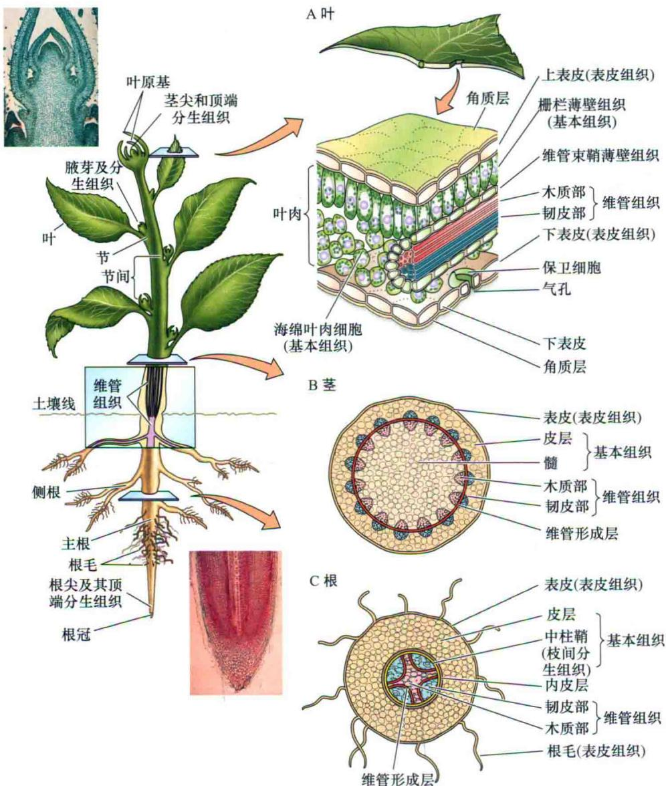  
图1.1 典型双子叶植物的示意图。叶（A）、茎（B）和根（C）的横切面示意图。插图是亚麻（Linum usitatissimum）的茎尖和根尖的纵切面，表示顶端分生组织[图片引自Jubal Harshaw/Shufferstock（上）和Visuals Unlimited/Alamy（下）]。

被子植物（Angiosperm）（来自于希腊文，是种子在罐中之意），是种子植物中较高等的，在1亿年前的白垩纪开始大量出现。现在它们在植被中占有绝对优势，远胜于裸子植物。已知的约有25万种，但是还有许多没有进行分类。种子植物的主要进化是出现了花，因此也称为开花植物（flowering plant）（参见Web Topic 1.3）。

## 1.2.1 植物细胞被坚硬的细胞壁包围

植物和动物的一个基本区别是每个植物细胞被一层坚硬的细胞壁（cell wall）包围。在动物中，胚性细胞能从一个位置移动到另一个位置，因此发育中的组织和器官可以包含起源于生物体不同部位的细胞。而在植物体中没有这样的细胞移动。每个带细胞壁的细胞与相邻细胞都由胞间层（middle lamella）粘合起来，因此，不同于动物发育，植物发育只依赖细胞分裂和细胞增大的模式。

植物细胞有两种细胞壁：初生细胞壁（primary cell wall）和次生细胞壁（secondary cell wall）（图1.2）。初生细胞壁通常很薄（小于1 $\mu$ m），通常存在于幼嫩和正在生长的细胞中。次生细胞壁比初生细胞壁更厚，更强韧，并且在大多数细胞增大终止后沉积。次生细胞壁的强度和韧性是由木质素（lignin）决定的，木质素是一种易碎的、胶状的物质（见第15章）。次生细胞壁上的圆形豁口形成了单纹孔（simple pit），并且一个细胞的单纹孔经常和相邻细胞壁上的单纹孔相对。相连的单纹孔称为纹孔对（pit-pair）。

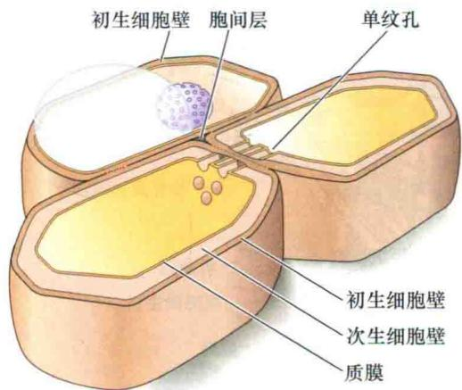  
图1.2 图示初生细胞壁和次生细胞壁及其与细胞其他部分的关系。

木质化次生细胞壁的出现使植物结构得到强化，使得植物能够在土壤之上进行垂直生长并且定植于土壤中。而缺少木质化细胞壁的苔藓植物，如苔藓和地钱，在地面生长高度则不超过几厘米。

## 1.2.2 新细胞产生于分生组织

植物生长主要集中于特定的细胞分裂区域，这些区域称为分生组织（meristem）。几乎所有的核分裂（有丝分裂）和细胞分裂（胞质分裂）都发生于这些分生区域。在幼嫩植物中，最活跃的分生组织称为顶端分生组织（apical meristem），它们位于茎尖和根尖（图1.1）。在节上，腋芽（axillary bud）包含侧枝的顶端分生组织。侧根产生于中柱鞘（pericycle），这是一个内部的分生组织（图1.1C）。靠近（相邻）分生区并与之重叠的区域是细胞伸长区。在伸长区中细胞的长度和宽度大幅度增加。细胞通常在它们伸长后分化成特定的类型。

产生新器官和形成基本植物模式的发育期称为初生生长（primary growth）。初生生长是顶端分生组织活动的结果，在此期间细胞进行分裂，紧接着是细胞逐步增大，主要是细胞伸长，产生轴向（基-顶）的极性。当某个区域中的伸长完成后，可能发生次生生长（secondary growth），产生径向（内-外）的极性。次生生长有两种侧生分生组织参与：维管形成层（vascular cambium，复数cambia）和木栓形成层（cork cambium）。维管形成层产生次生木质部（木材）和次生韧皮部。木栓形成层产生周皮，主要由木栓细胞组成。

## 1.2.3 三种主要组织系统组成了植物体

三种主要组织系统存在于所有的植物器官：表皮组织、基本组织和维管组织。图1.3中简明地标出了这些组织。关于这些植物组织更详细的描述参见Web Topic1.4。

## 1.3 植物细胞器

所有植物细胞都具有真核细胞所共有的细胞器，包括一个细胞核、细胞质和亚细胞器，并且它们被包被在作为边界的膜中，除此之外，还有富含纤维素的细胞壁（图1.4）。某些结构，包括细胞核，在细胞成熟过程中可能消失，但是所有的植物细胞开始时都含有相似的细胞器。这些细胞器根据它们的产生方式主要被分为以下三大类。

（1）内膜系统：指内质网、核膜、高尔基体、内体和质膜。内膜系统在分泌、膜再循环及细胞周期等过程中有着重要的作用。质膜调控着细胞运输的整个过程。内体就是来源于质膜的囊泡并且对囊泡中的内含物进行加工和再循环。

（2）起源于内膜系统的能独立分裂的细胞器：包括油体、过氧化物酶体，以及在脂类储藏和碳循环中发挥作用的乙醛酸循环体。

（3）能独立分裂的半自主型细胞器：包括质体和作用于能量代谢和储藏的线粒体。

由于所有的这些细胞器都是膜构成的区室，因此先从膜的结构和功能开始描述。

## 1.3.1 生物膜由含有蛋白质的磷脂双分子层构成

所有细胞被包裹于作为外部边界的质膜中，质膜将胞质和外界环境隔离。这层质膜（plasma membrane）（也称plasmalemma）使得细胞能吸收和保留某些物质而排出其他物质。各种镶嵌在质膜上的转运蛋白负责溶质、水溶性离子和不带电荷的小分子的选择性跨膜运输。通过转运蛋白而在胞质中积累离子和分子的过程需要消耗能量。膜同样也为特化的胞内细胞器划定了边界，并能够调控离子和代谢产物进出这些区域。

根据流动镶嵌模型（fluid-mosaic model），所有的生物膜都有相同的基本分子结构。它们由蛋白质镶嵌于其中的磷脂（在叶绿体中为糖基甘油酯）双分子层（bilayer）构成（图1.5A，C）。每一层称为双分子层中的层（leaflet）。在大部分质膜中，蛋白质占据了其中的一半。但是，各种膜的脂类成分和蛋白质性质不尽相同，使得每种膜具有独特的功能特征。

韧皮部  
A 表皮组织：表皮细胞  

B 基本组织：薄壁细胞  
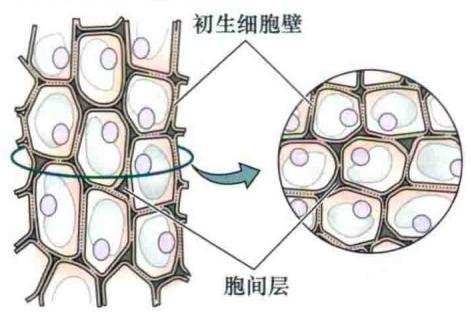  
C 基本组织：厚角组织细胞

D 基本组织：厚壁组织细胞  
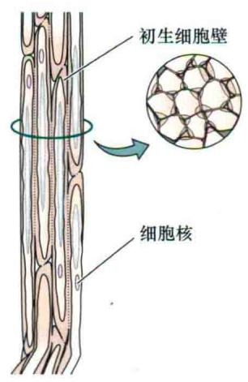

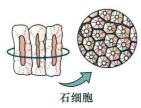

E 维管组织：木质部和韧皮部  
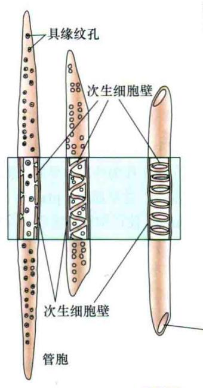

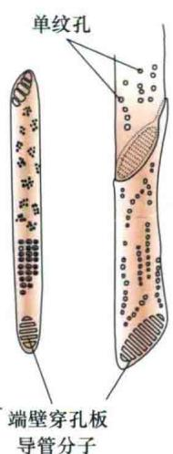  
木质部

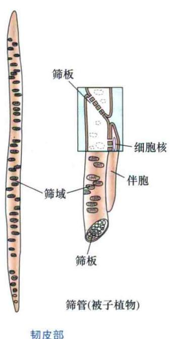  
图1.3 百岁兰（Welwitschia mirabilis）叶片的外表皮（表皮组织）（120×）（A）。3种基本组织的示意图：薄壁组织（B）、厚角组织（C）、厚壁组织（D）与木质部和韧皮部的运输细胞（E）（A©Meckes/Ottawa/Photo Researchers, Inc）。

  
图1.4 植物细胞示意图。许多细胞器由它们各自的膜分开，如液泡膜、核膜和其他细胞器膜。相邻的初生细胞壁和胞间层形成了一个称为复合胞间层的复杂结构。

## 1. 磷脂

磷脂（phospholipid）是一种由两个脂肪酸和甘油共价结合形成的脂类，其中的甘油又和一个磷酸基团共价结合。另外有一些可变的成分与磷酸基团相连，称为头部基团（head group），如丝氨酸、胆碱或肌醇（图1.5C）。脂肪酸的非极性碳水化合物链形成一个疏水区域。与脂肪酸不同，头部基团呈高度极性，因此磷脂分子是兼性分子（amphipathic），同时具有亲水性和疏水性。各种磷脂不对称地镶嵌在质膜中，赋予了质膜方向性。对着细胞外侧的质膜层与对着胞质的质膜层的磷脂构成是不同的。

一类称为质体（plastid）（它是包括叶绿体在内的一类膜包围的细胞器）的特化细胞器的膜脂成分几乎都是糖基甘油酯（glycosylglyceride）而不是磷脂。在糖基甘油酯中，极性的头部集团由半乳糖、双半乳糖或硫化半乳糖组成，而没有磷酸基团（参见Web Topic 1.5）。

虽然磷脂和糖基甘油酯的脂肪酸链长度是可变的，但是它们通常由14\~24个碳组成。如果碳原子之间由单键连接，脂肪酸链则是饱和的（带有氢原子），如果含有一个或多个双键，该链则称为不饱和脂肪酸链。

脂肪酸链中的双键能在链中旋转形成一个结节，从而防止双分子层中磷脂的紧密堆积（例如，这些键采用了结节状的顺式构象，而不是非结节状的反式构象）。这些结节增加了膜的流动性。而流动性又在膜的许多功能中起到重要作用。温度也强烈影响膜的流动性。因为植物基本不能调控体温，而低温会降低膜的流动性，所以它们经常存在如何维持低温下膜的流动性的问题。为此，植物磷脂中含有大量不饱和脂肪酸，如十八烯酸（oleic acid）（一个双键）、亚油酸（linoleic acid）（两个双键）和α-亚麻酸（α-linolenic acid）（3个双键），从而增强膜的流动性（见第26章）。

## 2. 蛋白质

和脂类双分子层相结合的蛋白质主要有3种类型：整合蛋白、外周蛋白和锚定蛋白。另外，蛋白质和脂类能在膜中形成暂时的聚集体，称为脂筏（lipid raft）。

整合蛋白（integral protein）嵌在双层脂中。多数整合蛋白横跨磷脂双分子层，因此蛋白质的一部分与细胞外部互作，一部分与膜的疏水核心互作，还有一部分与细胞内部——胞质部分互作。作为离子通道的蛋白质（见第6章）都是整合蛋白，并作为参与某些信号转导途径的受体（见第14章）。在质膜外表面的一些受体样蛋白识别并紧密结合细胞壁组分，使质膜和细胞壁有效交联。

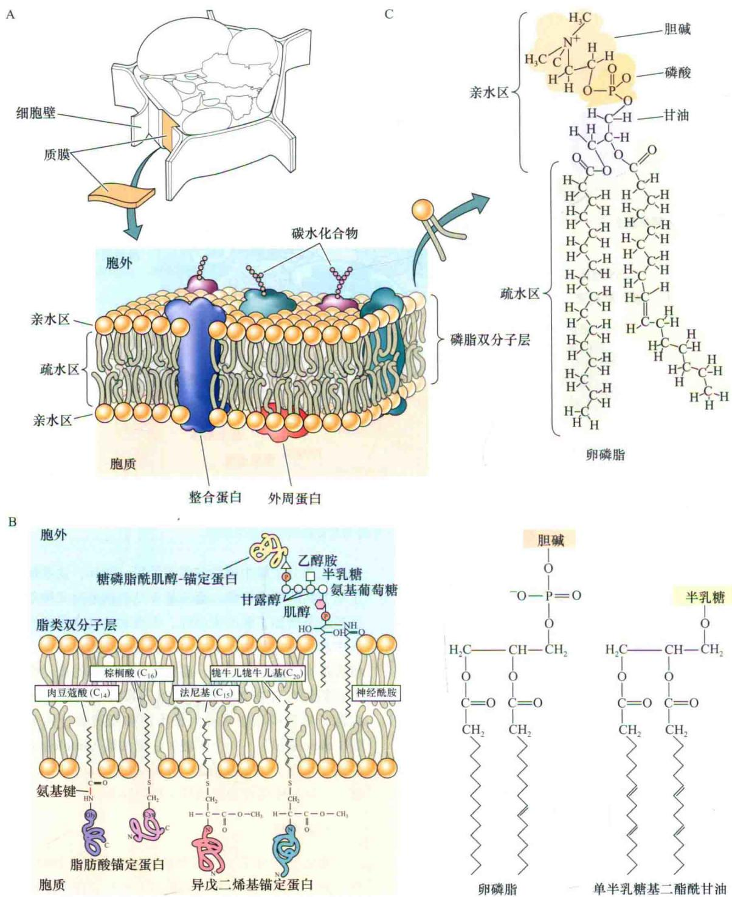  
图1.5 A. 质膜、内质网和由镶嵌在磷脂双分子层中的蛋白质组成的植物细胞的其他内膜。B. 透射电子显微照片表明水芹（Lepidium sativum）根尖分生组织的质膜。质膜的全厚度，两条粗线之间的距离为8 nm。C. 典型的磷脂化学结构和空间结构模型，卵磷脂和单半乳糖基二酯酰甘油（改编自Gunning and Steer，1996）。

外周蛋白（peripheral protein）通过非共价键（如离子键和氢键）和质膜表面相连。它们会被高盐溶液或促溶剂（chaotropic agent）从膜上分离，前者打破离子键，后者打破氢键（图1.5A）。外周蛋白在细胞中起着很多作用，有些参与形成质膜和细胞骨架，如微管和微丝的互作。这将在本章后面讨论。

锚定蛋白（anchored protein）通过脂类分子和质膜表面共价相连。这些脂类包括脂肪酸（肉豆蔻酸和棕榈酸），源于类异戊二烯途径的异戊二烯基团（法尼基和牻牛儿牻牛儿基）和糖磷脂酰肌醇（GPI）-锚定蛋白（图1.5B）。这些蛋白质的脂锚定位点在面对胞质一侧主要为脂肪酸和异戊二烯基团，在细胞外侧为糖磷脂酰肌醇，因此造成了膜两侧的差异性。

## 1.4 内膜系统

真核细胞的内膜系统指细胞内部膜结构的总称，它将细胞分为具有功能性和结构性的区室，并通过囊泡运输将膜和蛋白质分配在各细胞器中。由于细胞器是负责器官合成的遗传信息的主储存场所，因此从细胞核开始对内膜系统进行讨论，接着将对独立分裂的内膜细胞器和半自主型细胞器进行讨论。

## 1.4.1 细胞核含有细胞的大部分遗传物质

细胞核（nucleus，复数nuclei）是包含主要负责调控细胞代谢、生长和分化遗传信息的细胞器。所有这些基因和它们的内含序列为核基因组（nuclear genome）。植物的核基因组大小差别很大，从双子叶植物拟南芥（Arabidopsis thaliana）的 $1.2 \times 10^{8}$ 个碱基对到百合（Fritillaria assyriaca）的 $1 \times 10^{11}$ 个碱基对。一个细胞的其他基因信息存在于两个半自主细胞器——叶绿体和线粒体中，这些将在稍后讨论。

细胞核由称为核膜（nuclear envelope）的双层膜包围（图1.6A），是内质网的一个子区域。核孔（nuclear pore）在两层膜之间形成选择性通道连接核质（细胞核内部区域）和细胞质（图1.6B）。每个核膜上的核孔可以从一千个到数千个，它们可以排列成高度有序的聚集体（图1.6B）（Fiserova et al., 2009）。

核“孔”事实上是一个复杂的结构，它是由100多个不同的核孔蛋白（nucleoporin）呈八边形排列而组成直径约105 nm的核孔复合体（nuclear pore complex，NPC）。核孔蛋白在40 nm的NPC通道排列形成网状结构，构成一个超分子筛（Denning et al., 2003）（参见Web Topic 1.6）。蛋白质进入细胞核需要一个称为核定位信号（nuclear localization signal）的特定氨基酸序列。一些负责细胞核输入和输出的蛋白质已经得到鉴定（参见Web Topic 1.6和Web Topic 1.7）。

A  

细胞核是染色体（chromosome）储存和复制的场所，染色体由DNA及其互作蛋白组成（图1.7）。这种DNA蛋白质复合体统称为染色质（chromatin）。任何植物基因组的所有DNA的线性长度通常是它所在核直径的几百万倍。为了解决染色体DNA在核内组装的问题，线性双螺旋DNA在8个组蛋白（histone）分子组成的圆柱上绕了两圈，形成核小体（nucleosome）。核小体像珠子一样位于染色体长线上。

在有丝分裂中，染色质首先通过紧密地盘绕浓缩成直径30 nm的染色质纤维（30 nm chromatin fiber），其中每两圈有6个核小体，然后经过蛋白质和核酸的相互作用继续折叠和压缩（图1.7）。在细胞分裂的间期，根据浓缩的程度，可以观察到两种染色质：异染色质和常染色质。大约10%的DNA组成了异染色质（heterochromatin），这是一种高度紧密和无转录活性的染色质。多数异染色质集中在靠近核膜的地方，并和基本上不含基因的染色体区域相连，如端粒和着丝点。其余的DNA组成了常染色质（euchromatin），分散在染色体上，是具有转录活性的形式。只有10%的常染色质在任何时期都有转录活性。余下的处于半浓缩状态，介于异染色质和具有转录活性的常染色质之间。位于核

  
图1.6 A. 植物细胞的透射电镜图，显示细胞核和核膜。B. 烟草细胞核表面核孔复合体（NPC）的组织结构。褐色所示为NPC间相接触的部分；剩余部分用蓝色所示。第一幅图（右上方）显示大多数NPC紧密相连，形成包含5\~30个NPC的一列NPC结构。第二幅图（右下方）所示为紧密相连的NPC（A由R.Evert惠赠；B引自Fiserova et al., 2009）。

质的特定区域可能会对染色体的调控产生影响。  
  
图1.7 分裂中期染色体的DNA压缩。DNA首先堆积成核小体，随后缠绕成30 nm的染色质纤维。继续缠绕形成浓缩的中期染色体（改编自Alberts et al., 2002）。

在细胞分裂周期中，染色质经历了动态的结构变化。除了转录需要的短暂位置变化，通过添加或去除组蛋白的功能基团，异染色质区可以转换为常染色质区，反之亦然。这些基因组的整体变化，能引起稳定的基因表达的变化（见第2章）。一般来说，不通过改变DNA的序列而导致的基因表达的稳定变化称为表观遗传调控

(epigenetic regulation)。

细胞核同样含有高密度的颗粒区域，称为核仁（nucleolus，复数nucleoli），这是核糖体合成的区域（图1.6A）。典型细胞的每个核含有一个或多个核仁。核仁包含了一条或多条染色体的部分，其中核糖体RNA基因成簇而形成一个称为核仁组织区（nucleolar organizer region）的结构。核仁将核糖体蛋白和rRNA组装成大、小两个亚基，分别从核孔中运输出来。这两个亚基在胞质中完成完整核糖体的组装（图1.8A）。组装好的核糖体是合成蛋白质的机器。那些从核和胞质产生，负责“真核”蛋白质合成的80S核糖体要比在线粒体和质体中组装和保留的“原核”蛋白质合成场所——70S核糖体大。

## 1.4.2 基因表达包括了转录和翻译

蛋白质合成的复杂过程始于转录（transcription），它是合成一条碱基序列与特定基因互补的RNA长链的过程。初始的RNA转录形成了信使RNA（mRNA），它通过核孔从细胞核移动到细胞质。在细胞质中，mRNA首先依附在核糖体的小亚基上，随后附着在大亚基上起始翻译（图1.8A）。

翻译（translation）是一个根据mRNA编码的序列信息，将氨基酸合成特定蛋白质的过程。一连串的核糖体经过mRNA的全部序列，它是按照mRNA的碱基序列合成肽链的场所（图1.8B）。在细胞质和膜结合的多聚核糖体中进行的翻译过程产生了蛋白质的一级序列，其中不仅包括蛋白质功能信息，也包括像“入场券”一样的序列信息决定着蛋白质在细胞中的最终定位（参见Web Topic 1.8）。

## 1.4.3 内质网构成了细胞内膜网络

内质网是由小管相互连接形成的多边形网络和称为潴泡（cisternae，单数cisterna）的平面囊所组成的（图1.9A）。大部分内质网位于称为细胞周质（cell cortex）的细胞质外层，但是内质网也可以通过形成穿越液泡的穿液泡膜管（transvacuolar strands）以含细胞质的膜管束的形式穿过细胞。这些管状网络通过连接到多边形网络的一些交叉点上而与质膜相连（图1.9B）。管状和潴泡形式的内质网可以快速地相互转变。而这种转变则是由网格蛋白（reticulon）所控制的，它能使膜片层形成小管。以后章节中会讲到的肌动（球）蛋白细胞骨架能够促进内质网小管的重排（Sparkers et al., 2009）。

表面有很多膜结合核糖体的内质网称为糙面内质网（rough ER，RER），这些核糖体的结合使得内质网图1.8 A. 基因表达的基本步骤，包括转录、转录后处理、运输到胞质和翻译。①、②蛋白质可通过自由的或结合在内质网上的核糖体合成。③分泌蛋白在糙面内质网上合成，并含有一个疏水的信号序列。一个信号识别颗粒（SRP）与信号肽和核糖体结合，阻断翻译。④SRP受体和称为易位子的蛋白质运输通道相连，核糖体-SRP形成的复合体与ER膜上的SRP受体结合，核糖体停靠在易位子上。⑤易位子孔打开，SRP被释放出来，延长的多肽进入内质网内腔。⑥翻译重新开始。一旦进入ER的内腔，信号序列就被膜上的信号肽酶切掉。⑦、⑧在添加碳水化合物和链折叠以后，新合成的多肽通过小泡被运到高尔基体。B. 在tRNA的帮助下，氨基酸在核糖体上聚合，形成延长的多肽链。

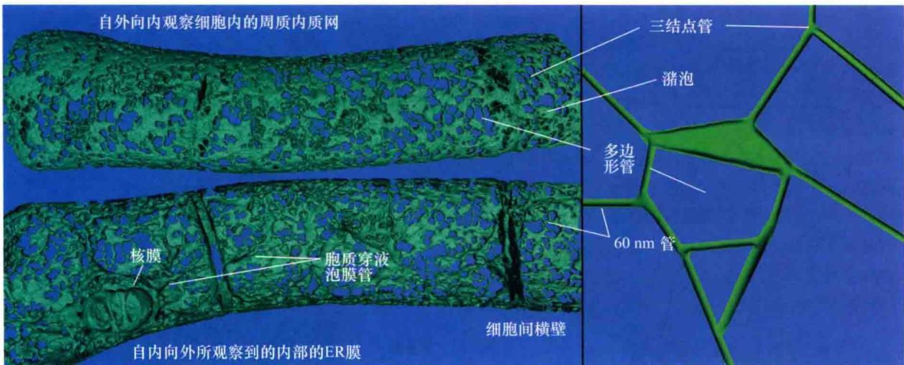  
图1.9 烟草悬浮细胞中内质网的三维结构。A. 自外向内观察细胞（上部），内质网的周质网络是由潴泡区和多边形的管状区构成。自内向外观察细胞（下部），能看到穿液泡膜管含有管状内质网及核膜（内质网的子区域）。在细胞核的核膜上有穿核通道和内陷区域。B. 示ER管和潴泡在典型的周质内质网多边形网络中的排列（由 L. R. Griffing 惠赠）。

在电镜下显得更加粗糙（图1.10）。反之，没有结合核糖体的是滑面内质网（smooth ER，SER）。滑面内质网和糙面内质网的差异有时是与内质网形态的变化相关的：糙面内质网为扁平囊状的潴泡，而滑面内质网为管状。但是这些典型的差别往往只适应于某一类特定的细胞：如产生花蜜的花卉腺细胞，含有更多的滑面内质网。一般来说，核糖体结合位置在两种类型的内质网上都是相对均匀的。

内质网为其他内膜系统，如核膜、高尔基体、质膜和内体系统，提供膜构件和蛋白质。它甚至会为叶绿体运输一些蛋白质（Nanjo et al., 2006；Villarejo et al., 2005）。用于构建整个内膜系统的膜磷脂主要来源于内质网。并且内质网可以与叶绿体进行脂类交换（Xu et al., 2008）。由内质网所进行的磷脂的生物合成称为真核途径，由叶绿体所进行的磷脂合成则称为原核途径（见第11章）。

内质网具有固有的膜双层的不对称性。内质网上负责起始磷脂合成的酶将新的磷脂前体完全加在膜双层的胞质层。而参与合成磷脂头部基团（包括丝氨酸、胆碱、甘油和肌醇）的酶也分布在胞质层上。这种分布造成了内膜固有的脂不对称性的特征。在由磷脂双层膜构成的细胞器中，靠近胞质一侧与靠近内腔一侧的膜层的构成是不同的。靠近内腔的膜层最终会变成细胞质膜的外层。进一步对脂头部基团不对称修饰，以及将脂类和碳水化合物共价连接到蛋白质上进行转录后修饰加剧了膜的不对称性（图1.5）。

在动物细胞中，膜的不对称性能被翻转酶（flip-pase）所抵消，这种酶可以将新合成的磷脂跨过脂双层分子而翻转到内层去。近些年，研究者也在植物中发现了翻转酶（Sahu and Gummadi，2008）。当内质网与其他的细胞器，如质膜、叶绿体和线粒体紧密地相互关联时，它可以通过特殊区域与这些细胞器进行脂类交换（Larsson et al., 2007）。

内质网和质体能够直接通过脂类和蛋白质合成来添加新的膜。但是，对于其他细胞器来说，增加膜结构主要是通过与其他膜的融合（fusion）来实现的。由于膜是流动性的，新的膜组分会被转移到已有的膜上，随后通过分裂（fission）从已有的膜结构上分离出来。膜融合和分离的循环是这些直接或间接来源于内质网的内膜细胞器生长和分裂的基础。这些细胞器包括：高尔基体、液泡、油体、过氧化物酶体和质膜。这一循环过程主要由运输小泡或小管负责。

作为内膜系统各区室之间运输体的囊泡和小管的选择性融合和分裂主要依赖于一类特异的靶向识别蛋白SNARES和Rabs（参见Web Topic 1.9）。

## 1.4.4 细胞的蛋白质分泌开始于糙面内质网

细胞中的分泌蛋白所采用的分泌途径是：经过内质网和高尔基体直至质膜和胞外。分泌蛋白的合成是在翻译的过程中穿过膜进而被插入内质网内腔的。这一过程涉及核糖体，编码分泌蛋白的mRNA，以及位于糙面内质网表面的核糖体和已被部分合成的蛋白质的特异受体（图1.8）。所有的分泌蛋白和分泌途径中大部分的膜整合蛋白都有一个位于氨基端的含有18\~30个氨基酸的疏水前导序列，称为信号肽（signal peptide）（参见Web Topic 1.8）。在翻译过程中，由RNA和蛋白质组成的信号识别颗粒（signal recognition particle，SRP）能够同时结合在蛋白质的信号肽和核糖体上来中断翻译过程。内质网膜含有SRP受体（SRP receptor），该受体能和称为易位子（translocon）的蛋白质通道相连（图1.8）。

A 糙面内质网(表面观察)
多聚核糖体  
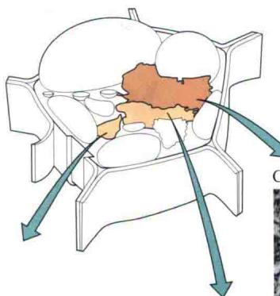

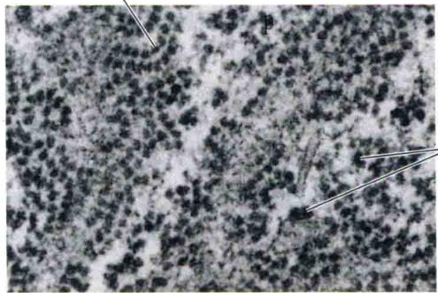  
核糖体

C 滑面内质网  
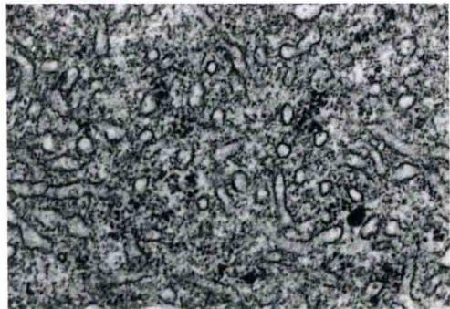

B 糙面内质网(横切)  
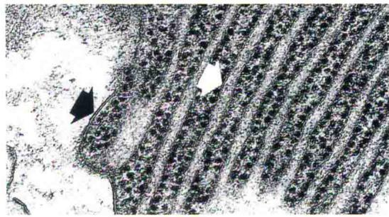  
图1.10 内质网。A. 毛鞘藻（Bulbochaete）中糙面内质网的显微俯视图。糙面内质网上的多聚核糖体（核糖体串附在mRNA上）清晰可见。多聚核糖体也会出现在核膜的外表面上（75 000×）。B. 彩叶草（Coleus blumei）的腺状毛状体中规则排列的ER堆（白色箭头）。质膜由黑色箭头表示，质膜外的物质是细胞壁（75 000×）。C. 滑面内质网经常形成管状网络，图中所示是一个Primula kewensis的幼嫩花瓣的透视电镜图（45 000×）（显微图片引自Gunning and Steer，1996）。

胞质中的核糖体——SRP复合体和ER膜上的SRP受体结合，核糖体停靠在易位子上。这种停靠使易位子孔打开，SRP被释放，翻译重新开始，延长的多肽进入ER的内腔。一旦进入ER的内腔，信号序列就被膜上的信号肽酶切掉（图1.8）。对于膜整合蛋白来说，只有一部分的多肽链能够穿过膜。整个蛋白则通过一个或多个疏水跨膜区锚定在膜上。

许多位于内膜系统腔内的蛋白质为糖蛋白（glycoprotein），这些蛋白质通过共价键与小的糖链相连，它们最终被细胞分泌出去或运输到其他的内膜中。

大量事实表明，由N-甲壳胺、甘露糖和葡萄糖组成的带有分支的寡糖和内质网分泌蛋白的一个或多个天冬酰胺残基的自由氨基结合。这种N-连接糖原（N-linkedglycan）首先聚集在一个嵌在内质网膜上的脂类分子——长醇二磷酸（dolichol diphosphate）上（见第13章）。随着新合成的多肽进入内质网内腔，已加工完成的14糖结合到新生多肽上。像在动物细胞中，这种所谓的N-连接糖蛋白（N-linked glycoprotein）通过囊泡或小管运到高尔基体（见第2章）。但是，在高尔基体中，这种多糖要以植物特异的方式进行进一步的加工。使得糖蛋白在脊椎动物的免疫系统中具有高度的抗原特性（能够被识别为外来蛋白）。

## 1.4.5 高尔基体负责加工用于分泌的蛋白质和多糖

高尔基体（在植物中也称为分散型高尔基体）是一个极化的囊堆，较为肥大的潴泡产生于顺面（cis）或者说高尔基体的形成面，以接受来自内质网的囊泡和小管（图1.11）。而高尔基体的反面（trans）（成熟面）则由扁平的潴泡和称为反面高尔基体网络（trans-Golgi-network，TGN）的管状网络构成。TGN和反面潴泡上会出芽产生分泌囊泡。在分生细胞中，高尔基体（Golgi apparatus，包含所有的高尔基小体）中含有高达100个高尔基小体（Golgi body）。其他类型的细胞中高尔基小体含量各不相同，但一般来说都少于100个。高尔基小体能通过分裂使得细胞在生产和分化时期调控自身的分泌能力（Langhans et al., 2007）。

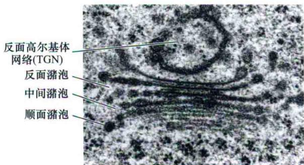  
图1.11 烟草（Nicotiana tabacum）根冠细胞的高尔基体电镜图片。图中标出了顺面（cis）、中间（medial）和反面（trans）潴泡。反面高尔基体网络和反面潴泡相连（60 000×）（引自Gunning and Steer，1996）。

对于一个高尔基体来说，不同的潴泡中含有不同的酶，以及根据它们所加工的多聚体的类型（用于细胞壁的多糖或是用于液泡和细胞壁的糖蛋白）而具有不同的生化功能。例如，当N-连接糖蛋白通过顺面潴泡和反面潴泡时，它们分别被位于高尔基体3个部分的特定的酶修饰。某些糖，如甘露糖，从寡糖链上被移除，同时其他的糖又加到寡糖链上。除了这些修饰，脯氨酸、丝氨酸、苏氨酸和酪氨酸残基的羟基上的糖基化 $[O-$ 连接寡糖（O-linked oligosaccharide）]也发生在高尔基体中。高尔基体中参与多糖生物合成的酶各不相同，但是它们总是与糖蛋白修饰酶一起出现。

来源于内质网的膜及其内含物被运输到高尔基体中常常发生在特殊的ER退出位点（ER exit site，ERE）。而ERE则是由一种称为COPⅡ的包被蛋白（coat protein）的存在决定的。这种表面蛋白包被与跨膜受体（结合有将要被运送到高尔基体的特异底物）相关。相关的膜区域然后以出芽的方式形成包被囊泡，并最终在与目的地的靶膜融合前丢弃COPⅡ包被蛋白。同时使用ERE和高尔基体的荧光标签可以看到ERE随着高尔基体移动，就像高尔基体流穿过细胞（参见Web Topic 1.10）。囊泡从ER开始经过高尔基体的顺面、反面，接着运输到质膜或液泡前体，这种移动方式称为顺向（anterograde）（正向）移动。相反，从高尔基体到内质网，或者从高尔基体的反面到顺面的囊泡再循环（recycling）称为逆向（retrograde）（反向）运动。COPⅠ包被囊泡参与这种在高尔基体内部或者从高尔基体到内质网的逆向运动。如果没有膜的再循环逆向运动，高尔基体将很快因为顺向运动而被消耗殆尽。

## 1.4.6 质膜上的特殊区域参与膜的再循环

由来自质膜上的小囊泡的逆向运动引起的膜的内化称为内吞（endocytosis）。小囊泡（100 nm）最初形成时被网格蛋白（clathrin）所包裹（图1.12B），之后它们很快离开这些包被，并再与其他的小管和囊泡相融合（图1.12A和图1.13A）。内吞途径中的细胞器称为内体（endosome）。当分泌的囊泡与质膜相融合，膜表面积必然会增大。那么，除非细胞也以同样的速度扩张，否则它需要通过一些膜再循环的途径使得膜表面积与细胞大小保持平衡。在分泌旺盛的细胞中，如根冠细胞，膜再循环的重要性得到了最好的诠释（图1.13）。根冠细胞分泌大量的黏多糖（黏液）作为润滑剂使根能顺利在泥土中生长。如果没有内吞作用使质膜不断通过再循环进入早期内体（early endosome），含有黏多糖的大囊泡将与质膜融合造成膜表面积的过度增加。这些内体要么回到反面高尔基体被分泌，要么进入液泡前体（prevacuolar compartment）中被水解。

内吞或内吞再循环在各类植物细胞中都会发生。对发生在质膜上的内吞的控制能够差异化地调控离子通道的数量（见第6章），如气孔保卫细胞中的钾离子通道和根中的硼转运体。在植物的向地性作用中，特定的生长素转运体的内化能导致根中生长素含量的改变，从而引起根的弯曲（见第19章）。

## 1.4.7 植物细胞的液泡具有多种功能

对于植物液泡的最初界定是源于其在显微镜下所表现的外观——由膜包围的一个不含胞质的闭合区室。与细胞质不同，在液泡内充斥着由水和溶解物组成的液泡液（vacuolar sap）。在细胞生长过程中，液泡液体积的增长先于细胞体积的增加而发生。一个成熟细胞的中央大液泡能够占95%的细胞体积。有时一个细胞中还会出现两个或多个大液泡，就像在某些花瓣中会同时含有有色素液泡和无色素液泡（参见Web Topic 1.9）。这些液泡在尺寸和外观上的不同也暗示了它们在形式和功能上的差异。其中一些差异是由于液泡的成熟度不同。例如，分生细胞只有许多小液泡而没有中央大液泡。而当细胞成熟时，这些小液泡会融合成中央大液泡。

含有蛋白质和脂类的液泡膜（tonoplast）最初合成于内质网。除了在细胞增大中的作用外，液泡还可以作为一个储存容器来储存植物用于抵御草食动物的次生代谢物（见第13章）。由于有了各种各样的膜转运体，无机离子、糖、有机酸和色素这些溶解物能够在液泡中富

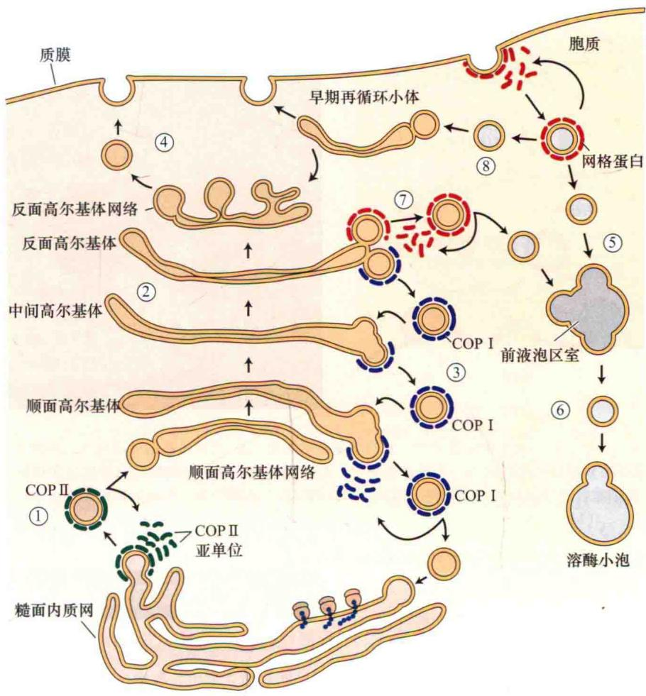

  
图1.12 三种衣被蛋白调节蛋白质分泌和内吞通路的小泡运输。A. COPⅡ用绿色标记，COPⅠ用蓝色标记，网格蛋白用红色标记。B. 从豆叶中分离的网格蛋白包被小泡电子显微镜照片（102 000×）（B由D.G.Robinson惠赠）。

① COPⅡ包被小泡从ER上萌发，并转运到高尔基体的顺面

② 潞泡带着它们的内含物顺向经过高尔基体垛堆

③ COP I 包被小泡的逆向运动保证了酶在顺面、中间和反面潴泡堆的正确分布

④ 未包被的小囊泡从反面高尔基膜萌发，并与质膜融合

⑤ 内吞的网格蛋白包被小泡与前液泡区室融合

⑥未包被的小泡从前液泡区室脱离，并将内含物带到溶酶小泡

⑦最终到达溶酶小泡的蛋白质通过网格蛋白包被小泡，从反面高尔基体分泌到液泡前体（PVC），然后被重新包装运送到溶酶小泡

⑧ 内吞作用形成的网格蛋白包被小泡也可以脱离包被和通过早期循环小体进行再循环。通过早期循环小体直接与质膜融合或与反面高尔基体直接融合形成囊泡

A  
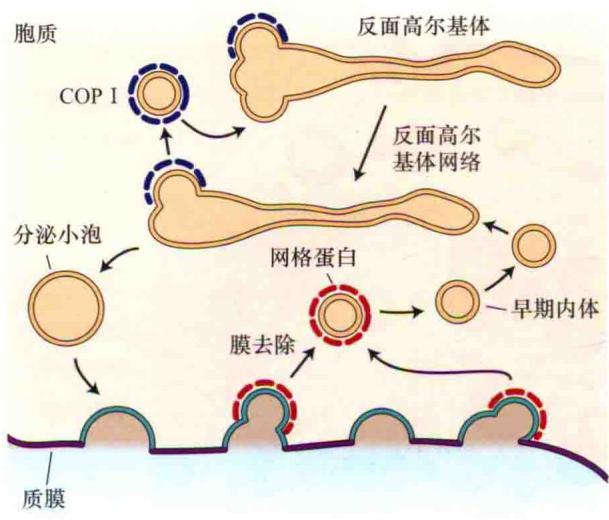

B  
  
图1.13 网格蛋白包被小泡的内陷与玉米根冠黏液的分泌有着紧密的关系。A. 质膜最新的分泌位点上网格蛋白包被囊泡所介导的膜的循环。B. 最新的分泌位点上出现的一个分泌型囊泡，分泌型囊泡将其内溶物储存在细胞壁和网格蛋白包被的细胞膜内陷中，后者则帮助细胞膜在分泌位点上完成膜的循环。在分泌位点上的网格蛋白包被的内陷是膜上平均内陷水平的20倍（Mollenhauer et al., 1991；B由H. H. Mollenhauer和L. R. Griffing惠赠）。

集（见第6章）。用于储存蛋白质的液泡称为蛋白质体（protein body），它们在种子中大量存在。

液泡也可类似于动物中的溶酶体，在蛋白质代谢中发挥作用。就像在衰老叶片中积累的水解性液泡（lytic vacuoles），它能在细胞衰老过程中释放降解细胞结构物的水解酶。膜经过分选进入液泡和动物溶酶体具有不同的发生机制。虽然在这两种情况下，它们被分选进入液泡前体这一过程都发生在高尔基体中，但是识别过程中涉及的分选受体和加工蛋白是不同的。在哺乳动物细胞内，内质网中的酶能够识别并将甘露糖-6-磷酸加到许多溶酶体蛋白上，这些蛋白质进而能被高尔基体中的分选受体所识别。这一途径并不存在于植物中。另外，一些植物水解性液泡完全避开高尔基体直接起始于内质网，这是一种动物细胞中缺失的途径。

从高尔基体到液泡的囊泡运输是间接的。如上所述，细胞中存在多个液泡区室，并不是所有都能作为高尔基体囊泡的目标。这些接受来源于高尔基体囊泡的液泡需要经历一个中间的液泡前体（prevacuolar compartment，PVC）阶段。PVC作为分选细胞器也在质膜的内吞中发挥作用。在一些情况下，PVC，包括多泡体（multivesicular body，MVB）也作为后液泡区室（postvacuolar compartment）作用于液泡及其膜的降解（Otegui et al., 2006）。

## 1.5 来源于内膜系统的独立分裂的细胞器

对于一些细胞器来说，尽管它们来源于内膜系统，但是能够独立地生长和增殖。其中包括油体、过氧化物酶体和乙醛酸循环体。

## 1.5.1 油体是脂类储存的细胞器

很多植物在种子发育时期需要合成和储藏大量的油类物质。这些负责油类物质积累的细胞器称为油体（oil body）。在所有细胞器中，油体是唯一一个来源于ER的磷脂“单层膜”细胞器。位于单层膜中的磷脂极性头朝向液态的胞质，而对着内腔的脂肪酸尾则溶解于储藏在其中的油类物质中。

油体最初的形成是作为ER中一个分化的区域。其中的储存物质甘油三酯（triglyceride）（3个脂肪酸共价地连接在一个丙三醇骨架上）的特性显示了这个细胞器拥有一个疏水的内腔。一个合乎逻辑的推论是，甘油三酯似乎最初是被储存于ER双层膜之间的疏水区域（图1.14）。甘油三酯并不含有像膜磷脂那样富有极性的头部基团，因此它们并不直接暴露在亲水的细胞质中。尽管出芽产生油体这一过程的机制并不清楚，但是，已经明确的是，当从ER分离出来时油体被一个含有油体蛋白（oleosin）的磷脂单层膜包裹着。油体蛋白合成于胞质的多核糖体，并在翻译后被插入油体的磷脂单层膜中。这类蛋白质含有一个类发夹结构的中央疏水区域，这个区域能被插入富含油类物质的油体内腔，而两个亲水的末端则留在油体外部（Alexander et al., 2002）。当种子萌发时，油体开始分解并与那些富含脂类氧化酶的细胞器，如乙醛酸循环体有着紧密的联系。

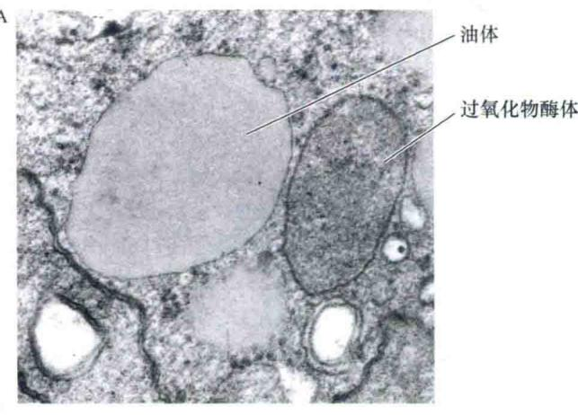

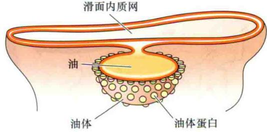  
图1.14 A. 过氧化物酶体旁一个油体的电镜照片。B. 模式图表明在ER的磷脂双分子层中合成和堆积的油类形成油体的过程。从ER脱离后，油体由含有油体蛋白的磷脂单分子层包围（A改编自Huang，1987；B引自Buchanan et al., 2000）。

## 1.5.2 微体在植物叶片和种子中发挥着特殊的代谢作用

微体（microbody）是一类由单层膜包裹的球型细胞器，它具有一种特定的代谢功能。过氧化物酶体（peroxisome）和乙醛酸循环体（glyoxysome）是特异地负责脂肪酸的β-氧化（β-oxidation）及乙醛酸（glyoxylate）代谢的微体（见第11章）。微体不含DNA，并且与其他的细胞器紧密地联系，共享一些中间代谢产物。乙醛酸循环体与线粒体和油体相关，而过氧化物酶体则与线粒体和叶绿体相关。

最初，人们认为过氧化物酶体和乙醛酸循环体都是直接产生于ER的独立型细胞器。但是，利用细胞器的特异抗体进行检测，证明至少转绿的子叶中过氧化物酶体是由乙醛酸循环体直接发育而来。例如，在黄瓜幼苗中，还未变成绿色的子叶细胞最初含有乙醛酸循环体，过氧化物酶体则是在转绿之后才出现。在转绿过程中，微体可以对两者的标记物都作出反应，说明乙醛酸循环体正在向过氧化物酶体转化（Titus and Becker, 1985）。

在过氧化物酶体中，光呼吸作用的一个二碳氧化产物——羟乙酸盐会被继续氧化形成酸性乙醛酸。这种转变伴随着过氧化氢的形成，它的形成会氧化和破坏其他化合物。但是，过氧化物酶体中含量最多的蛋白质却是过氧化氢酶（catalase），这种酶能将过氧化氢分解成水。它在过氧化物酶体中的大量存在并形成以晶体结构排列的蛋白晶体（图1.15）。

乙醛酸循环体能够转变为过氧化物酶体这一现象虽然能够解释后者在子叶的发育中出现这一现象，但却并不能说明其究竟在其他的组织中是如何产生的。如果它们是在细胞分裂过程中得以遗传下来的，那么过氧化物酶体则独立于其他的细胞器，利用类似于参与线粒体分裂的那些蛋白质来进行生长和分裂（Zhang and Hu, 2008）。大部分的蛋白质在胞质转录后进入过氧化物酶体都需要特异的靶序列，这个靶序列是由位于蛋白质羧基端的丝氨酸-赖氨酸-丝氨酸排列组成（参见Web Topic 1.8）。

## 1.6 能独立分裂的半自主型细胞器

一个典型的植物细胞具有两种类型的产能细胞器，即叶绿体和线粒体。它们都由双层膜（内膜和外膜）与胞质隔离，并含有自己的DNA和核糖体。

线粒体（mitochondria，单数mitochondrion）是细胞内呼吸作用的场所。呼吸就是用糖代谢中释放的能量将ADP（腺苷二磷酸）和无机磷酸（ $P_{i}$ ）合成ATP（腺苷三磷酸）的过程（见第11章）。

线粒体是一种不断进行分裂和融合的高度动态结构。线粒体融合能产生长的管状结构，它能分支并形成线粒体网络。若不考虑形状，所有的线粒体都具有一个光滑的外膜和一个高度折叠的内膜（图1.16）。内膜上含有ATP合酶（ATP synthase）质子泵，能够利用质子梯度为细胞合成ATP。质子梯度（proton gradient）的形成是通过包埋于内膜或位于内膜外周的被称为电子传递链（electron transport chain）的电子运输载体的协同作用而完成的。

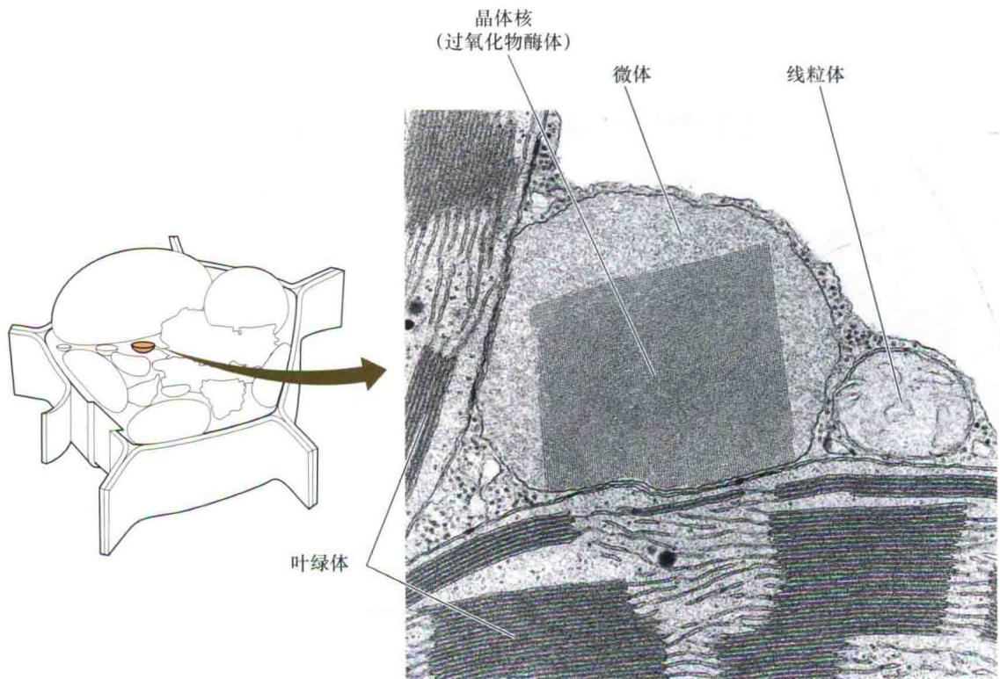  
图1.15 成熟叶片中一个过氧化物酶体中的过氧化氢酶晶体。图中过氧化物酶体与两个叶绿体和一个线粒体紧密相连，这些细胞器与过氧化物酶体拥有共同的代谢物。

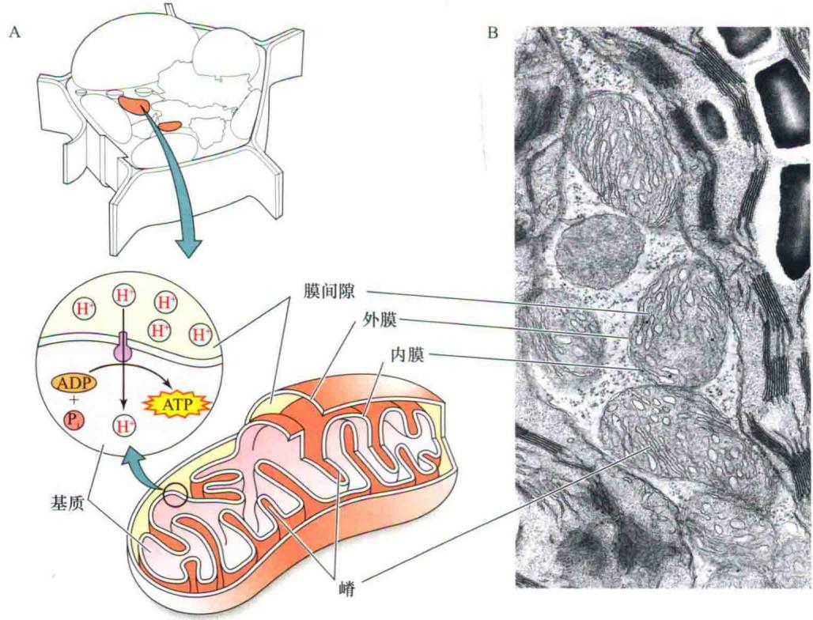  
图1.16 A. 线粒体的示意图，有内膜上参与ATP合成的H $^{+}$ -ATP酶的位置。B. 一种百慕大草（Cynodondactylon）的叶细胞中的线粒体电镜图（26 000×）（显微图片引自S. E. Frederick，由E. H. Newcomb惠赠）。

内膜的向内褶皱称为嵴（cristae，单数crista）。被内膜包围的区室，称为线粒体基质（matrix），包含了称为Krebs循环的中间代谢途径所需的酶。

叶绿体（chloroplast）（图1.17A）属于另一种称为质体（plastid）的双膜包被的细胞器。叶绿体膜富含糖基甘油酯（参见Web Topic 1.5）。叶绿体膜含有叶绿素及其相关蛋白质，是光合作用的场所。除了内膜和外膜，叶绿体具有称为类囊体（thylakoid）的第三种膜系统。一堆类囊体构成一个基粒（granum，复数grana）（图1.17B）。光合作用中起光化学反应作用的蛋白质和色素（叶绿素和类胡萝卜素）嵌在类囊体膜中。环绕类囊体的液态部分，称为基质（stroma），它和线粒体的基质很相似。相邻的基粒通过被称为基质片层（stoma lamellae，单数lamella）的非堆积膜连接起来。

光合作用所需的不同成分位于基粒和基质片层的不同区域。叶绿体的ATP合酶位于类囊体膜上（图1.17C）。在光合作用中，光驱动的电子传递反应建立了一个跨类囊体膜的质子梯度（图1.17D）。和线粒体中一样，ATP合酶在消除质子梯度的同时合成ATP。但是，叶绿体并不将自身合成的ATP运输到胞质中，而是利用其来进行许多基质的反应，包括固定大气中二氧化碳的碳元素（见第8章）。

  
图1.17 A. 梯牧草（Phleum pretense）叶子中叶绿体的电镜照片（180 000×）。B. 同一个叶绿体的更高倍数电镜照片（520 000×）。C. 一个基粒垛堆和基质片层的三维视图，表明该组织的复杂性。D. 叶绿体的模式图，表明H-ATP酶在类囊体膜上的位置（显微图片引自W.P.Wergin，由E.H.Newcomb惠赠）。

包含高浓度类胡萝卜素而非叶绿素的质体称为有色体（chromoplast）。它们是很多水果、花及秋叶呈黄色、橙色或红色的原因之一（图1.18）。

非色素质体称为白色体（leucoplast）。最重要的白色体是淀粉体（amyloplast），它是一种淀粉储藏质体。茎秆和根的储藏组织及种子中富含淀粉体。根冠中特化的淀粉体也可作为重力感受器，指导根在土壤中的向地性生长（见第19章）。

## 1.6.1 原质体在不同的植物组织能转化为特定的质体

分生组织细胞含有原质体（proplastid），它们很少或完全没有内膜，没有叶绿素，并且光合作用所需的酶也不完全（图1.19A）。在被子植物和一些裸子植物中，光诱导原质体转变为叶绿体。在光照下，酶在原质体中合成，或者从胞质中运入，产生光吸收色素，膜快速产生，从而形成基质片层和基粒垛堆（图1.19B）。

种子一般在没有光的土壤中萌发，而叶绿体只在幼芽受光照的时候形成。如果种子在暗中萌发，原质体分化为黄化质体（etioplast），黄化质体含有膜的半晶体管状序列，称为原片层体（prolamellar body）（图1.19C）。黄化质体不含叶绿素，而是含有淡黄绿色的前体色素，称为原叶绿素。

  
番茄红素晶体  
图1.18 番茄果实成熟早期阶段叶绿体转变为有色体时的叶绿体电镜图片。小的垛叠基粒仍然可见，星号表示类胡萝卜素成分的番茄红素晶体（27000×）（引自Gunning and Steer，1996）。

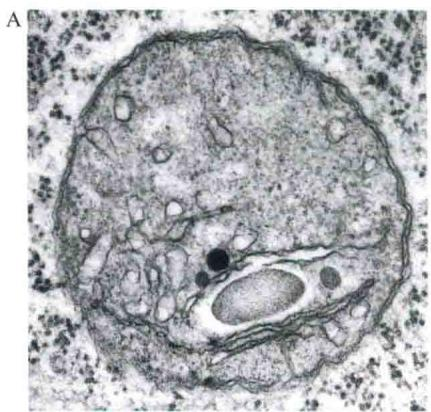

  
图1.19 质体发育阶段的电镜照片。A. 蚕豆（Vicia faba）根的顶端分生组织中原质体的高倍电镜照片。内膜系统为主，基粒还未形成（47 000×）。B. 光下生长的燕麦（Avena sativa）幼叶分化初期的叶肉细胞。质体发育成基粒垛堆。C. 黑暗中生长的燕麦苗幼叶中的细胞。质体发育为黄化质体，以及称为原片层体的复杂半晶体结构的膜管。光照下，黄化质体通过原片层体的解体和基粒的形成，转变为叶绿体（7200×）（引自Gunning and Steer，1996）。

光照几分钟内，黄化质体分化，原片层体转为类囊体和基质片层，原叶绿体素变为叶绿素（关于叶绿素合成的讨论参见Web Topic 7.11）。要维持叶绿体的结构需要光的存在，并且成熟的叶绿体在长期黑暗下可以变为黄化质体。同样的，在不同的环境条件下，正如在秋叶和成熟的果实中，叶绿体能转变为有色体（图1.18）。

## 1.6.2 叶绿体和线粒体的分裂不依赖于核分裂

如前所述，质体和线粒体的分裂源于裂殖的过程，这点也符合它们的原核起源。细胞器DNA复制和分裂的调控独立于核的分裂而进行。例如，每个细胞内的叶绿体的数量依赖于细胞发育的过程和它所处的环境。因此，叶片内侧的叶肉细胞含有比外侧更多的叶绿体。

尽管叶绿体和线粒体的分裂并不受细胞分裂的时间所决定，但它们的分裂过程仍需要细胞核编码的蛋白质的参与。细菌和半自主型细胞器中，在膜内部即将产生分裂板的位置，蛋白质形成环状促进分裂过程的进行。在植物细胞中，这些促进分裂的蛋白质是由核基因编码。线粒体和叶绿体也可选择增大体积而不进行分裂的策略来满足能量和光合作用的需要。例如，如果参与线粒体分裂的蛋白质失活，那么这些少数现有的线粒体的尺寸会增大以应对能量的需求。

线粒体和叶绿体的内外层膜都会出现突出的现象。在叶绿体中，这些突出称为小管（stromule），它们富含基质，不是类囊体（参见Web Essay 7.1）。在线粒体中，它们称为matrixule。matrixule和stromule可能会帮助质体间进行物质交流。

质体和叶绿体都能在植物细胞中环绕运动。在一些植物细胞中，一部分叶绿体锚定在外侧的细胞周质中，而另一部分则是可移动的。与高尔基体和过氧化物酶体的运动相类似的是，植物肌球蛋白也会为线粒体提供动力使其沿着微丝骨架运动。微丝处于细胞骨架网络之中，将会在章节1.7中进行讨论。

## 1.7 细胞骨架

细胞骨架（cytoskeleton）的丝状蛋白网络保持了细胞质的结构。这个网络保证了细胞器的空间分布，并为细胞器和其他细胞骨架成分的运动起到脚手架的作用。它也在有丝分裂、减数分裂、胞质分裂、细胞壁积累、细胞形状的维持和细胞分化中起重要作用。

## 1.7.1 植物细胞骨架包含微管和微丝

植物中的细胞骨架有两种主要类型：微管和微丝。每种类型都是丝状的，它们的直径固定但长度可变，可以达到许多微米。微管和微丝是由球状蛋白组成的大分子复合体。

微管（microtubule）是中空的圆柱体，外径25 nm。它们是微管蛋白（tubulin）的多聚体。组成微管的单体是由两个相似的多肽链[ $\alpha$ -微管蛋白和 $\beta$ -微管蛋白（ $\alpha$ -tubulin and $\beta$ -tubulin）]组成的异源二聚体（图1.20A）。单个微管中成百上千个微管蛋白单体排列成柱状体，称为原丝（protofilament）。

微丝（microfilament）是实心的，直径约7 nm。由肌肉中发现的一种特殊形式的蛋白质——球状肌动蛋白或G-肌动蛋白（G-actin）组成。由G-肌动蛋白单体多聚化而形成肌动蛋白亚基单链也称为原丝。以多聚化原丝形态存在的肌动蛋白称为丝状肌动蛋白（F-actin）。每个微丝由两条肌动蛋白原丝互相缠绕而成（图1.20B）。

  
图1.20 A. 微管的纵向模式图。每个微管由13个原丝组成。 $\alpha$ 亚基和 $\beta$ 亚基的结构如图所示。B. 微丝的模式图，表明G-肌动蛋白亚基的两条链。

## 1.7.2 微管和微丝能组装和解体

在细胞中，肌动蛋白和微管蛋白亚基作为自由蛋白存在，自由态的蛋白质亚基和多聚态的蛋白质保持动态平衡。每个单体结合一个核苷酸。肌动蛋白结合ATP，微管蛋白结合GTP（鸟苷三磷酸）。微管和微丝都有极性，也就是说，它们的两端是不同的。在微丝中，极性源于肌动蛋白本身的极性。在微管中则是源于 $\alpha$ -微管蛋白和 $\beta$ -微管蛋白二聚体的极性。两端的生长速度不同表明了极性的存在。较活跃的一端称为正极（plus），而另一端称为负极（minus）。在微管中，$\alpha$ -微管蛋白位于负极， $\beta$ -微管蛋白位于正极。

微丝和微管有半衰期，一般以分钟记。它的长短是由微丝中一种称为肌动蛋白结合蛋白（actin-binding protein，ABP）的辅助蛋白决定的，而在微管中，则是由微管结合蛋白（microtubule-associated protein，MAP）决定的。一些ABP和MAP分别使微丝和微管更加稳定，并防止它们解聚。

肌动蛋白多聚化的进行不需要其他的辅助蛋白，直接将G-肌动蛋白添加到微丝的生长端（正极）。多聚化的肌动蛋白亚基之间是非共价连接的，而且它们的组装并不需要能量。但是，当单体并入原微丝后，其所结合的ATP水解成为ADP，这一过程所释放的能量储存在微丝中，使得它更易于解聚。肌动蛋白的各种结合蛋白在微丝生长调节中的功能将会在Web Topic 1.12中进行讨论。

微管的组装与微丝相似，包括成核期、延长期和稳定期。但是，体内的微管成核并不是通过其组成亚基的寡聚化，而是由一种含量较少的微管蛋白——γ-微管蛋白（γ-tubulin）形成的小的环状复合体所介导的。γ-微管蛋白形成的环状复合体（γ-tubulin ring complexe, γ-TuRC）位于微管组织中心（microtubule organizing center, MTOC），在这里微管被成核化。微管成核的主要位点处于分裂间期的细胞周质（靠近质膜的胞质外表层）、核膜周围及分裂细胞的纺锤极。γ-TuRC的功能是起始α-微管蛋白和β-微管蛋白异源二聚体的多聚化，使之形成一个短的纵向的原丝（protofilament）。随后，数个原丝边缘相连，形成一个平面（图1.21）。最终，GTP的水解使得这个平面卷成一个圆柱形的微管。

每个微管蛋白的异源二聚体结合2个GTP分子，1个与α-微管蛋白单体结合，另1个与β-微管蛋白单体结合。α-微管蛋白单体上的GTP与之紧紧相连，并且不能水解，而β-微管蛋白单体上的GTP可以轻易地与介质交换，并在亚基组装成微管后慢慢水解为GDP。β-微管蛋白单体上的GTP水解成GDP可以引起二聚体轻微的弯曲，并且若是没有被新加上的带有GTP的微管蛋白盖住，原微丝就会解体，导致“灾变性”的解聚。这种解聚的速度比聚合快得多（图1.21）。这种灾变性解聚可以被由于解聚所形成的局部微管蛋白浓度增加而得到解救，微管蛋白单体的增加及GTP的协助有利于聚合（图1.21）。因此，微管的不稳定性是动态的（dynamically unstable）。而且，灾变解聚的频率和程度可以作为动态不稳定性特征，它们被特异的微管结合蛋白所控制，这些MAP可以加强或减弱微管壁中微管蛋白异源二聚体之间的连接。

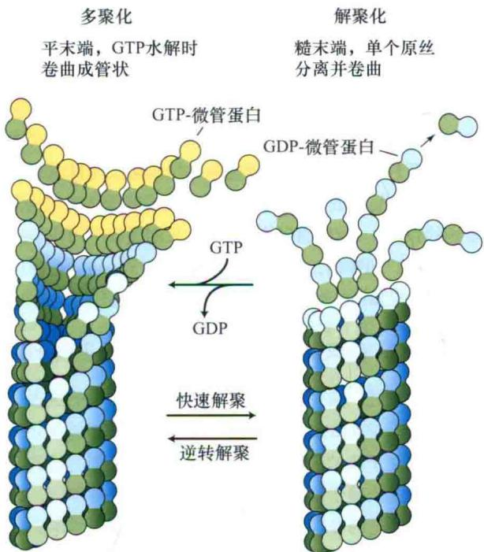  
图1.21 微管聚合和解聚之间动态平衡模式图。对于并入微管以后的微管蛋白，其β亚基所结合的GTP的水解会改变该亚基自身的方向，导致单根原微丝的分离或向外卷曲，最终造成灾变性的解聚。这种解聚使得局部的微管蛋白浓度升高。GTP到GDP的转换能在微管的正极端产生片状-GTP帽来促进微管蛋白的聚合反应，以逆转微管的解聚。随着这些片状物的生长它们能够发生弯曲融合形成管状。

## 1.7.3 周质微管能沿着细胞进行踏车运动

一旦被多聚化，微管不再需要锚定在微管组织中心的γ-微管蛋白上。在非分裂细胞中（间期），细胞周质中的微管可以通过称为踏车现象（treadmilling）的过程沿着细胞周缘进行侧向迁移。在踏车运动中，微管蛋白异源二聚体能被添加到微管的正极，并以同样的速度从负极解聚掉。因此，看上去微管似乎是在胞质中“移动”，尽管实质上并未运动。

新合成的微管一般来说会以细胞轴的横切方向沿着细胞周质作踏车运动（Paradez et al., 2006）。周质微管的横切方向决定了细胞壁中新合成的微纤丝的方向（将在第15章中讨论）。而横向排列微纤丝的存在强化了细胞壁的横向的强度，因而促进了细胞壁沿着细胞的纵向生长。微管就是以这种方式在植物的极性调节方面发挥着重要的作用。

## 1.7.4 细胞骨架马达蛋白介导着胞质环流和细胞器运动

一般来说，胞质中细胞器的运动是分子马达作用的结果，决定它能否沿着细胞骨架“行走”。细胞骨架马达蛋白具有类似的结构。在它们的二聚化形式中，包含两个较大的球形“头部”，这两个头部其实是充当着马达蛋白的“足部”。而和其“头部”相连的“颈部”区域则更像马达蛋白的“腿”。马达蛋白的“尾部”长短各异，将其“头部”与装载“货物”的区域相连，像两只手一样抓着细胞器（图1.22）。马达蛋白的每一个“头部”都有ATP酶活性，ATP水解所释放的能量推动头部沿着细胞骨架单向前行。

不同的马达蛋白沿着细胞骨架的不同方向运动。肌球蛋白（myosin）沿着微丝向微丝的正极运动。植物肌球蛋白有肌球蛋白Ⅷ和肌球蛋白XI两个家族，每个家族都含有多个成员。沿着微管运动的马达蛋白家族称为驱动蛋白（kinesin）。该蛋白家族有61个成员，其中2/3朝着微管的正极移动，剩下的1/3朝负极运动。尽管驱动蛋白在细胞器沿着微管运动的过程中发挥功能，但同时它的装载结构域也结合染色质和其他微管，在有丝分裂过程中帮助组建纺锤体（参见Web Topic 1.13）。动力蛋白（dynein）是在动物和原生生物中存在的一种主要朝向微管负极运动的马达蛋白，但在植物中并不存在动力蛋白。

胞质环流（cytoplasmic streaming）是指细胞内物质和细胞器进行协调有序的运动。在绿藻Chara和Nitella的巨大细胞中，胞质环流以螺旋的方式从细胞的一边运动到另一边，其流动速度可以达75 $\mu$ m/s。胞质环流以不同的方式和速度发生在大多数植物细胞中，但有时它也能够改变自身的运动方式或作简短暂停以应对环境的改变（Hardham et al., 2008）。

传统意义上的“胞质环流”这一术语主要是描述那些能在低放大倍数下可见的胞质和细胞器的大规模流动。这种流动是由运动的细胞器对于胞质的黏性拖拽引起的。最近，胞质环流这一名词也用来描述与邻近细胞器作反向运动的细胞器运动。细胞器的单独运动并不是由胞质环流引起的。

胞质环流这一过程涉及大量的沿着物质运动方向排列的肌动蛋白微丝。运动所需的动力可能通过肌球蛋白和微丝的相互作用产生，这和动物肌肉收缩时滑动蛋白的互作机制相似（Shimmen and Yokota，2004）。流动过程中，肌球蛋白分别独立地驱动过氧化物酶体、线粒体、高尔基体及核膜和核周围的内质网，并将这些细胞器运输到细胞特定的区域（图1.22）。

不同的发育时期对胞质环流的调控可以一个例子来说明，在根表皮细胞形成根毛时，胞质环流促使细胞核向细胞顶端的生长方向迁移。相反，叶片中叶绿体通过易位的方式来增大或者减小其暴露于光下的程度则代表着环境对于胞质环流的调控（DeBlasio et al., 2005；见第9章）。

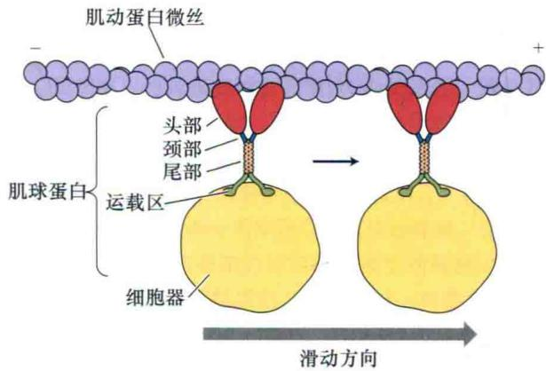  
图1.22 肌球蛋白驱动的细胞器运动。在植物细胞中，大部分的细胞器运动依赖于肌球蛋白。肌球蛋白向肌动蛋白微丝的正极端运动。肌球蛋白是一个同源二聚体，分别有两个头部和两个尾部。红色所示的两个头部具有ATP酶和马达蛋白的活性，如可以改变与头部相邻的颈部的构象来产生所谓的“行走”——沿着微丝不断地移动。而尾部则通过运载区域与细胞器相连，但是并不清楚这些区域是否能与细胞器膜发生直接的相互作用。

## 1.8 细胞周期调控

细胞的分裂循环，或者细胞周期，是细胞复制自身和它的遗传物质核DNA的过程。细胞周期的4个阶段分别命名为 $G_{1}$ 期、S期、 $G_{2}$ 期和M期（图1.23）。新合成还未进行DNA复制的子细胞所处的时期称为 $G_{1}$ 期（ $G_{1}$ phase）。S期（S phase）主要进行DNA复制。DNA复制完毕但未进行有丝分裂的时期称为 $G_{2}$ 期（ $G_{2}$ phase）。总的来说， $G_{1}$ 期、S期和 $G_{2}$ 期都称为分裂间期（interphase），而M期为有丝分裂期（mitosis）。在含液泡的细胞中，液泡的增大贯穿整个分裂间期，而在分裂期时被细胞板一分为二。

## 1.8.1 细胞周期的每个阶段都有其特定的生化和细胞活动

在 $G_{1}$ 期，沿着染色质的复制原点上的预复制复合体进行组装，准备核DNA的复制。DNA在S期复制完成，在 $G_{2}$ 期准备有丝分裂。

在细胞进入有丝分裂时，细胞的整体结构发生变化。如果细胞中有一个中央大液泡，液泡必先被胞质中的穿液泡膜管一分为二。这个区域将会成为核分裂的发生区域（图1.23）。高尔基体和其他的细胞器也平均地一分为二。如前所述，内膜系统和细胞骨架也发生广泛重组。当细胞进入有丝分裂时期，染色体从位于细胞核内的分裂间期状态开始压缩形成中期的染色体（图1.24）。而后者通过一种称为黏结蛋白（cohesin）的特

  
图1.23 有液泡细胞的细胞周期。与液泡型细胞的伸长和分裂有关的细胞周期分为4个时期： $G_{1}$ 期、S期、 $G_{2}$ 期和M期。多种多样的细胞周期蛋白（Cyc）和周期蛋白依赖性蛋白激酶（Cdk）调控着时期之间的转换。Cyc D和Cdk A参与到 $G_{1}$ 期到S期的转变。Cyc A和Cdk A参与到S期到 $G_{2}$ 期的转变。Cyc B和Cdk B则调控 $G_{2}$ 期到M期的转变。这些激酶磷酸化细胞中的其他蛋白质，导致细胞骨架和膜系统的重组。但是，Cyc/Cdk复合体的寿命有限，常被自身的磷酸化状态所调控；复合体含量的降低常常意味着其所调控时期的结束和下一时期的来临。

在 $G_{1}$ 早期的一个关键调控点（或检验点，checkpoint），细胞准备开始DNA的合成。在哺乳动物细胞中，DNA复制和有丝分裂是相互关联的——细胞分裂殊蛋白质而相互连接在一起。这些黏结蛋白位于每对染色体的着丝粒区域。当动粒连接在纺锤体微管上时（在下一部分中描述），为了染色体的最终分离，黏结蛋白会被已经激活的分离酶（separase）剪切。

一旦开始，将不会中断，直到有丝分裂所有的时期都完成。相反地，植物细胞能在DNA复制前或后停止细胞分裂（如在 $G_{1}$ 期或 $G_{2}$ 期）。因此，大多数动物细胞是二倍体（有两套染色体）。而植物细胞经常是四倍体（有4套染色体）甚至是多倍体（有多套染色体），因为植物细胞可以经历核DNA的额外复制而不进行有丝分裂。这一过程称为内复制（endoreduplication）。

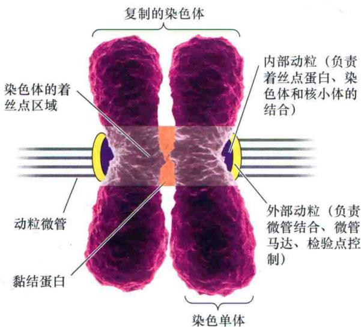  
图1.24 分裂中期染色体结构。图中突出显示的为着丝点DNA，两条染色体被黏结分子连在一起的区域用橙色显示。具有层状结构的动粒（内层紫色，外层黄色）含有微管结合蛋白，包括能够在细胞分裂后期动粒微管缩短时帮助微管解聚的驱动蛋白（染色体结构模型来自Sebastian Kaulitzki/Shutterstock）。

## 1.8.2 细胞周期蛋白依赖性蛋白激酶调控细胞循环

调控细胞循环的生化反应在真核生物中是高度保守的，而植物保留了这个机制的基本程序（Renaudin et al., 1996）。有3个检验点控制细胞循环的进行，分别为： $G_{1}$ 期晚期、S期晚期及 $G_{2}$ 期/M期的过渡期。

控制细胞循环不同阶段间转化和非分裂细胞进入细胞循环的关键酶，是细胞周期蛋白依赖性蛋白激酶（cyclin-dependent protein kinase, Cdk）。蛋白激酶是利用ATP将蛋白质磷酸化的酶。大多数多细胞真核生物在细胞循环的不同周期使用很多具有活性的蛋白激酶。它们的活性都依赖于称为周期蛋白（cyclin）的调控性亚基。目前，已经从植物、动物和酵母中鉴定出了几种周期蛋白。其中，在烟草细胞的周期调控中有3种周期蛋白（周期蛋白A、周期蛋白B和周期蛋白D）的参与（图1.23）。

（1） $G_{1}/S$ 周期蛋白。周期蛋白D，在 $G_{1}$ 期晚期活跃。

(2) S周期蛋白。周期蛋白A，在S期晚期活跃。

（3）M周期蛋白。周期蛋白B，在有丝分裂前期活跃。

$G_{1}$ 期晚期的重要限制点主要由D类型的周期蛋白调控，这个限制点能使细胞进行另一轮分裂。将在后面的章节看到，促进细胞分裂的植物激素，包括细胞分裂素（见第21章）和油菜素甾醇（见第24章），至少部分通过一个植物D类周期蛋白——Cyc D3的增加起作用。

虽然可以通过很多种方式调控Cdk的活性，但是其中两种最重要的机制为：①周期蛋白的合成和降解；②Cdk上关键氨基酸残基的磷酸化和脱磷酸化。在第一种调控机制中，如果周期蛋白不与Cdk结合，则Cdk是没有活性的，而大部分周期蛋白可以快速降解。它们被合成，然后在细胞周期的特定时刻被主动降解（这一过程依赖ATP）。周期蛋白在胞质中被一种称为26S蛋白酶体（26S proteasome）的大型蛋白质水解复合体所降解（见第2章）。在被蛋白酶体降解之前，周期蛋白通过一种小的蛋白质——泛素（ubiquitin）的标记而降解，这个过程需要ATP。泛素化是一种标记细胞内降解蛋白质的普遍机制（见第2章）。

调控Cdk活性的第二种机制是Cdk的磷酸化和脱磷酸化。Cdk有两个酪氨酸磷酸化位点：一个使Cdk激活，另一个使其失活。特定的激酶能同时激发和抑制磷酸化。同样的，蛋白磷酸酶可以使Cdk脱磷酸化，根据脱磷酸的位置不同，可以起到促进或抑制Cdk活性的作用。在Cdk上增加或移除磷酸基团的过程受到高度调控，这也是细胞循环过程中的一个重要机制。Cdk抑制剂（ICK）也能进一步调控这一过程，ICK能够影响G $_{1}$ 期/S期的转变。

## 1.8.3 有丝分裂和胞质分裂都需要微管和内膜系统的参与

有丝分裂是指复制过的染色体经过排列到细胞板、分离、再分配到两个子细胞的过程（图1.25）。微管是有丝分裂的组成部分。早于分裂前期的时期称为早前期（preprophase）。在早前期时， $G_{2}$ 期的微管已经完全重组到将要形成细胞板的位置——环绕着细胞核的微管早前期带（preprophase band）中（图1.25）。早前期带的位置和潜在的周质分裂位点（cortical division site）（Müller et al., 2009），以及分割中央液泡的胞质分裂决定了植物细胞的分裂位置，并因此在发育过程中起着重要的作用（见第16章）。

细胞分裂前期伊始，在核膜表面多聚化的微管开始以细胞核为中心聚集在其两边，起始纺锤体形成（spindle formation）。尽管与动物中的中心体无关，但是这些微管聚集点在微管组装过程中起着与动物中心体相同的功能。细胞分裂前期（prophase）的核膜依旧是完整的，但进入中期（metaphase）开始瓦解。在这一过程中，核膜进行重组和被吸收进入ER（图1.25）。在细胞分裂的整个过程中，细胞分裂激酶与微管结合通过磷酸化驱动蛋白和MAP来帮助纺锤体重组。

  
图1.25 植物分生组织细胞（非液泡细胞）中伴随着有丝分裂的细胞组织结构的改变。1、2、4和5.红色荧光来自于α-微管蛋白抗体（微管），绿色荧光来自于WIP-GFP（绿色荧光蛋白和一种核膜蛋白所产生的融合蛋白），蓝色荧光来自于DAPI（一种DNA结合染料）。3、6和7.内质网由发绿色荧光的HEDL-GFP所标记，细胞板由发红色荧光的FM4-64标记（1、2、4和5引自Xu et al., 2007；3、6和7引自Higaki et al., 2008）。

当染色体开始浓缩，不同染色体的核仁组织（nucleolar organizer）区域解离，导致核仁的解聚。核仁在有丝分裂中完全消失，并在分裂后逐渐重新组装，正如分裂后染色体的去浓缩及在子细胞核中重新确立位置。

在早中期（early metaphase, or prometaphase），随着微管早前期带的消失，新的微管开始聚合形成有丝分裂的纺锤体（mitotic spindle）。植物细胞的纺锤体与动物细胞相比外形更似盒子形状。植物中的纺锤体微管产生于分散的区域，这个区域由细胞相对的两端的多个焦点组成并以近乎平行的排列方式延伸到细胞中。

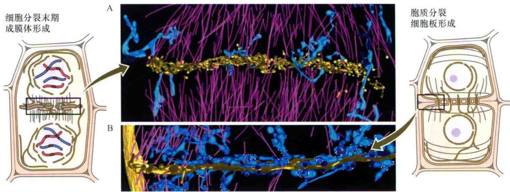  
图1.26 细胞板形成时期成膜体和内质网结构的改变。A. 有丝分裂早末期，细胞板（黄色）只是在其与ER（蓝色）的管状囊泡网络相结合的地方形成。成膜体微管中（紫色）也含有少量的潴泡。B. 从侧面观察周质细胞板（黄色）的形成，表明尽管在周质生长区域内，许多胞质的ER管（蓝色）混合在微管（紫色）中，但前者与细胞板膜并不发生直接接触。图中的小白点是ER结合的核糖体（成膜体的电子显微镜的3D断层摄影重建引自Segui-Simarro et al., 2004）。

细胞分裂中期（metaphase）的染色体由组蛋白紧密地包裹形成核小体，并进一步缠绕成为浓缩的纤维（图1.7），从而完成染色体的彻底压缩。着丝粒（centromere）是靠近染色体中部两条姐妹染色单体附着的区域。这一区域和染色体的端粒（telomere）一样都含有DNA重复序列。端粒形成于染色体的端部从而保护其不被降解。一些纺锤体微管能结合在染色体中心粒中被称为动粒（kinetochore）的特殊区域，这些浓缩的染色体从而平行排列在中期的细胞板上（图1.24）。一些未附着的微管则与来源于纺锤体中间区的另一极的微管相重叠。

类似于控制细胞周期4个时期的检验点，有丝分裂时期内部也由检验点控制。例如，如果纺锤体微管与动粒错误地相结合，纺锤体组装检验点（spindle assembly checkpoint）能使细胞不进入分裂后期。Cyc B-Cdk B复合物在调控这一过程中起着主要的作用。如果纺锤体微管正确地结合在动粒上，后期促进复合物（anaphase promoting complex）则能使Cyc B降解。缺失Cyc B, Cyc B-Cdk B复合物将不能形成，这使得排列在中期细胞板的姐妹染色单体能够向两极分配[每一条染色单体经过一轮的DNA复制则含有二倍体（2n）的DNA。因此，一旦发生分离，染色单体即成为染色体]。

后期染色体分离的机制由两个元素组成。

后期A（anaphase A）（早后期），在这个时期，

姐妹染色单体分离并开始移向两极。

后期B（anaphase B）（晚后期），极化的微管进行相对滑动和伸长以推动纺锤体向两极进一步分离。同时，姐妹染色单体分别进入两极。

在植物中，纺锤体微管并不锚定在两极的细胞周质上，因此染色体并不能因此而被分开，而可能是被极性发生重叠的纺锤体微管中的驱动蛋白所拉开（参见Web Topic 1.11）。

有丝分裂末期，被称为成膜体（phragmoplast）的新的微管和微丝网络出现。成膜体建立了发生胞质分裂的细胞质区域。此时的微管不再呈现纺锤体形状，但仍旧保持着它的极性，它们的负极指向已经分离的并正在去压缩的染色体，而核膜也在此区域进行重组（图1.25“末期”）。微管的正极则指向成膜体的中间区域，在这一区域中，部分来源于母细胞质膜内吞囊泡的小囊泡发生积累。这些囊泡带有长链（long tether），能帮助形成细胞板使细胞进入下一个时期——胞质分裂。

胞质分裂（cytokinesis）是一个建立细胞板（cell plate）的过程，细胞板是能将两个子细胞一分为二的细胞壁的前体（图1.26）。细胞板和包裹其的质膜在细胞中心形成一个岛，能通过囊泡融合的方式向着母细胞壁的方向生长。参与囊泡融合过程的SNARE家族的KNOLLE靶标识别蛋白同参与囊泡形成的套索形状的一类鸟苷三磷酸酶——发动蛋白（dynamin）一样，在细胞板形成时期出现（参见Web Topic 1.8）。正在形成的细胞板与母细胞膜发生融合的位点，是由早前期带和特异的微管结合蛋白的位置决定的。细胞板的组装使得ER管位于横跨细胞板的原生质膜间的膜通道中，从而连接两个子细胞（图1.26）。

在下一部分会讨论到，横跨细胞板的ER管确定着初级胞间连丝的位置。在胞质分裂之后，微管在细胞周质中重组。新的周质微管以垂直于细胞轴的方向排列，这种方向也决定了细胞未来的伸展极性。

## 1.9 胞间连丝

胞间连丝（plasmodesmata，单数plasmodesma）是质膜的管状延伸，直径为40\~50 nm。它能穿越细胞壁，并使相邻细胞间的胞质连接。因为大多数植物细胞通过这种方式相连，所以它们的胞质形成了一个称为共质体（symplast）的连续体，因而通过胞间连丝的溶质胞间运输称为共质体运输（symplastic transport）（见第4章和第6章）。

A  
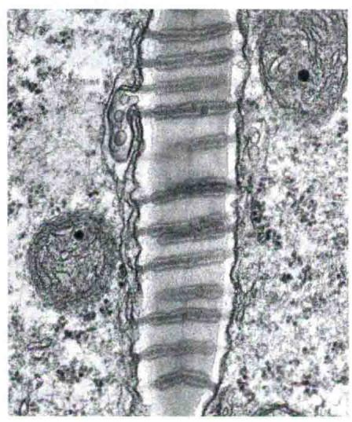

  
B

## 1.9.1 初级胞间连丝和次级胞间连丝帮助维持组织的发育梯度

初级胞间连丝（primary plasmodesmata）的形成为无性繁殖的细胞（一个母细胞通过有丝分裂产生的两个子细胞）提供了胞质联系。这种共质体能使水和溶解物在细胞间进行非跨膜运输。但是，在共质体中运输的分子大小会受到限制。这种限制称为通透分子大小极限（size exclusion limit，SEL）。环绕着ER管的细胞质通道（或者连丝微管，desmotuble）组成了胞间连丝的中心并决定着SEL（图1.27）（Roberts and Oparka，2003）。除此之外，细胞质通道中的球形蛋白还能形成穿过胞间连丝的螺旋状微通道（Ding et al., 1992）。

通过追踪不同大小的荧光染料分子在叶表皮胞间连

  
0.2 μm

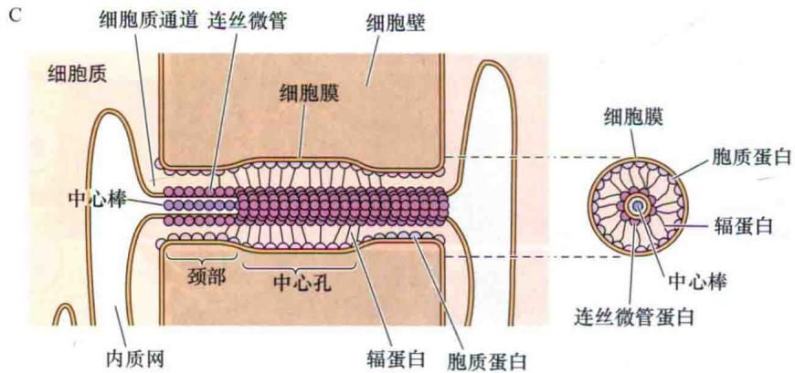

图1.27 胞间连丝。A. 电镜照片表示两个相邻细胞由细胞壁分开，所示是胞间连丝的纵切图。B. 细胞壁的切面图，显示许多横切的胞间连丝。C. 含有一个胞间连丝的细胞壁模式图。由两个狭窄的颈部间的中心孔组成。连丝微管和相邻细胞间的内质网相连。蛋白质位于连丝微管的表面和质膜的内表面间，这两个表面被认为是通过丝状蛋白连起来的，并将胞质通道分成了很多微通道。蛋白质间的距离大小决定了胞间连丝分子筛的特性（A，B由Ray Evert惠赠，引自Robinson-Beers and Evert，1991）。

丝的运动能够测定胞间连丝对所运输物质的分子质量限制。这些细胞间运输的分子质量限制为700\~1000 Da，即相当于大小为1.5\~2.0 nm的分子。但是，溶解物穿过细胞质通道和连丝微管的机制仍然不清楚。目前已经发现，胞间连丝中存在肌动蛋白和肌球蛋白（Roberts and Oparka，2003）。那么，就有以下两种可能。

（1）肌动蛋白和肌球蛋白使得孔收缩，减小了SEL。

（2）肌动蛋白和肌球蛋白本身辅助大分子和微粒通过胞间连丝孔。

如果胞间连丝的SEL限制了分子大小为2.0 nm或更小的分子在细胞间的运输，那么像烟草花叶病毒这样大的物质如何通过它们？病毒基因组编码的运动蛋白（movement protein）是非结构性的蛋白质，它能够帮助病毒通过如上所述的其中一种机制在共质体间移动。一些植物病毒所编码的移动蛋白能包裹在它基因组（通常是RNA）的表面形成核糖核蛋白复合物来通过胞间连丝孔。30 kDa的烟草花叶病毒的运动蛋白就是通过这种方式来移动的。另外一些如豌豆花叶病毒和番茄斑萎病毒，病毒能编码运动蛋白在胞间连丝孔中形成运输管，帮助成熟的病毒颗粒通过胞间连丝。

如果病原体的遗传信息能通过胞间连丝传递，那么是否经过有丝分裂所产生的独立的细胞间的遗传信息也能如此地相互传递？植物能在各个层面上感知具有极性梯度的形态发生素（参与发育的信号分子，见第16章），包括单细胞水平、组织水平，并且还可能影响植物的整体形状。例如，一片叶片中的细胞数目（当大于最低阈值时）是和叶片大小无关的。这些参与器官发生的信号分子并不仅仅是激素类的小分子，也包括蛋白质和RNA（Gallagher and Benfey，2005）。在第16章中将会更加详细地介绍这种细胞间的交流。

在非同一克隆来源的细胞间共质体运输还能通过次级胞间连丝（secondary plasmodesmata）发生（Lucas and Wolf，1993）。当相邻的细胞壁区域被消化，质膜发生融合，这种次级胞间连丝就可能由此产生。最终，细胞间的内质网网络得到连通。事实上，共质体能以这种方式扩张说明了它在植物营养的获得及发育信号传递方面起着非常重要的作用。

## 小结

虽然所有植物从外形到大小丰富多样，但是它们有相似的生理过程。作为初级生产者，植物将太阳能转化为化学能。由于不能移动，植物必须向光生长，并且拥有高效的维管系统来保证水、矿质营养和光合产物在植物体内的运输。绿色陆生植物还必须有防止脱水的

机制。

## 植物生命：统一的准则

· 所有的植物都能将太阳能转化为化学能；利用生长而不是可移动性来获得资源；具有维管系统；具有坚硬的结构；具有防脱水的机制。

## 植物结构总览

· 所有植物都进行着基本相似的生命过程和具有普遍的个体发育构架（图1.1）。

由于植物具有坚硬的细胞壁，因此它的发育只依赖于细胞分裂的模式和细胞膨大（图1.2）。

\- 几乎所有的有丝分裂和胞质分裂都发生在分生组织区域。

· 表皮组织、基本组织及维管组织是出现在所有植物器官中的3种主要组织系统（图1.3）。

## 植物细胞器

· 除了细胞壁和质膜，植物细胞还含有由内膜系统形成的分隔的区室（图1.4）。

· 叶绿体和线粒体并不来源于内膜系统。

\- 内膜系统在细胞分泌过程、膜循环及细胞周期中发挥重要作用。

\- 质膜的组成和流动镶嵌结构使得细胞能够调节进出细胞的运输（图1.5）。

## 内膜系统

\- 内膜系统将膜和货物蛋白运输到各细胞器中。

· 核膜来源于内膜系统元件——内质网（图1.6和图1.8）。

· 细胞核是染色质储存、复制和转录，以及核糖体合成的场所（图1.7和图1.8）。

\- 内质网是一个具有复杂动态结构的膜包裹的管状系统（图1.9）。

· 糙面内质网参与进入内质网内腔的蛋白质合成，而滑面内质网则是脂类合成的场所（图1.8和图1.10）。

· 内质网为内膜系统其他区室提供膜和货物。

· 细胞的分泌蛋白始于糙面内质网（图1.8）。

· 高尔基体负责加工分泌型糖蛋白和多糖（图 1.11）。

· 内吞时，膜通过形成小的网格蛋白包被囊泡从质膜上分离出来（图1.12和图1.13）。

· 质膜的内吞促进了膜的循环（图1.13）。

## 来源于内膜系统并进行独立分裂的细胞器

· 油体、过氧化物酶体和乙醛酸循环体的生长和增殖不依赖于内膜系统（图1.14和图1.15）。

## 独立分裂的半自主型细胞器

· 线粒体和叶绿体都具有内外双层膜（图1.16和图1.17）。

· 质体含有高浓度的色素或淀粉（图1.18）。

· 原质体通过不同的发育时期形成特化的质体（图 1.19）。

· 质体和线粒体中，DNA的复制和分裂独立于核分裂而进行。

## 细胞骨架

· 微管和微丝的三维网络为细胞质提供构架（图 1.20）。

\- 微管和微丝能够组装和解聚（图1.21）。

· 结合在细胞骨架元件上的马达蛋白能使细胞器在胞质中运动（图1.22）。

· 在胞质环流中，微丝能和肌球蛋白相互作用，帮助细胞器（包括叶绿体）独立运动。

## 细胞周期调控

· 细胞周期由4个时期组成，在此过程中，细胞能进行DNA的复制和完成自身的增殖（图1.23和图1.24）。

· 成功的有丝分裂和胞质分裂需要微管和内膜系统的参与（图1.25和图1.26）。

胞间连丝

\- 质膜的管状扩展横穿细胞壁并连接了两个细胞的胞质，使得水和小分子物质能够不经过跨膜而在细胞间移动（图1.27）。

(王园 王学路 译)

## WEB MATERIAL

Web Topics

1.1 Model Organisms
Certain plant species are used extensively in the lab to study their physiology.

1.2 The Plant Kingdom
The major groups of the plant kingdom aresurveyed and described.

1.3 Flower Structure and the Angiosperm Life Cycle

The steps in the reproductive style of angiosperms are discussed and illustrated.

1.4 Plant Tissue Systems, Dermal, Ground, and Vascular A more detailed treatment of plant anatomy is green.

1.5 The Structures of Chloroplast Glycosylglycerides
The chemical structures of the chloroplast lipids are illustrated.

1.6 A Model for Structure of Nuclear Pores
The nuclear pore is believed to be lined by a meshwork of unstructured nucleoporin proteins.

1.7 The Protein Involved in Nuclear Import and Export Importin and other proteins mediate macromolecular traffic into and out of the nucleus.

1.8 Protein Signals Used to Sort Proteins to their Destinations
The primary of sequence of a protein can include a ticket to its final destination.

1.9 SNARES, Rab, and Coat Proteins Mediate Vesicle Formation, Fission, and Fusion
Models are presented for mechanisms of vesicle fission and fusion.

1. 10 ER Exit Sites (EREs) and Golgi Bodies Are Interconnected
The comigration of EREs and Golgi bodies during cytoplasmic streaming has been caught on film.

1. 11 Specialized Vacuoles in Plant Cells
Plant cells contain diverse types of vacuoles.

1.12 Actin-Binding Proteins Regulate Microfilament Growth
Proteins such as profilin, formin, fimbrin, and villin help to regulate microfilament growth.

1. 13 Kinesin Are Associated with Other Microtubules and Chromatin
In addition to mediating organell movements along microtubule pathway, kinesins also bind to chromatin or other microtubules.
