## 第3章

## 水和植物细胞

水在植物的生命活动中起着至关重要的作用。光合作用需要植物从大气中吸收 $CO_{2}$ ，但同时也使植物面临失水，甚至脱水的威胁。为避免叶片脱水，植物通过根部吸水并在植物体内运输。这种吸收、运输的水分和散失到大气中的水分之间必须保持平衡，即使是微弱的失衡都可以导致水分亏缺，引起细胞的生命过程严重失常。因此，保持水分吸收、运输和散失之间的平衡，是陆生植物所面临的一个重要挑战。

细胞壁是植物细胞和动物细胞的主要区别，它的存在影响着植物细胞水分代谢的所有方面。细胞壁可使植物细胞建立起巨大的内部静水压，即膨压（turgor pressure）。膨压对于细胞伸展、气孔开放、韧皮部运输及各种跨膜转运等许多生理过程都是必需的。膨压也使非木质化的植物组织具有刚性和机械稳定性。本章主要讲述水分如何进出植物细胞，着重阐述水分子特性及影响水分在细胞水平运动的物理驱动力。

## 3.1 植物生命中的水

在植物生存和发挥功能所需的各种资源中，水的需求量最大，但同时对植物生长的限制性最强。灌溉对作物产量的影响反映了水是一种限制农业产量的关键资源因素（图3.1）。水分的可利用量也限制着自然生态系统的生产率（图3.2），这导致植被类型随着降水量梯度呈现显著差异。

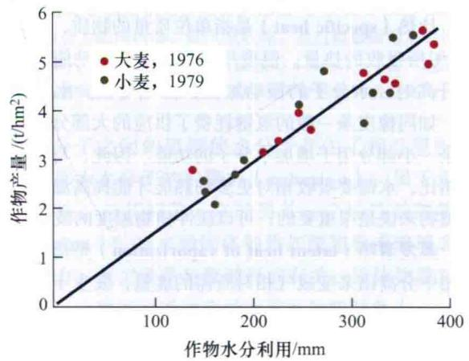  
图3.1 不同灌溉导致的水分可利用率对英国东南大麦和小麦产量的影响（引自 Jones，1992。数据引自 Day et al., 1978; Innes and Blackwell, 1981）。

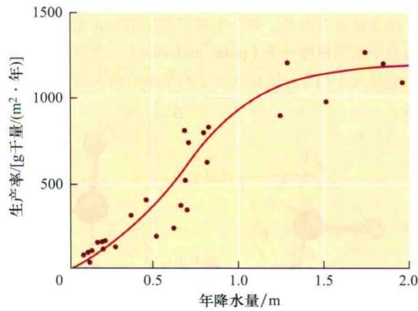  
图3.2 年降水量对各种生态系统生产率的影响。产量率是由生长繁殖造成地上部分有机物的净积累量值估算得到的（引自Whittaker，1970）。

由于植物的耗水量是巨大的，水通常被认为是植物而不是动物的一种限制性资源。植物根系吸收的水分，绝大部分（约97%）经植物体内运输，最后由叶表面蒸发散失，这种水分散失的方式称为蒸腾作用(transpiration）。植物根系吸收的水分仅有一小部分存留在植物体内，用来满足植物生长（约2%）、光合作用及其他代谢过程的需要（约1%）。

对于陆生植物，伴随着光合作用，水分不可避免地散失到大气中去。通过共同的扩散途径同时进行着 $CO_{2}$ 的吸收和水分的散失：即 $CO_{2}$ 扩散进叶片，而水分扩散出去。驱动水分从叶片散失所需的浓度梯度比 $CO_{2}$ 吸收所需的浓度梯度大得多，使得每获得一分子 $CO_{2}$ 就有400分子的水散失。这种不均等的交换机制极大地影响了植物形态和功能的进化，同时也解释了为什么水在植物的生理活动中起着至为关键的作用。

首先让我们来认识水的结构，水所具有的物理特性。随后再阐述水分运动的物理基础、水势的概念及其在细胞与水相互关系中的应用。

## 3.2 水的结构和特征

水独特的性质使之能够作为一种溶剂并在植物体内很好地运输。这些特征源于其具有氢键和极性的分子结构。在这一部分中我们将阐明水分子中氢键的形成，及其导致水具有的高比热、表面张力和抗张强度等重要特征。

## 3.2.1 水分子的极性导致氢键的形成

水分子由一个氧原子和两个氢原子共价结合而成，两个O—H共价键形成105°夹角（图3.3A）。由于氧原子的电负性（electronegative）强于氢原子，吸引O—H共价键中的电子向氧原子偏移，从而导致水分子中氧原子端呈部分负电荷，两个氢原子端呈部分正电荷，使得水分子成为极性分子（polar molecule）。这些局部的正负电荷大小相等，因此水分子所带净电荷为零。

  
图3.3 水分子结构示意图。A. 氧原子强的电负性意味着与氢原子形成的共价键的两个电子并不是均等共享的，这样导致每个氢原子带部分正电荷。氧原子的两对孤对电子产生一个负电荷极。B. 水分子上相反的两极（ $\delta^{-}$ 和 $\delta^{+}$ ）导致水分子间氢键的形成。氧原子最外层轨道有6个电子，每个氢原子最外层有1个电子。

水分子呈四面体形，四面体的两个顶点是氢原子，带有部分正电荷。四面体的另两个顶点含有孤对电子，每对都带部分负电荷。这样每个水分子具有两个正极和两个负极。正是由于这种局部异性电荷的存在使得相邻水分子间形成静电吸引，即称为氢键（hydrogen bond）（图3.3B）。

只有当高的电负性原子如氧与氢原子共价结合形成有效的静电引力时才会形成氢键。这是因为氢原子体积较小使得局部正电荷显得更加集中，从而导致这种静电引力更加有效。

氢键赋予了水很多独特的物理特性。水分子可以与毗邻的水分子间最多形成4个氢键，造成分子间极强的作用力。水也能和其他具有强电负性原子（O或N）的分子间形成氢键，尤其是当这些分子中的强电负性原子与H共价结合时。

## 3.2.2 水是一种良好的溶剂

水是一种优良的溶剂，与其他溶剂相比，它能大量溶解许多物质。水之所以作为一种广泛使用的溶剂，不仅是由于其分子体积小，更为重要的是其形成氢键的能力和其极性结构，从而使水成为溶解离子化合物和含有极性基团（如—OH和—NH $_{2}$ ）的糖类和蛋白质类物质优良的溶剂。

溶液中，水分子和离子之间、水分子和极性溶质间的氢键，能有效地降低带电溶质间的静电相互作用，从而提高它们的溶解度。同样的，大分子如蛋白质和核酸与水分子之间的氢键也减弱了大分子彼此间的相互作用，利于它们溶解于水中。

## 3.2.3 水具有独特的热力学特性

水分子间广泛存在的氢键，使水具有与众不同的热力学特性。例如，水具有高比热和高的蒸发潜热。

比热（specific heat）是指单位质量的物质，温度升高1℃所吸收的热量。温度用于衡量分子的动能。当温度升高时，水分子的振动加快，振幅增大。水被加热时，如同橡皮条一般的氢键耗费了供应的大部分热能，只余一小部分用于增加水分子的功能。因此，与其他液体相比，水需要吸收相对更多的热能才能提高温度，这对植物来说是很重要的，可以缓冲植物温度的波动。

蒸发潜热（latent heat of vaporization）是指分子从液相中分离出来变成气相时所需的能量，发生于蒸腾作用的过程中。蒸发潜热随着温度的升高降低，在沸点（100℃）减至最低。处于25℃的水，它的蒸发潜热是44 kJ/mol，这在已知的所有液体中是最大的，其大部分用来断裂水分子间的氢键。

蒸发潜热并不能改变已经蒸发的水分子的温度，但是可以使水分蒸发的物体表面冷却，因而水的高蒸发潜热可以帮助植物有效调节蒸腾叶片的温度，否则，当植物吸收太阳辐射的热能时，叶片温度会升高。

## 3.2.4 水具有高附着性

处于气-液交界面的水分子受到液相中邻近水分子由于氢键产生的吸引力比气相中邻近水分子的吸引力要大得多。这种不平衡吸引的结果，使得气-液接触面的表面积最小，从而使体系处于能量最低状态（即最稳定状态）。要增加气-水接触面的表面积，需要吸收能量来打破氢键，这种增加气-液接触面的表面积所需的能量称为表面张力（surface tension）。

表面张力的单位为 $J/m^{2}$ ，即单位面积上的能量。常用的非正式等价单位是N/m。焦耳是能量的国际单位，是力与其作用距离的乘积，即Nm。牛顿（N）是力的国际单位，是质量与加速度的乘积，即1 kg m/s $^{2}$ 。如果气-液接触面弯曲，表面张力会在垂直于这个接触面上产生一种合力（图3.4）。后边将会讲到，叶片蒸发表面的表面张力和附着力会产生一种物理作用力，从而拉动水分沿植物维管系统运动。

  
图3.4 悬浮在液体中的气泡的形状为球形从而使表面积最小。这是由于表面张力作用方向沿着气-液交界面的切线方向，导致合力指向内部，使气泡收缩。通过接触面施加的压强值等于2T/r，其中T是液体的表面张力（N/m），r是气泡的半径。在相同温度下，水比其他液体具有更大的表面张力。

水分子之间的氢键使水分子产生了相互吸引的力量，称为水分子的内聚力（cohesion），属于水的一个特性。与其相关，水的另外一个特性是附着力（adhesion），指水对固体物质如细胞壁或玻璃表面的吸引力，也主要是与氢键形成有关。固体物质对水分的吸引力程度可通过测量固液面的接触角（contact angle）来衡量（图3.5A）。接触角描绘了气-液界面的形状，反映了表面张力对液体内压力的影响。

内聚力、附着力及表面张力使水产生了毛细现象（capillarity）（图3.5B）。想象一个具可湿性壁的竖直毛细玻璃管插入水后的现象（接触角<90°）。平衡时，毛细管中水面高度要比管外的水面高。水被吸引到毛细管内的原因是：①吸引水到玻璃管极性表面的吸引力（附着力）；②水的表面张力。附着力和表面张力共同作用使水分子沿着管壁上升，直到使水上升的力量与水柱的重力相等为止才达到平衡。管越细，平衡时液面上升越高。有关毛细现象的计算，参见Web Topic 3.1。

  
图3.5 A. 固体表面上液滴的形状反映了液体与固体间相对引力的大小。接触角（ $\theta$ ）定义为从固-液交界面到气-液交界面的角度，用来描述这种相互作用。“可湿性”表面的接触角小于90°，高度可湿性（亲和力高）（如洁净玻璃表面的水和初生的细胞壁）的接触角接近于0°，水扩散成一薄层覆盖在高度可湿性表面上。然而非可湿性（疏水性的）表面接触角大于90°，水像念珠一样立在其表面。B. 毛细管现象可以通过观察从竖直毛细管底部进入液体后发生的现象来证明。如果管壁是高度可湿的（如在洁净玻璃管中水的接触角约为0°），合力是向上的。从而水面会上升直至向上的力与水柱的重力相等。相反，如果液体与管壁为非可湿的（如在洁净玻璃管中Hg的接触角约为140°），弯月面将向下弯曲，从而表面张力引起的合力使管中液面降低。

## 3.2.5 水具有高抗张强度

氢键使水具有高的张力（tensile strength），张力是指一个连续的水柱在断裂之前单位面积上所能承受的最大拉力。通常认为液体不存在张力，然而产生毛细现象的水柱证实水的这种特性。

可以把水放在干净的玻璃注射器中来证明它的张力（图3.6）。当推动注射器的活塞时，水被压缩，产生了一个正的静水压（hydrostatic pressure），单位为帕斯卡（Pa），方便时也可用兆帕斯卡（MPa）表示。1 MPa约等于9.9个大气压。压强是指单位面积上的压力（即 $1\ Pa=1\ N/m^{2}$ ），或者单位体积内的能量（即 $1\ Pa=1\ J/m^{3}$ ）。表3.1比较了压强的几种单位。

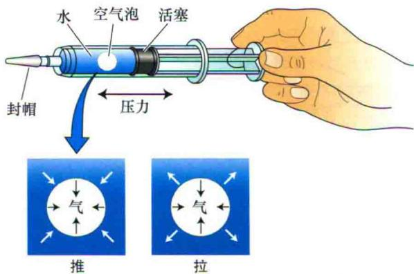

图3.6 一个封闭的注射器可以用来使水一样的流体产生正向或负向的压强。推动柱塞可以使流体产生正向的流体静力压（白色箭头），其作用力方向与表面张力（黑色箭头）所引起的界面力方向相同。这样注射器液体中的小气泡随压强升高发生皱缩。拉动柱塞使液体产生张力，即负压。若由液体产生的向外的力（白色箭头）大于由气-液交界面表面张力产生的向内

的力（黑色箭头），则注射器中的气泡会膨胀。

表3.1 几种压强单位的比较

1个大气压=14.7 psi
=760 mm 汞柱（海平面，纬度45°）
=1.013 bar
=0.1013 MPa
=1.01×10$^{5}$ Pa
汽车轮胎通常可以充气到0.2 MPa
家用水管中的水压为0.2~0.3 MPa
距离水面高 5 m处的水压强大约为0.05 MPa

如果拉动而不是推动活塞时，注射器中的水会产生一种张力或称负的静水压来对抗拉动。想象一下拉动活塞直到水分子之间彼此断开，使水柱断裂的困难到底有多大？

仔细研究发现，小毛细管中的水可以对抗比-20 MPa更负的拉力（Wheeler and Strook，2008），负号代表张力方向，以示与压缩相反。然而，微小气泡的存在使注射器中的水柱无法抵抗这么大的拉力（图3.6）。因为气泡在这种拉力的作用下会扩大，干扰了注射器中水抵抗拉力的能力。这种情况下气泡的扩张称为气穴现象（cavitation）。

气穴现象对水分在木质部中的连续运输会产生破坏性的影响，这一点会在第4章详细讨论。

## 3.3 扩散和渗透作用

细胞学过程依赖于分子输入和输出细胞。扩散作用（diffusion）是物质从高浓度向低浓度自发移动。对于细胞来说，扩散是运输采用的主要模式。水通过选择透过性屏障的扩散作用称为渗透作用（osmosis）。

下面讲述扩散和渗透的过程如何引导水和其溶质成分移动。

## 3.3.1 扩散是随机热振荡产生的分子净移动

溶液中的分子不是静止的，它们处于不停的运动中，彼此相互碰撞，交换动能。任一分子在碰撞后运动轨迹是随机可变的。然而这种随机运动可以导致分子的净移动。

设想一个平面把溶液分为A、B两个等体积的部分。所有分子都在作随机运动，存在有这种可能性，即随时会有一些溶质分子会跨过这个假想的面。假定在任一特定时刻从A到B的分子数目与A原有分子数目成比例，同样从B进入A的分子数目也与B原有分子数目成比例。

如果A的初始浓度高于B，更多的溶质分子将会从A进入B，这样应该可以看到溶质从A到B的净移动。这样扩散导致分子从高浓度区域向低浓度区域的净移动，尽管这时每个分子还是随机运动。这种每个分子的独立运动揭示了这个系统最终在两侧达到相同的分子数量（图3.7）。

热力学第二定律可以用来解释系统中分子平均分配的趋势，这一定律告诉人们孤立系统的一切自发过程均向着更无序的方向发展，即熵值越来越大。熵值的增加伴随着自由能的减少。因此，扩散代表了系统向能量最低状态转变的自然趋势。

19世纪50年代，科学家Adolf Fick发现扩散速率直接与浓度梯度（ $\Delta c_{s}/\Delta x$ ）成正比，即与距离为 $\Delta x$ 的两点之间不同物质的浓度差（ $\Delta c_{s}$ ）成正比。用公式表示为

$$
J _ {\mathrm{s}} = - D _ {\mathrm{s}} \Delta c _ {\mathrm{s}} / \Delta x\tag{3.1}
$$

这就是菲克第一定律。

式中， $J_{s}$ 为转运速率，也称作流量密度（flux density），指单位时间内通过单位面积的物质的量 $[J_{s}$ 的单位是 mol/(m²·s)]。 $D_{s}$ 为扩散系数（diffusion coefficient），是一个比例常数，用来衡量物质通过某种特定介质的难易程度。 $D_{s}$ 为物质的特征常数，跟物质本身的大小（分子越大，扩散系数越小），以及扩散介质（如在气体中比在液体中的扩散速度要快10 000倍）和扩散温度（温度越高，扩散速度越快）有关。式中的负号表明运动方向是顺浓度梯度方向进行的。

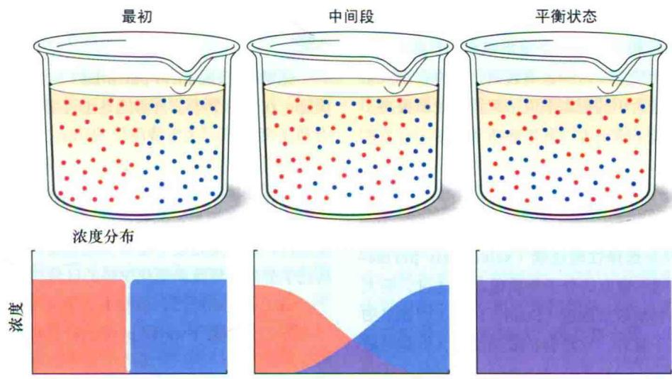  
容器中位置  
图3.7 分子的热运动导致扩散的发生——分子逐步混合，浓度差异最终消失。最初，含有不同分子的两种物质相互接触，这些物质可以是气体、液体或固体。扩散速度在气体中最快，液体次之，固体最慢。较上面的一组图示主要描述分子最初分离的情况，相应的浓度变化由较下面图中所示的位置关系来表示。随着时间的推移，分子的混合和随机性减弱了它们的净运动。平衡时，两种类型的分子达到随机（均匀）分布。

菲克第一定律说明，当物质浓度梯度（ $\Delta c_{s}$ ）变大，或扩散系数增加时，扩散速度加快。需要注意的是，这个定律只适用于由浓度梯度所驱动的物质运动，而不适用于其他外力（如压力、电场等）作用下的物质运动。

## 3.3.2 短距离扩散更有效

如果最初状态下，所有的溶质分子都集中在起始位置 x=0（图3.8A），随着分子的随机运动，处于前端的溶质开始离开初始位置，如图3.8B所示较晚的时间

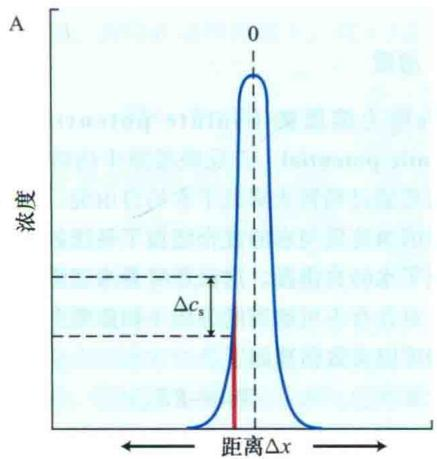

点。

比较前后两个时间点溶质分子的分布，可以看到随着物质从初始位置的扩散，浓度梯度逐渐减小（ $\Delta c_{s}$ 减小），也就是说溶质分子向后即起始点（方向指向x=0）运动的量相对于向前（方向远离x=0）运动的量会增加，因而物质的净运动也变得越来越慢。注意所有时段里溶质分子的平均位点其实都是停留在x=0的位置，但是扩散使得分子分布浓度差降低。

物质扩散距离L所需的平均时间为 $L^{2}/D_{s}$ ，换句话说，物质通过某个距离扩散所需的平均时间与该距离的平方成正比。

葡萄糖在水中的扩散系数约为 $10^{-9}\ m^{2}/s$ 。葡萄糖分子扩散通过一个直径为50 $\mu$ m的细胞时，所需的平均时间为2.5 s。然而，相同的葡萄糖分子在水中扩散1 m所需的平均时间约为32年。这些数值表明，溶质在溶液中的扩散，对于细胞大小的距离来说，其扩散效率很高，而对于物质长距离运输而言，其扩散速率太慢。有关扩散时间的具体计算细节，参见Web Topic 3.2。

  
图3.8 根据菲克定律进行扩散时溶质浓度梯度的变化。初始时，溶质分子位于X轴（“0”）所示的水平面上。A. 溶质放到初始水平面之后，短时间内的溶质分布。注意随溶质分子距初始扩散位置距离的增大，溶质浓度急剧下降。B. 在随后的时间段内溶质的分布。扩散的分子距初始位置的平均距离增加了，而且溶质浓度梯度趋于平缓（引自Nobel，1999）。

## 3.3.3 渗透作用指水通过选择性透过膜的净移动

植物细胞膜是选择性透过膜（selectively permeable），水和小的不带电的分子物质很容易透过，而大分子溶质和极性物质较难通过（Stein，1986）。如果细胞内溶质浓度高于胞外，水将会扩散进细胞，但是溶质却不能扩散出细胞，这种水跨过选择性透过膜的净移动即称为渗透作用（osmosis）。

前面看到所有系统有向熵增方向变化的趋势，从而导致溶质分子扩散进所有可能的空间。渗透过程中，膜限制了溶质分子扩散的空间，因此通过溶剂分子跨膜扩散稀释溶质而实现熵增的最大化。实际上，如果没有任何约束力存在的话，几乎所有可利用的水都可以流到膜的溶质侧。

如果把一个活细胞放在一个装有纯水的烧杯里将会有什么发生？选择性透过膜的存在意味着水的净流动将会持续直到下面两种结局出现：①细胞扩张直到这个选择性透过膜破裂，使得溶质自由扩散；②细胞体积的扩张受到细胞壁的限制，这样驱动水进入细胞的力受到细胞壁压力的制约。

第一种情景可能发生在动物细胞中，因为动物细胞不具有细胞壁。第二种则是发生在植物细胞。植物细胞壁非常强大，为了阻止细胞壁变形，产生了一种内向力，从而升高了胞内的静水压。渗透这个单词起源于希腊的单词pushing，这个单词的意思是指液体被挤压时产生的正压力。

随后将要学习渗透作用是如何促使水分跨膜运输的。然而，首先需要讨论一下总驱动力的概念，即水的自由能梯度。

## 3.4 水势

所有的生物，包括植物，要求有一个持续的自由能供给，来维持和修复它们高度有序的结构，同时维持生长和繁殖。生化反应、溶质积累、长距离运输等过程都是由植物获得的自由能来驱动（关于自由能的热力学概念的详细讨论参见附录1）。这部分我们先来研究一下浓度、压力及重力如何影响自由能。

## 3.4.1 水的化学势体现了水的自由能状态

化学势（chemical potential）定量反映了物质的自由能。在热力学中，自由能是指可用于做功的能量，即力和距离的积。化学势单位为J/mol，即每摩尔物质的自由能。注意化学势是相对量，它表示某物质在给定状态下与标准状态下的能量差。

水的化学势是水的自由能在量上的体现。水流动自发进行，也就是指在不需要其他能量的情况下水可以从高化学势的区域流向低化学势的区域。

由于历史的原因，植物生理学家通常采用一个相关的参数——水势（water potential）来衡量单位体积水的自由能（ $\mathrm{J} / \mathrm{m}^3$ ）。水势的定义是指水的化学势除以水的偏摩尔体积（1摩尔水的体积）： $18 \times 10^{-6} \mathrm{~m}^3/\mathrm{mol}$ 。水势的单位与压强的单位相同，Pa是水势常用的计量单位。下面我们来认真探讨一下水势这个重要的概念。

## 3.4.2 构成细胞水势的三要素

植物中影响水势的主要因素是浓度（concentration）、压力（pressure）和重力（gravity）。水势用符号 $\Psi_{w}$ （希腊字母psi）表示，溶液的水势由几个部分构成，常用下面等式表示。

$$
\psi_ {\mathrm{w}} = \psi_ {\mathrm{s}} + \psi_ {\mathrm{p}} + \psi_ {\mathrm{g}}\tag{3.2}
$$

式中， $\psi_{s}$ 、 $\psi_{p}$ 、 $\psi_{g}$ 分别为溶质、压力和重力对水自由能的影响（水势组成的另外几种表示法在Web Topic 3.3中有讨论）。能量水平的认定必须有一个参照值，类似于地图上表示高于海平面的一定距离的等高线。常用的参考值是指在一定环境温度和标准大气压下纯水的水势。参照的高度或设在植株底部（研究整株植物），或设在被研究组织所处的高度水平（研究水在细胞水平上的运动）。下面来逐一分析式（3.2）右边的每项组分。

## 1. 溶质

$\Psi_{s}$ 称为溶质势（solute potential）或渗透势（osmotic potential），反映溶液中的溶质对水势的影响。溶质通过稀释水降低了水的自由能。这主要是熵的影响，因为溶质与水的混合增加了系统的无序状态，从而降低了水的自由能。这就意味着渗透势与溶质的特性无关。对含有不可解离的溶质（如蔗糖）的稀溶液，其渗透势可以大致估算如下。

$$
\psi_ {\mathrm{S}} = - R T c _ {\mathrm{s}}\tag{3.3}
$$

式中，R为气体常数[8.32 J/(mol·K)]；T为绝对温度（开尔文或K表示）； $c_{s}$ 为溶液中溶质浓度，称作容量渗透摩尔浓度[osmolality，即每升水溶解溶质的摩尔数（mol/L）]。负号表示溶质的存在降低了溶液的水势，参照值为纯水的水势。由于纯水的水势定义为0，因而溶液的水势是负值。

式（3.3）对于“理想”溶液是有效的。而实际溶液，特别是在高浓度状态下，如溶质浓度大于0.1 mol/L时，通常会偏离理想溶液。温度也会影响水势（参见Web Topic 3.4）。在我们所阐述的研究中，通常假定溶液为理想溶液（Friedman，1986；Nobe，1999）。

## 2. 压力

$\Psi_{p}$ 指溶液的静水压（hydrostatic pressure）。正压增加水势，负压减小水势。有时 $\Psi_{p}$ 也称为压力势。细胞内正的静水压指的是膨压（turgor pressure）。当水在木质部或细胞的细胞壁之间时， $\Psi_{p}$ 也可以为负值，这时将会产生张力（tension），或负的静水压（negative hydrostatic pressure）。随后将会讲到，负压在水分通过整个植株的长距离运输中起着重要的作用。有关负压是否能够在活细胞中产生的问题，参见Web Topic 3.5。

静水压用来计量相对于大气压的偏离值。注意是以标准大气压下的水作为参照状态，并定义在标准状况下水的 $\Psi_{p}=0\ MPa$ 。因此，在敞口的烧杯中，纯水的 $\Psi_{p}$ 是0 MPa，尽管其绝对压强约为0.1 MPa（1个大气压）。

## 3. 重力

除非有相等的反作用力抵消重力的作用，否则重力便会使水向低处流动。 $\Psi_{g}$ 的大小取决于距离参照水面的高度（h）、水的密度（ $\rho_{w}$ ）及重力加速度g，写成公式为

$$
\psi_ {\mathrm{g}} = \rho_ {\mathrm{w}} g h\tag{3.4}
$$

式中， $\rho_{w}$ g值为0.01 MPa/m，依据式（3.4），水每升高10 m，则水势就会增加0.1 MPa。

当研究水分在细胞水平进行转运时，重力势 $\Psi g$ 通常可以忽略不计，因为与渗透势和静水压相比，它的变化是微不足道的，所以在这种情况下，式（3.2）可以简写为

$$
\psi_ {\mathrm{w}} = \psi_ {\mathrm{s+}} \psi_ {\mathrm{p}}\tag{3.5}
$$

## 3.4.3 水势的计算

水势及其各组分严重影响着细胞生长、光合作用和作物产量。植物学家花费了相当大的精力，去设计精确可靠的方法来测量植物中的水分状态。

基本的测量水势的方法是用湿度计或是压力室，其中湿度计有两种。湿度计主要利用了水气化需要大的潜热这一特性，可以精确测量①与样品处于平衡的水的气压，或②在样品和已知 $\Psi_{s}$ 溶液间转换的水气压。压力室通过对离体叶片施加外部气压直到将细胞中水分压出来测量 $\Psi_{w}$ 。

在有些细胞中， $\Psi_{p}$ 可以直接通过将一个与压力感知器相连的充有溶液的毛细管插进细胞来测量。换种情况，即 $\Psi_{p}$ 可以通过计算 $\Psi_{w}$ 和 $\Psi_{s}$ 的差来计算。可以通过几种方式来计量 $\Psi_{s}$ ，包括湿度计和测量冰点下降度的仪器。针对测量 $\Psi_{w}$ 、 $\Psi_{s}$ 和 $\Psi_{p}$ 的仪器的详细解释请参见 Web Topic 3.6。

当讨论干燥土壤或含水量很低的植物组织（如干种子）中的水势时，往往还要考虑衬质势 $\left(\Psi_{\mathrm{m}},\mathrm{matric~potential}\right)$ 。这种情况下，系统的含水层很薄，可能仅有一两个水分子的厚度，它们由于静电引力吸附在固体层表面。这种相互作用很强，不宜再把系统的水势分开成 $\Psi_{s}$ 和 $\Psi_{p}$ 来讨论，而是整合成一个单一的影响因素——衬质势 $\left(\Psi_{\mathrm{m}}\right)$ 。有关衬质势的其他内容参见Web Topic 3.7。

## 3.5 植物细胞的水势

植物细胞的水势通常 $\leqslant0\ MPa$ 。负值意味着细胞中水的自由能小于处于环境温度、大气压和相同高度的纯水的自由能。随着细胞外界溶液水势的变化，水通过渗透将会离开或进入细胞。下面通过具体的计算来说明植物细胞的渗透作用。

## 3.5.1 水分顺着水势梯度进入细胞

首先，假定20℃条件下有一个装满纯水的敞口烧杯（图3.9A）。由于水和大气相通，故水的静水压与大气压相等（ $\Psi_{p}=0\ MPa$ ）。另外水中无溶质存在，故 $\Psi_{s}=0\ MPa$ 。最后，由于关注的是烧杯中水分的运输，因此定义烧杯所处的高度水平为参照高度，即 $\Psi_{g}=0\ MPa$ 。因此，水势等于0 MPa（ $\Psi_{w}=\Psi_{p}+\Psi_{s}$ ）。

现在设想在水中溶解蔗糖，并使蔗糖浓度达0.1 mol/L（图3.9B）。由于蔗糖的添加，降低了溶液的渗透势，渗透势由原来的0 MPa降到了-0.244 MPa，因而水势也由0 MPa降到了-0.244 MPa。

接下来考虑一个松弛的植物细胞（无膨压的细胞），其内部的总溶质浓度达0.3 mol/L（图3.9C），则可以产生-0.732 MPa的渗透压。由于细胞是松弛的，内部压强与环境气压相同，所以静水压（ $\Psi_{p}$ ）为0 MPa，根据细胞水势的计算公式可知此时细胞的水势 $\Psi_{w}=-0.732 MPa$ 。

如果将该植物细胞放入盛有0.1 mol/L蔗糖溶液的烧杯中将会发生什么现象呢（图3.9C）？由于烧杯中蔗糖溶液的水势（ $\Psi_{w}=-0.244\ MPa$ ，图3.9B）比细胞的水势（ $\Psi_{w}=-0.732\ MPa$ ）高，水分将从蔗糖溶液流入细胞内（从水势高处流向水势低处）。

随着水分进入细胞，原生质体膨胀，细胞壁被不断拉伸。拉伸的细胞壁通过对细胞产生压力来抵制这种拉伸。这增加了细胞的静水压或膨压（ $\Psi_{p}$ ）。因此，细胞的水势（ $\Psi_{w}$ ）也相应增加，细胞内外的水势差（ $\Delta\Psi_{w}$ ）逐渐减小。

最终，细胞的 $\Psi_{p}$ 增加到使细胞的 $\Psi_{w}$ 与蔗糖溶液的 $\Psi_{w}$ 相等，达到平衡（ $\Delta\Psi_{w}=0\ MPa$ ），水分的净运输也随之停止。

在平衡状态下，水势是相等的， $\Psi_{w}$ （细胞）= $\Psi_{w}$ （溶液）。由于烧杯的容积远大于细胞的，细胞从烧杯中吸收的水分量是很少的，对烧杯中蔗糖溶液的浓度影响可以忽略不计，也就是说蔗糖溶液的 $\Psi_{s}$ 、 $\Psi_{p}$ 和 $\Psi_{w}$ 没有发生变化，因而平衡状态下， $\Psi_{w}$ （细胞）= $\Psi_{w}$ （溶液）=-0.244 MPa。

要想精确计算达到平衡状态时细胞的 $\Psi_{s}$ 和 $\Psi_{p}$ ，需要知道细胞体积的改变量。然而，如果假定细胞的细胞壁具有很强的刚性，那么吸水时细胞体积的增大量是很小的，这样就可以认为，在达到平衡的过程中， $\Psi_{s}$ （细胞）没有变化。根据式（3.5）可以得出平衡状态时细胞的膨压为：

$$
\Psi_ {\mathrm{p}} = \Psi_ {\mathrm{w}} - \Psi_ {\mathrm{s}} = - 0. 2 4 4 - (- 0. 7 3 2) = 0. 4 8 8 \mathrm{MPa}
$$

A 纯水

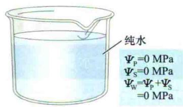

C 将萎蔫细胞置入蔗糖溶液中

B 0.1 mol/L 蔗糖溶液  
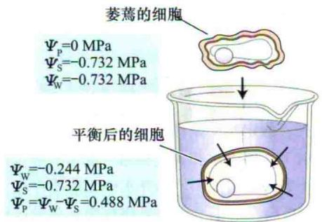

D 浓度增加的蔗糖溶液

E 对细胞施加压力

通过挤压细胞失去一半的水,从而使 $\Psi_{s}$ 从-0.732 MPa降低到-1.464 MPa

图3.9 阐述水势的概念及其组成的5个例子。A. 纯水。B. 0.1 mol/L蔗糖溶液。C. 将在空气中萎蔫的细胞放入0.1 mol/L的蔗糖溶液中。由于开始时细胞水势小于溶液的水势，细胞吸水，平衡后，细胞水势升高和溶液水势相等，最终结果是细胞具有了正的膨压。D. 增加溶液中的蔗糖浓度使细胞失水。增加的蔗糖浓度使溶液水势降低，细胞中水分流出，导致细胞膨压减小。这种情况下，由于蔗糖分子可以通过细胞壁上较大的孔道，造成原生质体与细胞壁分离（即质壁分离）。这种情况下细胞质和溶液之间水势差造成的水分移动完全通过细胞膜完成，因此原生质体发生收缩不需要依赖于细胞壁。相反，当细胞在空气中脱水时（如C中萎蔫的细胞），质壁分离则不会发生，这是由于水分通过细胞壁中的毛细管作用力被保留下来，尽管原生质体容积减小，但细胞（细胞质+细胞壁）作为整个单位收缩，使得细胞壁在细胞体积减小的过程中发生机械变形。E. 另外一种使细胞失水的方法是，用两个平板慢慢挤压细胞，在这种情况下，细胞中有一半水被挤出，因此渗透势为原来的1/2。

## 3.5.2 水分也可以顺着水势梯度流出细胞

水分也可以通过渗透作用流出细胞。在上述的例子中，如果接着将植物细胞从0.1 mol/L蔗糖溶液移出放入0.3 mol/L蔗糖溶液中（图3.9D），由于0.3 mol/L蔗糖溶液的水势 $\left[\Psi_{\mathrm{w}}\right)$ （溶液）=-0.732 MPa]比细胞的水势 $\left[\Psi_{\mathrm{w}}\right)$ （细胞）=-0.244 MPa]小得多，故水分将从膨胀的细胞流向0.3 mol/L的蔗糖溶液中。

细胞失水后，细胞体积缩小，则 $\Psi_{p}$ 和 $\Psi_{w}$ 也随之减小，直到 $\Psi_{w}$ （细胞）= $\Psi_{w}$ （溶液）=-0.732 MPa。如前所述，假定细胞体积的变化仍然很小，因此可以忽略由于水分流出细胞导致的 $\Psi_{s}$ 的改变。依据式（3.5）可以计算出，水分运动达到平衡时细胞的压力势 $\Psi_{p}=0\ MPa$ 。

如果不是将细胞转入0.3 mol/L蔗糖溶液中而是仍将细胞置于0.1 mol/L蔗糖溶液中，用两个玻璃板缓慢挤压细胞时（图3.9E），可以有效地提高细胞的 $\Psi_{p}$ ，增加细胞的水势，产生一个细胞内外的水势差 $\Delta\Psi_{w}$ ，促使水分流出细胞。这类似于工业中的反渗透法，即利用外加的压力使水分透过半透膜，实现水分与溶质的分离。如果继续挤压，直到细胞中一半的水分被挤压出，然后维持细胞处于这种状态，则细胞中的水分将会达到新的平衡。同以前的例子一样，达到平衡状态时，细胞内外的水势差为零，即 $\Delta\Psi_{w}=0\ MPa$ 。由于从细胞流到胞外溶液的总水量很小，可以忽略不计，因此细胞的水势值同未受挤压时的水势值一样，均等于胞外溶液的水势值，但此时构成细胞水势的各组分值却已完全不同。

由于有一半的水分被挤压出细胞，而溶质却留在胞内（细胞膜具有选择透过性），因而细胞溶液的浓度增大了一倍，导致 $\Psi_{s}$ 也降低为原来的1/2（-0.732 MPa×2=-1.464 MPa）。知道了 $\Psi_{w}$ 和 $\Psi_{s}$ 的最后值，可以利用式（3.5）计算出此时的压力势 $\Psi_{p}=\Psi_{w}-\Psi_{s}=-0.244-(-1.464)=1.22MPa$ 。

在该例子中，利用外力改变了细胞的体积，而没有改变细胞的水势。然而实际中，细胞外环境的水势是经常发生变化的，细胞会吸水或失水，直到其水势与环境的水势相同。

在上述所有例子中需要强调的一个共同点是：水分的跨膜运输是一个被动过程，即在物理因素作用下，水分流向低水势或低自由能的区域。在上述过程中，没有代谢作用的“泵”（由ATP水解驱动）的参与，泵主要用来驱动水通过半透膜逆自由能梯度运输。

水分逆着水势梯度跨半透膜运输的唯一情况是，伴随着相应溶质运动时的水分移动。通过膜蛋白，每转运一分子的溶质如糖、氨基酸或其他小分子，能同时“拽”上260分子的水跨膜运输（Loo et al., 1996）。

即便是逆着常规的水势梯度（如向水势高处）移动，这种运输方式也可发生。由于由溶质所引起的自由能的减少，要大于由水所引起的自由能的增大，因此自由能的净改变量仍是负的。通常情况下，以这种方式运输的水量往往比顺着水势梯度被动运输的水量要少得多。

## 3.5.3 水势及其组成部分随着生长环境和植物体的不同位置而发生改变

在灌溉良好的植物叶片中， $\Psi_{w}$ 可以从-0.2 MPa到草类的-0.1 MPa或是到树木和灌木的-2.5 MPa间变化。而干旱环境下叶片的水势会更低，一直可以降到极端环境下的-10 MPa。

$\Psi_{w}$ 的大小依赖于植物的类型和生长环境，与之相同， $\Psi_{s}$ 也会有相当大的改变。施水良好的菜园植物的细胞（如生菜、黄瓜幼苗和豆的叶片）， $\Psi_{s}$ 可能会高到-0.5 MPa（低浓度的细胞溶液），尽管在这些植物中典型的值应是-1.2\~-0.8 MPa。在木本植物中， $\Psi_{s}$ 会低一些（具有高浓度的细胞溶液），使得这些植物的 $\Psi_{s}$ 在正午时分在不降低膨压下会更偏负。

细胞中的 $\Psi s$ 很低，但胞外质外体溶液也就是细胞壁和木质部溶液通常都是非常稀的。尽管某些组织（如生长中的果实）和生活环境下（如高盐环境）的质外体溶液浓度会很高，典型质外体溶液的 $\Psi s$ 仍处于-0.1\~0 MPa。通常来说，木质部和细胞壁的水势主要由 $\Psi p$ 决定， $\Psi p$ 通常小于零。在第4章我们将讨论决定质外体 $\Psi p$ 的因素。

受胞内 $\psi_{s}$ 大小决定，水分充足的植物细胞的 $\psi_{p}$ 为 0.1\~3 MPa。当这些组织细胞内的膨压减小到0时，植物会发生萎蔫（wilt）。由于更多的水分从细胞中流失，细胞壁变形，最终细胞受到伤害。Web Topic 3.8 对比讨论了由于质外体溶质存在造成细胞的渗透脱水和由于质外体低的（更偏负）静水压导致的细胞失水。

## 3.6 细胞壁和细胞膜的特性

植物细胞的结构成分在植物细胞与水的关系中起到了重要的作用。细胞壁的弹性决定了细胞体积和膨压间的关系，质膜和液泡膜对水的通透性影响了细胞和周围环境间的水分交换速率。这一部分我们将探讨细胞壁和细胞膜的特性是如何影响到植物细胞内的水分状态。

## 3.6.1 植物细胞体积的微小改变会导致细胞膨压的巨大变化

由于植物体每天必须进行光合作用，因此植物不可避免地会蒸腾失水，从而导致植物细胞的水势也会发生很大变化。在保证植物细胞体积最大程度处于稳定状态中，细胞壁起着非常重要的作用（见第4章）。由于植物细胞具有相对刚性的壁，细胞水势的变化往往会伴随着 $\Psi p$ 发生很大的变化，只要 $\Psi p>0$ ，细胞（主要指原生质体）体积的变化相对较小。

这种现象可以由图3.10所示的压力-体积曲线来表示，当 $\Psi w$ 由0降至-1.2 MPa时，细胞水的相对含量仅减小了5%，细胞水势的降低主要是由于细胞 $\Psi p$ 的减小所致（ $\Psi p$ 大约降低了1.0 MPa），而由于细胞溶质浓度升高所导致的细胞 $\Psi s$ 仅降低了不足0.2 MPa。

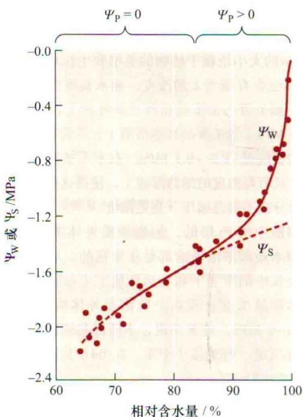  
图3.10 陆地棉（Gossypium hirsutum）叶片细胞的相对含水量（ $\Delta V/V$ ）、水势（ $\Psi_{w}$ ）和渗透势（ $\Psi_{s}$ ）之间关系。随着刚开始相对含水量的减少，水势快速降低。然而，渗透势变化很小。当细胞体积减小至90%以下时，情况刚好相反：水势的变化主要由渗透势的下降引起，而膨压的变化很小（引自Hsiao and Xu, 2000）。

通过测定细胞的水势和与其相应的细胞体积，可以定量说明细胞壁如何影响植物细胞的水分状况。当相对体积减少10%\~15%时，大多数细胞的膨压将会降到0。然而，对于细胞壁刚性很强的细胞来说，膨压减小时细胞体积的改变很小；而对细胞壁弹性极大的细胞，如仙人掌茎中的储水细胞，随着膨压的降低细胞体积的变化却相当大。

体积弹性模量，用 $\varepsilon$ （希腊字母epsilon）表示，可以由 $\Psi_{p}$ 和细胞体积间的关系来确定： $\varepsilon$ 是指相对体积发生固定改变导致的 $\Psi_{p}$ 的改变 $[\varepsilon=\Delta\Psi_{p}/\Delta V$ （细胞相对体积的变化）]。 $\varepsilon$ 较大表明细胞的细胞壁坚硬，因此当细胞体积发生相同变化时这种细胞的膨压相对于 $\varepsilon$ 较小、细胞壁弹性较大的细胞会发生较大改变。细胞壁的机械特性因物种和细胞类型的不同而不同，导致失水时对细胞体积的影响程度也显著不同。

比较仙人掌茎内细胞的水分关系，可以看出细胞壁特性的重要作用。仙人掌是典型的干旱地区生长的肉质茎植物。它们的茎由外围的光合作用层围绕内部非光合作用组织组成，非光合作用组织具有储存水分的功能（图3.11）。尽管内外层细胞的水势保持平衡（或非常接近平衡），但干旱情况下，内层细胞首先失水（Nobel，1988），这种情况是如何发生的呢？

  
图3.11 仙人掌茎的截面，显示外层光合作用层和起储水作用的内层非光合作用组织。干旱情况下，水优先从非光合作用细胞散失，这样有助于维持光合作用组织的水分状态（图片来自David McIntyre）。

通过对梨果仙人掌（Opuntia ficus-indica）（Golds-tein et al., 1991）详细研究，发现内层储水细胞较大，比外层光合细胞的细胞壁薄，因此这类细胞的细胞壁弹性大（具较低的ε）。因此，当外界水势降低固定值时，储水细胞要比光合细胞的失水程度高。此外，干旱情况下，储水细胞内的溶质浓度会下降，部分原因是由于可溶性糖聚合成不溶性的淀粉粒。植物对于干旱的典型反应是积累溶质，从而可部分地阻止水分从细胞散失。然而，对仙人掌来说，干旱情况下，由于弹性较大的细胞壁组成和溶质浓度的下降，使储水细胞内的水分优先丧失，从而有助于保证光合作用组织的水合作用。

## 3.6.2 细胞获得或失去水分的速率受细胞膜的导水率影响

到目前为止，已经了解了在水势梯度作用下的水分跨膜运输。水分流动方向由 $\Psi_{w}$ 梯度方向决定，水分运输速率与驱动梯度的大小成正比。然而，对于一个细胞来说，当环境水势发生变化时（图3.9），它就会吸收或排出水分，而随着时间的推移，细胞内外的水势逐渐趋于相同，水分的跨膜运输也会减慢（图3.12）。水分移动的速率与时间之间呈指数关系，直至降为0（Dainty，1976）。速度降至一半的时间即 $t_{1/2}$ （half-time），可用下面公式表示。

B  
A  
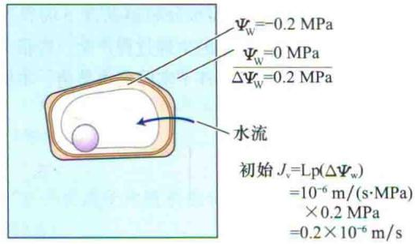

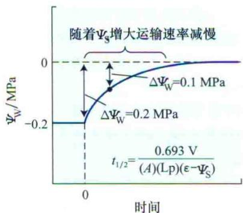  
图3.12 水分进入细胞的速率取决于水势差（ $\Delta\Psi_{w}$ ）和细胞膜的导水率（Lp）。A. 刚开始时水势差为0.2 MPa。Lp是 $10^{-6}$ m/(sMPa)，由这些值得到初始运输速率（ $J_{v}$ ）是 $0.2\times10^{-6}$ m/s，B. 随着细胞吸水，水势差也在逐渐减小，导致细胞吸水速率减慢。这种效应随时间呈现指数衰减过程， $t_{1/2}$ 取决于以下细胞参数：细胞容积（V），表面积（A），导水率（Lp），容量弹性模量（ $\varepsilon$ ）和细胞的渗透势（ $\Psi_{s}$ ）。

$$
t _ {1 / 2} = [ 0. 6 9 3 / (A) (\mathrm{Lp}) ] [ V / (\varepsilon - \Psi \mathrm{s}) ]\tag{3.6}
$$

式中，V和A分别为细胞的体积和表面积；Lp为细胞膜的导水率（hydraulic conductivity）。导水率指水分跨膜的难易程度，单位为 $m^{3}/(m^{2}\cdot s\cdot MPa)$ ，即单位驱动力下，单位时间单位膜面积上水分运输的体积量。有关导水率的详细讨论参见Web Topic 3.9。

$t_{1/2}$ 越短，说明达到平衡越快。因此，细胞的表面积与体积比越大，膜的导水率越高，细胞壁刚性越强（大的 $\varepsilon$ ），则细胞与周围环境达到平衡的时间越快。细胞的 $t_{1/2}$ 通常在1\~10 s，有些甚至更短（Strudle，1989）。由此可以看出一个细胞与周围环境达到水势平衡的时间通常不到1 min。对于多细胞组织， $t_{1/2}$ 可能会长很多。

## 3.6.3 水孔蛋白促进水分的跨膜运输

多年来，关于水分如何跨膜运输仍不很清楚。尤其是在水分跨膜运输过程中，水分子的扩散是否受到质膜脂质层的阻碍？是否也涉及通过膜上的蛋白孔进行水分扩散（图3.13）？研究表明，对观察到的水分跨膜运输速率来说，直接通过脂双层的水分扩散速率远不能达到这种速度，而关于微孔运输水分的证据又不是完全令人信服。

近来，随着水孔蛋白（aquaporin）的发现，这些未知的问题也迎刃而解（图3.13）。水孔蛋白是膜整合蛋白，其构成了水分选择性跨膜运输的通道（Maurel et al., 2008）。由于水分通过这些通道的扩散速度比通过脂双层要快得多，因此水孔蛋白更有利于促进水分进入植物细胞（Weig et al., 1997；Schaffner, 1998；Tyerman et al., 1999）。

  
图3.13 左边为单个水分子通过膜脂双分子层扩散，右边为水分子连续通过由诸如水孔蛋白等膜蛋白形成的水分选择性孔道的扩散。

需要注意的是，尽管水孔蛋白的存在改变了水分跨膜运输的速度，但并不能改变水分运输的方向和运输动力。另外，水孔蛋白组成的水通道是可逆性的“门”（存在开闭两种状态），受胞内pH和 $Ca^{2+}$ 等生理指标调控（Tyerman et al., 2002）。由此，人们认识到植物具有主动调节细胞膜对水通透性的功能。

## 3.7 植物的水分状态

水势概念的引入有两个主要作用：首先，正如我们所讲的，水势控制着水分的跨膜运输。其次，水势可用来衡量植物的水分状况（water status）。这一部分主要讨论水势如何帮助人们评估植物的水分状态。

## 3.7.1 植物水分状态影响了生理过程

由于不断向大气中蒸腾失水，植物很少处于高度的含水状态。干旱时，植物由于缺水，生长和光合作用受到抑制。图3.14列出了植物在不断增强的干旱情况下所发生的生理变化。

广义来讲，任何特定的生理过程对缺水的敏感性体现了植物应对环境中可利用水量的变化所采取的对策。由图3.14可看出，受缺水影响最大的生理过程是细胞伸展（cell expansion）。在许多植物中，供水量的降低，会抑制茎的生长和叶片扩展，但却能促进根的伸长生长。根冠比的增加能大致反映出环境中植物可利用水量的降低，因此，茎生长对于水分匮缺的敏感性，应被看作植物对干旱的一种主动适应，而不是一个被动的生理现象。

由于任何植物都不能改变土壤中的可利用水量（图3.14也显示出在不同水分胁迫条件下的典型水势值），因此干旱会对植物的生理过程产生一些根本性的限制，尽管在这些限制条件下实际的水势值，不同种间

由于脱水引起的生理变化：  
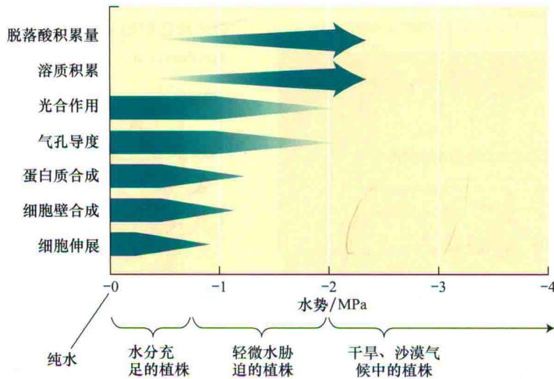  
图3.14 不同生长条件下各种不同的生理过程对水势的敏感性。柱状箭头颜色的强度代表生理过程强度的大小。例如，细胞扩展速度随水势减小（变得更偏负）而变慢。ABA是缺水状况下诱导气孔关闭的一种植物激素（见第23章）（引自Hsiao and Acevedo，1974）。

会存在着差异。

## 3.7.2 溶质积累利于细胞维持膨压和体积大小

植物具备在缺水情况下，通过付出相应的代价来维持其正常生理活动的能力。这些代价包括：以积累溶质的形式来维持膨压；加强非光合器官如根的生长来提高植物的吸水能力；或建立木质部管道系统来承受大的负压。因此，植物对水分可利用量的生理反应，体现了一种折中，即面对多变的外界环境，植物尽量少付代价，尽可能地保证其正常的生理过程（如生长）。

生长在含盐环境中的植物称为盐生植物（halophyte），它们是典型的具有低 $\Psi s$ 的植物。由于低的 $\Psi s$ 会进一步地降低细胞的 $\Psi w$ ，足以保证盐生植物细胞在没有高水平盐分进入细胞的情况下从盐水中吸水。植物在干旱条件下， $\Psi s$ 会更偏负值。缺水通常会导致细胞质和液泡内的溶质积累，因而尽管水势很低，植物仍能维持一定的膨压。

拥有正的膨压（ $\Psi_{p}$ ）对植物很重要，原因有以下几点。首先，植物细胞的生长需要膨压来拉伸细胞壁。

在缺水状态下 $\Psi_{p}$ 的丧失，可以部分解释细胞生长为什么对缺水如此敏感，以及为什么可以通过改变细胞渗透势来改变这种敏感性（见第26章）。其次，正的膨压增加了细胞和组织的机械刚性。

总之，膨压虽然直接影响到某些生理过程。然而，细胞膜上存在着拉伸激活的信号分子说明植物通过感受细胞体积的变化而不是通过直接测量膨压来感受水分状态的改变。

## 小结

陆生植物面临着失水和脱水的危险。植物必须利用它们的根系吸水并在植物体内运输以确保植物不受脱水的威胁。

## 植物中的水

· 细胞壁可使植物细胞建立起巨大的内部静水压（膨压）。膨压对于许多生理过程都是必需的。

· 水分限制了农业和自然生态系统的产量（图3.1和图3.2）。

· 植物根系吸收的水分，约97%经植物体内运输，最后通过蒸腾作用从叶表面蒸发散失。

\- 植物通过共同的扩散途径同时进行着 $\mathrm{CO}_{2}$ 的吸收和水分的散失。

## 水的结构和特征

· 水分子的极性和四面体形使得氢键极易形成，从而赋予水不同寻常的特性：水是非常好的溶剂，具有高比热、高的蒸发潜热和高的张力（图3.3和图3.6）。

· 内聚力、附着力和表面张力导致毛细现象的形成（图3.4和图3.5）。

## 扩散和渗透作用

\- 分子或离子的随机热运动产生了扩散现象（图3.7和图3.8）。

· 短距离的扩散更有效，物质通过某个距离扩散所需的平均时间与该距离的平方成正比。

· 渗透作用指水通过选择性透过膜的净运输，受水浓度梯度和压力梯度的驱动。
水势

· 水的化学势反映了水在给定状态下的自由能。

· 植物中影响水势（ $\Psi_{w}$ ）的主要因素是浓度、压力和重力。

\- $\Psi_{\mathrm{S}}$ ，溶质势或渗透势，反映溶液中的溶质对水势的影响，降低了水的自由能。

· $\psi_{p}$ ，溶液的静水压。正压（膨压）增加水势，负压减小水势。

· 研究水分在细胞水平进行转运时，重力势 $\psi_{g}$ 通常可以忽略不计，因此 $\psi_{w} = \psi_{s} + \psi_{p}$ 。

## 植物细胞的水势

· 植物细胞的水势通常为负值。

· 水分进出细胞与水势梯度有关。

· 一个萎蔫的植物细胞处于高水势（偏负程度较小）的溶液中，水分将从溶液流入细胞内（从水势高处流向水势低处）（图3.9）。

· 随着水分进入细胞，细胞壁产生压力来抵制拉伸，细胞的静水压或膨压（ $\Psi_{p}$ ）增大。

· 在平衡状态下 $[\Psi_{\mathrm{W}}$ （细胞） $= \Psi_{\mathrm{W}}$ （溶液）； $\Delta \Psi_{\mathrm{W}} = 0]$ ， $\Psi_{\mathrm{P}}$ 会增加到足够大以升高细胞的 $\Psi_{\mathrm{W}}$ ，使之与溶液的 $\Psi_{\mathrm{W}}$ 一样，水分子的净运动停止。

· 水也可以通过渗透作用流出细胞。当一个膨胀的细胞放在一个水势更偏负的蔗糖溶液中时，水将会从细胞流向溶液（图3.9）。

· 如果细胞受到挤压，可以有效地提高细胞的 $\Psi_{p}$ ，增加细胞的水势，产生一个细胞内外的水势差 $\Delta\Psi_{w}$ ，促使水分流出细胞（图3.9）。

## 细胞壁和细胞膜的特性

· 细胞壁的弹性决定了细胞体积和膨压间的关系，质膜和液泡膜对水的通透性影响了细胞和周围环境间的水分交换速率。

\- 由于植物细胞具有相对刚性的壁，细胞体积的轻微改变就可导致膨压发生较大的变化（图3.10）。

\- 对于水势差（ $\Delta \Psi_{\mathrm{W}}$ ），随着时间的推移，细胞内外的水势逐渐趋于相同，水分的跨膜运输也会减慢（图3.12）。

· 水孔蛋白是水分选择性跨膜运输的通道（图 3.13）。

## 植物的水分状态

· 干旱情况下，植物光合和生长都受到抑制，同时 ABA 和溶质不断积累（图 3.14）。

· 干旱情况下，植物必须消耗能量通过积累溶质的形式来维持膨压，从而支持根和维管系统的生长。

· 细胞膜上拉伸激活的信号分子可以使植物感受细胞体积的变化，从而感受水分状态的改变。

(白玲周云译)

## WEB MATERIAL

## Web Topics

3.1 Calculating Capillary Rise
Quantification of capillary rise allows us to assess its functional role in water movement of plants.

## 3.2 Calculating Half-Times of Diffusion

The assessment of the time needed for a molecule such as glucose to diffuse across cells, tissues, and organs shows that diffusion has physiological significance only over short distances.

## 3.3 Alternative Conventions for Components of Water Potential

Plant physiologists have developed several conventions to define water potential of plants. A comparison of key definitions in some of these convention systems provides us with a better understanding of the water relations literature.

## 3.4 Temperature and Water Potential

Variation in temperature between 0 and 30°C has a relative minor effect on osmotic potential.

3.5 Can Negative Turgor Pressures Exist in Living Cells? It is assumed that $\Psi p$ is zero or greater in living cells; is this true for living cells with lignified walls?

## 3.6 Measuring Water Potential

Several methods are available to measure water

potential in plant cells and tissues.

## 3.7 The Matric Potential

Matric potential is used to quantify the chemical potential of water in soils, seeds, and cell walls.

## 3.8 Wilting and Plasmolysis

Plasmolysis is a major structural change resulting

from major water loss by osmosis.

## 3.9 Understanding Hydraulic Conductivity

Hydraulic conductivity, a measurement of the membrane permeability to water, is one of the factors determining the velocity of water movements in plants.
