# 第 4 章

# 植物的水分平衡

生活在地球大气中的陆生植物面临着巨大的挑战。一方面，大气提供植物光合作用所需 $CO_{2}$ ；另一方面，大气是相对干燥的，会使植物由于蒸腾作用丧失水分。由于植物在吸收 $CO_{2}$ 时不能阻止水分的散失，从而使植物在吸收 $CO_{2}$ 的同时面临脱水的危险。这是一个十分复杂的问题，因为 $CO_{2}$ 从大气扩散到植物体内的浓度梯度远远小于驱动水分丧失的浓度梯度。为了最大限度地多吸收 $CO_{2}$ 同时又能尽量减少水分散失，植物通过长期适应，进化出通过叶片控制水分丧失，而不是让水分直接散失到大气中去的机制。

在这一章中将研究水分在植物体内和水分在植物与其所在环境间的运输机制及其驱动力。下面通过探讨土壤中的水来开始对水分运输的认知。

## 4.1 土壤中的水分

土壤中水分的含量和水分移动的速率很大程度上依赖于土壤的类型和土壤结构。沙土是一个极端，其土壤颗粒直径为1 mm或稍大些。沙质土壤每克土壤的表面积相对较低，但颗粒间的空隙或孔道较大。

黏土是另一个极端，它的颗粒直径小于2 $\mu$ m。黏土土壤的表面积很大，但颗粒间的空隙较小。在腐殖质（腐烂的有机物）等有机物的作用下，黏土颗粒可以聚集成“小团粒”，从而通过形成大的孔道有助于提高土壤的透气性和对水的渗透性。

当土壤因雨水或灌溉导致含水量极丰富时（参见Web Topic 4.1），由于重力作用，水分通过土壤颗粒间空隙向下渗透，部分土壤颗粒间存在的空气被水取代，由于水是通过毛细作用进入土壤颗粒之间空隙的，因此小的孔道会先被填满。那么当土壤中存在的可利用水量较少时，土壤中的水会以水膜的形式附着在土壤颗粒表面，仅充满小的孔道，而当水多时会充满颗粒间的整个孔道。

沙质土壤中，由于土壤颗粒间的空隙非常大，大部分的水分很容易地从颗粒间排出，仅在颗粒表面和颗粒间空隙中残留有少量的水分。而对于黏土，由于颗粒间的空隙非常小，水分子间的张力足以对抗其自身的重力，从而使水分被保留在土壤中。黏土土壤在水分饱和后的数天内，仍然可以保持40%体积的水分。与此相反，典型的沙质土壤在饱和后仅可保持大约15%体积的水分。

在下面的几节中将研究土壤的物理结构是如何影响土壤的水势，水分在土壤中如何移动，以及根系如何吸收植物所需的水分。

## 4.1.1 土壤水分中负的净水压可降低土壤水势

与植物细胞的水势相似，土壤的水势可分为3个部分，渗透势、静水压和重力势。除了盐碱地，由于土壤中溶质的浓度非常低，土壤中水的渗透势（osmotic potential， $\Psi_{s}$ ；参见第3章）通常可以忽略不计，一般为-0.02 MPa左右。但在富含盐类的土壤中 $\Psi_{s}$ 是不能忽略的，因为其数值能达到-0.2 MPa或更低。

土壤水势的第二个组成部分是静水压（hydrostatic pressure， $\Psi_{p}$ ）（图4.1），对于湿的土壤， $\Psi_{p}$ 几乎为零。而当土壤干燥时， $\Psi_{p}$ 会降低并达到非常大的负值。那么土壤中水的负压是从哪里来的呢？

回想在第3章讨论过的毛细管现象，水有很高的表面张力，具有使空气-水分界面达到最小的趋势。但同时由于张力存在，水也具有附着在土壤颗粒表面的倾向（图4.2）。

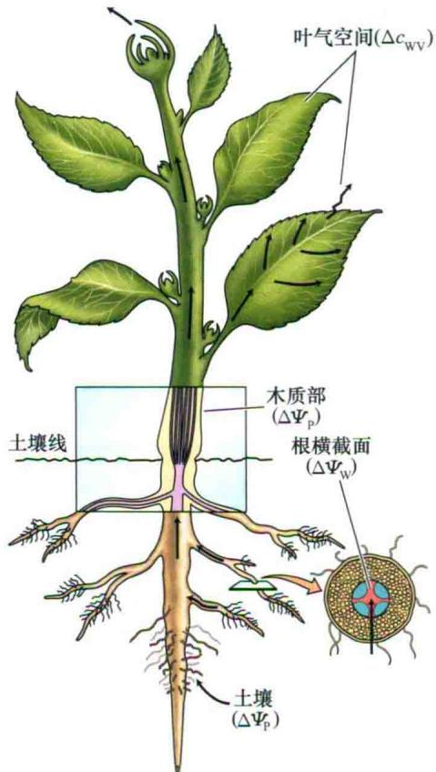  
图4.1 水分从土壤通过植物到达大气的主要驱动力。水气浓度差（ $\Delta c_{wv}$ ）、静水压差（ $\Delta\Psi_{p}$ ）和水势差（ $\Delta\Psi_{w}$ ）。

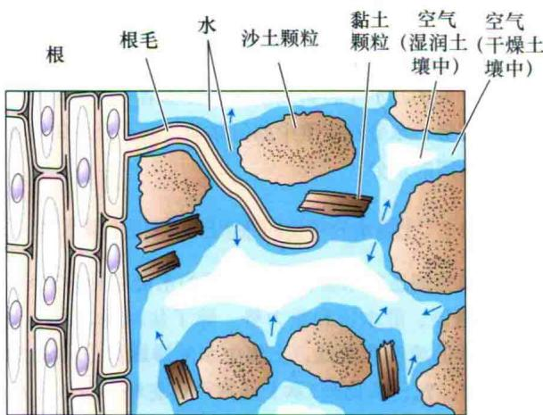

图4.2 根毛与土壤颗粒密切接触并极大地扩大植物可用来吸收水分的表面积。土壤是一个由颗粒（沙、黏土、淤泥和有机物）、水、溶质和空气组成的混合物。水是被土壤颗粒表面吸附的。随着水分被植物吸收，土壤溶液退缩到土壤颗粒间的小穴、孔道和裂缝中。在水与空气的交界面，这种退缩引起土壤溶液的表面形成一个凹的弯液面（空气和水之间的曲面在图中用箭头标出），由于表面张力使溶液形成张力（负压）。随着更多的水离开土壤，形成更多的凹面，从而引起更大的张力（更大的负压）。

随着土壤中含水量的减少，水分退缩到土壤颗粒间的空隙中，形成一个空气-水的交界面，这个界面弯曲的曲率代表了使空气和水界面表面积最小的倾向力和土壤颗粒对水的吸附力相平衡的结果。这些曲面下的水形成了负压，这个负压可以通过下面的公式计算。

$$
\psi_ {\mathrm{p}} = \frac {- 2 T}{r}\tag{4.1}
$$

式中，T为水的表面张力（ $7.28 \times 10^{-8}$ MPa），r为空气和水分界面的曲率半径。需要注意的是，当假设土壤颗粒为完全可湿时（接触角 $\theta=0$ ; $\cos\theta=1$ ），毛细管现象的公式与这个相同，参见Web Topic 3.1（图3.5）。

当土壤变干燥时，水分最先从土壤颗粒间最大的空隙散失，随后才是土壤颗粒中或它们之间存在的较小空间中的水分丧失。在这个过程中，土壤中水分的 $\Psi_{p}$ 会变为非常低的负值，这是由于随着孔径越来越小，空气-水分临界面的曲率逐渐增大。例如， $r=1\ \mu m$ 的曲率（大约是最大黏土颗粒的大小）所对应的 $\Psi_{p}$ 是-0.15 MPa。随着空气-水分交界面退缩到黏土颗粒间较小的缝隙时， $\Psi_{p}$ 可以很容易达到-2\~-1 MPa。

第三个组成部分是重力势。重力在土壤的排水中有重要的作用，水的向下运动就是由于重力势与高度成正比，高度越高，重力势越大，反之亦然。

## 4.1.2 水分以集流的形式在土壤中运动

集流（bulk or mass flow）是指全体分子的共同移动，常常会在压力梯度的驱动下形成。花园橡胶软管及河流中水的移动是最常见的集流例子。在沙土中的水分主要是通过集流的方式进行移动的。

由于土壤中的水压主要取决于空气-水分交界面的曲率，因此水是从含水量高的土壤区域（含水的空间比较大）流向含水量低的土壤区域（含水的空间区域较小，空气-水分的界面曲率大）。另外，水以气体形式的扩散也在水分的运动中占有一定比例，这在干燥土壤中是重要的水分运动方式。

当植物从土壤中吸收水分时，它们首先将根表面附近的水分耗尽，这样就降低了根表面附近水的 $\Psi_{p}$ ，从而与附近高 $\Psi_{p}$ 的土壤区域形成了一个土壤水的静水压梯度。由于土壤中含有水的孔隙是连续的，水沿着这个压力梯度顺着这些孔道能够以集流形式运输到根系表面。

水分在土壤中的移动速率取决于两个因素：土壤的静水压梯度和土壤导水率（soil hydraulic conductivity）。土壤导水率主要用来衡量水在土壤中移动的难易程度，它因土壤类型和该类型土壤含水量的不同而不同。沙土由于在颗粒间存在大的空隙，有着比较大的导水率，而黏土由于颗粒间的空间小，导水率也小。

随着土壤含水量（也就是水势）的降低，导水率也

B

急剧下降。这种降低主要是由于土壤空隙间的水分被空气取代。当某个土壤孔道的水分被空气取代后，水分在该孔道内的运输受阻，只能通过其他的孔道。随着越来越多的土壤孔道被空气填满，水能通过的孔道越来越少越来越窄，土壤导水率也随之降低（Web Topic 4.2介绍了土壤结构如何同时影响其保水能力和导水率）。

## 4.2 根对水分的吸收

根表面与土壤密切接触是根有效吸收水分所必需的。随着土壤中根和根毛的不断生长，根系从土壤中吸收水分的表面积也逐渐达到最大。根毛（root hair）是根表皮细胞的向外细丝状生长，在很大程度上增加了根的表面积，因而增强了根从土壤中吸收离子和水分的能力。在生长3个月的小麦（wheat）中，其根毛表面积占到了根表面积的60%还多（图5.7）。

相对于根的其他部分，根尖附近的水分更容易进入根中。根的成熟区域往往具有较差的透水性，因为其外面有一层高度发育的保护组织，称为外皮层（exodermis）或下皮组织（hypodermis），其细胞壁中含有疏水物质，对水分具有相对不透过性。根系统的各部分对水的渗透性不一样，尽管乍看起来是违反直觉的，但是植物如果依赖根系的非成熟区从周围土壤新区域来吸收水分和进行营养物质的集流运输的话，那么根的成熟区域必须被封闭起来（图4.3）（Zwieniecki et al., 2002）。

当土壤松动时，根系表面与土壤的紧密结合层会很容易遭受破坏。正是这个原因新移栽的幼苗和植株在移栽后的最初几天内需要防止水分丧失。当新的根系伸进土壤，重新建立起土壤-根的紧密结合层时，植物就可以重新很好地耐受水分胁迫。

下面来看一下水分在根中是如何运输的，以及影响植物根部吸水速率的因素。

## 4.2.1 根部水分运输的质外体、共质体和跨膜途径

在土壤中，水分在土壤颗粒之间进行运输。然而，从根的表皮到内皮层，水分的运输可通过3种途径（图4.4）：质外体、共质体和跨膜途径。

（1）质外体是指由细胞壁、细胞间隙和非活细胞的内腔（如木质部导管和纤维）组成的连续系统。在这个途径中，水分通过细胞壁和胞外空间（不跨任何细胞膜）来跨过根的皮层。

（2）共质体是指通过胞间连丝将细胞质相互连接组成的整个网络。在该途径中，水分通过胞间连丝从一个细胞到达另一个细胞进而跨过根皮层（见第1章）。

（3）跨膜途径是指水分从细胞的一侧进入，另一侧流出的途径，然后进入相连的下一个细胞，依次进行。该途径中，对于每个细胞水分至少需要跨膜两次（进入质膜和离开质膜），甚至还有可能涉及跨液泡膜的运输。

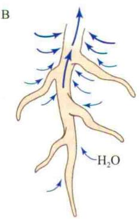

  
整个表面的渗透性一致  
仅靠近根尖的区域具有渗透性  
图4.3 南瓜根不同位置吸收水的速率（A）。图示整个根表面对水的吸收具有同等渗透性（B）。在成熟区域由于木栓质的沉积而成为非渗透性的（C）。当根表面等渗时，随着水的流入，由于木质部吸水力的减弱，越来越多的末端区域被水隔离，大多数水进入了根系统顶部附近。而当根成熟区域的渗透性降低时，允许木质部的张力延伸到根系统更远的地方，从而允许根系统的末梢也可吸收水分（引自Kramer and Boyer，1995）。

尽管3种途径中究竟哪一个更重要还没有完全确定，但压力探针技术（参见Web Topic 3.6）的实验表明细胞膜在水分跨根皮层的运输中起重要的作用（Frenseh et al., 1996; Steudle and Frensch, 1996; Bramley et al., 2009）。虽然存在有3种运输途径，但在水分的移动过程中会根据所处位置的压力梯度及遇到的阻力来选择移动路径，而不是仅限于单一的运输途径。例如，一些通过共质体途径运输的水分子可能会跨过细胞膜并进入质外体途径短暂运输，然后再重新回到共质体途径。

在内皮层中，水分通过质外体途径的运输可被凯氏带阻断（图4.4）。凯氏带（Casparian strip）是一个内皮层中径向细胞壁组成的带，壁中充满着蜡质的疏水物

PLANT PHYSIOLOGY

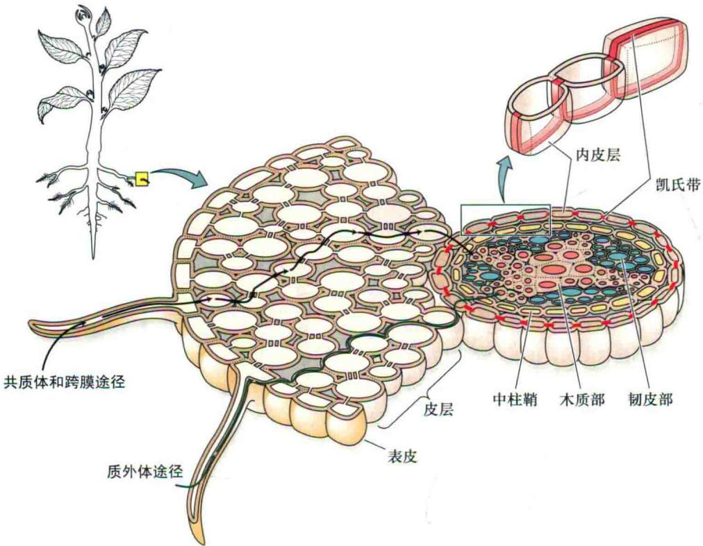  
图4.4 根系吸水的途径。水分可能通过质外体、共质体和跨膜途径通过皮层。在共质体途径中，水分通过胞间连丝不需跨膜就可在细胞间流动。在跨膜途径中，水分跨过质膜移动，并在细胞壁空间中短暂停留。在内皮层中，质外体途径可以被凯氏带阻断。

质——木栓质（suberin）。在根尖后的数毫米处根系不再生长的部分，内皮层逐渐木栓化，并且原生木质部组分也同时形成（Esau，1953）。凯氏带阻断了质外体途径的连续性，迫使水分和溶液通过跨膜途径来穿过皮层。

水分须经共质体途径运输才能通过内皮层，这有助于解释为什么根对水分的通透性强烈依赖于水孔蛋白的存在。下调水孔蛋白基因的表达可以明显降低根的导水率，并且可以导致植株很容易萎蔫（Siefritz et al., 2002），或者作为弥补产生更大的根系（Martre et al., 2002）。

低温、缺氧或用呼吸抑制剂处理时会降低根系对水分的吸收。关于根呼吸和吸收水分之间的关系，或称植物在水淹状态下的萎蔫之谜，直到现在仍没有确切的解释。已经知道水孔蛋白的通透性受胞内pH的调节（Toumaire-Roux et al., 2003）。低温或缺氧导致的呼吸速率降低可以导致胞内pH增加，胞内pH的增加改变了根细胞中水孔蛋白的传导率，从而导致根系对水分的通透性明显降低。水孔蛋白的开闭受pH调节的事实展现了根可以根据其所处环境积极改变对水通透性的一种机制。

## 4.2.2 溶质在木质部中的积累可以产生“根压”

植物有时会表现出称为根压（root pressure）的现象。例如，如果一个幼苗的地上茎部分被切断，往往会从幼苗残余木质部的切断面流出汁液，并且可持续数小时。如果用一个压力计与切断面连接，可以测到高达0.05\~0.2 MPa的正压力。

当蒸腾作用很弱或停止时，由于根能不断地从土壤中吸收离子并将其运输到木质部，因此会形成不断增加的正的静水压。而木质部中溶质的积累则导致木质部的 $\Psi_{s}$ 降低，从而使木质部的 $\Psi_{w}$ 降低。木质部 $\Psi_{w}$ 的降低提供了水分吸收的驱动力，继而造成了木质部中正的静水压的产生。事实上，多细胞的根组织类似于一个渗透膜，木质部中正的静水压的产生只是对木质部中溶质积累的生理反应。

根压现象往往在土壤水势很高而蒸腾速率较低时才出现。当蒸腾速率高时，由于水分被上运到叶片并迅速丧失到大气中，那么因离子吸收所导致的正静水压产生的现象就不会在木质部中出现。

产生根压的植物往往会在叶片的边缘或尖端泌出水滴，这种现象称为吐水（guttation）（图4.5）。木质部中正的静水压会导致木质部汁液通过专门的被称为水孔的孔道渗出，水孔通常位于叶缘的叶脉末端。早晨在草叶的尖端看到的“露珠”其实就是从水孔渗出的吐水小滴。当蒸腾作用被抑制，空气相对湿度高时如在夜间，吐水现象最容易见到。根压很可能是根不可避免地高速积累离子的一种生理反应。然而，夜间木质部中正压的存在有助于消除木质部中先前形成的气泡，因而在消除气穴现象的毒害作用中扮演着重要的角色，这将在下节介绍。

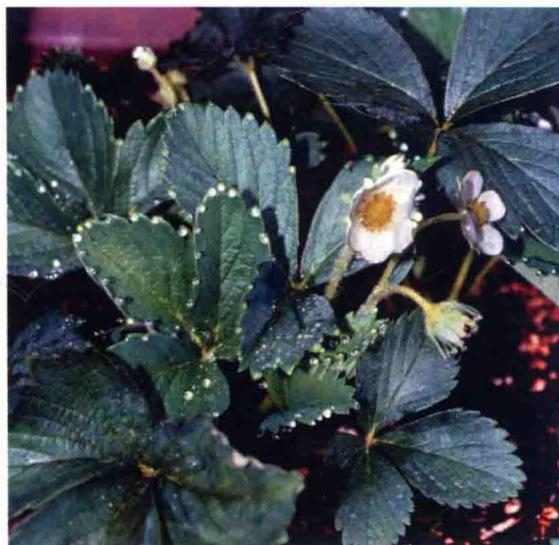  
图4.5 草莓（Fragaria grandiflora）叶片的吐水。清晨，叶片通过吐水孔分泌水滴，位于叶片的边缘。幼花上也可看到吐水（R. Aloni惠赠）。

## 4.3 水分通过木质部运输

在大多数植物中，木质部是水分运输途径中最长的部分。在1 m高的植物中，运输的水分99.5%以上是在木质部中进行的，而高大的植物，木质部则在水分运输中占据着更为重要的地位。与水分通过活细胞层的运动相比较，木质部中的水分运动则是一种低阻力的更为简单的方式。在下面的章节中，会阐述木质部的结构，其在水分从根运输到叶中的作用，以及蒸腾作用产生的负静水压如何拉动水分通过木质部进行运输。

## 4.3.1 木质部由两种类型的管状分子组成

木质部的传导细胞具有特殊的结构使其可以高效、大量运输水分。在木质部中主要有两种管状分子（tracheary element）：管胞和导管（图4.6）。导管存在于被子植物、裸子植物买麻藤目的一小部分种类和一些蕨类植物中，而管胞则在被子植物、裸子植物及蕨类和其他的维管植物中都能见到。

管胞和导管分子的成熟涉及细胞次生壁的产生和细胞随后的死亡——细胞的细胞质和其中所有组分的丧失。留下的只有厚的木质化的细胞壁，这种空的管道对于水分的运输具有相对较小的阻力。

管胞（tracheid）是长的纺锤形细胞（图4.6A），其排列成交替重叠的纵列结构（图4.7）。管胞间的水分运输依靠管胞次生壁上的众多纹孔（pit）（图4.6B）。纹孔是一个在显微镜下可见的次生壁缺失而仅有初生壁存在的区域（图4.6C）。一个管胞上的纹孔常位于与相邻管胞上的纹孔相对的地方，形成纹孔对（pit pair）。纹孔对构成了管胞间水分低阻力运输的通道。纹孔对中间的透水层由两个初生壁和一个中间薄层组成，称为纹孔膜（pit membrane）。

松类植物管胞的纹孔膜有一个中间增厚的部分，称为纹孔托（torous，tori的复数形式），其周围是一种称为塞周缘（margo）的有弹性且具有透水能力的区域（图4.6C）。纹孔托类似于一个阀的作用，当其位于纹孔腔的中间时，纹孔保持开放状态，而当嵌在圆形或椭圆形纹孔的边缘增厚壁上时会将纹孔关闭。纹孔托的这种镶嵌可以有效地防止气泡扩散到相邻的管胞中（随后将讨论这种气泡的形成，这个过程称为气穴现象）。除了松类植物，其他所有植物的纹孔膜，不论是管胞还是导管中，结构都是相似的，均没有纹孔托。因为这些非松类植物纹孔膜中的充水孔非常小，对于阻止气泡移动也能起到有效的屏障作用。总之，不论哪种类型的纹孔膜都能在阻止木质部气泡的扩散中起重要作用，称其为栓塞。

导管分子（vessel element）比管胞更短更宽，并且在每个导管细胞的上下两端细胞壁上有穿孔形成筛板（perforation plate）。与管胞类似，导管分子在次生壁上也有纹孔（图4.6B），但与管胞不同的是，相邻的导管分子通过末端的筛板堆叠在一起形成大的管道，称为导管（vessel）（图4.7）。导管是由多细胞组成的管道，同类型和不同类型的导管长度变化很大。导管的最大长度范围可从几厘米到数米。在导管终端，导管分子的端壁上没有穿孔，与相邻的导管通过纹孔对相连。

## 4.3.2 水分以压力驱动的集流形式通过木质部

水在木质部中的长距离运输主要是以压力驱动的集流形式来进行的。这种方式也是土壤中及穿过植物组织细胞壁时水分运输的主要途径。与水以扩散方式穿过半透膜不同，只要忽略溶液的黏度变化，压力驱动的集流不依赖于溶质的浓度梯度。

当考虑集流在管道中运输时，水流的速度与管道的半径（r）、液体的黏度（ $\eta$ ）及驱动力的压力梯度（ $\Delta\Psi p/\Delta X$ ）有关。法国的一位内科医生及生理学家Jean Léonard Marie Poiseuille（1797\~1869年）提出上述参数的关系可以用Poiseuille公式来表示。

A  
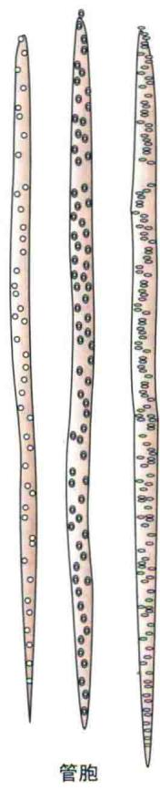

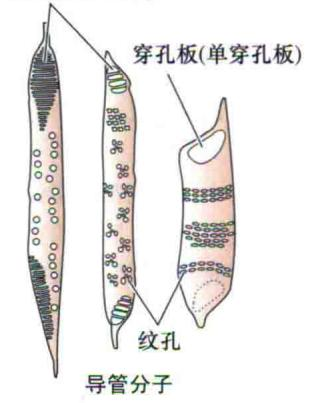

B  

## C 松类

## D 其他维管植物

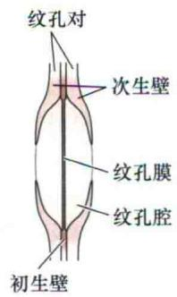

图4.6 管状分子及其之间的相互连接。A. 管胞和导管分子的结构比较，两类管状分子参与木质部的水运输。管胞是拉长的、空的、有着高度木质化壁的死亡细胞。壁中含有大量的纹孔——次级壁缺失但保留有初生壁的区域。不同器官和物种管胞壁上的纹孔形状和模式也不同。管胞存在于所有维管植物中。导管是由两个或更多导管分子叠起来组成的。与管胞类似，导管分子也是死亡细胞，并且通过穿孔板（壁上形成孔或洞的区域）相互连接。导管与其他导管和管胞通过纹孔相互连接。导管存在于大多数被子植物中，而在大多数裸子植物中不存在。B. 扫描电镜显示的两个导管分子（从左下方斜穿到右上方）。在侧壁上可见纹孔，在两个导管分子之间可以看到末端梯纹状的细胞壁（200×）。C. 松类具缘纹孔的图示，有纹孔托位于纹孔腔中间（左）或位于腔的一侧（右）。当两个管胞间压力小时，纹孔膜将展平靠近具缘纹孔的中心，从而允许水从纹孔膜的多孔渗水塞缘通过；而当两个管胞压力相差大时，如当一个已经空了而另一个在张力下仍充满水时，纹孔膜的位置会发生变化，侵入到一侧管胞中，形成拱形从而阻止气栓在管胞间的传播。D. 相反，被子植物和其他针叶类维管植物的纹孔膜在结构上相对来说是近似的。这些纹孔膜有非常小的孔，可以阻止栓塞的扩散，但与针叶类的纹孔相比，明显带来更多的水分运输阻力（B © Steve Gschmeissner/Photo Researchers, Inc.; C引自Zimmermamm, 1983）。

B

A  
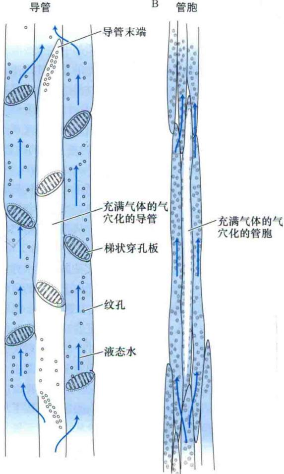  
图4.7 导管（A）和管胞（B）构成了一系列平行的相互连接的水分运输途径。气穴现象由于使管道中充有气体（气栓）而阻断了水的移动。由于木质部导管通过在次生壁开孔（具缘纹孔）相互连接，水可以绕过被阻断的导管通过相邻的导管分子运输。纹孔膜上的小孔有助于防止栓塞在木质部管道中扩散。因此，在B图中有一个含有气体的气穴化的管胞。在A图中，气体充满了整个气穴化的导管，在这里显示有3个导管分子，每个都被梯形穿孔板隔开。在自然界中导管可以非常长（长达数米），由许多的导管分子组成的。

$$
\mathrm{体积流速} = \left(\frac {\pi r ^ {4}}{8 \eta}\right) \left(\frac {\Delta \Psi p}{\Delta \chi}\right)\tag{4.2}
$$

单位是立方米每秒（ $\mathrm{m}^3/\mathrm{s}$ ）。这个公式表明压力驱动的集流对于管道的半径极其敏感。当管道的半径加倍时，体积流速的增加的因数为16（ $2^4$ ）。具有最大直径的导管分子存在于一些攀缘植物中，约为500 μm，这个尺度基本上比最大管胞稍大些。这些大直径的导管使得这些茎很细的藤本植物能够有效地将水进行长距离的运输。

式（4.2）适用于水流过圆柱形管道时的情况，并没有考虑由于木质部的管路长度是有限的，水从土壤运输到植物叶片的过程中需要穿过许多导管分子之间的纹孔膜时对流速的影响。不同植物中水流动都要受到纹孔膜的影响，单细胞（因此相对较短）管胞的纹孔膜要比多细胞（因此较长）导管中的纹孔膜对水流动的削弱性更强。然而由于松类植物中纹孔膜对水的透性要远大于其他种类的植物（Pittermann et al., 2005），因此仅具有管胞结构的松类植物能够生长成非常高大的树木。

## 4.3.3 水分通过木质部比通过活细胞运动所需的压力小

木质部为水分的运动提供了一个低阻力的途径。下面的一些数据可以帮助人们认识到木质部非凡的水分运输效率。计算水分以一个典型的运输速率通过木质部途径运输时所需的驱动力，并和同样速率条件下通过细胞-细胞途径运输时所需的驱动力进行比较。

为了达到比较的目的，假定水分在木质部中的运动速率为4 mm/s，导管的半径为40 $\mu$ m。在如此窄的导管中这绝对是一个高速率，因此按照这个速率计算，有可能夸大了木质部中支持水分流动的实际压力梯度。通过Poiseuille公式[见式（4.2）]，可以计算出，在内径均为40 $\mu$ m的理想导管中，当水以4 mm/s速度运动时所需的压力梯度值为0.02 MPa/m。具体计算参见Web Topic 4.3。

当然，真正的木质部导管，其内壁表面是不规则的，并且水分流过筛板和纹孔时会增加额外的阻力。因而需要加上筛板和纹孔对水的摩擦力。测量的结果表明实际阻力大约是计算值的两倍（Nobel，1999）。

现在将这个值（0.02 MPa/m）与同样速度条件下，水分在细胞与细胞间每次均需跨过质膜运动时所需的驱动力值相比较，可以计算出当水分以4 mm/s的速度通过细胞层运动时所需的驱动力为 $2 \times 10^{8}$ MPa/m，详细计算过程参见Web Topic 4.3。这个数值比水分以同样速度在直径为40 μm木质部导管中运输时所需驱动力大10个数量级。计算结果清楚地显示出水分通过木质部的运输要比通过活细胞运输高效得多。然而由于在水分从土壤到叶片的运输途径中木质部占绝大部分，因而木质部中的阻力仍是水分通过植物运输总阻力的主要部分。

## 4.3.4 将水提升100 m到达树冠需要多大的压差？

结合前述的例子来看一下将水提升到一个非常高的树冠需要多大的压力梯度。世界上最高的树木是北美的海岸红杉（Sequoia sempervirens）和澳大利亚的桉树（Eucalyptus regnans），这两个物种中有些植株的高度甚至超过了100 m。

如果把树茎看成一个长的管道，就可以通过将压力梯度乘以树的高度估算出使水克服摩擦力从土壤运输到树冠所需的压力差。水通过木质部运输到非常高树木的顶部所需的压力梯度大约是0.01 MPa/m，这比之前所示例子中的值要小。当将这个压力梯度乘以树的高度（0.01 MPa/m×100 m），可以得出水在树茎中克服摩擦阻力来运输所需的总压力差大约为1 MPa。

除了摩擦阻力外，还必须考虑重力的影响。如在式（3.5）中所示，对于100 m的高度差， $\Psi g$ 差值大约为1 MPa。这意味着在树顶端的 $\Psi g$ 要比地面高出1 MPa。因此水势中的其他组成部分必须达到比-1 MPa更低的值来抵消重力的影响。

水在木质部运输的过程必须要加上重力引起的压力梯度，才能使蒸腾作用正常进行。因此可以计算出水从底部运输到最高树木（100 m左右的高度）的顶端枝条所需的压差大约为2 MPa。

## 4.3.5 内聚力-张力学说解释了木质部中水分的连续运输

理论上，水分通过木质部运动所需的压力梯度源自植株底部正压或植株顶部负压的产生。前面提到过一些植物的根能够在它们的木质部产生正的静水压（根压）。但是通常情况下植物的根压往往小于0.1 MPa，并且当蒸腾速率高或土壤干燥时根压甚至会消失，显然依靠根压不可能将水分运送到一棵高大树木的顶端。此外，由于根压的产生是因为木质部中离子的积累，因此基于这种方式的水分运输，植物体还需要有一种机制来处理一旦水分从叶片蒸发后留在木质部中的这些溶质。

另外一种观点认为，水分在树木的顶端能产生一个很大的张力（一个负的静水压），并且这个张力可以拉动（pull）水分通过木质部运输。这个学说最早是在19世纪末提出的，由于它需要水的内聚性特征来承受木质部水柱中很强的张力，因此称为树液上升的内聚力-张力学说（cohesion-tension theory of sap ascent）。关于木质部存在张力可以很容易证明，向正在蒸腾的植物茎表面滴上一滴墨水，然后刺破木质部，当木质部的张力减弱时，墨水会立刻被吸进木质部，从而沿着茎产生可见的墨水条纹。

叶片中负静水压怎样形成？它又是如何将水分从土壤中拉上来的？拉动水分通过木质部向上运输的负压是在叶片细胞壁表面产生的（图4.8）。这与在土壤中的情形相类似。由于水分附着在细胞壁的纤维素微纤丝和其他亲水性组分上，随着水分由叶片中的细胞散失到大气中，残余水分的水面逐渐退缩到细胞壁的空隙中（图4.8），并在那儿形成一个弯曲的水分-空气交界面。由于水有很高的表面张力，这些交界面的弯曲导致了水的张力或负压的产生。随着更多的水分从细胞壁流失，这些水分-空气交界面的曲率也不断增加，水的负压值也就会更大[见式（4.1）]。

  
图4.8 由叶片产生的水分穿过植株移动的驱动力。随着水分从叶肉细胞表层蒸发，水分退缩到细胞壁的空隙中。由于纤维素是亲水的（接触角=0°），表面张力导致了液相中负压的产生。通过式（4.1）可以计算出，随着这些水分-空气交界面曲率半径的增加，静水压降低（显微图片引自Gunning and Steer，1996）。

内聚力-张力学说解释了为什么水分通过植株的运输时，可以不需要直接消耗植物代谢的能量。驱动水分通过植株运输所需的能量主要来自于太阳光，它通过升高叶片和周围空气的温度来促进水分的蒸发。

内聚力-张力学说作为一个有争议的理论已经争论了一个多世纪，而且还将继续争论下去。争论的焦点是：将水分拉上树梢需要的负压是很大的，而木质部中的水柱能否承受如此大的张力（负压）。大多数研究者相信内聚力-张力学说是合理的（Steudl，2001）。近来有研究利用微流控装置来模拟“树”运输水的功能，证明了水在负压小于-1 MPa时可在该装置中形成稳定的流动（Wheeler and Stroo，2008）。关于水分在木质部中运输的研究史详情，包括围绕内聚力-张力学说的有关争论，参见Web Essay 4.1和Web Essay 4.2。

## 4.3.6 水分在树的木质部运输时所面临的物理学问题

水分在乔木和其他类型植物木质部中产生的强张力（参见Web Essay 4.3）对植物来说存在着重要的物理学问题。首先，水分在张力驱动下的运输会对木质部细胞壁产生一个内向压力。如果细胞壁较脆弱或易弯，就有可能在此张力作用下发生内陷而崩溃。对此，植物通过管胞和导管的次生壁加厚和木质化形成了强度很高的木质部，从而抵消了这种被破坏的可能性。植物木质部受到的张力大，其材质将更加致密，这也反映出水分产生的张力对树木的机械胁迫程度（Hacke et al., 2001）。

其次，就是水分在强张力作用下处于亚稳定物理状态（a physically metastable state）。水能保持一个稳定的液态是由于其静水压大于它的饱和蒸汽压。当液态水的静水压与它的饱和蒸汽压相同时，水分会发生相变，也就是水将会沸腾。加温（增加其饱和蒸汽压）能够使水沸腾。但当把水放在真空室中（由于大气压降低，液相水的静水压也相应降低）时，即使在室温下水也会沸腾。

在前面的例子中，已经估算出使水分到达100 m高的树木顶端叶片需要2 MPa的压力梯度。如果假定这棵树周围的土壤含水充足并且溶质的浓度可忽略不计（也就是 $\Psi_{w}=0$ ），那么根据内聚力-张力学说就可推知树木顶端木质部的静水压为-2 MPa。这个值明显低于饱和蒸汽压（20℃时为-0.002 MPa），那么是什么使水柱保持着液态呢？也就是说水为什么没有沸腾呢？

木质部中的水分称为处于亚稳定状态的水，因为尽管此时水处于热力学上更低的能量状态（也就是气相），但水仍以液体状态存在。出现这种情况的原因是：①水的内聚力和附着力使水从液相到气相转变所需的激活能量非常高；②木质部的结构使成核位点出现最小化，而这些位点可以降低分离水的液态与气态的能量屏障。

气泡是导管中最重要的成核位点（nucleating site）。当气泡的体积足够大时，由于水的表面张力引起的内向力比液态水负压引起的外向力要小，在这种情况下气泡会发生膨胀。而且一旦一个气泡开始膨胀，由于气-液界面的曲率减小，表面张力引起的内向力也会相应降低。因此，一个超过临界膨胀体积的气泡就会不断地膨胀，直至充满整个导管。

但是根的结构决定了在这种张力作用下没有形成导致导管中水柱不稳定的大气泡，因为水必须要通过纹孔膜来进入植物的木质部。纹孔膜作为一个滤器阻止了气泡进入木质部。但当由于伤害、叶片脱落或相邻导管充满气体时，纹孔膜的一端则暴露于空气中，此时它们就成了外界气体进入的位点。当纹孔膜两端的压力差足以克服与纹孔膜结构类似的纤维素微纤丝中气-液接触面间的毛细管作用力（图4.6D），或是足以移开纹孔托时（图4.6C），外界空气进入导管的现象就会发生。这种现象称为空气充散（air seeding）。

木质部导管中会产生气泡的另外一种情况是由于木质部的结冰（Davis et al., 1999）：木质部中的水中溶解有气体，当木质部导管的水结冰时，由于冰中气体的溶解度非常低，从而会导致气泡的产生。

这种气泡膨胀的现象称为气穴现象（cavitation），而最终形成的充满气体的空间称为栓塞（embolism）。气穴现象对植物水分运输的影响类似于汽车油路中的气封或血管中的血栓，它会打破水柱的连续性，从而阻止了张力作用下的水分运输（Tyree and Sperr，1989）。

植物中这种水柱被切断的现象并不少见。当植物失水时，可以检测到声音脉冲或滴答声（Jackson et al., 1999）。当木质部中气泡形成和迅速膨胀时，水压会迅速增加1 MPa甚至更多，从而导致植物中产生可以穿透植物其他部分的高频声音冲击波。对于木质部中水柱连续性被中断的情况，如果不被修复，会使植物受到损伤。因为这些栓塞通过阻断水分运输的主要途径，会增加水分流动的阻力，最终导致植物叶片及其他组织的脱水，甚至死亡。

“脆弱曲线”（vulnerability curves）（图4.9）提供了一个衡量不同物种对气穴现象敏感性，以及气穴现象影响水分通过木质部运输的定量检测方法。脆弱曲线是根据植物枝条、茎或根导水率的损耗百分比（通常为最大值的百分比）与实验条件下强加给木质部的相应张力强度即压力势而绘成的曲线。由于气穴化的影响，木质部的导水率随着张力的增加（压力势更小）而降低，直至整个水分流动最终完全停止。然而，潮湿环境中生长的物种如白桦树的木质部导水率降低所需的负压值比在干旱地区生长的物种如山艾树要低很多。

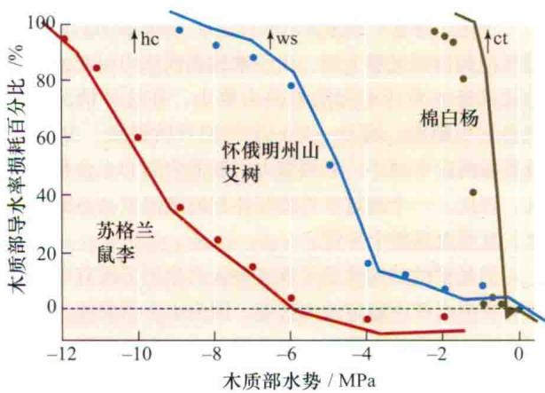

图4.9 木质部的脆弱曲线显示了干旱情况下3种植物的茎木质部水分导度的损耗百分比及其对应的木质部水势。将枝条切断并使用离心力技术使其木质部张力增加来得到实验数据（Alder et al., 1997）。水势轴上部的箭头表明每个物种在野外能测到的最小的木质部水势值（引自Sperry, 2000）。  

## 4.3.7 植物能够将木质部气穴现象的影响程度降到最低

有几种方式能够将木质部气穴现象对植物的影响降到最小。由于木质部中的导管分子是相互连接的，理论上一个气泡可以不断膨胀，直至充满整个导管。然而实际中，气泡并不可能扩张很远，这是由于膨胀中的气泡不能轻易穿过纹孔膜上的小孔。另外，由于木质部的导管是相互连接的，一个气泡并不能完全阻止水分的流动。同时，为避开栓塞的阻挡，水分可以绕过发生栓塞的导管从相邻的充满水的导管通过（图4.7）。因此，木质部管胞和导管有限的长度，尽管增加了水分运输的阻力，但也提供了一个限制气穴现象影响的途径。

此外，气泡也可以从木质部除去。夜间，由于植物的蒸腾作用比较弱，木质部的 $\Psi_{p}$ 增加，此时水蒸气和气体可以很容易地回溶到木质部溶液中。而且，如前所述，一些植物还可在木质部产生正压（根压），这些压力能将气泡压缩并引起气体的溶解。最近的研究表明木质部中的水分即使在张力存在的情况下也可以修复气穴现象（Holbrook et al., 2001；Salleo et al., 2004）。目前，该修复的机制仍不清楚，尚需进一步的研究（参见Web Essay 4.4）。

最后，许多植物在每年都进行次生生长，形成新的木质部。新的木质部导管的生成使植物能够恢复由于气穴现象而失去的水分运输能力。

## 4.4 水分从叶片散失到大气中

水分从叶片散失到大气的途径中，水分是被“拉着”从木质部进入到叶肉细胞的细胞壁，然后蒸发到叶的细胞间隙中（图4.10），水蒸气最后通过气孔离开叶片。液态水在叶片活组织中的移动主要受水势梯度控制，但气相水的运动方式主要是扩散，受到水蒸气浓度梯度的调节。

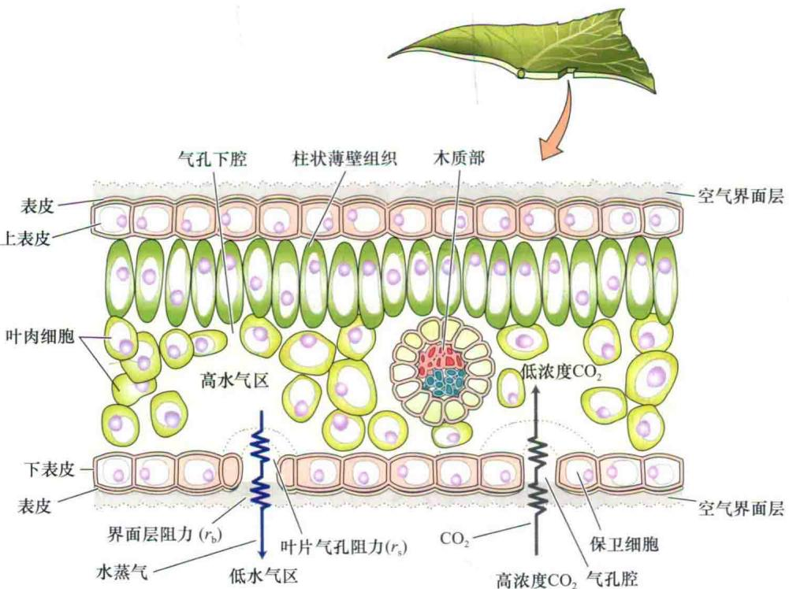  
图4.10 水分通过叶片的途径。水被拉着从木质部到达叶肉细胞的细胞壁，通过细胞壁蒸发到叶片内的细胞间隙中。随后水气通过叶片的空隙或气孔，穿过叶片表面的界面层扩散。 $CO_{2}$ 沿着浓度梯度（内部低，外部高）相反的方向扩散。

覆盖在叶片表面的蜡质表皮是一个阻止水分运动的非常有效的屏障。据估计，叶片散失的水分中只有5%是通过表皮丧失的。对叶片来说，几乎所有的水分都是以水蒸气形式通过气孔的小孔扩散出去的。对于大多数草本植物，气孔在叶片的上下两个表面都有分布，但在下表面分布更多些。而在许多树木的叶片中，气孔仅存在于叶片的下表面。

下面来分析液态水在叶片中的移动、叶片蒸腾作用的驱动力、水分从叶片扩散到大气中的主要阻力及叶片中能够调节蒸腾的解剖学结构。

## 4.4.1 叶片具有大的水流阻力

尽管水横跨叶片的距离对于整个土壤到大气的运输途径来说很短，但叶片对于整个水流阻力的维持有很大的贡献。对于整个植株对水的液相阻力，叶片通常贡献了30%，而在一些种类的植物中占的比例会更大（Sack and Holbrook，2006）。这种短路径大水流阻力相结合的情况也在根中出现，这两个组织中出现的这种现象进一步表明了水在活组织中运输要比在木质部中有着更大的阻力。

水进入叶片后分布在叶的木质部导管中。而水要想蒸发必须从木质部的壁中出来并穿过多层活细胞。因此，叶片中水流阻力反映出木质部导管的数量、分布、体积大小及叶片叶肉细胞的水流阻力特性。具有不同叶脉结构叶片的水流阻力相差可以达40倍（Brodribb et al., 2007）。这种差异很大程度上是由叶片中的叶脉密度及其与蒸发表面的距离差异引起的。叶脉间距小的叶片有着较低的水流阻力及较高的光合作用速率，表明叶脉与蒸发位点的距离对叶片的气体交换速率有着明显的影响。

叶片的水流阻力是动态变化着的。例如，对于同一植株，处在阴暗处的叶片要比相对明亮处的叶片具有更大的水流阻力（Sack et al., 2003）。叶片的水流阻力还会随着叶龄的增加而变大。叶片的水势短时间的降低会引起叶片水流阻力明显增加，这种阻力的增加可能是由叶脉中木质部导管出现气穴现象或有时木质部导管在张力的作用下出现的物理坍塌所引起的（Cochard et al., 2004；Brodribb and Holbrook, 2005）。

## 4.4.2 蒸腾作用的驱动力是水蒸气的浓度差

叶片的蒸腾作用主要依赖于两个因素：①叶内空隙和外部空气间的水蒸气浓度差（difference in water vapor concentration）；②扩散途径的扩散阻力（diffusional resistance，r）。水蒸气的浓度差用 $c_{\mathrm{WV(叶)}}-c_{\mathrm{WV(大气)}}$ 表示。大气的水蒸气浓度 $c_{\mathrm{WV(大气)}}$ 可以很容易测定，但叶的 $c_{\mathrm{WV(叶)}}$ 较难测量。

尽管叶内空隙的体积很小，但是用于水分蒸发的湿表面积较大。植物叶中空隙的体积占到叶片总体积值分别为：松针5%，玉米10%，大麦30%，烟叶40%。与空隙的空间体积相比，叶片中用于水分蒸发的内表面积可以达到叶片外表面积的7\~30倍。这种表面积与体积的高比值及与叶内空隙极近的距离（数个到数十个微米）能使植物叶片内迅速达到水-汽平衡。因此可以推测叶内空隙与细胞壁表面处于水势平衡，从而液态水可以从细胞壁表面迅速蒸发。

正常蒸腾时的叶片（水势一般>-2.0 MPa），水-汽平衡浓度仅为饱和蒸汽压的百分之几。这使得能够估算叶内一定温度下的水气浓度，而叶温是很容易测量的。由于空气的饱和蒸汽压会随着温度的增加而成指数增长，因此，叶片的温度会对蒸腾速率有显著的影响（Web Topic 4.4阐述了如何计算叶内空隙的水气浓度，并讨论了和叶内水分相关的其他方面）。

蒸腾途径中不同位置的水气浓度 $c_{wv}$ 是不同的。从表4.1可以看出，细胞壁表面到叶外大气的途径中每经过一步 $c_{wv}$ 都会减少。切记两点：①水从叶片丧失的驱动力是水气的绝对（absolute）浓度差（ $c_{wv}$ 的差值，单位是 $mol/m^{3}$ ）；②这个差值受到叶片的温度的显著影响。

表4.1 水分从叶片丧失途径中4个位点的相对湿度、绝对水蒸气浓度和水势值

<table><tr><td rowspan="2">位点</td><td rowspan="2">相对湿度</td><td colspan="2">水蒸气</td></tr><tr><td>浓度/(mol/m3)</td><td>水势/MPa $^{a}$ </td></tr><tr><td>叶内空隙(25°C)</td><td>0.99</td><td>1.27</td><td>-1.38</td></tr><tr><td>气孔内部(25°C)</td><td>0.97</td><td>1.21</td><td>-7.04</td></tr><tr><td>气孔外侧(25°C)</td><td>0.47</td><td>0.60</td><td>-103.7</td></tr><tr><td>大气(20°C)</td><td>0.50</td><td>0.50</td><td>-93.6</td></tr></table>

数据来源：Nobel，1999，略有修改  
注：参见图4.10

a 利用Web Topic 4.4中的式（4.4.2）计算， $RT/V^{-}_{w}$ 的值为20℃时的135 MPa和25℃时的173.3 MPa

## 4.4.3 水分丧失也受扩散途径中的阻力调节

水分从叶片丧失的另外一个重要调节因子是蒸腾途径中的扩散阻力，它包括两个可变组分（图4.10）。

（1）通过气孔扩散时气孔本身的阻力，即叶气孔

阻力（leaf stomatal resistance， $r_{s}$ ）。

（2）水蒸气从叶片扩散到大气的湍流层，就必须穿过叶片表面的静止空气层，这也会对水分的扩散产生阻力。这是第二个阻力，称为叶片界面层阻力（boundary layer resistance, $r_{b}$ ）。在考虑气孔阻力之前先讨论这种类型的阻力。

界面层的厚度主要受风速和叶片大小决定。当围绕叶片的空气非常稳定时，叶片表面的静止空气层会非常厚，从而成为水气从叶片散失时的主要阻力。在这种情况下，增加气孔的开度对蒸腾速率的影响很小，尽管气孔完全关闭，蒸腾作用仍会进一步降低（图4.11）。

  
图4.11 静止和流动空气中，吊竹梅（Zebrina pendula）的蒸腾流量对气孔开度的依赖程度。静止空气比流动空气的界面层更大，对水分蒸发的阻力也更高。因而，在静止空气中气孔开度对蒸腾作用的控制能力较小（引自Bange，1953）。

当风速高时，由于运动的空气降低了叶表面界面层的厚度，从而减小了界面层的阻力。此时，气孔阻力也就成了叶片散失水分的主要调控因子。

叶片的解剖学结构和形态会影响到界面层的厚度。叶片的表皮毛可以作为微型的防风林。有些植物的气孔是凹陷的，从而在气孔外部产生了一个起保护作用的空间区域。另外，叶片的形状和大小及它们与风向的角度也可影响风吹拂叶片表面的方式。尽管上述这些因素或其他因素都可能影响界面层，但它们可能在数小时或数天内不发生改变。因此对于短期的调节来说，由保卫细胞所控制的气孔开度在叶片蒸腾作用的调控中起着决定性作用。

有些种类的植物可以通过改变它们叶片的方向来影响蒸腾速率。例如，它们可以使叶片与日光平行来使叶温下降进而减弱蒸腾的驱动力 $\Delta c_{\mathrm{WV}}$ （Berg and Hsiao，1986）。很多草的叶片在缺水时会发生卷曲，以这种方式增加它们的边界层阻力（Hsiao et al.，1984）。甚至发生萎蔫也可以通过减少接受到的辐射来使高的蒸腾速率减弱，并最终使叶温降低及 $\Delta c_{WV}$ 的减少（Chiariello et al.，1987）。

## 4.4.4 气孔控制着叶片的蒸腾作用和光合作用的联系

由于覆盖叶片的角质层几乎是不透水的，大多数叶片的蒸腾作用由水蒸气通过气孔扩散引起（图4.11）。而微小的气孔则为水蒸气提供了一个跨过表皮和角质层扩散的低阻力途径（low-resistance pathway）。气孔阻力的变化对于植物水分散失的调节，以及光合固定 $CO_{2}$ 中吸收 $CO_{2}$ 速率的调节均十分重要。

当水分充足时，植物解决在吸收 $CO_{2}$ 的同时限制水分丧失的有效方案是分时段（temporal）调节气孔的开度，即气孔白天打开，晚上关闭。在晚上，叶片光合作用停止，因而不需要吸收 $CO_{2}$ 时，气孔开度保持很小或关闭，防止水分不必要的散失。而对于阳光充足的上午，当供水充足，且阳光辐射促使叶片的光合作用旺盛时，气孔就充分张开，以便减少气孔对 $CO_{2}$ 扩散的阻力，满足叶内大量的 $CO_{2}$ 的需求。尽管在上述情况下蒸腾作用引起的水分散失也是大量的，但由于水分供应充足，以水分作为代价来换取植物生长和繁殖所必需的光合作用产物，对植物来说总体上还是有利的。

另外，当土壤中的水分并不充足时，即使是阳光充足的上午，气孔的开度也很小，甚至保持关闭。在干旱条件下植物的气孔保持关闭状态，可以避免脱水伤害。叶片无法对 $c_{\mathrm{WV}}$ （叶）- $c_{\mathrm{WV}}$ （空气）和 $r_{b}$ 进行调控，但却可以通过调节气孔的张开和关闭来改变气孔阻力（ $r_{s}$ ）。这种生物学调节是由围绕气孔的一对特化的表皮细胞——保卫细胞来完成的（图4.12）。

## 4.4.5 保卫细胞的细胞壁具有特化的特性

保卫细胞除了存在于所有的维管植物叶中，还存在于更原始植物（如地钱和苔藓）的器官中（Ziegler，1987）。保卫细胞在形态上有相当大的差异，但可以将其分为两大类：一类是禾本科植物和少数单子叶植物，如棕榈的气孔；另一类是所有的双子叶植物和许多单子叶植物及苔藓类、蕨类和裸子植物的气孔。

<!-- END OFFICIAL API PART part_001 -->

<!-- BEGIN OFFICIAL API PART part_002 -->

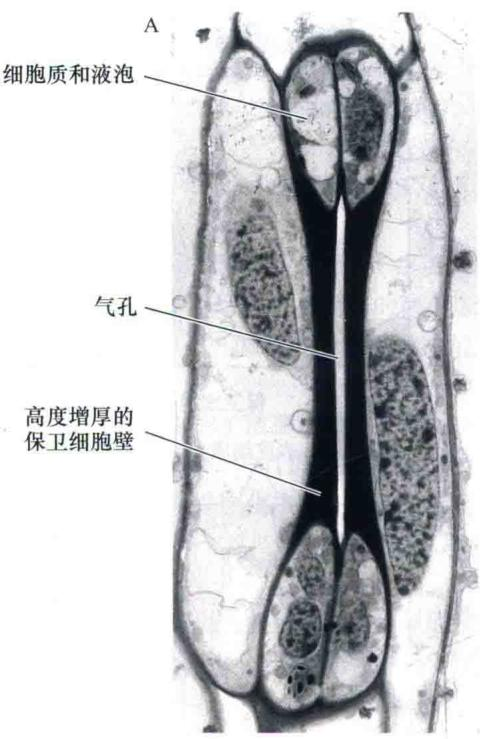

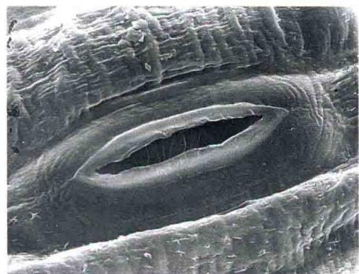

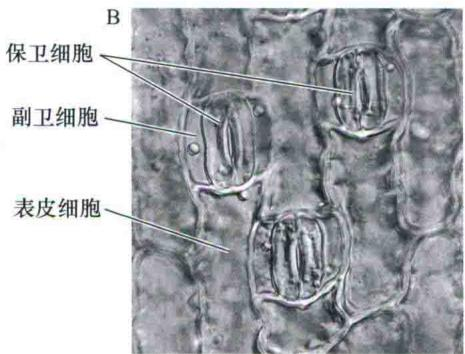  
图4.12 气孔的电子显微照片。A. 禾本科植物的气孔。每个保卫细胞球形的末端显示出它们的胞质内含物，并且有高度增厚的壁。气孔将两个保卫细胞的中间部分分开（2560×）。B. 用微分干涉差光学显微镜观察到的苔属植物莎草的气孔复合体。每个复合体含有两个围绕孔的保卫细胞和两个副卫细胞（550×）。C. 洋葱表皮的扫描电镜照片。C上图显示了叶的外表面，在角质层中有一个气孔。C下图显示了一对面向气孔腔的保卫细胞，朝向叶片内（1640×）（A引自 Palevitz，1981；B引自Jarvis and Mansfield，1981；A和B由B. Palevitz惠赠；C引自 Zeiger and Hepler，1976（上图）和 E. Zeiger and N. Burnstein（下图）。

在禾本科植物中（图4.12A），保卫细胞是典型的哑铃形状，有球形的末端。在两个哑铃形保卫细胞的“柄”（handle）中间有一个狭长的缝隙孔，即气孔。保卫细胞的两侧常伴随有一对称为副卫细胞（subsidiary cell）的特化表皮细胞，可以帮助保卫细胞控制气孔的开度（图4.12B）。保卫细胞、副卫细胞和气孔统称为气孔复合体（stomatal complex）。

在双子叶植物和非禾本科的单子叶植物中，其保卫细胞具有椭圆轮廓的形状（常称为肾形），两个保卫细胞中间的小孔即气孔（图4.12C）。虽然在肾形气孔的植物中少数也有副卫细胞，但多数是没有副卫细胞的，围绕在保卫细胞周围的是普通的表皮细胞。

保卫细胞最显著的特征是其特化的细胞壁结构。其细胞壁中某些部位被充分加厚，厚度可达5 $\mu$ m，而普通表皮细胞的细胞壁厚度为1\~2 $\mu$ m（图4.13）。在肾形的保卫细胞中，细胞壁各部分是不均等加厚的，其内壁、外壁（次生壁）非常厚，腹壁（孔壁）稍微加厚，而背部细胞壁（与表皮细胞相接触的细胞壁）则相对较薄。在腹壁靠近大气的一侧细胞壁突出成发育良好的凸缘，形成小孔。

纤维素微纤丝在细胞壁中的排列方式，能够起到加固植物的细胞壁，以及决定细胞的形状的重要作用（见第15章），在气孔张开和关闭中纤维素微纤丝同样也扮演着十分关键的角色。普通的圆柱形细胞，纤维素微纤丝沿着细胞长轴的横截面方向排列。这种排列方式使得细胞沿着它的长轴方向伸展，因为增厚的纤维素使得与其排列方向成直角的方向上阻力最小。

  
图 4.13 电子显微镜照片显示双子叶植物烟草（Nicotiana tabacum）的一对保卫细胞。切面与叶片表面垂直。孔朝向大气；底部朝向叶片内的气孔下腔。注意细胞壁的不均匀增厚，这决定了当体积增大时的不均匀的变形，从而引起保卫细胞打开（显微图片引自Sack，1987；F. Sack惠赠）。

保卫细胞中的微纤丝排列方式不同于普通的圆柱形细胞。肾形保卫细胞中，细胞壁的纤维素微纤丝由孔向外呈辐射状排列（图4.14A）。面对气孔的保卫细胞内壁比外壁要厚很多。因此，当保卫细胞体积增加时，较弱的外壁向外弯曲，导致气孔打开（Sharpe et al., 1987）。在禾本植物中，哑铃形保卫细胞的功能就像一个有膨胀末端的横梁。随着细胞球形末端体积的增大、膨胀，横梁相互分开，中间的缝隙也相应加宽（图4.14B）。

## 4.4.6 保卫细胞膨压的增加导致气孔张开

保卫细胞如同一个具备多种感觉功能的水压阀。光强和光质、温度、叶片水分状态和细胞内 $CO_{2}$ 浓度等环境因素均可以被保卫细胞感受，并且这些信号会被整合为精确的气孔反应。例如，黑暗中的叶片受到光照时，光作为气孔张开的刺激信号，被保卫细胞感受，进而触发一系列反应，最终引起气孔的开放。

该生理过程的早期反应是离子的吸收和保卫细胞的其他代谢变化，关于后者将在第18章中详细介绍。这里主要讨论保卫细胞由于离子吸收或有机分子合成对渗透势（ $\Psi_{s}$ ）降低的影响。保卫细胞和其他细胞一样同样遵循水势规律。 $\Psi_{s}$ 降低时，细胞水势也相应降低，从而促进水分流入保卫细胞。随着水分进入细胞，细胞的膨压增加，由于保卫细胞的细胞壁有弹性，保卫细胞的体积可以可逆地增大40%\~100%，可增大的程度随物种而异。当保卫细胞的体积发生变化时（增大或缩小），由于其细胞壁的各部分厚度不同，这种体积变化导致了气孔的张开或关闭。

  
图4.14 保卫细胞中纤维素微纤丝的放射状排列和表皮细胞，肾形气孔（A）和禾本科类气孔（B）（引自Meidner and Mansfield，1968）。

副卫细胞对促使气孔快速打开并达到大的开度有着重要的作用（Raschke and Fellow，1971；Franks and Farquhar，2007）。副卫细胞中溶质的迅速运出并进入保卫细胞中导致前者的膨压和体积均减小，使得保卫细胞膨大向远离气孔的方向扩展。与之相反，当溶质从保卫细胞转运至副卫细胞会导致后者的膨压和体积变大，从而推动保卫细胞使气孔关闭。

## 4.4.7 蒸腾比率可用来衡量水分丧失和碳获得之间的关系

在吸收足量 $CO_{2}$ 保证光合作用正常进行的同时，植物调节水分丧失的能力可用蒸腾比率（transpiration ratio）来评价。蒸腾比率是指植物蒸发水量与光合同化二氧化碳量的比值。

$C_{3}$ 植物 $CO_{2}$ 固定的第一个产物是一个三碳化合物（ $C_{3}$ 植物，见第8章），如果光合作用中每固定1分子

$CO_{2}$ 大约要丧失400分子水，那么此时蒸腾比率就是400（有时候也用蒸腾比率的倒数表示，其称为水分利用效率。蒸腾比率为400的植物的水分利用效率为1/400，也就是0.0025）。

有3个因素导致了植物的这种水分流出和 $CO_{2}$ 流入的高比率。

（1）驱动水分丧失的浓度梯度比驱动 $CO_{2}$ 流入的浓度梯度大50倍。大部分情况下，这种差异的存在是由于空气中的 $CO_{2}$ 浓度很低（约0.038%），而叶片中的水蒸气浓度相对较高。

（2）水分子在空气中的扩散速度要比 $CO_{2}$ 大约快1.6倍（ $CO_{2}$ 分子比 $H_{2}O$ 分子大，并且扩散系数较小）。

（3）在进入叶绿体而被同化之前， $CO_{2}$ 必须跨过质膜、细胞质和叶绿体被膜。这些生物膜增大了 $CO_{2}$ 扩散途径的阻力。

有些植物能够通过调整光合作用中二氧化碳的固定途径来大大降低它们的蒸腾比率。这些植物中光合作用的第一个稳定产物是一个四碳化合物（ $C_{4}$ 植物，见第8章），它们每固定1分子 $CO_{2}$ 蒸发的水分通常要比 $C_{3}$ 植物少； $C_{4}$ 植物典型的蒸腾比率为150。这很大程度上是由于 $C_{4}$ 植物光合作用导致在细胞内空气的 $CO_{2}$ 浓度变低（见第8章），产生了更大的吸收 $CO_{2}$ 的驱动力并使这些植株的气孔开度变小从而降低了蒸腾比率。

而对于能适应沙漠环境的景天科酸代谢（CAM）植物，它们碳固定的起始阶段是在夜间将 $CO_{2}$ 固定到四碳有机酸上，它们有着更低的蒸腾比率，大约50的蒸腾比率值是很常见的。这很可能是由于它们的气孔开闭有着相反的昼夜节律，在夜间打开而在白天时关闭。由于在夜间有着低的叶温从而使 $\Delta c_{wv}$ 仅增加很小的值，最终引起在夜间有着很弱的蒸腾作用。

## 总述：土壤-植物-大气连续体

已经知道水分通过植物从土壤到大气的移动涉及多个不同的运输机制。

（1）在土壤和木质部中，在压力势梯度（ $\Delta\Psi_{p}$ ）驱动下，水分以集流的方式移动。

（2）当水分跨膜运输时，在跨膜水势差的驱动下，水以渗透方式进出细胞，如细胞吸水及根从土壤向木质部运输水分。

（3）至少在到达外部大气之前，气态水主要为扩散移动，在此对流（集流的一种形式）起主导作用。

然而，主导水分从土壤到叶片运输的关键因素是木质部的负压，而产生这种负压的位点是蒸腾叶片细胞壁的毛细管作用。而在植物的另外一端，土壤中的水分通过毛细管作用力维持。这导致两端的毛细作用力对水分这个绳子“拔河”。随着叶片蒸腾失水，土壤中的水分持续进入植物体，并上行至叶片。在此过程中，主要是物理作用力发挥作用，而不需要任何的代谢泵，即不消耗代谢能量。水运输的能量最终是由太阳提供的。

这个简单的机制使能量效率非常高，每同化一分子 $CO_{2}$ 需要运输400分子的水来交换。这个运输系统能够起作用的关键因素是拥有一个低阻力，并且可以防止发生气穴现象的木质部运输途径，以及用来吸收土壤水分的高表面积的根系统。

## 小结

植物吸收 $CO_{2}$ 的需要与保持水的需要之间是一对固有的矛盾，因此使得植物在让 $CO_{2}$ 进入气孔的同时必然在同一地方导致水分的丧失。为了应对这种矛盾，植物进化出一种通过控制叶片失水及对所失去的水分进行补充的方法来适应。

## 土壤中的水分

· 土壤中的水分含量及水在土壤中的移动速率依赖于土壤的类型和结构，进而影响水在土壤中的压力梯度和导水率。

· 在土壤中，水分可以以水膜形式存在于土壤颗粒表面，或者完全或部分充满土壤颗粒之间的空隙。

· 渗透势、静水压和重力势将水从土壤中通过植株运送到大气中（图4.1）。

· 根毛与土壤颗粒之间紧密的接触极大地增加了用来进行水分吸收的表面积（图4.2）。

## 根对水分的吸收

· 水分的吸收主要局限于根尖附近（图4.3）。

· 在根中，水分可以通过质外体、共质体或跨膜途径进行运输（图4.4）。

\- 水分在质外体中的移动被内皮层中的凯氏带所阻断（图4.4）。

· 当蒸腾作用比较弱时，溶质不断地被运输至木质部流中导致 $\Psi_{S}$ 和 $\Psi_{W}$ 的降低，提供了吸水的动力及正的 $\Psi_{p}$ ，从而在木质部中产生正的静水压（图4.5）。

## 水分在木质部中的运输

· 由单细胞的管胞或是多细胞的导管组成的木质部中的导管，为水分的运输提供一个低阻力的通道（图4.6）。

· 拉长的、纺锤形的管胞和垛叠的导管分子在次生壁上具有纹孔（图4.7）。

· 压力驱动的集流使水可以在木质部中长距离移动。

· 叶片中细胞的细胞壁表面产生的负压使得水分可以在木质部中上升（图4.8）。

· 气穴现象会使水柱断开并阻止水分在张力下的运输（图4.9）。

## 水从叶片到大气的移动

· 水在蒸发至叶片内的空腔前会先被从木质部拉到叶肉细胞的细胞壁中（图4.10）。

· 叶片的水流阻力很大而且是动态变化的。

· 蒸腾作用的强弱依赖于叶片中细胞间充满空气的间隙与外部大气之间的水气浓度差及这个途径的扩散阻力，该阻力由叶片的气孔阻力和边界层阻力组成（图4.11）。

· 气孔的打开和关闭是由保卫细胞来完成并进行调控的（图4.12\~图4.14）。

\- 植物吸收 $\mathrm{CO}_{2}$ 时限制水分丧失的能力用蒸腾比率来表示。

## 总述：土壤-植物-大气连续体

· 驱动水分从土壤到植物直至大气所需的驱动力是由不含任何需要代谢泵参与的物理驱动力所构成的，该能量的最终来源是太阳。

(王伟 周云 译)

## WEB MATERIAL

## Web Topics

## 4.1 Irrigation

Irrigation has a dramatic impact on crop yield and soil salinity.

4.2 Physical Properties of Soils
The size distribution of soil particles influences its ability to hold and conduct water.

4.3 Calculating Velocities of Water Movement in the

Xylem and in Living Cells
Water flows more easily through the xylem than across living cells.

4.4 Leaf Transpiration and Water Vapor Gradients
Leaf transpiration and stomatal conductance affect leaf and air water vapor concentrations.

## Web Essays

## 4.1 A Brief History of the Study of Water Movement in the Xylem

The history of our understanding of sap ascent in plants, especially in trees, is a beautiful example of how knowledge about plants is acquired.

4.2 The Cohesion–Tension Theory at Work
The cohesion-tension theory has withstood a number of challenges.

4.3 How Water Climbs to the Top of a 112-Meter-Tall Tree Measurements of photosynthesis and transpiration in 112-meter tall trees show that some of the conditions experienced by the top foliage compares to that of extreme deserts.

4.4 Cavitation and Refilling
A possible mechanism for cavitation repair is under active investigation.
