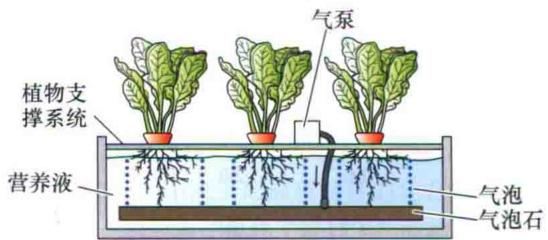
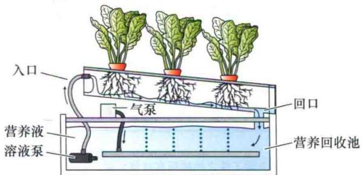
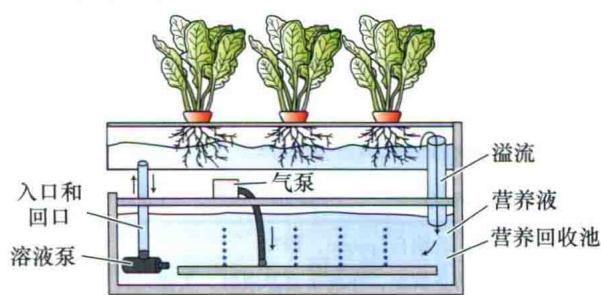
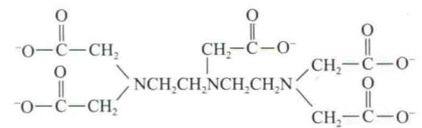
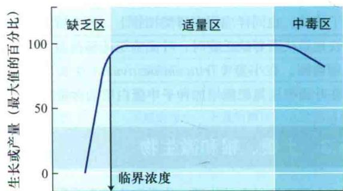
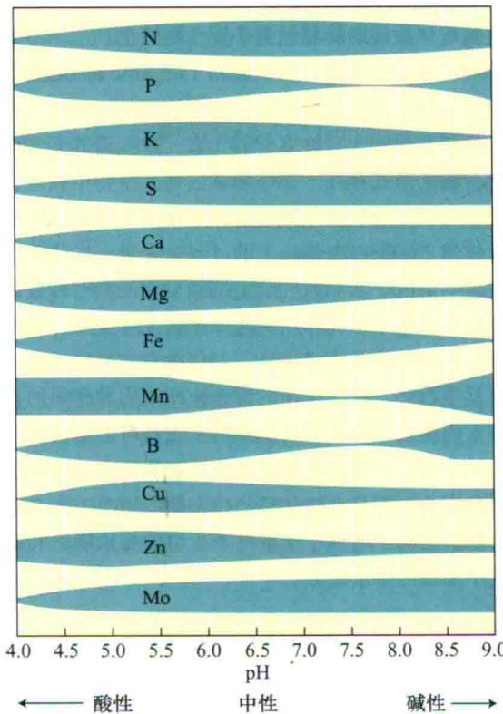
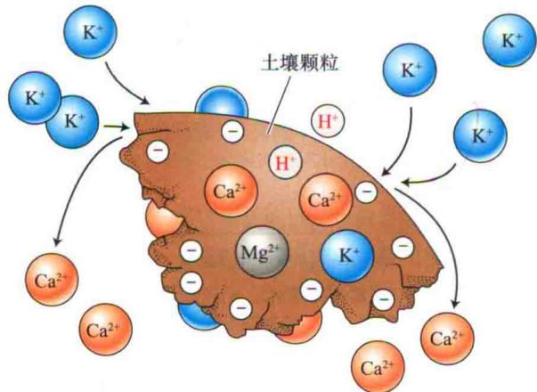
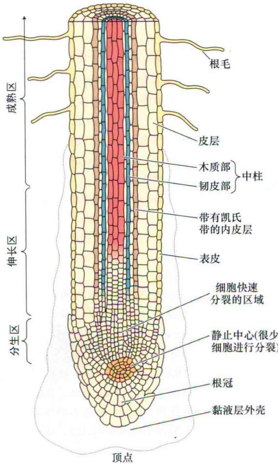
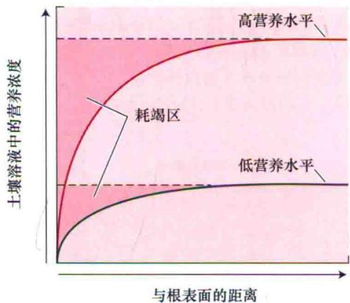

## 第 5 章

矿质营养

植物矿质营养是指植物生长发育所必需的、以无机离子形式从土壤中获取的氮、磷、钾等元素。尽管矿质营养成分通过所有的生物体进行连续不断的循环，但是它们主要经过植物的根系进入生物圈。因此，从某种意义上说，植物是地球表面的“矿工”（Epstein，1999）。根系具有巨大的表面积，同时又具有从低浓度土壤溶液中吸收无机离子的能力，这些都极大地增强了植物吸收矿物质的效力。矿质元素被根吸收之后，被运输到植物的各个部分，为植物所利用，并表现出各种生物学功能。其他生物，如菌根真菌和固氮细菌，常参与根对矿质元素的吸收。

植物如何获取和利用矿质元素称为矿质营养（mineral nutrition），是现代农业和环境保护的主要研究领域之一。矿质元素肥料的施用导致农业高产，事实上，大多数作物产量的增加与它们吸收肥料的数量呈线性关系（Loomis and Conn，1992）。为了适应不断上升的食物需求，世界上主要矿质肥料氮、磷和钾每年的消耗量稳步上升，从1960年的3000万t增加到1990年的1.43亿t。在随后的10年中，矿质肥料的使用保持相对稳定，因为考虑到不断上升的肥料成本，施用方法更加精确。然而，在过去的数年间，矿质肥料每年的消耗量已上升至1.7亿t（图5.1）。

然而，严格意义上讲，作物利用的肥料不足向土壤中作物周围所施肥料的一半（Loomis and Conner, 1992）。其余的矿物质可能渗入到地表水或地下水中，吸附于土壤颗粒或造成空气污染。在美国，正是由于这些肥料的流失，许多水井中饮用水的硝酸盐（ $\mathrm{NO}_3^-$ ）含量超标（美国联邦规定标准）（Nolan and Hitt, 2006）。人类的活动导致氮素以硝酸盐（ $\mathrm{NO}_3^-$ ）和铵盐（ $\mathrm{NH}_4^+$ ）形式释放至环境中，这些氮素又通过雨水沉积于土壤中，这个过程称为大气氮沉积（deposition）。它正在引起全美生态系统的改变（Alber et al., 2003; Fenn et al., 2003）。

令人欣慰的是，通过植物吸收矿质元素使动物废弃物再循环利用的传统方法，正在成为从垃圾堆中除去包括重金属在内的有害矿质元素的有效手段（Ahluwalia and Goyal，2007）。由于植物-土壤-大气之间的自然关系非常复杂，包括大气化学、土壤学、水分、微生物学和生态学，以及植物生理学在内的许多学科领域的专家都参与了矿质营养的研究。

在本章将先讨论植物的营养需求、特定的营养缺乏症状和如何使用肥料以确保适当的植物营养。随后，将分析土壤结构（固体、液体、气体成分的构成）和根的形态如何影响植物从环境中吸收无机营养。最后，将以专题形式介绍菌根共生体的问题。溶质运输和营养同化方面的内容分别在第6章和第12章讲解。

## 5.1 必需元素、必需元素缺乏和植物失调症

已经证实，只有一些元素对植物体是必需的。必需元素（essential element）是植物结构或新陈代谢中的基本组分，缺失时能引起植物严重的生长、发育或生殖异常（Arnon and Stou，1939；Epstein and Blom，2005）。如果为植物提供这些必需元素、水及光能，植物就能够合成它们正常生长所需的所有化合物。表5.1列出了目前公认的高等植物的大多数必需元素（尽管不是全部）。一般认为，前3种元素——氢、碳和氧不是矿质元素，因为它们主要来自于水和 $CO_{2}$ 。

  
图5.1 过去的5年中全球的肥料消耗量（改编自www.faostat.fao.org/site/575/default.aspx#ancor.）。

通常，必需矿质元素根据其在植物组织中的相对浓度可被分为大量元素和微量元素。在某些情况下，不同组织中大量元素和微量元素的含量差异并不像表5.1中所标的那么大。例如，一些植物组织，如叶肉中，铁和锰的含量几乎和它含有的硫和镁的量相当。许多元素在植物中的含量通常高于植物的最低需求量。

表5.1 植物必需元素的合适组织浓度

<table><tr><td>元素</td><td>化学符号</td><td>干物质中的浓度 /  $(\% \text{或} \times \text{ppm}^{1})^{\text{a}}$ </td><td>相对于钼的相对原子数量</td></tr><tr><td colspan="4">从水或二氧化碳中获得</td></tr><tr><td>氢</td><td>H</td><td>6</td><td>60 000 000</td></tr><tr><td>碳</td><td>C</td><td>45</td><td>40 000 000</td></tr><tr><td>氧</td><td>O</td><td>45</td><td>30 000 000</td></tr><tr><td colspan="4">从土壤中获得大量元素</td></tr><tr><td>氮</td><td>N</td><td>1.5</td><td>1 000 000</td></tr><tr><td>钾</td><td>K</td><td>1.0</td><td>250 000</td></tr><tr><td>钙</td><td>Ca</td><td>0.5</td><td>125 000</td></tr><tr><td>镁</td><td>Mg</td><td>0.2</td><td>80 000</td></tr><tr><td>磷</td><td>P</td><td>0.2</td><td>60 000</td></tr><tr><td>硫</td><td>S</td><td>0.1</td><td>30 000</td></tr><tr><td>硅</td><td>Si</td><td>0.1</td><td>30 000</td></tr><tr><td colspan="4">微量元素</td></tr><tr><td>氯</td><td>Cl</td><td>100</td><td>3 000</td></tr><tr><td>铁</td><td>Fe</td><td>100</td><td>2 000</td></tr><tr><td>硼</td><td>B</td><td>20</td><td>2 000</td></tr><tr><td>锰</td><td>Mn</td><td>50</td><td>1 000</td></tr><tr><td>钠</td><td>Na</td><td>10</td><td>400</td></tr><tr><td>锌</td><td>Zn</td><td>20</td><td>300</td></tr><tr><td>铜</td><td>Cu</td><td>6</td><td>100</td></tr><tr><td>镍</td><td>Ni</td><td>0.1</td><td>2</td></tr><tr><td>钼</td><td>Mo</td><td>0.1</td><td>1</td></tr></table>

资料来源：Epstein，1972，1979  
a 非矿质元素（H、C 和 O）和大量元素的数值为百分率；微量元素为百万分浓度

由于很难从生理学角度加以判断，一些研究者对于这种将矿质元素分为大量元素和微量元素的分类方法产生质疑。相反，Mwngel和Kirkby（2001）依据生化作用及生理功能将这些植物必需元素进行了新的分类。如表5.2所示，这种分类方法将必需元素分成4组。

表5.2 根据生物化学功能对植物矿质元素的分类

<table><tr><td>矿质营养</td><td>功能</td></tr><tr><td>第一组</td><td>组成碳化合物的营养元素</td></tr><tr><td>N</td><td>构成氨基酸、氨基化合物、蛋白质、核酸、核苷酸、辅酶和己糖胺等物质</td></tr><tr><td>S</td><td>半胱氨酸、胱氨酸、甲硫氨酸的组分。构成硫辛酸、辅酶、硫胺素焦磷酸、谷胱甘肽、生物素、腺苷-5&#x27;-磷酸硫酸酐和3&#x27;-磷酸腺苷</td></tr><tr><td>第二组</td><td>在能量储存和结构完整中起重要作用的营养元素</td></tr><tr><td>P</td><td>糖磷酸、核酸、核苷酸、辅酶、磷脂、肌醇六磷酸等物质的成分。在与ATP有关反应中起关键作用</td></tr><tr><td>Si</td><td>在细胞壁中以二氧化硅沉淀形式存在。参与了细胞壁机械性质的形成,包括刚性和弹性</td></tr><tr><td>B</td><td>与甘露醇、甘露聚糖、藻酸和细胞壁的其他组分结合,参与细胞伸长和核酸代谢</td></tr><tr><td>第三组</td><td>以离子形式存在的营养元素</td></tr><tr><td>K</td><td>至少40种酶所需的辅助因子。建立细胞膨压和维持细胞电中性所需的最重要的阳离子</td></tr><tr><td>Ca</td><td>细胞壁中间层的组分。一些参与ATP和磷脂水解的酶所需的辅助因子。代谢调节过程中作为第二信使</td></tr><tr><td>Mg</td><td>参与磷酸转移的许多酶所必需的。叶绿素分子的组成部分</td></tr><tr><td>Cl</td><td>与 $O_{2}$ 释放有关的光合反应所需</td></tr><tr><td>Mn</td><td>一些脱氢酶、脱羧酶、激酶、氧化酶和过氧化物酶的活性所必需的。参与了其他阳离子活化酶的构成和光合反应中氧释放有关的反应</td></tr><tr><td>Na</td><td>参与了 $C_{4}$ 和CAM植物中磷酸烯醇式丙酮酸的再生反应。有时可替代钾离子的一些功能</td></tr><tr><td>第四组</td><td>与氧化还原反应有关的营养元素</td></tr><tr><td>Fe</td><td>与光合作用、氮固定和呼吸作用有关的细胞色素和非血红素铁蛋白的组成成分</td></tr><tr><td>Zn</td><td>乙醇脱氢酶、谷氨酸脱氢酶和碳酸酐酶等的组分</td></tr><tr><td>Cu</td><td>抗坏血酸氧化酶、酪氨酸酶、单胺氧化酶、尿酸酶、细胞色素氧化酶、酚酶、漆酶和质体蓝素的组分</td></tr><tr><td>Ni</td><td>脲酶的组成元素。在细菌固氮中是氢化酶的组分</td></tr><tr><td>Mo</td><td>固氮酶、硝酸还原酶和黄嘌呤脱氢酶的组分</td></tr></table>

资料来源：改编自Evansand and Sorger，1966；Mengel and Kirkby，2001

（1）第一组必需元素由氮和硫组成。植物可以通过氧化和还原的生物化学反应，与碳形成共价键，产生有机化合物，同化这些元素。

（2）第二组必需元素在植物能量储存反应和维持结构完整性中起重要作用。它们在植物组织中常以磷酸、硼酸和硅酸盐酯的形式存在，共价地结合在有机分子上（如磷酸糖类）。

（3）第三组必需元素作为酶的辅助因子和在渗透势调节中具有重要的作用。在植物组织中，该组元素以自由离子形式溶解于水，或者以静电力结合到诸如存在于植物细胞壁的果胶酸等物质上。

（4）第四组必需元素由铁等金属元素组成，在电子转移反应中扮演重要角色。

需要注意的是，这种分类或多或少地带有主观因素，因为许多元素在生物体中扮演多种功能角色。例如，第三组中的锰元素，作为矿质元素以离子形式存在，但它也参与到许多重要的电子传递反应中，而这一点也正是第四组元素的功能所在。自然界中存在的一些不属于植物必需的元素，如铝、硒和钴，也可以在植物组织中积累。例如，铝一般认为是一种非必需元素，但植物体通常含有0.1\~500 ppm的铝，而且向营养溶液中加入低水平的铝可刺激植物生长（Marschner，1995）。Astragalus、Xylorhiza和Stanleya的许多物种中积累硒，尽管植物并没有表现出对这种元素的特殊需要。钴是钴胺素（维生素 $B_{12}$ 及其衍生物）的组成部分，而钴胺素则是固氮微生物中许多酶的组分。因此，钴的缺乏阻碍固氮根瘤的发育及功能的发挥。然而，非固氮植物，以及以铵盐或硝酸盐为氮源的固氮植物不需要钴。作物中这些非必需元素的含量通常相对较少。

C 汽雾法生长系统  
A 水培生长系统  

B 营养膜生长系统  

接下来的部分介绍用于检查植物中营养元素功能的方法。

## 5.1.1 矿质营养研究中的专用技术

将植物培养在缺失某种所研究元素的实验条件下进而确定该元素是否为植物所必需。如果植物生长于像土壤这样复杂的介质中，将很难得到相应的研究结果。19世纪，包括Nicolas-Théodore de Saussure、Julius von Sachs、Jean-Baptiste-Joseph-Dieudonné Boussingauct和Wilhelm Knop在内的许多研究者，采用一种新的种植方法来解决这一问题，他们将植物的根浸泡在仅包含无机盐的营养液（nutrition solution）中进行培养，明确证实植物能在没有土壤或有机质的环境中也能够正常生长，即植物完全可以在只有无机元素、水和阳光的条件下，满足其全部需要。

将植物根系浸没在没有土壤的营养液中的植物培养技术称为溶液培养（solution culture）或水培（hydroponics）（Gericke，1937）。成功的水培（图5.2A）需要提供大量的营养液，或者经常校正营养液，这样可以避免由于营养被根吸收而引起的介质中营养浓度和pH的较大改变。保证根系中氧的充分供应也很重要，可以通过向溶液中通入足以产生贯穿溶液的足量空气来实现。

水培法被应用于许多温室作物如番茄（Lycopersicon esculentum）的商业生产。在一种商业水培中，将植物种植在如沙子、砾石、蛭石或开发的黏土等支持物（如kitty litter）上。然后，用营养液穿越支持介质，旧的营养液就被冲洗更换。在另一种形式的水培中，将植物根伸展在一个水槽的表面，营养液以薄层的方式沿着浸没根的排水槽流动（Cooper，1979；Asher and Ddward，1983）。这种营养膜生长系统（nutrient film growth system）能确保根接受到足够的氧气（图5.2 B）。

  
D 间歇流动系统

  
图5.2 各种类型的溶液培养系统。A. 一种标准的水培生长系统，植物通过茎基部悬吊在装有营养液的槽上。用能产生小气泡的多孔固体作为气泡柱，用来保持溶液中氧的饱和状态。B. 在营养膜生长系统中，溶液泵将营养液从主水池中泵出，营养液沿着倾斜槽的底部由回收管流回蓄水池。C. 在汽雾法生长系统中，培养槽中的高压泵向根部喷洒营养液。D. 在间歇流动系统中，水泵周期性地向包含植物根的上部小室中泵满营养液。当泵关掉时，营养液通过泵慢慢流回主蓄水池（引自Epstein and Bloom，2005）。

汽雾栽培法（aeroponically）是另一种可供选择的植物培养方法，该方法有时被誉为未来的科学研究的手段（Weathers and Zobel，1992）。在这种技术中，植物根被悬吊在空中，同时不断地向植物根部喷施营养液以维持其生长（图5.2C）。这种方法能在根周围提供容易操纵的气体环境，但是需要提供比水培法更高浓度的营养液，以维持植物的快速生长。再加上其他技术困难，汽雾栽培法目前尚未得到广泛的应用。

间歇流动系统（ebb-and-flow system）（图5.2D）

也是一种溶液培养方法。在该体系中，植物的根暴露于潮湿的空气中，营养液周期性地上升淹没植物根部并随后退去。和汽雾栽培法一样，间歇流动体系对营养液的浓度需要比水培法和营养膜培养法更高。

## 5.1.2 营养液能维持植物的快速生长

多年来，人们研究出了多种营养液的配制方式。早期的配方仅包括 $KNO_{3}$ 、 $Ca(NO_{3})_{2}$ 、 $KH_{2}PO_{4}$ 、 $MgSO_{4}$ 和铁盐，是由德国人Knop开发的。当时，这种营养液被认为含有植物所需的所有矿物质，但是，后来才知道进行这些实验所用到的化学药品被其他成分（如硼和钼）污染了，当时并不知道这些元素也是植物所必需的。表5.3列出了一个更现代的营养液配方。此配方被称作改良Hoagland溶液（Hoagland solution），即以一位在现代矿质营养研究中作出杰出贡献的美国科学家Dennis R. Hoagland命名。

表 5.3 培养植物的改良Hoagland 溶液的组成

<table><tr><td rowspan="2">化合物</td><td rowspan="2">分子质量/(g/mol)</td><td rowspan="2">储备液浓度/(mmol/L)</td><td rowspan="2">储备液浓度/(g/L)</td><td rowspan="2">每升最终溶液中储备液体积/mL</td><td rowspan="2">元素</td><td colspan="2">元素的最终浓度</td></tr><tr><td>/(μmol/L)</td><td>/(μg/g)</td></tr><tr><td>大量元素</td><td></td><td></td><td></td><td></td><td></td><td></td><td></td></tr><tr><td> $KNO_3$ </td><td>101.10</td><td>1000</td><td>101.10</td><td>6.0</td><td>N</td><td>16000</td><td>224</td></tr><tr><td> $Ca(NO_3)_2·4H_2O$ </td><td>236.16</td><td>1000</td><td>236.16</td><td>4.0</td><td>K</td><td>6000</td><td>235</td></tr><tr><td> $NH_4H_2PO_4$ </td><td>115.08</td><td>1000</td><td>115.08</td><td>2.0</td><td>Ca</td><td>4000</td><td>160</td></tr><tr><td> $MgSO_4·7H_2O$ </td><td>246.48</td><td>1000</td><td>246.49</td><td>1.0</td><td>P</td><td>2000</td><td>62</td></tr><tr><td></td><td></td><td></td><td></td><td></td><td>S</td><td>1000</td><td>32</td></tr><tr><td></td><td></td><td></td><td></td><td></td><td>Mg</td><td>1000</td><td>24</td></tr><tr><td>微量元素</td><td></td><td></td><td></td><td></td><td></td><td></td><td></td></tr><tr><td>KCl</td><td>74.55</td><td>25</td><td>1.864</td><td></td><td>Cl</td><td>50</td><td>1.77</td></tr><tr><td> $H_3BO_3$ </td><td>61.83</td><td>12.5</td><td>0.773</td><td></td><td>B</td><td>25</td><td>0.27</td></tr><tr><td> $MnSO_4·H_2O$ </td><td>169.01</td><td>1.0</td><td>0.169</td><td></td><td>Mn</td><td>2.0</td><td>0.11</td></tr><tr><td> $ZnSO_4·7H_2O$ </td><td>287.54</td><td>1.0</td><td>0.288</td><td>2.0</td><td>Zn</td><td>2.0</td><td>0.13</td></tr><tr><td> $CuSO_4·5H_2O$ </td><td>249.68</td><td>0.25</td><td>0.062</td><td></td><td>Cu</td><td>0.5</td><td>0.03</td></tr><tr><td> $H_2MoO_4(85%MoO_3)$ </td><td>161.97</td><td>0.25</td><td>0.040</td><td></td><td>Mo</td><td>0.5</td><td>0.05</td></tr><tr><td>NaFeDTPA(10%Fe)</td><td>468.20</td><td>64</td><td>30.0</td><td>0.3~1.0</td><td>Fe</td><td>16.1~53.7</td><td>1.00~3.00</td></tr><tr><td>可选择元素a</td><td></td><td></td><td></td><td></td><td></td><td></td><td></td></tr><tr><td> $NiSO_4·6H_2O$ </td><td>262.86</td><td>0.25</td><td>0.066</td><td>2.0</td><td>Ni</td><td>0.5</td><td>0.03</td></tr><tr><td> $Na_2SiO_3·9H_2O$ </td><td>284.20</td><td>1000</td><td>284.20</td><td>1.0</td><td>Si</td><td>1000</td><td>28</td></tr></table>

资料来源：改编自Epstein，1972

注：为了防止沉淀，在准备营养液时，大量元素要从母液中分开来加。组合母液包含除了铁之外的所有微量元素。铁以钠高铁二乙烯三胺五磷酸（NaFe DTPA，商品名Ciba-Geigy Sequestrene 330 Fe；图5.3）的形式加入；有些植物，像玉米如表中所示，需要更高水平的铁

改良的Hoagland溶液包含所有已知的为植物快速生长所必需的矿质元素。溶液中各种元素的浓度是在不产生毒性症状和盐胁迫条件下的最高可能水平。因此，许多元素的浓度很有可能要比植物根周围土壤中的浓度高许多倍。例如，正常情况下，土壤溶液中磷的浓度低于0.06 ppm，而在改良的Hoagland溶液中却为62 ppm（Epstein and Bloom，2005）。如此高的初始浓度可使植物在不用补充营养的情况下生长较长时间，但这种浓度也可能对幼苗产生伤害。因此许多研究者将营养液稀释几倍，以多次补充的方式使用，以此降低介质和植物组织中营养物质浓度的波动。

改良Hoagland配方的另外一个重要特征是氮元素以铵盐（ $\mathrm{NH}_4^+$ ）和硝酸盐（ $\mathrm{NO}_3^-$ ）两种形式供给。以阳离子（positively charged ion）和阴离子（nagtively charged ions）均衡混合的方式供应氮元素，能减少培养基中pH的快速上升，而溶液pH上升的现象在单用硝酸根阴离子作为氮源的情况下很常见（Asher and Edwards, 1983）。即使在溶液pH保持中性的情况下，同时获取 $\mathrm{NH}_4^+$ 和 $\mathrm{NO}_3^-$ ，大多数植物会生长得更好，因为吸收和同化两种形式的氮，能促进植物体内阳-阴离子的平衡（Raven and Smith, 1976; Epstein and Bloom, 2005）。

如何维持溶液中铁离子的可用性是营养液的一个重要问题。如果以无机盐如 $\mathrm{FeSO_{4}}$ 或 $\mathrm{Fe(NO_{3})_{2}}$ 的形式供应，特别是在碱性条件下，铁能在溶液中以氢氧化铁的形式沉淀出来。如果溶液中有磷酸盐存在，也能形成不溶性的磷酸铁。溶液中的铁盐沉淀出来，成为植物不能利用的物理形态，除非向溶液中不断加入铁盐。早期的研究者通过将铁与柠檬酸或酒石酸一起加入的方法来解决这个问题。诸如称作螯合剂（chelator）的复合物，由于它们能与以离子间相互作用力而非共价键结合 $\mathrm{Fe^{2+}}$ 、 $\mathrm{Ca^{2+}}$ 等阳离子形成可溶性的化合物。对植物来说，被螯合的阳离子保持了可利用性的物理性质。

更现代的营养液用化学试剂乙二胺四乙酸（EDTA）或二乙烯三胺五磷酸（DTPA或五醋三胺）作为螯合剂（Sievers and Baile，1962）。图5.3显示了DTPA的结构。在根细胞吸收铁的过程中，螯合复合物的去向还不清楚。在根表面，三价铁（ $\mathrm{Fe}^{3+}$ ）被还原成二价铁（ $\mathrm{Fe}^{2+}$ ）后可能从螯合剂中被释放出来，之后，螯合剂可能扩散回营养液（或土壤）并与另一个 $\mathrm{Fe}^{3+}$ 或其他金属离子螯合。

铁被吸收进入根部后，与植物细胞中的有机化合物通过螯合作用结合保持可溶性状态。柠檬酸可能是主要的铁离子有机螯合剂，并且铁离子在木质部的长距离运输似乎也涉及铁-柠檬酸复合物。

A  

  
图5.3 螯合剂和被螯合的阳离子。螯合剂二乙烯三胺五磷酸（DTPA）的化学结构，螯合剂本身（A）和螯合一个 $Fe^{3+}$ 的状态（B）。铁通过与3个氮原子和3个羧基上离子化的氧原子相互作用结合到DTPA上（Sievers and Bailar，1962），产生能够固定金属离子的结构，并有效地中和了金属离子在溶液中的反应性。在根表面，铁的吸收过程中 $Fe^{3+}$ 被还原成 $Fe^{2+}$ ，然后从DTPA-铁复合物中释放出来，而螯合剂又能结合其他可用的 $Fe^{3+}$ 。

## 5.1.3 矿质营养缺乏影响植物代谢和功能

必需元素供应不足时将导致营养失调，表现出典型的缺素症。在水培中，一种必需元素缺乏能很容易地与一组已知的元素缺乏症状相对应。例如，一种特殊元素缺乏可能诱发一种特定形式的叶片颜色变化。但土壤中生长的植物，其缺素症的诊断则复杂得多，原因主要如下。

（1）几种元素的缺乏可能同时发生在不同的植物组织中。

（2）一种元素的缺乏或过量可能诱导其他元素的缺乏或过度积累。

（3）一些病毒诱导的植物疾病可能产生与营养元素缺乏相似的症状。

植物中的营养缺乏症状表现为必需元素供应不足时所引起的代谢紊乱。这种紊乱与必需元素在正常植物代谢和功能中扮演的角色有关（表5.2已列出）。

虽然每一个必需元素都参与许多不同的代谢反应，但在植物代谢中对必需元素的功能做一个大概的描述还是有可能的。通常，必需元素在植物结构、新陈代谢和细胞渗透调节中发挥作用。而某些二价阳离子可能具有与其特性相关的更多特殊作用，如 $Ca^{2+}$ 或 $Mg^{2+}$ 能改变植物膜通透性。另外，进一步研究还表明这些元素在植物代谢中具有特殊作用，如 $Ca^{2+}$ 可作为信号分子调节胞质中的关键酶（Hepler and Wayn，1985；Hetherington and

Brownlee，2004）。因此，绝大多数必需元素在植物代谢过程中具有多重功能。

当阐述某种特定必需元素的严重缺乏症时，一个重要的线索是该元素从老叶到新叶可被循环利用的程度。一些元素，如氮、磷和钾，很容易从一个叶片转移到另一个叶片；而另一些元素，如硼、铁和钙，则在大多数种类植物中的位置相对固定（表5.4）。如果一种必需元素是可转移的，那么这种元素的缺乏症状将首先出现在老叶上。不易转移必需元素的缺乏症则首先会在新叶中明显表现出来。虽然养分转移的详细机制还不很清楚，但诸如细胞分裂素等植物激素似乎参与其中（见第21章）。在下面的讨论中，将按照表5.2的分组，详细叙述必需矿质元素的特定缺乏症状及其在植物中的功能。

表5.4 根据矿质元素在植物中的移动性和在缺乏时的移动趋势对其进行分类

<table><tr><td>可移动的</td><td>不可移动的</td></tr><tr><td>N</td><td>Ca</td></tr><tr><td>K</td><td>S</td></tr><tr><td>Mg</td><td>Fe</td></tr><tr><td>P</td><td>B</td></tr><tr><td>Cl</td><td>Cu</td></tr><tr><td>Na</td><td></td></tr><tr><td>Zn</td><td></td></tr><tr><td>Mo</td><td></td></tr></table>

注：根据元素在植物中的含量进行排序

## 1. 第一组：作为含碳化合物组分的矿质营养的缺乏

这一组由氮和硫组成。在大多数自然和农业生态系统中，土壤中氮的可用性限制着植物的产量。相反，土壤中通常含有过量的硫。尽管存在这种差异，氮和硫在宽泛氧化还原状态上有着相似的化学性质（见第12章）。生命中的一些高耗能的反应都是将根从土壤中吸收的高度氧化态的无机形式（如硝酸盐和碳酸盐）转化成有机化合物中高度还原态的有机形式（如植物中的氨基酸）。

## 1）氮

氮是植物需求量最大的矿质元素。它是植物细胞包括氨基酸、蛋白质和核酸等重要组分的组成元素。因此，缺氮能迅速抑制植物的生长。如果氮元素持续缺乏，大多数物种表现为缺绿（chlorosis）症状（叶片变黄），特别是靠近植物基部的老叶（缺氮照片，以及本章中所述的其他矿质元素的缺乏照片，参见Web Topic

5.1）。严重缺氮时，植物叶片完全发黄（或黄褐），进而从植物上脱落。最初，嫩叶可能表现不出这些症状，因为氮能从老叶转移到嫩叶。因此，缺氮的植物可能表现为上部叶片浅绿色，而下部叶片发黄或黄褐色。当缓慢缺氮时，植物明显纤细，茎木质化。木质化的原因可能是植物中碳水化合物的过量积累，而这些碳水化合物又不能被用来合成氨基酸或其他含氮化合物。另外，不能在氮代谢中被利用的碳水化合物可能参与到花青素的合成中，从而导致色素的积累。在一些植物，如番茄和特定品种的玉米（Zea mays）中，缓慢缺氮时，叶、叶柄和茎会变成紫色。

## 2）硫

硫存在于氨基酸（胱氨酸、半胱氨酸和甲硫氨酸）中，是代谢中许多辅酶和维生素（如乙酰辅酶A、S-腺苷甲硫氨酸、维生素B₁、泛酸）的组成元素。植物缺硫的许多症状与缺氮相似，包括缺绿、矮化和花青素的积累等。这种相似性并不奇怪，因为硫和氮都是蛋白质的组成元素。然而与氮不同，大多数植物中的硫不易转移到嫩叶中去，因而植物缺硫所引起的缺绿症首先表现在成熟及幼嫩的叶中，而不是像缺氮那样最初只在老叶中发生。虽然如此，在许多植物中缺硫引起的缺绿，可能同时发生在所有的叶片中，甚至老叶。

## 2. 第二组：主要影响能量储存和结构完整性的矿质营养的缺乏

这一组由磷、硅、硼组成。根据在植物组织中的存在浓度，磷和硅被划分为大量元素，而硼含量较小，被认为是微量元素。这些元素在植物中常以酯键与碳结合的形式存在，如X-O-C-R，X元素在含氮分子C-R中通过氧原子与碳原子相连。

## 1）磷

磷（如磷酸盐、 $PO_{4}^{3-}$ ）是植物细胞内重要化合物的必需组分，包括呼吸作用和光合作用中的糖-磷中间体及组成植物膜的磷脂。同时，它也是用于植物能量代谢的核苷酸（如ATP）和DNA与RNA的组成元素。缺磷的典型症状为植物幼苗矮小，叶色暗绿，叶片可能畸变，并有被称为坏死斑（necrotic spot）的死亡组织小斑点（参见Web Topic 5.1）。像缺氮一样，一些植物也可能产生过多的花青素，使叶片呈浅紫色。但与缺氮不同的是，缺磷产生的紫色与缺绿无关。因此，事实上叶片可能呈暗绿紫色。缺磷的其他症状有：茎细长（但并不木质化）和老叶死亡。植物的成熟期可能也会被推迟。

## 2）硅

仅有木贼科家族中的成员（称为锈斑擦洗剂，因为它们的灰烬中富含沙砾硅石，被用来刷洗罐容器）需要硅来完成它们的生活史。然而，许多其他植物的组织中也积累相当量的硅，并且施用适量的硅可促进作物生长、生殖及胁迫抗性（Epstein，1999）。植物缺硅时，易倒伏，易受真菌感染。硅主要沉积在内质网、细胞壁，或者以非结晶的水合物（ $\mathrm{SiO}_2 \cdot n\mathrm{H}_2\mathrm{O}$ ）形式存在于细胞间隙中。它可与多酚形成复合物，因而可以替代木质素来强化细胞壁。另外，硅能减少包括铝和锰在内的许多金属的毒性。

## 3）硼

虽然硼在植物代谢中的精细功能还不清楚，但有证据表明它在细胞伸长、核酸合成、激素反应、膜功能和细胞周期调控中起作用（Brown et al., 2002；Reguera et al., 2009）。缺硼时，植物表现出多种症状，随植物种类和植物年龄不同而各异。典型缺硼的症状是嫩叶和顶芽变黑坏死。嫩叶坏死主要发生在叶片基部，茎异常僵直、易断。缺硼后植物失去了顶端优势，多分枝；然而不久，枝的顶端也因为细胞分裂被抑制而坏死。果实、肉质根和块茎结构也因为内部组织的损坏而畸变或坏死（参见Web Essay 5.1）。

## 3. 第三组：以离子形式存在的矿质元素的缺乏

这组元素包括一些大家最为熟悉的矿质元素：大量元素钾、钙和镁；微量元素氯、锰和钠。这些元素以离子形式存在于细胞质或液泡中，以静电作用力或作为配体结合到含碳的大分子化合物上。

## 1）钾

钾在植物中以阳离子 $K^{+}$ 的形式存在，在调节植物细胞渗透势方面起重要作用（见第3章和第6章）。它也能激活许多参与呼吸作用和光合作用的酶。

缺钾的第一个可见症状是叶片斑点状或边缘萎黄，逐渐发展成叶尖、叶缘和叶脉间的坏死。在许多单子叶植物中，坏死斑在叶尖和叶缘产生，然后向叶基部扩展。因为钾能从老叶转移到幼嫩叶，所以缺钾症状首先出现在靠近植物基部的更成熟的叶片上。这些叶片也可能卷曲、皱缩。缺钾植物纤弱，节间短而异常。在缺钾的玉米中，根更易感染土壤中存在的根腐烂真菌，这种根对土壤中腐烂真菌更加敏感，再加上缺钾对茎部的影响，使植物更易倒伏。

## 2）钙

钙离子被用来合成新的细胞壁，精确地说是用来合成将新细胞分开的胞间层。钙也与有丝分裂中纺锤体的形成有关。钙为植物膜的功能正常所必需，并作为第二信使参与植物对环境、激素信号的多种反应（White and Broadley，2003；Hetherinton and Brownlee，2004）。钙作为第二信使行使功能时，可能与在植物细胞质中发现的一种称为钙调素（calmodulin）的蛋白质结合。然后，钙调素-钙复合物与许多不同类型的蛋白质结合，包括蛋白激酶、磷酸酶、第二信使信号蛋白和细胞骨架蛋白，从而可以广泛调节从转录调控、细胞存活到化学信号释放等许多细胞内过程（见第24章）。

缺钙的典型症状为幼嫩分生组织区域的死亡，如根尖和幼叶，而此处细胞分裂和细胞壁形成速度最快。慢速生长的植物在出现坏死症状之前，幼嫩叶片首先出现普遍的缺绿和向下弯勾。幼嫩叶片也可能发生畸形。缺钙时植物的根系表现为褐色、短小、高度分枝。如果植物分生组织区域在成熟之前死亡，将导致植株严重矮化。

## 3）镁

在植物细胞中，镁离子（ $\mathrm{Mg}^{2+}$ ）能特异性地激活参与呼吸作用、光合作用和DNA与RNA合成的酶。镁也是叶绿素分子环形结构的组成元素（图7.6A）。由于镁元素具有移动性，缺绿首先发生在老叶上，表现为典型的叶脉间缺绿。这种缺绿的方式是因为叶绿素在维管束中比在维管束之间的细胞中能保持更长的时间而不被破坏。如果缺镁严重，叶片变黄或变白。另外，缺镁的另外一个症状是叶片在成熟前脱落。

## 4）氯

在植物中，氯元素以氯离子（Cl⁻）的形式存在。氯为光合作用中水裂解产生氧的反应所必需（见第7章）（Popelkova and Yocum，2007）。另外，在叶和根部细胞的分裂中也需要氯（Colmenero-Flores et al., 2007）。缺氯时植物首先表现为叶尖枯萎，接着为常规的叶片缺绿和坏死，同时也可能表现为叶片生长速率减小，最终叶片呈现出赤褐色（“赤褐化”）。植物缺氯时，其接近根尖处变短加粗。

氯离子可溶性高，由于海水被风吹进空气，氯随雨水带进土壤，因此氯在土壤中一般不缺乏。在天然和农业生境中，植物生长中缺氯现象很少见（Engel et al., 2001）。大多数植物吸收的氯远远高于它们正常功能所需要的氯。

## 5）锰

在植物细胞中，锰离子（ $\mathrm{Mn}^{2+}$ ）是许多酶的激活剂。尤其是柠檬酸循环（Krebs循环）中的脱羧酶和脱氢酶被锰离子特异性激活。锰最明确的功能是参与光合作用中水的放氧（ $\mathrm{O}_2$ ）反应（Armstron，2008）（见第7章）。缺锰的主要症状为与微小坏死点形成相关的叶脉间失绿。缺绿可以发生在较嫩幼叶或较老的叶片，这依赖于植物种类和植物的生长速率。

## 6）钠

大多数利用 $C_{4}$ 途径和景天酸代谢（CAM）途径固定碳（见第8章）的植物需要钠离子（ $Na^{+}$ ）。在这些植物中，钠对磷酸烯醇式丙酮酸的再生非常重要，磷酸烯醇式丙酮酸是 $C_{4}$ 途径和CAM途径中第一次羧化反应的底物（Brownell and Bielig，1996）。缺钠时，这些植物缺绿、坏死，甚至不能形成花。低水平的钠离子对许多 $C_{3}$ 植物也是有益的。钠能通过增强细胞扩展来刺激生长，并能部分地代替钾作为渗透调节物质。

## 4. 第四组：参与氧化还原反应的营养元素的缺乏

这一组包括5种元素：金属离子铁、锌、铜、镍和钼。所有这些元素都具有可逆的氧化还原状态（如 $Fe^{2+}\rightleftharpoons Fe^{3+}$ ），在电子转移和能量转化中起重要作用。通常这些元素与细胞色素、叶绿素和蛋白质（常为酶）等大分子有关。

## 1）铁

铁作为参与电子传递中（氧化还原反应）酶如细胞色素的组成成分具有重要的作用。作为酶的组成成分，在电子转移过程中铁发生从 $Fe^{2+}$ 到 $Fe^{3+}$ 的可逆氧化。

同缺镁一样，典型的缺铁症状为叶脉间失绿。但与缺镁不同的是，缺铁症状首先表现在嫩叶上，因为铁不易从老叶中转移出来。在极度或长期缺铁时，叶脉也会缺绿，致使整个叶片变白。叶片缺绿是因为叶绿体中一些叶绿素-蛋白质复合物的合成需要铁。铁的移动性低可能是由于铁在老叶中以不溶的氧化物或磷酸盐沉淀或与植物铁蛋白（phytoferritin）形成稳定复合物的形式存在。植物铁蛋白是在叶和其他植物组织中发现的铁结合蛋白（Jeong and Guerino，2009）。铁的沉淀降低了它在随后进入韧皮部进行长距离运输的移动性。

## 2）锌

许多酶需要锌离子（ $\mathrm{Zn}^{2+}$ ）的激活，而且在一些植物中，叶绿素的生物合成可能也需要锌（Broadley et al., 2007）。缺锌的典型症状为节间生长减缓，导致植物呈莲座状生长，在地面或近地面叶片环形辐射丛生。叶片可能小且变形，叶缘皱缩。这些症状可能是由于不能产生足够数量的生长素吲哚-3-乙酸（IAA）引起的。在一些植物（如玉米、高粱和豆类）中，老叶会出现叶脉间缺绿，然后产生白色坏死斑。这种缺绿现象可能是叶绿素生物合成需要锌的表现。

## 3）铜

像铁一样，铜与氧化还原反应的酶有关。铜通过 $Cu^{+}$ 与 $Cu^{2+}$ 之间的转换参与到这些氧化还原反应中。质体蓝素就是这种酶的一个例子，它在光合作用的光反应中参与电子传递（Yruela，2009）。缺铜的最初症状为叶片呈深绿色，其中有坏死斑点。坏死斑首先从嫩叶的叶尖开始，后沿叶缘扩展到叶片的基部。叶片也会卷曲或变形。缺铜严重时，叶片会在成熟前脱落。

## 4）镍

固氮微生物能再利用固氮过程中产生的部分氢气，尽管催化这种反应的酶（吸收氢的氢化酶）需要镍$\left(\mathrm{Ni}^{+}\sim\mathrm{Ni}^{4+}\right)$ ，但是在高等植物中，脲酶是唯一知道的含镍的酶（见第12章）。缺镍的植物在叶片中积累脲，表现为叶尖坏死。在农田中，因为镍的需要量极小，仅在一种植物——美国东南部的美洲核桃树中发现缺镍现象（Wood et al., 2003）。

## 5）钼

钼离子（ $\mathrm{Mo}^{4+}\sim \mathrm{Mo}^{6+}$ ）是硝酸还原酶、固氮酶等许多酶的组成成分（Schwarz and Mendel，2006）。在植物细胞同化硝酸的过程中，硝酸还原酶催化由硝酸盐生成亚硝酸盐的还原反应。在固氮微生物中，硝酸还原酶将氮气转化成氨（见第12章）。缺钼的第一迹象一般为老叶的叶脉间缺绿、坏死。在一些植物，如花椰菜和嫩茎花椰菜中，叶片并不坏死，而是卷曲继而死亡（鞭尾病）。缺钼时不能形成花，或者花在成熟前脱落。

由于钼参与硝酸盐同化和氮固定，因此由硝酸盐提供氮源或依赖共生固氮的植物在缺钼时会表现缺氮症状。虽然植物对钼的需求量很小，但仍有一些土壤（如澳大利亚的酸性土壤）含钼不足。在这些土壤里，加入少量的钼就能极大地促进作物的生长。

## 5.1.4 植物的组织分析可揭示矿质的缺乏症

在植物生长和发育过程中，对矿质元素的需求是不断变化的。在作物中，特定生长阶段的营养水平，可影响具有重要经济价值部分（块茎、籽粒等）的产量。为了优化产量，农民对土壤和植物组织的营养水平进行分析，以便决定施肥时机。土壤分析（soil analysis）是指对根周围土壤样品的营养含量进行化学测定。正如本章后面将要讨论的一样，土壤的化学和生物学性质非常复杂，土壤分析的结果随着取样方法、贮存条件和养分提取技术的不同而变化。值得注意的是，土壤分析仅能反映植物根可从土壤中获得的潜在营养水平，并不能告诉人们植物对特定营养元素的实际需求，或者能吸收这种营养元素的量。获得进一步信息的最好途径是对植物进行组织分析。为了合理地运用植物组织分析（plant tissue analysis）技术，需要了解植物生长（或产量）与植物组织样品中某种营养元素浓度之间的关系（Bouma，1983）。图5.4根据组织中营养元素的浓度对生长的影响确定了3个区域（缺乏区、适量区和中毒区）。当组织样品中营养成分的浓度低时，生长速度减缓，这个区域称为缺乏区（deficiency zone）。在缺乏区，可用营养成分的增加与植物生长或产量的增加直接相关。随着可用营养持续性增加到一个浓度值时，营养的进一步增加不再与生长或产量的增加相关，但反映在植物组织营养浓度的增加上，这个区域称为适量区（adequate zone）。

  
组织中营养的浓度/ $(\mu\mathrm{mol}/\mathrm{g}$ 干重)  
图5.4 产量（或生长）与植物组织营养含量的关系（被定义成缺乏区、适量区和中毒区3个区域）。产量或生长以幼苗干重或高度来表达。为了测量这种类型的数据，将植物种植在一种必需元素浓度变化而所有其他元素保持适中浓度的条件下。在植物生长过程中，这种营养浓度变化的影响反映在生长和产量上。养分的临界浓度是低于或高于某一浓度时产量和生长就会减缓的浓度值。

曲线中缺乏区与适量区之间的过渡点表示这种营养成分的临界浓度（critical concentration）（图5.4），临界浓度可以被定义为达到最大生长或产量时该营养元素的最小组织浓度。随着组织中营养元素浓度的增加，当超过了适量区，生长或产量就会因中毒而下降，这就是中毒区（toxic zone）。为了评价生长与组织营养浓度之间的关系，研究者将植物种在一种特定的土壤或营养液中。在这种特定的培养体系中，除了被研究的营养元素外，其他营养元素都适量存在。在实验开始时，限制性的营养元素以浓度逐渐增加的方式，被添加到不同组的植物中，特定组织中的营养元素浓度与运用特定测量方式所测量的植物生长或产量相对应。每一种元素可建立起很多曲线，其中每一个组织和组织发育阶段都对应有相应的曲线。由于农用土壤经常受氮、磷、钾元素的限制，许多农民通常考虑生长或产量对这些元素的最低要求。如果推测有营养缺乏，在影响生长或产量之前就应采取措施，改善缺素状态。已经证明，植物组织分析对建立肥料使用的进程表有很大作用，这种进程表可以使许多植物维持产量的同时确保粮食的品质。

## 5.2 营养缺乏的治疗

许多传统的和自给性农业实践能促进矿质元素循环再利用。作物从土壤中吸收养分，人类和动物消费这些地方生长的作物，然后作物的残余物及人类和动物的粪便将营养归还到土壤中。在这种农业体系中，营养成分的主要流失在于水流带走溶解于其中的离子，特别是硝酸盐。在酸性土壤中，可通过增加石灰 $\left[\mathrm{CaO},\mathrm{CaCO}_{3}\right.$ 和 $\mathrm{Ca(OH)_2}$ 的混合物]使土壤更加碱化的方式来降低营养的淋洗流失，因为当pH高于6时，许多离子将形成溶解度更低的化合物（图5.5）。然而，营养的淋洗减少可能要以一些营养元素特别是铁的可用性降低为代价来实现。

  
图5.5 pH对有机土壤中营养元素可用性的影响。暗区部分的宽度代表营养元素能被植物根利用的程度。pH为5.5\~6.5时，所有的营养元素都是可用的（改编自Lucas and Davis，1961）。

在工业化国家的高产农业体系中，因为作物的大部分生物量离开了耕作区，很难最大限度上使作物残余物归还到原产地。养分从土壤到作物的单项迁移，使得通过施肥增加土壤储存养分变得尤为重要。

## 5.2.1 通过施肥提高作物产量

大多数化学肥料为含有大量元素氮、磷、钾的无机盐（表5.1）。仅含有这3种元素中任一种的化学肥料称为单一肥料。常见的一些单一肥料有过磷酸盐、硝酸铵和氯化钾（一种钾源）。含有两种或更多种矿质元素的肥料称为复合肥料或混合肥料，包装标签上的数字，如“10-14-10”，分别代表N、P（以 $P_{2}O_{5}$ 形式）、K（以 $K_{2}O$ 形式）在肥料中的百分比。

随着长期的农业生产，微量元素的消耗也将达到一定的水平，此时它们也必须被以肥料的形式添加到土壤中去。向土壤添加微量元素对纠正之前土壤微量元素的缺乏也是很有必要的。例如，在湿润地区的许多酸性、沙性土壤中缺乏硼、铜、锌、锰、钼或铁（Mengel and

Kirkby，2001），因而补充这些元素可以使作物获益。

某些化学物质也能用作改变土壤的pH。如图5.5所示，土壤的pH影响着所有矿质营养的可利用性。如前所述，加入石灰能增加酸性土壤的pH，添加硫元素能降低碱性土壤的pH。在后一种情况下，微生物能吸收硫，随后释放硫酸盐和氢离子使土壤酸化。

相对于化学肥料，有机肥料（organic fertilizer）来源于动植物生命的残余物或自然界岩石的沉积物。植物和动物的残余物含有许多营养元素，这些营养元素以有机化合物的形式存在。在作物从这些残余物中获取营养之前，有机复合物必须被分解，通常由土壤微生物通过矿化作用（mineralization）的过程来完成。矿化作用依赖于包括温度、水和氧气及土壤微生物的类型和数量等多种因素。由于矿化作用的速率是高度可变的，因此有机残余物中的营养变成植物可利用的形式要经历数天、数月甚至数年。矿化作用的缓慢速率妨碍着肥料的有效利用，因此，仅仅依赖有机肥料的农场可能需要补充更多的氮或磷肥，甚至要比纯施化学肥料的农场承受更多的营养损失。但是有机肥料的残余物能够改进大多数土壤的物理结构，增加干旱条件下土壤的保水能力和阴雨天气中土壤的排水能力。

## 5.2.2 叶片对矿质元素的吸收

除了将营养元素施用到土壤作为肥料之外，通过喷洒将矿质营养施用到植物叶片上也能被大多数植物吸收，这个过程称为叶面施肥（foliar application）。在某些情况下，这种方法比将营养施用到土壤中具有更高的农艺学优点。叶面施肥能减少营养施用和植物吸收之间的时间滞后期，这在植物的快速生长期是十分重要的。叶面施肥也能克服土壤中某种养分吸收的限制问题。例如，叶面喷洒矿质元素铁、锰和铜比土壤施肥更有效，因为在土壤中，这些离子被吸附到土壤颗粒上，对于根系来说，降低了养分的可利用性。当营养液在叶片上以薄膜的形式存在时，植物通过叶片对营养的吸收最为高效（Mengel and Kirkby，2001）。薄膜的产生常需要向营养溶液中补充表面活性剂类的化学物质，如去污剂Tween 80，它能降低液体的表面张力。营养成分可能通过角质层扩散到植物内，并由叶细胞吸收。虽然气孔可能为营养进入叶片提供了一条途径，但气孔的结构（图4.12和图4.13）在很大程度上阻止了液体的渗入（Ziegter，1987）。为了成功地进行叶面施肥，必须将营养液对叶片的伤害程度降到最低。如果在热天进行叶面喷施，由于蒸发速率很高，盐分可能会积累到叶的表面，引起叶面发热或灼伤，而在凉爽天气或傍晚喷施则能减轻这一问题。在喷洒液中添加石灰能降低许多营养元素的溶解性，并降低毒性。从经济学角度考虑，叶面施肥主要在木本作物和藤本植物（如葡萄）上的应用取得了成功，也同样应用在谷类植物上。当土壤施肥不能较快地解决营养缺乏症时，叶面施肥能够挽救一个果园或葡萄园。在小麦（Triticum aestivum）生长后期，通过在叶面喷施氮肥能增加种子中蛋白质的含量。

## 5.3 土壤、根和微生物

土壤具有复杂的物理、化学和生物学性质。它是一个包含固相、液相和气相的异质性物质（见第4章）。所有这些相态都与矿质元素相互影响。固相的无机颗粒为钾、钙、镁和铁提供了一个储存库。同样，和固相相连的还包含有氮、磷、硫和其他元素的有机化合物。土壤液相和溶解在其中的矿质离子构成土壤溶液，充当了离子运动到根表面的介质。尽管土壤溶液中溶解有氧气、二氧化碳和氮气等气体，但是，根与土壤的气体交换主要通过土壤颗粒之间的空气间隙。

从生物学观点来看，土壤构成了一个复杂的生态系统，其中植物根和微生物激烈竞争矿质元素。尽管存在竞争，根和微生物为了相互的利益能结成联盟［共生（symbioses），单数形式为symbioses］。本节将讨论土壤特性、根的结构和菌根共生关系对植物矿质营养的重要性。与固氮细菌的共生关系将在第12章讨论。

## 5.3.1 带负电的土壤颗粒影响矿质元素的吸附

无论是无机的还是有机的土壤颗粒，其表面主要带负电荷。许多无机土壤颗粒是由铝离子（ $\mathrm{Al}^{3+}$ ）和硅离子（ $\mathrm{Si}^{4+}$ ）等阳离子与氧原子结合形成四面体结构的晶格形式，由此形成铝酸盐和硅酸盐。在土壤晶格中，当带更低电荷的阳离子取代 $\mathrm{Al}^{3+}$ 和 $\mathrm{Si}^{4+}$ 时，这些无机土壤颗粒将变为负电性。有机土壤颗粒来自于微生物分解的死亡植物、动物和其他微生物的产物。有机颗粒表面的负电荷由存在于土壤成分中的羧酸和酚基的氢离子解离产生。然而，地球上大多数土壤颗粒都是无机的。

根据颗粒大小，无机土壤可分为以下几类。

沙砾，其颗粒大于2 mm。

粗粒，其颗粒为0.2\~2 mm。

细砂，其颗粒为0.02\~0.2 mm。

淤泥，其颗粒为0.002\~0.02 mm。

黏土，其颗粒小于0.002 mm。

根据结构和物理特性不同，含硅酸盐的黏土物质被进一步分成三大类：高岭土、伊利石和蒙脱石（表5.5）。高岭土一般是风化程度高的土壤；蒙脱石和伊利石常为风化程度低的土壤。

表5.5 土壤中形成的3种主要类型硅酸盐黏土的特性比较

<table><tr><td rowspan="2">特性</td><td colspan="3">土壤类型</td></tr><tr><td>蒙脱石</td><td>伊利石</td><td>高岭土</td></tr><tr><td>大小/μm</td><td>0.01~1.0</td><td>0.1~2.0</td><td>0.1~5.0</td></tr><tr><td>形状</td><td>不规则薄片</td><td>不规则薄片</td><td>六边形结晶</td></tr><tr><td>结合度</td><td>高</td><td>中等</td><td>低</td></tr><tr><td>吸水膨胀能力</td><td>高</td><td>中等</td><td>低</td></tr><tr><td>阳离子交换能力/(毫克当量/100g)</td><td>80~100</td><td>15~40</td><td>3~15</td></tr></table>

资料来源：改编自Brady，1974

阳离子矿质元素如铵（ $\mathrm{NH}^{4+}$ ）和钾（ $\mathrm{K}^{+}$ ）吸附在带有负电荷的无机和有机土壤颗粒表面。吸附阳离子是土壤肥力的一个重要因素。吸附到土壤颗粒表面的矿质离子，遭受雨水淋洗时不易脱落，为植物根提供了可用的营养储备。以这种方式吸附的矿质元素能被其他阳离子取代，这个过程称为阳离子交换（cation exchange）（图5.6）。土壤吸附及交换离子的程度称为土壤的阳离子交换量（CEC），它高度依赖于土壤的类型。一般情况下，阳离子交换量越高的土壤，其矿质元素的储备量也越大。

  
图5.6 土壤颗粒表面阳离子交换原理。由于土壤表面带负电荷，阳离子被吸附在土壤颗粒的表面。一个阳离子，如钾（ $\mathrm{K}^{+}$ ）的加入能从土壤颗粒的表面取代结合其上的另一个阳离子，如钙（ $\mathrm{Ca}^{2+}$ ），使被取代的离子能被根吸收。无机阴离子，如硝酸盐（ $\mathrm{NO}_{3}^{-}$ ）和氯化物（ $\mathrm{Cl}^{-}$ ）则受到土壤颗粒表面的负电荷排斥，溶解在土壤溶液中。因此，与阳离子交换能力相比，大多数农用土壤阴离子交换能力很小。特别是硝酸盐在土壤溶液中具有可移动性，很容易被土壤中的水流冲走。

磷酸盐离子（ $H_{2}PO_{2}^{-}$ ）能结合到含有铝和铁的土壤颗粒上，因为带正电的铁离子和铝离子（ $Fe^{2+}$ 、 $Fe^{3+}$ 和 $Al^{3+}$ ）与羟基相连，能与磷酸盐交换。因此，磷酸盐能被土壤颗粒紧密结合，磷酸盐在土壤中缺乏移动性和可利用性限制着植物的生长。

在钙（ $\mathrm{Ca}^{2+}$ ）存在的情况下，硫酸根离子（ $\mathrm{SO}_4^{2-}$ ）形成 $\mathrm{CaSO}_4$ 。尽管硫酸钙是微溶的，但其释放出的硫酸根足以满足植物生长的需要。大多数非酸性土壤含有大量的 $\mathrm{Ca}^{2+}$ ，因此这种土壤中硫的移动性很低，不易受淋洗而损失。

## 5.3.2 土壤pH影响了营养元素的可利用性，以及土壤微生物和根的生长

氢离子浓度（pH）影响植物根和土壤微生物的生长，是土壤的一个重要特性。根一般偏爱在弱酸性的土壤中生长，pH为5.5\~6.5。真菌通常在酸性土壤中（pH<7）占优势；而细菌在碱性土壤中（pH>7）更盛行。土壤的pH决定了土壤中营养元素的可利用性（图5.5）。酸能促进岩石风化，释放出K+、Mg $^{2+}$ 、Ca $^{2+}$ 和Mn $^{2+}$ ，并能增加碳酸盐、硫酸盐和磷酸盐的可溶性。营养元素可溶性的增加，可促进根对这些元素的可利用性。降低土壤pH的主要因素是有机质的分解和降雨量。有机质分解时可产生二氧化碳，并与土壤水分按照下面的反应保持平衡。

$$
\mathrm{CO} _ {2} + \mathrm{H} _ {2} \mathrm{O} \longleftrightarrow \mathrm{H} ^ {+} + \mathrm{HCO} _ {3} ^ {-}
$$

该反应能释放氢离子（ $\mathrm{H}^{+}$ ），降低土壤的 $\mathrm{pH}$ 。有机物质被微生物分解也能产生氨（ $\mathrm{NH}_{3}$ ）和硫化氢（ $\mathrm{H}_{2} \mathrm{~S}$ ），产生的氨和硫化氢在土壤中可被氧化形成强酸，分别为硝酸（ $\mathrm{HNO}_{3}$ ）和硫酸（ $\mathrm{H}_{2} \mathrm{SO}_{4}$ ）。氢离子也能从土壤颗粒表面通过交换取代 $\mathrm{K}^{+} 、 \mathrm{Mg}^{2+} 、 \mathrm{Ca}^{2+}$ 和 $\mathrm{Mn}^{2+}$ 。然后，这些被交换下来的阳离子可被水流从上层土壤中带走，使土壤更加酸化。相反，干旱地区，岩石通过风化将 $\mathrm{K}^{+} 、 \mathrm{Mg}^{2+} 、 \mathrm{Ca}^{2+}$ 和 $\mathrm{Mn}^{2+}$ 释放到土壤中，但由于降雨量很少，这些离子不能被水流从上层土壤中带走，土壤维持碱性。

## 5.3.3 土壤中过量的矿质元素限制植物生长

存在过多矿质元素的土壤称为盐地，如果这些矿质离子水平达到限制水的可用性或超过某种元素的适宜量时，将会抑制植物的生长（见第26章）。盐性土壤中最普遍的盐是氯化钠和硫酸钠。土壤中的矿质离子过量是干旱与半干旱地区的主要问题，因为降雨量不足以将它们从土壤表层冲刷掉。如果用水量不足以将根所在区域土壤层的盐沥滤掉，农业灌溉就会促使土壤盐化，其中每立方米的灌溉水可含有100\~1000 g 的矿质离子。平均每季每英亩 $^{①}$ 作物的需水量约为4000 m $^{3}$ ，每季可能将有400\~4000 kg的矿质元素被增添到每英亩的土壤中（Marschner，1995），几个生长季节之后，土壤中的矿质元素就会积累到很高的水平。

在盐土壤中生长的植物，易遭受盐胁迫（salt stress）。相对低浓度的盐分就会对许多植物产生有害的影响，而另有一些植物能够在含有高浓度盐的土壤中存活［耐盐植物（salt-tolerant plant）］，一些植物［盐生植物（halophyte）］在盐条件下甚至能够繁茂地生长。植物耐受高浓度盐分的机制十分复杂（见第26章），涉及分子合成、酶诱导和膜运输。在某些耐盐物种中，植物不能吸收过量的矿质离子；而在其他的耐盐物种中，虽然能吸收过量的矿质离子，但盐分又被叶片上的盐腺从植物中分泌出去。为了防止矿质离子在细胞溶质中积累，许多植物将这些离子储存在液泡中（Stewart and Ahma，1983）。人们正努力用经典植物育种和生物化学技术赋予盐敏感作物以耐盐性（Blumwald，2003），这些问题将在第26章详细讨论。

矿质离子过量的另一个重要问题是土壤中重金属的积累，它对植物和人类产生严重的毒性（参见Web Essay 5.2）。重金属包括锌、铜、钴、镍、汞、铅、镉、银和铬（Berry and Wallace，1981）。

## 5.3.4 植物形成庞大的根系

植物从土壤中获取水分和矿质元素的能力与它形成庞大根系的能力有关。在20世纪30年代的后期，H. J. Dittmer测量了生长16周的单株黑麦根系。Dittmer估计这株植物有 $13 \times 10^{6}$ 个主根和侧根轴，长度可达500 km，表面积可达200 m $^{2}$ （Dittmer，1937）。这株植物还有 $10^{10}$ 个以上的根毛，从而又提供了300 m $^{2}$ 的表面积。加起来，单株黑麦根的表面积与一个职业篮球场的面积一样大。

在沙漠中，灌木植物豆科牧豆树属（Prosopis）的根可以向下延伸50 m以上以获取地下水。一年生作物的根一般向下伸展0.1\~2.0 m，侧根扩展0.3\~1.0 m。在果园里，以1 m间隔种植的树木，每棵树的主根系总长可达12\~18 km。自然生态系统中，根的生长每年都可以很容易地超过枝条生长，因此从很多方面来说，植物的地上部分仅代表植物的“冰山一角”。但是，对根系的观测十分困难，通常需要特殊的技术（参见Web Topic 5.2）。

在一年中，植物的根可能持续生长。然而，它们的生长依赖于根周围与之紧挨着的微环境［即所谓的根际（rhizosphere）］中水分和矿质元素的可利用性。如果根际的矿质营养缺乏或根际太干，则根生长缓慢。随着根际条件的改善，根生长加快。如果通过施肥和灌溉提供了丰富的营养和水，根的生长可能不再与茎的生长保持一致。在这种条件下，植物的生长受碳水化合物的制约，相对小的根系就足以保证整个植株的营养需求（Bloom et al., 1993）。的确，生长在施肥和灌溉条件下的作物，分配给茎和生殖结构的资源比根要多，这种配置方式的转变常常促进作物增产。

## 5.3.5 根系的形态不同但都具有共同的结构基础

在不同的种间，植物根系的形状存在很大差别。在单子叶植物中，根的发育开始于萌发种子中3\~6个初生（primary）（或种子的）根轴的出现。随着进一步地生长，植物生长出新的不定根，称为结节根（nodal root）或支柱根（brace root）。经过一段时间的生长，主根轴和支柱根轴生长，扩展形成复杂的须根系（图5.7）。在须根系中，一般所有的根都具有相同的直径（除非环境条件和病原菌作用改变了根的结构），因此不能区分出主根轴。

A 干燥土壤  
B 灌溉后的土壤  
  
图5.7 小麦（一种单子叶植物）的须根系。A. 生长在干旱土壤中成熟小麦（3月龄）的根系。B. 生长在灌溉土壤中的成熟小麦根系。很明显，根系形态受土壤含水量的影响。在成熟须根系中主根轴不明显（改编自Weaver，1926）。

与单子叶植物不同，双子叶植物的根系仅发育成一个单一的主根轴，称为主根（taproot），可能是次级形成层活性加强，导致主根加粗形成。在主根轴上进一步发育侧根，形成庞大的侧根系（图5.8）。

在单子叶植物和双子叶植物中，根系的发育都依赖于根顶端分生组织的活性和侧根分生组织的生长。图5.9是植物根顶端区域的结构简图，分为3个活性区：分生区、伸长区和成熟区。

在分生区（meristematic zone），细胞分裂朝向两个方向，即向根基部细胞分裂分化成根组织的功能细胞和向根尖部细胞分裂形成根冠（root cap）。在根向土壤伸展生长时，根冠起到保护脆弱的分生组织细胞的作用。另外，根冠通常还能分泌一种称为黏胶的胶状物，覆盖在根尖上。关于黏胶的确切功能目前还不明确，但它可能在根穿入土壤时起润滑作用，防止根顶端脱水，促进营养向根的转运，或者影响根与土壤微生物之间的相互作用（Russell，1977）。根冠是根的重力感受中心，重力是指令根向下生长的信号。这个过程称为向重力性反应（gravitropic response）（见第19章）。在根最顶端处，细胞分裂相对较慢，因此这个区域称为静止中心（quiescent center）。经过几代缓慢的细胞分裂，当距离根最顶端大约0.1 mm时，根细胞开始快速分裂，到大约0.4 mm时，根细胞的分裂又开始逐渐减慢，细胞均等地向各个方向扩展。

  
图5.8 两个供水充足的双子叶植物的直根系：甜菜（A）和苜蓿（B）。甜菜根系是经过5个月生长的典型的根系；苜蓿根系是典型的2年龄根系。两种双子叶植物都表现出具有一个主要的垂直根轴。在甜菜中，主根系的上部加粗以行使储存组织的功能（改编自Weaver，1926）。

伸长区（elongation zone）从距离根端0.7\~1.5 mm处开始（图5.9）。在此区，细胞快速伸长并经历最后一轮的分裂，形成一个细胞环形中心，称为内皮层（endodermis）。内皮层细胞的细胞壁加厚，木栓质（见第13章）沉积在径向壁上形成凯氏带（Casparian strip），这是一个疏水结构，能阻止水和溶质穿越根的质外体（图4.4）。

  
图5.9 根顶端区的纵切面示意图。分生组织细胞被定位在根尖处。这些细胞产生根冠和上部根组织。在伸长区，细胞分化成木质部、韧皮部和皮层。由表皮细胞形成的根毛首先出现在成熟区。

内皮层将根分成两个部分：外部的皮层（cortex）和内部的中柱（stele）。中柱包括根的维管系统：韧皮部（phloem）和木质部（xylem），前者从枝条向根运输代谢物，而后者向枝条输送水和溶质。

韧皮部的发育比木质部快得多，证明在近根端区韧皮部的功能更重要。大量的碳水化合物必须通过韧皮部流向不断生长的顶端区，以便维持细胞的分裂和伸长。碳水化合物为细胞的快速生长提供能量来源，以及为有机化合物的合成提供所需的碳骨架。在根组织中，六碳糖（己糖）也可作为渗透调节溶质。在根顶点处，由于韧皮部还没有形成，碳水化合物的运动依靠共质体扩散进行，速度相对较慢（Hret-Harte and Silk，1994）。静止中心的细胞分裂较慢的原因可能就是碳水化合物不能充足地到达此区域，或是由于此区域被维持在一种氧化状态。

为水分和溶质的吸收提供巨大表面积并使根固定于土壤中的根毛首先出现在成熟区（maturation zone）

（图5.9），此处的木质部已经发育成具备向茎部运转大量水分和溶质的能力。

## 5.3.6 根的不同区域吸收不同的矿质离子

矿质离子进入根系的确切位置曾是人们十分感兴趣的问题。一些研究者曾经声称，营养元素的吸收仅发生在主根和侧根的顶端区（Bar-Yosef et al., 1972）；另一些研究者认为整个根表面都能吸收营养元素（Nye and Tinke, 1977）。支持这两种观点的实验证据都存在，这依赖于被研究的物种和元素。

（1）大麦（Hordeum vulgare）中根吸收钙的部位仅在顶端区。

（2）在大麦中，铁由根顶端区吸收（Clarkson，1985）；而在玉米中，整个根表面都能吸收铁（Kashirad et al., 1973）。

（3）根表面所有的位点都能自由地吸收钾、硝酸盐、铵和磷（Clarkso，1985），但玉米伸长区具有最大的钾积累（Sharp et al., 1990）和硝酸盐吸收速率（Taylor and Bloo, 1998）。

（4）在玉米和水稻（Oryza sativa）（Colmer and Bloo，1998）及湿地植物种类（Fang et al.，2007）中，根顶端吸收铵的速率比伸长区快。铵盐和硝酸盐被松柏类植物的根吸收，并穿越至根部不同区域，这种吸收受根生长率和成熟率的影响（Hawkins et al.，2008）。

（5）在许多物种中，吸收磷最活跃的部位是根毛（Föhse et al., 1991）。

根顶端区营养吸收的速率之所以高，是因为这些组织对营养元素的强烈需求，以及根周围土壤中营养元素的可利用性相对较高。例如，细胞的伸长依赖于溶质如钾、氯化物和硝酸盐的积累，以便增加细胞内的渗透压（见第15章）。在分生组织中，铵是维持细胞分裂的首选氮源，因为分生组织中常出现糖类不足，而植物同化铵比同化硝酸盐转化为有机氮复合物消耗的能量要少得多（见第12章）。另外，根顶端和根毛的生长可以进入到营养还没有被消耗的新鲜土壤中。

在土壤中，营养元素可以通过集流和扩散的形式运到根表面（见第3章）。在集流中，从土壤流向根的水流携带有营养元素。由集流提供给根的营养量依赖于水分从土壤流向植物的速率，该速率又依赖于植物的蒸腾速率和土壤溶液中的营养浓度。当水流速率和土壤溶液中的营养元素的浓度都很高时，集流在营养的供给中扮演着重要的角色。

在扩散中，矿质元素从高浓度区向低浓度区移动。随着根对营养的吸收，根表面的营养浓度逐渐降低，于是在根周围的土壤溶液中就产生了一个浓度梯度。矿质营养的扩散可降低该浓度梯度，随蒸腾引起的集流能增

加根表面元素的可利用性。

当根的营养吸收速率高，而土壤中营养浓度低时，集流仅能供给植物总营养需求中的一小部分（Mengel and Kirkby，2001）。在这种情况下，扩散的速率限制营养元素向根表面运动。当扩散速率太低时，根周围不能维持较高的营养浓度，就会形成一个营养耗竭区（nutrient depletion zone）（图5.10）。该区域的范围大致为：由根表面向外延伸0.2\~2.0 mm，大小取决于土壤中营养元素的移动性。

  
图5.10 与植物根相邻的土壤中营养耗竭区的形成。当根细胞吸收营养元素的速率超过土壤溶液中由宏观流动和扩散提供的营养供给的速率时，营养耗竭区形成。这种消耗引起根周围营养浓度的局部减小（改编自Mengel and Kirkby，2001）。

营养耗竭区的形成告诉人们关于矿质营养的一些重要内容：因为根消耗了根际中的矿质供给，它们利用土壤中矿质元素的效率不仅取决于它们从土壤溶液中吸收营养元素的速率，而且取决于根的不断生长。如果不生长，根将迅速耗尽根表土壤中的营养。由此，最佳的营养获取依赖两个方面：根系统营养吸收能力和根系生长进入新鲜土壤中的能力。

## 5.3.7 营养的可用性影响根的生长

植物由于不能逃离不利条件而必须适应生长环境中的各种变化。白天，植物地上部分的光照、温度和湿度会有较大的变化，而 $CO_{2}$ 和 $O_{2}$ 的浓度则保持相对稳定。相反，由于土壤的缓冲作用，植物根部所处的环境温度相对温和，而地下的 $CO_{2}$ 浓度、 $O_{2}$ 浓度、水分及营养元素在时间和空间上变化相对较大。例如，土壤中无机氮的浓度在数厘米范围及数小时内就会有成千倍的变化（Bloom，2005）。面对环境中这些条件的多变性，植物总是沿着对其有利的条件进行生长。

根通过向地性、向触性、向化性及向水性感受地下环境，引导植物向土壤中有利资源生长。生长素参与到植物的这些反应中（见第19章）。根的生长由土壤颗粒中矿质营养的水平决定（Bloom et al., 1993）（图5.11）。在贫瘠的土壤中，由于营养受限，根的生长最弱。随着土壤中营养元素可用性的增加，根的生长也会随之加快（Robinson et al., 1999；Walch-liu et al., 2005）。

土壤中营养元素高于理想水平时，根的生长则受限于碳水化合物并最终停止生长（Durieux et al., 1994）。在含有较高矿物营养的土壤中，植物的一些根，如春小麦根系的3.5%（Robinson et al., 1991）和莴苣根系的12%（Burns, 1991），就能够吸收到足够的植物所需养分。因此，植物会适当减少根部的资源分

  
图5.11 根生物量作为萃取土壤 $NH_{4}^{+}$ 和 $NO_{3}^{-}$ 的函数。种植番茄（Lycopersicon esculentum cv T-5）于持续休耕2年的灌溉土壤中，根的生物量[每克（g）土壤干重中根的质量（μg）]评估 $NH_{4}^{+}$ 和 $NO_{3}^{-}$ [每克（g）土壤可抽出N（μg）]的水平。从低（紫色）到高（红色）的颜色不同强调生物量之间的差异（改编自Bloom et al., 1993）。

配，而增加茎尖和生殖结构资源的分配。这种资源转移是通过施肥刺激作物增产的一种机制。

## 5.3.8 菌根真菌有利于根对营养元素的吸收

到目前为止，主要讨论了根对矿质元素的直接吸收，但这个过程还可能受与根系结合的菌根真菌的影响。寄主植物为与其结合的菌根（mycorrhizae）（单数mycorrhiza，来自希腊单词“fungus”和“root”）提供糖类，作为回报，植物可从菌根中接收营养元素和水分。

菌根并不稀有，事实上，它们广泛存在于自然界。世界上大多数的植物都与菌根真菌结合——83%的双子叶植物、79%的单子叶植物和所有的裸子植物一般都形成菌根结合体（Wilcox，1991）。相反，十字花科［如卷心菜（Brassica oleracea）］、藜科［如菠菜（Spinacea oleracea）］和山龙眼科［如澳大利亚坚果（Macadamia integrifolia）］家族的植物及水生植物很少有菌根。在非常干旱、高盐、水淹或肥力极端（太高或太低）的土壤中，根上没有菌根结合。特别注意的是，水培植物，以及幼小的、快速生长的作物也很少有菌根。

菌根真菌由细小管状的丝状体构成，这种丝状体称为菌丝（hyphae）（单数hypha）。菌丝聚集形成的真菌体称为菌丝体（mycelium）（复数mycelia）。在矿质元素的吸收中主要有两类菌根真菌起重要作用——外生菌根和丛枝菌根（Brundrett，2004）。

典型的外生菌根真菌（ectotrophic mycorrhizal fungi），其菌丝体将根包围形成一个厚厚的外壳，或“壳套”，并且一些菌丝从皮层细胞的细胞间隙刺入根（图5.12）。真菌菌丝并不刺入皮层细胞内，而是由菌丝网络将其包围，这种网络结构称为哈氏网（Hartig net）。真菌的菌丝体数量通常很大，总质量与根本身的质量差不多。真菌的菌丝体也能从紧凑的壳套延伸进入土壤，在土壤中形成含孢子体的单一菌丝或菌丝束。

根系外围的真菌菌丝能加强根系吸收营养元素的能力，因为菌丝比根更加精细并能延伸到根周围营养损耗区之外的土壤中去（Clarkson，1985）。大约3%的高等植物，主要是壳斗科、桦木科、松科等森林树种及一些木质豆科植物，能够形成内生菌根。内生真菌主要是担子真菌和子囊菌（Barea et al., 2005）。

  
图5.12 被外生菌根真菌感染的根。在被感染的根上，真菌菌丝将根包围形成一个密集的真菌外壳或壳套，菌丝刺入皮层的细胞间隙形成哈氏网。真菌菌丝的总量与根本身的质量相当（改编自Rovira et al., 1983）。

与外生菌根真菌不同，丛枝菌根真菌（vesicular-arbuscular mycorrhizal fungi）（以前称为囊泡丛枝菌根）不产生由真菌菌丝体包围根而形成的致密壳套。菌丝一般稀疏地生长，包括在根内，以及由根向外延伸到周围的土壤中（图5.13）。菌丝通过表皮或根毛进入根，其进入机制与负责固氮的共生细菌进入机制具有共性（见第12章），不仅在细胞间扩展而且能进入单个皮层细胞内。在细胞内，菌丝能形成称为囊泡（vesicle）的椭圆形结构和称为丛枝（arbuscule）的分枝结构。丛枝好像是真菌与寄主植物之间营养元素交换的位点。

在根的外部，菌丝体能向根外伸展数厘米，并可能含有孕育孢子的结构。与外生菌根不同，泡囊丛枝菌根仅由少量的真菌成分组成，一般不超过根重的10%。泡囊丛枝菌根被发现与大多数草本被子植物包括主要的农作物结合（Smith and Read，2008），这种结合主要是由普遍存在的土壤微生物参与下完成的。

真菌的结构类似于现存4亿年前植物化石中发现的丛生菌根。这些研究表明，这种结合在陆生植物进化的早期阶段就已存在。对现存真菌类群以DNA序列为基础的系统发育学研究也支持了这一点（Azcon-Aguilar et al., 2009）。

丛枝菌根与植物根结合促进根对磷和微量金属元素（如锌和铜）及水的吸收。外部菌丝体通过伸展可以越过根周围的磷缺乏区，进入含磷的区域，从而促进磷的吸收。据推算，在运输磷酸盐的速率上，与菌根真菌结合的根比不与菌根结合的根快4倍（Nye and Tinker, 1977）。外生菌根的外部菌丝体也能吸收磷，并使磷为植物所用。此外，有证据间接表明外生菌根在土壤有机落叶层中生长，并水解有机磷供根吸收（Smith et al., 1997）。

  
图5.13 泡囊丛枝菌根真菌与植物根结合的一个切面图。真菌菌丝生长进皮层胞间的胞壁空间并刺入单个皮层细胞。它们进入细胞时，并不破坏寄主细胞的质膜和液泡膜。菌丝被这些膜包围形成被称为丛枝吸胞的结构，丛枝吸胞参与寄主植物和真菌之间营养离子的交换（改编自Mauseth，1988）。

## 5.3.9 营养物从菌根真菌到根细胞的移动

关于菌根真菌吸收的矿物营养被转运到植物根细胞的机制，目前还不清楚。在外生菌根中，无机磷酸盐可以由哈氏网的菌丝中简单扩散释放，并被根的皮层细胞吸收。而在外生丛枝菌根中，这种情况可能变得更加复杂。营养可能从完整的丛枝直接扩散到根的皮层细胞中。另外，当新根的丛枝形成时，一些老根的丛枝不断退化，退化的丛枝可能向寄主细胞释放出它们的内含物。

寄主植物的营养状况是影响菌根与植物根系结合程度的关键因素。某些营养元素（如磷）的适度缺乏，能促进菌根结合，而植物营养丰富时则抑制其菌根真菌。

在肥料良好的土壤中，菌根与植物根的结合关系由共生转变成寄生，因为菌根仍然从寄主中获取碳水化合物，而寄主不再从菌根促进营养吸收的功效中获益。在这种情况下，寄主植物像对付其他病原菌一样对付菌根真菌（Brundrett，1991），或者依赖真菌作为其从土壤吸收营养的主要组分（Smith et al., 2009）。

## 小结

植物是自养生物，能够利用光能，将二氧化碳、水和矿质元素合成其自身的所有成分。尽管矿质营养通过生物进行持续循环，但它们主要通过植物的根进入生物圈。被根吸收后，矿质元素被转运至植物体的其他部分，发挥众多的生物学功能。

## 主要营养元素、缺素及植物紊乱

· 植物营养研究表明，一些特定矿质元素对植物生命来说是必需的（表 5.1 和表 5.2）。

· 根据在植物中的相对含量，这些元素被分为大量元素和微量元素（表5.1）。

· 在高等植物中，特定的可见症状被用来诊断特定营养元素的缺乏。植物之所以会出现营养失调是因为营养元素在植物中扮演着至关重要的角色。作为有机化合物的组成元素，营养元素在能量储存、植物结构、作为酶的辅助因子和电子转移反应中都起着重要作用。

· 矿质营养能通过溶液培养的方法来研究，这种方法可用来描述特定的营养需求（图5.1，表5.3）。

· 土壤和植物组织分析能提供植物-土壤体系中的营养状况信息，并提出合适的办法来避免营养元素的缺乏或中毒（图5.3）。

· 当作物在现代高产条件下生长时，大量的营养元素，特别是氮、磷和钾，能从土壤中流失。

## 营养缺乏的处理

·为了防止营养缺乏的发生，营养元素以肥料的方式增添到土壤中去。

· 以无机形式提供营养的肥料称为化学肥料。来自于植物和动物残余物的肥料称为有机肥料。在两种情况下，植物都主要以无机离子的形式来吸收营养元素。大多数肥料被施用到土壤中，但也有一些肥料被喷施到叶片上。

## 土壤、根、微生物

· 从物理、化学和生物学角度考虑，土壤是一个复杂的介质。土壤颗粒的大小及与阳离子的交换能力决定着该土壤储存水分和营养元素的程度（表5.5，图5.5）。

· 土壤pH对矿质元素的可利用性也有很大影响（图 5.4）。

· 矿质元素，特别是钠和重金属，在土壤中过量存在时，将对植物生长产生不利影响。一些植物能忍受过量的矿质元素，少数几种，如盐生植物（在钠存在的情况下），即使在极端条件下也可以繁茂地生长。

·为了从土壤中获得营养元素，植物形成了庞大的根系（图5.6和图5.7）。

· 根的结构相对简单：对称均匀，细胞类型少（图5.8）。

· 根需要持续消耗与其接触的土壤环境中的营养，而这样简单的结构则可以使它能快速生长到新的土壤中去（图 5.9）。

· 植物的根常与菌根真菌结合在一起（图 5.10）。

· 菌根的细小菌丝扩大了根进入周围土壤的范围，促进了根对矿质元素的吸收，特别是像磷这样在土壤中移动性较差的矿质元素（图 5.11）。

· 作为回报，植物为菌根提供碳水化合物。在营养充足的条件下，植物趋向于抑制菌根的结合。

(李保珠 宋纯鹏 译)

## WEB MATERIAL

## Web Topics

5.1 Symptoms of Deficiency in Essential Minerals
Deficiency symptoms are characteristic of each essential element and can be diagnostic for the deficiency. The color photographs in this topic illustrate deficiency symptoms for each essential element in tomato.

5.2 Observing Roots below Ground
The study of roots growing under natural conditions requires a means to observe roots below ground. State-of-the-art techniques are described in this topic. Web Essays

## 5.1 Boron Functions in Plants: Looking Beyond the Cell Wall

Presents one long lists of “postulated roles of B essentiality” for microorganisms and for higher plant growth and development.

## 5.2 From Meals to Metals and Back

Heavy metal accumulation is toxic to plants. Understanding the molecular process involved in toxicity is helping researchers to develop better phytoremediation crops.
