## 第6章

溶质的运输

仅有两个脂分子厚的质膜不仅将植物细胞内部与细胞壁及外部环境分隔开来，同时也把相对不变的内环境和高度可变的外环境隔离开来。除了形成疏水的扩散屏障外，质膜在细胞吸收营养、输出溶质及调节细胞膨压时，能够有选择性地促进分子和离子的向内或向外运输，并不断地进行适时调控。同样，那些在每个细胞内把各区室分割开来的内膜也具有相同的功能。

同时，质膜还识别传递来自物质环境中、其他细胞分子信号及病菌入侵等信息。一般通过跨膜离子流的变化传递这些信号。

分子和离子由一个区域向另一个区域的转移称为运输（transport）。膜不仅调控可溶性物质运入细胞或在细胞内的区域性运输，同时也控制着植物器官间或植物与环境之间更大范围的运输。例如，蔗糖的移位，即通过韧皮部由叶至根的运输，称为移位（translocation），是蔗糖在膜的驱动和调控下先运输到叶片的韧皮部细胞，再从叶片韧皮部细胞运输到根的贮藏细胞（见第10章）。

本章将首先考虑溶液中控制分子运动的物理和化学机制，然后，探讨这些机制是如何应用到膜和生物系统的；同时，还将讨论活细胞运输的分子机制，以及植物细胞中具有特异运输性质的各种膜蛋白；最后，将解读一下离子进入根细胞的吸收途径，以离子释放入中柱管胞的机制。

## 6.1 被动运输和主动运输

依据菲克第一定律（Fick's first law）[式（3.1）]，扩散引起的分子运动总是顺自由能或化学势下降的自发过程，直至达到平衡。分子的这种自发的顺化学势下降的运动称为被动运输（passive transport），在达到平衡时，如不施以驱动力，将不会再有溶质的净运动。

物质逆化学势梯度的运动或“uphill”称为主动运输（active transport）。主动运输过程不是自发的，它需在能为细胞提供能量的系统中进行，与ATP的水解相偶联的运输是常见的一种（并非唯一）运输方式。

正如第3章所述，通过测定势能梯度，可以计算出扩散的驱动力；或反过来说，可计算出驱使物质逆梯度运动所需要输入的能量，而对于那些不带电的溶质，势能梯度主要取决于浓度差。驱动生物学运输的动力主要可分为4种：浓度、流体静压力、重力及电场（由第3章可知，在较小的生物系统运输中，重力是很少作用于驱动运输的实质力量）。

对于任何一种溶质，其化学势（chemical potential）可被定义为该溶质浓度、电荷和流体静压力势（及标准状况下的化学势）的总和。化学势这一概念的重要性在于它反映了驱动分子发生净运输所需的所有动力总和（Nobel，1991）。

$$
\tilde {\mu} _ {\mathrm{j}} = \mu_ {\mathrm{j}} ^ {*} + R T \ln C _ {\mathrm{j}} + z _ {\mathrm{j}} F E + \bar {V} _ {\mathrm{j}} P\tag{6.1}
$$

式中， $\tilde{\mu}_{j}$ 为溶质 j 的化学势，单位为 J/mol； $\mu_{j}^{*}$ 为其在标准状态下的化学势（一个校正因子，在后面的公式中可抵消，所以可忽略不计）；R 为通用气体常数；T 为绝对温度； $C_{j}$ 为溶质 j 的浓度（确切地说是活度）。

电气术语 $z_{j}FE$ ，仅适于离子，z为离子所带的静电荷（+1为单价阳离子，-1为单价阴离子，+2为二价阳离子，以此类推）；F为法拉第常数（等于1 mol H $^{+}$ 所带的电荷数）；E为溶液的总电势（相对于基态）。最后一项 $\bar{V}_{j}P$ 为溶质j的偏摩尔体积（ $\bar{V}_{j}$ ）和压力（P）

对其化学势的贡献（j的偏摩尔体积是指在无限大的系统中，加入每摩尔溶质 j 后所引起的体积变化）。

与浓度和电势相比，最后一项 $\bar{V}_{j}P$ 对 $\tilde{\mu}_{j}$ 的贡献较小，重要的水渗透移动是个例外，如在第3章讨论的水的化学势（水势），取决于已溶解的溶质浓度及系统的静水压。

通常，扩散（被动运输）常常是分子从化学势高的区域运送到化学势低的区域，逆化学势梯度移动是主动运输的标志（图6.1）。

以蔗糖的跨膜扩散为例，单单依据浓度就可以正确地估算出任一区室中蔗糖的化学势。除非溶液浓度很高，不会在细胞中形成静水压。由式（6.1）可知，细胞内部蔗糖的化学势可用下列公式表达[在下面的3个公式中，下标s代表蔗糖（sucrose），上标i和o分别代表内部（inside）和外部（outside）]。

$$
\tilde {\mu} _ {s} ^ {i} = \mu_ {s} ^ {*} + R T \ln C _ {s} ^ {i}\tag{6.2}
$$

式中， $\tilde{\mu}_{s}^{i}$ 为细胞内蔗糖溶液的化学势； $\mu_{s}^{*}$ 为标准条件下蔗糖溶液的化学势； $RT \ln C_{s}^{i}$ 为成分的浓度。

细胞外部的蔗糖的化学势可以按照式（6.3）计算。

$$
\tilde {\mu} _ {s} ^ {0} = \mu_ {s} ^ {*} + R T \ln C _ {s} ^ {0}\tag{6.3}
$$

不考虑运输机制的问题，可以计算细胞内部和外部蔗糖的浓度差 $\Delta\tilde{\mu}_{s}$ ，为使符号正确，对于内向运输，蔗糖由细胞外移去表示为“-”，而进入细胞内表示为“+”，因此，运输每摩尔蔗糖的自由能变化为

$$
\Delta \tilde {\mu} _ {s} = \tilde {\mu} _ {s} ^ {i} - \tilde {\mu} _ {s} ^ {o}\tag{6.4}
$$

将式（6.2）和式（6.3）代入式（6.4），可得

$$
\begin{array}{r l} \Delta \tilde {\mu} _ {s} = & (\mu_ {s} ^ {*} + R T \ln C _ {s} ^ {i}) - (\mu_ {s} ^ {*} + R T \ln C _ {s} ^ {o}) \\ = & R T (\ln C _ {s} ^ {i} - \ln C _ {s} ^ {o}) = \frac {R T \ln C _ {s} ^ {i}}{C _ {s} ^ {o}} \end{array}\tag{6.5}
$$

如果该化学势差为负值，蔗糖可自发地向内扩散（倘若膜对蔗糖具有一定的通透性，见下一节）。换句话说，溶质扩散的驱动力（ $\Delta\tilde{\mu}_{s}$ ）是与浓度梯度的大小 $(C_{s}^{i}/C_{s}^{o})$ 相关的。

如果溶质带电荷（如 $K^{+}$ ），也必须考虑化学势中的电的组分。假如膜对 $K^{+}$ 、 $Cl^{-}$ 是透过的，而对蔗糖不可透过，由于不同种类的离子（ $K^{+}$ 和 $Cl^{-}$ ）独立扩散，每种离子均有各自的化学势。因此，对内向的 $K^{+}$ 扩散

$$
\Delta \tilde {\mu} _ {K} = \tilde {\mu} _ {K} ^ {i} - \tilde {\mu} _ {K} ^ {o}\tag{6.6}
$$

将式（6.1）中适当项代入式（6.6），可得

$$
\begin{array}{r l} \Delta \tilde {\mu} _ {S} = & (R T \ln [ K ^ {+} ] ^ {i} + z F E ^ {i}) \\ & - (R T \ln [ K ^ {+} ] ^ {o} + z F E ^ {o}) \end{array}\tag{6.7}
$$

因 $K^{+}$ 电荷为+1，z=+1，因此，

  
图6.1 化学势 $\mu$ 与跨渗透膜的分子运输之间的关系。两区室间溶质j的净移动取决于任一区室中j化学势的相对大小，这里用方框的大小表示，顺化学势下降的运动是自发的，称为被动运输；逆化学势向上，需要能量的，称为主动运输。

$$
\Delta \tilde {\mu} _ {\mathrm{K}} = \frac {R T \ln [ \mathrm{K} ^ {+} ] ^ {\mathrm{i}}}{[ \mathrm{K} ^ {+} ] ^ {\mathrm{o}} + F (E ^ {\mathrm{i}} - E ^ {\mathrm{o}})}\tag{6.8}
$$

式（6.8）的量级和正负符号表明了 $K^{+}$ 跨膜扩散的驱动力及其方向。与此相似， $Cl^{-}$ 的表达式也可写出（注意对于 $Cl^{-}$ ，z=-1）。

式（6.8）表示离子如 $K^{+}$ 在相应的两个区间的浓度梯度 $\left[K^{+}\right]^{i}/\left[K^{+}\right]$ 和电势差 $(E^{i}-E^{0})$ 时所引起的离子扩散。该式一个非常重要的含义是，如在两区室间加以适当的电压（电场），离子就可以被动地逆它们的浓度梯度进行运输，正是由于电场在带电分子的生物学运输上的重要性所在， $\mu$ 通常称为电化学势（electrochemical potential）， $\Delta\tilde{\mu}$ 为两区室间电化学势差。

## 6.2 离子的跨膜运输

在上述的例子中，两种KCl溶液被生物膜隔开，离子必须透过膜，同时穿过开放的溶液体系，这使得扩散过程复杂化。膜允许一种物质透过的程度称为膜透性（membrane permeability）。正如后面要讨论的，透性取决于膜的组成及可溶物质的化学性质。在不严格意义上，透性可以用溶质扩散过膜的扩散系数来描述。然而，透性还受其他一些额外因素的影响，如某种物质跨膜的能力等，而这些都是很难测量的。

尽管理论上复杂，但还是可以测定某一溶质在特定条件下透过膜的速率而轻易地测得膜通透性。通常，在达到平衡时，膜就会阻碍扩散，并降低溶质透过膜的速率。对于任何特定溶质而言，通透性或膜自身的阻力并不能改变平衡状态，即 $\Delta\tilde{\mu}_{j}=0$ ，则达到平衡状态。

下面部分将讨论跨膜离子运输的影响因素。这些参数可用来预测某一离子的电势梯度与其浓度梯度间的关系。

## 6.2.1 阳离子和阴离子的不同扩散速率产生扩散势

当盐离子穿膜扩散时，就会产生跨膜的电势差（电压）。如图6.2所示，被膜隔开两种KCl溶液， $K^{+}$ 和 $Cl^{-}$ 将顺各自的电化学势梯度独立地扩散穿膜。由于膜具有选择透性，因此对两种离子的透性是不同的，除非空隙非常多。

由于透性的不同， $K^{+}$ 和 $Cl^{-}$ 最初以不同速率跨膜扩散，引起微弱的电荷分离，并快速产生跨膜电势。在生物体系中，膜对 $K^{+}$ 的透性要较 $Cl^{-}$ 强，因此， $K^{+}$ 扩散出细胞的速率较 $Cl^{-}$ 快（图6.2区室A），引起细胞和相应胞外介质带负电荷。由于扩散而形成的电势称为扩散势

(diffusion potential)。

在分析离子跨膜运动时，必须注意电中性这一前提：溶液通常含有等量的阴离子和阳离子。膜电势的存在表明跨膜的电荷分配是不均匀的，然而这种不平衡离子的实际数量在化学上却是微不足道的。例如，每个细胞每100 000个阴离子中的一个额外阴离子的存在，就可引起一个-100 mV的膜电势，而浓度差仅为0.001%，实际上许多植物细胞中跨膜的膜电势也就在这一水平。如图6.2所示，这些多出的阴离子就会随即出现在膜表面的毗邻区域，整个细胞并无电荷的不平衡。

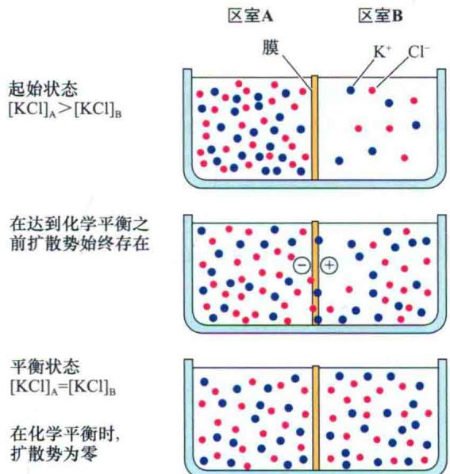  
图6.2 对K⁺透性较高的膜所分开的两区室间的电荷分离和扩散势的形成。如果区室A中KCl浓度较B高（[KCl] $_{A}$ ＞ [KCl] $_{B}$ ），K⁺和Cl⁻将以较高速率扩散入区室B，并形成扩散势。当膜对K⁺透性高于Cl⁻时，K⁺扩散将比Cl⁻快，并形成电荷（－和＋）分离。

在KCl跨膜扩散的例子中，由于 $K^{+}$ 先于 $Cl^{-}$ 过膜，引起扩散势的形成而限制了 $K^{+}$ 的运动，但加速了 $Cl^{-}$ 的运动。最终，两种离子以相同速率扩散。实际上这种扩散势动态存在，并可以测量。当系统达平衡时，浓度梯度消失，扩散势也不复存在。

## 6.2.2 膜电势如何与离子分配相关联？

在前面例子中，由于膜对 $K^{+}$ 和 $Cl^{-}$ 都是可透的，任一离子在浓度梯度没有降到零时，均不能达到平衡。但是，如果膜仅能透过 $K^{+}$ ， $K^{+}$ 将携带着电荷扩散过膜，直到膜电位可以平衡浓度梯度为止。由于很少量的离子即可引起电势的改变，因此系统会迅速达到平衡。尽管 $K^{+}$ 浓度梯度的改变可忽略不计， $K^{+}$ 的跨膜运动也随即达到平衡。

当任一种溶质的跨膜分配达到平衡时，被动流量（J）（单位时间跨过单位膜面积溶质的量）在向内和向外两个方向上是相同的。

$$
J _ {\mathrm{o} \rightarrow \mathrm{i}} = J _ {\mathrm{i} \rightarrow \mathrm{o}}
$$

流量与 $\Delta\tilde{\mu}$ 有关（关于流量和 $\Delta\tilde{\mu}$ 的讨论见附录1）；在平衡状态时，内外电化学势相同。

$$
\Delta \tilde {\mu} _ {j} ^ {\mathrm{o}} = \Delta \tilde {\mu} _ {j} ^ {\mathrm{i}}
$$

对于任一给定离子（这里用下标j表示）。

$$
\mu_ {\mathrm{j}} ^ {*} + R T \ln C _ {\mathrm{j}} ^ {\mathrm{o}} + z _ {\mathrm{j}} F E ^ {\mathrm{o}} = \mu_ {\mathrm{j}} ^ {*} + R T \ln C _ {\mathrm{j}} ^ {\mathrm{i}} + z _ {\mathrm{j}} F E ^ {\mathrm{i}}\tag{6.9}
$$

整理式（6.9），可得到平衡时不同区室间的电势差 $(E_{i}-E_{o})$ 。

$$
\Delta E _ {\mathrm{j}} = E ^ {\mathrm{i}} - E ^ {\mathrm{o}}
$$

又

$$
\Delta E _ {\mathrm{j}} = \frac {R T}{z _ {\mathrm{i}} F} \left(\ln \frac {C _ {\mathrm{j}} ^ {\mathrm{o}}}{C _ {\mathrm{j}} ^ {\mathrm{i}}}\right)\tag{6.10}
$$

或

$$
\Delta E _ {\mathrm{j}} = \frac {2 . 3 R T}{z _ {\mathrm{j}} F} \left(\lg \frac {C _ {\mathrm{j}} ^ {\mathrm{o}}}{C _ {\mathrm{j}} ^ {\mathrm{i}}}\right)
$$

该关系式即能斯特方程，表明在平衡时一离子在两区室间的浓度差可被电压差平衡。当温度为25℃时，一价阳离子的能斯特方程简化为

$$
\Delta E _ {\mathrm{j}} = 5 9 \mathrm{mV} \lg \frac {C _ {\mathrm{j}} ^ {\mathrm{o}}}{C _ {\mathrm{j}} ^ {\mathrm{i}}}\tag{6.11}
$$

需要注意的是，浓度相差10倍相当于能斯特电位 $59\ mV\ (C_{j}^{i}/C_{j}^{\circ}=10,\ \lg10=1)$ ，即被动扩散的离子在跨膜运输时，59 mV的膜电势将维持10倍的浓度梯度，如果膜内外离子存在10倍的浓度梯度，则离子将顺浓度梯度的被动扩散将（如果允许达到平衡）形成59 mV的跨膜电势。

由于细胞内外离子不对称的分布，因此所有生活细胞都存在膜电位。可以通过在细胞中插入微电极来测定膜电位，测量细胞内部与细胞外介质间的电位差（图6.3）。

能斯特方程可以用来确定某任一时间给定离子是否处于跨膜的平衡状态。但是，稳态和平衡态间是有区别的。稳态是指给定溶质的内向流量和外向流量相等，且离子浓度对时间而言是恒定的；稳态并不一定是平衡态（图6.1）。在稳态时，跨膜主动运输会阻止许多扩散流量而使系统无法达到平衡状态。

## 6.2.3 主动和被动运输间能斯特方程的区别

表6.1为豌豆根细胞稳态时离子浓度的实验测得值与由能斯特方程计算出的预期值的比较（Higinbotham et al., 1967）。在这个实验中，组织浸在溶液中，将每图6.3 用一对微电极测定跨细胞膜的膜电势示意图。一个玻璃微电极插入待研究的细胞中（通常为液泡或细胞质），另一电极放入电极液中作参照，电极与电压表相连，记录细胞区室和溶液间的电势差。典型的植物细胞的膜电势为-240\~-60 mV。插图展示细胞内部是如何与电极接触的：通过内部盛有导电盐溶液的开放玻璃微量加液器实现。

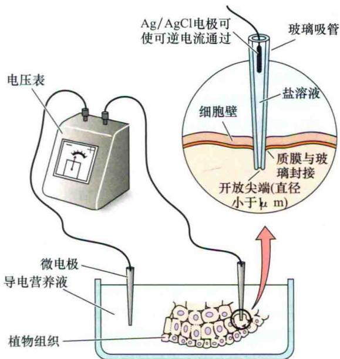

表6.1 豌豆根组织中测定和预测的离子浓度的比较

<table><tr><td rowspan="2">离子</td><td rowspan="2">外部介质中的浓度 /(mmol/L)</td><td colspan="2">内部浓度/(mmol/L) $^a$ </td></tr><tr><td>预测值</td><td>实测值</td></tr><tr><td> $K^+$ </td><td>1</td><td>74</td><td>75</td></tr><tr><td> $Na^+$ </td><td>1</td><td>74</td><td>8</td></tr><tr><td> $Mg^{2+}$ </td><td>0.25</td><td>1340</td><td>3</td></tr><tr><td> $Ca^{2+}$ </td><td>1</td><td>5360</td><td>2</td></tr><tr><td> $NO_3^-$ </td><td>2</td><td>0.0272</td><td>28</td></tr><tr><td> $Cl^-$ </td><td>1</td><td>0.0136</td><td>7</td></tr><tr><td> $H_2PO_4^-$ </td><td>1</td><td>0.0136</td><td>21</td></tr><tr><td> $SO_4^{2-}$ </td><td>0.25</td><td>0.00005</td><td>19</td></tr></table>

资料来源：Higinbotham et al., 1967  
注：膜电位经测定为-110 mV  
a 内部浓度值来自热水提取未损伤的1\~2 cm根段的离子含量

种离子的外部浓度及所测得的电势值均代入能斯特方程，从而计算出该离子预期的内部浓度。

值得注意的是，表6.1所有的离子中，仅 $K^{+}$ 处于或接近平衡。阴离子 $NO_{3}^{-}$ 、 $Cl^{-}$ 、 $H_{2}PO_{4}^{-}$ 、 $SO_{4}^{2-}$ 的实测值均高于预期值，表明它们是被主动吸收的。阳离子 $Na^{+}$ 、 $Mg^{2+}$ 和 $Ca^{2+}$ 的实测值均低于预期值。因此，这些离子进入细胞是沿它们的电化学势梯度进行的被动扩散，而其外向运动则是主动运输。

表6.1显示的是非常简化的例子，植物细胞内有许多区室，每一区室中离子组成各异。植物细胞中决定离子相关性的最重要的区室为细胞质和液泡。在大多数成熟的植物细胞中，中央液泡通常占细胞体积的90%或更多，而细胞质被限制在细胞内周的狭窄空间里。

由于细胞质所占的体积小，很难对许多被子植物的细胞质进行化学分析。基于这个原因，早期有关植物中离子间关系的研究多集中在某些绿藻，如轮藻属（Chara）和丽藻属（Nitella），这些细胞有几英寸 $^{①}$ 长，且含有适量体积的细胞质。图6.4显示对这些藻类细胞及高等植物相关研究得出的结论。总结如下。

（1） $K^{+}$ 在细胞质及液泡都是被动积累的，当细胞外 $K^{+}$ 浓度非常低时， $K^{+}$ 可通过主动方式吸收。

(2) ${\mathrm{{Na}}}^{ + }$ 从细胞质主动泵出,进入细胞外空间和液泡。

（3）中间代谢产生的过剩质子，也可主动从细胞质中泵出，该过程有助于维持细胞质的pH接近中性，而液泡和细胞外介质的pH则较细胞质低1\~2个pH单位。

（4）阴离子靠主动吸收进入细胞质。

（5） $Ca^{2+}$ 经质膜和液泡膜（图6.4）主动运输出细胞质。

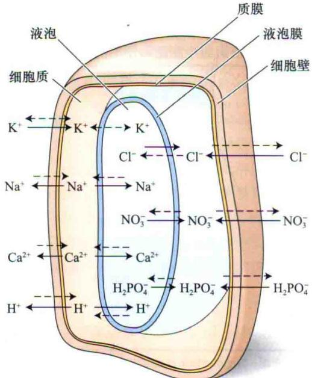  
图6.4 细胞质和液泡中的离子浓度受控于主动运输（虚箭头）和被动运输（实箭头）。在大多数植物细胞中液泡占了细胞体积的90%，其内包含大量的细胞溶质。细胞质中离子浓度的控制对代谢酶类的调节非常重要。围绕细胞质的细胞壁并不是透性屏障，它并不是影响溶质运输的因素。

尽管许多不同种类的离子可同时透过活细胞的膜，但植物细胞中K⁺浓度最高，且表现出大的通透性。将能斯特方程进行修改即得戈德曼方程（Goldmanequation），可以更准确地计算出所有可通透的离子（所有离子存在的跨膜运动机制）在这些细胞中的扩散势。如果已知离子通过生物膜的能力及离子梯度，就可以用戈德曼方程计算得出膜的扩散势。由戈德曼方程计算出的膜的扩散势称为戈德曼扩散势（Goldman diffusion potential）（戈德曼方程的详细讨论见Web Topic 6.1）。

## 6.2.4 质子运输是膜电势的主要决定因素

在大多数真核细胞中，内部K⁺浓度最高，膜对K⁺通透性最大，K⁺扩散势可以接近K⁺的能斯特势 $E_{K}$ 。在一些生物的细胞，特别是哺乳动物细胞（如神经细胞）中，细胞的静息电位接近 $E_{K}$ ；而在植物和真菌细胞中实验测得的膜电势（通常-200\~-100 mV）比由戈德曼方程计算出的仅-80\~-50 mV要低得多。那么，除了扩散势外，膜电势还有另一组分，多余的电压可能是由质膜致电H⁺-ATP酶产生的。

当一种离子进入或运出细胞，而没有带相反电荷的离子反向运动来平衡时，就会产生跨膜电势差（电压）。任何能引起静电荷移动的主动运输机制，都趋于使膜电位偏离戈德曼方程的预测值。这样的运输机制称为致电泵，并且普遍存在于活细胞内。

主动运输所需的能量通常由ATP水解提供。在植物中，通过观察氰化物对质膜电位的抑制效应，可以研究膜电位对ATP的依赖性（图6.5）。氰化物能很快对线粒体产生毒害作用，使细胞中ATP衰竭。由于ATP合成受抑制，膜电势又降回到戈德曼扩散势的水平（参见Web Topic 6.1）。

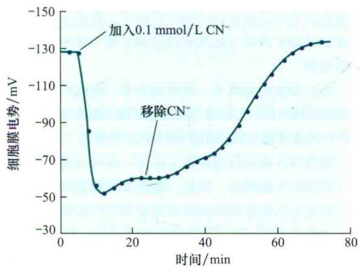  
图6.5 豌豆细胞的膜电势在加入CN⁻时瓦解。CN⁻毒害线粒体，阻碍ATP的产生，膜电势在加入CN⁻后消失，表明ATP的供应对维持膜电势是必需的。冲洗组织中CN⁻后，ATP合成缓慢恢复，膜电势也随之恢复（改编自Higinbotham et al., 1970）。

因此，植物细胞膜电势由两个组分组成：扩散电势和来自致电离子的运输所形成的膜电势（Spanswick，1981）。当氰化物抑制致电离子运输时，由于 $H^{+}$ 仍在细胞内，胞质酸性增强而胞外介质pH升高。这一发现是质子主动运出细胞过程可以致电的一个证据。

如前所述，致电泵引起的膜电势的变化将改变所有离子跨膜扩散的驱动力。例如， $H^{+}$ 的向外运输能产生 $K^{+}$ 被动扩散入胞的电势驱动力。质子的跨膜致电运输不仅存在于植物细胞中，在细菌、藻类、真菌及一些动物细胞（如肾上皮细胞）也有存在。

线粒体和叶绿体上ATP的合成同样依赖H $^{+}$ -ATP酶。在这些细胞器中，由于该酶合成ATP而不是水解ATP（见第11章），因此这种转运蛋白又称ATP合酶。参与植物细胞中主动和被动运输的膜蛋白的结构和功能将在本章随后详细讨论。

## 6.3 膜的转运过程

由纯磷脂制成的人工膜，已被广泛用于深入研究膜的透性。在对离子和分子的透性上，人工磷脂双分子层与生物膜相比，二者存在着重要的相似性和明显的不同点（图6.6）。

对非极性分子和许多小的极性分子来讲，生物膜和人工膜具有相似的通透性。然而，生物膜对离子、一些大的极性分子（如蔗糖）及对水的通透性较人工双分子层膜要强。其原因在于，与人工脂双层不同，生物膜上存在着利于被选择的离子和其他分子通过的转运蛋白（transport protein）。通常，转运蛋白包括3种主要类型：通道（channel）、载体（carrier）和泵（pump）

（图6.7）。每一种类型蛋白都将在本节进行更加详细的介绍。

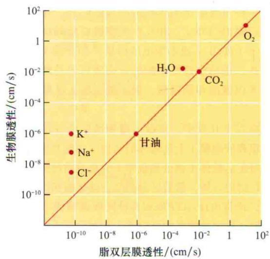  
图6.6 生物膜与人工磷脂双分子层对多种物质的透性值（P）。对 $O_{2}$ 、 $CO_{2}$ 及一些小的不带电的分子（如甘油）等非极性分子，P在两系统中是相近的，对于离子和被选择的极性分子包括水，由于转运蛋白的存在，生物膜的透性增加了一个或多个数量级。注意坐标上对数刻度。

由于转运蛋白对所运输溶质具有特异性，因而转运蛋白在细胞中也呈现巨大的多样性。简单原核生物嗜血流感病毒（Haemophilus influenzae）是第一个全基因组测序的生物，在其基因组的1743个基因中，有超过200个基因（大于基因组的 $10\%$ ）编码参与膜运输的各种蛋白质。拟南芥中，预计的25500个蛋白质中有多达1800个（约 $7\%$ ）可能执行运输的功能（Schwacke et

  
图6.7 3种类型膜转运蛋白：通道、载体和泵。通道和载体可以介导顺电化学势溶质梯度的被动跨膜运输（简单扩散或协助扩散）。通道蛋白作为膜上的孔道，它的特异性主要由通道的生物物理性质决定。载体蛋白在膜的一侧与被运输的分子结合并释放到膜的另一侧（不同类型的载体蛋白在图6.11详细描述）。初级主动运输由泵来完成，它直接利用ATP水解的能量，将溶质逆电化学势梯度泵出或泵入。

al., 2003)。

尽管特定的转运蛋白通常对其运输的物质种类具有高度的特异性，但并不是绝对的。例如，在植物中，一种质膜 $K^{+}$ 运输体除可以运输 $K^{+}$ 外，还可不同程度地运输 $Rb^{+}$ 和 $Na^{+}$ 。相反，大多数 $K^{+}$ 运输体不能运输阴离子（如 $Cl^{-}$ ）或不带电的溶质（如蔗糖）。与此相似的是，运输中性氨基酸的蛋白质可容易地运输甘氨酸、苯丙氨酸和缬氨酸，但不能运输天冬氨酸和赖氨酸。

在以下几页中，将探讨植物细胞中各种膜（尤其是质膜和液泡膜）上运输体的结构、功能及生理作用。将从特定运输体（通道和载体）驱动溶质跨膜扩散的作用进行讨论开始，接着区分初级主动运输和次级主动运输，讨论致电H $^{+}$ -ATP酶和各种同向运输体（沿同一方向同时运输两种物质的蛋白质）在驱动质子偶联的次级主动运输中的作用。

## 6.3.1 通道增强跨膜扩散

通道（channel）是一类膜蛋白，它们在膜上形成选择性的孔道，可以使分子或离子通过这些孔道进行穿膜扩散。孔的大小、孔内部表面电荷的密度和性质决定了通道运输的特异性。通过通道进行的运输往往是被动的，并且由于运输的特异性更多地取决于孔的大小和电荷，而不是选择性地结合上，因此通道主要运输离子和水（图6.8）。

只要通道孔开放，进入孔的溶质非常迅速地扩散跨膜：每个通道蛋白每秒可通过约 $10^{8}$ 个离子。通道并不是一直开放的，而是具有“门”（gate）的结构，可对外部信号作出反应从而“开”或“关”。调控通道活性的信号有很多，包括膜电位的改变、配体、激素、光和转录后修饰（如磷酸化）等。例如，电压门控通道可响应膜电势的改变而“开”或“关”（图6.8 B）。

A  
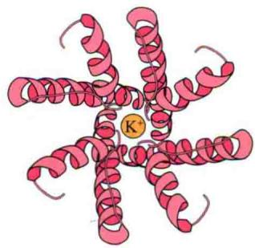

通过膜片钳电生理学技术（膜片钳）可以详细研究单一通道的特征（参见Web Topic 6.2），由此可以测出离子扩散通过单一通道或多个通道时所形成的电流。膜片钳研究表明，对于特定的离子（如 $K^{+}$ ），膜上有多种不同的通道，这些通道可能在不同的电压范围内开放，或对不同的信号包括 $K^{+}$ 或 $Ca^{2+}$ 浓度、pH和活性氧等作出反应，这种特异性使得每种离子的运输被精密地调控到最佳状态。因此，膜对离子的通透性是一变量，它取决于在特定时间打开的离子通道的总和。

正如在表6.1实验中看到的，大多数离子的跨膜分布并非接近平衡。大多数离子通道通常是关闭的。阴离子通道功能总是只在阴离子扩散到细胞外时起作用，而阴离子的吸收则需要其他的机制。 $Ca^{2+}$ 通道就受到严密的调控，只在信号转导过程中开放，钙通道仅能使 $Ca^{2+}$ 释放进入细胞质，但必须是通过主动运输进行。而 $K^{+}$ 通道则例外，依据膜电势与平衡电势 $E_{K}$ 的高或低，可以向内或向外扩散。

只有在膜电势比 $K^{+}$ 能斯特势更低时才打开，并专一性向内扩散 $K^{+}$ 的通道称内向整合（inwardly rectifying） $K^{+}$ 通道或简称内向 $K^{+}$ 通道。相反，仅在膜电势较 $K^{+}$ 能斯特势更高才打开的称外向整合（outwardly rectifying） $K^{+}$ 通道或简称外向 $K^{+}$ 通道（图6.9）（参见Web Essay 6.1）。内向 $K^{+}$ 通道的作用是从质外体积累 $K^{+}$ ，如气孔开放过程（图6.9）中保卫细胞对 $K^{+}$ 的吸收。各种外向 $K^{+}$ 通道作用使气孔关闭和 $K^{+}$ 释放进入木质部或质外体。

  
图6.8 植物中K+通道模型。A. 通道的俯视图，可看到蛋白质孔道，四亚基的跨膜螺旋紧靠在中心孔道，形成倒置的圆锥形。四亚基的孔道形成区嵌入膜内，同时孔外侧部分形成指形的K+选择性区域（更详细的通道结构参见Web Essay 6.1）。B. 内向整合的钾离子通道侧面图，显示一个具有6个跨膜螺旋的亚基多肽链，第四个螺旋带正电的氨基酸，作为电压感受器。在螺旋(S)5和6之间的孔道形成区域是环状的（A改编自Lerry et al., 2002；B改编自Buchanan, 2000）。

A

$K^{+}$ 的平衡电位或能斯特电位,定义为没有 $K^{+}$ 的净流动,因而没有电流

$K^{+}$ 流出细胞产生的电流,为了方便,外向电流通常表示为正值

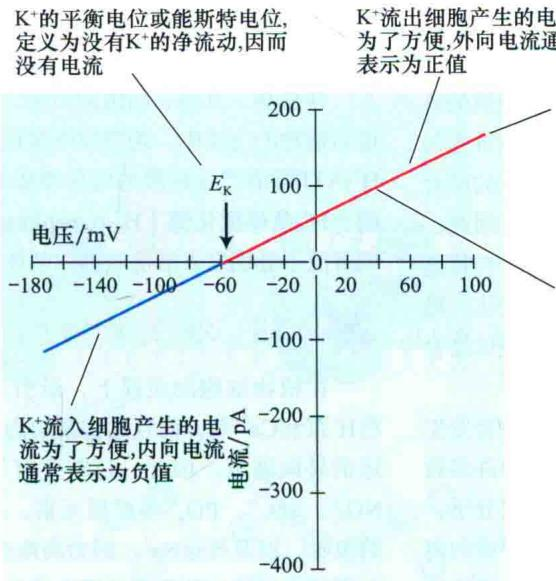  
这些通道的开闭或“门控”不受电压调节,因而通过通道的电流与电压之间是线性关系  
线的斜率表明这些通道介导 $\mathrm{K}^{+}$ 电流的电导率

$$
\begin{array}{r l} & E _ {\mathrm{K}} = R T / Z F * \ln \left([ \mathrm{K} _ {\mathrm{out}} ] / [ \mathrm{K} _ {\mathrm{in}} ]\right) \\ & E _ {\mathrm{K}} = 0. 0 2 5 * \ln (1 0 / 1 0 0) \\ & E _ {\mathrm{K}} = - 5 9 \mathrm{mV} \end{array}
$$

B  
  
$K^{+}$ 通过被电压门控的通道运动产生的电流与电压关系图。注意，I/V曲线是非线性的  
在这些电压范围内很少或没有电流,因为这些通道是电压调控的。在这些电压调控下,通道处于关闭状态

C  

B图的电流反应说明,两种不同类型K+通道的激活特性。外向K+通道(红)是电压门控的,当膜电压 $>E_{K}$ 时,这些通道开放,介导了K+流出细胞;内向K+通道(蓝)也是电压门控的,当膜电压 $<E_{K}$ 时,这些通道开放,从而介导了K+流入细胞

图6.9 电流-电压关系图。A. $\mathbf{K}^{+}$ 通过一组理论上非电压调控的质膜 $\mathbf{K}^{+}$ 通道形成电流和电压的模式图。假定胞质 $[\mathbf{K}^{+}]$ 为 $100\mathrm{mmol / L}$ ，胞外 $[\mathbf{K}^{+}]$ 为 $10\mathrm{mmol / L}$ 。在平衡电位（能斯特）时电流为0，电流、电压为线性关系。B.拟南芥保卫细胞原生质体电压门控 $\mathbf{K}^{+}$ 通道真实 $\mathbf{K}^{-}$ 电流图。胞内外 $\mathbf{K}^{-}$ 浓度与A.相同。这些电流来自于电压调控 $\mathbf{K}^{+}$ 通道的活动。需要再次提醒的是，在 $\mathbf{K}^{+}$ 平衡电位时电流为0。但是，在很宽的电压范围内电流仍为0，这是由于在该条件下通道是关闭的，无 $\mathbf{K}^{-}$ 通过。C.B图中表示的电流-电压关系实际上来自两种类型的通道——内向整合 $\mathbf{K}^{+}$ 通道和外向整合 $\mathbf{K}^{+}$ 通道，这是两种通道共同活动的结果（B改编自L.Perfus-Barbeoch and S.M.Assmann，未发表的数据）。

## 6.3.2 载体结合和运输物质的专一性

与通道不同，载体蛋白没有形成完全延伸跨膜的孔道结构。由载体介导的运输过程中，被运输物质首先与载体蛋白的特异位点结合。被运输物质与蛋白质的结合是保证载体对特异底物高度选择性的基本要求。因此，载体运输特定离子和生物代谢物也就具专一性。与特定离子和生物代谢物结合后，载体蛋白构象发生变化，将被运输物质暴露于膜的另一侧溶液中，物质从载体结合位点分离释放出去，完成整个运输过程。

由于运输每个分子或离子时，蛋白质的构象要发生变化，因此载体运输的速率与通道运输相比要慢许多数量级。典型的载体每秒可运送100\~1000个离子或分子，而同样的时间内则会有数以百万计的离子通过开放的离子通道。载体运输中，载体蛋白的特异位点与分子的结合和释放，与酶促反应中底物和酶的结合及对产物的释放情况类似。就如同本章后面所讨论的，通过酶动力学可以对载体蛋白进行定性分析。

与通道运输不同，载体介导的运输可以是被动运输，也可以是次级主动运输（次级主动运输将会在接下来的部分进行讨论）。通过载体的被动运输有时又称协助扩散（facilitated diffusion），是不需能量的顺电化学势梯度的运输，也仅在此时归于扩散范畴（协助扩散用在通道上似乎更贴切，但从来没有这样描述过通道）。

## 6.3.3 初级主动运输需要能量

载体要完成主动运输，必须使需要能量的运输与另一放能过程相偶联，以使总的自由能变化为负值。初级主动运输（primary active transport）直接与能量源相偶联，而与电化学势差 $\Delta\bar{\mu}_{j}$ 无关，这些能量来源于如ATP水解、氧化还原反应（如同在线粒体和叶绿体的电子传递链）或通过载体蛋白（如盐杆菌视紫红质）吸收的光能。

执行初级主动运输功能的膜蛋白称为泵（pump）（图6.7）。大部分泵运输离子，如 $H^{+}$ 或 $Ca^{2+}$ 。然而，正如本章后面所讨论的，泵属于ABC（ATP-binding cassette）家族运输体，可以携带转运有机大分子。

离子泵可进一步被区分为致电离子泵或电中性离子泵。一般来讲，致电运输（electrogenic transport）指涉及净电荷跨膜移动的离子运输过程。相反，电中性运输（electroneutral transport）正如名称的含义，没有净电荷的跨膜移动。例如，动物细胞的 $Na^{+}/K^{+}-ATP$ 酶，在向胞外泵出3个 $Na^{+}$ 的同时向胞内泵入2个 $K^{+}$ ，结果产生1个净电荷的外向移动，因此， $Na^{+}/K^{+}-ATP$ 酶为一种致电离子泵；相反，动物胃黏膜的 $H^{+}/K^{+}-ATP$ 酶在向外泵出1个 $H^{+}$ 时，向内泵入1个 $K^{+}$ ，并无跨膜净电荷转移，因此， $H^{+}/K^{+}-ATP$ 酶是电中性离子泵。

在植物、真菌、细菌的质膜，以及植物液泡膜和其他动植物的内膜中，跨膜致电泵运输的主要是 $H^{+}$ 。质膜 $H^{+}-ATP$ 酶能产生跨膜的电化学势梯度，而液泡 $H^{+}-ATP$ 酶和 $H^{+}-$ 焦磷酸化酶（ $H^{+}-pyrophosphatase$ ， $H^{+}-PPase$ ）则将质子分别泵入液泡和高尔基体囊泡的内腔。

## 6.3.4 次级主动运输利用储存的能量

在植物细胞的质膜上，最引人注目的离子泵是那些 $H^{+}$ 泵和 $Ca^{2+}$ 泵，而且这些泵均为自胞质向胞外空间转运的外向通道。因此，还需要有另外的机制吸收诸如 $NO_{3}^{-}$ 、 $SO_{4}^{2-}$ 、 $PO_{4}^{2-}$ 等矿质元素，氨基酸、肽类、蔗糖的吸收，以及外运 $Na^{+}$ ，因为高浓度的 $Na^{+}$ 对植物细胞是有毒的。另外一种重要的逆电化学势梯度跨膜运输溶质的途径是：一种溶质的逆梯度运输与另一溶质的顺梯度运输相偶联。这种类型的载体介导的协同运输定名为次级主动运输（secondary active transport）（图6.10）。

次级主动运输被泵间接推动。在植物细胞中，质膜和液泡膜上的致电 $H^{+}$ -ATP酶利用ATP水解释放的能量，将质子运出细胞质，形成跨膜电势和pH梯度。这种 $H^{+}$ 电化学势梯度，是指 $\bar{\mu}_{jH^{+}}$ 或称质子动力势（proton motive force，PMF），代表了以 $H^{+}$ 梯度形式储存的自由能（参见Web Topic 6.3）。

在次级主动运输中，致电的 $H^{+}$ 运输产生的质子动力势用于驱动许多其他物质逆电化学势梯度运输。图6.10表明次级主动运输涉及的底物（S）和离子（通常为 $H^{+}$ ）如何结合到载体蛋白，以及蛋白质构象如何改变的过程。

次级运输有两类——同向运输和反向运输，如图6.10所示的例子，由于被运输的两种物质同向过膜，因此称为同向运输（symport），参与该运输的蛋白质称同向运输体（symporter）（图6.11A）。反向运输（antiport）指质子的顺能势梯度运动，并驱动另一溶质沿相反方向主动运输（逆势能）；同样，参与运输的蛋白质称为反向运输体（antiporter）（图6.11B）。

在两种类型的次级运输中，被运输的离子或溶质逆电化学势梯度与质子同时运动，因此，是主动过程，运输的驱动力是质子动力势，而不是直接来源于ATP水解的能量。

## 6.3.5 动力学分析揭示运输的机制

至此，已用能量学的概念描述了细胞运输。然而，细胞运输也可以用酶动力学来研究，因为它涉及分子与转运蛋白活性位点的结合和分离（参见Web Topic

  
图6.10 次级主动运输的理论模型。在次级主动运输中，一种溶质的逆能势运输受另一溶质顺能势运输的驱动。该过程中，能量以质子动力势储存（红色箭头表示 $\Delta\mu_{jH^{+}}$ ），用来逆浓度梯度运输底物（S）（左侧红色箭头）。A. 在最初构象中，蛋白质结合位点暴露于外部环境中，可以结合质子。B. 质子结合后，导致发生仅能结合S的构象变化。C. S的结合导致构象再次发生变化，使得结合点和底物暴露在细胞内侧。D. 质子和S分子在细胞内部的释放重新恢复了载体的原初构象，使得新一轮的“泵”循环开始。

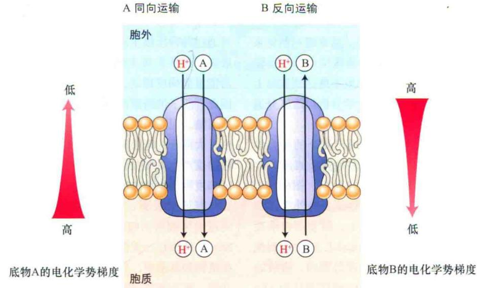  
图6.11 与原初质子梯度相偶联的次级主动运输的两个例子。A. 同向运输体中，质子运回细胞所释放的能量与另一底物（如蔗糖）的吸收相偶联。B. 反向运输体中，质子运回细胞所释放的能量与另一底物（如 $Na^{+}$ ）的输出相偶联。两种情况下，底物都是逆电化学势梯度移动的。中性的和带电的底物，均可通过这两种过程运输。

6.4）。动力学方法的优势在于可以帮助人们对运输的调节机制提出新的见解。

在动力学实验中，可以测出外部离子（或其他溶质）的浓度对运输速率的影响。因此，利用运输速率的动力学特性，可以区分两种不同的运输体。在不考虑底物浓度时，载体介导的运输和运输的速率不会超过最大速率 $V_{max}$ （图6.12）。通道的情况也常常如此。当载体的底物结合位点饱和或通道的流量达最大时，运输速率接近 $V_{max}$ 。运输速率的限制因素是运输体的密度而不是溶质的浓度，因此 $V_{max}$ 可表示膜上特异功能蛋白质分子的数目。

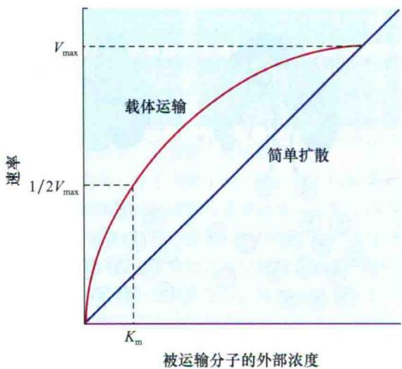  
图6.12 载体运输由于结合位点的饱和而表现出饱和动力学曲线特征（ $V_{max}$ ）（见附录1）。当通道开放时，在溶质浓度梯度或离子的电化学势作用下，溶质的运输速率与溶质的浓度成正比，即典型的被动扩散特征。

常数 $K_{m}$ 可反映特定结合位点的特性，在数值上等于达最大运输速率一半时的溶质浓度。低的 $K_{m}$ 表明运输活性位点和被运输物质的亲和性高，通常暗示载体系统在起作用；较高的 $K_{m}$ 则表明运输活性位点和被运输物质的亲和性低。若亲和性太低，以致不能达到实际上的 $V_{max}$ ，在这种情况下，单独的动力学分析很难区分通道和载体。

溶质转运中，细胞或组织常表现出复杂的动力学特征，复杂的动力学特性则体现出多种转运机制的存在，如高亲和性及低亲和性转运体的存在。图6.13表明了大豆胚轴原生质体对蔗糖的吸收速率与外部蔗糖浓度的函数关系（Lin et al., 1984）。随着蔗糖浓度上升，吸收迅速增加，大约在10 mmol/L时，达到饱和。高于10 mmol/L时，在测试的浓度范围内，吸收的动力学曲线表现为线性且不饱和。代谢毒害抑制ATP合成，能阻断具有饱和特征的吸收，而不影响线性部分的吸收。

图6.13展现出的模式是在低浓度蔗糖时，吸收是载体介导的主动过程（ $\mathrm{H}^{+}$ -蔗糖同向运输）；在高浓度时，蔗糖通过顺浓度梯度扩散进入细胞，因此对代谢毒害也就不敏感。与这些数据相符合， $\mathrm{H}^{+}$ -蔗糖同向运输体（Lalonde et al., 2004）和蔗糖运输体（不依赖于能量供应或质子梯度的载体蛋白）（Zhou et al., 2007）已经在分子水平上被鉴定。

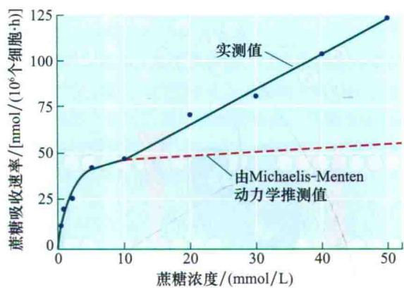  
图6.13 在不同浓度时溶质运输特性的变化。低浓度（1\~10 mmol/L）时，大豆细胞吸收蔗糖的速率表现出载体的典型饱和动力学特性，相应曲线达最大速率 $V_{max}$ [57 nmol / (10 $^{6}$ 个细胞·h)]。相反，在较高浓度下，蔗糖的吸收在很宽范围内仍为线性增加，表明有其他蔗糖运输体的存在，可能是低亲和性的通道（改编自Lin et al., 1984）。

## 6.4 膜转运蛋白

图6.14阐明了各种位于质膜和液泡膜上具有代表性的运输过程。在跨生物膜运输的过程中，典型的供能方式是一种初级主动运输系统与ATP水解偶联。一种离子的运输，如 $H^{+}$ ，可产生离子梯度和电化学势。然后，可通过各种次级主动转运蛋白转运许多其他离子或有机底物，这些次级主动转运蛋白同时携带1个或2个 $H^{+}$ ，沿能量势梯度移动，产生的能量用来运输各自的底物。因此，质子的跨膜循环是通过初级主动转运蛋白主动向外运输，而后经次级主动转运蛋白返回细胞。高等植物中，大部分的跨膜离子梯度是由质子泵引起的 $H^{+}$ 电化学势梯度产生并维持的（Tazawa et al., 1987），而这些 $H^{+}$ 梯度则是由致电质子泵产生的。

有证据表明，在植物细胞中， $\mathrm{Na}^{+}$ 通过 $\mathrm{Na}^{+}-\mathrm{H}^{+}$ 反向运输体被运出细胞，特异的质子同向运输体将 $\mathrm{Cl}^{-}$ 、 $\mathrm{NO}_{3}^{-}$ 、 $\mathrm{H}_{2}\mathrm{PO}_{4}^{-}$ 、蔗糖、氨基酸和其他物质转运进细胞。在植物和真菌中，也可通过质子同向运输吸收糖类和氨基酸。那么钾离子呢？钾离子可以与 $\mathrm{H}^{+}$ （或在一些条件下与 $\mathrm{Na}^{+}$ ）从质外体中同向吸收。钾离子也可以在自由能梯度下通过特异的钾离子通道被动地吸收入细胞。在外部浓度很低时，细胞可通过载体吸收 $\mathrm{K}^{+}$ ，在较高浓度时通过特异的 $\mathrm{K}^{+}$ 通道扩散进入细胞。然而，在某种意义上，即使是通过通道的内流也是靠 $\mathrm{H}^{+}-\mathrm{ATP}$ 酶驱动的。因为 $\mathrm{K}^{+}$ 的扩散是由膜电位驱动的，而通过致电 $\mathrm{H}^{+}$ 泵将此时的膜电位维持在比 $\mathrm{K}^{+}$ 平衡电位更低的水平。相反， $\mathrm{K}^{+}$ 外流需要维持较 $E_{k}$ 更高的膜电位值，可以通过 $\mathrm{Cl}^{-}$ 外流或其他阴离子经通道的移动得以实现。

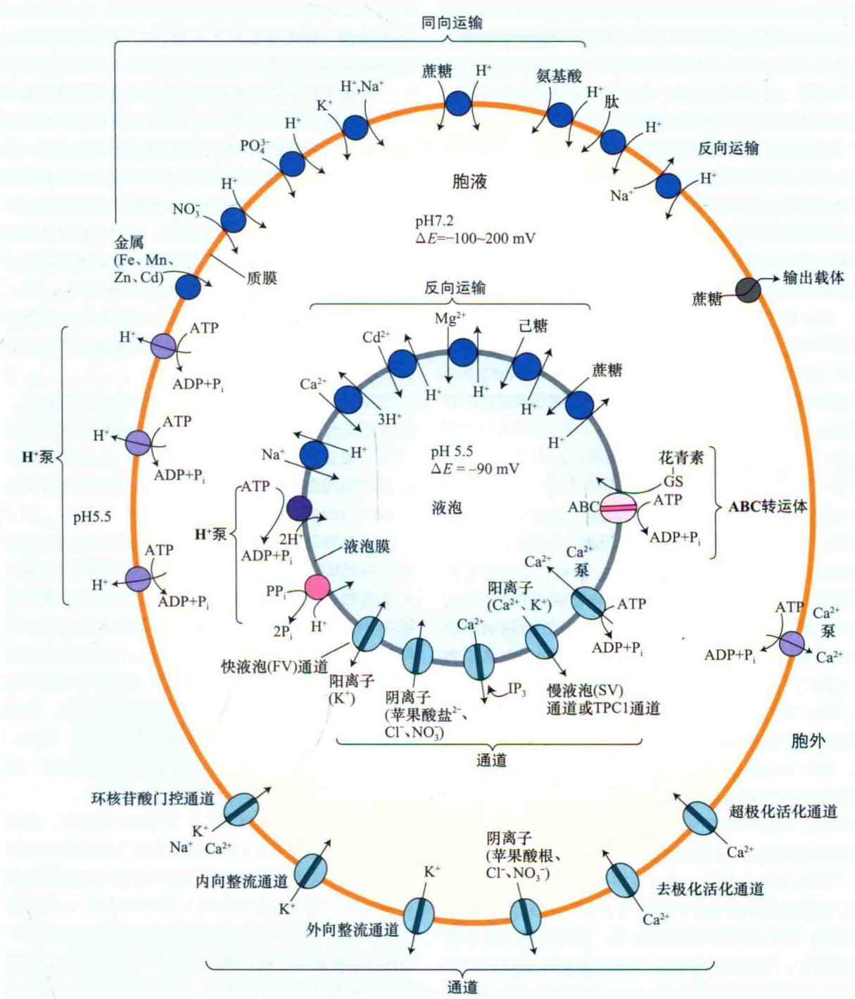  
图6.14 植物细胞质膜和液泡膜上各种转运蛋白总览。

在前面的几节中，可以看到一些跨膜蛋白具有通道的功能，可以控制离子的扩散；另一些膜蛋白具有载体的功能，运输其他物质（大部分的分子和离子）。主动运输可以利用ATP水解直接供给能量，或者间接作为同向运输体和反向运输体的载体类蛋白实现。后者利用离子梯度（通常为 $H^{+}$ 梯度）的能量来驱动另一分子或离子逆能势运输。在接下来的几页中，将从分子特性、细胞定位及遗传操作等方面，更详细地介绍植物细胞介导有机和无机养分，以及水跨植物细胞膜运输的一些转运蛋白。

## 6.4.1 已鉴定的多种编码转运蛋白的基因

鉴定编码转运蛋白的基因更有助于揭示转运蛋白的分子特性。其中一种分离转运基因的途径是从植物的cDNA文库中筛选能回补酵母运输体缺失的基因。已知有许多运输体缺失的酵母突变体，可通过互补作用，用于鉴定植物中的相应基因。对于离子通道的基因研究途径是将离子通道基因在爪蟾卵母细胞中表达，分析通道蛋白的特征，这是因为爪蟾卵母细胞个体大，便于电生理学分析。通过这种方法，研究者已经克隆和鉴定了一些内向和外向整合的K+通道基因。

随着越来越多的基因组测序工作的完成，通过系统进化分析的方法鉴定潜在的运输体基因也日益普遍。这种方法是通过与已知功能的编码另一生物的运输体基因进行序列比对，以此推测感兴趣生物中该基因的功能。计算机辅助预测分子结构也正成为推测基因产物可能功能的有用方法。

逐步清晰的植物运输体基因基本情况表明，植物基因组中行使绝大部分运输功能的是一个基因家族，而不是单个基因。在这个基因家族中，运输特性（如 $K_{m}$ ）、调节模式及不同组织表达的变化，使植物呈现出巨大的可塑性，以适应更宽泛的环境条件。

## 6.4.2 各种含氮化合物的运输体

氮是大量营养元素之一，可以在土壤溶液中以硝酸盐（ $\mathrm{NO}_3^-$ ）、氨（ $\mathrm{NH}_3$ ）或铵盐（ $\mathrm{NH}_4^+$ ）的形式存在。植物 $\mathrm{NH}_4^+$ 转运子是一类能促进 $\mathrm{NH}_4^-$ 顺着自由能吸收的转运器（Ludewig et al., 2007）。植物 $\mathrm{NO}_3^-$ 的运输器因其复杂性而引起人们的浓厚兴趣。动力学分析表明，与图6.13蔗糖的运输相似， $\mathrm{NO}_3^-$ 的运输同样有高亲和性（低 $K_{\mathrm{m}}$ ）和低亲和性（高 $K_{\mathrm{m}}$ ）两种特征。与蔗糖相比， $\mathrm{NO}_3^-$ 带负电，该电荷的存在使得 $\mathrm{NO}_3^-$ 的吸收是一种需能的过程，这些能量可以从与 $\mathrm{H}^+$ 的同向运输中得到。 $\mathrm{NO}_3^-$ 的运输同时受到 $\mathrm{NO}_3^-$ 可利用性的强烈调节：当环境中有 $\mathrm{NO}_3^-$ 的存在时，和 $\mathrm{NO}_3^-$ 的同化一样，可以诱导 $\mathrm{NO}_3^-$ 运输所需要的酶（见第12章），并且当 $\mathrm{NO}_3^-$ 在细胞中积累时，其吸收将受到抑制。

在有 $ClO_{3}^{-}$ 存在下，通过观察生长可以筛选出有关 $NO_{3}^{-}$ 运输或硝酸盐还原的缺失突变体。 $ClO_{3}^{-}$ 是 $NO_{3}^{-}$ 的类似物，野生型植株吸收 $ClO_{3}^{-}$ 后，能将其还原为有毒性的 $ClO_{2}^{-}$ ；筛选出的抗 $ClO_{3}^{-}$ 植株，很可能表现出 $NO_{3}^{-}$ 运输或还原受阻的突变表型。已经从拟南芥中鉴定了若干这样的突变体。第一个被鉴定的运输基因编码一个诱导型 $NO_{3}^{-}-H^{+}$ 同向运输体，是一种双亲和性载体，其作用模式受到自身磷酸化的调控（Liu and Tsay，2003）。随着越来越多的 $NO_{3}^{-}$ 运输体被鉴定，很显然参与高亲和性和低亲和性运输的基因产物并非一个。

氮一旦被融合进有机分子当中，就可以通过多种机制被分配到植物的各个部分。肽运输体为氮元素的跨膜运输提供了又一机制。肽运输体对种子萌发时储藏氮的动员，以及通过维管系统的含氮化合物的分配都很重要。在食虫植物猪笼草（Nepenthes alata）的捕虫器上，发现了高度表达的肽运输体，它们可能介导了从被消化的昆虫吸收肽到植物内部组织的运输过程（Schulze et al., 1999）。

值得注意的是，拟南芥基因组中编码肽类运输体的基因比非植物种类的要多10倍，这也表明了这种类型运输体对植物的重要性（Stacey et al., 2002）。第一类介导二肽和三肽吸收的运输体家族，第二类肽运输体家族介导四肽和五肽的吸收。这两种运输体家族成员发挥功能时均与 $H^{+}$ 电化学势梯度相偶联。第三类肽运输体不同于以上两种，它直接利用ATP水解的能量进行运输，运输不依赖于原初电化学势梯度（参见Web Topic 6.5）。这些运输体为ABC（ATP-binding cassette）转运复合体家族成员。质膜和内膜上均发现有ABC转运复合体的存在。

ABC超家族是一个十分庞大的蛋白质家族，该家族成员运输包括从离子到大分子的各种不同底物。例如，大分子代谢产物（如类黄酮、花青素）和次级代谢产物都是通过特异的ABC运输体而在液泡内积累（Stacey et al., 2002; Rea, 2007）。

氨基酸是另外一类重要的含氮化合物。真核生物的质膜氨基酸运输体分为5个超家族，其中有3个家族存在于植物中，且对氨基酸的吸收依赖于与 $H^{+}$ 梯度的偶联（Wipf et al., 2002）。通常，氨基酸运输体可进行高亲和性和低亲和性两种运输，且它们的底物特异性是有重叠的。许多氨基酸运输体表现出组织特异性表达模式，表明它们在不同细胞中存在着特异的功能。氨基酸构成了植物中氮元素长距离运输的重要形式，因此，其基因的多种表达模式（包括在维管组织中的表达）便不足为怪了。

氨基酸和肽运输器除了作为氮源分配器外，还具有其他重要的作用。由于植物激素常常与氨基酸和肽结合存在，运输这些分子的运输体也可能参与植物体结合激素的分配。编码由色氨酸衍生而来的激素-生长素运输体的基因，与那些编码其他氨基酸运输体的基因间存在相关性。再比如，脯氨酸是在盐胁迫下积累的氨基酸，这种积累能降低细胞的水势，并在胁迫条件下保持细胞内水势，促进细胞水分保持。

## 6.4.3 多种多样的阳离子运输体

阳离子是通过阳离子通道和阳离子运输器进行转运的，每种作用机制的区别主要依赖于所研究的膜类型、细胞类型及生物种类。

阳离子通道（cation channel）在拟南芥基因组中，估计有50多个基因编码调节阳离子跨质膜或内膜（如液泡膜）吸收的阳离子通道蛋白（Very and Setenac, 2002）。其中一些通道对特异的离子种类，如 $K^{+}$ ，具有高度的选择性；其他的通道却允许不同种类的阳离子通过，有时还包括 $Na^{+}$ ，尽管这种离子在细胞过量积累对植物是有毒性的。正如图6.15所述，根据预测的通道结构和对阳离子的选择性，阳离子通道可分为6类。

在这6类阳离子通道中，了解最为详尽的是Shaker通道。这些通道是以果蝇的一个K+通道命名的，编码该通道的基因的突变可以引起果蝇腿的震动或颤抖，故命名为Shaker通道。植物Shaker通道对K+具有高度的选择性，要么是内向整合，要么是外向整合，或弱整合的K+电流。Shaker家族的一些成员功能如下。

（1）介导保卫细胞K $^{+}$ 跨膜的吸收或外流。

（2）负责提供从土壤中吸收 $K^{+}$ 主要渠道。

（3）参与了从活的中柱细胞向死的木质部导管释放 $K^{+}$ 。

（4）花粉中也发现了一种，其负责 $K^{+}$ 吸收促进水分的内流和花粉管伸长。

如在根中，一些Shaker通道以高亲和吸收的方式介导 $K^{+}$ 吸收，它们可在微摩级的外部 $K^{+}$ 浓度情况下起作用，只要膜电位充分超极化，就可驱动 $K^{+}$ 的吸收（Hirsch et al., 1998）。

并不是所有的离子通道都和Shaker通道一样，受到膜电势的调控。有一些离子通道不受电压调控，而其他的电压敏感通道如Kir等尚未被完全确认（Lebaudyet al., 2007）。环核苷酸门控阳离子通道只有很微弱的电压依赖性，它们的活性调节是通过结合环核苷酸如cGMP实现的。这些通道可让 $K^{+}$ 、 $Ca^{2+}$ 或 $Na^{+}$ 通过（Leng et al., 2002；Kaplan et al., 2007）。尽管对其功能所知甚少，但是突变体分析表明，有些环核苷酸门控阳离子通道在对细菌病原菌的抗病性反应中起作用（Clough et al., 2000；Kaplan et al., 2007）。另一有趣的例子是哺乳动物中谷氨酸受体通道，它与哺乳动物神经系统作为门控谷氨酸阳离子通道起作用的谷氨酸受体同源。谷氨酸诱导植物细胞中 $Ca^{2+}$ 的吸收，表明谷氨酸受体可能是 $Ca^{2+}$ 通透性的通道（Qi et al., 2006；Tapken and Hollmann, 2008）。

离子流也必然发生于液泡膜进进出出上。阴离子通道和阳离子通道在液泡膜上也被鉴定（图6.14）。植物液泡膜通道包括能被钙离子激活对钾离子具有高选择性的TPK/VK通道（Gobert et al., 2007）（图6.15A）和称为TPC1/SV的非选择性 $Ca^{2+}$ 透性通道（图6.14和图6.15B）。从液泡等胞内钙库释放出的 $Ca^{2+}$ 扮演着重要的胞内信号角色。许多第二信使如胞质 $Ca^{2+}$ 本身和 $InsP_{3}$ 都能引起胞质 $Ca^{2+}$ 释放。更多有关信号转导途径将于第14章详细讲述。

阳离子载体（cation carrier）：许多载体也可以将阳离子运输至植物细胞内。植物特异的细胞跨膜的K+运输体有两大家族：KUP/HAK/KT家族和HKT家族。第三类，阳离子- $H^{+}$ 转运器（CPAs），调节某些情况下 $H^{+}$ 和其他包括 $K^{+}$ 等阳离子之间的电中性交换（Gierth and Mäser，2007）。KUP家族包含高亲和性和低亲和性两种运输体，其中有些还可以在外部 $Na^{+}$ 浓度高的情况下介导 $Na^{+}$ 内流。HKT运输体可作为 $K^{+}-Na^{+}$ 同向共运输体或在外部较高 $Na^{+}$ 浓度下作为 $Na^{+}$ 通道起作用。尽管HKT家族运输体的功能尚未被完全阐明，但是在盐胁迫条件下，它们可能在植物体内 $Na^{+}$ 的重新分配过程中起作用（Davenport et al., 2007）。

  
图6.15 拟南芥阳离子通道的6个家族。一些通道仅从序列上鉴定出与动物细胞通道同源，其他的已得到了实验证实。A. K+选择性通道。B. 低选择性阳离子通道，其活性受环核苷结合的调控。C. 公认的Glu受体。根据对胞质Ca2+变化的测量，这类蛋白质的可能功能是Ca2+可通透性的通道。D. 基于对胞质变化的测量，TPC1是拟南芥基因组编码的唯一一种双孔通道，可运输一价和二价阳离子，包括Ca2+（改编自Very and Sentenac，2002；Lebaudy et al., 2007）。

灌溉可以增加土壤的盐分，而耕地的盐化作用正在成为世界上越来越突出的问题。盐生植物，如生长在盐沼泽地的植物，可以适应高浓度的盐环境。而这种高浓度盐环境对其他淡土植物种类包括大部分农作物都是有害的。植物在进化中逐渐形成了把盐汇集于液泡和跨膜向外排出的机制。液泡中 $Na^{+}$ 的汇集由 $Na^{+}-H^{+}$ 反向运输体——CPA蛋白的亚家族成员完成，它与 $H^{+}$ 的顺能势进入胞质移动相偶联，驱动 $Na^{+}$ 吸收进入液泡。拟南芥 $Na^{+}-H^{+}$ 反向运输体基因AtNHX1在拟南芥和作物中超表达，极大提高了拟南芥和作物种类（如马铃薯）的抗盐性（Apse et al., 1999; Zhang and Blumwald, 2001）。

在筛选对盐超敏感的突变体时，发现了一个质膜 $\mathrm{Na}^{+}-\mathrm{H}^{+}$ 反向共运输体，被命名为盐超敏感运输体（salt overly sensitive）或SOS1。SOS1可能起两种作用，一种是把 $\mathrm{Na}^{+}$ 从植物中排除，另一种是通过把 $\mathrm{Na}^{+}$ 排入蒸腾流中，稀释根部 $\mathrm{Na}^{+}$ 的浓度，最终把 $\mathrm{Na}^{+}$ 汇集到叶肉细胞的液泡内（Shi et al., 2002；Horie and Shreder, 2004）。与 $\mathrm{Na}^{+}$ 一样，驱使 $\mathrm{Ca}^{2+}$ 从质外体和胞内钙库中进入细胞质同样需要很大的自由能梯度，这一过程是由前面所述的 $\mathrm{Ca}^{2+}$ 通透性通道介导的。细胞壁和质外体中 $\mathrm{Ca}^{2+}$ 浓度通常在毫摩范围，而胞质中自由 $\mathrm{Ca}^{2+}$ 浓度维持在几百个纳摩（ $10^{-9}\ \mathrm{mol/L}$ ）到 $1\ \mu\mathrm{mol}\ (10^{-6}\ \mathrm{mol/L})$ ，因此 $\mathrm{Ca}^{2+}$ 顺着巨大的电化学势梯度扩散进入细胞。在质膜和一些植物细胞内膜（如液泡膜和内质网）上存在有 $\mathrm{Ca}^{2+}$ -ATP酶，可将 $\mathrm{Ca}^{2+}$ 运出细胞（图6.14）。细胞内的许多 $\mathrm{Ca}^{2+}$ 是储存在中央液泡中的，这里的 $\mathrm{Ca}^{2+}$ 也是通过 $\mathrm{Ca}^{2+}$ -ATP酶和 $\mathrm{Ca}^{2+}$ - $\mathrm{H}^{+}$ 反向运输体运输的， $\mathrm{Ca}^{2+}$ - $\mathrm{H}^{+}$ 反向运输体利用质子梯度形成的电化学势使 $\mathrm{Ca}^{2+}$ 在液泡中积累（Hirschi et al., 1996）。

细胞质中 $Ca^{2+}$ 浓度微小的波动，就会显著影响许多酶的活性，因此其胞质浓度也就需要受到严密的调控（Sanders et al., 2002）。 $Ca^{2+}$ 结合蛋白——钙调素（CaM），参与到这种调节当中。虽然，CaM不具备自身催化活性，但结合 $Ca^{2+}$ 的CaM结合到不同的靶蛋白上后，其活性便受到调控（DeFalco et al., 2010）（参见

Web Essay 6.2）。 $Ca^{2+}$ -渗透环核苷酸门控通道蛋白是一类CaM结合蛋白，证据显示，与CaM结合后，该类门控通道蛋白活性受到负调节。CaM也能够与 $Ca^{2+}$ -ATP酶结合，CaM的结合使ATP酶从自抑制的状态中释放，引起 $Ca^{2+}$ 流向质外体、内质网和液泡。综上，CaM的这两种调节效应提供了通过起始负反馈循环激活CaM进而改变胞质钙离子水平的机制。

## 6.4.4 已鉴定的一些阴离子运输体

$NO_{3}^{-}$ 、 $Cl^{-}$ 、 $SO_{4}^{2-}$ 和 $H_{2}PO_{4}^{-}$ 是植物细胞中主要的无机阴离子，苹果酸根离子是主要的有机阴离子（Barbier-Brygoo et al., 2000）。这些阴离子的自由能梯度都是沿被动外流的方向。用电生理技术已鉴定了几种类型的阴离子通道，与对 $K^{+}$ 的运输机制的了解形成鲜明对比，在分子水平上阴离子通道基因的鉴定要难得多（Barbier-Brygoo et al., 2000）。然而，可能介导保卫细胞阴离子流的SALC1在最近被鉴定出来（Negi et al., 2008; Vahisalu et al., 2008）。

与相对缺乏特异性的阴离子通道相比，逆能势运输的阴离子载体则表现出对特定阴离子的选择性。除了已述的吸收 $NO_{3}^{-}$ 的转运蛋白外，植物中还存在运输像苹果酸和柠檬酸等各种有机阴离子的运输体，如第13章所述，苹果酸吸收对于增加胞内溶质非常重要，它可引起保卫细胞对水分的吸收，进而导致气孔开放。AtABCB14是ABC亚家族成员，已经被证实参与苹果酸的运入中（Lee et al., 2008）。

土壤溶液中可用磷的含量常常限制植物的生长。拟南芥中有一种包含9个成员的高亲和性质膜运输体家族，它们与 $H^{+}$ 同向运输介导磷的吸收。这些运输体主要在根组织中表达，且受磷缺乏信号的诱导（Rausch and Bucher，2002）。植物中已鉴定出对 $HPO_{4}^{2-}$ 低亲和性的 $HPO_{4}^{2-}-H^{+}$ 同向运输体—— $HPO_{4}^{2-}$ 运输体（转运蛋白），位于质体内膜上，把光合作用的磷酸化碳化合物释放到胞质，并吸收无机磷（Weber，2004）（参见Web Topic 8.15）。

## 6.4.5 金属转运蛋白对重要微量元素的转运

一些金属是植物的重要营养成分，尽管植物只需要微量的金属元素，铁即一个例子。缺铁是全世界最普遍的人类营养失调病。因此，对植物积累铁元素机制了解的增加，也会有助于改善作物的营养价值。超过25种调节植物对铁、锰、锌离子吸收的“ZIP”相关运输体及其他介导铜和钼离子吸收的运输体已经被鉴定出来（Palmer and Guerinot，2009）。由于土壤溶液中可用的金属元素浓度通常很低，因此这些运输体都是高亲和性的。一些金属运输体能介导镉的吸收，Cd对人类有毒害作用，在作物中并不需要，然而这种特性也显示出植物在土壤脱毒（植物修复）中的可利用性，植物通过吸收有害物质而后再将这些有害物质转化成适当的废弃物而除去（参见Web Essay 26.2）。

金属离子一旦进入植物体，通常与其他分子螯合，被转运至木质部然后随着蒸腾流分配到植物体的各个部分。金属离子也可以被转运至相应的亚细胞中，如植物中铁主要存在于叶绿体中，形成复合体参与到电子传递链中（见第7章）。调节铁穿越叶绿体膜的通道蛋白有待于被进一步鉴定（Palmer and Guerinot，2009）。金属如铁、铜等在植物体中的过多积累将引起有害的ROS的产生。螯合金属离子的复合物将保卫植物抵御这种危害。调节金属吸收至液泡的运输器在维持胞质中金属离子浓度处于非毒害水平中也发挥重要的作用。

## 6.4.6 水孔蛋白具有多种功能

水通道或水孔蛋白是植物膜上分布相对较多的一类蛋白质（见第3章和第4章）。最初，水孔蛋白的存在让人感到惊讶，因为脂质双分子被认为对于水分渗透而言已经足够，然而水孔蛋白在动植物中广泛存在。预测，拟南芥基因组中编码大约35个水孔蛋白基因（Maurel et al., 2008）。

许多水孔蛋白在卵母细胞表达时，并没有电流出现，这与它们离子运输活性缺乏的特性相一致。卵母细胞原本对水的透性很低，但当表达了水孔蛋白时，若将卵母细胞置于较低渗透压的外部介质中，卵母细胞质膜上水的快速内流，可以引起其膨胀和破裂。这些结果表明水孔蛋白构成了膜上的水通道（图3.13）。一些水孔蛋白还可以运输一些不带电的溶质（如 $NH_{3}$ ），已有证据证明它可作为植物细胞吸收 $CO_{2}$ 的通道。还有研究者认为，水孔蛋白可能是渗透势梯度和膨压的感受器（Maurel et al., 2008）。

水孔蛋白的活性受到pH、 $Ca^{2+}$ 浓度、异聚化及活性氧的调控，同时也受到蛋白质的磷酸化的调控（Tyerman et al., 2002；Maurel et al., 2008）。这些调节可能说明了植物细胞具有迅速改变对水的通透性的能力，以应答昼夜节律和诸如盐、冷、干旱及水涝（缺氧）等胁迫条件。同时，这种调节也可发生在基因表达水平上。由于表皮、内皮层细胞及木质部薄壁组织可能是水分运动的关键控制点，因此，水孔蛋白在这些细胞中高度表达（Javot and Maurel, 2002）。

## 6.4.7 质膜H $^{+}$ -ATP酶受到P-型ATP酶的高度调控

正如已看到的，质子向外跨膜主动运输，形成了pH和电势梯度，可以驱动许多其他物质（离子及不带电溶质）通过各种次级主动运输体运输。 $H^{+}$ -ATP酶活性对调节胞质pH和控制细胞膨压也很重要，而细胞膨压则是器官（叶和花）运动、气孔开放和细胞生长的驱动力。图6.16阐述了膜 $H^{+}$ -ATP酶可能的工作机制。

植物和真菌质膜 $H^{+}$ -ATP酶和 $Ca^{2+}$ -ATP酶是一类称为P-型ATP酶的成员，该类酶的磷酸化是水解ATP的催化循环的一部分。由于磷酸化反应的存在，质膜 $H^{+}$ -ATP酶可受钒酸盐（ $HVO_{4}^{2-}$ ）的强烈抑制， $HVO_{4}^{2-}$ 是 $HPO_{4}^{2-}$ 的类似物，它可与ATP上的磷酸根竞争ATP酶上天冬氨酸磷酸化的位点。

植物质膜 $H^{+}$ -ATP酶由含约12个成员的基因家族编码（Sondergaard et al., 2004）。基于对基因表达模式和拟南芥中各种 $H^{+}$ -ATP酶基因突变体的功能分析，人们对 $H^{+}$ -ATP酶的每个同工酶的功能已有了初步的了解。一些 $H^{+}$ -ATP酶表现出细胞特异的表达模式。例如，有几个 $H^{+}$ -ATP酶基因在保卫细胞中表达，它们可能在气孔开放过程中为保卫细胞吸收溶质提供能量（见第4章）。

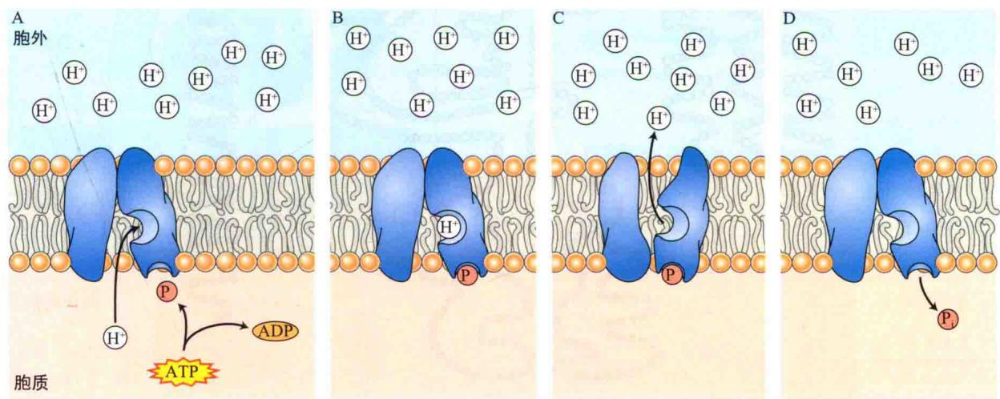  
图6.16 H $^{+}$ -ATP酶引起的化学势梯度运输质子到膜外的理论步骤。镶嵌在膜内的转运蛋白与细胞内侧的阳离子结合（A），并被ATP磷酸化（B）；磷酸化导致酶的构象改变，将质子暴露于膜的外侧并释放出去（C）。磷酸根（P）从转运蛋白上释放到细胞质，H $^{+}$ -ATP酶蛋白恢复原有构象，开始新一轮的运输（D）。

总之，那些在营养物质运输中起关键作用的细胞中， $\mathrm{H}^+$ -ATP酶表达量高，这些细胞包括根内皮层细胞和那些发育中的种子周围参与从质外体吸收营养的细胞（Sondergaard et al., 2004）。在多种 $\mathrm{H}^+$ -ATP酶共表达的细胞中，这些 $\mathrm{H}^+$ -ATP酶可能受到不同的调控或者存在功能冗余，可能为其运输功能提供了一种“保险”机制（Arango et al., 2003）。图6.17表示了酵母 $\mathrm{H}^+$ -ATP酶功能域的模型，与植物中的类似。该蛋白质具有10个跨膜结构域，来回环化跨膜，一些跨膜域形成了质子泵出的通道。催化ATP水解的结构域位于膜的胞质一侧，包含在催化性循环中可被磷酸化的Asp残基。

与其他酶一样，质膜 $H^{+}$ -ATP酶也受底物ATP浓度、pH、温度及其他因子的调控。另外， $H^{+}$ -ATP酶分子还可以被光、激素或病原菌侵染之类的特定信号可逆性地活化或去活化。这种调控由位于多肽链C端的特化的自抑制结构域来介导完成。该结构域调节着 $H^{+}$ -ATP酶的活性（图6.17），如果自抑制结构域被蛋白酶水解掉，则 $H^{+}$ -ATP酶被不可逆地激活（Palmgren，2001）。

C端的自抑制效应也可受到蛋白激酶和蛋白磷酸酶的调控，两种酶的作用分别通过在该结构域的Ser/Thr残基上加上或移去磷酸基团来实现。这种磷酸化作用可以被普遍存在的酶修饰蛋白调节，该类蛋白质称为14-3-3蛋白，它们主要结合在磷酸化区域，取代了自抑制（autoinhibitory）结构域，导致H $^{+}$ -ATP酶激活（Gaxiola et al., 2007）。壳梭孢菌素为真菌毒素，它是H $^{+}$ -ATP酶的强激活剂，可以增强14-3-3蛋白与H $^{+}$ -ATP酶的亲和性，甚至可以在未磷酸化条件下激活该泵（Sondergaard et al., 2004）。壳梭孢菌素强烈地激活保卫细胞H $^{+}$ -ATP酶的作用，以至于气孔不可逆地开放、萎蔫，甚至死亡。

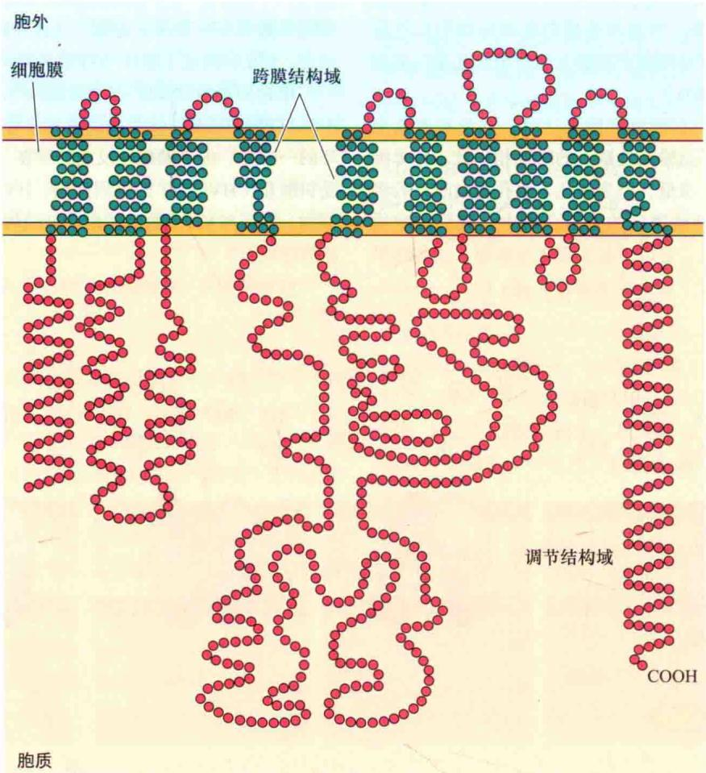  
图6.17 酵母质膜H $^{+}$ -ATP酶的二维示意图。H $^{+}$ -ATP酶有10个跨膜区，调节域为自抑制域，翻译后修饰使自抑制域被取代，导致H $^{+}$ -ATP酶活化（改编自Palmgren，2001）。

液泡内腔

植物细胞主要靠中央液泡吸水使细胞的体积增大，液泡的渗透压必须维持在足够高的水平以使水分进入胞质。因此，与质膜调节的细胞吸收离子和代谢产物的过程一样，液泡膜控制这些物质在胞质和液泡间的转移。随着分离完整液泡和液泡膜泡囊技术（参见Web Topic 6.6）的发展，液泡膜的运输研究已成为一个生机勃勃的研究领域。这些研究导致了一类将质子运输到液泡的新的质子泵ATP酶的发现（图6.14）。

液泡H $^{+}$ -ATP酶（又称V-ATP酶）在结构和功能上均与质膜H $^{+}$ -ATP酶不同（Kluge et al., 2003），而更加接近线粒体和叶绿体的F-ATP酶（见第11章）。由于液泡ATP酶水解ATP并不涉及磷酸化中间体的形成，因此液泡ATP酶对前述质膜ATP酶的抑制剂钒酸盐不敏感，而是专一地受抗生素洛霉素A的抑制，同时也受高浓度NO $_{3}^{-}$ 的抑制，这两者均不能抑制质膜ATP酶。利用这些选择性抑制剂可以鉴定不同类型的ATP酶，并对它们的活性进行测试。液泡ATP酶属于存在于所有真核细胞内膜系统的一类普遍的ATP酶，它们由多个不同的亚基组成，形成很大的酶复合体，约750 kDa（Kluge et al., 2003）。这些亚单位有组织地形成外围催化复合体V $_{1}$ 及跨膜通道复合体V $_{0}$ （图6.18）。基于它们与F-ATP酶的相似性，人们认为液泡ATP酶工作机制像一个小型的旋转马达（见第11章）。

  
图6.18 V-ATP酶旋转马达模型。由许多多肽亚单位一起组成的复合体酶。 $V_{1}$ 催化复合体很易与膜脱离，它含有核苷酸结合位点和催化位点，其组分用大写字母标注。介导H $^{-}$ 跨膜运输的复合体 $V_{0}$ ，用小写字母标注其组分。人们认为ATP酶的反应由每个A亚基催化，依次推动锚杆D和6个c亚基旋转，c亚基相对于a亚基的旋转驱动H $^{+}$ 的跨膜运输（改编自Kluge et al., 2003）。

液泡ATP酶是致电泵，它们从细胞质中运输质子进入液泡，并在液泡膜上产生质子原动力。尽管液泡中电势与外部介质相比较低，但是仍然比胞质高20\~30 mV，这种情况是由致电质子泵造成的。为维持液泡整体的电中性，Cl⁻、苹果酸根离子等阴离子，经过膜上的通道，由胞质进入液泡内（Barla and Pantoja，1996）。如果在质子泵入的同时，阴离子没有同向转移，则导致跨液泡膜的电荷积累，将导致不能进一步泵入更多的质子。阴离子的运输，维持了液泡整体的电中性，这样保证了液泡H⁺-ATP酶能产生大的跨膜浓度质子梯度（pH梯度）。正是这种梯度的存在，导致了典型液泡的pH为5.5，而胞质pH为7.0\~7.5。质子原动力中的电势差驱动阴离子进入液泡，而H⁺电化学势梯度Δμ̃H⁺，通过次级运输（反向共运输体），为阳离子和蔗糖进入液泡提供了动力（图6.14）。

尽管大部分植物细胞的液泡pH略微呈酸性（约5.5），然而，有些植物种类液泡的pH则很低，该现象称超酸化（hyperacidification）现象。一些果实（柠檬）和蔬菜（大黄）尝起来很酸，正是由液泡超酸化作用引起的，表6.2中列出了一些极端的例子。生化研究表明，液泡（特别是汁囊细胞）的低pH是一系列因子综合影响的结果。

表6.2 一些超酸化植物种类液泡的pH

<table><tr><td>组织</td><td>物种</td><td>pHa</td></tr><tr><td colspan="3">果实</td></tr><tr><td></td><td>酸橙(Citrus aurantifolia)</td><td>1.7</td></tr><tr><td></td><td>柠檬(Citrus limonia)</td><td>2.5</td></tr><tr><td></td><td>樱桃(Prunus cerasus)</td><td>2.5</td></tr><tr><td></td><td>柚子(Citrus paradisi)</td><td>3.0</td></tr><tr><td colspan="3">叶</td></tr><tr><td></td><td>四季海棠(Begonia semperflorens)</td><td>1.5</td></tr><tr><td></td><td>秋海棠</td><td>0.9~1.4</td></tr><tr><td></td><td>酢浆草</td><td>1.9~2.6</td></tr><tr><td></td><td>酸模(Rumex sp.)</td><td>2.6</td></tr><tr><td></td><td>仙人掌(Opuntia phaeacantha)b</td><td>1.4(6:45 A.M.)</td></tr><tr><td></td><td></td><td>5.5(4:00 P.M.)</td></tr></table>

a 数值代表汁液的pH或各组织的汁液，通常是液泡pH的指示剂；b 仙人掌液泡pH在一天内有变化，如第8章讨论的。许多沙漠植物有特化的光合作用类型，称为CAM，造成液泡pH在夜间下降。

资料来源：Small，1946

（1）液泡膜对质子的通透性很低，从而建立起较陡的pH梯度。

（2）特化的液泡ATP酶比普通液泡ATP酶能更有效地运输质子（能量浪费较少）（Müller et al., 1997）。

（3）柠檬酸、苹果酸及草酸等有机酸在液泡中的积累，可以作为缓冲剂，有助于维持液泡的低pH。

## 6.4.9 H $^{+}$ 焦磷酸酶（H $^{+}$ -PPase）也可以在液泡膜上泵运质子

另外一类质子泵称为质子-焦磷酸酶（ $\mathrm{H}^{+}$ -PPase）（Gaxida et al., 2007），与液泡ATP酶共同作用，产生跨液泡膜的质子梯度（图6.14）。该酶由分子质量为80 kDa的单链多肽组成，利用无机焦磷酸（ $\mathrm{PP}_{\mathrm{i}}$ ）水解产生的能量作为驱动力。

与ATP水解相比，由焦磷酸水解释放的自由能要少。每水解1分子焦磷酸，质子焦磷酸酶只运输1个质子，而每水解1个ATP，液泡ATP酶运输2个质子。因此，运输每个质子可获得的能量是相同的，两种酶可以产生相当量的质子梯度。有趣的是，在一些细菌和原生生物中存在有与植物H $^{+}$ -PPase类似的酶，但在动物和酵母中却没有发现有这类酶的存在。

V-ATP酶和H $^{+}$ -ATP酶也在除了液泡外的其他内膜系统中发现。与它们分布相一致的是，这些ATP酶除了调控H $^{+}$ 梯度外，也被证实调节囊泡的运输和分泌。此外，拟南芥的一个H $^{+}$ -PPase的超表达促进生长素的运输和细胞分裂，H $^{+}$ -PPase活性的降低则出现相反的表型。这表明，H $^{+}$ -PPase的活性与生长素转运子的合成、分布及调控相关（Gaxiola et al., 2007）（见第19章）。

## 6.5 根中的离子运输

根吸收的矿质营养通过木质部随蒸腾流运到地上部分（见第4章）。养分和水的最初吸收，以及接下来的从根表面跨过皮层进入木质部的转移过程，都是高度特异的，并受到精细的调控。

离子进入根的运输同样服从细胞运输的生物物理定律。但正如讨论水分运输（见第4章）时所看到的，根的解剖结构构成离子运输途径上的某些特殊的限制。这一节将讨论涉及离子从根的表面向木质部导管径向运输的途径和机制。

## 6.5.1 溶质通过质外体和共质体的移动

直到目前为止，讨论的细胞质子运输并不包括细胞壁。对小分子运输而言，细胞壁是由多糖组成的开放空间，矿质营养很容易通过。由于所有植物细胞之间均由细胞壁分开，离子可以完全不进入活细胞，通过细胞壁间隙扩散而穿过某一组织（或随水流被动运输）。这种由细胞壁组成的连续体系称为细胞外空间（extracellular space），或称为质外体（apoplast）（图4.4）。通常，利用这种方法测定的结果表明，细胞壁占植物组织体积的5%\~20%。

正像细胞壁可以形成一个连续相，相邻细胞的细胞质同样也可形成连续的整体，统称为共质体（symplast）。植物细胞通过被称为胞间连丝的细胞质桥相互连在一起（见第1章）。胞间连丝是沿质膜排列的直径为20\~60 nm的柱形孔道（图6.19），其中包含连丝微管通过，连丝微管是由两个细胞的光滑内质网衍生而来的。在胞间运输频繁的重要组织中，相邻细胞具有大量的胞间连丝，有时每平方微米的细胞表面可达15个。像花的蜜腺和叶的盐腺等特化的分泌细胞，都具有高密度的胞间连丝。营养吸收的根尖附近的细胞也是如此。

对含有大量胞间连丝的细胞进行染料注射或抗电性测试研究，发现离子、水和小溶质可以通过这些孔道从一个细胞转移到另一个细胞。由于每根胞间连丝是由连丝微管和与其相关蛋白质组成的网状通道（见第1章），一些大分子（如蛋白质等）通过胞间连丝的运动需要特殊机制（Lucas and Lee，2004）。此外，离子可经胞间连丝的简单扩散，通过共质体途径进入整个植株（见第4章）。

## 6.5.2 离子跨过共质体和质外体的运输

根对离子的吸收主要在根毛区（见第5章），比分生区和伸长区显著得多。根毛区的细胞已充分伸长但并未开始次生生长。根毛是特化表皮细胞的延伸，根毛的存在极大增加了吸收离子的表面积。

进入根的离子，可能跨过表皮细胞质膜，立即进入共质体，也可能进入质外体，并通过细胞壁在表皮细胞间扩散。离子（或其他溶质）由皮层的质外体要么跨过皮层细胞质膜被运输至共质体，要么通过质外体的径向运输直接扩散到内皮层。质外体形成了一个从根表面通过皮层的连续空间。然而，由于凯氏带的存在，无论哪一种运输方式，离子在进入中柱之前，必须首先进入共质体。正如第4章和第5章所讨论的，凯氏带是环绕在特化的内皮层细胞周围的环形栓化层，能有效地阻止水和溶质经质外体进入中柱鞘（图6.20）。

经由共质体的连接，离子一旦穿过内皮层进入中柱，将继续在细胞间扩散进入木质部。最后被释放至管胞或导管分子，即又重新进入质外体。同样，凯氏带将再次阻止离子由质外体扩散回到根外部。由于凯氏带的图6.19 A. 胞间连丝连接了相邻细胞的细胞质，利于细胞和细胞间通讯。B. 胞间连丝直径约40 nm，其精细的结构形成一个微小的通道，可以让水或小分子自由扩散到另一细胞，中间有一个由内质网延伸出来的连丝微管。C. 胞间连丝横切图，胞间连丝内蛋白质的排列及柱形微通道。内部蛋白的重排可用来调控开放空间的大小，以使大分子通过（C改编自Lucas and Lee，2004）。

A  

图6.20 根的组织结构。
A. 单子叶植物牛尾草（菝葜属）根的横切面，显示表皮（ep）、皮层薄壁组织（cp）、内皮层（ed）、木质部（xy）和韧皮部（ph）。B. 根横切示意图，显示溶质从土壤溶液中进入木质部导管所经过的细胞层（A×30，©Biodisc/Visuals Unlimited/Alamy；B改编自Dunlop and Bowling，1971）。

存在，木质部中的离子浓度高于根周围土壤溶液的离子浓度。

## 6.5.3 木质部薄壁组织参与了木质部的装载

根吸收的离子一旦进入表皮或皮层的共质体，必须把它们装载进入中柱的管胞或导管分子，并向枝条运输。中柱由死的管状分子和活的木质部薄壁细胞组成。由于木质部管状分子是死细胞，缺少与周围薄壁细胞的胞质连续性，因此，离子必须从共质体中第二次跨过质膜，才能进入管状分子。

离子从共质体进入木质部输导组织的过程称为木质部装载（xylem loading）。木质部装载是一个受到严密调节的过程。与其他活的植物细胞一样，木质部薄壁组织具有质膜H $^{+}$ -ATP酶活性，并维持负的膜电位。通过电生理学和遗传学方法，在管状分子中鉴定了专一卸载溶质的运输体。木质部薄壁细胞质膜上存在有质子泵、水孔蛋白及各种离子通道和载体，专门介导溶质的内流和外流（de Boer and Volkov，2003）。

在拟南芥木质部薄壁组织中，中柱的外向整合K+通道（SKOR）在中柱鞘细胞和薄壁细胞中表达。SKOR在这里作为外向通道，把K+从活细胞向外运输到管状组织（Gaymard et al., 1998）。在拟南芥SKOR通道蛋白缺失的突变株中，或者通过药理学的方法使SKOR失活的植物中，从根到茎的K+运输大大减少，这也证实了该通道蛋白的功能。

一些参与到 $Cl^{-}$ 和 $NO_{3}^{-}$ 从木质部薄壁细胞中卸载的阴离子选择性类型通道也被鉴定出来。干旱、脱落酸（ABA）处理或者胞质 $Ca^{2+}$ 浓度升高（通常在应答ABA时）等都可降低根木质部薄壁组织SKOR和阴离子通道的活性，这有助于在缺水状态下维持根细胞水合作用。

在木质部薄壁组织细胞中，也发现了其他一些较低选择性的通道，它们可透过 $K^{+}$ 、 $Na^{+}$ 和阴离子。另外， $Na^{+}-H^{+}$ 反向运输体SOS1似乎可以将 $Na^{+}$ 装载进木质部，可以降低根共质体中 $Na^{+}$ 的水平。同时，介导硼、 $Mg^{2+}$ 和 $HPO_{4}^{2-}$ 装载的其他运输体也已鉴定出来。因此，通过调节质膜 $H^{+}-ATP$ 酶、通道及载体的活性，离子从木质部薄壁细胞向木质部管状组织的流动是处于严密的代谢控制之下的。

## 小结

分子或离子由一个区域向另一个区域的生物调控移动称为运输。植物与环境之间，植物组织及器官之间存在可溶性物质的交换，且无论局部还是长距离运输过程都主要由细胞膜控制。

## 被动和主动运输

· 浓度梯度和电势梯度是驱动物质穿越生物膜运输的主要动力，这些综合起来称为电化学势[式（6.8）]。

· 溶质顺自由能梯度的穿膜运动受到被动运输机制的促进（图6.1，图6.2）。

· 溶质逆自由能梯度的运动称为主动运输，且需要提供能量。

## 离子的跨膜运输

· 膜允许或限制某一物质跨膜运动的特性称为膜的通透性（图6.6）。

· 通透性取决于特定溶质的化学特性、膜的脂质组成，特别依赖于膜上协助特定物质运输的膜蛋白。

· 对每一种可透过膜的离子，平衡时特定种类离子的跨膜分布可用能斯特方程来表述[式（6.10）]。

· 由 $H^{+}$ -ATP酶引起的 $H^{+}$ 的跨膜运输是膜电位的一个主要决定因素（图6.16，图6.17）。

## 膜转运过程

\- 膜上有许多特化的蛋白质，即通道、载体和泵，以协助溶质运输（图6.7）。

· 通道受蛋白孔径调控，开放时能够极大促进分子的跨膜外流（图6.7，图6.8）。

\- 生物体的离子通道类型具有极大的多样性。依据类型，通道对于一种离子具有非选择性或高度选择性。通道受到包括电压、第二信使及配体等因素调控（图6.9，图6.14，图6.15）。

\- 载体结合特定溶质并进行转运，其转运速率要低于通道数个数量级（图6.7，图6.12）。

\- 泵对溶质的转运需要能量。 $H^{+}$ 和 $Ca^{2+}$ 的穿越细胞膜主动运输需要泵的调节（图6.7）。

\- 植物利用能量的次级主动运输从质子的顺能势梯度运输调节其他溶质逆能势梯度的主动运输（图6.10）。

· 同向运输中，两种被运输的溶质沿同一方向穿膜运动，而反向运输中两种溶质则沿相反方向运动（图6.11）。膜转运蛋白

· 质膜和液泡膜上的许多通道、载体和泵已经在分子水平上被鉴定（图6.14），并利用电生理（图6.9）及生化技术进行界定。

\- 转运子存在于不同的含氮物质中，包括 $\mathrm{NO}_3^-$ 、氨基酸和多肽。

· 植物体有多种阳离子通道，可以通过它们对于阳离子的选择性及调控机制进行分类（图6.15）。

· 一些不同种类的阳离子载体调节钾离子吸收至细胞溶质（图6.14）。

· 液泡膜和质膜上的 $Na^{+}-H^{+}$ 反向转运体分别转运 $Na^{+}$ 至液泡和细胞原生质体外，由此避免细胞溶质中 $Na^{+}$ 积累至毒害水平（图6.14）。

\- $\mathrm{Ca^{2+}}$ 是信号转导级联中重要的第二信使，其在胞质中的浓度受到严密调控。 $\mathrm{Ca^{2+}}$ 通过可通透性 $\mathrm{Ca^{2+}}$ 通道被动进入胞质，通过 $\mathrm{Ca^{2+}}$ 泵和 $\mathrm{Ca^{2+}-H^{+}}$ 反向运输器主动移出细胞溶质（图6.14）。

· 调节 $NO_{3}^{-}$ 、 $Cl^{-}$ 、 $SO_{4}^{2-}$ 和 $PO_{4}^{3-}$ 吸收至细胞溶质中的选择性载体及非选择性地调节阳离子流出细胞溶质的阳离子通道调控了这些大量营养元素在细胞内的浓度（图6.14）。

· 高亲和性ZIP转运蛋白转运重要的及有毒的金属离子（图6.14）。

· 水孔蛋白促进水分穿越细胞膜的流动，它们的调控使得在应对环境刺激反应中细胞内水势的快速变化。

\- 质膜H $^{+}$ -ATP酶是一类由多基因的家族编码的膜蛋白，其活性受到蛋白本身自抑制区的可逆控制。

· 在液泡膜上发现两种 $H^{+}$ 泵，V-ATP酶和 $H^{+}$ -焦磷酸酶，调节穿越液泡膜的质子原动力，进而通过反向机制驱动其他溶质的穿膜运动（图6.14，图6.18）。

## 根中的离子转运

· 诸如矿质营养等可溶性物质通过细胞外空间（质外体）或经由胞质（通过共质体）在细胞间进行移动。相邻细胞的细胞质通过胞间连丝相连，促进了共质体运输（图6.19）。

\- 离子进入根时，可由表皮细胞吸收，也可通过质外体先扩散到根皮层细胞，并由皮层或内皮层的细胞进入共质体。离子由根共质体装载进入木质部并经蒸腾流运送到地上部分（图6.20）。

(李保珠 安国勇 宋纯鹏 译)

## WEB MATERIAL

Web Topics 6.1 Relating the Membrane Potential to the Distribution

## of Several Ions across the Membrane: The Goldman Equation

The Goldman equation is used to calculate the membrane permeability to more than one ion.

6.2 Patch Clamp Studies in Plant Cells
Patch clamping is applied to plant cells for electrophysiological studies.

## 6.3 Chemiosmosis in Action

The chemiosmotic theory explains how electrical and concentration gradients are used to perform cellular work.

6.4 Kinetic Analysis of Multiple Transporter Systems Application of principles of enzyme kinetics to transport systems provides an effective way to characterize different carriers.

6.5 ABC Transporters in Plants
ATP-binding cassette (ABC) transporters are a large family of active transport proteins energized directly by ATP.

6.6 Transport Studies with Isolated Vacuoles and Membrane Vesicles
Certain experimental techniques enable the isolation of tonoplast and plasma membrane vesicles for study.

Web Essays

6.1 Potassium Channels Several plant $\mathbf{K}^{+}$ channels have been characterized.

## 6.2 Calmodulin: A Simple but Multifaceted Signal Transducer

This essay describes how CaM interacts with a broad array of cellular proteins and how these protein-protein interactions act to transduce changes in $Ca^{2+}$ concentration into a complex web of biochemical responses.

## 单元Ⅱ 生化和代谢

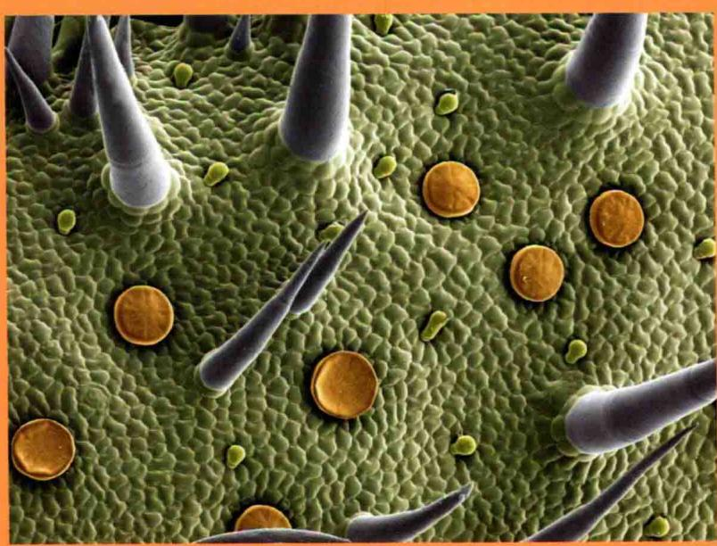

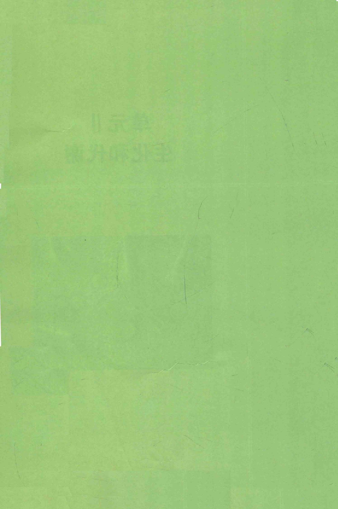
