# 第7章 光合作用：光反应

<!-- 章节边界按正文内容恢复；原始 MinerU 内容保留如下。 -->

# 光合作用：光反应

地球上生命赖以生存的能量来自太阳，光合作用是能够捕获光能的唯一的生物学途径，地球上大部分的能源来自于近代或古代的光合作用（化石燃料）。这章将介绍光合储能的基本原理，以及目前对于光合作用细胞器的结构和功能的认识（Blankenship，2002）。

光合作用一词的字面意思是“利用光合成”。在本章中将会看到，进行光合作用的生物可利用太阳能合成复杂的碳化合物。更确切地说，光能促使二氧化碳和水合成碳水化合物和氧气。

$$
6 \mathrm{CO} _ {2} + 6 \mathrm{H} _ {2} \mathrm{O} \longrightarrow \mathrm{C} _ {6} \mathrm{H} _ {2} \mathrm{O} _ {6} + 6 \mathrm{O} _ {2}
$$

这些分子中储存的能量不仅可为植物细胞的活动提供能量，还是地球上所有生命的能量来源。

本章将阐述光合作用中光的功能、光合细胞器的结构，以及从叶绿素被光激发到合成ATP和NADPH的整个光合作用过程。

## 7.1 高等植物中的光合作用

叶片的叶肉是高等植物中光合作用最活跃的组织。叶肉细胞含有丰富的叶绿体，而叶绿体中含有能吸收光能的绿色色素——叶绿素（chlorophyll）。在光合作用中，植物利用光能氧化水，释放氧气；同时还原二氧化碳，合成大量碳化合物，主要是糖。这一系列复杂反应包括类囊体反应和碳固定反应，最终使二氧化碳还原。

光合作用的类囊体反应（thylakoid reaction）发生在叶绿体特化的内膜——类囊体（见第1章）中。类囊体反应的终产物是高能化合物ATP和NADPH，它们主要参与碳固定反应（carbon fixation reaction）中糖的合成。糖的合成过程发生在叶绿体的基质中，基质是围绕类囊体的亲水性区域。类囊体反应，通常也称为光合作用中的光反应，在本章中进行阐述；碳固定反应则在第8章中论述。

叶绿体通过两种不同的功能单位——即两种不同的光系统将光能转化为化学能。吸收的光能用于驱动电子在一系列电子供体和电子受体化合物之间进行传递。最终，大部分电子将 $NADP^{+}$ 还原为NADPH，并将 $H_{2}O$ 氧化成 $O_{2}$ 。同时，光能也产生跨类囊体膜的质子动力势（见第6章），用于合成ATP。

## 7.2 基本概念

在这节中，将介绍一些必要的概念，它们是理解光合作用的基础。这些知识包括光的性质、色素的性质及其多功能性。

## 7.2.1 光具有波粒二象性

20世纪早期，认识到光具有波粒二象性是物理学上的一个重要发现。波的特性用波长（wavelength）表示，即希腊字母 $\lambda$ ，表示两个连续波峰间的距离（图7.1）。频率（frequency）用希腊字母v表示，表示在特定时间内经过观察者的波峰数。用一个简单的公式可以描述波长、频率和波速之间的关系。

$$
C = \lambda v\tag{7.1}
$$

式中，C为波速，在此处表示光速 $(3.0\times10^{8}\mathrm{m/s})$ 。光波是横向传播（侧对侧）的电磁波，电场和磁场在与光波的传播方向垂直的方向振荡，两个场彼此之间也呈 $90^{\circ}$ 夹角。

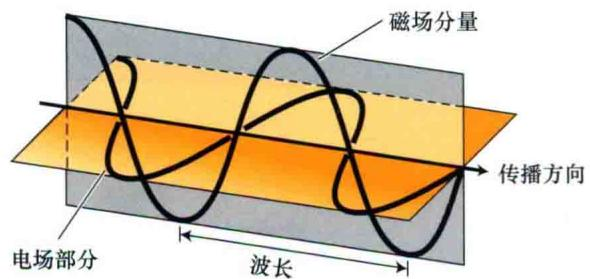  
图7.1 光是横向传播的电磁波，它由与光的传播方向垂直且相互垂直的振荡电场和振荡磁场组成。光以 $3.0 \times 10^{8}$ m/s的速度传播，波长（ $\lambda$ ）表示两个连续波峰间的距离。

光同时也是粒子，称为光子（photon）。每个光子含有一定能量，称为量子（quantum，普朗克量子）。光能并不连续，而是以离散包——量子的形式传递的。根据普朗克定律，光子的能量（E）取决于光的频率。

$$
E = h \nu\tag{7.2}
$$

式中，h为普朗克常数（ $6.626 \times 10^{-34}$ Js）。

太阳光就像含不同频率光子的“光子雨”，人的眼睛只对其中很小的频率范围，即电磁波谱的可见光区域敏感（图7.2）。较高频率的光（或较短波长的光）在光谱的紫外区；较低频率的光（或长波光）在

  
图7.2 电磁波谱。波长（ $\lambda$ ）和频率（ $\nu$ ）呈负相关。人的眼睛只对其中很窄范围的辐射波长敏感，即 $\lambda$ 为400（紫）\~700 nm（红）的可见光区域。短波长（高频率）光具有高能量，长波长（低频率）光具有低能量。

红外区。图7.3中显示了太阳辐射的能量和照到地球表面的能量密度。叶绿素a的吸收光谱（图7.3中的绿色曲线）大致表示了被植物所利用的那部分太阳能。

吸收光谱（absorption spectrum）反映了分子或物质吸收不同波长光的光能量信息，在无吸收的溶剂中，特定物质的吸收光谱可以用图7.4所示的分光光度计进行测定。分光光度法是测定样品吸光度的一种方法，在Web Topic 7.1中进行了更详尽的论述。

## 7.2.2 当分子吸收或发射光时，它们的电子态也发生变化

叶绿素之所以看起来是绿的，是由于它主要吸收光谱的红光和蓝光部分，而以绿光（波长大约为550 nm）为主的光波被反射到人眼中（图7.3）。

光的吸收可以用式（7.3）表示，其中叶绿素（Chl）处于它的最低能态，或称基态；在吸收了一个光子（用hv代表）后转变成了高能态，或称激发态（Chl\*）。

$$
\mathrm{Chl} + \mathrm{hv} \longrightarrow \mathrm{Chl} ^ {*}\tag{7.3}
$$

激发态分子和基态分子中电子的分布是不同的（图7.5）。与红光相比，吸收蓝光会将叶绿素激发到更高的能态，因为波长越短，光子的能量就越高。在高能激发态，叶绿素极不稳定，会很快地将一部分能量以热能的形式散失到周围空间，从而变成最低激发态，这种状态能稳定存在几纳秒（ $10^{-9}$ s）。由于激发态内在的不稳定性，任何捕获其能量的过程必须非常迅速。

  
图7.3 太阳光谱和叶绿素吸收光谱的相关性。曲线A（黑线）表示不同波长处的太阳辐射能。曲线B（红线）是照到地球表面的能量。在大于700 nm的红外区域骤然下降的谷代表以水蒸气为主的大气层分子吸收的太阳能。曲线C（绿线）是叶绿素的吸收光谱，它在蓝光（波长约为430 nm）和红光（波长约为660 nm）区域有强烈吸收。由于可见光区中部的绿光未被有效吸收，故而多数绿光被反射进人眼中，赋予植物特征性的绿色。

  
图7.4 分光光度计的示意图。仪器由一个光源、一个内含棱镜之类的波长选择装置单色仪、一个样品架、一个光电探测器和一个记录仪（或电脑）组成。单色仪的输出波长随着棱镜的旋转而改变；吸收值（A）针对波长（ $\lambda$ ）作图即光谱。

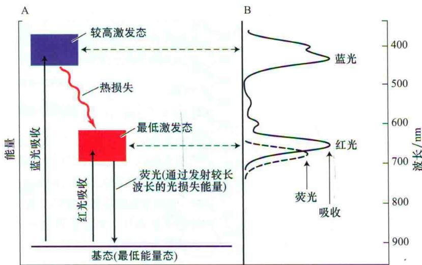  
图7.5 叶绿素的吸收光和发射光。A. 能级图。光的吸收或发射由连接基态和电子激发态的垂直线表示。叶绿素的蓝光和红光吸收带（分别表示吸收蓝光和红光光子）对应于垂直向上的箭头，表示吸收的光能使分子从基态变成激发态。向下的箭头表示发射荧光，当分子以光子的形式再次释放能量时，从最低激发态回到基态。B. 吸收光谱和荧光光谱。叶绿素的长波（红光）吸收带对应从基态跃迁至第一激发态所需的光能。短波（蓝光）吸收带对应跃迁至更高激发态所需的光能。

在最低激发态，被激发的叶绿素可通过4条途径释放能量。

（1）被激发的叶绿素重新发射光子，回到基态，这个过程发射荧光（fluorescence）。发射的荧光波长比吸收波长稍长（能量更低），这是由于一部分激发能在发射荧光前转化为热能。叶绿素发红色荧光。

（2）被激发的叶绿素直接将激发能转化为热能，回到基态，不发射光子。

（3）叶绿素参与能量转移（energy transfer）。激发态的叶绿素将能量转移给另一个分子。

（4）光化学（photochemistry）途径：激发态能量促使化学反应发生。光合作用的光化学反应是已知的最快的化学反应之一，这种超快的速度有利于本途径与激发态的上述其他3种途径竞争。

## 7.2.3 光合色素吸收光以驱动光合作用

太阳能首先被植物的色素吸收，叶绿体中含有在光合作用中起作用的所有色素。图7.6和图7.7中显示了几种光合色素的结构和吸收光谱。叶绿素和细菌叶绿素（bacteriochlorophyll）（在某些细菌中找到的色素）是光合生物中的典型色素。所有生物都含有一种以上的色素，每种色素都有特定功能。

绿色植物中含大量叶绿素a和叶绿素b，原核生物和蓝细菌（又称蓝藻）中含有叶绿素c和叶绿素d。已经发现了多种不同类型的细菌叶绿素，细菌叶绿素a（Bchl a）分布最广。Web Topic 7.2显示了不同类型光合生物中色素的分布情况。

B类胡萝卜素

A 叶绿素

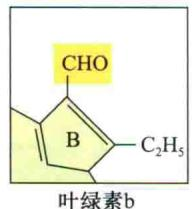

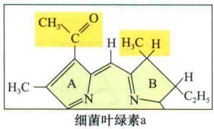

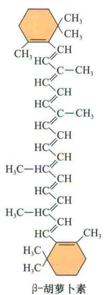

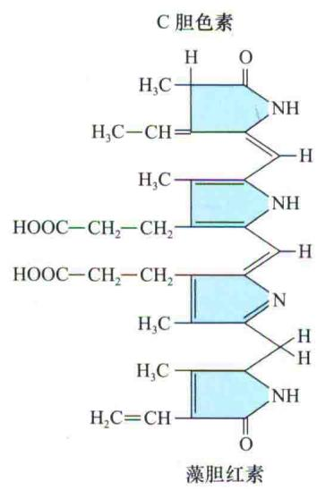

图7.6 一些光合色素的分子结构。A. 叶绿素有一个类卟啉环结构，中心配位镁离子；还有一条长的疏水性碳氢链尾巴，能将叶绿素锚定在光合膜上。类卟啉环是叶绿素被激发时电子重排和未配对电子氧化或还原的场所。不同叶绿素的主要区别在于环周围的取代基和双键类型不同。B. 类胡萝卜素是线状多烯，既可作为天线色素，也可作为光保护剂。C. 胆色素是开链的四吡咯，存在于蓝藻和红藻的藻胆体的天线结构中。  
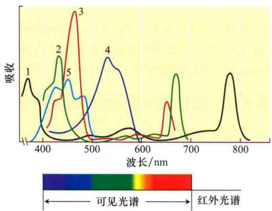  
图7.7 一些光合色素的吸收光谱，包括β-胡萝卜素、叶绿素a（Chl a）、叶绿素b（Chl b）、细菌叶绿素a（Bchl a）、叶绿素d（Chl d）和藻胆红素。除藻胆红素外，其余色素的吸收光谱是溶于非极性溶剂的纯色素的光谱，藻胆红素则是利用藻红蛋白水溶液测定的。藻红蛋白来源于蓝藻，包含了一个与肽链共价连接的藻胆红素发色团。在大多数情况下，体内光合色素的光

谱受到它所在环境的影响（改编自Avers，1985）。

所有的叶绿素都有一个复杂的环形结构，它与血红蛋白、细胞色素（图7.6A）中的卟啉类基团的化学结构很相近。另外，环形结构上常常附有一条长的碳氢链尾巴，它将叶绿素锚定在疏水环境。环形结构含有一些结合松散的电子，它是叶绿素分子发生电子跃迁和氧化还原反应的基础。

在光合生物中发现的各种类胡萝卜素（carotenoids）都是含有多个共轭双键的线状分子（图7.6B），吸收峰在400\~500 nm，因此类胡萝卜素具有特征性的橙色，例如，胡萝卜的颜色源于类胡萝卜素中的β-胡萝卜素，它的结构和吸收光谱分别见图7.6和图7.7。

除了那些需要实验室条件维持生存的突变体，所有光合生物中都能发现类胡萝卜素，类胡萝卜素整合在类囊体膜上，通常和组成光合细胞器的多种蛋白质紧密结合。类胡萝卜素把吸收的光能转移给叶绿素，用于光合作用，因此它们称为辅助色素（accessory pigment）。此外，类胡萝卜素也能帮助生物抵御光造成的损伤（见本章的P.152和第13章）。

## 7.3 了解光合作用的关键实验

阐明光合作用的总化学方程式耗费了几百年的时间和多位科学家的努力（相关历史可参阅本书网站上的参考文献）。1771年，J. Priestley发现，在一个密闭的空间燃烧蜡烛直至熄灭后，该空间内一小枝薄荷的生长，可使空气成分发生变化，引起另一支蜡烛燃烧，由此发现了植物可产生氧气。1779年，荷兰人J. Ingenhousz阐述了光在光合作用中的关键功能。

其他科学家确定了 $CO_{2}$ 和 $H_{2}O$ 在光合作用中的作用，并表明有机物特别是碳水化合物和氧气一样都是光合作用的产物。到19世纪末期，得到的光合作用的总的配平化学反应式如下。

$$
6 \mathrm{CO} _ {2} + 6 \mathrm{H} _ {2} \mathrm{O} \xrightarrow {\text {光，植物}} \mathrm{C} _ {6} \mathrm{H} _ {1 2} \mathrm{O} _ {6} + 6 \mathrm{O} _ {2}\tag{7.4}
$$

这里的 $C_{6}H_{12}O_{6}$ 代表葡萄糖等单糖。正如将要在第8章中提到的那样，葡萄糖并不是碳固定反应的实际产物，但两者在能量上基本相同，因此为了方便起见，式（7.4）以葡萄糖作为代表，不能仅按字面意思理解。

光合作用的化学反应过程很复杂，目前至少已发现了50个中间反应步骤，毫无疑问还可能存在其他的步骤。20世纪20年代，通过研究一种终产物不是氧气的光合细菌，得到了有关光合作用中关键化学过程的早期线索，从而确定了光合作用的化学属性。通过对一些细菌的研究，C. B. van Niel推断光合作用是一个氧化还原过程，随后这个结论成为所有研究光合作用的基础。

接下来我们将阐述光合作用和吸收光谱的关系，讨论有助于了解光合作用的一些关键性实验和光合作用中的关键化学反应方程式。

## 7.3.1 作用光谱将光吸收与光合成活性相联系

作用光谱对于了解光合作用非常重要。作用光谱（action spectrum）描述了生物系统对光反应的程度与波长的函数关系。光合作用的作用光谱可以通过测量不同波长的光刺激植物释放氧气的量来绘制（图7.8）。从作用光谱常可推断在特定光诱导现象中起作用的发色基团（色素）。

T. W. Engelmann在19世纪末测定了一些初始的作用光谱（图7.9）。T. W. Engelmann用一个棱镜将阳光散射成七色光，并使之落在水藻丝上，再在系统中加入一群好氧细菌，细菌就会聚集在产生氧气最多的藻丝区域，这些区域就是被红光和蓝光照到的区域，这两种光可被叶绿体强烈吸收。现在，作用光谱可用像一间房间一样大的光谱仪测量，通过一个巨大的单色仪将单色光辐照在实验样品上，但其实验原理和T. W. Engelmann的实验原理相同。

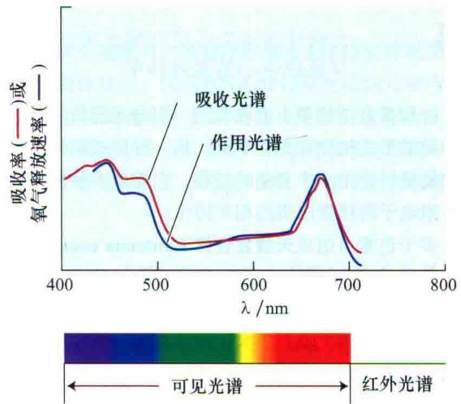  
图7.8 作用光谱和吸收光谱的比较。吸收光谱的测量见图7.4。作用光谱是通过测量植物对不同波长光的反应如氧气的释放来绘制的。如果某个吸收光谱相关的色素与引起光反应的色素相同，那么这个吸收光谱和作用光谱就会相吻合。本图中，氧气释放的作用光谱和完整叶绿体的吸收光谱高度一致，表明叶绿素的光吸收调控氧气的释放。差异出现在类胡萝卜素的吸收区域450\~550 nm，意味着从类胡萝卜素到叶绿素的能量转移不如叶绿素间的能量转移有效。

光的波长/nm  
  
图7.9 T.W. Engelmann绘制的作用光谱的示意图。T.W. Engelmann将不同波长的光照射到丝状绿藻——水绵（Spirogyra）的螺旋状叶绿体上，观察到投放进去的好氧性细菌聚集在叶绿素吸收的光谱区域附近。这个作用光谱还首次表明辅助色素所吸收的光可以驱动光合作用。

作用光谱对于研究产氧光合生物中两种不同的光系统非常重要。在介绍这两种光系统之前，需要了解捕光的天线分子和光合作用的能量需求。

## 7.3.2 光合作用发生在包含捕光天线和光化学反应中心的复合体中

叶绿素和类胡萝卜素吸收的一部分光能最终以形成化学键的形式被储存为化学能。从一种形式到另一种形式的能量转化是一个复杂的过程，它需要多种色素分子和一组电子转移蛋白质的相互协作。

多个色素可组成天线复合体（antenna complex），收集光并将其能量转移到反应中心复合体（reaction center complex），在这里发生氧化和还原反应，以长期储存能量（图7.10）。本章的后面将讨论一些天线复合体和反应中心复合体的分子结构。

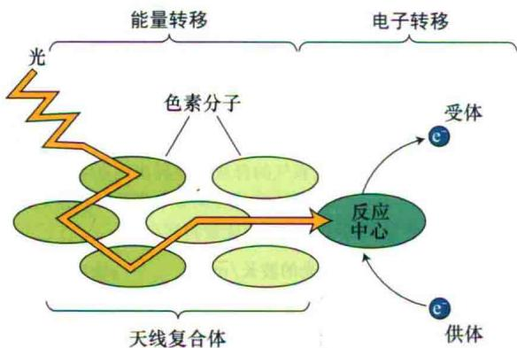  
图7.10 光合作用中能量转移的基本概念。许多色素共同组成天线复合体，收集光能并向反应中心传递能量。在反应中心，叶绿素电子被转移到一个电子受体上，发生化学反应以储存能量，随后一个电子供体又将叶绿素还原；天线复合体中的能量转移是纯粹的物理现象，不涉及化学变化。

植物将天线色素和反应中心进行分工究竟有何裨益？事实上，即使在强光照射下，一个叶绿素分子每秒也只能吸收少量光子。如果一个完整的反应中心仅连接一个叶绿素，那么这个系统中的酶大部分时间将处于闲置状态，只有在吸收光子的时候偶尔被激活。但是，如果有多个色素分子把能量一起运送到一个共同的反应中心，系统在大部分时间就会保持活跃状态。

1932年，R. Emerson和W. Arnold做了一个非常重要的实验，首次证明光合作用过程中多个叶绿素分子在能量转化时起协同作用。他们用短时间（ $10^{-5}$ s）闪光照射绿藻（Chlorella pyrenoidosa），测量氧气产生的量。闪光之间的间隔为0.1 s，在更早的工作中R. Emerson和W. Arnold已经证明这个时间间隔足够长，以致在下次闪光之前，过程中的酶反应完全可以完成。他们发现在高能下，氧气生成量并不随着闪光能量的增强而增加，即光合系统被光饱和了（图7.11）。

  
图7.11 氧气产量和闪光能量之间的关系图。该图为天线色素和反应中心间存在相互作用提供了首个证据。在能量饱和时，氧气的最大产量是每2500个叶绿素分子产生一个氧分子。

在测量产氧量和闪光能量的关系时，R. Emerson和W. Arnold非常惊讶地发现，在饱和条件下，样品中每2500个叶绿素分子只产生1个氧分子。反应中心结合了几百个色素分子，每个反应中心必须作用4次才能产生一个氧分子，因此得出2500个叶绿素产生一个氧分子。

反应中心和多数天线复合体整合在光合膜上。在真核光合生物中，光合膜是叶绿体内的膜；在原核光合生物中，光合作用的位置则在质膜或质膜衍生的膜上。

如图7.11曲线所示，可以测量光合作用中光反应的另一个重要参数——量子产额（quantum yield）。光合作用的量子产额（ $\Phi$ ）定义如下。

$$
\Phi = \frac {\mathrm{光化学产物数}}{\mathrm{吸收量子的总数}}\tag{7.5}
$$

在曲线的线性部分（低光强度），光子量的增加刺激了氧气产量成比例增加。因此，曲线的斜率表示产生氧的量子产额。一个特定过程的量子产额可以从0（若过程对光无反应）到1（若每个吸收的光子都对过程有贡献）。关于量子产额更详细的讨论参见本书Web Topic 7.3。

对于弱光下发挥作用的叶绿体，光化学反应的量子产额大约是0.95，荧光的量子产额是0.05或更低，其他过程的量子产额基本可以忽略，因此大量被激活的叶绿素分子都会引发光化学反应。

## 7.3.3 光合作用中的化学反应由光驱动

有一点值得注意，那就是化学反应方程式（7.4）的平衡基本上处于反应物的一边。利用每个化合物的生成自由能计算出方程式（7.4）的平衡常数大约是 $10^{-500}$ ，这个数字接近于0，可以非常确定，在宇宙存在的历史中，若没有外加的能量， $CO_{2}$ 和 $H_{2}O$ 不可能自发生成葡萄糖分子。驱动光合反应的能量来自光。以下是方程式（7.4）的简化形式。

$$
\mathrm{CO} _ {2} + \mathrm{H} _ {2} \mathrm{O} \xrightarrow {\text {   光，植物   }} (\mathrm{CH} _ {2} \mathrm{O}) + \mathrm{O} _ {2}\tag{7.6}
$$

其中的（ $\mathrm{CH}_2\mathrm{O}$ ）是一个葡萄糖分子的1/6。驱动方程式（7.6）的反应需要9\~10个光子。

虽然在最适宜的条件下光化学反应的量子产额约为100%，但是光能转化为化学能的效率却低得多。如果吸收的是680 nm波长的红光，那么总的能量输入[见方程式（7.2）]就是，每生成1 mol氧气可用的能量有1760 kJ。这个能量足够驱动方程式（7.6）中的反应，该反应的标准自由能变化是+467 kJ/mol。因此在最适宜波长下，光能转化为化学能的效率约为27%，对于一个能量转化系统来说，这已经是很高的效率。大多数被储存的能量用于细胞生命活动的维持，只有很少的能量转化成为生物量（见第9章）。

光化学反应的量子效率（量子产额）接近1（100%），它和能量转化效率只有27%之间并没有矛盾。量子效率衡量的是被吸收光子中参与光化学反应的部分所占的比例；能量效率衡量的是被吸收的光子中有多少能量以化学产物的形式被储存。这些数据表明几乎所有被吸收的光子都参与了光化学反应，但是每个光子中只有1/4的能量被储存，其余的转化为热能。如果以太阳光的全光谱作为能源来计算，则转化为生物量的能量转化效率还要低得多， $C_{3}$ 植物大概为4.3%， $C_{4}$ 植物大概为6%（Zhu et al., 2008）。

## 7.3.4 光驱动NADP的还原和ATP的形成

光合作用的整个过程是一个氧化还原反应，在这个过程中一个化合物被去除电子而被氧化，另一化合物则被加上电子而被还原。1937年，Robert Hill发现，在光照下，离体的类囊体还原了诸如铁盐之类的许多化合物，这些化合物取代二氧化碳起着氧化剂的作用，其方程式如下。

$$
4 \mathrm{Fe} ^ {3 +} + 2 \mathrm{H} _ {2} \mathrm{O} \longrightarrow 4 \mathrm{Fe} ^ {2 +} + \mathrm{O} _ {2} + 4 \mathrm{H} ^ {+}\tag{7.7}
$$

这个反应称为希尔反应，在希尔反应中许多复合物实际上起到人工电子受体的作用，它们对于阐明碳还原前的反应具有重大意义。氧气的产生与人工电子受体还原之间关联关系的证实，初步表明了在缺少二氧化碳的情况下也可以产生氧气，由此形成了现已被接受和证明的观点——光合作用中释放的氧气来源于水而不是二氧化碳。

现在已知，在光系统正常作用时，光还原烟酰胺腺嘌呤二核苷酸磷酸（NADP），NADPH接下来在卡尔文循环（见第8章）中被用作还原剂来固定碳。从水到NADP的电子传递过程中合成了ATP，它也被用于碳还原。

水氧化成氧气，NADP还原及ATP形成等化学反应称为类囊体反应，因为在NADP还原之前的几乎所有反应都发生在类囊体中；碳固定和还原反应称为基质反应，因为碳还原反应发生在叶绿体的亲水性区域——基质中。尽管这样的区分有些武断，但在概念上非常有助于理解。

## 7.3.5 生氧生物有两个连续作用的光系统

20世纪50年代晚期，科学家对几个关于光合作用的实验结果感到困惑。R. Emerson测量了不同波长处光合作用的量子产额，发现了红降效应（图7.12）。需要注意的是，当光化学反应的量子产额如同前面所述接近1时，产生1 mol氧气就需要10个光子，那么产生氧气的总的最大量子产额就为0.1左右。

  
图7.12 红降效应。生氧的量子产额（黑色曲线）在波长大于680 nm的远红外光区域大幅度下降，表明仅仅只有远红外光的话，不能有效驱动光合作用。500 nm处的轻微下降反映了辅助色素——类胡萝卜素吸收的光驱动的光合作用的效率稍低。

如果针对叶绿素吸收的光波测量量子产额，可发现在大多数区域内数值非常稳定，这表明由叶绿素或其他色素所吸收的光子和驱动光合作用的光子效率相同，但是在叶绿素吸收的远红区（大于680 nm处）量子产额却大幅度下降。

红降不可能是因为叶绿素吸收的下降引起，因为量子产额只计算实际被吸收的光。因此，波长大于680 nm 的光比更短波长的光的产氧效率要低得多。

另一个使人困惑的实验结果是双光增益效应（enhancement effect），也由R. Emerson发现。他在测量两种不同波长的光分别照射和这两种光同时照射的光合效率时发现（图7.13），当红光和远红光同时照射时，光合效率大于两者分别照射之和，这个结果令人惊讶。这个实验和其他的实验结果最终可由20世纪60年代发现的两个光化学复合物，即现在所谓的光系统Ⅰ（photosystem I）和光系统Ⅱ（photosystem Ⅱ）

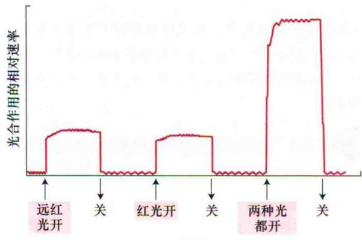  
时间  
图7.13 增益效应。当同时给予红光和远红光时，光合作用的效率大于分开给光的效率相加，这点在20世纪50年代得到证实。增益效应作为重要的证据，支持了光合作用是由两个串联但最适波长略有不同的光化学系统实现的设想。

（参见Web Topic 7.4）进行解释。这两个光系统依次作用，实现光合作用中早期的能量储存。

光系统Ⅰ主要吸收大于680 nm的远红光；光系统Ⅱ主要吸收680 nm的红光，对远红光的吸收很小。这种波长依赖性解释了双光增益效应和红降效应。这两个光系统另外的不同点如下。

（1）光系统Ⅰ产生了一个可还原 $NADP^{+}$ 的强还原剂和一个弱氧化剂。

（2）光系统Ⅱ产生了一个可以氧化水的强氧化剂，和一个比光系统Ⅰ产生的还原剂还要弱的还原剂。

由光系统Ⅱ产生的还原剂重新还原光系统Ⅰ产生的氧化剂，这两个光合系统的特性见图7.14。

图7.14所描述的光合作用的方案，是了解生氧光合生物的基础，称为Z（zigzag）方案。它解释了两个物理和化学性质上都有所不同、具有不同天线色素和光化学反应中心的光系统（PS I 和 PS II）究竟是如何起作用的。在Z方案中，这两个光合系统通过电子传递链相互联系。

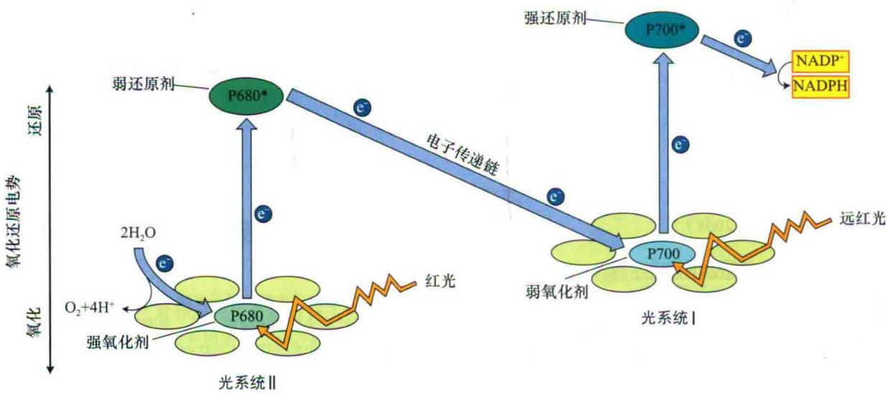  
图7.14 光合作用的Z方案。光系统Ⅱ（PSⅡ）吸收红光，产生一个强氧化剂和一个弱还原剂。光系统Ⅰ（PSⅠ）吸收远红光，产生一个弱氧化剂和一个强还原剂。PSⅡ产生的强氧化剂氧化水，而PSⅠ产生的强还原剂还原NADP $^{+}$ 。这个方案是理解光合作用中电子传递的基础。P680和P700各自表示PSⅡ和PSⅠ反应中心的叶绿素吸收最大的波长。

## 7.4 光合细胞器的构成

7.3节解释了光合作用中的物理学原理、不同色素的部分功能和光合生物进行的化学反应。接下来将论述光合细胞器及其组分的结构，并了解分子结构如何行使功能。

## 7.4.1 叶绿体是光合作用的场所

在光合真核生物中，光合作用发生在叶绿体中。图7.15显示豌豆叶绿体超薄切片的透射电镜照片。叶绿体中最引人注目的结构是类囊体（thylakoid）的内膜分支系统，所有叶绿素都被包含在这个膜系统中，它是光合作用中光反应的场所。

  
图7.15 豌豆叶绿体的透射电镜照片，叶绿体用戊二醛和 $OSO_{4}$ 固定，以树脂包埋，用超薄切片机切片（14 500×）（J. Swafford惠赠）。

由水溶性酶催化的碳还原反应发生在基质（stroma）中，基质即叶绿体中类囊体外的部分。大多数类囊体彼此紧密连接，这些层层垛叠的膜称为基粒片层（grana lamellae）（每一层称为一个基粒）。暴露在基质中没有垛叠的膜称基质片层（stroma lamellae）。

大多数类型的叶绿体外包被着两层虽然分开、但都由脂双层组成的膜，合称被膜（envelop）（图7.16）。这个双膜系统包含了多种代谢产物的传递系统。叶绿体也有自己的DNA、RNA和核糖体。一些叶绿体蛋白是叶绿体DNA的转录和翻译产物；但其他大部分蛋白质由核DNA编码，在细胞质核糖体上合成，然后运进叶绿体。一个酶复合体的不同亚基有时也有这种显著分工，将在后面详细讨论。叶绿体的动力学结构参见Web Topic 7.1。

## 7.4.2 类囊体含有整合的膜蛋白

光合作用中许多关键蛋白质都镶嵌在类囊体膜上，有时这些蛋白质的一部分伸展到类囊体两侧的亲水区域中。这些膜整合蛋白（integral membrane protein）含有大量的疏水性氨基酸，它们在膜的非极性区域中更为稳定（图1.5 A）。

反应中心蛋白、天线色素-蛋白质复合体和多数电子载体蛋白都是膜整合蛋白。在所有已知的例子中，叶绿体的膜整合蛋白都以独特的方式定位在膜中。类囊体膜蛋白的一部分朝向基质，另一部分朝向类囊体的内侧，即内腔（图7.16和图7.17）。

类囊体膜上的叶绿素和辅助集光色素常以非共价但高度特异的方式与蛋白质连接，形成了色素-蛋白质复合体。天线和反应中心的叶绿素结合在位于膜中的蛋白质上，优化了天线复合体中的能量转移和反应中心的电子传递，减少了无谓的步骤。

## 7.4.3 类囊体膜上的光系统Ⅰ和光系统Ⅱ在空间上分离

PSⅡ反应中心、天线叶绿素及相关电子转运蛋白主要位于基粒片层（图7.18A）（Allen and Forsberg，2001）；PSⅠ反应中心、相关天线色素、电子转运蛋白及ATP合酶几乎都位于基质片层和基粒片层的边缘；电子传递链中负责连接两个光系统的细胞色素 $b_{6}$ f复合体（图7.18）在基质和基粒片层中均匀分布。图7.18B中显示了所有这些复合体的结构（Nelson and Ben-Shem，2004）。

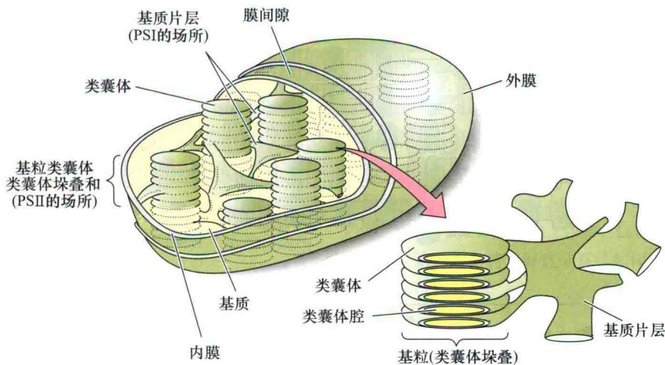  
图7.16 叶绿体膜结构的整体示意图。高等植物的叶绿体由内膜和外膜（被膜）包被。叶绿体内膜以内，围绕类囊体膜的区域称基质。基质含有碳固定和其他生物学合成途径的催化酶。类囊体膜高度折叠，在许多图片中看上去像叠起来的硬币（基粒），但实际上它们形成一个或几个大的相互连通的膜系统，相对于基质有界限明确的内部和外部（改编自Becker，1986）。

综上所述，生氧光合作用中的两个光化学反应事件在空间上是相互独立的。这种分离意味着在两个光系统间起作用的一个或多个电子载体会从膜的基粒区扩散到基质区，然后将电子传递到光系统Ⅰ，这些可扩散的载体是蓝色的含铜蛋白质——质体蓝素（PC）和有机氧化还原反应的辅助因子——质体醌（PQ），这些载体在后面将会详细论述。

在PSⅡ中，两个水分子氧化产生4个电子、4个质子和1个氧分子[见后面的方程式（7.8）]。由水氧化产

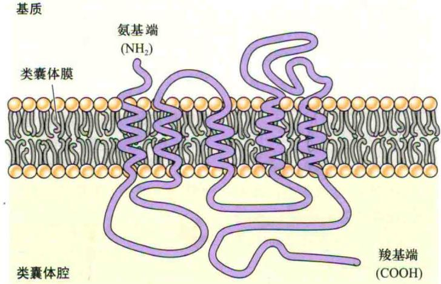  
图7.17 预测的PSⅡ反应中心D1蛋白折叠方式。蛋白质以不对称的方式分布在类囊体膜上，富含疏水性氨基酸残基的肽链在膜的疏水部分跨膜5次，氨基端在膜的基质侧，羧基端则在内腔一侧（改编自 Trebst，1986）。

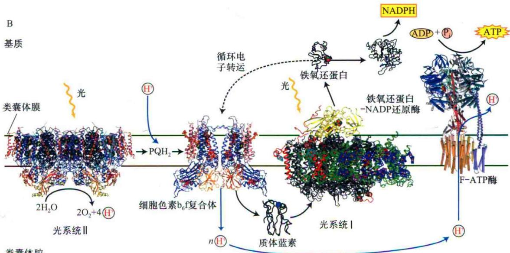  
图7.18 类囊体膜上4个主要蛋白质复合体的组装和结构。A. 光系统Ⅱ主要位于类囊体膜的垛叠区域；光系统Ⅰ和ATP合酶则位于暴露在基质中的未垛叠区域；而细胞色素 $b_{6}f$ 复合体均匀分布。两种光系统的横向分隔使得光系统Ⅱ产生的电子和质子要运送相当长的距离后才能到达光系统Ⅰ和ATP偶联酶起作用。B. 类囊体膜上4种主要蛋白质复合体的结构。同时显示两种可扩散的电子载体——位于类囊体内腔的质体蓝素和位于膜上的质体氢醌（ $PQH_{2}$ ）。类囊体腔相对于基质（n，带负电）带正电荷（p）（A改编自Allen and Forsber，2001；B改编自Nelson and Ben-Shem，2004）。

生的质子也必须能够扩散到ATP合成所在的基质区。光系统Ⅰ和光系统Ⅱ间较大的空间间隔在功能上究竟有何意义还不完全清楚，但有人认为其可能提高了两个光系统间能量分配的效率（Allen and Forsberg，2001）。

光系统Ⅰ和光系统Ⅱ在空间上相互分离表明两个光系统间不需要有严格的一对一的化学计量学关系。PSⅡ反应中心向由脂溶性电子载体（质体醌）组成的共同中间库输送还原当量（在本章后面会详细讨论），PSⅠ反应中心则从共同库中获取还原当量，而不用从特定的PSⅡ反应中心复合体中得到。

多数测量光系统Ⅰ和光系统Ⅱ相对量的实验结果都表明，叶绿体中光系统Ⅱ是过量的。一般PSⅡ：PSⅠ为1.5：1，但当植物处于不同的光照条件下时，这个比例有可能改变。与真核光合生物的叶绿体中情况相反的是，蓝藻中的PSⅠ通常多于PSⅡ。

## 7.4.4 非放氧光合细菌只有一个反应中心

非放氧生物只含有一个类似光系统Ⅰ或光系统Ⅱ的光系统。这些简单的生物对于更好地了解生氧光合作用的结构和功能非常有帮助。在大多数情况下，这些不生氧的光系统只进行循环电子转运而没有发生净的氧化或还原反应。光子的部分能量被转化成为质子动力势（见后面内容），用来合成ATP。

光合紫细菌的反应中心是第一个以高分辨率进行结构测定的膜整合蛋白（Deisenhofer and Michel，1989）（参见Web Topic 7.5中图7.5A和图7.5B）。对其结构的详细分析和对多种突变体的研究，阐明了反应中心与能量储存过程相关的原理。

紫细菌反应中心的结构，特别是电子传递链中的电子受体，与生氧生物中的光系统Ⅱ有许多相似之处。组成细菌反应中心的核心蛋白质在序列上和光系统Ⅱ中的相应蛋白质较为相似，表明了进化上的相关性；相似的情况在不生氧的绿硫细菌和太阳细菌（heliobacteria）中也被发现，它们的反应中心和光系统Ⅰ很相似。在本章的后面将讨论这种进化关系的意义。

## 7.5 吸光天线系统的构造

进化上关系非常遥远的生物的反应中心也有一定的相似性；与此相反的是，不同光合生物的天线系统的差异却很大。天线复合体的这种差异反映了不同生物在不同环境下的适应性进化，也反映了在某些生物中平衡两个光系统的能量输入的需要（Grossman et al., 1995; Green and Durnford, 1996; Green and Pardson, 2003）。这一部分将了解这个系统如何吸收光能并向反应中心输送能量。

## 7.5.1 天线系统包含叶绿素，与膜连接

天线系统用于向相连的反应中心有效地输送能量（van Grondelle et al., 1994; Pullerits and Sundstrom, 1996）。不同生物的天线系统的大小有显著不同：一些光合细菌中每个反应中心只有20\~30个细菌叶绿素分子，高等植物中每个反应中心有200\~300个叶绿素分子，某些藻类和细菌中每个反应中心则有几千个色素分子。虽然天线色素分子都以某种方式和光合膜结合，但它们的结构有很大的不同。几乎所有的天线色素分子都与蛋白质连接形成色素-蛋白质复合物（pigment-protein complex）。

激发能从吸光叶绿素转移到反应中心的物理机制是荧光共振能量转移（fluorescence resonance energy transfer，FRET）。通过这种机制，激发能以非辐射的方式从一个分子转移到另一个分子。

为了方便理解共振能量转移，可用两个音叉间能量的转移作为类比。当敲击一个音叉并将它放在另一个音叉附近适当的位置时，第二个音叉将会接收到来自第一个音叉的能量并开始振动。两个音叉间能量转移的效率取决于它们彼此间的距离和相对位置，同时还有音调和振动频率。类似的因素可影响天线复合体间的能量转移，不过能量取代了音调。

天线复合体中的能量转移效率通常非常高：天线色素吸收的光子有95%\~99%的能量转移到了反应中心，然后被用于光化学反应。天线色素间的能量转移和反应中心的电子传递有很大不同：能量转移是一个纯粹的物理现象，而电子传递则与分子的化学变化相关，产生被氧化或被还原的物质。

## 7.5.2 天线分子将能量汇集到反应中心

天线色素将吸收的能量汇集到反应中心，从天线系统的外围到反应中心排列着不同的色素分子，它们的最大吸收波长逐渐红移（图7.19）。最大吸收波长的红移意味着靠近反应中心的激发态的能量低于天线系统周边。

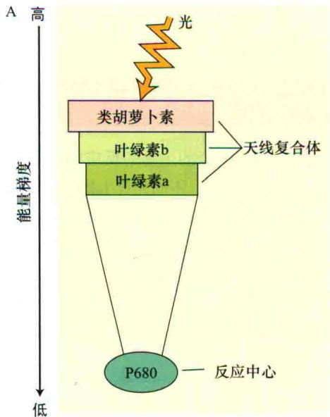

这种排布的结果是，当激发能转移时，例如，从最大吸收为650 nm的叶绿素b分子转移到最大吸收为670 nm的叶绿素a分子时，这两个激发态叶绿素间的能量差异以热能的形式散失到环境中。

如果激发能反过来再转移回叶绿素b时，就必须重新补充作为热能损失的能量。由于可得到的热能不足以填补低能和高能色素间的能量差，因此逆转移的可能性很小。这种效应赋予了能量捕获过程一定的方向性或不可逆性，使得向反应中心输送激发能的效率更高。本质上，系统牺牲了每个量子中的一些能量，使得几乎所有量子都能被反应中心捕获。

## 7.5.3 许多天线复合体都有共同的结构基序

在所有含有叶绿素a和叶绿素b的真核光合生物中，含量最多的天线蛋白都是结构上具有相关性的一个蛋白质大家族的成员，其中一些蛋白质主要和光系统Ⅱ结合，称为捕光复合体Ⅱ（light-harvesting complex Ⅱ）（LHCⅡ）蛋白；另一些和光系统Ⅰ结合，称为LHCⅠ蛋白。这些天线复合体也称为叶绿素a/b天线蛋白（chlorophyll a/b antenna proteins）（Green and Durnford，1996；Green and Parson，2003）。

已测得一种LHCⅡ蛋白的结构（图7.20）（Liu et al., 2004；Barros and Kuhlbrandt, 2009）。这个蛋白

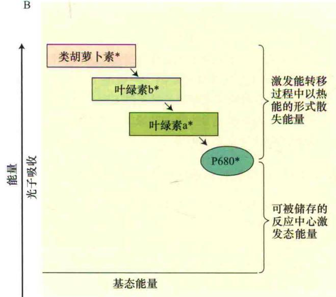  
图7.19 激发能从天线系统向反应中心汇集。A. 色素激发态的能量随着离反应中心的距离增加而增加，就是说，靠近反应中心的色素比远离反应中心的色素能量低，这个能量梯度有利于激发能向反应中心的转移，而不利于能量反过来回到天线系统的外周部分。B. 这个过程中一些能量以热能的形式散失到环境中，但在最适条件下，几乎所有由天线复合体吸收的激发能都可被输送到反应中心。星号表示激发态。

  
图7.20 高等植物LHCⅡ天线复合体三聚体结构。天线复合体是一个跨膜的色素蛋白质，每个单体包含3个跨膜的非极性区域的螺旋。图中三聚体显示基质侧（A）、膜上部分（B）和腔侧（C）。灰色，多肽；深蓝色，叶绿素a；绿色，叶绿素b；深橙色，叶黄素；浅橙色，新黄质；黄色，紫黄质；粉红色，脂质（改编自Barros and Kuhlbrandt，2009）。

质含有3个α螺旋，结合了14个叶绿素a和叶绿素b及4个类胡萝卜素。LHC I蛋白的结构和LHC II蛋白的结构大致相似（Ben-Shem et al., 2003）。所有这些蛋白质都有显著的序列相似性，几乎可以肯定是由同一个祖先蛋白进化而来（Grossman et al., 1995；Green and Durnford, 1996；Green and Parson, 2003）。

光能被LHC蛋白中的类胡萝卜素或叶绿素b吸收后，将被快速转移到叶绿素a和其他紧密结合在反应中心的天线色素上。LHCⅡ复合体也参与了调节过程，在本章的后面将会讨论。

## 7.6 电子传递的机制

前面已经提到的一些证据表明两个光化学反应是依次作用的。这里将具体讨论光合作用中与电子传递有关的化学反应，即光对叶绿素的激发、第一个电子受体的还原、电子经过光系统Ⅱ和光系统Ⅰ的流动、作为电子主要来源的水的氧化和最后一个电子受体（NADP $^{+}$ ）的还原。并在“叶绿体中的质子转运和ATP合成”中具体讨论介导ATP合成的化学渗透机制。

## 7.6.1 从叶绿素来的电子流经按“Z方案”排列的载体

图7.21显示了目前公认的Z方案，图中将在从 $H_{2}O$ 到 $NADP^{+}$ 的电子传递中起作用的所有电子载体按照它们的氧化还原电势的高低在垂直方向排列（更多内容参见Web Topic 7.6），相互反应的组分用箭头相连。因此，Z方案实际上综合了动力学和热力学信息。垂直的粗箭头表示系统的光能输入。

光子激发了反应中心的特定叶绿素（PSⅡ中是P680，PSⅠ中是P700），释放一个电子，这个电子经过一系列的电子载体，最终还原P700（来自PSⅡ的电子）或NADP⁺（来自PSⅠ的电子）。接下来将着重阐述电子传递过程和载体的性质。

几乎所有光合作用的光反应化学过程都由4个主要的蛋白质复合体完成：光系统Ⅱ、细胞色素 $b_{6}f$ 复合体、光系统Ⅰ和ATP合酶。这4个膜整合蛋白质复合体以一定方向排列于类囊体膜上，发挥以下功能（图7.18和图7.22）。

（1）光系统Ⅱ在类囊体内腔中将水氧化为氧气，同时释放质子到内腔。

（2）细胞色素 $b_{6}f$ 氧化被PSⅡ还原的质体氢醌$\left(\mathrm{PQH}_{2}\right)$ 分子，并将电子传递给PS I。 $PQH_{2}$ 的氧化与质子从基质到内腔的转移相偶联，产生了质子动力势。

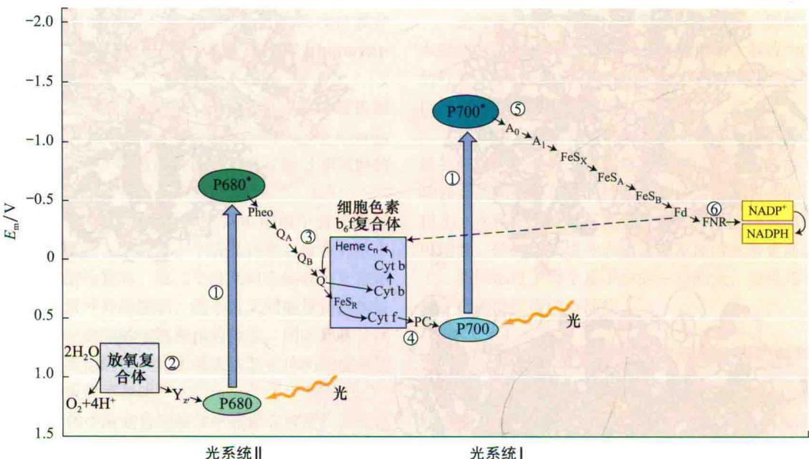

图7.21 放氧光合生物的Z方案。氧化还原载体按它们的氧化还原电势（pH 7时）排列。①垂直箭头表示反应中心叶绿素的光子吸收：P680是光系统Ⅱ（PSⅡ）的叶绿素；P700是光系统Ⅰ（PSⅠ）的叶绿素。被激发的PSⅡ反应中心叶绿素P680\*，向脱镁叶绿素（Phco）转移一个电子。②在PSⅡ的氧化侧（在连接P680和P680\*的箭头的左侧），被光氧化的P680由Y₂重新还原，Y₂从水的氧化中得到一个电子。③在PSⅡ的还原侧（在连接P68和P680\*的箭头的右侧），脱镁叶绿素将电子转移给受体——质体醌Q₄和Q₈。④细胞色素b₆f复合体将电子转移给一种可溶性蛋白——质体蓝素（PC），后者接着还原P700\*（即氧化的P700）。⑤P700\*的电子受体（A₀）被认为是一种叶绿素，下一个受体（A₁）则是醌，经过一系列膜结合铁硫蛋白（FeSₓ、FeSₐ和FeSₑ）后，电子被转移给可溶性铁氧还蛋白（Fd）。⑥可溶性黄素蛋白铁氧还蛋白-NADP还原酶（FNR）将NADP+还原为NADPH，NADPH在卡尔文循环中被用于二氧化碳的还原（见第8章）。虚线表示围绕PSⅠ的循环电子流（改编自Blankenship and Prince，1985）。  
  
图7.22 类囊体膜中4个蛋白质复合体定向地完成电子和质子的转移（结构见图7.18B）。PSⅡ实现水的氧化和质子在内腔中的释放；PSⅠ通过铁氧还蛋白（Fd）和黄素蛋白铁氧还蛋白-NADP还原酶（FNR）的作用，将基质里的NADP+还原成NADPH；质子通过细胞色素b $_{6}$ f复合体的作用转运到内腔，增加了电化学质子梯度。这些质子随后扩散到达ATP合酶，在这里，它们顺着电化学势梯度扩散，促进ATP在基质中的合成；被还原的质体氢醌（PQH $_{2}$ ）和质体蓝素将电子分别转移给细胞色素b $_{6}$ f和PSⅠ。虚线表示电子转移；实线表示质子的移动。

（3）光系统Ⅰ通过铁氧还蛋白（Fd）和黄素蛋白铁氧还蛋白-NADP还原酶（FNR）的作用，在基质中将NADP $^{+}$ 还原成NADPH。

（4）当质子通过ATP合酶从内腔扩散回到基质中时，合成ATP。

## 7.6.2 当激发的叶绿素还原电子受体时能量被捕获

正如前文所提及，光的功能是激发反应中心特定的叶绿素，该功能可以通过直接吸收能量，或者以一种更常见的方式——转移天线色素的能量来实现。此激发过程可以被视为电子从叶绿素的外层最高能级轨道跃迁至最低能级空轨道（图7.23）。高能轨道上的电子只是松散地结合在叶绿素上，只要附近有一个能接受电子的分子，这个电子就很容易丢失。

将电子能量转变为化学能的第一个步骤是原初光化学反应，即电子从反应中心的激发态叶绿素转移到一个受体分子上。这个过程也可以这样理解：被吸收的光子导致反应中心叶绿素的电子重排，随后通过电子传递过程，使得一部分光子能量以氧化还原的形式被捕获。

紧随原初光化学反应之后，反应中心的叶绿素被氧化（缺电子，或带正电），而附近的电子受体分子被还原（富电子，或带负电），在此关键时刻，反应中心带正电的被氧化叶绿素的低能级轨道是空的，可以接受一个电子（图7.23）。如果受体分子将它的电子交回给反应中心的叶绿素的话，系统将回到光激发之前的状态，所有吸收的能量将转为热能。

反应中心叶绿素基态和激发态的氧化还原性质  
  
图7.23 反应中心叶绿素基态和激发态的轨道填充图。处于基态的分子是弱还原剂（从低能轨道失去电子）和弱氧化剂（只能在高能轨道接受电子）。在激发态时情况相反，可从高能轨道失去电子，分子变成一个极强的还原剂，这就是图7.21中P680\*和P700\*表现出极高的激发态负氧化还原电势的原因。激发态也能作为强氧化剂在低能轨道接受电子，但这个途径在反应中心不常见（改编自Blankenship and Prince，1985）。

显然，以上这个回复过程是浪费能量的，它在反应中心并未发生。相反，受体将富余的电子传递给次级受体，并沿着电子传递链传递下去。因提供一个电子而被氧化的叶绿素反应中心被次级供体重新还原，次级供体又被三级供体还原。在植物中，最初的电子供体是水，而最终的电子受体是NADP $^{+}$ （图7.21）。

光合储能的本质是电子首先从一个被激发的叶绿素分子转移到受体分子上，然后经历一系列极快速的次级化学反应将正负电荷分离开来，这些次级反应在大约200 ps内将电荷分离到类囊体膜相对的两侧（ $1ps=10^{-12}s$ ）。

随着电荷的分离，逆反应也随之减慢了好几个数量级，能量被捕获。每一次次级电子转移都伴随着一些能量的损失，使得过程不能逆转。纯化得到的光合细菌反应中心产生稳定产物的量子产额约为1.0，就是说，所有光子都产生稳定的产物，没有逆反应发生。

在最适条件（低光强）下测量高等植物产生氧气的量子需求发现，原初光化学反应的值也很接近1.0，表明反应中心的结构受到非常巧妙的调控，以确保有效反应的速率最大，而浪费能量的反应速率最小。

## 7.6.3 两个光系统反应中心的叶绿素吸收不同波长的光

本章的前面已经提到，PS I 和 PS II 各自有不同的吸收特性。反应中心叶绿素处于还原态和氧化态时的光学特性变化，使得精确测量最大吸收值成为可能。反应中心叶绿素在失去一个电子且未被电子供体重新还原以前短暂地处于氧化态。

处于氧化态时，叶绿素强烈吸收红光的特征消失，称为被漂白（bleached）。漂白状态的出现可以通过实时的光吸收测量来监控，从而可推断这些叶绿素的氧化还原状态（参见Web Topic 7.1）。

利用这些技术，发现光系统Ⅰ反应中心的叶绿素处于还原态时，在700 nm波长处吸收最强，因此将该叶绿素命名为P700（P表示色素）；光系统Ⅱ的叶绿素则在680 nm处吸收最强，相应的反应中心叶绿素称P680；在这以前，光合紫细菌的反应中心叶绿素称为P870。

细菌反应中心的X射线衍射结构图清楚地显示P870是由细菌叶绿素紧密偶联而成的二聚体，而非单体（参见Web Topic 7.5图7.5A和B）；光系统Ⅰ的原初电子供体P700也是叶绿素a分子的二聚体；光系统Ⅱ也包含了一个叶绿素二聚体，尽管原初的电子转运可能并不源自这些色素。

处于氧化态时，反应中心叶绿素包含了一个未配对电子。具有未配对电子的分子常常可以通过称为电子自旋共振（electron spin resonance，ESR）的磁共振技术检测到。通过ESR研究和前面已述及的光谱测量研究，可以发现光合电子传递系统中存在的许多中间电子载体。

## 7.6.4 光系统Ⅱ的反应中心是一个多亚基的色素蛋白复合体

光系统Ⅱ是一个多亚基蛋白超复合体（图7.24）（Barber et al., 1999）。在高等植物中，这个多亚基蛋白超复合体有两个完整的反应中心和一些天线复合体。反应中心的核心由两个称为D1和D2的膜蛋白和其他蛋白质组成，见图7.25和Web Topic 7.7（Ferreira et al., 2004；Guskov et al., 2009）。

原初供体叶绿素、其他叶绿素、类胡萝卜素、脱镁叶绿素和质体醌（这两个电子受体将在下一节中述及）都结合在膜蛋白D1和D2上，这些蛋白质在序列上与紫细菌的L、M肽有相似性；其他蛋白质可作为天线复合体起作用，或者参与生氧过程；另一些蛋白质如细胞色素 $b_{559}$ 功能未知，但可能参与围绕光系统Ⅱ的保护循环。

## 7.6.5 水由光系统Ⅱ氧化为氧气

水按下列化学反应式被氧化（Yano et al., 2006）。

$$
2 \mathrm{H} _ {2} \mathrm{O} \longrightarrow \mathrm{O} _ {2} + 4 \mathrm{H} ^ {+} + 4 \mathrm{e} ^ {-}\tag{7.8}
$$

此方程式表明，2个水分子失去4个电子后，产生一个氧分子和4个质子（需要了解更多氧化还原反应知识的话，见附录1和Web Topic 7.6）。

水是一种非常稳定的分子，将水氧化成为氧分子极其困难，光合生氧复合体是唯一已知的可使这个反应进行的生物化学系统。光合生氧也是地球大气层中几乎所有氧气的来源。

多项研究揭示了这个反应过程的大量信息（参见Web Topic 7.7）。水氧化产生的质子被释放到类囊体内腔而不是基质中（图7.22）。质子被释放到内腔与类囊体膜的矢量性质和生氧复合体位于类囊体内表面有关，这些质子最终通过ATP合酶的转运作用从内腔回到基质。就这样，水氧化所释放的质子增加了电化学势，驱动了ATP的合成。

人们很早就知道，锰（Mn）是水氧化过程中的重要辅助因子（见第5章）。研究光合作用的一个经典假说就是：锰离子发生一系列氧化（即S态，标记为 $S_{0}$ 、 $S_{1}$ 、 $S_{2}$ 、 $S_{3}$ 、 $S_{4}$ ，参见Web Topic 7.7）——可能和水的氧化及氧气的生成有关。这个假说得到了大量实验的有力支持。最有名的是X射线吸收和ESR研究，因为这两个实验都直接检测到了锰的存在（Yano et al.,

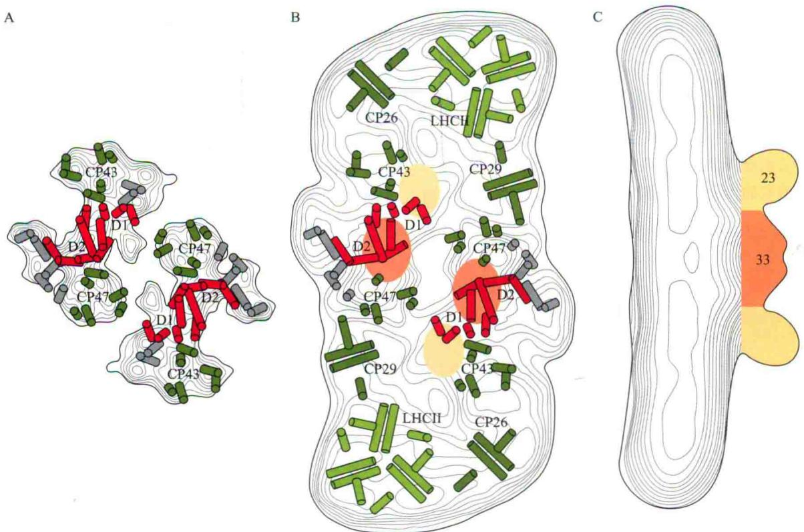  
图7.24 电子显微镜下高等植物光系统Ⅱ的二聚体多亚基蛋白超复合体的结构。图片显示了两个完整的反应中心，每个都是一个二聚体。A. D1和D2（红）及CP43和CP47（绿）核心亚基呈螺旋排列。B. 从超复合体的内腔侧面观察，包含其他天线复合体：LHCⅡ、CP26、CP29和一个以橙色和黄色环表示的外周生氧复合体。未知功能的螺旋以灰色表示。C. 复合体的侧视图，显示外周蛋白生氧复合体的排列（改编自Barber et al., 1999）。

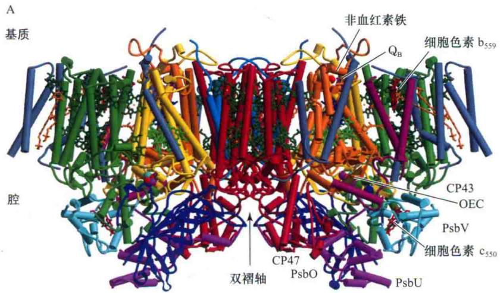

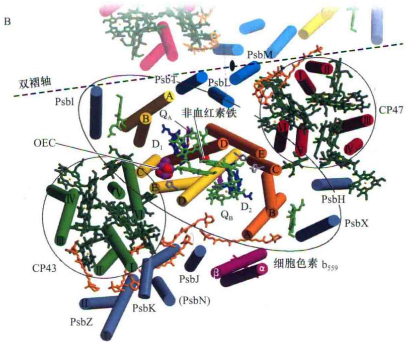

  
图7.25 蓝藻Thermosynechococcus elongatus光系统Ⅱ反应中心的结构，分辨率为3.5 Å。结构中包括D1（黄）和D2（橙）反应中心核心蛋白、CP43（绿）和CP47（红）天线蛋白、细胞色素 $b_{559}$ 和细胞色素 $c_{550}$ 、外周的33 kDa的生氧蛋白PsbO（蓝）、色素和其他辅助因子。A.与膜平面平行的侧视图。B.与膜平面垂直的内腔表面视图。C.分解水的含锰复合体的详细示意图（A，B改编自Ferreira et al., 2004；C改编自Yano et al., 2006）。

1996）。分析结果表明，每个生氧复合体结合了4个 $\mathrm{Mn}^{2+}$ 。另有实验表明 $\mathrm{Cl}^{-}$ 和 $\mathrm{Ca}^{2+}$ 是生氧所必需的（参见Web Topic 7.7）。将水氧化成氧气的具体化学机制还不十分清楚，但有了这些结构信息，该领域的发展非常迅速（Brudvig，2008）。

在放氧复合体和P680之间，有一个称为 $Y_{z'}$ 的电子载体起作用（图7.21）。为了能在这个区域发挥作用， $Y_{z'}$ 需要有非常强烈的保留电子的能力，已确定该载体是PSⅡ反应中心的D1蛋白的酪氨酸残基形成的自由基。

## 7.6.6 脱镁叶绿素和两个醌从光系统Ⅱ接受电子

光谱学和ESR研究揭示了电子受体复合物中载体的结构方式，脱镁叶绿素（pheophytin）是中心镁原子被两个氢原子取代的叶绿素，在光系统Ⅱ中作为早期受体起作用，其化学和光谱学性质与结合镁的叶绿素略有不同。脱镁叶绿素将电子传递给含有两个十分靠近的铁原子的质体醌复合物，这个过程与紫细菌反应中心所发生的反应非常相似（详情请见Web Topic 7.5中的图7.5B）。

两个质体醌（ $\mathrm{PQ}_{\mathrm{A}}$ 和 $\mathrm{PQ}_{\mathrm{B}}$ ）结合在反应中心，并依次从脱镁叶绿素中接受电子。2个电子转移到 $\mathrm{Q}_{\mathrm{B}}$ 上，使其还原成 $\mathrm{PQ}^{2-}$ ，还原的 $\mathrm{PQ}^{2-}$ 从基质得到两个质子，产生一个被完全还原的质体氢醌（plastohydroquinone）（ $\mathrm{PQH}_{2}$ ）（图7.26）。质体氢醌随后从反应中心复合体上解离，进入膜的碳氢链区域，在这里将电子交给细胞色素 $\mathbf{b}_{6}\mathbf{f}$ 复合体。与类囊体膜上的大分子蛋白质复合体不同，质体氢醌是一种非极性的小分子，很容易扩散到膜的脂双层的非极性核心。

## 7.6.7 经过细胞色素 $b_{6}f$ 复合体的电子流也转运质子

细胞色素 $b_{6}f$ 复合体（cytochrome $b_{6}f$ complex）是一个庞大的具有几个辅助因子的多亚基蛋白质（图7.27）（Kurisu et al., 2003；Sroebel et al., 2003；Baniwlis et al., 2008）。它包含了两个b型的血红素和一个c型的血红素（细胞色素f，cytochrome f）。在c型细胞色素中，血红素和肽链共价连接；但b型细胞色素中化学性质相似的正铁血红素却未进行共价连接（参见Web Topic 7.8）。另外，复合体还包含了一个Rieske铁硫蛋白（Rieske iron-sulfur protein，以发现它的科学家命名），该蛋白质中两个铁原子由两个硫原子桥接。所有这些辅助因子的功能都已明确，下面将进行阐述。除此之外，细胞色素 $b_{6}f$ 复合体也包含了其他的辅助因子，包括另一个血红素（称血红素Cn）、一个叶绿素和一个类胡萝卜素，它们的功能还有待研究。

细胞色素 $b_{6}f$ 复合体和相关细胞色素bc1的结构暗示了电子和质子流动的机制。质子和电子流经细胞色素 $b_{6}f$ 复合体的确切途径还不完全清楚，但可以用Q循环（Q cycle）来解释多数观察到的现象。在这个机制中，质体氢醌被氧化，两个电子中的一个通过线性电子传递链传到光系统I，而另一个则流经一个可以增加泵过膜的质子数的环形途径（图7.28）。

在线性电子传递链中，氧化的Rieske铁硫蛋白（ $\mathrm{FeS}_{\mathrm{R}}$ ）从 $\mathrm{PQH}_{2}$ 接受一个电子并将它传递到细胞色素f上（图7.28A）。细胞色素f随即将一个电子传给蓝色的含铜蛋白质——质体蓝素（PC），PC再还原PSI中被图7.27 蓝藻细胞色素 $b_{6}f$ 复合体的结构。右侧图显示复合物中蛋白质和辅助因子的空间排列。细胞色素 $b_{6}$ 蛋白以蓝色表示，细胞色素f蛋白以红色表示，Rieske铁硫蛋白以黄色表示，其他小的亚基以绿色和紫色表示。左侧图中蛋白质被省略以更清楚地显示辅助因子的位置。[2Fe-2S]簇，是Rieske铁硫蛋白的一部分；PC，质体蓝素；PQ，质体醌； $PQH_{2}$ ，质体氢醌（改编自Kurisu et al., 2003）。

  
质体醌

  
图7.26 光系统Ⅱ中质体醌的结构和反应式。A. 质体醌由一个醌组成的头和一条可以锚着在膜上的非极性尾巴组成。B. 质体醌的氧化还原反应，显示完全氧化的醌（PQ）、带负电的质体半醌（ $\mathrm{PQ}^{-}$ ）和被还原的质体氢醌（ $\mathrm{PQH}_{2}$ ）。R为侧链。

A 第一个 $\mathrm{PQH}_2$ 被氧化

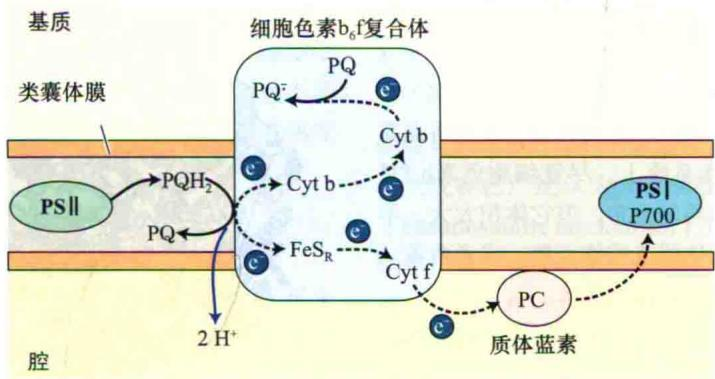

B 第二个 $\mathrm{PQH}_{2}$ 被氧化

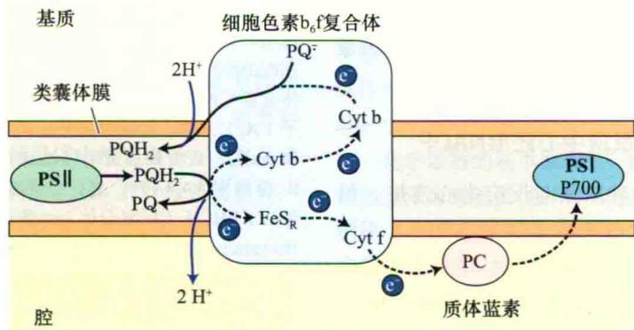

图7.28 细胞色素 $b_{6}f$ 复合体中电子和质子的转移机制。这个复合体包含了两个b型的细胞色素（Cyt b）和一个c型细胞色素（Cyt c，以前称细胞色素f）、一个Rieske铁硫蛋白（ $FeS_{R}$ ）和两个醌氧化还原位点。A. 非循环或线性过程：由PSⅡ（图7.26）产生的一个质体氢醌（ $PQH_{2}$ ）分子在复合体靠近内腔的一侧被氧化，两个电子被转移给一个Rieske铁硫蛋白和一个b型细胞色素，同时释放两个质子到内腔。转移给 $FeS_{R}$ 的电子经过细胞色素f（Cyt f）和质体蓝素（PC），还原了PSⅠ的P700；被还原的b型细胞色素把电子转移给另一个b型细胞色素，将一个质体醌（PQ）还原成质体半醌（ $PQ^{-}$ ）（图7.26）。B. 循环过程：第二个 $PQH_{2}$ 被氧化，将一个电子经 $FeS_{R}$ ，传给PC，最后到P700；第二个电子经过两个b型细胞色素将质体半醌又还原为 $PQH_{2}$ ，同时从基质中获得两个质子。总之，每转运两个电子到P700就有4个质子跨膜。

氧化的P700；而在此过程的循环部分（图7.28B），质体氢醌（图7.26）将另一个电子传递给了一个细胞色素b，并将它的2个质子释放到膜的内腔。

电子经第一个和第二个细胞色素b后传递至一个氧化型的质体醌分子，质体醌在复合体靠近基质的表面被还原为半醌形式。经过两次这样的电子传递可将质体醌完全还原。质体醌从膜的基质侧得到质子，以质体氢醌的形式从 $b_{6}f$ 复合体中释放。

这个复合体的两次作用使得两个电子被转移到了P700，两个质体氢醌被氧化成质体醌，一个氧化型质体醌被还原成质体氢醌。在整个氧化过程中，4个质子从膜的基质侧被转移到了内腔。

通过这种机制，连接PSⅡ反应中心受体侧和PSⅠ反应中心供体侧的电子流造成了跨膜的电化学势，部分归结于膜两侧质子浓度的差异，这种电化学势被用于驱动ATP的合成。与线性电子流相比，经过细胞色素b和质体醌的循环电子流泵出的质子数更多。

## 7.6.8 质体醌和质体蓝素在光系统Ⅱ和光系统Ⅰ间转移电子

两个光系统处于类囊体膜上不同位置（图7.18），需要至少一个组分能沿着膜或在膜内移动，以便将光系统Ⅱ产生的电子输送到光系统Ⅰ。尽管细胞色素 $b_{6}f$ 复合体在膜的基粒和基质区均匀分布，但它体积太大，不太可能移动。而小分子质体醌或质体蓝素，或者两者一起被认为是连接两个光系统的移动载体。

质体蓝素（plastocyanin）（PC）是一个小的（10.5 kDa）水溶性的含铜蛋白质，能够在细胞色素 $b_{6}f$ 复合体和P700间转移电子，这种蛋白质存在于腔内（图7.28）。在某些绿藻和蓝藻中，c型细胞色素可以代替质体蓝素起作用，但究竟利用哪一种，由生物体可得到的铜的量决定。

## 7.6.9 光系统 I 反应中心还原NADP $^{+}$

PSⅡ中，尽管天线叶绿素与反应中心连接，但两者是以分离的色素-蛋白质形式存在。与PSⅡ不同的是，PSⅠ反应中心复合体是一个大的多亚基复合体（图7.29）（Jordan et al., 2001；Ben-Shem et al., 2003），由100个叶绿素分子组成的核心天线整合在PSⅠ的反应中心；PSⅠ的核心天线和P700结合在两个蛋白质——PsaA和PsaB上，它们的分子质量为66\~70 kDa（参见Web Topic 7.8）（Amunts and Nelson, 2009）。豌豆的PSⅠ反应中心复合体除了有与蓝藻相似的核心结构外，还包含4个LHCⅠ复合体（图7.29）。复合体中总的叶绿素分子数目接近200。

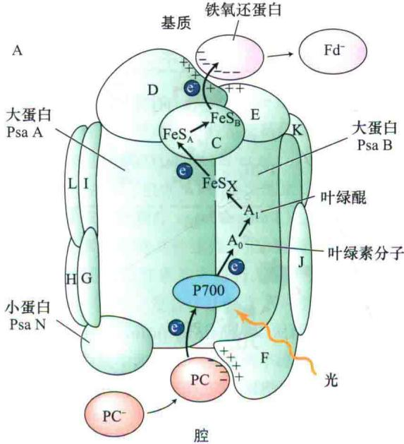

  
图7.29 光系统Ⅰ的结构。A. 高等植物的PSⅠ反应中心的结构模型。PSⅠ反应中心的组分围绕着两个大的核心蛋白质PsaA和PsaB排列。从PsaC到PsaN的小蛋白质被标记为C\~N。电子从质体蓝素（PC）转移到P700（图7.21和图7.22），再到叶绿素分子（ $A_{0}$ ），然后到叶绿醌（ $A_{1}$ ），再到Fe-S中心： $FeS_{x}$ 、 $FeS_{A}$ 和 $FeS_{B}$ ，最后到达可溶性铁硫蛋白：铁氧还蛋白（Fd）。B. 分辨率为4.4Å时，豌豆光系统Ⅰ反应中心复合体的结构，包括了LHCⅠ天线复合体。此图是膜的基质侧视图（A改编自Buchanan et al., 2000；B改编自Nelson and Ben-shem, 2004）。

核心天线色素形成了一个围绕着电子传递链辅助因子的碗状结构，处于复合体中心。这些核心天线色素在光系统Ⅰ受体区域起电子载体的作用，它们的还原态都是非常强的还原剂，且相当不稳定，因此很难鉴定。有证据表明这些早期受体中有一个是叶绿素分子，另一个是醌类——叶绿醌，也称维生素K $_{1}$ 。

其他的电子受体包括3个膜结合的铁硫蛋白，也称Fe-S中心（Fe-S center）： $FeS_{X}$ 、 $FeS_{A}$ 和 $FeS_{B}$ （图

7.29）。Fe-S中心X是P700结合蛋白的一部分；中心A和B位于PS I反应中心复合体中的8 kDa蛋白上。电子经过中心A和B到达铁氧还蛋白（ferredoxin）（Fd）——一种小的水溶性铁硫蛋白（图7.21和图7.29）。膜结合黄素蛋白铁氧还蛋白-NADP还原酶（ferredoxin-NADP reductase）（FNR）将NADP $^{+}$ 还原为NADPH，完成了从水氧化开始的非循环式电子传递过程（Karplus et al., 1991）。

除了还原NADP $^{+}$ ，光系统Ⅰ产生的还原型铁氧还蛋白在叶绿体中还有其他功能，如为还原硝酸盐提供还原剂，以及参与一些碳固定酶的调控（见第8章）。

## 7.6.10 循环电子流产生ATP但不产生NADPH

光系统 I 位于基质类囊体膜上，这个区域中还发现了一些细胞色素 $b_{6}f$ 复合体。在某些情况下，循环电子流（cyclic electron flow）发生于光系统 I 的还原侧，经过质体氢醌和 $b_{6}f$ 复合体回到 P700，这个循环电子流与质子泵入内腔相偶联，这些质子可用于合成 ATP 但不能用于氧化水或还原 NADP $^{+}$ 。循环电子流作为合成 ATP 的能量来源，在某些进行 C $_{4}$ 固定的植物的维管束鞘叶绿体中尤为重要（见第 8 章）。循环电子流的分子机制还不甚清楚，调节此过程的一些蛋白质刚被发现，其研究热度还在继续中。

## 7.6.11 某些除草剂阻断光合电子流

在现代农业中，已经非常普遍地使用除草剂来除去杂草。现已有多种不同的除草剂，它们通过阻断氨基酸、类胡萝卜素及脂类的生物合成，或者干扰细胞分裂来起作用。其他除草剂，如二氯苯基二甲基脲（DCMU，也称敌草隆）和百草枯，则是通过阻断光合作用电子流起作用（图7.30）。

DCMU通过竞争质体醌 $PQ_{B}$ 的结合位点来发挥作用，在光系统Ⅱ的醌受体这一步阻断电子传递。百草枯则是通过从光系统Ⅰ的初始受体中接受电子，与氧反应生成超氧化合物 $O_{2}^{-}$ 来发挥作用。 $O_{2}^{-}$ 对叶绿体的组分，特别是脂类具有很强的破坏作用。

## 7.7 叶绿体中的质子转运和ATP合成

在前面几节中，了解了捕获的一部分光能如何将 $\mathrm{NADP^{+}}$ 还原成NADPH；另一部分光能则被用于ATP合成，称为光合磷酸化（photophosphorylation）。20世纪50年代，Daniel Arnon和他的同事发现了这个过程。尽管在有些情况下电子传递和光合磷酸化可以独立发生，但正常情况下的光合磷酸化是需要电子传递的；未伴随磷酸化的电子传递称为解偶联（uncoupled）。

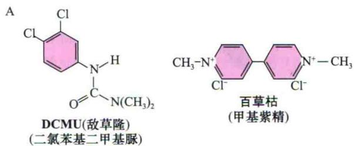

  
图7.30 两种重要除草剂的化学结构和作用机制。A.二氯苯基二甲基脲（DCMU）和甲基紫精（百草枯）是两种阻碍光合电子流的除草剂，DCMU也称敌草隆。B.两种除草剂的作用位点。DCMU通过与质体醌竞争结合位点，在光系统Ⅱ的醌受体位点阻碍电子传递。百草枯则是通过从光系统I的初始受体上接受电子从而起阻断作用。

现在已广泛认为光合磷酸化是通过化学渗透机制（chemiosmotic mechanism）实现的。该机制在20世纪60年代首先由Peter Mitchell提出。在细菌和线粒体的有氧呼吸中，相同的机制驱动了磷酸化（见第11章），也驱动了很多离子和代谢产物的跨膜运输（见第6章）。化学渗透机制存在于所有生命形式的跨膜过程中。

在第6章中讨论了细胞质膜ATP酶在化学渗透和离子转运中的功能。质膜ATP酶需要的ATP由叶绿体的光合磷酸化和线粒体的氧化磷酸化作用合成。以下将讨论叶绿体中用于合成ATP的化学渗透机制和跨膜质子浓度差异。

化学渗透的基本原理是：跨膜的离子浓度差异和电势能差异为细胞提供可利用的自由能。根据热力学第二定律（具体见附录1中的内容），任何物质或能量的不均匀分布都是一种能量来源，在膜的两侧任何浓度不等的分子所产生的化学势（chemical potential）差异都能提供这样的能量来源。

前面讨论了光合膜的不对称性，以及伴随着电子传递发生的从膜的一侧到另一侧的质子转运。质子跨膜转运的方向性使得基质碱性更强（质子少），腔内酸性更强（质子多）（图7.22和图7.28）。

Andre Jagendorf和同事进行了一个巧妙的实验，为ATP合成的化学渗透机制提供了早期证据（图7.31）。

  
图7.31 Ardre Jagendorf等的实验简要示意图。原先在pH 8的溶液中的离体叶绿体类囊体被置于pH 4的酸性溶液中平衡，之后被转移到含有ADP和P的pH 8的缓冲液中，由此产生的质子梯度为无光情况下的ATP合成提供了驱动力。此实验证实了化学渗透理论的预测结果——跨膜化学势可为ATP合成供能（改编自Jagendorf，1967）。

他们将叶绿体的类囊体悬浮在pH 4的缓冲液中，待缓冲液充分扩散过膜后，类囊体的内外部在这种酸性pH条件下得到平衡，然后将类囊体快速转移到pH 8的缓冲液中，使得类囊体膜内外产生4个pH单位的差异，膜内相对于膜外酸性更强。

他们发现，在没有光照或电子传递的情况下，由ADP和 $P_{i}$ 合成了大量ATP。这些结果支持了下面将要描述的化学渗透假说。

Mitchell认为，用于ATP合成的总能量，即质子动力势（proton motive force）（ $\Delta p$ ），是质子化学势和跨膜电势能之和。膜外到膜内的质子动力势的两部分能量可由式（7.9）表示。

$$
\Delta p = \Delta E - 5 9 (\mathrm{pH} _ {\mathrm{i}} - \mathrm{pH} _ {0})\tag{7.9}
$$

式中， $\Delta E$ 为跨膜电势； $pH_{i}-pH_{0}$ （或者 $\Delta pH$ ）为跨膜pH差（ $pH_{i}$ 为类囊体外的pH， $pH_{0}$ 为类囊体内的pH）。比例常数（25℃时）为每pH单位59 mV，因此pH跨膜差异为1时相当于59 mV膜势能。

除了前面提到的需要移动的电子载体，光系统Ⅱ和光系统Ⅰ、ATP合酶在类囊体膜中的不均匀分布也给ATP的合成带来了一定的麻烦。由于ATP合酶只发现于基质片层和基粒垛叠的边缘，由细胞色素 $b_{6}f$ 复合体跨膜泵入类囊体的质子，或者在基粒中部由水氧化产生的质子必须横向移动几十纳米，才能到达ATP合酶。

ATP由一个大（400 kDa）的酶复合体合成，这种酶称为ATP合酶（ATP synthase）、ATP酶（ATPase）（根据逆反应ATP水解命名）或 $CF_{0}-CF_{1}$ （Boyer，1997）。这个酶由两部分组成：与膜结合的疏水部分 $CF_{0}$ ；伸进基质的部分 $CF_{1}$ （图7.32）。 $CF_{0}$ 形成了供质子通过的一个跨膜通道。 $CF_{1}$ 由几条肽链组成，含有交错排列的 $\alpha$ 链和 $\beta$ 链各3条，看上去像个橙子。催化位点主要位于 $\beta$ 链，其他一些链可能有调节功能。在复合体中 $CF_{1}$ 的功能是合成ATP。

  
图7.32 $F_{1}F_{0}-ATP$ 合酶的亚基构成（A）和晶体结构（B）。此酶由 $CF_{1}$ 和 $CF_{0}$ 组成。 $CF_{1}$ 是一个大的多亚基复合体，它在膜的基质侧，与整合在膜中的部分 $CF_{0}$ 相连。 $CF_{1}$ 由5种不同肽链组成，数量为3个 $\alpha$ ，3个 $\beta$ ，1个 $\gamma$ ，1个 $\delta$ ，1个 $\varepsilon$ 。 $CF_{0}$ 可能由4种不同肽链组成，数量为1个 a，1个 b，1个 $b'$ ，14个 c。内腔中的质子由旋转的c肽运输到基质（W. Frasch 惠赠）。

利用X射线晶体衍射方法已测出线粒体ATP合酶的分子结构。尽管叶绿体和线粒体酶的差别很大，但它们

有相同的总体结构和近乎相同的催化位点。事实上，在叶绿体、线粒体和紫细菌中，电子传递和质子跨膜转运偶联方式都有显著的相似性（图7.33）。另外，ATP合酶内部的柄和 $CF_{0}$ 的大部分在催化时旋转（Yasuda et al., 2001），是该酶作用机制中一个值得注意的地方。这种酶实际上可视为一个微型分子马达（参见Web Topic 7.9和Web Topic 11.4）。酶每转一圈合成3分子ATP。

针对叶绿体ATP合酶 $CF_{0}$ 部分的直接显微成像结果表明，它含有14个整合在膜中的亚基。复合体每旋转一次，每个亚基就跨膜转运一个质子，意味着质子跨膜转

## A紫细菌

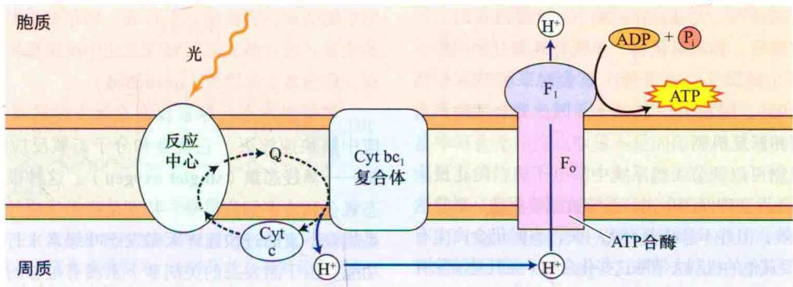

## C 线粒体

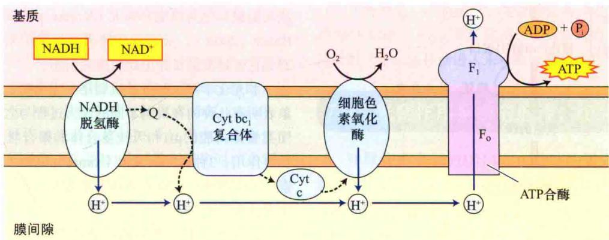

图7.33 细菌、叶绿体和线粒体中光合和呼吸电子流的相似性。在以上3种电子流中，电子传递都与质子跨膜转运相偶联，产生了跨膜质子动力势（ $\Delta p$ ）。质子动力势中的能量被ATP合酶用于合成ATP。A. 光合紫细菌的反应中心具有循环电子流，通过细胞色素 $\mathrm{bc}_{1}$ 复合体产生质子势能。B. 叶绿体具有非循环电子流，氧化水，还原 $\mathrm{NADP}^{+}$ ，质子由水的氧化和细胞色素 $\mathrm{b}_{6}\mathrm{f}$ 复合体氧化 $\mathrm{PQH}_{2}$ （图中标为“Q”）产生。C. 线粒体将NADH氧化为 $\mathrm{NAD}^{+}$ ，并将氧气还原为水，质子由NADH脱氢酶、细胞色素 $\mathrm{bc}_{1}$ 复合体和细胞色素氧化酶泵出。3个系统中ATP合酶的结构非常相似。

运和ATP形成的比例是14/3或4.67，但实际测量值经常低于该值，原因尚不明确。

## 7.8 光合作用系统的修复和调节

光合系统面临着一些特殊的考验，它虽可吸收大量光能并将其转化为化学能，但在分子水平上，光子的能量可能具有破坏性，尤其是在逆境下。光能过量时会产生一些有害物质，如超氧化物、单线态氧和过氧化物；如果不能安全地散失这些光能，就会对系统造成损伤（Asada，1999；Li et al., 2009），因此光合生物具有复杂的调节和修复机制。

有些机制可以调节天线系统中的电子流，防止反应中心的过度激发和确保两个光合系统被同等驱动。尽管这些机制很有效，但并不意味着万无一失，有时仍会产生有毒物质，需要其他的机制去清除这些化合物，尤其是清除有毒的氧化物。本节将探讨避免系统遭受光损伤的保护机制。

有了这些保护和清除机制之后，损伤仍然有可能发生，还需要另外的机制来修复系统。图7.34概括了不同水平上的调节和修复系统。

  
图7.34 光子捕获的调节、光损伤的避免和修复概要图。避免遭受光损伤可以从多个水平上进行。第一道防线是以热能的形式来淬灭过多的激发能，从而防止破坏。如果这道防线失败，仍然形成了有毒的光产物，可以通过第二道防线的多个清除系统来消除。如果第二道防线仍然失败，光产物将会破坏光系统Ⅱ的D1蛋白，导致光抑制。D1蛋白从PSⅡ反应中心被切离并降解，新合成的D1蛋白会被重新插入到PSⅡ反应中心，形成有功能的单位（改编自Asada，1999）。

## 7.8.1 类胡萝卜素作为光保护剂

类胡萝卜素除了作为辅助色素，在光保护（photo-protection）中也有重要作用。如果光能没有被光化学反应所储存，光合膜将很容易被色素吸收的大量能量所破坏，这就是为什么需要保护机制的原因。

光保护机制可被视为一个安全阀，在过量的能量对生物造成伤害前将它们释放。储存在激发态叶绿素中的能量，通过激发能转移或光化学反应被快速耗散的过程，称为激发态淬灭（quenched）。

如果激发态叶绿素没有在激发能转移和光化学反应中被快速淬灭，它就会和分子态氧反应形成激发态氧——单线态氧（singlet oxygen）。这种极活泼的单线态氧会和许多细胞组分，特别是脂类反应并造成伤害。类胡萝卜素通过快速淬灭激发态叶绿素来行使其光保护功能，由于激发态的类胡萝卜素没有足够的能量形成单线态氧，因此它会衰减回到基态，能量以热能形式释放。

缺少类胡萝卜素的突变体，在光和分子态氧同时存在的情况下不能存活，因为这种条件对于生氧光合生物非常不利；对于不生氧光合细菌来说，缺少类胡萝卜素的突变体只能在实验室的无氧培养基中生长。

## 7.8.2 一些叶黄素也参与了能量的耗散

非光化学淬灭主要调节激发能到反应中心的传递，它可被视为一个“流量阀”，根据光强度和其他条件来调节流向PSⅡ反应中心的激发能流量。在多数藻类和植物中这个过程似乎是调节天线系统的关键环节。

非光化学淬灭（nonphotochemical quenching）通过光化学途径之外的途径淬灭叶绿素荧光（图7.5）。非光化学淬灭使得天线系统中大部分由强光照引起的激发能被转化为热能而淬灭（Krause and Weis，1991；Baker，2008）。非光化学淬灭参与保护光合细胞器，避免它被过度激发并由此而造成损伤。

非光化学淬灭的分子机制还不完全明了，但是有迹象表明有几种内在机制不同的淬灭过程与之相关。现已知类囊体内腔的pH和天线复合体的聚合状态在其中起重要作用；3种称为叶黄素（xanthophylls）的类胡萝卜素——紫黄质、花药黄质和玉米黄质，参与了非光化学淬灭过程（图7.35）。

在强光照下，紫黄质在紫黄质脱环氧化酶的催化作用下经过中间体花药黄质，转变成玉米黄质，质子和玉米黄质结合到捕光天线蛋白质上，引起其结构变化，导致淬灭和热能耗散；当光强度减弱时，过程发生逆转（Demmig-Adams and Adams，1992；Horton and Ruban，2004）。

  
图7.35 紫黄质、花药黄质和玉米黄质的化学结构。光系统Ⅱ的高度淬灭状态与玉米黄质相关，未淬灭状态与紫黄质相关。在外界条件变化特别是光强度变化时，酶催化这两种类胡萝卜素的相互转变，中间物是花药黄质。玉米黄质的形成需要抗坏血酸盐作为辅助因子，而紫黄质的形成需要NADPH。

非光化学淬灭可能主要与光系统Ⅱ的外周天线复合体——PsbS蛋白有关（Li et al., 2000）。最近研究表明，在非光化学分子淬灭机制中，瞬时电子转移过程可能起重要作用（Holt et al., 2005）。此外，还可能存在其他机制。目前该领域仍然是一个活跃而充满了争议的研究领域。

## 7.8.3 光系统Ⅱ反应中心易被损伤

另外一个严重影响光合细胞器稳定性的效应是光抑制。当给予PSⅡ反应中心过多激发能时，会导致其失活和损伤（Long et al., 1994）。光抑制（photoinhibition）是一组复杂的分子事件，是过量光产生的对光合作用的抑制。

第9章中将详细讨论，光抑制在初期阶段是可逆的，但是长时间的抑制会导致光系统的损伤，以至于PSⅡ反应中心不得不通过解聚来修复（Melis，1999）。被损伤的主要对象是PSⅡ反应中心复合体中的D1蛋白（图7.24）。当D1被过量光损伤时，必须从膜上切除，代之以新合成的分子。由于PSⅡ反应中心的其他组分不会被过度激发所破坏，且可以再循环利用，因此D1蛋白是唯一需要被合成的组分。

## 7.8.4 光系统I被保护以避免活性氧的损伤

光系统Ⅰ特别容易受到活性氧的损伤。PSⅠ的铁氧还蛋白受体是一个很强的还原剂，可以很容易将分子态氧还原成超氧化物（ $O_{2}^{-}$ ），此还原过程可以与电子输送至NADP $^{+}$ 的过程和其他过程相竞争。超氧化物是一种对生物膜非常有害的物质，当它形成时，可以通过超氧化物歧化酶和抗坏血酸过氧化物酶等系列酶的作用来清除。

## 7.8.5 类囊体垛叠允许能量在光系统间进行分配

高等植物的光合作用由两个光吸收特性不同的光系统驱动，由此带来一个特殊的问题：如果能量输运到PS I和PS II的速率没有精确匹配，以至于光合作用的速率受到光照（如低光强度）限制的话，那么电子流的速率将会受到接收能量不足的那个光系统的限制。在效率最高的情况下，两个光系统的能量输入应当相同，但是仅仅依靠色素的排列不能达到这个要求，因为一天中不同时刻的光强度和光谱分布只对其中的一种光系统有利（Allen and Forsberg，2001；Finazzi，2005）。

针对不同的条件，调节能量从一个光系统到另一个光系统的转移可以解决这个问题。已有证据显示这种调节机制能在不同实验条件下起作用。研究表明，光合作用总的量子产额几乎不受波长影响（图7.12），提示了存在这样一种机制。

类囊体膜具有一个能使LHCⅡ表面的特定苏氨酸残基磷酸化的蛋白激酶，LHCⅡ是一种膜结合的天线色素蛋白质，本章前面已经提及（图7.20）。当LHCⅡ未被磷酸化时，它向光系统Ⅱ传递更多能量；当它被磷酸化时，则向光系统Ⅰ传递更多能量（Haldrup et al., 2001）。

这个蛋白激酶在PS I 和 PS II 间的电子载体——质体醌的还原态增加时激活。当 PS II 比 PS I 被更频繁激活时，被还原的质体醌增加，从而激酶被激活，进而使 LHC II 磷酸化。可能是由于被磷酸化的 LHC II 与带负电荷的相邻膜间的电荷排斥作用，使得被磷酸化的 LHC II 从膜的垛叠区域移动进入未垛叠区域（图7.18）。

## 7.9 光合作用系统的遗传、组装和进化

叶绿体有自己的DNA、mRNA和蛋白质合成机器，但是很多叶绿体蛋白质由核基因编码，合成后输送进叶绿体。在这节将会讨论叶绿体主要组分的遗传、组装和进化。

## 7.9.1 叶绿体基因的遗传不遵循孟德尔规律

叶绿体和线粒体通过分裂而不是从头合成（de novo synthesis）来复制自己。这种复制方式并不奇怪，因为这些细胞器包含了核中没有的基因信息。在细胞分裂时，叶绿体在两个子细胞间分配。在大多数有性生殖的植物中，只有母本植物将其叶绿体传给合子。在这些植物中，叶绿体编码的基因不遵循正常的孟德尔遗传定律，因为后代只从一个亲本中得到叶绿体，结果造成非孟德尔（non-Mendelian），或者说母系遗传（maternal inheritance）。多种性状通过此方式遗传，Web Topic 7.10中讨论的抗除草剂性状就是一个例子。

## 7.9.2 多种叶绿体蛋白质在细胞质合成后被输入叶绿体

叶绿体蛋白质可由叶绿体或核DNA编码。叶绿体编码的蛋白质在叶绿体核糖体上合成；核编码的蛋白质在细胞质核糖体上合成后运进叶绿体。许多核基因包含了内含子，即不编码蛋白质的碱基顺序，内含子在mRNA加工中被去除，蛋白质在细胞质中合成。

叶绿体发挥功能所必需的基因在细胞核和叶绿体基因组中的分布没有明显的特征，但是这些基因对于维持叶绿体的正常作用非常重要。有些叶绿体基因对于细胞的其他功能，如血红素和脂类的合成是必需的。编码叶绿体蛋白质的核基因的表达调控很复杂，与两种光敏色素（见第17章）、蓝光（见第18章）及其他因素（Eberhard et al., 2008）介导的光依赖的调节过程有关。

细胞质中合成的叶绿体蛋白质的转运是一个受到严密控制的过程（Chen and Schnell，1999；Benz et al., 2009）。例如，与碳固定反应有关的Rubisco酶（见第8章）有两种亚基：一个由叶绿体编码的大亚基和一个由核编码的小亚基。Rubisco的小亚基在细胞质中合成，转运进叶绿体，然后在叶绿体中组装。

在这个例子和其他已知的例子中，核编码的叶绿体蛋白质以前体蛋白质的形式合成，N端含有称为转运肽（transit peptide）的氨基酸序列。N端序列引导前体蛋白质进入叶绿体，帮助它通过外层和内层的被膜，然后被切除。电子载体质体蓝素是一个由核基因编码的水溶性蛋白质，它在叶绿体内腔中发挥作用，因此它必须穿越3层膜到达内腔中的目的位点。质体蓝素的转运肽很大，当它引导蛋白质穿越叶绿体内膜和类囊体膜时，要经历多步加工。

## 7.9.3 叶绿素的生物合成和降解经过复杂的过程

叶绿素是复杂的分子，它们在光合作用中巧妙地执行光吸收、能量转移和电子转移的功能（图7.6）。与其他所有生物分子一样，叶绿素由生物途径合成，在这个过程中简单的分子被装配成更复杂的分子（Beale，1999；Eckhardt et al., 2004；Tanaka and Tanaka,

2007），合成途径中的每一步都由酶催化完成。

叶绿素的生物合成途径由12个以上的步骤组成（参见Web Topic 7.11）。整个过程可分为几个阶段（图7.36），每个阶段相对独立，但在细胞中是高度协调的。这种协调非常关键，因为游离的叶绿素和一些光合作用的中间产物对细胞有破坏作用，这种破坏主要由于叶绿素可以高效吸收光能，如果没有相应蛋白质的存在就缺少利用能量的途径，从而导致有毒害的单线态氧的产生。

衰老叶片中的叶绿素降解及其生物合成途径有很大不同（Takamiya et al., 2000; Eckhardt et al., 2004）。首先是由叶绿素酶去除叶醇尾巴，其次是由镁脱螯合酶去除镁离子，最后卟啉结构被依赖氧的加氧酶打开形成一个开链四吡咯结构。

四吡咯结构进一步被转变成水溶性的无色产物，这些无色代谢物随后被运出衰老的叶绿体，进入液泡，并一直储存在那里。虽然叶绿体中与叶绿素结合的蛋白质可被循环利用以合成新的蛋白质，但是叶绿素代谢产物不能进一步被加工或循环利用。蛋白质的循环利用对于合理使用植物的氮元素非常重要。

## 7.9.4 复杂光合生物由简单生物进化而来

在植物和藻类中发现的复杂光合细胞器是长期进化的结果。通过分析非生氧光合细菌和蓝细菌（蓝藻）等简单的原核光合生物可以推测出该进化过程的很多信息。

叶绿体是一种半自主的细胞器，它有自身的DNA和一套完整的蛋白质合成机器。组成光合细胞器的许多蛋白质、叶绿素和脂类均在叶绿体中合成，其他蛋白质则由核基因编码并从细胞质中输入。为什么会有这种奇特的分工呢？许多专家认为，叶绿体是由蓝细菌和一种简单的非光合真核细胞的共生关系进化而来，这种关系称为内共生（endosymbiosis）（Cavalier-Smith，2000）。

起初蓝细菌可以独立生活，但是随着时间的推移，许多维持细胞正常功能所需要的基因信息丢失，大量合成光合细胞器所需的信息被转移到核中，使得叶绿体脱离寄主就无法存活，最终成为细胞的一个组成部分。

在一些藻类中，叶绿体来源于真核光合生物的内共生（Palmer and Delwiche，1996）。在这些生物中，叶绿体被3层，有时是4层膜所包围，这些膜可能是早期生物细胞膜的残余。线粒体也被认为起源于内共生，但形成比叶绿体要早得多。

关于光合作用进化的其他问题的答案还不甚明了。这些问题包括最早的光系统的性质，两个光系统如何连通和生氧复合体的进化起源（Blankenship and Hartman, 1998; Xiong et al., 2000; Allen, 2005）。

  
图7.36 叶绿素的生物合成途径。合成开始谷氨酸被转化成5-氨基乙酰丙酸（ALA）；两分子ALA缩合形成胆色素原（PBG）；4个PBG分子连接成为原卟啉IX；镁离子进入；然后环E依赖光的作用进行环化；环D还原；最后连接叶醇尾巴，整个过程完成。此图中省略了过程中的许多步骤。

植物光合作用利用光能，将二氧化碳和水合成为碳水化合物，并产生氧气。碳水化合物中储存的能量被用于驱动植物细胞的代谢活动，并为所有的生命提供能量来源。

## 高等植物中的光合作用

· 叶绿体中，叶绿素吸收光能，用于氧化水，释放氧气，产生NADPH和ATP（类囊体反应）。

· NADPH和ATP被用于还原二氧化碳，合成糖（碳固定反应）。

## 基本概念

· 光既是粒子又是波，它以光子的形式传送能量，其中部分能量被植物吸收并利用（图7.1\~图7.3）。

· 吸收了光能的叶绿素可以发荧光，将能量转移给另外一个分子，或利用该能量来驱动化学反应（图7.5和图7.10）。

· 所有光合生物都包含了多种具有独特结构和光吸收特性的色素分子（图7.6和图7.7）。

## 了解光合作用的关键实验

· 藻类光合作用的作用光谱显示氧气释放量与波长有关（图7.8和图7.9）。

· 天线色素-蛋白质复合体收集光能，并将它转移到反应中心复合体（图7.10）。

· 光驱动NADP $^{+}$ 还原和ATP合成。放氧生物具有两个光系统（PS I 和 PS II），依次作用（图7.12\~图7.14）。

## 光合细胞器的构成

· 叶绿体类囊体膜上有反应中心、捕光色素复合体和电子载体蛋白质（图7.18）。PS I 和 PS II 在类囊体中空间上是分离的。

## 吸光天线系统的构造

· 天线系统将能量汇集到反应中心（图7.19）。

· 两个光系统的捕光蛋白结构上相似（图7.20）。

## 电子传递机制

· Z方案显示了从 $H_{2}O$ 到 $NADP^{+}$ 经过PSⅡ和PSⅠ载体的电子流（图7.14和图7.21）。

· 4个大的蛋白质复合体转运电子：PSⅡ、细胞色素 $b_{6}f$ 复合体、PSⅠ和ATP合酶。

· PS I 反应中心叶绿素最大吸收波长为700 nm；PS II 反应中心叶绿素最大吸收波长为680 nm。

\- PSⅡ反应中心是一个多亚基的蛋白质-色素复合体（图7.24和图7.25）。

·锰离子（ $\mathrm{Mn}^{2+}$ ）是氧化水所必需的。

· 2个疏水性质体醌从PSⅡ接受电子（图7.22和图

7.26）。

· 当电子流经细胞色素 $b_{6}f$ 复合体（图7.22和图7.27）时，质子被转运进类囊体腔中（图7.22和图7.27）。

· 质体醌和质体蓝素在PSⅡ和PSⅠ间转运电子（图7.28）。

\- NADP $^{+}$ 被PS I反应中心还原，反应过程利用了3个Fe-S中心和铁氧还蛋白作为电子载体（图7.29）。

· 环形电子流通过质子泵生成了ATP，但不产生NADPH。

· 除草剂可能阻碍了光合电子流（图7.30）。

## 叶绿体中的质子转运和ATP合成

· 体外将pH 4缓冲液中平衡过的叶绿体类囊体转移到pH 8的缓冲液中，导致ADP和 $P_{i}$ 反应形成ATP，支持了ATP合成的化学渗透假说（图7.31）。

· 质子顺电化学势梯度（质子动力势）移动，通过ATP合酶合成ATP（图7.32）。

\- ATP合酶在催化过程中， $\mathrm{CF}_{0}$ 部分像一个微型的马达那样转动。

· 叶绿体、线粒体和紫细菌中的质子转运具有一定的相似性（图7.33）。

## 光合系统的调节和修复

· 光损伤的保护和修复包括：淬灭和热量散失，中和有害光产物和PSⅡ的合成修复（图7.34）。

· 叶黄素（类胡萝卜素）参与非光化学淬灭过程（图7.35）。

· 激酶介导的LHCⅡ磷酸化促使LHCⅡ移动到类囊体非垛叠，将能量传递给PSⅠ（状态2）。脱磷酸化时，LHCⅡ移动到类囊体的垛叠部分，将更多能量传递给PSⅡ（状态1）。

## 光合系统的遗传、组装和进化

· 叶绿体有自身的DNA、mRNA和蛋白质合成系统，但仍然需要核基因编码的蛋白质。

· 叶绿体遗传不遵循孟德尔遗传定律。

· 叶绿素生物合成可以分为4个阶段（图7.36）。

· 叶绿体由蓝细菌和简单的非光合真核细胞共生进化而来。

(葛晓春 译)

## WEB MATERIAL

## Web Topics

## 7.1 Principles of Spectrophotometry

Spectroscopy is a key technique for the study of light reactions.

7.2 The Distribution of Chlorophylls and Other Photosynthetic Pigments
The content of chlorophylls and other photosynthetic pigments varies among plant kingdoms.

7.3 Quantum Yield
Quantum yields measure how effectively light drives a photobiological process.

7.4 Antagonistic Effects of Light on Cytochrome Oxidation
Photosystems I and II were discovered in some ingenious experiments.

7.5 Structures of Two Bacterial Reaction Centers
X-ray diffraction studies resolved the atomic structure of the reaction center of photosystem II.

7.6 Midpoint Potentials and Redox Reactions
The measurement of midpoint potentials is useful for analyzing electron flow through photosystem II.

7.7 Oxygen Evolution
The S state mechanism is a valuable model for water splitting in PS II.

7.8 Photosystem I The PS I reaction is a multiprotein complex.

7.9 ATP Synthase
The ATP synthase functions as a molecular motor.

7.10 Mode of Action of Some Herbicides
Some herbicides kill plants by blocking photosynthetic electron flow.

7.11 Chlorophyll Biosynthesis
Chlorophyll and heme share early steps of their biosynthetic pathways.

Web Essay

7.1 A Novel View of Chloroplast Structure Stromules extend the reach of the chloroplasts.
