# 第8章

# 光合作用：碳反应

本书第5章讨论了植物生长并完成生命周期（life cycle）需要矿物质和光。因为星球上的物质是一定的，必须持续地供给能量，以此维系生物圈（biosphere）中的营养物质循环。没有能量输入，熵（entropy）将会增加，物质流动最终停止。到达地球表面的太阳辐射能是维持地球生命的最终能源（DOE，2008；Sinclair，2009）。植物的储能反应可将这种能（大约 $3\times10^{21}$ J/年）转化为碳水化合物（大约 $2\times10^{11}$ t碳/年）。

被捕获到的太阳能被转化为各种形式的化学能，这是地球上最原始的生物化学反应之一。100万年以前，异养细胞通过与蓝藻细菌以初级的共生形式获得将太阳能转化为化学能的能力。最近，借助于质体、蓝藻细菌和真核细胞中蛋白质的氨基酸序列比较，可将这一古事件的后代进行分类，所谓原始色素体生物/泛植物（Archaeplastidae）家族包括三大分支：绿色植物界（Viridiplantae/Chloroplastidae：绿藻、陆地植物）、红藻植物（Rhodophyta）和灰色藻类（Glaucophytae/Glaucocystophyte：一种单细胞藻，含有类似于蓝藻细胞的称为蓝色小体的质体）（Rodríguez-Ezpeleta et al., 2005；Deschamps et al., 2008a）。

原始共生体产生了各种细胞器。一般认为，共生体到细胞器过渡中，在宿主细胞受保护的环境中，一些不必要的功能丧失，也获得了额外的代谢途径（Deschamps et al., 2008b）。但是，该过程的细节在泛植物的分支中变化很大。例如，原始的（胞）内共生体不仅得到了产生氧气的光合作用能力，而且可以合成新的化合物（如淀粉）。虽然所有的后代保留了这种合成多聚糖的能力，但红藻植物和灰色藻类在胞质中生产并储存淀粉，而绿色植物界中的此项工作在质体中完成。

从第7章可知：在叶绿体类囊体膜上，从水（ $\mathrm{H}_2\mathrm{O}$ ）到分子氧（ $\mathrm{O}_2$ ）的光化学氧化反应所产生的能量被用来产生腺苷三磷酸（adenosine triphosphate，ATP）、还原型铁氧还蛋白及还原型嘧啶核苷酸（reduced pyridine nucleotide，NADPH）。随后，光反应产物ATP和NADPH从类囊体膜流向周围液相（叶绿体基质），并驱动大气 $\mathrm{CO}_{2}$ 酶促还原反应，产生碳水化合物或其他细胞成分（图8.1）。在叶绿体基质中进行的后续反应一直被认为是不依赖光的，故称为暗反应（dark reactions）。但是，基质中的反应依赖光化学反应产物，并被光直接调控。因此，这些反应称为光合作用碳反应（carbon reactions of photosynthesis）更为合理。

本章将首先阐述循环反应，即大气 $CO_{2}$ 到生命所需的有机化合物的合成的全过程，也就是卡尔文-本森循环。接着，讨论为什么光呼吸损失少许同化的 $CO_{2}$ 是不可避免的现象。光呼吸降低 $CO_{2}$ 光合同化效率，因此也将阐述有关降低 $CO_{2}$ 损失的生物化学机制： $CO_{2}$ 泵（参见Web Topic 8.1）、 $C_{4}$ 代谢（ $C_{4}$ metabolism），以及景天（科）酸代谢（crassulacean acid metabolism，CAM）。最后将以描述固定 $CO_{2}$ 的2种主要的光合作用产物：淀粉（暂时在叶绿体中储存并积累的多糖）和蔗糖（从叶片输出到植物其他发育或储存器官的二糖）结束本章。

## 8.1 卡尔文-本森循环

自养生物能够利用环境中的物理或化学能量，将大气中 $CO_{2}$ 转化为有机化合物分子骨架，以此满足细胞需要。自养生物固定 $CO_{2}$ 最重要的途径是卡尔文-本森循环（Calvin-Benson cycle），其存在于很多原核生物和

图8.1 陆地植物叶绿体光合作用中的光反应和碳反应。在类囊体膜上，太阳光激发光合电子传递系统[光合系统Ⅱ（PSⅡ）+光合系统Ⅰ（PSⅠ）]中的叶绿素，驱动ATP和NADPH产生（见第7章）。在基质中，卡尔文-本森循环中的系列酶促反应消耗ATP和NADPH，将CO₂还原为碳水化合物（磷酸丙糖）。

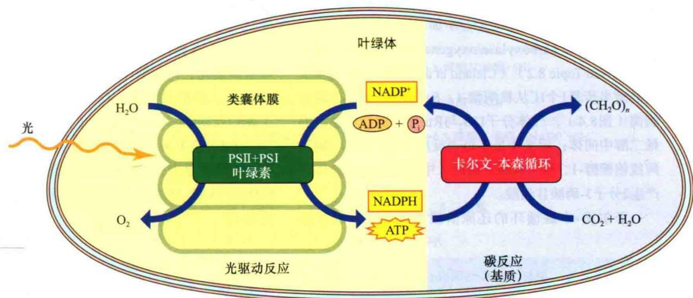

所有光合真核生物（从最原始的藻类到最高等的被子植物）。这个途径将碳元素（C）氧化态从最高值（ $\mathrm{CO}_{2}$ 中的+4）降低到糖分子水平（例如，—CO—羰基基团中的+2；—CHOH—二级醇类基团中的0）。考虑到C氧化态降低的特点，卡尔文-本森循环也可以称为还原磷酸戊糖循环（reductive pentose phosphate cycle）。本章节将介绍卡尔文-本森循环如何使用光反应产生的ATP和NADPH中储存的能量来固定 $\mathrm{CO}_{2}$ （图8.1），以及此循环如何被调控。

## 8.1.1 卡尔文-本森循环包括3个阶段：羧化、还原和再生

20世纪50年代，M. Calvin、A. Benson（Benson，1951）、J. A. Bassham及其同事利用一系列精巧的实验阐释了卡尔文-本森循环（参见Web Topic 8.2）。叶绿体中的卡尔文-本森循环包括高度协作的3个阶段（图8.2）。

（1） $CO_{2}$ 受体分子的羧化（carboxylation）。循环中第一个酶促反应是： $CO_{2}$ 、 $H_{2}O$ 和5C受体分子（核酮糖-1，5-二磷酸）形成2分子3C中间物（3-磷酸甘油酸）。

（2）3-磷酸甘油酸的还原（reduction）。在光合产物ATP和NADPH驱动下，3-磷酸甘油酸通过两步酶促反应被还原成为3C糖（磷酸三糖）。

（3） $CO_{2}$ 受体分子核酮糖-1，5-二磷酸的再生（regeneration）。循环结束在核酮糖-1，5-二磷酸再生，期间经过10个酶促反应，消耗1个ATP。

C是以磷酸三糖的形式输出，与大气 $CO_{2}$ 的供给是平衡的。而后叶绿体中卡尔文-本森循环产生的磷酸三糖被转化为其他的细胞成分（如蔗糖和棉籽糖）。这些产物被分配到植物异养器官，以此维持生长或转化为储存物质。

图8.2 卡尔文-本森循环的3个阶段。①羧化反应， $CO_{2}$ 和1个碳骨架共价结合；②还原反应，生成一种碳水化合物（磷酸三糖），此过程消耗光化学形成的ATP和NADPH还原当量；③再生反应，重新合成 $CO_{2}$ 受体分子核酮糖-1，5-二磷酸。在稳定状态时， $CO_{2}$ 输入量等于磷酸三糖输出量。后者或者作为叶绿体中淀粉生物合成的前体，或者流入细胞质合成蔗糖。蔗糖被装载到韧皮部流体，运到生长需要或者多糖生物合成的植物其他部分。

## 8.1.2 核酮糖-1，5-二磷酸的羧化反应固定 $\mathrm{CO}_{2}$ 并合成磷酸三糖

卡尔文-本森循环的第一步反应中，3分子 $CO_{2}$ 、3分子 $H_{2}O$ 和3分子核酮糖-1，5-二磷酸反应，产生6分子

3-磷酸甘油酸（图8.3，表8.1反应1）。该反应由叶绿体中核酮糖-1，5-二磷酸羧化酶/加氧酶（Ribulose-1, 5-bisphosphate carboxylase/oxygenase, Rubisco）催化（参见Web Topic 8.2）（Cleland et al., 1998）。这步反应的前半步是1个H+从核酮糖-1，5-二磷酸的C-3位置被剥离（图8.4），气体分子CO₂与Rubisco形成不稳定的烯二醇中间体；后半步是不可逆反应生成2-羧基-3酮基阿拉伯糖醇-1，5-二磷酸。最后，中间物经过水合作用产生2分子3-磷酸甘油酸。

卡尔文-本森循环的还原阶段是还原3-磷酸甘油酸中来自于羧化反应的C（图8.3，表8.1反应2和反应3）。

（1）首先，光反应产生的ATP使3-磷酸甘油酸的羧基磷酸化，产生一个混合酐（mixed anhydride），即1,3-二磷酸甘油酸，反应由3-磷酸甘油酸激酶催化（表8.1反应2）。

（2）接下来，光反应产生的NADPH将1,3-二磷酸甘油酸还原为3-磷酸甘油醛（表8.1反应3），位于叶绿体的NADP-甘油醛-3-磷酸脱氢酶催化此反应（表8.1反应3）。

表8.1 卡尔文-本森循环中的反应

<table><tr><td>酶</td><td>反应</td></tr><tr><td>1.核酮糖-1,5-二磷酸羧化酶-加氧酶(Rubisco)</td><td>3核酮糖-1,5-二磷酸+3 $CO_2$ +3 $H_2O$ →63-磷酸甘油酸+6 $H^+$ </td></tr><tr><td>2.3-磷酸甘油酸激酶</td><td>63-磷酸甘油酸+6ATP→61,3-二磷酸甘油酸+6ADP</td></tr><tr><td>3.NADP-甘油醛-3-磷酸脱氢酶</td><td>61,3-二磷酸甘油酸+6NADPH+6 $H^+$ →63-磷酸甘油醛+6NADP+6 $H_i^+$ </td></tr><tr><td>4.丙糖磷酸异构酶/甘油醛磷酸异构酶</td><td>23-磷酸甘油醛←→2二羟丙酮磷酸</td></tr><tr><td>5.醛缩酶</td><td>3-磷酸甘油醛+二羟丙酮磷酸→果糖-1,6-二磷酸</td></tr><tr><td>6.果糖-1,6-二磷酸酶</td><td>果糖-1,6-二磷酸+ $H_2O$ →果糖-6-磷酸+ $P_i$ </td></tr><tr><td>7.转羟乙醛酶/转酮醇酶</td><td>果糖-6-磷酸+甘油醛-3-磷酸→赤藓糖-4-磷酸+木酮糖-5-磷酸</td></tr><tr><td>8.醛缩酶</td><td>赤藓糖-4-磷酸+二羟丙酮磷酸→景天庚酮糖-1,7-二磷酸</td></tr><tr><td>9.景天庚酮糖-1,7-二磷酸酶</td><td>景天庚酮糖-1,7-二磷酸+ $H_2O$ →景天庚酮糖-7-磷酸+ $P_i$ </td></tr><tr><td>10.转羟乙醛酶/转酮醇酶</td><td>景天庚酮糖-7-磷酸+3-磷酸甘油醛→核糖-5-磷酸+木酮糖-5-磷酸</td></tr><tr><td>11a.核酮糖-5-磷酸差向异构酶</td><td>2木酮糖-5-磷酸→2核酮糖-5-磷酸</td></tr><tr><td>11b.核糖-5-磷酸异构酶</td><td>核糖-5-磷酸→核酮糖-5-磷酸</td></tr><tr><td>12.核酮糖-5-磷酸激酶</td><td>3核酮糖-5-磷酸+3ATP→3核酮糖-1,5-二磷酸+3ADP+3 $H^+$ </td></tr><tr><td colspan="2">总反应: $3CO_2$ +5 $H_2O$ +6NADPH+9ATP→3-磷酸甘油醛+6NADP+3 $H^+$ +9ADP+8 $P_i$ </td></tr></table>

注： $P_{i}$ 代表无机磷酸

## 8.1.3 核酮糖-1，5-二磷酸再生并继续同化 $\mathrm{CO}_{2}$

为防止卡尔文-本森循环中间产物耗竭，需要不断地摄取大气中 $CO_{2}$ ，因此 $CO_{2}$ 受体（acceptor）核酮糖-1，5-二磷酸的再生不能间断。再生阶段，3分子核酮糖-1，5-二磷酸（3分子×5C/分子=15C）来自于5分子3-磷酸甘油醛的C重组反应（5分子×3C/分子=15C）（图8.3）。第6个3-磷酸甘油醛分子（1分子×3C/分子=3C总）代表3分子 $CO_{2}$ 净同化结果，可被植物C代谢所利用。其他5分子3-磷酸甘油醛重组成为3分子核酮糖-1，5-二磷酸，所经历的反应见表8.1中4\~12和图8.3。

（1）2分子3-磷酸甘油醛转化为二羟丙酮磷酸，反应由磷酸丙糖异构酶催化（表8.1反应4）。

（2）1分子二羟丙酮磷酸和第三分子3-磷酸甘油醛进行醛醇缩合反应，反应由醛缩酶催化，生成果糖-1,6-二磷酸（表8.1反应5）。

（3）果糖-1，6-二磷酸在叶绿体特有的果糖-1，6-二磷酸酶催化下，水解成为果糖-6-磷酸（表8.1反应6）。

（4）在转羟乙醛酶催化下，果糖-6-磷酸分子中的1个2C单位（即 $C_{1}$ 和 $C_{2}$ ）转移给第4个3-磷酸甘油醛分子，形成木酮糖-5-磷酸。果糖-6-磷酸分子中剩余的4个C（ $C_{3}$ 、 $C_{4}$ 、 $C_{5}$ 、 $C_{6}$ ）形成赤藓糖-4-磷酸（表8.1反应7）。

（5）随后，由醛缩酶催化，赤藓糖-4-磷酸和剩余的二羟丙酮磷酸分子结合，产生7C糖：景天庚酮糖-1,7-二磷酸（表8.1反应8）。

（6）在专一的景天庚酮糖-1，7-二磷酸酶催化下，景天庚酮糖-1，7-二磷酸水解为景天庚酮糖-7-磷酸（表8.1反应9）。

（7）景天庚酮糖-7-磷酸提供1个2C单位（ $C_{1}$ 和 $C_{2}$ ）给第5个（也是最后1个）3-磷酸甘油醛，在转酮醇酶催化下产生木酮糖-5-磷酸。景天庚酮糖-7-磷酸的剩余5个C（ $C_{3}\sim C_{7}$ ）成为核糖-5-磷酸（表8.1反应10）。

（8）由核酮糖-5-磷酸差向异构酶催化，2分子木酮糖-5-磷酸转化为2分子核酮糖-5-磷酸（表8-1反应11a），第三分子核酮糖-5-磷酸是在核糖-5-磷酸异构酶的催化下，由核糖-5-磷酸转化而来（表8.1反应

11b）。

（9）最后，磷酸核酮糖激酶（也称核酮糖-5-磷酸激酶）催化下，由ATP提供磷酸基团，使3分子核酮糖-5-磷酸磷酸化，再生成为3个 $CO_{2}$ 受体分子核酮糖-1，5-二磷酸（表8.1反应12）。

因此，在消耗能量（ATP）和还原力（NADPH）条件下，叶绿体类囊体膜上的卡尔文-本森循环的羧化和还原反应产生磷酸三糖。

$$
3 \mathrm{CO} _ {2} + 3 \text { 核   酮   糖 } - 1, 5 - \text { 二   磷   酸 } + 3 \mathrm{H} _ {2} \mathrm{O} + 6 \mathrm{NADPH} + 6 \mathrm{H} ^ {+} + 6 \mathrm{ATP}
$$

$$
\longrightarrow 6 \text {   磷酸三糖   } + 6 \mathrm{NADP} + 6 \mathrm{ADP} + 6 \mathrm{P} _ {\mathrm{i}}
$$

这6个磷酸三糖中：5个经过再生反应而恢复成为 $CO_{2}$ 受体分子核酮糖-1，5-二磷酸；第6个磷酸三糖代表 $CO_{2}$ 净同化，用作其他代谢过程的“建筑砖块”。

5磷酸三糖+3ATP→3核酮糖-1，5-二磷酸+3ADP

总之，利用9个ATP和6个NADPH将3个 $CO_{2}$ 固定成为1个磷酸三糖。也就是说，卡尔文-本森循环固定 $CO_{2}$ 时，ATP：NADPH比率是3：2。

## 8.1.4 还原阶段使光合作用的 $\mathrm{CO}_{2}$ 同化作用进入稳态

当叶片在黑暗中生存相当长一段时间（如晚上），基质中卡尔文-本森循环的许多中间物浓度很低。因此，当叶片转移到光下时，几乎所有的基质中的磷酸丙糖转化为核酮糖-1，5-二磷酸再生所需要的中间物。将黑暗条件下的叶片或离体叶绿体照光后，其反应清楚地说明代谢物建成关联性。实验发现： $CO_{2}$ 固定开始于一个延滞（a lag）之后，这段时间也称为诱导期（induction period）。在光照开始的几分钟时间内，光合作用速率随着时间增加。在诱导期，这种光合速率增加是由于卡尔文-本森循环中间产物浓度增加和光激发酶活性（稍后讨论）。在诱导期内，由卡尔文-本森循环的羧化和还原反应产生的6个磷酸丙糖主要用于 $CO_{2}$ 受体分子——核酮糖-1，5-二磷酸再生。

相反，当光合作用达到一个稳定阶段（steadystate），大气 $CO_{2}$ 同化增加了植物碳水化合物的储备。在此期间，5/6磷酸丙糖用于 $CO_{2}$ 受体分子核酮糖-1，5-二磷酸的再生，1/6磷酸丙糖用于增加碳水化合物含量（图8.2）。这种净增的磷酸丙糖既用于叶绿体中淀粉合成，也用于胞质中蔗糖合成。一般来讲，主要产物蔗糖被植物分配到异养器官中去，进行后续的代谢或转化为储存物质（如淀粉和果聚糖）。有关卡尔文-本森循环中的能量利用效率详细分析参见Web Topic 8.4。

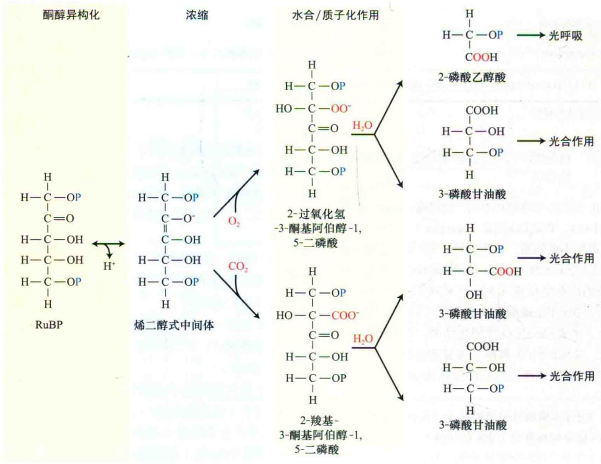  
图8.4 Rubisco催化的核酮糖-1，5-二磷酸羧化和氧化反应。核酮糖-1，5-二磷酸和Rubisco结合有利于一种与酶紧密相连的烯醇式中间产物的形成，此中间物的 $C_{2}$ 易被 $CO_{2}$ 或 $O_{2}$ 攻击。与 $CO_{2}$ 结合时，产物是一种六碳中间物（2-羧基-3-酮基-1，5-二磷酸）；与 $O_{2}$ 结合时，产物是一种活跃的五碳中间物（2-氢过氧化-3-酮基-1，5-二磷酸）。这些中间物在 $C_{3}$ 位置发生水解反应，致使 $C_{2}$ 和 $C_{3}$ 之间碳键分裂，产生2分子3-磷酸甘油酸（羧化反应）或1分子2-磷酸甘油酸和1分子3-磷酸甘油酸（加氧酶反应）。加氧酶活性的重要生理效应将在“ $C_{2}$ 氧化光合碳循环”中讲述。

## 8.2 卡尔文-本森循环的调控

卡尔文-本森循环中的能量有效利用需要专一调控机制，此机制不仅保证光照条件下循环中所有中间产物的浓度合适，而且能在黑暗条件下关闭循环。为了顺应环境刺激而产生必要的代谢物，叶绿体通过调整酶含量（μmoles酶/叶绿体）和催化能力[μmoles转化的底物/（min·μmoles酶）]而达到合适的生物化学转化效率。

基因表达和蛋白质生物合成效率决定着细胞器中酶含量。值得注意的是，叶绿体基质酶数量由细胞核和叶绿体基因组的表达共同控制（Maier et al., 1995; Purton, 1995）。核基因编码的酶由细胞质中80S核糖体负责翻译，之后进入质体。质体编码的蛋白质存在于基质中，由叶绿体基质中的类似于原核生物70S核糖体进行翻译。

光通过专一的光受体（如光敏色素和蓝光受体）调节叶绿体基质中核基因组编码的酶的表达（Neff et al., 2000）。但是，核基因表达与该细胞器中光合体系中其他组分的表达是同步的。多数信号过程的调控在核与质体间是顺行性（anterograde）进行（即核基因产物控制着质体基因的转录和翻译）。此种情况中的范例是：基质Rubisco由核编码的8个小亚基（S）和质体编码的8个大亚基（L）组装过程。但是，有些调控为逆向性（retrograde）进行（即信号从质体向细胞核传递），如与叶绿素有关的蛋白质合成过程。

酶合成对催化速率的改变是缓慢的，与之形成鲜明对比的是：叶绿体酶通过翻译后修饰而改变的酶的比活力[μmoles转化的底物/（min·μmoles酶）]可以迅速响应光照（Wolosiuk et al., 1993）。酶动力学特征（kinetic property）调节的两个基本机制如下。

（1）共价键变化引起的酶化学修饰，如氨基甲酰化 $\left(\mathrm{Enz}-\mathrm{NH}_{2}+\mathrm{CO}_{2}\rightleftharpoons\mathrm{Enz}-\mathrm{NH}-\mathrm{CO}_{2}^{-}+\mathrm{H}^{+}$ 或二硫键还原 $\left[\mathrm{Enz}-(\mathrm{S})_{2}+\mathrm{Prot}-(\mathrm{SH})_{2}\rightleftharpoons\mathrm{Enz}-(\mathrm{SH})_{2}+\mathrm{Prot}-(\mathrm{S})_{2}]$ 。

（2）代谢物结合、细胞内离子组成改变（如pH、 $Mg^{2+}$ ）造成的非共价互作修饰。

这两种分子机制调节单个酶的结构和活性。但是，卡尔文-本森循环中的各种酶分布在叶绿体基质内部或其外周，分别与蛋白质或类囊体膜密切结合。因此，卡尔文-本森循环中的酶活性被上述机制调节；同时，酶可与叶绿体其他组分可逆性结合成为超级分子复合体，并因此而调节酶活性。在这些超级分子复合体中和类囊体膜表面，酶与其调节蛋白密切结合有利于卡尔文-本森循环的底物和产物在这些复合体内部或复合体之间的转运，从而提高了卡尔文-本森循环工作效率。

接下来讨论有关调节机制，如光依赖的调节机制，即光照-黑暗转换的数分钟内，5种关键酶的专一性改变：①Rubisco；②果糖-1，6-二磷酸酶；③景天庚酮糖-1，7-二磷酸酶；④核酮糖-5-磷酸激酶（磷酸核酮糖激酶）；⑤NADP-甘油醛-3-磷酸脱氢酶。

## 8.2.1 光照提高Rubisco活性

虽然Rubisco在生物圈的C循环中起关键作用，但是它的催化效率极其低下（每秒固定1\~12个 $CO_{2}$ ）。George Lorimer及其同事解析了这种似乎矛盾的特点，发现：Rubisco在进行催化之前必须被激活。进一步的研究显示， $CO_{2}$ 分子在Rubisco活化过程中扮演双重角色：一方面 $CO_{2}$ 参与该酶由非活性形式转化为活性形式（调节作用），另一方面 $CO_{2}$ 又是羧化反应的底物（催化作用）（Wolosiuk et al., 1993）。

作为调节者， $\mathrm{CO}_{2}$ 慢速与Rubisco酶活性中心的特定赖氨酸基团发生反应（图8.5中Rubisco调节）。而后，所形成的氨基甲酸盐衍生物（一个新的阴离子位点）快速与 $\mathrm{Mg}^{2+}$ 结合，酶即被活化。因为三元复合体Rubisco- $\mathrm{CO}_{2}-\mathrm{Mg}^{2+}$ 形成过程中释放2个质子，被光照的叶绿体基质中的pH和 $\mathrm{Mg}^{2+}$ 浓度升高而活化Rubisco酶（见下文）。在这个阶段，作为底物的 $\mathrm{CO}_{2}$ 分子与核酮糖-1,5-二磷酸反应，即结合到Rubisco活性位点（图8.5中的催化）。最终，Rubisco释放2分子3-磷酸甘油醛（图8.5中的产物）。

糖磷酸类分子（如核酮糖-1，5-二磷酸）和Rubisco紧密结合防止发生羰基化反应。但是，Rubisco和相关蛋白质（Rubisco活化酶）结合（此过程消耗ATP）导致Rubisco结构变化，释放糖磷酸类的分子，同时为酶通过羰基化反应和与金属原子结合而活化打下基础（图8.5中Rubisco活化酶；Web Topic 8.5）（Portis，2003）。Rubisco活化酶是一类伴侣分子功能类的、具有ATP酶活性的蛋白质家族成员。ATP和Rubisco活化酶的结合引发14\~16个Rubisco活化酶多肽自我关联后，与Rubisco结合。Rubisco羧化酶活性的激发，将结合的ATP水解作用耦合到Rubisco活化酶的亚基寡聚化或Rubisco构象变化。在正常的大气 $CO_{2}$ 浓度下，缺乏

Rubisco活化酶的拟南芥突变体表现出严重的光合作用缺损。

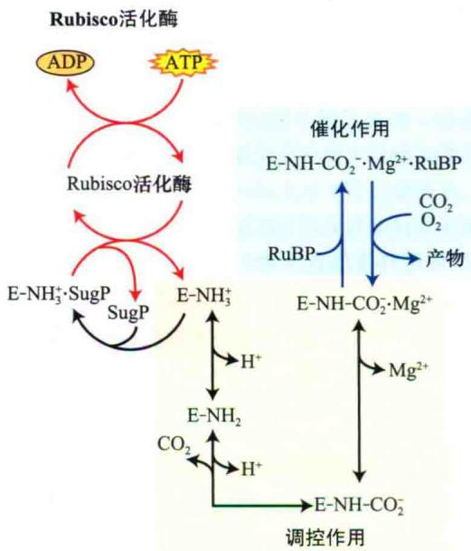  
图8.5 $\mathrm{CO}_{2}$ 在Rubisco催化的反应中用作激活剂和底物。调节作用（绿色框）：激活剂 $\mathrm{CO}_{2}$ 与Rubisco反应形成E-氨甲酸盐（ $\mathrm{E - NH - CO_2^-}$ ）加合物， $\mathrm{Mg}^{2+}$ 与之形成E-氨甲酸盐复合物（ $\mathrm{E - NH - CO_2\cdot Mg^{2 + }}$ ），使之稳定。在光照的叶绿体基质中， $\mathrm{pH}$ （低 $\mathrm{H^{+}}$ 浓度）和 $\mathrm{Mg}^{2 + }$ 浓度增加有利于Rubisco活性状态（ $\mathrm{E - NH - CO_2\cdot Mg^{2 + }}$ 复合物）形成。Rubisco活化酶（米黄色框）：糖磷酸（SugP）的紧密结合启动E-氨甲酸盐加合物产生。在Rubisco活化酶介导的循环中，Rubisco活化酶催化的ATP水解作用导致Rubisco构象变化，减少了它与糖磷酸的亲和性。催化作用（蓝色框）：在酶的活性位点形成 $\mathrm{E - NH - CO_2\cdot Mg^{2 + }}$ 复合物之后，Rubisco与核酮糖-1，5-二磷酸（RuBP）结合，再与其他的底物（ $\mathrm{CO}_{2}$ 或 $\mathrm{O}_2$ ）结合，分别开始羧化酶和加氧酶活动（图8.4）。催化反应的产物或者是2分子3-磷酸甘油酸（羧化酶活性），或者是3-磷酸甘油酸和2-磷酸乙醇酸各1分子（加氧酶活性）。

很多植物的Rubisco活化酶具有2条多肽（大约分别为42 kDa和47 kDa），二者来自于同一个pre-mRNA的不同拼接；除了较长的肽C端多出了额外的氨基酸残基外，所编码的2条多肽是相同的。许多植物中的长链亚基含有2个半胱氨酸，二者可以进行巯基和二硫键之间的可逆性转换[(Rubisco活化酶)—(S) $_{2}$ +2H $^{+}$ +2e $\leftrightarrow$ (Rubisco活化酶)—(SH) $_{2}$ ]（Portis，2003）。巯基和二硫键的可逆转换（以硫氧还原蛋白依赖的机制催化，此机制将在后面的章节中讨论）调节ATP酶活性对ATP/ADP的敏感性。因此，Rubisco中，Rubisco活化酶中的ATP酶活性调节可能引起光介导的基质中电子传递体的氧化还原状态[(因子)—H $_{2}$ $\leftrightarrow$ (因子)氧化态+2H $^{+}$ +2e]和磷酸化势能(ATP/ADP)变化。因为2个Rubisco活化酶亚基在Rubisco活性调节中发挥功能，参与此机制的其他成分尚不清楚。一些植物（如烟草）中，光照自然地激发Rubisco活性仅发生在较短肽链。另外，在仅仅长链亚基表达的转基因拟南芥中，光照对Rubisco活性的调节与野生型中的情况一致。

一些植物中的Rubisco活性可被天然的2-羧基阿伯醇-1-磷酸 $\left[\mathrm{H}_{2} \mathrm{O}_{3} \mathrm{P}-\mathrm{O}-\mathrm{CH}_{2}-\mathrm{C}\left(\mathrm{CO}_{2}-\right) \mathrm{OH}-\right.$ $CHOH-CHOH-CH_{2}OH$ 抑制，此物和羧化反应中的6C中间物（图8.4中的2-羧基-3-酮基阿伯醇-1，5-二磷酸）很相似。多种叶片中的这种抑制剂的含量很低，但是，在黑暗条件下，豆类植物（大豆和扁豆）叶片中的2-羧基阿伯醇-1-磷酸浓度却很高。夜间，该抑制剂增加并与Rubisco结合，白天来临后，此抑制剂被活化的Rubisco活化酶清除。一种特异性磷酸酶使2-羧基阿伯醇-1-磷酸失去磷酸基团，从而加速2-羧基阿伯醇-1-磷酸的消失。

## 8.2.2 光利用铁氧还蛋白-硫氧还蛋白系统调控卡尔文-本森循环

除了Rubisco，光还利用铁氧还蛋白-硫氧还蛋白系统调控卡尔文-本森循环中的其他4个酶活性，铁氧还蛋白-硫氧还蛋白系统包括：铁氧还蛋白、铁氧还蛋白-硫氧还蛋白还原酶、硫氧还蛋白（图8.6）。B.B. Buchanan、P. Schürmann和R.A.Wolosiuk及其同事的实验是：利用光合电子传递链的产物（还原型铁氧还蛋白）来调控4种酶活性（果糖-1，6-二磷酸酶、景天庚酮糖-1，7-二磷酸酶、核酮糖-5-磷酸激酶和NADP-甘油醛-3-磷酸脱氢酶），从而揭示出此氧化还原体系的作用机制（Buchanan and Balmer，2005；Mora-Garcia et al., 2006）（图8.6）。借助于铁-硫酶家族的铁氧还蛋白-硫氧还蛋白还原酶，还原性的铁氧还蛋白将具有泛调控作用的硫氧还蛋白中唯一的二硫键（—S—S—）转换为还原态（HS—SH）。接下来，还原型的硫氧还蛋白将氧化态的靶酶转化为还原型，因此加强了该酶的催化能力（图8.6；Web Topic 8.6）。

虽然还原型的硫氧还蛋白是叶绿体酶的普通还原剂，但是靶向二硫键的调节具有唯一的结构和热动力学特点。硫氧还蛋白调节的酶的氨基酸序列既不包含半胱氨酸的保守序列，也不包含形成酶活性位点部分所需要的调节作用的半胱酸。有些情况下，由还原型硫氧还蛋白活化的叶绿体基质中的一些酶进一步被光驱动的其他过程（如代谢物的形成、离子的运输）协同调节（Wolosiuk et al., 1993）。因此，铁氧还蛋白-硫氧还蛋白系统将类囊体膜上的叶绿素光吸收和叶绿体基质中的代谢活动联系起来。

与卡尔文-本森循环关联之初，铁氧还蛋白-硫氧还蛋白系统也是可逆性地参与还原叶绿体各种过程的蛋白质中的二硫键。虽然还原作用对许多酶的影响机制还不清楚，但硫氧还蛋白调节许多叶绿体蛋白质结构和活性的理念已经得到蛋白质组学研究（已鉴定涉及硫氧还蛋白的其他过程）的支持。例如，硫氧还蛋白作为还原剂保护细胞免受活性氧损伤，活性氧包括过氧化氢 $\left(\mathrm{H}_{2}\mathrm{O}_{2}\right)$ 、超氧阴离子 $\left(\mathrm{O}_{2}^{-}\right)$ 、羟基自由基 $\left(\mathrm{OH} \cdot\right)$ （Buchanan and Balmer, 2005; Mora-Garcia et al., 2006; Aran et al., 2009）。

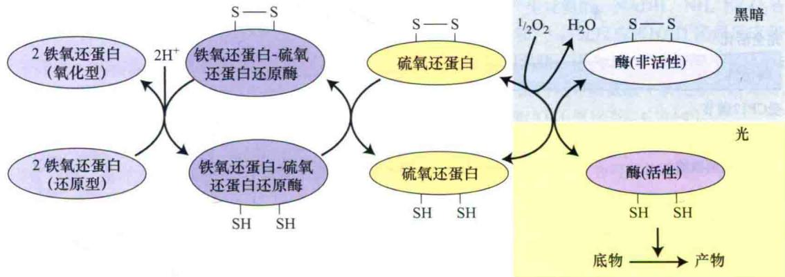  
图8.6 铁氧还蛋白-硫氧还蛋白系统。铁氧还蛋白-硫氧还蛋白系统将类囊体膜感知的光信号与叶绿体基质中的酶活性联系起来。有关还原性磷酸戊糖循环（卡尔文-本森循环）的酶活化始于光下光合电子传递链（PSII+PSI）将铁氧还蛋白还原（见第7章）。还原型的铁氧还蛋白与2个质子一起去还原铁-硫酶之铁氧还蛋白-硫氧还蛋白还原酶的具有催化活性的二硫键（—S—S—），最后还原调节性的硫氧还蛋白中唯一的二硫键（—S—S—）（细节参见Web Topic 8.6）。还原型的硫氧还蛋白（—SHHS—）随后还原靶酶的关键的（调节性的）二硫键，促使它转变为活性状态。在此状态下，靶酶催化底物变成产物。黑暗条件下，硫氧还蛋白中巯基重新形成二硫键，进而使靶酶的还原形式（—SHHS—）恢复为氧化形式（—S—S—），活性随之丧失。氧化磷酸戊糖循环中的一种酶——葡萄糖-6-磷酸脱氢酶的氧化态（黑暗）具有活性，可以被铁氧还蛋白还原而失活。

黑暗条件下，靶酶的失活几乎是还原过程（激活）的逆向过程。氧或活性氧将还原型硫氧还蛋白（—SHHS—）转化为氧化态（—S—S—），结果将还原型靶酶转化为氧化态，使其失去催化能力。最近发现：硫氧还蛋白可以通过巯基-二硫键之间的转换改变多种生物过程（从种子萌发到癌症）中的酶活性（Montrichard et al., 2009）。

## 8.2.3 依赖光的离子运动调节卡尔文-本森循环中的酶活性

和叶绿体酶的翻译后修饰同步的是：光驱动基质中离子组成发生可逆变化。在光照条件下，质子从叶绿体基质流向类囊体内腔，而 $Mg^{2+}$ 从类囊体内腔释放到叶绿体基质，两个过程相偶联。这种离子穿梭降低了基质中 $H^{+}$ 浓度（pH从7增加到8），同时增加了 $Mg^{2+}$ 浓度（2\~5 mmol/L）。黑暗降临时，这种叶绿体基质离子组成变化逆向进行。

催化活性需要 $Mg^{2+}$ 的卡尔文-本森循环酶类（Rubisco、果糖-1，6-二磷酸酶、景天庚酮糖-1，7-二磷酸酶、核酮糖-5-磷酸激酶）在pH 8时比pH 7时更为活跃。可见，光介导的 $Mg^{2+}$ 和 $H^{+}$ 增加可以提高卡尔文-本森循环中关键酶的活性（Heldt，1979）。

## 8.2.4 光对叶绿体酶组合为超级分子复合体的调控

相关酶组成的超级分子复合体对酶催化能力有重要影响，并因此改变代谢途径的活力。这种代谢策略的存在已被证实，从叶绿体基质中分离出2种超级分子复合体：磷酸核酮糖激酶超级酶分子复合体、与CP12（大约8.5 kDa蛋白）结合的甘油醛-3-磷酸脱氢酶超级分子复合体，二者通过二硫键紧密结合在一起。超级分子复合体的形成、磷酸核酮糖激酶和3-磷酸甘油醛脱氢酶的催化活性与特定半胱氨酸的一SH处于氧化状态有密切关系（Marri et al., 2009）。

在蓝藻细菌及几乎所有的藻类中，用于光合作用的3-磷酸甘油醛脱氢酶是一种同源四聚体（ $\mathrm{A}_4$ ）；当磷酸核酮糖激酶和CP12形成分子内二硫键时，将该四聚体结合在一起（图8.7）。但是，一旦硫氧还蛋白介导磷酸核酮糖激酶和CP12分子内二硫键消失，它们将失去与 $\mathrm{A}_4$ -3-磷酸甘油醛脱氢酶形成超级分子复合体的能力，因而将全部催化能力传递给磷酸核酮糖激酶和3-磷酸甘油醛脱氢酶。在还原力较低的黑暗条件下，还原型与氧化型硫氧还蛋白比率低下，磷酸核酮糖激酶和CP12之间的二硫键得以恢复；接着，氧化型的磷酸核酮糖激酶和CP12招募 $\mathrm{A}_4$ -3-磷酸甘油醛脱氢酶，形成超级分子复合体。此时，3-磷酸甘油醛脱氢酶和磷酸核酮糖激酶初步具备催化能力。

虽然陆地植物拥有 $A_{4}-3-$ 磷酸甘油醛脱氢酶及其相

  
图8.7 叶绿体磷酸核酮糖激酶和3-磷酸甘油醛脱氢酶的调节。在叶绿体基质中，3-磷酸甘油醛脱氢酶的两种形式参与卡尔文-本森循环。在黑暗条件下，磷酸核酮糖激酶和3-磷酸甘油醛脱氢酶是没有活性的。还原型硫氧还蛋白/氧化型硫氧还蛋白{[硫氧还蛋白-(SH)2]/[硫氧还蛋白-(S)2]}较低，因此有利于CP12、磷酸核酮糖激酶及3-磷酸甘油醛脱氢酶的A₂B₂结构的C端延伸部位中形成二硫键。氧化态的CP12和磷酸核酮糖激酶招募A₄-3-磷酸甘油醛脱氢酶，形成CP12-磷酸核酮糖激酶-A₄-3-磷酸甘油醛脱氢酶超级分子复合体。与此同时，A₂B₂-3-磷酸甘油醛脱氢酶异四聚体聚合形成A₈B₈-3-磷酸甘油醛脱氢酶。在这个阶段，各酶的活性受到强烈抑制。在光照条件下，磷酸核酮糖激酶和3-磷酸甘油醛脱氢酶展现出最大催化能力。还原型硫氧还蛋白/氧化型硫氧还蛋白{[硫氧还蛋白-(SH)2]/[硫氧还蛋白-(S)2]}增加时，二硫键的减少使酶复

合体解散。在这个阶段，被释放的（游离的）磷酸核酮糖激酶和3-磷酸甘油醛脱氢酶完全处于活化状态。

关的调节系统，但其叶绿体中还有该酶的第二种结构的酶——异四聚体 $A_{2}B_{2}$ 。B亚基的氨基酸序列与A亚基同源，前者C端延伸部分有2个半胱氨酸，其—SH基团可被硫氧还蛋白调节。当B亚基C端区域的半胱氨酸残基被还原（光下），3-磷酸甘油醛脱氢酶便具备了催化功能。在氧化状态（黑暗）时，二硫键的产生促使四聚体 $A_{2}B_{2}$ 组合成为无酶促活性的十六聚体 $A_{8}B_{8}$ 。

夏季，为了适应光照强度变化，超级分子复合体的形成则代表一种光合作用机制：通过可逆性地调节磷酸核酮糖激酶和3-磷酸甘油醛脱氢酶的活性。白天，云层和冠层遮盖改变了到达不同叶片的光照强度和光质。其后果：在自然光照射时，为了迅速调节相关酶活性，超级分子复合体的解聚和再聚合必须在数分钟内完成。按照此模式可以预见：在正常的光-暗周期条件下，缺少CP12的蓝藻细菌突变体不能正常生长，但在持续光照条件下能够正常生长（Tamoi et al., 2005）。

## 8.3 $\mathrm{C}_{2}$ 氧化光合碳循环

如图8.4所示，Rubisco有能力催化核酮糖-1，5-二磷酸的羧化和加氧反应（Miziorko and Lorimer，1983）。羧化反应产生2分子3-磷酸甘油酸，而氧化反应（图8.5中的“催化”）产生2-磷酸乙醇酸和3-磷酸甘油酸（图8.5中的“产物”）各1分子。Rubisco催化的核酮糖-1，5-二磷酸加氧反应触发了在叶绿体、叶片过氧化物酶体和线粒体之间相伴发生的酶促反应的网状合作（参见Web Topic 8.7）。这个称为光呼吸（photorespiration）的过程致使卡尔文-本森循环固定的 $CO_{2}$ 部分损失，同时发生的是：光合作用活跃的叶片吸收氧（Ogren，1984；Leegood et al., 1995；Foyer et al., 2009）。

利用各种光呼吸拟南芥突变体，这种竞争性反应对植物生长的负面影响已被揭示：在正常的大气 $CO_{2}$ 浓度（0.03%），突变体出现了生长迟滞、早衰及细胞死亡现象；相反，在高浓度 $CO_{2}$ （0.3%或更高）环境中，这些突变体生长正常。此外，在 $CO_{2}$ 浓度增加的温室中，一些农作物产量大幅度增加。在本章节中，将讲述 $C_{2}$ 氧化光合循环的重要特征：这些反应部分地收回了卡尔文-本森循环中由氧造成的C损失。接下来将呈现通过改变叶片光呼吸作用而提高作物生物量所做的努力。

## 8.3.1 核酮糖-1，5-二磷酸的羧化反应和氧化反应是竞争性反应

作为Rubisco不同的底物， $CO_{2}$ 和 $O_{2}$ 与核酮糖-1，5-二磷酸发生竞争性结合，因为羧化反应和氧化反应发生在同一活性位点。1分子 $O_{2}$ 与核酮糖-1，5-二磷酸的2，3-烯二醇异构体结合，产生一种不稳定的中间物，并快速分裂为2-磷酸乙醇酸和3-磷酸甘油酸（图8.4和图8.7，表8.2反应1）。无论分类学上的起源如何，具有催化核酮糖-1，5-二磷酸的氧化反应能力是所有Rubisco共同特点。甚至厌氧自养细菌中的Rubisco也能催化体外的加氧反应。厌氧自养细菌的这种著名的特征暗示：加氧反应是酶活性部位的内在特性，而不是对暴露在地球大气氧气中的适应性机制。

叶绿体中，核酮糖-1，5-二磷酸加氧反应产生的2-磷酸乙醇酸可被专一的叶绿体磷酸酶迅速水解，生成乙醇酸（表8.2反应2）。乙醇酸后续的代谢在过氧化酶体和线粒体两个细胞器中联合进行（见第1章）（Tolbert，1981）。

乙醇酸利用叶绿体被膜的内膜上的一种特殊蛋白运出，再扩散进入过氧化物酶体。在那里，一种黄素单核苷酸依赖的氧化酶——乙醇酸氧化酶（表8.2反应3）催化 $O_{2}$ 氧化乙醇酸，产生 $H_{2}O_{2}$ 和乙醛酸。过氧化氢酶清除 $H_{2}O_{2}$ 并释放 $O_{2}$ （表8.2反应4），同时，乙醛酸和谷氨酸通过转氨作用生成甘氨酸（表8.2反应5）。

甘氨酸离开过氧化物酶体进入线粒体（图8.8）。线粒体中，在一种由甘氨酸脱羧酶和丝氨酸羟甲基转移酶形成的多酶复合物的催化下，2分子甘氨酸和1分子 $NAD^{+}$ 反应产生丝氨酸、NADH、 $NH_{4}^{+}$ 和 $CO_{2}$ 各1分子（表8.2反应6和7）。此反应将 $NAD^{+}$ 还原反应和C原子的氧化反应相偶联，因为2分子甘氨酸（氧化态： $C_{1}$ 为+3， $C_{2}$ 为-1）被转化为丝氨酸（氧化态： $C_{1}$ 为+3， $C_{2}$ 为0， $C_{3}$ 为-1）和 $CO_{2}$ （氧化态：C为+4）。

新形成的丝氨酸从线粒体扩散回到过氧化物酶体（图8.8），在此被转化为羟基丙酮酸（表8.2反应8），之后，被NADH依赖性还原酶转化为甘油酸（表8.2反应9）。苹果酸-草酰乙酸穿梭将NADH从细胞质转移到过氧化物酶体中，以维持此反应过程中足够的NADH浓度。最终，甘油酸重新进入叶绿体，在此进行磷酸化，产生3-磷酸甘油酸（图8.8，表8.2反应10）。

与此同时，甘氨酸氧化释放的 $NH_{4}^{+}$ （表8.3反应6）从线粒体的基质中快速扩散到叶绿体。同时，依赖ATP的谷氨酰胺合成酶催化 $NH_{4}^{+}$ 与谷氨酸反应，产生谷氨酰胺（图8.8，表8.2反应11）。随后，在铁氧还蛋白依赖的谷氨酸合酶的催化下，谷氨酰胺与2-酮戊二酸反应，产生2分子谷氨酸（表8.2反应12）。

在光呼吸过程中，3个同时进行的循环阐明了C、N、O原子流通情况（图8.9）。

（1）在第一个循环中，C原子以2分子乙醇酸的形式离开叶绿体，又以1分子甘油酸的形式返回，同时在线粒体中留下1分子 $CO_{2}$ 。

（2）在第二个循环中，N原子以1分子谷氨酸的形式离开叶绿体，又以1分子 $NH_{4}^{+}$ 形式返回，最终与1分子2-酮戊二酸相关（图8.8）。结果，总氮量保持不变，因为线粒体中无机氮（ $NH_{4}^{+}$ ）的形成和叶绿体中谷氨酰胺的合成相平衡。

（3）在第三个循环（与 $O_{2}$ 有关）中，Rubisco和乙醇酸氧化酶所催化的反应各消耗2分子 $O_{2}$ ，但是过氧化氢酶从 $H_{2}O_{2}$ 释放1分子 $O_{2}$ （表8.2反应4）。因此，当2分子核酮糖-1，5-二磷酸进入 $C_{2}$ 氧化光合循环时，共有3分子 $O_{2}$ 被还原。

活体中，卡尔文-本森循环和 $C_{2}$ 氧化光合循环之间的平衡主要由3个因素决定：1个和植物本身遗传特性有关（Rubisco酶动力学特征），2个和环境有关（温度、底物 $CO_{2}$ 和 $O_{2}$ 浓度）。随着外部温度增加：①调节Rubisco的动力学常数，提高氧合速率，使其高于羧化速率（Ku and Edwards，1978）；②在液气平衡状态时，溶液 $CO_{2}$ 浓度降低幅度大于 $O_{2}$ 浓度降低幅度（参见Web Topic 8.8）。

因此，在温度较高的气候条件下，与光合作用（羧化反应）关联的光呼吸（加氧作用）的增加严重限制光合作用C同化效率。总之，温度逐步升高使平衡偏离非卡尔文-本森循环，而倾向于 $C_{2}$ 氧化光合循环（见第9章）。

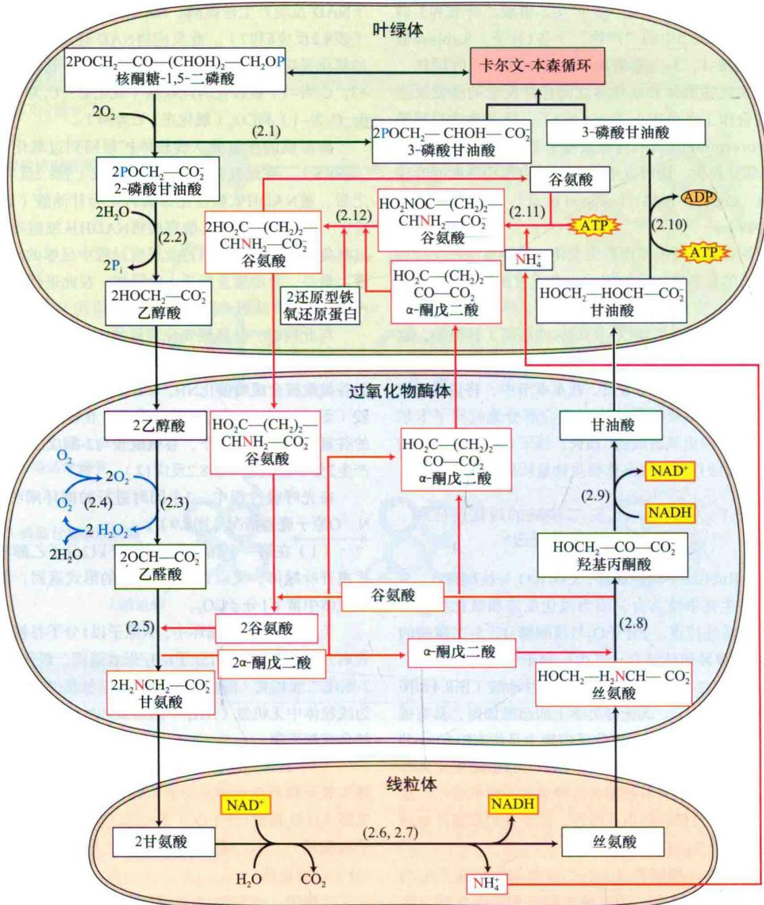  
图8.8 $\mathrm{C}_{2}$ 氧化光合循环运行由3个细胞器——叶绿体、过氧化物酶体和线粒体互作完成。括号中的数字代表的是表8.2中的反应（编者注）。在叶绿体中，Rubisco加氧酶作用产生2分子2-磷酸乙醇酸；在磷酸乙醇酸磷酸酶作用下，将2-磷酸乙醇酸转化为2分子无机磷酸和2分子乙醇酸。2分子乙醇酸（4C）和1分子谷氨酸从叶绿体进入过氧化物酶体。在过氧化物酶体中，乙醇酸被乙醇酸氧化酶氧化成乙醛酸。乙醛酸：谷氨酸氨基转移酶催化乙醛酸和谷氨酸转变为甘氨酸和2-酮戊二酸。甘氨酸从过氧化物酶体进入线粒体，在这里2分子甘氨酸（4C）经甘氨酸脱羧酶复合体和丝氨酸羟甲基转移酶连续作用，产生了1分子丝氨酸（3C）， $\mathrm{CO}_{2}$ （1C）和 $\mathrm{NH}_{4}^{+}$ 。而后，丝氨酸转运回过氧化物酶体，在丝氨酸氨基转移酶和羟基丙酮酸还原酶的作用下，变为甘油酸（3C）。甘油酸和2-酮戊二酸（来自过氧化物酶体）及 $\mathrm{NH}_{4}^{+}$ （来自线粒体）返回叶绿体，恢复部分碳（3C）及在光呼吸中所有氮素损失。甘油酸被磷酸化为3-磷酸甘油酸，并返回卡尔文-本森循环。在叶绿体基质中，谷氨酰胺合成酶和硫氧还蛋白依赖性谷氨酸合酶（GOGAT），利用无机氮（ $\mathrm{NH}_{4}^{+}$ ）和2-酮戊二酸恢复最初被谷氨酸截获而损失的氮。

表8.2 $C_{2}$ 氧化光合碳循环反应

反应 $^{a}$ 

1. 2核酮糖-1, 5-二磷酸+2O $_{2}$ ——→2 2-磷酸乙醇酸+2 3-磷酸甘油酸

2. 2 2-磷酸乙醇酸+2H $_{2}$ O——→2乙醇酸+P $_{i}$ 

3. 2 乙醇酸+2O $_{2}$ ——→2 乙醛酸+2H $_{2}$ O $_{2}$ 

4. 2H $_{2}$ O $_{2}$ ——→2 H $_{2}$ O+O $_{2}$ 

5. 2乙醛酸+2谷氨酸——→2甘氨酸+α-酮戊二酸

6. 甘氨酸+NAD $^{+}$ +[GDC]——→CO $_{2}$ +NH $_{4}$ $^{+}$ +NADH+亚甲基-[GDC]

7. 亚甲基-[GDC]+甘氨酸+H $_{2}$ O——→丝氨酸+[GDC]

8. 丝氨酸+α-酮戊二酸——→羟基丙酮酸+谷氨酸

9. 羟基丙酮酸+NADH+H $^{+}$ ——→甘油酸+NAD $^{+}$ 

10. 甘油酸+ATP——→3-磷酸甘油酸+ADP

11. 谷氨酸+NH $_{4}$ $^{+}$ +ATP——→谷氨酰胺+ADP+P $_{i}$ 

12. α-酮戊二酸+谷氨酰胺+2Fd $_{red}$ +2H $^{+}$ ——→2谷氨酸+2Fd $_{oxid}$ 

C $_{2}$ 氧化光合循环的净反应

2核酮糖-1, 5-二磷酸+3O $_{2}$ +H $_{2}$ O+谷氨酸

↓（反应1~反应9）

甘油酸+2 3-磷酸甘油酸+NH $_{4}$ $^{+}$ +CO $_{2}$ +P $_{i}$ +α-酮戊二酸

叶绿体中的两个反应还原谷氨酸分子：

α-酮戊二酸+NH $_{4}$ $^{+}$ +[(2Fd $_{red}$ +2H $^{+}$), ATP]

↓（反应11和反应12）

谷氨酸+H $_{2}$ O+[(2Fd $_{oxid}$), ADP+P $_{i}$]

并还原3-磷酸甘油酸分子：

甘油酸+ATP

↓（反应10）

3-磷酸甘油酸+ADP

因此，C $_{2}$ 氧化光合循环消耗3 mol大气氧分子（2 mol在Rubisco氧化酶活化中，1 mol在过氧化物酶体的氧化中）引发了如下结果

(1) 1 mol CO $_{2}$ 释放

(2) 2 mol ATP和2 mol还原力（2Fd $_{red}$ +2H $^{+}$)被消耗

这用于

(1) 完成3C骨架返回到卡尔文-本森循环

(2) NH $_{4}$ $^{+}$ 和α-酮戊二酸发生还原反应，再生成谷氨酸

a 部位：叶绿体；过氧化物酶体；线粒体

## 8.3.2 光呼吸依赖光合电子传递系统

8.2反应6）。

在完整叶片中，光合作用C代谢折射出卡尔文-本森循环和 $C_{2}$ 氧化光合循环2个相反的循环之间的综合的平衡。这些与ATP供给和还原当量（还原型铁氧还蛋白）的光合电子传递系统密切相关（图8.9）。为了将无用的2-磷酸乙醇酸转化为3-磷酸甘油酸，光合磷酸化供给甘油酸转化为3-磷酸甘油酸（表8.2反应10）所需ATP，而羟基丙酮酸还原酶所消耗的NADH（表8.2反应9）通过甘氨酸脱羧酶作用的产物得到补偿（表

在过氧化物酶体中，经过乙醛酸：谷氨酸氨基转移酶催化的转氨基作用，N进入 $C_{2}$ 循环（表8.2反应5）；之后，通过两种方式离开该循环：①将甘氨酸转化为丝氨酸，此反应被甘氨酸脱羧酶复合体和丝氨酸羟甲基转移酶催化（表8.2反应6和反应7）；②丝氨酸氨基转移酶催化的转氨基作用（表8.2反应8）。在光合电子传递系统提供ATP和还原型的铁氧还原蛋白条件下，通过分别与谷氨酰胺合成酶（glutamine synthetase）（表8.2反应11）和铁氧还蛋白依赖性的谷氨酸合酶（glutamatesynthase，GOGAT）合作（表8.2反应12），废物 $NH_{4}^{+}$ 重新被利用。

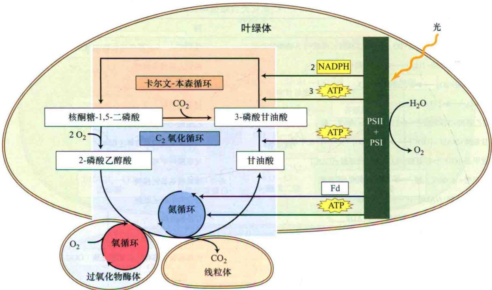  
图8.9 $\mathrm{C}_{2}$ 氧化光合循环依赖叶绿体代谢。 $\mathrm{C}_{2}$ 氧化光合循环需要来自于类囊体膜上光反应产生的ATP和还原等价物，在3个细胞器中运行：叶绿体，过氧化物酶体和线粒体。“碳循环”利用①NADPH和ATP将卡尔文-本森循环中的核酮糖-1，5-二磷酸维持在合适水平，②ATP将 $\mathrm{C}_{2}$ 氧化光合循环中的甘油酸转变为3-磷酸甘油酸。“氮循环”利用ATP和还原等价物，将光呼吸循环中的 $\mathrm{NH}_{4}^{+}$ 和2-酮戊二酸弥补谷氨酸。在过氧化物酶体中，“氧循环”清除因 $\mathrm{O}_{2}$ 氧化羟基乙酸而形成的 $\mathrm{H}_{2} \mathrm{O}_{2}$ 。

总结得

$$
2 \text {   核酮糖   } - 1, 5 \text {-二磷酸   } + 3 \mathrm{O} _ {2} + \mathrm{H} _ {2} \mathrm{O} + \mathrm{ATP} +
$$

$$
\begin{array}{r l} & [ 2 \mathrm{Fdred} + 2 \mathrm{H} ^ {+} + \mathrm{ATP} ] \longrightarrow 3 \mathrm{PGA} + \mathrm{CO} _ {2} + 2 \mathrm{P} _ {\mathrm{i}} + \mathrm{ADP} + \\ & [ 2 \mathrm{Fdoxid} + \mathrm{ADP} + \mathrm{P} _ {\mathrm{i}} ] \end{array}
$$

总之，通过核酮糖-1，5-二磷酸加氧反应，卡尔文-本森循环中流失的2分子磷酸乙醇酸（4个C）转化为1分子3-磷酸甘油酸（3个C）和1分子 $CO_{2}$ （1个C），此过程需要1分子ATP水解（Lorimer，1981；Sharkey，1988）。另外，1分子ATP和2分子还原型铁氧还原蛋白对于光呼吸过程中释放的氨分子完全再吸收是必要的。与非光呼吸（ $O_{2}$ 浓度低， $CO_{2}$ 浓度高）过程相比较，光呼吸（空气中 $O_{2}$ 浓度高， $CO_{2}$ 浓度低）过程固定 $CO_{2}$ 需要消耗更多的ATP和还原力。

光呼吸作用与卡尔文-本森循环同时存在，帮助线粒体实现从生物能到C代谢和N同化的各种反应。但是，植物生理学家对此过程的价值有争论。一种理论是：此过程促进C回收，否则就以2-磷酸乙醇酸的形式损失掉。 $C_{2}$ 氧化光合循环以甘油酸的形式回收75%的C，这些C本来以2-磷酸乙醇酸的形式从卡尔文-本森循环中损失。

## 8.3.3 胁迫条件下光呼吸保护光合器官

Rubisco活性位点的 $CO_{2}$ 和 $O_{2}$ 浓度、这些气体与酶的内在亲和性决定了核酮糖-1,5-二磷酸的羧化反应和氧化反应的相对速率。在Rubisco活性位点，不可避免地产生中间物2-磷酸乙醇酸，此中间物是活跃分子，与 $CO_{2}$ 和 $O_{2}$ 都可以发生反应（图8.4）。进化早期阶段，当时 $CO_{2}/O_{2}$ 较高，氧合反应发生的可能性很小。当大气 $O_{2}$ 浓度升高后，氧合反应显著加强。于是，现在大气中 $CO_{2}/O_{2}$ 降低，光呼吸成为以2-磷酸乙醇酸形式部分回收C的不可或缺的途径。3-磷酸甘油酸的产生阻止了进入死胡同的甘油酸的致死性积累。支持这种观点的证据是：缺少甘油酸激酶的拟南芥突变体出现甘油酸积累，这些植株在正常的空气中不能正常生长发育，但在高浓度 $CO_{2}$ 空气中能够存活（Boldt et al., 2005）。

另一种理论是：进化对光呼吸的影响不仅表现在降低了碳损失，也降低了胁迫（如高光强、高温、 $CO_{2}$ 或水分亏缺）条件下叶绿体产生过多的还原剂，并因此导致光合器官的光抑制。当电子受体受限时，光合器官可以使用别的底物解除电子流产生的过剩还原力。与用来改善光抑制伤害的其他机制不同， $C_{2}$ 氧化光合循环可以解除多余的还原当量，因此可以阻止光合电子链的过度还原。因此，缺乏光呼吸酶的拟南芥突变体可以在高浓度 $CO_{2}$ （2%）环境中生存，它们一旦被转移到正常的空气（0.03%的 $CO_{2}$ ）环境中，即迅速死亡。

鉴于此，必须承认的重要进展是：光合细胞中 $\mathrm{H}_2\mathrm{O}_2$ 主要来源于光呼吸，尤其是乙醛酸氧化酶催化的反应。虽然这种活性氧被认为有毒害作用，但 $\mathrm{H}_2\mathrm{O}_2$ 也是信号分子，参与激素和胁迫的应答反应（Foyer et al., 2009）。许多研究显示：当胞内 $\mathrm{H}_2\mathrm{O}_2$ 浓度超过抗氧化酶（过氧化氢酶和过氧化物酶）的清除能力时，光呼吸产生的 $\mathrm{H}_2\mathrm{O}_2$ 不仅触发程序性细胞死亡，也可以调控胞内氧化还原动态平衡。

## 8.3.4 光呼吸有可能用于提高作物产量的生物工程

解决现实中食物和能源短缺问题，在很大程度上依赖于陆地植物对光合 $CO_{2}$ 同化的提高的适应程度。因此，有效地提高生物量被认为是增加世界食物和能源。当 $O_{2}$ 与 $CO_{2}$ 竞争Rubisco活性位点胜出时，Rubisco加氧酶的活性降低了进入卡尔文-本森循环的C量。在此基础上，加强光合作用效率或减少光呼吸可以提高小麦、水稻、棉花产量（Khan，2007）。为了弄清楚如何利用遗传改造叶细胞以提高生物量，科学家尝试了对 $C_{2}$ 氧化光合循环的各种改造：从修饰Rubisco活性位点到引入全新的、同时进行的光呼吸途径。

尽管做了很多努力，但是企图通过改变Rubisco性能来减少光呼吸的尝试一直不成功。另外，光呼吸循环相关的突变体有助于人们理解其生化途径，但是这些植株在大气 $CO_{2}$ （0.03%）中生长矮化，并出现条件性地致死表型（Reumann and Weber，2006）。令人感兴趣的是，其中的一些突变体虽然矮化，但在抑制光呼吸（如将 $CO_{2}$ 浓度提高到0.1%\~0.3%）时能够继续生长。

因为 $C_{2}$ 氧化光合循环是陆地植物必需的，所以改善光合效率的其他途径是将可以挽回2-磷酸乙醇酸中C损失的补充机制引入卡尔文-本森循环。这种有前景的方法保证植物为基本的代谢过程而保留完整的功能性光呼吸途径。支撑这种可能性的是：细菌（E. coli）乙醇酸代谢途径已被成功地引入到陆地植物拟南芥叶绿体（Kebish et al., 2007）（图8.10）。这些转基因植株的叶绿体具有完整的 $C_{2}$ 氧化光合循环功能，同时可以完成细菌乙醛酸脱氢酶（乙醇酸→乙醛酸）（表8.3反应3）、乙醛酸聚醛酶[乙醛酸→丙醇二酸半醛（tartronic semialdehyde）+CO $_{2}$ ]（表8.3反应4）及丙醇二酸半醛还原酶（丙醇二酸半醛→甘油酸）（表8.3反应5）所催化的附加反应。

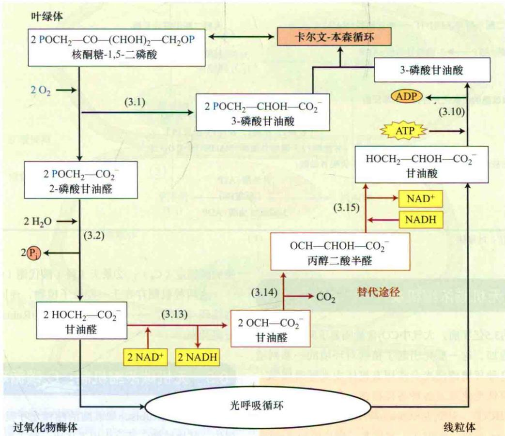  
图8.10 大肠杆菌（E. coli）的乙醇酸代谢途径被导入陆生植物叶绿体，使光呼吸乙醇酸再利用。括号中的数字代表的是表8.3中的反应（编者注）。给转基因植株以光照，Rubisco加氧酶活性可以促使产生2-磷酸乙醇酸、2-磷酸乙醇酸的磷酰基部分被水解，产生乙醇酸。在这个阶段，E. coli乙醇酸代谢途径导入拟南芥转基因株系的叶绿体内，将乙醇酸从光呼吸转移到一个替代途径中（红色方框和红色箭头标注）。首先，乙醇酸被乙醇酸脱氢酶氧化成乙醛酸。然后，细菌的乙醛酸羧化酶催化2分子乙醛酸脱水缩合，生成1分子丙醇二酸半醛并释放1分子 $CO_{2}$ 。最后，丙醇二酸半醛被丙醇二酸半醛还原酶催化产生甘油酸，甘油酸通过 $C_{2}$ 氧化循环进入卡尔文-本森循环。

将细菌乙醇酸途径引入到陆地植物叶绿体，可以降低光呼吸代谢物在过氧化物酶体和线粒体之间的流动。虽然基因工程改造的乙醇酸支路是光呼吸途径，该路径依赖Rubisco加氧酶活性并需要 $CO_{2}$ 的参与，但此途径不同于内源的对应途径，此内源路径可以避开线粒体和过氧化物酶体中光呼吸反应。因此，将植物的乙醇酸代谢途径转换为细菌的代谢方式可以减少能量（1分子ATP、2分子还原型铁氧还蛋白）消耗，这些能量被用于谷氨酰胺合成酶（表8.2反应11）及谷氨酸合酶（表8.2反应12）连续介导氨的再利用过程。值得注意的是，同叶绿体基质中能量需求低和C原子再利用增加相一致，这些基因工程植株生长较快、生物量增加、可溶性糖含量更高。

表8.3 改造后的C₂氧化光合碳循环反应

<table><tr><td>反应a</td><td>酶</td></tr><tr><td>1.2核酮糖-1,5-二磷酸+2O2→2 2-磷酸乙醇酸+2 3-磷酸甘油酸</td><td>核酮糖-1,5-二磷酸羧化/加氧酶</td></tr><tr><td>2.2 2-磷酸乙醇酸+2H2O→2乙醇酸+2Pi</td><td>磷酸乙醇酸磷酸酶</td></tr><tr><td>13.2乙醇酸+2NAD+→2乙醛酸+2NADH+2H+</td><td>乙醇酸脱氢酶</td></tr><tr><td>14.2乙醛酸+H+→丙醇二酸半醛+CO2</td><td>乙醛酸聚醛酶</td></tr><tr><td>15.丙醇二酸半醛+NADH+H+→甘油酸+NAD+</td><td>丙醇二酸半醛还原酶</td></tr><tr><td>10.甘油酸+ATP→3-磷酸甘油酸+ADP</td><td>甘油酸激酶</td></tr><tr><td colspan="2">基因工程改造的C2氧化光合循环的净反应</td></tr><tr><td></td><td>2核酮糖-1,5-二磷酸+2O2+2H2O+NAD+↓(反应1,反应2,反应13~反应15)甘油酸+2 3-磷酸甘油酸+NADH+H+CO2+2Pi</td></tr><tr><td colspan="2">这个反应被叶绿体甘油酸激酶催化,还原3-磷酸甘油酸:</td></tr><tr><td></td><td>甘油酸+ATP↓(反应10)3-磷酸甘油酸+ADP</td></tr></table>

a部位：叶绿体

## 8.4 无机碳浓缩机制

大约3.5亿年前，大气中 $CO_{2}$ 含量明显下降而 $O_{2}$ 浓度却显著增加，这一变化引起了植物对环境的一系列适应，而这种环境能使光合作用有机体中光呼吸增强。这些适应性变化涉及各种各样措施：积极地从环境吸收 $CO_{2}$ 和 $HCO_{3}^{-}$ ，达到在Rubisco周围积累无机碳的目的（Giordano et al., 2005）。紧接着，增加Rubisco附近 $CO_{2}$ 浓度的 $CO_{2}$ 浓缩机制是减少加氧反应。原核生物蓝藻细菌、真核生物藻类、水生植物的原生质膜上 $CO_{2}$ 和 $HCO_{3}^{-}$ 泵已被广泛研究（见Web Topic 8.1）。

以下章节关注陆地植物进化而来的，在Rubisco羧化反应位点进行 $CO_{2}$ 浓缩的两种不同机制：① $C_{4}$ 光合作用的碳固定（ $C_{4}$ ）；②景天（科）酸代谢（CAM）。

这两种机制存在于一些被子植物，连同卡尔文-本森循环“插件”——将大气 $CO_{2}$ 吸收与Rubisco底物供给分离开来。

## 8.5 无机碳浓缩机制: $\mathrm{C}_{4}$ 碳循环

为了降低Rubisco加氧酶活性和光呼吸循环中的碳损失，陆地植物 $C_{4}$ 光合作用进化成一种主要的浓缩碳机制，以此弥补大气 $CO_{2}$ 浓度降低带来的不利影响。在这一部分内容中，讲述 $C_{4}$ 光合作用的生化特点：不同类型的细胞将无机碳整合到碳骨架的协同作用、光介导的酶活性改变、碳浓缩机制维持许多热带植物生长的重要性。

## 8.5.1 苹果酸和天冬氨酸是 $C_{4}$ 循环的羧化反应产物

20世纪50年代晚期，H. P. Kortschack和Y. Karpilov分别利用 $^{14}$ CO $_{2}$ 标记的甘蔗和玉米中四碳酸进行了早期实验。在光条件下，接受 $^{14}$ CO $_{2}$ 处理几秒后，便发现叶片中70%\~80%的 $^{14}$ C出现在苹果酸和天冬氨酸等四碳酸中，而这一现象在只能进行卡尔文-本森循环光合作用的叶片中没有发生。

为了进一步认识这些初步观察到的现象，M. D. Hatch 和 C. R. Slack 提出了 $C_{4}$ 光合碳循环（ $C_{4}$ cycle， $C_{4}$ 循环；也称为 Hatch-Slack 循环）。他们认为：苹果酸和天冬氨酸是甘蔗叶片光合作用中初步稳定的、可检测的中间物，而且苹果酸的 $C_{4}$ 变成3-磷酸甘油酸的 $C_{1}$ （Hatch and Slack，1966）。后来的转化变得清晰起来，因为他们发现：这种新的代谢途径发生在2种不同形态的、不同类型的细胞——叶肉细胞（mesophyll cell）和维管束鞘细胞（bundle sheath cell）中，并被各自的膜所隔离（“扩散屏障”，图8.11）。 $C_{4}$ 循环中，磷酸烯醇式丙酮酸羧化酶（phosphoenol-pyruvate carboxylase，PEPCase），而不是Rubisco，催化在接近于空气的组织中发生的初始羧化反应（表8.4反应1）（见Web Essay 8.1）（Sage，2004）。其结果是四碳酸跨越扩散屏障流入维管束区域，在此四碳酸脱羧、释放 $CO_{2}$ ，后者

  
图8.11 C $_{4}$ 光合碳循环包括在叶细胞中两个不同区室中的5个连续步骤。①在叶肉细胞的边缘（靠外区域），即接近于外界环境处，磷酸烯醇式丙酮酸羧化酶（phosphoenol-pyruvate carboxylase，PEPCase）催化HCO $_{3}^{-}$ 和PEP（一种三碳化合物）发生反应，四碳反应产物草酰乙酸分别被NADP-苹果酸脱氢酶和草酰乙酸氨基转移酶转变为苹果酸或天冬氨酸（根据不同的物种）（表8.4）。为了能够简单明了，在此仅给出苹果酸的反应。②四碳酸通过渗透屏障进入维管束区域。③脱羧酶（如NAD-苹果酸酶）作用于四碳酸，使其释放出CO $_{2}$ ，并生成三碳酸（如丙酮酸）。释放出的CO $_{2}$ 被维管束区的叶绿体摄取，在周围建立起一个高浓度CO $_{2}$ 环境（相对于O $_{2}$ ），从而促进CO $_{2}$ 在卡尔文-本森循环中同化。④剩余的三碳酸（如丙酮酸）返回和外界大气接触的区域。⑤关闭C $_{4}$ 循环，HCO $_{3}^{-}$ 受体（磷酸烯醇式丙酮酸）通过丙酮酸磷酸二激酶再生，进入另一轮循环。每摩尔CO $_{2}$ 固定需消耗2分子ATP，促使C $_{4}$ 循环朝着箭头方向进行。这样，将大气CO $_{2}$ 泵入卡尔文-本森循环。同化的碳在细胞质中被转变成蔗糖，之后，离开叶绿体进入韧皮部，再被运至植物体的其他部位。

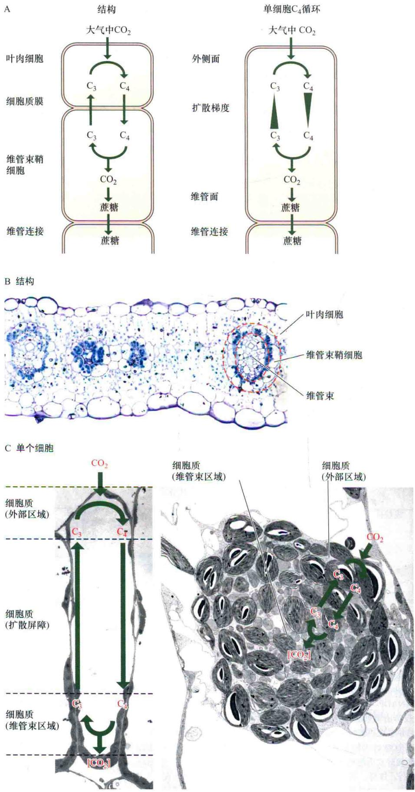

图8.12 叶片 $C_{4}$ 光合作用途径。A. 在几乎所有已知的 $C_{4}$ 植物中，光合作用 $CO_{2}$ 吸收需要形成Kranz结构（左侧图）。这种结构特征将光合作用反应分在两种不同类型的细胞内——叶肉细胞和维管束鞘细胞（围绕叶脉同轴排列）。维管束鞘细胞环绕维管组织，与此同时，一个外部的叶肉细胞环包绕维管束并与细胞间隙相邻。把用于固定 $CO_{2}$ 的细胞和用于还原碳的细胞分隔开的膜结构，对于陆生植物 $C_{4}$ 光合作用高效进行是十分必要的。一些陆生植物，以Borszczowia aralocaspica和Bienertia cycloptera为典型，在单个细胞中存在有效的 $C_{4}$ 划分（右侧图）。对这些植物的光合作用关键酶进行研究，同样发现了两种类型的叶绿体，这些叶绿体位于不同细胞质区室内，并具有叶肉细胞和Kranz结构中维管束鞘细胞类似的功能。B. $C_{4}$ 双子叶植物（坛紫菜，菊科）中的Kranz结构。C. 单细胞 $C_{4}$ 光合作用。 $C_{4}$ 循环的图表是叠加在Borszczowia aralocaspica（左）和Bienertia cycloptera（右）电子显微照片上的（B图由Athena McKown惠赠，C图引自Edwards et al., 2004）。

被卡尔文-本森循环中Rubisco固定。虽然 $C_{4}$ 植物都有PEPCase催化的基本的羧化反应，但是各种 $C_{4}$ 植物在Rubisco附近区域浓缩 $CO_{2}$ 途径呈现很大差别（参见Web Topic 8.9）。

20世纪五六十年代，一些开创性的研究发现： $C_{4}$ 循环与叶片特殊结构——Kranz结构（Kranz德语意思是花环）有关，该结构内层是微管组织包围的环状排列的维管束鞘细胞，外层是与表皮紧密相连的叶肉细胞。这种特殊的叶片组织可以保证酶的区域化，且这些区域化的酶在2种不同类型的细胞中是 $C_{4}$ 途径行使功能所必需的。但是，现在也有明显例证表明：一些绿藻、双子叶植物、水生或陆地植物可以进行单细胞 $C_{4}$ 光合作用（Edwards et al., 2004；Muhaidat et al., 2007）（图8.12A）（参见Web Topic 8.10）。因此，代谢物在两个区域间的流转可以保障梯度扩散驱动的 $C_{4}$ 循环运转，此现象不仅发生在细胞之间，也发生在细胞内部。

## 8.5.2 参与 $\mathrm{C}_4$ 循环的两种不同类型的细胞

最初发现的植物叶片 $C_{4}$ 循环关键特点是：微管组织被2种不同类型的光合细胞包围，内圈是维管束鞘细胞（bundle sheath cell），外圈为叶肉细胞（mesophyll cell）。维管束鞘细胞的叶绿体向心排列，并包含大淀粉颗粒和非垛叠类囊体膜。另外，叶肉细胞包含有无规律排列的叶绿体，其中类囊体垛叠，几乎不含有淀粉。在这种解剖结构中， $CO_{2}$ 从外部气体被运输到维管束鞘细胞经5个连续步骤（图8.12B，表8.4）。

（1）在叶肉细胞中，PEPCase催化磷酸烯醇式丙酮酸的羧化反应，固定 $HCO_{3}^{-}$ （表8.4反应1）。随后，此反应的产物——草酸乙酸被NADP-苹果酸脱氢酶还原成苹果酸（表8.4反应2），或者和谷氨酸进行转氨基作用变成天冬氨酸（表8.4反应3）。

（2）将四碳酸（苹果酸或天冬氨酸）转运到环绕着维管束的维管束鞘细胞。

（3）四碳酸脱羧产生 $CO_{2}$ ，后者由卡尔文-本森循环还原成碳水化合物。此反应之前，一些 $C_{4}$ 植物在天冬氨酸转氨酶的催化下，将天冬氨酸重新变为草酰乙酸（表8.4反应3）。不同亚型的 $C_{4}$ 植物雇佣不同的脱羧酶从不同的有机酸中截取 $CO_{2}$ ，这种作用通过提高 $CO_{2}/O_{2}$ 而有效地减少Rubisco加氧酶反应（表8.4反应4和反应5）（参见Web Topic 8.9）。

（4）由脱羧基反应产生的三碳骨架（丙酮酸或丙氨酸）运回叶肉细胞。

（5） $HCO_{3}^{-}$ 受体再生。在丙酮酸磷酸二激酶催化下，丙酮酸（三碳酸残基）产生磷酸烯醇式丙酮酸（表8.4反应7）。期间，腺苷酸激酶催化AMP生成ADP，反应消耗另1分子ATP（表8.4反应8）。当三碳化合物丙氨酸从维管束鞘细胞输出，在丙氨酸转氨酶作用下脱氨形成丙酮酸，然后在丙酮酸磷酸二激酶催化下发生磷酸化作用（表8.4反应6）。

酶的区域化可以保证无机碳被叶肉细胞从环境气体中初步吸收，被卡尔文-本森循环中的维管束鞘细胞固定，最后输出到韧皮部（图8.11）。因为与 $C_{4}$ 循环相关的酶大量且专一地在这些细胞中表达。研究Amaranthus edulis（苋果）PEPCase缺失突变体发现，因为维管束鞘细胞中缺乏有效的 $CO_{2}$ 固定机制，使得 $C_{4}$ 植物中的光呼吸作用显著提高（Dever et al., 1996）。

## 8.5.3 $\mathrm{C}_{4}$ 循环在维管束鞘细胞的叶绿体中浓缩 $\mathrm{CO}_{2}$

起初用 $C_{4}$ 循环描述热带草本植物，现在知道：该循环可以在包括单子叶和双子叶植物的18个家族中进行，在禾本科（玉米、黍、高粱、甘蔗）、藜科（Atriplex spp.）和莎草科（多个属）中尤为显著（Edwards and Walker，1983）。所有的C4循环运行需要两种类型的、含有叶绿体的细胞（前已述及）的有效协作：排列在Kranz结构中不同位置的叶肉细胞和维管束鞘细胞（图8.12B）。连接这两种细胞的胞间连丝在维管束鞘细胞（维管区）中制造了比叶肉细胞（外界区）中更高的CO2浓度，有利于其输出（图8.11）。提高Rubisco羧化位点CO2浓度可以抑制核酮糖-1，5-二磷酸加氧反应和光呼吸。

表8.4 $C_{4}$ 光合碳循环的反应

<table><tr><td>酶</td><td>反应</td></tr><tr><td>1.PEPCase</td><td>磷酸烯醇式丙酮酸+ $HCO_{3}^{-}$ →草酸乙酰+ $P_{i}$ </td></tr><tr><td>2.NADP-苹果酸脱氢酶</td><td>草酸乙酰+NADPH+ $H^{+}$ →苹果酸+NADP $^{+}$ </td></tr><tr><td>3.天冬氨酸转氨基酶</td><td>草酰乙酸+谷氨酸→天冬氨酸+2-氧戊二酸</td></tr><tr><td>4.NAD(P)-苹果酸酶</td><td>苹果酸+NAD(P) $^{+}$ →丙酮酸+ $CO_{2}$ +NAD(P) $H$ + $H^{+}$ </td></tr><tr><td>5.磷酸烯醇式丙酮酸脱羧酶</td><td>草酰乙酸+ATP→磷酸烯醇式丙酮酸+ $CO_{2}$ +ADP</td></tr><tr><td>6.丙氨酸转氨基酶</td><td>丙酮酸+谷氨酸→丙氨酸+ $\alpha$ -酮戊二酸</td></tr><tr><td>7.丙酮酸磷酸二激酶</td><td>丙酮酸+ $P_{i}$ +ATP→磷酸烯醇式丙酮酸+AMP+ $PP_{i}$ </td></tr><tr><td>8.腺苷酸激酶</td><td>AMP+ATP→2ADP</td></tr><tr><td>9.焦磷酸酶</td><td> $PP_{i}$ + $H_{2}O$ → $2P_{i}$ </td></tr></table>

注： $P_{i}$ 和 $PP_{i}$ 分别代表无机磷酸和焦磷酸

除解剖结构差异之外，这些细胞在酶组成上有很大不同。PEPCase和Rubisco分别位于叶肉和维管束鞘细胞，而脱羧酶位于维管束鞘细胞的不同区室：NADP-苹果酸酶位于叶绿体中（表8.4反应4），NAD-苹果酸酶位于线粒体中（表8.4反应4），磷酸烯醇式丙酮酸羧激酶位于细胞质中（表8.4反应5）。光合作用的过渡性储存产物——淀粉绝大部分聚积在维管束鞘细胞的叶绿体中。

$C_{4}$ 植物叶肉和维管束鞘细胞中的叶绿体在其他结构和生化特征上存在差异。PSⅡ活性伴随线性电子流向PSⅠ，并产生NADPH和ATP，这些反应一般发生在基粒含量较多的叶绿体中；而PSI推动的电荷环形流动绝大部分产生ATP，此过程发生在基粒含量较低的叶绿体中。这两种类型的叶绿体与 $C_{4}$ 光合作用能量需求密切相关。苹果酸是 $C_{4}$ 植物的优势产物，将苹果酸转化为草酰乙酸的植物比利用天冬氨酸进行此转化的植物消耗更多的还原力（表8.4反应2和反应3）。因此，NADP-苹果酸酶类型的 $C_{4}$ 植物叶肉细胞叶绿体中具有发达的基粒，苹果酸从叶肉细胞运至维管束鞘细胞。与之相反，NAD-苹果酸酶类型的 $C_{4}$ 植物中，叶肉细胞固定 $CO_{2}$ 的原初产物是天冬氨酸，此反应需要较少的还原力，因此电子直接流向PSⅠ。因为PSⅠ中的电子环流产生的ATP可以驱动丙酮酸向磷酸烯醇式丙酮酸的转变（表8.4反应7），NAD-苹果酸酶类型的 $C_{4}$ 植物叶肉细胞叶绿体比维管束鞘细胞含有较少的基粒。

重组DNA技术在植物代谢研究中的应用，大大推进了人们对 $C_{4}$ 光合作用调控的理解。利用PEPCase和Rubisco比率改变的转基因植物，可以研究这些酶的相对水平是否决定 $C_{4}$ 光合作用效率。反义抑制Rubisco而降低其含量的Flaveria叶片中，PEPCase水平没有受到协同性影响（Siebke et al., 1997；von Caemmerer et al., 1997）。虽然这些转基因植物的维管束鞘细胞中 $CO_{2}$ 浓度更高，但 $CO_{2}$ 增加不能被保持，因而光合作用效率降低。相反地，低光下，高表达碳酸酐酶的烟草维管束鞘细胞中的 $HCO_{3}^{-}$ 经过胞间连丝渗漏到叶肉细胞，光合作用下降。此现象显示：尽量限制 $CO_{2}$ 从维管束中扩散出来对于 $C_{4}$ 光合作用的效率很重要（Ludwig et

al., 1998)。

像第1章描述的那样，绿色植物的叶绿体由其被膜的双层膜包围着从细胞质独立起来，管制很多专一的代谢物运输体。利用液相色谱和串联质谱分析方法，分析来自于大豆（一种 $C_{3}$ 植物）和玉米（一种 $C_{4}$ 植物）叶肉细胞叶绿体膜，发现：叶绿体被膜对 $C_{4}$ 光合作用需求的适应性（Brautigam et al., 2008）。 $C_{3}$ 植物和 $C_{4}$ 植物的叶肉细胞中的叶绿体本质上相似，但在叶绿体被膜蛋白质组上存在量的差异。值得一提的是， $C_{4}$ 植物被膜上的参与丙糖磷酸和磷酸烯醇式丙酮酸转运蛋白比 $C_{3}$ 植物丰富得多。这种高丰度确保 $C_{4}$ 植物叶绿体被膜的代谢中间物流通量比 $C_{3}$ 植物中更高。

$C_{3}$ 植物维管束周围存在 $C_{4}$ 类光合作用，暗示：从 $C_{3}$ 途径稍加修饰就可演化为 $C_{4}$ 光合作用。一些 $C_{3}$ 植物（如烟草）的木质部和韧皮部细胞附近表现出 $C_{4}$ 光合作用特征——使用维管系统的苹果酸作为碳源（Hibberd and Quick，2002）。同时，这些细胞中有 $C_{4}$ 途径所特有的酶[NAD（P）-苹果酸酶和磷酸烯醇式丙酮酸羧激酶]。这说明 $C_{3}$ 植物已经具备 $C_{4}$ 光合作用所必需的基本生化成分。与这些研究结果一致的观点是： $C_{4}$ 光合作用是从 $C_{3}$ 代谢发展而来，期间进行了一些关键酶的调节或组织专一性改变。

## 8.5.4 单个细胞中的 $C_{4}$ 循环也能够浓缩 $CO_{2}$

研究发现：一些有机体中的 $C_{4}$ 光合作用不具有Kranz结构，说明 $C_{4}$ 固定碳的模式比已知的模式更加多样化（参见Web Topic 8.10）。两种生长于亚洲的植物Borszczowia aralocaspica和Bienertia cycloptera能在单个绿色组织细胞中完成整个 $C_{4}$ 光合作用（Sage，2002；Edwards et al., 2004）（图8.12B）。单细胞的海洋原生生物硅藻类也可以在单细胞中进行 $C_{4}$ 光合作用。

## 8.5.5 光调控重要 $\mathrm{C_4}$ 酶活性

除了提供ATP和NADPH，光对于 $C_{4}$ 循环中几种特殊酶的调控也至关重要。因此，光子流量变化可以改变NADP-苹果酸脱氢酶、PEPCase和丙酮酸磷酸二激酶活性（表8.4反应1、反应2和反应7），其调节机制包括两种：硫基-二硫键转换[Ens-(Cys-S) $_{2}$ $\leftrightarrow$ Ens-(Cys-SH) $_{2}$ ]和一些特殊氨基酸残基的磷酸化-脱磷酸化[如丝氨酸，Ens-Ser-OH $\leftrightarrow$ Ens-Ser-OP]。

经典的铁氧还蛋白-硫氧还蛋白系统调节NADP-苹果酸脱氢酶活性（图8.6）。叶片受到光照时，此酶被还原（激活），黑暗时被氧化（失活）。另外，一种专一的丝氨酸-苏氨酸激酶——PEPCase激酶催化PEPCase的磷酸化，加速环境 $CO_{2}$ 的吸收（参见Web

Topic 8.1）（Izui et al., 2004）。夜间，磷酸化的丝氨酸被蛋白磷酸酶2A脱磷酸化，使PEPCase催化能力恢复到基本（低）水平。此外，一种很独特的蛋白质严格调节丙酮酸磷酸二激酶（pyruvate-phosphate dikinase, PPDK）活性随昼/夜节律的变化（Burnell and Hatch, 2006）。丙酮酸磷酸二激酶（PPDK）翻译后活性受到一种双功能酶——苏氨酸激酶-磷酸酶调节，此双功能酶既可以催化依赖ADP的丙酮酸磷酸二激酶的磷酸化（PPDK+ADP↔PPDK-P+AMP），也可以催化依赖 $P_{i}$ 的丙酮酸磷酸二激酶的脱磷酸化（PPDK-P+ $P_{i}$ ↔PPDK+ $PP_{i}$ ）。通过激酶-磷酸酶调节，黑暗导致 $P_{i}$ 基团附加到丙酮酸磷酸二激酶专一的苏氨酸上，导致该酶失活。磷酸解离的磷酸基团可以恢复丙酮酸磷酸二激酶催化能力。

## 8.5.6 炎热干燥气候下， $C_{4}$ 循环降低光呼吸和水分损失

前已述及，温度升高可以降低Rubisco羧化活性和 $CO_{2}$ 溶解能力，因此限制 $C_{3}$ 植物光合作用中 $CO_{2}$ 同化速率。对于 $C_{4}$ 植物来说，两个特性可以克服高温对光合作用的不利影响。

第一，当高温和 $CO_{2}$ 浓度降低时，PEPCase和底物 $HCO_{3}^{-}$ 亲和性足够高。又因为起初的羧化反应中 $HCO_{3}^{-}$ 不与 $O_{2}$ 竞争，所以Rubisco加氧酶活性大部分被抑制。PEPCase活性升高有助于 $C_{4}$ 植物在高温下减少气孔开度而保持水分，因此在等于或高于 $C_{3}$ 植物的 $CO_{2}$ 固定率的情况下， $C_{4}$ 植物更节约水量。

第二，维管束鞘细胞中高浓度 $CO_{2}$ 可以限制 $C_{2}$ 氧化光合循环（Maroco et al., 1998）。

以上两个特征使得光合作用更加有效运行，赋予 $C_{4}$ 植物更有利的竞争优势，也就是说，在干燥、炎热的环境中，光呼吸的消耗有更重要的意义。

## 8.6 无机碳浓缩机制：景天酸代谢(CAM)

生活在季节性降水稀少的干旱地区，许多植物（包括具有重要经济价值的菠萝、龙舌兰、仙人掌和兰花）在Rubisco位点存在另外一种 $CO_{2}$ 浓缩机制。这种重要的光合碳固定反应称为景天酸代谢（CAM），这个名称用来纪念在Bryophyllum calycinum（一种肉质的景天科植物）上所进行的初次研究（Cushman，2001）。与 $C_{4}$ 的机制一样，在缺水环境中，CAM光合作用似乎在过去的3.5亿年中已经出现，捕获大气 $CO_{2}$ 并捕食呼吸产生的 $CO_{2}$ 。

CAM植物的突出特点是能够生活在降雨少、蒸发量高到不足以维持作物生长的环境中，且能够获得很高的生物量。与CAM植物减少水分损失相适应的结构特点是：厚表皮、低表面积/体积、大液泡、气孔开度小；白天，叶肉细胞紧密排列而减少 $CO_{2}$ 损失。一般情况下，CAM植物每得到1g $CO_{2}$ 需要损失50\~100g水、 $C_{4}$ 植物损失250\~300g水， $C_{3}$ 损失400\~500g水（见第4章）。因此，CAM植物的优势是可以在干旱环境（如沙漠地带）中生存。

如上所述， $C_{4}$ 植物在脱羧反应的前几秒钟内在一个区域（如叶肉细胞）中形成四碳酸，而卡尔文-本森循环中 $CO_{2}$ 再固定反应发生在另一个区域（如维管束鞘细胞）。对于CAM植物而言，大气 $CO_{2}$ 最初被四碳酸捕获直至最后 $CO_{2}$ 被嵌入联系紧密的碳骨架空间上，而时间上不同步，在24h光照-黑暗环节律中几乎相差12h（图8.13）。

夜晚，借助于储存的碳水化合物分解而来的磷酸烯醇式丙酮酸，胞质PEPCase将大气（和呼吸）中的 $CO_{2}$ 固定并形成草酰乙酸（表8.4反应1）。胞质NAD-苹果酸脱氢酶将草酰乙酸转化为苹果酸，作为夜晚的剩余物储存在酸性液泡中（表8.4反应2）。白天，储存的苹果酸被运到叶绿体中，并利用与 $C_{4}$ 植物类似机制进行脱羧，即通过胞质NADP-苹果酸酶、线粒体NADP-苹果酸酶或线粒体磷酸烯醇式丙酮酸羧激酶进行脱羧反应（表8.4反应4和反应5）。被释放的 $CO_{2}$ 在卡尔文-本森循环中重新固定，而补充的三碳酸转化为磷酸丙糖，然后 $C_{4}$ 植物通过糖异生反应再将其转化为淀粉或蔗糖。

以每天24h计的CAM循环，C吸收速率和酶活性的变化被分为4个不同的阶段：阶段1（夜间）、阶段2（清晨）、阶段3（白天）、阶段4（下午晚些时候）（参见Web Topic 8.11）。在夜间的阶段1，气孔开放，叶片进行呼吸， $CO_{2}$ 被捕捉并以苹果酸的形式储存于液泡。PEPCase吸收 $CO_{2}$ 主要发生在阶段1。在白天的阶段3，气孔关闭，叶片进行光合作用，储存的苹果酸被脱掉羧基。Rubisco活性中心 $CO_{2}$ 浓度升高的结果是缓解了光呼吸的负面效应。短暂的阶段2和阶段4分别为阶段3和阶段1做准备。Rubisco活性在阶段2提高、在阶段4下降。相反，PEPCase活性在阶段4提高，在阶段2下降。

不同的CAM植物，每个时间段的长度和对总碳平衡的贡献差异很大。组成型的CAM植物在夜间不停地吸收 $CO_{2}$ ，而相对应的兼性CAM途径仅仅在水分胁迫时启用CAM途径。

卡尔文-本森循环产生的磷酸丙糖是在叶绿体中以淀粉储存还是用于蔗糖合成取决于植物种类。这些碳水化合物最终不仅保证植物的生长，也保证第二天晚上的羧化反应的底物。总之，紧密相连的羧化反应和脱羧反应在时间上的分离可以减少Rubisco的无效运行，优化

黑暗: 气孔开放

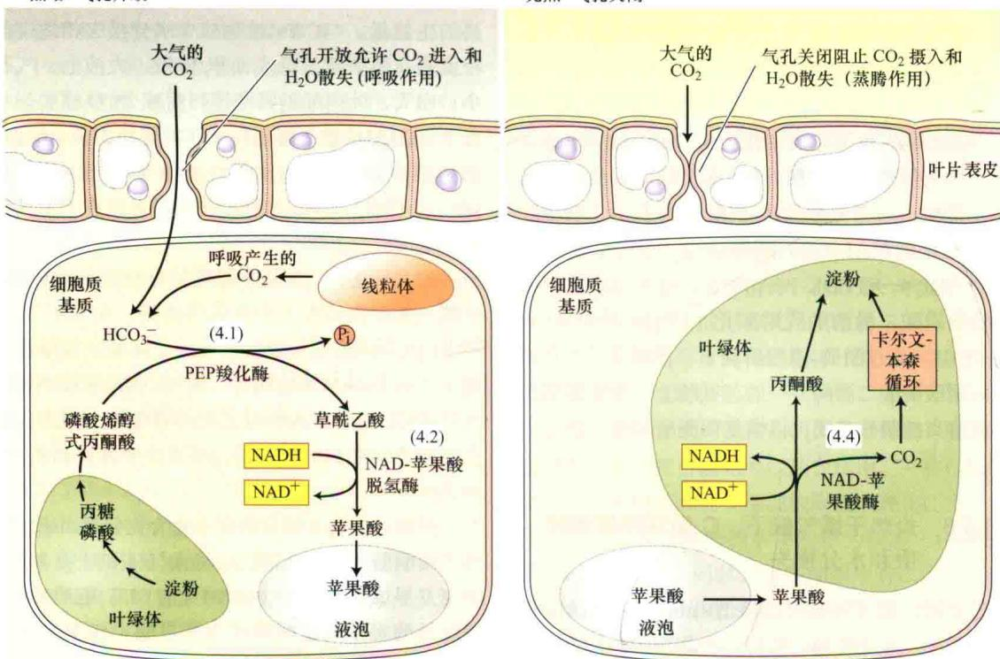  
图8.13 景天科酸代谢（CAM）。在景天科酸代谢中，摄取 $CO_{2}$ 和通过卡尔文-本森循环的 $CO_{2}$ 固定被暂时分开。括号中的数字代表的是表8.4中的反应。对大气中 $CO_{2}$ 摄取发生在夜间，此时气孔是张开的。在这一阶段，细胞质基质中气态 $CO_{2}$ 增加 $HCO_{3}^{-}$ 水平（ $CO_{2}+H_{2}O\longleftrightarrow HCO_{3}^{-}+H^{+}$ ）。这部分 $CO_{2}$ 来自于外界大气和线粒体中的呼吸作用。随后，胞质PEPCase（PEP羧化酶）催化 $HCO_{3}^{-}$ 和磷酸烯醇式丙酮酸发生反应。磷酸烯醇式丙酮酸来自于叶绿体淀粉在夜间分解，最终导致四碳酸（草酰乙酸）被还原成苹果酸，苹果酸导致液泡酸化。在白天，夜晚被储存在液泡中的苹果酸返回到细胞质基质中。苹果酸脱羧酶（NAD-苹果酸酶）作用于苹果酸，使其释放出 $CO_{2}$ ， $CO_{2}$ 又通过卡尔文-本森循环被重新固定在碳骨架中。实质上，白天叶绿体中淀粉积累可以看作夜间无机碳的净吸收。白天，气孔关闭不仅阻止运输过程中水分的散失，同时能够阻止内部 $CO_{2}$ 与外界大气交换。

了水分利用，因此可以提高胁迫环境中的光合性能。

## 8.6.1 CAM是灵活感受环境刺激的机制

在水分亏缺环境中，CAM植物高效利用水分可能说明物种多样性及新物种形成。生长于沙漠的CAM植物（如仙人掌）通过在凉爽的夜晚打开气孔，在干燥炎热的白天关闭气孔而得到水分高效利用。白天，关闭气孔减少水分损失，但由于 $H_{2}O$ 和 $CO_{2}$ 拥有共同的运输途径，因此 $CO_{2}$ 必须在夜晚摄取。光照可以动员储存在液泡的苹果酸，为卡尔文-本森循环中专一的脱羧酶——NAD（P）H-苹果酸酶和烯醇式丙酮酸激酶同化 $CO_{2}$ 打基础（Drincovich et al., 2001）。

当气孔关闭时，脱羧酶和线粒体呼吸作用释放的 $CO_{2}$ 都不能从叶片逃逸。因此，内部产生的 $CO_{2}$ 被卡尔文-本森循环固定，将其转化为碳水化合物。气孔关闭不仅可以保水，而且有助于提高内部 $CO_{2}$ 浓度，以此提高核酮糖-1，5-二磷酸光合作用中的羧化反应。非洲刺梨（Opuntia stricta）不经意间被带入澳大利亚生态系统中，这些植物适应环境的情况能说明CAM陆地植物适应干旱环境的潜在的优越性。在不足1个世纪的时间里，这种刺梨从较少的1840株植物迅速扩展到占地2.5亿亩 $^{①}$ 的种群。

遗传背景和环境因素决定了CAM植物的生化和生理能力的表达程度。虽然许多室内生长的、多汁的、观赏类的景天科植物（如长寿花）等标准的CAM类植物表现出昼夜节律性，其他的（如猪胶树属）在对生叶片中同时进行 $C_{3}$ 光合作用和CAM（Lüttge et al., 2008）。夜间PEPCase与白天Rubisco同化 $CO_{2}$ 量（ $CO_{2}$ 总同化量）比率受以下因素综合调节：①气孔行为；②有机酸含量和储存的碳水化合物积累量的波动；③初级（PEPCase）和二级（Rubisco）羧化酶活性；④脱羧酶活性；⑤ $C_{3}$ 碳骨架合成和分解。

许多CAM植物根据环境长期变化特点而调整 $CO_{2}$ 摄入的类型。在使用CAM光合途径的植物中，如冰叶日中花（Mesembryanthemum crystallinum L.）、龙舌兰、猪胶树（Clusia），缺水时使用CAM光合途径；而水分充足时，逐渐过渡到 $C_{3}$ 类型。其他环境因素（如盐分、温度、光强度或光质量）也影响一些植物CAM实施程度。这种调控形式需要多种CAM基因应答环境胁迫信号而表达（Adams et al., 1998; Cushman, 2001; Lüttge et al., 2008）。

干旱环境中，关闭气孔保水机制也许不是CAM进化的唯一原则，因为令人费解的是：水生植物中也有CAM作用机制（Mommer and Visser，2005；Lawlor，2009）。推测：CAM机制有利于植物在水环境中获得无机碳（即 $HCO_{3}^{-}$ ），因为水中气体扩散阻力太大，限制了 $CO_{2}$ 可利用性。

## 8.7 光合作用中淀粉和蔗糖的积累与分流

真核细胞的显著性特点是各代谢舱室之间形成错综复杂的功能网络。真核生物必须把糖从它合成和吸收位点（源）移送到使用它们的细胞（库）中去（为了生长和能量）。动物血管可以运输葡萄糖，而植物微管运输的是蔗糖。葡萄糖主要特点是 $C_{1}$ 上的醛基，因此这种单糖（还原端）能够在碱性条件下还原铜离子（ $Cu_{2}^{+}+e^{-}\longrightarrow Cu^{+}$ ）（参见Web Topic 8.12）。醛基基团使葡萄糖对蛋白质中的氨基具有天然活性（产生蛋白糖），因此，血管中糖浓度必须控制在很窄的范围内（健康人体内6\~8 mol/L）。植物利用糖苷键将蔗糖 $[\beta-D-Fruc-(2\rightarrow1)-\alpha-D-gluc]$ 与海藻糖 $[\alpha-D-Gluc-(1\rightarrow1)-\alpha-D-Gluc]$ 中的己糖残基连接在一起。二糖的形成掩盖了葡萄糖（ $C_{1}$ 上的醛基）和果糖（ $C_{2}$ 上的酮基）的活性基团，因此在碱性条件下也不能进行铜离子还原反应。蔗糖和海藻糖反应活性低于葡萄糖，各种植物组织中的这两种二糖含量变化较大。胞间高水平蔗糖有利于从源向库运输。胞内低水平的海藻糖使叶绿体淀粉合成与胞质C含量协调一致（Kolbe et al., 2005）。

植物生物化学家面临的主要挑战是：如何解释叶绿体中光合作用产生这些化合物（光合产物）与叶细胞各种代谢过程间的关系。大多数叶片光合作用同化的 $CO_{2}$ 生成蔗糖，其最终产物是淀粉。但是它们产生的途径是完全分离的：蔗糖在胞质合成，淀粉在叶绿体合成。白天，蔗糖被持续地从叶片胞质流向异养型的库组织，而淀粉颗粒则在叶绿体中积聚（参见Web Topic 8.13）。大多数植物中，蔗糖是从叶片（源）运向储存组织（库）的主要化合物（图8.14）。白天，叶绿体中的一些淀粉类的光合产物的流转可以保障植物在夜里有足够的碳水化合物转化为可以输出的蔗糖。植物叶片淀粉和蔗糖积累水平相差很大。一些植物（如大豆、甜菜、拟南芥）叶片中淀粉与蔗糖的比例在白天时间几乎是不变的。另外一些植物（如菠菜、法国豆），当蔗糖积累超过叶片或库组织的储存能力时，启动淀粉生物合成机制。环境因子（尤其是白天长短）也可以影响叶片对所固定的C在蔗糖和淀粉之间的分配；与长日照下的植物不同，短日照下的植物更多地将光合产物转化为淀粉，因此保障长夜时间段充足糖供给。

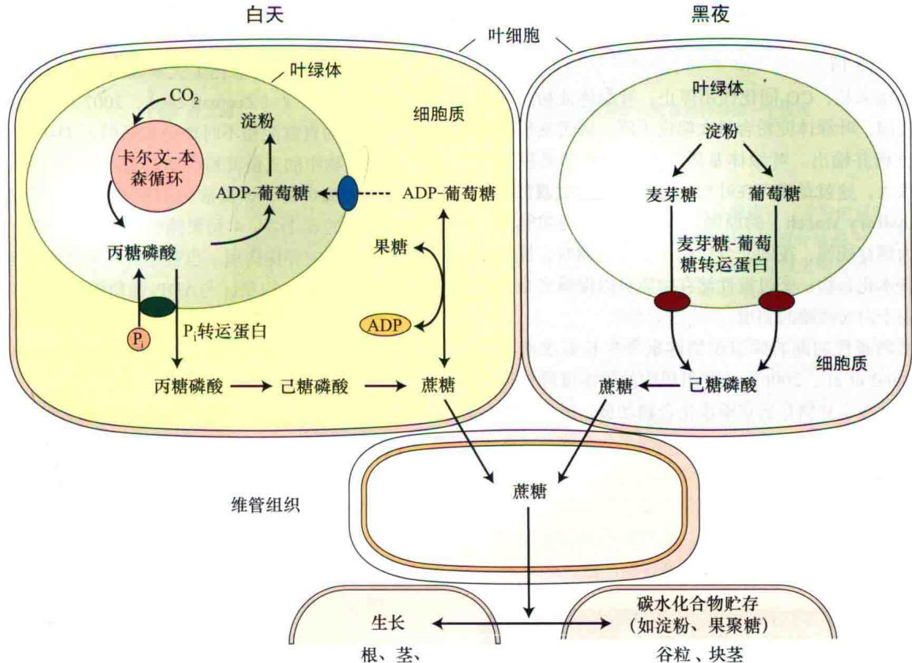  
图8.14 陆生植物的碳流动。在白天，光合作用同化吸收的碳用于叶绿体中淀粉的形成，或者将其运输到细胞质中合成蔗糖，蔗糖随后被运输到植物的非光合作用部位。来自于卡尔文-本森循环的丙糖磷酸可能用于①叶绿体ADP-葡萄糖（蔗糖合成的供体）合成，或者②迁移到细胞质中合成蔗糖。在夜间，糖苷键断裂产生麦芽糖和葡萄糖，两者跨过叶绿体膜来填充磷酸己糖库，有利于高效合成蔗糖。在这一不间断的基础之上，蔗糖将叶片中无机碳（ $\mathrm{CO}_{2}$ ）的同化吸收与有机碳的利用连接在一起，用于植物的生长和在非光合作用部位糖的储存。图中标示的ADP-葡萄糖向质体的转运过程仍存在争议。

光合作用产生的糖从源（叶片）运输到达非光合作用的库（茎、根、块茎、籽粒），期间穿过微管组织（韧皮部）。在一些植物中，其他的碳水化合物便于向外输出：葫芦和拟南芥中以蔗糖-半乳糖寡聚糖（棉籽三糖、水苏四糖、毛蕊花糖）、苹果树以山梨醇、芹菜以甘露醇形式运输。茎、根和幼叶把输入的糖作为生长能源和储存多聚糖的材料（块茎和籽粒）。淀粉是大多数植物中储存的常见碳水化合物，其他多糖（主要是果聚糖）也被发现储存于许多植物的营养组织中（参见Web Topic 8.14）。

黑暗来临， $CO_{2}$ 同化作用停止，叶绿体淀粉降解开始。夜间，叶绿体淀粉含量大幅度下降，因为它们被转化为蔗糖并输出。叶绿体基质淀粉在白天和黑夜间的变化很大，这就是储存在叶绿体的多糖称为过渡性淀粉（transitory starch）的原因。过渡性淀粉的功能是：①作为储存能源，夜间光合作用不能合成糖时，提供充足的碳水化合物；②过渡性储存物质可以保障光合作用进程快于白天蔗糖的利用。

植物碳代谢随着库组织的能量和生长需求而变化（Rolland et al., 2006）。库组织中的糖浓度降低可以刺激光合速率和储存器官碳水化合物动员。另外，叶片中含有充足的糖可促进植物生长和碳水化合物在储存器官的储存。糖运输是同化的碳分配的关键，因为此过程将叶片（源）的可利用的碳水化合物和库组织储存多糖的形成联系起来（见第10章）。碳分配是植物生理学的重要内容，理解这一过程也是提高作物产量所必需的。

## 8.8 叶绿体淀粉产生与动员

淀粉是植物主要的储存碳水化合物。在自然界的多糖化合物中，只有纤维素丰度超过它。淀粉组装成为半晶状列阵而成为不溶颗粒（参见Web Topic 8.13）。电子显微研究有关淀粉积累和相关酶定位显示：叶片叶绿体毫无疑问是淀粉合成的场所。这种巨大分子的结构和物理化学特性对于许多酶定位和活性是关键的，这些酶可将叶绿体中可溶的部分和不可溶的淀粉粒区分开来。本章节接下来的部分将分析：白天叶绿体中碳的同化和积累、夜晚淀粉粒降解的过程。

## 8.8.1 白天叶绿体合成淀粉

淀粉是一种复杂的同聚物，包括两种成分：直链淀粉和高度分支淀粉。其结构、大小，以及直链淀粉和支链淀粉的比例在不同的植物中差异很大。α-D-葡萄糖残基通过α-D-1，4-糖苷键形成很长的线性连接，而通过α-D-1，6-糖苷键形成支链。在直链淀粉中，α-D-1，6-糖苷键在总连接键中的比率极低（不足1%），但对于支链淀粉的形成很重要（5%\~6%）。因此，前者是线性的，后者是分支的。与支链淀粉（大约 $10^{6}$ 糖单位）致密的结构相比，直链淀粉相对舒展，分子质量较低（500\~20000个糖单位）。

α-D-1，4-糖苷键连接的直链淀粉的生物合成过程经过3个连续步骤：起始、延长和多糖链的终止。ADP-葡萄糖为光合作用活跃的叶片中淀粉合成提供糖基。虽然叶绿体中ADP-葡萄糖起源饱受争议（Baroja-Fernandez et al., 2005；Neuhaus et al., 2005），叶绿体ADP-葡萄糖磷酸化酶催化了大多数这种淀粉前体的合成（图8.15反应1）（Zeeman et al., 2007）。在延长过程中，线性的直链淀粉不时地增加新的α-D-1，6-糖苷键，多数植物中的支链淀粉由此产生。之后，淀粉的延长由淀粉合酶负责，该酶催化ADP-葡萄糖的糖基转移到已经存在的α-D-1，4-葡聚糖引物的非还原端，并保持糖苷键的差向异构构型，也就是说：葡聚糖链延长的糖基转移单体为α构象，与ADP-葡萄糖供体构象一致（图8.15反应2）。多种研究增进了人们对多聚糖链延长和分支的主要步骤的理解，但是对其起始和终止知之甚少。

虽然释放氧的真核生物（从绿藻到陆地植物）中存在多种淀粉合酶异构体。这些同工酶大致分为两组：第一组主要和基质颗粒有关，参与直链淀粉合成、支链淀粉中葡聚糖的延伸；第二组是淀粉合酶，分布在基质和淀粉粒之间，随着生物种类、组织、发育阶段而变化，主要用于支链淀粉的生物合成。

支链淀粉的形成需要淀粉分支酶，它能将1段α-D-1，4-葡聚糖转移到同一葡聚糖的糖单体的 $C_{6}$ 上（图8.15反应3）。类似于淀粉合酶，淀粉分支酶由很多异构体组成，它们不仅随着要转移的葡聚糖链长度而不同，而且分布在可溶性基质或微小淀粉颗粒等不同区域。

淀粉颗粒的结构与2种分支酶——异淀粉酶和不对

分支酶使α-D-1,4-糖苷键断裂并将释放出的寡糖转移到一个线性葡聚糖上，形成α-D-1,6-糖苷键

ADP-葡萄糖生物合成

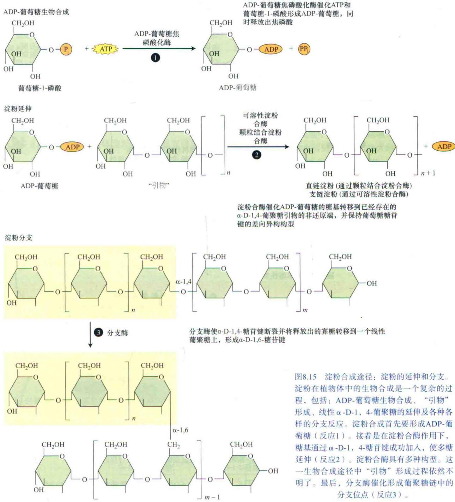

淀粉分支

称酶（disproportionating enzyme，D-酶）有关，这些酶非均一地实施分支。由于随机分支，水溶性多聚糖一般不会参入半晶状、不溶性淀粉颗粒，异淀粉酶可以修剪支链，强迫形成支链淀粉的晶状区域。修剪掉的糖链可以被整合到淀粉颗粒（图8.16反应4）。D-酶回收（可溶）寡糖进入淀粉颗粒的生物合成途径，涉及葡聚糖转移酶反应。

（葡萄糖） $a+$ （葡萄糖） $b\rightarrow$ （葡萄糖） $a+b-n+$ （葡萄糖）n

图8.15 淀粉合成途径：淀粉的延伸和分支。淀粉在植物体中的生物合成是一个复杂的过程，包括：ADP-葡萄糖生物合成、“引物”形成、线性α-D-1，4-葡聚糖的延伸及各种各样的分支反应。淀粉合成首先要形成ADP-葡萄糖（反应1）。接着是在淀粉合酶作用下，糖基通过α-D-1，4-糖苷键成功加入，使多糖延伸（反应2）。淀粉合酶具有多种构型。这一生物合成途径中“引物”形成过程依然不明了。最后，分支酶催化形成葡聚糖链中的分支位点（反应3）。

这里a和b均大于等于3，且n小于等于4（图8.16反应5）（Zeeman et al., 2007）。这个反应的产物成为淀粉合酶和分支酶作用的底物（图8.16反应2和反应3）。

为了在叶绿体环境中恰当地发挥功能，这些基本的酶反应呈现动态平衡调节机制。因此，ADP-葡萄糖焦磷酸酶的活性（硫氧还蛋白依赖的机制）可以加强叶绿体淀粉生物合成。目前的证据表明：此酶活性可被游离的硫氧还蛋白（Kolbe et al., 2005）或者含有一种特殊的NADP-硫氧还蛋白还原酶碳结构的硫氧还原蛋白

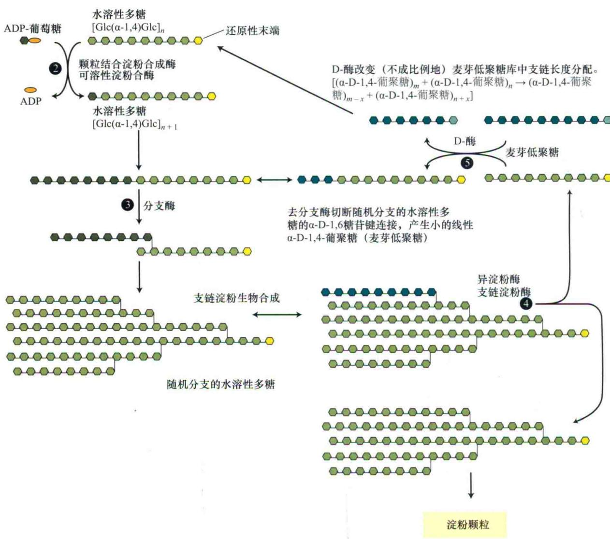  
图8.16 淀粉合成途径：支链淀粉的生物合成。反应2和反应3在图8.15中。还原性末端表示葡糖糖的醛基不构成糖苷键的一部分。根据对底物的不同要求，去分支酶是异淀粉酶或支链淀粉酶（反应4），前者对疏松的支链淀粉分支起作用，而后者对葡聚糖聚合物的紧密分支则显现出了高活性。被释放的低聚麦芽糖可能转而为颗粒结合淀粉合酶组建足够的“引物”（反应2），或者作为不对称酶（D-酶；反应5）的底物。实质上，D-酶催化低聚麦芽糖的裂解及随后的α-D-1，4糖苷键连接的葡聚糖从一个低聚麦芽糖供体 $\left[\left(\alpha - D - 1, 4 - \text{glucan}\right)_m\right]$ 到一个相应受体 $\left[\left(\alpha - D - 1, 4 - \text{glucan}\right)_n\right]$ 的转移。在这个阶段，被削短的低聚麦芽糖将作为一种底物或延伸的“引物”（反应2），而被延长的低聚麦芽糖将作为分支过程的一种底物。

所调节（Michalska et al., 2009）。对于游离的硫氧还蛋白，ADP-葡萄糖焦磷酸酶的活性主要被光调节，铁氧还蛋白-硫氧还蛋白还原酶参与此过程。换句话说，NADP-硫氧还蛋白还原酶C补充了光照条件下铁氧还蛋白-硫氧还蛋白系统中酶的氧化还原活性。但是，在黑暗中的叶片，铁氧还蛋白则是借由戊糖磷酸氧化途径中糖氧化反应期间产生的NADPH，独立完成氧化还原（见第11章）。为了适应游离的ADP-葡萄糖焦磷酸酶硫氧还蛋白，或者NADP-硫氧还蛋白还原酶C的动态变化，造粉体改变淀粉生物合成，以此适应异养库组织代谢物流动。最近研究显示，游离的硫氧还蛋白，或者含有NADP-硫氧还蛋白还原酶C结构的硫氧还蛋白也调节造粉体中ADP-葡萄糖焦磷酸酶，以此适应韧皮部蔗糖浓度。此现象折射出植物中碳的存在状态（Michalska et al., 2009）。

除脊椎动物以外，所有生物都能合成海藻糖[α-D-Gluc-(1→1)-α-D-Gluc]，绝大多数植物不会积累很多的这种非还原性二糖。但是，拟南芥海藻糖合成基因异常丰富（Paul et al., 2008）。在此背景下，2个实验证明海藻糖-6-磷酸可能是另一种信号，可将细胞质碳水平与叶绿体淀粉合成联系起来。首先，给拟南芥叶片饲喂海藻糖加强了淀粉合成，与硫氧还蛋白介导的ADP-葡萄糖焦磷酸酶活性相关。其次，使用海藻糖-6-磷酸处理离体叶绿体明显地提高了ADP-葡萄糖焦磷酸

<!-- END OFFICIAL API PART part_002 -->

<!-- BEGIN OFFICIAL API PART part_003 -->

酶活性。

海藻糖-6-磷酸和蔗糖之间的联系还不十分清楚，可能涉及这种糖磷酸代谢的酶的转录和翻译后活性调控。在细胞中，葡萄糖-6-磷酸和UDP-葡萄糖的浓度通过海藻糖-6-磷酸控制着海藻糖-6-磷酸的生物合成（UDP-葡萄糖+葡萄糖-6-磷酸→海藻糖-6-磷酸+UDP）。另外，一种前体分子——UDP-葡萄糖，可以通过蔗糖合酶直接与蔗糖浓度相关联（蔗糖+UDP→UDP-葡萄糖+果糖）。

## 8.8.2 夜晚叶绿体淀粉降解需要支链淀粉的磷酸化

运用改进的分子生物学技术构建转基因植物，并结合生物化学分析和基因组测序信息，对叶片淀粉夜间分解的途径勾勒出了一个全新图像（图8.17）（Lloyd et al., 2005; Smith et al., 2005）。夜间，叶绿体淀粉水解断裂成为麦芽糖，这是碳从叶绿体输出的主要形式。但对于正常的淀粉利用，在它的 $\alpha$ -D-1，4-糖苷键和 $\alpha$ -D-1，6-糖苷键水解之前，淀粉必须进行磷酸化。

在可溶性葡聚糖从临时的淀粉动态库中释放之前，磷酸与多糖（主要是支链淀粉）结合（图8.17）。与多数的激酶不一样，催化这种磷酸化反应的酶是葡聚糖-水二激酶，该酶将ATP的β-磷酸基团（下面方程式中红色标出的P）转移到支链淀粉的糖基的 $C_{6}$ （Ritte et al., 2006）。

$$
\text {   腺苷   -   P   -   P   -   P   (ATP)   +   (葡聚糖)   -   O   -   H   +   H   _ {2 }   O   \longrightarrow   }
$$

$$
\mathrm{腺苷-P(AMP)} + (\mathrm{葡聚糖}) - \mathrm {O- P+ P_ {i}}
$$

虽然叶片淀粉中磷酸基团的结合率很低（拟南芥中每2000个葡萄糖残基中有1个与磷酸集团结合），但是葡聚糖-水二激酶失活的转基因植物大幅度地降低支链淀粉与磷酸基团的结合及淀粉降解率。因此，成熟叶片中转基因株系（starch excess 1, sex1）淀粉含量高于野生型叶片7倍（Yu et al., 2001）。夜间，叶片葡聚糖-水二激酶附着在淀粉颗粒；而光照后，其中的一部分恢复成可溶状态。依赖硫氧还蛋白还原作用的葡聚糖-水二激酶不仅进行酶活性调节，还可以改变与淀粉粒结合的比例（Mikkelsen et al., 2005）。因此，淀粉的磷酸化似乎与光驱动的氧化还原过程相关联，涉及其催化能力的调节和葡聚糖-水二激酶在基质中的分布。

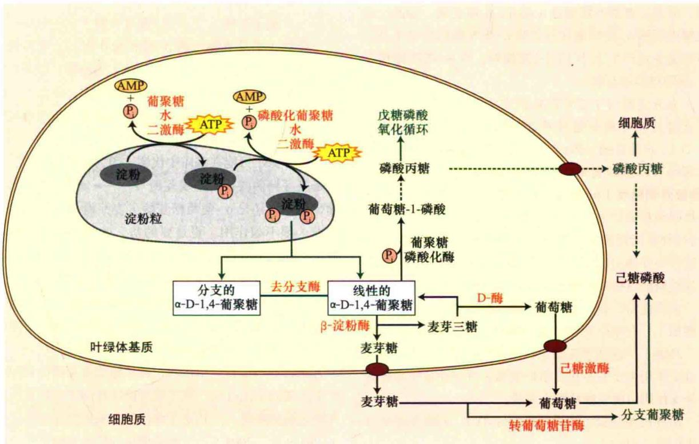  
图8.17 夜间拟南芥叶片中的淀粉降解。夜间，葡聚糖-水二激酶和磷酸葡聚糖-水二激酶催化多糖磷酸化，之后，淀粉颗粒中的可溶性葡聚糖释放。在这个阶段，去分支酶将支链淀粉转为线性葡聚糖，后者又通过叶绿体β-淀粉酶催化的β-淀粉分解转为麦芽糖酶。剩余的麦芽三糖通过歧化酶（D-酶）转为麦芽戊糖和葡萄糖（图8.16）。麦芽五糖能被叶绿体β-淀粉酶水解，然而葡萄糖可以被运送到细胞质基质中。在这种背景下，α-D-1，4-葡聚糖经叶绿体葡聚糖磷酸化酶磷酸化而引起的分解可能发生在胁迫条件下。叶绿体膜的两个泵：一个用于麦芽糖，另一个用于葡萄糖，方便了淀粉分解获得的这些产物流向胞质。利用叶片胞质中的麦芽糖，在转葡糖苷酶作用下，将一个转移葡萄糖残基转移到分支葡聚糖，同时释放1分子葡萄糖。胞质葡萄糖被己糖激酶磷酸化为葡萄糖-6-磷酸，从而进入磷酸己糖库中。

陆地植物还有第二种酶——磷酸葡聚糖-水二激酶。该酶催化类似葡聚糖-水二激酶催化的反应，只是它严格地以磷酸化葡聚糖作为底物，将ATP的β-磷酸基团结合到支链淀粉糖基的 $C_{3}$ 上（图8.17）（Küitting et al., 2005）。

$$
\begin{array}{r l} & \text {腺苷 - P - P - P (ATP) + (P - 葡聚糖) - OH+ H_{2} O} \\ & \text {腺苷 - P (AMP) + (P - 葡聚糖) - O - P+ P_{i}} \end{array}
$$

缺少磷酸葡聚糖-水二激酶的突变体中淀粉含量增加，但和sex1突变体不同的是，磷酸化的支链淀粉的含量没有改变。因此，在夜间叶绿体淀粉降解过程中，葡聚糖-水二激酶和磷酸葡聚糖-水二激酶协同作用是晶体化的葡聚糖转化为可溶性的麦芽糖糊精的关键（Hejazi et al., 2008）。

## 8.8.3 夜晚叶绿体过渡性淀粉降解大量输出麦芽糖

夜间，在植物各种代谢过程中，线性（可溶）寡聚糖的形成是葡糖基后续利用不可或缺的。α-淀粉酶和β-淀粉酶分别水解淀粉内部和末端的α-D-1，4-糖苷键，但是二者都不能解开α-D-1，6-糖苷键。因此，葡聚糖内切酶α-淀粉酶和外切酶β-淀粉酶作用结果是：不可避免地产生大小不同的寡聚糖，即α-极限糊精和β-极限糊精混合物。

去分支酶对于淀粉颗粒的完全分解是必需的，因为支链淀粉中葡萄糖残基之间的连接键有4%\~5%是α-D-1，6-糖苷键（图8.17）。拟南芥基因组中有4个基因编码可以水解葡聚糖α-D-1，6-糖苷键的蛋白质：1种极限糊精酶（pullulanase）和3种异淀粉酶。虽然1种极限糊精酶缺失突变体不影响夜间的淀粉降解，对于缺少3种异淀粉酶的突变体的实验结果却很难解释，因为这些突变体引起了不正常的淀粉合成。然而，一种缺乏异淀粉酶-3和极限糊精酶的双突变体不仅表现出严重的“多余淀粉”表型，而且积累可溶性分支寡聚糖（极限糊精），在单个突变体和野生型无此现象（Delatte et al., 2006）。这些事实暗示：由异淀粉酶-3负责的淀粉去分支作用主要发生在淀粉粒表面，可溶性分支寡聚糖去分支作用由极限糊精酶来完成。

两种机制完成了线性葡聚糖 $\alpha$ -D-1，4-糖苷键的进一步切割（图8.17）。

(1) 水解，由淀粉酶催化。

$$
\begin{array}{r l} & (\text { 葡   萄   糖 }) _ {n} + \mathrm{H} _ {2} \mathrm{O} \xrightarrow {(\alpha - \text { 淀   粉   酶 })} \\ & (\text { 葡   萄   糖 }) _ {n - m} + (\text { 葡   萄   糖 }) _ {m} \\ & (\text { 葡   萄   糖 }) _ {n} + \mathrm{H} _ {2} \mathrm{O} \xrightarrow {(\beta - \text { 淀   粉   酶 })} \\ & \text { 线   性 } (\text { 葡   萄   糖 }) _ {n - 2} + \text { 麦   芽   糖 } \end{array}
$$

（2）磷酸解，由 $\alpha-$ 葡聚糖磷酸化酶催化。

（葡萄糖） $_{n}$ +P $_{i}$ → （葡萄糖） $_{n-1}$ +葡萄糖-1-磷酸

叶绿体 $\alpha$ -淀粉酶曾经被认为是淀粉水解过程重要的成分，但缺乏3种 $\alpha$ -淀粉酶同工酶的转基因拟南芥植株夜间淀粉降解速率是正常的。另外，拟南芥基因组编码9种 $\beta$ -淀粉酶，其中4种位于叶绿体。异淀粉酶-3突变体夜间淀粉含量增加，同时麦芽糖含量下降（Kaplan et al., 2006）。可见，实验性证据支持 $\beta$ -淀粉水解是夜间淀粉破碎产物麦芽糖的来源。

此外，编码叶绿体 $\alpha$ -葡聚糖磷酸酶基因的拟南芥突变体不能显著增加白天淀粉积累及其夜间再动员，说明糖苷键的磷酸解不是淀粉降解所必需的（Zeeman et al., 2004）。但是，在干旱或盐渍等胁迫条件下，小部分过渡性淀粉可能由磷酸解途径降解，产生葡萄糖-1-磷酸。随后，该产物被磷酸糖异构酶转化为葡萄糖-6-磷酸，并用于氧化戊糖磷酸循环（见第11章）。

夜间，去分支酶提供的线性葡聚糖可被叶绿体β-淀粉酶进一步降解。产物是相当数量的麦芽糖二糖，不可避免地出现少量的麦芽三糖，因为β-淀粉酶不能最终作用于三碳糖（图8.17）。D-酶催化了下面的转变。

2（葡萄糖） $_{3}$ →（葡萄糖） $_{5}$ +葡萄糖

(麦芽三糖) (麦芽五糖)

产物①麦芽五糖可被β-淀粉酶作用，②葡萄糖通过叶绿体内膜上的葡萄糖转运体进入细胞质，以上产物避免了源于夜间淀粉断裂的麦芽三糖积累。事实上，D-酶缺失的转基因植物表现出淀粉分解率降低和麦芽三糖水平的提高（Critchley et al., 2001）。

麦芽糖不可能在基质中代谢，因为在叶绿体中，无论是麦芽糖磷酸化酶（麦芽糖 $+P_{i}\longrightarrow$ 葡萄糖-1-磷酸+葡萄糖），还是 $\alpha$ -葡萄糖苷酶（麦芽糖 $+H_{2}O\longrightarrow2$ 葡萄糖）都不起作用。更重要的是，叶绿体内膜上有一种蛋白便于麦芽糖选择性地跨膜转运（Niittyla et al., 2004）。转运体基因位点改变的转基因植物（MEX1）夜间麦芽糖的积累浓度比野生型高得多。对于拥有MEX1同源基因的被子植物、裸子植物和苔藓植物而言，麦芽糖输出是储藏淀粉质体的基本特征。

在转基因植物应用之前，叶片胞质麦芽糖的利用只是个未知的生化过程。缺乏葡萄糖转移因子的转基因株系缺乏淀粉降解，但其麦芽糖积累水平比野生型高得多（Chia et al., 2004）。这种酶催化的转葡萄糖基反应可将1个糖基从麦芽糖转给胞质杂多糖（包括阿拉伯糖、半乳糖和葡萄糖）[（杂多糖）+麦芽糖→（杂多糖）-葡萄糖+葡聚糖]（Fettke et al., 2005, 2006）。其余的葡萄糖由己糖激酶催化磷酸化，归入磷酸己糖库，随后转化为蔗糖。实质上，叶绿体中从淀粉降解而来的麦芽糖夜间输出对于维持夜间植物生长是一个关键过程。

## 8.9 蔗糖生物合成及其信号途径

信号转导机制对于多细胞生物发育与生理和环境协调至关重要。植物叶片合成碳水化合物及将其用于维持异养器官代谢的过程中，碳水化合物担当代谢信号分子。叶片胞质蔗糖产物，与在韧皮部进行装载和转运偶联在一起，以此保障植物较好发育。

这些过程的严格调控总是与各代谢组分的蔗糖水平紧密关联。因此，蔗糖不仅为生长和多糖合成提供碳骨架，而且在叶源和库组织中的碳分配调节过程中担当通信工具。本章节将讲述光合 $CO_{2}$ 同化产物分配到胞质并合成蔗糖的途径。

## 8.9.1 光照时，磷酸丙糖供给3种重要的磷酸己糖胞质库

主导叶绿体和胞质同化碳的分配因素是无机磷酸和磷酸丙糖的相对浓度。卡尔文-本森循环的两种产物——磷酸二羟丙酮和甘油醛-3-磷酸（泛称磷酸丙糖），被质体和胞质中的磷酸丙糖异构酶催化而进行快速构型转换（表8.5反应1）（Lüttge and Higinbothan，1979；Flügge and Heldt，1991）。质体被膜内膜上的蛋白质复合体（磷酸丙糖转运体）驱动叶绿体磷酸丙糖和胞质磷酸的互换（表8.5反应2）（Web Topic 8.15）（Weber et al., 2005）。磷酸丙糖跨越叶绿体被膜穿梭将叶绿体中光合作用信息传到胞质。

晴天，光合作用活跃，叶绿体将部分被固定的碳输出到胞质。接着，从胞质的生物合成过程中释放的磷酸输入叶绿体，用于补充ATP和其他磷酸化代谢物，从而维持光合电子传递和卡尔文-本森循环。这种磷酸丙糖转运维持的双向交换可以维持基质和胞质中磷酸丙糖与磷酸比率平衡，折射出两个部分的代谢状态。在磷酸丙糖转运体活性被破坏掉的转基因植物中，虽然没有表现出显著的生长缺陷，但其碳代谢有显著变化。这些转基因家系加速了淀粉的周转及叶绿体基质的糖输出，以此补偿胞质中蔗糖合成的磷酸丙糖缺乏。

## 表8.5 光合作用形成的磷酸丙糖转变成蔗糖的反应

1. 丙糖磷酸异构酶

二羟丙酮磷酸 $\leftarrow$ 甘油醛-3-磷酸

$$
\mathrm{CH} _ {2} \mathrm{OPO} _ {3} ^ {2 -}
$$

$$
\mathrm{CH} _ {2} \mathrm{OPO} _ {3} ^ {2 -}
$$

2. 磷酸-丙糖磷酸转运体

磷酸丙糖（叶绿体） $+P_{i}$ （胞质） $\longleftrightarrow$ 磷酸丙糖（胞质） $+P_{i}$ （叶绿体）

3. 果糖-1,6-二磷酸醛缩酶

二羟丙酮磷酸+甘油醛-3-磷酸 $\leftrightarrow$ 果糖-1,6-二磷酸

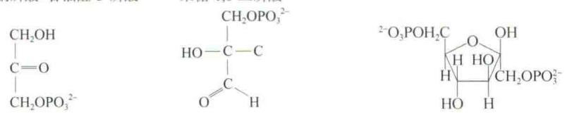

4. 果糖-1,6-二磷酸酶

果糖-1,6-二磷酸+ $H_{2}O$ → 果糖-6-磷酸+ $P_{1}$

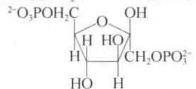

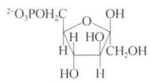  
5a. 果糖-6-磷酸-1-激酶（磷酸果糖激酶）

果糖-6-磷酸+ATP→果糖-1,6-二磷酸+ADP

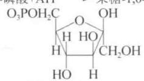

5b. PP $_{i}$ -连接的磷酸果糖激酶

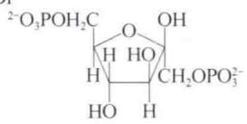

果糖-6-磷酸+PP $_{i}$ → 果糖-1,6-二磷酸+P $_{i}$

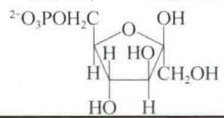

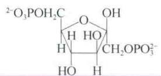

5c. 果糖-6-磷酸-2-激酶

果糖-6-磷酸+ATP→果糖-2,6-二磷酸+ADP

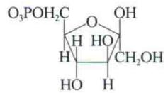

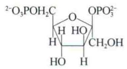

6. 果糖-2,6-二磷酸酶

果糖-2,6-二磷酸+ $H_{2}O$ → 果糖-6-磷酸+ $P_{i}$

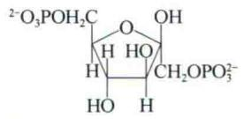

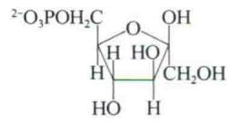

7. 磷酸己糖异构酶

果糖-6-磷酸 $\rightarrow$ 葡萄糖-6-磷酸

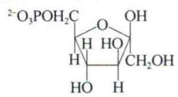

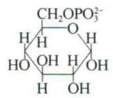

8. 磷酸葡萄糖变位酶

葡萄糖-6-磷酸 → 葡萄糖-1-磷酸

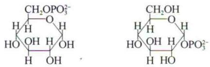

9. UDP-葡萄糖焦磷酸化酶

葡萄糖-1-磷酸+UDP→UDP-葡萄糖+PP $_{i}$

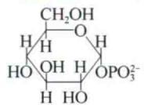

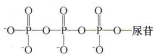

10. 果糖- $6^{F}$ -磷酸合成酶

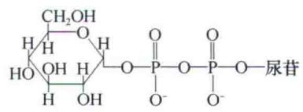

UDP-葡萄糖+果糖-6-磷酸 $\rightarrow$ UDP+蔗糖-6 $^{F}$ -磷酸

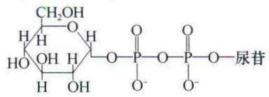

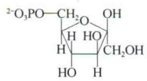

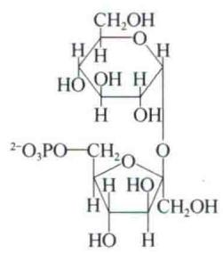

11. 果糖- $6^{F}$ -磷酸磷酸酶

蔗糖- $6^{F}$ -磷酸+ $H_{2}O$ →蔗糖+ $P_{i}$

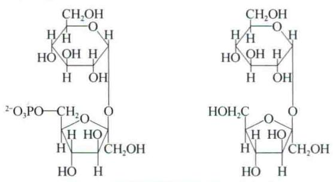

注：丙糖磷酸异构酶（反应1）催化二羟丙酮磷酸与甘油醛-3-磷酸在叶绿体基质中的平衡，与此同时，叶绿体内被膜上的 $P_{i}$ 转运体（反应2）方便了丙糖磷酸和 $P_{i}$ 跨膜转运。所有其他酶催化细胞质反应。 $P_{i}$ 和 $PP_{i}$ 分别代表无机磷酸和焦磷酸。果糖-6 $^{F}$ -磷酸中6 $^{F}$ 符号表示在果糖残基的 $C_{6}$ 被磷酸化（译者注）。

胞质中磷酸丙糖的聚积，可以促进胞质醛缩酶催化的磷酸二羟丙酮和甘油醛-3-磷酸转化为果糖-1，6-二磷酸（ $\Delta G^{0}=-24\ kJ/mol$ ）（图8.18和表8.5反应3）。这个反应的反应平衡常数（ $K_{eq}$ ）为

$K_{eq}=\left[\text{二羟丙酮磷酸}\right]\times\left[\text{甘油醛-3-磷酸}\right]/\left[\text{果糖-1,6-二磷酸}\right]$

考虑到胞质醛缩酶作用产生2分子磷酸丙糖（二者通过磷酸丙糖异构酶可以实现快速转换），反应的 $K_{eq}$ 可以表述为

$$
K _ {\mathrm{eq}} = [ \mathrm{磷酸丙糖} ] ^ {2} / [ \mathrm{果糖-1,6-二磷酸} ]
$$

此式暗示：果糖-1，6-二磷酸的浓度随着磷酸丙糖的浓度改变而呈指数级变化。因此，光合作用活跃的叶绿体将磷酸丙糖持续地输入胞质中，使醛缩酶反应倾向于果糖-1，6-二磷酸的形成。当果糖-1，6-二磷酸对磷酸丙糖比率相对高时，果糖-1，6-二磷酸进行醇醛分裂的可逆反应，产生磷酸二羟丙酮和甘油醛-3-磷酸，如糖酵解。

之后，胞质果糖-1，6-二磷酸酶催化果糖-1，6-二磷酸在 $C_{1}$ 位置水解，产生果糖-6-磷酸和磷酸（ $\Delta G^{0}=-16.7\ kJ/mol$ ）（图8.18；表8.5反应4）。这些胞质酶的一级结构和调节特性明显不同于叶绿体中对应物。和异养生物中的酶一样，胞质果糖-1，6-二磷酸酶缺少能够使得叶绿体酶被硫氧还蛋白还原的特征性氨基酸序列。另外，与动物酶相似，胞质果糖-1，6-二磷酸酶可被两类重要的胞质代谢物——果糖-2，6-二磷酸和AMP强烈抑制。

果糖-6-磷酸通过磷酸化可以形成不同的终产物。

（1） $C_{1}$ 磷酸化，重新生成果糖-1，6-二磷酸，催化此反应的酶有2种，即磷酸果糖激酶和焦磷酸依赖的磷酸果糖激酶（表8.5反应5a和反应5b）。

（2） $C_{2}$ 磷酸化，产生果糖-2，6-二磷酸，被限制在胞质中的唯一的双功能酶催化。果糖-6-磷酸-2-激酶/果糖-2，6-二磷酸酶既催化磷酸基团结合，也催化其水解，即催化双重反应（Nielsen et al., 2004）（表8.5反应5a和反应6）。

（3）异构反应，产生葡萄糖-6-磷酸，被己糖磷酸异构酶催化（表8.5反应7）。

在胞质中，通过磷酸己糖异构酶（ $\Delta G^{0}=8.7\ kJ/mol$ ）和磷酸葡萄糖变位酶（ $\Delta G^{0}=7.3\ kJ/mol$ ）催化的可逆反应，使果糖-6-磷酸与葡萄糖-6-磷酸和葡萄糖-1-磷酸之间相互转化，它们的浓度接近平衡状态（表8.7反应7和反应8）。这3个单糖一磷酸合称磷酸己糖（图8.18）。

在光照条件下，缺乏磷酸丙糖转运体或胞质果糖-1，6-二磷酸酶的转基因植物大幅度降低碳从叶绿体到胞质的运输，因此阻止了同化的碳向胞质磷酸己糖库的输送。由于叶绿体磷酸丙糖到磷酸己糖的转化受阻，转基因株系中的多余的叶绿体磷酸丙糖致使淀粉形成到非常高的水平。

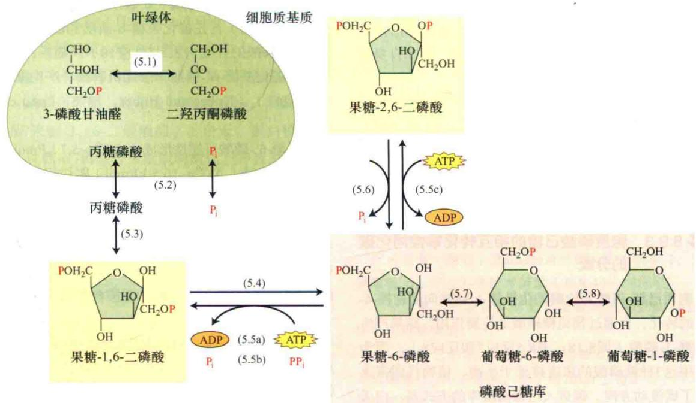

## 8.9.2 光照条件下，果糖-2，6-二磷酸调控磷酸己糖库

在磷酸己糖库形成过程中，果糖-2，6-二磷酸作为重要信号调节磷酸丙糖（叶绿体）和磷酸基团（胞质）转换（Huber，1986；Stitt，1990）。胞质中，磷酸丙糖/磷酸高时（特别在光合作用活跃的叶片中），果糖-2，6-二磷酸的产生被抑制，这是因为磷酸丙糖强烈地抑制双功能酶果糖-6-磷酸-2-激酶/果糖-2，6-二磷酸酶的激酶活性。另外，较低的磷酸丙糖/磷酸基团可以提高果糖-6-磷酸-2-激酶的激酶活性，并抑制果糖-2，6-二磷酸酶活性。相反，高浓度的果糖-2，6-二磷酸抑制果糖-1，6-二磷酸酶，并因此将胞质磷酸己糖降至最低。

接下来，磷酸己糖库自身控制胞内果糖-2，6-二磷酸水平，因为果糖-6-磷酸抑制果糖-2，6-二磷酸酶活性，并提高双功能酶——果糖-6-磷酸-2-激酶/果糖-2，6-二磷酸酶的激酶活性。因此，高含量的果糖-6-磷酸可以提高果糖-2，6-二磷酸的浓度，因此抑制果糖-6-磷酸酶活性，并抑制己糖磷酸盐的形成。总之，果糖-2，6-二磷酸调节磷酸己糖库，以此适应磷酸丙糖转运体提供的光合产物，同时适应磷酸己糖库自身的需求。

夜间，叶绿体淀粉动员产生的麦芽糖和己糖在胞质中贡献于磷酸己糖库。果糖二磷酸水解不能有效地提高磷酸己糖浓度，因为磷酸丙糖不是己糖的前体。因此，果糖-2，6-二磷酸对胞质果糖-1，6-二磷酸酶的抑制作用不影响夜间蔗糖合成。

## 8.9.3 胞质磷酸己糖的相互转化掌控同化碳的分配

胞质己糖-磷酸异构酶催化果糖-6-磷酸向葡萄糖-6-磷酸的转化，再通过葡萄糖磷酸变位酶作用，结果产生葡萄糖-1-磷酸（图8.18；表8.5反应7和反应8）。因为活体中这3种糖磷酸的浓度接近于平衡，植物代谢需求指导了碳流动方向。碳进入己糖磷酸库的方式是：白天 $CO_{2}$ 同化、夜间叶绿体淀粉降解提供的磷酸化产物。另外，碳离开己糖磷酸的方式是糖酵解、戊糖磷酸途径及蔗糖和多聚糖的合成。

## 8.9.4 胞质中蔗糖持续合成

光合产物主要以蔗糖形式运输到分生组织和发育中的器官（包括叶、根、花、果和种子等）（图8.14）。叶片胞质中蔗糖浓度主要由下列2个过程的效率决定。

（1）碳输入，将白天的磷酸丙糖和夜间的麦芽糖从叶绿体运输到叶胞质，进行蔗糖合成。

（2）碳输出，将蔗糖从叶片胞质投递至需要能量或者多糖合成的其他组织中去。

细胞分步分离技术可以将细胞器机械性地彼此分离开来，所分离的细胞器可用来深入研究内在酶活性。利用这种技术研究发现：从磷酸己糖库合成蔗糖的过程（图8.19中描述的途径；表8.5表述的反应）在胞质中进行。正如前已述及的淀粉生物合成，磷酸己糖到核苷酸糖的转化启动了蔗糖合成。一些核苷二磷酸-糖焦磷酸化酶家族成员可以催化核苷酸（NTP）和己糖-1-磷酸反应，产生相应的糖-1-磷酸和焦磷酸。

$$
\mathrm{NTP} + \text {己糖-1 - 磷酸} \longleftrightarrow \mathrm{NDP-糖} + \mathrm{PP} _ {\mathrm{i}}
$$

胞质中特有的UDP-葡萄糖焦磷酸化酶把UTP和葡萄糖-1-磷酸转化为UDP-葡萄糖（表8.5反应9）。已知这个反应接近平衡状态（ $\Delta G^{0}=-2.88\ kJ/mol$ ），活体内，此反应利用焦磷酸驱动平衡向右移动。由于叶片胞质缺少无机焦磷酸酶，因此焦磷酸主要被其他酶催化的转移磷酸化反应所利用（表8.5反应5b）。

两个连续的反应完成了从UDP-葡萄糖到蔗糖的合成。蔗糖-6 $^{F}$ -磷酸合成酶（6 $^{F}$ 表示蔗糖分子的果糖残基的C $_{6}$ 被磷酸化）首先催化果糖-6-磷酸和UDP-葡萄糖到蔗糖-6 $^{F}$ -磷酸的合成（表8.5反应10）。随后，蔗糖-6 $^{F}$ -磷酸酶催化蔗糖-6 $^{F}$ -磷酸释放无机磷酸，产生蔗糖（表8.5反应11）（Huber and Huber，1996；Lund et al., 2000）。

蔗糖-6 $^{F}$ -磷酸可逆性形成（ $\Delta G^{0}=-5.7\ kJ/mol$ ）与其不可逆性水解（ $\Delta G^{0}=-16.5\ kJ/mol$ ）密切相关，因此造成了体内蔗糖合成几乎是不可逆转的。蔗糖-6 $^{F}$ -磷酸合成酶和蔗糖-6 $^{F}$ -磷酸酶可能为一个超分子复合体。与相关的单个酶比起来，相关的酶组成超分子复合体可以使代谢更加高效，其机制是底物运输的改变：将一种酶的产物直接转移给下一个酶，无需与整个反应完全混合（Salerno et al., 1996）。

蔗糖-6 $^{F}$ -磷酸合成酶所催化的反应被认为是蔗糖合成调控中的关键步骤（Huber and Huber，1996）。通过转基因，使植物叶片中的蔗糖-6 $^{F}$ -磷酸合成酶的含量升高，能显著影响光合作用和叶片碳水化合物代谢。例如，植物叶片超表达蔗糖-6 $^{F}$ -磷酸合成酶时，最大光合速率更高，蔗糖向淀粉转化率更高，比对照的叶片生物量更高。

蔗糖-6 $^{F}$ -磷酸合成酶活性受多种因子综合调控，涉及翻译后修饰（蛋白磷酸化）和代谢物的直接调节。

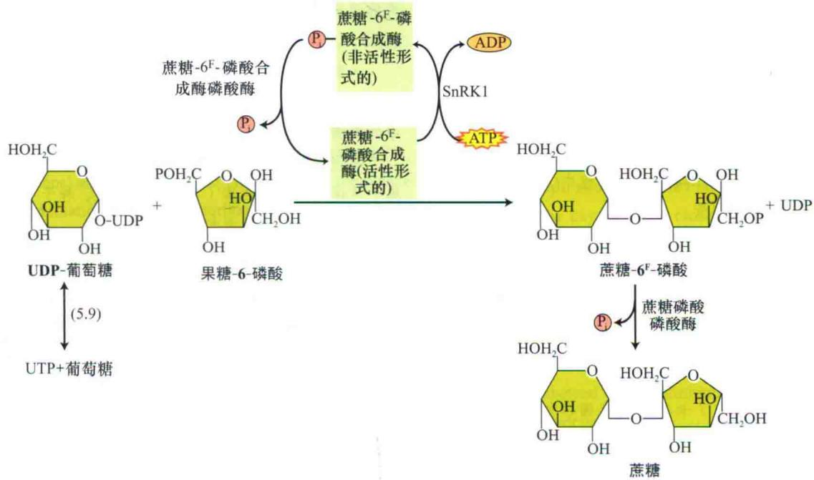  
图8.19 蔗糖合成。蔗糖-6F-磷酸合成酶催化单糖残基从UDP-葡萄糖转移给果糖-6-磷酸，产生蔗糖-6F-磷酸。后者在蔗糖-6F-磷酸酶催化下，脱磷酸化，释放蔗糖。翻译后修饰（磷酸化-脱磷酸化）和非共价键互作（别构效应物）调控蔗糖-6F-磷酸合成酶的活性。在ATP和特定激酶SnRK1共同作用下，蔗糖-6F-磷酸合成酶上的一个特定丝氨酸残基进行磷酸化，酶失去活性。在特定蔗糖-6F-磷酸合成酶-磷酸酶作用下，磷酸化的蔗糖-6F-磷酸合成酶释放磷酸，恢复其基本活性（蔗糖-6F-磷酸中6F符号表示蔗糖在果糖残基的C6被磷酸化）。

## 小结

黑暗条件下，一种专一激酶使蔗糖-6 $^{F}$ -磷酸合成酶磷酸化，降低其催化活性（Halford and Hey，2009）。处于信号转导交叉网络核心地位的激酶SnRK1（sucrose non-fermenting-1-related protein kinase）通过磷酸化而灭活其他酶（硝酸还原酶、海藻糖-磷酸合成酶、果糖-6-磷酸2-激酶/果糖-2，6-二磷酸酶）。白天，蛋白磷酸酶使失活的蔗糖-6 $^{F}$ -磷酸合成酶脱磷酸化、并被激活。蔗糖-6 $^{F}$ -磷酸合成酶的磷酸化反应受到胞质代谢物调节：葡萄糖-6-磷酸抑制激酶SnRK1活性，磷酸盐抑制蛋白磷酸酶活性。

除了被磷酸化/脱磷酸化调节，蔗糖- $6^{F}$ -磷酸合成酶活性形式还可以被葡萄糖-6-磷酸激活、被磷酸盐抑制。因此，光合作用效率较高时，胞质磷酸己糖的含量提高和磷酸的含量降低都能促进蔗糖的合成。相反地，当光合作用效率低下，磷酸己糖水平降低，伴随胞质磷酸含量增加，蔗糖- $6^{F}$ -磷酸合成酶的效率降低。

蔗糖在植物生长中扮演关键角色，不仅为植物生长提供了燃料，而且提供了信息交换。在许多植物组织中，蔗糖调控编码酶、转运体和储藏蛋白的基因表达，涉及多种发育过程，如开花、组织分化、种子萌发及储藏物质的积累等。

叶绿体中，类囊体光系统利用光能氧化水，产生 $O_{2}$ 并形成还原性铁氧还蛋白、NADPH和ATP。叶绿体基质中，ATP和NADPH驱动大气 $CO_{2}$ 固定及生长发育所必需的碳骨架形成（图8.1）。

## 卡尔文-本森循环

·卡尔文-本森循环包括3个阶段：① $CO_{2}$ 受体分子的羧化；②羧化产物的还原；③ $CO_{2}$ 受体分子的再生（图8.2和图8.3；表8.1）。

· 在第一阶段，Rubisco通过 $CO_{2}$ 使核酮糖-1,5-二磷酸羧化，产生3-磷酸甘油酸（图8.4）。

· 在第二阶段，3-磷酸甘油酸利用ATP和NADPH转变成丙糖磷酸。

· 在第三阶段，5/6的丙糖磷酸被用来再生受体分子核酮糖-1，5-二磷酸，剩下的1/6为生物合成、转运、储存提供碳骨架。

## 卡尔文-本森循环的调节

\- $\mathrm{CO}_{2}$ 不但作为Rubisco活化因子，还作为它的一种底物（图8.5）。Rubisco活化酶通过降低糖磷酸的抑制来补充 $\mathrm{CO}_{2}$ 依赖性的Rubisco活化。

· 光控制Rubisco活化酶的活性，卡尔文-本森循环的4种酶通过铁氧还蛋白-硫氧还蛋白系统，而且在 $Mg^{2+}$ 和pH调节下发生改变（图8.5和图8.6）。

\- 光照强度的改变调节酶超复合物的形成，控制磷酸核酮糖激酶和3-磷酸甘油醛脱氢酶的活性（图8.7）。

## $C_{2}$ 氧化光合循环

\- $\mathrm{CO}_{2}$ 和 $\mathrm{O}_{2}$ 与核酮糖-1,5-二磷酸竞争发生发应,这是由于羧化和氧化在Rubisco上具有相同的活化位点。

· 核酮糖-1，5-二磷酸氧化过程中 $O_{2}$ 摄取可以引起部分已固定的 $CO_{2}$ 损失。

\- $\mathrm{C}_2$ 氧化光合循环由于光呼吸作用限制 $\mathrm{CO}_{2}$ 损失（表8.2）。

\- $\mathrm{C}_{2}$ 氧化光合循环的运转涉及3个细胞器：叶绿体、过氧化物酶体和线粒体（图8.8）。

· 3种循环同时进行，使碳、氮和氧原子沿着光呼吸移动（图8.9）。

· 3个因素决定了卡尔文-本森循环和 $C_{2}$ 氧化光合循环之间的平衡：Rubisco运动性能、温度、 $CO_{2}$ 和 $O_{2}$ 含量。

· 改造现有的机制可能提高光合作用效率，恢复2-磷酸乙醇酸的碳原子损失，使其再供给卡尔文-本森循环（图8.10；表8.3）。

## 无机碳聚集机制

\- 几种机制被用来增加Rubisco活化位点周围 $\mathrm{CO}_{2}$ 水平，以此来提高光呼吸效率。

## 无机碳浓缩机制： $C_{4}$ 循环

\- $C_4$ 光合碳循环在一个区室中将大气 $\mathrm{CO}_{2}$ 固定在碳骨架中，在另一区室中释放 $\mathrm{CO}_{2}$ ，以增加Rubisco周围 $\mathrm{CO}_{2}$ 浓度，用于卡尔文-本森循环的再固定（图8.11；表8.4）。

\- $C_4$ 循环包括5个阶段，发生在两个不同的区室内，利用PEPCase，而不是Rubisco，催化前期的羧化反应（图8.11；表8.4）。

\- $\mathrm{C_4}$ 循环的运行可能被单个细胞中的扩散梯度驱动，也可能被叶肉细胞和维管束鞘细胞（Kranz结构）之间的梯度驱动（图8.12）。

\- 光调节 $C_{4}$ 循环中的关键酶活性：NADP-苹果酸脱氢酶、PEPC酶和丙酮磷酸二激酶。

\- $\mathrm{C}_{4}$ 循环降低光呼吸，也降低高温、干燥气候条件下的水分丧失。

## 无机碳浓缩机制：景天酸循环（CAM）

\- CAM光合过程用于捕获大气 $CO_{2}$ ，充分利用干旱环境条件下呼吸作用产生的 $CO_{2}$ 。

· CAM通常与最小化失水的结构特征联系在一起。

· 在CAM植物中，最初的 $CO_{2}$ 捕获通常与最终将 $CO_{2}$ 固定在碳骨架中的过程分离开来（图8.13）。

· 遗传和环境因素共同控制CAM表达。

## 光合产物——蔗糖和淀粉的合成与分解

内的淀粉是光合作用吸收的 $CO_{2}$ 的最终产物（图8.14；表8.5）。

· 蔗糖中的糖苷键阻止了葡糖糖的再活化，这类似于蛋白质中的氨基。这一特征使叶片和韧皮部的细胞质中的蔗糖水平能在很宽的范围内波动。

· 光合作用产生的糖类通过韧皮部从源（叶片细胞）转运到非光合的库（茎、根、块茎、种子）中。蔗糖满足了库组织的代谢和发育需求。

· 叶片中丰富的糖含量促进植物生长、碳水化合物的储存。

· 库组织中低水平的糖含量刺激光合作用运行，并将储存组织中的碳水化合物动员起来。

## 叶绿体淀粉的合成与转运

· 白天，淀粉生物合成包含3个步骤：起始、延伸和终止（图8.15）。

· 叶绿体中，淀粉合成通过硫氧还蛋白依赖机制被加强，在此过程中ADP-葡萄糖焦磷酸化酶被活化。

· 夜间，淀粉分解需要首先将多糖磷酸化（图8.17）。葡聚糖-水二激酶和磷酸葡聚糖-水二激酶催化ATP的β-磷酸向多糖转移。

\- 分支酶将支链淀粉转变成线性葡聚糖，线性葡聚糖又在 $\beta$ -淀粉酶作用下转变成麦芽糖。

· 夜间，淀粉分解生成的麦芽糖被转运到细胞质基质中，供蔗糖合成。

## 蔗糖生物合成及其信号途径

· 在白天，丙糖磷酸与无机磷酸的相对水平调节碳在叶绿体及细胞质中的分布。丙糖磷酸在细胞质中的积累促进果糖-1，6-二磷酸水解成为果糖-6-磷酸，由此建立起一种己糖磷酸库（图8.18）。丙糖磷酸阻止果糖-2，6-二磷酸形成，因而促进蔗糖合成，而果糖-2，6-二磷酸是果糖-1，6-二磷酸的抑制子。

· 在夜间，淀粉分解几乎专一地形成麦芽糖，麦芽糖转运到细胞质基质中，促进己糖磷酸库形成。

· 己糖磷酸是蔗糖-6 $^{F}$ -磷酸合成酶及蔗糖-6 $^{F}$ -磷酸酶催化的胞质内蔗糖合成的前体（图8.19；表8.5）。

· 翻译后修饰（磷酸化）、代谢物之间的非共价结合等构成了调节蔗糖-6 $^{F}$ -磷酸合成酶活性的复杂系统。

·为了给植物生长和多糖合成提供碳，蔗糖作为一种信号，调节编码酶、转运体和储存蛋白的基因表达。因此，蔗糖也在植物许多发育过程中扮演着重要角色。

## WEB MATERIAL

## Web Topics

## 8.1 $\mathrm{CO}_{2}$ Pumps

Cyanobacteria contain protein complexes (CO $_{2}$ pumps) and supramolecular complexes for the uptake and fixation of inorganic carbon.

8.2 How the Calvin-Benson Cycle Was Elucidated Experiment carried out in the 1950s led to the discovery of the path of $\mathrm{CO}_{2}$ fixation.

## 8.3 Rubisco: A Model Enzyme for Studying Structure and Function

As the most abundant enzyme on Earth, Rubisco was obtained in quantities sufficient for elucidating its structure and catalytic properties.

8.4 Energy Demands for Photosynthesis in Land Plants Evaluation of NADPH and ATP budget during the assimilation of $CO_{2}$ .

## 8.5 Rubisco Activase

Rubisco is unique among Calvin-Benson Cycle enzymes in its regulation by a specific protein, Rubisco activase.

## 8.6 Thioredoxins

First found to regulate chloroplast enzymes, thioredoxins are now known to play a regulatory role in all types of cells.

## 8.7 Operation of the $C_{2}$ Oxidative Photosynthetic Carbon Cycle

The enzymes of the $C_{2}$ oxidative photosynthetic carbon cycle are localized in three different organelles.

## 8.8 Carbon Dioxide: Some Important Physicochemical Properties

Plants have adapted to the properties of $CO_{2}$ by altering the reactions catalyzing its fixation.

8.9 Three Variations of $C_{4}$ Metabolism
Certain reactions of the $C_{4}$ photosynthetic pathway differ among plant species.

8.10 Single-Cell $\mathbf{C}_4$ Photosynthesis Some marine organisms and land plants accomplish $\mathrm{C_4}$ photosynthesis in a single cell.

## 8.11 Photorespiration in CAM Plants

During the day, stomatal closing and photosynthesis in CAM leaves lead to very high intracellular concentrations of both oxygen and carbon dioxide. These unusual conditions pose interesting adaptive challenges to CAM leaves.

## 8.12 Glossary of Carbohydrate Biochemistry

An alphabetical list of definitions on the biochemistry of carbohydrates.

## 8.13 Starch Architecture

The morphology and composition of the starch granule influence the synthesis and degradation of the polysaccharide.

## 8.14 Fructans

Fructans are fructose polymers that serve as reserve carbohydrates in plants.

## 8.15 Chloroplast Phosphate Translocators

Chloroplast phosphate translocators are antiporters that catalyze a strict 1:1 exchange of phosphate with other metabolites between the chloroplast and the cytosol.

## Web Essay

## 8.1 Modulation of Phosphoenolpyruvate Carboxylase in $C_{4}$ and CAM Plants

The $\mathrm{CO}_{2}$ -fixing enzyme phosphoenolpyruvate carboxylase is regulated differently in $\mathbf{C}_4$ and CAM species.
