## 第9章

# 光合作用：生理和生态思考

太阳能转化为有机物化学能的过程是一个包括电子传递和光合碳代谢的复杂过程（见第7章和第8章）。本书前面部分有关光合作用的光化学和生物化学反应的讨论中，不应忽视这样一个事实：在自然条件下，光合作用是在完整的有机体中进行的，而这些有机体不断地对体内外发生的各种变化作出响应。本章将会阐述完整的叶片对其生长环境所产生的一些光合响应策略。对于不同胁迫环境的光合响应策略将在第26章进行阐述。

环境因子是怎样影响植物的光合作用的呢？这是生理学家、生态学家和农学家共同感兴趣的问题。生理学家希望理解光合作用过程是怎样直接响应 $CO_{2}$ 浓度和温度等环境因子的变化的，或者明确光合作用过程对诸如大气湿度和土壤水分等环境因子的间接响应策略（通过气孔调控的效应）。农学家则十分关注光合作用进程对环境条件的依赖性，因为动态变化环境中的光合速率，在很大程度上决定着植物的生产力水平——作物产量。但从适应和进化的角度，生态学家对在不同环境中变化的光合速率和光合能力则更为感兴趣。

研究光合作用的环境依赖性时，人们面临着一个核心问题：有多少环境因子可以同时限制植物的光合作用？英国植物生理学家F. F. Blackman（1905）提出了这样一个假说：无论在何种条件下，光合速率都将被反应过程中最慢的一步限制，这就是所谓的限制因子（limiting factor）。

这个假说暗示，在任何既定的时刻，诸如光或 $CO_{2}$ 浓度都可能限制植物的光合作用，而不是由这两个因素同时起限制作用。植物生理学家在这个假说的启发下，历史性地改进了光合作用的研究方法：在仅仅改变某一个环境因子，维持其他环境条件不变的情况下，研究环境因子与光合作用间的关系。研究结果表明，对于完整的叶片来说，要以最佳状态进行光合作用，3个代谢步骤至关重要：①核酮糖-1,5-二磷酸羧化酶/加氧酶（Rubisco）的活化；②核酮糖-1,5-二磷酸（RuBP）的再生；③磷酸丙糖的代谢。

Farquhar和Sharkey（1982）从本质上对光合作用的理解给出了一个全新的观点，提出应该考虑 $CO_{2}$ 的“供应”和“需求”能力，从经济学角度全面分析叶片净光合作用速率的总速率的控制问题。净光合作用被定义为净 $CO_{2}$ 吸收。

上述的生物化学过程发生在叶片的栅栏组织和海绵组织细胞内（图9.1）。Farquhar和Sharkey进一步指出，细胞内光合代谢过程中的“需求”，就是指植物对光合作用底物 $CO_{2}$ 的需求。而细胞内真正的 $CO_{2}$ “供应”速率，则受叶片表皮气孔保卫细胞的控制。与光合作用有关的“供”和“需”的行为在不同的细胞内进行着。因此，光合细胞对 $CO_{2}$ 的“需求”和保卫细胞对 $CO_{2}$ 的“供应”行为共同决定了叶片光合速率的大小。叶片光合速率则通过测定净 $CO_{2}$ 吸收得到。

下面章节将主要阐述在光和温度因子影响下，植物叶片光合作用的变化，以及叶片对这些光、温度变化所作出的调整或适应策略。另外，还会讨论一个非常重要的世界性问题——大气 $CO_{2}$ 浓度是如何影响光合作用的。目前人类为了获得能源而持续燃烧化石燃料，正在导致大气 $CO_{2}$ 浓度的迅猛增长。

栅栏组织细胞  
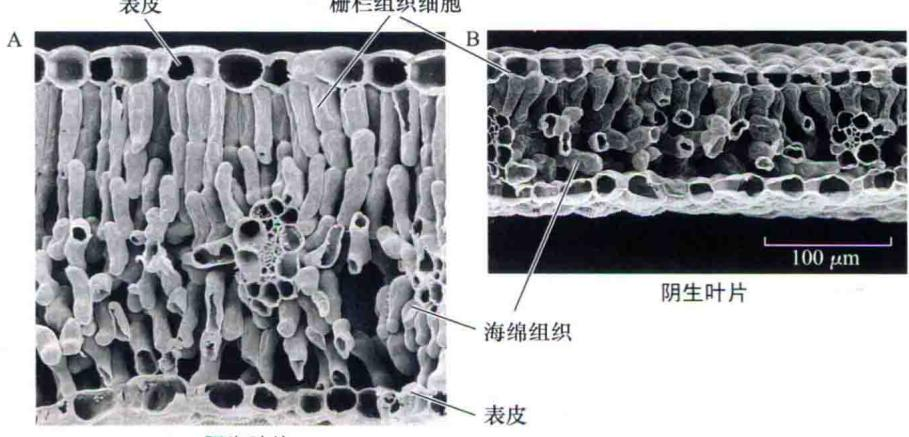  
阳生叶片  
图9.1 生长在不同光照环境下的豆科植物（Thermopsis montana）的叶片解剖结构电镜扫描图。注意：和阴生叶片（B）相比，阳生叶片（A）更厚，其栅栏组织细胞（柱状）更长，海绵组织细胞层位于栅栏组织细胞层下方（T. Vogelmann惠赠）。

## 9.1 光合作用是叶片的基本功能

从叶绿体（第7章和第8章）到叶片，光合作用的复杂性逐渐增显。但同时，通过对叶片结构和功能特性的认知，也可以使人们对光合作用其他水平的调节有所了解。

本部分将首先阐述叶片的解剖特性和向性是如何控制光合作用光吸收的；再进一步阐述叶绿体和叶片是如何适应其所在光环境的。将会看到，生长在不同光环境下的叶片，其光合反应可以反映出植物在这些光环境下生长的能力。然而在某种程度上，这也限制了某一物种的光合作用对不同光环境的适应。

研究证实，在不同环境条件下，光合速率被不同环境因子限制。例如，在一些情况下，光合作用会因为光或 $CO_{2}$ 的供应不足而受到限制；另一些情况下，如果特殊机制不能保护光合作用系统免受过剩光能的伤害，吸收太多的光能将引起严重问题。尽管植物有着多种适应机制来控制光合作用，允许它们在不断变化的环境中成功地生长。但是，植物对光照与遮阴环境、高温与低温环境、不同水分胁迫环境的适应都存在着最基本的限制。

暴露在不同光质和光量条件下的叶片会采取不同的方式进行光合作用。生长在户外暴露在太阳光下的植物，在光下和冠层阴影下测到的光谱成分是不同的；生长在室内的植物，接收到的是不同于阳光的白炽光或荧光。要解释光成分在质和量上的不同，需要对影响光合作用的光的测量方法和表达概念进行统一。

到达植物体表面的光是一种物质流，这种物质流可以用能量或量子的单位来表述。辐照度（irradiance），被定义为单位时间内到达已知面积扁平形传感器上的能量值，以每平方米瓦特（W/m²）来表示[时间

（秒，s）单位包含在瓦特单位之内：1W=1焦耳（J）/s]。光子辐射（photo irradiance），被定义为撞击叶片的瞬时量子（quanta）（单个量子）的数量，以每平方米每秒摩尔数 $\left[\mathrm{mol} / \left(\mathrm{m}^2\cdot \mathrm{s}\right)\right]$ 来表示。这里的“摩尔”指的是光子的数量（ $1\mathrm{mol}$ 光 $= 6.02\times 10^{23}$ 个光子，阿伏伽德罗常数）。如果光的波长 $\lambda$ 是已知的，那么量子和能量单位间很容易进行转换。光子的能量（E）与光的波长有如下关系。

$$
E = \frac {h c}{\lambda}
$$

式中，c 为光速（ $3 \times 10^{8}$ m/s）；h 为普朗克常量（ $6.63 \times 10^{34}$ J·s）； $\lambda$ 为光的波长，通常以纳米（nm）作为单位（ $1 \, nm = 10^{-9} \, m$ ）。从这个公式中可以看出，400 nm 波长处光子的能量是 800 nm 处的 2 倍（参见 Web Topic 9.1）。

光合有效辐射（photosynthetically active radiation, PAR）（400\~700 nm）也可用能量单位（W/m²）来表达，但通常以量子数量的多少[mol/(m²·s)]来表示（McCree, 1981）。值得注意的是，PAR是一种辐照度型的测量方式。在光合作用研究当中，PAR以量子计数来表示。

根据一天中时间和叶片定向状况的变化，入射光会以不同角度照射到叶片表面。当阳光直接偏离叶片表面（垂直地）时，辐照度的大小与入射光线和传感器或叶片形成角度的余弦值成比例（图9.2）。

晴天的光量是多少呢？阳光直射时，在茂密林冠层的顶部，光合有效辐射约为 $2000\ \mu mol/(m^{2}\cdot s)$ （ $900\ W/m^{2}$ ）。但在林冠层的底部，因为上部叶片对PAR的吸收，光合有效辐射仅为 $10\ \mu mol/(m^{2}\cdot s)$ （ $4.5\ W/m^{2}$ ）。

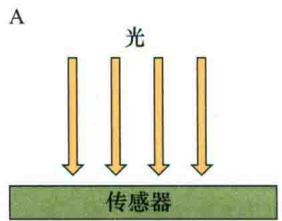

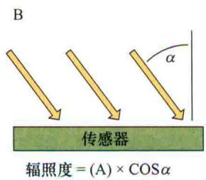  
图9.2 与叶片角度相关的瞬时光。当入射光垂直照射到叶片表面上时，叶片将获得最大的瞬时光（A）。当入射光以其他任何角度照射到叶片表面上时（B），瞬时光的水平将减小入射光与叶片表面之间夹角余弦值的倍数。

## 9.1.1 叶片的解剖结构有利于最大程度地吸收光

约有1.3 kW/m²的太阳辐射能到达地球表面，而其中不足5%可通过叶片的光合作用最终转化为碳水化合物。这个数值如此之小，是因为大约一半的瞬时光因为波长太短或太长而不能被光合色素吸收（图7.3）。可被吸收的光合有效辐射（PAR，400\~700 nm），大约有15%被绿色叶片反射或透射。因为叶绿素对蓝光和红光有强烈的吸收（图7.3），所以光的反射和透射主要集中在绿光区（图9.3），植物也因此而呈现绿色。另外85%的光合有效辐射被叶片吸收，但其中的大部分以热的形式、小部分以荧光的形式损失掉（见第7章），因此，仅不到5%瞬时光能被转化为化学能，并储存在碳水化合物中。

叶片的解剖结构高度特化，以便更好地吸收阳光（Ashima and Hikosaka，1995）。最外侧的表皮层细胞对可见光是完全透明的，但单个细胞通常凸起，成透镜状聚光，以至于到达叶绿体的光量是到达其周边光量的数倍。具有聚光的外表皮是很多草本植物的共性，这一特性对于生活在光线较弱的林下层的热带植物也特别重要。

在外表皮以下，用于光合作用的前几层细胞称为栅栏组织细胞（palisade cell）。它们成柱状平行排列，深1\~3层（图9.1）。一些叶片有多层柱状的栅栏组织细胞，最外层叶绿素含量非常高，因此仅有少量的入射光可透射到叶片里层。在这种情况下，植物仍然可以非常有效地投入能量供多细胞层发育。事实上，由于筛孔效应和光道效应的存在，有比理论上更多的光量透射过了栅栏组织细胞的第一层。叶绿体具有很高的比表面积，可从结构上增强栅栏组织细胞的光合效率（Evans et al., 2009）。

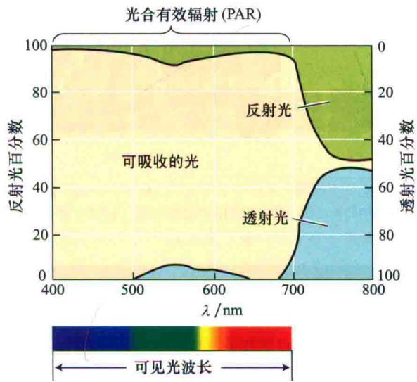  
图9.3 一种豆类植物叶片的光学特性。纵坐标是吸收、反射和透射光的百分数，它们是波长 $\lambda$ （横坐标）的函数。位于波段500\~600 nm处的绿光被透射和反射掉，因此叶片表现为绿色。注意：波长大于700 nm的大多数光是不能被叶片吸收的（引自Smith，1986）。

所谓的筛孔效应（sieve effect），是指由于叶绿素在细胞内呈现不均匀分布，它们在叶绿体中堆积，从而导致叶绿素分子间因遮挡而产生阴影；同时叶绿体间也会产生空隙，因此这些部位形成了一个个“筛孔”，入射光不被吸收（光被透射或反射）。由于筛孔效应的存在，每个栅栏组织细胞内一定数量的叶绿素所吸收的总光量要少于溶液中同样数量的叶绿素所吸收的光量。

当一些入射光通过栅栏组织细胞内的中心液泡或细胞间隙进行传播时，还会产生光通道（light channeling），这是一种有利于透射光进入叶片内部的结构方式（Vogelman，1993）。

在栅栏组织细胞层下面是海绵状组织（spongy mesophyll）细胞，这些细胞没有规则的形状，并被大的空气泡包围着（图9.1）。这些大的空气泡使空气和水之间产生了很多分界面，并且可以反射和折射入射光，因此光的传播方向有了很大的随机性。这种现象称为界面光散射（light scattering）。

光的散射对于叶片来说是至关重要的，因为光在细胞与空气的界面上进行多次反射，在很大程度上延长了光子的传递路径，也因而增加了光子被吸收的可能性。事实上，叶片内光子传递路径的长度通常是叶片厚度的

4倍或更多（Chter and Fukshansk，1996）。栅栏组织细胞的特性有利于光顺利进入叶片，而海绵组织细胞的特性则有益于光发生散射，这样，整个叶片就能更均衡地吸收光。

某些环境，如沙漠中，光照非常强烈，会对叶片造成潜在的伤害。生长在这些环境中的植物，叶片通常具有特殊的解剖结构，如着生绒毛、盐腺、上表皮蜡质状等以增强叶片表面对光的反射，减少光的吸收（Ehleringer et al., 1976）。这些适应性可以减少40%的吸收光，从而最大限度地减少了由于光能过剩引发的问题和带来的热量。

## 9.1.2 植物竞争阳光

通常，植物之间会对太阳光产生竞争。植物的茎和树干保持上挺的姿态，而叶片形成冠层，以利于吸收阳光并影响光合速率及其下部组织的生长。被其他叶片遮挡着的叶片会比其上部叶片接收到较低的光水平和不同的光量子，因此有着更低的光合速率。

叶片着生在距离地表很高位置的树木，表现出了对光截留的明显适应。这种精致的枝条结构极大地增加了对光的截留程度，因此，几乎所有PAR都被叶片吸收而无法透过森林冠层到达底部（图9.4）。可以利用生长光谱另一端光能的植物，如蒲公英（Taraxacum sp.），呈花环状生长，也就是在很短的茎秆上，叶片间近距离呈放射状排列，这样就阻止了其下部区域其他叶片的生长。

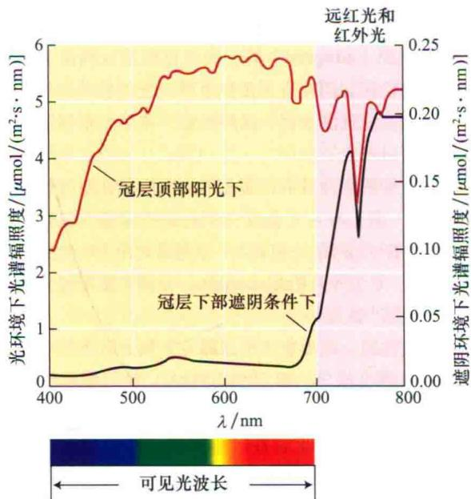  
图9.4 在冠层顶部和下部的光谱分布。对于未被过滤过的太阳光，总辐照度是 $1900\ \mu mol/(m^{2}\cdot s)$ ，而阴影部分的辐照度仅为 $17.7\ \mu mol/(m^{2}\cdot s)$ 。大部分的PAR被冠层叶片吸收（引自Smith，1994）。

在很多遮阴的生境，光斑（sunfleck）是一个普遍的环境特征。它是穿过叶片冠层小空隙和随着太阳的移动而穿过被遮蔽叶片的光点。在一座生长浓密的深林里，光斑可在数秒内数十倍的改变撞击到森林底层叶片上的光子通量。如此巨大的能量，在光斑浓度很高的环境中，随时在短时间内即可获得。对于冠层以下部位的叶片，光斑带来的光能几乎包含了日间所获光能总量的50%。因此当有光斑的时候，这些叶片具有充分利用光斑的机制。

高密度生长的作物中，低层叶片因被上层叶片遮挡而无法获取充足的光能，因此在它们的碳代谢过程中，光斑也起着重要作用。另外，光合器官和气孔也会对光斑产生快速反应，这引起了植物生理学家和生态学家的极大兴趣（Pearcy et al., 2005），因为这些反应反映了捕获太阳光短脉冲群的特殊生理机制。

## 9.1.3 叶角和叶片运动对光吸收的控制

在冠层内，叶片怎样影响光的水平呢？叶片表面与入射光方向间存在一个夹角，这个夹角的大小决定了照射到叶片上的光量值，如图9.2所示。如果太阳在植株冠层的正上方，那么处于水平状态的叶片（如图9.2A所示的扁平形光传感器）将比具有较大倾斜角度的叶片接受到更多的光。自然条件下，冠层顶部完全暴露在太阳光下的叶片着生夹角陡立，以减少日光的照射量，从而使更多的光透射到冠层内部。通常看来，一个冠层内叶片的着生夹角是随着深度的增加而减小的（变得更加水平）。

当叶面或叶层与入射光方向垂直的时候，叶片具有最大的光吸收能力。一些植物通过阳光追踪（solar tracking）来调控对光的吸收（Ehleringer and Forseth，1980），即不断地调整叶面的方位，使叶面始终保持与太阳射线方向垂直（图9.5）。很多物种的叶片具有阳光追踪功能，如紫花苜蓿、棉花、大豆、蚕豆和羽扇豆。

具有阳光追踪功能的叶片，在太阳升起前，其叶面对着东方地平线，与日出的方向保持着几近垂直的状态。之后，叶面会锁定正在升起的太阳，与太阳光线准确保持±15°角，并随着太阳在天空中的转动而改变方向，直到日落，此时叶面几乎垂直地对着西方。在夜间，叶片保持着与地面平行的水平状态，并不断进行调试，直到黎明来临前，使叶面再次对着东方的水平线，迎接着太阳的又一次升起。叶片追踪阳光仅仅在晴朗的白天，当云将太阳遮住的时候，“阳光追踪”现象不会发生。然而，在云断断续续遮蔽太阳的时候，一些叶片也会以每小时旋转90°的速度来快速适应光线的变化，使它能在太阳突然从云层后出现的时候快速捕捉到新的光线位置（Koller，2000）。

阳光追踪是一种蓝光反应（见第18章），具有阳光追踪行为的叶片其蓝光感应发生在叶片或茎秆特殊的区域。树葵（锦葵科植物）叶片的光线感应区位于或接近于主叶脉（Koller，2000）。多种情况下，叶片的方位是由一个专性器官——叶枕（pulvinus）来调控的。叶枕位于叶柄和叶片的连接处。羽扇豆（羽扇豆属，豆科植物）叶片由5个或更多个小叶组成，其光感应部位则是位于每一个小叶叶面基部的叶枕（图9.5）。叶枕具有“发动机”细胞，这些细胞通过改变自身的渗透势来产生机械动力，决定叶片的方向。另有一些植物，通过叶柄伸长过程中一些小的机械运动或幼嫩茎的运动控制着叶片的方向（Ehleringer and Forseth，1980）。

趋日性（heliotropism）（向着阳光弯曲的现象）是建筑学上的一个术语，在这里常用于描述阳光诱导的叶片运动。而在阳光追踪过程中，叶片对光的最大拦截行为称为横向日性（diaheliotropic）。一些具有阳光追踪功能的植物也能改变它们叶片的方向，使其避免完全暴露在阳光下，从而最大程度地较少热伤害和水分损失。这些叶片的避光行为称为避日性（paraheliotropic）。有一些物种的叶片，当水分供应充足的时候，表现为横向日性；而当遭遇水分胁迫时，则表现为避日性。

保持叶片表面与入射光线垂直，阳光追踪的植物可以在全天（包括清晨和傍晚）都获得最大的光合作用效率。通常在清晨和傍晚气温比较低的时候，水分胁迫也

A  
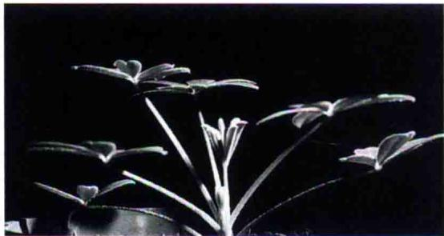

B  
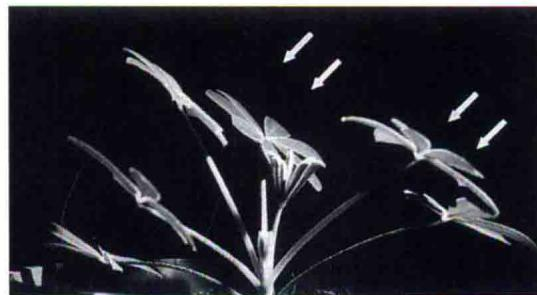  
图9.5 追踪阳光植物的叶片运动。A. 羽扇豆（Lupinus succulentus）叶片的初始方位。B. 暴露在倾斜光线下4 h后叶片的方位。光束的方向如箭头所示。在叶片和叶柄的接合处发现，叶枕的不均匀膨胀控制着叶片运动。自然条件下，叶片追踪着太阳在天空中的运动轨迹（引自Vogelmann and Björn，1983，由T. Vogelmann惠赠）。

相对较弱。因此，阳光追踪对于生长期较短的雨养植物非常有利，如豌豆。

横向日性阳光追踪似乎成为生活周期很短、且必须在干旱来临之前完成生活史的野生物种的一个共同特征（Ehleringer and Forseth，1980）。避日性叶片通过调整可以使到达叶面的入射光量基本保持恒定。虽然入射光的能量值经常仅是太阳辐射能的1/2\~2/3，但是这种光量水平在水分胁迫或光能过剩条件下可能是有利的。

## 9.1.4 植物对光及遮阴环境的适应与调节

一些植物有足够的可塑性去适应一定范围的光环境，如阳生植物生长在光下，而阴生植物生长在遮阴环境下，这称为适应（acclimation）。这是一个展开的新生叶片形成一套极其适应特殊环境的生化特性和形态特征的过程。就阴影生境所接收到的PAR不足光生境下的20%，冠层深处接收到的PAR不足冠层顶部的1%而言，适应能力是非常重要的。

一些物种，其原本生活在光线极好或遮阴较大的生境中的单个叶片，当转换到其他生境时往往不能生存下来（图9.4）。在这种情况下，成熟叶片就会立即脱落，新生叶片则会向更加适应新环境的方向发育。读者可能注意到，当将一株在室内已经长成的植物移到户外，一段时间之后，如果它恰是上述类型的植物，就会发现它长出一组新的叶片以更好地适应高光环境。然而，另有一些植物物种并不适应从光环境向阴生环境转移。这种适应性的缺乏表明这些植物仅仅对阳生或阴生环境是适应（adapted）的。当把已经适应高度遮阴生境的植物转移到阳光直射条件下时，它的叶片会遭受持续光抑制，并逐渐变白，最终死亡。本章稍后将对光抑制进行探讨。

阳生和阴生叶片有许多相对应的生物化学特性。

（1）阴生叶片光合反应中心的叶绿素含量较高，叶绿素b与叶绿素a的比值较大，且通常比阳生叶片更薄。

（2）阳生叶片Rubisco较多，叶黄素循环组分集群更大（见第7章）。

生长在同一株植物上但暴露在不同光区下的叶片，也可以表现出相异的解剖结构特性。图9.1展示了生长在光下和遮阴条件下的叶片在解剖结构上的一些差异。值得关注的是，和生长在阴生环境的叶片相比，阳生叶片更厚、栅栏组织细胞更长。即使一个叶片的不同部位也可以表现出对它们光微环境的适应（Terashima，1992）。

植物这种形态和生化方面的调整适应机制与叶片的特殊功能有关，这种特殊功能是植物对生境中光量变化响应的结果。例如，远红光主要被PS I吸收，因此在阴生生境中比在阳生生境中远红光有更大的存在比例。

一些阴生植物的适应性反应表现为PSⅡ与PSⅠ反应中心的比例是3∶1，而阳生植物的这个比例是2∶1（Anderson，1986）。另有一些阴生植物，它们并不改变PSⅡ与PSⅠ反应中心的比值，而是通过增加更多的天线叶绿素到PSⅡ，来增加这个系统对光的吸收，以更好地平衡通过两个系统的能量流。这些变化似乎促进了植物在阴生环境中对光的吸收和能量的转运。

另外，阳生和阴生植物的暗呼吸速率也有所不同，这改变了呼吸作用与光合作用的关系，本章的后一部分将会对此进行一些阐述。

## 9.2 结构和功能完整的叶片对光的光合响应策略

光是植物的重要资源。如果接收到过少或过多的光，光将成为植物生长和繁殖的限制因子。光射线和叶片光合特性的关系为研究植物对光环境的适应提供了很有价值的信息。本部分将阐述具有代表性的光合作用反应——光响应曲线的一些特征。同时，还会探讨如何利用光响应曲线的重要特征来解释阳生和阴生植物、 $C_{3}$ 和 $C_{4}$ 物种在光合特性上的差异；并且仍将继续阐述叶片对过剩光能的响应策略。

## 9.2.1 光响应曲线揭示了叶片的光合特性

通过改变吸收光的水平来测定完整叶片的净 $CO_{2}$ 固定量，由此可以建立一条光响应曲线（图9.6），它可以揭示出叶片的光合作用特性。在夜间，没有光合碳同化作用产生，但由于植物线粒体呼吸作用存在，植物仍会持续产生 $CO_{2}$ （见第11章）。因此在光响应曲线的这一部分， $CO_{2}$ 吸收是一个负值。在较高光量子水平下，光合 $CO_{2}$ 同化最终将达到一个点，这一点处，光合 $CO_{2}$ 吸收量与 $CO_{2}$ 释放量恰好平衡，此时的光合有效辐射，称为光补偿点（light compensation point）。

不同叶片达到光补偿点时的光通量大小因物种及发育条件的不同而改变。这是正常生长在全光照植物和遮阴生境植物间最令人感兴趣的差异之一（图9.7）。阳生植物的光补偿点为10\~20 $\mu$ mol/(m $^{2}$ ·s)，阴生植物的则为1\~5 $\mu$ mol/(m $^{2}$ ·s)。

为什么相对于阳生植物，阴生植物的光补偿点较低呢？这主要是因为阴生植物呼吸速率很低，很弱的光合作用都可以使净 $CO_{2}$ 交换速率达到零。在比阳生植物PAR低的环境中，低的呼吸速率使阴生植物获得正的 $CO_{2}$ 吸收速率，继而在光限制的环境中存活下来。

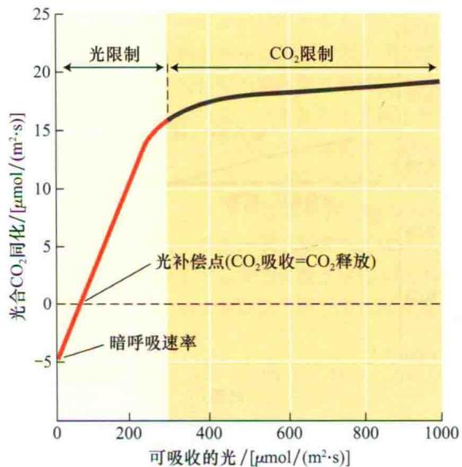  
图9.6 C₃植物光合作用的光响应曲线。夜间，植物因呼吸作用产生并释放CO₂。当光合作用同化的CO₂量与呼吸作用释放的CO₂量相等时，即达到光补偿点。在光补偿点以上适当地增加光强会增强光合作用，表明光合作用受电子传递速率限制，而电子传递速率的大小又受到获得光量多少的限制，这段曲线反映为光限制部分。随着光合作用的继续增强，Rubisco的羧化能力或磷酸丙糖的代谢成为主要限制因素，这段曲线反映为CO₂限制部分。

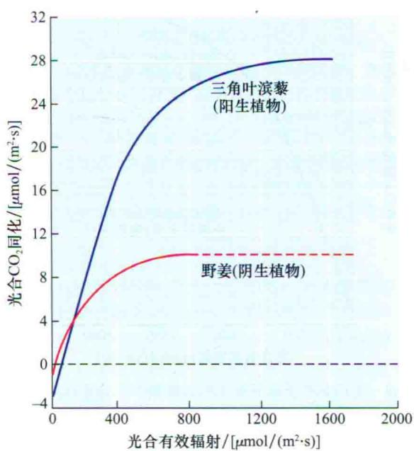  
图9.7 阳生和阴生植物光合碳固定的光响应曲线。三角叶滨藜（Atriplex triangularis）是一种阳生植物，野姜（Asarum caudatum）是一种阴生植物。图示表明，阳生植物比阴生植物具有更低的光补偿点和最大光合速率。红色的虚线部分是根据曲线测定部分进行的推测（引自Harvey，1979）。

在光补偿点以上，光子通量和光合速率在光水平上保持线性关系（图9.6）。在光响应曲线的线性关系

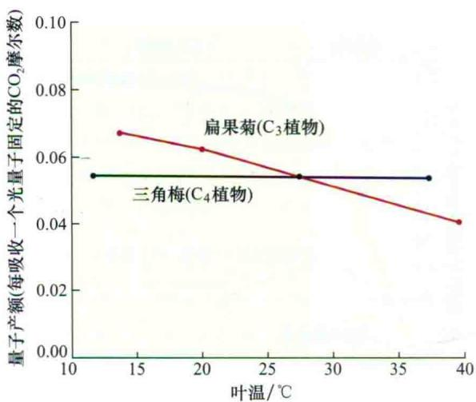  
图9.8 $C_{3}$ 和 $C_{4}$ 植物光合碳固定的量子产额（作为叶温的函数）与叶温间的关系。在目前大气条件下， $C_{3}$ 植物的光呼吸作用随温度的升高而增强，净 $CO_{2}$ 固定所需能量消耗也随之增大。较高温度下，较大的能量损耗却产生较低的量子产额。因为 $C_{4}$ 植物存在 $CO_{2}$ 浓缩机制，所以其光呼吸作用相对较低，量子产额的产生与环境温度无关。注意：温度相对较低时 $C_{3}$ 植物的量子产额高于 $C_{4}$ 植物的，这表明低温下 $C_{3}$ 植物比 $C_{4}$ 植物具有更高的光合作用效率（引自 Ehleringer and Björkman，1977）。

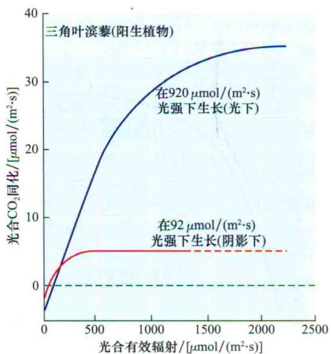  
图9.9 生长在光下或阴影下阳生植物的光合作用光响应曲线。上面的曲线是三角叶滨藜叶片的光合作用光响应曲线，此时的辐照度是下面曲线辐照度的10倍。生长在较低光水平下的叶片，其光合作用在相当低的辐照度下即达到饱和。这表明，叶片的光合作用特性与其生长条件有关。红色的虚线部分是根据曲线测量部分进行的推测（引自Björkman，1981）。

部分，光合作用是受光限制的，光子通量的增加会刺激光合作用成比例增强。光响应曲线线性部分的斜率揭示了叶片光合作用的最大量子产额（maximum quantum yield）。阴生和阳生植物虽然生境不同，但它们的量子产额非常接近。因为对于这两种类型的植物来说，决定其量子产额的基础生物过程是相同的。但是量子产额也会因为光合路径的不同而发生改变。

量子产额是一定数量的依赖于光的产物与吸收的光量子数间的比值[见方程式（7.5）]。光合量子产额可以用单个 $\mathrm{CO}_{2}$ 或 $\mathrm{O}_{2}$ 分子为基数来表示。在第7章中提到过，光化学量子产额约为0.95。然而，当在叶绿体（细胞器）或整个叶片中测定时，一个完整过程（如光合作用过程）的光合量子产额都是低于其理论产额的。事实上，基于第8章讨论的生物化学（见第8章）方法，预测出 $\mathrm{C}_{3}$ 植物最大的光合量子产额为0.125（每固定一个 $\mathrm{CO}_{2}$ 分子需要吸收8个光子）。但是，在目前的大气条件下（390 μmol/mol $\mathrm{CO}_{2}$ ，21% $\mathrm{O}_{2}$ ）， $\mathrm{C}_{3}$ 和 $\mathrm{C}_{4}$ 植物叶片固定 $\mathrm{CO}_{2}$ 的量子产额为0.04\~0.06 mol/mol光子。

$C_{3}$ 植物光合量子产额小于理论最大值通常是因为光呼吸作用要损耗能量；而 $C_{4}$ 植物的则是因为 $CO_{2}$ 浓缩机制增长的能量需求。如果将 $C_{3}$ 植物叶片暴露在低 $O_{2}$ 浓度条件下，那么它的光呼吸作用就会减少到最小，量子产额就会增加——吸收1 mol光子可固定0.09 mol $CO_{2}$ 。相反，如果将 $C_{4}$ 植物叶片暴露在低 $O_{2}$ 浓度条件下，它的量子产额仍维持不变——吸收1 mol光子仍可固定0.05 mol $CO_{2}$ 。这是因为 $C_{4}$ 植物光合作用中的碳浓缩机制有效地去除了光呼吸作用产生的 $CO_{2}$ 。

温度和 $CO_{2}$ 浓度会对Rubisco的羧化酶和加氧酶的反应比例产生影响，因此量子产额会随着温度和 $CO_{2}$ 浓度的变化而发生改变（见第8章）。在当前外界环境下，当温度低于30℃时， $C_{3}$ 植物的量子产额通常比 $C_{4}$ 植物的高；当温度高于30℃时，情形则通常相反（图9.8）。

在较高的光子通量条件下，光合作用的光反应逐渐稳定下来（图9.9），并最终达到饱和（saturation）状态。超出饱和点的光水平不再影响光合速率，这表明此时不再是入射光强度，而是一些其他因素，如电子传递速率、Rubisco活性或磷酸丙糖的代谢等，成为光合作用的限制因素。

超出光饱和点以后，光合作用过程通常会受到“CO₂限制”（CO₂ limited）（图9.6），这意味着卡尔文-本森循环中酶的作用无法与光反应过程中ATP和NADPH的产生协调一致。阴生植物的光饱和水平通常低于阳生植物的。这些光饱和水平通常反映了叶片在生长过程中照射到的最大光子通量。

大多数叶片的光响应曲线在光子通量为500\~1000 $\mu$ mol/(m $^{2}$ ·s)时就达到饱和状态，这个值远低于太阳辐射值[约2000 $\mu$ mol/(m $^{2}$ ·s)]。虽然单个叶片很少能利用全部太阳能，但整株植物是由很多叶片组成的，且叶片间彼此互相遮挡，因此一棵树的叶片中仅有一小部分可以在一天中的任何时间都暴露在高太阳辐射条件下。其他叶片所接收到的光子通量则主要来自于叶片冠层缝隙形成的光斑，或其他叶片透射过来的光。

因为整株植物的光合作用是所有叶片光合作用之和，所以几乎很少有在整株水平上达到光饱和点的（图9.10）。分析这些曲线，作物的产量与其在生育期内接收到的总光量大小有关，在水分和养分供应充足的情况下，接收到的光量越多，生物量越大（Ort and Baker, 1988）。

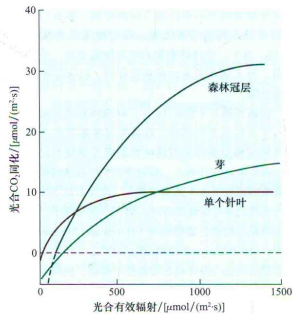  
图9.10 北威尔士北美云杉林（Picea sitchensis）的单个针叶、复合芽和森林冠层的光合作用（每平方米基础上表述）变化。复合芽由多组彼此相互遮阴的针叶组成，类似于冠层中的枝条间相互遮挡的情形。由于遮挡的原因，光合作用达到饱和需要更高的辐照度。森林冠层曲线的虚线部分是根据曲线测定部分进行的推测（引自Jarvis and Leverenz，1983）。

## 9.2.2 叶片必须耗散过剩的光能

当暴露在过量的光强下时，叶片必须耗散掉吸收来的过剩光能，以使光合器官免受伤害（图9.11）。光能耗散有多种方式，其中包括非光化学淬灭（nonphotochemical quenching）（见第7章），它是一种叶绿素荧光淬灭机制而不是光化学机制。但最重要的是其吸收的光能不经电子传递而直接转化为热能。虽然这个过程的分子机制仍未完全解释清楚，但是叶黄素循环似乎是过剩光能耗散的一个重要途径（参见Web Topic 9.1）。

## 1. 叶黄素循环

回忆一下第7章的叶黄素循环（the xanthophylls cycle），它由3种类胡萝卜素组成：紫黄质、玉米黄质中间物花药黄质（单环氧玉米黄质）和玉米黄质，它们在叶片耗散过剩光能的过程中起重要作用（图7.35）。在高光强下，紫黄质先转变为单环氧玉米黄质，再转变为玉米黄质。值得注意的是，在紫黄质中，两个芳香环共同束缚一个氧原子，在单环氧玉米黄质中，两个芳香环中仅有一个束缚一个氧原子，而玉米黄质中没有芳香环。实验研究表明，玉米黄质在热耗散过程中是3种叶黄素成分中最有效的，而单环氧玉米黄质的效率仅是它的一半。尽管单环氧玉米黄质的含量水平在一天中相对平稳，但是玉米黄质的含量在高光强下增加而在低光强下减少。

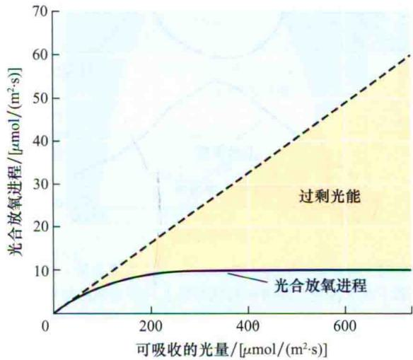  
图9.11 与光合作用放氧进程曲线相关的光能过剩。虚线表示在对光合作用没有任何速度限制时理论上的放氧进程。在光通量低于 $150\ \mu mol/(m^{2}\cdot s)$ 时，阴生植物可以利用吸收到的光。然而，当光通量高于 $150\ \mu mol/(m^{2}\cdot s)$ 时，光合作用饱和，吸收的光能越来越多地被耗散掉。在较高的辐照度下，光合作用利用的那一小部分光与必须被耗散掉的那部分光（过剩光能）之间数量差异会很大。阴生植物与阳生植物的这个比值将会更大（引自Osmond，1994）。

在太阳辐射条件下生长的叶片，正午辐照度最大时，玉米黄质和单环氧玉米黄质的量可以占到叶黄素循环各组分总量的60%（图9.12）。在这种情形下，大量的类囊体膜吸收的过剩光能将被以热的形式耗散掉，这样就阻止了叶绿体光合结构遭受破坏（见第7章）。耗散掉光能的多少与辐照度、植物种类、生长条件、营养状态和周边温度有关（Demmig-Adams et al., 2006）。

## 2. 光下和阴境下的叶黄素循环

在光下生长的叶片比在阴境下生长的叶片含有更多的循环体，以至于它们可以耗散掉更多的过剩光能。然而，生长在森林底层低辐照度下的植物也可进行叶黄素循环。生活在这种环境下的植物，仅当阳光穿过很厚的冠层叶片缝隙以光斑的形式照射时，才会暴露在高光强下。仅一个光斑，就会导致叶片中大量的紫黄质转化成玉米黄质。大多数叶片中紫黄质水平在光强降低后再次增加，但森林底层阴生叶片中的玉米黄质一直维持在某一水平，以保护随时可能暴露在光斑下的叶片不受伤害。

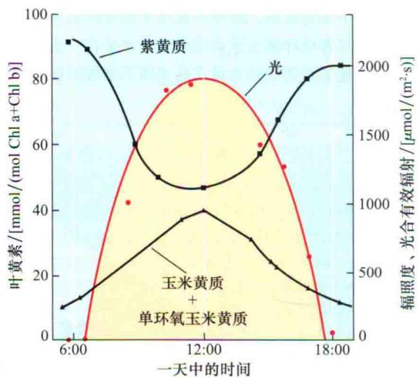  
图9.12 向日葵（Helianthus annuus）叶黄素含量（辐照度的函数）的日变化。随着照射到叶片上入射光强的增加，越来越多的紫黄质转变成单环氧玉米黄质和玉米黄质，以此耗散过剩光能和保护光合器官（引自Demmig-Adams and Adams, 1996）。

在一些物种上，如松类等，也发现了叶黄素循环的存在。这些植物的叶片在冬天仍保持着绿色，尽管其光合速率非常低，但光吸收量仍然很高。与夏天观测到的叶黄素循环的日循环规律相反，玉米黄素在冬季每天都维持很高的水平。因此，可以推测这种机制可以最大限度地耗散光能，因而整个冬天它都可以保护叶片免受光氧化的伤害（Adams et al., 2001）。

## 3. 叶绿体运动

减少过剩光能的另外一个方法就是移动叶绿体，使它们不再暴露在高光强下。叶绿体运动在藻类、苔藓类和高等植物叶片中广泛存在（Haupt and Scheuerlein，1990；von Braun and Schleiff，2007）。如果叶绿体的方向和位置可以被控制，那么叶片就可以调节对入射光的吸收量。在傍晚或低光强下（图9.13A，B），叶绿体聚集在叶片细胞表层，平行于叶平面，与入射光的方向相垂直排列，以保证最大程度吸收光能。

在高光强下（图9.13C），叶绿体移动到细胞表面平行于入射光方向排列，以避免过多地吸收光能。叶绿体的这种重新排列可使叶片的吸光量减少15%左右（Gorton et al., 1999）。研究表明，叶绿体的移动是一种典型的蓝光反应（见第18章）。在很多低等植物中，蓝光也控制着叶绿体的方向。但在一些海藻中，叶绿体的运动是由植物色素控制的（Haupt and Scheuerlein, 1990; von Braun and Schleiff, 2007）。叶片中，叶绿体沿着肌动蛋白微纤丝在细胞质中移动，钙调节着叶绿体的这种运动（Tlalka and Fricker, 1999）。

## 4. 叶片运动

在进化过程中，植物已经形成了适应光环境的结构特征，在光照强度较大的时期减少过多的光量照射到植物叶片上，特别是由于水分胁迫而导致叶片的蒸腾作用，以及由此而引起的降温效应减弱的时候。随着入射光线的改变，叶片的方位发生变化就是其结构进化的一个实例。例如，避日性植物苜蓿和羽扇豆的叶片追踪阳光，但在同时通过把小叶折叠到一起，使叶平面几乎与入射光线平行来减弱入射光照射强度。这些运动是通过改变叶柄泡状细胞的膨压来实现的。另外一个共同的特征就是萎蔫，像在许多向日葵植物上看到的一样，萎蔫的叶片向下低垂，再次有效地减少入射热量，同时减弱蒸腾作用和入射光强度。

A 黑暗  
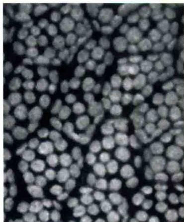

B 弱蓝光  
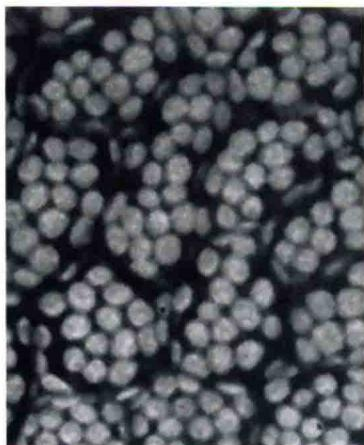

C 强蓝光  
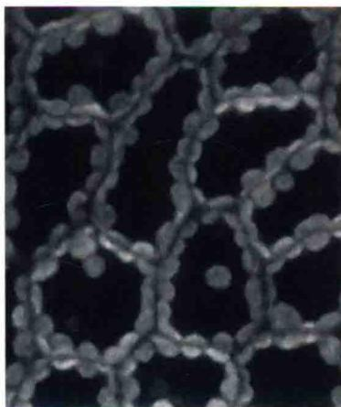  
图9.13 浮萍（Lemna）进行光合作用的细胞中叶绿体的分布。这些表面视图展示了相同的细胞在3种条件下的情形：A. 黑暗；B. 弱蓝光；C. 强蓝光。在A和B条件下，叶绿体定位在细胞的上表面附近，在那里它们可以最大程度地吸收光能。当用强蓝光照射细胞时（C），叶绿体移动到细胞壁一侧，在那里彼此相互遮挡，以最小量吸收过剩的光能（由M.Tlalka和M.D.Fricke惠赠）。

## 9.2.3 吸收过多的光能可导致光抑制

第7章中已经阐述过，当叶片暴露在比它们可利用的更强的光环境下时（图9.11），PSⅡ反应中心就会失活，常常因发生光抑制（photoinhibition）而遭到损坏。叶片所在光环境的光强大小决定了光抑制的特征。有两种类型的光抑制：动态光抑制和持续光抑制（Osmond，1994）。

在温和的光能过剩条件下，会产生动态光抑制（dynamic photoinhibition）。其特征是：量子效率下降，但最大光合作用效率维持不变。动态光抑制是由于吸收的光能转变为热能耗散引起的，并由此带来了量子效率的下降。这种降低通常是暂时性的，当光子通量降低到饱和点以下水平的时候，量子效率可以恢复到它的初始值。图9.14展示了在适宜和胁迫环境里，一天中被吸收来的太阳光量用于光合作用反应和用于过剩光能热耗散掉部分间的分配情况。

暴露在高水平过量光照条件下，光合作用系统就会遭到损坏，导致量子效率和最大光合速率均降低，从而产生持续光抑制（chronic photoinhibition）。如果图9.14所展示的胁迫条件持续较长时间，就会产生持续光抑制。持续光抑制与PSⅡ反应中心D1蛋白的替换和破坏密切相关（见第7章）。与动态光抑制相比，持续光抑制的影响可持续数星期、数月或更长时间。

光抑制的早期研究者，把所有量子效率的下降都归因于光合器官的破坏。但现在认识到，短期的量子效率下降似乎是一种光保护机制（见第7章），而持续光抑制的产生则意味着叶绿体受到了损坏，这是由于光能过剩或保护机制失败而造成的。

自然界中的光抑制具有重要意义。正午时，叶片完全暴露在最大光照强度下，同时碳固定量相对减少的时候，通常会发生动态光抑制。在低温条件下时这种情况更加明显，在更加极端的气候条件下，动态光抑制会转变为持续光抑制。

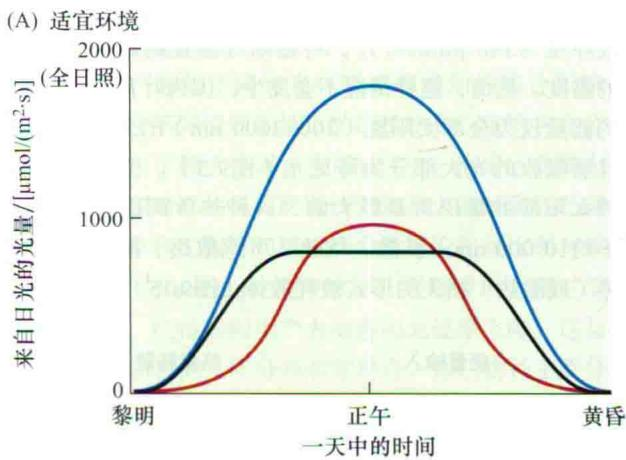

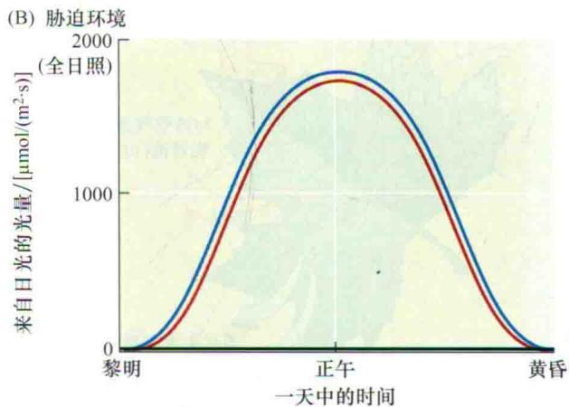  
图9.14 一天中可吸收的太阳光量的分配变化。图片展示了在适宜环境（A）和胁迫环境（B）中，一天内光子撞击叶片产生的能量用于光化学反应的和以过剩光能热耗散掉的相对情况（引自Demmig-Adam and Adams，2000）。

## 9.3 光合作用对温度的响应

光合作用（ $\mathrm{CO}_{2}$ 吸收）和蒸腾作用（ $\mathrm{H}_{2} \mathrm{O}$ 散失）共用一个路径，即通过保卫细胞调节气孔开度， $\mathrm{CO}_{2}$ 扩散进入叶片， $\mathrm{H}_{2} \mathrm{O}$ 则扩散出去。然而，它们是两个相对独立的过程。在光合作用过程中， $\mathrm{H}_{2} \mathrm{O}$ 会大量散失，散失的 $\mathrm{H}_{2} \mathrm{O}$ 量和吸收的 $\mathrm{CO}_{2}$ 量的摩尔比通常为 $250:1 \sim 500:1$ 。水分的大量散失也使叶片通过蒸腾制冷作用耗散了大量的热量，从而在高太阳辐射条件下保持相对的低温。气孔的开放程度会同时影响到光合和蒸腾这两个过程，而光合作用又是一个与温度相关的过程，因此这两个过程之间的相关性非常重要。随后就会知道，气孔的开度影响着叶温和蒸腾失水的程度。

## 9.3.1 叶片必须散失大量的热

暴露在强辐射阳光下的叶片会接受很多热量。事实上，如果吸收了所有光能而又没有热量损失，水层的有效厚度为300 $\mu$ m的叶片，将逐渐升温直到具有相当高的温度。然而，这种情况不会发生，因为叶片所能吸收的能量仅为全部太阳能（300\~3000 nm）的50%左右，且所吸收的光大部分为可见光（图9.3）。但叶片吸收的太阳能的量仍然是巨大的，这种热负荷以长波辐射（约10 000 nm）扩散、焓热（可感散热）损失和蒸发热（或潜热）损失的形式被耗散掉（图9.15）。

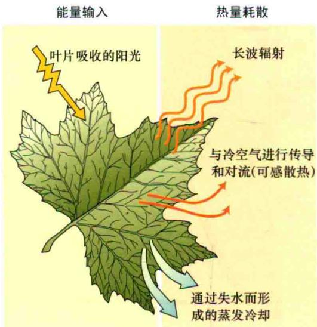  
图9.15 叶片对太阳能的吸收和耗散。强制性的热负荷必须被耗散掉以避免伤害叶片：它们以长波辐射形式发射出去、以焓热损失（可感散热）形式扩散到叶片周围的空气中去和通过蒸腾作用蒸散出去，即蒸发冷却。

（1）辐射热损失：所有的物体都会根据体温成比例地发出热辐射。然而，辐射能的最大波长却是与它们的温度成反比的，温度非常低的叶片，发射的波长是人眼看不到的。

（2）焓热损失：如果叶温高于周围的气温，热就从叶片对流（传递）到空气中去。

（3）蒸发热损失：因为水的蒸发需要能量，所以当水从叶片蒸散（蒸腾）的时候，大量的热被带走而使叶片冷却下来。人类通过排汗降低体温就是这个原理。

焓热损失和蒸发热损失是叶片温度调节中的两个重要过程，二者的比例称为波文比（Bowen ratio）（Ampbell and Norman，1996）。

$$
\mathrm{波文比} = \frac {\mathrm{焓热损失}}{\mathrm{蒸发热损失}}
$$

水分供应充足的农作物，其蒸腾作用（见第4章）（也就是水从叶片的蒸发过程）是很强烈的，因此波文比较低（参见Web Topic 9.2）。相反，当蒸发制冷受到限制的时候，波文比较大。例如，水分胁迫的作物，部分气孔关闭减弱了蒸发制冷，波文比增加。蒸发热损失的量（或波文比）是由气孔开放的程度决定的。

高波文比的植物可以保持水分，也可以忍受高的叶温。然而，叶温和气温间的较大差值增加了焓热损失量。生长减缓通常与高的波文比有关，因为高的波文比意味着叶片上至少有部分气孔是关闭的。

## 9.3.2 光合作用对温度是敏感的

大气 $CO_{2}$ 浓度下，将 $C_{3}$ 植物或 $C_{4}$ 植物光合速率作为温度的函数作图，得到的曲线是一个特化的钟形（图9.16）。在曲线上可以看到两个相对的反应，它部分反映了生长在自然温度条件下的物种的最适温度。由此， $C_{3}$ 植物——无毛滨藜通常生长在冷凉的沿海环境，而 $C_{4}$ 植物——Tidestromia oblongifolia则生长在炎热的沙漠环境中。曲线攀升的部分代表与温度有关的酶活性的增强；曲线顶部扁平的部分代表光合作用的最适宜温度范围；曲线下滑部分表明对温度敏感的有害效应已经产生，这些效应有些是可逆的，而有一些则不可逆。

温度影响着与光合作用有关的所有生物化学反应及叶绿体膜的完整性，因此，光合作用对温度的响应策略是相当复杂的。在大气 $CO_{2}$ 浓度下（图9.16），Rubisco的活性是光合作用的主要限制因子。光合作用对温度的响应反应为两个矛盾的过程：羧化效率随着温度的升高而逐渐增加，但Rubisco对 $CO_{2}$ 亲和力随着温度的升高则逐渐下降（见第8章）。有证据表明，高温下Rubisco活性的下降是因为温度影响了Rubisco活化酶的表达（见第8章）。在大气 $CO_{2}$ 浓度下，这些反向效应减弱了光合作用对温度的响应程度。

比较而言，以 $C_{4}$ 植物光合速率对温度作图，发现在上述两种情况下曲线都呈钟形（图9.16），即使叶片内部达到“ $CO_{2}$ 饱和”以后（见第8章讨论）。这是 $C_{4}$ 植物和 $C_{3}$ 植物叶片在同等条件下生长时， $C_{4}$ 植物趋向于有更高的光合作用最适温度的原因之一。

在低温条件下，光合作用也可以被其他很多因素限制，如叶绿体中磷酸盐的有效性（Sage and Sharkey, 1987）。当磷酸丙糖从叶绿体输出到细胞溶质中时，等摩尔的无机磷经由叶绿体膜上的转运体被吸收进入叶绿体。低温下，如果胞质中的磷酸丙糖的利用速率下降，磷酸盐进入叶绿体就会受到抑制，光合作用就会受到磷酸盐的限制（Geiger and Servaites, 1994）；淀粉和蔗糖的合成速率随着温度的降低迅速下降，因此减弱了对磷酸丙糖的需求，并引起磷酸盐对光合作用的限制。

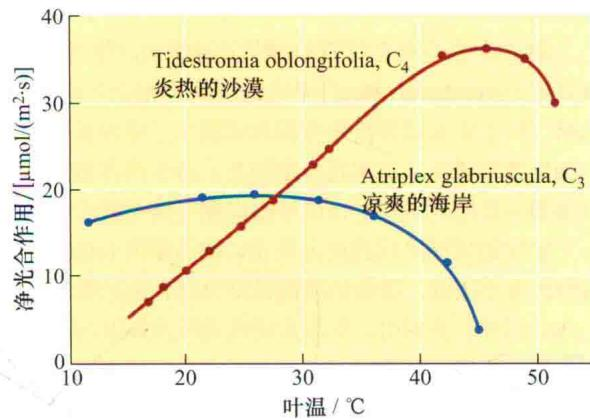  
图9.16 在目前大气 $CO_{2}$ 浓度下，适应冷凉生境的 $C_{3}$ 植物和适应炎热生境的 $C_{4}$ 植物光合作用随温度的变化（引自Berry and Björkman, 1980）。

## 9.3.3 光合作用的最适温度

温度响应曲线上看到的最大光合速率表征着最适温度响应（optimal temperature response）范围。对于某种植物，当超过其最适温度时，光合速率会再次下降。争论的是：这个最适温度点就是光合作用过程各步的反应能力达到最为平衡的那一点吗？因为其中一些步骤可能随着温度升高或降低会成为限制因子。超出最适温度范围之外，光合作用的下降与哪些因素有关呢？呼吸速率会随着温度的升高而增强，但这些并不是高温下净光合速率急剧下降的主要原因。与电子传递有关的膜系统在高温下稳定性下降，切断了还原力的供应，并导致光合作用全线急剧下降。

最适温度在很大程度上受遗传（调节）和环境（适应）因素共同影响。生长在不同温度生境内的不同植物种类，有着不同的光合作用最适温度。对生长在不同温度生境内的同一植物物种光合反应的研究表明，其最适温度与其生境内的温度密切相关。和生长在高温环境中的植物相比，原本生长在低温条件下的植物在低温条件下具有更高的光合速率。

这些因温度而产生的光合速率的变化，在植物对不同环境的调节适应过程中起着重要作用。植物对温度的适应表现出了明显的可塑性。生活在阿尔卑斯山地区的植物，可在接近0℃低温下还能净同化 $CO_{2}$ ；而生活在加利福尼亚死亡谷的植物，在温度接近50℃时，光合速率才达到最佳水平。

图9.8展示了 $C_{3}$ 植物和 $C_{4}$ 植物的光合量子产额随温度的变化情况。 $C_{4}$ 植物的量子产额或称光能利用率在温度变化时维持恒定，属于典型的低光呼吸速率类型。 $C_{3}$ 植物的量子产额则随着温度的升高而下降，表明光呼吸速率随温度的升高而增强，从而使每净固定1分子 $CO_{2}$ 需要消耗更多的能量。在光限制条件下量子产额受到最大限度抑制时，高光强作为温度的函数对光呼吸速率的影响显示出相似的模式。

量子产额的下降和光呼吸速率增加的综合影响，使得生活在不同温度生境下的 $C_{3}$ 植物和 $C_{4}$ 植物在光合能力上表现出了较大差异。在图9.17中，给出了北美大平原（从美国南部的得克萨斯州到加拿大的马尼托巴湖）上， $C_{3}$ 牧草和 $C_{4}$ 牧草初级生产力的理论相对比率与纬度的关系图（Ehleringer，1978）。可以看出，相对于 $C_{3}$ 植物来说， $C_{4}$ 植物的生产力由南向北逐渐下降，这与平原上植物物种的实际分布非常符合，即 $C_{4}$ 物种主要分布在40°N以南地区， $C_{3}$ 物种则主要分布在45°N以北地区（图9.17）（参见Web Topic 9.3）。

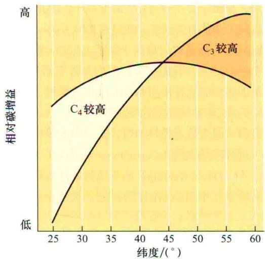  
图9.17 北美大平原上，相同的 $C_{3}$ 和 $C_{4}$ 牧草冠层光合碳增益相对速率随纬度的变化（引自Ehleringer，1978）。

## 9.4 光合作用对二氧化碳的响应

前面已经讨论过光和温度是如何影响植物的生长和叶片的解剖结构的。现在，再来探讨一下二氧化碳浓度如何影响植物的光合作用。 $CO_{2}$ 从空气扩散进入叶片——首先通过气孔腔，然后穿过细胞间隙，最终进入细胞和叶绿体。在光量充足的条件下，高 $CO_{2}$ 浓度带来高光合速率；相反，低 $CO_{2}$ 浓度则会限制 $C_{3}$ 植物的光合作用。

本部分旨在阐述近代大气 $CO_{2}$ 浓度的变化及 $CO_{2}$ 在碳固定过程中的作用。并进一步探讨 $CO_{2}$ 在光合作用过程中的限制性作用和 $C_{4}$ 植物 $CO_{2}$ 浓缩机制对光合作用的影响。

## 9.4.1 大气 $\mathrm{CO}_{2}$ 浓度持续上升

二氧化碳在大气中属于痕量气体，目前占大气总量的0.039%。环境 $CO_{2}$ 分压（ $c_{a}$ ）随着大气压力而改变，在海平面以上约为39 Pa（参见Web Topic 9.4）。水蒸气含量通常占大气总量的2%，氧气约为21%。大气中含量最多的是氮气，约占77%。

通过测定南极流动冰川上空气泡内的空气含量可以得到过去 $42 \times 10^{4}$ 年里的 $CO_{2}$ 浓度值，而目前的 $CO_{2}$ 浓度几乎是它的2倍（图9.18A，B）。目前大气中 $CO_{2}$ 浓度可能比地球在过去 $200 \times 10^{4}$ 年里经历过的还要高。在过去200年前的地质变迁过程中， $CO_{2}$ 浓度都被认为是很低的，这就意味着当今世界上植物是在低 $CO_{2}$ 浓度的环境中进化着。

有证据表明，自从过去 $7000 \times 10^{4}$ 年以前的温和白垩纪以来，地球上并不存在 $CO_{2}$ 浓度高于0.1%的时代。因此，直到工业革命到来前，在过去 $5000 \times 10^{4} \sim 7000 \times 10^{4}$ 年的时间里，地质变化趋向于降低大气 $CO_{2}$ 浓度（参见Web Topic 9.5）。我们想要知道的是近年来升高的 $CO_{2}$ 水平是如何影响光合作用和呼吸作用过程的，将来更高的 $CO_{2}$ 水平又将如何影响这些过程呢？

目前，因为化石燃料如煤、石油和天然气的燃烧，大气 $CO_{2}$ 浓度每年增加1\~3 $\mu$ mol/mol（图9.18C）。1958年以来，从C. David Keeling开始系统测量夏威夷的莫纳罗亚山洁净空气中的 $CO_{2}$ 浓度时算起，大气中的 $CO_{2}$ 浓度的增加已经超过了20%（Keeling et al., 1995）。如果仍然按目前的规模继续燃烧化石燃料，到2100年，大气中的 $CO_{2}$ 浓度将达600\~750 $\mu$ mol/mol（参见Web Topic 9.6）。

温室效应：发现大气 $CO_{2}$ 浓度迅速增加，特别是在温室效应（greenhouse effect）将会改变世界气候的预言提出之后，科学家和政府机构变得非常紧张，立即着手进行详细的考察研究。温室效应指的是，由于大气阻挡了长波辐射向外层空间辐射，而导致世界气候变暖的现象。

温室的顶棚可以透过可见光，被温室内的植物及其他物体表面吸收，吸收的光能被部分转化为热能，其中一部分形成长波辐射。但因为玻璃对长波辐射的透过率非常低，所以这种辐射不能透过温室的顶棚而留在温室内，进而使得温室升温。

大气中的某些气体，特别是 $CO_{2}$ 和甲烷，起着和温室玻璃屋顶相似的作用。温室效应带来的 $CO_{2}$ 浓度的增加和温度的升高，都会影响植物的光合作用。在目前大气 $CO_{2}$ 浓度下， $CO_{2}$ 浓度制约了 $C_{3}$ 植物的光合作用（本章后面将会讨论），但这种情况会随着大气 $CO_{2}$ 浓度的持续上升而发生改变。实验室条件下，当 $CO_{2}$ 浓度加倍时（增加到600\~700 $\mu$ mol/mol）， $C_{3}$ 植物生长速度可以提高30%\~60%，此时增长速率的变化主要决定于植物营养状态的好坏（Bowes，1993）。

## 9.4.2 光合作用要求 $\mathrm{CO}_{2}$ 扩散进入叶绿体

要进行光合作用， $CO_{2}$ 就必须从大气扩散进入叶片，继而进入到Rubisco的羧化位点。因为 $CO_{2}$ 扩散速率与叶片内 $CO_{2}$ 浓度梯度有关（见第3章和第6章），所以必须存在适当的梯度，以确保有充足的 $CO_{2}$ 从叶片表面扩散进入叶绿体。

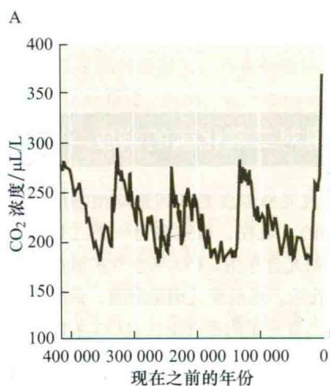

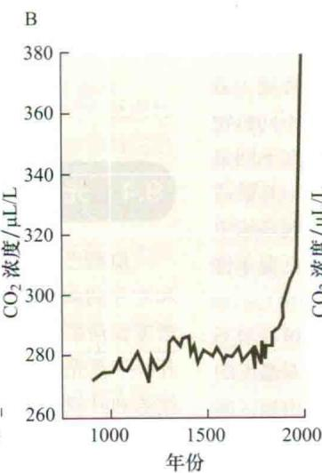

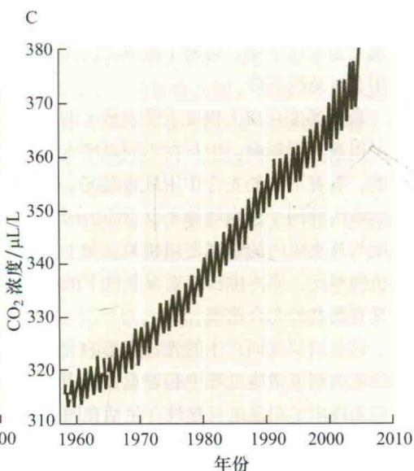  
图9.18 42万年前到现在大气中 $CO_{2}$ 浓度的变化。A.通过测定南极流动冰川上空气泡内的气体浓度可知，在过去，大气中的 $CO_{2}$ 浓度比目前的水平低得多。B.在过去的1000年，工业革命带来了石化燃料燃放量的迅速增加，引起 $CO_{2}$ 浓度升高。C.从夏威夷岛莫纳罗亚山测得的目前 $CO_{2}$ 浓度，仍持续上升。光合速率和呼吸速率比值相对平衡的季节性变化引起了大气 $CO_{2}$ 浓度的变化，继而引起了 $CO_{2}$ 浓度轨迹的波动。每年，最高 $CO_{2}$ 浓度出现在北半球生长季到来之前的5月份（引自Barnola et al., 1994；Keeling and Whorf, 1994；Neftel et al., 1994；Keeling et al., 1995）。

$CO_{2}$ 几乎不能透过覆盖在叶片上的表皮，因此， $CO_{2}$ 进入叶片的主要通道就是气孔。水分也经由同一途径但反方向运动。 $CO_{2}$ 通过小孔进入到气孔下腔，并进入到叶肉细胞间的空气缝隙中。通过这一扩散路径进入叶绿体的 $CO_{2}$ 是气相的； $CO_{2}$ 进入叶绿体的另一路径则是液相的，开始于潮湿的叶肉细胞壁上的水层，继而连续通过质膜、胞液，最后到达叶绿体（ $CO_{2}$ 在溶液中的性质，参见Web Topic 9.6）。

$CO_{2}$ 和水共用气孔的出入路径带来植物在功能上的选择困境。在相对湿度较高的空气中，驱动水分损失的扩散梯度比驱动 $CO_{2}$ 吸收的梯度大出约50倍。在干燥的空气中，这种差别可以更大。因此，通过开放气孔来减小气孔阻力有利于增加对 $CO_{2}$ 的吸收，但是不可避免会同时散失大量的水分。

扩散路径的每一部分都会对 $CO_{2}$ 扩散施加一个阻力，因此光合作用 $CO_{2}$ 供应过程中会遇到一系列不同的阻力点。 $CO_{2}$ 扩散进入叶片的气相路径可被分为3个部分：界面层、气孔和叶片的细胞间隙，每一部分都对 $CO_{2}$ 扩散施加一个阻力（图9.19）。准确评价每一个阻力点大小，将会有利于理解光合作用的 $CO_{2}$ 限制。

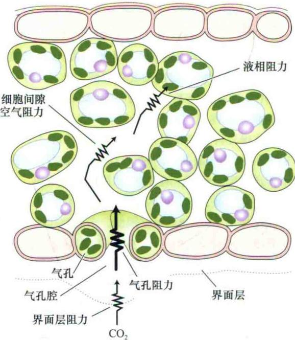  
图9.19 $CO_{2}$ 从叶片外部扩散进入叶绿体的阻力点。气孔腔是 $CO_{2}$ 扩散的主要阻力所在。

界面层由叶片表面相对未受扰动过的空气组成，它对 $CO_{2}$ 扩散的阻力称为界面层阻力（boundary layer resistance）。界面层阻力的大小随着叶片大小和风速而改变。界面层对水和 $CO_{2}$ 扩散阻力的大小，本质上与界面层阻力对焓热损失（见前面所述）的敏感性有关。

较小的叶片对水和 $CO_{2}$ 的扩散具有较小的界面层阻力，对热损失也较为敏感。沙生植物的叶片通常很小，对感知热损失非常有利。生长在湿热地区的阴生植物叶片较大，因此具有较大的界面层阻力。但是这些叶片可以通过蒸腾生境中所供应的大量水分来散热制冷。

通过界面层以后， $CO_{2}$ 会通过气孔腔进入叶片，遇到扩散路程中的下一种阻力——气孔阻力（stomatal resistance）。自然界大多数条件下，叶片周围的空气很少是完全静止的。界面层阻力比气孔阻力小得多， $CO_{2}$ 扩散的主要阻力就是气孔阻力。

在气孔下腔和叶肉细胞壁之间的空气间隙中还有一种 $CO_{2}$ 扩散阻力，称为细胞间隙空气阻力（intercellular air space resistance）。这个阻力通常也很小——相对于叶片外部38 Pa的 $CO_{2}$ 分压，它仅可引起压力下降0.5 Pa或更少。

$C_{3}$ 植物 $CO_{2}$ 扩散的液相途径阻力，称为液相阻力（liquid phase resistance），也称为叶肉阻力（mesophyll resistance），它存在于从细胞间隙到叶绿体羧化位点的整个扩散过程中。因此，将叶绿体定位到细胞的外层，可缩短 $CO_{2}$ 从液相扩散到叶绿体羧化位点的距离。当气孔完全张开的时候，这种 $CO_{2}$ 扩散阻力约是界面层阻力和气孔阻力之和的1/10。然而，近期的研究表明，叶肉阻力可能更大。

因为在 $CO_{2}$ 吸收和水分散失的过程中气孔腔通常施加最大的阻力，所以它成为植物有效地控制叶片和大气气体交换唯一的调节点。在叶片气体交换的研究测定中，界面层阻力和细胞间隙阻力经常是被忽略的，气孔阻力则经常被用来作为描述 $CO_{2}$ 扩散气相阻力的唯一参数（参见Web Topic 9.4）。

## 9.4.3 光吸收模式产生 $\mathrm{CO}_{2}$ 固定梯度

前面曾讨论过：为了捕捉光能，叶片的解剖结构是如何特化的；叶片的解剖结构是如何利于 $CO_{2}$ 在内部进行扩散的。但是在单个叶片内部，最大光合速率是在什么位置产生的呢？大多数叶片中，光优先被上表面吸收，而 $CO_{2}$ 是通过下表面进入的。假设光和 $CO_{2}$ 分别从叶片对应的两面进入，那么叶片组织中光合作用是如何均匀一致地进行的呢，或者说叶片中是否存在光合作用梯度呢？

对于大多数叶片而言，一旦 $CO_{2}$ 扩散通过气孔，其内部的扩散非常迅速，因此在叶片内部， $CO_{2}$ 供应不足不会成为光合作用的限制因素。当白光照射到叶片的上表面时，由于叶绿素在蓝光和红光区具有强大的吸收带（图7.3），蓝光和红光光子很容易被接近辐射表面的叶绿体吸收（图9.20）。另外，绿光更容易进入到叶片的深层。相对于蓝光和红光，叶绿素极少吸收绿光（图7.3），但当蓝光和红光光子耗尽时，绿光在为光合作用提供光能方面也非常有效。

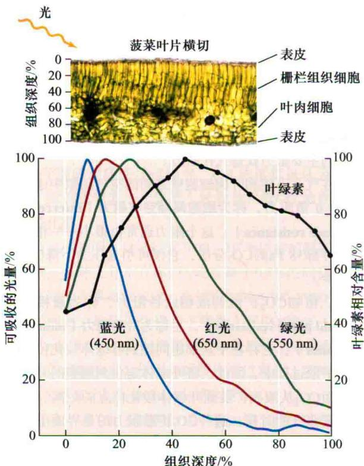  
图9.20 菠菜阳生叶片对吸收光的分配。用蓝光、绿光和红光照射叶片，叶片产生了不同的光吸收轮廓。曲线图上面的显微图是菠菜叶片的一个横切面，数排栅栏组织细胞占去了几乎一半的叶片厚度。曲线形状的产生是因为叶片组织中叶绿体不均匀分布的结果（引自Nishio et al., 1993；Vogelmann and Han, 2000；Vogelmann惠赠显微图片）。

光合同化 $CO_{2}$ 的能力在很大程度上是受叶片组织内Rubisco的浓度控制的。在菠菜（Spinacea oleracea）和蚕豆（Vicia faba）叶片中，Rubisco含量在叶片顶部很低，向中部逐渐增加，到了下部再次降低，同图9.2所示叶片中叶绿体的分布形状类似。因此，叶片中光合作用碳固定分布曲线同叶绿体的分布一致，均呈钟形。

## 9.4.4 $\mathrm{CO}_{2}$ 限制光合作用

对于多种生长在温室中、有着充足的水分和养分供应的作物，如马铃薯、莴苣、黄瓜、玫瑰，温室环境中的 $CO_{2}$ 丰度高于自然环境水平，因此它们具有很高的产量。将光合速率作为叶片胞间 $CO_{2}$ 分压（ $c_{i}$ ）的函数作图（参见Web Topic 9.4），可预测出由于 $CO_{2}$ 供应问题引起的对光合作用的限制作用。在胞间 $CO_{2}$ 浓度很低的情况下，光合作用被强烈抑制。

光合作用和呼吸作用这两个过程彼此平衡时的胞间 $CO_{2}$ 浓度值称为 $CO_{2}$ 补偿点（ $CO_{2}$ compensation point），此时叶片净 $CO_{2}$ 流出量（同化量）为零（图9.21）。这个概念和前面讨论过的光补偿点的概念是相似的： $CO_{2}$ 补偿点反映的是在 $CO_{2}$ 浓度不断变化的情况下，光合作用和呼吸作用之间的平衡；光补偿点反映的则是在恒定的 $CO_{2}$ 浓度供应下，光子辐射不断变化的情况下，光合作用和呼吸作用之间的平衡。

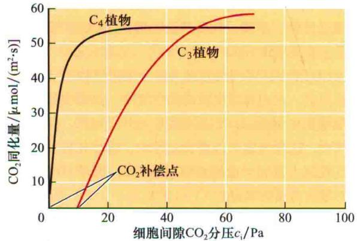  
图9.21 Tidestromia oblongifolia（一种 $C_{4}$ 植物）和木馏灌丛（Larrea divaricata）（一种 $C_{3}$ 植物）的光合作用随胞间 $CO_{2}$ 浓度变化的情况。根据计算出的叶片内部胞间 $CO_{2}$ 分压绘制出光合速率的点图（参见Web Topic 8.4的方程式5）。 $CO_{2}$ 同化量为零处的分压定义为 $CO_{2}$ 补偿点（引自Berry and Downton，1982）。

## 1. $\mathrm{C}_{3}$ 植物

对于 $C_{3}$ 植物，在光补偿点以上增加大气 $CO_{2}$ 浓度，会使光合作用产生大幅度的变化（图9.21）。在较低和中等 $CO_{2}$ 浓度环境下，光合作用会受到Rubisco羧化能力的限制；在高 $CO_{2}$ 浓度条件下，光合作用则会受到卡尔文循环再生接收器分子——核酮糖-1，5-二磷酸（RuBP）能力的限制；同时，这种更新能力又取决于电子传递速率。然而，随着 $CO_{2}$ 浓度的不断增加，光合作用仍不断增强，这是因为Rubisco的羧化作用逐渐替代了氧化作用（见第8章）。因此，多数叶片通过调节气孔导度，来调节它们的 $c_{i}$ （内部 $CO_{2}$ 分压），使它保持在羧化能力限制和更新RuBP的能力限制之间的一个中等浓度水平。

以 $CO_{2}$ 同化量对细胞间隙 $CO_{2}$ 分压的变化作图，可以看出，光合作用是受 $CO_{2}$ 浓度调节的，与气孔功能无关（图9.21）。比较 $C_{3}$ 植物和 $C_{4}$ 植物的曲线，就会发现两类植物的碳代谢途径存在着非常有趣的差异。

（1） $C_{4}$ 植物的光合速率在 $c_{1}$ 约为15 Pa时饱和，说明这类植物具有有效的 $CO_{2}$ 浓缩机制（见第8章）。

（2）对于 $C_{3}$ 植物，随着 $c_{i}$ 的持续增加，光合作用持续增强，要达到饱和需要经历一个很宽的 $CO_{2}$ 浓度幅

度。

（3） $C_{4}$ 植物 $CO_{2}$ 补偿点处分压为零或接近零，说明此时它们的光呼吸作用非常微弱（见第8章）。

（4） $C_{3}$ 植物 $CO_{2}$ 补偿点处分压约为10 Pa，说明此时有光呼吸作用产生了 $CO_{2}$ （见第8章）。

这些反应说明，目前大气 $CO_{2}$ 浓度的不断增加，可以给 $C_{3}$ 植物带来更多的利益（图9.18）。相对而言， $C_{4}$ 植物的光合作用在低 $CO_{2}$ 浓度条件下就达到了饱和。因此大气 $CO_{2}$ 浓度的不断增加不会对 $C_{4}$ 植物带来收益。

事实上， $C_{3}$ 光合作用途径（简称 $C_{3}$ 途径）才是最初的起源路径， $C_{4}$ 光合作用途径（简称 $C_{4}$ 途径）是随后产生的衍生路径。在地质学的历史年代里，当大气 $CO_{2}$ 浓度比现今高出许多的时候， $CO_{2}$ 通过气孔扩散进入 $C_{3}$ 植物叶片，可以产生较高的 $c_{i}$ 和较大的光合速率。今天，虽然 $C_{3}$ 途径已属于典型的 $CO_{2}$ 扩散限制型途径，但世界近70%初级生产力仍然是由 $C_{3}$ 植物产生的。 $C_{4}$ 途径的进化过程是一个克服 $CO_{2}$ 限制的生物化学适应性调节过程。目前理解认为， $C_{4}$ 途径在 $1\times10^{4}\sim1500\times10^{4}$ 年前已经进化了。

## 2. $C_{4}$ 植物

如果超过 $5000 \times 10^{4}$ 年以前的原始地球是一个不断累积大气 $CO_{2}$ 的集中地之一（那时大气条件要好于目前），那么在什么样的大气条件下， $C_{4}$ 途径才会成为地球生态系统中主要的光合作用途径呢？Ehleringer等（1997）认为，当全球 $CO_{2}$ 浓度下降到低于某个临界的、仍然不为人所知的浓度极限值的时候，在地球最温暖的生长区， $C_{4}$ 途径将最先成为陆地生态系统中主要的光合作用途径（图9.22）。也就是说，从温和到最热的生长条件下，特别是当大气 $CO_{2}$ 浓度逐渐减少的时候， $C_{3}$ 途径的高光呼吸和强 $CO_{2}$ 限制特性的负面影响将表现得最为强烈。地球上最温暖的地区将成为 $C_{4}$ 植物最钟爱的生长区。 $C_{4}$ 植物也将成为地球 $CO_{2}$ 浓度最低历史时期最受欢迎的植物。当今世界上，这些区域位于亚热带草原和稀树大草原地区。大量的数据表明，在大气 $CO_{2}$ 浓度比现今低200 $\mu$ mol/mol的冰川时期， $C_{4}$ 途径尤为重要（图9.18）。在 $C_{4}$ 植物进行地理扩张的时期，很多因素可能起到了促进作用，但低的大气 $CO_{2}$ 浓度是其中最重要的因素。

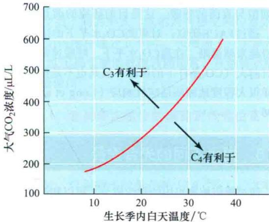  
图9.22 结合大气 $CO_{2}$ 浓度和生长季的日温变化，对 $C_{3}$ 牧草和 $C_{4}$ 牧草的生长有利性进行预测。在任何一个时间点上，地球都是唯一的大气 $CO_{2}$ 集中地，因此预测到，在最热的生长季，生境中更多的是 $C_{4}$ 植物（引自Ehleringer et al., 1997）。

因为 $C_{4}$ 植物存在 $CO_{2}$ 浓缩机制，所以对于Rubisco的活性来说， $C_{4}$ 植物叶绿体羧化位点处的 $CO_{2}$ 浓度经常是饱和的。因此，和 $C_{3}$ 植物相比， $C_{4}$ 植物在达到某一光合速率和供应植物生长方面，相对需要更少量的Rubisco和氮（von Caemmerer，2000）。

另外，因为存在 $CO_{2}$ 浓缩机制，叶片在较低的 $c_{1}$ 时就可以维持高的光合速率，但前提条件是，达到这一光合速率时的气孔导度要较小。相比之下， $C_{4}$ 植物比 $C_{3}$ 植物具有更高的水和氮利用率。另外，消耗在浓缩机制上的附加能（见第8章）也降低了 $C_{4}$ 植物的光能利用率，因此，这可能是气候温和地区大多数阴生植物为 $C_{3}$ 植物的原因之一。

## 3.CAM植物

很多仙人掌科、兰科、凤梨科植物还有其他肉质植物具有景天酸代谢（CAM）过程。与 $C_{3}$ 植物和 $C_{4}$ 植物相比，它们也有气孔行为模式。但是，CAM植物的气孔在夜间开放，而在白天关闭，恰恰与在 $C_{3}$ 植物和 $C_{4}$ 植物叶片保卫细胞上观察到的模式相反（图9.23）。在夜间，大气 $CO_{2}$ 扩散进入CAM植物，然后与磷酸烯醇式丙酮酸盐结合，固定成苹果酸盐（见第8章）。

与 $C_{3}$ 植物或 $C_{4}$ 植物相比，CAM植物的失水量与 $CO_{2}$ 吸收量之比要低得多。这是因为CAM植物的气孔仅在气温较低而湿度较高的夜晚开放，而低温高湿有利于维持较低的蒸腾速率。

苹果酸储存能力受到限制成为CAM机制的主要光合作用制约因素，这种限制将抑制 $CO_{2}$ 总的吸收量。然而，一些CAM植物，在环境温度变化较为平缓的潮湿环境中，能够在傍晚经由卡尔文循环固定 $CO_{2}$ 来增强整个光合作用。但在水分受到限制的条件下，气孔仅在夜间开放。

仙人掌植物的叶状枝（扁平的茎）在从植株体上剥离数月而没有水的情况下，依然可以存活下来，因为它们的气孔在任何时候都是关闭的，同时，呼吸作用释放的 $CO_{2}$ 被再次固定进入苹果酸盐。这个过程称为CAM空转（CAM idling）。CAM空转机制的存在使得完整的植株在延长的干旱期里，明显地减少水分丧失而存活下来。

A  
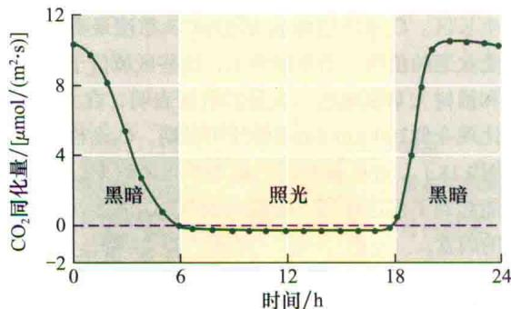

B  
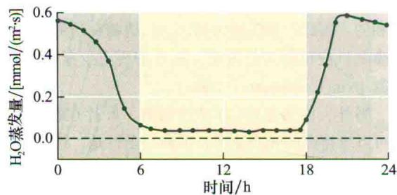  
C

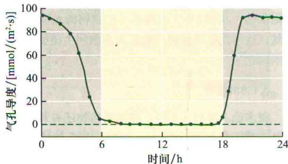  
图9.23 CAM植物——仙人掌（Opuntia ficus-indica）的光合碳同化作用、蒸腾作用和气孔导度在24 h（一个周期）内的变化。整株植物被放置在实验室的一个气体交换室内。以阴影区域来表示暗期。在研究期内测量了3个参数：A. 光合速率；B. 水分散失量；C. 气孔导度。与 $C_{3}$ 植物或 $C_{4}$ 植物的机制相比，CAM植物在夜间开放气孔和固定 $CO_{2}$ （引自Gibson and Nobel, 1986）。

## 9.4.5 在未来高 $CO_{2}$ 浓度下光合作用和呼吸作用将怎样改变

目前植物生理学研究的中心问题之一是：在环境 $\mathrm{CO}_{2}$ 浓度达400 ppm、500 ppm甚至更高的时候，光合作用和呼吸作用将作出怎样的调整？这与人类燃烧化石燃料持续释放 $\mathrm{CO}_{2}$ 到大气中去密切相关。为了研究这个问题，科学家们需要创建一个可以模拟未来状况的仿真模型。 $\mathrm{CO}_{2}$ 富集实验（FACE）成为一个在环境 $\mathrm{CO}_{2}$ 浓度不断升高条件下研究植物生理和生态特征的具有广阔前景的方法。

FACE实验里，植物生长的整个区域或自然生态系统都被封闭在一个管状的环区内，向这个区域内填充 $\mathrm{CO}_{2}$ ，以创造一个20\~50年后可能达到的大气 $\mathrm{CO}_{2}$ 浓度水平。图9.24展示了主栽不同植物类型的FACE实验。其中图9.24A展示的是威斯康涅州控制在 $\mathrm{CO}_{2}$ 富集环境下的混交和非混交山杨树的情况；图9.24B展示的是伊利诺伊州生长的大豆田的情况。

目前仍在进行中的这些长期的FACE实验，为植物如何应对将来的气候变化提供了新的洞察力。观察到的一个关键现象是：在正常水分条件下具有 $C_{3}$ 光合途径的植物对 $CO_{2}$ 富集环境要比 $C_{4}$ 植物有更多的反应，它们的净光合作用速率会增加20%或更多，但是 $C_{4}$ 植物并不是如此。光合作用能力的增加是因为胞间 $CO_{2}$ 水平的增加（图9.21）。同时，还有一个光合能力减弱的现象，体现在与光合作用暗反应相关的酶活性的下降（Ainsuorth and Rogers, 2007）。

$CO_{2}$ 对于植物的光合作用是至关重要的，但是 $CO_{2}$ 富集条件下其他因素对植物的生长也很重要（Long et al., 2004, 2006）。例如，FACE实验中通常会观察到，营养可用性会很快成为植物生长的限制因子。再有，会惊奇地观察到土壤湿度和痕量气体的存在，如臭氧，会使净光合反应降低到十年前最初温室研究中预测的最大值以下。同时还预测到，在大气 $CO_{2}$ 含量增加时会出现更为暖和和干燥的环境。在不久的将来，在比对自然生态系统中生长的植物与施肥和灌溉的作物对 $CO_{2}$ 富集的反应方面，会得出重要进展。理解这些响应特征，对探求为支撑人口增长和为生物燃料提供天然材料等而产生的农业输出的增长问题至关重要。

$CO_{2}$ 水平的增加将影响植物的很多过程，例如，在 $CO_{2}$ 富集条件下，叶片将趋向于保持气孔更大程度的关闭。蒸腾作用减弱的直接影响就是叶温的增加（图9.24C）。增加的温度将反馈影响线粒体基础呼吸和土壤细菌与真菌的呼吸。这是目前研究的前景和热点区域。通过FACE研究，对更高 $CO_{2}$ 水平下的适应过程理解得越来越清晰。在高 $CO_{2}$ 水平下，呼吸速率虽然不同于目前大气 $CO_{2}$ 条件下的情况，但是也不是像预测到的那样很大程度地减弱适应性响应（Long et al., 2004, 2006）。

## 9.5 揭示不同的光合途径

通过测定植物组织的化学成分，可以知道很多有关不同光合途径的知识。利用这一点去测定植物中稳定性同位素的量（Dawson et al., 2002）。重要的一点是，叶片中碳原子的稳定同位素包含了关于光合作用的有用信息。同位素是指同一种元素的不同形式。在一种元素的不同同位素中，质子的数量保持恒定，由此来表征是某个元素，但是中子的数量是不同的。同位素是稳定的，也有具有放射性的。

A  
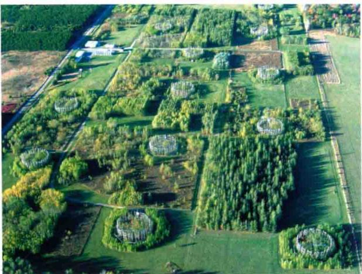

B  
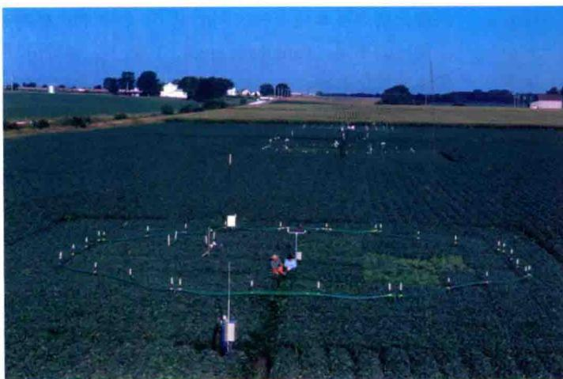

某种元素的稳定性同位素大量存在的时候也是稳定的，整个时间内没有变化；而放射性同位素则在存在的时间内衰变成不同的形式。碳的两种稳定同位素是 $^{12}$ C 和 $^{13}$ C，它们仅仅在成分上不同， $^{13}$ C 增加了一个额外的中子。 $^{11}$ C 和 $^{14}$ C 属于碳的放射性同位素，在生物示踪实验中被频繁使用。

## 9.5.1 怎样测定植物的碳稳定性同位素？

大气 $CO_{2}$ 中包含有自然产生的稳定碳同位素 $^{12}C$ 和 $^{13}C$ ，它们分别占大气 $CO_{2}$ 总量的98.9%和1.1%。 $^{14}CO_{2}$ 具有放射性，以很微小的量存在（ $10^{-10}\%$ ）。 $^{13}CO_{2}$ 的化学特性与 $^{12}CO_{2}$ 的一样，但是植物同化 $^{13}CO_{2}$ 的量小于 $^{12}CO_{2}$ 。换句话说，叶片在光合作用中“歧视”较重的碳同位素，因此，植物中 $^{13}C/^{12}C$ 小于它们在大气 $CO_{2}$ 中的比率。

$^{13}C/^{12}C$ 同位素成分是使用质谱仪测得的，质谱仪可

图9.24 FACE实验方法被用于研究植物和生态系统对将来 $CO_{2}$ 水平的响应。A. 落叶树木的FACE实验情况。B. 大豆田的FACE实验情况。C. 展示了大豆冠层的远红外图像，表明在 $CO_{2}$ 水平增加条件下，叶片气孔关闭更多，直接带来叶温的升高（A图由David F. Karnosky惠赠；B图由USDA惠赠；C图引自Long et al., 2006）。  
C  
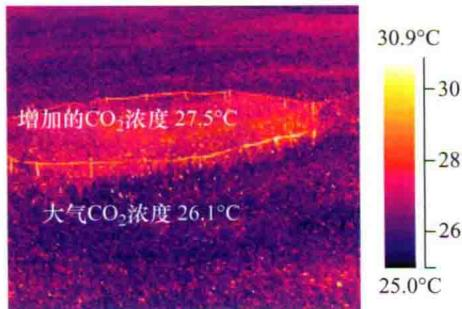

以得到如下比率（R）。

$$
R = \frac {{} ^ {1 3} \mathrm{CO} _ {2}}{{} ^ {1 2} \mathrm{CO} _ {2}}\tag{9.1}
$$

植物的碳同位素比（carbon isotope ratio）， $\delta^{13}\mathrm{C}$ ，以每千分之一（‰）来定量。

$$
\delta^ {13} C ‰ = \left(\frac {R _ {\mathrm{样品}}}{R _ {\mathrm{标准}}} - 1\right) \times 1 0 0 0 ‰\tag{9.2}
$$

式中，标准为南卡罗来纳州Pee Dee 石灰岩形成的箭石化石中的碳同位素含量。大气 $CO_{2}$ 的 $\delta^{13}C$ 为-8‰，说明大气 $CO_{2}$ 中 $^{13}C$ 的含量少于标准箭石里碳酸盐内的 $^{13}C$ 含量。

植物碳同位素比的一些代表性数值是多少呢？ $C_{3}$ 植物的 $\delta^{13}C$ 约为 -28‰， $C_{4}$ 植物 $\delta^{13}C$ 的平均值为 -14‰（Farquhar et al., 1989）。 $C_{3}$ 植物和 $C_{4}$ 植物中的 ${}^{13}C$ 含量都少于大气 $CO_{2}$ 中的 ${}^{13}C$ 含量，说明它们在光合作用过程中“歧视” ${}^{13}C$ 。Cerling 等（1997）计算出了世界各地大量 $C_{3}$ 植物和 $C_{4}$ 植物的 $\delta_{13}C$ （图9.25）。

从图9.25中可以清晰地看到， $C_{3}$ 植物和 $C_{4}$ 植物的 $\delta_{13}C$ 分别从平均-28‰和-14‰开始，取值广泛。这些 $\delta_{13}C$ 的变化，实际上是不同的环境条件下与气孔导度变化有关的小的生理变化的结果。这样， $\delta^{13}C$ 就可被用于区别 $C_{3}$ 途径和 $C_{4}$ 途径，并进一步揭示生长在不同环境条件下的植物的气孔调节细节（如热带植物与沙漠植物）。

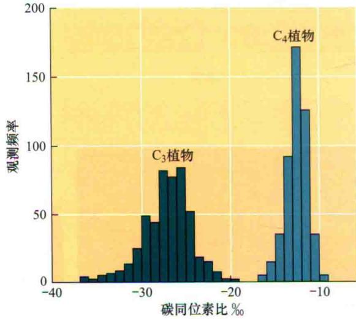  
图9.25 世界各地 $C_{3}$ 植物和 $C_{4}$ 植物类群的碳同位素比的频率直方图（引自Cerling et al., 1997）。

质谱仪可以对不同分子或不同组织中 $^{12}$ C和 $^{13}$ C的丰度进行非常精细的测定，因此利用质谱仪很容易发觉碳同位素比的差异。人类食品中很多是C $_{3}$ 植物产品，如小麦（Triticum aestivum）、水稻（Oryza sativa）、马铃薯（Solanum tuberosum）和大豆（Phaseolus spp.）。然而大多数生产性的农作物是C $_{4}$ 植物，如玉米（maize，Zea mays）、甘蔗（Saccharum officinarum）和高粱（Sorghum bicolor）。从每一种食物中取得的碳水化合物在化学成分上可能是相同的，但是它们根据 $\delta^{13}$ C的不同存在着C $_{3}$ -C $_{4}$ 区别。例如，可测定餐桌上的蔗糖的 $\delta^{13}$ C，来判定它是来自于糖用甜菜（Beta vulgaris，一种C $_{3}$ 植物），还是来自于甘蔗（一种C $_{4}$ 植物）（参见Web Topic 9.7）。

## 9.5.2 为什么植物中存在着碳同位素比的变化呢？

相对于大气的 $CO_{2}$ ，植物中 $^{13}C$ 损耗的生理基础是什么呢？证据表明， $CO_{2}$ 进入叶片的扩散作用与羧化作用对 $^{12}CO_{2}$ 的选择性起着同一作用。

预测 $C_{3}$ 叶片碳同位素比可用如下公式计算。

$$
\delta^ {1 3} \mathrm{C} _ {\mathrm{L}} = \delta^ {1 3} \mathrm{C} _ {\mathrm{A}} - a - (b - a) (c _ {\mathrm{i}} / c _ {\mathrm{a}})\tag{9.3}
$$

式中， $\delta^{13}C_{L}$ 和 $\delta^{13}C_{A}$ 分别为叶片和大气的碳同位素比；a为扩散分数；b为净羧化分数； $c_{i}/c_{a}$ 为细胞间隙 $CO_{2}$ 浓度和大气 $CO_{2}$ 浓度的比值。

在 $C_{3}$ 植物和 $C_{4}$ 植物中， $CO_{2}$ 从叶片外部的空气中扩散进入到叶片内的羧化位点。参数a被用来表示这种扩散程度。因为 $^{12}CO_{2}$ 比 $^{13}CO_{2}$ 轻，所以 $^{12}CO_{2}$ 向羧化位点扩散的速度更快，产生了一个有效的扩散分馏因数——-4.4‰。因为这种扩散效应的存在，人们希望叶片产生一个更小的 $\delta^{13}C$ 。然而，仅用这个因数是不足以解释图9.25所示的 $C_{3}$ 植物 $\delta^{13}C$ 。

光合作用最初的羧化作用是植物碳同位素比大小的决定性因素。Rubisco代表着 $C_{3}$ 途径的第一个羧化反应，它对 $^{13}C$ 有一个固定的歧视值——-30‰。比较而言，PEP羧化酶—— $C_{4}$ 植物主要的 $CO_{2}$ 固定酶，对 $^{13}C$ 有着小得多的同位素歧视值——约-2‰。因此，两种不同羧化酶内在本质上的区别决定了 $C_{3}$ 植物和 $C_{4}$ 植物碳同位素比的不同（Farquhare et al., 1989）。参数b被用来描述净羧化效率。

植物的其他生理特性也影响着它的碳同位素比。叶片细胞间隙的 $CO_{2}$ 分压（ $c_{i}$ ）就是其中的一个主要因素。 $C_{3}$ 植物中，由Rubisco决定的潜在的同位素歧视值——-30‰，在光合作用过程中并不是完全表达的，因为羧化位点处 $CO_{2}$ 的可利用性成为限制Rubisco“歧视”的限制因子。随着气孔的开放 $c_{i}$ 较大，对 $^{13}CO_{2}$ 的歧视值会更大。而打开气孔有利于水分散失。因此，较小的光合作用与蒸腾作用的比值是与较大的 $^{13}C$ 歧视值联系在一起的（Ehleringer et al., 1993）。当叶片被暴露在水分胁迫环境下时，气孔趋向于关闭， $c_{i}$ 减小。结果，生长在水分胁迫条件下的 $C_{3}$ 植物趋向于有更正的碳同位素比值。

植物中碳同位素比的应用已经取得成果，式（9.3）在碳同位素比测定和细胞间隙 $CO_{2}$ 值之间提供了一个非常紧密的联系。细胞间隙 $CO_{2}$ 水平与光合作用和气孔限制直接相关。 $C_{3}$ 植物气孔关闭或水分胁迫程度增加时，叶片碳同位素比也是增加的。碳同位素比的测定成为短期水分胁迫等方面的直接代表。在农业和生态学研究中，使用碳同位素去研究植物的表现，是上述应用很好的例子（Ehleringer et al., 1993; Bowling et al., 2008）。

通常，一个自然发生的模式就是，在自然条件下，叶片碳同位素比值会随着降雨量的增加而下降。图9.26展示了横贯澳大利亚地区的这一模式情况。可以看到， $\delta^{13}\mathrm{C}$ 在澳大利亚干旱区最高，从沙漠到热带雨林生态系统随着降雨梯度的增加而逐渐持续降低。用式（9.3）去解释这些 $\delta^{13}\mathrm{C}$ 数据得出，沙生植物叶片的细胞间隙 $\mathrm{CO}_{2}$ 水平比人们看到的热带雨林植物的要低。根据树木年轮所具有的连续信息，年轮上所观察到的 $\delta^{13}\mathrm{C}$ 状况也有助于人们去区别解释植物所遇到的水分可用性下降所带来的长期和短期效应（如季节性干旱循环）。

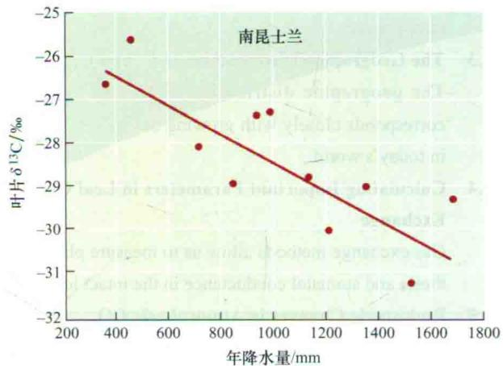  
图9.26 沿着降雨梯度澳大利亚地区植物种类发生改变。可以看出，植物碳同位素比的改变似乎与一个地区降水量的大小密切相关。这说明降低湿度水平会影响 $c_{i}$ ，因此在澳大利亚地区， $C_{3}$ 物种的碳同位素比存在地理分布梯度（引自Stewart et al., 1995）。

碳同位素比分析目前通常用于判定人和动物的饮食方式。食物中的 $C_{3}$ 和 $C_{4}$ 食物的比值通常被记录在它们的组织中——牙齿、骨骼、肌肉和毛发等。Cerling和他的同事们2009年报道了一则非常有趣的、关于分析非洲野生大象家族饮食习惯的碳同位素比应用的消息。他们检测了大象尾毛部分连续变化的 $\delta^{13}C$ ，并重建了每个动物的日常饮食情况。他们观察到了可预测的季节变化的存在，就是树木（ $C_{3}$ ）和牧草（ $C_{4}$ ）作为可用性资源随着降雨模式的改变而进行的变化。碳同位素比分析也可以扩展到考虑人类的膳食方面。大尺度观察表明，北美人类的碳同位素比比欧洲人的要高。这说明玉米（一种 $C_{4}$ 作物）在北美人的饮食中占有重要地位。另一个应用是利用这些结果测定化石、含有土壤的碳酸盐及动物化石中的 $\delta^{13}C$ ，可以重建远古时代的光合作用途径。这些方法已经被用来测定 $C_{4}$ 途径的形成过程、寻找 $C_{4}$ 途径在大约 $600\times10^{4}$ 年前成为主流的证据及重建古代和现代动物的食物（参见Web Topic 9.8）。

CAM植物能够拥有与 $C_{4}$ 植物非常接近的 $\delta^{13}C$ 。人们希望在夜间由PEP羧化酶固定 $CO_{2}$ 的CAM植物的 $\delta^{13}C$ 与 $C_{4}$ 植物的相似。然而，当一些CAM植物被给予充分水分供应的时候，它们会转变成 $C_{3}$ 模式，在白天开放气孔，由Rubisco固定 $CO_{2}$ 。这种情况下，CAM植物的同位素组成更多地转向相似于 $C_{3}$ 植物的。这样，CAM植物的 $\delta^{13}C$ 就可以反映出，其固定的碳中有多少是经由 $C_{3}$ 途径完成的，有多少是经由 $C_{4}$ 途径完成的。

## 小结

· 以限制因子假说和强调 $CO_{2}$ 供与需的“经济远景”来达到最适的光合作用行为为导向展开研究。

## 光合作用是叶片的基本功能

·为了吸收光能，叶片解剖结构高度特化（图9.1）。

· 单位时间内投射到已知面积球形传感器上的光子或能量的辐射量（图9.2）。

· 约入射光能的5%经光合作用转入碳水化合物中。更多的吸收光能以热和荧光的形式损失（图9.3）。

· 在浓密的森林里，几乎所有的光合有效辐射都被叶片吸收（图9.4）。

· 冠层以下（内），叶绿体通过光线追踪和叶绿体运动最大程度吸收光能（图9.5）。

· 一些植物对一定范围的光有反应，但阳生和阴生叶片有着相对立的生物化学特性。

\- 一些阴生植物会改变PS I 和 PS II 的比值，而另一些会增加天线叶绿素到PS II。
原位叶片对光的光合响应

· 光响应曲线表征了光合作用被光或 $CO_{2}$ 限制时的光照强度（图9.6）。线性部分的斜率代表着量子产额的大小。

\- 阴生植物的光补偿点低于阳生植物的，因为阴生植物的呼吸速率是非常低的（图9.7）。

· 30℃以下， $C_{3}$ 植物的量子产额高于 $C_{4}$ 植物的；30℃以上，刚好相反（图9.8）。

· 饱和点以上，除光以外的因素，如电子传递、Rubisco活性或丙糖代谢将限制光合作用（图9.9）。整个植物光饱和几乎是不可能的（图9.10）。

· 叶黄素循环耗散过剩的光能以避免光合机构损伤（图9.11和图9.12）；叶绿体运动也限制光的过量吸收（图9.13）。

· 动态光抑制短时间将过剩的光能转化为热量，但将维持最大的光合速率（图9.14）。

## 对温度的光合响应

· 植物对温度的适应性具有明显的可塑性。适宜的光合温度具有较强的遗传调节和环境适应性。

· 叶片吸收的光能会产生热负荷，必须被耗散掉（图9.15）。

· 温度敏感曲线表明：①酶被激活的温度范围；②光合作用最适温度范围；③破坏性事件发生的温度范围（图9.16）。

· 因为光呼吸作用的存在， $C_{3}$ 植物量子产额与温度

密切相关，但 $C_{4}$ 植物的几乎与温度无关。

\- 减少的量子产额和增加的光呼吸作用导致不同纬度地区 $C_{3}$ 植物和 $C_{4}$ 植物光合能力的差异（图9.17）。

## 对 $CO_{2}$ 的光合响应

· 自从工业革命以来，由于人类使用化石燃料，导致大气 $CO_{2}$ 水平的增加（图9.18）。

\- 浓度梯度驱动 $\mathrm{CO}_{2}$ 利用气体和液体途径从大气进入Rubisco（图9.19）。

· 叶片内部的荧光和红光量子大大减少，绿光深入叶片内部有效地为光合作用供能（图9.20）。

· 在温室中， $CO_{2}$ 水平增加到自然大气水平以上会带来产量的增加（图9.21）。

· 当全球 $CO_{2}$ 浓度降到某一阈值时，在最温暖地区 $C_{4}$ 光合途径将成为主导（图9.22）。

· 相比 $C_{3}$ 植物和 $C_{4}$ 植物，CAM植物的气孔在夜间开放，白天关闭（图9.23）。

·FACE实验表明， $C_{3}$ 植物对 $CO_{2}$ 浓度的增加比 $C_{4}$ 植物负有更大的责任（图9.24）。

## 识别不同光合作用途径

\- 叶片中碳同位素比被用于区别不同物种光合作用途径的差异。

· $C_{3}$ 植物和 $C_{4}$ 植物的 ${}^{13}C$ 含量低于大气 $CO_{2}$ 中的含量，这表明在光合作用过程中，叶片组织不喜欢利用 ${}^{13}C$ 。

· 当 $C_{3}$ 植物气孔关闭或水分胁迫增加时，叶片碳同位素比也会增加，这可以直接用于表征短期水分胁迫的一些特征（图9.26）。

(李文娆 译)

## WEB MATERIAL

## Web Topics

## 9.1 Working with Light

Amount, direction, and spectral quality are important parameters for the measurement of light.

9.2 Heat Dissipation from Leaves: The Bowen Ratio Sensible heat loss and evaporative heat loss are the most important processes in the regulation of leaf temperature.

9.3 The Geographic Distributions of $C_{3}$ and $C_{4}$ Plants
The geographic distribution of $C_{3}$ and $C_{4}$ plants corresponds closely with growing season temperature in today's world.

## 9.4 Calculating Important Parameters in Leaf Gas Exchange

Gas exchange methods allow us to measure photosynthesis and stomatal conductance in the intact leaf.

9.5 Prehistoric Changes in Atmospheric CO₂
Over the past 800,000 years, atmospheric CO₂ levels changed between 180 ppm (glacial periods) and 280 ppm (interglacial periods) as Earth moved between ice ages.

9.6 Projected Future Increases in Atmospheric $CO_{2}$ Atmospheric $CO_{2}$ reached 379 ppm in 2005 and is expected to reach 400 ppm by 2015.

## 9.7 Using Carbon Isotopes to Detect Adulteration in Foods

Carbon isotopes are frequently used to detect the substitution of $C_{4}$ sugars into $C_{3}$ food products, such as the introduction of sugar cane into honey to increase yield.

9.8 Reconstruction of the Expansion of $C_{4}$ Taxa
The $\delta^{13}C$ of animal teeth faithfully record the carbon isotope ratios of food sources and can be used to reconstruct the abundances of $C_{3}$ and $C_{4}$ plants eaten by mammalian grazers.

## Web Essay

## 9.1 The Xanthophyll Cycle

Molecular and biophysical studies are revealing the role of the xanthophyll cycle in the photoprotection of leaves.
