# 第 10 章

韧皮部转运

陆地上的植物生存面临许多严峻挑战，其中最主要的是水分获取和保持。植物进化出根和叶以适应环境压力，根将植物体固定下来并吸收水分和营养，叶则利用光能，并进行气体交换。随着植物个体的增大，根和叶在空间上逐渐彼此分隔开来。这样，植物进化出长距离物质转运系统，以便植物的地上部分和根之间有效交换彼此吸收和同化的产物。

第4章和第6章已讲到，木质部把水分和矿物质从根部转运到植物地上部分。韧皮部（phloem）则将光合产物特别是糖，从成熟叶片转运到包括根在内的植株生长和相应贮藏部位。

除糖类外，韧皮部还在源和库间传递调节分子的信号，并调节水分和多种成分在植物体内的再分布，所有这些都和糖类一起被转运。那些需要重新分配的物质（其中一些最初通过木质部到达成熟的叶片）在分配之前可不经修饰或代谢而被转移出叶片。

接下来的讨论重点将放在被子植物韧皮部的转运，通过分析输导细胞解剖学结构、转运机制差异等方面对裸子植物与被子植物进行简单的比较。

本章首先介绍已被详细研究的被子植物韧皮部转运的知识，包括韧皮部转运的路径和类型、转运的物质和转运的速度。本章的第二部分将探讨韧皮部转运需要进一步研究的领域，包括韧皮部装载、卸载和光合产物的分配与分割。本章末将介绍目前正深入研究的一个领域，即韧皮部在作为蛋白质、RNA等信号分子的运输通路中所起的作用。

## 10.1 韧皮部转运的途径

韧皮部和木质部是贯穿植物全身的两个长距离运输路径。韧皮部通常在初生和次生维管组织的外面（图10.1和图10.2），组成具有次生生长植物树皮的内皮。尽管韧皮部一般分布于木质部的外围，但许多真双子叶植物中木质部的内部也有分布，分别称之为外韧皮部和内韧皮部。

引导糖类和其他有机物在植物体内流动的韧皮部细胞称筛分子（sieve element），筛分子泛指被子植物中典型的高度分化的筛管分子（sieve tube element）及裸子植物中相对未特化的筛胞（sieve cell）。除了筛分子，韧皮部还包括伴胞（下面将会谈到）和薄壁组织细胞（贮藏和释放营养分子）。有些植物韧皮部组织还有纤维和石细胞（保护和强化组织）及乳汁器（含乳液细胞），但是韧皮组织中只有筛分子直接参与物质转运。

小叶脉和茎初生维管束通常被维管束鞘（bundle sheath）（图10.1）包围，而维管束鞘又由一层或多层排列紧密的细胞组成（第8章已讲过维管束鞘参与 $C_{4}$ 植物的代谢过程）。在叶的维管组织中，维管束鞘从头至尾包围着小叶脉，把叶脉从叶的细胞间区域分隔出来。

我们首先通过阐释筛分子是韧皮部输导细胞的实验证据来讲解韧皮部的转运途径，随后来介绍这些特殊细胞的结构和生理特征。

## 10.1.1 糖在韧皮部筛分子中的转运

对韧皮部运输的研究可以追溯到19世纪，这反映了植物长距离运输的重要性（参见Web Topic 10.1）。经典实验表明，绕着树干去除一圈树皮，即去除了韧皮部，

PLANT PHYSIOLOGY

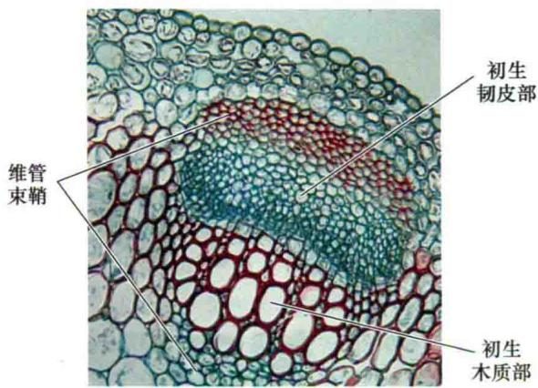  
图10.1 三叶草（Trifolium）维管束的横切面图（130×）。位于茎外侧的初生韧皮部和初生木质部被厚壁组织细胞组成的维管束鞘所包围，使得维管组织与周围组织分隔开（图片由J.N.A.Lott授权）。

可以在不改变木质部水分运输的情况下有效地阻止糖从叶到根的运输。利用同位素 $^{14}$ CO $_{2}$ 证实，光合作用过程中生成的糖是通过韧皮部筛分子进行转运的（参见Web Topic 10.1）。

## 10.1.2 成熟筛分子是特化的用于物质转运的活细胞

详尽了解筛分子超微结构对分析韧皮部转运机制至关重要。成熟的筛分子是植物活细胞中很独特的一类（图10.3和图10.4），它们缺乏一般活细胞内常见的许多结构，即使其前体——未分化的细胞也是这样。例如，筛分子在发育过程中丧失了细胞核和液泡膜，而且成熟后通常也没有微丝、微管、高尔基体和核糖体；保留下来的除了质膜，细胞器还有修饰了的线粒体、质体和光滑内质网。它们的细胞壁虽然在某些情况下次生增厚，但并未木质化。

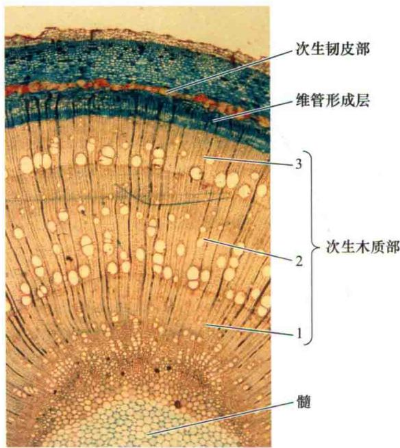  
图10.2 三年龄白蜡树（Fraxinus excelsior）茎横切面图（27×）。数字1、2、3指次生木质部生长轮。老的次生韧皮部由于木质部的扩展而变形。只有最里面的一层次生韧皮部具有功能（图片由P.Gates惠赠）。

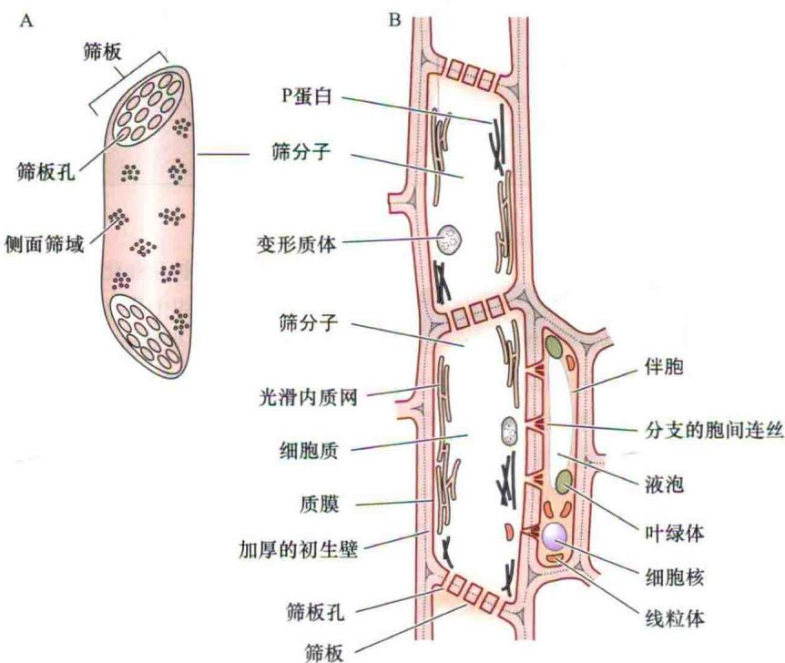  
图10.3 成熟筛分子（筛管分子）连在一起形成筛管示意图。A. 外部视图，示筛板和侧面筛域。B. 纵切面，示两个筛分子连在一起形成筛管。筛分子之间筛板孔是物质运输通过筛管的开放通道。相邻筛分子的质膜是连续的。每个筛分子与一个或多个伴胞相连，伴胞具有一些筛分子在分化过程中减弱或丧失的必需代谢功能。值得注意的是伴胞细胞内有许多细胞器，筛分子则几乎不含细胞器，这里描述的是普通的伴胞。

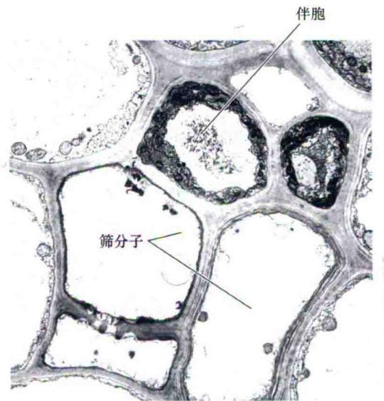  
图10.4 普通伴胞和成熟筛分子的横切面电镜图（3600×）。细胞组分沿筛分子壁分布对集流的阻力较小。（引自Warmbrodt，1985）。

因此，筛分子的细胞结构不同于木质部的管状分子。管状分子没有质膜，具有木质化的次生壁，而且在成熟后就死亡。下面内容将会明确活细胞对韧皮部转运的重要性。

## 10.1.3 细胞壁具大孔是筛分子的显著特征

筛分子（筛胞和筛管分子）细胞壁中有一些特征性的筛域，筛域上的孔将输导细胞互相连接起来（图10.5），这些孔的直径从小于 $1\ \mu m$ 到约 $15\ \mu m$ 。与裸子植物不同的是，被子植物的筛域可以分化为筛板（sieve plate）（图10.5和表10.1）。

筛板上的孔大于细胞中其他筛域上的孔，筛板一般位于筛管分子的端壁，单个细胞通过筛板接合在一起形成筛管（sieve tube）（图10.3）。此外，筛管分子的筛板孔也是允许细胞间运输的开放通道（图10.5）。

相反，尽管裸子植物（如松柏）在相互搭接的筛细胞壁的一端上有大量的筛域存在，但是几乎所有的筛域在结构上相同。裸子植物筛域上的孔相连于壁中部大的正中腔。光滑内质网覆盖了筛域（图10.6），将内质网特异染色表明，光滑内质网在筛孔和正中腔中也是连续存在的。激光共聚焦扫描显微镜观察活体也证实，光滑内质网的这种分布并不是由于制片时固定材料造成的假象。表10.1列出了两类筛分子的特征。

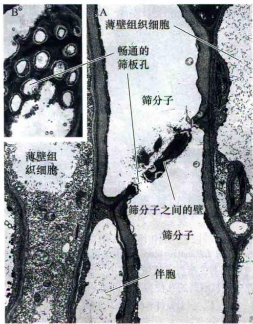

C  
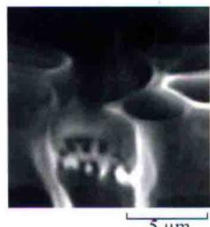

D  
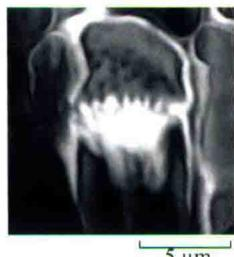  
开放的筛孔  
胼胝质塞  
图10.5 筛分子和筛板孔。图A、B、C中，筛板孔为开放的，不被P蛋白和胼胝质阻碍。开放的孔为筛分子间的物质运输提供了一个低阻力的通路。A. 两个成熟筛分子（筛管分子）的纵切面电镜图，示冬南瓜（Cucurbita maxima）下胚轴筛分子之间的壁（筛板）（3685×）。B. 内嵌图示筛板孔正面（4280×）。C和D. 拟南芥筛板的三维重建图形，利用染色技术，通过激光共聚焦成像整个植物器官。图C可以观察到开放的筛孔，而图D可以观察到筛管损伤反应中形成的胼胝质塞（A和B引自Evert，1982，C和D引自Truernit et al., 2008）

## 表10.1 种子植物中两类筛分子的特征

被子植物筛管分子  
1. 筛域的一部分分化成筛板；单个的筛管分子连接成一个筛管  
2. 筛板孔是开放的通道  
3. P蛋白存在于所有双子叶和多数单子叶植物中  
4. 伴胞提供ATP和其他复合物，在有些物种中还具有传递细胞和居间细胞的功能  
裸子植物筛胞  
1. 无筛板，所有筛域都相同  
2. 筛域上的孔被膜阻塞  
3. 没有P蛋白  
4. 有些时候，蛋白质细胞功能与伴胞类似

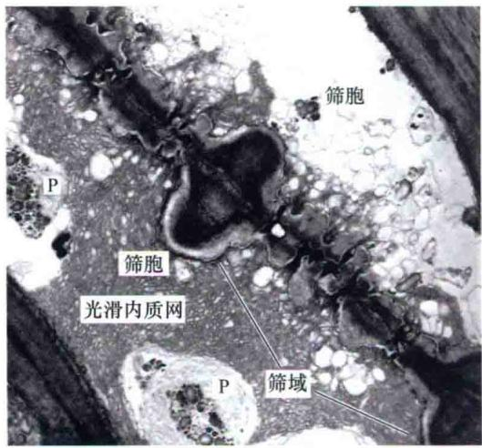

图10.6 松树（Pinus resinaosa）中连接两筛胞的筛域电镜图。光滑内质网不仅覆盖了筛域的两边，也存在于筛孔和延伸的正中腔中。被阻塞的孔使筛分子间溶质流阻力变大。P. 质体（引自Schulz，1990）。  

## 10.1.4 受损的筛分子被封闭起来

筛分子汁液中富含糖类和其他有机物分子（汁液泛指植物细胞中的流体内容物），这些物质是植物体的能量来源，当筛分子受到损坏时植物必会阻止汁液的流失。短时的封堵机制需要有汁液蛋白的参与，而主要的长期机制则必须用葡萄糖多聚物把筛板孔堵上（另一种快速封堵受伤的筛管机制是发生在豆科植物中，见Web Topic 10.2）。

参与封闭受损筛分子的韧皮部蛋白质中主要是一类叫P蛋白（P-protein）的结构蛋白（图10.3B）（Clark et al., 1997）（经典文献中P蛋白被叫做slime）。大多数被子植物（包括所有的双子叶和许多单子叶植物）的筛管分子均富含P蛋白，而裸子植物中却没有P蛋白。对于不同的物种和细胞成熟度，P蛋白以管状、纤维状、颗粒状和晶态等不同形式出现。

在非成熟细胞中，P蛋白主要以P蛋白体（P-protein body）的形式分散于胞质中。P蛋白体可能是球形、纺锤体形，也可能是螺旋状、盘绕状。在细胞成熟过程中，它们一般分散成管状或纤维状。

对于P蛋白已经在分子水平上进行了研究（Dinant et al., 2003）。例如，南瓜属（Cucurbita）的P蛋白由两种主要蛋白质构成：形成纤丝的韧皮部蛋白PP1和与纤丝相连的韧皮部凝集素蛋白PP2（凝集素是一种与植物抗性相关的糖结合蛋白）。二者均在伴胞中合成（下面部分将讨论），并通过胞间连丝转运到筛分子，在筛分子中相连形成P蛋白丝和P蛋白体（Clark et al., 1997）。

P蛋白通过堵住筛板孔从而封闭受损的筛分子。筛管内部有很高的膨压，开放的筛板孔将一个筛管中的筛分子连接起来。当一个筛管被切断或被洞穿时，筛分子内的物质在压力的作用下就会大量流向切口处，如果没有相应的封堵机制，植物体就会丢失大量富含糖类的韧皮部汁液。然而，一旦有汁液外流，P蛋白就被定位于筛板孔，帮助封堵筛分子以阻止汁液的进一步流失。一些单子叶植物受损质体中释放的蛋白质晶体也具有相同的作用（Paiva and Machado，2008）。同时，筛分子细胞器（如内质网）彼此相连锚定在质膜上（Ehlers et al., 2000）。

长效解决筛管受损的机制则是在筛孔处产生葡萄糖聚合物胼胝质（callose）（图10.5D）。胼胝质即β-1，3-葡聚糖，由一种在质膜中的酶（胼胝质合酶）合成并沉积于质膜和细胞壁之间。当植物受到伤害和其他胁迫（如机械刺激或高温），或者为如休眠这样的正常发育事件作准备时，就会促使在有功能活性的筛分子中合成胼胝质。筛孔中愈伤胼胝质（wound callose）的沉积可以有效地把受损的筛分子从周围完整的组织中封堵出去。所有情况下，一旦受损的筛分子恢复正常，或打破休眠，胼胝质就会从这些筛孔中消失。这一过程是由胼胝质水解酶介导的。

韧皮部取食昆虫（蝎飞蛾）攻击水稻后可导致胼胝质沉淀及胼胝质合成基因上调，这一过程同时发生在抗虫和易感植物中。但是当易感的植物体遭受昆虫攻击后同样会导致胼胝质水解酶激活，这使得筛孔无法堵塞，继而可以导致叶鞘中的蔗糖和淀粉减少（Hao et al., 2008）。封闭昆虫口器感染的筛管分子在抗虫性中扮演重要角色。

## 10.1.5 伴胞辅助高度特化的筛分子

每个筛管分子通常与一个或数个伴胞（companion cell）相连（图10.3B、图10.4和图10.5）。同一个母细胞经分裂形成筛管分子和伴胞，筛管分子和它的伴胞之间通过大量的胞间连丝（见第1章）相连，这些胞间连丝很复杂，通常在伴胞一侧发生分支。大量胞间连丝的出现暗示筛分子和其伴胞在功能上密切相关，利用荧光探针证实两种细胞间的溶质可以快速交换。

伴胞在光合产物从成熟叶片中的光合生产细胞转运到小叶脉筛分子的过程中发挥着作用。伴胞还执行其他一些重要的代谢功能，如蛋白质合成，而这一功能在筛分子分化过程中被削弱或丧失。此外，伴胞中线粒体还为筛分子提供ATP能量。

在成熟的输出叶小叶脉中至少有三种不同类型的伴胞：普通伴胞、传递细胞和居间细胞。这三种类型的细胞均有丰富的胞质和大量的线粒体。

普通伴胞（ordinary companion cell）中有类囊体发育良好的叶绿体和内表面光滑的细胞壁（图10.7A）。把普通伴胞与周围细胞连接起来的胞间连丝数目不定，同时胞间连丝也是糖分从叶肉细胞运输到小叶脉的通道。

传递细胞（transfer cell）与普通伴胞相似，只是细胞壁上出现了内向生长的指状壁，尤其是在背向筛分子的细胞壁一侧（图10.7B）。这种壁的内向生长极大地增加了质膜的表面积，从而增加了溶质跨膜转移的能力。除了与其自身筛分子，这类伴胞与周围细胞间的胞间连丝相对较少，这样，筛分子和其伴胞的共质体就相对地独立于周围细胞共质体。木质部薄壁细胞也可以转化为传递细胞，作为质外体的一部分可能用来重新获取并再传递使溶质在木质部中运输。

虽然传递细胞和部分普通伴胞的共质体相对独立于周围的细胞，但它们与周围细胞间仍存在胞间连丝。这些胞间连丝的功能并不清楚，但胞间连丝的出现表明其应该具有某种功能，因为它们存在的代价是极高的，即可以作为病毒进入植物体全身的通道。由于活性胞间连丝很难得到，使得研究它们的功能变得困难重重。

相对于传递细胞，居间细胞（intermediary cell）特别适合通过胞质连接吸收溶质（图10.7C），它们通过大量的胞间连丝与维管束鞘相连。虽然有大量胞间连丝与周围细胞相连，是居间细胞最显著的特征，但居间细胞还有其特别的地方，即细胞中具有大量的小液泡、发育不良的类囊体和缺乏淀粉粒的叶绿体。

在糖类从叶肉细胞到筛分子的转运过程中，传递细胞通常出现在糖类进入质外体的植物中。在这些植物中，传递细胞将糖类从质外体转移到源中筛分子和伴胞的共质体中。而对于源叶中没有质外体运输的植物，居间细胞则负责糖类从叶肉细胞到筛分子的共质体运输。普通伴胞则在源叶中短距离的共质体或质外体运输中行使功能，部分依靠胞间通道（见韧皮部装载部分）。

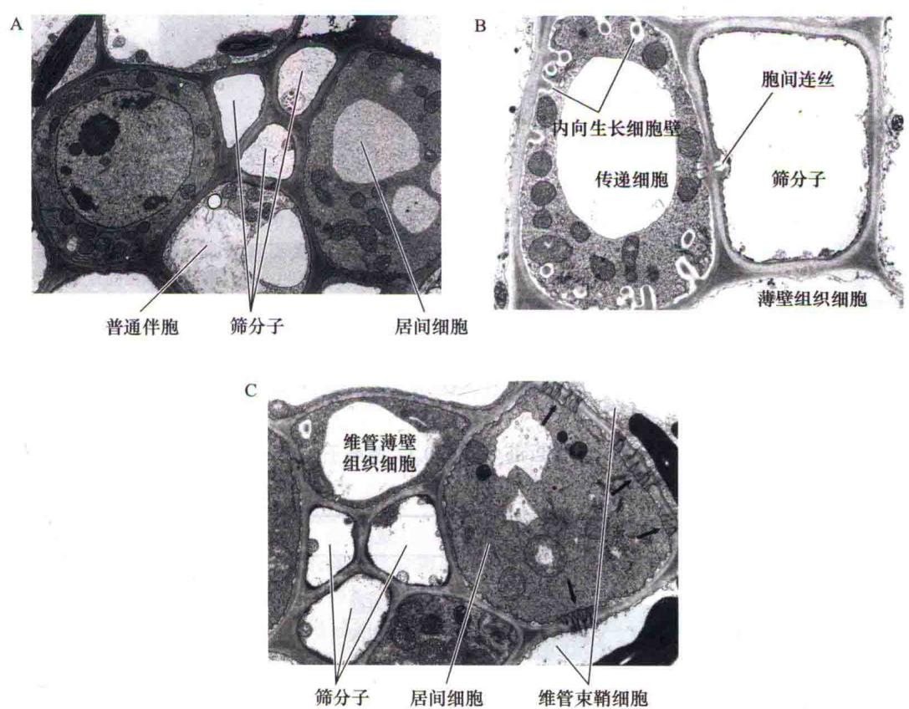  
图10.7 成熟叶片小叶脉中伴胞的电镜图。A. 红花沟酸浆（Mimulus cardinalis）小叶脉中3个筛分子毗邻的2个居间细胞和1个染色较浅的普通伴胞（6585×）。B. 豌豆（Pisum sativum）中1个筛分子紧挨着1个具有大量内向生长细胞壁的传递细胞（8020×），这种内向生长极大地增加了细胞膜的表面，增强了物质从叶肉向筛分子的运输。C. 通过大量胞间连丝（箭头所示）与邻近维管束鞘细胞相连的典型的居间细胞。这些胞间连丝在两侧都有分支，但在居间细胞侧分支更长、更密。小叶脉韧皮部图片来自面罩花（Alonsoa warscewiczii）（4700×）（A图、C图引自Turgeon et al., 1993，由R. Turgeon 提供；B图引自Brentwood and Cronshaw, 1978）。

## 10.2 转运模式：源到库

汁液在韧皮部的转运并不是仅向上或向下，也不是由重力来决定的。实际上，汁液是从叫做源（sources）的供给地运输到叫做库（sinks）的代谢或贮藏地。

源（source）包括输出器官，最典型的源是成熟叶片，它们能产生除自身需要外多余的光合产物（photosynthate）。另一类源是发育过程中处于输出阶段的贮藏器官，如两年生野生甜菜（Beta maritima）的根在第一年生长季时是库，根中累积来自叶源的糖类；到了第二个生长季，根则成了源，贮藏在其中的糖类被重新运出，以用来生成最终具有生殖力的茎。

A  
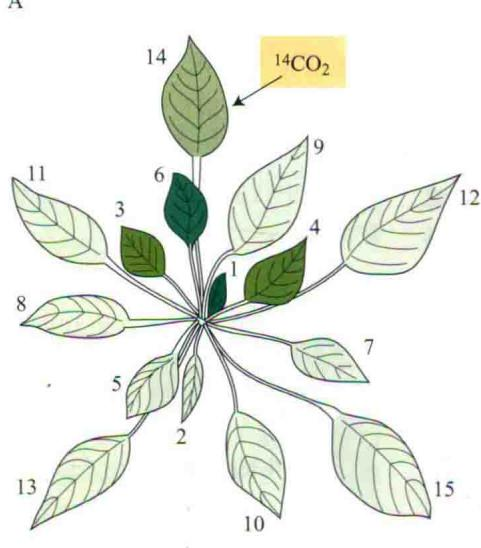

库（sink）包括植物的非光合器官及那些虽能产生光合产物，但不能满足自身生长、贮藏需要的器官。根、块茎、发育中的果实及未成熟的叶片，这些必须依赖输入碳水化合物才能满足正常发育的组织均属于库。利用环割、标记方法进行的研究均支持韧皮部中源到库的转运模式（图10.8）。

虽然韧皮部转运的模式可以简单地以源到库的运动

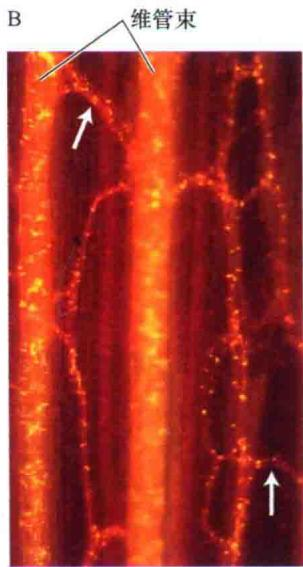  
图10.8 韧皮部转运的源到库模式。A. 甜菜完整植株中单一源叶标记后的放射性分布。 $^{14}$ CO $_{2}$ 处理单一源叶（箭头所示）4 h，一周后测定放射性分布，阴影强弱表示叶中放射性标记的程度。按叶龄编号叶子，最幼嫩、最新形成的叶子命名为1， $^{14}$ C标记主要运往源叶正上方的库叶，即与源叶位于相同直列线的库叶，如叶片1和6是源叶14正上方的库叶。B. 一个大丽花（Dahlia pinnata）节间厚切片中韧皮部典型三维结构纵向图。图为经透明、甲苯胺蓝染色后荧光显微镜观察结果。由于筛域中胼胝质染成黄色，图中筛板呈大量的小点，两个大的纵向维管束非常显著。这种染色反映了组成韧皮部网络的筛管的精细结构；图中箭头示两个韧皮部维管间连接（A图引自Joy，1964；B图由R.Aloni惠赠）。

来描述，但其中特有的转运途径却相当复杂，与就近供应、发育、维管连接和转运途径发生的修饰有关。植物中并非源供给所有的库，实际上，对于某一具体的源而言，它常优先供给特定的库（见Web Topic 10.1）。

## 10.3 韧皮部转运物质

水是韧皮部中含量最多的物质，碳水化合物、氨基酸、RNA、蛋白质、激素、一些无机离子及一些参与保护和防御的次生物质都以溶解在水中的形式被转运（Turgeon and Wolf，2009）。碳水化合物是韧皮部汁液中最重要、含量最高的溶质（表10.2），其中蔗糖是筛分子转运最常见的糖类物质，其浓度可高达0.3\~0.9 mol/L。

表10.2 蓖麻子（Ricinus communis）切割韧皮部后得到的渗出液的组成成分

<table><tr><td>成分</td><td>浓度/(mg/mL)</td></tr><tr><td>糖</td><td>80.0~106.0</td></tr><tr><td>氨基酸</td><td>5.2</td></tr><tr><td>有机酸</td><td>2.0~3.2</td></tr><tr><td>蛋白质</td><td>1.45~2.20</td></tr><tr><td>钾</td><td>2.3~4.4</td></tr><tr><td>氯</td><td>0.355~0.675</td></tr><tr><td>磷酸盐</td><td>0.350~0.550</td></tr><tr><td>镁</td><td>0.109~0.122</td></tr></table>

资料来源：Hall and Baker，1972

完全鉴定韧皮部中运输的物质是很困难的。现今还没有一种取韧皮部汁液的方法可以获得可流动溶质的完整图形（Turgeon and Wolf，2009）。我们将简单探讨已有的取样方法，并继而对目前已接受的韧皮部中移动的物质进行描述。

## 10.3.1 韧皮部汁液的收集和分析

因为筛分子具有较高的膨压，及前面谈到的筛分子应对伤害的反应，使得收集韧皮部汁液一直富有挑战性（见前面“受损的筛分子被封闭起来”和Web Topic 10.3）。除堵住筛板孔之外，筛分子的压力陡然释放能破坏细胞器和一些蛋白质，甚至能从周围细胞特别是伴胞释放一些物质（Turgeon and Wolf，2009）。

切断一些物种的筛分子后，受伤处即可分泌出汁液，这样就可以收集到少量渗出的汁液样品。然而，最初收集到的样品可能被周围受损细胞的内含物所污染。大多数实验是在收集汁液时施用EDTA，如此则可增加损伤部位茎和叶柄的液汁流出。结合钙的螯合剂EDTA可以抑制胼胝质合酶的活性（钙是必需的），分泌汁液时间加长，然而EDTA的利用也产生了许多技术性问题，如受伤害组织中碳水化合物等溶质渗漏等。

另一种更可取的方法则是用蚜虫吻刺作为“天然注射器”，利用这种方法可从筛分子和伴胞获得相对较纯的汁液。蚜虫是一种小型昆虫，它通过将4个管状吻刺组成的口器刺入到叶子或茎的单个筛分子中获取食物。 $CO_{2}$ 麻醉蚜虫后，用激光将其吻刺切下，从切口处即可收集到汁液，筛分子内的高膨压使得胞内物质从吻刺流出来。然而收集到的液体是非常少的，且这个方法非常困难。此外，切断口器的液流可持续数个小时，表明植物正常的封堵机制被阻止，并且有可能改变了液流的成分。尽管如此，利用这种方法从筛分子和伴胞中得到的汁液还是比较可靠的（Doering-Saad et al., 2002; Gaupels et al., 2008），分析渗出液得到了一个相对准确的韧皮部汁液组成图谱（见Web Topic 10.13）。

## 10.3.2 糖类以非还原形式被转运

分析收集到的汁液表明，转运的碳水化合物均为非还原性糖。还原性糖（如葡萄糖、果糖）中含有一个裸露的醛基或酮基（图10.9A）。非还原性糖（如蔗糖）的酮基或醛基被还原为醇或与另一糖分子相同基团相结合（图10.9B）。因为非还原态远没有还原态活泼，大多数研究者相信非还原性糖是韧皮部转运的主要成分。

最常见的被转运糖类是蔗糖，许多其他可转运的碳水化合物是蔗糖与不同数量半乳糖分子形成的复合物，如棉子糖由蔗糖和1分子半乳糖构成；水苏（四）糖由蔗糖和2分子半乳糖构成；毛蕊花糖由蔗糖和3分子半乳糖构成（图10.9B）。转运的糖醇还包括甘露醇和山梨醇。

科学就是对每一个概念进行质疑并检测，即使是那些被认为是理解很透彻的概念也不例外。例如，这里对于转运的糖的性质，大多数研究表明韧皮部汁液中有极低浓度的还原糖，而且少数物种中也发现了相当量的己糖成分。在这些实例中，从切断叶柄中流出的液汁均含有螯合剂EDTA成分（van Bel and Hess，2008）。尽管其他的研究没有检测到韧皮部液汁中具有高浓度的己糖成分而且EDTA可以诱导假象的产生，但进一步的研究还需要证明这些发现的意义。

## 10.3.3 韧皮部中的其他成分

韧皮部中的氮（素）大多为氨基酸和酰胺，尤其是谷氨酸、天冬氨酸及它们的酰胺（谷氨酰胺和天冬酰胺）。即使在同一物种中已报道的氨基酸和有机酸的含量差异也很大，但与碳水化合物相比，它们的含量通常较低（更多关于韧皮部氨基酸转运的信息见Web Topic 10.4）。韧皮部汁液中还有浓度相对较低的蛋白质和RNA，其中RNA包括mRNA（Doering-Saad et al., 2002）、病原体RNA和调节性小分子RNA。

筛分子中还含有包括生长素、赤霉素、细胞分裂素、脱落酸在内的几乎所有的内源植物激素（见第19章、第20章、第21章和第23章），在筛分子中激素被长距离运输，尤其是生长素。另外，韧皮部汁液中还发现了核苷酸磷酸盐。

一些无机溶质（包括钾、镁、磷酸盐和氯）也在韧皮部中运输（表10.2），而硝酸盐、钙、硫和铁在韧皮部中则相对不可被运输。

韧皮部汁液中已发现的蛋白质有结构蛋白P蛋白，如PP1和PP2（参与封堵受损的筛分子），以及许多水溶性蛋白。其中一些蛋白质的功能多与胁迫和防御反应有关（Walz et al., 2004；参见Web Topic 10.12中的表）。除了常见的蛋白之外，对南瓜韧皮部液汁大规模蛋白组学分析发现了许多独特的蛋白（Lin et al., 2009）。这一研究鉴定了比以往多10倍的蛋白成分，此外还令人惊奇地发现了100多种合成蛋白，这在韧皮部中通常是不可能的。

核糖体蛋白并没有发现，这与成熟的筛管分子中没有核糖体是一致的。在这个研究中用EDTA收集液汁，这种采集方法带来的假象还是必须考虑在内的，进一步的研究还需澄清明确这一结论。RNA和蛋白质作为信号分子的作用将在本章末讨论。

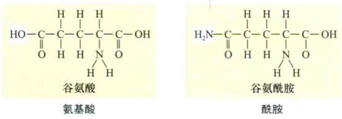

## A. 还原性糖，通常不在韧皮部中转运

还原性基团包括醛基(葡萄糖和甘露糖)和酮基(果糖)

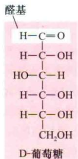

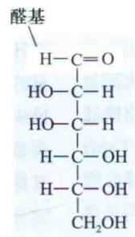  
D-甘露糖

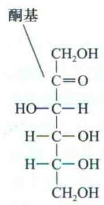  
D-果糖

## B. 韧皮部转运的复合物

蔗糖是由1分子果糖和1分子葡萄糖组成的二糖，棉子糖、水苏糖和毛蕊花糖分别由蔗糖和1分子、2分子及3分子半乳糖构成

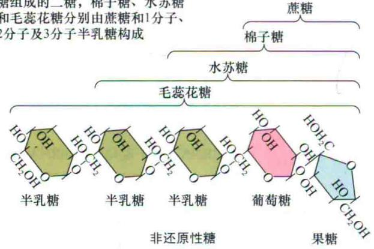

甘露醇是一种糖醇，由甘露糖醛基还原而成

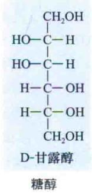

谷氨酸和谷氨酰胺是韧皮部转运的重要的含氮化合物，除此以外还有天冬氨酸和天冬酰胺

具有固氮瘤的物种也以酰脲类形式转运氮

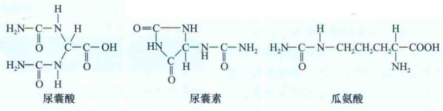  
酰脲  
图10.9 韧皮部通常不转运的物质（A）和转运的物质（B）结构。

## 10.4 转运速率

筛分子中物质运输的速率可用两种方法来表示：一种是速度（velocity），即单位时间经过的直线距离；另一种是集流运输速率（mass transfer rate），指单位时间通过韧皮部或筛分子某一横切面物质的量。因为筛分子是韧皮部输导细胞，根据筛分子横截面积来计算的集流运输速率更好一些。筛分子集流运输速率的范围为 $1\sim 15\mathrm{g / (h\cdot cm^2)}$ （参见Web Topic 10.5）。

早期关于韧皮部转运速率的文献中，速度单位是 $\mathrm{cm / h}$ ，韧皮部或筛分子集流运输速率的单位是 $\mathrm{g / (h\cdot cm^2)}$ 。目前用得较多的单位是SI单位，长度以m或mm为单位，时间以s为单位，质量以kg为单位。

速度和集流运输速率可用放射示踪法来测定（测定集流运输速率的方法在Web Topic 10.5中有描述）。测定速度最简单的一类实验方法是用 $^{11}$ C或 $^{14}$ C标记的 $CO_{2}$ 短期施于源叶（脉冲标记技术），然后在某一库组织或转运路径中的某一特定位点监测同位素的到达。

一般说来，用许多常规技术测得的速度平均约为100 cm/h，变化幅度为30\~150 cm/h，远大于扩散速率。最近用NMR光谱测定技术测得的蓖麻中平均速度值为0.25 mm/s（相当于90 cm/h），与较老方法测得的平均值极为接近（Windt et al., 2006）。韧皮部转运的速度明显很高，远超过长距离扩散速率，因此无论任何一种韧皮部转运机制的提出都必须能够解释产生如此高速度的原因。

## 10.5 韧皮部运输的压力流动模型——被动运输

压力流动模型很好地解释了被子植物韧皮部转运机制，该模型与目前大多数实验得到的数据相一致。利用压力流动模型，韧皮部转运可以被解释成为源和库之间由渗透产生的压力梯度驱动的溶质流（集流或体积流）。这一部分将讲解压力流动模型和集流引发的各种推测及其相关支持数据。最后简要探讨压力流动模型对裸子植物的适用性。

早期研究认为，韧皮部转运有主动和被动两种机制，所有关于这两种转运机制的理论都认为源和库需要能量。在源中，能量是合成被转运物质所必需的，某些情况下，光合产物从生产细胞运输到筛分子也需要跨膜的主动运输，光合产物的这种运输叫做韧皮部装载（phloem loading），将在本章详细讨论。在库中，从筛分子到贮藏或代谢糖类的库细胞运输，同样也必需能量，这种光合产物由筛管到库细胞的运动叫做韧皮部卸载（phloem unloading），也将做进一步讨论。

韧皮部运输的被动机制假定，源到库路径间筛分子需要的能量是用于维持自身结构（如质膜）和恢复韧皮部渗漏丢失的糖类。压力流动模型就是被动转运机制的一个例子。而另一方面，主动转运理论则推测筛分子消耗能量是用于驱动自身转运（Zimmermann and Miburn，1975），这种主动运输理论具有很大的局限性，本章不再讨论。

## 10.5.1 压力流动模型中渗透产生的压力梯度驱动转运

溶质扩散实在太慢了，无法用来解释韧皮部中溶质的快速运动，韧皮部转运平均速度为1 m/h；而扩散速率则是每32年扩散1 m（见第3章关于扩散作为有效转运机制的扩散距离和速度的讨论）。

压力流动模型（pressure-flow model）最初由Ernst Münch在1930年提出。该模型的基本论点是：筛分子中溶液的流动是由源和库之间渗透造成的压力势梯度（ $\Delta\Psi_{p}$ ，pressure gradient）驱动的，这种梯度的确立归根结底是由源端韧皮部装载和库端卸载造成。

在后面的章节（见韧皮部装载）会了解到源的韧皮部中产生高浓度糖的三种不同机制：叶肉细胞中的光合产物；居间细胞中光合产物转化为转运的糖；以及膜主动运输。第3章已提到 $\Psi_{w}=\Psi_{s}+\Psi_{p}$ [式（3.5）]，即 $\Psi_{p}=\Psi_{w}-\Psi_{s}$ 。在源组织中，筛分子糖的积累产生了一个低的（负的）溶质势（ $\Delta\Psi_{s}$ ），进而引起水势的陡然下降（ $\Delta\Psi_{w}$ ）。相应于这种低的水势梯度，水分进入筛分子从而引起膨压（ $\Psi_{p}$ ）增加。

在转运途径的接收末端，韧皮部卸载导致筛分子糖浓度变低，从而在库组织筛分子中产生了一个较高的（正的）溶质势。当韧皮部的水势高于木质部时，水分就会离开韧皮部，引起库中筛分子膨压的降低。图10.10解释了压力流动假说，此图表明质外体主动膜运输导致源筛分子中产生高浓度糖。

转运途径如果不跨细胞壁的话，也就是说整个转运路径仅在一个由单一的膜围起来的结构中进行，那么源和库之间压力的差异就会很快达到平衡。而实际上，筛板的出现极大地增加了转运路径的阻力，极有可能导致源和库之间筛分子内产生并维持相当大的压力势梯度。

韧皮部汁液移动不是通过渗透而是由集流引起的。也就是说，从一个筛管转运到另一筛管不需要穿过任何膜，溶质移动的速率与水分子相同。基于这种原因，从具有较低水势的源器官到具有较高水势的库器官可能发生集流，反之亦然，集流发生依赖于源和库器官的识别。事实上，图10.10展现了一个逆水势梯度流动的例子，如此的水流动并不违背热力学原理，因为这种运动是集流而非渗透作用，这里转运依赖的是压力势梯度，而渗透则依赖水势梯度。

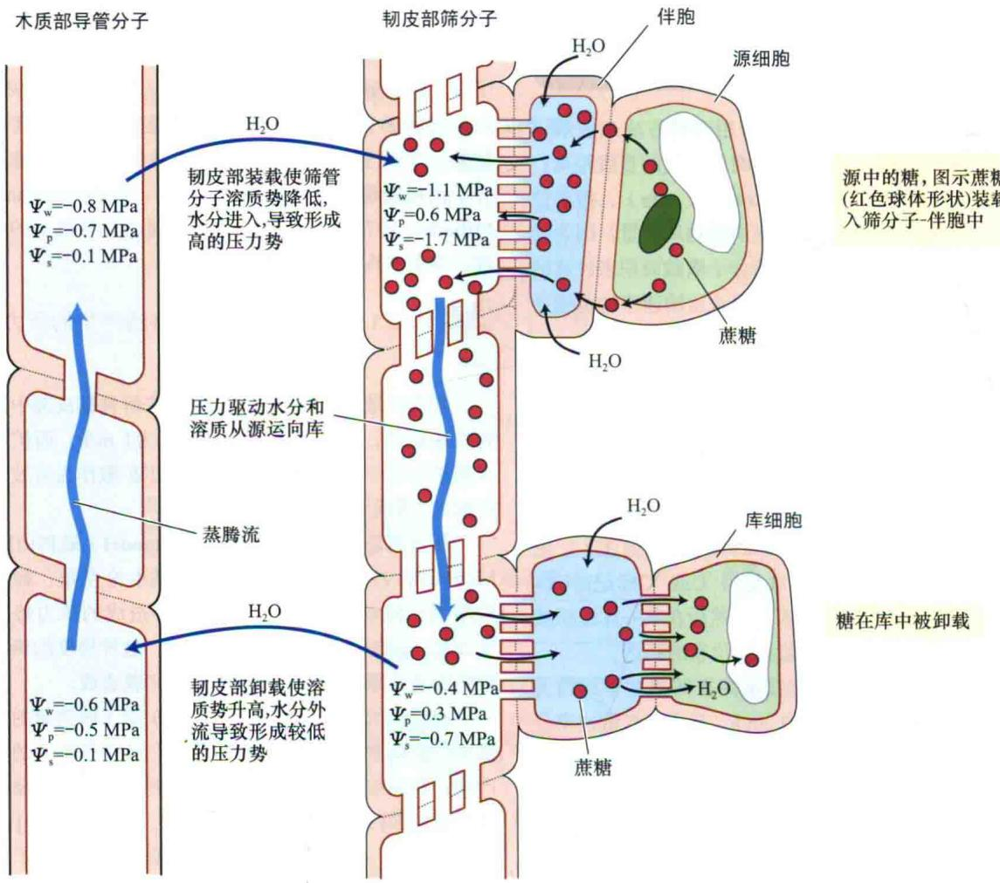  
图10.10 韧皮部转运的压力流动模型。图中显示木质部和韧皮部中 $\psi_{p}$ 、 $\psi_{w}$ 、 $\psi_{s}$ 的可能值（改编自Nobel，2005）。

根据压力流动模型，韧皮部转运途径的驱动依赖于溶质和水运入及运出筛分子。驱动转运途径中水的运动依靠的是压力势梯度，而并非水势梯度。当然，筛管中这种被动的、由压力驱动的长距离转运最终还是依赖于参与韧皮部装卸的短距离主动转运机制，这些主动机制是形成压力势梯度的主要原因。

## 10.5.2 集流的推测已被证实

韧皮部集流转运模型中一些重要的推测如下：

筛板孔一定不能被堵塞。如果P蛋白或其他物质堵塞了筛板孔，筛分子汁液流动阻力将非常大。在单一筛分子中，真正的双向运输（即同时向两个方向运输）是不可能发生的，溶质的集流阻止了这种双向运动，同一管道中溶液在任一时间只能朝一个方向流动。但是相对不同的筛分子或不同时间，韧皮部内的溶质可能存在双向运动。

在组织中驱动物质沿着路径转运并不需要太多能量。因此，限制供给ATP的处理，如低温、缺氧和代谢抑制剂等，都不会阻止转运的进行。然而转运又需要能量用于维持筛分子结构、重新装载那些渗漏到质外体的糖，或者在筛管的末端重新装载糖分。

压力流动假说要求存在一个正的压力势梯度。源中筛分子内的膨压一定比库中的高，根据传统的集流图像分析，压力差必须足够大到可以克服传递路径中的阻力，使筛分子汁液得以按观察到的速度流动（见Web Topic 10.6，筛分子压力势梯度另一观点）。

已有的证据（见下面）已经证实了这些推测符合集流和压力流动假说。

## 10.5.3 筛板孔是开放的通道

研究筛分子超微结构是富有挑战性的，因为在这些细胞内压力很高，当韧皮部被切断或用化学固定剂缓慢致死时，筛分子中的膨压就会被释放，细胞的内含物尤其是P蛋白和糖会朝着压力释放点运动，就筛管分子而言，其内含物会积聚到筛板上，这可能就是早期电镜图片显示的筛板被堵塞的原因。

新的快速冷冻固定技术提供了可信的且不受影响的筛分子图片。用这些技术得到的筛管分子的电镜图片显示，P蛋白沿着筛管分子的周边分布（图10.3\~图10.5），或者均匀地分布在整个细胞的内腔。筛孔中P蛋白存在的位置与之相似，它们沿着筛孔呈直线或以松散的网状形式排列。在许多物种，如葫芦、甜菜（Beta vulgairs）、豆类（Phaseolus vulgaris）等（图10.5）中都观察到开放的筛孔，这与集流相一致。

除了利用电镜获得结构方面的证据以外，测定筛板孔在完整的组织中是否开放也非常重要。利用激光共聚焦扫描显微镜可直观地检测活体筛分子的物质转运（knoblauch and van Bel，1998），实验表明，参与转运的筛分子的筛板孔是开放的（图10.11）。

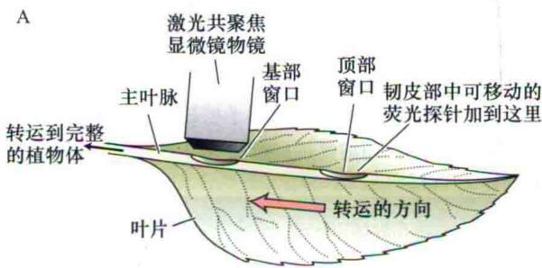

## 10.5.4 单个筛分子中不存在双向运输

用两种不同放射性示踪剂标记两个上下相邻的源叶来研究双向运输，每个叶片各标记一种示踪剂，并在两个源之间设定一个点来检测两种示踪剂的出现。

双向运输通常在茎中不同维管束的筛分子中可检测到。在叶柄同一维管束相邻筛分子中也发现了双向运输，这可能是叶正经历库到源的转变，通过叶柄同时输入和输出光合产物。然而，没有证据表明单个的筛分子中同时发生双向运输。

## 10.5.5 韧皮部途径转运耗能少

耐受周期性低温的植物，如甜菜，如果快速冷冻处理源叶的一小段叶柄至1℃，并不能持续抑制叶片中物质的输出（图10.12），而是在短时期的抑制后，转运会慢慢恢复到对照的速度。急剧冷冻降低叶柄的呼吸速率，使合成与消耗ATP降低约90%，但此时转运却可恢复正常并且正常进行。实验表明，与集流相符合，这些草本植物韧皮部转运所需能量较少。

B  
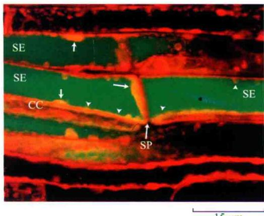

C  
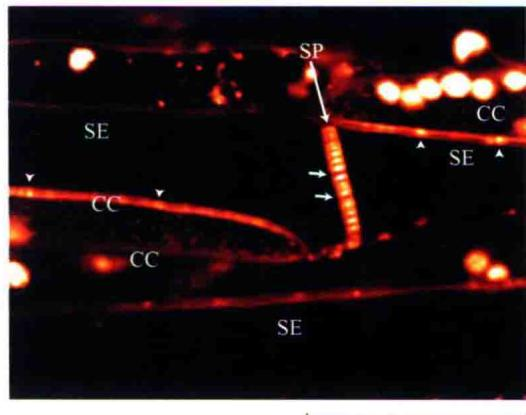  
15 μm  
图10.11 蚕豆叶中具活性的筛分子，在转运过程中筛板孔是开放的。A. 在一个成熟叶子的主脉下部切开两个与表皮平行的薄片窗口，露出韧皮部组织。激光共聚焦扫描显微镜的物镜被置于叶基部窗口，在顶端窗口施加一种可在韧皮部移动的荧光探针，如果发生转运就可以在叶片基部窗口观察到荧光，用这种方法可以证实观察的筛分子具有活性功能。B. 对豆类植物韧皮部组织进行双染色，一种荧光探针（红色）主要标记细胞膜，另一种不同的荧光染料（绿色）指示转运。绿色荧光在基部观察窗口出现，表明转运是从施加染料的顶部窗口发生的，筛分子有活性且具有功能。蛋白质（箭头记号）相对质膜沉积，筛板不影响转运发生。P蛋白结晶体（星符号）被绿色探针染色。质体（箭头状符号）均匀地分布在筛分子的周边。C. 只应用荧光探针局部标记大豆类植物韧皮部组织的膜，箭头示没有被阻挡的筛板孔。CC. 伴胞；SP. 筛板；SE. 筛分子（B图、C图引自Knoblauch and van Bel，1998；由A. van Bel提供）。

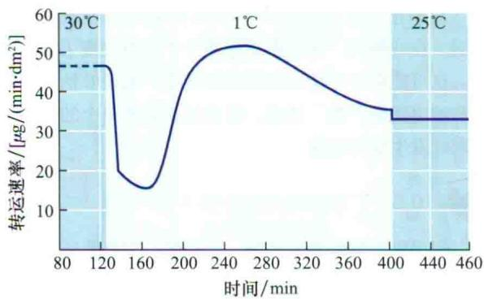  
图10.12 转运途径所需能量很少。冷处理甜菜叶柄导致代谢能量的损失，会部分降低转运速率，但随着时间的推移，转运速率恢复，尽管冷处理极大地抑制ATP的产生和消耗。 $^{14}$ CO $_{2}$ 施于一个源叶，并将叶柄2 cm长的部分冷冻至1℃，在一片库叶中通过监测 $^{14}$ C的出现从而检测转运的发生（引自Geiger and Sovonick，1975）。

能抑制所有能量代谢的极端处理确实抑制了转运。如在豆类中，如果用一种代谢抑制剂（氰化物）处理源叶的叶柄，就会抑制叶中的输出。然而，用电子显微镜检测处理过的组织，发现筛板孔被细胞碎片堵塞住了（Giaquinta and Geiger，1997）。很显然，这与沿着该路径转运是否需要能量的问题没有关系。

## 10.5.6 韧皮部筛分子中存在正的压力梯度

集流指液体中所有分子在压力势梯度驱动下共同移动。那么，筛分子中的压力值是多少，如何测定？

筛分子中的膨压可以用水势和溶质势来计算（ $\Psi_{\mathrm{p}} = \Psi_{\mathrm{w}} - \Psi_{\mathrm{s}}$ ），也可以直接测定。最有效的方法是将测微气压计或者压力传感器封接到正渗出的蚜虫吻刺进行测量（参见Web Topic 10.3中图10.2A）（Wright and Fisher, 1980）。因为蚜虫吻刺仅刺入单一的筛分子，并且围绕蚜虫吻刺的质膜封闭得很好，这样可以得到精确的数据。用该技术测得的筛分子的膨压表明，源端的压力高于库端。

尽管考虑到路径阻力（主要由筛板孔引起）、路径距离和转运速度，在大豆中源和库之间观测到的压力差仍足以驱动溶质以集流形式通过（Fisher，1978）。用水势、溶质势计算得到的源和库之间确切的压力差为0.41 MPa，而压力流驱动转运所需的压力差为0.12\~0.46 MPa，因此，所观察到的压力差显然足以驱动集流通过韧皮部，至少在这种草本植物中支持传统的压力流动模型。

因此可以推断出，这里所描述的所有实验和数据均符合被子植物韧皮部执行的集流运输。转运途径中不需要能量和开放筛板孔的存在，为韧皮部相对被动的转运机制提供了较为确切的证据。双向运输或运动蛋白的检测失败，以及现有压力势梯度的可靠数据，都与压力流动假说目前的解释相一致。

## 10.5.7 裸子植物中的转运是否采用了不同的机制？

虽然集流解释了被子植物中的转运，但对裸子植物却可能并不适合。关于裸子植物韧皮部的生理学信息非常少，对于这些物种转运的推测几乎完全基于对电镜图片的解释。正如前文所述，裸子植物的筛胞在许多方面与被子植物的筛管分子相似，但筛胞没有相对特化的筛域，而且没有开放的孔（图10.6）。

裸子植物的孔充满了大量的膜，这些膜与紧挨着筛域的光滑内质网相连。很明显，这样的孔不能满足集流的要求。虽然这些电镜图片可能不是自然状态，不能反映完整组织中的情形，但裸子植物中的转运是否使用了不同的机制，还需要进一步研究。

## 10.6 韧皮部装载

光合产物从成熟叶肉细胞叶绿体移动到筛分子包括以下几个运输步骤：

（1）白天，光合作用（见第8章）形成的丙糖磷酸从叶绿体转运到胞质并转化为蔗糖。晚上，来自贮藏淀粉的碳主要以麦芽糖的形式离开叶绿体并转化为蔗糖（在一些物种中，运输的其他糖随后由蔗糖合成，而糖醇类由己糖磷酸或在某些情况下由己糖作为起始分子合成）。

（2）蔗糖从叶肉细胞移向邻近最小叶脉筛分子细胞（图10.13）。这种短距离运输（short-distance transport）途径通常只有几个细胞直径那么远。

（3）在韧皮部装载（phloem loading）过程中，糖类物质被运到筛分子和伴胞中。值得注意的是，就装载而言，筛分子和伴胞通常被看一个功能单位，即筛分子-伴胞复合体（sieve element-companion cell complex）。一旦进入筛分子，蔗糖和其他溶质被转运离开源，这一过程被叫做输出（export），通过维管系统到库的转运称为长距离运输（long-distance transport）。

正如前面所讲的，源端的装载和库端的卸载过程为长距离运输提供了驱动力，这一点对农业也相当重要。深入全面理解这些机制会为通过提高光合产物在可食用库组织（如谷物籽粒）中积累，增加作物产量的技术开发奠定基础。

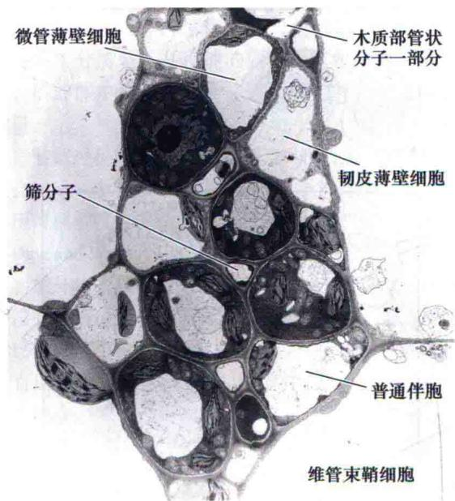  
图10.13 电镜展示甜菜源叶小叶脉中各种细胞类型间关系（5000×）。光合细胞（叶肉细胞）在紧密排列的维管束鞘细胞的周围。叶肉细胞的光合产物被装载到筛分子之前，必须移动相当于几个细胞直径那么远的距离。光合产物从叶肉到筛分子的运输即称为短距离运输（引自Evert and Mierzwa，1985，由R.Evert提供）。

## 10.6.1 韧皮部装载可通过质外体或共质体发生

已知源叶中的溶质（主要是蔗糖）必须从叶肉的光合细胞运到筛分子。最初的短距离途径通常是共质体途径（图10.14）。然而，糖类可能完全通过胞间连丝从共质体（胞质）运到筛分子（图10.14A）或在韧皮部装载之前进入质外体（图10.14B）（见图4.4对共质体和质外体大体的描述）。质外体途径和共质体途径被用在不同物种中。

韧皮部装载有几种机制：质外体装载、复合物阱的共质体装载和被动的共质体装载。早期研究集中在质外体途径，这是一个普遍的机制。因此首先讨论下这种装载机制，然后再根据另外两种机制的重要性分别进行探讨。

## 10.6.2 大量数据表明某些物种中存在质外体装载

在质外体装载的情况下，糖类进入距离筛分子伴胞复合体很近的质外体。随后，筛分子和伴胞质膜上能量驱动的选择性转运体主动将这些糖类从质外体运到筛分

A 共质体装载

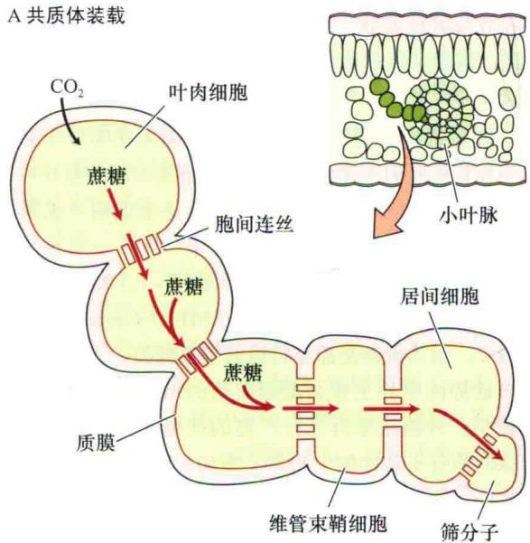

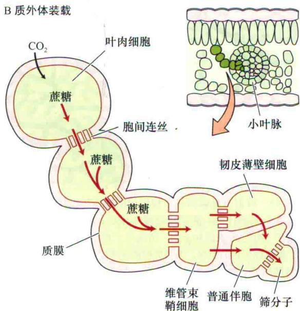  
图10.14 源叶的韧皮部装载途径图解。A. 在整个共质体途径，糖从叶肉到筛分子全程依靠胞间连丝从一个细胞到另一个细胞移动。B. 在部分质外体途径中，糖最初通过共质体运输，但在装载到伴胞和筛分子之前先进入了质外体。装载到伴胞的糖通过胞间连丝进入到筛分子。

子和伴胞。流出物进入质外体是高度定向的，极有可能进入韧皮部薄壁组织细胞壁内。

质外体韧皮部装载引发出三个基本推测（Grusak et al., 1996）：

（1）质外体中应当存在被转运的糖。

（2）把糖施于质外体的实验中，外源施加的糖应在筛分子和伴胞中累积。

（3）抑制糖从质外体吸收会抑制从叶片的输出。

对这些推测的许多研究已经有力地证实了许多物质

中存在质外体装载（参见Web Topic 10.7）。

## 10.6.3 质外体途径中蔗糖的吸收需要能量

许多特异性的研究表明源叶中糖类在筛分子和伴胞中要比在叶肉中含量更高。这种溶质浓度的差异可以通过测定叶片各种类型细胞的渗透势来证明（见第3章）。

在甜菜中，叶肉的渗透势大约为-1.3 MPa，而筛分子和伴胞中的渗透势约为-3.0 MPa（Geiger et al., 1973）。因为蔗糖是甜菜转运的主要糖类，人们认为这种渗透势的差异主要是蔗糖累积的结果。实验证据已经表明，外施或来自光合产物的蔗糖都在甜菜源叶小叶脉的筛分子和伴胞中积累（图10.15）（见Web Topic 10.7）。

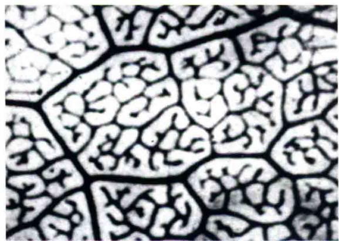  
图10.15 放射自显影图显示被标记的糖逆浓度梯度从质外体进入筛分子和伴胞。甜菜暗处理3 h后，将 $^{14}$ C标记的蔗糖溶液施于一叶片上表面30 min。清除叶子角质层使溶液进入到叶内。黑色标记物的积累，表明蔗糖被逆浓度梯度转运到了源叶小叶脉的筛分子和伴胞（引自Fondy，1975，由D. Geiger惠赠）。

蔗糖在筛分子伴胞复合体中的浓度高于其周围细胞，表明了蔗糖是逆化学势梯度主动运输的。用呼吸作用的抑制剂处理源组织，既降低了ATP含量又抑制了外源糖类的装载，这一结果支持了蔗糖累积依赖于主动运输的观点。

植物将糖通过质外体装载到韧皮部的同时，也主动装载氨基酸和糖醇；与此相反，其他代谢物（如有机酸和激素）则可能被动地进入筛分子（参见Web Topic 10.7）。

## 10.6.4 蔗糖- $H^{+}$ 同向转运体参与质外体途径的韧皮部装载

蔗糖- $H^{+}$ 同向转运体被认为介导了蔗糖从质外体到筛分子-伴胞复合体的转运。第6章已经介绍同向转运是利用质子泵产生的能量进行的次级运输过程（图6.11A）。

质子驱动的能量重新返回细胞并与底物吸收相偶联，这里的底物是蔗糖（图10.16）。

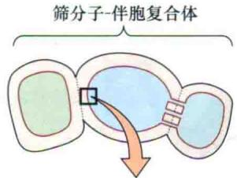

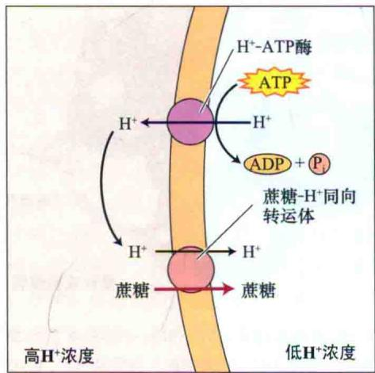  
图10.16 质外体筛分子装载过程中依赖ATP的蔗糖运输。在蔗糖装载到筛分子-伴胞复合体共质体的共转运模型中，质膜上的ATP酶把质子从细胞泵出进入质外体，从而在质外体形成高的质子浓度。然后，利用质子梯度的能量驱动蔗糖通过蔗糖- $H^{+}$ 同向转运体进入筛分子-伴胞复合体的共质体。

许多实验结果均支持在韧皮部装载过程中存在蔗糖- $H^{+}$ 同向转运体的运行：

（1）用免疫学技术定位 $H^{+}$ -ATP酶，发现它存在于伴胞的质膜上（拟南芥）和传递细胞中（蚕豆）。在传递细胞中， $H^{+}$ -ATP酶分子主要集中在质膜面向维管束鞘和韧皮部薄壁组织细胞的折叠处。

（2）伴胞H $^{+}$ -ATP酶的分布与一个叫做SUC2（拟南芥；大叶车前，Plantago major，参见Web Topic 10.7）的蔗糖-H $^{+}$ 同向转运体的分布相关联。因此，H $^{+}$ -ATP酶为蔗糖吸收提供了驱动力，而且实验也表明在一些物种中利用H $^{+}$ -ATP酶的蔗糖转运体定位在同样的细胞中。

（3）抑制转运体的活性就会抑制源叶的运输。用另一种蔗糖- $H^{+}$ 同向转运体SUT1（拟南芥SUC2的同源基因）的反义DNA转化西红柿（Lycopersicon esculentum），发现转基因植物减少了果实的形成，且在源叶组织中可溶性糖大量积累，延长黑暗周期不能使淀粉移动，这些都与SUT1转录水平的减少有关（Hackel et al., 2006）。

目前已经克隆了几个定位在韧皮部的蔗糖- $H^{+}$ 同向转运体，SUT1和SUC2可能是主要的蔗糖转运体（见Web Topic 10.7更多关于韧皮部糖转运体信息）。

质外体途径中蔗糖装载的调控 目前关于通过蔗糖- $H^{+}$ 同向转运体调节蔗糖从质外体到筛分子装载的机制还不十分清楚。其可能的调节因素包括筛分子的膨压，质外体中蔗糖的浓度，以及可用的同向转运体的数量。

装载过程中，筛分子的膨压降低到某一阈值以下时就会导致一个补偿性的装载提高。虽然许多文献报道了膨压可调节膜的运输，实际上很少有实验证明这种调控（Daie and Wyse，1985）。

质外体中高浓度的蔗糖会增加韧皮部装载。尽管几乎没有测量过装载位点质外体蔗糖的浓度，但许多研究者已经报道，输出与源叶中的蔗糖浓度或者与光合速率是直接相关的，这个数据的测量对于未来的科研者仍是一个挑战。

有数据表明，甜菜源叶中蔗糖水平可调节叶中蔗糖- $H^{+}$ 同向转运体（SUT1）分子的浓度，而后者又可调节装载。通过蒸腾流饲喂蔗糖，发现甜菜叶中的SUT1的转录下降。SUT1蛋白及其mRNA快速降解，转录的降低也导致SUT1蛋白的减少。在同样的蔗糖浓度下，叶子提纯的质膜小泡对蔗糖的吸收能力明显降低（Vaughn et al., 2002），这同时暗示了同向转运体的水平也下降。目前已经证实蛋白质磷酸化在这些调节过程中发挥着重要作用（Ransom-Hodgkins et al., 2003）。SUT1转运体mRNA和蛋白质水平受昼夜的调节，15 h暗处理后的表达水平要低于光处理的。

其他的一些研究已表明，质外体中可利用的钾会增强蔗糖进入质外体的能力，暗示了比较好的营养供给会提高向库的转运并促进库的生长。

## 10.6.5 个别物种中韧皮部装载是通过共质体途径

诸多研究表明，在某些植物中质外体装载仅转运糖，几乎没有胞间连丝进入小叶脉韧皮部；另一方面，共质体途径的植物，除运输蔗糖外，还运输棉子糖和木苏糖，小叶脉中具有居间细胞，还有大量的胞间连丝通向小叶脉，这样的物种有彩叶草（Coleus blumei）、南瓜、西葫芦（Cucurbita pepo）和甜瓜（Cucumis melo）。

共质体的运作途径中不同细胞之间需要有开放的胞间连丝。许多物种在筛分子-伴胞复合体与周围细胞之间的接触处有大量的胞间连丝（图10.7C）。

## 10.6.6 多聚体-陷阱模型解释了具居间细胞植物的共质体装载

筛分子汁液的组成成分与韧皮部周围组织中的溶质通常是不同的。这种差异表明，源叶中某些糖会特异性地被选择运输。因为同向转运体特异转运某些糖，使质外体韧皮部装载有选择性。与此相反，共质体装载则依赖于糖分子通过胞间连丝从叶肉到筛分子的扩散。很难想象，通过胞间连丝扩散如何才能在共质体装载中对某些糖具有选择性。

此外，来自一些表现出共质体装载的物种的数据表明，筛分子、伴胞比叶肉细胞具有较高的渗透势。然而，依赖扩散的共质体装载如何来解释所观察到的选择性转运，以及逆浓度梯度糖分子的累积呢？

为此，人们建立了多聚体-陷阱模型（polymer-trapping model）（图10.17）来解释这些问题（Turgeno and Gowan，1990）。该模型认为，叶肉中合成的蔗糖通过大量的胞间连丝从维管束鞘细胞扩散到居间细胞。居间细胞的棉子糖、水苏糖（分别由3个、4个己糖组成，图10.9B）由半乳糖苷和转运来的蔗糖合成。由于组织自身结构及棉子糖、水苏糖分子相对较大，多聚体无法扩散返回维管束鞘，但能扩散进入筛分子。这些植物筛分子中的糖浓度可以达到与质外体装载的植物中相当的水平。因为合成蔗糖的叶肉细胞和利用蔗糖的居间细胞间维持着一定的浓度梯度，蔗糖可继续扩散进入居间细胞（图10.17）。

多聚体-陷阱模型有如下三种预测：

（1）蔗糖应当更多地集中在叶肉细胞而不是居间细胞。

（2）合成棉子糖、水苏糖的酶应优先定位在居间细胞。

（3）连接维管束鞘细胞与居间细胞的胞间连丝应阻止比蔗糖大的分子的进入。而居间细胞与筛分子间的胞间连丝应当比较宽敞，以使棉子糖和水苏糖通过。

许多研究支持了共质体装载的植物中的多聚体-陷阱模型（见Web Topic 10.7）。

## 10.6.7 许多树种的韧皮部装载是被动的

植物中被动共质体韧皮部装载是一种普遍的机制。最近许多数据都支持这一观点，被动共质体装载实际上Münch提出的压力流动模型的一部分。

一些树种中的筛分子-伴细胞复合物与周围细胞之间具有大量的胞间连丝，但是没有居间细胞，也不能运输棉花子和水苏糖。杨柳（Salix babylonica）和苹果树（Malus domestica）就是这一类型（Rennie and Turgeon，2009）。这些植物从叶肉细胞到筛分子-伴胞复合体的途径中并不存在浓度差。由于是叶肉细胞到韧皮部中的扩散的浓度梯度驱动了这一短距离运输，为了维持筛分子中的高溶液浓度和膨压，这些植物中的绝对糖分水平在源叶中必须是非常高的。尽管利用不同装载

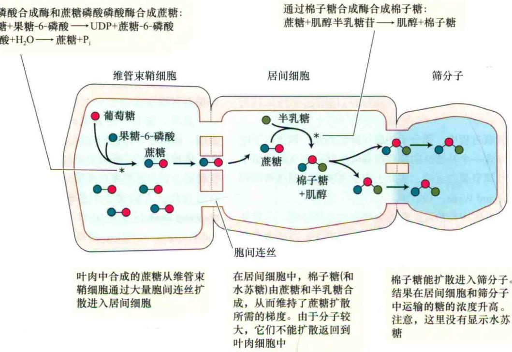

在居间细胞中，棉子糖(和水苏糖)由蔗糖和半乳糖合成，从而维持了蔗糖扩散所需的梯度。由于分子较大，它们不能扩散返回到叶肉细胞中

图10.17 韧皮部装载的多聚体-陷阱模型。为了简化，略去了水苏糖（引自van Bel，1992）。

机制的植物类型间的源叶中糖浓度变化范围很大（超过50倍），并且浓度范围在这些植物类型之间存在一定的重叠，但是源叶中糖浓度在被动装载的树种中是远高于其他类型的植物的（Rennie and Turgeon，2009）。

## 10.6.8 韧皮部装载类型有许多重要的特征

正如前文所述，质外体和共质体的韧皮部装载途径的运行与一些特定的性质相关联（表10.3）（Rennie and Turgeon，2009）。

具有质外体韧皮部装载途径的物种几乎单一地进行蔗糖装载，它们的小叶脉中具有普通伴胞或者传递细胞。这些物种的筛分子-伴胞复合体与周围细胞之间连接很少，筛分子-伴胞复合物中的活性载体将蔗糖聚集在韧皮部细胞中且产生长距离运输的驱动力。

多聚体-陷阱中共质体装载的物种除了转运蔗糖外，还转运寡聚糖（如棉子糖），小叶脉中有居间细胞型的伴胞，而且筛分子-伴胞复合体与周围细胞间有大量的连接。多聚体-陷阱将蔗糖转运到韧皮部细胞从而产生长距离运输的驱动力。

被动的共质体装载物种运输蔗糖，在筛分子-伴胞复合物和周围细胞间具有大量的连接。进行被动韧皮部装载的植物的一个特点是在源叶中具有高浓度的糖，维持了叶肉细胞和筛分子-伴胞间的浓度差。高的糖浓度使得在源叶的筛分子产生高的膨压，驱动了长距离运输，这一过程大部分发生在树木中。

表10.3 共质体和质外体装载模型

<table><tr><td>特征</td><td>质外体装载</td><td>复合物阱的共质体装载</td><td>被动的共质体装载</td></tr><tr><td>转运的糖</td><td>蔗糖</td><td>蔗糖、棉子糖和木苏糖</td><td>蔗糖</td></tr><tr><td>伴胞特征</td><td>普通伴胞或转移细胞</td><td>居间细胞</td><td>普通伴胞</td></tr><tr><td>筛分子和伴胞复合体与周围细胞间胞间连丝的数量和传导性</td><td>低</td><td>高</td><td>高</td></tr><tr><td>对筛分子和伴胞复合物中的活性载体的依赖性</td><td>转运体驱动</td><td>不依赖转运体</td><td>不依赖转运体</td></tr><tr><td>叶源中运输糖的整体浓度</td><td>低</td><td>低</td><td>高</td></tr><tr><td>长距离运输驱动力生成的细胞类型</td><td>筛分子和伴胞复合物</td><td>居间细胞</td><td>叶肉细胞</td></tr><tr><td>生长习性</td><td>主要是草本</td><td>草本和木本植物</td><td>主要是树木</td></tr></table>

资料来源：Gamalei，1989；van Bel et al., 1992；Rennie and Turgen, 2009  
注意：植物的这三种韧皮部装载机制也用来转运糖醇。另外，某些物种采用质外体和共质体两种方式装载，因为单一物种小叶脉中发现有不同伴胞。SE-CC复合体；筛分子-伴胞复合体

Web Topic 10.7 讨论了装载特征（伴胞类型、运输糖分子和胞间连丝的丰度）与装载机制的关系。

有研究表明，主动和被动装载途径可能在一些物种中共存，同时或不同时发生，或是存在于同一叶脉的不同筛分子中。进一步的研究将可能揭示新的装载途径（Turgeon，2006）。当然，随着将来对更多物种装载途径的澄清，不同装载类型的进化，以及与进化相关的环境压力仍将是重要的研究领域。目前，人们认为共质体途径是一种古老的模式，而质外体途径是派生的模式。质外体装载的植物被赋予了什么样的选择优势？尽管低温和干旱可能与质外体装载的进化有关，但是只有更多的研究才能为这一问题提供更完全的答案。

## 10.7 韧皮部卸载及库到源的转变

既然我们已经了解了导致糖从源输出的机制，那么接下来看一下库（如发育中的根、块茎和生殖结构）的输入（import）。在许多方面，库中发生的情况就是源中发生事件的简单逆转。糖输入库细胞的过程包括以下

几个过程：

（1）韧皮部卸载。即输入的糖离开库组织筛分子的过程。

（2）短距离运输。卸载后，糖通过短距离运输途径被运到库中的细胞。该途径也叫后筛分子运输（post-sieve element transport）。

（3）贮藏和代谢。最后，糖在库细胞中被贮藏或代谢。

本部分将讨论以下问题：韧皮部卸载和短距离运输是共质体还是质外体的运输？该过程中蔗糖被水解了吗？韧皮部卸载和随后的步骤需要能量吗？最后，我们将研究一个幼嫩的输入叶转变为一个输出源叶的过程。

## 10.7.1 韧皮部卸载和短距离运输可通过共质体或质外体途径进行

在库器官中，糖从筛分子运到其贮藏或分解代谢的细胞中。库包括的非常广泛，生长中的营养器官（根尖和幼叶）、贮藏组织（根和茎）和生殖器官（果实和种子）都可作为库。由于库在组织和功能上差异如此之大，因此没有单一的韧皮部卸载和短距离运输方案。本部分着重强调由于库类型的差异而引起输入途径的不同；然而，输入途径也常常依赖于库组织发育的阶段。

正如在源中一样，库中的糖可能全部通过胞间连丝穿过共质体，或者可能在某一点进入质外体。图10.18

A 共质体韧皮部卸载和短距离运输  
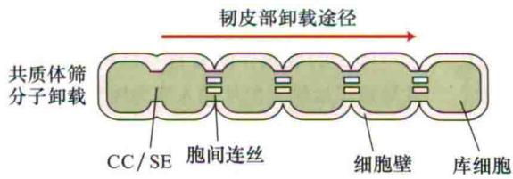  
B 质外体韧皮部卸载和短距离运输

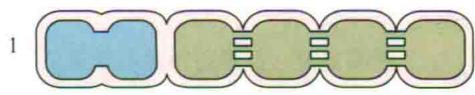

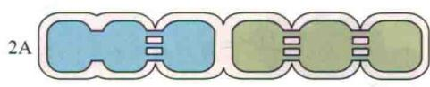

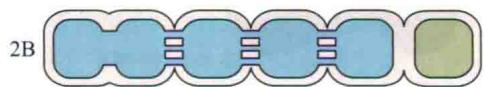  
图10.18 韧皮部卸载和短距离运输路径。筛分子-伴胞复合体（CC/SE）被视为单一的功能单位。胞间连丝的存在使共质体连续。细胞间缺少胞间连丝暗示存在质外体运输步骤。A. 共质体韧皮部卸载和短距离运输，所有的步骤都是共质的。
B. 质外体韧皮部卸载和短距离运输。

1型：这种短距离途径被命名为质外体的，这是因为筛分子-伴胞复合体的韧皮部卸载这一步骤发生在质外体。一旦糖被带回到毗连细胞的共质体中，运输就变为共质性的。

2型：这些途径也有质外体步骤。然而，从筛分子-伴胞复合体的卸载是共质的。上图(2A型)显示，质外体步骤紧接筛分子-伴胞复合体；下图(2B型)，质外体步骤则距复合体较远。

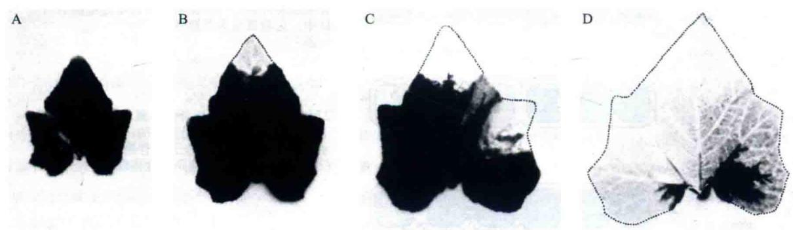  
图10.19 夏季南瓜（Cucurbita pepo）叶的放射自显影图。示叶片从库到源的转变。试验中，植物源叶向该叶子输入 $^{14}$ C约2 h。黑色积累量示为标记物含量。A. 整个叶都是库，从源叶输入糖。B\~D. 基部仍然是库，随着叶尖丧失了卸载能力糖停止输入（图中所示没有黑色积累的地方），叶尖获得了装载和输出糖的能力（引自Turgeon and Webb，1973）。

分析了库中几种可能的途径。在一些双子叶植物，如甜菜和烟草（Nicotiana tabacum）的幼叶中，卸载和短距离运输似乎完全是共质的（图10.18A）。初生根尖的分生组织和伸长区也表现为共质体卸载。

虽然共质体输入在绝大多数的库组织中占优势，但一些库器官中的部分短距离运输途径则通过质外体，例如，积累高浓度糖的水果、种子及其他储藏器官（图10.18B）。质外体步骤可能位于卸载的位点（图10.18B中类型1）或者远离筛分子（图10.18B中类型2）发生，其中类型2最为常见，最典型的是存在于发育的种子中。

发育中的种子必需一个质外体步骤，这是因为母体组织和胚组织中没有共质连接。糖通过共质体途径离开筛分子（韧皮部卸载），并在远离筛分子-伴胞复合体的某一点从共质体转为质外体途径（图10.18B中类型2）。质外体步骤可以使膜能够控制物质进入胚，因为在这个过程中需要跨越两层膜。

当质外体步骤发生在输入途径时，转运的糖在质外体中可部分地分解代谢，或者穿过质外体而不发生任何变化（参见Web Topic 10.8）。例如，蔗糖在质外体会被转化酶（一种蔗糖裂解酶）水解为葡萄糖和果糖，然后葡萄糖和（或）果糖会进入库细胞。正如之后要讨论的，这种蔗糖裂解酶在库组织控制韧皮部运输中的过程中具有功能。

## 10.7.2 进入库组织的运输需要代谢能

抑制剂的研究表明，进入库组织的运输是依赖能量的。以淀粉或蛋白质形式贮存碳的生长中的叶、根和贮藏库使用共质体韧皮部卸载和短距离运输。在这些组织中，转运的糖被用来作为呼吸作用的底物，被代谢成为贮藏寡聚物和生长所需的复合物。蔗糖代谢导致了库细胞中蔗糖浓度变低，从而维持了糖吸收所需的浓度梯度。糖不需跨膜而被吸收到库细胞，因为是从高浓度的筛分子到低浓度的库细胞转运，所以是被动运输。因此这些库器官中需要代谢作用的能量是用于呼吸作用和生物合成反应。

质外体输入中，糖至少需要穿过两层膜：输出细胞的膜和库细胞膜。糖若要被运到库细胞的液泡内还必须穿过液泡膜。正如前文所述，质外体途径的跨膜运输是需能的。虽然有证据表明，蔗糖的外流和吸收都是主动的（参见Web Topic 10.8），但与之相关的转运体仍有待于被分离并对其特征做鉴定。

由于这些转运体在一些研究中发现是双向的，前面述及的一些由于蔗糖装载的糖转运体也参与了糖的卸载，而运输的方向是由糖浓度梯度、pH梯度和膜电位决定的。并且发现韧皮部装载过程中一些重要的同向转运体在库组织也存在，如土豆块茎中的SUT1。该转运体可能把质外体的蔗糖回收回，或是运输到库细胞。单糖转运体则把在质外体水解的蔗糖转运到库细胞（Hayes et al., 2007）。

## 10.7.3 叶从库转变到源是渐变的过程

双子叶植物（如番茄和豆类）的叶子在发育最初作为库器官存在。随着发育的进行，当叶片伸展大约25%时，开始从库到源转变；伸展40%\~50%时，通常转变已完成。大多数用于研究库到源转变的物种都是通过质外体的形式装载，这里也仅限于对这些物种做阐述。

首先是从叶尖开始叶子的输出，然后逐渐向基部蔓延，直至整片叶子最终都成为糖输出器。在转变过程中，叶尖输出糖分子，而叶基部则从其他源叶中输入糖（图10.19）。

叶子的成熟伴随着自身结构和功能的许多变化，并导致了运输方向从输入变为输出。一般来说，输入的停止和输出的起始是相互独立的两个事件（Turgeon，2006）。在烟草白化叶（其中没有叶绿素，因而不能进行光合作用）中，尽管不可能发生输出，但对白化叶的输入却停止在与绿色叶片相同的发育阶段。因此，除了输出起始外，发育的烟草叶片也一定发生了一些变化，引起糖的输入终止。

烟草中糖几乎完全通过不同的叶脉被卸载和装载（图10.20）（Robert et al., 1997），这也支持了输入的终止和输出的起始是两个独立事件的事实。烟草和其他烟草类（Nicotiana）的小叶脉直到输入停止时才发育成熟，最终在绝大部分装载中起作用，而在卸载过程中不起作用。

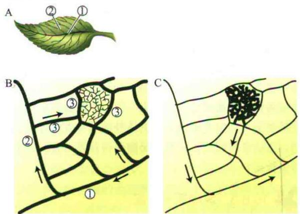

图10.20 A. 烟草叶脉中工作分支图。B. 叶子未成熟，仍处于库阶段时，光合产物从成熟叶片输入，经较大的主脉（较粗的黑线）被分配（箭头所示）到整个叶片。编号主要叶脉，第一个被编号的是中脉。被输入的光合产物从相同的主脉卸载进入到叶肉细胞。最小的小叶脉在编号3的叶脉围起的区域中。小叶脉还未成熟，在输入和卸载中不起作用。C. 源叶中输入停止，输出开始，光合产物装载到小叶脉（较粗的黑线所示）中。而较大的叶脉（箭头所示）只起输出作用，它们可能不再卸载。B图是放射自显影图按比例绘制而成；由于叶子成熟时叶片很大，C图不是按比例绘制（引自Turgeon，2006）。

因此，输入的停止一定牵涉大叶脉的卸载在成熟叶片发育的某一时间被终止。用来解释卸载终止的因素包括：胞间连丝的关闭、胞间连丝出现率的降低和共质连续性发生其他的变化。实验数据已表明，胞间连丝的关闭和清除都可能发生。

当输出途径被关闭及质外体装载被激活，韧皮部装载已在筛分子中积累了足以转运出叶的光合产物以驱动叶的向外运输，糖输出就开始了。以下条件是启动输出所必需的：

（1）叶片合成足够的光合产物，并可以输出，合成蔗糖的基因开始表达。

（2）对装载起作用的小叶脉已经成熟。在拟南芥中鉴定到一个增强调节子，在小叶脉成熟的级联途径中扮演重要作用。这个增强子能激活伴胞特异启动子融合的报告基因，而且对报告基因的激活是与从库到源相同的模式即从顶端到基部的模式（McGarry and Ayre, 2008）。

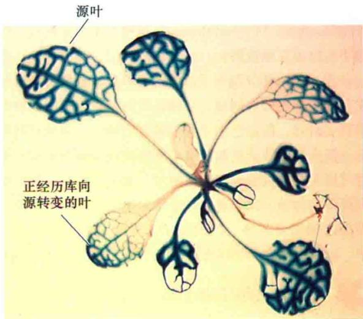  
图10.21 源的输出依赖于活性蔗糖转运体的位置和活力。图展示了AtSUC2基因的启动子驱动的报告基因在拟南芥莲座叶的表达。SUC2，蔗糖-H同向转运体。是在韧皮部装载中一个主要的蔗糖转运体。该基因启动子启动表达GUS的位置可以看到蓝色产物。蓝色仅在源叶的微管组织和正在进行从库到源转变的叶的尖部（自Schneidereit et al. 2008）。

（3）蔗糖- $H^{+}$ 同向转运体被表达并且在筛分子-伴胞复合体的质膜就位。有关这些事件如何受到调控正在进行研究。例如，拟南芥SUC2基因的启动子在伴胞中被激活的模式就是从库到源的转变模式（图10.21）。同时也鉴定了SUC2启动子的转录因子结合位点，从而调节了这个源和伴胞特异基因的表达（Schneidereit et al., 2008）。

在一些植物（如甜菜、烟草）的叶中，当叶经历从库到源的转变时，筛分子-伴胞复合体获得了累积外源 $^{14}$ C标记蔗糖的能力，这也同时表明用于装载的同向转运体已经有功能活性。装载进程中，随着拟南芥叶从库到源的转变，转运糖的同向转运体先从叶尖开始表达，然后逐渐在叶基部表达。这种由顶部向基部模式同样也出现在输出能力的形成上。

## 10.8 光合产物的分布：分配和分割

光合速率决定了叶中可利用的被固定碳的总量。然而，可以用来转运的被固定碳的量依赖于随后发生的代谢事件。本章将调节固定的碳进入到不同代谢途径的过程称为分配（allocation）。

植物维管束形成一个“管”系统，可以指导光合产物流向各种库，包括幼叶、茎、根、果实或种子。然而，维管系统通常是高度相连，形成了一个开放的网络，使源叶与各种库之间进行交流。在这些情况下，什么决定着流向任一特定库的光合产物量呢？光合产物在植物不同库间的差异分配叫做分割（partitioning）（“allocation”和“partitioning”这两个术语在现代出版物中有时也互换使用）。

在对分配和分割有了总体的了解后，我们将考察淀粉和蔗糖合成的协同性。必须注意的是，仅有限的物种得到了研究，而且它们主要是通过质外体主动装载蔗糖的。韧皮部装载的机制很有可能影响到分配的调节。随着对别的装载机制了解越来越多，分配的研究必须扩展到更多的物种。我们通过讨论将对如下问题作出结论，即库之间如何竞争、库的需求怎样调节源叶中光合速率，以及库源之间如何进行相互交流。

## 10.8.1 分配包括贮藏、利用和运输

源细胞中固定的碳可能被用来贮存、代谢和运输。

（1）贮藏复合物的合成。淀粉在叶绿体中合成并贮藏，并且在大多数物种中，淀粉作为主要贮藏形式夜间用来转运。以淀粉为碳源主要贮藏形式的植物叫淀粉贮藏者（starch storer）。

（2）代谢利用。固定的碳可在光合细胞的各种区室被利用，以满足细胞对能量的需求，或为细胞所需其他物质的合成提供碳骨架。

（3）转运复合物的合成。被固定的碳可被合成为输出到各种库组织中的糖。一部分转运的糖也可暂时被贮藏在液泡中。

库组织中分配也是一个关键的过程。一旦运输的糖被卸载并进入库细胞，它们可能保持不变或被转化为其他各种各样的物质。在贮藏库中，固定的碳可能以蔗糖或己糖的形式在液泡中累积，或以淀粉形式累积在造粉体中。对生长中的库而言，糖可能用于呼吸作用和合成生长所需其他分子。

## 10.8.2 不同库分割运输的糖

各种库通过竞争获得从源输出的光合产物。至少在短期内，这种竞争决定了植物不同库组织之间运输糖的分割。一个库对输入糖贮藏或代谢能力影响着它对可利用糖的竞争力。这样，分配和分割二者之间相互影响。

当然，源和库中发生的事件必须是同步的。分割决定了生长模式，并且这种生长必须在地上部分（光合生产部分）和地下部分（水分和矿物质吸收）之间取得平衡，这样植物可以应对各种环境的变化。最终目的并不是维持一个稳定的根冠比系数，而是确保碳和营养矿物质元素的供给以满足植物的需要。

因此，一个额外的控制层次在于供与需之间的相互作用。筛分子的膨压可能是源和库之间重要的交流方式，用来协调装载和卸载的速率。化学信使在传达植物一个器官到另一个器官的状况中也具有重要的作用。这些化学信使包括植物激素和营养物质，如钾、磷酸盐，甚至转运的糖本身。最近研究结果表明，大分子物质（RNA和蛋白质）在光合产物的分割中也有作用，也许是影响胞间连丝中的运输。

获得高产农作物是研究光合产物分配和分割的一个目标。尽管谷物和水果代表可食用产量，但总产量还包括了植物地上不可食用的部分。对分割的理解可以使育种学家选育那些向可食用部分提高运输力的作物品种。

在整个植物中，分配和分割必须是协调的，在不损害其他必需过程和结构的情况下保证更多地运向可食用组织。如果植物能把正常情况下丢失的光合产物保留下来，那么作物产量也将会提高，如减少非必要的呼吸作用或者根部渗出而造成的丢失。值得注意的是，在后一种情况下，一定不要破坏植物体外的基本生命过程，例如，生活在根附近且从根分泌物获得营养的有益微生物的生长。

## 10.8.3 源叶调节分配

源叶光合速率的提高通常会导致源叶中转运速率的提高。调控光合产物分配的控制点（图10.22）包括将丙糖磷酸分配到以下的几个过程：

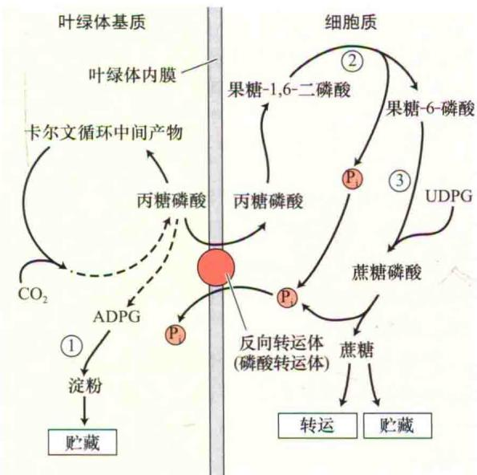

图10.22 淀粉和蔗糖在白天合成简图。卡尔文循环中形成的丙糖磷酸既可用于叶绿体中淀粉的形成，也可通过叶绿体内膜的磷酸转运体被运到胞内与无机磷酸盐交换。由于叶绿体外膜允许小分子通过，为清楚起见省略了外膜。胞质中，丙糖磷酸可能被转变成蔗糖以用于运输或贮藏在液泡中。其中的关键酶有：①淀粉合酶，②果糖-1，6-二磷酸酶及③蔗糖磷酸合成酶。第二个、第三个酶和ADPG焦磷酸化酶催化形成ADPG（腺苷葡萄糖焦磷酸），这些是蔗糖和淀粉合成中的调节酶（见第8章）。UDPG.尿苷葡萄糖焦磷酸（引自Preiss，1982）。

（1）重新产生C3途径（卡尔文循环，见第8章）的中间成分。

(2) 淀粉合成。

（3）蔗糖合成及蔗糖在转运和临时贮藏库间的分配。

光合反应途径中有多种酶参与，这些途径和步骤的控制是非常复杂的。下面所描述的研究主要集中在通过质外体主动装载蔗糖的物种，特别是在白天。为增加了解，还需要进一步研究其他的装载机制及其对分配的调节。

白天，叶绿体中淀粉的合成速率必须与胞质中蔗糖的合成协调一致。叶绿体通过卡尔文循环产生的丙糖磷酸（甘油醛-3-磷酸和二羟丙酮磷酸）可用于淀粉和蔗糖的合成（见第8章）。胞质中合成的蔗糖把丙糖磷酸从淀粉合成和贮藏中转移出来。例如，目前已经发现，当大豆的其他部分对蔗糖的需求高时，源叶中以淀粉形式进行贮藏的碳就会减少。参与调节胞质中蔗糖合成和叶绿体中淀粉合成的关键酶是胞质中的蔗糖磷酸合成酶和果糖-1，6-二磷酸酶，以及叶绿体中的葡萄糖-ADP焦磷酸化酶（图10.21）（见第8章）。

然而，主要以淀粉为贮藏碳的物种中，从淀粉合成中转移出的碳量通常是有一定限度的。研究不同条件下淀粉和蔗糖之间的分配表明，多数植物在整个24 h周期中保持一个相当稳定的转运速率是一个优先采用的方式。Web Topic 10.9 进一步讨论源叶中淀粉和蔗糖合成的平衡。

## 10.8.4 库组织之间竞争被转运的可用光合产物

正如前文所述，库组织的转运依赖于库相对于源所处的位置，以及库和源之间的维管连接。另一个决定运输模式的因素是库与库之间的竞争，运输途径中的末端库之间，以及末端库和顶端库之间，如幼叶可能会与根竞争转运流中的光合产物。库之间竞争已经被大量的实验所证实，去除植物的一个库组织通常会引起另一个具有竞争性库的转运的提高；相反，增加库的大小，如增加果实装载会减少向其他库尤其是到根中库的运输。

在另一类相反的实验中，去除源但保持库组织完整时，源的供给会发生改变。通过将源叶遮阴而只留一片源叶，使得从源到竞争性库的光合产物供给突然显著减少，这时库组织就会依赖于单一的源叶。在甜菜和豆类植物中，保留下来的单一源叶的光合和输出速率在短时间内通常不会变化（约8 h；Fondy and Geiger，1980）。然而，根部从这单一源叶获得的糖减少，而幼叶获得相对较多。遮阴通常减少光合产物向根部的分割，也许幼叶更易于耗尽筛分子中的糖从而增加了压力

梯度和向自身转运的速率。

使库水势变得更低的处理会提高压力梯度，从而增强向库的运输。用甘露醇溶液处理豌豆幼苗的根尖，短时间内使蔗糖的输入增加300%，这可能是由库细胞膨压降低引起（Schulz，1994），长期的实验也表明这一趋势。用聚乙二醇处理根模拟中度水胁迫，在15天后能增加苹果树根中的同化物比例，而顶端茎中的同化物减少（Dai et al., 2007）。这与上面的遮阴试验不同，在那里限制源的供给使得更多的糖分配到幼叶。

## 10.8.5 库强度取决于库容量和库活力

某一库把光合产物转向本身的能力常用库强度（sink strength）来描述。库强度大小取决于以下两个因素，库容量和库活力：

## 库强度=库容量×库活力

库容量（sink size）指库组织总的生物量，库活力（sink activity）指单位生物量的库组织吸收同化产物的速率。改变库容量或库活力都会改变运输的模式，如一个豆荚输入碳物质的能力取决于该豆荚占全部豆荚干重的比例（Jeuffroy and Warembourg，1991）。

库活力的改变是很复杂的，因为库组织中的各种活性都可潜在限制库的吸收速率。这些活性包括筛分子的卸载、细胞壁内的代谢、从质外体的吸收，以及生长或贮藏中利用光合产物的代谢过程。

用来操控库强度的常规处理通常是非特异性的。例如，冷处理库组织会抑制需能的任一活性，通常会导致向库运输的速度降低。最近，很多实验利用已有的技术专一地超表达或低表达与库活力相关的酶，如参与库中蔗糖代谢的酶。分解蔗糖的两个主要酶是酸性转化酶和蔗糖合酶，它们都可以催化蔗糖利用的第一步反应。Web Topic 10.10以转化酶活性为例来说明蔗糖裂解酶类活性与库需求之间的关系。

## 10.8.6 源长期适应源库比的变化

如果只保留一片大豆源叶，其余的源叶都遮盖一段时间（如8天），保留下来的单一源叶会发生很多变化，这些变化包括淀粉浓度的降低，以及光合速率、Rubisco活性、蔗糖浓度、从源的运输和正磷酸盐浓度的升高（Thornea and Koller，1974）。这些结果显示，光合产物在不同库中分配时除了观察到的短期变化外，源的代谢在较长时期的实验中也适应了这种改变了的环境。

当库需求提高时，光合速率（单位叶面积在单位时间固定碳的净量）会连续数天增加；而当需求减少时，光合速率又会降低。光合产物（蔗糖或己糖）在源叶中的积累，可以解释淀粉类植物的库需求和光合速率之间的联系（参见Web Topic 10.11）。糖作为信号分子调节植物中诸多代谢和发育过程。总的来说，碳水化合物的消耗增强了与光合作用、反向移动和输出过程相关的基因表达；而大量的碳源利于贮存和利用相关的基因表达（Koch，1996）。

众所周知，由库需求降低而大量积累的蔗糖和己糖会抑制光合基因的表达。有趣的是，编码转化酶、蔗糖合酶（前文已述）及蔗糖- $H^{+}$ 同向转运体的基因（蔗糖装载的调节部分已述）也在碳水化合物供给调节之列。

库需求对光合作用起到的调节表明，植物应对大气中 $CO_{2}$ 的增高持续增强的光合作用可能依赖于库能力的增强（现存库强度的增强或新库的发育）（见第12章和Web Essay 12.1讨论大气中 $CO_{2}$ 浓度的增加对植物的生长和光合作用的影响）。

## 10.9 信号转导分子的运输

韧皮部除了在光合产物长距离运输中起主要功能外，同时它还是信号分子从机体某一个部分运输到另一个部分的通道。这种长距离信号调整了源和库的活性，并调节植物的生长发育。正如前文所表明的，源和库之间的信号可能是物理的也可能是化学的。物理信号，如膨压的变化，可以通过筛分子的内部连接系统进行快速传递。在韧皮部汁液中已经发现了传统意义上的化学信号分子（如蛋白质和植物激素），最近在韧皮部还发现了mRNA和小RNA这些新的信号分子。转运的碳水化合物本身也可能作为信号。

## 10.9.1 膨压和化学信号调节源和库的活性

膨压可能在调节源和库活性中起作用。例如，在库组织中糖利用较快的情况下，若韧皮部卸载加快，库中筛分子的膨压就将减小，而这种减小会被传递到源。如果源中筛分子的膨压部分控制装载，那么相应于库的这个信号，装载将会提高。同样，当库中的卸载变慢时则会出现相反的反应。有数据表明，细胞的膨压还可以修饰质膜上H $^{+}$ -ATP酶的活性，从而改变转运速率。

植物地上部产生的生长调节物质（如生长素）可通过韧皮部被快速转运到根部（见第9章），根部产生细胞分裂素（CK）（见第21章）通过木质部运输到幼芽。GA和ABA（见第20章和第23章）也是通过维管系统在植物中运输。植物激素在调节源和库间的关系中起作用，它们通过控制库生长、叶子衰老和其他发育过程部分地影响了光合产物的分割。植物应对食草动物和病原体时也会通过植物抗性激素如茉莉酸的介导来改变光合作用同化物的分配和分割。

在一些源组织中，蔗糖的装载被外源生长素刺激却受ABA抑制，而在某些库组织中则相反，即外源ABA增强而生长素却抑制蔗糖的吸收。质膜上活性运输体是激素调节质外体装卸中的对象。激素调节卸载的其他潜在位点包括液泡膜转运体、蔗糖代谢酶、壁伸展性，以及共质体卸载中胞间连丝的通透性（见下一部分）。

正如前面表明的，碳水化合物的量会影响编码光合基因和参与蔗糖水解基因的表达，许多基因都会对糖的匮乏和过量作出反应（Koch，1996；Sivitz et al., 2008）。因此，不仅是韧皮部中被转运的蔗糖，而且蔗糖及其代谢产物也可作为信号分子修饰源和库的活性。正如前面述及，通过木质部给甜菜源叶施加外源蔗糖，蔗糖- $H^{+}$ 同向转运体的mRNA会减少。这种降低伴随着从叶中分离的质膜小泡中的同向转运体失活。该工作模式包括以下步骤：

（1）库需求降低导致维管组织中蔗糖水平很高。

(2) 高的蔗糖含量导致源中同向转运体的下调。

（3）装载水平的降低导致了源中蔗糖浓度升高。

源中蔗糖浓度的提高可导致光合速率降得比较低（参见Web Topic 10.11）。用蔗糖- $H^{+}$ 同向转运体SUT1的反义DNA转化植株，源叶中淀粉含量升高，同样也支持了该模式（Hackel et al., 2006）。已经证实，糖和其他代谢产物与激素信号互作，控制和整合植物许多过程（Hammond and White, 2008）。源-库系统中的一些基因对糖和激素信号都可作出应答反应。

## 10.9.2 韧皮部中蛋白质和RNA作为信号分子调节生长和发育

人们很久以前就知道：病毒能以蛋白质核酸复合体或者以完整的病毒颗粒形式在韧皮部移动。最近，在韧皮部汁液中发现了内源RNA分子和蛋白质，这其中至少有一部分可以作为信号分子或者能产生韧皮部可移动信号。

一个大分子要想被认为在植物中具有信号转导作用，必须满足以下几个重要的标准（Oparka and Santa, 2000）：

（1）在韧皮部中，大分子必须能从源移动到库。

（2）在库组织中，大分子必须能离开筛分子-伴胞复合体，或能触发第二信使的形成，进而把信息传递给韧皮部周围的库组织，也就是说，它能起始一个信号级联途径。

（3）最重要的也许是大分子必须能够修饰库中特定细胞的功能。

韧皮部各种各样的大分子如何满足这些标准的呢？

伴胞中合成的蛋白质能通过连接两种细胞的胞间连丝进入筛分子，蛋白质也可通过转运流从源到库移动，如蛋白质从伴胞到筛分子的被动运输已经在拟南芥和烟草中被证实。将水母绿色荧光蛋白（GFP）基因在拟南芥SUC2启动子控制下转化拟南芥，由于SUC2蔗糖- $H^{+}$ 同向转运体在伴胞内合成，所以在其启动子控制下表达的GFP蛋白也在伴胞中合成。GFP在受到蓝光激发后会发出荧光而被定位，发现GFP蛋白在源叶的伴胞中穿过胞间连丝进入筛分子（图10.23A），并在韧皮部中迁移进入库组织。然而，只有自由的GFP能通过共质途径进入根的库组织（图10.23B；Stadler et al., 2005）。事实上，还没有证据表明蛋白质可以从筛分子-伴胞复合体外的细胞进入到源的韧皮部或者从韧皮部移动到筛分子-伴胞复合物外的库组织。然而却发现蛋白质的韧皮部运输能改变细胞的功能，暗示一些信号分子或是蛋白本身在筛分子-伴胞复合体和源库的周围组织间移动。如FLOWERING LOCUS（FT）蛋白是开花启动中的重要成分，能够从源叶向顶端移动，并在合适的条件在顶端诱导开花（见第25章）。

A  
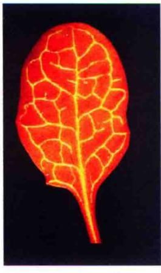

B  
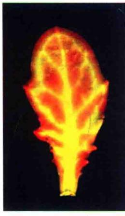  
2 mm  
0.1 mm  
图10.23 基因SUC2启动子控制GFP表达的转基因拟南芥植株中源叶和库叶中的GFP荧光，表明GFP荧光从伴胞通过胞间连丝迁移入源叶的筛分子，然后又进入周围库叶的叶肉细胞。A.正如叶脉中明亮的荧光所显示，GFP蛋白在伴胞中合成并移动到源的筛分子中。B.自由GFP蛋白被运输到库叶并移动到周围的叶肉中。因为GFP进入到了周围组织，叶脉不再清晰，GFP荧光更加弥散。尽管A图源叶和B图的库叶看上去一样大，但实际上源叶要大得多，如图中标尺所示，A图和B图的比例是不一样的（引自Stadler et al., 2005）。

韧皮部运输的RNA由内源mRNA、病原体RNA及基因沉默相关的小RNA组成（见第2章）。其中大部分RNA是以RNA和蛋白质复合体（RNP）的形式在韧皮部运输的（Gomez et al., 2005; Kehr and BUhtz, 2008）。正如韧皮部的蛋白质一样，也没有直接的证据表明韧皮部中的RNA能够在筛分子-伴胞复合体和周围组织间移动。然而，运输到韧皮部的RNA分子能够引起库中的改变。例如，一个赤霉素反应调节子（GAI）的mRNA被定位在南瓜（Cucurbita pepo）筛分子和伴胞中，并且存在于韧皮部汁液中。若将该调节子基因突变后转化番茄，发现转基因植株矮小且呈暗绿色。突变的调节子mRNA在转基因植株中定位于筛分子，而且这些mRNA可以通过嫁接部位进入野生型番茄的接穗，并在顶端组织被卸载。结果，在野生型新生长的接穗中产生出突变体表型（Hawood et al., 2005）。

关于这个题目更多的内容参见Web Topic 10.12。

胞间连丝在信号转导中的作用 韧皮部转运的各个方面几乎都涉及胞间连丝，从装载到长距离运输（筛域和筛板中的孔是修饰过的胞间连丝）再到分配和分割。那么，胞间连丝在韧皮部大分子信号转导中起什么作用呢？

胞间连丝运输的机制可能是被动或选择性被调控的。一个分子被动运输时，它一定小于胞间连丝的分子排除限（size exclusion limit，SEL）。正如前文所述，GFP可以通过胞间连丝被动运输。相反，当一个分子以选择性形式转运时，它一定有一个运输信号或以其他某种方式定位进胞间连丝。病毒运动蛋白和发育转录因子的运输可能就是通过选择性机制进行的。大量实验表明，病毒运动蛋白直接与胞间连丝作用以使得病毒基因组在细胞间运输。病毒运动蛋白利用细胞内源蛋白定位于胞间连丝，一旦到达胞间连丝，运动蛋白和（或）细胞蛋白就会使胞间连丝的SEL增大，从而使病毒基因组在细胞间运输。那些被病毒蛋白利用的内源蛋白有可能在细胞本身内源大分子的穿胞间连丝运输中具有相同的作用（见Web Topic 10.12）。

这里利用植物生理学家将继续关注的研究主题来结束本章：内源RNA和蛋白质信号运输如何调控生长发育；促进信号物质通过胞间连丝运输的蛋白质的本质；与集流相对照，定位信号到特异库的可能性。本章也提到了许多其他潜在的研究领域，如裸子植物中韧皮部转运的机制、韧皮部装载的其他模型存在的可能性以及韧皮部卸载的本质。正如科学研究中经常出现的那样，一个问题的解决往往会带来更多的疑问。

## 小结

韧皮部运输是光合产物由成熟叶片到生长和贮藏区的运动。在源和库之间韧皮部还传递化学信号，并在整个植物体内重新分配水分和其他多种化合物。

## 转运途径

· 糖和其他有机成分通过韧皮部筛分子被运输到植物体全身各处（图10.1\~图10.3）。

· 生长发育期，筛分子失去许多细胞器，仅保留质膜和修饰过的线粒体、质体及平滑内质网（图10.3和图10.4）。

\- 筛分子通过其细胞壁上的孔相互连接（图10.5）。

\- 裸子植物滑面内质网覆盖着筛域而且通过筛孔相连贯（图10.6和表10.1）。

\- P蛋白和胼胝质通过封闭损伤的韧皮部来限制液汁的流出。

· 伴胞辅助将光合作用的产物运输到筛分子，也能供应蛋白质和ATP给筛分子（图10.3、图10.4和图10.7）。

## 转运模式：源到库

· 重力不是限制韧皮部运输的因素。液汁可以从源到库运输，而这个过程可能是非常复杂的（图10.8）。韧皮部中转运的物质

· 液汁的组成是一定的，非还原性糖是主要的转运分子（表10.2和图10.9）。

\- 转运的液汁包括蛋白质，许多是与胁迫和防御反应相关的蛋白质。

## 移动速度

· 韧皮部转运速度非常高，超过长距离扩散的速度。

压力流动模型，韧皮部运输的被动机制

· 压力流动模型表明韧皮部运输是由源到库之间产生的渗透压力梯度驱动的集流。

\- 源的装载和库的卸载产生的压力梯度确立了一个长距离的被动集流的压力梯度（图10.10\~图10.12）。

\- 筛板产生的阻力维持源和库之间的筛分子中压力梯度。

## 韧皮部装载

\- 源中糖的输出包括光合产物的分配、短距离运输和韧皮部装载。

· 韧皮部装载有共质体和质外体的两种途径（图10.13和图10.14）。

· 质外体途径中蔗糖被主动运输到筛分子-伴胞复合体中（图10.15和图10.16）。

· 多聚体-陷阱模型表明居间细胞合成蔗糖多聚体。大寡聚糖仅能在筛分子中运输（图10.17）。

· 质外体和共质体装载途径有自己的特征（表10.3）。

## 韧皮部卸载和库到源的转变

· 输出糖进入库主要包括韧皮部卸载、短距离运输及储存/代谢。

· 韧皮部卸载和短距离运输在不同库中可能以质外体或者共质体途径进行（图10.18）。

· 转运到库组织的过程是依赖能量的。

· 输入停止和输出启动是相对独立的，从库到源是逐步转变的（图10.19和图10.20）。

· 库到源运输需要许多条件，如蔗糖- $H^{+}$ 转运体的表达和定位（图10.21）。

## 光合作用产物的分配和分割

\- 源叶中的分配包括储藏、代谢利用及转运复合物的合成。

· 分配的调节必须控制固定的碳分布到卡尔文循环、淀粉和蔗糖的合成中（图10.22）

\- 各种物理和生理的信号分子参与不同库中的资源分割。

· 竞争光合作用产物时，库的强度依赖库的大小和活性。

· 相应于变化的环境，瞬时环境改变可使不同库中光合作用产物分布改变，而长期的环境改变则发生在源的代谢过程中，改变光合作用产物可被运输的量。

## 信号分子的传递

\- 膨压、细胞分裂素、赤霉素和脱落酸在协调库和源间扮演信号分子的角色。

\- 蛋白质分子在源叶中从伴胞运输到筛分子，再从韧皮部运到库叶（图10.23）。

\- 在韧皮部转运的蛋白质和RNA可以改变细胞的功能。

\- 胞间连丝分子排除限的改变控制何种物质可以通过胞间连丝。

(赵孝亮 白玲 译)

## WEB MATERIAL

## Web Topics

10.1 Sieve Elements as the Transport Cells between Sources and Sinks
Various methods demonstrate that sugar is transported in the sieve elements of the phloem; anatomical and developmental factors affect the basic source to sink pattern of transport.

10.2 An Additional Mechanism for Blocking Wounded Sieve Elements in the Legume Family
Protein bodies rapidly disperse and block legume sieve tubes following wounding.

## 10.3 Sampling Phloem Sap

Exudation from wounds and from severed aphid stylets yield sufficient phloem sap for analysis.

## 10.4 Nitrogen Transport in the Phloem

Soybean is an economically important species widely studied in terms of nitrogen transport in the phloem.

## 10.5 Monitoring Traffic on the Sugar Freeway: Sugar Transport Rates in the Phloem

A variety of techniques measure mass transfer rate in the phloem, the dry weight moving through a cross-sectional area of sieve elements per unit time.

## 10.6 Alternative Views of Pressure Gradient in Sieve Elements: Large or Small Gradients?

Some mathematical models suggest that the pressure gradient in the sieve elements of angiosperms is small.

## 10.7 Experiments on Phloem Loading

Evidence exists for apoplastic loading of sieve elements in some species and for symplastic loading (polymer trapping) in others. While active carriers have been identified and characterized for some substances entering the phloem, other substances may enter sieve elements passively.

## 10.8 Experiments on Phloem Unloading

Apoplastic unloading varies in its energy requirem-

ents and in the role of the cell-wall invertase.

## 10.9 Allocation in Source Leaves: The Balance between Starch and Sucrose Synthesis

Experiments with mutants and transgenic plants reveal flexibility in the regulation of starch and sucrose synthesis in source leaves.

## 10.10 Partitioning: The Role of Sucrose-Metabolizing Enzymes in Sinks

Increases in cell-wall invertase activity can enhance transport to a sink, while decreases in activity can inhibit transport to the sink.

## 10.11 Possible Mechanisms Linking Sink Demand and Photosynthetic Rate in Starch Storers

Photosynthate accumulation decreases the photosynthetic rate.

10.12 Proteins and RNAs: Signal Molecules in the Phloem
Proteins are transported between companion cells and sieve elements and travel in sieve elements between sources and sinks. Some proteins can modify cellular functions in the sinks. Little evidence exists for a movement of proteins outside the companion cells.
