# 第11章 呼吸作用与脂代谢

<!-- 章节边界按正文内容恢复；原始 MinerU 内容保留如下。 -->

# 呼吸作用与脂代谢

光合作用所产生的有机物是植物（和几乎所有其他有机体）赖以生存的物质基础。而呼吸作用就是在调控下，这些有机碳化合物通过分解代谢，释放出细胞所能利用的能量，同时也为细胞的生物合成提供许多含碳的前体物质。

本章一开始我们将综合讨论呼吸作用中的分解代谢途径，并着重讨论这些途径之间的相互联系，以及在植物细胞中所专有的特性。我们也将结合近年来植物线粒体的生物化学和分子生物学的研究进展，更加深入地讨论植物的呼吸作用。随后，我们将讨论脂生物合成的有关途径，这些油脂是许多植物贮存能量和碳的形式；同时也要阐述脂合成与生物膜特性的关系。最后，我们将讨论在贮脂种子萌发时，脂类的分解代谢及其降解产物转化为糖类物质的过程。

## 11.1 植物的呼吸作用

有氧（需氧）呼吸是几乎所有真核生物进行生命活动的共同特征，在植物、动物及低等真核生物中，有氧呼吸作用的基本代谢途径十分相似，然而，植物的呼吸作用也有其独特的、与动物不同的代谢途径。有氧呼吸是一个受到严格调控的、有序的有机物氧化分解的生物学过程。在呼吸作用中，有机物氧化分解释放的自由能被暂时贮存在腺苷三磷酸（ATP）中，随时为植物的生长和发育提供能量。

葡萄糖是最基本的呼吸底物。对植物细胞来说，呼吸作用的底物主要是光合作用产生的蔗糖、丙糖磷酸、含果糖的多聚体（果聚糖）和其他糖类，以及由脂类（主要是三酰甘油）和有机酸转化而来的同类物质；在有些情况下，蛋白质也可以转化为呼吸作用的底物（图11.1）。

植物呼吸作用的化学本质就是含12个碳原子的蔗糖分子的氧化和12个氧分子的还原，即

$$
\begin{array}{r l} & \mathrm{C} _ {1 2} \mathrm{H} _ {2 2} \mathrm{O} _ {1 1} + 1 3 \mathrm{H} _ {2} \mathrm{O} \longrightarrow 1 2 \mathrm{CO} _ {2} + 4 8 \mathrm{H} ^ {+} + 4 8 \mathrm{e} ^ {-} \\ & 1 2 \mathrm{O} _ {2} + 4 8 \mathrm{H} ^ {+} + 4 8 \mathrm{e} ^ {-} \longrightarrow 2 4 \mathrm{H} _ {2} \mathrm{O} \end{array}
$$

净反应方程式为

$$
\mathrm{C} _ {1 2} \mathrm{H} _ {2 2} \mathrm{O} _ {1 1} + 1 2 \mathrm{O} _ {2} \longrightarrow 1 2 \mathrm{CO} _ {2} + 1 1 \mathrm{H} _ {2} \mathrm{O}
$$

该反应是光合作用的逆过程，在这一过程中，蔗糖被彻底氧化成 $CO_{2}$ ，而氧分子作为最终的电子受体被还原为水，二者偶联构成了氧化还原体系。每氧化1 mol（342 g）蔗糖，其标准自由能变化为-5760 kJ，这一巨大的负值使得上述反应的平衡点显著的右移，因此，蔗糖的氧化降解为一放能过程。此能量在严密调控下释放，并与ATP合成相偶联，这是植物呼吸代谢最主要的作用，当然，这绝不是呼吸代谢的唯一功能。

蔗糖氧化降解释放的能量巨大（5760 kJ/mol），如不加以控制和有效利用，就会损毁细胞的结构。因此，在植物细胞中，蔗糖氧化降解是通过一系列的生物化学反应完成的，该过程所释放的自由能也是逐步进行的。这些反应构成了4个主要的呼吸代谢途径：糖酵解途径、氧化戊糖磷酸途径、柠檬酸循环和氧化磷酸化。这些途径的运行并不是孤立的，而是在几个层次上通过交流代谢中间产物而相互联系和相互影响。不同的呼吸底物在不同位置进入这些途径，进行呼吸代谢，如图11.1所示。

糖酵解途径由多个酶促反应组成的反应链，这些可溶性酶类存在于胞质溶胶和质体中。蔗糖等糖类物质在这些酶的催化下发生连续的化学变化，经过己糖磷酸和丙糖磷酸等中间产物最终形成某种有机酸（如丙酮酸）而被部分氧化；该过程仅释放出少量的能量用于合成ATP和产生以NADH形式存在的还原力。

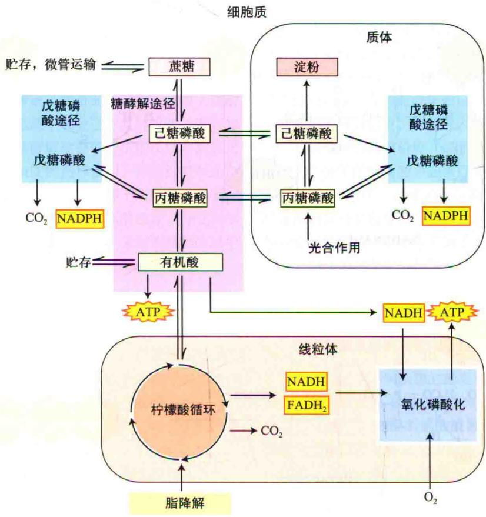  
图11.1 呼吸作用。由细胞其他代谢过程产生的呼吸底物进入呼吸途径。胞质和质体中的糖酵解和氧化戊糖磷酸途径通过己糖磷酸和丙糖磷酸中间产物，将糖类转化为有机酸（如丙酮酸），产生NADH或NADPH和ATP。有机酸在线粒体内的柠檬酸循环中被氧化，产生的NADH和 $FADH_{2}$ 通过氧化磷酸化的电子传递被氧化，所释放的能量驱动ATP合酶合成ATP。在糖异生作用中，脂类在乙醛酸循环中降解产生的碳源经柠檬酸循环的一系列转化，最后在胞质中逆糖酵解途径合成糖。

氧化戊糖磷酸途径是位于胞质溶胶和质体中的另一个糖代谢途径。含6个碳原子的葡萄糖-6-磷酸首先被氧化而形成戊糖磷酸，即核酮糖-5-磷酸，失去的碳以 $CO_{2}$ 的形式释放，还原力贮存于2分子NADPH中。在接下来的一系列接近平衡的反应中，核酮糖-5-磷酸被转化为含3\~7个碳原子的一系列糖类物质。

在柠檬酸循环中丙酮酸被彻底氧化成 $CO_{2}$ 。蔗糖分子所贮藏能量的绝大部分在此途径中以还原力的形式释放（相当于每摩尔蔗糖产生16 NADH+4 FADH $_{2}$ ）。除琥珀酸脱氢酶外，催化柠檬酸循环反应的酶均存在于线粒体基质的水相中。随后，我们将要谈到琥珀酸脱氢酶位于线粒体内膜的内表面上。

在氧化磷酸化作用中，位于线粒体内膜上的一系列电子传递蛋白组成的电子传递链负责电子的转运；在糖酵解、氧化戊糖磷酸途径和柠檬酸循环中产生的NADH（NADPH和FADH $_{2}$ ）中的电子沿着电子传递链传递给分子氧。在此电子传递过程中释放出大量的自由能，其中大部分能量与ATP的合成相偶联，位于线粒体内膜上的ATP合酶利用这些能量催化ADP和P $_{i}$ （无机磷酸）结合生成ATP。因此，人们把这种与电子传递链上的氧化还原反应相偶联的ATP合成称为氧化磷酸化。

烟酰胺腺嘌呤二核苷酸（NAD $^{+}$ /NADH）是许多氧化还原酶的有机辅助因子（辅酶）。NAD $^{+}$ 是该辅酶的氧化形式，它以可逆的方式接受2个电子生成NADH（图11.2）：

$$
\mathrm{NAD} ^ {+} + 2 \mathrm{e} ^ {-} + \mathrm{H} ^ {+} \longrightarrow \mathrm{NADH}
$$

该氧化还原电对的标准还原电势大约是-320 mV，因而NADH是一个相当强的还原剂（也就是电子供体）。因此，呼吸底物在糖酵解和柠檬酸循环的逐步氧化过程中释放的电子主要被 $NAD^{+}$ 接受，所释放的自由能就以电子势能的形式暂时贮存在NADH分子中。

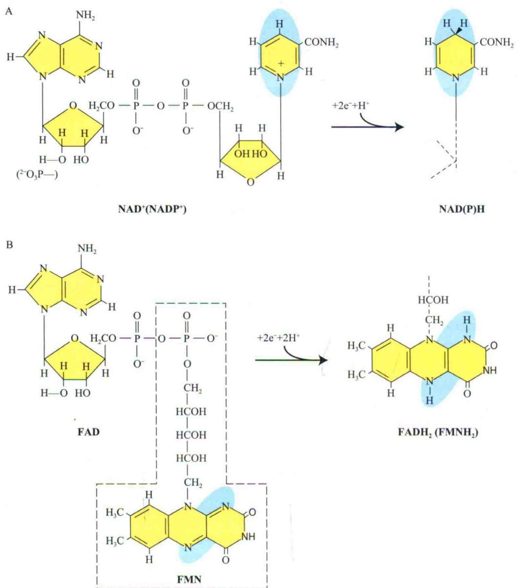  
图11.2 参与呼吸作用的主要电子传递辅助因子的结构和反应。A. NAD（P） $^{+}$ 还原为 NAD（P）H。NAD $^{+}$ 分子中的一个氢原子被一个磷酸基团取代而形成 NADP $^{+}$ 。B. FAD 还原为 FADH $_{2}$ ，虚线框中为 FMN 的结构，蓝色阴影区域为发生氧化还原反应的部分。

与此相近的另一个化合物烟酰胺腺嘌呤二核苷酸磷酸（NADP $^{+}$ /NADPH）也是代谢作用的电子载体，它在光合作用的氧化还原反应（见第7章和第8章）和戊糖磷酸途径的氧化反应中起作用；线粒体中的一些代谢过程也需要NADP $^{+}$ /NADPH的参与（Møller and Rasmusson，1998），有关问题将在后面相关内容中讨论。

通过电子传递链NADH被分子氧所氧化，此过程中释放的自由能（220 kJ/mol）可大约合成60个ATP（其中的细节问题随后讨论）。如果将蔗糖的氧化反应和ATP的合成反应偶联起来，就能更完整地理解呼吸作用及其在细胞能量代谢中的作用：

$$
\begin{array}{r l} & \mathrm{C} _ {1 2} \mathrm{H} _ {2 2} \mathrm{O} _ {1 1} + 1 2 \mathrm{O} _ {2} \longrightarrow 1 2 \mathrm{CO} _ {2} + 1 1 \mathrm{H} _ {2} \mathrm{O} \\ & 6 0 \mathrm{ADP} + 6 0 \mathrm{P} _ {\mathrm{i}} \longrightarrow 6 0 \mathrm{ATP} + 6 0 \mathrm{H} _ {2} \mathrm{O} \end{array}
$$

需要注意的是，进入呼吸代谢途径的代谢底物并不是全部被氧化成 $CO_{2}$ ，呼吸代谢途径中的许多中间产物又是许多其他代谢途径的起点，如氮同化为有机物质的途径、合成核苷酸的途径和脂类物质的合成途径，以及许多其他途径。

## 11.1.1 糖酵解

在糖酵解的前几步反应中，糖类转变为己糖磷酸，然后裂解成2分子的丙糖磷酸。在随后的储能反应中，每个丙糖磷酸经脱氢氧化和分子重排等反应，最终形成一个有机酸，即丙酮酸。总的来说糖类物质经糖酵解形成柠檬酸循环的底物——丙酮酸的同时，其分子中所贮存的化学能的一小部分被转换为ATP和NADH的形式。

在缺氧条件下（如在水淹的土壤中，植物的根就处于缺氧条件），糖酵解可能是细胞获取能量的主要途径。在这种情况下，胞质中就会进行发酵代谢，丙酮酸被NADH还原，使得糖酵解途径中产生的NADH被氧化为 $NAD^{+}$ ，从而实现 $NAD^{+}$ 的循环使用，保证糖酵解途径的持续进行，为细胞的生命活动源源不断地提供能量。在这一部分，我们先讨论糖酵解和发酵途径，并强调植物细胞中这些途径的特殊之处。接下来讨论植物细胞中氧化糖类物质的另一个途径——戊糖磷酸途径。

## 1. 多种来源的碳水化合物可进入糖酵解途径进行代谢

糖酵解是所有的有机体（原核生物和真核生物）的代谢途径。在植物和动物细胞中这一途径的基本反应大致相同（图11.3）。然而，植物细胞中的糖酵解途径有其独特性，首先某些反应的调节方式与动物细胞不同，其次某些反应在质体和胞质中同时存在，而且胞质的某些反应存在交替酶路径。

在动物细胞中，糖酵解途径的代谢底物是葡萄糖，终产物是丙酮酸。由于蔗糖是许多植物的主要转运糖，因此是许多非光合组织有机碳来源的主要形式，所以蔗糖（不是葡萄糖）被认为是植物呼吸作用的真正糖类底物。除丙酮酸外，苹果酸是植物糖酵解的另一个终产物。

在糖酵解的起始反应中，蔗糖分解为葡萄糖和果糖两个单糖，二者随时可以进入糖酵解途径。已知在植物体中存在两个裂解蔗糖的途径：转化酶途径和蔗糖合酶途径，这两个途径都参与了蔗糖从韧皮部的卸载（见第10章）。

转化酶位于某些组织的细胞壁、液泡或胞液中，它催化蔗糖直接水解，产生两个己糖（葡萄糖和果糖）。然后，在己糖激酶催化下，消耗ATP，两个己糖被磷酸化，形成己糖磷酸。胞质溶胶中的蔗糖合酶催化蔗糖与UDP反应，产生果糖和UDP-葡萄糖（UDPG），而后在UDPG焦磷酸化酶的作用下，UDPG和焦磷酸（PP $_{i}$ ）反应产生UTP和葡萄糖6-磷酸（图11.3）。蔗糖合酶所催化的蔗糖降解接近平衡，然而转化酶催化的反应却是不可逆的，这有利于驱动代谢反应的正向进行。一般来说，在碳水化合物主要进行呼吸代谢的组织中，转化酶所催化的蔗糖水解起主导作用；而在利用单糖合成多糖的组织中，蔗糖合酶起主导作用。

质体中存在着不完整的糖酵解途径，这些反应的产物既可用于质体中的生物合成，也可以进入细胞质进行糖酵解。淀粉仅在质体中合成和分解，而淀粉的降解产物（如夜间在叶绿体中进行的降解反应）主要以葡萄糖的形式进入胞液的糖酵解途径（见第8章）。在光照下，光合作用的产物也能以丙糖磷酸的形式直接进入糖酵解途径（Hoefnagel et al., 1998）。因此，糖酵解途径的最初几步反应具有收集效应，在不同生理状态下，不同来源的糖类物质，均可进入糖酵解途径进行代谢。

在糖酵解的起始阶段，每个己糖经两次磷酸化，裂解产生2分子丙糖磷酸。如果以蔗糖为代谢底物，此阶段消耗2\~4个ATP，具体的数目取决于蔗糖的裂解是由转化酶催化还是由蔗糖合酶催化。糖酵解的起始阶段还包含糖酵解途径中三个重要的不可逆反应中的两个，分别由己糖激酶和果糖磷酸激酶催化（图11.3）。随后我们就会讨论无论是在动物还是植物细胞中，果糖磷酸激酶催化的反应是糖酵解途径中的重要调控点之一。

## 2. 糖酵解途径的放能阶段提供可用能量

上面讨论了不同来源的糖类物质转变为丙糖磷酸的反应，而甘油醛-3-磷酸的形成标志着糖酵解途径放能阶段的开始。甘油醛-3-磷酸脱氢酶催化下，甘油醛-3-磷酸分子中的醛基被氧化为羧基，同时将 $NAD^{+}$ 还原为NADH。在此反应中，醛基氧化释放的能量足以驱动甘油醛-3-磷酸发生磷酸化（用无机磷酸）而形成1,3-二磷酸甘油酸；1,3-二磷酸甘油酸分子第一位碳原子上的酰基磷酸具有极高的水解自由能变化（ $\Delta G^{0'}$ 为-49.3 kJ/mol），因此该化合物是一个很强的磷酸基团供体。

接下来，在磷酸甘油酸激酶催化下，1,3-二磷酸甘油酸的酰基磷酸上的磷酸基团转移给ADP，生成ATP和3-磷酸甘油酸。每个蔗糖分子进入糖酵解途径后，在该反应中可产生4个ATP，即每分子1,3-二磷酸甘油酸的磷酸基团转移就产生1分子ATP。

在上面的反应中，磷酸基团直接从底物分子上转移给ADP而形成ATP，传统上人们把这种ATP合成方式称为底物水平磷酸化（substrate-level phosphorylation）。底物水平磷酸化合成ATP的分子机制完全不同于由ATP合酶所催化的ATP合成，ATP合酶的作用在线粒体的氧化磷酸化（将在本章后面介绍）和叶绿体中的光合磷酸化（见第7章）中讨论。

在接下来的两步反应中，首先，3-磷酸甘油酸上的磷酸基团转移到 $C_{2}$ 上，随即脱去1分子水，生成磷酸烯醇式丙酮酸（phosphoenolpyruvate，PEP）。PEP分子中的磷酸基团的水解自由能（ $\Delta G^{0'}$ ）很高（-61.9 kJ/mol），这使得PEP成为一个极好的ATP合成的磷酸供体。最后丙酮酸激酶以PEP为底物，催化糖酵解途径中的第二个底物水平磷酸化反应，产生ATP和丙酮酸，这一步反应是糖酵解途径中第三个重要的不可逆反应。蔗糖分子经糖酵解的起始阶段不同来源的底物经不同的路径进入糖酵解，并被转变为丙糖磷酸。每分子蔗糖经糖酵解途径的代谢，形成4分子丙糖磷酸，消耗4个ATP

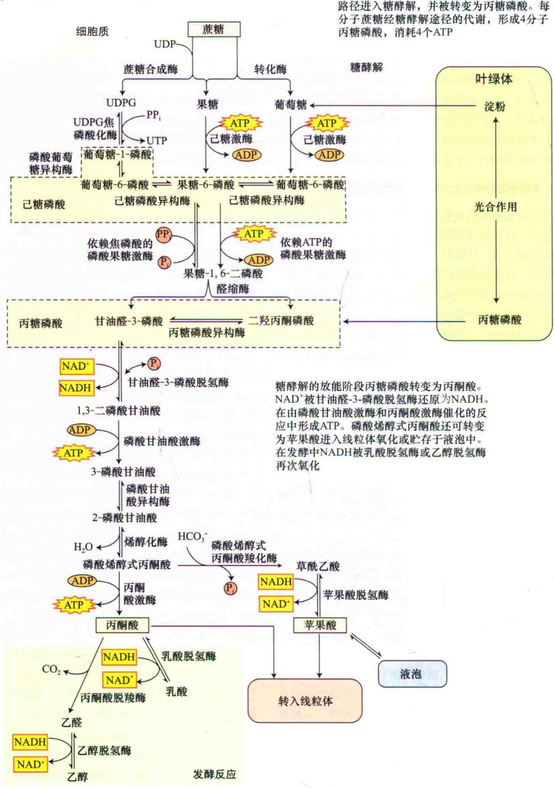

糖酵解的放能阶段丙糖磷酸转变为丙酮酸。NAD $^{+}$ 被甘油醛-3-磷酸脱氢酶还原为NADH。在由磷酸甘油酸激酶和丙酮酸激酶催化的反应中形成ATP。磷酸烯醇式丙酮酸还可转变为苹果酸进入线粒体氧化或贮存于液泡中。在发酵中NADH被乳酸脱氢酶或乙醇脱氢酶再次氧化

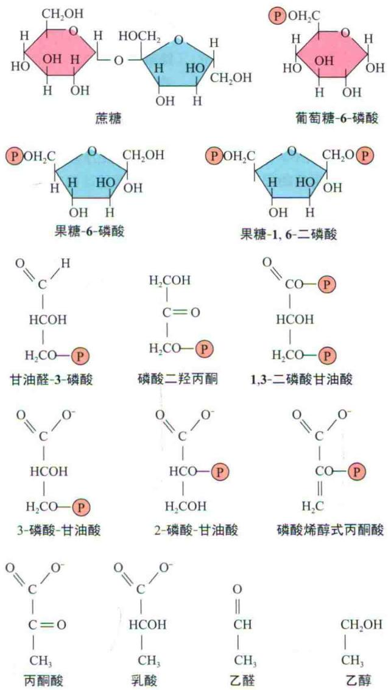  
图11.3 植物中的糖酵解和发酵反应。A.蔗糖通过己糖磷酸和丙糖磷酸氧化成丙酮酸是糖酵解的基本途径，但植物的糖酵解途径存在交替反应。经测定，图中所示的酶在细胞中的活性水平足以维持呼吸代谢快速进行，以满足整个植物组织的生命活动，并且，活体植物的糖酵解途径的流通量也已测定。双箭头表示可逆反应，单箭头表示重要的不可逆反应。B.中间产物的结构。P代表磷酸基团。

糖酵解途径的代谢就净产生了4分子的ATP。

## 3. 植物中的交替糖酵解反应

从葡萄糖到丙酮酸的代谢反应存在于所有有机体中，行使了糖酵解的功能。另外，有机体中糖酵解途径还可逆向进行，即从有机酸开始逆糖酵解途径而行，合成葡萄糖等糖类物质，这个过程就是糖异生作用（gluconeogenesis）。

有些植物种子（如蓖麻、向日葵等）中的碳主要以油（三酰甘油）的形式贮存，糖异生作用对这些植物种子的萌发非常重要。种子萌发后，通过糖异生作用将油脂转变为蔗糖，以维持幼苗的生长。在糖酵解的起始阶段或糖异生作用的最后阶段，其酶促反应与第8章描述的光合作用从丙糖磷酸合成蔗糖的途径相一致，这是植物物质转化所特有的方式。

在糖酵解途径中，由依赖ATP的磷酸果糖激酶催化的反应是不可逆的（图11.3），所以在糖异生作用中该步反应的逆转是由果糖-1，6-二磷酸酯酶催化，使果糖-1，6-二磷酸转变为果糖-6-磷酸和 $P_{i}$ 。因此，无论在植物还是动物体中，由依赖ATP的磷酸果糖激酶和果糖-1，6-二磷酸酯酶催化的反应就成了碳源流向的重要控制位点。在植物的光合作用中，蔗糖的合成也存在同样的调控（见第8章）。

然而，在植物细胞中，果糖-6-磷酸和果糖-1，6-二磷酸之间的相互转化还可以被另一个酶，即依赖焦磷酸的磷酸果糖激酶（焦磷酸：果糖-6-磷酸1-磷酸转移酶）催化，该酶存在于细胞质中，催化下面的可逆反应（图11.3）：

$$
\text { 果糖 } - 6 - \mathrm{P} + \mathrm{PP} _ {\mathrm{i}} \longleftrightarrow \text { 果糖 } - 1, 6 - \text { 二磷酸 } + \mathrm{P} _ {\mathrm{i}}
$$

这里-P代表结合态磷酸。研究表明，在植物细胞质中，该酶的活性水平高于依赖ATP的磷酸果糖激酶（Kruger，1997），通过转基因技术，在马铃薯中抑制该酶的基因表达，会明显降低糖酵解效率，但并不影响植物的正常生长，这就表明可能有其他酶代替它的功能。不同的途径功能相近，而且一个替代另一个时，其生理功能也没有明显的丧失或改变，这种现象称为代谢冗余（metabolic redundancy），它是植物代谢所特有的现象。

由依赖PP $_{i}$ 的磷酸果糖激酶催化的反应为可逆的，但在蔗糖的合成中并不起主要作用（Dennis and Blakely，2000）。与依赖ATP的磷酸果糖激酶和果糖-1，6-二磷酸酯酶的活性调节相同，依赖PP $_{i}$ 的磷酸果糖激酶的活性被细胞代谢的动态变化所调节（本章后面讨论），由此可以看出，植物可以根据生存环境的变化而以独特的方式运行糖酵解途径（参见Web Essay 11.1）。

在植物体中，糖酵解后期产物PEP可以沿不同的途径进行代谢。其一就是PEP经羧化反应转化为草酰乙酸，催化这一反应的酶是胞质中的PEP羧化酶；而后，在苹果酸脱氢酶催化下，由NADH提供电子，草酰乙酸被还原为苹果酸；苹果酸脱氢酶的作用类似于发酵代谢中乳酸脱氢酶或乙醇脱氢酶的作用（图11.3）。由此产生的苹果酸被输送到液泡或线粒体中贮存，在线粒体中苹果酸亦可进入柠檬酸循环进行代谢。因此，PEP经丙酮酸激酶或PEP羧化酶催化产生的丙酮酸或苹果酸均可进入线粒体进行呼吸代谢，尽管在多数组织中丙酮酸为主要产物。

## 4. 缺氧条件下，发酵作用重新产生糖酵解需要的 $NAD^{+}$

在缺氧条件下，氧化磷酸化不能发挥作用。由于在细胞中 $NAD^{+}$ 的量是有限的，一旦所有的 $NAD^{+}$ 都处于还原状态（NADH），甘油醛3-磷酸脱氢酶的催化作用就会被迫停止，因而糖酵解途径也就不能继续进行。为了克服这一制约，植物和其他有机体通过一种或多种形式的发酵代谢（fermentation）来进一步代谢丙酮酸（图11.3）。

尽管了解得更清楚的是啤酒酵母中的乙醇发酵，但在植物细胞中乙醇发酵代谢也很普遍。丙酮酸脱羧酶和乙醇脱氢酶这两种酶先后发挥作用，将丙酮酸转化为乙醇，释放出 $CO_{2}$ ，并将NADH氧化。在乳酸发酵中（常见于人类的肌肉细胞中，但在植物中也有发现），乳酸脱氢酶利用NADH还原丙酮酸为乳酸，重新产生 $NAD^{+}$ 。

在某些条件下，植物组织遭到了低氧或无氧的环境，被迫进行发酵代谢。研究得最清楚的是，当受到水淹或涝灾时，氧气向土壤中的扩散几乎被完全限制，从而导致根组织处于缺氧状态。

当玉米的根部处于缺氧状态时，初期阶段，根组织进行乳酸发酵，而随后就会进行乙醇发酵以适应缺氧状态。这是由于乙醇可以迅速扩散到细胞外，是一个低毒的末端产物。而乳酸在细胞中积累，加速胞质酸化。在许多其他情况造成缺氧时，植物会通过某种形式的发酵代谢而生存。

发酵代谢的能量利用效率也是一个很重要的问题。在这里，我们把能量利用效率定义为每代谢1分子蔗糖，以ATP形式贮存的能量与1分子蔗糖完全氧化的潜在能量之比。蔗糖彻底氧化为 $CO_{2}$ 的标准自由能变化（ $\Delta G^{0'}$ ）是-5760 kJ/mol，ATP合成的 $\Delta G^{0'}$ 值为32 kJ/mol。然而动植物细胞中的环境都是非标准状态，合成ATP所需自由能大约是50 kJ/mol。

正常情况下，每分子蔗糖经糖酵解转化为丙酮酸，净合成4分子ATP，如果乙醇或乳酸为终产物，则发酵代谢的能量效率仅为4%左右。而蔗糖分子的绝大部分可利用能量仍然存在于乙醇或乳酸分子中。在缺氧条件下，通过改变酵解的路径就可以提高ATP的产率，例如，由蔗糖合酶（而不是转化酶）催化蔗糖的裂解，就可绕过糖酵解初期阶段的己糖激酶所催化的反应，而减少ATP的消耗。这种变动更加凸显了代谢的能量效率对植物缺氧生存之重要性（见Web Essay 11.1）。

由于酵解代谢的能量效率较低，为满足细胞生存对ATP的需求，就必须提高碳水化合物的降解速率。提高糖酵解速率的途径有两个，一是改变糖酵解途径中间产物浓度；二是提高糖酵解和发酵作用所需酶类基因的表达水平。法国微生物学家Louis Pasteur首先发现，当酵母细胞从有氧转到无氧条件下进行乙醇发酵时，糖酵解速率迅速提高，人们把这一现象称为巴斯德效应（Pasteur effect）。

与发酵代谢形成鲜明对比，在有氧呼吸中，糖酵解产生的丙酮酸在线粒体中被进一步氧化，从而更加有效地利用了蔗糖分子中的潜在自由能。

## 5. 植物糖酵解途径受到自身产物的调控

在活体内，植物糖酵解途径受果糖-6-磷酸的磷酸化水平（即果糖-1，6-二磷酸的浓度）和PEP周转速率的控制；与动物的糖酵解途径调控不同，AMP和ATP不是植物的磷酸果糖激酶和丙酮酸激酶的主要效应因子。在植物细胞中，PEP是依赖ATP的磷酸果糖激酶的一个十分有效的抑制剂，胞质中PEP的浓度高低能够更加有效地调节糖酵解的速率。

此外， $P_{i}$ 是磷酸果糖激酶的激活剂，它能有效地降低PEP对磷酸果糖激酶的抑制，因此，胞质中PEP和 $P_{i}$ 浓度的相对高低就成为控制糖酵解进行速率的关键因素。前已述及，经丙酮酸激酶和磷酸烯醇式丙酮酸羧化酶催化，PEP可以转化为丙酮酸或苹果酸（图11.3）；而苹果酸和丙酮酸均可进入三羧酸循环，因而这两个酶能够感受三羧酸循环的一些中间产物及其衍生物的浓度变化，如苹果酸、柠檬酸、 $\alpha-$ 酮戊二酸和谷氨酸盐，这两种酶活性受这些代谢物的反馈抑制。

因此，植物糖酵解的调控模式是“自下而上”的连续反馈抑制（本章后面将讨论这种调控模式），其初级调控位点是丙酮酸激酶和PEP羧化酶的活性，目的是调控细胞中PEP的浓度；接下来就是PEP对依赖于ATP的磷酸果糖激酶的活性调节（图11.3），从而控制果糖-6-磷酸到果糖-1，6-二磷酸的转化速率。而动物糖酵解途径则是“由上而下”的调控模式，初级调节位点是磷酸果糖激酶的活性，然后才是丙酮酸激酶活性的调节。

糖酵解途径中这种自下而上的反馈调节，对植物的生长发育有着两方面的优越性：①可以相对独立地调节通过糖酵解产生丙酮酸的速率，而不影响与其相关的其他代谢过程，如卡尔文循环、蔗糖-丙糖磷酸-淀粉的互变（Plaxton，1996）；②这种连续反馈调节还可以根据细胞对生物合成前体物的需要，将糖酵解速率调控在最适水平。

糖酵解途径的自下而上的调节可有效控制糖酵解进行的速率，和韧皮部转运等糖供给途径联合作用，共同控制细胞中糖的浓度。葡萄糖和蔗糖是两个非常有效的信号分子，植物会通过感知细胞中糖的状态，进而调整自身的生长和发育。在细胞质中己糖激酶是糖酵解途径中的一个酶，而在细胞核中它却是一个葡萄糖的受体，并应答几种植物激素调节基因的表达（Rolland et al., 2006）。

在植物细胞中，丙酮酸激酶和PEP羧化酶的作用是使PEP进行不同的代谢，这使得糖酵解途径的调控更加复杂。虽然这两个酶的活性都被类似的代谢物所抑制，但是在某些情况下，PEP羧化酶的作用使PEP绕过丙酮酸而直接形成苹果酸，继而进入线粒体的柠檬酸循环进行代谢。

另外，通过对转基因植物研究，也证实了PEP代谢多样性对植物生长的重要性。通过转基因技术，使烟草叶片胞质中丙酮酸激酶的表达还不到正常水平的5%（Plaxton，1996），与野生型对照，叶片的呼吸速率与光合作用速率并未受到影响，但转基因植物的根生长明显降低。这些结果表明，丙酮酸激酶的作用对植物的生长发育也是不可或缺的，它的缺失或明显降低会对植物造成一定的伤害。

果糖-2，6-二磷酸也可以调节磷酸果糖激酶所催化的反应，但与PEP不同，它对该反应调节是双向的（详细讨论见第8章）。因此，果糖-2，6-二磷酸可调节糖类是进行呼吸代谢还是用于生物合成的配比。

糖酵解途径调节的另一个层次来自糖酵解酶位置的改变。通常认为，糖酵解的酶类都位于细胞质的胶质中，然而近来的研究表明，为满足高强度的呼吸代谢，在线粒体膜的外表面还结合着完整的糖酵解酶库。这种定位效应使得代谢底物可以从一个酶直接移动到下一个酶（称为底物通道），这样在细胞中就形成了两个独立的糖酵解，即线粒体结合的糖酵解和胞液中的糖酵解，后者就可以为其他代谢途径提供碳中间产物，且不影响丙酮酸的产量。

为深入理解糖酵解调节，需要研究代谢物浓度的动态变化。利用代谢谱分析技术，就可以大通量地快速地提取、分离和分析许多代谢物的动态变化（参见Web Essay 11.2）。

## 11.1.2 氧化戊糖磷酸途径

在植物细胞中，糖酵解并不是氧化降解糖类物质的唯一途径，在细胞质和质体中存在另外一个酶促反应体系，同样能够将葡萄糖氧化降解，这一酶促反应体系称为氧化戊糖磷酸途径（亦称己糖磷酸支路）（图11.4）。完成此代谢途径所需酶类在细胞质和质体中都有。在多数情况下，这一途径主要在质体中进行（Dennis et al., 1997）。

戊糖磷酸途径的前两步反应均为氧化还原反应，使6个碳原子的葡萄糖-6-磷酸发生两次脱氢氧化，转化为5个碳原子的核酮糖-5-磷酸，并以 $CO_{2}$ 的形式脱去一个碳原子，产生2分子NADPH（不是NADH）。该途径的其余反应是把核酮糖-5-磷酸转变为糖酵解的中间产物甘油醛-3-磷酸和果糖-6-磷酸。这两个产物可进入糖酵解进行代谢，形成丙酮酸；另外，甘油醛-3-磷酸和果糖-6-磷酸还可通过糖异生途径重新产生葡萄糖-6-磷酸。我们假设6个葡萄糖-6-磷酸进行6次这一循环，其总反应式为

6葡萄糖-6-P+12NADP $^{+}$ +7H $_{2}$ O→5葡萄糖-6-P+

$$
6 \mathrm{CO} _ {2} + \mathrm{P} _ {\mathrm{i}} + 1 2 \mathrm{NADPH} + 1 2 \mathrm{H} ^ {+}
$$

净结果是一个葡萄糖6-磷酸完全氧化为 $CO_{2}$ （5分子被重新产生），并产生12分子的NADPH。

用 $^{14}$ C同位素标记的葡萄糖进行的示踪实验检测释放的 $CO_{2}$ ，结果表明，10%\~25%的葡萄糖是通过戊糖磷酸途径氧化降解的，而其余的主要是通过糖酵解代谢。我们将会看到，在不同的发育阶段或生存条件的变化，植物对某些特定产物的需求也会改变，戊糖磷酸途径的功能也会随之变化（Kruger and von Schaewen，2003）。

本途径的前两步反应是重要的不可逆反应，在葡萄糖-6-磷酸被氧化成核酮糖-5-磷酸的同时，产生NADPH

通过一系列的可逆代谢反应，实现代谢物的互变，从而将核酮糖-5-磷酸转变为糖酵解的中间产物——果糖-6-磷酸和甘油醛-3-磷酸

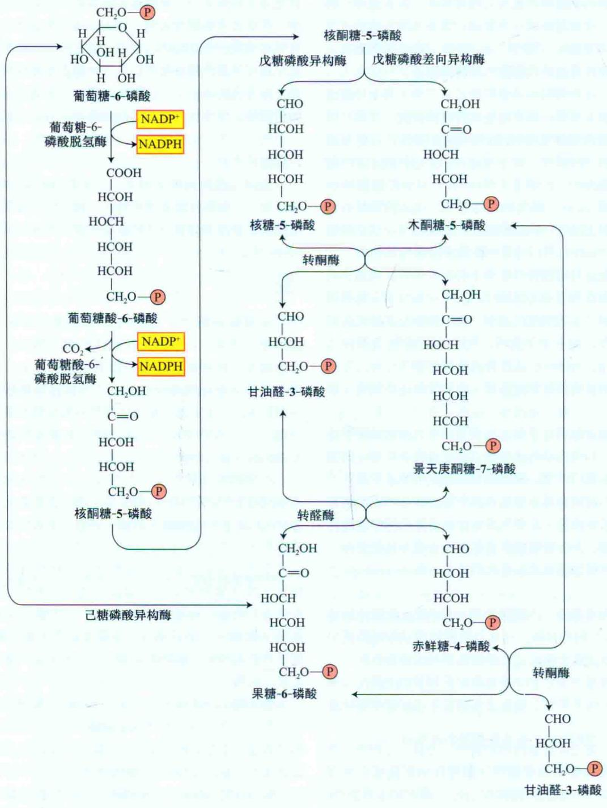  
图 11.4 植物细胞中氧化戊糖磷酸途径的全部反应。最初的两步反应是十分重要的不可逆氧化反应。在缺乏光合作用时，通过这两步反应为细胞质和质体提供NADPH。该途径的下游部分均为可逆反应（由双箭头表示），因此，即使前两步氧化反应受到抑制，生物合成所需要的五碳底物仍可通过这些可逆反应提供，如光照条件下，叶绿体中就会进行这样的代谢过程。

## 1. 氧化戊糖磷酸途径产生NADPH和生物合成的中间产物

氧化戊糖磷酸途径在植物代谢中起着多重作用。

在细胞质中提供NADPH：NADPH由戊糖磷酸途径的两步氧化反应产生。由此产生的NADPH可以驱动生物合成途径中的还原步骤，也可以参与细胞质中的防卫反应，还可以是清除活性氧（ROS）的酶所催化反应的底物。由于在线粒体内膜的外表面存在NADPH脱氢酶，戊糖磷酸途径所产生的还原力可以通过线粒体的氧化NADPH的作用而得到平衡。因此，戊糖磷酸途径也可能参与细胞的能量代谢，即NADPH的电子可经电子传递体最终还原 $O_{2}$ ，经氧化磷酸化作用合成ATP。

在质体中提供NADPH：在非绿色的质体中（如造粉体）和黑暗条件下行使功能的叶绿体中，所需NADPH主要由戊糖磷酸途径提供，这些NADPH用于脂类生物合成和氮同化过程。在造粉体中，由葡萄糖-6-磷酸氧化产生NADPH也可能将糖信号传递给硫氧还蛋白，并调控淀粉合成（Schürmann and Buchanan, 2008）。

为生物合成提供底物：在大多数有机体内，戊糖磷酸途径产生的核糖-5-磷酸是核糖和脱氧核糖的前体，它们是合成核酸的原料；然而，在植物细胞中核糖似乎由另外一个未知的途径合成（Sharples and Fry, 2007）。赤藓糖-4-磷酸是戊糖磷酸途径中另一个中间产物，它和糖酵解途径的磷酸烯醇式丙酮酸结合产物是合成植物体中许多酚类物质的前体，如芳香族氨基酸、木质素、类黄酮和植保菌素等（见第13章）。其实验证据是戊糖磷酸途径的酶可以被伤害等胁迫所诱导，在受到伤害胁迫时，植物通过合成芳香族化合物以增强和保护自身组织。

## 2. 氧化戊糖磷酸途径受细胞氧化还原状态调节

氧化戊糖磷酸途径中每一步反应都是由一组同工酶催化，而每组同工酶在植物的不同组织中其含量和活性调节方式有所变化。在很多情况下，由葡萄糖-6-磷酸脱氢酶催化的起始反应被细胞中NADPH/NADP $^{+}$ 的高比率所抑制。

在光照条件下，戊糖磷酸途径在叶绿体中几乎不能进行；葡萄糖-6-磷酸脱氢酶被还原失活所抑制，提供还原力的是铁氧还蛋白-硫氧还蛋白系统（见第8章）和高比率的NADPH/NADP $^{+}$ 。另外，其末端产物果糖-6-磷酸和甘油醛-3-磷酸可以由卡尔文循环合成；戊糖磷酸途径的非氧化阶段为可逆反应，其进行方向遵从质量作用定律。通过这种方式，赤藓糖-4-磷酸的合成可以保持很高的水平。在非绿色质体中，该途径中的葡萄糖-6-磷酸脱氢酶对还原型硫氧还蛋白和NADPH所引发的还原失活不敏感，因此，在光合作用缺失条件下，能够尽可能的将 $NADP^{+}$ 还原，保持质体中高水平的还原势（Kruger and von Schaewen，2003）。

## 11.1.3 柠檬酸循环

19世纪，生物学家发现，在缺少空气的条件下，细胞产生乙醇或乳酸，而在有空气的条件下，细胞消耗 $O_{2}$ 并产生 $CO_{2}$ 和 $H_{2}O$ 。出生于德国的英国生物化学家Hans A. Krebs于1937年报道了柠檬酸循环，亦称三羧酸循环或Krebs循环。柠檬酸循环不仅阐释了丙酮酸降解成 $CO_{2}$ 和 $H_{2}O$ 的分子机制，还首次提出了循环式代谢途径的概念，使人们对生物代谢有了更加深刻的认识。因此，Hans A. Krebs荣获1953年的诺贝尔生理学或医学奖。

由于柠檬酸循环在线粒体的基质中进行，因而，我们有必要简要介绍线粒体的基本结构和功能；目前，人们对线粒体的了解主要来自对离体线粒体的研究（参见Web Topic 11.1）。接下来，我们将讨论柠檬酸循环的基本过程，并强调植物细胞中柠檬酸循环的独特性及其对植物呼吸功能的影响。

## 1. 线粒体是半自主性细胞器

当蔗糖经糖酵解途径形成丙酮酸时，仅有不到25%的能量被释放出来，而剩余的能量仍然贮存于4分子丙酮酸中。呼吸作用的下两个阶段（柠檬酸循环和氧化磷酸化）在具有双层膜结构的线粒体（mitochondrion）中进行。

电镜照片显示，无论是原位还是离体条件下，植物线粒体的外形通常是椭球形或棒形（图11.5），直径为0.5\~1.0 μm，长度可达3 μm（Douce，1985）。除若干组织外，绝大多数植物细胞中线粒体的数目远少于动物细胞中线粒体数目，并且植物细胞的线粒体数目是可变的，且线粒体的多少常与组织代谢的活跃程度直接相关，由此可看出，线粒体在细胞能量代谢中起着至关重要的作用。例如，保卫细胞中线粒体的数量尤其多。

植物线粒体的超微结构与其他有机体线粒体相似（图11.5）。植物线粒体有两层膜：光滑的外膜将内膜完全包围，而内膜呈高度的内陷，形成线粒体的嵴。这种内陷结构极大地增加了线粒体内膜的表面积，因而50%以上的线粒体蛋白质位于内膜上。内外膜之间的区域称为膜间隙，内膜所包围的空间为线粒体的基质。基质中大分子的含量很高，几乎占其重量的50%；同时，由于水分含量很低，分子的运动受到限制，因而基质中的蛋白质很可能高度组织化，形成各种多酶复合体，从而构成有效的底物通道。

完整的线粒体有渗透活性，当处于低渗溶液中时它们吸收水分而膨胀。由于内膜的屏障作用，使得许多无机离子和带电荷的有机分子不能自由扩散到基质中；外膜具有较高的通透性，分子质量小于10 000 Da的分子均可自由通过，因而大部分细胞代谢物和无机离子可以通过外膜，但蛋白质等生物大分子则不能。形成内外膜的脂类主要是磷脂，其中磷脂酰胆碱和磷脂酰乙醇胺占80%；在细胞中，只有线粒体内膜含有大约15%的双磷脂酰甘油（亦称心磷脂）。

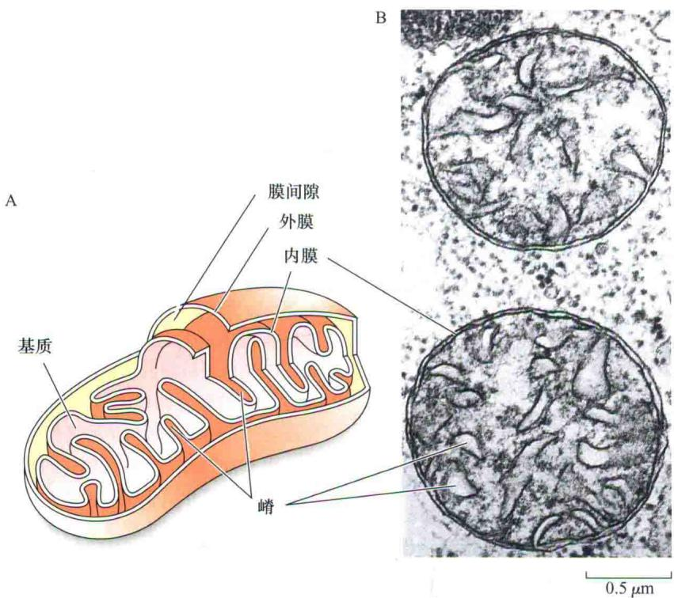  
图11.5 植物线粒体的结构。A. 线粒体的三维结构，图中显示了称为嵴的内膜内折部分，基质和膜间隙的位置（图11.9）。B. 蚕豆叶肉细胞的线粒体电镜照片。植物细胞的线粒体比细胞核和质体小得多，典型的单个线粒体长1\~3 $\mu$ m（B图引自Gunning and Steer，1996）。

与叶绿体一样，线粒体也是半自主性的细胞器，线粒体中含有核糖体、RNA 和DNA，线粒体DNA 携带的遗传信息很有限，它仅编码少部分线粒体蛋白质。因此，线粒体能够进行DNA复制、转录和翻译等基因表达的全过程，使其遗传信息表达而行使相应的生物学功能。在保持与细胞分裂相一致的同时，通过分裂和融合使得线粒体的数量呈动态变化（Web Essay 11.3）。对于绝大多数植物来说，在有性生殖过程中线粒体为母系遗传。

## 2. 丙酮酸进入线粒体并经柠檬酸循环被氧化

由于含三个羧基的柠檬酸（柠檬酸盐）和异柠檬酸（异柠檬酸盐）是柠檬酸循环的早期中间产物（图11.6），因此柠檬酸循环又称三羧酸循环，它是呼吸作用的第二阶段，在线粒体基质中进行。柠檬酸循环的运转需要丙酮酸，而细胞质中糖酵解途径产生的丙酮酸经专一的转运蛋白输入线粒体（下面将进行简要的讨论）。

在线粒体基质中，丙酮酸被丙酮酸脱氢酶催化发生氧化脱羧反应，产生NADH、 $CO_{2}$ 和乙酰CoA，其中乙酰基来自丙酮酸并通过硫酯键与辅酶A（CoA）共价链接（图11.6）；丙酮酸脱氢酶是一个很大的、由多个酶组成的多酶复合体。

在下一步反应中，在柠檬酸循环的第一个酶——柠檬酸合酶的催化下，乙酰CoA与一个四碳二羧酸（草酰乙酸）结合形成六碳三羧酸（柠檬酸）。随后，柠檬酸在顺乌头酸酶的作用下，异构为异柠檬酸。

接下来是连续的两步氧化脱羧反应，每一步产生1个NADH和释放1分子 $CO_{2}$ ，并产生一个与CoA连接的四碳化合物，即琥珀酰CoA。至此，每个进入线粒体的丙酮酸就产生3分子 $CO_{2}$ ，即每个蔗糖分子被彻底氧化降解形成12分子 $CO_{2}$ 。

三羧酸循环的其余反应是将琥珀酰CoA氧化为三羧酸循环的起始物草酰乙酸，从而使三羧酸循环能够连续运转。在琥珀酰CoA合成酶催化下，琥珀酰CoA的硫酯键裂解释放辅酶A产生琥珀酸，硫酯键的自由能用于驱动ADP与无机磷酸结合，以底物水平磷酸化的方式合成一个ATP（在这里需要重新提到的是：在柠檬酸合酶所催化的反应中形成碳-碳键所需能量来自乙酰CoA的硫酯键）。琥珀酸在琥珀酸脱氢酶作用下形成延胡索酸，该酶是柠檬酸循环中仅有的与膜相连的酶，也是电子传递链的组分。

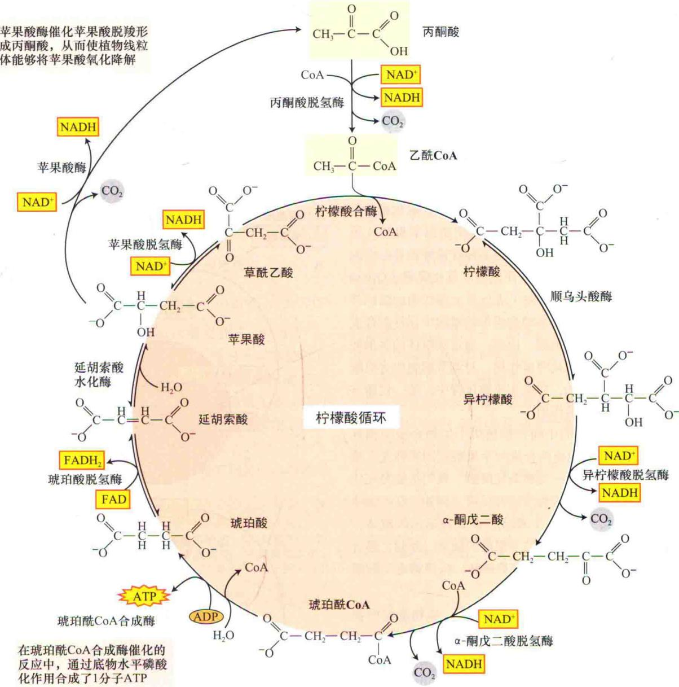  
图11.6 植物柠檬酸循环。图中显示了柠檬酸循环所有的反应和催化这些反应的酶，还有与此密切相关的丙酮酸脱氢酶和苹果酸酶。丙酮酸经柠檬酸循环被彻底氧化，生成3分子 $CO_{2}$ ；氧化反应中所释放的电子将4分子的NAD $^{+}$ 还原为NADH，将1分子的FAD还原为 $FADH_{2}$ 。

在此氧化还原反应中，从琥珀酸分子上脱下来的电子和质子受体不是NAD $^{+}$ 而是黄素腺嘌呤二核苷酸（FAD），FAD共价结合在琥珀酸脱氢酶的活性部位，通过可逆的双电子还原反应产生FADH $_{2}$ （图11.2B）。

柠檬酸循环最后两步反应中，在延胡索酸水化酶作用下，延胡索酸与水发生加成反应产生苹果酸，接着苹果酸脱氢酶催化苹果酸脱氢氧化，重新形成草酰乙酸，脱下的电子交给NAD $^{+}$ 形成NADH。产生的草酰乙酸又可以和新的乙酰CoA结合，开始新一轮三羧酸循环。

总之，一分子丙酮酸在线粒体内经过逐步氧化产生3个 $CO_{2}$ 。在此过程中所释放的自由能主要以还原型辅酶的形式存在，包括4个NADH和1个 $FADH_{2}$ ，另外还通过底物水平磷酸化直接产生1分子ATP。

## 3. 植物柠檬酸循环的特殊性

图11.6为植物线粒体中进行的柠檬酸循环反应，该过程与动物线粒体中所进行的三羧酸循环基本相同，但也有差别。例如，在植物中琥珀酰CoA合成酶催化的反应产生ATP，而在动物的线粒体中，该步反应产生的是GTP，这两种核苷酸在能量上是等价的。

植物的柠檬酸循环有个其他很多有机体所不具备的特点，即植物线粒体基质中都有一个苹果酸酶。该酶催化苹果酸发生氧化脱羧反应，产生丙酮酸。

## 苹果酸 $+NAD^{+}\rightarrow$ 丙酮酸 $+CO_{2}+NADH$

正是苹果酸酶的作用，使得植物线粒体可以通过不同的方式代谢来自糖酵解的PEP（参见Web Essay 11.1）。如前所述，胞质糖酵解途径的中间产物PEP经PEP羧化酶和苹果酸脱氢酶作用被转化为苹果酸（图11.3）；在进行呼吸代谢和获取能量的情况下，苹果酸被转运到线粒体基质中，由苹果酸酶催化，氧化脱羧形成丙酮酸。正是由于这一反应的作用使得苹果酸（图11.7A）或柠檬酸（图11.7B）等多种柠檬酸循环的中间产物能够进入三羧酸循环从而被彻底氧化降解（Oliver and McIntosh，1995）。除了进行景天酸代谢的组织外（见第8章），还有许多植物组织的液泡中同样贮存大量的苹果酸或其他有机酸。因此，通过线粒体的苹果酸酶而进行的苹果酸氧化降解作用，对调节细胞中有机酸水平十分重要。例如，在果实成熟过程中，这一代谢方式就起到了很重要的作用。

在柠檬酸循环的中间产物被用于生物合成而消耗时，由PEP羧化酶催化而合成的苹果酸就用来补充三羧酸循环中间产物，而不是被氧化降解。我们把能补充代谢循环中间产物的反应称为回补反应。例如，在叶绿体进行氮同化时，大量的α-酮戊二酸被转运出线粒体，因而导致柠檬酸合成所需的苹果酸的缺乏。此时，通过PEP羧化酶途径将PEP转化为苹果酸，从而补充三羧酸循环的中间产物（图11.7C）。

在多种生物和非生物胁迫条件下，植物细胞中会积累γ-氨基丁酸（GABA）。GABA的合成底物是α-酮戊二酸，而其分解产物是琥珀酸，从而绕过了柠檬酸循环，人们称之为GABA支路（Bouché and Fromm，2004）。但是，有关GABA积累与胁迫之间的功能相关性目前还知之甚少。

## 11.1.4 线粒体中的电子传递和ATP合成

作为能量载体，ATP是细胞进行生命活动的能量供体，因而，在柠檬酸循环中形成的NADH和 $FADH_{2}$ 分子中的化学能就必须转化为ATP，才能被细胞用于做功。这一过程在线粒体内膜上进行，并依赖于分子氧，因此称其为氧化磷酸化。

下面我们将重点讨论来自NADH和 $\mathrm{FADH}_2$ 的电子能量水平逐步降低，并转换为跨线粒体内膜的电化学质子梯度的过程。尽管对于所有的需氧细胞来说，这一过程基本相同，但植物（和真菌）的电子传递链却包括多个NAD(P)H脱氢酶，以及在哺乳动物线粒体中没有发现的交替氧化酶。

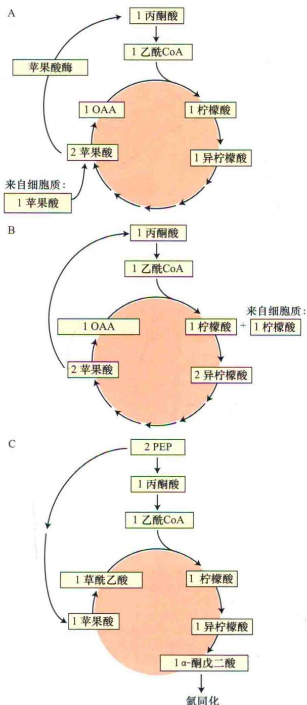  
图11.7 苹果酸酶和 PEP 羧化酶为植物 PEP 和丙酮酸的代谢提供代谢灵活性。苹果酸酶把苹果酸转变为丙酮酸，从而使植物线粒体在没有糖酵解输送丙酮酸的情况下把苹果酸（A）和柠檬酸（B）氧化成 $CO_{2}$ 。由 PEP 羧化酶参与，协同正常的代谢途径能把糖酵解产生的 PEP 转变为 $\alpha$ -酮戊二酸，可用于氮同化（C）。

我们也将讨论 $F_{0}F_{1}-ATP$ 合酶的特性，该酶利用跨膜质子梯度来合成ATP。在了解呼吸代谢各个阶段生产ATP的基础上，我们将概括总结在每个阶段细胞获取能量的步骤和调节机制，这种调控起着整合和协调不同代谢途径的作用。

## 1. 电子传递链催化电子从NADH到 $\mathrm{O}_2$ 的传递

每个蔗糖分子通过糖酵解和柠檬酸循环氧化后，在胞质中产生4分子NADH，以及在线粒体的基质中产生16分子NADH和4分子FADH $_{2}$ （和琥珀酸脱氢酶相关联），这些还原化合物必须被重新氧化，否则呼吸代谢将被迫停止。

电子传递链的作用就是将NADH（或 $FADH_{2}$ ）上的电子逐步传递给电子的最终受体——氧气。氧化NADH的总反应可用下式表示：

$$
\mathrm{NADH} + \mathrm{H} ^ {+} + \frac {1}{2} \mathrm{O} _ {2} \longrightarrow \mathrm{NAD} ^ {+} + \mathrm{H} _ {2} \mathrm{O}
$$

已知NADH-NAD $^{+}$ 电对的标准还原电势为-320 mV， $H_{2}O-\frac{1}{2}O_{2}$ 电对的标准还原电势为+810 mV，由此可以计算出，上述反应的标准自由能变化 $(-nF\Delta E^{0^{\prime}})$ 为220 kJ/mol。由于琥珀酸/延胡索酸的还原电势较大(+30 mV)，因此，琥珀酸氧化的标准自由能变化 $(-nF\Delta E^{0^{\prime}})$ 只有152 kJ/mol。电子传递链实施NADH（与FADH $_{2}$ ）的氧化，此过程所释放的能量被用于建立跨线粒体内膜的电化学质子梯度 $\Delta\tilde{\mu}_{H^{+}}$ 。

植物的电子传递链的组分与其他有机体的线粒体中电子传递链的组分相同（图11.8）（Siedow and Umbach，1995），在线粒体内膜上，这些电子传递蛋白质组成了4种相互独立的、跨膜的多蛋白复合体（用罗马数字I\~IV表示），其中三个复合体还具有质子泵的功能（I、III和IV）。

复合体Ⅰ（NADH 脱氢酶）。在线粒体的基质中由柠檬酸循环产生的NADH 被复合体Ⅰ（一种 NADH 脱氢酶）脱氢氧化，并将电子传递给泛醌；在复合体Ⅰ中，负责携带和传递电子的是一个与蛋白质紧密结合辅因子（黄素单核苷酸，FMN，其化学结构和性质与 FAD 相似，图11.2B）和几个铁硫中心。复合体Ⅰ在将1对电子从 NADH 传递给泛醌的同时，还把4个质子从基质泵到膜间隙。

泛醌，一个小的脂溶性电子和质子传递体，存在于线粒体内膜上。它不与任何蛋白质紧密结合，而在膜双分子层的疏水中心自由扩散。

复合体Ⅱ（琥珀酸脱氢酶） 在柠檬酸循环中，琥珀酸的氧化是由复合体Ⅱ催化的，琥珀酸的还原当量经 $FADH_{2}$ 和一组铁-硫中心传递给泛醌。但这个复合体没有质子泵的功能。

复合体Ⅲ（细胞色素 $bc_{1}$ 复合体） 复合体Ⅲ催化还原型的泛醌（泛醌库）的氧化，并通过1个铁-硫中心、2个b型细胞色素（ $b_{565}$ 和 $b_{560}$ ）和一个膜结合的细胞色素 $c_{1}$ 将电子传递给细胞色素c；同时，通过一种称为Q循环的方式将4个质子泵出基质（参见Web Topic 11.2）。

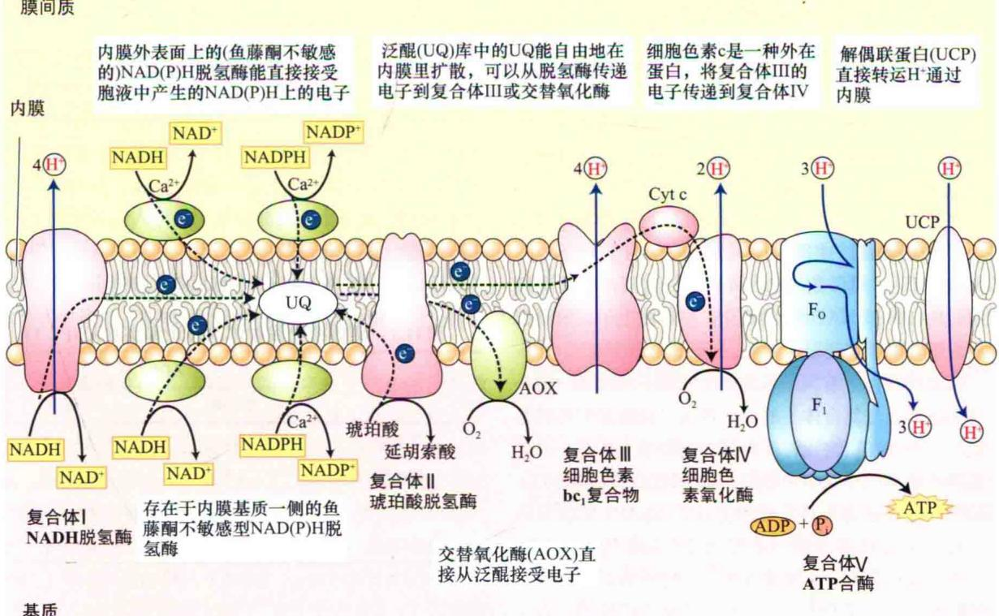  
图11.8 植物线粒体内膜上的电子传递链和 ATP 合酶。几乎所有真核细胞线粒体中都有的4种基本蛋白复合体 I、II、III 和 IV，在这些复合体中多数的结构已经确定，但此图显示的仅是简化的外形图。植物线粒体的电子传递链还包含其他酶（以绿色显示），这些酶都不具备质子泵的功能。另外，通过解偶联蛋白的被动运输，质子可绕过 ATP 合酶而进入线粒体。植物线粒体的电子传递旁路的多样性，使得植物线粒体的物质代谢与能量形成的偶联具有很大的灵活性，而动物线粒体仅有解偶联蛋白（参见 Web Topic 11.3）。

细胞色素 c 是一个松弛附着于线粒体内膜外表面的小分子蛋白质，并作为一个可移动的传递体在复合体Ⅲ和Ⅳ之间转运电子。

复合体Ⅳ（细胞色素c氧化酶）复合体Ⅳ含有2个铜中心（ $Cu_{A}$ 和 $Cu_{B}$ ）、细胞色素a和 $a_{3}$ ；这个复合体属于末端氧化酶，它将4个电子传递给 $O_{2}$ ，生成2分子 $H_{2}O$ ，而且每传递1对电子可将两个质子泵出基质（图11.8）。

在结构和功能上，泛醌和细胞色素 $bc_{1}$ 复合体分别类似于光合电子传递链中的质体醌和细胞色素 $b_{6}f$ 复合体（见第7章）。

实际上，植物线粒体电子传递链的组成和功能可能比上面描述的更为复杂，这些复合体还包含多种功能未知的植物特异的亚单位。某些复合体含有特殊的亚基，除参与电子传递外，还可能具有其他功能，如将胞质蛋白质转运到线粒体基质。另外，一些复合体好像以超复合体的形式存在，而不是以个体的形式在膜双分子层里自由移动，而这些超复合体的功能还不清楚（Millar et al., 2005）。

## 2. 电子传递链存在辅助的分支途径

除了前一节所描述的这些蛋白复合物外，植物线粒体的电子传递链还含有一些在哺乳动物线粒体中不存在的组分（图11.8和Web Topic 11.3）。这些位于线粒体内膜表面上的酶没有质子泵的功能，因此，一旦这些酶参与电子传递就必然导致能量利用率的降低。

在线粒体内膜的外表面上结合有多种NAD（P）H脱氢酶，被称为NDex（NADH）和NDex（NADPH），且多数是 $Ca^{2+}$ 依赖的；这两类酶负责细胞质的NADH或NADPH的氧化，然后将电子交给泛醌而进入核心电子传递链（Rasmusson et al., 2008）。

植物线粒体中有两条氧化基质NADH的途径。前一节所描述的通过复合体Ⅰ的电子传递对鱼藤酮和粉蝶菌素敏感；另外在植物线粒体内膜的内表面上还有一个对鱼藤酮不敏感的NADH脱氢酶，称为ND $_{in}$ （NADH），该酶同样能够催化来自柠檬酸循环的NADH的脱氢氧化。这个NADH脱氢酶可能起到支路的作用，只有当复合体Ⅰ超负荷时，它才发挥作用。随后我们将讨论在光呼吸条件下该酶的作用。在植物线粒体内膜的内表面还有一个NADPH脱氢酶，简称ND $_{in}$ （NADPH），迄今对这个酶的了解甚少（Rasmusson et al., 2004）。

绝大部分植物的线粒体中有一个“交替”呼吸途径，其作用是将泛醌的电子直接传递给氧气。这一途径的主要成员是一个称为交替氧化酶的蛋白质，它与细胞色素c氧化酶不同，该酶对氰化物和一氧化碳不敏感，对信号分子一氧化氮亦不敏感（参见Web Essay 11.4）。

有关这些辅助的电子转运蛋白的特性和生理意义将在本章的最后部分讨论。在植物线粒体中，另外还有一些与电子传递链有联系的脱氢酶在代谢物碳转化方面起重要作用（Rasmusson et al., 2008）。脯氨酸脱氢酶起着氧化脯氨酸的作用，在渗透胁迫时脯氨酸积累，而当水分状态恢复正常水平时，脯氨酸又被线粒体的脯氨酸脱氢酶降解；光照不足会引起植物的碳饥饿，此时，植物细胞中会积累几种氨基酸作为碳储备，这些氨基酸的降解需要一种黄素蛋白-醌氧化还原酶的催化（Ishizaki et al., 2005）；最后，抗氧化剂抗坏血酸（亦称维生素C）生物合成主途径的最后一步反应是由半乳糖-γ-内酯脱氢酶催化的，该酶为植物特有，在此反应中电子受体为细胞色素c，因而与正常的呼吸作用形成竞争（Millar et al., 2003）。

## 3. 线粒体中ATP合成与电子传递相偶联

氧化磷酸化实际上包括两个过程，即电子经复合体Ⅰ、Ⅲ和Ⅳ传递到氧的电子传递过程，和由 $F_{0}F_{1}-ATP$ 合酶（复合体Ⅴ）催化的ADP和 $P_{i}$ 结合而合成ATP的过程，这两个过程相偶联。合成ATP的数量依赖于电子供体的特性。

离体实验表明，基质的NADH经电子传递链氧化时，其ADP：O为2.4\~2.7（每2个电子传递到氧合成ATP的数目）（表11.1）。琥珀酸和外源NADH氧化的ADP：O为1.6\~1.8，然而，若人为地用抗坏血酸为电子供体时，它直接将电子交给细胞色素c，其ADP：O仅为0.8\~0.9。正是由于这些结果，使得人们对线粒体（植物和动物）的氧化磷酸化机制产生这样的认识，即电子传递链上实现能量转化的3个位点是复合体Ⅰ、Ⅲ和Ⅳ。

表11.1 离体植物线粒体的理论和实验ADP：O

<table><tr><td rowspan="2">底物</td><td colspan="2">ADP:O</td></tr><tr><td>理论值a</td><td>实测值</td></tr><tr><td>苹果酸</td><td>2.5</td><td>2.4~2.7</td></tr><tr><td>琥珀酸</td><td>1.5</td><td>1.6~1.8</td></tr><tr><td>NADH(外源)</td><td>1.5</td><td>1.6~1.8</td></tr><tr><td>抗坏血酸</td><td> $1.0^b$ </td><td>0.8~0.9</td></tr></table>

a 假设每传递2个电子，复合体Ⅰ、Ⅲ和Ⅳ分别泵出4个、4个和2个质子，每合成1分子ATP并转运出线粒体要消耗4个质子，同时非磷酸化电子传递途径处于非活性状态

b 以抗坏血酸为电子供体，细胞色素c氧化酶可以将2个质子泵出线粒体。然而，当2个电子从线粒体内膜外侧进入基质，就中和了基质中2个质子的正电荷，这就相当于向膜外共转运出4个质子，因此，其ADP: O值就为1

当1对电子沿电子传递链传递到分子氧时，复合体Ⅰ、Ⅲ和Ⅳ可将10个H $^{+}$ 从线粒体的基质转运到膜间质，而合成1分子ATP需要消耗4个质子（见下一部分内容和表11.1），按此结果计算出的ADP：O与上述实验结果非常一致。例如，线粒体外的NADH通过电子传递链氧化时，电子只经过复合体Ⅲ和Ⅳ，总共只能泵出6个H $^{+}$ ，因而也只能合成1.5个ATP（前提条件是交替氧化酶不起作用）。

在第7章中已经讨论过，化学渗透假说阐释了线粒体ATP合成的机制。1961年诺贝尔奖得主Peter Mitchell首先提出化学渗透学说，来阐释细胞跨膜储能的基本原理（Nicholls and Ferguson，2002）。根据化学渗透理论，线粒体内膜的电子传递体具有质子泵的功能，即它们在传递电子的同时伴随着质子从线粒体基质向膜外的转运（图11.8）。

由于线粒体内膜对质子是高度不通透的，因而就能够形成跨膜的电化学质子梯度。在第6章和第7章已经讨论过，这种跨膜的电化学质子梯度所具备的自由能（ $\Delta\tilde{\mu}_{H^{+}}$ ，也叫质子驱动力， $\Delta p$ ，单位伏特），包括跨膜电势能（ $\Delta E$ ）和化学梯度势能（ $\Delta pH$ ）。具体可用下式表示：

$$
\begin{array}{r l} \Delta p & = \Delta E - 5 9 \Delta \mathrm{pH(25℃)} \\ & \text {其中} \Delta E = E _ {\text {内}} - E _ {\text {外}} \\ & \Delta \mathrm{pH} = \mathrm{pH} _ {\text {内}} - \mathrm{pH} _ {\text {外}} \end{array}
$$

$\Delta E$ 代表膜两侧不对称分布的电荷（ $H^{+}$ ）差所具有的能量，而 $\Delta pH$ 是由于膜两侧质子浓度差产生的能量。由于质子是从线粒体基质转运到膜间质的，因而，跨膜的 $\Delta E$ 为负值。

从 $\Delta p$ 的表达式可以看出，在植物线粒体中 $\Delta E$ 和 $\Delta pH$ 共同形成了质子驱动力；尽管， $\Delta E$ 值通常以数量级的级别大于 $\Delta pH$ ，这可能是由于胞质和基质均具有较大的缓冲能力，从而避免了 pH 变化过大。而在叶绿体中正好相反，跨类囊体膜的质子驱动力则几乎全部由质子梯度（ $\Delta pH$ ）产生（见第 7 章）。

产生跨膜的 $\Delta\tilde{\mu}_{H^{+}}$ 所需之能量来自电子传递所释放的自由能，然而，迄今所有电子传递体上所发生的电子传递与质子跨膜转运的偶联机制还不是很清楚。由于内膜对质子的低通透性（传导性），质子电化学梯度就可以用来驱动某些化学反应（ATP合成）。跨膜 $\Delta\tilde{\mu}_{H^{+}}$ 与 ATP 合成的偶联是通过另外一个内膜蛋白质复合体而实现的，该蛋白质复合体被称为 $F_{0}F_{1}$ -ATP 合酶。

$F_{0}F_{1}-ATP$ 合酶（也称为复合体V）包括两个主体组分，即 $F_{0}$ 和 $F_{1}$ （图11.8）。 $F_{0}$ （下标的“o”是寡霉素敏感的意思）是一个膜内在蛋白复合体，至少由3种不同的多肽链组成，形成质子通过内膜的通道； $F_{1}$ 是一个外周膜蛋白复合体，至少由5种不同的亚基组成，由ADP和 $P_{i}$ 合成ATP的催化部位在该复合体上，它与 $F_{0}$ 的基质一侧相结合。

质子通过 $F_{0}$ 通道与 $F_{1}$ 的催化循环相偶联，从而使ATP的合成能够持续进行，以及同步利用跨膜 $\Delta\tilde{\mu}_{H^{+}}$ 。每合成1子ATP需要3个 $H^{+}$ 顺着电化学质子梯度穿过 $F_{0}$ ，从膜间隙进入基质。

通过解析哺乳动物 ATP 合酶 $F_{1}$ 复合体的高分辨率的结构，人们提出了“转动模型”，ATP 合酶的 $F_{0}$ 做相对于 $F_{1}$ 的旋转运动，并将质子转运与 ATP 合成相偶联（Abrahams et al., 1994）（参见 Web Topic 11.4）。线粒体 ATP 合酶的结构和功能类似于叶绿体光合磷酸化中的 $CF_{0}-CF_{1}$ ATP 合酶（见第 7 章）。

化学渗透学说对于阐明 ATP 合成机制主要表现在以下几个方面。

第一，线粒体内膜上ATP形成的真正位置是ATP合酶，而不是复合体Ⅰ、Ⅲ或Ⅳ，这些复合体的功能是将电子传递所释放的自由能转化为跨膜 $\Delta\tilde{\mu}_{H^{+}}$ 。ATP的合成降低了 $\Delta\tilde{\mu}_{H^{+}}$ ，因而其结果是ATP的合成制约了电子转运体的活性，通过大量供给ADP就可极大地激活电子转运。

第二，化学渗透理论很好地解释了解偶联剂的作用机制。化学结构和性质没有相关性的一些人工合成的化合物[包括2，4-二硝基苯酚和三氟甲氧基腙羰基氟化物（FCCP）]能够减少线粒体中ATP的合成，却刺激电子传递速度（参见Web Topic 11.5）。所有这些解偶联剂的作用是增加内膜对质子的通透性，导致质子渗漏，因而，随着电子传递难以形成足够大的跨膜 $\Delta \tilde{\mu}_{\mathrm{H}^{+}}$ 来驱动ATP的合成或抑制电子传递。

## 4. 底物和产物的跨膜交换

电化学质子梯度的另一项重要功能是驱动许多物质的跨膜转运，如柠檬酸循环中的有机酸、ATP合成的底物和产物等。虽然ATP在线粒体基质中合成，但其绝大部分在线粒体外被利用，因此需要一个有效的机制把胞质中ADP输入线粒体基质，同时把ATP转运到线粒体外。

ADP/ATP（腺苷酸）转运蛋白负责 ADP 和 ATP 跨线粒体内膜的交换（图11.9）。当1个ATP $^{4-}$ 运出线粒体的同时1个ADP $^{3-}$ 进入线粒体，因而就相当于1个负电荷移出线粒体基质，这一过程的驱动力是由质子转运所建立的跨膜电势梯度（ $\Delta E$ ，外面是正极）。

线粒体对无机磷酸（ $P_{i}$ ）的摄取是由一个活跃的磷酸转运蛋白来完成的。磷酸转运蛋白以跨膜化学势（ $\Delta pH$ ）为驱动力，通过电中性交换的方式，实现 $P_{i}$ （输入）和 $OH^{-}$ （输出）的跨膜交换。只要跨内膜的 $\Delta pH$ 稳定，基质中 $P_{i}$ 浓度将会维持在较高的水平。与 $P_{i}$ 的转运相类似，丙酮酸的吸收也是通过丙酮酸和OH⁻等电荷交换而实现的，在稳定的跨膜ΔpH驱动下，丙酮酸转运蛋白就会不断地将胞液中的丙酮酸送入线粒体基质（图11.9）。

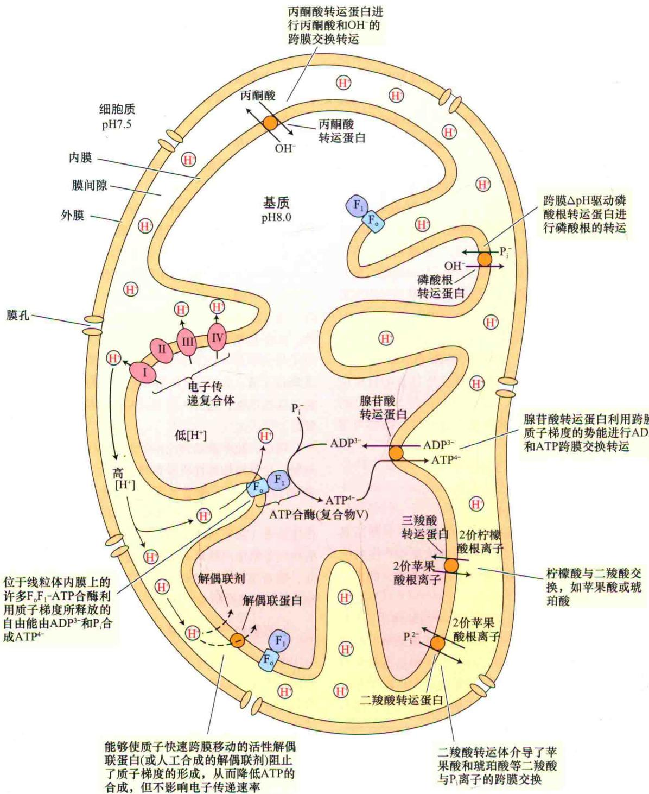  
图11.9 植物线粒体的跨膜转运。跨线粒体内膜的电化学质子梯度 $\Delta\tilde{\mu}_{H}$ 由膜电位（ $\Delta E, -200\ mV$ ，内部为负）和跨膜质子梯度（ $\Delta pH$ ，内部碱性）组成，随着电子传递而建立，文中有相关内容的详细阐述。特定的代谢物经过转运蛋白或载体进行跨膜转运（改编自Douce，1985）。

吸收1分子磷酸和1分子ADP到基质中并输出1分子ATP消耗的总能量相当于1个 $H^{+}$ 从膜间隙回到基质中：

（1） $OH^{-}$ 的移出和 $P_{i}^{-}$ 的进入交换相当于一个 $H^{+}$ 进入线粒体，因此仅消耗跨膜化学势，而不消耗跨膜电势。

（2）将一个负电荷移出线粒体（ADP $^{3-}$ 进入与ATP $^{4-}$ 移出的交换）其结果相当于将一个正电荷进入线粒体，因此，这种转运仅降低跨膜电势。

在计算合成1分子ATP的能耗时，驱动ATP与ADP和 $P_{i}$ 交换转运所消耗的质子梯度也应包括在内。ATP合酶消耗3个 $H^{+}$ 再加上跨膜交换所消耗的1个 $H^{+}$ ，因此，合成1分子ATP总共消耗4个 $H^{+}$ 。

在线粒体内膜上还有其他的转运体，如负责二羧酸（苹果酸或琥珀酸）和 $P_{i}^{2-}$ 的跨膜交换、柠檬酸和苹果酸的跨膜交换转运等（图11.9和Web Topic 11.5）。

5. 每分子蔗糖经有氧呼吸代谢可产生大约60分子的ATP

1个蔗糖分子的完全氧化可以产生：

（1）经过底物水平磷酸化形成8分子的ATP（4个来自糖酵解，4个来自柠檬酸循环）。

（2）在细胞溶质中形成4分子NADH。

（3）在线粒体基质中形成16分子的NADH和4分子的 $FADH_{2}$ （通过琥珀酸脱氢酶形成）。

蔗糖进行有氧代谢时，根据理论ADP：O（表11.1）计算，通过氧化磷酸化大约产生52分子的ATP，因此，每分子蔗糖彻底氧化大约合成60个ATP（包括底物水平磷酸化）（表11.2）。

表11.2 蔗糖经过糖酵解和柠檬酸循环完全氧化可合成细胞质ATP的最大值

<table><tr><td>代谢途径</td><td>ATP每分子蔗糖 $^a$ </td></tr><tr><td>糖酵解途径</td><td></td></tr><tr><td>4底物水平磷酸化</td><td>4</td></tr><tr><td>4NADH</td><td>4×1.5=6</td></tr><tr><td>柠檬酸循环</td><td></td></tr><tr><td>4底物水平磷酸化</td><td>4</td></tr><tr><td>4FADH $_2$ </td><td>4×1.5=6</td></tr><tr><td>16NADH</td><td>16×2.5=40</td></tr><tr><td>总计</td><td>60</td></tr></table>

资料来源：Brand，1994  
注：此表中的计算依据为，细胞质中的NADH是通过线粒体内膜外表面的NADH脱氢酶氧化，并且非磷酸化途径不能进行。

a用表11.1的理论值进行计算

在细胞中，每合成1分子ATP实际需要50 kJ/mol的自由能，所以每摩尔蔗糖有氧呼吸生成的ATP约贮能3010 kJ/mol。这个数量大约是蔗糖彻底氧化所释放的总能量的52%，其余能量以热能形式散失。前已述及，在蔗糖的发酵代谢中，仅有4%的能量用于合成ATP。由此可以看出，蔗糖有氧代谢的能量利用效率要远远高于无氧代谢。

## 6. 呼吸系统多个复合体的一些亚基由线粒体DNA编码

植物线粒体的遗传体系不但与细胞核和叶绿体中的不同，而且与动物、原生动物、真菌线粒体的遗传体系也不同。最值得注意的是，植物线粒体RNA的加工与大多数其他有机体线粒体的RNA加工之间存在明显差别（参见Web Topic 11.6）。已知的差别主要有：

（1）RNA剪接（如存在特异内含子）。

(2) RNA编辑（改变核苷酸顺序的转录后加工）。

(3) RNA稳定性的信号调节。

（4）翻译（植物线粒体用通用基因密码，而其他真核生物的线粒体有不正常密码）。

在不同的植物（即使是亲缘关系很近）之间，线粒体基因组大小变化极大，在180\~3000千碱基对（kb），通常远大于简单和均一的哺乳动物线粒体基因组（16 kb）。主要是由于植物线粒体DNA（mtDNA）中存在很多非编码序列，包括大量的内含子。哺乳动物mtDNA仅编码13种蛋白质，而拟南芥mtDNA编码35种已知蛋白质（Marienfeld et al., 1999）。植物和哺乳动物mtDNA都含有全部rRNA和tRNA的基因。

呼吸系统的复合体 I \~ V 的一些亚基均由植物 mtDNA 编码，植物 mtDNA 还编码了几种参与细胞色素生物起源的蛋白质，而且这些线粒体基因编码的亚基对这些复合体的活性是必需的。

除了mtDNA编码的蛋白质外，所有线粒体蛋白质（可能超过2000种）都由核DNA编码，其中包括柠檬酸循环中所有的蛋白质（Millar et al., 2005）。核DNA编码的线粒体蛋白质在胞质核糖体上合成，并通过位于线粒体外膜或内膜上的转运蛋白输入线粒体。因此，氧化磷酸化作用的顺利进行依赖于两个不同基因组中基因的表达，并且，这些基因的动态表达是相互协调的。

编码线粒体蛋白的核基因表达的调节机制与其他的核基因的表达调控方式基本一致，但人们对线粒体基因表达的调控机制却了解甚少。某些基因可以通过减少编码该基因的植物mtDNA片段的拷贝数而下调（Leon et al., 1998）；在植物mtDNA中有多类型的启动子，并表现出不同的转录活性。然而，呼吸系统所有复合体的生物起源似乎与核基因编码亚基的基因表达的变化相关，这种改变是在翻译后发生并与线粒体基因组相协调（Giegé et al., 2005）。

线粒体基因组对花粉的发育十分重要，mtDNA的某些基因自发重排导致细胞质雄性不育（cms）；这一特性会引起早熟型细胞程序性死亡（programmed cell death），从而干扰花粉的发育（见Web Essay 11.5），但不影响植物其他方面的生长发育。这种细胞质雄性不育特性被用于一些作物的育种，以配制杂交种。

## 7. 植物体中存在几种降低ATP产量的代谢方式

从前文可以看出，在氧化磷酸化中，能量的高效转化依赖于一个十分复杂体系的运作，然而令人惊奇的是，植物线粒体有一些蛋白质其功能却是降低氧化磷酸化的能量转换效率（参见Web Topic 11.3）。对于植物的生长发育来说，与环境中其他限制因素（如水分和营养物质）相比，能量供应（阳光）所受到的限制可能更小，因此，呼吸代谢的灵活性可能比获取更多的能量更重要。

下面我们将讨论呼吸代谢中的三种非磷酸化机制及其在植物生长发育中的可能作用：交替氧化酶、解偶联蛋白和鱼藤酮不敏感NADH脱氢酶。

交替氧化酶 如果在呼吸活跃的动物组织中加入浓度在毫摩尔水平的氰化物，细胞色素 c 氧化酶活性被抑制，呼吸速率也迅速下降到起始速率的1%以下。然而，与细胞色素氧化酶途径相比，绝大多数植物则具有很强的抗氰呼吸（cyanide-resistant respiration）。赋予植物抗氰呼吸的酶已被鉴定，它是一种泛醌氧化酶，称之为交替氧化酶（Vanlerberghe and McIntosh，1997）（图11.8和Web Topic 11.3）。

电子在泛醌处脱离主电子传递链而进入交替途径（图11.8），交替氧化酶是交替途径的唯一组分，它催化氧气的4电子还原，直接生成水。交替氧化酶的活性可被一些化合物抑制，其代表物为水杨基氧肟酸（SHAM）。

一旦电子从泛醌处进入交替途径，就会绕过电子传递链的两个质子泵（复合体Ⅲ和Ⅳ），由于在交替途径中从泛醌到氧气之间没有储能功能，因而，正常情况下用于合成ATP的能量就会以热的形式散失。

那么，像交替途径这样的可能会造成能量浪费的途径对植物代谢有何意义呢？天南星科（海芋属）的几种植物的花发育过程中，交替氧化酶发挥了有益的作用。例如，百合（Sauromatum guttatus）在授粉之前，花序组织通过交替途径呈现出呼吸速率的迅速升高，组织的温度高于环境温度25℃左右。随着此爆发性的热量释放，促使一些胺、吲哚和萜类物质挥发，因此植物产生腐败气味，引诱昆虫传粉（参见Web Essay 11.6）。已经证实，水杨酸是百合启动这种放热过程的信号分子（Raskin et al., 1989），随后的研究亦证实，水杨酸也参与了植物对病原菌的抗性（见第13章）。

然而，在绝大多数植物中，抗氰呼吸速率都很低而不能产生足够的热量使植物体的温度明显升高，那么，在此情况下，交替途径的作用又如何呢？要回答这一问题我们就必须考察交替氧化酶的活性调节问题。首先，多种不同类型的生物和非生物胁迫能够特异地诱导交替氧化酶基因的转录。其次，交替氧化酶的活性状态为同源二聚体，其活性受分子间二硫键的可逆氧化还原调节，线粒体中泛醌库的高还原状态和高浓度的丙酮酸均可促进二硫键的还原，使交替氧化酶处于活性状态。

前者代表细胞高还原态可激活该酶的活性；而后者则表示，当柠檬酸循环有充足的底物供给时，交替氧化酶也以高活性状态参与细胞代谢（参见Web Topic 11.3）。

如果呼吸速率超过细胞对ATP的需求（如果ADP水平很低），线粒体中的代谢物将处于高还原水平，呼吸代谢也将受阻，此时交替氧化酶被激活。因此，交替氧化酶的作用是在保证ATP合成与需求相适应的同时，也保证了呼吸代谢正常进行，为生物合成提供所需的碳骨架。

许多胁迫能抑制线粒体的呼吸作用，交替途径在植物适应各种胁迫（磷缺乏、冷、干旱、渗透胁迫等）中起着重要作用（见第26章）。当植物受到此类胁迫时，电子传递链产生活性氧的量增加，这些活性氧分子作为信号而激活交替氧化酶基因表达。此时，交替途径发挥作用，从泛醌库中分流电子（图11.8），起到了防止泛醌库的过度还原。如果这种过度还原状态不消除，就会导致产生大量极具破坏性的活性氧，如羟自由基。通过这种方式，交替途径能有效地减小胁迫对呼吸代谢的毒害作用（Rhoads and Subbaiah，2007；Møller，2001）（参见Web Essay 11.7）。这种细胞器的生理生化状态对核基因表达的影响，称为逆行管制（retrograde regulation）（图11.10）。

解偶联蛋白 解偶联蛋白首先发现于哺乳动物线粒体内膜，它能极大地增加膜的质子通透性，导致质子内渗，因而起着解偶联的作用。其结果是，呼吸代谢中ATP合成减少，释放热量增加。在哺乳动物细胞中产热好像是解偶联蛋白的主要功能之一。

在很长时期内，人们认为植物的交替氧化酶和哺乳动物的解偶联蛋白的生理作用相同，只是方式不同。令人奇怪的是，在植物线粒体中也发现了类似的解偶联蛋白（Vercesi et al., 1995; Laloi et al., 1997）。与交替氧化酶相同，植物的解偶联蛋白也是胁迫诱导蛋白，其作用也是防止电子传递链的过度还原（参见Web Topic 11.3 和 Web Essay 11.7）。但仍然不清楚的是，为何植物线粒体需要这两种机制共存？

鱼藤酮不敏感的 NADH 脱氢酶 这是植物线粒体中诸多 NAD(P)H 脱氢酶中的一种（图11.8 和 Web Topic 11.3）。线粒体内的对鱼藤酮不敏感 NADH 脱氢酶[ND $_{in}$ （NADH）]只能传递电子但没有质子泵的功能，它作为电子传递的旁路只有在复合体 I 超负荷时才发挥作用。复合体 I 对 NADH 的亲和性远大于 ND $_{in}$ （NADH）[对 NADH 的 K $_{m}$ 值仅为的 ND $_{in}$ （NADH）的 1/10]，线粒体基质的 NADH 浓度较低时，当 ADP 水平升高，复合体 I 主导 NADH 的脱氢氧化。然而，当 ADP 缺乏，NADH 浓度较高时，ND $_{in}$ （NADH）活性增加，例如，在光呼吸作用中，线粒体基质中甘氨酸的氧化导致大量 NADH 的产生，ND $_{in}$ （NADH）的作用

更加重要（见第8章）。为维持相关途径的高效运转， $ND_{in}$ （NADH）和交替氧化酶可及时地将NADH氧化为 $NAD^{+}$ 。通过和各种有机酸的交换转运，还原力可以在基质与细胞质之间穿梭，此时，细胞质中的NADH脱氢酶也可起到类似于 $ND_{in}$ （NADH）的作用。综合这些结果，这些NADH脱氢酶和NADPH脱氢酶的共同作用可能使得植物的呼吸作用更具灵活性，在调节细胞氧化还原平衡方面起着重要作用（图11.10）。

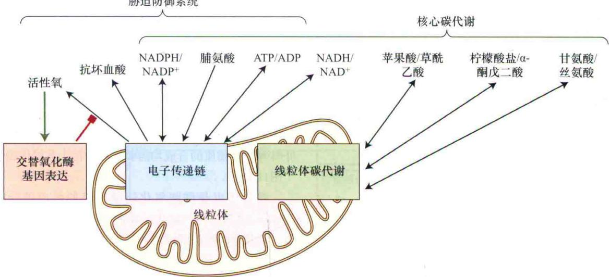  
图11.10 线粒体和细胞质代谢的相互交流。线粒体代谢的活跃程度可影响胞质中氧化还原分子和能量分子的水平，这些分子参与细胞的胁迫防御和碳代谢的核心途径（如生长过程和光合作用）。在胁迫防御和碳代谢之间并没有明确的区别，因为它们具有很多共同的组分。箭头表示这些分子在线粒体中合成[如活性氧（ROS）、ATP或抗坏血酸]或降解[如NAD（P）H、脯氨酸或甘氨酸]而引起的细胞效应。活性氧调控的细胞核交替氧化酶基因的表达就是逆向管制的一个例子。

## 8. 线粒体呼吸作用的短期调控在不同水平上进行

合成ATP的底物ADP和 $P_{i}$ 是植物细胞质中糖酵解途径、线粒体中柠檬酸循环和氧化磷酸化运行速率的关键的短期调节因子，这三个阶段中均有ADP和 $P_{i}$ 的控制点。在此我们仅简要概述呼吸代谢调控的主要特征。

在呼吸代谢的诸多调节部位中，丙酮酸脱氢酶复合体是研究得最清楚的翻译后调节位点，调节激酶使该酶磷酸化，而磷酸酯酶使其脱磷酸化，磷酸化状态无活性，丙酮酸抑制调节激酶的活性，因此，当底物存在时，丙酮酸脱氢酶以脱磷酸的活性形式催化反应（图11.11）。丙酮酸脱氢酶位于柠檬酸循环的入口，因此根据细胞需求，通过调节该酶的活性就控制了柠檬酸循环的运转速率。

通过半胱氨酸残基之间的二聚化（二硫键）可逆氧化还原作用，硫氧还蛋白控制着多种酶的活性（见第8章）。许多线粒体酶都受硫氧还蛋白修饰（Buchanan and Balmer，2005），这些酶涉及几乎所有的途径。尽管这种调节的详细机制目前还没有弄清楚，但是线粒体的氧化还原状态很可能对呼吸代谢的诸多途径具有重要的调控作用。

柠檬酸循环的氧化及随后的呼吸作用均受细胞中腺苷酸水平的动态控制。当线粒体中 ATP 合成多于细胞对 ATP 需求时，ADP 浓度降低，因而电子传递链传递电子的速度随之下降（图11.9），由此而导致的基质中NADH浓度升高就成为调控柠檬酸循环中多种酶的信号，柠檬酸循环中的多种脱氢酶活性就被抑制（Oliver and McIntosh，1995）。

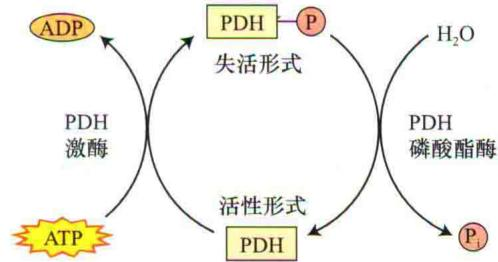

丙酮酸+CoA+NAD $^{+}$ → 乙酰 CoA+CO $_{2}$ +NADH

<table><tr><td>调节因子及效应</td><td>作用机制</td></tr><tr><td>激活作用</td><td></td></tr><tr><td>丙酮酸</td><td>抑制激酶</td></tr><tr><td>ADP</td><td>抑制激酶</td></tr><tr><td> $Mg^{2+}$ (或  $Mn^{2+}$ )</td><td>激活磷酸酯酶</td></tr><tr><td>抑制作用</td><td></td></tr><tr><td rowspan="2">NADH</td><td>抑制PDH</td></tr><tr><td>激活激酶</td></tr><tr><td rowspan="2">乙酰CoA</td><td>抑制PDH</td></tr><tr><td>激活激酶</td></tr><tr><td rowspan="2"> $NH_{4}^{+}$ </td><td>抑制PDH</td></tr><tr><td>激活激酶</td></tr></table>

图11.11 丙酮酸脱氢酶（PDH）活性受代谢物和可逆磷酸化双重调节。上游和下游的代谢物可从两个方面对丙酮酸脱氢酶活性进行调节：代谢物直接作用于PDH的别构调节，或者通过  
调节PDH激酶或磷酸酯酶的活性进而调节PDH活性。

柠檬酸循环中间产物（如柠檬酸）和它们的衍生物（如谷氨酸）的积累会抑制胞液中丙酮酸激酶的活性，使得胞质中PEP浓度升高。PEP进而降低了果糖-6-磷酸向果糖-1，6-二磷酸的转化速度，最终抑制糖酵解的进行。

总之，植物呼吸速率调节是通过感知细胞中ADP水平，以自下而上的方式进行的变构调节（图11.12），

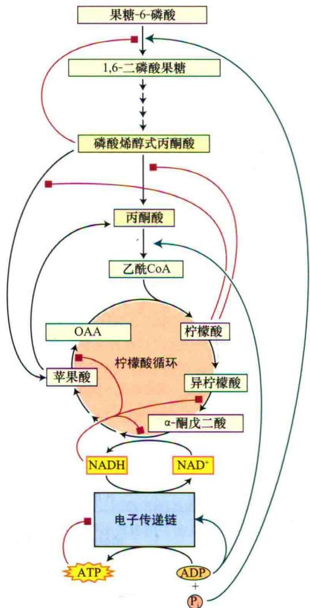  
图11.12 植物呼吸代谢自下而上的调节模式。呼吸作用的一些底物（如ADP）激活上游的某些酶活性（绿箭头），而产物的积累（如ATP）通过连续反馈的方式逐步抑制（红色的线和方块）上游的某些酶活性。例如，ATP抑制电子传递链的作用，导致NADH的积累。而NADH的积累抑制柠檬酸循环中异柠檬酸脱氢酶和α-酮戊二酸脱氢酶的酶活性。于是，柠檬酸等中间产物的积累进而抑制胞液中PEP代谢相关的酶活性。最后，PEP抑制果糖-6-磷酸向果糖-1，6-二磷酸的转化，并限制代谢物进入糖酵解。呼吸作用的这种从下而上的调节模式既保证了ATP的供给，也协调了细胞对有机酸的需要。

即最初由细胞中的ADP水平调节电子传递和ATP合成的速度，进而调节柠檬酸循环，最后调节糖酵解反应的速度。这种自下而上的调节模式既保证了细胞对能量的需求，同时又可为生物合成提供各种碳骨架，因而使得呼吸作用能与细胞生命活动的不同需求相适应。

## 9. 呼吸代谢与其他途径紧密偶联

糖酵解、戊糖磷酸途径和柠檬酸循环通过一些中间产物与其他一些重要的代谢途径相联系，其中有些将在第12章中详细论述。实际上，许多还原性碳化合物经糖酵解和柠檬酸循环代谢的转化主要用于生物合成，而不是氧化成 $CO_{2}$ 。例如，氨基酸、脂类、类异戊二烯和卟啉等许多物质的合成均需要呼吸途径为其提供碳骨架（图11.13）。

线粒体也是细胞氧化还原网络的组成部分，像NAD（P）H这样的氧化还原剂和能量载体的消耗和产生，以及有机酸的消耗和产生都会影响细胞质和质体中的代谢途径。作为重要的氧化还原剂和植物应答胁迫的分子，抗坏血酸的合成尤为重要（图11.10）（Noctor et al., 2007）；线粒体也参与了许多辅酶的合成，这些辅酶对于细胞的其他区域的代谢酶是必需的（参见Web Essay 11.8）。

## 11.1.5 植物整体和组织的呼吸代谢

有关呼吸代谢及其调控的理论大多数是以离体的细胞器或无细胞提取物为材料进行研究的结果，那么，对于处于自然状态下的植物个体来说，这些代谢途径运行状态如何？这些理论是否适用于指导农业生产？

接下来，我们将讨论整个植株在不同环境下的呼吸作用和线粒体的功能。首先，我们要探讨在光照下，绿色器官内同时运行的呼吸作用和光合作用，以及细胞内它们在功能上的整合。其次，讨论不同组织的呼吸速率，这可能受发育的控制。最后，讨论不同环境因素对呼吸速率的影响。

## 1. 植物每天光合产物有大约一半被呼吸作用消耗

许多因素能影响完整植株或个别器官的呼吸速率。相关因素包括植物的种类和生长习性，特异器官的类型和年龄，另外，许多环境变化也会影响植物的呼吸速率，如氧浓度、温度、养分与水的供给等（见第26章）。通过氧同位素检测，我们就可以分析活体内交替酶和细胞色素c氧化酶的活跃程度，从而知道在绝大多数组织中交替途径在呼吸代谢中所占份额（参见Web Essay 11.9）。

以新鲜组织为材料的研究结果显示，完整植物的呼吸速率通常低于动物组织的呼吸速率，其原因主要是中央大液泡和细胞壁部分占据了植物细胞的大部分区域，而它们都不含线粒体。不过有些植物组织的呼吸速率与呼吸活跃的动物组织一样高，因此植物呼吸速率不是先天比动物低。实际上，离体植物线粒体呼吸作用与哺乳动物线粒体的呼吸速率一样大，或比其更大。

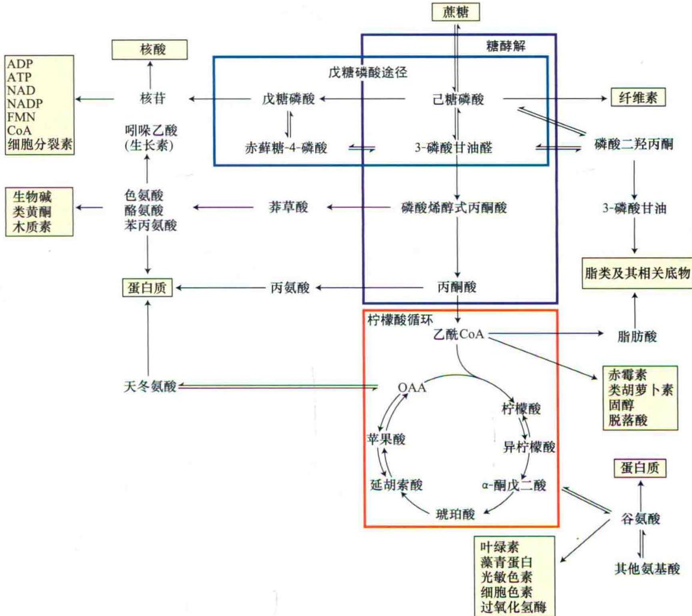  
图11.13 在植物中，糖酵解、氧化戊糖磷酸途径和柠檬酸循环为许多物质的生物合成提供前体。由图示可以看出，许多物质合成的所需前体可以直接是这些代谢途径的中间产物或由某些中间产物转化而来，同时强调这样一个事实，即并不是所有进入糖酵解途径的代谢物都被氧化成 $CO_{2}$ 。

呼吸作用在植物体内所有含碳物质的转化中起着不可取代的作用。在植物体中仅绿色组织能进行光合作用，而其他组织均进行呼吸代谢，并且一天24 h从不间断，甚至在光合作用活跃的组织中也会同时进行呼吸作用，且全天的呼吸量相当于光能合成的大部分。对一些草本植物的测量结果表明，光合作用每天获得的有机碳化合物的30%\~60%丧失于呼吸作用，而在衰老的植物中这种消耗趋于减小（Lambers，1985）。树的呼吸代谢消耗与此相近，但在老树中，由于光合组织对非光合组织的比例下降，这个消耗量会增加。

## 2. 光合期间同时进行呼吸作用

进行光合作用的叶片中也有线粒体参与的代谢作用。由光呼吸产生的甘氨酸在线粒体中氧化成丝氨酸，该反应与线粒体的耗氧相关（见第8章）。与此同时，进行光合作用的组织中的线粒体也进行正常的线粒体呼吸作用（即通过柠檬酸循环进行的呼吸代谢）。相对于光合作用的最高速率，在光照下绿色组织中线粒体呼吸速率是相当低的，通常为光合速率的1/20\~1/6。考虑到光呼吸的速率能达到总光合速率的20%\~40%，在白天，光呼吸为呼吸链提供的NADH就多于正常呼吸途径。

丙酮酸脱氢酶所催化的反应是代谢物进入柠檬酸循环的入口之一，在光照下其活性下降到黑暗中的25%（Budde and Randall，1990）。在光照下，线粒体呼吸作用的整体速率通常会明显下降，但下降的幅度目前还不清楚。然而，即使在光照条件下叶片细胞胞质中的代谢过程所需的ATP主要由线粒体提供（如用于生物合成途径的），这一点却是肯定的（Krömer，1995）。

光合作用过程中，线粒体呼吸作用的另一个功能是为生物合成反应提供前体。例如， $\alpha$ -酮戊二酸的形成是氮同化所必需的（图11.7C和图11.13）。该反应在基质中进行，其另一个产物是NADH，通过NADH又将氧化磷酸化或非磷酸化呼吸链的活性与 $\alpha$ -酮戊二酸等前体物质的合成相协调（Hoefnagel et al., 1998；Noctor and Foyer, 1998）。

通过研究呼吸作用复合体缺失的线粒体突变体，充分证实了线粒体呼吸作用与光合作用相偶联。与野生型相比，这些植物的叶片发育迟缓，光合能力下降，导致这一结果的原因是：具有氧化还原活性的代谢物穿梭于线粒体和叶绿体之间，将呼吸作用和光合作用有机地联系起来。因而，线粒体呼吸能力的降低就会对光合作用起负调控作用（Noctor et al., 2007）。

## 3. 不同的组织和器官的呼吸速率不同

呼吸作用常被分成两个量级，即维持呼吸（maintenance respiration）和生长呼吸（growth respiration）。前者的作用是维持植物的基本功能和已有组织的更新；后者则是为新生组织提供能量并把糖类物质转化为构建新生组织所必需的材料。对于某个给定的组织，代谢活性越高，其呼吸速率就越高，这是一个很实用的经验法则。发育的芽通常具有非常高的呼吸速率；而营养器官的呼吸速率则与其发育状态有关，从快速生长部位（如双子叶植物的叶尖和单子叶植物的叶基）到高分化区域呈逐步降低的变化。研究得最透彻的例子是生长中的大麦叶片（Thompson et al., 1998）。

对于发育成熟的营养器官来说，不同的组织呼吸速率也不尽相同，茎的呼吸速率最低，而叶和根的呼吸速率与植物种类和环境条件有关。例如，当土壤营养缺乏时，根部的呼吸速率就会明显提高，以满足对ATP需求的增长，其生理作用就是增加离子的吸收和增长根部以获取营养物质（见 Web Topic 11.7 讨论呼吸速率的变化对作物产量的影响）。

植物组织发育成熟时，其呼吸速率可能会稳定在一定水平，也可能随着组织由成熟到衰老的转变而慢慢下降。但一个特例是：某些植物组织衰老时呼吸速率会显著升高，即呼吸跃变。例如，许多果实（如鳄梨、苹果和香蕉）成熟及离体叶和花衰老时都会发生呼吸跃变。植物组织的这种呼吸跃变是由内源乙烯引发的，外源乙烯也可以引发（见第22章）。一般来说，乙烯诱导的呼吸跃变与抗氰交替途径的活跃进行相关联，但该途径在果实成熟过程中所起的生理作用却不清楚（Tucker，1993）。

不同组织呼吸底物不同。糖类物质是通用的，但是某些特殊器官可以用其他化合物进行呼吸：苹果和柠檬的成熟期为有机酸，向日葵和油菜种子发芽期为脂类。由于这些化合物的碳氧比不同，因而其呼吸商（respiratory quotient，RQ）就不同，所谓呼吸商就是在呼吸代谢中每释放一分子 $CO_{2}$ 所消耗的 $O_{2}$ 的数量。从脂类、单糖到有机酸的呼吸商呈逐渐升高，这是因为脂类分子含有较少的氧，而有机酸含氧量最高。乙醇发酵只释放 $CO_{2}$ 但不消耗氧气，因此，过高的呼吸商就成为发酵代谢的标志。由于呼吸商可以在田间直接测定，因而呼吸商是大规模分析碳代谢的重要指标。

## 4. 环境因子影响呼吸速率

许多环境因素能够改变新陈代谢途径运转状态和呼吸速率。这里我们将讨论 $O_{2}$ 、温度和 $CO_{2}$ 对植物呼吸速率的影响。

$O_{2}$ 其能影响呼吸作用是因为它是整个呼吸代谢的最终底物。在 $25^{\circ}C$ ，当水被大气（ $21\% O_{2}$ ）饱和并达到平衡状态时，其 $O_{2}$ 含量大约是 $250\ \mu mol/L$ 。而细胞色素c氧化酶对 $O_{2}$ 的 $K_{m}$ 值低于 $1\ \mu mol/L$ ，由此可见， $O_{2}$ 浓度对呼吸速率的限制应该微乎其微。然而，如果整个组织处于 $O_{2}$ 浓度低于 $5\%$ 的大气环境或组织切片周围大气的 $O_{2}$ 浓度低于 $2\%\sim3\%$ 时，呼吸速率明显降低。这些结果表明， $O_{2}$ 供给量可制约呼吸速率。

在植物组织的细胞间存在着充满空气的间隙，这就克服氧气在水相中扩散的不足，从而更有效地为线粒体的呼吸代谢提供充足的 $O_{2}$ 。在植物中如果没有这样的气体扩散路径， $O_{2}$ 供给受限，许多植物细胞的呼吸速率将会受到严重影响。像种子和块茎这样堆积紧密的器官中，从表面到中心就存在显著的 $O_{2}$ 浓度梯度，这会限制组织中ATP/ADP的比值。对于表皮较厚的种子和生长在水下的组织来说，扩散限制就显得更加重要。当水培植物时，就必须向营养液中充气，以保证在根周围有高浓度的氧气（见第5章）。与此类似，当植物生长在非常湿的或者水淹的土壤时，氧气供给就愈发重要（见第26章）。

植物，尤其是树木的地理分布直接与根部能否获得足够的 $O_{2}$ 相关。例如，山茱萸（Cornus florida）、郁金香属的白杨木（Liriodendron tulipifera）只能生长在排水良好和通气性优良的土壤中。然而，许多植物却非常适应在充水的土中生长，如水稻和向日葵等草本植物，在它们的体内从叶子到根存在连续的、网络化的通气组织，从而保证氧气从叶子到根部的不间断输送。

对于生长在水淹且根扎得很深的树木来说，根部的 $O_{2}$ 供应限制就更加严重。为适应这种环境，这些树木的根要么被迫进行厌氧代谢（发酵作用），要么进化形成专门的空气输送组织，以便向根部输送足够的 $O_{2}$ 。其典型代表是呼吸根（pneumatophores）的形成，这种根由下向上并突出水面，在根组织中有气体通路，保证 $O_{2}$ 向根部的快速扩散。海榄雌属类和红树属类是生长在红树林沼泽地的树木，它们具有典型的呼吸根。

温度 呼吸代谢可以在很大的温度变化范围进行（参见 Web Essays 11.4 和 11.6）。在0\~30℃，呼吸作用随着温度的升高而增强，40\~50℃达到平台期。如果温度进一步升高，植物的呼吸速率就会迅速下降，这是由于参与呼吸作用的酶类失活所致。通常把温度每升高10℃，呼吸速率增加的幅度称为温度系数（Q10）。温度系数能够准确地反映短期温度变化对呼吸作用影响；但温度系数随植物发育时期和外界因素的变化而改变。当长期处于低温时，植物的呼吸作用就会增强，从而保证ATP的供给（Atkin and Tjoelker，2003）。

水果和蔬菜的采收后贮藏和保鲜，通常采用低温来降低呼吸速率。但是，这类贮藏是个复杂的过程，并不是温度越低越好。例如，在贮存马铃薯块茎时，温度高于10℃时，呼吸作用及其相关的代谢活动就足以导致萌发；而低于5℃时，呼吸速率和萌发会受到抑制，但马铃薯块茎中贮存的淀粉就会降解，并转化为蔗糖，从而使块茎产生甜味，这也是人们不希望发生的结果。因而，马铃薯的优化贮存条件是7\~9℃，在此条件下，既能阻止淀粉降解，又能使呼吸速率和萌发降到最小。

$CO_{2}$ 在生产实践中，人们通常是根据大气 $O_{2}$ 浓度和温度对呼吸速率的影响，来优化水果的贮存条件，低温、2%\~3%的 $O_{2}$ 浓度和3%\~5%的 $CO_{2}$ 浓度是比较合理的、具备商业价值的水果贮存条件。低温和低 $O_{2}$ 含量都能降低呼吸速率。应该注意的是， $O_{2}$ 浓度要低，但不能缺 $O_{2}$ ，因为缺 $O_{2}$ 会导致组织进行发酵代谢。另外，人为地将 $CO_{2}$ 提高3%\~5%，也能够显著地抑制呼吸速率。

大气中 $CO_{2}$ 的浓度一般为360 ppm，由于人类活动的影响，预计到21世纪末，大气 $CO_{2}$ 浓度可能倍增为700 ppm（见第9章）。在自然界，由植物光合作用和呼吸作用而进行的 $CO_{2}$ 交换量要远大于燃烧化石燃料（石油、煤炭等）所产生的 $CO_{2}$ 量。因此，高 $CO_{2}$ 浓度对植物呼吸的影响将严重影响未来全球大气的变化。最近研究表明，700 ppm的 $CO_{2}$ 不直接影响植物的呼吸作用，但是，在人造生物圈内的整个生态测量显示，增加 $CO_{2}$ ，每生物量单位的呼吸仍然降低，但其内在机制迄今仍不清楚。然而，目前还无法充分预测植物在消减人为产生的 $CO_{2}$ 方面的潜在价值（Gonzales-Meler et al., 2004）。

## 11.2 脂代谢

动物体内积累脂肪，主要是能量储备，而植物把脂肪既作为能源物质又作为碳源而贮存。在许多种子中油脂是还原性碳的重要贮存形式，如大豆、葵花、油菜、花生和棉花等多种重要的农作物，在某些野生植物的小粒种子中也常常贮存油类，橄榄和鳄梨等水果的种子也贮存油脂。

本章的最后这部分内容中，我们将讨论三酰甘油（在种子中贮存的油脂）和极性甘油脂质（形成细胞膜的双脂层）这两类甘油脂的生物合成（图11.14），也将了解到三酰甘油和极性甘油脂质的生物合成需要质体和内质网两种细胞器的协同作用。我们将讨论在种子萌发过程中，通过氧化降解油脂而获取物质合成所需的碳骨架和代谢所需能量的复杂过程。

## 11.2.1 油脂贮藏大量的能量

脂肪和油类统属于脂质，虽然结构各异，但它们都是可溶于有机溶剂，而不溶于水的疏水化合物。与糖类物质相比，脂类分子是由还原性更高的碳组成，因此，生物体完全氧化1 g油脂（含大约40 kJ的能量）可产生比氧化1 g淀粉（大约15.9 kJ）多得多的ATP。与此相对应，油脂类的生物合成也就需要更多的能量。

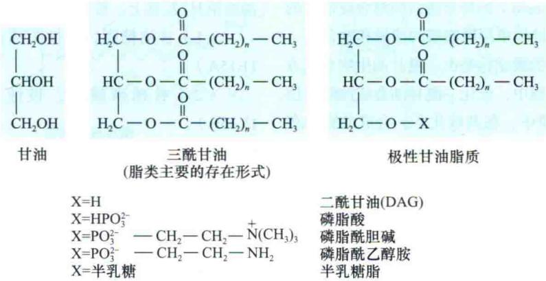  
图11.14 高等植物中三酰甘油和极性甘油脂质的结构特点。脂肪酸的碳链长度为12\~20个碳原子，碳原子数通常为偶数，常见的为16个或18个碳原子。因此，n值通常是14或16。

有些脂类对植物的组织结构和功能非常重要，但不是用于能量的贮存。这些脂类包括构成植物细胞膜的磷脂，以及同样是膜重要组分的鞘脂类；构成角质层的蜡，其主要作用是对植物起保护作用并减少水分的散失；类萜（类异戊二烯）也是一类重要的脂类物质，此类物质包括参与光合作用的类胡萝卜素和存在于许多膜中的固醇类等（见第13章）。

## 11.2.2 三酰甘油贮存在油体中

油脂主要以三酰甘油的形式存在（脂酰基指脂肪酸部分），它是脂肪酸分子通过酯键和甘油的3个羟基相连（图11.14）。

植物中的脂肪酸通常是直链羧酸，其碳原子数目常为偶数，碳链的长度为12\~30个碳原子，或更长些，最常见的是16个或18个碳原子。我们称在常温下为液态的脂类为油，主要原因是油分子中含有较多的不饱和脂肪酸；而脂肪分子中含有更多的饱和脂肪酸，在室温下通常是固态。植物脂类中主要的脂肪酸见表11.3。

在植物脂类中脂肪酸的组成在种间变化很大。例如，花生油大约含有9%的软脂酸、59%的油酸、21%的亚麻酸；棉花种子的油中含25%的软脂酸、15%的油

表11.3 高等植物组织中常见的脂肪酸

<table><tr><td>名称a</td><td>结构</td></tr><tr><td>饱和脂肪酸</td><td></td></tr><tr><td>月桂酸(12:0)</td><td> $CH_3(CH_2)_{10}CO_2H$ </td></tr><tr><td>肉豆蔻酸(14:0)</td><td> $CH_3(CH_2)_{12}CO_2H$ </td></tr><tr><td>软脂酸(棕榈酸)(16:0)</td><td> $CH_3(CH_2)_{14}CO_2H$ </td></tr><tr><td>硬脂酸(18:0)</td><td> $CH_3(CH_2)_{16}CO_2H$ </td></tr><tr><td>不饱和脂肪酸</td><td></td></tr><tr><td>油酸(18:1)</td><td> $CH_3(CH_2)_7CH=CH(CH_2)_7CO_2H$ </td></tr><tr><td>亚油酸(18:2)</td><td> $CH_3(CH_2)_4CH=CH-CH_2-CH=CH(CH_2)_7CO_2H$ </td></tr><tr><td>亚麻酸(18:3)</td><td> $CH_3CH_2CH=CH-CH_2-CH=CH-CH_2-CH=CH-(CH_2)_7CO_2H$ </td></tr></table>

a 每一个脂肪酸都有一个简写数字。冒号前面的数字表示碳原子总数，冒号后面的数字表示双键的数目

酸、55%亚麻酸。这些脂肪酸的生物合成下面即将讨论。

在多数种子中三脂酰甘油通常储藏在子叶或胚乳的细胞质中，这种细胞器称为油体（也称为球形体或油质体）（见第1章）。油体的表面是一层由磷脂组成的单层膜（即半双层），磷脂的亲水端暴露在细胞质，而疏水的脂酰基碳链则朝向油体的内部（见第1章）。一种被称为油质蛋白（oleosin）的特异蛋白质结合在油体的表面，从而阻止相邻油体单层磷脂膜的接触和融合。

油质体这种特殊的膜结构是由三酰甘油生物合成方式造成的，在植物细胞中，催化三酰甘油合成的酶类位于内质网（ER）的膜中，在其催化下，合成的脂肪在内质网双层膜之间积累，随着脂肪的增多，导致双层膜膨胀而形成芽状突起，最后一个成熟的油质体从内质网的双层膜上裂解出来（Napier et al., 1996）。

## 11.2.3 极性甘油脂质是膜的主要组分

正如第 1 章的概述，细胞的膜系统是由双亲性（即有亲水和疏水区）脂分子层组成的双层膜，双亲分子的极性头部与水接触，而疏水的脂肪酸链形成膜的核心。这个疏水核心能够阻止溶质在细胞区室之间随意扩散，因此，就使得细胞内的生物化学反应有组织的进行，即在不同的细胞空间进行不同的代谢过程。

细胞膜的结构脂类主要是极性甘油脂质（图11.14），疏水部分由2个16碳或18碳的脂肪酸链通过酯键与甘油的第1和第2位羟基连接。极性头部结合在甘油的第3位羟基上。极性甘油脂主要分为两类。

（1）甘油糖脂，极性头部由糖类分子组成（图11.15A）。

（2）甘油磷酸酯，极性头部含有磷酸（图11.15B）。

植物细胞膜中还有其他的结构脂类，包括鞘脂类和固醇类（见第13章），但它们的含量很低。在植物细胞中还有许多其他的脂类物质，它们往往具有专一的功能，如参与光合作用和其他生理过程而行使特殊的作用。这些脂类包含叶绿素、质体醌、类胡萝卜素和生育酚，它们大约占植物叶片脂类物质的1/3。

图11.15列出了植物中常见的9种类型的甘油脂质，每种类型中结合的脂肪酸多种多样。图11.15中显示甘油脂质的基本结构模式。

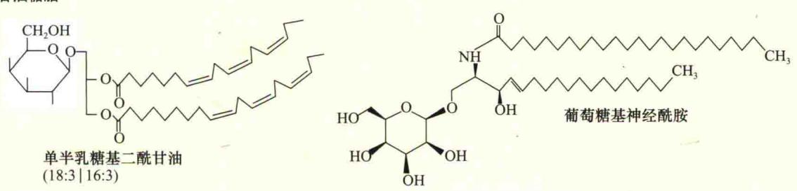

A 甘油糖脂  
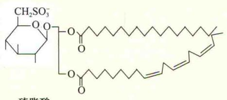

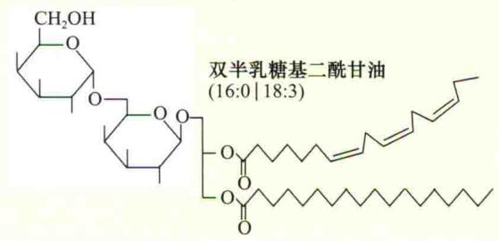

B 甘油磷酸酯  
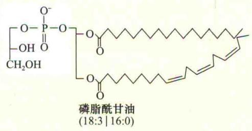

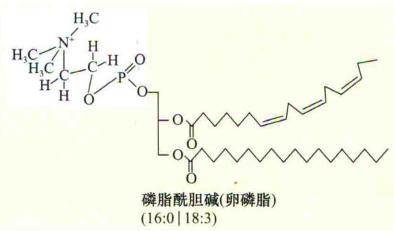

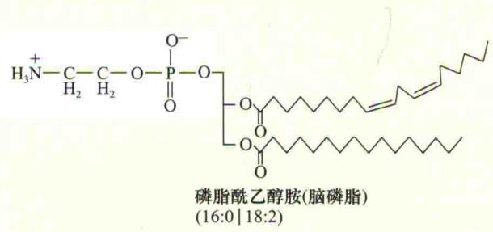

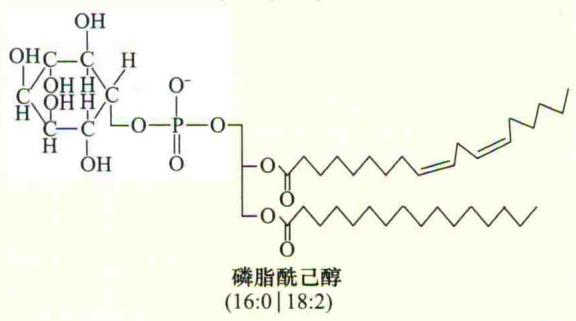

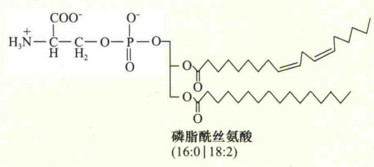

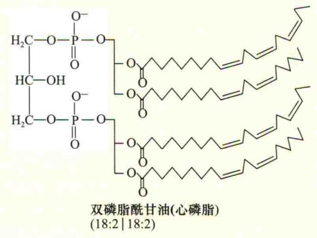  
图11.15 组成植物生物膜的主要极性甘油脂质：A. 甘油糖脂类和一个鞘脂；B. 甘油磷酸脂。至少有6种不同的脂肪酸和甘油结合。对于每类甘油脂质图中给出了最常见的一个分子结构。名字后面的数字指脂肪酸的碳原子数（在冒号前面的数字）和双键的数目（在冒号后面的数字）。

叶绿体被膜主要由甘油糖脂组成，在光合作用组织中，被膜的脂类占整个叶绿体膜脂的70%；细胞的其他膜系统主要由甘油磷酸脂组成（表11.4）。在非光合作用组织中，磷脂是主要的膜甘油脂质。

表11.4 不同细胞器膜系统的甘油脂组分

<table><tr><td rowspan="2"></td><td colspan="3">脂类组成(占总脂类的百分比/%)</td></tr><tr><td>叶绿体</td><td>内质网</td><td>线粒体</td></tr><tr><td>磷脂酰胆碱(卵磷脂)</td><td>4</td><td>47</td><td>43</td></tr><tr><td>磷脂酰乙醇胺(脑磷脂)</td><td>—</td><td>34</td><td>35</td></tr><tr><td>磷脂酰己醇</td><td>1</td><td>17</td><td>6</td></tr><tr><td>磷脂酰甘油</td><td>7</td><td>2</td><td>3</td></tr><tr><td>双磷脂酰甘油(心磷脂)</td><td>—</td><td>—</td><td>13</td></tr><tr><td>单半乳糖基二酰甘油</td><td>55</td><td>—</td><td>—</td></tr><tr><td>双半乳糖基二酰甘油</td><td>24</td><td>—</td><td>—</td></tr><tr><td>硫脂酸</td><td>8</td><td>—</td><td>—</td></tr></table>

## 11.2.4 脂肪酸生物合成是以增加二碳单位而循环进行

脂肪酸生物合成是以乙酰CoA为前体，每次增加2个碳单位的缩合反应循环进行。植物的脂肪酸合成仅在质体中进行，而动物的脂肪酸合成主要是在胞液中进行。

脂肪酸生物合成由多个酶催化，在细胞中这些酶是以复合体的形式存在，总称为脂肪酸合酶。显然，这种复合体的催化效率远远高于分散状态。另外，在合成过程中，脂酰基共价结合在脂酰基载体蛋白（acyl carrier protein，ACP）上，形成脂酰ACP，脂酰基载体蛋白是一个酸性的低分子质量蛋白质。

脂肪酸合成途径的第一个关键步骤（即脂肪酸合成所特有的第一步反应）是丙二酰CoA的合成。该反应由乙酰CoA羧化酶催化，乙酰CoA和 $CO_{2}$ 为底物（图11.16）（Sasaki et al., 1995），乙酰CoA羧化酶的严密调节控制着脂肪酸合成的整体速度（Ohlrogge and Jaworski, 1997）。随后，丙二酰CoA与ACP反应生成丙二酰ACP，接下来进行脂肪酸合成的4个步骤。

（1）在脂肪酸合成的第一个循环开始时，乙酰CoA上的乙酰基团转移到缩合酶（3-酮脂酰ACP合酶）的一个特定的半胱氨酸残基上，随后和丙二酰ACP结合生成乙酰乙酰ACP。

（2）随后，在三个酶的催化下，乙酰乙酰-ACP的第3位碳原子上的酮基被加氢还原，形成一个新的脂酰链（丁酰ACP），至此脂酰基碳链已被延长为4个碳原子（图11.16）。

（3）接下来，上一步形成的4碳长的脂肪酸和另1分子的丙二酰ACP作为缩合酶的新底物，进行新一轮的缩合、还原反应，结果使碳链又延长2个碳单位。如此反复进行，直至形成16个或18个碳长度的脂肪酸。

（4）延长到16碳长度时，某些16：0-ACP上的脂酰基会以16:0脂肪酸的形式释放出来，但是大多数会继续延长至18:0-ACP，并被去饱和酶去饱和形成18:1-ACP。因此，在质体中16:0-ACP和18:1-ACP是脂肪酸合成的主要产物（图11.17）。

脂肪酸与甘油结合形成甘油脂质后，脂肪酸仍需进一步加工。在一系列去饱和酶的同工酶作用下，在16:0和18:1脂肪酸分子中产生更多的双键，这些酶是位于叶绿体膜和内质网膜的内在蛋白。每个去饱和酶在脂肪酸特定部位产生双键，在这些酶的依次作用下，最终产生18:3和16:3脂肪酸（Ohlrogge and Browse，1995）。

## 11.2.5 甘油脂质在质体和内质网中合成

脂肪酸在叶绿体中合成后，就被用于合成膜脂和油体的脂质物质。甘油脂质合成是以甘油-3-磷酸为底物，经两次酰化反应，将脂酰ACP或脂酰CoA的脂肪酸转移到甘油-3-磷酸的第1和第2位羟基上，从而产生磷脂酸。

在一种特殊的磷酸酶作用下，磷脂酸中的磷酸被水解下来，生成二脂酰甘油（DAG），磷脂酸也可以直接转化成磷脂酰肌醇或磷脂酰甘油，DAG也可以转化为磷脂酰乙醇胺或磷脂酰胆碱（图11.17）。

在叶绿体和内质网中都有甘油酯合成酶，而脂肪酸在叶绿体中合成。这样部分脂肪酸就必须转运到内质网进行甘油脂质的合成，因此通过甘油脂质的合成就构成了叶绿体与其他细胞膜系统之间的相互协调关系。简而言之，甘油脂质合成的生物化学途径包括原核（叶绿体）途径和真核（ER）途径（Ohlrogge and Browse, 1995）：

（1）在叶绿体中，以叶绿体合成的16:0-ACP和18:1-ACP为原料，通过原核途径合成磷脂酸及其相应的衍生物。另外，一些脂肪酸以脂酰CoA的形式被转运到细胞质。

（2）在细胞质中，内质网上存在另外一种脂酰基转移酶，该酶以脂酰CoA为原料，通过真核途径合成磷脂酸及其相应的衍生物。

图11.17显示了两种途径的基本过程。

对于拟南芥和菠菜等许多高等植物来说，叶绿体可以通过这两条途径合成脂类，并且二者的比例几乎相同。但在许多其他被子植物中，原核途径只能合成磷脂酰甘油，叶绿体中的其他脂类则完全通过真核途径合成。

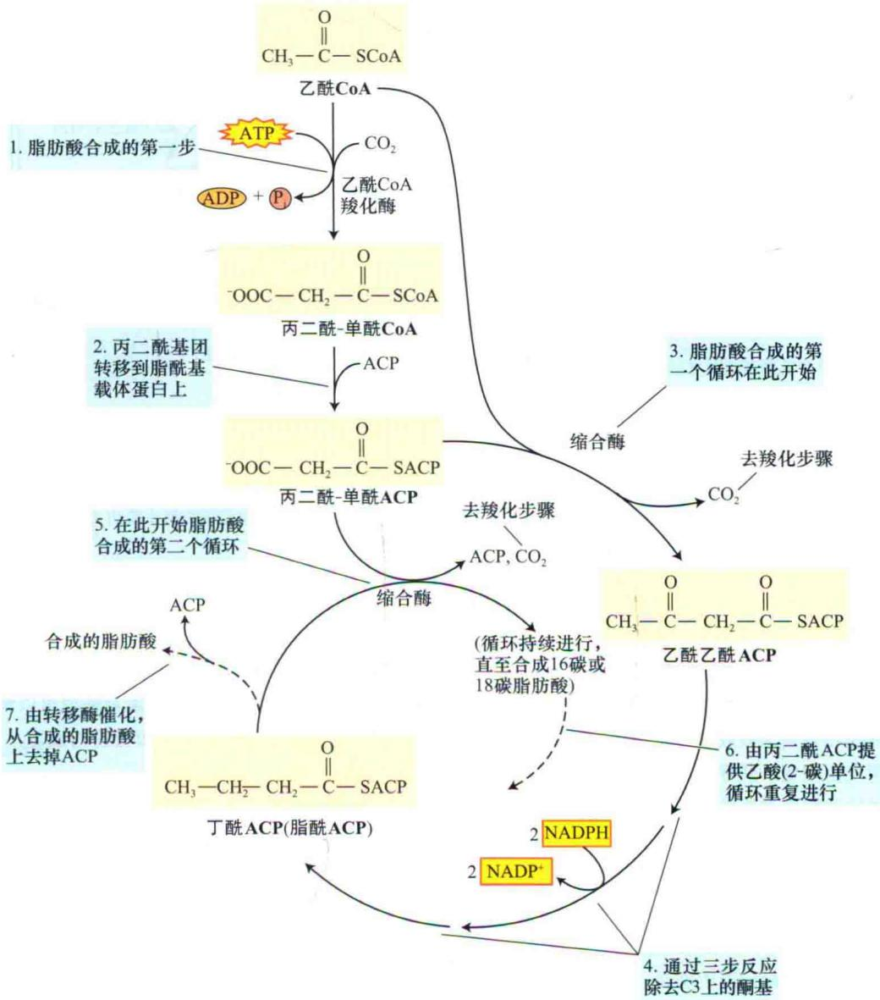  
图11.16 植物细胞质体中脂肪酸合成的循环。

在油类种子中，三酰甘油合成的生物化学过程与其他甘油脂质的合成基本相同。在细胞的质体中合成16:0-ACP和18:1-ACP，然后以脂酰CoA的形式转运到内质网，进而与DAG结合，形成三酰甘油（图11.17）。

脂酰CoA:DAG 脂酰基转移酶和 PC:DAG 脂酰基转移酶（图11.17 没有显示）是油类种子中油脂代谢中的关键酶（Dahlqvist et al., 2000）。前已提及，三酰甘油集中贮存于油脂体这种特殊的亚细胞器，在种子萌发时，这些脂类被动员并转变成糖类物质。

## 11.2.6 脂类的组成影响膜的功能

膜生物学的一个核心问题是：脂类多样性与膜功能的关系。细胞中的每种膜系统都有其独特的脂类组成，而且对于特定的膜来说，组成膜的不同脂类分子又有特定的脂肪酸组分（表11.4）。

生物膜为可流动性、半渗透性的双层膜，是许多膜蛋白发挥作用的场所。显然，这种简单模型是不完美的，因为全部用单一不饱和磷脂酰胆碱同样可以聚集成类似的膜系统，那么膜脂的多样性又有何意义？解释之一是：膜脂的组成与有机体适应温度的变化有关（Iba，2002）。例如，温度为0\~12℃，许多冷敏感型植物的生长速率迅速降低，并且发育迟缓（见第26章）。棉花、大豆、玉米、水稻与许多热带和亚热带水果等很多有重要经济价值的作物都属于冷敏感型植物。与之相反，起源于温带区域的大多数植物可以在寒冷温度下生长发育，因而属于耐寒植物。

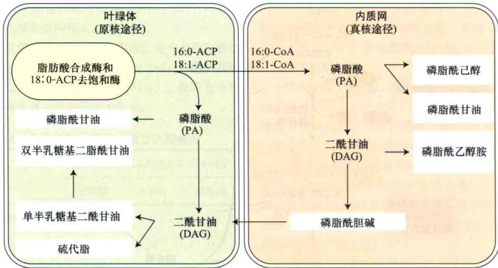  
图11.17 拟南芥叶肉细胞的叶绿体和内质网中甘油脂质合成的两个途径。在两个方框中列出了主要的膜脂，甘油脂质的去饱和先在叶绿体发生，而在图11.15中所列出的高度不饱和脂肪酸主要由ER中的酶催化16:0和18:1脂肪酸进一步去饱和而形成。

人们认为在较低温度时生物膜的流动性下降，膜脂由正常的液晶相转变为凝胶相，正是由于这种相变使细胞新陈代谢发生改变，并导致冷敏感型植物受到伤害甚至死亡。而这种相变温度的高低与膜脂的不饱和脂肪酸的不饱和度和含量有关。

然而，近期研究表明，膜脂不饱和度及其含量和植物适应温度变化的能力之间的关联较小，也比较复杂（参见Web Topic 11.8）。在某些拟南芥突变体中，膜脂的饱和脂肪酸的含量较野生型高，但其对低温的响应却与预期结果截然相反，由此表明，冷伤害与膜脂不饱和水平并不完全相关。

此外，用转基因烟草进行相关实验，得出与拟南芥突变体实验相反的结果。前已述及，烟草为冷敏感型植物，将某种特定的外源基因导入烟草并表达，从而使生物膜的饱和磷脂酰甘油的含量降低，或者使膜不饱和程度增加，然后进行低温处理。结果表明，无论在何种情况下，冷引起的伤害都得到一定程度的缓解。

这些新的研究结果更清楚地表明，无论是膜不饱和程度或者特殊脂类的存在，如去饱和的磷脂酰甘油，都会影响植物对低温的响应。正如在 Web Topic 11.8 中讨论的，为更加深入地认识和理解膜脂的组成和膜功能间的关系，就必须进行更加广泛和深入、细致的研究。

## 11.2.7 膜脂是一些重要的信号分子的前体

无论在植物、动物还是微生物体内，某些膜脂可用于合成信号分子，用于胞内和远距离信号转导。例如，植物细胞可用亚麻酸（18:3）合成茉莉酸，茉莉酸作为信号分子可激活植物防御昆虫的伤害和许多真菌病原菌的侵染（见第13章）。另外，茉莉酸也可以调节植物生长发育的诸多方面，如花药和花粉的发育（Browse，2009）。

磷脂酰肌醇4，5-二磷酸（ $\mathrm{PIP}_2$ ）是磷脂酰肌醇衍生物中最重要的。在动物细胞中，通过受体介导而激活的磷脂酶c将 $\mathrm{PIP}_2$ 水解为肌醇三磷酸（ $\mathrm{InsP}_3$ ）和二酰甘油，这两个分子均是细胞内的第二信使。

InsP $_{3}$ 的功能是释放Ca $^{2+}$ 进入细胞质（通过液泡膜和其他膜上的钙敏感通道），因而调节许多植物细胞的生理生化过程，这些作用在许多植物体系中已得到证实，其中包括气孔保卫细胞的运动（Schroeder et al., 2001）。利用生物化学和分子遗传学的手段，通过对磷脂酶（Wang, 2001）及与脂类信号分子合成相关的其他酶的研究，使人们对其他类型的脂类信号转导有了更多的认识。

## 11.2.8 在萌发的种子中，贮存的脂类转化为碳水化合物

萌发后，油类种子利用由三酰甘油转变而来的蔗糖进行各种代谢活动（Graham，2008）。对于植物的幼苗来说，由于植物无法将子叶贮存的油脂转运到其他组织，因此，这些脂类必须先转变为可转运的碳化合物形式，一般是蔗糖，才能转运到根和生长快速的组织中，为幼苗的生长和发育提供碳源和能量。这一过程包括多个步骤，需要油质体、乙醛酸循环体、线粒体等细胞器

A

B  
乙醛酸体  
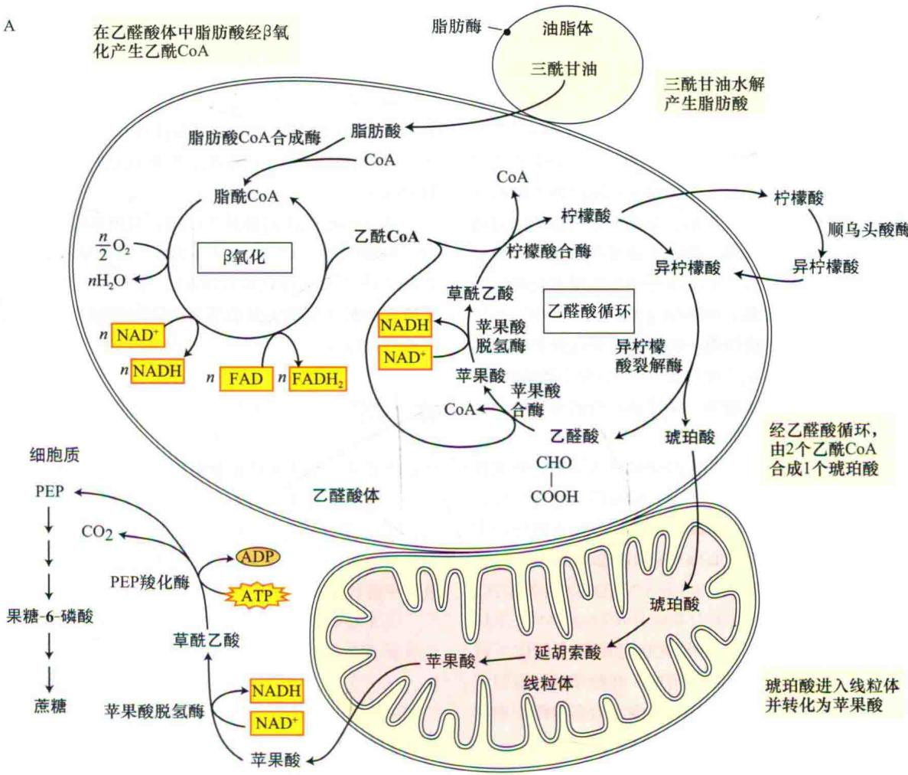  
苹果酸进入细胞质并被脱氢氧化形成OAA，在PEP羧化酶的作用下，OAA脱羧产生PEP，而后，PEP经糖异生途径形成蔗糖

图11.18 贮油种子在萌发过程中脂肪转化成糖类。A. 脂肪酸降解和糖异生作用中碳的转化途径（参照图11.2、图11.3和图11.6中这些物质的化学结构）。B. 黄瓜幼苗子叶的电镜照片，图中标出了乙醛酸体、线粒体和油质体（B图由R.N.Trelease提供）。  
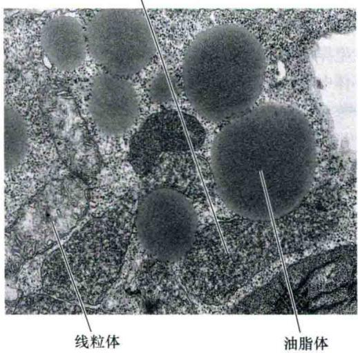

的共同参与才能完成。

脂类转变为蔗糖的基本过程 随着种子萌发，脂类转化成蔗糖的过程被启动。该过程起始于油质体，三酰甘油先被水解为游离的脂肪酸，随后被氧化降解为乙酰CoA（图11.18）。脂肪酸的氧化在乙醛酸循环体中进行，乙醛酸循环体是存在于油类种子中、由单一的双层磷脂膜包裹的囊泡，属植物过氧化物酶体的一种。在乙醛酸循环体和细胞质中乙酰CoA经进一步代谢形成琥珀酸（图11.18A）。而后，琥珀酸进入线粒体先被转化为延胡索酸，进而形成苹果酸，苹果酸进入胞质通过糖异生作用再转化成葡萄糖，最终形成蔗糖。在大多数储油种子中，接近 $30\%$ 的乙酰CoA经呼吸代谢氧化降解为细胞提供能量，其余部分被转化为蔗糖。

脂肪酶介导的水解作用 脂类向碳水化合物转化的第一步是由脂肪酶催化三酰甘油水解为3分子脂肪酸和1分子甘油。在脂肪降解期间，油体和乙醛酸循环体通常在空间上也十分靠近（图11.18B）。

脂肪酸的 $\beta$ 氧化 进入乙醛酸循环体的脂肪酸由脂酰CoA合成酶催化形成脂酰CoA。脂酰CoA是 $\beta$ 氧化途径的最初底物，含有 n 个碳原子的脂肪酸经 $\beta$ 氧化产生 n/2 分子的乙酰CoA（图11.18A）。在 $\beta$ 氧化中，每形成 1 分子乙酰CoA，同时产生 1 分子 NADH，并把 $1/2O_{2}$ 还原为 $H_{2}O$ 。

在哺乳动物组织中， $\beta$ 氧化途径的四个酶位于线粒体中。但植物体内存在不同情况，在种子的贮藏组织中，这些酶只存在于乙醛酸循环体中，而营养组织中，这些酶存在于过氧化物体中（见第1章）。

乙醛酸循环 乙醛酸循环的功能是将2分子的乙酰CoA转化为琥珀酸。乙醛酸循环是由多个连续的酶促反应组成，由脂肪酸经β氧化而来的乙酰CoA进入乙醛酸循环（图11.18A）。首先，乙酰CoA和草酰乙酸反应生成柠檬酸，接着被转移到细胞质中，在顺乌头酸酶催化下，发生异构化生成异柠檬酸。异柠檬酸又被送进乙醛酸循环体中，并经过两步乙醛酸循环所特有的反应转化成苹果酸。

（1）首先，异柠檬酸 $\left(\mathrm{C}_{6}\right)$ 被异柠檬酸裂合酶分解成琥珀酸 $\left(\mathrm{C}_{4}\right)$ 和乙醛酸 $\left(\mathrm{C}_{2}\right)$ 。琥珀酸被转运至线粒体中。

（2）接下来，在苹果酸合酶催化下，乙醛酸和第二个乙酰CoA缩合而生成苹果酸。

然后，苹果酸被转运到细胞质，细胞质中有苹果酸脱氢酶的同工酶，此酶催化苹果酸脱氢氧化生成草酰乙酸。草酰乙酸又被送入乙醛酸循环体，在此，草酰乙酸和另一分子的乙酰CoA结合，进行新一轮乙醛酸循环（图11.18A）。乙醛酸的产生保证了乙醛酸循环的继续进行，而琥珀酸则到线粒体中被进一步转化。

线粒体的作用 琥珀酸从乙醛酸循环体进入线粒体，经柠檬酸循环的两步反应生成苹果酸。位于线粒体内膜的二羧酸转移系统将产生的苹果酸运出线粒体和琥珀酸交换。然后，胞质苹果酸脱氢酶将苹果酸氧化成草酰乙酸，然后，逆糖酵解（经糖异生途径）转变为碳水化合物。要实现这种转变就必须克服丙酮酸激酶所催化的不可逆反应（图11.13），即由PEP羧化激酶催化，利用ATP磷酸化作用，将草酰乙酸转化成PEP和 $CO_{2}$ （图11.18A）。

通过前面描述的糖异生作用，从PEP可以产生葡萄糖。蔗糖是这一过程的最终产物，也是从子叶到生长着的幼苗组织运输还原性碳的主要形式。然而，并不是所有的种子都能定量地将脂肪转化为糖类（参见Web Topic 11.9）。

## 小结

利用光合作用提供的基础材料，在严密调控下，呼吸作用将贮存在这些碳化物中的能量释放出来供细胞使用，同时还产生许多含碳的前体物质，以供生物合成和行使某些细胞功能。

## 植物呼吸代谢概述

· 在植物呼吸代谢中，由光合作用产生的还原性细胞碳被氧化为 $CO_{2}$ 和水，这种氧化作用与ATP合成相偶联。

· 呼吸代谢分四个主要过程：糖酵解途径、氧化戊糖磷酸途径、柠檬酸循环和氧化磷酸化作用（电子传递链和ATP合成）（图11.1）。

## 糖酵解途径

· 经糖酵解途径，碳水化合物在细胞质中被转化为丙酮酸，通过底物水平磷酸化方式合成少量ATP，同时产生NADH（图11.3）。

· 植物糖酵解途径的几步反应存在交替酶，使得不同的底物均可以进入糖酵解途径，形成不同的产物，以及影响着该途径的进行方向。

\- 当缺乏 $\mathrm{O}_2$ 时，发酵作用为糖酵解途径再生 $\mathrm{NAD}^+$ ，糖类物质中所具有的能量仅有很少部分被转化为ATP（图11.3）。

· 植物糖酵解途径的调节是终端产物由下而上的反馈调控。

## 氧化戊糖磷酸途径

· 碳水化合物可以通过氧化戊糖磷酸途径被氧化，并为许多生物分子的生物合成提供还原力——NADPH（图11.4）。

## 柠檬酸循环

· 在线粒体基质中，丙酮酸进入柠檬酸循环被氧化为 $CO_{2}$ ，并以NADH和 $FADH_{2}$ 的形式产生大量的还原当量（图11.5和图11.6）。

· 植物柠檬酸循环的独特性在于苹果酸酶的存在，该酶组成了代谢来自糖酵解的苹果酸的交替途径（图11.6和图11.7）。

## 线粒体电子传递和 ATP 合成

· 通过多种酶复合体将NADH和FADH $_{2}$ 电子传递给氧气的过程与质子的跨线粒体内膜的转运相偶联，由此而产生的电化学质子梯度被用于ATP合成和物质的跨膜交换（图11.8和图11.9）。

· 通过有氧呼吸，每分子蔗糖可产生多至60个ATP（表 11.2）。

\- 几种导致能量回收率降低的蛋白质[交替氧化酶、NAD（P）H脱氢酶和解偶联蛋白]的存在是植物呼吸代谢的典型特征（图11.8）。

· 呼吸代谢的主要产物是ATP和用于生物合成的中间产物。细胞对这些化合物的需求是呼吸代谢调控的原初信号，其调控位点分布在电子传递链、柠檬酸循环和糖酵解途径（图11.10\~图11.13）。

## 植物整体和组织的呼吸代谢

· 植物日光合产量的50%以上被呼吸代谢消耗。

· 许多因素可以影响整个植株的呼吸代谢速率。这些因素包括植物组织的本性和年龄，还有诸如光照、温度、营养物质和水分供应、 $O_{2}$ 和 $CO_{2}$ 浓度等环境因子。脂代谢

· 三酰甘油（脂肪和油）是贮存还原性碳最有效的形式，尤其在种子中。极性甘油脂质是各种生物膜结构的基本组分（图11.14和图11.15；表11.3和表11.4）。

· 三酰甘油在内质网膜上合成，在磷脂双层膜间积累，最终形成油体。

· 脂肪酸的合成是以乙酰CoA为原料，通过逐步添加二碳的循环，在质体中进行。质体中合成的脂肪酸被转运到内质网并被进一步修饰（图11.16和图11.17）。

· 膜的脂类组成可能会影响膜的功能。脂肪酸的不饱和度会影响植物对冷的敏感性，但似乎与通常的冷伤害没有密切关系。

· 在植物细胞中，膜脂的降解产物可作为信号物质起作用，如茉莉酸。

· 在储油种子萌发期间，经一系列反应储脂被转化为碳水化合物，该过程包括乙醛酸循环。乙醛酸循环在乙醛酸循环体中进行，随后的反应在线粒体中发生（图11.18）。

· 油脂在乙醛酸循环体中降解产生还原碳进入细胞质，经糖异生途径最终形成碳水化合物（图11.18）。

(董发才 译)

## WEB MATERIAL

## Web Topics

11.1 Isolation of Mitochondria
Intact, functional mitochondria can be purified for analysis in vitro.

11.2 The Q-Cycle Explains How Complex III Pumps Protons across the Inner Mitochondrial Membrane
A cyclic process allows for a higher proton-to-electron stoichiometry.

11.3 Multiple Energy Conservation Bypasses in Oxidative Phosphorylation of Plant Mitochondria With molecular characterization, the physiological roles of the enigmatic “energy-wasting” pathways of respiration are being uncovered.

11.4 $\mathbf{F}_{\mathrm{o}}\mathbf{F}_{1}$ -ATP Synthases: The World's Smallest Rotary Motors Rotation of the subunit brings about the conformational changes that couple proton flux to ATP synthesis.

11.5 Transport Into and Out of Plant Mitochondria
Plant mitochondria transport metabolites, coenzymes, and macromolecules.

11.6 The Genetic System in Plant Mitochondria Has Several Special Features
The mitochondrial genome encodes about 40 mitochondrial proteins.

11.7 Does Respiration Reduce Crop Yields?
Crop yield is correlated with low respiration rates in a way that is not understood.

11.8 The Lipid Composition of Membranes Affects the Cell Biology and Physiology of Plants
Lipid mutants are expanding our understanding of the ability of organisms to adapt to temperature changes.

11.9 Utilization of Oil Reserves in Cotyledons
In some species, only part of the stored lipid in the cotyledons is exported as carbohydrate.

Web Essays

## 11.1 Metabolic Flexibility Helps Plants to Survive Stress

The ability of plants to carry out a metabolic step in different ways increases plant survival under stress.

11.2 Metabolic Profiling of Plant Cells
Metabolic profiling complements genomics and proteomics.

11.3 Mitochondrial Dynamics: When Form Meets Function
New microscopy methods have shown that mitochondria dynamically change shape in vivo.

11.4 Seed Mitochondria and Stress Tolerance
Seeds experience a large range of stresses and are dependent on respiration for germination.

11.5 Balancing Life and Death: The Role of the Mitochondrion in Programmed Cell Death
Programmed cell death is an integral part of the life cycle of plants, often directly involving mitochondria.

## 11.6 Respiration by Thermogenic Flowers

The temperature of thermogenic flowers, such as the Arum lilies, can increase up to $35^{\circ}$ C above their surroundings.

11.7 Reactive Oxygen Species(ROS) and Plant Respiration
The production of reactive oxygen species is an unavoidable consequence of aerobic respiration.

11.8 Coenzyme Synthesis in Plant Mitochondria
Pathways for synthesis of coenzymes are often split between organelles.

11.9 In Vivo Measurement of Plant Respiration
The activities of the alternative oxidase and cytochrome c oxidase can be simultaneously measured.
