## 第 12 章

矿质营养的同化

高等植物属于自养型生物，它们可以从周围环境中获取无机营养物质来合成自身需要的所有有机成分。对于多种矿质营养元素来说，植物获取它们的过程包括经由根系（从周围土壤）吸收进入植物体（见第5章）并与一些重要的有机化合物相结合的过程，包括色素、辅酶、脂类、核苷酸类和氨基酸类等。有机物与矿质营养元素相结合的过程称之为营养物质的同化（nutrient assimilation）。

一些营养物质，特别是氮和硫元素，它们的同化过程包括一系列复杂的生化反应，而这些反应是活的有机体中最耗能的反应。

（1）在硝酸盐 $\left(\mathrm{NO}_{3}^{-}\right)$ 同化过程中， $NO_{3}^{-}$ 中的氮先被转化成高能量形态——亚硝酸盐 $\left(\mathrm{NO}_{2}^{-}\right)$ 中的氮，接着转化成更高能量的形态——铵 $\left(\mathrm{NH}_{4}^{+}\right)$ 中的氮，最终转化成谷氨酸中的酰胺态氮。该过程中，每形成一个酰胺态氮要消耗12分子的ATP（Bloom et al., 1992）。

(2) 豆科植物可以和固氮菌形成共生关系, 将分子态的氮气 $\left(\mathrm{N}_{2}\right)$ 转化为氨 $\left(\mathrm{NH}_{3}\right)$ 。氨 $\left(\mathrm{NH}_{3}\right)$ 是自然界固氮反应中最先形成的稳定化合物, 在生理pH条件下, 氨被质子化为铵离子—— $\mathrm{NH}_{4}^{+}$ 。该过程连同随后的 $\mathrm{NH}_{3}$ 同化为氨基酸的过程一起, 每产生一个酰胺态氮需要消耗大约16个ATP (Pate and Layzell, 1990; Vande Beoek and Vanderleyden, 1995)。

(3) 植物可经两条途径将硫酸盐 $\left(\mathrm{SO}_{4}^{2-}\right)$ 同化为半胱氨酸, 该过程约消耗14个ATP。

从同化过程会有大量的能量参与角度来看，如果这些反应迅速逆向发生，也就是说，从 $NH_{4}NO_{3}$ （硝酸铵）转化成 $N_{2}$ ，它们将会是爆炸性的，并以移动、热和光的形式释放出巨大的能量。几乎所有的爆炸物（如硝化甘油、TNT和火药）都是基于氮或硫化合物的迅速氧化而产生爆炸的。

其他营养元素（特别是大量和微量营养元素的阳离子）（见第5章）的同化过程都涉及与有机化合物形成复合物的过程。例如， $\mathrm{Mg}^{2+}$ 和叶绿体色素形成复合物， $\mathrm{Ca}^{2+}$ 与细胞壁上的果胶酸形成复合物， $\mathrm{Mo}^{6+}$ 与硝酸还原酶和固氮酶形成复合物。这些复合物高度稳定，若将营养元素从这些复合物中移去，它们将失去所有功能。

本章重点讲述主要营养元素（氮、硫、磷酸盐，以及镁、钾等阳离子和氧）同化过程中的基本反应步骤，并对这些反应的有机产物予以阐述。同时，还会强调同化过程能量消耗的生理意义，并介绍典型的共生固氮反应。在这个过程中，植物体作为桥梁将营养物质从静态的地球物理领域传输到动态的生物领域，因此，本章还将重点介绍植物营养物质同化在人类膳食中的重要作用。

## 12.1 环境中的氮

植物细胞许多重要的生物化学成分中都含有氮（见第5章），如分别成为核苷酸和蛋白骨架的核苷磷酸盐和氨基酸。植物体中只有氧、碳和氢元素的含量比氮丰富。许多自然和农业生态系统中，当施加无机氮肥时，作物产量会出现异常的提高，这些都说明了该元素的重要性。

本部分将讨论氮的生物化学循环过程、氮固定在从分子态氮向铵和硝酸盐转变过程中的核心作用，以及植物组织中硝酸盐和铵的去向问题。

## 12.1.1 生物地质化学循环过程中氮所经历的几种形式

生物圈中的氮以多种形态存在。大气中含有大量的分子态氮（ $\mathrm{N}_2$ ）（以体积计算约占 $77\%$ ）（见第9章）。但这个巨大储藏库中的氮并不能被生物有机体直接利用。只有破坏掉两个氮原子（ $\mathrm{N} \equiv \mathrm{N}$ ）之间三个非常坚固的氮-氮共价键，将其转化成氨（ $\mathrm{NH}_3$ ）或硝酸盐（ $\mathrm{NO}_3^-$ ）时，大气中的氮才可以被利用。这个反应称为氮的固定（nitrogen fixation），可通过工业和自然固氮过程来完成。

在高温（约200℃）、高压（约20MPa）和金属（通常是铁）催化剂存在的情况下， $N_{2}$ 才能和 $H_{2}$ 反应生成氨。只有这些极端条件，才能满足反应的高活化能需求。这个固氮过程被称作Haber-Bosch过程（Haber-Bosch process），它为许多工业制造和农业生产提供了最初的原料。全球氮肥的工业生产总量已经超过 $100\times10^{12}$ g/年（FAOSTAT，2009）。

自然固氮过程可固氮约为 $190 \times 10^{12}$ g/年（表12.1），主要包括以下几个方面（Schlesinger，1997）。

闪电（lightning）闪电固定的氮量占总固氮量的8%。它可将水蒸气和氧气转化为高度活化的羟自由基、游离的氢原子和氧原子，进而去攻击分子态氮（ $N_{2}$ ），反应生成硝酸（ $HNO_{3}$ ），随后随雨水降落到地面。

光化学反应（photochemical reaction）总固氮量中约2%来自于一氧化氮（NO）和臭氧（ $O_{3}$ ）反应生成硝酸（ $HNO_{3}$ ）的光化学过程。

生物固氮（biological nitrogen fixation）总固氮量中约90%来自生物固氮反应。在这个反应中，细菌或蓝绿藻（蓝藻）固定 $N_{2}$ 转化成 $NH_{3}$ 。 $NH_{3}$ 溶解于水中将形成 $NH_{4}^{+}$ ：

$$
\mathrm{NH} _ {3} + \mathrm{H} _ {2} \mathrm{O} \longrightarrow \mathrm{NH} _ {4} ^ {+} + \mathrm{OH} ^ {-}\tag{12.1}
$$

从农业生产的角度来看，氮肥的工业生产量远不能满足实际需求，因此生物固氮至关重要（FAOSTAT，2005）。

一旦被固定到氨或硝酸盐中，氮即进入了生物化学循环过程，并历经几种有机或无机形态最终又转变回分子态氮（图12.1和表12.1）。经固氮作用形成的或土壤有机物的分解过程产生的铵 $\left(\mathrm{NH}_{4}^{+}\right)$ 和硝酸盐 $\left(\mathrm{NO}_{3}^{-}\right)$ 离子成为植物和微生物之间竞争的目标。因此植物进化出一种尽可能快地从土壤中获取这些离子的机制保持其在这种竞争中的优势（见第5章）。施加肥料后，土壤中这些离子浓度升高，此时当植物根系对土壤中铵和硝酸盐离子的吸收超过植物体对这些离子的同化能力时，就会导致这些多余的离子在植物组织中的富积。

表12.1 生物化学氮循环的主要过程

<table><tr><td>过程</td><td>定义</td><td>速率/ $(10^{12}g/年)^a$ </td></tr><tr><td>工业固氮</td><td>工业途径下分子态氮转化为氨态氮</td><td>100</td></tr><tr><td>大气固氮</td><td>闪电和光化学途径下分子态氮转化为硝态氮</td><td>19</td></tr><tr><td>生物固氮</td><td>原核生物作用下分子态氮转化为氨态氮</td><td>170</td></tr><tr><td>植物富集</td><td>植物对铵和硝态氮的吸收和同化</td><td>1200</td></tr><tr><td>固定</td><td>微生物对铵和硝态氮的吸收和同化</td><td>N/C</td></tr><tr><td>氨化作用</td><td>细菌和真菌将土壤有机质分解为铵</td><td>N/C</td></tr><tr><td>厌氧氨氧化</td><td>厌氧性的铵氧化作用,细菌作用下,铵和硝态氮转化为分子态氮</td><td>N/C</td></tr><tr><td>硝化作用</td><td>细菌(Nitrosomonassp.)将铵氧化为亚硝酸盐,随后,细菌(Nitrobactersp.)将亚硝酸盐氧化为硝酸盐</td><td>N/C</td></tr><tr><td>矿化作用</td><td>细菌和真菌通过氨化和硝化作用将土壤有机质转化为矿质氮</td><td>N/C</td></tr><tr><td>挥发</td><td>气态的氨散失到大气中</td><td>100</td></tr><tr><td>铵固定</td><td>铵包埋进入土壤颗粒的物理过程</td><td>10</td></tr><tr><td>反硝化作用</td><td>细菌作用下硝酸盐转化为一氧化二氮和分子态氮</td><td>210</td></tr><tr><td>硝酸盐淋溶</td><td>地表土壤中的硝酸盐溶入地下水,并最终进入海洋</td><td>36</td></tr></table>

注：陆地有机体、土壤和海洋中各自约包含 $5.2 \times 10^{15}$ g、 $95 \times 10^{15}$ g 和 $6.5 \times 10^{15}$ g 活性的有机氮。如果大气中 $N_{2}$ 的量维持恒定（输入=输出），那么平均停滞时间（mean residence time）（氮分子以有机形式存在的平均时间）约为370年[（总量/固定输入）= $(5.2 \times 10^{15}$ g+95× $10^{15}$ g）/( $80 \times 10^{12}$ g/年+ $19 \times 10^{12}$ g/年+ $170 \times 10^{12}$ g/年）]（引自Schlesinger，1997）

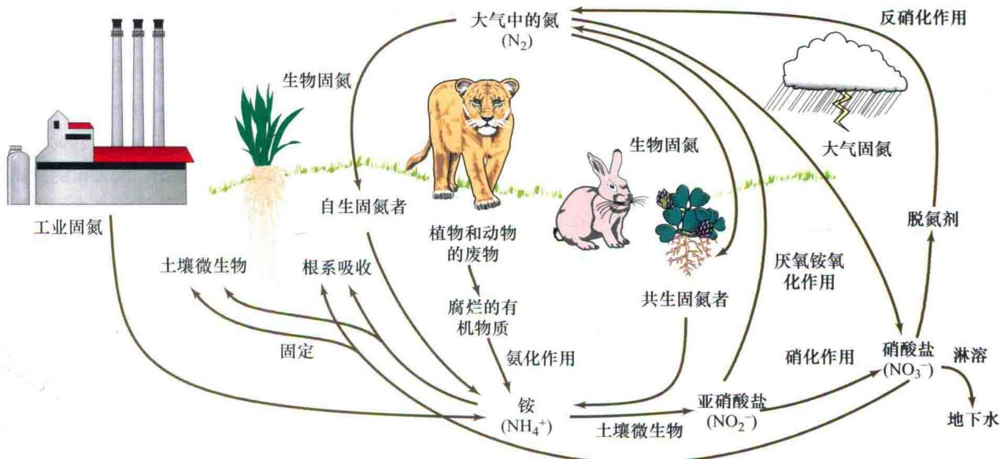  
图12.1 大气中的氮循环：从气态氮到被活的有机体结合进入有机化合物前的还原型离子态氮的过程。氮循环中一些步骤如图所示。

## 12.1.2 未被同化的铵和硝酸盐可能产生有害作用

如果活体组织中的铵积累到一个高水平，它将对植物和动物产生毒害作用。因为铵将破坏跨膜质子梯度（图12.2），而植物的光合和呼吸作用中的电子传递过程（见第7章和第11章），以及随后液泡内代谢过程均要求跨膜的质子梯度的存在（见第6章）。因为高水平铵会产生毒害作用，动物在进化中逐渐形成强烈厌恶铵气味的特性。医学上，嗅闻一种有效成分为碳酸铵的可挥发的药粉，就可以使一个昏迷的人苏醒。对于植物，它们在铵的吸收位点或其产生部位就将其同化，并迅速

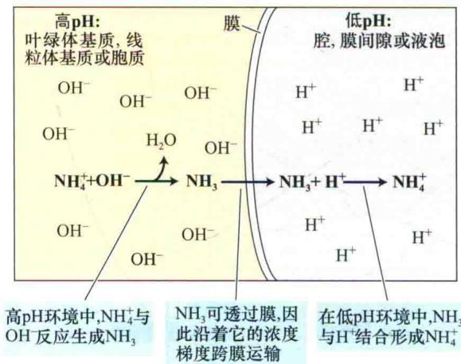

图12.2 铵离子的毒害作用在于破坏pH梯度。左侧为高pH的叶绿体基质、线粒体基质或胞质；右侧为低pH的腔、内膜空间或液泡；膜可以是叶绿体的内囊体膜、线粒体内膜或根细胞的液泡膜。反应结果显示：左侧的OH⁻浓度和右侧的H⁺浓度被逐渐缩小，意味着pH梯度的消逝（引自Bloom，1997）。

地将多余的铵储存在液泡中，以避免它对膜和胞质产生毒害作用。

相对于铵，植物可储存更高浓度的硝酸盐或者将它们在组织间进行转移，而不会产生毒害作用。但是如果牲畜或人食用了高硝酸盐含量的植物或其制品，将会产生高铁血红蛋白症，这种病削弱了肝脏将硝酸盐还原为亚硝酸盐的能力，从而使硝酸盐和血红蛋白结合而不能与氧结合。人和一些动物也可将硝酸盐转化为具有潜在致癌作用的亚硝胺。一些国家已对人类食用的植物性食品中的硝酸盐含量进行了限制。

在下一部分，将讨论植物将硝酸盐同化为有机物的过程，即在酶催化条件下首先将硝酸盐还原为亚硝酸盐，进一步再转化为铵，最后形成氨基酸。

## 12.2 硝酸盐的同化

植物根系可通过几种质膜上低亲和力和高亲和力的硝酸盐-质子反向转运体有效地从土壤溶液中吸收硝酸盐（Crawford and Forde，2002；Miller et al.，2007），并最终将吸收的多数硝酸盐同化为有机氮化合物。第一步是在胞质中将硝酸盐还原成亚硝酸盐，并转移两个电子（Oaks，1994），这一步由硝酸还原酶（nitrate reductase）催化：

$$
\mathrm{NO} _ {3} ^ {-} + \mathrm{NAD(P)H} + \mathrm{H} ^ {+} \longrightarrow \mathrm{NO} _ {2} ^ {-} + \mathrm{NADP} ^ {+} + \mathrm{H} _ {2} \mathrm{O}\tag{12.2}
$$

式中，NAD（P）H为NADH或NADPH。多数硝酸还原酶以NADH作为电子供体，此酶的另一种形式则可利用NADH或NADPH作为电子供体，这种形式的酶多存在于非绿色组织中，如根系中（Warner and Kleinhofs，1992）。

高等植物的硝酸还原酶有两个相同的亚基组成，每个亚基含有三个辅基：腺嘌呤黄素二核苷酸（FAD）、亚铁血红素（Heme）和钼原子与蝶呤相结合的复合物（Campbell，1999，2001）。

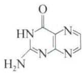  
蝶呤

硝酸还原酶是植物营养组织中主要的含钼蛋白，缺钼的一个症状是硝酸还原酶的活性减弱，引起硝酸盐聚积（Mendel，2005）。

一些物种的硝酸还原酶的氨基酸序列已被测定出来，通过与结合FAD、亚铁血红素或钼的蛋白序列对比，同时X射线结晶性学研究（Fisher et al., 2005）显示，硝酸还原酶的高级结构可分为多个结构域。图12.3以简化的方式展示了硝酸还原酶的三个结构域。结合FAD的结构域接受来自于NADH或NADPH的2个电子，然后通过亚铁血红素结构域将电子传给钼复合体，随后

将电子传递给硝酸盐。

## 12.2.1 硝酸还原酶受多因素调节

硝酸盐、光、碳水化合物均可在转录和翻译水平上影响硝酸还原酶表达（Sivasankan and Oaks，1996）。在对大麦幼苗施加硝酸盐后约40 min，就可检测到硝酸还原酶mRNA的存在，且3 h内可达到最高水平（图12.4）。和硝酸还原酶mRNA的快速累积相比，硝酸还原酶的活性呈线性缓慢增强，反映出其蛋白质合成较慢。

另外，硝酸还原酶的合成还需经历翻译后修饰过程（包括可逆磷酸化过程），其类似于蔗糖磷酸合酶的调节（见第8章和第10章）。光、碳水化合物水平和其他环境因子均可刺激一种可以将硝酸还原酶连接1区（位于钼复合体和亚铁血红素连接区之间，图12.3）关键的丝氨酸残基脱磷酸化的蛋白磷酸酶，从而激活此酶。

逆向反应中，黑夜、 $Mg^{2+}$ 均可刺激硝酸还原酶上这个关键的丝氨酸残基的蛋白激酶磷酸化，然后与14-3-3的阻遏蛋白相作用，从而使硝酸还原酶失活（Kaiser etal., 1999）。通过磷酸化和脱磷酸化调节硝酸还原酶活性要比通过合成和降解该酶来调节其活性更为快速（分钟相对于小时）。

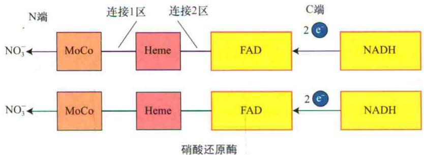  
图12.3 硝酸还原酶的二聚体模型。图解真核生物中，具有相似多肽序列的硝酸还原酶的钼复合体（MoCo）、Heme和FAD三个结构域。NADH结合在每个亚基的FAD结合区，并使2个电子从羧基（C）端经过电子传递体传递到氨基（N）端。硝酸盐在位于氨基端附近的钼复合体处被还原。在不同物种中结构域的多肽序列差异较大。

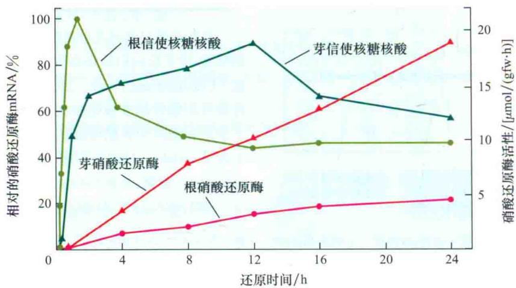  
图12.4 大麦根和芽中，硝酸还原酶活性的增加滞后于硝酸还原酶mRNA的诱导表达水平。gfw：克鲜重（引自Kleinhofs et al., 1989）。

## 12.2.2 亚硝酸还原酶将亚硝酸转化为铵

亚硝酸根（ $\mathrm{NO}_2^-$ ）是具有高活性和潜在毒害作用的离子。植物细胞可迅速地将由硝酸盐还原[见反应式（12.1）]产生的亚硝酸盐从胞质中转移到叶细胞的叶绿体或根细胞的质体中。在这些器官中，亚硝酸还原酶将亚硝酸还原成铵，这个反应过程将转移6个电子：

$$
\mathrm{NO} _ {2} ^ {-} + 6 \mathrm{Fd} _ {\mathrm{red}} + 8 \mathrm{H} ^ {+} \longrightarrow \mathrm{NH} _ {4} ^ {+} + 6 \mathrm{Fd} _ {\mathrm{ox}} + 2 \mathrm{H} _ {2} \mathrm{O}\tag{12.3}
$$

式中，Fd为铁氧还蛋白，其中下标red和ox分别代表还原态（reduced）和氧化态（oxidized）。还原态的铁氧还蛋白来自于叶绿体中的光合电子传递过程（见第7章），而叶绿体和胞质中，磷酸戊糖氧化途径中生成的NADPH作为电子供体也可产生还原态的铁氧还蛋白（见第11章）。

叶绿体和根质体中亚硝酸还原酶的存在形式不同，但两种存在形式均由一个含有两个辅基[铁-硫簇（ $\mathrm{Fe_4S_4}$ ）和一个特殊的亚铁血红素]的单链多肽构成（Siegel and Wilkeron，1989）。这些辅基与亚硝酸盐结合并将其还原为铵。该过程虽然没有中间氧化还原态氮复合物的累积，但有很少（仅占 $0.02\% \sim 0.20\%$ ）的亚硝酸盐的还原产物以一氧化二氮（一种温室气体）的形式被释放出来（Smart and Bloom，2001）。图12.5展示了电子流从铁氧还蛋白到 $\mathrm{Fe_4S_4}$ 再到亚铁血红素的过程。

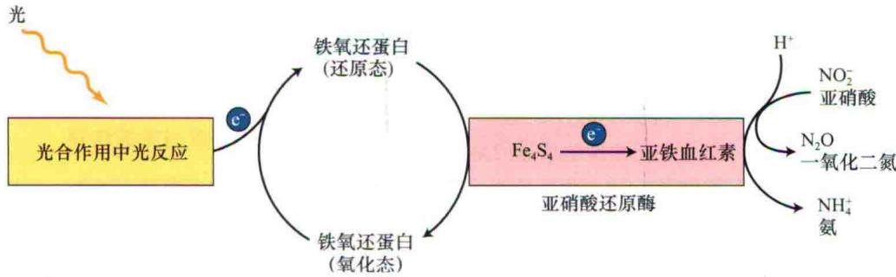  
图12.5 亚硝酸还原酶耦合光合电子流经铁氧还蛋白还原亚硝酸盐的模式图。此亚硝酸还原酶含有两个辅基： $Fe_{4}S_{4}$ 和亚铁血红素，两者均参与了亚硝酸还原成铵的反应。

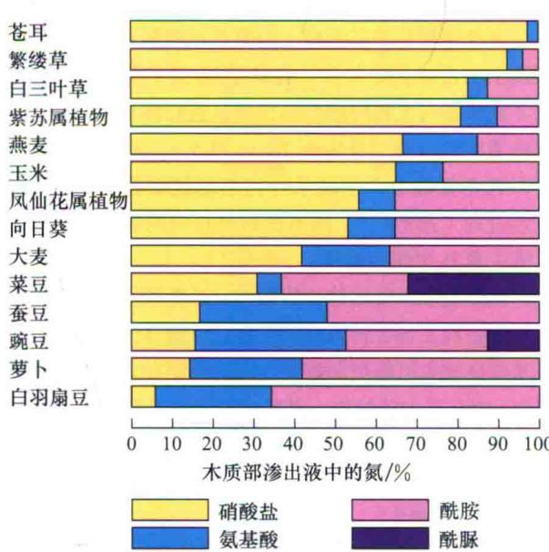  
图12.6 不同植物物种木质部汁液中硝酸盐和其他含氮化合物的相对含量。这些植物生长（即根系暴露）在硝酸盐溶液中，通过切割茎干获得木质部汁液。注意：大豆和豌豆中含有酰脲，只有热带起源的豆类以这种形式输出氮（引自Pate，1983）。

亚硝酸还原酶在细胞核中编码，并在胞质中合成，具有N端的转移多肽，该多肽将其定位到质体中（Wray，1993）。当 $NO_{3}^{-}$ 的含量升高或暴露到光下时，将诱导亚硝酸还原酶mRNA的转录，但是当该过程终产物——天冬酰胺和谷氨酰胺累积的时候，将对这个诱导过程产生抑制。

## 12.2.3 根和茎尖中硝酸盐的同化

有许多植物，当其根系接触到较少量的硝酸盐时，硝酸盐主要在根中被还原。而随着外界硝酸盐含量的增加，硝酸盐的吸收和同化将转移到地上部分的茎尖进行（Marschner，1995）。即使同样的亚硝酸盐供应情况下，根中和茎尖中硝酸盐的代谢平衡——主要是两种器官中硝酸还原酶活性的相对强弱或木质部汁液中硝酸盐和还原态氮的相对浓度——也是存在物种差异的。

例如，苍耳属植物（Xanthium strumarium）的硝酸盐代谢只发生在茎尖中，而另一些植物如白羽扇豆（Lupinus albus）中的硝酸盐代谢主要在根中进行（图12.6）。与起源于热带地区的物种相比，起源于温带地区的物种通常更多地依赖根系完成对硝酸盐的同化。

## 12.3 铵的同化

植物细胞迅速将由硝酸盐同化或者通过光呼吸产生（见第8章）的铵转换至氨基酸中以躲避铵的毒害作用。这个转变过程的初始途径包括与谷氨酰胺合成酶和谷氨酸合酶有关的一系列反应（Lea et al., 1992）。这部分将讲述调节铵同化为必需氨基酸的酶促过程，以及在调节氮和碳代谢中氨基化合物的作用。

## 12.3.1 铵转化为氨基酸的过程中需要的两种酶

谷氨酰胺合成酶（glutamine synthetase，GS）催化铵和谷氨酸合成谷胺酰胺（图12.7A）：

$$
\text {   谷氨酸   } + \mathrm{NH} _ {4} ^ {+} + \mathrm{ATP} \longrightarrow \text {   谷氨酰胺   } + \mathrm{ADP} + \mathrm{P} _ {\mathrm{i}}\tag{12.4}
$$

该反应需要水解1分子的ATP来提供能量，并以二价阳离子 $Mg^{2+}$ 、 $Mn^{2+}$ 或 $Co^{2+}$ 作为辅基。植物体含有两种GS，一类存在于细胞质中，另一类存在于根细胞质体或茎尖细胞的叶绿体中。其中细胞质中的GS在萌发的种子中或根和茎尖的维管束中表达，产生的谷氨酰胺将作为转运体用于胞内氮的转运。根细胞质体中的GS催化产生的氨基氮化合物只供该部位消耗；在茎尖细胞的叶绿体中GS催化重新同化光呼吸产生的 $NH_{4}^{+}$ （Lam et al., 1996）。光和碳水化合物的水平可改变质体中GS的表达，但对胞质中GS的表达影响很小。

提高质体中谷氨酰胺的水平将刺激谷氨酸合酶（glutamate synthase）[谷氨酰胺：α-酮戊二酸氨基转移酶（GOGAT）]产生活性。在该酶的催化下，谷氨酰胺的酰胺基被转移到α-酮戊二酸上，同时产生两分子的谷氨酸（图12.7A）。植物中有两种类型的GOGAT，一种以NADH作为电子供体，另一种以铁氧还蛋白（Fd）作为电子供体：

$$
\text {   谷氨酰胺   } + \alpha \text {-酮戊二酸   } + \mathrm{NADH} + \mathrm{H} ^ {+} \longrightarrow 2 \text {   谷氨酸   } + \mathrm{NAD} ^ {+}\tag{12.5}
$$

$$
\text {   谷氨酰胺   } + \alpha \text {-酮戊二酸   } + \mathrm{Fd} _ {\mathrm{red}} \longrightarrow 2 \text {   谷氨酸   } + \mathrm{Fd} _ {\mathrm{ox}}\tag{12.6}
$$

以NADH作为电子供体的酶（NADH-GOGAT）存在于非光合作用组织的质体中，如根或正在发育的叶片的维管束中。根质体中的NADH-GOGAT催化从根际土壤（近根表面的土壤）吸收的 $NH_{4}^{+}$ 的同化；发育叶片维管束中的NADH-GOGAT催化从根或衰老叶片中转运过来的谷氨酰胺的同化。

研究发现，以铁氧还蛋白（Fd）作为电子供体的谷氨酸合酶（Fd-GOGAT）存在于叶绿体中，它催化光呼吸中氮的代谢反应。酶蛋白的数量和活性均随着光照强度的增加而提高。根细胞质体中，特别是生长在硝酸盐营养液中的根系中，也发现了Fd-GOGAT的存在。推测根系中Fd-GOGAT可能作用于硝酸盐同化过程中生成的谷氨酰胺的进一步转化。

## 12.3.2 铵可经另一种途径被同化

谷氨酸脱氢酶（glutamate dehydrogenase，GDH）催化完成一个可逆反应，谷氨酸的脱氨与合成（图12.7B）：

$$
\begin{array}{r l} & \alpha - \text { 酮   戊   二   酸 } + \mathrm{NH} _ {4} ^ {+} + \mathrm{NAD(P)H} \\ & \text { 谷   氨   酸 } + \mathrm{H} _ {2} \mathrm{O} + \mathrm{NAD(P)} ^ {+} \end{array}\tag{12.7}
$$

以NADH作为电子供体的GDH存在于线粒体中，以NADPH作为电子供体的GDH则位于光合器官的叶绿体中。虽然两者的含量都比较丰富，但不能替代铵同化的GS-GOGAT途径，它们的主要作用是在氮的再分配中催化谷氨酸脱氨（图12.7B）。

## 12.3.3 转氨反应对氮的转移

同化到谷氨酰胺和谷氨酸中的氮，可以通过转氨作用再同化到其他氨基酸中去，催化这些反应的酶是转氨酶，如天冬氨酸转氨酶（aspartate aminotransferase, Asp-AT），它可催化如下反应（图12.7C）：

$$
\text {   谷氨酸+草酰乙酸   } \longrightarrow \text {   天冬氨酸+α-酮戊二酸   }\tag{12.8}
$$

在这个反应中谷氨酸上的氨基被转移到草酰乙酸的羰基上而形成天冬氨酸。在苹果酸-天冬氨酸穿梭中，天冬氨酸参与了将降解的等价物从线粒体和叶绿体转运到胞质中的过程（见Web Topic 11.5）；在 $C_{4}$ 固定途径中，天冬氨酸参与了碳从叶肉细胞到维管束鞘细胞的转运过程（第8章）。所有的转氨反应均需磷酸吡哆醛（维生素 $B_{6}$ ）作为辅基。

在细胞质、叶绿体、线粒体、乙醛酸循环体和过氧化氢体中均发现了转氨酶的存在。叶绿体中的转氨酶在氨基酸合成中可能更加重要，因为暴露在含有放射性标记 $CO_{2}$ 的介质中的植物，其叶片或离体叶绿体可将这种放射性标记快速地结合进谷氨酸、天冬氨酸、丝氨酸、甘氨酸和丙氨酸中。

## 12.3.4 天冬酰胺和谷氨酰胺是碳和氮代谢的衔接体

早在1806年，从芦笋中就分离出天冬酰胺，这是最先经过鉴定的酰胺（Lan et al., 1996）。天冬酰胺不仅可作为蛋白质的前体物质，还因为它具有高的稳定性和氮碳比，而在氮的转运和贮藏中起重要作用（天冬酰胺中含有2个氮和4个碳，谷氨酰胺中含有2个氮和5个碳，谷氨酸中则含有1个氮和5个碳）。

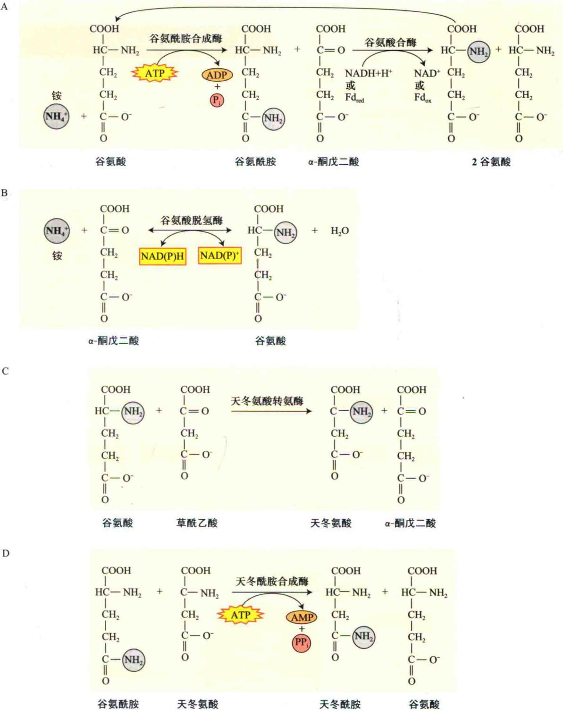  
图12.7 铵代谢过程中的化合物的结构及其形成路径。铵可经几种途径中的任何一条被同化。A. 生成谷氨酰胺和谷氨酸的GS-GOGAT途径，反应中需要绿色叶片中的铁氧还蛋白和非光合组织中的NADH作为还原型辅基。B. 以NADH或NADPH作为还原剂生成谷氨酸的GDH途径。C. 从谷氨酸上转移氨基到草酰乙酸生成天冬氨酸途径（由天冬氨酸转氨酶催化）。D. 从谷氨酰胺上转移氨基到天冬氨酸上形成谷氨酸途径（由天冬酰胺合成酶的催化）。

天冬酰胺合成的主要途径是将谷氨酰胺中的酰胺氮转移到天冬酰胺中去（图12.7D）：

$$
\text {   谷氨酰胺   } + \text {   天冬氨酸   } + \mathrm{ATP} \longrightarrow
$$

$$
\mathrm{天冬酰胺} + \mathrm{谷氨酸} + \mathrm{AMP} + \mathrm{PP} _ {\mathrm{i}}\tag{12.9}
$$

此反应由天冬酰胺合成酶（asparagine synthetase, AS）催化，该酶存在于叶和根细胞的胞质以及固氮根瘤中（见12.4部分）。在玉米根中，特别是当玉米根细胞处于潜在的氨毒害水平时，铵可替代谷氨酰胺作为氨基的来源（Sivasankar and Oaks, 1996）。

强光和高浓度碳水化合物条件可激活质体中的GS和Fd-GOGAT，但却会抑制编码AS的基因表达和该酶的活性。这些竞争途径的反向调节可以平衡植物体中的C和N代谢（Lam et al., 1996）。当能量供应充足时（如强光和高浓度碳水化合物存在条件下）可激活GS（见反应式12.4）和GOGAT（见反应式12.5和反应式12.6），而抑制AS，促进氮同化进入谷氨酰胺、谷氨酸和富含碳的化合物中，继而参与新植物体原料的合成。相反，当能量供应被限定时，GS和Fd-GOGAT被抑制，

AS被激活，氮同化向天冬酰胺方向进行，该物质富含氮且在植物体内易于长距离运输和长期贮存。

## 12.4 氨基酸的生物合成

人和大多数动物不能合成某些特定的氨基酸，包括组氨酸、异亮氨酸、亮氨酸、赖氨酸、甲硫氨酸、苯丙氨酸、苏氨酸、色氨酸、缬氨酸及幼儿体内的精氨酸（成人可以合成精氨酸）——这些所谓的必需氨基酸必须从食物中获取。但是植物能合成20种或者组成蛋白质的所有氨基酸。如前所述，含氮的氨基来自于谷氨酰胺或谷氨酸的转氨反应。氨基酸的碳骨架则来自于糖酵解生成的3-磷酸甘油酸、磷酸烯醇式丙酮酸或丙酮酸，或者来自于三羧酸循环中的α-酮戊二酸或草酰乙酸（图12.8）。必需氨基酸合成途径中的某些步骤是除草剂作用的靶标位点（如草甘膦，见第13章）。由于动物体内没有这些途径，所以低浓度的除草剂类化合物对动物无害，但对植物却是致命的。

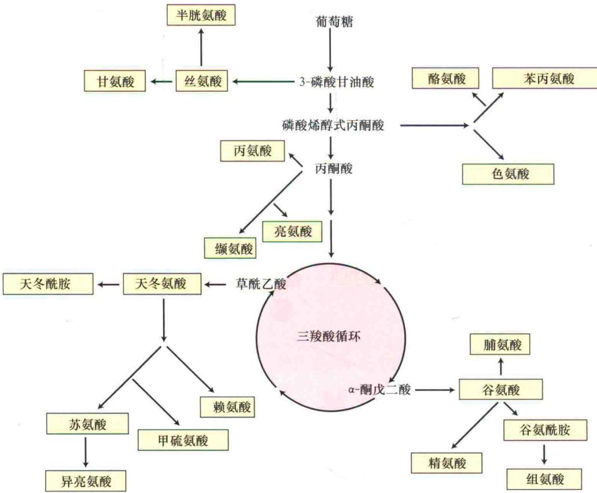  
图12.8 20种基本氨基酸碳骨架的生物合成途径。

## 12.5 生物固氮

大气中的 $N_{2}$ 转移到铵中的过程主要是由生物固氮完成的，这个过程是分子态氮进入氮的生物地化循环的重要切入点（图12.1）。本部分将讲述固氮生物和高等植物的共生关系、被固氮微生物侵染了的根系的特殊结构、共生原核生物和它们的寄主调节氮固定的遗传和信号交互作用及固氮过程中固氮酶的特性。

## 12.5.1 自生和共生固氮菌

如前所述，一些微生物可将大气中的氮转化为铵（表12.2）。多数原核固氮微生物生活在土壤中，通常不依赖其他有机体。一些和高等植物形成共生关系的原核生物可以直接为寄主植物固氮，同时换取寄主的营养和碳水化合物（Franche et al., 2009）（表12.2的上部分）。这些共生关系发生在由固氮微生物与植物根系形成的根瘤中。

最常见的共生关系发生在豆科植物（Leguminosae）和Azorhizobium、Bradyrhizobium、Photorhizobium、Rhizobium和Sinorhizobium等属土壤微生物之间，它们被统称为根瘤菌（rhizobia）（表12.3和图12.9）。

另外一种常见的共生关系发生在几种木本植物（如桤木）和Frankia土壤微生物间，这些植物即为放线菌结

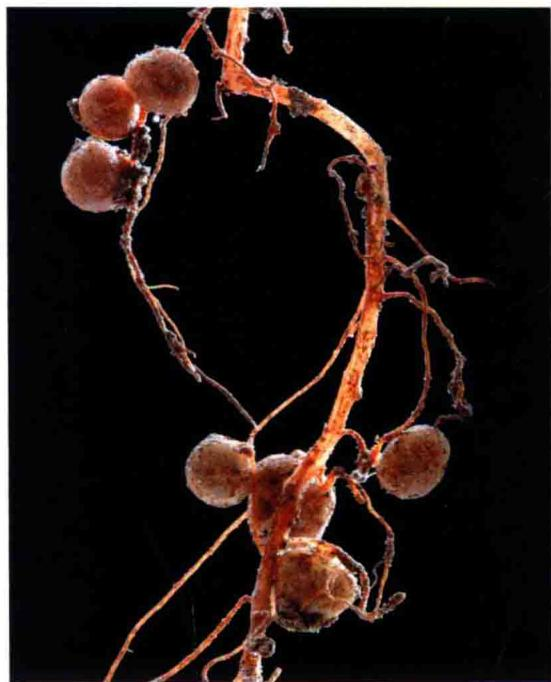  
图12.9 菜豆（Phaseolus vulgaris）的根瘤。根瘤是感染根瘤菌（Rhizobium sp.）的结果（图片由David McIntyre拍摄）。

表12.2 可进行固氮的一些生物实例

<table><tr><td colspan="2">共生固氮</td></tr><tr><td>寄主植物</td><td>氮固定共生体</td></tr><tr><td>豆科植物:豆科,糙叶山黄麻属</td><td>固氮根瘤菌属,慢生固氮根瘤菌属,光合根瘤菌属,根瘤菌属,中华根瘤菌属</td></tr><tr><td>放线菌菌根植物:桤木属(林木),美洲茶属(灌木),木麻黄属(林木),野麻属(灌木)</td><td>弗兰克氏菌属</td></tr><tr><td>根乃拉草属植物</td><td>念珠藻属</td></tr><tr><td>满江红(水生蕨类植物)</td><td>假鱼腥蓝细菌属</td></tr><tr><td>甘蔗</td><td>醋酸杆菌属</td></tr><tr><td>芒草属植物(芒草属植物)</td><td>固氮螺菌属</td></tr><tr><td colspan="2">自生固氮</td></tr><tr><td>类型</td><td>固氮属</td></tr><tr><td>蓝藻(蓝-绿藻类植物)</td><td>鱼腥蓝细菌属,丝状蓝藻属,念珠菌属</td></tr><tr><td>其他细菌</td><td></td></tr><tr><td>好氧的</td><td>固氮螺菌属,固氮菌属,拜叶林克氏菌属,德克斯氏菌属</td></tr><tr><td>兼性的</td><td>芽孢杆菌属,克雷伯氏菌属</td></tr><tr><td>厌氧的</td><td></td></tr><tr><td>非光合作用型的</td><td>梭状芽孢杆菌属,甲烷球菌属(产甲烷的原始细菌)</td></tr><tr><td>光合作用型的</td><td>着色菌属,红螺菌属</td></tr></table>

表12.3 寄主植物与根瘤菌之间的关系

<table><tr><td>植物寄主</td><td>根瘤菌共生体</td></tr><tr><td>糙叶山黄麻属(非豆科植物,以前称为山麻黄属)</td><td>慢生根瘤菌属</td></tr><tr><td rowspan="2">大豆属(Glycine max)</td><td>慢生大豆根瘤菌(慢速生长类型)</td></tr><tr><td>费氏中华根瘤菌(快速生长类型)</td></tr><tr><td>苜蓿属(Medicago sativa)</td><td>草木樨中华根瘤菌</td></tr><tr><td>田菁属(水生植物)</td><td>固氮根瘤菌属(根和茎都形成根瘤,茎上形成不定根)</td></tr><tr><td>菜豆属(Phaseolus)</td><td>菜豆根瘤菌</td></tr><tr><td>三叶草属(Trifolium)</td><td>三叶草根瘤菌</td></tr><tr><td>豌豆属(Pisum sativum)</td><td>豌豆根瘤菌</td></tr><tr><td>合萌属(水生植物)</td><td>形成茎部根瘤的光合作用活性型根瘤菌,也许与不定根的形成有关</td></tr></table>

瘤（actinorhizal）植物。另外，如北美香草Gunnera和微小的水生蕨类植物Azolla，它们分别和藻青菌Nostoc和Anabaena结合，形成共生固氮关系（表12.2和图12.10）。还有几种类型的固氮细菌，它们是与C₄禾本科植物如甘蔗和芒草属植物形成共生关系的。

## 12.5.2 氮固定需要厌氧条件

氮固定过程中需要消耗大量能量，因此催化这些反应的固氮酶（nitrogenase）上具有促使电子间进行高能量转化的作用位点。氧作为一种强电子受体，可破坏这些作用位点，并使固氮酶不可逆失活，所以氮的固定必须在厌氧的条件下进行。表12.2中列出了可在自然厌氧条件下或在有氧的情况下可创造内部厌氧环境而进行固氮的一些生物。

蓝藻中的厌氧条件是由一种被称为异形细胞（heterocysts）的特化细胞产生的（图12.10）。异形细胞是一种厚壁细胞，由丝状蓝藻在缺少 $NH_{4}^{+}$ 时分化形成。这些细胞缺乏叶绿体中产生氧的光合系统Ⅱ（见第7章），所以它们不能产生氧气（Bussis，1976）。异形细胞的出现是一种对固氮的适应性表现，因而异形细胞在固氮的好氧蓝藻中广泛存在。

蓝细菌可以在厌氧条件下固定氮素，例如，在水淹地区发生的氮素固定过程。在亚洲国家，水稻田中的异形或非异形细胞型蓝细菌固氮是保证水稻田中有足量氮供应的主要方法。当田地被水淹时这些微生物进行固氮，而当田地干涸时则死亡，并将固定的氮释放到土壤中。淹水稻田中可利用氮的另一种重要来源是水生的蕨类植物——满江红（Azolla）的固氮，它和蓝细菌中的鱼腥藻（Anabaena）形成共生关系。每天每公顷满江红-鱼腥藻共生体可固定多达0.5 kg的分子态氮，这种固氮速率所带来的氮肥供应足以得到中等的水稻产量。

自养固氮微生物可分为好氧、兼性和厌氧三种类型

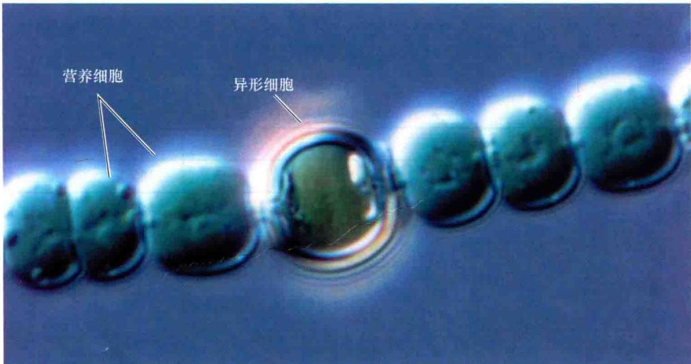  
图12.10 固氮蓝细菌（Anabaena）藻丝体上的异形细胞。在植物细胞间隙中存在的厚壁的异形细胞，内部为厌氧环境，使蓝细菌可在有氧条件下固氮（图片由Dr.Peter Silver/Visuals Unlimited/Alamy提供）。

(表12.2下部)。

（1）好氧的（aerobic）固氮微生物，如固氮菌属（Azotobactre）微生物，它们是通过较强的呼吸作用来使细胞周围处于低氧状态（Burris，1976）。另外一些微生物，如Gleoeothece，白天进行光合作用制造氧气，而晚上当呼吸作用降低氧气水平时则进行固氮。

（2）兼性的（facultative）固氮微生物，在有氧和厌氧条件下均可生长，但通常只在厌氧条件下固氮。

（3）厌氧的（anaerobic）固氮细菌的生活环境本身就缺少氧气，氧气不会成为影响它固氮的因素。这些厌氧生物可能是光合作用型的（如Rhodospirillum），也可能是非光合作用型的（如Clostridium）。

## 12.5.3 共生固氮发生在特殊的结构中

共生的固氮原核生物存在于结瘤（nodules）中。结瘤是一种由寄主植物形成的包裹着固氮菌的特殊器官（图12.9）。对于Gunnera而言，这些器官存在于独立于共生体发育的茎分泌腺内。固氮微生物可诱导豆科植物和放线菌结瘤植物形成节结。

禾本科植物也可与固氮微生物形成共生关系，但是这些共生体并不形成根瘤，且固氮微生物可以在多种植物组织间移动和生长，或定位在根表（主要是伸长区和根毛区）（Reis et al., 2000）。例如，生活在甘蔗茎组织非原生质体中的固氮细菌Acetobacter diazotrophicus，可为寄主提供充足的氮，而使寄主减少对氮肥的需求（Dong et al., 1994；James and Olivares, 1998）。Azospirillum与玉米和其他谷物共生时，也体现出了这种潜能，但是当Azospirillum与其他植物形成共生体时，似乎仅可以固定很少的氮（Vande Broek and Vanderleyden, 1995）。

豆类和放线菌结瘤植物可以通过调节根瘤的透气性，使根瘤中的氧含量维持在可以进行呼吸作用，但又不足以使固氮酶失活的水平（Kuzma et al., 1993）。光下根瘤透气性增加，而在干旱或暴露在硝酸盐条件下根瘤的透气性降低。目前，对于根瘤透气性的调节机制仍不十分清楚，可能与受根瘤菌侵染细胞的K $^{-}$ 流的进出过程有关（Wei and Layzell, 2006）。

根瘤中含有一个与氧结合的亚铁血红素蛋白，称为豆血红蛋白（leghemoglobin）。豆血红蛋白以高浓度存在于被侵染了的根瘤细胞质体中（大豆根瘤中含有700 $\mu$ mol/L），从而使根瘤显现粉色。当寄主植物被微生物侵染之后将产生豆血红蛋白的球蛋白（Marschner，1995），细菌共生体则会产生亚铁血红素。豆血红蛋白与氧有很强的亲和能力（ $K_{m}$ 约为0.01 $\mu$ mol/L），这种亲和力的大小是人血红蛋白 $\beta$ 链与氧亲和力的10倍。

虽然曾认为豆血红蛋白可作为根瘤中氧的缓释剂，但最近的研究表明，豆血红蛋白中储存的氧只够维持根瘤呼吸数秒钟（Dwnison and Hartei，1995）。因此，豆血红蛋白的作用就是将氧传给根瘤中正在进行呼吸作用的共生菌细胞，这种传递方式与血红蛋白向动物呼吸组织传递氧的方式类似（Ludwig and de Veies，1986）。在这种状态下，为了维持有氧呼吸，类菌体利用特异的电子传递链进行呼吸（见第11章），该电子传递链最末端的氧化酶对氧具有比豆血红蛋白对氧更高的亲和力， $K_{m}$ 约为0.007 $\mu$ mol/L（Preidig et al., 1996）。

## 12.5.4 建立共生关系需要信号交换

豆类和根瘤菌之间的共生关系不是一成不变的。豆类幼苗可以在与根瘤菌没有任何共生关系的情况下生长发育，它们甚至可以在整个生命周期中都不与根瘤菌产生共生关系。根瘤菌也可作为自养生物生存在土壤中。然而，在氮被限定的条件下，共生生物可以通过专用的信号交换寻找可相互共生的生物体。寄主和共生体间的这个信号传递过程，以及接下来的侵染过程和固氮根瘤的发育过程中都有特异性基因参与（Oldroyd and Downie, 2008）。

与根瘤形成有关的植物基因被称作结瘤素（nodulin，Nod）基因，参与根瘤形成的根瘤菌基因称为结瘤（nodulation，nod）基因（Heidstra and Bisseling，1996）。nod基因可分为通用nod基因和寄主专一nod基因，通用nod基因——nodA、nodB和nodC存在于所有根瘤菌中；而寄主专一nod基因，如nodP、nodQ和nodH，或nodF、nodE和nodL，因根瘤物种的不同而具有特异性，且它们的存在决定了被侵染宿主的范围。在所有的nod基因中，只有调节基因nodD是高度表达的，下面将详细阐述它的蛋白产物（NodD）对其余nod基因转录的调节作用。

固氮微生物和它们的宿主形成共生关系的过程起始于细菌向宿主植物根系的移动。这种移动是一种受化学引诱剂（特别是根系分泌的类黄酮和甜菜碱）调节的趋药性反应。这些引诱剂可激活NodD蛋白，诱导其他nod基因的转录（Phillips and Kapulnik，1995）。除了nodD基因外，所有nod基因的操纵子启动区都含有高度保守的nod盒，它与激活的NodD结合诱导其他nod基因的转录。

## 12.5.5 细菌产生的结瘤因子是共生的信号物质

NodD激活的nod基因所编码的结瘤蛋白，多数参与Nod因子的生物合成。结瘤素因子（Nod factor）是糖脂信号分子，是一种β-1→4-N-乙酰基-D-葡萄糖胺组成的几丁质骨架（长度为3\~6个糖单位），且在非还原端糖基的C-2位置上结合一个脂肪酸（图12.11）。

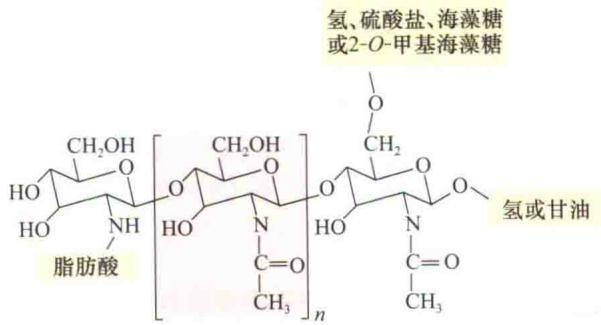  
图12.11 Nod因子是糖脂分子。典型的脂肪酸链通常含有16\~18个碳原子。中间重复部分的数目（n）通常是2或3（Stokkermans et al., 1995）。

nod基因中的三个——nodA、nodB和nodC所编码的酶系（特别是NodA、NodB和NodC）在合成结瘤素因子基础骨架的过程中起作用（Stokkermans et al., 1995）：

（1）NodA是一种N-乙酰转移酶，催化脂酰链的加长。

（2）NodB是一种几丁质-寡糖脱乙酰酶，可移去非还原糖末端的酰基。

（3）NodC是一种几丁质-寡糖合成酶，连接N-乙酰-D-氨基葡萄糖单体。

寄主专一性的nod基因随着根瘤菌种类的变化而改变，它们参与了脂酰链的修饰或决定宿主特异性组分的加长（Carlson et al., 1995）：

（1）NodE和NodF决定着脂酰链的长度和饱和程度。Rhizobial leguminosarum bv. Viciae和R.meliloti中的NodE和NodF使得脂酰链中的碳总数和双键数的比例分别是18：4和16：2（见第11章给出的数字）。

（2）另有些酶，如NodL，可通过增加几丁质骨架中还原和非还原糖基团的长度来影响结瘤素因子的寄主专一性。

一类特殊的豆类寄主可对一种专一性的Nod因子作出反应。对Nod因子作出反应的这类豆类受体植物根毛中，含有糖结合LysM域（赖氨酸基序），它是一种广谱的蛋白模块，最初在降解细菌细胞壁的酶中被确定，但在许多其他的蛋白质中也有存在（Radutoiu et al., 2007）。Nod因子激活这些域，以诱导根表皮细胞中的钙震荡。要了解钙震荡，需要知道依赖于钙/钙调蛋白的蛋白激酶（CaMK），这个CaMK是与一种未知功能的名为CYCLOPS的蛋白相关联的（Yano et al., 2008）。表皮细胞一旦识别出钙震荡，Nod因子专一的转录调节器（包括含有两个GRAS蛋白和ERF转录因子的一个复合体）将直接与Nod因子的所诱导基因的启动子相结合（Hirsch et al., 2009）。从质膜上识别Nod因子到细胞核中基因表达变化是一个密切关联的过程，并因与丛枝菌根和寄主初始相互作用的过程相似，因此被称为共生路径（见第5章）（Oldroyd et al., 2009）。

## 12.5.6 植物激素参与根瘤的形成

在根瘤形成过程中，侵染和根瘤器官形成过程同时进行。侵染过程中，吸附在根毛细胞上的根瘤菌释放出Nod因子，诱导根毛发生卷曲（图12.12A和图12.12B）。在因根毛卷曲而形成的较小空间中根瘤菌不断聚集。为了使结瘤素因子更好地起作用，根毛细胞的细胞壁开始降解，允许根瘤菌直接穿过植物质膜外表面区域（Geurts and Bissling，2002）。

接下来是侵染线（infection thread）的形成（图12.12C）。在侵染部位，由高尔基小泡融合所形成的质膜向内管状伸长。由于分泌泡的融合，侵染线的头部一直生长到管的底部。在更深层次的木质部皮层，皮层细胞去分化开始分裂，在皮层内部形成一个特殊区域，称之为根瘤原基（nodule primordium），根瘤从这里开始发育。根瘤原基在与根维管束原生木质部相反的位置处形成（Timmers et al., 1999）（参见Web Topic 12.1）。

不同的信号组分，或正或负地控制着根瘤原基位置。在根的原生木质部区，尿苷酸从中柱扩散到皮层，刺激细胞的分裂（Geurts and Bisseling，2002）。乙烯在中柱鞘中合成并扩散到皮层，抑制与根韧皮部相对应处的细胞的分裂。

在根瘤原基的方向上，被正在复制的根瘤菌所填充的侵染线穿过根毛和皮层细胞后不断伸长。当侵染线到达根瘤中特化的细胞时，它的顶端就与寄主细胞的质膜融合，释放出包埋在寄主细胞质膜中的菌细胞（图12.12D）。根瘤内部侵染线的分枝结构可使根瘤菌侵染更多细胞（Mylona et al., 1995）。

最初细菌持续分裂，而其周围的膜因与较小的囊泡相融合不断增长，并通过扩大表面积来适应这种增长需要。因此，在一种未知的植物信号作用下，细菌很快停止分裂并开始增大，分化成内源共生器官，称之为类菌体（bacteroid）。环绕着类菌体的膜称为类菌体周膜（perbacteroid membrane）。根瘤整体的发育过程具有维管系统的特征（这样有利于类菌体固定的氮与植物产生的营养物质间的交换），而且细胞中的一层可将根瘤内部的氧排出。在一些起源于温带的豆科植物（如豌豆）中，由于存在根瘤分生区（nodule meristem），其根瘤扩大成圆柱形。起源于热带地区的豆科植物，如蚕豆和花生，根瘤则因缺少持续的分生组织而成球形（Rolfe and Gresshoff，1988）。

<!-- END OFFICIAL API PART part_003 -->

<!-- BEGIN OFFICIAL API PART part_004 -->

  
图12.12 根瘤器官形成中的侵染过程。A. 根瘤菌在植物释放的化学引诱剂的作用下吸附在突出的根毛上。B. 在根瘤菌生成因子作用下，根毛发生不正常的弯曲生长，并且根瘤菌在卷曲部位增殖。C. 该部位根毛细胞壁降解，导致源于根细胞高尔基体分泌囊泡的侵染线的形成和根瘤菌的入侵。D. 侵染线到达根细胞的底部，它的膜与根细胞质膜融合。E. 根瘤菌被释放到根细胞的非原生质体并从中间的薄层组织中穿过到达下表皮质膜而导致新侵染线的产生，最终形成开放的通路。F. 侵染线伸长并分枝直到达到目的细胞，在目的细胞处，由植物膜系统组成的囊泡所包围的固氮菌被释放到胞质中。

## 12.5.7 固氮酶复合体固氮

生物固氮像工业固氮一样，是将分子态氮直接转化为氨，其总反应式如下：

$$
\mathrm{N} _ {2} + 8 \mathrm{e} ^ {-} + 8 \mathrm{H} ^ {+} + 1 6 \mathrm{ATP} \longrightarrow 2 \mathrm{NH} _ {3} + \mathrm{H} _ {2} + 1 6 \mathrm{ADP} + 1 6 \mathrm{P} _ {\mathrm{i}}\tag{12.10}
$$

此过程中，将一分子 $N_{2}$ 还原成2分子的 $NH_{3}$ ，需要转移6个电子并伴随两个质子被还原成 $H_{2}$ 。该反应由固氮酶复合体（nitrogenase enzyme complex）催化（Dixon and Kahn，2004；Seefeldt et al.，2009）。

固氮酶复合体可分成两种组分——铁（Fe）蛋白和钼铁（MoFe）蛋白，它们自身均没有活性（图12.13）：

（1）在两种组分中，Fe蛋白相对较小，由两个分子质量为30\~72 kDa的相同的亚单位组成，因有机体不同而存在差异。每个亚组分含有一个Fe-S簇（4Fe和 $4S^{2-}$ ），参与由 $N_{2}$ 转化为 $NH_{3}$ 的氧化还原反应。 $O_{2}$ 可使Fe蛋白不可逆失活，半衰期是30\~45 s（Dixion and Wheeler，1986）。

（2）MoFe蛋白含有4个亚基，在不同的物种中分子质量为80\~235 kDa。每个亚基含有两个Mo-Fe-S簇。 $O_{2}$ 同样可使MoFe蛋白失活，在空气中，其半衰期为10 min。

在整个固氮还原反应过程中（图12.13），铁氧还蛋白是铁蛋白的电子供体，后者进一步水解ATP并还原MoFe蛋白。随后，MoFe蛋白可以将多种底物还原（表

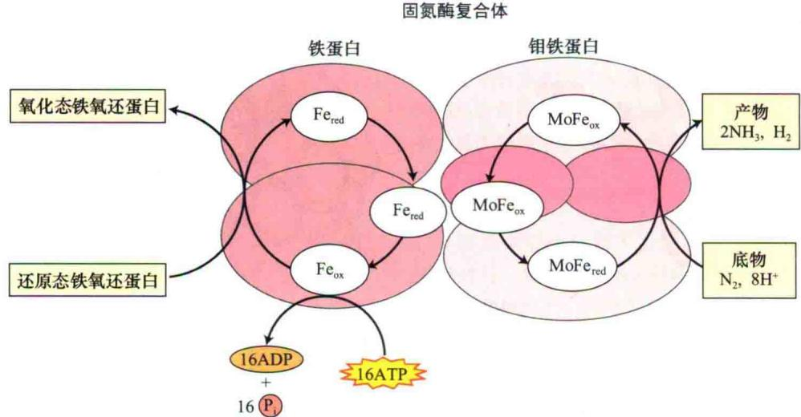  
图12.13 固氮酶催化反应。铁氧还蛋白还原铁蛋白。ATP结合铁蛋白和水解被认为引起了铁蛋白构象的改变，这种改变利于氧化还原反应的进行。Fe蛋白还原MoFe蛋白，后者再还原 $N_{2}$ （引自Dixon and Wheeler，1986；Buchanan et al., 2000）。

12.4），虽然在自然条件下它只与 $N_{2}$ 和 $H^{+}$ 反应。固氮酶催化的反应之一——将乙炔还原为乙烯，已成为测定固氮酶活性的方法之一（参见Web Topic 12.2）。

表12.4 固氮酶的催化反应

<table><tr><td> ${\mathrm{N}}_{2} \rightarrow {\mathrm{{NH}}}_{3}$ </td><td>分子态氮的固定</td></tr><tr><td> ${\mathrm{N}}_{2}\mathrm{O} \rightarrow {\mathrm{N}}_{2} + {\mathrm{H}}_{2}\mathrm{O}$ </td><td>亚硝态氮氧化还原</td></tr><tr><td> ${\mathrm{N}}_{3}^{ - } \rightarrow {\mathrm{N}}_{2} + {\mathrm{{NH}}}_{3}$ </td><td>叠氮化物还原</td></tr><tr><td> ${\mathrm{C}}_{2}{\mathrm{H}}_{2} \rightarrow {\mathrm{C}}_{2}{\mathrm{H}}_{4}$ </td><td>乙炔还原</td></tr><tr><td> $2{\mathrm{H}}^{ + } \rightarrow {\mathrm{H}}_{2}$ </td><td>氢气生成</td></tr><tr><td>ATP→ADP+Pi</td><td>ATP水解放能</td></tr></table>

固氮反应中的能量传递是复杂的。由 $N_{2}$ 和 $H_{2}$ 反应生成 $NH_{3}$ 的反应是一个 $\Delta G^{0'}$ （自由能变化）为-27 kJ/mol的放能反应（附录1所讨论的放能反应）。但是工业上用 $N_{2}$ 和 $H_{2}$ 生产 $NH_{3}$ 的过程则是一个耗能的（endergonic）过程，需要投入大量的能量，因为打破 $N_{2}$ 中的氮氮三键需要高的活化能。同样原因，虽然自由能的精确变化仍不清楚，但固氮酶催化 $N_{2}$ 的还原反应也需要投入大量能量（见反应式12.10）。

豆科植物碳水化合物代谢的研究表明，每固定1 g N₂需要消耗12 g有机碳（Heytler et al., 1984）。依据反应式（12.10），生物固氮总反应的ΔG⁰约为-200 kJ/mol。因为总反应是高度放能的反应，铵的生成被固氮酶复合体的慢反应（单位时间——每秒内还原的N₂分子数约为5）所限制。为了补偿这种慢反应的周转时间，类菌体就会合成大量的固氮酶（最高可占细胞总蛋白量的20%）。

在自然条件下，大量的 $H^{+}$ 被还原为 $H_{2}$ ，这个反应和 $N_{2}$ 的还原反应竞争来自固氮酶的电子。在根瘤菌中，供应给固氮酶的能量中30%\~60%被用于合成 $H_{2}$ ，这在很大程度上降低了固氮的效率。然而有一些根瘤菌含有氢化酶，该酶可裂解 $H_{2}$ ，并产生电子用于 $N_{2}$ 的还原，因而提高了固氮效率（Marschner，1995）。

## 12.5.8 酰胺和酰脲是氮的转运形式

固氮的原核生物共生体可释放出氨，氨在由根瘤再经由木质部传给叶片之前，共生体会快速将其转化成为有机形式以避免受到毒害作用。固氮的豆科植物可依据其木质部汁液成分的不同而分为酰胺输出型和酰脲输出型。酰胺（主要是天冬酰胺或谷氨酰胺）是起源于温带地区的豆科植物氮的主要输出形式，如豌豆（Pisum）、三叶草（Trifolium）、蚕豆（Vicia）和小扁豆（Lens）。

酰脲则是起源于热带地区的豆科植物氮的主要输出形式，如大豆（Glycine）、四季豆（Phaseolus）、花生（Arachis）和南方菜豆（Vigna）。三种主要的酰脲形式是尿囊素、尿囊酸和瓜氨酸（图12.14）。尿囊素在过氧化物体中由尿酸合成，尿囊酸在内质网中由尿囊素合成，鸟氨酸合成瓜氨酸的位点目前还不明确。这三种成分最终被释放到木质部中并转运到茎叶，在那里被迅速分解为铵，铵再进入前述的同化过程。

## 12.6 硫的同化

有机体中，硫是最重要的多功能元素之一（Hell，1997）。蛋白质中的二硫键起到支架和调节的作用（见第8章）。硫通过Fe-S簇参与电子的传递（见第7章和第11章）。多种酶和辅酶，如脲酶和辅酶A的催化位点都含有硫。前述的根瘤菌的结瘤因子、大蒜的防腐剂蒜氨酸和花椰菜中的抗癌剂——异硫氰基-4R丁烷等次生代谢物质（不参与生长和发育基本途径的化合物）中都含有硫。

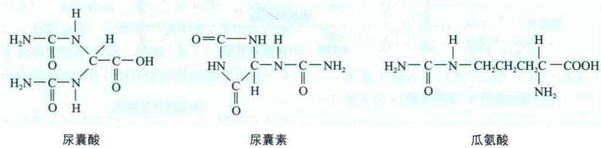  
图12.14 被用于氮转运的主要酰脲复合物。它们将氮由固氮位点转运到合成位点，在那里经脱氨作用为氨基酸和核苷酸的合成提供氮源。

硫的多功能性在一定程度上是因为它拥有氮原子的某些特征：具有多种稳定的氧化态形式（multiple stable oxidation states）。在本部分将对调节硫同化的酶促反应步骤和催化硫还原进入含硫氨基酸——半胱氨酸和甲硫氨酸的生化反应过程进行阐述。

## 12.6.1 硫以硫酸根的形式被植物吸收

经 $H^{+}-SO_{4}^{2-}$ 的同向转运体（见第6章）从土壤溶液中吸收来的硫酸根（ $SO_{4}^{2-}$ ）中的硫是高等植物细胞内硫的主要来源。土壤中的 $SO_{4}^{2-}$ 则主要来自于表面母岩材料的风化。然而，工业化引起的大气污染又增加了硫的来源。化石燃料的燃烧可释放出气态形式的硫，如二氧化硫（ $SO_{2}$ ）和硫化氢（ $H_{2}S$ ）等，它们随雨水降落到地面。

气态的 $SO_{2}$ 会与 $OH^{-}$ 和 $O_{2}$ 反应形成三氧化硫（sulfur trioxide， $SO_{3}$ ）， $SO_{3}$ 溶解在水中后会生成一种强酸——硫酸（ $H_{2}SO_{4}$ ），它是酸雨的主要来源。植物也可以通过气孔吸收和利用空气中的 $SO_{2}$ 气体，但长时间（超过8 h）暴露在含有高浓度 $SO_{2}$ （超过0.3 ppm）的大气中时， $SO_{2}$ 形成的硫酸会造成植株大部分组织坏死。

## 12.6.2 硫酸根同化前需要将其还原成半胱氨酸

含硫化合物合成的第一步是将硫酸根还原成半胱氨酸（图12.15）。硫酸根很稳定，要进行后续反应，就必须先将其活化。首先，ATP与硫酸根作用，生成5'-腺苷酰硫酸（又称作腺苷-5-磷酸硫酸，缩写成APS）和焦磷酸（PP $_{i}$ ）（图12.15）：

$$
\mathrm{SO} _ {4} ^ {2 +} \mathrm{Mg-ATP} \longrightarrow \mathrm{APS+PP} _ {\mathrm{i}}\tag{12.11}
$$

催化该反应的酶——ATP-硫酰化酶有两种形式：主要的一种存在于质体中，次要的一种存在于胞质中（Leustek et al., 2000）。活化这个反应是非常困难的，为了促使反应继续进行，生成的APS和PP $_{i}$ 必需立刻被转化成其他化合物。PP $_{i}$ 被无机焦磷酸酶水解为无机磷酸（P $_{i}$ ），反应如下：

$$
\mathrm{PP} _ {\mathrm{i}} + \mathrm{H} _ {2} \mathrm{O} \longrightarrow 2 \mathrm{P} _ {\mathrm{i}}\tag{12.12}
$$

另一产物APS被迅速还原或磷酸化，其中还原过程是主导过程（Leuster et al., 2000）。

APS的还原是发生在质体中的一个多步反应。首先，还原型谷胱甘肽（GST）转移两个电子到APS还原酶，将APS还原，生成亚硫酸根（ $SO_{3}^{2-}$ ）：

$$
\mathrm{APS} + 2 \mathrm{GSH} \longrightarrow \mathrm{SO} _ {3} ^ {2 -} + 2 \mathrm{H} ^ {+} + \mathrm{GSSG} + \mathrm{AMP}\tag{12.13}
$$

其中，GSSG代表氧化型的谷胱甘肽（GSH中的SH和GSSG中的SS分别代表S—H和S—S键）。

其次，亚硫酸还原酶接受来自铁氧还蛋白（ $Fd_{red}$ ）的6个电子，还原 $SO_{3}^{2-}$ 生成硫化物（ $S^{2-}$ ）：

$$
\mathrm{SO} _ {3} ^ {2 -} + 6 \mathrm{Fd} _ {\mathrm{red}} \longrightarrow \mathrm{S} ^ {2 -} + 6 \mathrm{Fd} _ {\mathrm{ox}}\tag{12.14}
$$

生成的 $S^{2-}$ -和乙酰丝氨酸（OAS）反应生成半胱氨酸和乙酸，生成OAS的反应则由丝氨酸乙酰转移酶催化：

$$
\text {   丝氨酸+乙酰CoA   } \longrightarrow \mathrm{OAS+CoA}\tag{12.15}
$$

O-乙酰丝氨酸和 $S^{2-}$ 作用生成半胱氨酸和乙酸的反应则由OAS-硫裂解酶催化：

$$
\mathrm{OAS} + \mathrm{S} ^ {2 -} \longrightarrow \text { 半   胱   氨   酸 } + \text { 乙   酸 }\tag{12.16}
$$

存在于胞质中的APS的磷酸化作用是一个可以选择的途径。首先APS激酶催化APS和ATP作用生成3'-磷酸腺苷-5'-磷酰硫酸（PAPS）：

$$
\mathrm{APS} + \mathrm{ATP} \longrightarrow \mathrm{PARS} + \mathrm{ADP}\tag{12.17}
$$

转硫酸酶然后可将硫酸根从PAPS转移给多种化合物，如胆碱、油菜素类固醇、黄酮醇、五倍子酸糖苷、芥子油苷、多肽和多糖等（Leuster et al., 1999）。

## 12.6.3 硫酸根的同化多发生在叶片内

硫酸根还原为半胱氨酸的过程必须转移8个电子，同时使硫的氧化数从+6变到-2。谷胱甘肽、铁氧还蛋白、NAD（P）H，或者O-乙酰丝氨酸成为这个过程多个步骤中的电子供体（图12.15）。在拟南芥中，除了亚硫酸盐还原酶和还原型谷胱甘肽合成酶以外，其余所有与硫同化有关的酶都是由小基因家族编码的。现在仍不清楚是否这是一种功能上的冗余或是否所有的基因都有专一的功能或专项定位（Kopriva，2006）。叶片中

  
图12.15 参与硫同化过程的化合物的结构及它们的生成路径。ATP硫酸化酶从ATP裂解出焦磷酸盐，并用硫酸根将其替代。经谷胱甘肽和铁氧化还原蛋白的还原反应，APS生成硫化物。硫化物或亚硫化物与O-乙酰丝氨酸作用生成半胱氨酸。

代。经谷胱甘肽和铁氧化还原蛋白的还原反应，APS生成硫硫的同化比根系中的更为活跃一些，这可能因为光合作用提供了还原型的铁氧还蛋白，而光呼吸作用又可产生丝氨酸进一步去激发O-乙酰丝氨酸的生成（见第8章）的缘故。叶片中同化的硫主要以谷胱甘肽的形式经韧皮部输送到蛋白质的合成位点（叶和根的生长点及果实）（Bergmann and Rennenberg，1993）：

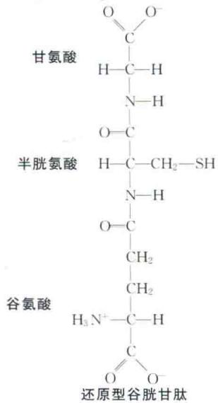

谷胱甘肽也可作为一种信号，协调根系对硫酸盐的吸收和茎尖对硫酸盐的同化。

## 12.6.4 甲硫氨酸的合成前体物质是半胱氨酸

甲硫氨酸是蛋白质中的另一种含硫氨基酸，其在质体中由半胱氨酸合成（更多是细节参见Web Topic 12.3）。合成的半胱氨酸和甲硫氨酸被用于合成蛋白质，或用于为诸多其他化合物提供S，如乙酰CoA和S-腺苷甲硫氨酸。S-腺苷甲硫氨酸在乙烯合成（见第22章）和木质素合成的转甲基反应中起重要作用（见第13章）。

## 12.7 磷酸盐的同化

植物根系通过 $H^{+}-HPO_{4}^{2-}$ 的转运体很容易吸收土壤溶液中的磷酸根（ $HPO_{4}^{2-}$ ）（见第6章），被吸收的磷酸根随后化合到各种有机物中，包括磷酸糖、磷脂和核苷酸。磷酸盐同化过程的主要切入位点是细胞中能量的流通形式ATP的形成。在这个反应过程中，无机磷通过磷酸酯键结合到腺苷二磷酸的第二个磷酸基团上。

A

在线粒体中，ATP合成所需的能量来自于NADH的氧化磷酸化（见第11章）；而在叶绿体中，ATP的合成也被光的光合磷酸化所驱动（见第7章）。除了线粒体和叶绿体中可合成ATP外，胞质中的糖酵解过程也可同化磷酸盐。

糖酵解过程可将无机磷化合到1,3-二磷酸甘油酸中，形成高能量的酰基磷酸基团。它可为ADP提供磷酸供体，发生底物水平的磷酸化反应，生成ATP（见第11章）。在高等植物中，磷酸盐基团一旦被同化进ATP，就可以通过多种不同的反应，使许多化合物发生磷酸化。

## 12.8 阳离子的同化

植物细胞吸收的阳离子通过非共价键与有机化合物结合形成复合体（关于非共价键的讨论，见附录1）。植物可以同化大量营养元素的阳离子，如钾、镁和钙，并以相同方式同化微量元素的阳离子，如铜、铁、锰、钴、钠和锌。本部分将阐述配位键和静电键在植物同化几种阳离子过程中所起的关键作用、根系吸收铁离子的特殊需求和随之而来的铁在植物体内的同化

作用。

## 12.8.1 阳离子和碳化合物形成非共价键

阳离子和碳化合物形成的非共价键有两种类型：配位键和静电键。在配位化合物的形成过程中，碳化合物的几个氧或氮原子提供共用电子对与阳离子形成共用键，从而中和掉阳离子的正电荷。

多价阳离子和碳化合物形成的键是典型的配位键（coordination bond），如铜-酒石酸复合物（图12.16A）和镁-叶绿素a复合物（图12.16B）。可作为配位化合物而被同化的营养元素包括铜、锌、铁和镁。钙也可以和组成细胞壁的多聚半乳糖醛酸形成配位化合物（图12.16C）。

静电键（electrostatic bond）是由于带正电荷的阳离子与带负电荷的基团之间相互作用而形成的，如碳化合物中碳酸根（—COO $^{-}$ ）。与配位键中情形不同的是，静电键中的阳离子保留着它的正电荷。单价阳离子，如钾（K $^{+}$ ），可以和许多有机酸中的羧基形成静电键（图12.17A）。然而，多数植物细胞吸收的及用作渗透调节和酶激活剂的K $^{+}$ 仍在胞质和液泡中以游离态存在。二价阳离子（如钙）可以和果胶酸盐（图12.17B）

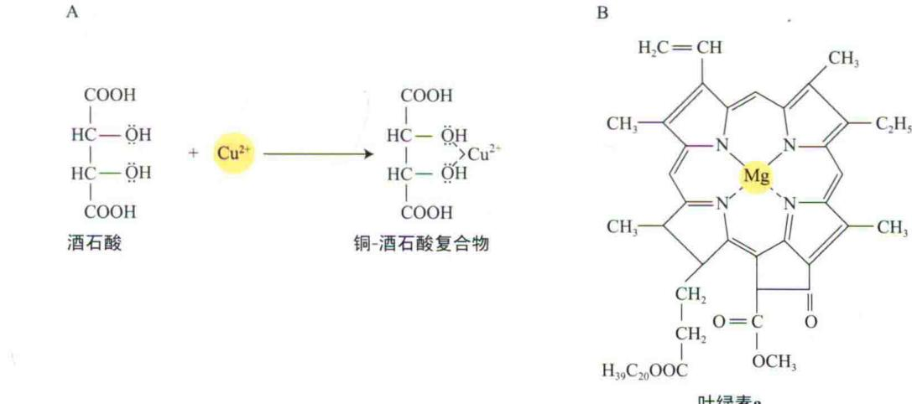  
叶绿素a

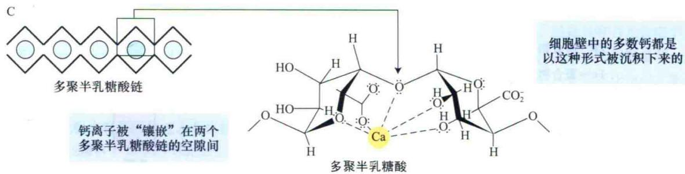  
图12.16 配位化合物实例。含碳化合物中的氧或氮原子提供共用电子对（以点表示）与阳离子形成一个配位键，即形成配位化合物。A. 铜离子与酒石酸中的羟基氧共用电子。B. 镁离子和叶绿素a中的氮原子共用电子。虚线表示氮原子与镁离子间共用电子对形成的配位键。C. 多聚半乳糖酸是细胞壁胶质的主要成分，它和钙离子相互作用形成“蛋盒”模型。右边是半乳糖酸残基中的羟基氧与单个钙离子形成的配位键的放大图（Rees，1977）。

B  
  
图12.17 静电键（离子键）化合物实例。A. 单价阳离子 $K^{+}$ 和苹果酸形成苹果酸钾复合体。B. 二价阳离子 $Ca^{2+}$ 和果胶酸形成果胶酸钙复合物。二价阳离子可以和含有负电荷羧基的平行链形成交叉连接。钙的交叉连接形成细胞壁的骨架成分。

及多聚半乳糖醛酸的羧基形成静电键（见第15章）。

总之，如镁离子（ $Mg^{2+}$ ）和钙离子（ $Ca^{2+}$ ）等阳离子可通过和氨基酸、磷脂，以及其他一些带负电的分子形成配位键或静电键而被同化。

## 12.8.2 根调节根际环境以获取铁离子

铁在铁-硫蛋白中非常重要（见第7章），铁-硫蛋白在酶促氧化还原反应中起着催化剂的作用（见第5章），如前面所述的氮的新陈代谢过程。植物从土壤中吸收铁。土壤溶液中的铁通常以三价Fe离子（ $\mathrm{Fe}^{3+}$ ）存在于氧化物中，如 $\mathrm{Fe(OH)}^{2+}$ 、 $\mathrm{Fe(OH)}_{3}$ 和 $\mathrm{Fe(OH)}_{4}^{-}$ 。在中性pH条件下， $\mathrm{Fe}^{3+}$ 高度不溶。因此，植物根系已经进化了几种机制来增加铁的溶解度以便于吸收利用（图12.18）。这些机制包括：

（1）土壤酸化，以增加 $Fe^{3+}$ 的溶解度。

（2）将 $Fe^{3+}$ 还原成更易溶解的亚铁（ $Fe^{2+}$ ）。

（3）释放能与铁形成稳定的可溶性复合物的化合物（Marschner，1995）（第5章），这些化合物被称为

A  

铁的螯合剂（图5.3）。

根系通常会酸化根区的土壤。在吸收和同化阳离子时（特别是铵），根系会排放出质子和释放出有机酸（如苹果酸和柠檬酸），以提高铁和磷酸盐的可用性（图5.5）。铁的缺失可刺激根系排放质子。另外，根细胞质膜上含有一种酶，称为铁螯合还原酶（iron-chelating reductase），它以NADH或NADPH作为电子供体（图12.18A），可将 $Fe^{3+}$ 还原成亚铁离子（ $Fe^{2+}$ ）。铁匮乏时该酶的活性增强。

根系会分泌几种化合物与铁形成稳定的螯合物，如苹果酸、柠檬酸、石炭酸和毒鱼豆酸。禾本科牧草可产生一类特殊的铁螯合剂，称为铁载体（siderophores）。铁载体是由一些蛋白质中不存在的氨基酸和与 $Fe^{3+}$ 形成的高度稳定的化合物组成的，如麦根酸。禾本科牧草的根细胞质膜上含有 $Fe^{3+}$ -载体的转运系统，可将螯合物转运到胞质中。在铁缺乏的情况下，禾本科牧草根系会释放大量的 $Fe^{3+}$ -载体到土壤中，以增强 $Fe^{3+}$ -载体转运系统的能力（图12.18B）。

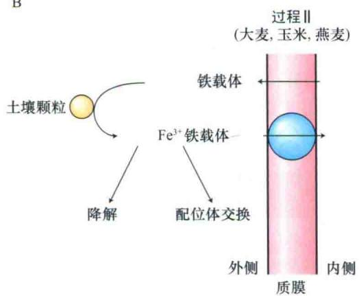  
图12.18 植物根系吸收铁离子的两个过程。A. 双子叶植物，如豌豆、西红柿和大豆的铁吸收过程。其螯合剂为有机酸，如苹果酸、柠檬酸、石炭酸和酒石酸。B. 禾本科植物，如大麦、玉米和燕麦的铁吸收过程。禾本科植物分泌的铁螯合剂可吸收土壤颗粒中的铁，形成的复合物可以降解，并将铁释放到土壤中与其他配体进行交换，或将铁直接转运进根系（引自Guerinot and Yi，1994）。

根系吸收的铁或铁的螯合物被首先氧化成三价铁形式，再与柠檬酸盐或烟草胺形成离子化合物后被转运到叶片中（Jeong and Gueriont，2009）。

进入叶片后，铁要进行一个重要的同化反应，即螯合到原卟啉中。原卟啉存在于叶绿体和线粒体细胞色素的血红素中（见第7章）。这个反应受亚铁螯合酶催化（图12.19）（Jones，1983）。植物体中多数的铁存在于血红素基团中。另外，电子传递链的铁-硫蛋白（见第7章）中含有与脱辅基蛋白的半胱氨酸残基上的硫原子以共价键相连的非血红素铁。在 $Fe_{2}S_{2}$ 的中心位置也含有Fe，该物质含有两个铁离子（均与半胱氨酸残基上的硫原子相连）和2分子无机硫化物。

游离的铁离子（铁离子没有和碳化合物结合）可以和 $\mathrm{O}_{2}$ 作用形成高度危害的羟自由基OH·（Halliwell and Gutteridge，1992）。植物细胞将多余的铁储藏在被称为植物铁蛋白（phytoferritin）的铁-蛋白复合体中以减弱这种破坏（Bienfait and van der Mark，1983）。对拟南芥突变体的研究表明，虽然铁蛋白对于保护活性氧伤害是必需的，但是它们并不能作为主要的Fe元素贮备而用于幼苗发育或者光合器官行使正常功能（Ravet et al., 2009）。植物铁蛋白由24个相同的亚基形成的中空球形蛋白壳组成，其分子质量约为480 kDa。球形外壳内部是一个由5400\~6200个铁原子以铁氧化物-磷酸复合体形式组成的中心核。

植物铁蛋白释放铁的机制还不清楚，但打破球形外壳似乎是很必要的。植物细胞中游离铁的水平调节

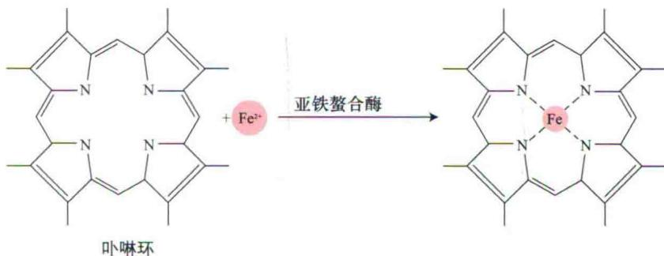  
图12.19 亚铁螯合酶的还原反应。亚铁螯合酶催化铁离子进入卟啉环中央形成整合物，见图7.36卟啉环的生物合成。

着新的植物铁蛋白的生物合成过程（Lobreaux et al., 1992）。人类对植物铁蛋白有着高度兴趣，因为在这种蛋白复合物中存在的铁更易被人体吸收，而含有丰富植铁蛋白的食物，如大豆，可以解决膳食性贫血问题（Welch and Graham, 2004）。

## 12.9 氧的同化

植物细胞对氧的同化很大比例（90%）是由呼吸作用完成的（见第11章）。将氧同化到有机化合物中的另一重要途径就是结合水中的氧（见表8.1中的反应）。在氧固定（oxygen fixation）过程中，仅有较小比例的氧可以经加氧酶同化到有机化合物中。植物中最重要的加氧酶是核酮糖-1.5-二磷酸羧化酶/加氧酶（Rubisco）。它在光呼吸过程中将氧同化进入有机化合物中，同时释放能量（见第8章）。其他的加氧酶见Web Topic 12.4。

## 12.10 营养物质同化的能学

在营养物质的同化过程中，将稳定的低能量的无机化合物转变成高能量的有机化合物通常需要大量的能量。例如，硝酸盐还原到亚硝酸盐，再还原到铵需要转移10个电子，占去了根和茎中总能量消耗的25%（Bloom，1997）。因此，一棵植物要用它1/4的能量来同化不足其干重2%的氮。

许多这种同化反应是在叶绿体的基质中进行的。那里拥有强有力的还原剂，如在光合作用电子传递中产生的NADPH、硫氧还蛋白和铁氧还蛋白。营养物质同化与光合作用电子传递相偶联的过程被称为光合同化作用（photoassimilation）（图12.20）。虽然光合同化作用与卡尔文循环发生在同一部位，但是只有当光合电子传递过程产生的还原剂量超过卡尔文循环的需要量时——如在强光低二氧化碳的条件下——光合同化作用才能进行（Robinson，1988）。高浓度的二氧化碳抑制 $C_{3}$ 植物叶片中（图12.21）（参见Web Topic 12.1）和 $C_{4}$ 植物维管束鞘细胞中（见第8章）硝酸盐的同化（Becker et al., 1993）。

这些还原剂在卡尔文循环和完全同化之间分配的调节机制急待研究，因为21世纪内大气中的二氧化碳含量可能会倍增（见第9章），这将会影响到植物-营养物质间的关系。

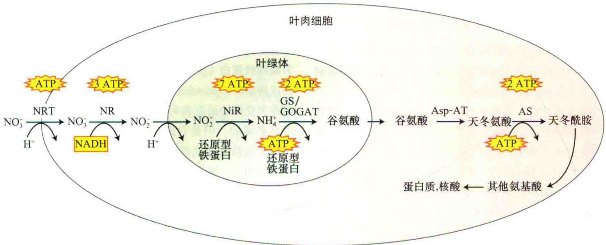  
图12.20 叶片中矿物质氮的同化过程概要。经木质部从根部转运来的硝酸盐再通过硝酸根-质子同向转运体（NRT）转运到细胞质中被叶肉细胞吸收。在细胞质中，硝酸盐被硝酸还原酶（NR）还原为亚硝酸盐，之后亚硝酸盐随同质子一起被转移到叶绿体基质中。在叶绿体基质中亚硝酸盐被亚硝酸还原酶（NiR）还原为铵，铵通过谷氨酰胺合成酶（GS）和谷氨酸合酶（GOGAT）被转移至谷氨酸，又回到胞质中，通过转氨酶（Asp-AT）的转氨基作用将谷氨酸转变为天冬氨酸。最终天冬氨酸被天冬酰胺合成酶（AS）转变为天冬酰胺。每步反应所消耗能量换算成等位的ATP量标注在各个反应的上方。

  
图12.21 小麦幼苗的同化系数（AQ=CO₂同化量/O₂释放量）随光量（光合有效辐射）的变化情况。硝酸盐的光同化作用与AQ密切相关，因为光合同化过程中把电子转移到硝酸盐和亚硝酸盐的反应会增加光合作用中光反应释放的O₂量，而暗反应对CO₂的同化速率与电子传递速率保持一致。因此，进行硝酸光合同化作用的植物表现出较低的AQ。在大气CO₂浓度（360 μmol/mol，红色线）的测量，AQ随着瞬时光辐射的下降而下降，表明光合同化率的增加。高CO₂浓度（700 μmol/mol，蓝色线）条件下，在所有的光照强度上AQ均保持恒定，说明CO₂固定反应与光合同化作用竞争还原剂，

并抑制硝酸盐的光合同化作用（Bloom et al., 2002）。

## 小结

营养物质的同化是植物将自身生长和发育所必需的无机营养物质螯合到碳化合物组分当中去的过程，这是

一个耗能过程。

## 环境中的氮

\- 氮被固定进入氨（ $\mathrm{NH}_3$ ）或硝酸盐（ $\mathrm{NO}_3^-$ ）以后，会经由几种有机或无机的形式最终回到分子态氮（图12.1）。

· 高浓度的铵（ $\mathrm{NH}_{4}^{+}$ ）对于活的组织是有毒的，但高浓度的硝酸盐可以在植物组织中安全的贮存和转移（图12.2）。

## 硝酸盐的同化

\- 植物根系积极吸收硝酸盐，然后在细胞质中将它还原为亚硝酸盐（ $\mathrm{NO}_2^-$ ）（图12.3）。

\- 硝酸盐、光和碳水化合物共同影响着硝酸还原酶的转录和翻译（图12.4）。

\- 黑夜和 $\mathrm{Mg}^{2+}$ 可以钝化硝酸还原酶的活性。这种钝化速度比减弱该酶的合成或加速其降解更为快速。

· 在叶绿体或质体中，硝酸还原酶催化还原硝酸盐为铵（图12.5）。

· 根、冠均可同化硝酸盐（图12.6）。

## 铵的同化

\- 植物细胞通过快速的转化铵进入氨基酸而避免铵的毒害（图12.7）。

\- 氨经转氨基反应（包括谷氨酸和谷氨酰胺）可合成其他氨基酸中。

· 天冬酰胺是氮转运和存储过程中的关键化合物。

## 氨基酸的生物合成

\- 氨基酸的碳骨架源于糖酵解和三羧酸循环的中间产物（图12.8）。

## 生物固氮

\- 生物固氮是大气中 $\mathrm{N}_2$ 形成氨的过程（图12.1和表12.2）。

\- 几种类型的固氮细菌和高等植物形成共生关系（图12.9、图12.10和表12.3）。

## 固氮要求厌氧条件。

\- 共生固氮的原核生物与寄主植物形成特殊的结构产生作用（图12.9和图12.10）。

\- 共生关系起始于固氮细菌向根系的迁移，此过程由根系分泌的化学诱导剂介导。

· 诱导剂激活根瘤菌的NodD蛋白，然后诱导共生信号分子Nod因子的生物合成（图12.11）。

\- Nod因子诱导根毛弯曲、根瘤菌增殖固定、细胞壁降解和细菌进入根毛细胞质膜，并形成侵染线（图12.12）。

· 在激增的根瘤菌的填充下，侵染线沿着根瘤发育的方向延长，这个过程从皮层细胞开始（图12.12）。

· 在植物信号作用下，根瘤中的细菌停止分裂，并分化成固氮拟杆菌。

\- $\mathrm{N}_2$ 还原为 $\mathrm{NH}_3$ 是由固氮酶复合物催化完成的（图12.13）。

· 固定的氮是通过氨基化合物或酰脲的形式被运移的（图12.14）。

## 硫的同化

\- 植物中同化的硫大部分来自于从土壤溶液中吸收的 $\mathrm{SO}_4^{2-}$ 。植物也可以代谢经气孔进入的气态 $\mathrm{SO}_2$ 。

· 含硫有机化合物的合成起始于 $SO_{4}^{2-}$ 还原为半胱氨酸的过程（图12.15）。

\- $\mathrm{SO}_4^{2-}$ 在叶片中被同化，以谷胱甘肽的形式从韧皮部输出到生长点。

## 磷的同化

· 根系从土壤溶液中吸收 $HPO_{4}^{2-}$ ，并随着ATP的形成而被同化。

· 在植物细胞中，通过ATP，磷酸基被转移到多种不同的碳化合物中。

## 阳离子的同化

· 多价阳离子与碳分子形成配位键（图12.16）。

· 单价阳离子与羧酸盐形成配位键（静电键）（图12.17）。

\- 有几种机制可以从土壤溶液中吸收足量的难溶性 $\mathrm{Fe}^{3+}$ （图12.18）。

· 一旦进入叶片，铁要经历一个重要的同化反应（图12.19）。

· 为限制游离的铁离子引起的自由基危害，植物细胞以植物铁蛋白的形式贮存剩余的铁离子。

## 氧的同化

\- 植物细胞同化的氧中，大部分来源于呼吸作用和Rubisco加氧酶的活化，但是其他加氧酶也可催化直接氧固定（图12.20）。

## 营养物同化的能量

· 耗能的营养物质同化是与光合电子传递相偶联的，这个过程产生强还原性物质（图12.21）。

· 仅当光合电子传递产生的还原物超过卡尔文循环的需求时，光合同化作用才会产生（图12.22）。

(周 云 李文娆 译)

## WEB MATERIAL

## Web Topic

12.1 Development of a Root Nodule
Nodule primordia form opposite to the protoxylem poles of the root vascular bundles.

12.2 Measurement of Nitrogen Fixation
Acetylene reduction is used as an indirect measurement of nitrogen reduction.

12.3 The Synthesis of Methionine
Methionine is synthesized in plastids from cysteine.

12.4 Oxygenases
Oxygenases are enzymes that catalyze oxygen assimilation.

## Web Essays

12.1 Elevated $\mathrm{CO}_{2}$ and Nitrogen Photoassimilation In leaves grown under high $\mathrm{CO}_{2}$ concentrations, $\mathrm{CO}_{2}$ inhibits nitrogen photoassimilation because it competes for reductant.
