# 第 15 章

# 细胞壁：结构、生物合成和扩展

植物细胞与动物细胞不同，由一层坚韧的细胞壁包围。这一层薄的细胞壁是由许多纤维丝构成的骨架，并嵌入细胞分泌的多糖基质而组成。多糖基质和纤维丝之间通过许多共价键和非共价键的共同作用而连接在一起，形成一个坚实的网络结构。基质中可能还含有结构蛋白、酶类、酚类聚合物及其他一些对细胞壁理化特性起修饰作用的物质。

原核生物、真菌、藻类和植物的细胞壁在化学组成和分子结构上各有不同，但它们具有三种相同的功能：控制细胞体积、决定细胞的形状和保护易碎的原生质体。然而，如后面将要讨论的，植物细胞壁还具有与其他生物体细胞壁明显不同的功能，并且这些不同的功能由细胞壁结构的复杂性和组成与形态的多元化来体现。

除上述生物学功能外，植物细胞壁在发展人类商业上也具有重要作用。植物细胞壁主要用于工业生产如造纸、纺织（棉布、亚麻布、亚麻制品等）、木材和其他的木制产品。另外，植物细胞壁也可用于制造合成纤维（如人造纤维）、塑料、胶片、涂料、胶黏剂、凝胶剂及增稠剂等。现今，世界各地都在努力开发低成本的技术和方法，以期将纤维素类生物质转化为生物燃料从而取代石油燃料，如汽油。据报道，在美国每年能获得十亿吨纤维素类生物质，由此转化而来的生物燃料几乎能够代替当前运输业所消耗石油的1/3。作为自然界最丰富的有机碳库，植物细胞壁还参与生态系统的碳循环（见Web Topic 15.1）。

本章首先讲述植物细胞壁的结构和组成、生物合成机制与装配。然后讲述在细胞膨胀过程中初生壁的作用。通过对比细胞的膨胀生长，来讨论几类特定细胞的顶端生长机制，特别是有关细胞极性建成和细胞膨胀率的调控机制。最后，我们将阐述伴随着细胞的分化、成熟和防御，细胞壁的动态变化。

## 15.1 植物细胞壁的结构和合成

如果没有细胞壁，植物将完全不是我们现在所看到的样子。相反，雄伟的大树将会像阿米巴样细胞组成的无形团块。实际上，细胞壁对于植物生长、发育、维持和繁殖都是必需的。

（1）细胞壁决定了植物体结构的机械强度，使植物能长到一定的高度。

（2）细胞壁和细胞黏着在一起，防止它们从一个细胞滑动到另一个细胞，这种细胞运动的限制和动物细胞有显著的不同，它限定了植物发育的进程（见第16章）。

（3）植物形态建成从根本来说是依赖于细胞壁的特性。因为植物细胞的增大主要是因为细胞壁的伸展能力而受到限制。

（4）作为包围细胞的一种坚韧的外皮，细胞壁犹如细胞的“外骨骼”，控制细胞的形状，允许细胞发育时形成很大的膨压。如果没有细胞壁抵制膨压产生的作用力，植物水分关系会截然不同（见第3章）。

（5）木质部的蒸腾水流要求有一个机械强度坚韧的细胞壁来抵制因木质部负压引起的萎缩。

（6）细胞壁作为一个扩散屏障，它控制着从外界到达细胞膜的大分子的大小，它也是病原体入侵的主要结构屏障。

组成细胞壁的多聚糖大多是由光合作用同化的碳转化而来，在植物发育的某些特定阶段或糖饥饿状态时，其中一些多聚物可能被水解成单糖来满足细胞的需求。这种现象在种子中储藏养分的胚乳和子叶中非常明显。在种子发育期间易消化的多糖填满细胞壁，并且在种子萌发时快速代谢以供胚的生长需要。此外，细胞壁的寡糖组分可能在细胞分化和病原体及共生体的识别中起重要作用。

植物细胞壁功能和角色的多样性要求细胞壁结构具有一定的多样性。本节我们首先简要叙述一下植物细胞壁的形态和结构，接着讨论细胞壁的构造、成分及不同形态细胞壁的生物合成。

## 15.1.1 植物细胞壁的结构多样性

图15.1为植物器官的染色切片，最明显能看到的结构是细胞壁，在不同的细胞类型中其外形和成分有很大的差异。例如，在髓和皮层中，薄壁组织的细胞壁一般很薄（约100 nm），并且很少有明显的特征。相反表皮细胞、厚角组织、木质部导管和管胞，韧皮纤维和其他厚壁组织的细胞壁都比较厚（约1000 nm或更多，有时有很多层）。这些细胞壁表面有杂乱无章的刻纹，而且有木质素、角质、木栓质、蜡质、硅石或结构蛋白等物质浸入其中，从而改变其理化特性。

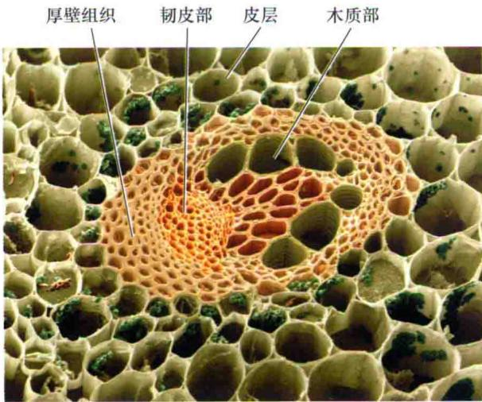  
图15.1 毛茛（Ranuculus repens）茎秆横切图。显示不同类型组织细胞壁在形态上的多样性。注意加厚的厚壁组织细胞壁和木质部细胞的纹孔壁（图片引自Andrew/PhotoResearchers Ins.）。

同一细胞不同部位细胞壁的厚度、内含物种类和数量、细胞纹路、纹孔密度和胞间连丝都不尽相同。如表皮细胞外层的细胞壁胞间连丝较少，且常被角质化和蜡质化，而且比其他部分的细胞壁厚得多。在保卫细胞中，与气孔相邻的细胞壁（腹壁）要比背壁厚得多。单个细胞中细胞壁所具有的结构多样性显示了细胞的极性和差异化的功能，这是由于胞壁成分定向分泌到不同细

胞表面所导致的。

除形态多样性之外，细胞壁一般具有两种主要的结构：初生壁和次生壁。这种分类不是基于结构上或生物化学的差异，而是基于产生细胞壁的细胞的发育状态。初生壁（primary wall）被定义为由生长细胞形成的细胞壁。通常它们薄而结构简单（图15.2A和B；图15.3A），但是有些初生壁较厚且多层化，例如，厚角组织或表皮的初生壁就存在这种情况（图15.2C）。

次生壁（secondary wall）是在细胞停止生长后形成的，在质膜和初生壁之间形成。在细胞的分化阶段次生壁的结构和组成高度特化（图15.3 B和C）。在输水组织（木质部）、纤维细胞、管胞和导管中具有显著增厚的次生壁，其中的木质素（lignin）使得次生壁更加坚固并具有防水作用。然而，并非所有的次生壁都有木质化加厚。有些初生壁未被次生壁覆盖而呈凹陷状（图15.3B）；这些区域可以加速细胞间水分和其他物质的运动。

胞间层（middle lamella）很薄，常存在于相邻细胞壁的连接处。胞间层与其他初生壁和次生壁的组成不同，它富含果胶多聚糖（在禾本科植物中没那么突出）并且还可能包含结构蛋白。胞间层是在细胞分裂过程中细胞板形成时产生的。

从第1章我们知道，细胞壁常被极细的连接膜的线状通道穿过，这些通道称之为胞间连丝（plasmodesmata）。胞间连丝连接相邻的细胞，为细胞间提供交流通道，允许相邻细胞间小分子物质的被动运输和蛋白质及核酸的主动运输。

## 15.1.2 初生壁由嵌入多糖基质的纤维素微纤丝组成

在初生壁中，纤维素微纤丝嵌入有非纤维素多糖与少量结构蛋白形成的水合基质（图15.4和表15.1）。这种结构赋予正在生长中的细胞壁弹性与强度的完美组合，使其同时具有可伸展性和坚固性。纤维素微纤丝（cellulose microfibril）是一个纳米级（nm， $10^{-9}$ m）的结晶带，从而使细胞壁加固。有时，细胞壁的一边会比另一边坚固，这主要取决于纤维丝在胞壁中是如何堆积的。

作为同一类物质，基质多糖（matrix polysaccharide）由一些不同结构的多糖组成，传统上被分为半纤维素或果胶，这种不够精确的分类是基于它们的可提取性。从用热水或钙螯合剂处理过的细胞壁中提取出来的多糖即为果胶，而更紧密结合在细胞壁上的非纤维素多糖被称为半纤维素，这些多糖需要更强的提取条件，如0.4\~4.0 mol/L KOH。

A  
  
20 μm

B  
  
200 nm

C  
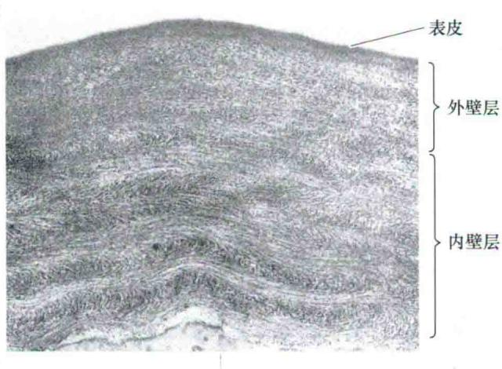

图15.2 初生壁在三种视野下的图片。A. 利用Nomarski optics法在光学显微镜下从洋葱薄壁组织中取下的细胞壁碎片表面图。在这种视野下细胞壁看起来像一个表面布满小凹槽的薄片，这些凹槽可能是纹孔场，胞间连丝通过纹孔场建立起细胞间的联系。B. 扫描电镜下正在生长的黄瓜下胚轴细胞壁表面形态。显示了细胞壁纤维的纹理和近似平行排列的微纤维，它们沿着细胞长轴横向排列。微纤维是外层覆盖有基质多聚物的纤维素微纤丝。C. 生长中的大豆下胚轴外表皮细胞壁（横断面）电子显微照片。细胞壁有很多层，内层比外层厚且清晰，因为外层是细胞壁早期形成的区域，在细胞扩展过程中被延展而变薄（A图引自McCANN et al., 1990；B图引自Marga et al., 2005；C图引自Roland et al., 1982）。

A  

B  
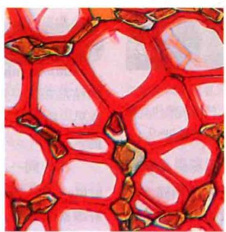

C  
  
图15.3 细胞壁结构多样性。水稻茎细胞薄壁组织（A）与地下蕨类植物茎的维管束次生厚壁组织（B）及四籽木木质部纤维（C）的比较（A图和B图引自Gerry DelongLOSF/Photolibrary.com；C图由Bailey-Wetmore Wood Collection惠赠）。

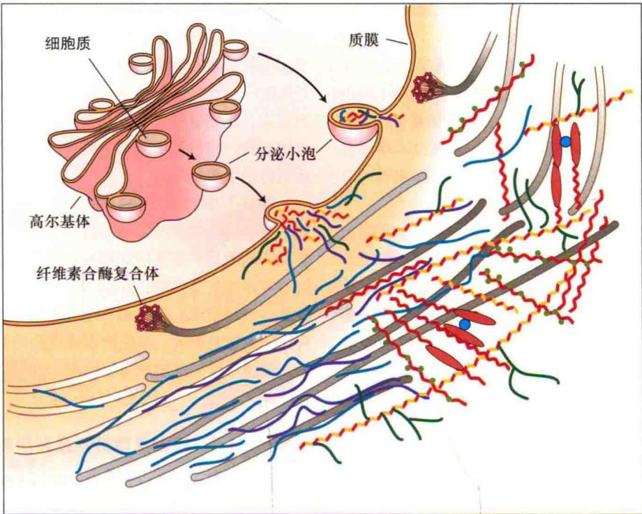

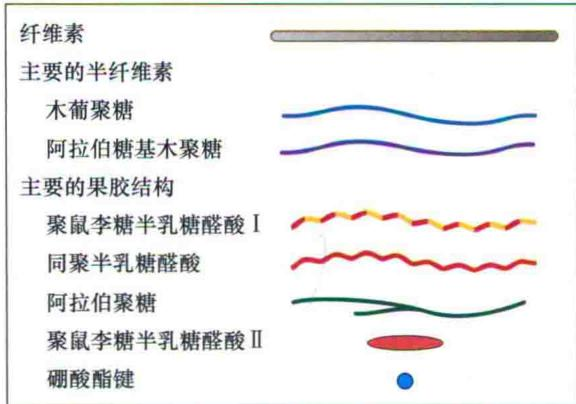

表15.1 植物细胞壁的结构成分

<table><tr><td>类别</td><td>主要成分</td></tr><tr><td>纤维素</td><td>(1→4)β-D-葡聚糖微纤丝</td></tr><tr><td>果胶</td><td>同聚半乳糖醛酸聚鼠李糖半乳糖醛酸结合阿拉伯糖聚糖、半乳糖聚糖和阿拉伯半乳聚糖(I型)侧链木葡聚糖</td></tr><tr><td>半纤维素</td><td>木聚糖葡甘露聚糖阿拉伯糖基木聚糖胼胝质(1→3)β-D-葡聚糖(1→3,1→4)β-D-葡聚糖(常见于草本植物)</td></tr><tr><td>木质素</td><td>参见图15.18</td></tr><tr><td>结构蛋白</td><td>参见表15.2</td></tr></table>

图15.4 初生壁主要结构组分和可能排列方式示意图。纤维素微纤丝（灰色棒状）在细胞表面合成，外包半纤维素（蓝线和紫线），并通过半纤维素和其他微纤丝连接起来。果胶（红线、黄线和绿线）形成一个连通的基质，控制微纤丝的空间结构和细胞壁的孔隙度。果胶和半纤维素在高尔基体中被合成，并通过质膜上的小泡分送到细胞壁上，沉积在细胞表面。为了便于观察，左边仅显示了半纤维素-纤维素形成的网络结构，右边主要是果胶网络（引自Cosgrove，2005）。

半纤维素（hemicellulose）是特有的结合在纤维素表面的一层长的线性多糖，侧翼常常带一些短的分支。它们将不同的纤维素微纤丝交联起来，形成相互粘连的网状结构（图15.4左下角部分），或者在微纤丝的表面形成一个光滑的外壳阻止微纤丝之间接触。这些分子也被称为交联多糖（cross-linking glycan），但在本章中，我们将使用半纤维素这个更传统的名称。从后面的叙述中我们知道半纤维素包括一些不同的多糖。

果胶（pectin）是填充于纤维素-半纤维素网状结构中的水合凝胶物质。作为纤维素网络的亲水填充物，果胶可以防止这种纤维素网络结构的凝集和解体，果胶也决定了细胞壁对大分子物质的通透性。和半纤维素一样，果胶也含有几种不同的多糖。这些多糖常被称为“果胶域”，因为它们相互之间以共价键连接形成巨大的大分子结构，这方面与半纤维素中相互独立的聚合物不同。由一些果胶域组成的中性侧链可以结合到纤维素表面，尽管这种结合要比半纤维素弱得多。

细胞壁多糖由不同的单糖组成并根据它们所含的单糖而命名（图15.5）。例如，半乳聚糖（galactan）是由半乳糖（galactose）单体聚合而成，葡聚糖（glucan）是由葡萄糖聚合而成，木聚糖（xylan）是由木糖聚合而成等等。聚糖（glycan）是糖分子组成的多聚物的总成，是多糖的同义词。

多糖是糖残基末端相连的线性聚合物，有时包含由不同糖分子组成的侧链。对于支链多糖来说，多糖的主链通常是指最长的那一条链。例如，木葡聚糖（xyloglucan）的主链是由葡萄糖残基构成的葡聚糖主链上连接有木糖组成的侧链。阿拉伯木聚糖（Arabinoxylan）是由木糖残基构成的，木聚糖主链连接有阿拉伯糖侧链。这种命名法有时很长，例如，葡萄糖醛酸阿拉伯木聚糖（glucuronoarabinoxylan）是一个带糖醛酸单元的阿拉伯木聚糖。然而复合命名法不一定能显示出侧链结构。如葡甘露聚糖（glucomannan）的主链含有葡萄糖和甘露糖形成的聚合物。因此，命名是基于聚合物中的主要糖类，而不是为了显示它的详细结构。

植物细胞壁含有结构蛋白（structural protein），但是它们的具体功能尚不清楚。目前研究显示，它们的作用可能包括加固细胞壁和辅助其他细胞壁成分恰当的聚合在一起，例如，在细胞板形成时这些结构蛋白可能起着这样的作用（Cannon et al., 2008）。

初生壁的干重组成大约是：25%的纤维素、30%的半纤维素、40%的果胶和2%\~5%的结构蛋白。然而，在很多物种中发现初生壁组分与上述数值有很大偏离（Harris and store，2008），如禾本科植物胚芽鞘细胞壁含有60%\~70%的半纤维素，20%\~25%的纤维素，仅有10%的果胶。谷类植物胚乳细胞壁可能只含有2%的纤维素，构成胚乳细胞壁的大部分是阿糖基木聚糖。甜菜和西芹的薄壁组织的细胞壁主要含纤维素和果胶，仅4%的半纤维素（Thimm et al., 2002）。花粉管顶部的壁似乎是大部分果胶和少量的加强顶部结构的纤维素。仙人掌（Opuntia）的棘状突起，其细胞壁中包含50%的纤维素和50%的半乳聚糖（一种被归类为果胶的中性多糖）。

纤维化的次生壁是另一个极端，纤维素含量很高（在棉纤维中>90%），而果胶质的量少到可以忽略不计。细胞壁的组成成分和多糖结构并不是一成不变，而是在发育过程中不断变化的，这种变化是由于壁的合成模式和酶的活性发生改变的结果，从而能够修剪侧枝并且消化壁果胶和半纤维素（Gibeaut et al., 2005）。

在活的植物组织中，初生壁中含有大量的水分，这些水分大部分位于基质中，占基质的70%\~80%。基质的水合状态对于细胞壁的物理特性有很重要的决定作用。例如，除去细胞壁中的水分会使其变得坚硬而缺乏延展性——这是水分缺乏时植物生长受到抑制的一个影响因素。细胞壁脱水对于在木质化的过程中强化细胞壁也很重要，此过程中细胞壁脱水形成了很坚硬的细胞壁从而防止了酶的攻击。

在接下来的部分我们将详细介绍细胞壁中每种主要多聚物的结构。我们给出初生壁的一个基本模型，但需要强调的是：在不同的物种和细胞类型中会有一些不同的特异性基质多糖，并且不同类型细胞壁多聚物（纤维素、半纤维素、果胶和一些次生壁中的木质素）的相对比例也相差很大。细胞壁组成成分的宽泛性清楚地表明，植物细胞的细胞壁可以根据不同需求形成相应的细胞壁。

## 15.1.3 纤维素微纤丝是在质膜中合成的

纤维素是由无数（1→4）-β-D葡聚糖组成，也就是β-葡萄糖残基通过（1→4）糖苷键连接线性链状分子（糖结构图15.5和Web Topic 15.2）。由于每个葡萄糖是由相邻的葡萄糖残基旋转180°，纤维素的重复结构单元可以看成为纤维二糖，即（1→4）-β-D葡萄糖二糖（图15.5E）。

在纤维素中，许多单个的葡聚糖主链紧密相连形成纤维丝，葡聚糖通过氢键和范德华力的作用形成一个高度有序的带（晶体状，crystalline），它是疏水的且不易受酶的降解。因此，纤维素具有不易溶解、坚硬、化学性质稳定和抵抗酶解的性质。纤维素酶解的最大障碍是从这种晶体微纤维上分解出单个葡聚糖分子需要消耗大量的能量，这是酶解糖残基之间相连的糖苷键必要的步骤（Skopec et al., 2003）。在纤维素微纤丝内部，高度有序的葡聚糖排列和相邻的葡聚糖之间大量的非共价键使得纤维素具有更高的刚性抗拉强度。其化学性质稳定、不溶性、抗酶解特性使得纤维素成为形成坚固细胞壁的极为理想的材料。

纤维素微纤丝的长度是不确定的，其直径大小和有序程度也根据来源不同有很大的差别。例如，陆生植物的纤维素微纤丝直径为2\~5 nm，而藻类植物的则接近20 nm，且排列也比陆生植物规则的多（更加晶格化）（Kennedy et al., 2007；Sturcova et al., 2004）。微纤丝的直径取决于其横断面上平行排列的葡聚糖链的数目，在最细的晶状核心只有6条链，而较大的则可达30\~50条。单个微纤丝也可以紧密结合在一起形成大的纤丝，如木材组织中的细胞壁。

在纤维素微纤丝中，根据生物来源不同，单个葡聚糖链由2000甚至超过25 000个葡萄糖残基组成（Brown，

  
图15.5 植物细胞壁中糖类的常见构象。A. 己糖（六碳糖）。B. 戊糖（五碳糖）。C. 糖醛酸（酸性糖）。D. 脱氧糖。E. 纤维二糖，显示两个反向的葡糖残基间的（1→4）-β-D链。除芹菜糖外所有的蔗糖都是吡喃糖形式，芹菜糖只存在呋喃糖形式。然而在胞壁多糖中，L-果胶糖多以呋喃糖形式存在。

Jr.et al., 1996）。由于微纤丝中葡聚糖分子的重叠和交错，使得微纤丝要比单个葡聚糖分子长（1\~12 μm）。

有关纤维素微纤丝精确的分子结构是不确定的。有些微纤丝组织结构模型显示它有一个亚结构，亚结构中高度有序的区域被无序的非定型区域连接在一起，而其他的模型则显示固态晶状核心被相对无序的结构包围（图15.6）。在高度有序的晶状区域中，邻近的葡聚糖以氢键、范德华力、疏水相互作用等所有非共价键连接在一起。植物中的纤维素晶状结构以两种形式存在，称为同质Iα和Iβ，二者的区别在于组成它们的平行的葡聚糖链在结合成束时的方式略有不同。在体外用化学和物理方法处理时这两种形式可以相互转变。形成这两种晶状结构的意义目前还不清楚。

电子显微证据表明，藻类和陆地植物微纤丝的合成是由一些巨大的蛋白质复合体催化的，这些蛋白复合体又称为莲座状粒子（particle rosette）或终端复合物（terminal complexe），它们镶嵌在质膜中（图15.7）（Kimura et al., 1999），由6个亚基组成，每个亚基又包括多个纤维素合酶（cellulose synthase）。纤维素合酶能够合成形成微纤丝的单个（1→4）-β-D葡聚糖分子（参见Web Topic 15.3）。纤维素合酶复合酶可能包含额外的蛋白，但是这些蛋白没有被确认。

高等植物纤维素合酶由一个被称为CesA（纤维素合酶A，cellulose synthase A）的基因家族编码，这是一个多基因家族，在所有陆地植物中都有发现（Yin et al., 2009）。CesA家族是一个大的超家族的一部分，这个超家族也包括一些Csl家族基因（cellulose synthase-like，纤维素合酶类似物）的一些家族。CslA基因编码的酶负责（1→4）-β-D甘露聚糖的合成；CslF和CslH基因编码的酶负责一种混合糖苷键链接的多糖，即（1→3；1→4）-β-D-葡聚糖的合成，CslC基因编码的酶可能负责木葡聚糖主链上的（1→4）-β-D-葡聚糖的合成。

Csl家族其他成员可能编码其他酶用来合成其他多糖主链。然而，木聚糖主链的合成可能是一类截然不同的酶，被命名为GT43（糖基轻移酶家族43，glycosyl transferase family 43）（Fincner，2009）。这些合成酶是糖-核苷酸多糖糖基转移酶（sugar-nucleotide polysaccharide glycosyltransferases），它们能把单糖从糖核苷酸转移到正在延伸的多糖链末端。

纤维素合酶穿越了膜，其催化位点位于质膜的胞质侧，纤维素合酶能将供体糖-核苷酸上的糖残基转移到正在延伸的葡聚糖链上。糖供体是尿苷二磷酸葡糖（UDPG）。有一些证据表明，用于合成纤维素的UDPG中的葡糖来自于蔗糖（Amor et al., 1995；

C 纤维素微纤丝横切面  
A  
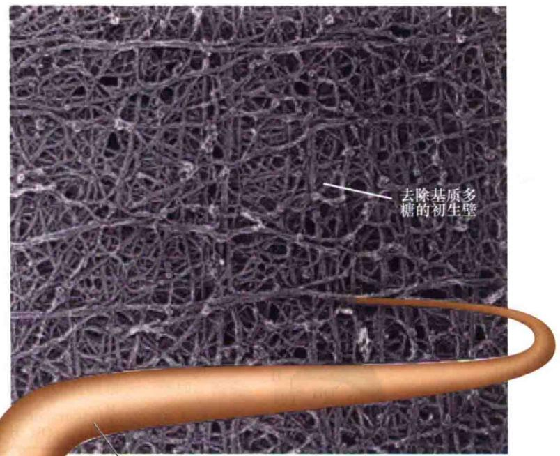  
单一的纤维素微纤丝

  
D相邻葡聚糖链之间的氢键连接

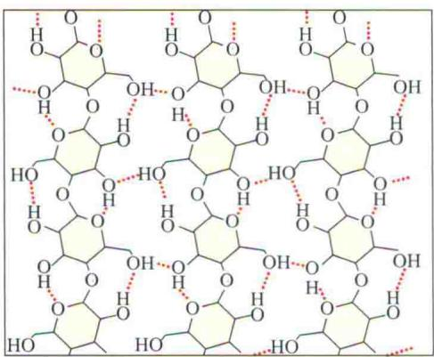

图15.6 纤维素微纤丝的结构模型。微纤丝中高度有序的晶状结构区与相对无序的区域相结合，一些半纤维素也可能被微纤丝捕获而结合在其表面。A. 除去基质多糖后，洋葱薄壁组织初生壁扫描电镜图。显示的是由纤维素微纤丝形成的纤维结构。B. 单个纤维素微纤丝。由24\~48个（1→4）-β-D-葡聚糖链紧密结合在一起形成的晶状结构。C. 纤维素微纤丝的横切面图。纤维素结构模型由高度有序的（1→4）-β-D-葡聚糖构成晶状核心和相对无序的外层结构组成。D. 纤维素的晶状区由精细排列的葡聚糖组成，(1→4)-β-D-葡聚糖内部以氢键连接，而相互之间无氢键连接（引自McCann et al., 1990; Matthews et al., 2006）。

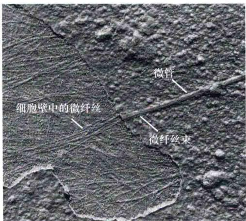  
图15.7 细胞纤维素的合成。A. 电子显微镜下显示新合成的纤维素微纤丝立即被分泌到质膜外。B. 冷冻断裂标记复合体显示纤维素合酶与抗体的反应，7个清晰的带标记的莲座区和一个不带标记的区域构成的标记区（箭头）。B图的内插图为挑选的两个放大的用免疫金标记的CesA颗粒（顶端复合物）。这些金纳米颗粒是箭头指示的暗环。C. 颗粒区（最右边）与单个CesA蛋白（最左边）关系模型。6个CesA蛋白（3个不同的基因编码）组成一个颗粒，在显微镜下可观察到其装配成一个六聚体，该六聚体负责合成36条葡聚糖链，进而形成有序的微纤丝（A图引自Gunning and Steer，1996；B图引自Kimura et al., 1999；C图引自Doblin et al., 2002）。

Salnikov et al., 2001）。该观点认为，蔗糖合酶（sucrose synthase）通过UDPG从蔗糖转运葡糖到正在延伸的纤维素链上，此过程中蔗糖合酶起到代谢通道的作用（图15.8）。遗传学的证据表明了3个不同的CesA蛋白（由3个不同的CesA基因编码）对于形成一个功能性纤维素合酶复合体是必需的。

  
图15.8 含纤维素合成酶的多亚基复合物合成纤维素的模型。葡萄糖残基从UDPG供体转移到正在伸长的葡聚糖链上，蔗糖合酶起到代谢通道的作用将葡萄糖从蔗糖转运到UDPG上，UDPG也可以直接从质膜上获得（引自Amor et al., 1995）。

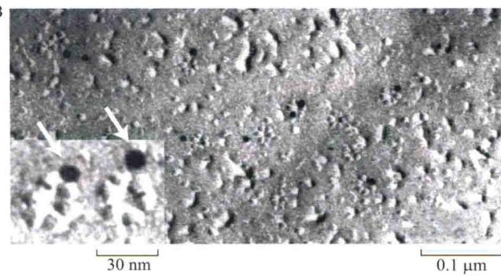

固醇-葡萄糖苷（固醇与一个或多个葡萄糖残基链链接）（图15.9）被认为是一个引发体或起始受体，即接受新的葡萄糖残基从而使葡聚糖链延伸（Peng et al., 2002）。当葡聚糖链延伸到足够长时，固醇可被葡聚糖内切酶从葡聚糖链上剪切下来，进而使正在伸长的葡聚糖链通过细胞膜伸出细胞外，在胞外与其他的葡聚糖链形成一个晶状带并和半纤维素结合在一起，形成一个坚固而富有弹性的网状结构（图15.4）。一些半纤维素在形成时可能被包入微纤丝中（Hayasi, 1989），这可能增加了晶状微纤丝的无序性，并使其锚定在基质中。

  
β-谷甾醇葡糖苷  
图15.9 纤维素合成作用中最初的引发体（如葡聚糖链延伸受体）固醇糖苷的结构。图为β-谷甾醇葡糖苷由一个固醇（右边）连接一个葡萄糖残基（左边）构成，外加的葡萄糖残基与β-谷甾醇葡糖苷中的葡萄糖基结合，形成葡聚糖，进而形成纤维素微纤丝。

## 15.1.4 基质多糖在高尔基体中合成并通过囊泡分泌到细胞壁上

在纤维素微纤丝晶状体之间，初生壁的基质是高度水合相。基质多糖是由高尔基体膜上的糖基转移酶合成的，然后通过囊泡的胞吐作用转运到细胞壁上（图15.4）（Web Topic 15.4）。由前面描述可知，Csl超家族基因编码的糖基转移酶可以合成一些基质多糖主链。为制造多糖分支，糖残基被其他一些糖基转移酶加到多糖主链上（Ccheible and Pauly，2004）。

基质多糖比纤维素微纤丝更加无序，而且绝大多数没有像纤维素一样聚集成高度有序的结构。这种无序的结构特征是由多糖侧链和它的非线性构象决定的。然而，红外光谱和核磁共振（NMR）研究表明细胞壁中半纤维素和果胶有一定的取向，可能是由于这些多聚物沿纤维素微纤丝长轴排列的物理趋势的结果（Wilson et al., 2000）。

## 15.1.5 半纤维素是结合于纤维素的基质多糖

半纤维素是一种在结构上紧密结合在细胞壁上的非均质多糖（图15.10），能用强碱（2\~4 mol/L NaOH）将它们从除去果胶的细胞壁上洗脱下来，强碱会破坏氢键，导致纤维素膨胀、水化而无序。植物能合成不同种类的半纤维素，因细胞类型、发育状态和植物种类而不同。

许多陆生植物的初生壁中（双子叶植物、除草之外的大多数单子叶植物及其近缘种），数量最多的半纤维素是木葡聚糖（xyloglucan）（图15.10A），在细胞壁中含量高达20%。和纤维素一样，木葡聚糖有一个由（1→4）-β-D葡萄糖残基连接的主链。然而和纤维素不同的是木葡聚糖有一些短的侧链，含木糖和末端前的半乳糖，末端为岩藻糖。

在木葡聚糖的主链上几乎每四个葡萄糖残基就有一个不存在取代（不带糖侧链），但是这个分数会由于β-木糖苷酶的作用而增大，β-木糖苷酶能除去木糖侧链。在取代度低的情况下，木葡聚糖将更密切地与纤维素结合（Chambat et al., 2005）。木葡聚糖分支有相当大的分类变化，例如，茄属植物含阿拉伯糖，但是没有海藻糖，有时在分支上不含半乳糖。

在木葡聚糖中，由于侧链干扰了葡聚糖主链的线性排列，从而阻止了木葡聚糖组装成一条有序的微纤丝。木葡聚糖的长度（50\~500 nm）超过了两个微纤丝之间的空间距离（20\~40 nm），它们可以将邻近的几个纤维素微纤丝连接在一起。在它们形成时，木葡聚糖将很可能被纤维素微纤丝捕获：在这种情况下，纤维素的结晶度将被破坏，并且木葡聚糖也将紧紧地锚定在纤维

丝上。

与双子叶植物的细胞壁相比，单子叶植物的初生壁包含少量的木葡聚糖和果胶（分别为10%左右）、较多的葡萄糖酸阿拉伯糖基木聚糖（glucuronoarabinoxylan）（图15.10B）及混接（1→3；1→4）-β-D-葡聚糖。混接的葡聚糖被认为紧紧结合在纤维素表面，形成非黏性表层，葡萄糖酸阿拉伯糖基木聚糖起交互连接的作用（Carpita et al., 2001）。葡萄糖酸阿拉伯糖基木聚糖的取代度差别很大，与低取代度相比，高取代度的混接形式结合到纤维素的能力会更弱（Carpita, 1983）。

在阿魏酸存在的情况下，单子叶植物的细胞壁是靠阿魏酸（ferulic acid），羟基苯丙烯酸而交联在一起，它们通过酯键与葡萄糖酸阿拉伯糖基木聚糖的阿拉伯糖侧链相连（图15.10B）。邻近分子的阿魏酸盐残基能在氧化酶的作用下发生氧化交联反应，从而在两个葡萄糖酸阿拉伯糖基木聚糖链之间形成共价连接（Burr and Fry，2009）。阿魏酸的酯化同样发生在某些植物家族中果胶域RG1的阿拉伯聚糖和半乳糖侧链上，如苋科（Amaranthaceae）（包括甜菜和菠菜）。这些阿拉伯聚糖和半乳聚糖也能结合在纤维素表面（Zykwinska et al., 2007a）；因此，与纤维素表面的结合并不是半纤维素独有的特性。

木质组织的次生壁（次生木质部）含有很少的木聚糖或果胶；基质多糖多是没有支链的木聚糖和葡苷露聚糖，它们紧紧结合在纤维素上。这些壁富含纤维素和木质素（分别高达50%和30%），因此是坚硬而结实的。

## 15.1.6 果胶是基质的凝胶组分

与半纤维素相似，果胶也是非均一多糖（图15.11），果胶的特征是含有酸性糖和中性糖，酸性糖如半乳糖醛酸，中性糖如鼠李糖、半乳糖及阿拉伯糖。果胶是最易溶解的细胞壁多糖，大多可用热水和钙螯合剂将它们提取出来。在细胞壁中，果胶是大而复杂的分子，且形成多种不同的果胶多糖结构域，这些结构域之间通过共价键和非共价键相连接。

一些果胶多糖结构域有一个相对简单的初级结构（图15.11A），如同聚半乳糖醛酸（homogalacturonan）。同聚半乳糖醛酸又称多聚半乳糖醛酸（polygalacturonic acid），是通过（1→4）糖苷键连接的α-D-半乳糖醛酸残基的多聚物。图15.12的荧光图像显示聚半乳糖集中分布在细胞连接的地方，即两个细胞发育形成的空间。

细胞壁中含量较多的另一个果胶多糖是聚鼠李糖半乳糖醛酸Ⅰ（rhamnogalacturonanⅠ，RGⅠ），其长长的主链是由鼠李糖和半乳糖醛酸残基交替形成（图

  
图15.10 普通半纤维素的部分结构（详细的碳水化合物命名法，参见Web Topic 15.1）。A. 木葡聚糖有一个由（1→4）-β-D葡萄糖残基组成的主链，并通过（1→6）糖苷键与α-D-木糖结合而形成侧链，在某些情况下，木糖侧链上还结合有半乳糖和岩藻糖。B. 葡萄糖醛酸阿拉伯木聚糖有一个由（1→4）连接的β-D-木糖主链，它们有时也会含有包括阿拉伯糖，4-O-甲基葡萄糖醛酸或者其他糖的侧链（引自Carpita and McCann，2000）。

15.11B）。RG I 的分子质量很大，同时带有长短不一的阿拉伯聚糖和半乳聚糖的侧链，以及链接在某些鼠李糖残基上的 I 型阿拉伯半乳聚糖。

分子结构更复杂的果胶多糖是具有很多分支侧链的聚鼠李糖半乳糖醛酸Ⅱ（rhamnogalacturonan Ⅱ，RGⅡ），它含有一个多聚半乳糖醛酸主链，主链上覆盖有4种不同的复杂的侧链，而这些侧链至少由10种不同的单糖通过多种方式相连接。尽管RGⅠ和RGⅡ的名称相似，但它们的结构不同。在细胞壁中RGⅡ单元之间通过硼酸二酯相互交联（Ishii et al., 1999），这种交联对于细胞壁的结构和机械强度是非常重要的。如拟南芥RGⅡ合成改变的突变体表现明显的生长异常，很明显是由硼酸酯键交联不稳定引起的。RGⅡ的硼酸交联缺失导致细胞壁过度膨胀，增加了细胞壁的孔隙度，使细胞壁的机械强度下降（O'Neill et al., 2004）。

细胞壁中的果胶多糖是通过共价键以线性方式相互连接起来的（Coenen et al., 2007）。图15.13A展示不同果胶结构域是如何彼此连接的假想方案，但这种模型还未得到一致认可。

A 同聚半乳糖醛酸  
B 聚鼠李糖半乳糖醛酸I  
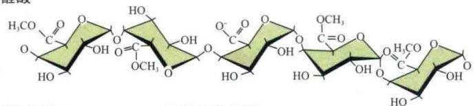

C 阿拉伯聚糖  

D 阿拉伯半乳聚糖  
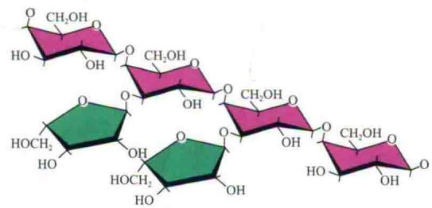  
图15.11 典型果胶的局部结构。A. 同聚半乳糖醛酸，又称多聚半乳糖醛酸或果胶酸，由（1→4）键连接的α-D-半乳糖醛酸（GalA）组成，偶尔有鼠李糖残基插入，羧基常被甲酯化。B. 聚鼠李糖半乳糖醛酸Ⅰ（RGⅠ），分子质量很大，主链由（1→4）α-D-半乳糖醛酸和（1→2）α-D-鼠李糖交替形成。在鼠李糖上有侧链，其组成主要为阿拉伯聚糖。C. 阿拉伯聚糖。D. 阿拉伯半乳聚糖。这些侧链有长有短，半乳聚糖醛酸常被甲酯化（引自Carpita and McCann，2000）。

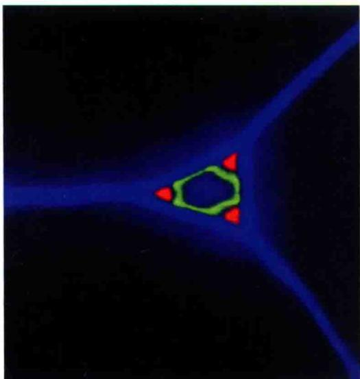  
图15.12 烟草茎秆三重荧光标记显示的三个相邻薄壁组织细胞的初生壁，它们的边界处所形成的细胞间空隙。蓝色部分是荧光增白剂卡尔科弗卢尔（calcofluor）（表示纤维素），红色和绿色部分是和两个单克隆抗体结合的果胶同聚半乳糖醛酸不同的抗原决定簇（免疫特定区域）（W. Willats惠赠）。

果胶典型的特性是形成凝胶，一种由高度水合的多聚物形成的松散网络结构，因此，在实践中，果胶常用于制备果酱、果冻或凝胶。在果胶凝胶中，相邻果胶链上带电荷的羧基（ $\mathrm{COO}^{-}$ ）基团通过 $\mathrm{Ca}^{2+}$ 连接在一起， $\mathrm{Ca}^{2+}$ 可与果胶酸钙结合形成复合物。如图15.13B所示， $\mathrm{Ca}^{2+}$ 与果胶形成的庞大的 $\mathrm{Ca}^{2+}$ 桥网络。

果胶的修饰会改变它们在细胞壁中的构型和连接方式。果胶在高尔基体中合成时，许多酸性残基被甲基、乙酰基和其他未知基团酯化。甲酯化作用掩盖了羧基基团上的电荷，阻止了两个果胶链上钙桥的形成，从而减弱了果胶形成凝胶的能力。

果胶一旦被分泌到细胞壁中，酯基就会被细胞壁中的果胶酯酶去除，这样羧基上的电荷就暴露出来，增强了果胶形成一个刚性凝胶态的能力并降低细胞壁的可扩展性（Derbyshire et al., 2007b）。随着自由羧基的形成，去酯化作用也增加了细胞壁中的电荷，这可能进一步影响了细胞壁中的离子浓度和细胞壁酶的活性。果胶除了通过钙桥连接外，也可能通过多种共价键彼此连接，包括如上所述的阿魏酸二聚体（仅在一些植物中被发现）。

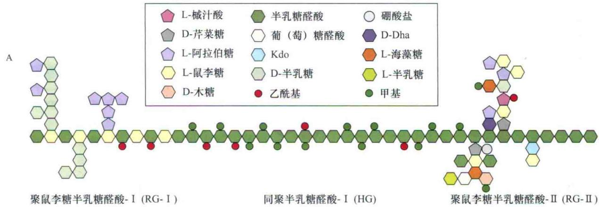

  
图15.13 A. 不同果胶结构域彼此之间以线性方式排列，包括聚鼠李糖半乳糖醛酸Ⅰ（RGⅠ）、多聚半乳糖醛酸（HG）聚鼠李糖半乳糖醛酸Ⅱ（RGⅡ）。这个结构不是精确量化的；多聚半乳糖醛酸（HG）应扩大10倍以上，聚鼠李糖半乳糖醛酸Ⅰ（RGⅠ）应扩大2倍以上。Kdo为2-脱氧-3-辛酮糖酸；Dha为二羟丙酮。B. 钙离子与非酯化的羧基离子之间结合形成果胶网络。当被甲酯化基团阻碍时，羧基基团不能参与这种相互交织的网状结构的形成，同样的，主链上的侧链也干涉网状结构的形成（A图引自Mohnen，2003；B图引自Carpita and McCann，2000）。

## 15.1.7 结构蛋白在细胞壁中交互连接

前面讲述的多糖为细胞壁的主要成分，此外，细胞壁还含有一些结构蛋白。这些蛋白质通常根据它们所含的优势氨基酸进行分类——如富羟脯氨酸糖蛋白（hydroxyproline-rich glycoprotein，HRGP）、富甘氨酸蛋白（glycine-rich protein，GRP）、富脯氨酸蛋白（proline-rich protein，PRP）等（表15.2）。一些细胞壁蛋白质一级结构可能会具有多种特征，很多细胞壁结构蛋白具有高度重复的一级结构，其中有的形成简单的螺旋杆状，而有的则被高度糖基化（图15.14）。

体外研究表明，新分泌的细胞壁结构蛋白是相对可溶性的，但随着细胞的成熟或对伤害的应激反应，这些蛋白质变得越来越不可溶，但这种不可溶的变化过程的生化本质可能涉及蛋白质中酪氨酸残基的氧化交联。

表15.2 细胞壁的结构蛋白

<table><tr><td>细胞壁结构蛋白的种类</td><td>碳水化合物百分比/%</td><td>代表性组织定位</td></tr><tr><td>富羟脯氨酸糖蛋白</td><td>约55</td><td>形成层、维管薄壁组织</td></tr><tr><td>富脯氨酸蛋白</td><td>0~20</td><td>木质部、纤维、皮层</td></tr><tr><td>富甘氨酸蛋白</td><td>0</td><td>初生木质部和韧皮部</td></tr></table>

细胞壁结构蛋白的组分随着细胞类型、成熟阶段和刺激作用的不同有很大的变化。伤害、病原体入侵，以及能激活植物防御反应的分子处理（诱导子），都能增加编码这些蛋白质的基因的表达（见第13章）。组织学研究表明，细胞壁结构蛋白通常位于特异的细胞或组织中，如HRGR大多位于形成层、韧皮部薄壁组织和多种类型的厚壁组织中；GRP和PRP则通常位于木质部导管和纤维中，因而是这些带有次生壁细胞的一种特性。

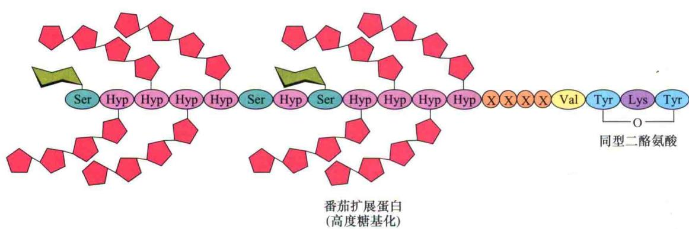  
图15.14 番茄HRGP分子中重复的羟脯氨酸结构单元。图示为高度糖基化和分子内同型二酪氨酸键的形成（引自Carpita and McCann，2000）。

除了上面所列的结构蛋白外，细胞壁还含有阿拉伯半乳聚糖蛋白（arabinogalactan protein，AGP），其总量通常不超过细胞壁干重的1%（Seifert and Roberts, 2007）。这些水溶性蛋白几乎全被糖基化。糖组分占AGP干重的90%以上，且主要是半乳糖和阿拉伯糖（图15.15）。在植物组织中发现存在AGP多聚体，这种多聚体也存在于细胞壁或质膜连接部位（通过一个称为GPI锚定子的糖基化磷脂酰肌醇基团相连），它们表现出组织和细胞特异性的表达模式。

  
图15.15 高度分支的阿拉伯半乳聚糖分子（引自Carpita and McCann，2000）。

AGP可能在细胞分化过程中起细胞粘连和细胞信号的作用。用外源AGP或AGP特异性结合剂处理悬浮培养细胞时，发现细胞的增殖和胚的发育受到影响，因而，为后一种观点提供了实验依据。AGP在细胞生长、营养、引导花粉管穿过花柱组织有一定作用。另外，在分泌囊泡中，AGP也可能作为多糖伴侣分子，使新合成的多糖在分泌到细胞壁之前减少自发聚合。

## 15.1.8 新的初生壁是在胞质分裂过程中组装起来的

初生壁是在细胞分裂终期从头开始形成的，新生细胞板（cell plate）与母细胞壁融合时两个子细胞分离并形成稳定的细胞壁。

当高尔基体小泡和内质网腔聚集在分裂细胞的纺锤体中心区时，细胞板形成。这种聚集作用由成膜体（phragmoplast）来组织，成膜体是在细胞分裂后期晚些时候或末期开始时由微管、膜和囊泡相互聚集在一起形成的一种复合体（见第1章）。囊泡膜彼此融合，并与后来形成的质膜融合组成新的质膜，从而将子代细胞分开。囊泡内容物是形成新的胞间层和初生壁的前体。

单个聚合物的“生命”过程可以如下列出：

## 合成 $\rightarrow$ 沉积 $\rightarrow$ 组装 $\rightarrow$

## 修饰（有时会影响细胞壁的延展性）

无论何时，壁聚合物存在于任何或所有的生命阶段。主要胞壁多聚物的合成与沉积在前面已经讲述过了。在这里我们将介绍它们组装成凝聚性网络的过程和这些多聚物的修饰及细胞扩张的影响。

细胞壁多聚物分泌到细胞外之后，必定会装配成一个相互粘连的结构，也就是说单个的多聚物会按照一定的规律排列和相互连接，这是初生细胞壁的特性，并且同时赋予其抗扩张强度和延展性。尽管细胞壁装配的详细机制还不完全清楚，但对于这个过程有两种假说：自装配和酶介导的装配。

自装配（self-assembly）自装配模型其机制简单而极具吸引力。细胞壁多糖具有显著的自发凝聚成有序结构的趋势。例如，用强溶剂将纯化的纤维素溶解，经挤出即可自发形成稳定的纤维即人造丝。

同样的，半纤维素也能被强碱溶解，当强碱去除后，这些多糖就会聚集成像细胞壁超微水平的有序的网络结构，这种聚集使得半纤维素分离成组分多聚物。相反，果胶比较容易溶解并且往往形成分散的各向同性（自由分布）的网络（凝胶）。

这种现象表明，胞壁多聚物有聚集成一些有序结构的内在趋势。但这并不能解释所有的过程，因为在体外当半纤维素结合到纤维素上时，这种结合比在真正的细胞壁中的结合弱得多。这种差别暗示，维持胞壁中稳固的网络还需要一些其他的过程。

酶介导的装配（enzyme-mediated assembly）除自装配外，细胞壁中的酶类也可能参与细胞壁的组装。介导细胞壁装配的主要酶类是木葡聚糖内糖基转移酶（xyloglucan endotransglucosylase，XET），该酶属于木葡聚糖内糖基转移酶/水解酶（xyloglucan endotransglucosylase/hydrolase，XHT）家族，能够剪切木葡聚糖主链，并使剪切开的一端连接在一个受体木葡聚糖的自由端（图15.16）。新合成的木葡聚糖通过这样的转移反应整合到细胞壁上（Thompson and Fry，2001；Rose et al., 2002）可能使细胞壁更坚硬。

其他在细胞壁装配过程中起辅助作用的细胞壁酶有糖苷酶、果胶甲基酯酶和多种氧化酶。一些糖苷酶能转移半纤维素侧链。这种去分支作用增加了半纤维素粘连到纤维素微纤丝表面的趋势。果胶甲基酯酶水解甲酯从而形成游离的羧基，增加了果胶中酸性基团的浓度，增强了果胶形成 $Ca^{2+}$ 桥凝胶网络的能力。氧化酶如过氧化物酶可催化壁蛋白、果胶和其他壁聚合物中酚类基团（酪氨酸、苯丙氨酸、阿魏酸）之间的交联。这种氧化交联以复杂的途径把木质素亚基连接在一起（图15.17），它们也同样能把其他细胞壁成分连在一起如

阿魏酰木聚糖。

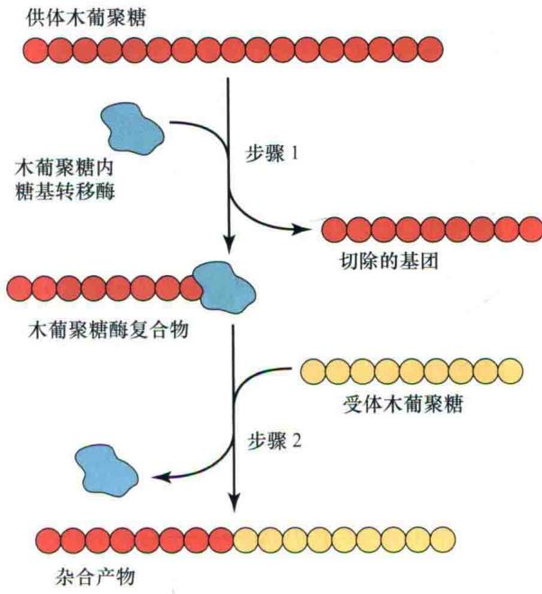

图15.16 木葡聚糖内糖基转移酶（XET）剪接木葡聚糖多聚物形成新的构象示意图。第1步：酶切木葡聚糖分子（供体木葡聚糖）形成一个长的有活性的复合体，木葡聚糖共价结合到酶分子上。第2步：之后酶分子转移木葡聚糖链到第二个木葡聚糖（受体木葡聚糖）的非还原端，从而形成一个杂合产物（引自Fry，2004）。

## 15.1.9 细胞壁扩张停止后次生壁的形成

细胞壁停止扩张后，细胞有时会继续合成一个次生壁（secondary wall）。管胞、纤维和其他对植物起支持作用的次生壁可能相当厚（图15.18）。在蒸腾过程中由于剧烈的蒸腾作用产生的巨大水张力极可能导致导水细胞的崩溃，而木质部的刚性次生壁对防止细胞崩溃起着重要作用。正如上文提到的，木质次生壁包含木聚糖而不是木葡聚糖，而且还有很高比例的纤维素。与初

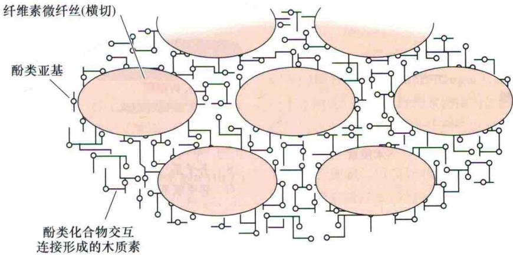  
图15.17 图示木质素酚类亚基如何渗透到纤维素微纤丝之间的空间，形成网状连接。（图中忽略了基质的其他组分）。

A  
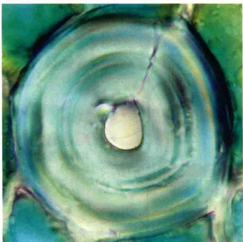

D  

C 木质醇单体

— B-O-4, B-醚
— B-B, 树脂醇
— B-5, 苯基香豆冉
— S-O-4, 二苯醚
— 肉桂醇端基
S 芥子基
G 邻甲氧苯基

图15.18 A. 罗汉松石细胞横切面，可观察到次生壁由多层组成。B. 管胞和其他具有较厚次生壁的细胞中的胞壁组成示意图。三个明显的层（S1、S2和S3）在初生壁内部形成。C. 组成H、G和S型木质素的木质素单体在数目上不同于酚环中的甲氧基。D. 目前认可的木质素结构模型，由S和G木质素单体亚基组成，彼此之间由过氧化物酶和漆酶产生的自由基交错连接。表明这是成千上万种可能的异构体之一（A图引自David Webb；D图引自Ralph et al., 2007）。

生壁相比，次生壁中纤维素微纤丝的取向更加有序，彼此平行排列，并且有明显的层次。在木质组织中，次生壁常常充满了木质素，从而加固了细胞壁并具有排水作用。

木质素（lignin）是一种复杂的由苯丙烷亚基组成的酚类聚合物，称为单体木素醇（monolignol），源于苯丙氨酸（见第13章），并且包含苯丙环上的0\~2个甲氧基（图15.18C）。由松柏醇组成的木质素称为G型木质素（G lignin），而由芥子松柏醇组成的木质素为S型（S lignin），H型木质素（H lignin）由p-香豆醇组成。这三种类型木质素的比例在不同类型的植物和细胞中是不一样的，并且这种比例影响木质组织的坚韧性和制浆性能（Vannolme et al., 2008）。

人们认为细胞分泌木质素单体葡糖苷到细胞壁从而形成木质素，此时葡萄糖残基被葡萄糖苷酶酶解。随后的多聚化过程细节还没有被完全掌握，但可能是从木质素单体氧化耦合阿魏酸或其他酚类残基开始的，而后共价结合到细胞壁的木聚糖上。多数人认为单体木素醇是通过形成自由基随机氧化和耦合，并在壁中被过氧化物酶和漆酶氧化，形成一个可变的大分子结构（图15.18D）。第二个假说（Davin and Leuis，2005）认为细胞壁蛋白控制多聚化过程，形成非常规则的结构。

在细胞壁中形成的木质素，可驱除基质中的水分，并与基质中的多聚糖相互交联，通过共价键连接形成一个疏水网络，这种共价结合主要是通过阿魏酸或其他的酚类残基结合到木聚糖上。木质素也可结合或包裹在纤维素上，从而加固了整个细胞壁（图15.17）。

木质素通过加固细胞壁和疏水作用，从而降低了细胞壁对来自病原菌水解酶攻击的敏感性。木质素还降低了动物对植物材料的消化能力，并干扰了制浆工艺（把木材转变为分散的纤维）。目前通过木质素含量和结构的遗传改良，使得植物的可消化性和营养成分得到改善，并提高了细胞壁作为造纸原料和生物燃料（用于汽车燃料的乙醇）的价值。

## 15.2 细胞的扩张方式

在植物细胞扩张过程中，新生细胞壁多聚物不断被合成与分泌，从而使原始细胞壁不断增大。细胞壁扩张可能高度区域化[如顶端生长（tip growth）]，也可能均匀分布于细胞壁表面[扩散生长（diffuse growth）]（图15.19）。最典型的顶端生长是根毛和花粉管，它与细胞骨架形成过程特别是微丝紧密相连（参见Web Essay15.1）。植物体内其他细胞大多是扩散生长，与微丝骨架和微管的动态变化相联系（Szymaski and Cosgrove，2009）。还有一些如纤维细胞、部分石细胞和香毛簇细胞是介于扩散生长和顶端生长之间。

图15.19 顶端生长和扩散生长中细胞表面的不同扩张方式。
A. 顶端生长的细胞延伸被限制在细胞一端的半圆顶上。如果在细胞表面标记而且允许细胞继续生长，越靠细胞顶端标记的距离拉得越远。根毛和花粉管是表现顶端生长的典型的植物细胞。
B. 如果标记在扩散生长的细胞表面，当细胞生长时，所有标记之间的距离都增加。多细胞植物中多数细胞都以扩散生长的方式生长。

即使在扩散生长的细胞中，不同部位细胞壁的生长速率和生长方向也有所不同。如在树干的皮层薄壁细胞中，末端壁扩散生长就比侧壁生长慢得多。这种差异生长可能是由于特殊细胞壁的结构或酶类变化引起的，也可能是由于对不同细胞壁产生应力变化引起的。细胞壁不均匀扩张使得植物细胞具有不同的形态。

## 15.2.1 微纤丝方向影响细胞扩散生长的方向

在生长过程中初生壁的生化结构是疏松的，允许细胞壁由于受到来自细胞膨压产生的机械力而弯曲。膨压在细胞各个方向上都产生相等的外向力。因此细胞极性生长很大程度上决定于细胞壁的结构，尤其是纤维素微纤丝的排列方向。

当细胞开始在分生组织中形成时，它们是等径的，即它们在各个方向都有相同的直径。如果初生壁纤维素微纤丝的方向是随机排列或各向同性（isotropic），细胞将在各个方向上同等生长，迅速扩张成一个圆球（图15.20A）。增大的苹果中细胞即以这种方式进行生长。然而，在绝大多数植物细胞壁中，纤维素微纤丝以特定的方向即各向异性（anisotropic）方式排列，或者在某一个方向优先排列。纤维素的排列加固了细胞壁，以至于细胞壁在垂直于纤维素的排列的方向上更加具有扩展性。

在侧生细胞壁扩散生长时，如茎和根的皮层薄壁细胞和维管细胞，以及丝状绿藻（Nitella）巨大的节间细胞，纤维素微纤丝沿细胞长轴以合适的角度在细胞周缘（横向地）聚积。细胞周缘排列的纤维素微纤丝好像箍在桶上的绳子，限制细胞的围长扩张，而有利于细胞伸长生长（图15.20B）。然而单个的纤维素微纤丝实际上并不能形成围绕细胞的封闭的环状结构而形成浅螺旋，且在细胞壁扩展过程中彼此分开。

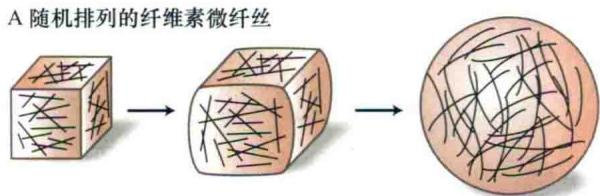  
B 横向排列的纤维素微纤丝

  
图15.20 新聚积的纤维素微纤丝的方向决定细胞扩展的方向。A. 如果加固细胞壁的纤维素微纤丝无定向排列，细胞将在各个方向上都相等扩展，形成一个圆球。B. 当多数加固细胞壁的纤维素微纤丝有相同的方向时，细胞的扩展方向与微纤丝的排列方向成一定的角度，而微纤丝加固方向的扩张就受到限制。图示的微纤丝的方向是横向的，所以细胞的扩展是纵向的。

细胞增大时，细胞壁沉积作用仍在继续。根据多网络生长假说（multinet growth hypothesis），细胞增大时，每个连续的胞壁层被拉伸和薄化，所以微纤丝被迫纵向即沿着生长的方向重新定位。与多网络生长假说相一致，细胞壁电子显微照片显示，最新沉积的内层细胞壁有横向定位的纤维素微纤丝，而老的外层胞壁的微纤丝则较无序地排列。同样的在拟南芥根伸长荧光成像时发现细胞伸长过程中纤维素束由横向生长转变为纵向伸长（Anderson et al., 2009）。

然而其他观察结果如浮游生物多网络生长的普遍性使人产生质疑。一些细胞有多层细胞壁，它们纵横交错的纤维素排列横式不可能是简单的被动重排。在研究细胞壁微纤丝应答胞壁张力而被动重新定向的实验中，以模拟正常生长的条件下，从正在生长的子叶下胚轴分离到被机械拉伸的细胞壁碎片，并对这种拉伸作用对胞壁纤维素微纤丝方向的影响进行了检测。令人惊奇的是，细胞壁纵向伸长20%\~30%却并未改变内壁表面微纤丝的横向角度，表明微纤丝在细胞表面以一种协调的方式相互分离，这与多网络生长假说相反（Marga et al.,

A  
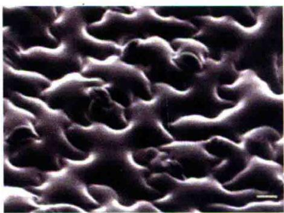

B  
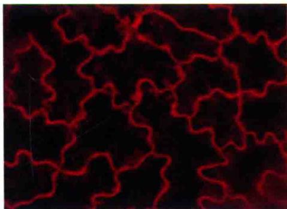

  
图15.21 叶扁平细胞的镶嵌生长受ROP GTP酶的调控。A. 拟南芥叶铺板细胞的扫描电镜图，具拼图玩具式的外观。B. 铺板细胞的免疫荧光图象显示了更为清晰的细胞镶嵌生长形成的凸起和凹进。C. ROP GTP酶和它们的效应器（RIC）在叶形态建成中的作用模型。当被RIC4活化时，ROP2/4 GTP酶启动肌动蛋白微丝在细胞生长的凸起区形成。然而，当ROP2/4 GTP酶被RIC1活化，则使微管结合在凸起区的颈部。这些细胞骨架的改变可能在定位细胞壁生长方向时起信号作用（A图由Dan Szymanski惠赠；B图自Settleman，2005，由J Settleman惠赠；C图引自Fu et al., 2005）。

2005）。

因此，新的胞壁层沉积（内壁）行为与老的胞壁（外壁）可能是不同的。这种差异可能是由于老的细胞壁在胞壁伸展过程中变薄及碎片化引起的，结果外壁层对细胞扩展方向的影响比新沉积的内壁层小得多。所以，占细胞壁1/4的内壁层几乎承受了所有由于膨压而产生的张力，并决定着细胞伸长的方向（参见Web Topic 15.5）。

到目前为止我们仅考虑了一个扩散生长的简单模型。然而许多双子叶植物表皮的所谓铺板细胞（pavement cell）表现出更为复杂的情况。这些细胞的边缘是多凸起的，如拼图玩具似的形成相互镶嵌的模式（图15.21A、B）。这种镶嵌细胞壁的扩展方式结合了扩散生长和顶端生长两个方面，并且需要一类称为ROP（来自植物的Rho相关GTP酶）GTP酶的GTP-结合蛋白的参与，这些蛋白质的活化是由一类称为RIC（ROP-interacting CRIB motif-containing protein）的蛋白质来完成（图15.21C）。这些蛋白质参与细胞骨架（微丝和微管）的组织，为控制细胞壁的局部生长提供材料和催化剂（Szymanski and Cosgrove，2009）。细胞骨架是怎样影响细胞生长的呢？这个问题将在下节讨论。

## 15.2.2 周质微管影响新沉积的微纤丝的取向

新沉积的纤维素微纤丝通常与细胞质中靠近质膜的微管束的排列相一致（图15.22）（Baskin，2001；Baskin et al., 2004）。一个典型的例子是，在木质部导管元件中，结合周质微管的部位既是次生壁加厚的位点也是纤维素合酶A（CeaA）定位的位点（Gardiner et al., 2003）。而且通过药物处理或遗传缺陷破坏微管组织常会导致胞壁结构的紊乱和无序生长。例如，一些药物结合到微管蛋白亚基上会使它们解聚，一些药物可以结合微管的亚基微管蛋白使微管发生解聚。用微管解聚药物如黄草消（oryzalin）处理正在生长的根，细胞的扩展就表现出侧面膨胀，形成鳞茎状和肿瘤状（图15.23A、B）。

A  
B  

黄草消阻断生长是由于细胞扩展的各向同性引起的，即它们呈球状扩展而不是伸长生长。在生长的细胞中药物诱导的微管破坏作用干扰了纤维素的横向沉积。纤维素微纤丝在微管缺失情况下可以继续合成，但是它们随意沉积，导致细胞在各个方向上的扩张都是均等的。

这些相关现象说明微管在微纤丝合成时起轨道作用，引导或指导复合物的运动（参见Web Essay 15.2）。最近研究表明，通过重组DNA的方法融合表达CesA与YFP荧光蛋白，可以在活细胞中观察到CesA的运动（Gutieerez at al., 2009; Paredez at al., 2006）。已经观察到在质膜中CesA单元随着微管轨道移动（图15.23C），也有观察发现它们插入到与微管相连的高尔基体质膜中。通过共聚焦显微镜获得的结果可以详细阐

  
5 μm  
图15.22 细胞周质中微管的方向反映了扩展细胞的胞壁中新沉积的纤维素微纤丝的方向。A. 微管的排列能被微管蛋白的荧光标记抗体显示，而calcofuor可使细胞壁中的纤维素微纤丝染色。将悬浮培养的鱼尾菊细胞进行不同的染色，结果显示细胞质中微管（绿色）的排列模式与细胞壁中纤维素微纤丝（蓝色）的排列方向相一致。B. 细胞壁中纤维素微纤丝的排列能在电子显微镜下观察到，图示一种水蕨的根部正在伸长的筛管分子显微照片，根的长轴和筛管分子相垂直，细胞壁微纤丝（双箭头）和周质微管（单箭头）是横向排列的（图15.7）（A图由Robert W Seagul惠赠；B图由A Hardbam惠赠）。

A 对照（无药物处理）

1 $\mu$ mol/L 米谷蛋白

B 对照（无药物处理）

1 $\mu$ mol/L 米谷蛋白  
  
图15.23 破坏周质微管导致细胞径向扩张的增加而细胞伸长减少。A. 微管解聚物黄草消（1 $\mu$ mol/L）处理拟南芥幼苗根部2天，药物改变了细胞的极性生长。B. 通过间接免疫荧光技术和微管蛋白抗体显示的微管。在对照中，周质微管和细胞扩展成一定的角度，用1 $\mu$ mol/L 米谷蛋白处理根部后，很少有微管存在。C. CesA蛋白（左图）和微管（中图）荧光标记图像显示在质膜中CesA在微管引导下的运动轨迹，从而引导纤维素微纤丝的方向。右图为两图的重叠图（A、B图引自Baskin et al., 1994, T Baskin惠赠；C图引自Gutierrez et al., 2009）。

明细胞骨架是如何指导细胞壁组织的（Szymanski and Cosgrove, 2009）。

## 15.3 细胞的扩张速率

植物细胞在达到成熟之前体积一般能扩大10\~100倍。在极端情况下，与分生组织中的原初细胞相比，其体积能扩大10 000倍以上（如木质部导管元件）。细胞壁承受如此巨大的扩张但并没有丧失其完整性，也没有变薄。由此可见，新合成的多聚物不断地整合到细胞壁上并未改变其既有结构的稳定性。尽管如前所述自装配和木葡聚糖内糖基转移酶（XET）在多聚物整合到细胞壁过程中起重要作用，但是这种整合是如何精确完成的目前还不清楚

这种整合过程可能对于快速生长的细胞如根毛、花粉管和其他特殊的顶端生长的细胞是非常关键的。在这些细胞中，细胞壁沉积作用的范围和表面扩展趋向于管状细胞顶端半圆顶上，细胞扩展和细胞壁沉积一定是紧密协调的。

在具有顶端生长方式的快速生长的细胞中，数分钟内细胞壁表面就就能扩大2倍，并且使细胞壁不扩展的部分发生移位。细胞壁的这种扩展方式比典型的扩散生长方式的细胞扩展速率快得多，以每小时1%\~10%的速率增长。由于扩展速率很快，顶端生长的细胞因此对细胞壁薄化和膨胀高度敏感。尽管顶端生长和扩散生长表现出不同的生长机制，但两种类型中胞壁扩张方式非常相似，如多聚物的整合过程、壁应力松弛及胞壁多聚物移动过程等。

细胞壁扩张的速率受很多因素影响，其中细胞类型和所处的发育时期是重要的影响因子。激素如赤霉素和生长素的活动也影响下游的结果。环境条件如光照和水分也能调节细胞的扩张。虽然这些内外环境因子都可调控细胞的扩张，但其导致细胞壁松弛的方式可能不同，因而，结果（不可逆伸张）就可能不同。从这个意义上来讲，我们称其为细胞壁的柔化特性（yielding property）。

在这部分我们首先分析细胞壁屈服特性的生物化学和生物物理参数。仅就使细胞能够伸张而言，具一定机械强度的细胞壁必须以某种方式变得疏松。植物细胞扩张过程中细胞壁的疏松形式称为应力松弛（stress relaxation），在下一节会进一步解释。

根据生长素作用的酸生长假说（见第19章），引起细胞壁应力松弛和柔化的机制之一是细胞壁的酸化作用，这是由于质膜上质子泵的激活导致细胞壁酸性增加。稍后我们将探讨酸诱导细胞壁疏松和应力松弛的生化基础，包括一种特殊的称为扩展蛋白（expansin）的细胞壁松弛蛋白的作用。

当细胞扩张到最大时，生长速率减小直至最后完全停止。本节最后我们将讨论导致细胞生长终止的细胞壁刚化作用的过程。

## 15.3.1 细胞壁应力松弛作用促进水分吸收和细胞伸长

由于细胞壁是限制细胞扩张的主要机械性限制因素，因此其物理特性备受关注（Cosgrove，1993）。作为一种水合多聚物，细胞壁具有介于固体和液体之间的物理特性，我们称之为黏弹性（viscoelastic property）或流变学特性（rheological property）。正在生长的细胞的细胞壁一般没有非生长细胞的细胞壁硬，在合适的条件下，生长细胞的细胞壁显示出长期不可逆拉伸或柔化（yielding）特性，这在非生长细胞中几乎没有。

应力松弛（stress relaxation）是理解细胞壁如何增大的一个重要概念（Cosgrove，1997）。名词应力（stress）用在这儿表示机械紧张，即每单位面积上的力。细胞壁所经受的应力来自于细胞膨压。典型的正在生长的植物细胞膨压在0.3\~1.0 MPa。膨压挤压着细胞壁并在细胞壁中产生一个均衡的物理张力。由于细胞几何学（一个薄的细胞壁控制着高压下的细胞体积）的原因，细胞壁张力有10\~100 MPa的压强——实际上是一个非常大的压力。

这个简单的事实对于细胞扩大机制有重要的意义。由于动物细胞能通过改变形状来应答细胞骨架产生的压力，这种压力与植物细胞壁抵制产生的膨压相比是微不足道的。植物细胞必须控制细胞壁扩展的方向和速率来改变形状，这通过偏向性沉积纤维素（这决定细胞壁扩张的方向）和选择性疏松胞壁多聚物之间的连接来实现。这种生化疏松能使纤维素微纤丝和它们连接的基质多糖相互滑动。因此增加了细胞壁的表面积，同时减少了细胞壁的物理压力。

细胞壁的应力松弛是非常重要的，因为它使生长的植物细胞膨胀和水势降低，从而能够吸收水分和扩张。没有应力松弛作用，细胞壁合成作用只能增厚细胞壁而不能使其扩张；事实上胞壁的沉积与扩张在多数情况下并没有密切的联系（Derbyshire et al., 2007a）。例如，在非生长细胞次生壁沉积过程中，没有应力松弛作用的产生，结果多糖沉积导致细胞壁增厚。

细胞主要靠吸水来扩大其体积，这些水分主要以液泡的形式存在，并在扩大的细胞中占据越来越大的体积，这里我们主要讲述生长的细胞是如何调节水分吸收，以及这种吸收是如何和细胞壁的柔化协调一致的。

在所有的植物细胞中，水分吸收是个被动过程。此过程没有启动水泵，而是生长的细胞利用应力松弛来降低细胞内水势，所以水分被自发地吸收来应答水势的变化，并没有直接消耗能量。

用物理术语来说，我们定义水势差 $\Delta\Psi_{w}$ （用MPa 表示）为细胞外水势（ $\Delta\Psi_{0}$ ）减去细胞内水势的水势（ $\Psi_{i}$ ）（见第3章和第4章）。吸水速率等于水势差 $\Delta\Psi_{w}$ 乘以细胞表面积（A，单位 $m^{2}$ ）乘以质膜对水分的渗透性（Lp，单位m/s·MPa）。

膜Lp是用来衡量水分通过膜的难易程度，它是膜的物理结构和水孔蛋白活性的函数（见第3章）。水分吸收速率定义为 $\Delta V/\Delta t$ ，单位是 $m^{3}/s$ 。假设一个正在生长的细胞和纯水（水势为0）接触，则：

$$
\begin{array}{r l} \text {水分吸收速率} & = \Delta V / \Delta t \\ & = A \times \mathrm{Lp} (\Psi_ {0} - \Psi_ {\mathrm{i}}) \\ & = A \times \mathrm{Lp} (0 - \Psi_ {\mathrm{i}}) \\ & = - A \times \mathrm{Lp} (\Psi_ {\mathrm{p}} + \Psi_ {\mathrm{s}}) \end{array}\tag{15.1}
$$

这个公式表明水分吸收速率只依赖于细胞面积、膜对水分的渗透性、细胞膨压 $\Psi_{p}$ 和渗透势 $\Psi_{s}$ 。

式(15.1)对于纯水中生长细胞和非生长细胞都是有效的。但是我们如何解释生长的细胞能持续吸水一段时间而非生长的细胞很快终止水分吸收的呢？

在非生长细胞中，水分吸收将增加细胞体积，引起原生质体挤压细胞壁，因此增加细胞膨压 $\Psi_{p}$ ， $\Psi_{p}$ 增加将增加细胞水势 $\Psi_{w}$ ，使 $\Delta\Psi_{w}$ 很快达到零，在短短几秒内，水分吸收停止。

在生长细胞中，因为细胞壁是“疏松的”，因而 $\Delta\Psi_{w}$ 就不会为零：膨压产生的压力使细胞壁不可逆地膨胀，细胞体积的增大不仅减小了细胞壁所承受的压力，同时也降低了细胞的膨压，这个过程被称为应力松弛（stress relaxation），它是生长细胞和非生长细胞物理特性的最根本差别。

应力松弛可以理解如下：在膨胀的细胞中，细胞内容物挤压着细胞壁，引起细胞有弹性（如可逆的）延伸并产生反作用力，即细胞应力。在生长的细胞中，生化疏松能引起细胞壁通过非弹性（不可逆的）变形来应答细胞壁应力。因为水分几乎是不可压缩的，减小细胞膨压和细胞应力只需要细胞壁极小的扩展即可满足。因此，应力松弛就是在基本上不改变细胞壁体积的情况下使得细胞壁压力减小。

细胞壁应力松弛的结果是细胞水势减小、水分流入细胞、引起细胞壁扩展并增加细胞表面积和体积。植物细胞的持续生长同时伴随着细胞壁的应力松弛（往往减小细胞膨压）和水分吸收（增大细胞膨压）。

许多实验证据表明，细胞壁松弛和扩展依赖于膨压。当膨压减小时，细胞壁松弛，细胞生长减慢。细胞生长常常在膨压达到零之前停止。细胞生长停止时的膨压值称为屈服阈值（yield threshold）（常用字母Y表示）。依赖于膨压的细胞壁的扩展可用下面公式表示：

$$
G R = \Delta V / \Delta t = m (\Psi_ {\mathrm{p}} - Y)\tag{15.2}
$$

这里GR是细胞生长速率，m是与生长速率相关的超过屈服阈值的膨压系数。系数m通常称为胞壁伸展性（wall extensibility），用数学术语来说，它被定义为生长速率和膨压函数曲线的斜率。

在稳定生长期，式（15.2）中的GR和式（15.1）中的水分吸收速率相等。即细胞增大的体积等于吸收水分的体积。这两个公式被绘制成图15.24。此图表明细胞扩展和水分吸收这两个过程的膨压变化恰好相反。例如，膨压的增加增大胞壁的扩展但减少水分的吸收。正常情况下，在一个生长的细胞中膨压是动态平衡的，平衡点正好在两条线相交的地方。在这个点上，两个公式都适用，并且水分吸收正好和壁腔的增大相对应。

图15.24中两直线的交点是稳态的条件，偏离这个点的任何情况都将会引起吸水过程和胞壁扩展之间瞬时的不平衡。这种不平衡会使膨胀重新回到这个交叉点，也就是细胞生长所需的动态稳定点。

典型的细胞生长调节（如激素或光调节）是通过调节胞壁疏松和应力松弛的生化过程来完成的，这样的变化可以用m或Y的变化来衡量。

如前所述，胞壁应力松弛引起的水分吸收使细胞变大，并且驱使胞壁应力和膨压恢复到它们的平衡值。然而，如果通过物理方法阻断生长细胞吸收水分，胞壁的松弛会逐渐减小细胞膨压，这种状况是可以检测到的。如通过压力探测仪（pressure probe）测定细胞膨压、用干湿计（psychrometer）或压力腔（pressure chamber）

  
图15.24 图示水分吸收和细胞膨大与细胞膨压和水势变化的两个等式关系。细胞扩展和水分吸收速率的数值是对应的。两个等式交叉点表示生长稳定期。水分吸收和细胞壁扩展的任何不平衡状态都将引起细胞膨压的改变，从而使细胞重新回到两个等式交叉点表示的稳定状态。

测定细胞水势（参见Web Topic 3.6）。图15.25显示了这样的实验结果。

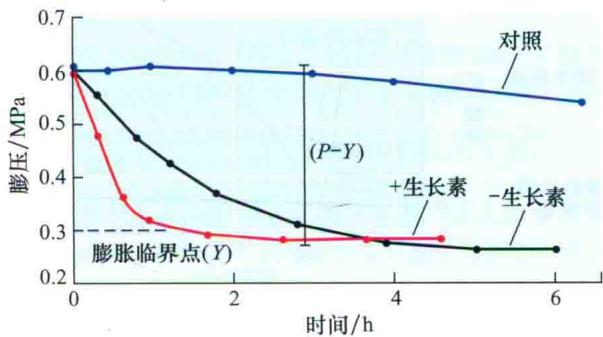  
图15.25 应力松弛引起细胞膨压（水势）减小。在这个实验中，离体豌豆幼苗茎段在有生长素和无生长素的溶液中孵育之后，吸干表面水分并密封到一个潮湿的空间内，在不同的时间测量细胞的膨压。用生长素处理的茎段膨压迅速减小到屈服阈值（Y），这是胞壁快速松弛引起的。未加生长素处理的茎段松弛速率较慢。对照茎段除了始终通过与一水滴保持接触来防止胞壁的松弛外，其余处理与用生长素处理的一组进行同样的处理（引自Cosgrove，1985）。

## 15.3.2 酸诱导的生长是由扩展蛋白 (expansin) 介导的

细胞壁生长的一个共同特征是它们在酸性pH条件下比在中性pH时扩展要快得多（Cosgrove，1989；Rayle and Cleland，1992），这种现象称为酸生长（acid growth）。在活细胞中，当用酸性缓冲液或药物克梭孢素处理生长的细胞时，酸生长表现非常明显。克梭孢素通过激活质膜上的 $H^{+}-ATP(H^{+}泵)$ 酶来诱导细胞壁酸化。

根毛的发生就是一个酸诱导生长的例子。当表皮细胞开始向外鼓起时，此处细胞壁的pH降到了4.5（Bibikova et al., 1998）。细胞壁的酸化与生长素诱导生长有关，但是这并不能解释生长素诱导的所有的生长机制（见第19章）。而且，这种pH依赖的胞壁扩展机制似乎对所有陆生植物都是一个进化上保守的过程（Cosgrove, 2005），并且参与了各种各样的生长过程。

酸生长现象也可以在缺乏正常细胞、代谢、合成过程的独立的细胞壁中观察到。进行这样的观察需要用一个伸长计，把壁放在张力下测量pH依赖的壁延展（图15.26）。

延展（creep）指依赖时间的不可逆的扩展，尤其指由胞壁多聚体之间相对滑动而产生的扩展。当生长的细胞在中性缓冲液中（pH 7）培养时，用一个伸长计夹住，当施加压力时，壁有短暂的延伸，但很快就停止了；当把壁转移到酸性缓冲液（pH 5或更小）中时，壁开始快速扩展，有时会持续数小时。

  
图15.26 用伸长计测量酸诱导的离体细胞壁的伸展。从杀死的细胞获得的胞壁样品被夹放在伸长计的张力下，伸长计用一个电导和一个夹子连在一起用来测量长度。当壁周围的溶液用酸性缓冲液取代时（如pH 4.5），随时间的推移，壁可持续进行不可逆的伸展。

酸诱导的延展是正在生长的细胞壁的特性，但在成熟的（非生长的）细胞壁中却观察不到。当胞壁用蛋白水解酶或其他能使蛋白质变性的化学物质处理时，它就失去了对酸化响应的能力。这个结果表明酸生长特性不仅是由胞壁的理化特性决定的（如果胶凝胶特性的减弱），还被一种或多种壁蛋白所催化。

酸生长需要蛋白质的催化，这个观点已被一些补充实验所证实。在这些实验中，通过加入正在生长的壁的蛋白提取物，使加热失活的壁几乎完全恢复了酸生长反应（图15.27）。这种激活物被证明是一组扩展蛋白（expansin）（McQueen-Mason and Cosgrove, 1995）。这些蛋白质催化pH依赖的胞壁扩展和应力松弛，它们有明显的催化剂量效应（大约5000份壁需1份蛋白质，干重）。

关于胞壁流变中延展行为的分子基础还不很清楚，但大量的证据表明扩展蛋白引起胞壁延展是通过削弱壁多糖之间的非共价键来实现的。蛋白结构和结合实验表明扩展蛋白在纤维素与一种或多种半纤维素之间的接触面起作用（Yennawar et al., 2006）。

随着一些植物基因组测序的完成，已知扩展蛋白基因属于一个很大的超基因家族，可以分成两个主要的扩展蛋白家族， $\alpha$ -扩展蛋白（EXPA， $\alpha$ -expansin）和 $\beta$ -扩展蛋白（EXPB， $\beta$ -expansin），以及两个未知功能的小家族（Sampedro and Cosgrove，2005）。这两种类型的扩展蛋白在细胞壁的不同多聚体中起作用，并且在细胞生长、果实成熟和其他一些壁松弛的情况下协同起作用（见Web Topic 15.6、15.7）。

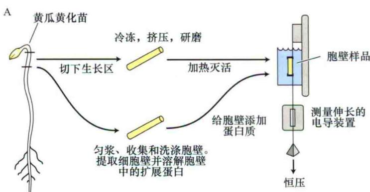

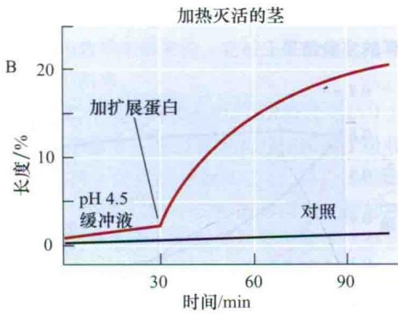  
图15.27 分离细胞壁伸展性的补充示意图。A. 与图15.26相同方式准备的胞壁样品经过简单的热处理使内源酸扩展反应失活。为了恢复这种反应，从正常生长的细胞提取胞壁蛋白，并加到含细胞壁样品的溶液中。B. 加入的含扩展蛋白的蛋白质混合物后，胞壁样品的延展能力得到恢复（引自Cosgrove，1997）。

除扩展蛋白外，一些实验表明吲哚-（1→4）-β-D-葡聚糖酶（endo-（1→4）-β-D-glucanases）在胞壁疏松中起作用，尤其是生长素诱导细胞伸长的时候（见 Web Topic 15.8）。

## 15.3.3 许多结构变化是与壁扩展停止相伴随的

细胞成熟过程中发生的生长停止一般是不可逆的，并且伴随着壁扩展性的减弱，这已为多种生物物理方法测定的结果所证实。胞壁的这些物理特性的改变可能是由下面这些变化引起的：①壁松弛过程减弱，②壁交联增加，③壁的组成发生变化，从而更具刚性的结构或更不易解聚的壁结构形成。这些观点都获得一些证据的支持（Cosgrove，1997）。

成熟细胞壁的一些修饰作用可以促进胞壁的硬化：

（1）新分泌的基质多糖在结构上可以变化，以便和纤维素或其他壁多聚体形成更紧密的复合物，或者它们可以阻止壁的解聚能力。

（2）除去禾本科植物细胞壁的（1→3，1→4）β-D-葡聚糖时这些壁的生长也就停止，而且可以导致壁的硬化。

（3）在禾本科（仅含少量的果胶）和真双子叶植物中，果胶的去酯化导致形成更刚性的凝胶，这似乎与生长停止是相联系的。

（4）壁中酚基的交联（如HRGP中的酪氨酸残基、阿魏酸残基与基质多糖或木质素交联）一般与壁成熟同时发生，并且可能是过氧化酶介导的，推断这个酶是一个壁僵化酶。

因此，壁中许多结构改变发生在生长过程中或生长停止后，目前，还无法确定其中哪种变化对胞壁停止扩展起显著作用。

## 小结

细胞壁的结构对植物的构架、机械强度和功能至关重要。细胞分化时，胞壁被分泌并组装成一个形态和构成各异的复杂结构。

## 植物细胞壁的结构与合成

细胞壁的造型和组成因细胞种类和物种的不同会有很大的差异（图15.1\~图15.3）。

\- 初生壁在生长活跃的细胞中合成，在特定细胞中次生细胞壁在细胞停止扩展后会沉积下来。

· 初生壁的基本模式是网状的纤维素微纤丝包埋于由半纤维素、果胶和结构蛋白形成的基质中（图15.4、图15.6和表15.1）。

· 纤维素微纤丝是在细胞表面合成的高度有序的葡聚糖链阵列，通过包含多个纤维素合成酶（CesA）蛋白的颗粒合成的（图15.7和图15.8）。

· 基质多糖在高尔基体中合成后通过囊泡分泌（图 15.4）。

· 半纤维素结合在纤维素微纤丝表面，果胶形成亲水凝胶并通过钙离子交联在一起（图15.13）。

· 壁的组装过程部分是物理过程，部分有酶的介导作用如木葡聚糖内糖基转移酶（XET）（图15.16）。

· 木质素是由苯丙素亚基在细胞壁中氧化交联在一起形成的复杂的聚合体，从而将基质和纤维素固定为疏水难溶的物质（图15.17和图15.18）。

· 木本植物组织中的次生壁比初生壁含有更高比例的纤维素和木聚糖，其中充满木质素（图15.18）。

## 细胞的扩张模式

· 细胞扩张可能高度位置化（顶端生长）或者均匀分布在细胞表面（扩散生长）（图15.19）。

· 在扩散生长的细胞中，细胞生长的方向是由纤维素微纤丝的方向决定的，纤维素微纤丝的方向又是由细胞质中微管的方向决定的（图15.20）。

· 复杂的细胞生长模式，如在许多植物叶表皮发现的“交错”（jigsaw）模式，涉及G蛋白信号指导的细胞骨架的组织，从而指导胞壁局部范围的合成和生长（图15.21）。

## 细胞扩张速率

· 胞壁生化成分的缺失会导致壁产生应力松弛，从而使得生长的细胞中水分的吸收与胞壁的扩张相偶联（图15.24）。

· 激素（如生长素）的作用和环境条件（光和有效水分）通过改变壁的伸展性和曲张度来调节细胞的扩大（图15.25）。

· 酸诱导胞壁的扩张是初生壁的特性，这种作用是通过扩展素蛋白疏松微纤丝之间的交联来介导的（图15.26和图15.27）。

\- 细胞成熟时停止生长涉及胞壁交联和硬化等多种机制。

(王道杰 译)

## WEB MATERIAL

## Web Topics

15.1 Plant Cell Wall Plays a Major Role in Carbon Flow Through Ecosystems.
Much of the carbon of ecosystems is tied up in plant cell walls.

15.2 Terminology for Polysaccharide Chemistry
A brief review of terms used to describe the structures, bonds, and polymers in polysaccharide chemistry is provided.

15.3 Molecular Model for the Synthesis of Cellulose and Other Wall Polysaccharides That Consist of a

## Disaccharide Repeat

A model is presented for the polymerization of cellobiose units into glucan chains by the enzyme cellulose synthase.

## 15.4 Matrix Components of the Cell Wall

15.4 Matrix Components of the Cell Wall
The secretion of xyloglucan and glycosylated proteins by the Golgi can be demonstrated at the ultrastructural level.

15.5 The Mechanical Properties of Cell Walls: Studies with Nitella
Experiments have demonstrated that the inner 25% of the cell wall determines the directionality of cell expansion.

15.6 Wall degradation and plant defense
Cell wall degradatio occurs during senscence, fruit ripening, and pathogen attack.

15.7 Structure of Biologically Active Oligosaccharins Some cell wall fragments have been demonstrated to have biological activity.

15.8 Glucanases and other Hydrolytic en Zymes may Modify the Matrix.
Some evidence suggests that endo(1→4)-β-D-glucanases(EGases) may play a role in auxin-induced cell elongation.

## Web Essays

15.1 Calcium Gradients and Oscillations in Growing Pollen Tube
Calcium plays a role in regulating pollen tube tip growth.

## 15.2 Microtubules, Microfibrils, and Growth

The orientations of microtubules and/or microfibrils are not always correlated with the directionality of growth.
