# 第 16 章

# 生长与发育

和动物相比，植物有着一套更为有趣的发育模式，除了它们所具有的多样化发育进程外，人们对这些发育形式是如何形成的也非常好奇。例如，红杉树经历上千年时间的生长后，会形成大到可以允许汽车通过的树干。而拟南芥则可以在一个多月的时间内完成其生活周期，并且只产生很少的一些叶片（图16.1）。尽管这两种植物在上述方面存在差异，但它们与所有的多细胞植物一样，有着相似的胚胎发育机制，而其差异很大程度上是由不同的胚胎后发育过程逐步积累产生的。与此形成对比的是，动物的发育模式则相对较为明晰，其基本的躯体结构在胚胎形成时期就已经定型。

植物和动物间的区别可以理解为生存策略的不同。由于具有光合能力，植物主要依赖于灵活的生长方式来赋予其在位置固定的情况下适应较为不利生长环境的能力，这种灵活性在植物的向光性方面体现的尤为明显，因为光环境会随着时间不停地发生变化。而动物作为异养生物，则进化出更多的运动能力来适应环境。在本章中，我们将会讨论植物发育的本质特征及其规范植物可塑性生长模式的详细机制，来解释植物是如何进行灵活的生长方式。

研究植物生长发育的生物学家面临两个主要问题：首要问题是需要明确并贴切的描述植物的实时变化。随着植物的生长，其复杂程度也会相应增加，倘若如此，如何用最简单的方式来描述其复杂的生物现象？细胞分裂和膨大以及特异性分化过程是与什么发育阶段偶联？环境因素如何影响植物的生长过程？

当发育机制已经获得较为详尽的阐述后，生物学家就开始着手处理涉及发育机制本质的第二个问题。如何用基因决定模式来解释生长的特殊形式？这些内在机制是如何与外界因素[如营养水平、能量输入（energy input）及环境胁迫（stress）]相偶联的？介导这些偶联的机制有哪些？涉及哪些组分，这些组分在细胞、组织水平上是如何有规律地组织在一起？在时间和空间的动态调控又是如何实现的？

为了解决上述问题，本章将先对植物组织和生活史的基本特点及它们与基本生长过程之间的联系进行一个简要的总览。作为本章的背景知识，在附录二中提供了可用来对生长发育进行详细定量描述的不同方法。在此基础上，我们将讨论生理、分子及遗传学方法是如何用于研究并阐述植物生长发育过程的调控机制。

## 16.1 植物生长发育总览

几乎所有的陆地植物都有一个重要生命特征是不可移动性。通过自身光合作用的能力，位于有利位置的植物能够轻而易举地获得生长和生存所需要的能量和营养。由于不能够移动，植物无需像动物那样进化出用于运动的复杂解剖结构。对植物来说，它需要一套相对刚性的结构以利于捕捉光能和吸收营养。因此，与动物细胞不同的是植物细胞中相邻细胞紧紧地结合在一起，相对不易变形且具有木质化和紧密排列的特点，这种刚性结构强烈限制了植物如何生长。植物中细胞的逐渐增加是通过位于特定部位的分生组织中细胞的分裂活性来完成的。相比之下，动物发育的很多方面，包括初生组织层的形成，都是通过细胞迁移到新的位置而完成的。

植物固定附着的习性使它具有相对简单的组织，同时也面临着巨大挑战。因为植物不能重新迁移到有利的环境，而必须去适应所处的生存环境。尽管这种适应是在生理水平产生的，但植物需要通过营养发育程序精心设计的可塑性发育来达到适应环境的目的。这一适应性生长的关键因素是一群命运尚不确定的分生组织细胞，通过调控这些细胞的增殖和分化，植物可以产生复杂多样的形态特征来适应所处的环境。

## 孢子体发育的三个主要阶段

种子植物孢子体发育需要经历三个主要阶段（图16.2）：胚胎发生、营养发育和生殖发育。

胚胎发生 胚胎发生是指由单细胞向具有典型基本组织的多细胞生物体发展的过程。在大多数种子植物中，胚胎发生位于花的心皮内一个特化结构——胚珠。整个胚胎发育的先后顺序具有高度可预测性，这可能反映了胚胎被母体形成的珠被有效包裹是种子形成所需的过程。胚胎发生为植物基本形态建成提供了一个清晰模式。这些发育过程是通过建立了极性，使得细胞的行为根据它们在胚胎中的位置有所区分。

在这个空间框架内，细胞群功能特化形成表皮、皮层和维管组织。被称为顶端分生组织的细胞群形成茎和根的生长点，从而可以在随后的营养生长过程中产生更多的组织和器官。在植物胚胎形成末期，一系列生理变化使得胚胎能够经历长期的休眠和承受恶劣的环境（参见 Web Topic 16.1）。

图16.1 从无限生长过程形成的两个对比鲜明的植物范例。A. 吊灯树，一株著名的北美红杉树，历经了约2400年的沧桑。B. 拟南芥小巧的外形及其较短的生命周期，使之成为研究植物生长与发育机制的模式植物（A© David L.Moore/Alamy；B由David McIntyre拍摄）。  
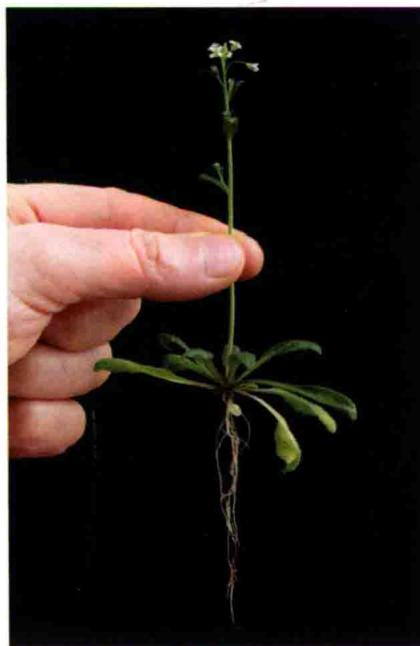

营养发育 伴随着种子的萌发，胚胎休眠状态被打破，通过利用自身储存的营养物质，种子进入植物的营养生长期。不同物种的种子萌发和许多因素有关，包括湿度、持续的低温、热和光照（参见 Web Topic 16.1）。植物最初吸收子叶（如豌豆）或胚乳（如单子叶的草本类）中储存的营养物质，通过根和茎的顶端分生组织形成植物的基本形态（Weigel and Jürgens, 2002）。通过光形态建成（见第17章）和芽的进一步发育，使幼苗具有光合自主性，从而保证植物可以继续进行营养生长。

与动物不同的是，植物这种生长方式常常是无限的，这种生长不是预先设计好的，而是属于没有明确终点的可变生长。无限生长赋予侧生器官发育重复进行，使得植物能形成最适应当地生存环境的形态结构。

生殖发育 经历一段时间的营养生长后，植物在受到诸如个体大小、温度和光周期等多种内外因子的综合诱导下转变为生殖发育。在显花植物中，由营养生长到生殖生长的转变涉及特化的花分生组织（能够形成花器官）的形成，然后按照固定模式顺序发育产生一系列器官，这已经成为研究植物发育的典型范例，这将在第25章详细叙述。

  
成年植物  
图16.2 孢子体发育的主要时期。在胚胎发生时期，单细胞的受精卵细胞产生基本的但是有极性的组织，其特征是一些未决定命运细胞群，其中包括初生根和茎尖分生组织。在营养生长期，受内在程序和环境因素的影响，植物的生长模式表现出无限生长的状态，从而产生多种形态的根茎。在生殖生长期，植物的茎尖分生组织（SAM）重编程产生一系列典型的花器官，包括心皮和雄蕊，并在这些花器官内部是单倍体配子体世代的开始。

在接下来的部分里，我们将通过讨论几种基本的植物发育的例子，分析如何利用分子及遗传学方法来更好的解释植物生长过程中的位置特异性问题。

## 16.2 胚胎发生：极性的起源

在种子植物中，胚胎发生是使一个单细胞的受精卵转变成含有成熟种子的极其复杂个体的过程。因此，胚胎发生包括了植物基本结构建立的一系列发育过程，包括基本形态的构成（形态建成）、功能组织结构的形成（器官建成）和细胞分化（differentiation）形成不同的组织（组织发生）。这种植物基本结构的重要特征是在茎尖和根轴存在有顶端分生组织（图16.2），它是保持植物以无限生长模式（indeterminate patterns）进行营养生长的关键。最终胚胎在发育过程中生理上的复杂变化使其具有经受长期的失活状态（休眠）的能力，以及感知和响应环境信号，使植物具有重新生长（发芽）的能力。

在下面的章节中，我们从几个角度来了解胚胎发生的复杂性。首先我们通过解剖学方法比较单子叶和双子叶植物的胚胎发生过程，来凸显种子植物之间胚胎发育的异同。随后，我们探究引起胚胎生长和分化的复杂模式的信号及其本质，并通过一些例子来证明位置依赖信号的重要性。最后，将通过讨论实例来说明如何利用分子和遗传学方法研究将信号转化成植物有序生长的组织模式及这种模式的内在机制。

## 16.2.1 单子叶和双子叶植物的胚胎发生类型不同，但胚胎发育的基本特征是相同的

解剖学比较表明，不同种子植物间胚胎发生的类型不同，如单子叶植物和双子叶植物。以拟南芥（双子叶植物）和水稻（单子叶植物）为例，它们在胚胎发育过程中的细节不同，但具有建立主要生长轴等共同的基本胚胎发育特征。以下是拟南芥胚胎发生过程（水稻胚胎发生的介绍详见Web Topic 16.2）。

拟南芥的胚胎发生 由于拟南芥胚胎较小，其胚形成过程中细胞分裂的模式相对简单且易于跟踪观察（Mansfield and Briarty，1991）。拟南芥胚胎发生中被认同的五个发育阶段都直接和胚胎的形状特点联系在一起。

（1）合子期（zygotic stage）它是二倍体植物生活周

B

C

H  
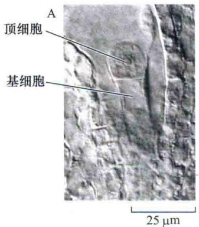

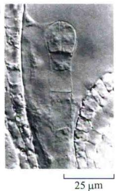

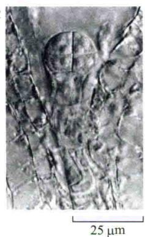

D  
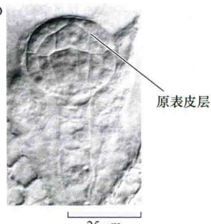

G  
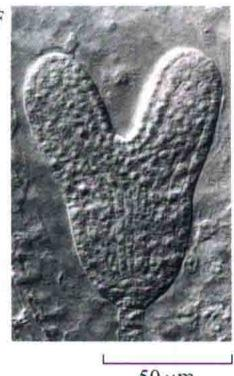

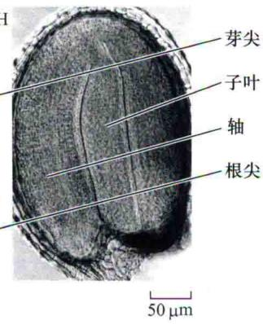  
图16.3 通过精确的细胞分裂模式阐述拟南芥胚胎的发生过程。A. 第一次受精卵裂后的单细胞胚，形成顶细胞和基细胞。B. 2细胞胚。C. 8细胞胚。D. 中期球形胚，发育成了独特的原表皮层（表面层）。E. 早期心形期。F. 晚期心形期。G. 鱼雷胚期。H. 成熟胚（引自West and Harada，1933；图片由K. Matsudsira Yee拍摄，由John Harada提供，得到美国植物生物学家协会许可）。

期中的第一个时期，开始于精卵结合后形成受精卵的单细胞阶段。细胞在不对称横向分裂后进行极性生长，产生一个小的顶细胞和一个细长的基细胞（图16.3A）。

（2）球形胚期（globular stage）顶细胞经过一系列分裂（图16.3B\~D）产生具有辐射对称性（图16.3C）的8细胞（八分体）球形胚。细胞分裂增加了球形胚内细胞的数量（图16.3D），从而形成位于外层的可发育为表皮的原表皮层。

（3）心形胚期（heart stage）通过未来茎尖分生组织两侧区域细胞的快速分裂形成胚胎两侧对称的子叶原基（图16.3E、F）。

（4）鱼雷胚期（torpedo stage）这一时期是通过细胞沿胚轴延长和子叶进一步发育形成的（图16.3G）。

（5）成熟胚期（mature stage）在胚胎形成的末期，胚胎和种子丧失了水分及代谢活性，进入休眠期（将在第23章中进行讨论）。这一时期贮存物质在细胞中大量积累（图16.3H）。

拟南芥和水稻作为双子叶和单子叶植物的代表，通过比较它们的胚胎发生过程可知，它们在胚胎的大小、形状、细胞数目和分裂模式等方面存在着差异。尽管如此，但所有种子植物胚胎形成还是会有许多共性。最基本的共性可能就是关于极性（polarity）方面的。从单细胞的合子期开始，胚胎在整个发育过程中沿两条轴线表现出越来越大的极性：顶部-基部轴（apical-basal axis），处于胚胎的芽顶端和根尖之间，而辐射轴（radial axis），垂直于顶部-基部轴，从植物中心向外延伸。

在接下来的章节中，我们将研究这些轴极性是如何建立起来的，这些特定的分子过程是如何调控这种极性发育过程的。我们主要以拟南芥为讨论对象，这不仅因为拟南芥是作为分子生物学和遗传学研究的模式植物，还因为它在胚胎发育早期具有简单和高度模式化的细胞分裂。通过观察这个简单模式的变化，就可以比较容易地识别影响胚胎发育的生理及遗传因子。图16.4中所描述的拟南芥早期细胞的分裂有助于对下面讨论的理解（关于在简单藻类合子中极性建立的讨论，见Web Topic 16.3）。

## 16.2.2 顶部-基部极性在胚胎发生早期建立

极性是种子植物的基本特征，植物的组织和器官按照从茎尖分生组织到根尖分生组织这条线性轴，以类似于铅印模板式地有序地排列。极性轴最早在合子中就已出现，合子细胞在初次分裂前会伸长3倍左右，而其细胞内的组分也呈极性分布。合子的顶端有浓厚的细胞

PLANT PHYSIOLOGY

  
图16.4 拟南芥胚胎形成的模式。上图表明幼胚发育的一系列连续发育阶段的特定细胞如何决定幼苗形成的特定解剖结构特征。不同的颜色标出相关的同源细胞群，即这些细胞可以追溯到共同祖先。随着受精卵进行不对称分裂，较小的顶端子细胞分裂形成8细胞的原胚，原胚分为2层，每层4个细胞。上层发育成顶端分生组织和侧翼与子叶原基相连的大部分，下层产生胚轴和部分子叶、胚根和根顶端分生组织的上部分细胞。受精卵分裂的基部子细胞产生一系列非胚胎细胞，形成连接胚囊到胚胎的胚柄。与原胚相邻的胚柄上部细胞称为胚根原（蓝色标示），将成为胚胎的一部分。胚根原将分裂形成静止中心和形成根冠的干细胞（起始）。

质，而基部则含有一个中央大液泡。当合子进行非对称分裂成为短的、胞质浓的顶细胞（apical cell）和稍长、有液泡的基细胞（basal cell）时，细胞质浓度的差异就可以被捕捉到（图16.3A和图16.4）。

合子分裂成的两个细胞也可以通过它们随后不同的发展命运来区分。几乎整个胚胎及以后形成的成熟植株都是来源于较小的顶细胞，它的两次垂周分裂及随后的一次水平分裂产生了8细胞（八分体）的球形胚（图16.3C和图16.4）。

基细胞的发育潜力相对有限。一系列的横向分裂（在与顶部-基部轴垂直的角度上产生新的细胞壁）产生了纤维状的胚柄（suspensor），将胚胎固定在亲本的维管系统上。仅有最上部基细胞的分裂产物参与成熟胚的形成，被称为胚根原细胞（hypophysis）。经过这些细胞的进一步分裂，它们发育为根冠柱、相应的根冠组织和静止中心，都是根顶端分生组织的重要组成部分，本章后面的部分将进一步讨论（图16.4）。

在八细胞球形胚期，除了位置的差异外，上下层的细胞在形态上没有太多的差异。所有的八细胞进一步进行平周分裂（periclinally）（新形成的细胞壁平行于表面）形成一个新的被称为原表皮层（protoderm）的细胞层。原表皮层的细胞随后进行垂周分裂（anticlinally）（新细胞壁垂直于组织表面）从而使一个细胞厚度的表皮面积增加。在球形胚早期，上下端细胞的命运就开始显现出明显不同：

（1）顶端区（apical region）源于细胞的顶部区域，产生子叶和茎尖分生组织。

（2）中部区（middle region）源于细胞的基部区域，产生胚轴（胚性干细胞）、根和根分生组织顶部区域。

（3）胚根原细胞（hypophysis）源于胚柄的最上部细胞，产生余下的根分生组织。

## 16.2.3 位置依赖性信号转导调控胚胎的形成

拟南芥早期胚胎发生过程中这种重复分裂模式，表明细胞保持一种固定的分裂顺序是这个发育阶段所必需的。如果胚胎形成过程中单个细胞的命运很早就固定或决定下来，则可以解释这种分裂模式的一致性；一旦这些细胞的命运被确定了，这些细胞就会按固定的程序进行发育。起源性依赖（lineage-dependent）机制恰恰可比作细胞胚胎按照自我包含的指令进行一系列标准部件结构的组装。

尽管这种起源性依赖机制已经在动物发育中被证实，但用这一机制来解释植物的胚胎发育还存在一些难点。首先，这一起源性依赖机制很难解释其他植物（在水稻甚至是与拟南芥亲缘关系相近的植物）中存在的更为多变的细胞分裂方式。其次，即便在拟南芥中，当通过灵敏的命运作图技术预测单个细胞命运时，也可发现在正常胚胎形成过程中细胞分裂行为会出现一些有限的变化（图16.5）。最后，以一种拟南芥的突变体作为极端特例来分析，虽然该突变体与野生型相比有显著不同的分裂模式，但在该突变体中仍有构建出基本胚胎特征的能力（Torres-Ruiz and Jürgens，1994；图16.6）。从这个角度看来，拟南芥中相对可预测的细胞分裂模式可能简单反映了其胚胎的体积小，而使胚胎细胞的早期分裂在极性和物理位置方面受到限制。因此，除了按固定的顺序进行细胞分裂外，一定还有其他程序指导着胚胎的进一步的发育。

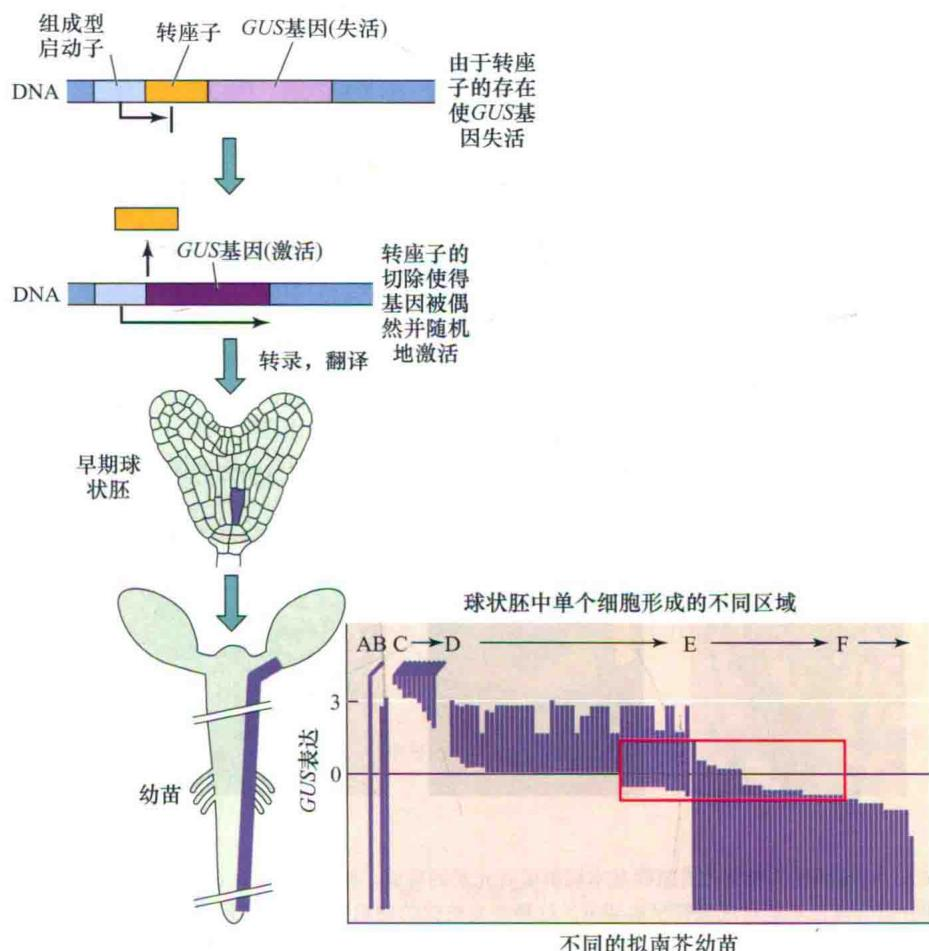  
不同的拟南芥幼苗  
图16.5 特定胚胎细胞的命运不是固定不变的。研究追踪了幼胚中单个细胞的命运。顶部图表示随机切除转座子激活了单个细胞中GUS基因的表达，提供了可遗传标志，因此GUS基因可以标记这个细胞及其后代细胞。胚胎中转座子的切除过程导致幼苗中GUS表达。在底部图中，该实验中的幼苗可以根据GUS表达区域的强度和位置加以分类（标记为A\~F）。左边幼苗模式图显示线性排列的区域，每一个区域来源于幼胚。一些相似区域，如E和F，很可能源于胚胎中相似位置的细胞，只是终点有异，但是不同分区间的表达量仍有较大的重叠。例如，类型D的底部区域和类型E顶端部分重叠，却不与类型F重叠。另外，幼苗中区段D和E的细胞也是有重叠的（子叶和根的交界处），说明细胞分化按它的位置而非来源。这个例子为细胞的位置是其命运的主要决定因子提供了直接证据（引自Scheres et al., 1994）。

鉴于胚胎形成中细胞分裂的可变性，位置依赖性（position-dependent）的信号机制可能比起源依赖性机制发挥了更大的作用。这个机制通过依赖于细胞在发育胚胎中的位置来调整细胞行为。这种机制可以解释不同的细胞分裂模式如何最终成为一个统一完整的胚胎个体。这种位置依赖的信号模式一般认为具有三类通常的功能组成。

（1）在发育结构中必定存在独特的位置信息。

（2）单个细胞必定存在关于自身位置相对于应用位置信息的评价途径。

（3）细胞必须具备应对本来应有位置信息的恰当的反应能力。

接下来我们将讨论调控植物胚胎轴模式建成机制的本质，首先鉴定该过程的关键因子，然后研究它们之间如何互作。我们首先讨论生长素如何将位置信息提供给发育中的胚胎，并且又是如何通过调控下游生长素依赖的进程来参与胚胎发育。

## 16.2.4 在胚胎形成中生长素可能以一个可移动的化学信号起作用

在动物的一些特定的位置依赖性的发育过程中，一种被称为形态发生素（morphogen）的物质对位置信息图16.6 过度的细胞分裂没有阻碍基本辐射模式元素的形成。拟南芥的fass（即ton2）突变体，在细胞任何分裂阶段都不能形成微管早前期带。这种突变植株的细胞分裂和平面延伸很不规则，所以它们的形态发生严重变化。但是，它们还是在正确的部位形成了可辨认的组织和器官。虽然这样的组织和器官极不正常，但是没有影响到辐射组织模式。上图为野生型拟南芥：A.早期球形胚阶段；B.从顶部观察到的幼苗；C.根的横切面。下图对应各阶段的纯合突变体fass：D.早期胚胎的形成；E.从顶部观察到的突变体幼苗；F.突变体根的横切面表明细胞随机定向排列，但是仍然是一个近似野生型组织排列顺序：外部表皮层覆盖了一个多细胞组成的皮层，它围绕着维管柱（引自Traas et al., 1995）。

A  
野生型拟南芥  
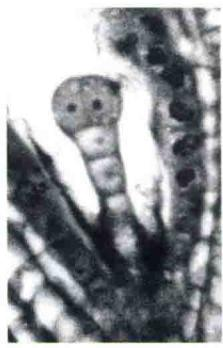

B  

C  
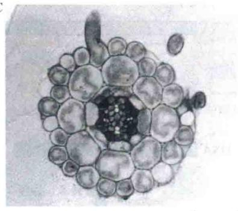

D  
fass: 纯合突变体  
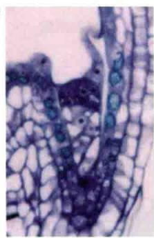  
50 μm

E  

F  
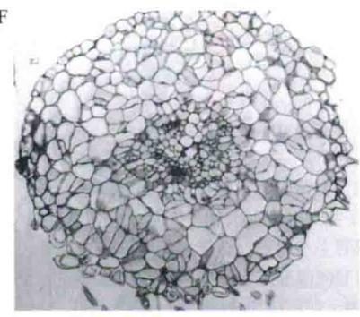  
60 μm

的提供起着关键作用。通过合成、运输和转换的综合作用，在发育的动物体内形成了形态发生素分子的浓度梯度分布，继而引发了一系列的浓度依赖反应。考虑到植物胚胎的发育也存在有位置依赖性，那么在植物中是否也存在有一种类似的形态发生素依赖机制呢？

某些激素的浓度变化、可移动性及它们能引起的一系列生理反应表明，这些分子有成为形态发生素的可能，生长素就是一个典型的例子。对于许多植物来说，生长素（吲哚-3-乙酸，IAA）或者合成的类似物，都能诱导体细胞形成胚胎（见第19章）。这种现象不仅表明生长素在胚胎形成中的潜在影响，也说明在缺失母体提供的信息时，胚胎形成程序也能进行的内在本质特征。

生长素及其抑制剂在不成熟胚胎上的体外实验还证明，胚胎发生的后期阶段也对生长素浓度敏感（图16.7A和B）（Liu et al., 1993）。人工干扰生长素水平导致的杯状顶端的表型与生长素转运体PIN1基因缺失的突变体表型非常类似（图16.7C），表明生长素在胚胎正常发育中起到非常重要的作用。但如果生长素要起到形态发生素的作用，不仅要能引起所影响组织的特异浓度依赖反应，也要能在整个发育的胚胎内形成浓度梯度分布。通过外施不同浓度的生长素（表16.1），建立的模式图显示了生长素的直接运输是如何参与建立发育过程中的胚胎内生长素模式化分布的（图16.8）。

## 16.2.5 突变体分析有助于鉴定在胚胎组织发育过程中的重要基因

通过对各种类型突变体的分析，可以得到胚胎的基本极性是如何建立的，以及随后的模式是如何发生的相关信息（Laux et al., 2004）。阻碍胚胎早期形成的突变体被称为胚胎致死突变，如果这些突变体是隐性的，那么通过观察杂合体植株经自交后生长出的不饱满的种子或者果荚就可以识别出来。虽然这些突变体阻止发育的现象可以与相应基因在胚胎形成中的作用对应，但还是很难断定该基因是特异地在胚胎形成中起作用还是具有更广泛的代谢功能。

A 添加了反式肉桂酸的野生型芥菜  
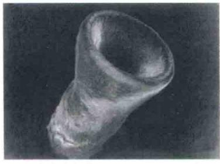  
100 μm

B 野生型拟南芥  
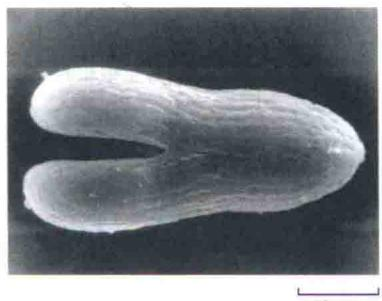  
50 μm

C pinl1-1突变体  
  
图 16.7 生长素在胚胎发育过程中作用的证据。A. 反式肉桂酸（一种能减弱生长素水平，抑制其运输的类黄酮）处理芥菜胚胎10天，可改变芥菜胚胎形态。B. 野生型拟南芥胚胎。C. 拟南芥pin1-1突变体的胚胎。值得注意的是，体外施用生长素抑制剂和由PIN基因突变导致的生长素运输紊乱均引起了相似的子叶不能正常分离的表型（引自 Liu et al., 1993）。

表16.1 评价植物体内生长素水平的通用方法的总结

<table><tr><td>方法</td><td>敏感性</td><td>特异性</td><td>分辨率</td><td>注释</td></tr><tr><td>质谱分析</td><td>中等</td><td>高</td><td>组织或器官水平</td><td>可以区分生长素的不同形态</td></tr><tr><td>通过质量和电荷确定某些分子身份</td><td></td><td></td><td></td><td></td></tr><tr><td>免疫印迹检测法</td><td>高</td><td>中等</td><td>细胞水平</td><td>依赖于生长素和抗体结合的亲和度以及抗体的特异性</td></tr><tr><td>利用抗体识别特异性的分子构象</td><td></td><td></td><td></td><td></td></tr><tr><td>报告基因</td><td>高</td><td>高</td><td>细胞水平</td><td>指示生长素依赖响应的位置,但在某种程度上报告基因的活性可能会受其他因素的限制</td></tr><tr><td>利用生长素激活的启动子启动基因表达,该基因表达产物可以被检测</td><td></td><td></td><td></td><td></td></tr><tr><td>PIN蛋白的定位</td><td>中等</td><td>中等</td><td>细胞水平</td><td>用于评价主要生长素运输系统中生长素可能的极性运输方向,但该方法不能直接用于检测其他类型的生长素</td></tr><tr><td>生长素转运体的极性分布来指示生长素的水平</td><td></td><td></td><td></td><td></td></tr></table>

  
2细胞阶段

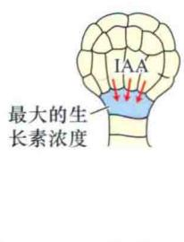  
球形胚

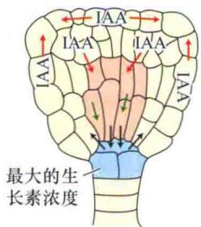  
早期心型胚阶段

图16.8 胚胎发育早期依赖于PIN的生长素移动。箭头指示生长素的移动方向。这是根据PIN蛋白的不对称分布和DR5生长素反应报告基因的活性推断出来的（参考第19章）。蓝色标记区域为生长素浓度最大的细胞。

在分离特异影响胚胎形成的突变体中，筛选得到一些幼苗缺陷突变体，它们可以发育形成成熟的种子，但这些种子萌发形成的幼苗均不正常（Mayer et al., 1991）。在这些突变体中，正常的顶-基形态被打乱，结果造成缺失茎尖分生组织或根尖分生组织，或者两者都缺失。这些突变体缺陷的特征表明正常的顶-基模式的形成需要相关基因的参与（图16.9）。通过图位克隆技术克隆相关基因，可以深入了解这些基因的功能作用。

（1）GURKE（GK），因突变体的外形类似黄瓜而得名，它简化了或没有了子叶和茎尖分生组织，编码一种乙酰辅酶A羧化酶（Baud et al., 2004）。因为乙酰辅酶A羧化酶对于极长链脂肪酸（VLCFA）及鞘脂类的正确合成是必需的，所以这些分子或其衍生物可能对形成胚胎顶部的正确模式也必不可少的。

A 野生型和 gnom 突变体  
  
GNOM基因控制顶-极性

B 野生型和 monopteros 突变体  
  
MONOPTEROS基因控制初生根的形成

C 突变类型示意图  
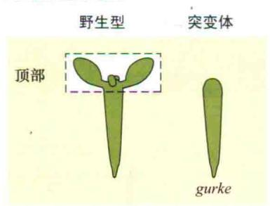

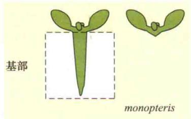

  
图16.9 通过突变体筛选分离拟南芥胚胎发生过程中必须的基因。图中显示的是相同发育阶段的突变体与野生型之间的类型比较：A. GNOM基因帮助建立顶-基极性，右边为纯合突变体gnom。B. MONOPTEROS基因在基部模式化和主根形成过程中是必需的。纯合突变体monopteros植株（右侧）有下胚轴、正常的茎尖分生组织和子叶，但没有主根。C. 四种类型缺失突变体。右边的突变体缺少左边野生型的虚线区域所示的组织和器官（A图引自Willemsen et al., 1998；B图引自Berleth and Jurgens, 1993；C图引自Mayer et al., 1991）。

（2）FACKEL（FK），以前认为它是形成下胚轴所必需的。突变体显示了复杂的模式形成缺陷，包括畸形的子叶、下胚轴及根部变短等，并常常形成丛生芽和重生根的分生组织。FK编码一种固醇C-14还原酶，表明固醇在胚胎形成模式中起到非常重要的作用。

（3）GNOM（GN），编码一种鸟嘌呤核苷交换因子（GEF），通过建立PIN生长素输出载体的极性分布，从而使生长素形成极性分布（Steinmann et al.,

1999; Geldner et al., 2003)。

（4）MONOPTEROS（MP），根和下胚轴等基部器官形成所必需，编码一种生长素响应因子（ARF）（Berleth and Jurgens，1993；Hardtke and Berleth，1998）。

虽然克隆这些基因揭示了它们各自所编码蛋白质可能具有的生理功能，但仍需进一步分析揭示这些功能是如何帮助建立正常的胚胎顶-基轴的。接下来的章节我们通过关注GN和MP的功能来了解生长素作为形态发生

素的一系列的模型。

## 16.2.6 GNOM蛋白决定了生长素输出蛋白的极性分布

就GN基因本身来说，它的功能是作为一个鸟核苷交换因子（GEF）起作用，这并没有直接说明它如何有利于胚胎的顶-基区域的形成。但值得注意的是，外施生长素转运体的抑制剂可模拟或者是得到很多与gn突变体类似的表型，表明GN活性是生长素正常转运所必需的。实验证明GN蛋白的GEF的活性是生长素输出蛋白PIN极性定位所必需的，PIN蛋白又是生长素输出蛋白系统的重要组成部分。通过该实验，进一步解释了GN如何影响生长素的输出（Galweiler et al., 1998；见第19章）。

GN，像其他的GEF类相关蛋白一样，能促使囊泡在胞内运输将其所携带的特定蛋白（包括PIN类蛋白）转运至胞内靶点。GN的突变能破坏PIN蛋白正常的极性分布。进一步的研究表明GN的GEF活性对PIN的定位起有重要作用。当用GEF活性的抑制剂BFA处理细胞后，可以看到PIN的极性分布受到了破坏。但对于细胞含有结构改变的GN，因而不能结合BFA时，BFA处理后则观察不到PIN分布的异常。而编码PIN蛋白的基因缺失导致细胞分裂显示出与gn突变体相似的异常表型，进一步证实了PIN蛋白活性缺失是引起gn突变体中胚胎发育模式的改变的原因。

上述的这些结果表明，胚胎的顶-基模式依赖于胚胎中生长素浓度的差异分布，这种差异至少部分是由PIN所介导的生长素运输而产生的。为了支持这个模型，通过观察生长素报告基因在胚胎发育的各个阶段的表达分布来推测生长素的分布情况后发现，其分布与由PIN蛋白的极性分布而影响的生长素的分布情况是一致的。在2细胞阶段，基细胞的顶端细胞壁中PIN蛋白的优先积累与顶端细胞中高水平的生长素是相关联的。在胚胎的发育后期，PIN蛋白的分布发生逆转，随着PIN蛋白在顶端细胞基面高水平表达，使基部生长素的水平也随之提高（图16.8，球形胚时期）。在过渡阶段，PIN蛋白的分布变得更加复杂，内部细胞倾向于形成向下的生长素流动，同时这种流动可以通过表面细胞层向上的生长素流动来进行平衡（图16.8，早期心型胚阶段）（Friml et al., 2003；Blilou et al., 2005）。

## 16.2.7 MONOPTEROS编码一个生长素激活的转录因子

MP基因的克隆揭示了它是编码生长素响应因子 [auxin response factor（ARF）]蛋白家族成员的基因，暗示其参与生长素依赖的过程。在生长素存在的情况下，ARF调节参与生长素应答的特定基因的转录。在没有生长素的情况下，MP则能通过与特定抑制子IAA/AUX蛋白相互作用使活性受到抑制。而生长素又可以通过诱导这些抑制子蛋白的降解，释放MP蛋白，使ARF能够激活它们的靶基因进而引发对生长素的响应（见第19章）。

许多证据表明，MP至少调控一部分生长素反应。除了导致胚胎的基部缺失（图16.9B、C），mp突变体还表现出维管系统的缺陷，这一点和人为阻抑生长素水平或运输后得到的表型相似，表明MP可能是参与生长素依赖的维管发育的调控基因。

不同的研究小组已经证明了由生长素调节MP活性的模型。这些研究均关注一个称为bodenlos（bdl）的突变体，在bdl突变体中，胚胎基部的缺失表型与mp突变体的表型一致，表明了这两个基因在功能上是有关联的（Hamamm et al., 2002）。对BDL基因的分子克隆结果表明它编码众多IAA/AUX阻遏蛋白中的一个成员。正常形态的GDL可以抑制MP的活性，但这种抑制可以被生长素所促发的BDL的降解而解除。生物化学研究表明突变后的BDL可以不被生长素诱导降解，因此能持续与MP结合，抑制它的活性从而表现出与mp类似的表型。综上所述，GN和MP共同组成了由生长素调控的基本极性生长轴建立的部分机制。

## 16.2.8 辐射模式引导组织层的形成

胚胎发育中除了顶-基轴上细胞和组织的差别外，从胚胎内部到表皮延伸出的辐射轴上也有差别。在拟南芥中，沿辐射轴的组织分化最初在球形胚中出现（图16.10），平周分裂将胚胎分成三个放射状的区域。最外层的细胞形成单细胞厚度的表皮层称为原表皮层（protoderm），原表皮层最终分化为表皮。基本分生组织（ground meristem）的细胞在原表皮层下，随后基本分生组织形成皮层（介于维管组织和表皮间的基本组织），而在根和胚轴中，产生内皮层（栓化细胞层，阻止水和离子通过质外体进出中柱；见第4章）。位于中心区域的则为原形成层（procambium），最终产生维管组织，包括在根中产生中柱鞘。

在胚胎的轴模式中可以看到，不同物种间细胞分裂模式类型显著不同，同时在细胞分裂模式被破坏的突变体中，基本辐射模式依然能建立，因此，精确严格的细胞分裂次序并不是建立基本辐射模式所必需的。生长素的运输在胚胎顶-基轴模式的建立中起到重要的作用，与该模式不同，辐射模式的分子基础并不清楚。尽管如此，对胚胎的详细解剖和分子分析提供了一些胚胎辐射模式建立过程中关键线索（见Web Essay 16.1及第1章中讨论细胞分裂界面如何形成的）。

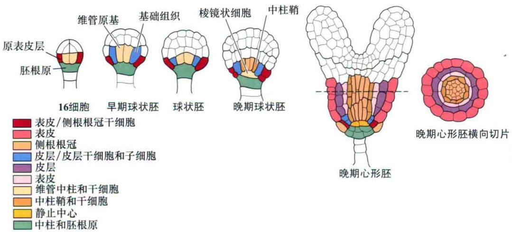  
图16.10 拟南芥胚胎形成过程中辐射模式形成的顺序简图。用5个连续胚胎发育阶段的纵切面说明不同组织的来源。从原表皮层（左）到最终维管组织的形成（右）。注意观察干细胞是如何增加组织数量的。最右边图显示的是晚期心形胚基部的横切面（其临近的左图所示横线是横切的具体位置）。

胚胎的原表皮层呈现出了辐射轴的一个明显、特别的特征，由于位于最表面的一层因此原表皮层组织可以很容易根据其位置而确认。从胚胎发育的早期开始，原表皮层就具有了一套暴露在外界的细胞壁，因此理论上它可以更方便地和外界环境交流信息，此外，这些表皮细胞还是胚胎内信号从一个细胞进入另一个细胞移动的边界。以上两点说明，原表皮具有区别于内部细胞层的独特性质。例如，对于柑橘的研究表明，胚胎表面的表皮层从最早的合子期就开始出现，并一直持续到了成熟期，表明原表皮层细胞的细胞壁构成了一个与外界交流的边界（Bruck and Walker，1985）。

这些结果表明与表皮相关的因子可能为辐射模式建立提供重要线索。在胚后发育期，由原表皮层生成的表皮作为植物与周围环境的互作界面有着非常重要的作用。最近研究表明表皮本身制约了更多的内层的生长（见第24章）。

通过遗传学研究发现了两个基因，拟南芥MERISTEM LAYER1（ATML1）和PROTODERMAL FACTOR2（PDF2），它们在最表层表皮细胞形成表皮特征中发挥了重要的作用（Lu et al., 1996; Abe et al., 2003）。两者编码同源的转录调节因子，都在胚胎形成早期的胚胎外部细胞中表达。这种表达是形成正常表皮所必需的，因为它们发生突变时植株的表皮会出现异常，表现出叶肉细胞的特征（图16.11A和B）。

两个基因的蛋白产物通过识别表皮特定基因启动子所共有的8碱基对识别序列而调节它们的表达。ATML1和PDF2与这些启动子序列的结合促进了基因的转录，而这些基因产物导致了表皮的分化。ATML1和PDF2基因自身的启动子含有这种识别序列，表明有一种正反馈循环来维持它们的表达。然而，控制这些基因在表皮表达的信号的本质仍然不清楚。

A 野生型  
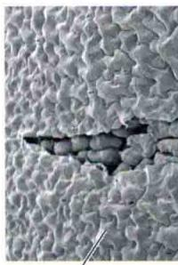  
表皮

叶肉  
  
10 μm

B atml/pdf 2 突变体  
  
10 μm

C 凝胶阻滞分析  
  
图16.11 ATML1和PDF2是形成正常表皮所必需的。比较野生型（A）和双突变体atml1/pdf2（B）显示突变表皮与野生型（在A中剥去部分表皮）中的叶肉相似。C凝胶阻滞实验显示PDF2蛋白可以专一的结合到特定的序列上，这个序列存在于受PDF2蛋白调控的基因启动子中。与PDF1启动子的L1盒子有相同序列的标有21个核苷酸序列的探针L1与融合有PDF2的麦芽糖结合蛋白（MBP-PDF2）混合。结合有蛋白质的DNA探针，形成带有标签的复合物，它可以在凝胶中以一个条带的形式被看到（第2列，箭头）。如果L1仅与麦芽糖结合蛋白混合则没有复合物出现（第1列），如果MBP-PDF2与突变的L1探针混合，也没有混合物出现（第7列）。当逐渐增加没有带标签的L1探针（竞争者）的量（100\~300或1000倍的量；第3、4和5列）时，复合物标签逐渐消失（引自Abe et al., 2003）。

进一步的遗传分析发现了一些参与了更多内部组织形成的基因的特性，包括维管系统和皮层。拟南芥WOODENLEG（WOL）基因的缺失突变体，会引起产生木质部和韧皮部前体的一轮重要细胞分裂的缺失（图16.12）。这种缺失导致维管系统只有木质部而没有韧皮部。WOL[也称细胞分裂素受体1（CRE1）]基因编码细胞分裂素的受体之一，表明这种激素可以作为辐射模式建立的组分（Mähönen et al., 2000; Inoue et al., 2001）（见第21章）。但是，因为fass突变能促进细胞的额外分裂，并且通过构建wol fass的双突变体发现fass能阻遏wol的表型，因此wol突变体中韧皮部的缺失是由于在相应位置前体细胞层的缺失，而不是由特定韧皮部细胞的失活所引起的。

激素信号和转录因子共同在调控顶-基模式和辐射轴模式的建立过程中有重要的作用。接下来的部分我们用一个已经研究透彻的例子来说明特定转录因子在细胞层移动的特性如何有助于这种模式的建立。

## 16.2.9 转录因子在胞间的转运参与了皮层和内皮层细胞的分化

皮层和内皮层组织的发育，为相邻两个细胞层间基因表达活性通信是如何影响辐射模式的建立提供了典型的例子。拟南芥的两个基因，SCARECROW（SCR）和SHORTROOT（SHR）是形成正常皮层和内皮细胞所必需的（Di Laurenzio et al., 1996；Helariutta et al., 2000）。两者编码的蛋白序列相近，均为GEAS转录因子家族成员。GRAS名称来源于该家族首先被发现的几个成员，包括GIBBERELLIN-INSENSITIVE（GAI）、REPERESSOR OF GAI1-3（RGA）和SCR。

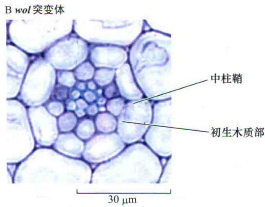  
图16.12 拟南芥细胞分裂素受体（WOL）基因编码的细胞分裂素受体是正常韧皮部发育所必需的。野生型（A）和wol突变体（B）根部的比较表明wol突变体缺少韧皮部组成成分并且细胞层数明显减少（引自Mahonen et al., 2000）。

在SCR或SHR活性减少的突变体中，形成独立皮层和内皮层的细胞分裂过程无法正常进行。任一基因的突变都会阻碍细胞分裂分化成独立的细胞层（图16.13）。在scr突变体中，虽然只有单层细胞但其同时表现出内皮层和皮层二者的特征，这表明突变体仍能表达每层的特征，但是不能将它们分开形成不同的细胞层。fass突变后能使突变体恢复至较为正常的生长类型支持了这种解释，和恢复wol的能力相似，fass能补偿scr的分裂缺陷，从而使具有皮层和内皮特征的细胞层分开形成各自的细胞层。

相比之下，shr突变体不仅有和scr相类似的细胞分裂缺陷，而且还不能形成具有特异内皮层性状的细胞。在shr缺失突变体中，单一的未分裂层丧失了内皮层的特征，如缺乏凯氏带，并且激活了一些正常条件下在皮层中被抑制的基因。由于SHR的mRNA表达位置通常局限在更内部的原生维管组织中，因此这种

需要SHR基因活性来特化内皮特征的现象有些令人费解。

这种现象通过更详尽的研究得到了解释（Nakajima et al., 2001），尽管SHR的mRNA仅限于在维管中表达，但是翻译的产物却不是这样，SHR蛋白被转运到相邻外层细胞内，在那里它通过调控一些特定基因的转录来诱导内皮层特征的形成（图16.14）。SHR蛋白在皮层与内皮层的分化上的作用方式，为解释特定转录因子如何依赖它们在细胞层间的运动来发挥作用提供了清晰的例子。

## 16.2.10 许多发育过程需要大分子物质的胞间运动

相邻组织相互作用引发的特定的发育过程，这种现象称为诱导效应（induction），是许多多细胞生物体

B 突变体
韧皮部

Short-root (shr)  

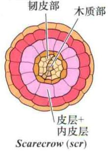

  
野生型中SHR的表达A野生型的胚

木质部  
  
Wooden-leg (wol)  
图16.13 正常和突变体根辐射模式的比较，表明特定基因在空间上的特定功能。A. 野生型的根部。不同颜色代表不同细胞类型。B. 三个缺失根辐射发育模式的拟南芥突变体scr、shr、wol（引自Nakajima and Benfey，2002）。

B 野生型的根  
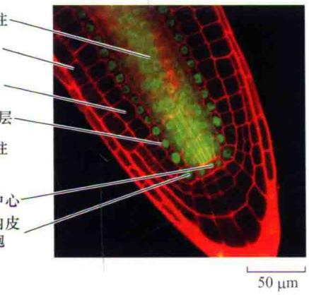

SCR的表达C野生型的根  
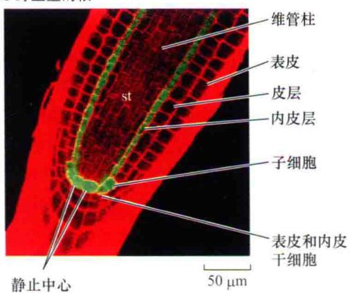

Dshr突变体的根  
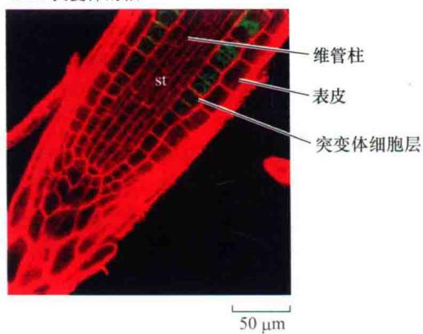  
图16.14 拟南芥根发育过程中SHR和SCR基因控制组织发育模式形成过程。在这里，SHR和SCR蛋白通过与绿色荧光蛋白（GFP）融合后（呈绿黄色）利用激光共聚焦扫描显微镜成像技术观察基因表达的定位模式。（A和B）SHR蛋白的定位。A.在野生型拟南芥的胚胎发育过程中，SHR蛋白定位于原生维管组织中。B.在初生根继续生长的过程中，SHR蛋白仍定位于圆柱状的维管柱中，但同时也会移动到相邻近的内皮层中。（C和D）SCR蛋白的定位。C.在野生型的根中，SCR蛋白位于静止中心（QC）、内皮层以及表皮和内皮干细胞（CEI）中。而皮层、维管柱和表皮中没有SCR蛋白。D.在shr突变体的根中，SCR的表达水平显著降低，并且仅在同时具有皮层和内皮特征的突变体细胞层出现（引自Helariutta et al., 2000）。

采用的生存战略。诱导效应本质上依赖于各种类型的胞间通信。就像动物一样，在植物中很多类型的胞间通信是由一些激素分子介导完成的，这些激素分子的运动有时是被动的，有时则是通过激素所特有的运输系统来完成的（如PIN蛋白）。除了激素之外，植物还有运输更大分子的能力，如通过胞间连丝运输转录因子。这些膜内衬的管道，穿过细胞壁把相邻细胞的胞质连接在一起（见第1章），这些胞间连丝是动态的结构，能够根据分子的大小和组成，选择性的让它们通过（Haywood et al., 2002; Maule, 2008）。

大分子通过胞间连丝的胞间运动，受很多复杂因素控制。尽管超过1 kDa的大分子的运动通常会受到限制，但是通过调整胞间连丝可以让更大分子或特定的蛋白通过，如转录因子SHR。跟踪染料分子或者带有GFP标签的不同大小的蛋白运动的研究显示胞间连丝状态的变化与胚胎的发育过程相偶联。在胚胎发育早期，较大分子的运输相对比较容易，而在发育后期组织轮廓清晰后分子的运输就受到很大的限制（图16.15）（Kim et al., 2005）。这种区域化胞间通信模式，可以部分的解释为什么植物的很多发育过程在组织结构轮廓成熟的区域比单个细胞水平内存在有更多的调控方式（Rinne and van der Schoot, 1998）。

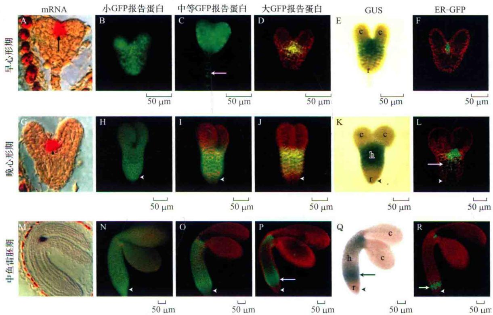  
图16.15 发育过程中胞间蛋白移动能力的变化。图示小（B、H、N）、中（C、I、O）、大（D、J、P）型GFP报告蛋白在不同年龄（早心形期，A\~F；晚心形期，G\~L；中鱼雷胚期，M\~R）胚胎中的分布。所有构建的载体用一个仅能在胚胎较小区域内转录的STM启动子来控制，这可由原位杂交（A、G和M）与非扩散性GUS的融合（E、K、Q）及ER-GFP报告蛋白（F、L、R）的表达来显示。小蛋白质在各个阶段（B、H和N）都更易移动，而大蛋白质的移动性弱些，并在较老的胚胎中具有更多的限制（C和D，I和J，O和P）。箭头表明胚柄细胞（C）的细胞核和STM启动子在下胚轴中的异位表达（L和P\~R）。箭头处指根。缩写：c. 子叶；h. 下胚轴；r. 根（引自Kim et al., 2005）。

## 16.3 分生组织：无限生长型的基础

植物的发育过程具有很大的可塑性，这很大程度上归功于一个被称为分生组织（meristem）的特化组织的存在（Esau，1965；Gifford and Foster，1987）。广义上的分生组织的定义是保持繁殖能力的细胞群，它们的命运是不确定的。许多在植物营养生长中发挥作用的分生组织是根据它们在植物体的位置而命名的。

根顶端分生组织[root apical meristem（RAM）]和茎尖分生组织[shoot apical meristem（SAM）]分别处于根和茎的顶端。居间分生组织（intercalary meristem），正如它们的名字一样是指镶嵌在分化过的组织区域内的具有增殖能力的组织。而侧生分生组织（marginal meristem）处于发育器官的边缘部分，功能和居间分生组织类似。小型的表层细胞簇被称为拟分生组织（meristemoid），其可生成诸如表皮毛或者气孔等组织（参见Web Essay 16.2 植物分生组织的历史回顾）。在下节中我们将概述SAM和RAM的基本特征，并通过提出一个有用的模型来理解调控这些细胞的分裂和最后去向的机制。

## 16.3.1 RAM和SAM利用相似的无限生长策略使之保持无限生长模式

尽管在一棵植株上很难想象存在有比根和茎差异更大的两个部位，但是RAM和SAM的某些特征及它们在植物无限生长模式中起的作用却是相似的。它们空间结构特征都是一簇细胞，称作起始细胞（initials）。这些细胞分裂速度慢且分化方向不定。这些细胞的后代由于细胞的极性分裂模式的影响发生位移，并最终获得各种不同的分化命运，如成为叶和根的辐射性和纵向的组织或发育为侧生器官等。

从这个角度可以清楚地看出RAM和SAM都必须有一套机制来平衡不断补充到不同分化组织中的新细胞的数量。RAM和SAM的这种共性是否意味着它们采用了的相似的调控机制？这些机制是如何使根和叶维持各自的特征并使其生长能够适应环境变化的？根和叶截然不同的生长及器官发生模式是否需要RAM和SAM也存在有不同的特殊功能？为了回答这些问题，我们将接着讨论RAM和SAM的基本特征，以及一些通过遗传学方法找到参与RAM和SAM建立和维持的相关信号途径的例子。

## 16.4 根顶端分生组织

根的很多形态都会受到它所处的环境影响。根具有固定植物的作用，同时又可以在土壤中吸收水分和矿物营养，根具有复杂的生长和向性运动模式，使得其便于探索和开发充满障碍的环境。与茎不同，根产生侧生器官，使得它能更好地适应环境。根顶端分生组织（RAM）经过分裂产生细胞、进一步分化和伸长直至远离顶部的过程和茎尖的情况类似。但是，根毛或侧生器官次生生长是在远离根尖的位置进行的，只有在细胞伸长完成后，侧生器官才会形成。通过这种方式可以避免由于距根末梢太近而受到剪切伤害。根和枝条的另外一个不同点是RAM覆盖有根冠。

在以下部分，我们将详细介绍根器官组成，探讨不同区域根的细胞行为是如何引起其生长和功能的特化。然后，我们综合分析依赖于生长素和依赖于细胞分裂素基因表达模式的实验证据，揭示其如何共同调控根的生长。

## 16.4.1 根尖有四个发育区

根据不同的细胞行为将根分为不同的区域能够很好地描述根部发育的基本特性。尽管这些区域的边界划分不可能绝对准确，但将根划分为以下几个区域后，能够提供一个非常有用的空间框架，有利于我们对根发育的具体机制进行探讨（图16.16）。

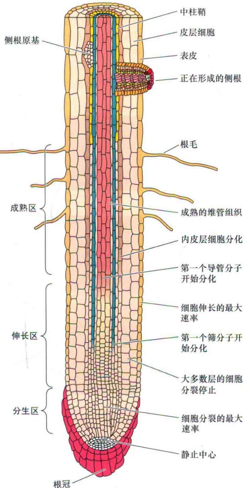  
图16.16 初生根的简图，表明根冠、分生区、伸长区和成熟区。

（1）根冠（root cap）位于根的末端。它是唯一一个位于比分生组织区域更为末端的位置的初始衍生物。它覆盖在顶端分生区上，保护根尖在穿越土壤时免受机械损伤，此外，根冠还可以感知重力，使根具有向重力性，并可分泌一些物质帮助根系穿越土壤和活化无机养分。

（2）分生区（meristematic zone）位于根冠下方，它包含一簇起有原分生组织作用的细胞，这些细胞以极性分裂模式进行分裂，产生的细胞进一步分裂和分化成根的各种成熟组织。分生区的细胞有小的液泡，具有非常强的伸展及分裂能力。

（3）伸长区（elongation zone），细胞快速和显著伸长的区域。尽管伸长区内的一些细胞在伸长过程中仍可继续分裂，但其分裂速度会随着与分生组织距离的逐渐增加而逐渐减慢，直至停止分裂。

（4）成熟区（maturation zone）是细胞获得分化特性的区域。细胞在分裂和伸长停止后进入成熟区，在这个区域侧生器官（如侧根和根毛）开始形成。虽然细胞分化可能在早些时候就已开始，但是细胞在进入这个区域后才达到成熟状态。

在拟南芥中这四个区域仅占据着根尖的前几毫米。尽管在许多其他物种中这些区域会更长些，但生长依旧仅局限在根的末端区域。

## 16.4.2 不同根组织的起源可以追溯到特异的起始细胞

由于根的各组织的发育过程是渐进和线性的，因此可以较为容易地从近顶端区域找到这些组织各自的特化的起始细胞。我们通过观察大多数植物根系的纵切图可以发现，根的长的纵列细胞在近顶端的区域汇合（图16.17A）。位于这个汇合区域中心的细胞比周围细胞的分裂速度都要慢，因此该区域被称为静止中心[quiescent center (QC)]。

能分化成各种不同组织的起始细胞和由邻近QC细胞组成的区域之间的物理联系很紧密，暗示了这些类型的细胞在功能上可能是相互依赖的。有人认为把静止中心和相邻分生组织细胞区分开来多少有些牵强，因为在很多高等植物的根中QC细胞有时在分裂后会取代相邻的起始细胞。基于同样的道理，其他物种的QC与分生组织细胞的关系也不同。在一些高等植物中，QC包含数十至数百个细胞，而且这个数量在植物的生命周期中会发生变化。但在低等维管植物，如水蕨（Azolla）中，位于中心的单个顶端细胞在整个营养生长期都保持着低的且持续稳定的有丝分裂活性，其同时执行了QC和起始细胞的功能（对于此问题的讨论参见Web Topic 16.4）。

与胚胎发生时的细胞分裂模式相似，在不同物种中，QC及其周围起始细胞的特性也各不相同。表明位置依赖机制对指定这些细胞类型起到很重要的作用。与研究胚胎发生过程相似，许多对根发育机制的了解也来自于对模式植物如拟南芥的研究，这是因为在拟南芥中单个细胞的行为可以被监视，拟南芥的根很小，比较透明，而且根细胞数目也较少，易于观察，很适合作为研究根发育过程的材料。

拟南芥的QC仅包含4\~7个细胞，因为拟南芥的QC细胞在胚后发育阶段极少发生分裂，因此很容易识别扰乱QC及其周围起始细胞活性的因素。在拟南芥中有四种不同的起始细胞和QC相邻，可以根据它们的位置和所产生的组织对其分别进行定义（图16.17B）：

（1）根冠柱起始细胞（columella initials）。定位在QC的正下方，这些起始细胞产生根冠的中心部分（根冠柱）。

  
图16.17 拟南芥根的所有组织是由根部顶端分生组织的一小部分起始细胞发育而成的。A. 跨根中心的纵切图。绿色区域是含干细胞的原分生组织，是所有根组织的起源。B. A图的原分生区的图解。在这个纵切面上仅可看到四个静止中心细胞中的两个。粗黑线条所标示的是干细胞发生细胞分裂时的分裂面。白线条表示发生在皮层-内皮层和表皮-侧根冠干细胞中的第二次细胞分裂（引自 Schiefelbein et al., 1997，由 J.Schiefelbein提供，美国植物生物学家协会授权再版）。

（2）表皮-侧根冠起始细胞（epidermal-lateral root cap initials）。与QC相邻，这些起始细胞首先垂周分裂，产生子细胞，子细胞经一次平周分裂成为两列细胞，细胞成熟后转变为侧生根冠和表皮。

（3）皮层-内皮层起始细胞（cortical-endodermal initials）。位于表皮-侧根冠起始细胞的内侧或附近，皮层-内皮层起始细胞先垂周分裂为子细胞，然后再平周分裂形成皮层和内皮层细胞层。

（4）中柱起始细胞（stele initials）。位于QC的正上方（近侧），产生维管系统，包括中柱鞘。

## 16.4.3 细胞切除实验可解释决定细胞身份的定向信号转导过程

为了检验和完善这样一个假说：QC和周围的起始细胞的行为受到位置依赖性信号机制的影响。一系列的实验被用来证实特定的细胞会促使其进入特定的发育过程。通过将正常拟南芥RAM细胞的分裂模式与利用显微聚焦激光束破坏（或切除）一个或更多的特定细胞的植株RAM细胞的分裂模式作比较（van Berg et al., 1995），就可以评估位置信息对细胞命运的影响。

当QC被切除掉时，相邻起始细胞不能正常分裂并且提早分化（图16.17B），表明QC可以产生一种能够维持相邻的起始细胞不发生分化，而且保证它们可以正常分裂的可移动信号。如果切除邻近起始细胞的分化细胞，则会引起起始细胞呈现异常的特性，产生异常的细胞类型。这些实验表明，特定起始细胞的特性依赖于分化程度较高的邻近组织所发出的信号。

## 16.4.4 生长素有助于根顶端分生组织的形成和维持

正像胚胎发育过程中生长素对顶端和基部极性的建立有很大作用一样，令人信服的例证表明其也参与了RAM的定位并调控了RAM的复杂行为。在正常的根中，QC是生长素浓度最高的区域。如果用化学方法改变生长素浓度最高区域的位置，QC的位置也会随之发生改变。相反，如果生长素浓度最高区域消失，植物QC也会缺失（Sabatini et al., 1999; Jiang et al., 2003）。

和胚胎中的情况相似，根中生长素的相对水平在很大程度上是由PIN蛋白的极性分布所决定的。通过观察根不同部位PIN蛋白的分布差异可以预测生长素在根中的流动方向和相对水平。通过建立这些模型发现，根中的生长素源于地上部分和较浅的表层细胞，经过幼苗的中心区域向下运输，最终汇集在QC和根冠柱组织（图16.18）。然后生长素从这些末端区域运送到表层，再向上运输至地上部分。这种流动模式被比拟为一个倒置的喷泉。

A PIN 蛋白的分布图  
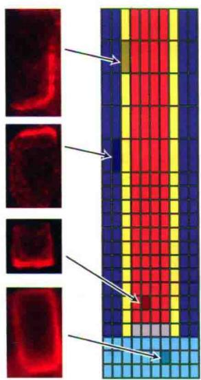  
皮层/表皮
内皮层/中柱鞘
中柱
静止中心
小柱

B 生长素流动的模式图  

C DR5::GFP表达  
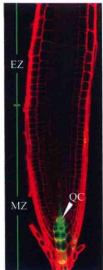  
图16.18 PIN蛋白在根中的分布反映出生长素的流动模式。A. 不同根组织的PIN蛋白（红色区域）的非对称定位。B. PIN蛋白定位模式预测了生长素浓度较高的区域是QC的位置（颜色越深表示生长素浓度相对越高）。C. 通过检测DR5::GFP报告基因的活性来预测生长素浓度分布高低和上述预测是一致的。缩略词：EZ. 伸长区；MZ. 分生区；QC. 静止中心（引自Grieneisen et al., 2007）。

不论是以正常根，还是利用经过物理化学或基因方法扰乱生长素或PIN表达水平的根为材料，通过这种模式来预测生长素水平已经得到普遍的认可（Grieneisen et al., 2007）。总之，这些结果表明在根中生长素极性流动的稳定模式是维持RAM活性的重要因素。

## 16.4.5 根对生长素的响应依赖特异的转录因子

现在已经了解了生长素在根中的梯度分布情况，但还需要进一步解释浓度差异是如何引起下游反应的，包括局部区域细胞的分裂、伸长和分化（图16.19）。至少部分的下游反应与生长素响应因子有关（其受生长素调节的具体机制参见第19章）。当生长素超过临界浓度时，会降解IAA/AUX的阻遏蛋白，IAA/AUX的阻遏蛋白可以和像MONOPTEROS这样的ARF结合，抑制ARF的转录调节活性。与在胚胎发育时期根的形成一样，在植物营养生长阶段MP和其他ARF依旧通过生长素依赖的方式参与维持根的正常生长。

遗传学研究表明，另外一些种类作用于ARF下游的转录因子也参与调节根的生长。其中有两个属于AP2家族的转录因子PLETHORA1（PLT1）和PLETHORA2（PLT2）（Aida et al., 2004），这两个PLT基因在生长素浓度高的QC区域的表达很活跃。PLT基因的突变体则不能形成QC或维持正常的QC功能，表明这些基因正常的转录调节是形成这些部位所必需的。反之，人为增加根近侧区域的PLT表达量则会导致QC的异位（出现错误定位）（Galinha et al., 2007）。这些实验结果共同证明了这样一个模型，生长素作为位置信号诱导特异的转录调控程序，进而介导了形成和维持RAM所需的特有

的细胞行为。

WOX基因编码了第三类参与调控RAM的转录因子家族成员，该家族不仅在RAM中有重要作用，而且在整个植株中都起到很重要的作用。这些基因与WUSCHEL（WUS）基因具有序列同源性，WUS基因是形成SAM所必需的，它们都拥有一个同源的DNA结合基序[WOX的命名是由WUSCHEL和同源域（homeobox）而来]。与PLT基因一样，WOX基因表达也对生长素活性敏感，表现为在mp和bd1突变体（缺少生长素活性）中，WOX基因转录产物的分布会发生变化（Haecker et al., 2004）。在叶芽中，WUS在近顶端区域的表达对于维持未分化的起始细胞具有重要的作用（本章稍后会讨论）。而在根中，WOX5有类似的作用，其参与维持QC周围起始细胞的稳定性（Sarker et al., 2007）。

## 16.4.6 RAM中细胞分裂素的活性是根发育所必需的

尽管我们对于根的生长和发育的讨论集中在生长素方面，但是近期的研究表明细胞分裂素以与生长素相反的功能也参与调节根的生长发育。这两种激素截然相反的功能最早在生理实验中被发现，生长素在地上部合成，由上向下的运输到根部，相反，细胞分裂素在根中合成，向顶端运输到地上部。同样，在组织培养和活体内生长素都能促进根的发育，而细胞分裂素则抑制根的生长，促进叶的生长发育。

尽管已知的细胞分裂素和生长素信号转导通路中所包含的组分有着很大的区别，但可以利用类似的研究方法来有效地研究两种激素的信号通路。已知将DR5与报告基因融合后可检测生长素的活性（详见第19章），而细胞分裂素也可采用相似方法，通过将能被细胞分裂素激活的启动子序列与报告因子GUS和GFP融合来检测CK的活性（Müller and Sheen, 2008）。

  
图16.19 根中细胞类型特化的模型。A. 早期依赖于生长素的MP和NPH4基因的表达。MP和NPH4的表达促进了PLT在基部区域的表达。B. PLT的表达促进了SCR和SHR的表达。C. PLT、SCR和SHR基因的表达使位于中心的细胞成为静止中心，它们能影响周围细胞维持其分生细胞活性（引自Aida et al., 2004）。

这种通过报告基因的方法了解激素活性的实验结果表明，细胞分裂素的信号最早出现在根发育的球形胚时期的胚根原细胞中。胚根源细胞发生分裂后，基部细胞中的细胞分裂素消失，但仍存在于根尖细胞中，根尖细胞进一步分裂形成QC。同时，对连有DR5报告基因的研究表明生长素具有相反的表达模式，表明生长素和细胞分裂素具有相反的活性（图16.20）。

更多的分子和遗传学分析表明基部细胞的细胞分

A TCS::GFP

裂素活性的缺失是由于高的生长素活性直接导致的。ARR7和ARR15两基因抑制了细胞分裂素的作用。这两个基因的启动子中具有生长素的响应元件（AuxRE），它们和DR5报告基因一样，受到生长素的调控。如果人为去掉这些序列，ARR7和ARR15在基细胞中的表达则会降低，进而导致细胞分裂素活动异常。扰乱ARR7和ARR15的表达会导致植物出现异常表型，表明基部细胞中细胞分裂素信号的抑制对正常的发育十分重要。同时发现顶端细胞中存在细胞分裂素活性是必要的，因为细胞分裂素活性的丧失会导致根的结构发生很大变化。

B TCS::GFP  
C ARR7::GFP  
E DR5::GFP  
D ARR15::GFP  
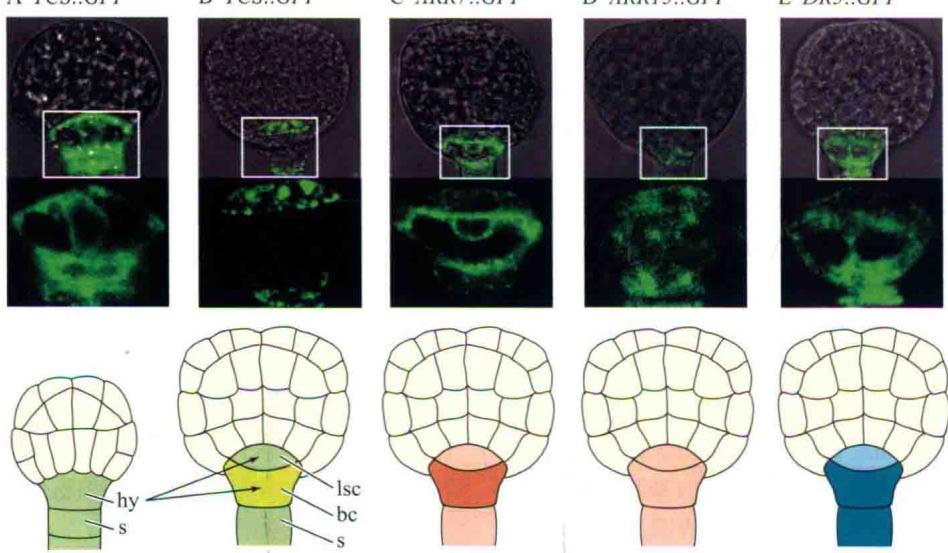  
图16.20 胚胎中生长素的信号和细胞分裂素的信号作用正好相反。A. TCS::GFP（细胞分裂素的报告基因）在球状体形成早期的胚根原细胞中表达。B. 球状体形成后期基部细胞的TCS::GFP表达下调。C. ARR7::GFP在基部细胞的表达量最高。D. ARR15::GFP的表达模式（ARR7 和ARR15能够抑制细胞分裂素的响应）。E. DR5::GFP（生长素的报告基因）在基部表达量最高。中间一列图是顶部图方框所示区域的放大图；底部一列图是相应于顶部一列的模式图注释（引自Müller and Sheen，2008）。缩写：hy.胚根原细胞；bc.基部细胞；lsc.镜型细胞；s.胚柄。

## 16.5 茎顶端分生组织

和根的顶端分生组织一样，茎的顶端分生组织需要有一系列维持未分化状态细胞，使之可以无限生长（图16.21）。但是这两种类型的分生组织也存在有显著差异，这种差异主要体现在它们的后代细胞如何参与新器官的形成方面。如侧根是在根尖相当靠后的位置出现，而叶片和相邻的侧枝则在非常靠近茎顶端起始细胞群的位置形成。此外，位于根尖的包裹并保护根顶端的起始细胞群是根冠，而在茎中相应位置的组织则是覆盖并包裹了茎尖幼嫩的叶原基。

对于描述在茎尖专一发生的一系列活动来讲，特殊的解剖学术语被证明非常有用。在本章中，茎顶端分生组织（shoot apical meristem）特指起始细胞及它们未分化的后代细胞，但不包括那些距顶端较近且已有特定发育命运的细胞。而茎尖（shoot apex, plural apices）则更广义的包括顶端分生组织和大多数刚形成的叶原基。

和我们前面所讲到的胚胎及根的例子一样，随着物种、发育阶段和生长环境等因素的不同，SAM的大小、形状和组成方式也各不相同（Steeves and Sussex, 1989）。在维管植物中，苏铁科植物SAM的个头最大，它的直径可以超过3 mm，而拟南芥的SAM则是另外一种极端，它的直径只有不到50 μm，并且只包含有几十个细胞。然而即使对于特定的植物，SAM的大小也会随着时间而变化，并且它的形状可以在平坦与突起之间转换。这种转换有时是由叶片连续的起始引起的，在这个过程中，位于侧翼的SAM中的细胞已经开始特异的分化。其他的转换原因则是由于生长过程中的季节差异引起的，如休眠及开花的起始。

  
图16.21 番茄的茎尖。这张SEM扫描电镜照片显示了茎尖的基本结构，包括位于中央的圆拱状端区域，其中含有未分化的起始细胞，以及一系列的叶原基（P1、P2、P3），这些叶原基一般位于茎尖的侧面。P4是为了能看到较幼嫩的叶原基而将较老叶片移除后其起始细胞的基部（引自Kuhlemeier and Reinhardt，2001。由D.Reinhardt惠赠）。

下面我们将首先探讨SAM的基本结构，分析与其功能相符的细胞活动在区域上的差别。接下来提供证据来证实，和RAM一样，SAM的维持同样受到激素和转录因子活性的调控。

## 16.5.1 茎顶端分生组织有明显的分区和分层

探讨茎顶端分生组织的细胞组成能为详细描述SAM的生长发育提供有用的框架。茎尖的结构组成可以利用显微技术来进行很好的描述（Bowman and Eshed，2000）。茎尖的纵切面显示其SAM呈带状分区（zonation），带状分区最早用来描述裸子植物SAM组织中存在区域性细胞学差异（Gifford and Foster，1987），后来被扩展到其他种子植物中用来描述细胞分裂时存在的区域差异（图16.22）。

和根中形成QC的细胞类似，在茎顶端分生组织的中央区（CZ），也有一簇很少发生分裂的细胞。外周区域也被称为周缘区（peripheral zone），由胞质密度较高的细胞组成，并且这些细胞分裂活动比较活跃，可以形成后代细胞并最终分化成为侧生器官例如叶片等。处于中央位置且临近CZ的肋状区（rib zone）也含有分裂细胞，并可以形成茎的内部组织（图16.22A）。

这些区域差异除了在分裂频率上具有区别外，在细胞分裂的极性模式上也存在差异。在大多数裸子植物中，这些差异反映出了表皮细胞的分层排列方式，这些细胞层有时被统称为原套（tunica）（图16.22B）。原套是由相邻的一层或多层细胞叠加在一起形成的，其中包括了大多数的原表皮层，每一个原表皮层细胞都源于特定的茎顶端起始细胞，而且每一层的厚度是由占主导地位的细胞垂周分裂所决定（参见下文的讨论）。与此不同的是，原套所包裹的细胞也就是原体（corpus），虽然也是由特定的茎顶端起始细胞分化而来，但是它们可以进行各个方向的分裂。

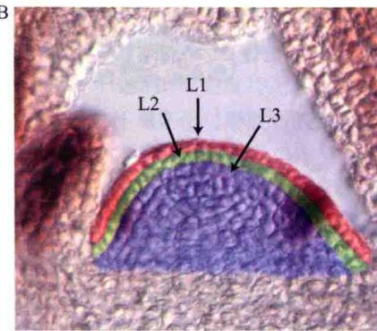  
图16.22 拟南芥茎尖分生组织可以通过细胞学分区或者细胞层来进行分析。A. 茎尖分生组织拥有多个具有不同特征和功能的细胞学分区。中心区（CZ）包含了干细胞，分裂缓慢，但却是形成植物体组织的来源。周缘区（PZ）的细胞分裂速度快，环绕着中心区并能够产生叶原基。肋状区（RZ）位于中心区下面，产生茎的中心组织。B. 茎顶端分生组织具有能够形成特定茎尖组织的细胞层。L1和L2位于外层，多数细胞分裂是垂周方向，而L3层的细胞分裂的平面则更为随机。L1产生茎的表皮，L2和L3层产生内部组织（引自Bowman and Eshed，2000）。

## 16.5.2 茎组织起源于不同的顶端起始细胞

研究表明，和根组织类似，茎组织也是起源于少数的顶端起始细胞（Poethig，1987）。在经典研究中，在茎的顶端施加秋水仙素，可以诱导多倍体细胞形成。这些细胞尽管生长相对正常，但是从其日益庞大的核体积及细胞大小上很容易被辨认出来。通过对秋水仙素处理并生长一段时间的植物的茎尖切片进行观察，可以发现在特定的细胞层出现了大量的多倍体细胞并能延伸到顶端区域。这种现象可以通过每个多倍体细胞层起源于顶端起始细胞簇中的一个细胞的设想来解释。

通过对大量被标记的区域如表皮层和更深层的组织进行研究，证实了在SAM中存在有一系列具有不同功能的起始细胞。茎尖最顶端的起始细胞可以独立繁殖并形成表皮层（L1），相邻的位于内侧的起始细胞形成亚表皮层L2，更为内层的则形成L3层（图16.23）。许多情况下标记细胞仅包围茎周围的某一部分，暗示每层均来源于起始细胞中相对应的一小部分。

在对这些细胞系进行研究后发现，这些起始细胞的特征是由位置依赖的机制来决定的。出现在茎顶端区域的标记细胞有时会出现随着时间的变化在宽度及厚度方面会有急剧变化。这些变化可能是由于随机分裂使得标记的起始细胞被其他细胞取代或者被相邻的起始细胞所取代。这种动力学行为暗示了顶端起始细胞的特征，包括它们的分裂模式，它更多地反映了其在茎尖顶端区域上的相应位置，而不是严格的程序性形成。

与此类似，由起始细胞进化而来的后代细胞同样受到位置依赖特异性的调控。如出现一次比较罕见的平周分裂导致起源于L2的细胞占据表皮层位置的情况，那么这些细胞就会改为采取表皮细胞的特征以适应其新的位置。

## 16.5.3 PIN蛋白的定位影响了SAM的形成

和RAM一样，SAM的形成同样是与胞间生长素运输的复杂多变相关的。在胚胎发育的早期阶段，由于PIN蛋白的极性分布，特别是PIN1，导致生长素在顶端区域聚集，但是在过渡阶段由于PIN蛋白的位置发生了复杂的变化，进而导致生长素发生完全且定向的重新分布。尽管目前对于决定这些变化的因子并不十分清楚，但是已知激酶PINOID和磷酸酶PP2可以改变PIN磷酸化状态，进而影响PIN蛋白的定位（Michniewicz et al., 2007）（见第19章）。

另外，一些编码不同的转录因子家族的基因包括PINOID、DORNROSCHEN和Class III HD-ZIP，破坏它们的基因功能后，其突变体表型分析表明这些转录因子可以间接的影响PIN蛋白的定位（Izhaki and Bowman, 2007；Chandler et al., 2007）。通过解析这些突变体的胚胎发育模式，发现在细胞发育和分裂之前，PIN蛋白均存在不正常分布。

在处于中央位置的顶端区域中，生长素的含量相对较低，这是胚发育过程中生长素运输复杂性的一个方面的体现（图16.24）。离开中央区的生长素与顺着胚的表层向上运输的生长素交汇于正在发育子叶的顶部，从而使此处生长素的浓度最高。这部分生长素继续向下运输进而在子叶汇集，再次形成一处生长素浓度较高的区

  
图16.23 秋水仙素处理后的茎尖，其中一些细胞层包含有体积增大和多倍体细胞核，证明茎尖分生组织中存在特异繁殖系形成的细胞层（引自Steeves and Sussex，1989）。

<!-- END OFFICIAL API PART part_004 -->

<!-- BEGIN OFFICIAL API PART part_005 -->

  
图16.24 依赖于生长素的茎顶端分生组织模式图。A. 转变期和心形期早期的拟南芥胚胎的生长素运输方向（箭头）。B 和 C. 野生型（B）或 CUP-SHAPED COTYLEDON 双突变体（cuc1/cuc2）（C）像 A 图中所示的顶端区域横切面，表明胚胎中的这部分区域将要发展为顶端分生组织、子叶间区、子叶的近轴和远轴区、基轴区。在野生型的胚中，SAM 和子叶间区由于生长素水平较低，因此 CUC 的表达量比较高；而在子叶原基的旁侧区域则正好相反。在 cuc1cuc2 双突变体中，子叶间不能正常分离，因而阻碍了茎尖分生组织的形成（引自 Jenik and Barton，2005）。

域，即前面所述的静止中心。ARF的一种如MP，可以促进维管发育，进而可以最大限度地加强这种直接运输模式。

MP的缺失突变体及和它关系较近的ARF NON-PHOTOTROPIC HYPOCLTYL 4（NPH4）的突变体，不但在一些基础结构例如根上都存在缺陷，而且它们也不能正常的形成子叶（Jenik and Barton，2005）。这两种突变体的表型类似，都能影响PIN蛋白介导的生长素运输，这些结果与生长素反应依赖需要MP、NPH4行使功能的模型一致。

## 16.5.4 胚胎发育阶段SAM的形成需要转录因子的协同表达

尽管已经分离获得在SAM形成及维持过程中起作用的许多类型的重要基因，但是通过筛选不能形成SAM或者不稳定SAM突变体，凸显出三种另外类型的转录因子重要性。其中，编码同源异构型的转录因子WUS（Mayer et al., 1998），在胚胎发育阶段的16细胞期，在接近顶端的区域表达。之后在过渡阶段，编码NAC家族转录因子的CUP-SHAPED COTYLEDON（CUC）1、2、3基因，在正在发育的子叶顶端之间的带状区域表达（Aida et al., 1997）。之前基因相继的活化最终导致SHOOT MERISTEMLESS（STM）编码的另一类转录因子在晚期心形胚中表达，表达位置在CUC表达位置内部的一个圆形区域（Long et al., 1996）。因此，WUS和STM可以帮助细胞维持正常繁殖的状态，并进而确保茎组织生长和分化与形成新的未分化细胞之间处于平衡状态（Lenhard et al., 2002）。

CUC和随后的STM表达，表明在中央区有活性的生长素处于比较低的水平（图16.25和图16.24）。例如，在MP和NPH4的突变体中，由于子叶侧翼位置的生长素信号被阻断，导致CUC在这些区域不能正常表达。对正常发育的胚用生长素抑制剂（图16.6）处理后，同样会显示出与cuc突变体表型相类似的缺陷生长表型（杯状子叶），这就更加证实了生长素在胚胎发育过程中的作用。CUC类似基因在胚中央区的表达，为进一步的程序性发育过程提供了一个有利环境，包括STM基因的位置特异性表达，起初STM在CUC优势表达的条形区域中表达，但随后STM集中在中心的环状区域内表达。此外，在cuc突变体的胚中，STM基因不能表达，这种情况同样是由于STM的表达模式依赖于CUC基因的表达活性所引起的。

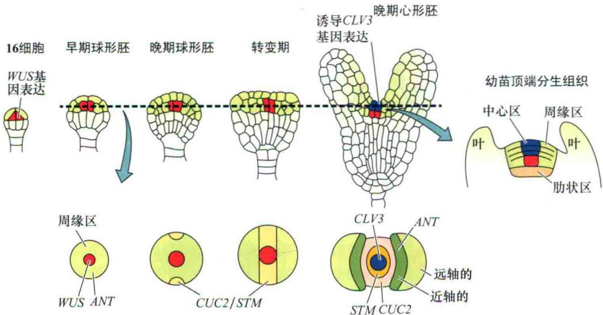  
图16.25 顶端区域的形成涉及相应基因的顺序表达。上排图表明内部的WUS最先表达，进而诱导临近的外部细胞中CLV3的表达。下排图表示在虚线所示平面的横切，并着重强调了子叶和茎顶端不同区域基因的表达模式（引自Laux et al., 2004）。

生长素对WUS早期建立过程的调控作用仍不是很清楚，但是通过对生长素信号被干扰的胚进行研究后发现，有一些WOX相关基因的表达水平发生了改变，表明这些基因的表达模式同样是受生长素调控的（Haecker et al., 2004）。

## 16.5.5 负反馈调控限制了顶端分生组织的大小

在起始的后代细胞开始转变成茎的不同组织和器官这一特定过程中，我们希望能够发现一些新的未分化细胞的产生和由它们分化形成不同类型的组织和器官之间平衡的未知机制。通过对CLAVATA（CLV）1、2、3基因进行分析，至少部分揭示了这种机制，并且正反馈和负反馈调控结合参与了该过程。

上述三种CLV基因的功能研究是首先通过研究它们相对应的拟南芥突变体而实现的，突变体中SAM总体积变大，导致所形成的侧生器官尤其是花器官的数量明显增加，因此很容易被辨别出来（Sharma et al., 2003）。这三个基因的功能缺失性突变体的表型类似，暗示这些蛋白在限制分生组织大小方面的功能存在相互依赖，通过生物化学及分子生物学的分析进一步证实了上述推测。分子克隆结果显示这三种基因分别编码了一个跨膜受体激酶信号复合物的不同组分（图16.26；第

14章有该类受体信号转导途径的相关介绍）。

CLV1编码一个富含亮氨酸重复的激酶（LRR 激酶），包含一个胞外的配体结合区域、一个跨膜区域、一个胞内的激酶区域。已知在植物中有上百种编码此类蛋白的基因，而这种基因的多样性使得细胞可以对不同的胞外信号作出胞内反应。CLV2编码一个类似的蛋白质，但是缺少相应的激酶区。这两个蛋白质的富含亮氨酸区域可以在CLV1和CLV2之间相互作用形成异源二聚体，而这对CLV1酶的活性是必需的（图16.26）。

此外，CLV1/CLV2复合体的激酶活性需要有CLV3基因编码的一个小的分泌蛋白的存在，其可能作为CLV1/CLV2复合物的配体进而行使功能（Rojo et al., 2002）。生物化学分析已经证实，一旦合成开始，水溶性的CLV3蛋白就被分泌到质外体中。由于它的蛋白分子质量比较小（11 kDa）并且具有亲水性，因此CLV3蛋白可以很容易的从质外体中自由扩散，并激活结合在附近细胞表面的受体，进而抑制可能导致分生组织异常增大的一系列进程。

那么有活性的CLV复合体是如何抑制分生组织生长的呢？根据目前大家公认的模型，CLV的活性通过一系列信号级联反应，最终抑制WUS基因的表达，而WUS则是SAM中细胞分裂的关键基因（图16.27）（Schoof et al., 2000）。和这个模型一致的是，在clv突变体中，WUS的表达量增强，进而导致SAM的体积增大。相反如果超表达CLV3则会造成WUS的基因转录完全被抑制，进而导致植物出现wus突变体的表型即分生组织缺失。因此，即使到目前为止，这个信号级联途径的中间成分并不清楚，但是已有证据证实了CLV可以抑制

图16.26 CLAVATA1/CLAVATA2（CLV1/CLV2）受体激酶信号转导级联模型，并与WUS基因形成负反馈循环调节（见第14章的网站资料上关于受体激酶信号途径的更多信息）（引自Clark，2001）。  
  
图16.27 茎顶端分生组织维持起始细胞活性反馈调节环模型

WUS的转录。

前面的研究结果表明了控制分生组织大小的机制，但是这里又出现了一个新的问题：CLV本身限制分生组织的活性是否也受到调节呢？分子生物学研究发现，WUS可以促进CLV3的转录活性，因此WUS的表达不但可以激活顶端起始细胞的活性、促进分生组织生长，而且可以诱导CLV的活性增加，进而通过反馈调节机制限制WUS的转录活性。这个反馈调节机制告诉我们一个简单但又非常重要的事实：未分化细胞的产生与形成特定组织和器官的细胞之间存在一个动态平衡。

## 16.5.6 RAM和SAM以类似的机制维持起始细胞的活性

在对SAM和RAM中起始细胞分析比较后，科学家提出一个问题：它们是否存在一个类似的调控机制。目前已经有几个证据证实了这种可能性的存在。首先，如我们前面所讨论的，SAM和RAM中起始细胞的活性均依赖于WOX转录因子家族的活性：WUS促进SAM中起始细胞的活性，而WOX5能促进RAM中起始细胞的活性。其次，最近的实验结果包括WOX5和WUS的特异表达分析，表明在适当的组织中WOX5和WUS的蛋白功能是可以互换的（Sarker et al., 2007）。最后，有研究证实一些和CLV3相关的小蛋白如果超表达则可以抑制RAM中起始细胞的活性（Fiers et al., 2005）。这些多肽的作用可能和CLV3类似，通过和CLV1/CLV2结合抑制WUS的表达进而抑制SAM的生长。

WUS除了可以增强一些转录因子基因的表达，例如CLV3作为自我限制的反馈调节机制的组成部分，同时，WUS还可以调节相关基因的表达来维持起始细胞处于未分化状态或者促进这些细胞进行分裂。通过将WUS超表达后，利用基因芯片技术寻找转录活性发生改变的基因，就可以鉴定这些受WUS调节的基因（Leibfried et al., 2005）。研究发现，一些可以抑制细胞分裂素应答反应的A型ARR细胞分裂素应答调控因子的转录水平在4 h内发生了急剧降低，暗示WUS可以直接抑制这些基因的转录活性。即使这些蛋白的合成被放线菌酮抑制后，WUS的抑制效应依然存在，说明WUS是直接抑制ARR基因的表达，而不是通过中间调控因子来实现的。利用WUS的抗体可以检测到WUS蛋白和ARR7启动子区形成的复合体存在，说明WUS和ARR基因的启动子区可以直接地相互作用。遗传互补实验证实，人为超表达ARR7基因后可以导致类似wus突变体的表型出现，提供了更多的证据证实了细胞分裂素同样在SAM的维持过程中起作用（图16.28）。

通过分析STM发现细胞分裂素和SAM之间还有更多的联系。植物在部分缺失STM活性时会导致SAM不能很好地维持，但是通过外源添加细胞分裂素可以使SAM恢复稳定状态，表明STM也参与细胞分裂素依赖的信号途径。利用分子生物学实验已经证实了这个假说的正确性，异戊烯基转移酶在细胞分裂素的合成过程中起重要作用，而STM可以促进编码异戊烯基转移酶的基因表达（Jasinski et al., 2005; Yanai et al., 2005）。

总之，多个证据证实在SAM和RAM中细胞分裂素依赖的信号传导途径在维持SAM和RAM二者中未决定起始细胞活性中起重要作用。像中WUS和WOX5这类基因在调控SAM和RAM过程中所显现的明显可以相互变换角色特征，说明根和茎是由一个共同的未知结构进化而来。

  
图16.28 在拟南芥中超表达A型ARR细胞分裂素反应调控因子ARR7可以导致类似wus突变体的表型。A.弱表达ARR7植株表型和野生型类似；B.较高表达ARR7的植株出现了野生型和wus突变体的过渡表型；C.强表达ARR7的植株表型和wus突变体类似；D.wus突变体表型。幼苗刻度为 $1\mathrm{mm}$ ，分生组织为 $100~{\mu\mathrm{m}}$ （引自Leibfried et al., 2005）。

## 16.6 营养器官发生

尽管胚胎发生在植物基本极性和生长轴的建立过程中起重要作用，但植物的其他方面则随着营养器官的发育过程而改变。对于绝大多数植物来说，茎形态建成主要受依赖于确定的侧生器官例如叶片等的产生，不定侧枝的形成及向外生长的共同调节。尽管植物的根系通常不容易见到，但由于不定侧根的受控生长和自然生长，变得和地上部分一样的复杂。下面我们将讨论支撑这些生长模式的分子机制。和胚胎发生类似，营养器官的形成同样也主要依赖于激素活性的区域性差异，它能够导致基因表达在转录水平上发生复杂变化并最终引发营养器官特定形式的发育进程。

## 16.6.1 生长素聚集的区域可以促进叶原基的形成

植物学领域存在的一个长期问题是茎上叶片的排列方式或者叶序（phyllotaxy）是如何形成的，现在已经得到了解决。植物有三种基本叶序排列方式：互生、交替对生（对生）和螺旋状叶序，并且它们都与叶原基在茎尖分生组织出现的类型直接相关（图16.29）。这些生长模式依赖于一些因素的作用，包括不同种中决定叶序特性的固有因素。导致分生组织大小或形状发生变化的突变（如abphyll和clv）或者环境因子也能影响叶序类型，这说明位置特异性机制在其中起重要作用。通过一些经典实验例如在茎尖用手术刀切口后，附近的叶序排列就会处于混乱状态也说明位置依赖的重要性（Steeves and Sussex，1989）。

A 轮生

B 对生

C 螺旋生

  
图16.29 叶沿枝轴方向的三种排列方式（叶序类型）。花序和花也可使用相同的术语进行描述

拟南芥和番茄茎尖实验说明，生长素能影响叶片的起始位置。例如，通过直接向茎尖分生组织施加少量生长素能诱导叶在茎尖不正常的位置形成，这说明生长素是决定叶片起始位置的关键因子（图16.30）。通过施加生长素运输抑制剂也能改变叶片的生长位置模式进一步证明了上面所述的观点。

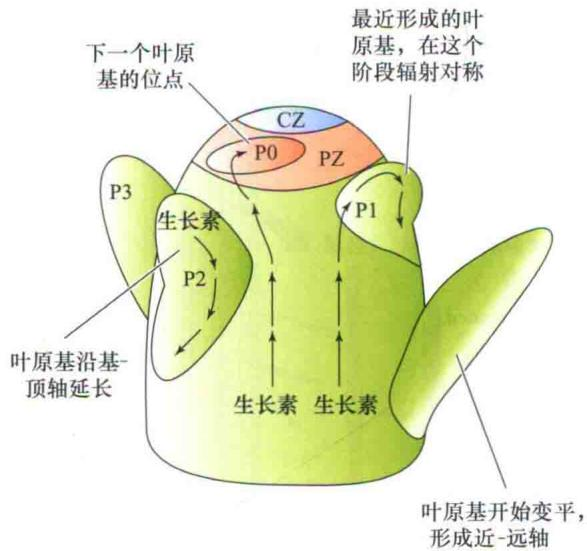

图16.30 叶片形成的位点和生长素的极性运输有关。图中箭头所示生长素运输模式，这个模式是由PIN蛋白的不对称分布而推断的。P0、P1、P2和P3为叶原基的年龄，P0是叶开始明显发育的阶段，而P1、P2和P3代表不断变老的叶。叶原基起始于生长素富集的区域。生长素的向顶运动在中心（CZ）和周边区域（PZ）的边界处被阻断，使得这个位置的生长素浓度升高，进而启动叶发育（P0）。新形成的叶原基（P1）作为一个生长素的库，阻止其正上方新叶的形成。远离PZ的成熟老叶被取代，使得向顶的生长素运输恢复，从而使得另一个叶起始发生（引自Friml et al., 2003）。

目前已经有一些回补实验证实叶原基的位置和生长素聚集的位置相关。尽管在如此小的区域内很难直接检测生长素的水平，但是利用DR5报告基因系统能够确定生长素的最大浓度所在的位置，DR5报告基因的活性与叶原基位置紧密相关。这些高浓度位置的形成可以通过细胞中PIN蛋白的不对称分布来解释，PIN蛋白的不对称分布介导了来自于茎基部的生长素沿表面向下运输和从茎尖侧面运输的生长素在上述高浓度位置的汇合（图16.30）（Reinhardt et al., 2003）。

## 16.6.2 基因表达空间调控决定了叶平面的形式

SAM的侧面开始出现一系列细胞就代表着叶式开始形成的早期步骤。和维管组织的形成类似，对于大多数叶片来说都会形成特有的平面形式，这样能有利于它们最有效地接受光照及促进气体交换，并能够高效地调节蒸腾模式。叶平面结构是如何建立的是一个有趣的问题，通过一系列的实验，科学家逐渐有了答案。

最明显的问题是，叶的平面结构和组织结构有何关系？与茎相似，叶也能用基-顶轴描述，也就是从叶基部指向顶部。但是和茎不同的是，茎的纵切面上只有一个放射状的轴，而叶上有两个：第一个侧轴，指跨越叶片宽度从边缘到另一个边缘；第二个轴称为近-远轴（和动物的背腹轴形成对比），从叶的上表面到下表面。

发育生物学研究揭示了伴随叶平面形成的复杂的细胞分裂模式。最先可以观察到的叶起始标志是SAM亚表皮层细胞的平周分裂，形成了一个决定将来叶片基-顶轴的凸起。接着在整个叶原基上都可以发现细胞分裂，但是随着叶的成熟，细胞分裂逐渐局限于一个更靠近基部的区域。尽管在叶发育过程中可以预测细胞分裂的大致分布，但是在最终成为叶的叶原基中个体细胞的作用存在明显的差异。细胞起源关系能明显区分的植物叶片中可以清晰地看到这种差异的存在（图16.31）。但是这些细胞之间的形状及大小上的差别很难用固定的细胞分裂模式来解释。相反，叶发育的过程必需是由位置差异所决定的，包括大小和形状，稳定的细胞分裂和扩张最终形成特定的方式。

尽管我们已经知道生长素在特定位置的聚集开启了叶子的形成，但是随后的极性生长是如何调控的依然存在许多问题。通过分析叶发育特定方面异常的相关突变体已经给了我们一些启示。其中的一个例子，金鱼草突变体phantastica（phan），起初的叶片发育完全正常，但是在随后的过程中叶片的侧轴无法正常建立，导致出现圆柱形的叶片出现。这种不正常的侧轴生长方式也相应地存在异常的近远轴，并且这些改变的叶片只显示出近端轴的特性（Waites et al., 1998）（图16.32）。

  
图16.31 英国常春藤（Hedear helix）的平周嵌合体叶肉组织源于一种以上的无性系细胞。花斑色叶为不同组织的无性系起源提供了线索。分生组织的一些起始细胞中影响叶绿体发育的重要基因发生了突变，从这些突变的干细胞衍生而来的细胞缺少叶绿体，呈白色。而其他干细胞发育而来的细胞有正常的叶绿体，呈绿色（S. Poethig惠赠）。

通过对果蝇中控制翅膀生长机制的研究，人们提出一个假设：正常的叶片（叶面）的侧向生长是被近端和远端组织类型协同诱导的。根据这个模型，PHAN的主要功能是促进具有近端轴组织的形成。而分子生物学研究发现，PHAN和拟南芥的ASYMMETRIC LEAVES I（AS1）基因类似，编码一个MYB家族转录因子。至少它的部分功能是可以下调KNOX家族基因的表达，而KNOX已经证实在SAM的形成过程中具有重要作用。

叶原基中KNOX表达量的下调对于正常叶子的形成是必需的。一旦下调被阻断就会导致叶子的正常极性生长受到障碍，例如，phan和as1突变体中会导致不正常叶子的形成，同样，在阻止KNOX表达量下调的突变体叶子中也有类似表型的存在。

与能特化近轴面细胞类型的PHAN和AS1基因相反，YABBY基因家族对于远轴面特性细胞的特化非常重要（Bowman and Eshed，2000）。YABBY基因家族成员编码很可能起转录因子作用的锌指蛋白。该基因家族第一个被鉴定出来的成员CRABS CLAW（CRC），是通过它的拟南芥功能缺失突变体的表型鉴定出来的，该突变体的心皮组成发生了混乱（图16.33）。

综合对多个拟南芥YABBY基因家族成员突变体的研究可以得出更多关于该家族基因的功能特征。这些多突变体均表现出远轴特征被近轴代替，引起花和营养器官表现出似叶缺陷，表明YABBY家族的成员在功能上存在冗余。过表达YABBY基因会导致突变体植物的远轴组织的异常形成，进一步说明远轴端促进YABBY基因的活性。

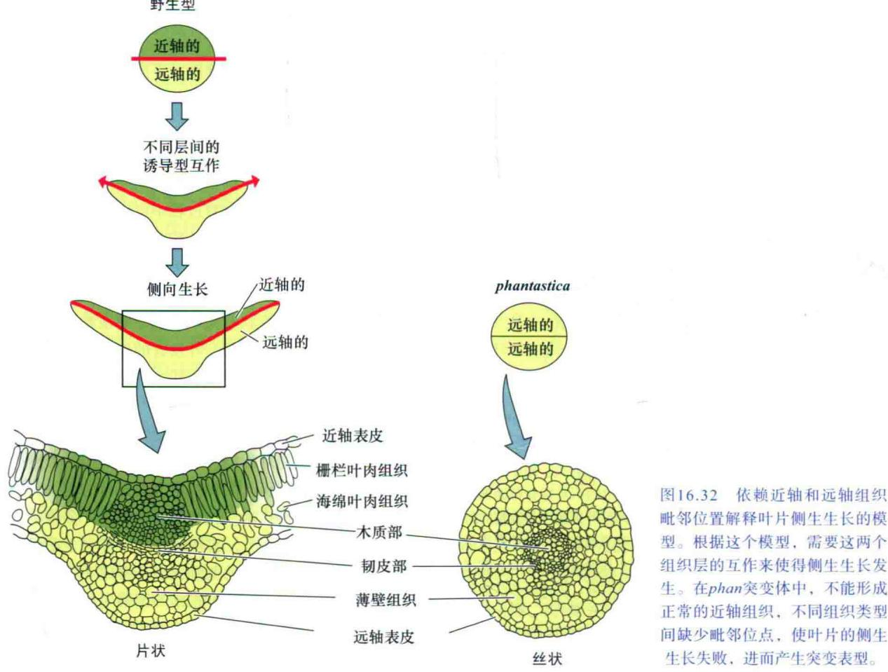  
近轴表皮
栅栏叶肉组织
海绵叶肉组织
——木质部——
——韧皮部——
——薄壁组织
远轴表皮

  
野生型  
crc-1  
crc-1 kan1-2  
kan1-2 kan2-1

远轴细胞特化所需要的第二类基因以KANADI基因家族为代表（Eshed et al., 2004）。与YABBY家族相类似，KANADI基因间也存在功能冗余。当观察这些基因的多重缺失突变体时，发现远轴特征明显消失（图16.33）。过量表达KANADI时也可以观察到远轴组织异常形成的表型。

图16.33 正常近远轴极性的建立需要YABBY和KANADI基因。野生型和这两个基因家族成员的单、双突变体的果荚比较解释了正常组织的极性建立是如何依赖于这些基因活性。其极性建成需要这些基因的参与。突变体crabs claw（crc）为YABBY基因缺陷型突变体。在突变体中，远轴面组织（种皮或者荚果）被胎座组织不同程度的替代，包括胚珠通常应在形成荚果的心皮内表皮找到（引自Bowman et al., 2002）。

第三类参与近远轴形成的转录因子基因编码Class III HD-Zip蛋白（参见网络章节16.5）。

## 16.6.3 根和茎起始的不同机制

我们已经知道，侧根从离根尖分生组织一定距离的地方才能开始发育（Malamy and Benfey，1997）。只有当来自RAM的细胞停止伸长时，侧根起始组织才开始出现。根起始的第一个组织学标记是中柱鞘中一小簇细胞的平周分裂（见第1章），导致了更多的分裂及在与主根轴垂直平面上的生长，至新根尖突破表皮和主根皮层而长出。同时，一个新的RAM在侧根根尖形成，使自己保持持续性生长（图16.34）。侧根的形成和生长的类型受多种内源因子影响，如生长素浓度及土壤可用性营养等环境因子的影响。

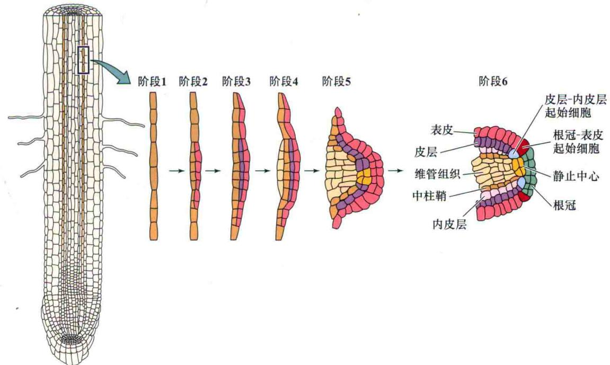  
图16.34 拟南芥侧根形成的模型。表明原基发育的6个主要阶段。不同组织用不同的颜色标示。到了阶段6，主根所有的组织都能在典型的侧根辐射模型中找到。

茎侧生器官起始的方式则完全不同。茎的侧生器官通过整合几层不同来源的细胞系而生成，而不是只来自于内层的一层细胞。在大多数物种里，侧枝形成的主要方式是通过腋生分生组织而实现。这些分生组织在叶原基的叶腋处发育，这样分枝形成的类型直接与调控叶序的SAM活性相关。和根一样，侧枝的生长受激素及环境因子（如光）的调控。顶端优势的现象，也就是顶芽抑制腋芽的生长，主要是由顶芽的生长素和一个第二信使类胡萝卜素裂解物的独角金内酯调控，我们将在第19章深入讨论激素控制的侧枝形成。

## 16.7 衰老和细胞程序性死亡

每个秋季，居住在温度适宜的地区的人们都可以欣赏到落叶的五颜六色。甚至从航天飞行器上也可以欣赏到壮观的森林颜色的变化。日照长短的变化和气候的变冷，引发了叶衰老，进而使得叶子改变了颜色。衰老（senescence）和坏死（necrosis）不同，尽管它们都能导致死亡。坏死是由于机械性损伤、毒害或者其他外伤引起的死亡。但是，衰老却是一种能量依赖的发育过程，由环境因子和植物自身的遗传程序所控制。

在本章的最后一个小节里，我们讨论不同类型衰老的细节，而且我们将提供更多的证据来证实衰老是程序性和适应性的发育模式。我们将从分子和遗传水平讨论衰老的例子。

## 16.7.1 叶衰老是一种适应性和严格调控的过程

叶衰老是细胞内容物的程序性降解进而导致营养元素再运输的过程。在衰老过程中，水解酶分解许多细胞蛋白质分子、碳水化合物和核酸。糖、核苷酸和氨基酸等营养成分可通过韧皮部转运回植物体，并重新用于合成过程。许多矿物质也被运出衰老的器官并重新运回植物体的其他部位。既然衰老使得营养元素被转运回植物正在生长的部位，那么这可以被认为是植物在干旱或者温度胁迫等不同环境条件下的一种生存策略。

不仅是对于胁迫的一种应答，衰老也反映了正常的发育过程。当新的叶片从茎尖分生组织开始形成，老叶就逐渐被遮蔽并丧失了有效进行光合作用的能力。叶子的衰老通常和脱落（abscission）相关，这个过程是叶柄中的特定细胞分化而形成一个脱离层，使得衰老的器官从植物体脱落。在第22章我们将讨论乙烯对于脱落的控制。总之，程序性衰老（无论是胁迫或者激素引起）代表着有用资源在新叶的形成过程中的再利用。

营养元素的再运输在衰老的早期过程是可逆的，而在后期则是不可逆的。尽管衰老器官的营养元素可以在植物的其他部位被重新利用，但是衰老意味着潜在能量的流逝。因此，我们可以推测衰老的起始是受环境因素和生长发育因素复杂调控的。本节我们将揭示衰老在植物生长发育过程中的重要作用。我们将会看到许多种类型的衰老，并且它们各自都有自己所独特的遗传程序。在第21章和第22章，将描述细胞分裂素和乙烯如何作为信号分子来调控植物的衰老。

## 16.7.2 衰老的不同类型

不同的器官均能出现衰老症状，并能对多种不同的信号作出响应。许多一年生的植物，包括小麦、玉米和大豆等主要的农作物，在结实后都会迅速变黄并死亡，即使在最优的生长环境中也是如此。一次繁殖后整株植物的衰老称为一次结实性衰老（monocarpic senescence）（图16.35）。

  
图16.35 大豆（Glycine max）的单次结实性衰老。左侧的整株植物在开花和结果（荚）后走向了衰老。右侧的植物由于花的持续摘除，而保持绿色和营养生长（L. Nooden惠赠）。

其他的衰老类型如下：

（1）草本多年生植物地上枝的衰老。

(2) 季节性叶片衰老（落叶植物）。

（3）程序性叶片衰老（当达到一定叶龄后死亡）。

（4）肉质果实的衰老，干果的衰老。

(5) 储存性子叶和花器官的衰老。

（6）特定细胞类型的衰老（如毛状体、管胞和导管分子）。

不同类型衰老的触发原因是不同的。可能有内源因素，如引发一次结实性衰老的繁殖过程，也有可能有外部因素如落叶植物在秋天叶片衰老的原因是日照长短和温度。但不论是哪种起始刺激因子，不同类型的衰老之间可能有着共同的内在程序，使某种可受调控的衰老基因起始了一个级联的次级基因表达，最终导致衰老和死亡。

由于衰老在农业生产和农作物果实的储存方面有着重要的意义，因此在过去的年代里如何调控衰老吸引了大家的注意力。这里我们将模式植物拟南芥作为一个重要的模式物种。利用两种互补的方法研究了衰老调节的遗传因素：①研究在衰老过程中表达量上调的基因；②研究那些突变或者异位表达后能改变衰老表型的基因。

在衰老起始后许多基因的表达都发生了急剧的改变。光合作用相关基因的表达被减弱是意料之中的结果，但在同一时间有上千个基因的表达量却获得了增加。这些基因被命名为衰老相关基因（SAGs），包括那些涉及降解过程的转录因子及基因。SAGs包括编码水解酶的基因，如蛋白酶、核糖核酸酶和脂酶等，以及涉及乙烯生物合成的酶类如ACC合成酶和ACC氧化酶（见第12章）。其他的SAGs在衰老的过程中扮演着其他的作用。这些基因编码了涉及分解产物的转化和重新运输的酶，如谷氨酸合成酶，它能催化从铵到谷氨酸的转化，并负责衰老组织中的氮的再循环。果胶酶对叶子的脱落和果实成熟过程中细胞壁的降解非常重要。

一些重要的发现阐述了衰老调节的复杂性：

（1）环境因素。例如，随着季节变化，日照长短和温度的变化能够影响落叶植物的衰老，而胁迫包括病原菌和温度胁迫能诱导许多植物种类叶片的衰老。

（2）激素控制的衰老过程。乙烯长久以来被认为可以诱导衰老，而细胞分裂素则抑制衰老。乙烯感受缺陷的突变体其衰老明显延迟，同样，增强细胞分裂素感受突变体同样其衰老延迟。另外其他的一些植物激素同样可以对衰老过程进行调控。

（3）氧化胁迫能够破坏蛋白质和细胞结构。许多植物细胞的胞内损害积累会诱导衰老的发生。但是植物具有解除活性氧毒害的能力。因此氧化胁迫更多的是作为一种信号分子而不是直接引发脱落和随后的衰老过程。

（4）新陈代谢状态调控了叶片衰老。衰老过程中糖类的聚集，其中糖的受体己糖激酶起了主要作用。

（5）大分子的降解可以通过多种方式影响衰老过程。拟南芥泛素依赖的蛋白降解突变体的衰老会出现延迟。这个结果暗示衰老综合征抑制蛋白被特定蛋白酶体降解后会诱导衰老发生。而当衰老起始后衰老过程本身就包括了大量大分子物质的降解。

（6）固有的发育因素在生长发育早期衰老被抑制，而在后期则诱导衰老起始。因此衰老是依赖于年龄变化的。即使在处于比较恶劣的环境或者外源施加能够诱导衰老的植物激素乙烯，幼嫩的叶子也不会发生衰老。然而到目前为止并没有发现能够一直呈现绿色叶子的突变体或者环境因素。

图16.36总结和揭示了调控叶衰老的大致框架。

环境因素、胁迫和新陈代谢及激素水平能影响衰老的起始，但是它们的缺陷在于不能单独诱导衰老的起始。只有结合存在一些其他因素或者某种信号达到足够高的水平时衰老的起始才能被诱导。因此植物必需有一套机制能够整合相关的信号并将诱导衰老信号传入下一个步骤，如通过检测植物固有的发育因素和年龄变化（如叶片是否到达一定的年龄）来决定衰老是否发生。类似的是，到达一定年龄后或者对于一次结实性衰老一旦开始结出果实，就能够诱导衰老的发生。

图16.36的模型揭示了植物如何整合多种因素，并最终决定采用何种方式更有益：是组织自我牺牲进而将营养元素再运输，还是继续具有光合活性并通过产生同他产物来促使植物生长。最需要解决的问题在于固有的发育因素和年龄相关的变化有哪些，以及叶片如何整合这些不同的环境因素和发育因子进而来调控衰老过程。

## 16.7.3 衰老涉及潜在的光毒性叶绿素的有序降解

衰老通常伴随着细胞内容物发生变化。在细胞学水平上，一些细胞器受到损伤而另外一些则保持有生物活性。在叶衰老过程中叶绿体是第一个衰老的细胞器，它的类囊体蛋白成分及基质的酶类会被破坏。叶绿体的这种程序性降解需要有功能的细胞或细胞核保持完整结构和功能，直到叶衰老的后期阶段。叶绿体的降解对于营养元素的再运输非常重要，因为叶绿素结合蛋白可以提供整个细胞20%的氮元素，但是叶绿体的降解能够释放潜在的光毒性叶绿素。因此需要一种精细机制使叶绿素排列在膜上。

通过研究所谓的常绿突变体解释了叶绿素的降解途径。现在已经鉴定出两种不同类型的绿色维持的突变体：功能型绿色维持的突变体维持有光合作用的能力，而且相对野生型来说绿色的时间维持得更长。但其细胞内容物的降解过程与野生型一样。后一种则为非功能型绿色维持的突变体虽然也比野生型绿色维持的时间更长，但其在叶绿素的降解方面是不正常的。玉米突变体lls1（for lethal leaf spot 1）和拟南芥突变体acd1（for accelerated cell death 1）最初被认为在抵御病原菌入侵方面存在缺陷，因为其仅在遇到病原菌后会出现致死表型。但是当处于暗处理的情况下，突变体的叶子却能维持绿色。分子克隆技术揭示了这两个基因编码参与叶绿素降解的酶。

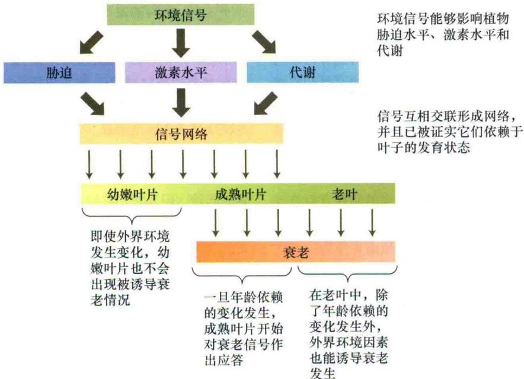  
图16.36 在整个生长发育期，外界环境因子调控叶衰老的模式图。

## 16.7.4 程序性细胞死亡是一种特化的衰老类型

衰老可以发生在整株植物水平，如一次结实性衰老，也可以发生在器官水平或者细胞水平，如维管分子的衰老。细胞个体激活其内在的衰老过程叫做程序性细胞死亡（programmed cell death，PCD）。PCD在动物发育中起着重要的作用，其分子机制已被广泛研究。PCD能被特定的发育信号或潜在的致死事件诱导，如病原体攻击或细胞分裂时DNA复制的错误。它包含一组特定基因的表达，协调细胞成分的分解，最终导致细胞死亡。动物中PCD通常伴随着一系列形态学和生物化学方面的改变，也就是细胞凋亡（apoptosis）（apoptosis一词来自于希腊词汇，意味着脱落，像秋天的叶子一样）。在细胞凋亡过程中，细胞核凝聚，由于核小体间DNA的降解导致核DNA片段化。

对植物中PCD的了解远少于动物（Pennell and Lamb，1997）。一些植物细胞，特别是位于衰老组织部位的细胞，显示出和动物细胞中PCD类似的形态学变化。木质部导管分子衰老时，细胞核和染色质降解，胞质消失。这些变化是由于编码核酸酶和蛋白酶基因被激活而引起的。

植物中PCD的另一个重要功能是对抗病原体生物。当一个病原生物感染植物后，来自病原体的信号使被感染部位细胞迅速积聚高浓度的有毒的酚类物质而死亡。

死亡的细胞形成了一个小的细胞死亡环形岛，称为枯斑，它能够隔离感染部位并阻止其扩散到周围正常的组织。这种基于病原体攻击的快速定位的细胞死亡称为超敏反应（见第13章）。拟南芥突变体甚至在没有病原体存在时，能模仿感染效果，并触发整个级联反应，导致枯斑形成，证明超敏反应是一个可遗传的程序化过程，而不是简单的枯死。

位置依赖性机制能够直接影响植物的发育，例如胚发育过程中极性的建成，根和茎分生组织的维持及叶片的形成。

## 小结

通常位置依赖性机制决定了植物生长发育的进程，例如，正在发育的胚其极性的建立、根和茎分生组织的维持和叶片的形成。

## 植物生长和发育总览

· 分生组织细胞处于未分化状态，并且在植物生长和发育过程中起核心作用（图16.1）。

· 植物发育过程含有三个重要阶段：胚胎发生、营养生长和生殖生长（图16.2）。

## 胚胎发生：极性的起源

· 在种子植物中，顶部-基部极性在胚胎发生早期就已经建立（图16.3和图16.4）。

· 位置依赖性信号引导胚胎发生（图16.5）。通过对拟南芥突变体进行研究已经证实一些进程不单单是细胞分裂按照固定顺序进行，还必须指导辐射模式形成

(图16.6)。

· 生长素（indole-3-acetic acid）作为一种可移动的化学信号可能在胚胎发生过程中起作用（图16.7、图16.8和表16.1）。

· 通过筛选幼苗缺陷型突变体已经揭示了对于正常顶部-基部模式建立所需要的基因及其功能（图16.9）。

· 辐射模式引导了层状组织的形成（图16.10）。两个拟南芥基因是形成正常表皮所必需的（图16.11）。内部组织包括维管组织和皮层的形成需要不同基因的参与（图16.12\~图16.14）。

· 分生组织：无限生长型的基础。

\- 根和茎分生组织利用相似的机制使得植物可以无限生长。

· 顶端分生组织的形成和维持与受调控的激素活性模式有关。

## 根顶端分生组织

· 不同的根组织起源于4种不同类型的起始细胞（图16.17）。

· 在PIN蛋白作用下，生长素向下运输到达根部，并且在QC和中柱组织中进行集中（图16.18）。

· 在QC中生长素高度集中，并激活一系列转录因子（图16.19）。

\- 细胞分裂素在来源于胚根原的两个细胞的顶-基轴建立的过程中起着与生长素相反的作用（图16.20）。

## 茎顶端分生组织

· 茎顶端分生组织和根顶端分生组织在结构上存在差异（图16.16、图16.21和图16.22）。

· 茎组织是由不同的顶端起始细胞分化而来（图16.23）

· PIN蛋白的定位决定了SAM中生长素的含量，它能够引导生长素从起始处运离和触发叶原基形成（图16.24）。胚胎发生阶段SAM的形成需要转录因子的协同调控和负反馈调控，以便于促进细胞增殖（图16.25）。

\- CLV蛋白激酶通过抑制WUS基因的表达进而限制细胞增殖（图16.26和图16.27）。

· 在SAM和RAM中，细胞分裂素帮助未分化细胞群体数量保持稳定（图16.28）。

## 营养器官形成

· 叶序类型是和叶子形成模式直接相关的（图 16.29 和图 16.30）。

· 特异基因表达在时空上的调控决定了叶平面的形式（图16.32）。

· YABBY和KANADI基因家族成员对正常远轴形成是必需的（图16.33）。

· 根和茎起始的机制不同（图16.34）。

## 衰老和细胞程序性死亡

· 衰老和细胞程序性死亡是可控并且有序的过程，在这个过程中发生了细胞和生物化学上的变化，并为营养元素的再循环做准备，以便有益于未来的发育进程。

· 植物显示出不同类型的衰老现象（图16.35）。

· 多种信号包括内部和外部信号，整合在一起共同调控衰老（图16.36）。

(刘 浩 王 伟 艾鹏慧 译)

## WEB MATERIAL

Web Topics

16.1 Embryonic Dormancy
The ability of seeds to lie dormant for long periods and then germinate under favorable conditions reflects the activity of complex physiological programs.

16.2 Rice Embryogenesis
Embryogenesis in rice is typical of that found in most monocots, and is distinct from that of Arabidopsis.

16.3 Polarity of Fucus Zygotes
A wide variety of external gradients can polarize the growth of cells that are initially apolar.

16.4 Azolla Root Development
Anatomical studies of the root of the aquatic fern Azolla have provided insights into cell fate during root development.

16.5 Class III HD-Zip Transcription Factors Promote Adaxial Development through a microRNA-Sensitive Mechanism Molecular genetic analyses of an important family of transcription factors have clarified their role in establishing adaxial identity.

16.6 During Senescence Photoactive Chlorophyllide Is Converted into a Colorless Chlorophyll Catabolite The biochemistry of chlorophyll breakdown is described.

Web Essays

16.1 Division Plane Determination in Plant Cells
Plant cells appear to utilize mechanisms different from those used by other eukaryotes to control their division planes.

16.2 Plant Meristems: A Historical Overview
Scientists have used many approaches to unraveling the secrets of plant meristems.
