## 第 17 章

# 光敏色素和光调控的植物发育

大家曾仔细观察过所食用的三明治吗？是否想知道其中的豆芽为什么会长成那个样子吗？大多数食用的苗芽（如紫色苜蓿和绿豆芽）是在黑暗中萌发和生长的，在暗处它们经历了一种被称作暗形态建成（skotomorphogenesis，skoto在希腊语中表示“黑暗”）的特殊生长发育过程，由此形成了茎细长、子叶卷曲、不能积累叶绿素的黄化苗（etiolated seedling）（图17.1）。现在，假设这些三明治中的幼苗生长在土壤中，你可以想象，这些幼苗延伸的茎推动幼嫩的子叶破土而出，呈现出钩状顶端（图17.1D）。幼苗出土后，其子叶（双子叶植物）或其胚乳（单子叶植物）中所贮存的有限能量几乎消耗殆尽，幼苗必须开始制造自己所需的食物。

从暗形态建成到光形态建成（photomorphogen-esis）的转化是一个迅速而复杂的过程。暗中生长的豆芽经一束较弱的闪光照射，数小时内即可发生若干发育改变，如茎的伸长速率下降、钩状弯曲开始伸直及绿色植物特有的色素开始合成等。因此，光作为信号可诱导幼苗的形态变化，即由适应地下生长，到适应地面生长（有效捕获光能，并把光能转化成植物生长、人类及植食性动物生活所必需的糖类、蛋白质和脂类）。

在促进植物光形态建成的各种色素中，最重要的是那些负责吸收红光和蓝光的相关色素。与保卫细胞和向光弯曲相关的蓝光受体将在第18章专门阐述。本章论述的重点是光敏色素（phytochrome），该色素是一种以吸收红光和远红光为主，同时对蓝光也有一定吸收的色素蛋白。从本章和第25章我们可得知，光敏色素在光调控的植物营养生长和生殖生长中起关键作用。

我们首先从光敏色素的发现和红光\远红光可逆现象谈起，接着我们从引起生理反应所需不同光量和波长对光敏色素进行分类，然后论述光敏色素的结构特性，以及光诱导的光敏色素构象的变化。光敏色素多基因家族所编码的色素蛋白可调控植物的不同反应过程。近年来，人们在光敏色素反应的分子研究方面已取得了巨大进展，鉴定了几个相互作用的成员。最后将探讨光敏色素在确保植物适应多变环境过程中的生态功能。

## 17.1 光敏色素的光化学和生物化学特性

光敏色素是一种分子质量约为125 kDa的蓝色色素蛋白，由于蛋白分离和纯化技术的限制，直到1959年才确定了它独特的化学组分。然而，人们在更早时间就已在整株水平上研究过光敏色素的诸多生物学特性。

有关光敏色素在植物发育过程中作用的研究，最早开始于19世纪30年代关于红光诱导的形态建成反应，尤其是在种子萌发方面。这些反应目前在植物发育过程中广泛存在，许多不同种类绿色植物整个生活史的各个时期，几乎都存在其中的一种或多种光形态建成反应（表17.1）。

光敏色素研究史上一个关键性的突破是发现红光（650\~680 nm），对形态建成的效应可被接下来照射的（710\~740 nm）远红光所逆转。这种现象首先是在种子萌发过程中得到证实，后来又在茎、叶的生长及开花的诱导等过程中发现（见第25章）。1935年，人们最早发现了红光能促进莴苣种子的萌发，而远红光能抑制其萌发

A 光下生长的玉米  
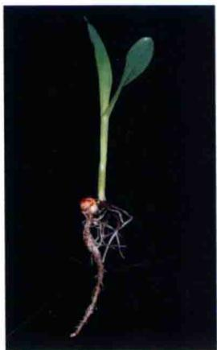

B 暗中生长的玉米  
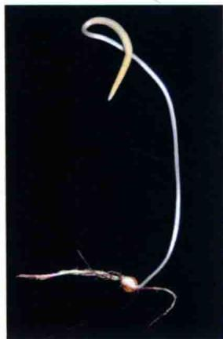

C 光下生长的芥菜  
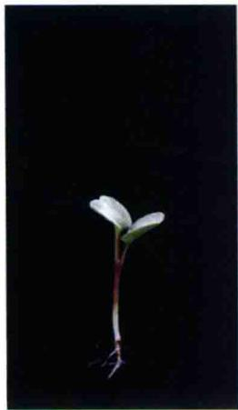

D 暗中生长的芥菜  

图17.1 玉米（Zea mays）（A和B）和芥菜（Mustard, Eruca sp）（C和D）幼苗在光下（A和C）或暗中（B和D）的生长。单子叶植物玉米的黄化特征包括缺绿、叶变窄、叶卷曲、胚芽鞘和中胚轴细长等。双子叶植物芥菜的黄化特征包括缺绿、叶小、下胚轴伸长，顶端呈钩状弯曲（图片A、B由Patrice Dubois提供；图片C、D由David McIntyre提供）。

表17.1 不同高等植物和低等植物的光敏色素所诱导的典型的光可逆反应

<table><tr><td>分类</td><td>属</td><td>发育阶段</td><td>红光的效应</td></tr><tr><td rowspan="5">被子植物</td><td>莴苣(Lactuca)</td><td>种子</td><td>促进萌发</td></tr><tr><td>燕麦(Avena)</td><td>幼苗(黄化的)</td><td>促进去黄化(如叶子的展开)</td></tr><tr><td>芥菜(Sinapis)</td><td>幼苗</td><td>促进叶原基的形成、原叶发育、花色素苷的生成</td></tr><tr><td>豌豆(Pisum)</td><td>成体</td><td>抑制节间伸长</td></tr><tr><td>苍耳(Xanthium)</td><td>成体</td><td>抑制开花(光周期反应)</td></tr><tr><td>裸子植物</td><td>松树(Pinus)</td><td>幼苗</td><td>增强叶绿素积累率</td></tr><tr><td>蕨类植物</td><td>敏感蕨(Onoclea)</td><td>幼年配子体</td><td>促进生长</td></tr><tr><td>苔藓植物</td><td>苔藓(Polytrichum)</td><td>出芽</td><td>促进质体复制</td></tr><tr><td>绿藻门</td><td>藻类(Mougeotia)</td><td>成熟配子体</td><td>促进叶绿体向弱光处移动</td></tr></table>

（Flint and Mcalister，1935）。但实质性的突破是在多年后的1952年，当莴苣种子暴露在交替变化的红光\远红光下，最后一次用红光处理的种子萌发率接近 $100\%$ ，而最后一次用远红光处理的种子萌发受到严重抑制（图17.2）（Borthwick et al., 1952）。这一重要实验说明，红光和远红光诱导的反应不仅仅是相反的，而且也是相互拮抗的。

对上述结果存在两种可能的解释，一种是认为植物中存在两种色素，吸收红光的色素和吸收远红光的色素，这两种色素以相互拮抗的方式调控种子萌发；另一种认为植物中存在两种形式可相互转化的单一色素：红光吸收型和远红光吸收型（Borthwick et al., 1952）。人们选择了单一色素模式，这也是二者中更为激进的一个想法，因为当时人们还没有发现过这种光可逆的色素。几年后，人们首次在植物中提取到了光敏色素，并在体外实验中，验证了它独特的光可逆特性，从而证实了该假设（Butler et al., 1959）。

  
黑暗

  
红光

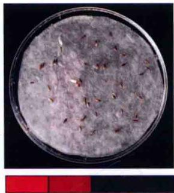  
红光 远红光

  
红光 远红光 红光

  
红光 远红光 红光 远红光  
图17.2 莴苣种子萌发是光敏色素调控的典型光可逆反应。红光促进了莴苣种子的萌发，但这种作用可被远红光所逆转。吸涨（水浸泡）的种子经红光/远红光交替处理，光处理的效应依赖于最后一次照光处理。最后一次远红光处理后只有极少数种子萌发（图片由David McIntyre提供）。

## 17.1.1 光敏色素的红光吸收型（Pr）和远红光吸收型（Pfr）之间的相互转化

在暗中生长或黄化的植物中，光敏色素以红光吸收型（Pr）存在，这种蓝色的非激活型可被红光转化为蓝绿色的远红光吸收型（Pfr）。反过来，远红光照射后，Pfr可转化成Pr，这就称之为光逆转性（photoreversibility），这种转变或逆转是光敏色素的最显著的特性，可以概括为

$$
\mathrm{Pr} \xrightarrow [ \text {远红光} ]{\text {红光}} \mathrm{Pfr}
$$

Pr和Pfr这两种形式的相互转变在体内和体外实验中均可被检测到。实质上，体外实验所纯化的光敏色素的大多数光谱性质（如吸收光谱和光可逆性）与体内实验所检测到的光敏色素的光谱性质相同。

值得注意的是，并不是所有光敏色素在受到红光或远红光照射后全部转化成Pfr或Pr型，这是因为Pfr和Pr型的吸收光谱有重叠。因此，当Pr分子暴露在红光下时，它们中的大多数吸收光子转变成Pfr，但是由此产生的Pfr中的一部分吸收红光又转化成Pr（图17.3）。饱和红光照射后，Pfr型在整个光敏色素中约占88%。与此相似，Pr也能吸收极少量的远红光，因此并不能通过宽波谱远红光使所有Pfr转化成Pr，而是达到98%Pr和2%Pfr的平衡，这个平衡被称之为光稳态

( photostationary state )。

两种形式的光敏色素除吸收红光外，还吸收蓝光光谱中的光（图17.3）。因此，蓝光也具有激活光敏色素的效应，它能使Pr和Pfr相互转变。蓝光反应可由一种或多种专一蓝光受体所介导（见第18章）。光敏色素是否参与蓝光反应，通常利用远红光能否逆转该反应来判断，因为远红光只能逆转光敏色素所诱导的反应。

## 17.1.2 Pfr是光敏色素的生理激活型

光敏色素的反应可被红光诱导，理论上讲这些反应的发生是由于Pfr的出现或Pr的消失所致。在大多数情况下，光诱导的生理反应的幅度与产生Pfr的数量存在定量关系，而生理反应与Pr的消失不存在这样的关系。这些证据表明，Pfr是光敏色素的生理激活型。

窄波段红光和远红光的应用是发现和最终分离光敏色素的关键。自然环境下生长的植物，不可能像实验室内那样，在严格控制的红光或远红光条件下生长，自然界中的植物生长在一个较宽波谱的光下，在这种情况下，光敏色素必须发挥其功能来调节植物的生长发育以适应外界光环境的变化。正如图17.3所示，植物树冠本身能对到达具体植物及其叶片的相关光的光质和光量产生很大的影响。

  
图17.3 纯化的燕麦光敏色素Pr（红线）和Pfr（绿线）型吸收光谱相互重叠。在树冠的顶端，可见光（蓝线）分布相对均匀，但是在树冠的下层，光敏色素吸收了大部分的红光，使大部分的远红光透射进来。黑线表示了光照射通过叶片后的吸收光谱。因此Pr型和Pfr型的相对比例由植物受到遮阳的程度来决定（引自Kelly and Lagarias 1985，感谢Patrice Dubois）。

## 17.2 光敏色素诱导反应的特点

从反应种类（表17.1）和诱导反应所需要的光强来看，整个植物界中广泛存在着多种不同的光敏色素反应类型。通过对这些反应类型差异性的研究，人们可更清楚地了解到光敏色素Pr的光吸收，以及这一贯穿植物整个生长发育过程中的单个光反应事件作用的多样性。为研究方便起见，光敏色素诱导的反应被人为分成两类：① 快速的生化事件；② 缓慢的形态变化，包括运动和生长。

一些早期的生化反应会影响随后的生长发育。由这些早期的生化事件所形成的信号转导途径的本质在本章的后半部分将会详细论述。这里我们重点讨论光敏色素对整株植物反应的影响。正如我们所知道的那样，这些反应可依据所需光的强度、持续时间及作用光谱被划分为不同的反应类型。

## 17.2.1 光敏色素的反应在延迟时间和逃逸时间的差异性

光敏色素光激活产生的形态反应在延迟时间（开始刺激与呈现反应之间的时间）后才能显现出来，这一延迟时间可能短至几分钟或长至几个星期。其中，更快速的反应一般是细胞器的可逆运动（参见Web Topic 17.1）或细胞体积的可逆改变（膨胀，收缩），但也有一些快速的生长反应。

红光抑制光下生长的猪尾草（Chenopodium album）茎的伸长，这种现象在茎中Pfr相对水平增加后的几分钟内即可看到。拟南芥的动力学研究已证实了这一发现，而且在红光处理后8 min内，光敏色素就可起作用（Parks and Spalding，1999），但在开花诱导反应中，其延迟时间则需长达数周之久（见第25章）。

光敏色素反应延迟时间的长短等信息可有助于研究人员判断那些导致某一特定反应的生化事件的类型。延迟时间越短，所涉及的生化事件的范围越有限。

光敏色素反应的多样性也可从光逆转性的逃逸（escape from photoreversibility）现象中反映出来。远红光只能在一定时间内逆转红光诱导的反应，超出这段时间，该反应就从光控的逆转中“逃逸”。

上述这种“逃逸”现象可用如下假设模型加以解释。即光敏色素调控的形态反应是细胞内诸多相关联的系列生化反应的最终体现。在该系列反应的早期阶段除去Pfr，反应可被完全逆转；但在该系列反应的某个点（不能逆转的点）除去Pfr，此反应就不可逆转了。因此逃逸时间代表所有在系列反应成为不可逆转之前的时间，实质上是Pfr完成它的初级反应所需的时间。不同反应的逃逸时间不同，从不到一分钟到数小时之久。

## 17.2.2 光敏色素的反应可按它们对光量的需求进行区分

光敏色素的反应可根据诱导该反应所需的光量加以区分。光量指光通量（fluence），它定义为一个单位表面积接收光子的数量。光通量标准单位是每平方米微摩尔（ $\mu \mathrm{mol} / \mathrm{m}^2$ ）。除光通量外，一些光敏色素的反应对辐照度（irradiance）①或光通量率敏感。辐照度的单位是每平方米每秒微摩尔[μmol/（ $\mathrm{m}^2 \cdot \mathrm{s}$ ）]（光计量所使用的术语的定义见第9章和Web Topic 9.1）。

每个光敏色素的反应都有特定的光通量范围，在此范围内，反应幅度与光通量成比例。图17.4显示，这些反应根据所需要的光量可分为三个类型：极低辐照度反应（VLFR）、低辐照度反应（LFR）和高辐照度反应（HIR）。

  
图17.4 根据对光通量的敏感性所划分的三种类型的光敏色素反应。代表性反应的相对大小与增加的红光通量作图。短时光脉冲激活VLFR和LFR。由于HIR与辐照度和光通量成正比，上述三种不同辐照度的光反应在图中一并连续列出 $\left(I_{1}>I_{2}>I_{3}\right)$ （引自Briggs et al., 1984）。

## 17.2.3 光不可逆转的极低辐照度反应

一些光敏色素的反应可被光通量低至0.0001 $\mu mol/m^{2}$ 的光（一只萤火虫一次闪光所发出光亮的1/10）所启动，该类型反应的饱和光（即需要的最大光量）约为0.05 $\mu mol/m^{2}$ 。例如，光通量在0.001\~0.1 $\mu mol/m^{2}$ 的红光能诱导拟南芥种子的萌发。极低辐照度的红光可刺激暗中生长的燕麦胚芽鞘伸长，抑制其中胚轴（位于胚芽鞘和根之间的伸长的中轴）生长。这种由极低水平的弱光所引起的显著效应，我们称之为极低辐照度反应（very low-fluence responses, VLFR）。

诱导VLFR反应所需要的微弱光量可使低于0.02%的光敏色素转化为Pfr，由于远红光只能使98%的Pfr转化为Pr（见前文），仍保留2%的Pfr，大大超过诱导VLFR反应所需要的0.02%（Mandoli and Briggs，1984）。换句话说，远红光不能使Pfr的浓度低于0.02%，也就不能抑制VLFR。VLFR作用光谱是Pr的吸收光谱，这与Pfr是该反应的激活型的观点相一致（Shinomura et al., 1996）。

VLFR在种子萌发中的生态学意义在Web Essay 17.1中得到讨论。

## 17.2.4 光可逆的低辐照度反应

光敏色素的另一种类型的反应只有当光通量达到 $1.0\mu \mathrm{mol} / \mathrm{m}^2$ 时才能被启动，其饱和光通量约为 $1000~\mu \mathrm{mol} / \mathrm{m}^2$ 。这类反应称之为低辐照度反应（low-fluence responses, LFR），包括大多数的红光远红光可逆的反应，如表17.1列出的莴苣种子需光萌发和叶运动的调控。图17.5显示了拟南芥种子萌发的LFR作用光谱。LFR作用光谱包括一个位于红光区的促进萌发的峰值（660 nm）和一个位于远红光区的主要抑制萌发的峰值（720 nm）。

VLFR和LFR都可被一个短暂的闪光诱导，说明光能量的总值达到了所需要的通量。总的光通量决定于两个因素的作用：光通量率 $[\mu \mathrm{mol} / (\mathrm{m}^2\cdot \mathrm{s})]$ 和光照时间。因此一个短暂的红闪光可诱导某个反应，只需此处理的光有足够的亮度就能满足；反之，如果光照时间足够长，极弱的光也可起到相同的作用。光通量率与光照时间之间的反比关系称之为反比定律（law of reciprocity），它是由R.W.Bunsen和H.E.Roscoe于1850年首先提出的。VLFR和LFR都是遵从反比定律的。也就是说反应的程度（如它可表示为萌发率或下胚轴伸长抑制的程度）与光通量率和光照时间的乘积成正比。

## 17.2.5 光照强度和光照时间成正比的高辐照度反应

第三种类型的光敏色素反应称之为高辐照度反应（high-irradiance responses，HIR），表17.2列出了其中的几种反应。HIR需要长时间或持续的高光照辐射。在反应饱和之前，光照越强反应程度越大，反应饱和之后，光强增加对反应不再起作用（参见Web Topic 17.2）。

此反应之所以称之为高光辐照度反应而不是高通量反应，原因在于此类反应与光的辐照度（粗略说，光的亮度）而非光通量成正比。HIR的饱和光照比LFR强100倍以上，而且反应不能被光所逆转。持续弱光或瞬时强光都不能诱导HIR的发生，因此，该反应不遵守反比定律。然而，Shinomura及其同事研究发现，用短脉冲远红光处理时，FR对胚轴伸长的抑制是遵循反比定律的，这表明光敏色素对光的感受是光照率限制（Shinomura et al., 2000）。

  
图17.5 光可逆促进和抑制拟南芥种子萌发的LFR作用光谱（引自Shropshire et al., 1961）。

表17.2 高光辐照度诱导的一些植物形态建成反应

<table><tr><td>在各种双子叶植物幼苗和苹果皮层部的花色素苷合成</td></tr><tr><td>荠菜、莴苣和矮牵牛幼苗下胚轴伸长的抑制</td></tr><tr><td>天仙子(Hyoscyamus)开花的诱导</td></tr><tr><td>莴苣胚芽弯钩的张开</td></tr><tr><td>荠菜子叶的长大</td></tr><tr><td>高粱中乙烯的生成</td></tr></table>

表17.1列出了许多光可逆的LFR反应，其中的去黄化反应也属于HIR反应类型。例如，白色芥菜（Sinapis alba）幼苗花色素苷合成的低通量的作用光谱在红光波谱中有一个峰，此作用可被远红光逆转，且遵守反比定律；而当暗中生长的幼苗暴露于高光照下数小时后，花色素苷合成的作用光谱的峰值处于远红光和蓝光区，且不可被远红光逆转，其反应程度与光辐照度成正比。因此，同一作用到底由LFR还是HIR完成主要依赖于光照处理情况。

在本章后半部分我们将了解到，各种不同类型光敏色素反应（VLFR、LFR和HIR）是由不同光敏色素分子来调控的。

## 17.3 光敏色素蛋白的结构和功能

天然光敏色素是一种极易溶于水的、相对分子质量为250的色蛋白质（色素-蛋白复合体），它是由两个亚基组成的二聚体，每个亚基有两个组成部分：吸收光的色素分子，即生色团（chromophore）和一个称为脱辅基蛋白（apoprotein）的多肽链（图17.6）。脱辅基蛋白单体相对分子质量为125，由被子植物中的一个小基因家族编码。脱辅基蛋白和生色团共同组成全蛋白（holoprotein）。

高等植物中光敏色素的生色团由排列成直链的四个吡咯环组成，被称为光敏色素质（phytochromobilin）。植物光敏色素脱辅基蛋白单独不能吸收红光或远红光。只有多肽链与生色团共价连接形成全蛋白后才能吸收光。生色团在质体中合成，是由血红素通过叶绿素合成的分支途径合成。光敏色素质被转运到胞质，通过硫醚键与胞质中脱辅基蛋白的半胱氨酸残基相接（图17.6）。光敏色素脱辅基蛋白与它的生色团组装是个自我催化（autocatalytic）的过程，即在不需要添加其他蛋白或辅因子的情况下，把纯化的光敏色素多肽链与纯化的生色团在试剂管中混合后，二者即可结合（Li and Lagarias，1992）。

生色团：光敏色素质  
  
图17.6 生色团（光敏色素质）的Pr和Pfr型的结构及通过硫醚键与生色团结合的肽键区。红光和远红光可使生色团的C15发生顺反异构化作用（引自Andel et al., 1997）。

  
图17.7 合成和组装后①，红光诱导光敏色素发生可逆的结构变化，从而激活光敏色素②，进而启动光敏色素移向核内以调节基因表达③，胞质中少量的光敏色素可调控快速生化变化④（引自 Montgomery and lagarias, 2002）。

本章节我们将探讨光敏色素脱辅基蛋白的功能结构域、蛋白激酶的活性及在细胞内的定位。但由于存在多种不同的光敏色素，而每一种都由各自的基因编码，在生长发育中都具有各自独特的作用，从而使光敏色素的研究更加复杂化。

## 17.3.1 光敏色素的几个重要功能结构域

图17.7突出显示了几个已鉴定的光敏色素的结构域和光敏色素所介导的多种细胞光反应情况。通过对从植物和其他物种分离出的各种光敏色素的序列比对，发现了几个保守的结构域（Montgomeru and Lagaria, 2002）。光敏色素N端部包括一个PAS结构域 $^{①}$ ，与生色团结合的胆色素裂解酶结构域（GAF）和维持光敏色素Pfr型稳定的PHY结构域（PHY domain）。光敏色素分子N端和C端之间的铰链区在非活性Pr型和活性Pfr型相互转化中起关键作用。

铰链区下游有两个PAS相关结构域（PAS related domain，PRD）重复片段，可调控光敏色素的二聚化。在PRD结构域内有两个核定位序列（nuclear localization sequence，NLS），一旦暴露即可使活性Pfr型定向转移至核内。C端组氨酸激酶相关的结构域（Histidine Kinase-related domai，HKRD）是自我磷酸化必需的，如果光敏色素分子能够被允许二聚化且其仍然保持生物活性，则该结构可以被删除（Matsushita et al., 2003）。这似乎有些出人意料，因为一般情况下激酶结构域会在信号传递中发挥功能，而这一结构域却在光敏色素反应信号的衰减过程中发挥作用（Matsushita et al., 2003）。

研究者从抗辐射、嗜极端细菌（Deinococcus radiodurans）中已得到一种与生色团胆绿素结合的细菌光敏色素N端区的三维结构（Wangner et al., 2005）。这是光敏色素研究领域的一个重大突破。与植物光敏色素不同，细菌光敏色素可利用多种四吡咯生色团并且可能调节不同的下游反应。然而，它们与生色团结合的口袋结构可能是高度保守的。如图17.8所示，生色团与GAF结构域中的活性部位结合，反映出光调节蛋白结构改变的可能机制，即生色团末端的D环的异构化（旋转），改变了它与GAF结构域氨基酸的结合，进而引起蛋白构象变化（有关光敏色素生色团性质的详细内容参见Web Essay 17.2）。

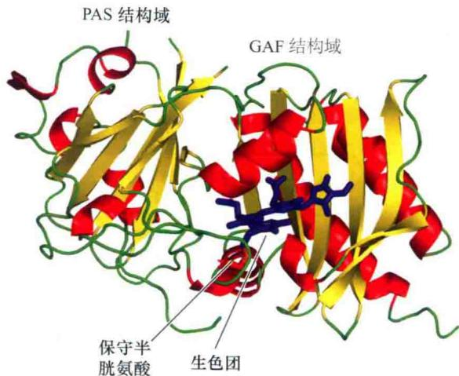

图17.8 嗜极端细菌（Deinococcus radiodurans）光敏色素N端部分的三维晶体结构。胆绿素生色团（紫色）与保守的胱氨酸位点共价连接（红色），并与蛋白骨架紧密结合（引自Wagner et al., 2005）。  

## 17.3.2 光敏色素是一种光调控的蛋白激酶

磷酸化在光敏色素发挥功能过程中具有重要的作用，最早的研究证据表明，红光可调控蛋白质的磷酸化，促进磷酸化依赖的转录因子与光敏色素调控基因启动子的结合。一些高纯度的光敏色素也具有激酶活性。蛋白激酶（protein kinase）是一类催化ATP上的磷酸基团转移到自身或其他蛋白的氨基酸如丝氨酸或酪氨酸上的酶。激酶在信号转导途径中通过添加或移去磷酸来调节一些酶的活性（见第14章）。蛋白磷酸酶（protein phosphatase）是从蛋白质上移去磷酸基团的酶，可通过拮抗蛋白激酶而调节蛋白活性。因此，蛋白激酶和蛋白磷酸酶在信号转导中起相反作用。

目前，已知光敏色素是具有自我磷酸化能力的蛋白激酶（Yeh and Lagarias，1998）。光敏色素的进化是很古老的，可追溯到真核生物的出现时期。细菌光敏色素是光依赖的组氨酸蛋白激酶，作为感应蛋白（sensor protein），可使相应的反应调节子（response regulator）蛋白磷酸化而发挥作用（图17.9A）（见第14章和Web Topic 17.3）。然而，尽管高等植物的光敏色素与组氨酸激酶存在一些同源序列，但并不具有组氨酸激酶活性。相反，它们是丝氨酸/苏氨酸激酶（图17.9B），可能磷酸化其他蛋白。因此，虽然植物与细菌的光敏色素磷酸化位点不同，但其基本功能类似。

## 17.3.3 Pfr在胞质和核的区域化

在细胞质中，光敏色素全蛋白以非活性Pr的二聚体

## A 细菌光敏色素

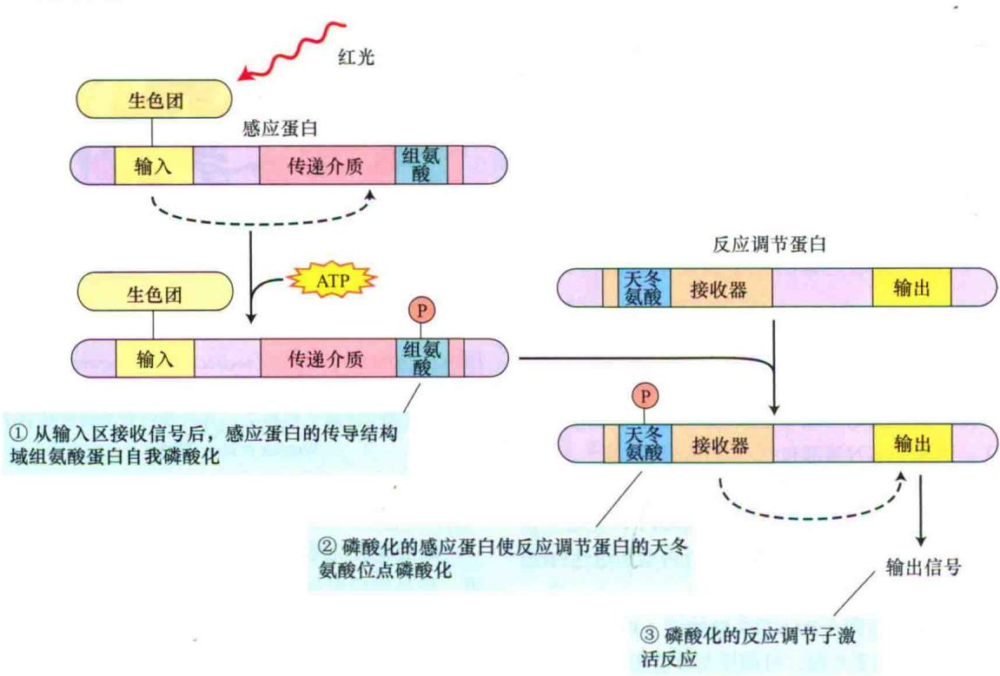

## B 植物光敏色素

  
图17.9 光敏色素是一种自我磷酸化的蛋白激酶。A. 细菌光敏色素是一种双组分系统，光敏色素作为一种能使反应调节子磷酸化的感应蛋白而起作用（见第14章）。B. 植物光敏色素是一种自我磷酸化的丝氨酸/苏氨酸激酶，能使其他蛋白质磷酸化（形成包含 x 的蛋白结构）。

状态存在。当生色团吸光后，其C15和C16间的双键发生顺反异构化，C14-C15单键旋转等（图17.6）。在Pr转化为Pfr过程中，光敏色素全蛋白基序在铰链区也进行着构象变化，使光敏色素C端的核定位序列（NLS）暴露出来，导致光敏色素分子由胞质移向核内（图17.7，Chen et al., 2005）。光敏色素从胞质移向核内是一个光质依赖的过程。因为光敏色素的Pfr型可被选择性地转移至核内（图17.10）。

一旦进入核内，光敏色素即与转录因子相互作用，调节基因转录的变化。因此，光敏色素的一个重要功能是作为光激活的开关，引起基因转录的整体变化。然而，如前所述，一些光敏色素调节的反应（如茎伸长的抑制）非常迅速，在红光或远红光处理后几分钟甚至几秒内即可发生。因此，光敏色素在胞质内也很可能起重要作用，通过调节膜电势和离子流从而对红光和远红光作出相应反应（图17.8）。确实，最近研究表明无需转移至核内，光敏色素仍然能调节多种生长反应（Rosler et al., 2007）。

A  
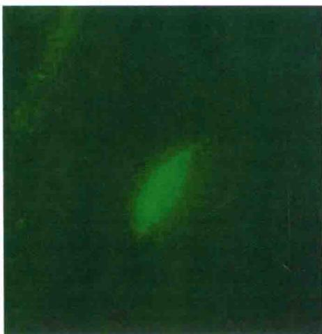

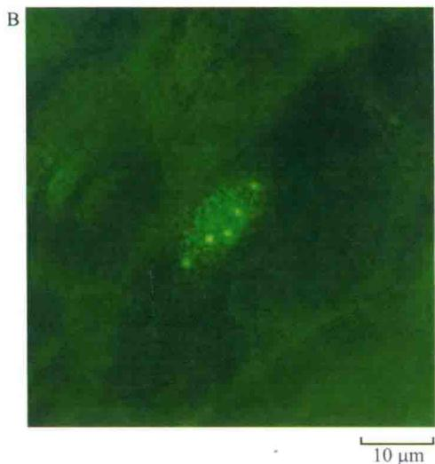  
图17.10 拟南芥下胚轴表皮细胞phy-GFP融合蛋白的核定位。荧光显微镜下转基因拟南芥中phyA-GFP（A）或phyB-GFP（B）的表达情况。只有细胞核清晰可见。持续远红光（A）或白光（B）处理植物，可诱导核内蛋白的积累。B图中核内绿色小亮点称为“小斑”，小斑的作用还不清楚（引自Yamaguchi et al., 1999, A. Nagatani惠赠）。

## 17.3.4 光敏色素蛋白受多基因家族编码

光敏色素反应的生理过程非常复杂，很难用仅有一种类型的光敏色素这样的理论来加以解释。早期的生物化学研究表明，细胞中可能存在不同类型的光敏色素。例如，光敏色素在黄化幼苗中最为丰富。因此，大多数早期的生物化学研究都是借助于从非绿色组织中纯化的光敏色素来进行的，因为从绿色组织中仅能提取少量的光敏色素。

不久，人们就证实植物中存在两种类型光敏色素，分别命名为类型Ⅰ和类型Ⅱ光敏色素。在暗中生长的大豆幼苗中，类型Ⅰ的光敏色素的含量比类型Ⅱ的光敏色素约高9倍之多；而在光下生长的幼苗中，这两种类型的光敏色素的含量几乎相当，表明光可使类型Ⅰ的光敏色素发生降解。因此，光敏色素可分为两种类型：光不稳定型（类型Ⅰ）和光稳定型（类型Ⅱ）。事实上，类型Ⅰ光敏色素的Pfr型是不稳定的。

光敏色素研究的一个重大突破使人们认识到，光敏色素蛋白是由一个具有不同生化特性的多基因家族编码。在拟南芥中，该家族有5个结构相关的成员：PHYA、PHYB、PHYC、PHYD和PHYE（Sharrock and Quail，1989）。在单子叶植物水稻中，仅存在3种光敏色素的编码基因：PHYA、PHYB和PHYC（Mathews and Sharrock，1997）。脱辅基蛋白（不含生色团）被表示为PHY；全蛋白（含生色团）被表示为phy。通常，其他高等植物的光敏色素序列则按它们与拟南芥PHY基因的同源序列来命名。在双子叶和单子叶植物中，光不稳定（Ⅰ型）光敏色素是由PHYA编码。在拟南芥中，含量最多的光稳定（Ⅱ型）光敏色素是由PHYB编码。通过下文我们将知道，遗传学研究已表明，PHYA和PHYB在生长发育中起相反的作用。

## 17.4 光敏色素功能的遗传分析

遗传筛选在拟南芥光信号转导途径研究方面具有重要作用。在目前经典的研究中，Marteen Koornneef 最早用遗传学方法鉴定光信号转导途径的中间成分（Koornneef et al., 1980）。他将拟南芥种子浸泡在能使DNA发生点突变的乙酰甲基磺酸（EMS）溶液中以产生突变种子，然后这些突变种子所长出的植株通过自花授粉，进而得到了基因突变的种子库。这一突变“家族”一旦在白光下生长，那些对光感受或光反应缺陷的突变体可根据其伸长的下胚轴（与暗中生长的植株形态相似）这一特征被鉴定出来，最后所有鉴定的突变体可通过单个隐性等位基因来加以区分。

通过已鉴定的突变体植株间的杂交试验研究，已确定了5个突变位点或互补组（HY1-HY5），为拟南芥信号转导的研究奠定了基础。5个HY基因的克隆及序列分析促进了光信号转导的一些中间成分的确定，即光敏色素生色团生物合成的必需基因（HY1和HY2）、光受体PHYB（HY3）、蓝光光受体隐花色素（HY4）和光诱导的转录因子（HY5）。

结合遗传分析、分子生物学和生理学研究等方法，在过去的十多年里，人们在光反应的机制研究方面已取得了巨大进展。这也许并不令人惊讶，这些研究已揭示出光与植物信号转导组分之间存在复杂的互作关系，而这些信号转导组分可调控植物从萌发到开花整个生命周期的多个发育阶段。

本节我们将对经遗传分析鉴定的光敏色素基因家族成员的不同生物学功能，以及它们之间的复杂相互作用进行分析。除VLFR和LFR反应的相反作用外，还鉴定出两种不同类型的高辐照度反应，该反应依赖不同的光敏色素，一类是典型的黄化幼苗远红光HIR，该反应由phyA所介导，另一类是阳生植物的红光（或白光）HIR，该反应由phyB所介导。

## 17.4.1 光敏色素A可介导持续远红光所诱导的反应

在最初建立的hy基因库中，仅发现光敏色素phyB基因突变体。因此，要鉴定phyA突变体，则需要在筛选方法上取得新的突破。正如前文所讨论，由于远红光HIR需要光不稳定（类型Ⅰ）光敏色素，由此推测，phyA作为光受体可感受持续的远红光。如果真是这样的话，phyA突变体将不能对远红光发生反应，并且在这种光下生长的突变体长得高而细长。然而，缺少生色团的突变体也能表现出类似的表型，因为只有与生色团组装成全蛋白质的phyA才能够感受远红光。

为了筛选phyA突变体，人们把在持续远红光照射下长得较高的幼苗移到持续红光照射下生长，phyA缺失的突变体在这种光谱下能正常地生长，而生色团缺失的突变体由于缺少有功能的phyB，无法对持续红光发生反应。通过这种方法筛选的phyA突变体幼苗在白光下能正常生长，表明phyA在感应白光方面没有作用（Whitelam et al., 1993）。这也解释了为什么

Koornneef在最初以长的下胚轴为筛选指标实验中，没能检测到phyA突变体。因此，phyA主要是在远红光去黄化过程中起作用。从这个突变体的特点可知，phyA之外的其他光敏色素并不能感受持续的远红光。光敏色素A也参与了广谱光诱导的拟南芥种子萌发的VLFR反应。因此，缺乏phyA的突变体在微秒闪光下无法萌发，但对低通量范围的红光处理可发生正常的反应（Shinomura et al., 1996）。该结果证明，phyA作为VLFR反应的光受体起重要作用。

对这些结果可能的解释是，在种子发育的早期，如种子萌发和幼苗去黄化阶段，phyA的功能被极大地限制了。然而，最近研究表明事实远非如此。当phyAphyB双突变体在强红光 $[\geqslant 100\mu \mathrm{mol} / (\mathrm{m}^2\cdot \mathrm{s})]$ 下生长时，比phyB单突变体长得更长。另外，野生型植株从黑暗转移到强光照条件后，在相当长一段时间内phyA蛋白都可以被检测到（Franklin et al., 2007）。phyA在拟南芥和水稻开花的光周期调控中同样扮演了重要角色（Valcerde et al., 2004；Takano et al., 2005）。因此，PhyA可能同时介导红光和远红光的生理反应，并且在植物整个生命周期中发挥功能。

## 17.4.2 光敏色素B可介导持续红光或白光所诱导的反应

hy3突变体幼苗在持续白光下生长，其下胚轴伸长，这一特点说明phyB在去黄化中有重要作用。hy3突变导致叶绿素和一些编码叶绿体蛋白质的mRNA缺失，不能应答植物激素反应。

光敏色素B除参与白光和红光调控的HIR反应外，也能调节LFR，如光可逆的种子萌发，这也是导致光敏色素发现的最早实验证据。野生型拟南芥种子的萌发需要光，这种反应在低通量光范围内时表现出红光/远红光可逆特性。phyA缺失的突变体对红光反应是正常的，而phyB缺失的突变体却不能对低通量的红光发生反应（Shinomura et al., 1996）。这个实验证据足以说明phyB可调控光可逆的种子萌发。

在本章后面的论述中，光敏色素PhyB在调节植物对暗处理的反应中发挥重要作用。在被茂密植物树干所覆盖的地表，phyB缺失的突变体生长表型和野生型植株类似。事实上，光敏色素所介导的植物对遮阴的反应如促进开花和快速伸长生长，可能是光敏色素在生态学意义上最重要的功能之一（Smith，1982）。

## 17.4.3 光敏色素C、D和E功能的发现

虽然phyA和phyB是拟南芥中光敏色素的两种主要存在形式，但phyC、phyD和phyE在调控红光和远红光反应中也发挥独特的作用。双突变体和三突变体的构建使评价特定反应中每个光敏色素的相对功能成为可能。phyD和phyE的结构与phyB相似，但并不存在功能冗余。phyD和phyE调节的反应包括叶柄和节间的延长及开花时间控制（见第25章）。拟南芥phyC突变体的特点揭示出phyC、phyA和phyB反应通路间存在复杂的相互作用（Franklin et al., 2003；Monte et al., 2003）。PHY基因的主要功能可能在于其对光敏色素的精确调控，以适应昼夜和季节改变所引起的光环境变化。事实上，在一项对跨纬度渐变生态群的自然变化的研究中已经证实了phyC在调节植物生长和开花时间方面的作用（Balasubramanian et al., 2006）。

## 17.4.4 Phy基因家族间复杂的相互作用

显然，遗传分析已成为分析拟南芥基因功能强有力的工具，但这种方法也有一些局限性。其一，phy突变体表型通常是在假定家族中其他成员活性没有变化的基础上鉴定的。然而，详尽的分子机制研究表明，phyC和部分phyD的积累依赖于活化PhyB及PHYA的转录水平，而且编码PHYB的基因过表达可增加转基因拟南芥体中的phyA、phyC和phyD水平（Hirschfeld et al., 1998）。

最近的研究发现，光稳定phy蛋白能形成同源或异源二聚体（如phyB-phyC）（Clack et al., 2009），这就使遗传数据的解释更加复杂化。因此，功能缺失的phyB突变体或PHYB脱辅基蛋白质过表达的植株可能表现出特定的表型，该表型是一个由多种光敏色素相互作用而改变的动力学结果。考虑到每一个物种在自然种群中每一种光敏色素可能有多个等位基因（Maloof et al., 2001），我们可以想象存在着一个多么令人难以置信的复杂的分子网络。因此，揭示光敏色素基因相互作用的复杂性成为未来研究中具挑战性的课题。

  
野生型豌豆  
(phyA缺失突变体)

## 17.4.5 PHY基因在进化过程中的多样化

虽然通过拟南芥的研究我们对光敏色素反应中的许多分子事件有了较深的了解，但在被子植物中，PHY基因家族进化迅速（Mathews and Sharrock，1997），大多数双子叶植物有四个光敏色素亚家族（PHYA、PHYB/D、PHYC/F和PHYE），单子叶植物只有三个（PHYA、PHYB和PHYC）。通过基因复制/缺失、遗传漂变和PHY基因功能的快速的多样化等，光敏色素信号转导网络可随之发生改变，构建新的模式以确保植物适应不同生活环境和不同选择压力。只有具体到某个特定的物种来进行遗传分析研究，我们才能鉴定光敏色素调控途径的相似性和差异性。

例如，phyA缺失对白光下生长的拟南芥和水稻表型影响不大，而phyA功能缺失的豌豆则有高度多效性的表型，包括缩短的节间、衰老的延缓及长日照下产量的增加等。在番茄中，phyA缺失和重复phyB拷贝数可阻止番茄中叶绿素的积累，使结果的花簇或花束长度大大增加（图17.11）。叶绿素在上述这些植物叶片中的积累，表明phyA和phyB在叶绿素积累中的作用是番茄特有的。

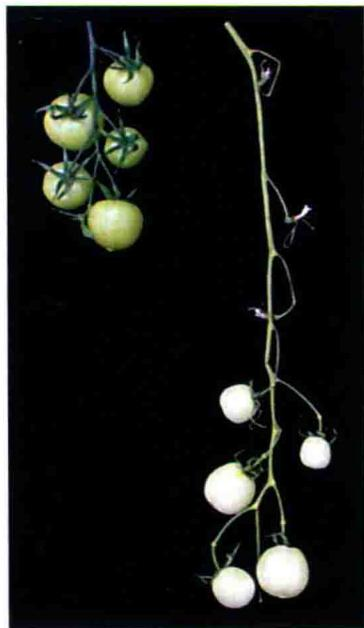  
野生型番茄  
(phyA缺失和phyB双拷贝突变体)  
图17.11 光敏色素缺失改变了豌豆和番茄的生长发育。A. phyA发生突变的豌豆苗表现出开花延迟和节间缩短。B. phyA缺失和phyB双拷贝番茄突变阻止了番茄果中叶绿素的积累和番茄果簇的伸长（引自Weller et al., 1997; 2000）。

不同杂交品种相比较的图片表明，虽然phy家族成员作用模式可能是高度保守的（如phyA介导了VLFR和远红光HIR反应），但其受光受体调控的下游效应子及最终的生理反应等在分类单元中具有明显的差异（图17.12）。

  
图17.12 双子叶植物拟南芥（Arabidopsis thaliana）和单子叶植物水稻（Oryza sativa）和高粱（Sorghum bicolor）的光敏色素基因家族结构和功能的差异比较。单子叶植物和双子叶植物PHY基因可能在VLFR、LFR和HIR（如FR-HIR中需phyA）等反应中利用相同的基因家族成员，但其调控的发育现象可能完全不同（如phy所介导VLFR的种子萌发与胚芽鞘的延长）。图中也标明了单子叶植物中没有PHYD和PHYE。

## 17.5 光敏色素信号途径

植物中所有光敏色素调控的变化都是从色素对光的吸收开始。光敏色素一旦吸收光，其分子性质就发生改变，这可能影响到光敏色素与细胞内其他蛋白元件的相互作用，最终引起生长、发育的变化或器官位置的改变（表17.1）。

分子和生物化学技术可有助于揭示光敏色素的早期作用，以及导致一些生理学或发育反应的信号转导途径。这些反应一般可分为两种类型：①离子流动，导致相对迅速的膨压反应；②基因表达的改变，引起较慢的、长期的反应过程。

本节我们将检测光敏色素在膜渗透性和基因表达方面的作用，以及导致这些作用的信号转导途径中可能涉及的级联反应。

## 17.5.1 光敏色素调控的膜电势和离子流

光敏色素能在一次闪光后的数秒内快速改变膜的性质，这种快速的调节现象在单细胞中已检测到，并且在红光和远红光对根及燕麦（Avena）胚芽鞘的表面电势的影响的实验中也提及。在根和燕麦胚芽鞘中，从Pfr产生到能检测到电势开始变化（超极化）之间的延迟时间是4.5 s。细胞生物电势的变化与通过质膜的离子流的改变是一致的。这表明与光敏色素有关的一些胞质应答起始于细胞膜或质膜附近。

藻类（Mougeotia）如何利用红光刺激进行快速的叶绿体运动是长期以来困扰我们的科学难题（见Web Topic 17.1）。在包括拟南芥在内的许多物种中，叶绿体运动是蓝光通过向光素所介导的。在藻类（Mougeotia）中，叶绿体运动的光感受器是一个融合的红光和蓝光受体（Suetsugu et al., 2005）。因此，Mougeotia似乎已经进化到能够利用红光信号通过一个较为典型的蓝光受体来传递叶绿体运动的反应（见第18章）。有趣的是，拟南芥phyA在胞质中的许多功能都可以由蓝光受体介导，这表明也许不久以后，这些信号途径可能会跟高等植物的信号感知一样，合二为一或者开始协同作用。

## 17.5.2 光敏色素调控的基因表达

光形态建成的定义指出，植物的生长发育受光的影响很大。黄化特征包括纺锤形茎、小叶（双子叶植物）和缺绿等。这些黄化特征可通过光照完全逆转，其中涉及一些仅通过基因表达的变化所导致代谢的长期改变。总之，植物启动子的光调节与其他真核生物的基因调节相似，即模块元件的聚集，模块元件的数量、定位、侧翼序列和能引起各种不同的转录模式的结合性能。没有任何一个单一的DNA序列或结合蛋白能与所有受光敏色素调节的基因都发生相互作用。

首先，光调控的基因有如此多的元件，任何元件的组合都能引起光调控基因的表达，这似乎是不可思议的。然而，这些调控序列可通过多种光受体的作用，以确保许多基因的光及组织特异性差异表达。

转录的光激活和抑制过程非常快速，它的延迟时间短至5 min。利用DNA微阵列分析技术（DNA microarray analysis），人们可检测到光变化条件下，植物所有的基因表达模式。（转录的分析方法参见Web Topic 17.4）这些研究显示，核输入启动了包括上千种基因参与的转录级联反应，进而引发了光形态建成的生长发育。通过分析植物从暗处转到光下这一段时间内基因表达谱，人们对PHY基因作用的早期和晚期的靶元件已进行了鉴定（Tepperman et al., 2001；Tepperman et al., 2004）。

PhyA和PhyB的核输入与激发它们活性的光质是密切相关的，也就是说，PhyA的核输入是由远红光和低通量的广谱光所调节的。PhyB的核输入由红光所调节并且可以被远红光逆转（Kircher et al., 1999; Yamaguchi et al., 1999）。因此，在光敏色素信号途径中，Phy蛋白的核输入可能代表了一个主要的控制点。PhyB似乎是利用一个普通的核转入途径，而PhyA的核导入依赖FHY1（Genoud et al., 2008）

在植物暗-光转变过程中那些快速上调的早期基因产物实际上是转录因子本身，这些转录因子可激活其他基因的表达。编码快速上调蛋白的基因称之为初级反应基因（primary response gene）。初级反应基因的表达依赖于信号转导途径（见下文），不依赖于蛋白的合成。与此相对应的晚期基因或次级反应基因（secondary response gene）的表达需要新蛋白的合成。DNA微阵列分析揭示，伴随着从暗形态建成到光形态建成的转变，植物中所有基因的表达谱也随之发生改变。

## 17.5.3 光敏色素相互作用因子（PIF）在phy信号转导的早期起作用

近年来，酵母双杂交文库筛选和免疫共沉淀这两种技术已被广泛应用于植物蛋白间相互作用的研究（参见Web Topic 17.5）。利用这两种方法，人们在拟南芥中已鉴定了几种光敏色素相互作用因子（phytochrome-interacting factor，PIF）（Castillon et al., 2007）。与phyA或phyB相互作用的蛋白作为phy信号网络的分支点，而与phyA和phyB共同作用的蛋白质可能代表汇聚点。

在已鉴定的这些因子中，研究最多的是PIF3，一个基本的螺旋-环-螺旋（bHLH）转录因子，可与phyA和phyB发生相互作用（Ni et al., 1998）。PIF和几个相关PIF或类PIF蛋白（PIF-like protein, PIL）尤其备受关注，因为这个基因家族中至少有5个成员可选择性地与具有活性Pfr构象的光敏色素相互作用。这些蛋白定位于核内并能与DNA结合，说明光敏色素与基因的转录具有紧密的联系。

对PIF家族成员的最近研究表明，PIF主要作为光敏色素信号的负调节子（Shin et al., 2009; Stephenson et al., 2009）。一个PIF家族成员缺失的四突变体在黑暗中生长表现出了组成型光形态建成发育。光敏色素似乎通过磷酸化引发了PIF蛋白的降解，继而被蛋白酶体所降解（Al-Sady et al., 2006）。光敏色素诱导的作为phy反应负调节子的PIF蛋白的快速降解，有利于阐明与phy蛋白活性紧密耦合的光发育反应调节的可能机制。

## 17.5.4 光敏色素与蛋白激酶和磷酸酶的结合

除定位于细胞核的转录因子外，细胞质中与phy蛋白结合的激酶已通过双杂交筛选技术得到鉴定。光敏色素激酶底物1（phytochrome kinase substrate1，PSK1）可与具有活性的Pfr型和非活性的Pr型的phyA和phyB作用（Frankhauser et al., 1999）。该蛋白可从phyA处接受一个磷酸根离子，表明磷酸化是信号转导途径中的一个重要部分。体外（试管中）和体内（植物中）的光敏色素可调节PSK1的磷酸化，并且具有Pfr型光敏色素的反应活性是具有Pr型的光敏色素的两倍。PSK1及其密切相关的PSK2的超表达和功能缺失突变研究表明，这两种分子通过一个负反馈环维持平衡水平。分子生物学与遗传学分析表明，这些蛋白可选择性作用以促进phyA介导的VLFR反应。最近研究结果表明，这些分子参与了PhyA和向光素信号通路的交叉机制（Lariguet et al., 2006）。

光敏色素相关蛋白磷酸酶5（phytochrome-associated protein phosphatase 5，PAPP5）是另外一个与光敏色素互作的因子，它可能通过脱磷酸化有活性的光敏色素来增强被光敏调节的相关生理反应（Ryu et al., 2005）。如图17.13所示，显示了磷酸化调节phy活性的可能模型。暗中，Pr型光敏色素是无活性的，在它的N端的丝氨酸位点可能被磷酸化。红光的吸收可诱导phy构象的改变，激活了铰链区丝氨酸位点的自我磷酸化及接下来细胞核的定向输入。红光也可以作用于phy的降解（见下文）。

铰链区丝氨酸的脱磷酸化增强了phy与下游效应子相互作用，增加了蛋白在光下的稳定性。一个未知的激酶和可能的自我磷酸化可驱动phy向低活性磷酸化状态变化，磷酸化phy不能有效地与它的效应蛋白结合。

  
图17.13 光敏色素的活性受磷酸化状态调控。在红光激活后，与phy相关的磷酸酶PAPP5和目前还未得到鉴定的激酶，调节不同光强或光质下phy的反应活性（引自Ryu et al., 2005）。

## 17.5.5 光敏色素诱导的基因表达涉及蛋白降解

我们常把信号转导级联的启动比作按动一个开关，来激活一个过程，就如同当电话打进时，话机会响一样。然而，如果话机一直响下去会出现什么结果呢？在第一声响后，它就失去了作为信号机制的作用。与此相同，终止或重设一个途径与该事件的启动同样重要。如上所述，蛋白降解作为许多细胞代谢过程调节的普遍机制而存在，其中包括光和激素信号转导、昼夜节律和开花时间控制（见第19章和第25章）。

几个独立的研究组通过遗传筛选已鉴定出相关突变体，该突变体在暗中生长时却表现出光下生长的表型，如子叶张开、叶片伸展及下胚轴缩短等。这些筛选中所鉴定的基因称为组成型光形态建成（constitutive photomorphogenesis，COP），去黄化（de-etiolated，DET）和FUS（光下生长的幼苗体内积累花色素苷，呈现出花色素苷的红色）。克隆和遗传互补显示，这些基因中的大多都是等位的或是相同复合体的一部分。因此，它们总称为COP/DET/FUS。

几个COP/DET/FUS基因的克隆已揭示蛋白降解在光调节反应中的基本作用。COPI编码一个E3泛素蛋白连接酶（Yi and Deng., 2005），它可把一个称为泛素的小多肽尾巴连接到蛋白上（见第1章和第14章）。一旦被泛素蛋白标记，该蛋白将被转移到26S蛋白酶体，蛋白酶体类似一个细胞内的垃圾处理站，可把蛋白质消化成组成它们的氨基酸。COP9和一些其他COP组成COP9信号体（COP9 signalosome，CSN），形成了这个垃圾处理站的盖子，以决定哪些蛋白质可进入这个复合体。

如图17.14显示，COP1能与几种参与光反应的蛋白质（包括转录因子HFR1、HY5和LAF1）相互作用，使其成为暗中降解的靶因子。COP1也可能与phyA-1的抑制子（SUPPRESSOR OF phyA-1，SPA1）蛋白及其家族成员相互作用形成蛋白复合体（Zhu et al., 2008），调节这些转录因子的泛素化（Vierstra, 1994）。光下，COP1从细胞核内转移到胞质（图17.14），排除了它与许多核定位转录因子的相互作用，这些转录因子将与启动子结合，调控光形态建成的发育。

如前所述，phyA蛋白在光下极不稳定，它的降解是由于多拷贝小蛋白泛素与靶蛋白的特异位点结合。COP1使phyA泛素化，促使靶蛋白降解，这一发现促使人们将COP1的功能与光下phyA信号转导的受阻合理地联系在一起（Seo et al., 2004）。在第25章的论述中，COP1同样负责对开花调节因子CO和GI，以及生长素和赤霉素应答相关蛋白的降解。因此，在植物中，蛋白质降解是由光和植物激素所触发的植物生长发育信号通路中的重要组成部分。

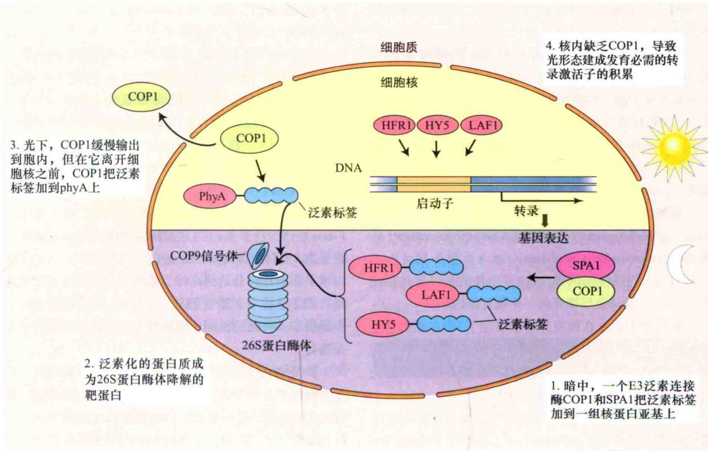  
图17.14 COP蛋白对光形态建成发育相关的蛋白质周转的调节。夜里，COP1进入核内，COP1/SPA1复合体把泛素标签加到一组转录激活子上，转录因子随之被COP9信号体—蛋白酶体复合体降解；白天，COP1离开核，允许转录激活子的积累。蓝色尾巴代表定向转移到COP9信号体复合体（CSN）中的蛋白质上的泛素标签，CSN作为26S蛋白酶体的控制门户。

## 17.6 昼夜节律

植物中许多代谢，如氧的释放和呼吸，都具有约24 h的一个高活性和低活性阶段交替性循环的调控周期性。这些节律性的变化称为近似昼夜节律（circadian rhythm）（自拉丁语circa diem，意思是“大约一天”）。一个节律的周期（period）是一个循环内连续的峰或谷间所经历的时间。由于节律存在于没有外源因子的情况下，因此它被认为是内源的（endogenous）（关于近似昼夜节律的描述，见第25章）。

昼夜节律内源的本质说明它受一个内在的近似昼夜节拍器控制，这种机制称振荡器（oscillator）。内源振荡器与各种生理过程相伴。振荡器的一个重要特点是不受温度影响。它作为生物钟，在各种不同季节和天气条件下，能正常地发挥功能。此生物钟可表现为温度补偿（temperature compensation）。

光是植物和动物中一个重要的调节子。虽然在实验室控制的条件下，昼夜节律经常比24 h长或短一小时或几小时，但由于拂晓时光的同步效果，实质上它们的周期都趋向接近24 h，故称之为导引作用（entra-inment，即环境因素促使生物节律与环境节律同步的

作用）。

生物钟的另一个重要作用是门控作用（gating），既在近似昼夜节律的某个阶段内，当生理或分子反应将要发生时所起到的调节作用。如第25章（植物开花的调控）所述，门控作用严格控制着植物由营养生长向生殖生长的转变。另外门控作用在调节植物的遮阴反应方面也有重要作用（Salter et al., 2003；Nozue et al., 2007）。

昼夜节律的分子基础已引起动植物学家的广泛关注。生物钟突变体的分离是鉴定其他生物体内生物钟基因的一个重要工具。在植物中要分离生物钟突变体，则需要一种能便利监控成千上万植物体的近似昼夜节律的检测方法，以发现稀有的不正常表型。

为了筛选拟南芥生物钟突变体，人们将LHCB[也称CHLOROPHYLL a/b BINDING（CAB）]基因的启动子区与编码荧光素酶的基因相融合。荧光素酶是一种在它的底物荧光素存在下能发光的酶。以农杆菌的Ti质粒为载体构建的含有报告基因的质粒载体被转化到拟南芥中，研究人员通过一个视频照相机能实时监测单株幼苗中生物荧光的时空调节的变化（Millar et al., 1995）。目前，用这个方法总共分离了21个独立toc[timing of CAB（LHCB）expression]突变体株，包括短周期和长周期株系。尤其是toc1突变体已被确认为振荡器机制的核心（Strayer et al., 2001）

另一个重要发现是两个MYB相关转录因子circadianclock-associated1（CCA1）和lateelongated hypocotyls（LHY）的分离和鉴定（关于MYB参见第20章）。CCA1或LHY功能缺失突变体或其组成型超表达均可有效剔除近似昼夜节律和光敏色素对几个基因的调控及生理反应，如叶片运动变得无节律。这些发现足以说明CCA1和LHY是昼夜生物钟的组分。

昼夜振荡器包括一个转录负反馈环 现在已清楚蓝细菌（Synechococcus）、真菌（Neurospora crassa）、果蝇（Drosophila melanogaster）和小鼠（Mus musculus）的昼夜振荡器，这4种生物的振荡器包括几个参与转录-翻译负反馈环的“生物钟基因”。

到目前为止，在拟南芥中已鉴定了3个主要的生物钟基因：TOC1、LHY和CCA1。这些基因的产物全部是调节蛋白。TOC1与其他生物体的生物钟基因没有关系，表明这个植物振荡器是特异的。

在拟南芥中，近似昼夜节律的遗传与分子研究结果已勾画出其模型（Alabadi et al., 2001；Salome and McClung, 2004）。图17.15是拟南芥的一个简化生物钟模型，然而对该模型的计算表明维持强大的生物钟功能需要多个调节环路的共同作用（Locke et al., 2006）。

按照这些模型，在拂晓时分，光和TOC1调节蛋白激活了LHY和CCA1的表达。LHY和CCA1的增加抑制了TOC1基因的表达。因为TOC1是LHY和CCA1基因的正调节子，TOC1表达的抑制引起LHY和CCA1的水平逐渐降低，在白天结束时达到最低水平。随着LHY和CCA1水平的降低，TOC1基因表达解除抑制。TOC1在白天结束时达到最大值，此时LHY和CCA1水平最低。接着

TOC1间接激活了LHY和CCA1的表达（Pouneda-Paz et al., 2009），循环又开始了。

另外的一些蛋白质也有利于中心振荡器的调节。蛋白激酶CK2能与CCA1相互作用，并使CCA1磷酸化。CK2激酶是一个具丝氨酸/苏氨酸活性的多亚基蛋白，它的突变改变了CCA1节律性表达的周期（Sugano et al., 1999）。核蛋白GIGANTEA（GI）也是LHY和CCA1维持高水平表达所必需的，它可能是通过F-Box蛋白ZTL和TOC1的相互作用实现的（Kim et al., 2007），F-box是促进蛋白和蛋白相互作用的基序。F-box是作为泛素蛋白E3连接酶复合体元件被发现的，它是26S蛋白酶体降解的靶蛋白（见第14章）。ZTL蛋白水平在黄昏时分达到高峰，拂晓时分最低。有意思的是，ZTL也是一个蓝光受体，这为中心振荡器的有效控制提供了一种新的机制，即通过光信号途径来调控中心振荡器。

两种MYB调节蛋白LHY和CCA1具有双重功能。除作为振荡器的元件外，它们还调节其他基因的表达，如LHCB和其他“早晨基因”，抑制基因在夜晚表达。光具有增强TOC1基因启动子LHY和CCA1表达的作用，这种增强代表生物钟导引的基本机制。

昼夜生物钟的光调控 为了正常发挥其功能，振荡器必须由其外界环境每天的光/暗循环来驱动。为鉴定此过程光受体的作用，试验中将光敏色素缺失突变体与上文提到的带有荧光素酶报告基因的株系杂交（Somers et al., 1998）。当phyA突变体生长在微弱红光，而不是高通量的红光下时，振荡器的振荡步幅减慢（即周期长度增加），而phyB突变体在高通量的红光下表现出计时缺陷。蓝光受体（blue-light photoreceptors）CRY1和CRY2参与了蓝光介导的昼夜生物钟的导引过程。

  
图17.15 昼夜节律振荡器模型展示了在拟南芥中TOC1与MYB基因LHY和CCA1可能的相互作用。早晨，光增加了LHY和CCA1的表达，LHY和CCA1调控其他白天和夜晚基因。

这些发现表明，拟南芥中的光敏色素和隐花色素都能驱动昼夜生物钟。光的输入显然是由early flowering3（ELF3）和time for coffee（TIC）来调控的。ELF3突变使黄昏时生物钟的振荡终止，而TIC突变使拂晓时的生物钟终止。elf3/tic双突变体完全无节律性，说明TIC和ELF在生理节律的不同阶段与不同的生物钟元件相互作用（Hall et al., 2003）。

基因表达与昼夜节律 光敏色素也可在基因表达水平上与昼夜节律相互作用。在转录水平，昼夜节律和光敏色素可调节编码光系统Ⅱ的捕光色素叶绿素a/b结合蛋白的LHCB基因家族的表达。

在豌豆和小麦叶片中，发现LHCB mRNA水平随每天光-暗循环发生振荡变化，早晨升高，夜晚下降。即使在持续黑暗情况下，也有节律性存在，它显然是一种昼夜节律。但光敏色素可干扰这种表达的循环模式。

当小麦幼苗从一个12 h黑暗/12 h光的循环转移到持续黑暗环境时，节律性可保持一段时间，但慢慢消减（如幅度减小，直至没有峰和谷）。然而，如果植物在移到暗处前照射了一次红闪光，节律性将不会消减（即LHCB mRNA水平与它们在光-暗循环中的一样，持续发生振荡变化）。

与此相反，在白天结束时的一次远红光照射可阻止持续黑暗下LHCB的表达，并且这种远红光效应可被红光所逆转。我们监控的不是恒定条件下慢慢消减的振荡器，而是与振荡器相伴随的生理事件。红光可恢复振荡器与生理过程之间的耦合。

微阵列分析显示，拟南芥中超过30%的基因表达受昼夜节律控制（Michael and Mcclung，2003）。有意思的是，许多参与类似细胞活动的基因表现出相似的节律（Hamer et al., 2000）。例如，许多光合必需基因的转录峰都接近主观日 $^{①}$ 的中心；而细胞壁合成必需基因的转录峰接近主观夜的中心。通过对这些基因的启动子序列进行仔细检测，人们发现了一个称为夜晚元件（evening element）（AAAATATCT）的9核苷酸基序，它可调控许多基因在主观日结束时的表达达到峰值。

昼夜节律与适应 人们很早就知道昼夜节律在植物开花的光周期中起着重要的作用（见第25章），而直到最近人们才得到它们在最优化营养生长下的实验证据（Dodd et al., 2005）。过长或过短周期生物钟的拟南芥突变体生长在模拟白天-夜晚循环下，这些人工的白天-黑夜循环有的与振荡器周期一致，有的不一致。昼夜节律与环境中的光-暗循环一致 [昼夜节律同步（circadian resonance）]的植物比脱离环境节律的植物含有更多叶绿素和生物量。进而，当它们共同生长在竞争实验条件下，与脱离环境节律的植物相比，昼夜节律与环境昼夜节律钟相一致的植物则有更强的竞争力，并最终在竞争中胜出。因此，昼夜节律同步促进植物在最适时间内进行营养生长（光合作用和生物量）和生殖发育，以增强植物进化的适应性。

此外，生物钟在促进多倍体植物的茁壮生长方面也发挥着重要作用。在合成拟南芥多倍体植物中，生物钟功能的改变与光合作用，以及淀粉生物合成需要的一些基因的表达量上调是相关联的。这种关联性表明昼夜节律在调节生物量方面扮演了重要角色（Ni et al., 2009）。

## 17.7 生态学功能

我们已讨论了实验室研究过程中光敏色素所调控的反应。然而，光敏色素在自然环境下植物的生长过程中也起着重要的生态学作用。下面我们将要学习光敏色素是如何参与并调节各种各样日常节律性，以及植物是如何感知周围其他植物的遮蔽并作出相应的反应。另外，我们还将探讨在这些过程中不同光敏色素基因家族成员的特异功能（Web Topic 17.6）。

## 17.7.1 光敏色素能使植物适应光质的变化

所有高等植物从藻类到双子叶植物，都有一个红光/远红光可逆的色素，说明这些波段的光可使植物适应它们生存的环境。在自然光照下，什么环境条件能引起这两种波段光的相对水平的变化呢？

不同环境下，红光（R）和远红光（FR）的比例变化很大，这个比例可被表示为

$$
\frac {\mathrm{R}}{\mathrm{FR}} = \frac {\text {以} 6 6 0 \mathrm{nm为中心的} 1 0 \mathrm{nm波段宽的光子通量率}}{\text {以} 7 3 0 \mathrm{nm为中心的} 1 0 \mathrm{nm波段宽的光子通量率}}
$$

表17.3比较了8种自然环境下光子（400\~800 nm）的总光密度和R：FR值。不同环境下这两个参数变化很大。

与直接的太阳光照相比，日落时分土中5 mm处或其他植物树冠下（如森林地表）有更多的远红光。树冠现象是由于绿色叶片含有大量的叶绿素，吸收红光，而远红光相对可透过叶片。

表17.3 重要生态学光参数

<table><tr><td></td><td>光子流密度/ [μmol/(m2·s)]</td><td>F:FRa</td></tr><tr><td>白天日光</td><td>1900</td><td>1.19</td></tr><tr><td>夕阳</td><td>26.5</td><td>0.96</td></tr><tr><td>月光</td><td>0.005</td><td>0.94</td></tr><tr><td>橡树冠层</td><td>17.7</td><td>0.13</td></tr><tr><td>湖中1m深处</td><td></td><td></td></tr><tr><td>黑海湾</td><td>680</td><td>17.20</td></tr><tr><td>利文湖湾</td><td>300</td><td>3.10</td></tr><tr><td>Loch Borralie</td><td>1200</td><td>1.20</td></tr><tr><td>土中深5mm处</td><td>8.6</td><td>0.88</td></tr></table>

资料来源：Smith，1982  
注：光密度因素（400\~800 nm）以光子流密度给出，光敏色素活性光以R：FR表示

a绝对值来自分光辐射度计的检测；这些值表示各种自然条件的关系，并不是真实的环境值

## 17.7.2 R: FR下降导致阳生植物的伸长

光敏色素的一个重要功能是使植物能感知其他植物的遮阴。植物受到周围植物遮阴时，茎伸长速度加快，这就是避阴反应（shade avoidance response）。随着遮阴程度的增加，R：FR变小（表17.3），远红光的比例越大，Pfr转化成Pr越多，Pfr与总光敏色素的比值（Pfr/P $_{total}$ ）下降。

自然光刺激植物，体内远红光吸收型光敏色素的含量发生变化，此时，发现在遮阴系统即R：FR可以调控的环境中种植所谓的阳生植物（在开阔地带的生境下能正常生长的植物），当光敏色素的红光吸收型Pr含量较高（即低的Pfr： $P_{total}$ ）时，植物的茎伸长加快（图17.16）。换句话说，模拟冠层遮阴（高水平远红光；低Pfr： $P_{total}$ ）可诱导阳生植物获得更多的光使其生长得更快，而对于正常生长在遮阴环境下的“阴生植物”来说，这种关联性就不那么强。当暴露于高R：FR的光下时，阴生植物茎伸长的减慢程度比阳生植物小（图17.16）。因此，光敏色素调控的植物生长和植物物种的生境之间显然存在系统的相关性。这些结果说明光敏色素参与了植物对遮阴的感受。

“阳生植物”或“避阴植物”有一个明显的适应值，当它受到周围植物的遮阴时，可将营养分配到伸长生长更快部位，以获得更多的光照。通过这种方式，阳生植物增强了生长以超过株冠，从而得到更多没有经过过滤的、光合有效光的机会。避阴运动中，植株趋向于节间伸长，结果经常造成叶面积变小，分枝减少，但至少在阳光稀少的情况下，这种对株冠遮阴的适应性还是有作用的。

  
图17.16 阳生植物（实线）和阴生植物（虚线）光敏色素在遮阴感受中的作用（引自Morgan and Smith，1979）。

拟南芥遗传分析显示，phyB在调节许多植物避阴反应中起着重要的作用，但phyD和phyE也有作用，尤其对叶柄的伸长。PhyA在拮抗phyB、phyD、phyE介导的反应方面起作用（参见本章部分后续内容）。遮阴和未遮阴植物的微阵列分析已证明并扩展了遗传学研究（参见Web Topic 17.7）。关于植物如何利用反射光感知它们周围的植物等，请参见Web Essays 17.3。

研究证据表明，生长素、赤霉素和乙烯等多种激素信号转导途径的整合也参与调控植物发育可塑性的过程。最近几份研究报告显示，PIF蛋白在调节植物避阴反应中发挥着重要作用，并且这些反应中至少有一部分是通过GA信号通路来调节的（图17.17、图14.12和图20.20）。如前文所述，PIF蛋白一般作为植物光形态建成的负调节子发挥功能，而且受光敏色素的负调控。这种PIF蛋白和PHY蛋白功能间的拮抗作用使得植物实现了对光环境变化反应的微调节。

当植物生长在高R：FR条件下时，如在植物树冠处，PHY蛋白在核内聚集，PIF蛋白此时是没有活性的。而当植物在黑暗中或低R：FR条件下时，一部分光敏色素从核内运出，促使有活性的PIF蛋白增加，进而促进伸长反应（Lorrain et al., 2008）。除PIF-PHY互作外，PIF蛋白也受DELLA蛋白的负调节作用。DELLA蛋白是GA信号途径中的一个重要组分（de Lucas et al., 2008；Feng et al., 2008）。因此，PIF蛋白似乎汇合了

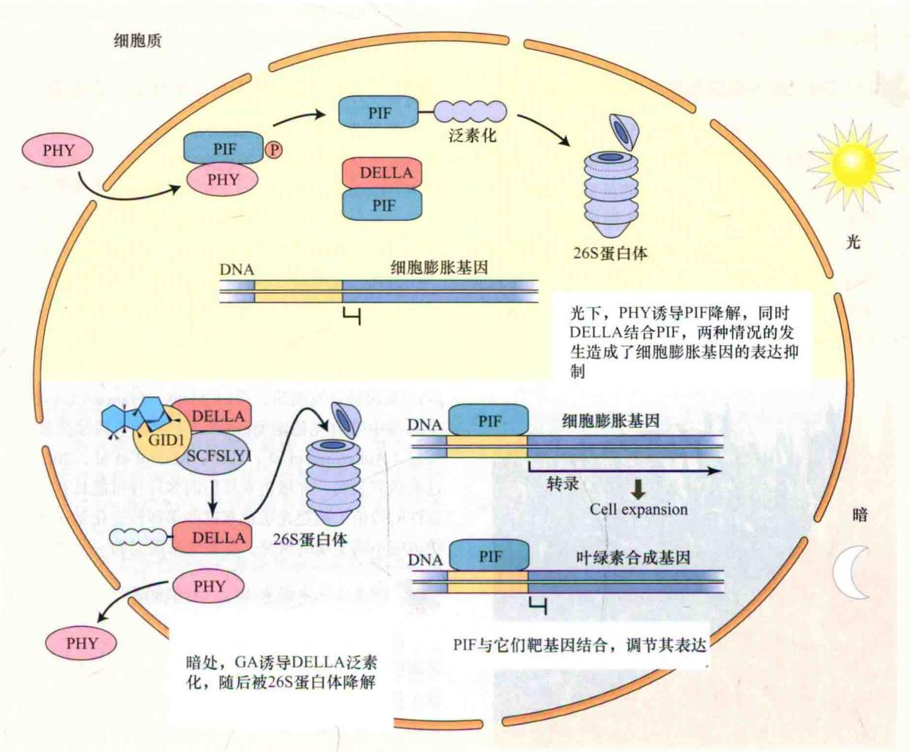

图17.17 光信号和植物激素信号途径交叉。暗处，赤霉素促进植物生长，依赖于其与受体结合调节DELLA蛋白的泛素化（参考第14章和第20章）。随后，泛素化的DELLA蛋白被26S蛋白酶体降解。缺少DELLA蛋白时，PIF蛋白对基因的表达可能起正向调控作用，也可能起负向调控作用，这些作用的发挥主要是通过与不同的搭档，即目标基因上游的不同顺式作用元件的互作来实现的。光下，DELLA蛋白与PIF蛋白结合，抑制PIF蛋白与基因互作。同时，PIF蛋白也是PHY蛋白的靶目标，通过磷酸化导致PIF蛋白的泛素化和降解。PIF蛋白缺失后，细胞扩增所需基因不表达，最终导致植物生长缓慢。

由暗形态建成向光形态建成转变（如叶绿素的生物合成）中的各种光信号，并参与了植物对光质变化的微调节反应（如避阴反应）。由于PIF蛋白是转录因子，这更证实了现有的观点，即至少有一部分光敏色素的信号转导通路是相对较短的。

## 17.7.3 颗粒小的种子的萌发通常需要高R：FR值

光质在调控一些种子的萌发中也起重要作用。如前所述，光敏色素是在光依赖的莴苣种子萌发研究中被发现的。

一般来说，颗粒大的种子含有丰富的营养，能维持延伸的幼苗在暗中（如地下）的生长，它们的萌发不需要光。然而，许多草本和草原物种的小颗粒种子的萌发需要光，如果这些种子被埋在光穿透不到的土壤深处，它们大多将一直处于休眠状态，甚至被水合。即使这些种子处于地表或接近地表处时，植物株冠的遮阴水平（即它们接受的R：FR）也可能影响它们的萌发。例如，已有的报道表明，冠层的远红光聚集可抑制许多种类的小颗粒种子的萌发。

对于那些处于森林深处地面的热带物种喇叭树（Cecropia obtusifolia）和韦拉克鲁斯胡椒（Piper auritum）的小颗粒种子而言，如果及时地将一个滤光片（仅冠层遮阴光中的红光成分透过，而阻止远红光成分透过）置于种子上时，这种种子萌发的抑制就会被逆转。虽然株冠透过很少的红光，但足以刺激种子的萌发。大多数远红光抑制作用的解除可能是通过这种光过滤作用和较高的R：FR的存在而实现。通过株冠缝隙接受太阳光的种子比处于稠密遮阴地带的种子更有可能萌发。太阳光能有利于幼苗在耗尽种子中所储存的营养之前，通过光合作用维持自身生长。

## 17.7.4 减少避阴反应可提高农作物产量

避阴反应可能是植物对自然环境的高度适应的结果，有利于植物与其周围植物之间的竞争。但许多农作物种类，从生殖生长到营养生长的能量重新分配，减少了农作物的产量。近年来，如玉米产量的增加，主要通过培育新的耐株间稠密度（诱导了避阴反应）的品种，而不是通过增加单个植株的基础产量。结果，现在的玉米与以前的品种相比，在不降低产量的情况下能在更高植株密度下生长（图17.18）。

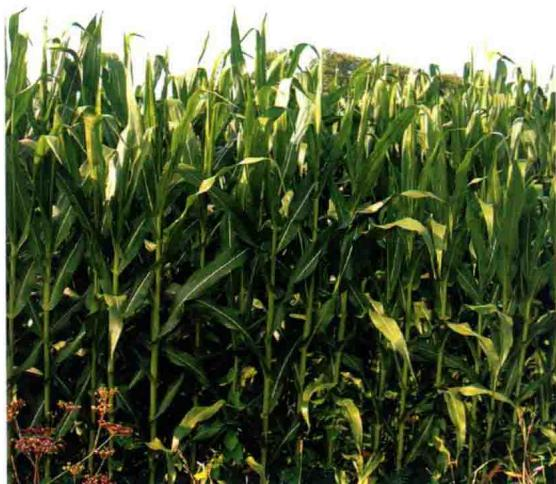

图17.18 高密度种植的玉米新品种。传统上，美国本土人把玉米种在小山或小丘上，小丘间有几英尺（1英尺=0.3048 m）的间隔，植株矮小，经常结出许多小谷穗。相比较，现代的杂交种是由机器成行种植的，株与株的间距很小[典型的为30 000\~38 000株/英亩（1英亩=0.4047 hm²）]。虽然多年来商品杂交品种的单株产量已不再持续提高，但总产量一直在增加，主要是在高种植密度下优化植株的性能。图中显示的是一个纽约州的典型玉米地。新品种直立的叶，有利于密植条件下植株捕获光能（T. Brutnell惠赠）。

由于人们对避阴反应的机制有了更深的了解，因此，为通过基因工程手段研究低避阴农作物开辟了广阔的前景。例如，Robson和他的同事构建了超表达phyA的转基因烟草植株（Robson et al., 1996）。这些植株在高密度下生长时，并不表现出典型的避阴反应，在高密度下比在低密度下长得更矮。phyA的超表达使处于富含远红光的遮光处植物体内持续保持phyA，而此时正常幼苗（非phyA的超表达），phyB已开始占主导作用。phyA的存在可引起FR-HIR反应的增加（见前文），并与phyB调控的避阴反应相拮抗。

虽然还有许多机制有待阐述，但研究已显示，光敏色素或它们下游靶因子操纵技术已不失为一种增加作物产量的具有广阔前景的新方法（Sawers et al., 2005）。

## 17.7.5 光敏色素反应呈现出生态型变化

到目前为止，我们知道的所有模式植物的光反应大多数是在有限数量的品种或检索中得到的。例如，已在拟南芥Colmbia和Landsberg生态型中进行了大量的遗传分析。在水稻和玉米中各有两个种系进行了全基因组测序。因此全世界植物研究计划趋于集中在这些品种。

然而，考虑到生态网络中光敏色素的作用时，必须检测更多的种质资源。拟南芥和玉米的光反应研究已揭示出其生理学及光敏色素基因家族方面巨大的生态型变化。例如，拟南芥Wassile wskija（Ws）生态型中一个phyD基因被自发删除，而Le Mans，France（Lm-2）的生态型中带有光稳定型phyA，不能调节持续远红光的反应（Aukerman et al., 1997; Maloof et al., 2001）。这些研究表明，光敏色素反应的多样性可能具有一些适应性的价值。确定光敏色素这些多样性变化是如何使植物适应不同生境的研究，将是未来研究的一大挑战。

## 17.7.6 光敏色素作用的调控

其他光受体的作用是否调节光敏色素的作用？编码调控蓝光反应的隐花色素和向光色素光受体（见第18章）基因的分离，使分析这些光受体是否与光敏色素存在功能上的重叠成为可能（Chory and Wu，2001）。因为隐花色素CRY2基因的突变导致该突变体在持续白光下开花延迟，而已知开花延迟受光敏色素控制。

持续蓝光或远红光处理可促进拟南芥开花，而红光抑制其开花。远红光是通过phyA起作用，红光拮抗效应是通过phyB来调节。既然蓝光促进开花，人们有可能推测cry2突变体开花会延迟。然而，cry2突变体在持续蓝光或红光下的开花时间与野生型是一样的。只有在蓝光和红光共同照射下，才能看到开花延迟。因此，cry2极有可能以直接互作的方式抑制phyB的功能（Mas et al., 2000），促进蓝光下植物开花。

另外的实验已证实隐花色素CRY1也与光敏色素相作用。CRY1和CRY2可与phyA在体外相作用，以依赖phyA的方式被磷酸化。在体内也发现了依赖红光的CRY1的磷酸化。

## 小结

光照调节植物的光形态建成，光敏色素参与调节光形态建成中营养生长和生殖生长的诸多方面（图17.1，表17.1）。

## 光敏色素的光化学和生物化学特性

· 红光在光形态建成中的作用可以被远红光逆转，相似的，远红光的作用也可以被红光逆转（图17.2）。

· 光敏色素存在Pr 和 Pfr 两种形式，Pfr 为其活性形式，这两种形式可以相互转变，形成光稳态（图 17.3）。

## 光敏色素诱导的反应的特性

· 光化学反应具有不受时间和光通量影响的特点（图17.4）。

· 光可逆的反应需要极少量的光（LFR）（图17.5）。

\- 短暂的光脉冲就能够诱导极低辐照度反应和低辐照度反应，但是对于其他的反应来说，这些反应与辐照度成比例关系（表17.2）。

## 光敏色素蛋白的结构和功能

\- 光敏色素是由两个亚基构成的二聚体。每个亚基由吸收光的发色团和与其共价结合的脱辅基蛋白多肽链组成（图17.6和图17.8）。光敏色素只能以二聚体形式吸收红光和远红光。

· 光敏色素折叠形成完整蛋白后，可以被红光激活，随后以生理激活型状态Pfr形式移动到核内调节基因表达（图17.7和图17.10）。

· 光敏色素是一种能够自磷酸化的蛋白激酶（图17.9）。在进化上，其起源早于真核生物。细胞溶质中，光敏色素接受红光和远红光信号后，能在几分钟甚至几秒内改变膜电势和离子流向，光敏色素在细胞核内功能在于调控基因表达。

· 不同性质的光敏色素由同一家族的不同成员编码，拟南芥中该家族成员包括PHYA、PHYB、PHYC、PHYD和PHYE。

## 光敏色素功能的遗传分析

· 光敏色素A介导持续性的远红光反应和红光反应。在拟南芥和水稻中，光敏色素A调控开花。

· 光敏色素B介导持续性的红光和白光反应，并且调节避光反应比如加速开花和促进下胚轴伸长。

· 光敏色素C、D和E也参与发育调节，但是这些功能可能与光敏色素A和B的功能有部分冗余。

· 不同信号通路途径中，光敏色素下游的信号分子各不相同，因此，能在不同物种甚至不同器官中产生不同的反应（图17.11和图17.12）。

## 光敏色素信号途径

· 光敏色素诱导的早期基因产物是能够激活其他基因的转录因子。

\- 对于初级反应的基因来说，信号转导途径与蛋白合成是相互独立的；而次级反应的基因需要新蛋白的合成。

· PIF家族成员是光敏色素反应的负调节子，在这

个信号通路的早期发挥作用。

· 一种蛋白如果只能与光敏色素A或者光敏色素B发生互作，光敏色素信号通路将在该点出现分支，而与光敏色素A和光敏色素B同时互作，信号通路将在该点汇集。

· 光敏色素可以与其他的激酶和磷酸酶相互作用（图17.13）。

· 光敏色素诱导基因表达产生的酶，可以使被蛋白酶体降解的蛋白泛素化（图17.14）。

## 昼夜节律

· 大多数的生物都表现出内源性的生物节律，而这些生物节律受到一种不受温度影响的内部振荡器或者是生物钟的控制。

· 在拟南芥中，转录水平上和翻译水平上的控制是生物钟功能调节这一复杂反馈环路上的重要调节单元（图17.15）。

· 在拟南芥中，光敏色素和隐花色素都参与生物钟调节。

· 光合系统Ⅱ（PSⅡ）中捕光色素蛋白的基因转录受昼夜节律和光敏色素的共同调节。

· 昼夜节律能够优化营养生长。

## 生态功能

· 在自然环境中，光敏色素使植物具有响应遮阴的功能。

· 遮阴行为（高水平的远红光或者低的 Pfr : P $_{total}$ ）诱导喜光植物长得更高（图17.16）。

· 拟南芥中光敏色素B在遮阴回避反应中发挥着主要的作用，在这个过程中光敏色素D和E在叶柄的伸长中也同样发挥着作用。

\- PIF蛋白和赤霉素信号通路相互作用调节植物的遮阴反应（图17.17）。

· 遮阴行为形成的高远红光环境抑制一系列小颗粒种子的物种的萌发。

· 合理密植可以减少遮阴回避行为，提高作物产量（图17.18）。

\- 蓝光反应在功能上可能与光敏色素的信号相重叠。

(赵翔 张骁 译)

## WEB MATERIAL

Web Topics

17.1 Mougeotia: A Choroplast with a Twist

Microbean irradiation experiments have been used to

localize filamentous green alga.

17.2 Phytochrome and High-Irradiance Responses
Dual-wavelength experiments helped demonstrate the role of phytochrome in HIRs.

17.3 The Origins of Phytochrome as a Bacterial Two-Component Receptor
The discovery of bacterial phytochrome led to the identification of phytochrome as a protein kinase.

## 17.4 Profiling Gene Expression in Plants

Progress in bioinformatic tool development and new sequencing technologies are changing the way we look at transcriptional networks.

17.5 Two-Hybrid Screens and Co-immunoprecipitation Protein-protein interactions can be studied using both molecular-genetic and immunological techniques.

## 17.6 Phytochrome Effects on Ion Fluxes

Phytochrome regulates ion fluxes across membranes by altering the activities of ion channels and the plasma membrane proton pump.

17.7 Microarray Studies on Shade Avoidance DNA microarray analyses have helped to characterize both global and specific effects of variations in the R : FR ratio on gene expression.

## Web Essays

## 17.1 Awakened By a Flash of Sunlight

When placed in the proper soil environment, seeds acquire extraordinary sensitivity to light, such that germination can be stimulated by less than 1 second of exposure to sunlight during soil cultivation.

## 17.2 Diversity of Phytochrome Chromophores

Bacterial and higher plant chromophores vary in their structure, attachment chemistries, and spectral properties. By replacing plant chromophores with bacterial chromophores, plants can be engineered to "see" different wavelengths of light.

## 17.3 Know Thy Neighbor Through Phytochrome

Plants can detect the proximity of neighbors through phytochrome perception of the R : FR of reflected light and produce adaptive morphological changes before being shaded by potential competitors.
