# 第 18 章

# 蓝光反应: 形态建成和气孔运动

人们都熟悉这样一种现象：放在室内窗边的植物枝条会向着光源的方向生长。这种现象称为向光性，这也是植物如何对单侧光作出反应以改变其生长模式的一个例子。这种植物对光的反应与光合作用的光捕获有着本质的区别。在光合作用中，植物利用光能并把它转化为化学能（见第7章和第8章）。与光合作用相比，向光性是利用光作为信号的一个例子。目前，有两种主要的光信号反应：一种是光敏色素介导的红光反应，这已在第17章中讲过；另一种是蓝光反应（blue-light response）。

有些蓝光反应在第9章中介绍过，例如，光下叶绿体在细胞中的运动及叶片向光转动。与光敏色素反应一样，植物也存在许多蓝光反应。在高等植物、藻类、蕨类、真菌和原核生物中已经有过关于蓝光应答反应的相关报道。除了向光性外，还包括藻类的离子吸收、幼苗下胚轴生长的抑制、叶绿体和类胡萝卜素合成的诱导、基因表达的激活、气孔运动和呼吸的增强。在能运动的单细胞生物中，如藻类和细菌，蓝光调节单细胞生物体接近或远离蓝光的趋光性反应（Sengar，1984）。蓝光也介导如布鲁氏等细菌的感染过程（Swartz et al., 2007）。

一些发生在细胞膜上的电反应可在蓝光照射后数秒内检测到。其他的代谢或形态建成反应，如蓝光刺激链孢霉菌（Neurospora）中色素的合成或藻类（Vaucheria）分枝的形成可能需要数分钟、数小时甚至数天的时间（Horwitz，1994）。

叶绿素和光敏色素吸收可见光中波长为400\~500 nm的蓝光；而其他发色团和一些氨基酸（如色氨酸）吸收紫外光中波长为250\~400 nm的光。那么，人们如何从功能上区分蓝光特异的反应呢？从使用红光的光合作用可以区分蓝光的特异反应，红光可以促进光合作用而对蓝光反应没有作用。通过测定红光/远红光的

可逆反应可区分蓝光反应和光敏色素反应，红光/远红光之间可逆反应是光敏色素反应的特性，而蓝光则没有此类反应。

另一重要特征是，许多高等植物的蓝光反应都具有独特的作用光谱。在第7章已讲过，作用光谱是描述可见光在产生生物响应中相对效力的光谱图（关于光谱学和作用光谱的详细介绍参见Web Topic 7.1）。通过比较发现，蓝光反应的作用光谱与可能的光受体的吸收光谱之间密切相关，这就表明所研究的调节光反应的色素可能就是介导特异光反应的光受体（图7.8）。

作为蓝光调节的向光性、气孔运动、下胚轴生长的抑制及其他一些重要反应的作用光谱，它们在400\~500 nm区域内有一独特的“三指”精细结构（图18.1），而在光合作用、光敏色素或其他光受图18.1 燕麦胚芽鞘中蓝光调节的向光性的作用光谱。作用光谱显示一个生物反应和吸收光谱之间的关系。在400\~500 nm区域内的“三指”结构是一些蓝光反应的特征（引自Thimann and Curry，1960）。

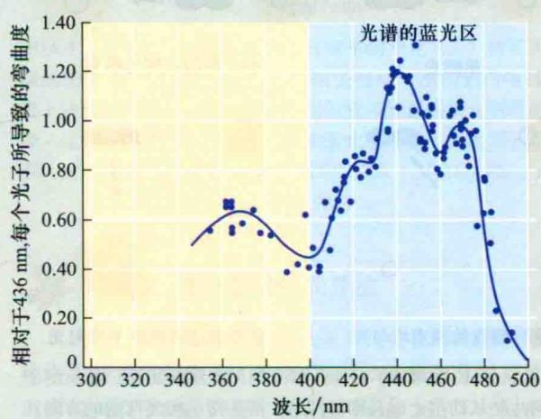

体所介导的光谱中却不具备这种结构（Cosgrove，1994）。

在本章中，我们将介绍植物中一些有代表性的蓝光反应，如向光性、茎生长的抑制和气孔运动等。其中气孔运动将详细论述，因为气孔在叶片气体交换和植物对环境的适应性反应过程中具有重要作用（见第9章）。同时，我们将探讨蓝光受体以及连接机体对光的感知与最终的蓝光应答之间的信号转导通路。

## 18.1 蓝光反应的光生理学

蓝光信号调控植物的诸多生理反应，以使植物感知光的存在及光的方向。本节主要论述典型蓝光反应的形态学、生理学及生物化学变化。

来自侧边的两束不均匀光  

## 18.1.1 蓝光诱导的不对称生长和弯曲

向着光（或特殊情况下背离光）的方向生长叫向光性（phototropism）。真菌、蕨类和高等植物中都存在向光性。向光性是一种光形态建成（photomorphogenetic）反应，黑暗中生长的单子叶和双子叶幼苗尤为显著。在实验研究中通常用单侧光，但是在自然条件下，当幼苗暴露在不同方向的两个光亮度不同的光源下，仍可发生向光性（图18.2）。向光器官内的光梯度，可能对植物感知光信号有着重要的意义（见Web Topic 18.1）。

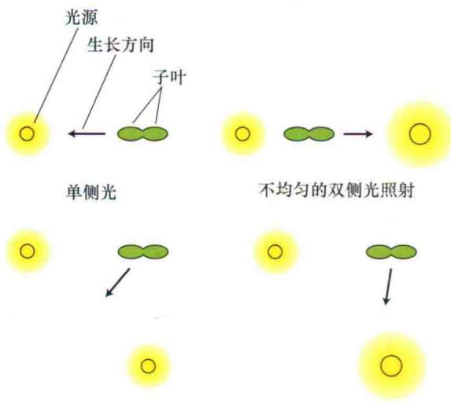  
来自侧边的两束均匀光  
图18.2 生长方向和不对称入射光照射之间的关系。显示的子叶图片是从幼苗上面观察得到的。箭头指示向光弯曲的方向。图像展示的是生长方向如何随着光源的位置和强度的改变而变

当一株小草破土而出时，其幼芽被一个称为胚芽鞘（coleoptile）（变形的叶片）的结构覆盖而保护（图

18.3和图19.1）。正如第19章所述，胚芽鞘向光侧和背光侧不同的光强度，导致两侧生长素浓度不均等，进而造成了胚芽鞘不均等的生长和弯曲。

  
图18.3 玉米胚芽鞘朝着右边单侧蓝光生长的慢速拍摄照片。左边第一个图像上，胚芽鞘大约3 cm长。连续曝光30 min。注意胚芽鞘弯曲角度随其生长而增加（M.A.Quinones惠赠）。

值得注意的是，向光弯曲只发生在正在生长的器官中，那些停止生长的胚芽鞘和胚芽即使在单侧光照射下，也不再发生向光弯曲。光下生长的草本植物，当其胚芽破土而出，第一片真叶从胚芽鞘尖端伸出时，胚芽鞘就停止生长。黑暗中生长的黄化胚芽鞘可以持续快速生长几天，高达几厘米，但这种情况要视植株种类而定。这些黄化胚芽鞘具有显著的向光反应（图18.3），因此是研究向光性的经典模型（Firn，1991）。

图18.1所显示的作用光谱是通过测量不同波长的光照射下燕麦胚芽鞘的弯曲角度获得的。光谱显示，在大约370 nm处有一峰值，并且正如前面提及的在400\~500 nm区域内有“三指”模型。双子叶植物苜蓿（Medicago sativa）的向光性作用光谱与燕麦胚芽鞘的很相似，表明这两种植物的向光性反应由相同的光受体介导。

在过去的30多年，由于先进的分子技术在拟南芥突变体中的便捷应用，使得这种小双子叶植物茎的向光性研究备受关注（图18.4）。有关拟南芥向光性的遗传与分子生物学知识将在本章后面介绍。

  
图18.4 野生型（A）和突变体（B）拟南芥幼苗的向光性。单侧光从右边照射（Dr. Era Huala惠赠）。

## 18.1.2 蓝光快速抑制茎的伸长

实际上，生长在暗处的幼苗茎伸长得很快，当幼苗破土而出时，光抑制茎伸长，这一现象是一个重要的光形态建成反应（见第17章）。照光后黄化幼苗中Pr与Pfr（分别代表光敏色素的红光和远红光吸收形式）之间的转变导致光敏色素依赖的茎伸长速率的急剧下降（图17.1）。

然而，值得注意的是，导致生长速率下降的作用光谱在蓝光区域内具有很强活性，这不能用光敏色素的吸收特性来解释（参考Web Topic 17.2）。实际上，在400\~450 nm蓝光区域内，抑制茎伸长的作用光谱与向光性反应的作用光谱极为相似（比较Web Topic 17.2与图18.1的作用光谱）。

从实验中，人们可以区分生长速率的下降是由光敏色素介导的还是由蓝光特异反应所调节的。如果莴苣幼苗在强黄光背景下，施加低通量的蓝光，其下胚轴生长速率就下降一半多。黄光背景提供了精确的Pr：Pfr比率（见第17章），增加低通量的蓝光并不能显著的改变的这一比率，从而排除了在施加蓝光情况下光敏色素对生长速率下降的影响。上述结果显示，蓝光调节的特异的下胚轴伸长反应与光敏色素介导的反应相互独立。

从时间进程上也可以把蓝光介导的特异的下胚轴反应与光敏色素所介导的下胚轴反应相区分开。由于物种不同，光敏色素介导的生长速率的改变在8\~90 min可检测到变化；然而蓝光反应却很迅速，在15\~30 s即可检测到（图18.5 A）。本章下面部分将讲到光敏色素与蓝光依赖的信号途径在生长速率调控方面的互作。

蓝光诱导的另一个快速反应，就是下胚轴生长速率受到抑制之前所发生的细胞去极化反应（图18.5B）。阴离子通道激活可以导致阴离子（如氯离子）流出细胞，从而引发膜的去极化（见第6章）。阴离子通道的阻断剂NPPB（5-nitro-2-14-phenylbutylamino-benzoate），可抑制依赖蓝光的膜的去极化，减弱蓝光对下胚轴的抑制效应（Spalding，2000）。

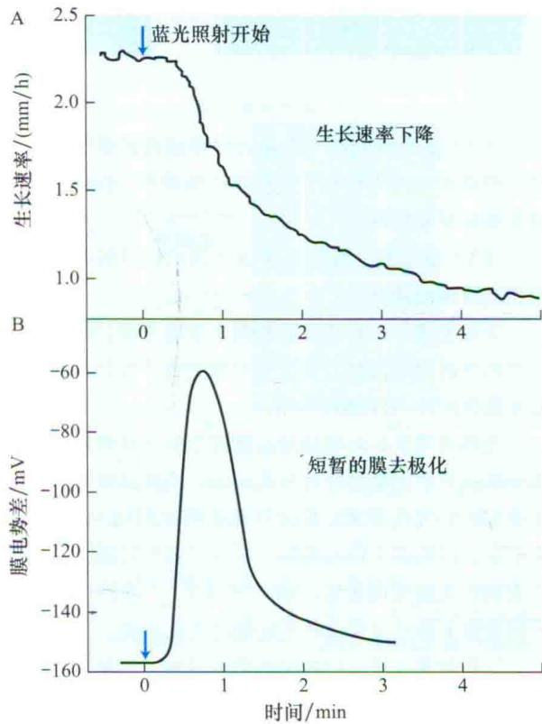  
图18.5 蓝光诱导的黄瓜幼苗生长速率的变化（A）和下胚轴细胞膜的短暂去极化（B）。当膜去极化（用细胞内电极测得）达到最大值时，生长速率（用位置传感器测量）则迅速下降。比较这两种曲线可看出，膜去极化发生在生长速率下降之前。这暗示了这两种现象之间的因果关系（引自Spalding and Cosgrove, 1989）。

## 18.1.3 蓝光促进气孔开放

现在讨论气孔对蓝光的反应。气孔在叶片的气体交换中起着重要的作用（见第9章），这种调节的有效性可影响到农作物的产量（见Web Topic 26.1）。依赖蓝光的气孔运动的几个独特特征使保卫细胞成为研究蓝光反应的一个有价值的实验体系。

（1）蓝光调节的气孔反应，反应迅速并且可逆，此反应仅在保卫细胞中存在（图18.6）。

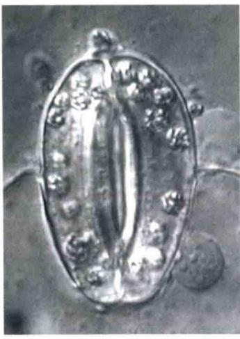  
20μm

（2）蓝光调节的气孔运动贯穿植物的整个生活周期，而蓝光对向光性和下胚轴伸长的调节，仅发生在植物发育的早期阶段。

（3）蓝光感受和气孔开放之间的信号转导通路已有相当详细的研究。

下面论述气孔对光反应的两个重要方面：驱动气孔运动的渗透调节机制，以及保卫细胞离子吸收过程中受蓝光激活的 $H^{+}$ -ATP酶的作用。

光作为重要的环境信号，调控生长于自然环境下、水分供应充足的植物叶片气孔运动。当到达叶片表面的光增加时，气孔开放；反之气孔关闭（图18.6）。在温室中生长的蚕豆（Vicia faba）叶片，其气孔随入射到叶片表面的太阳光而发生运动（图18.7）。在许多物种及不同情形下都已发现这种光依赖的气孔运动。

气孔对光应答反应的早期研究显示，二氯苯二甲脲（dichlorophenyldi-methylurea，DCMU）（一种光合电子传递系统的抑制剂）可部分抑制由光引起的气孔开放。这些结果表明，保卫细胞叶绿体的光合作用在光依赖的气孔开放过程中起作用。但是，对二氯苯二甲脲部分应答暗示一种涉及二氯苯二甲脲不敏感的机制，这说明非光合作用成分在气孔对光的应答反应中也有作用。有关气孔在可见光照射下对光反应的详细研究表明，光可激活保卫细胞中两种不同的反应：保卫细胞中叶绿体的光合作用（参见Lawson，2009，Web Essay 18.1）和蓝光特异的反应。

既然蓝光除了刺激其特异的气孔反应外，还调节保卫细胞的光合作用（参见图7.8中光合作用的作用光谱），那么仅用蓝光来研究气孔对蓝光的特异反应就显得不合适。为了比较清晰的区分这两种光反应，研究人员使用了双光束实验。首先，用高通量的红光使光合反应达到饱和状态，这样的状态阻止了随后再增强红光或蓝光时光合作用对气孔开启的调节。然后在饱和红光的基础上再附加低通量的蓝光（图18.8）。附加的蓝光可使气孔进一步显著开放，这并不是保卫细胞中光合作用所引起的，因为此时的光合作用已被红光所饱和。

图18.6 光刺激蚕豆离体表皮的气孔开放。光处理开放的气孔（A），暗处理关闭的气孔（B）。气孔开度的大小以显微镜测得的气孔宽度表示（E. Raveh 惠赠）。  
  
图18.7 叶片表面的气孔开放与有效光合辐射的曲线。生长于温室中的蚕豆（V. faba）叶片下表皮的气孔开度以测得的气孔宽度表示（A），紧随着照射至叶片的有效光合辐射水平（400\~700 nm）（B），这些都揭示气孔对光的反应是调节气孔开放的主要反应（引自Srivastava and Ieiger，1995a）。

饱和红光背景下，气孔对蓝光反应的作用光谱呈现前面已提及的“三指”模型（图18.9）。这种作用光谱是典型的蓝光反应光谱，与光合作用的作用光谱是有显著区别的。这暗示保卫细胞除进行光合作用外，还对蓝光有特异反应。

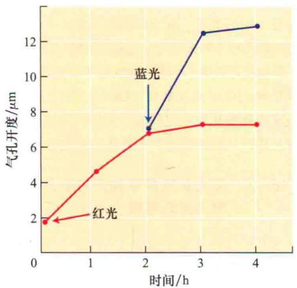

图18.8 红光背景下气孔对蓝光的反应。鸭跖草（Commelina communis）的离体表皮上的气孔用饱和红光处理（红色轨迹）。在平行实验中，气孔同时用红光和蓝光照射，如箭头所示（蓝色轨迹）。气孔开度比达到饱和红光时还要大，这表明一种受蓝光刺激的不同的光受体系统介导了气孔的额外增大（引自Schwartz and Leiger，1984）。  
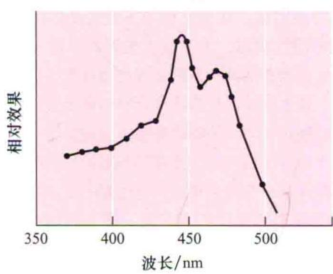  
图18.9 蓝光刺激的气孔开放的作用光谱图（红光为背景）（引自Karisson，1986）。

用纤维素酶等分解植物细胞壁的相关酶类分解保卫细胞的细胞壁后，可得到用来进行实验的保卫细胞原生质体（guard cell protoplasts）。当照射蓝光时，保卫细胞原生质体就会膨胀（图18.10），表明蓝光可被保卫细胞感知。保卫细胞原生质体的膨胀可显示完整的保卫细胞是如何发挥作用的。由光刺激引起的离子吸收和保卫细胞原生质体有机溶质的积累降低了细胞的水势（增大了渗透压）。因此，水分进入细胞，保卫细胞原生质体膨胀。在具有完整的细胞壁的保卫细胞中，这样的细胞膨胀导致了细胞壁的变形并且导致了气孔开度的增加（见第4章）。

## 18.1.4 蓝光激活保卫细胞质膜上的质子泵

当蚕豆保卫细胞原生质体在背景红光下照射蓝光时，悬浮介质的pH会变得更酸（图18.11）。蓝光诱导的这种酸化作用可被能驱散pH梯度的抑制剂（如CCCP，见下文）所阻断，也可被质子泵 $H^{+}$ -ATP酶的抑制剂（如钒酸盐）抑制，这些已经在第6章介绍过（图18.10B）。上述结果证实，蓝光诱导的酸化作用是蓝光激活保卫细胞膜上的质子泵ATP酶所导致的。

A  

  
蓝光下原生质体膨胀

  
图18.10 蓝光刺激的保卫细胞原生质体膨胀。A. 无坚硬的细胞壁时，洋葱（Allium cepa）的保卫细胞原生质体膨胀；B. 蓝光刺激的蚕豆（V. faba）保卫细胞原生质体的膨胀，且钒酸盐（一种H $^{+}$ -ATP酶的抑制剂）能阻止这种膨胀反应。蓝光促使保卫细胞原生质体对离子和水分的吸收，为完整保卫细胞的气孔开度的增加提供了机械动力（A图引自leiger and Hepler, 1977；B图引自Amodeo et al., 1992）。

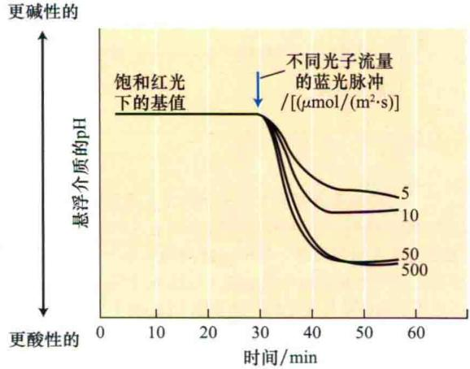  
图18.11 蚕豆（V. faba）保卫细胞原生质体悬浮介质在蓝光刺激30 s后的酸化作用。这种酸化是由于蓝光对质膜H $^{+}$ -ATP酶的激活作用，并且与原生质体的膨胀相联系（图18.12）（引自Shimazaki et al., 1986）。

在完整的叶片中，蓝光激活质子泵可降低保卫细胞质外体空间的pH，产生离子吸收和气孔开放所需的驱动力。保卫细胞质膜上的 $H^{+}$ -ATP酶已得到分离，并且其特征已被广泛研究（Kinoshita and Shimazaki，2001）。

像质子泵ATP酶这类生电泵的活性，可借助膜片钳实验来进行检测，并以细胞膜的外向电流来表示（有关膜片钳的描述参见Web Topic 6.2）。图18.12 A显示的是用膜片钳记录的经真菌毒素壳梭孢菌素（一种广泛应用的质膜ATP酶的激活子）处理的黑暗中的保卫细胞原生质体的电流。壳梭孢菌素处理可以激活外向电流并形成质子梯度。羰基氰化物间氯苯腙（CCCP，一种使质子具有高度透膜性的离子载体）阻止质子跨膜梯度的形成，抑制了质子的净外流。

  
图18.12 壳梭孢菌素和蓝光所激活的保卫细胞原生质体质膜 $H^{+}$ -ATP酶的活性可以用膜片钳实验所记录的电流来表示。A. 真菌毒素壳梭孢菌素（即 $H^{+}$ -ATP酶的激活子）所激活的保卫细胞原生质体质膜的外向电流（以皮安计量，pA），该电流可被离子载体羰基氰化物间氯苯腙（CCCP）所抑制。B. 由蓝光脉冲刺激的保卫细胞原生质体质膜的外向电流。这些结果表明蓝光激活了 $H^{+}$ -ATP酶（A引自Serano et al., 1988；B引自Assmann et al., 1985）。

壳梭孢菌素刺激保卫细胞原生质体质子的泵出和气孔的开放，CCCP抑制壳梭孢菌素刺激的气孔开放，上述这些发现表明，保卫细胞质膜上的质子泵和气孔开放之间存在一定的关系。蓝光刺激提高质子泵出的速率，表明当辐射到叶片的太阳光中蓝光成分增加会使气孔开度增加，饱和红光背景下的蓝光刺激也可以激活保卫细胞原生质体的外向电子流（图18.12B），图18.11中蓝光刺激的电子流和酸化反应之间的相关性证明实验中所测得的电流是质子从细胞内流向质外体或细胞外时形成的。

## 18.1.5 蓝光反应具有独特的动力学特征和时间滞后现象

有关气孔应答蓝光脉冲瞬时反应的一些特征进一步揭示出蓝光反应的重要特性：反应在光信号关闭后仍存在，这一重要的时间滞后现象可把光信号的开始与反应的开始加以区分开。与典型的光合作用反应不同，光合作用在光信号的刺激下很快激活并且随着光信号的终止而停止反应（图7.13），而蓝光反应在光脉冲照射几分钟后才达到峰值（图18.11和图18.12B）。

生理学上认为，光信号停止后蓝光反应可持续一段时间的原因是，在蓝光作用下蓝光受体由非活性状态转变为活性状态，关闭蓝光光源后，蓝光受体由活性状态转变为非活性状态的过程比较缓慢（Iino et al., 1985）。蓝光脉冲的反应速率依赖于蓝光受体的活性状态与非活性状态之间的转化进程。

蓝光脉冲反应的另一重要特征是滞后时间，即蓝光激活的酸化反应与外向电流的产生都存在大约25 s的滞后性（图18.11和图18.12）。这一滞后时间可能用于完成从光受体感受位点到质子泵H $^{+}$ -ATP酶的信号转导和质子梯度的形成。与之类似，前面已经讨论过的蓝光依赖下胚轴生长抑制的反应也有滞后时间。

## 18.1.6 蓝光调节保卫细胞的渗透平衡

蓝光通过激活质子泵和促进有机溶质的合成来调节保卫细胞的水势。在我们讨论蓝光的这些反应之前，先简要论述一下保卫细胞的渗透活性物质。

1856年，植物学家Hugovon Mohl提出，保卫细胞的膨压变化为气孔开度的变化提供了机械动力（见第4章）。1908年，植物生理学家F.E.Lloyd提出气孔运动的“淀粉-糖”相互转化假说，认为保卫细胞的膨压变化是由淀粉-糖的转变所引起的渗透变化来调节。20世纪40年代，日本学者发现了保卫细胞的钾离子流动，20世纪60年代西方国家再次证明该发现，建立了目前的K+和其平衡离子Cl-与苹果酸盐调控保卫细胞渗透平衡的理论，取代了气孔运动的“淀粉-糖”假说。

气孔开放时，保卫细胞内的K⁺浓度可成倍的增加，从关闭状态的100 mmol/L到开放状态下的400\~800 mmol/L，具体增加值要视物种和具体的实验条件而定。在大多数物种中， $\mathbf{K}^{+}$ 浓度的大幅度变化可被 $\mathrm{Cl^-}$ 和苹果酸根离子来平衡（图18.13A）（Talbott et al., 1996，参见Web Topic 18.2）。另一方面在葱属（Alliun）植物中，如洋葱（A.cepa），其 $\mathbf{K}^{+}$ 仅被 $\mathrm{Cl^-}$ 来平衡（Schnabl and Ziegler, 1977）。

  
图18.13 保卫细胞中三条显著不同的渗透调节途径。黑色箭头表示在保卫细胞的每一条渗透调节途径中导致活性渗透溶质积累的主要代谢步骤。A. K⁺离子及其平衡离子，K⁺和Cl⁻的吸收来自于质子梯度驱使的次级转导过程以及由淀粉水解产生的苹果酸。B. 蔗糖的积累来自于淀粉的水解。C. 来自于光合碳固定过程的蔗糖的积累。同时显示出来自质外体的蔗糖的吸收（引自Talbott and leiger，1998）。

Cl⁻在气孔开放时进入保卫细胞，气孔关闭时排出。苹果酸在保卫细胞胞质中，通过经淀粉水解产生碳骨架的代谢途径合成（图18.13B）。保卫细胞中苹果酸的含量随着气孔的关闭而下降，但是目前还不清楚，苹果酸是在线粒体呼吸过程中被代谢消化了，还是被排到细胞质外，或者同时参与两种过程。

前已述及，通过质子泵产生的 $H^{+}$ 所形成的电化学势梯度（ $\Delta\mu_{H^{+}}$ ）驱动了 $K^{+}$ 和 $Cl^{-}$ 的吸收（见第6章和图18.13）。质子的分泌使得保卫细胞跨膜的电动势负值更大。已测得的光依赖的超极化电压高达64 mV（Roelfsema et al., 2001）。另外，质子泵所产生的pH梯度为0.5\~1个单位。

第6章中提到质子梯度为 $K^{+}$ 通过电压调节的钾通道的被动吸收提供了动力（Schroeder et al., 2001）。 $Cl^{-}$ 被认为是通过质子-氯同向载体运输的（Pandey et al., 2007）。因此，蓝光依赖的质子泵所产生的驱动力对气孔开放过程中的离子吸收起重要作用。

与叶肉细胞的叶绿体不同，保卫细胞的叶绿体（图18.6）中存在大的淀粉粒，其淀粉含量在早晨随着气孔的开放而降低，傍晚随着气孔关闭而上升。淀粉不溶于水，是高分子量多聚葡萄糖，对维持细胞的水势不起作用，但是当其水解成葡萄糖和果糖及后来的蔗糖积累（Talbot and Zeiger，1998，图18.13B）后可降低保卫细胞的渗透势（或增大渗透压）。在相反的过程中，当淀粉合成增加时，可溶性糖的含量减少，导致细胞渗透势增加，这就将气孔关闭与的“淀粉-糖”假说联系起来。

人们发现K $^{+}$ 及其平衡离子在保卫细胞渗透调节中起重要作用后，“淀粉-糖”假说的重要性逐渐被忽略了（Outlaw，1983）。但是，接下来我们将阐述蔗糖作为“淀粉-糖”假说中主要的渗透调节分子，在保卫细胞渗透调节中如何发挥重要作用。

## 18.1.7 蔗糖是保卫细胞中的活性渗透溶质

通过研究完整叶片气孔在一天里的运动过程发现，保卫细胞中 $K^{+}$ 的含量在清晨气孔开放时增加，而在下午早些时候，尽管气孔开度继续增加，但 $K^{+}$ 的含量却降低。与之相比，蔗糖含量在清晨上升缓慢，并且随着钾离子的外流，蔗糖逐渐成为保卫细胞中主要的活性渗透溶质。在傍晚时分，气孔关闭，蔗糖含量降低（图18.14）。这些渗透调节模型是在温室或人工培养箱条件下生长的蚕豆和洋葱的保卫细胞中发现的（Talbott and Zeiger，1998）。

这些渗透调节的特征表明，气孔开放主要与 $K^{+}$ 的吸收有关，而气孔关闭与蔗糖含量降低有关（图18.14）。在渗透调节诸阶段，是钾离子起主导作用还是蔗糖起主导作用仍不清楚，但这也为气孔功能的调节奠定了基础。 $K^{+}$ 是白天气孔开放首先的渗透调节溶质。蔗糖的调节则与表皮细胞的气孔运动和叶肉细胞的光合作用二者之间协同调节相关联（Lawson，2009）。

活性渗透溶质来自于何处？研究表明，有三条主要的代谢途径可为保卫细胞提供活性渗透物质（图18.13）。

（1）伴随保卫细胞苹果酸根离子合成的质外体 $K^{+}$ 和 $Cl^{-}$ 的吸收（图18.13A）。

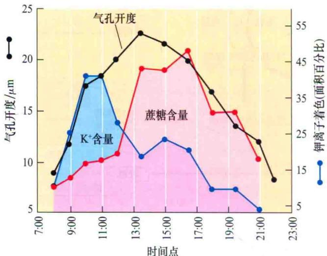  
时间点  
图18.14 蚕豆完整叶片保卫细胞气孔开度、 $K^{+}$ 和蔗糖浓度在一天中的变化情况。结果表明，早上气孔开放所需的渗透势由 $K^{+}$ 及其平衡离子所调节，而在午后则由蔗糖来调节（引自Talbott and leiger，1998）。

（2）保卫细胞叶绿体中淀粉的水解产生蔗糖（图18.13B）。

（3）保卫细胞叶绿体中光合碳固定过程产生蔗糖（图18.13C）。

不同的环境条件可能激活一条或几条途径。例如，置于 $CO_{2}$ 中的离体蚕豆表皮的气孔受红光刺激而开放，该过程仅依赖于保卫细胞原生质体中叶绿体光合碳固定所产生的蔗糖，并没有检测到 $K^{+}$ 的吸收或淀粉水解（图18.13C）。另外，在不含 $CO_{2}$ 的空气中，碳的固定是被抑制，而红光刺激气孔开放与 $K^{+}$ 钾离子的积累相藕联（图18.13A，Olsen et al., 2002；另见Web Topic 18.2）。

自然界中也存在一些不寻常的渗透调节途径。兰花保卫细胞的叶绿体缺乏叶绿素。兰花的气孔在蓝光下开启，但在典型的红光刺激下并不张开（Talbott et al., 2002）。相反，最近研究结果表明，铁线蕨的气孔缺乏对蓝光的应答而在红光下开启（Doi et al., 2008）。铁线蕨的保卫细胞具有异常多的叶绿体，红光依赖的气孔开放可以被光合作用电子传递的抑制剂DCMU抑制，这表明保卫细胞的光合作用是红光诱导气孔开放驱动力。另外，铁线蕨在 $CO_{2}$ 环境中累积钾离子，但是无论黑暗或红光下都对 $CO_{2}$ 不敏感。有趣的是，这些特异的渗透调节都与保卫细胞中存在异常多的叶绿体相关。此外，铁线蕨的气孔缺乏对蓝光的敏感性。相反，蚕豆气孔对 $CO_{2}$ 和蓝光的敏感性与气孔开放呈现出线性关系（Zhu et al., 1998）。这些结果表明铁线蕨对蓝光和 $CO_{2}$ 不敏感可能是与其缺乏蓝光传递系统有关（参考Web Essay 18.2）。

上述兰花和铁线蕨保卫细胞渗透调节的显著差异，表明保卫细胞具有很强的可塑性。在对完整的叶片的研究中也能发现保卫细胞的可塑性特征（Roelfsema et al., 2002; outlaw, 2003; Fan et al., 2004; Tallman, 2004）。这些可塑性特征包括保卫细胞对蓝光和 $CO_{2}$ 反应的适应，以及保卫细胞光合速率的日变化（Zeiger et al., 2002）。

## 18.2 蓝光反应的调节

目前，蓝光诱导气孔开放的信号转导过程中的几个关键步骤已被证明。质子泵 $H^{+}$ -ATP酶是气孔运动调节的中心环节。 $H^{+}$ -ATP酶的C端有一个调节酶活性的自我抑制结构域（图6.17）。如果这个自我抑制结构域被蛋白酶消除， $H^{+}$ -ATP酶将会被不可逆转地激活。酶活性的降低是通过抑制该区域的催化基团实现的。相反，壳梭胞菌素似乎是通过将这一结构域置换到远离催化基团的部位来激活酶的活性（Kinoshita and Shimazaki，2001）。

蓝光刺激 $H^{+}$ -ATP酶表现对ATP较低的 $K_{m}$ 值，较高的 $V_{max}$ 值，暗示蓝光可激活 $H^{+}$ -ATP酶（见第6章）。 $H^{+}$ -

ATP酶的激活，依赖于其C端丝氨酸和组氨酶的磷酸化。蛋白激酶抑制剂，能抑制 $H^{+}$ -ATP磷酸化，抑制蓝光激活的质子泵和气孔开放。壳梭胞菌素，像 $H^{+}$ -ATP酶磷化一样，解除 $H^{+}$ -ATP酸C端自我抑制区域对 $H^{+}$ -ATP酶催化位点的抑制。

14-3-3蛋白是真核生物中普遍存在的调控蛋白，研究发现14-3-3蛋白可以与磷酸化的保卫细胞H $^{+}$ -ATP酶结合，但是不能和未磷酸化的结合（图18.15）。植物中，14-3-3蛋白通过与细胞核内激活因子的结合调控转录过程，也可以调节如硝酸还原酶等代谢酶的活性。

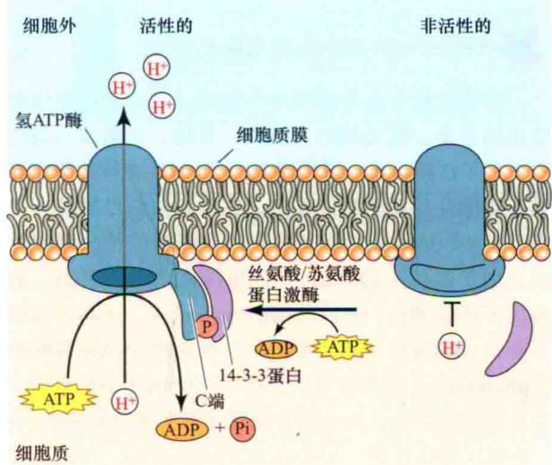  
图18.15 H $^{+}$ -ATP酶在调节气孔运动中的作用。蓝光激活H $^{+}$ -ATP酶。该作用主要是通过磷酸化该酶C端的Ser或Thr残基，随后保卫细胞中的分子伴侣14-3-3蛋白与H $^{+}$ -ATP酶磷酸化的C端结合。

目前研究发现保卫细胞中仅1/4的14-3-3蛋白能与 $\mathrm{H^{+}}$ -ATP酶特异结合。蓝光或壳梭胞菌素刺激可促使这种类型的14-3-3蛋白与保卫细胞中 $\mathrm{H^{+}}$ -ATP磷结合，而 $\mathrm{H^{+}}$ -ATP酶C端功能域的去磷酸化作用，则使14-3-3蛋白与 $\mathrm{H^{+}}$ -ATP酶分离（图18.15）。最近研究表明，保卫细胞中的向光素是一种蓝光受体，蓝光可诱导其发生磷酸化，并与14-3-3蛋白结合，详述请参看后面章节（Kinoshita et al., 2003）。

保卫细胞的质子泵运输质子的效率随着蓝光强度的增加而增加（图18.12），质子泵所产生的电化学梯度驱动保卫细胞吸收离子，使保卫细胞不断的膨胀并引起气孔开启。这一过程是蓝光激活丝氨酸/苏氨酸蛋白激酶与蓝光刺激引起的气孔开放这两个过程的重要重要中间步骤（图18.15）。

## 18.3 蓝光受体

Charles Darwin和他的儿子Francis在19世纪进行的向光性反应中证明，植物通过其胚芽鞘尖端感应蓝光。早期的理论假设认为，蓝光受体可能是位于胚芽鞘顶端的类胡萝卜素和黄素这两种色素。虽然人们一直不懈的努力，但是直到20世纪90年代早期，蓝光受体的鉴定才取得突破性进展。关于向光性和抑制茎生长方面的研究成果都归功于一些重要蓝光响应突变体的鉴定和相关基因的分离。

随后我们主要介绍参与蓝光反应的三种受体：隐花色素，主要参与调节抑制茎伸长和开花；向光素，主要参与向光性反应；以及玉米黄质，主要参与蓝光诱导的气孔开放。

## 18.3.1 隐花色素调节植物发育

隐花色素首先在拟南芥中发现，之后在许多生物体包括蓝藻、蕨类植物、藻类、果蝇、老鼠及人类中均发现了这种物质，通过对拟南芥hy4突变体的研究完成了对隐花色素的功能鉴定。在本章前面已提及，拟南芥hy4突变体缺失蓝光调节的下胚轴伸长的抑制反应。由于遗传上的缺陷，hy4植株在蓝光照射时，表现出下胚轴伸长。HY4基因的分离显示，该基因编码一个75 kDa蛋白质，该蛋白质与微生物DNA光裂解酶（photolyase）具有重要同源序列。DNA光裂解酶是一种蓝光激活的酶，具有修复暴露于紫外光下的DNA中的嘧啶二聚体作用（Ahmad and Cashmore，1993）。鉴于其序列的相似性，HY4蛋白质后来被称为隐花色素1（crytochrome 1，CRY1），是抑制茎伸长的蓝光受体。然而植物中的隐花色素并无光裂解酶活性。

与光裂解酶一样，隐花色素由一个黄素腺嘌呤单核苷酸（flavin adenine dinucleotide，FAD）（图11.2B）和一个蝶呤（pterins）构成。蝶呤是吸收光的物质，其衍生物蝶啶通常存在于昆虫、鱼类及鸟类的色素细胞里（蝶呤结构见第12章）。在光裂解酶中，蓝光被蝶呤色素吸收，产生的激发能被传递给黄素腺嘌呤单核苷酸。然而，还不清楚隐花色素的作用机制是否相似，或者是蓝光直接被黄素腺嘌呤单核苷酸吸收。

隐花色素调节多种蓝光应答反应，包括抑制下胚轴伸长、促进子叶伸展、细胞膜去极化、叶柄生长、花青素的产生和生物钟的调控。CRY1超表达的转基因烟草和拟南芥中，强蓝光刺激的下胚轴伸长的抑制明显增强，花青素苷的合成明显增加（图18.16）。

从拟南芥中还分离得到CRY1的同源物CRY2（Lin，2000）。CRY1和CRY2广泛存在植物界。它们之间的区别在于CRY2在蓝光下快速降解，而CRY1表现地更为稳定。

野生型背景下超表达CRY2，得到的转基因植物在下胚轴伸长抑制效应方面作用很小。这表明与CRY1不同，CRY2在抑制下胚轴伸长的反应中并不起作用。但是，CRY2超表达的转基因植物可明显增强蓝光刺激的子叶扩展。除此之外，CRY1参与拟南芥生物钟调节（见第17章），CRY1和CRY2在诱导开花过程中都起作用（见第25章）。隐花色素类似物可调节果蝇、老鼠和人类的生物钟。

光照后CRY1和CRY2都可在细胞核检测到，并且它们都与泛素连接酶COP1（其在体内及体外的实验第17章中已经论述过）相互作用。隐花色素的活性受其磷酸化状态的影响。CRY1和CRY2在体外即可被光敏色素A磷酸化，但是它们与光敏色素A的互作主要发生在体内（见第17章和Web Essay 18.2）。研究表明，磷酸化和蛋白降解在隐花色素介导的蓝光信号转导过程中均起重要作用（Spalding and Folta，2005）。

关于细胞核与细胞质中CRY蛋白质的区别已经在拟南芥中鉴定过了（Wu and Spalding，2007）。与预想不同，CRY1分子存在于细胞核中而不是细胞质中。CRY1可以在几秒的时间内调控细胞膜的去极化，这也是CRY1响应蓝光信号调控最为快速的方式之一。但目前还不清楚该机制是否与依赖蓝光的阴离子通道的激活有关。

## 18.3.2 向光素调节依赖蓝光的向光弯曲和叶绿体运动

已知植物在单向光源照射下会弯向光源生长，以最大限度吸收光，这种向光性反应受蓝光调控（图18.4）。缺乏依赖蓝光的下胚轴向光弯曲的拟南芥突变体分离和鉴定，为研究向光弯曲早期的细胞事件提供了有价值的信息。其中的一个突变体，nph1（nonphototropic hypocotyl），其在遗传上不同于早先提及的hy4（cryl）突变体。nph1突变体缺失下胚轴的向光反应，但具有正常的蓝光刺激的下胚轴伸长的抑制反应，而hy4的表型却与之相反。nph1基因后来被重新命名为phot1，其所编码的蛋白质被命名为向光素（phototropin）（Briggs and Christie，2007）。向光素（Phot1和Phot2）调节植物的向光性、叶绿体的运动、快速抑制黄化苗的生长和叶片的伸展。

A  

B  
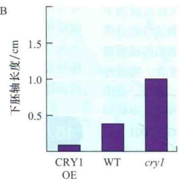  
图18.16 蓝光诱导拟南芥转基因和突变体植株中花色素的累积（A）和茎伸长的抑制反应（B）。柱状图分别代表编码CRY1基因的超表达植株（CRY1OE）、野生型（WT）和cry1突变体植株。编码CRY1基因的超表达转基因植株对蓝光反应增强，表明该基因在刺激花色素的合成和抑制茎伸长反应中具重要的作用（引自Ahmad et al., 1998）。

向光素C端含有一个Ser/Thr的蛋白激酶区域，N端含有两个相似的LOV（光、氧气和电压）区域，每一区域大约有100个氨基酸。LOV区域与黄素结合，其序列与细菌和哺乳动物体内信号蛋白相类似。这些蛋白质在大肠杆菌（E.coli）和固氮细菌（Azotobacter）中是氧气的感受子，在果蝇（Drosophila）与脊椎动物中则是钾离子通道的电压感受器。

向光素的N端与黄素单核苷酸（flavin mononucleotide，FMN）相结合（图11.2B），并且发生依赖蓝光的自我磷酸化反应。此反应与黄化幼苗生长区域的一个120 kDa膜蛋白的依赖蓝光的自我磷酸化反应很相似。尽管多个研究组分别进行大量的实验但是向光素自我磷酸化之后细胞内所发生变化及其与蓝光反应的关系还不清楚（Inoue et al., 2008）。

最近的光谱学研究表明，黑暗处，一个FMN分子非共价地与一LOV区域结合。经蓝光照射，FMN分子共价地结合在向光素分子的半胱氨酸残基上，形成半胱氨酸-黄素共价加合物（图18.17）（Swartz et al., 2004），这一反应可被黑暗处理所逆转。

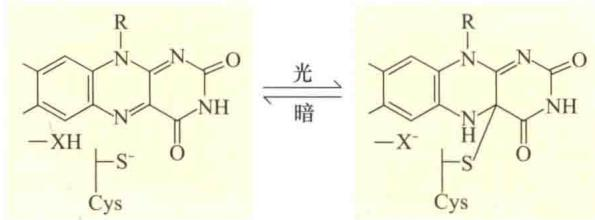  
图18.17 蓝光照射下，FMN与向光素的半胱氨酸残基形成加合物。XH和X-分别代表未鉴定的质子供体和质子受体（引自Briggs and Christie，2002）。

在拟南芥基因组中还有与phot1相联系的另一个基因——phot2。phot1突变体在低强度蓝光[0.01\~1 μmol/(m²·s)]照射下，其下胚轴缺失向光弯曲反应，但是在高强度蓝光[1\~10 μmol/(m²·s)]照射下仍能保持向光反应。phot2突变体具有正常的向光反应，而phot1/phot2双突变体无论在低强度蓝光还是在高强度蓝光下都严重缺失向光反应。这说明phot1和phot2都参与向光反应，phot2仅在高光强或者通过长时间光照下才起作用。

光受体在茎伸长抑制反应中的相互作用 通过对蓝光抑制下胚轴的伸长反应过程中生长速率变化的精细分析，为研究向光素、CRY1、CRY2与PHYA（Parks et al., 2001）之间的相互作用提供了有价值的信息。在蓝光处理30 s后，野生型拟南芥幼苗在开始的30 min内伸长速率快速下降，随后几天内缓慢生长（图18.18）。

  
图18.18 蓝光刺激的拟南芥茎伸长抑制反应中的信号感受与转导通路。在暗处（0.25 mm/h）的伸长速率定为1。蓝光照射30 s，30 min内生长速率下降到接近于零，随后几天内生长速率持续在一个很低水平。当用蓝光处理phot1突变体后，在第一个30 min暗处生长速率保持不变，这表明在第一个30 min内生长的抑制是受向光素控制的。用cry1、cry2和phyA突变体所做的类似实验表明，这三个基因产物在后期控制茎的伸长速率（引自Parks et al., 2001）。

对phot1、cry1、cry2和phyA突变体的同一反应分析发现，在幼苗去黄化过程中，蓝光对茎伸长的抑制反应首先由phot1启动，而CRY1和一定量的CRY2则在30 min后调节反应。经蓝光处理的幼苗，其茎生长速率缓慢主要是由于CRY1的持续作用，这也是拟南芥cry1突变体的下胚轴比野生型长的原因。phyA突变体中并没有发现生长抑制现象，表明光敏色素A至少在蓝光调节的生长反应的早期阶段起作用。

蓝光诱导的叶绿体运动 叶片在不同的光照条件下可改变细胞内叶绿体的分布，叶绿体的重新分布可以调整光吸收和避免光伤害（图9.13）。弱光下，叶绿体在叶肉细胞的上下表面聚集（即“聚集”反应；图9.13B），从而最大限度地增强植物对光的吸收。

强光下，叶绿体移向细胞表面与入射光平行（即“避光”反应；图9.13C），从而尽可能减少植物对光的吸收和避免光伤害。诱导叶绿体重新分配的作用光谱具有典型的蓝光反应特征——精确的“三指”结构。最近的研究表明，phot1突变体的叶肉细胞具有正常的避光反应和微弱聚光反应，而phot2突变体的细胞具有微弱聚光反应，然而缺乏避光反应。在phot1/phot2双突变体中，完全缺失避光和聚光反应（Kadota et al.,

2009）。该结果表明，phot2在避光反应中起着重要作用，而且phot1和phot2在聚集反应中表现功能冗余。

## 18.3.3 玉米黄质对保卫细胞蓝光感受的调节

拟南芥突变体npql（nonphotochemical quenching）的气孔缺少特异的蓝光反应，该突变体中催化类胡萝卜素紫黄质转变为玉米黄质的酶受损（Niyogi et al., 1998）。回顾第7章和第9章，玉米黄质是叶绿体中叶黄素循环途径的主要成分之一（图7.35），保护光合作用色素免受过量激发能的损伤。另外，玉米黄质是保卫细胞中的蓝光受体，调控蓝光激发气孔开放。在缺失玉米黄质的情况下，npql突变体缺少特定的蓝光反应，为玉米黄质是保卫细胞蓝光受体提供了令人信服的证据（图18.19）（Freanina et al., 1999）。

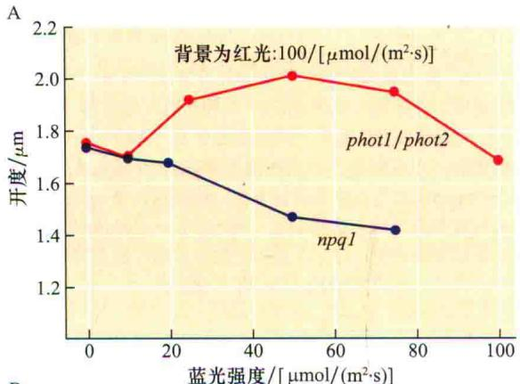

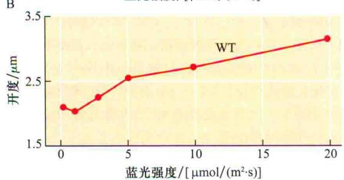  
图18.19 A. 玉米黄质缺失的突变株nph1及向光素缺失的双突变株phot1/phot2对蓝光的敏感度。在 $100\ \mu mol/(m^{2}\cdot s)$ 的红光背景下分析蓝光反应，这样可以避免由于蓝光刺激的光合作用所导致的气孔开放。通过蓝光刺激光合作用，检测到抑制气孔开放的蓝光反应。黑暗条件下光通量为0。在 $10\ \mu mol/(m^{2}\cdot s)$ 的蓝光照射下，两种突变体的气孔都没有开放。phot1/phot2双突变株在较高蓝光强度照射下气孔开放。事实上，npq1突变体气孔关闭，最有可能是因为，附加的蓝光对光合作用驱动的气孔开放产生了抑制作用。B. 蓝光激活野生型植株的气孔开放。Y轴显示气孔开度的变化，与野生型相比，phot1/phot2气孔的开度明显减小（Talbott et al., 2002）。

另外有证据进一步指出，在保卫细胞中玉米黄质作

为蓝光受体发挥功能。

（1）生长于温室里完整叶片的气孔开放、有效辐射和保卫细胞中玉米黄质的含量日变化之间紧密相关（图18.20）。

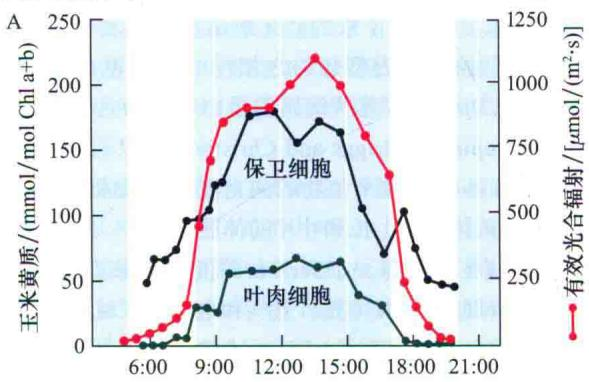

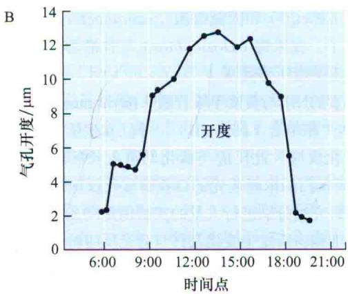  
图18.20 保卫细胞中玉米黄质的含量与有效光合辐射、气孔开度之间的密切关系。A. 叶片表面有效光合辐射和温室生长的蚕豆叶片保卫细胞（黑色线条）及叶肉细胞（绿色线条）中玉米黄质含量的日变化。图中白色区域凸显叶肉细胞和保卫细胞中的叶绿体在低辐射（常常发生在清晨和黄昏）下，对叶黄素循环的敏感性比较。B. 同一叶片的气孔开度用来测定保卫细胞中玉米黄质的含量（引自Srivastava and Zeiger，1995a）。

（2）玉米黄质的吸收光谱（图18.21）与蓝光诱导的气孔开放的作用光谱（图18.9）非常相似。

（3）保卫细胞对蓝光的敏感性随着玉米黄质浓度的增大而增强。紫黄质到玉米黄质的转变依赖于类囊体腔的pH。光驱动的类囊体膜质子泵可酸化类囊体内腔，增加玉米黄质的浓度（图18.22）。由于叶黄素循环的特征，红光照射的保卫细胞积累玉米黄质。离体的表皮上的保卫细胞先被施加不断增加的红光影响比率，然后用很短的蓝光脉冲照射，结果显示蓝光刺激气孔开放与红光预处理的影响比率及在蓝光脉冲照射时保卫细胞内玉米黄质的含量呈线性相关（Srivqtava and Zeiger，1995b）。

（4）蓝光诱导的气孔开放可被3 mmol/L的二硫苏糖醇（DTT）抑制，且这种抑制具有浓度依赖性。DTT

  
图18.21 玉米黄质在乙醇中的吸收光谱。

可阻断玉米黄质的合成。作为一种还原剂，DTT可把S—S键还原为—SH基，并有效抑制使紫黄质转变为玉米黄质的酶的活性。DTT并不阻断红光激发的气孔开放（Strivastava and Zeiger，1995b）。

（5）兼性CAM植物冰叶日中花（Mesembryanthemum crystallinum），盐胁迫使其碳代谢从C3模式变为CAM模式（见第8章和第26章）。在C3模式中，气孔积累玉米黄质并且受蓝光刺激张开。CAM效应则抑制了玉米黄质的积累和响应蓝光刺激的气孔开放（Tallman et al., 1997）。

（6）在玉米胚芽鞘向蓝光弯曲的反应中，玉米黄质含量和向光性反应线性相关（Web Topic 18.3）。

## 18.3.4 绿光逆转蓝光刺激的气孔开放

蓝光刺激的气孔开放可被绿光（500\~600 nm）所逆转。当保卫细胞同时接收蓝光和绿光照射时，气孔的蓝光反应将被抑制（见 Web Essay 18.4）。在脉冲实验中，绿光同样能逆转蓝光反应（图18.23）。离体表皮实验中，30 s 的蓝光脉冲可以诱导气孔开放，但若是蓝光脉冲过后给予绿光脉冲，则蓝光诱导的气孔开放被抑制。如果绿光处理后再第二次照射蓝光，气孔开放将得到恢复，这与光敏色素红光和远红光的可逆反应类似（Frechilla et al., 2000）。蓝光和绿光之间的可逆反应已经在几种植物离体表皮实验中得到证实，同时在完整的叶片中也被观察到（参见Web Essay 18.4）。

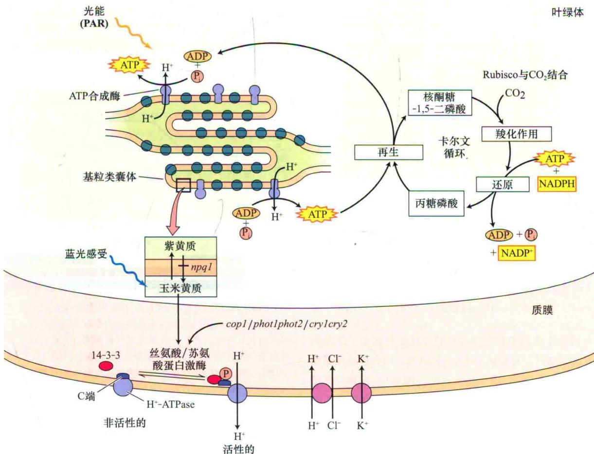  
图18.22 玉米黄质在保卫细胞的蓝光感应中的作用。保卫细胞中玉米黄质的浓度随着叶黄素循环的活性而发生改变。将紫黄质转变为玉米黄质的酶是一种类囊体膜蛋白，该酶作用的最佳pH为5.2（Yamamoto，1979）。管腔酸化刺激玉米黄质和碱性紫黄质的形成。腔内的pH取决于入射光的有效辐射水平（蓝光和红光波长作用最有效，参见第7章）及ATP的合成速率，而ATP的形成有赖于能量消耗和跨类囊体pH梯度的消耗。因此，保卫细胞中叶绿体光合作用的活性、管腔pH、玉米黄质含量及蓝光灵敏度在调节气孔开度上相互作用。与叶肉细胞中相应的成分相比，保卫细胞叶绿体中含有丰富的光系统Ⅱ，因此，它们具有较高的光合电子传递速率及较低的碳固定率（Zeiger et al., 2002）。这些特性在低光子通量条件下有利于管腔酸化，同时也解释了保卫细胞叶绿体中玉米黄质的形成（图18.20），管腔pH调控的玉米黄质含量，以及管腔pH与保卫细胞叶绿体中卡尔文-本森循环的紧密结合，进一步表明保卫细胞叶绿体的二氧化碳固定率调节了玉米黄质的含量并整合了保卫细胞对光和二氧化碳的灵敏度（Web

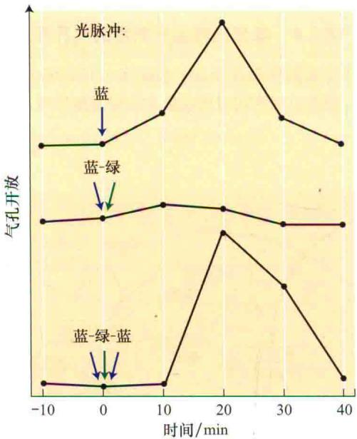  
图18.23 气孔运动的蓝光-绿光可逆性。当在连续红光 $[120\ \mu mol/(m^{2}\cdot s)]$ 背景下给以30 s蓝光脉冲 $[1800\ \mu mol/(m^{2}\cdot s)]$ ，气孔开放。在蓝光脉冲之后，用绿光脉冲 $[3600\ \mu mol/(m^{2}\cdot s)]$ 处理，可阻止上述蓝光反应，然而，如果在绿光脉冲处理后再给以第二次蓝光脉冲处理，气孔开放则恢复（引自Frechilla et al., 2002）。

培养室中拟南芥完整叶片的气孔受到蓝光、红光和绿光同时照射，关闭绿光时，气孔开放，而再次打开绿光气孔关闭（图18.24）（Talbott et al., 2006）。这种气孔对绿光的敏感性反应不受叶肉和保卫细胞的光合作用的调控，因为光合效率低时气孔会关闭，即使感应到绿光关闭信号。只用红光和绿光照射叶子的实验中，关掉绿光，并未观察到绿光介导的气孔开放。因此，绿光调节的气孔开放反应只有在蓝光存在的情况下才能被观察到，就像在离体的表皮条实验中观察到的那样。在完整叶片的气孔对绿光反应的有重要的生理生态意义，即来自太阳光照射时的绿光子在自然条件下下调蓝光照射下的气孔反应。

向光素缺失双突变体phot1/phot2的气孔，受蓝光刺激后会开放，绿光关闭后，气孔开度进一步增加，但是玉米黄质缺失突变体npql的气孔则无此现象（图

18.24）。上述结果说明，绿光逆转蓝光反应需要玉米黄质，并不需要向光素。

A 野生型  

B npql单突变体  
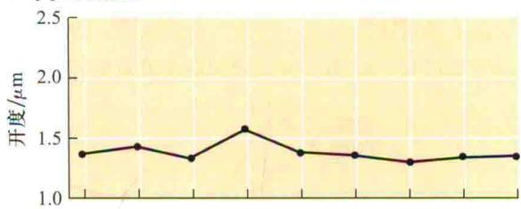

C phot1/phot2双突变体  
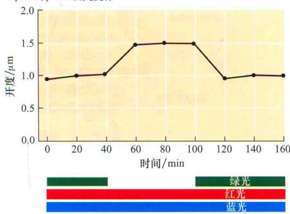  
图18.24 绿光对完整叶片上的气孔开度的调节。生长于蓝光、红光和绿光同时照射的培养室中的拟南芥完整叶片，关闭绿光时气孔开放，再次打开绿光时气孔关闭。气孔对绿光的反应需要蓝光的存在。玉米黄质缺失突变体npql的气孔对绿光不反应，而phot1/phot2双突变体的气孔与野生型有相似的反应（引自Talbott et al., 2006）。

绿光逆转蓝光诱导的气孔开放作用的光谱显示，在540 nm时抑制作用最强，在490 nm和580 nm处还有两个小峰（图18.25）。该作用光谱排除了光敏色素和叶绿素参与的可能性。该作用光谱与蓝光刺激的气孔开放的作用光谱极其相似，但是发生了大约90 nm的红移（移向更长的红光波段）。在蛋白环境中，胡萝卜素的异构化也观察到相似的红移现象。正如前面讨论的，蓝光激发气孔开放的活跃光谱与玉米黄质的吸收光谱是一致的（图18.21）。最近的光谱学研究表明，绿光对玉米黄质的异构化非常有效（Milanowska and Gruszecki，

2005）。玉米黄质的异构化改变了膜上分子的位置取向，这种转变是一个非常有效的信号转导过程。

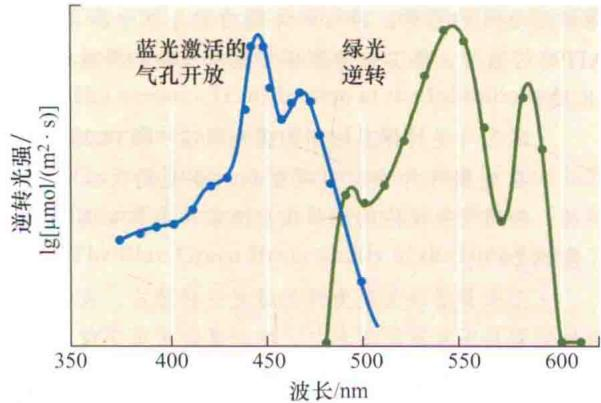  
图18.25 蓝光诱导气孔开放（左曲线，源自于Karlsson，1986）及其被绿光所逆转（Frechilla et al., 2000）的作用光谱。蓝光诱导气孔开度的作用光谱，是在红光背景下，通过引起测量小麦叶片蒸腾作用的波长得到的。绿光逆转蓝光诱导气孔开放的作用光谱是在照射恒定的蓝光强度及不同波长的绿光条件下，通过测量蚕豆离体表皮气孔的开度变化得到的。注意这两个光谱是相似的，绿光逆转光谱大约红移90 nm。在蛋白质的环境中，类胡萝卜素异构化之后，观察到相似的光谱红移。

类胡萝卜素蛋白质复合体对光强的感应 一种类胡萝卜素蛋白复合体作为光强感受器为保卫细胞中（Wilson et al., 2008）蓝光-绿光之间的光循环提供了模型（Wilson et al., 2008）。在蓝藻中，橙色的类胡萝卜素蛋白（OCP）是一种与光合作用光系统Ⅱ中的藻胆体天线相关的可溶性蛋白。在第7章中介绍蓝藻是常见的淡水和海洋环境的光合细菌，OCP是一个35 kDa的蛋白质，含有1个非共价结合的类胡萝卜素，3'-海胆酮。玉米黄质和3'-海胆酮在化学结构上有密切关系，它们都是由β-胡萝卜素衍生的（Punginplliet al., 2009）。

蓝光会导致类胡萝卜素和OCP蛋白质结构的变化，将它们在黑暗中的形式转换成在光照下起作用的形式，即被激活的形式（图18.26）。绿光可逆转这一过程，在光合蓝藻中，OCP的这种激活形式在光保护的介入过程中起着不可缺少的作用。此外，OCP的蓝光吸收型与绿光吸收型之间的相互转换所形成的光循环可作为一种有效的光强度感受器发挥重要作用。

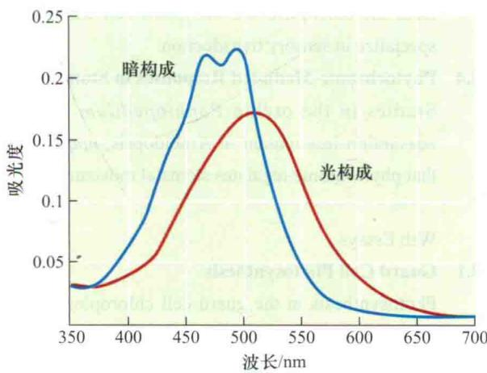  
图18.26 橙色类胡萝卜素蛋白蓝-绿光逆转吸收光谱

这些发现强烈表明，连续蓝/绿光脉冲对气孔开放的可逆调节是受光循环调控的。该过程可能涉及与蛋白相结合的玉米黄质吸收蓝光后转变为具有生理活性的绿光吸收形式，该绿光吸收形式吸收绿光后又重新转变为非活性的蓝光吸收形式。有趣的是，人们在高等植物保卫细胞、胚芽鞘叶绿体及蓝藻的OCP中，发现蓝光刺激的荧光猝灭现象（Web Essay 18.5），该现象可能与植物的光保护相关。

在20世纪40年代的胚芽鞘尖端感知蓝光的实验中，提出类胡萝卜素有可能作为蓝光受体，但此假设因为激活的类胡萝卜素具有非常短的半衰期而被排除。OCP代表一类首次文献报导蛋白与类胡萝卜素结合，作为蓝光受体感受光强的事例。这两个系统在保卫细胞叶绿体玉米黄质感知蓝光与蓝藻OCP的一些光学特征之间有惊人的相似之处，这也值得我们对这两个系统进行更深一步的研究。

光敏色素介导的气孔反应 许多研究试图界定光敏色素在气孔运动中的作用，一直没有得到突破。然而，最近研究发现在兰科苑兰及拟南芥玉米黄质缺失突变体npql中，光敏色素可调节气孔运动（Web Topic 18.4）。

因此，很明显保卫细胞对蓝光的反应可以通过三种不同的信号转导通路，即特异的蓝光受体、保卫细胞中叶绿体的光合作用，以及光敏色素介导的信号转导途径。它在气孔反应的研究中对于确定参与的信号转导通路是有用的，并且确定这些不同反应的试验方法是可行的。这一特定的蓝光反应可由绿光逆转，光合作用的蓝光成分可被饱和的红光阻挡，并且光敏色素反应是远红光的可逆反应。这些方法的应用在前面已有阐述。例如，在拟南芥突变体npq1中观察到的蓝光刺激的气孔开放不能被绿光逆转，但却可被远红光逆转，表明在此过程中参与的光受体是光敏色素（图18.19）。相反，在phot1/phot2中蓝光刺激的气孔开放可被绿光逆转，表明存在一个特殊的蓝光受体调控此反应（Tallbott et al., 2003）。

## 小结

植物利用太阳光，一是作为能量来源；二是作为感受外部环境信息的信号。蓝光信号的反应与光敏色素反应不同。

## 蓝光反应的光生理特性

· 特异的蓝光反应在波长为400\~500 nm有一个“三

指”特性的作用光谱（图18.1）。

· 这些蓝光信号被转导成为电的、代谢的和遗传的过程，从而改变植物生长、发育及其功能（图18.2）。

· 蓝光反应包括向光性、气孔运动、茎伸长的抑制、基因的激活、色素合成、叶的向光运动和细胞内叶绿体的运动等（图18.3\~图18.9）。

· 蓝光诱导的基因的转录、翻译，合成的蛋白质参与植物的光形态建成。

· 蓝光诱导的气孔运动受保卫细胞渗透势的改变驱动（图18.10）。

· 蓝光激活保卫细胞质膜H $^{+}$ -ATP酶，跨膜泵出的质子所产生的电化学势梯度为离子的吸收提供驱动力（图18.11和图18.12）。

· 蓝光也激活淀粉的降解和苹果酸的生物合成，蔗糖或钾离子和其对应共价离子在保卫细胞的积累导致气孔开放（图18.13）。

· 光质可以改变调节气孔运动的不同渗透调节途径的活性（图18.14）。

## 蓝光反应的调节

· 在植物中，14-3-3蛋白调节转录和代谢酶类。

· 仅当H $^{+}$ -ATP酶被磷酸化后，14-3-3蛋白可与其结合。

· 蓝光调节气孔运动，依赖于其对H $^{+}$ -ATP酶的激活（图18.15）。

## 蓝光受体

· 拟南芥中，基因cry1和cry2参与调节了蓝光依赖的茎伸长的抑制、叶片的扩展、花青素的生物合成、开花及生物节律的控制等（图18.16）

\- CRY1蛋白及少量的CRY2在核中积累，并与泛素连接酶COP1在体内体外相互作用。

· 隐花色素的活性受其磷酸化程度的影响。CRY1蛋白也调节质膜阴离子通道活性。

· 向光素蛋白主要作用在于调节植物向光性。蓝光处理后，向光素与黄素FMN结合，发生自我磷酸化（图18.17）。

· 向光素缺失突变体，缺失向光性和叶绿体运动。

\- 蓝光抑制下胚轴伸长由phot1和cry1启动，限制cry2积累来调节（图18.18）。

· 叶绿体中类胡萝卜素和玉米黄质参与了保卫细胞对蓝光的感受（图18.19）。

· 白天气孔开放，光的照射，保卫细胞中玉米黄质的含量和气孔的开度密切相关（图18.20）。

· 玉米黄质的吸收光谱与蓝光激活的气孔开度的活性光谱是一致的（图18.9和图18.21）。

· 用化学或者遗传方法阻止玉米黄质在保卫细胞中积累，则蓝光引起的气孔开放也被阻断。操控保卫细胞中玉米黄质的含量有可能调节气孔对蓝光的反应。

· 保卫细胞蓝光反应信号转导级联包括保卫细胞叶绿体对蓝光的感受、跨叶绿体膜的蓝光信号转导、 $H^{+}$ -ATP酶的激活、保卫细胞膨压形成及气孔的开放等（图18.22）。

· 绿光可逆转保卫细胞的蓝光反应（图18.23）。

· 在完整叶片中，可观察到对蓝光的反应被绿光逆转，表明气孔反应的调节在自然条件下具有实际意义（图18.24）。

· 玉米黄质缺失突变体无绿光逆转效应，表明该逆转反应需要玉米黄质的参与，向光素缺失突变体则有正常的蓝-绿光逆转反应。

· 绿光逆转的活动光谱与蓝光刺激下的气孔的活动光谱及玉米黄质的吸收光谱是相似的（图18.25）。

· 蓝藻类胡萝卜素蛋白复合物，叶黄素蛋白可显示蓝绿光之间的可逆性并且它们是作为一个光受体起作用的（图18.26），橙色的类胡萝卜素提供了一个在保卫细胞中由玉米黄质感受蓝光的分子模型。

(赵翔 张骁 译)

## WEB MATERIAL

Web Topics

18.1 Blue-Light Sensing and Light Gradients
Light gradients within organs might serve as sensing mechanisms.

18.2 Guard Cell Osmoregulation and a Blue Light-Activated Metabolic Switch
Blue light controls major osmoregulatory pathways in guard cells and unicellular algae.

18.3 The Coleoptile Chloroplast
Both the coleoptile and the guard cell chloroplast specialize in sensory transduction.

18.4 Phytochrome-Mediated Responses in Stomata Studies in the orchid Paphiopedilum and the zeaxanthin-less mutant of Arabidopsis, npq1, show that phytochrome regulates stomatal movements.

Web Essays

18.1 Guard Cell Photosynthesis
Photosynthesis in the guard cell chloroplast shows unique regulatory features.

18.2 Predicted Involvement of the Zeaxanthin Sensory Transducing System in the Stomatal Response to

## $CO_{2}$ under Illumination

Under constant light conditions, changes in ambient $CO_{2}$ concentrations modulate guard cell zeaxanthin concentrations and stomatal apertures.

18.3 The Sensory Transduction of the Inhibition of Stem Elongation by Blue Light
The regulation of stem elongation rates by blue light has critical importance for plant development.

18.4 The Blue-Green Reversibility of the Blue-Light

## Response of Stomata

The blue-green reversal of stomatal movements is a remarkable photobiological response.

## 18.5 Blue-Light Stimulation of Fluorescence

Cyanobacteria and guard cells share some photobiological features involving carotenoids and photoprotection.
