## 第 19 章

# 生长素——第一种被发现的植物生长激素

没有细胞、组织和器官之间的信息交流，就不可能形成多细胞的、可正常发挥功能的生物。高等植物中，代谢、生长和形态建成的调控与协调通常需要植物体内移动的化学信号。这一假设最早于19世纪由德国植物学家Julis von Sachs（1832\~1897）提出。

Sachs提出，这些化学信号对于不同植物器官的形成和生长起着重要作用。同时，他还提出其他一些外界因素（如重力）可能影响这些化学物质在植物体内的分布。尽管Sachs当时并不知道这些化学物质的本性，但他的想法促进了这些信号的最终发现。

激素是产生于某种细胞或组织的化学信号物质，它们通过与特定的蛋白受体相互作用来调节其他细胞的生理过程。像动物中的激素一样，大多数植物激素在一种特定的组织内合成，而以极低的浓度在其他组织中发挥作用。那些在某一部位合成后被运输到其他部位发挥作用的激素称为内分泌激素；而那些在相邻细胞内合成又在相近的细胞处发挥作用的激素称为旁分泌激素。植物的生长发育受六大类激素的调控，它们分别是生长素、赤霉素、细胞分裂素、乙烯、脱落酸和油菜素甾醇。

植物中还鉴定出一系列在抵抗病原菌和防御食草动物侵害中起重要作用的其他信号分子，包括耦合和非耦合形式的茉莉酸、水杨酸和多肽系统素（见第13章）。最近的研究表明独脚金内酯是一种可传送的信号分子，它调控侧芽的生长（Brewer et al., 2009）；因此，独脚金内酯也可能是一种植物激素。其他类型的分子，如类黄酮（见第13章），既可以在细胞内也可以在细胞外作为信号转导途径的调节子发生作用（Peer and Murphy, 2007）。实际上，植物激素和与激素类似的信号物质的种类还在不断增加。

我们将要讨论的第一种信号物质是生长素。生长素是植物中第一种被研究的促进生长的激素。大多数早期有关植物细胞伸展机制的生理学研究都与生长素的作用相关。生长素信号调控植物生长发育的每一个方面。而且，生长素和细胞分裂素不同于其他植物激素和信号物质的一个重要方面是：它们是植物胚存活所必需的。尽管其他植物激素可以作为调节植物某些特殊生长发育过程的开关，但是植物自始至终都需要一定量的生长素和细胞分裂素。

我们从简要介绍生长素的发现过程开始，接着讲述它们的化学结构和植物组织中生长素的检测方法。再接着讨论生长素的生物合成途径及生长素的极性运输（更多关于生长素合成的内容请阅读附录3），然后介绍从受体结合到基因表达的生长素的信号转导途径的研究现状。最后，我们将简要讲述生长素调节的多种生长发育过程，如茎伸长、顶端优势、根发生、果实发育、分生组织发育和向性生长。生长素和其他激素共同调控了一些生理过程。生长素在这些过程中的作用将会在相关的章节讨论。

## 19.1 生长素概念的出现

在19世纪下半叶，Charles Darwin和他的儿子

Francis研究了植物向性生长（tropisms，源于希腊语tropos，转动的意思）现象。他们的兴趣点之一就是植物的向光弯曲，这种不对称生长的现象称为向光性。在一些实验中，Darwin父子用金丝雀草（Phalariscanariensis）的幼苗作为实验材料。金丝雀草的幼叶被包裹在一种称为胚芽鞘的保护器官中（图19.1）。

胚芽鞘和幼苗对光非常敏感，特别是蓝光（见第18章）。如果用微弱的蓝光照射胚芽鞘幼苗的一侧，它们将会在1 h之内向着光源弯曲生长。Darwin父子发现胚芽鞘的顶端能感受光。如果用铝箔将胚芽鞘的顶端覆盖，胚芽鞘将不会发生弯曲。控制胚芽鞘弯向光源的那部分区域位于胚芽鞘顶端以下几毫米处，这段区域称为伸长区。

因此，他们推断产生于胚芽鞘顶端的某种信号被运输到伸长区从而引起背光侧比向光侧生长迅速。他们的实验结果于1881年发表在The Power of Movement in Plants上。

此后，许多研究者对胚芽鞘中刺激生长的物质展开了长期的实验研究。在那时已经知道去除胚芽鞘的顶端，胚芽鞘的生长将停止。研究者曾经试图通过将胚芽鞘顶端研磨后检测提取物活性的方法分离并鉴定这种促进生长的化学物质。但是，这种方法失败了，这是因为在研磨组织的过程中，那些在正常情况下存在于细胞区室中的抑制性物质也释放到了提取液中。

1926年Frits Went证明了燕麦（Avena sativa）胚芽

  
图19.1 生长素研究的早期实验概述。

B

鞘顶端存在促进生长的化学物质，使研究达到了顶点。Went最大的突破在于他避免使用研磨的方法，而是将那些化学物质从切割开的胚芽鞘顶端直接扩散到凝胶块中。如果将这些凝胶块不对称地放在去掉顶端的胚芽鞘上面，那么在没有单侧光源的情况下这些凝胶块可被用来检测引起弯曲的能力（图19.1）。因为从胚芽鞘顶端释放到凝胶块中的物质能促进胚芽鞘片段的伸长（图19.2），最终，人们采用希腊词auxein将这种物质命名为生长素，意思是“增加”或“生长”。下一步是鉴定这种物质的化学性质，了解它的产生、分布和生理作用。

## 19.2 主要的生长素：吲哚-3-乙酸

Went用凝胶块（后来用琼脂代替了凝胶）进行的研究有力地证明了从胚芽鞘顶端扩散出的促进生长物质是一种化学物质。它产生于一个位置并快速地运输到它发挥作用的位置。这一事实说明它是一种真正的植物激素。

在20世纪30年代中叶，人们确定主要的生长素是吲哚-3-乙酸（indole-3-acetic acid，IAA）。后来又在高等植物中发现了其他几种生长素（图19.3A），但IAA是到目前为止含量最丰富、生理作用最重要的生长素。因为IAA的结构相对简单，研究所和工厂实验室能够快速合成一系列具有生长素活性的分子。有些被作为除草剂应用于园艺和农业生产上（图19.3B）。同时，建立了在植物组织中评价这些不同化合物的生长素活性和转运的几种不同的标准。

一般来讲，生长素可被定义为具有与IAA类似生物活性的化合物。这些生物活性包括促进胚芽鞘和主茎细胞的伸长，在细胞分裂素存在的情况下促进愈伤组织细胞的分裂，促进离体的叶片和主茎上形成不定根，以及调控其他一些与IAA作用相关的生长发育。尽管所有具有活性的生长素的化学结构不同，但是它们有一个共同的特征：带正电荷的芳香环和带负电荷的羧基之间的分子距离约为0.5 nm。

A  

  
图19.2 生长素刺激燕麦胚芽鞘片段的伸长。这些胚芽鞘在水（A）或生长素（B）中孵育18 h。半透明状胚芽鞘里面的黄色组织是初生叶（引自M. B. Wilkins）。

A  
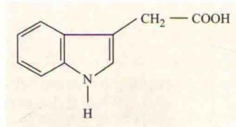  
吲哚-3-乙酸（IAA）

  
4-氯-吲哚-3-乙酸 (4-Cl-IAA)

  
吲哚-3-丁酸（IBA）  
B  
图19.3 生长素的结构。A. 天然生长素的结构。吲哚-3-乙酸（IAA）存在于所有植物中，但是植物中其他相关化合物也具有生长素的活性。如豌豆中含有的4-氯-吲哚-3-乙酸；玉米和豆科植物中含有的吲哚-3-丁酸（IBA）。B. 两种人工合成的生长素的结构。在园艺和  
农业上，大多数合成的生长素被用作除草剂。

  
2,4-二氯苯氧基乙酸（2,4-D）

  
3,6-二氯-2-甲氧基苯甲酸（麦草畏）

我们将从生长素的化学本质开始讨论，继而讲述生长素的生物合成、运输和代谢。最近，越来越多强有力的分析方法和分子生物学方法的应用使科学家能够鉴定出生长素的前体，研究生长素的降解和其在植物体内的分布。根据研究者所需要的信息，生物样品中生长素类物质的含量和鉴定可以通过生物测定、质谱或酶联免疫吸附测定法（ELISA）进行分析。

## 19.2.1 IAA在分生组织和幼嫩的分裂组织中合成

IAA的生物合成主要发生在快速分裂和生长的组织，特别是枝干中（Ljung et al., 2005）。尽管几乎所有的植物组织都可能产生IAA，但茎尖分生组织和幼嫩的叶片是合成生长素的主要位点（Ljung et al., 2001）。当根伸长和成熟时，尽管根依赖于很多由枝干产生的生长素，但根端分生组织也是合成生长素的重要位点（Ljung et al., 2005）。幼嫩的果实和种子中含有大量的生长素，但是不清楚这些生长素是新合成的还是在发育过程中从其他组织运输来的。

在拟南芥中，生长素集中在幼嫩初生叶的顶端。在叶发育过程中，人们发现生长素集中在叶的边缘，再慢慢转移到叶的基部，然后又转移到叶片中间，这种生长素产生的向基转变与叶发育和维管束分化的向基成熟顺序紧密相关，不过这也许是巧合（Aloni，2001）。

β-葡萄糖醛酸酶（β-glucuronidase，GUS）报告基因是一种很有用的分析工具，用底物处理植物组织时，由于该底物能在β-葡萄糖醛酸酶的作用下水解产生蓝色物质，从而可以观察到组织中GUS的活性和位置（Ulmasov et al., 1997）。通过将GUS报告基因连在一个对生长素有反应的DNA启动子序列后面就可以推断细胞中不连续的部分或者整个器官中自由生长素的分布情况（见第2章）。不论这种自由生长素含量是否达到了最小阈值，GUS基因都可以表达，而且能够检测出它呈现蓝色。

如图19.4所示，生长素可能在幼嫩叶片边缘的特定部位积累。这些部位将发育为吐水孔——地上部腺体状修饰物和维管组织。特别是在叶片边缘，它可以在根压（见第4章）的作用下使液态水通过表皮孔向外分泌。在拟南芥中，在吐水孔分化的早期阶段，人们发现大量生长素积累在幼嫩的有锯齿形的拟南芥叶片的叶垂（leaf lobe）处，形成深蓝色的GUS标记（箭头所示），这个部位很可能是生长素合成的部位（Aloni et al., 2003）。在分化发育的维管束中，可以看到生长素扩散的GUS活性轨迹一直延伸到正在分化的导管中（图19.4）。后面，我们还将讨论生长素在维管分化中的调节作用。

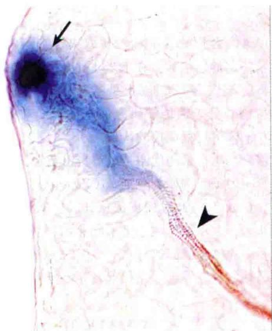  
图19.4 用一个合成的生长素响应的DR5启动子驱动的GUS报告基因检测生长素在拟南芥幼嫩的叶原基中的积累位置。DR5启动子是根据天然存在的生长素的反应因子人工构建的，能够表明完整的组织中的生长素信号通路的存在。在吐水孔分化的早期阶段，人们发现生长素合成的中心位于有锯齿形的拟南芥叶片的叶边缘处，此处GUS染色呈集中的深蓝色（箭头所示）。呈梯度减弱的GUS活性从叶片边缘一直延伸到正在分化的维管束（箭标）。这个维管束可能作为接受来自叶边缘处的生长素的贮存库（R. Aloni and C.I.Ullrich惠赠）。

## 19.2.2 IAA生物合成的多种途径

结构上，IAA与色氨酸和色氨酸合成的前体吲哚-3-甘油磷酸（indole-3-glycerol phosphate）类似，它们都可以作为IAA生物合成的前体。采用分子遗传学和同位素标记法，发现了参与依赖色氨酸的IAA生物合成途径的酶和中间分子，以及它们催化反应的顺序。在植物中，多种生物合成途径以色氨酸作为前体产生IAA；也鉴定到了一条依赖于色氨酸的细菌IAA生物合成途径。这些途径在附录3中有详细的描述。

## 19.2.3 种子和贮藏器官中含有大量共价结合态的生长素

除生物合成外，组织中很大比例的生长素与高分子质量或低分子质量的化合物共价结合形成结合态。在种子和贮藏器官如子叶中尤其如此。在所有高等植物中都发现了这些“缀合”或“结合”态生长素的存在，人们认为它们没有激素活性。IAA可以与多种不同低分子质量的化合物形成结合态，如氨基酸或糖；IAA也可以与高分子质量的化合物形成结合态，如多肽、复杂的糖苷（多个糖单元）或糖蛋白。在酶反应过程中，很多但不是全部的缀合态生长素将会迅速释放出IAA。那些可以释放自由态生长素的缀合态生长素可作为激素的可逆贮存形式。

IAA缀合物的含量和性质取决于它们发生作用的组织及特定的连接酶。在玉米（corn；Zea mays）胚乳中，将IAA连接到葡萄糖上是了解得最为透彻的反应。最近拟南芥分子遗传学研究促进了我们对植物组织中IAA结合/降解过程调控的认识。

缀合态生长素的代谢是调节自由态生长素水平的最主要影响因子。例如，在玉米（Z.mays）种子的萌发过程中，IAA-肌醇通过韧皮部从胚乳中转移到胚芽鞘。人们认为，大多数产生于玉米胚芽鞘顶端的自由IAA是由种子中的IAA-肌醇通过水解产生的（图19.5A）。

另外，人们发现，光和重力等环境刺激既能够影响生长素缀合（去除自由生长素）的速度，也能够影响自由态生长素释放（缀合态生长素的水解）的速度。缀合态生长素的形成还具有其他功能，包括储存和抵御氧化降解的保护作用等。

吲哚-3-丁酸（indole-3-butyric acid，IBA）是另一种天然生长素。IBA和IBA缀合物也对IAA贮存库有贡献（图19.5A）。氨基酰IBA和葡糖基IBA缀合物可被水解产生自由IBA，这些自由IBA可以在过氧化物酶体中通过酶促β-氧化作用转变为IAA（图19.5A）。

## 19.2.4 IAA的降解途径

作为高效的发育信号，激素必须寿命短并且不能长时间积累。生长素的分解代谢保证了当活性激素的浓度超过最适水平或激素反应完成时对活性激素的降解。同IAA生物合成一样，IAA的酶促降解（氧化）包括不止一条途径（图19.5B）。

通过同位素标记和代谢物鉴定，人们发现了另外两种氧化途径更有可能控制IAA的降解。在一条途径中，IAA的吲哚部分被氧化，形成氧化吲哚-3-乙酸（OxIAA），随后形成OxIAA-葡萄糖（OxIAA-Gluc）。在另一条途径中，IAA-天冬氨酸缀合物被氧化成OxIAA。

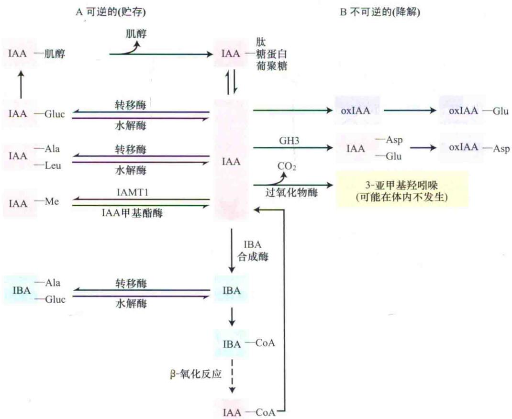  
图19.5 IAA的结合和降解。该图表示的是不同的IAA缀合物及它们合成和降解的代谢途径。单箭头表示的是不可逆途径；双箭头表示的是可逆途径。A. 可逆（贮藏）形式的生长素和生长素缀合物。B. 不可逆（降解）形式的生长素和生长素缀合物。吲哚-3-丁酸（IBA）转变为IAA的β-氧化反应发生在过氧化物酶体。在IAA与己糖结合之前，它可以不可逆地被氧化为氧化吲哚-3-乙酸（OxIAA）。IAA与Asp和Glu共价结合后也可以被不可逆地降解为OxIAA缀合物（引自Woodward and Bartel，2005）。

光照下，IAA可以被非酶促氧化。而且，在体外，植物细胞色素如核黄素可以促进IAA光破坏作用。然而，生长素在光氧化中的生理作用仍然不清楚。在体外，也发现了植物过氧化物酶体可以将IAA的3-亚甲基羟吲哚去羧基化，但是这个反应在植物体内是否发生是未知的（Normanly et al., 2005）。

## 19.3 生长素的运输

枝干和根的主轴及它们的分枝具有顶端—基端的结构极性，而且这种结构极性取决于生长素的极性运输。在Went建立了测定生长素的胚芽鞘弯曲实验后不久，人们发现在离体的燕麦胚芽鞘切段中，IAA主要是从顶部向基部（向基性）运输（图19.6A是“向基”和“向顶”的图示）。这种单方向的运输称为极性运输（polartransport）。生长素是唯一被明确地证实是极性运输的植物生长激素，且该激素的运输存在于所有的植物中，包括苔藓和蕨类植物。

生长素的极性运输是古老的，因为解剖学证据表明在具有3亿7500万年历史的木头化石中发现生长素极性运输。在活的木本植物中，生长素的极性运输遇到芽和分枝等时便会被阻断，这时就会产生生长素“漩涡”（Kramer，2006）。结果，在这些区域进行分化的导管元件便会形成环状结构。研究发现，在木材（代表生长素极性运输）中同一个位置产生的环状结构同样也能够在上溯到泥盆纪前期所形成的原始裸子植物的木头化石中检测到（Rothwell and Lev-Yadun，2005）。

植物中的生长素主要来源于茎的顶端，很长时间以来人们一直认为极性运输是造成从茎尖到根尖的生长素浓度梯度的主要原因。生长素从茎到根的纵向浓度梯度影响多种生长发育过程，包括胚胎发育、茎伸长、顶端优势、伤口愈合和叶片衰老。

生长素在茎干、叶和根中极性运输的最主要部位是维管束（vascular）的薄壁组织，很可能是木质部。草本的胚芽鞘是一个例外，在其胚芽鞘中，向基性运输主要通过非维管束（nonvascular）的薄壁组织。在维管束的薄壁组织中，生长素运输的总方向在胚胎期就建立了，很快在茎尖可以检测到生长素的累积（见第16章）。因为胚胎没有根，所以最开始胚胎中生长素的极性运输是由上向下运输的。在根的维管柱中，植物的一生都维持这种胚胎维管薄壁组织中生长素的向基运输。但是，在萌发后的根中，这种向基的生长素流变成向顶运输，因为生长素被从根茎的节点运向根尖。

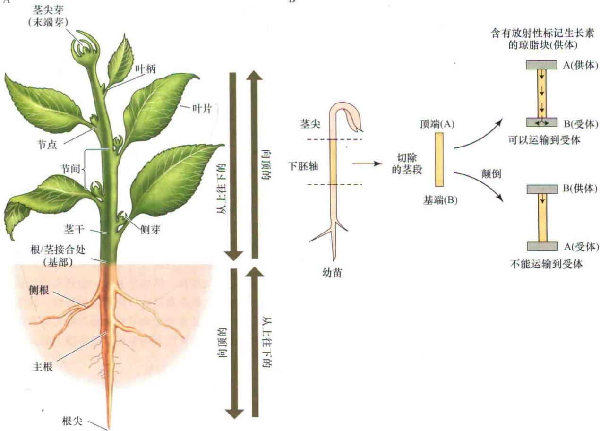  
图19.6 放射标记的生长素表明生长素的极性运输。A. 在植物的基部（根、茎的接合处）根据生长素运输的方向描述生长素的极性运输。生长素从茎向下运输（向着基部）直到根、茎的接合处。从这一点开始，向下的运输称为向顶运输（向着顶端）。生长素从根尖向根、茎接合处的运输也称为从上往下的运输（向着基部）。B. 供体-受体琼脂块法测定生长素的极性运输。极性运输不依赖于重力。

有些生长素运输也发生在韧皮部的筛管中，且依赖于韧皮部的生长素运输由糖的“源-库”分布过程所驱动（见第10章），它对生长素在根中的向顶运输有重要作用。

在韧皮部中，长距离的生长素运输似乎对控制形成层细胞的分化和胼胝质的积累或从筛管的移除起重要的作用。在韧皮部中的生长素的运输也可以转移到木质部的薄壁组织中。通过放射性标记IAA的研究表明，在豌豆（Pisum satovum）茎尖的非成熟组织中生长素可以从非极性韧皮部途径运输而来。

在根中，同样有来自顶端的生长素的向基运输，但是发生在非维管组织。例如，在玉米和拟南芥的根中，在根尖中放射性标记的IAA被向基性地运输了2\~8 mm。根中生长素的向基性运输在向重力性和侧根伸长中都有重要作用。

在以下的内容中，我们将讨论生长素极性运输的细胞机制，也将探讨这些机制如何使植物能够适应不同的环境信号。

## 19.3.1 极性运输需要能量，不依赖于重力

人们利用供体-受体琼脂块法（the donor-receiver agar block method）进行早期的极性运输研究（图19.6B）。将含有放射性同位素标记的生长素的琼脂块（供体块）放在一段组织的一端，受体块放在另一端。生长素通过组织向受体块的转移即可以通过测定受体块中放射活性来确定。这种方法经改进后可以用来测定更小的放射性标记的生长素小液滴在植物不连续表面上的沉积作用。这能提高研究生长素短距离运输的精确性（Peer and Murphy，2007）。

从很多这样的研究中，人们总结出IAA极性运输的一般特性。不同组织中IAA极性运输的程度不一样。在胚芽鞘、植物茎干、叶柄和根表皮中，向基运输占主导地位；然而在根的中柱中，生长素是向顶运输的。极性运输（至少是在短时间内）不受组织的方向影响，所以它是不依赖于重力的。

如图19.7所示，揭示了缺少重力作用对生长素的向基运输的影响。在这个例子中利用的是葡萄的茎梗，将其茎干砍断，放在潮湿的温室中，发现在切割处的基端形成不定根，切割处顶端形成枝干，即使当砍断的位置颠倒也是如此。根在基端形成是因为根的分化受向基运输所积累的生长素的刺激。枝干倾向于在生长素浓度低的顶端形成。

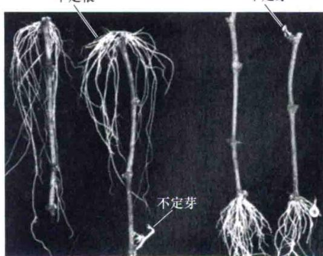  
图19.7 不论将葡萄硬材的切段倒置（左边两个切段）或正置（右边两个切段），总是在它的基端产生不定根，顶端产生枝条。总是在基端形成根是因为生长素的极性运输不依赖于重力（引自Hartmann and Kester，1983）。

极性运输是以细胞-细胞的形式进行的，而不是以共质体形式。也就是说，生长素通过质膜从这个细胞流出，在中间层物质中扩散，最后通过质膜进入下一个细胞。生长素从细胞的流出称为生长素外流（auxin efflux）；生长素进入细胞称为生长素吸收（auxin uptake）或生长素内流（auxin influx）。极性运输对缺氧、缺少蔗糖及代谢抑制剂的敏感性表明运输过程总的来说需要代谢能量。

在某些组织中，生长素极性运输的速度能够超过3 mm/h，比扩散的速度快，但是比在韧皮部运输的速度慢（见第10章）。在接近茎尖和根尖的分生组织中极性运输的速度较快。活性生长素，包括天然生长素和人工合成的生长素都具有极性运输的特性，其他弱酸、无活性的生长素类似物及IAA缀合物几乎不能运输。极性运输的特异性表明生长素受质膜上的运输蛋白识别。

## 19.3.2 化学渗透模型可能驱动生长素极性运输

在20世纪60年代晚期，由于溶液中化学渗透机制的发现（见第6章），启发人们用该模型来解释生长素的极性运输。生长素极性运输的化学渗透模型认为生长素的吸收受跨膜的质子势（ $\Delta E+\Delta pH$ ）驱动，而生长素流出又受膜势 $\Delta E$ 驱动（质子动势的详细讲解见第7章）。生长素的极性流动受聚集在传导细胞末端的极性定位的输出载体的调控（图19.8）。该模型已经在整株植物中通过实验得到了验证（Li et al., 2005），并且最近几年得到了延伸，包括生长素极性运输过程中通过共质体质子泵驱动的生长素的流入的其他作用。但是， $\Delta E + \Delta pH$ 并不是唯一的能量来源，一类生长素转运子也直接利用ATP作为能量。

## 1. 生长素内流

极性运输的第一步是生长素的内流。生长素可以通过以下两种机制进入植物细胞：来自任一方向的质子型IAAH被动扩散透过磷脂双分子层，或者由 $2H^{+}-IAA^{-}$ 同向运输蛋白参与的次级主动运输运输 $IAA^{-}$ 。

非解离型的吲哚-3-乙酸的羧基发生质子化。它是亲脂的，很容易扩散跨过磷脂双分子层。相反，生长素的解离型带负电荷，因此不容易透过膜。因为在通常情况下，质膜H $^{+}$ -ATPase使细胞壁pH维持为5\~5.5。质外体中15%\~25%的生长素（ $pK_{a}=4.75$ ）呈非解离型，能够被动扩散，透过质膜形成浓度梯度。当胞外pH低于正常值呈较酸性值时，发现植物细胞吸收IAA的量增加，这为证明生长素的吸收是依赖于pH的被动过程提供了第一个实验证据。最近的研究表明，在体内，质体的酸化在驱动生长素运输中也有重要作用（Li et al., 2005）。

有证据表明运输蛋白介导的次级主动吸收机制具有饱和性，这种饱和性是活性生长素特有的。一类通透酶型的生长素吸收载体蛋白AUX1/LAX 2H $^{+}$ -IAA $^{-}$ 是同向运输蛋白，可以共运输2个质子和生长素阴离子（Yang et al., 2006; Swarup et al., 2008）。这种生长素次级主动运输能够比简单扩散积累更多的生长素，因为它的跨膜运输受质子动势的驱动（例如，在质体溶液中有很高的质子浓度）。次级主动运输存在的证据主要是在生长素的沉积加速极性流的移动的细胞中，如侧根的冠细胞中，生长素的吸收是生长素从侧根冠细胞离开的原始动力（Kramer and Bennett, 2005）。

AUX1在根尖和茎尖生长素的吸收中起重要作用。在侧根的冠细胞（图19.9A和B）中，AUX1是生长素离开根尖进入由上往下的生长素运输流所必需的。拟南芥aux1突变体无向重力性生长。用人工合成的生长素萘乙

  
图19.8 简化的生长素极性运输化学渗透模型。这里表示的是在生长素运输中柱状的一个已经伸长的细胞。其他的向外运输的机制通过在运出的位置和邻近细胞中阻止IAA的再吸收来有助于生长素的运输。

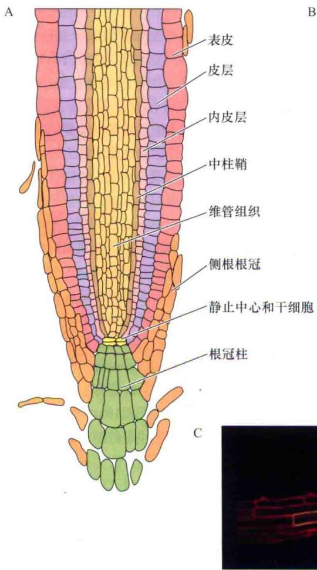

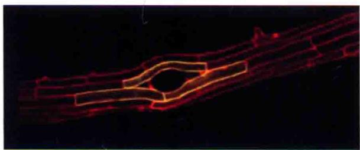  
图19.9 生长素通透酶AUX1在一些小柱细胞、侧根根冠和中柱组织中表达。AUX/LAX家族的另一个成员LAX3在根的皮层和表皮细胞中起作用。A. 拟南芥根尖的示意图。B. AUX1在中柱的原生韧皮部细胞、小柱中心细胞簇及侧根的根冠细胞中的免疫定位。C. 在围绕正在产生侧根的表皮细胞中，LAX3介导生长素的吸收，从而诱导细胞的伸长及其他可以促使侧根发生的过程（B图引自Swarup et al., 2001；C图引自Swarup et al., 2008）。

酸（1-naphthylene acetic acid，1-NAA）处理，可以恢复这种表型。1-NAA甚至能够在缺乏载体蛋白的情况下很容易地跨过脂类双分子层。当我们研究根的向重力性机制时，根尖中生长素的向基性重新分布显然具有重要意义。

LAX3是生长素通透酶家族的另一成员，它的功能是在一些表皮细胞和皮层细胞中增强生长素的累积，导致细胞的分裂，进而从中柱产生侧根（图19.9C）。这是AUX1/LAX蛋白在一些特化细胞维持生长素高浓度中起作用的另一个例子。

## 2. 生长素外流

一旦IAA进入pH大约为7.2的胞质溶胶中，几乎全部的IAA将会解离成阴离子形式。因为阴离子较难透过质膜，所以生长素积累在胞质溶胶中或者质膜表面，直到位于细胞膜上的转运蛋白将它们运出。根据化学渗透假说，细胞内部负的质膜电势驱动IAA $^{-}$ 运出细胞。

像前面提到的那样，极性运输的化学渗透模型的核心是IAA $^{-}$ 的外流受极性定位的输出载体蛋白驱动。生长素从一个细胞末端的吸收和从每个细胞相反极选择的外流导致了极性运输。定位在细胞膜上的PIN蛋白负责将生长素运出细胞，这与生长素运输的方向一致（图19.10A）（PIN蛋白以拟南芥pin1突变体所形成的针形花序命名，见图19.10B）。

全长的PIN蛋白（在拟南芥中是PIN1、PIN2、PIN3、PIN4和PIN7）介导的生长素外流对植物正常的生长发育非常重要。在每个组织中，不同的PIN蛋白介导了生长素的外流（图19.11A）。在这些PIN蛋白中，PIN1是研究得最为深入的，因为PIN1对极性发育和器官发生的每一个方面都起着重要作用（见第16章）。

完整组织中的生长素运输模型表明此运输过程是依赖能量的，特别是在顶端分生组织附近的比较小的细胞中。生长素有方向地从这些细胞中的一个细胞运出，很可能再回到同一个细胞，除非位于细胞膜上的外流转运蛋白将生长素主动排斥在外（图19.12）。突变体分析也表明应该存在其他的外流机制，这种机制对于阻止在长距离运输流中的生长素扩散进入邻近的组织是必要的。

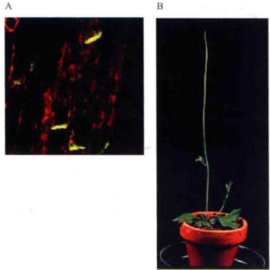  
图19.10 拟南芥中的PIN1。A. 拟南芥花序中PIN1蛋白在发挥功能的细胞末端的定位。所见的荧光是用免疫荧光显微镜观察的。B. 拟南芥中的pin1突变体，正常的野生拟南芥如图16.1所示（L. Galweiler和K. Palme惠赠）。

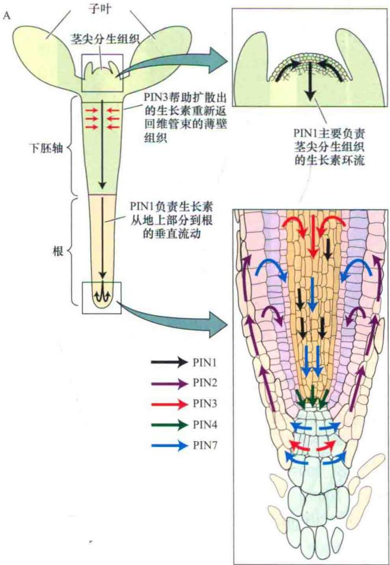

植物细胞中含有的依赖ATP的转运蛋白属于植物ATP结合盒（ATP binding cassette，ABC）膜内在转运蛋白超家族中的P-糖蛋白或者“B”亚家族。这些PGP/ABCB转运蛋白中的一个亚类是膜内在蛋白，功能是作为细胞生长素外流过程中依赖ATP的两性阴离子载体（图19.12）。如果ABCB基因在拟南芥、玉米和高粱中缺失，这些植物将呈现不同程度的矮小，以及向重力性改变和生长素外流减少（图19.13）。

ABCB蛋白家族在拟南芥中有21个成员，水稻中有17个。ABCB家族中的三个成员广泛地参与组织特异性的生长素运输（图19.11B）。但是还不清楚有多少ABCB家族成员在生长素运输中起作用。至少有一些已被表明可以转运苹果酸盐或者其他小分子，而不是生长素。在哺乳动物中，ABCB蛋白家族的功能是多抗药性

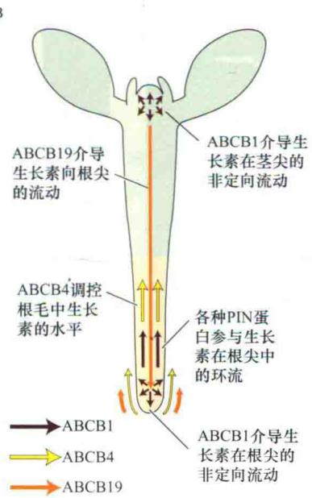  
图19.11 在拟南芥中，转运蛋白PIN和ABCB介导整株植物中生长素极性运输的外流。A. PIN蛋白决定生长素的向基运输。生长素的定向运输与PIN输出辅助蛋白的组织特异性分布有关。PIN1调节IAA沿着胚胎发生的顶端到基部的方向从地上部分到根的垂直运输（见第16章）。AUX1（图19.9）创造了一个生长素的库来驱动向基部的生长素通过PIN2流出载体从根尖向上运输。既然有些生长素的侧向扩散可能会发生，PIN2和PIN3被认为能帮助扩散的生长素重新返回维管束的薄壁组织。维管束的薄壁组织是进行极性运输的地方。两个插图表示在茎尖分生组织中PIN1调节的生长素流动（上图），以及在根尖中PIN调节的生长素环流（下图）。B. 生长素的流动与依赖ATP的ABCB转运蛋白有关。在枝干和根尖的多向箭头表示非方向性的生长素环流。然而，一旦与极性定位的PIN蛋白结合后，便发生定向运输。ABCB4在正在伸长的根毛中调控生长素的

1. 质膜上H $^{+}$ -ATPase(紫色)将质子泵入质外体。质外体的酸性环境通过改变质外体中IAAH和IAA $^{-}$ 的比例影响生长素的运输速度

2. IAAH可以通过诸如AUX1(蓝色)的质子共运输蛋白或扩散(带破折号的箭号)进入细胞。一旦进入胞质溶胶，IAA即变为阴离子，并且可能只有通过主动运输从细胞中运出

3. P-糖蛋白非极性地定位在质膜上，可以驱动生长素主动运输(依赖ATP)

4. 当极性定位的PIN蛋白(黄色)和PGP蛋白相互作用时,会克服回流扩散效应而协同增强主动极性运输

图19.12 在较小细胞中生长素的极性运输模型。由于小细胞具有高的表面积/体积，因此生长素的回流扩散明显。ABCB蛋白被认为通过阻止在载体位置输出的生长素的重新吸收而维持生长素流。在较大的细胞中，ABCB转运蛋白的功能可能是将生长素排出极性流，使其进入邻近细胞。  
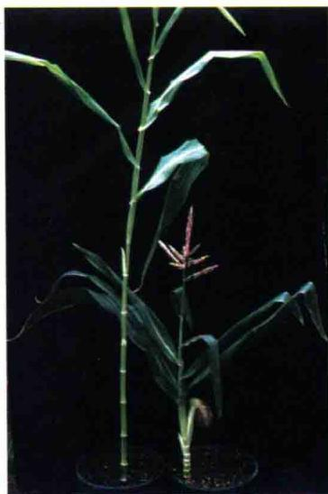  
野生型 br2突变体

  
野生型  
br2突变体

  
野生型  
br2突变体  
图19.13 在玉米中BR2（Brachytic 2）基因编码一个糖蛋白，是生长素的正常运输所必需的。br2突变体有短的节间。突变体是用mutator转座子通过插入突变的方法获得的。研究者并不知道Mu8转座子含有BR2基因的片段。这个BR2基因片段的表达产生干扰RNA（interfering RNA，RNAi），使BR2的表达发生沉默（见第2章）。br2突变体的茎秆紧缩低矮（B和C），但是有正常的雄花花穗和玉米穗（A和B）。

转运蛋白，并表现出较差的底物特异性。与哺乳动物中的ABCB家族不同，植物中运输生长素的ABCB对底物有相对严格的特异性。

总的来说，ABCB蛋白是均匀地而不是极性地分布在茎尖和根尖细胞的质膜上。但是，当特异性的ABCB蛋白与PIN蛋白在同一个细胞的同一个位置碰到一起时，生长素运输的特异性增强了，PIN蛋白与ABCB蛋白相互协同以使生长素的运输具有方向性（Blakeslee etal., 2005, 2007; Mravec et al., 2008; Titapiwatanakun et al., 2009)。此外，在一些细胞中，极性定位的ABCB转运蛋白似乎对有方向的生长素运输更有贡献。

## 19.3.3 PIN和ABCB转运蛋白调控细胞中生长素的平衡

关于IAA的亚细胞分布和代谢的研究很少。但是，人们认为IAA在细胞质和其他的亚细胞组分中都有分布。IAA是一个两性分子（既有疏水区域也有亲水区域），因此人们认为细胞中的IAA可能通过它的疏水区域与内膜区域或者蛋白质结合。进一步的生长素的耦合和代谢机制可能在生长素增加后快速地作用于游离的IAA。PIN5、PIN6和PIN8等短的PIN蛋白定位在内质网上。至少PIN5可能通过将IAA转运到内质网从而调控IAA的代谢（Mravec et al., 2009）。

ABCB4是一个PGP型转运蛋白。在根毛中，ABCB4可能调控了生长素的水平。在生长素浓度低时，ABCB4可能在细胞中生长素的吸收中起作用。但是，当生长素浓度达到一个阈值时，ABCB4的功能迅速转变为将生长素泵出细胞（Yang and Murphy, 2009）。这些结果表明，游离的生长素能够被位于细胞内膜或者细胞质膜上的转运蛋白调控（图19.14）。并不令人奇怪的是，所有已知的生长素转运蛋白的丰度在一定程度上受生长素的水平所调节。

## 19.3.4 化学物质抑制生长素的内流和外流

几种人工合成化合物可以作为生长素运输的抑制剂，包括NPA（1-N-naphthylphthalamic acid）、CPD（2-carboxyphenyl-3-phenylpropane-1, 3-dione或“cyclopropyl propane dione”）、TIBA（2, 3, 5-triiodobenzoic acid）、NOA（1-napthoxyacetic acid）、2-[4-(diethylamino)-2-hydroxy-benzoyl]benzoic acid和gravacin等（图19.15）。NPA、TIBA、CPD和gravacin是生长素输出的抑制剂（auxin efflux inhibitor，AEI），NOA是生长素输入的抑制剂。

有些AEI，如TIBA，具有弱的生长素活性。它能够与生长素竞争外流转运蛋白以部分地抑制极性运输。其他AEI，如CPD、NPA和gravacin，它们通过与转运蛋白的调节位点结合干扰生长素的运输。一些抑制剂，如gravacin，特异性地干扰一类转运蛋白对生长素的运输（Rojaspierce et al., 2007）。而其他的抑制剂，如NPA，则与多种蛋白质结合并干扰其活性，其中的一些抑制剂只是方向性地参与生长素的运输。

一些天然的化合物也作为生长素输出抑制剂。最开始被发现有此功能的天然化合物是黄酮类（图19.15B）。黄酮类是ROS清除剂，也是一些金属酶、激酶和磷酸酶的抑制剂（Peer and Murphy，2007）。黄酮类对生长素运输的影响主要是导致这些物质活性的改变。

和一些药理学试剂的例子一样，使用高浓度的抑制剂导致特异性反应降低（Peer et al., 2009）。当使用高浓度的抑制剂时，AEI也可以通过改变蛋白质与蛋白质间的互作以干扰与它们结合的质膜蛋白的运输。稍后将在本节讨论蛋白运输在调节生长素极性运输中的作用。

## 19.3.5 生长素运输的多种调控机制

生长素运输受基因的转录和翻译后修饰机制的调节。编码生长素转运蛋白的基因表达具有组织特异性，

AUX/LAX蛋白调控生长素进入细胞

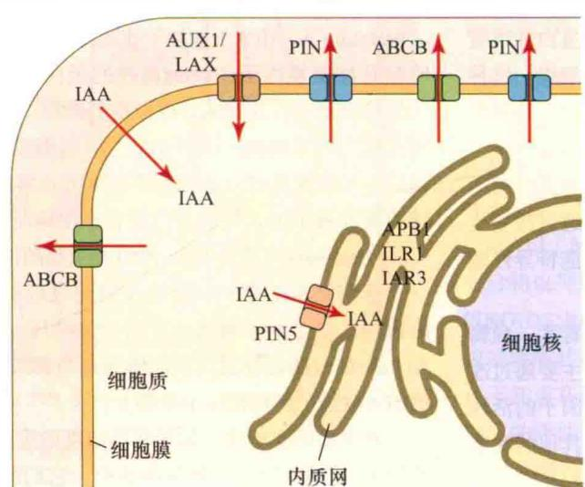  
ABP1是内质网生长素结合蛋白。其他的内质网蛋白（ILR1和IAR3）是水解酶，能够使IAA去缀合  
短的PIN蛋白（如PIN5）控制内质网膜上的生长素运输  
图19.14 转运蛋白调控的生长素动态平衡的模型。细胞间的生长素极性运输由细胞膜定位的PIN1类似蛋白和ABCB等生长素流出运输蛋白及生长素流入运输蛋白AUX/LAX调控。细胞内的生长素被分成细胞质和内质网两个区间。PIN5和PIN5类似（PIN6和PIN8）运输蛋白调控内质网中生长素的滞留。大部分生长素结合蛋白（ABP1）与生长素高度结合，定位在内质网中。ILR1和IAR3编码IAA-氨基酸水解酶，能够释放内质网中的自由生长素（引自Mravec et al., 2009）。

## A. 植物中不存在的生长素运输抑制剂

B. 自然界中发现的生长素运输抑制剂

  
图19.15 几种人工合成（A）和天然（B）生长素运输抑制剂的结构。

而且组织特异性表达受生长发育和环境因素的影响。其他的因素如蛋白质的磷酸化状态、与其他调控蛋白的相互作用、蛋白水解过程和膜组分等也决定了生长素运输的速度和方向。在这里，我们将讨论调控生长素运输的一些重要因素：激素、蛋白运输和黄酮类。

## 1. 与其他激素的相互作用

几乎已知的所有植物信号组分对生长素运输或者依赖于生长素的基因表达都有影响。生长素本身调控编码生长素转运蛋白基因的表达，从而增加或者减少这些基因的丰度来调控生长素的水平。生长素似乎也影响细胞中很多极性事件，从而为其自身的有方向性的运输流提供一个通道。换句话说，小的生长素流通过转运蛋白和维管组织的建立被扩大并稳定，这些转运蛋白和维管组织又维持了生长素有方向地流向生长中的组织。这种效应在胚胎的极性生长和器官发生中是显著的。特别是PIN1已被表明为这些发育中的重要的生长素流动确定方向。

乙烯通过改变AUX1吸收和PIN1外流转运蛋白的活性和丰度影响生长素运输流。虽然乙烯可能通过改变生长素的合成影响根中生长素运输，但乙烯可能特异性地调控了侧根的发育（Swarup et al., 2007）。

油菜素甾醇、细胞分裂素、茉莉酸、赤霉素、独脚金内酯和一些黄酮也能调控生长素的运输，主要通过改变编码生长素转运蛋白的基因的表达、调控因子的活性或者细胞运输的机制等。我们将在本章或者其他的章节讨论它们在其所调控的生理和发育过程中的相互作用。

## 2. 蛋白质运输的功能

生长素转运蛋白的细胞膜定位包括新合成的蛋白质通过内体次级运输的转运（蛋白质运输）。对于

ABCB转运蛋白来说，正确折叠和糖基化的蛋白质可以通过次级囊泡运输到细胞膜。在细胞膜上，其中的一些ABCB转运蛋白如ABCB19能形成非常稳定的复合物，其中在膜上富含甾醇的复合物中包括PIN1蛋白（Titapwatanakun et al., 2009）。然而，全长的PIN流出转运蛋白和AUX1流入载体的细胞膜定位都受小泡运输的调控。这种运输机制包括细胞膜和内体区室间的胞吞循环（Geldner et al., 2001, 2003；Swarup et al., 2001；Swarz and Bennett, 2003）。这种机制可能也调控了极性定位的PIN转运蛋白如何从质膜上均匀分布变成细胞末端质膜上特定分布。

首先用PIN1阐明胞吞循环。拟南芥根尖中PIN1定位于维管束细胞的底部（图19.16A）。布雷菲尔德菌素（brefeldin A，BFA）能够干扰由ADP-糖基化作用/鸟嘌呤核苷酸交换因子GNOM调控的蛋白质的内吞和分泌（见第16章）。用BFA处理拟南芥的根，导致PIN1异常地在胞内区室聚集（图19.16B）。当用缓冲液洗脱BFA以后，又能恢复PIN1在细胞质膜上的正常定位。但是在洗脱缓冲液中加入肌动蛋白聚合作用抑制剂松胞菌素D（cytochalasin D）能够阻止PIN1在质膜的正常再定位。

这些结果表明PIN能够在细胞底部的质膜和未知的内膜区室之间依赖肌动蛋白快速循环。包括质膜H $^{+}$ -ATPase在内的几种蛋白质能够通过与调节PIN循环相同的BFA敏感机制被靶标于质膜上。

在上面的实验中，如果将高浓度的生长素输出抑制剂TIBA和NPA加入洗脱缓冲液中，它们能够阻止PIN1在质膜上正常的再定位。在黄酮类化合物缺失突变体中，用天然的黄酮醇生长素抑制剂取代洗脱缓冲液中合成的AEI也能够阻止PIN1在质膜的再定位（Peer et al., 2004）。TIBA和NPA也能改变质膜H $^{+}$ -ATPase和其他蛋

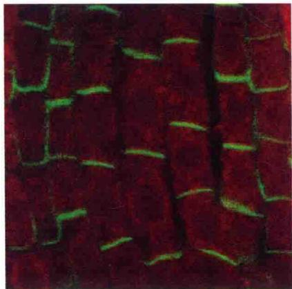

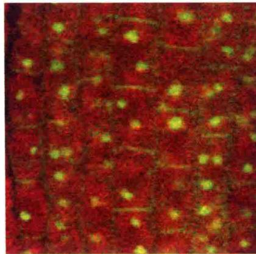  
图19.16 生长素运输抑制剂阻断生长素输出载体PIN1向质膜的分泌。A. 对照，表示根尖中PIN1的不对称定位。B. 布雷菲尔德菌素（BFA）处理后的PIN1的定位。随后用缓冲液洗脱BFA后，PIN1的定位又重新恢复到A中所示。当用生长素运输抑制剂TIBA洗脱BFA时，PIN1如B中所示仍停留在内膜区域（图片由Klaus Palme惠赠）。

白质在胞内的循环，但是，与PIN蛋白一样，不受AEI的影响，除非一大类称为BIG的支架蛋白缺失。这些结果表明，有些AEI在高浓度时是膜循环抑制剂，同时也表明NPA和TIBA也一定直接抑制质膜上输出载体复合物的转运活性。类似的实验表明其他的全长PIN蛋白，如拟南芥中的PIN2和PIN3，被动态的细胞运输机制所调控，只是不同的蛋白质之间有轻微的差别。图19.17表示的是TIBA和NPA对PIN1循环和生长素外流影响的简化示意图。详细的模型请参见Web Essay 19.1。

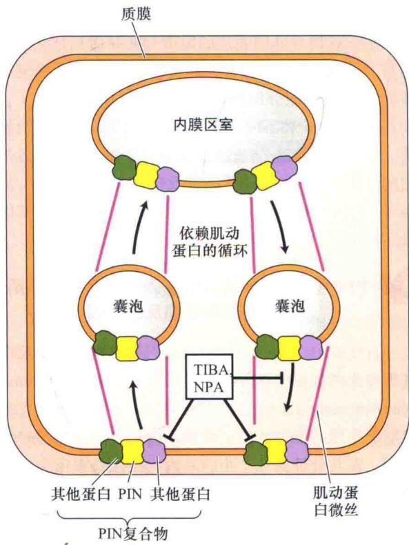  
图19.17 PIN复合体的循环依赖于机动蛋白驱动的质膜和内膜区室间的囊泡运输。用布雷菲尔德菌素洗脱后，生长素运输抑制剂TIBA和NPA干扰PIN1蛋白在细胞基面质膜的重新定位（图19.16），表明生长素运输抑制剂可能通过干扰PIN1蛋白的循环而起作用。

在细胞膜上高浓度的生长素可以调控全长PIN蛋白的运输和稳定（Paciorek et al., 2005）。这与生长素渠（auxin canalization）的概念一致，并为这种现象的解释提供了一种机制。然而，生长素是如何调控PIN的运输的是不清楚的，因为这种现象似乎不依赖于已知的生长素信号转导机制。

PIN蛋白的极性运输被蛋白激酶PINOID（根据pinoid突变体与pin1突变体的表型类似而命名）调控。PINOID的功能可能是调控PIN极性发育的开关。磷酸酶PP2A复合物，尤其是RCN1（根据在NPA突变体中根卷曲的表型而命名）亚基在调控PIN的定位上与PINOID活性可能是拮抗的。但是，PINOID和其他的激酶也可以直接调控PIN和/或ABCB的蛋白活性。

## 3. 黄酮类的作用

黄酮类含量过多或过少的拟南芥突变体都表现出生长素运输和生长的改变。一些黄酮类，如flavonols quercetin（图19.15B）和kaempferol，可以取代细胞膜上的AEI（Myrphy et al., 2000）。这些天然产生的植物化合物也抑制特定激酶和磷酸酶的活性（见第14章）。PINOID、RCN1和可以修饰生长素转运蛋白的活性和定位的磷酸转移酶蛋白可能是黄酮类的靶标。但是，我们还不知道在体内直接合成的黄酮类是否可以调控这些蛋白质的活性。

黄酮类也是ABCB转运活性的抑制剂，它们直接抑制为这些转运蛋白提供能量的ATP的水解。黄酮类并没有像预期的那样参与抑制转运蛋白，没有检测到黄酮类对PIN转运活性的直接抑制。因为生长素转运系统的广泛参与，在体内对这些化合物的效应的研究受到了限制( Peer and Murphy, 2007 )。

## 19.4 生长素信号转导途径

研究植物激素作用分子机制的最终目的是建立从受体结合到生理反应的信号转导途径的每一步。就生长素而言，这也许是一项特别令人望而生畏的工作，因为生长素影响许多生理和发育过程。然而，生长素信号的起始步骤非常简单，包括与受体的结合，受体能够通过泛素蛋白酶体途径（见第2章和第14章）调节蛋白质的降解。

一旦受体被激活，受体-酶复合体水解特定的转录抑制因子，从而激活和脱抑制生长素反应基因。虽然大多数的生长素反应可能通过这种机制起作用，但是，不同类型的生长素受体蛋白可能在非转录激活和稳定质膜H $^{+}$ -ATPase中起作用以引起细胞壁快速酸化和细胞伸长。在本章最后一节，我们将探讨两种生长素反应的信号转导途径。

## 19.4.1 主要的生长素受体是可溶性蛋白异源二聚体

可溶性蛋白质复合体是主要的生长素受体，它属于TIR1/AFB蛋白家族和AUX/IAA转录抑制蛋白家族成员（图19.18）（Dharmasiri et al., 2005a, 2005b; Kepinski et al., 2005）。植物TIR1/AFB蛋白家族是根据第一个发现的成员命名的，分别是TRANSPORT INHIBITOR RESPONSE 1和Auxin F-box Binding protein的缩写。它们是一类SCF E3泛素结合酶复合体的F-box蛋白组分。SCF复合体的功能是催化共价结合在泛素分子上的蛋白质发生依赖ATP的降解（关于此信号通路的描述见第14章）。

拟南芥突变体分析鉴定到TIR1（transport inhibitor response 1）。TIR1对生长素依赖的下胚轴伸长和侧根形成具有重要作用。TIR1是一个特定的E3泛素连接酶复合体（称为SCF $^{TIR1}$ ）的组成部分。SCF $^{TIR1}$ 是细胞中生长素信号转导所必需的（Dharmasiri et al., 2005a; Kepinski and Leyser, 2005）。接下来的研究鉴定到了AFB（auxin signaling F-box binding）蛋白。AFB蛋白在结构和功能上都与TIR1类似。

生长素的作用像一个分子胶水，将一个TIR1/AFB和一个AUX/IAA蛋白拉到一起形成异源二聚体。生长素使TIR1/AFB-AUX/IAA异源二聚体稳定，并提高SCF $^{TIR1}$ 复合体与AUX/IAA蛋白的结合。这种“组合的”受体允许生长素作为一个信号。这个信号可以在不同的环境条件下在不连续的组织中有差别地调控多种生长和发育过程。拟南芥有100多个可能的AUX/IAA和TIR1/AFB的组合，这为贯穿整个植物生长发育的广泛而多样的生长素信号反应提供了基础。

## 19.4.2 AUX/IAA蛋白负调控生长素诱导基因

参与TIR1生长素信号转导途径的转录调节因子有两个家族：生长素反应因子和AUX/IAA蛋白。生长素反应因子（auxin response factor，ARF）是短寿命蛋白，并特异地与生长素早期反应基因启动子上的生长素反应元件（auxin response element，AuxRE）TGTCTC结合。拟南芥有23种不同的ARF蛋白，ARF与AuxRE的结合导致基因转录的激活或抑制。激活或抑制取决于特定的ARF。不论组织中生长素的状态如何，ARF极可能结合在生长素早期反应基因的启动子区。

AUX/IAA蛋白是生长素诱导基因表达的重要调节因子。在拟南芥中，这种小的短寿命核蛋白有29个家族成员。AUX/IAA通过与结合DNA的ARF蛋白结合间接地调节基因表达。如果ARF作为转录激活子，AUX/IAA蛋白将抑制转录。

## 19.4.3 生长素与TIR1/AFB-AUX/IAA异源二聚体的结合促进AUX/IAA的降解

生长素诱导基因表达的短信号转导途径是从生长素与一个AUX/IAA蛋白和一个SCF $^{TIR1}$ 泛素连接酶复合体的TIR1/AFB组分的相互作用开始的（图19.18A）。和其他SCF复合体不同，生长素激活SCF $^{TIR1}$ 没有共价修饰。结果，AUX/IAA蛋白迅速地泛素化，随后通过蛋白酶体降解（图19.18B）。在没有负调节因子（AUX/IAA）的情况下，不同的ARF蛋白起到激活或抑制基因表达的作用。

## 19.4.4 生长素诱导的基因分为两类：早期反应基因和晚期反应基因

直接被AUX/IAA-TIR/AFB信号激活的生长素反应基因称为初级反应基因或早期基因（primary response genes or early gene）。它们与在生长素诱导的发育的晚期起作用的基因不同。早期基因的表达需要的时间很短，在几分钟到几个小时之内。在生长素反应中所用的早期基因都在SCF $^{TIR1}$ 信号转导途径中受到诱导。早期反应基因包括：AUX/IAA基因、SAUR基因和GH3基因。

总之，初级反应基因具有以下三种主要功能。

（1）转录 有些早期基因编码调节次级反应基因（或晚期基因）转录的蛋白质。晚期基因是对激素长期反应所必需的。因为晚期基因需要从头合成，它们的表

A

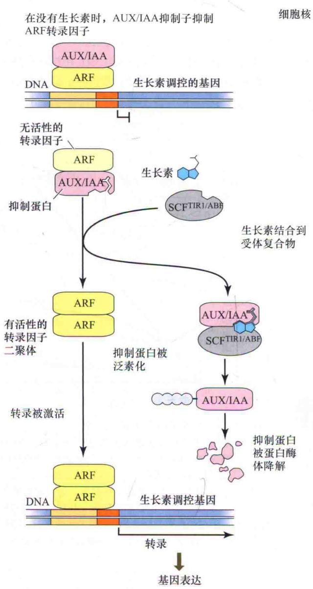

达可以被蛋白质合成抑制剂抑制。

（2）信号分子 其他早期基因参与细胞内联系或细胞与细胞间的信号传递。

（3）生长素缀合或代谢 一些快速诱导的基因编码的蛋白质通过使活性生长素缀合或降解参与活性生长素的清除。这些基因的表达阻止过量的可能限制生长素反应特异性的生长素的累积。

## 1. 生长和发育所需的早期基因

在加入生长素5\~60 min内，可以刺激大多数AUX/IAA基因的表达。AUX/IAA蛋白具有较短的半衰期（大约7 min），这表明它们能迅速降解。

生长素处理2\~5 min内，能够刺激SAUR基因的表达，而且该反应对蛋白质合成抑制剂放线菌酮不敏感，图19.18 生长素结合到TIR1/ABF-AUX/IAA生长素受体复合体和接下来的生长素反应基因的转录激活的模型。A. 在没有生长素时，AUX/IAA抑制子通过与ARF转录激活子结合使其形成无活性形式来抑制生长素诱导基因的转录。生长素的功能像一个分子胶水，起始AUX/IAA和SCF $^{TIR1/ABF}$ 复合体中的TIR1/ABF组分的相互作用。B. 生长素激活的SCF $^{TIR1/ABF}$ 复合体使泛素分子连接到AUX/IAA蛋白上，促进AUX/IAA蛋白被26S蛋白酶体降解。AUX/IAA蛋白的去除和降解使ARF转录激活子形成活性形式。ARF转录激活子与生长素反应元件（AuxRE）结合，激活生长素诱导基因的转录。

表明它们的表达不需要新的转录因子的合成。大豆的5个SAUR基因聚集在一起，它们没有内含子，编码未知功能的多肽，这些多肽相似度很高。由于这种反应非常迅速，SAUR基因的表达已经被作为一种方便的探针用于证明生长素在向光性和向重力性反应中的侧向运输。SAUR基因的功能还远远未知。

从大豆和拟南芥中鉴定出的GH3早期基因家族成员在生长素处理5 min之内受到诱导。GH3蛋白在IAA结合中发挥功能（Staswick et al., 2005）（图19.5）。拟南芥中GH3类似基因的突变导致植株矮小（Nakazawa et al., 2001）。这类基因在光调节的生长素反应中起作用（Hsieh et al., 2000）。因为GH3的表达有力地反映了内源生长素的存在，一种合成的基于GH3的报告基因广泛应用于生长素生物测定中，这种报告基因称为DR5

(图19.5)。

## 2. 胁迫适应的晚期基因

已经鉴定到了在生长素诱导后2\~4 h表达量增加，并参与生长素诱导的生长发育过程的基因。例如，有几个基因编码谷胱苷肽-S-转移酶（GST）。这类蛋白质受多种胁迫条件的刺激，而且受高浓度生长素的诱导。同样，受胁迫诱导的ACC合成酶是乙烯生物合成途径中的限速步骤（见第22章）。没有晚期生长素反应基因直接调控初级生长素反应的报道。

## 19.4.5 不同的受体蛋白可能参与生长素的快速、非转录水平的反应

像本章前文中讨论的，在15 min之内生长素就可以诱导细胞伸长，而生长素诱导的质膜 $H^{+}$ -ATPase活性的增加更快。这些快速的改变还发生在生长素信号组分缺失的突变体中。近期的证据表明，生长素可以直接作用于细胞小泡的运输，进而影响 $H^{+}$ -ATPase的活性。这种对小泡运输的影响或者发生在次级运输系统里，或者发生在细胞膜上。

## 19.5 生长素的作用：细胞伸长

生长素是作为一种参与胚芽鞘向光弯曲的激素被发现的。胚芽鞘弯曲的原因是背光侧和向光侧细胞伸长的速度不同（图19.1）。很长时间以来，植物学家都热衷于细胞分裂速度的调控研究。在本节，将综述生长素诱导细胞伸长的生理学。有些生长素诱导细胞伸长方面的研究在第15章中讨论研究过。

## 19.5.1 生长素促进茎干和胚芽鞘的生长，抑制根的生长

我们已经知道，在茎尖合成的生长素通过向基性运输到茎尖以下的组织，茎干的近尖端区域和胚芽鞘细胞的持续伸长需要不断地获得生长素。因为在正常的健康植株中，伸长区的内源生长素含量最适合生长需要，而外源喷洒生长素只对植物生长起中度和短暂的促进作用。黑暗中生长的幼苗比在光下生长的幼苗对过量的生长素更加敏感，对黑暗中生长的幼苗喷洒生长素甚至可能抑制生长。

然而，将含有伸长区的区段切除以后，将失去内源生长素的来源，植物的生长速度会快速地减弱到基底水平。通常，这段被切除的区域对外源生长素的反应剧烈，并且外源生长素能使它们的生长速率恢复到正常植株的水平。

在长期处理实验中，生长素处理能使截取的胚芽鞘（图19.2）或双子叶植物茎干持续伸长达20 h（图19.19）。在豌豆茎干和燕麦胚芽鞘中，适合伸长的生长素浓度是 $10^{-6}\sim10^{-5}$ mol/L（图19.20）。在其他物种（如拟南芥）中，最适浓度稍微低一些。超过最适浓度所引起的抑制作用主要是由于生长素诱导了乙烯的合成。我们将在第22章了解气体激素乙烯抑制多种植物茎干的伸长。

  
图19.19 生长素诱导燕麦（Avena）胚芽鞘切段生长的时程图。用长度增加的百分比表示生长速度。生长素在0 h被加入。当培养基含有蔗糖时，该反应能持续20 h。蔗糖之所以能延长生长素对生长的作用时间，主要是因为在细胞生长过程中为维持膨压提供了必要的渗透活性物质。氯化钾能够替代蔗糖。插图表示通过电子位置-感受转导子作图的短期时程图。在此图中，通过长度对时间的绝对长度来表示生长。曲线表示生长素诱导的生长起始有大约15 min的延滞（引自Cleland，

  
图19.20 在豌豆茎或者燕麦胚芽鞘切段中，IAA诱导生长的典型剂量反应曲线。图中所示为随着生长素浓度的增加，胚芽鞘或幼小茎切段伸长生长的相对趋势。在高浓度（ $10^{-5}$ mol/L以上），IAA的作用越来越弱；在 $10^{-4}$ mol/L以上，IAA具有抑制作用，如图中曲线下降到虚线下方。虚线表示在不加IAA的情况下的生长曲线。

生长素控制根的伸长一直较难被证明，这或许是因为生长素诱导产生的乙烯也抑制根的伸长。近期的证据表明这两种激素在根组织中有差异地相互作用，进而调控根的生长。但是，即使乙烯生物合成途径被阻断，低浓度（ $10^{-10}\sim10^{-9}$ mol/L）的生长素能促进根的生长，而高浓度（ $10^{-6}$ mol/L）的生长素则仍然抑制根的生长。因此，根的生长可能需要极低浓度的生长素，然而能促进茎胚芽鞘伸长的生长素浓度则强烈地抑制根的生长。

## 19.5.2 双子叶植物茎干的外部组织是生长素的作用靶点

双子叶植物的茎由多种组织和细胞组成。其中只有一部分细胞和组织可能限制生长速度。这点可以通过一个简单的实验证明。将黄化的双子叶植物，如豌豆的茎纵向切开，并将它们放在没有生长素的缓冲液中孵育，结果两片茎向外弯曲。该结果表明在没有生长素的情况下，中心组织（包括髓、维管组织和内皮层）比外部组织（包括外皮层和表皮）伸长速度更快。因此，在没有生长素的情况下，外部组织限制茎的伸展。

然而，当用含有生长素的缓冲液孵育劈开的区段时，结果两片茎向内弯曲，表明在细胞伸长过程中，双子叶植物的外部组织是生长素的主要作用靶点。在拟南芥根中对生长素运动及生长素反应的研究表明，根的伸长区表皮细胞也是生长素作用的主要靶点。

生长素为了达到双子叶植物枝叶的伸长区作用位点，来自茎端的生长素在维管薄壁组织细胞的极性运输流中分布到茎的外部组织。相反，胚芽鞘的非维管组织既能够运输生长素也能够响应生长素。

双子叶植物中生长素的侧向运输过程可能受维管薄壁组织中侧向定位的PIN蛋白和围绕着细胞层均匀分布的ABCB转运蛋白的介导（Friml et al., 2002；Blakeslee et al., 2007）。图19.21中显示了这些蛋白质的定位。在这一章的最后将讨论与植物弯曲反应相关的侧向运输机制。

## 19.5.3 生长素诱导生长的最短延滞期是 $10 \mathrm{~min}$

当茎或胚芽鞘切段插入到一个灵敏的生长测量装置中时，可以以很高的分辨率检测生长素对生长的作用。在无生长素的培养基中，生长速率迅速下降；加入生长素后，能够在10\~12 min的时间内，显著促进茎或胚芽鞘生长（图19.19中左上角的插图）。如图19.20所示，生长素必须达到一定浓度阈值才能引起这种反应。在最适浓度范围之外，生长素起抑制作用。燕麦（Avena sativa）胚芽鞘和大豆（Glycine max）下胚轴在生长素处理30\~60 min后生长速度最快（图19.22）。其最大速度比本底速度快了5\~10倍。在具有渗透活性的溶质如蔗糖或KCl的溶液中，燕麦胚芽鞘切段可维持最大生长速度长达18 h。

生长素刺激的生长需要能量，代谢抑制剂可以在几分钟内抑制该过程。生长素诱导的生长也对蛋白抑制剂如放线菌酮敏感。表明该反应需要蛋白质的合成。RNA抑制剂能在稍微长一些的延滞之后抑制生长素诱导的生长。

虽然生长素诱导生长的延滞期可以通过降低温度或使用低浓度的生长素（使生长素扩散到组织中的时间增长）而加长，但是提高温度、使用高浓度的生长素和刮除茎或胚芽鞘切段表面的蜡质角质层使生长素更快地穿过组织并不能缩短延滞期。因此，最低10 min的延滞时间不是由生长素到达作用位点所需的时间所决定的，而是取决于细胞生化机制引起生长速率增加所需的时间。

## 19.5.4 生长素迅速增加细胞壁的延展性

生长素是怎样在只有10 min的时间内使生长速度增加5\~10倍的？为了解它的机制，我们需首先回顾一下植物细胞增大的过程（见第15章）。植物细胞的伸展分为以下三步。

（1）水跨过质膜的渗透吸收由水势（ $\Delta\psi_{w}$ ）梯度决定。

（2）细胞壁的限制作用产生细胞的膨压。

（3）细胞壁发生生化松弛，细胞在膨压的作用下扩展。

下面的生长方程概括了这些参数对生长速度的影响：

$$
\mathrm{GR} = m \left(\psi_ {\mathrm{p}} - Y\right)
$$

式中，GR表示生长速度， $\psi_{p}$ 表示膨压，Y表示阈值，m是一个系数（细胞壁的伸展性，见第15章），代表了生长速度和 $\psi_{p}$ 和Y之间差值的关系。

原则上，生长素可以通过增加m、 $\psi_{p}$ 或降低Y值增加生长速度。虽然进一步的实验证实生长素在刺激生长时没有增加膨压，但是与之相矛盾的结果是生长素降低了阈值Y。然而，人们普遍相信生长素引起细胞壁伸展参数m的增加，m的增加受质子的调节。

## 19.5.5 生长素诱导的质子外排促进细胞的伸展

根据大家公认的酸生长假设（acid growth hypothesis），氢离子介导生长素对细胞壁松弛的作用。氢离子来源于质膜 $H^{+}$ -ATPase，人们认为生长素促进质膜 $H^{+}$ -ATPase的活性。酸生长假设有下面5个主要预测。

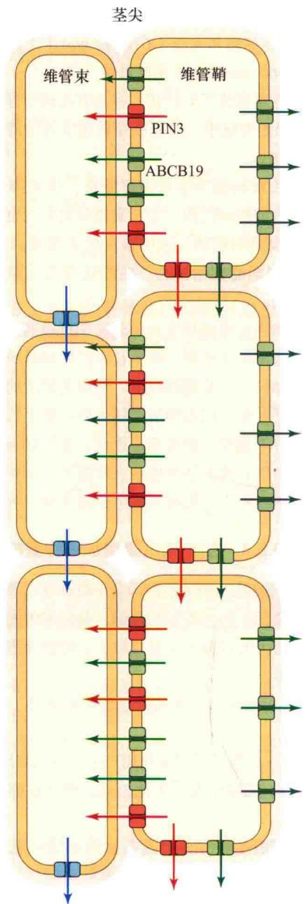

（1）如果磨损表皮使氢离子接近细胞壁，则酸缓冲液能够单独促进细胞短期生长。

（2）生长素应该能增加质子外排的速度（细胞壁酸化），并且质子外排的动力学与生长素诱导的生长十分一致。

（3）中性缓冲液应该能抑制生长素诱导的生长。

（4）能促进质子外排的复合物（除了生长素），应该能促进生长。

（5）细胞壁应该含有适合酸性pH的“细胞壁松弛因子”。

图19.21 双子叶植物维管组织中，PIN1蛋白驱动的由上向下的生长素流。ABCB19和PIN3位于邻近维管组织的维管束鞘细胞。A. PIN3定位在这些细胞向内的侧面，重新分配生长素进入维管束流。ABCB19限制生长素进入这些细胞。箭头的方向表示生长素流的方向。B. 这个区域的横切面示意图显示ABCB19如何向外运输生长素重新分配生长素进入维管束。突变体分析表明PIN3和ABCB19在向性弯曲的生长素侧向分布中起作用。  
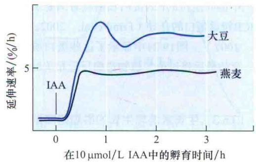  
图19.22 燕麦胚芽鞘和大豆下胚轴切段在 $10\mu \mathrm{mol} / \mathrm{L}$ IAA和 $2\%$ 蔗糖孵育下的生长动力学曲线。图示每个时间点的生长速度（而不是绝对长度）。大豆下胚轴的生长速度在 $1\mathrm{h}$ 后发生波动，而燕麦胚芽鞘的生长速度稳定（引自Cleland，1995）。

这5种假设都已经得到证实。如果表皮磨损，酸性缓冲液能引起生长速度的迅速增加。在10\~15 min的延滞期后，生长素刺激质子外排进入细胞壁，这与生长动力学一致（图19.23）。

  
图19.23 玉米胚芽鞘中生长素诱导的伸长和细胞壁酸化的动力学曲线。细胞壁的pH是用pH微电极测量的。注意细胞壁酸化和伸长速率增加的延滞时间一致（10\~15 min）（引自Jacobs and Ray，1976）。

已经证明，一旦表皮磨损，生长素诱导的生长可以被中性缓冲液抑制。壳梭孢菌素（fusicoccin）是真菌类植物毒素，它既能刺激质子迅速外排，也能刺激茎干和胚芽鞘切段的短暂生长。最后，在酸性pH条件时，细胞壁松弛蛋白扩展素（expansin）通过减弱细胞壁多糖组分间的氢键使细胞壁松弛（见第15章）。

## 19.5.6 生长素诱导的质子外排包括激活和蛋白移动两个过程

拟南芥质膜H $^{+}$ -ATPase介导的质子外排通过与抑制蛋白的相互作用来调控，而不是被质膜上H $^{+}$ -ATPase的丰度调节（见第6章）。细胞生物学研究表明，生长素直接影响PIN转运蛋白和其他细胞膜蛋白的延滞或者胞吞，但其机制未知，虽然我们已经了解生长素激活的转录反应并不参与这个过程（Dhonukshe et al., 2005）。这些结果表明生长素最开始直接作用于质膜去激活质子外排。

在生长素存在时，一个定位在内质网上的生长素结合蛋白ABP1（auxin-binding protein）直接激活H $^{+}$ -ATPase，但是其具体机制是未知的。最近的证据显示PIN（PIN5、PIN6和PIN8）定位在内质网膜上，表明通过内膜系统的蛋白分泌可能在酸化中起作用。不管酸化是怎样被激活的，像本章前面的章节所叙述的那样，生长素诱导的生长事件依赖于已知生长素受体，以及其激活的基因表达。

## 19.6 生长素的作用：植物的向性

虽然很多环境因素影响植物生长，但是由三个主要导引系统控制植物轴的方向。

（1）向光性（phototropism），或与光有关的生长，所有茎和某些根有这种特性。它保证叶可以吸收适量的光进行光合作用。

（2）向重力性（gravitropism），是生长对重力的反应。它使根向下生长进入土壤中，使茎向上生长远离土壤，这一点在萌发的早期阶段尤其重要。

（3）向触性（thigmotropism），或与触摸有关的生长，它使根绕开阻碍物生长，并且使攀援植物的茎缠绕在其他支撑物上生长。

在这一节中，我们将讨论向光或向重力弯曲反应中生长素的侧向分布；也将研究在弯曲生长中产生侧向生长素梯度的细胞机制。尽管向触性也可能产生生长素梯度，但人们对向触性的机制了解甚少。

## 19.6.1 生长素的侧向再分布介导向光性

像前面看到的那样，Charles Darwin和Francis Darwin通过证实感受光的位点和差异生长（弯曲）是相互独立的（顶端感受光而较下部分发生弯曲），提供了有关向光机制的第一条线索。Darwin父子提出某种“影响子”从顶端运输到生长区而导致可见的不对称生长。后来人们证明这种“影响子”就是吲哚-3-乙酸，即生长素。

当枝干垂直生长时，生长素由生长着的顶端极性运输到伸长区。从顶端到基端的生长素运输是发育过程决定的，而不依赖于重力。然而，生长素也可以侧向运输，而且生长素的侧向运动是20世纪20年代俄国的Nicolai Cholodny和荷兰的Frits Went最先提出的向性模型的核心。

根据Cholodny-Went的向光性模型，草类胚芽鞘顶端有高浓度的生长素，并且它有以下另外两种特殊的功能。

(1) 感受单侧光的刺激。

（2）向光刺激导致IAA的向基运输减少而转向侧向运输。

因此，为响应方向性的光刺激，生长素在顶端产生，向背光侧运输，而不是向基部运输。

虽然在各种植物中向光性机制高度相似，但是生长素的合成、光感受及侧向运输的确切位置还很难确定。在玉米胚芽鞘中，生长素在离顶端1\~2 mm处积累，光感受和侧向运输的区域延伸得较远，在距顶端5 mm之内。这种反应也强烈地依赖光照（每单位区域内光子的数量）。到目前为止，在观察的全部单子叶和双子叶植物茎叶中生长素的合成/积累、光感受和侧向运输的区域相似。

两个黄素蛋白——向光素1（phototropins1）和向光素2（phototropins2）是蓝光信号转导途径中的光受体。该途径诱导拟南芥下胚轴和燕麦胚芽鞘在高光照和低光照下的向光弯曲。向光素是可以自磷酸化的蛋白激酶，它的活性受蓝光诱导。蓝光激活该激酶的作用光谱和向光性的作用光谱（包括在蓝光区的多个峰值）十分吻合。在低照度单侧蓝光下，向光素1在磷酸化作用中呈现侧向浓度梯度。

向光素磷酸化导致它从细胞膜上解离，解离后的向光素与生长素转运蛋白或者调控生长素转运蛋白的蛋白质相互作用。在胚芽鞘中，向光素磷酸化的梯度可能诱导生长素向胚芽鞘背光侧运动，并刺激此区域细胞伸长。背光侧的加速生长和向光侧的慢速生长（称为差异生长）导致向光弯曲（图19.24）。

用琼脂块/胚芽鞘弯曲生物测定法对Cholodny-Went模型进行的直接测试支持该模型：在单侧光下，胚芽鞘顶端的生长素侧向运输（图19.25）。从顶端扩散出的生长素总量（这里表示为弯曲角度）在单侧光照射下与在黑暗中的相同（图19.25A、B）。这一结果与有些研究者提出的一样，在胚芽鞘中，光不引起向光侧生长素的破坏。

质外体的酸化似乎在向光生长中起作用。向光弯曲的茎或胚芽鞘背光侧的质外体pH比向光侧较低。pH降低促进生长素的运输。这是通过增加IAA进入细胞的速度及受外流机制驱动的渗透质子势实现的。根据酸生长假设，人们期望这种酸化作用可以促进细胞伸长。这两种过程——生长素吸收的增强和背光侧细胞伸长的促进可能决定了向光弯曲。

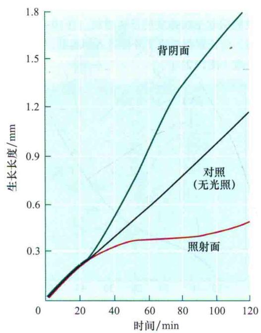  
图19.24 胚芽鞘向光侧和背光侧对30 s脉冲单侧蓝光反应的生长时程图。对照中没有光处理（引自Iino and Briggs，1984）。

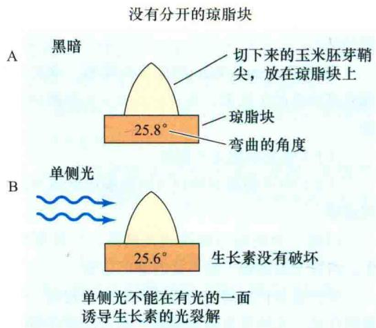

在拟南芥进行的实验表明，侧向定位的生长素外流包含了ABCB19的抑制、PIN的去极化和侧向定位的PIN3蛋白的抑制或者重新定位（Noh et al., 2003; Friml et al., 2003; Titapiwatanakun et al., 2009）。生长素分布的变化可以通过生长素响应的报告基因载体DR5::GUS观察到。DR5::GUS是将生长素敏感的启动子DR5连接在GUS报告基因上获得的（图19.26）。

  
用一片薄的云母将胚芽鞘尖完全分为两部分；不能检测到生长素的重新分布

  
用一片薄的云母将胚芽鞘尖不完全分为两部分；之后发生生长素的重新分布  
在胚芽鞘尖中生长素转运到背光的一面  
图19.25 玉米胚芽鞘中单侧光可以刺激生长素侧向中心分布的证据。琼脂块中生长素的量用图19.1中的胚芽鞘弯曲实验中琼脂块被诱导后弯曲的角度表示。

较高的一半  

图19.26 在向光性实验中，用DR5::GUS报告基因载体转化植株观察生长素的侧向再分布。A. 拟南芥下胚轴中，在单侧光弯曲反应中形成侧向生长素梯度。蓝色表示下胚轴背光侧积累的生长素（插图）。B. 生长素输出抑制剂NPA处理可以阻断向光弯曲和生长素再分布。在向重力性中发生类似的生长素再分布（图片由Klaus Palme惠赠）。  

## 19.6.2 生长素侧向再分配参与的向重性

当在暗处生长的燕麦幼苗水平放置时，胚芽鞘对重力反应而向上弯曲。根据Cholodny-Went模型，水平放置的胚芽鞘顶端的生长素侧向地运输到低侧，引起胚芽鞘低侧比高侧生长得快。早期的实验结果表明，胚芽鞘顶端可以感受重力，并且使生长素在低侧重新分布。例如，如果胚芽鞘顶端水平放置时，扩散到琼脂块低侧的生长素比高侧的量多（图19.27）。

顶端下面的组织也能响应重力。例如，把垂直生长的玉米胚芽鞘顶端上方2 mm处的帽状部分去除后，再水平放置，即使没有顶端，也会在几个小时内发生向重力弯曲。在切割面处施加IAA会使弯曲速度恢复到正常水平。这个发现表明尽管生长素的产生需要顶端，在顶端下面的组织也可以感受重力刺激和进行生长素的侧向重新分布。

由于生长素再循环（喷泉效应，fountain effect）的存在，生长素在茎端分生组织的侧向分布比在胚芽鞘中的分布更难证明。这种现象与根尖、正在发育的叶片和茎尖原基中的相似（Benkova et al., 2003）。然而，茎的向重力弯曲机制与向光弯曲的机制相似。

## 19.6.3 致密质体是重力的感受子

不同于单侧光，重力在植物器官上部和下部不形成梯度。植物的每一部分感受相同的重力刺激。植物细胞是如何感受重力的呢？可感受重力的唯一途径是通过降落小体和沉淀小体的运动。

很明显，植物中细胞内重力感受子可能是出现在重力感受细胞中的大而致密的淀粉体。这些大的淀粉体（starch-containing plastid）相对于细胞溶胶具有足够高的密度，可以轻易地沉淀在细胞底部（图19.28）。作为重力感受子的淀粉体称为平衡石（statolith）。产生它们的特化的重力感受细胞被称为平衡细胞或平衡囊（statocyte）。究竟是当平衡石通过细胞骨架时，平衡细胞才能检测到平衡石的向下运动，还是只有当平衡石到细胞底部停止时才感受刺激，这个问题还不清楚。

## 1. 茎叶和胚芽鞘中的重力感受

在茎叶和胚芽鞘中，淀粉鞘（starch sheath）感受重力。淀粉鞘是在茎叶维管组织周围的一层细胞。淀粉鞘与根的内皮层相连，与内皮层的不同之处在于淀粉鞘含淀粉体。淀粉鞘中缺乏淀粉体的拟南芥突变体表现出茎干生长失去重力性，但是根的向重力性生长正常。

较低的一半  
  
图19.27 生长素被运输到水平放置的燕麦胚芽鞘顶端靠下的一侧。A. 来自胚芽鞘顶端上半部分和下半部分的生长素扩散到两个琼脂块中。B. 下半部分（左）的琼脂块比上半部分（右）的琼脂块能够使去掉顶端的胚芽鞘弯曲更大（图片由W. B. Wilkins提供）。

  
图19.28 拟南芥通过平衡细胞感受重力。A. 根尖的电镜图，显示顶端分生组织（M）、小柱（C）和外周（P）细胞。B. 小柱细胞的放大图，显示细胞底部停留在内质网顶端的淀粉体。C. 从垂直到水平重新定向过程中发生变化的示意图（A 和 B 图由 Dr. John Kiss 惠赠；C 图基于 Sievers et al., 1996, Volkmann and Sievers, 1979）。

正如第16章提到过的，在拟南芥scarecrow（scr）突变体中，产生内皮层和淀粉鞘的细胞层仍然没有分化。结果，虽然scr突变体的根具有正常的向重力反应，其下胚轴和花序却表现出无向重力性生长反应。基于这两种突变体的表型，我们得出以下结论。

（1）淀粉鞘是茎叶中向重力性所必需的。淀粉鞘中含有ABCB19和PIN3蛋白。在束鞘中它们共同限制生长素流到维管柱。这种向下的生长素流的选择性调控是由维管柱中的PIN1蛋白执行的，选择性地限制侧向生长素流进淀粉鞘细胞可能对向光弯曲起到了奠基性的作用（Noh et al., 2003; Friml et al., 2003; Blakeslee et al., 2007）。

（2）不含有平衡石的根内皮层不是根向重力性所必需的。根中的向性弯曲包括根尖处生长素变成向基运输，而不是从中柱的直接侧向运输。

## 2. 根中的重力感受

初生根中感受重力的位点是根冠。响应重力的大造粉体位于根冠中柱或小柱（columella）的平衡细胞中（图19.29A）。完好的根如果去除根冠，能在不抑制生长的情况下使根的向重性消失。

人们仍然对平衡细胞如何精确地感知下降的平衡石了解甚少。一种假设就是由停留在细胞较低一侧的内质网上的造粉体所产生的接触和压力引发这种反应（图19.28C）。小柱细胞中占主导地位的内质网形式是管状内质网。但是也出现一种不常见形式的内质网，称为“节状内质网”。节状内质网中有5\~7个粗面内质网片层以涡旋方式连接在一个中心接杆上，像花瓣。节状内质网与更典型的管状皮层内质网潴泡不同，它可能在重力反应中起作用。

几条证据支持根中感受重力的“淀粉-平衡石”假说。在不同种类的植物中，造粉体是一直沉淀在小柱细胞中的唯一细胞器。而且沉淀的速度与感受重力性刺激所需要的时间密切相关。一般来说，淀粉缺失突变体的向重力性反应比野生型慢。虽然如此，无淀粉突变体还有部分向重力性。这表明，虽然淀粉是正常的向重力性反应所必需的，但是也可能存在不依赖淀粉的重力感受机制。

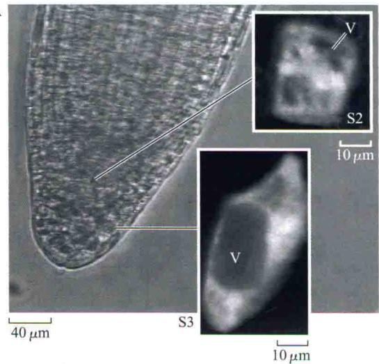

  
图19.29 用pH敏感染料进行的实验表明，向重力的信号转导过程中，根冠中柱细胞的pH变化明显。A. 显微照片表示根尖的放大图和根冠不同层面上的两个小柱细胞，分别标以S2（story 2）和S3（story 3）（插图）。两个小柱细胞呈现荧光是因为已经将一个pH敏感的荧光染料显微注射进入这些细胞。因为液泡（V）不含染料，所以是黑的。B. 重力刺激后不超过1 min，胞内pH增加。C. 在A中的两个小柱细胞对向重力刺激反应的pH敏感染料成像图。下方的颜色标尺被用来为B图产生数据（引自Fasano et al., 2001）。

其他细胞器，如细胞核也非常致密，可能作为平衡石起作用。平衡石甚至没有必要落到细胞底部，因为其与内膜或者细胞骨架相互作用也可传递重力信号，但是具体机制还未知。

## 19.6.4 pH和钙离子可能作为第二信使参与重力感受

当重力感受机制检测到根或茎叶的重力载体不一致时，由第二信使参与的信号转导途径传递此信息去纠正这种差异生长。该过程称为重力刺激（gravistimulation）。很多实验表明pH的局部变化和钙浓度梯度参与了该信号转导途径。

在根冠柱细胞对重力产生反应的早期可以检测到胞内pH的变化，用pH敏感的染料检测拟南芥根尖中胞内和胞外的pH，当根被转向水平方向后可以观察到pH的快速变化（Fasano et al., 2001）。在重力刺激2 min后，根冠小柱细胞的胞内pH从7.2增加到7.6，而质外体pH从5.5下降到4.5（图19.29 B和C）。这些变化发生在所有可检测到的向性弯曲的大约10 min之前。

胞质碱化和质外体酸化表明，质膜H $^{+}$ -ATPase的活化发生在根感受重力或信号转导之前。生长素运输的化学渗透模型推测质外体酸化和胞质碱化可能改变受影响细胞对IAA的定向吸收和流出。

早期生理研究表明从贮存库中释放的钙可能参与根向重力性的信号转导过程。例如，用EGTA [ethylene glycol-bis（β-aminoethyl ether）-N, N, N', N'-tetraacetic acid]（一种可以螯合钙离子的化合物）处理玉米根能够阻止细胞吸收钙，抑制根的向重力性生长。将含有钙离子的琼脂块放在垂直放置的根冠一侧，能够诱导根向有琼脂块的一侧生长（图19.30）。与 $[^{3}H]$ -IAA的情况一样，由于受重力刺激， $^{45}Ca^{2+}$ 被极性地运输到

PLANT PHYSIOLOGY

根冠较低的一侧。然而，当用对钙敏感的染料检测细胞内钙水平时，重力刺激后并没有检测到胞内钙分布的变化。这表明钙离子的再分布不是重力反应所必需的。

  
图19.30 玉米根向含有钙的琼脂块的根冠侧弯曲。该结果表明人为造成的钙浓度梯度可以超越正常的向重力反应。虽然在向重力性反应中钙离子本身不起作用，但它可能在向重力性的信号转导中起作用（Michael L. Evans 惠赠）。

在根的向触性生长中，当正在生长的根尖与坚硬的表面接触时，便超越向重力性引起暂时的弯曲反应。与向重力性弯曲不同的是，在根的向触性反应中能检测到胞内钙库的局部性变化。在拟南芥中，钙离子水平的快速变化的起始不依赖活性氧的增加和质膜pH梯度的降低（Monshausen et al., 2009）。图19.30中所示的对钙的弯曲反应在更大程度上与向触性有关，而非向重力性。

## 19.6.5 生长素在根冠中的侧向再分配

根冠除了在根尖透过土壤时保护顶端分生组织的敏感细胞外，它也是感受重力的地方。因为根冠与发生弯曲的生长区之间有一定的距离，在根冠的重力响应信号应该能诱导产生一种化学信使以调节伸长区的生长。去除一半根冠的显微手术实验表明，在向重力性弯曲中根冠向较低一侧提供一种根生长的抑制物（图19.31）。

根冠含有少量的IAA和脱落酸（abscisic acid，ABA）（见第23章）。当直接给伸长区施用IAA和ABA时，IAA对根生长的抑制作用比ABA强。这表明IAA是根冠抑制因子。与此结论一致，拟南芥ABA的缺失突变体具有正常的根向重力性生长，而在生长素运输有缺陷的突变体（如aux1和pin2）的根中向重力性反应有缺陷。

为了理解生长素在根冠中是如何再分布的，首先综述植物根中生长素的运动模式。IAA被向顶的PIN1/ABCB19调控的流动运输到根尖（图19.11）。在根分生组织中也合成IAA。然而，PIN3、PIN4和ABCB1共同作用将生长素排除在根冠细胞之外，同时，侧根冠细胞中AUX1介导的生长素吸收驱使向基的生长素流离开根尖（Swarup et al., 2003）。PIN2定位在根表皮细胞的基部（顶部）末端，负责将生长素从侧根冠运输到伸长区。在这个部位，PIN2的功能是以一种浓度依赖的方式激活或抑制生长（图19.11）。

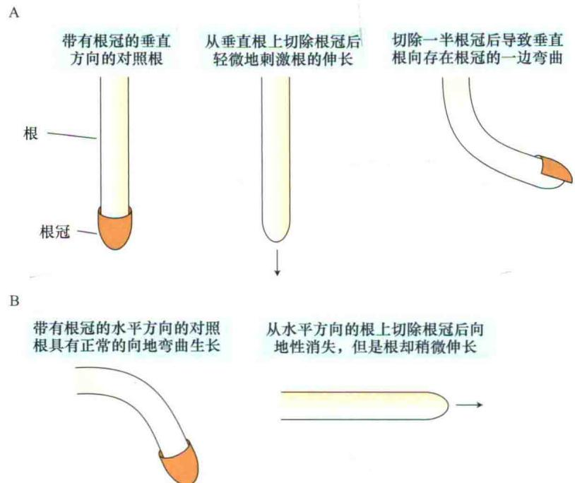  
图19.31 显微手术实验表明根冠对生长素的重新分布和接下来根向重力弯曲中的伸长的不同的抑制是必需的。分子遗传实验已经表明拟南芥中AUX1是根冠中生长素流向外的主要动力（引自Shaw and Wilkins，1973）。

有人认为，在根皮层细胞中受PIN2蛋白介导的生长素回流环（auxin reflux loop）能使生长素返回到伸长区边缘的向顶中柱运输流中（图19.11）。正在生长的根尖中的生长素环流可能在不依赖茎的生长素情况下，使根的生长维持一段时间（Blilou et al., 2005）。

根据向重力性模型，在垂直的根中向基运输的生长素在每个方向是均等的（图19.32A）。然而，当根水平放置时，根冠使大多数生长素流向低侧，而抑制低侧生长（图19.32B）。与该模型一致， $[^{3}H]$ IAA通过水平定向的根冠时是极性运输的，倾向于向下运动。利用报告基因载体DR5::GFP已经证实生长素通过水平放置的根冠而向下运动。该载体含有绿色荧光蛋白（green fluorescent protein，GFP），它在生长素敏感的DR5启动子控制下表达（见第2章）（图19.33）。在GR5::GFP过量表达的植株中，可以通过绿色荧光观测任何可能的细胞中生长素水平的升高。在根的低侧的绿色信号表明了生长素的累积（Peer and Murphy，2007）。

PIN3是PIN蛋白家族的成员之一，它可能参与从垂直到不同方向放置的根中生长素的再分配。在垂直放置的根中，PIN3均一地分布在小柱细胞的周围；当根水平放置时，PIN3倾向于位于低侧的细胞中。有人认为PIN3的再定向能加速生长素向根冠较低一侧的运输。像前面提到的那样，有些PIN蛋白在质膜的胞内分泌区室中快速循环，PIN3可能通过这种机制定位。然而，pin3突变体不是完全没有向重力性的，因此，PIN3可能与其他的非对称事件共同改变生长素流。最可能的非对称事件可能是非质体酸化中的非对称性改变，非质体酸化产生的非对称的化学渗透势改变生长素流的方向。这可能使PIN3重新分布，并在新的方向放大生长素流（渠化）。

  
图19.32 玉米根向重力生长时生长素的再分布模型（引自Hasenstein and Evans，1988）。

B

  
图19.33 重力刺激致使生长素在侧根细胞的非伸长侧的不对称积累。DR5启动子驱动下的绿色荧光蛋白（GFP）的表达表示生长素的积累。A. 拟南芥根尖示意图，表示参与生长素侧向重新分布的组织。B. 重力刺激之前。C. 重力刺激后3 h，生长素已经在根冠较低侧重新分布（图片由Jiri Friml惠赠）。

## 19.7 生长素对生长发育的影响

虽然最初发现生长素与生长有关，但是生长素几乎影响植物生命周期中从萌发到衰老的每一个时期。植物的形态建成需要依赖生长素的定向极性运输。生长素的极性运输维持基本的茎-根极性和发育过程中的极性生长。在拟南芥、水稻和玉米中的分子遗传研究表明，由PIN蛋白指导的极性的生长素流在植物器官发生的各个方面起作用。AUX/LAX和ABCB转运蛋白的活性在组织伸长和成熟过程中维持生长素极性运输流。

多个PIN的缺失突变体或者调控这些转运蛋白极性定位的细胞组分的缺失突变体都导致严重的胚胎缺陷和多个植物器官的缺失。生长素运输极性是在胚胎发育的早期建立的。调节生长素从胚胎顶极向胚柄（母性附着点）的极性运输的细胞机制存在于成熟组织中。

因为生长素的影响依赖于对靶组织的识别，靶组织对生长素的反应受遗传发育程序的控制，进一步受有无其他信号分子的影响，如激素、钙离子和活性氧。正如我们将在本章和后面章节中谈到的，两个或多个激素的相互作用是遗传发育中的常见问题。

在这部分中，我们将探讨由生长素调节的除细胞伸长外的另外一些发育过程，包括顶端优势、花芽发育、叶重排（叶序）、侧根形成、维管发育、叶脱落和果实形成。通过这些讨论，我们推测生长素的作用机制在所有情况下是类似的，包括相似的受体和信号转导途径。

## 19.7.1 生长素调节顶端优势

在多数高等植物中，发育的顶芽抑制侧芽（腋芽）的生长，这种现象称为顶端优势（apical dominance）。茎端去除后（打顶，decapitation）导致一个或多个侧芽暴长。发现生长素后不久，在蚕豆（Phaselous vulgaris）植株中，人们发现IAA可以代替顶芽以维持对侧芽的抑制作用。图19.34阐明的是20世纪20年代，Kenneth Thigaris和Folke Skoog的经典实验。

在很多其他植物中，也很快证实了这个结果。因此形成了这样的假设：顶芽向基运输的生长素抑制腋芽长出。为了证明这种假设，将含有生长素运输抑制剂TIBA的羊毛脂膏（作为载体）环放在茎尖下方，能够解除对腋芽的抑制作用。

来自茎尖的生长素如何控制侧芽的疯长？Thimann 和 Skoog 最先提出茎尖合成的生长素向基运输到腋芽，他们认为腋芽比其他组织对生长素敏感。如果事实是这样，茎尖去顶之后，腋芽处生长素的浓度应该降低。然而，结果似乎相反。腋芽中生长素含量的测定表明，去掉顶端后，芽中生长素浓度实际是增加的。另外，直接在顶芽上施用生长素能提高茎干中生长素的浓度，但不能抑制正常的腋芽长出。最后，用放射性标记的生长素进行的实验表明生长素并不进入芽中。

A 顶芽完整  
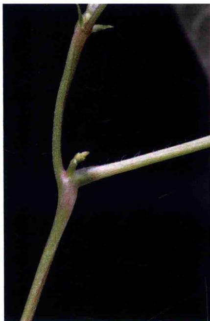

B 去除顶芽  
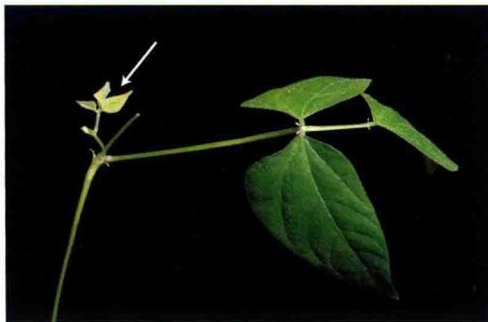

C 向切割面添加生长素  
  
图19.34 生长素抑制蚕豆（Phaseolus vulgaris）腋芽生长。A. 在完好的植株中，由于顶端优势腋芽被抑制。B. 去除顶芽使腋芽解除顶端优势（箭头所示为侧芽）。C. 向切割面添加含有IAA的羊毛脂膏（含在明胶胶囊中）阻止腋芽的生长（图片由David McIntyre提供）。

如果生长素不进入芽中，那么它必须在远处作用以抑制芽的暴长。但是生长素在哪里作用呢？对拟南芥axr1突变体（Booker et al., 2003）的分子研究提供了答案。AXR1蛋白是初始生长素识别机制的组分。拟南芥axr1突变体对生长素不敏感，导致突变体的表型包括侧枝增多。但是，在axr1突变体的木质部和茎干的维管束（束间厚壁组织）之间的厚壁组织特异表达野生型AXR1蛋白，可以完全恢复正常突变体的顶端优势，表明AXR1作用于这些组织。而且，axr1突变体和野生型之间的嫁接研究证实生长素通过在木质部和茎的维管束间的厚壁组织作用来控制腋芽生长。但是，在这些组织中生长素信号下游的组分是如何调控芽的生长的机制还是不清楚的。生长素在侧枝发育中的功能在Web Essay 19.2中有进一步的叙述。

其他分枝信号：由于AXR1还调控了多种SCF泛素E3连接酶复合体（见第2章和第14章），其他激素也可能参与了控制腋芽生长的过程。细胞分裂素最初被认为与生长素相互作用调控腋芽的生长（见第21章）。在多种植物中，直接向腋芽施用细胞分裂素能够覆盖茎端的抑制效应以刺激芽的生长。但是，在腋芽处生长素的水平调控了细胞分裂素的产生（Tanaka et al., 2006）。同样，细胞分裂素不可能是激活分支的主要的或唯一的信号物质。

对一系列分枝增多的豌豆、水稻和拟南芥突变体的分析中发现了顶端优势中作为信号物质的独脚金内酯（Hayward et al., 2009）。独脚金内酯是一种来源于类胡萝卜素的萜类内酯，最初是作为寄生杂草独脚金的寄主植物的根产生的一种化学物质而鉴定到的，可以刺激独脚金种子的萌发。后来发现独脚金内酯可以促进有益的菌根真菌的菌丝结构的形成。突变体植株和野生型植株的嫁接研究表明，独脚金内酯在根和茎中都能够产生，可能通过木质部运输到茎干。在调控顶端优势中，独脚金内酯如何与生长素相互作用需要进一步研究。

## 19.7.2 生长素运输调节花芽发育和叶序

花分生组织的发育依赖于从近顶端组织运输的生长素。从这些组织运输的生长素也调节叶发生和叶序（phyllotaxy），即从茎端产生的叶的模式。在没有PIN1的情况下，生长素向分生组织的运动受到损害，而且叶和花器官原基的发生被破坏。这是pin1突变体“针状”表型的基础。然而，毫不奇怪的是，通过向顶端分生组织的侧翼涂抹微量含有生长素的羊毛脂膏可以诱导pin1突变体分生组织形成叶原基（图19.35）。

在茎顶端分生组织的叶原基中，PIN1-GFP转基因植株的显微镜观察表明PIN1的分布与生长素流的方向相关。在这些组织的细胞中，PIN1的定位和生长素流的方向是高度动态的。假设生长素的运输是通过AUX1、PIN1和ABCB19的共同作用，生长素运输方向的计算机模型可以精确地预测叶序的模式，模拟出的向基的生长素运输池是存在的（Smith，2008）。

A  

## 19.7.3 生长素促进侧根和不定根的形成

虽然生长素的浓度超过 $10^{-8}$ mol/L时，初生根的伸长被抑制，但是高浓度生长素刺激侧根和不定根的发生。侧根出现在伸长区和根毛区。它起源于中柱鞘中的小细胞群（见第16章）。通过对根分枝模式异常的拟南芥突变体分析表明以下几点。

（1）中柱鞘细胞分裂的发生需要根维管薄壁细胞中IAA的向顶运输。生长素吸收进入根中是由PIN2、AUX1、ABCB19和ABCB1共同作用调控的。

（2）LAX3调控生长素进入皮层和表皮细胞，进而促进细胞扩展和细胞壁修饰。细胞壁的修饰有利于侧根发生。

（3）来自于根中向基流动的IAA有助于侧根伸长，并和来源于茎的生长素共同维持细胞分裂和细胞生长。

生长素水平升高或者外施生长素能够促进不定根

（产生于非生根组织的根）的形成。不定根起源于分化细胞。分化细胞开始分裂，并以一种类似于侧根原基形成的方式发育成根顶端分生组织。在园艺学中，生长素对不定根形成的刺激效应对通过剪切进行的营养繁殖具有重要的利用价值。

## 19.7.4 生长素诱导维管分化

新维管组织直接在发育的芽和生长的幼嫩叶片下方分化（图19.4）。而且去除幼叶以后阻止维管分化。用组织培养的方法可以证明顶芽具有刺激维管分化的能力。当把顶芽嫁接到一簇未分化的细胞或胼胝体以后，在嫁接处木质部和韧皮部便开始分化。

在拟南芥中，通过研究编码转运蛋白、转运蛋白的调控蛋白和生长素信号组分的基因的突变体，以及启动子-报告基因的实验，表明由PIN1调节的生长素运输是叶中维管束分化和模式的主要决定因素。ABCB19在将生长素运输到子叶中起重要作用（Lewis et al., 2009），也被认为有助于叶中生长素的提供。有些组织中的维管分化似乎有与乙烯和其他激素的相互作用。

在所有的植物器官中，维管束的分化都具有极性。在多年生木本植物中，发育的春芽产生的生长素向基刺激维管形成层的活化。新一轮的次生生长从最小的嫩枝开始向根尖方向进行。

受伤害的维管组织的再生也受位于受伤部位幼叶产生的生长素的控制（图19.36）。去除幼叶可阻止维管组织的再生，施加生长素可代替幼叶刺激再生。

  
200 μm

B  
  
50 μm  
图19.35 pin1突变体营养性茎尖分生组织上的叶原基的扫描电镜显微图片。A. 未经处理的pin1花序分生组织不能产生叶原基。B. 将一微滴含有IAA的羊毛脂膏放在分生组织的一侧，诱导pin1突变体的花序分生组织产生叶原基（A引自Vernoux et al., 2000；B引自Reinhart et al., 2003）。

## 19.7.5 生长素延迟叶片脱落

叶、花和果实从活的植株分离的现象称为脱落（abscission）。发生脱落的区域称为离区（abscission zone）。对于叶来说，离区位于叶柄基部附近。在大多数植物中，离区中脱落层细胞的分化致使叶脱落。在叶片衰老过程中，脱落层细胞的壁被消化掉，使这层细胞变软而且脆弱。对脆弱的细胞壁的胁迫最终导致叶从脱落层脱离。

生长素水平在幼嫩叶片中较高，成熟叶片中次之，当脱落开始时在衰老叶片中最低。除去叶片只剩下主干上完整叶柄的实验可以很容易地证明叶脱落过程中生长素的重要性。去除叶片后加速了叶柄脱落层的形成，而向叶柄表面切割处涂抹含有IAA的羊毛脂膏状物却阻止脱落层的形成（羊毛脂膏本身不能阻止脱落）。

这些结果表明以下两点。

（1）从叶片运输的生长素阻止脱落。

（2）在叶衰老的过程中，当不再产生生长素时，就引发脱落。

然而，正如将在第22章讨论的那样，乙烯作为正调控因子也在脱落中发挥关键作用。

## 19.7.6 生长素促进果实发育

很多证据表明生长素参与调节果实发育。生长素在花粉管中合成和代谢。而且果实生长的最初刺激可能来自授粉。

授粉引发胚珠生长称为座果（fruit set）。受精后果实的生长可能依赖于正在发育的种子中的生长素。胚乳可能在果实发育的起始阶段提供生长素；在后期阶段，正在发育的胚取而代之成为主要的生长素来源。

图19.37表示的是草莓瘦果（真正的种子，每个瘦果含有一粒种子）产生的生长素对草莓花托生长的影响。

## 19.7.7 合成生长素具有多种商业用途

生长素在农业和园艺学中商业化地应用已有50多年的历史。商业用途包括预防果实和叶脱落、促进菠萝开花、诱导单性结实、疏果（thinning of fruit）和嫁接生根以促进植物繁殖等。如果将离体叶子或茎切段浸入生长素溶液中，会促进生根。生长素还能增强切段末端不定根的发生，它是商用生根复合物的理论基础。生根复合物的主要成分是与滑石粉混合在一起的人工合成生长素。

在有些植物中，无种子的果实可能是天然长成的，或者是生长素处理未授粉的花诱导形成的。这些无种子果实的产生称为单性结实（parthenocarpy）。为刺激单性结实，生长素可能主要诱发座果。反过来，座果可能诱发一定的果实组织产生内源生长素以完成生长发育过程。

A

打顶的主干,在伤口上方的叶和芽被移走以降低内源生长素的含量 在受伤之后立即将含有IAA的羊毛脂黏胶涂抹在伤口上方的茎干

B  
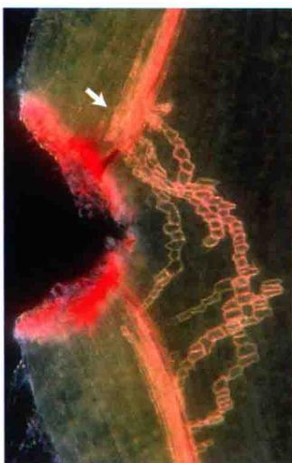  
木质部分化沿生长素扩散的路径发生在伤口附近  
图19.36 黄瓜（Cucumis sativus）茎组织中，IAA诱导木质部在伤口周围再生。A. 伤口再生的实验方法。B. 荧光显微照片表示在伤口周围正在再生的维管组织。箭头表示伤口位置，即生长素积累的地方和木质部开始分化的地方（B图由R. Aloni惠赠）。

PLANT PHYSIOLOGY

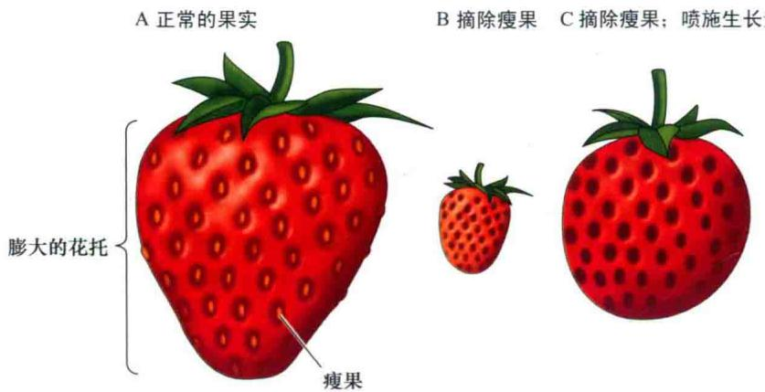  
图19.37 草莓的果实实际上是一个膨大的花托。花托的生长受“种子”（实际上是瘦果，真正的果实）所产生的生长素的调节。A. 当有瘦果存在时，花托膨大，并形成特有的风味、甜度和红颜色。B. 当去除瘦果时，花托不能正常发育。C. 把IAA喷洒在去除瘦果的花托上能恢复正常的生长和发育（引自Galston，1994）。

乙烯也参与调控果实发育，而且生长素对果实发育的影响可能通过促进乙烯的合成起作用。在商业上用乙烯处理果实的作用将在第22章中讨论。

除了这些应用，合成的生长素，如2，4-D和麦草畏（图19.3B）被广泛地作为除草剂。除草剂可以诱导细胞过度伸展最后导致植株死亡。人工合成的生长素非常有效，是因为它们不像IAA那样能够迅速地被植株代谢。而有些生长素，如2，4-D的运输速度比IAA慢得多，因此能促进它在枝叶的停留。农民用合成的生长素来控制禾谷类作物田里的双子叶杂草（也称为宽叶杂草）（broad-leaved weed）；园丁用它来控制草坪上诸如蒲公英和雏菊之类的杂草。单子叶植物，如玉米和禾本科的草类对人工合成的生长素不太敏感，因为单子叶植物能够通过缀合作用迅速使合成的生长素失活。

## 小结

生长素是植物中发现的第一种激素。它调控了植物发育的各个方面，包括茎的伸长、顶端优势、根的起始、果实发育、分生组织发育和向性生长。生长素可能和其他激素相互作用共同调控这些发育。

## 生长素概念的出现

· 燕麦胚芽鞘尖端的可扩散的化学物质（生长素）促进细胞伸长（图19.1）。

## 主要的生长素是吲哚-3-乙酸

· 主要的天然生长素是吲哚-3-乙酸，也鉴定到了其他的生长素（图19.3）。

· IAA在分生组织和幼嫩的正在分裂的组织合成，随着叶和维管束的成熟向基运输（图19.4）。

· IAA可以被贮存或者降解。当与不同的物质缀合时，它是无活性的。但是酶的作用可以释放自由的（有活性的）IAA。IAA能够被包括不可逆的氧化作用在内的多种途径降解（图19.5）。

## 生长素的运输

· IAA表现出从茎的顶端到基部区域的极性运输（图19.6）。IAA的极性运输需要能量，不依赖重力（图19.7）。

· 极性的生长素流被化学渗透势驱动。生长素流的方向由极性分布的输出蛋白调控，生长素池由生长素吸收蛋白和排斥邻近细胞生长素流的无方向性的输出蛋白产生（图19.8和图19.10）。

\- 质子化的生长素通过沿着细胞膜的扩散和AUX1/LAX质子协同蛋白进入细胞（图19.9）。

· PIN和ATP依赖的（ABCB）转运蛋白指导整株植物中生长素的外流（图19.11和图19.12）。

· 细胞质和ER中生长素的区室化有助于生长素的平衡（图19.14）。

· 生长素的流入和流出可以被抑制（图19.15和图19.16）。

\- 生长素运输被激素和PIN蛋白的运输调控，在细胞膜和内体中循环（图19.17）。

## 生长素信号转导途径

· 结合生长素后，受体-酶复合体使特异的转录抑制子通过蛋白酶体途径降解，激活生长素反应基因的转录（图19.18）。

· 生长素诱导的基因分为早期基因和晚期基因。

## 生长素的作用：细胞伸长

· 生长素促进双子叶植物茎和单子叶植物胚芽鞘的伸长，但是抑制根的生长（图19.19和图19.22）。

· 生长素促进的生长需要能量，能被代谢抑制剂快速地抑制。蛋白质和RNA合成抑制剂也可以抑制生长

素促进的生长。

\- 双子叶植物中侧向的生长素运输由维管束细胞中侧向定位的PIN蛋白和周围细胞中的ABCB转运蛋白调控（图19.21）。

· 与酸生长假说一致，生长素促进质子挤压进入细胞壁（图19.23）。

· 生长素影响PIN蛋白和其他细胞膜蛋白的滞留或内吞作用，表明生长素可能直接作用在细胞膜，从而促进质子外排。

## 生长素的作用：植物的向性

· 向光素是自我磷酸化的蛋白激酶，能够吸收蓝光，诱导向光弯曲。

· 向光素的磷酸化诱导生长素向胚芽鞘的背光面侧向运输，并激活细胞伸长和弯曲（图19.24），这与Cholodny-Went模型一致（图19.25）。

· 向光的生长素运输包含导致生长素侧向再分布的生长素外流蛋白的抑制或者再分布（图19.26）。

· 胚芽鞘尖端感受重力，使生长素向低端再分布，诱导胚芽鞘弯曲（图19.27）。

· 大的、高浓度的平衡石在特化的根细胞的底部给特化的内质网信号压力，进而感受重力（图19.28）。

· 在根冠小柱细胞，细胞质中pH增加与质外体的酸化共同激活质膜 $H^{+}$ -ATPase，是向重力性信号转导的最初事件（图19.29）。

· 在向重力性弯曲的根中，根冠向更低一侧提供生长抑制子（IAA）（图19.31\~图19.33）。

## 生长素对生长发育的影响

· 生长素影响植物从萌发到衰老的生活周期的多个阶段。在这个过程中，生长素的影响依赖于特异组织中由发育激活的基因网络。生长素可能与其他激素、钙离子和活性氧共同调控植物的生长发育。

· 生长素作用在木质部和相关的细胞，抑制侧芽的发育，维持顶端优势（图19.34）。独脚金内酯与生长素相互作用调控侧枝的发育。

·为了正常的发育，花分生组织和叶原基需要PIN调控的从位于亚顶点的组织的生长素运输（图19.35）。

· PIN调控的生长素运输控制叶中维管束分化和模式。维管束的再生也受生长素调控（图19.36）。

· 生长素参与果实发育的调控（图19.37）。

(王海娇 王学路 译)

## WEB MATERIAL

## Web Essays

19.1 Exploring the Cellular Basis of Polar Auxin Transport Experimental evidence indicates that the polar transport of the plant hormone auxin is regulated at the cellular level. This implies that proteins involved in auxin transport must be asymmetrically distributed on the plasma membrane. How those transport proteins get to their destination is the focus of ongoing research.

## 19.2 Strigolactones: The Unmasking of a New Branching Hormone

A brief review of the discovery of a new plant hormone, strigolactone, how it is regulated and how it is integrated into the network of genes and signals controlling shoot branching.
