# 第 20 章

# 赤霉素：植物高度和种子萌发的调节因子

1927年，人们发现了生长素，其后，在其结构被阐明为吲哚-3-乙酸后的20多年里，植物学家试图用生长素解释激素调节植物生长发育的所有现象。然而，正如本章和以后的一些章节所阐述的，植物的生长和发育是由许多激素单独或者协同调节的。

第二种被鉴定的植物激素是赤霉素（GA）。现在至少已经发现136种天然的赤霉素（MacMillan，2002），在http://www.plant-hormones.info/galinfo.htm上面可以查阅这些赤霉素的结构特征，该网址内容会根据天然赤霉素的特点和命名的最新变化而及时更新。生长素是一类结构差异很大却具有相似生物活性的化学物质，而赤霉素不同于生长素，它们有相似的化学结构，但生物活性却很不相同。一些没有活性的赤霉素是活性赤霉素的代谢前体或者是活性赤霉素的失活产物。在植物体中通常只有几种有活性的赤霉素存在，它们的活性水平一般与植物茎的高度相关。赤霉素还在其他的生理过程中起重要作用，如种子的萌发、开花和花粉的发育。

赤霉素的生物合成受到遗传、发育和环境因素的严格调控。赤霉素最显著的作用是促进植物茎的伸长。目前已经筛选得到由于赤霉素缺乏而导致植株矮化的突变体。孟德尔遗传定律中控制豌豆植株高矮的一对等位基因就是著名的例子，该单个基因位点能控制活性赤霉素的水平，进而调节植株茎的高度。人们利用这些突变体来阐明赤霉素生物合成的复杂途径和鉴定植物中哪些赤霉素具有内源生物活性。

本章首先说明赤霉素在水稻（Oryza sativa）真菌病原体赤霉菌（Gibberella fujikuroi）中的发现过程，并讨论其化学结构。然后综合阐述赤霉素调节的植物生长发育过程——种子萌发，茎的生长，花的发育，果实的形成和种子的发育。其后讨论赤霉素的生物合成，在不同发育阶段、不同组织和器官中调节活性赤霉素水平的因素及这些因素所起的作用。2005年，人们从水稻中分离鉴定了赤霉素的受体，这为我们近年来发现赤霉素受体的结构奠定基础。有生物活性的赤霉素结合到受体后，启动一系列的信号转导过程，最终导致植物表型的变化。

## 20.1 赤霉素的发现及其化学结构

本部分将简要介绍赤霉素的发现这一突破性的工作，并对本章出现的赤霉素相关的专业术语进行解释，阐述赤霉素的化学结构和命名系统。最后，探讨赤霉素特殊的化学结构和生物活性之间的关系。

## 20.1.1 赤霉素是通过研究一种水稻病害而发现的

赤霉素首次引起西方科学家的关注是在20世纪

50年代，然而它们在更早之前就已经在日本被发现了。日本稻农很早就知道一种真菌病害（“bakanae disease”或恶苗病）会导致水稻生长过高并降低产量。植物病理学家发现这种症状是由病原真菌Gibberella fujikuroi感染水稻后引起的。20世纪30年代，日本科学家在实验室培养这种真菌，分析过滤后的培养液，获得了这种具有促进植物生长活性的化合物的不纯晶体，并将其命名为赤霉素A（gibberellin A）。

## 20.1.2 赤霉酸最初是从培养赤霉菌的过滤液中纯化得到的

20世纪50年代，英国和美国的两个研究组从赤霉菌的培养滤液中纯化了一种化合物，并阐明了其化学结构，将其命名为赤霉酸。同时，日本的科学家从最初的赤霉素A样品中分离和鉴定了三种不同的赤霉素，并分别命名为赤霉素 $A_{1}$ （ $GA_{1}$ ）、赤霉素 $A_{2}$ （ $GA_{2}$ ）和赤霉素 $A_{3}$ （ $GA_{3}$ ）。赤霉素的编号系统的建立由此而来。随后发现日本科学家所分离的 $GA_{3}$ 与美国和英国科学家所发现的赤霉酸相同，因此， $GA_{3}$ 就是指赤霉酸，而赤霉素是对这类激素的总称。

不久之后又发现，虽然 $GA_{3}$ 是赤霉菌培养物中的主要化合物，但其中还有很多不同的赤霉素类化合物（ $GA_{3}$ 通常由工业规模发酵赤霉菌产生，用于农业、园艺和其他的一些科学研究）。由于 $GA_{3}$ 很容易获得，科学家将它广泛地用于不同的植物。赤霉素在矮生和具莲座叶的植物中有促进茎伸长的特殊效应，尤其在矮生豌豆（Pisum sativum）、矮生玉米（corn；Zea mays）（图20.1）和一些莲座叶植物（图20.2）中效果更加明显。

  
图20.1 外源的 $GA_{1}$ 处理野生型和矮生型玉米（dl）植株。赤霉素能显著地促进矮生突变体茎的生长，但是对于野生型植株作用不明显（B. Phinney惠赠）。

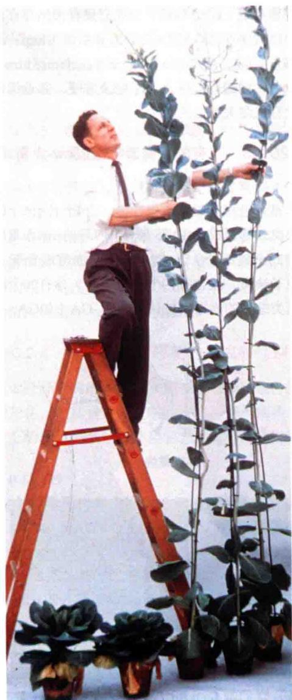  
图20.2 甘蓝，一种长日照植物，在短日照条件下保持莲座叶生长，经 $GA_{3}$ 处理后能出现花芽而开花，并形成巨大的花茎（©SylvanWittwer/Visuals Unlimited）。

由于真菌来源的天然 $GA_{3}$ 能使矮生的突变体增高，因此很自然地使人们想到在野生型的植株中是否含有内源赤霉素。对不同植物的提取液进行生物分析发现，在植物体内确实存在一些与赤霉素生物活性相似的物质。在未成熟种子中，这类物质的含量大约为 $1/10^{6}$ ，远高于营养组织（约 $1/10^{9}$ ）。因此未成熟的种子常被用作提取GA的原料。但是化学鉴定GA往往需要几十千克的种子。1958年，人们第一次从植物红花菜豆（Phaseolus coccineus）的未成熟种子中提纯并鉴定了 $GA_{1}$ 。现在，利用灵敏度较高的光谱技术已使人们能用较少的植物材料去鉴定和定量GA。

由于在赤霉菌和不同的植物中发现了越来越多的GA，科学家按赤霉素发现的年代先后顺序调整了赤霉素的编号系统（ $\mathrm{GA}_1 \sim \mathrm{GA}_n$ ）。规定只有天然存在的，化学结构已被阐明的GA用A数字编号系统（http://www.plant-hormones.info/gibberellin\_nomenclature.htm）。赤霉素命名中的编码仅仅是为了记录方便，邻近编码的赤霉素没有代谢关系上的暗示。

## 20.1.3 所有的赤霉素都是以ent-赤霉烷为基本骨架

赤霉素是一类二萜类化合物，由4个含有5个碳原子的类异戊二烯形成。GA都有一个四环的ent-赤霉烷骨架（包含20个碳原子），或20-nor-ent赤霉烷骨架（第20个碳原子缺失，仅含有19个碳原子）。含有20个碳原子的二萜类结构的赤霉素被认为是 $C_{20}$ -GA（如 $GA_{12}$ ）。

  
ent-赤霉烷

其他的赤霉素由于在代谢中缺失了第20个碳原子（结构图中蓝色部分）被称为 $C_{19}$ -GA（如 $GA_{9}$ ）。几乎所有的 $C_{19}$ -GA中， $C_{4}$ 上的羧基与 $C_{10}$ 上的碳原子形成内酯（结构图中红色标记部分）。其他的结构修饰还包括额外功能基团如羟基（—OH）或者双键的插入，这些基团插入的位置和立体化学结构影响赤霉素的生物活性。最具生物活性的GA均在最先发现的赤霉素 $GA_{1}$ 、 $GA_{2}$ 、 $GA_{3}$ 、 $GA_{4}$ 和 $GA_{7}$ 中。这些赤霉素都是一些 $C_{19}$ -GA。它们都有 $C_{4}$ 和 $C_{10}$ 位上形成的内酯（显示为红色）， $C_{6}$ 位上的羧基（COOH，结构图中显示为绿色）和 $C_{3}$ 位上的β-羟基结构（OH，结构图中显示为蓝色）。GA受体三级结构的阐明揭示了活性GA上的这些功能基团如何与GA受体的氨基酸残基相互作用，使活性GA锚定在受体的中央口袋中，然后关闭的“盖子”完全将GA包埋在受体中（Murase et al., 2008；Shimada et al., 2008）。这种活性GA与受体结合后引起受体构象的变化能促进受体与其他蛋白质的相互作用。

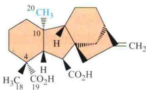  
$\mathrm{GA}_{12}$ $(\mathbf{C}_{20} - \mathbf{G}\mathbf{A})$

在分子水平上赤霉素的生物活性可能会因功能键位置的不同而不同，如在 $GA_{7}$ 和 $GA_{3}$ 中 $C_{1}$ 和 $C_{2}$ 间的双键，在 $GA_{1}$ 和 $GA_{3}$ 中 $C_{13}$ 上的羟基。这些功能基团或是促进或是抑制GA与受体的结合。另外，2β-OH能阻止其于受体中央口袋“盖子”的疏水作用，使“盖子”不能关闭，进而导致GA的失活（赤霉素结构的深入讨论参见Web Topic 20.1）。

## 20.2 赤霉素对生长和发育的影响

尽管赤霉素最初是从水稻节间病（水稻恶苗病，又称徒长病）中发现的，但除了茎的伸长，内源赤霉素还能影响植物很多的发育过程。赤霉素的这些特性已在农业中应用了几十年，在农作物中改变赤霉素的含量能够影响其植株的大小、果实的形成和发育。

## 20.2.1 赤霉素能促进种子的萌芽

许多种子，尤其是野生种类，当刚和母体分离后，会经历一段时间的休眠，不能立即萌发。休眠的种子即使施水也不能够萌发。脱落酸（ABA）和赤霉素（GA）在种子休眠过程中的作用是相互拮抗的，在很多植物中，这两种激素的相对含量决定了它们休眠的程度。光和低温处理休眠的种子，都能够降低ABA的含量和提高活性GA的含量，使种子结束休眠促进其萌发（Piskurewicz et al., 2008; Seo et al., 2006）。这些种子萌发所需的光和低温的作用能被赤霉素处理所替代。

在种子萌发过程中，GA能够诱导水解酶的合成，如淀粉酶和蛋白酶。这些酶能够降解成熟种子中积累在胚和胚乳里的营养物质。这种对糖类和蛋白质的降解能为种子萌芽提供营养和能量。在谷物萌发过程中GA诱导α-淀粉酶的合成已经被深入地研究，将在后面的章节里详细讨论。

## 20.2.2 赤霉素能促进茎和根的生长

对于已经很高的植物施加赤霉素并不能很明显地促进其茎的伸长，这是由于其植物体内，有活性的赤霉素含量已经很高。然而，在莲座叶植物和禾本科类植物中，赤霉素仍能显著地促进矮化突变体节间的伸长。外源赤霉素能促进矮化玉米茎的伸长，使它们的茎高达到同品种中最高的植株高度（图20.1）。

莲座叶植物最初形成的节间部位在一般生长条件下是不会伸长的。在十字花科（如卷心菜）植物中有致密丛生的莲座叶。长日照植物生长在短日照条件下通常会形成莲座叶。当将其放在长日照条件或用外源赤霉素处理植株时可促进茎的生长和开花（图20.2）。

赤霉素在根的生长上也有重要作用。在赤霉素的生物合成被阻断的矮生豌豆和拟南芥突变体中，与野生型相比，其根较短，用赤霉素处理地上部分能促进地上部和根的生长（Yaxley et al., 2001；Fu and Harberd, 2003）。

## 20.2.3 赤霉素能促进植物从幼年期到成熟期的生长

许多多年生木本植物只有到一定的成熟期才能开花和结果，在此之前它们处于幼年期（见第25章）。赤霉素能促进植物由幼年期向成熟期转变，尽管影响效果的本质因植物的不同而异。许多松科植物，幼年期能持续20年，而用 $GA_{3}$ 或者 $GA_{4}$ 和 $GA_{7}$ 的混合物处理后，非常年幼的植株就能进入生殖期（图20.3）。

## 20.2.4 赤霉素能诱导花的形成和性别决定

正如已经阐明的，赤霉素能替代长日照条件促使一些植物开花，尤其是一些莲座叶植物。光周期和赤霉素在开花上的作用关系是很复杂的，这些将在第25章进行

A 白云杉  
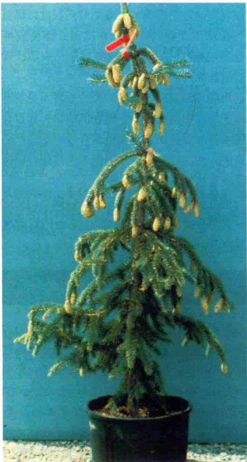

B 白云杉  
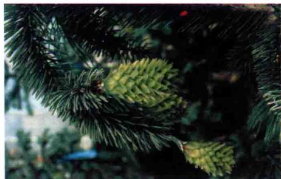

C 美洲杉幼苗  
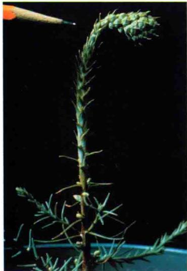  
图20.3 赤霉素能促进幼年期松科植物球果的形成。A和B.用白云杉（Picea glauca）的繁殖体嫁接，在夏季前于茎内注射水和乙醇混合的 $GA_{4}/GA_{7}$ ，树苗形成雌性球果（经传粉）。C.用GA溶液喷洒生长6周的美洲杉（Sequoiadendron giganteum），8周后，植株形成雌果（S.D.Ross和R.P.Pharis惠赠）。

PLANT PHYSIOLOGY

讨论。

在植物中，相对于雌雄同体的花，单性花的性别决定更容易受遗传调控。然而，它也能被环境因子，如光周期和营养状态所调节，这些环境因素又能为赤霉素所介导。植株在幼年期向成熟期的转变中，赤霉素引起的性别决定因不同的物种而不同。在双子叶植物如黄瓜（Cucumis sativus）、大麻（Cannabis sativa）和菠菜中，赤霉素促进雄花形成，而赤霉素生物合成的抑制因子则促进雌花的形成。而在玉米中，赤霉素抑制雄蕊的发育，促进雌蕊的形成。

## 20.2.5 赤霉素能促进花粉发育和花粉管生长

在赤霉素缺失的矮生型突变体中（如水稻和拟南芥中），花粉囊的发育和花粉的形成受到阻碍，导致雄性不育。经赤霉素处理后，能挽回这种转变。在赤霉素信号应答受阻的突变体中，花粉囊和花粉的发育障碍不能通过外源施用赤霉素逆转，因此这些突变体是雄性不育的（Aya et al., 2009）。此外，通过基因过表达可致GA失活的酶使植物体内有活性的赤霉素含量降低，能严重抑制花粉管的生长（Swain and Singh, 2005）。因此，赤霉素参与花粉的发育和花粉管的形成。GA调控水稻花粉囊的发育将在后面的章节详细讨论。

## 20.2.6 赤霉素能促进果实形成和单性结实

施用赤霉素也能促进座果（授粉后果实形成）和一些果实的生长。例如，施用赤霉素能刺激梨（Pyrus communis）果实形成。在不授粉的情况下，赤霉素能诱导植物单性结实（有果实无种子）。在葡萄（Vitis vinifera）中，应用GA $_{3}$ 处理能使汤普森无核葡萄果实增大（图20.4）。这种处理能够促进果柄的生长，同时降低了真菌对葡萄的感染率，赤霉素对紧密丛生类型的葡萄是否有此效果还有待证明。赤霉素对无核葡萄的这些效应在商业上已广泛应用。

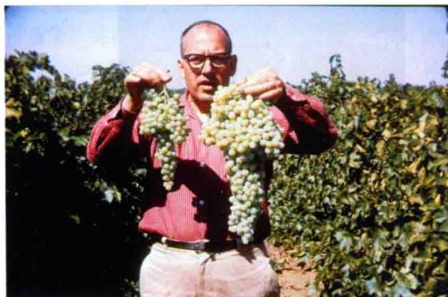  
图20.4 赤霉素诱导汤普森无籽葡萄的生长。左边的一串是未经赤霉素处理的；右边的一串是在果实发育时用 $GA_{3}$ 处理过的（©Sylvan Wittwer/Visuals Unlimited）。

## 20.2.7 赤霉素能促进早期种子发育

在赤霉素缺失的突变体和赤霉素失活的转基因植株中，植株种子的败育概率大大增加。种子不能正常发育是因为幼嫩种子产生活性赤霉素的水平降低了。用赤霉素处理并不能使正常的种子发育，因为外源赤霉素不能进入新的种子中。然而，如果在败育种子中赤霉素合成基因组成型表达，赤霉素缺失的效应就能得到弥补（Swain and Singh，2005）。总之，这些结果表明了赤霉素在种子的早期发育中起重要作用。

## 20.2.8 赤霉素及其生物合成抑制剂在商业上的应用

赤霉素（典型的是 $GA_{3}$ ）在商业上的用途主要是促进果实生长，在酿酒时促进大麦发芽，增加甘蔗中糖的含量。关于大麦发芽方面内容参见Web Topic 20.2。

赤霉素生物合成抑制剂在农业上主要用于降低农作物高度。例如，在欧洲凉爽潮湿的气候下，禾谷类作物植株生长过高，结果造成严重的倒伏（lodging）（倒伏是指在作物成熟的顶部由于吸收水分过多，茎向地面弯曲使收割机收割困难）。减小节间长度以降低作物株高，可以增加作物的产量。在欧洲，即使栽种矮生小麦，也要喷施GA的生物合成抑制剂——矮壮素来进一步降低植株高度。

在田间或温室中，过高的植物通常不易管理。在开花的园艺作物中需要矮的、健壮的植物，如百合、菊花和猩猩木都需要利用赤霉素生物合成抑制剂严格控制其植株高度。在苗圃、温室和阴棚中这些化合物通常被用来控制观赏植物的大小和体积。

目前有商业应用的赤霉素生物合成抑制剂的化学结构可以参见Web Topic 20.1。关于这一内容的深入讨论参见Web Topic 20.2。

## 20.3 赤霉素的生物合成与失活

赤霉素是一类由四环双萜类化合物组成的大家族。赤霉素合成途径的前半部分已经在第13章阐述过。在这里，讨论赤霉素合成途径的后一阶段过程，详细内容参见Web Topic 20.3和相关文献（Yamaguchi，2008）。我们将探讨赤霉素合成途径中的一些关键酶及其编码基因。了解赤霉素生物合成和失活的重要内容，有助于掌握赤霉素的代谢平衡。通过赤霉素的代谢平衡，可以使植物在其整个生命周期中维持其细胞和组织中适宜的活性GA的水平。这种代谢平衡可以通过调节赤霉素的合成、失活和运输来实现。

人们对赤霉素如何调控植物生长和发育的认识是通过研究受试植物材料中的赤霉素来获得的。由于能从少量的组织中准确地分离和定量各种不同的赤霉素，高灵敏度的物理技术如质谱技术被广泛应用。对植物提取物中GA的鉴定和定量参见Web Topic 20.4。

通过分离鉴定一些株高发生变化的突变体，可以了解在植物体内哪些GA是具有生物活性的。利用这些突变体有助于我们克隆编码GA合成通路中的酶的相关基因。拟南芥和水稻的基因组测序工作进一步发展和完善了数据信息，对快速分离鉴定出参与GA合成和调节的新基因和蛋白质有着重要作用。

## 20.3.1 赤霉素是通过萜类化合物途径合成的

萜类化合物是由五碳的类异戊二烯（isoprenoid）组成的。赤霉素是由4个类异戊二烯形成的双萜类化合物（见第13章）。赤霉素的生物合成分为三个阶段，每一阶段所处的细胞部位不同：包括质体、内质网和细胞质。对合成途径的简单描述见图20.5。对整个合成途径的描述见附录3。

第一阶段，在质体中，4个类异戊二烯形成一个20碳的线性分子牻牛儿牻牛儿焦磷酸（geranylgeranyl diphosphate, GGPP）。GGPP通过两步环化成为四环化合物内根-贝壳杉烯（ent-kaurene），这两步分别被内根-古巴焦磷酸合成酶（ent-copalyl-diphosphate synthase, CPS）和内根-贝壳杉烯合成酶（ent-kaurene synthase, KS）催化完成。

第二阶段，在质体折叠区和内质网中，内根-贝壳杉烯逐步转变为第一种形式的GA—GA $_{12}$ 。两个重要的酶参与了这一过程：内根-贝壳杉烯氧化酶（ent-kaurene oxidase，KO）和内根-贝壳杉烯酸氧化酶（ent-kaurenoic acid oxidase，KAO）。迄今研究发现，在所有植物中形成GA $_{12}$ 的步骤都是一样的。

第三阶段，在细胞质基质中， $\mathrm{GA}_{12}$ 先转变为 $\mathrm{C}_{20}-$ GA，然后转变为 $\mathrm{C}_{19}-\mathrm{GA}$ （包括有活性的赤霉素）。在第三阶段里有两个主要的合成途径被鉴定到。它们都由同一系列的氧化反应构成，唯一不同的是其中一条通路的所有中间产物的 $\mathrm{C}_{13}$ 碳位都带有一个羟基（所以又称为C-13羟基化通路），而另一条通路的所有中间产物的C13碳位都不带有一个羟基（所以又称为非C-13羟基化通路）。在第三阶段，所有的氧化反应都发生在A环。在许多植物中，C-13羟基化途径是主要的途径，尽管在拟南芥和一些葫芦科作物（南瓜）中非C-13羟基化通路是主要途径。在后面的讨论中，产生活性GA的途径（ $\mathrm{GA}_4$ 产生于非C-13羟基化途径； $\mathrm{GA}_1$ 产生于C-13羟基化途径）被称为生物合成途径。而活性GA的代谢称为失活。GA的合成和失活在Web Topic 20.3中有描述。

## 20.3.2 赤霉素合成途径中主要的调节酶

通过对拟南芥、豌豆和玉米赤霉素生物合成途径（图20.6和图20.7）突变体的研究，有助于克隆赤霉素生物合成和降解途径中的编码酶的基因。途径中值得注意的调节点是第三阶段的三个酶，它们是形成有生物活性GA催化反应最后几步的 $GA_{20}$ 氧化酶（ $GA_{20}ox$ ）和 $GA_{3}$ 氧化酶（ $GA_{3}ox$ ），以及使GA失活的 $GA_{2}$ 氧化酶（ $GA_{2}ox$ ）。这三种酶都是双加氧酶（dioxygenase），催化反应需要α-酮戊二酸（2-oxoglutarate）和亚铁离子（ $Fe^{2+}$ ）作为辅助因子。因此，它们被称为酮戊二酸依赖的双加氧酶（2ODD）。在说明它们的调节作用之前，先分别讨论这些酶。

（1） $\mathbf{GA}_{20}$ 氧化酶 在拟南芥中， $\mathrm{GA}_{20}$ 氧化酶是一类包含有5个成员的小家族，命名从AtGA20ox1到AtGA20ox5。这些同源基因（它们起源于单个基因，彼此有相似的序列）在不同的组织、器官和不同的发育阶段表达，尽管它们的表达谱会有些重叠。主要在茎中表达的 $\mathrm{GA}_{20}$ 氧化酶（AtGA20ox1）是由GA5基因编码的（Phillips et al., 1995; Xu et al., 1995）。GA5基因突变体（ga5）呈现半矮化而不是完全矮化的表型（图20.6），这是由于基因的冗余造成的。与此相反，ga1、ga2和ga3突变体特别矮，是因为这几个酶在合成途径的上游第一、第二阶段，分别是古巴焦磷酸合成酶（CPS）、内根-贝壳烯合成酶（KS）和内根-贝壳杉烯氧化酶（KO），由单拷贝基因所编码（图20.6）。

(2) $GA_{3}$ 氧化酶 拟南芥的茎中主要表达的 $GA_{3}$ 氧化酶（AtGA3ox1）是由 GA4 基因编码的（Chiang et al., 1995）。它也属于小基因家族，ga4 突变体与 ga5 一样，是半矮化而不是完全矮化的突变体（图 20.6）。在豌豆中，这个酶是由 LE 基因所编码（图 20.7，将在以后讨论）。在玉米中，这个酶是由 DI 编码的，这个基因的隐性突变体植株都呈现矮化的表型（图 20.1）。

（3） $\mathrm{GA}_{2}$ 氧化酶 在拟南芥中，使GA失活的酶 $\mathrm{GA}_{2}$ 氧化酶的突变体并没有明显的表型。在豌豆中，这个基因突变的幼苗比野生型高而命名为SLENDER（SLN）基因，编码 $\mathrm{GA}_{2}$ 氧化酶。在sln突变体里，突变体的种子在成熟过程中GA合成与失活的比例和野生型不一致，因而在成熟的种子里仍存在一些有潜在活性的赤霉素，在种子萌发过程中它们能够转变为有生物活性的 $\mathrm{GA}_{1}$ ，从而使幼苗的节间增长，呈现一种“苗条”的表型（Reid et al., 1992）。

## 20.3.3 赤霉素调节自身的代谢

与第19章中所阐述的生长素一样，有许多因子对激素的平衡包括合成与失活间的相对平衡有重要的调节作用。植物对活性赤霉素的应答反应之一是抑制赤霉素的生物合成和促进其分解代谢（即失活），从而防止植物茎的过度生长。在有活性的赤霉素生物合成过程中， $GA_{20}ox$ 和 $GA_{3}ox$ 基因编码代谢途径的最后两个酶，抑制赤霉素的生物合成可通过下调这两个基因的表达（抑制表达）完成。赤霉素对自身生物合成的调节属于负反馈调节（negative feedback regulation）。加强赤霉素的失活也是维持植物体内赤霉素平衡的重要手段。可通过上调编码使GA失活的酶 $GA_{2}ox$ 基因的表达来实现。赤霉素启动使自身失活的基因表达过程是正反馈调节（positive feedforward regulation）。

  
图20.5 赤霉素生物合成的三个阶段。在第一阶段，由牻牛儿牻牛儿焦磷酸（GGPP）转变为内根-贝壳杉烯。第二阶段是在内质网中发生的，内根-贝壳杉烯酸转变为 $\mathrm{GA}_{12}$ 。 $\mathrm{GA}_{12}$ 通过在 $\mathrm{C}_{13}$ 碳位上的羟基化作用转变为 $\mathrm{GA}_{53}$ 。第三阶段发生在胞质中， $\mathrm{GA}_{12}$ 或 $\mathrm{GA}_{53}$ 通过两条平行途径转变为其他的GA。这种转变包括 $\mathrm{C}_{20}$ 碳位上的一系列氧化及最终失去 $\mathrm{C}_{20}$ 碳位形成 $\mathrm{C}_{19}$ 的GA。通过 $3\beta$ 位上的羟基化作用被氧化为有生物活性的 $\mathrm{GA}_{1}$ 和 $\mathrm{GA}_{4}$ 。 $\mathrm{GA}_{4}$ 和 $\mathrm{GA}_{1}$ 的2碳位羟基化形成无活性的 $\mathrm{GA}_{34}$ 和 $\mathrm{GA}_{8}$ 。在拟南芥和其他一些植物中主要是非 $\mathrm{C}_{13}$ 碳位羟基化作用，在大多数植物中， $\mathrm{C}_{13}$ 碳位上的羟基化作用占优势。CPS为古巴焦磷酸合成酶；KS为内根-贝壳杉烯合成酶；KO为内根-贝壳杉烯氧化酶；KAO为内根-贝壳杉烯酸氧化酶； $\mathrm{GA}_{20}\mathrm{ox}$ 为 $\mathrm{GA}_{20}$ 氧化酶； $\mathrm{GA}_{30}\mathrm{ox}$ 为 $\mathrm{GA}_{3}$ 氧化酶； $\mathrm{GA}_{20}\mathrm{ox}$ 为 $\mathrm{GA}_{2}$ 氧化酶； $\mathrm{GA}_{13}\mathrm{ox}$ 为 $\mathrm{GA}_{13}$ 氧化酶；MVA为甲羟戊醛。

图20.6 拟南芥中野生型和赤霉素缺失突变体的表型，显示了在每一种突变体中赤霉素合成途径被阻断的位置。所有突变体的等位基因都是纯合的，用野生型中小写字母的等位基因符号表示。培养条件：持续光照下生长7周。 $ga_{1}$ 、 $ga_{2}$ 、 $ga_{3}$ 植株是雄性不育的，不能结长角果（荚果）。缩略图见图20.5（V.Sponsel惠赠）。  
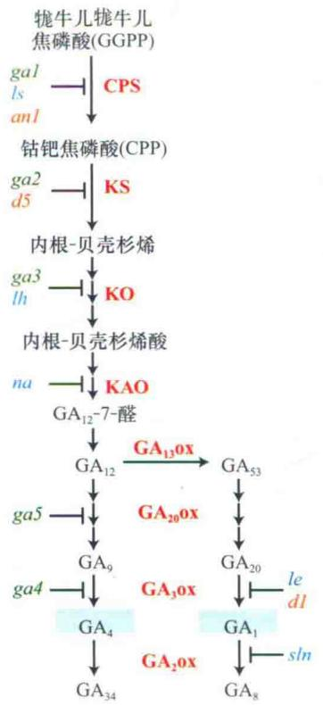  
图20.7 GA生物合成途径中被突变体阻断的代谢位点（拟南芥用绿色表示，豌豆是蓝色，玉米为橘黄色）。缩略图见20.5。拟南芥中 $GA_{1}\sim GA_{5}$ 5个非等位基因是编码赤霉素生物合成途径的酶，由于命名时间较早（尚未了解酶的性质与基因）（Koornneef and van der Veen，1980），遗传分析根据它们进入代谢途径的顺序，将其定位在途径中的不同位置。

每个基因对这一过程的相对重要性，随物种及组织的不同而不同（Hedden and Phillips，2000）。有时这些基因的表达并不完全受这种反馈过程调节，也许是对环境信号的响应。这种动态平衡机制中赤霉素含量的改变，也可能提供一种机制，使赤霉素的浓度重新恢复到正常的水平。

## 20.3.4 赤霉素的生物合成发生在多个植物器官和细胞位点

研究发现，在体外无细胞体系中加入种子或不完整种子的组分，能完成从GGPP到 $C_{19}$ -GA生物合成的所有反应过程，说明正在发育的种子是GA生物合成的场所之一。在豌豆的种子中，受精后不久就有大量的GA产生，说明赤霉素是早期种子发育和果实生长所必需的。在许多植物种子成熟的后期，GA的积累可达到很高水平。

A 生长5天的苗  
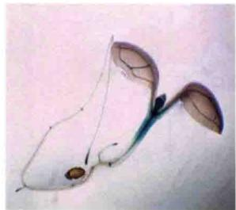

D 带种子的成熟角果  

使用报告基因技术研究显示，编码CPS酶（赤霉素生物合成中的第一个酶）的基因GA1在拟南芥的未成熟种子、芽的顶端、根尖和花粉囊中表达（图20.8）（Silverstone et al., 1997a）。毋庸置疑，在gal突变体中，与种子休眠、矮生和雄性不育相关的器官受到了突变影响。这项研究表明早期的赤霉素生物合成和功能表达可以发生在相同的器官中。Yamaguchi等（2001）和Ogawa等（2003）通过比较 $GA_{3}$ 氧化酶（催化没有活性的 $GA_{9}$ 转变为有生物活性的 $GA_{4}$ ）和受活性赤霉素 $GA_{4}$ 上调的基因产物的定位分析，发现一些不能够产生 $GA_{4}$ 的细胞却能够获得 $GA_{4}$ 的响应。因此，研究发现在拟南芥胚萌发过程中 $GA_{4}$ 在同一细胞的合成部位和不同细胞中都起作用，这暗示 $GA_{4}$ 或者 $GA_{4}$ 信号转导途径的下游组分必须从一个细胞转移到另一个细胞。

## 20.3.5 环境条件影响赤霉素的生物合成

赤霉素在介导环境因子对植物发育的影响上起重要作用。光和温度对赤霉素的代谢和信号响应都有影响，更多讨论参见Web Topic 20.5。在大多情况下，环境能够改变除了赤霉素以外很多激素的代谢和响应。活性GA和ABA的比例对不同的组织响应这两种激素是十分重要的。

## 20.3.6 GA $_{1}$ 和GA $_{4}$ 能促进茎的生长

20世纪80年代，人们用GA生物合成突变体（也称为GA缺失的突变体）进行研究得到了两个重要的结果。一方面，确定了GA代谢的途径；另一方面，发现在豌豆和玉米中 $GA_{1}$ 是主要的促进茎生长的有活性的赤霉素，并且其前体无内在的生物活性。

B 生长3天的苗  
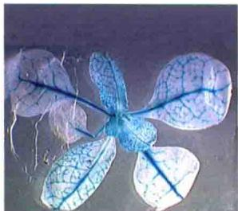  
E 发育中的胚

C 开放的花  
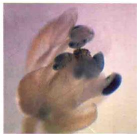

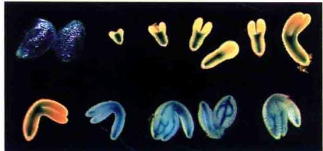  
图20.8 拟南芥 $GA_{1}$ 启动子与GUS基因融合表达的组织化学分析。 $GA_{1}$ 编码GA生物合成中的第一个酶CPS。 $GA_{1}$ 启动子活性（染蓝色），表明GA可能的合成位点，在整个生活周期中是可见的（引自Silverstone et al., 1997a；T-p.Sun惠赠）。

在豌豆中LE和le是调节高度的两个等位基因，这个遗传特征最初是由孟德尔（Gregor Mendel）于1866年发现的。用 $GA_{20}$ 处理豌豆的le突变体对植株表型没有任何影响，而用 $GA_{1}$ 处理后能恢复突变体的表型（植株的高度）。 $GA_{8}$ 对突变体也没有影响。由此从豌豆中赤霉素的代谢途径（ $GA_{20}\rightarrow GA_{1}\rightarrow GA_{8}$ ），推测在植株中除非转变为 $GA_{1}$ ，赤霉素 $GA_{20}$ 是无活性的，因而 $GA_{1}$ 是植物内源的有生物活性的赤霉素（Ingram et al., 1984）。

用同位素标记的赤霉素进行代谢研究表明，LE基因编码在3β位羟基化 $GA_{20}$ 产生 $GA_{1}$ 的酶。同时证实相对于矮生植株，高茎植株中 $GA_{1}$ 含量更多（Reid and Howell，1995）。Mendel的LE基因已被克隆出来，其隐性等位基因le有一个碱基发生突变，导致编码功能缺失的酶（Lester et al., 1997；Martin et al., 1997）。与野生型相比，隐性纯合突变体le中 $GA_{1}$ 合成减少。由于le突变体仍能产生部分有活性的 $GA_{3}$ 氧化酶，其合成的 $GA_{1}$ 能使le幼苗植株高度达到野生型的30%。

对豌豆其他突变体的研究表明，豌豆的植株高度是与其内源GA $_{1}$ 的含量紧密相关的（Ross et al., 1989）。例如，na突变体中，由于体内赤霉素合成酶KAO活性缺失（图20.7），突变体植株中基本没有GA $_{1}$ ，其成熟植株高度仅1 cm（图20.9）。相反，sln突变体中，由于GA降解途径受阻，幼苗中的GA $_{1}$ 的含量比野生型的多，其植株也较野生型的高（图20.9）。有关豌豆茎生长的其他研究者的数据可以在Web Essay 20.1上查阅。

对其他植物中矮化突变体的研究也证实3β位羟基化 $C_{19}$ -GA是有生物活性能够促进茎的生长的。在玉米中，对GA缺失突变体的研究表明， $GA_{1}$ 是谷物类单子叶植物中调节茎生长的活性GA（Phinney，1984）。在水稻中，情况也是类似的， $GA_{4}$ （非C-13羟基化的 $GA_{1}$ ）和GA受体的亲和度在体外比 $GA_{1}$ 高，因此 $GA_{4}$ 在水稻的生长发育中发挥着重要的作用。在拟南芥和葫芦科的一些植物（如南瓜和黄瓜）中，外施 $GA_{1}$ 的生物活性比 $GA_{4}$ 低，因此，在这些种类中，推测 $GA_{4}$ 是主要的有生物活性的赤霉素。

## 20.3.7 基因工程调节植株的高度

鉴定谷物类植物中有生物活性的赤霉素，通过分析其生物合成和代谢过程中关键的酶，使得利用基因工程手段改变谷物类植物中GA的水平进而影响植株的高度成为可能（Hedden and Phillips，2000）。在很多物种中， $\mathrm{GA}_{20}\mathrm{ox}$ 、 $\mathrm{GA}_{3}\mathrm{ox}$ 和 $\mathrm{GA}_{2}\mathrm{ox}$ 在功能上具有保守性，易于操作。Phillips（2004）列举了一些这方面的例子。例如，编码一个拟南芥 $\mathrm{GA}_{20}$ 氧化酶可以引入白杨（Populustremuloides × P. tremula hybrid，山杨杂种）组成型表达（即在整个植株高水平表达）。使用来自花椰菜花叶病毒启动子（CaMV 35S）实现GA $_{20}$ 氧化酶的组成型表达。幼苗中超表达编码拟南芥GA $_{20}$ 氧化酶基因，能提高白杨幼苗中GA $_{1}$ 的含量，使其长得更高，提高了在造纸业中所需要的木质纤维的长度和质量（Eriksson et al., 2000）。

  
图20.9 不同基因型和表型的豌豆植株、营养器官中GA含量（所有等位基因都是纯合的）（引自Davies，1995）。

在其他的农作物中，一般生产上的需要是减少生长。通过转化编码 $GA_{1}$ 生物合成酶的 $GA_{20}ox$ 和 $GA_{3}ox$ 的反义组件，或者超表达和 $GA_{1}$ 失活有关的GA2ox基因，都能降低 $GA_{1}$ 的水平。这些方法多用于改造小麦，产生极端矮化表型（Appleford et al., 2007）（图20.10）和水稻（Sakamoto et al., 2003）。

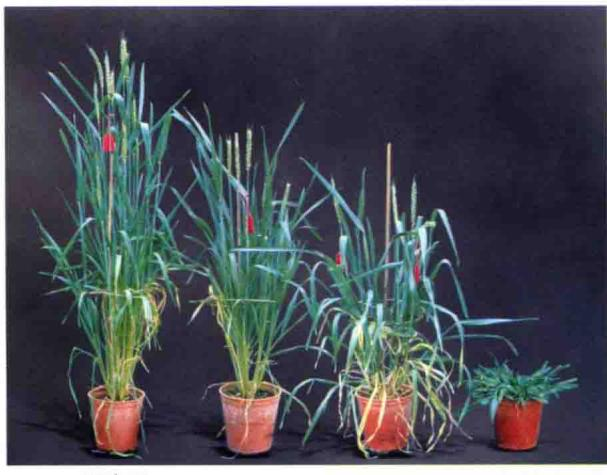  
野生型
(未转化的)  
过量表达 $GA_{2}$ -氧化酶的转基因植株  
图20.10 基因工程的矮化小麦植株。图最左边是未转化的植株。右边的三个植株是组成型启动子连接豆类中 $GA_{2}$ 氧化酶cDNA的转化植株，内源的 $GA_{1}$ 失活。植株的矮化程度反映了外源基因过表达的量（引自Hedden and Phillips，2000；A. Phillips惠赠）。

## 20.3.8 除了矮化，矮化突变体还有其他缺陷

研究表明，活性GA除了控制植株高度外，还调节其他的生长和发育过程。茎中赤霉素合成受阻的矮化植株中到底发生了什么？很明显，这些突变体多有多态性的表型。拟南芥中矮化突变体ga1、ga2和ga3的休眠种子，除非用GA处理，否则它们不萌发。而且，由于花粉囊和花粉的正常发育需要GA，如果不用GA处理，这些突变体一般雄性不育（图20.6）。

在豌豆中，GA的缺失突变体植株变小，减少种子的发育，这是因为有活性的GA对于茎的伸长和种子的发育是必需的。然而，三个合成基因的纯合突变体都表现为植株矮小，但是种子发育正常，这是基因的冗余性造成的。例如，豌豆的na突变体，尽管合成在KAO位置被阻断（图20.7），植株特别矮小，但能产生可育的种子。这是由于豌豆中另一个NA基因在种子中表达，但在茎和根中不表达（Davidson et al., 2003）。另外，编码KO的LH基因的突变体lh-2（图20.7）降低了茎和种子中GA $_{1}$ 的水平（Davidson and Reid, 2004）。因此lh-2植株矮小，种子明显败育（图20.11）。

## 20.3.9 生长素调节GA的生物合成

有相当多的证据显示生长素能够调节GA的生物合成，在不同的物种中，甚至在同一物种中不同的器官和组织中被生长素上调或下调的GA合成相关的靶基因是不同的。对于这些研究的讨论参见Web Topic 20.6。

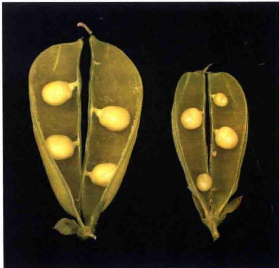  
图20.11 豌豆野生型（左）和lh-2（右）豆荚，表明在GA缺失突变体中种子败育（J.B.Reid惠赠）。

## 20.4 赤霉素信号途径：响应突变体的重要性

GA信号响应减弱的单基因突变体是鉴定编码GA受体或信号转导中间组分基因的重要工具。一般来说，影响信号转导途径的因子可能是正调控的或者负调控的。突变体可以区分为以下三大类。

（1）GA信号正调控因子（positive regulator）的功能缺失突变。这种突变将产生矮化表型，并且是隐性的。突变体由于缺少GA信号转导途径中的必需元件而对外源GA无应答。

（2）GA信号负调控因子（negative regulator）的功能缺失突变。这种突变将产生高的表型，并且也是隐性的。

（3）负调控因子组成型激活的突变。这种突变将产生矮化、对外源GA无应答的表型。这些突变是“功能获得型”、半显性遗传的。

那么这些GA响应突变体与生物合成途径中酶受阻的突变体有什么不同呢？不同点在于GA响应突变体的高度与内源的活性GA浓度不成比例。这是因为GA不敏感的矮化突变体在用活性GA处理以后并不会长高；而组成型超高的突变体[这种表型称之为“细长”（slender）]在GA生物合成抑制剂环境下也不会变矮。

自从20世纪80年代中期分离到GA不敏感突变体gai-1以来（Koornneef et al., 1985），人们大量研究了拟南芥中的GA响应突变体。拟南芥中正调控和负调控因子的测序工作为鉴定一些重要作物（包括水稻、大麦、小麦、玉米和豌豆）中的GA信号调控因子奠定了基础。下面章节对GA信号转导途径的讨论不是按研究历史展开的，但参考文献暗示了研究工作的时间顺序。

## 20.4.1 GID1编码一个可溶性受体

理解GA信号转导途径的一个重大突破来自一个水稻矮化的隐性突变体GA-insensitive dwarf1（gid1）的鉴定（Ueguchi-Tannka et al., 2005）（gid1属于之前描述过的第1类突变体）。GID1编码一个球形蛋白，即GA受体（GA receptor）GID1。虽然过去20多年一直在进行GA受体的鉴定工作，并也研究了一些可能的GA结合蛋白，然而到目前为止只有GID1符合作为GA受体的所有标准（科学家是使用GST-GID1融合蛋白来进行研究的。GST标签使得GID1更容易纯化，且GST-GID1和GID1具有相似的GA结合性质。为了简化，接下来将GST-GID1简称为GID1。类似地，将放射性标记16，17-二氢-GA $_{4}$ 简称为放射性标记GA $_{4}$ ）。

## 一个蛋白质要被鉴定为受体，必须满足以下标准。

（1）配体（这里的GA）与蛋白质的结合必须特异。这意味着可以预测生物活性的GA与GID1结合的亲和力将比低活性的GA更高。而实际在测试10种不同的GA（各自具有不同的生物活性）与GID1的结合时，生物活性GA具有更高的亲和力。这样，GID1能够辨别生物活性GA和其他低活性GA。

（2）配体结合应该能够饱和。当所有的受体分子都已经结合GA以后，其他的放射性标记GA将不能结合受体，这样曲线将变平。实验证明GID1确实这样（图

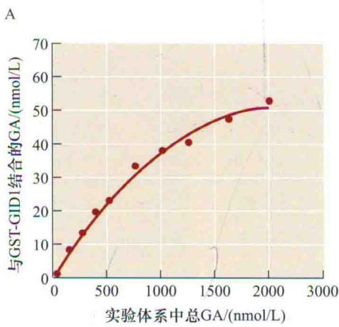

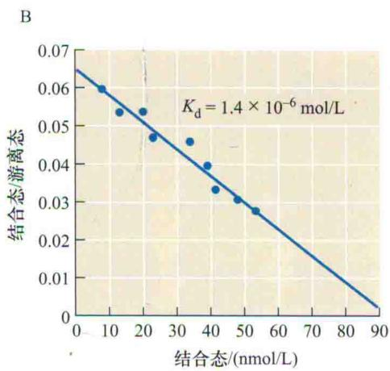

C  
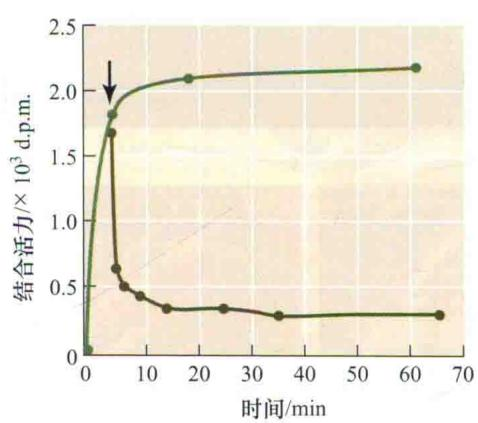

D  
  
图20.12 GID1的GA结合特征。A. 一定浓度的放射性标记 $\mathrm{GA}_4$ 与GID1蛋白（GST-GID1融合蛋白）孵育，当增加非标记 $\mathrm{GA}_4$ 浓度时， $\mathrm{GA}_4$ 与GID1蛋白的结合具有饱和性。B. 根据A图数据作的Scatchard图，由斜率计算出了解离常数 $K_{\mathrm{d}}$ 。C. 放射性标记 $\mathrm{GA}_4$ 与GID1的结合/解离速率。放射性标记 $\mathrm{GA}_4$ 与GID1的结合在5 min内就达到最大值的一半（浅绿线）。加入过量的非标记 $\mathrm{GA}_4$ （箭头）后5 min内，结合的放射性标记 $\mathrm{GA}_4$ 就降到了最大值的 $10\%$ 以下（深绿色）。D. 三种不同突变的GID1蛋白（GST-GID1-1，GST-GID1-2和GST-GID1-3）不结合放射性标记 $\mathrm{GA}_4$ ，证明 $\mathrm{GA}_4$ 与野生型蛋白的结合是特异性的（引自Ueguchi-Tanaka et al., 2005）。d.p.m.为每分钟衰变数。

20.12A）。

（3）配体结合应该具有高亲和力。GA与蛋白质结合的亲和力越高，它们就结合得越紧密，也就越不容易解离。通过Scatchard分析可以测出解离常数 $K_{d}$ 。Scatchard分析是将结合的放射性标记GA（x轴）对结合的除以未结合的放射性标记GA（y轴）作图（图20.12B），斜率为 $-1/K_{d}$ 。这里的 $K_{d}$ 值比较低（ $1.4\times10^{-6}$ mol/L），暗示GA与这个蛋白质的结合很紧密。

（4）配体的结合应该是快速的和可逆的。图20.12C显示只需5 min放射性标记GA与GID1的结合就能达到最大值的一半。并且在加入未标记的 $GA_{4}$ 后，放射性标记GA与蛋白质的解离也是非常迅速的。受体蛋白的这些特征使得它能够适应细胞内配体浓度的快速变化。

除了给出这些具有说服力的证明GID1是GA受体的证据之外，Ueguchi-Tanaka等（2005）也证明gid1-1、gid1-2中的单核苷酸突变和gid1-3的单核苷酸丢失都能产生GA不敏感的矮化表型并导致蛋白质不结合放射性标记 $GA_{4}$ （图20.12D）。

鉴定出水稻的GID1后，三个拟南芥里的直系同源基因GID1a、GID1b和GID1c很快就被发现了（Griffiths et al., 2006; Nakajima et al., 2006）（直系同源基因是指不同物种中因来自同一个祖先基因而具有相似序列的基因）。一旦测出一个物种某个基因的序列（如GID1），通过搜索其他物种（如拟南芥）的基因组数据库就能相对容易地找到它的直系同源基因。然而，最初的GID1基因在拟南芥中已经发展成为三个基因，即GID1a、GID1b和GID1c，并且其中的每一个都编码具有功能的GA受体。这三个拟南芥基因中的某一个突变以后，并不会产生可以观察到的表型（茎长度）差异，但如果把这三个基因都突变以后，得到的“三缺突变体”就非常矮（图20.13）。此外，强烈的花药缺陷使得三缺突变体雄性不育。

  
图20.13 拟南芥突变体gid1a、gid1b和gid1c的表型。A. 37天龄野生型（Col-0）和单突变纯合体的地上部分没有明显的茎长度差异表型。gid1a/gid1c双突变体矮化，而其他双突变体比较高，展现出了基因冗余性。三突变体gid1a/gid1b/gid1c极度矮化。GA缺失突变体gal-3作为对照。B. 野生型拟南芥花的特写。C. gid1a/gid1b双突变体花药缺陷。D和E. gid1a/gid1b/gid1c三突变体（D）和野生型（E）花的扫描电子显微镜照片。为了清晰，两张图中的萼片和花瓣都去掉了（引自Griffiths et al., 2006；S. Thomas惠赠）。

近期也得到了水稻中GID1和拟南芥中GID1a蛋白的三维结构，阐明了为什么生物活性GA必须具有某些特定的官能团（Murase et al., 2008; Shimada et al., 2008）。高分辨率分析集中在结合 $GA_{3}$ 或 $GA_{4}$ 的拟南芥蛋白和结合 $GA_{4}$ 的水稻蛋白。拟南芥蛋白也和DELLA蛋白GAI的N端部分共结晶。之后我们会看到，DELLA蛋白是GA响应的负调控因子。在水稻和拟南芥中，生物活性GA通过C-6位羧基与受体蛋白的中央口袋底部的2个丝氨酸残基和1个水分子形成氢键而锚定在受体的中央口袋中。此外，GA的3β-羟基也与1个酪氨酸残基和桥接水分子形成氢键。GA分子上的一些修饰可以降低结合能力：C-6羧基甲基化和缺少3β-OH的GA与GID1结合的亲和力比生物活性GA低几个数量级。另外，很久以前就知道2β-OH能降低GA活性，它的引入会导致空间干扰和减弱与受体蛋白的结合，即使GA分子具有C-6羧基和3β-羟基。

一个生物活性GA分子的“顶”是疏水的，能够与GID1蛋白的N端螺旋延伸开关区相互作用。N端延伸在GA顶部上方折叠，就像一个关闭的盖子完全将GA包埋在受体中（Murase et al., 2008；Shimada et al., 2008）。一旦GID1的这个“盖子”关闭，其外表面的残基就能够和下一节即将学习到的DELLA蛋白GAI的N端中一些特定氨基酸相互作用（图20.14）。虽然GA和DELLA蛋白间并没有直接相互作用（GA包埋在GID1中），但生物活性GA是GID1的变构激活剂（allosteric activator），使得GID1构象产生变化从而促进其与

DELLA蛋白的结合（图20.15）。紧接着，GA-GID1复合体似乎诱导了DELLA蛋白的DELLA结构域发生从卷曲到螺旋（coil-to-helix）的构象变化，这可能进一步导致了DELLA蛋白其他结构域（所谓的GRAS结构域）的构象变化。

## 20.4.2 DELLA结构域蛋白是赤霉素响应的负调控因子

DELLA结构域蛋白属于GRAS家族转录调节因子中的一个亚家族。所有GRAS蛋白的碳端（GRAS）结构域都有同源性。参与GA响应的蛋白质的氮端具有一个结构域，它含有5个氨基酸：天冬氨酸（D）、谷氨酸（E）、亮氨酸（L）、亮氨酸（L）和丙氨酸（A），因此被称为“DELLA结构域”（图20.16）。现在已经知道，水稻和大麦都只有1个DELLA结构域蛋白而拟南芥有5个。从谷类作物和拟南芥的研究可以总结出DELLA是GA响应的负调控因子。当它们被蛋白质水解而降解时就能产生GA响应。Web Topic 20.7讲述了分离DELLA蛋白和阐述它们功能的历史，在此作简要概括。

## 20.4.3 GA负调控因子突变可能导致过高或矮化表型

抑制GA响应负调控因子功能的突变将使植物变高。这就是我们看到的水稻[slender rice 1（slr1）]和大麦[slender 1（sln1）]“细长”突变体。这些突变体长得极高，看起来像被高剂量生物活性GA处理过（Ikeda et

  
图20.14 GA₃-GID1a-DELLA复合体的晶体结构。GA₃分子显示为空间填充模型，米色为碳原子，红色为氧原子。生物活性GA（如GA₃）结合到GID1a受体的中央口袋后，延伸开关区就像一个“盖子”一样将GA封闭起来。盖子盖在GA疏水部分（没有暴露的氧原子）的顶上。一旦延伸开关关闭，DELLA蛋白（如GAI）的DELLA结构域就能结合到开关的上部外表面（引自Murase et al., 2008）。

2. DELLA蛋白结合到GA-GID1复合体后N端DELLA结构域构象改变

3. DELLA结构域的构象变化可能诱导了GRAS结构域的构象变化

1. GID1是一个变构蛋白。GA结合后引起构象变化，进而导致N端延伸开关像盖子一样关闭  
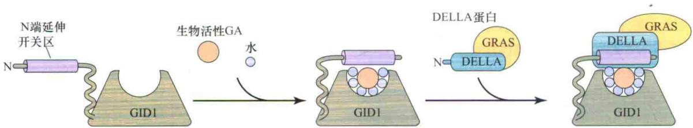  
图20.15 GA诱导GID1构象变化及GA-GID1复合体诱导DELLA构象变化的模型（引自Murase et al., 2008）。

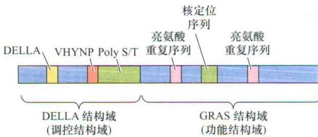  
图20.16 RGA和GAI抑制蛋白的结构域组成。图中标示了调控结构域DELLA和功能结构域GRAS。

al., 2001; Chandler et al., 2002)。但是这些植物并不含有高浓度内源GA，甚至当它们长在能降低生物活性GA含量的GA生物合成抑制剂中时，这些突变体仍然很高。所以它们的高不是由生物活性GA的含量高引起的，而是由GA响应的组成型开启引起的（这里的水稻和大麦的slender突变体与早先讨论的豌豆中抑制GA失活的slender突变体不同，豌豆的slender突变体的高是由高含量内源GA引起的）。

人们推测水稻和大麦slender突变体中，某个负调控因子丢失了或者失去功能了。克隆它们的slender基因后发现它们是拟南芥中DELLA基因的直系同源基因（Peng et al., 1997; Silverstone et al., 1997b, 1998）。记住，直系同源基因是不同物种中源自于同一个祖先基因的基因。正如我们在GID1中所看到的那样（拟南芥有3个基因而水稻只有1个），拟南芥中有多个DELLA基因，但谷类植物中却没有。事实上，拟南芥有5个DELLA基因，分别编码5个DELLA蛋白：GA-INSENSITIVE（GAI）、REPRESSOR of ga1-3（RGA）、RGL1、RGL2和RGL3，它们都是GA响应的负调控因子。

RGA是从拟南芥纯合突变体gal中筛选到的一个纯合隐性突变体（rgal）中鉴定到的。记住，gal突变阻断了GA生物合成途径早期的一步，所以这个突变体是缺乏GA的。rga突变使得茎足够长以至于部分恢复了gal因GA缺乏而产生的极度矮化表型，这也是这个突变名为repressor of gal的原因。如果一个隐性突变导致了生长，可以推断这个突变一定使某个负调控因子失去了功能（前文描述的第2类突变体）。但是现在知道Koornneef等（1985）分离出的原始突变体GAI（gai-1）也是编码一个DELLA蛋白，却是一个半显性、功能获得型GA不敏感矮化突变体（即符合第3类突变体的特征）。进一步工作证明RGA和GAI都编码GA响应信号途径的负调控因子，但这些负调控因子的不同突变能产生相反的表型，或高或矮，取决于在基因内部的哪个部位发生了突变。发生在这些基因中的不同突变可以分为以下两类。

（1）如果突变发生在碳端GRAS结构域，突变常常是变得更高。

（2）如果突变发生在氮端含DELLA结构域的那部分，突变的蛋白质是一个不可逆的抑制子，因而产生gai-1的GA不敏感矮化表型。

由于拟南芥含有5个同源基因，需要多个同源基因都发生功能丧失突变之后才能显现出GA组成型激活的表型（高）。

谷物中slender突变产生了不同的表型。例如，在野生型水稻中转入一个DELLA结构域中第17个氨基酸缺失的SLR1导致了GA不敏感的矮化表型，而不是GRAS结构域突变后产生的细长表型（Ikeda et al., 2001）。与此类似，如图20.17所示，大麦的sln1d突变是显性的、GA不敏感的矮化，而早先的sln1c却是组成型GA响应表型（细长）（Chandler et al., 2002）。

## 20.4.4 GA信号降解赤霉素响应负调控因子

DELLA蛋白是定位于细胞核的GA激活负调控因子，其在GA信号激活时必须被降解以产生信号响应。为了研究RGA的定位，将RGA和绿色荧光蛋白蛋白（GFP）的基因融合后转化拟南芥，以便转基因植物能够表达RGA-GFP融合蛋白。融合基因由RGA的启动子控制，以便检测到的RGA-GFP能够模拟天然的RGA（Silverstone et al., 2001）。通过免疫共沉淀和荧光显微技术研究确定了生物活性GA对融合蛋白的数量和定位的影响。研究使用了根来观测，因为茎中的叶绿体自发荧光会使GFP分析更加困难。

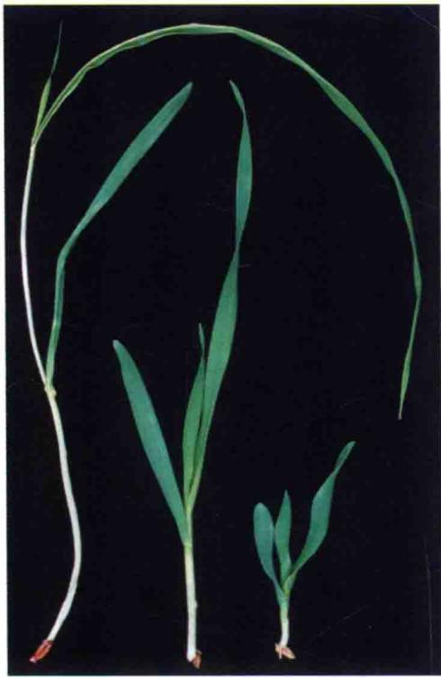  
slnlc  
WT  
sln1d  
图20.17 SLN1抑制子基因的两个不同突变体具有相反的表型。图为3个两周龄的大麦幼苗的茎。中间是野生型（WT）。左：sln1c突变体由于在GRAS抑制子区域发生突变，抑制功能丧失，因此具有GA组成型响应的细长表型。右：sln1d突变体中由于DELLA结构域突变导致抑制蛋白难于被降解，因此是功能获得型的显性突变，表现出矮化表型（引自Chandler et al., 2002, P.M. Chandler惠赠）。

在拟南芥根尖中，RGA-GFP定位于细胞核中，当用活性GA处理植物时，GFP的荧光消失了。相反，如果用GA生物合成抑制剂多效唑（paclobutrazol）处理降低GA浓度，细胞核内保持着强的绿色荧光（图20.18）。由于GFP反映了RGA的情况，我们可以从这些实验中知道，出现生物活性GA后，细胞核里面的RGA降解了，而在GA浓度非常低时其不被降解。

我们已经在第479页了解到，生物活性GA是其受体GID1的变构激活剂。在GA缺失的植物中，没有足够的GA结合GID1而使其构象改变关闭“盖子”。没有这个构象变化，DELLA蛋白就不能结合GID1。所以现在我们将看到，DELLA蛋白需要结合GID1来降解。现在我们也可以理解为什么DELLA蛋白的一个N端DELLA结构域突变使得蛋白成为了不可逆抑制子，因为这部分与GA-GID1受体复合体结合。

## 20.4.5 F-box蛋白靶标和降解DELLA结构域蛋白

在水稻和拟南芥中鉴定到了一些矮化的、不能在生物活性GA刺激下降解野生型DELLA蛋白的突变体。隐性突变体水稻GA-insensitive dwarf 2（gid2）和拟南芥sleepy 1（sly1）都具有GA不敏感的矮化表型，并且它们编码直系同源蛋白（Sasaki et al., 2003；McGinnis et al., 2003）。这些表型表明GID2和SLY1基因编码GA信号转导途径中的正调控因子（即第1类突变体）。事实上，这两个基因都编码具有保守F-box结构域的E3泛素连接酶复合体（ubiquitin E3 ligase complex）（又称SCF复合体）元件（Dill et al., 2004；Itoh et al., 2003）（可参见第14章）。一个蛋白质（如DELLA）如果要被26S蛋白酶体降解，那么它必须被一连串泛素蛋白“标记”。F-box蛋白招募蛋白质到SCF复合体上启动标记过程，结果添加了许多泛素分子到这些蛋白质上，接着它们就被26S蛋白酶体降解（关于这一主题的更多信息可参考Web Essay 20.2和第2章、第14章）。

直系同源蛋白GID2（拟南芥）和SLY1（水稻）将DELLA蛋白靶标和降解，并且这种靶标在DELLA蛋白结合到生物活性GA-GID1复合体后增强（图20.19）。正如结合生物活性GA引起GID1构象改变而促使其结合DELLA，DELLA结构域的N端结合到GA-GID1后引起DELLA结构域的构象变化（卷曲到螺旋）。人们推测这接着会诱导GRAS结构域的构象变化，使得其能更容易与F-box蛋白结合。由于促进了SCF复合体对其抑制的靶蛋白的识别，GA-GID1复合体也被称为“泛素化分子伴侣”（ubiquitinylation chaperone）（Murase et al., 2008）。

## 20.4.6 含DELLA结构域蛋白的负调节因子有重要的农业价值

上面的实验说明了在单子叶和双子叶植物中，DELLA结构域蛋白是重要的GA应答负调控因子。另外，GAI的直系同源基因小麦半显性突变Reduced height（Rht-Bla和Rht-Dla）和玉米的d8都在DELLA结构域发生了突变，产生了GA不敏感矮化表型（Peng et al., 1999）。

20世纪早期，小麦和水稻的经典育种方法推动了60年代的“绿色革命”——在拉丁美洲和东南亚，高产、矮生品种的小麦和水稻引种适应了该地区人口的大量增长（Redden，2003）。一般谷类作物在大田中密植时易过高生长，尤其是在肥力充足的情况下，结果造成作物容易倒伏（因风吹、雨淋而塌掉）而使产量大为降低。GA响应降低、短茎的突变小麦栽培品种Rht的传播是“绿色革命”成功的关键（详见Web Essay 20.3中Norman Borlaug博士的诺贝尔奖工作）。如Web Essay 20.4所述，大麦中的绿色革命基因的直系同源基因的突变也具有开发有益农业性状的潜能。

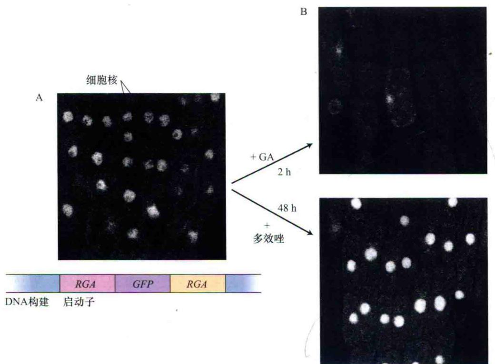

图20.18 作为转录调节因子，RGA蛋白定位于细胞核，其数量受GA水平调节。A. 植物细胞中转化了编码RGA和绿色荧光蛋白（GFP）融合蛋白的载体，使得通过荧光显微镜就能观测细胞核中的RGA。B. 用GA预处理细胞2 h时导致细胞核中RGA消失（上）。用GA合成抑制剂多效唑（paclobutrazol）处理48 h后，细胞核中RGA的含量增加（下）。这些照片证明RGA在有GA时降解，无GA时不降解（自Silverstone et al., 2001）。  
  
图20.19 DELLA蛋白通过26S蛋白酶体降解，进而引发转录重编程，导致生长和其他GA响应。

<!-- END OFFICIAL API PART part_005 -->

<!-- BEGIN OFFICIAL API PART part_006 -->

## 20.5 赤霉素响应：DELLA蛋白的早期靶标

从本章的前面部分知道，GA能够影响从种子萌发到开花和果实发育的植物生长发育的多个方面。最近的挑战在于从分子水平上将我们对于GA信号感知的新发现和下游导致生长发育的事件联系起来。拟南芥中大量的基因表达芯片研究对了解“早期GA响应”具有作用，因为这些基因的表达是被DELLA蛋白开启或关闭的（第2章介绍了芯片技术）。几项最近的研究采用了可在特定时间诱导DELLA基因表达的实验体系，这样就可以鉴定出那些表达快速变化的基因。诱导DELLA表达后1\~2 h内表达发生变化的基因很可能就是GA的早期响应基因。

## 20.5.1 DELLA蛋白能激活或抑制基因表达

已经鉴定到了拟南芥的幼苗和花序中DELLA蛋白下游的GA早期响应基因。在幼苗和花序中，几个DELLA的直接靶标就是GA合成酶和受体的基因，暗示了强的稳态调控使GA水平和响应维持在生理极限以内。其他的DELLA直接靶标包括编码转录因子和转录调节因子的基因。有趣的是，幼苗和花序中DELLA蛋白的靶基因很少有重叠，尽管有一小部分属于同一类转录调节因子（如MYB和bHLH类）（Zentella et al., 2007；Hou et al., 2008）。这些发现有助于解释GA激活的特异性及一个激素如何在不同的发育时期和组织产生多种不同的响应。

## 20.5.2 DELLA蛋白通过和其他蛋白质如PIF相互作用来调节转录

由于DELLA蛋白并不含有可识别的DNA结合结构域，那么它们是如何激活和抑制基因转录的呢？可能其他的因子对于DELLA结合DNA是必需的，或者DELLA蛋白通过和其他转录因子相互作用来调节转录，而非自己结合DNA。有最新的证据支持后一种可能。DELLA能够和一类bHLH转录因子光敏色素互作因子（PIF）相互作用。当一个DELLA分子结合到一个PIF分子上时，抑制了PIF激活下游转录。这样，PIF的靶基因就间接被DELLA蛋白下调了。

拟南芥至少有5个PIF蛋白，它们具有各自不同和某些重叠的功能。有些PIF影响幼苗生长，参与暗形态建成（黑暗下的生长发育）到光形态建成（光下的生长发育）的转换。在黑暗下，拟南芥幼苗是黄化的，下胚轴伸长，子叶不能打开和扩展。这种效应至少部分是

PIF激活了促进下胚轴伸长基因的结果（图20.20A）。例如，PIF3和PIF4的靶基因之一是膨胀素（expansin）基因，它编码一个松弛细胞壁的蛋白质，PIF3和PIF4的bHLH结构域结合到靶基因启动子中的G-box元件上。在光下，光激活的光敏色素转移到细胞核中，结合并进而降解PIF，结果就是靶基因（如膨胀素）表达下调和抑制下胚轴伸长（图20.20B）。

最近PIF3和PIF4都被证明能够与DELLA蛋白结合，这种相互作用至少部分是通过PIF蛋白的bHLH DNA结合结构域进行的（de Lucas et al., 2008；Feng et al., 2008）。当PIF蛋白不再结合DNA，PIF的靶基因就不被转录（图20.20B），下胚轴也不伸长。PIF和DELLA的相互作用只在DELLA蛋白数量丰富的时候发生。存在生物活性GA时，DELLA蛋白降解而不能结合PIF，PIF就可以激活转录，幼苗的下胚轴也就长长（图20.20A）。这样DELLA蛋白就被证明是通过直接和bHLH转录因子结合来调节基因转录，而不是通过自身结合DNA实现；GA的效应（下胚轴长）就是PIF调控基因的结果。

## 20.6 赤霉素响应：谷类植物糊粉层

本节和以下两节将探讨在植物生命周期的三个不同时期中GA激活的例子。首先讨论一个经典模式系统，即谷类植物种子萌发时的糊粉层。然后讨论谷类植物的花药发育。糊粉层和花药中，MYB转录因子上调编码参与GA响应的酶的基因。最后，讨论深水稻中的节间伸长和抑制。

谷类植物种子分为三部分：胚、胚乳和种皮果皮融合（种皮-果壳）（图20.21）。胚将发育成为幼苗，并具有一个特化的吸收器官盾片。胚乳由两部分组织构成：中央的淀粉胚乳和糊粉层（图20.21）。非活力的淀粉胚乳是由充满淀粉粒的薄壁细胞组成。糊粉层包围着胚乳，其中的活细胞在萌发时合成并释放水解酶到胚乳中。结果造成胚乳中贮存的营养物质被降解，产生的可溶性糖分、氨基酸和其他物质转运到生长的胚中。分离出来的糊粉层细胞由均一的赤霉素靶细胞构成，不含有GA不响应细胞，为研究GA激活的分子机制提供了独特的研究手段。

α-淀粉酶和β-淀粉酶是负责降解淀粉的酶。α-淀粉酶（存在许多异构体）内切水解淀粉链，生成由α-1,4-糖苷键连接的寡糖。β-淀粉酶则从末端将这些寡糖水解成麦芽糖（二糖）。麦芽糖酶又将麦芽糖分解为葡萄糖。

A 黑暗/高水平GA→长下胚轴  
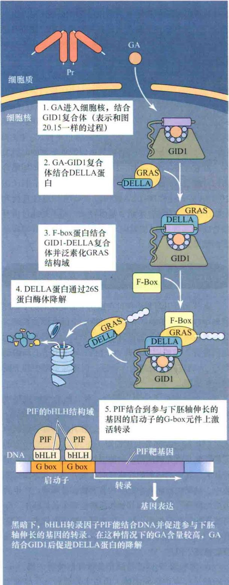  
图20.20 拟南芥幼苗中，光信号和GA信号整合调控下胚轴长度。

B 光下/低水平GA→短下胚轴  

3. PIF不结合DNA，其靶基因不转录，下胚轴伸长受抑制

光下，活性形式的光敏色素（Pfr）进入细胞核中并促进PIF的降解。此外，因为这种情况下GA含量很低，DELLA蛋白不被降解，DELLA蛋白就能与PIF结合而抑制PIF结合DNA。由于这两种原因，PIF诱导基因的转录受抑制，下胚轴不伸长

B  
A  

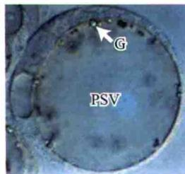

图20.21 大麦种子的结构和不同组织在萌发中的功能。A. 萌发诱导的相互作用图示。B\~D. 大麦糊粉层（B），淀粉酶产生的早期（C）和晚期（D）的糊粉层细胞原生质体的显微照片。（C）中的多个蛋白储存小泡（PSV）融合形成（D）中的大泡，为α-淀粉酶的合成提供氨基酸。G为封闭矿物质的植酸钙球状体；N为细胞核（B\~D引自Bethke et al., 1997, P. Bethke惠赠）。  

## 20.6.1 GA是在胚中合成的

20世纪60年代进行的实验证实了Gottlieb Haberlandt在1890年最初的发现：大麦糊粉层中淀粉降解酶的分泌依赖于胚的存在。随后发现 $GA_{3}$ 能替代胚促进淀粉降解的作用。在发现萌发过程中胚合成并释放GA进入胚乳后，GA的重要性就显而易见了。

## 20.6.2 糊粉层细胞可能有两种类型的GA受体

水稻受体缺陷突变体gid1不能合成α-淀粉酶，这清晰地揭示可溶性受体GID1参与这个经典GA响应过程。在GID1被鉴定之前，其他证据暗示在糊粉层细胞质GA可能与一个膜定位蛋白结合。其他的植物激素，包括生长素（第19章）和脱落酸（第23章）也有证据表明其具有两种类型的受体。虽然目前还没有明确鉴定到细胞膜定位的GA受体，但考虑到GA响应的多样性，存在多个GA受体也就不足为奇了。在糊粉层细胞中，存在 $Ca^{2+}$ 不依赖和 $Ca^{2+}$ 依赖两种GA信号途径，前者引发α-淀粉酶的生成，后者调控α-淀粉酶的分泌。

## 20.6.3 赤霉素增强 $\alpha$ -淀粉酶mRNA的转录

在分子生物学方法验证之前，已经有生理学和生物化学证据显示GA能够提高α-淀粉酶的基因转录水平（Jacobsen et al., 2005）。两个主要证据如下。

（1） $GA_{3}$ 刺激 $\alpha$ -淀粉酶的产生受到转录和翻译抑制剂的阻断。

（2）放射性同位素标记实验证明生物活性GA对α-淀粉酶活性的增强依赖于酶的从头合成途径，而不是激活已存在的酶。

谷类植物种子可以切成两部分，缺少胚的那一半是研究外源GA激活的理想实验材料（胚是整个种子中生物活性GA的来源）。芯片分析证明缺少胚的那一半水稻种子在被 $\mathrm{GA}_3$ 处理 $8\mathrm{h}$ 后，编码几个 $\alpha-$ 淀粉酶异构体的基因就被表达上调了（Bethke et al., 2006; Tsuji et al., 2006）。这些半种子中仅有的GA信号发生的活细胞分布在糊粉层中。在芯片分析的所有基因中，GA处理后编码 $\alpha-$ 淀粉酶异构体的基因上调倍数最高，其次是水解酶和蛋白酶。

纯化出 $\alpha$ -淀粉酶mRNA（其在糊粉层细胞中含量相对较高）后，就能够构建包含 $\alpha$ -淀粉酶结构基因和上游启动子序列的基因序列。负责GA响应的序列称为GA响应元件（GARE），它们位于转录起始点上游200\~300碱基对（Gubler et al., 1995）。迄今为止，所有已经检测过的谷类植物 $\alpha$ -淀粉酶基因的启动子中都发现有这样的GARE，而且这些元件被证明是对 $\alpha$ -淀粉酶基因转录诱导的充分必要条件。

## 20.6.4 GAMYB是 $\alpha$ -淀粉酶基因转录的正调控因子

α-淀粉酶基因启动子中的GARE序列（TAACAAA）与MYB蛋白结合的DNA序列很相似。MYB蛋白是真核细胞中的一类转录因子。植物中有一大类MYB蛋白，基于蛋白质的结构特征可以将它们分为许多亚家族。在大麦和水稻中，R2R3亚家族中的一个MYB蛋白参与GA信号途径，因此被称为GAMYB。大麦GAMYB的序列与拟南芥中的3个MYB蛋白（AtMYB33、AtMYB65和AtMYB101）非常相似。事实上，这些拟南芥AtMYB与谷类GAMYB的结构如此相似，以至于它们任意一个都能“挽救”缺乏GAMYB的大麦突变体的表型（Gocal et al., 2001）。水稻中还鉴定到了两个类似于GAMYB的蛋白，但它们不在糊粉层细胞的GA信号途径中起作用。

GAMYB开启 $\alpha$ -淀粉酶基因转录的假说（即GAMYB是 $\alpha$ -淀粉酶的正调控因子）有以下证据支持。

（1）GAMYB mRNA的合成在GA处理后仅1 h就开始增加了，这种增加能持续数小时（图20.22）。

（2）突变GARE序列使其不能与MYB结合后， $\alpha-$ 淀粉酶的诱导表达终止。

（3）没有GA时，在糊粉层细胞中组成型表达GAMYB能产生与GA处理相同的响应，说明GAMYB是 $\alpha$ -淀粉酶基因表达增强的充分必要条件。

蛋白质翻译抑制剂放线菌酮（cycloheximide）对GAMYB mRNA的产生没有作用，说明蛋白质合成对GAMYB的表达是非必需的。这样，GAMYB可以定义为初级（primary）或者早期响应基因（early response gene）。类似的实验证明 $\alpha$ -淀粉酶基因是次级（secondary）或者后期响应基因（late response gene）。

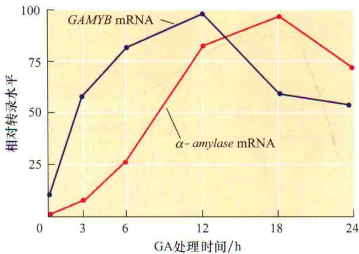  
图20.22 GA $_{3}$ 诱导GAMYB和α-amylase的时间过程。GAMYB mRNA的产生比α-amylase的早大约3 h。这个结果与其他结果暗示GAMYB是调节α-amylase转录的GA早期响应基因。在没有GA时，GAMYB和α-amylase mRNA的水平都是非常低的（引自Gubler et al., 1995）。

## 20.6.5 DELLA蛋白被快速降解

GA是如何通过GAMYB转录因子来激活α-淀粉酶转录的呢？现在已经知道，用GA处理大麦糊粉层细胞5 min内，就对DELLA蛋白SLN1产生了效应：细胞核中的GFP-SLN1融合蛋白的数量降低了；处理10 min后，融合蛋白几乎完全消失（Gubler et al., 2002）。然而，GAMYB的数量在GA处理1\~2 h后都没有增高，表明GAMYB虽然是GA的早期响应基因，但它可能不是DELLA蛋白的直接靶基因。我们认为在SLN1降解和GAMYB转录之间还有一个或多个未知步骤。

总结我们从谷类植物糊粉层中学到的内容（图20.23）可知，生物活性GA结合到GID1后，导致DELLA蛋白的降解，再通过某些未知的中间步骤，GAMYB的表达上调，最后GAMYB蛋白结合到α-淀粉酶基因启动子中高度保守的GARE元件上，进而激活转录。α-淀粉酶从糊粉层细胞中通过依赖Ca $^{2+}$ 积累的途径分泌出来，胚乳细胞中淀粉在α-淀粉酶和其他水解酶作用下降解成小分子糖类，然后转运到生长的胚中。

一些GA促进的其他水解酶类基因的启动子中也有GAMYB结合元件，暗示这是糊粉层细胞中GA响应的一个共同途径。

## 1. $GA_{1}$ 从胚进入糊粉层细胞

2. $GA_{1}$ 进入细胞后可能开启一条 $\alpha$ -淀粉酶分泌必需的 $Ca^{2+}$ -钙调蛋白依赖的途径

3. GA $_{1}$ 在细胞核中结合可溶性受体GID1

4. 结合GA $_{1}$ 后，受体GID1产生构象变化促进与DELLA蛋白的结合

5. DELLA蛋白与GA-GID1复合体结合后，SCF复合体组分F-box蛋白就能多聚泛素化DELLA蛋白的GRAS结构域

6. 多聚泛素化的DELLA蛋白通过26S蛋白酶体降解

7. DELLA蛋白降解后，早期响应基因转录启动（图中以GAMYB作为早期响应基因的代表，但有证据显示可能其他的早期基因将比GAMYB更早转录调控）。GAMYB的mRNA在细胞质中翻译

8. 新合成的GAMYB转录因子进入细胞核，结合到编码α-淀粉酶和其他水解酶类基因的启动子上

## 9. 这些基因的转录激活

10. $\alpha$ -淀粉酶和其他水解酶类在粗面内质网上合成、加工并由高尔基体进入分泌小泡

11. 蛋白质通过胞吐作用分泌  
12. 分泌途径依赖一条GA诱导的 $\mathrm{Ca^{2+}}$ -钙调蛋白依赖的途径

  
图20.23 大麦糊粉层中GA诱导 $\alpha$ -淀粉酶合成的综合模型。钙调素不依赖的途径诱导了 $\alpha$ -amylase 的转录，钙调素依赖的途径参与了 $\alpha$ -淀粉酶的分泌。

## 20.7 赤霉素响应：花药发育和雄性育性

我们已经知道，在谷类植物糊粉层细胞的GA响应中，GAMYB转录因子激活了α-淀粉酶基因的表达，导致种子萌发过程中的淀粉降解。GAMYB也参与了其他的GA响应过程。其中Web Topic 20.8探讨的GA对开花作用，以及生物活性GA对花粉发育的作用也都是由GAMYB介导的。

## 20.7.1 GAMYB调控雄性育性

水稻GAMYB功能缺失型突变体已经显示它是花器官发育的正调控因子（Kaneko et al., 2004）。水稻gamyb突变体的花萎缩，花药呈白色（正常为黄色）且没有花粉；其中一些花的异常表型更加明显，最为严重的是雌蕊严重畸形（图20.24）。

水稻的花粉粒由花药最内层细胞发育而来，被分泌型组织绒毡层滋养着。绒毡层细胞形成称为球状体（也称Ubisch体）的突起，球状体被认为在孢粉素（sporopollenin）的释放过程中起作用。孢粉素是一种由脂肪酸衍生物和苯丙素类化合物构成的复杂高聚物，最终形成了花粉粒的弹性外壁。我们将看到，生物活性GA上调了这些化合物的生物合成。正常情况下，当小孢子（将发育成花粉粒）处于发育的四分体时期时，野生型绒毡层细胞将进行程序性死亡（图

20.25）。如果绒毡层细胞死亡太快或者是不死，那么就可能不能形成正常的花粉。gamyb突变体的绒毡层细胞在四分体时期不降解，反而继续长大直至野生型花粉到成熟期时填满花药室。由于绒毡层细胞的繁殖，以及小孢子在四分体时期和空泡期之间瓦解，gamyb突变体的花药中就没有成熟的花粉粒（图20.25）（Aya et al., 2009）。

野生型植物中，生物活性GA参与调控了绒毡层细胞的程序性死亡。此外，GA调控包被花粉粒的孢粉素成分的生物合成。主要有以下证据。

（1）花粉发育中，GA上调了两个脂质代谢酶基因（CYP703A3和KAR）的表达。它们的启动子中都有GAMYB结合元件，突变这些结合元件都能抑制它们的表达。

（2）GAMYB-GUS融合蛋白（GUS即β-葡萄糖苷酸酶）和CYP703A3：GUS（监测CYP703A3基因转录的“启动子：GUS”融合表达系统）在野生型花药中共表达，但在gamyb突变体中CYP703A3：GUS却没有表达（图20.26）。

这些和其他的发现给出了令人信服的证据证明水稻活性花粉粒的形成需要GA诱导GAMYB表达，进而开启合成花粉壁成分的基因转录。缺失生物活性GA或者是GA信号转导途径的元件缺陷将导致水稻雄性不育。

和水稻一样，拟南芥的GA缺失和信号缺陷突变体也是雄性不育的。由于功能冗余性，AtMYB33和

  
图20.24 水稻gamyb突变体花器官的表型证明花粉的正常发育需要GAMYB转录因子。最左是一朵野生型的花，右边是gamyb突变体中逐渐增强的表型。缺失GAMYB后，花药呈白色而非正常的黄色，没有花粉。更加严重的表型是白色萎缩的花苞（外稃和内稃）包围在花和畸形的心皮四周（引自Kaneko et al., 2004；M. Matsuoka惠赠）。

gamyb 突变体

  
花粉母细胞期：突变体在减数分裂前是正常的

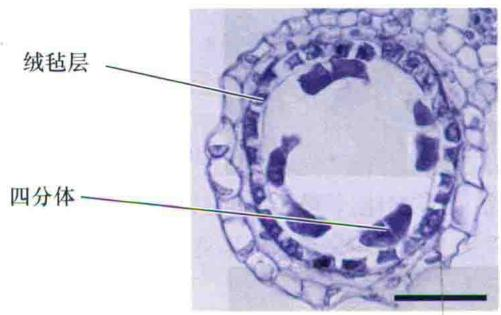

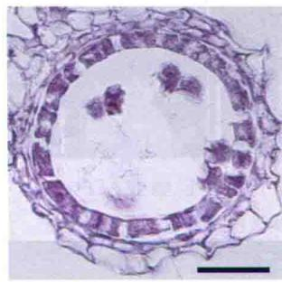  
四分体期：减数分裂后，野生型中的绒毡层细胞开始程序性死亡，而gamyb突变体没有

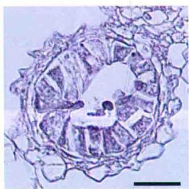  
空泡期：野生型中空
泡化的花粉清晰可见，
而gamyb突变体中，持
续增殖的细胞填满了
花药室

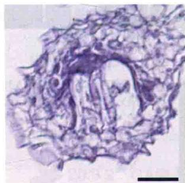  
成熟期：野生型花药中产生了成熟花粉，而突变体中花粉粒破碎  
图20.25 水稻野生型和gamyb突变体花药发育4个不同时期的组织化学分析。花药横切照片显示，突变体中的绒毡层细胞在四分体时期不进行程序性死亡。此外，突变体的花粉粒不能发育出弹性外壁，最后花粉粒破碎。标尺25 μm（引自Aya et al., 2009, M. Matsuoka惠赠）。

AtMYB65必须双缺以后才有雄性不育的表型（Millar and Gubler，2005）。CYP703A3的拟南芥直系同源基因的启动子中也有一个MYB结合基序，暗示拟南芥中和水稻一样，GA调控了花粉壁成分的合成。

## 20.7.2 水稻糊粉层和花药中的GAMYB下游事件差异巨大

比较水稻的无胚半粒种子和花药的基因芯片结果中GAMYB诱导的基因表达情况，就会发现一些令人惊讶的结果：虽然GAMYB在糊粉层和花药中都调控了许多基因，但它在这两个系统中所调控的基因差异相当巨大（Tsuji et al., 2006）。虽然花药中的许多GAMYB依赖基因并不含有在糊粉层中鉴定到的保守的GARE，但似乎这种GARE不能引起花药中的GAMYB诱导表达，可能其他的因子参与了这个过程。事实上，花药中GAMYB调控基因的启动子并没有糊粉层细胞中的那种顺式作用元件。有可能花药中有不同于糊粉层的其他元件在GA诱导特异性和GAMYB调控表达过程中起作用。

  
CYP703A3:GUS和GAMYB-GUS定位相同，但它在发育的最早期不可见而GAMYB-GUS可见。这个结果暗示GAMYB对CYP703A3的表达是必须的

  
gamyb突变体中CYP703A3:GUS不表达，再次暗示GAMYB对CYP703A3的表达是必须的  
图20.26 水稻花药中GA诱导型启动子控制的GUS表达情况。A和B.野生型中GAMYB-GUS的表达情况。染色后，GAMYB-GUS位于花药中（B）。C和D.野生型中CYP703A3：GUS的表达情况。染色后CYP703A3：GUS也位于花药中。E.gamyb突变体MEI期的CYP703A3：GUS染色情况。A和C.每个发育时期的整花（标尺1 mm）。B，D和E.雄蕊特写。PMC.花粉母细胞期；MEI.减数分裂期；TD/YM.四分体期/小孢子期；VP.空泡期；MP.成熟期（引自Aya et al., 2009, M. Matsuoka惠赠）。

## 20.7.3 小RNA在花药而非糊粉层中转录后调控MYB

小RNA（miRNA）是一类由小基因编码、转录后调控其他基因表达的20\~25个核苷酸的RNA。miRNA结合到核糖核酸酶复合物上指导其作用于特定的mRNA分子。与这些miRNA杂交的mRNA很快就被核糖核酸酶复合物降解，因此能有效地使它们的目的基因沉默（关于miRNA的详细讨论详见第2章）。

在拟南芥中已发现有3个miRNA能与类GAMYB基因编码区中的一个保守序列互补（Park et al., 2002; Rhoades et al., 2002）。miR159a作为其中之一，能使拟南芥茎中的AtMYB33沉默，过表达或突变miR159a能导致植株严重缺陷。如前所述，拟南芥中AtMYB33参与花器官发育和开花调控。因此，在miR159a的过表达株系中，AtMYB33是沉默的，植株表现为雄性不育和开花时间延迟（Achard et al., 2004）。在水稻花药中，miRNA也能改变GAMYB的表达，但糊粉层中却没有这种现象（Tsuji et al., 2006）。这是GA诱导和GAMYB调控的基因在糊粉层和花药中的另一个不同点。

综上所述，GA诱导α-淀粉酶产生和GA诱导的花器官发育都说明MYB转录因子在谷类植物和拟南芥的GA信号转导中起重要作用。可以预期，它们在除了拟南芥的其他双子叶植物中也非常重要。有趣的是，不同的组织和器官中，GAMYB下游的信号途径不同，这可能是引起GA这种激素能在不同的组织中诱导产生多种不同的反应的原因。

## 20.8 赤霉素响应：茎的生长

GA促进茎生长的效应非常显著，使人们一直认为研究它的作用模式应该比较简单（图20.1和图20.2）。但事实并非如此。正如在生长素中所见到的，我们对植物细胞的生长所知甚少。然而，科学家的确已经掌握了GA诱导的茎伸长的基本特性。在本章的最后部分，我们将回顾水稻中旨在阐明GA促进细胞生长和细胞分裂生理生化机制的研究。

当洪水暴发水位快速上涨时，水稻的茎会迅速伸长。然而这很容易耗尽体内储藏的碳水化合物，降低水稻在洪水退去后的存活率。有趣的是，一种在水下伸长减缓的水稻耐淹株系在洪水消退后具有更高的存活率。这种耐淹株系直接与降低GA敏感性的DELLA蛋白稳定有关。

## 20.8.1 赤霉素促进细胞伸长和细胞分裂

外源生物活性GA处理后，细胞长度和细胞数量都增加了，说明GA既能促进细胞伸长又能促进细胞分裂。一些具有GA诱导生长表型的植物或植物器官比相应的对照具有更多的细胞数目。

（1）高秆豌豆的节间较矮秆的细胞数目更多，而且细胞长度更长。

（2）短日照下生长的长日照植物在活性GA处理后，中柱和莲座叶基本分生组织中的有丝分裂明显加快。

（3）当深水稻浸在水中或用GA处理时，节间伸长的快速增加部分是由于居间分生组织（某些单子叶植物中）细胞分裂的增加。

由于GA诱导的细胞伸长似乎先于细胞分裂，我们首先探讨GA在调控细胞伸长方面的作用。

从第15章已经知道，细胞伸长的速率受细胞壁可扩展性和水分吸收（渗透驱动）影响。GA对渗透参数并无影响，但在活体细胞中GA能使细胞壁扩张，并松弛细胞壁的张力。不同 $GA_{1}$ 含量和不同敏感性的豌豆突变体分析表明，GA降低了细胞壁的壁压阈值（wall yield threshold，即伸展所需的最小压力）。因此，GA和生长素似乎都有改变细胞壁特性的功能。

对于生长素来说，细胞壁的松弛似乎部分是由细胞壁酸化引起的（见第19章），而这似乎不是GA作用的机制，因为至今还没有观察到GA促进了质子泵出。另外，在完全缺失生长素的组织中也不存在GA，GA对生长的促进效应可能依赖生长素诱导的细胞壁酸化。

GA处理与生长开始之间的滞后时间比生长素的长，在深水稻中大约为40 min，在豌豆中为2\~3 h（Yang et al., 1996）。较长的滞后时间表明GA促进生长的机制与生长素不同。与存在一个独立的GA特异的细胞壁松弛机制一致，施加生长素和GA对生长具有叠加效应。

科学家提出了多种解释GA刺激茎生长机制的假说，它们都有一些实验证据支持，但没有一种有确切的答案。例如，有证据表明木葡聚糖内糖苷酶/水解酶（xyloglucan endotransglucosylase/hydrolase，XTH）参与GA促进的细胞壁扩张（Xu et al., 1996）。XTH的功能可能是促使膨胀素（expansin）渗入细胞壁。膨胀素是一种细胞壁蛋白，它能在酸性条件下通过减弱细胞壁多糖间的氢键使细胞壁松弛（见第15章）。深水稻的一种膨胀素OsEXP4在GA处理30 min内或浸入水下时，其转录水平都将增加。而表达OsEXP4反义RNA的植株矮小，在水下不伸长；过表达OsEXP4的植株生长过高（图20.27）（Choi et al., 2003）。综上所述，GA诱导的细胞伸长至少部分是受膨胀素介导的。

## 20.8.2 GA调节细胞周期激酶的转录

在水下深水稻节间生长速率的显著增加，部分是由居间分生组织细胞分裂加快引起的。为了研究GA在细胞周期中的效应，研究者们从深水稻的居间分生组织分离出细胞核并计量每个细胞核中DNA含量（Sauter and Kende，1992）。当植物在深水中时，GA激活从 $G_{1}$ 到S期转换，导致有丝分裂增加。GA对细胞分裂的促进是由于其诱导了一些细胞周期蛋白依赖性蛋白激酶（cyclin-dependent protein kinases，CDK）基因的表达（见第1章）。居间分生组织中调控 $G_{1}$ 到S期的转换和调控 $G_{2}$ 到M期的转换的CDK基因的转录受GA诱导（Fabian et al., 2000）。

图20.27 OsEXP4正义链和反义链转基因水稻表型。A为反义链株系。B为对照（非转基因）。C为正义链株系。植物的高度与EXP4的量相关。虽然反义链转基因株系中的EXP4基因转录了，但它不能被翻译出蛋白质来，EXP4蛋白质相对于对照减少了。正义链转基因株系中，OsEXP4被过表达而产生了更多的EXP4蛋白（引自Choi et al., 2003；H. Kende惠赠）。

## 20.8.3 降低GA敏感性可以防止作物损失

水位缓慢上涨时，深水稻加速节间伸长，以保持茎的（一部分）气生部分位于水面之上。相反，急速暴发的洪水能诱发快速生长，引起营养物质的过度消耗并常常带来植物的死亡。耐淹的水稻栽培种在洪水暴发时不响应，茎不会极度生长，这样它们就能够更好地保存营养物质，一旦洪水消退后就能更好地恢复。这些耐淹栽培稻拥有Sub1A-1基因。Sub1A-1在被水淹时高度诱导表达，将其转入不耐淹栽培水稻后赋予其耐淹性。Sub1A-1与SLR1及与其类似的SLRL1的表达量增加相关，其表达增加将导致DELLA蛋白积累。组成型过表达Sub1A的转基因植物和水淹时叶中Sub1A高度诱导的植物对GA的敏感性都降低了，并且都在被水急速淹没时不经历自杀性快速生长（Fukao and Bailey-Serres, 2008）（图20.28）。

在老挝、印度、孟加拉国等容易遭受洪水的地区引种表达Sub1A的水稻栽培品种将有望降低毁灭性洪水带来的损失。这些抗洪水淹没的水稻品种也依赖DELLA蛋白来调节茎的生长，与“绿色革命”中培育的抗倒伏小麦栽培品种一样。

通过过去这些年的研究，DELLA蛋白显然在整合植物对包括GA在内的多种激素和特定的环境因素产生响应的过程中非常重要。乙烯、生长素、脱落酸、光和温度都参与DELLA信号途径，其中一些在DELLA蛋白的上游作用，一些则在下游。Web Topic 20.9 将深入讨论这方面的激素相互作用。

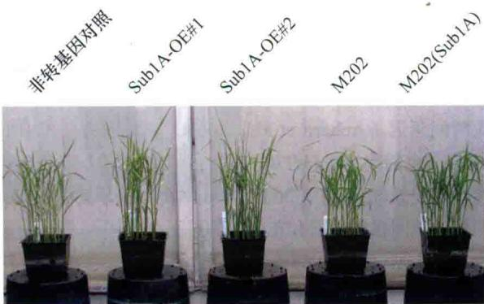  
淹水前

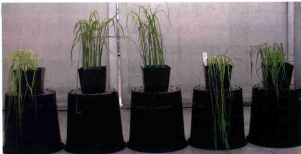  
淹水后16天

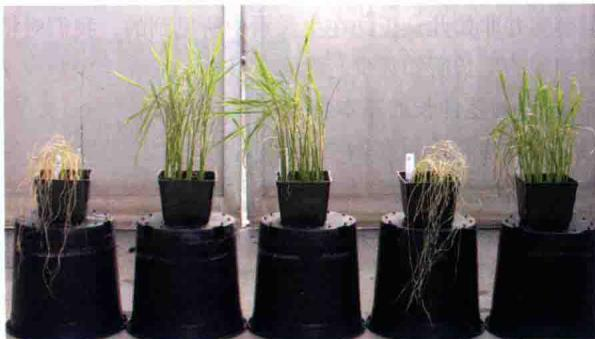  
恢复后7天

图20.28 组成型和水淹诱导表达Sub1A均能提高水稻在快速淹水后的存活率。照片中显示了组成型过表达系（Sub1A-OE#1和Sub1A-OE#2）、水淹诱导[M202（Sub1A）]和不耐水淹株系（非转基因对照和M202）在淹水之前（上）、淹水后16天（中）和淹水结束后7天（下）的表型。实验开始前的所有植物都处于相同的发育时期。不耐水淹株系在淹水过程中叶片和节间明显伸长（中间照片的第1和第4），这消耗了资源，削弱了淹水结束后的恢复能力（下）。其他植物显示出更低的GA敏感性和淹水后更高的存活率（引自Fukao and Bailey-Serres，

2008; J. Bailey-Serres 惠赠)。

## 小结

赤霉素在植物的生长和发育的许多方面具有重要的调节作用，包括调节种子的萌发、植株的生长、诱导开花、雄蕊的发育、花粉管的生长、花的发育、果实的形成和生长、种子的发育等。所有的GA都有相似的化学结构，然而仅有少数有生物活性。

## 赤霉素的发现和化学结构

· 众所周知，赤霉素能极大地促进禾本科植物和矮生莲座叶植物节间的伸长（图20.1和图20.2）。

· 赤霉素是由4个5碳的类异戊二烯单位组成的四环双萜类化合物。在大多数植物里， $GA_{1}$ 和 $GA_{4}$ 是具有最高生物活性的GA。

## 赤霉素在植物生长发育中的作用

· GA在植物的整个生命周期里是必不可少的，它能够促进种子的萌发、诱导开花、花的性别决定、花粉的发育及花粉管的伸长、果实的形成和生长（图20.3）。

· 在商业生产中，从真菌（Gibberella fujikuroi）中获得的 $\mathrm{GA}_{3}$ （赤霉酸）被用于多种农作物上和酿造工业中（图20.4）。

· 在谷类作物生产中，GA生物合成抑制剂被用作重要的矮化剂。

\- GA的合成和信号突变体都呈现出矮化的植株表型。

## GA的生物合成与失活

\- GA的合成发生在植物的多个器官和细胞内的多个位点。

\- GA是可以移动的，它既可以在合成的部位发挥作用，也可以从合成部位转移到其他部位发挥作用，包括萌发的胚、幼苗、茎尖和发育中的种子。

· GA的合成首先发生在质体里，由牻牛儿牻牛儿焦磷酸环化为内根-贝壳杉烯，然后，在内质网中转变为 $GA_{12}$ ，最后在细胞质中合成有生物活性的 $GA_{1}$ 和 $GA_{4}$ （图20.5）。

· 在研究中，利用GA缺失突变体建立了合成通路（图20.6和图20.7）。

· 内源的有生物活性GA通过提高或抑制GA生物合成或失活酶的转录来调节其自身合成。

· 光周期、温度等环境因素能通过调节GA生物合成途径中的酶基因的转录来调节GA生物合成。

· 通过对豌豆GA缺失突变体的研究进一步证实植物的高度与内源 $GA_{1}$ 的含量相关（图20.9）。

通过遗传工程减少 $GA_{1}$ 的合成或者提高它的降解都能够使植株矮化，进而增加农作物产量（图20.10）。然而，一些GA缺失突变体表现为果实或种子发育缺陷（图20.11）。

## 赤霉素信号途径：响应突变体的重要性

· 一些突变体的GA响应与内源生物活性GA含量不成比例，暗示这些突变的基因可能编码GA受体或信号转导途径中的其他元件。

\- 水稻中的GID1编码一个符合GA受体标准的可溶性蛋白（图20.12）。

· 拟南芥中有3个基因各自编码GA受体，3个基因均突变的“三突变体”才显现出极度矮化表型（图20.13）。

· 活性GA是受体蛋白GID1的变构激活剂，诱导GID1构象变化，促进GID1与负调节因子DELLA蛋白的结合（图20.14\~图20.16）。

\- DELLA蛋白与GA-受体蛋白复合体结合后被泛素化修饰和降解。

\- GA的负调控因子的突变能产生细长或者矮化表型。大麦DELLA蛋白（SLN）的sln1c突变产生组成型GA响应表型（高）；相反，sln1d突变阻断GA响应（矮）（图20.17）。

· GA促进DELLA蛋白在细胞核中的降解。拟南芥的DELLA蛋白RGA在GA出现后降解，导致生长响应（图20.18和图20.19）。

## 赤霉素响应：DELLA蛋白的早期靶标

·DELLA蛋白和其他蛋白质相互作用间接调节转录。

· 光敏色素互作蛋白（PIF）是幼苗在黑暗下和GA出现后上调基因导致下胚轴伸长的转录因子。光信号使PIF降解，不产生GA响应（图20.20）。

## 赤霉素响应：谷类植物糊粉层

\- 萌发过程中，胚中产生的GA促进糊粉层细胞中水解酶的合成和释放进入胚乳（图20.21）。

· 活性GA结合到GID1蛋白后，导致DELLA蛋白的降解，进而上调GAMYB基因（编码转录因子）。GAMYB结合到α-淀粉酶基因启动子的GARE序列而增强转录（图20.22和图20.23）。

## 赤霉素响应：花药发育和雄性育性

\- GA 激活对花粉发育和雄性育性的影响是由 GAMYB 转录因子介导的（图 20.24）。

· GAMYB转录因子对于参与花粉正常发育的基因表达是必需的，它们在花药中受microRNA调控（图20.25和图20.26）。

· 不同组织中GAMYB信号的不同可能是不同组织中GA诱导不同生物学响应的原因。

## 赤霉素响应：茎的生长

\- GA促进细胞伸长和细胞分裂，一个例子是促进水稻在胁迫环境（洪水淹没）下茎的快速但不可持续伸长。

· GA诱导的细胞伸长部分由一类称为膨胀素的蛋白介导。其中一个膨胀素基因OsEXP4的转录在GA处理后或在快速水淹后增加。表达OsEXP4反义链的幼苗在水淹下不生长；过表达OsEXP4导致水稻长高（图20.27）。

· 在水稻中，SUB1A-1基因上调DELLA蛋白，减弱茎对GA的敏感性，阻止不可持续的茎部伸长（图20.28）。

\- DELLA蛋白对整合GA、几种其他激素和环境因子的效应非常重要。

(孙世勇 蒋建军 译)

## WEB MATERIAL

Web Topics

20.1 Structures of Some Important Gibberellins and Their Precursors, Derivatives, and Biosynthetic Inhibitors The chemical structures of various gibberellins and the inhibitors of their biosynthesis are presented.

20.2 Commercial Uses of Gibberellins
Gibberellins have roles in agronomy, horticulture, and the brewing industry.

20.3 Gibberellin Biosynthesis
The GA biosynthetic pathways and GA conjugates in plants are described.

20.4 Gas Chromatography-Mass Spectrometry of Gibberellins Identification and quantitation of individual GAs are accomplished by gas chromatography-mass spectrometry.

20.5 Environmental Control of Gibberellin Biosynthesis The antagonistic relationship between gibberellins and abscisic acid is often mediated by environmental factors.

20.6 Auxin Can Regulate Gibberellin Biosynthesis

Studies in both monocot and dicot species have shown that auxin can up-regulate gibberellin biosynthesis and down-regulate gibberellin inactivation.

20.7 Negative Regulators of GA Response
The DELLA proteins are important regulators of GA response.

20.8 Effects of GA on Flowering Bioactive GAs are involved in the transition to flowering, and interact with the floral meristem identity gene Leafy.

20.9 DELLA Proteins as Integrators of Multiple Signals These proteins are involved in integrating signals from several hormones and multiple environmental factors.

## Web Essays

## 20.1 Gibberellins in Pea: From Mendel to Molecular Physiology

A personal description of GA research using pea, that most recently focuses on the interaction of environmental factors and other hormones on the regulation of GA biosynthesis in this plant.

20.2 Ubiquitin Becomes Ubiquitous in GA Signaling
Homologs of SLY1/GID2 and DELLAs have been found in just about every plant species that has an EST sequence database.

## 20.3 Green Revolution Genes

High yielding dwarf varieties of wheat and rice introduced in the mid-1960s have altered GA biosynthesis or response.

20.4 Overgrowth Mutants of Barley-from Model System to Potential Crops
Self-fertile barley mutants with enhanced GA signaling have potentially useful agronomic traits.
