# 第 22 章

乙烯: 气体激素

19世纪煤气应用于街道照明以后，人们观察到生长于路灯附近的树木比其他树木的叶片更容易脱落。最终发现煤气和空气污染物影响了植物的生长和发育，并鉴定出乙烯是煤气中的活性成分（参见Web Topic 22.1）。

1901年，俄罗斯圣彼得堡植物学院的研究生Dimitry Neljubov在实验室观察到，生长在黑暗条件下的豌豆幼苗表现出三重反应（triple response）的特征：茎伸长减少、横向生长增加（膨大）及不正常的水平

生长（图22.1），当这些植物生长在通风透光的环境中时，它们重新恢复了正常的形态和生长速度，Neljubov从实验室空气中鉴定出了煤气中的乙烯，并认定是该分子导致了上述反应。

1910年，H. H. Cousins首先报道了乙烯是植物组织的天然产物，指出如果将贮藏室中柑橘所散发出的气体转移到香蕉贮藏室中会引起香蕉提早成熟。然而，与其他水果（如苹果）相比，柑橘仅能合成少量乙烯，Cousins实验时所用的柑橘很可能感染了青霉菌（Penicillium），而这些真菌可以产生大量乙烯。1934年，R. Gane等用化学方法鉴定出乙烯是一种植物新陈代谢的自然产物，并且由于它对植物影响巨大，把乙烯确定为一种植物激素。

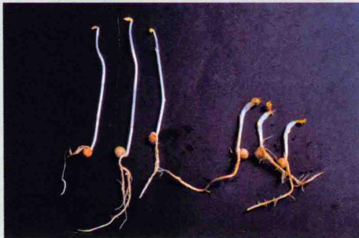

图22.1 豌豆黄化苗的“三重反应”。与对照（左）相比，用10 ppm乙烯处理6天的豌豆幼苗（右）表现为上胚轴膨大、上胚轴伸长和水平生长（失去负向地性生长）受抑制（S. Gepstein惠赠）。

在长达25年的时间里，人们并没有认识到乙烯是一种重要的植物激素，主要原因是许多生理学家认为乙烯是通过第一个被发现的植物激素——生长素起作用的（见第19章）。人们认为生长素是主要的植物激素，而乙烯仅起着无关紧要的间接生理作用。另外，缺乏定量乙烯的化学技术也阻碍了人们对乙烯的研究。直到1959年气相色谱技术应用于乙烯研究以后，乙烯的重要性被重新发现，人们认识到乙烯作为一种生长调节物质具有重要的生理作用（Burg and Thimann，1959）。

本章将介绍乙烯生物合成途径及乙烯如何在细胞和分子水平发挥作用。最后，我们将对乙烯影响植物生长发育的重要作用进行阐述。

## 22.1 乙烯的结构、生物合成及测定

乙烯是最简单的烯烃（它的相对分子质量为28）：在生理条件下，它比空气更轻，很容易被氧化（参见

Web Topic 22.2)。

$$
\begin{array}{c} \mathrm{H} \\ \mathrm{H} \end{array} \mathrm{C} = \mathrm{C} \begin{array}{c} \mathrm{H} \\ \mathrm{H} \end{array} \text {乙烯}
$$

高等植物几乎所有的器官都能产生乙烯，植物组织类型和发育阶段不同，乙烯的合成速率也不相同。乙烯通常可以通过气相色谱来测定（参见Web Topic 22.3）。在叶片脱落、花器官衰老及果实成熟过程中，乙烯的合成量增加。植物受到伤害和生理胁迫如涝害、病害及高温或干旱时都能诱导乙烯的生物合成。除此之外，病菌感染也能促进乙烯的合成。

甲硫氨酸是乙烯的前体，1-氨基环丙烷-1-羧酸（ACC）是甲硫氨酸转化为乙烯的中间产物。下面我们将看到，乙烯生物合成的完整过程是一个循环，并且与植物细胞的许多代谢循环相交叉。

## 22.1.1 受调控的乙烯生物合成决定其生理活性

体内实验表明，植物组织能将标记的甲硫氨酸 $^{[14]}$ C 转变为乙烯 $^{[14]}$ C，乙烯中的碳来自甲硫氨酸的3位和4位碳原子。甲硫氨酸中的甲硫基（CH $_{3}$ —S）通过杨氏循环不断再生利用（图22.2）。合成乙烯的直接前体是1-氨基环丙烷-1-羧酸（1-aminocyclopropane-1-carboxylic acid, ACC）。总的说来，用外源ACC处理植物组织，则植物中乙烯的生成量大量增加，说明ACC的合成是植物组织内乙烯生物合成的限速步骤。

ACC合酶（ACC synthase，ACS）催化S-腺苷甲硫氨酸转变为ACC（图22.2）。它受到外界环境及内部因素如伤害、干旱胁迫、涝害和生长素等的调节。ACS由多个不同的多基因家族编码，各种乙烯生物合成诱导物以不同方式调控这些基因，如在番茄中，至少有10个ACS基因，分别受到生长素、伤害和（或）果实成熟不同程度的诱导（详情参见Web Topic 22.4）。

ACC氧化酶（ACC oxidase）催化ACC转变为乙烯，这是乙烯生物合成的最后一步（图22.2）。在乙烯快速产生的植物组织如成熟果实中，ACC氧化酶的活性是乙烯生物合成的限速步骤。与ACC合酶类似，ACC氧化酶由多基因家族编码，受不同机制调控（参见Web Topic 22.5）。例如，在成熟番茄的果实和衰老的矮牵牛花中，一些ACC氧化酶基因的mRNA水平显著增加。

  
图22.2 乙烯生物合成途径及杨氏循环。甲硫氨酸是乙烯的前体。乙烯合成途径的限速步骤是由ACC合酶催化S-腺苷甲硫氨酸转变为ACC，最后一步是ACC转变为乙烯，这一步需要氧，由ACC氧化酶催化。甲硫氨酸中的甲硫基（ $\mathrm{CH}_3 - \mathrm{S}$ ）通过杨氏循环重新形成，继续参与合成过程。ACC除了转变为乙烯外，还可转化为缀合物N-丙二酞基ACC。AOA为氨基氧乙酸；AVG为氨基乙氧基乙烯基甘氨酸（引自Mckeon et al., 1995）。

分解代谢 研究者利用 $^{14}C_{2}H_{4}$ 培养植物组织，通过放射性示踪技术研究了乙烯的分解代谢。二氧化碳、环氧乙烷、乙二醇和结合了乙二醇的葡萄糖都被鉴定为乙烯分解作用的代谢产物。然而，由于某些环烯烃类化合物（如1，4-环己二烯）在不抑制乙烯作用的情况下能阻断乙烯分解，因此乙烯分解代谢在调控该激素水平方面并没有显著作用（Raskin and Beyer，1989）。

结论 人们发现植物组织中并非所有ACC都能转变为乙烯。ACC也能形成结合态物质——N-丙二酰ACC（N-malonyl ACC）（图22.2），后者不会被分解，主要积累在液泡等植物组织中。人们也鉴定出了第二种少量的ACC结合物形式[1-(γ-L-谷氨酸)-环丙烷-1-羧酸[1-(γ-L-glutamylamino)cyclopropane-1-carboxylic acid, GACC]。ACC与其他物质的结合可能在控制乙烯生物合成方面起重要作用，其结合方式与生长素和细胞分裂素类似。

ACC脱氨基酶 在很多土壤细菌中都表达一种酶——ACC脱氨基酶，它能将ACC水解成氨和α-丁酸香叶酯（Glick，2005）。这些细菌能够通过清除植物合成和释放的ACC，降低植物产生的乙烯水平，从而促进植物的生长。在转基因植物中表达ACC脱氨基酶能够降低乙烯水平。近来，在拟南芥中发现了编码ACC脱氨基酶的基因，说明内源ACC脱氨基酶在调控乙烯生物合成过程中发挥作用。

## 22.1.2 促进乙烯生物合成的几个因子

乙烯生物合成受一些因素所调控，这些因素包括植物发育阶段、环境条件、其他植物激素及物理和化学伤害。乙烯生物合成也有昼夜节律变化，白天合成量出现峰值，夜间达到最低值。

果实成熟 果实成熟时，ACC和乙烯的合成速率增加，ACC氧化酶（图22.3）和ACC合酶的活性都增强，编码这些酶的基因的mRNA水平也相应提高。然而，给未成熟果实外施ACC仅能轻微增加乙烯产量，表明ACC氧化酶活性增加是果实成熟的限速步骤（McKeon et al., 1995）。

胁迫诱导乙烯生成 胁迫条件如干旱、涝害、冷害、臭氧及机械伤害等都可增加乙烯的生物合成。在这些情况下，乙烯由正常的生物合成途径产生，并且乙烯产量的增加至少部分是由于ACC合酶mRNA转录水平提高所致。这种“胁迫诱导乙烯”参与了胁迫应答的启动，如器官脱落、衰老、伤口愈合和植物抗病性的增强（见第26章）。

昼夜节律调控乙烯生成 在很多植物物种中昼夜节律生物钟调控乙烯的生物生成。通常乙烯水平在中午达到顶峰，在午夜达到低谷。这种调节可能源于部分ACC合酶的转录调控，这一过程在拟南芥中被TOC1/CCA1生物钟介导（Thain et al., 2004）。

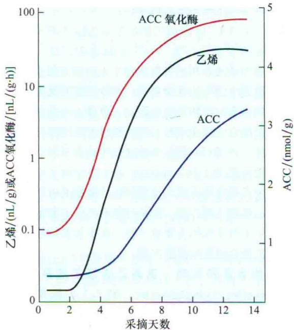  
图22.3 金冠苹果成熟期ACC浓度、ACC氧化酶活性和乙烯的变化。图中数据显示了它们随收获后天数变化的情况。乙烯和ACC浓度的增加及ACC氧化酶活性的增强与果实成熟密切相关（改编自Yang，1987）。

生长素诱导乙烯生成 某些情况下，生长素和乙烯可以引起植物相似的反应，例如，二者都可诱导菠萝开花和抑制茎叶的伸长。引起这些反应可能是由于生长素能够通过增加ACC合酶的活性从而促进乙烯的合成。这些结果表明，先前归因于生长素（吲哚-3-乙酸，IAA）的反应事实上是由植物应答生长素反应产生的乙烯介导的。

外源施加IAA，多个ACC合酶基因的转录水平被提高，乙烯产量升高（Nakagawa et al., 1991；Liang et al., 1992；Tsuchisaka and Theologis, 2004）。蛋白质合成抑制剂阻断IAA诱导的乙烯合成，表明由生长素导致的ACC合酶的合成显著促进了乙烯的产生。

## 22.1.3 ACC合酶的稳定促进乙烯的生物合成

除了生长素，油菜素甾醇和细胞分裂素也能够促进乙烯合成。与生长素类似，这些激素通过增加ACC合酶活性来促进乙烯合成。但是，与生长素相比较，它们不能提高ACC合酶基因的转录水平，而是增加了ACC合酶蛋白的稳定性（Chae and Kieber，2005）。

例如，病菌侵袭、细胞分裂素和油菜素甾醇都能增加乙烯的合成量，部分是由于ACS蛋白的稳定性提高，降解速度减慢导致的。ACS的C端区域在控制其稳定性方面发挥了重要作用（Vogel et al., 1998）。这个区域作为该蛋白质的标志，被26S蛋白酶体识别并被快速降解（见第2章）。促分裂原蛋白（MAP）激酶（受病原菌激活）或钙依赖蛋白激酶都可以磷酸化ACS的C端区域，从而有效阻断其被识别降解。

## 22.1.4 多种抑制子能够抑制乙烯生物合成

激素合成或作用的抑制剂对于人们研究激素生物合成途径及其生理作用非常有用。当难以区分具有相同作用的不同激素对植物组织的影响，或者一种激素影响另一种激素的合成或作用时，抑制剂对研究特别有帮助。

例如，乙烯可以模拟高浓度的生长素抑制茎叶的伸长，导致叶的偏上性（epinasty）（叶片向下弯曲）生长。使用乙烯生物合成和作用的特异抑制剂可以区分生长素和乙烯的不同作用。使用抑制剂的研究表明，乙烯是引起偏上性生长的主要效应物，而生长素则通过显著地增加乙烯合成量间接起作用。

乙烯合成抑制剂 氨基乙氧基乙烯基甘氨酸（aminoethoxyvinylglycine，AVG）和氨基氧乙酸（aminooxyacetic acid，AOA）阻断了S-腺苷甲硫氨酸向ACC的转化（图22.2）。众所周知，AVG和AOA通过辅因子吡哆醛磷酸盐抑制包括ACC合酶在内的酶的活性。α-氨基异丁酸（α-aminoisobutyricacid，AIBA）和钴离子（Co $^{2+}$ ）也是乙烯合成途径的一种抑制剂，阻断乙烯生物合成的最后一步反应，即由ACC氧化酶催化ACC转变为乙烯的反应。

乙烯作用的抑制剂 乙烯的许多效应都可被其特异的抑制剂所拮抗，硝酸银（ $\mathrm{AgNO_3}$ ）或硫代硫酸银 $[\mathrm{Ag}(\mathrm{S}_2\mathrm{O}_3)^{3-}]$ 中的银离子（ $\mathrm{Ag^{+}}$ ）是乙烯作用的有效抑制物。银的作用非常特异，其他任何金属离子都不会增强 $\mathrm{Ag^{+}}$ 的阻抑作用。

高浓度 $\mathrm{CO}_{2}$ （5%\~10%）虽然抑制效率低于 $\mathrm{Ag}^{+}$ ，但也能抑制乙烯的许多作用，如诱导果实成熟。 $\mathrm{CO}_{2}$ 的这种作用被充分运用于果实贮藏，高浓度的 $\mathrm{CO}_{2}$ 可以使果实延期成熟。因为只有高浓度的 $\mathrm{CO}_{2}$ 才有抑制乙烯的作用，所以自然条件下的 $\mathrm{CO}_{2}$ 不可能是乙烯的拮抗物质。易挥发的化合物反式环辛烷（而非其异构体顺式环辛烷）是一种乙烯结合作用的强竞争性抑制剂（Sisler et al., 1990），反式环辛烷与乙烯竞争结合乙烯受体。1-甲基环丙烯（MCP）与乙烯受体结合几乎是不可逆的（图22.4），可有效阻断多种乙烯反应（Sister and Serek, 1997）。这种几乎无味的化合物，已经被注册商标，其商品名为EthylBloc®，且被用于花卉培养上以提高切花和一些水果（如苹果）的货架保鲜期。

乙烯吸收 为避免乙烯气体从原组织中挥发，影响其他的组织器官，在水果、蔬菜和花的储藏过程中适用乙烯捕获系统。高锰酸钾（ $\mathrm{KMnO}_4$ ）能够有效吸收乙烯，将苹果储藏区的乙烯浓度从 $250~\mu \mathrm{L} / \mathrm{L}$ 减少到 $10~\mu \mathrm{L} / \mathrm{L}$ ，

显著延长水果的贮藏寿命。

  
1-甲基环丙烯(MCP)  
反式环辛烯

  
顺式环辛烯  
图22.4 阻断乙烯与受体结合的两种抑制剂。顺式环辛烯不是一个有效的抑制剂。

## 22.2 乙烯信号转导途径

尽管乙烯在植物整个生长发育过程中作用范围很广，但人们认为这些情况下乙烯发挥作用的主要步骤是相似的：都涉及与受体结合，随后激活一个或更多个信号转导途径，使细胞产生反应（见第14章）。乙烯最终是通过改变基因的表达模式发挥作用的。对拟南芥突变体的分子遗传学研究为乙烯信号通路组分的发现作出巨大贡献。

在筛选和分离乙烯响应突变体的过程中使用拟南芥黄化苗的三重反应表型（triple-response morphology）（图22.5）（Guzman and Ecker，1990）。利用这样的实验即诱变剂处理后的拟南芥种子，放在含有或不含乙烯的琼脂培养基上黑暗条件下生长3天，鉴定出了以下两类拟南芥突变体。

  
图22.5 拟南芥的三重反应。在有乙烯（10 ppm，右）和没有乙烯（左）情况下生长3天的拟南芥黄化苗。注意：乙烯的存在导致幼苗子叶下胚轴变短，根伸长受到抑制，顶端弯钩过度弯曲（J. Kieber惠赠）。

（1）不能对外源乙烯作出应答的突变体（抗乙烯突变体或乙烯不敏感突变体）。

（2）即使没有乙烯的情况下，幼苗也能表现“三重反应”（组成型突变体）。

乙烯存在时，绝大多数生长的幼苗都表现出“三重反应”，长得较矮，有些幼苗显著高于“三重反应”幼苗，这些高的、没有“三重反应”的幼苗就是乙烯不敏感突变体（图22.5）。相反，在没有外源乙烯的情况下表现“三重反应”的幼苗称为组成型“三重反应”突变体（图22.9）。

## 22.2.1 乙烯受体与细菌双组分系统组氨酸激酶有关

第一个被鉴定出来的乙烯不敏感突变体是etrl（ethylene-response1）（图22.6），它是通过筛选阻断乙烯反应的拟南芥突变体得到的。ETR1的C端有一半氨基酸序列与细菌的双组分系统组氨酸激酶类似，在细菌中，双组分系统组氨酸激酶作为受体感受各种环境信号，如化学刺激、可利用的磷酸盐含量和渗透压等。

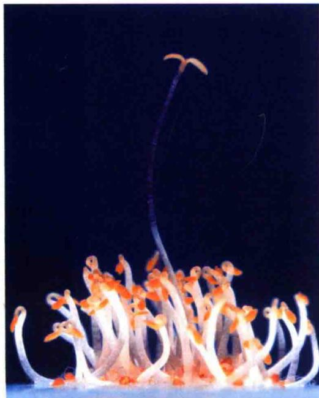  
图22.6 拟南芥etr1突变体的筛选。拟南芥幼苗在乙烯存在的条件下避光生长3天。注意：所有幼苗除一棵外都出现了“三重反应”，即在顶端弯钩的弯曲处膨大，下胚轴受到抑制并显著膨胀，出现水平生长。etr1突变体对乙烯完全不敏感，其生长与未用激素处理的幼苗类似（图片引自MSU/DOE植物研究实验室的K. Stepnitz）。

如第14章讨论结果，细菌双组分系统由组氨酸激酶传感蛋白和反应调节因子组成。ETR1是在真核生物中发现的第一个组氨酸激酶，此后在酵母、哺乳动物和植物中发现了其他组氨酸激酶。植物光敏素（见第17章）与细胞分裂素受体（见第21章）的序列与细菌双组分组氨酸激酶的序列相似。etrl突变体与细菌受体的相似性和对乙烯的不敏感性表明，ETR1可能是乙烯受体。结合实验证实了这一假说（参见Web Topic 22.6）。

拟南芥基因组还编码另外4个与ETR1类似的蛋白质，它们也具有乙烯受体的功能，分别为ETR2、ERS1（ETHYLENE-RESPONSE SENSOR 1）、ERS2和EIN4（图22.7）。与ETR1相同，这些受体可以与乙烯结合，这些基因的错义突变的表型与最初发现的etrl突变体类似，受体不能与乙烯结合，但在没有乙烯的情况下，它通常能作为乙烯应答途径的调节成分而发挥作用。

所有这5个受体蛋白质至少共享以下两个结构域。

（1）N端结构域至少跨膜三次，含有乙烯结合位点，由于乙烯具有疏水性，因此它很容易到达该结合位点。

（2）乙烯受体的C端（其长度占该蛋白质的一半）形成了一个与组氨酸激酶同源的催化结构域。

乙烯受体的一个亚类的C端也含有与细菌双组分接受器结构域相似的结构域。在其他双组分系统中，受体与配体的结合调节组氨酸激酶结构域活性，并使自身的一个保守的组氨酸残基磷酸化，接着磷酸基团从组氨酸转移到接受器结构域的天冬氨酸残基上，组氨酸激酶结构域和接受器结构域常融合为一个蛋白质（图14.4）。组氨酸激酶活性已在乙烯受体之一的ETR1上得到了证明。然而遗传研究表明，与细菌双组分系统不同，ETR1的组氨酸激酶活性并非仅仅起乙烯受体的作用（Wang et al., 2003），这种酶活性似乎对乙烯的信号转导具有更多的细微影响，从而调节乙烯应答（Qu and Schaller, 2004; Binder et al., 2004a）。其他几种乙烯受体缺乏一些关键性氨基酸（图22.7亚家族2），因而不具有组氨酸激酶活性。

在植物中5个拟南芥受体彼此相互作用，形成大的多亚基复合物（Gao et al., 2008）。此外，乙烯结合可能诱导受体通过26S蛋白酶体降解（Kevany et al., 2007）。

与很多细胞膜相关的受体不同，拟南芥ETR1和其他4个乙烯受体定位于内质网。但是，ETR1至少在根里也可能定位于高尔基体细胞器。不论哪种情况，乙烯受体的细胞内定位与乙烯疏水特性相一致，这使它能够自由通过质膜进入细胞。这方面，乙烯类似于动物的某些疏水信号分子，如类固醇和一氧化氮气体，这些信号分子也是与细胞内受体结合的。

  
图22.7 5个乙烯受体蛋白质及其功能结构域示意图。GAF结构域是一个保守的cGMP结合结构域，存在于不同类型的蛋白质中，一般作为小分子结合调节结构域起作用。H和D是参与磷酸化的组氨酸和天冬氨酸残基。注意：EIN4、ETR2和ERS2的组氨酸激酶结构域退化，意味着它们失去了组氨酸激酶催化活性必需的和高度保守的氨基酸。

## 22.2.2 乙烯与其受体高亲和性结合需要辅助因子铜

早在乙烯受体被鉴定之前，科学家们已经预测到，乙烯与受体结合需要一种过渡金属作为辅助因子，很可能是铜或锌。这种预测是基于像乙烯这样的烯烃与过渡金属有很高的亲和力作出的。最近，遗传和生物化学研究已经证实了这些预测。

在酵母中表达ETR1乙烯受体的基因，对其结构和功能的分析表明，铜离子与受体蛋白协同作用，且铜是乙烯与受体高亲和性结合所必需的（Rodriguez et al., 1999）。银离子可以代替铜离子介导乙烯与受体的高亲和性结合，由此表明银离子不是靠干扰乙烯与受体结合，而是靠阻止受体与乙烯结合后蛋白质发生结构改变而抑制乙烯的作用。

乙烯受体发挥作用需要铜离子的体内试验证据来自对拟南芥RAN1（RESPONSIVE-TO-ANTAGONIST1）基因的研究（Hirayama et al., 1999）。ran1的强突变导致不能形成有功能的乙烯受体（Woeste and Kieber, 2000）。克隆RAN1基因后证明，它编码的蛋白质类似于一种酵母蛋白，能帮助辅助因子铜离子转移到铁转运蛋白，RAN1很可能以类似的方式参与和辅助因子铜离子的结合，而这种结合是乙烯受体发挥功能所需的。

## 22.2.3 未结合乙烯的受体在反应中起负调控作用

在拟南芥、番茄和其他大多数植物中，乙烯受体由多基因家族编码。拟南芥5个乙烯受体（ETR1、ETR2、ERS1、ERS2和EIN4）的定点突变（完全失活）研究表明，这些受体的功能是冗余的（Hua and Meyerowitz，1998）。也就是说，失活其中任何一个基因编码的蛋白质并不会有什么效果，但是如果植物的多个受体基因同时被破坏，植物就会表现组成型乙烯反应的表型（图22.8D）。

乙烯受体破坏后，可看到乙烯反应如三重反应组成型表现出来，表明在没有（absence）乙烯的情况下受体是“开”的状态（处于活化状态），即不结合配体（乙烯）时，受体的功能是关闭（shut off）乙烯信号转导途径（图22.8B）。乙烯的结合“关闭”（失活）了受体，从而使信号转导过程得以进行（图22.8A）。

如第14章讨论，乙烯受体作为负调节因子调控信号途径的模式有点违背常理，这与绝大多数动物受体机制不同。动物受体在结合配体后，作为正调节因子在各自的信号转导途径中发挥作用。也就是说，动物受体典型地激活原来非活性的信号通路，引发反应。此外，在没有激素时乙烯受体抑制激素反应。

与失活的受体不同，乙烯受体结合位点的错义突变（最初发现在etr1突变体中）不能结合乙烯，但是仍然可以作为乙烯应答途径的负调控因子起作用。这种错义突变导致植物能够表达一类不被乙烯关闭的一组受体蛋白，并且表现出乙烯显性不敏感表型（dominant ethylene-insensitive phenotype）（图22.8C）。即使乙烯关闭所有正常的受体，但无论乙烯是否存在，突变体的受体都可以将信号传递到细胞，抑制乙烯的反应。番茄中受体的显性乙烯不敏感突变体是无法成熟突变体，它名副其实，果实完全不能成熟。

这种负信号的结果是乙烯受体水平降低增加组织对乙烯的敏感性。因此，功能性乙烯受体是一个重要的机制，通过这一机制植物调节对激素的敏感性。例如，在番茄果实中，两个乙烯受体响应乙烯后能被26S蛋白酶体快速降解，导致乙烯敏感性增加（Kevany et al., 2007）。这对于协调番茄果实的整体成熟时间非常重要。

B

C  
A  
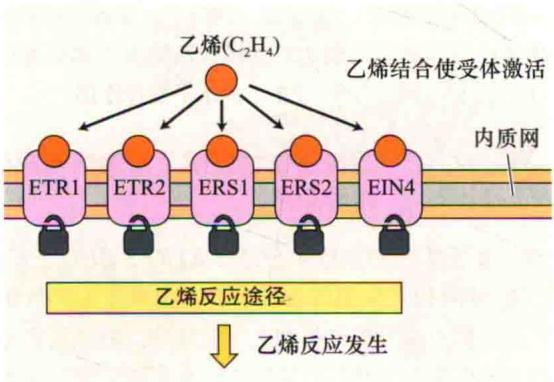

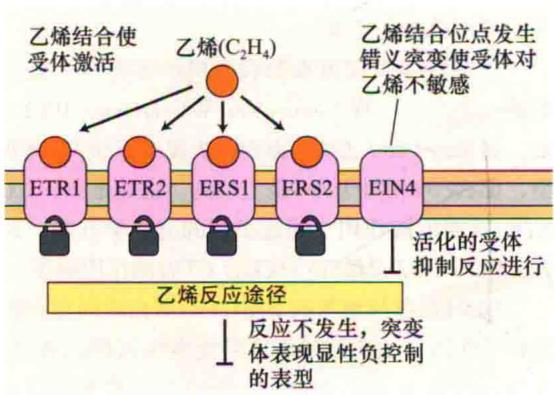

D  
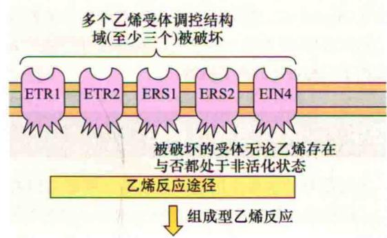  
图22.8 基于受体突变体表型所做的乙烯受体作用模型。A. 野生型植株中乙烯与受体结合后使受体失活，出现乙烯反应。B. 无乙烯时，受体作为反应的负调控因子发挥作用。C. 错义突变干扰乙烯与受体结合，但是调控位点处于活化状态，突变体出现显性负控制表型。D. 突变破坏调节位点，出现组成型的乙烯反应。

## 22.2.4 丝氨酸、苏氨酸蛋白激酶也参与乙烯信号转导

通过筛选得到了隐性ctrl（constitutive triple response 1，即没有乙烯存在时组成型表现三重反应）突变体，它能组成型激活乙烯反应（图22.9）。隐性突变体激活（activation）乙烯反应的事实说明野生型植物中CTR1蛋白与乙烯受体类似，也作为负调控因子（negative regulator）在反应途径中起作用（Kieber et al., 1993）。

CTR1似乎与Raf相关，Raf是一种促分裂原活化蛋白激酶（mitogen-activated protein kinase kinase, MAPKKK），在从酵母到人的所有生物中，它是参与多种外部调控信号和发育信号传递的丝氨酸/苏氨酸蛋白激酶（见第14章）。动物细胞中，MAP激酶级联的最终产物是磷酸化的转录因子，后者调控核基因表达。有证据表明，在乙烯信号通路MAP激酶级联反应处于CTR1的下游（Yoo et al., 2008），但是在这方面还没有达成共识。

各种证据表明，CTR1蛋白直接与乙烯受体相互作用，形成乙烯感受蛋白质复合物的一部分。遗传学分析显示，CTR1与乙烯受体相互作用为CTR1的功能所必需，因为CTR1突变阻断了这种相互作用；但此外，突变不影响受体蛋白质，只是使植物中的CTR1失活（Huang et al., 2003）。ETR1和乙烯其他受体调控CTR1的确切机制仍不清楚。

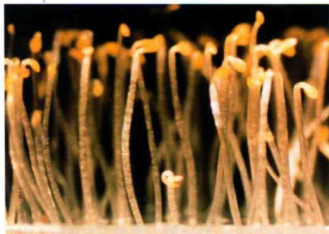  
图22.9 筛选拟南芥组成型“三重反应”突变体。拟南芥幼苗在通气和黑暗条件下生长3天（未施加乙烯）。在众多较高的野生型幼苗中ctr1突变体幼苗非常明显（J. Kieber惠赠）。

## 22.2.5 EIN2编码一种跨膜蛋白

ein2（ethylene-insensitive 2）突变阻断了拟南芥幼苗和成熟植株的所有乙烯反应。EIN2基因编码的蛋白质包含12个跨膜区，与动物阳离子转运体家族的N-RAMP（natural resistance-associated macrophage protein）蛋白非常类似（Alonso et al., 1999），表明EIN2可能作为一种通道或者孔道蛋白发挥作用。然而，到目前为止，研究者们没有证明这种蛋白质具有转运活性，而且该蛋白质在细胞内的确切位置也不清楚。EIN2蛋白被26S蛋白酶体快速降解，这一过程被乙烯抑制（Qiao et al., 2009）。因为EIN2改变乙烯的敏感性，EIN2的降解为进一步研究植物细胞对乙烯的敏感性提供了一种可能的调节机制。

## 22.3 乙烯调控基因表达

乙烯信号的主要作用之一是改变各种靶基因的表达。乙烯影响许多基因mRNA的转录水平，包括纤维素酶基因，与成熟及乙烯生物合成相关的基因。已从乙烯调控基因中鉴定出乙烯反应元件（ethylene response element）或ERE的调控序列。

## 22.3.1 特异转录因子调控乙烯信号途径相关基因表达

乙烯对基因表达起作用的关键成分是转录因子EIN3家族（Chao et al., 1997）。拟南芥中至少有4类EIN3基因，在番茄和烟草中也鉴定出了它们的同源基因。在对乙烯信号作出应答时，EIN3的同源二聚体或其密切关联蛋白结合到被乙烯快速诱导表达的靶基因的启动子区上，如ERF1（ETHYLENE RESPONSE FACTOR 1），从而激活了这些基因的转录（Solano et al., 1998）。

ERF1编码一种转录因子，它属于乙烯反应元件结合蛋白（ERE-binding protein，EREBP）家族。最早在烟草中鉴定出EREBP是ERE序列的结合蛋白（Ohme-Takagi and Shinshi，1995），应答乙烯时一些EREBP的表达被快速上调。拟南芥中EREBP是一个非常庞大的基因家族，但只有少数几个基因受乙烯诱导。

EIN3蛋白稳定性的调节在乙烯信号转导和调控乙烯生物合成途径中发挥重要作用。两个冗余F-box蛋白EBF1和EBF2（EIN3-binding F-box 1和2）能促进泛素化作用，EIN3被标记后就被26S蛋白酶体降解（见第14章）。乙烯可能通过MAP激酶对EIN3的磷酸化来抑制依赖于EBF1/

EBF2的EIN3降解（Yoo et al., 2008），导致EIN3积累及乙烯调控基因随后的表达，这样，乙烯至少部分通过调控EIN3和EIN3类蛋白质（EIL）的水平发挥作用。

## 22.3.2 遗传上位性表明了乙烯信号成分的转导顺序

通过基因突变技术分析了ETR1、EIN2、EIN3和CTR1彼此相互作用的方式（如上位顺序），从而确定了这些蛋白质发挥作用的上下位顺序。将相反表型的两种突变体杂交，从 $F_{2}$ 中鉴定出具有两种突变的株系（双突变体），研究者从乙烯应答突变体中得到了一个ctr1双突变株系（它是组成型表达的乙烯应答突变体），属于乙烯不敏感突变体。

双突变体表现出来的表型揭示出哪一个突变相对另外一个是上位的（Avery and Wasserman，1992）。例如，如果etrl ctrl这种双突变体表现出了ctrl单突变的表型，那么ctrl相对于etrl是上位的。由此推出，CTR1在ETR1下游发挥作用。通过类似的遗传学方法，人们确定了ETR1、EIN2和EIN3相对于CTR1的作用顺序。

ETR1蛋白与预测的下游CTR1蛋白之间存在物理上的相互作用，表明乙烯受体可能直接调控CTR1激酶的活性（Clark et al., 1998）。图22.10的模型对以上内容和其他实验数据作了总结。已经发现在其他植物中存在与这类拟南芥的信号转导相关基因的类似基因（参见Web Topic 22.7）。

这个模型仍然不完全，在这个途径中尚有其他一些乙烯应答组分有待鉴定。此外，了解这些蛋白质的生物化学特性及如何发生相互作用的工作才刚刚开始；且更多的研究将聚焦在系统地揭示乙烯信号感受和转导的分子基础。

## 22.4 乙烯在植物发育和生理反应中的作用

众所周知，乙烯是因为其对植物幼苗生长和果实成熟的效应而被发现的。乙烯调节了植物的许多反应，包括种子萌发、细胞伸长、细胞分化、开花、衰老和脱落。我们将在这一小节详细讨论乙烯的表型效应。

## 22.4.1 乙烯促进某些果实成熟

日常生活中，果实成熟（fruit ripening）指果实达到了可以食用的程度。果实成熟要经过许多转变，如细胞壁被酶解后果实变软、淀粉水解、糖分积累和包括单宁等某些有机酸及苯酚类化合物的消失。

从植物角度看，果实成熟意味着植物种子做好了

失活的CTR1激活可跨膜蛋白EIN2

在没有乙烯的情况下，ETR1和其他乙烯受体激活CTR1激酶，可能通过MAPK级联抑制了乙烯的反应。乙烯与ETR1二聚体结合，使其失活，导致CTR1失活  

激活的EIN2活化了转录因子EIN3家族，后者诱导ERF1表达，该转录级联的活化导致大量基因表达发生改变，最终改变了细胞的功能

散播的准备。种子的散播依赖于动物的摄食，此时成熟（ripeness）与可食性（edibility）成了很好的同义词。色彩亮丽的花色素和类胡萝卜素通常积累在这些果实的表面，使果实格外醒目。然而，对于依赖机械或其他方式散播的种子，果实成熟意味着这种果实成熟后干燥裂开。

由于果实成熟在农业上很重要，因此有关果实成熟的研究大多集中在可食性果实上。长期以来，人们认为乙烯是促进可食性果实成熟的植物激素，这些果实暴露在乙烯中能加快成熟进程，伴随着果实成熟，乙烯的产量显著增加。然而，大量研究表明，并不是所有果实都对乙烯有反应。

## 22.4.2 响应乙烯的果实表现为跃变型

乙烯催熟的果实，在成熟前具有呼吸作用上升的特征，这个过程称为跃变（climacteric）。呼吸作用上升前这些水果的乙烯含量迅速出现一个峰值（图22.11）。出现呼吸跃变的代表性水果有苹果、香蕉、鳄梨和番茄等。

图22.10 拟南芥中乙烯信号转导模型。乙烯结合到ETR1受体上，该受体是内质网上的内在膜蛋白。细胞中存在乙烯受体的多个异构蛋白体，这里仅用ETR1简单表示。受体通过二硫键形成二聚体。乙烯通过辅助因子铜与受体跨膜结构域结合，RAN1则使辅助因子铜进入乙烯受体与其结合。

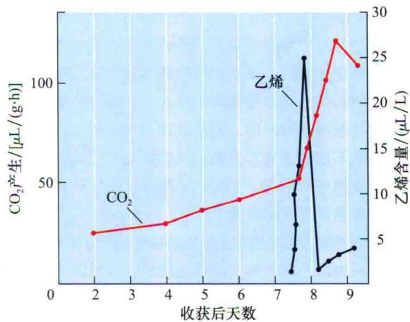  
图22.11 乙烯产生和呼吸作用。香蕉成熟期呼吸速率出现典型跃变，证据是 $CO_{2}$ 显著增加。乙烯生成量的骤然上升先于 $CO_{2}$ 量的增加，表明乙烯是导致成熟的激素（引自Burg and Burg, 1965）。

相比之下，柑橘和葡萄等果实并未表现出呼吸作用增强和乙烯产量增加，它们称为非跃变（nonclimacteric）果实。其他呼吸跃变和非呼吸跃变果实见表22.1。

表22.1 呼吸跃变和非呼吸跃变果实

<table><tr><td>呼吸跃变</td><td>非呼吸跃变</td></tr><tr><td>苹果</td><td>青椒</td></tr><tr><td>鳄梨</td><td>樱桃</td></tr><tr><td>香蕉</td><td>柑橘</td></tr><tr><td>甜瓜</td><td>葡萄</td></tr><tr><td>荔枝</td><td>菠萝</td></tr><tr><td>无花果</td><td>豌豆</td></tr><tr><td>芒果</td><td>草莓</td></tr><tr><td>橄榄</td><td>西瓜</td></tr><tr><td>桃</td><td></td></tr><tr><td>梨</td><td></td></tr><tr><td>柿子</td><td></td></tr><tr><td>李子</td><td></td></tr><tr><td>番茄</td><td></td></tr></table>

外施乙烯处理呼吸跃变果实可以诱导更多的乙烯产生，这种作用称为自我催化（autocatalytic）。在呼吸跃变植物中，乙烯通过以下两个系统产生。

系统1（system 1）：乙烯在植物营养组织中发挥作用，并且抑制自身的生物合成。

系统2（system 2）：乙烯在呼吸跃变果实成熟及某些植物花瓣衰老过程中发挥作用，并刺激自身生物合成，即可以自我催化。

人们认为系统2中乙烯产生的正反馈调节一旦启动，就会导致整个果实完全成熟。当用乙烯处理未成熟的呼吸跃变果实时，果实的呼吸跃变被迅速启动。相比之下，用乙烯处理非呼吸跃变果实，乙烯虽然发挥了促进果实呼吸增强的作用，但是处理并不能引发内源乙烯增加，也不能促进果实成熟。人们阐明了乙烯在呼吸跃变果实成熟中的作用，并将它运用于实际生产中，使果实同步成熟或者使其延期成熟。

尽管外源乙烯对果实成熟的影响效果既清楚又直观，但是要在内源乙烯和果实成熟之间建立一种因果关系是相当困难的。虽然乙烯生物合成的抑制剂（如AVG）或乙烯作用的抑制剂（如 $CO_{2}$ 、MCP或 $Ag^{+}$ ）能延迟甚至阻止果实成熟，但确切证明乙烯为果实成熟所必需的证据来自转基因实验，在反义表达ACC合酶或ACC氧化酶的转基因番茄中（参见Web Topic 22.8），乙烯的生物合成受到抑制，果实成熟完全受阻，外施乙烯则能够使果实成熟的特性得以恢复（Oeller et al., 1991）。

## 22.4.3 无法成熟番茄突变体的受体不能与乙烯结合

用无法成熟（never-ripe）番茄突变体进行的研究进一步证明乙烯为果实成熟所必需。无法成熟番茄突变体名副其实，果实完全不能成熟。分子生物学实验分析证实，在无法成熟番茄中，由于乙烯受体发生突变，使其不能与乙烯结合（Lanahan et al., 1994）。这个分析和通过反义技术抑制乙烯生物合成来抑制果实成熟的实验都清楚证明了乙烯在果实成熟方面的作用，也为人们利用生物技术控制果实成熟开辟了新的途径。

利用番茄互补DNA（cDNA）微阵列证明番茄的许多基因在果实成熟过程中受到显著调控。果实成熟期，细胞壁水解，果实变软，叶绿体丧失，类胡萝卜素和番茄红素大量合成，果实由绿变红，与此同时，一些与口味和香味相关的化合物生成。

运用基因工程方法得到了不能产生乙烯的转基因番茄。分析转基因和野生型番茄的mRNA，发现果实成熟过程中植物体内基因的表达至少受到以下两个独立途径的调节。

（1）乙烯依赖途径（ethylene-dependent pathway），包括番茄红素和挥发性的芳香复合物合成、ACC合酶及呼吸代谢酶类的生物合成。

（2）乙烯不依赖的发育途径（developmental, ethylene-independent pathway），包括编码ACC氧化酶和叶绿素酶的一些基因。

因此不是所有与番茄果实成熟有关的发育过程都依赖于乙烯。

## 22.4.4 根中产生的ACC运输到茎叶造成叶的偏上性生长

叶柄上面一侧（近轴面）生长速度快于叶柄下面一侧（远轴面）导致叶子卷曲向下生长的现象称为偏上性（epinasty）（图22.12）。乙烯和高浓度生长素诱导偏上性生长，而且已经证实，生长素诱导乙烯的产生，起间接作用。正像我们在本章后面讨论的那样，各种胁迫条件如盐胁迫或病原菌侵染都能增加乙烯的生成量并诱导偏上性生长。

番茄及其他双子叶植物受到水淹（涝害）或根部置于无氧条件下时茎叶中的乙烯合成都会增加，导致偏上性生长。由于根部感受环境胁迫，茎叶对胁迫作出反应，因此信号必须从根部传递到茎叶，这个信号就是乙烯的直接前体ACC。对番茄根进行1\~2天水淹处理，其木质部汁液中ACC水平显著增高（图22.13）（Bradford and Yang，1980）。

  
图22.12 乙烯处理导致番茄发生偏上性生长或叶片向下弯曲（右），原因是叶柄上侧细胞生长快于下侧细胞（S. Gepstein 惠赠）。

  
图22.13 番茄遭受涝害时木质部汁液中ACC和叶柄乙烯产生量的变化。ACC在根中合成，但发生涝害时缺乏氧气，它转变为乙烯的速度很慢。ACC通过木质部运输到茎叶，在茎叶中转变为乙烯。气态乙烯不能运输，因此它通常影响紧靠其合成部位的植物组织。而乙烯的前体物质ACC能够运输，可以在远离ACC合成的部位产生乙烯（引自Bradford and Yang，1980）。

涝害发生时，土壤中的空气间隙充满水，氧在水中扩散的速度很慢，所以被水淹的根部周围，氧的浓度骤减。无氧根部积累的ACC通过蒸腾流被运输到地上部，在地上部有氧的情况下ACC很容易转变为乙烯（图22.2）。

## 22.4.5 乙烯诱导细胞横向扩张

超过0.1 $\mu$ L/L的乙烯能够抑制幼苗纵向生长，促进横向伸长，从而改变其生长特性，导致下胚轴或上胚轴膨大。对于双子叶植物来说，乙烯的这些效应很普遍，导致了部分三重反应（triple response）。在拟南芥中，三重反应指的是下胚轴的抑制和膨胀、根伸长的抑制和幼苗顶端弯钩的过分弯曲（图22.5）。

正如在第15章所讨论的那样，植物细胞伸展的方向由细胞壁中纤维素微丝的方向决定，横向微丝强化了横向的细胞壁，因而膨压促进细胞纵向伸长。微丝的方向由皮层细胞质中皮层微管排列的方向决定。在典型的伸长细胞中，皮层微管横向排列，导致了纤维素微丝的横向排列。

幼苗期植物发生三重反应时，下胚轴微管的横向排列方式被破坏，微管转为纵向排列，微管蛋白这种90°大转向，直接导致了纤维素微丝沉积发生类似的转变。新形成细胞壁沉积作用纵向增强而横向没有增强，因而促进了横向扩张而不是纵向伸长。

微管是如何由一个方向转变为另一个方向的呢？为了研究该现象，人们向豌豆（Pisum sativum）表皮细胞中注射了共价结合荧光染料的微管蛋白，荧光“标签”并不干扰微管的组装。运用这种方法，研究人员能够在聚焦细胞许多层面的激光共聚焦显微镜下检测活体细胞微管的组装。

人们发现，微管由横向转变为纵向并不是通过横向微管完全解聚、新的纵向微管再聚合形成的，而是由于特定部位一些非横向排列微管数量增加导致的（图22.14）。其邻近微管则采用了新的排列方式，于是，在微管采用一致的纵向排列方式之前的某个阶段，不同排列方式出现了共存现象（Yuan et al., 1994）。虽然这些有关微管重新定向的研究结果来自植物的伤害反应而不是乙烯诱导反应，但是可以推测，乙烯通过相似的机制诱导了微管的重排。

横向微管  
  
纵向微管  
图22.14 豌豆茎表皮细胞对伤害发生反应，微管发生再定位，由横向排列转为纵向排列。将能够进入微管的微管蛋白与若丹明结合物微注射到活的表皮细胞中，大约在间隔6 min的时间内皮层微管经历由完全的横向转变为倾斜直到纵向的过程。重新定向时，伴随原方向上微管的消失，在新方向上出现新的不同微管片段（引自Yuan et al., 1994，图片由C. Lloyd惠赠）。

B  

## 22.4.6 乙烯抑制生长的两个不同阶段

如上所述，乙烯对黑暗成长的幼苗下胚轴伸长有抑制作用。对该反应细致的动力学分析表明抑制作用发生在两个不同的阶段（图 22.15A）（Binder et al., 2004a）。

首先，快速抑制阶段发生在接触乙烯的15 min里，大约维持30 min。

第二次生长抑制接着发生，下胚轴伸长达到一个新的稳定的生长水平，这要比没处理的幼苗生长慢。

这两阶段的生长显著不同：第一阶段较第二阶段对乙烯的敏感性更强；EIN2在两个阶段都发挥作用。但是EIN3/EIL1转录因子只在第二阶段起作用（图

A

22.15B）（Binder et al., 2004b）。

接着去除乙烯，在90 min内幼苗能完全恢复到未处理的生长水平（Binder et al., 2004a）。这个现象如何与乙烯结合受体的半衰期是11 h这一事实相一致呢？我们知道，一些乙烯受体的更新受到乙烯结合所促进。因此，当乙烯从幼苗中去除，结合了乙烯的受体被快速降解并被新合成的未结合乙烯的受体所取代。这些新合成的受体是乙烯信号通路的负调节因子（图22.8）。因此，即使一些受体仍然与乙烯相连，这些未结合乙烯的受体也能迅速地关闭乙烯反应（如抑制下胚轴伸长）。亚家族1受体的组氨酸激酶活性在乙烯去除后的恢复阶段可能发挥了重要作用。

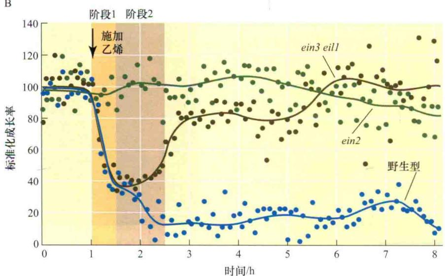  
图22.15 施加和去除乙烯对黑暗培养的拟南芥幼苗下胚轴伸长影响的动力学分析。A. 首先进行乙烯处理继而去除乙烯条件下拟南芥野生型黄化苗的生长率，施加和去除乙烯的时间点用箭头表示。注意：乙烯处理过程中生长率下降分为两个不同的阶段。B. 进行乙烯处理继而去除乙烯条件下拟南芥野生型、ein2和ein3eil1黄化苗的生长率，施加和去除乙烯的时间点用箭头表示。注意：在ein3eil1拟南芥突变体中第一阶段反应与野生型一致，但是无第二阶段反应（改编自Binder et al., 2004a, 2004b）。

通常双子叶植物黄化幼苗的特征是，在紧临其茎端后面的部位形成一个弯钩（图22.1和图22.5）。这个弯钩有利于幼苗穿透土壤，保护幼嫩的顶端分生组织。

像偏上性生长一样，弯钩的形成和维持均依赖于乙烯诱导的不对称生长。弯钩的闭合形状是由于茎外侧生长速度远快于内侧生长速度导致的。当弯钩暴露在白光下时，由于茎内侧生长速度加快，弯钩打开，内、外侧的生长速度相等（参见附录2）。红光诱导弯钩打开，而远红光可以逆转红光的效应，说明光敏色素是参与该反应的光受体（见第17章）。光敏色素与乙烯的密切配合控制了弯钩的开放。只要黑暗条件下弯钩组织产生乙烯，弯钩内侧细胞的生长就受到抑制。红光抑制乙烯形成，促进内侧细胞生长，于是弯钩打开。

拟南芥生长素不敏感突变体axr1幼苗顶端弯钩无法形成，使用生长素极性运输抑制剂NPA（N-1-naphthylphthalamic acid）处理野生型幼苗能阻止顶端弯钩形成，表明生长素在维持弯钩的结构中起作用。与内侧组织相比，外侧组织生长速度快，反映出了一种依赖于乙烯的生长素浓度梯度，这类似于向光弯曲中茎侧向的生长素浓度梯度（参见第19章和Web Topic 22.9）。

## 22.4.8 乙烯可打破某些植物种子和芽的休眠

种子在正常条件下（水分、氧气、温度均适宜生长）不萌发的现象称为休眠（见第23章）。乙烯可打破某些种子如谷类种子的休眠，引起萌发。除打破休眠外，乙烯还可以提高某些植物种子的萌发率。在花生（Arachis hypogaea）中，乙烯的产生和种子的萌发密切相关。乙烯同样可以打破芽的休眠，有时人们利用乙烯促使土豆和其他植物块茎发芽。

## 22.4.9 乙烯促进水生植物伸长生长

虽然乙烯通常抑制茎的伸长，但乙烯能够促进各种水下植物或部分水下植物茎和叶柄的伸长，包括双子叶植物石龙芮（Ranunculus sceleratus）、杏菜（Nymphoides peltata）、水马齿（Callitriche platycarpa）和水毛茛（Regnellidium diphyllum）。农业上另一个重要的例子是禾谷类深水稻（Oryza sativa）（见第20章）。

水淹可诱导这些植物节间和叶柄快速伸长，使叶片和茎上部留在水面上，乙烯处理的效果与水淹相似。

水下植物快速生长的原因是植物组织产生了乙烯。

虽然缺乏氧气，乙烯合成量减少，但是水下乙烯因扩散而丧失的情况受到抑制，植物水下部分依靠通气组织供应充足氧气，保证了植物生长和乙烯的合成（见第26章）。

在深水稻中，乙烯通过提高节间分生组织细胞赤霉素（GA）的合成量和对赤霉素的敏感性刺激节间伸长，这些细胞应答乙烯反应，对赤霉素的敏感性增加，这是由于GA有效拮抗剂脱落酸（ABA）的水平下降所致。

最近在深水稻中分离了参与该反应的SNORKEL1和SNORKEL2，它们编码了乙烯反应中的两个转录因子（Hattori et al., 2009）。在水淹环境中，乙烯积累并诱导SNORKEL1和SNORKEL2表达，从而使节间显著伸长。

## 22.4.10 乙烯诱导根和根毛形成

乙烯能够诱导植物叶片、茎、花梗，甚至其他根形成不定根。切下番茄和矮牵牛的营养茎叶后，外施生长素可以使其产生许多不定根，但生长素对乙烯不敏感突变体作用很小或者几乎没有作用，说明生长素对不定根的促进作用由乙烯介导（Clark et al., 1999）。乙烯也在冠瘿组织的形态建成中起作用（参见Web Essay 22.1），是豆科根瘤形成的负调控因子（参见Web Topic 22.10）。

在有些物种中乙烯对根毛的形成起正调控作用（图22.16）。人们在拟南芥中对这种调控进行了深入研究，发现拟南芥根毛通常位于皮层细胞接合处上面的表皮细胞中（Dolan et al., 1994）。用乙烯处理根后，并非位于皮层细胞接合处上面的细胞分化形成根毛细胞，而在异常的位置产生了根毛（Tanimoto et al., 1995）。在乙烯抑制剂（如 $\mathrm{Ag^{+}}$ ）存在时，幼苗根毛形成减少，乙烯不敏感突变体也表现出同样的表型。这些现象表明，乙烯正调控根毛形成。

## 22.4.11 乙烯在一些物种中调控开花和性别决定

尽管乙烯抑制许多植物开花，然而乙烯可以诱导菠萝及其亲缘物种开花，在商业上乙烯用来诱导菠萝果实同步成熟。其他植物（如芒果）的花也受乙烯诱导。若同株植物既有雌花又有雄花（雌雄同株），则乙烯可以改变发育中花的性别，如乙烯能促进黄瓜雌花形成。近来，甜瓜里一个与雄性两性同株（开雄花和两性花的植物）有关的基因被认为编码了一个ACC合酶（Boualem et al., 2008）。这个ACC合酶活性降低突变体导致在这个雄性两性同株系上只形成两性花。

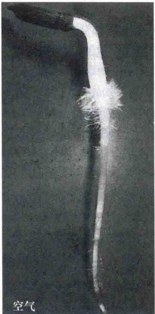

  
图22.16 乙烯促进生菜幼苗根毛发生。拍照前用空气（左）或用10 ppm乙烯（右）处理2天的幼苗24 h。注意：乙烯处理的幼苗根毛多（引自Abeles et al., 1992, F. Abeles惠赠）。

## 22.4.12 乙烯促进叶片衰老

如第16章所述，衰老是一种可遗传的程序化发育过程，它影响植物的所有组织。植物生理方面的证据表明，乙烯和细胞分裂素在控制叶片衰老中起以下作用。

（1）外施乙烯或ACC（乙烯前体）加速叶片衰老，外施细胞分裂素延迟叶片衰老（见第21章）。

（2）乙烯产生量增加与叶绿素丧失及褪色有关，它们分别是叶与花衰老的特征；而叶中细胞分裂素水平与衰老的起始呈负相关。

（3）乙烯合成的抑制剂（如AVG或 $Co^{2+}$ ）和乙烯作用的抑制剂（如 $Ag^{+}$ 或 $CO_{2}$ ）阻碍叶片和花的衰老（图22.17）。

综合上述生理研究表明，衰老受乙烯和细胞分裂素平衡的调节。此外，脱落酸（ABA）在控制叶片衰老方面也发挥一定作用。有关ABA在衰老方面的作用，我们将在第23章中讨论。

乙烯调节叶片衰老的直接证据来自对拟南芥进行的分子遗传学研究。根据乙烯不敏感表型，人们鉴定出了乙烯不敏感突变体，如etr1（ethylene-resistant 1）和ein2（ethylene-in-sensitive 2）。与乙烯在叶片衰老中的作用一致，etr1和ein2突变体的生长不仅在萌发早期受到影响，而且在整个生活周期中包括衰老过程都受到了影响（Zacarias and Reid，1990；Hensel et al.，1993；Grbi and Bleecker，1995）。与野生型相比，乙烯突变体叶绿素和其他叶绿体组分保持的时间更长。但由于突变体的生长时间仅比野生型增加了 $30\%$ ，因此乙烯可能增加了衰老的速度，而不是作为起始衰老的发育开关发挥作用（参见Web Topic 22.11）。

## 22.4.13 乙烯介导某些防御反应

如果病原菌与寄主植物在遗传上具有相容性，则植物被病原菌侵染后就会感病。然而，植物受到病原菌侵染时，无论它们存在相容性（致病的）还是非相容性（非致病的）的相互作用，乙烯的产生量通常都会增加。

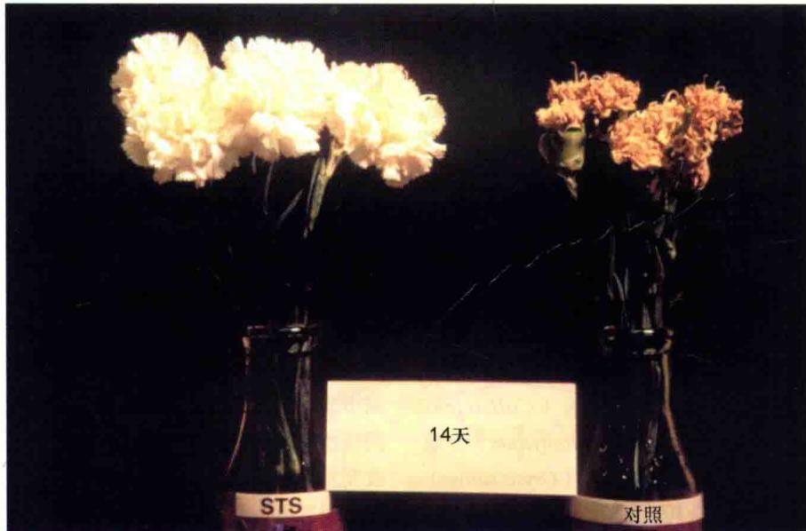  
图22.17 抑制乙烯作用后花的衰老受到抑制。将康乃馨切花放在含乙烯抑制剂硫代硫酸银（STS）去离子水中（左）14天后与对照（右）相比，其衰老的速度显著延迟。乙烯作用抑制导致花衰老显著抑制（引自Reid，1995，M.Reid惠赠）。

乙烯不敏感突变体被发现以后，人们利用其确定乙烯对各种病原菌的作用。研究结果表明，乙烯在致病中的作用很复杂，这依赖于寄主与病原菌特定的相互作用，例如，即使抑制植物对乙烯的应答，也并不影响拟南芥对假单胞（Pseudomonas）细菌或烟草对烟草花叶病毒的抗性反应。然而，在这些寄主与病原菌相容的相互作用中，即使病原菌的生长不受影响，消除植物对乙烯的应答也能阻止病症的发展。

此外，乙烯（与茉莉酸一起）（见第13章）为一些植物抗病基因激活所必需。另外，乙烯不敏感的烟草和拟南芥突变体对某些通常不具有致病性的营养坏死（生长在死的寄生组织上）土壤敏感。因此，乙烯与茉莉酸在植物抵御营养坏死病原菌侵染中共同发挥重要作用。另外，乙烯在植物对活体营养（生长在活体组织上）病原菌反应中不起主要作用。

A  
B  

## 22.4.14 乙烯在离层细胞中的作用

叶片、果实、花及其他植物器官脱离植物称为脱落（abscission）（参见Web Topic 22.12）。脱落发生在称为离层（abscission layer）的一些特殊细胞层，在器官发育过程中，离层在形态建成和生物化学方面发生分化。细胞壁降解酶如纤维素酶和多聚半乳糖醛酸酶使离层细胞壁强度变弱（图22.18）。

  
图22.18 凤仙花（Impatiens）离层形成。A. 在叶脱落过程中，由于离层区的二或三层细胞的细胞壁水解酶的增加，使得细胞壁降解。B. 原生质体脱离细胞壁的束缚，膨大，促使木质部管状细胞分离，促使叶片从茎部分离（改编自Sexton et al., 1984）。

气体乙烯导致桦树叶子脱落，如图22.19所示，两棵树都已在50 ppm的乙烯中熏3天，左侧野生型桦树大部分叶子已脱落，右侧桦树是转化拟南芥乙烯受体

ETR1基因的转基因植株，etrl为显性突变（前面已讨论），转基因桦树对乙烯处理没有反应，因此乙烯处理后叶片不脱落。

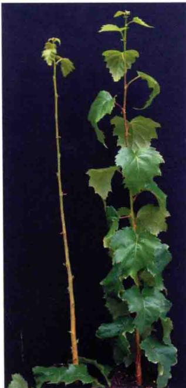  
图22.19 乙烯对桦树（Betula pendula）叶子脱落的影响。左侧为野生型植物；右侧为转化了拟南芥乙烯受体突变基因etr1的转基因植物。基因的表达受到本身启动子的转录控制。突变体桦树的特性之一是用乙烯（50 ppm）熏蒸植株3天后叶子没有脱落（引自Vahala et al., 2003）。

乙烯主要调节脱落过程，而生长素则作为乙烯效应的抑制剂起作用（见第19章）。然而，生长素浓度超过最适浓度后则刺激乙烯生成，因此人们将生长素类似物作为落叶剂使用，例如，“橙剂”的活性组分2，4，5-T在越南战争中作为落叶剂被广泛应用，它的作用是通过增加乙烯的生成量来刺激叶片脱落。

激素控制的叶片脱落过程可分为以下连续的三个不同阶段（图22.20）（Reid，1995）。

（1）叶保持期（leaf maintenance phase）：在植物感受任何启动脱落的信号（内部的或外部的）之前，植物的叶仍然是有功能的健壮的叶。从叶片到茎干存在的生长素浓度梯度使离层对乙烯不敏感。

（2）脱落诱导期（shedding induction phase）：叶片中生长素浓度梯度的减小或消失（通常与叶片衰老相关）导致脱落区对乙烯敏感，通过干扰叶片中生长素的合成和（或）运输加快叶片衰老，从而促进叶片脱落。

（3）脱落期（shedding phase）：脱落区中对低浓度内源乙烯极为敏感的植物细胞不断合成和分泌纤维素酶及其他细胞壁降解有关的酶，导致叶片脱落。

叶保持期的早期，来自叶片的生长素通过使脱落区

  
叶保持期  
叶片中高浓度生长素降低了  
脱落区对乙烯的敏感性，阻止了叶片脱落  
脱落诱导期
叶片中生长素浓度降低，增加了乙烯的产量和脱落区对乙烯的敏感性，脱落期开始  
脱落期
水解细胞壁多糖的酶合成后导致细胞分离和叶片脱落

图22.20 叶片脱落时生长素和乙烯作用的示意图。脱落诱导期，生长素水平下降，乙烯水平升高。激素平衡的变化增加了靶细胞对乙烯的敏感性（引自Morgan，1984）。

细胞对乙烯不敏感阻止叶片脱落。人们早就认识到将叶片（生长素产生位点）去掉后会促进叶柄脱落。用外源生长素处理除去叶片的叶柄可以延迟脱落。然而，在脱落区的近轴侧（靠近茎的一侧）施用生长素却能加快脱落。这些结果表明，控制脱落区细胞敏感性的不是生长素的绝对浓度，而是生长素的浓度梯度（gradient）。

在脱落诱导期，叶片中生长素的量减少，乙烯水平升高。乙烯似乎通过减少生长素合成和运输及增加生长素降解降低其活性。自由态生长素浓度的降低增加了特定靶细胞对乙烯的反应。某些编码特异水解细胞壁多糖和蛋白质酶的基因表达受到诱导，这是脱落期的特点。

定位于脱落区的靶细胞合成了纤维素酶和其他降解多糖的酶，并将它们分泌到细胞壁，这些酶的活性导致细胞壁松弛、细胞分离和脱落。

## 22.4.15 乙烯在商业上具有重要用途

乙烯调控植物许多生理发育过程，是农业上使用最广泛的植物激素之一。生长素和ACC都能导致天然乙烯生物合成，在某些情况下可应用于农业生产。由于乙烯极易扩散，其作为气体很难在田间利用。但是，如果使用释放乙烯的化合物，这种困难就可以被克服。应用最广泛的乙烯化合物——乙烯利，即2-氯乙基磷酸，发现于20世纪60年代，并被冠以各种商业名称，如Ethrel。

以水溶液形式喷洒到植物上的乙烯利很容易被吸收，乙烯利在植物体内也很容易运输，它通过一种化学反应缓慢释放乙烯，发挥作用。

乙烯利能加快苹果、番茄的果实成熟，促进柑橘果实失绿，促使菠萝同步开花和同步结实，并促进花和果实脱落，它可以使棉花、樱桃和胡桃果实变得干瘪或脱落；乙烯利在黄瓜上可以用来提高雌花数量，防止自花授粉，提高产量，也可以用来抑制某些植物末端生长，促进侧向加粗，缩短花梗。

人们通过果实贮藏设施降低贮藏室空气中氧的浓度和温度，从而抑制乙烯产生，延长果实贮藏时间。较高浓度的 $CO_{2}$ （3%\~5%）也能够抑制乙烯的催熟作用。利用低压（抽真空）从贮藏室中除去乙烯和氧，可降低果实成熟的速度，阻止果实过度成熟。乙烯连接抑制剂Ethylbloc®用于延长多种跃变型果实的贮藏时间。

据估计，美国所采收切花的15%\~35%会因为采收后损坏被扔掉，乙烯合成和作用的特异抑制剂在切花采收后的保存中很有用（参见Web Topic 22.13）。

乙烯调节果实成熟，叶和花的衰老凋谢过程，根毛发育和结节产生，苗生长和弯钩打开，至少部分依赖于基因表达变化。

## 乙烯结构、合成和测定

· 乙烯气体在双子叶植物中诱导三重反应（图22.1和图22.5）。

· 乙烯前体是甲硫氨酸，顺次转化为S-腺苷甲硫氨酸、ACC和乙烯（图22.2）。乙烯在它的合成位点附近起作用，乙烯的中间前体ACC能够被运输，因此能够在远离它的合成位点产生乙烯。

· 乙烯合成被一些因素所促进，包括发育状态、环境条件、其他植物激素和物理化学刺激因子（图22.3）。

· 乙烯的合成和感知能够被抑制剂拮抗，其中一些抑制剂已经进行商业应用（图22.4）。

## 乙烯信号转导途径

· 拟南芥黄化苗的三重反应表型有助于分辨功能性

乙烯受体基因和其他信号元件（图22.5\~图22.7）。

· 乙烯受体定位于内质网和高尔基体细胞器。

· 乙烯通过铜辅助因子连接到受体。

· 未连接的受体关闭乙烯反应信号通路，受体连接于乙烯去活化受体，启动信号通路（图22.8和图22.9）。

\- ETR1激活CTR1，一个关闭乙烯反应的蛋白激酶。

## 乙烯对基因表达的调控

· 乙烯通过特异的转录因子影响许多基因的转录。

· 上位相互作用分析揭示ETR1、EIN1、EIN3和CTR1基因的活性序列（图22.10）。

## 乙烯影响的发育和生理效应

· 乙烯影响幼苗生长和果实成熟（图22.11，表22.1）、向性发育（图22.12和图22.13）和种子萌发。

· 激素影响细胞膨大和细胞壁纤维素微丝的方向（图22.14）。

· 乙烯对下胚轴的抑制作用发生在两个不同的阶段（图22.15）。

当一些物种受到水淹时，乙烯促进节间和叶柄迅速伸长。激素调控开花、性别决定和一些物种中的防御反应。

· 乙烯促进根毛形成（图22.16）。

· 乙烯促进花和叶的衰老和凋零（图22.17\~图22.20）。

(苏伟 朱文姣 郝福顺 译)

## WEB MATERIAL

## Web Topics

## 22.1 Ethylene in the Environment Arises Biotically and Abiotically

Ethylene in the environment arises from a variety of sources, including pollution, photochemical reactions in the atmosphere, and production by microbes, algae, and plants.

22.2 Ethylene Readily Undergoes Oxidation
Ethylene can be oxidized to ethylene oxide, which can then be hydrolyzed to ethylene glycol.

## 22.3 Ethylene Can Be Measured by Gas

## Chromatography

Historically, bioassays based on the seedling triple response were used to measure ethylene levels, but they have been replaced by gas chromatography.

22.4 Cloning of the Gene That Encodes ACC Synthase A brief description of the cloning of the gene for ACC synthase using antibodies raised against the partially purified protein.

22.5 Cloning of the Gene That Encodes ACC Oxidase The ACC oxidase gene was cloned by a circuitous route using antisense DNA.

22.6 Ethylene Binding to ETR1 and Seedling Response to Ethylene
Ethylene binding to its receptor ETR1 was first demonstrated by expressing the gene in yeast.

22.7 Conservation of Ethylene Signaling Components in Other Plant Species
The evidence suggests that ethylene signaling is similar in all plant species.

22.8 ACC Synthase Gene Expression and Biotechnology
A discussion of the use of the ACC synthase gene in biotechnology.

22.9 The hookless Mutation Alters the Pattern of Auxin Gene Expression
The hookless mutation of Arabidopsis confirms the interaction between auxin and ethylene in hook formation.

22.10 Ethylene Inhibits the Formation of Nitrogen-Fixing Root Nodules in Legumes
Hyper-nodulating mutants are blocked in the ethylene signal transduction pathway.

22.11 Ethylene Biosynthesis Can Be Blocked with Anti-Sense DNA
Mutants expressing anti-sense DNA coding for ethylene biosynthesis enzymes have delayed leaf senescence and fruit ripening.

22.12 Abscission and the Dawn of Agriculture
A short essay on the domestication of modern cereals based on artificial selection for nonshattering rachises.

22.13 Specific Inhibitors of Ethylene Biosynthesis Are Used Commercially to Preserve Cut Flowers Some inhibitors of ethylene biosynthesis are suitable for commercial use in flower preservation.

## Web Essays

## 22.1 Tumor-Induced Ethylene Controls Crown Gell Morphogenesis

Agrobacterium tumfaciens-induced galls produce very high ethylene concentrations, which reduce vessel diameter in the host stem adjacent to the tumor and enlarge the gall surface giving priority in water supply to the growing tumor over the host shoot.
