## 第 23 章

# 脱落酸: 种子成熟和胁迫反应激素

植物生长的时期和生长的程度受到正负调节因子的协调控制，最明显的例子是当环境条件不利时，植物通过种子和芽休眠停止生长，直到环境条件有利时再继续生长。多年来，植物生理学家推测种子和芽的休眠现象是由一些起抑制作用的化合物引起的，所以他们尝试从植物不同组织，特别是休眠芽中提取和分离这些化合物。

早期实验用纸层析的方法分离植物提取液，并根据提取液对燕麦胚芽鞘生长的影响进行生物测定，这些实验使得一些抑制生长的物质被鉴定出来，其中包括一种称为休眠素（dormin）的物质，它是从初秋收集的即将进入休眠的悬铃木叶子中纯化出来的。随后发现休眠素的化学成分与一种促进棉铃脱落的物质脱落酸Ⅱ（abscisin Ⅱ）。相同，所以将这种化合物重新命名为脱落酸（abscisic acid，ABA）（图23.1），反映它参与脱落过程。

ABA现在被认为是一种重要的植物激素，它调节植物的生长和气孔关闭，尤其在植物受到环境胁迫时发挥作用。它的另一个重要功能是调节种子的成熟和休眠。具有讽刺意味的是，ABA是否对脱落起作用仍然存在争议：在很多植物中，ABA促进衰老（即先于脱落的事件），而不是脱落本身。

本章中我们将总结ABA的结构、合成、转运及ABA信号转导机制，最后将介绍生长发育过程中ABA反应的一些典型例子。

## 23.1 ABA的产生、化学结构和测定

脱落酸是一种维管植物中普遍存在的激素，在藓类植物中能检测到，但在苔类植物中不存在（参见Web Topic 23.1）。在真菌的一些属中，ABA是次生代谢物（Milborrow，2001）。从海绵到人的后生动物中也发现有ABA，有些信号机制好像为不同的生物界所共有（参见Web Topic 23.2）。在植物体内，从根尖到顶芽的每个主要器官或活组织中都有ABA分布。ABA能够在有叶绿体或造粉体的几乎所有细胞中合成。

## 23.1.1 ABA的化学结构决定其生理学性质

ABA是含有15个碳原子的化合物，与一些类胡萝卜素分子末端部分类似（图23.1）。这些羧基基团中碳

2的取向决定ABA分子的顺（cis）式和反（trans）式异构体。几乎所有自然界存在的ABA都是顺式构象，通常所说的脱落酸指的就是顺式异构体。

ABA碳环中1'位置有1个不对称碳原子，产生了S和R（或分别为+和-）对映体。S对映体是自然存在的形式，人工合成的ABA是接近等量R型和S型对映体的混合物。在如种子成熟等对ABA的长时间反应中，两种对映体都有活性，在如气孔关闭等对ABA的其他反应中，S对映体是主要的活性形式。

对ABA生物活性所需结构的研究表明，其分子结构的几乎任何改变都会使它失去活性（参见Web Topic 23.3）。

## 23.1.2 生物、物理和化学方法检测ABA

人们利用ABA抑制麦芽鞘生长、种子萌发或赤霉素（GA）诱导 $\alpha$ -淀粉酶合成等多种生物分析方法检测 ABA，另外，诸如促进气孔关闭和基因表达等快速诱导反应也与 ABA 相关，因此也可利用这些特性检测 ABA（参见 Web Topic 23.4）。

  
(S)-顺式-ABA(自然界存在的活性形式)

  
(R)-顺式-ABA(在气孔关闭中无活性)

  
(S)-2-反式ABA(无活性,但可与有活性的顺式结构相互转化)  
图23.1 有活性和无活性ABA的结构。顺式-ABA的S（+，或反时针排列）和R（-，或顺时针排列）化学结构及（S）-2-反式ABA结构。（S）-顺式-ABA图中的数字代表碳原子编号。

用物理学方法检测ABA比用生物学方法更可靠，因为前者更适宜定量分析，特异性也更强，其中最普遍运用的技术是气相色谱或高效液相色谱（IPLC）。气相色谱可以检测少至 $10^{-13}$ g的ABA含量，但它需要用薄层色谱等方法对样品进行初步纯化。免疫测定的灵敏度和特异性也都非常高。

## 23.2 ABA的生物合成、代谢和运输

与其他激素类似，ABA反应的程度依赖于它在组织中的浓度及组织对它的敏感性。在植物的任何一个发育时期，组织中有活性的ABA浓度取决于ABA的生物合成、代谢、分布和运输。

## 23.2.1 ABA由类胡萝卜素中间体合成

ABA在叶绿体和其他质体中合成，简化的合成途径如图23.2所示（更完整的合成途径参见附录3），ABA合成是从异戊烯二磷酸（isopentenyl diphosphate，IPP）开始的，IPP是生物中的一个异戊二烯单位，也是细胞分裂素、赤霉素和油菜素内酯生物合成的前体，它合成了 $C_{40}$ 叶黄素（如氧化类胡萝卜素）堇菜黄质（violaxanthin）（图23.2），人们发现拟南芥中堇菜黄质合成由ABA1基因编码的酶催化，这提供了确凿的证据，证明ABA通过类胡萝卜素途径合成，而不像在一些植物病原真菌那样通过修饰 $C_{15}$ 类戊二烯合成。在类胡萝卜素途径其他步骤被阻断的玉米（Zea mays）突变体[被命名为viviparous（vp）]中，ABA水平下降，并表现出胚萌现象（vivipary）——果实中种子在与植株相连时的早熟萌发现象（图23.3）。胚萌是许多缺乏ABA种子的特征。

在胁迫条件下，反式堇菜黄质被依赖于拟南芥ABA4产物的反应转化为另一个 $C_{40}$ 化合物——反式新黄质（trans-neoxanthin），接着反式新黄质被目前还未鉴定出来的酶异构化形成9-顺式新黄质，后者被简写为NCED（9'-cis-epoxycarotenoid dioxygenase）（参见附录3）的酶切割形成C15化合物黄氧素（xanthoxin）。黄氧素是中性生长抑制剂，特性类似于ABA，这是ABA合成的第一个关键步骤，也是限速的调节步骤。

NCED由一个基因家族编码，在响应胁迫和发育信号时这些基因的表达会发生变化，因此这些基因在胁迫诱导的ABA合成（与器官特异的ABA合成相比）中的重要性也不相同。NCED在底物类胡萝卜素所在的类囊体基质表面起作用，但其一些家族成员以可溶的形式和膜结合的形式存在，表明酶的活性可能受其在细胞中定位的调节。最后，黄氧素进入胞质，通过氧化转变为ABA，这涉及中间产物ABA醛（ABA-aldehyde）和（或）黄氧酸（ABA醇）。

黄氧素转化为ABA醛由短链类脱氢酶/还原酶（short-chair dehydrogenase/reductase-like，SDR）催化，该酶由拟南芥ABA2基因编码。ABA合成的最后一步由ABA醛氧化酶类（abscisic aldehyde oxidase，AAO）催化，AAO受不同机制调节并需要钼辅基（图23.2）。单个AAO的基因突变的作用有限，因为其他功能冗余家族成员能够补偿其丧失的功能，但如果AAO的突变体（如拟南芥的aba3和番茄的flacca）缺少有功能的钼辅基，则无法合成ABA。

## 23.2.2 植物组织中ABA浓度高度可变

植物在发育过程中或在环境条件改变时，特定组织中ABA的含量和浓度会发生显著变化，如在发育的种子中，ABA的水平会在几天内增加100倍，平均浓度可达到毫摩尔级。种子成熟过程中，ABA浓度会降到非常低的水平。在水分胁迫条件下（如脱水胁迫），叶片中ABA的水平会在4\~8 h内上升50倍（图23.4）。

ABA增加部分是由于其生物合成酶表达量的增加

  
图23.2 类胡萝卜素途径合成ABA简图。ABA起始合成发生在质体中，由异戊烯二磷酸（IPP）转化为 $C_{40}$ 叶黄素玉米黄质，后者进一步被修饰形成9'-顺式-新黄质，NCED酶裂解9'-顺式-新黄质形成 $C_{15}$ 黄氧素抑制物，然后，黄氧素在胞质中转化为ABA。有助于阐明该途径的ABA缺失突变体列于附录3中。

所致，但特定酶的表达依赖于特定组织和信号的诱导，例如，ABA合成酶中NCED在所有组织中均被诱导，玉米黄质环氧酶（ZEP）在种子和受水分胁迫的根中被诱导，AAO在受胁迫组织中受到差别诱导，SDR则是被糖而不是被脱水胁迫所诱导。目前细胞感受脱水胁迫的机制仍不清楚，但可能与感受细胞膨胀的受体或渗透胁迫受体有关，因为细胞重新吸水后，ABA水平在同等时间内又降低到了正常水平。

  
图23.3 早熟萌发包含果实仍长在植物上时种子的萌发。图中所示的是玉米ABA缺失突变体vivipary 14（vp14）的早萌。VP14蛋白催化9'-顺式环氧类胡萝卜素断裂形成ABA前体黄氧素（Bao Cai Tan和Don McCarty惠赠）。

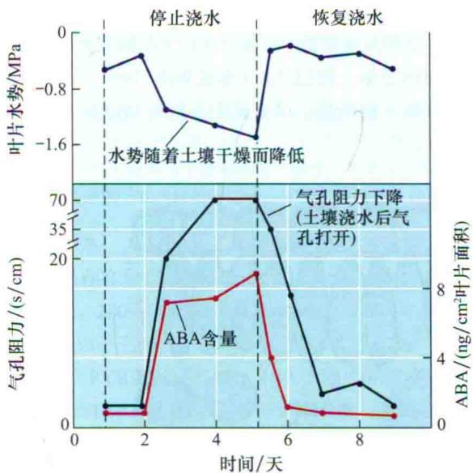  
图23.4 水分胁迫下玉米水势、气孔阻力（气孔导度的倒数）及ABA含量的变化。土壤干旱时，叶片水势降低，ABA含量和气孔阻力增加。重新浇水逆转了该过程（引自Beardsell and Cohen，1975）。

生物合成并非组织中ABA浓度调节的唯一因素。与其他植物激素类似，胞质中游离ABA的浓度还受ABA降解、区域化、结合和运输等的调节，例如，水分胁迫下叶片胞质中ABA含量增多是ABA在叶片中合成增多、ABA在叶肉细胞中重新分布、ABA从根部运输到叶及其在叶中重新循环的共同结果。植物重新吸水后ABA浓度的降低是由于ABA降解、ABA从叶片中运走及其合成速率降低所致。类似地，种子中变化的ABA水平反映了ABA合成和失活的动态平衡。ABA要么通过被氧化为红花菜豆酸（phaseic acid，PA）和4-二氢红花菜豆酸（4-dihydrophaseic acid，PA）而失活，要么通过共价结合到另一个分子如单糖上而失活（参见附录3）。

## 23.2.3 ABA通过维管组织转运

ABA靠木质部和韧皮部运输，但通常韧皮部汁液中含量丰富。用放射性标记的ABA处理叶片后发现，ABA既能从根向上运输到茎叶，也可从茎叶向下运输到根，24 h内可在根部发现大量放射性ABA，茎部环剥破坏韧皮部能够阻止ABA在根部积累，表明该激素运输到了韧皮部汁液中。

在根部合成的ABA也可以经过木质部运输到茎叶。当向日葵受到水分胁迫时，ABA浓度可以增加到3000 nmol/L（3.0 μmol/L），而正常浇水的向日葵木质部汁液中ABA的浓度为1.0\~15.0 nmol/L（Schurr et al., 1992）。木质部中因胁迫诱导增加的ABA含量变化幅度在不同物种间差异很大。ABA可能也以结合态的形式运输，然后在叶中被水解释放。

利用检测特定部位ABA浓度报告基因的激活实验表明，水分胁迫过程中ABA首先在茎叶维管束中积累，然后出现在根和保卫细胞中（Christmann et al., 2005）（图23.5）。另外，交互利用野生型和ABA缺失突变体根作为砧木和接穗的实验证明，茎叶中合成的ABA对植物响应根部干旱反应至关重要。

当植物受到水分胁迫时，气孔关闭与叶肉细胞膨压的快速降低相关，如用水直接处理叶片的上表面能阻止胁迫导致的气孔关闭，这些研究说明，开始的根冠通信是由根到茎叶水势梯度改变介导的，然而不排除其他从根运输ABA或传递化学信号等长时间信号。

尽管质外体中3.0 $\mu$ mol/L ABA就足以关闭气孔，但并非木质部汁液中所有ABA都到达了保卫细胞。蒸腾流中许多ABA被叶肉细胞吸收并被代谢掉了。在细胞水平，ABA在植物细胞各部分的分配遵循“阴离子陷阱”机制：这种弱酸解聚（阴离子）形式ABA $^{-}$ 不轻易跨膜，但ABA可以质子化的形式进入细胞，然后积累在碱性区域。ABA也可通过特殊吸收载体转运进入细胞。在植物未受到胁迫时吸收载体有助于质外体保持低的ABA浓度。

在水分胁迫早期阶段，木质部汁液的pH呈碱性，pH大约从6.3增加到了7.2（Wilkinson and Davies，1997）。胁迫诱导质外体碱化有利于ABA解离形式——ABA $^{-}$ 的形成。同时，脱水也能使胞质酸化，从而使ABA从它的合成部位释放，并且ABA被叶肉细胞吸收的量也减少了。这些pH变化增加了ABA通过蒸腾流到达保卫细胞的量（图23.6）。这样叶片中ABA再分配时ABA的总水平并没有增加。因此，木质部汁液中pH增加可能作为另外一种根部信号使气孔在早期关闭。

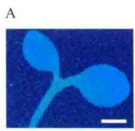

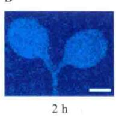

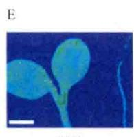

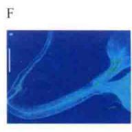  
图23.5 根响应水分胁迫时依赖ABA的报告系统动态。转pAtHB6::LUC报告基因幼苗根部受到水分胁迫后，记录一定时间发出的依赖于荧光素酶的光（浅蓝和绿色部分）。观察到ABA依赖的LUC表达2 h在下胚轴中出现、4 h在叶脉中出现、6 h则分布于整个子叶，但10 h前根中未出现。刻度为1 mm（引自Christmann et al., 2005）。

## 23.3 ABA信号转导途径

ABA在植物短期生理过程（如气孔关闭）及长期发育过程（如种子成熟）中发挥作用。

（1）短期生理反应往往与离子跨膜流动的改变有关，通常也涉及某些基因的调节，证据来自ABA诱导在保卫细胞中表达的各种转录因子调控气孔的开度。

（2）相比之下，长期反应过程不可避免地涉及基因表达方式的重大变化。

比较所有转录产物发现，在拟南芥和水稻中至少有

10%的基因受ABA调节。

ABA与其受体结合后，产生初级信号，初级信号通过信号转导途径放大，信号转导为ABA短期和长期效应所必需（见第14章）。通过遗传学研究已鉴定了100多个参与ABA信号转导的基因位点（Wasilewska et al., 2008）。尽管许多基因只影响ABA反应的一部分，但一些保守的信号组分既调节短期反应也调节长期反应，表明这些反应具有共同的信号转导机制。我们将重点介绍调节气孔开度和基因表达的机制，这是研究最清楚的两种ABA效应。

## 23.3.1 受体成员包含不同类型的蛋白质

人们利用各种生化、细胞和遗传学方法鉴定ABA受体，结果发现植物中可能存在位于细胞表面和细胞内两种ABA受体（图23.7）（参见Web Topic 23.5），与这一推断一致的是，没有鉴定出所有ABA反应缺乏的突变体。

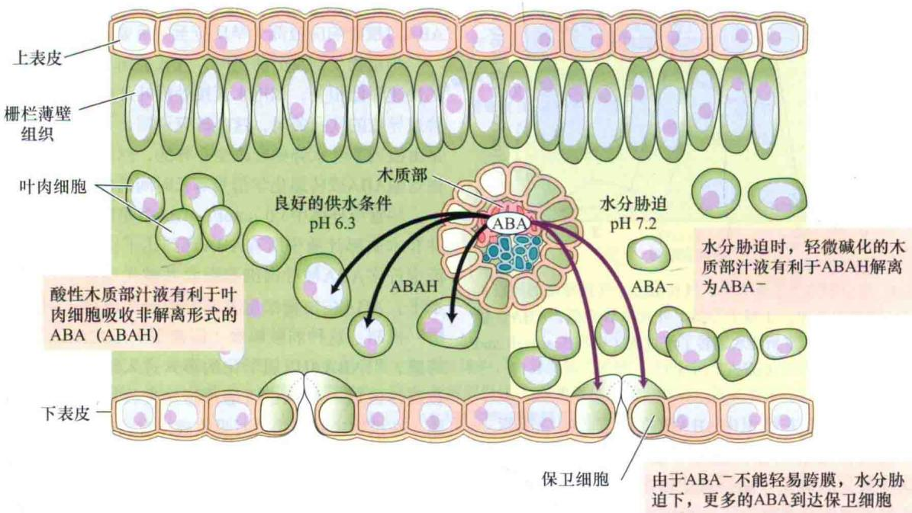  
图23.6 水分胁迫时木质部汁液的碱化导致叶片中ABA再分配。

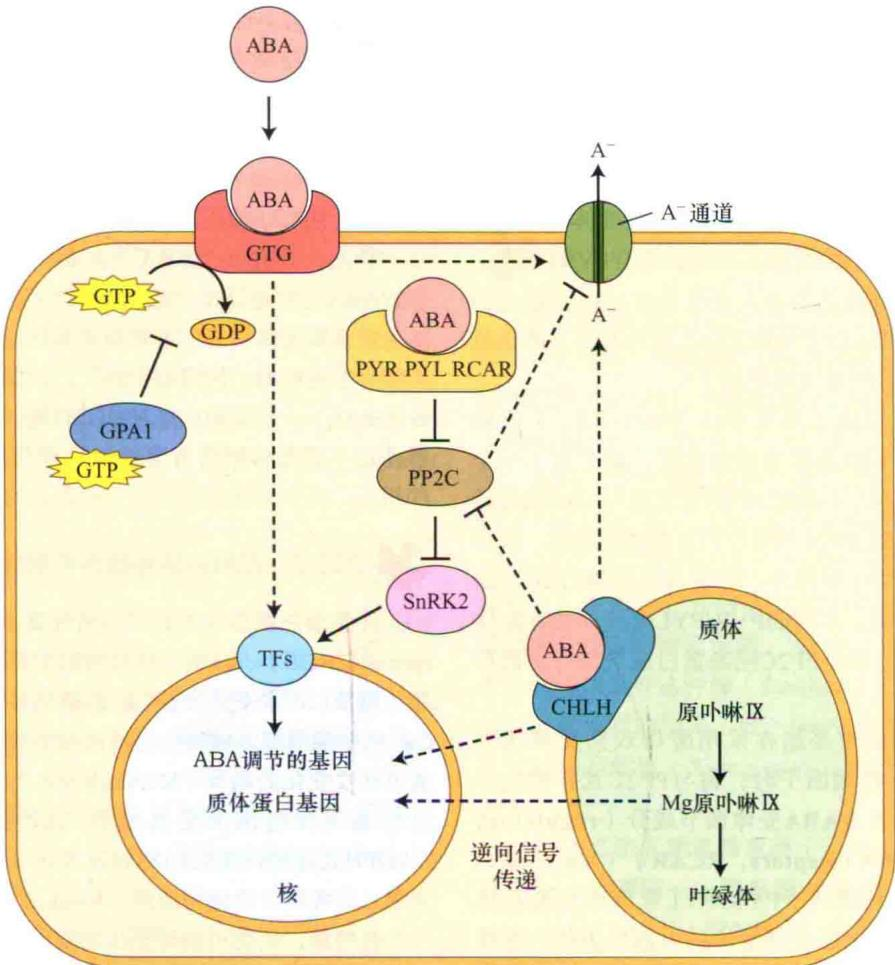  
图23.7 ABA与三类ABA受体成员相互作用模型。目前鉴定的ABA受体定位在质体（CHLH）、质膜（GTG1和GTG2）、胞质和核（PYR/PYL/RCAR）。所有成员都介导电ABA调节气孔运动时对基因表达和离子电流的效应（简单地用通道A代表），但不清楚与下游哪些信号事件发生交叉。PP2C，蛋白磷酸酶ABI分支；SnRK2，SNF相关激酶；TF，包括ABRE结合转录因子在内的转导因子。实线，直接相互作用；虚线，未知的相互作用；箭头，正调控；丁字形线，抑制作用。

近年来，人们提出了几类可能的ABA受体，但其大多数仍存在争议（McCourt and Creelman，2008；Risk et al., 2009；Müller and Hansson, 2009）。最好的成员包括以下三类。

（1）PYR/PYL/RCAR，存在于胞质和核中的配体结合蛋白STARR超家族成员（Park et al., 2009；Ma et al., 2009）。

（2）CHLH，参与叶绿体合成和信号传递，进而协调质体和核基因表达，定位于质体中的镁离子螯合酶亚基（Shen et al., 2006）。

（3）GPCR类G蛋白（GTG1和GTG2），是一对质膜蛋白，具有内在G蛋白活性，与G蛋白偶联受体（GPCR）同源（Pandey et al., 2009）。尽管GPCR似乎参与ABA信号，但存在与其作为受体矛盾的证据。

下面我们详细讨论PYR/PYL/RCAR蛋白和CHLH，有关GPCR的详细信息请参见Web Topic 23.6。

推断的ABA受体PYR/PYL/RCAR家族（PYR/PYL/RCAR FAMILY）是通过化学遗传筛选具有ABA类似效应的小分子物质鉴定出来的。利用拟南芥种子，通过筛选鉴定出了可作为ABA激动剂（agonist）的pyrabactin（pyridyl-containing ABA activator），即它可模拟植物中ABA的效应（Park et al., 2009）。

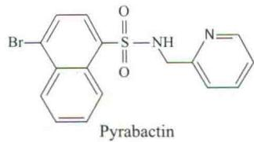

通过筛选抗pyrabactin拟南芥突变体鉴定出了PYR1遗传位点，它编码START（steroidogenic acute regulatory protein-related lipid-transfer, a predicted hydrophobic ligand-binding pocket）结构域蛋白超家族成员。随后的核磁共振实验证明ABA和PYR1可直接结合，提示PYR1可能是一个ABA受体。

生物信息学研究鉴定出了多个命名为PYL（PYR1-like）的家族成员，该家族从双子叶植物到苔藓都是保守的，尽管pyr1突变体抗pyrabactin，但正像以前鉴定出的几个ABA不敏感突变体一样，pyr1突变体并未表现出对ABA显著不敏感的特征。然而，综合PYR1和几个同源蛋白缺失三或四突变体表现显著对ABA不敏感的结果，表明这些基因位点功能冗余，因此在正常筛选抗ABA突变体时，这些基因被遗漏了。

酵母双杂交筛选（参见Web Topic 23.7）依赖pyrabactin并与PYR1互作的蛋白质时，鉴定出了一个PP2C类蛋白磷酸酶。以前已证明PP2C参与ABA信号转导。在酵母中PYR1-PP2C相互作用是配体依赖的，该作用也可发生在植物中和体外，并发现其抑制PP2C的活性。随后研究表明，不同的PYR/PYL家族成员在配体选择及依赖配体与多个PP2C同源蛋白成员结合方面存在差异。

同时，几个研究小组在采用酵母双杂交筛选方法研究PP2C相互作用因子时，将与PP2C互作的这一相同家族蛋白命名为ABA受体调节成分（regulatory components of ABA receptors, RCAR）（Ma et al., 2009）。最近，利用两个PYR/PYL家族成员的晶体结构研究表明，ABA结合到受体的内部口袋后，受体构型改变，适合与PP2C相互作用（Miyazono et al., 2009；Nishimura et al., 2009）。以前的研究显示，这些PP2C可与包括转录因子和蛋白激酶在内的其他多个ABA信号成分特异地相互作用。因此，PYR/PYL/RCAR似乎是一类可溶性受体，它们直接与许多通过遗传学方法鉴定出来的下游信号成分联系，有效地形成一个网络。

CHLH蛋白（CHLH protein）是作为拟南芥ABA结合蛋白（ABAR）的同源蛋白从蚕豆叶表皮中纯化得到的（Shen et al., 2006）。CHLH在ABA信号中作用的证据来自CHLH敲减（功能部分丧失）突变体。该突变体对萌发、休眠、气孔调节和ABA诱导的基因表达表现出降低的ABA敏感性，与这些结果一致，CHLH超表达植株对ABA超敏感。CHLH敲除（功能完全缺失）突变体胚不能成熟，产生缺乏存储物质和脱水保护物质的无活力种子。一些ABA信号成分严重缺失的突变体或种子中ABA水平显著降低的突变体表现出相同的表型效应。然而，由于未知的原因，传统的ABA不敏感遗传筛选却未能鉴定出功能降低的CHLH等位突变体。

尽管CHLH也在叶绿体合成和质体到核信号传递中起作用，但这些功能好像由其不同的结构域发挥作用，因为基因的不同突变影响不同的功能。CHLH在ABA信号转导中的作用机制还不清楚，但它定位在质体中，说明一些ABA感受事件一定发生在这些细胞器中，感受事件可能在ABA转运回质体中时发生。

总之，存在多个ABA受体成员与目前已知的非常多的ABA信号途径相一致（图23.7）。信号转导途径的冗余使细胞能够整合一系列激素和环境刺激信号，产生生物学家所谓的“网络稳定性”，以保证反应可发生在各种条件下。尽管由CHLH和GTG蛋白起始的快速细胞事件还不清楚，但所有事件似乎都与ABA信号转导事件相关，将来的研究将揭示它们各自的作用。

## 23.3.2 在ABA信号转导中起作用的第二信使

许多第二信使包括 $Ca^{2+}$ 、活性氧（reactive oxygen species，ROS）、环核苷酸和磷酸酯都参与ABA信号转导。胞质 $Ca^{2+}$ 水平受质膜 $Ca^{2+}$ 的通透性通道活性变化和 $Ca^{2+}$ 从细胞内部区域如中心液泡或各种细胞器进入胞质通道活性变化的调节（McAinsh and Pittman，2009），这些通道反过来又受其他第二信使如ROS调控。NADPH氧化酶产生的ROS如过氧化氢或超氧阴离子作为第二信使激活质膜钙通道（Kwak et al.，2003）。

各种第二信使可诱导钙从细胞内钙库中释放出来，这些信使包括1，4，5-三磷酸肌醇（IP3）、环ADP-核糖（cADPR）及自我放大（钙诱导的）释放的 $Ca^{2+}$ 。ABA在15 min内可刺激ADPR环化酶活性，导致cADPR增加。此外，ABA在保卫细胞中通过硝酸还原酶促进一氧化氮（nitric oxide，NO）合成，NO以cADPR依赖的方式诱导气孔关闭，表明NO在cADPR的上游起作用（Desikan et al., 2002）。

接下来的章节中将介绍与这些第二信使有关的信号转导机制。

## 23.3.3 钙依赖和钙不依赖两条信号转导途径介导ABA信号

人们利用显微注射钙敏感荧光染料 $^{①}$ 如fura-2或indo-1测定胞内游离钙。另一种方法是利用表达钙指示蛋白如水母发光蛋白或yellow cameleon蛋白基因的转基因植物，不需要显微注射就可平行检测多个荧光细胞（Allen et al., 1999）（参见Web Topic 23.8）。利用yellow cameleon已经证明保卫细胞中胞质 $Ca^{2+}$ 浓度会发生振荡，细胞收到的信号不同， $Ca^{2+}$ 的振荡也不相同

(图23.8)。

$\mathrm{Ca^{2+}}$ 振荡直接成像的结果支持胞质 $\mathrm{Ca^{2+}}$ 增加（部分来源于胞内钙库）诱导了气孔关闭的假设。 $\mathrm{Ca^{2+}}$ 增加被解释为“构象偶联”，即 $\mathrm{Ca^{2+}}$ 与一些蛋白质如钙调素（CaM）或类钙调磷酸酶B蛋白（calcineurin B-like protein，CBL）结合改变了它们的构象，构象变化使这些蛋白质相互作用，并改变了各种细胞蛋白的功能。哺乳动物的钙调磷酸酶是催化A亚基和 $\mathrm{Ca^{2+}}$ 结合调节B亚基的异源二聚体，它们可能通过与钙调素相互作用被激活。尽管植物中未发现类钙调磷酸酶A亚基，但植物CBL家族已被鉴定出来。CBL被环境胁迫和ABA差别调控，并且预计其具有不同器官和亚细胞定位（Luan et al., 2002）。

另外， $Ca^{2+}$ 可直接或间接调节蛋白激酶或磷酸酶，改变各种蛋白质的磷酸化状态及活性，因此，在对ABA的整个反应中既可反映 $Ca^{2+}$ 增高的亚细胞分布、频率、幅度和持续时间，也反映在某一细胞中特异 $Ca^{2+}$ 结合蛋白及其目标蛋白的可利用性，这些效应中有的被基因表达改变介导，而其他的则直接影响离子通道活性。

尽管ABA诱导的钙反应是目前ABA诱导气孔关闭模型的主要特征，但ABA在保卫细胞胞质钙不增加的情况下也能诱导气孔关闭（Allan et al., 1994），换句话说，ABA似乎可以通过钙依赖和钙不依赖两条途径起作用。例如，ABA能引起胞质碱化，pH从7.7增加到7.9，导致质膜外向K+通道被激活和气孔关闭。

对明显的钙不依赖信号传递的另一个解释是，ABA增加了细胞内钙敏感性的气孔关闭机制，包括阴离子和K+通道的调节（Siegel et al., 2009）。ABA诱导的这种超敏感性使细胞不存在胞内钙增加的情况下能应答静息钙水平反应，激活钙依赖的信号。改变钙反应阈值的机制称为“钙敏感性启动”假说，这也可解释为什么在不存在ABA情况下有时保卫细胞自发发生细胞内钙增加却不能诱导气孔关闭（Young et al., 2006）。

## 23.3.4 ABA诱导脂类代谢产生第二信使

在动物细胞经典的G蛋白信号转导模式中，激活的Gα亚基激活磷脂酶C（phospholipase C），释放三磷酸肌醇（inositol triphosphate，InsP3）和二酰基甘油（diacylglycerol，DAG）。利用蚕豆保卫细胞的研究表明，ABA刺激磷脂酰肌醇代谢，产生InsP3和六磷酸肌醇（myo-inositol-hexaphosphate，InsP6）。在施用ABA 10 s内即可检测到InP3的水平增加了90%（Lee et al., 1996）。在拟南芥和烟草中用反义DNA抑制ABA诱导磷脂酶C表达的研究证明，ABA对萌发、生长和基因表达的作用需要这种酶（Sanchez and Chua, 2001）。与以上观察到的结果一致，InsP3水平增加的突变体表现对ABA超敏感（Xiong et al., 2001；Wilson et al., 2009）。

ABA可激活鞘氨醇激酶（sphingosine kinase），产生另一类磷脂——鞘氨醇-1-磷酸（sphingosine-1-phosphate，S1P）（图23.9）。鞘氨醇-1-磷酸可促进鸭跖草保卫细胞Ca $^{2+}$ 增加和气孔关闭。此外，S1P信号抑制剂可抑制植物对ABA的响应。尽管S1P能促进野生型拟南芥关闭气孔，但不能引起Gα亚基缺失突变体的气孔关闭，表明鞘氨醇-1-磷酸通过G蛋白起作用，并且G蛋白介导的事件位于S1P信号的下游（Coursol et al., 2003）。

A  
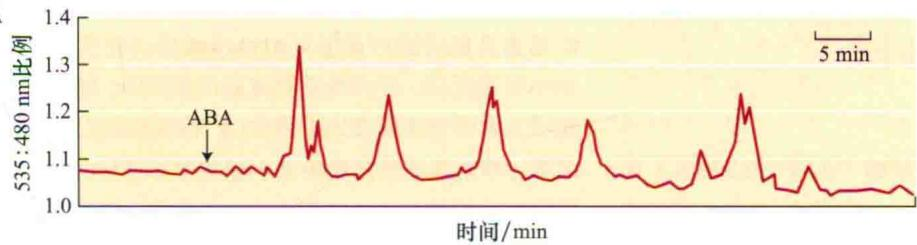

B  
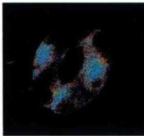

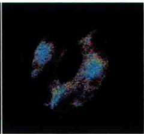

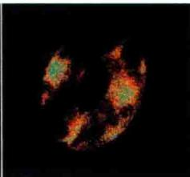

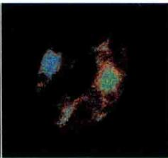

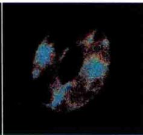  
图23.8 转基因表达钙荧光指示蛋白yellow cameleon检测的拟南芥保卫细胞中ABA诱导的钙振荡。A. 535 nm和480 nm激发荧光比例的增加表示ABA诱导的重复钙振荡。B. 拟南芥保卫细胞荧光的色彩图像：蓝色、绿色、黄色和红色代表胞质钙浓度的增加（引自Schroeder et al., 2001）。

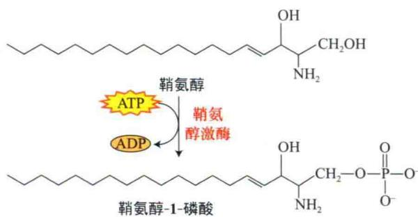  
图23.9 被ABA激活后，鞘氨醇激酶催化鞘氨醇的磷酸化反应，产生鞘氨醇-1-磷酸。

另一种可能介导ABA反应的第二信使是磷脂酸（phosphatidic acid，PA），它通过磷脂酶D（phospholipase D，PLD）由磷脂酰胆碱产生。研究表明，含量最多的PLD异型体可以被ABA激活，并且由PLD介导产生的磷脂酸可通过多种机制促进ABA诱导的气孔关闭、基因表达及其他胁迫反应（Zhang et al., 2005）。PLD的活性产物PA可以与各种靶酶包括蛋白磷酸酶、蛋白激酶及代谢酶结合，这中间至少有一种蛋白磷酸酶是ABI1（在下一节中讨论），它与PA结合后活性和定位改变，对ABA信号的抑制作用消失，导致气孔关闭（见Web Topic 23.9）。

这样，多个脂类产生的第二信使（磷脂酰肌醇、DAG、S1P、磷脂酸）及产生和降解这些第二信使的酶参与了增加ABA信号转导的多个反馈回路和途径。

## 23.3.5 蛋白激酶和磷酸酶调节ABA信号途径中的重要步骤

几乎所有生物的信号转导途径中，总有某些步骤与蛋白质的磷酸化和脱磷酸化反应有关，ABA信号途径也不例外。生化与遗传研究已鉴定了多个介导特定ABA信号的蛋白激酶和磷酸酶家族。

## 1. ABA 激活的蛋白激酶

ABA或胁迫激活的蛋白激酶（AAPK或SAPK）在蔗糖非发酵相关激酶2（sucrose non-fermenting related kinase2，SnRK2）家族的许多种类和成员中得到了鉴定。鉴定的第一个SnRK2为气孔调节所必需，并在ROS和Ca $^{2+}$ 信号的上游发挥作用。拟南芥SnRK2家族许多成员受ABA诱导，其他成员则受胁迫诱导，这些激酶诱导的一个重要方面是翻译后激活，但有一些则是转录激活的。遗传研究表明，一些SnRK2在调节幼苗ABA反应时功能是冗余的（Fujii et al., 2007）。

所有测定的ABA或胁迫诱导的SnRK在体外能磷酸化一类名为ABA响应成分结合因子（ABA-response element binding factor，AREB或ABF）的转录因子，使转录因子保守结构域磷酸化，该磷酸化与这些转录活性增加相关。AAPK也能改变RNA结合蛋白的活性，后者可能介导ABA对基因表达的作用（Assmann，2004）。胁迫调控的SnRK2的其他目标包括各种代谢酶及几个14-3-3家族调节蛋白，后者预计与其他信号蛋白相互作用并改变这些信号蛋白的活性。

这些激酶的翻译后控制使植物能对胁迫进行快速反应，并具有调节包括多个调节因子在内的多个目标的能力，进而快速放大胁迫反应。

除了SnRK2激酶外，钙调节激酶和有丝分裂原蛋白激酶（MAPK）也参与调节ABA信号途径的关键过程（参见Web Topic 23.10）。

## 2. 蛋白磷酸酶

用蛋白磷酸酶（protein phosphatases，PP）抑制剂进行的药理学研究表明，几种丝氨酸/苏氨酸磷酸酶（PP1A，PP2A，calcineurin-like PP2B和PP2C）和酪氨酸磷酸酶都调节保卫细胞信号转导，但是其效应可能是正的也可能是负的，而且受许多因素影响。遗传学研究使我们能够对单个蛋白磷酸酶进行分析，现已鉴定出一个特异的PP2A和一些PP2C是ABA信号成分，它们对植物发育具有多种（多重）作用。

## 23.3.6 PP2C直接与ABA受体PYR/PYL/RCAR家族相互作用

对ABA反应最具戏剧性的现象发生在拟南芥编码PP2C的ABI1和ABI2基因（编码PP2C蛋白）突变体上，拟南芥abi1-1和abi2-1突变体的表型与ABA信号缺失突变体一致，包括种子休眠减弱、有萎蔫倾向（由于气孔开度调节存在缺陷）及各种ABA诱导基因表达的降低。气孔反应的丧失包括S型阴离子通道、内向和外向 $\mathbf{K}^{+}$ 通道及肌动蛋白重组对ABA不敏感。突变体尽管对ABA没有反应，但当外部存在高浓度的 $\mathrm{Ca^{2 + }}$ 时，其气孔关闭，表明突变体丧失了启动 $\mathrm{Ca^{2 + }}$ 信号的能力。与这个发现一致，在这些突变体中ABA诱导胞质 $\mathrm{Ca^{2 + }}$ 增加的效应减小。

拟南芥abi1-1和abi2-1突变体是通过筛选对ABA反应降低（decreased）的植株得到的，因此将它们命名为ABA不敏感突变体。基于它们对ABA不敏感的表型，最初人们认为野生型ABI1基因一定促进（promote）ABA反应。然而遗传研究表明，原始突变是显性的：一个基因拷贝的缺失足以通过抑制另一个野生型等位基因的功能基因产物破坏ABA反应。随后，人们得到了ABI1活性丧失的ABI1隐性突变体。与显性ABI1突变体相反，这些隐性ABI1突变体对ABA的敏感性增强（increased）（Gosti et al., 1999）。这样，与开始的设想相反，野生型植物中这些蛋白磷酸酶的功能是抑制ABA反应。

目前遗传学分析显示，ABI1和ABI2是9个密切相关基因形成的亚家族的一部分，该亚家族属于拟南芥更大的PP2C基因家族（Schweighofer et al., 2004）。许多ABI类PP2C基因功能的缺失导致植物对ABA的敏感性增加（increased）。将强启动子控制的这些基因转入植物后导致其对ABA的敏感性降低，证实这些基因的作用是抑制ABA反应。这些家族的许多成员在植物应答ABA反应时表达增加（ABA信号的其他负调节因子在Web Topic 23.11中讨论）。

ABI类蛋白磷酸酶（ABI-class protein phosphatase）似乎与细胞内包括蛋白激酶、 $Ca^{2+}$ 结合蛋白和转录因子在内的许多其他蛋白质相互作用，可能通过使特定丝氨酸或苏氨酸残基脱磷酸调节它们的活性。ABI1的磷酸酶活性对pH和 $H_{2}O_{2}$ 高度敏感，ABA诱导的碱化可增加其活性，但 $H_{2}O_{2}$ 则降低其活性。ABI1的作用也受亚细胞定位的调控，即野生型ABI1蛋白与保持在质膜上的磷脂酸相互作用（Mushra et al., 2006），但显性负调控突变体abil-1抗ABA的表型依赖于突变体蛋白的核定位（Moes et al., 2008）。

正如在第14章和本章539\~540页中讨论的，这些PP2C直接与受体PYR/PYL/RCAR家族蛋白相互作用（Park et al., 2009; Ma et al., 2009），这一依赖ABA的相互作用抑制了PP2C磷酸酶活性，导致正常被PP2C抑制的包括SnRK激活在内的事件解除抑制。显性负调控突变体abil-1蛋白不与受体相互作用，因此保持抑制状态。从信号转导方面看，这些PP2C可被看作“枢纽”，它整合来自受体和第二信使的信息，进而改变了许多下游途径的功能。

总之，蛋白激酶如SnRK2、Web Topic 23.10讨论的其他激酶（CPK/CDPK/CDK，CIPK和MAPK级联）及至少两类蛋白磷酸酶（ABI相关的PP2C和PP2A）调节丝氨酸/苏氨酸的磷酸化，因而调节ABA信号许多下游调节因子的活性，这些酶中许多酶的活性在翻译前和翻译后受到调控，而有的则受反馈调节减弱其反应。

## 23.3.7 ABA与其他激素途径具有共同的信号中间成分

人们发现增加ABA反应（enhanced response to ABA，ERA3）基因是以前鉴定的乙烯信号基因座位——乙烯不敏感（ETHYLENE-INSENSITIVE 2，EIN2）基因的等位基因（Ghassemian et al.，2000）（见第22章）。ERA3基因突变除了表现ABA缺失和乙烯反应外，还导致对生长素、茉莉酸和胁迫反应的缺失。该基因编码一个膜结合蛋白，后者似乎代表了许多不同信号的共同信号中间成分。正如将从14章中想到的，这种相互作用是不同信号途径交叉调节（primary cross-regulation）的一个例子。

## 23.4 ABA调节基因表达

上面已经讨论过，早期ABA信号转导下游，ABA引起基因表达变化。ABA调节种子萌发及植物适应干旱、低温和盐等胁迫过程中许多基因的表达（Rock，2000）。拟南芥和水稻的转录表达研究显示，基因组中5%\~10%的基因受ABA和各种胁迫（如干旱、盐和冷）调节，这些变化中有一半以上为ABA、干旱和盐胁迫反应所共有，但这些胁迫调节基因中有10%也受冷的调节（Shinozaki et al., 2003）。推测ABA诱导的基因和胁迫诱导的基因使植物产生了诱导抗性（见第26章）。

## 23.4.1 ABA介导转录因子对基因表达的激活

人们鉴定出主要有4类可诱导ABA的调节序列，与这些序列结合的蛋白质已得到了鉴定，这些蛋白质包括碱性亮氨酸拉链（bZIP）、B3、MYB和MYC家族成员（参见Web Topic 23.12）。胁迫条件下，基因的表达可以是ABA依赖或ABA不依赖的，其他一些介导植物对冷、干旱或盐胁迫反应的特异转录因子也得到了鉴定（见第26章）。

人们已鉴定出一些参与由ABA导致转录抑制的DNA元件，这些元件中研究得最清楚的是赤霉素反应元件（GARE），它们介导受赤霉素诱导、被ABA抑制的大麦α-淀粉酶基因的表达（见第20章）。

利用遗传学方法已从成熟种子中鉴定了ABA诱导基因激活的4种转录因子：玉米VIVIPAROUS 1（VP1）和拟南芥ABA-INSENSITIVE（ABI）3、4和5，这4种转录因子编码基因中任何一种发生突变都会降低种子对ABA的反应。玉米VP1和拟南芥ABI3基因编码的蛋白质高度类似，而ABI4和ABI5基因编码了另外两个转录因子家族成员（Finkelstein et al., 2002）。

ABA反应成分结合因子是另外一些bZIP转录因子ABI5亚家族成员，这些转录因子与ABA、胚形成、干旱或盐胁迫诱导的基因表达相关。

对vp1、abi3、abi4和abi5突变体的鉴定表明，这些基因中每一个基因都可激活或抑制靶基因的转录，具体效应取决于靶基因，但是这些作用中有些可能是间接的。由于任何基因的启动子都包含有多种调节因子的结合位点，因此很可能这些转录因子通过与不同调节因子形成复合体来起作用，复合体的组成取决于调节因子与结合位点的结合。

以上转录因子的可用性和活性受到许多因素控制，这些因素包括发育和环境调节的基因表达、它们自己或类似因子表达的调节、翻译后修饰，如被特异的SnRK2和钙依赖蛋白激酶（CPK）磷酸化及某些情况下转录因子避免被蛋白酶体降解的稳定作用（Finkelstein et al., 2002）。如图23.10所示，这些调节机制中许多都需要转录因子间、转录因子与激酶、磷酸酶或降解机器组分间的相互作用。其他调节因子的情况参见Web Topic 23.13。

总之，这些研究证明许多转录因子存在于各种调节复合体中，其在ABA诱导的基因表达中起不同作用，这依赖于一个细胞中各个启动子中顺式作用位点与可利用的转录因子的组合情况。

除了转录因子，ABA调节的基因表达也依赖于适当的RNA加工和稳定性（见Web Topic 23.14）。

## 23.5 ABA在发育中的作用和生理效应

脱落酸在种子和芽休眠的起始和维持及植物对胁迫尤其是水分胁迫的反应中起主要作用。此外，ABA通常作为拮抗剂，通过与生长素、细胞分裂素、赤霉素、乙烯和油菜素内酯相互作用，影响植物发育的其他方面。在这一节，我们将探讨ABA的各种生理作用包括ABA在种子发育、种子和芽休眠、萌发、营养生长、衰老和气孔调节中的作用。关于ABA与病菌反应的讨论参见Web Topic 23.15。

## 23.5.1 ABA调节种子成熟

种子发育过程可分为持续时间大致相同的以下3个时期。

（1）第一个时期的特点是细胞分裂和组织分化，受精卵经历胚形成和胚乳组织增殖两个阶段。

（2）第二个时期，细胞分裂停止并积累储藏物质。

（3）最后一个时期，正常种子的胚对脱水产生耐性，种子脱水失去90%的水分。脱水的结果是代谢停止，种子进入静止（quiescent）（休息）状态。在有些情况下，种子也开始休眠。与吸水后萌发的静止期种子不同，休眠种子的萌发需要额外处理或萌发信号出现。与正常种子不同，一些特殊的种子不能经过这一时期，因此成熟时具有很高的含水量，对脱水没有耐性。

后两个时期产生了有活性的种子，种子中含有足够的物质维持萌发，使种子能够在重新生长前等待数周甚至数年时间。典型的情况是，种子中ABA含量在胚形成早期很低，中期达到最大，种子成熟时又降到很低的水平。这样，与胚胎发生中期和末期相对应，种子中ABA积累出现一个较宽的峰值。

由于并非所有组织都有相同的基因型，因此种子

1. 植物对发育或环境信号作出反应时，产生ABA和各种转录因子  
2. 磷脂酶D（PLD）依赖的信号转导、小RNA（miRNA）的调节及许多激酶的激活都与ABA激活的转录因子有关。ABA调节基因的启动子存在不同识别位点的组合（MYBR、MYCR等），多种相应转录因子家族成员都可以结合到这些位点上。每类转录因子中都有多个家族成员参与ABA信号转导  
3. 这些转录因子除了在家族内形成同源或异源二聚体外，有些彼此相互作用，有些则与转录中的其他成分相互作用。特异结合决定了该基因是被活化还是被抑制  
4. 一些转录因子基因相互调节或自我调节，有些情况下受正反馈调节使ABA反应增强  
5. 没有ABA时，这些ABA不敏感（ABI）转录因子被蛋白酶体降解

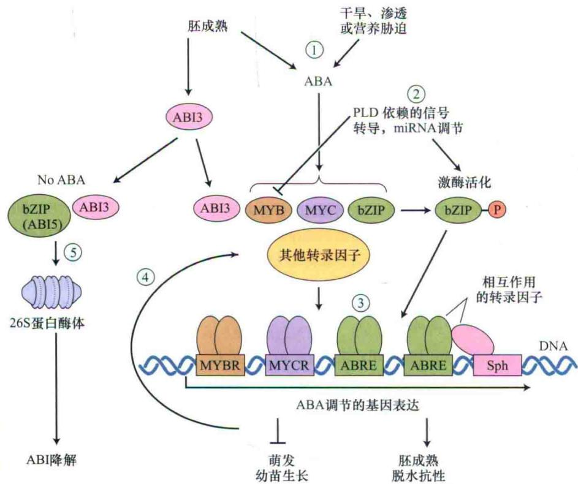  
图23.10 介导ABA调节基因表达的机制及转录因子。

中激素的平衡十分复杂。种皮来自母系组织（参见Web Topic 1.3）；合子和胚乳来自父母双方。利用拟南芥ABA缺失突变体进行的遗传学研究表明，合子的基因型控制胚和胚乳中ABA合成，对诱导休眠至关重要；大部分ABA早期峰值的产生由母系基因控制，这有助于抑制胚胎发生中期的胚萌（Raz et al., 2001）。

## 23.5.2 ABA抑制早萌和胚萌

将未成熟胚从种子中移到培养基中培养时，它们会在休眠开始前的发育中期过早发芽——即没有通过正常发育的静止和（或）休眠阶段。将ABA加入培养基可以抑制早萌，这个结果结合种子发育中晚期内源ABA含量高的事实，说明ABA在胚胎发生阶段具有控制胚发育的作用。

进一步证明ABA具有阻止早萌作用的证据来自胚萌现象的遗传研究结果。与胚萌类似的收获前发芽（preharvest sprouting）是一些谷类作物在潮湿气候成熟时的品种特征。人们已从玉米中筛选出了一些胚萌（viviparous）的突变体，它们种子的胚能够直接在与植株相连的穗上萌发，其中有一些是ABA缺失突变体（vp2，vp5，vp7，vp9和vp14）（图23.3），有一个是ABA不敏感突变（vp1）体。用外源ABA处理可以部分阻止ABA缺失突变体的胚萌。玉米的胚萌也需要在胚形成早期合成GA，后者作为正调节信号发挥作用。GA和ABA的双重缺失突变体并不表现出胚萌现象（White et al., 2000）。

与玉米突变体相比，ABA缺失或不敏感拟南芥单基因突变体种子虽然不休眠，但也不发生胚萌，没有胚萌可能是湿度不够，因为在相对湿度高的条件下这样的种子在果实中都能萌发。然而，其他具有正常ABA反应但ABA水平中度下降的拟南芥突变体，即使在低湿度条件下也会出现胚萌，这样的突变体有一个是fusca3 $^{①}$ ，其属于胚胎发生向萌发转变时调节功能丧失的突变体。此外，ABA生物合成或ABA反应缺失突变体与fusca3的双突变体存在高频率的胚萌，表明在拟南芥中存在抑制胚萌的功能冗余控制机制（Finkelstein et al., 2002）。

## 23.5.3 ABA促进种子贮藏物质积累和脱水抗性提高

在胚胎发生中晚期，种子中ABA水平达到最高，这时种子中积累贮藏物质以保证种子萌发后幼苗的生长。在发育的种子中，ABA的另一个重要作用是促使种子获得脱水抗性（desiccation tolerance）。脱水能够严重损害膜和其他细胞成分（见第26章）。当正在成熟的种子开始失水时，胚积累糖和所谓的胚胎发育后期丰富（late-embryogenesis-abundant，LEA）蛋白，人们认为这些分子相互作用，形成类似玻璃的状态（高度黏性的液体，扩散能力非常低，因此限制了化学反应），参与对脱水的抵抗（Buitink and Leprince，2008）。

生理和遗传学研究表明，ABA影响贮藏蛋白、脂类及LEA的合成。例如，外源ABA促进许多植物培养胚中贮藏蛋白和LEA的积累，而一些ABA合成缺陷或不敏感突变体中这些蛋白质的积累变少，甚至用ABA处理植物营养组织也能诱导一些LEA或相关家族成员蛋白质的合成。这些结果说明，大多数LEA蛋白的合成受到ABA控制（参见Web Topic 23.16）。然而，在具有正常ABA水平和ABA反应的其他种子发育突变体中，贮藏蛋白和LEA蛋白的合成水平也降低了，说明ABA仅是胚胎发生过程中控制这些基因表达的信号之一。

胚胎发生时，ABA不仅调节贮藏蛋白和脱水保护物质的积累，还维持成熟胚处于休眠状态直至环境条件适于生长。种子的休眠是植物能够适应不利环境的重要因素。正如我们将在下面几节中讨论的那样，植物已经进化出一系列维持种子休眠的机制，其中有些与ABA有关。

## 23.5.4 ABA和环境因子调控种子休眠

在种子成熟过程中，胚脱水，进入一个静止期。种子萌发可被定义为成熟种子的胚恢复生长，其依赖的环境条件与植物营养生长时相同，必须有充足的水和氧气、适宜的温度，而且必须没有抑制物质存在。

许多情况下，一粒有活性的（活的）种子即使所有生长必需的环境条件都满足后也不萌发，这种现象称为种子休眠（seed dormancy）。种子休眠暂时延迟了种子萌发，使种子有足够的时间散播到地理位置更远的地方，也防止种子在不适宜的环境下发芽，从而最大限度地提高幼苗的存活率。

种子休眠可能来自于种皮强制性休眠、胚休眠或两者兼而有之。种皮和其他包被组织如胚乳、果皮或花以外的器官导致的胚休眠，称为种皮强制性休眠（coat-imposed dormancy）。在水和氧气存在的情况下，这些种子的种皮和周围包被组织一旦被去掉或破坏，胚就很容易萌发。要了解更多种皮强制性休眠的基本机制，请参见相关文献（Bewley and Black，1994）和Web Topic 23.17。

种子休眠本质上是胚的休眠而不是由于种皮或其他包被组织的影响导致的，这种休眠称为胚休眠（embryo dormancy）。在有些情况下，切断子叶可解除胚的休眠。子叶发挥抑制作用的植物如欧洲榛子（Corylus avellana）和欧洲白蜡木（Fraxinus excelsior）。

证明子叶具有抑制生长作用的一个令人感兴趣的证据来自一些植物（如桃树），从这些植物中分离出来的休眠胚可以萌发，但生长异常缓慢，形成矮化植株，然而如果在发育早期去掉子叶，植株的生长很快转变为正常生长。

人们认为抑制物质尤其是ABA的存在及生长促进物质如GA的缺乏导致了胚的休眠。吸胀的种子维持休眠需要重新合成ABA，而胚休眠的丧失往往伴随ABA与GA比值的急剧下降。ABA和GA的水平受到它们合成和代谢的调控，代谢和合成由特异的同工酶催化，同工酶的表达则由发育或环境因子控制。

各种外部因子都可以解除种子胚的休眠，休眠种子对下列三种因素中一种以上的因素具有明显反应。

（1）后熟（after-ripening）。许多种子当它们的水分含量通过脱水降低到特定值时停止休眠的现象称为后熟。

（2）冷（chilling）。低温或冷可使种子丧失休眠。许多种子需要在充分吸水（吸涨）时经历一段寒冷（0\~10℃）时期才能萌发。

（3）光（light）。许多种子在萌发时需要光照，像莴苣，可能短暂的光照即可，或萌发需要间歇光照射，或者只需要长日照或短日照的特定光周期。

关于环境因子影响种子休眠的更多信息参见Web Topic 23.18。关于种子寿命的讨论参见Web Topic 23.19。

## 23.5.5 ABA与GA比例调控种子休眠

阐明ABA在种子初生休眠中的作用时ABA突变体非常有用。拟南芥种子的休眠能够通过后熟和/或冷冻处理解除。已经证明拟南芥ABA缺失突变体（aba）成熟后不休眠。将aba与野生型植株回交，产生的种子在成熟过程和随后吸水时只有胚本身产生ABA时才出现休眠，无论来自母本的ABA还是外源使用ABA都不能有效诱导aba胚的休眠。

此外，发育种子中出现的ABA主要来自母本，并且母本ABA为种子发育的其他方面所需，如ABA有助于抑制胚胎发生中期的胚萌，因此这两种来源的ABA在不同发育途径中均发挥作用。ABA不敏感突变体1（ABA-insensitive 1, abi1）、abi2和abi3种子在发育过程中ABA浓度尽管比野生型高，但种子的休眠显著降低，可能反映了ABA代谢的反馈调节。

ABA缺失番茄突变体似乎也具有相同的功能，表明这种现象可能普遍存在。然而，其他休眠降低突变体中ABA水平正常，突变体对ABA的敏感性也正常，说明休眠还受到其他因子的调节，包括作用于染色质结构的转录调节或转录延伸（Finkelstein et al., 2008），另外一些调节因子已通过研究自然变异的遗传规律得到了鉴定（参见Web Topic 23.20）。

一个可选择的方法是比较种子在不同休眠状态下整个转录组或蛋白质组（存在于给定组织中的所有转录物或蛋白质），从而鉴定表达与休眠相关的基因，这些是另外的休眠调节子，但也可以是休眠效应子（如胁迫诱导基因）或因子，这些因子最终有助于种子避免休眠，这些比较表明干种子转录和转录后过程中存在令人惊讶的活性。

不仅ABA在种子休眠的起始和保持中起作用，其他激素对整个休眠过程也有作用，如大多数植物中，种子中ABA产生的峰值与吲哚-3-乙酸（IAA，也称为生长素，参见第19章）及GA水平降低相一致。

种子中ABA与GA比值非常重要，通过遗传筛选分离得到的第一个ABA缺失突变体（Koornneef et al., 1982）极好地证明了这一点。GA缺失突变体种子在缺少外源GA时不能萌发，把该突变体种子诱变后在温室中种植，用这些诱变植株的种子筛选回复突变体（revertant）——也就是重新获得萌发能力的种子。

回复突变体筛选出来后，被证明是ABA合成突变体，这些突变体能够萌发是因为它们的休眠没有被诱导，因而不需要随后合成GA来打破休眠。相反，从ABA不敏感突变体（abil-1）中筛选萌发抗ABA抑制子鉴定出了GA缺失和抗GA的突变体（Steber et al., 1998），这些研究很好地说明了一个普遍原理，即在调节植物发育时，激素的平衡及对激素反应的能力往往比它们的绝对浓度更关键。

ABA与GA平衡均由转录因子的作用调节和实现。GA促进萌发需要DELLA家族蛋白质的破坏，从而通过促进ABA合成蛋白的表达部分抑制萌发，增加的ABA水平进一步促进ABI转录因子和抑制萌发DELLA蛋白的表达，产生一个正反馈循环（Piskurewicz et al., 2008）。

最近通过遗传筛选ABA种子萌发不敏感突变体抑制子，证明ABA与乙烯、油菜素内酯及生长素之间存在其他相互拮抗的作用。此外，通过筛选蔗糖或盐敏感性不同的突变体，鉴定出了许多新的ABA缺失（或abi4）等位基因突变体，这些研究表明，激素、营养和胁迫信号形成了一个复杂的调节网络，调控下一代的生长。

除了ABA-GA拮抗效应影响种子休眠外，ABA还抑制GA诱导的水解酶合成，这些水解酶对萌发种子中贮藏物质的降解至关重要，例如，GA刺激谷物种子发芽时糊粉层产生α淀粉酶和其他水解酶，分解胚乳中贮藏的有机物（见第20章）。ABA通过抑制α淀粉酶mRNA的转录从而抑制依赖GA的酶合成，ABA至少通过直接和间接两种机制发挥这种抑制效应。

（1）最初被鉴定为ABA诱导基因表达的激活蛋白VP1作为一些GA调节基因的转录抑制子发挥作用（Hoecker et al., 1995）。

（2）ABA抑制GA诱导的GAMYB表达，后者是介导GA诱导α淀粉酶表达的转录因子（Gomez-Cadenas et al., 2001）。

A 茎叶  

## 23.5.7 水势低时ABA促进根的生长并抑制茎叶的生长

ABA在根和茎叶生长中的作用不同，这些作用强烈地依赖于植物的水分状况。图23.11比较了生长在水分充足（高水势， $\Psi_{w}$ ）和缺水条件（低 $\Psi_{w}$ ）下玉米幼苗茎叶和根的生长。实验中使用了两种幼苗：①ABA水平正常的野生型幼苗和②ABA缺陷突变体即胚萌（viviparous）突变体。

水分供应充足时（高 $\Psi_{w}$ ），内源ABA水平正常的野生型植株茎叶的生长比ABA缺陷突变体快（图

23.11A）。突变体生长缓慢，部分原因可能是叶片中水分过量丧失，但水分充足时玉米和番茄ABA缺失突变体茎叶生长仍然受阻，这可能主要是由于乙烯过量产生导致的，因为正常情况下，乙烯受内源ABA抑制，这些结果表明，在充分浇水的情况下，植株中内源ABA通过抑制乙烯产生促进茎叶的生长。与此类似，浇水良好的条件下，野生型植株（内源ABA水平正常）根的生长比ABA缺失突变体快。因此，在水势高时（总ABA水平低），内源ABA轻微促进了根和茎叶的生长。

相比而言，缺水（如低水势，低 $\Psi_{w}$ ）抑制根和茎叶的生长。与水分充足时相比，缺水条件下两种基因型植株的生长均受到抑制。然而，ABA缺失突变体茎叶的生长比野生型快，而野生型根的生长快于突变体（图23.11B）。水分胁迫时内源ABA似乎通过抑制乙烯合成促进根的生长。

ABA也影响植物应答生长素、营养供应和胁迫时根系分枝程度的变化，已经证明生长素主要促进根系分枝，但一些对ABA发生反应的突变体在侧根起始时对生长素的敏感性降低，表明ABA信号是该反应的一部分。与生长素相反，高浓度硝酸盐抑制根系的分枝，但该效应在ABA缺乏和反应突变体中也降低，ABA在控制植物营养平衡中进一步的特化作用可在豆科植物中观察到，在豆科植物中，ABA协调植物对微生物信号的反应调控根系结瘤（Ding et al., 2008）。

植物另一个抑制反应可在持续干旱条件下观察到。

C 根与茎叶的比  
  
图23.11 生长在蛭石中的玉米正常植株和ABA缺失突变体[civiparous（vp）]植株在高水势（ $\Psi_{\mathrm{W}} = -0.03 \mathrm{MPa}$ ）和低水势（A中 $\Psi_{\mathrm{W}} = -0.3 \mathrm{MPa}$ ，B中 $\Psi_{\mathrm{W}} = -2.6 \mathrm{MPa}$ ）条件下茎叶（A）和根（B）生长的比较。与对照相比，水分胁迫（低 $\Psi_{\mathrm{W}}$ ）抑制了茎叶和根的生长。C. 水分胁迫下（低 $\Psi_{\mathrm{W}}$ ，与茎叶和根水势的条件稍微有些差别），ABA存在时（如野生型中）根和茎叶生长的速率比没有ABA时（突变体中）高很多（引自Saab et al., 1990）。

在有些植物中，根部会长出许多额外的侧根，但这些侧根的生长一直受到抑制，直到干旱缓解后抑制才解除，这种现象称为干旱生根现象（drought rhizogenesis）（Vartanian et al., 1994）。这些胁迫和营养不平衡的抑制效应至少部分依赖于ABA，因为ABA缺乏突变体和一些ABA反应突变体没有表现出这一抑制作用。

总之，尽管传统观点认为ABA是一种生长抑制剂，但内源ABA只有在水分胁迫下才限制茎叶的生长。而且在这些条件下，若ABA水平高，则内源ABA通过抑制乙烯合成显著促进根的生长。低水势时ABA的总体效应就是显著增加根长与株高的比值（图23.11C），该效应与ABA对气孔关闭的效应一起，帮助植物抵抗水分胁迫（Sharp，2002）。而且，侧根生长的暂时抑制促进了新土壤的利用，导致重新获取水分后新根很快取代了脱水的侧根。但不清楚不同ABA水平如何导致了对生长的相反效应，这些效应可能反映信号是通过根与茎叶中具有不同功能敏感区域或不同下游信号成分的受体传递的。

ABA在干旱反应中作用的另一个例子见Web Essay 23.1。

## 23.5.8 ABA不依赖乙烯促进叶片衰老

脱落酸最初作为脱落诱导因子被分离出来，然而，此后证明ABA仅在几种植物中促进器官脱落，导致器官脱落的主要激素是乙烯。此外，ABA明显参与叶片衰老过程，ABA可能通过促进衰老，间接增加乙烯的合成促进脱落（更多关于ABA和乙烯关系的讨论见Web Topic 23.21）。

人们已经广泛研究了叶片衰老（衰老过程中发生的解剖、生理和生化变化在第16章中介绍）。叶部在黑暗中比在光下衰老快，叶绿素降解后叶片变黄。此外，在一些水解酶的刺激下，蛋白质和核酸的降解增加。ABA极大地促进了叶部及叶片的衰老。

## 23.5.9 ABA在休眠芽中积累

休眠是木本植物适应寒冷气候的一个重要特征。一棵树暴露在冬天很低温度下时，它通过芽鳞保护分生组织，并且抑制芽的生长，这种对低温的反应需要感受机制（感知信号）感应环境变化，还要有控制系统传导所感知的信号，并促进发育使芽休眠。

ABA最初被认为是诱导休眠的激素，因为它在休眠芽中积累，并且当组织暴露在低温下时含量降低。但后来的研究表明，芽中ABA含量并不总是与休眠程度相关。正如我们在种子休眠中看到的那样，这种明显的差异可能反映ABA与其他激素之间存在相互作用，可能芽的休眠和植物的生长受到芽中生长抑制物质与生长诱导物质之间平衡的调节，抑制物质如ABA，诱导物质如细胞分裂素和赤霉素。

尽管人们利用ABA缺失突变体在阐明ABA的作用方面取得了许多进展，但由于缺乏便于研究的遗传系统，ABA在芽休眠中作用的研究进展缓慢，而且研究主要集中在多年生木本植物上。该差别说明遗传学和分子生物学对植物生理学的巨大贡献，表明将这些方法应用到木本植物中非常有必要。

休眠等性状分析起来很复杂，因为它们往往由许多基因共同调控，导致表型退化，这种性状称为数量性状（quantitative trait）。最近的遗传作图研究表明，杨树中磷酸酶ABI1同源蛋白可能调节芽的休眠。有关这方面研究的描述见Web Topic 23.20。

## 23.5.10 应答水分胁迫反应ABA关闭气孔

ABA在冷、盐和水分胁迫中作用的研究结果，证明ABA是一个胁迫激素（见第26章）。如前所述，干旱条件下叶片中ABA浓度可以增加到50倍——这是所有报道中植物对环境信号作出反应时激素浓度变化最剧烈的例子。ABA的重新分布或生物合成在引起气孔关闭时非常有效。水分胁迫下，叶片中ABA的积累在植物减少蒸腾失水中起非常重要的作用（图23.4）。湿度增加后通过增加微管组织和保卫细胞代谢降低了ABA水平，因而导致气孔重新打开。

永久萎蔫突变体可能由于ABA合成和反应缺失不能关闭气孔，在ABA缺失突变体中外施ABA可以使气孔关闭并恢复膨压。相比之下，萎蔫突变体丧失了对ABA的反应能力，萎蔫后不能用外源ABA恢复。

## 23.5.11 ABA调节保卫细胞离子通道和质膜ATP酶

正如在第18章中讨论的那样，保卫细胞内大量 $\mathrm{K}^{+}$ 和阴离子长时间流到胞外导致细胞膨压降低，气孔关闭。 $\mathrm{K}^{+}$ 外向通道打开需要膜的长时间去极化，这可以由两种因素引起：①因正电荷的净内流导致ABA诱导的质膜瞬时去极化，加上②胞质钙的瞬时增加（图23.12）。钙内流结合钙从胞内钙库释放，导致胞质钙浓度从50\~350 nmol/L增高到1100 nmol/L（1.1 μmol/L）（图23.13）（McAinsh et al., 1990）。而且ABA增加了气孔关闭机制对胞内钙水平的敏感性。这些机制导致ABA打开质膜钙激活的慢速（S型）阴离子通道（见第6章）。已证明ABA激活保卫细胞慢速阴离子通道（Schroeder et al., 2001）。ABA也激活保卫细胞另一类阴离子通道——快速激活型（R型）阴离子通道

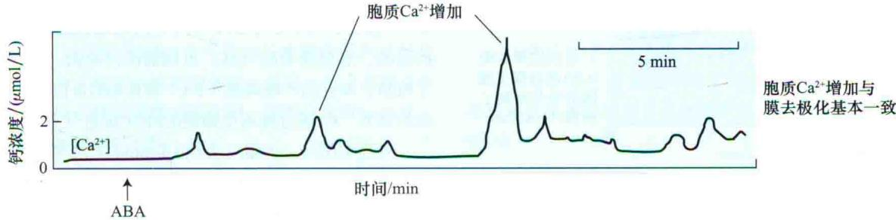  
图23.12 同时测定蚕豆保卫细胞中ABA诱导的内向正电流和胞质 $Ca^{2+}$ 浓度的增加。用膜片钳技术测定电流；用荧光指示染料测定钙。每次实验，ABA在箭头所示处加到系统中（引自Schroeder and Hagiwara，1990）。

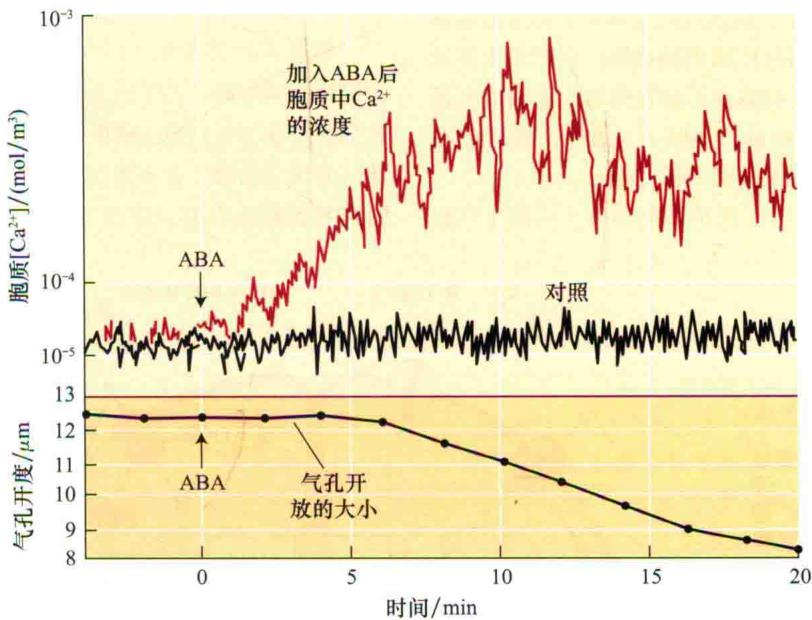  
图23.13 ABA诱导保卫细胞胞质 $Ca^{2+}$ 浓度（上部曲线）及气孔开度（下部曲线）增加的时间过程。 $Ca^{2+}$ 增加在3 min内开始，在随后5 min内气孔开度降低（引自McAmsh et al., 1990）。

(Raschke et al., 2003)。

这些慢速及快速阴离子通道的长时间开放使大量 $Cl^{-}$ 和苹果酸根阴离子从细胞中逸出，细胞的电化学梯度下降（细胞内为负电荷，这样驱使 $Cl^{-}$ 和苹果酸根阴离子到达细胞外，细胞外 $Cl^{-}$ 和苹果酸根阴离子浓度比细胞内的低）。这样带负电荷的 $Cl^{-}$ 和苹果酸根阴离子外流显著使膜去极化，导致电压门控的 $K^{+}$ 外流通道打开。

除了增加胞质钙浓度外，ABA还导致胞质碱化，使pH从7.7增加到7.9。已证明胞质pH的增加导致质膜外向K+通道活性增加，这明显是通过增加了可激活的通道数量实现的（参见第6章）。abi1突变的一个效应是使这些K+通道对pH不敏感。

除了导致气孔关闭外，ABA还抑制光诱导的气孔开放。另一个导致膜去极化的因素是抑制质膜 $H^{+}$ -ATP酶。ABA间接抑制蓝光诱导的保卫细胞原生质体质子泵（图23.14），这与ABA引起质膜去极化部分由质膜 $H^{+}$ -ATP酶活性降低导致的模型一致。

蚕豆中，至少叶质膜 $H^{+}$ -ATP酶的活性被钙显著抑制。0.3 $\mu$ mol/L钙可抑制50% $H^{+}$ -ATP酶活性，1 $\mu$ mol/L钙可完全抑制该酶的活性（Kinoshita et al., 1995）。似乎有两个因素影响ABA对质膜质子泵的抑制：胞质 $Ca^{2+}$ 浓度增加和胞质碱化。

ABA抑制气孔关闭也与ABA抑制内向 $K^{+}$ 通道相关，内向 $K^{+}$ 通道由质子泵引起膜超极化后打开（见第6章和第18章）。内向 $K^{+}$ 通道的抑制由ABA诱导的胞质钙

10. 膜的去极化活化了质膜上的 $K^{+}_{out}$ 通道
11. $K^{+}$ 和阴离子首先跨质膜从液泡释放至胞质中

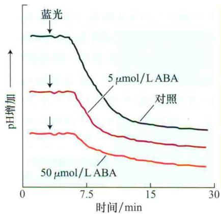  
图23.14 ABA抑制原生质体蓝光刺激的保卫细胞质子泵活性。保卫细胞原生质体悬浮细胞在红光照射下培养，用pH电极检测悬浮培养液中的pH。在所有情况下初始的pH相同（曲线通过转化更易看清楚）（引自Shimazaki et al., 1986）。

1. 蓝光脉冲激活质膜H $^{+}$ -ATPase，将质子泵到外部培养液中使pH降低

2. 培养液中加入 ABA 抑制了 40% 的酸化

浓度增加介导，也似乎由G蛋白信号介导。G蛋白激活蛋白如GTPγS能抑制内向K+通道的活性，但在拟南芥缺乏Gα亚基突变体中，ABA并不抑制内向K+通道或光诱导的气孔开放（Wang et al., 2001）。这样，钙和pH通过以下两种方式影响保卫细胞质膜通道。

(1) 通过抑制内向K+通道和质膜质子泵阻止气孔

开放。

（2）通过激活外向阴离子通道进而激活外向 $K^{+}$ 通道促进气孔关闭。

Gα亚基突变体中，尽管ABA抑制的气孔开放受到阻止，但ABA仍然促进气孔关闭，表明气孔开放的抑制和气孔关闭的促进通过两条不同的途径达到了相同的目的，那就是关闭气孔。正如前面讨论的，磷脂酶D（PLD）和它的产物磷酸（PA）都影响G蛋白对气孔开放的调节，PA通过隔离受抑制的PP2C促进气孔开放。

气孔关闭时，大量（大约0.3 mol/L）离子外流的结果是渗透失水，保卫细胞质膜表面积缩小可达50%。那么减少的膜去了哪里呢？答案似乎是：这些膜以小囊泡的形式通过内吞作用被吸收，这个过程也与ABA诱导的肌动蛋白骨架重组有关，肌动蛋白重组由植物Rho GTPase或“Rops”家族介导（Assmann，2004）。

具有多种感受输入的保卫细胞信号转导都涉及蛋白激酶和磷酸酶。几乎所有生物的信号转导途径中，总有某些步骤与蛋白质的磷酸化和脱磷酸化反应有关。因此认为保卫细胞（有多种信号输入）信号转导也与蛋白激酶和磷酸酶有关，使保卫细胞膜产生电势的 $H^{+}-ATP$

1. ABA与受体结合(为了看得更清楚, 仅显示胞外受体)
2. ABA结合受体后诱导活性氧(ROS)产生, 进而激活质膜上的Ca $^{2+}$ 通道。ROS是由磷脂酶D(PLD)介导的磷脂酸产生的
3. 钙的内流引起了胞内钙的瞬时变化, 进一步促进了钙从液泡中释放
4. ABA刺激NO产生, NO增加了cADPR的水平
5. ABA通过包含SIP、异源三聚体及磷脂酶C和D(PLC和PLD)的信号途径增加了IP3的水平
6. cADPR和IP3的升高激活了液泡上和其他钙通道, 更多的Ca $^{2+}$ 从液泡释放出来
7. 胞内钙的升高阻挡了质膜上的K $^{+}_{\text{in}}$ 通道
8. 胞内钙的升高促进了质膜上Cl $^{-}_{\text{out}}$ (阴离子)通道打开, 引起质膜去极化

  
9. 质膜上的质子泵受到ABA诱导的胞内钙增加和胞内pH升高的抑制，质膜进一步去极化

图23.15 气孔保卫细胞中ABA信号模式图。净效应是细胞中钾离子及阴离子（Cl⁻或苹果酸根离子）丧失。cADPR，环ADP核糖；IP3，1，4，5三磷酸肌醇；NO，一氧化氮；PA，磷脂酸；PLC，磷脂酶C；PLD，磷脂酶D；R，受体；ROS，活性氧；S1P，鞘氨醇-1-磷酸。

酶活性可被一些激酶SnRK和钙依赖蛋白激酶降低，与这一结果一致，蛋白激酶抑制剂抑制ABA诱导的气孔关闭。PP2C和PP2A类蛋白磷酸酶也都参与改变特异H $^{+}$ -ATP酶的活性，导致慢速阴离子通道活性的变化。从这些结果看，蛋白磷酸化和脱磷酸化在保卫细胞信号转导途径发挥重要作用。

图23.15所示为ABA在气孔保卫细胞中作用的简化模式图。为了能表示得更加清楚，仅显示出了细胞表面受体。若要了解更详细的模式图，请参见文献Li et al., 2006和Web Essay 23.2。

## 小结

脱落酸（ABA）发挥短期（快速和可逆的）和长期（持久的）的效应控制植物的发育，该激素在植物应答水分胁迫、干旱、低温和盐胁迫及种子成熟和芽休眠过程中发挥极其重要的作用。

## ABA的产生、化学结构和测定

· ABA与一些类胡萝卜素分子的末端部分类似，以顺式和反式及S和R型形式存在（图23.1）。

· ABA可由生物测定、气相色谱、高压液相色谱和免疫测定方法检测。

## ABA的生物合成、代谢和运输

· ABA由类胡萝卜素前体产生，该前体由质体中的异戊烯二磷酸（IPP）合成，最后在胞质中完成（图23.2）。

· 阻断类胡萝卜素合成的突变降低了ABA水平，导致种子过早萌发（图23.3）。

· 在发育或响应包括脱水等胁迫反应过程中，ABA水平会发生动态改变（图23.4）。

· ABA由氧化降解或通过结合被失活。

· ABA由木质部和韧皮部运输，正常情况下在韧皮部汁液中更丰富。

· 水分胁迫下，ABA首先在茎的微管组织中积累，随后出现在根和保卫细胞中（图23.5）。

· 水分胁迫下，质外体和胞质中pH变化增加了ABA含量，ABA进入保卫细胞后促进气孔关闭（图23.6）。

## ABA信号转导途径

· ABA 短期的反应常常涉及离子流跨膜变化，但也可能包括对某些基因的调控（图 23.15）。

· ABA诱导的持续发育过程（如种子成熟）涉及基因表达模式的重大变化。

·在胞质、核及质体和质膜中鉴定出了ABA受体（图23.7）。

\- 几种第二信使在各种ABA信号反应中都起作用，这些信使包括 $\mathrm{Ca}^{2+}$ （图23.8）、活性氧、环核苷酸和磷脂（图23.9和图23.15）。

· 蛋白激酶和磷酸酶调节ABA信号中重要的步骤（图23.7）。

· ABA与其他激素具有共同的信号中间成分，并在不同信号途径主要交叉调节中发挥作用。

## ABA调节基因表达

· ABA介导转录因子激活基因。

· 转录因子活性调控发育和环境相关基因的表达。

· 转录因子间相互作用，或者转录因子与激酶、磷酸酶或降解机制成分间相互作用调控基因的转录（图23.10）。

## ABA在发育中的作用和生理效应

· ABA在调节种子发育、种子和芽休眠、萌发、营养生长、衰老、气孔调节及胁迫反应中发挥作用。

· 在发育的种子中，胚和胚乳的基因型控制ABA合成，这对诱导休眠至关重要。种皮的母本基因型在胚发生中期控制ABA积累，后者抑制胚萌。

\- 种子发育过程中，ABA促进储藏蛋白、脂及参与脱水耐性形成特异蛋白等的合成。

\- 种子的休眠和萌发由ABA与GA之间的比例控制。

· 在萌发的种子中，ABA抑制GA诱导的水解酶合成。

· ABA对根和茎生长的效应依赖于植物的水分状况（图23.11）。

· ABA极大地促进了叶片衰老，因而增加了乙烯形成和刺激脱落。

· ABA在休眠芽中积累，抑制芽的生长，ABA也可与促进生长的激素如细胞分裂素和赤霉素相互作用。

·在应答水分胁迫反应中，ABA通过使正电荷内流进入保卫细胞诱导膜的瞬时去极化关闭气孔（图23.12）。这些瞬时变化导致细胞中大量K+和阴离子持续外流，从而降低了保卫细胞的膨压（图23.13）。

· 保卫细胞ABA诱导的变化能抑制质膜H $^{+}$ -ATP酶活性，导致膜的去极化（图23.14）。

(郝福顺 译)

## WEB MATERIAL

## Web Topics

23.1 The Structure of Lunularic Acid from Liverworts Although inactive in higher plants, lunularic acid appears to have a function similar to ABA in liverworts.

23.2 ABA May Be an Ancient Stress Signal
Recent reports have documented a role for ABA in regulating stress responses in animals ranging from sea sponges to mammals.

23.3 Structural Requirements for Biological Activity of Abscisic Acid
To be active as a hormone, ABA requires certain functional groups.

23.4 The Bioassay of ABA
Several ABA-responding tissues have been used to detect and measure ABA.

23.5 Evidence for Both Extracellular and Intracellular ABA Receptors
Experiments supporting both types of ABA receptors in different cell types are described.

23.6 The Existence of G Protein-Coupled ABA Receptors Is Still Unresolved
Despite some experimental evidence for the participation of G-proteins in ABA responses, their role as receptors has not yet been demonstrated.

23.7 The Yeast Two-Hybrid System
The GAL4 transcription factor can be used to detect protein–protein interactions in yeast.

23.8 Yellow Cameleon, A Noninvasive Tool for Measuring Intracellular Calcium
The yellow cameleon protein has several features that enable it to act as a reporter for calcium concentration.

23.9 Phosphatidic Acid May Stimulate Sphingosine-1-Phosphate Production
The relationship between phosphatidic acid and the levels of sphingosine-1-phosphate is discussed.

23.10 The ABA Signal Transduction Pathway Includes Several Protein Kinases
Calcium-dependent kinases, calcineurin B-like interacting protein kinases, and MAP kinases have been implicated in the ABA signal transduction pathway.

23.11 The ERA1 and ABH Genes Code for Negative Regulators of the ABA Response
The phenotypes of the eral and abh mutants are described.

23.12 Promoter Elements That Regulate ABA Induction of Gene Expression
ABA induction of gene expression is regulated by several different cis-acting sequences bound by distinct transcription factors.

23.13 Regulatory Proteins Implicated in ABA-Stimulated Gene Transcription

Techniques such as the yeast two-hybrid system have identified several additional ABA transcriptional regulators.

23.14 ABA Gene Expression Can Also Be Regulated by mRNA Processing and Stability
Some mutations affecting basic aspects of RNA metabolism have surprisingly specific effects on the ABA-mediated stress response.

23.15 ABA May Play a Role in Plant Pathogen Responses Several studies link ABA with stimulation or inhibition of plant responses to bacterial and fungal pathogens.

23.16 Proteins Required for Desiccation Tolerance
ABA induces the synthesis of proteins that protect cells from damage due to desiccation.

23.17 The Types of Coat-Imposed Seed Dormancy
The seed coat can inhibit germination by five different mechanisms.

23.18 Types of Seed Dormancy and the Roles of Environmental Factors Many types of seed dormancy exist, some are affected by various environmental factors.

23.19 The Longevity of Seeds
Under certain conditions, seeds can remain dormant for hundreds of years.

23.20 Genetic Mapping of Dormancy, Quantitative Trait Locus, QTL, Scoring of Vegetative Dormancy Combined with a Candidate Gene Approach
QTL analysis is a genetic method for determining the number and chromosomal locations of genes affecting a quantitative trait affected by many unlinked genes.

23.21 ABA-Induced Senescence and Ethylene
Hormone-insensitive mutants have made it possible to distinguish the effects of ethylene from those of ABA on senescence.

Web Essay

23.1 Heterophylly in Aquatic Plants
Abscisic acid induces aerial-type leaf morphology in many aquatic plants.

## 23.2 Hope for Humpty Dumpty, Systems Biology of Cellular Signaling

ABA regulation of stomatal opening is used to illustrate the use of systems biology approaches for modelling cellular signaling
