## 第 24 章

# 油菜素甾醇：细胞扩大和发育的调节子

虽然很久以前就知道动物中存在甾醇类激素，但是在植物中发现这类激素的时间却不长。动物甾醇类激素包括性激素（雌性激素、雄性激素和黄体酮）和肾上腺皮质激素（糖皮质激素和盐皮质激素）。油菜素甾醇（brassinosteroid，BR）是一类植物中的甾醇类激素，它们在植物的很多发育过程中起着重要作用，包括茎和根中的细胞分裂和伸长、光形态建成、生殖发育、叶片衰老，以及对胁迫的反应等（Clouse and Sasse，1998）。

植物甾醇类激素是众多科学家经过近30年的努力，在鉴定不同植物花粉中的新型生长促进因子的时候发现的（Steffens，1991）。J.W.Mitchell及其同事的早期研究发现，在成熟油菜花粉的有机溶剂提取物中含有一种具有最高活性促进生长的物质。他们将油菜花粉中这种未鉴定的活性化合物称为油菜素（brassin）（Mitchell et al., 1970）。

很多生理实验验证了油菜素促进生长的特异作用，包括菜豆第二节间的生物测定实验。在测试中，油菜素的作用不同于其他已知植物激素，它可以引起细胞的伸长和分裂，同时引起第二节间的弯曲、膨胀和开裂（Mandava，1988）。

由于在很低浓度就可以强烈诱导生长和分化，Mitchell等于1970年提出，油菜素代表了一类新的植物激素。进一步的研究证明，油菜素不仅诱导茎的伸长，而且可以提高总的生物量和种子产量。据信这类化合物可能有巨大的应用价值，美国农业部为有关实验室提供经费资助，开展对油菜素中活性化合物的纯化和鉴定研究。

研究人员最终从227 kg蜜蜂收集的油菜花粉中纯化到4 mg具有最高生物活性的油菜素化合物，并将其命名为油菜素内酯（brassinolide）（Grove et al., 1979）。对其晶体结构的X射线衍射分析和光谱研究表明油菜素内酯是一种类似于动物甾醇激素的多羟基甾醇。

3年后，日本科学家从栗子树的虫瘿中分离到另一种植物甾醇，称为栗木甾酮（castasterone），被认为是油菜素内酯的前体（Yokota et al., 1982）。不久，同一研究组从长绿阔叶树蚊母树（Dystilium racemosum）中鉴定到一种与油菜素内酯生物活性类似的混合物（Abe and Marumo, 1991）。

尽管油菜素甾醇类物质被认为是一种内源性化合物，并且在生物测定中对植物生长有重要影响，如菜豆第二节间的生物测定，但由于很多年来人们并不清楚它们在植物正常生长和发育中的作用，因此当时并没有被认作一种植物激素。直到20世纪90年代中期对拟南芥的遗传学研究最终证明了油菜素甾醇是植物激素，与其他植物激素一起参与调控植物发育的很多方面，包括茎的生长、根的生长、微管组织的分化、花粉管生长及种子萌发（Clouse and Sasse，1998）。

我们对油菜素甾醇的讨论，将从简述BR的化学结构及证明BR是植物激素的遗传研究开始。随后，将论述从BR受体到它们调节基因表达的信号转导途径。进而，将综述它们的生物合成、代谢及转运途径，然后介绍这类激素影响的一些重要生理过程。最后，将简单评估油菜素甾醇在农业上的潜在应用价值。

## 24.1 油菜素甾醇的结构、发生及遗传分析

在油菜素甾醇的纯化过程中，主要用到了两种生物测定法：菜豆第二节间的生物测定（图24.1）和水稻叶片弯曲的生物测定（图24.2）。这些生物测定法将具生物活性的BR和不具活性的中间产物和代谢物区别开，同时能定量测定活性化合物的含量（图24.3）。

  
油菜素甾醇浓度递增

图24.1 油菜素甾醇的菜豆第二节间生物测定。切下的菜豆第二节间在含不同BR浓度的培养液中离体悬浮培养几天。最左边为未处理的对照。低浓度的BR主要诱导伸长性生长，而高浓度则引起茎的增粗、弯曲和开裂（引自Mandava，1988）。  
  
图24.2 油菜素甾醇影响矮秆水稻叶倾角的实验。将一小滴溶于乙醇的BR涂在叶片和叶鞘的连接处。在高湿度的条件下培养2天后，测定叶片和叶鞘的夹角（ $\theta$ ）。角度的大小与溶液中油菜素甾醇的浓度成正相关。

  
图24.3 三种具不同活性的BR在水稻叶片弯曲实验中的剂量反应曲线。24-epiBL，24-表油菜素内酯；28-homoBL，28-同油菜素内酯；BL，油菜素内酯。

1979年，人们解析了油菜素甾醇的基本化学结构。当时对于纯化的活性物质进行X射线衍射结晶分析确定了它是一种甾醇类内酯（steroidal lactone）（图24.4）（Grove et al., 1979）。这种化合物被命名为油菜素内酯（brassinolide, BL），根据其结构特征最终鉴定到大约60种相关的植物甾醇，统称为油菜素甾醇（Fujioka and Yokota, 2003）。BL生物合成的直接前体栗木甾酮（castaserone, CS）也有较弱的BR活性。

目前，已经在27个科的种子植物（包括被子植物和裸子植物）、一种羊齿类（问荆，Equisetum arvense）、一种苔藓类（地钱，Marchantia polymorpha）、一种绿藻（水网藻，Hydrodictyon reticulatum）中鉴定到油菜素甾醇。因此，油菜素甾醇显然是一种在陆生植物进化之前，普遍存在于各种植物中的激素。在被子植物的花粉、花药、种子、叶片、茎、根及幼嫩的生长组织中都含有低浓度的油菜素甾醇。

对BL分子结构的了解，使人们能够合成自然界中存在的各类BR和它们的类似物。利用菜豆第二节间或水稻叶片倾角生物测定的方法来测定这些化合物的活性，确定了评价BR活性的以下关键原则（Mandava，1998）。

（1）位于A环上C-2和C-3位置顺式邻双羟基醇的作用。C-2或C-3任一羟基的缺失及它们构象上的任何变化都将导致活性的丧失。

（2）B环内酯7位的作用。尽管B环上有限的修饰不会使活性完全丧失（如栗木甾酮上的B环，图24.10），但是会导致活性显著下降。

（3）甾醇侧链上C-20和C-23羟基的影响。位于

  
I

I  
  
24-表油菜素内酯

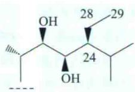  
28-同油菜素内酯

C-20和C-23上的羟基以 $\alpha$ -构象形式存在时比相应的 $\beta$ -羟基的甾醇活性更高。

图24.4 油菜素甾醇的结构。油菜素内酯（BL）是植物中分布最广和活性最高的油菜素甾醇。BL结构中的碳原子用数字编号，环的类型用字母来表示。发生变化的区域用罗马数字Ⅰ和Ⅱ表示。在区域Ⅰ，24-表油菜素内酯和28-同油菜素内酯的侧链存在差异，但并不显著影响它们的活性。侧链C-22和C-23上的羟基是BR活性所必需的。

C-24上的烷基侧链可以发生变化，只是通常情况下发现其活性降低，如24-表油菜素内酯（24-epiBL）和28-同油菜素内酯（28-homoBL）（图24.3和图24.4）。依据它们的侧链结构，不同的化合物可分为 $C_{27}$ 、 $C_{28}$ 或 $C_{29}$ 油菜素甾醇。因为人工合成24-epiBL比合成BL便宜得多，所以尽管很多生物测定表明24-epiBL的活性只有BL的10%，但是在生理实验中，人们还是经常用24-epiBL来替代BL。

## 24.1.1 BR缺失突变体的光形态建成发生异常

近10年来对BR合成和感受缺失突变体的分离及其表型分析的遗传学研究，为确定油菜素甾醇是植物激素提供了确凿的证据。这些突变体的异常表型证明BR在植物正常发育中是必需的。

A  

B  

在对完全黑暗条件下生长数天后仍具有光下生长形态（也就是去黄化）的拟南芥幼苗突变体筛选中，最早分离到的BR缺失突变体是det2（de-etiolated 2，去黄化）和cpd（constitutive photomorphogenesis and dwarfism，组成型光形态发生和矮化）（图24.5）（Li et al., 1996; Szekeres et al., 1996）。这两个突变体中油菜素甾醇的生物合成受阻。DET2编码的蛋白质与哺乳动物的甾醇 $5\alpha$ -还原酶在氨基酸序列上很相似（Li et al., 1996）。哺乳动物的甾醇 $5\alpha$ -还原酶催化从睾丸激素到二氢睾丸激素的NADPH依赖性转化，这是甾醇代

C  
det2 突变体  
D  
野生型  
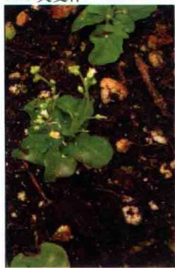

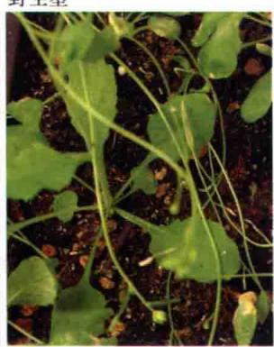

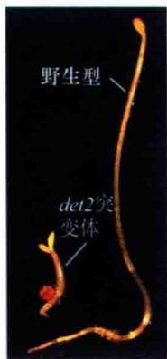

图24.5 拟南芥BR突变体的表型。A. 光照条件下生长3周，与野生型表型相同的bril杂合体（右）相比，纯合的bril突变体（左）明显矮小。B. 光照条件下生长3周，纯合的cpd突变体（左）同样表现出矮小的表型；右边所示是呈野生型表型的杂合突变体。C. 光照条件下生长至成熟，与野生型植株（右）相比，det2突变体（左）表现为矮小的表型。D. 左边是黑暗条件下生长的det2突变体，具有短而粗的下胚轴和伸展的子叶；右边是黑暗条件下生长的野生型（S. Savaldi Goldstein惠赠）。

谢中的一个关键步骤，是正常胚胎中雄性外生殖器和前列腺发育所必需的。同样，CPD基因编码的蛋白质与哺乳动物细胞色素P450单氧化物酶，包括甾醇羟化酶同源。

det2和cpd突变体幼苗对光形态发生的反应受到影响，主要表现为下胚轴短而粗、子叶伸展、有幼嫩的原生叶（在暗生长的野生型幼苗中缺失）及高水平的花青素。以上表型都是野生型在光下而非暗处生长幼苗的表型（图24.5D）。另外，这两个突变体在黑暗条件下生长时，可以检测到受光调节基因的mRNA水平提高。而暗处生长的野生型幼苗表现出典型的黄化表型（下胚轴长、子叶折叠和花青素的缺失）。

除了非典型的暗生长表型外，det2和cpd在光照条件下的生长也不正常。由于细胞大小和细胞间隙减小，两个突变体植株都呈深绿色并且矮小（图23.5 B 和 C），顶端优势丧失（见第9章），并且雄性育性下降。另外，det2和cpd还表现出根短、开花延迟的表型，且即使是在开花后还表现叶片衰老延迟的现象。cpd通常比det2的表型严重，其原因是det2突变体中仍有微量的具有生物活性的BR，而cpd突变体中几乎检测不到具有活性的BR（Szekeres et al., 1996）。对这些矮小突变体外源施加油菜素甾醇能够恢复它们的表型，进一步证明DET2和CPD是油菜素甾醇合成和植物正常光形态建成所必要的（图24.6）。

A cpd  

B 野生型  
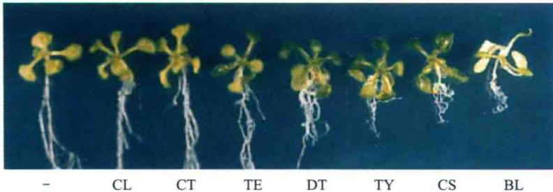  
图24.6 BL及其合成（图24.10和附录3）中的中间产物恢复cpd突变体的正常生长。野生型和cpd突变体幼苗不施用油菜素甾醇（负号表示）或用0.2 $\mu$ mol/L BR中间产物处理14天。菜油甾醇（campesterol，CL）和卡它甾酮（cathasterone，CT）对cpd突变体都没有任何影响，因为这些中间产物的合成在CPD蛋白酶催化的反应之前。相反，茶甾酮（teasterone，TE）、3-脱氢茶甾酮（3-dehydroteasterone，DT）、香蒲甾醇（typhasterol，TY）及栗木甾酮（CS）都能恢复cpd的表型，因为它们的合成在CPD酶催化的反应之后。野生型含有适量的中间产物，其生长受到BL及其中间产物的微弱抑制（引自Szekeres et al., 1996）。

## 24.2 油菜素甾醇的信号转导途径

对BR反应的遗传分析，鉴定到位于细胞膜的BR受体和BR信号转导途径中的很多其他组分。从而使人们对BR作用分子机制的研究已经取得了巨大的进展。这里，我们将重点讨论拟南芥中的BR信号转导通路及其主要组分（关于BR信号途径和其他信号转导的比较请参见第14章）。

## 24.2.1 从BR不敏感突变体中鉴定出BR细胞表面受体

为了鉴定拟南芥BR信号转导途径的组分，研究者最初采用遗传筛选的方法，在高浓度BL的条件下分离根正常伸长的突变体，并从中筛选到单一的bri1（brassinosteroid-insensitive 1）（Clouse et al., 1996）。进一步筛选对BL不敏感的突变体，所有得到的其他突变体都是BRI1的等位突变（Li and Chory, 1997），证明BRI1是BR信号转导途径中的重要组分。

接下来的结合实验证明BL能以相当高的专一性直接结合到BRI1，证明了BRI1是BR的受体（Kinoshita et al., 2005）。

油菜素内酯可以结合到受体BRI1的胞外域。BRI1是定位于细胞膜上的富亮氨酸重复（leucine-rich repeat，LRR）的受体激酶（图24.7）。BRI1也被发现能定位于早期内体（亚细胞隔室）中并通过其传递信号（Geldner et al., 2007）。有意思的是，虽然到目前为止，大家认为植物蛋白激酶都是丝氨酸/苏氨酸（serine/threonine, S/T）特异的激酶，但是BRI1却是一个双重特异的蛋白激酶。也就是说，丝氨酸/苏氨酸和酪氨酸位点都能被BRI1自磷酸化，同时这两种修饰都是BRI1激活所必需的（Oh et al., 2009）。

  
图24.7 BR受体BRI1的结构域组成。受体BRI1定位于细胞膜上。胞外区域由一段富亮氨酸重复序列（LRR）组成，LRR内含一个岛状域，其功能为油菜素内酯（BL）结合区域的一部分。胞内部分包括一个近膜结构域、一个激酶结构域和C端尾巴。

在拟南芥基因组中，LRR受体激酶可能组成了最大的受体基因家族，超过230个。这个家族具有保守的功能结构域，其N端是一个包括具有很多串联（邻近）富亮氨酸重复的胞外功能域，有个单一跨膜区，以及具有酪氨酸、丝氨酸和苏氨酸蛋白激酶活性的胞质激酶域（图24.7）。以BRI1为例，它含有25个富亮氨酸重复。BRI1还含有一个BR结合必需的，由一系列氨基酸残基形成一个独特“岛”域，它插在第21和第22个富亮氨酸重复之间（Kinoshita et al., 2005）。这个岛域连同其相邻的第22个富亮氨酸重复构成了结合BR所必需的最小区域。

## 24.2.2 磷酸化激活BRI1受体

对大量BRI1等位突变的分析表明，受体的胞外域和胞内激酶域都是BR信号传递到下游所必需的（Friedrichsen et al., 2000; Vert et al., 2005）。BL与BRI1上约100个氨基酸残基构成的新的甾醇结合域结合，该区域包括岛域和邻近的LRR序列（图24.7）。BL结合后使受体激活，其特征是提高受体的自磷酸化活性，并增强了与次级LRR受体激酶、BRI1结合受体激酶BAK1（BRI1-association receptor kinase 1）的结合（图24.8）。

在油菜素内酯存在的情况下，BRI1胞内结构域的很多位点发生体内磷酸化，包括近膜区（juxtamembrane region，JM）、C端尾巴和激酶的催化区域本身。这些磷酸化的位点对受体活性起着调节作用，并控制BRI1的抑制子BKI1（BRI1 -kinase inhibitor 1）从细胞膜上的解离及BRI1与其他蛋白质的互作，如BKA1和BSK（BR-signaling kinase）（Wang et al., 2005a, b; Wang and Chory, 2006; Tang et al., 2008）。

与动物的蛋白激酶类似，BRI1激酶域的特异磷酸化位点是激酶激活所必需的（图14.2）。另外，BRI1的C端对受体的活性起负调节作用。配体结合后，消除了C端的抑制作用，从而提高了BRI1的激酶活性（Wang et al., 2005b）。然而，在解析了BRI1的高分辨率结构后，才能清楚了解BL诱导激活的准确机制（Wang et al., 2005b）。

动物和植物细胞的受体激酶在体内常以二聚体形式起作用。体外实验已经证明，细胞内BRI1受体通常以同一种单体组成的同源多聚体起作用（Wang et al., 2005a）。

BRI1与其配体结合而被激活后，磷酸化的BRI1与另一种LRR激酶BAK1形成异源多聚体（由两个不同的单体组成）并磷酸化BAK1。接下来，BAK1被激活并与BRI1发生反式磷酸化作用。磷酸化的BRI1/BAK1异源二聚体可能是受体的活化形式，它们通过磷酸化激活BSK蛋白质并抑制负调控因子BIN2的活性而诱导BR反应。

## 24.2.3 BIN2是BR诱导基因表达的抑制子

BR存在的情况下，形成活化的BRI1/BAK1异源多聚体开启了BR的信号转导过程，从而调节BR反应基因的转录。BR信号转导途径中下一个步骤由负调节因子BIN2（brassinosteroid insensitive-2）参与（图

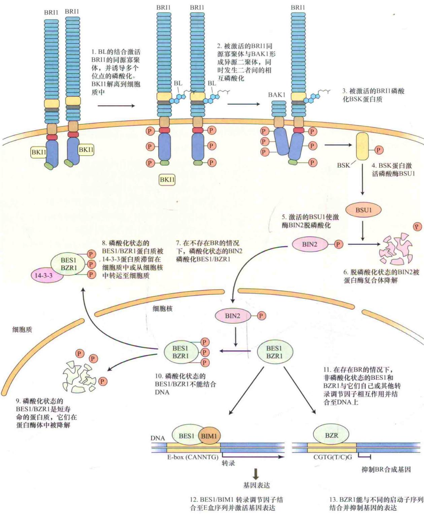  
图24.8 BR信号转导模型。信号在细胞表面感知。

24.8）。BIN2编码一个与酵母和动物中的糖原合成激酶Ⅲ（GSK3）同源的蛋白激酶（Li and Nam，2002）。GSK3是具有组成型活性的丝氨酸/苏氨酸激酶，它们广泛地参与很多信号转导途径，并常起到抑制基因表达的作用。

在BR不存在的条件下，BIN2可能在很多调控位点磷酸化两个核蛋白质BES1（bri1-EMS-suppressor 1）和BZR1（brassinazole-resistant 1）的很多调控位点，从而抑制它们的活性。BES1和BZR1是高度类似的转录调节因子（在氨基酸序列上有90%的同一性identity）。它们是短寿命的蛋白质，可以被26S蛋白酶体降解，这个过程与泛素化相关（图24.8）（泛素途径在第2章、第14章和第19章中也有论述）。

BIN2对BES1和BZR1的磷酸化至少有两方面的调控作用。第一，BES1和BZR1磷酸化状态的改变会影响它们在细胞核和细胞质间的穿梭，这种穿梭运动是由一类称为14-3-3的蛋白质家族介导（Gendron and Wang, 2007）。第二，BES1和BZR1的磷酸化会阻止它们结合到目的启动子，因此阻止它们作为转录调节因子的作用（Vert and Chory, 2006）。

在BR存在的条件下，活化的BRI1/BAK1异源寡聚体激活BSK蛋白质，从而促进BSK蛋白质与植物特异丝氨酸/苏氨酸磷酸酶BSU1（bril suppressor 1）结合并将其激活。接下来激活的BSU1将BIN2脱磷酸化，并通过蛋白酶体系统促进其降解（Peng et al., 2008；Kim et al., 2009）（图24.8中的第4个和第5个步骤），于是导致了脱磷酸化并呈活化状态的BES1和BZR1的积累（图24.9）。抵消BIN2激酶作用的磷酸酶目前并不知道。活化的脱磷酸化的BES1和BZR1进而激活或抑制BR调节基因的表达（图24.8）。

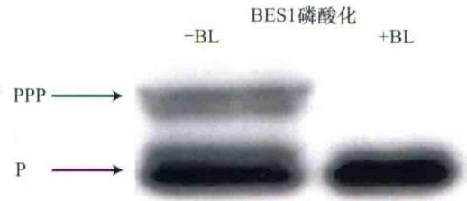  
图24.9 BL抑制BES1的磷酸化。A.用Western印迹法来鉴定两种形式的BES1：高度磷酸化的形式（PPP）和非磷酸化的形式（P）。在未经BL处理（-BL）的拟南芥植株中，很多BES1处于高度磷酸化的形态。在BL处理（+BL）的植株中，所有的BES1都处于非磷酸化的状态（抗体由Y.Yin制作，G.Vert惠赠）。

## 24.2.4 BES1 / BZR1 调节基因表达

随着拟南芥基因组测序的完成，也有了同时检测数千个基因表达的技术。应用这些包含DNA芯片分析（见第2章和Web Topic 17.7）在内的技术来研究基因的表达，鉴定到数百个受BR诱导的基因，据推测其中的很多基因在生长过程中起作用。另外，还鉴定出受BR抑制的基因。其中的很多下调基因也受到转录因子BES1/BZR1的调节（图24.21）（Vert et al., 2005）。

BES1和BZR1是通过两个独立的遗传筛选发现的。在光照条件下，bes1突变体与过表达DWF4和BRI1的植株类似，变得比野生型更大。与此相反，光下生长的bzr1突变体表现出半矮化的表型。在黑暗条件下，BES1和BZR1突变位点可以抑制bri1弱等位突变的矮小表型并拥有正常长度的下胚轴。这是因为BES1和BZR1突变位点使它们编码的蛋白质不易降解。用遗传学术语来说，BES1和BZR1突变位点是由于其所编码蛋白质累积所造成的半显性的一种功能获得型突变。

尽管它们在序列上有很高的相似性，BES1和BZR1看来可能介导拟南芥中不同靶基因的表达。这可能是因为该植物体内这些转录因子本身受到截然不同的时空调控。BES1通过与其他蛋白质相互作用来促进一组BR诱导基因的表达，这些蛋白质包括不同家族的靶标转录调节因子和染色质重塑因子。其中一个例子就是一个称为BIM1（BES1-interacting Myc-like 1）的转录调节因子。BES1/BIM1的异源二聚体结合到一段称为E盒的特异DNA序列上，激活转录。其中E盒作为BR所诱导基因启动子上的BR反应元件（Yin et al., 2005）。

BZR1是BR生物合成中的抑制子。BZR1直接与很多不同的BR生物合成基因的启动子区域所含有的CGTG（T/C）G元件相结合，从而抑制转录。这样，BZR1在BR生物合成途径的负反馈调节上起着重要的作用（见后文）（He et al., 2005）。

## 24.3 油菜素甾醇的生物合成、代谢及运输

与赤霉素和脱落酸类似，油菜素类甾醇的合成途径是萜类途径的一个分支，开始于两个法尼醛二磷酸聚合形成 $C_{30}$ 三萜三十碳六烯（sequalene）（见第13章）。三十碳六烯接着经过一系列的环闭合，从而形成五环的三萜（甾酮）前体环阿屯醇（cycloartenol）。植物中所有的甾醇类物质都是环阿屯醇一系列的氧化反应和其他修饰的结果。

对BL生物合成途径的了解来自于遗传学和生物化学共同的研究成果（Fujioka and Yokota，2003）。鉴于长春花属的植物（玉黍螺）（Catharanthus roseus）能产生相对高剂量的BRs，因此常用它们的细胞培养进行油菜素甾醇合成途径的生物化学分析。在饲喂试验中利用放射性同位素标记的BR中间产物做示踪，经气相色谱-质谱分析鉴定出它们的代谢衍生物。将这种分析方法与遗传学相结合，来研究拟南芥、番茄及其他植物的BR缺失突变体，从而鉴定出BR生物合成的完整途径。在这一部分我们将列举并讨论这些发现。

## 24.3.1 油菜素内酯是由菜油甾醇合成的

由于其C-24取代的烷基不同，油菜素甾醇的合成可来源于菜油甾醇（campesterol）、谷甾醇（sitosterol）及胆固醇（cholesterol）。在植物膜中，菜油甾醇和谷甾醇的含量丰富，而胆固醇相对较少。所有这三种甾醇在植物细胞中都代谢生成大量的中间产物，但只有其中少数几种具有生物活性（Clouse and Sasse，1998；Sakurai，1999）。

我们将从甾醇的最早前体菜油甾醇开始，对BR生物合成途径进行简要描述，而菜油甾醇最终是由环阿屯醇生成的（图24.10）。经过包括DET2参与的步骤，菜油甾醇首先生成菜油甾烷醇（campestanol）。然后通过早期C-6氧化和后期C-6氧化中的任一条途径，转化为栗木甾醇（CS）。附录3包括了这两条途径的其他信息。

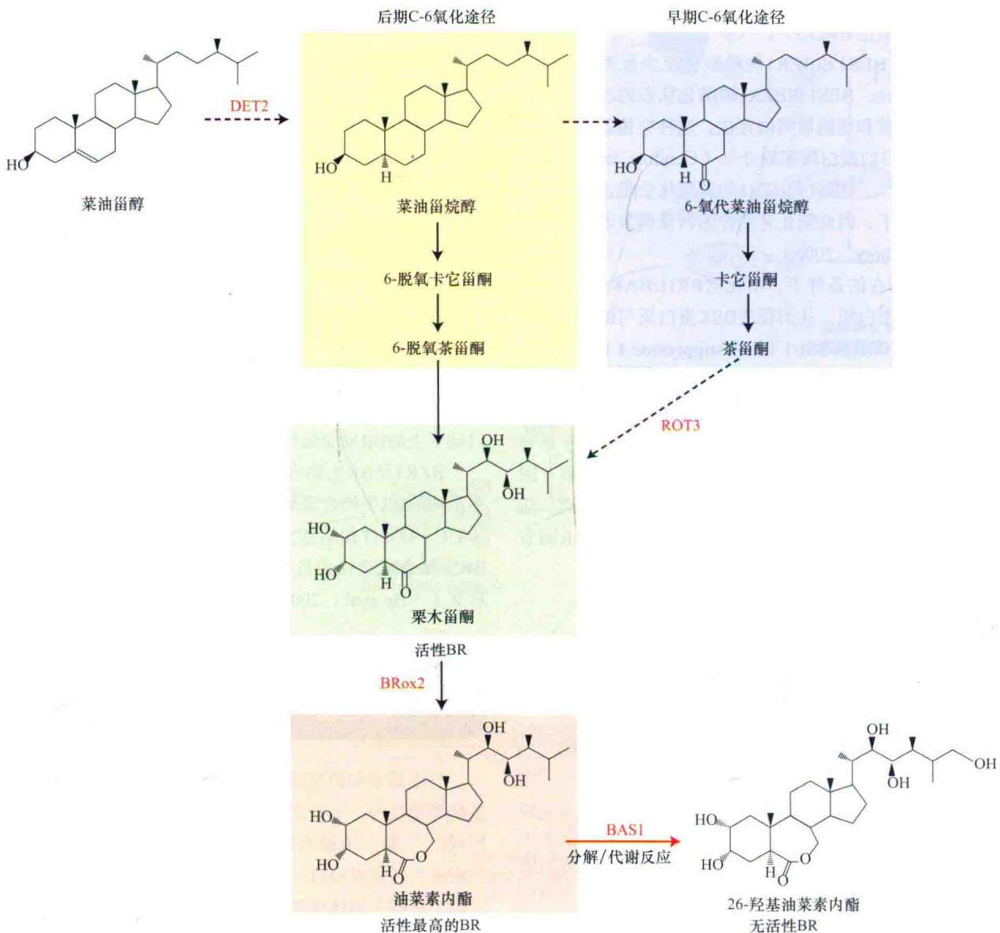  
图24.10 油菜素内酯（BL）生物合成和代谢途径的简图。BL生物合成的前体是菜油甾醇。黑箭头表示生物合成的次序，实线箭头表示单步反应，虚线表示多步反应。如图所示，BL的中间前体栗木甾酮，可由两条平行的途径合成：早期-氧化和后期-氧化途径。在早期C-6氧化途径中，B环上的C-6氧化反应早于侧链C-22和C-23位置上的相邻羟基化（有关BL的结构见图24.3）。在后期C-6氧化途径中，C-6氧化反应发生在侧链和A环C-2上羟基化之后。这两条途径可能在很多不同的点上相互连接，因此是一个生物合成网络而不是一个线性途径。图中标出了拟南芥催化不同步骤的酶。BL的分解由一个红色箭头表示。

两条途径在CS上合并，CS继而转化成BL（图24.4和图24.10）。在拟南芥、豌豆及水稻中，早期C-6氧化和后期C-6氧化途径共同存在，且可以在不同点上连接（Fujioka and Yokota，2003）。目前，人们还不清楚植物同时拥有这两条相连途径的生物学意义。事实上，在番茄中并没有发现早期C-6氧化途径。两条相连途径的共存增加了BR生物合成的复杂性，它可能为植物在不同的生理环境，如适应各类胁迫提供了有利条件。

所有从菜油甾醇到BL合成途径的突变体，都是由一些编码细胞色素P450单氧化物酶（cytochrome P450 monooxygenase，CYP）的基因突变引起的。拟南芥中DWARF4（DWF4）和CPD基因，编码两个单氧化物酶，CYP90B1和CYP90A1，它们分别使BR合成中间产物中的C-22和C-23位置发生羟基化（Fujioka and Yokota，2003）（图24.4和图24.10）。

参与BR生物合成途径的CYP蛋白质定位在内质网（endoplasmic reticulum，ER）上。这一点与参与赤霉素生物合成（见第20章）的细胞色素P450单氧化物酶类似，因此BL的生物合成很可能也在内质网上。

## 24.3.2 降解代谢和负反馈在控制BR动态平衡上的作用

活性BR的水平同样受到使BL失活的代谢过程调节。几种类型的反应都能导致BL的失活，包括差向异构、氧化、羟基化、磺化及与葡萄糖或脂类的缀合（Fujioka and Yokota，2003）。对这方面的认识仍非常有限，这些知识只是来源于饲喂实验：给植物施用放射性同位素标记的BR，然后鉴定标记的产物和分析内源代谢产物。然而，在植物中，BR途径与这些产物的相关性仍然不清楚。

分离到的拟南芥基因BAS1（phyB activation-tagged suppressor-dominant），编码一个具甾醇26-羟化酶活性的细胞色素P450单氧化物酶（CYP72B1），至少阐明了一个通过代谢酶来调节BL浓度的机制。BAS1的过量表达降低了植物体内BL的水平，并导致失去活性的26-羟基化的BL（26-羟基BL的结构，见图24.6）的积累，导致BR缺失植株的矮小表型（Neff et al., 1999）。

具生理活性的BR水平也受负反馈机制调节。也就是说，如果积累过量的BR，它的生物合成将受到削弱，而BR的降解则被促进。实际上，拟南芥对外源施用BL的反应使所有被检测的与BL生物合成相关基因（DWF4、CPD、ROT3及BR6ox1）的mRNA水平都降低了，而参与BR降解的BAS1的mRNA水平却提高了（图24.11）（Tanaka et al., 2005）。

BR生物合成相关基因的下调由BZR1调控，BZR1可以直接与这些生物合成基因启动子上的一个保守元件结合，从而抑制它们的表达（图24.8）（He et al.,

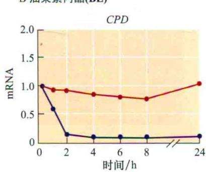

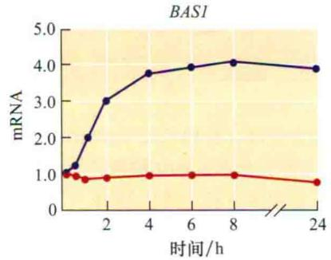  
图24.11 油菜素甾醇水平的正、负反馈调节。对拟南芥幼苗进行5 $\mu$ mol/L油菜素唑（Brz）处理（A），或者先用5 $\mu$ mol/L Brz（耗尽内源BL）处理后接着用0.1 $\mu$ mol/L BL处理（B），2天后测定CPD（BR合成）和BAS1（BR代谢）的mRNA水平。BR生物合成基因CPD的表达被Brz（A）促进，而受BL（B）的抑制。因此CPD受BL负调控。相反，BL促进BR降解酶基因BAS1的表达。所以BAS1受BL正调控（引自Tanaka et al., 2005）。

0.5 $\mu$ mol/L

2005）。相应地，对BL反应能力减弱的拟南芥突变体，将会比野生型拟南芥累积更多的具有生物活性的CS和BL（Noguchi et al., 1999）。

BR生物合成的特异抑制剂油菜素唑（brassinazole，Brz），是开展BR的遗传、生理及分子研究的有力工具（图24.12）。Brz含有一个由2个碳和3个氮原子组成的三唑。很多三唑化合物能作为细胞色素P450单氧化酶的抑制剂。三唑Brz特异性地抑制BL生物合成中DWF4（单氧化酶CYP90B1）的活性，而DWF4催化C-22上的羟化反应（Asami et al., 2003）。生长在Brz上的植物表现出BR缺失的表型，这种表型可以通过在它们的生长培养基上添加BL来恢复（图24.13）。在这些实验中，植物中的Brz和BL都由根系来摄取。

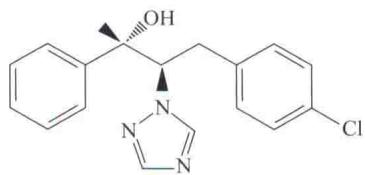  
图24.12 抑制油菜素甾醇生物合成的三唑化合物油菜素唑{4-[(4-氯基)-2-苯基-3-(1,2,4)-三唑]-丁-2-醇}的结构。  
Brz 5 $\mu$ mol/L  
1 $\mu$ mol/L

  
图24.13 油菜素唑（Brz）对光照生长14天拟南芥幼苗的影响。A. 对照幼苗（左）和5 $\mu$ mol/L、1 $\mu$ mol/L及0.5 $\mu$ mol/L油菜素唑处理的拟南芥幼苗（右）。Brz引起幼苗的矮化程度依赖于Brz的浓度。B. 光照生长14天的拟南芥对照幼苗（左）和1 $\mu$ mol/L油菜素唑（中）或1 $\mu$ mol/L油菜素唑加10 nmol/L油菜素内酯（BL）处理的幼苗（右）。Brz抑制BL的生物合成酶DWF4。施用的BL是在DWF4催化的反应以后合成的，因此可以减轻Brz对生长的抑制作用（引自Asami et al., 2000）。

利用Brz进行的大量研究获得了关于BR体内动态平衡的重要信息，完善了上述有关BL的研究。在含有Brz的培养基上生长的拟南芥耗尽体内的BR后，导致多个BR生物合成基因的表达都受到上调（图24.11）。综上所述，研究结果表明BR的体内动态平衡是由若干靶基因共同的反馈调节来维持（Tanaka et al., 2005）。

BR的动态平衡也受BL生物合成途径中的限速步骤调节。如果一个酶是限速酶，它突变后相对它的直接产物来说，它的底物应该有显著累积。对拟南芥内源BR的测定表明DWF4、CPD和BR6ox1/2可能是BR生物合成途径中的限速步骤，因此对BR的体内动态平衡起着重要作用。实际上DWF4和BR6ox2的过量表达促进了植物的营养生长（图24.14）（Choe et al., 2001；Kim et al., 2005）。

野生型拟南芥

过量表达BR合成基因DWF4的拟南芥

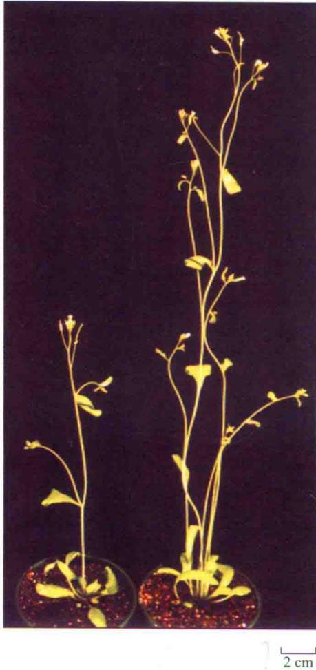  
图24.14 拟南芥中过量表达BR生物合成的基因DWF4可以显著提高植株的大小。植物生长了25天（引自Choe et al., 2001）。

## 24.3.3 油菜素甾醇在它们合成部位的附近起作用

通常，激素作用的一个重要决定因素是从合成部位到作用部位转运的程度和速度。外源施用的24-表油菜素内酯（24-epiBL）经历了从根到茎叶的长距离转运。例如，当用 $^{14}$ C-24-epiBL处理黄瓜、番茄或者小麦植株的根部，放射性很容易就从根部转移到茎部（Schlagnhaufer and Arteca，1991；Nishikawa et al., 1994）。并且，在含有BL的培养基上，BR缺失的拟南芥突变体矮化的表型能够恢复到野生型的大小。另外，当对根施用BL时，野生型植株的叶柄也会伸长（Clouse and Sasse，1998）。

相反，当 $^{14}$ C-24-epiBL施用在黄瓜叶片的上表面时，很容易被吸收，但是从叶片运出很慢。外源施加的 $^{14}$ C-24-epiBL只有6%被转运到较幼嫩的叶片中（Nishikawa et al., 1994）。这些结果说明，外源BR很容易从根转移到茎叶，但很少从叶中转移出。我们推测，被根吸收的24-epiBL运输到茎叶是通过木质部的蒸腾流。因为木质部流是单向的，而施用于叶片的24-epiBL只能通过韧皮部从叶中运出。24-epiBL不能向叶片外运出的结果表明它很少在韧皮部中运输。

此外，尽管24-epiBL确实能从根运输到茎叶，但内源BR似乎并不能从根部运输到茎部。例如，豌豆和番茄的嫁接实验表明，野生型和BR缺失突变体之间根/茎叶的相互嫁接不能恢复后者向顶或向地方向的表型（图24.15）（Symons and Reid，2004；Montoya et al., 2005）。进一步对BR中间产物的时空分布进行比较，表明它们在所有植物器官中都存在，尽管不同的中间产物在不同器官中的浓度不同（Shimada et al., 2003）。

野生型嫁接到野生型生长正常

BR缺失突变体的根不影响野生型茎叶的生长

  
图24.15 生长45天的野生型和BR缺失突变体豌豆（lkb）的相互嫁接对茎叶表型的影响。利用7天的幼苗做从上胚轴到上胚轴的嫁接。BR缺失突变体矮小的茎叶不能被野生型的根恢复。同样，BR缺失突变体的根也不影响野生型茎叶的生长。两个结果都表明BR不能长距离运输（引自Symons and Reid, 2004）。

与BR生物合成途径的广泛分布相对应，BR信号转导途径的组分（见前文）显然也在植株中广泛表达，尤其是幼嫩的生长组织（Friendrichsen et al.,

2000）。表皮中BR的活性对于茎中器官的发育是决定性的：一方面，表皮表达的CPD和BRI1就足以驱动内侧组织的生长；另一方面，表皮表达的BR代谢酶BAS1可以限制器官发育（Savaldi-Goldstein et al., 2007）。总而言之，这些证据表明：①内源BR在其合成部位或附近发挥功能；②每个器官合成和感受自己的活性BR。

## 24.4 油菜素甾醇对生长和发育的影响

BR作为促进生长的物质，最初是从花粉中分离得到的，在对光形态建成的研究中证明它们有植物激素的作用。自发现以来，BR已被证实参与植物的很多发育过程，包括棉花纤维和侧根的发育、顶端优势的维持、维管的分化及花粉管生长。BR也参与：植物防御、种子发芽及叶片衰亡（关于BR和顶钩维持的讨论见Web Essay 24.1）。有关BR在发育中的很多生理作用还有待研究。本节将讨论一些理解较为透彻的BR反应，包括茎叶和根的生长、维管的分化、花粉管的伸长及种子萌发。

## 24.4.1 BR促进茎叶中细胞扩展和细胞分裂

BR的生长促进作用表现在加速细胞伸长和细胞分裂。如上面讨论过的菜豆第二节间生物测定首次证明了这一点（图24.1）（Mandava，1988）。

水稻叶片倾角生物测定（图24.2）的依据是BR能够诱导细胞伸展。叶片倾斜类似于乙烯引起的偏上性（见第22章）。叶对BR的反应是，靠近鞘叶连接区的近轴（上）面细胞比远轴（下）面细胞伸展得快，引起叶片垂直方向的向外弯曲。BL诱导的叶片近轴面细胞伸展还依赖于细胞壁松弛度的增加。

在遗传学研究中，BR突变体的矮小表型充分证明BR是植物正常生长所必需的（图24.5）。通过显微镜观察发现，BR缺失突变体的叶片细胞不仅比野生型小，而且细胞数目也少，表明BR是茎叶中重要的促进生长类激素（Nakaya et al., 2002）。因此，不难想象，过量表达BR生物合成基因DWF4可以提高内源BR的水平，并相应促进植株伸长（图24.14）（Choe et al., 2001）。实际上，油菜素甾醇最显著的特性之一（首先在菜豆第二节间生物测定中被观察到）是促进细胞伸长和细胞增殖。

BR促进生长最明显的位置是植物幼嫩的和正在生长的茎叶组织。对纳摩尔级浓度BL反应的细胞延伸动力学与对生长素的反应不同。例如，对于大豆上胚轴，BL处理经过45 min滞后期才开始促进伸长，几个小时后达到最高速率。相反，生长素刺激的伸长反应在15 min滞后期后开始，并且在45 min内达到最大速率（图24.16）（Zurek et al., 1994）（见第19章）。这些结果表明对BR的反应包含基因转录在内的较慢途径，而对生长素的快速反应可能不需要基因转录。

  
图24.16 BR刺激大豆上胚轴伸长的动力学分析。在灵敏度生长检测系统中，1.5 cm长的大豆上胚轴用0.1 $\mu$ mol/L BR处理，在45 min的滞后期后，BR诱导生长。需要5 h或者更多的时间，从而达到最大的稳定生长速度（结果未显示）（引自Zurek et al., 1994）。

另一种可能的解释是生长素促进的基因表达比BL诱导的基因表达更加强烈（见第19章）。事实上，研究表明，生长素和BR以相互依赖的方式协同促进茎叶的生长，揭示了每种激素需要另一种激素的存在以达到最优的活性。IAA和BR的协同性在水稻叶片弯曲的生物测定中也得到了验证。生长素和BR的协同作用可以在分子水平持续促进下游共同靶标的表达。

虽然转录增加的精确分子机制在很大程度上是未知的，但是BR和生长素相互作用的不同结点已经被发现。例如，BIN2作为BR信号的负调控元件，可以磷酸化一些同时参与生长素和BR所调控基因表达的转录因子（Vert et al., 2008）。BR也提高生长素的转运，并促进侧根的生长和向地性响应中的不对称生长（见下文）。最后，生长素可以促进一个核蛋白质BRX1的表达，而BRX1可以正调控BR合成基因CPD的表达（Hardtke, 2007）。因此，这两种激素的相互作用发生在多种水平。

细胞的伸展过程包括：细胞壁的松弛，伴随着渗透运输水分进入细胞、保持膨压，以及细胞壁物质的合成、保持壁的厚度（见第15章）。其中的每一步都可能受到BR的调节。人们认为BR通过调节水通道蛋白来增加水分的吸收（Morillon et al., 2001），增强细胞壁的松弛度（图24.17），并且诱导一些细胞壁修饰酶的表达，如木葡聚糖转移酶/水解酶（xyloglucanendotransglucosylase/hydrolase，XTH）和膨大素（见第15章）。

25μm  
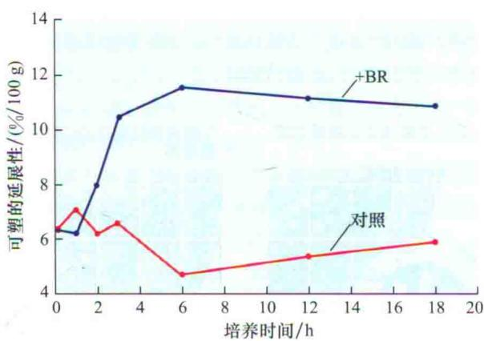  
图24.17 BR增加大豆上胚轴可塑性细胞壁的延展性。大豆上胚轴（1.5 cm）用含或不含0.1 $\mu$ mol/L的BR培养一定的时间，接着用伸展计测定可塑的延展性（见第15章）。处理2 h后，BR显著提高细胞壁的延展性，之后延展性持续升高直到6 h后达到稳定。BR提高了细胞壁的可塑性，说明BR诱导了细胞壁的松弛，这是细胞延展所必需的（引自Zurek et al., 1994）。

控制微管的排列是正常伸长的另一个必要条件。如在第15章中讨论过的，微管的方向有利于纤维素微纤维合成过程中的排列，而细胞壁上微纤维的横向排列是正常细胞伸长所必需的。对拟南芥BR缺失突变体中微管的显微镜观察表明，突变体细胞含极少的微管，同时这些微管的排列缺乏条理。对突变体外源施加BR能够恢复正常的微管丰度和结构（图24.18）。由于BR不会增加细胞微管蛋白的总量，BR必定是通过促进微管晶核形成和排列组织来实现上述功能的（Catterou et al., 2001）。

除了促进细胞伸长之外，BR同时也促进细胞增殖。如我们在第21章看到的，细胞分裂素诱导细胞分裂与D型细胞周期蛋白CYCD3的表达有关。24-epiBL同样也可以增加CYCD3的表达，而且24-epiBL可以替代在拟南芥愈伤组织和细胞悬浮培养中所需的玉米素（Hu et al., 2000）。因此BR和细胞分裂素可能通过相似的机制调节细胞周期。

## 24.4.2 BR既促进又抑制根的生长

BR缺失突变体的典型表型是根的生长受到抑制，所以BR是根正常伸长所需要的。然而，如生长素一样，外源施用不同浓度的BR对根的生长分别有促进和抑制的作用（Mussig，2005）。对BR缺失突变体外源施用低浓度BR，能促进根的生长，而高浓度则抑制根的生长。开始起抑制作用的阈值浓度由使用的BR类似物活性决定。因此，相对活性较高的类似物24-epiBL比低活性的类似物24-epiCS（epicastasterone）所需的阈值浓度要低。

BR对根生长的作用与生长素和赤霉素的作用无关。一种生长素极性运输的抑制剂，2,3,5-三碘苯甲酸（2,3,5-triiodobenzoic acid，TIBA）（见第19章）不能阻止BR对根伸长的诱导作用（Mussig，2005）。当同时施用BR和生长素，对根生长的促进和抑制作用是加性的。此外，施用赤霉素不能恢复BR缺失突变体根生长减弱的表型。综上所述，表明BR对根生长的抑制作用不需要生长素或赤霉素参与。此外，像生长素一样，高浓度的BR刺激乙烯的生成，因此至少BR对根生长的部分抑制效应可能是由乙烯引起的。

低浓度BR也能诱导侧根的形成（图24.19）（Baoet al., 2004）。但是在这些情况下，对于侧根的形成，BR和生长素具有协同作用。目前的模型认为，BR促进侧根的发育，部分是通过影响生长素的极性运输来实现的（见第19章）。BR处理促进顶端生长素运输，是侧根发育所必需的，一种极性生长素运输的抑制剂N-1-萘基邻胺甲酚苯甲酸（1-N-naphthylphthalamic acid, NPA），能抵消BR对侧根发育的促进作用（Bao et al., 2004）。最后，BR促进向地性响应，而且这种作用与提高生长素向外转运蛋白质PIN2在根伸长区的表达相关（见第19章）（Li et al., 2005）。这样，BR通过影响根的伸长和分枝对整个根的形态建成起着重要的作用。

A  

B  

C  
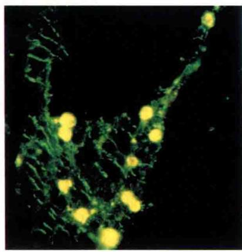  
图24.18 BR对拟南芥微管结构的影响。在免疫荧光实验中，微管显示为绿色（“条纹”显示它们的排列）。黄色斑点为叶绿素的自发荧光信号。A. 野生型薄壁组织细胞，表明其正常的横向微管排列。B. BR缺失突变体薄壁组织细胞，含极少的、不规则排列的微管。C. BR处理的BR缺失突变体，恢复了正常的微管结构（引自Catterou et al., 2001）。

  
图24.19 BL和IAA协同作用，促进侧根的发育。拟南芥幼苗在含0 nmol/L、1 nmol/L、5 nmol/L、20 nmol/L及50 nmol/L的IAA，并且含有或者不含1 nmol/L BL的琼脂粉培养基上垂直生长8天，计算每厘米初生根上侧根的数目和可见的侧根原基数。在每种处理下每厘米初生根上的侧根数目用图表列出，相对1 nmol/L BL不含生长素处理的每厘米初生根上的侧根数目来计算百分比（100%，水平虚线）。BL和IAA协同效应发生在1\~20 nmol/L（引自Bao et al., 2004）。

## 24.4.3 BR在导管发育中促进木质部的分化

BR通过促进木质部的分化和抑制韧皮部的分化进而在导管发育中起着重要作用。有证据表明BR突变体的导管系统受损，与野生型相比具有较高的韧皮部与木质部比例（图24.20）（见Fukuda，2004的综述）。并且BR缺失突变体的维管束数目下降，且它们之间的空间排列不规则。相反，过量表达BR受体蛋白（在这一节之后讨论）导致植物产生比野生型更多的木质部。

鱼尾菊（Zinnia elegans）细胞培养是一个研究木质部分化各个时期极佳的体外系统。从幼叶中机械分离单个细胞，黑暗条件下在液体培养基中培养2\~3天，细胞分化成管状分子（tracheary element）（图24.21）。在这个木质部分化系统中，对BR进行测定的结果表明前形成层类似细胞中BR的合成活跃，是其分化成管状分子的基础。BR可能通过调节在发育中起至关重要作用的同源基因的表达（见第16章），而介导前形成层细胞分化出木质部（Fukuda，2004）。

A 野生型拟南芥茎的横切图  
B 拟南芥突变体det2茎的横切图  

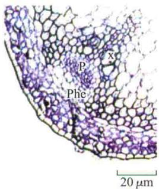  
图24.20 BR是维管组织正常发育所必需的。左图所示是拟南芥成熟植株花序茎秆基部的维管系统示意图。前形成层细胞（黄色）产生处于外层的韧皮部组织（红色）及处于内层的木质部组织（蓝色）。黑色三角形框包括一个单一的维管束。与野生型（左）相比，BR缺失突变体det2（右）具较低的木质部与韧皮部比例。P，韧皮部（phloem）；Phe，韧皮部冠细胞（phloem cap cell）；X，木质部（xylem）（引自Caño Delgado et al., 2004）。  
鱼尾菊叶肉细胞

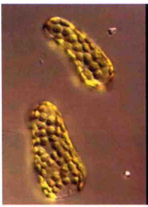  
从鱼尾菊叶肉细胞分化的导管细胞

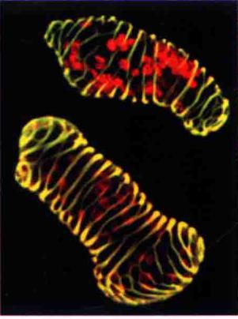  
20μm

图24.21 体外培养的鱼尾菊叶肉细胞分化成导管的前（左图）、后（右图）对比。油菜素甾醇对于此分化过程是必需的（引自Fukuda，2004）。  

## 24.4.4 BR是花粉管生长所必需的

花粉中富含BR，因此很容易理解BR对于雄性育性起着重要作用。已经证明，BR促进花粉管从柱头经过花柱到胚囊的生长（Mussig，2005）。例如，在拟南芥BR缺失突变体cpd中，花粉在柱头萌发后花粉管不能伸长，并且花粉管的伸长部分依赖于外源施用的BR（Szekeres et al., 1996; Clouse and Sasse, 1998）。

相似地，受体基因缺陷的BR不敏感突变体，自交时花粉管不能发育，从而引起种子败育。然而，用野生型花粉对突变体进行人工授粉时，产生的种子可育（Clouse et al., 1996）。因此，花粉管的正常生长，同时需要BR和BR信号转导途径。

雄蕊与雌蕊生长高度的不一致，同样是导致雄性育性下降的原因。拟南芥突变体dwf4的BR缺失，细胞不能伸长。dwf4突变体花中的雄蕊也比野生型的要短。由于拟南芥是自花授粉植物，dwf4雄蕊花丝短造成到达柱头表面的花粉粒少。而花粉粒本身是可育的，所以对突变体进行人工授粉能产生正常的种子。

## 24.4.5 BR促进种子萌发

像花粉粒一样，种子中也含有很高水平的BR，而BR同样也促进种子的萌发（Mussig，2005）。BR通过与其他植物激素互作而促进种子的萌发，虽然这些相互作用的分子机制还不清楚。目前已经知道，GA和脱落酸（abscisic acid，ABA）在刺激种子萌发的过程中分别起着正调节和负调节的作用。BR能不依赖GA信号而促进烟草种子的萌发（Leubner-Metzger，2001）。此外，BR能够恢复GA缺失和GA感受突变体种子萌发滞后的表型（图24.22），与野生型相比，BR突变体对ABA的抑制作用更敏感（Steber and McCourt，2001）。这样BR可以刺激萌发，同时是克服ABA抑制作用必需的。众所周知，BR刺激细胞伸长和分裂，而BR很可能是通过刺激胚的生长而促进萌发的。

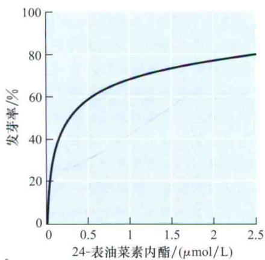  
图24.22 BR刺激拟南芥种子的发芽。用递增浓度的24-epiBL，处理赤霉素不敏感的突变体种子，计算发芽的百分率。结果表明，BR促进种子发芽不依赖于赤霉素（引自Steber and McCourt，2001）。

## 24.5 油菜素甾醇在农业上的应用前景

发现油菜素甾醇是一类促进生长激素后，研究人员很快就意识到它们在农业上的潜在应用价值。在过去20年中，大量小规模的研究检验了BR在增加作物产量上的功效。人们发现，施用BL可以提高菜豆产量（根据每株植物的种子量计算）约45%，多种莴苣品种的叶质量提高25%。在水稻、大麦、小麦及小扁豆上，也观察到类似的增产效果。BL也能够促进马铃薯块茎的生长，提高马铃薯对传染病的抗性。BL还可以提高番茄的座果率。

除了这样的小规模研究之外，日本、中国、韩国及俄罗斯也一直利用油菜素甾醇的衍生物进行大规模的田间试验。但是这些田间试验结果很不稳定，可能是由于作物生长时遭受的胁迫程度不同造成的。在理想条件下生长的作物，施用BR对产量没有什么效果，而BR可以显著提高在胁迫条件下生长的作物产量。因此，BR的应用最适宜于胁迫条件下的生长（Ikekawa and Zhao, 1991）。

此外，BR也被证明有利于提高植物的繁殖能力。对如挪威云杉和苹果进行扦插处理的植物进行BR预处理，可以提高它们的生根反应。BR处理也可以促进木薯属植物和菠萝组织培养和微繁。在转基因水稻中表达一个玉米的DWARF4（DWF4）基因可以提高15%\~44%的粮食产量（Wu et al., 2008）。

降低BR的功能也能对农业生产有贡献。例如，在水稻中减弱BR的合成或信号会导致植株变得矮小并使叶片变得直立，而这种改变就允许更高的种植密度，进而提高生物量和最终的产量（Sakamoto et al., 2006）。随着研究者对BR在植物生长发育作用的继续探究，人们将发现油菜素甾醇在农业上更多其他的用途。

## 小结

油菜素甾醇（BR）是甾醇类激素，调节植物生长发育的多个过程，包含茎和根中的细胞分裂和细胞伸长、光形态建成、生殖发育，叶片衰老和逆境响应。

## 油菜素甾醇的结构、发生及遗传分析

\- 生物学测定将活性BR同其他中间产物区分开，并允许定量测定（图24.1\~图24.3）。

\- BR是一类含多羟基的甾醇类激素，其中油菜素内酯（brassinolide，BL）是植物中分布最广且活性最高的BR（图24.4）。

· 在所有植物组织中均已检测到BR存在，同时BR在茎顶端拥有最高的活性。

\- BR是一种普遍存在的植物激素，它的出现先于陆生植物的进化。

\- BR缺失突变体表现出异常的光形态建成，而这一异常可以被外源施加的BL所抑制（图24.5和图24.6）。

## 油菜素甾醇的信号转导途径

\- BL结合到受体BRI1上，BRI1在细胞膜和内体膜上均被发现（图24.7）。

\- BL的结合激活BRI1，激活的BRI1在多个位点上被磷酸化（图24.8）。

· BRI1/BAK1的激活起始了一个级联信号，从而导致BR调控基因的转录。

· 脱磷酸化状态的BES1和BZR1激活或抑制BR的靶基因（图24.9）。

## 油菜素甾醇的生物合成、代谢及运输

· 油菜素甾醇的合成始于菜油甾醇，而其来源于植物甾酮前体环阿屯醇（图24.10）。

· 所有将菜油甾烷醇转化为BL的酶都属于定位于ER的细胞色素P450单氧化物酶。

\- BR的水平可以通过多种机制来控制，包括分解代谢、结合及信号途径的负反馈作用（图24.11\~图24.14）。

\- BR在其合成部位附近发挥作用，并不经历长距离运输（图24.15）。

## 油菜素甾醇对生长和发育的影响

·BR不但参与纤维、侧根和维管系统的发育，也参与顶端优势的维持、花粉管生长、种子萌发、叶片衰老和植物防卫。

\- BR既促进细胞增殖又促进细胞伸长（图24.16和图24.17）。

\- BR维持细胞壁生长所必需的正常的微管丰度和排列组织（图24.18）。

· 低浓度BR促进根的生长，高浓度BR抑制根的生长。

· BR通过改变生长素的极性运输来促进侧根发育。

\- BR促进木质部的分化并抑制韧皮部的分化（图24.20和图24.21）。

\- BR通过与包括GA和ABA在内的其他激素相互作用来促进种子萌发（图24.22）。油菜素甾醇在农业上的应用前景

· BR施加在生长于逆境下的作物上最为有效。

\- BR在提高植物繁殖能力方面有很大作用。

(张姗姗 杨苍劲 王学路 译)

## WEB MATERIAL

## Web Topics

## 24.1 Brassinosteroids and the Apical Hook——An

Ongoing Story in Plant Architecture
A model is proposed for the interactions between ethylene, auxin, and brassinosteroids in the formation of the hook of etiolated seedlings.
