# 第 25 章

开花的控制

人们期待春天，期待春天的姹紫嫣红。许多旅游者都把自己的行程安排在特定植物的开花期：如加利福尼亚州南部连绵不断的柑橘园和荷兰的郁金香。在美国华盛顿和日本，樱花被人们认为是英勇的象征。随着一年中春夏秋冬四季的更替，每种花都在其特定的时间开放。植物在进化过程中形成了复杂的花结构并表现出显著的多样性，以吸引不同的传粉者。植物在一年中的正确时间开花对于有性繁殖是至关重要的。异花授粉的植物二者之间的开花时间及与传粉者必须保持同步，这对于结实是最为理想的。

开花与季节有关已众所周知，本章所要探讨的是开花现象中所蕴藏的以下几个基础问题。

(1) 植物如何感知季节变化及昼夜交替?

(2) 哪些环境信号影响植物的开花? 植物又如何感知这些环境信号?

(3) 环境信号又如何诱导花发育过程中的各种变化?

在第16章我们已经讨论了植物根部和茎部的顶端分生组织在营养生长和发育阶段所起的作用。植物在向开花转变的过程中涉及两种主要的变化：顶端分生组织的形态建成及细胞的分化。这些变化最终导致萼片、花瓣、雄蕊和心皮等器官的产生（参见Web Topic 1.3中的图1.2A）。

花药中特化的细胞进行减数分裂产生4个单倍体的小孢子，这些小孢子最终发育成花粉。同样，胚珠中的特化细胞减数分裂后产生4个单倍体的大孢子，但是只有其中的一个进行三次减数分裂后发育成胚囊（参见Web Topic1.3中的图1.2B）。胚囊的出现意味着雌配子体的成熟。而花粉粒伴随着花粉管的出现，则表示雄配子体世代的成熟。雌雄配子体产生配子（卵子和精子），精卵融合形成二倍体的合子，这是新孢子体世代的开始。

很显然，开花意味着植物体形态和细胞类型在结构和功能上与营养生长阶段有本质的不同。向开花的转变同时也意味着顶端分生组织中细胞的命运发生了根本的变化。在本章的第一部分，我们将主要讨论花发育（floral development）过程中的变化。近些年已经发现了一些基因在花器官的形成过程中起着很重要的作用。这些研究结果表明植物是如何通过数目相对较少的关键调控因子来达到调控复杂的发育目的的。茎顶端发生一系列的生理变化并最终使顶端分生组织发育成花的过程称为花的发端（floral evocation）。在本章的第二部分我们将会讨论在花的发端过程中发生的一系列变化。刺激花的发端的发育信号包括一些内在的因素如近似昼夜节律（circadian rhythm）、时相变化（phase change）、激素（hormone）等，以及外在因素如光周期（日长）和温度。在合适的光周期过程中，从叶中产生的可转移的信号称为成花刺激物（floral stimulus），并最终被转运到茎顶端分生组织。植物的顶端必须能够响应这种阳性信号。通常情况下植物要经过一个幼年期，在此期间植物不能开花。开花需要的另一个因素是春化（开花之前较长时间的冷处理）。这些内源信号和外源因子结合使得植物能在特定的时间开花。

## 25.1 花分生组织和花器官的发育

花分生组织与营养生长阶段的分生组织有明显的区别，主要表现在前者的体积比后者大。在营养生长阶段的分生组织中，中心区细胞完成一次分裂周期比较缓慢。由营养生长到生殖生长转换的明显标志是茎顶端分生组织中心区细胞的分裂次数明显增加（见第

16章）。当生殖生长出现时，茎顶端分生组织的体积明显增大，其原因主要是中心区细胞的分裂速度明显加快（图25.1）。利用遗传学和分子生物学技术，已经从拟南芥（Arabidopsis）、金鱼草（Antirhinum）及其他物种中鉴定出了一系列基因，它们组成了一个网状结构，共同控制花的形态建成。

在本节，我们主要讨论研究较为清楚的拟南芥花的发端（图25.2）。首先我们将会描述从营养阶段到生殖阶段转变过程中所发生的基本的形态变化。其次，我们将会讨论分生组织中4轮花器官的排列及由哪些基因控制花的发育。根据公认的ABC模型（图25.6），花器官的特异排列是受三类花器官特性基因的重叠表达调控的。

B  

## 25.1.1 拟南芥茎顶端分生组织随发育而变化

在营养生长阶段，拟南芥的顶端分生组织可以形成节间非常短的叶子，并最终形成基生莲座叶（图25.2A）。一旦生殖发育开始，处于营养阶段的分生组织就会转变成初级花序分生组织。而初级花序分生组织（primary inflorescence meristem）可以形成一种伸长的花序轴用来支撑两种侧生器官：茎生（或花序）叶和花（图25.2）。

茎生叶的腋芽可以形成次级花序分生组织（secondary inflorescence meristem），如图25.2A所示，它们的形成与初级花序分生组织形成模式相似。拟南芥花序分生组织具有无限（indeterminate）生长的特性，因此可以持续生长。花是由花序分生组织侧生的花分生组织（floral meristem）形成的。相对于花序分生组织，花分生组织是有限的。

## 25.1.2 4种不同的花器官形成相互独立的轮

花的分生组织形成4种不同的花器官：萼片、花瓣、雄蕊、心皮（Coen and Carpenter，1993）。这些花器官形成同心的环，称之为轮（whorl），围绕在分生组织周围（图25.3）。最内一轮心皮的出现占用了分生组织顶端的所有细胞，只有花芽发育时花器官原基才出现。在野生型拟南芥花中，各轮排列情况如下（位于细胞分裂区）。

  
图25.1 拟南芥茎顶端营养区（A）和生殖区（B）的纵切面图（Grbic and Nelson惠赠）。

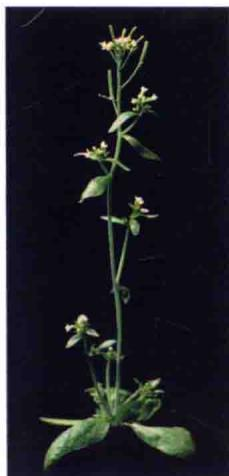  
图25.2 A. 拟南芥茎顶端分生组织在不同发育阶段产生不同的器官。在发育初期，茎顶端分生组织形成基生的莲座叶。进入开花转变阶段，茎顶端分生组织形成初级花序分生组织，并最终产生可以支撑花的伸长的茎。叶原基在开花转变之前形成茎生叶。而次级花序形成于茎生叶的叶腋。B. 拟南芥植株图片（Richard Amasino惠赠）。

  
图25.3 在拟南芥中，花器官是由花分生组织按顺序形成的。A和B.花器官作为连续的轮而产生（同心圆），从萼片开始，并从外向内发展。C.根据协变模型，每个轮的功能由三个重叠的发育区域决定。这些区域和花器官特性基因的表达模式相对应（引自Bewley et al., 2000）。

（1）第一轮为4个萼片，成熟时为绿色。

（2）第二轮为4个花瓣，成熟时为白色。

（3）第三轮为6枚雄蕊，四长二短。

（4）第四轮（最内部）为一个复合器官，雌蕊（雌性生殖结构）由子房和两个融合的心皮组成，并且每个心皮包含多个胚珠和一个短的花柱和柱头（图25.4）。

## 25.1.3 两种主要类型的基因调控花的发育

通过对突变体的研究，目前已鉴定出三种类型的基因调控花的发育：分生组织特性基因、花器官特性基因、级联基因。

（1）分生组织特性基因（meristem identity gene）

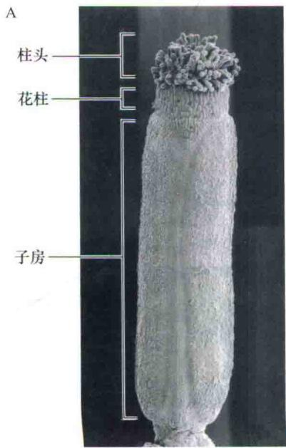

编码一些转录因子，它们对于诱导花器官特性基因的起始表达是必需的，并且在花器官形成过程中对花器官特性基因起正调控作用。

（2）花器官特性基因（floral organ identity gene）直接控制花器官的特性，它们编码的蛋白质为转录因子，调控其他基因的表达，后者的表达产物在花器官的形成和功能中起作用。

## 25.1.4 分生组织特性基因调节分生组织的功能

分生组织特性基因在茎顶端的侧面分生组织发育为花原基及花序分生组织发育为花分生组织的过程中起作用（顶端分生组织在其侧面形成花分生组织即花序分生组织）。例如，在一些金鱼草的突变体中，当FLORICAULA（FLO）基因发生突变后，它能形成花序而不能形成花。flo突变导致叶腋部位出现额外的花序分生组织而不是形成花分生组织。因此，FLO为控制花器官分生组织形成的关键基因。

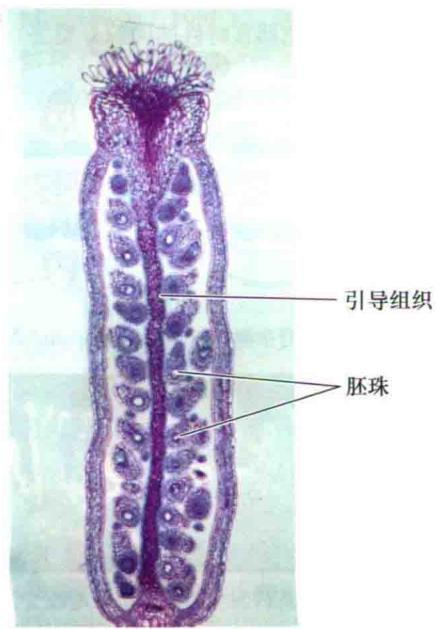  
图25.4 拟南芥的雌蕊由两个融合的心皮组成，每个心皮包含多个胚珠。A.雌蕊的扫描电镜图，显示柱头、短的花柱和子房。B.雌蕊的纵切图。图示众多胚珠（引自Gasser and Robinson-Beers，1993，美国植物学会C S Gasser授权同意翻印）。

D  

在拟南芥中，SUPPRESSOR OF CONSTANSI（SOC1）、APETALA1（AP1）、LEAFY（LFY）是花器官分生组织形成过程中的关键基因。LFY反馈调节FLO，LFY和SOC1在外界环境及内在因素调控器官引发过程中起着核心作用（Blazquez and Weigei，2000；Borner et al., 2000）。因此LFY和SOC1是花器官发育的关键调节因子。

SOC1一旦被激活即引发LFY的表达，接着LFY开启AP1的表达（Simom et al，1996）。在拟南芥中，LFY和AP1处于一个正反馈调控环中。也就是说，AP1的表达同样可以促进LFY的表达。这种正向反馈环一旦起始就不可逆转，分生组织也便转为开花。

## 25.1.5 通过同源异型突变体发现花器官特性基因

变体中鉴定出来的，在这些突变体中花器官异位表达。例如，拟南芥的AP2基因突变体，萼片突变为心皮，花瓣突变为雄蕊。

决定花器官特异性的基因是通过花同源异型突变体（floral homeotic mutant）而被发现的。通过研究果蝇（Drosophila）的突变体，我们发现了一系列的同源异型基因，它们通过编码转录因子来控制相应位点特异结构的发育。同源异型基因作为一个发育的开关，在特定结构的形成中起着激活整个遗传过程的重要作用。因此同源异型基因的表达赋予器官一定的特性。

研究表明，同源异型基因还编码一些转录因子——调节其他基因表达的蛋白质。植物中许多同源异型基因属于一类MADS-box基因（MADS-box gene），然而，动物的同源异型基因都有一些称之为同源框的序列。

许多决定花器官特性的基因都属于MADS-box家族，其中包括金鱼草中的DEFICIENS基因、拟南芥中的AGAMOUS（AG） $^{①}$ 、PISTILATA（PI）和APETALA3（AP3）基因。MADS-box家族的基因都有特定的比较保守的核苷酸序列，称之为MADS-box，它编码一种蛋白结构，称之为MADS结构域（MADS domain）。MADS结构域使得这些转录因子可以与具有特定核苷酸序列的DNA结合。

并不是所有具有MADS结构域的基因都是同源异型基因。例如，SOC1是一个MADS-box家族的基因，但它在功能上却是分生组织特性基因。

花器官特性基因是从改变花器官特性的同源异型突

## 25.1.6 三种类型同源异型基因控制花器官的特性

在拟南芥中鉴定出5个花器官特性的基因：AP1、AP2、AP3、PI和AG（Bowman et al., 1989; Weigel and Meyerowitz, 1994）。通过对那些改变了结构并在两个毗邻的轮中产生同样花器官的突变体进行研究，鉴定出了上述基因（图25.5）。例如，在ap2突变体中，缺少萼片和花瓣（图25.5B），ap3和pi双突变体中，第二轮产生的是萼片而不是花瓣，在第三轮心皮取代雄蕊（图

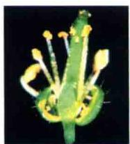

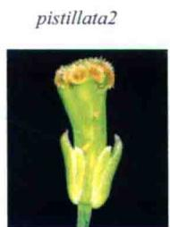  
图25.5 花器官特性基因发生突变后极大地改变了花的结构。A. 野生型中正常的4轮花器官结构。B. ap2-2突变体缺失了萼片和花瓣。C. pi2突变体缺失了花瓣和雄蕊。D. ag1突变体缺失了雄蕊和心皮（引自Meyerowitz et al., 2002；L. Riechmann惠赠）。

25.5C）。而纯合的ag突变体则缺少雄蕊和心皮（图25.5D）。

虽然这些基因的突变体改变了花器官的特性，但并没有影响花的产生，因此，它们是同源异型基因。一般把它们分为A、B、C三类，分别代表三种不同的功能。由A、B、C三种同源异型基因（ABC模型）所决定的花器官特性将在下一节进行仔细的讲述（图25.6）。

APETALA 3 / PISTILLATA

<table><tr><td>基因</td><td colspan="2">APETALA 2</td><td colspan="2">AGAMOUS</td></tr><tr><td>结构</td><td>萼片</td><td>花瓣</td><td>雄蕊</td><td>心皮</td></tr></table>

图25.6 ABC模型认为花器官特性是在三种不同功能A、B和C同源异型基因相互作用的基础上形成的。第一轮，只有A（AP1和AP2）表达而形成萼片。第二轮，A（AP1/AP2）和B（AP3/PI）表达，从而形成花瓣。第三轮，B（AP3/PI）和C（AG）表达，从而形成雄蕊。第四轮，只有C（AG）表达而形成心皮。另外，在第一轮和第二轮中A功能（AP1和AP2）抑制C（AG）功能，而在第三轮和第四轮中C功能抑制A功能。

（1）A类型活力由API和AP2基因编码，控制第一和第二轮花器官的特性。A功能的缺失会导致在第一轮产生心皮而不是萼片，在第二轮产生雄蕊而不是花瓣。

（2）B类型活力由AP3和PI基因编码，控制第二轮和第三轮花器官的特性。B功能的缺失会导致在第二轮产生萼片而不是花瓣，第三轮产生心皮而不是雄芯。

（3）C类型活力由AG基因编码，控制第三轮和第四轮花器官的特性。C功能的缺失导致在第三轮产生花瓣而不是雄蕊，而且会在第四轮出现新的花而不是心皮。因此，在ag突变体中，花的第四轮被新的萼片取代。花分生组织不再是有限生长，而是形成花中花，并且从内到外依次为：萼片，花瓣，花瓣；萼片，花瓣，花瓣；如此等等。

通过对失去功能的双突变或者三突变体进行研究，从而可以清楚地了解这些花器官特性基因在花发育过程中的作用。四突变体（ap1、ap2、ap3/pi和ag）中，花分生组织最终形成了一个假花。尽管也产生了正常花的轮状结构，但是所有的花器官都被类似于绿色叶片的结构所替代（图25.7）。这个实验支持了18世纪德国自然科学家和诗人Johann Wolfgang von Goethe（1749\~1832）的观点，他认为花器官是高度特化的叶。

  
图25.7 拟南芥四突变体（ap1，ap2，ap3/pi，ag）中类似叶片的结构取代了花器官（John Bowman惠赠）。

随着A、B、C功能基因的发现，另一类型的功能基因D也被发现，D功能由SEPAIIATA（SEP1-3）所特化，它也是MADS-box转录因子。最为注目的是，将D基因与A和B基因组合表达有可能使叶转变为花瓣（Pelazet et al., 2001；Honma and Goto, 2001）。

## 25.1.7 ABC模型解释了花器官特异性的形成

1991年，ABC模型（ABC model）被提出并用来解释同源异型基因如何控制花器官的特性（Coen and Meyerowitz，1991）。这个模型最大的贡献在于它很快解释了在两种远缘物种（金鱼草和拟南芥）上观察到的很多现象，而且对于如何理解相对少的关键因子组合就可以产生一个复杂的结果提供了很好的思路。ABC模型认为，每一轮花器官的形成都是三种类型花器官特性基因形成独特的组合决定的（图25.6）。

(1) A类型活力独自决定萼片的特性。

(2) A和B类型活力在花瓣的形成中起作用。

(3) B和C类型活力决定雄蕊的产生。

（4）C类型活力单独决定心皮的特性。

该模型进一步认为A和C的功能相互拮抗（图25.6）。也就是说，A和C基因除了在花器官决定过程中起作用外，二者相互排斥对方在各自区域表达。

ABC模型可以预测和解释野生型和多数突变体的花器官的形成模式（图25.8）。现在问题的关键在于：①这些花器官特性基因的表达模式是如何获得的；②那些编码转录因子的花器官特性基因在花器官形成过程中又如何调节其他基因的表达；③如何通过改变特定基因的表达来形成特定的花器官。

A. 野生型  
  
B. C功能缺失

C. A功能缺失  

D. B功能缺失  

图25.8 ABC模型对花同源异型突变体表型的解释。A. 野生型中三种同源异型基因的功能。B. C功能的丧失导致A在整个花的分生组织中表达。C. A功能的丧失导致在整个分生组织中都有C的表达。D. B功能的丧失导致只有A和C的表达。

## 25.2 花发端的内在和外在因素

植物是不可移动的生物，因此它们必须不断适应其生长和发育的外部环境。动物的大多数发育在胚胎期已完成，而植物的发育贯穿其整个生命过程。事实上没有任何发育结局是提前确定的，因为植物的发育受到整个发育环境因子的影响，如日长、温度、与其他植物的竞争、营养的可利用性及与动物的交互作用。因此，植物被认为是一个用来理解有机体如何感知信息并整合这些信息，从而调控基因组编码的遗传程序的理想系统。

植物的生活周期中，开花是一个重要的发育标志。延迟开花将有利于光合作用碳水化合物的积累供更多种子成熟，但也增加了植物被吃掉、受非生物胁迫而死亡，以及与其他植物竞争引起伤害的潜在风险。基于此，植物进化出一系列非凡的生殖适应机制——如一年生的生命周期和多年生的生命周期。一年生植物如千里光（Senecio vulgaris）在萌发后几周内就可开花，而一些多年生植物如多数森林树木，可能需要经历20年甚至更长的时间才能开花。在植物界不同物种开花的年龄也各不相同，表明年龄或者个体大小可能是决定生殖发育开始的内在（internal）因素。

由植物内在的发育因子决定开花，而不依赖于任何特殊环境条件的途径，称之为自主调节（autonomous regulation）。一些植物的开花表现出对外界环境的绝对依赖性，这些植物的开花为数量效应。如果植物对环境因子有一定的依赖性，但是在这些因素不存在的情况下也能开花，这种开花效应称为兼性或本能效应。拟南芥开花既依赖于环境，同时也存在自主信号促进生殖生长。光周期现象和春化作用是植物基于季节反应的两种最主要的机制。光周期现象（见第17章）是指植物对日长或夜长的反应；春化作用是指低温促进植物开花的现象。其他的信号，如光质、周围温度和非生物胁迫对植物的发育也是非常重要的因素。

无论是内在（自我）因素还是外界（环境感应）因素对植物开花的引发，都使得植物可以在最佳的时间对开花作出精确的调节，从而完成生殖过程。例如，一些特殊物种的群体可以同步开花，这种开花的同步性使得杂交育种成为可能，同时使得植物在比较适宜的环境（如水分和温度）条件下形成种子。

## 25.3 茎尖和时相变化

所有的多细胞有机体都要经过一系列的生长发育阶段，每个阶段都有其明显的特征。对于人类而言，幼儿期、童年期、青春期及成年期代表了普遍的4个发育时期，其中青春期为性成熟的分界期。同样高等植物也经历一系列的发育时期，但只发生在特定的区域。这些转变发生的时间通常依赖于环境条件，以使得植物能够适应环境的变化。这可能是因为植物不断从顶端分生组织产生新器官。

原基起始于顶端分生组织侧面很小的隆起部位，具体是由其接收到的来自环境及植物遗传程序等信息的相互作用决定的，这些原基也可产生叶（营养生长期）或花（生殖生长期）。在这种情况下，植物生长可以看成是模块化的过程，植物的形态建成是由原基的持续特化决定的。沿着茎每个原基形成繁殖器官（phytomer），一个基本的重复单元包括营养体部分和分生组织部分。在形成叶的时候营养体部分几乎占据了所有的细胞，而在花中分生组织部分很大而且包含了营养体部分。这种简单重复单元在植物中非常灵活常见，就像雏菊和橡树一样具有多样化。

各种时相的转变是严格受发育调控的，因为植物必须整合环境和内源信号使其最大限度地适宜于植物的繁殖。以下部分描述了调控这些决定的主要途径。

植物的胚后期发育时期，分为以下三个阶段。

(1) 幼年期。

(2) 成年营养期。

（3）成年生殖期。

从一个时期过渡到另一时期，称之为时相变化（phase change）（Poethig，2003）。

幼年期与成年营养期的主要区别在于，后者可以形成生殖结构：被子植物可以形成花，而裸子植物可以形成球果。但是，花的出现，同时又意味着进入成年生殖期，并且往往又依赖于特定的环境和发育信号。因此花的缺失并不能作为幼年期的可靠标志。

从幼年期向成年期的过渡，往往还伴随着一系列其他营养特征的变化，如叶形态、叶序（叶在茎秆上的排列）、棘刺的出现、生根能力，以及在落叶植物如英国常春藤（Hedera helix）中叶子的去留等（图25.9；参见Web Topic 25.1）。这些变化在多年生木本植物中最明显，但在很多草本植物中同样也很显著。与营养阶段向生殖阶段的骤变不同，植物从幼年期向成年期的过渡是一个渐进的涉及一些中间形式的过程。

卵形成年叶  
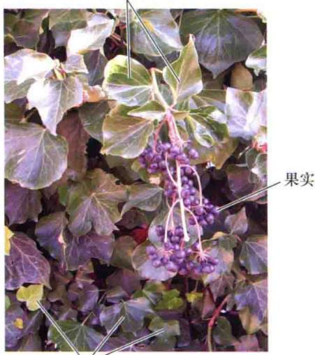  
浅裂幼叶  
图25.9 常春藤（Hedera helix）的幼年期和成年期。幼年的叶子为浅裂掌状，交替排列，具有向上攀爬的能力，没有花。成年期的叶子为卵状，螺旋排列，具有竖直生长的特性，花最终形成果实（L. Rignanese惠赠）。

有时候从一片叶子就可以观察出这种从幼年到成年转变的发生。其中一个典型的例子是18世纪Goethe首先发现豆科的阿拉伯胶树（Acacia heterophylla）从幼年期进入成年期时，叶子转变为柄状（叶柄的形态和叶的功能）。阿拉伯胶树幼年期的叶子为羽状复叶，具有叶轴和小叶；而进入成年期后，则只有一个特殊的结构：扁平的叶柄（图25.10）。

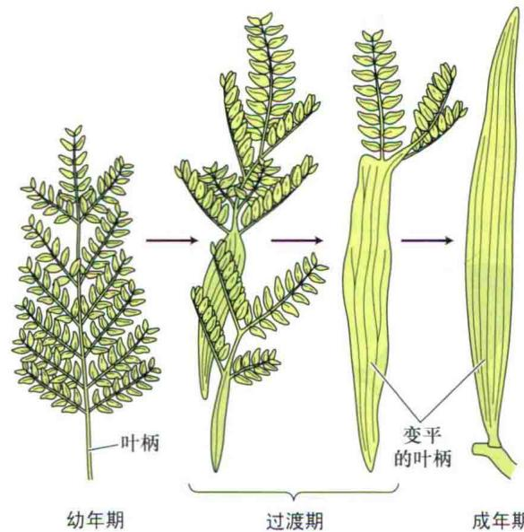  
图25.10 阿拉伯胶树的叶子。图示羽状复叶（幼年期），扁平的叶柄（成年期）。注意：在中间阶段，顶部的叶子依然保持着幼年期的叶子形状。

在水生植物中，如松叶藻（Hippuris vulgaris），从水生叶到气生叶的形成过程中同样存在这种过渡结构的变化。与阿拉伯胶树一样，这种过渡形式随发育模式的不同有明显的区域性。为了说明玉米（Zea mays）从幼年期到成年期这种过渡形式的变化，提出了组合模型（combinatorial model）（图25.11，Web Topic 25.2）。根据这个模型，地上部分的发育可以被划分为一系列既彼此独立又相互重叠（overlapping）的过程（幼年期、成年期和繁殖期），进而调节一系列发育过程的表达。

叶片从幼年期到成年期发生的过渡变化表明，同一片叶子的不同部位可以表达不同的发育进程。因此，叶尖细胞仍保持着幼年状态，而叶基部的细胞却向成年期转变。在同一片叶子中，两套细胞各自的发育命运却截然不同。

## 25.3.2 位于茎基部幼嫩的组织首先产生

三个发育阶段的依次出现从而使幼嫩组织在茎轴上有序产生。植株的生长高度受控于茎基部首先形成的顶端分生组织、幼嫩组织和器官。在一些能迅速开花的草本植物中，幼年期可能只持续几天，产生少量的幼嫩结构。与此形成对比的是，木本植物有一个相当长的幼年期，有的甚至可能持续30\~40年（表25.1）。在这些植物中，幼年结构在一个发育成熟的植物中占相当大的比例。

A 营养生殖期的成体植株

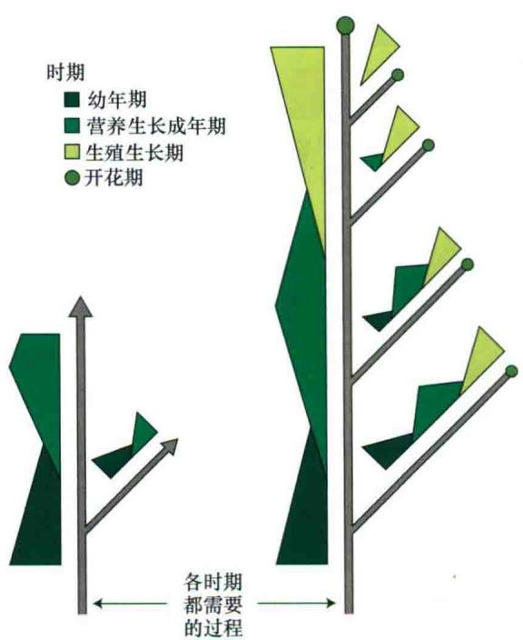

图25.11 玉米地上部分发育的组合模型示意图。沿着茎的主轴和枝条，幼年期、成年营养期和生殖期梯度重叠表达。连续的黑线表示在所有的发育时期都需要。这三个阶段可能会被单独的发育过程所调节，即当发育过程重叠时，产生一种中间发育过程。A. 营养期的成年幼苗。B. 开花的植株（引自Poetinf, 1990）。

表25.1 一些木本植物的幼年期长度

<table><tr><td>物种</td><td>幼年期长度</td></tr><tr><td>玫瑰</td><td>20~30天</td></tr><tr><td>葡萄</td><td>1年</td></tr><tr><td>苹果</td><td>4~8年</td></tr><tr><td>柑橘类植物</td><td>5~8年</td></tr><tr><td>英国常春藤</td><td>5~10年</td></tr><tr><td>红杉</td><td>5~15年</td></tr><tr><td>无花果</td><td>15~20年</td></tr><tr><td>英国橡树</td><td>25~30年</td></tr><tr><td>欧洲毛榉树</td><td>30~40年</td></tr></table>

资料来源：Clark，1983

一旦分生组织转向成年期，就只有成年的营养结构产生，而且其顶端分生组织向花器官发育，所以成熟期和生殖期分别位于茎的顶部和外围。

在幼年期向成年期过渡的决定因素中，植株的体积大小比其实际年龄更重要。一些抑制植物生长的因素如矿质营养的欠缺、弱光照、水分胁迫、落叶、低温都有可能延长植物的幼年期，甚至会使成熟的茎“重返幼年期”（rejuvenation）。相反，凡是促进植物生长的条件，都可以加速植物向成年期的过渡。当植物生长加速时，如果对它进行正确的开花诱导处理，就会促使植物

开花。

尽管对开花而言，植株大小是个比较重要的因素，但是并不清楚具体哪个器官的大小对开花更重要。在一些烟草属（Nicotiana）物种中，必须具有一定数量的叶子才能使顶端组织积累足够的成花刺激物。

一旦进入成年期，植物在营养繁殖或嫁接过程中就会保持这种相对的稳定。例如，从常春藤（Hedera helix）基部取下来的枝条扦插可以成长为新的幼年植株，而那些从顶端取下来的枝条则发育为成年植株。如果从正在开花的白桦树（Betula verrucosa）基部截取枝条并嫁接到幼年砧木上，在最初的两年内，嫁接的植株并不能开花。但是，从成熟的白桦树顶部取的接穗，嫁接后即可开花。

## 25.3.3 营养、赤霉素和其他信号影响时相的变化

植株其他部分传递的信号也可影响顶端组织从幼年期向成年期的转变。在许多植物中，弱光照可延长幼年期，或者使之转变为幼年期。弱光照带来的后果是植株顶端的碳水化合物供应不足。因此碳水化合物特别是蔗糖，可能在幼年期向成年期的转变中起着重要的作用。碳水化合物被认为是能量和原材料的供应者，能够影响植株的大小。如菊花（Chrysanthemum × morifolium），只有它的顶端达到一定大小后花原基才产生。

除了矿质营养和碳水化合物外，植株顶端还会接受到一些来自其余部位的激素和其他因子。实验证明，对一些松类植物幼苗施以赤霉素（GA），可诱导其产生生殖结构。在松类植物中，加速球果产生的因素（如去根、水胁迫、氮营养饥饿等），可使植物体内积累GA，这些积累的内源（endogenous）赤霉素同样可以调控此类植物的开花。

## 25.3.4 开花能力和成花决定是花引发过程的两个时期

对于草本和木本植物来说，幼年期（juvenility）有不同的涵义。草本植物的幼年分生组织嫁接到正在开花的植株上，它可以稳定地开花（参见Web Topic 25.3），而木本植物却不可以，它们之间有何区别呢？

在烟草（Nicotiana tabacum）中的大量研究表明，花的发端需要顶芽通过两个发育时期（图25.12）（McDaniel，1992），其中一个是开花能力的获得。当给予适宜的发育信号后，顶芽才有能力开花。

例如，一个处于营养阶段的枝条嫁接到正在开花的茎上，这个嫁接后的枝条可以迅速开花。这就说明它有能力对开花的植物体中的成花刺激物作出反应，也就是说它有开花的能力。不能开花的植物意味着它还没有获

得开花的能力。

已获得开花能力的营养芽需要经过的下一阶段是成花决定。即使顶芽从正常的植物中被移除下来也能过渡到下一个发育阶段（开花），就称为成花决定。因此进入成花决定阶段的顶芽，即使它被嫁接到其他不能产生任何成花刺激物的处于营养阶段的植株上，它同样可以开花。

最典型的例子就是在一个日中性的烟草植株中，植株长出41片叶子或者节就能开花。在一个测量腋芽成花决定的实验中，从一个正在开花的植株的基部第34片叶子处去掉其顶部，顶端优势丧失后，第34片叶子的腋芽长出，接着再长出7片叶子（共计41片叶子）后才开花（图25.13A）（McDaniel，1996）。但是当第34个腋芽被摘除，移栽到土里或者是嫁接到基部没有任何叶片的茎上，它在开花前又产生了一整套的叶子。这些结果显示，第34个腋芽还没有进入成花决定阶段。

在另外一个实验中，供体植株在距基部第37片叶子处截除其顶部，在图示的三种情况下（图25.13B），第37个腋芽都是在只产生4个叶片后就开花。这个结果显示，终端芽进入成花决定阶段是在产生37个叶子后。

用不同类型烟草的茎顶端所做的一系列嫁接实验表明，开花前分生组织的产生归因于以下两种因素：叶子产生的成花刺激物的强度，以及分生组织对信号作出反应的能力（McDaniel，1996）。

在某些情况下，即使植株的顶端已经处于成花决定阶段，但是开花仍然有可能被延迟或者抑制，除非它接受到另一个刺激开花的信号（图25.12）。例如，毒麦（Lolium temulentum）在长日照下才能开花。如果毒麦的茎尖分生组织经过一个长达28 h的光照后，置于试管中，结果显示只有在GA存在的情况下，它才可以正常开花。即使在有GA存在的情况下，从一个处于短日照情况下的毒麦上得到的顶端分生组织也不能开花。因此可以推断，长日照对毒麦的成花决定是必需的，而GA对于毒麦成花决定状态的表达也是必需的。

  
图25.12 茎顶端营养分生组织细胞获得新的发育命运后花引发的简单模式图。在向开花转变的初期，细胞必须具有开花能力。有能力开花的营养分生组织是一种能通过变成花的决定态（产生花）而对成花刺激物（诱导）作出反应的组织。决定态的表达通常可能还需要一些其他的信号（引自McDaniel et al., 1992）。

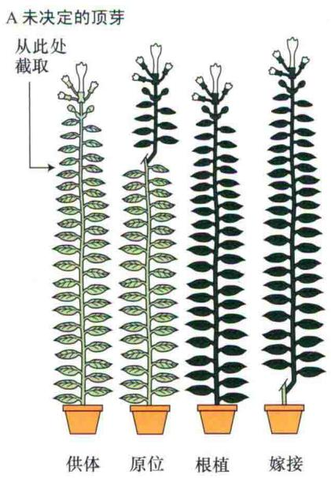

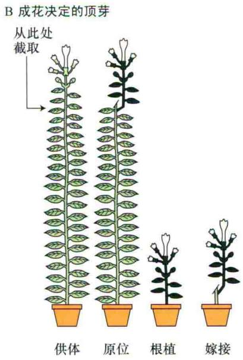  
图25.13 烟草腋芽决定状态示意图。来源于正在开花的供体植株的特殊腋芽被原位嫁接、根植或嫁接于植株基部而被迫生长。阴影部分显示由腋芽产生的叶子和花。A. 腋芽未处于成花决定阶段的结果。B. 腋芽处于成花决定阶段的结果（引自McDaniel，1996）。

一般来说，一旦分生组织获得开花的能力，它就显现出随着年龄增长而开花的趋势。例如，日长决定开花的植物，对于开花来说，短日照或者长日照的循环次数在较老的植物中需求量比较少（图25.14）。在本章的后面内容，我们将会讨论，植株随着年龄增长而开花的这种趋势有其生理学基础，那就是叶片产生成花刺激物的能力增强。

  
图25.14 在长日植物毒麦中，年龄对诱导开花的长日照循环次数的影响。起诱导作用的长日照循环为：8 h的自然光光照，而后16 h的低强度的白炽灯光照。年龄越大，开花需要的光诱导循环次数越少。

在讨论植物感受日长之前，先介绍植物如何感受时间的机制，也就是时间生物学（chronobiology）或者生物钟（biological clock）的研究。对生物钟最好的解释是近似昼夜节律。

## 25.4 近似昼夜节律（circadian rhythm）：内在的生物钟

生物有机体都要面对昼夜循环。植物和动物都对昼夜更替显示出有节律的行为。这种有节律的行为包括叶子和花瓣的运动、气孔的开闭、真菌（如Pilobolus和Neurospora）的生长和孢子的形成、果蝇蛹的出现、啮齿类动物的活动时间，以及代谢速率的日变化，如光合

作用和呼吸作用。

当有机体从昼夜循环进入持续黑暗或者持续光照的环境中时，许多有节律的行为在最初几天内仍能持续存在。一般情况下，一个节律循环大致为24 h，后来近似昼夜节律（circadian rhythm）这个词就被广泛认同了（见第17章）。在持续光照和黑暗的环境中，近似昼夜节律并不能直接对光作出反应，它们必须建立在一个内在的起搏器上，也就是内源振荡子。在第17章，已经介绍了内源振荡子的分子模型。

内源振荡子与许多生理过程相偶联，如叶子的运动、光合作用及节律的维持。正因为如此，内源振荡子被认为是生物钟机制及一些生理功能如叶片运动、光合作用的调节者，有时还被认为是生物钟运动的标志。

## 25.4.1 近似昼夜节律的特征

近似昼夜节律源于有规律的周期现象，由以下三个参数加以界定。

（1）周期（period）：在重复的循环中，可比较的两个点之间的时间。典型的周期就是波峰与波峰或者波谷与波谷之间的时间（图25.15A）。

（2）相位（phase） $^{①}$ ：任意点在循环中的位置，通过相互关系的比较可以在其他循环中加以识别。最明显的相位点是波峰和波谷。

（3）振幅（amplitude）：一般被认为是从波峰到波谷的距离。但是即使周期没有变，生物节律的振幅也可能发生变化（图25.15C）。

在持续的光照或者黑暗条件下，节律一般不再是24 h。节律一般随日照时间的变化而变化，根据周期是否短于或者长于24 h，来相应增加或减少节律周期。在自然状态下，内源振荡子一般是和环境信号同步的，为24 h。其中最主要的是光-暗转换过程中的黄昏和暗-光转换过程中的黎明（图25.15B）。

这些环境信号被称为给时者（zeitgeber）。当这些信号被去除后，如转移至持续的黑暗中，节律就会自由运转（free running）。当外界条件符合特定有机体的生物钟特征时，又会恢复为近似昼夜节律周期（图25.15B）。

尽管节律是在自身内部产生的，但是也需要环境信号如光照和温度变化来引发节律的形成。另外，当有机体在一个持续的环境中经过几个循环后，原有的近似昼夜节律就会消失（如振幅降低）。当其发生在环境给时者上时，如果要重新开始有节律的活动，就需要光暗转变或者温度变化来引发（图25.15C）。需要注意的是，生物钟本身并不会消失，只是振荡子和生理功能之间的偶联受到了影响。

D  
A  
  
典型的近似昼夜节律。周期是重复的循环中可比较的两个点之间的时间。相位是重复的循环中的任意点的位置，通过相互关系的比较可以在其他循环中加以识别。振幅是从波峰到波谷的距离

  
经过24 h的光-暗循环导引后的近似昼夜节律，如果被置于持续黑暗中，近似昼夜节律就会逆转为自行变化(本例中为26 h)

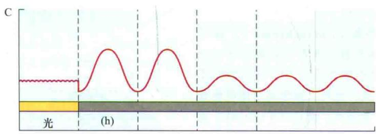  
在持续白光下，近似昼夜节律被抑制。如果转移至黑暗环境中，则节律重新启动

  
图25.15 近似昼夜节律的一些特征。  
转移至黑暗后，给予短暂的光脉冲引起的典型的相变反应。节律被改变(延迟)，但是周期没有发生任何变化

在自然条件下，温度存在波动，如果植物不能保持精确的时间，那么近似昼夜节律对它来说就没有意义了。事实上，温度对于自由运转的节律周期来说作用很小甚至于没有作用。在不同的温度条件下，使生物钟遵循时间的作用，称为温度补偿（temperature compensation）。尽管在这条途径中，所有的生化步骤都是温度敏感型的，但是它们对温度的反应可能会互相抵消。例如，媒介物合成速率的变化可以被相对应的降解速率所补偿。植物通过这种方式可以在不同的温度下仍然保持稳定的生物钟调节水平。

## 25.4.2 在不同的昼夜循环中，相位变化调节近似昼夜节律的变化

在近似昼夜节律中，生理过程通常是与内源振荡子相对应的时间点偶联的，特定的时间发生特定的反应。一个振荡子可以与众多的近似昼夜节律相偶联，有时甚至跨阶段偶联。

随着季节的变化，白昼和黑夜也发生变化，那么近似昼夜节律是如何与时间保持一致的呢？研究人员检测了在持续黑暗条件下内源振荡子的反应，以及在自由运转的节律下，内源振荡子对特定的相位点给予短时光脉冲（通常小于1 h）所作出的反应。有机体经过12/12 h的光/暗周期诱导后置于黑暗条件下，使节律自由运转，此时与先前形成的光周期相一致的节律的相位，称为相对白天（subjective day）；与先前形成的暗周期相一致的节律的相位，称之为相对黑夜（subjective night）。

在相对黑夜的起初几个小时如果给予光脉冲，则节律被延迟，有机体认为光脉冲是上一个阶段已经结束（图25.15D）。与此对应的是，在相对黑夜的结束阶段给予光脉冲，则可提高节律的相位，有机体认为光脉冲是新的一天的开始。

如下这种精确的反应是所期望的：即使季节变化后，近似昼夜节律能准确地随时间作出相应的变化。在不同的昼夜循环中，相变反应使得近似昼夜节律能够保持为大致24 h的循环。并且证实在不同季节条件的日长下，节律也能随之发生变化。

B  

## 25.4.3 光敏色素和隐花色素对生物钟的导引

光信号引起相变的分子机制目前还不清楚，但是通过对拟南芥的研究，已经鉴定出了几种在近似昼夜节律及其输入和输出途径中的关键组分。低水平和特殊波长的光可以诱导相变的产生，暗示着光介导的反应需要特异的光受体而不是光合速率。例如，红光介导的亚热带豆科植物雨树（Bamanea）叶片的昼夜运动是光敏色素介导的低影响反应（见第17章）。

拟南芥有5种光敏色素（phytochrome），除了光敏色素C外，其他4种都被证实在生物钟的导引过程中起作用。每种光敏色素都作为一个特定的光受体：红光、远红光或蓝光。另外，植物通过隐花色素（cryptochrome，CRY）感受光，而且CRY1和CRY2蛋白也参与了蓝光介导的生物钟运动，在昆虫和哺乳动物中也是如此（Devlid and Kay，2000，见第18章）。有趣的是，CRY蛋白尽管并不吸收红光，但是对红光介导的生物钟导引同样是必需的。这意味着CRY1和CRY2在光敏色素介导的生物钟导引中起着中间媒介的作用（Yanovsky and Kay，2001）。

在果蝇中，CRY蛋白与生物钟组分相互作用，因此也是振荡子机制的组成部分（Devlid and Kay, 2000）。然而在拟南芥中却并非如此。cry1/cry2双突变体在生物钟的导引方面有所减弱，但是在近似昼夜节律方面却是正常的。在植物中已表明，光激活的CRY2直接上调FT的表达而对蓝光作出响应，从而使其开花（Liu et al., 2008）。

## 25.5 光周期现象：监测日长

我们已经知道，生物钟的存在使得有机体在白天和黑夜的特定时间重复特定的分子和生化事件。光周期现象（photoperiodism）或者说有机体感受日长的能力，使得其在每年的特定时间能够对季节的变化作出相应的反应。近似昼夜节律和光周期现象都能对昼夜循环作出相应的反应。

在赤道，日长和夜长相等，全年都是如此。随着向两级的移动，日长在夏天变长而在冬天变短（图

25.16）。植物已经进化出了相应的机制来感知日长的季节性变化。并且它们的光周期反应受到所处纬度的强烈影响。

  
图25.16 A. 北半球一年不同时间中纬度对日长的影响。日长的测量是在每月的第20天进行的。B. 全球的经度和纬度图。

动物和植物中都发现了光周期现象。在动物界，日长控制了以下的季节性活动：冬眠、夏天和冬天皮毛的发育，以及冬眠后的苏醒。植物中受日长控制的活动非常多，包括开花、无性生殖、储藏营养物质的器官的形成，以及休眠的发生。

## 25.5.1 根据光周期反应可以对植物进行分类

许多植物在长日照的夏天开花，多年来植物生理学家认为长日照和开花之间的联系在于开花是在长日照下光合产物积累的结果。

20世纪20年代，美国马里兰州贝兹维尔农业研究院的Wightman Garner和Henry Allard两位科学家通过实验证明这个假设是错误的。他们发现一个烟草的突变体，即使在盛夏长至高达5 m，却依然不能开花（图25.17）。然而在冬天温室自然光条件下却能开花。

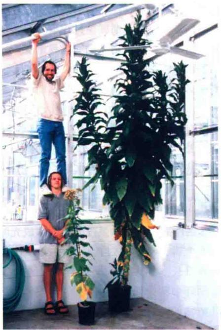  
图25.17 马里兰巨大的烟草突变体（右）与野生型烟草（左）。在夏天两种植物都种植在温室里（威斯康星州大学研究生作为标尺）（R.Amasino惠赠）。

这些结果使得Garner 和 Allard 进行了如下实验：在夏天的长日照条件下，将其置于不透光的屋子里，从日落前到次日早晨，以人为提供短日照来改变植物的生长，观察其效果。这种人为控制的短日照同样也可以使植株开花。Garner 和 Allard 得出如下结论：日长在开花中起决定作用，而不是光合积累。这个结论在许多植物及不同条件下都得到了证实。这项工作为以后植物光周期反应的研究奠定了基础。

尽管日长也会影响植物发育的其他方面，但是对开花的影响是研究最多的。根据光周期，有花植物一般分为短日植物和长日植物两大类。

（1）短日植物（short-day plant，SDP）：只有在短日照条件下才能开花的植物，或者短日照可以促进开

花的植物。

（2）长日植物（long-day plant，LDP）：只有在长日照条件下才能开花的植物，或者长日照可以促进开花的植物。

长日植物和短日植物两者最根本的区别在于：在24 h昼夜循环中，长日植物只有在日照长度超过一定时间后才能开花，这个日照长度称之为临界日长（critical day length），而短日植物在其日照长度短于一定时间后才能开花。不同物种，其临界日长也不一样。只有通过对不同日照长度条件下植物的开花情况进行分析，才能准确地进行植物的光周期分类（图25.18）。

长日植物能够有效地衡量春季和夏初日照的延长，直至达到临界日长后才能开花。许多小麦（Triticum aestivum）品种就属于此类。短日植物只有在秋天日长短于临界日长才能开花，如许多菊花品种（Chrysanthemum × morifolium）。然而，日长本身是一个比较模糊的信号，因为它不能区别春秋之间的差异。

植物采用几种方式来避免日长信号的模糊性。一种就是通过幼年期来阻止植物在春天就对日长作出反应。另一种避免日长信号的模糊性的机制是温度与光周期反应的偶联。有些植物如冬小麦，只有经过一个冷周期（春化作用或者越冬）才能对光周期作出反应（我们将在后面的章节中讨论春化作用）。

其他植物通过区别缩短和延长白日来避免日长信号的模糊性，这类植物称为双重日长植物，分为以下两类。

（1）长短日植物（long-short-day plant，LSDP）：长日照后给以短日照才能开花。如落地生根属（Bryophyllum）、伽蓝菜属（Kallanchoe）和夜晚开花的夜香树（Cestrum nocturnum），它们在夏末和秋季，当日照变短时开花。

（2）短长日植物（short-lang-day plant，SLDP）：短日照后给以长日照才能开花。如白车轴草（Trifolium repens）、风铃草（Campanula medium）和景天科拟石莲花属植物（Echeveria harmsii），它们在日照变长后的早春开花。

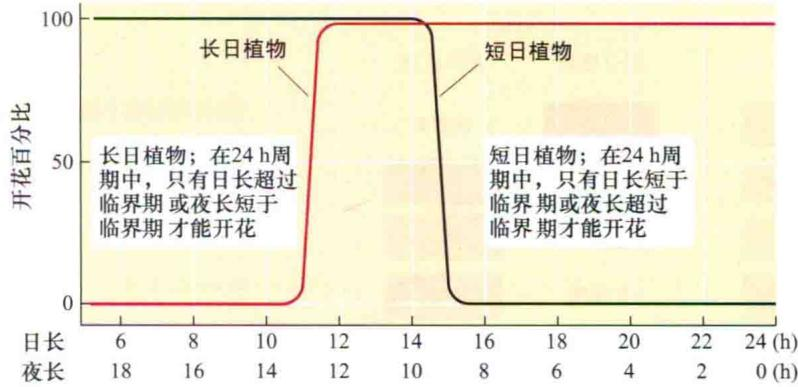  
图25.18 长日和短日植物的光周期反应。不同物种的临界期不同。本例中，无论是短日植物还是长日植物，在12\~14 h的光照周期下都能开花。

最后，那些在任何光周期条件下都能开花的植物被称为日中性植物（day-neutral plant，DNP）。日中性植物对于日长不敏感，它们主要是通过自主调控途径，也即内在的发育控制途径来控制开花。一些日中性物种，如菜豆（Phaseolus vulgaris），主要分布在赤道附近，因为那里的日长常年如一。沙漠中的许多一年生植物，如火焰草（Castilleja chromosa）和马鞭草属植物（Abronia villosa），经过进化，无论何时给予充足的水分都能萌发、生长和开花，它们也是日中性植物。

## 25.5.2 叶片是感受光周期信号的部位

无论是长日植物还是短日植物，感受光周期刺激的部位都是叶片。例如，短日照的苍耳属（Xanthium）植物，即使其他部位都处于长日照下，只对其一个叶片进行短日照处理后就足以使其开花。因此，在对光

A  
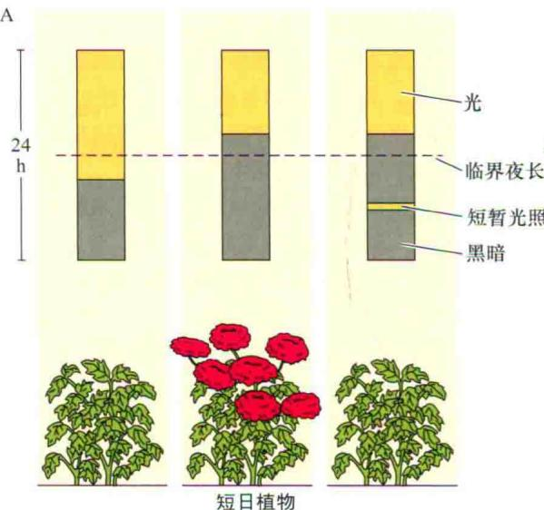  
短日植物；夜长超过临界期才能开花，短暂的光照中断暗期阻止开花

B  
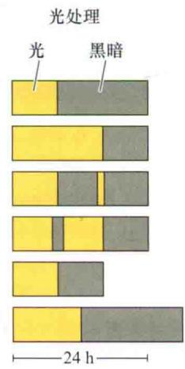

营养期

营养期

营养期

营养期

营养期

开花

开花

开花

开花

开花

营养期

周期作出反应后，叶片就向茎顶端传递了一种开花信号。在叶片上发生的光周期调控过程引发向茎顶端传送成花刺激物的现象，就称为光周期诱导（photoperiodic induction）。

即使在离体的叶片上也能发生光周期诱导。例如，在紫苏（Perilla crispa）中，离体的叶片经过短日照处理后，嫁接到在长日照下并未经过短日照诱导的植株上，可使后者开花（Zeevaart and Boyer，1987）。这个结果表明，光周期诱导依赖于叶中发生的反应。

## 25.5.3 植物通过衡量夜长来监测日长

在自然条件下，白天和黑夜的长度形成光暗24 h周期。从根本上讲，植物通过衡量光照或者黑暗的长度来感知临界日长。诸多对光周期的早期研究都致力于决定光暗循环中哪个阶段为开花的决定阶段。结果显示，短日植物的开花时间基本上是由暗期长度决定的（图25.19A）。在短日植物中，如果首先日长超过了临

  
长日植物；夜长短于临界期才能开花，有一些长日植物，缩短夜长可以诱导开花

图25.19 开花的光周期调控。A. 对短日植物和长日植物的影响。B. 暗期持续时间对开花的影响。用不同的光周期对长日植物或者短日植物进行处理，表明关键变量是暗期的长度。

<!-- END OFFICIAL API PART part_006 -->

<!-- BEGIN OFFICIAL API PART part_007 -->

界日长，但是接下来黑夜足够长的话，也能开花（图25.19B）。与此形成对比的是，短日植物经短日照后，再给予短夜处理，却不能开花。

更多的实验表明，短日植物对光周期的反应是通过衡量夜长来决定的。例如，苍耳（Xanthium strumarium）只有在暗期超过8.5 h才能开花，大豆（Glycine max）约为10 h。在长日植物中，黑暗的持续时间也相当重要（图25.19）。这些植物在短日照之后即使在短夜情况下也能开花。但是如果长日照后给予长夜处理，就不能开花。

## 25.5.4 暗期间断会消除暗期效应

暗期的重要性可以通过下面实验得到证实：在黑暗条件下，给以短暂的白光处理，暗期效应就失去作用，称为暗期间断（night break）（图25.19A）。相反，在日照条件下给以短暂的黑暗处理，并不能消除日照效应的作用（图25.19B）。在许多短日植物中，即使是几分钟的暗期间断，也能阻止其开花，包括苍耳属和牵牛属（Pharbitis）植物。在长日植物中，通常要足够长的光照才能开花。

另外，暗期间断效应也会随间断给予的时间有很大变化。对于长日植物和短日植物而言，在16 h的暗期接近中间的时候进行暗期间断最为有效（图25.20）。

暗期间断效应的发现及其对时间的依赖性，有几个重要的作用。首先它确定了暗期的重要性，以及为研究光周期的时效性提供了有价值的探索。因为只需要少量

  
图25.20 暗期间断的时间对于开花的影响。在一个比较长的暗期中，暗期间断可促进长日植物开花，而抑制短日植物开花。在16 h的暗期中，接近暗期中间的时候暗期间断最为有效。长日植物晚樱花，在16 h暗期中给予1 h的红光照射；苍耳在16 h暗期中给予1 min的红光照射（晚樱花数据引自Vince-Prue，1975；苍耳数据引自Salisbury，1963；Papenfuss and Salisbury，1967）。

的日照，在不影响光合作用和其他非光合作用条件下，研究光受体的行为和特性成为可能。这样的发现同样使得在园艺植物如伽蓝菜属（Kalanchoe）、菊花、一品红（Euphorbia pulcherrima）中，建立起商业化的调控花期的方法。

## 25.5.5 生物钟和光周期的守时性

黑夜长度在开花中的重要性提示我们，研究光周期的守时性，测量暗期长度是首要的。建立在近似昼夜节律基础上的机制已经用很多证据证实了这一点（Bunning，1960）。根据生物钟假说（clock hypothesis），光周期的守时性主要依赖于前面所讲过的振荡子（见第17章）。中央振荡子与涉及基因表达的许多生理过程相偶联，包括光周期依赖性物种的开花。

开花的暗期间断效应，可用来研究光周期守时性中近似昼夜节律的作用。例如，短日照的大豆植株，从8 h的光照移到64 h的暗期，暗期间断所引起的开花效应显示近似昼夜节律的形式（图25.21）。

这类实验更加有力地证明了生物钟假说。如果短日植物只是通过暗期特定中间物质的积累来简单地衡量黑夜的长度，那么任何大于临界夜长的暗周期都能导致植物开花。但是暗期间断发生的时间不能与内源振荡子的特定阶段很好地吻合时，就不能诱导植物开花。这些结果显示，短日植物的开花，除了需要足够长的暗周期外，同样也需要在生物钟周期的特定阶段给予一个黎明的信号（图25.15）。

振荡子在光周期衡量中所起作用的进一步证据来自于对光处理能引起光周期反应相变的观察实验（参见Web Topic 25.4）。

图25.21 暗期间断对节律性开花的影响。在这个实验中，短日植物大豆给予8 h光照和64 h的黑暗周期。在暗期的不同时间给予4 h的暗期间断。开花效应占最大效应的百分比按每个暗期间断处理进行划分。值得注意的是，在暗期的第26 h给予暗期间断能最大程度地诱导植物开花；而在第40 h给予暗期间断则不能诱导开花。而且，这个实验表明，暗期间断效应的敏感性显示近似昼夜节律的规律。这些数据支持了这样一个模型：在短日植物中，只有在光敏感阶段完成后，给予暗期间断或者黎明信号，才能诱导其开花。在长日植物中进行类似实验，暗期间断必须与光敏感阶段一致，才能诱导开花（参见Coulter and Hamner，1964）。

## 25.5.6 协变模型是建立在对光敏感的振荡上

周期为24 h的振荡如何确定临界夜长，例如，对于短日植物苍耳临界夜长为什么是8\~9 h呢？Erwin Bunning 于1936年提出，光周期控制植物的开花，是通过在生物振荡的不同阶段对光敏感性的不同形成的。这个假说最终演变为协变模型（coincidence model）。根据这个模型，生理振荡子控制植物对光的敏感和不敏感的时期。

光促进还是抑制开花主要决定于给光的时期。在近似昼夜节律的光敏感阶段给光，可促进长日植物开花而抑制短日植物开花。如图25.21所示，光敏感和不敏感阶段的振荡在暗期依然存在。在短日植物中，只有在昼夜节律的光敏感阶段完成后给予暗期间断或黎明信号，才能诱导其开花。在长日植物中进行类似实验，只有在在光敏感阶段给予暗期间断，才能诱导开花。也就是说，在与节律的适宜阶段相一致的情况下给予光照才可诱导长日植物和短日植物开花。即使在光暗周期不存在的情况下，振荡子也持续显示出对光的敏感和不敏感，这是生物振荡机制的特征之一。

## 25.5.7 CONSTANS的表达与光促进长日植物开花的协同性

根据协变模型，植物的开花响应只对昼夜周期特定阶段的光敏感。在长日照条件下促进长日植物拟南芥开花的关键组分为CONSTANS（CO）基因。它编码一个调节其他基因表达的锌指结构蛋白。CO最初是在拟南芥co突变体中鉴定出来的。co突变体不能进行光周期反应。CO的表达受生物钟的调控，在黄昏后12 h活性最大（图25.22A）。遗传和分子生物学研究表明，在拟南芥中CO加速对长日照的响应从而促进开花（图25.22B）。

如图25.22B所示，在长日植物拟南芥中，协变模型最主要的一个特征就是：CO在光周期阶段的叶子（光周期刺激物的感受部位）中表达后，才可促进开花。在短日照下，CO mRNA 表达量的增加并不能引起CO蛋白水平的升高。然而在长日照条件下，CO表达引起CO蛋白水平的迅速升高，因为至少部分CO的表达与光周期之间有重叠（图25.22B）（Suarez-Lopez et al., 2001）。

因此，长日照诱导拟南芥开花主要是由于CO蛋白水平的升高。在短日照条件下，由于缺光不能使CO蛋白水平升高，不能诱导开花。因此协变模型的一个主要特征就是在日照和CO的mRNA合成之间有重叠，光照可激活CO蛋白积累，达到使植物开花的水平。CO的mRNA的生物振荡性是光周期感受与生物钟之间的联系纽带。但是日照如何促进CO蛋白的积累呢？

通过在CO前加上一个组成型表达的启动子实验研究，为光照的作用提供了线索。在这种情况下，CO的mRNA应该持续表达，并在整个昼夜循环中都维持在一个稳定的水平。但是结果发现，CO表达的强度依然是周期性的。这就意味着CO蛋白表达丰度是通过转录后机制调控的。

这种转录后机制的基础是光暗条件下，CO降解速度不一样。在暗期，CO与泛素结合，并很快被26S蛋白体降解（见第2章）。而在光照条件下，可增强CO蛋白的稳定性（stability），并使之积累。这就解释了只有当CO的mRNA表达与光周期吻合后才能诱导开花的现象（Valverde et al., 2004）。在黑暗条件下，因为CO蛋白迅速降解，所以其不能积累。

然而，情况是非常复杂的，远非光-暗开关调节CO的表达量这么简单。光对CO蛋白稳定性的影响依赖于光受体。不同的光受体不仅在近似昼夜节律的设置上起作用，它们还直接影响CO蛋白的积累和开花。清晨光敏色素B（phyB）信号途径可以加强CO的降解；然而在夜晚（CO蛋白在长日照下积累后），隐花色素和光敏色素A（phyA）拮抗这种降解作用，因此可使CO蛋白积累（图25.22）（Valverde et al., 2004）。

但是在长日植物中，CO蛋白是如何刺激开花的呢？CO作为转录调控因子，通过刺激关键的花信号FT和SOC1的表达来促进开花。在本章的后面内容中，我们将会讨论到，在刺激分生组织开花时，有证据表明FT蛋白是促进分生组织形成花的韧皮部可移动信号。

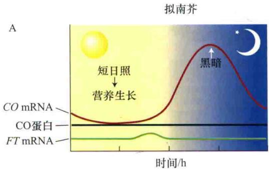

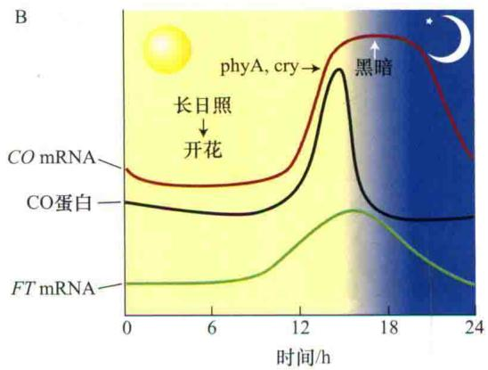

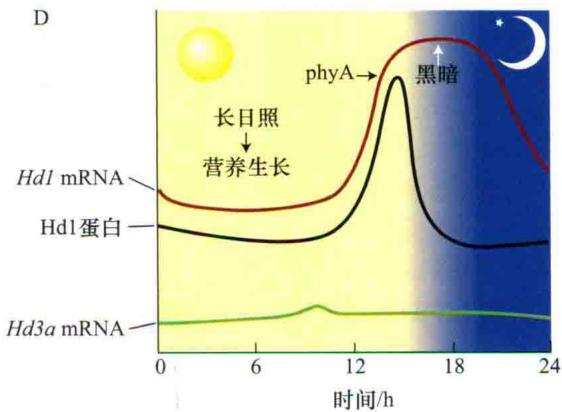  
图25.22 拟南芥（A 和B）和水稻（C 和D）协变模型的分子基础。A. 拟南芥在短日照条件下，CO mRNA的表达与光照之间的重叠较少。韧皮部CO蛋白积累不足，因此不能使可转运的成花刺激物FT蛋白表达，从而植物保持营养生长阶段。B. 拟南芥在长日照条件下，CO mRNA的丰度（12\~16 h）和日照（理解为光敏色素A和隐花色素）的重叠达到了顶峰，因此使CO蛋白积累。CO激活韧皮部中FT mRNA表达，当后者转运到顶端分生组织后，诱导植物开花。C. 水稻在短日照下，由于Hd1 mRNA与光照之间缺乏协同性，因此阻止了Hd1蛋白的积累，Hd1蛋白为编码转运成花刺激物基因Hd3a的抑制子。Hd1蛋白抑制子不存在的情况下，Hd3a mRNA表达，并被转运到顶端分生组织，因此使得植物开花。D. 水稻在长日照（理解为光敏色素）下，Hd3a mRNA的丰度和日照的重叠达到了顶峰，因此引起Hd1a蛋白抑制子的积累。所以Hd3a mRNA没有表达，植物依然处于营养阶段（引自Hayama and Coupland，2004）。

在短日照植物中也有同样的促进开花的途径，这将在后面讨论。

## 25.5.8 短日照植物在长日照下利用协同机制抑制开花

通过对短日植物水稻开花的研究发现，光周期感受的基本协同机制在水稻和拟南芥中是保守的。在水稻育种的过程中，育种学家已经鉴定出了影响开花的几个等位基因。Heading-date 1（Hd1）和Heading-date 3a（Hd3a）基因编码与拟南芥CO和FT同源的蛋白质。在转基因的拟南芥中过表达FT和在水稻中过表达Hd3a，都可促进植物迅速开花，而不受光周期的影响，说明FT和Hd3a都是开花的强启动子。而且当植物处于诱导的光周期（长日照下的拟南芥和短日照下的水稻）时，内源的FT和Hd3a基因的表达都增加（图25.22C）。另外，水稻的Hd3a和拟南芥CO的表达都显示出相似的模式，即mRNA的规律性积累。

水稻和拟南芥的区别在于，在短日植物水稻中，Hd1抑制Hd3a的表达，也就是说，在水稻中，Hd1与光敏色素介导的光信号阻止开花的协同性主要是通过抑制Hd3a的表达来实现的（图25.22D）（Izawa et al., 2003；Hayama and Coupland, 2004）。相反，在拟南芥中，CO激活下游基因FT的表达。短日植物和长日植物对光周期反应的不同，部分原因是光周期感受系统中CO/Hdl的相反效应。

然而，需要特别说明的是，光周期现象是非常复杂的，对其他可能影响短日植物和长日植物对日长作出反应的调节机制还有待进一步研究。

## 25.5.9 光敏色素为光周期反应中最主要的光受体

暗期间断实验非常适用于研究在光周期反应中接收光信号的受体的特性。在短日植物中，暗期间断抑制短日植物开花是光敏色素控制下的生理过程之一（图25.23）。

在许多短日植物中，暗期间断在Pr（吸收红光的光敏色素）向Pfr（吸收远红光的光敏色素）转换的过程中，只有给予足够剂量饱和其转换过程的光才有效（见第17章）。随后用远红光照射，使之重新转变为没有活性的Pr，又恢复开花反应。

  
图25.23 光敏色素通过红光和远红光来控制开花。在长日植物中，在暗期给予瞬间的红光照射可以促进其开花，并且这种效应可以被远红光逆转。这种反应表明有光敏色素的参与。在短日植物中，短暂的红光照射可抑制植物开花，并且这种效应可以被短暂的远红光逆转。

图25.24所示为对短日植物开花起抑制和促进作用的特殊波谱。为了避免叶绿素的干扰，利用在暗处生长的牵牛花，发现在660 nm处的A波峰为Pr的最大光吸收；相反，绿色植物苍耳在有叶绿素存在的情况下，激活波谱和Pr的吸收波谱之间存在差异。激活波谱的存在及暗期间断实验中红光-远红光的互相逆转，证实了光敏色素作为光受体参与了短日植物对光周期的感知。

另外的遗传实验证实，光敏色素在短日植物光周期现象中起关键的作用。水稻PHOTOPERIOD SENSITIVITY 5（Se5）基因编码一个类似于拟南芥HY1的蛋白质。Se5和HY1都是催化光敏色素发色团合成过程中某一步骤的酶。对于Se5突变体，无论在多长的日照条件下都能迅速开花（Izawa et al., 2000）。

长日植物暗期间断实验同样有光敏色素的参与。因此在一些长日植物中，用红光使暗期间断可促进开花。而用远红光则抑制开花（图25.23）。

在长日植物大麦、毒麦和拟南芥中发现，近似昼夜节律通过远红光而促进植物开花（图25.25）（Deitzer，1984），并且与远红光的照射强度及持续时间成一定的比例，因此为高光辐照度反应（high-irradiance-response，HIR）。和其他的高光辐照度反应一样，光敏色素A也是介导远红光效应的光敏色素。与长日植物中光敏色素A在开花中的效应相一致，拟南芥

  
图25.24 暗期间断实验说明特殊的波谱控制了开花反应，并暗示有光敏色素的参与。在另一个诱导周期中，给予暗期间断可以抑制短日植物的开花。对于短日植物苍耳，620\~640 nm为其红光吸收波谱。725 nm处的光可逆转红光效应。为了避免叶绿素Ⅱ对光吸收的干扰，利用在暗处生长的牵牛花，发现660 nm的暗期间断最有效。因为660 nm能最大程度被光敏色素吸收（苍耳数据参见Hendricks and Siegelman，1967；牵牛花数据参见Saji et al., 1983）。

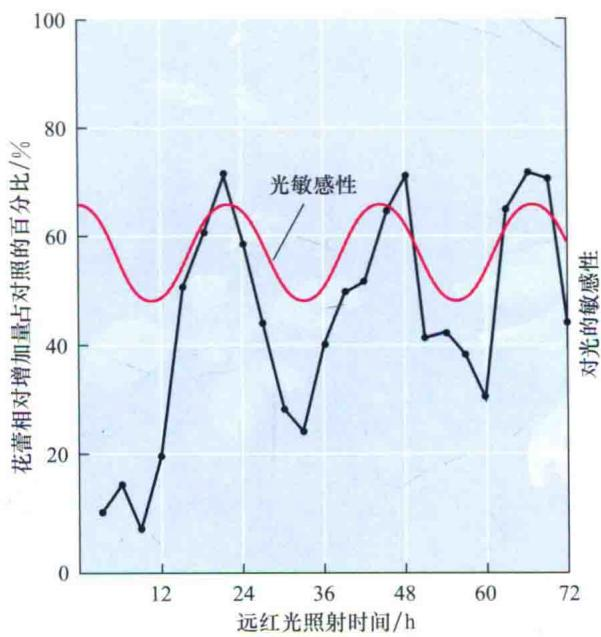  
图25.25 远红光对拟南芥开花的影响。在持续的72 h光照过程中，定时给予4 h的远红光照射。图中数据点每6 h采集一次。数据显示近似昼夜节律对远红光促进植物开花也是敏感的。这就支持了在长日植物中，光处理（本例中为远红光）与光敏感性峰一致的话可促进植物开花（引自Deitzer，1984）。

PHYA的突变体开花延迟。然而在一些长日植物中，光敏色素的作用远比在短日植物中的作用复杂，因为蓝光受体也参与了这个反应。

## 25.5.10 蓝光受体参与长日植物的开花调控

一些长日植物如拟南芥，蓝光可以促进其开花，暗示着蓝光受体也可能参与了对开花的调控。在第18章我们已经讲过，CRY1和CRY2基因编码的隐花色素在拟南芥中为控制幼苗生长的蓝光受体。

正如前面提到的，CRY蛋白也参与了对生物钟振荡子的导引。就像Web Topic 25.5中提到的，通过构建带有荧光色素酶报告基因的载体，发现蓝光在开花中具有一定作用，并与近似昼夜节律存在一定联系。在持续的白光照射中，发光周期为24.7 h；但是在持续的黑暗条件下周期为30\~36 h。无论是给予红光还是蓝光，都能使周期缩短为25 h。

为了区别光敏色素与蓝光受体的作用，研究人员对光敏色素突变体hy1进行了转化研究，这种突变体在发色团的合成方面存在缺陷，导致所有的光敏色素缺失（见第17章），利用荧光素酶载体来测定突变对周期长度的影响（Millar et al., 1995）。在持续的白光照射下，hy1与野生型有相似的周期，说明白光对光周期的影响只需少量或者不需要光敏色素的参与。而且在只有光敏色素B能够感受的红光持续照射下（见第17章），hy1的周期显著变长（如它更像持续的暗处理）；然而在持续的蓝光照射下周期没有变长。这些结果显示光敏色素和蓝光受体都参与了对周期的调控。

通过对拟南芥开花突变体elf3（early flowering 3）（参见Web Topic 25.5和25.6）的研究，同样证实蓝光参与了调节近似昼夜节律和开花的调控。通过对CRY2基因的一个突变体的研究（见第18章），更进一步证实了在拟南芥中蓝光受体对光周期诱导是敏感的，这种突变体开花延迟，并且丧失了感受光周期诱导的能力（Guo et al., 1998）。

相反，携带有CRY2功能获得型等位基因的植株开花比野生型还要早（El-din El-Assal，2003）。另外cry1/cry2双突变在长日照条件下比单突变cry2开花稍晚。所以在对开花的调控上，CRY1和CRY2存在功能重叠。

隐花色素除了在生物钟导引上起作用外，光敏色素A还通过直接调节CO蛋白稳定性来调控植物开花。因此综上所述，CO蛋白为调控长日植物开花的启动子。

## 25.6 春化作用：冷处理可以促进植物开花

吸水的种子或正在生长的植株进行冷处理后可减轻对开花的抑制，这个过程就称为春化作用（vernalization）（干燥的种子并不能对冷处理作出反应，因为春化是一个有活性的代谢过程）。不经过冷处理，那些需要春化处理才能开花的植物会延迟开花或一直处于营养生长阶段，而且它也不能对成花信号如光周期诱导作出响应。许多情况下这些植物一直长莲座叶而茎不伸长（图25.26）。

在本节中我们将会讨论一些需要冷处理才能开花的特征，包括温度范围和持续时间、低温感受部位、与光周期的关系，以及可能的分子机制。

## 25.6.1 植物感受春化作用获得开花能力的部位是茎顶端分生组织

不同年龄的植物对春化作用的敏感性也不一样。冬性的一年生植物，如越冬的禾谷类植物（秋季播种，次年夏季开花），在生命周期的早期就显示出对低温的敏感性。事实上，许多冬性一年生植物的种子在萌发前吸水并且开始代谢活动时就可以进行春化作用。其他植物包括许多二年生植物（播种的第一季度进行莲座叶的生长，次年夏季开花），只有当它们的个体达到一定大小时，才对进行春化作用的低温敏感。

适合春化作用的温度为0\~10℃，通常为1\~7℃（Lang，1965）。低温处理的效果随持续时间而增加，图25.26 春化作用可诱导冬性一年生植物拟南芥开花。左图为没有经过冷处理的野生型拟南芥。右图为从幼苗期在稍高于4℃的条件下，经过40天的冷处理，在春化处理结束后三周，长了大约9片叶子后开花（Colleen Bizzell，惠赠）。

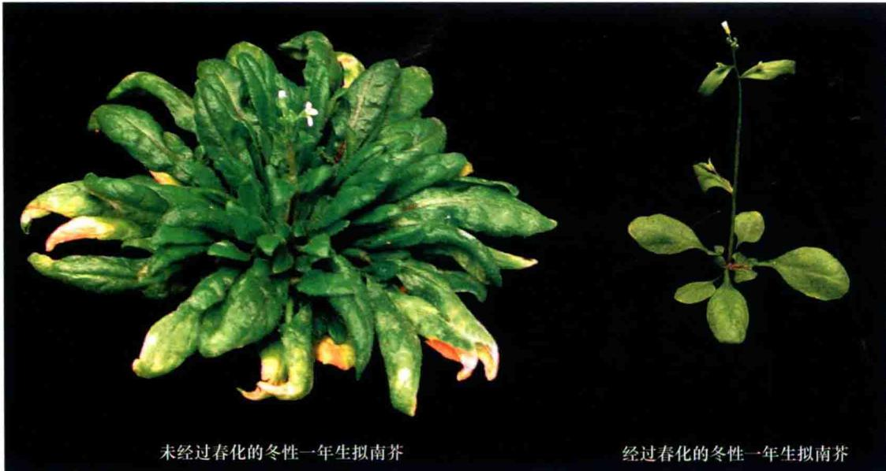  
经过春化的冬性一年生拟南芥

直到饱和为止。通常冷处理需要几个星期，但是不同植物不同品种所需的时间变化范围很大。

当处于去春化的条件下时，如遇高温，春化作用会消失（图25.27）。但是低温处理的时间越长，春化作用的效果持续时间越久。

  
图25.27 低温处理时间越长，春化作用越稳定。冬性黑麦低温处理时间越长，在低温处理后给予去春化作用的条件，仍能保持春化作用效果的植株越多。在这个实验中，黑麦的种子浸泡在水中，用不同时间的低温进行处理，然后迅速给予35℃3天的去春化处理（数据引自Purvis and Gregory 1952）。

春化作用主要发生在茎顶端分生组织。只有茎顶端被冷处理后，才能诱导植物开花。这种结果看起来与植物的其他部位是否接受冷处理关系不大。离体的茎尖可以春化，种子也可以，形成胚胎的茎尖一样对低温敏感。

在发育过程中，春化作用可使得分生组织获得向花器官转变的能力。但是，在前面我们已经知道，开花能力的获得并不能保证开花一定会发生。对春化处理的需求一般还与特殊的光周期相关联（Lang，1965）。最普遍的联系是：冷处理后给予长时间的光照，这种联系使处于高纬度的植物在夏初就能开花（参见Web Topic 25.7）。

## 25.6.2 春化作用涉及基因表达的表观遗传变化

在低温进行春化作用处理时需要保持一定的代谢活性，供能物质（糖类）和氧气是必需的。低于冰点的温度使代谢活性受到抑制，对春化作用也是无效的。同样，细胞分裂和DNA复制也需要一定的代谢活性。在有些植物中春化能引起一些稳定的变化，使得分生组织能够形成花序（Amsasinio，2004）。

春化作用能稳定影响开花能力的一个模型是：冷处理后，分生组织的基因表达模式发生了变化，这种变化一直持续到春天并贯穿整个生命周期。但是这种基因表达的变化并不涉及DNA序列的变化，而且可通过有丝分裂或减数分裂传递给子代细胞，也称为表观遗传变化（epigenetic change）。而且，在基因水平上的表观遗传变化即使是在信号（如低温）不再存在时也是非常稳定的。从酵母到哺乳动物的许多有机体都可发生基因表达的表观遗传变化，而且通常需要细胞分裂和DNA复制，这也是春化作用的一个方面。

一个与长日植物拟南芥春化作用相关的、起表观调节作用的特异性靶基因已经被鉴定出来。冬性一年生拟南芥需要春化作用和长日照才能促进开花。已经鉴定出了一个开花抑制基因：FLOWERING LOCUS C（FLC）。FLC基因在没有经过春化作用的茎顶端区域高度表达（Michaels and Amasino，2000）。一旦通过春化作用后，在接下来的生命周期中，这个基因的表达被关闭，从而在长日照下可开花（图25.28）。然而在下一个世代中，FLC基因的表达又被开启，需要重新进行冷处理。因此在拟南芥中，FLC基因的表达状态代表了分生组织能力决定的一个重要方面（Amasino，2004）。在拟南芥中的研究表明，FLC直接通过对关键成花信号FT在叶中的表达及转录因子SOCI和FD在茎顶端分生组织的表达的响应而起作用（Searle et al., 2006）。

根据染色质重建模型（chromatin remodeling），对FLC的表观调节与染色质结构的稳定性改变有关。在第1章我们已经知道，在真核生物中，核DNA存在于转录不活跃、结构比较紧密的异染色质区域，或者转录活跃的常染色质区域。异染色质和常染色质的区别在于核糖体上特定组氨酸的共价修饰方式不同（见第2章）。而且这些修饰被认为与异染色质或常染色质的形成有关。

这些共价修饰通常发生在特殊的染色质结构区域，也就是组蛋白密码（histone code）（Jenuwein and Allis, 2001）。

春化作用使常染色质中FLC失去组蛋白修饰功能而获得如异染色质特定赖氨酸残基的甲基化修饰特征（Bastow et al., 2004; Sung and Amasino, 2004）。冷处理使得FLC从常染色质向异染色质转变，并使得基因沉默。

## 25.6.3 植物进化出了一系列的春化作用机制

许多需要春化作用的植物在秋季萌发，然后充分地利用凉爽和潮湿的环境进行生长。对于春化作用的需求使得植物在春季才能开花，从而保证冬季持续营养生长（花对霜冻非常敏感）。需要进行春化作用的植物不但需要感受冷信号，同时需要一套感知冷处理持续时间的机制。例如，在早秋进行短时的冷处理，而后在秋末气温回升，这样对于植物来讲，不会误认为早期的低温就是冬天，而后的气温升高就为春季。一般来说，春化作用只有在足够长时间的冷处理后才会发生，这样的持续时间指示完整的冬天已经结束。

生长在温带地区的二年生植物同样也进化出了一套相应的机制感知冷处理的时间从而打破休眠开始萌发。植物进化出的感知冷处理的机制目前还不清楚。但是在拟南芥中，一些基因在长时间的冷处理后才表达，这些基因对于春化作用是非常重要的（Amasino，2004；Sung and Amasino，2004）。

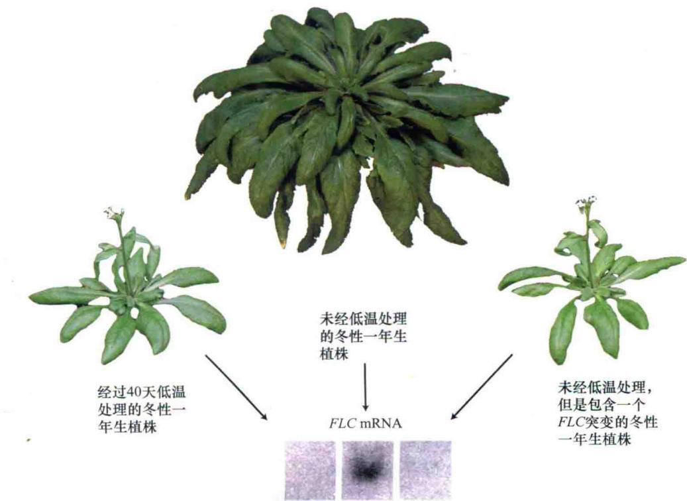  
图25.28 要求春化的植物除非经历长时间的低温，否则要么延迟开花要么不能开花。（左）每年冬季低温春化阻止拟南芥FLC基因的表达。（右）拟南芥flc突变体未低温处理也能快速开花（图片由R.Amasino惠赠）。

在所有的开花植物中，春化作用途径不尽相同。上面我们讲过，在拟南芥中，FLC基因是开花的抑制子，使其需要春化处理才能开花。FLC编码一个MADS-box蛋白，与DEFICIENS和AGAMOUS基因相似，在花的发育中起作用。在禾谷类植物中，有一个基因编码包含锌指结构的不同类型的VRN2（vernalization 2）蛋白，它是开花的抑制子，使得开花也需要春化作用（Greenup et al., 2009；Distelfeld and Dubcovsky, 2009）。

有很大一部分有花植物在温暖气候条件下进化，因此没有进化出感知冬季持续时间的机制。随着地质年代的变化，由于大陆漂移和其他因素，地球逐渐形成一些温带气候区。当这些植物适应这种温度条件后，春化作用和芽的休眠反应就可能在各自的种群中进化出了独立的机制。

## 25.7 与开花有关的长距离信号过程

尽管成花诱导发生在茎顶端分生组织上，但光周期植物感知光周期的部位是叶片。这就表明信号必须从叶片长距离传导到茎顶端，这已经在许多植物的嫁接试验中得到证实。这些信号的生化本质是什么一直困扰着生理学家。这个问题最终通过分子遗传学方法得以解决，而且证实成花刺激物是一种蛋白质。在这一部分我们将综述这一成花刺激物或历史上称为开花素的发现背景。它在开化过程中起着长距离信号传输的作用。同时我们也讨论其他各种作为开花激活子或抑制子的生化信号。

## 25.7.1 成花刺激物通过韧皮部运输

叶片中形成的成花刺激物通过韧皮部运输到茎尖分生组织，并最终使其发育成花。如果阻止韧皮部的运输，如环割或者定位热杀死，就会阻止成花刺激物从叶部向外运输而导致不能开花。

成花刺激物的运输速率是可以通过如下方式测量的：在诱导后不同时间移除叶子，然后比较信号从诱导后的叶片到达两个不同距离的花芽所需要的时间，就可知道其运输速率。用这种方法测量运输速率的基本原理是叶片移除及开花之前这种信号物已到达花芽并积累到一定的量。在这种方法中，从叶片运输的足够量信号物所需时间也能被确定。而且通过比较两个不同部位花芽诱导开花的时间可以测量出信号在茎中的移动速率。

利用这种方法研究表明，成花信号的移动速率和糖类在韧皮部的运输速率大致相等或稍低（见第10章）。

例如，短日照的藜属植物（Chenopodium），成熟叶片上的成花刺激物大致是在长夜周期开始后的22.5 h之内输出的。在长日照白芥属植物（Sinapis）中，叶子的成花刺激物早在长日照开始后的16 h就输出（Zeevwaart，1976）。

由于成花刺激物是在韧皮部内与糖类一起运输的，因此很容易认为二者是源-库关系。位于茎顶端与茎基部的叶子相比，前者诱导后更能促进植物开花。与此类似的是，当没有诱导的叶子处于诱导的叶子和花芽之间时，它作为首选物阻止从远端运来的成花刺激物到达目的部位，所以能阻止开花。

## 25.7.2 嫁接实验证实了可转运的成花刺激物的存在

在经过光周期诱导的叶子上可以产生一种生化信号，并转运到一定距离的目的组织（茎顶端）刺激发生一定的反应（开花），这种生化信号具有激素一样的重要效果。20世纪30年代苏联的Mikhail Chailakhyan提出，在植物中存在一种通用的开花刺激物质，他将其命名为开花素（florigen）。

开花素存在的证据来自于如下实验：从已经经过光周期诱导后的供体植株上移植一片叶子或者一个枝条到另外一个从未经诱导的受体植株上，能使后者开花。如短日植物紫苏，将其经过短日照诱导后的一个叶片嫁接到处于长日照条件下没有经过诱导的植株上，能使后者开花（图25.29）。并且不同光周期的植物，其成花刺激物好像为同种物质。因此，从经过长日照诱导的长日照烟草（Nicotiana sylvestris）中截取一段枝条嫁接到短日照马里兰的巨大烟草突变体上，能使后者在没有诱导的条件下开花。

日中性植物的叶片同样可以产生可转运的成花刺激物（表25.2）。例如，将日中性大豆品种Agate的一片叶子嫁接到短日照品种Bilaxi上，即使后者处于没有诱导作用的长日照下也能开花。同样，将日中性烟草（Nicotiana tabacum cv. Trapezond）的芽嫁接到长日照烟草（Nicotiana sylvestris）中，同样可以诱导后者在没有长日照诱导的短日照条件下开花。

嫁接研究表明，有些物种如短日植物苍耳属（Xanthium）、短长日植物落地生根属（Bryophyllum）和长日植物蝇子草（Silene），嫁接不仅能诱导开花，而且这种诱导状态可以通过自身传递下去（Zeevwaart，1976）（见Web Topic 25.8）。在不同的属之间进行嫁接同样可以诱导开花。将正在开花的金盏花（Calendula officinalis）枝条嫁接到处于营养阶段的苍耳茎上，在长日照条件下，同样可使短日植物苍耳开花。与此类似，将长日植物矮牵牛花枝条嫁接到需要冷处理的两年生天仙子（Hyoscyamus niger）上，即使没有经过春化处理，在长日照条件下也可使后者开花（图25.30）。

诱导后的接穗供体 未诱导的接穗供体  
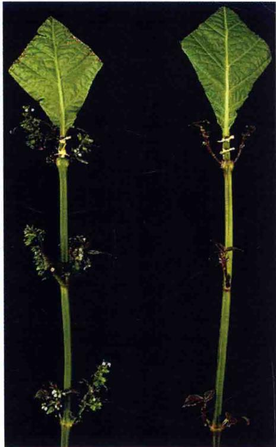  
图25.29 通过嫁接实验证实在短日植物紫苏中存在叶子产生的成花刺激物。左图：将一片经过短日照诱导植株上的叶片嫁接到没有经过诱导的茎上，可使腋芽开花。供体叶片经过修剪便于嫁接，受体茎上部的叶子去除以促进韧皮部从接穗向受体茎转移。右图：嫁接一片从长日条件下的没有经过诱导的植株叶片只会形成处于营养阶段的枝条（AD Zeevaart惠赠）。

在紫苏中（图25.29），从供体叶片来的成花刺激物通过韧皮部运输到受体植物的茎上，它与来自供体的 $^{14}$ C标记的同化物的运输联系比较紧密，而且这种运输的实现是建立在嫁接处的维管连续分布的基础上（Zeevaart，1976）。这些结果都证实了成花刺激物在韧皮部是与光同化物的转运同时进行的。

## 25.7.3 开花素的发现

上面介绍的嫁接试验表明，从叶子到顶端分生组织长距离信号对刺激开花是很重要的。自20世纪30年代以来，试图分离开花素和抑花素都失败了。在已知的植物激素结构基础上，这些早期的研究几乎都集中于小分子物质，它们相对容易进行生物分析。分离诱导和没有诱导的叶组织的提取物，然后验证它们对成花或抑花的影响。有这样一个典型的实验，收集许多受诱导的韧皮汁进行测验（见第10章）。尽管有一些正面结果的报道，但是都未能经得起进一步推敲。有一种假设认为在分离物中检测成花素失败的原因是成花素不是单一物质，而是一个多因子的组合体，因此很难通过实验使其复原。另一种假设认为成花素可能不是类似于激素的小分子物质，而是一种大分子物质，如蛋白质或RNA，这些大分子不是在植物细胞中既定存在的。后一种假设可以解释为什么从分离物中检测成花素活性是如此困难。研究人员已无路可走，必须寻找新的方法来解决这个问题。

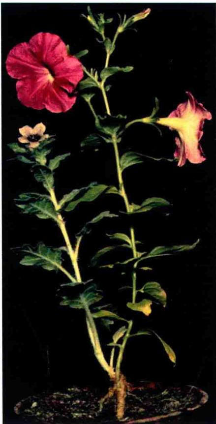  
图25.30 成花刺激物在不同种属间可以成功地转运。右边的枝条为长日植物矮牵牛的幼苗，砧木为没有春化处理的天仙子。嫁接后保持在长日照条件下（AD Zeevaart惠赠）。

表25.2 成花信号可通过嫁接方式进行传递

<table><tr><td>保持在开花诱导条件下的供体植物</td><td>光周期类型</td><td>诱导开花的受体植物</td><td>光周期类型</td></tr><tr><td>向日葵</td><td>长日照下日中性植物</td><td>向日葵</td><td>长日照下短日植物</td></tr><tr><td>烟草(Delcrest)</td><td>短日照下日中性植物</td><td>烟草(sylvestris)</td><td>短日照下长日植物</td></tr><tr><td>烟草(sylvestris)</td><td>长日照下长日植物</td><td>马里兰巨大烟草</td><td>长日照下短日植物</td></tr><tr><td>马里兰巨大烟草</td><td>短日照下短日植物</td><td>烟草(sylvestris)</td><td>短日照下长日植物</td></tr></table>

一个主要的突破是在拟南芥中通过遗传分析鉴定到FLOWERING LOCUS T（FT）基因。

## 25.7.4 拟南芥FLOWERING LOCUS T蛋白是成花素

根据协变模型，长日植物如拟南芥只有CO基因在光周期下表达后才能诱导其开花。CO基因的表达量在叶子和茎的韧皮部最高（An et al., 2004）。CO的下游目的基因FLOWERING LOCUS T（FT）也在韧皮部特异表达。

与韧皮部的CO相对应，光周期反应缺失的co突变体可以被特异性伴胞启动子在成熟叶子的次生叶脉中特异表达CO基因而得到恢复（An et al., 2004；Ayre and Turgeon, 2004）。相反，在co突变体的顶端分生组织表达CO却不能使光周期反应恢复。因此，CO可能在叶子的韧皮部对长日照作出反应后特异表达而刺激开花。另外嫁接叶子韧皮部表达CO的转基因植株的芽到co突变体，也能使后者开花。这些结果表明，CO的表达产生可通过嫁接转移的成花刺激物，从而引发茎顶端分生组织开花（Ayre and Turgeon, 2004）。

CO活性的信号输出是由FT基因的表达介导的。拟南芥在长日照下CO的表达使FT的mRNA升高。而FT不像CO，FT无论在韧皮部还是在顶端分生组织表达都能刺激植物开花（An et al., 2004；Corbesier and Coupland, 2005）。

FT在芽殖酵母菌和脊椎动物中是一种保守的小的球状调控蛋白。FT的mRNA或FT蛋白是否就是光周期信号通过韧皮部长距离向顶端分生组织转运的成花刺激物（成花素）呢？很多植物中FT基因（或其相关基因，如水稻Hd3a）在光周期诱导的成花过程中表达。当FT基因被转入不受光周期影响成花的植物中时，转基因植物可以不依赖于光周期而开花。现已证实FT蛋白可以从叶片转移到顶端分生组织（Corbesier et al., 2007；Jaeger and Wigge 2007；Mathieu et al., 2007；Lin et al., 2007；Tanak et al., 2007；Zeevaart, 2008年总结）。因此，FT蛋白已经显示出可能是成花素的特征。

根据目前的模型，FT蛋白在光周期诱导下从叶片通过韧皮部向分生组织运输（图25.31）。在分生组织中一旦FT蛋白和FD形成复合物，一个基本的亮氨酸拉链（bZIP）转录因子即在分生组织中表达（Abe et al., 2005；Wigge et al., 2005）。FT和FD复合物激活花特异性基因如APETACAE1的表达（图25.31）。在拟南芥中这种正反馈调节使得分生组织保持成花状态。然而有些植物缺乏这种正反馈调节机制，这些植物在没有持续的光周期存在时分生组织逆转为叶而不是花（Tooke et al., 2005）。

## 25.7.5 赤霉素和乙烯能诱导一些植物开花

在生长类激素中，赤霉素（GA）（见第20章）对开花有很大的影响（参见Web Topic 25.9）。外源赤霉素喷洒于长日植物如拟南芥的莲座叶，或双重日长植物如落地生根，都可使它们开花（Lang，1965；Zeevaart，1985）。

赤霉素可通过激活LEAFY基因的表达来促进拟南芥开花（Blazquez and Weigel，2000）。赤霉素激活LFY表达是由转录因子GAMYB介导的，而GAMYB又被DELLA蛋白负调控（见第20章）。另外，GAMYB水平也受促使GAMYB转录降解的microRNA的调控（Achard et al., 2004）（见第20章）。

在一些没有经过诱导的短日植物及需要春化处理而未处理的植物上喷洒外源赤霉素，同样可诱导它们开花。如前所述，施加赤霉素可以促进一些裸子植物球果的形成。因此，在一些植物中，就像日长和温度这些主要的环境因子一样，外源赤霉素可绕过内源赤霉素而促进开花。

第20章谈到，在植物中含有多种类似于赤霉素的化合物。这些化合物多数要么为赤霉素的前体，要么是无活性的赤霉素代谢物。在长日植物毒麦中，有些情况下不同的赤霉素对开花和茎伸长有不同的影响（参见Web Topic 25.9）。

在一些物种中，如长日照的毒麦（Lolium temuletum），不同的赤霉素在开花和茎伸长方面具有明显的差异效应（见Web Topic25.10和Web Essay 25.1）。在定量化长日植物拟南芥中，一个赤霉素合成突变体在非诱导的短日照时阻止开花，而在长日照下对开花几乎没有效应，表明在某些特殊情况下内源赤霉素对于开花是必需的（Wilson et al., 1992）。因此在拟南芥中，在光周期刺激很少或缺乏时，赤霉素是一种替代的成花刺激物。在许多物种中，一定量的赤霉素对于开花是必需的。

人们将注意力都集中在长日照对赤霉素代谢的影响上（见第20章）。例如，长日植物菠菜（Spinacia oleracea）在短日照条件下赤霉素水平相对较低，植株保持莲座叶状态。一旦被转移到长日照条件下，在13-羟基化途径（ $\mathrm{GA}_{53} \rightarrow \mathrm{GA}_{44} \rightarrow \mathrm{GA}_{19} \rightarrow \mathrm{GA}_{20} \rightarrow \mathrm{GA}_{1}$ ，见第20章）中所有的赤霉素水平都升高。然而具有生理活性的

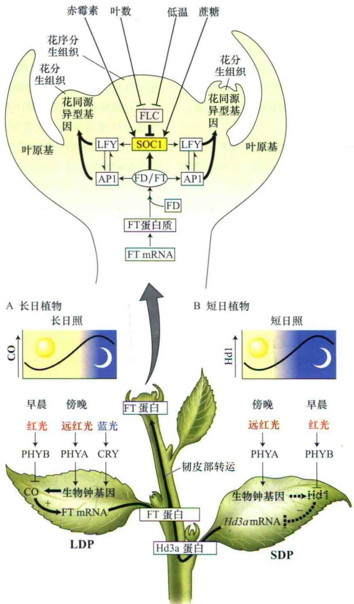  
图25.31 拟南芥中众多的开花发育途径：光周期现象、自主途径、春化作用（低温）和赤霉素均会影响开花。光周期途径定位于叶子，并且与可转移的成花刺激物FT蛋白的产生有关。A.拟南芥在长日照下CO蛋白积累使得在韧皮部产生FT的mRNA，然后FT蛋白通过筛管运输到顶端分生组织。B.短日植物如水稻，当抑制蛋白Hd1在短日照下不能积累时，可转运的成花刺激物FT也称为Hd3a表达（虚线表示在短日照下生物钟基因不激活Hd1）。在分生组织中，FT或Hd3a蛋白与FD蛋白相互作用。FT/FD复合物激活AP1和SOC1基因，进而激活LFY基因表达。LEY和AP1基因接着激活花同源异型基因的表达。自主途径和春化途径负调控FLC，FLC在分生组织中是SOC1的负调控因子，在叶中是FT的负调控因子。

$GA_{1}$ 水平升高5倍，是引起茎伸长并开花的主要原因。

除赤霉素外，其他生长类激素也能促进或抑制植物开花。一个很重要的例子就是乙烯和能释放乙烯的化合物对菠萝（Ananas comosus）开花具有显著的促进作用，这种反应仅限于在凤梨家族（Bromeliaceae）中存在。

## 25.7.6 气候变化已经引起开花时间的明显变化

植物对温度高度敏感，而且通过不同方式利用温度信号控制发育。我们知道有些植物需要较长时间的低温（春化）使其开花。此外就是环境温度对生长的影响。

植物可以感知低至1℃的温度变化。在研究过的许多植物中，提高环境温度可以加速开花。很明显，气候变化已经引起植物开花时间的显著变化（Fitter and Fitter, 2002）。植物感知温度的途径还不清楚，但这种感知依赖于FT基因的表达，因为在FT缺失突变体中，环境温度的升高并未加速开花（Baiusubramanian et al., 2006）。

研究表明，不同物种对环境温度的敏感度不同，有些植物非常不敏感，而有些植物特别敏感。这对于理解物种是如何适应气候的变化是非常重要的暗示，因为已有研究表明那些对气候变化有响应的植物可以扩张其生存范围，而那些不能利用环境温度作为发育信号的植物更易灭绝（Willis et al., 2008）。

## 25.7.7 开花转变涉及诸多因子和信号途径

开花转变是一个涉及诸多因子相互作用的复杂系统。对自主调节途径和光周期反应类植物，叶片产生的可移动的信号对茎顶端的决定性来说都是必需的。遗传研究表明，在长日植物拟南芥中存在4种明显的调控开花的发育途径（图25.31）。

（1）光周期途径开始于叶片，有光敏色素和隐花色素的参与（需要注意的是PHYA和PHYB在开花调控方面作用相反；参见Web Topic 25.11）。在长日照条件下，光受体和生物钟之间相互作用使得CO在叶片韧皮部的伴胞中表达。CO激活下游目的基因FT在韧皮部表达。FT蛋白（开花素）是韧皮部转运信号的重要成分，并刺激顶端分生组织形成花。FT蛋白与转录因子FD形成一个复合物。而FT/FD复合物激活下游基因如SOC1、AP1、LEY，这些基因启动侧生花序分生组织中同源异型基因的表达。

（2）在短日照的水稻中，CO的同源基因Hd1是开花的抑制子。然而，在短日照的诱导下Hd1蛋白不能产生。Hd1的缺失引起韧皮部伴胞细胞中Hd3a的表达（Hd3a是FT的家族蛋白）。Hd3a蛋白经韧皮部运输至顶端分生组织，通过与拟南芥类似的途径来刺激开花。

（3）自主和春化途径：植物通过对内源信号（固定的叶片数）或者低温作出反应而开花。与拟南芥的自主开花途径相关的所有基因都在分生组织中表达。自主开花途径通过抑制开花抑制子FLOWERING LOCUS C（FLC）基因的表达而起作用，FLC是SOC1表达的抑制子（Michaels and Amasino，2000）。春化作用同样抑制FLC的表达，但或许是通过另外一种机制（表观遗传变化）。因为FLC基因作为一个共同的目的基因，把自主途径和春化途径联系起来。

（4）赤霉素途径对于早花和非诱导的短日照条件下的开花是必需的。赤霉素途径涉及GAMYB，它是作为一个中间成分，可提高LFY的表达；赤霉素也可能通过独立的途径与SOCI相互作用。

上述4条途径通过增加关键成花调节因子FT在维管中的表达量和SOC1、LFY、AP1在分生组织中的表达量而交聚于一点（图25.31）。图25.32显示拟南芥茎顶端分生组织SOC1基因从短日照（8 h）到长日照（16 h）的表达变化。SOC1的表达在长日照处理后的18 h就可以检测到（Borner et al., 2000）。因此超过8 h短日照临界点的10 h，分生组织就开始对从叶部转移来的成花刺激物作出反应。这个时期与之前测量的成花刺激物从诱导叶中的输出速率相一致（早先已经讨论过）。

SOC1、LFY、AP1基因的表达依次激活下游花器官发育所需的基因如AP3、PISTLLIATA（PI）和AGAMOUS（AG）（图25.6）。

众多开花途径的存在使得被子植物生殖发育具有最大程度的灵活性，并使得植物可以在很广泛的环境下产生种子。途径的重叠性，确保最主要的生理功能——生殖发育对于某些突变和进化保持相对不太敏感。

短日照向长日照转换的时间  
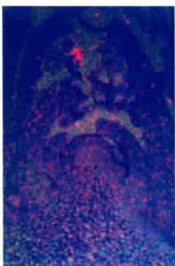  
0 h

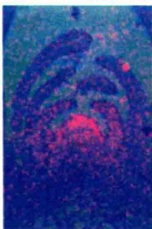  
18 h

  
42 h

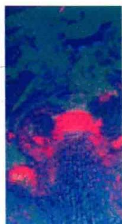  
5天  
图25.32 在拟南芥的顶端分生组织中，花引发情况下SOC1的表达增强。图示时间为从短日照向长日照转移后的时间（引自Borner et al., 2000）。

毫无疑问，在不同物种中，具体的途径也不一样。例如，玉米与自主调节途径有关的基因中，至少有一个基因在叶片中表达（参见Web Topic 25.12）。多种成花途径的存在是被子植物多样性的根源。

## 小结

花器官（花萼、花瓣、雄蕊和心皮）在茎顶端的形成是内源发育过程和环境信号共同作用的结果。控制花形态建成的基因调控网络在一些物种中已建立起来（图25.1和图25.2）。

## 花分生组织和花器官发育

· 4种不同的花器官依次在相对独立的同心轮中产生（图25.3）。

· 拟南芥花分生组织的形成需要激活分生组织特异性基因，如SOC1、LFY和AP1。

· 花器官特异性基因同源异型突变改变了各轮中花器官的类型（图25.5）。

· ABC模型表明每轮中的器官特异性是由三类型花器官特异性基因共同决定（图25.6\~图25.8）。

## 花发端：环境信号的整合

· 内在的（自发的）和外部的（环境感知）控制系统使得植物能够精确地调控开花而进行生殖生长。

· 花发育可能是对日长变化（光周期）或低温持续时间（春化）作出响应的过程。

· 同步开花使得杂交得以进行，并在适宜的条件下形成种子。

## 茎顶端和时相的变化

\- 植物从幼年到成年的变化通常伴随营养体特征的变化（图25.9和图25.10）。

· 组合模型解释了从幼年到成年过渡形式（图 25.11）。

· 花的起源要求顶芽通过两个发育时期：竞争期和决定期（图25.12）。

· 当营养枝（嫁接枝）被嫁接到正在开花的植株上时，使嫁接枝也开花，这就会出现竞争期。

· 只有竞争期的营养芽趋向于开花时，这就是决定期（图25.13）。

· 随着竞争期的出现，分生组织会随着年龄的增长（叶的数目）而出现开花的趋势（图25.14）。

## 昼夜节律；生物钟

· 昼夜节律是建立在内源振荡子上，而不是光的有无；用三个参数进行定义：周期、时相和振幅（图25.15）。

· 温度补偿过程阻止温度变化对生物钟周期产生

影响。

· 光敏色素和隐花色素与生物钟有一定的关系。
光周期现象：监测日长

· 植物在远离赤道的不同纬度地区通过感受日长来感知季节的变化（图25.16）。

· 长日植物的开花要求非常严格的临界日长。短日植物的开花要求日长必须低于临界日长（图25.18）。

\- 长日植物和短日植物是通过叶子来感知光周期刺激。

· 通过衡量夜长来监测日长；短日植物的开花主要是由黑暗的持续时间来决定的（图25.19）。

\- 对于长日植物和短日植物，黑暗的持续效应会因短时间的光照而变得无效（图25.20）。

· 开花对暗期间断的响应表明昼夜节律的存在，从而支持生物钟假说（图25.21）。

· 在一致性模型中，当光照与振荡子时相相一致时长日植物和短日植物就会被诱导成花。

· CO（拟南芥）和Hd1（水稻）通过控制成花刺激基因的转录而调控开花（图25.22）。

· CO蛋白在光和暗中有不同的降解速率。光提高CO蛋白的稳定性，从而允许它在白天积累，在夜晚很快就降解。

· 红光和远红光暗期间断效应暗示光敏色素控制长日植物和短日植物的开花（图25.23和图25.24）。

· 当光处理诱导与光敏性峰值相一致时促进长日植物开花，昼夜节律紧随其后（图25.25）。

## 春化：低温促进开花

· 在敏感性植物中，冷处理是使得植物对成花信号如诱导的光周期作出响应所必需的（图25.26和图25.27）。

· 春化发生时冷处理期间的代谢激活是必需的。

· 春化之后，FIC基因通过表观遗传而关闭，使得植物接下来的生命周期得以进行，从而使得拟南芥对长日照作出响应而开花（图25.28）。

\- FIC表观遗传调控涉及染色质结构的稳定性变化。

· 开花植物进化出多种春化途径。

## 开花涉及的长距离信号

· 在光周期植物中，长距离信号从叶片通过韧皮部转移到茎尖而引起开花（图25.29和图25.30）。

## 成花素的发现

\- FT是一个小的球状蛋白，其特性表明它可能是成花素。

\- FT蛋白在光周期诱导下从叶部经由韧皮部移动到茎顶端分生组织。在分生组织，FT与转录因子FD结合成复合体来激活花特异性基因（图25.31）。

· 控制开花的4条明显的途径交汇在一起提高花关键调控因子FT在维管束中表达和SOC1、LFY和AP1在分生组织中表达（图25.31）。

(王道杰 译)

## WEB MATERIAL

Web Topics

25.1 Contrasting the Characteristics of Juvenile and Adult Phases of English Ivy (Hedera helix) and Maize (Zea mays)
A table of juvenile vs. adult morphological characteristics is presented.

25.2 Regulation of Juvenile by the TEOPOD (TP) Genes in Maize
The genetic control of juvenility in maize is discussed.

25.3 Flowering of Juvenile Meristems Grafted to Adult Plants
The competence of juvenile meristems to flower can be tested in grafting experiments.

25.4 Characteristics of the Phase-Shifting Response in Circadian Rhythms
Petal movements in Kalanchoe have been used to study circadian rhythms.

25.5 Support for the Role of Blue-Light Regulation of Circadian Rhythms
ELF3 plays a role in mediating the effects of blue light on flowering time.

25.6 Genes That Control Flowering Time
A discussion of genes that control different aspects of flowering time is presented.

25.7 Regulation of Flowering in Canterbury bell by Both Photoperiod and Vernalization
Short days acting on the leaf can substitute for vernalization at the shoot apex in Canterbury bell.

25.8 Examples of Floral Induction by Gibberellins in Plants with Different Environmental Requirements for Flowering A table of the effects of gibberellins on plants with different photoperiodic requirements is presented.

25.9 The Different Effects of Two Different Gibberellins on Flowering (Spike Length) and Elongation (Stem Length) $GA_{1}$ and $GA_{32}$ have different effects on flowering in Lolium.

25.10 The Influence of Cytokinins and Polyamines on Flowering
Other growth regulators in addition to gibberellins may participate in the flowering response.

25.11 The Contrasting Effects of Phytochromes A and B on Flowering
PhyA and phyB affect flowering in Arabidopsis and other species.

25.12 A Gene That Regulates the Floral Stimulus in Maize
The INDETERMINATE 1 gene of maize reg- ulates the transition to flowering and is expressed in young leaves.

Web Essay

25.1 The Role of Gibberellins in Floral Evocation of the Grass Lolium temulentum
Evidence that GA functions as a leaf-derived floral stimulus in Lolium is presented.
