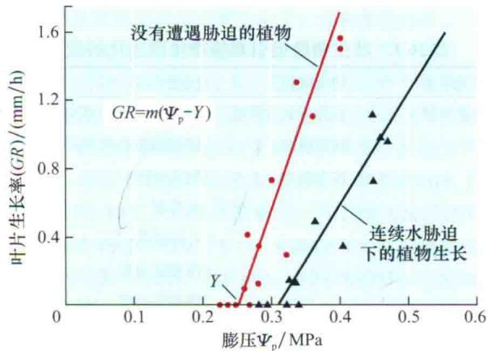
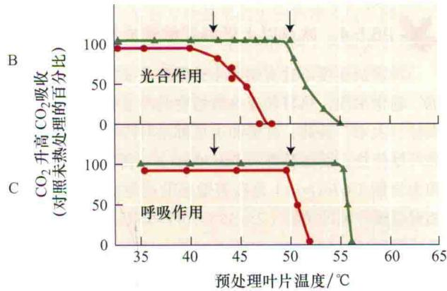
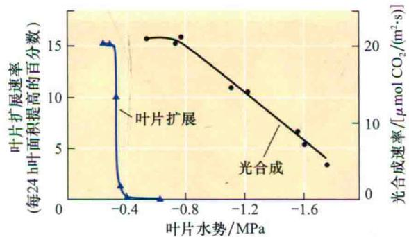
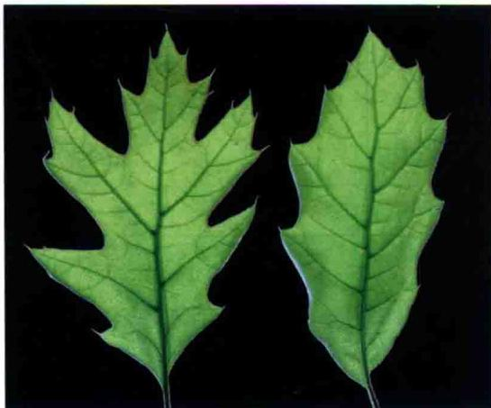
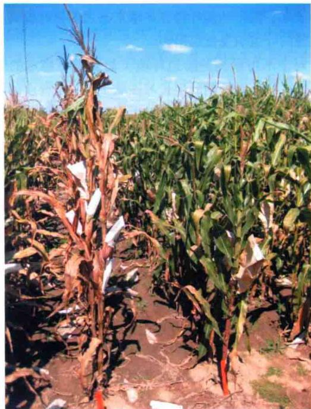
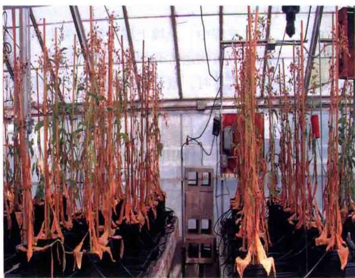
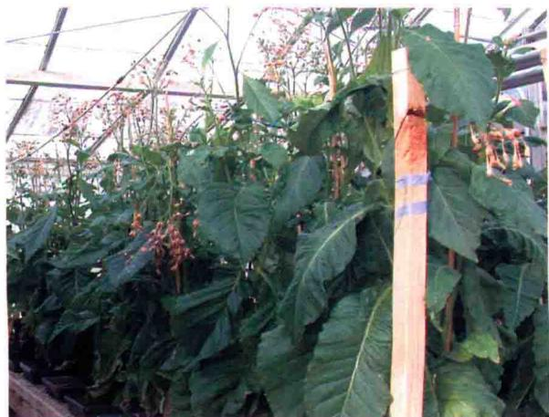
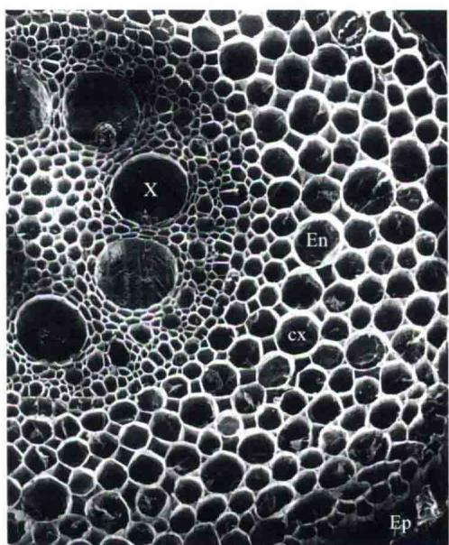
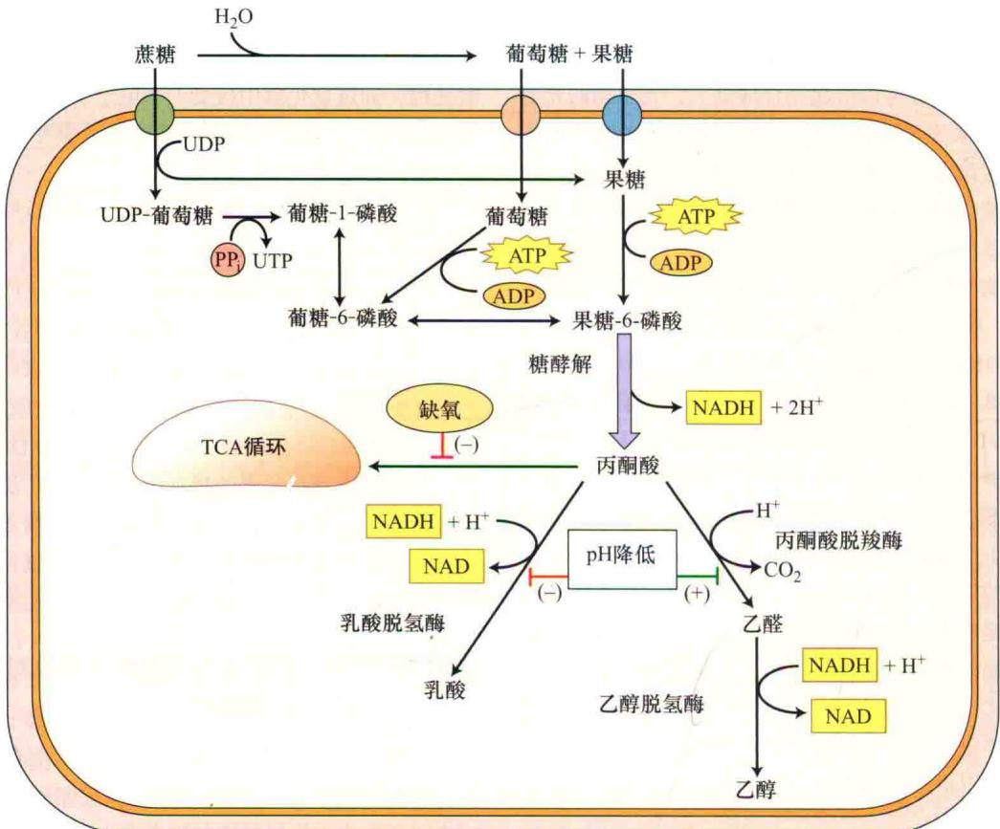

# 第 26 章

# 非生物胁迫的应答与适应

植物在复杂环境中生长和繁衍，受多种化学和物理的非生物因子胁迫，且这些胁迫随时间和地理位置而发生变化。这些非生物因素包括空气质量和流量（风）、光强和光质、温度、水分的有效性、矿质营养和微量元素含量、盐分及土壤的化学环境（pH和氧化还原电势）等。

这些超出正常环境因子范围的波动通常会对植物的生理和生化产生负面的影响。本章将对这些影响因子进行评估和讨论，其中包括活性氧（ROS）产生、膜稳定性降低、蛋白质变性增加、离子平衡变化、新陈代谢紊乱及物理损伤等，我们也将提出植物如何适应和应答这些非生物环境因子的综合观点。

本章将从遗传变化的贡献和植物整体生殖适度（reproductive fitness）的表型应答进行讨论，继而阐述非生物环境的成分，这些环境因子对植物潜在的生物学效应，以及如何利用有效的生理、生化和分子反应以避免或减轻由非生物胁迫导致的植物伤害。

## 26.1 适应性与表型可塑性

植物生活在一个复杂的环境中，它们通过各种各样的机制来保证自我生存和持续的繁茂生长。环境适应性（adaptation）是指某物种所有成员经过多代的自然选择之后形成的稳定遗传变化。与之相反，某些植物也可以通过直接改变其自身的生理和形态来应答环境变化，以使其在新环境中更好地生存。如果某个个体因反复暴露于新的环境条件而提高了对该环境的适应性，并且这些应答不需要新的遗传修饰，这种应答就是一种驯化（acclimation）。这样的应答通常被称为表型可塑性（phenotypic plasticity）（Debat and David，2001），并且这种特性代表了物种生理和形态学上的非持久性变化，如果主流环境条件改变，那么这种变化是可以逆转的。

## 26.1.1 涉及遗传修饰的适应性

对极端非生物环境适应性的典型例子是生长在蛇纹岩土（serpentine soil）上的植物（Brady et al., 2005）。蛇纹岩土的水分和微量元素含量较低，而重金属含量高，这导致生长在该环境的大部分植物遭受到严重的胁迫。然而，比较常见的是，经过遗传修饰适应在蛇纹岩土壤生长的植物的生长状态，与其密切相关未经过遗传修饰的植物在正常土壤中生长状态基本一致。利用简单的嫁接实验表明，只有对蛇纹岩土有适应能力的植物种群才能在该土壤繁衍生长，并且通过遗传杂交实验揭示了这种适应性的稳定遗传基础。

植物对一系列极端环境条件适应机制的进化通常涉及诸多过程，以达到对这些条件产生的潜在伤害效应的躲避过程。例如，在英国西南部，有一种约克郡草（Holcus lanatus），这种草包含一种很特殊的基因遗传修饰以降低砷酸盐的摄入量，来帮助植物逃避砷盐毒害，从而能够在受污染的采矿地区生存（Meharg and MacNair，1992；Meharg et al.，1992）。相反，生长在没有污染土壤的种群几乎不具有这种基因修饰（Meharg et al.，1993）。

## 26.1.2 表型可塑性有助于植物应答环境变化

植物种群除了遗传变化外，某些单独个体还会显现出表型可塑性。它们可通过直接改变自身的形态和生理机能来应对环境变化。表型可塑性相关的变化并不需要新的遗传修饰，且很多变化都是可逆的。

遗传适应性和表型可塑性均有助于植物对极端非生物环境的整体耐性。在前面的例子中，遗传适应性的植物种群只是减少砷的摄入量，而不能阻止对砷盐的吸收。为了降低砷酸盐积累的毒害作用，适应性植物与非适应性植物利用相同的生化机制来应答组织中砷盐积累所带来的毒害作用。这种机制包括低分子质量砷结合分子的合成，称作植物螯合肽（phytochelatin）（后面将详细讨论），它能够减少砷盐的毒性（Cobbett and Goldsbrough，2002）。约克郡绒毛草在砷污染的采矿地区繁茂生长的能力，依赖于其耐性种群（排斥砷）遗传适应的特异性和表型可塑性，这与所有的其他植物通过合成植物螯合肽来应答砷胁迫是有异曲同工之妙（Hartley-Whitaker et al., 2001）。

另一个表型可塑性的例子是一些盐敏感植物的应答反应，这种植物被称为甜土（glycophytic）植物。尽管该植物在遗传上不适合生长在盐环境下，但如果把甜土植物种植在较高盐分的环境中，它们能够激活许多胁迫反应以促使植物应对盐胁迫造成的生理紊乱。例如，SOS信号途径（盐超敏感突变体中发现的一种依赖于丝氨酸/苏氨酸蛋白激酶的信号途径）通过增加 $Na^{+}$ 外流以减少盐诱导的毒性（Zhu，2002）。这种反应类型通常称作胁迫应答（stress response）。

许多非生物环境因子都会引起胁迫应答，如洪涝、干旱、强紫外线、盐碱、重金属、高温和低温等。我们常用的术语胁迫抗性（stress resistance）与胁迫耐性（stress tolerance），是对表型可塑性不同表达方式的最好理解，即同一种基因型的植物如何应答非生物环境的变化。一种植物在任何既定环境中存活与繁茂生长的能力均涉及遗传适应性与表型可塑性二者的平衡。总之，这些适应和应答能提高植物在生态环境下的生殖适应性，并且转化为稳定的农业产量。

在随后的章节中，我们首先将讨论非生物环境对植物伤害的方式，继而讨论植物应对这种伤害或减少对植物损害的机制。

## 26.2 非生物环境及其对植物的生物学影响

影响植物生长发育的主要非生物因子包括水、土壤溶液中的矿质元素、温度和光。本章节在讨论这些因子的同时，也会考虑到植物在应答恶劣环境时发生的主要和次要的生理生化变化。

## 26.2.1 气候和土壤条件对植物生长的影响

气候和土壤因子极大地影响植物健康生长，包括植物的生长、发育、生殖和存活。气候因子（climatic factor）影响植物的生理性自身调节，这些因子包括大气、光、温度、湿度、冰雹和风。人类也能够通过多种途径影响气候变化，如通过减少水的利用、提高大气中的温室气体含量、释放空气污染物等（参考Web Essay 26.1）。非生物因素亦能互相影响，例如，强光可以提高空气温度，风可以通过蒸发冷却调节温度，洋流可以调节大气温度和降雨量。在任何既定的生态系统中，气候因子可能随季节或十年或更长时间的范围而变化。这些变化可能是平缓而且可预测的，或者是突然变化并且具有间歇性的。

就全球而言，沙漠里的强光照与温带雨林遮掩下的弱光照是光密度变化的典型例子。在南北极地区，一年的光周期变化从持续光照到持续黑夜状态。相反，赤道全年的昼长（大约12 h）是相对恒定的（见第25章）。温度也可能相对稳定，或可能按每天和季节大幅度变化。例如，在潮湿的热带雨林，季节性温差大约为10℃，而在干旱的草原则为80℃（从夏季的40℃下降到冬季的-40℃）。在热带地区，月平均气温在18℃以上，而极地地区则低于0℃。年降雨量也从沙漠地区的15 mm到季风区的11 500 mm，如印度的Mawsynram村。土壤因子（edaphic factor）是影响植物生长、发育及存活的土壤条件，包括空气、湿度和矿质元素成分等。土壤矿物质与有机成分、导水率、离子交换能力、pH、微动物群与微植物群和气候共同决定了植物对土壤中空气、水分和矿质营养的利用率。

土壤按照颗粒的大小进行分类，其范围从最大的沙子到最小的黏土（见第5章）。大颗粒高孔隙度的土壤比小颗粒低孔隙度的土壤保水能力要弱。植物根系必须能够吸收到 $O_{2}$ ，而高孔隙度的土壤通气性较好。土壤的有机物来自于动物、植物及土壤微生物的腐烂分解。从生理学角度上来讲，土壤把植物固定在深土层，以影响其根系发育。

## 26.2.2 非生物因子失衡影响植物的初级和次级效应

当某非生物因子缺乏或者过量（统称失衡，imbalance）时植物就会遭受到生理胁迫。这种非生物因子的缺乏或者过量，可能是缓慢的，也可能具有周期性。前已述及，原生植物（native plant）已经适应的非生物条件可能会对外来植物产生生理胁迫。例如，多数农作物因为它们的适应性所限而种植在特定的地区。据估计，因为不合适的气候和土壤条件，这些农作物的产量仅是它们遗传潜力产量的22%（Boyer，1982）。

环境中的非生物因子失衡导致植物产生初级和次级效应（表26.1）。初级效应（primary effect），如水势降低和细胞脱水，可直接改变细胞的生理和生化特性，然后导致次级效应。这些次级效应（secondary effect），如代谢活性改变、离子细胞毒性、活性氧的产生，将启动和加速破坏细胞的完整性，最终可能导致细胞死亡。不同的非生物因子可能引起类似的初级生理效应，因为它们影响了相同的细胞过程。水分亏缺、盐害、冻害等都会导致流体静压（膨压 $\Psi_{p}$ ）（见第4章）和细胞脱水性降低。不同非生物因子失衡产生的次级生理效应可能会大量重叠。表26.1表明，许多非生物因子失衡导致细胞增殖、光合作用、膜完整性、蛋白稳定性等方面的降低，进而诱导活性氧产生，发生氧化伤害，最终导致细胞死亡。

表26.1 非生物胁迫引起植物生理生化的变化

<table><tr><td>环境因素</td><td>初级效应</td><td>次级效应</td></tr><tr><td rowspan="12">水分亏缺</td><td>水势( $\Psi_p$ )降低</td><td>减少细胞/叶片扩张</td></tr><tr><td>细胞脱水</td><td>降低细胞和代谢的活力</td></tr><tr><td rowspan="10">水力阻力</td><td>气孔关闭</td></tr><tr><td>光抑制</td></tr><tr><td>叶片脱落</td></tr><tr><td>改变碳分配</td></tr><tr><td>细胞壁崩溃</td></tr><tr><td>气穴现象</td></tr><tr><td>膜和蛋白质不稳定</td></tr><tr><td>产生活性氧</td></tr><tr><td>离子毒性</td></tr><tr><td>细胞坏死</td></tr><tr><td rowspan="3">盐度</td><td>水势( $\Psi_p$ )降低</td><td>与水分亏缺相同(如上)</td></tr><tr><td>细胞脱水</td><td></td></tr><tr><td>离子毒性</td><td></td></tr><tr><td rowspan="6">洪水和土壤压实</td><td>低氧</td><td>降低呼吸作用</td></tr><tr><td rowspan="5">缺氧</td><td>发酵代谢</td></tr><tr><td>ATP产量不足</td></tr><tr><td>厌氧微生物产生毒素</td></tr><tr><td>产生活性氧</td></tr><tr><td>气孔关闭</td></tr><tr><td rowspan="3">高温</td><td rowspan="3">膜和蛋白质不稳定</td><td>抑制光合作用和呼吸作用</td></tr><tr><td>产生活性氧</td></tr><tr><td>细胞死亡</td></tr><tr><td>冷害</td><td>膜稳定性降低</td><td>膜功能紊乱</td></tr><tr><td rowspan="3">冻害</td><td>水势降低</td><td>与水分亏缺相同(如上)</td></tr><tr><td>细胞脱水</td><td>细胞结构破坏</td></tr><tr><td>细胞内形成冰晶</td><td></td></tr><tr><td>微量元素毒害</td><td>干扰辅因子结合产生活性氧</td><td>新陈代谢紊乱</td></tr><tr><td rowspan="2">强光</td><td>光抑制</td><td>抑制PSII修复</td></tr><tr><td>产生活性氧</td><td>减少 $CO_2$ 的固定量</td></tr></table>

下一部分我们将对非生物因子如水、矿质元素、温度、光等对植物生理和健康生长的失衡效应展开讨论。

## 26.3 水分亏缺与洪涝

同多数生物一样，植物中水分占细胞体积的最大部分，也是细胞最受限制性的资源。植物体内大约97%的水分会散失到大气中（大多数通过蒸腾作用）。大约2%用于体积膨胀或细胞扩增，1%用于代谢过程，主要是光合作用过程（查阅第3章、第4章）。水分亏缺（water deficit）和过量都会限制植物生长。水分亏缺（水供应不足）大多发生在自然和农业环境条件下，主要是由间歇性的连续无降水造成的。干旱（drought）是一个长时期无降雨而导致植物缺水的气象术语。过剩的水导致洪涝和土壤板结，取代了土壤中的氧气，从而对植物产生有害影响。

## 26.3.1 土壤含水量与空气的相对湿度决定了植物体内的水分含量

植物利用的大部分水是根从土壤中吸收的。当土壤中的水分饱和时（即达到了田间持水量），土壤中的水势（ $\Psi_{w}$ ）接近于0，但是干燥可以使土壤水势下降到-1.5 MPa以下，这种状况持续下去会导致植物萎蔫（见第4章）。土壤脱水也使土壤溶液中的盐浓度增加，从而进一步降低了土壤水势，导致渗透胁迫（osmotic stress）和特定的离子效应（specific ion effect）（将在随后的章节讨论）。

空气的相对湿度决定了叶片气孔与大气之间的蒸腾压力梯度，而这种气压梯度是蒸腾失水的驱动力。极低相对湿度将产生很大的气压梯度，即使土壤中有充足的水分，也会引起植物的水分亏缺。

当土壤变得干燥，其渗透系数急剧下降，尤其是接近永久萎蔫点（即复水后萎蔫的植物不能恢复生长的土壤水含量）。根内水的重新分配经常发生在叶片蒸发量较低的夜间。但在永久萎蔫点（通常约-1.5 MPa），水输送到根部的速度太慢，以至于白天萎蔫的植物夜间不能够完全复水。因此，植物萎蔫后，土壤导水率的降低阻碍了植物复水（如果想更多了解关于土壤导水率与土壤水势的关系，请参阅Web Topic 4.2）。

萎蔫植物体内的阻力进一步阻碍其复水，这种阻碍要比土壤大面积缺水所造成的阻碍大得多（Blizzard and Boyer，1980）。在干旱期间，植物对缺水的抗性与几种因素有关。当植物细胞失水时，细胞皱缩，这主要是因为细胞壁崩溃破裂[被称作胞壁坍塌（cytorrhysis）]。当根萎缩时，根表面与含水的土壤颗粒距离拉远，具有吸水能力的纤细根毛受到伤害。根毛损伤，严重影响了水分吸收。另外，在干燥土壤中，根生长缓慢，根部外皮层被更广泛的木栓质（不透水脂质）所包裹，从而进一步增加了根吸收土壤水分的阻力。

增加植物体内水流阻力的另一个重要因素是气穴现象（cavitation）或木质部水柱张力的破坏。正如第4章讨论中所述，叶面的水分蒸腾作用主要通过在水柱形成张力以拉动植物水分运输。支撑这种巨大张力的黏着力仅仅在依附于壁的狭窄水柱中出现。

在大多数植物中，气穴现象起始于中等水势（-2\~-1 MPa），而且从最大的导管开始。如橡树（Quercus spp.），在水分充足且可以利用的初春生长季节，形成大直径导管，以行使低阻力通路的功能。在夏季，由于土壤水含量减少，这些大导管停止行使功能，在水分供给减少期间，小直径的导管产生，用以运输蒸腾水流。即使此时有大量的可利用水分，其最初的低阻力通路也不可能再有效发挥其功能。

## 26.3.2 水分亏缺导致细胞脱水并抑制细胞扩增

当植物细胞水分亏缺时引起细胞脱水（cellular dehydration），该过程将对植物基本的生理过程产生不利的影响（表26.1）。水分亏缺会导致细胞膨压（ $\Psi_{p}$ ）降低及细胞体的减少，这与细胞脱水有关，也与质外体水势（ $\Psi_{w}$ ）变得比共质体水势低有关。细胞脱水产生的次要影响会引起离子浓缩，并可能对细胞产生毒性。

植物的水分状态（细胞水势， $\Psi_{w}$ ）和相对含水量（RWC），即植物的含水量占其在饱和状态下含水量的百分比——其取决于土壤含水量、根的渗透系数和幼嫩组织。甚至植物根吸水率等于蒸腾作用的失水率，细胞的RWC通常小于100%。只有在夜间蒸汽压差较低时，细胞RWC接近100%，此时叶子的蒸腾速率很低，并且土壤水分接近田间含水量。

细胞的扩展是依赖膨压驱动的过程，而且该现象对水分缺失十分敏感（图3.14）。正如第15章讨论的，细胞扩展可以通过下列公式来表示：

$$
G R = m (\Psi_ {\mathrm{p}} - \gamma)
$$

式中，GR为生长速率； $\Psi_{p}$ 为膨压； $\gamma$ 为起始生长的膨压阈值（抵抗细胞壁变形的最小压力）；m为细胞壁的伸展性（细胞壁对压力的反应）。从上述公式可以看出，膨压降低导致了生长速率下降。值得注意的是，这个公式除了表明胁迫引起了膨压降低继而造成叶片生长缓慢之外，同时也表示了当 $\Psi_{p}$ 降至与 $\gamma$ 相当，而并非降为零时，即可抑制叶片的伸展。正常条件下， $\gamma$ 通常只有0.1\~0.2 MPa，略低于 $\Psi_{p}$ 。因此，即使含水量和膨压降低幅度很小，也可导致叶片生长缓慢，甚至完全停止生长。

水分亏缺不仅使膨压降低，而且使m值降低，γ值增加。细胞壁溶液偏酸性时，胞壁的伸展性（m）通常表现最大（见第15章），在水分亏缺过程中，细胞壁的pH会升高，因此胁迫促使了m值降低。目前，关于水分亏缺胁迫对γ的影响还不太清楚，推测其可能参与细胞壁复杂结构的变化，即使胁迫消除后，这些变化也不可能快速被逆转。遭受水分亏缺的植物，趋向于夜晚形成水合物，叶片生长也通常发生在这一时期。由于胁迫下植物的m和γ发生变化，尽管膨压维持正常水平，其生长速率仍低于正常生长的植物（图26.1）。

  
图26.1 叶片的伸展依赖于叶片的膨压。向日葵（Helianthus annuus）分别种在含有大量水分和限定水分的土壤中，后者可产生适度的水胁迫。复水后，定期测量两个处理组的植株叶片的生长速率（GR）和叶片膨压（ $\Psi_{p}$ ）。叶片伸展性（m）的降低和生长起始膨压阈值（ $\gamma$ ）升高，都限制了胁迫下叶片的生长（改编自Matthews et al., 1984）。

## 26.3.3 洪涝、土壤的紧密度和 $O_{2}$ 不足引起的胁迫

水分亏缺引起胁迫，但是水分过量也可能会对植物产生不利的影响。洪涝（flooding）和土壤的紧密度（soil compaction）都会导致排水减弱，造成细胞对 $O_{2}$ 利用率的减少（Bailey-Serres and Voesenek，2008）。如果植物根系处在排水系统良好、土壤结构优良的情况下，它能从土壤的气态空间获得充足的氧气进行有氧呼吸（见第4章）。土壤中的气态空间能使气态氧扩散至几米的深度。因此， $O_{2}$ 在土壤深处与在湿润空气中的浓度相似。

然而，洪涝情况下，水分将填充土壤孔隙，可利用的氧气减少。溶解氧在积水中扩散很慢，以至于仅土壤表面几厘米处有氧存在。当温度低时，植物处于休眠状态，氧的消耗很慢，相对来说不会产生有害的结果。然而，当温度变得较高（高于20℃），在不足24 h植物的根、土壤中的动物和微生物就能完全消耗尽土壤中的氧。

对洪涝敏感的植物而言，如缺氧长达24 h（没有氧气），就会受到严重伤害。缺氧导致作物的产量大幅度降低，例如，洪涝敏感的豌豆（Pisum sativum），若淹水24 h，其产量会减少50%。而其他植物，尤其是农作物，如玉米和一些还没有适应在持续潮湿条件下生长的作物，水淹对其只有轻微的影响，它们有较好的防御能力。这些植物能短时间耐受缺氧，但缺氧时间不能超过几天。短时期的洪涝胁迫可能会导致植物缺氧（hypoxia）（异常低的 $O_{2}$ ）反应。

土壤缺氧通过抑制细胞呼吸直接伤害植物的根系（见第11章）。临界氧气压力（critical oxygen pressure，COP）是因缺氧而引起呼吸速率开始下降的氧气压力。生长在25℃和充分营养溶液环境条件下的玉米，其根尖的COP值是20 kPa或氧气的体积分数为20%，几乎接近周围空气中的氧气浓度。当 $O_{2}$ 浓度低于临界氧气压力时，根的中央开始变得低氧或缺氧。溶解氧在水溶液中的长距离扩散非常缓慢。此外，作为气态氧从根的表面扩散到根中央的细胞里，存在很大阻力。其结果是细胞呼吸的氧气低于COP值，导致ATP生成减少，无法进行生化反应，并最终导致细胞死亡。

在正常的细胞中，液泡（pH 5.4\~5.8）比细胞质（pH 7.0\~7.2）酸性更强。然而在极端缺氧情况下，由于ATP缺乏而引起由液泡膜 $H^{+}$ -ATP酶泵介导的 $H^{+}$ 进入液泡的主动运输减缓，进而不能维持细胞质和液泡之间正常的pH梯度。质子从液泡逐渐渗透到细胞质中，在低氧条件下细胞质由需氧呼吸转换为乳酸发酵，从而增加细胞的酸性（稍后将在本章讨论）。酸中毒破坏了细胞质中不可逆转的新陈代谢活动，并导致细胞死亡。

土壤氧气不足可促进厌氧菌的生长，对植物产生间接影响。一些土壤厌氧微生物能把 $Fe^{3+}$ 还原为 $Fe^{2+}$ 。由于 $Fe^{2+}$ 具有较大的溶解度，在缺氧的土壤中， $Fe^{2+}$ 的浓度可能升高，当积累到一定水平就会对植物产生毒性。其他厌氧菌可以减少从硫酸盐（ $SO_{4}^{2-}$ ）到呼吸性有毒物质硫化氢（ $H_{2}S$ ）的转变。当厌氧菌有丰富的有机物供应时，它们将释放代谢产物如乙酸和丁酸，进入土壤水分中。这些物质在高浓度时也对植物产生毒害作用。

## 26.4 土壤中矿质元素的失衡

土壤中矿质元素含量的失衡可能间接通过影响植物的营养状况或水分吸收来影响植物健康生长，或者通过对植物细胞的毒性而直接影响植物的适应性。在这一部分我们将讨论高盐和微量元素的毒性水平对植物生长和适应性的影响。

## 26.4.1 土壤矿物质含量通过各种途径对植物产生胁迫

与土壤元素组成相关能够导致植物胁迫的几种异常现象，其中包括高浓度盐（如 $Na^{+}$ 和 $Cl^{-}$ ）、毒性离子（如As和Cd）和低浓度必需矿质营养如 $Ca^{2+}$ 、 $Mg^{2+}$ 、N和P（Epstein and Bloom，2005）。本章中，盐化（salinity）这一术语被用来描述在土壤溶液中盐分的过度积累。盐胁迫包括两个方面：非特异性渗透胁迫（osmotic stress）导致的水分损失和有毒离子的不断积累所产生的特定离子效应（specific ion effect），它们将干扰植物的营养吸收和导致植物细胞中毒（Munns and Tester，2008）。耐盐植物可以遗传性地适应盐化，被称为“盐生植物”（halophyte）（来源于halo，希腊词汇“salty”），不能适应盐化的非盐生植物被称为“甜土植物”（glycophyte）（来源于glyco，希腊词汇“sweet”）。

## 26.4.2 土壤盐化是由自然产生或不适当的水管理行为造成

在自然环境中，有很多因素能够产生盐化。生长在海岸或入海口的植物，伴随着潮汐作用下，海水和淡水相互混合或相互取代，经受着高盐度的侵蚀。在强大的潮汐作用下，有大量的海水逆流涌入江河中。在远离海岸的内陆，地质海洋沉淀物中渗流出来的天然盐分被冲刷入邻近地区。蒸发和蒸腾作用能从土壤中带走纯水，这样就会使土壤的盐度升高。同样，当来自海洋中的水滴在陆地中蒸发后也能够增加土壤的盐度。

人类的行为同样能够导致土壤盐化。在集约农业生产中，不适当的水管理行为可引起大量耕地盐渍化。在世界的很多区域，土壤盐度已经威胁到主要粮食作物的产量。在干旱和半干旱地区的灌溉水通常是含盐的。在美国，科罗拉多河源头的水分中盐的浓度为50 mg/L，而在2000 km外下游的科罗拉多南部，水中的盐浓度为900 mg/L。高盐将严重制约盐敏感作物的生长，如谷类、大豆和草莓。在得克萨斯州，一些用来灌溉的井水，其含盐量甚至可达2000\~3000 mg/L。每年从这些井中引入的1 m深灌溉水将向土壤中增加20\~30 t/hm²的盐分（8\~12 t/acre）。只有盐土植物才能忍受如此高浓度的盐分（图26.2）。甜土植物在含盐灌溉过的土壤上无法正常生长。

盐渍土往往与高浓度的NaCl有关，但在某些区域盐渍土中也存在高浓度的 $Ca^{2+}$ 、 $Mg^{2+}$ 和 $SO_{4}^{2-}$ （Epstein and Bloom，2005）。在钠质化（sodic）的土壤中较高浓度的 $Na^{+}$ （土壤中的 $Na^{+}$ 占据多于10%的阳离子交换量）不仅伤害植物，而且使土壤变得多孔性和渗透性降第一组A(盐土植物)包括海滩滨藜(Suaeda maritima)和台湾滨藜(Atriplex nummularia)。该物种利用低于400 mmol/L浓度的Cl $^{-}$ 刺激生长

第一组B(盐土植物)包括大米草(Spartina x townsendii)和糖用甜菜(Beta vulgaris)。这些植物耐盐,但是它们生长速度较缓慢

第二组(盐生和非盐生植物)包括缺少盐腺而耐盐的盐生草类,如红牛毛草(Festuca rubra subsp. littoralis)和碱茅(Puccinellia peisonis);非盐生植物,如棉花(Gossypium spp.)和大麦(Hordeum vulgare)。所有这些植物的生长都被高浓度的盐所抑制。本组实验,番茄(Lycopersicon esculentum)处于中性,菜豆(Phaseolus vulgaris)和大豆(Glycine max)对盐敏感

第三组(对盐极其敏感的非盐土植物)中的物种，在低盐浓度下，其生长就会受到抑制，甚至死亡。包括许多果树，如柑橘类的植物、鳄梨树和核果

图26.2 在盐环境和非盐环境中不同物种的相对生长情况（非盐环境作为对照）。曲线划分的区域表示根据不同物种划分的区域。植物生长时期为1\~6个月（引自Greenway and Munns，1980）。

低，导致土壤结构退化。土壤溶液中的盐侵蚀导致植物叶片水分不足及抑制植物生长和新陈代谢。

## 26.4.3 细胞质中高浓度 $Na^{+}$ 和 $Cl^{-}$ 的毒害作用是由特定的离子效应造成的

在细胞外，高盐度能够导致渗透胁迫。一旦位于细胞质中，某些离子无论是以单个离子还是以化合状态存在，均有特定的作用，它们均能干扰植物的营养状况。这种特定的离子效应可能影响整个植物，因为这些离子可以通过蒸腾流进入植物幼嫩组织（Munns and Tester, 2008）。

最普遍的一个特定离子效应的例子是盐碱条件下 $\mathrm{Na}^{+}$ 和 $\mathrm{Cl}^{-}$ 等细胞毒素的积累。在非盐渍环境下，高等植物细胞质中含有大约100 mmol/L的 $\mathrm{K}^{+}$ 和小于10 mmol/L的 $\mathrm{Na}^{+}$ ，只有在这种离子环境下胞质酶具有最佳活性。在盐渍环境中，如果细胞质中的 $\mathrm{Na}^{+}$ 和 $\mathrm{Cl}^{-}$ 浓度提高到100 mmol/L以上，这些离子将成为细胞毒素。高浓度盐通过降低大分子的水合作用导致蛋白质变性及质膜的不稳定。因而，与 $\mathrm{K}^{+}$ 相比， $\mathrm{Na}^{+}$ 是更强的变性剂。

在高 $Na^{+}$ 浓度下，质外体的 $Na^{+}$ 也和高亲和性的 $K^{+}$ 吸收转运蛋白竞争结合位点（见第6章），且 $K^{+}$ 是一种重要的大量元素（见第5章）。此外， $Na^{+}$ 取代了细胞壁上 $Ca^{2+}$ 的结合位点，降低了 $Ca^{2+}$ 在胞质外的活性，并且可能通过非选择性阳离子通道导致大量的钠离子内流（Epstein and Bloom，2005；Apse and Blumwald，2007）。由过量 $Na^{+}$ 引起的胞外 $Ca^{2+}$ 浓度下降也可能限制了胞质中 $Ca^{2+}$ 的可利用性。由于胞质 $Ca^{2+}$ 对激活 $Na^{+}$ 解毒是必需的，通过质膜的外排作用，胞外 $Na^{+}$ 浓度提高，从而阻碍了自身的解毒能力。

潜在的有毒微量元素如铁、锌、铜、镉、镍和砷，在土壤中积累到一定浓度时，对植物均有毒害作用（请参阅Web Essay 5.2）。植物在其基本的生物化学代谢过程中需要一些微量元素（如铁、锌、镍和铜），或者需要这些微量元素的类似物。因此，镉可以代替锌被吸收，砷可以替代磷被吸收。

## 26.5 温度胁迫

中生植物（mesophytic plant）（适合在既不能过于湿润也不能过于干燥的温和环境中生长的陆生植物）在一个大约10℃相对狭小的温度范围内，最适合其生长发育。若超出该范围，由于巨大的持续的温度波动将对其产生多种伤害。在这一部分，我们将讨论三种不同类型的温度胁迫：高温、冰点以上的低温和冰点以下的低温。

## 26.5.1 高温对正在生长的含水量高的组织伤害最为严重

绝大多数高等植物正在生长的活性组织若长期暴露在 $45^{\circ}C$ （ $113^{\circ}F$ ）以上高温不能存活，或者甚至短时间暴露在 $55^{\circ}C$ （ $131^{\circ}F$ ）或更高温度也不能存活。然而，停止生长的细胞或脱水组织（如种子、花粉）可以在更高的温度下保持活性（表26.2）。有些物种的花粉粒能够在 $70^{\circ}C$ （ $158^{\circ}F$ ）下存活，一些干燥种子能够耐受 $120^{\circ}C$ （ $248^{\circ}F$ ）以上的高温。

多数获得充足水分的植物，即使在较高的温度环境条件下，叶片温度通过蒸腾冷却能够使自己的叶温保持在45℃以下（请参阅Web Topic 26.1和第9章）。然而，叶表温度较高且蒸腾冷却较弱就会产生热胁迫。在接近中午的阳光明媚时刻，当土壤水分缺失导致部分气孔关闭，或者相对湿度较高而降低了湿度梯度驱动的蒸腾冷却时，叶表温度能够上升4\~5℃。在白天，植物经历干旱和直射太阳光的辐射，叶表温度的升高更加明显。空气流通差通常也会降低植物的蒸腾冷却作用。种植在湿土中的种子可能更容易受到热胁迫，因为湿润和裸露的土壤颜色比干燥的土壤要暗，其更容易吸收热量。

表26.2 几种植物的致死温度

<table><tr><td>植物种类</td><td>热致死温度/°C</td><td>暴露时间</td></tr><tr><td>黄花烟草(Nicotiana rustica)(野生烟草)</td><td>49~51</td><td>10 min</td></tr><tr><td>南瓜(Cucurbita pepo)</td><td>49~51</td><td>10 min</td></tr><tr><td>玉米(Zea mays)</td><td>49~51</td><td>10 min</td></tr><tr><td>油菜(Brassica napus)</td><td>49~51</td><td>10 min</td></tr><tr><td>柑橘(Citrus aurantium)</td><td>50.5</td><td>15~30 min</td></tr><tr><td>仙人掌(Opuntia)</td><td>&gt;65</td><td>—</td></tr><tr><td>蛛网长生草(Sempervivum)</td><td>57~61</td><td>—</td></tr><tr><td>马铃薯叶(Potato leaves)</td><td>42.5</td><td>1 h</td></tr><tr><td>松树和云杉的幼苗(Pine and spruce seedlings)</td><td>54~55</td><td>5 min</td></tr><tr><td>苜蓿种子(Medicago seeds)</td><td>120</td><td>30 min</td></tr><tr><td>葡萄(Grape)(成熟果实)</td><td>63</td><td>—</td></tr><tr><td>番茄果实(Tomato fruit)</td><td>45</td><td>—</td></tr><tr><td>赤松花粉(Red pine pollen)</td><td>70</td><td>1 h</td></tr><tr><td>各种苔藓(Various mosses)</td><td></td><td></td></tr><tr><td>含水组织(Hydrated)</td><td>42~51</td><td>—</td></tr><tr><td>脱水组织(Dehydrated)</td><td>85~110</td><td>—</td></tr></table>

资料来源：改编自Levitt（1980）的表11.2

  
图26.3 Atriplex sabulosa和Tidestromia oblongifolia对热胁迫的响应。A. 测量浸没于水中的叶片的离子渗出量。B. 测量无性系活体叶片的光合作用。C. 测量无性系活体叶片的呼吸作用。最初温度为30℃且叶片无伤害，此时测量的数据为对照。将叶子转移至设定的温度，15 min转移至记录数据之前，即对照条件下。箭头表示光合作用开始受到抑制时的温度。A.sabulosa中膜的通透性受热损伤比T.oblongifolia中的更敏感，但在两个物种中对热胁迫的敏感度都低于光合作用。热伤害下，A.sabulosa中的光合作用和呼吸作用比T.oblongifolia更敏感。对这两种植物实验结果表明，相对于呼吸作用和膜的通透性，光合作用对热胁迫更敏感，完全抑制光合作用的温度对呼吸作用无影响（改编自Björkman et al., 1980）。

## 26.5.2 温度胁迫导致细胞膜损伤和酶失活

植物的质膜是由蛋白质和甾醇贯穿的磷脂双分子层组成（见第1章和第11章），任何非生物因素能够通过改变膜的特性而影响细胞的生理功能。脂类的物理性能很大程度影响整合膜蛋白的活动，其中包括氢离子泵有关的ATP三磷酸酶、转运蛋白、通道蛋白及其他蛋白质等（见第6章）。高温能够提高膜脂流动性，降低氢键的强度及膜水相内蛋白质极性基团之间的静电相互作用。因此，高温改变了膜组分和膜结构，并引起离子渗漏（图26.3A）。

高温能够导致酶的校正功能所需要的三维结构或者细胞结构组分丧失，从而引发酶正常结构的改变和活性的缺失。错误组装的蛋白质通常容易聚集或沉淀，严重影响细胞的功能。

## 26.5.3 温度胁迫抑制光合作用

温度胁迫下光合作用和呼吸作用均受到抑制。比较典型的是，高温对光合速率的抑制作用较其对呼吸速率的抑制作用强（图26.3B和C）。虽然高温下叶绿体酶如Rubisco酶、Rubisco激酶、NADP-G3P脱氢酶及PEP羧化酶稳定性较差，然而，导致这些酶变性和失活所需要的温度，比光合作用开始下降时的温度要高（见第9章）。这些结果说明，高温影响光合作用的早期，主要改变叶绿体的膜特性和能量转移机制的解偶联，并非引起蛋白质变性。

在一定时期，光合作用固定 $CO_{2}$ 的量与呼吸作用释放 $CO_{2}$ 的量相等时的温度称为温度补偿点（temperature compensation point）。当温度高于温度补偿点时，光合作用不能利用呼吸作用底物的碳原子。结果贮藏糖物质的能力下降，并且果实和蔬菜失去了甜味。有害的高温影响是导致光合作用和呼吸作用之间不均衡的一个主要原因。对同一植物而言，遮阴条件下的叶子通常比光照（热）下的叶子温度补偿点要低。光合产物的减少也可能由胁迫诱导的气孔关闭、叶冠区域减少（reduction in leaf canopy area），以及同化物分配的调节所致。与 $C_{4}$ 和CAM植物相比，高温下 $C_{3}$ 植物的呼吸速率要比光合速率提高得快，这是因为，高温胁迫下 $C_{3}$ 植物的暗呼吸和光呼吸速率均升高（见第9章）。

## 26.5.4 冰点以上低温能够造成冷害

冷害的温度不适宜植物生长发育但又不足以形成冰冻。通常来说，热带和亚热带植物对冷害敏感。谷类、大豆、大米、番茄、甘薯和土豆都是对冷害敏感的粮食和纤维作物，而西番莲（Passiflora）、薄荷（Coleus）和大岩桐（Gloxinia）是冷害敏感的观赏植物。生长在相对温暖环境的植物（25\~35℃，77\~95°F），如果温度迅速降到10\~15℃（50\~59°F）时就会发生冷害。冷害能抑制生长，使叶片褪色及病变。如果根部受到冷害，植物将由于基本生理功能紊乱如吸水功能紊乱而萎蔫。储藏在冰箱冷藏温度（5\~10℃）下也会造成冷害。

正如高温情况下，细胞膜也会由于冷害而失去稳定性，在这种境况下，降低了膜的流动性而不是增加了膜的流动性。低温下，膜脂流动性变缓，内部所包含的蛋白质就不能正常地行使功能。其结果抑制了许多生化反应，包括H⁺泵ATP酶活性、溶质细胞内外转运、能量传导（请参阅Web Topic 26.2和第7、11章）及酶依赖的代谢反应。

## 26.5.5 冰点温度引起冰晶形成和细胞脱水

冰点导致细胞内和细胞外冰晶的形成。在生理上，细胞内冰晶的形成横跨细胞膜和细胞器。胞外形成的冰晶通常是在细胞内含物结冰前形成，不会对细胞立刻产生物理伤害，但是能够引起细胞脱水。这是因为冰晶的形成实质上降低了质外体中水势（ $\Psi_{w}$ ），从共质体中高的水势到质外体中低的水势产生一个梯度。因此，水分从共质体渗透到质外体，导致细胞脱水（此过程的详细描述请参阅Web Topic 26.3）。由于冷冻脱水造成细胞不可逆的损伤（Uemura et al., 2006）。像种子和花粉粒中的细胞已经脱水，受到冰晶形成的影响相对较低。

通常冰晶首先在细胞间隙和木质部导管中形成，并且沿着导管迅速漫延。这种冰晶的形成不能使耐寒植物死亡，如果温度回升，植物的组织能完全恢复。然而，当植物长期暴露在冰点温度下，细胞外冰晶的增长导致膜的生理性破坏和细胞过度脱水。

冰晶的形成最初需要数百个分子，这几百个水分子形成一个较为稳定的冰晶，该过程叫做冰核形成（ice nucleation），并且它依赖于被水分子包围的一些表面特性。例如，一些多糖和蛋白质有利于冰晶的形成，因此被称为冰的成核剂（ice nucleator）。一些由细菌产生的冰核蛋白，有利于促进冰核的形成，主要通过水分子沿着蛋白质内重复的氨基酸结构域进行排列所致。植物细胞中冰晶的形成，先从内源的冰晶核开始生长，然后再形成相对较大的胞内冰晶，这种胞内形成的大冰晶能对细胞造成极大的伤害，而且通常导致细胞死亡。

## 26.6 强光胁迫

作为光合自养生物，植物依赖和精巧地利用可见光，通过光合作用维持一种有利的碳平衡。电磁辐射的高能波，特别是在紫外线范围内，通过破坏膜系统、蛋白质、核酸以抑制细胞内发生的生化过程。然而，即使在可见光范围内，远高于光合作用的光饱和点的强光造成了强光胁迫（high light stress），这能够破坏叶绿体的结构，降低光合速率，这一过程被称为光抑制作用（photoinhibition）。

## 光抑制产生的活性氧对强光下的植物细胞造成破坏

强光抑制光合作用被称为光抑制（photoinhibition）（见第7章和第9章）。在光系统Ⅱ（PSⅡ）反应中心捕获过量激发光能，通过D1蛋白的直接损伤导致PSⅡ的失活（见第7章）。光合色素过量吸收光能产生的电子超过NADP⁺的可利用量，在PS I作为一种电子库。由PS I产生过量的电子导致活性氧（reactive oxygen species，ROS）尤其是超氧阴离子（O₂⁻）的产生（见第7章）。O₂⁻和其他ROS是低分子质量的信号分子，过量产生将导致蛋白质、脂质、RNA和DNA氧化损伤。过多ROS产生引起氧化胁迫，损坏了细胞的代谢功能，并导致细胞死亡。

光抑制程度依赖于对PSⅡ复合物的光损害及其修复二者之间的平衡（Takahashi and Murata，2008）（见第7章和第9章）。光损伤后的PSⅡ的修复对维持光合作用是极其重要的。在氧化、盐或低温的胁迫下，增强的光抑制对PSⅡ的修复能力的增强效应要大于光抑制对PSⅡ造成的光损伤。例如，过量活性氧抑制编码PSⅡ复合物蛋白的mRNA翻译，从而限制了PSⅡ的修复（Takahashi and Murata，2008）。相反，类囊体膜不饱和的脂肪酸，使膜具有流动性，提高了光系统修复能力和PSⅡ活性的恢复能力（Vijayan and Browse，2002）。

除强光外，植物在许多胁迫过程中都产生大量ROS。ROS是呼吸作用和光合作用的副产物。这些产物的积累来自不同细胞器（主要是叶绿体、线粒体和过氧化物酶体）中的氧代谢，它受植物抗氧化机制调控，从而维持ROS产生和清除二者之间的平衡（Apel and Hirt，2004）。极端的温度、干旱、强光、盐度和离子毒害，均导致活性氧的产生和清除之间的失衡，这造成了大分子的氧化损伤和信号传递功能的紊乱。

## 26.7 保护植物抵御极端环境的生长发育和生理机制

本节中，我们将描述植物响应逆境胁迫来缓解环境胁迫造成的影响。这些响应范围包括：从暂时的代谢调节到器官形态、植物的结构和生命周期的改变。一些应答反应使植物避免处于胁迫状态；而其他应答反应增强了植物耐受胁迫的能力。

## 26.7.1 植物调整生命周期以避开非生物胁迫环境

植物适应极端环境的一个方法是调整自己的生命周期。例如，一年生荒漠植物生命周期短：当水分充足的时候，它们完成自己的生命周期，在干旱时期进入休眠（种子）；温带的阔叶树在冬季来临之前树叶脱落，避免敏感的叶组织受低温损伤。

对于不可预测的胁迫环境（如夏季不稳定的降雨量），一些植物长期的生长习性赋予其一定程度的耐受性。例如，对不稳定的环境，生长和开花周期较长（无限生长）的植物能预先调整叶片和花的生长数量，相对于生活周期短的植物（有限生长），它们对不稳定的极端环境有更强的耐受性。

## 26.7.2 叶片结构的表型变化和形态对植物应答胁迫反应是重要的

叶片是进行光合作用的主要器官，其对植物的生存起着至关重要的作用。为使光合作用正常进行，叶片必须暴露在阳光和空气中，这使它们特别容易受到极端环境的侵害。植物已进化出多种应答非生物环境胁迫的调控机制，以避免或减轻逆境胁迫对叶片的伤害。这些调控机制包括叶面积、叶向值、表皮毛和角质层等的变化。

## 1. 叶面积（leaf area）

总叶面积是反映生物量积累和产量的主要组成指标之一。较大的叶面积为光合作用的产物生产提供有效的表面，但在胁迫条件下不利于作物生长和生存。单独的大叶片或总叶面积较大，这为水分蒸发提供大的表面，有利于降低叶片温度，但导致土壤水分的快速或过度消耗，阻碍太阳能的吸收。植物可以通过以下方式减少它们的叶面积：①减少叶片细胞分裂和生长；②改变叶片形状；③进入衰老，叶片脱落。

水分亏缺和盐碱的生长条件可抑制植物细胞的分裂和伸长。特定的信号级联放大可以减缓或阻止细胞周期进程，进而减缓DNA复制，从而延缓植物生长（Anami et al., 2009）。

膨压降低是水分亏缺最早的生物物理效应。因此，依赖膨压过程，如叶面积扩张（图26.4）和根伸长对水分亏缺是最敏感的。水分亏缺能够改变植物发育过程，它对植物的生长有多种影响，其中之一是限制叶面生长。正如前面章节所讨论的，植物含水量降低，将导致作用于细胞壁的膨压下降，同时影响细胞伸长。

  
图26.4 水分胁迫对向日葵光合作用和叶片扩张的影响。以向日葵为代表的物种表现出叶片扩张对水分胁迫敏感的现象，即使在轻微的水分胁迫条件下，也可完全抑制叶片的扩张，但对光合作用的速率几乎无影响（改编自Boyer，1970）。

叶面生长主要取决于细胞伸展与增大。缺水早期，抑制细胞伸展增大，减缓了叶面的生长。由此生长出的叶子面积较小，从而降低水分蒸发，这样可以较长时期、有效地保护土壤中有限的水供应。叶面积的减少通常被认为是水分亏缺的生理反应。

许多旱区植物的叶片很小，这会在叶表面（边界层）形成较薄的静止空气。薄的边界层（低边界层阻力）便于热量从叶子上转移到空气中（图9.15）。因为它们的边界层阻力小，即使蒸腾作用大大降低时，小叶片也能够使表面温度维持接近空气的温度，避免过热。相比之下，大叶片有比较高的边界层阻力，并且通过直接的方式将热量转移到空气中，也只是耗散较少的热能（单位叶面积）。

随着植物的不断生长，水分不足不仅限制了叶片的大小，而且影响了叶片的数量。引起这种变化的主要原因在于胁迫降低了枝条的数目和生长速率。目前，关于胁迫对茎的生长影响的研究相比叶而言较少，但胁迫条件下，限制叶片生长的因素，也可能是影响茎生长的主要原因。

值得注意的是，叶片的生长和伸展增大，除受水分流量影响外，还依赖于多种生化代谢和分子特征方面的变化。目前，有许多证据支持以上观点。当植物受到外界环境胁迫时，植物不仅改变其自身的生长速率，而且通过多种重要生理过程进行调节，如细胞壁和质膜的生物合成、细胞分裂和蛋白质合成等（Burssens et al., 2000）。

改变叶片形状是植物减小叶面积的另一种方法。在缺水、高温或极端盐碱生长条件下，发育过程中的叶片变窄或可能发育成更深的裂片（图26.5），使叶面积减少，从而减少了水分的丢失和热负荷（定义为维持叶片温度接近空气温度所需的热损失）（见第9章）。此外，一株植物总叶面积（叶子的数量×每片叶子的表面积），即使所有叶子成熟之后，也不是一成不变的。一些植物在轻微水分亏缺时，可能发生落叶现象，这有效地减少了叶面积，降低水分的散失。

  
图26.5 环境的变化影响树叶的形状。橡树（Quercus sp.）左边的树叶来自于树冠的外侧，其气温高于树冠内侧。右边的树叶来自于树冠的内侧。左边的叶子处于树冠外侧，边界层较低，能够更好地通过蒸腾作用降低温度（照片由David McIntyre提供）。

如果植物已经发育形成较为稳定的叶面积，当水分亏缺时，叶子将会开始衰老，最终脱落（图26.6）。事实上，多种干旱落叶的沙漠植物，一旦干旱时，它们将会脱落所有的叶子，而雨后又会很快长出新叶。在水分亏缺期间，叶子的脱落很大程度上是由于植物内源乙烯合成增加和对乙烯的应答（见第22章）引起的。叶子脱落的负面效应是它减少了总的叶冠面积，降低了植物光合作用的总产量。

水分充足的条件下的叶片衰老，叶细胞经过程序性细胞死亡，其涉及叶片细胞内分子结构的降解和重新分配。叶片衰老是植物正常生命周期的一部分，例如，当植物从营养生长到生殖生长转换时，衰老就会发生。相比之下，非生物极端环境会损害叶和根组织，最终导致过早和非正常调控性的衰老；对粮食作物而言，将导致籽粒尺寸和质量的减少，从而大大降低产量。对于许多农作物，在籽粒成熟期间，其干旱的耐受性与作物产量提高、谷物品质及抗倒伏性密切相关。

  
图26.6 水分胁迫下棉花（Gossypium hirsutum）幼苗的叶子脱落情况。实验过程中，左侧的植株正常浇水，中间和右侧的植株分别受到中等和严重的缺水胁迫。右侧严重缺水的植株，茎的顶端只剩一簇叶片（由B.L.McMichael惠赠）。

极端的环境条件下，一些种类农作物在种子成熟期间，具有维持绿色叶片面积的能力，而同种作物的许多其他基因型的叶片此时将开始衰老。饲料作物如玉米和高粱，具有保留进行光合作用的部分叶子的性状被称为永绿色现象（stay-green）（图26.7）。在干旱条件下，常绿品种的作物在灌浆期仍能使茎和上层叶片保持绿色，这与季末出现干旱衰老的其他杂种作物相比，在产量上有显著优势。常绿高粱品种的籽粒产量每天可能增加0.35 mg/hm²，并且叶片的衰老延迟（Borrell et al., 2000）。转基因烟草植物能够延迟叶片的衰老（通过激活细胞分裂素的生物合成），显示了对干旱耐受性的提高（Rivero et al., 2007）（图26.8）。

  
图26.7 某些玉米基因型表现出一种被称为永绿色（stay-green，叶片保持绿色）的现象。左边的玉米自交系B73表现出典型的谷物成熟时期的衰老，而右边的近交系Mo20W表现为永绿色的现象（由M.R.Tuinstra惠赠）。

A 野生型  

B $P_{SARK}$ ::IPT  
  
图26.8 干旱对野生型和转基因烟草的影响。以成熟的、胁迫诱导的启动子 $P_{SARK}$ （衰老有关受体激酶的启动子区域），诱导表达异戊烯基转移酶（细胞分裂素合成过程中的酶），将其转入烟草，构建转基因烟草植株。图片为野生型（A）和转基因烟草（ $P_{SARK}::IPT$ ）（B），干旱处理15天，复水7天后的结果（由E. Blumwald惠赠）。

## 2. 叶向值（leaf orientation）

在过去60年中北美杂交玉米产量持续增加的主要原因之一是叶夹角的增加，从而使植物总的叶面积增加，叶片能吸收更多的光能。然而，在温暖、阳光充足的环境中，蒸腾的叶温可能与它耐受温度的上限接近。如果减少蒸腾作用，叶片温度过高或额外的能量吸收会损害叶子。在强烈太阳光辐射、高温和/或者土壤水分亏缺的环境中，植物可以改变它们的叶片伸展方向，避免叶子过热。

在水分亏缺时，为防止温度过高，有些植物的叶片伸张方向可能会背离太阳，这些叶子的行为被称为侧向日性（paraheliotropic）。通过叶子的位置与阳光垂直获得能量的叶子被称为横向日性（diaheliotropic）（见第9章）。图26.9显示了水分亏缺对大豆叶片伸张方向的影响。另外，其他因素也可以改变叶片的光合面积，包括萎蔫和叶子卷曲。萎蔫改变叶片的角度，叶卷曲使暴露于太阳的组织降到最少。

A 合理供水  

B 轻度水胁迫  

C 严重水胁迫  
  
图26.9 大豆叶片运动应答渗透胁迫的反应。A. 在正常生长条件下，田间生长的大豆（Glycine max）叶片的位置和方向。B. 轻度水分胁迫。C. 严重水分胁迫。轻微胁迫下，大叶片生长状态与萎蔫完全不同；严重水胁迫时，叶片的状态与萎蔫极为相似。轻微水胁迫的显著特征是顶端的叶片竖直，下面的两片叶子下垂；而严重水胁迫的大豆，其叶片几乎不能竖立生长（由D. M. Oosterhuis惠赠）。

在应答低氧胁迫时，叶片伸展方向会发生改变。缺氧促进植物根中乙烯前体ACC（1-氨基环丙烷-1-羧酸）的合成（见第22章）。在番茄中，ACC通过木质部运输到茎，与氧气接触，在ACC氧化酶催化下生成乙烯。番茄和向日葵叶柄的上表面（近轴）有响应乙烯的细胞，当乙烯浓度过高时，细胞扩张得更快。这种扩张导致偏上性（epinasty）生长，叶片向下生长以至于出现叶片下垂（图22.12）。与萎蔫不同，叶片偏上性生长过程中细胞膨压没有发生变化。

## 3. 表皮毛（trichomes）

许多植物叶片表面有毛发状表皮细胞，称为表皮毛。在叶片表面密集的毛状体（也称为软毛）通过反射辐射过来的光，使叶子保持凉爽。有些植物的叶片表面呈银白色，是由于密集的毛状物反射了大量的光。干燥的非腺状毛状体往往反射较多的光，尤其是当其非常密集时。沙漠灌木白色扁果菊（Encelia farinosa）在一年中不同的时期可以生长出两种类型的叶子：冬季是绿色近无毛的叶片，夏季是银白色有软毛的叶片。夏季银白色的叶子要比它们缺乏厚层表皮毛的叶温低几度，这是由于它能反射导致过热的红外射线。然而，有软毛的叶子在凉爽的春天也存在一定的缺陷，因为毛状体也反射光合作用所需的可见光。因此，扁果菊在春季长出没有毛状体的叶子，减少光反射以适应沙漠的环境。

## 4. 角质层 (cuticle)

角质层是一种多层的蜡状物结构，并且与碳氢化合物相关且附着在叶表皮的外层细胞壁上。角质层与表皮毛类似，可以反射光线，以降低热负荷。角质层能限制水和气体的扩散，以及病原体的进入。在植物长期的进化过程中，一些植物生长出厚厚的角质层，以减少蒸腾作用，防止水分亏缺。目前尚不清楚角质层厚度的改变源自于数量上（更多的蜡状物）还是性质上的（不同蜡成分或改变角质层的内层结构）变化。尽管表皮蒸腾仅占叶蒸腾总量的5%\~10%，但在极端环境条件下，表皮的蒸腾作用就显得尤为明显。

## 26.7.3 植物响应水分亏缺时增大了根与地上部的生长比例

轻微的水分亏缺影响根系的发育。根部的吸水作用与植物地上部分的光合作用二者之间功能的平衡，控制了根茎的生物量比例。植物的遗传潜力是有极限的，只有植物的根系吸收水分后，地上部分才会生长，因此，根成为限制地上部分进一步生长的主要器官；相反，只有光合作用的产物供应地上部分生长过剩时，才会供给根的生长与伸长。如果水分供应降低，这种平衡将会被

打破。

当水分输送到植物地上部分受限时，在光合作用活性受到影响之前，其叶片的伸展能力就受到了很大限制（图26.4）。叶片伸展受到抑制，降低了植物对碳和能源的消耗，大部分的同化产物被运输到根部，促进根进一步生长。同时，根生长对土壤微环境中水分的状态非常敏感；根尖在干燥土壤中将失去膨压，而在湿润的土壤中继续保持生长。

在水分亏缺的进程中，土壤上层一般先失去水分。当土壤水分充足时，植物通常有相对较浅的根系；当湿润土壤的上层水分耗尽时，根系向更深土壤不断伸长和生长（Koike et al., 2003）。根系结构上的这种变化被认为是植物防御干旱的第二道防线。

水分亏缺期间，光合作用的产物被分配到根的生长点，促进根的生长，使根伸长到更深的土壤里。与营养生长相比，处于生殖状态的植物，其来自于根生长水分吸收的增加并不显著，因为水分亏缺时，光合产物往往直接输送到果实，而并非运至根部（见第10章）。根和果实二者之间竞争可利用的光合产物，也在一定程度上说明了处于生殖阶段的植物对水分胁迫更加敏感。

## 26.7.4 植物通过调节气孔的开度响应干旱胁迫

植物通过调控气孔开度对环境的变化作出快速的应答反应，如通过调控气孔关闭，避免过度失水，或限制吸收液态或气态污染物。保卫细胞可以通过吸收和散失水分来改变膨压，从而调节气孔的开和关（见第4章和第18章）。

保卫细胞通过蒸腾作用失水而失去膨压，从而调节气孔关闭。与失水胁迫有关的气孔关闭几乎总是主动的、耗能的过程，而并非被动的过程（Buckley，2005）。叶片含水量下降，使保卫细胞中溶质含量降低，在此过程中，脱落酸（ABA）扮演了十分重要的角色（见第23章和Web Topic 26.4）。植物不断调节细胞中ABA的浓度和分布，使其对环境变化作出快速应答反应，如水分可利用性的波动。在叶片和根细胞中，ABA的合成受昼夜节律的调控。ABA生物合成调节的一种方式是，植物在其地上部分和地下部分调节ABA新陈代谢以应答于干旱胁迫。

ABA在保卫细胞中的再分配取决于叶片内的pH梯度、ABA分子的弱酸性和细胞膜的透性（图23.6）。当叶片脱水时，ABA以更快的速度合成，并且越来越多的ABA积聚到叶片的质外体内。这种较高浓度ABA的产生与ABA的快速合成有关，它可以增强或延长ABA诱导气孔关闭的效应。这种ABA诱导气孔关闭的机制已在第23章进行了讨论。

在炎热的气候下，水分供给充足时，增加气孔导度可使灌溉植物的耐热性增强（请参阅Web Topic 26.1）。研究表明，对皮玛棉和小麦进行高产强度选择，增加了气孔导度，并且，气孔导度增加与产量增加呈线性关系。较高的气孔导度提高了叶片冷却速率，降低空气与叶片之间的温差，因为空气温度可能会超过40℃，而叶片进行光合作用的最佳温度通常低于30℃。

## 26.7.5 植物通过积累溶质的渗透调节作用适应干旱的土壤

只有当水势沿着既定路径（详见第3章、第4章）降低时，水分才能够在土壤-植物-大气这个连续体中循环。第3章曾提到： $\Psi_{w}=\Psi_{s}+\Psi_{p}$ ，其中 $\Psi_{w}$ 代表水势， $\Psi_{s}$ 代表渗透势， $\Psi_{p}$ 代表静水压力。当植物根际（根周边微环境）的水势因水分亏缺（请参阅Web Topic 3.7）或盐化而降低时，植物中的水势只有低于土壤中的水势时，植物才能持续吸收水分。静水压力的下降可以降低水势，但是也会导致细胞膨压丧失和生长停滞。此外，细胞的渗透势的调节可以维持细胞间、土壤和植物之间的水势梯度，这种渗透调节并不一定伴随膨压和细胞体积的减小。植物的渗透调节（osmotic adjustment）是由细胞失水引起细胞内溶质浓度升高，从而降低水势的过程。该调节过程涉及每个细胞中溶质含量的净增加，它和水分流失所导致的体积变化无关（图26.10）。除了一些植物能适应极端干旱条件外，植物中 $\Psi_{s}$ 降低的最大幅度一般为0.2\~0.8 MPa。

渗透调节主要有两种形式，植物从土壤中吸收离子，或将离子从其他植物器官转运到根部，从而使根细胞的溶质浓度升高。例如，由于钾离子对细胞内渗透压的影响，对钾离子的吸收和积累将导致渗透势的降低，这种情况经常发生在盐碱地区。钾离子和钙离子都很容易被植物获取。

然而，吸收的离子被用来降低渗透势时却存在一个潜在的问题。一些离子，如钠离子或氯离子，必须处于低浓度下，植物才能正常生长，高离子浓度的环境会对细胞代谢产生有害效应。其他离子，如钾离子，是植物生长大量需求的，但在高浓度下，其能破坏植物的细胞膜或蛋白质，仍会对植物造成不良影响。渗透调节过程中，可以把离子聚集起来并束缚在植物细胞的液泡内，从而使这些离子无法接触到细胞质内的酶类和亚细胞结构。许多盐生植物就是利用将 $Na^{+}$ 和 $Cl^{-}$ 封闭于液泡，辅助渗透调节，来维持或增强植物在盐碱环境中的生长能力。由于液泡体积的增大，液泡中的高浓度离子将为细胞的膨胀提供驱动力。

A 细胞外部水势为-0.6 MPa  

B 细胞外部水势为-0.8 MPa  
  
图26.10 渗透胁迫过程中细胞液的变化。为保持水势梯度，细胞质和液泡的水势必须略低于细胞外水势，使得细胞能够吸收水。A. 细胞外部的水势是-0.6 MPa。细胞通过离子在胞液和液泡中的积累来保持水势的平衡。B. 在干旱、盐和脱水胁迫下，细胞外部的水势是-0.8 MPa。细胞可以通过增加胞质和液泡中溶质浓度来调整渗透平衡。细胞可通过存储于液泡中的无机离子来调整渗透平衡，这些离子对细胞溶质的代谢过程无影响。细胞溶质的平衡是通过可溶性溶质来维持的（通常是不带电荷的），如脯氨酸和甘氨酸甜菜碱。

当离子被束缚在液泡中时，其他的溶质必须聚集在细胞质内，以维持细胞水势平衡，这些溶质被称为相容性溶质（或相容性渗压剂）（compatible solute）。相容性溶质是一类有机化合物，在细胞中具有渗透活性，但对细胞膜结构和酶的活性无影响。植物细胞可以容纳高浓度的该类化合物，且对代谢过程完全没有影响。常见的相容性溶质，包括氨基酸如脯氨酸、糖醇如甘露醇，以及季铵化合物如甘氨酸甜菜碱（图26.11）。其中一些溶质，如脯氨酸，也具备一定的渗透调节功能，它能保护植物在水分缺乏时避免产生有毒的副产品。在生长环境恢复正常时为细胞提供碳源和氮源。每种植物家族往往倾向于使用一个或两个相容性溶质。因为相容性溶质的合成是一个主动的代谢过程，所以是需要能量的。合成这些有机溶质需要相当大的碳量，鉴于此，这些化合物的合成往往会降低作物产量。

  
图26.11 4种分子通常作为可溶性溶质：氨基酸、糖醇、季铵化合物和三级硫化合物。这些化合物分子质量很小，不带净电荷。

## 26.7.6 植物的深层器官发育成通气组织以应对缺氧环境

我们现在讨论植物应对水分过多时的调节机制。多数湿地植物，如水稻及一些能很好地适应潮湿环境的植物，其茎和根已进化出内部纵横相连且充满气体的通道，这些通道为氧气和其他气体提供了低阻力的通路。气体（空气）通过气孔或木质化茎和根的皮孔（lenticel）进入植物体，并通过小分子扩散进行转移，或者由较小的压力梯度提供运输驱动力。在许多能适应湿地生长的植物中，根细胞被充满气体的胞间空隙所形成的通气组织（aerenchyma）明显分隔开。这些湿地植物根部细胞的生长并不依赖于环境的刺激。但一些非湿地的双子叶和单子叶植物，氧亏缺能够诱导植物茎基部和新形成的根系形成通气组织。

其中一个例子是玉米中诱导通气组织的形成（图26.12）。组织缺氧能增强ACC合成酶和ACC氧化酶的活性，进而快速产生ACC和乙烯（见第22章）。乙烯导致根皮层细胞死亡和崩溃，这些死亡和崩溃的细胞预先占据的空间为气体填充，并为氧气流动提供了一定的空隙。乙烯信号转导导致的细胞死亡具有高度的选择性，只有部分细胞具有启动发育程序的潜力，并形成通气组织（Drew et al., 2000）。

  
图26.12 玉米根组织横断切面的电子扫描显微图显示了有氧时的结构变化（150×）。A. 对照根组织，正常供给空气，具有完整的皮层细胞，通过成熟的皮层细胞提供氧气。B. 生长在无氧气培养液中的根组织。皮层（cx）中明显有充气的空隙（gs），它是由细胞的降解而形成的结构。中柱（内皮细胞内部的所有细胞，En）和表皮（Ep）仍保持完整。X为木质部（由J. L. Basq和M. C. Drew惠赠）。

当乙烯诱导细胞形成通气组织起始时，乙烯信号转导引起细胞质内 $Ca^{2+}$ 浓度的升高，是导致细胞死亡的一个原因。提高胞质内 $Ca^{2+}$ 浓度，可以在没有缺氧时促进细胞死亡。反之，降低胞质内 $Ca^{2+}$ 浓度，通常会形成通气组织，并阻止缺氧根系的细胞死亡。

某些植物在形成通气组织之前，能够长时间（数周或数月）忍耐缺氧环境，生长在淹水土壤中。这些植物包括水稻、水稻草（Echinochloa crus-galli var. oryzicola）的胚芽鞘和胚胎、大香蒲（Schoenoplectus lacustris）、盐沼泽香蒲（Scirpus maritimus）和窄叶香蒲（Typha angustifolia）的根状茎。在缺氧环境下，这些根状茎能生存数月，而且能够促使叶片膨胀。

自然条件下，这些根茎能在湖边厌氧的泥土中越冬。当春天来临，叶子伸出泥土或水表面，氧气通过通气组织往下进行扩散，直到地下部分。此时，根组织从无氧（发酵的）转变成有氧代谢模式，利用氧气开始生长。同样，在水稻（湿地）和大米草种子萌发期间，胚芽鞘长出水面，而成为植物浸水部分获取氧气的通道，其中包括根系。虽然水稻是湿地植物，但是其根和玉米一样，不能耐受缺氧环境。随着根部延伸进入缺氧的土壤，根尖通气组织持续形成，使氧气能在根组织中移动，以保证对根尖顶端区域的氧供给。

水稻和其他典型的湿地植物的根组织中，栓化和木质化细胞形成的结构性屏障阻止氧气扩散到土壤外面。残留的氧气可以保证根顶端分生组织的代谢，促使根继续生长到50 cm，或延伸至更深的缺氧土壤中。与之相比，非湿地植物不能像拥有通气组织的湿地植物那样以相同的方式保存氧，以促使根延伸到同样深度的土壤范围，如玉米的根则容易泄漏氧气。因此，在这些植物中的根顶端组织缺乏足够的氧，影响有氧呼吸，严重限制根的延伸，使之不能进入更深的缺氧土壤中。

## 26.7.7 植物保护自身免受有毒离子侵害的方式：外排和内部耐受

为避免生长环境中各种有毒微量元素，包括钠（Na）、砷（As）、镉（Cd）、铜（Cu）、镍（Ni）、锌（Zn）和硒（Se）的毒害，植物长期的进化形成了以下两种自我保护机制：①外排（exclusion），植物通过外排作用将有毒的元素排出体外，使这些有毒元素的浓度低于毒性的阈值；②内部耐受（internal tolerance），通过各种生理与生化适应机制，使植物能够耐受，封闭或者螯合这些有毒元素，防止其浓度的逐步升高（请参阅Web Essay 26.2）。

## 1. 外排

盐敏感的植物一般能耐受适度的盐分，主要由于根部减少向茎中运输有害的离子。园艺师利用植物离子排斥机制，将盐敏感植物嫁接到耐盐砧木上。钙离子在减少从外部环境吸收 $Na^{+}$ 方面起了重要作用，细胞质膜上的电化学势可以促进 $Na^{+}$ 在胞浆中积聚，其含量超过胞外浓度的100\~1000倍。钠离子作为一种带电离子对质膜具有非常低的渗透能力，但它能同时通过低亲和力与高亲和力的运输系统进行转运，其中许多通常是 $K^{+}$ 吸收的转运系统（Epstein and Bloom，2005）（见第6章）。

外部的 $Ca^{2+}$ 在毫摩尔浓度水平时（钙离子在质外体的典型生理浓度），通过减少钠离子的吸收和促进钠离子运输到质外体的流出的机制，从而增加了钾离子转运的选择性并使钠离子的吸收最小化。 $Na^{+}$ 内流是通过非选择性、电压不敏感的门控通道把有毒离子运输进入细胞的。当此通道开放时，钠离子扩散到胞质中，浓度升高。生理水平的钙离子会引起这些渠道封闭，限制钠的摄取（Tracy et al., 2008）。

## 2. 内部耐受

与甜土植物不同，盐生植物可以在幼苗中积累离子，因为叶细胞具有较大容量的液泡离子区域化能力。此外，盐生植物的叶细胞可能具有较强的限制胞内净 $Na^{+}$ 摄取的能力。因此，幼苗细胞中增加液泡的区室化和减少细胞内 $Na^{+}$ 的摄取，这些植物可以增强对自蒸腾流导致根部 $Na^{+}$ 升高的耐受能力（Apse and Blumwald, 2007）。

与盐生植物相比，甜土植物需要减少根的木质部装载 $Na^{+}$ 的数量，从而限制 $Na^{+}$ 从根到茎的运输。然而，无论是何种情况，盐生植物和甜土植物的耐盐性都依靠离子的转运，以控制跨质膜的净离子摄取和进入液泡的离子区域化（请参阅Web Topic 26.6）。

某些盐生植物，如盐雪松（Tamarix spp.）和滨藜（Atriplex spp.），其叶表面已进化出能够分泌盐的特化盐腺。盐腺是这些植物独特的结构，在耐盐性方面具有高度专一性。有些植物在老叶中也积聚有毒离子，并使这些叶子衰老、脱落，从而让更年轻、更有光合生产力的叶子生存。

大量证据表明，盐生植物和甜土植物在体内积累许多离子，并利用这些离子进行必需的渗透调节，以用于细胞扩展（Hasegawa et al., 2000）。高浓度的离子对所有植物的胞内代谢都是有毒的，因此盐生植物和甜土植物将有毒的离子隔离到液泡中，或主动把它们由细胞泵出到质外体中（请参阅Web Topic 26.6）。

植物对毒离子内部耐受的一个极端例子，是发生在一些特定的物种中，某种微量元素的超级积累（hyperaccumulation）现象。超级积累植物可以耐受多种微量元素，包括As、Cd、Ni、Zn和Se，这些微量元素在叶片积累的量，大于茎尖干重的1%（10 000 $\mu$ g/g）。

超级积累作为一种遗传适应已在400多种植物分类群中得到证实，当植物生长在含有低浓度有毒元素的土壤中，甚至也会发生超级积累现象。超级积累是一个主动过程，它保护植物免受病原体和食草类昆虫的侵害。超级积累植物不仅可以抵御由微量元素积累所带来的细胞毒性，而且是通过有效吸收土壤中潜在的有毒元素，清除有毒元素的途径之一。超级积累参与调控基因转录水平的变化，可促使合成许多离子转运体，以参与从土壤中摄取元素和这些元素的液泡区域化（请参阅Web Topic 26.5）。

## 26.7.8 整合作用和主动转运有助于增强植物耐受力

螯合作用（chelation）是一个离子与螯合分子中两个以上的配位原子结合。螯合分子有不同的配位原子，如硫（S）、氮（N）或氧（O），这些原子与它们螯合的离子有不同的亲和力。通过将螯合分子自身处于能结合的离子周围，并形成复合物，使离子的化学活性降低，从而减少其潜在的毒性。该复合体通常易位到植物的其他部分，或贮存在远离细胞质（通常在液泡）的部位。从根到幼芽的长距离运输，也是幼嫩组织形成金属离子超积累的关键方式。研究表明，金属螯合剂烟草香素和自由氨基酸组氨酸常在运输过程中被用于金属的螯合（Ingle et al., 2005）。另外，植物还为离子螯合剂合成其他配体，如植物螯合肽。

植物螯合肽（phytochelatin）是由谷氨酸、半胱氨酸和甘氨酸以（γ-Glu-Cys），Gly的一般形式所组成的低分子质量的硫醇。植物螯合肽是由植物螯合肽合成酶催化合成的（Corbett and Goldsbrough，2002）。硫醇组类化合物一般作为微量元素如Cd和As等离子配体（图26.13）。植物螯合肽一旦合成，即形成植物螯合肽-金属复合物，然后运送到液泡贮存。已被证实植物螯合肽的合成对镉和砷的耐受是必需的。除了螯合作用，主动转运到液泡和运出细胞也有助于提高植物体内金属耐受性。

  
图26.13 植物螯合肽的分子结构。植物螯合肽利用半胱氨酸中的硫结合金属镉（Cd）、锌（Zn）和砷（As）等。

正如第6章所讨论的，液泡膜上存在两个 $H^{+}$ 泵：V型 $H^{+}$ -ATPase和 $H^{+}$ -焦磷酸酶，为离子进入液泡进行的主动和被动次级运输提供了电化学势梯度（详见第6章）。 $Na^{+}-H^{+}$ 反向运输体AtNHX1（图26.14）主要负责 $Na^{+}$ 内流进入液泡。在质膜上，P型 $H^{+}$ -ATPase泵为离子的次级主动运输提供驱动力（ $H^{+}$ 电化学势）（图26.14），并且在应对盐胁迫反应时，该酶也是胞内驱除多余离子所必需的。 $Na^{+}$ 通过SOS1 $Na^{+}-H^{+}$ 反向转运体穿过质膜而外流。在高NaCl情况下，SOS1被激活，并且通过 $Ca^{2+}$ 信号转导的SOS途径所介导（参阅Web Topic 26.6）。 $Ca^{2+}$ 通过与SOS3结合，进一步激活丝氨酸/苏氨酸蛋白激酶SOS2。SOS2使SOS1磷酸化，从而激活SOS1 $Na^{+}-H^{+}$ 反向转运输体功能。借助这种机制，植物通过 $Na^{+}$ 外流和内流的调节，有效控制 $Na^{+}$ 穿膜的净流量。再者，过量表达SOS1或AtNHX1的转基因植物，增强了对盐的耐受能力（Apse et al., 1999; Shi et al., 2003）（请参阅Web Topic 26.6）。

  
图26.14 初级和次级主动运输。①定位在质膜上的ATPase质子泵（P-ATPase），②定位在液泡膜上的ATPase质子泵（V-ATPase）和③焦磷酸酶（PPiase）分别是质膜和液泡膜的初级主动运输系统。通过偶联ATP和焦磷酸盐水解作用释放的能量，使质膜和液泡膜质子泵能够逆电化学梯度对 $H^{+}$ 进行运输。 $H^{+}-Na^{+}$ 泵的逆向转运蛋白SOS1和NHX1是次级主动运输系统，对 $Na^{+}$ 的运输是逆电化学梯度进行的，而 $H^{-}$ 的运输是顺电化学梯度。SOS1将 $Na^{+}$ 输出细胞，而NHX1将 $Na^{+}$ 输入液泡。

在自然条件下，植物不同组织耐受冻害的能力相差很大。种子、部分脱水组织和真菌孢子能在接近绝对零度（0 K或-273℃）时存活，这也暗示超低温从本质上来说并不一定都对生物组织有害。只要冰晶形成能被限制在细胞内空间及细胞内脱水不是太严重，含水的营养细胞也可以在冷冻温度下保存生存能力。

冷驯化（cold acclimation）是指将温带植物暴露在不致命的低温（通常在零度以上）条件下，以增加其低温生存能力的过程。自然界低温驯化是植物暴露在初秋短日照和冰点以上的低温条件下，同时植物已停止生长的过程。植物激素ABA可能是促进驯化的扩散因子，即从叶片的韧皮部扩散到越冬的茎部。因此，ABA的积累是冷驯化过程所必需的（Survila et al., 2009）。

冷驯化期间，温带木本植物从木质部导管抽回水分，从而防止主干由于发生冰冻导致水膨胀而造成其破裂。冷驯化也能防止冰冻条件下，细胞内由于形成冰晶而造成损伤。气温回暖后，植物很快丧失了耐寒能力，并且在24 h内它们对低温变得敏感。

在冷驯化过程中植物如何感受温度呢？目前的假说认为，低温改变了脂质的物理性质，提高了膜的伸展性，且导致一个冷传感器未知的激活机制，从而起始相关信号转导途径（Survila et al., 2009）。这些途径激活编码信号蛋白、抗冻蛋白和一些酶等相关基因的表达，这些蛋白质介导了脂质及糖代谢、相容性溶质的生物合成及活性氧清除和代谢重编程，并且这些基因的表达受低温调控（Guy, 1990; Thomashow, 1999; Yamaguchi-Shinozaki and Shinozaki, 2006a, 2006b; Chinnusamy et al., 2006; Survila et al., 2009）。

冷驯化信号转导途径被整合到一个相互作用的信号转导网络，该网络也包括那些用于其他非生物条件的驯化。因此，一些由低温诱导的基因，也能由水分亏缺和盐渍化所诱导（Shinozaki and Yamaguchi-Shinozaki, 2006; Survila et al., 2009）。

最近研究表明，低温信号被钙离子、ABA、特定的钙离子信号转导蛋白、其他激酶和磷酸酶所调节（Survila et al., 2009）。拟南芥ABA不敏感（如abil）突变体或ABA缺失（如aba）突变体，不能被冷驯化。然而，依赖ABA信号和转录调控是必要的，但这只是耐寒驯化的一个方面，并非所有低温诱导的基因都依赖ABA信号转导途径（Yamaguchi-Shinozaki and Shinozaki, 2006a, 2006b; Survila et al., 2009）（请参阅Web Topic 26.7）。

冷驯化涉及 $Ca^{2+}$ （由上述假设的冷传感器介导）从质外体、内质网和液泡进入细胞质，导致胞质渗透势瞬时发生变化，从而诱导冷驯化所必需的低温响应基因的表达（Survila et al., 2009）。与冷驯化相关联的 $Ca^{2+}$ 信号转导蛋白包括钙调素蛋白和类钙调素（CML）蛋白，以及 $Ca^{2+}$ 依赖的蛋白激酶和钙调磷酸酶B类似蛋白（见第6章和第23章）（想了解冷驯化的其他信号转导途径的讨论，请参阅Web Topic 26.7）。

## 26.7.10 植物通过限制冰晶的形成以提高抗冻性

在快速冷冻过程中，原生质体也包括液泡，可能出现过冷现象（supercool）；即使温度低于热力学冰点温度几度，细胞中的水分仍能保持液态，这主要是因为水溶液中含有一定量的溶质。对于加拿大东南部和美国东部的阔叶林中的物种来说，过冷是很常见的现象（请参阅Web Topic 26.3）。细胞可以耐受的过度冷却极限温度大约为-40℃，这时细胞内会自发形成冰晶。自发冰晶的形成确定了低温限制点（low-temperature limit），只有经过过度冷却的高山植被和亚北极区的物种，在这个限制点才可能存活。这也解释了为什么山脉林木线的范围位于-40℃最低等温线的附近。

几种特异的植物蛋白被命名为抗冻蛋白（antifreeze protein），它们能够通过一个不依赖于降低水冰点的机制来限制冰晶生长。低温能诱导抗冻蛋白的合成。这些蛋白质结合在冰晶的表面，阻止或减慢冰晶的进一步增长。蔗糖、多糖、渗透保护剂和一些低温诱导产生的蛋白质也具有防冷冻的效果（Survila et al., 2009）。

## 26.7.11 细胞膜脂质组分影响温度对膜的作用

在极端的环境条件下，植物细胞膜经常被破坏。轻微的温度波动或者其他环境胁迫都可以导致膜结构和功能的改变，进而影响正常代谢。

随着温度降低，细胞膜会经过一个从流动性液晶态到固体凝胶态相的转变。这种相变温度随植物种类（热带物种10\~12℃；苹果3\~10℃）和细胞膜脂质成分不同而不同。抗冷害植物的细胞膜趋向于含有更多的不饱和脂肪酸（表26.3）。与之相反，冷敏感植物细胞膜中含有高比例的饱和脂肪酸链，温度接近0℃时，脂组分易凝固为半晶体状态。一般来说，饱和脂肪酸不含双链，而且含有反式单不饱和脂肪酸的脂类，这种脂类比不饱和脂肪酸脂质的凝固点要高，因为后者的碳氢链间有弯曲，其排列不如饱和脂肪酸紧密（表26.3和Web Topic 26.2）。

植物持续暴露在极端环境温度下，会导致细胞膜的脂质成分发生变化，这是植物适应环境的一种驯化方式。一些跨膜的酶能够引进一个或两个双键到脂肪酸内，从而改变膜脂质的脂肪酸饱和度。例如，在冷冻驯化过程中，如低温驯化时，脱饱和酶活性会升高，脂质中不饱和脂肪酸比例增加（Williams et al., 1988；Palta et al., 1993）。这种修饰降低了膜脂从流动相渐变到半晶体状态时的温度阈值，使膜在更低的温度下能保持流动性，因此能保护植物免受冷害伤害。反之，膜脂质脂肪酸饱和度越高，细胞膜的流动性越差（Raison et al., 1982）。拟南芥的某些突变体中ω-3脂肪酸脱饱和酶活性降低，突变体对光合作用的耐热性增强，这可能是由于叶绿体脂质中脂肪酸的饱和度增加引起的（Falcone et al., 2004）。

表26.3 从抗冷性和冷敏感物种的线粒体中的分离的脂肪酸组分

<table><tr><td rowspan="3">主要脂肪酸a</td><td colspan="6">脂肪酸总含量占体重的百分比/%</td></tr><tr><td colspan="3">抗冷性物种</td><td colspan="3">冷敏感物种</td></tr><tr><td>花椰菜芽</td><td>甘蓝根</td><td>豌豆茎</td><td>菜豆茎</td><td>甘薯</td><td>玉米茎</td></tr><tr><td>软脂酸(16:0)</td><td>21.3</td><td>19.0</td><td>17.8</td><td>24.0</td><td>24.9</td><td>28.3</td></tr><tr><td>硬脂酸(18:0)</td><td>1.9</td><td>1.1</td><td>2.9</td><td>2.2</td><td>2.6</td><td>1.6</td></tr><tr><td>油酸(18:1)</td><td>7.0</td><td>12.2</td><td>3.1</td><td>3.8</td><td>0.6</td><td>4.6</td></tr><tr><td>亚油酸(18:2)</td><td>16.1</td><td>20.6</td><td>61.9</td><td>43.6</td><td>50.8</td><td>54.6</td></tr><tr><td>亚麻酸(18:3)</td><td>49.4</td><td>44.9</td><td>13.2</td><td>24.3</td><td>10.6</td><td>6.8</td></tr><tr><td>不饱和与饱和脂</td><td>3.2</td><td>3.9</td><td>3.8</td><td>2.8</td><td>1.7</td><td>2.1</td></tr><tr><td>肪酸比例</td><td></td><td></td><td></td><td></td><td></td><td></td></tr></table>

资料来源：改编自Lyons et al., 1964  
a 括弧内的数字代表脂肪酸链中碳原子数和双键数

已经通过突变体和转基因植物证实了膜脂对低温耐性的重要性，这些植物特有的酶活性能够导致特异的膜脂组分变化，这种变化不依赖于低温驯化。例如，把一个大肠杆菌的基因转化到拟南芥中，结果能提高高熔点膜脂（饱和的）的比例，该基因的表达极大增加了转基因植物对冷害的敏感性。与此类似，拟南芥fab1突变体可以增大饱和脂肪酸的含量，尤其是16:0组成的脂肪酸（表26.3和表11.3）。经历3\~4周的低温期，突变体的光合作用和生长逐渐被抑制。如果一直暴露在低温下，其叶绿体甚至被破坏。在非冷害温度下，该突变体的生长情况与野生型一致（Wu et al., 1997）（以转基因植物为材料的补充实验请参阅Web Topic 26.2）。

## 26.7.12 温度胁迫下，植物细胞通过某种机制维持蛋白质正确的结构

在极端环境下，蛋白质的结构很容易被破坏。植物自身存在可以限制或者避免蛋白结构被破坏的调控机制，这些机制包括渗透调节和伴侣蛋白。渗透调节主要维持蛋白质的水合作用，而伴侣蛋白能与其他蛋白质结合，促进蛋白质的正确折叠，并阻止一些蛋白质的错误折叠和形成蛋白聚合体，以及维持这些蛋白三级结构的稳定性。如果温度突然升高5\~10℃，植物将会产生一套特有的伴侣蛋白，即热激蛋白（heat shock protein, HSP）。被诱导合成热激蛋白的细胞明显提高了耐热性，甚至致死的高温下也能正常存活。

多种不同的环境胁迫和条件均可诱导热激蛋白的产生，包括水分亏缺、ABA、伤害、低温和盐胁迫等。因此，细胞处在一种胁迫条件下，可能获得了对另一种胁迫的交叉防御功能。番茄果实就属于这种情况，38℃下热激48 h，可以促使HSP的合成和积累，并且能在2℃环境下保护细胞存活21天。

热激蛋白最初是在果蝇（Drosophila melanogaster）中被发现的，认为其是一类普遍存在的因子。后来，在其他动物、人、植物、真菌和微生物中均发现了HSP。在正常、非胁迫的细胞中也发现有一些HSP的存在，并且一些重要的蛋白质是HSP的同源蛋白，但在热胁迫条件下，这些蛋白质含量和活性并不升高（Vierling，1991）。这种热激反应似乎被一种或多种信号转导分子所调节，其中包括一种特殊的转录因子——热激因子（heat shock factor，HSF），该因子在mRNA翻译热激蛋白时起重要作用。

在脱水、极端温度和离子失衡等条件下，从植物中鉴定出其他与热激蛋白类似的蛋白质，它们以相同的方式维持蛋白结构。包括RAB/LEA/DHN（分别是RESPONSIVE TO ABA, LATE EMBRYO ABUNDANT和DEHYDRIN）蛋白家族（见第23章）。一些相容性的溶质也能够影响蛋白质、膜和细胞器的稳定性。

## 26.7.13 清除活性氧ROS（reactive oxygen species）的解毒机制

活性氧ROS是氧的高活性形式，至少含有一个不成对电子。植物在光合作用和呼吸作用的电子传递过程中能产生ROS。在正常需氧条件下，产生的ROS由细胞的抗氧化机制所清除，以避免细胞受氧化损伤。在不同的极端环境条件下，尤其是植物暴露在低温高光强度的环境中（这种条件也可以引起光合抑制），光驱动的光合反应中心的激发与碳固定能量消耗的减少之间的不平衡，会产生高水平的ROS。电离辐射、紫外线和环境污染也可以使植物产生高浓度的ROS。例如，臭氧等强氧化剂也可以使植物直接产生ROS。

在植物细胞中，最常见的ROS形式有超氧化物形式（ $\mathrm{O}_2^{\bullet -}$ ），单线态氧（ $^1\mathrm{O}_2$ ）过氧化氢（ $\mathrm{H}_2\mathrm{O}_2$ ）和羟基自由基（OH·）（图7.34）。植物体内某些酶或抗氧化剂可以降低和限制ROS对植物细胞的伤害。超氧化物歧化酶（SOD）催化阴离子自由基的歧化反应： $2\mathrm{O}_2^{\bullet -} + 2\mathrm{H}^{+} \longrightarrow \mathrm{O}_2 + \mathrm{H}_2\mathrm{O}_2$ 。目前在植物中确定的SOD酶有三种形式，根据金属辅助因子的不同分为：Cu/Zn-SOD（细胞质）、Mn-SOD（线粒体）和Fe-SOD（质体）。每种形式的SOD中的金属离子从超氧化物自由基接受电子，并传递电子以产生氧气和过氧化氢。过氧化氢酶是一种亚铁血红素蛋白，能够催化过氧化氢分解来解毒。有两种形式的过氧化氢酶：细胞质中的过氧化氢酶及过氧化物酶体中起主要作用的过氧化物酶。谷胱甘肽过氧化物酶也可以清除过氧化氢，以解除毒性（在下面会更详细地讨论）。

抗氧化剂和抗氧化系统也参与清除植物细胞内的ROS。植物中常见的抗氧化剂包括水溶性抗坏血酸盐（维生素C）、还原型谷胱甘肽（GSH）和脂溶性的α-生育酚（维生素E）及β-胡萝卜素（维生素A）。臭氧是一种环境气体，可以作为氧化剂使植物产生活性氧。植物暴露在臭氧环境下会产生ROS，抗坏血酸盐在解毒的过程中起着重要作用。

许多抗氧化剂形成一个系统一起发挥作用，通过消除自由基上高活性非成对电子以消除自由基毒性。例如， $\alpha$ -生育酚作为一种过氧化脂质清除剂，与抗坏血酸盐和谷胱甘肽结合发挥作用（在下面的方程中，点代表未配对的电子）。

（1）维生素E从ROS（这个例子中的过氧化脂质）处接受一个自由基。

$$
\mathrm{VitE} + \mathrm{LOO} ^ {\cdot} \longrightarrow \mathrm{VitE} ^ {\cdot} + \mathrm{LOOH}
$$

（2）维生素C还原维生素E自由基。

$$
\mathrm{VitE} ^ {\bullet} + \mathrm{VitC} \longrightarrow \mathrm{VitC} ^ {\bullet} + \mathrm{VitE}
$$

（3）还原型谷胱甘肽或维生素C还原酶还原维生素C自由基。

$$
\mathrm{VitC} ^ {\bullet} + \mathrm{GSH} \longrightarrow \mathrm{VitC} + \mathrm{GSSG}
$$

谷胱甘肽是由甘氨酸、谷氨酸和半胱氨酸缩合形成的三肽，其中半胱氨酸的巯基可以中和活性氧。谷胱甘肽是高度水溶性物质，可以高浓度积累。谷胱甘肽中谷氨酸的γ-羧基和半胱氨酸的α-氨基形成的肽键可以防止水解酶的非特异性破坏。谷胱甘肽还原酶用NADPH维持还原型谷胱甘肽的稳定，还原型谷胱甘肽可以从过氧化物，如过氧化氢中接受一个电子。在植物中，谷胱甘肽抗氧化系统主动地中和活性氧，其中包括 $H_{2}O_{2}$ 、 $O_{2}^{\cdot-}$ 和 $H_{2}O_{2}^{\cdot-}$ 。

（1）还原型谷胱甘肽可以从 $O_{2}^{\bullet-}$ 和 $H_{2}O_{2}^{\bullet-}$ 接受 $e^{-}$ 。

$$
\begin{array}{r l} & \mathrm {O_ {2} ^ {\cdot - } + H^ {+} + GSH\longrightarrow GS^ {\cdot} + H_ {2} O_ {2}} \\ & \mathrm {H_ {2} O_ {2} ^ {\cdot - } + 2 GSH\longrightarrow GSSG+ H_ {2} O} \end{array}
$$

（2）谷胱甘肽过氧化物酶氧化还原型谷胱甘肽。

$$
\mathrm{H} _ {2} \mathrm{O} _ {2} + 2 \mathrm{GSH} \longrightarrow \mathrm{GSSG} + 2 \mathrm{H} _ {2} \mathrm{O}
$$

（3）还原型谷胱甘肽通过谷胱甘肽还原酶再生。

$$
\mathrm{GSSG} + \mathrm{NADPH} \longrightarrow 2 \mathrm{GSH} + \mathrm{NADP} ^ {+}
$$

各种有毒微量元素的超富集可能导致广泛的植物组织氧化损伤。为防止这种氧化损伤，薪莫属（Thlaspi）中的镍（Ni）超富集植物可以过度积累抗氧化剂谷胱甘肽清除活性氧（Freeman et al., 2004）。

## 26.7.14 代谢的变化能使植物应对各种非生物胁迫

环境的变化可能会刺激代谢途径的变化。当植物进行有氧呼吸的氧气供应不足时，根组织首先在乳酸脱氢酶的作用下，把丙酮酸发酵成乳酸，NADH的循环产生 $NAD^{+}$ ，通过糖酵解产生ATP（图26.15）（见第11章）。乳酸的产生，降低了细胞内的pH，乳酸脱氢酶活性被抑制，并且激活了丙酮酸脱羧酶。这些酶活性的变化迅速导致代谢从产生乳酸到产生乙醇的转换。每摩尔的己糖发酵产生的ATP的净产量只有2 mol（相比之下，有氧呼吸时每摩尔的己糖可以产生36 mol的ATP）。因此，氧亏缺伤害根组织代谢的部分原因，是缺乏ATP而驱动了一个基础代谢过程，如根对必需营养元素的吸收过程（Drew，1997）。

水分亏缺限制了叶片的扩展，降低了光合作用及同化物的消耗，从而间接减少了叶片输出光合作用产物的量。由于韧皮部的运输依赖于膨压（见第10章），因此在胁迫发生过程中，韧皮部水势的降低也许会抑制同化物质的转运。实验表明，只有在胁迫的后期，同化物的运输才会受到影响，而此时的其他一些过程，如光合作用已经受到强烈抑制（图26.16）。同化物运输对胁迫相当不敏感，即使胁迫已经达到十分严重时，植物仍可以及时动用它的贮藏物，通过运输以满足生长的需求（如种子生长时）。植物同化物质的持续运输能力是抵御干旱的一个关键因素。

有些植物能够更好地适应干旱环境，如具有 $C_{4}$ 途径和景天酸光合作用模式的植物（见第8章、第9章）。景天酸代谢途径（CAM），它们通过气孔晚上开放、白天关闭的方式适应水分胁迫。由于叶片与空气间存在蒸气压的差异，当叶片和空气的温度都非常低时，夜间驱动蒸腾作用的能力明显降低。因此，CAM植物是水分利用效率最高的植物之一。CAM植物获得1 g干重物质仅消耗125 g水，这个比例是典型的 $C_{3}$ 植物的3\~5倍。

图26.15 缺氧期间，糖酵解产生的丙酮酸最初发酵为乳酸。糖酵解和其他代谢途径产生的质子，通过质膜（运出细胞）和液泡膜（进入液泡）转运出胞质，最终导致了胞质pH的降低。在低pH时，乳酸脱氢酶活性被抑制，丙酮酸脱羧酶被激活。这导致发酵产生的乙醇量增加，而生成的乳酸量减少。乙醇发酵途径要比乳酸发酵途径消耗的质子多。这大大提高了胞质的pH，从而增强植物在缺氧情况下的生存能力。  
  
图26.16 水分胁迫对高粱（Sorghum bicolor）光合作用及物质运输的相对影响。将植物阶段性暴露在 $^{14}CO_{2}$ 中，叶片中放射性物质可作为衡量光合作用的一个尺度，因为 $^{14}CO_{2}$ 的移动而造成放射性减少，可用于衡量同化物运输的速率。轻微的水分胁迫可影响光合作用，而只有在胁迫严重时，同化物的运输才会受到影响（改编自Sung and Krieg，1979）。

在肉质多汁植物中，CAM代谢是很普遍的，如仙人掌。有些肉质植物表现出兼性的CAM代谢途径，当水分缺失和盐胁迫时，这些肉质植物启动CAM代谢途径（见第8章）。这种代谢的转变对胁迫适应非常重要，包括磷酸烯醇式丙酮酸（PEP）羧化酶、丙酮酸-正磷酸二激酶和NADP-苹果酸酶等酶的积累。

正如第8章和第9章所讨论的，CAM代谢涉及许多结构、生理和生化特征变化，包括羧化和脱羧化的改变、大量苹果酸盐进出液泡和气孔周期性逆转等。因此，CAM代谢是植物响应水亏缺的一个重要途径。

## 小结

植物有合适的调控机制以应对威胁生命的极端环境，以帮助植物抵御胁迫，甚至能在各种栖息地中茁壮成长。

## 适应性和表型可塑性

· 对各种环境条件的适应涉及基因的表达变化。

· 表型可塑性包括生理的或发育的变化，这些变化是暂时的，通常是可逆但不可遗传的。

## 非生物环境及其对植物生理的影响

· 大气气体、光、温度、湿度、降水和风是影响植物体内稳态的气候因素。

· 土壤因素，包括土壤组成、渗透系数、离子交换容量和pH，影响空气、水和矿物营养对植物根系的供应。

· 非生物因素的失衡对植物有初级效应和次级效应（表26.1）。

## 水分亏缺和过量

· 水分亏缺可能导致植物根毛损伤，削弱对水的吸收，使细胞空化，因而降低了维管组织中的水流量。

· 水分亏缺降低细胞膨压（ $\Psi_{p}$ ），减小细胞体积。

· 水分亏缺降低胞壁伸展性（m）和增加起始膨压（Y）（图26.1）。

· 洪涝和土壤板结降低根细胞对 $O_{2}$ 的获取能力。

\- $\mathrm{O}_2$ 浓度低于临界氧分压（COP），可以降低根中呼吸作用速率和ATP的产生。

## 土壤矿物质失衡

· 盐胁迫有两种：导致水分亏缺的非特异性的渗透胁迫；有毒离子引起的特异性离子效应。

· 水管理措施不当导致土壤盐度增加（图26.2）。

· 细胞内高浓度 $Na^{+}$ 和 $Cl^{-}$ 使蛋白质变性，破坏细胞膜的稳定性。

## 温度胁迫

· 叶表面温度高和最小量的蒸腾散热能够引起热胁迫（表26.2）。

· 高温不仅改变膜的流动性，而且抑制光合作用和呼吸作用（图26.3）。

· 在温度补偿点以上，光合作用不能补偿呼吸作用消耗的固定碳。

\- 冷害降低膜的流动性、 $\mathrm{H}^{+}$ 泵ATP酶的活性、溶质运输量并阻碍总能量转换通路。

· 冰点温度导致冰晶形成，使细胞脱水并破坏细胞膜和细胞器。

## 强光的胁迫

· 超过光合作用的光饱和点，光通过破坏光合系统引起光抑制。

· 强光照射下电子的过剩导致产生过量的活性氧，破坏蛋白质、脂质、RNA和DNA。

· 过量的光、极端的温度、脱水、盐度和毒性离子都会导致活性氧产生和清除的不平衡。
生长和生理机制保护植物应对极端环境

· 植物改变生命周期及叶面积、叶向值、表皮毛密度、角质层厚度和早衰的变化以应答各种环境的变化（图26.4\~图24.9）。

· 植物根冠生长速率增加来应对水分亏缺。

· 植物通过ABA调节气孔开放来应对脱水环境。

· 当土壤含水量由于蒸发或含盐量提高而下降时，根部细胞可以通过积累溶质继续吸收水分（图26.10）。

· 根部渗透压的调节是通过吸收土壤离子或者从植物其他组织器官转运离子到根部完成的。

· 用于渗透压调节的离子积累发生在液泡中，但需要在细胞质中积累相反电性的离子（图26.11）。

· 水下器官能发育生长出通气组织，能够维持气体交换（图26.12）。

· 植物螯合肽能够螯合特定离子，降低该离子的活性和毒性（图26.13）。

\- 植物的耐盐性依赖于调控跨脂膜转运到茎和液泡的区隔化的净离子摄入。

\- 钠氢离子泵可以使得钠离子转移到液泡中（图26.14）。

· 一种能促使植物冷驯化的扩散因子通过韧皮部从叶片传导到茎部。

· 低温可能会改变膜脂，从而激活基因表达的信号途径（表26.3）。

· 钙离子信号转导蛋白可能参与了冷驯化。

· 低温能够诱导抗冻蛋白的合成，进而抑制冰晶的生长。

\- 耐寒植物的细胞膜含有更多的不饱和脂肪酸（表26.3）。

· 大量热激蛋白能够被不同的环境因子所诱导。

· 正常的光合作用和呼吸作用会产生有害的ROS，通过抗氧化机制防止细胞受损。

· 有氧呼吸所需的氧气不足的时，根部把丙酮酸发酵为乳酸，再转化为乙醇（图26.15）。

\- 中期或短期缺水，会强烈抑制光合作用，而韧皮部的转运不受影响，除非严重缺水（图26.16）。

(李坤 郭敬功 苗雨晨 译)

## WEB MATERIAL

Web Topics

26.1 Stomatal Conductance and Yields of Irrigated Crops
Stomatal conductance predicts yields of irrigated crops grown in hot environments.

26.2 Membrane Lipids and Low Temperatures
Lipid enzymes from mutant and transgenic plants mimic the effects of low-temperature acclimation.

26.3 Ice Formation in Higher-Plant Cells Heat is released when ice forms in intercellular spaces.

## 26.4 Water-Deficit-Regulated ABA Signaling and Stomatal Closure

Plant response to drought includes the accumulation of ABA in leaves, which reduces transpiration by inducing stomatal closure.

## 26.5 Genetic and Physiological Adaptations Required for Zinc Hyperaccumulation

Zinc hyperaccumulation is driven by enhancements in zinc uptake, transport to the shoot, and storage in leaf vacuoles.

## 26.6 Cellular and Whole Plant Responses to Salinity Stress

Control of sodium efflux from cells, translocation to the shoot, and vacuolar compartmentalization allow plants to regulate whole plant sodium level.

26.7 Signaling during Cold Acclimation Regulates Genes That Are Expressed in Response to Low Temperature and Enhances Freezing Tolerance
Cold acclimation is the process by which temperate plants are able to survive over winter at freezing temperatures.

## Web Essays

26.1 The Effect of Air Pollution on Plants
Polluting gases inhibit stomatal conductance, photosynthesis, and growth.

26.2 An Extreme Plant Lifestyle: Metal Hyperaccumulation Plants can overaccumulate highly toxic metals.

## 参考文献

<table><tr><td>附录1</td><td>能量和酶</td><td>A1.7</td><td>酶:生命的催化剂</td></tr><tr><td>A1.1</td><td>生命系统中的能量流</td><td>附录2</td><td>植物生长分析</td></tr><tr><td>A1.2</td><td>能和功</td><td>A2.1</td><td>生长速率和生长曲线</td></tr><tr><td>A1.3</td><td>自发过程的方向</td><td>附录3</td><td>激素生物合成途径</td></tr><tr><td>A1.4</td><td>自由能和化学势</td><td>A3.1</td><td>氨基酸途径</td></tr><tr><td>A1.5</td><td>氧化还原反应</td><td>A3.2</td><td>类异戊二烯途径</td></tr><tr><td>A1.6</td><td>电化学势</td><td>A3.3</td><td>脂类</td></tr></table>

本部分内容可登陆科学出版社教学服务网站访问，访问方式如下：

更多资源，请持续关注。

# 第四版译后记

在长期从事植物生理学教学工作中，常为找不到一本完善的植物生理学教学参考书而深感不便。自Lincoln Taiz和Eduardo Zeiger等著的《植物生理学》（第三版，2002）问世后，我们从2004年开始就将其作为本科生和研究生植物生理学教学的主要参考书。该书全面准确地总结和反映所有的植物生理学领域新进展。它不仅具有作为教科书简洁明了的特点，同时也提供了和教学水平相适应的内容。当时我们就萌动了将该书翻译成中文的想法，但由于事务繁多，这个愿望一直没能付诸实施。2006年3月第四版问世时，我在美国遇到王学路博士，当谈及植物生理学教学时，我们不谋而合，而这时又恰逢科学出版社在全国范围内征集国外著名生命科学原著的翻译计划，由此我们才下决心启动这本书的翻译工作，此时距该书第四版的出版已经2年了。

而当翻译工作开始后，我们才知道这是一项非常浩繁的工程，全书共26章750余页，内容之多，翻译难度之大远远超出了我们当初的预想。教材的翻译强调科学性、准确性和简洁易读，有其特殊的难处。从专业名词概念的翻译，到新的专业词汇修订统一，从不同学科内容到语言的表述风格和形式等，分析整理，颇费心力时间。中间我和学路几次懈怠，几度都想放弃。在这里，首先我要感谢河南大学和复旦大学的一批师生，先后有数十人在科研和教学工作之余，参与本书的翻译和校阅工作。尤其是一直坚持在河南大学植物逆境生物学重点实验室和我一起创业的年青同事们，他们的热情和智慧给了我极大地鼓励。更应提及的是我们实验室的周云老师，其在组织翻译、校阅和协调，并对全书的图文编排等工作付出了的辛勤劳动。

其次，我们要感谢本书的主编Lincoln Taiz和Eduardo Zeiger，当他们得知我们在翻译本著作的中文版时，非常支持和鼓励我们的工作，并由他们出面主动说服国外出版商的同意，才使我们获得了翻译该著作的版权。他们一直关心翻译的进度和进展情况，并专门为中文版写序。

另外，我们还要诚挚感谢北京大学许智宏院士的鼓励和支持，他欣然为本书的出版写了序言。感谢华南师大的王小菁教授、西北农林科技大学的张继澍教授以及河南师范大学的刘萍教授，他们在百忙之中专门抽时间对本书的全稿进行了校阅，并提出了宝贵的意见和建议。

如今，Plant Physiology（第四版）的中文版终于和读者见面了。由于原著中的内容几乎涉足当今国际上植物生物学研究的所有领域，有不少内容是我们不甚熟悉或未曾涉及的领域，因而许多章节的翻译对我们来说无异于是一次重新学习和更新知识的艰难跋涉。尽管我们埋头苦干，劳心焦思，细察原意，熔铸新名词，模拟原风格，对每个章节内容的翻译反复校对，修改提高，但由于我们的学术水平和中外语言的修养所限，译文中疏忽甚至错误之处在所难免，对此我们恳请有关专家、学者以及学生读者们不吝赐教，批评指正。

为了尊重原著，在中文版中，我们同样没有对网络章节（第2章和第14章）的内容进行翻译，此部分内容可参考该书的网站。

Plant Physiology（第四版）中文版的出版得到了河南大学出版基金和复旦大学出版资金的资助。我们还要真诚地感谢科学出版社各位编辑、校对人员，他们为本书的出版付出了大量心血。

掩卷沉思，面对后基因组学时期植物生理学蓬勃发展的新时代，颇感兴奋。衷心希望我们为此书付出的慷慨时间和劳动，能对国内植物生理学教学和科研有所贡献。

宋纯鹏

2009年夏写于河南大学苹果园

<!-- END OFFICIAL API PART part_007 -->
