# Plant Physiology 植物生理学

Fifth Edition (第五版)

〔美〕Lincoln Taiz Eduardo Zeiger 著

宋纯鹏 王学路 周云 等译

由 Lincoln Taiz 和 Eduardo Zeiger 主编，许多著名的植物生理学家参与完成的《植物生理学》（Plant Physiology）是一部国际经典的植物生理学教材。自 1991 年第一版问世到如今的第五版，每一版的更新和修订不仅较全面、科学、系统地总结和反映本领域的最新进展和最新成果，同时又保持了其作为优秀教科书的特色。

本书不仅是一本优秀的植物生理学教材，更是植物科学领域从事教学和科研工作的教师与学者的一本很有价值的参考书，必将对促进国内植物生理学教学和科研工作、推动我国植物生物学的进一步发展发挥积极作用。

许智宏 武维华

## www.sciencep.com

国外经典教材译丛

# Plant Physiology 植物生理学

(第五版)

〔美〕 Lincoln Taiz Eduardo Zeiger 著

宋纯鹏 王学路 周云等 译

科学出版社

北京

## 内容简介

本书英文版（第五版）由国际著名植物学家Lincoln Taiz和Eduardo Zeiger等著，Sinauer Associates公司出版，是当今国际上植物生物学领域的重要教科书。全书围绕植物对水分和矿质营养的吸收和转运，光合作用、呼吸作用等植物体内的生化和代谢过程，以及植物生长发育及其调控3个单元精心组织内容，共计26章。

本书内容体系结构合理，图文并茂，反映了植物生理学领域各个方向的研究内容和最新进展，适合植物科学领域的教学和研究参考。

Lincoln Taiz, Eduardo Zeiger

Plant Physiology (Fifth Edition)

This translation of Plant Physiology is published by arrangement with Sinauer Associates, Inc., Publishers.

图书在版编目（CIP）数据

植物生理学：第5版/（美）泰兹（Taiz，L.），（美）奇格尔（Zeiger，E.）

著；宋纯鹏，王学路，周云等译.—北京：科学出版社，2015.4

(国外经典教材译丛)

书名原文：Plant physiology

ISBN 978-7-03-044040-2

I. ①植… II. ①泰… ②奇… ③宋… III. ①植物生理学 IV. ①Q945

中国版本图书馆CIP数据核字（2015）第067281号

责任编辑：刘畅 王国栋 / 责任校对：郑金红

责任印制：肖兴 / 封面设计：铭轩堂

科学出版社出版

北京东黄城根北街16号

邮政编码：100717

http://www.sciencep.com

北京利丰雅高长城印刷有限公司印刷

科学出版社发行 各地新华书店经销

2015年6月第五版 开本：880×1230 A4

2015年6月第一次印刷 印张：40

字数：1295000

定价：198.00元

（如有印装质量问题，我社负责调换）

## 译校者名单

主译 宋纯鹏（河南大学）
王学路（华中农业大学）
周云（河南大学）

主校 宋纯鹏 王学路 周云 董发才 王学臣

参译和参校人员（以姓氏笔画为序）

河南大学

王伟 王苹 王道杰 王棚涛 艾鹏慧

白玲 刘浩 刘凌云 江静 安国勇

李坤 李文娆 李保珠 张骁 宋文颉

苗雨晨 赵翔 赵孝亮 郝福顺 郭敬功

董发才

华中农业大学王海娇 孙世勇

复旦大学

王园 朱文姣 杨苍劲 张珊珊 苏伟

林娟 葛晓春 蒋建军

## 序

我国的植物生理学教学起步于20世纪20\~30年代，当时从海外留学回国的张挺、钱崇澍、李继侗等先后在武昌高等师范学校、清华大学等讲授植物生理学并编写讲义，开启了我国植物生理学作为一门独立的植物生物学学科的教学历程。

1952年石声汉先生编撰的《植物生理学》（西北农学院出版）是新中国成立初期第一部国内自编的植物生理学教材。90余年来，我国的植物生理学自编教材建设得到了飞速的发展，从全国统编到各高校自编，教材的数量和种类快速增加，其中潘瑞炽等（1958，1979…2012）编著的师范类院校教材；曹宗巽和吴相钰（1979）合编综合性大学选用的教材；娄成后、阎龙飞（1980）编著的农业类院校教材；王沙生和高荣孚合编的适用于林业院校的教材；武维华等（2003，2008）编著的教材；李合生编著的《现代植物生理学》（2002，2006，2012）等均是国内具有较大影响力的优秀教材。

教材建设是一项非常艰巨的工作，总览我国当前的植物生理学自编教材，不难发现我们的不少教材存在着内容和体系原创性少，同类型教材重复出版、内容雷同，特点不明显，教材的插图大多援引自国外图书或国内教材之间相互引用等一系列缺憾。

近30余年来，随着拟南芥分子生物学和遗传学的迅猛发展，植物生理学所涉猎的内容发生了巨大变化，与分子生物学、细胞生物学、微生物学、遗传学以及生物化学等学科的交叉渗透已经使植物生理学研究的深度和广度今非昔比。所有这些变化对我国植物生理学教材建设提出了更高、更新的要求。

相对于自编教材，我国在植物生理学引进教材方面一直不尽如人意。娄成后等翻译的前苏联鲁宾（1956）编著的《植物生理学》是我国第一部引进教材，前苏联马克西莫夫（1957）编著的《植物生理学简明教程》(刘富林译)曾在高校广泛使用过，随后引进的教材寥寥无几。由Lincoln Taiz和Eduardo Zeiger主编，许多著名的植物生理学家参与完成的《植物生理学》（Plant Physiology）是一部国际经典的植物生理学教材。自1991年第一版问世到如今的第五版，每一版的更新和修订不仅较全面、科学、系统地总结和反映本领域的最新进展和最新成果，同时又保持了其作为优秀教科书的特色。

感谢河南大学和复旦大学几位长期从事植物生理学教学和科研的老师们，在繁忙的教学和科研之余，经过艰苦努力于2009年完成了《Plant Physiology》（第四版）的翻译工作，首次将这部著名教科书以中文版形式带给我们的教学科研人员，更为可贵的是他们坚持不懈地进行着随后的翻译工作。第五版中文版即将于近期付梓印刷，我们相信本书不仅是一本优秀的植物生理学教材，更是植物科学领域从事教学和科研工作的教师与学者的一本很有价值的参考书，必将对促进国内植物生理学教学和科研工作、推动我国植物生物学的进一步发展发挥积极作用。

许智充

武维华

2015年4月15日

## 译者的话

Lincoln Taiz和Eduardo Zeiger主编的《植物生理学》第五版中文译本即将问世，译者虽如释重负，却倍感惶恐，其忐忑不安心情，甚于第四版译本出版之前，好似交了卷的考生，等待评判。

Taiz和Zeiger的植物生理学，由许多国际上享有盛名的植物生理学家共同撰写，已成为本领域的经典教材，产生了广泛的影响。2009年，我和时在复旦大学工作的王学路教授策划完成了第四版的中文译本，成为本书第10种语言发行的版本。说实话，翻译这样涵盖多学科的鸿篇巨著，如履薄冰，好似炼狱一样的经历和煎熬，内心深处视为畏途，并暗自发誓不再重蹈覆辙。

但是，当第五版问世时，由于基因组学所带来的巨大冲击，尤其是利用拟南芥和水稻模式植物取得的突破性进展，植物生理学领域内容和面貌又发生了许多根本性变化，一些新的科学进展进入了教材，产生了巨大的吸引力。与此同时，第四版出版之后，许多同行不吝赐教，并屡屡索要译本。由于当时印数有限，且又有新版发行，出版社鼓励并敦促启动第五版翻译工作。更为重要的是，正像作者在为中文版写序时指出那样：世界农业和环境问题极其重要，中国尤甚，需要培养造就成千上万新一代植物生理学工作者，中文版的问世是这本教材出版史上“一个真正具有里程碑意义的事件”，必将裨益于植物生理学的教学和科研。因此，最终我们没有禁住诱惑，又一次踏上了炼狱之旅。

原以为有第四版中文版作为基础，第五版的翻译工作应该轻而易举。但是，当真正着手工作时，译者发现新版的翻译仍然是一项宏大的工程。尽管同以前的版本一样，全书仍然是3个单元，共分26章。但是，编者增删易改，几乎更新了每一章内容，有些章节甚至重新谋划。为了保证那些细微变化不被遗漏和忽略，最后译者决定彻底抛开第四版，逐字逐句重新翻译和校对。因此，其工作量浩繁和细节精微，远远超出了我们凭一时冲动做出决定时的想象力。

如今英文版第五版已经问世4年有余，第六版也于2015年1月与读者见面。由于工作忙碌和译者自身懈怠，第五版中文版没能与英文版及时同步，为此我们内心常感自责。同时，英文版第六版的内容和章节，已经发生实质性改变，并由原来的Plant Physiology更名为Plant Physiology and Development，以《植物生理学》命名的第五版教课书成为绝版。再者，在近两年内出版商可能不会授权第六版中文翻译版权。因此，第五版《植物生理学》作为该领域的一部优秀教课书和工具书，其出版依然具有很大的价值。

在第五版付梓之际，首先感谢河南大学、复旦大学以及华中农业大学的一批年青同事，先后有数十人慷慨贡献科研和教学工作之外的闲暇时间，立志为植物生理学教学尽绵薄之力，他们无私奉献，参与了本书的翻译和校阅工作。自第四版翻译伊始译者相互之间建立了良好的合作关系和友谊，是他们的执着和坚持最终完成了这项浩大的工程。

其次，感谢本书的主编Lincoln Taiz和Eduardo Zeiger，他们深谋远虑，不断慷慨支持和鼓励，才使本书中文译本诞生成为现实，这大大扩展了本书的影响力。

我们诚挚感谢北京大学许智宏院士和中国农业大学武维华院士为本书欣然作序。感谢王学臣、袁明（中国农业大学）、黄荣峰（中国农业科学院）、张继澍（西北农林科技大学）、刘萍（河南师范大学）和王小菁（华南师范大学）六位教授，在百忙中以他们丰富教学经验和渊博的专业基础，对全部书稿进行了认真地校阅。他们精益求精的工作精神令人敬佩。

感谢科学出版社的周辉、席慧、包志虹、王国栋、刘畅等诸位编辑和校对人员付出了大量心血。周辉代表科学出版社签署了第四版委托翻译合同，从此开始了这次信任之旅。翻译过程中，我们一再推迟交稿日期，是他们的理解和体谅，促成了中文版第四版和第五版的最终问世。他们编排上专业水准的艺术再创造，使得译本更加生动美观，甚至超越了原著。

第五版中文版翻译工作终于完成了。回首往事，几度寒暑，难以忘怀每个工作细节。尽管译者以一贯之，以敬畏的心态和认真负责的态度，几易其稿。但是，由于译者的学术水平和中英两种语言的修养所限，译著中疏漏，甚至错误之处，仍然在所难免，我们恳请有关专家、学者以及广大读者批评指正。

宋纯鹏

2015年春于河南大学

## 前言

非常荣幸可以再一次将新版本的Plant Physiology展示给植物生物学界。自1991年第一版发行到如今的第五版问世已经20年了，这一版包含了这20年来植物科学的巨大进展。1999年公布的拟南芥基因组信息启动了基因组学的研究，基因组学又推动了生物信息、基因组分析、分子进化、信号转导和系统生物学的发展。同时植物生理学的许多领域也取得了令人振奋的进展，包括生物能学、光合作用、环境胁迫，以及植物-微生物、植物-病毒互作等研究领域，这些领域的重大进展推动了植物科学进入生命科学研究的最前沿。一直以来，人们面临的挑战就是如何在紧抓学科发展前沿的同时保证教学水平，提供给学生重要的基础知识，以便于他们更好地理解植物生物科学这门学科特有的理论和实验技术。

第五版的完成，再次受惠于绝对杰出的创作团队和专业出版人士。所有的作者不仅是各自研究领域获得开创性研究成果的参与者，而且具有很高的教学理念，他们把学生的需求与科学融合在一起。依赖于大家的努力，通过生动地描述并配以饱含高度科学性和艺术性的绘图和显微图片，才得以把本学科领域的新进展整合到第五版。与以前的版本一样，本书强大的审稿团队的意见和读者的大量建议，使得我们在努力使本书的每一章在具有科学权威性的同时又更易于被不同生物学背景的学生所接受。

同以前的版本相比，第五版具有其独特的特点。这一版新增加两章，分别是第2章“基因组结构与基因表达”和第14章“信号转导”。精简了植物激素的章节，简化了植物激素生物合成内容，将精细的合成途径内容移到附录3“激素合成途径”。附录还包含了以前仅在本书网站出现的“生物能学”和“植物运动学”概念部分内容。通过配以更好的显微图片和图表，第1章植物细胞的内容被全面修订和更新。为了反映研究领域新的研究进展，第26章“非生物胁迫的应答与适应”更是被全面重写。实际上，每一章的内容都或多或少地被更新，以便能更好地反映各自领域的现状并更适用于教学。与之前的版本相同的是，网页（www.plantphys.net/）提供全书的补充材料，包括Web Topics和Web Essays。网站会不断地更新和扩充内容，并提供相关链接增强学生的认知。

除第26章由Lincoln Taiz和Eduardo Zeiger共同编辑外，和前几版一样，我们两个人分工负责其他章节内容之间的衔接和整合。Eduardo Zeiger负责第3\~12章，第18章和第26章；Lincoln Taiz负责第1\~2章，第13\~17章，第19\~26章和附录1\~3。

衷心感谢本书的出版商 Sinauer Associates 组建的杰出专业团队，尤其是两位出版编辑 Laura Green 和 Kathaleen Emerson。Laura Green 运用她深厚的植物生物学知识和对细节的敏锐判断，一直热忱、积极地指导着本书的完成。Kathaleen Emerson 从第三版的编写就开始与我们合作，她不厌其烦、耐心细致，尤其是她高超的编辑技能使得本书更加光彩夺目。在本书的文字编辑 James Funston 的长期帮助下，本书更加适合教学，成为了一本高标准的教科书。James Funston 的坚强努力保证了每一章在写作上更加清晰，内容体系组织得更好，易于理解，他所做的这些都是本书得以成功出版的基本组成条件。感谢 Elizabeth Morales，从第一版开始她就为本书制作了美观的插图。我们也一并感谢文稿编辑 Carrie Crompton、摄影技师 David McIntyre、网站制作和管理者 Jason Dirks、营销专家 Susan McGlew 和 Marie Scavotto，以及为本书的出版作出贡献的 Joanne Delphia 和 Chris Small。

在此，将最特别的感谢献给出版商Andy Sinauer，正是在他的监督和指导下，本书才成为非常优秀的，达到最高行业标准的教科书。

最后，诚挚感谢Lee Taiz和Yael Zeiger-Fischman，他们自始至终热心、积极地支持本书的编写和出版。

Lincoln Taiz

Eduardo Zeiger

2010年5月

(宋纯鹏 译)

## 作者简介

Lincoln Taiz，加州大学圣克鲁兹分校的分子、细胞及发育生物学名誉教授。1971年在加州大学伯克利分校获得植物学博士学位。Taiz博士主要从事液泡H $^{+}$ -ATP酶的结构、功能和进化研究，同时还开展赤霉素、细胞壁机械特性、金属毒性、生长素运输及气孔开放等领域的研究。

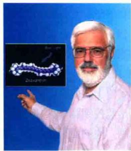

Eduardo Zeiger，加州大学洛杉矶分校的生物学名誉教授。1970年在加州大学戴维斯分校获得植物遗传学博士学位。他的研究领域包括气孔功能、蓝光反应的感受转导机制及与作物增产相关的气孔驯化等。

## 主要撰稿人

Richard Amasino，威斯康星大学生物化学系教授。1982年在印第安纳大学的卡洛斯米勒实验室获得生物学博士学位，从那时起他就对开花诱导机制的研究有了强烈的兴趣，也使得其在此后的工作中对植物开花起始时间调控机制进行了持续的研究（第25章）。

Sarah M. Assmann，宾夕法尼亚州立大学生物系教授。她在斯坦福大学获得了生物科学博士学位。Assmann博士目前的研究主要集中在细胞信号的系统生物学，尤其是保卫细胞功能调节机制，以及植物生长、可塑性和对环境响应过程中异源三聚体G蛋白的作用机制等领域（第6章）。

Malcolm J. Bennett，英国诺丁汉大学植物科学教授。1989年在华威大学获得生物学博士学位。他的研究领域集中在利用分子遗传学和系统生物学方法研究激素对根发育的影响（第14章）。

Arnold J. Bloom，加州大学戴维斯分校科学系教授。1979年在斯坦福大学获得生物学博士学位。主要从事植物-氮关系的研究，尤其是植物对氨和硝酸盐这两种氮源反应的差异研究。他和Emanuel Epstein共同编写了《植物矿质营养》教材，也是教材《全球气候变化：学科收敛》的作者（第5章和第12章）。

John Browse，华盛顿州立大学生物化学学院教授。1977年在新西兰的奥克兰大学获得博士学位。他的研究领域包括脂代谢的生物化学和植物对低温的响应机制（第11章）。

Thomas Brutnell，康奈尔大学Boyce Thompson 植物研究所的副研究员。1995年在耶鲁大学获得博士学位。他的研究领域集中在玉米的 $C_{4}$ 光合作用和玉米及其他重要的与农业相关的杂草中光敏色素作用的机制（第17章）。

Robert E. Blankenship, 圣路易斯华盛顿大学生物学和化学教授。他于1975年在加州大学伯克利分校获得化学博士学位。他的研究领域包括光合器官中的能量和电子转移机制及光合作用的起源和早期进化（第7章）。

Bob B. Buchanan，加州大学伯克利分校的植物和微生物学教授。他一直从事光合作用、种子萌发及相关过程中硫氧还蛋白的作用机制研究。他关于谷类的一些研究发现有望产生社会应用价值（第8章）。

PLANT PHYSIOLOGY

Joanne Chory，霍华德·休斯医学研究所的调查员，萨克生物研究院的教授及加州大学圣地亚哥分校的生物学兼职教授。她在伊利诺伊大学香槟分校获得微生物学博士学位。她的研究领域主要集中于植物对光环境的响应机制。她的团队利用遗传学方法鉴定出了激素受体和一些激素信号途径中的组分（第24章）。

Daniel J. Cosgrove，宾夕法尼亚州立大学帕克校区的生物学教授，他在斯坦福大学获得生物学博士学位。Cosgrove 博士的研究集中在植物生长相关领域，尤其是监控细胞增大和细胞壁扩展的生化和分子机制。他的研究团队发现了细胞壁松弛蛋白（expansin），现在主要对这个基因家族的结构、功能及进化开展研究工作（第15章）。

Susan Dunford，辛辛那提大学生物学副教授。1973年在代顿大学做植物特化和细胞生理学研究并获得博士学位。Dunford博士主要从事植物中长距离运输尤其是韧皮部运输和植物水分关系相关领域的研究（第10章）。

Lawrence Griffing，得克萨斯州农工大学生物学系副教授，在斯坦福大学获得生物学博士学位。他主要从事植物细胞生物学研究，关注于内膜网络的动态调控机制（第1章）。

Paul M. Hasegawa，普渡大学植物生理学教授。他在加州大学河滨分校获得植物生理学博士学位。他的研究主要集中于植物形态学发生和植物的遗传转化领域，在这些专业领域对许多植物胁迫抗性尤其是离子平衡方向做了很多研究（第26章）。

James Ehleringer，犹他大学杰出的生物学教授，还担任环境研究中稳定同位素比率实验机构（SIRFER）主任。他的研究主要集中在通过稳定同位素、气体交换、生物大气圈交换和水文关系等技术研究了解陆地生态系统过程，以及稳定同位素在国土安全的应用等领域（第9章）。

Jiirgen Engelberth，得克萨斯州大学圣安东尼奥分校植物生物化学副教授。1995年在德国波鸿鲁尔大学获得植物生理学博士学位，随后在马克斯普朗克化学生态学研究所、USDA、ARS、盖恩斯维尔的CMAVE，以及宾夕法尼亚州立大学做博士后研究，主要从事与植物-昆虫及植物-植物间信号传递相关的研究（第13章）。

N. Michele Holbrook，哈佛大学有机和进化生物学系教授。1995年在斯坦福大学获得博士学位。Holbrook博士的研究团队主要从事水分关系和木质部中的水分运输领域的研究（第3章和第4章）。

Joseph Kieber，北卡罗来纳州大学教堂山分校生物系教授。1990年在麻省理工学院获得生物学博士学位。Kieber博士的研究领域为植物发育过程中的激素作用，主要是乙烯和细胞分裂素信号途径及乙烯生物合成的回路调节（第21章和第22章）。

Ruth Finkelstein，加州大学圣巴巴拉分校分子、细胞和发育生物学系教授。1986年在印第安纳大学获得分子、细胞和发育生物学博士学位。她的研究包括脱落酸响应机制，以及其与其他激素、环境和营养信号途径之间的相互作用等领域（第23章）。

Andreas Madlung，菩及海湾大学生物学系教授。2000年在俄勒冈州立大学获得分子与细胞生物学博士学位。他的实验室主要关注基因组结构尤其是多倍性对植物生理和进化影响方面的基本问题（第2章）。

Michael V. Mickelbart，普渡大学副教授。他在普渡大学获得植物生理学博士学位。Mickelbart博士主要从事植物水分利用和非生物胁迫抗性的遗传和生理学基础研究（第26章）。

Alistair Middleton，在英国诺丁汉植物整合生物学中心做博士后研究，2007年在英国诺丁汉大学获得数学博士学位。Middleton博士主要从事激素反应网络中数学模型的建立工作（第14章）。

Ian M. Moller，丹麦奥胡斯大学遗传与生物技术学系教授。他在英国帝国理工学院获得植物生物化学博士学位。他曾先后在瑞典隆德大学、丹麦的里索国家实验室与哥本哈根的皇家兽医和农业大学工作。Moller教授一直从事植物呼吸作用的研究工作，近来从事植物细胞中活性氧转化和蛋白氧化作用相关领域的研究（第11章）。

Angus Murphy，普渡大学园艺和景观建筑系教授。1996年在加州大学圣克鲁兹分校获得生物学博士学位。Murphy 博士从事生长素运输调节及可塑性植物生长中转运蛋白的调节机制研究（第19章）。

Benjamin Peret，英国诺丁汉植物整合生物学中心Malcolm Bennett实验室的玛丽居里项目研究人员。他在法国蒙彼利埃大学获得植物生理学博士学位。Peret博士的博士后研究工作主要是建立侧根发生时生长素响应的多重尺度模型（第14章）。

Allan G. Rasmusson，瑞典隆德大学的植物生理学教授，1994年在该校获得植物生理学博士学位。Rasmusson博士目前的研究集中在呼吸代谢中的活性氧平衡及调节，尤其是能量旁路酶的作用机制领域（第11章）。

David E. Salt，普渡大学植物生物学教授。1989年在英国利物浦大学获得植物生物化学博士学位。他关注于植物中矿质离子动态平衡调节网络相关基因及这种调节机制形成的进化动力相关研究。目前，结合高通量生物信息学和基因组学分析技术对拟南芥不同生态型吸收和积累矿物离子差异的遗传学机制进行研究（第26章）。

Darren Sandquist，加州州立大学富尔顿分校生物学教授。他在犹他大学获得博士学位。他主要从事植物对干扰、侵染、气候变化和半干旱生态系统的生理生态学响应相关领域的研究（第9章）。

Sigal Savaldi-Goldstein，以色列理工学院的课题负责人。2003年在以色列魏茨曼研究所获得植物学博士学位，并在萨克生物研究院做博士后研究。Savaldi-Goldstein博士的研究专注于对植物激素尤其是油菜素内酯相关领域的研究，他们主要从事不同组织对激素刺激的响应差异形成的机制研究，以及这些过程是如何与不同的生长环境整合在一起来保证生长的连贯性研究（第24章）。

Wendy K. Silk，加州大学戴维斯分校的教授和定量植物生物学家。1975年在加州大学伯克利分校获得植物学博士学位。她从事植物-环境间相互作用的研究，包括对不同环境的生长反应、营养循环和根际生物学等。积极参加戴维斯艺术-科学融合项目，她常常让学生写歌曲或诗歌作为学习和交流科学的方式（附录2）。

Valerie Sponsel，得克萨斯州大学圣安东尼奥分校生物系副教授。1972年在英国威尔士大学获得博士学位，并于1984年在英国布里斯托大学获得理学博士学位。她的研究方向是赤霉素的生物合成和代谢，最近集中在赤霉素的生物合成及信号途径与生长素的相互作用方向（第20章）。

Bruce Veit，新西兰北帕默斯顿AgResearch研究所资深科学家。1986年在华盛顿大学西雅图校区获得遗传学博士学位，随后在加州奥尔巴尼植物基因表达中心从事博士后研究。他目前的研究领域集中于影响和决定细胞命运的机制。他对梅西大学分子生物科学学院的Paul Dijkwel博士在衰老章节更新中提供的帮助表示感谢（第16章）。

Philip A. Wigge，英国诺维奇John Innes Centre的课题负责人，2001年在英国剑桥大学获得细胞生物学博士学位。在加州萨克研究所的Detlef Weigel实验室，Wigge博士关注于开花素调控植物发育相关研究。他的研究团队对植物是如何感知气候变化并对其作出反应的机制非常感兴趣（第25章）。

Ricardo A. Wolosiuk，布宜诺斯艾利斯大学教授，也是布宜诺斯艾利斯Instituto Leloir的资深科学家。1974年在布宜诺斯艾利斯大学获得化学博士学位。他目前的研究集中在光合过程中CO₂同化的调节剂及植物蛋白结构和功能领域（第8章）。

## 审稿人

Nick Battey
University of Reading

Julin Maloof
University of California, Davis

Magdalena Bezanilla
University of Massachusetts, Amherst

Ildefonso Bonilla
Universidad Autonoma de Madrid

Peter McCourt
University of Toronto

Sabeeha Merchant
University of California, Los Angeles

Thomas Buckley
Sonoma State University

Jan Miernyk
University of Missouri

Xumei Chen
University of California, Riverside

Don Ort
University of Illinois at Urbana Champaign

Asaph Cousins
Washington State University

Zhi Qi
University of Connecticut

Emmanuel Delhaize
CSRIO

Hitoshi Sakaibara
RIKE N Plant Science Center

Donald Geiger
University of Dayton

Kathrin Schrick
Kansas State University

William Gray
University of Minnesota

Philip Harris
University of Auckland

Julian Schroeder
University of California, San Diego

Johannes Stratmann
University of South Carolina

Peter Hedden
Rothamsted Research

J. S. Heslop-Harrison
University of Leicester

Tai-Ping Sun
Duke University
Sakis Theologis
USDA Plant Gene Expression Center

John Hess
Virginia Tech University

Theodore Hsaio
University of California, Davis

E. G. Robert Turgeon
Cornell University

Nick Kaplinsky
Swarthmore College

John Ward
University of Minnesota

Philip A. Wigge
John Innes Centre

Simon's Rock College of Bard

Jianming Li
University of Michigan

Yanhai Yin  
Iowa State University

# Chapter and Appendix Histories

由于有相当多的同行为这本植物生理学教材的各个版本慷慨地付出了他们的时间和专业知识，我们只有将他们所有人的名字列出来才能表示谢意。因此，我们在正文前面增加了这个重要部分，在这里标示出了这本教材从第一版到第五版整个编写历程中所有章节的作者。这里的每一位杰出学者都为这本目前已经有了10种语言

CHAPTER 1 Plant Cells Stephen M. Wolniak，马里兰大学植物学教授（1E）；Lincoln Taiz，加州大学圣克鲁兹分校分子、细胞和发育生物学教授（1\~4E）；Lawrence R. Griffing，得克萨斯州农工大学副教授（5E）。

CHAPTER 2 Genome Organization and Gene Expression Lincoln Taiz, 加州大学圣克鲁兹分校分子、细胞和发育生物学教授（1\~4E）；Andreas Madlung，菩及海湾大学生物学系教授（5E）。

CHAPTER 3 Water and Plant Cells Daniel Cosgrove, 宾夕法尼亚州立大学生物学教授（1E和2E）；Michele Holbrook，哈佛大学有机和进化生物学系教授（3\~5E）。

CHAPTER 4 Water Balance of Plants Daniel Cosgrove, 宾夕法尼亚州立大学生物学教授（1E和2E）；Michele Holbrook，哈佛大学有机和进化生物学系教授（3\~5E）。

CHAPTER 5 Mineral Nutrition Donald P. Briskin, 伊利诺伊大学厄本那香槟分校作物科学教授（1E）；Arnold Bloom，加州大学戴维斯分校科学系教授（2\~5E）。

CHAPTER 6 Solute Transport George W. Bates, 佛罗里达州立大学生物学教授（1E）； Ronald J. Poole, 麦吉尔大学生物学教授（2E和3E）； Sarah M. Assmann, 宾夕法尼亚州立大学生物系教授（4E和5E）。

CHAPTER 7 Photosynthesis: The Light Reactions Robert E. Blankenship, 圣路易斯华盛顿大学生物学和化学教授（1\~5E）。

版本的植物生理学教材在世界范围内的成功作出了重要的贡献。

L.T.

E.Z.

CHAPTER 8 Photosynthesis: The Carbon Reactions George H. Lorimer, 马里兰大学化学与生物化学系教授（1E）；Bob B. Buchanan, 加州大学伯克利分校的植物和微生物学教授；Ricardo A. 布宜诺斯艾利斯大学教授，布宜诺斯艾利斯Instituto Leloir资深科学家（2\~5E）。

CHAPTER 9 Photosynthesis: Physiological and Ecological Considerations Thomas Sharkey, 密歇根州立大学生物化学与分子生物学系教授（1E）；Thomas Vogelmann, 佛蒙特大学植物生物学教授（2E和3E）；James Ehleringer, 犹他大学生物学教授（4E和5E）；Darren Sandquist, 加州州立大学富尔顿分校生物学教授（5E）。

CHAPTER 10 Translocation in the Phloem Susan Dunford, 辛辛那提大学生物学副教授（1\~5E）。

CHAPTER 11 Respiration and Lipid Metabolism
James Siedow，杜克大学生物学教授（1E）；James Siedow和John Browse，华盛顿州立大学生物化学学院教授（2E）；Ian M. Moller，丹麦奥尔胡斯大学遗传与生物技术系主任；Allan G. Rasmusson和John Browse，瑞典隆德大学的植物生理学教授（3\~5E）。

CHAPTER 12 Assimilation of Mineral Nutrients Donald P. Briskin, 伊利诺伊大学厄本那香槟分校作物科学教授（1E）；Arnold Bloom，加州大学戴维斯分校科学系教授（2\~5E）。

CHAPTER 13 Secondary Metabolites and Plant Defense Jonathan Gershenzon，马克斯-普朗克化学生态学研究所主任（1\~3E）；Jiirgen E. Engelberth，得克萨斯州大学圣安东尼奥分校植物生物化学副教授（4E和5E）。

CHAPTER 14 Signal Transduction Lincoln Taiz, 加州大学圣克鲁兹分校分子、细胞和发育生物学教授（1\~4E）；Malcolm Bennett与诺丁汉大学的Benjamin Peret博士和Alistair Middleton博士，英国诺丁汉大学植物科学教授（5E）。

CHAPTER 15 Cell Walls: Structure, Biogenesis and Expansion Daniel Cosgrove, 宾夕法尼亚州立大学帕克校区的生物学教授（2\~5E）。

CHAPTER 16 Growth and Development Donald E. Fosket, 加州大学欧文分校发育与细胞生物学教授（1\~3E）；Adrienne Hardham，堪培拉澳大利亚国立大学植物细胞生物学组研究员（1E）；Wendy Kuhn Silk，加州大学戴维斯分校的教授和定量植物生物学家（2E和3E）；Bruce Veit，新西兰北帕默斯顿AgResearch研究所资深科学家（4E和5E）。

CHAPTER 17 Phytochrome and Light Control of Plant Development Stanley Roux, 得克萨斯州大学奥斯汀分校植物学教授（1E）；Jane Silverthorne，加州大学圣克鲁兹分校生物学教授（2E和3E）；Thomas Brutnell，康奈尔大学 Boyce Thompson 植物研究所的副研究员（4E和5E）。

CHAPTER 18 Blue-Light Responses: Morphogenesis and Stomatal Movements Eduardo Zeiger, 加州大学洛杉矶分校的生物学教授（1\~5E）。

CHAPTER 19 Auxin: The First Discovered Plant Growth Hormone Richard G. Stout, 蒙大拿州立大学生物学教授（1E）；Paul Bernasconi，北卡罗来纳州三角研究园先正达生物技术公司生物化学主任（2E）；Angus Murphy，普渡大学园艺和景观建筑系教授（3\~5E）。

CHAPTER 20 Gibberellins: Regulators of Plant Height and Seed Germination Peter J. Davies, 康奈尔大学植物生理学教授（1\~3E）；Valerie Sponsel，得克萨斯州大学圣安东尼奥分校生物系副教授（4E和5E）。

CHAPTER 21 Cytokinins: Regulators of Cell Division Donald E. Fosket, 加州大学欧文分校发育与细胞生物学教授（1E和2E）；Joseph Kieber, 北卡罗来纳州大学教堂山分校生物系教授（3\~5E）。

CHAPTER 22 Ethylene: The Gaseous Hormone
Shimon Gepstein，以色列理工学院生物学教授（1E）；
Joseph Kieber，北卡罗来纳州大学教堂山分校生物系教授（2\~5E）。

CHAPTER 23 Abscisic Acid: A Seed Maturation and Stress-Response Hormone Shimon Gepstein, 以色列理工学院生物学教授（1E）；Joseph Kieber, 北卡罗来纳州大学教堂山分校生物系教授（2E）；Ruth Finkelstein, 加州大学圣巴巴拉分校分子、细胞和发育生物学系教授（3\~5E）。

CHAPTER 24 Brassinosteroids: Regulators of Cell Expansion and Development Sigal Savaldi-Goldstein, Principal Investigator in the Faculty of Biology, Technion, Israel; Joanne Chory, 霍华德·休斯医学研究所的调查员，萨克生物研究院的教授及加州大学圣地亚哥分校的生物学兼职教授（4E和5E）。

CHAPTER 25 The Control of Flowering Daphne Vince-Prue，英格兰雷丁大学植物学教授（1E）；Donald E. Fosket，加州大学欧文分校发育与细胞生物学教授（2E）；Richard Amasino，威斯康星大学生物化学系教授（3\~5E）。

CHAPTER 26 Responses and Adaptations to Abiotic Stress John Radin, 美国农业部研究负责人, 已故 (1E); Ray Bressan, 普渡大学植物生理学教授; Malcom C. Drew, 得克萨斯州农工大学植物生理学教授; Paul M. Hasegawa, 普渡大学植物生理学教授 (2E); Robert Locy, Paul M. Hasegawa 和 Ray Bressan, 奥本大学生物学教授 (3E 和 4E); Michael V. Mickelbart, 普渡大学副教授; Paul M. Hasegawa 和 David E. Salt, 普渡大学植物学教授 (5E)。

APPENDIX 1 Energy and Enzymes Frank Harold, 科罗拉多州立大学生物化学教授（1\~5E）。

APPENDIX 2 The Analysis of Plant Growth Wendy Kuhn Silk, 加州大学戴维斯分校的教授和定量植物生物学家（5E）。

APPENDIX 3 Hormone Biosynthetic Pathways Angus Murphy, Valerie Sponsel, Joseph Kieber, Ruth Finkelstein, Sigal Savaldi-Goldstein, Joanne Chory (5E).

## 目录

第1章 植物细胞……1
1.1 植物生命：一些统一的原理……1
1.2 植物结构总览……1
1.3 植物细胞器……3
1.4 内膜系统……7
1.5 来源于内膜系统的独立分裂的细胞器……14
1.6 能独立分裂的半自主型细胞器……15
1.7 细胞骨架……19
1.8 细胞周期调控……21
1.9 胞间连丝……26
小结……27
第2章 基因组结构与基因表达……29
2.1 核基因组结构……29
2.2 植物细胞质基因组：线粒体和叶绿体……35
2.3 核基因表达的转录调节……38
2.4 核基因表达的转录后调节……41
2.5 基因功能的研究工具……47
2.6 作物遗传改良……50
小结……53

## 单元Ⅰ 水和矿质营养

第3章 水和植物细胞……57
3.1 植物生命中的水……57
3.2 水的结构和特征……58
3.3 扩散和渗透作用……60
3.4 水势……62
3.5 植物细胞的水势……63
3.6 细胞壁和细胞膜的特性……65
3.7 植物的水分状态……67
小结……68
第4章 植物的水分平衡……71
4.1 土壤中的水分……71
4.2 根对水分的吸收……73
4.3 水分通过木质部运输……75
4.4 水分从叶片散失到大气中……80
总述：土壤-植物-大气连续体……85
小结……85

第5章 矿质营养……87
5.1 必需元素、必需元素缺乏和植物失调症……87
5.2 营养缺乏的治疗……95
5.3 土壤、根和微生物……96
小结……103
第6章 溶质的运输……104
6.1 被动运输和主动运输……104
6.2 离子的跨膜运输……106
6.3 膜的转运过程……109
6.4 膜转运蛋白……114
6.5 根中的离子运输……122
小结……124

## 单元Ⅱ 生化和代谢

第7章 光合作用：光反应……129
7.1 高等植物中的光合作用……129
7.2 基本概念……129
7.3 了解光合作用的关键实验……133
7.4 光合细胞器的构成……136
7.5 吸光天线系统的构造……139
7.6 电子传递的机制……141
7.7 叶绿体中的质子转运和ATP合成……149
7.8 光合作用系统的修复和调节……152
7.9 光合作用系统的遗传、组装和进化……153
小结……156
第8章 光合作用：碳反应……158
8.1 卡尔文-本森循环……158
8.2 卡尔文-本森循环的调控……163
8.3 C₂氧化光合碳循环……166
8.4 无机碳浓缩机制……172
8.5 无机碳浓缩机制：C₄碳循环……172
8.6 无机碳浓缩机制：景天酸代谢(CAM)……177
8.7 光合作用中淀粉和蔗糖的积累与分流……179
8.8 叶绿体淀粉产生与动员……180
8.9 蔗糖生物合成及其信号途径……185
小结……189
第9章 光合作用：生理和生态思考……192
9.1 光合作用是叶片的基本功能……193
9.2 结构和功能完整的叶片对光的光合响应

策略 …… 197
9.3 光合作用对温度的响应 …… 201
9.4 光合作用对二氧化碳的响应 …… 203
9.5 揭示不同的光合途径 …… 208
小结 …… 211

第10章 韧皮部转运 …… 213
10.1 韧皮部转运的途径 …… 213
10.2 转运模式：源到库 …… 218
10.3 韧皮部转运物质 …… 218
10.4 转运速率 …… 221
10.5 韧皮部运输的压力流动模型——被动运输 …… 221
10.6 韧皮部装载 …… 224
10.7 韧皮部卸载及库到源的转变 …… 229
10.8 光合产物的分布：分配和分割 …… 231
10.9 信号转导分子的运输 …… 234
小结 …… 235

第11章 呼吸作用与脂代谢 …… 238
11.1 植物的呼吸作用 …… 238
11.2 脂代谢 …… 261
小结 …… 268

第12章 矿质营养的同化 …… 271
12.1 环境中的氮 …… 271
12.2 硝酸盐的同化 …… 273
12.3 铵的同化 …… 276
12.4 氨基酸的生物合成 …… 278
12.5 生物固氮 …… 279
12.6 硫的同化 …… 284
12.7 磷酸盐的同化 …… 286
12.8 阳离子的同化 …… 287
12.9 氧的同化 …… 289
12.10 营养物质同化的能学 …… 289
小结 …… 290

第13章 次生代谢和植物防御反应 …… 292
13.1 次生代谢 …… 292
13.2 萜类 …… 293
13.3 酚类化合物 …… 297
13.4 含氮化合物 …… 303
13.5 诱导植物防御反应抵抗植食昆虫 …… 307
13.6 植物对病原菌的防御反应 …… 311
小结 …… 316

## 单元Ⅲ 生长和发育

第14章 信号转导……321
14.1 植物细胞与动物细胞的信号转导……322
14.2 信号传递的时空性……333

小结 …… 336
第15章 细胞壁：结构、生物合成和扩展…… 338
15.1 植物细胞壁的结构和合成 …… 338
15.2 细胞的扩张方式 …… 353
15.3 细胞的扩张速率 …… 356
小结 …… 360
第16章 生长与发育…… 362
16.1 植物生长发育总览 …… 362
16.2 胚胎发生：极性的起源 …… 364
16.3 分生组织：无限生长型的基础 …… 375
16.4 根顶端分生组织 …… 376
16.5 茎顶端分生组织 …… 380
16.6 营养器官发生 …… 386
16.7 衰老和细胞程序性死亡 …… 390
小结 …… 392
第17章 光敏色素和光调控的植物发育…… 394
17.1 光敏色素的光化学和生物化学特性 …… 394
17.2 光敏色素诱导反应的特点 …… 397
17.3 光敏色素蛋白的结构和功能 …… 399
17.4 光敏色素功能的遗传分析 …… 403
17.5 光敏色素信号途径 …… 406
17.6 昼夜节律 …… 409
17.7 生态学功能 …… 411
小结 …… 414
第18章 蓝光反应：形态建成和气孔运动…… 417
18.1 蓝光反应的光生理学 …… 418
18.2 蓝光反应的调节 …… 425
18.3 蓝光受体 …… 425
小结 …… 431
第19章 生长素——第一种被发现的植物生长激素…… 434
19.1 生长素概念的出现 …… 434
19.2 主要的生长素：吲哚-3-乙酸…… 436
19.3 生长素的运输 …… 439
19.4 生长素信号转导途径 …… 448
19.5 生长素的作用：细胞伸长 …… 450
19.6 生长素的作用：植物的向性 …… 453
19.7 生长素对生长发育的影响 …… 460
小结 …… 464
第20章 赤霉素：植物高度和种子萌发的调节因子…… 466
20.1 赤霉素的发现及其化学结构 …… 466
20.2 赤霉素对生长和发育的影响 …… 468
20.3 赤霉素的生物合成与失活 …… 470
20.4 赤霉素信号途径：响应突变体的重要性…… 476
20.5 赤霉素响应：DELLA蛋白的早期靶标…… 483
20.6 赤霉素响应：谷类植物糊粉层 …… 483
20.7 赤霉素响应：花药发育和雄性育性…… 488
20.8 赤霉素响应：茎的生长 …… 491小结 …… 492
第21章 细胞分裂素：细胞分裂的调节因子……495
21.1 细胞分裂和植物发育……495
21.2 细胞分裂素的发现、鉴定和特性……496
21.3 细胞分裂素的生物合成、代谢和运输……499
21.4 细胞分裂素在细胞和分子水平上的作用
模式……503
21.5 细胞分裂素的生物学功能……506
小结……515
第22章 乙烯：气体激素……517
22.1 乙烯的结构、生物合成及测定……517
22.2 乙烯信号转导途径……520
22.3 乙烯调控基因表达……524
22.4 乙烯在植物发育和生理反应中的作用……524
小结……532
第23章 脱落酸：种子成熟和胁迫反应激素……534
23.1 ABA的产生、化学结构和测定……534
23.2 ABA的生物合成、代谢和运输……535
23.3 ABA信号转导途径……538
23.4 ABA调节基因表达……543
23.5 ABA在发育中的作用和生理效应……544
小结……551
第24章 油菜素甾醇：细胞扩大和发育的调节子……553
24.1 油菜素甾醇的结构、发生及遗传分析……554
24.2 油菜素甾醇的信号转导途径……556
24.3 油菜素甾醇的生物合成、代谢及运输……559
24.4 油菜素甾醇对生长和发育的影响……564
24.5 油菜素甾醇在农业上的应用前景……567
小结……567
第25章 开花的控制……569
25.1 花分生组织和花器官的发育……569
25.2 花发端的内在和外在因素……574
25.3 茎尖和时相变化……574

## 第 1 章

## 植物细胞

细胞（cell）一词源于拉丁文cella，意为贮藏室或小室。1665年，英国科学家罗伯特·胡克（Robert Hook）首次在生物学领域用该词描述在一台复式显微镜下观察到的软木中的单个蜂窝状单元。胡克当时看到的细胞实际上是一些被细胞壁所包围的死细胞空腔，但是这个命名相当贴切，因为细胞就是构成整个植物体的基本结构单元。

植物生理学是研究植物在与其物理（非生物）及生物环境相互作用过程中如何行使功能的一门学科。虽然本书将重点讲述植物的生理和生化功能，但是认识实现这些功能的结构基础是非常重要的。不管是叶片中的气体交换、木质部中的水分运输、叶绿体中的光合作用、跨膜的离子运输过程，还是涉及光和激素的信号转导通路，都依赖于结构。在每个水平上，结构和功能都代表了一个生物功能单位的独特框架。

本章将概述植物的基本解剖结构，包括从器官水平到细胞器水平的超显微结构。在随后的几章中，将根据植物生命周期中这些结构各自所具有的生理功能，对其进行更加具体的讲述。

## 1.1 植物生命：一些统一的原理

众所周知，植物的大小和形态丰富多样。植物体的高度从小于1 cm直到大于100 m。植物形态，或者说形状，也有惊人的多样性。小小的浮萍（Lemma）似乎和巨大的仙人掌或红杉树没什么相似之处。没有一种植物能够表现出地球上的植物对于环境所具有的全部适应性，因此植物生理学家选择研究模式生物（model organism）。那些生长周期短、基因组小的植物被选为模式植物（参见Web Topic1.1）。这些模式植物非常有用，如果不考虑它们各自的适应性，所有植物基本都进行着相似的活动，并且基于相同的结构模式。可以将决定植物生活方式的主要因素概括如下。

（1）作为地球上的初级生产者，绿色植物是太阳能最终的收集者。它们通过转化光能为化学能来收集太阳能，化学能储存在二氧化碳和水合成碳水化合物时形成的化学键中。

（2）除了一些生殖细胞，植物是不移动的。为了弥补这一不足，植物进化出了在生命周期中向重要资源（如光、水和矿质营养）生长的能力。

（3）陆生植物在向光生长时，通过增强结构来支撑其质量，以对抗向地的重力。

（4）陆生植物具有将土壤中的水分和矿物质运输到光合作用和生长所需要地方的机制，以及将光合作用产物转移到非光合作用器官和组织的机制。

（5）陆生植物通过蒸腾作用连续失水，并进化出防止脱水的机制。

## 1.2 植物结构总览

虽然外观各异，但是所有种子植物（参见Web Topic1.2）都有相同的基本形体轮廓（图1.1）。营养体由3种器官组成：叶、茎和根。叶的主要功能是光合作用，茎用于支撑，根起固定及吸收水分和矿质营养的作用。叶在节上和茎相连，两个节之间的区域称为节间，茎和叶一起统称为地上部。

种子植物有两类：裸子植物和被子植物。裸子植物（Gymnosperm）（来自于希腊文，是种子裸露之意）较低等，已知的大约有700种。裸子植物中最大的类群是松类（“松果产生者”），包括一些重要的经济森林树种，如松树、枞树、云杉和红杉。

  
图1.1 典型双子叶植物的示意图。叶（A）、茎（B）和根（C）的横切面示意图。插图是亚麻（Linum usitatissimum）的茎尖和根尖的纵切面，表示顶端分生组织[图片引自Jubal Harshaw/Shufferstock（上）和Visuals Unlimited/Alamy（下）]。

被子植物（Angiosperm）（来自于希腊文，是种子在罐中之意），是种子植物中较高等的，在1亿年前的白垩纪开始大量出现。现在它们在植被中占有绝对优势，远胜于裸子植物。已知的约有25万种，但是还有许多没有进行分类。种子植物的主要进化是出现了花，因此也称为开花植物（flowering plant）（参见Web Topic 1.3）。

## 1.2.1 植物细胞被坚硬的细胞壁包围

植物和动物的一个基本区别是每个植物细胞被一层坚硬的细胞壁（cell wall）包围。在动物中，胚性细胞能从一个位置移动到另一个位置，因此发育中的组织和器官可以包含起源于生物体不同部位的细胞。而在植物体中没有这样的细胞移动。每个带细胞壁的细胞与相邻细胞都由胞间层（middle lamella）粘合起来，因此，不同于动物发育，植物发育只依赖细胞分裂和细胞增大的模式。

植物细胞有两种细胞壁：初生细胞壁（primary cell wall）和次生细胞壁（secondary cell wall）（图1.2）。初生细胞壁通常很薄（小于1 $\mu$ m），通常存在于幼嫩和正在生长的细胞中。次生细胞壁比初生细胞壁更厚，更强韧，并且在大多数细胞增大终止后沉积。次生细胞壁的强度和韧性是由木质素（lignin）决定的，木质素是一种易碎的、胶状的物质（见第15章）。次生细胞壁上的圆形豁口形成了单纹孔（simple pit），并且一个细胞的单纹孔经常和相邻细胞壁上的单纹孔相对。相连的单纹孔称为纹孔对（pit-pair）。

  
图1.2 图示初生细胞壁和次生细胞壁及其与细胞其他部分的关系。

木质化次生细胞壁的出现使植物结构得到强化，使得植物能够在土壤之上进行垂直生长并且定植于土壤中。而缺少木质化细胞壁的苔藓植物，如苔藓和地钱，在地面生长高度则不超过几厘米。

## 1.2.2 新细胞产生于分生组织

植物生长主要集中于特定的细胞分裂区域，这些区域称为分生组织（meristem）。几乎所有的核分裂（有丝分裂）和细胞分裂（胞质分裂）都发生于这些分生区域。在幼嫩植物中，最活跃的分生组织称为顶端分生组织（apical meristem），它们位于茎尖和根尖（图1.1）。在节上，腋芽（axillary bud）包含侧枝的顶端分生组织。侧根产生于中柱鞘（pericycle），这是一个内部的分生组织（图1.1C）。靠近（相邻）分生区并与之重叠的区域是细胞伸长区。在伸长区中细胞的长度和宽度大幅度增加。细胞通常在它们伸长后分化成特定的类型。

产生新器官和形成基本植物模式的发育期称为初生生长（primary growth）。初生生长是顶端分生组织活动的结果，在此期间细胞进行分裂，紧接着是细胞逐步增大，主要是细胞伸长，产生轴向（基-顶）的极性。当某个区域中的伸长完成后，可能发生次生生长（secondary growth），产生径向（内-外）的极性。次生生长有两种侧生分生组织参与：维管形成层（vascular cambium，复数cambia）和木栓形成层（cork cambium）。维管形成层产生次生木质部（木材）和次生韧皮部。木栓形成层产生周皮，主要由木栓细胞组成。

## 1.2.3 三种主要组织系统组成了植物体

三种主要组织系统存在于所有的植物器官：表皮组织、基本组织和维管组织。图1.3中简明地标出了这些组织。关于这些植物组织更详细的描述参见Web Topic1.4。

## 1.3 植物细胞器

所有植物细胞都具有真核细胞所共有的细胞器，包括一个细胞核、细胞质和亚细胞器，并且它们被包被在作为边界的膜中，除此之外，还有富含纤维素的细胞壁（图1.4）。某些结构，包括细胞核，在细胞成熟过程中可能消失，但是所有的植物细胞开始时都含有相似的细胞器。这些细胞器根据它们的产生方式主要被分为以下三大类。

（1）内膜系统：指内质网、核膜、高尔基体、内体和质膜。内膜系统在分泌、膜再循环及细胞周期等过程中有着重要的作用。质膜调控着细胞运输的整个过程。内体就是来源于质膜的囊泡并且对囊泡中的内含物进行加工和再循环。

（2）起源于内膜系统的能独立分裂的细胞器：包括油体、过氧化物酶体，以及在脂类储藏和碳循环中发挥作用的乙醛酸循环体。

（3）能独立分裂的半自主型细胞器：包括质体和作用于能量代谢和储藏的线粒体。

由于所有的这些细胞器都是膜构成的区室，因此先从膜的结构和功能开始描述。

## 1.3.1 生物膜由含有蛋白质的磷脂双分子层构成

所有细胞被包裹于作为外部边界的质膜中，质膜将胞质和外界环境隔离。这层质膜（plasma membrane）（也称plasmalemma）使得细胞能吸收和保留某些物质而排出其他物质。各种镶嵌在质膜上的转运蛋白负责溶质、水溶性离子和不带电荷的小分子的选择性跨膜运输。通过转运蛋白而在胞质中积累离子和分子的过程需要消耗能量。膜同样也为特化的胞内细胞器划定了边界，并能够调控离子和代谢产物进出这些区域。

根据流动镶嵌模型（fluid-mosaic model），所有的生物膜都有相同的基本分子结构。它们由蛋白质镶嵌于其中的磷脂（在叶绿体中为糖基甘油酯）双分子层（bilayer）构成（图1.5A，C）。每一层称为双分子层中的层（leaflet）。在大部分质膜中，蛋白质占据了其中的一半。但是，各种膜的脂类成分和蛋白质性质不尽相同，使得每种膜具有独特的功能特征。

韧皮部  
A 表皮组织：表皮细胞  
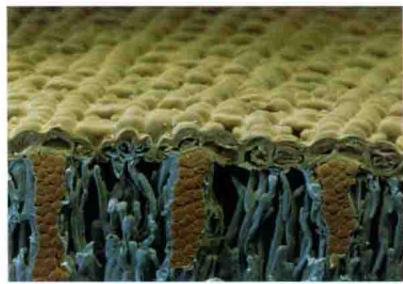

B 基本组织：薄壁细胞  
  
C 基本组织：厚角组织细胞

D 基本组织：厚壁组织细胞  

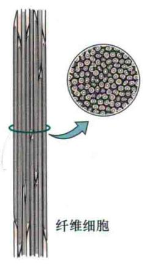

E 维管组织：木质部和韧皮部  

  
木质部

  
图1.3 百岁兰（Welwitschia mirabilis）叶片的外表皮（表皮组织）（120×）（A）。3种基本组织的示意图：薄壁组织（B）、厚角组织（C）、厚壁组织（D）与木质部和韧皮部的运输细胞（E）（A©Meckes/Ottawa/Photo Researchers, Inc）。

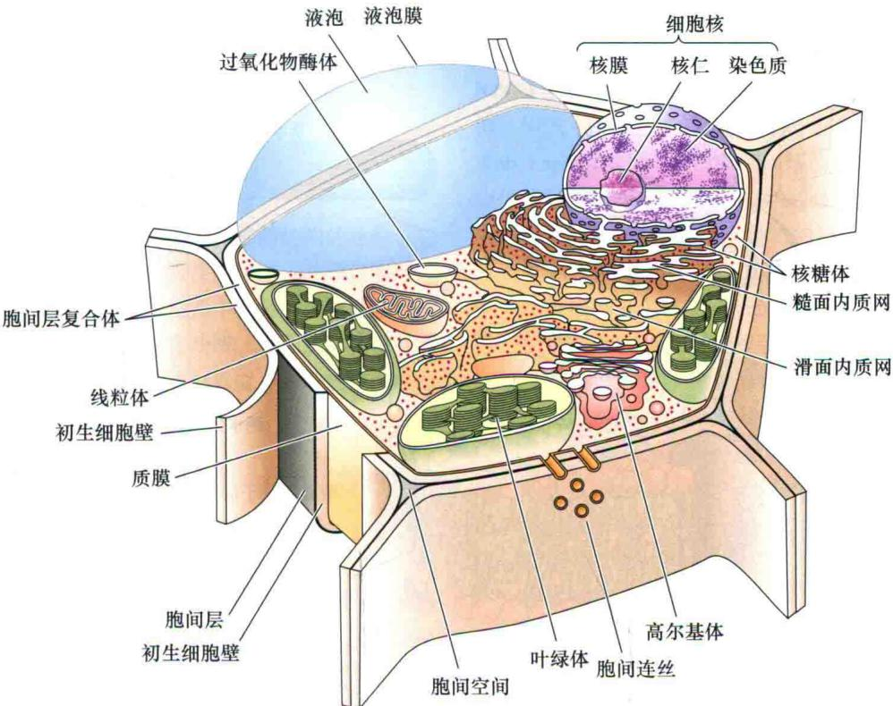  
图1.4 植物细胞示意图。许多细胞器由它们各自的膜分开，如液泡膜、核膜和其他细胞器膜。相邻的初生细胞壁和胞间层形成了一个称为复合胞间层的复杂结构。

## 1. 磷脂

磷脂（phospholipid）是一种由两个脂肪酸和甘油共价结合形成的脂类，其中的甘油又和一个磷酸基团共价结合。另外有一些可变的成分与磷酸基团相连，称为头部基团（head group），如丝氨酸、胆碱或肌醇（图1.5C）。脂肪酸的非极性碳水化合物链形成一个疏水区域。与脂肪酸不同，头部基团呈高度极性，因此磷脂分子是兼性分子（amphipathic），同时具有亲水性和疏水性。各种磷脂不对称地镶嵌在质膜中，赋予了质膜方向性。对着细胞外侧的质膜层与对着胞质的质膜层的磷脂构成是不同的。

一类称为质体（plastid）（它是包括叶绿体在内的一类膜包围的细胞器）的特化细胞器的膜脂成分几乎都是糖基甘油酯（glycosylglyceride）而不是磷脂。在糖基甘油酯中，极性的头部集团由半乳糖、双半乳糖或硫化半乳糖组成，而没有磷酸基团（参见Web Topic 1.5）。

虽然磷脂和糖基甘油酯的脂肪酸链长度是可变的，但是它们通常由14\~24个碳组成。如果碳原子之间由单键连接，脂肪酸链则是饱和的（带有氢原子），如果含有一个或多个双键，该链则称为不饱和脂肪酸链。

脂肪酸链中的双键能在链中旋转形成一个结节，从而防止双分子层中磷脂的紧密堆积（例如，这些键采用了结节状的顺式构象，而不是非结节状的反式构象）。这些结节增加了膜的流动性。而流动性又在膜的许多功能中起到重要作用。温度也强烈影响膜的流动性。因为植物基本不能调控体温，而低温会降低膜的流动性，所以它们经常存在如何维持低温下膜的流动性的问题。为此，植物磷脂中含有大量不饱和脂肪酸，如十八烯酸（oleic acid）（一个双键）、亚油酸（linoleic acid）（两个双键）和α-亚麻酸（α-linolenic acid）（3个双键），从而增强膜的流动性（见第26章）。

## 2. 蛋白质

和脂类双分子层相结合的蛋白质主要有3种类型：整合蛋白、外周蛋白和锚定蛋白。另外，蛋白质和脂类能在膜中形成暂时的聚集体，称为脂筏（lipid raft）。

整合蛋白（integral protein）嵌在双层脂中。多数整合蛋白横跨磷脂双分子层，因此蛋白质的一部分与细胞外部互作，一部分与膜的疏水核心互作，还有一部分与细胞内部——胞质部分互作。作为离子通道的蛋白质（见第6章）都是整合蛋白，并作为参与某些信号转导途径的受体（见第14章）。在质膜外表面的一些受体样蛋白识别并紧密结合细胞壁组分，使质膜和细胞壁有效交联。

  
图1.5 A. 质膜、内质网和由镶嵌在磷脂双分子层中的蛋白质组成的植物细胞的其他内膜。B. 透射电子显微照片表明水芹（Lepidium sativum）根尖分生组织的质膜。质膜的全厚度，两条粗线之间的距离为8 nm。C. 典型的磷脂化学结构和空间结构模型，卵磷脂和单半乳糖基二酯酰甘油（改编自Gunning and Steer，1996）。

外周蛋白（peripheral protein）通过非共价键（如离子键和氢键）和质膜表面相连。它们会被高盐溶液或促溶剂（chaotropic agent）从膜上分离，前者打破离子键，后者打破氢键（图1.5A）。外周蛋白在细胞中起着很多作用，有些参与形成质膜和细胞骨架，如微管和微丝的互作。这将在本章后面讨论。

锚定蛋白（anchored protein）通过脂类分子和质膜表面共价相连。这些脂类包括脂肪酸（肉豆蔻酸和棕榈酸），源于类异戊二烯途径的异戊二烯基团（法尼基和牻牛儿牻牛儿基）和糖磷脂酰肌醇（GPI）-锚定蛋白（图1.5B）。这些蛋白质的脂锚定位点在面对胞质一侧主要为脂肪酸和异戊二烯基团，在细胞外侧为糖磷脂酰肌醇，因此造成了膜两侧的差异性。

## 1.4 内膜系统

真核细胞的内膜系统指细胞内部膜结构的总称，它将细胞分为具有功能性和结构性的区室，并通过囊泡运输将膜和蛋白质分配在各细胞器中。由于细胞器是负责器官合成的遗传信息的主储存场所，因此从细胞核开始对内膜系统进行讨论，接着将对独立分裂的内膜细胞器和半自主型细胞器进行讨论。

## 1.4.1 细胞核含有细胞的大部分遗传物质

细胞核（nucleus，复数nuclei）是包含主要负责调控细胞代谢、生长和分化遗传信息的细胞器。所有这些基因和它们的内含序列为核基因组（nuclear genome）。植物的核基因组大小差别很大，从双子叶植物拟南芥（Arabidopsis thaliana）的 $1.2 \times 10^{8}$ 个碱基对到百合（Fritillaria assyriaca）的 $1 \times 10^{11}$ 个碱基对。一个细胞的其他基因信息存在于两个半自主细胞器——叶绿体和线粒体中，这些将在稍后讨论。

细胞核由称为核膜（nuclear envelope）的双层膜包围（图1.6A），是内质网的一个子区域。核孔（nuclear pore）在两层膜之间形成选择性通道连接核质（细胞核内部区域）和细胞质（图1.6B）。每个核膜上的核孔可以从一千个到数千个，它们可以排列成高度有序的聚集体（图1.6B）（Fiserova et al., 2009）。

核“孔”事实上是一个复杂的结构，它是由100多个不同的核孔蛋白（nucleoporin）呈八边形排列而组成直径约105 nm的核孔复合体（nuclear pore complex，NPC）。核孔蛋白在40 nm的NPC通道排列形成网状结构，构成一个超分子筛（Denning et al., 2003）（参见Web Topic 1.6）。蛋白质进入细胞核需要一个称为核定位信号（nuclear localization signal）的特定氨基酸序列。一些负责细胞核输入和输出的蛋白质已经得到鉴定（参见Web Topic 1.6和Web Topic 1.7）。

A  
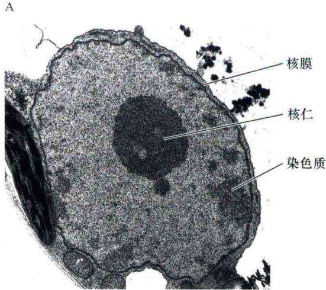

细胞核是染色体（chromosome）储存和复制的场所，染色体由DNA及其互作蛋白组成（图1.7）。这种DNA蛋白质复合体统称为染色质（chromatin）。任何植物基因组的所有DNA的线性长度通常是它所在核直径的几百万倍。为了解决染色体DNA在核内组装的问题，线性双螺旋DNA在8个组蛋白（histone）分子组成的圆柱上绕了两圈，形成核小体（nucleosome）。核小体像珠子一样位于染色体长线上。

在有丝分裂中，染色质首先通过紧密地盘绕浓缩成直径30 nm的染色质纤维（30 nm chromatin fiber），其中每两圈有6个核小体，然后经过蛋白质和核酸的相互作用继续折叠和压缩（图1.7）。在细胞分裂的间期，根据浓缩的程度，可以观察到两种染色质：异染色质和常染色质。大约10%的DNA组成了异染色质（heterochromatin），这是一种高度紧密和无转录活性的染色质。多数异染色质集中在靠近核膜的地方，并和基本上不含基因的染色体区域相连，如端粒和着丝点。其余的DNA组成了常染色质（euchromatin），分散在染色体上，是具有转录活性的形式。只有10%的常染色质在任何时期都有转录活性。余下的处于半浓缩状态，介于异染色质和具有转录活性的常染色质之间。位于核

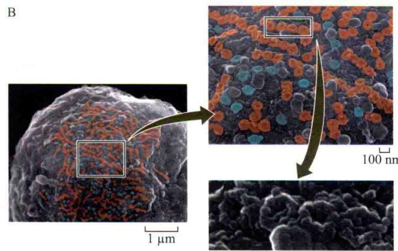  
图1.6 A. 植物细胞的透射电镜图，显示细胞核和核膜。B. 烟草细胞核表面核孔复合体（NPC）的组织结构。褐色所示为NPC间相接触的部分；剩余部分用蓝色所示。第一幅图（右上方）显示大多数NPC紧密相连，形成包含5\~30个NPC的一列NPC结构。第二幅图（右下方）所示为紧密相连的NPC（A由R.Evert惠赠；B引自Fiserova et al., 2009）。

质的特定区域可能会对染色体的调控产生影响。  
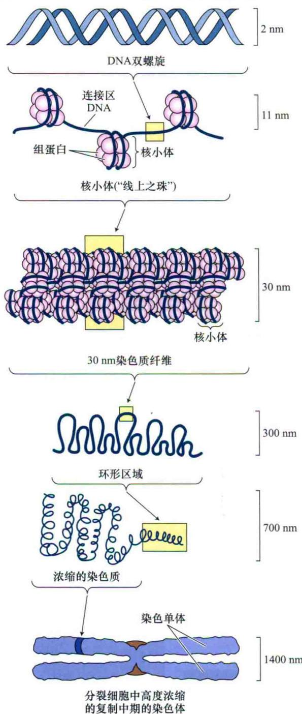  
图1.7 分裂中期染色体的DNA压缩。DNA首先堆积成核小体，随后缠绕成30 nm的染色质纤维。继续缠绕形成浓缩的中期染色体（改编自Alberts et al., 2002）。

在细胞分裂周期中，染色质经历了动态的结构变化。除了转录需要的短暂位置变化，通过添加或去除组蛋白的功能基团，异染色质区可以转换为常染色质区，反之亦然。这些基因组的整体变化，能引起稳定的基因表达的变化（见第2章）。一般来说，不通过改变DNA的序列而导致的基因表达的稳定变化称为表观遗传调控

(epigenetic regulation)。

细胞核同样含有高密度的颗粒区域，称为核仁（nucleolus，复数nucleoli），这是核糖体合成的区域（图1.6A）。典型细胞的每个核含有一个或多个核仁。核仁包含了一条或多条染色体的部分，其中核糖体RNA基因成簇而形成一个称为核仁组织区（nucleolar organizer region）的结构。核仁将核糖体蛋白和rRNA组装成大、小两个亚基，分别从核孔中运输出来。这两个亚基在胞质中完成完整核糖体的组装（图1.8A）。组装好的核糖体是合成蛋白质的机器。那些从核和胞质产生，负责“真核”蛋白质合成的80S核糖体要比在线粒体和质体中组装和保留的“原核”蛋白质合成场所——70S核糖体大。

## 1.4.2 基因表达包括了转录和翻译

蛋白质合成的复杂过程始于转录（transcription），它是合成一条碱基序列与特定基因互补的RNA长链的过程。初始的RNA转录形成了信使RNA（mRNA），它通过核孔从细胞核移动到细胞质。在细胞质中，mRNA首先依附在核糖体的小亚基上，随后附着在大亚基上起始翻译（图1.8A）。

翻译（translation）是一个根据mRNA编码的序列信息，将氨基酸合成特定蛋白质的过程。一连串的核糖体经过mRNA的全部序列，它是按照mRNA的碱基序列合成肽链的场所（图1.8B）。在细胞质和膜结合的多聚核糖体中进行的翻译过程产生了蛋白质的一级序列，其中不仅包括蛋白质功能信息，也包括像“入场券”一样的序列信息决定着蛋白质在细胞中的最终定位（参见Web Topic 1.8）。

## 1.4.3 内质网构成了细胞内膜网络

内质网是由小管相互连接形成的多边形网络和称为潴泡（cisternae，单数cisterna）的平面囊所组成的（图1.9A）。大部分内质网位于称为细胞周质（cell cortex）的细胞质外层，但是内质网也可以通过形成穿越液泡的穿液泡膜管（transvacuolar strands）以含细胞质的膜管束的形式穿过细胞。这些管状网络通过连接到多边形网络的一些交叉点上而与质膜相连（图1.9B）。管状和潴泡形式的内质网可以快速地相互转变。而这种转变则是由网格蛋白（reticulon）所控制的，它能使膜片层形成小管。以后章节中会讲到的肌动（球）蛋白细胞骨架能够促进内质网小管的重排（Sparkers et al., 2009）。

表面有很多膜结合核糖体的内质网称为糙面内质网（rough ER，RER），这些核糖体的结合使得内质网图1.8 A. 基因表达的基本步骤，包括转录、转录后处理、运输到胞质和翻译。①、②蛋白质可通过自由的或结合在内质网上的核糖体合成。③分泌蛋白在糙面内质网上合成，并含有一个疏水的信号序列。一个信号识别颗粒（SRP）与信号肽和核糖体结合，阻断翻译。④SRP受体和称为易位子的蛋白质运输通道相连，核糖体-SRP形成的复合体与ER膜上的SRP受体结合，核糖体停靠在易位子上。⑤易位子孔打开，SRP被释放出来，延长的多肽进入内质网内腔。⑥翻译重新开始。一旦进入ER的内腔，信号序列就被膜上的信号肽酶切掉。⑦、⑧在添加碳水化合物和链折叠以后，新合成的多肽通过小泡被运到高尔基体。B. 在tRNA的帮助下，氨基酸在核糖体上聚合，形成延长的多肽链。

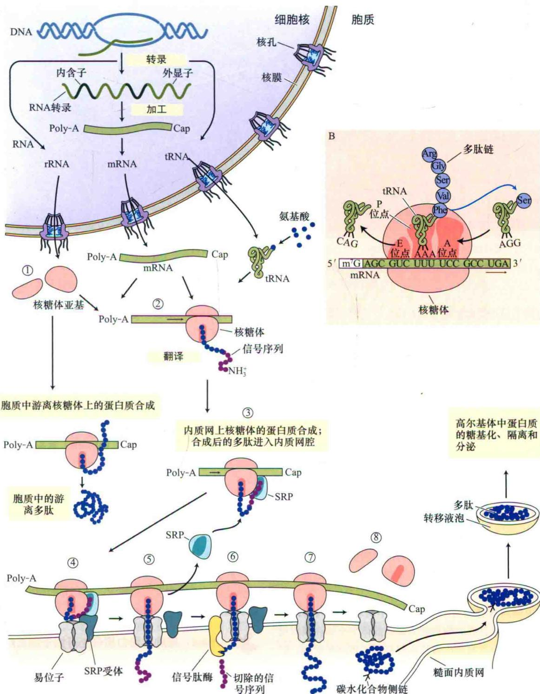

  
图1.9 烟草悬浮细胞中内质网的三维结构。A. 自外向内观察细胞（上部），内质网的周质网络是由潴泡区和多边形的管状区构成。自内向外观察细胞（下部），能看到穿液泡膜管含有管状内质网及核膜（内质网的子区域）。在细胞核的核膜上有穿核通道和内陷区域。B. 示ER管和潴泡在典型的周质内质网多边形网络中的排列（由 L. R. Griffing 惠赠）。

在电镜下显得更加粗糙（图1.10）。反之，没有结合核糖体的是滑面内质网（smooth ER，SER）。滑面内质网和糙面内质网的差异有时是与内质网形态的变化相关的：糙面内质网为扁平囊状的潴泡，而滑面内质网为管状。但是这些典型的差别往往只适应于某一类特定的细胞：如产生花蜜的花卉腺细胞，含有更多的滑面内质网。一般来说，核糖体结合位置在两种类型的内质网上都是相对均匀的。

内质网为其他内膜系统，如核膜、高尔基体、质膜和内体系统，提供膜构件和蛋白质。它甚至会为叶绿体运输一些蛋白质（Nanjo et al., 2006；Villarejo et al., 2005）。用于构建整个内膜系统的膜磷脂主要来源于内质网。并且内质网可以与叶绿体进行脂类交换（Xu et al., 2008）。由内质网所进行的磷脂的生物合成称为真核途径，由叶绿体所进行的磷脂合成则称为原核途径（见第11章）。

内质网具有固有的膜双层的不对称性。内质网上负责起始磷脂合成的酶将新的磷脂前体完全加在膜双层的胞质层。而参与合成磷脂头部基团（包括丝氨酸、胆碱、甘油和肌醇）的酶也分布在胞质层上。这种分布造成了内膜固有的脂不对称性的特征。在由磷脂双层膜构成的细胞器中，靠近胞质一侧与靠近内腔一侧的膜层的构成是不同的。靠近内腔的膜层最终会变成细胞质膜的外层。进一步对脂头部基团不对称修饰，以及将脂类和碳水化合物共价连接到蛋白质上进行转录后修饰加剧了膜的不对称性（图1.5）。

在动物细胞中，膜的不对称性能被翻转酶（flip-pase）所抵消，这种酶可以将新合成的磷脂跨过脂双层分子而翻转到内层去。近些年，研究者也在植物中发现了翻转酶（Sahu and Gummadi，2008）。当内质网与其他的细胞器，如质膜、叶绿体和线粒体紧密地相互关联时，它可以通过特殊区域与这些细胞器进行脂类交换（Larsson et al., 2007）。

内质网和质体能够直接通过脂类和蛋白质合成来添加新的膜。但是，对于其他细胞器来说，增加膜结构主要是通过与其他膜的融合（fusion）来实现的。由于膜是流动性的，新的膜组分会被转移到已有的膜上，随后通过分裂（fission）从已有的膜结构上分离出来。膜融合和分离的循环是这些直接或间接来源于内质网的内膜细胞器生长和分裂的基础。这些细胞器包括：高尔基体、液泡、油体、过氧化物酶体和质膜。这一循环过程主要由运输小泡或小管负责。

作为内膜系统各区室之间运输体的囊泡和小管的选择性融合和分裂主要依赖于一类特异的靶向识别蛋白SNARES和Rabs（参见Web Topic 1.9）。

## 1.4.4 细胞的蛋白质分泌开始于糙面内质网

细胞中的分泌蛋白所采用的分泌途径是：经过内质网和高尔基体直至质膜和胞外。分泌蛋白的合成是在翻译的过程中穿过膜进而被插入内质网内腔的。这一过程涉及核糖体，编码分泌蛋白的mRNA，以及位于糙面内质网表面的核糖体和已被部分合成的蛋白质的特异受体（图1.8）。所有的分泌蛋白和分泌途径中大部分的膜整合蛋白都有一个位于氨基端的含有18\~30个氨基酸的疏水前导序列，称为信号肽（signal peptide）（参见Web Topic 1.8）。在翻译过程中，由RNA和蛋白质组成的信号识别颗粒（signal recognition particle，SRP）能够同时结合在蛋白质的信号肽和核糖体上来中断翻译过程。内质网膜含有SRP受体（SRP receptor），该受体能和称为易位子（translocon）的蛋白质通道相连（图1.8）。

A 糙面内质网(表面观察)
多聚核糖体  

  
核糖体

C 滑面内质网  

B 糙面内质网(横切)  
  
图1.10 内质网。A. 毛鞘藻（Bulbochaete）中糙面内质网的显微俯视图。糙面内质网上的多聚核糖体（核糖体串附在mRNA上）清晰可见。多聚核糖体也会出现在核膜的外表面上（75 000×）。B. 彩叶草（Coleus blumei）的腺状毛状体中规则排列的ER堆（白色箭头）。质膜由黑色箭头表示，质膜外的物质是细胞壁（75 000×）。C. 滑面内质网经常形成管状网络，图中所示是一个Primula kewensis的幼嫩花瓣的透视电镜图（45 000×）（显微图片引自Gunning and Steer，1996）。

胞质中的核糖体——SRP复合体和ER膜上的SRP受体结合，核糖体停靠在易位子上。这种停靠使易位子孔打开，SRP被释放，翻译重新开始，延长的多肽进入ER的内腔。一旦进入ER的内腔，信号序列就被膜上的信号肽酶切掉（图1.8）。对于膜整合蛋白来说，只有一部分的多肽链能够穿过膜。整个蛋白则通过一个或多个疏水跨膜区锚定在膜上。

许多位于内膜系统腔内的蛋白质为糖蛋白（glycoprotein），这些蛋白质通过共价键与小的糖链相连，它们最终被细胞分泌出去或运输到其他的内膜中。

大量事实表明，由N-甲壳胺、甘露糖和葡萄糖组成的带有分支的寡糖和内质网分泌蛋白的一个或多个天冬酰胺残基的自由氨基结合。这种N-连接糖原（N-linkedglycan）首先聚集在一个嵌在内质网膜上的脂类分子——长醇二磷酸（dolichol diphosphate）上（见第13章）。随着新合成的多肽进入内质网内腔，已加工完成的14糖结合到新生多肽上。像在动物细胞中，这种所谓的N-连接糖蛋白（N-linked glycoprotein）通过囊泡或小管运到高尔基体（见第2章）。但是，在高尔基体中，这种多糖要以植物特异的方式进行进一步的加工。使得糖蛋白在脊椎动物的免疫系统中具有高度的抗原特性（能够被识别为外来蛋白）。

## 1.4.5 高尔基体负责加工用于分泌的蛋白质和多糖

高尔基体（在植物中也称为分散型高尔基体）是一个极化的囊堆，较为肥大的潴泡产生于顺面（cis）或者说高尔基体的形成面，以接受来自内质网的囊泡和小管（图1.11）。而高尔基体的反面（trans）（成熟面）则由扁平的潴泡和称为反面高尔基体网络（trans-Golgi-network，TGN）的管状网络构成。TGN和反面潴泡上会出芽产生分泌囊泡。在分生细胞中，高尔基体（Golgi apparatus，包含所有的高尔基小体）中含有高达100个高尔基小体（Golgi body）。其他类型的细胞中高尔基小体含量各不相同，但一般来说都少于100个。高尔基小体能通过分裂使得细胞在生产和分化时期调控自身的分泌能力（Langhans et al., 2007）。

  
图1.11 烟草（Nicotiana tabacum）根冠细胞的高尔基体电镜图片。图中标出了顺面（cis）、中间（medial）和反面（trans）潴泡。反面高尔基体网络和反面潴泡相连（60 000×）（引自Gunning and Steer，1996）。

对于一个高尔基体来说，不同的潴泡中含有不同的酶，以及根据它们所加工的多聚体的类型（用于细胞壁的多糖或是用于液泡和细胞壁的糖蛋白）而具有不同的生化功能。例如，当N-连接糖蛋白通过顺面潴泡和反面潴泡时，它们分别被位于高尔基体3个部分的特定的酶修饰。某些糖，如甘露糖，从寡糖链上被移除，同时其他的糖又加到寡糖链上。除了这些修饰，脯氨酸、丝氨酸、苏氨酸和酪氨酸残基的羟基上的糖基化 $[O-$ 连接寡糖（O-linked oligosaccharide）]也发生在高尔基体中。高尔基体中参与多糖生物合成的酶各不相同，但是它们总是与糖蛋白修饰酶一起出现。

来源于内质网的膜及其内含物被运输到高尔基体中常常发生在特殊的ER退出位点（ER exit site，ERE）。而ERE则是由一种称为COPⅡ的包被蛋白（coat protein）的存在决定的。这种表面蛋白包被与跨膜受体（结合有将要被运送到高尔基体的特异底物）相关。相关的膜区域然后以出芽的方式形成包被囊泡，并最终在与目的地的靶膜融合前丢弃COPⅡ包被蛋白。同时使用ERE和高尔基体的荧光标签可以看到ERE随着高尔基体移动，就像高尔基体流穿过细胞（参见Web Topic 1.10）。囊泡从ER开始经过高尔基体的顺面、反面，接着运输到质膜或液泡前体，这种移动方式称为顺向（anterograde）（正向）移动。相反，从高尔基体到内质网，或者从高尔基体的反面到顺面的囊泡再循环（recycling）称为逆向（retrograde）（反向）运动。COPⅠ包被囊泡参与这种在高尔基体内部或者从高尔基体到内质网的逆向运动。如果没有膜的再循环逆向运动，高尔基体将很快因为顺向运动而被消耗殆尽。

## 1.4.6 质膜上的特殊区域参与膜的再循环

由来自质膜上的小囊泡的逆向运动引起的膜的内化称为内吞（endocytosis）。小囊泡（100 nm）最初形成时被网格蛋白（clathrin）所包裹（图1.12B），之后它们很快离开这些包被，并再与其他的小管和囊泡相融合（图1.12A和图1.13A）。内吞途径中的细胞器称为内体（endosome）。当分泌的囊泡与质膜相融合，膜表面积必然会增大。那么，除非细胞也以同样的速度扩张，否则它需要通过一些膜再循环的途径使得膜表面积与细胞大小保持平衡。在分泌旺盛的细胞中，如根冠细胞，膜再循环的重要性得到了最好的诠释（图1.13）。根冠细胞分泌大量的黏多糖（黏液）作为润滑剂使根能顺利在泥土中生长。如果没有内吞作用使质膜不断通过再循环进入早期内体（early endosome），含有黏多糖的大囊泡将与质膜融合造成膜表面积的过度增加。这些内体要么回到反面高尔基体被分泌，要么进入液泡前体（prevacuolar compartment）中被水解。

内吞或内吞再循环在各类植物细胞中都会发生。对发生在质膜上的内吞的控制能够差异化地调控离子通道的数量（见第6章），如气孔保卫细胞中的钾离子通道和根中的硼转运体。在植物的向地性作用中，特定的生长素转运体的内化能导致根中生长素含量的改变，从而引起根的弯曲（见第19章）。

## 1.4.7 植物细胞的液泡具有多种功能

对于植物液泡的最初界定是源于其在显微镜下所表现的外观——由膜包围的一个不含胞质的闭合区室。与细胞质不同，在液泡内充斥着由水和溶解物组成的液泡液（vacuolar sap）。在细胞生长过程中，液泡液体积的增长先于细胞体积的增加而发生。一个成熟细胞的中央大液泡能够占95%的细胞体积。有时一个细胞中还会出现两个或多个大液泡，就像在某些花瓣中会同时含有有色素液泡和无色素液泡（参见Web Topic 1.9）。这些液泡在尺寸和外观上的不同也暗示了它们在形式和功能上的差异。其中一些差异是由于液泡的成熟度不同。例如，分生细胞只有许多小液泡而没有中央大液泡。而当细胞成熟时，这些小液泡会融合成中央大液泡。

含有蛋白质和脂类的液泡膜（tonoplast）最初合成于内质网。除了在细胞增大中的作用外，液泡还可以作为一个储存容器来储存植物用于抵御草食动物的次生代谢物（见第13章）。由于有了各种各样的膜转运体，无机离子、糖、有机酸和色素这些溶解物能够在液泡中富

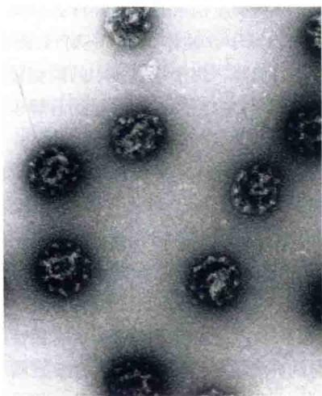  
图1.12 三种衣被蛋白调节蛋白质分泌和内吞通路的小泡运输。A. COPⅡ用绿色标记，COPⅠ用蓝色标记，网格蛋白用红色标记。B. 从豆叶中分离的网格蛋白包被小泡电子显微镜照片（102 000×）（B由D.G.Robinson惠赠）。

① COPⅡ包被小泡从ER上萌发，并转运到高尔基体的顺面

② 潞泡带着它们的内含物顺向经过高尔基体垛堆

③ COP I 包被小泡的逆向运动保证了酶在顺面、中间和反面潴泡堆的正确分布

④ 未包被的小囊泡从反面高尔基膜萌发，并与质膜融合

⑤ 内吞的网格蛋白包被小泡与前液泡区室融合

⑥未包被的小泡从前液泡区室脱离，并将内含物带到溶酶小泡

⑦最终到达溶酶小泡的蛋白质通过网格蛋白包被小泡，从反面高尔基体分泌到液泡前体（PVC），然后被重新包装运送到溶酶小泡

⑧ 内吞作用形成的网格蛋白包被小泡也可以脱离包被和通过早期循环小体进行再循环。通过早期循环小体直接与质膜融合或与反面高尔基体直接融合形成囊泡

A  

B  
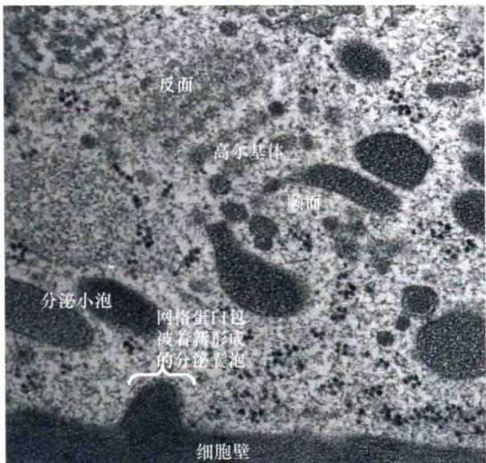  
图1.13 网格蛋白包被小泡的内陷与玉米根冠黏液的分泌有着紧密的关系。A. 质膜最新的分泌位点上网格蛋白包被囊泡所介导的膜的循环。B. 最新的分泌位点上出现的一个分泌型囊泡，分泌型囊泡将其内溶物储存在细胞壁和网格蛋白包被的细胞膜内陷中，后者则帮助细胞膜在分泌位点上完成膜的循环。在分泌位点上的网格蛋白包被的内陷是膜上平均内陷水平的20倍（Mollenhauer et al., 1991；B由H. H. Mollenhauer和L. R. Griffing惠赠）。

集（见第6章）。用于储存蛋白质的液泡称为蛋白质体（protein body），它们在种子中大量存在。

液泡也可类似于动物中的溶酶体，在蛋白质代谢中发挥作用。就像在衰老叶片中积累的水解性液泡（lytic vacuoles），它能在细胞衰老过程中释放降解细胞结构物的水解酶。膜经过分选进入液泡和动物溶酶体具有不同的发生机制。虽然在这两种情况下，它们被分选进入液泡前体这一过程都发生在高尔基体中，但是识别过程中涉及的分选受体和加工蛋白是不同的。在哺乳动物细胞内，内质网中的酶能够识别并将甘露糖-6-磷酸加到许多溶酶体蛋白上，这些蛋白质进而能被高尔基体中的分选受体所识别。这一途径并不存在于植物中。另外，一些植物水解性液泡完全避开高尔基体直接起始于内质网，这是一种动物细胞中缺失的途径。

从高尔基体到液泡的囊泡运输是间接的。如上所述，细胞中存在多个液泡区室，并不是所有都能作为高尔基体囊泡的目标。这些接受来源于高尔基体囊泡的液泡需要经历一个中间的液泡前体（prevacuolar compartment，PVC）阶段。PVC作为分选细胞器也在质膜的内吞中发挥作用。在一些情况下，PVC，包括多泡体（multivesicular body，MVB）也作为后液泡区室（postvacuolar compartment）作用于液泡及其膜的降解（Otegui et al., 2006）。

## 1.5 来源于内膜系统的独立分裂的细胞器

对于一些细胞器来说，尽管它们来源于内膜系统，但是能够独立地生长和增殖。其中包括油体、过氧化物酶体和乙醛酸循环体。

## 1.5.1 油体是脂类储存的细胞器

很多植物在种子发育时期需要合成和储藏大量的油类物质。这些负责油类物质积累的细胞器称为油体（oil body）。在所有细胞器中，油体是唯一一个来源于ER的磷脂“单层膜”细胞器。位于单层膜中的磷脂极性头朝向液态的胞质，而对着内腔的脂肪酸尾则溶解于储藏在其中的油类物质中。

油体最初的形成是作为ER中一个分化的区域。其中的储存物质甘油三酯（triglyceride）（3个脂肪酸共价地连接在一个丙三醇骨架上）的特性显示了这个细胞器拥有一个疏水的内腔。一个合乎逻辑的推论是，甘油三酯似乎最初是被储存于ER双层膜之间的疏水区域（图1.14）。甘油三酯并不含有像膜磷脂那样富有极性的头部基团，因此它们并不直接暴露在亲水的细胞质中。尽管出芽产生油体这一过程的机制并不清楚，但是，已经明确的是，当从ER分离出来时油体被一个含有油体蛋白（oleosin）的磷脂单层膜包裹着。油体蛋白合成于胞质的多核糖体，并在翻译后被插入油体的磷脂单层膜中。这类蛋白质含有一个类发夹结构的中央疏水区域，这个区域能被插入富含油类物质的油体内腔，而两个亲水的末端则留在油体外部（Alexander et al., 2002）。当种子萌发时，油体开始分解并与那些富含脂类氧化酶的细胞器，如乙醛酸循环体有着紧密的联系。

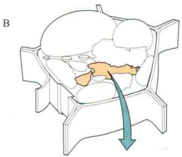

  
图1.14 A. 过氧化物酶体旁一个油体的电镜照片。B. 模式图表明在ER的磷脂双分子层中合成和堆积的油类形成油体的过程。从ER脱离后，油体由含有油体蛋白的磷脂单分子层包围（A改编自Huang，1987；B引自Buchanan et al., 2000）。

## 1.5.2 微体在植物叶片和种子中发挥着特殊的代谢作用

微体（microbody）是一类由单层膜包裹的球型细胞器，它具有一种特定的代谢功能。过氧化物酶体（peroxisome）和乙醛酸循环体（glyoxysome）是特异地负责脂肪酸的β-氧化（β-oxidation）及乙醛酸（glyoxylate）代谢的微体（见第11章）。微体不含DNA，并且与其他的细胞器紧密地联系，共享一些中间代谢产物。乙醛酸循环体与线粒体和油体相关，而过氧化物酶体则与线粒体和叶绿体相关。

最初，人们认为过氧化物酶体和乙醛酸循环体都是直接产生于ER的独立型细胞器。但是，利用细胞器的特异抗体进行检测，证明至少转绿的子叶中过氧化物酶体是由乙醛酸循环体直接发育而来。例如，在黄瓜幼苗中，还未变成绿色的子叶细胞最初含有乙醛酸循环体，过氧化物酶体则是在转绿之后才出现。在转绿过程中，微体可以对两者的标记物都作出反应，说明乙醛酸循环体正在向过氧化物酶体转化（Titus and Becker, 1985）。

在过氧化物酶体中，光呼吸作用的一个二碳氧化产物——羟乙酸盐会被继续氧化形成酸性乙醛酸。这种转变伴随着过氧化氢的形成，它的形成会氧化和破坏其他化合物。但是，过氧化物酶体中含量最多的蛋白质却是过氧化氢酶（catalase），这种酶能将过氧化氢分解成水。它在过氧化物酶体中的大量存在并形成以晶体结构排列的蛋白晶体（图1.15）。

乙醛酸循环体能够转变为过氧化物酶体这一现象虽然能够解释后者在子叶的发育中出现这一现象，但却并不能说明其究竟在其他的组织中是如何产生的。如果它们是在细胞分裂过程中得以遗传下来的，那么过氧化物酶体则独立于其他的细胞器，利用类似于参与线粒体分裂的那些蛋白质来进行生长和分裂（Zhang and Hu, 2008）。大部分的蛋白质在胞质转录后进入过氧化物酶体都需要特异的靶序列，这个靶序列是由位于蛋白质羧基端的丝氨酸-赖氨酸-丝氨酸排列组成（参见Web Topic 1.8）。

## 1.6 能独立分裂的半自主型细胞器

一个典型的植物细胞具有两种类型的产能细胞器，即叶绿体和线粒体。它们都由双层膜（内膜和外膜）与胞质隔离，并含有自己的DNA和核糖体。

线粒体（mitochondria，单数mitochondrion）是细胞内呼吸作用的场所。呼吸就是用糖代谢中释放的能量将ADP（腺苷二磷酸）和无机磷酸（ $P_{i}$ ）合成ATP（腺苷三磷酸）的过程（见第11章）。

线粒体是一种不断进行分裂和融合的高度动态结构。线粒体融合能产生长的管状结构，它能分支并形成线粒体网络。若不考虑形状，所有的线粒体都具有一个光滑的外膜和一个高度折叠的内膜（图1.16）。内膜上含有ATP合酶（ATP synthase）质子泵，能够利用质子梯度为细胞合成ATP。质子梯度（proton gradient）的形成是通过包埋于内膜或位于内膜外周的被称为电子传递链（electron transport chain）的电子运输载体的协同作用而完成的。

  
图1.15 成熟叶片中一个过氧化物酶体中的过氧化氢酶晶体。图中过氧化物酶体与两个叶绿体和一个线粒体紧密相连，这些细胞器与过氧化物酶体拥有共同的代谢物。

  
图1.16 A. 线粒体的示意图，有内膜上参与ATP合成的H $^{+}$ -ATP酶的位置。B. 一种百慕大草（Cynodondactylon）的叶细胞中的线粒体电镜图（26 000×）（显微图片引自S. E. Frederick，由E. H. Newcomb惠赠）。

内膜的向内褶皱称为嵴（cristae，单数crista）。被内膜包围的区室，称为线粒体基质（matrix），包含了称为Krebs循环的中间代谢途径所需的酶。

叶绿体（chloroplast）（图1.17A）属于另一种称为质体（plastid）的双膜包被的细胞器。叶绿体膜富含糖基甘油酯（参见Web Topic 1.5）。叶绿体膜含有叶绿素及其相关蛋白质，是光合作用的场所。除了内膜和外膜，叶绿体具有称为类囊体（thylakoid）的第三种膜系统。一堆类囊体构成一个基粒（granum，复数grana）（图1.17B）。光合作用中起光化学反应作用的蛋白质和色素（叶绿素和类胡萝卜素）嵌在类囊体膜中。环绕类囊体的液态部分，称为基质（stroma），它和线粒体的基质很相似。相邻的基粒通过被称为基质片层（stoma lamellae，单数lamella）的非堆积膜连接起来。

光合作用所需的不同成分位于基粒和基质片层的不同区域。叶绿体的ATP合酶位于类囊体膜上（图1.17C）。在光合作用中，光驱动的电子传递反应建立了一个跨类囊体膜的质子梯度（图1.17D）。和线粒体中一样，ATP合酶在消除质子梯度的同时合成ATP。但是，叶绿体并不将自身合成的ATP运输到胞质中，而是利用其来进行许多基质的反应，包括固定大气中二氧化碳的碳元素（见第8章）。

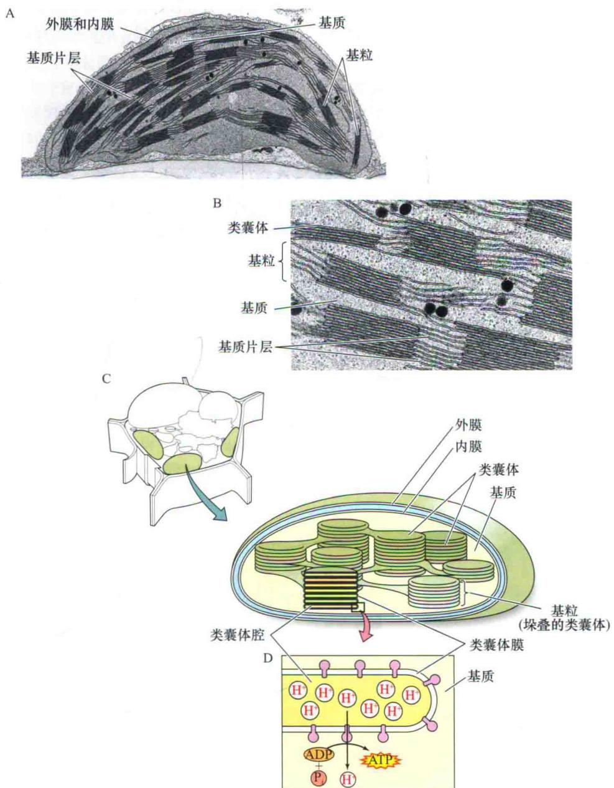  
图1.17 A. 梯牧草（Phleum pretense）叶子中叶绿体的电镜照片（180 000×）。B. 同一个叶绿体的更高倍数电镜照片（520 000×）。C. 一个基粒垛堆和基质片层的三维视图，表明该组织的复杂性。D. 叶绿体的模式图，表明H-ATP酶在类囊体膜上的位置（显微图片引自W.P.Wergin，由E.H.Newcomb惠赠）。

包含高浓度类胡萝卜素而非叶绿素的质体称为有色体（chromoplast）。它们是很多水果、花及秋叶呈黄色、橙色或红色的原因之一（图1.18）。

非色素质体称为白色体（leucoplast）。最重要的白色体是淀粉体（amyloplast），它是一种淀粉储藏质体。茎秆和根的储藏组织及种子中富含淀粉体。根冠中特化的淀粉体也可作为重力感受器，指导根在土壤中的向地性生长（见第19章）。

## 1.6.1 原质体在不同的植物组织能转化为特定的质体

分生组织细胞含有原质体（proplastid），它们很少或完全没有内膜，没有叶绿素，并且光合作用所需的酶也不完全（图1.19A）。在被子植物和一些裸子植物中，光诱导原质体转变为叶绿体。在光照下，酶在原质体中合成，或者从胞质中运入，产生光吸收色素，膜快速产生，从而形成基质片层和基粒垛堆（图1.19B）。

种子一般在没有光的土壤中萌发，而叶绿体只在幼芽受光照的时候形成。如果种子在暗中萌发，原质体分化为黄化质体（etioplast），黄化质体含有膜的半晶体管状序列，称为原片层体（prolamellar body）（图1.19C）。黄化质体不含叶绿素，而是含有淡黄绿色的前体色素，称为原叶绿素。

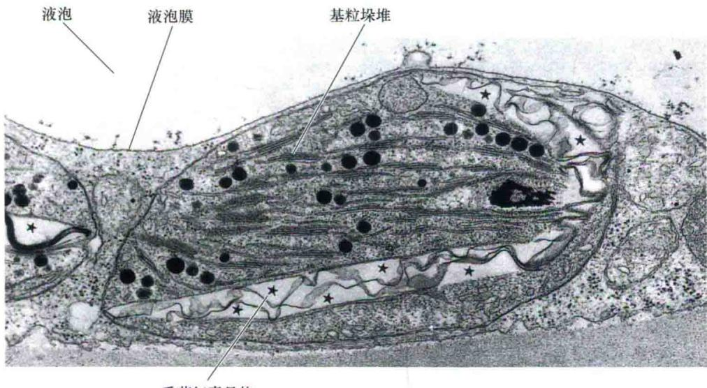  
番茄红素晶体  
图1.18 番茄果实成熟早期阶段叶绿体转变为有色体时的叶绿体电镜图片。小的垛叠基粒仍然可见，星号表示类胡萝卜素成分的番茄红素晶体（27000×）（引自Gunning and Steer，1996）。

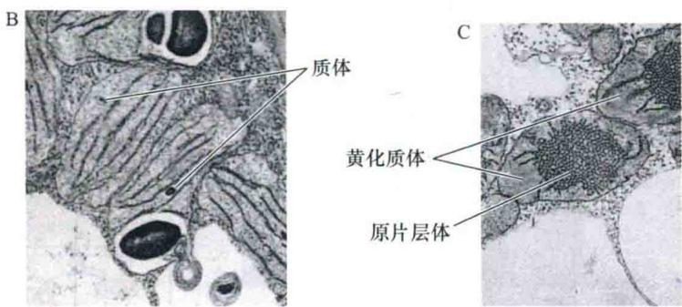  
图1.19 质体发育阶段的电镜照片。A. 蚕豆（Vicia faba）根的顶端分生组织中原质体的高倍电镜照片。内膜系统为主，基粒还未形成（47 000×）。B. 光下生长的燕麦（Avena sativa）幼叶分化初期的叶肉细胞。质体发育成基粒垛堆。C. 黑暗中生长的燕麦苗幼叶中的细胞。质体发育为黄化质体，以及称为原片层体的复杂半晶体结构的膜管。光照下，黄化质体通过原片层体的解体和基粒的形成，转变为叶绿体（7200×）（引自Gunning and Steer，1996）。

光照几分钟内，黄化质体分化，原片层体转为类囊体和基质片层，原叶绿体素变为叶绿素（关于叶绿素合成的讨论参见Web Topic 7.11）。要维持叶绿体的结构需要光的存在，并且成熟的叶绿体在长期黑暗下可以变为黄化质体。同样的，在不同的环境条件下，正如在秋叶和成熟的果实中，叶绿体能转变为有色体（图1.18）。

## 1.6.2 叶绿体和线粒体的分裂不依赖于核分裂

如前所述，质体和线粒体的分裂源于裂殖的过程，这点也符合它们的原核起源。细胞器DNA复制和分裂的调控独立于核的分裂而进行。例如，每个细胞内的叶绿体的数量依赖于细胞发育的过程和它所处的环境。因此，叶片内侧的叶肉细胞含有比外侧更多的叶绿体。

尽管叶绿体和线粒体的分裂并不受细胞分裂的时间所决定，但它们的分裂过程仍需要细胞核编码的蛋白质的参与。细菌和半自主型细胞器中，在膜内部即将产生分裂板的位置，蛋白质形成环状促进分裂过程的进行。在植物细胞中，这些促进分裂的蛋白质是由核基因编码。线粒体和叶绿体也可选择增大体积而不进行分裂的策略来满足能量和光合作用的需要。例如，如果参与线粒体分裂的蛋白质失活，那么这些少数现有的线粒体的尺寸会增大以应对能量的需求。

线粒体和叶绿体的内外层膜都会出现突出的现象。在叶绿体中，这些突出称为小管（stromule），它们富含基质，不是类囊体（参见Web Essay 7.1）。在线粒体中，它们称为matrixule。matrixule和stromule可能会帮助质体间进行物质交流。

质体和叶绿体都能在植物细胞中环绕运动。在一些植物细胞中，一部分叶绿体锚定在外侧的细胞周质中，而另一部分则是可移动的。与高尔基体和过氧化物酶体的运动相类似的是，植物肌球蛋白也会为线粒体提供动力使其沿着微丝骨架运动。微丝处于细胞骨架网络之中，将会在章节1.7中进行讨论。

## 1.7 细胞骨架

细胞骨架（cytoskeleton）的丝状蛋白网络保持了细胞质的结构。这个网络保证了细胞器的空间分布，并为细胞器和其他细胞骨架成分的运动起到脚手架的作用。它也在有丝分裂、减数分裂、胞质分裂、细胞壁积累、细胞形状的维持和细胞分化中起重要作用。

## 1.7.1 植物细胞骨架包含微管和微丝

植物中的细胞骨架有两种主要类型：微管和微丝。每种类型都是丝状的，它们的直径固定但长度可变，可以达到许多微米。微管和微丝是由球状蛋白组成的大分子复合体。

微管（microtubule）是中空的圆柱体，外径25 nm。它们是微管蛋白（tubulin）的多聚体。组成微管的单体是由两个相似的多肽链[ $\alpha$ -微管蛋白和 $\beta$ -微管蛋白（ $\alpha$ -tubulin and $\beta$ -tubulin）]组成的异源二聚体（图1.20A）。单个微管中成百上千个微管蛋白单体排列成柱状体，称为原丝（protofilament）。

微丝（microfilament）是实心的，直径约7 nm。由肌肉中发现的一种特殊形式的蛋白质——球状肌动蛋白或G-肌动蛋白（G-actin）组成。由G-肌动蛋白单体多聚化而形成肌动蛋白亚基单链也称为原丝。以多聚化原丝形态存在的肌动蛋白称为丝状肌动蛋白（F-actin）。每个微丝由两条肌动蛋白原丝互相缠绕而成（图1.20B）。

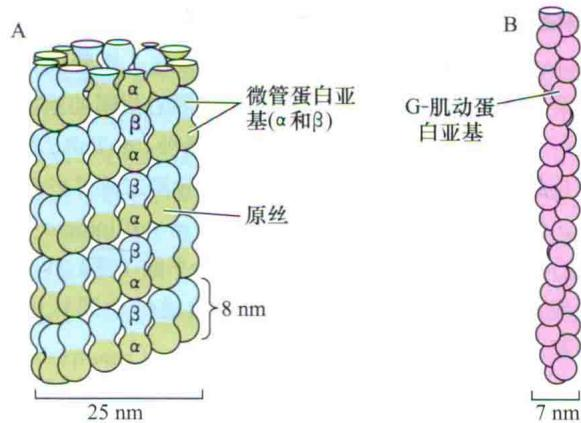  
图1.20 A. 微管的纵向模式图。每个微管由13个原丝组成。 $\alpha$ 亚基和 $\beta$ 亚基的结构如图所示。B. 微丝的模式图，表明G-肌动蛋白亚基的两条链。

## 1.7.2 微管和微丝能组装和解体

在细胞中，肌动蛋白和微管蛋白亚基作为自由蛋白存在，自由态的蛋白质亚基和多聚态的蛋白质保持动态平衡。每个单体结合一个核苷酸。肌动蛋白结合ATP，微管蛋白结合GTP（鸟苷三磷酸）。微管和微丝都有极性，也就是说，它们的两端是不同的。在微丝中，极性源于肌动蛋白本身的极性。在微管中则是源于 $\alpha$ -微管蛋白和 $\beta$ -微管蛋白二聚体的极性。两端的生长速度不同表明了极性的存在。较活跃的一端称为正极（plus），而另一端称为负极（minus）。在微管中，$\alpha$ -微管蛋白位于负极， $\beta$ -微管蛋白位于正极。

微丝和微管有半衰期，一般以分钟记。它的长短是由微丝中一种称为肌动蛋白结合蛋白（actin-binding protein，ABP）的辅助蛋白决定的，而在微管中，则是由微管结合蛋白（microtubule-associated protein，MAP）决定的。一些ABP和MAP分别使微丝和微管更加稳定，并防止它们解聚。

肌动蛋白多聚化的进行不需要其他的辅助蛋白，直接将G-肌动蛋白添加到微丝的生长端（正极）。多聚化的肌动蛋白亚基之间是非共价连接的，而且它们的组装并不需要能量。但是，当单体并入原微丝后，其所结合的ATP水解成为ADP，这一过程所释放的能量储存在微丝中，使得它更易于解聚。肌动蛋白的各种结合蛋白在微丝生长调节中的功能将会在Web Topic 1.12中进行讨论。

微管的组装与微丝相似，包括成核期、延长期和稳定期。但是，体内的微管成核并不是通过其组成亚基的寡聚化，而是由一种含量较少的微管蛋白——γ-微管蛋白（γ-tubulin）形成的小的环状复合体所介导的。γ-微管蛋白形成的环状复合体（γ-tubulin ring complexe, γ-TuRC）位于微管组织中心（microtubule organizing center, MTOC），在这里微管被成核化。微管成核的主要位点处于分裂间期的细胞周质（靠近质膜的胞质外表层）、核膜周围及分裂细胞的纺锤极。γ-TuRC的功能是起始α-微管蛋白和β-微管蛋白异源二聚体的多聚化，使之形成一个短的纵向的原丝（protofilament）。随后，数个原丝边缘相连，形成一个平面（图1.21）。最终，GTP的水解使得这个平面卷成一个圆柱形的微管。

每个微管蛋白的异源二聚体结合2个GTP分子，1个与α-微管蛋白单体结合，另1个与β-微管蛋白单体结合。α-微管蛋白单体上的GTP与之紧紧相连，并且不能水解，而β-微管蛋白单体上的GTP可以轻易地与介质交换，并在亚基组装成微管后慢慢水解为GDP。β-微管蛋白单体上的GTP水解成GDP可以引起二聚体轻微的弯曲，并且若是没有被新加上的带有GTP的微管蛋白盖住，原微丝就会解体，导致“灾变性”的解聚。这种解聚的速度比聚合快得多（图1.21）。这种灾变性解聚可以被由于解聚所形成的局部微管蛋白浓度增加而得到解救，微管蛋白单体的增加及GTP的协助有利于聚合（图1.21）。因此，微管的不稳定性是动态的（dynamically unstable）。而且，灾变解聚的频率和程度可以作为动态不稳定性特征，它们被特异的微管结合蛋白所控制，这些MAP可以加强或减弱微管壁中微管蛋白异源二聚体之间的连接。

  
图1.21 微管聚合和解聚之间动态平衡模式图。对于并入微管以后的微管蛋白，其β亚基所结合的GTP的水解会改变该亚基自身的方向，导致单根原微丝的分离或向外卷曲，最终造成灾变性的解聚。这种解聚使得局部的微管蛋白浓度升高。GTP到GDP的转换能在微管的正极端产生片状-GTP帽来促进微管蛋白的聚合反应，以逆转微管的解聚。随着这些片状物的生长它们能够发生弯曲融合形成管状。

## 1.7.3 周质微管能沿着细胞进行踏车运动

一旦被多聚化，微管不再需要锚定在微管组织中心的γ-微管蛋白上。在非分裂细胞中（间期），细胞周质中的微管可以通过称为踏车现象（treadmilling）的过程沿着细胞周缘进行侧向迁移。在踏车运动中，微管蛋白异源二聚体能被添加到微管的正极，并以同样的速度从负极解聚掉。因此，看上去微管似乎是在胞质中“移动”，尽管实质上并未运动。

新合成的微管一般来说会以细胞轴的横切方向沿着细胞周质作踏车运动（Paradez et al., 2006）。周质微管的横切方向决定了细胞壁中新合成的微纤丝的方向（将在第15章中讨论）。而横向排列微纤丝的存在强化了细胞壁的横向的强度，因而促进了细胞壁沿着细胞的纵向生长。微管就是以这种方式在植物的极性调节方面发挥着重要的作用。

## 1.7.4 细胞骨架马达蛋白介导着胞质环流和细胞器运动

一般来说，胞质中细胞器的运动是分子马达作用的结果，决定它能否沿着细胞骨架“行走”。细胞骨架马达蛋白具有类似的结构。在它们的二聚化形式中，包含两个较大的球形“头部”，这两个头部其实是充当着马达蛋白的“足部”。而和其“头部”相连的“颈部”区域则更像马达蛋白的“腿”。马达蛋白的“尾部”长短各异，将其“头部”与装载“货物”的区域相连，像两只手一样抓着细胞器（图1.22）。马达蛋白的每一个“头部”都有ATP酶活性，ATP水解所释放的能量推动头部沿着细胞骨架单向前行。

不同的马达蛋白沿着细胞骨架的不同方向运动。肌球蛋白（myosin）沿着微丝向微丝的正极运动。植物肌球蛋白有肌球蛋白Ⅷ和肌球蛋白XI两个家族，每个家族都含有多个成员。沿着微管运动的马达蛋白家族称为驱动蛋白（kinesin）。该蛋白家族有61个成员，其中2/3朝着微管的正极移动，剩下的1/3朝负极运动。尽管驱动蛋白在细胞器沿着微管运动的过程中发挥功能，但同时它的装载结构域也结合染色质和其他微管，在有丝分裂过程中帮助组建纺锤体（参见Web Topic 1.13）。动力蛋白（dynein）是在动物和原生生物中存在的一种主要朝向微管负极运动的马达蛋白，但在植物中并不存在动力蛋白。

胞质环流（cytoplasmic streaming）是指细胞内物质和细胞器进行协调有序的运动。在绿藻Chara和Nitella的巨大细胞中，胞质环流以螺旋的方式从细胞的一边运动到另一边，其流动速度可以达75 $\mu$ m/s。胞质环流以不同的方式和速度发生在大多数植物细胞中，但有时它也能够改变自身的运动方式或作简短暂停以应对环境的改变（Hardham et al., 2008）。

传统意义上的“胞质环流”这一术语主要是描述那些能在低放大倍数下可见的胞质和细胞器的大规模流动。这种流动是由运动的细胞器对于胞质的黏性拖拽引起的。最近，胞质环流这一名词也用来描述与邻近细胞器作反向运动的细胞器运动。细胞器的单独运动并不是由胞质环流引起的。

胞质环流这一过程涉及大量的沿着物质运动方向排列的肌动蛋白微丝。运动所需的动力可能通过肌球蛋白和微丝的相互作用产生，这和动物肌肉收缩时滑动蛋白的互作机制相似（Shimmen and Yokota，2004）。流动过程中，肌球蛋白分别独立地驱动过氧化物酶体、线粒体、高尔基体及核膜和核周围的内质网，并将这些细胞器运输到细胞特定的区域（图1.22）。

不同的发育时期对胞质环流的调控可以一个例子来说明，在根表皮细胞形成根毛时，胞质环流促使细胞核向细胞顶端的生长方向迁移。相反，叶片中叶绿体通过易位的方式来增大或者减小其暴露于光下的程度则代表着环境对于胞质环流的调控（DeBlasio et al., 2005；见第9章）。

  
图1.22 肌球蛋白驱动的细胞器运动。在植物细胞中，大部分的细胞器运动依赖于肌球蛋白。肌球蛋白向肌动蛋白微丝的正极端运动。肌球蛋白是一个同源二聚体，分别有两个头部和两个尾部。红色所示的两个头部具有ATP酶和马达蛋白的活性，如可以改变与头部相邻的颈部的构象来产生所谓的“行走”——沿着微丝不断地移动。而尾部则通过运载区域与细胞器相连，但是并不清楚这些区域是否能与细胞器膜发生直接的相互作用。

## 1.8 细胞周期调控

细胞的分裂循环，或者细胞周期，是细胞复制自身和它的遗传物质核DNA的过程。细胞周期的4个阶段分别命名为 $G_{1}$ 期、S期、 $G_{2}$ 期和M期（图1.23）。新合成还未进行DNA复制的子细胞所处的时期称为 $G_{1}$ 期（ $G_{1}$ phase）。S期（S phase）主要进行DNA复制。DNA复制完毕但未进行有丝分裂的时期称为 $G_{2}$ 期（ $G_{2}$ phase）。总的来说， $G_{1}$ 期、S期和 $G_{2}$ 期都称为分裂间期（interphase），而M期为有丝分裂期（mitosis）。在含液泡的细胞中，液泡的增大贯穿整个分裂间期，而在分裂期时被细胞板一分为二。

## 1.8.1 细胞周期的每个阶段都有其特定的生化和细胞活动

在 $G_{1}$ 期，沿着染色质的复制原点上的预复制复合体进行组装，准备核DNA的复制。DNA在S期复制完成，在 $G_{2}$ 期准备有丝分裂。

在细胞进入有丝分裂时，细胞的整体结构发生变化。如果细胞中有一个中央大液泡，液泡必先被胞质中的穿液泡膜管一分为二。这个区域将会成为核分裂的发生区域（图1.23）。高尔基体和其他的细胞器也平均地一分为二。如前所述，内膜系统和细胞骨架也发生广泛重组。当细胞进入有丝分裂时期，染色体从位于细胞核内的分裂间期状态开始压缩形成中期的染色体（图1.24）。而后者通过一种称为黏结蛋白（cohesin）的特

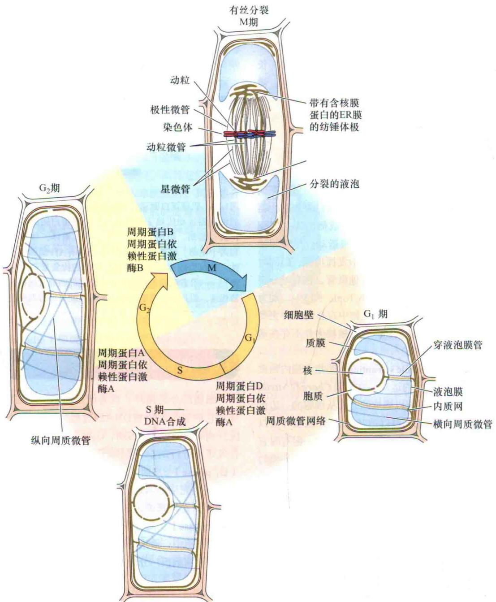  
图1.23 有液泡细胞的细胞周期。与液泡型细胞的伸长和分裂有关的细胞周期分为4个时期： $G_{1}$ 期、S期、 $G_{2}$ 期和M期。多种多样的细胞周期蛋白（Cyc）和周期蛋白依赖性蛋白激酶（Cdk）调控着时期之间的转换。Cyc D和Cdk A参与到 $G_{1}$ 期到S期的转变。Cyc A和Cdk A参与到S期到 $G_{2}$ 期的转变。Cyc B和Cdk B则调控 $G_{2}$ 期到M期的转变。这些激酶磷酸化细胞中的其他蛋白质，导致细胞骨架和膜系统的重组。但是，Cyc/Cdk复合体的寿命有限，常被自身的磷酸化状态所调控；复合体含量的降低常常意味着其所调控时期的结束和下一时期的来临。

在 $G_{1}$ 早期的一个关键调控点（或检验点，checkpoint），细胞准备开始DNA的合成。在哺乳动物细胞中，DNA复制和有丝分裂是相互关联的——细胞分裂殊蛋白质而相互连接在一起。这些黏结蛋白位于每对染色体的着丝粒区域。当动粒连接在纺锤体微管上时（在下一部分中描述），为了染色体的最终分离，黏结蛋白会被已经激活的分离酶（separase）剪切。

一旦开始，将不会中断，直到有丝分裂所有的时期都完成。相反地，植物细胞能在DNA复制前或后停止细胞分裂（如在 $G_{1}$ 期或 $G_{2}$ 期）。因此，大多数动物细胞是二倍体（有两套染色体）。而植物细胞经常是四倍体（有4套染色体）甚至是多倍体（有多套染色体），因为植物细胞可以经历核DNA的额外复制而不进行有丝分裂。这一过程称为内复制（endoreduplication）。

  
图1.24 分裂中期染色体结构。图中突出显示的为着丝点DNA，两条染色体被黏结分子连在一起的区域用橙色显示。具有层状结构的动粒（内层紫色，外层黄色）含有微管结合蛋白，包括能够在细胞分裂后期动粒微管缩短时帮助微管解聚的驱动蛋白（染色体结构模型来自Sebastian Kaulitzki/Shutterstock）。

## 1.8.2 细胞周期蛋白依赖性蛋白激酶调控细胞循环

调控细胞循环的生化反应在真核生物中是高度保守的，而植物保留了这个机制的基本程序（Renaudin et al., 1996）。有3个检验点控制细胞循环的进行，分别为： $G_{1}$ 期晚期、S期晚期及 $G_{2}$ 期/M期的过渡期。

控制细胞循环不同阶段间转化和非分裂细胞进入细胞循环的关键酶，是细胞周期蛋白依赖性蛋白激酶（cyclin-dependent protein kinase, Cdk）。蛋白激酶是利用ATP将蛋白质磷酸化的酶。大多数多细胞真核生物在细胞循环的不同周期使用很多具有活性的蛋白激酶。它们的活性都依赖于称为周期蛋白（cyclin）的调控性亚基。目前，已经从植物、动物和酵母中鉴定出了几种周期蛋白。其中，在烟草细胞的周期调控中有3种周期蛋白（周期蛋白A、周期蛋白B和周期蛋白D）的参与（图1.23）。

（1） $G_{1}/S$ 周期蛋白。周期蛋白D，在 $G_{1}$ 期晚期活跃。

(2) S周期蛋白。周期蛋白A，在S期晚期活跃。

（3）M周期蛋白。周期蛋白B，在有丝分裂前期活跃。

$G_{1}$ 期晚期的重要限制点主要由D类型的周期蛋白调控，这个限制点能使细胞进行另一轮分裂。将在后面的章节看到，促进细胞分裂的植物激素，包括细胞分裂素（见第21章）和油菜素甾醇（见第24章），至少部分通过一个植物D类周期蛋白——Cyc D3的增加起作用。

虽然可以通过很多种方式调控Cdk的活性，但是其中两种最重要的机制为：①周期蛋白的合成和降解；②Cdk上关键氨基酸残基的磷酸化和脱磷酸化。在第一种调控机制中，如果周期蛋白不与Cdk结合，则Cdk是没有活性的，而大部分周期蛋白可以快速降解。它们被合成，然后在细胞周期的特定时刻被主动降解（这一过程依赖ATP）。周期蛋白在胞质中被一种称为26S蛋白酶体（26S proteasome）的大型蛋白质水解复合体所降解（见第2章）。在被蛋白酶体降解之前，周期蛋白通过一种小的蛋白质——泛素（ubiquitin）的标记而降解，这个过程需要ATP。泛素化是一种标记细胞内降解蛋白质的普遍机制（见第2章）。

调控Cdk活性的第二种机制是Cdk的磷酸化和脱磷酸化。Cdk有两个酪氨酸磷酸化位点：一个使Cdk激活，另一个使其失活。特定的激酶能同时激发和抑制磷酸化。同样的，蛋白磷酸酶可以使Cdk脱磷酸化，根据脱磷酸的位置不同，可以起到促进或抑制Cdk活性的作用。在Cdk上增加或移除磷酸基团的过程受到高度调控，这也是细胞循环过程中的一个重要机制。Cdk抑制剂（ICK）也能进一步调控这一过程，ICK能够影响G $_{1}$ 期/S期的转变。

## 1.8.3 有丝分裂和胞质分裂都需要微管和内膜系统的参与

有丝分裂是指复制过的染色体经过排列到细胞板、分离、再分配到两个子细胞的过程（图1.25）。微管是有丝分裂的组成部分。早于分裂前期的时期称为早前期（preprophase）。在早前期时， $G_{2}$ 期的微管已经完全重组到将要形成细胞板的位置——环绕着细胞核的微管早前期带（preprophase band）中（图1.25）。早前期带的位置和潜在的周质分裂位点（cortical division site）（Müller et al., 2009），以及分割中央液泡的胞质分裂决定了植物细胞的分裂位置，并因此在发育过程中起着重要的作用（见第16章）。

细胞分裂前期伊始，在核膜表面多聚化的微管开始以细胞核为中心聚集在其两边，起始纺锤体形成（spindle formation）。尽管与动物中的中心体无关，但是这些微管聚集点在微管组装过程中起着与动物中心体相同的功能。细胞分裂前期（prophase）的核膜依旧是完整的，但进入中期（metaphase）开始瓦解。在这一过程中，核膜进行重组和被吸收进入ER（图1.25）。在细胞分裂的整个过程中，细胞分裂激酶与微管结合通过磷酸化驱动蛋白和MAP来帮助纺锤体重组。

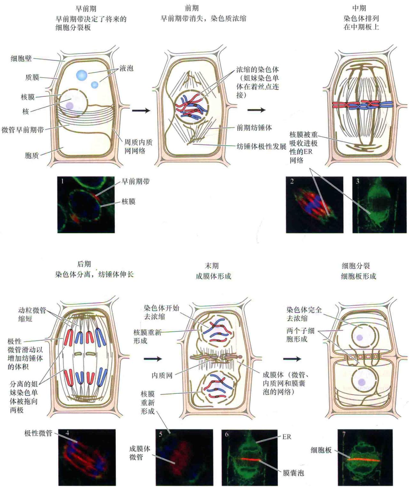  
图1.25 植物分生组织细胞（非液泡细胞）中伴随着有丝分裂的细胞组织结构的改变。1、2、4和5.红色荧光来自于α-微管蛋白抗体（微管），绿色荧光来自于WIP-GFP（绿色荧光蛋白和一种核膜蛋白所产生的融合蛋白），蓝色荧光来自于DAPI（一种DNA结合染料）。3、6和7.内质网由发绿色荧光的HEDL-GFP所标记，细胞板由发红色荧光的FM4-64标记（1、2、4和5引自Xu et al., 2007；3、6和7引自Higaki et al., 2008）。

当染色体开始浓缩，不同染色体的核仁组织（nucleolar organizer）区域解离，导致核仁的解聚。核仁在有丝分裂中完全消失，并在分裂后逐渐重新组装，正如分裂后染色体的去浓缩及在子细胞核中重新确立位置。

在早中期（early metaphase, or prometaphase），随着微管早前期带的消失，新的微管开始聚合形成有丝分裂的纺锤体（mitotic spindle）。植物细胞的纺锤体与动物细胞相比外形更似盒子形状。植物中的纺锤体微管产生于分散的区域，这个区域由细胞相对的两端的多个焦点组成并以近乎平行的排列方式延伸到细胞中。

  
图1.26 细胞板形成时期成膜体和内质网结构的改变。A. 有丝分裂早末期，细胞板（黄色）只是在其与ER（蓝色）的管状囊泡网络相结合的地方形成。成膜体微管中（紫色）也含有少量的潴泡。B. 从侧面观察周质细胞板（黄色）的形成，表明尽管在周质生长区域内，许多胞质的ER管（蓝色）混合在微管（紫色）中，但前者与细胞板膜并不发生直接接触。图中的小白点是ER结合的核糖体（成膜体的电子显微镜的3D断层摄影重建引自Segui-Simarro et al., 2004）。

细胞分裂中期（metaphase）的染色体由组蛋白紧密地包裹形成核小体，并进一步缠绕成为浓缩的纤维（图1.7），从而完成染色体的彻底压缩。着丝粒（centromere）是靠近染色体中部两条姐妹染色单体附着的区域。这一区域和染色体的端粒（telomere）一样都含有DNA重复序列。端粒形成于染色体的端部从而保护其不被降解。一些纺锤体微管能结合在染色体中心粒中被称为动粒（kinetochore）的特殊区域，这些浓缩的染色体从而平行排列在中期的细胞板上（图1.24）。一些未附着的微管则与来源于纺锤体中间区的另一极的微管相重叠。

类似于控制细胞周期4个时期的检验点，有丝分裂时期内部也由检验点控制。例如，如果纺锤体微管与动粒错误地相结合，纺锤体组装检验点（spindle assembly checkpoint）能使细胞不进入分裂后期。Cyc B-Cdk B复合物在调控这一过程中起着主要的作用。如果纺锤体微管正确地结合在动粒上，后期促进复合物（anaphase promoting complex）则能使Cyc B降解。缺失Cyc B, Cyc B-Cdk B复合物将不能形成，这使得排列在中期细胞板的姐妹染色单体能够向两极分配[每一条染色单体经过一轮的DNA复制则含有二倍体（2n）的DNA。因此，一旦发生分离，染色单体即成为染色体]。

后期染色体分离的机制由两个元素组成。

后期A（anaphase A）（早后期），在这个时期，

姐妹染色单体分离并开始移向两极。

后期B（anaphase B）（晚后期），极化的微管进行相对滑动和伸长以推动纺锤体向两极进一步分离。同时，姐妹染色单体分别进入两极。

在植物中，纺锤体微管并不锚定在两极的细胞周质上，因此染色体并不能因此而被分开，而可能是被极性发生重叠的纺锤体微管中的驱动蛋白所拉开（参见Web Topic 1.11）。

有丝分裂末期，被称为成膜体（phragmoplast）的新的微管和微丝网络出现。成膜体建立了发生胞质分裂的细胞质区域。此时的微管不再呈现纺锤体形状，但仍旧保持着它的极性，它们的负极指向已经分离的并正在去压缩的染色体，而核膜也在此区域进行重组（图1.25“末期”）。微管的正极则指向成膜体的中间区域，在这一区域中，部分来源于母细胞质膜内吞囊泡的小囊泡发生积累。这些囊泡带有长链（long tether），能帮助形成细胞板使细胞进入下一个时期——胞质分裂。

胞质分裂（cytokinesis）是一个建立细胞板（cell plate）的过程，细胞板是能将两个子细胞一分为二的细胞壁的前体（图1.26）。细胞板和包裹其的质膜在细胞中心形成一个岛，能通过囊泡融合的方式向着母细胞壁的方向生长。参与囊泡融合过程的SNARE家族的KNOLLE靶标识别蛋白同参与囊泡形成的套索形状的一类鸟苷三磷酸酶——发动蛋白（dynamin）一样，在细胞板形成时期出现（参见Web Topic 1.8）。正在形成的细胞板与母细胞膜发生融合的位点，是由早前期带和特异的微管结合蛋白的位置决定的。细胞板的组装使得ER管位于横跨细胞板的原生质膜间的膜通道中，从而连接两个子细胞（图1.26）。

在下一部分会讨论到，横跨细胞板的ER管确定着初级胞间连丝的位置。在胞质分裂之后，微管在细胞周质中重组。新的周质微管以垂直于细胞轴的方向排列，这种方向也决定了细胞未来的伸展极性。

## 1.9 胞间连丝

胞间连丝（plasmodesmata，单数plasmodesma）是质膜的管状延伸，直径为40\~50 nm。它能穿越细胞壁，并使相邻细胞间的胞质连接。因为大多数植物细胞通过这种方式相连，所以它们的胞质形成了一个称为共质体（symplast）的连续体，因而通过胞间连丝的溶质胞间运输称为共质体运输（symplastic transport）（见第4章和第6章）。

A  

  
B

## 1.9.1 初级胞间连丝和次级胞间连丝帮助维持组织的发育梯度

初级胞间连丝（primary plasmodesmata）的形成为无性繁殖的细胞（一个母细胞通过有丝分裂产生的两个子细胞）提供了胞质联系。这种共质体能使水和溶解物在细胞间进行非跨膜运输。但是，在共质体中运输的分子大小会受到限制。这种限制称为通透分子大小极限（size exclusion limit，SEL）。环绕着ER管的细胞质通道（或者连丝微管，desmotuble）组成了胞间连丝的中心并决定着SEL（图1.27）（Roberts and Oparka，2003）。除此之外，细胞质通道中的球形蛋白还能形成穿过胞间连丝的螺旋状微通道（Ding et al., 1992）。

通过追踪不同大小的荧光染料分子在叶表皮胞间连

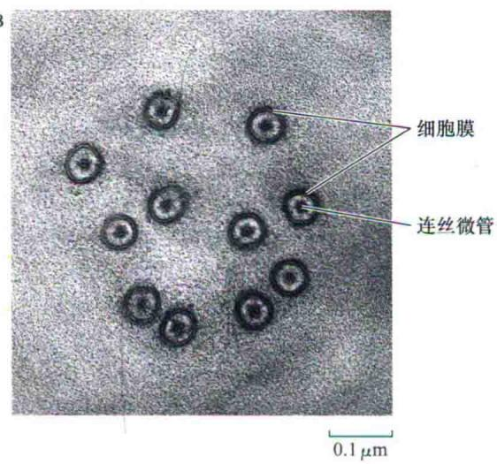  
0.2 μm

图1.27 胞间连丝。A. 电镜照片表示两个相邻细胞由细胞壁分开，所示是胞间连丝的纵切图。B. 细胞壁的切面图，显示许多横切的胞间连丝。C. 含有一个胞间连丝的细胞壁模式图。由两个狭窄的颈部间的中心孔组成。连丝微管和相邻细胞间的内质网相连。蛋白质位于连丝微管的表面和质膜的内表面间，这两个表面被认为是通过丝状蛋白连起来的，并将胞质通道分成了很多微通道。蛋白质间的距离大小决定了胞间连丝分子筛的特性（A，B由Ray Evert惠赠，引自Robinson-Beers and Evert，1991）。

丝的运动能够测定胞间连丝对所运输物质的分子质量限制。这些细胞间运输的分子质量限制为700\~1000 Da，即相当于大小为1.5\~2.0 nm的分子。但是，溶解物穿过细胞质通道和连丝微管的机制仍然不清楚。目前已经发现，胞间连丝中存在肌动蛋白和肌球蛋白（Roberts and Oparka，2003）。那么，就有以下两种可能。

（1）肌动蛋白和肌球蛋白使得孔收缩，减小了SEL。

（2）肌动蛋白和肌球蛋白本身辅助大分子和微粒通过胞间连丝孔。

如果胞间连丝的SEL限制了分子大小为2.0 nm或更小的分子在细胞间的运输，那么像烟草花叶病毒这样大的物质如何通过它们？病毒基因组编码的运动蛋白（movement protein）是非结构性的蛋白质，它能够帮助病毒通过如上所述的其中一种机制在共质体间移动。一些植物病毒所编码的移动蛋白能包裹在它基因组（通常是RNA）的表面形成核糖核蛋白复合物来通过胞间连丝孔。30 kDa的烟草花叶病毒的运动蛋白就是通过这种方式来移动的。另外一些如豌豆花叶病毒和番茄斑萎病毒，病毒能编码运动蛋白在胞间连丝孔中形成运输管，帮助成熟的病毒颗粒通过胞间连丝。

如果病原体的遗传信息能通过胞间连丝传递，那么是否经过有丝分裂所产生的独立的细胞间的遗传信息也能如此地相互传递？植物能在各个层面上感知具有极性梯度的形态发生素（参与发育的信号分子，见第16章），包括单细胞水平、组织水平，并且还可能影响植物的整体形状。例如，一片叶片中的细胞数目（当大于最低阈值时）是和叶片大小无关的。这些参与器官发生的信号分子并不仅仅是激素类的小分子，也包括蛋白质和RNA（Gallagher and Benfey，2005）。在第16章中将会更加详细地介绍这种细胞间的交流。

在非同一克隆来源的细胞间共质体运输还能通过次级胞间连丝（secondary plasmodesmata）发生（Lucas and Wolf，1993）。当相邻的细胞壁区域被消化，质膜发生融合，这种次级胞间连丝就可能由此产生。最终，细胞间的内质网网络得到连通。事实上，共质体能以这种方式扩张说明了它在植物营养的获得及发育信号传递方面起着非常重要的作用。

## 小结

虽然所有植物从外形到大小丰富多样，但是它们有相似的生理过程。作为初级生产者，植物将太阳能转化为化学能。由于不能移动，植物必须向光生长，并且拥有高效的维管系统来保证水、矿质营养和光合产物在植物体内的运输。绿色陆生植物还必须有防止脱水的

机制。

## 植物生命：统一的准则

· 所有的植物都能将太阳能转化为化学能；利用生长而不是可移动性来获得资源；具有维管系统；具有坚硬的结构；具有防脱水的机制。

## 植物结构总览

· 所有植物都进行着基本相似的生命过程和具有普遍的个体发育构架（图1.1）。

由于植物具有坚硬的细胞壁，因此它的发育只依赖于细胞分裂的模式和细胞膨大（图1.2）。

\- 几乎所有的有丝分裂和胞质分裂都发生在分生组织区域。

· 表皮组织、基本组织及维管组织是出现在所有植物器官中的3种主要组织系统（图1.3）。

## 植物细胞器

· 除了细胞壁和质膜，植物细胞还含有由内膜系统形成的分隔的区室（图1.4）。

· 叶绿体和线粒体并不来源于内膜系统。

\- 内膜系统在细胞分泌过程、膜循环及细胞周期中发挥重要作用。

\- 质膜的组成和流动镶嵌结构使得细胞能够调节进出细胞的运输（图1.5）。

## 内膜系统

\- 内膜系统将膜和货物蛋白运输到各细胞器中。

· 核膜来源于内膜系统元件——内质网（图1.6和图1.8）。

· 细胞核是染色质储存、复制和转录，以及核糖体合成的场所（图1.7和图1.8）。

\- 内质网是一个具有复杂动态结构的膜包裹的管状系统（图1.9）。

· 糙面内质网参与进入内质网内腔的蛋白质合成，而滑面内质网则是脂类合成的场所（图1.8和图1.10）。

· 内质网为内膜系统其他区室提供膜和货物。

· 细胞的分泌蛋白始于糙面内质网（图1.8）。

· 高尔基体负责加工分泌型糖蛋白和多糖（图 1.11）。

· 内吞时，膜通过形成小的网格蛋白包被囊泡从质膜上分离出来（图1.12和图1.13）。

· 质膜的内吞促进了膜的循环（图1.13）。

## 来源于内膜系统并进行独立分裂的细胞器

· 油体、过氧化物酶体和乙醛酸循环体的生长和增殖不依赖于内膜系统（图1.14和图1.15）。

## 独立分裂的半自主型细胞器

· 线粒体和叶绿体都具有内外双层膜（图1.16和图1.17）。

· 质体含有高浓度的色素或淀粉（图1.18）。

· 原质体通过不同的发育时期形成特化的质体（图 1.19）。

· 质体和线粒体中，DNA的复制和分裂独立于核分裂而进行。

## 细胞骨架

· 微管和微丝的三维网络为细胞质提供构架（图 1.20）。

\- 微管和微丝能够组装和解聚（图1.21）。

· 结合在细胞骨架元件上的马达蛋白能使细胞器在胞质中运动（图1.22）。

· 在胞质环流中，微丝能和肌球蛋白相互作用，帮助细胞器（包括叶绿体）独立运动。

## 细胞周期调控

· 细胞周期由4个时期组成，在此过程中，细胞能进行DNA的复制和完成自身的增殖（图1.23和图1.24）。

· 成功的有丝分裂和胞质分裂需要微管和内膜系统的参与（图1.25和图1.26）。

胞间连丝

\- 质膜的管状扩展横穿细胞壁并连接了两个细胞的胞质，使得水和小分子物质能够不经过跨膜而在细胞间移动（图1.27）。

(王园 王学路 译)

## WEB MATERIAL

Web Topics

1.1 Model Organisms
Certain plant species are used extensively in the lab to study their physiology.

1.2 The Plant Kingdom
The major groups of the plant kingdom aresurveyed and described.

1.3 Flower Structure and the Angiosperm Life Cycle

The steps in the reproductive style of angiosperms are discussed and illustrated.

1.4 Plant Tissue Systems, Dermal, Ground, and Vascular A more detailed treatment of plant anatomy is green.

1.5 The Structures of Chloroplast Glycosylglycerides
The chemical structures of the chloroplast lipids are illustrated.

1.6 A Model for Structure of Nuclear Pores
The nuclear pore is believed to be lined by a meshwork of unstructured nucleoporin proteins.

1.7 The Protein Involved in Nuclear Import and Export Importin and other proteins mediate macromolecular traffic into and out of the nucleus.

1.8 Protein Signals Used to Sort Proteins to their Destinations
The primary of sequence of a protein can include a ticket to its final destination.

1.9 SNARES, Rab, and Coat Proteins Mediate Vesicle Formation, Fission, and Fusion
Models are presented for mechanisms of vesicle fission and fusion.

1. 10 ER Exit Sites (EREs) and Golgi Bodies Are Interconnected
The comigration of EREs and Golgi bodies during cytoplasmic streaming has been caught on film.

1. 11 Specialized Vacuoles in Plant Cells
Plant cells contain diverse types of vacuoles.

1.12 Actin-Binding Proteins Regulate Microfilament Growth
Proteins such as profilin, formin, fimbrin, and villin help to regulate microfilament growth.

1. 13 Kinesin Are Associated with Other Microtubules and Chromatin
In addition to mediating organell movements along microtubule pathway, kinesins also bind to chromatin or other microtubules.

# 基因组结构与基因表达

植物的表现型由3个主要因素决定：基因型（决定植物性状的所有基因或等位基因）、DNA的表观遗传修饰模式及植物的生存环境。第1章中已经论述了DNA的基本结构和功能，DNA压缩为染色体的方式，以及基因表达的两个阶段——转录和翻译。本章将从基因的更深层次——基因组结构层面讨论其对生命进化和生理的影响。首先，讨论核基因组的结构和非基因元件。然后讨论位于叶绿体和线粒体中的胞质基因组。其次，将讨论基因转录和蛋白质翻译的细胞“机器”，以及基因表达如何受转录和转录后的调控，并将介绍研究基因功能的技术和方法。最后，将讨论基因工程在科学研究和农业中的应用。

## 2.1 核基因组结构

如第1章所述，植物生命活动所需的大部分基因被包含在核基因组中。2000年，人们完成了小型双子叶植物拟南芥的全基因组测序，这是第一个被全基因组测序的植物，其基因组只有约157 000 000个碱基对（157 Mb），分布在5条染色体上（与此相比，百合是人们目前所知基因组最大的物种，其基因组约为88 000 Mb）。在拟南芥核基因组中约有27 400个蛋白质编码基因和5000个假基因（pseudogene）（无功能基因）或转座子片段（在本章随后将会讨论这些可移动的DNA元件）。除了这些基因，拟南芥中还存在1300多个非蛋白编码RNA（ncRNA），这些RNA可能参与基因表达调节。转座子和ncRNA将在本章随后详细讨论。

然而，植物基因组中还存在大量基因以外的DNA组分。本部分先从化学构成角度回顾基因组，然后就基因组中特定区域在特异反应中的功能进行论述。

## 2.1.1 核基因组被包装成染色质

核基因组由DNA缠绕于组蛋白形成串珠状结构的核小体（nucleosome）构成（见第1章）。DNA和组蛋白及其他与DNA结合的蛋白质一起称为染色质（chromatin）（图1.10）。染色质可以分为常染色质和异染色质，两者的差别在于用特殊染料染色时，在光学显微镜下观察到的染色差异。相对于包裹稍微松散的常染色质（euchromatin）而言，异染色质（heterochromatin）通常压缩得更加紧密，因而染色颜色更深。植物中，多数处于活跃转录的基因位于常染色质区，而位于异染色质区的基因则无转录活性，或称为沉默状态。与常染色质相比，异染色质中基因较少。异染色质区常包含着丝点（有时称为结节）和紧邻染色质末端端粒的区域，也称为近端粒区（subtelomeric region）（Gill et al., 2008）。

异染色质通常包含高度重复DNA序列或称为随机重复序列（tandem repeat），长度为150\~180 bp的DNA片段反复多次重复。另外一种重复序列为分散重复序列（dispersed repeat），其中一种分散重复序列为简单序列重复（simple sequence repeat，SSR），也称为微卫星（microsatellite）DNA。这种重复单位最短可至2个碱基，重复数百甚至数千次。另外一种存在于异染色质区的重要分散重复序列称为跳跃基因，或称为转座子（Heslop-Harrison and Schmidt，2007）。

## 2.1.2 着丝粒、端粒和核仁组织区包含重复序列

染色体上最重要的标志性结构包括着丝粒、端粒和

核仁组织区。这些区域中均包含重复DNA序列，这些重复DNA序列可用荧光原位杂交（FISH）技术进行鉴别（Kato et al., 2005），该技术利用荧光标记的分子探针（通常为DNA）与被检测序列特异结合（图2.1）。着丝粒（centromere）为细胞分裂时姐妹染色单体粘连在一起并附着纺锤丝的缢痕。纺锤丝与着丝粒的结合由着丝粒及其外围蛋白质复合物所介导，该复合物称为动粒或着丝点（见第1章）。着丝粒由高度重复的DNA区域和无活性的转座元件构成（Jiang et al., 2003；Ma et al., 2007）。染色质末端序列构成端粒（telomere），该结构作为染色质末端的“帽子”可避免DNA复制时最末端片段的丢失。

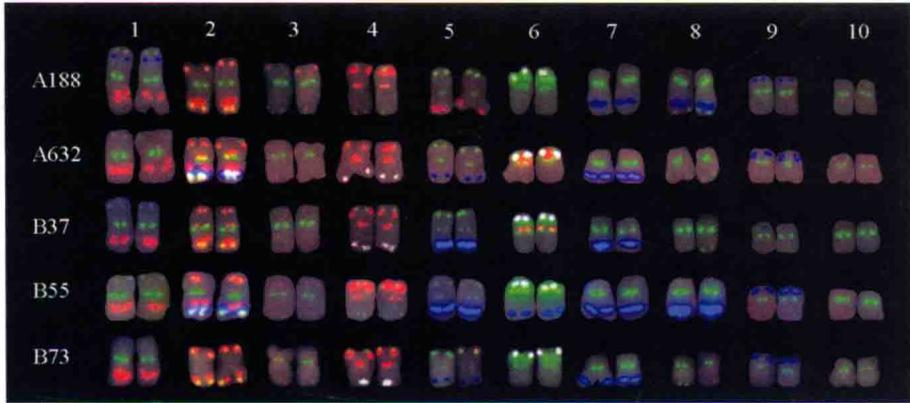  
图2.1 染色体的标志物包括着丝粒、端粒和核仁组织区,可用于鉴别各染色体。每行展示了不同玉米自交系中10个同源染色体对（展示从A188到B73的5个常见品系）。图片显示了与染色体特定区域标志完全互补的带荧光标记的DNA序列探针与染色体杂交的结果。染色体近中部可看到绿色的着丝点，6号染色体中可看到较大的绿色的核仁组织区，在染色体2\~染色体4的末端可看到淡红色的端粒。更大的蓝色区域为异染色质区（引自Kato et al., 2004）。

构成核糖体的RNA分子（rRNA）在核仁组织区（nucleolar organizer，NO）中转录，由于核糖体主要由rRNA构成，同时蛋白质翻译对核糖体的需求量较大，因而不难理解NO区应该存在大量的rRNA基因的重复序列。根据植物种类的不同，基因组中可能存在一个或数个核仁组织区（玉米有一个核仁组织区，在6号染色体）（图2.1）。由于核仁组织区存在重复rRNA基因的特性，以及该区的GC含量较高，因而，核仁组织区经染色后甚至可直接在光学显微镜下看到，可作为特异染色体区域的标志。这些标志可用于绘制特异染色体区域的表象特征。尽管这些rDNA（编码rRNA的DNA）具有重复的特性，但它们仍具有转录活性。核仁组织区的rDNA及转录这些rDNA的蛋白质和rRNA初始转录加工产物，共同组装构成细胞核中特异的结构——核仁（图1.4）。

## 2.1.3 基因组中可移动的序列——转座子

基因组中异染色质重复序列DNA的重要类型之一为转座子。因其可将自身的一个拷贝插入基因组中一个新的位置，转座子（transposon）或称转座元件（transposable element），也称为跳跃基因。

转座子可分为两大类型：逆转录元件或逆转录转座子（类型1）和DNA转座子（类型2）。这两类转座子的区别在于其复制和插入新位置的机制不同（图

2.2）。逆转录转座子（retrotransposon）首先转录出RNA副本，此RNA再逆转录为DNA并插入基因组另一位置（图2.2A）。这类转座子因其并不离开原来的位置，而是在基因组另一位置添加一个新的拷贝，因而，活跃的逆转录转座子在基因组中趋于存在多份拷贝（Eickbush and Malik，2002）。相反，DNA转座子（DNA transposon）利用剪切-粘贴机制从基因组一个位置移动到另一个位置，这一过程催化的酶由转座子自身编码。这些转座酶（transposase）将转座子剪切并插入基因组另一个位置，多数情况下，转座子总数量保持不变（图2.2B）。

转座子插入可能导致基因突变。如果转座子落入基因的编码区，基因将失活。转座子插入基因附近也可能改变基因的表达方式。例如，转座子可能干扰基因表达的正常调控元件，阻止转录因子发挥作用，或者由于转座子带有启动子元件，导致基因表达增强。

转座子对基因的致变能力或许在寄主基因组的进化中发挥作用。从进化的角度讲，低水平的基因突变，因其可产生新的变异以增强物种对环境的适应能力，因而这种低水平的基因突变对一个物种来说是有利的。然而，如果转座频率太高，在个体中产生过多的基因突变，在某种程度上可能会降低物种的适应能力，因而高频率的转座可能是有害的。

A 逆转录转座子（类型1转座子元件）  
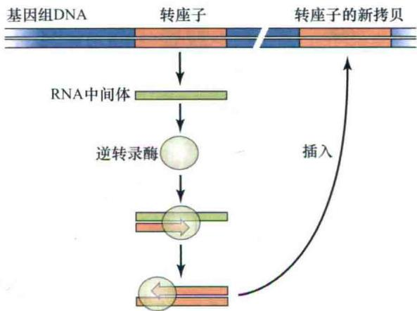

B DNA转座子（类型2转座子元件）
基因组DNA 转座子  
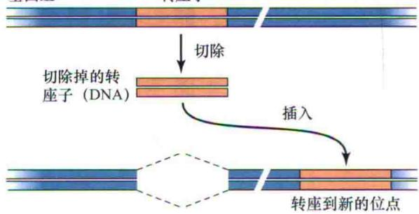  
图2.2 两种主要类型转座子转座模式的差异。A. 逆转录转座子通过RNA介导的机制而转座。B. DNA转座子通过剪切-粘贴的机制进行转座。

植物和其他生命体似乎可通过DNA和组蛋白的甲基化而调控转座子的转座活性。这种调控机制也出现在基因组中异染色质区基因的转录抑制过程中，此过程将在本章随后进行讨论。随着越来越多基因组测序的完成，科学家已经注意到在异染色质区存在大量的被甲基化的转座子。然而，是否由于转座子的甲基化才引起其所在区域异染色质化？还是由于转座子落入异染色质区而被甲基化？两者的因果关系还不得而知。

对于不能维持基因组甲基化的突变体的研究表明，世代间逐渐降低的甲基化水平可能激活处于休眠状态的转座子，并增强转座和突变的频率（Miura et al., 2001）（图2.3）。这种转座作用可能显著降低后代的适应能力。因此，甲基化和异染色质的形成对于基因组的稳定性起着重要作用。

## 2.1.4 包含整个基因组多个拷贝的多倍体

倍体水平——一个细胞中整套基因组的份数，是基因组结构影响生理功能和进化的另外一个重要方面。许多生物，尤其是植物中，整个二倍体基因组（2n）在不经历细胞分裂的情况下可能进行一次或多次额外的复制过程（见第1章），由此产生多倍体（polyploid）。多倍体并不限于在少数细胞或物种中出现，也不是突变或疾病情况下独有的现象。实际上，许多植物或某些动物更倾向于采用多倍体。由于植物中多倍体的普遍性，研究人员甚至认为大多数尚存的植物都是多倍体起源的（Leitch and Leitch，2008）。事实上，所有的植物在进化过程中都经历过基因组加倍。

A  

B  
  
图2.3 如同非甲基化的转座子活化一样，甲基化丢失可能引起突变。一个称为降低DNA甲基化的突变体（ddm1），引起内源转座子的甲基化水平降低。在ddm1突变体中由于合成植物生长激素油菜素内酯的基因DWARF4（DWF4）中插入一个转座子而形成一个新的突变体clam。A. 转座子插入导致产生新的突变体clam（左）与野生型拟南芥的比较。B. clam突变体在转座子从DWF4基因跳走后恢复了野生型的表型（右）（引自Miura et al., 2001）。

多倍体可分为两种形式：同源多倍体和异源多倍体。同源多倍体（autopolyploids）含有单个物种基因组的多个拷贝，异源多倍体（allopolyploids）含有来自两个或多个物种的多个基因组。

两种类型的多倍体可能来自配子发生时不完全的减数分裂。减数分裂时生殖细胞的同源染色体经历DNA复制，随后进行两轮细胞分裂（减数分裂期Ⅰ和减数分裂期Ⅱ），产生4个单倍体细胞（图2.4）。如果减数分裂时染色体复制后没有进行细胞分裂，便产生了二倍体的配子细胞。在一个物种或一个自花授粉的个体中，如果一个二倍体的卵细胞与一个二倍体的精细胞受精，受精卵便含有4套染色体，这便是同源四倍体（图2.5A）。与此类似，如果细胞有丝分裂时染色体复制后没有进行细胞分裂，细胞同样成为同源多倍体。细胞在减数分裂或有丝分裂时这两种类型的异常现象均存在，尽管其频率较低。

后期I  
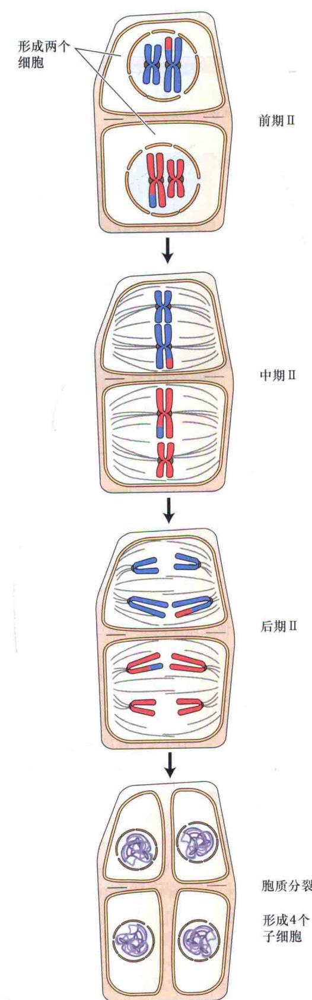

减数第一次分裂  

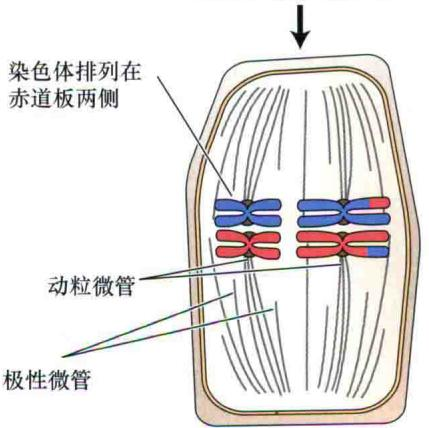

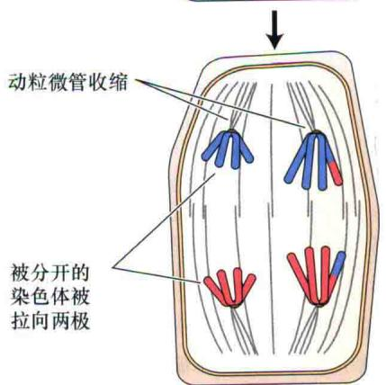

  
图2.4 植物中正常的减数分裂。阶段Ⅰ，同源染色体分开并向相反方向移动，阶段Ⅱ中，染色单体分开。减数分裂产生4个子细胞，每个细胞染色体数量为亲本细胞的一半。如果一对同源染色体在阶段Ⅰ中碰巧没有分开，结果形成的子细胞就会缺失或多余一条染色体，称为非整倍体或多体（缺体）。需要注意的是，不同的植物其阶段Ⅰ可能不同：并非所有的植物在阶段Ⅰ就形成细胞壁，在有些情况下，染色体可能发生一定程度的去压缩，并在进入阶段Ⅱ之前一定时期内保持过渡态。

异源多倍体通常通过以下两种方式之一而产生。

（1）来自一个物种的精细胞与来自另一个物种的卵细胞形成杂合二倍体。这种类型的植物细胞通常减数分裂无法正常进行，但在极少数情况下可能形成染

A 同源多倍体（源于基因组复制）

色体加倍的配子细胞，这样便产生了异源多倍体（图2.5B）。这种类型的异源多倍体可能发生在受精卵形成时期，或者杂合植物后期的营养生长或生殖生长阶段。

（2）两个不同物种的二倍体配子可能形成杂合受精卵。这些二倍体配子可能来源于四倍体亲本的正常减数分裂，也可能来源于二倍体亲本失败的减数分裂（图2.5C）。

自然界经常发生二倍体杂交，但是这种杂交物种由于其染色体在减数分裂阶段Ⅰ无法正确配对造成不育（图2.5B）。种间杂交的不育种由于染色体自发加倍可能导致形成一个新的可育的多倍体，许多物种中均存在这种现象，如十字花科植物（图2.6）。这种种间杂种

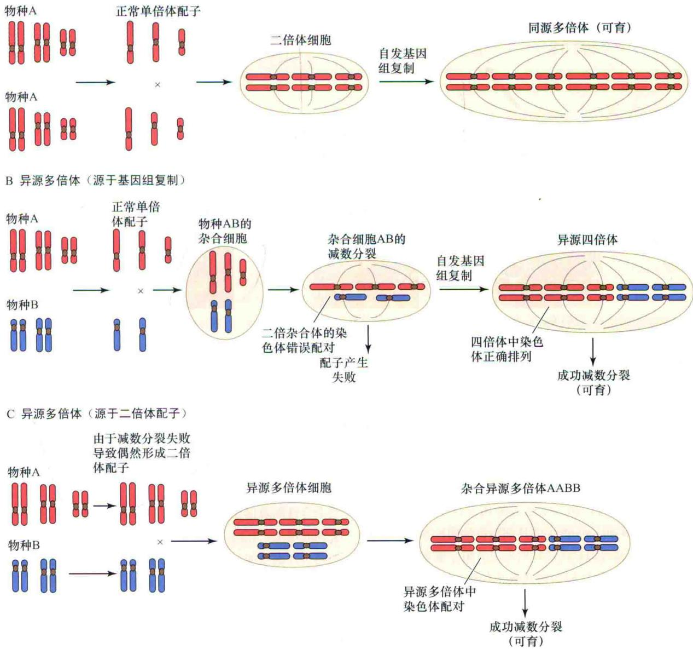  
图2.5 通过基因组加倍产生多倍体。A. 二倍体中自发基因组加倍产生同源四倍体。B. 二倍体杂交后进行减数分裂时，由于染色体无法正常配对导致不育。染色体自发加倍导致减数分裂时每条染色体都完全配对，育性恢复。C. 来自两个不同物种的二倍体配子融合产生可育的多倍体。

  
图2.6 3种常见的十字花科植物（Brassicaceae）自然相互杂交形成异源四倍体。它们之间的关系可用三角形U来描述，此三角形U由韩国科学家Nagaharu U所命名。三角形的3个角为十字花科的3个二倍体物种，每个物种可与另外两个物种杂交形成新的异源四倍体。

育性的缺失与杂种优势现象形成鲜明的对比，杂种优势（hybrid vigor or heterosis）是指属于同一物种的两个亲本后代显示更加强大的生命力。杂种优势通常表现为更加高大的植物个体、更多生物量和更高的农业产量。

多倍体也可以由人工通过施用来自于植物秋水仙（Colchicum autumnale）的具细胞毒性的秋水仙碱而得到。秋水仙碱可抑制纺锤丝的形成并阻止细胞分裂，但并不影响DNA的复制。因此秋水仙碱处理导致细胞不分裂情况下基因组加倍。

## 2.1.5 多倍体导致的表型和生理作用难以预期

通常的概念认为同源多倍体比二倍体亲本表现出更加高大的植株个体，但这一概念并一定总是正确的。

例如，相同遗传背景但倍性水平不同的玉米植株比较时，会发现单倍体到二倍体的变化伴随着株高的增加，但倍性进一步提高后株高反而下降（图2.7A）。与同源多倍体相比，其二倍体亲本更加强壮的可能解释为：仅当杂合性随着倍性增加而增加时植物个体的强壮程度才会同时增加。相反，如果随着植物倍性的增加，而基因的纯合性也增加，那么其强壮程度反而下降（图2.7B）（Riddle et al., 2006; Riddle and Brichler, 2008）。科学家一直在检验这一解释，并期望为重要作物的农业育种提供指导。

异源多倍体在以下两方面与其二倍体亲本表现不同。

（1）与同源多倍体一样，它们的基因组也加倍。

（2）它们是两个不同物种的杂交种。

A  
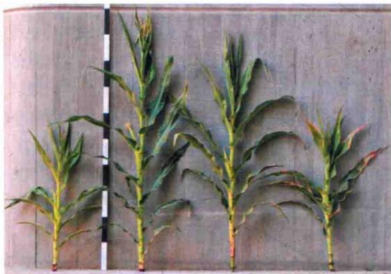

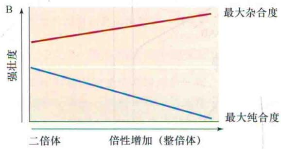

图2.7 A. 玉米的一系列多倍体。同一生长期的玉米从左到右依次为：单倍体、二倍体、三倍体和四倍体。近交系玉米中，同源多倍体比二倍体强壮的表型下降。标尺中黑格或白格均为20 cm。B. 植物强壮表型与其倍性的一般关系。仅当随着基因组增加，基因的杂合性也增加时，植物的强壮表型才与倍性的增加正相关（红线）。相反，倍性的增加造成基因的纯合性也增加时，植物的强壮表型与倍性的增加负相关（蓝线）（A图由E. Himelblau惠赠；B图由J. Birchler惠赠后修改）。

异源多倍体与其亲本比较时，很难区分表型的差异是由于基因组加倍造成的，还有由于杂种优势造成的。目前的研究积累认为，杂种优势相比基因组加倍对异源多倍体相对于其亲本的性状变异的贡献更大。异源多倍体通常比其亲本更加强壮且产量更高，这一表型在农作物中较为常见，如油菜、羽衣甘蓝、咖啡、棉花、小麦、黑麦、燕麦和甘蔗。

无论异源多倍体如何起源，两个不同基因组的融合都会导致诸多后果，尽管目前还不清楚所有物种间在多倍化进程中或多倍化完成之际是否存在共同的反应（Osborn et al., 2003; Chen, 2007）。与亲本物种相比，新形成的异源多倍体会发生一些遗传学的变化。

（1）染色体的重新构建，包括某些DNA序列的丢失（Feldman et al., 1997; Pires et al., 2004）。

（2）表观修饰变化（Madlung et al., 2002; Salmon et al., 2005; Parisod et al., 2009）。

（3）基因转录活性的改变（Adams et al., 2003; Chen, 2007）。

（4）因基因沉默丧失导致休眠的转座元件激活（Kashkush et al., 2003; Madlung et al., 2005）。

生物芯片分析（在本章中随后讨论）表明，从整个基因组来看，许多在亲本中不表达的基因在异源多倍体中被激活（Wang et al., 2006; Rapp et al., 2009）。似乎染色体的表观遗传改变导致了这些基因的激活，这些表观遗传改变包括DNA与组蛋白的甲基化和组蛋白的乙酰化。

多倍体导致基因组中同一个基因存在多个冗余的拷贝。基因的复制在进化过程中可能产生一个基因功能的改变或丧失，而此基因的另外一个拷贝则可以保留此基因的原初功能。这一过程称为基因的亚功能化（subfunctionalization）（Lynch and Force，2000）。基因组分析表明，在物种进化历程中存在基因组的复制，即使二倍体物种也是如此，此后DNA的逐渐丢失使基因组又回到二倍体状态（图2.8）。具有祖先基因组复制印记的物种此后发生DNA丢失，称为古多倍体（paleopolyploids），玉米和拟南芥就属此类（Wolfe，2001）。

多倍体与非整倍体（aneuploidy）有着显著的差异。非整倍体是指那些基因组包含个别染色体增加或丢失（非整套染色体）的物种。如果某条染色体为3条则称为三体（trisomies），如果某条染色体为一条则称为单体（monosomes）。在人类和动物中，非整倍体通常导致死亡或严重的生理疾病，如唐氏综合征（21三体综合征）。尽管非整倍体植物与正常的整倍体植物表现出不同的生理表型，但它们一般仍是可育的。在多倍体中，非整倍体效应往往被基因组中额外染色体所掩盖。

## 2.2 植物细胞质基因组：线粒体和叶绿体

植物中除了核基因组外，还存在另外两个基因组：叶绿体基因组（chloroplast genome）和线粒体基因组（mitochondrial genome），其中线粒体基因组与动物细胞的线粒体基因组类似。本部分将讨论这些基因组的来源和作用。然后，讨论这些基因组的构成，以及在遗传信息传递方面与核基因组的差异。

## 2.2.1 细胞质基因组起源的内共生理论

细胞质基因组可能是细菌被其他细胞内吞后进化的遗留物。Lynn Margulis于20世纪80年代提出内共生理论（endosymbiotic theory），认为线粒体起源于好氧菌被其他原核细胞吞噬，随着时间的推移，这种内共生体进化为一种无自主生存能力的一种细胞器。寄主细胞与这一内共生体一起进化繁衍并适应了有氧的生长代谢环境。最终，这些细胞产生了所有的动物细胞。根据这一理论，植物细胞可能是前一类细胞产生了第二次内共生而形成的，即已含有线粒体的细胞又一次内吞了可进行光合作用的蓝细菌，随着时间的推移，这一内共生体进化为叶绿体。

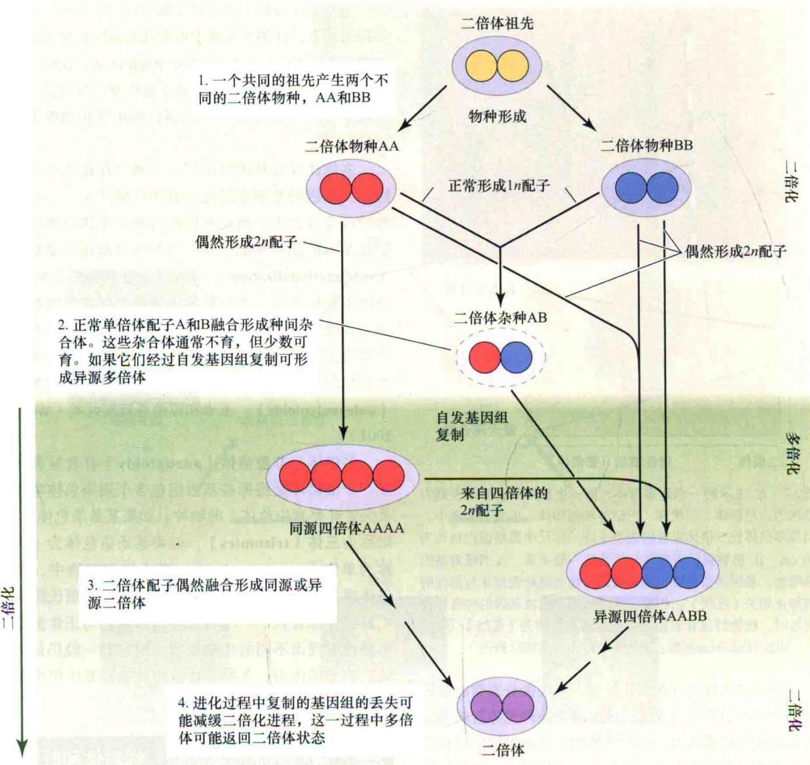  
图2.8 多倍体物种的进化连续性。二倍体可能产生同源多倍体或异源多倍体（图2.5）。多倍体可能随着进化进程而逐步丢失重复的基因组而回到二倍体状态。浅紫色椭圆形表示细胞核；细胞核中彩色圆圈表示整个基因组（改编自Comai，2005）。

支持内共生理论的证据主要有两个，第一，叶绿体和线粒体均有外膜和内膜包围，内膜为连续的系统并结合有面向细胞器内侧的组分。这一现象与原初好氧细胞或光合细胞被内吞的概念相一致，被内吞的好氧细胞或光合细胞与寄主细胞内陷的质膜融合，因而进化出的新的细胞器具有双层膜。第二，线粒体和叶绿体细胞器基因组与原核细胞具有相似性，细胞器基因组与原核细胞基因组类似，没有核包膜，称为类核（nucleoid）。

## 2.2.2 细胞器基因组主要由线性染色体构成

质体基因组大小通常为120\~160 kb，并编码一些主导基因，这些基因对光合作用和质体基因的表达是必需的。线粒体基因组的大小变化范围较宽，并大于质体基因组。植物线粒体基因组大小为180\~300 kb，并远大于动物和真菌线粒体基因组，后两者大小为15\~50 kb。植物线粒体DNA包含电子传递链所需蛋白质的基因，以及电子传递体的辅因子编码基因。此外，植物线粒体基因组DNA还编码自身细胞器基因表达所需蛋白质，如核糖体蛋白、tRNA和rRNA。现在，在植物的这两种细胞器中，有许多基因对叶绿体和线粒体的功能不可缺少，但随着进化，这些基因不再包含于线粒体和叶绿体自身基因组中，而是包含于核基因组中。这些蛋白质在细胞质中合成然后输入线粒体和质体中行使功能。

长期以来，通常认为细胞器基因组染色体是环状的，与细菌中的环状质粒相似。然而，最近的研究表明大部分植物的线粒体和叶绿体基因组为线状，并且其DNA容量可能不止一个基因组拷贝（图2.9）。这些基因组的多个拷贝以头尾方向相连，而且这些细胞器染色体DNA高度分支形成树状（Oldenburg and Bendich，1998，2004），这一特性不同于核内的线状染色体。但是核内染色体数量在细胞的一代到下一代间保持不变，而叶绿体和线粒体染色体在细胞世代间可能发生变化。但细胞器基因组总是包含至少一个拷贝的完整基因组。

## 2.2.3 细胞器遗传不遵循孟德尔定律

细胞器基因的遗传遵循两条原则，这不同于孟德尔遗传学。第一，线粒体和质体通常表现为单亲遗传（uniparental inheritance），不同性别的后代（通过花粉或卵细胞）仅遗传父方或母方单方的细胞器。裸子植物中，松柏类通常遗传来自父方的质体。而被子植物通常遗传来自母方的质体。然而，也有少数被子植物的质体可能为双亲遗传。大多数植物中，线粒体通常遗传自母方，当然例外情况也是存在的。例如，某些松柏类如丝柏表现为父方的线粒体遗传。

植物中，质体为母系遗传，由于雄配子（花粉）形成机制的关系，父方的质体在雄配子（花粉）形成时被排除掉。花粉形成时涉及两次雄配子细胞的有丝分裂。第一次分裂产生一个营养细胞，此细胞可生长出花粉管，另一个为非常小的生殖细胞，此细胞随后产生两个精细胞。第一次分裂时，生殖细胞及精细胞形成时把质体排除在外。因此，受精卵中的质体全部来自于雌性配子细胞形成的卵细胞，这便是质体的母系遗传（Mogensen，1996）。

A  
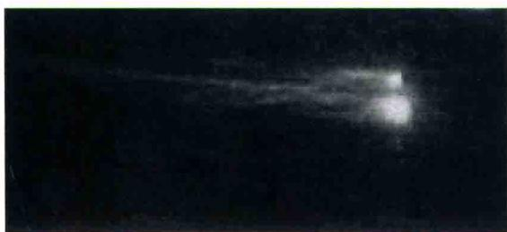

C  
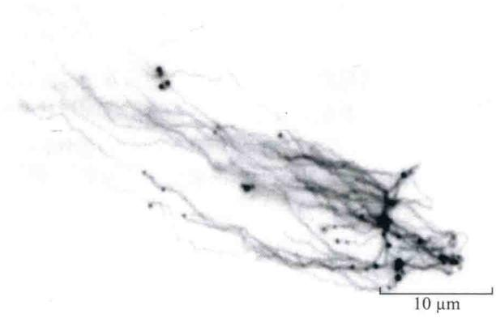

某些松柏类植物，如黄杉（Pseudotsuga menziesii）或油松（Pinus tabulaeformis）中质体的父性遗传机制较为复杂，目前所知较少。许多裸子植物的第二次有丝分裂，在花粉管进入雌配子体时才进行，产生两个精核。父方的胞质含有大量的质体，有些线粒体与精核相连，并随精核进入卵细胞。受精时，卵细胞核被母方的线粒体包围，而母方的质体位于卵细胞外围。精核和卵核融合后形成受精卵，此后细胞化过程中新细胞壁将母方的所有质体和大部分父方线粒体排除在胚外（Mogensen，1996；Guo et al., 2005）。

第二，叶绿体和线粒体可随着无性繁殖而产生不对称分离（segregate vegetatively），这就意味着营养细胞（相对于配子细胞而言）可通过有丝分裂（不同于减数分裂）产生另一个营养细胞。例如，有丝分裂时，一个子细胞可能接受一种类型基因组的质体，而其他或许带有1个或2个突变位点的，具有不同遗传信息的质体基因组，被随机地分配进入另一个子细胞。这种营养细胞分裂造成的质体不均分配也称为“分拣”（sorting-out），可引起同一组织具有不同的表型（图2.10）。叶片上这种嵌合色斑被园艺工作者称为杂斑(variegation)（图16.31，一个代表性例子）。叶片杂斑可能由核基因或线粒体基因或叶绿体基因突变引起。

B  
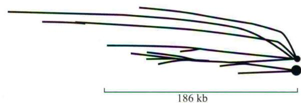  
图2.9 线粒体和叶绿体基因组的复杂性。每张图片显示细胞器基因组线状连接的多个拷贝。A. 地钱线粒体DNA经溴化乙锭染色的显微照片。B. 同一DNA分子的线条绘图。186 kb的长度标尺为一个基因组大小。C. 经琼脂糖拉伸后的玉米叶绿体DNA含有多个基因组拷贝。10 $\mu$ m长度标尺相当于30 kb的DNA序列，约为总基因组长度154 kb的20%（A，B引自Oldenburg and Bendich，1998；C引自Oldenburg and Bendich，2004）。

通过以上内容已经了解了植物中细胞核和细胞质基因组的结构，再转回细胞核基因组，讨论其结构及其对基因表达的影响。首先讨论基因转录的基本机制，然后论述基因转录调控过程。

## 2.3 核基因表达的转录调节

从基因到蛋白质经历多个步骤，并由多种酶参与这些过程（图2.11）。植物中，从基因到蛋白质的多个步骤均受到调节，从而调控每个基因编码蛋白质产物量的多少。这些调节步骤的第一步便是转录，决定某条特定的mRNA是否被转录及何时被转录。这一层次的调节称为转录调节（transcriptional regulation），包括转录的起始、维持及终止，3个步骤均可以受到调控。基因表达的下一个调控层次称为转录后调节（post-transcriptional regulation），这种调控在转录后进行，包括mRNA的稳定性、翻译效率和降解速率的调控，将在本章随后谈到。基因表达调节的最后一个层次为蛋白质稳定性（protein stability）（翻译后调节）调节，这一调节机制对基因或其产物活性调控发挥重要作用。

## 2.3.1 RNA聚合酶Ⅱ结合于大多数蛋白质编码基因的启动子区

基因转录是在RNA聚合酶（RNA polymerase）的催化下进行的，RNA聚合酶结合到将要转录的DNA上，并聚合产生与DNA模板序列互补的mRNA。RNA聚合酶可以分为几种，其中RNA聚合酶Ⅱ负责转录大多数编码蛋白质的基因。

基因中被RNA聚合酶结合的区域称为启动子（promoter）（图2.12A）。真核生物启动子可以分为两个主要元件：由最小的上游序列构成的核心元件（core promoter）或称为最小元件（minimum promoter），以及控制启动子核心元件活性的调控序列（regulatory sequence）。

一个基因开始被转录时，需要经历几个步骤以帮助RNA聚合酶与基因的碱基序列结合。DNA缠绕于组蛋白的串珠状核小体结构首先被解开，此步骤随后进行详细讨论。此过程中组蛋白被修饰，只有组蛋白被修饰后，RNA聚合酶才得以与DNA结合。此外，对于真核RNA聚合酶发挥功能，还需要普通转录因子（general transcription factor）参与，将RNA聚合酶定位到基因的转录起始位点。这些转录因子和RNA聚合酶一起构成一个大的复合体，称为转录起始复合体（transcription initiation complex）（图2.12A）。当最后一个转录因子

  
图2.10 无性繁殖导致杂斑形成。A. 一个细胞分裂后，其子细胞可能随机分配得到正常的叶绿体（绿色），或者正常及突变的叶绿体均存在，或者只含有突变的叶绿体（白色）。B. 仅仅含有白色叶绿体的细胞分裂后产生的子细胞仍只含有白色叶绿体，形成白斑。C. 无只含白色叶绿体的细胞所在的部分始终保持绿色。杂斑也可能由核基因或线粒体基因突变而引起。

  
图2.11 真核基因表达过程。RNA聚合酶结合于蛋白质编码基因的启动子区。真核基因与原核基因不同，真核基因并不成簇排列构成操纵子，而且每个基因又由内含子和外显子构成。转录沿着模板链从开始位点按3'到5'方向进行，新合成的RNA链沿着5'到3'方向延伸，每次加入一个碱基。翻译从第一个编码甲硫氨酸的密码子AUG开始，并终止于终止密码子，这一过程与原核生物相同。成熟的mRNA前体首先在其5'端加上一个7-甲基鸟苷酸（m $^{7}$ G）。其3'端在特异位点被剪切并加上多聚腺苷酸尾巴。加帽加尾后的mRNA前体被剪切复合体剪切去掉内含子。成熟的mRNA从核孔输出到细胞质，并在核糖体上起始蛋白质翻译。每个核糖体朝mRNA的3'端方向翻译时，新的核糖体又加入到mRNA的5'端，因而形成多核糖体结构。翻译完成后，某些蛋白质被加上一些化学基团而被修饰。释放出来的多肽链都有自己的半衰期，这一过程通过泛素依赖的途径由26S蛋白酶体降解（图2.15）。

加入到起始复合体，并将RNA聚合酶磷酸化时，转录才能开始。RNA聚合酶离开起始复合体，并沿反义链或称互补链的3'到5'方向进行转录。

对于那些参与发育调控的基因，除了上述转录因子和RNA聚合酶外，还需要特异的转录因子参与调控RNA聚合酶的活性，这些特异的转录因子也称为转录调节蛋白。这些转录调节蛋白与DNA结合并构成转录起始复合物的一部分。

典型的RNA聚合酶Ⅱ所结合的启动子如图2.12A所示。RNA聚合酶Ⅱ所转录基因的核心启动子元件位于转录开始位点上游约100 bp处，并包括几个与此元件邻近的启动子序列（proximal promoter sequence）。大约在转录开始位点上游25\~30 bp处有一个短序列，称为TATA盒（TATA box），其典型序列为TATAAA（A）。此TATA盒对于转录过程至关重要，因为它是上述转录起始复合物的组装位点。

  
图2.12 典型的真核基因的构成与转录调节。A. 典型的真核基因核心启动子及其结合的转录因子。RNA聚合酶II与结合于转录起始位点上游25 bp处的通用转录因子互作，并被定位于TATA盒。位于转录起始位点上游80 bp和100 bp处的起转录增强作用的顺式作用元件分别为CAAT盒和GC盒。CAAT盒和GC盒分别被调节蛋白因子结合而发挥增强转录的作用。B. 远距离作用的调节序列及其反式作用因子对转录的调节作用。结合于远距离调节序列的反式作用因子通过与转录起始复合物产生物理互作而增强转录。这一过程的细节还不完全清楚。

除了TATA盒外，真核基因启动子还包含另外两个调节序列：CAAT盒（CAAT box）和GC盒（GC box）（图2.12A）。这两个位点为基因特异的转录因子的结合位点。这些DNA序列因为紧邻它们所调节的转录单位，因而称为顺式作用序列（cis-acting sequence）。而结合于这些顺式作用序列的转录因子，称为反式作用因子（trans-acting factor），而编码这些转录因子的基因位于基因组中其他区域。

真核细胞基因核心启动子序列上游较远处可能存在许多顺式作用序列，通常位于转录开始位点上游1000 bp处，它们对核心启动子可能起正的或负的调节作用，因而这些序列也称为远距离调节元件（distal regulatory sequence）。结合于这些元件起正调节作用的转录因子称为激活子（activator），相反，结合于这些元件起负调节作用的转录因子称为抑制子（repressor）。真核基因除了具有这些称为启动子元件的调节序列外，距转录开始位点数万碱基距离处，还可能存在具有转录调节作用的称为控制元件的序列，这种远距离的起正调节作用的序列称为增强子（enhancer）。增强子可能位于启动子上游或下游。

所有结合于顺式作用序列的转录因子如何调节转录过程呢？在转录起始复合物形成时，位于核心启动子元件和远距离调节序列之间的DNA序列弯曲呈环状，以使结合于调节序列的所有转录因子相互靠近并与起始复合物间产生互作（图2.12B）。通过这种物理上的互作，每种转录因子或正调节或负调节转录过程。

## 2.3.2 遗传表观修饰对基因活性的影响

如前所述，只有当DNA可被RNA聚合酶和其他蛋白因子结合时，才可能发生基因转录。处于压缩状态的DNA需要通过DNA和组蛋白的共价修饰而被释放，从而被RNA聚合酶和转录因子识别和结合。由于这种共价修饰可改变一个基因的转录行为，但并不改变DNA的序列本身，因而也称为表观遗传修饰（epigenetic modification）。

DNA中胞嘧啶碱基的甲基化（methylation）是

DNA修饰的常见类型之一（图2.13A）。植物中甲基化频率较高的序列为CG、CHG和CHH（H可以是鸟嘌呤之外的任意碱基）。相反，哺乳动物中，胞嘧啶甲基化经常发生在CG序列中，胞嘧啶甲基化由甲基转移酶催化完成，而DNA的去甲基化由糖基化酶催化完成，该过程使用非甲基化的胞嘧啶替代甲基化的胞嘧啶。

表观遗传修饰也可以发生在组蛋白上，这些组蛋白和围绕其上的DNA共同构成核小体。每个组蛋白有一个突出于核小体外的尾巴，此尾巴由组蛋白前端氨基酸链部分构成。组蛋白修饰就发生在这些尾巴上，修饰通常位于最外面的40个左右的氨基酸残基上。这种修饰可能影响核小体的构象，因而影响与之相关的DNA中的基因活性。

影响基因活性的组蛋白修饰之一就是甲基化，尤其是组蛋白H3的尾巴上的赖氨酸（单字母缩写为K）残基的甲基化更是如此。这些被甲基化的赖氨酸残基从外向内数依次为K4、K9、K27和K36。一个氨基酸残基上可能被加上1个、2个甚至3个甲基（图2.13B）。H3K4位置的甲基化往往伴随着基因被活化，而H3K9位的甲基化往往导致基因失活和转座子元件沉默。在酵母和哺乳动物中，甲基基团被组蛋白去甲基化酶去除（Bannister and Kouzarides，2005），植物中具有类似功能的基因也有报道（Choi et al., 2007）。

组蛋白尾巴上的另外一种修饰为乙酰化（acetylation），此过程由组蛋白乙酰转移酶（HAT）催化完成。一般来说，组蛋白乙酰化伴随着基因激活，组蛋白去乙酰化酶（HDAC）通过去除乙酰基团而逆转基因的激活状态。

甲基化和乙酰化修饰均可改变染色体复合物的构型，导致染色体压缩或解压缩。多种蛋白质组成的染色体重塑复合物与修饰的组蛋白结合时导致染色体压缩状态的改变。利用ATP水解释放的能量驱动这些反应，染色体重塑复合物通过驱使核小体向5'或3'方向移动而打开染色体。核小体的间隙扩大后足以使RNA聚合酶与DNA结合并起始转录过程（图2.13C）。或者，组蛋白修饰也可能为调节蛋白提供新的结合位点并影响基因活性。对于组蛋白的化学修饰，人们才刚刚开始理解和涉足，而且仅限于组蛋白尾巴上40个左右的氨基酸的特定化学修饰作用。对于特定核小体的整个组蛋白化学修饰有时也称为“组蛋白密码”，这一概念暗示了核小体构型与基因活性的密切关系。

## 2.4 核基因表达的转录后调节

mRNA在转录后立即被加工，包括内含子剪切、5'端加帽子、3'端加尾巴。之后转录产物被运到细胞质进行翻译。

机体组织在应对某一特异的刺激时通常会转录新的mRNA。而且为了保证刺激与反应的专一对应关系，mRNA通常具有特定的寿命。例如，在应对环境胁迫时，植物可能需要产生特异的酶，而当胁迫解除时再继续合成这种酶对植物来说可能是能量的浪费甚至是

A  
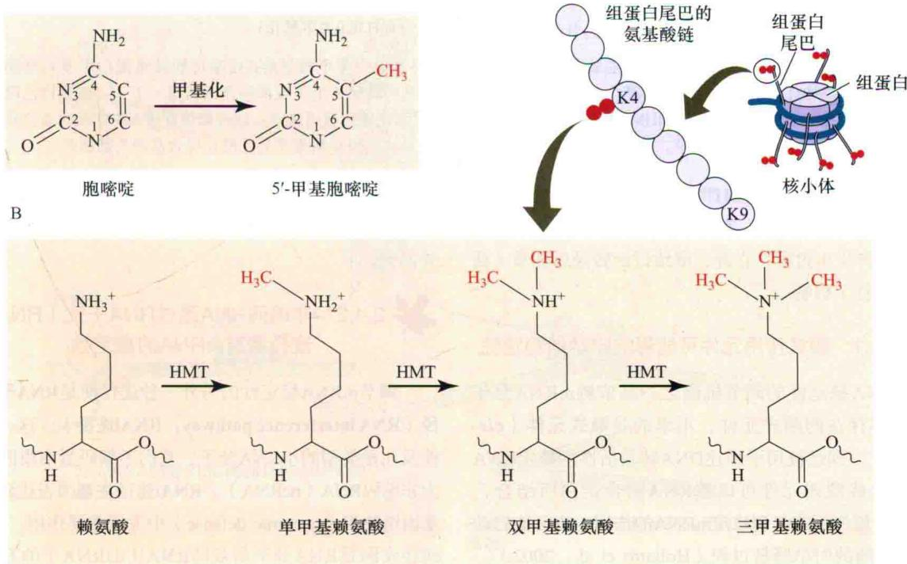

C ATP依赖的染色质重塑蛋白

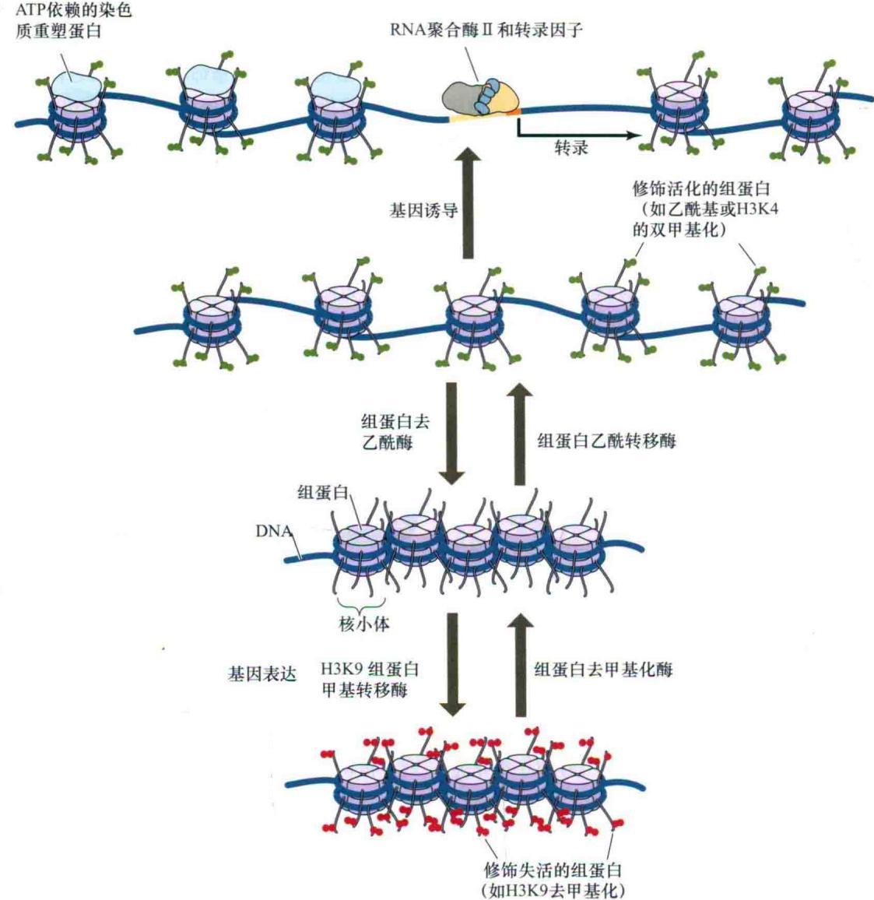  
图2.13 A. 半胱氨酸 $C_{5}$ 的甲基化伴随着基因转录失活。B. 组蛋白中多个赖氨酸K残基可能被组蛋白甲基转移酶（HMT）添加1个、2个甚至3个甲基。C. 组蛋白修饰可能激活基因转录（上）或抑制基因转录（下）。组蛋白乙酰转移酶（HAT）导致的乙酰化和HMT在H3K4的赖氨酸残基的甲基化导致基因激活，这些修饰促进ATP依赖的染色质重塑并刺激基因转录。组蛋白中H3K9的甲基化和组蛋白去乙酰化酶催化去乙酰化导致基因失活。

有害的。因此，mRNA的产生、活性及稳定性均受到调节（Green，1993）。在此前的部分已经讨论了转录（mRNA产生）过程，在此，继续讨论转录后调节（活性与稳定性）机制。

## 2.4.1 顺式作用元件可能影响RNA的稳定性

mRNA稳定性的调节机制之一是依赖mRNA分子自身内部存在的顺式元件，不幸的是顺式元件（cis-element）一词已被用于描述DNA转录活性的特定DNA区域。这些顺式元件可以被RNA结合蛋白所结合，RNA结合蛋白可能起到稳定mRNA的作用，也可能启动依赖核酸酶的RNA降解过程（Hollams et al., 2002）。

RNA结合蛋白使mRNA更稳定或启动其降解过程依赖于顺式元件的类型，对于不同的mRNA分子其作用可能差异甚大。

## 2.4.2 非编码RNA通过RNA干扰（RNAi）途径调节mRNA的稳定性

调节mRNA稳定性的另外一种途径便是RNA干扰途径（RNA interference pathway，RNAi途径）。这一途径涉及几种类型的小RNA分子，它们不编码蛋白质因而称为非编码RNA（ncRNA）。RNAi途径在基因表达调节及基因组防卫（genomic defense）中发挥重要作用。RNAi途径实际是RNA分子与双链RNA（dsRNA）的互作。

需要提及的是mRNA分子通常是单链分子（ssRNA）。植物中，dsRNA通常来自于以下3种情形之一。

（1）植物的正常发育过程中存在的microRNA（miRNA）（图2.14A）。

（2）短干扰RNA（short interfering RNA, siRNA）的产生，它会导致某些基因的沉默（图2.14B）。

（3）由病毒感染或由外源基因转化而来（图2.14C）。

无论dsRNA如何产生，细胞都天生具备RNAi反应。dsRNA被剪切成21\~24个核苷酸长度的RNA片段，它们与来自内源基因、病毒或转基因产生的互补单链RNA（如mRNA）结合并启动后者的降解或抑制其翻译。在有些情况下，RNAi途径可能导致基因沉默，也可能导致内源DNA或外源基因的异染色质化（heterochromatization）。为详细探讨RNAi机制，需要首先论述细胞内dsRNA的积累过程。接下来讨论RNAi过程的分子组成和下游事件。

microRNA调节诸多与发育过程相关基因的转录后事件：microRNA（miRNA）参与许多发育过程，如叶片和花的发育、细胞分裂和植物器官的极性生长（Kidner and Martienssen，2005）。所有的miRNA产

A microRNA途径

细胞核

## B 短干扰RNA途径

  
5. 染色质重塑复合物被siRNA引导到基因组的重复区，并影响DNA和组蛋白的甲基化

C 针对病毒感染的RNAi反应途径

  
图2.14 植物中的RNAi途径。A. 在植物生长发育中miRNA参与多种遗传途径的调节。B. 短干扰RNA（siRNA）对于维持异染色质化和基因沉默是必需的，此处显示了参与RdRP2途径的siRNA。C. 植物细胞可通过RNAi反应而抵抗病毒感染。

生于特定的DNA位点，由RNA聚合酶Ⅱ合成，最初的miRNA转录产物（pri-miRNA）的长度差异较大，从几百到几千个核苷酸。这种初始转录产物在5'端加帽子，3'端加多聚腺苷酸尾巴，并形成双链发夹茎环结构，由双链的碱基对臂和单链的环构成。下一步，pri-miRNA被加工形成miRNA前体（pre-miRNA），在动物中pre-miRNA通常有70\~80个核苷酸长度，但植物中可达数百个核苷酸长度。植物体内，pri-miRNA在细胞核内在DCL1（DICER-LIKE1）和HYL1（HYPONASTIC LEAVES1）两个蛋白质的作用下转变为miRNA，加工成熟的miRNA即可参与RNAi反应（图2.14A）。

短干扰RNA来源于重复的DNA：成熟的短干扰RNA（siRNA）在结构和功能上与miRNA类似，同样引起RNAi反应。然而，siRNA与miRNA的产生方式不同。siRNA有两种产生方式，其一，它们可能由产生mRNA链的互补链上的启动子启动转录，因而形成两条完全或部分互补的单链RNA分子（ssRNA），此后形成双链分子。其二，ssRNA由特异的依赖RNA的RNA聚合酶（RNA-dependent RNA polymerase，RdRP）剪切形成dsRNA（图2.14B）。值得注意的是，siRNA的转录由RNA聚合酶Ⅳ完成，而miRNA的转录由RNA聚合酶Ⅱ完成（Ramachandran and Chen，2008）。

内源siRNA在正常染色质区转录而来，而非那些大量转录的区域，如重复DNA序列、转座子和中心粒区。实际上，siRNA起源于重复序列区域，这些重复序列区域有时称为重复相关的沉默RNA（repeat-associated silencing RNA, rasiRNA）。如人们此后要看到的那样，这也许并不是巧合：似乎siRNA的形成与RNAi的诱导实际上引起这些区域的异染色质化和大部分转录本的沉默。一旦双链RNA由反向重复序列转录而来，或者由RdRP2转录而来，即被DECER家族蛋白剪切为21\~24个核苷酸长度的双链（图2.14B）。

除了这些内源的siRNA外，外源RNA同样可触发形成siRNA。这种外源RNA包括人工转入的基因和病毒RNA等。对于这两种RNA，RdRP和DICER蛋白均参与siRNA的成熟过程（2.14C）。

RNAi途径的下游事件涉及RNA诱导的沉默复合物的形成：对于miRNA、siRNA和外源RNA而言，RNAi过程后期结果是相似的，均导致其互补mRNA或DNA的失活或沉默。在经DICER样蛋白形成21\~24个核苷酸长度的miRNA或siRNA后，RNA双链中的短链与核酸酶形成RNA诱导的沉默复合体（RNA-induced silencing complex，RISC）（图2.14）。在动物和植物中，RISC至少包含一个催化蛋白（ARGONAUTE，AGO）。有些情况下，RISC还可能募集其他蛋白质到复合体中。拟南芥中，已知存在10个不同的AGO基因家族成员。miRNA与AGO蛋白的结合导致RISC与互补的mRNA结合。与RISC结合后，mRNA被AGO切割，产生的碎片释放在细胞质中，并在细胞质中进一步降解。RISC与mRNA结合同时可能抑制mRNA的翻译。

RISC结合siRNA还有其他功能：导致DNA更容易发生甲基化。尽管RISC可能并不直接与DNA甲基化酶或组蛋白甲基化酶互作，但siRNA可能引导这些修饰酶与基因组中将要发生基因沉默的区域结合。因而染色体以ATP依赖的方式被重塑，随之被甲基化，从而导致该DNA所在区域染色体更加致密和异染色质化（图2.13C）（Chapman and Carrington，2007）。

小RNA与RNAi参与抵抗病毒感染：除了对miRNA和内源siRNA的加工外，植物还把RNAi机制作为抵御病毒感染的分子免疫之用（Mlotshwa et al., 2008）。植物病毒的基因组结构变化多样。有些病毒注射双链DNA，有些则使用单链或双链RNA来感染植物。然而，每种病毒在其生活周期的某一阶段总会产生dsRNA。RNA病毒在寄主细胞中的复制需要在细胞质中形成dsRNA中间体。另外，双链DNA病毒在它们转录重叠的可读框时，DNA的正、反链往往转录产生双链RNA。

无论dsRNA来源于RNA病毒还是DNA病毒，它们总是产生于寄主细胞的核中。植物的DCL蛋白可以识别dsRNA分子并启动RNAi途径，最终导致病毒RNA的破坏。在将外源入侵的RNA剪切成21\~24个核苷酸的siRNA过程中，植物还会产生能穿越胞间连丝并遍布植物体全身的记忆分子，在病毒扩散之前产生有效的免疫作用。

共抑制是RNA介导的基因沉默现象：最早导致人们发现siRNA现象的实验是植物对转入外源基因的反应。20世纪90年代早期，Richard Jorgensen及其同事致力于矮牵牛花中查耳酮合成酶的研究，该酶是牵牛花中产生紫色素的关键酶。当他们在牵牛花植物中插入一个高活性的查耳酮合成酶基因时，预期在其子代中看到花色加深的植株，然而，令人吃惊的是，花瓣颜色出现了从深紫（预期）到全白（似乎查耳酮合成酶基因的表达水平下降而不是升高）的各种变化。导入外源基因导致细胞内该基因的表达受抑制这一现象称为共抑制（cosuppression）。就目前对RNAi的理解，人们知道在有些细胞中查耳酮合成酶的过表达触发了RNA依赖的RNA聚合酶产生dsRNA分子，并引起RNAi反应。这一反应最终导致转录后基因沉默，并导致内源与外部导入的查耳酮合成酶基因的甲基化。有趣的是，并不是所有的细胞都发生转录后基因沉默。发生基因沉默的细胞产生白色条纹，这就解释了为什么有些转基因矮牵牛植物出现紫色和白色的花色变异。

总之，RNAi过程中dsRNA发挥转录后抑制作用，导致特异转录产物的沉默。miRNA通常参与调节发育相关基因的活性，而siRNA帮助保持异染色质化转录失活，或者在抵抗病毒感染中发挥分子免疫作用。

## 2.4.3 蛋白质寿命的翻译后调节

如所讨论的，在基因产生功能性蛋白质过程中，mRNA的稳定性发挥重要作用。接下来讨论蛋白质的稳定性及其寿命调节的分子机制。一旦一个蛋白质合成后，在细胞中总有一个既定的寿命，从几分钟到几小时或更长。这样细胞中酶的稳态水平反映了蛋白质合成与降解的平衡，称为周转（turnover）。在植物和动物细胞中，存在两种截然不同的蛋白质周转途径，一种存在于特化的裂解型液泡中（动物中称为溶酶体），另一种存在于细胞质中。

蛋白质周转的细胞质途径中被降解的蛋白质与小的被称为泛素（ubiquitin）的76个氨基酸的多肽形成共价键，这一过程依赖于ATP。在蛋白质分子上加入一个或多个泛素分子的过程称为泛素化。被泛素标记的蛋白质将被26S蛋白酶体（26S proteasome）复合物以ATP依赖的方式降解，这一蛋白酶体特异识别标签分子泛素（图2.15）（Coux et al., 1996）。真核细胞中90%以上的短寿命蛋白通过泛素依赖的途径被降解（Lam, 1997）。

泛素化起始于泛素激活酶E1（ubiquitin-activating enzyme E1）催化的泛素C端依赖ATP的腺苷酸化。腺苷酸化的泛素被泛素连接酶E2（ubiquitin-conjugating enzyme E2）转移到其半胱氨酸残基上。被降解的蛋白质与泛素连接酶E3（ubiquitin ligase E3）通过共价键结合。然后，E2-泛素复合物将泛素转移到与E3连接的将被降解蛋白质的赖氨酸残基上。这一过程可能进行多次重复并形成多泛素化。最终被泛素标记的蛋白质转入蛋白酶体中并被降解。

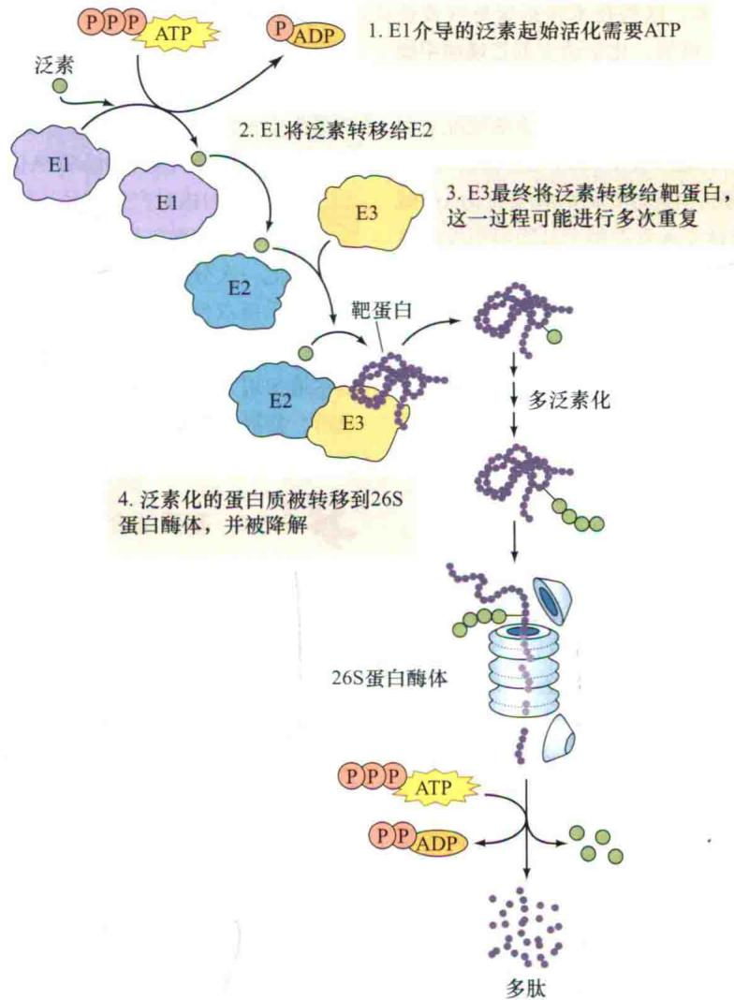  
图2.15 细胞质中蛋白质降解的一般过程示意图。

如人们所知，细胞中存在大量的蛋白质特异的泛素连接酶，从而实现特异靶蛋白的周转降解调控（见第14章）。将在第19章中详细讨论这一过程。

## 2.5 基因功能的研究工具

生物个体中包含特异的DNA序列变异，称为突变体（mutant）。突变体分析对于研究者推断基因功能或基因的染色体定位起到了极大的推动作用。此部分中将讨论突变体如何产生及它们在遗传学分析中的应用，并讨论一些用于研究或操作基因表达的现代生物技术研究工具。

## 2.5.1 突变体分析有助于揭示基因功能

本书中将详细讨论参与植物生理功能调节的基因和遗传途径，经常提到研究者用于阐释基因和信号途径的某些类型的突变体。为什么一个突变的基因要比野生型中正常的该基因更容易揭示基因功能呢？

利用突变体进行基因功能鉴定依赖于人们可容易地分辨突变体与野生型的差异，即突变体的核酸序列变化必定引起表型的改变。如果一个突变体可以通过野生型基因的导入而恢复到正常的表型，那么人们就可以推断是因为该基因的突变而引起突变体相应表型的改变。这种方法称为回补（complementation）。例如，假定某植物存在一个单基因突变，表现为比野生型晚花。如果能将该基因定位并测序，就能对花发育的分子机制有新的认识。现在假定，研究者能够在突变体基因组中找到区别于野生型的DNA序列。如果研究者能够将野生型基因转入突变体并使突变体恢复到正常表型，就可以相对肯定地认为该候选基因负责开花起始调节。

在20世纪20年代，H. J. Muller 和 L. J. Stadler 分别通过实验研究了X射线对果蝇和大麦染色体稳定性的影响，并报道了被处理生物个体的遗传变化。随后，人们发展了诱导突变的技术。这些技术包括紫外线或快中子辐射及化学诱变剂。例如，化学诱变剂乙磺酸甲酯（ethylmethanesulfonate，EMS）可在核酸（通常为鸟苷酸）上添加乙基。乙基化的鸟苷酸与胸腺嘧啶配对而不与胞嘧啶配对。然后细胞中的DNA修复机制将腺苷酸替代乙基化的鸟苷酸，引起G/C碱基对变化为A/T碱基对。辐射诱变或化学诱变通常在整个基因组引发随机的突变。

将突变位点定位到染色体并最终克隆效应基因的方法有多种。Web Topic 2.1展示了图位克隆（map-based cloning）的方法，该方法将突变体与野生型杂交并对子代做遗传分析，将突变位点限制在染色体上极窄的范围内并进行测序。

另外一种产生突变体的方法是转座子插入。这一技术涉及将研究对象植物与另一个带有活性转座子的植物杂交，并在其后代中筛选因转座子随机插入引起突变表型的个体。由于转座子的序列已知，这些突变体就有了标签。这样邻近转座子的DNA序列可较容易获知并分析突变基因。这一技术称为转座子标签（transposon tagging），将在Web Topic 2.2中详细论述。

## 2.5.2 鉴定基因活性的分子技术

一旦目标基因得到鉴定，研究者通常对该基因的表达位置和表达时间比较关注。例如，某一基因仅在生殖器官或营养器官中表达。与此类似，一个编码细胞基本功能酶的基因（持家基因）可能持续表达，而特殊功能酶的基因可能在特定的刺激或激素处理或环境条件下才表达。过去，转录分析（检测某基因在特定时间的转录产物mRNA量）主要针对单个基因。这种分析方法包括Northern、逆转录PCR和原位杂交。本书中可见到这3种技术的应用。最近发展起来的称为微阵列（microarray）或基因芯片的技术利用了基因组测序所获得的海量信息。

所有的芯片技术都要使用固体支持介质，如玻璃，在介质上被固定了能代表某物种每个基因的DNA序列片段阵列。这种阵列可包含数千个点，每次试验可同时对所有的点进行分析，因而相对于传统的方法而言，这一技术极大地提高了基因表达的分析效率。从特定组织中提取的RNA首先被逆转录为更为稳定的DNA（cDNA），每个cDNA分子代表了样品中对应的RNA（图2.16）。此后，cDNA混合物被标记上荧光染料用于在后续的操作步骤中得以识别为图像。标记之后，cDNA混合物即可用于芯片实验。

每条单链cDNA与其相应互补的点阵结合，这一过程称为杂交，杂交结果反映了原始材料中相应mRNA丰度的高低。例如，如果所提取的材料中X基因的mRNA存在，带标记的cDNA就可与阵列中对应的代表X基因的点杂交产生阳性信号。另外，如果同一样品中Y基因不表达，阵列中代表Y基因的点将无法被cDNA杂交，该点为空白阴性信号。杂交之后，微阵列通过激光束进行扫描，检测荧光标记的cDNA信号。上面的例子中，X基因的点在扫描时产生信号，而Y基因的点无信号。

目前有几种微阵列技术。有些类型的微阵列在同一个片子上一次分析两个mRNA样品，如处理与对照（这种分析采用双色标记）（图2.16）。另外一些微阵列则分别在两个不同的片子上分析两个样品的信息。微阵列技术最初用于基因表达分析，但现在也可用于其他研究分析，如群体中某个个体基因型的诊断，以及基因或基因间隔区的表观遗传状态监测。

## 2.5.3 基因融合产生报告基因

突变基因的鉴定为该基因在基因组中的定位提供信息及基因功能改变对植物表型产生影响。从一个基因的序列入手，研究者可通过与其他已知基因的比较而推测该基因的功能。例如，基因中某个区域，即所谓的结构域（domain），可能与某些家族基因的结构域具有相似性，如激酶、磷酸酶或膜受体结构域等。然而，仅仅序列信息本身并不能作为基因的细胞内功能的直接证据，它同样不能暗示其在植物体内的定位或在什么条件下基因具有活性。

一种用于研究一个特定基因在植物或细胞内表达的方法便是融合基因。融合基因（gene fusion）是人工构建的目标基因的融合体。例如，一个基因的启动子与另一个基因融合形成报告基因（reporter gene），可更加容易检测一个基因的蛋白质是否存在。绿色荧光蛋白（GFP）便是报告基因的典型例子，GFP产生一种可在整株植物或细胞内用荧光显微镜观察的荧光蛋白（图19.33）。需要提及的是并不是所有的基因在植物的每个细胞中时刻都有表达。一个基因的表达受转录因子的精细调节，转录因子不仅调控其表达活性，还决定其在特定的时间和特定的组织在需要的时候进行表达。一个植物的所有细胞均包含某个启动子与GFP的融合基因，但GFP蛋白仅在该启动子具有正常活性的细胞中表达。换句话说，只有在特定的细胞类型和特定的时间表达该基因时，才可看到绿色荧光蛋白的存在。

学者们已经发展起来了利用植物病原菌农杆菌介导的融合基因转化方法。农杆菌引起被感染植物产生生长激素，诱导形成称为冠瘿瘤（crown gall）的肿瘤细胞（图21.4）。冠瘿瘤对于某些农作物是一种严重的疾病，如果树，可引起产量和健康状况下降。

农杆菌因其可以将自己的一部分基因转入植物细胞，有时被看作自然界的遗传工程师。被转入植物基

1. 除了实验处理植物不供水之外，处理植物和对照植物保持严格相同的生长条件

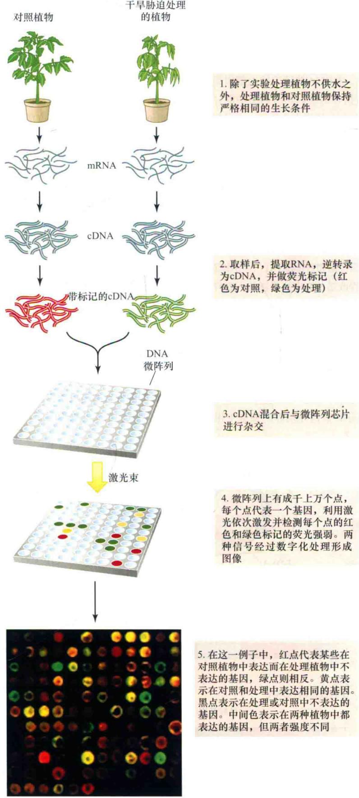

2. 取样后，提取RNA，逆转录为cDNA，并做荧光标记（红色为对照，绿色为处理）

3. cDNA混合后与微阵列芯片进行杂交

4. 微阵列上有成千上万个点，每个点代表一个基因，利用激光依次激发并检测每个点的红色和绿色标记的荧光强弱。两种信号经过数字化处理形成图像

5. 在这一例子中，红点代表某些在对照植物中表达而在处理植物中不表达的基因，绿点则相反。黄点表示在对照和处理中表达相同的基因。黑点表示在处理或对照中不表达的基因。中间色表示在两种植物中都表达的基因，但两者强度不同

图2.16 双色标记的微阵列技术用于比较不同生物个体或不同条件下的基因表达。

因组的是自己环状染色体DNA上额外的一部分，称为肿瘤诱导质粒（Ti质粒）（图2.17）。Ti质粒包含数个毒性基因（vir）及转移区DNA（T-DNA）。毒性的vir基因对于启动和执行T-DNA插入植物细胞是必需的。一旦进入植物细胞内，T-DNA被随机插入基因组的某个位置。T-DNA上所携带的基因具有两类功能：①诱导形成冠瘿瘤，它们为细菌提供寄生环境。②基因产物为非蛋白质氨基酸，称为冠瘿碱，作为细菌的代谢能源物质（图21.5）。农杆菌转染植物细胞的步骤见图2.18（Citovsky et al., 2007; Dafny-Yelin et al., 2008）。

由于农杆菌通常是植物病原菌，如何用作生物技术的研究工具呢？实验室内把农杆菌用作研究工具时，研究者将改造的Ti质粒用于植物转化，T-DNA上的植物激素和冠瘿碱合成基因被去掉，替换为目标基因。通常具有抗生素抗性的基因也附带在T-DNA区，用作筛选的标志基因。这样经工程改造的Ti质粒重新转入农杆菌体内。位于T-DNA区域内的所有基因都将被细菌遗传工程师插入受感染的植物体内。研究者可利用抗生素抗性基因进行转化细胞的筛选。

人们可通过几种方法利用这种工程改造的农杆菌进行植物转化。从植物取下幼嫩的叶片与农杆菌溶液共培养，之后将洗脱后的植物细胞在培养基上培养，然后用植物生长素和细胞分裂素诱导培养的细胞生根和生芽。这种技术已经成功培育出转化的成体植株。有些植物更加容易转化，如拟南芥，将花序浸入农杆菌溶液中就可在后代中产生足够多的转化体。除了农杆菌介导的转化方法外，人们还发展起来其他几种用于将外源基因导入植物的方法，其中之一就是将包含两种不同基因组的植物细胞进行融合，称为原生质体融合（protoplast fusion）。另外一种转化方法就是生物导弹，有时也称为基因枪（gene gun）技术，该技术在金粉表面包裹上人们构建的目标基因载体并射入细胞进行组织培养。目标基因被随机插入细胞基因组中。

## 2.6 作物遗传改良

数百年来，人们已通过选择育种方法进行作物改良，通过变异筛选了大量高产、适应特异气候及抗病的品种。例如，现代玉米是玉蜀黍亚种（也称为类蜀黍）的驯化后代（图2.19）。如图2.19所示，现代玉米从原始种经育种和驯化而来。与此类似，选择性育种也使现代番茄比其祖先种的果实更大。育种技术也产生了一些全新的物种，如现代普通小麦是不同物种间交叉授粉形成的异源多倍体。因传统的育种技术依赖有性生殖亲和物种间的性状的随机遗传重组，而现代生物学技术允许在不能成功杂交的物种间受人为控制转移若干个基因。

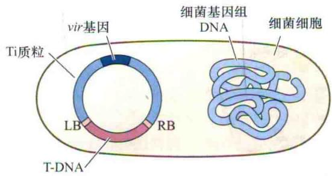

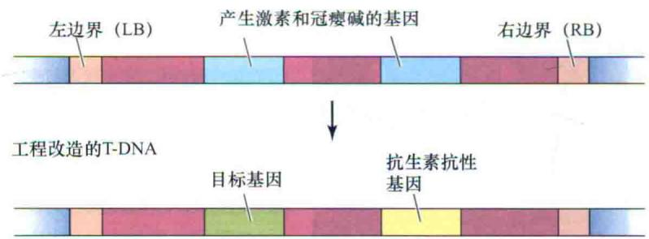  
图2.17 农杆菌的肿瘤诱导质粒（Ti质粒）。Ti质粒是细菌细胞中含有的环状染色体的DNA。感染植物后该质粒的一部分（T-DNA）被插入到植物核基因组中。Ti质粒上的毒性基因vir对于T-DNA的转移是必需的。野生型Ti质粒的T-DNA包含产生植物激素和非蛋白质氨基酸（冠瘿碱）的编码基因。农杆菌被用于进行植物转化时，植物激素和冠瘿碱合成基因被替换为目标基因，通常还附带有选择标志基因，如抗生素抗性基因等。

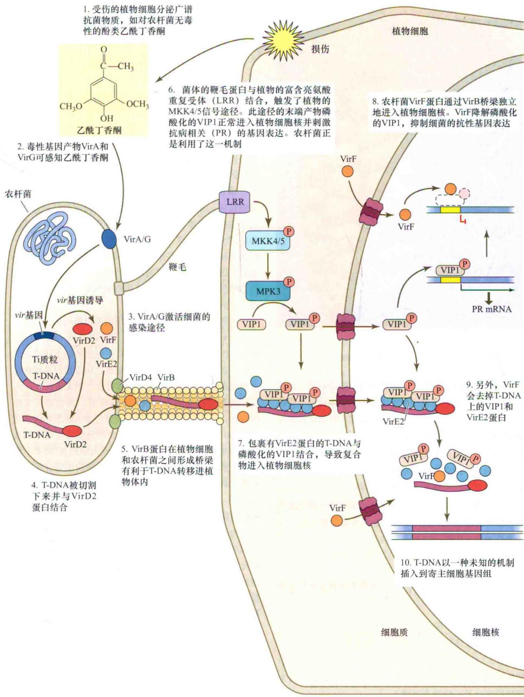  
图2.18 农杆菌转化植物的过程。

接下来讨论经典的育种方法与现代生物技术育种方法间有何不同。

  
图2.19 经过数百年的努力，野生类蜀黍（左）通过经典育种和驯化产生现代玉米（右）（John Doebly惠赠）。

对于经典的育种而言，通过种间杂交并对子代的性状进行选择，人们希望得到的优良性状渗入到另一受体物种中去。这种方法的缺点之一是两亲本的遗传性状在减数分裂时重新组合分配，因此非优良性状可能与优良性状被分配到同一个配子细胞中。因而需要将子代品系与亲本杂交才能去除这些非优良性状。现代生物技术育种方法避开了这一缺点，允许人们将期望的优良性状引入受体植物中，这一愿望往往可通过农杆菌介导的转化或基因枪方法实现。利用这种方法产生植物新品种也称为遗传改良有机体（GMO）。

遗传改良有机体（GMO）与传统的变异育种间存在以下3点主要差异。

（1）GMO中基因转移在实验室进行，并不需要杂交育种。

（2）GMO中供体基因可能来自于多个物种，而不是仅限于与受体植物能够成功杂交的物种。

（3）GMO可以同时使用包含多种遗传组分及其剪切体的载体，基因的产物可能具有新功能（例如，前文提到的启动子-GFP融合基因）。

下文将讨论一些常用于作物改良的基因例子。

## 2.6.1 转基因可赋予植物对除草剂或害虫的抗性

任何通过人工方法将基因转入生物体都称为转基因（transgene）。转基因通常指基因从一个物种转移到另一个物种。目前商业公司最常用的两类转基因，一种情况是指转基因赋予植物除草剂抗性的实际应用，另一种情况是指对某种昆虫具有耐受能力。杂草入侵和害虫横行是农业生产中导致粮食减产的两个主要原因。

转基因植物含有草甘膦抗性（glyphosate resistance）基因时将对田间应用草甘膦（商业除草剂的毒滴混剂）具备抗性，因而使用草甘膦仅杀死杂草而不会伤害具备抗性的转基因作物。草甘膦可抑制5-烯醇式丙酮酸莽草酸-3-磷酸合成酶（EPSPS），此酶在莽草酸途径中发挥关键作用，莽草酸途径是植物特异的代谢途径，其产物对于包括生长素和芳香氨基酸等许多次生代谢物合成是必需的（见第13章）。草甘膦抗性植物分两种类型，一种为使植物体携带一个对除草剂不敏感的细菌型EPSPS酶的基因，另一种为将高活性的启动子与正常EPSPS基因融合后转入植物使其高表达EPSPS酶，并对除草剂表现良好的抗性。

另外一个常用于转基因应用的基因编码杀虫毒素，该基因来源于苏云金芽孢杆菌（Bacillus thuringiensis，Bt）。Bt毒素可干扰仅存在于某些昆虫的幼虫肠道内的受体，最终杀死昆虫。植物过量表达Bt毒素对易感性昆虫表现出毒性，但对其他多数非目标生物无害。

转基因植物还可增强其营养价值。据世界卫生组织统计，每年发展中国家因膳食维生素A缺乏导致多达500 000名儿童失明。这些孩子大部分生活在以水稻为主食的南亚。尽管水稻叶片可合成大量的β-胡萝卜素（维生素A前体），然而，籽粒的主要构成部分胚乳却不能正常表达β-胡萝卜素合成途径的3个步骤的酶（图2.20A）。目前为止，水稻中还未发现自发突变后能在籽粒中积累β-胡萝卜素的突变体。

为了克服这一缺陷，Ingo Potrykus、Peter Beyer及其同事们将一个细菌基因crt1与植物的内源特异启动子融合并插入水稻基因组中，发现crt1酶可催化胡萝卜素合成途径中3个步骤中的其中两个反应（图2.20A）。当crt1与植物八氢番茄红素合成酶共同转化水稻时，转基因水稻可催化第三个反应，并积累大量的β-胡萝卜素，这种稻米称为黄金米（图2.20B）。这已经不是农学家改变作物中β-胡萝卜素含量的首次成功事例。例如，17世纪以前，在荷兰园艺学家筛选第一个橙色突变体之前，胡萝卜或者为红色或者为黄色。

其他学者也在发展转基因植物，使其在可食果实中表达疫苗，这便为世界上靠传统的行政手段进行免疫的医疗条件欠缺地区的人们提供了更便利接受免疫的可选择方法。

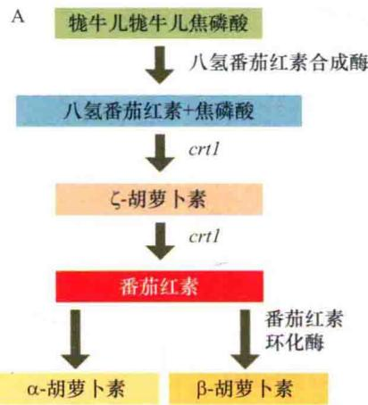

  
图2.20 将两个参与β-胡萝卜素合成的外源基因插入水稻基因组中产生黄金米的过程。A. 黄金米中β-胡萝卜素的合成途径。B. 正常白色稻米（左）与黄金米（右）对比（黄金水稻人道主义委员会惠赠，www.goldenrice.org）。

## 2.6.2 对生命体的遗传改良备受争议

GMO的发展过程并非得到人们的一致欢迎和热情支持。尽管GMO基于人道主义理念，仍有许多人甚至某些国家的政府组织对GMO心存疑虑。

例如，反对在农业中使用生物技术的人认为，在作物中表达另一物种的基因也许会导致过敏原产生。他们还担心转基因抗除草剂作物的花粉可能随风吹落，并与邻近的野生物种交叉授粉，因而产生除草剂抗性野草（所谓的超级杂草）。另外一种普遍的担心认为，Bt毒素基因的过量使用可能筛选出抗性的昆虫。

另外，植物生物技术的支持者也有许多担忧，认为应该持续监控新生物技术对人类健康和环境的影响。最后，所争论的问题可归结如下：在试图满足不断增长的世界人口数量对粮食和住所的需求问题上，人们可以接受多大程度的冒险？

## 小结

基因型、表观遗传修饰及环境因素，三者的互作决定了植物的表型。要彻底理解植物的生理，需要理解基因型如何翻译为表型。植物细胞包含3个基因组：核基因组及小的叶绿体基因组和线粒体基因组。

## 核基因组的结构

· 染色体中主要的蛋白质组分是组蛋白，DNA缠绕在组蛋白外周（图2.1）。

· 异染色质（常含有高度重复的DNA序列）的转录活性通常低于常染色质。

· 转座子是核基因组中可移动的DNA序列，有些转座子可将自身的一个新拷贝插入染色体的另一个位置（图2.2）。

· 活跃的转座子可能对其寄主细胞造成伤害，但大多数转座子元件因染色体的表观遗传修饰（如甲基化）而失活。

· DNA的甲基化及组蛋白的甲基化与乙酰化在决定染色质处于异染色质还是常染色质状态发挥重要作用（图2.3）。

· 许多植物都是多倍体，或者由于基因组的额外复制（自发多倍体），或者由于两个物种杂交后染色体组加倍（异源多倍体）（图2.5）。

· 多倍体的表型和生理作用通常无法预期。

· 多倍体含有多个完整的基因组；这种基因组平衡的变化可能引起多倍体间表型的显著差异，尤其对异源多倍体而言，多倍体子代可能与其亲本产生生殖隔离。因此，多倍体是一种重要的进化机制（图2.8）。

## 植物细胞质基因组：叶绿体基因组和线粒体基因组

· 细胞器基因组结构较复杂，常在同一个DNA分子中包含基因组序列的多个拷贝（图2.9）。

· 细胞器遗传不遵循孟德尔遗传法则，常表现出非亲本遗传和营养分离（图2.10）。

## 核基因表达的转录调控

· 基因活性在几个层次上受调控：转录、转录后和翻译（图2.11）。

· 对于蛋白质编码基因而言，RNA聚合酶Ⅱ与其启动子区结合，这一结合过程需要通用转录因子和其他调节蛋白参与转录的起始（图2.12）。

· 表观遗传修饰，如DNA甲基化和组蛋白乙酰化等参与基因活性调节（图2.13）。

PLANT PHYSIOLOGY

## 核基因表达的转录后调节

\- RNA结合蛋白或者稳定mRNA或者促使其降解。

· RNA干扰（RNAi）作物转录后调节机制导致特异转录本被剪切。miRNA协助基因表达调节。短干扰RNA（siRNA）帮助维持异染色质失活状态，或作为分子免疫系统抵抗病毒侵袭（图2.14）。

\- 蛋白质被称为泛素的短肽链标记后将被蛋白酶体降解（图2.15）。

## 基因功能的研究工具

· 单个基因转录分析的工具包括northern、逆转录PCR和原位杂交。

\- 微阵列或基因芯片技术利用已知的基因组信息来高通量分析基因表达或基因型（图2.16）。

· 融合报告基因由目标基因的一部分（如启动子）与容易被观察检测的蛋白编码基因融合而成。这些载体可用于研究目标基因的时空表达活性。

· 当靶基因被插入肿瘤诱导质粒（Ti质粒）中时，农杆菌可介导靶基因转化入植物细胞（图2.17和图2.18）。

## 作物的遗传改良

\- 相对于传统的筛选育种而言，生物基因工程允许将一个或数个特异基因在无法成功杂交的物种间转移。

· 人工进行基因转移可产生除草剂抗性、植物害虫抗性或增加营养价值的转基因植物。

(王棚涛 宋纯鹏 译)

## WEB MATERIAL

## Web Topics

2.1 Recombination Mapping and Gene Cloning
Mapped-based cloning can be used to isolate the gene(s) involved a phenotype of interest.

## 2.2 Transposon Tagging

Mutagenesis using transposable elements is another approach to gene identification.

## 单元 | 水和矿质营养

## 第3章

## 水和植物细胞

水在植物的生命活动中起着至关重要的作用。光合作用需要植物从大气中吸收 $CO_{2}$ ，但同时也使植物面临失水，甚至脱水的威胁。为避免叶片脱水，植物通过根部吸水并在植物体内运输。这种吸收、运输的水分和散失到大气中的水分之间必须保持平衡，即使是微弱的失衡都可以导致水分亏缺，引起细胞的生命过程严重失常。因此，保持水分吸收、运输和散失之间的平衡，是陆生植物所面临的一个重要挑战。

细胞壁是植物细胞和动物细胞的主要区别，它的存在影响着植物细胞水分代谢的所有方面。细胞壁可使植物细胞建立起巨大的内部静水压，即膨压（turgor pressure）。膨压对于细胞伸展、气孔开放、韧皮部运输及各种跨膜转运等许多生理过程都是必需的。膨压也使非木质化的植物组织具有刚性和机械稳定性。本章主要讲述水分如何进出植物细胞，着重阐述水分子特性及影响水分在细胞水平运动的物理驱动力。

## 3.1 植物生命中的水

在植物生存和发挥功能所需的各种资源中，水的需求量最大，但同时对植物生长的限制性最强。灌溉对作物产量的影响反映了水是一种限制农业产量的关键资源因素（图3.1）。水分的可利用量也限制着自然生态系统的生产率（图3.2），这导致植被类型随着降水量梯度呈现显著差异。

  
图3.1 不同灌溉导致的水分可利用率对英国东南大麦和小麦产量的影响（引自 Jones，1992。数据引自 Day et al., 1978; Innes and Blackwell, 1981）。

  
图3.2 年降水量对各种生态系统生产率的影响。产量率是由生长繁殖造成地上部分有机物的净积累量值估算得到的（引自Whittaker，1970）。

由于植物的耗水量是巨大的，水通常被认为是植物而不是动物的一种限制性资源。植物根系吸收的水分，绝大部分（约97%）经植物体内运输，最后由叶表面蒸发散失，这种水分散失的方式称为蒸腾作用(transpiration）。植物根系吸收的水分仅有一小部分存留在植物体内，用来满足植物生长（约2%）、光合作用及其他代谢过程的需要（约1%）。

对于陆生植物，伴随着光合作用，水分不可避免地散失到大气中去。通过共同的扩散途径同时进行着 $CO_{2}$ 的吸收和水分的散失：即 $CO_{2}$ 扩散进叶片，而水分扩散出去。驱动水分从叶片散失所需的浓度梯度比 $CO_{2}$ 吸收所需的浓度梯度大得多，使得每获得一分子 $CO_{2}$ 就有400分子的水散失。这种不均等的交换机制极大地影响了植物形态和功能的进化，同时也解释了为什么水在植物的生理活动中起着至为关键的作用。

首先让我们来认识水的结构，水所具有的物理特性。随后再阐述水分运动的物理基础、水势的概念及其在细胞与水相互关系中的应用。

## 3.2 水的结构和特征

水独特的性质使之能够作为一种溶剂并在植物体内很好地运输。这些特征源于其具有氢键和极性的分子结构。在这一部分中我们将阐明水分子中氢键的形成，及其导致水具有的高比热、表面张力和抗张强度等重要特征。

## 3.2.1 水分子的极性导致氢键的形成

水分子由一个氧原子和两个氢原子共价结合而成，两个O—H共价键形成105°夹角（图3.3A）。由于氧原子的电负性（electronegative）强于氢原子，吸引O—H共价键中的电子向氧原子偏移，从而导致水分子中氧原子端呈部分负电荷，两个氢原子端呈部分正电荷，使得水分子成为极性分子（polar molecule）。这些局部的正负电荷大小相等，因此水分子所带净电荷为零。

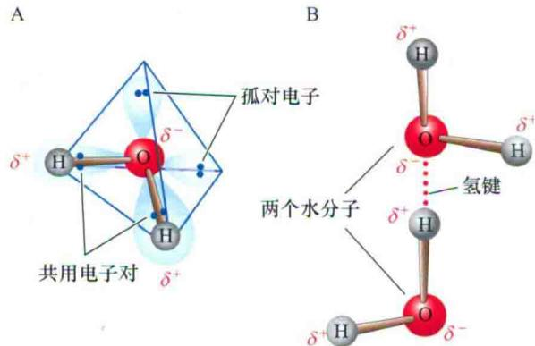  
图3.3 水分子结构示意图。A. 氧原子强的电负性意味着与氢原子形成的共价键的两个电子并不是均等共享的，这样导致每个氢原子带部分正电荷。氧原子的两对孤对电子产生一个负电荷极。B. 水分子上相反的两极（ $\delta^{-}$ 和 $\delta^{+}$ ）导致水分子间氢键的形成。氧原子最外层轨道有6个电子，每个氢原子最外层有1个电子。

水分子呈四面体形，四面体的两个顶点是氢原子，带有部分正电荷。四面体的另两个顶点含有孤对电子，每对都带部分负电荷。这样每个水分子具有两个正极和两个负极。正是由于这种局部异性电荷的存在使得相邻水分子间形成静电吸引，即称为氢键（hydrogen bond）（图3.3B）。

只有当高的电负性原子如氧与氢原子共价结合形成有效的静电引力时才会形成氢键。这是因为氢原子体积较小使得局部正电荷显得更加集中，从而导致这种静电引力更加有效。

氢键赋予了水很多独特的物理特性。水分子可以与毗邻的水分子间最多形成4个氢键，造成分子间极强的作用力。水也能和其他具有强电负性原子（O或N）的分子间形成氢键，尤其是当这些分子中的强电负性原子与H共价结合时。

## 3.2.2 水是一种良好的溶剂

水是一种优良的溶剂，与其他溶剂相比，它能大量溶解许多物质。水之所以作为一种广泛使用的溶剂，不仅是由于其分子体积小，更为重要的是其形成氢键的能力和其极性结构，从而使水成为溶解离子化合物和含有极性基团（如—OH和—NH $_{2}$ ）的糖类和蛋白质类物质优良的溶剂。

溶液中，水分子和离子之间、水分子和极性溶质间的氢键，能有效地降低带电溶质间的静电相互作用，从而提高它们的溶解度。同样的，大分子如蛋白质和核酸与水分子之间的氢键也减弱了大分子彼此间的相互作用，利于它们溶解于水中。

## 3.2.3 水具有独特的热力学特性

水分子间广泛存在的氢键，使水具有与众不同的热力学特性。例如，水具有高比热和高的蒸发潜热。

比热（specific heat）是指单位质量的物质，温度升高1℃所吸收的热量。温度用于衡量分子的动能。当温度升高时，水分子的振动加快，振幅增大。水被加热时，如同橡皮条一般的氢键耗费了供应的大部分热能，只余一小部分用于增加水分子的功能。因此，与其他液体相比，水需要吸收相对更多的热能才能提高温度，这对植物来说是很重要的，可以缓冲植物温度的波动。

蒸发潜热（latent heat of vaporization）是指分子从液相中分离出来变成气相时所需的能量，发生于蒸腾作用的过程中。蒸发潜热随着温度的升高降低，在沸点（100℃）减至最低。处于25℃的水，它的蒸发潜热是44 kJ/mol，这在已知的所有液体中是最大的，其大部分用来断裂水分子间的氢键。

蒸发潜热并不能改变已经蒸发的水分子的温度，但是可以使水分蒸发的物体表面冷却，因而水的高蒸发潜热可以帮助植物有效调节蒸腾叶片的温度，否则，当植物吸收太阳辐射的热能时，叶片温度会升高。

## 3.2.4 水具有高附着性

处于气-液交界面的水分子受到液相中邻近水分子由于氢键产生的吸引力比气相中邻近水分子的吸引力要大得多。这种不平衡吸引的结果，使得气-液接触面的表面积最小，从而使体系处于能量最低状态（即最稳定状态）。要增加气-水接触面的表面积，需要吸收能量来打破氢键，这种增加气-液接触面的表面积所需的能量称为表面张力（surface tension）。

表面张力的单位为 $J/m^{2}$ ，即单位面积上的能量。常用的非正式等价单位是N/m。焦耳是能量的国际单位，是力与其作用距离的乘积，即Nm。牛顿（N）是力的国际单位，是质量与加速度的乘积，即1 kg m/s $^{2}$ 。如果气-液接触面弯曲，表面张力会在垂直于这个接触面上产生一种合力（图3.4）。后边将会讲到，叶片蒸发表面的表面张力和附着力会产生一种物理作用力，从而拉动水分沿植物维管系统运动。

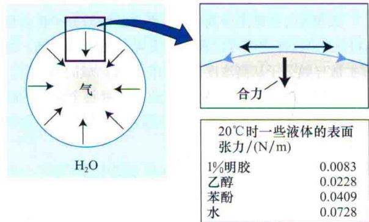  
图3.4 悬浮在液体中的气泡的形状为球形从而使表面积最小。这是由于表面张力作用方向沿着气-液交界面的切线方向，导致合力指向内部，使气泡收缩。通过接触面施加的压强值等于2T/r，其中T是液体的表面张力（N/m），r是气泡的半径。在相同温度下，水比其他液体具有更大的表面张力。

水分子之间的氢键使水分子产生了相互吸引的力量，称为水分子的内聚力（cohesion），属于水的一个特性。与其相关，水的另外一个特性是附着力（adhesion），指水对固体物质如细胞壁或玻璃表面的吸引力，也主要是与氢键形成有关。固体物质对水分的吸引力程度可通过测量固液面的接触角（contact angle）来衡量（图3.5A）。接触角描绘了气-液界面的形状，反映了表面张力对液体内压力的影响。

内聚力、附着力及表面张力使水产生了毛细现象（capillarity）（图3.5B）。想象一个具可湿性壁的竖直毛细玻璃管插入水后的现象（接触角<90°）。平衡时，毛细管中水面高度要比管外的水面高。水被吸引到毛细管内的原因是：①吸引水到玻璃管极性表面的吸引力（附着力）；②水的表面张力。附着力和表面张力共同作用使水分子沿着管壁上升，直到使水上升的力量与水柱的重力相等为止才达到平衡。管越细，平衡时液面上升越高。有关毛细现象的计算，参见Web Topic 3.1。

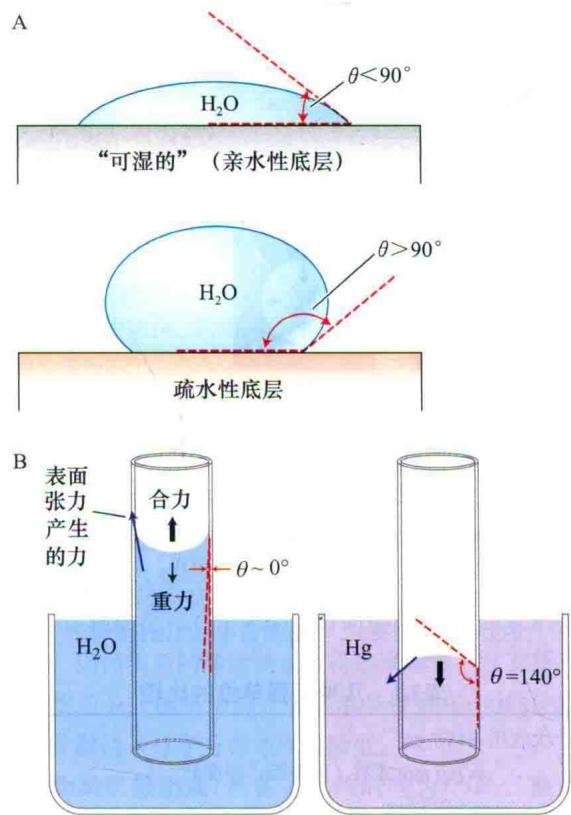  
图3.5 A. 固体表面上液滴的形状反映了液体与固体间相对引力的大小。接触角（ $\theta$ ）定义为从固-液交界面到气-液交界面的角度，用来描述这种相互作用。“可湿性”表面的接触角小于90°，高度可湿性（亲和力高）（如洁净玻璃表面的水和初生的细胞壁）的接触角接近于0°，水扩散成一薄层覆盖在高度可湿性表面上。然而非可湿性（疏水性的）表面接触角大于90°，水像念珠一样立在其表面。B. 毛细管现象可以通过观察从竖直毛细管底部进入液体后发生的现象来证明。如果管壁是高度可湿的（如在洁净玻璃管中水的接触角约为0°），合力是向上的。从而水面会上升直至向上的力与水柱的重力相等。相反，如果液体与管壁为非可湿的（如在洁净玻璃管中Hg的接触角约为140°），弯月面将向下弯曲，从而表面张力引起的合力使管中液面降低。

## 3.2.5 水具有高抗张强度

氢键使水具有高的张力（tensile strength），张力是指一个连续的水柱在断裂之前单位面积上所能承受的最大拉力。通常认为液体不存在张力，然而产生毛细现象的水柱证实水的这种特性。

可以把水放在干净的玻璃注射器中来证明它的张力（图3.6）。当推动注射器的活塞时，水被压缩，产生了一个正的静水压（hydrostatic pressure），单位为帕斯卡（Pa），方便时也可用兆帕斯卡（MPa）表示。1 MPa约等于9.9个大气压。压强是指单位面积上的压力（即 $1\ Pa=1\ N/m^{2}$ ），或者单位体积内的能量（即 $1\ Pa=1\ J/m^{3}$ ）。表3.1比较了压强的几种单位。

图3.6 一个封闭的注射器可以用来使水一样的流体产生正向或负向的压强。推动柱塞可以使流体产生正向的流体静力压（白色箭头），其作用力方向与表面张力（黑色箭头）所引起的界面力方向相同。这样注射器液体中的小气泡随压强升高发生皱缩。拉动柱塞使液体产生张力，即负压。若由液体产生的向外的力（白色箭头）大于由气-液交界面表面张力产生的向内

的力（黑色箭头），则注射器中的气泡会膨胀。

表3.1 几种压强单位的比较

1个大气压=14.7 psi
=760 mm 汞柱（海平面，纬度45°）
=1.013 bar
=0.1013 MPa
=1.01×10$^{5}$ Pa
汽车轮胎通常可以充气到0.2 MPa
家用水管中的水压为0.2~0.3 MPa
距离水面高 5 m处的水压强大约为0.05 MPa

如果拉动而不是推动活塞时，注射器中的水会产生一种张力或称负的静水压来对抗拉动。想象一下拉动活塞直到水分子之间彼此断开，使水柱断裂的困难到底有多大？

仔细研究发现，小毛细管中的水可以对抗比-20 MPa更负的拉力（Wheeler and Strook，2008），负号代表张力方向，以示与压缩相反。然而，微小气泡的存在使注射器中的水柱无法抵抗这么大的拉力（图3.6）。因为气泡在这种拉力的作用下会扩大，干扰了注射器中水抵抗拉力的能力。这种情况下气泡的扩张称为气穴现象（cavitation）。

气穴现象对水分在木质部中的连续运输会产生破坏性的影响，这一点会在第4章详细讨论。

## 3.3 扩散和渗透作用

细胞学过程依赖于分子输入和输出细胞。扩散作用（diffusion）是物质从高浓度向低浓度自发移动。对于细胞来说，扩散是运输采用的主要模式。水通过选择透过性屏障的扩散作用称为渗透作用（osmosis）。

下面讲述扩散和渗透的过程如何引导水和其溶质成分移动。

## 3.3.1 扩散是随机热振荡产生的分子净移动

溶液中的分子不是静止的，它们处于不停的运动中，彼此相互碰撞，交换动能。任一分子在碰撞后运动轨迹是随机可变的。然而这种随机运动可以导致分子的净移动。

设想一个平面把溶液分为A、B两个等体积的部分。所有分子都在作随机运动，存在有这种可能性，即随时会有一些溶质分子会跨过这个假想的面。假定在任一特定时刻从A到B的分子数目与A原有分子数目成比例，同样从B进入A的分子数目也与B原有分子数目成比例。

如果A的初始浓度高于B，更多的溶质分子将会从A进入B，这样应该可以看到溶质从A到B的净移动。这样扩散导致分子从高浓度区域向低浓度区域的净移动，尽管这时每个分子还是随机运动。这种每个分子的独立运动揭示了这个系统最终在两侧达到相同的分子数量（图3.7）。

热力学第二定律可以用来解释系统中分子平均分配的趋势，这一定律告诉人们孤立系统的一切自发过程均向着更无序的方向发展，即熵值越来越大。熵值的增加伴随着自由能的减少。因此，扩散代表了系统向能量最低状态转变的自然趋势。

19世纪50年代，科学家Adolf Fick发现扩散速率直接与浓度梯度（ $\Delta c_{s}/\Delta x$ ）成正比，即与距离为 $\Delta x$ 的两点之间不同物质的浓度差（ $\Delta c_{s}$ ）成正比。用公式表示为

$$
J _ {\mathrm{s}} = - D _ {\mathrm{s}} \Delta c _ {\mathrm{s}} / \Delta x\tag{3.1}
$$

这就是菲克第一定律。

式中， $J_{s}$ 为转运速率，也称作流量密度（flux density），指单位时间内通过单位面积的物质的量 $[J_{s}$ 的单位是 mol/(m²·s)]。 $D_{s}$ 为扩散系数（diffusion coefficient），是一个比例常数，用来衡量物质通过某种特定介质的难易程度。 $D_{s}$ 为物质的特征常数，跟物质本身的大小（分子越大，扩散系数越小），以及扩散介质（如在气体中比在液体中的扩散速度要快10 000倍）和扩散温度（温度越高，扩散速度越快）有关。式中的负号表明运动方向是顺浓度梯度方向进行的。

  
容器中位置  
图3.7 分子的热运动导致扩散的发生——分子逐步混合，浓度差异最终消失。最初，含有不同分子的两种物质相互接触，这些物质可以是气体、液体或固体。扩散速度在气体中最快，液体次之，固体最慢。较上面的一组图示主要描述分子最初分离的情况，相应的浓度变化由较下面图中所示的位置关系来表示。随着时间的推移，分子的混合和随机性减弱了它们的净运动。平衡时，两种类型的分子达到随机（均匀）分布。

菲克第一定律说明，当物质浓度梯度（ $\Delta c_{s}$ ）变大，或扩散系数增加时，扩散速度加快。需要注意的是，这个定律只适用于由浓度梯度所驱动的物质运动，而不适用于其他外力（如压力、电场等）作用下的物质运动。

## 3.3.2 短距离扩散更有效

如果最初状态下，所有的溶质分子都集中在起始位置 x=0（图3.8A），随着分子的随机运动，处于前端的溶质开始离开初始位置，如图3.8B所示较晚的时间

点。

比较前后两个时间点溶质分子的分布，可以看到随着物质从初始位置的扩散，浓度梯度逐渐减小（ $\Delta c_{s}$ 减小），也就是说溶质分子向后即起始点（方向指向x=0）运动的量相对于向前（方向远离x=0）运动的量会增加，因而物质的净运动也变得越来越慢。注意所有时段里溶质分子的平均位点其实都是停留在x=0的位置，但是扩散使得分子分布浓度差降低。

物质扩散距离L所需的平均时间为 $L^{2}/D_{s}$ ，换句话说，物质通过某个距离扩散所需的平均时间与该距离的平方成正比。

葡萄糖在水中的扩散系数约为 $10^{-9}\ m^{2}/s$ 。葡萄糖分子扩散通过一个直径为50 $\mu$ m的细胞时，所需的平均时间为2.5 s。然而，相同的葡萄糖分子在水中扩散1 m所需的平均时间约为32年。这些数值表明，溶质在溶液中的扩散，对于细胞大小的距离来说，其扩散效率很高，而对于物质长距离运输而言，其扩散速率太慢。有关扩散时间的具体计算细节，参见Web Topic 3.2。

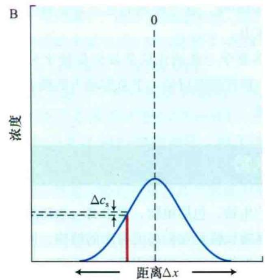  
图3.8 根据菲克定律进行扩散时溶质浓度梯度的变化。初始时，溶质分子位于X轴（“0”）所示的水平面上。A. 溶质放到初始水平面之后，短时间内的溶质分布。注意随溶质分子距初始扩散位置距离的增大，溶质浓度急剧下降。B. 在随后的时间段内溶质的分布。扩散的分子距初始位置的平均距离增加了，而且溶质浓度梯度趋于平缓（引自Nobel，1999）。

## 3.3.3 渗透作用指水通过选择性透过膜的净移动

植物细胞膜是选择性透过膜（selectively permeable），水和小的不带电的分子物质很容易透过，而大分子溶质和极性物质较难通过（Stein，1986）。如果细胞内溶质浓度高于胞外，水将会扩散进细胞，但是溶质却不能扩散出细胞，这种水跨过选择性透过膜的净移动即称为渗透作用（osmosis）。

前面看到所有系统有向熵增方向变化的趋势，从而导致溶质分子扩散进所有可能的空间。渗透过程中，膜限制了溶质分子扩散的空间，因此通过溶剂分子跨膜扩散稀释溶质而实现熵增的最大化。实际上，如果没有任何约束力存在的话，几乎所有可利用的水都可以流到膜的溶质侧。

如果把一个活细胞放在一个装有纯水的烧杯里将会有什么发生？选择性透过膜的存在意味着水的净流动将会持续直到下面两种结局出现：①细胞扩张直到这个选择性透过膜破裂，使得溶质自由扩散；②细胞体积的扩张受到细胞壁的限制，这样驱动水进入细胞的力受到细胞壁压力的制约。

第一种情景可能发生在动物细胞中，因为动物细胞不具有细胞壁。第二种则是发生在植物细胞。植物细胞壁非常强大，为了阻止细胞壁变形，产生了一种内向力，从而升高了胞内的静水压。渗透这个单词起源于希腊的单词pushing，这个单词的意思是指液体被挤压时产生的正压力。

随后将要学习渗透作用是如何促使水分跨膜运输的。然而，首先需要讨论一下总驱动力的概念，即水的自由能梯度。

## 3.4 水势

所有的生物，包括植物，要求有一个持续的自由能供给，来维持和修复它们高度有序的结构，同时维持生长和繁殖。生化反应、溶质积累、长距离运输等过程都是由植物获得的自由能来驱动（关于自由能的热力学概念的详细讨论参见附录1）。这部分我们先来研究一下浓度、压力及重力如何影响自由能。

## 3.4.1 水的化学势体现了水的自由能状态

化学势（chemical potential）定量反映了物质的自由能。在热力学中，自由能是指可用于做功的能量，即力和距离的积。化学势单位为J/mol，即每摩尔物质的自由能。注意化学势是相对量，它表示某物质在给定状态下与标准状态下的能量差。

水的化学势是水的自由能在量上的体现。水流动自发进行，也就是指在不需要其他能量的情况下水可以从高化学势的区域流向低化学势的区域。

由于历史的原因，植物生理学家通常采用一个相关的参数——水势（water potential）来衡量单位体积水的自由能（ $\mathrm{J} / \mathrm{m}^3$ ）。水势的定义是指水的化学势除以水的偏摩尔体积（1摩尔水的体积）： $18 \times 10^{-6} \mathrm{~m}^3/\mathrm{mol}$ 。水势的单位与压强的单位相同，Pa是水势常用的计量单位。下面我们来认真探讨一下水势这个重要的概念。

## 3.4.2 构成细胞水势的三要素

植物中影响水势的主要因素是浓度（concentration）、压力（pressure）和重力（gravity）。水势用符号 $\Psi_{w}$ （希腊字母psi）表示，溶液的水势由几个部分构成，常用下面等式表示。

$$
\psi_ {\mathrm{w}} = \psi_ {\mathrm{s}} + \psi_ {\mathrm{p}} + \psi_ {\mathrm{g}}\tag{3.2}
$$

式中， $\psi_{s}$ 、 $\psi_{p}$ 、 $\psi_{g}$ 分别为溶质、压力和重力对水自由能的影响（水势组成的另外几种表示法在Web Topic 3.3中有讨论）。能量水平的认定必须有一个参照值，类似于地图上表示高于海平面的一定距离的等高线。常用的参考值是指在一定环境温度和标准大气压下纯水的水势。参照的高度或设在植株底部（研究整株植物），或设在被研究组织所处的高度水平（研究水在细胞水平上的运动）。下面来逐一分析式（3.2）右边的每项组分。

## 1. 溶质

$\Psi_{s}$ 称为溶质势（solute potential）或渗透势（osmotic potential），反映溶液中的溶质对水势的影响。溶质通过稀释水降低了水的自由能。这主要是熵的影响，因为溶质与水的混合增加了系统的无序状态，从而降低了水的自由能。这就意味着渗透势与溶质的特性无关。对含有不可解离的溶质（如蔗糖）的稀溶液，其渗透势可以大致估算如下。

$$
\psi_ {\mathrm{S}} = - R T c _ {\mathrm{s}}\tag{3.3}
$$

式中，R为气体常数[8.32 J/(mol·K)]；T为绝对温度（开尔文或K表示）； $c_{s}$ 为溶液中溶质浓度，称作容量渗透摩尔浓度[osmolality，即每升水溶解溶质的摩尔数（mol/L）]。负号表示溶质的存在降低了溶液的水势，参照值为纯水的水势。由于纯水的水势定义为0，因而溶液的水势是负值。

式（3.3）对于“理想”溶液是有效的。而实际溶液，特别是在高浓度状态下，如溶质浓度大于0.1 mol/L时，通常会偏离理想溶液。温度也会影响水势（参见Web Topic 3.4）。在我们所阐述的研究中，通常假定溶液为理想溶液（Friedman，1986；Nobe，1999）。

## 2. 压力

$\Psi_{p}$ 指溶液的静水压（hydrostatic pressure）。正压增加水势，负压减小水势。有时 $\Psi_{p}$ 也称为压力势。细胞内正的静水压指的是膨压（turgor pressure）。当水在木质部或细胞的细胞壁之间时， $\Psi_{p}$ 也可以为负值，这时将会产生张力（tension），或负的静水压（negative hydrostatic pressure）。随后将会讲到，负压在水分通过整个植株的长距离运输中起着重要的作用。有关负压是否能够在活细胞中产生的问题，参见Web Topic 3.5。

静水压用来计量相对于大气压的偏离值。注意是以标准大气压下的水作为参照状态，并定义在标准状况下水的 $\Psi_{p}=0\ MPa$ 。因此，在敞口的烧杯中，纯水的 $\Psi_{p}$ 是0 MPa，尽管其绝对压强约为0.1 MPa（1个大气压）。

## 3. 重力

除非有相等的反作用力抵消重力的作用，否则重力便会使水向低处流动。 $\Psi_{g}$ 的大小取决于距离参照水面的高度（h）、水的密度（ $\rho_{w}$ ）及重力加速度g，写成公式为

$$
\psi_ {\mathrm{g}} = \rho_ {\mathrm{w}} g h\tag{3.4}
$$

式中， $\rho_{w}$ g值为0.01 MPa/m，依据式（3.4），水每升高10 m，则水势就会增加0.1 MPa。

当研究水分在细胞水平进行转运时，重力势 $\Psi g$ 通常可以忽略不计，因为与渗透势和静水压相比，它的变化是微不足道的，所以在这种情况下，式（3.2）可以简写为

$$
\psi_ {\mathrm{w}} = \psi_ {\mathrm{s+}} \psi_ {\mathrm{p}}\tag{3.5}
$$

## 3.4.3 水势的计算

水势及其各组分严重影响着细胞生长、光合作用和作物产量。植物学家花费了相当大的精力，去设计精确可靠的方法来测量植物中的水分状态。

基本的测量水势的方法是用湿度计或是压力室，其中湿度计有两种。湿度计主要利用了水气化需要大的潜热这一特性，可以精确测量①与样品处于平衡的水的气压，或②在样品和已知 $\Psi_{s}$ 溶液间转换的水气压。压力室通过对离体叶片施加外部气压直到将细胞中水分压出来测量 $\Psi_{w}$ 。

在有些细胞中， $\Psi_{p}$ 可以直接通过将一个与压力感知器相连的充有溶液的毛细管插进细胞来测量。换种情况，即 $\Psi_{p}$ 可以通过计算 $\Psi_{w}$ 和 $\Psi_{s}$ 的差来计算。可以通过几种方式来计量 $\Psi_{s}$ ，包括湿度计和测量冰点下降度的仪器。针对测量 $\Psi_{w}$ 、 $\Psi_{s}$ 和 $\Psi_{p}$ 的仪器的详细解释请参见 Web Topic 3.6。

当讨论干燥土壤或含水量很低的植物组织（如干种子）中的水势时，往往还要考虑衬质势 $\left(\Psi_{\mathrm{m}},\mathrm{matric~potential}\right)$ 。这种情况下，系统的含水层很薄，可能仅有一两个水分子的厚度，它们由于静电引力吸附在固体层表面。这种相互作用很强，不宜再把系统的水势分开成 $\Psi_{s}$ 和 $\Psi_{p}$ 来讨论，而是整合成一个单一的影响因素——衬质势 $\left(\Psi_{\mathrm{m}}\right)$ 。有关衬质势的其他内容参见Web Topic 3.7。

## 3.5 植物细胞的水势

植物细胞的水势通常 $\leqslant0\ MPa$ 。负值意味着细胞中水的自由能小于处于环境温度、大气压和相同高度的纯水的自由能。随着细胞外界溶液水势的变化，水通过渗透将会离开或进入细胞。下面通过具体的计算来说明植物细胞的渗透作用。

## 3.5.1 水分顺着水势梯度进入细胞

首先，假定20℃条件下有一个装满纯水的敞口烧杯（图3.9A）。由于水和大气相通，故水的静水压与大气压相等（ $\Psi_{p}=0\ MPa$ ）。另外水中无溶质存在，故 $\Psi_{s}=0\ MPa$ 。最后，由于关注的是烧杯中水分的运输，因此定义烧杯所处的高度水平为参照高度，即 $\Psi_{g}=0\ MPa$ 。因此，水势等于0 MPa（ $\Psi_{w}=\Psi_{p}+\Psi_{s}$ ）。

现在设想在水中溶解蔗糖，并使蔗糖浓度达0.1 mol/L（图3.9B）。由于蔗糖的添加，降低了溶液的渗透势，渗透势由原来的0 MPa降到了-0.244 MPa，因而水势也由0 MPa降到了-0.244 MPa。

接下来考虑一个松弛的植物细胞（无膨压的细胞），其内部的总溶质浓度达0.3 mol/L（图3.9C），则可以产生-0.732 MPa的渗透压。由于细胞是松弛的，内部压强与环境气压相同，所以静水压（ $\Psi_{p}$ ）为0 MPa，根据细胞水势的计算公式可知此时细胞的水势 $\Psi_{w}=-0.732 MPa$ 。

如果将该植物细胞放入盛有0.1 mol/L蔗糖溶液的烧杯中将会发生什么现象呢（图3.9C）？由于烧杯中蔗糖溶液的水势（ $\Psi_{w}=-0.244\ MPa$ ，图3.9B）比细胞的水势（ $\Psi_{w}=-0.732\ MPa$ ）高，水分将从蔗糖溶液流入细胞内（从水势高处流向水势低处）。

随着水分进入细胞，原生质体膨胀，细胞壁被不断拉伸。拉伸的细胞壁通过对细胞产生压力来抵制这种拉伸。这增加了细胞的静水压或膨压（ $\Psi_{p}$ ）。因此，细胞的水势（ $\Psi_{w}$ ）也相应增加，细胞内外的水势差（ $\Delta\Psi_{w}$ ）逐渐减小。

最终，细胞的 $\Psi_{p}$ 增加到使细胞的 $\Psi_{w}$ 与蔗糖溶液的 $\Psi_{w}$ 相等，达到平衡（ $\Delta\Psi_{w}=0\ MPa$ ），水分的净运输也随之停止。

在平衡状态下，水势是相等的， $\Psi_{w}$ （细胞）= $\Psi_{w}$ （溶液）。由于烧杯的容积远大于细胞的，细胞从烧杯中吸收的水分量是很少的，对烧杯中蔗糖溶液的浓度影响可以忽略不计，也就是说蔗糖溶液的 $\Psi_{s}$ 、 $\Psi_{p}$ 和 $\Psi_{w}$ 没有发生变化，因而平衡状态下， $\Psi_{w}$ （细胞）= $\Psi_{w}$ （溶液）=-0.244 MPa。

要想精确计算达到平衡状态时细胞的 $\Psi_{s}$ 和 $\Psi_{p}$ ，需要知道细胞体积的改变量。然而，如果假定细胞的细胞壁具有很强的刚性，那么吸水时细胞体积的增大量是很小的，这样就可以认为，在达到平衡的过程中， $\Psi_{s}$ （细胞）没有变化。根据式（3.5）可以得出平衡状态时细胞的膨压为：

$$
\Psi_ {\mathrm{p}} = \Psi_ {\mathrm{w}} - \Psi_ {\mathrm{s}} = - 0. 2 4 4 - (- 0. 7 3 2) = 0. 4 8 8 \mathrm{MPa}
$$

A 纯水

C 将萎蔫细胞置入蔗糖溶液中

B 0.1 mol/L 蔗糖溶液  

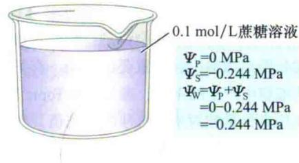

D 浓度增加的蔗糖溶液

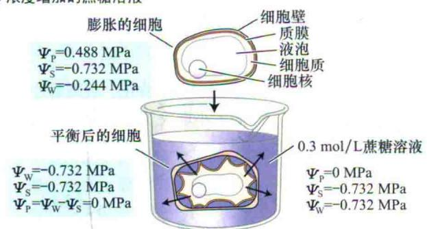

E 对细胞施加压力

通过挤压细胞失去一半的水,从而使 $\Psi_{s}$ 从-0.732 MPa降低到-1.464 MPa

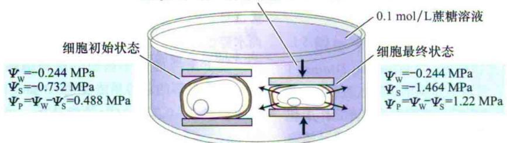

图3.9 阐述水势的概念及其组成的5个例子。A. 纯水。B. 0.1 mol/L蔗糖溶液。C. 将在空气中萎蔫的细胞放入0.1 mol/L的蔗糖溶液中。由于开始时细胞水势小于溶液的水势，细胞吸水，平衡后，细胞水势升高和溶液水势相等，最终结果是细胞具有了正的膨压。D. 增加溶液中的蔗糖浓度使细胞失水。增加的蔗糖浓度使溶液水势降低，细胞中水分流出，导致细胞膨压减小。这种情况下，由于蔗糖分子可以通过细胞壁上较大的孔道，造成原生质体与细胞壁分离（即质壁分离）。这种情况下细胞质和溶液之间水势差造成的水分移动完全通过细胞膜完成，因此原生质体发生收缩不需要依赖于细胞壁。相反，当细胞在空气中脱水时（如C中萎蔫的细胞），质壁分离则不会发生，这是由于水分通过细胞壁中的毛细管作用力被保留下来，尽管原生质体容积减小，但细胞（细胞质+细胞壁）作为整个单位收缩，使得细胞壁在细胞体积减小的过程中发生机械变形。E. 另外一种使细胞失水的方法是，用两个平板慢慢挤压细胞，在这种情况下，细胞中有一半水被挤出，因此渗透势为原来的1/2。

## 3.5.2 水分也可以顺着水势梯度流出细胞

水分也可以通过渗透作用流出细胞。在上述的例子中，如果接着将植物细胞从0.1 mol/L蔗糖溶液移出放入0.3 mol/L蔗糖溶液中（图3.9D），由于0.3 mol/L蔗糖溶液的水势 $\left[\Psi_{\mathrm{w}}\right)$ （溶液）=-0.732 MPa]比细胞的水势 $\left[\Psi_{\mathrm{w}}\right)$ （细胞）=-0.244 MPa]小得多，故水分将从膨胀的细胞流向0.3 mol/L的蔗糖溶液中。

细胞失水后，细胞体积缩小，则 $\Psi_{p}$ 和 $\Psi_{w}$ 也随之减小，直到 $\Psi_{w}$ （细胞）= $\Psi_{w}$ （溶液）=-0.732 MPa。如前所述，假定细胞体积的变化仍然很小，因此可以忽略由于水分流出细胞导致的 $\Psi_{s}$ 的改变。依据式（3.5）可以计算出，水分运动达到平衡时细胞的压力势 $\Psi_{p}=0\ MPa$ 。

如果不是将细胞转入0.3 mol/L蔗糖溶液中而是仍将细胞置于0.1 mol/L蔗糖溶液中，用两个玻璃板缓慢挤压细胞时（图3.9E），可以有效地提高细胞的 $\Psi_{p}$ ，增加细胞的水势，产生一个细胞内外的水势差 $\Delta\Psi_{w}$ ，促使水分流出细胞。这类似于工业中的反渗透法，即利用外加的压力使水分透过半透膜，实现水分与溶质的分离。如果继续挤压，直到细胞中一半的水分被挤压出，然后维持细胞处于这种状态，则细胞中的水分将会达到新的平衡。同以前的例子一样，达到平衡状态时，细胞内外的水势差为零，即 $\Delta\Psi_{w}=0\ MPa$ 。由于从细胞流到胞外溶液的总水量很小，可以忽略不计，因此细胞的水势值同未受挤压时的水势值一样，均等于胞外溶液的水势值，但此时构成细胞水势的各组分值却已完全不同。

由于有一半的水分被挤压出细胞，而溶质却留在胞内（细胞膜具有选择透过性），因而细胞溶液的浓度增大了一倍，导致 $\Psi_{s}$ 也降低为原来的1/2（-0.732 MPa×2=-1.464 MPa）。知道了 $\Psi_{w}$ 和 $\Psi_{s}$ 的最后值，可以利用式（3.5）计算出此时的压力势 $\Psi_{p}=\Psi_{w}-\Psi_{s}=-0.244-(-1.464)=1.22MPa$ 。

在该例子中，利用外力改变了细胞的体积，而没有改变细胞的水势。然而实际中，细胞外环境的水势是经常发生变化的，细胞会吸水或失水，直到其水势与环境的水势相同。

在上述所有例子中需要强调的一个共同点是：水分的跨膜运输是一个被动过程，即在物理因素作用下，水分流向低水势或低自由能的区域。在上述过程中，没有代谢作用的“泵”（由ATP水解驱动）的参与，泵主要用来驱动水通过半透膜逆自由能梯度运输。

水分逆着水势梯度跨半透膜运输的唯一情况是，伴随着相应溶质运动时的水分移动。通过膜蛋白，每转运一分子的溶质如糖、氨基酸或其他小分子，能同时“拽”上260分子的水跨膜运输（Loo et al., 1996）。

即便是逆着常规的水势梯度（如向水势高处）移动，这种运输方式也可发生。由于由溶质所引起的自由能的减少，要大于由水所引起的自由能的增大，因此自由能的净改变量仍是负的。通常情况下，以这种方式运输的水量往往比顺着水势梯度被动运输的水量要少得多。

## 3.5.3 水势及其组成部分随着生长环境和植物体的不同位置而发生改变

在灌溉良好的植物叶片中， $\Psi_{w}$ 可以从-0.2 MPa到草类的-0.1 MPa或是到树木和灌木的-2.5 MPa间变化。而干旱环境下叶片的水势会更低，一直可以降到极端环境下的-10 MPa。

$\Psi_{w}$ 的大小依赖于植物的类型和生长环境，与之相同， $\Psi_{s}$ 也会有相当大的改变。施水良好的菜园植物的细胞（如生菜、黄瓜幼苗和豆的叶片）， $\Psi_{s}$ 可能会高到-0.5 MPa（低浓度的细胞溶液），尽管在这些植物中典型的值应是-1.2\~-0.8 MPa。在木本植物中， $\Psi_{s}$ 会低一些（具有高浓度的细胞溶液），使得这些植物的 $\Psi_{s}$ 在正午时分在不降低膨压下会更偏负。

细胞中的 $\Psi s$ 很低，但胞外质外体溶液也就是细胞壁和木质部溶液通常都是非常稀的。尽管某些组织（如生长中的果实）和生活环境下（如高盐环境）的质外体溶液浓度会很高，典型质外体溶液的 $\Psi s$ 仍处于-0.1\~0 MPa。通常来说，木质部和细胞壁的水势主要由 $\Psi p$ 决定， $\Psi p$ 通常小于零。在第4章我们将讨论决定质外体 $\Psi p$ 的因素。

受胞内 $\psi_{s}$ 大小决定，水分充足的植物细胞的 $\psi_{p}$ 为 0.1\~3 MPa。当这些组织细胞内的膨压减小到0时，植物会发生萎蔫（wilt）。由于更多的水分从细胞中流失，细胞壁变形，最终细胞受到伤害。Web Topic 3.8 对比讨论了由于质外体溶质存在造成细胞的渗透脱水和由于质外体低的（更偏负）静水压导致的细胞失水。

## 3.6 细胞壁和细胞膜的特性

植物细胞的结构成分在植物细胞与水的关系中起到了重要的作用。细胞壁的弹性决定了细胞体积和膨压间的关系，质膜和液泡膜对水的通透性影响了细胞和周围环境间的水分交换速率。这一部分我们将探讨细胞壁和细胞膜的特性是如何影响到植物细胞内的水分状态。

## 3.6.1 植物细胞体积的微小改变会导致细胞膨压的巨大变化

由于植物体每天必须进行光合作用，因此植物不可避免地会蒸腾失水，从而导致植物细胞的水势也会发生很大变化。在保证植物细胞体积最大程度处于稳定状态中，细胞壁起着非常重要的作用（见第4章）。由于植物细胞具有相对刚性的壁，细胞水势的变化往往会伴随着 $\Psi p$ 发生很大的变化，只要 $\Psi p>0$ ，细胞（主要指原生质体）体积的变化相对较小。

这种现象可以由图3.10所示的压力-体积曲线来表示，当 $\Psi w$ 由0降至-1.2 MPa时，细胞水的相对含量仅减小了5%，细胞水势的降低主要是由于细胞 $\Psi p$ 的减小所致（ $\Psi p$ 大约降低了1.0 MPa），而由于细胞溶质浓度升高所导致的细胞 $\Psi s$ 仅降低了不足0.2 MPa。

  
图3.10 陆地棉（Gossypium hirsutum）叶片细胞的相对含水量（ $\Delta V/V$ ）、水势（ $\Psi_{w}$ ）和渗透势（ $\Psi_{s}$ ）之间关系。随着刚开始相对含水量的减少，水势快速降低。然而，渗透势变化很小。当细胞体积减小至90%以下时，情况刚好相反：水势的变化主要由渗透势的下降引起，而膨压的变化很小（引自Hsiao and Xu, 2000）。

通过测定细胞的水势和与其相应的细胞体积，可以定量说明细胞壁如何影响植物细胞的水分状况。当相对体积减少10%\~15%时，大多数细胞的膨压将会降到0。然而，对于细胞壁刚性很强的细胞来说，膨压减小时细胞体积的改变很小；而对细胞壁弹性极大的细胞，如仙人掌茎中的储水细胞，随着膨压的降低细胞体积的变化却相当大。

体积弹性模量，用 $\varepsilon$ （希腊字母epsilon）表示，可以由 $\Psi_{p}$ 和细胞体积间的关系来确定： $\varepsilon$ 是指相对体积发生固定改变导致的 $\Psi_{p}$ 的改变 $[\varepsilon=\Delta\Psi_{p}/\Delta V$ （细胞相对体积的变化）]。 $\varepsilon$ 较大表明细胞的细胞壁坚硬，因此当细胞体积发生相同变化时这种细胞的膨压相对于 $\varepsilon$ 较小、细胞壁弹性较大的细胞会发生较大改变。细胞壁的机械特性因物种和细胞类型的不同而不同，导致失水时对细胞体积的影响程度也显著不同。

比较仙人掌茎内细胞的水分关系，可以看出细胞壁特性的重要作用。仙人掌是典型的干旱地区生长的肉质茎植物。它们的茎由外围的光合作用层围绕内部非光合作用组织组成，非光合作用组织具有储存水分的功能（图3.11）。尽管内外层细胞的水势保持平衡（或非常接近平衡），但干旱情况下，内层细胞首先失水（Nobel，1988），这种情况是如何发生的呢？

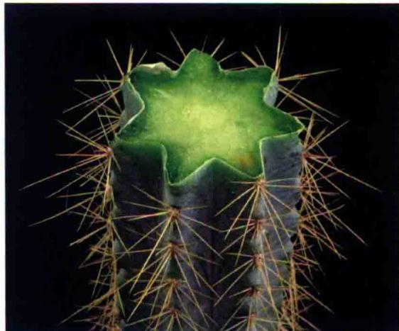  
图3.11 仙人掌茎的截面，显示外层光合作用层和起储水作用的内层非光合作用组织。干旱情况下，水优先从非光合作用细胞散失，这样有助于维持光合作用组织的水分状态（图片来自David McIntyre）。

通过对梨果仙人掌（Opuntia ficus-indica）（Golds-tein et al., 1991）详细研究，发现内层储水细胞较大，比外层光合细胞的细胞壁薄，因此这类细胞的细胞壁弹性大（具较低的ε）。因此，当外界水势降低固定值时，储水细胞要比光合细胞的失水程度高。此外，干旱情况下，储水细胞内的溶质浓度会下降，部分原因是由于可溶性糖聚合成不溶性的淀粉粒。植物对于干旱的典型反应是积累溶质，从而可部分地阻止水分从细胞散失。然而，对仙人掌来说，干旱情况下，由于弹性较大的细胞壁组成和溶质浓度的下降，使储水细胞内的水分优先丧失，从而有助于保证光合作用组织的水合作用。

## 3.6.2 细胞获得或失去水分的速率受细胞膜的导水率影响

到目前为止，已经了解了在水势梯度作用下的水分跨膜运输。水分流动方向由 $\Psi_{w}$ 梯度方向决定，水分运输速率与驱动梯度的大小成正比。然而，对于一个细胞来说，当环境水势发生变化时（图3.9），它就会吸收或排出水分，而随着时间的推移，细胞内外的水势逐渐趋于相同，水分的跨膜运输也会减慢（图3.12）。水分移动的速率与时间之间呈指数关系，直至降为0（Dainty，1976）。速度降至一半的时间即 $t_{1/2}$ （half-time），可用下面公式表示。

B  
A  

  
图3.12 水分进入细胞的速率取决于水势差（ $\Delta\Psi_{w}$ ）和细胞膜的导水率（Lp）。A. 刚开始时水势差为0.2 MPa。Lp是 $10^{-6}$ m/(sMPa)，由这些值得到初始运输速率（ $J_{v}$ ）是 $0.2\times10^{-6}$ m/s，B. 随着细胞吸水，水势差也在逐渐减小，导致细胞吸水速率减慢。这种效应随时间呈现指数衰减过程， $t_{1/2}$ 取决于以下细胞参数：细胞容积（V），表面积（A），导水率（Lp），容量弹性模量（ $\varepsilon$ ）和细胞的渗透势（ $\Psi_{s}$ ）。

$$
t _ {1 / 2} = [ 0. 6 9 3 / (A) (\mathrm{Lp}) ] [ V / (\varepsilon - \Psi \mathrm{s}) ]\tag{3.6}
$$

式中，V和A分别为细胞的体积和表面积；Lp为细胞膜的导水率（hydraulic conductivity）。导水率指水分跨膜的难易程度，单位为 $m^{3}/(m^{2}\cdot s\cdot MPa)$ ，即单位驱动力下，单位时间单位膜面积上水分运输的体积量。有关导水率的详细讨论参见Web Topic 3.9。

$t_{1/2}$ 越短，说明达到平衡越快。因此，细胞的表面积与体积比越大，膜的导水率越高，细胞壁刚性越强（大的 $\varepsilon$ ），则细胞与周围环境达到平衡的时间越快。细胞的 $t_{1/2}$ 通常在1\~10 s，有些甚至更短（Strudle，1989）。由此可以看出一个细胞与周围环境达到水势平衡的时间通常不到1 min。对于多细胞组织， $t_{1/2}$ 可能会长很多。

## 3.6.3 水孔蛋白促进水分的跨膜运输

多年来，关于水分如何跨膜运输仍不很清楚。尤其是在水分跨膜运输过程中，水分子的扩散是否受到质膜脂质层的阻碍？是否也涉及通过膜上的蛋白孔进行水分扩散（图3.13）？研究表明，对观察到的水分跨膜运输速率来说，直接通过脂双层的水分扩散速率远不能达到这种速度，而关于微孔运输水分的证据又不是完全令人信服。

近来，随着水孔蛋白（aquaporin）的发现，这些未知的问题也迎刃而解（图3.13）。水孔蛋白是膜整合蛋白，其构成了水分选择性跨膜运输的通道（Maurel et al., 2008）。由于水分通过这些通道的扩散速度比通过脂双层要快得多，因此水孔蛋白更有利于促进水分进入植物细胞（Weig et al., 1997；Schaffner, 1998；Tyerman et al., 1999）。

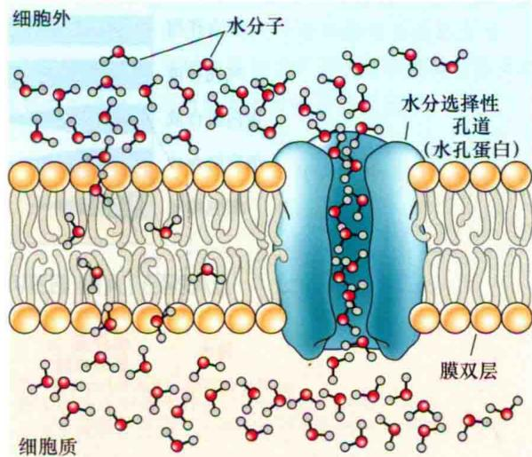  
图3.13 左边为单个水分子通过膜脂双分子层扩散，右边为水分子连续通过由诸如水孔蛋白等膜蛋白形成的水分选择性孔道的扩散。

需要注意的是，尽管水孔蛋白的存在改变了水分跨膜运输的速度，但并不能改变水分运输的方向和运输动力。另外，水孔蛋白组成的水通道是可逆性的“门”（存在开闭两种状态），受胞内pH和 $Ca^{2+}$ 等生理指标调控（Tyerman et al., 2002）。由此，人们认识到植物具有主动调节细胞膜对水通透性的功能。

## 3.7 植物的水分状态

水势概念的引入有两个主要作用：首先，正如我们所讲的，水势控制着水分的跨膜运输。其次，水势可用来衡量植物的水分状况（water status）。这一部分主要讨论水势如何帮助人们评估植物的水分状态。

## 3.7.1 植物水分状态影响了生理过程

由于不断向大气中蒸腾失水，植物很少处于高度的含水状态。干旱时，植物由于缺水，生长和光合作用受到抑制。图3.14列出了植物在不断增强的干旱情况下所发生的生理变化。

广义来讲，任何特定的生理过程对缺水的敏感性体现了植物应对环境中可利用水量的变化所采取的对策。由图3.14可看出，受缺水影响最大的生理过程是细胞伸展（cell expansion）。在许多植物中，供水量的降低，会抑制茎的生长和叶片扩展，但却能促进根的伸长生长。根冠比的增加能大致反映出环境中植物可利用水量的降低，因此，茎生长对于水分匮缺的敏感性，应被看作植物对干旱的一种主动适应，而不是一个被动的生理现象。

由于任何植物都不能改变土壤中的可利用水量（图3.14也显示出在不同水分胁迫条件下的典型水势值），因此干旱会对植物的生理过程产生一些根本性的限制，尽管在这些限制条件下实际的水势值，不同种间

由于脱水引起的生理变化：  
  
图3.14 不同生长条件下各种不同的生理过程对水势的敏感性。柱状箭头颜色的强度代表生理过程强度的大小。例如，细胞扩展速度随水势减小（变得更偏负）而变慢。ABA是缺水状况下诱导气孔关闭的一种植物激素（见第23章）（引自Hsiao and Acevedo，1974）。

会存在着差异。

## 3.7.2 溶质积累利于细胞维持膨压和体积大小

植物具备在缺水情况下，通过付出相应的代价来维持其正常生理活动的能力。这些代价包括：以积累溶质的形式来维持膨压；加强非光合器官如根的生长来提高植物的吸水能力；或建立木质部管道系统来承受大的负压。因此，植物对水分可利用量的生理反应，体现了一种折中，即面对多变的外界环境，植物尽量少付代价，尽可能地保证其正常的生理过程（如生长）。

生长在含盐环境中的植物称为盐生植物（halophyte），它们是典型的具有低 $\Psi s$ 的植物。由于低的 $\Psi s$ 会进一步地降低细胞的 $\Psi w$ ，足以保证盐生植物细胞在没有高水平盐分进入细胞的情况下从盐水中吸水。植物在干旱条件下， $\Psi s$ 会更偏负值。缺水通常会导致细胞质和液泡内的溶质积累，因而尽管水势很低，植物仍能维持一定的膨压。

拥有正的膨压（ $\Psi_{p}$ ）对植物很重要，原因有以下几点。首先，植物细胞的生长需要膨压来拉伸细胞壁。

在缺水状态下 $\Psi_{p}$ 的丧失，可以部分解释细胞生长为什么对缺水如此敏感，以及为什么可以通过改变细胞渗透势来改变这种敏感性（见第26章）。其次，正的膨压增加了细胞和组织的机械刚性。

总之，膨压虽然直接影响到某些生理过程。然而，细胞膜上存在着拉伸激活的信号分子说明植物通过感受细胞体积的变化而不是通过直接测量膨压来感受水分状态的改变。

## 小结

陆生植物面临着失水和脱水的危险。植物必须利用它们的根系吸水并在植物体内运输以确保植物不受脱水的威胁。

## 植物中的水

· 细胞壁可使植物细胞建立起巨大的内部静水压（膨压）。膨压对于许多生理过程都是必需的。

· 水分限制了农业和自然生态系统的产量（图3.1和图3.2）。

· 植物根系吸收的水分，约97%经植物体内运输，最后通过蒸腾作用从叶表面蒸发散失。

\- 植物通过共同的扩散途径同时进行着 $\mathrm{CO}_{2}$ 的吸收和水分的散失。

## 水的结构和特征

· 水分子的极性和四面体形使得氢键极易形成，从而赋予水不同寻常的特性：水是非常好的溶剂，具有高比热、高的蒸发潜热和高的张力（图3.3和图3.6）。

· 内聚力、附着力和表面张力导致毛细现象的形成（图3.4和图3.5）。

## 扩散和渗透作用

\- 分子或离子的随机热运动产生了扩散现象（图3.7和图3.8）。

· 短距离的扩散更有效，物质通过某个距离扩散所需的平均时间与该距离的平方成正比。

· 渗透作用指水通过选择性透过膜的净运输，受水浓度梯度和压力梯度的驱动。
水势

· 水的化学势反映了水在给定状态下的自由能。

· 植物中影响水势（ $\Psi_{w}$ ）的主要因素是浓度、压力和重力。

\- $\Psi_{\mathrm{S}}$ ，溶质势或渗透势，反映溶液中的溶质对水势的影响，降低了水的自由能。

· $\psi_{p}$ ，溶液的静水压。正压（膨压）增加水势，负压减小水势。

· 研究水分在细胞水平进行转运时，重力势 $\psi_{g}$ 通常可以忽略不计，因此 $\psi_{w} = \psi_{s} + \psi_{p}$ 。

## 植物细胞的水势

· 植物细胞的水势通常为负值。

· 水分进出细胞与水势梯度有关。

· 一个萎蔫的植物细胞处于高水势（偏负程度较小）的溶液中，水分将从溶液流入细胞内（从水势高处流向水势低处）（图3.9）。

· 随着水分进入细胞，细胞壁产生压力来抵制拉伸，细胞的静水压或膨压（ $\Psi_{p}$ ）增大。

· 在平衡状态下 $[\Psi_{\mathrm{W}}$ （细胞） $= \Psi_{\mathrm{W}}$ （溶液）； $\Delta \Psi_{\mathrm{W}} = 0]$ ， $\Psi_{\mathrm{P}}$ 会增加到足够大以升高细胞的 $\Psi_{\mathrm{W}}$ ，使之与溶液的 $\Psi_{\mathrm{W}}$ 一样，水分子的净运动停止。

· 水也可以通过渗透作用流出细胞。当一个膨胀的细胞放在一个水势更偏负的蔗糖溶液中时，水将会从细胞流向溶液（图3.9）。

· 如果细胞受到挤压，可以有效地提高细胞的 $\Psi_{p}$ ，增加细胞的水势，产生一个细胞内外的水势差 $\Delta\Psi_{w}$ ，促使水分流出细胞（图3.9）。

## 细胞壁和细胞膜的特性

· 细胞壁的弹性决定了细胞体积和膨压间的关系，质膜和液泡膜对水的通透性影响了细胞和周围环境间的水分交换速率。

\- 由于植物细胞具有相对刚性的壁，细胞体积的轻微改变就可导致膨压发生较大的变化（图3.10）。

\- 对于水势差（ $\Delta \Psi_{\mathrm{W}}$ ），随着时间的推移，细胞内外的水势逐渐趋于相同，水分的跨膜运输也会减慢（图3.12）。

· 水孔蛋白是水分选择性跨膜运输的通道（图 3.13）。

## 植物的水分状态

· 干旱情况下，植物光合和生长都受到抑制，同时 ABA 和溶质不断积累（图 3.14）。

· 干旱情况下，植物必须消耗能量通过积累溶质的形式来维持膨压，从而支持根和维管系统的生长。

· 细胞膜上拉伸激活的信号分子可以使植物感受细胞体积的变化，从而感受水分状态的改变。

(白玲周云译)

## WEB MATERIAL

## Web Topics

3.1 Calculating Capillary Rise
Quantification of capillary rise allows us to assess its functional role in water movement of plants.

## 3.2 Calculating Half-Times of Diffusion

The assessment of the time needed for a molecule such as glucose to diffuse across cells, tissues, and organs shows that diffusion has physiological significance only over short distances.

## 3.3 Alternative Conventions for Components of Water Potential

Plant physiologists have developed several conventions to define water potential of plants. A comparison of key definitions in some of these convention systems provides us with a better understanding of the water relations literature.

## 3.4 Temperature and Water Potential

Variation in temperature between 0 and 30°C has a relative minor effect on osmotic potential.

3.5 Can Negative Turgor Pressures Exist in Living Cells? It is assumed that $\Psi p$ is zero or greater in living cells; is this true for living cells with lignified walls?

## 3.6 Measuring Water Potential

Several methods are available to measure water

potential in plant cells and tissues.

## 3.7 The Matric Potential

Matric potential is used to quantify the chemical potential of water in soils, seeds, and cell walls.

## 3.8 Wilting and Plasmolysis

Plasmolysis is a major structural change resulting

from major water loss by osmosis.

## 3.9 Understanding Hydraulic Conductivity

Hydraulic conductivity, a measurement of the membrane permeability to water, is one of the factors determining the velocity of water movements in plants.

# 第 4 章

# 植物的水分平衡

生活在地球大气中的陆生植物面临着巨大的挑战。一方面，大气提供植物光合作用所需 $CO_{2}$ ；另一方面，大气是相对干燥的，会使植物由于蒸腾作用丧失水分。由于植物在吸收 $CO_{2}$ 时不能阻止水分的散失，从而使植物在吸收 $CO_{2}$ 的同时面临脱水的危险。这是一个十分复杂的问题，因为 $CO_{2}$ 从大气扩散到植物体内的浓度梯度远远小于驱动水分丧失的浓度梯度。为了最大限度地多吸收 $CO_{2}$ 同时又能尽量减少水分散失，植物通过长期适应，进化出通过叶片控制水分丧失，而不是让水分直接散失到大气中去的机制。

在这一章中将研究水分在植物体内和水分在植物与其所在环境间的运输机制及其驱动力。下面通过探讨土壤中的水来开始对水分运输的认知。

## 4.1 土壤中的水分

土壤中水分的含量和水分移动的速率很大程度上依赖于土壤的类型和土壤结构。沙土是一个极端，其土壤颗粒直径为1 mm或稍大些。沙质土壤每克土壤的表面积相对较低，但颗粒间的空隙或孔道较大。

黏土是另一个极端，它的颗粒直径小于2 $\mu$ m。黏土土壤的表面积很大，但颗粒间的空隙较小。在腐殖质（腐烂的有机物）等有机物的作用下，黏土颗粒可以聚集成“小团粒”，从而通过形成大的孔道有助于提高土壤的透气性和对水的渗透性。

当土壤因雨水或灌溉导致含水量极丰富时（参见Web Topic 4.1），由于重力作用，水分通过土壤颗粒间空隙向下渗透，部分土壤颗粒间存在的空气被水取代，由于水是通过毛细作用进入土壤颗粒之间空隙的，因此小的孔道会先被填满。那么当土壤中存在的可利用水量较少时，土壤中的水会以水膜的形式附着在土壤颗粒表面，仅充满小的孔道，而当水多时会充满颗粒间的整个孔道。

沙质土壤中，由于土壤颗粒间的空隙非常大，大部分的水分很容易地从颗粒间排出，仅在颗粒表面和颗粒间空隙中残留有少量的水分。而对于黏土，由于颗粒间的空隙非常小，水分子间的张力足以对抗其自身的重力，从而使水分被保留在土壤中。黏土土壤在水分饱和后的数天内，仍然可以保持40%体积的水分。与此相反，典型的沙质土壤在饱和后仅可保持大约15%体积的水分。

在下面的几节中将研究土壤的物理结构是如何影响土壤的水势，水分在土壤中如何移动，以及根系如何吸收植物所需的水分。

## 4.1.1 土壤水分中负的净水压可降低土壤水势

与植物细胞的水势相似，土壤的水势可分为3个部分，渗透势、静水压和重力势。除了盐碱地，由于土壤中溶质的浓度非常低，土壤中水的渗透势（osmotic potential， $\Psi_{s}$ ；参见第3章）通常可以忽略不计，一般为-0.02 MPa左右。但在富含盐类的土壤中 $\Psi_{s}$ 是不能忽略的，因为其数值能达到-0.2 MPa或更低。

土壤水势的第二个组成部分是静水压（hydrostatic pressure， $\Psi_{p}$ ）（图4.1），对于湿的土壤， $\Psi_{p}$ 几乎为零。而当土壤干燥时， $\Psi_{p}$ 会降低并达到非常大的负值。那么土壤中水的负压是从哪里来的呢？

回想在第3章讨论过的毛细管现象，水有很高的表面张力，具有使空气-水分界面达到最小的趋势。但同时由于张力存在，水也具有附着在土壤颗粒表面的倾向（图4.2）。

  
图4.1 水分从土壤通过植物到达大气的主要驱动力。水气浓度差（ $\Delta c_{wv}$ ）、静水压差（ $\Delta\Psi_{p}$ ）和水势差（ $\Delta\Psi_{w}$ ）。

图4.2 根毛与土壤颗粒密切接触并极大地扩大植物可用来吸收水分的表面积。土壤是一个由颗粒（沙、黏土、淤泥和有机物）、水、溶质和空气组成的混合物。水是被土壤颗粒表面吸附的。随着水分被植物吸收，土壤溶液退缩到土壤颗粒间的小穴、孔道和裂缝中。在水与空气的交界面，这种退缩引起土壤溶液的表面形成一个凹的弯液面（空气和水之间的曲面在图中用箭头标出），由于表面张力使溶液形成张力（负压）。随着更多的水离开土壤，形成更多的凹面，从而引起更大的张力（更大的负压）。

随着土壤中含水量的减少，水分退缩到土壤颗粒间的空隙中，形成一个空气-水的交界面，这个界面弯曲的曲率代表了使空气和水界面表面积最小的倾向力和土壤颗粒对水的吸附力相平衡的结果。这些曲面下的水形成了负压，这个负压可以通过下面的公式计算。

$$
\psi_ {\mathrm{p}} = \frac {- 2 T}{r}\tag{4.1}
$$

式中，T为水的表面张力（ $7.28 \times 10^{-8}$ MPa），r为空气和水分界面的曲率半径。需要注意的是，当假设土壤颗粒为完全可湿时（接触角 $\theta=0$ ; $\cos\theta=1$ ），毛细管现象的公式与这个相同，参见Web Topic 3.1（图3.5）。

当土壤变干燥时，水分最先从土壤颗粒间最大的空隙散失，随后才是土壤颗粒中或它们之间存在的较小空间中的水分丧失。在这个过程中，土壤中水分的 $\Psi_{p}$ 会变为非常低的负值，这是由于随着孔径越来越小，空气-水分临界面的曲率逐渐增大。例如， $r=1\ \mu m$ 的曲率（大约是最大黏土颗粒的大小）所对应的 $\Psi_{p}$ 是-0.15 MPa。随着空气-水分交界面退缩到黏土颗粒间较小的缝隙时， $\Psi_{p}$ 可以很容易达到-2\~-1 MPa。

第三个组成部分是重力势。重力在土壤的排水中有重要的作用，水的向下运动就是由于重力势与高度成正比，高度越高，重力势越大，反之亦然。

## 4.1.2 水分以集流的形式在土壤中运动

集流（bulk or mass flow）是指全体分子的共同移动，常常会在压力梯度的驱动下形成。花园橡胶软管及河流中水的移动是最常见的集流例子。在沙土中的水分主要是通过集流的方式进行移动的。

由于土壤中的水压主要取决于空气-水分交界面的曲率，因此水是从含水量高的土壤区域（含水的空间比较大）流向含水量低的土壤区域（含水的空间区域较小，空气-水分的界面曲率大）。另外，水以气体形式的扩散也在水分的运动中占有一定比例，这在干燥土壤中是重要的水分运动方式。

当植物从土壤中吸收水分时，它们首先将根表面附近的水分耗尽，这样就降低了根表面附近水的 $\Psi_{p}$ ，从而与附近高 $\Psi_{p}$ 的土壤区域形成了一个土壤水的静水压梯度。由于土壤中含有水的孔隙是连续的，水沿着这个压力梯度顺着这些孔道能够以集流形式运输到根系表面。

水分在土壤中的移动速率取决于两个因素：土壤的静水压梯度和土壤导水率（soil hydraulic conductivity）。土壤导水率主要用来衡量水在土壤中移动的难易程度，它因土壤类型和该类型土壤含水量的不同而不同。沙土由于在颗粒间存在大的空隙，有着比较大的导水率，而黏土由于颗粒间的空间小，导水率也小。

随着土壤含水量（也就是水势）的降低，导水率也

B

急剧下降。这种降低主要是由于土壤空隙间的水分被空气取代。当某个土壤孔道的水分被空气取代后，水分在该孔道内的运输受阻，只能通过其他的孔道。随着越来越多的土壤孔道被空气填满，水能通过的孔道越来越少越来越窄，土壤导水率也随之降低（Web Topic 4.2介绍了土壤结构如何同时影响其保水能力和导水率）。

## 4.2 根对水分的吸收

根表面与土壤密切接触是根有效吸收水分所必需的。随着土壤中根和根毛的不断生长，根系从土壤中吸收水分的表面积也逐渐达到最大。根毛（root hair）是根表皮细胞的向外细丝状生长，在很大程度上增加了根的表面积，因而增强了根从土壤中吸收离子和水分的能力。在生长3个月的小麦（wheat）中，其根毛表面积占到了根表面积的60%还多（图5.7）。

相对于根的其他部分，根尖附近的水分更容易进入根中。根的成熟区域往往具有较差的透水性，因为其外面有一层高度发育的保护组织，称为外皮层（exodermis）或下皮组织（hypodermis），其细胞壁中含有疏水物质，对水分具有相对不透过性。根系统的各部分对水的渗透性不一样，尽管乍看起来是违反直觉的，但是植物如果依赖根系的非成熟区从周围土壤新区域来吸收水分和进行营养物质的集流运输的话，那么根的成熟区域必须被封闭起来（图4.3）（Zwieniecki et al., 2002）。

当土壤松动时，根系表面与土壤的紧密结合层会很容易遭受破坏。正是这个原因新移栽的幼苗和植株在移栽后的最初几天内需要防止水分丧失。当新的根系伸进土壤，重新建立起土壤-根的紧密结合层时，植物就可以重新很好地耐受水分胁迫。

下面来看一下水分在根中是如何运输的，以及影响植物根部吸水速率的因素。

## 4.2.1 根部水分运输的质外体、共质体和跨膜途径

在土壤中，水分在土壤颗粒之间进行运输。然而，从根的表皮到内皮层，水分的运输可通过3种途径（图4.4）：质外体、共质体和跨膜途径。

（1）质外体是指由细胞壁、细胞间隙和非活细胞的内腔（如木质部导管和纤维）组成的连续系统。在这个途径中，水分通过细胞壁和胞外空间（不跨任何细胞膜）来跨过根的皮层。

（2）共质体是指通过胞间连丝将细胞质相互连接组成的整个网络。在该途径中，水分通过胞间连丝从一个细胞到达另一个细胞进而跨过根皮层（见第1章）。

（3）跨膜途径是指水分从细胞的一侧进入，另一侧流出的途径，然后进入相连的下一个细胞，依次进行。该途径中，对于每个细胞水分至少需要跨膜两次（进入质膜和离开质膜），甚至还有可能涉及跨液泡膜的运输。

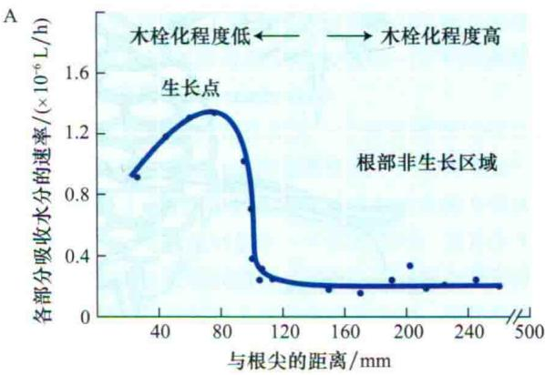

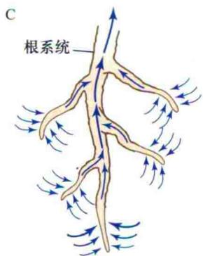  
整个表面的渗透性一致  
仅靠近根尖的区域具有渗透性  
图4.3 南瓜根不同位置吸收水的速率（A）。图示整个根表面对水的吸收具有同等渗透性（B）。在成熟区域由于木栓质的沉积而成为非渗透性的（C）。当根表面等渗时，随着水的流入，由于木质部吸水力的减弱，越来越多的末端区域被水隔离，大多数水进入了根系统顶部附近。而当根成熟区域的渗透性降低时，允许木质部的张力延伸到根系统更远的地方，从而允许根系统的末梢也可吸收水分（引自Kramer and Boyer，1995）。

尽管3种途径中究竟哪一个更重要还没有完全确定，但压力探针技术（参见Web Topic 3.6）的实验表明细胞膜在水分跨根皮层的运输中起重要的作用（Frenseh et al., 1996; Steudle and Frensch, 1996; Bramley et al., 2009）。虽然存在有3种运输途径，但在水分的移动过程中会根据所处位置的压力梯度及遇到的阻力来选择移动路径，而不是仅限于单一的运输途径。例如，一些通过共质体途径运输的水分子可能会跨过细胞膜并进入质外体途径短暂运输，然后再重新回到共质体途径。

在内皮层中，水分通过质外体途径的运输可被凯氏带阻断（图4.4）。凯氏带（Casparian strip）是一个内皮层中径向细胞壁组成的带，壁中充满着蜡质的疏水物

PLANT PHYSIOLOGY

  
图4.4 根系吸水的途径。水分可能通过质外体、共质体和跨膜途径通过皮层。在共质体途径中，水分通过胞间连丝不需跨膜就可在细胞间流动。在跨膜途径中，水分跨过质膜移动，并在细胞壁空间中短暂停留。在内皮层中，质外体途径可以被凯氏带阻断。

质——木栓质（suberin）。在根尖后的数毫米处根系不再生长的部分，内皮层逐渐木栓化，并且原生木质部组分也同时形成（Esau，1953）。凯氏带阻断了质外体途径的连续性，迫使水分和溶液通过跨膜途径来穿过皮层。

水分须经共质体途径运输才能通过内皮层，这有助于解释为什么根对水分的通透性强烈依赖于水孔蛋白的存在。下调水孔蛋白基因的表达可以明显降低根的导水率，并且可以导致植株很容易萎蔫（Siefritz et al., 2002），或者作为弥补产生更大的根系（Martre et al., 2002）。

低温、缺氧或用呼吸抑制剂处理时会降低根系对水分的吸收。关于根呼吸和吸收水分之间的关系，或称植物在水淹状态下的萎蔫之谜，直到现在仍没有确切的解释。已经知道水孔蛋白的通透性受胞内pH的调节（Toumaire-Roux et al., 2003）。低温或缺氧导致的呼吸速率降低可以导致胞内pH增加，胞内pH的增加改变了根细胞中水孔蛋白的传导率，从而导致根系对水分的通透性明显降低。水孔蛋白的开闭受pH调节的事实展现了根可以根据其所处环境积极改变对水通透性的一种机制。

## 4.2.2 溶质在木质部中的积累可以产生“根压”

植物有时会表现出称为根压（root pressure）的现象。例如，如果一个幼苗的地上茎部分被切断，往往会从幼苗残余木质部的切断面流出汁液，并且可持续数小时。如果用一个压力计与切断面连接，可以测到高达0.05\~0.2 MPa的正压力。

当蒸腾作用很弱或停止时，由于根能不断地从土壤中吸收离子并将其运输到木质部，因此会形成不断增加的正的静水压。而木质部中溶质的积累则导致木质部的 $\Psi_{s}$ 降低，从而使木质部的 $\Psi_{w}$ 降低。木质部 $\Psi_{w}$ 的降低提供了水分吸收的驱动力，继而造成了木质部中正的静水压的产生。事实上，多细胞的根组织类似于一个渗透膜，木质部中正的静水压的产生只是对木质部中溶质积累的生理反应。

根压现象往往在土壤水势很高而蒸腾速率较低时才出现。当蒸腾速率高时，由于水分被上运到叶片并迅速丧失到大气中，那么因离子吸收所导致的正静水压产生的现象就不会在木质部中出现。

产生根压的植物往往会在叶片的边缘或尖端泌出水滴，这种现象称为吐水（guttation）（图4.5）。木质部中正的静水压会导致木质部汁液通过专门的被称为水孔的孔道渗出，水孔通常位于叶缘的叶脉末端。早晨在草叶的尖端看到的“露珠”其实就是从水孔渗出的吐水小滴。当蒸腾作用被抑制，空气相对湿度高时如在夜间，吐水现象最容易见到。根压很可能是根不可避免地高速积累离子的一种生理反应。然而，夜间木质部中正压的存在有助于消除木质部中先前形成的气泡，因而在消除气穴现象的毒害作用中扮演着重要的角色，这将在下节介绍。

  
图4.5 草莓（Fragaria grandiflora）叶片的吐水。清晨，叶片通过吐水孔分泌水滴，位于叶片的边缘。幼花上也可看到吐水（R. Aloni惠赠）。

## 4.3 水分通过木质部运输

在大多数植物中，木质部是水分运输途径中最长的部分。在1 m高的植物中，运输的水分99.5%以上是在木质部中进行的，而高大的植物，木质部则在水分运输中占据着更为重要的地位。与水分通过活细胞层的运动相比较，木质部中的水分运动则是一种低阻力的更为简单的方式。在下面的章节中，会阐述木质部的结构，其在水分从根运输到叶中的作用，以及蒸腾作用产生的负静水压如何拉动水分通过木质部进行运输。

## 4.3.1 木质部由两种类型的管状分子组成

木质部的传导细胞具有特殊的结构使其可以高效、大量运输水分。在木质部中主要有两种管状分子（tracheary element）：管胞和导管（图4.6）。导管存在于被子植物、裸子植物买麻藤目的一小部分种类和一些蕨类植物中，而管胞则在被子植物、裸子植物及蕨类和其他的维管植物中都能见到。

管胞和导管分子的成熟涉及细胞次生壁的产生和细胞随后的死亡——细胞的细胞质和其中所有组分的丧失。留下的只有厚的木质化的细胞壁，这种空的管道对于水分的运输具有相对较小的阻力。

管胞（tracheid）是长的纺锤形细胞（图4.6A），其排列成交替重叠的纵列结构（图4.7）。管胞间的水分运输依靠管胞次生壁上的众多纹孔（pit）（图4.6B）。纹孔是一个在显微镜下可见的次生壁缺失而仅有初生壁存在的区域（图4.6C）。一个管胞上的纹孔常位于与相邻管胞上的纹孔相对的地方，形成纹孔对（pit pair）。纹孔对构成了管胞间水分低阻力运输的通道。纹孔对中间的透水层由两个初生壁和一个中间薄层组成，称为纹孔膜（pit membrane）。

松类植物管胞的纹孔膜有一个中间增厚的部分，称为纹孔托（torous，tori的复数形式），其周围是一种称为塞周缘（margo）的有弹性且具有透水能力的区域（图4.6C）。纹孔托类似于一个阀的作用，当其位于纹孔腔的中间时，纹孔保持开放状态，而当嵌在圆形或椭圆形纹孔的边缘增厚壁上时会将纹孔关闭。纹孔托的这种镶嵌可以有效地防止气泡扩散到相邻的管胞中（随后将讨论这种气泡的形成，这个过程称为气穴现象）。除了松类植物，其他所有植物的纹孔膜，不论是管胞还是导管中，结构都是相似的，均没有纹孔托。因为这些非松类植物纹孔膜中的充水孔非常小，对于阻止气泡移动也能起到有效的屏障作用。总之，不论哪种类型的纹孔膜都能在阻止木质部气泡的扩散中起重要作用，称其为栓塞。

导管分子（vessel element）比管胞更短更宽，并且在每个导管细胞的上下两端细胞壁上有穿孔形成筛板（perforation plate）。与管胞类似，导管分子在次生壁上也有纹孔（图4.6B），但与管胞不同的是，相邻的导管分子通过末端的筛板堆叠在一起形成大的管道，称为导管（vessel）（图4.7）。导管是由多细胞组成的管道，同类型和不同类型的导管长度变化很大。导管的最大长度范围可从几厘米到数米。在导管终端，导管分子的端壁上没有穿孔，与相邻的导管通过纹孔对相连。

## 4.3.2 水分以压力驱动的集流形式通过木质部

水在木质部中的长距离运输主要是以压力驱动的集流形式来进行的。这种方式也是土壤中及穿过植物组织细胞壁时水分运输的主要途径。与水以扩散方式穿过半透膜不同，只要忽略溶液的黏度变化，压力驱动的集流不依赖于溶质的浓度梯度。

当考虑集流在管道中运输时，水流的速度与管道的半径（r）、液体的黏度（ $\eta$ ）及驱动力的压力梯度（ $\Delta\Psi p/\Delta X$ ）有关。法国的一位内科医生及生理学家Jean Léonard Marie Poiseuille（1797\~1869年）提出上述参数的关系可以用Poiseuille公式来表示。

A  

B  
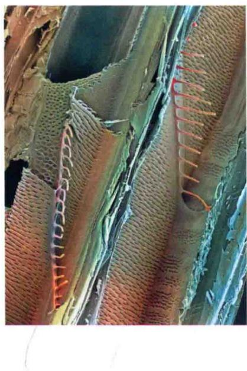

## C 松类

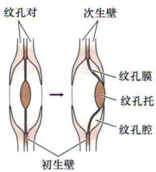

## D 其他维管植物

图4.6 管状分子及其之间的相互连接。A. 管胞和导管分子的结构比较，两类管状分子参与木质部的水运输。管胞是拉长的、空的、有着高度木质化壁的死亡细胞。壁中含有大量的纹孔——次级壁缺失但保留有初生壁的区域。不同器官和物种管胞壁上的纹孔形状和模式也不同。管胞存在于所有维管植物中。导管是由两个或更多导管分子叠起来组成的。与管胞类似，导管分子也是死亡细胞，并且通过穿孔板（壁上形成孔或洞的区域）相互连接。导管与其他导管和管胞通过纹孔相互连接。导管存在于大多数被子植物中，而在大多数裸子植物中不存在。B. 扫描电镜显示的两个导管分子（从左下方斜穿到右上方）。在侧壁上可见纹孔，在两个导管分子之间可以看到末端梯纹状的细胞壁（200×）。C. 松类具缘纹孔的图示，有纹孔托位于纹孔腔中间（左）或位于腔的一侧（右）。当两个管胞间压力小时，纹孔膜将展平靠近具缘纹孔的中心，从而允许水从纹孔膜的多孔渗水塞缘通过；而当两个管胞压力相差大时，如当一个已经空了而另一个在张力下仍充满水时，纹孔膜的位置会发生变化，侵入到一侧管胞中，形成拱形从而阻止气栓在管胞间的传播。D. 相反，被子植物和其他针叶类维管植物的纹孔膜在结构上相对来说是近似的。这些纹孔膜有非常小的孔，可以阻止栓塞的扩散，但与针叶类的纹孔相比，明显带来更多的水分运输阻力（B © Steve Gschmeissner/Photo Researchers, Inc.; C引自Zimmermamm, 1983）。

B

A  
  
图4.7 导管（A）和管胞（B）构成了一系列平行的相互连接的水分运输途径。气穴现象由于使管道中充有气体（气栓）而阻断了水的移动。由于木质部导管通过在次生壁开孔（具缘纹孔）相互连接，水可以绕过被阻断的导管通过相邻的导管分子运输。纹孔膜上的小孔有助于防止栓塞在木质部管道中扩散。因此，在B图中有一个含有气体的气穴化的管胞。在A图中，气体充满了整个气穴化的导管，在这里显示有3个导管分子，每个都被梯形穿孔板隔开。在自然界中导管可以非常长（长达数米），由许多的导管分子组成的。

$$
\mathrm{体积流速} = \left(\frac {\pi r ^ {4}}{8 \eta}\right) \left(\frac {\Delta \Psi p}{\Delta \chi}\right)\tag{4.2}
$$

单位是立方米每秒（ $\mathrm{m}^3/\mathrm{s}$ ）。这个公式表明压力驱动的集流对于管道的半径极其敏感。当管道的半径加倍时，体积流速的增加的因数为16（ $2^4$ ）。具有最大直径的导管分子存在于一些攀缘植物中，约为500 μm，这个尺度基本上比最大管胞稍大些。这些大直径的导管使得这些茎很细的藤本植物能够有效地将水进行长距离的运输。

式（4.2）适用于水流过圆柱形管道时的情况，并没有考虑由于木质部的管路长度是有限的，水从土壤运输到植物叶片的过程中需要穿过许多导管分子之间的纹孔膜时对流速的影响。不同植物中水流动都要受到纹孔膜的影响，单细胞（因此相对较短）管胞的纹孔膜要比多细胞（因此较长）导管中的纹孔膜对水流动的削弱性更强。然而由于松类植物中纹孔膜对水的透性要远大于其他种类的植物（Pittermann et al., 2005），因此仅具有管胞结构的松类植物能够生长成非常高大的树木。

## 4.3.3 水分通过木质部比通过活细胞运动所需的压力小

木质部为水分的运动提供了一个低阻力的途径。下面的一些数据可以帮助人们认识到木质部非凡的水分运输效率。计算水分以一个典型的运输速率通过木质部途径运输时所需的驱动力，并和同样速率条件下通过细胞-细胞途径运输时所需的驱动力进行比较。

为了达到比较的目的，假定水分在木质部中的运动速率为4 mm/s，导管的半径为40 $\mu$ m。在如此窄的导管中这绝对是一个高速率，因此按照这个速率计算，有可能夸大了木质部中支持水分流动的实际压力梯度。通过Poiseuille公式[见式（4.2）]，可以计算出，在内径均为40 $\mu$ m的理想导管中，当水以4 mm/s速度运动时所需的压力梯度值为0.02 MPa/m。具体计算参见Web Topic 4.3。

当然，真正的木质部导管，其内壁表面是不规则的，并且水分流过筛板和纹孔时会增加额外的阻力。因而需要加上筛板和纹孔对水的摩擦力。测量的结果表明实际阻力大约是计算值的两倍（Nobel，1999）。

现在将这个值（0.02 MPa/m）与同样速度条件下，水分在细胞与细胞间每次均需跨过质膜运动时所需的驱动力值相比较，可以计算出当水分以4 mm/s的速度通过细胞层运动时所需的驱动力为 $2 \times 10^{8}$ MPa/m，详细计算过程参见Web Topic 4.3。这个数值比水分以同样速度在直径为40 μm木质部导管中运输时所需驱动力大10个数量级。计算结果清楚地显示出水分通过木质部的运输要比通过活细胞运输高效得多。然而由于在水分从土壤到叶片的运输途径中木质部占绝大部分，因而木质部中的阻力仍是水分通过植物运输总阻力的主要部分。

## 4.3.4 将水提升100 m到达树冠需要多大的压差？

结合前述的例子来看一下将水提升到一个非常高的树冠需要多大的压力梯度。世界上最高的树木是北美的海岸红杉（Sequoia sempervirens）和澳大利亚的桉树（Eucalyptus regnans），这两个物种中有些植株的高度甚至超过了100 m。

如果把树茎看成一个长的管道，就可以通过将压力梯度乘以树的高度估算出使水克服摩擦力从土壤运输到树冠所需的压力差。水通过木质部运输到非常高树木的顶部所需的压力梯度大约是0.01 MPa/m，这比之前所示例子中的值要小。当将这个压力梯度乘以树的高度（0.01 MPa/m×100 m），可以得出水在树茎中克服摩擦阻力来运输所需的总压力差大约为1 MPa。

除了摩擦阻力外，还必须考虑重力的影响。如在式（3.5）中所示，对于100 m的高度差， $\Psi g$ 差值大约为1 MPa。这意味着在树顶端的 $\Psi g$ 要比地面高出1 MPa。因此水势中的其他组成部分必须达到比-1 MPa更低的值来抵消重力的影响。

水在木质部运输的过程必须要加上重力引起的压力梯度，才能使蒸腾作用正常进行。因此可以计算出水从底部运输到最高树木（100 m左右的高度）的顶端枝条所需的压差大约为2 MPa。

## 4.3.5 内聚力-张力学说解释了木质部中水分的连续运输

理论上，水分通过木质部运动所需的压力梯度源自植株底部正压或植株顶部负压的产生。前面提到过一些植物的根能够在它们的木质部产生正的静水压（根压）。但是通常情况下植物的根压往往小于0.1 MPa，并且当蒸腾速率高或土壤干燥时根压甚至会消失，显然依靠根压不可能将水分运送到一棵高大树木的顶端。此外，由于根压的产生是因为木质部中离子的积累，因此基于这种方式的水分运输，植物体还需要有一种机制来处理一旦水分从叶片蒸发后留在木质部中的这些溶质。

另外一种观点认为，水分在树木的顶端能产生一个很大的张力（一个负的静水压），并且这个张力可以拉动（pull）水分通过木质部运输。这个学说最早是在19世纪末提出的，由于它需要水的内聚性特征来承受木质部水柱中很强的张力，因此称为树液上升的内聚力-张力学说（cohesion-tension theory of sap ascent）。关于木质部存在张力可以很容易证明，向正在蒸腾的植物茎表面滴上一滴墨水，然后刺破木质部，当木质部的张力减弱时，墨水会立刻被吸进木质部，从而沿着茎产生可见的墨水条纹。

叶片中负静水压怎样形成？它又是如何将水分从土壤中拉上来的？拉动水分通过木质部向上运输的负压是在叶片细胞壁表面产生的（图4.8）。这与在土壤中的情形相类似。由于水分附着在细胞壁的纤维素微纤丝和其他亲水性组分上，随着水分由叶片中的细胞散失到大气中，残余水分的水面逐渐退缩到细胞壁的空隙中（图4.8），并在那儿形成一个弯曲的水分-空气交界面。由于水有很高的表面张力，这些交界面的弯曲导致了水的张力或负压的产生。随着更多的水分从细胞壁流失，这些水分-空气交界面的曲率也不断增加，水的负压值也就会更大[见式（4.1）]。

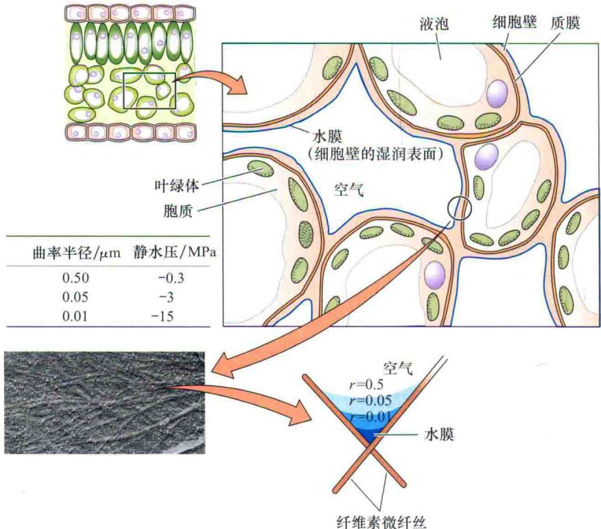  
图4.8 由叶片产生的水分穿过植株移动的驱动力。随着水分从叶肉细胞表层蒸发，水分退缩到细胞壁的空隙中。由于纤维素是亲水的（接触角=0°），表面张力导致了液相中负压的产生。通过式（4.1）可以计算出，随着这些水分-空气交界面曲率半径的增加，静水压降低（显微图片引自Gunning and Steer，1996）。

内聚力-张力学说解释了为什么水分通过植株的运输时，可以不需要直接消耗植物代谢的能量。驱动水分通过植株运输所需的能量主要来自于太阳光，它通过升高叶片和周围空气的温度来促进水分的蒸发。

内聚力-张力学说作为一个有争议的理论已经争论了一个多世纪，而且还将继续争论下去。争论的焦点是：将水分拉上树梢需要的负压是很大的，而木质部中的水柱能否承受如此大的张力（负压）。大多数研究者相信内聚力-张力学说是合理的（Steudl，2001）。近来有研究利用微流控装置来模拟“树”运输水的功能，证明了水在负压小于-1 MPa时可在该装置中形成稳定的流动（Wheeler and Stroo，2008）。关于水分在木质部中运输的研究史详情，包括围绕内聚力-张力学说的有关争论，参见Web Essay 4.1和Web Essay 4.2。

## 4.3.6 水分在树的木质部运输时所面临的物理学问题

水分在乔木和其他类型植物木质部中产生的强张力（参见Web Essay 4.3）对植物来说存在着重要的物理学问题。首先，水分在张力驱动下的运输会对木质部细胞壁产生一个内向压力。如果细胞壁较脆弱或易弯，就有可能在此张力作用下发生内陷而崩溃。对此，植物通过管胞和导管的次生壁加厚和木质化形成了强度很高的木质部，从而抵消了这种被破坏的可能性。植物木质部受到的张力大，其材质将更加致密，这也反映出水分产生的张力对树木的机械胁迫程度（Hacke et al., 2001）。

其次，就是水分在强张力作用下处于亚稳定物理状态（a physically metastable state）。水能保持一个稳定的液态是由于其静水压大于它的饱和蒸汽压。当液态水的静水压与它的饱和蒸汽压相同时，水分会发生相变，也就是水将会沸腾。加温（增加其饱和蒸汽压）能够使水沸腾。但当把水放在真空室中（由于大气压降低，液相水的静水压也相应降低）时，即使在室温下水也会沸腾。

在前面的例子中，已经估算出使水分到达100 m高的树木顶端叶片需要2 MPa的压力梯度。如果假定这棵树周围的土壤含水充足并且溶质的浓度可忽略不计（也就是 $\Psi_{w}=0$ ），那么根据内聚力-张力学说就可推知树木顶端木质部的静水压为-2 MPa。这个值明显低于饱和蒸汽压（20℃时为-0.002 MPa），那么是什么使水柱保持着液态呢？也就是说水为什么没有沸腾呢？

木质部中的水分称为处于亚稳定状态的水，因为尽管此时水处于热力学上更低的能量状态（也就是气相），但水仍以液体状态存在。出现这种情况的原因是：①水的内聚力和附着力使水从液相到气相转变所需的激活能量非常高；②木质部的结构使成核位点出现最小化，而这些位点可以降低分离水的液态与气态的能量屏障。

气泡是导管中最重要的成核位点（nucleating site）。当气泡的体积足够大时，由于水的表面张力引起的内向力比液态水负压引起的外向力要小，在这种情况下气泡会发生膨胀。而且一旦一个气泡开始膨胀，由于气-液界面的曲率减小，表面张力引起的内向力也会相应降低。因此，一个超过临界膨胀体积的气泡就会不断地膨胀，直至充满整个导管。

但是根的结构决定了在这种张力作用下没有形成导致导管中水柱不稳定的大气泡，因为水必须要通过纹孔膜来进入植物的木质部。纹孔膜作为一个滤器阻止了气泡进入木质部。但当由于伤害、叶片脱落或相邻导管充满气体时，纹孔膜的一端则暴露于空气中，此时它们就成了外界气体进入的位点。当纹孔膜两端的压力差足以克服与纹孔膜结构类似的纤维素微纤丝中气-液接触面间的毛细管作用力（图4.6D），或是足以移开纹孔托时（图4.6C），外界空气进入导管的现象就会发生。这种现象称为空气充散（air seeding）。

木质部导管中会产生气泡的另外一种情况是由于木质部的结冰（Davis et al., 1999）：木质部中的水中溶解有气体，当木质部导管的水结冰时，由于冰中气体的溶解度非常低，从而会导致气泡的产生。

这种气泡膨胀的现象称为气穴现象（cavitation），而最终形成的充满气体的空间称为栓塞（embolism）。气穴现象对植物水分运输的影响类似于汽车油路中的气封或血管中的血栓，它会打破水柱的连续性，从而阻止了张力作用下的水分运输（Tyree and Sperr，1989）。

植物中这种水柱被切断的现象并不少见。当植物失水时，可以检测到声音脉冲或滴答声（Jackson et al., 1999）。当木质部中气泡形成和迅速膨胀时，水压会迅速增加1 MPa甚至更多，从而导致植物中产生可以穿透植物其他部分的高频声音冲击波。对于木质部中水柱连续性被中断的情况，如果不被修复，会使植物受到损伤。因为这些栓塞通过阻断水分运输的主要途径，会增加水分流动的阻力，最终导致植物叶片及其他组织的脱水，甚至死亡。

“脆弱曲线”（vulnerability curves）（图4.9）提供了一个衡量不同物种对气穴现象敏感性，以及气穴现象影响水分通过木质部运输的定量检测方法。脆弱曲线是根据植物枝条、茎或根导水率的损耗百分比（通常为最大值的百分比）与实验条件下强加给木质部的相应张力强度即压力势而绘成的曲线。由于气穴化的影响，木质部的导水率随着张力的增加（压力势更小）而降低，直至整个水分流动最终完全停止。然而，潮湿环境中生长的物种如白桦树的木质部导水率降低所需的负压值比在干旱地区生长的物种如山艾树要低很多。

图4.9 木质部的脆弱曲线显示了干旱情况下3种植物的茎木质部水分导度的损耗百分比及其对应的木质部水势。将枝条切断并使用离心力技术使其木质部张力增加来得到实验数据（Alder et al., 1997）。水势轴上部的箭头表明每个物种在野外能测到的最小的木质部水势值（引自Sperry, 2000）。  

## 4.3.7 植物能够将木质部气穴现象的影响程度降到最低

有几种方式能够将木质部气穴现象对植物的影响降到最小。由于木质部中的导管分子是相互连接的，理论上一个气泡可以不断膨胀，直至充满整个导管。然而实际中，气泡并不可能扩张很远，这是由于膨胀中的气泡不能轻易穿过纹孔膜上的小孔。另外，由于木质部的导管是相互连接的，一个气泡并不能完全阻止水分的流动。同时，为避开栓塞的阻挡，水分可以绕过发生栓塞的导管从相邻的充满水的导管通过（图4.7）。因此，木质部管胞和导管有限的长度，尽管增加了水分运输的阻力，但也提供了一个限制气穴现象影响的途径。

此外，气泡也可以从木质部除去。夜间，由于植物的蒸腾作用比较弱，木质部的 $\Psi_{p}$ 增加，此时水蒸气和气体可以很容易地回溶到木质部溶液中。而且，如前所述，一些植物还可在木质部产生正压（根压），这些压力能将气泡压缩并引起气体的溶解。最近的研究表明木质部中的水分即使在张力存在的情况下也可以修复气穴现象（Holbrook et al., 2001；Salleo et al., 2004）。目前，该修复的机制仍不清楚，尚需进一步的研究（参见Web Essay 4.4）。

最后，许多植物在每年都进行次生生长，形成新的木质部。新的木质部导管的生成使植物能够恢复由于气穴现象而失去的水分运输能力。

## 4.4 水分从叶片散失到大气中

水分从叶片散失到大气的途径中，水分是被“拉着”从木质部进入到叶肉细胞的细胞壁，然后蒸发到叶的细胞间隙中（图4.10），水蒸气最后通过气孔离开叶片。液态水在叶片活组织中的移动主要受水势梯度控制，但气相水的运动方式主要是扩散，受到水蒸气浓度梯度的调节。

  
图4.10 水分通过叶片的途径。水被拉着从木质部到达叶肉细胞的细胞壁，通过细胞壁蒸发到叶片内的细胞间隙中。随后水气通过叶片的空隙或气孔，穿过叶片表面的界面层扩散。 $CO_{2}$ 沿着浓度梯度（内部低，外部高）相反的方向扩散。

覆盖在叶片表面的蜡质表皮是一个阻止水分运动的非常有效的屏障。据估计，叶片散失的水分中只有5%是通过表皮丧失的。对叶片来说，几乎所有的水分都是以水蒸气形式通过气孔的小孔扩散出去的。对于大多数草本植物，气孔在叶片的上下两个表面都有分布，但在下表面分布更多些。而在许多树木的叶片中，气孔仅存在于叶片的下表面。

下面来分析液态水在叶片中的移动、叶片蒸腾作用的驱动力、水分从叶片扩散到大气中的主要阻力及叶片中能够调节蒸腾的解剖学结构。

## 4.4.1 叶片具有大的水流阻力

尽管水横跨叶片的距离对于整个土壤到大气的运输途径来说很短，但叶片对于整个水流阻力的维持有很大的贡献。对于整个植株对水的液相阻力，叶片通常贡献了30%，而在一些种类的植物中占的比例会更大（Sack and Holbrook，2006）。这种短路径大水流阻力相结合的情况也在根中出现，这两个组织中出现的这种现象进一步表明了水在活组织中运输要比在木质部中有着更大的阻力。

水进入叶片后分布在叶的木质部导管中。而水要想蒸发必须从木质部的壁中出来并穿过多层活细胞。因此，叶片中水流阻力反映出木质部导管的数量、分布、体积大小及叶片叶肉细胞的水流阻力特性。具有不同叶脉结构叶片的水流阻力相差可以达40倍（Brodribb et al., 2007）。这种差异很大程度上是由叶片中的叶脉密度及其与蒸发表面的距离差异引起的。叶脉间距小的叶片有着较低的水流阻力及较高的光合作用速率，表明叶脉与蒸发位点的距离对叶片的气体交换速率有着明显的影响。

叶片的水流阻力是动态变化着的。例如，对于同一植株，处在阴暗处的叶片要比相对明亮处的叶片具有更大的水流阻力（Sack et al., 2003）。叶片的水流阻力还会随着叶龄的增加而变大。叶片的水势短时间的降低会引起叶片水流阻力明显增加，这种阻力的增加可能是由叶脉中木质部导管出现气穴现象或有时木质部导管在张力的作用下出现的物理坍塌所引起的（Cochard et al., 2004；Brodribb and Holbrook, 2005）。

## 4.4.2 蒸腾作用的驱动力是水蒸气的浓度差

叶片的蒸腾作用主要依赖于两个因素：①叶内空隙和外部空气间的水蒸气浓度差（difference in water vapor concentration）；②扩散途径的扩散阻力（diffusional resistance，r）。水蒸气的浓度差用 $c_{\mathrm{WV(叶)}}-c_{\mathrm{WV(大气)}}$ 表示。大气的水蒸气浓度 $c_{\mathrm{WV(大气)}}$ 可以很容易测定，但叶的 $c_{\mathrm{WV(叶)}}$ 较难测量。

尽管叶内空隙的体积很小，但是用于水分蒸发的湿表面积较大。植物叶中空隙的体积占到叶片总体积值分别为：松针5%，玉米10%，大麦30%，烟叶40%。与空隙的空间体积相比，叶片中用于水分蒸发的内表面积可以达到叶片外表面积的7\~30倍。这种表面积与体积的高比值及与叶内空隙极近的距离（数个到数十个微米）能使植物叶片内迅速达到水-汽平衡。因此可以推测叶内空隙与细胞壁表面处于水势平衡，从而液态水可以从细胞壁表面迅速蒸发。

正常蒸腾时的叶片（水势一般>-2.0 MPa），水-汽平衡浓度仅为饱和蒸汽压的百分之几。这使得能够估算叶内一定温度下的水气浓度，而叶温是很容易测量的。由于空气的饱和蒸汽压会随着温度的增加而成指数增长，因此，叶片的温度会对蒸腾速率有显著的影响（Web Topic 4.4阐述了如何计算叶内空隙的水气浓度，并讨论了和叶内水分相关的其他方面）。

蒸腾途径中不同位置的水气浓度 $c_{wv}$ 是不同的。从表4.1可以看出，细胞壁表面到叶外大气的途径中每经过一步 $c_{wv}$ 都会减少。切记两点：①水从叶片丧失的驱动力是水气的绝对（absolute）浓度差（ $c_{wv}$ 的差值，单位是 $mol/m^{3}$ ）；②这个差值受到叶片的温度的显著影响。

表4.1 水分从叶片丧失途径中4个位点的相对湿度、绝对水蒸气浓度和水势值

<table><tr><td rowspan="2">位点</td><td rowspan="2">相对湿度</td><td colspan="2">水蒸气</td></tr><tr><td>浓度/(mol/m3)</td><td>水势/MPa $^{a}$ </td></tr><tr><td>叶内空隙(25°C)</td><td>0.99</td><td>1.27</td><td>-1.38</td></tr><tr><td>气孔内部(25°C)</td><td>0.97</td><td>1.21</td><td>-7.04</td></tr><tr><td>气孔外侧(25°C)</td><td>0.47</td><td>0.60</td><td>-103.7</td></tr><tr><td>大气(20°C)</td><td>0.50</td><td>0.50</td><td>-93.6</td></tr></table>

数据来源：Nobel，1999，略有修改  
注：参见图4.10

a 利用Web Topic 4.4中的式（4.4.2）计算， $RT/V^{-}_{w}$ 的值为20℃时的135 MPa和25℃时的173.3 MPa

## 4.4.3 水分丧失也受扩散途径中的阻力调节

水分从叶片丧失的另外一个重要调节因子是蒸腾途径中的扩散阻力，它包括两个可变组分（图4.10）。

（1）通过气孔扩散时气孔本身的阻力，即叶气孔

阻力（leaf stomatal resistance， $r_{s}$ ）。

（2）水蒸气从叶片扩散到大气的湍流层，就必须穿过叶片表面的静止空气层，这也会对水分的扩散产生阻力。这是第二个阻力，称为叶片界面层阻力（boundary layer resistance, $r_{b}$ ）。在考虑气孔阻力之前先讨论这种类型的阻力。

界面层的厚度主要受风速和叶片大小决定。当围绕叶片的空气非常稳定时，叶片表面的静止空气层会非常厚，从而成为水气从叶片散失时的主要阻力。在这种情况下，增加气孔的开度对蒸腾速率的影响很小，尽管气孔完全关闭，蒸腾作用仍会进一步降低（图4.11）。

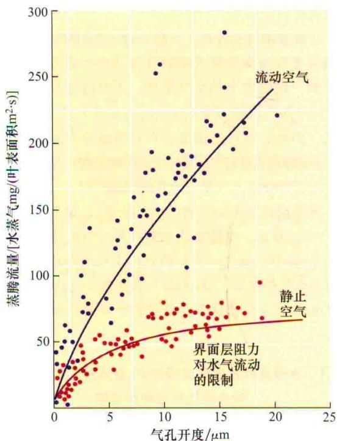  
图4.11 静止和流动空气中，吊竹梅（Zebrina pendula）的蒸腾流量对气孔开度的依赖程度。静止空气比流动空气的界面层更大，对水分蒸发的阻力也更高。因而，在静止空气中气孔开度对蒸腾作用的控制能力较小（引自Bange，1953）。

当风速高时，由于运动的空气降低了叶表面界面层的厚度，从而减小了界面层的阻力。此时，气孔阻力也就成了叶片散失水分的主要调控因子。

叶片的解剖学结构和形态会影响到界面层的厚度。叶片的表皮毛可以作为微型的防风林。有些植物的气孔是凹陷的，从而在气孔外部产生了一个起保护作用的空间区域。另外，叶片的形状和大小及它们与风向的角度也可影响风吹拂叶片表面的方式。尽管上述这些因素或其他因素都可能影响界面层，但它们可能在数小时或数天内不发生改变。因此对于短期的调节来说，由保卫细胞所控制的气孔开度在叶片蒸腾作用的调控中起着决定性作用。

有些种类的植物可以通过改变它们叶片的方向来影响蒸腾速率。例如，它们可以使叶片与日光平行来使叶温下降进而减弱蒸腾的驱动力 $\Delta c_{\mathrm{WV}}$ （Berg and Hsiao，1986）。很多草的叶片在缺水时会发生卷曲，以这种方式增加它们的边界层阻力（Hsiao et al.，1984）。甚至发生萎蔫也可以通过减少接受到的辐射来使高的蒸腾速率减弱，并最终使叶温降低及 $\Delta c_{WV}$ 的减少（Chiariello et al.，1987）。

## 4.4.4 气孔控制着叶片的蒸腾作用和光合作用的联系

由于覆盖叶片的角质层几乎是不透水的，大多数叶片的蒸腾作用由水蒸气通过气孔扩散引起（图4.11）。而微小的气孔则为水蒸气提供了一个跨过表皮和角质层扩散的低阻力途径（low-resistance pathway）。气孔阻力的变化对于植物水分散失的调节，以及光合固定 $CO_{2}$ 中吸收 $CO_{2}$ 速率的调节均十分重要。

当水分充足时，植物解决在吸收 $CO_{2}$ 的同时限制水分丧失的有效方案是分时段（temporal）调节气孔的开度，即气孔白天打开，晚上关闭。在晚上，叶片光合作用停止，因而不需要吸收 $CO_{2}$ 时，气孔开度保持很小或关闭，防止水分不必要的散失。而对于阳光充足的上午，当供水充足，且阳光辐射促使叶片的光合作用旺盛时，气孔就充分张开，以便减少气孔对 $CO_{2}$ 扩散的阻力，满足叶内大量的 $CO_{2}$ 的需求。尽管在上述情况下蒸腾作用引起的水分散失也是大量的，但由于水分供应充足，以水分作为代价来换取植物生长和繁殖所必需的光合作用产物，对植物来说总体上还是有利的。

另外，当土壤中的水分并不充足时，即使是阳光充足的上午，气孔的开度也很小，甚至保持关闭。在干旱条件下植物的气孔保持关闭状态，可以避免脱水伤害。叶片无法对 $c_{\mathrm{WV}}$ （叶）- $c_{\mathrm{WV}}$ （空气）和 $r_{b}$ 进行调控，但却可以通过调节气孔的张开和关闭来改变气孔阻力（ $r_{s}$ ）。这种生物学调节是由围绕气孔的一对特化的表皮细胞——保卫细胞来完成的（图4.12）。

## 4.4.5 保卫细胞的细胞壁具有特化的特性

保卫细胞除了存在于所有的维管植物叶中，还存在于更原始植物（如地钱和苔藓）的器官中（Ziegler，1987）。保卫细胞在形态上有相当大的差异，但可以将其分为两大类：一类是禾本科植物和少数单子叶植物，如棕榈的气孔；另一类是所有的双子叶植物和许多单子叶植物及苔藓类、蕨类和裸子植物的气孔。