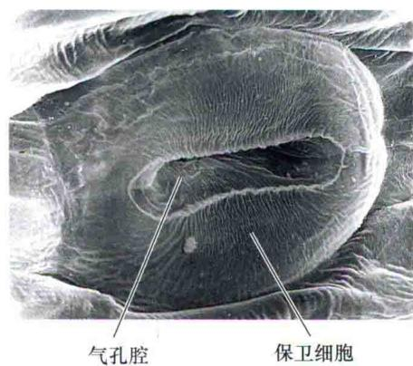

  
图4.12 气孔的电子显微照片。A. 禾本科植物的气孔。每个保卫细胞球形的末端显示出它们的胞质内含物，并且有高度增厚的壁。气孔将两个保卫细胞的中间部分分开（2560×）。B. 用微分干涉差光学显微镜观察到的苔属植物莎草的气孔复合体。每个复合体含有两个围绕孔的保卫细胞和两个副卫细胞（550×）。C. 洋葱表皮的扫描电镜照片。C上图显示了叶的外表面，在角质层中有一个气孔。C下图显示了一对面向气孔腔的保卫细胞，朝向叶片内（1640×）（A引自 Palevitz，1981；B引自Jarvis and Mansfield，1981；A和B由B. Palevitz惠赠；C引自 Zeiger and Hepler，1976（上图）和 E. Zeiger and N. Burnstein（下图）。

在禾本科植物中（图4.12A），保卫细胞是典型的哑铃形状，有球形的末端。在两个哑铃形保卫细胞的“柄”（handle）中间有一个狭长的缝隙孔，即气孔。保卫细胞的两侧常伴随有一对称为副卫细胞（subsidiary cell）的特化表皮细胞，可以帮助保卫细胞控制气孔的开度（图4.12B）。保卫细胞、副卫细胞和气孔统称为气孔复合体（stomatal complex）。

在双子叶植物和非禾本科的单子叶植物中，其保卫细胞具有椭圆轮廓的形状（常称为肾形），两个保卫细胞中间的小孔即气孔（图4.12C）。虽然在肾形气孔的植物中少数也有副卫细胞，但多数是没有副卫细胞的，围绕在保卫细胞周围的是普通的表皮细胞。

保卫细胞最显著的特征是其特化的细胞壁结构。其细胞壁中某些部位被充分加厚，厚度可达5 $\mu$ m，而普通表皮细胞的细胞壁厚度为1\~2 $\mu$ m（图4.13）。在肾形的保卫细胞中，细胞壁各部分是不均等加厚的，其内壁、外壁（次生壁）非常厚，腹壁（孔壁）稍微加厚，而背部细胞壁（与表皮细胞相接触的细胞壁）则相对较薄。在腹壁靠近大气的一侧细胞壁突出成发育良好的凸缘，形成小孔。

纤维素微纤丝在细胞壁中的排列方式，能够起到加固植物的细胞壁，以及决定细胞的形状的重要作用（见第15章），在气孔张开和关闭中纤维素微纤丝同样也扮演着十分关键的角色。普通的圆柱形细胞，纤维素微纤丝沿着细胞长轴的横截面方向排列。这种排列方式使得细胞沿着它的长轴方向伸展，因为增厚的纤维素使得与其排列方向成直角的方向上阻力最小。

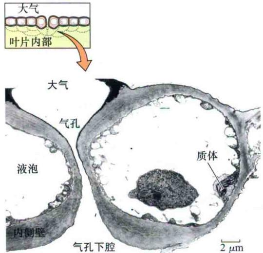  
图 4.13 电子显微镜照片显示双子叶植物烟草（Nicotiana tabacum）的一对保卫细胞。切面与叶片表面垂直。孔朝向大气；底部朝向叶片内的气孔下腔。注意细胞壁的不均匀增厚，这决定了当体积增大时的不均匀的变形，从而引起保卫细胞打开（显微图片引自Sack，1987；F. Sack惠赠）。

保卫细胞中的微纤丝排列方式不同于普通的圆柱形细胞。肾形保卫细胞中，细胞壁的纤维素微纤丝由孔向外呈辐射状排列（图4.14A）。面对气孔的保卫细胞内壁比外壁要厚很多。因此，当保卫细胞体积增加时，较弱的外壁向外弯曲，导致气孔打开（Sharpe et al., 1987）。在禾本植物中，哑铃形保卫细胞的功能就像一个有膨胀末端的横梁。随着细胞球形末端体积的增大、膨胀，横梁相互分开，中间的缝隙也相应加宽（图4.14B）。

## 4.4.6 保卫细胞膨压的增加导致气孔张开

保卫细胞如同一个具备多种感觉功能的水压阀。光强和光质、温度、叶片水分状态和细胞内 $CO_{2}$ 浓度等环境因素均可以被保卫细胞感受，并且这些信号会被整合为精确的气孔反应。例如，黑暗中的叶片受到光照时，光作为气孔张开的刺激信号，被保卫细胞感受，进而触发一系列反应，最终引起气孔的开放。

该生理过程的早期反应是离子的吸收和保卫细胞的其他代谢变化，关于后者将在第18章中详细介绍。这里主要讨论保卫细胞由于离子吸收或有机分子合成对渗透势（ $\Psi_{s}$ ）降低的影响。保卫细胞和其他细胞一样同样遵循水势规律。 $\Psi_{s}$ 降低时，细胞水势也相应降低，从而促进水分流入保卫细胞。随着水分进入细胞，细胞的膨压增加，由于保卫细胞的细胞壁有弹性，保卫细胞的体积可以可逆地增大40%\~100%，可增大的程度随物种而异。当保卫细胞的体积发生变化时（增大或缩小），由于其细胞壁的各部分厚度不同，这种体积变化导致了气孔的张开或关闭。

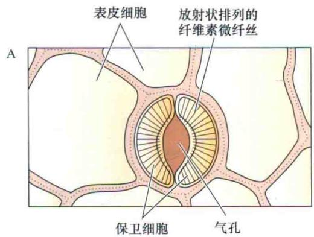

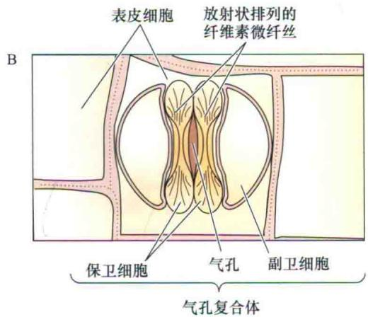  
图4.14 保卫细胞中纤维素微纤丝的放射状排列和表皮细胞，肾形气孔（A）和禾本科类气孔（B）（引自Meidner and Mansfield，1968）。

副卫细胞对促使气孔快速打开并达到大的开度有着重要的作用（Raschke and Fellow，1971；Franks and Farquhar，2007）。副卫细胞中溶质的迅速运出并进入保卫细胞中导致前者的膨压和体积均减小，使得保卫细胞膨大向远离气孔的方向扩展。与之相反，当溶质从保卫细胞转运至副卫细胞会导致后者的膨压和体积变大，从而推动保卫细胞使气孔关闭。

## 4.4.7 蒸腾比率可用来衡量水分丧失和碳获得之间的关系

在吸收足量 $CO_{2}$ 保证光合作用正常进行的同时，植物调节水分丧失的能力可用蒸腾比率（transpiration ratio）来评价。蒸腾比率是指植物蒸发水量与光合同化二氧化碳量的比值。

$C_{3}$ 植物 $CO_{2}$ 固定的第一个产物是一个三碳化合物（ $C_{3}$ 植物，见第8章），如果光合作用中每固定1分子

$CO_{2}$ 大约要丧失400分子水，那么此时蒸腾比率就是400（有时候也用蒸腾比率的倒数表示，其称为水分利用效率。蒸腾比率为400的植物的水分利用效率为1/400，也就是0.0025）。

有3个因素导致了植物的这种水分流出和 $CO_{2}$ 流入的高比率。

（1）驱动水分丧失的浓度梯度比驱动 $CO_{2}$ 流入的浓度梯度大50倍。大部分情况下，这种差异的存在是由于空气中的 $CO_{2}$ 浓度很低（约0.038%），而叶片中的水蒸气浓度相对较高。

（2）水分子在空气中的扩散速度要比 $CO_{2}$ 大约快1.6倍（ $CO_{2}$ 分子比 $H_{2}O$ 分子大，并且扩散系数较小）。

（3）在进入叶绿体而被同化之前， $CO_{2}$ 必须跨过质膜、细胞质和叶绿体被膜。这些生物膜增大了 $CO_{2}$ 扩散途径的阻力。

有些植物能够通过调整光合作用中二氧化碳的固定途径来大大降低它们的蒸腾比率。这些植物中光合作用的第一个稳定产物是一个四碳化合物（ $C_{4}$ 植物，见第8章），它们每固定1分子 $CO_{2}$ 蒸发的水分通常要比 $C_{3}$ 植物少； $C_{4}$ 植物典型的蒸腾比率为150。这很大程度上是由于 $C_{4}$ 植物光合作用导致在细胞内空气的 $CO_{2}$ 浓度变低（见第8章），产生了更大的吸收 $CO_{2}$ 的驱动力并使这些植株的气孔开度变小从而降低了蒸腾比率。

而对于能适应沙漠环境的景天科酸代谢（CAM）植物，它们碳固定的起始阶段是在夜间将 $CO_{2}$ 固定到四碳有机酸上，它们有着更低的蒸腾比率，大约50的蒸腾比率值是很常见的。这很可能是由于它们的气孔开闭有着相反的昼夜节律，在夜间打开而在白天时关闭。由于在夜间有着低的叶温从而使 $\Delta c_{wv}$ 仅增加很小的值，最终引起在夜间有着很弱的蒸腾作用。

## 总述：土壤-植物-大气连续体

已经知道水分通过植物从土壤到大气的移动涉及多个不同的运输机制。

（1）在土壤和木质部中，在压力势梯度（ $\Delta\Psi_{p}$ ）驱动下，水分以集流的方式移动。

（2）当水分跨膜运输时，在跨膜水势差的驱动下，水以渗透方式进出细胞，如细胞吸水及根从土壤向木质部运输水分。

（3）至少在到达外部大气之前，气态水主要为扩散移动，在此对流（集流的一种形式）起主导作用。

然而，主导水分从土壤到叶片运输的关键因素是木质部的负压，而产生这种负压的位点是蒸腾叶片细胞壁的毛细管作用。而在植物的另外一端，土壤中的水分通过毛细管作用力维持。这导致两端的毛细作用力对水分这个绳子“拔河”。随着叶片蒸腾失水，土壤中的水分持续进入植物体，并上行至叶片。在此过程中，主要是物理作用力发挥作用，而不需要任何的代谢泵，即不消耗代谢能量。水运输的能量最终是由太阳提供的。

这个简单的机制使能量效率非常高，每同化一分子 $CO_{2}$ 需要运输400分子的水来交换。这个运输系统能够起作用的关键因素是拥有一个低阻力，并且可以防止发生气穴现象的木质部运输途径，以及用来吸收土壤水分的高表面积的根系统。

## 小结

植物吸收 $CO_{2}$ 的需要与保持水的需要之间是一对固有的矛盾，因此使得植物在让 $CO_{2}$ 进入气孔的同时必然在同一地方导致水分的丧失。为了应对这种矛盾，植物进化出一种通过控制叶片失水及对所失去的水分进行补充的方法来适应。

## 土壤中的水分

· 土壤中的水分含量及水在土壤中的移动速率依赖于土壤的类型和结构，进而影响水在土壤中的压力梯度和导水率。

· 在土壤中，水分可以以水膜形式存在于土壤颗粒表面，或者完全或部分充满土壤颗粒之间的空隙。

· 渗透势、静水压和重力势将水从土壤中通过植株运送到大气中（图4.1）。

· 根毛与土壤颗粒之间紧密的接触极大地增加了用来进行水分吸收的表面积（图4.2）。

## 根对水分的吸收

· 水分的吸收主要局限于根尖附近（图4.3）。

· 在根中，水分可以通过质外体、共质体或跨膜途径进行运输（图4.4）。

\- 水分在质外体中的移动被内皮层中的凯氏带所阻断（图4.4）。

· 当蒸腾作用比较弱时，溶质不断地被运输至木质部流中导致 $\Psi_{S}$ 和 $\Psi_{W}$ 的降低，提供了吸水的动力及正的 $\Psi_{p}$ ，从而在木质部中产生正的静水压（图4.5）。

## 水分在木质部中的运输

· 由单细胞的管胞或是多细胞的导管组成的木质部中的导管，为水分的运输提供一个低阻力的通道（图4.6）。

· 拉长的、纺锤形的管胞和垛叠的导管分子在次生壁上具有纹孔（图4.7）。

· 压力驱动的集流使水可以在木质部中长距离移动。

· 叶片中细胞的细胞壁表面产生的负压使得水分可以在木质部中上升（图4.8）。

· 气穴现象会使水柱断开并阻止水分在张力下的运输（图4.9）。

## 水从叶片到大气的移动

· 水在蒸发至叶片内的空腔前会先被从木质部拉到叶肉细胞的细胞壁中（图4.10）。

· 叶片的水流阻力很大而且是动态变化的。

· 蒸腾作用的强弱依赖于叶片中细胞间充满空气的间隙与外部大气之间的水气浓度差及这个途径的扩散阻力，该阻力由叶片的气孔阻力和边界层阻力组成（图4.11）。

· 气孔的打开和关闭是由保卫细胞来完成并进行调控的（图4.12\~图4.14）。

\- 植物吸收 $\mathrm{CO}_{2}$ 时限制水分丧失的能力用蒸腾比率来表示。

## 总述：土壤-植物-大气连续体

· 驱动水分从土壤到植物直至大气所需的驱动力是由不含任何需要代谢泵参与的物理驱动力所构成的，该能量的最终来源是太阳。

(王伟 周云 译)

## WEB MATERIAL

## Web Topics

## 4.1 Irrigation

Irrigation has a dramatic impact on crop yield and soil salinity.

4.2 Physical Properties of Soils
The size distribution of soil particles influences its ability to hold and conduct water.

4.3 Calculating Velocities of Water Movement in the

Xylem and in Living Cells
Water flows more easily through the xylem than across living cells.

4.4 Leaf Transpiration and Water Vapor Gradients
Leaf transpiration and stomatal conductance affect leaf and air water vapor concentrations.

## Web Essays

## 4.1 A Brief History of the Study of Water Movement in the Xylem

The history of our understanding of sap ascent in plants, especially in trees, is a beautiful example of how knowledge about plants is acquired.

4.2 The Cohesion–Tension Theory at Work
The cohesion-tension theory has withstood a number of challenges.

4.3 How Water Climbs to the Top of a 112-Meter-Tall Tree Measurements of photosynthesis and transpiration in 112-meter tall trees show that some of the conditions experienced by the top foliage compares to that of extreme deserts.

4.4 Cavitation and Refilling
A possible mechanism for cavitation repair is under active investigation.

## 第 5 章

矿质营养

植物矿质营养是指植物生长发育所必需的、以无机离子形式从土壤中获取的氮、磷、钾等元素。尽管矿质营养成分通过所有的生物体进行连续不断的循环，但是它们主要经过植物的根系进入生物圈。因此，从某种意义上说，植物是地球表面的“矿工”（Epstein，1999）。根系具有巨大的表面积，同时又具有从低浓度土壤溶液中吸收无机离子的能力，这些都极大地增强了植物吸收矿物质的效力。矿质元素被根吸收之后，被运输到植物的各个部分，为植物所利用，并表现出各种生物学功能。其他生物，如菌根真菌和固氮细菌，常参与根对矿质元素的吸收。

植物如何获取和利用矿质元素称为矿质营养（mineral nutrition），是现代农业和环境保护的主要研究领域之一。矿质元素肥料的施用导致农业高产，事实上，大多数作物产量的增加与它们吸收肥料的数量呈线性关系（Loomis and Conn，1992）。为了适应不断上升的食物需求，世界上主要矿质肥料氮、磷和钾每年的消耗量稳步上升，从1960年的3000万t增加到1990年的1.43亿t。在随后的10年中，矿质肥料的使用保持相对稳定，因为考虑到不断上升的肥料成本，施用方法更加精确。然而，在过去的数年间，矿质肥料每年的消耗量已上升至1.7亿t（图5.1）。

然而，严格意义上讲，作物利用的肥料不足向土壤中作物周围所施肥料的一半（Loomis and Conner, 1992）。其余的矿物质可能渗入到地表水或地下水中，吸附于土壤颗粒或造成空气污染。在美国，正是由于这些肥料的流失，许多水井中饮用水的硝酸盐（ $\mathrm{NO}_3^-$ ）含量超标（美国联邦规定标准）（Nolan and Hitt, 2006）。人类的活动导致氮素以硝酸盐（ $\mathrm{NO}_3^-$ ）和铵盐（ $\mathrm{NH}_4^+$ ）形式释放至环境中，这些氮素又通过雨水沉积于土壤中，这个过程称为大气氮沉积（deposition）。它正在引起全美生态系统的改变（Alber et al., 2003; Fenn et al., 2003）。

令人欣慰的是，通过植物吸收矿质元素使动物废弃物再循环利用的传统方法，正在成为从垃圾堆中除去包括重金属在内的有害矿质元素的有效手段（Ahluwalia and Goyal，2007）。由于植物-土壤-大气之间的自然关系非常复杂，包括大气化学、土壤学、水分、微生物学和生态学，以及植物生理学在内的许多学科领域的专家都参与了矿质营养的研究。

在本章将先讨论植物的营养需求、特定的营养缺乏症状和如何使用肥料以确保适当的植物营养。随后，将分析土壤结构（固体、液体、气体成分的构成）和根的形态如何影响植物从环境中吸收无机营养。最后，将以专题形式介绍菌根共生体的问题。溶质运输和营养同化方面的内容分别在第6章和第12章讲解。

## 5.1 必需元素、必需元素缺乏和植物失调症

已经证实，只有一些元素对植物体是必需的。必需元素（essential element）是植物结构或新陈代谢中的基本组分，缺失时能引起植物严重的生长、发育或生殖异常（Arnon and Stou，1939；Epstein and Blom，2005）。如果为植物提供这些必需元素、水及光能，植物就能够合成它们正常生长所需的所有化合物。表5.1列出了目前公认的高等植物的大多数必需元素（尽管不是全部）。一般认为，前3种元素——氢、碳和氧不是矿质元素，因为它们主要来自于水和 $CO_{2}$ 。

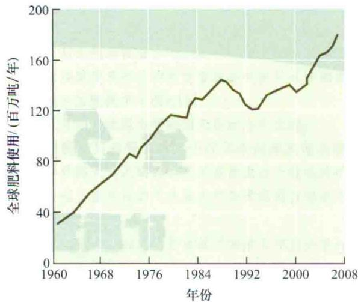  
图5.1 过去的5年中全球的肥料消耗量（改编自www.faostat.fao.org/site/575/default.aspx#ancor.）。

通常，必需矿质元素根据其在植物组织中的相对浓度可被分为大量元素和微量元素。在某些情况下，不同组织中大量元素和微量元素的含量差异并不像表5.1中所标的那么大。例如，一些植物组织，如叶肉中，铁和锰的含量几乎和它含有的硫和镁的量相当。许多元素在植物中的含量通常高于植物的最低需求量。

表5.1 植物必需元素的合适组织浓度

<table><tr><td>元素</td><td>化学符号</td><td>干物质中的浓度 /  $(\% \text{或} \times \text{ppm}^{1})^{\text{a}}$ </td><td>相对于钼的相对原子数量</td></tr><tr><td colspan="4">从水或二氧化碳中获得</td></tr><tr><td>氢</td><td>H</td><td>6</td><td>60 000 000</td></tr><tr><td>碳</td><td>C</td><td>45</td><td>40 000 000</td></tr><tr><td>氧</td><td>O</td><td>45</td><td>30 000 000</td></tr><tr><td colspan="4">从土壤中获得大量元素</td></tr><tr><td>氮</td><td>N</td><td>1.5</td><td>1 000 000</td></tr><tr><td>钾</td><td>K</td><td>1.0</td><td>250 000</td></tr><tr><td>钙</td><td>Ca</td><td>0.5</td><td>125 000</td></tr><tr><td>镁</td><td>Mg</td><td>0.2</td><td>80 000</td></tr><tr><td>磷</td><td>P</td><td>0.2</td><td>60 000</td></tr><tr><td>硫</td><td>S</td><td>0.1</td><td>30 000</td></tr><tr><td>硅</td><td>Si</td><td>0.1</td><td>30 000</td></tr><tr><td colspan="4">微量元素</td></tr><tr><td>氯</td><td>Cl</td><td>100</td><td>3 000</td></tr><tr><td>铁</td><td>Fe</td><td>100</td><td>2 000</td></tr><tr><td>硼</td><td>B</td><td>20</td><td>2 000</td></tr><tr><td>锰</td><td>Mn</td><td>50</td><td>1 000</td></tr><tr><td>钠</td><td>Na</td><td>10</td><td>400</td></tr><tr><td>锌</td><td>Zn</td><td>20</td><td>300</td></tr><tr><td>铜</td><td>Cu</td><td>6</td><td>100</td></tr><tr><td>镍</td><td>Ni</td><td>0.1</td><td>2</td></tr><tr><td>钼</td><td>Mo</td><td>0.1</td><td>1</td></tr></table>

资料来源：Epstein，1972，1979  
a 非矿质元素（H、C 和 O）和大量元素的数值为百分率；微量元素为百万分浓度

由于很难从生理学角度加以判断，一些研究者对于这种将矿质元素分为大量元素和微量元素的分类方法产生质疑。相反，Mwngel和Kirkby（2001）依据生化作用及生理功能将这些植物必需元素进行了新的分类。如表5.2所示，这种分类方法将必需元素分成4组。

表5.2 根据生物化学功能对植物矿质元素的分类

<table><tr><td>矿质营养</td><td>功能</td></tr><tr><td>第一组</td><td>组成碳化合物的营养元素</td></tr><tr><td>N</td><td>构成氨基酸、氨基化合物、蛋白质、核酸、核苷酸、辅酶和己糖胺等物质</td></tr><tr><td>S</td><td>半胱氨酸、胱氨酸、甲硫氨酸的组分。构成硫辛酸、辅酶、硫胺素焦磷酸、谷胱甘肽、生物素、腺苷-5&#x27;-磷酸硫酸酐和3&#x27;-磷酸腺苷</td></tr><tr><td>第二组</td><td>在能量储存和结构完整中起重要作用的营养元素</td></tr><tr><td>P</td><td>糖磷酸、核酸、核苷酸、辅酶、磷脂、肌醇六磷酸等物质的成分。在与ATP有关反应中起关键作用</td></tr><tr><td>Si</td><td>在细胞壁中以二氧化硅沉淀形式存在。参与了细胞壁机械性质的形成,包括刚性和弹性</td></tr><tr><td>B</td><td>与甘露醇、甘露聚糖、藻酸和细胞壁的其他组分结合,参与细胞伸长和核酸代谢</td></tr><tr><td>第三组</td><td>以离子形式存在的营养元素</td></tr><tr><td>K</td><td>至少40种酶所需的辅助因子。建立细胞膨压和维持细胞电中性所需的最重要的阳离子</td></tr><tr><td>Ca</td><td>细胞壁中间层的组分。一些参与ATP和磷脂水解的酶所需的辅助因子。代谢调节过程中作为第二信使</td></tr><tr><td>Mg</td><td>参与磷酸转移的许多酶所必需的。叶绿素分子的组成部分</td></tr><tr><td>Cl</td><td>与 $O_{2}$ 释放有关的光合反应所需</td></tr><tr><td>Mn</td><td>一些脱氢酶、脱羧酶、激酶、氧化酶和过氧化物酶的活性所必需的。参与了其他阳离子活化酶的构成和光合反应中氧释放有关的反应</td></tr><tr><td>Na</td><td>参与了 $C_{4}$ 和CAM植物中磷酸烯醇式丙酮酸的再生反应。有时可替代钾离子的一些功能</td></tr><tr><td>第四组</td><td>与氧化还原反应有关的营养元素</td></tr><tr><td>Fe</td><td>与光合作用、氮固定和呼吸作用有关的细胞色素和非血红素铁蛋白的组成成分</td></tr><tr><td>Zn</td><td>乙醇脱氢酶、谷氨酸脱氢酶和碳酸酐酶等的组分</td></tr><tr><td>Cu</td><td>抗坏血酸氧化酶、酪氨酸酶、单胺氧化酶、尿酸酶、细胞色素氧化酶、酚酶、漆酶和质体蓝素的组分</td></tr><tr><td>Ni</td><td>脲酶的组成元素。在细菌固氮中是氢化酶的组分</td></tr><tr><td>Mo</td><td>固氮酶、硝酸还原酶和黄嘌呤脱氢酶的组分</td></tr></table>

资料来源：改编自Evansand and Sorger，1966；Mengel and Kirkby，2001

（1）第一组必需元素由氮和硫组成。植物可以通过氧化和还原的生物化学反应，与碳形成共价键，产生有机化合物，同化这些元素。

（2）第二组必需元素在植物能量储存反应和维持结构完整性中起重要作用。它们在植物组织中常以磷酸、硼酸和硅酸盐酯的形式存在，共价地结合在有机分子上（如磷酸糖类）。

（3）第三组必需元素作为酶的辅助因子和在渗透势调节中具有重要的作用。在植物组织中，该组元素以自由离子形式溶解于水，或者以静电力结合到诸如存在于植物细胞壁的果胶酸等物质上。

（4）第四组必需元素由铁等金属元素组成，在电子转移反应中扮演重要角色。

需要注意的是，这种分类或多或少地带有主观因素，因为许多元素在生物体中扮演多种功能角色。例如，第三组中的锰元素，作为矿质元素以离子形式存在，但它也参与到许多重要的电子传递反应中，而这一点也正是第四组元素的功能所在。自然界中存在的一些不属于植物必需的元素，如铝、硒和钴，也可以在植物组织中积累。例如，铝一般认为是一种非必需元素，但植物体通常含有0.1\~500 ppm的铝，而且向营养溶液中加入低水平的铝可刺激植物生长（Marschner，1995）。Astragalus、Xylorhiza和Stanleya的许多物种中积累硒，尽管植物并没有表现出对这种元素的特殊需要。钴是钴胺素（维生素 $B_{12}$ 及其衍生物）的组成部分，而钴胺素则是固氮微生物中许多酶的组分。因此，钴的缺乏阻碍固氮根瘤的发育及功能的发挥。然而，非固氮植物，以及以铵盐或硝酸盐为氮源的固氮植物不需要钴。作物中这些非必需元素的含量通常相对较少。

C 汽雾法生长系统  
A 水培生长系统  

B 营养膜生长系统  

接下来的部分介绍用于检查植物中营养元素功能的方法。

## 5.1.1 矿质营养研究中的专用技术

将植物培养在缺失某种所研究元素的实验条件下进而确定该元素是否为植物所必需。如果植物生长于像土壤这样复杂的介质中，将很难得到相应的研究结果。19世纪，包括Nicolas-Théodore de Saussure、Julius von Sachs、Jean-Baptiste-Joseph-Dieudonné Boussingauct和Wilhelm Knop在内的许多研究者，采用一种新的种植方法来解决这一问题，他们将植物的根浸泡在仅包含无机盐的营养液（nutrition solution）中进行培养，明确证实植物能在没有土壤或有机质的环境中也能够正常生长，即植物完全可以在只有无机元素、水和阳光的条件下，满足其全部需要。

将植物根系浸没在没有土壤的营养液中的植物培养技术称为溶液培养（solution culture）或水培（hydroponics）（Gericke，1937）。成功的水培（图5.2A）需要提供大量的营养液，或者经常校正营养液，这样可以避免由于营养被根吸收而引起的介质中营养浓度和pH的较大改变。保证根系中氧的充分供应也很重要，可以通过向溶液中通入足以产生贯穿溶液的足量空气来实现。

水培法被应用于许多温室作物如番茄（Lycopersicon esculentum）的商业生产。在一种商业水培中，将植物种植在如沙子、砾石、蛭石或开发的黏土等支持物（如kitty litter）上。然后，用营养液穿越支持介质，旧的营养液就被冲洗更换。在另一种形式的水培中，将植物根伸展在一个水槽的表面，营养液以薄层的方式沿着浸没根的排水槽流动（Cooper，1979；Asher and Ddward，1983）。这种营养膜生长系统（nutrient film growth system）能确保根接受到足够的氧气（图5.2 B）。

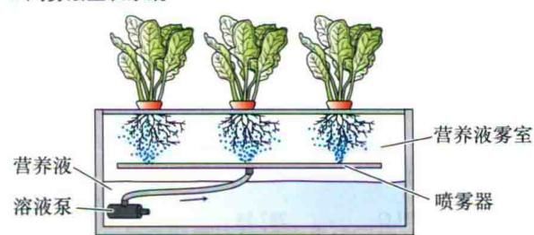  
D 间歇流动系统

  
图5.2 各种类型的溶液培养系统。A. 一种标准的水培生长系统，植物通过茎基部悬吊在装有营养液的槽上。用能产生小气泡的多孔固体作为气泡柱，用来保持溶液中氧的饱和状态。B. 在营养膜生长系统中，溶液泵将营养液从主水池中泵出，营养液沿着倾斜槽的底部由回收管流回蓄水池。C. 在汽雾法生长系统中，培养槽中的高压泵向根部喷洒营养液。D. 在间歇流动系统中，水泵周期性地向包含植物根的上部小室中泵满营养液。当泵关掉时，营养液通过泵慢慢流回主蓄水池（引自Epstein and Bloom，2005）。

汽雾栽培法（aeroponically）是另一种可供选择的植物培养方法，该方法有时被誉为未来的科学研究的手段（Weathers and Zobel，1992）。在这种技术中，植物根被悬吊在空中，同时不断地向植物根部喷施营养液以维持其生长（图5.2C）。这种方法能在根周围提供容易操纵的气体环境，但是需要提供比水培法更高浓度的营养液，以维持植物的快速生长。再加上其他技术困难，汽雾栽培法目前尚未得到广泛的应用。

间歇流动系统（ebb-and-flow system）（图5.2D）

也是一种溶液培养方法。在该体系中，植物的根暴露于潮湿的空气中，营养液周期性地上升淹没植物根部并随后退去。和汽雾栽培法一样，间歇流动体系对营养液的浓度需要比水培法和营养膜培养法更高。

## 5.1.2 营养液能维持植物的快速生长

多年来，人们研究出了多种营养液的配制方式。早期的配方仅包括 $KNO_{3}$ 、 $Ca(NO_{3})_{2}$ 、 $KH_{2}PO_{4}$ 、 $MgSO_{4}$ 和铁盐，是由德国人Knop开发的。当时，这种营养液被认为含有植物所需的所有矿物质，但是，后来才知道进行这些实验所用到的化学药品被其他成分（如硼和钼）污染了，当时并不知道这些元素也是植物所必需的。表5.3列出了一个更现代的营养液配方。此配方被称作改良Hoagland溶液（Hoagland solution），即以一位在现代矿质营养研究中作出杰出贡献的美国科学家Dennis R. Hoagland命名。

表 5.3 培养植物的改良Hoagland 溶液的组成

<table><tr><td rowspan="2">化合物</td><td rowspan="2">分子质量/(g/mol)</td><td rowspan="2">储备液浓度/(mmol/L)</td><td rowspan="2">储备液浓度/(g/L)</td><td rowspan="2">每升最终溶液中储备液体积/mL</td><td rowspan="2">元素</td><td colspan="2">元素的最终浓度</td></tr><tr><td>/(μmol/L)</td><td>/(μg/g)</td></tr><tr><td>大量元素</td><td></td><td></td><td></td><td></td><td></td><td></td><td></td></tr><tr><td> $KNO_3$ </td><td>101.10</td><td>1000</td><td>101.10</td><td>6.0</td><td>N</td><td>16000</td><td>224</td></tr><tr><td> $Ca(NO_3)_2·4H_2O$ </td><td>236.16</td><td>1000</td><td>236.16</td><td>4.0</td><td>K</td><td>6000</td><td>235</td></tr><tr><td> $NH_4H_2PO_4$ </td><td>115.08</td><td>1000</td><td>115.08</td><td>2.0</td><td>Ca</td><td>4000</td><td>160</td></tr><tr><td> $MgSO_4·7H_2O$ </td><td>246.48</td><td>1000</td><td>246.49</td><td>1.0</td><td>P</td><td>2000</td><td>62</td></tr><tr><td></td><td></td><td></td><td></td><td></td><td>S</td><td>1000</td><td>32</td></tr><tr><td></td><td></td><td></td><td></td><td></td><td>Mg</td><td>1000</td><td>24</td></tr><tr><td>微量元素</td><td></td><td></td><td></td><td></td><td></td><td></td><td></td></tr><tr><td>KCl</td><td>74.55</td><td>25</td><td>1.864</td><td></td><td>Cl</td><td>50</td><td>1.77</td></tr><tr><td> $H_3BO_3$ </td><td>61.83</td><td>12.5</td><td>0.773</td><td></td><td>B</td><td>25</td><td>0.27</td></tr><tr><td> $MnSO_4·H_2O$ </td><td>169.01</td><td>1.0</td><td>0.169</td><td></td><td>Mn</td><td>2.0</td><td>0.11</td></tr><tr><td> $ZnSO_4·7H_2O$ </td><td>287.54</td><td>1.0</td><td>0.288</td><td>2.0</td><td>Zn</td><td>2.0</td><td>0.13</td></tr><tr><td> $CuSO_4·5H_2O$ </td><td>249.68</td><td>0.25</td><td>0.062</td><td></td><td>Cu</td><td>0.5</td><td>0.03</td></tr><tr><td> $H_2MoO_4(85%MoO_3)$ </td><td>161.97</td><td>0.25</td><td>0.040</td><td></td><td>Mo</td><td>0.5</td><td>0.05</td></tr><tr><td>NaFeDTPA(10%Fe)</td><td>468.20</td><td>64</td><td>30.0</td><td>0.3~1.0</td><td>Fe</td><td>16.1~53.7</td><td>1.00~3.00</td></tr><tr><td>可选择元素a</td><td></td><td></td><td></td><td></td><td></td><td></td><td></td></tr><tr><td> $NiSO_4·6H_2O$ </td><td>262.86</td><td>0.25</td><td>0.066</td><td>2.0</td><td>Ni</td><td>0.5</td><td>0.03</td></tr><tr><td> $Na_2SiO_3·9H_2O$ </td><td>284.20</td><td>1000</td><td>284.20</td><td>1.0</td><td>Si</td><td>1000</td><td>28</td></tr></table>

资料来源：改编自Epstein，1972

注：为了防止沉淀，在准备营养液时，大量元素要从母液中分开来加。组合母液包含除了铁之外的所有微量元素。铁以钠高铁二乙烯三胺五磷酸（NaFe DTPA，商品名Ciba-Geigy Sequestrene 330 Fe；图5.3）的形式加入；有些植物，像玉米如表中所示，需要更高水平的铁

改良的Hoagland溶液包含所有已知的为植物快速生长所必需的矿质元素。溶液中各种元素的浓度是在不产生毒性症状和盐胁迫条件下的最高可能水平。因此，许多元素的浓度很有可能要比植物根周围土壤中的浓度高许多倍。例如，正常情况下，土壤溶液中磷的浓度低于0.06 ppm，而在改良的Hoagland溶液中却为62 ppm（Epstein and Bloom，2005）。如此高的初始浓度可使植物在不用补充营养的情况下生长较长时间，但这种浓度也可能对幼苗产生伤害。因此许多研究者将营养液稀释几倍，以多次补充的方式使用，以此降低介质和植物组织中营养物质浓度的波动。

改良Hoagland配方的另外一个重要特征是氮元素以铵盐（ $\mathrm{NH}_4^+$ ）和硝酸盐（ $\mathrm{NO}_3^-$ ）两种形式供给。以阳离子（positively charged ion）和阴离子（nagtively charged ions）均衡混合的方式供应氮元素，能减少培养基中pH的快速上升，而溶液pH上升的现象在单用硝酸根阴离子作为氮源的情况下很常见（Asher and Edwards, 1983）。即使在溶液pH保持中性的情况下，同时获取 $\mathrm{NH}_4^+$ 和 $\mathrm{NO}_3^-$ ，大多数植物会生长得更好，因为吸收和同化两种形式的氮，能促进植物体内阳-阴离子的平衡（Raven and Smith, 1976; Epstein and Bloom, 2005）。

如何维持溶液中铁离子的可用性是营养液的一个重要问题。如果以无机盐如 $\mathrm{FeSO_{4}}$ 或 $\mathrm{Fe(NO_{3})_{2}}$ 的形式供应，特别是在碱性条件下，铁能在溶液中以氢氧化铁的形式沉淀出来。如果溶液中有磷酸盐存在，也能形成不溶性的磷酸铁。溶液中的铁盐沉淀出来，成为植物不能利用的物理形态，除非向溶液中不断加入铁盐。早期的研究者通过将铁与柠檬酸或酒石酸一起加入的方法来解决这个问题。诸如称作螯合剂（chelator）的复合物，由于它们能与以离子间相互作用力而非共价键结合 $\mathrm{Fe^{2+}}$ 、 $\mathrm{Ca^{2+}}$ 等阳离子形成可溶性的化合物。对植物来说，被螯合的阳离子保持了可利用性的物理性质。

更现代的营养液用化学试剂乙二胺四乙酸（EDTA）或二乙烯三胺五磷酸（DTPA或五醋三胺）作为螯合剂（Sievers and Baile，1962）。图5.3显示了DTPA的结构。在根细胞吸收铁的过程中，螯合复合物的去向还不清楚。在根表面，三价铁（ $\mathrm{Fe}^{3+}$ ）被还原成二价铁（ $\mathrm{Fe}^{2+}$ ）后可能从螯合剂中被释放出来，之后，螯合剂可能扩散回营养液（或土壤）并与另一个 $\mathrm{Fe}^{3+}$ 或其他金属离子螯合。

铁被吸收进入根部后，与植物细胞中的有机化合物通过螯合作用结合保持可溶性状态。柠檬酸可能是主要的铁离子有机螯合剂，并且铁离子在木质部的长距离运输似乎也涉及铁-柠檬酸复合物。

A  

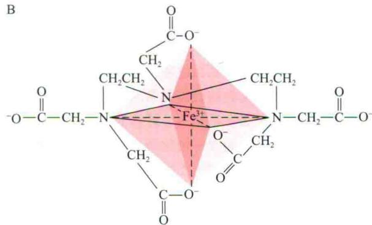  
图5.3 螯合剂和被螯合的阳离子。螯合剂二乙烯三胺五磷酸（DTPA）的化学结构，螯合剂本身（A）和螯合一个 $Fe^{3+}$ 的状态（B）。铁通过与3个氮原子和3个羧基上离子化的氧原子相互作用结合到DTPA上（Sievers and Bailar，1962），产生能够固定金属离子的结构，并有效地中和了金属离子在溶液中的反应性。在根表面，铁的吸收过程中 $Fe^{3+}$ 被还原成 $Fe^{2+}$ ，然后从DTPA-铁复合物中释放出来，而螯合剂又能结合其他可用的 $Fe^{3+}$ 。

## 5.1.3 矿质营养缺乏影响植物代谢和功能

必需元素供应不足时将导致营养失调，表现出典型的缺素症。在水培中，一种必需元素缺乏能很容易地与一组已知的元素缺乏症状相对应。例如，一种特殊元素缺乏可能诱发一种特定形式的叶片颜色变化。但土壤中生长的植物，其缺素症的诊断则复杂得多，原因主要如下。

（1）几种元素的缺乏可能同时发生在不同的植物组织中。

（2）一种元素的缺乏或过量可能诱导其他元素的缺乏或过度积累。

（3）一些病毒诱导的植物疾病可能产生与营养元素缺乏相似的症状。

植物中的营养缺乏症状表现为必需元素供应不足时所引起的代谢紊乱。这种紊乱与必需元素在正常植物代谢和功能中扮演的角色有关（表5.2已列出）。

虽然每一个必需元素都参与许多不同的代谢反应，但在植物代谢中对必需元素的功能做一个大概的描述还是有可能的。通常，必需元素在植物结构、新陈代谢和细胞渗透调节中发挥作用。而某些二价阳离子可能具有与其特性相关的更多特殊作用，如 $Ca^{2+}$ 或 $Mg^{2+}$ 能改变植物膜通透性。另外，进一步研究还表明这些元素在植物代谢中具有特殊作用，如 $Ca^{2+}$ 可作为信号分子调节胞质中的关键酶（Hepler and Wayn，1985；Hetherington and

Brownlee，2004）。因此，绝大多数必需元素在植物代谢过程中具有多重功能。

当阐述某种特定必需元素的严重缺乏症时，一个重要的线索是该元素从老叶到新叶可被循环利用的程度。一些元素，如氮、磷和钾，很容易从一个叶片转移到另一个叶片；而另一些元素，如硼、铁和钙，则在大多数种类植物中的位置相对固定（表5.4）。如果一种必需元素是可转移的，那么这种元素的缺乏症状将首先出现在老叶上。不易转移必需元素的缺乏症则首先会在新叶中明显表现出来。虽然养分转移的详细机制还不很清楚，但诸如细胞分裂素等植物激素似乎参与其中（见第21章）。在下面的讨论中，将按照表5.2的分组，详细叙述必需矿质元素的特定缺乏症状及其在植物中的功能。

表5.4 根据矿质元素在植物中的移动性和在缺乏时的移动趋势对其进行分类

<table><tr><td>可移动的</td><td>不可移动的</td></tr><tr><td>N</td><td>Ca</td></tr><tr><td>K</td><td>S</td></tr><tr><td>Mg</td><td>Fe</td></tr><tr><td>P</td><td>B</td></tr><tr><td>Cl</td><td>Cu</td></tr><tr><td>Na</td><td></td></tr><tr><td>Zn</td><td></td></tr><tr><td>Mo</td><td></td></tr></table>

注：根据元素在植物中的含量进行排序

## 1. 第一组：作为含碳化合物组分的矿质营养的缺乏

这一组由氮和硫组成。在大多数自然和农业生态系统中，土壤中氮的可用性限制着植物的产量。相反，土壤中通常含有过量的硫。尽管存在这种差异，氮和硫在宽泛氧化还原状态上有着相似的化学性质（见第12章）。生命中的一些高耗能的反应都是将根从土壤中吸收的高度氧化态的无机形式（如硝酸盐和碳酸盐）转化成有机化合物中高度还原态的有机形式（如植物中的氨基酸）。

## 1）氮

氮是植物需求量最大的矿质元素。它是植物细胞包括氨基酸、蛋白质和核酸等重要组分的组成元素。因此，缺氮能迅速抑制植物的生长。如果氮元素持续缺乏，大多数物种表现为缺绿（chlorosis）症状（叶片变黄），特别是靠近植物基部的老叶（缺氮照片，以及本章中所述的其他矿质元素的缺乏照片，参见Web Topic

5.1）。严重缺氮时，植物叶片完全发黄（或黄褐），进而从植物上脱落。最初，嫩叶可能表现不出这些症状，因为氮能从老叶转移到嫩叶。因此，缺氮的植物可能表现为上部叶片浅绿色，而下部叶片发黄或黄褐色。当缓慢缺氮时，植物明显纤细，茎木质化。木质化的原因可能是植物中碳水化合物的过量积累，而这些碳水化合物又不能被用来合成氨基酸或其他含氮化合物。另外，不能在氮代谢中被利用的碳水化合物可能参与到花青素的合成中，从而导致色素的积累。在一些植物，如番茄和特定品种的玉米（Zea mays）中，缓慢缺氮时，叶、叶柄和茎会变成紫色。

## 2）硫

硫存在于氨基酸（胱氨酸、半胱氨酸和甲硫氨酸）中，是代谢中许多辅酶和维生素（如乙酰辅酶A、S-腺苷甲硫氨酸、维生素B₁、泛酸）的组成元素。植物缺硫的许多症状与缺氮相似，包括缺绿、矮化和花青素的积累等。这种相似性并不奇怪，因为硫和氮都是蛋白质的组成元素。然而与氮不同，大多数植物中的硫不易转移到嫩叶中去，因而植物缺硫所引起的缺绿症首先表现在成熟及幼嫩的叶中，而不是像缺氮那样最初只在老叶中发生。虽然如此，在许多植物中缺硫引起的缺绿，可能同时发生在所有的叶片中，甚至老叶。

## 2. 第二组：主要影响能量储存和结构完整性的矿质营养的缺乏

这一组由磷、硅、硼组成。根据在植物组织中的存在浓度，磷和硅被划分为大量元素，而硼含量较小，被认为是微量元素。这些元素在植物中常以酯键与碳结合的形式存在，如X-O-C-R，X元素在含氮分子C-R中通过氧原子与碳原子相连。

## 1）磷

磷（如磷酸盐、 $PO_{4}^{3-}$ ）是植物细胞内重要化合物的必需组分，包括呼吸作用和光合作用中的糖-磷中间体及组成植物膜的磷脂。同时，它也是用于植物能量代谢的核苷酸（如ATP）和DNA与RNA的组成元素。缺磷的典型症状为植物幼苗矮小，叶色暗绿，叶片可能畸变，并有被称为坏死斑（necrotic spot）的死亡组织小斑点（参见Web Topic 5.1）。像缺氮一样，一些植物也可能产生过多的花青素，使叶片呈浅紫色。但与缺氮不同的是，缺磷产生的紫色与缺绿无关。因此，事实上叶片可能呈暗绿紫色。缺磷的其他症状有：茎细长（但并不木质化）和老叶死亡。植物的成熟期可能也会被推迟。

## 2）硅

仅有木贼科家族中的成员（称为锈斑擦洗剂，因为它们的灰烬中富含沙砾硅石，被用来刷洗罐容器）需要硅来完成它们的生活史。然而，许多其他植物的组织中也积累相当量的硅，并且施用适量的硅可促进作物生长、生殖及胁迫抗性（Epstein，1999）。植物缺硅时，易倒伏，易受真菌感染。硅主要沉积在内质网、细胞壁，或者以非结晶的水合物（ $\mathrm{SiO}_2 \cdot n\mathrm{H}_2\mathrm{O}$ ）形式存在于细胞间隙中。它可与多酚形成复合物，因而可以替代木质素来强化细胞壁。另外，硅能减少包括铝和锰在内的许多金属的毒性。

## 3）硼

虽然硼在植物代谢中的精细功能还不清楚，但有证据表明它在细胞伸长、核酸合成、激素反应、膜功能和细胞周期调控中起作用（Brown et al., 2002；Reguera et al., 2009）。缺硼时，植物表现出多种症状，随植物种类和植物年龄不同而各异。典型缺硼的症状是嫩叶和顶芽变黑坏死。嫩叶坏死主要发生在叶片基部，茎异常僵直、易断。缺硼后植物失去了顶端优势，多分枝；然而不久，枝的顶端也因为细胞分裂被抑制而坏死。果实、肉质根和块茎结构也因为内部组织的损坏而畸变或坏死（参见Web Essay 5.1）。

## 3. 第三组：以离子形式存在的矿质元素的缺乏

这组元素包括一些大家最为熟悉的矿质元素：大量元素钾、钙和镁；微量元素氯、锰和钠。这些元素以离子形式存在于细胞质或液泡中，以静电作用力或作为配体结合到含碳的大分子化合物上。

## 1）钾

钾在植物中以阳离子 $K^{+}$ 的形式存在，在调节植物细胞渗透势方面起重要作用（见第3章和第6章）。它也能激活许多参与呼吸作用和光合作用的酶。

缺钾的第一个可见症状是叶片斑点状或边缘萎黄，逐渐发展成叶尖、叶缘和叶脉间的坏死。在许多单子叶植物中，坏死斑在叶尖和叶缘产生，然后向叶基部扩展。因为钾能从老叶转移到幼嫩叶，所以缺钾症状首先出现在靠近植物基部的更成熟的叶片上。这些叶片也可能卷曲、皱缩。缺钾植物纤弱，节间短而异常。在缺钾的玉米中，根更易感染土壤中存在的根腐烂真菌，这种根对土壤中腐烂真菌更加敏感，再加上缺钾对茎部的影响，使植物更易倒伏。

## 2）钙

钙离子被用来合成新的细胞壁，精确地说是用来合成将新细胞分开的胞间层。钙也与有丝分裂中纺锤体的形成有关。钙为植物膜的功能正常所必需，并作为第二信使参与植物对环境、激素信号的多种反应（White and Broadley，2003；Hetherinton and Brownlee，2004）。钙作为第二信使行使功能时，可能与在植物细胞质中发现的一种称为钙调素（calmodulin）的蛋白质结合。然后，钙调素-钙复合物与许多不同类型的蛋白质结合，包括蛋白激酶、磷酸酶、第二信使信号蛋白和细胞骨架蛋白，从而可以广泛调节从转录调控、细胞存活到化学信号释放等许多细胞内过程（见第24章）。

缺钙的典型症状为幼嫩分生组织区域的死亡，如根尖和幼叶，而此处细胞分裂和细胞壁形成速度最快。慢速生长的植物在出现坏死症状之前，幼嫩叶片首先出现普遍的缺绿和向下弯勾。幼嫩叶片也可能发生畸形。缺钙时植物的根系表现为褐色、短小、高度分枝。如果植物分生组织区域在成熟之前死亡，将导致植株严重矮化。

## 3）镁

在植物细胞中，镁离子（ $\mathrm{Mg}^{2+}$ ）能特异性地激活参与呼吸作用、光合作用和DNA与RNA合成的酶。镁也是叶绿素分子环形结构的组成元素（图7.6A）。由于镁元素具有移动性，缺绿首先发生在老叶上，表现为典型的叶脉间缺绿。这种缺绿的方式是因为叶绿素在维管束中比在维管束之间的细胞中能保持更长的时间而不被破坏。如果缺镁严重，叶片变黄或变白。另外，缺镁的另外一个症状是叶片在成熟前脱落。

## 4）氯

在植物中，氯元素以氯离子（Cl⁻）的形式存在。氯为光合作用中水裂解产生氧的反应所必需（见第7章）（Popelkova and Yocum，2007）。另外，在叶和根部细胞的分裂中也需要氯（Colmenero-Flores et al., 2007）。缺氯时植物首先表现为叶尖枯萎，接着为常规的叶片缺绿和坏死，同时也可能表现为叶片生长速率减小，最终叶片呈现出赤褐色（“赤褐化”）。植物缺氯时，其接近根尖处变短加粗。

氯离子可溶性高，由于海水被风吹进空气，氯随雨水带进土壤，因此氯在土壤中一般不缺乏。在天然和农业生境中，植物生长中缺氯现象很少见（Engel et al., 2001）。大多数植物吸收的氯远远高于它们正常功能所需要的氯。

## 5）锰

在植物细胞中，锰离子（ $\mathrm{Mn}^{2+}$ ）是许多酶的激活剂。尤其是柠檬酸循环（Krebs循环）中的脱羧酶和脱氢酶被锰离子特异性激活。锰最明确的功能是参与光合作用中水的放氧（ $\mathrm{O}_2$ ）反应（Armstron，2008）（见第7章）。缺锰的主要症状为与微小坏死点形成相关的叶脉间失绿。缺绿可以发生在较嫩幼叶或较老的叶片，这依赖于植物种类和植物的生长速率。

## 6）钠

大多数利用 $C_{4}$ 途径和景天酸代谢（CAM）途径固定碳（见第8章）的植物需要钠离子（ $Na^{+}$ ）。在这些植物中，钠对磷酸烯醇式丙酮酸的再生非常重要，磷酸烯醇式丙酮酸是 $C_{4}$ 途径和CAM途径中第一次羧化反应的底物（Brownell and Bielig，1996）。缺钠时，这些植物缺绿、坏死，甚至不能形成花。低水平的钠离子对许多 $C_{3}$ 植物也是有益的。钠能通过增强细胞扩展来刺激生长，并能部分地代替钾作为渗透调节物质。

## 4. 第四组：参与氧化还原反应的营养元素的缺乏

这一组包括5种元素：金属离子铁、锌、铜、镍和钼。所有这些元素都具有可逆的氧化还原状态（如 $Fe^{2+}\rightleftharpoons Fe^{3+}$ ），在电子转移和能量转化中起重要作用。通常这些元素与细胞色素、叶绿素和蛋白质（常为酶）等大分子有关。

## 1）铁

铁作为参与电子传递中（氧化还原反应）酶如细胞色素的组成成分具有重要的作用。作为酶的组成成分，在电子转移过程中铁发生从 $Fe^{2+}$ 到 $Fe^{3+}$ 的可逆氧化。

同缺镁一样，典型的缺铁症状为叶脉间失绿。但与缺镁不同的是，缺铁症状首先表现在嫩叶上，因为铁不易从老叶中转移出来。在极度或长期缺铁时，叶脉也会缺绿，致使整个叶片变白。叶片缺绿是因为叶绿体中一些叶绿素-蛋白质复合物的合成需要铁。铁的移动性低可能是由于铁在老叶中以不溶的氧化物或磷酸盐沉淀或与植物铁蛋白（phytoferritin）形成稳定复合物的形式存在。植物铁蛋白是在叶和其他植物组织中发现的铁结合蛋白（Jeong and Guerino，2009）。铁的沉淀降低了它在随后进入韧皮部进行长距离运输的移动性。

## 2）锌

许多酶需要锌离子（ $\mathrm{Zn}^{2+}$ ）的激活，而且在一些植物中，叶绿素的生物合成可能也需要锌（Broadley et al., 2007）。缺锌的典型症状为节间生长减缓，导致植物呈莲座状生长，在地面或近地面叶片环形辐射丛生。叶片可能小且变形，叶缘皱缩。这些症状可能是由于不能产生足够数量的生长素吲哚-3-乙酸（IAA）引起的。在一些植物（如玉米、高粱和豆类）中，老叶会出现叶脉间缺绿，然后产生白色坏死斑。这种缺绿现象可能是叶绿素生物合成需要锌的表现。

## 3）铜

像铁一样，铜与氧化还原反应的酶有关。铜通过 $Cu^{+}$ 与 $Cu^{2+}$ 之间的转换参与到这些氧化还原反应中。质体蓝素就是这种酶的一个例子，它在光合作用的光反应中参与电子传递（Yruela，2009）。缺铜的最初症状为叶片呈深绿色，其中有坏死斑点。坏死斑首先从嫩叶的叶尖开始，后沿叶缘扩展到叶片的基部。叶片也会卷曲或变形。缺铜严重时，叶片会在成熟前脱落。

## 4）镍

固氮微生物能再利用固氮过程中产生的部分氢气，尽管催化这种反应的酶（吸收氢的氢化酶）需要镍$\left(\mathrm{Ni}^{+}\sim\mathrm{Ni}^{4+}\right)$ ，但是在高等植物中，脲酶是唯一知道的含镍的酶（见第12章）。缺镍的植物在叶片中积累脲，表现为叶尖坏死。在农田中，因为镍的需要量极小，仅在一种植物——美国东南部的美洲核桃树中发现缺镍现象（Wood et al., 2003）。

## 5）钼

钼离子（ $\mathrm{Mo}^{4+}\sim \mathrm{Mo}^{6+}$ ）是硝酸还原酶、固氮酶等许多酶的组成成分（Schwarz and Mendel，2006）。在植物细胞同化硝酸的过程中，硝酸还原酶催化由硝酸盐生成亚硝酸盐的还原反应。在固氮微生物中，硝酸还原酶将氮气转化成氨（见第12章）。缺钼的第一迹象一般为老叶的叶脉间缺绿、坏死。在一些植物，如花椰菜和嫩茎花椰菜中，叶片并不坏死，而是卷曲继而死亡（鞭尾病）。缺钼时不能形成花，或者花在成熟前脱落。

由于钼参与硝酸盐同化和氮固定，因此由硝酸盐提供氮源或依赖共生固氮的植物在缺钼时会表现缺氮症状。虽然植物对钼的需求量很小，但仍有一些土壤（如澳大利亚的酸性土壤）含钼不足。在这些土壤里，加入少量的钼就能极大地促进作物的生长。

## 5.1.4 植物的组织分析可揭示矿质的缺乏症

在植物生长和发育过程中，对矿质元素的需求是不断变化的。在作物中，特定生长阶段的营养水平，可影响具有重要经济价值部分（块茎、籽粒等）的产量。为了优化产量，农民对土壤和植物组织的营养水平进行分析，以便决定施肥时机。土壤分析（soil analysis）是指对根周围土壤样品的营养含量进行化学测定。正如本章后面将要讨论的一样，土壤的化学和生物学性质非常复杂，土壤分析的结果随着取样方法、贮存条件和养分提取技术的不同而变化。值得注意的是，土壤分析仅能反映植物根可从土壤中获得的潜在营养水平，并不能告诉人们植物对特定营养元素的实际需求，或者能吸收这种营养元素的量。获得进一步信息的最好途径是对植物进行组织分析。为了合理地运用植物组织分析（plant tissue analysis）技术，需要了解植物生长（或产量）与植物组织样品中某种营养元素浓度之间的关系（Bouma，1983）。图5.4根据组织中营养元素的浓度对生长的影响确定了3个区域（缺乏区、适量区和中毒区）。当组织样品中营养成分的浓度低时，生长速度减缓，这个区域称为缺乏区（deficiency zone）。在缺乏区，可用营养成分的增加与植物生长或产量的增加直接相关。随着可用营养持续性增加到一个浓度值时，营养的进一步增加不再与生长或产量的增加相关，但反映在植物组织营养浓度的增加上，这个区域称为适量区（adequate zone）。

  
组织中营养的浓度/ $(\mu\mathrm{mol}/\mathrm{g}$ 干重)  
图5.4 产量（或生长）与植物组织营养含量的关系（被定义成缺乏区、适量区和中毒区3个区域）。产量或生长以幼苗干重或高度来表达。为了测量这种类型的数据，将植物种植在一种必需元素浓度变化而所有其他元素保持适中浓度的条件下。在植物生长过程中，这种营养浓度变化的影响反映在生长和产量上。养分的临界浓度是低于或高于某一浓度时产量和生长就会减缓的浓度值。

曲线中缺乏区与适量区之间的过渡点表示这种营养成分的临界浓度（critical concentration）（图5.4），临界浓度可以被定义为达到最大生长或产量时该营养元素的最小组织浓度。随着组织中营养元素浓度的增加，当超过了适量区，生长或产量就会因中毒而下降，这就是中毒区（toxic zone）。为了评价生长与组织营养浓度之间的关系，研究者将植物种在一种特定的土壤或营养液中。在这种特定的培养体系中，除了被研究的营养元素外，其他营养元素都适量存在。在实验开始时，限制性的营养元素以浓度逐渐增加的方式，被添加到不同组的植物中，特定组织中的营养元素浓度与运用特定测量方式所测量的植物生长或产量相对应。每一种元素可建立起很多曲线，其中每一个组织和组织发育阶段都对应有相应的曲线。由于农用土壤经常受氮、磷、钾元素的限制，许多农民通常考虑生长或产量对这些元素的最低要求。如果推测有营养缺乏，在影响生长或产量之前就应采取措施，改善缺素状态。已经证明，植物组织分析对建立肥料使用的进程表有很大作用，这种进程表可以使许多植物维持产量的同时确保粮食的品质。

## 5.2 营养缺乏的治疗

许多传统的和自给性农业实践能促进矿质元素循环再利用。作物从土壤中吸收养分，人类和动物消费这些地方生长的作物，然后作物的残余物及人类和动物的粪便将营养归还到土壤中。在这种农业体系中，营养成分的主要流失在于水流带走溶解于其中的离子，特别是硝酸盐。在酸性土壤中，可通过增加石灰 $\left[\mathrm{CaO},\mathrm{CaCO}_{3}\right.$ 和 $\mathrm{Ca(OH)_2}$ 的混合物]使土壤更加碱化的方式来降低营养的淋洗流失，因为当pH高于6时，许多离子将形成溶解度更低的化合物（图5.5）。然而，营养的淋洗减少可能要以一些营养元素特别是铁的可用性降低为代价来实现。

  
图5.5 pH对有机土壤中营养元素可用性的影响。暗区部分的宽度代表营养元素能被植物根利用的程度。pH为5.5\~6.5时，所有的营养元素都是可用的（改编自Lucas and Davis，1961）。

在工业化国家的高产农业体系中，因为作物的大部分生物量离开了耕作区，很难最大限度上使作物残余物归还到原产地。养分从土壤到作物的单项迁移，使得通过施肥增加土壤储存养分变得尤为重要。

## 5.2.1 通过施肥提高作物产量

大多数化学肥料为含有大量元素氮、磷、钾的无机盐（表5.1）。仅含有这3种元素中任一种的化学肥料称为单一肥料。常见的一些单一肥料有过磷酸盐、硝酸铵和氯化钾（一种钾源）。含有两种或更多种矿质元素的肥料称为复合肥料或混合肥料，包装标签上的数字，如“10-14-10”，分别代表N、P（以 $P_{2}O_{5}$ 形式）、K（以 $K_{2}O$ 形式）在肥料中的百分比。

随着长期的农业生产，微量元素的消耗也将达到一定的水平，此时它们也必须被以肥料的形式添加到土壤中去。向土壤添加微量元素对纠正之前土壤微量元素的缺乏也是很有必要的。例如，在湿润地区的许多酸性、沙性土壤中缺乏硼、铜、锌、锰、钼或铁（Mengel and

Kirkby，2001），因而补充这些元素可以使作物获益。

某些化学物质也能用作改变土壤的pH。如图5.5所示，土壤的pH影响着所有矿质营养的可利用性。如前所述，加入石灰能增加酸性土壤的pH，添加硫元素能降低碱性土壤的pH。在后一种情况下，微生物能吸收硫，随后释放硫酸盐和氢离子使土壤酸化。

相对于化学肥料，有机肥料（organic fertilizer）来源于动植物生命的残余物或自然界岩石的沉积物。植物和动物的残余物含有许多营养元素，这些营养元素以有机化合物的形式存在。在作物从这些残余物中获取营养之前，有机复合物必须被分解，通常由土壤微生物通过矿化作用（mineralization）的过程来完成。矿化作用依赖于包括温度、水和氧气及土壤微生物的类型和数量等多种因素。由于矿化作用的速率是高度可变的，因此有机残余物中的营养变成植物可利用的形式要经历数天、数月甚至数年。矿化作用的缓慢速率妨碍着肥料的有效利用，因此，仅仅依赖有机肥料的农场可能需要补充更多的氮或磷肥，甚至要比纯施化学肥料的农场承受更多的营养损失。但是有机肥料的残余物能够改进大多数土壤的物理结构，增加干旱条件下土壤的保水能力和阴雨天气中土壤的排水能力。

## 5.2.2 叶片对矿质元素的吸收

除了将营养元素施用到土壤作为肥料之外，通过喷洒将矿质营养施用到植物叶片上也能被大多数植物吸收，这个过程称为叶面施肥（foliar application）。在某些情况下，这种方法比将营养施用到土壤中具有更高的农艺学优点。叶面施肥能减少营养施用和植物吸收之间的时间滞后期，这在植物的快速生长期是十分重要的。叶面施肥也能克服土壤中某种养分吸收的限制问题。例如，叶面喷洒矿质元素铁、锰和铜比土壤施肥更有效，因为在土壤中，这些离子被吸附到土壤颗粒上，对于根系来说，降低了养分的可利用性。当营养液在叶片上以薄膜的形式存在时，植物通过叶片对营养的吸收最为高效（Mengel and Kirkby，2001）。薄膜的产生常需要向营养溶液中补充表面活性剂类的化学物质，如去污剂Tween 80，它能降低液体的表面张力。营养成分可能通过角质层扩散到植物内，并由叶细胞吸收。虽然气孔可能为营养进入叶片提供了一条途径，但气孔的结构（图4.12和图4.13）在很大程度上阻止了液体的渗入（Ziegter，1987）。为了成功地进行叶面施肥，必须将营养液对叶片的伤害程度降到最低。如果在热天进行叶面喷施，由于蒸发速率很高，盐分可能会积累到叶的表面，引起叶面发热或灼伤，而在凉爽天气或傍晚喷施则能减轻这一问题。在喷洒液中添加石灰能降低许多营养元素的溶解性，并降低毒性。从经济学角度考虑，叶面施肥主要在木本作物和藤本植物（如葡萄）上的应用取得了成功，也同样应用在谷类植物上。当土壤施肥不能较快地解决营养缺乏症时，叶面施肥能够挽救一个果园或葡萄园。在小麦（Triticum aestivum）生长后期，通过在叶面喷施氮肥能增加种子中蛋白质的含量。

## 5.3 土壤、根和微生物

土壤具有复杂的物理、化学和生物学性质。它是一个包含固相、液相和气相的异质性物质（见第4章）。所有这些相态都与矿质元素相互影响。固相的无机颗粒为钾、钙、镁和铁提供了一个储存库。同样，和固相相连的还包含有氮、磷、硫和其他元素的有机化合物。土壤液相和溶解在其中的矿质离子构成土壤溶液，充当了离子运动到根表面的介质。尽管土壤溶液中溶解有氧气、二氧化碳和氮气等气体，但是，根与土壤的气体交换主要通过土壤颗粒之间的空气间隙。

从生物学观点来看，土壤构成了一个复杂的生态系统，其中植物根和微生物激烈竞争矿质元素。尽管存在竞争，根和微生物为了相互的利益能结成联盟［共生（symbioses），单数形式为symbioses］。本节将讨论土壤特性、根的结构和菌根共生关系对植物矿质营养的重要性。与固氮细菌的共生关系将在第12章讨论。

## 5.3.1 带负电的土壤颗粒影响矿质元素的吸附

无论是无机的还是有机的土壤颗粒，其表面主要带负电荷。许多无机土壤颗粒是由铝离子（ $\mathrm{Al}^{3+}$ ）和硅离子（ $\mathrm{Si}^{4+}$ ）等阳离子与氧原子结合形成四面体结构的晶格形式，由此形成铝酸盐和硅酸盐。在土壤晶格中，当带更低电荷的阳离子取代 $\mathrm{Al}^{3+}$ 和 $\mathrm{Si}^{4+}$ 时，这些无机土壤颗粒将变为负电性。有机土壤颗粒来自于微生物分解的死亡植物、动物和其他微生物的产物。有机颗粒表面的负电荷由存在于土壤成分中的羧酸和酚基的氢离子解离产生。然而，地球上大多数土壤颗粒都是无机的。

根据颗粒大小，无机土壤可分为以下几类。

沙砾，其颗粒大于2 mm。

粗粒，其颗粒为0.2\~2 mm。

细砂，其颗粒为0.02\~0.2 mm。

淤泥，其颗粒为0.002\~0.02 mm。

黏土，其颗粒小于0.002 mm。

根据结构和物理特性不同，含硅酸盐的黏土物质被进一步分成三大类：高岭土、伊利石和蒙脱石（表5.5）。高岭土一般是风化程度高的土壤；蒙脱石和伊利石常为风化程度低的土壤。

表5.5 土壤中形成的3种主要类型硅酸盐黏土的特性比较

<table><tr><td rowspan="2">特性</td><td colspan="3">土壤类型</td></tr><tr><td>蒙脱石</td><td>伊利石</td><td>高岭土</td></tr><tr><td>大小/μm</td><td>0.01~1.0</td><td>0.1~2.0</td><td>0.1~5.0</td></tr><tr><td>形状</td><td>不规则薄片</td><td>不规则薄片</td><td>六边形结晶</td></tr><tr><td>结合度</td><td>高</td><td>中等</td><td>低</td></tr><tr><td>吸水膨胀能力</td><td>高</td><td>中等</td><td>低</td></tr><tr><td>阳离子交换能力/(毫克当量/100g)</td><td>80~100</td><td>15~40</td><td>3~15</td></tr></table>

资料来源：改编自Brady，1974

阳离子矿质元素如铵（ $\mathrm{NH}^{4+}$ ）和钾（ $\mathrm{K}^{+}$ ）吸附在带有负电荷的无机和有机土壤颗粒表面。吸附阳离子是土壤肥力的一个重要因素。吸附到土壤颗粒表面的矿质离子，遭受雨水淋洗时不易脱落，为植物根提供了可用的营养储备。以这种方式吸附的矿质元素能被其他阳离子取代，这个过程称为阳离子交换（cation exchange）（图5.6）。土壤吸附及交换离子的程度称为土壤的阳离子交换量（CEC），它高度依赖于土壤的类型。一般情况下，阳离子交换量越高的土壤，其矿质元素的储备量也越大。

  
图5.6 土壤颗粒表面阳离子交换原理。由于土壤表面带负电荷，阳离子被吸附在土壤颗粒的表面。一个阳离子，如钾（ $\mathrm{K}^{+}$ ）的加入能从土壤颗粒的表面取代结合其上的另一个阳离子，如钙（ $\mathrm{Ca}^{2+}$ ），使被取代的离子能被根吸收。无机阴离子，如硝酸盐（ $\mathrm{NO}_{3}^{-}$ ）和氯化物（ $\mathrm{Cl}^{-}$ ）则受到土壤颗粒表面的负电荷排斥，溶解在土壤溶液中。因此，与阳离子交换能力相比，大多数农用土壤阴离子交换能力很小。特别是硝酸盐在土壤溶液中具有可移动性，很容易被土壤中的水流冲走。

磷酸盐离子（ $H_{2}PO_{2}^{-}$ ）能结合到含有铝和铁的土壤颗粒上，因为带正电的铁离子和铝离子（ $Fe^{2+}$ 、 $Fe^{3+}$ 和 $Al^{3+}$ ）与羟基相连，能与磷酸盐交换。因此，磷酸盐能被土壤颗粒紧密结合，磷酸盐在土壤中缺乏移动性和可利用性限制着植物的生长。

在钙（ $\mathrm{Ca}^{2+}$ ）存在的情况下，硫酸根离子（ $\mathrm{SO}_4^{2-}$ ）形成 $\mathrm{CaSO}_4$ 。尽管硫酸钙是微溶的，但其释放出的硫酸根足以满足植物生长的需要。大多数非酸性土壤含有大量的 $\mathrm{Ca}^{2+}$ ，因此这种土壤中硫的移动性很低，不易受淋洗而损失。

## 5.3.2 土壤pH影响了营养元素的可利用性，以及土壤微生物和根的生长

氢离子浓度（pH）影响植物根和土壤微生物的生长，是土壤的一个重要特性。根一般偏爱在弱酸性的土壤中生长，pH为5.5\~6.5。真菌通常在酸性土壤中（pH<7）占优势；而细菌在碱性土壤中（pH>7）更盛行。土壤的pH决定了土壤中营养元素的可利用性（图5.5）。酸能促进岩石风化，释放出K+、Mg $^{2+}$ 、Ca $^{2+}$ 和Mn $^{2+}$ ，并能增加碳酸盐、硫酸盐和磷酸盐的可溶性。营养元素可溶性的增加，可促进根对这些元素的可利用性。降低土壤pH的主要因素是有机质的分解和降雨量。有机质分解时可产生二氧化碳，并与土壤水分按照下面的反应保持平衡。

$$
\mathrm{CO} _ {2} + \mathrm{H} _ {2} \mathrm{O} \longleftrightarrow \mathrm{H} ^ {+} + \mathrm{HCO} _ {3} ^ {-}
$$

该反应能释放氢离子（ $\mathrm{H}^{+}$ ），降低土壤的 $\mathrm{pH}$ 。有机物质被微生物分解也能产生氨（ $\mathrm{NH}_{3}$ ）和硫化氢（ $\mathrm{H}_{2} \mathrm{~S}$ ），产生的氨和硫化氢在土壤中可被氧化形成强酸，分别为硝酸（ $\mathrm{HNO}_{3}$ ）和硫酸（ $\mathrm{H}_{2} \mathrm{SO}_{4}$ ）。氢离子也能从土壤颗粒表面通过交换取代 $\mathrm{K}^{+} 、 \mathrm{Mg}^{2+} 、 \mathrm{Ca}^{2+}$ 和 $\mathrm{Mn}^{2+}$ 。然后，这些被交换下来的阳离子可被水流从上层土壤中带走，使土壤更加酸化。相反，干旱地区，岩石通过风化将 $\mathrm{K}^{+} 、 \mathrm{Mg}^{2+} 、 \mathrm{Ca}^{2+}$ 和 $\mathrm{Mn}^{2+}$ 释放到土壤中，但由于降雨量很少，这些离子不能被水流从上层土壤中带走，土壤维持碱性。

## 5.3.3 土壤中过量的矿质元素限制植物生长

存在过多矿质元素的土壤称为盐地，如果这些矿质离子水平达到限制水的可用性或超过某种元素的适宜量时，将会抑制植物的生长（见第26章）。盐性土壤中最普遍的盐是氯化钠和硫酸钠。土壤中的矿质离子过量是干旱与半干旱地区的主要问题，因为降雨量不足以将它们从土壤表层冲刷掉。如果用水量不足以将根所在区域土壤层的盐沥滤掉，农业灌溉就会促使土壤盐化，其中每立方米的灌溉水可含有100\~1000 g 的矿质离子。平均每季每英亩 $^{①}$ 作物的需水量约为4000 m $^{3}$ ，每季可能将有400\~4000 kg的矿质元素被增添到每英亩的土壤中（Marschner，1995），几个生长季节之后，土壤中的矿质元素就会积累到很高的水平。

在盐土壤中生长的植物，易遭受盐胁迫（salt stress）。相对低浓度的盐分就会对许多植物产生有害的影响，而另有一些植物能够在含有高浓度盐的土壤中存活［耐盐植物（salt-tolerant plant）］，一些植物［盐生植物（halophyte）］在盐条件下甚至能够繁茂地生长。植物耐受高浓度盐分的机制十分复杂（见第26章），涉及分子合成、酶诱导和膜运输。在某些耐盐物种中，植物不能吸收过量的矿质离子；而在其他的耐盐物种中，虽然能吸收过量的矿质离子，但盐分又被叶片上的盐腺从植物中分泌出去。为了防止矿质离子在细胞溶质中积累，许多植物将这些离子储存在液泡中（Stewart and Ahma，1983）。人们正努力用经典植物育种和生物化学技术赋予盐敏感作物以耐盐性（Blumwald，2003），这些问题将在第26章详细讨论。

矿质离子过量的另一个重要问题是土壤中重金属的积累，它对植物和人类产生严重的毒性（参见Web Essay 5.2）。重金属包括锌、铜、钴、镍、汞、铅、镉、银和铬（Berry and Wallace，1981）。

## 5.3.4 植物形成庞大的根系

植物从土壤中获取水分和矿质元素的能力与它形成庞大根系的能力有关。在20世纪30年代的后期，H. J. Dittmer测量了生长16周的单株黑麦根系。Dittmer估计这株植物有 $13 \times 10^{6}$ 个主根和侧根轴，长度可达500 km，表面积可达200 m $^{2}$ （Dittmer，1937）。这株植物还有 $10^{10}$ 个以上的根毛，从而又提供了300 m $^{2}$ 的表面积。加起来，单株黑麦根的表面积与一个职业篮球场的面积一样大。

在沙漠中，灌木植物豆科牧豆树属（Prosopis）的根可以向下延伸50 m以上以获取地下水。一年生作物的根一般向下伸展0.1\~2.0 m，侧根扩展0.3\~1.0 m。在果园里，以1 m间隔种植的树木，每棵树的主根系总长可达12\~18 km。自然生态系统中，根的生长每年都可以很容易地超过枝条生长，因此从很多方面来说，植物的地上部分仅代表植物的“冰山一角”。但是，对根系的观测十分困难，通常需要特殊的技术（参见Web Topic 5.2）。

在一年中，植物的根可能持续生长。然而，它们的生长依赖于根周围与之紧挨着的微环境［即所谓的根际（rhizosphere）］中水分和矿质元素的可利用性。如果根际的矿质营养缺乏或根际太干，则根生长缓慢。随着根际条件的改善，根生长加快。如果通过施肥和灌溉提供了丰富的营养和水，根的生长可能不再与茎的生长保持一致。在这种条件下，植物的生长受碳水化合物的制约，相对小的根系就足以保证整个植株的营养需求（Bloom et al., 1993）。的确，生长在施肥和灌溉条件下的作物，分配给茎和生殖结构的资源比根要多，这种配置方式的转变常常促进作物增产。

## 5.3.5 根系的形态不同但都具有共同的结构基础

在不同的种间，植物根系的形状存在很大差别。在单子叶植物中，根的发育开始于萌发种子中3\~6个初生（primary）（或种子的）根轴的出现。随着进一步地生长，植物生长出新的不定根，称为结节根（nodal root）或支柱根（brace root）。经过一段时间的生长，主根轴和支柱根轴生长，扩展形成复杂的须根系（图5.7）。在须根系中，一般所有的根都具有相同的直径（除非环境条件和病原菌作用改变了根的结构），因此不能区分出主根轴。

A 干燥土壤  
B 灌溉后的土壤  
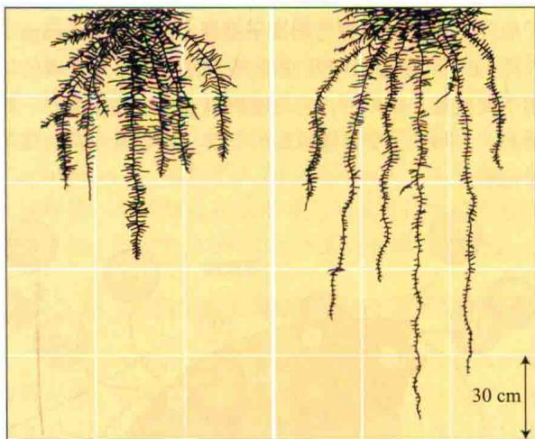  
图5.7 小麦（一种单子叶植物）的须根系。A. 生长在干旱土壤中成熟小麦（3月龄）的根系。B. 生长在灌溉土壤中的成熟小麦根系。很明显，根系形态受土壤含水量的影响。在成熟须根系中主根轴不明显（改编自Weaver，1926）。

与单子叶植物不同，双子叶植物的根系仅发育成一个单一的主根轴，称为主根（taproot），可能是次级形成层活性加强，导致主根加粗形成。在主根轴上进一步发育侧根，形成庞大的侧根系（图5.8）。

在单子叶植物和双子叶植物中，根系的发育都依赖于根顶端分生组织的活性和侧根分生组织的生长。图5.9是植物根顶端区域的结构简图，分为3个活性区：分生区、伸长区和成熟区。

在分生区（meristematic zone），细胞分裂朝向两个方向，即向根基部细胞分裂分化成根组织的功能细胞和向根尖部细胞分裂形成根冠（root cap）。在根向土壤伸展生长时，根冠起到保护脆弱的分生组织细胞的作用。另外，根冠通常还能分泌一种称为黏胶的胶状物，覆盖在根尖上。关于黏胶的确切功能目前还不明确，但它可能在根穿入土壤时起润滑作用，防止根顶端脱水，促进营养向根的转运，或者影响根与土壤微生物之间的相互作用（Russell，1977）。根冠是根的重力感受中心，重力是指令根向下生长的信号。这个过程称为向重力性反应（gravitropic response）（见第19章）。在根最顶端处，细胞分裂相对较慢，因此这个区域称为静止中心（quiescent center）。经过几代缓慢的细胞分裂，当距离根最顶端大约0.1 mm时，根细胞开始快速分裂，到大约0.4 mm时，根细胞的分裂又开始逐渐减慢，细胞均等地向各个方向扩展。

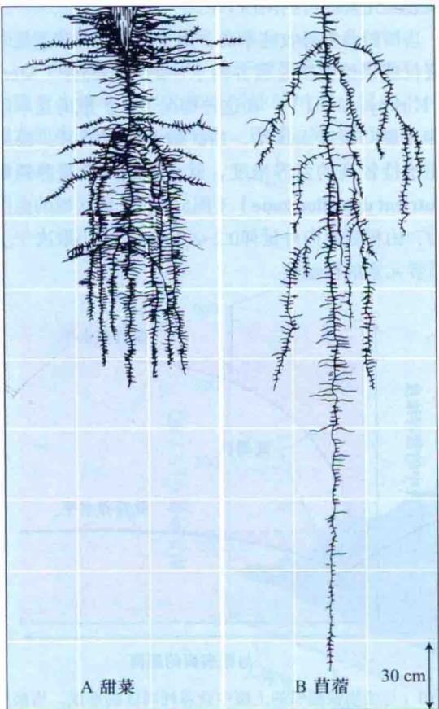  
图5.8 两个供水充足的双子叶植物的直根系：甜菜（A）和苜蓿（B）。甜菜根系是经过5个月生长的典型的根系；苜蓿根系是典型的2年龄根系。两种双子叶植物都表现出具有一个主要的垂直根轴。在甜菜中，主根系的上部加粗以行使储存组织的功能（改编自Weaver，1926）。

伸长区（elongation zone）从距离根端0.7\~1.5 mm处开始（图5.9）。在此区，细胞快速伸长并经历最后一轮的分裂，形成一个细胞环形中心，称为内皮层（endodermis）。内皮层细胞的细胞壁加厚，木栓质（见第13章）沉积在径向壁上形成凯氏带（Casparian strip），这是一个疏水结构，能阻止水和溶质穿越根的质外体（图4.4）。

  
图5.9 根顶端区的纵切面示意图。分生组织细胞被定位在根尖处。这些细胞产生根冠和上部根组织。在伸长区，细胞分化成木质部、韧皮部和皮层。由表皮细胞形成的根毛首先出现在成熟区。

内皮层将根分成两个部分：外部的皮层（cortex）和内部的中柱（stele）。中柱包括根的维管系统：韧皮部（phloem）和木质部（xylem），前者从枝条向根运输代谢物，而后者向枝条输送水和溶质。

韧皮部的发育比木质部快得多，证明在近根端区韧皮部的功能更重要。大量的碳水化合物必须通过韧皮部流向不断生长的顶端区，以便维持细胞的分裂和伸长。碳水化合物为细胞的快速生长提供能量来源，以及为有机化合物的合成提供所需的碳骨架。在根组织中，六碳糖（己糖）也可作为渗透调节溶质。在根顶点处，由于韧皮部还没有形成，碳水化合物的运动依靠共质体扩散进行，速度相对较慢（Hret-Harte and Silk，1994）。静止中心的细胞分裂较慢的原因可能就是碳水化合物不能充足地到达此区域，或是由于此区域被维持在一种氧化状态。

为水分和溶质的吸收提供巨大表面积并使根固定于土壤中的根毛首先出现在成熟区（maturation zone）

（图5.9），此处的木质部已经发育成具备向茎部运转大量水分和溶质的能力。

## 5.3.6 根的不同区域吸收不同的矿质离子

矿质离子进入根系的确切位置曾是人们十分感兴趣的问题。一些研究者曾经声称，营养元素的吸收仅发生在主根和侧根的顶端区（Bar-Yosef et al., 1972）；另一些研究者认为整个根表面都能吸收营养元素（Nye and Tinke, 1977）。支持这两种观点的实验证据都存在，这依赖于被研究的物种和元素。

（1）大麦（Hordeum vulgare）中根吸收钙的部位仅在顶端区。

（2）在大麦中，铁由根顶端区吸收（Clarkson，1985）；而在玉米中，整个根表面都能吸收铁（Kashirad et al., 1973）。

（3）根表面所有的位点都能自由地吸收钾、硝酸盐、铵和磷（Clarkso，1985），但玉米伸长区具有最大的钾积累（Sharp et al., 1990）和硝酸盐吸收速率（Taylor and Bloo, 1998）。

（4）在玉米和水稻（Oryza sativa）（Colmer and Bloo，1998）及湿地植物种类（Fang et al.，2007）中，根顶端吸收铵的速率比伸长区快。铵盐和硝酸盐被松柏类植物的根吸收，并穿越至根部不同区域，这种吸收受根生长率和成熟率的影响（Hawkins et al.，2008）。

（5）在许多物种中，吸收磷最活跃的部位是根毛（Föhse et al., 1991）。

根顶端区营养吸收的速率之所以高，是因为这些组织对营养元素的强烈需求，以及根周围土壤中营养元素的可利用性相对较高。例如，细胞的伸长依赖于溶质如钾、氯化物和硝酸盐的积累，以便增加细胞内的渗透压（见第15章）。在分生组织中，铵是维持细胞分裂的首选氮源，因为分生组织中常出现糖类不足，而植物同化铵比同化硝酸盐转化为有机氮复合物消耗的能量要少得多（见第12章）。另外，根顶端和根毛的生长可以进入到营养还没有被消耗的新鲜土壤中。

在土壤中，营养元素可以通过集流和扩散的形式运到根表面（见第3章）。在集流中，从土壤流向根的水流携带有营养元素。由集流提供给根的营养量依赖于水分从土壤流向植物的速率，该速率又依赖于植物的蒸腾速率和土壤溶液中的营养浓度。当水流速率和土壤溶液中的营养元素的浓度都很高时，集流在营养的供给中扮演着重要的角色。

在扩散中，矿质元素从高浓度区向低浓度区移动。随着根对营养的吸收，根表面的营养浓度逐渐降低，于是在根周围的土壤溶液中就产生了一个浓度梯度。矿质营养的扩散可降低该浓度梯度，随蒸腾引起的集流能增

加根表面元素的可利用性。

当根的营养吸收速率高，而土壤中营养浓度低时，集流仅能供给植物总营养需求中的一小部分（Mengel and Kirkby，2001）。在这种情况下，扩散的速率限制营养元素向根表面运动。当扩散速率太低时，根周围不能维持较高的营养浓度，就会形成一个营养耗竭区（nutrient depletion zone）（图5.10）。该区域的范围大致为：由根表面向外延伸0.2\~2.0 mm，大小取决于土壤中营养元素的移动性。

  
图5.10 与植物根相邻的土壤中营养耗竭区的形成。当根细胞吸收营养元素的速率超过土壤溶液中由宏观流动和扩散提供的营养供给的速率时，营养耗竭区形成。这种消耗引起根周围营养浓度的局部减小（改编自Mengel and Kirkby，2001）。

营养耗竭区的形成告诉人们关于矿质营养的一些重要内容：因为根消耗了根际中的矿质供给，它们利用土壤中矿质元素的效率不仅取决于它们从土壤溶液中吸收营养元素的速率，而且取决于根的不断生长。如果不生长，根将迅速耗尽根表土壤中的营养。由此，最佳的营养获取依赖两个方面：根系统营养吸收能力和根系生长进入新鲜土壤中的能力。

## 5.3.7 营养的可用性影响根的生长

植物由于不能逃离不利条件而必须适应生长环境中的各种变化。白天，植物地上部分的光照、温度和湿度会有较大的变化，而 $CO_{2}$ 和 $O_{2}$ 的浓度则保持相对稳定。相反，由于土壤的缓冲作用，植物根部所处的环境温度相对温和，而地下的 $CO_{2}$ 浓度、 $O_{2}$ 浓度、水分及营养元素在时间和空间上变化相对较大。例如，土壤中无机氮的浓度在数厘米范围及数小时内就会有成千倍的变化（Bloom，2005）。面对环境中这些条件的多变性，植物总是沿着对其有利的条件进行生长。

根通过向地性、向触性、向化性及向水性感受地下环境，引导植物向土壤中有利资源生长。生长素参与到植物的这些反应中（见第19章）。根的生长由土壤颗粒中矿质营养的水平决定（Bloom et al., 1993）（图5.11）。在贫瘠的土壤中，由于营养受限，根的生长最弱。随着土壤中营养元素可用性的增加，根的生长也会随之加快（Robinson et al., 1999；Walch-liu et al., 2005）。

土壤中营养元素高于理想水平时，根的生长则受限于碳水化合物并最终停止生长（Durieux et al., 1994）。在含有较高矿物营养的土壤中，植物的一些根，如春小麦根系的3.5%（Robinson et al., 1991）和莴苣根系的12%（Burns, 1991），就能够吸收到足够的植物所需养分。因此，植物会适当减少根部的资源分

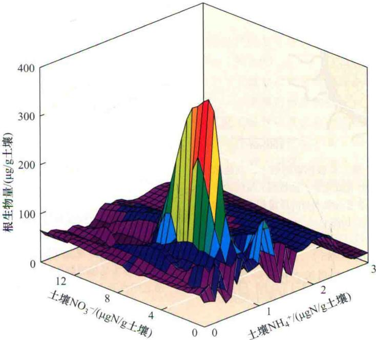  
图5.11 根生物量作为萃取土壤 $NH_{4}^{+}$ 和 $NO_{3}^{-}$ 的函数。种植番茄（Lycopersicon esculentum cv T-5）于持续休耕2年的灌溉土壤中，根的生物量[每克（g）土壤干重中根的质量（μg）]评估 $NH_{4}^{+}$ 和 $NO_{3}^{-}$ [每克（g）土壤可抽出N（μg）]的水平。从低（紫色）到高（红色）的颜色不同强调生物量之间的差异（改编自Bloom et al., 1993）。

配，而增加茎尖和生殖结构资源的分配。这种资源转移是通过施肥刺激作物增产的一种机制。

## 5.3.8 菌根真菌有利于根对营养元素的吸收

到目前为止，主要讨论了根对矿质元素的直接吸收，但这个过程还可能受与根系结合的菌根真菌的影响。寄主植物为与其结合的菌根（mycorrhizae）（单数mycorrhiza，来自希腊单词“fungus”和“root”）提供糖类，作为回报，植物可从菌根中接收营养元素和水分。

菌根并不稀有，事实上，它们广泛存在于自然界。世界上大多数的植物都与菌根真菌结合——83%的双子叶植物、79%的单子叶植物和所有的裸子植物一般都形成菌根结合体（Wilcox，1991）。相反，十字花科［如卷心菜（Brassica oleracea）］、藜科［如菠菜（Spinacea oleracea）］和山龙眼科［如澳大利亚坚果（Macadamia integrifolia）］家族的植物及水生植物很少有菌根。在非常干旱、高盐、水淹或肥力极端（太高或太低）的土壤中，根上没有菌根结合。特别注意的是，水培植物，以及幼小的、快速生长的作物也很少有菌根。

菌根真菌由细小管状的丝状体构成，这种丝状体称为菌丝（hyphae）（单数hypha）。菌丝聚集形成的真菌体称为菌丝体（mycelium）（复数mycelia）。在矿质元素的吸收中主要有两类菌根真菌起重要作用——外生菌根和丛枝菌根（Brundrett，2004）。

典型的外生菌根真菌（ectotrophic mycorrhizal fungi），其菌丝体将根包围形成一个厚厚的外壳，或“壳套”，并且一些菌丝从皮层细胞的细胞间隙刺入根（图5.12）。真菌菌丝并不刺入皮层细胞内，而是由菌丝网络将其包围，这种网络结构称为哈氏网（Hartig net）。真菌的菌丝体数量通常很大，总质量与根本身的质量差不多。真菌的菌丝体也能从紧凑的壳套延伸进入土壤，在土壤中形成含孢子体的单一菌丝或菌丝束。

根系外围的真菌菌丝能加强根系吸收营养元素的能力，因为菌丝比根更加精细并能延伸到根周围营养损耗区之外的土壤中去（Clarkson，1985）。大约3%的高等植物，主要是壳斗科、桦木科、松科等森林树种及一些木质豆科植物，能够形成内生菌根。内生真菌主要是担子真菌和子囊菌（Barea et al., 2005）。

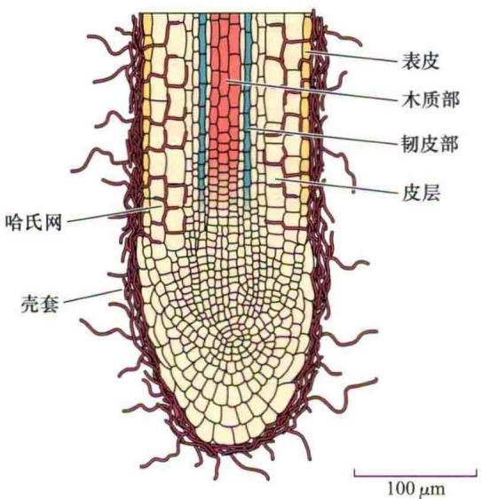  
图5.12 被外生菌根真菌感染的根。在被感染的根上，真菌菌丝将根包围形成一个密集的真菌外壳或壳套，菌丝刺入皮层的细胞间隙形成哈氏网。真菌菌丝的总量与根本身的质量相当（改编自Rovira et al., 1983）。

与外生菌根真菌不同，丛枝菌根真菌（vesicular-arbuscular mycorrhizal fungi）（以前称为囊泡丛枝菌根）不产生由真菌菌丝体包围根而形成的致密壳套。菌丝一般稀疏地生长，包括在根内，以及由根向外延伸到周围的土壤中（图5.13）。菌丝通过表皮或根毛进入根，其进入机制与负责固氮的共生细菌进入机制具有共性（见第12章），不仅在细胞间扩展而且能进入单个皮层细胞内。在细胞内，菌丝能形成称为囊泡（vesicle）的椭圆形结构和称为丛枝（arbuscule）的分枝结构。丛枝好像是真菌与寄主植物之间营养元素交换的位点。

在根的外部，菌丝体能向根外伸展数厘米，并可能含有孕育孢子的结构。与外生菌根不同，泡囊丛枝菌根仅由少量的真菌成分组成，一般不超过根重的10%。泡囊丛枝菌根被发现与大多数草本被子植物包括主要的农作物结合（Smith and Read，2008），这种结合主要是由普遍存在的土壤微生物参与下完成的。

真菌的结构类似于现存4亿年前植物化石中发现的丛生菌根。这些研究表明，这种结合在陆生植物进化的早期阶段就已存在。对现存真菌类群以DNA序列为基础的系统发育学研究也支持了这一点（Azcon-Aguilar et al., 2009）。

丛枝菌根与植物根结合促进根对磷和微量金属元素（如锌和铜）及水的吸收。外部菌丝体通过伸展可以越过根周围的磷缺乏区，进入含磷的区域，从而促进磷的吸收。据推算，在运输磷酸盐的速率上，与菌根真菌结合的根比不与菌根结合的根快4倍（Nye and Tinker, 1977）。外生菌根的外部菌丝体也能吸收磷，并使磷为植物所用。此外，有证据间接表明外生菌根在土壤有机落叶层中生长，并水解有机磷供根吸收（Smith et al., 1997）。

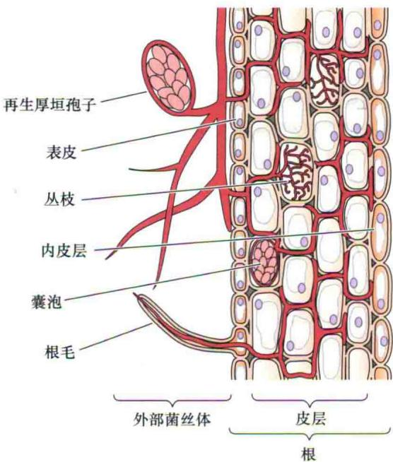  
图5.13 泡囊丛枝菌根真菌与植物根结合的一个切面图。真菌菌丝生长进皮层胞间的胞壁空间并刺入单个皮层细胞。它们进入细胞时，并不破坏寄主细胞的质膜和液泡膜。菌丝被这些膜包围形成被称为丛枝吸胞的结构，丛枝吸胞参与寄主植物和真菌之间营养离子的交换（改编自Mauseth，1988）。

## 5.3.9 营养物从菌根真菌到根细胞的移动

关于菌根真菌吸收的矿物营养被转运到植物根细胞的机制，目前还不清楚。在外生菌根中，无机磷酸盐可以由哈氏网的菌丝中简单扩散释放，并被根的皮层细胞吸收。而在外生丛枝菌根中，这种情况可能变得更加复杂。营养可能从完整的丛枝直接扩散到根的皮层细胞中。另外，当新根的丛枝形成时，一些老根的丛枝不断退化，退化的丛枝可能向寄主细胞释放出它们的内含物。

寄主植物的营养状况是影响菌根与植物根系结合程度的关键因素。某些营养元素（如磷）的适度缺乏，能促进菌根结合，而植物营养丰富时则抑制其菌根真菌。

在肥料良好的土壤中，菌根与植物根的结合关系由共生转变成寄生，因为菌根仍然从寄主中获取碳水化合物，而寄主不再从菌根促进营养吸收的功效中获益。在这种情况下，寄主植物像对付其他病原菌一样对付菌根真菌（Brundrett，1991），或者依赖真菌作为其从土壤吸收营养的主要组分（Smith et al., 2009）。

## 小结

植物是自养生物，能够利用光能，将二氧化碳、水和矿质元素合成其自身的所有成分。尽管矿质营养通过生物进行持续循环，但它们主要通过植物的根进入生物圈。被根吸收后，矿质元素被转运至植物体的其他部分，发挥众多的生物学功能。

## 主要营养元素、缺素及植物紊乱

· 植物营养研究表明，一些特定矿质元素对植物生命来说是必需的（表 5.1 和表 5.2）。

· 根据在植物中的相对含量，这些元素被分为大量元素和微量元素（表5.1）。

· 在高等植物中，特定的可见症状被用来诊断特定营养元素的缺乏。植物之所以会出现营养失调是因为营养元素在植物中扮演着至关重要的角色。作为有机化合物的组成元素，营养元素在能量储存、植物结构、作为酶的辅助因子和电子转移反应中都起着重要作用。

· 矿质营养能通过溶液培养的方法来研究，这种方法可用来描述特定的营养需求（图5.1，表5.3）。

· 土壤和植物组织分析能提供植物-土壤体系中的营养状况信息，并提出合适的办法来避免营养元素的缺乏或中毒（图5.3）。

· 当作物在现代高产条件下生长时，大量的营养元素，特别是氮、磷和钾，能从土壤中流失。

## 营养缺乏的处理

·为了防止营养缺乏的发生，营养元素以肥料的方式增添到土壤中去。

· 以无机形式提供营养的肥料称为化学肥料。来自于植物和动物残余物的肥料称为有机肥料。在两种情况下，植物都主要以无机离子的形式来吸收营养元素。大多数肥料被施用到土壤中，但也有一些肥料被喷施到叶片上。

## 土壤、根、微生物

· 从物理、化学和生物学角度考虑，土壤是一个复杂的介质。土壤颗粒的大小及与阳离子的交换能力决定着该土壤储存水分和营养元素的程度（表5.5，图5.5）。

· 土壤pH对矿质元素的可利用性也有很大影响（图 5.4）。

· 矿质元素，特别是钠和重金属，在土壤中过量存在时，将对植物生长产生不利影响。一些植物能忍受过量的矿质元素，少数几种，如盐生植物（在钠存在的情况下），即使在极端条件下也可以繁茂地生长。

·为了从土壤中获得营养元素，植物形成了庞大的根系（图5.6和图5.7）。

· 根的结构相对简单：对称均匀，细胞类型少（图5.8）。

· 根需要持续消耗与其接触的土壤环境中的营养，而这样简单的结构则可以使它能快速生长到新的土壤中去（图 5.9）。

· 植物的根常与菌根真菌结合在一起（图 5.10）。

· 菌根的细小菌丝扩大了根进入周围土壤的范围，促进了根对矿质元素的吸收，特别是像磷这样在土壤中移动性较差的矿质元素（图 5.11）。

· 作为回报，植物为菌根提供碳水化合物。在营养充足的条件下，植物趋向于抑制菌根的结合。

(李保珠 宋纯鹏 译)

## WEB MATERIAL

## Web Topics

5.1 Symptoms of Deficiency in Essential Minerals
Deficiency symptoms are characteristic of each essential element and can be diagnostic for the deficiency. The color photographs in this topic illustrate deficiency symptoms for each essential element in tomato.

5.2 Observing Roots below Ground
The study of roots growing under natural conditions requires a means to observe roots below ground. State-of-the-art techniques are described in this topic. Web Essays

## 5.1 Boron Functions in Plants: Looking Beyond the Cell Wall

Presents one long lists of “postulated roles of B essentiality” for microorganisms and for higher plant growth and development.

## 5.2 From Meals to Metals and Back

Heavy metal accumulation is toxic to plants. Understanding the molecular process involved in toxicity is helping researchers to develop better phytoremediation crops.

## 第6章

溶质的运输

仅有两个脂分子厚的质膜不仅将植物细胞内部与细胞壁及外部环境分隔开来，同时也把相对不变的内环境和高度可变的外环境隔离开来。除了形成疏水的扩散屏障外，质膜在细胞吸收营养、输出溶质及调节细胞膨压时，能够有选择性地促进分子和离子的向内或向外运输，并不断地进行适时调控。同样，那些在每个细胞内把各区室分割开来的内膜也具有相同的功能。

同时，质膜还识别传递来自物质环境中、其他细胞分子信号及病菌入侵等信息。一般通过跨膜离子流的变化传递这些信号。

分子和离子由一个区域向另一个区域的转移称为运输（transport）。膜不仅调控可溶性物质运入细胞或在细胞内的区域性运输，同时也控制着植物器官间或植物与环境之间更大范围的运输。例如，蔗糖的移位，即通过韧皮部由叶至根的运输，称为移位（translocation），是蔗糖在膜的驱动和调控下先运输到叶片的韧皮部细胞，再从叶片韧皮部细胞运输到根的贮藏细胞（见第10章）。

本章将首先考虑溶液中控制分子运动的物理和化学机制，然后，探讨这些机制是如何应用到膜和生物系统的；同时，还将讨论活细胞运输的分子机制，以及植物细胞中具有特异运输性质的各种膜蛋白；最后，将解读一下离子进入根细胞的吸收途径，以离子释放入中柱管胞的机制。

## 6.1 被动运输和主动运输

依据菲克第一定律（Fick's first law）[式（3.1）]，扩散引起的分子运动总是顺自由能或化学势下降的自发过程，直至达到平衡。分子的这种自发的顺化学势下降的运动称为被动运输（passive transport），在达到平衡时，如不施以驱动力，将不会再有溶质的净运动。

物质逆化学势梯度的运动或“uphill”称为主动运输（active transport）。主动运输过程不是自发的，它需在能为细胞提供能量的系统中进行，与ATP的水解相偶联的运输是常见的一种（并非唯一）运输方式。

正如第3章所述，通过测定势能梯度，可以计算出扩散的驱动力；或反过来说，可计算出驱使物质逆梯度运动所需要输入的能量，而对于那些不带电的溶质，势能梯度主要取决于浓度差。驱动生物学运输的动力主要可分为4种：浓度、流体静压力、重力及电场（由第3章可知，在较小的生物系统运输中，重力是很少作用于驱动运输的实质力量）。

对于任何一种溶质，其化学势（chemical potential）可被定义为该溶质浓度、电荷和流体静压力势（及标准状况下的化学势）的总和。化学势这一概念的重要性在于它反映了驱动分子发生净运输所需的所有动力总和（Nobel，1991）。

$$
\tilde {\mu} _ {\mathrm{j}} = \mu_ {\mathrm{j}} ^ {*} + R T \ln C _ {\mathrm{j}} + z _ {\mathrm{j}} F E + \bar {V} _ {\mathrm{j}} P\tag{6.1}
$$

式中， $\tilde{\mu}_{j}$ 为溶质 j 的化学势，单位为 J/mol； $\mu_{j}^{*}$ 为其在标准状态下的化学势（一个校正因子，在后面的公式中可抵消，所以可忽略不计）；R 为通用气体常数；T 为绝对温度； $C_{j}$ 为溶质 j 的浓度（确切地说是活度）。

电气术语 $z_{j}FE$ ，仅适于离子，z为离子所带的静电荷（+1为单价阳离子，-1为单价阴离子，+2为二价阳离子，以此类推）；F为法拉第常数（等于1 mol H $^{+}$ 所带的电荷数）；E为溶液的总电势（相对于基态）。最后一项 $\bar{V}_{j}P$ 为溶质j的偏摩尔体积（ $\bar{V}_{j}$ ）和压力（P）

对其化学势的贡献（j的偏摩尔体积是指在无限大的系统中，加入每摩尔溶质 j 后所引起的体积变化）。

与浓度和电势相比，最后一项 $\bar{V}_{j}P$ 对 $\tilde{\mu}_{j}$ 的贡献较小，重要的水渗透移动是个例外，如在第3章讨论的水的化学势（水势），取决于已溶解的溶质浓度及系统的静水压。

通常，扩散（被动运输）常常是分子从化学势高的区域运送到化学势低的区域，逆化学势梯度移动是主动运输的标志（图6.1）。

以蔗糖的跨膜扩散为例，单单依据浓度就可以正确地估算出任一区室中蔗糖的化学势。除非溶液浓度很高，不会在细胞中形成静水压。由式（6.1）可知，细胞内部蔗糖的化学势可用下列公式表达[在下面的3个公式中，下标s代表蔗糖（sucrose），上标i和o分别代表内部（inside）和外部（outside）]。

$$
\tilde {\mu} _ {s} ^ {i} = \mu_ {s} ^ {*} + R T \ln C _ {s} ^ {i}\tag{6.2}
$$

式中， $\tilde{\mu}_{s}^{i}$ 为细胞内蔗糖溶液的化学势； $\mu_{s}^{*}$ 为标准条件下蔗糖溶液的化学势； $RT \ln C_{s}^{i}$ 为成分的浓度。

细胞外部的蔗糖的化学势可以按照式（6.3）计算。

$$
\tilde {\mu} _ {s} ^ {0} = \mu_ {s} ^ {*} + R T \ln C _ {s} ^ {0}\tag{6.3}
$$

不考虑运输机制的问题，可以计算细胞内部和外部蔗糖的浓度差 $\Delta\tilde{\mu}_{s}$ ，为使符号正确，对于内向运输，蔗糖由细胞外移去表示为“-”，而进入细胞内表示为“+”，因此，运输每摩尔蔗糖的自由能变化为

$$
\Delta \tilde {\mu} _ {s} = \tilde {\mu} _ {s} ^ {i} - \tilde {\mu} _ {s} ^ {o}\tag{6.4}
$$

将式（6.2）和式（6.3）代入式（6.4），可得

$$
\begin{array}{r l} \Delta \tilde {\mu} _ {s} = & (\mu_ {s} ^ {*} + R T \ln C _ {s} ^ {i}) - (\mu_ {s} ^ {*} + R T \ln C _ {s} ^ {o}) \\ = & R T (\ln C _ {s} ^ {i} - \ln C _ {s} ^ {o}) = \frac {R T \ln C _ {s} ^ {i}}{C _ {s} ^ {o}} \end{array}\tag{6.5}
$$

如果该化学势差为负值，蔗糖可自发地向内扩散（倘若膜对蔗糖具有一定的通透性，见下一节）。换句话说，溶质扩散的驱动力（ $\Delta\tilde{\mu}_{s}$ ）是与浓度梯度的大小 $(C_{s}^{i}/C_{s}^{o})$ 相关的。

如果溶质带电荷（如 $K^{+}$ ），也必须考虑化学势中的电的组分。假如膜对 $K^{+}$ 、 $Cl^{-}$ 是透过的，而对蔗糖不可透过，由于不同种类的离子（ $K^{+}$ 和 $Cl^{-}$ ）独立扩散，每种离子均有各自的化学势。因此，对内向的 $K^{+}$ 扩散

$$
\Delta \tilde {\mu} _ {K} = \tilde {\mu} _ {K} ^ {i} - \tilde {\mu} _ {K} ^ {o}\tag{6.6}
$$

将式（6.1）中适当项代入式（6.6），可得

$$
\begin{array}{r l} \Delta \tilde {\mu} _ {S} = & (R T \ln [ K ^ {+} ] ^ {i} + z F E ^ {i}) \\ & - (R T \ln [ K ^ {+} ] ^ {o} + z F E ^ {o}) \end{array}\tag{6.7}
$$

因 $K^{+}$ 电荷为+1，z=+1，因此，

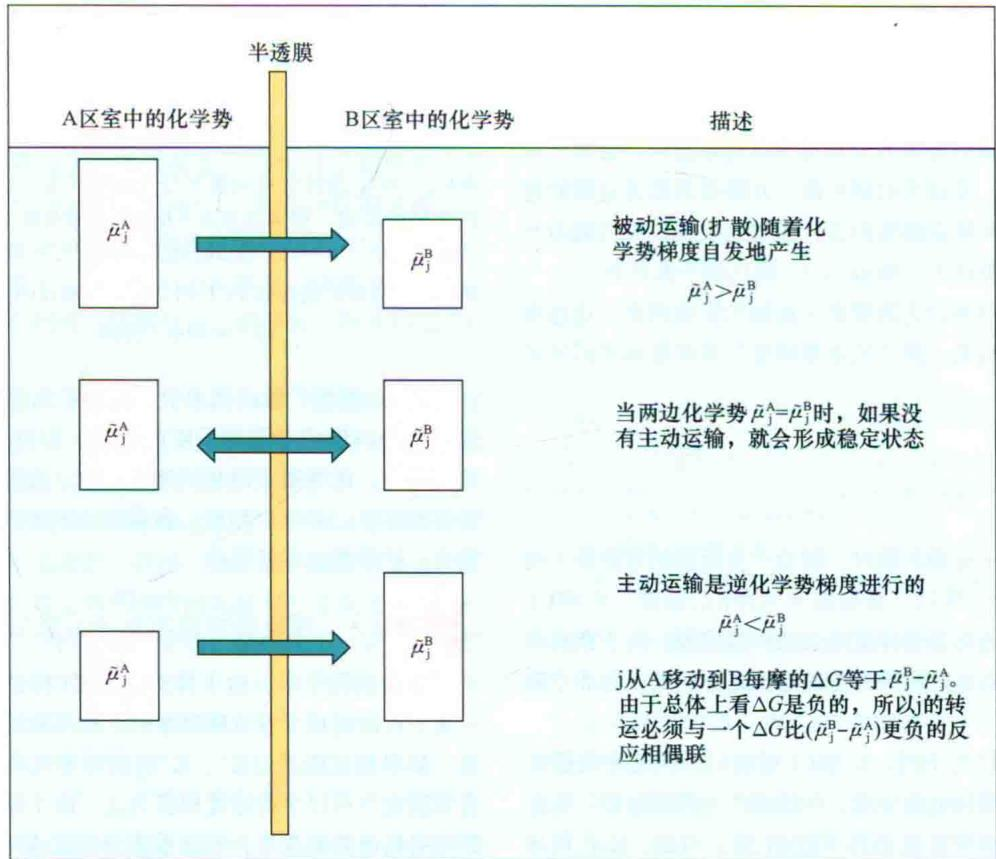  
图6.1 化学势 $\mu$ 与跨渗透膜的分子运输之间的关系。两区室间溶质j的净移动取决于任一区室中j化学势的相对大小，这里用方框的大小表示，顺化学势下降的运动是自发的，称为被动运输；逆化学势向上，需要能量的，称为主动运输。

$$
\Delta \tilde {\mu} _ {\mathrm{K}} = \frac {R T \ln [ \mathrm{K} ^ {+} ] ^ {\mathrm{i}}}{[ \mathrm{K} ^ {+} ] ^ {\mathrm{o}} + F (E ^ {\mathrm{i}} - E ^ {\mathrm{o}})}\tag{6.8}
$$

式（6.8）的量级和正负符号表明了 $K^{+}$ 跨膜扩散的驱动力及其方向。与此相似， $Cl^{-}$ 的表达式也可写出（注意对于 $Cl^{-}$ ，z=-1）。

式（6.8）表示离子如 $K^{+}$ 在相应的两个区间的浓度梯度 $\left[K^{+}\right]^{i}/\left[K^{+}\right]$ 和电势差 $(E^{i}-E^{0})$ 时所引起的离子扩散。该式一个非常重要的含义是，如在两区室间加以适当的电压（电场），离子就可以被动地逆它们的浓度梯度进行运输，正是由于电场在带电分子的生物学运输上的重要性所在， $\mu$ 通常称为电化学势（electrochemical potential）， $\Delta\tilde{\mu}$ 为两区室间电化学势差。

## 6.2 离子的跨膜运输

在上述的例子中，两种KCl溶液被生物膜隔开，离子必须透过膜，同时穿过开放的溶液体系，这使得扩散过程复杂化。膜允许一种物质透过的程度称为膜透性（membrane permeability）。正如后面要讨论的，透性取决于膜的组成及可溶物质的化学性质。在不严格意义上，透性可以用溶质扩散过膜的扩散系数来描述。然而，透性还受其他一些额外因素的影响，如某种物质跨膜的能力等，而这些都是很难测量的。

尽管理论上复杂，但还是可以测定某一溶质在特定条件下透过膜的速率而轻易地测得膜通透性。通常，在达到平衡时，膜就会阻碍扩散，并降低溶质透过膜的速率。对于任何特定溶质而言，通透性或膜自身的阻力并不能改变平衡状态，即 $\Delta\tilde{\mu}_{j}=0$ ，则达到平衡状态。

下面部分将讨论跨膜离子运输的影响因素。这些参数可用来预测某一离子的电势梯度与其浓度梯度间的关系。

## 6.2.1 阳离子和阴离子的不同扩散速率产生扩散势

当盐离子穿膜扩散时，就会产生跨膜的电势差（电压）。如图6.2所示，被膜隔开两种KCl溶液， $K^{+}$ 和 $Cl^{-}$ 将顺各自的电化学势梯度独立地扩散穿膜。由于膜具有选择透性，因此对两种离子的透性是不同的，除非空隙非常多。

由于透性的不同， $K^{+}$ 和 $Cl^{-}$ 最初以不同速率跨膜扩散，引起微弱的电荷分离，并快速产生跨膜电势。在生物体系中，膜对 $K^{+}$ 的透性要较 $Cl^{-}$ 强，因此， $K^{+}$ 扩散出细胞的速率较 $Cl^{-}$ 快（图6.2区室A），引起细胞和相应胞外介质带负电荷。由于扩散而形成的电势称为扩散势

(diffusion potential)。

在分析离子跨膜运动时，必须注意电中性这一前提：溶液通常含有等量的阴离子和阳离子。膜电势的存在表明跨膜的电荷分配是不均匀的，然而这种不平衡离子的实际数量在化学上却是微不足道的。例如，每个细胞每100 000个阴离子中的一个额外阴离子的存在，就可引起一个-100 mV的膜电势，而浓度差仅为0.001%，实际上许多植物细胞中跨膜的膜电势也就在这一水平。如图6.2所示，这些多出的阴离子就会随即出现在膜表面的毗邻区域，整个细胞并无电荷的不平衡。

  
图6.2 对K⁺透性较高的膜所分开的两区室间的电荷分离和扩散势的形成。如果区室A中KCl浓度较B高（[KCl] $_{A}$ ＞ [KCl] $_{B}$ ），K⁺和Cl⁻将以较高速率扩散入区室B，并形成扩散势。当膜对K⁺透性高于Cl⁻时，K⁺扩散将比Cl⁻快，并形成电荷（－和＋）分离。

在KCl跨膜扩散的例子中，由于 $K^{+}$ 先于 $Cl^{-}$ 过膜，引起扩散势的形成而限制了 $K^{+}$ 的运动，但加速了 $Cl^{-}$ 的运动。最终，两种离子以相同速率扩散。实际上这种扩散势动态存在，并可以测量。当系统达平衡时，浓度梯度消失，扩散势也不复存在。

## 6.2.2 膜电势如何与离子分配相关联？

在前面例子中，由于膜对 $K^{+}$ 和 $Cl^{-}$ 都是可透的，任一离子在浓度梯度没有降到零时，均不能达到平衡。但是，如果膜仅能透过 $K^{+}$ ， $K^{+}$ 将携带着电荷扩散过膜，直到膜电位可以平衡浓度梯度为止。由于很少量的离子即可引起电势的改变，因此系统会迅速达到平衡。尽管 $K^{+}$ 浓度梯度的改变可忽略不计， $K^{+}$ 的跨膜运动也随即达到平衡。

当任一种溶质的跨膜分配达到平衡时，被动流量（J）（单位时间跨过单位膜面积溶质的量）在向内和向外两个方向上是相同的。

$$
J _ {\mathrm{o} \rightarrow \mathrm{i}} = J _ {\mathrm{i} \rightarrow \mathrm{o}}
$$

流量与 $\Delta\tilde{\mu}$ 有关（关于流量和 $\Delta\tilde{\mu}$ 的讨论见附录1）；在平衡状态时，内外电化学势相同。

$$
\Delta \tilde {\mu} _ {j} ^ {\mathrm{o}} = \Delta \tilde {\mu} _ {j} ^ {\mathrm{i}}
$$

对于任一给定离子（这里用下标j表示）。

$$
\mu_ {\mathrm{j}} ^ {*} + R T \ln C _ {\mathrm{j}} ^ {\mathrm{o}} + z _ {\mathrm{j}} F E ^ {\mathrm{o}} = \mu_ {\mathrm{j}} ^ {*} + R T \ln C _ {\mathrm{j}} ^ {\mathrm{i}} + z _ {\mathrm{j}} F E ^ {\mathrm{i}}\tag{6.9}
$$

整理式（6.9），可得到平衡时不同区室间的电势差 $(E_{i}-E_{o})$ 。

$$
\Delta E _ {\mathrm{j}} = E ^ {\mathrm{i}} - E ^ {\mathrm{o}}
$$

又

$$
\Delta E _ {\mathrm{j}} = \frac {R T}{z _ {\mathrm{i}} F} \left(\ln \frac {C _ {\mathrm{j}} ^ {\mathrm{o}}}{C _ {\mathrm{j}} ^ {\mathrm{i}}}\right)\tag{6.10}
$$

或

$$
\Delta E _ {\mathrm{j}} = \frac {2 . 3 R T}{z _ {\mathrm{j}} F} \left(\lg \frac {C _ {\mathrm{j}} ^ {\mathrm{o}}}{C _ {\mathrm{j}} ^ {\mathrm{i}}}\right)
$$

该关系式即能斯特方程，表明在平衡时一离子在两区室间的浓度差可被电压差平衡。当温度为25℃时，一价阳离子的能斯特方程简化为

$$
\Delta E _ {\mathrm{j}} = 5 9 \mathrm{mV} \lg \frac {C _ {\mathrm{j}} ^ {\mathrm{o}}}{C _ {\mathrm{j}} ^ {\mathrm{i}}}\tag{6.11}
$$

需要注意的是，浓度相差10倍相当于能斯特电位 $59\ mV\ (C_{j}^{i}/C_{j}^{\circ}=10,\ \lg10=1)$ ，即被动扩散的离子在跨膜运输时，59 mV的膜电势将维持10倍的浓度梯度，如果膜内外离子存在10倍的浓度梯度，则离子将顺浓度梯度的被动扩散将（如果允许达到平衡）形成59 mV的跨膜电势。

由于细胞内外离子不对称的分布，因此所有生活细胞都存在膜电位。可以通过在细胞中插入微电极来测定膜电位，测量细胞内部与细胞外介质间的电位差（图6.3）。

能斯特方程可以用来确定某任一时间给定离子是否处于跨膜的平衡状态。但是，稳态和平衡态间是有区别的。稳态是指给定溶质的内向流量和外向流量相等，且离子浓度对时间而言是恒定的；稳态并不一定是平衡态（图6.1）。在稳态时，跨膜主动运输会阻止许多扩散流量而使系统无法达到平衡状态。

## 6.2.3 主动和被动运输间能斯特方程的区别

表6.1为豌豆根细胞稳态时离子浓度的实验测得值与由能斯特方程计算出的预期值的比较（Higinbotham et al., 1967）。在这个实验中，组织浸在溶液中，将每图6.3 用一对微电极测定跨细胞膜的膜电势示意图。一个玻璃微电极插入待研究的细胞中（通常为液泡或细胞质），另一电极放入电极液中作参照，电极与电压表相连，记录细胞区室和溶液间的电势差。典型的植物细胞的膜电势为-240\~-60 mV。插图展示细胞内部是如何与电极接触的：通过内部盛有导电盐溶液的开放玻璃微量加液器实现。

表6.1 豌豆根组织中测定和预测的离子浓度的比较

<table><tr><td rowspan="2">离子</td><td rowspan="2">外部介质中的浓度 /(mmol/L)</td><td colspan="2">内部浓度/(mmol/L) $^a$ </td></tr><tr><td>预测值</td><td>实测值</td></tr><tr><td> $K^+$ </td><td>1</td><td>74</td><td>75</td></tr><tr><td> $Na^+$ </td><td>1</td><td>74</td><td>8</td></tr><tr><td> $Mg^{2+}$ </td><td>0.25</td><td>1340</td><td>3</td></tr><tr><td> $Ca^{2+}$ </td><td>1</td><td>5360</td><td>2</td></tr><tr><td> $NO_3^-$ </td><td>2</td><td>0.0272</td><td>28</td></tr><tr><td> $Cl^-$ </td><td>1</td><td>0.0136</td><td>7</td></tr><tr><td> $H_2PO_4^-$ </td><td>1</td><td>0.0136</td><td>21</td></tr><tr><td> $SO_4^{2-}$ </td><td>0.25</td><td>0.00005</td><td>19</td></tr></table>

资料来源：Higinbotham et al., 1967  
注：膜电位经测定为-110 mV  
a 内部浓度值来自热水提取未损伤的1\~2 cm根段的离子含量

种离子的外部浓度及所测得的电势值均代入能斯特方程，从而计算出该离子预期的内部浓度。

值得注意的是，表6.1所有的离子中，仅 $K^{+}$ 处于或接近平衡。阴离子 $NO_{3}^{-}$ 、 $Cl^{-}$ 、 $H_{2}PO_{4}^{-}$ 、 $SO_{4}^{2-}$ 的实测值均高于预期值，表明它们是被主动吸收的。阳离子 $Na^{+}$ 、 $Mg^{2+}$ 和 $Ca^{2+}$ 的实测值均低于预期值。因此，这些离子进入细胞是沿它们的电化学势梯度进行的被动扩散，而其外向运动则是主动运输。

表6.1显示的是非常简化的例子，植物细胞内有许多区室，每一区室中离子组成各异。植物细胞中决定离子相关性的最重要的区室为细胞质和液泡。在大多数成熟的植物细胞中，中央液泡通常占细胞体积的90%或更多，而细胞质被限制在细胞内周的狭窄空间里。

由于细胞质所占的体积小，很难对许多被子植物的细胞质进行化学分析。基于这个原因，早期有关植物中离子间关系的研究多集中在某些绿藻，如轮藻属（Chara）和丽藻属（Nitella），这些细胞有几英寸 $^{①}$ 长，且含有适量体积的细胞质。图6.4显示对这些藻类细胞及高等植物相关研究得出的结论。总结如下。

（1） $K^{+}$ 在细胞质及液泡都是被动积累的，当细胞外 $K^{+}$ 浓度非常低时， $K^{+}$ 可通过主动方式吸收。

(2) ${\mathrm{{Na}}}^{ + }$ 从细胞质主动泵出,进入细胞外空间和液泡。

（3）中间代谢产生的过剩质子，也可主动从细胞质中泵出，该过程有助于维持细胞质的pH接近中性，而液泡和细胞外介质的pH则较细胞质低1\~2个pH单位。

（4）阴离子靠主动吸收进入细胞质。

（5） $Ca^{2+}$ 经质膜和液泡膜（图6.4）主动运输出细胞质。

  
图6.4 细胞质和液泡中的离子浓度受控于主动运输（虚箭头）和被动运输（实箭头）。在大多数植物细胞中液泡占了细胞体积的90%，其内包含大量的细胞溶质。细胞质中离子浓度的控制对代谢酶类的调节非常重要。围绕细胞质的细胞壁并不是透性屏障，它并不是影响溶质运输的因素。

尽管许多不同种类的离子可同时透过活细胞的膜，但植物细胞中K⁺浓度最高，且表现出大的通透性。将能斯特方程进行修改即得戈德曼方程（Goldmanequation），可以更准确地计算出所有可通透的离子（所有离子存在的跨膜运动机制）在这些细胞中的扩散势。如果已知离子通过生物膜的能力及离子梯度，就可以用戈德曼方程计算得出膜的扩散势。由戈德曼方程计算出的膜的扩散势称为戈德曼扩散势（Goldman diffusion potential）（戈德曼方程的详细讨论见Web Topic 6.1）。

## 6.2.4 质子运输是膜电势的主要决定因素

在大多数真核细胞中，内部K⁺浓度最高，膜对K⁺通透性最大，K⁺扩散势可以接近K⁺的能斯特势 $E_{K}$ 。在一些生物的细胞，特别是哺乳动物细胞（如神经细胞）中，细胞的静息电位接近 $E_{K}$ ；而在植物和真菌细胞中实验测得的膜电势（通常-200\~-100 mV）比由戈德曼方程计算出的仅-80\~-50 mV要低得多。那么，除了扩散势外，膜电势还有另一组分，多余的电压可能是由质膜致电H⁺-ATP酶产生的。

当一种离子进入或运出细胞，而没有带相反电荷的离子反向运动来平衡时，就会产生跨膜电势差（电压）。任何能引起静电荷移动的主动运输机制，都趋于使膜电位偏离戈德曼方程的预测值。这样的运输机制称为致电泵，并且普遍存在于活细胞内。

主动运输所需的能量通常由ATP水解提供。在植物中，通过观察氰化物对质膜电位的抑制效应，可以研究膜电位对ATP的依赖性（图6.5）。氰化物能很快对线粒体产生毒害作用，使细胞中ATP衰竭。由于ATP合成受抑制，膜电势又降回到戈德曼扩散势的水平（参见Web Topic 6.1）。

  
图6.5 豌豆细胞的膜电势在加入CN⁻时瓦解。CN⁻毒害线粒体，阻碍ATP的产生，膜电势在加入CN⁻后消失，表明ATP的供应对维持膜电势是必需的。冲洗组织中CN⁻后，ATP合成缓慢恢复，膜电势也随之恢复（改编自Higinbotham et al., 1970）。

因此，植物细胞膜电势由两个组分组成：扩散电势和来自致电离子的运输所形成的膜电势（Spanswick，1981）。当氰化物抑制致电离子运输时，由于 $H^{+}$ 仍在细胞内，胞质酸性增强而胞外介质pH升高。这一发现是质子主动运出细胞过程可以致电的一个证据。

如前所述，致电泵引起的膜电势的变化将改变所有离子跨膜扩散的驱动力。例如， $H^{+}$ 的向外运输能产生 $K^{+}$ 被动扩散入胞的电势驱动力。质子的跨膜致电运输不仅存在于植物细胞中，在细菌、藻类、真菌及一些动物细胞（如肾上皮细胞）也有存在。

线粒体和叶绿体上ATP的合成同样依赖H $^{+}$ -ATP酶。在这些细胞器中，由于该酶合成ATP而不是水解ATP（见第11章），因此这种转运蛋白又称ATP合酶。参与植物细胞中主动和被动运输的膜蛋白的结构和功能将在本章随后详细讨论。

## 6.3 膜的转运过程

由纯磷脂制成的人工膜，已被广泛用于深入研究膜的透性。在对离子和分子的透性上，人工磷脂双分子层与生物膜相比，二者存在着重要的相似性和明显的不同点（图6.6）。

对非极性分子和许多小的极性分子来讲，生物膜和人工膜具有相似的通透性。然而，生物膜对离子、一些大的极性分子（如蔗糖）及对水的通透性较人工双分子层膜要强。其原因在于，与人工脂双层不同，生物膜上存在着利于被选择的离子和其他分子通过的转运蛋白（transport protein）。通常，转运蛋白包括3种主要类型：通道（channel）、载体（carrier）和泵（pump）

（图6.7）。每一种类型蛋白都将在本节进行更加详细的介绍。

  
图6.6 生物膜与人工磷脂双分子层对多种物质的透性值（P）。对 $O_{2}$ 、 $CO_{2}$ 及一些小的不带电的分子（如甘油）等非极性分子，P在两系统中是相近的，对于离子和被选择的极性分子包括水，由于转运蛋白的存在，生物膜的透性增加了一个或多个数量级。注意坐标上对数刻度。

由于转运蛋白对所运输溶质具有特异性，因而转运蛋白在细胞中也呈现巨大的多样性。简单原核生物嗜血流感病毒（Haemophilus influenzae）是第一个全基因组测序的生物，在其基因组的1743个基因中，有超过200个基因（大于基因组的 $10\%$ ）编码参与膜运输的各种蛋白质。拟南芥中，预计的25500个蛋白质中有多达1800个（约 $7\%$ ）可能执行运输的功能（Schwacke et

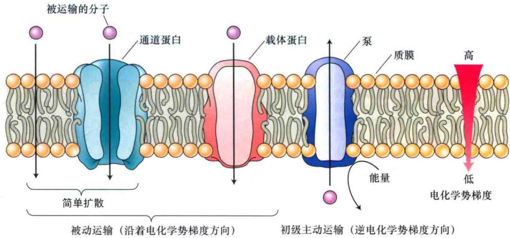  
图6.7 3种类型膜转运蛋白：通道、载体和泵。通道和载体可以介导顺电化学势溶质梯度的被动跨膜运输（简单扩散或协助扩散）。通道蛋白作为膜上的孔道，它的特异性主要由通道的生物物理性质决定。载体蛋白在膜的一侧与被运输的分子结合并释放到膜的另一侧（不同类型的载体蛋白在图6.11详细描述）。初级主动运输由泵来完成，它直接利用ATP水解的能量，将溶质逆电化学势梯度泵出或泵入。

al., 2003)。

尽管特定的转运蛋白通常对其运输的物质种类具有高度的特异性，但并不是绝对的。例如，在植物中，一种质膜 $K^{+}$ 运输体除可以运输 $K^{+}$ 外，还可不同程度地运输 $Rb^{+}$ 和 $Na^{+}$ 。相反，大多数 $K^{+}$ 运输体不能运输阴离子（如 $Cl^{-}$ ）或不带电的溶质（如蔗糖）。与此相似的是，运输中性氨基酸的蛋白质可容易地运输甘氨酸、苯丙氨酸和缬氨酸，但不能运输天冬氨酸和赖氨酸。

在以下几页中，将探讨植物细胞中各种膜（尤其是质膜和液泡膜）上运输体的结构、功能及生理作用。将从特定运输体（通道和载体）驱动溶质跨膜扩散的作用进行讨论开始，接着区分初级主动运输和次级主动运输，讨论致电H $^{+}$ -ATP酶和各种同向运输体（沿同一方向同时运输两种物质的蛋白质）在驱动质子偶联的次级主动运输中的作用。

## 6.3.1 通道增强跨膜扩散

通道（channel）是一类膜蛋白，它们在膜上形成选择性的孔道，可以使分子或离子通过这些孔道进行穿膜扩散。孔的大小、孔内部表面电荷的密度和性质决定了通道运输的特异性。通过通道进行的运输往往是被动的，并且由于运输的特异性更多地取决于孔的大小和电荷，而不是选择性地结合上，因此通道主要运输离子和水（图6.8）。

只要通道孔开放，进入孔的溶质非常迅速地扩散跨膜：每个通道蛋白每秒可通过约 $10^{8}$ 个离子。通道并不是一直开放的，而是具有“门”（gate）的结构，可对外部信号作出反应从而“开”或“关”。调控通道活性的信号有很多，包括膜电位的改变、配体、激素、光和转录后修饰（如磷酸化）等。例如，电压门控通道可响应膜电势的改变而“开”或“关”（图6.8 B）。

A  

通过膜片钳电生理学技术（膜片钳）可以详细研究单一通道的特征（参见Web Topic 6.2），由此可以测出离子扩散通过单一通道或多个通道时所形成的电流。膜片钳研究表明，对于特定的离子（如 $K^{+}$ ），膜上有多种不同的通道，这些通道可能在不同的电压范围内开放，或对不同的信号包括 $K^{+}$ 或 $Ca^{2+}$ 浓度、pH和活性氧等作出反应，这种特异性使得每种离子的运输被精密地调控到最佳状态。因此，膜对离子的通透性是一变量，它取决于在特定时间打开的离子通道的总和。

正如在表6.1实验中看到的，大多数离子的跨膜分布并非接近平衡。大多数离子通道通常是关闭的。阴离子通道功能总是只在阴离子扩散到细胞外时起作用，而阴离子的吸收则需要其他的机制。 $Ca^{2+}$ 通道就受到严密的调控，只在信号转导过程中开放，钙通道仅能使 $Ca^{2+}$ 释放进入细胞质，但必须是通过主动运输进行。而 $K^{+}$ 通道则例外，依据膜电势与平衡电势 $E_{K}$ 的高或低，可以向内或向外扩散。

只有在膜电势比 $K^{+}$ 能斯特势更低时才打开，并专一性向内扩散 $K^{+}$ 的通道称内向整合（inwardly rectifying） $K^{+}$ 通道或简称内向 $K^{+}$ 通道。相反，仅在膜电势较 $K^{+}$ 能斯特势更高才打开的称外向整合（outwardly rectifying） $K^{+}$ 通道或简称外向 $K^{+}$ 通道（图6.9）（参见Web Essay 6.1）。内向 $K^{+}$ 通道的作用是从质外体积累 $K^{+}$ ，如气孔开放过程（图6.9）中保卫细胞对 $K^{+}$ 的吸收。各种外向 $K^{+}$ 通道作用使气孔关闭和 $K^{+}$ 释放进入木质部或质外体。

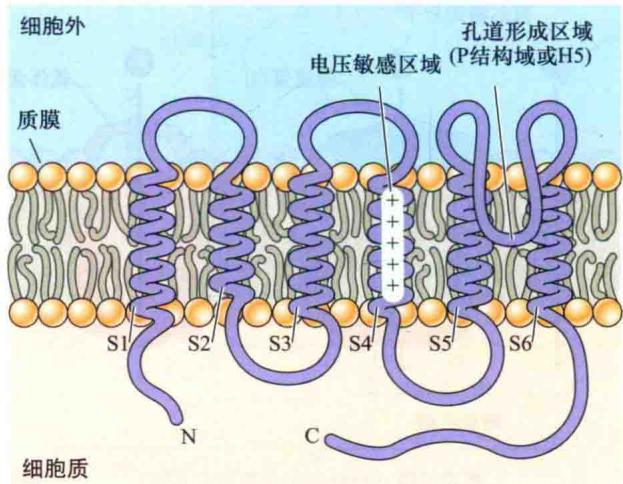  
图6.8 植物中K+通道模型。A. 通道的俯视图，可看到蛋白质孔道，四亚基的跨膜螺旋紧靠在中心孔道，形成倒置的圆锥形。四亚基的孔道形成区嵌入膜内，同时孔外侧部分形成指形的K+选择性区域（更详细的通道结构参见Web Essay 6.1）。B. 内向整合的钾离子通道侧面图，显示一个具有6个跨膜螺旋的亚基多肽链，第四个螺旋带正电的氨基酸，作为电压感受器。在螺旋(S)5和6之间的孔道形成区域是环状的（A改编自Lerry et al., 2002；B改编自Buchanan, 2000）。

A

$K^{+}$ 的平衡电位或能斯特电位,定义为没有 $K^{+}$ 的净流动,因而没有电流

$K^{+}$ 流出细胞产生的电流,为了方便,外向电流通常表示为正值

  
这些通道的开闭或“门控”不受电压调节,因而通过通道的电流与电压之间是线性关系  
线的斜率表明这些通道介导 $\mathrm{K}^{+}$ 电流的电导率

$$
\begin{array}{r l} & E _ {\mathrm{K}} = R T / Z F * \ln \left([ \mathrm{K} _ {\mathrm{out}} ] / [ \mathrm{K} _ {\mathrm{in}} ]\right) \\ & E _ {\mathrm{K}} = 0. 0 2 5 * \ln (1 0 / 1 0 0) \\ & E _ {\mathrm{K}} = - 5 9 \mathrm{mV} \end{array}
$$

B  
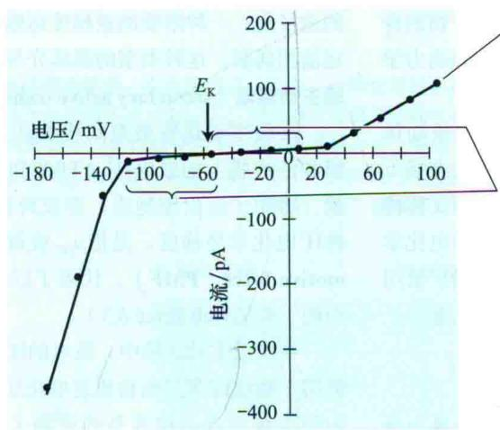  
$K^{+}$ 通过被电压门控的通道运动产生的电流与电压关系图。注意，I/V曲线是非线性的  
在这些电压范围内很少或没有电流,因为这些通道是电压调控的。在这些电压调控下,通道处于关闭状态

C  
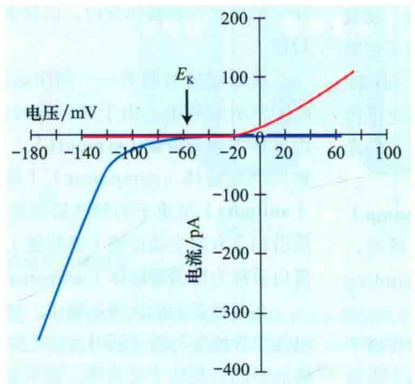

B图的电流反应说明,两种不同类型K+通道的激活特性。外向K+通道(红)是电压门控的,当膜电压 $>E_{K}$ 时,这些通道开放,介导了K+流出细胞;内向K+通道(蓝)也是电压门控的,当膜电压 $<E_{K}$ 时,这些通道开放,从而介导了K+流入细胞

图6.9 电流-电压关系图。A. $\mathbf{K}^{+}$ 通过一组理论上非电压调控的质膜 $\mathbf{K}^{+}$ 通道形成电流和电压的模式图。假定胞质 $[\mathbf{K}^{+}]$ 为 $100\mathrm{mmol / L}$ ，胞外 $[\mathbf{K}^{+}]$ 为 $10\mathrm{mmol / L}$ 。在平衡电位（能斯特）时电流为0，电流、电压为线性关系。B.拟南芥保卫细胞原生质体电压门控 $\mathbf{K}^{+}$ 通道真实 $\mathbf{K}^{-}$ 电流图。胞内外 $\mathbf{K}^{-}$ 浓度与A.相同。这些电流来自于电压调控 $\mathbf{K}^{+}$ 通道的活动。需要再次提醒的是，在 $\mathbf{K}^{+}$ 平衡电位时电流为0。但是，在很宽的电压范围内电流仍为0，这是由于在该条件下通道是关闭的，无 $\mathbf{K}^{-}$ 通过。C.B图中表示的电流-电压关系实际上来自两种类型的通道——内向整合 $\mathbf{K}^{+}$ 通道和外向整合 $\mathbf{K}^{+}$ 通道，这是两种通道共同活动的结果（B改编自L.Perfus-Barbeoch and S.M.Assmann，未发表的数据）。

## 6.3.2 载体结合和运输物质的专一性

与通道不同，载体蛋白没有形成完全延伸跨膜的孔道结构。由载体介导的运输过程中，被运输物质首先与载体蛋白的特异位点结合。被运输物质与蛋白质的结合是保证载体对特异底物高度选择性的基本要求。因此，载体运输特定离子和生物代谢物也就具专一性。与特定离子和生物代谢物结合后，载体蛋白构象发生变化，将被运输物质暴露于膜的另一侧溶液中，物质从载体结合位点分离释放出去，完成整个运输过程。

由于运输每个分子或离子时，蛋白质的构象要发生变化，因此载体运输的速率与通道运输相比要慢许多数量级。典型的载体每秒可运送100\~1000个离子或分子，而同样的时间内则会有数以百万计的离子通过开放的离子通道。载体运输中，载体蛋白的特异位点与分子的结合和释放，与酶促反应中底物和酶的结合及对产物的释放情况类似。就如同本章后面所讨论的，通过酶动力学可以对载体蛋白进行定性分析。

与通道运输不同，载体介导的运输可以是被动运输，也可以是次级主动运输（次级主动运输将会在接下来的部分进行讨论）。通过载体的被动运输有时又称协助扩散（facilitated diffusion），是不需能量的顺电化学势梯度的运输，也仅在此时归于扩散范畴（协助扩散用在通道上似乎更贴切，但从来没有这样描述过通道）。

## 6.3.3 初级主动运输需要能量

载体要完成主动运输，必须使需要能量的运输与另一放能过程相偶联，以使总的自由能变化为负值。初级主动运输（primary active transport）直接与能量源相偶联，而与电化学势差 $\Delta\bar{\mu}_{j}$ 无关，这些能量来源于如ATP水解、氧化还原反应（如同在线粒体和叶绿体的电子传递链）或通过载体蛋白（如盐杆菌视紫红质）吸收的光能。

执行初级主动运输功能的膜蛋白称为泵（pump）（图6.7）。大部分泵运输离子，如 $H^{+}$ 或 $Ca^{2+}$ 。然而，正如本章后面所讨论的，泵属于ABC（ATP-binding cassette）家族运输体，可以携带转运有机大分子。

离子泵可进一步被区分为致电离子泵或电中性离子泵。一般来讲，致电运输（electrogenic transport）指涉及净电荷跨膜移动的离子运输过程。相反，电中性运输（electroneutral transport）正如名称的含义，没有净电荷的跨膜移动。例如，动物细胞的 $Na^{+}/K^{+}-ATP$ 酶，在向胞外泵出3个 $Na^{+}$ 的同时向胞内泵入2个 $K^{+}$ ，结果产生1个净电荷的外向移动，因此， $Na^{+}/K^{+}-ATP$ 酶为一种致电离子泵；相反，动物胃黏膜的 $H^{+}/K^{+}-ATP$ 酶在向外泵出1个 $H^{+}$ 时，向内泵入1个 $K^{+}$ ，并无跨膜净电荷转移，因此， $H^{+}/K^{+}-ATP$ 酶是电中性离子泵。

在植物、真菌、细菌的质膜，以及植物液泡膜和其他动植物的内膜中，跨膜致电泵运输的主要是 $H^{+}$ 。质膜 $H^{+}-ATP$ 酶能产生跨膜的电化学势梯度，而液泡 $H^{+}-ATP$ 酶和 $H^{+}-$ 焦磷酸化酶（ $H^{+}-pyrophosphatase$ ， $H^{+}-PPase$ ）则将质子分别泵入液泡和高尔基体囊泡的内腔。

## 6.3.4 次级主动运输利用储存的能量

在植物细胞的质膜上，最引人注目的离子泵是那些 $H^{+}$ 泵和 $Ca^{2+}$ 泵，而且这些泵均为自胞质向胞外空间转运的外向通道。因此，还需要有另外的机制吸收诸如 $NO_{3}^{-}$ 、 $SO_{4}^{2-}$ 、 $PO_{4}^{2-}$ 等矿质元素，氨基酸、肽类、蔗糖的吸收，以及外运 $Na^{+}$ ，因为高浓度的 $Na^{+}$ 对植物细胞是有毒的。另外一种重要的逆电化学势梯度跨膜运输溶质的途径是：一种溶质的逆梯度运输与另一溶质的顺梯度运输相偶联。这种类型的载体介导的协同运输定名为次级主动运输（secondary active transport）（图6.10）。

次级主动运输被泵间接推动。在植物细胞中，质膜和液泡膜上的致电 $H^{+}$ -ATP酶利用ATP水解释放的能量，将质子运出细胞质，形成跨膜电势和pH梯度。这种 $H^{+}$ 电化学势梯度，是指 $\bar{\mu}_{jH^{+}}$ 或称质子动力势（proton motive force，PMF），代表了以 $H^{+}$ 梯度形式储存的自由能（参见Web Topic 6.3）。

在次级主动运输中，致电的 $H^{+}$ 运输产生的质子动力势用于驱动许多其他物质逆电化学势梯度运输。图6.10表明次级主动运输涉及的底物（S）和离子（通常为 $H^{+}$ ）如何结合到载体蛋白，以及蛋白质构象如何改变的过程。

次级运输有两类——同向运输和反向运输，如图6.10所示的例子，由于被运输的两种物质同向过膜，因此称为同向运输（symport），参与该运输的蛋白质称同向运输体（symporter）（图6.11A）。反向运输（antiport）指质子的顺能势梯度运动，并驱动另一溶质沿相反方向主动运输（逆势能）；同样，参与运输的蛋白质称为反向运输体（antiporter）（图6.11B）。

在两种类型的次级运输中，被运输的离子或溶质逆电化学势梯度与质子同时运动，因此，是主动过程，运输的驱动力是质子动力势，而不是直接来源于ATP水解的能量。

## 6.3.5 动力学分析揭示运输的机制

至此，已用能量学的概念描述了细胞运输。然而，细胞运输也可以用酶动力学来研究，因为它涉及分子与转运蛋白活性位点的结合和分离（参见Web Topic

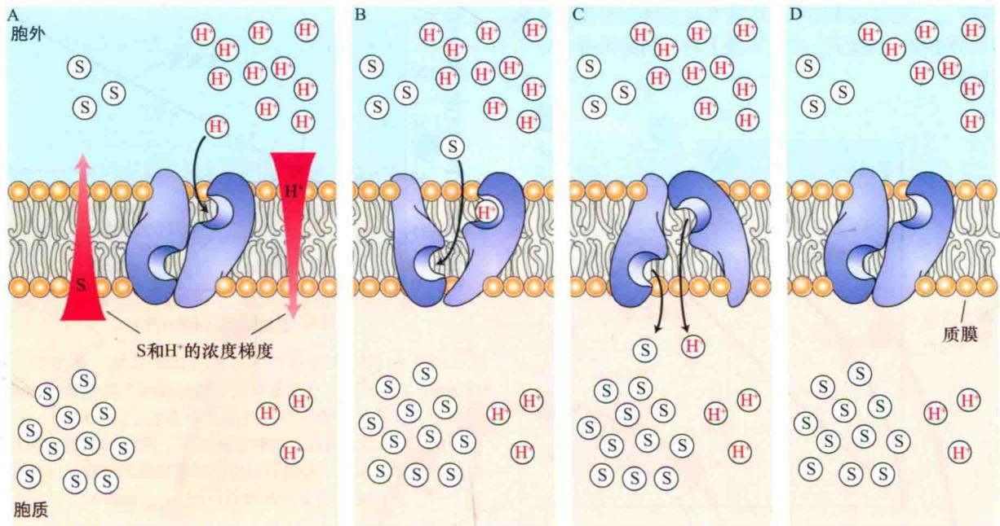  
图6.10 次级主动运输的理论模型。在次级主动运输中，一种溶质的逆能势运输受另一溶质顺能势运输的驱动。该过程中，能量以质子动力势储存（红色箭头表示 $\Delta\mu_{jH^{+}}$ ），用来逆浓度梯度运输底物（S）（左侧红色箭头）。A. 在最初构象中，蛋白质结合位点暴露于外部环境中，可以结合质子。B. 质子结合后，导致发生仅能结合S的构象变化。C. S的结合导致构象再次发生变化，使得结合点和底物暴露在细胞内侧。D. 质子和S分子在细胞内部的释放重新恢复了载体的原初构象，使得新一轮的“泵”循环开始。

  
图6.11 与原初质子梯度相偶联的次级主动运输的两个例子。A. 同向运输体中，质子运回细胞所释放的能量与另一底物（如蔗糖）的吸收相偶联。B. 反向运输体中，质子运回细胞所释放的能量与另一底物（如 $Na^{+}$ ）的输出相偶联。两种情况下，底物都是逆电化学势梯度移动的。中性的和带电的底物，均可通过这两种过程运输。

6.4）。动力学方法的优势在于可以帮助人们对运输的调节机制提出新的见解。

在动力学实验中，可以测出外部离子（或其他溶质）的浓度对运输速率的影响。因此，利用运输速率的动力学特性，可以区分两种不同的运输体。在不考虑底物浓度时，载体介导的运输和运输的速率不会超过最大速率 $V_{max}$ （图6.12）。通道的情况也常常如此。当载体的底物结合位点饱和或通道的流量达最大时，运输速率接近 $V_{max}$ 。运输速率的限制因素是运输体的密度而不是溶质的浓度，因此 $V_{max}$ 可表示膜上特异功能蛋白质分子的数目。

  
图6.12 载体运输由于结合位点的饱和而表现出饱和动力学曲线特征（ $V_{max}$ ）（见附录1）。当通道开放时，在溶质浓度梯度或离子的电化学势作用下，溶质的运输速率与溶质的浓度成正比，即典型的被动扩散特征。

常数 $K_{m}$ 可反映特定结合位点的特性，在数值上等于达最大运输速率一半时的溶质浓度。低的 $K_{m}$ 表明运输活性位点和被运输物质的亲和性高，通常暗示载体系统在起作用；较高的 $K_{m}$ 则表明运输活性位点和被运输物质的亲和性低。若亲和性太低，以致不能达到实际上的 $V_{max}$ ，在这种情况下，单独的动力学分析很难区分通道和载体。

溶质转运中，细胞或组织常表现出复杂的动力学特征，复杂的动力学特性则体现出多种转运机制的存在，如高亲和性及低亲和性转运体的存在。图6.13表明了大豆胚轴原生质体对蔗糖的吸收速率与外部蔗糖浓度的函数关系（Lin et al., 1984）。随着蔗糖浓度上升，吸收迅速增加，大约在10 mmol/L时，达到饱和。高于10 mmol/L时，在测试的浓度范围内，吸收的动力学曲线表现为线性且不饱和。代谢毒害抑制ATP合成，能阻断具有饱和特征的吸收，而不影响线性部分的吸收。

图6.13展现出的模式是在低浓度蔗糖时，吸收是载体介导的主动过程（ $\mathrm{H}^{+}$ -蔗糖同向运输）；在高浓度时，蔗糖通过顺浓度梯度扩散进入细胞，因此对代谢毒害也就不敏感。与这些数据相符合， $\mathrm{H}^{+}$ -蔗糖同向运输体（Lalonde et al., 2004）和蔗糖运输体（不依赖于能量供应或质子梯度的载体蛋白）（Zhou et al., 2007）已经在分子水平上被鉴定。

  
图6.13 在不同浓度时溶质运输特性的变化。低浓度（1\~10 mmol/L）时，大豆细胞吸收蔗糖的速率表现出载体的典型饱和动力学特性，相应曲线达最大速率 $V_{max}$ [57 nmol / (10 $^{6}$ 个细胞·h)]。相反，在较高浓度下，蔗糖的吸收在很宽范围内仍为线性增加，表明有其他蔗糖运输体的存在，可能是低亲和性的通道（改编自Lin et al., 1984）。

## 6.4 膜转运蛋白

图6.14阐明了各种位于质膜和液泡膜上具有代表性的运输过程。在跨生物膜运输的过程中，典型的供能方式是一种初级主动运输系统与ATP水解偶联。一种离子的运输，如 $H^{+}$ ，可产生离子梯度和电化学势。然后，可通过各种次级主动转运蛋白转运许多其他离子或有机底物，这些次级主动转运蛋白同时携带1个或2个 $H^{+}$ ，沿能量势梯度移动，产生的能量用来运输各自的底物。因此，质子的跨膜循环是通过初级主动转运蛋白主动向外运输，而后经次级主动转运蛋白返回细胞。高等植物中，大部分的跨膜离子梯度是由质子泵引起的 $H^{+}$ 电化学势梯度产生并维持的（Tazawa et al., 1987），而这些 $H^{+}$ 梯度则是由致电质子泵产生的。

有证据表明，在植物细胞中， $\mathrm{Na}^{+}$ 通过 $\mathrm{Na}^{+}-\mathrm{H}^{+}$ 反向运输体被运出细胞，特异的质子同向运输体将 $\mathrm{Cl}^{-}$ 、 $\mathrm{NO}_{3}^{-}$ 、 $\mathrm{H}_{2}\mathrm{PO}_{4}^{-}$ 、蔗糖、氨基酸和其他物质转运进细胞。在植物和真菌中，也可通过质子同向运输吸收糖类和氨基酸。那么钾离子呢？钾离子可以与 $\mathrm{H}^{+}$ （或在一些条件下与 $\mathrm{Na}^{+}$ ）从质外体中同向吸收。钾离子也可以在自由能梯度下通过特异的钾离子通道被动地吸收入细胞。在外部浓度很低时，细胞可通过载体吸收 $\mathrm{K}^{+}$ ，在较高浓度时通过特异的 $\mathrm{K}^{+}$ 通道扩散进入细胞。然而，在某种意义上，即使是通过通道的内流也是靠 $\mathrm{H}^{+}-\mathrm{ATP}$ 酶驱动的。因为 $\mathrm{K}^{+}$ 的扩散是由膜电位驱动的，而通过致电 $\mathrm{H}^{+}$ 泵将此时的膜电位维持在比 $\mathrm{K}^{+}$ 平衡电位更低的水平。相反， $\mathrm{K}^{+}$ 外流需要维持较 $E_{k}$ 更高的膜电位值，可以通过 $\mathrm{Cl}^{-}$ 外流或其他阴离子经通道的移动得以实现。

  
图6.14 植物细胞质膜和液泡膜上各种转运蛋白总览。

在前面的几节中，可以看到一些跨膜蛋白具有通道的功能，可以控制离子的扩散；另一些膜蛋白具有载体的功能，运输其他物质（大部分的分子和离子）。主动运输可以利用ATP水解直接供给能量，或者间接作为同向运输体和反向运输体的载体类蛋白实现。后者利用离子梯度（通常为 $H^{+}$ 梯度）的能量来驱动另一分子或离子逆能势运输。在接下来的几页中，将从分子特性、细胞定位及遗传操作等方面，更详细地介绍植物细胞介导有机和无机养分，以及水跨植物细胞膜运输的一些转运蛋白。

## 6.4.1 已鉴定的多种编码转运蛋白的基因

鉴定编码转运蛋白的基因更有助于揭示转运蛋白的分子特性。其中一种分离转运基因的途径是从植物的cDNA文库中筛选能回补酵母运输体缺失的基因。已知有许多运输体缺失的酵母突变体，可通过互补作用，用于鉴定植物中的相应基因。对于离子通道的基因研究途径是将离子通道基因在爪蟾卵母细胞中表达，分析通道蛋白的特征，这是因为爪蟾卵母细胞个体大，便于电生理学分析。通过这种方法，研究者已经克隆和鉴定了一些内向和外向整合的K+通道基因。

随着越来越多的基因组测序工作的完成，通过系统进化分析的方法鉴定潜在的运输体基因也日益普遍。这种方法是通过与已知功能的编码另一生物的运输体基因进行序列比对，以此推测感兴趣生物中该基因的功能。计算机辅助预测分子结构也正成为推测基因产物可能功能的有用方法。

逐步清晰的植物运输体基因基本情况表明，植物基因组中行使绝大部分运输功能的是一个基因家族，而不是单个基因。在这个基因家族中，运输特性（如 $K_{m}$ ）、调节模式及不同组织表达的变化，使植物呈现出巨大的可塑性，以适应更宽泛的环境条件。

## 6.4.2 各种含氮化合物的运输体

氮是大量营养元素之一，可以在土壤溶液中以硝酸盐（ $\mathrm{NO}_3^-$ ）、氨（ $\mathrm{NH}_3$ ）或铵盐（ $\mathrm{NH}_4^+$ ）的形式存在。植物 $\mathrm{NH}_4^+$ 转运子是一类能促进 $\mathrm{NH}_4^-$ 顺着自由能吸收的转运器（Ludewig et al., 2007）。植物 $\mathrm{NO}_3^-$ 的运输器因其复杂性而引起人们的浓厚兴趣。动力学分析表明，与图6.13蔗糖的运输相似， $\mathrm{NO}_3^-$ 的运输同样有高亲和性（低 $K_{\mathrm{m}}$ ）和低亲和性（高 $K_{\mathrm{m}}$ ）两种特征。与蔗糖相比， $\mathrm{NO}_3^-$ 带负电，该电荷的存在使得 $\mathrm{NO}_3^-$ 的吸收是一种需能的过程，这些能量可以从与 $\mathrm{H}^+$ 的同向运输中得到。 $\mathrm{NO}_3^-$ 的运输同时受到 $\mathrm{NO}_3^-$ 可利用性的强烈调节：当环境中有 $\mathrm{NO}_3^-$ 的存在时，和 $\mathrm{NO}_3^-$ 的同化一样，可以诱导 $\mathrm{NO}_3^-$ 运输所需要的酶（见第12章），并且当 $\mathrm{NO}_3^-$ 在细胞中积累时，其吸收将受到抑制。

在有 $ClO_{3}^{-}$ 存在下，通过观察生长可以筛选出有关 $NO_{3}^{-}$ 运输或硝酸盐还原的缺失突变体。 $ClO_{3}^{-}$ 是 $NO_{3}^{-}$ 的类似物，野生型植株吸收 $ClO_{3}^{-}$ 后，能将其还原为有毒性的 $ClO_{2}^{-}$ ；筛选出的抗 $ClO_{3}^{-}$ 植株，很可能表现出 $NO_{3}^{-}$ 运输或还原受阻的突变表型。已经从拟南芥中鉴定了若干这样的突变体。第一个被鉴定的运输基因编码一个诱导型 $NO_{3}^{-}-H^{+}$ 同向运输体，是一种双亲和性载体，其作用模式受到自身磷酸化的调控（Liu and Tsay，2003）。随着越来越多的 $NO_{3}^{-}$ 运输体被鉴定，很显然参与高亲和性和低亲和性运输的基因产物并非一个。

氮一旦被融合进有机分子当中，就可以通过多种机制被分配到植物的各个部分。肽运输体为氮元素的跨膜运输提供了又一机制。肽运输体对种子萌发时储藏氮的动员，以及通过维管系统的含氮化合物的分配都很重要。在食虫植物猪笼草（Nepenthes alata）的捕虫器上，发现了高度表达的肽运输体，它们可能介导了从被消化的昆虫吸收肽到植物内部组织的运输过程（Schulze et al., 1999）。

值得注意的是，拟南芥基因组中编码肽类运输体的基因比非植物种类的要多10倍，这也表明了这种类型运输体对植物的重要性（Stacey et al., 2002）。第一类介导二肽和三肽吸收的运输体家族，第二类肽运输体家族介导四肽和五肽的吸收。这两种运输体家族成员发挥功能时均与 $H^{+}$ 电化学势梯度相偶联。第三类肽运输体不同于以上两种，它直接利用ATP水解的能量进行运输，运输不依赖于原初电化学势梯度（参见Web Topic 6.5）。这些运输体为ABC（ATP-binding cassette）转运复合体家族成员。质膜和内膜上均发现有ABC转运复合体的存在。

ABC超家族是一个十分庞大的蛋白质家族，该家族成员运输包括从离子到大分子的各种不同底物。例如，大分子代谢产物（如类黄酮、花青素）和次级代谢产物都是通过特异的ABC运输体而在液泡内积累（Stacey et al., 2002; Rea, 2007）。

氨基酸是另外一类重要的含氮化合物。真核生物的质膜氨基酸运输体分为5个超家族，其中有3个家族存在于植物中，且对氨基酸的吸收依赖于与 $H^{+}$ 梯度的偶联（Wipf et al., 2002）。通常，氨基酸运输体可进行高亲和性和低亲和性两种运输，且它们的底物特异性是有重叠的。许多氨基酸运输体表现出组织特异性表达模式，表明它们在不同细胞中存在着特异的功能。氨基酸构成了植物中氮元素长距离运输的重要形式，因此，其基因的多种表达模式（包括在维管组织中的表达）便不足为怪了。

氨基酸和肽运输器除了作为氮源分配器外，还具有其他重要的作用。由于植物激素常常与氨基酸和肽结合存在，运输这些分子的运输体也可能参与植物体结合激素的分配。编码由色氨酸衍生而来的激素-生长素运输体的基因，与那些编码其他氨基酸运输体的基因间存在相关性。再比如，脯氨酸是在盐胁迫下积累的氨基酸，这种积累能降低细胞的水势，并在胁迫条件下保持细胞内水势，促进细胞水分保持。

## 6.4.3 多种多样的阳离子运输体

阳离子是通过阳离子通道和阳离子运输器进行转运的，每种作用机制的区别主要依赖于所研究的膜类型、细胞类型及生物种类。

阳离子通道（cation channel）在拟南芥基因组中，估计有50多个基因编码调节阳离子跨质膜或内膜（如液泡膜）吸收的阳离子通道蛋白（Very and Setenac, 2002）。其中一些通道对特异的离子种类，如 $K^{+}$ ，具有高度的选择性；其他的通道却允许不同种类的阳离子通过，有时还包括 $Na^{+}$ ，尽管这种离子在细胞过量积累对植物是有毒性的。正如图6.15所述，根据预测的通道结构和对阳离子的选择性，阳离子通道可分为6类。

在这6类阳离子通道中，了解最为详尽的是Shaker通道。这些通道是以果蝇的一个K+通道命名的，编码该通道的基因的突变可以引起果蝇腿的震动或颤抖，故命名为Shaker通道。植物Shaker通道对K+具有高度的选择性，要么是内向整合，要么是外向整合，或弱整合的K+电流。Shaker家族的一些成员功能如下。

（1）介导保卫细胞K $^{+}$ 跨膜的吸收或外流。

（2）负责提供从土壤中吸收 $K^{+}$ 主要渠道。

（3）参与了从活的中柱细胞向死的木质部导管释放 $K^{+}$ 。

（4）花粉中也发现了一种，其负责 $K^{+}$ 吸收促进水分的内流和花粉管伸长。

如在根中，一些Shaker通道以高亲和吸收的方式介导 $K^{+}$ 吸收，它们可在微摩级的外部 $K^{+}$ 浓度情况下起作用，只要膜电位充分超极化，就可驱动 $K^{+}$ 的吸收（Hirsch et al., 1998）。

并不是所有的离子通道都和Shaker通道一样，受到膜电势的调控。有一些离子通道不受电压调控，而其他的电压敏感通道如Kir等尚未被完全确认（Lebaudyet al., 2007）。环核苷酸门控阳离子通道只有很微弱的电压依赖性，它们的活性调节是通过结合环核苷酸如cGMP实现的。这些通道可让 $K^{+}$ 、 $Ca^{2+}$ 或 $Na^{+}$ 通过（Leng et al., 2002；Kaplan et al., 2007）。尽管对其功能所知甚少，但是突变体分析表明，有些环核苷酸门控阳离子通道在对细菌病原菌的抗病性反应中起作用（Clough et al., 2000；Kaplan et al., 2007）。另一有趣的例子是哺乳动物中谷氨酸受体通道，它与哺乳动物神经系统作为门控谷氨酸阳离子通道起作用的谷氨酸受体同源。谷氨酸诱导植物细胞中 $Ca^{2+}$ 的吸收，表明谷氨酸受体可能是 $Ca^{2+}$ 通透性的通道（Qi et al., 2006；Tapken and Hollmann, 2008）。

离子流也必然发生于液泡膜进进出出上。阴离子通道和阳离子通道在液泡膜上也被鉴定（图6.14）。植物液泡膜通道包括能被钙离子激活对钾离子具有高选择性的TPK/VK通道（Gobert et al., 2007）（图6.15A）和称为TPC1/SV的非选择性 $Ca^{2+}$ 透性通道（图6.14和图6.15B）。从液泡等胞内钙库释放出的 $Ca^{2+}$ 扮演着重要的胞内信号角色。许多第二信使如胞质 $Ca^{2+}$ 本身和 $InsP_{3}$ 都能引起胞质 $Ca^{2+}$ 释放。更多有关信号转导途径将于第14章详细讲述。

阳离子载体（cation carrier）：许多载体也可以将阳离子运输至植物细胞内。植物特异的细胞跨膜的K+运输体有两大家族：KUP/HAK/KT家族和HKT家族。第三类，阳离子- $H^{+}$ 转运器（CPAs），调节某些情况下 $H^{+}$ 和其他包括 $K^{+}$ 等阳离子之间的电中性交换（Gierth and Mäser，2007）。KUP家族包含高亲和性和低亲和性两种运输体，其中有些还可以在外部 $Na^{+}$ 浓度高的情况下介导 $Na^{+}$ 内流。HKT运输体可作为 $K^{+}-Na^{+}$ 同向共运输体或在外部较高 $Na^{+}$ 浓度下作为 $Na^{+}$ 通道起作用。尽管HKT家族运输体的功能尚未被完全阐明，但是在盐胁迫条件下，它们可能在植物体内 $Na^{+}$ 的重新分配过程中起作用（Davenport et al., 2007）。

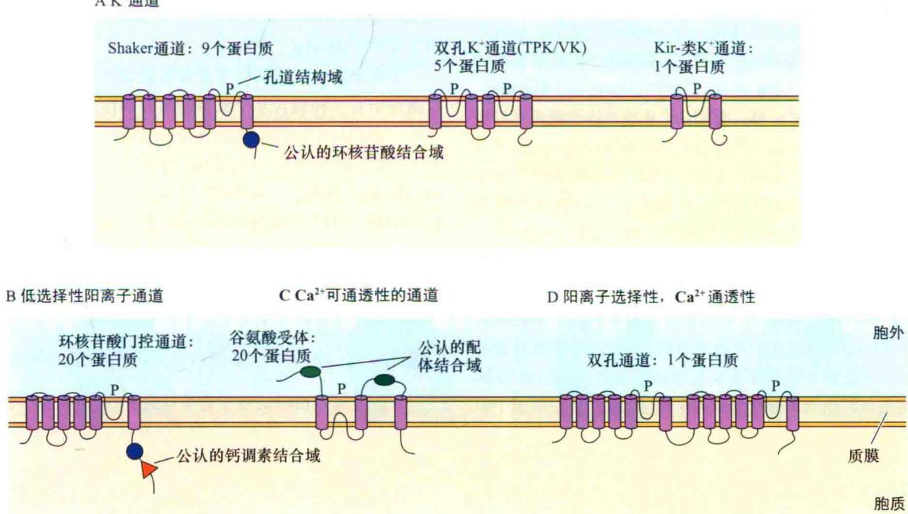  
图6.15 拟南芥阳离子通道的6个家族。一些通道仅从序列上鉴定出与动物细胞通道同源，其他的已得到了实验证实。A. K+选择性通道。B. 低选择性阳离子通道，其活性受环核苷结合的调控。C. 公认的Glu受体。根据对胞质Ca2+变化的测量，这类蛋白质的可能功能是Ca2+可通透性的通道。D. 基于对胞质变化的测量，TPC1是拟南芥基因组编码的唯一一种双孔通道，可运输一价和二价阳离子，包括Ca2+（改编自Very and Sentenac，2002；Lebaudy et al., 2007）。

灌溉可以增加土壤的盐分，而耕地的盐化作用正在成为世界上越来越突出的问题。盐生植物，如生长在盐沼泽地的植物，可以适应高浓度的盐环境。而这种高浓度盐环境对其他淡土植物种类包括大部分农作物都是有害的。植物在进化中逐渐形成了把盐汇集于液泡和跨膜向外排出的机制。液泡中 $Na^{+}$ 的汇集由 $Na^{+}-H^{+}$ 反向运输体——CPA蛋白的亚家族成员完成，它与 $H^{+}$ 的顺能势进入胞质移动相偶联，驱动 $Na^{+}$ 吸收进入液泡。拟南芥 $Na^{+}-H^{+}$ 反向运输体基因AtNHX1在拟南芥和作物中超表达，极大提高了拟南芥和作物种类（如马铃薯）的抗盐性（Apse et al., 1999; Zhang and Blumwald, 2001）。

在筛选对盐超敏感的突变体时，发现了一个质膜 $\mathrm{Na}^{+}-\mathrm{H}^{+}$ 反向共运输体，被命名为盐超敏感运输体（salt overly sensitive）或SOS1。SOS1可能起两种作用，一种是把 $\mathrm{Na}^{+}$ 从植物中排除，另一种是通过把 $\mathrm{Na}^{+}$ 排入蒸腾流中，稀释根部 $\mathrm{Na}^{+}$ 的浓度，最终把 $\mathrm{Na}^{+}$ 汇集到叶肉细胞的液泡内（Shi et al., 2002；Horie and Shreder, 2004）。与 $\mathrm{Na}^{+}$ 一样，驱使 $\mathrm{Ca}^{2+}$ 从质外体和胞内钙库中进入细胞质同样需要很大的自由能梯度，这一过程是由前面所述的 $\mathrm{Ca}^{2+}$ 通透性通道介导的。细胞壁和质外体中 $\mathrm{Ca}^{2+}$ 浓度通常在毫摩范围，而胞质中自由 $\mathrm{Ca}^{2+}$ 浓度维持在几百个纳摩（ $10^{-9}\ \mathrm{mol/L}$ ）到 $1\ \mu\mathrm{mol}\ (10^{-6}\ \mathrm{mol/L})$ ，因此 $\mathrm{Ca}^{2+}$ 顺着巨大的电化学势梯度扩散进入细胞。在质膜和一些植物细胞内膜（如液泡膜和内质网）上存在有 $\mathrm{Ca}^{2+}$ -ATP酶，可将 $\mathrm{Ca}^{2+}$ 运出细胞（图6.14）。细胞内的许多 $\mathrm{Ca}^{2+}$ 是储存在中央液泡中的，这里的 $\mathrm{Ca}^{2+}$ 也是通过 $\mathrm{Ca}^{2+}$ -ATP酶和 $\mathrm{Ca}^{2+}$ - $\mathrm{H}^{+}$ 反向运输体运输的， $\mathrm{Ca}^{2+}$ - $\mathrm{H}^{+}$ 反向运输体利用质子梯度形成的电化学势使 $\mathrm{Ca}^{2+}$ 在液泡中积累（Hirschi et al., 1996）。

细胞质中 $Ca^{2+}$ 浓度微小的波动，就会显著影响许多酶的活性，因此其胞质浓度也就需要受到严密的调控（Sanders et al., 2002）。 $Ca^{2+}$ 结合蛋白——钙调素（CaM），参与到这种调节当中。虽然，CaM不具备自身催化活性，但结合 $Ca^{2+}$ 的CaM结合到不同的靶蛋白上后，其活性便受到调控（DeFalco et al., 2010）（参见

Web Essay 6.2）。 $Ca^{2+}$ -渗透环核苷酸门控通道蛋白是一类CaM结合蛋白，证据显示，与CaM结合后，该类门控通道蛋白活性受到负调节。CaM也能够与 $Ca^{2+}$ -ATP酶结合，CaM的结合使ATP酶从自抑制的状态中释放，引起 $Ca^{2+}$ 流向质外体、内质网和液泡。综上，CaM的这两种调节效应提供了通过起始负反馈循环激活CaM进而改变胞质钙离子水平的机制。

## 6.4.4 已鉴定的一些阴离子运输体

$NO_{3}^{-}$ 、 $Cl^{-}$ 、 $SO_{4}^{2-}$ 和 $H_{2}PO_{4}^{-}$ 是植物细胞中主要的无机阴离子，苹果酸根离子是主要的有机阴离子（Barbier-Brygoo et al., 2000）。这些阴离子的自由能梯度都是沿被动外流的方向。用电生理技术已鉴定了几种类型的阴离子通道，与对 $K^{+}$ 的运输机制的了解形成鲜明对比，在分子水平上阴离子通道基因的鉴定要难得多（Barbier-Brygoo et al., 2000）。然而，可能介导保卫细胞阴离子流的SALC1在最近被鉴定出来（Negi et al., 2008; Vahisalu et al., 2008）。

与相对缺乏特异性的阴离子通道相比，逆能势运输的阴离子载体则表现出对特定阴离子的选择性。除了已述的吸收 $NO_{3}^{-}$ 的转运蛋白外，植物中还存在运输像苹果酸和柠檬酸等各种有机阴离子的运输体，如第13章所述，苹果酸吸收对于增加胞内溶质非常重要，它可引起保卫细胞对水分的吸收，进而导致气孔开放。AtABCB14是ABC亚家族成员，已经被证实参与苹果酸的运入中（Lee et al., 2008）。

土壤溶液中可用磷的含量常常限制植物的生长。拟南芥中有一种包含9个成员的高亲和性质膜运输体家族，它们与 $H^{+}$ 同向运输介导磷的吸收。这些运输体主要在根组织中表达，且受磷缺乏信号的诱导（Rausch and Bucher，2002）。植物中已鉴定出对 $HPO_{4}^{2-}$ 低亲和性的 $HPO_{4}^{2-}-H^{+}$ 同向运输体—— $HPO_{4}^{2-}$ 运输体（转运蛋白），位于质体内膜上，把光合作用的磷酸化碳化合物释放到胞质，并吸收无机磷（Weber，2004）（参见Web Topic 8.15）。

## 6.4.5 金属转运蛋白对重要微量元素的转运

一些金属是植物的重要营养成分，尽管植物只需要微量的金属元素，铁即一个例子。缺铁是全世界最普遍的人类营养失调病。因此，对植物积累铁元素机制了解的增加，也会有助于改善作物的营养价值。超过25种调节植物对铁、锰、锌离子吸收的“ZIP”相关运输体及其他介导铜和钼离子吸收的运输体已经被鉴定出来（Palmer and Guerinot，2009）。由于土壤溶液中可用的金属元素浓度通常很低，因此这些运输体都是高亲和性的。一些金属运输体能介导镉的吸收，Cd对人类有毒害作用，在作物中并不需要，然而这种特性也显示出植物在土壤脱毒（植物修复）中的可利用性，植物通过吸收有害物质而后再将这些有害物质转化成适当的废弃物而除去（参见Web Essay 26.2）。

金属离子一旦进入植物体，通常与其他分子螯合，被转运至木质部然后随着蒸腾流分配到植物体的各个部分。金属离子也可以被转运至相应的亚细胞中，如植物中铁主要存在于叶绿体中，形成复合体参与到电子传递链中（见第7章）。调节铁穿越叶绿体膜的通道蛋白有待于被进一步鉴定（Palmer and Guerinot，2009）。金属如铁、铜等在植物体中的过多积累将引起有害的ROS的产生。螯合金属离子的复合物将保卫植物抵御这种危害。调节金属吸收至液泡的运输器在维持胞质中金属离子浓度处于非毒害水平中也发挥重要的作用。

## 6.4.6 水孔蛋白具有多种功能

水通道或水孔蛋白是植物膜上分布相对较多的一类蛋白质（见第3章和第4章）。最初，水孔蛋白的存在让人感到惊讶，因为脂质双分子被认为对于水分渗透而言已经足够，然而水孔蛋白在动植物中广泛存在。预测，拟南芥基因组中编码大约35个水孔蛋白基因（Maurel et al., 2008）。

许多水孔蛋白在卵母细胞表达时，并没有电流出现，这与它们离子运输活性缺乏的特性相一致。卵母细胞原本对水的透性很低，但当表达了水孔蛋白时，若将卵母细胞置于较低渗透压的外部介质中，卵母细胞质膜上水的快速内流，可以引起其膨胀和破裂。这些结果表明水孔蛋白构成了膜上的水通道（图3.13）。一些水孔蛋白还可以运输一些不带电的溶质（如 $NH_{3}$ ），已有证据证明它可作为植物细胞吸收 $CO_{2}$ 的通道。还有研究者认为，水孔蛋白可能是渗透势梯度和膨压的感受器（Maurel et al., 2008）。

水孔蛋白的活性受到pH、 $Ca^{2+}$ 浓度、异聚化及活性氧的调控，同时也受到蛋白质的磷酸化的调控（Tyerman et al., 2002；Maurel et al., 2008）。这些调节可能说明了植物细胞具有迅速改变对水的通透性的能力，以应答昼夜节律和诸如盐、冷、干旱及水涝（缺氧）等胁迫条件。同时，这种调节也可发生在基因表达水平上。由于表皮、内皮层细胞及木质部薄壁组织可能是水分运动的关键控制点，因此，水孔蛋白在这些细胞中高度表达（Javot and Maurel, 2002）。

## 6.4.7 质膜H $^{+}$ -ATP酶受到P-型ATP酶的高度调控

正如已看到的，质子向外跨膜主动运输，形成了pH和电势梯度，可以驱动许多其他物质（离子及不带电溶质）通过各种次级主动运输体运输。 $H^{+}$ -ATP酶活性对调节胞质pH和控制细胞膨压也很重要，而细胞膨压则是器官（叶和花）运动、气孔开放和细胞生长的驱动力。图6.16阐述了膜 $H^{+}$ -ATP酶可能的工作机制。

植物和真菌质膜 $H^{+}$ -ATP酶和 $Ca^{2+}$ -ATP酶是一类称为P-型ATP酶的成员，该类酶的磷酸化是水解ATP的催化循环的一部分。由于磷酸化反应的存在，质膜 $H^{+}$ -ATP酶可受钒酸盐（ $HVO_{4}^{2-}$ ）的强烈抑制， $HVO_{4}^{2-}$ 是 $HPO_{4}^{2-}$ 的类似物，它可与ATP上的磷酸根竞争ATP酶上天冬氨酸磷酸化的位点。

植物质膜 $H^{+}$ -ATP酶由含约12个成员的基因家族编码（Sondergaard et al., 2004）。基于对基因表达模式和拟南芥中各种 $H^{+}$ -ATP酶基因突变体的功能分析，人们对 $H^{+}$ -ATP酶的每个同工酶的功能已有了初步的了解。一些 $H^{+}$ -ATP酶表现出细胞特异的表达模式。例如，有几个 $H^{+}$ -ATP酶基因在保卫细胞中表达，它们可能在气孔开放过程中为保卫细胞吸收溶质提供能量（见第4章）。

  
图6.16 H $^{+}$ -ATP酶引起的化学势梯度运输质子到膜外的理论步骤。镶嵌在膜内的转运蛋白与细胞内侧的阳离子结合（A），并被ATP磷酸化（B）；磷酸化导致酶的构象改变，将质子暴露于膜的外侧并释放出去（C）。磷酸根（P）从转运蛋白上释放到细胞质，H $^{+}$ -ATP酶蛋白恢复原有构象，开始新一轮的运输（D）。

总之，那些在营养物质运输中起关键作用的细胞中， $\mathrm{H}^+$ -ATP酶表达量高，这些细胞包括根内皮层细胞和那些发育中的种子周围参与从质外体吸收营养的细胞（Sondergaard et al., 2004）。在多种 $\mathrm{H}^+$ -ATP酶共表达的细胞中，这些 $\mathrm{H}^+$ -ATP酶可能受到不同的调控或者存在功能冗余，可能为其运输功能提供了一种“保险”机制（Arango et al., 2003）。图6.17表示了酵母 $\mathrm{H}^+$ -ATP酶功能域的模型，与植物中的类似。该蛋白质具有10个跨膜结构域，来回环化跨膜，一些跨膜域形成了质子泵出的通道。催化ATP水解的结构域位于膜的胞质一侧，包含在催化性循环中可被磷酸化的Asp残基。

与其他酶一样，质膜 $H^{+}$ -ATP酶也受底物ATP浓度、pH、温度及其他因子的调控。另外， $H^{+}$ -ATP酶分子还可以被光、激素或病原菌侵染之类的特定信号可逆性地活化或去活化。这种调控由位于多肽链C端的特化的自抑制结构域来介导完成。该结构域调节着 $H^{+}$ -ATP酶的活性（图6.17），如果自抑制结构域被蛋白酶水解掉，则 $H^{+}$ -ATP酶被不可逆地激活（Palmgren，2001）。

C端的自抑制效应也可受到蛋白激酶和蛋白磷酸酶的调控，两种酶的作用分别通过在该结构域的Ser/Thr残基上加上或移去磷酸基团来实现。这种磷酸化作用可以被普遍存在的酶修饰蛋白调节，该类蛋白质称为14-3-3蛋白，它们主要结合在磷酸化区域，取代了自抑制（autoinhibitory）结构域，导致H $^{+}$ -ATP酶激活（Gaxiola et al., 2007）。壳梭孢菌素为真菌毒素，它是H $^{+}$ -ATP酶的强激活剂，可以增强14-3-3蛋白与H $^{+}$ -ATP酶的亲和性，甚至可以在未磷酸化条件下激活该泵（Sondergaard et al., 2004）。壳梭孢菌素强烈地激活保卫细胞H $^{+}$ -ATP酶的作用，以至于气孔不可逆地开放、萎蔫，甚至死亡。

  
图6.17 酵母质膜H $^{+}$ -ATP酶的二维示意图。H $^{+}$ -ATP酶有10个跨膜区，调节域为自抑制域，翻译后修饰使自抑制域被取代，导致H $^{+}$ -ATP酶活化（改编自Palmgren，2001）。

液泡内腔

植物细胞主要靠中央液泡吸水使细胞的体积增大，液泡的渗透压必须维持在足够高的水平以使水分进入胞质。因此，与质膜调节的细胞吸收离子和代谢产物的过程一样，液泡膜控制这些物质在胞质和液泡间的转移。随着分离完整液泡和液泡膜泡囊技术（参见Web Topic 6.6）的发展，液泡膜的运输研究已成为一个生机勃勃的研究领域。这些研究导致了一类将质子运输到液泡的新的质子泵ATP酶的发现（图6.14）。

液泡H $^{+}$ -ATP酶（又称V-ATP酶）在结构和功能上均与质膜H $^{+}$ -ATP酶不同（Kluge et al., 2003），而更加接近线粒体和叶绿体的F-ATP酶（见第11章）。由于液泡ATP酶水解ATP并不涉及磷酸化中间体的形成，因此液泡ATP酶对前述质膜ATP酶的抑制剂钒酸盐不敏感，而是专一地受抗生素洛霉素A的抑制，同时也受高浓度NO $_{3}^{-}$ 的抑制，这两者均不能抑制质膜ATP酶。利用这些选择性抑制剂可以鉴定不同类型的ATP酶，并对它们的活性进行测试。液泡ATP酶属于存在于所有真核细胞内膜系统的一类普遍的ATP酶，它们由多个不同的亚基组成，形成很大的酶复合体，约750 kDa（Kluge et al., 2003）。这些亚单位有组织地形成外围催化复合体V $_{1}$ 及跨膜通道复合体V $_{0}$ （图6.18）。基于它们与F-ATP酶的相似性，人们认为液泡ATP酶工作机制像一个小型的旋转马达（见第11章）。

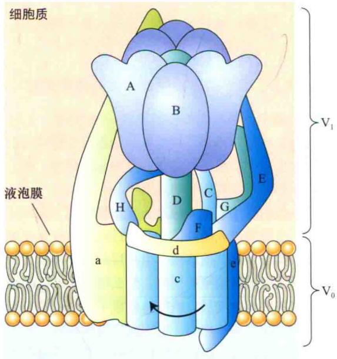  
图6.18 V-ATP酶旋转马达模型。由许多多肽亚单位一起组成的复合体酶。 $V_{1}$ 催化复合体很易与膜脱离，它含有核苷酸结合位点和催化位点，其组分用大写字母标注。介导H $^{-}$ 跨膜运输的复合体 $V_{0}$ ，用小写字母标注其组分。人们认为ATP酶的反应由每个A亚基催化，依次推动锚杆D和6个c亚基旋转，c亚基相对于a亚基的旋转驱动H $^{+}$ 的跨膜运输（改编自Kluge et al., 2003）。

液泡ATP酶是致电泵，它们从细胞质中运输质子进入液泡，并在液泡膜上产生质子原动力。尽管液泡中电势与外部介质相比较低，但是仍然比胞质高20\~30 mV，这种情况是由致电质子泵造成的。为维持液泡整体的电中性，Cl⁻、苹果酸根离子等阴离子，经过膜上的通道，由胞质进入液泡内（Barla and Pantoja，1996）。如果在质子泵入的同时，阴离子没有同向转移，则导致跨液泡膜的电荷积累，将导致不能进一步泵入更多的质子。阴离子的运输，维持了液泡整体的电中性，这样保证了液泡H⁺-ATP酶能产生大的跨膜浓度质子梯度（pH梯度）。正是这种梯度的存在，导致了典型液泡的pH为5.5，而胞质pH为7.0\~7.5。质子原动力中的电势差驱动阴离子进入液泡，而H⁺电化学势梯度Δμ̃H⁺，通过次级运输（反向共运输体），为阳离子和蔗糖进入液泡提供了动力（图6.14）。

尽管大部分植物细胞的液泡pH略微呈酸性（约5.5），然而，有些植物种类液泡的pH则很低，该现象称超酸化（hyperacidification）现象。一些果实（柠檬）和蔬菜（大黄）尝起来很酸，正是由液泡超酸化作用引起的，表6.2中列出了一些极端的例子。生化研究表明，液泡（特别是汁囊细胞）的低pH是一系列因子综合影响的结果。

表6.2 一些超酸化植物种类液泡的pH

<table><tr><td>组织</td><td>物种</td><td>pHa</td></tr><tr><td colspan="3">果实</td></tr><tr><td></td><td>酸橙(Citrus aurantifolia)</td><td>1.7</td></tr><tr><td></td><td>柠檬(Citrus limonia)</td><td>2.5</td></tr><tr><td></td><td>樱桃(Prunus cerasus)</td><td>2.5</td></tr><tr><td></td><td>柚子(Citrus paradisi)</td><td>3.0</td></tr><tr><td colspan="3">叶</td></tr><tr><td></td><td>四季海棠(Begonia semperflorens)</td><td>1.5</td></tr><tr><td></td><td>秋海棠</td><td>0.9~1.4</td></tr><tr><td></td><td>酢浆草</td><td>1.9~2.6</td></tr><tr><td></td><td>酸模(Rumex sp.)</td><td>2.6</td></tr><tr><td></td><td>仙人掌(Opuntia phaeacantha)b</td><td>1.4(6:45 A.M.)</td></tr><tr><td></td><td></td><td>5.5(4:00 P.M.)</td></tr></table>

a 数值代表汁液的pH或各组织的汁液，通常是液泡pH的指示剂；b 仙人掌液泡pH在一天内有变化，如第8章讨论的。许多沙漠植物有特化的光合作用类型，称为CAM，造成液泡pH在夜间下降。

资料来源：Small，1946

（1）液泡膜对质子的通透性很低，从而建立起较陡的pH梯度。

（2）特化的液泡ATP酶比普通液泡ATP酶能更有效地运输质子（能量浪费较少）（Müller et al., 1997）。

（3）柠檬酸、苹果酸及草酸等有机酸在液泡中的积累，可以作为缓冲剂，有助于维持液泡的低pH。

## 6.4.9 H $^{+}$ 焦磷酸酶（H $^{+}$ -PPase）也可以在液泡膜上泵运质子

另外一类质子泵称为质子-焦磷酸酶（ $\mathrm{H}^{+}$ -PPase）（Gaxida et al., 2007），与液泡ATP酶共同作用，产生跨液泡膜的质子梯度（图6.14）。该酶由分子质量为80 kDa的单链多肽组成，利用无机焦磷酸（ $\mathrm{PP}_{\mathrm{i}}$ ）水解产生的能量作为驱动力。

与ATP水解相比，由焦磷酸水解释放的自由能要少。每水解1分子焦磷酸，质子焦磷酸酶只运输1个质子，而每水解1个ATP，液泡ATP酶运输2个质子。因此，运输每个质子可获得的能量是相同的，两种酶可以产生相当量的质子梯度。有趣的是，在一些细菌和原生生物中存在有与植物H $^{+}$ -PPase类似的酶，但在动物和酵母中却没有发现有这类酶的存在。

V-ATP酶和H $^{+}$ -ATP酶也在除了液泡外的其他内膜系统中发现。与它们分布相一致的是，这些ATP酶除了调控H $^{+}$ 梯度外，也被证实调节囊泡的运输和分泌。此外，拟南芥的一个H $^{+}$ -PPase的超表达促进生长素的运输和细胞分裂，H $^{+}$ -PPase活性的降低则出现相反的表型。这表明，H $^{+}$ -PPase的活性与生长素转运子的合成、分布及调控相关（Gaxiola et al., 2007）（见第19章）。

## 6.5 根中的离子运输

根吸收的矿质营养通过木质部随蒸腾流运到地上部分（见第4章）。养分和水的最初吸收，以及接下来的从根表面跨过皮层进入木质部的转移过程，都是高度特异的，并受到精细的调控。

离子进入根的运输同样服从细胞运输的生物物理定律。但正如讨论水分运输（见第4章）时所看到的，根的解剖结构构成离子运输途径上的某些特殊的限制。这一节将讨论涉及离子从根的表面向木质部导管径向运输的途径和机制。

## 6.5.1 溶质通过质外体和共质体的移动

直到目前为止，讨论的细胞质子运输并不包括细胞壁。对小分子运输而言，细胞壁是由多糖组成的开放空间，矿质营养很容易通过。由于所有植物细胞之间均由细胞壁分开，离子可以完全不进入活细胞，通过细胞壁间隙扩散而穿过某一组织（或随水流被动运输）。这种由细胞壁组成的连续体系称为细胞外空间（extracellular space），或称为质外体（apoplast）（图4.4）。通常，利用这种方法测定的结果表明，细胞壁占植物组织体积的5%\~20%。

正像细胞壁可以形成一个连续相，相邻细胞的细胞质同样也可形成连续的整体，统称为共质体（symplast）。植物细胞通过被称为胞间连丝的细胞质桥相互连在一起（见第1章）。胞间连丝是沿质膜排列的直径为20\~60 nm的柱形孔道（图6.19），其中包含连丝微管通过，连丝微管是由两个细胞的光滑内质网衍生而来的。在胞间运输频繁的重要组织中，相邻细胞具有大量的胞间连丝，有时每平方微米的细胞表面可达15个。像花的蜜腺和叶的盐腺等特化的分泌细胞，都具有高密度的胞间连丝。营养吸收的根尖附近的细胞也是如此。

对含有大量胞间连丝的细胞进行染料注射或抗电性测试研究，发现离子、水和小溶质可以通过这些孔道从一个细胞转移到另一个细胞。由于每根胞间连丝是由连丝微管和与其相关蛋白质组成的网状通道（见第1章），一些大分子（如蛋白质等）通过胞间连丝的运动需要特殊机制（Lucas and Lee，2004）。此外，离子可经胞间连丝的简单扩散，通过共质体途径进入整个植株（见第4章）。

## 6.5.2 离子跨过共质体和质外体的运输

根对离子的吸收主要在根毛区（见第5章），比分生区和伸长区显著得多。根毛区的细胞已充分伸长但并未开始次生生长。根毛是特化表皮细胞的延伸，根毛的存在极大增加了吸收离子的表面积。

进入根的离子，可能跨过表皮细胞质膜，立即进入共质体，也可能进入质外体，并通过细胞壁在表皮细胞间扩散。离子（或其他溶质）由皮层的质外体要么跨过皮层细胞质膜被运输至共质体，要么通过质外体的径向运输直接扩散到内皮层。质外体形成了一个从根表面通过皮层的连续空间。然而，由于凯氏带的存在，无论哪一种运输方式，离子在进入中柱之前，必须首先进入共质体。正如第4章和第5章所讨论的，凯氏带是环绕在特化的内皮层细胞周围的环形栓化层，能有效地阻止水和溶质经质外体进入中柱鞘（图6.20）。

经由共质体的连接，离子一旦穿过内皮层进入中柱，将继续在细胞间扩散进入木质部。最后被释放至管胞或导管分子，即又重新进入质外体。同样，凯氏带将再次阻止离子由质外体扩散回到根外部。由于凯氏带的图6.19 A. 胞间连丝连接了相邻细胞的细胞质，利于细胞和细胞间通讯。B. 胞间连丝直径约40 nm，其精细的结构形成一个微小的通道，可以让水或小分子自由扩散到另一细胞，中间有一个由内质网延伸出来的连丝微管。C. 胞间连丝横切图，胞间连丝内蛋白质的排列及柱形微通道。内部蛋白的重排可用来调控开放空间的大小，以使大分子通过（C改编自Lucas and Lee，2004）。

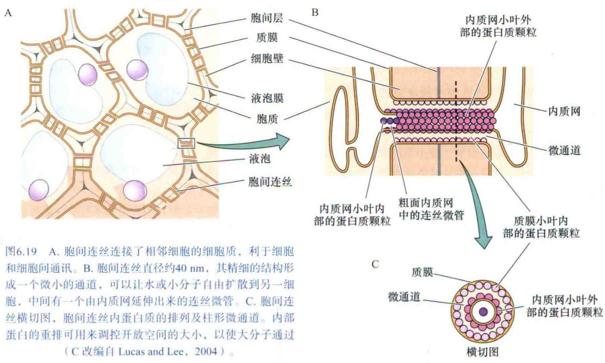

A  
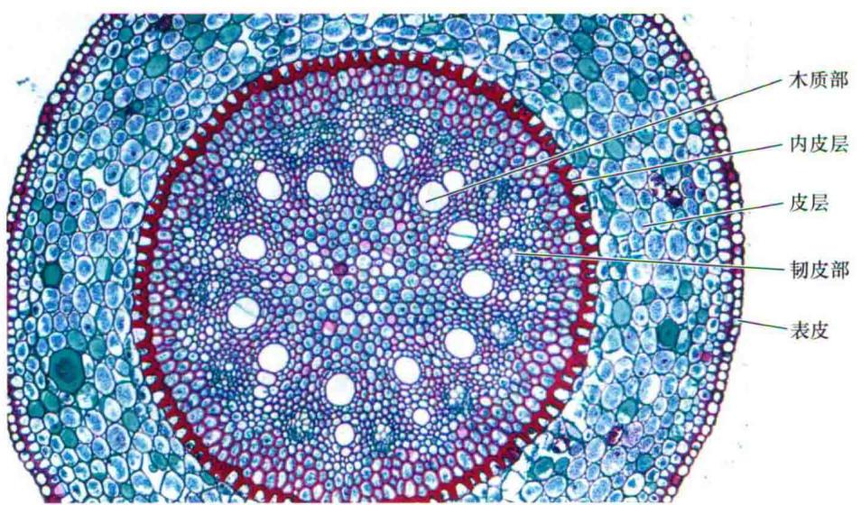

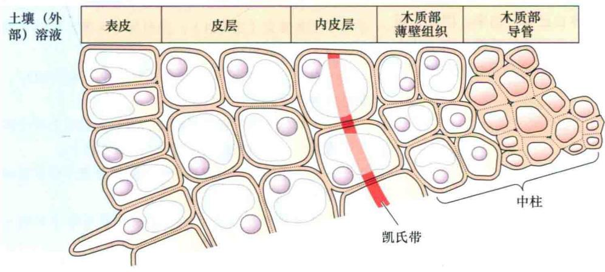

图6.20 根的组织结构。
A. 单子叶植物牛尾草（菝葜属）根的横切面，显示表皮（ep）、皮层薄壁组织（cp）、内皮层（ed）、木质部（xy）和韧皮部（ph）。B. 根横切示意图，显示溶质从土壤溶液中进入木质部导管所经过的细胞层（A×30，©Biodisc/Visuals Unlimited/Alamy；B改编自Dunlop and Bowling，1971）。

存在，木质部中的离子浓度高于根周围土壤溶液的离子浓度。

## 6.5.3 木质部薄壁组织参与了木质部的装载

根吸收的离子一旦进入表皮或皮层的共质体，必须把它们装载进入中柱的管胞或导管分子，并向枝条运输。中柱由死的管状分子和活的木质部薄壁细胞组成。由于木质部管状分子是死细胞，缺少与周围薄壁细胞的胞质连续性，因此，离子必须从共质体中第二次跨过质膜，才能进入管状分子。

离子从共质体进入木质部输导组织的过程称为木质部装载（xylem loading）。木质部装载是一个受到严密调节的过程。与其他活的植物细胞一样，木质部薄壁组织具有质膜H $^{+}$ -ATP酶活性，并维持负的膜电位。通过电生理学和遗传学方法，在管状分子中鉴定了专一卸载溶质的运输体。木质部薄壁细胞质膜上存在有质子泵、水孔蛋白及各种离子通道和载体，专门介导溶质的内流和外流（de Boer and Volkov，2003）。

在拟南芥木质部薄壁组织中，中柱的外向整合K+通道（SKOR）在中柱鞘细胞和薄壁细胞中表达。SKOR在这里作为外向通道，把K+从活细胞向外运输到管状组织（Gaymard et al., 1998）。在拟南芥SKOR通道蛋白缺失的突变株中，或者通过药理学的方法使SKOR失活的植物中，从根到茎的K+运输大大减少，这也证实了该通道蛋白的功能。

一些参与到 $Cl^{-}$ 和 $NO_{3}^{-}$ 从木质部薄壁细胞中卸载的阴离子选择性类型通道也被鉴定出来。干旱、脱落酸（ABA）处理或者胞质 $Ca^{2+}$ 浓度升高（通常在应答ABA时）等都可降低根木质部薄壁组织SKOR和阴离子通道的活性，这有助于在缺水状态下维持根细胞水合作用。

在木质部薄壁组织细胞中，也发现了其他一些较低选择性的通道，它们可透过 $K^{+}$ 、 $Na^{+}$ 和阴离子。另外， $Na^{+}-H^{+}$ 反向运输体SOS1似乎可以将 $Na^{+}$ 装载进木质部，可以降低根共质体中 $Na^{+}$ 的水平。同时，介导硼、 $Mg^{2+}$ 和 $HPO_{4}^{2-}$ 装载的其他运输体也已鉴定出来。因此，通过调节质膜 $H^{+}-ATP$ 酶、通道及载体的活性，离子从木质部薄壁细胞向木质部管状组织的流动是处于严密的代谢控制之下的。

## 小结

分子或离子由一个区域向另一个区域的生物调控移动称为运输。植物与环境之间，植物组织及器官之间存在可溶性物质的交换，且无论局部还是长距离运输过程都主要由细胞膜控制。

## 被动和主动运输

· 浓度梯度和电势梯度是驱动物质穿越生物膜运输的主要动力，这些综合起来称为电化学势[式（6.8）]。

· 溶质顺自由能梯度的穿膜运动受到被动运输机制的促进（图6.1，图6.2）。

· 溶质逆自由能梯度的运动称为主动运输，且需要提供能量。

## 离子的跨膜运输

· 膜允许或限制某一物质跨膜运动的特性称为膜的通透性（图6.6）。

· 通透性取决于特定溶质的化学特性、膜的脂质组成，特别依赖于膜上协助特定物质运输的膜蛋白。

· 对每一种可透过膜的离子，平衡时特定种类离子的跨膜分布可用能斯特方程来表述[式（6.10）]。

· 由 $H^{+}$ -ATP酶引起的 $H^{+}$ 的跨膜运输是膜电位的一个主要决定因素（图6.16，图6.17）。

## 膜转运过程

\- 膜上有许多特化的蛋白质，即通道、载体和泵，以协助溶质运输（图6.7）。

· 通道受蛋白孔径调控，开放时能够极大促进分子的跨膜外流（图6.7，图6.8）。

\- 生物体的离子通道类型具有极大的多样性。依据类型，通道对于一种离子具有非选择性或高度选择性。通道受到包括电压、第二信使及配体等因素调控（图6.9，图6.14，图6.15）。

\- 载体结合特定溶质并进行转运，其转运速率要低于通道数个数量级（图6.7，图6.12）。

\- 泵对溶质的转运需要能量。 $H^{+}$ 和 $Ca^{2+}$ 的穿越细胞膜主动运输需要泵的调节（图6.7）。

\- 植物利用能量的次级主动运输从质子的顺能势梯度运输调节其他溶质逆能势梯度的主动运输（图6.10）。

· 同向运输中，两种被运输的溶质沿同一方向穿膜运动，而反向运输中两种溶质则沿相反方向运动（图6.11）。膜转运蛋白

· 质膜和液泡膜上的许多通道、载体和泵已经在分子水平上被鉴定（图6.14），并利用电生理（图6.9）及生化技术进行界定。

\- 转运子存在于不同的含氮物质中，包括 $\mathrm{NO}_3^-$ 、氨基酸和多肽。

· 植物体有多种阳离子通道，可以通过它们对于阳离子的选择性及调控机制进行分类（图6.15）。

· 一些不同种类的阳离子载体调节钾离子吸收至细胞溶质（图6.14）。

· 液泡膜和质膜上的 $Na^{+}-H^{+}$ 反向转运体分别转运 $Na^{+}$ 至液泡和细胞原生质体外，由此避免细胞溶质中 $Na^{+}$ 积累至毒害水平（图6.14）。

\- $\mathrm{Ca^{2+}}$ 是信号转导级联中重要的第二信使，其在胞质中的浓度受到严密调控。 $\mathrm{Ca^{2+}}$ 通过可通透性 $\mathrm{Ca^{2+}}$ 通道被动进入胞质，通过 $\mathrm{Ca^{2+}}$ 泵和 $\mathrm{Ca^{2+}-H^{+}}$ 反向运输器主动移出细胞溶质（图6.14）。

· 调节 $NO_{3}^{-}$ 、 $Cl^{-}$ 、 $SO_{4}^{2-}$ 和 $PO_{4}^{3-}$ 吸收至细胞溶质中的选择性载体及非选择性地调节阳离子流出细胞溶质的阳离子通道调控了这些大量营养元素在细胞内的浓度（图6.14）。

· 高亲和性ZIP转运蛋白转运重要的及有毒的金属离子（图6.14）。

· 水孔蛋白促进水分穿越细胞膜的流动，它们的调控使得在应对环境刺激反应中细胞内水势的快速变化。

\- 质膜H $^{+}$ -ATP酶是一类由多基因的家族编码的膜蛋白，其活性受到蛋白本身自抑制区的可逆控制。

· 在液泡膜上发现两种 $H^{+}$ 泵，V-ATP酶和 $H^{+}$ -焦磷酸酶，调节穿越液泡膜的质子原动力，进而通过反向机制驱动其他溶质的穿膜运动（图6.14，图6.18）。

## 根中的离子转运

· 诸如矿质营养等可溶性物质通过细胞外空间（质外体）或经由胞质（通过共质体）在细胞间进行移动。相邻细胞的细胞质通过胞间连丝相连，促进了共质体运输（图6.19）。

\- 离子进入根时，可由表皮细胞吸收，也可通过质外体先扩散到根皮层细胞，并由皮层或内皮层的细胞进入共质体。离子由根共质体装载进入木质部并经蒸腾流运送到地上部分（图6.20）。

(李保珠 安国勇 宋纯鹏 译)

## WEB MATERIAL

Web Topics 6.1 Relating the Membrane Potential to the Distribution

## of Several Ions across the Membrane: The Goldman Equation

The Goldman equation is used to calculate the membrane permeability to more than one ion.

6.2 Patch Clamp Studies in Plant Cells
Patch clamping is applied to plant cells for electrophysiological studies.

## 6.3 Chemiosmosis in Action

The chemiosmotic theory explains how electrical and concentration gradients are used to perform cellular work.

6.4 Kinetic Analysis of Multiple Transporter Systems Application of principles of enzyme kinetics to transport systems provides an effective way to characterize different carriers.

6.5 ABC Transporters in Plants
ATP-binding cassette (ABC) transporters are a large family of active transport proteins energized directly by ATP.

6.6 Transport Studies with Isolated Vacuoles and Membrane Vesicles
Certain experimental techniques enable the isolation of tonoplast and plasma membrane vesicles for study.

Web Essays

6.1 Potassium Channels Several plant $\mathbf{K}^{+}$ channels have been characterized.

## 6.2 Calmodulin: A Simple but Multifaceted Signal Transducer

This essay describes how CaM interacts with a broad array of cellular proteins and how these protein-protein interactions act to transduce changes in $Ca^{2+}$ concentration into a complex web of biochemical responses.

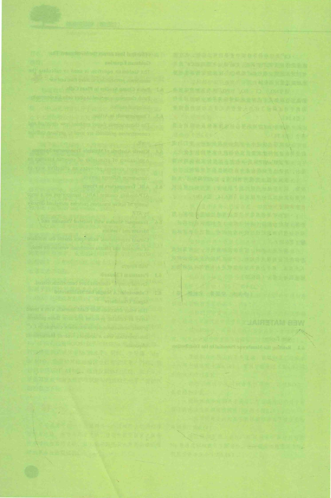

## 单元Ⅱ 生化和代谢

# 光合作用：光反应

地球上生命赖以生存的能量来自太阳，光合作用是能够捕获光能的唯一的生物学途径，地球上大部分的能源来自于近代或古代的光合作用（化石燃料）。这章将介绍光合储能的基本原理，以及目前对于光合作用细胞器的结构和功能的认识（Blankenship，2002）。

光合作用一词的字面意思是“利用光合成”。在本章中将会看到，进行光合作用的生物可利用太阳能合成复杂的碳化合物。更确切地说，光能促使二氧化碳和水合成碳水化合物和氧气。

$$
6 \mathrm{CO} _ {2} + 6 \mathrm{H} _ {2} \mathrm{O} \longrightarrow \mathrm{C} _ {6} \mathrm{H} _ {2} \mathrm{O} _ {6} + 6 \mathrm{O} _ {2}
$$

这些分子中储存的能量不仅可为植物细胞的活动提供能量，还是地球上所有生命的能量来源。

本章将阐述光合作用中光的功能、光合细胞器的结构，以及从叶绿素被光激发到合成ATP和NADPH的整个光合作用过程。

## 7.1 高等植物中的光合作用

叶片的叶肉是高等植物中光合作用最活跃的组织。叶肉细胞含有丰富的叶绿体，而叶绿体中含有能吸收光能的绿色色素——叶绿素（chlorophyll）。在光合作用中，植物利用光能氧化水，释放氧气；同时还原二氧化碳，合成大量碳化合物，主要是糖。这一系列复杂反应包括类囊体反应和碳固定反应，最终使二氧化碳还原。

光合作用的类囊体反应（thylakoid reaction）发生在叶绿体特化的内膜——类囊体（见第1章）中。类囊体反应的终产物是高能化合物ATP和NADPH，它们主要参与碳固定反应（carbon fixation reaction）中糖的合成。糖的合成过程发生在叶绿体的基质中，基质是围绕类囊体的亲水性区域。类囊体反应，通常也称为光合作用中的光反应，在本章中进行阐述；碳固定反应则在第8章中论述。

叶绿体通过两种不同的功能单位——即两种不同的光系统将光能转化为化学能。吸收的光能用于驱动电子在一系列电子供体和电子受体化合物之间进行传递。最终，大部分电子将 $NADP^{+}$ 还原为NADPH，并将 $H_{2}O$ 氧化成 $O_{2}$ 。同时，光能也产生跨类囊体膜的质子动力势（见第6章），用于合成ATP。

## 7.2 基本概念

在这节中，将介绍一些必要的概念，它们是理解光合作用的基础。这些知识包括光的性质、色素的性质及其多功能性。

## 7.2.1 光具有波粒二象性

20世纪早期，认识到光具有波粒二象性是物理学上的一个重要发现。波的特性用波长（wavelength）表示，即希腊字母 $\lambda$ ，表示两个连续波峰间的距离（图7.1）。频率（frequency）用希腊字母v表示，表示在特定时间内经过观察者的波峰数。用一个简单的公式可以描述波长、频率和波速之间的关系。

$$
C = \lambda v\tag{7.1}
$$

式中，C为波速，在此处表示光速 $(3.0\times10^{8}\mathrm{m/s})$ 。光波是横向传播（侧对侧）的电磁波，电场和磁场在与光波的传播方向垂直的方向振荡，两个场彼此之间也呈 $90^{\circ}$ 夹角。

  
图7.1 光是横向传播的电磁波，它由与光的传播方向垂直且相互垂直的振荡电场和振荡磁场组成。光以 $3.0 \times 10^{8}$ m/s的速度传播，波长（ $\lambda$ ）表示两个连续波峰间的距离。

光同时也是粒子，称为光子（photon）。每个光子含有一定能量，称为量子（quantum，普朗克量子）。光能并不连续，而是以离散包——量子的形式传递的。根据普朗克定律，光子的能量（E）取决于光的频率。

$$
E = h \nu\tag{7.2}
$$

式中，h为普朗克常数（ $6.626 \times 10^{-34}$ Js）。

太阳光就像含不同频率光子的“光子雨”，人的眼睛只对其中很小的频率范围，即电磁波谱的可见光区域敏感（图7.2）。较高频率的光（或较短波长的光）在光谱的紫外区；较低频率的光（或长波光）在

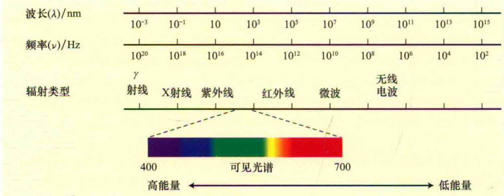  
图7.2 电磁波谱。波长（ $\lambda$ ）和频率（ $\nu$ ）呈负相关。人的眼睛只对其中很窄范围的辐射波长敏感，即 $\lambda$ 为400（紫）\~700 nm（红）的可见光区域。短波长（高频率）光具有高能量，长波长（低频率）光具有低能量。

红外区。图7.3中显示了太阳辐射的能量和照到地球表面的能量密度。叶绿素a的吸收光谱（图7.3中的绿色曲线）大致表示了被植物所利用的那部分太阳能。

吸收光谱（absorption spectrum）反映了分子或物质吸收不同波长光的光能量信息，在无吸收的溶剂中，特定物质的吸收光谱可以用图7.4所示的分光光度计进行测定。分光光度法是测定样品吸光度的一种方法，在Web Topic 7.1中进行了更详尽的论述。

## 7.2.2 当分子吸收或发射光时，它们的电子态也发生变化

叶绿素之所以看起来是绿的，是由于它主要吸收光谱的红光和蓝光部分，而以绿光（波长大约为550 nm）为主的光波被反射到人眼中（图7.3）。

光的吸收可以用式（7.3）表示，其中叶绿素（Chl）处于它的最低能态，或称基态；在吸收了一个光子（用hv代表）后转变成了高能态，或称激发态（Chl\*）。

$$
\mathrm{Chl} + \mathrm{hv} \longrightarrow \mathrm{Chl} ^ {*}\tag{7.3}
$$

激发态分子和基态分子中电子的分布是不同的（图7.5）。与红光相比，吸收蓝光会将叶绿素激发到更高的能态，因为波长越短，光子的能量就越高。在高能激发态，叶绿素极不稳定，会很快地将一部分能量以热能的形式散失到周围空间，从而变成最低激发态，这种状态能稳定存在几纳秒（ $10^{-9}$ s）。由于激发态内在的不稳定性，任何捕获其能量的过程必须非常迅速。

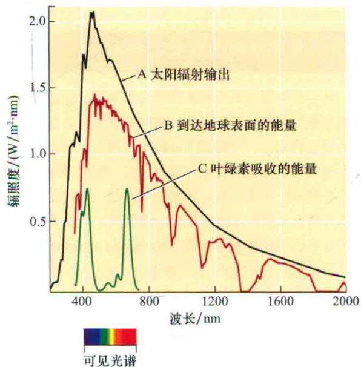  
图7.3 太阳光谱和叶绿素吸收光谱的相关性。曲线A（黑线）表示不同波长处的太阳辐射能。曲线B（红线）是照到地球表面的能量。在大于700 nm的红外区域骤然下降的谷代表以水蒸气为主的大气层分子吸收的太阳能。曲线C（绿线）是叶绿素的吸收光谱，它在蓝光（波长约为430 nm）和红光（波长约为660 nm）区域有强烈吸收。由于可见光区中部的绿光未被有效吸收，故而多数绿光被反射进人眼中，赋予植物特征性的绿色。

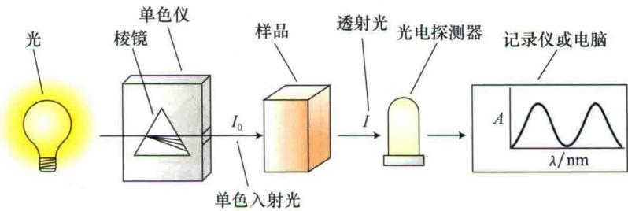  
图7.4 分光光度计的示意图。仪器由一个光源、一个内含棱镜之类的波长选择装置单色仪、一个样品架、一个光电探测器和一个记录仪（或电脑）组成。单色仪的输出波长随着棱镜的旋转而改变；吸收值（A）针对波长（ $\lambda$ ）作图即光谱。

  
图7.5 叶绿素的吸收光和发射光。A. 能级图。光的吸收或发射由连接基态和电子激发态的垂直线表示。叶绿素的蓝光和红光吸收带（分别表示吸收蓝光和红光光子）对应于垂直向上的箭头，表示吸收的光能使分子从基态变成激发态。向下的箭头表示发射荧光，当分子以光子的形式再次释放能量时，从最低激发态回到基态。B. 吸收光谱和荧光光谱。叶绿素的长波（红光）吸收带对应从基态跃迁至第一激发态所需的光能。短波（蓝光）吸收带对应跃迁至更高激发态所需的光能。

在最低激发态，被激发的叶绿素可通过4条途径释放能量。

（1）被激发的叶绿素重新发射光子，回到基态，这个过程发射荧光（fluorescence）。发射的荧光波长比吸收波长稍长（能量更低），这是由于一部分激发能在发射荧光前转化为热能。叶绿素发红色荧光。

（2）被激发的叶绿素直接将激发能转化为热能，回到基态，不发射光子。

（3）叶绿素参与能量转移（energy transfer）。激发态的叶绿素将能量转移给另一个分子。

（4）光化学（photochemistry）途径：激发态能量促使化学反应发生。光合作用的光化学反应是已知的最快的化学反应之一，这种超快的速度有利于本途径与激发态的上述其他3种途径竞争。

## 7.2.3 光合色素吸收光以驱动光合作用

太阳能首先被植物的色素吸收，叶绿体中含有在光合作用中起作用的所有色素。图7.6和图7.7中显示了几种光合色素的结构和吸收光谱。叶绿素和细菌叶绿素（bacteriochlorophyll）（在某些细菌中找到的色素）是光合生物中的典型色素。所有生物都含有一种以上的色素，每种色素都有特定功能。

绿色植物中含大量叶绿素a和叶绿素b，原核生物和蓝细菌（又称蓝藻）中含有叶绿素c和叶绿素d。已经发现了多种不同类型的细菌叶绿素，细菌叶绿素a（Bchl a）分布最广。Web Topic 7.2显示了不同类型光合生物中色素的分布情况。

B类胡萝卜素

A 叶绿素

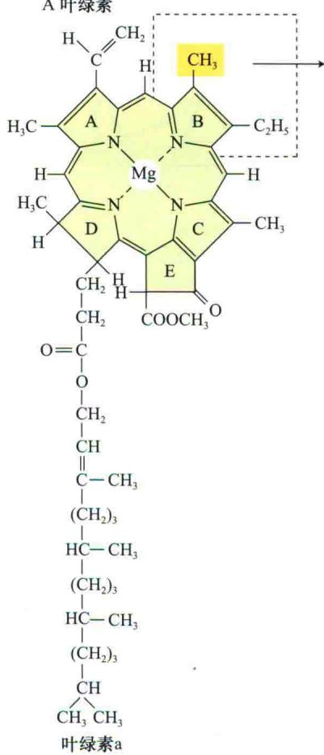

图7.6 一些光合色素的分子结构。A. 叶绿素有一个类卟啉环结构，中心配位镁离子；还有一条长的疏水性碳氢链尾巴，能将叶绿素锚定在光合膜上。类卟啉环是叶绿素被激发时电子重排和未配对电子氧化或还原的场所。不同叶绿素的主要区别在于环周围的取代基和双键类型不同。B. 类胡萝卜素是线状多烯，既可作为天线色素，也可作为光保护剂。C. 胆色素是开链的四吡咯，存在于蓝藻和红藻的藻胆体的天线结构中。  
  
图7.7 一些光合色素的吸收光谱，包括β-胡萝卜素、叶绿素a（Chl a）、叶绿素b（Chl b）、细菌叶绿素a（Bchl a）、叶绿素d（Chl d）和藻胆红素。除藻胆红素外，其余色素的吸收光谱是溶于非极性溶剂的纯色素的光谱，藻胆红素则是利用藻红蛋白水溶液测定的。藻红蛋白来源于蓝藻，包含了一个与肽链共价连接的藻胆红素发色团。在大多数情况下，体内光合色素的光

谱受到它所在环境的影响（改编自Avers，1985）。

所有的叶绿素都有一个复杂的环形结构，它与血红蛋白、细胞色素（图7.6A）中的卟啉类基团的化学结构很相近。另外，环形结构上常常附有一条长的碳氢链尾巴，它将叶绿素锚定在疏水环境。环形结构含有一些结合松散的电子，它是叶绿素分子发生电子跃迁和氧化还原反应的基础。

在光合生物中发现的各种类胡萝卜素（carotenoids）都是含有多个共轭双键的线状分子（图7.6B），吸收峰在400\~500 nm，因此类胡萝卜素具有特征性的橙色，例如，胡萝卜的颜色源于类胡萝卜素中的β-胡萝卜素，它的结构和吸收光谱分别见图7.6和图7.7。

除了那些需要实验室条件维持生存的突变体，所有光合生物中都能发现类胡萝卜素，类胡萝卜素整合在类囊体膜上，通常和组成光合细胞器的多种蛋白质紧密结合。类胡萝卜素把吸收的光能转移给叶绿素，用于光合作用，因此它们称为辅助色素（accessory pigment）。此外，类胡萝卜素也能帮助生物抵御光造成的损伤（见本章的P.152和第13章）。

## 7.3 了解光合作用的关键实验

阐明光合作用的总化学方程式耗费了几百年的时间和多位科学家的努力（相关历史可参阅本书网站上的参考文献）。1771年，J. Priestley发现，在一个密闭的空间燃烧蜡烛直至熄灭后，该空间内一小枝薄荷的生长，可使空气成分发生变化，引起另一支蜡烛燃烧，由此发现了植物可产生氧气。1779年，荷兰人J. Ingenhousz阐述了光在光合作用中的关键功能。

其他科学家确定了 $CO_{2}$ 和 $H_{2}O$ 在光合作用中的作用，并表明有机物特别是碳水化合物和氧气一样都是光合作用的产物。到19世纪末期，得到的光合作用的总的配平化学反应式如下。

$$
6 \mathrm{CO} _ {2} + 6 \mathrm{H} _ {2} \mathrm{O} \xrightarrow {\text {光，植物}} \mathrm{C} _ {6} \mathrm{H} _ {1 2} \mathrm{O} _ {6} + 6 \mathrm{O} _ {2}\tag{7.4}
$$

这里的 $C_{6}H_{12}O_{6}$ 代表葡萄糖等单糖。正如将要在第8章中提到的那样，葡萄糖并不是碳固定反应的实际产物，但两者在能量上基本相同，因此为了方便起见，式（7.4）以葡萄糖作为代表，不能仅按字面意思理解。

光合作用的化学反应过程很复杂，目前至少已发现了50个中间反应步骤，毫无疑问还可能存在其他的步骤。20世纪20年代，通过研究一种终产物不是氧气的光合细菌，得到了有关光合作用中关键化学过程的早期线索，从而确定了光合作用的化学属性。通过对一些细菌的研究，C. B. van Niel推断光合作用是一个氧化还原过程，随后这个结论成为所有研究光合作用的基础。

接下来我们将阐述光合作用和吸收光谱的关系，讨论有助于了解光合作用的一些关键性实验和光合作用中的关键化学反应方程式。

## 7.3.1 作用光谱将光吸收与光合成活性相联系

作用光谱对于了解光合作用非常重要。作用光谱（action spectrum）描述了生物系统对光反应的程度与波长的函数关系。光合作用的作用光谱可以通过测量不同波长的光刺激植物释放氧气的量来绘制（图7.8）。从作用光谱常可推断在特定光诱导现象中起作用的发色基团（色素）。

T. W. Engelmann在19世纪末测定了一些初始的作用光谱（图7.9）。T. W. Engelmann用一个棱镜将阳光散射成七色光，并使之落在水藻丝上，再在系统中加入一群好氧细菌，细菌就会聚集在产生氧气最多的藻丝区域，这些区域就是被红光和蓝光照到的区域，这两种光可被叶绿体强烈吸收。现在，作用光谱可用像一间房间一样大的光谱仪测量，通过一个巨大的单色仪将单色光辐照在实验样品上，但其实验原理和T. W. Engelmann的实验原理相同。

  
图7.8 作用光谱和吸收光谱的比较。吸收光谱的测量见图7.4。作用光谱是通过测量植物对不同波长光的反应如氧气的释放来绘制的。如果某个吸收光谱相关的色素与引起光反应的色素相同，那么这个吸收光谱和作用光谱就会相吻合。本图中，氧气释放的作用光谱和完整叶绿体的吸收光谱高度一致，表明叶绿素的光吸收调控氧气的释放。差异出现在类胡萝卜素的吸收区域450\~550 nm，意味着从类胡萝卜素到叶绿素的能量转移不如叶绿素间的能量转移有效。

光的波长/nm  
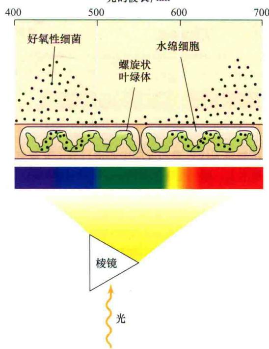  
图7.9 T.W. Engelmann绘制的作用光谱的示意图。T.W. Engelmann将不同波长的光照射到丝状绿藻——水绵（Spirogyra）的螺旋状叶绿体上，观察到投放进去的好氧性细菌聚集在叶绿素吸收的光谱区域附近。这个作用光谱还首次表明辅助色素所吸收的光可以驱动光合作用。

作用光谱对于研究产氧光合生物中两种不同的光系统非常重要。在介绍这两种光系统之前，需要了解捕光的天线分子和光合作用的能量需求。

## 7.3.2 光合作用发生在包含捕光天线和光化学反应中心的复合体中

叶绿素和类胡萝卜素吸收的一部分光能最终以形成化学键的形式被储存为化学能。从一种形式到另一种形式的能量转化是一个复杂的过程，它需要多种色素分子和一组电子转移蛋白质的相互协作。

多个色素可组成天线复合体（antenna complex），收集光并将其能量转移到反应中心复合体（reaction center complex），在这里发生氧化和还原反应，以长期储存能量（图7.10）。本章的后面将讨论一些天线复合体和反应中心复合体的分子结构。

  
图7.10 光合作用中能量转移的基本概念。许多色素共同组成天线复合体，收集光能并向反应中心传递能量。在反应中心，叶绿素电子被转移到一个电子受体上，发生化学反应以储存能量，随后一个电子供体又将叶绿素还原；天线复合体中的能量转移是纯粹的物理现象，不涉及化学变化。

植物将天线色素和反应中心进行分工究竟有何裨益？事实上，即使在强光照射下，一个叶绿素分子每秒也只能吸收少量光子。如果一个完整的反应中心仅连接一个叶绿素，那么这个系统中的酶大部分时间将处于闲置状态，只有在吸收光子的时候偶尔被激活。但是，如果有多个色素分子把能量一起运送到一个共同的反应中心，系统在大部分时间就会保持活跃状态。

1932年，R. Emerson和W. Arnold做了一个非常重要的实验，首次证明光合作用过程中多个叶绿素分子在能量转化时起协同作用。他们用短时间（ $10^{-5}$ s）闪光照射绿藻（Chlorella pyrenoidosa），测量氧气产生的量。闪光之间的间隔为0.1 s，在更早的工作中R. Emerson和W. Arnold已经证明这个时间间隔足够长，以致在下次闪光之前，过程中的酶反应完全可以完成。他们发现在高能下，氧气生成量并不随着闪光能量的增强而增加，即光合系统被光饱和了（图7.11）。

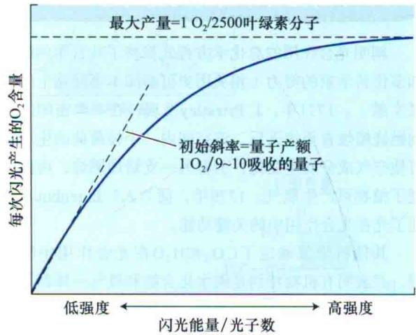  
图7.11 氧气产量和闪光能量之间的关系图。该图为天线色素和反应中心间存在相互作用提供了首个证据。在能量饱和时，氧气的最大产量是每2500个叶绿素分子产生一个氧分子。

在测量产氧量和闪光能量的关系时，R. Emerson和W. Arnold非常惊讶地发现，在饱和条件下，样品中每2500个叶绿素分子只产生1个氧分子。反应中心结合了几百个色素分子，每个反应中心必须作用4次才能产生一个氧分子，因此得出2500个叶绿素产生一个氧分子。

反应中心和多数天线复合体整合在光合膜上。在真核光合生物中，光合膜是叶绿体内的膜；在原核光合生物中，光合作用的位置则在质膜或质膜衍生的膜上。

如图7.11曲线所示，可以测量光合作用中光反应的另一个重要参数——量子产额（quantum yield）。光合作用的量子产额（ $\Phi$ ）定义如下。

$$
\Phi = \frac {\mathrm{光化学产物数}}{\mathrm{吸收量子的总数}}\tag{7.5}
$$

在曲线的线性部分（低光强度），光子量的增加刺激了氧气产量成比例增加。因此，曲线的斜率表示产生氧的量子产额。一个特定过程的量子产额可以从0（若过程对光无反应）到1（若每个吸收的光子都对过程有贡献）。关于量子产额更详细的讨论参见本书Web Topic 7.3。

对于弱光下发挥作用的叶绿体，光化学反应的量子产额大约是0.95，荧光的量子产额是0.05或更低，其他过程的量子产额基本可以忽略，因此大量被激活的叶绿素分子都会引发光化学反应。

## 7.3.3 光合作用中的化学反应由光驱动

有一点值得注意，那就是化学反应方程式（7.4）的平衡基本上处于反应物的一边。利用每个化合物的生成自由能计算出方程式（7.4）的平衡常数大约是 $10^{-500}$ ，这个数字接近于0，可以非常确定，在宇宙存在的历史中，若没有外加的能量， $CO_{2}$ 和 $H_{2}O$ 不可能自发生成葡萄糖分子。驱动光合反应的能量来自光。以下是方程式（7.4）的简化形式。

$$
\mathrm{CO} _ {2} + \mathrm{H} _ {2} \mathrm{O} \xrightarrow {\text {   光，植物   }} (\mathrm{CH} _ {2} \mathrm{O}) + \mathrm{O} _ {2}\tag{7.6}
$$

其中的（ $\mathrm{CH}_2\mathrm{O}$ ）是一个葡萄糖分子的1/6。驱动方程式（7.6）的反应需要9\~10个光子。

虽然在最适宜的条件下光化学反应的量子产额约为100%，但是光能转化为化学能的效率却低得多。如果吸收的是680 nm波长的红光，那么总的能量输入[见方程式（7.2）]就是，每生成1 mol氧气可用的能量有1760 kJ。这个能量足够驱动方程式（7.6）中的反应，该反应的标准自由能变化是+467 kJ/mol。因此在最适宜波长下，光能转化为化学能的效率约为27%，对于一个能量转化系统来说，这已经是很高的效率。大多数被储存的能量用于细胞生命活动的维持，只有很少的能量转化成为生物量（见第9章）。

光化学反应的量子效率（量子产额）接近1（100%），它和能量转化效率只有27%之间并没有矛盾。量子效率衡量的是被吸收光子中参与光化学反应的部分所占的比例；能量效率衡量的是被吸收的光子中有多少能量以化学产物的形式被储存。这些数据表明几乎所有被吸收的光子都参与了光化学反应，但是每个光子中只有1/4的能量被储存，其余的转化为热能。如果以太阳光的全光谱作为能源来计算，则转化为生物量的能量转化效率还要低得多， $C_{3}$ 植物大概为4.3%， $C_{4}$ 植物大概为6%（Zhu et al., 2008）。

## 7.3.4 光驱动NADP的还原和ATP的形成

光合作用的整个过程是一个氧化还原反应，在这个过程中一个化合物被去除电子而被氧化，另一化合物则被加上电子而被还原。1937年，Robert Hill发现，在光照下，离体的类囊体还原了诸如铁盐之类的许多化合物，这些化合物取代二氧化碳起着氧化剂的作用，其方程式如下。

$$
4 \mathrm{Fe} ^ {3 +} + 2 \mathrm{H} _ {2} \mathrm{O} \longrightarrow 4 \mathrm{Fe} ^ {2 +} + \mathrm{O} _ {2} + 4 \mathrm{H} ^ {+}\tag{7.7}
$$

这个反应称为希尔反应，在希尔反应中许多复合物实际上起到人工电子受体的作用，它们对于阐明碳还原前的反应具有重大意义。氧气的产生与人工电子受体还原之间关联关系的证实，初步表明了在缺少二氧化碳的情况下也可以产生氧气，由此形成了现已被接受和证明的观点——光合作用中释放的氧气来源于水而不是二氧化碳。

现在已知，在光系统正常作用时，光还原烟酰胺腺嘌呤二核苷酸磷酸（NADP），NADPH接下来在卡尔文循环（见第8章）中被用作还原剂来固定碳。从水到NADP的电子传递过程中合成了ATP，它也被用于碳还原。

水氧化成氧气，NADP还原及ATP形成等化学反应称为类囊体反应，因为在NADP还原之前的几乎所有反应都发生在类囊体中；碳固定和还原反应称为基质反应，因为碳还原反应发生在叶绿体的亲水性区域——基质中。尽管这样的区分有些武断，但在概念上非常有助于理解。

## 7.3.5 生氧生物有两个连续作用的光系统

20世纪50年代晚期，科学家对几个关于光合作用的实验结果感到困惑。R. Emerson测量了不同波长处光合作用的量子产额，发现了红降效应（图7.12）。需要注意的是，当光化学反应的量子产额如同前面所述接近1时，产生1 mol氧气就需要10个光子，那么产生氧气的总的最大量子产额就为0.1左右。

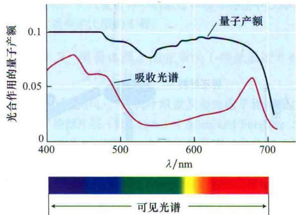  
图7.12 红降效应。生氧的量子产额（黑色曲线）在波长大于680 nm的远红外光区域大幅度下降，表明仅仅只有远红外光的话，不能有效驱动光合作用。500 nm处的轻微下降反映了辅助色素——类胡萝卜素吸收的光驱动的光合作用的效率稍低。

如果针对叶绿素吸收的光波测量量子产额，可发现在大多数区域内数值非常稳定，这表明由叶绿素或其他色素所吸收的光子和驱动光合作用的光子效率相同，但是在叶绿素吸收的远红区（大于680 nm处）量子产额却大幅度下降。

红降不可能是因为叶绿素吸收的下降引起，因为量子产额只计算实际被吸收的光。因此，波长大于680 nm 的光比更短波长的光的产氧效率要低得多。

另一个使人困惑的实验结果是双光增益效应（enhancement effect），也由R. Emerson发现。他在测量两种不同波长的光分别照射和这两种光同时照射的光合效率时发现（图7.13），当红光和远红光同时照射时，光合效率大于两者分别照射之和，这个结果令人惊讶。这个实验和其他的实验结果最终可由20世纪60年代发现的两个光化学复合物，即现在所谓的光系统Ⅰ（photosystem I）和光系统Ⅱ（photosystem Ⅱ）

  
时间  
图7.13 增益效应。当同时给予红光和远红光时，光合作用的效率大于分开给光的效率相加，这点在20世纪50年代得到证实。增益效应作为重要的证据，支持了光合作用是由两个串联但最适波长略有不同的光化学系统实现的设想。

（参见Web Topic 7.4）进行解释。这两个光系统依次作用，实现光合作用中早期的能量储存。

光系统Ⅰ主要吸收大于680 nm的远红光；光系统Ⅱ主要吸收680 nm的红光，对远红光的吸收很小。这种波长依赖性解释了双光增益效应和红降效应。这两个光系统另外的不同点如下。

（1）光系统Ⅰ产生了一个可还原 $NADP^{+}$ 的强还原剂和一个弱氧化剂。

（2）光系统Ⅱ产生了一个可以氧化水的强氧化剂，和一个比光系统Ⅰ产生的还原剂还要弱的还原剂。

由光系统Ⅱ产生的还原剂重新还原光系统Ⅰ产生的氧化剂，这两个光合系统的特性见图7.14。

图7.14所描述的光合作用的方案，是了解生氧光合生物的基础，称为Z（zigzag）方案。它解释了两个物理和化学性质上都有所不同、具有不同天线色素和光化学反应中心的光系统（PS I 和 PS II）究竟是如何起作用的。在Z方案中，这两个光合系统通过电子传递链相互联系。

  
图7.14 光合作用的Z方案。光系统Ⅱ（PSⅡ）吸收红光，产生一个强氧化剂和一个弱还原剂。光系统Ⅰ（PSⅠ）吸收远红光，产生一个弱氧化剂和一个强还原剂。PSⅡ产生的强氧化剂氧化水，而PSⅠ产生的强还原剂还原NADP $^{+}$ 。这个方案是理解光合作用中电子传递的基础。P680和P700各自表示PSⅡ和PSⅠ反应中心的叶绿素吸收最大的波长。

## 7.4 光合细胞器的构成

7.3节解释了光合作用中的物理学原理、不同色素的部分功能和光合生物进行的化学反应。接下来将论述光合细胞器及其组分的结构，并了解分子结构如何行使功能。

## 7.4.1 叶绿体是光合作用的场所

在光合真核生物中，光合作用发生在叶绿体中。图7.15显示豌豆叶绿体超薄切片的透射电镜照片。叶绿体中最引人注目的结构是类囊体（thylakoid）的内膜分支系统，所有叶绿素都被包含在这个膜系统中，它是光合作用中光反应的场所。

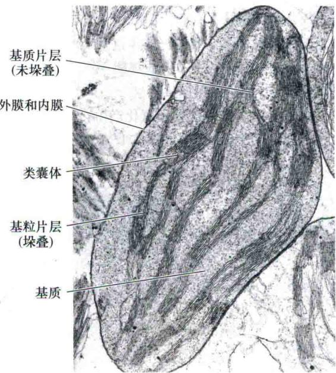  
图7.15 豌豆叶绿体的透射电镜照片，叶绿体用戊二醛和 $OSO_{4}$ 固定，以树脂包埋，用超薄切片机切片（14 500×）（J. Swafford惠赠）。

由水溶性酶催化的碳还原反应发生在基质（stroma）中，基质即叶绿体中类囊体外的部分。大多数类囊体彼此紧密连接，这些层层垛叠的膜称为基粒片层（grana lamellae）（每一层称为一个基粒）。暴露在基质中没有垛叠的膜称基质片层（stroma lamellae）。

大多数类型的叶绿体外包被着两层虽然分开、但都由脂双层组成的膜，合称被膜（envelop）（图7.16）。这个双膜系统包含了多种代谢产物的传递系统。叶绿体也有自己的DNA、RNA和核糖体。一些叶绿体蛋白是叶绿体DNA的转录和翻译产物；但其他大部分蛋白质由核DNA编码，在细胞质核糖体上合成，然后运进叶绿体。一个酶复合体的不同亚基有时也有这种显著分工，将在后面详细讨论。叶绿体的动力学结构参见Web Topic 7.1。

## 7.4.2 类囊体含有整合的膜蛋白

光合作用中许多关键蛋白质都镶嵌在类囊体膜上，有时这些蛋白质的一部分伸展到类囊体两侧的亲水区域中。这些膜整合蛋白（integral membrane protein）含有大量的疏水性氨基酸，它们在膜的非极性区域中更为稳定（图1.5 A）。

反应中心蛋白、天线色素-蛋白质复合体和多数电子载体蛋白都是膜整合蛋白。在所有已知的例子中，叶绿体的膜整合蛋白都以独特的方式定位在膜中。类囊体膜蛋白的一部分朝向基质，另一部分朝向类囊体的内侧，即内腔（图7.16和图7.17）。

类囊体膜上的叶绿素和辅助集光色素常以非共价但高度特异的方式与蛋白质连接，形成了色素-蛋白质复合体。天线和反应中心的叶绿素结合在位于膜中的蛋白质上，优化了天线复合体中的能量转移和反应中心的电子传递，减少了无谓的步骤。

## 7.4.3 类囊体膜上的光系统Ⅰ和光系统Ⅱ在空间上分离

PSⅡ反应中心、天线叶绿素及相关电子转运蛋白主要位于基粒片层（图7.18A）（Allen and Forsberg，2001）；PSⅠ反应中心、相关天线色素、电子转运蛋白及ATP合酶几乎都位于基质片层和基粒片层的边缘；电子传递链中负责连接两个光系统的细胞色素 $b_{6}$ f复合体（图7.18）在基质和基粒片层中均匀分布。图7.18B中显示了所有这些复合体的结构（Nelson and Ben-Shem，2004）。

  
图7.16 叶绿体膜结构的整体示意图。高等植物的叶绿体由内膜和外膜（被膜）包被。叶绿体内膜以内，围绕类囊体膜的区域称基质。基质含有碳固定和其他生物学合成途径的催化酶。类囊体膜高度折叠，在许多图片中看上去像叠起来的硬币（基粒），但实际上它们形成一个或几个大的相互连通的膜系统，相对于基质有界限明确的内部和外部（改编自Becker，1986）。

综上所述，生氧光合作用中的两个光化学反应事件在空间上是相互独立的。这种分离意味着在两个光系统间起作用的一个或多个电子载体会从膜的基粒区扩散到基质区，然后将电子传递到光系统Ⅰ，这些可扩散的载体是蓝色的含铜蛋白质——质体蓝素（PC）和有机氧化还原反应的辅助因子——质体醌（PQ），这些载体在后面将会详细论述。

在PSⅡ中，两个水分子氧化产生4个电子、4个质子和1个氧分子[见后面的方程式（7.8）]。由水氧化产

  
图7.17 预测的PSⅡ反应中心D1蛋白折叠方式。蛋白质以不对称的方式分布在类囊体膜上，富含疏水性氨基酸残基的肽链在膜的疏水部分跨膜5次，氨基端在膜的基质侧，羧基端则在内腔一侧（改编自 Trebst，1986）。

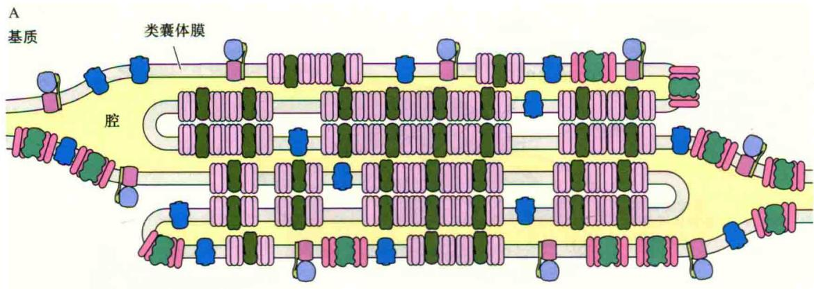

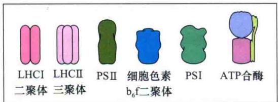

  
图7.18 类囊体膜上4个主要蛋白质复合体的组装和结构。A. 光系统Ⅱ主要位于类囊体膜的垛叠区域；光系统Ⅰ和ATP合酶则位于暴露在基质中的未垛叠区域；而细胞色素 $b_{6}f$ 复合体均匀分布。两种光系统的横向分隔使得光系统Ⅱ产生的电子和质子要运送相当长的距离后才能到达光系统Ⅰ和ATP偶联酶起作用。B. 类囊体膜上4种主要蛋白质复合体的结构。同时显示两种可扩散的电子载体——位于类囊体内腔的质体蓝素和位于膜上的质体氢醌（ $PQH_{2}$ ）。类囊体腔相对于基质（n，带负电）带正电荷（p）（A改编自Allen and Forsber，2001；B改编自Nelson and Ben-Shem，2004）。

生的质子也必须能够扩散到ATP合成所在的基质区。光系统Ⅰ和光系统Ⅱ间较大的空间间隔在功能上究竟有何意义还不完全清楚，但有人认为其可能提高了两个光系统间能量分配的效率（Allen and Forsberg，2001）。

光系统Ⅰ和光系统Ⅱ在空间上相互分离表明两个光系统间不需要有严格的一对一的化学计量学关系。PSⅡ反应中心向由脂溶性电子载体（质体醌）组成的共同中间库输送还原当量（在本章后面会详细讨论），PSⅠ反应中心则从共同库中获取还原当量，而不用从特定的PSⅡ反应中心复合体中得到。

多数测量光系统Ⅰ和光系统Ⅱ相对量的实验结果都表明，叶绿体中光系统Ⅱ是过量的。一般PSⅡ：PSⅠ为1.5：1，但当植物处于不同的光照条件下时，这个比例有可能改变。与真核光合生物的叶绿体中情况相反的是，蓝藻中的PSⅠ通常多于PSⅡ。

## 7.4.4 非放氧光合细菌只有一个反应中心

非放氧生物只含有一个类似光系统Ⅰ或光系统Ⅱ的光系统。这些简单的生物对于更好地了解生氧光合作用的结构和功能非常有帮助。在大多数情况下，这些不生氧的光系统只进行循环电子转运而没有发生净的氧化或还原反应。光子的部分能量被转化成为质子动力势（见后面内容），用来合成ATP。

光合紫细菌的反应中心是第一个以高分辨率进行结构测定的膜整合蛋白（Deisenhofer and Michel，1989）（参见Web Topic 7.5中图7.5A和图7.5B）。对其结构的详细分析和对多种突变体的研究，阐明了反应中心与能量储存过程相关的原理。

紫细菌反应中心的结构，特别是电子传递链中的电子受体，与生氧生物中的光系统Ⅱ有许多相似之处。组成细菌反应中心的核心蛋白质在序列上和光系统Ⅱ中的相应蛋白质较为相似，表明了进化上的相关性；相似的情况在不生氧的绿硫细菌和太阳细菌（heliobacteria）中也被发现，它们的反应中心和光系统Ⅰ很相似。在本章的后面将讨论这种进化关系的意义。

## 7.5 吸光天线系统的构造

进化上关系非常遥远的生物的反应中心也有一定的相似性；与此相反的是，不同光合生物的天线系统的差异却很大。天线复合体的这种差异反映了不同生物在不同环境下的适应性进化，也反映了在某些生物中平衡两个光系统的能量输入的需要（Grossman et al., 1995; Green and Durnford, 1996; Green and Pardson, 2003）。这一部分将了解这个系统如何吸收光能并向反应中心输送能量。

## 7.5.1 天线系统包含叶绿素，与膜连接

天线系统用于向相连的反应中心有效地输送能量（van Grondelle et al., 1994; Pullerits and Sundstrom, 1996）。不同生物的天线系统的大小有显著不同：一些光合细菌中每个反应中心只有20\~30个细菌叶绿素分子，高等植物中每个反应中心有200\~300个叶绿素分子，某些藻类和细菌中每个反应中心则有几千个色素分子。虽然天线色素分子都以某种方式和光合膜结合，但它们的结构有很大的不同。几乎所有的天线色素分子都与蛋白质连接形成色素-蛋白质复合物（pigment-protein complex）。

激发能从吸光叶绿素转移到反应中心的物理机制是荧光共振能量转移（fluorescence resonance energy transfer，FRET）。通过这种机制，激发能以非辐射的方式从一个分子转移到另一个分子。

为了方便理解共振能量转移，可用两个音叉间能量的转移作为类比。当敲击一个音叉并将它放在另一个音叉附近适当的位置时，第二个音叉将会接收到来自第一个音叉的能量并开始振动。两个音叉间能量转移的效率取决于它们彼此间的距离和相对位置，同时还有音调和振动频率。类似的因素可影响天线复合体间的能量转移，不过能量取代了音调。

天线复合体中的能量转移效率通常非常高：天线色素吸收的光子有95%\~99%的能量转移到了反应中心，然后被用于光化学反应。天线色素间的能量转移和反应中心的电子传递有很大不同：能量转移是一个纯粹的物理现象，而电子传递则与分子的化学变化相关，产生被氧化或被还原的物质。

## 7.5.2 天线分子将能量汇集到反应中心

天线色素将吸收的能量汇集到反应中心，从天线系统的外围到反应中心排列着不同的色素分子，它们的最大吸收波长逐渐红移（图7.19）。最大吸收波长的红移意味着靠近反应中心的激发态的能量低于天线系统周边。

这种排布的结果是，当激发能转移时，例如，从最大吸收为650 nm的叶绿素b分子转移到最大吸收为670 nm的叶绿素a分子时，这两个激发态叶绿素间的能量差异以热能的形式散失到环境中。

如果激发能反过来再转移回叶绿素b时，就必须重新补充作为热能损失的能量。由于可得到的热能不足以填补低能和高能色素间的能量差，因此逆转移的可能性很小。这种效应赋予了能量捕获过程一定的方向性或不可逆性，使得向反应中心输送激发能的效率更高。本质上，系统牺牲了每个量子中的一些能量，使得几乎所有量子都能被反应中心捕获。

## 7.5.3 许多天线复合体都有共同的结构基序

在所有含有叶绿素a和叶绿素b的真核光合生物中，含量最多的天线蛋白都是结构上具有相关性的一个蛋白质大家族的成员，其中一些蛋白质主要和光系统Ⅱ结合，称为捕光复合体Ⅱ（light-harvesting complex Ⅱ）（LHCⅡ）蛋白；另一些和光系统Ⅰ结合，称为LHCⅠ蛋白。这些天线复合体也称为叶绿素a/b天线蛋白（chlorophyll a/b antenna proteins）（Green and Durnford，1996；Green and Parson，2003）。

已测得一种LHCⅡ蛋白的结构（图7.20）（Liu et al., 2004；Barros and Kuhlbrandt, 2009）。这个蛋白

  
图7.19 激发能从天线系统向反应中心汇集。A. 色素激发态的能量随着离反应中心的距离增加而增加，就是说，靠近反应中心的色素比远离反应中心的色素能量低，这个能量梯度有利于激发能向反应中心的转移，而不利于能量反过来回到天线系统的外周部分。B. 这个过程中一些能量以热能的形式散失到环境中，但在最适条件下，几乎所有由天线复合体吸收的激发能都可被输送到反应中心。星号表示激发态。

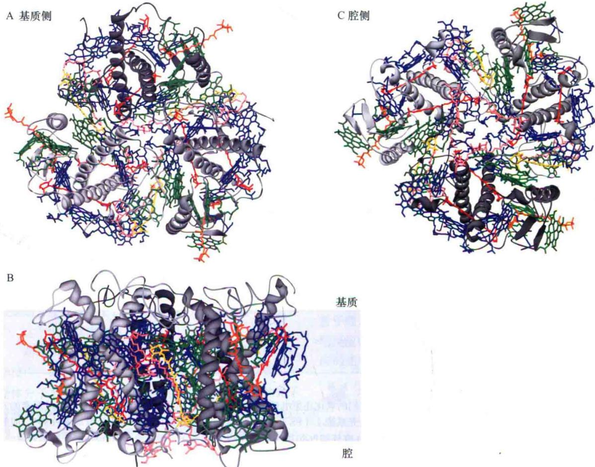  
图7.20 高等植物LHCⅡ天线复合体三聚体结构。天线复合体是一个跨膜的色素蛋白质，每个单体包含3个跨膜的非极性区域的螺旋。图中三聚体显示基质侧（A）、膜上部分（B）和腔侧（C）。灰色，多肽；深蓝色，叶绿素a；绿色，叶绿素b；深橙色，叶黄素；浅橙色，新黄质；黄色，紫黄质；粉红色，脂质（改编自Barros and Kuhlbrandt，2009）。

质含有3个α螺旋，结合了14个叶绿素a和叶绿素b及4个类胡萝卜素。LHC I蛋白的结构和LHC II蛋白的结构大致相似（Ben-Shem et al., 2003）。所有这些蛋白质都有显著的序列相似性，几乎可以肯定是由同一个祖先蛋白进化而来（Grossman et al., 1995；Green and Durnford, 1996；Green and Parson, 2003）。

光能被LHC蛋白中的类胡萝卜素或叶绿素b吸收后，将被快速转移到叶绿素a和其他紧密结合在反应中心的天线色素上。LHCⅡ复合体也参与了调节过程，在本章的后面将会讨论。

## 7.6 电子传递的机制

前面已经提到的一些证据表明两个光化学反应是依次作用的。这里将具体讨论光合作用中与电子传递有关的化学反应，即光对叶绿素的激发、第一个电子受体的还原、电子经过光系统Ⅱ和光系统Ⅰ的流动、作为电子主要来源的水的氧化和最后一个电子受体（NADP $^{+}$ ）的还原。并在“叶绿体中的质子转运和ATP合成”中具体讨论介导ATP合成的化学渗透机制。

## 7.6.1 从叶绿素来的电子流经按“Z方案”排列的载体

图7.21显示了目前公认的Z方案，图中将在从 $H_{2}O$ 到 $NADP^{+}$ 的电子传递中起作用的所有电子载体按照它们的氧化还原电势的高低在垂直方向排列（更多内容参见Web Topic 7.6），相互反应的组分用箭头相连。因此，Z方案实际上综合了动力学和热力学信息。垂直的粗箭头表示系统的光能输入。

光子激发了反应中心的特定叶绿素（PSⅡ中是P680，PSⅠ中是P700），释放一个电子，这个电子经过一系列的电子载体，最终还原P700（来自PSⅡ的电子）或NADP⁺（来自PSⅠ的电子）。接下来将着重阐述电子传递过程和载体的性质。

几乎所有光合作用的光反应化学过程都由4个主要的蛋白质复合体完成：光系统Ⅱ、细胞色素 $b_{6}f$ 复合体、光系统Ⅰ和ATP合酶。这4个膜整合蛋白质复合体以一定方向排列于类囊体膜上，发挥以下功能（图7.18和图7.22）。

（1）光系统Ⅱ在类囊体内腔中将水氧化为氧气，同时释放质子到内腔。

（2）细胞色素 $b_{6}f$ 氧化被PSⅡ还原的质体氢醌$\left(\mathrm{PQH}_{2}\right)$ 分子，并将电子传递给PS I。 $PQH_{2}$ 的氧化与质子从基质到内腔的转移相偶联，产生了质子动力势。

图7.21 放氧光合生物的Z方案。氧化还原载体按它们的氧化还原电势（pH 7时）排列。①垂直箭头表示反应中心叶绿素的光子吸收：P680是光系统Ⅱ（PSⅡ）的叶绿素；P700是光系统Ⅰ（PSⅠ）的叶绿素。被激发的PSⅡ反应中心叶绿素P680\*，向脱镁叶绿素（Phco）转移一个电子。②在PSⅡ的氧化侧（在连接P680和P680\*的箭头的左侧），被光氧化的P680由Y₂重新还原，Y₂从水的氧化中得到一个电子。③在PSⅡ的还原侧（在连接P68和P680\*的箭头的右侧），脱镁叶绿素将电子转移给受体——质体醌Q₄和Q₈。④细胞色素b₆f复合体将电子转移给一种可溶性蛋白——质体蓝素（PC），后者接着还原P700\*（即氧化的P700）。⑤P700\*的电子受体（A₀）被认为是一种叶绿素，下一个受体（A₁）则是醌，经过一系列膜结合铁硫蛋白（FeSₓ、FeSₐ和FeSₑ）后，电子被转移给可溶性铁氧还蛋白（Fd）。⑥可溶性黄素蛋白铁氧还蛋白-NADP还原酶（FNR）将NADP+还原为NADPH，NADPH在卡尔文循环中被用于二氧化碳的还原（见第8章）。虚线表示围绕PSⅠ的循环电子流（改编自Blankenship and Prince，1985）。  
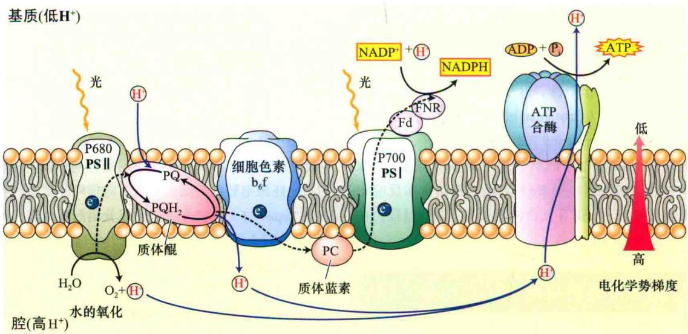  
图7.22 类囊体膜中4个蛋白质复合体定向地完成电子和质子的转移（结构见图7.18B）。PSⅡ实现水的氧化和质子在内腔中的释放；PSⅠ通过铁氧还蛋白（Fd）和黄素蛋白铁氧还蛋白-NADP还原酶（FNR）的作用，将基质里的NADP+还原成NADPH；质子通过细胞色素b $_{6}$ f复合体的作用转运到内腔，增加了电化学质子梯度。这些质子随后扩散到达ATP合酶，在这里，它们顺着电化学势梯度扩散，促进ATP在基质中的合成；被还原的质体氢醌（PQH $_{2}$ ）和质体蓝素将电子分别转移给细胞色素b $_{6}$ f和PSⅠ。虚线表示电子转移；实线表示质子的移动。

（3）光系统Ⅰ通过铁氧还蛋白（Fd）和黄素蛋白铁氧还蛋白-NADP还原酶（FNR）的作用，在基质中将NADP $^{+}$ 还原成NADPH。

（4）当质子通过ATP合酶从内腔扩散回到基质中时，合成ATP。

## 7.6.2 当激发的叶绿素还原电子受体时能量被捕获

正如前文所提及，光的功能是激发反应中心特定的叶绿素，该功能可以通过直接吸收能量，或者以一种更常见的方式——转移天线色素的能量来实现。此激发过程可以被视为电子从叶绿素的外层最高能级轨道跃迁至最低能级空轨道（图7.23）。高能轨道上的电子只是松散地结合在叶绿素上，只要附近有一个能接受电子的分子，这个电子就很容易丢失。

将电子能量转变为化学能的第一个步骤是原初光化学反应，即电子从反应中心的激发态叶绿素转移到一个受体分子上。这个过程也可以这样理解：被吸收的光子导致反应中心叶绿素的电子重排，随后通过电子传递过程，使得一部分光子能量以氧化还原的形式被捕获。

紧随原初光化学反应之后，反应中心的叶绿素被氧化（缺电子，或带正电），而附近的电子受体分子被还原（富电子，或带负电），在此关键时刻，反应中心带正电的被氧化叶绿素的低能级轨道是空的，可以接受一个电子（图7.23）。如果受体分子将它的电子交回给反应中心的叶绿素的话，系统将回到光激发之前的状态，所有吸收的能量将转为热能。

反应中心叶绿素基态和激发态的氧化还原性质  
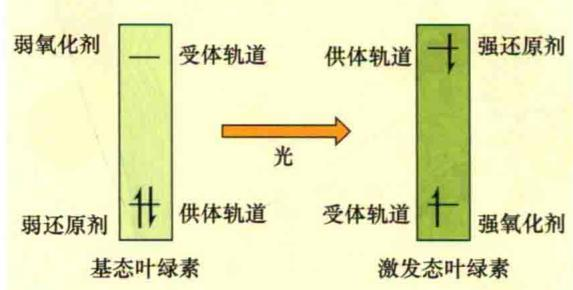  
图7.23 反应中心叶绿素基态和激发态的轨道填充图。处于基态的分子是弱还原剂（从低能轨道失去电子）和弱氧化剂（只能在高能轨道接受电子）。在激发态时情况相反，可从高能轨道失去电子，分子变成一个极强的还原剂，这就是图7.21中P680\*和P700\*表现出极高的激发态负氧化还原电势的原因。激发态也能作为强氧化剂在低能轨道接受电子，但这个途径在反应中心不常见（改编自Blankenship and Prince，1985）。

显然，以上这个回复过程是浪费能量的，它在反应中心并未发生。相反，受体将富余的电子传递给次级受体，并沿着电子传递链传递下去。因提供一个电子而被氧化的叶绿素反应中心被次级供体重新还原，次级供体又被三级供体还原。在植物中，最初的电子供体是水，而最终的电子受体是NADP $^{+}$ （图7.21）。

光合储能的本质是电子首先从一个被激发的叶绿素分子转移到受体分子上，然后经历一系列极快速的次级化学反应将正负电荷分离开来，这些次级反应在大约200 ps内将电荷分离到类囊体膜相对的两侧（ $1ps=10^{-12}s$ ）。

随着电荷的分离，逆反应也随之减慢了好几个数量级，能量被捕获。每一次次级电子转移都伴随着一些能量的损失，使得过程不能逆转。纯化得到的光合细菌反应中心产生稳定产物的量子产额约为1.0，就是说，所有光子都产生稳定的产物，没有逆反应发生。

在最适条件（低光强）下测量高等植物产生氧气的量子需求发现，原初光化学反应的值也很接近1.0，表明反应中心的结构受到非常巧妙的调控，以确保有效反应的速率最大，而浪费能量的反应速率最小。

## 7.6.3 两个光系统反应中心的叶绿素吸收不同波长的光

本章的前面已经提到，PS I 和 PS II 各自有不同的吸收特性。反应中心叶绿素处于还原态和氧化态时的光学特性变化，使得精确测量最大吸收值成为可能。反应中心叶绿素在失去一个电子且未被电子供体重新还原以前短暂地处于氧化态。

处于氧化态时，叶绿素强烈吸收红光的特征消失，称为被漂白（bleached）。漂白状态的出现可以通过实时的光吸收测量来监控，从而可推断这些叶绿素的氧化还原状态（参见Web Topic 7.1）。

利用这些技术，发现光系统Ⅰ反应中心的叶绿素处于还原态时，在700 nm波长处吸收最强，因此将该叶绿素命名为P700（P表示色素）；光系统Ⅱ的叶绿素则在680 nm处吸收最强，相应的反应中心叶绿素称P680；在这以前，光合紫细菌的反应中心叶绿素称为P870。

细菌反应中心的X射线衍射结构图清楚地显示P870是由细菌叶绿素紧密偶联而成的二聚体，而非单体（参见Web Topic 7.5图7.5A和B）；光系统Ⅰ的原初电子供体P700也是叶绿素a分子的二聚体；光系统Ⅱ也包含了一个叶绿素二聚体，尽管原初的电子转运可能并不源自这些色素。

处于氧化态时，反应中心叶绿素包含了一个未配对电子。具有未配对电子的分子常常可以通过称为电子自旋共振（electron spin resonance，ESR）的磁共振技术检测到。通过ESR研究和前面已述及的光谱测量研究，可以发现光合电子传递系统中存在的许多中间电子载体。

## 7.6.4 光系统Ⅱ的反应中心是一个多亚基的色素蛋白复合体

光系统Ⅱ是一个多亚基蛋白超复合体（图7.24）（Barber et al., 1999）。在高等植物中，这个多亚基蛋白超复合体有两个完整的反应中心和一些天线复合体。反应中心的核心由两个称为D1和D2的膜蛋白和其他蛋白质组成，见图7.25和Web Topic 7.7（Ferreira et al., 2004；Guskov et al., 2009）。

原初供体叶绿素、其他叶绿素、类胡萝卜素、脱镁叶绿素和质体醌（这两个电子受体将在下一节中述及）都结合在膜蛋白D1和D2上，这些蛋白质在序列上与紫细菌的L、M肽有相似性；其他蛋白质可作为天线复合体起作用，或者参与生氧过程；另一些蛋白质如细胞色素 $b_{559}$ 功能未知，但可能参与围绕光系统Ⅱ的保护循环。

## 7.6.5 水由光系统Ⅱ氧化为氧气

水按下列化学反应式被氧化（Yano et al., 2006）。

$$
2 \mathrm{H} _ {2} \mathrm{O} \longrightarrow \mathrm{O} _ {2} + 4 \mathrm{H} ^ {+} + 4 \mathrm{e} ^ {-}\tag{7.8}
$$

此方程式表明，2个水分子失去4个电子后，产生一个氧分子和4个质子（需要了解更多氧化还原反应知识的话，见附录1和Web Topic 7.6）。

水是一种非常稳定的分子，将水氧化成为氧分子极其困难，光合生氧复合体是唯一已知的可使这个反应进行的生物化学系统。光合生氧也是地球大气层中几乎所有氧气的来源。

多项研究揭示了这个反应过程的大量信息（参见Web Topic 7.7）。水氧化产生的质子被释放到类囊体内腔而不是基质中（图7.22）。质子被释放到内腔与类囊体膜的矢量性质和生氧复合体位于类囊体内表面有关，这些质子最终通过ATP合酶的转运作用从内腔回到基质。就这样，水氧化所释放的质子增加了电化学势，驱动了ATP的合成。

人们很早就知道，锰（Mn）是水氧化过程中的重要辅助因子（见第5章）。研究光合作用的一个经典假说就是：锰离子发生一系列氧化（即S态，标记为 $S_{0}$ 、 $S_{1}$ 、 $S_{2}$ 、 $S_{3}$ 、 $S_{4}$ ，参见Web Topic 7.7）——可能和水的氧化及氧气的生成有关。这个假说得到了大量实验的有力支持。最有名的是X射线吸收和ESR研究，因为这两个实验都直接检测到了锰的存在（Yano et al.,

  
图7.24 电子显微镜下高等植物光系统Ⅱ的二聚体多亚基蛋白超复合体的结构。图片显示了两个完整的反应中心，每个都是一个二聚体。A. D1和D2（红）及CP43和CP47（绿）核心亚基呈螺旋排列。B. 从超复合体的内腔侧面观察，包含其他天线复合体：LHCⅡ、CP26、CP29和一个以橙色和黄色环表示的外周生氧复合体。未知功能的螺旋以灰色表示。C. 复合体的侧视图，显示外周蛋白生氧复合体的排列（改编自Barber et al., 1999）。

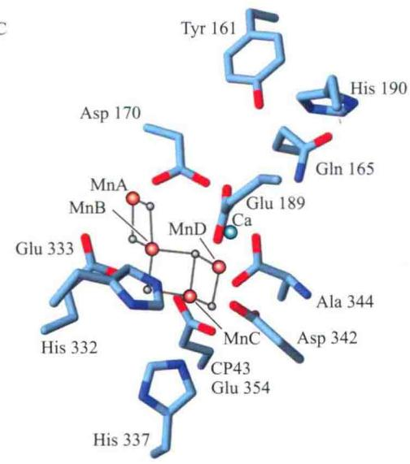  
图7.25 蓝藻Thermosynechococcus elongatus光系统Ⅱ反应中心的结构，分辨率为3.5 Å。结构中包括D1（黄）和D2（橙）反应中心核心蛋白、CP43（绿）和CP47（红）天线蛋白、细胞色素 $b_{559}$ 和细胞色素 $c_{550}$ 、外周的33 kDa的生氧蛋白PsbO（蓝）、色素和其他辅助因子。A.与膜平面平行的侧视图。B.与膜平面垂直的内腔表面视图。C.分解水的含锰复合体的详细示意图（A，B改编自Ferreira et al., 2004；C改编自Yano et al., 2006）。

1996）。分析结果表明，每个生氧复合体结合了4个 $\mathrm{Mn}^{2+}$ 。另有实验表明 $\mathrm{Cl}^{-}$ 和 $\mathrm{Ca}^{2+}$ 是生氧所必需的（参见Web Topic 7.7）。将水氧化成氧气的具体化学机制还不十分清楚，但有了这些结构信息，该领域的发展非常迅速（Brudvig，2008）。

在放氧复合体和P680之间，有一个称为 $Y_{z'}$ 的电子载体起作用（图7.21）。为了能在这个区域发挥作用， $Y_{z'}$ 需要有非常强烈的保留电子的能力，已确定该载体是PSⅡ反应中心的D1蛋白的酪氨酸残基形成的自由基。

## 7.6.6 脱镁叶绿素和两个醌从光系统Ⅱ接受电子

光谱学和ESR研究揭示了电子受体复合物中载体的结构方式，脱镁叶绿素（pheophytin）是中心镁原子被两个氢原子取代的叶绿素，在光系统Ⅱ中作为早期受体起作用，其化学和光谱学性质与结合镁的叶绿素略有不同。脱镁叶绿素将电子传递给含有两个十分靠近的铁原子的质体醌复合物，这个过程与紫细菌反应中心所发生的反应非常相似（详情请见Web Topic 7.5中的图7.5B）。

两个质体醌（ $\mathrm{PQ}_{\mathrm{A}}$ 和 $\mathrm{PQ}_{\mathrm{B}}$ ）结合在反应中心，并依次从脱镁叶绿素中接受电子。2个电子转移到 $\mathrm{Q}_{\mathrm{B}}$ 上，使其还原成 $\mathrm{PQ}^{2-}$ ，还原的 $\mathrm{PQ}^{2-}$ 从基质得到两个质子，产生一个被完全还原的质体氢醌（plastohydroquinone）（ $\mathrm{PQH}_{2}$ ）（图7.26）。质体氢醌随后从反应中心复合体上解离，进入膜的碳氢链区域，在这里将电子交给细胞色素 $\mathbf{b}_{6}\mathbf{f}$ 复合体。与类囊体膜上的大分子蛋白质复合体不同，质体氢醌是一种非极性的小分子，很容易扩散到膜的脂双层的非极性核心。

## 7.6.7 经过细胞色素 $b_{6}f$ 复合体的电子流也转运质子

细胞色素 $b_{6}f$ 复合体（cytochrome $b_{6}f$ complex）是一个庞大的具有几个辅助因子的多亚基蛋白质（图7.27）（Kurisu et al., 2003；Sroebel et al., 2003；Baniwlis et al., 2008）。它包含了两个b型的血红素和一个c型的血红素（细胞色素f，cytochrome f）。在c型细胞色素中，血红素和肽链共价连接；但b型细胞色素中化学性质相似的正铁血红素却未进行共价连接（参见Web Topic 7.8）。另外，复合体还包含了一个Rieske铁硫蛋白（Rieske iron-sulfur protein，以发现它的科学家命名），该蛋白质中两个铁原子由两个硫原子桥接。所有这些辅助因子的功能都已明确，下面将进行阐述。除此之外，细胞色素 $b_{6}f$ 复合体也包含了其他的辅助因子，包括另一个血红素（称血红素Cn）、一个叶绿素和一个类胡萝卜素，它们的功能还有待研究。

细胞色素 $b_{6}f$ 复合体和相关细胞色素bc1的结构暗示了电子和质子流动的机制。质子和电子流经细胞色素 $b_{6}f$ 复合体的确切途径还不完全清楚，但可以用Q循环（Q cycle）来解释多数观察到的现象。在这个机制中，质体氢醌被氧化，两个电子中的一个通过线性电子传递链传到光系统I，而另一个则流经一个可以增加泵过膜的质子数的环形途径（图7.28）。

在线性电子传递链中，氧化的Rieske铁硫蛋白（ $\mathrm{FeS}_{\mathrm{R}}$ ）从 $\mathrm{PQH}_{2}$ 接受一个电子并将它传递到细胞色素f上（图7.28A）。细胞色素f随即将一个电子传给蓝色的含铜蛋白质——质体蓝素（PC），PC再还原PSI中被图7.27 蓝藻细胞色素 $b_{6}f$ 复合体的结构。右侧图显示复合物中蛋白质和辅助因子的空间排列。细胞色素 $b_{6}$ 蛋白以蓝色表示，细胞色素f蛋白以红色表示，Rieske铁硫蛋白以黄色表示，其他小的亚基以绿色和紫色表示。左侧图中蛋白质被省略以更清楚地显示辅助因子的位置。[2Fe-2S]簇，是Rieske铁硫蛋白的一部分；PC，质体蓝素；PQ，质体醌； $PQH_{2}$ ，质体氢醌（改编自Kurisu et al., 2003）。

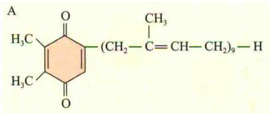  
质体醌

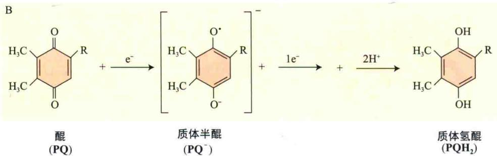  
图7.26 光系统Ⅱ中质体醌的结构和反应式。A. 质体醌由一个醌组成的头和一条可以锚着在膜上的非极性尾巴组成。B. 质体醌的氧化还原反应，显示完全氧化的醌（PQ）、带负电的质体半醌（ $\mathrm{PQ}^{-}$ ）和被还原的质体氢醌（ $\mathrm{PQH}_{2}$ ）。R为侧链。

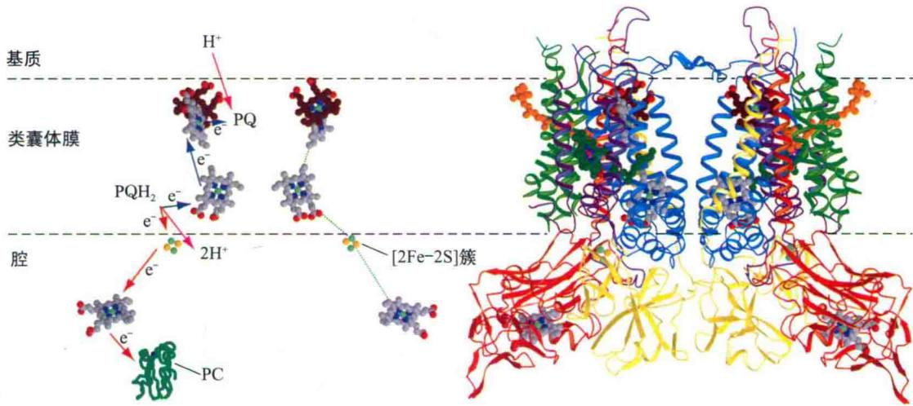

A 第一个 $\mathrm{PQH}_2$ 被氧化

B 第二个 $\mathrm{PQH}_{2}$ 被氧化

图7.28 细胞色素 $b_{6}f$ 复合体中电子和质子的转移机制。这个复合体包含了两个b型的细胞色素（Cyt b）和一个c型细胞色素（Cyt c，以前称细胞色素f）、一个Rieske铁硫蛋白（ $FeS_{R}$ ）和两个醌氧化还原位点。A. 非循环或线性过程：由PSⅡ（图7.26）产生的一个质体氢醌（ $PQH_{2}$ ）分子在复合体靠近内腔的一侧被氧化，两个电子被转移给一个Rieske铁硫蛋白和一个b型细胞色素，同时释放两个质子到内腔。转移给 $FeS_{R}$ 的电子经过细胞色素f（Cyt f）和质体蓝素（PC），还原了PSⅠ的P700；被还原的b型细胞色素把电子转移给另一个b型细胞色素，将一个质体醌（PQ）还原成质体半醌（ $PQ^{-}$ ）（图7.26）。B. 循环过程：第二个 $PQH_{2}$ 被氧化，将一个电子经 $FeS_{R}$ ，传给PC，最后到P700；第二个电子经过两个b型细胞色素将质体半醌又还原为 $PQH_{2}$ ，同时从基质中获得两个质子。总之，每转运两个电子到P700就有4个质子跨膜。

氧化的P700；而在此过程的循环部分（图7.28B），质体氢醌（图7.26）将另一个电子传递给了一个细胞色素b，并将它的2个质子释放到膜的内腔。

电子经第一个和第二个细胞色素b后传递至一个氧化型的质体醌分子，质体醌在复合体靠近基质的表面被还原为半醌形式。经过两次这样的电子传递可将质体醌完全还原。质体醌从膜的基质侧得到质子，以质体氢醌的形式从 $b_{6}f$ 复合体中释放。

这个复合体的两次作用使得两个电子被转移到了P700，两个质体氢醌被氧化成质体醌，一个氧化型质体醌被还原成质体氢醌。在整个氧化过程中，4个质子从膜的基质侧被转移到了内腔。

通过这种机制，连接PSⅡ反应中心受体侧和PSⅠ反应中心供体侧的电子流造成了跨膜的电化学势，部分归结于膜两侧质子浓度的差异，这种电化学势被用于驱动ATP的合成。与线性电子流相比，经过细胞色素b和质体醌的循环电子流泵出的质子数更多。

## 7.6.8 质体醌和质体蓝素在光系统Ⅱ和光系统Ⅰ间转移电子

两个光系统处于类囊体膜上不同位置（图7.18），需要至少一个组分能沿着膜或在膜内移动，以便将光系统Ⅱ产生的电子输送到光系统Ⅰ。尽管细胞色素 $b_{6}f$ 复合体在膜的基粒和基质区均匀分布，但它体积太大，不太可能移动。而小分子质体醌或质体蓝素，或者两者一起被认为是连接两个光系统的移动载体。

质体蓝素（plastocyanin）（PC）是一个小的（10.5 kDa）水溶性的含铜蛋白质，能够在细胞色素 $b_{6}f$ 复合体和P700间转移电子，这种蛋白质存在于腔内（图7.28）。在某些绿藻和蓝藻中，c型细胞色素可以代替质体蓝素起作用，但究竟利用哪一种，由生物体可得到的铜的量决定。

## 7.6.9 光系统 I 反应中心还原NADP $^{+}$

PSⅡ中，尽管天线叶绿素与反应中心连接，但两者是以分离的色素-蛋白质形式存在。与PSⅡ不同的是，PSⅠ反应中心复合体是一个大的多亚基复合体（图7.29）（Jordan et al., 2001；Ben-Shem et al., 2003），由100个叶绿素分子组成的核心天线整合在PSⅠ的反应中心；PSⅠ的核心天线和P700结合在两个蛋白质——PsaA和PsaB上，它们的分子质量为66\~70 kDa（参见Web Topic 7.8）（Amunts and Nelson, 2009）。豌豆的PSⅠ反应中心复合体除了有与蓝藻相似的核心结构外，还包含4个LHCⅠ复合体（图7.29）。复合体中总的叶绿素分子数目接近200。

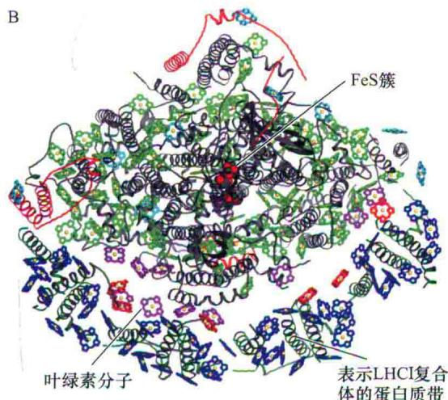  
图7.29 光系统Ⅰ的结构。A. 高等植物的PSⅠ反应中心的结构模型。PSⅠ反应中心的组分围绕着两个大的核心蛋白质PsaA和PsaB排列。从PsaC到PsaN的小蛋白质被标记为C\~N。电子从质体蓝素（PC）转移到P700（图7.21和图7.22），再到叶绿素分子（ $A_{0}$ ），然后到叶绿醌（ $A_{1}$ ），再到Fe-S中心： $FeS_{x}$ 、 $FeS_{A}$ 和 $FeS_{B}$ ，最后到达可溶性铁硫蛋白：铁氧还蛋白（Fd）。B. 分辨率为4.4Å时，豌豆光系统Ⅰ反应中心复合体的结构，包括了LHCⅠ天线复合体。此图是膜的基质侧视图（A改编自Buchanan et al., 2000；B改编自Nelson and Ben-shem, 2004）。

核心天线色素形成了一个围绕着电子传递链辅助因子的碗状结构，处于复合体中心。这些核心天线色素在光系统Ⅰ受体区域起电子载体的作用，它们的还原态都是非常强的还原剂，且相当不稳定，因此很难鉴定。有证据表明这些早期受体中有一个是叶绿素分子，另一个是醌类——叶绿醌，也称维生素K $_{1}$ 。

其他的电子受体包括3个膜结合的铁硫蛋白，也称Fe-S中心（Fe-S center）： $FeS_{X}$ 、 $FeS_{A}$ 和 $FeS_{B}$ （图

7.29）。Fe-S中心X是P700结合蛋白的一部分；中心A和B位于PS I反应中心复合体中的8 kDa蛋白上。电子经过中心A和B到达铁氧还蛋白（ferredoxin）（Fd）——一种小的水溶性铁硫蛋白（图7.21和图7.29）。膜结合黄素蛋白铁氧还蛋白-NADP还原酶（ferredoxin-NADP reductase）（FNR）将NADP $^{+}$ 还原为NADPH，完成了从水氧化开始的非循环式电子传递过程（Karplus et al., 1991）。

除了还原NADP $^{+}$ ，光系统Ⅰ产生的还原型铁氧还蛋白在叶绿体中还有其他功能，如为还原硝酸盐提供还原剂，以及参与一些碳固定酶的调控（见第8章）。

## 7.6.10 循环电子流产生ATP但不产生NADPH

光系统 I 位于基质类囊体膜上，这个区域中还发现了一些细胞色素 $b_{6}f$ 复合体。在某些情况下，循环电子流（cyclic electron flow）发生于光系统 I 的还原侧，经过质体氢醌和 $b_{6}f$ 复合体回到 P700，这个循环电子流与质子泵入内腔相偶联，这些质子可用于合成 ATP 但不能用于氧化水或还原 NADP $^{+}$ 。循环电子流作为合成 ATP 的能量来源，在某些进行 C $_{4}$ 固定的植物的维管束鞘叶绿体中尤为重要（见第 8 章）。循环电子流的分子机制还不甚清楚，调节此过程的一些蛋白质刚被发现，其研究热度还在继续中。

## 7.6.11 某些除草剂阻断光合电子流

在现代农业中，已经非常普遍地使用除草剂来除去杂草。现已有多种不同的除草剂，它们通过阻断氨基酸、类胡萝卜素及脂类的生物合成，或者干扰细胞分裂来起作用。其他除草剂，如二氯苯基二甲基脲（DCMU，也称敌草隆）和百草枯，则是通过阻断光合作用电子流起作用（图7.30）。

DCMU通过竞争质体醌 $PQ_{B}$ 的结合位点来发挥作用，在光系统Ⅱ的醌受体这一步阻断电子传递。百草枯则是通过从光系统Ⅰ的初始受体中接受电子，与氧反应生成超氧化合物 $O_{2}^{-}$ 来发挥作用。 $O_{2}^{-}$ 对叶绿体的组分，特别是脂类具有很强的破坏作用。

## 7.7 叶绿体中的质子转运和ATP合成

在前面几节中，了解了捕获的一部分光能如何将 $\mathrm{NADP^{+}}$ 还原成NADPH；另一部分光能则被用于ATP合成，称为光合磷酸化（photophosphorylation）。20世纪50年代，Daniel Arnon和他的同事发现了这个过程。尽管在有些情况下电子传递和光合磷酸化可以独立发生，但正常情况下的光合磷酸化是需要电子传递的；未伴随磷酸化的电子传递称为解偶联（uncoupled）。

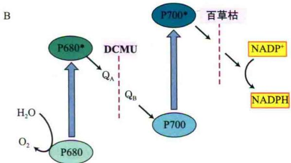  
图7.30 两种重要除草剂的化学结构和作用机制。A.二氯苯基二甲基脲（DCMU）和甲基紫精（百草枯）是两种阻碍光合电子流的除草剂，DCMU也称敌草隆。B.两种除草剂的作用位点。DCMU通过与质体醌竞争结合位点，在光系统Ⅱ的醌受体位点阻碍电子传递。百草枯则是通过从光系统I的初始受体上接受电子从而起阻断作用。

现在已广泛认为光合磷酸化是通过化学渗透机制（chemiosmotic mechanism）实现的。该机制在20世纪60年代首先由Peter Mitchell提出。在细菌和线粒体的有氧呼吸中，相同的机制驱动了磷酸化（见第11章），也驱动了很多离子和代谢产物的跨膜运输（见第6章）。化学渗透机制存在于所有生命形式的跨膜过程中。

在第6章中讨论了细胞质膜ATP酶在化学渗透和离子转运中的功能。质膜ATP酶需要的ATP由叶绿体的光合磷酸化和线粒体的氧化磷酸化作用合成。以下将讨论叶绿体中用于合成ATP的化学渗透机制和跨膜质子浓度差异。

化学渗透的基本原理是：跨膜的离子浓度差异和电势能差异为细胞提供可利用的自由能。根据热力学第二定律（具体见附录1中的内容），任何物质或能量的不均匀分布都是一种能量来源，在膜的两侧任何浓度不等的分子所产生的化学势（chemical potential）差异都能提供这样的能量来源。

前面讨论了光合膜的不对称性，以及伴随着电子传递发生的从膜的一侧到另一侧的质子转运。质子跨膜转运的方向性使得基质碱性更强（质子少），腔内酸性更强（质子多）（图7.22和图7.28）。

Andre Jagendorf和同事进行了一个巧妙的实验，为ATP合成的化学渗透机制提供了早期证据（图7.31）。

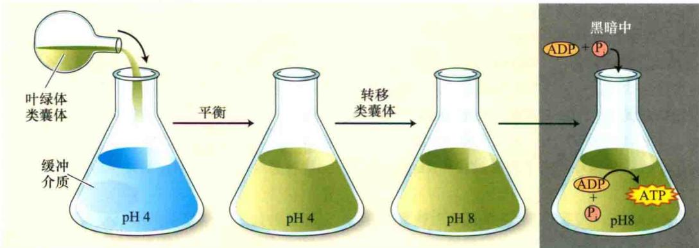  
图7.31 Ardre Jagendorf等的实验简要示意图。原先在pH 8的溶液中的离体叶绿体类囊体被置于pH 4的酸性溶液中平衡，之后被转移到含有ADP和P的pH 8的缓冲液中，由此产生的质子梯度为无光情况下的ATP合成提供了驱动力。此实验证实了化学渗透理论的预测结果——跨膜化学势可为ATP合成供能（改编自Jagendorf，1967）。

他们将叶绿体的类囊体悬浮在pH 4的缓冲液中，待缓冲液充分扩散过膜后，类囊体的内外部在这种酸性pH条件下得到平衡，然后将类囊体快速转移到pH 8的缓冲液中，使得类囊体膜内外产生4个pH单位的差异，膜内相对于膜外酸性更强。

他们发现，在没有光照或电子传递的情况下，由ADP和 $P_{i}$ 合成了大量ATP。这些结果支持了下面将要描述的化学渗透假说。

Mitchell认为，用于ATP合成的总能量，即质子动力势（proton motive force）（ $\Delta p$ ），是质子化学势和跨膜电势能之和。膜外到膜内的质子动力势的两部分能量可由式（7.9）表示。

$$
\Delta p = \Delta E - 5 9 (\mathrm{pH} _ {\mathrm{i}} - \mathrm{pH} _ {0})\tag{7.9}
$$

式中， $\Delta E$ 为跨膜电势； $pH_{i}-pH_{0}$ （或者 $\Delta pH$ ）为跨膜pH差（ $pH_{i}$ 为类囊体外的pH， $pH_{0}$ 为类囊体内的pH）。比例常数（25℃时）为每pH单位59 mV，因此pH跨膜差异为1时相当于59 mV膜势能。

除了前面提到的需要移动的电子载体，光系统Ⅱ和光系统Ⅰ、ATP合酶在类囊体膜中的不均匀分布也给ATP的合成带来了一定的麻烦。由于ATP合酶只发现于基质片层和基粒垛叠的边缘，由细胞色素 $b_{6}f$ 复合体跨膜泵入类囊体的质子，或者在基粒中部由水氧化产生的质子必须横向移动几十纳米，才能到达ATP合酶。

ATP由一个大（400 kDa）的酶复合体合成，这种酶称为ATP合酶（ATP synthase）、ATP酶（ATPase）（根据逆反应ATP水解命名）或 $CF_{0}-CF_{1}$ （Boyer，1997）。这个酶由两部分组成：与膜结合的疏水部分 $CF_{0}$ ；伸进基质的部分 $CF_{1}$ （图7.32）。 $CF_{0}$ 形成了供质子通过的一个跨膜通道。 $CF_{1}$ 由几条肽链组成，含有交错排列的 $\alpha$ 链和 $\beta$ 链各3条，看上去像个橙子。催化位点主要位于 $\beta$ 链，其他一些链可能有调节功能。在复合体中 $CF_{1}$ 的功能是合成ATP。

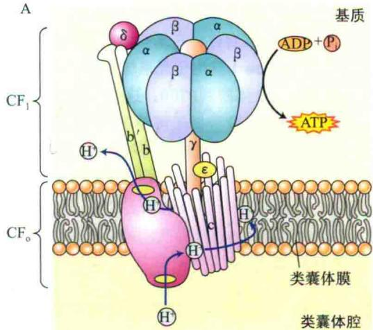

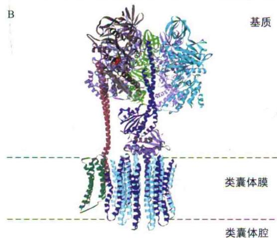  
图7.32 $F_{1}F_{0}-ATP$ 合酶的亚基构成（A）和晶体结构（B）。此酶由 $CF_{1}$ 和 $CF_{0}$ 组成。 $CF_{1}$ 是一个大的多亚基复合体，它在膜的基质侧，与整合在膜中的部分 $CF_{0}$ 相连。 $CF_{1}$ 由5种不同肽链组成，数量为3个 $\alpha$ ，3个 $\beta$ ，1个 $\gamma$ ，1个 $\delta$ ，1个 $\varepsilon$ 。 $CF_{0}$ 可能由4种不同肽链组成，数量为1个 a，1个 b，1个 $b'$ ，14个 c。内腔中的质子由旋转的c肽运输到基质（W. Frasch 惠赠）。

利用X射线晶体衍射方法已测出线粒体ATP合酶的分子结构。尽管叶绿体和线粒体酶的差别很大，但它们

有相同的总体结构和近乎相同的催化位点。事实上，在叶绿体、线粒体和紫细菌中，电子传递和质子跨膜转运偶联方式都有显著的相似性（图7.33）。另外，ATP合酶内部的柄和 $CF_{0}$ 的大部分在催化时旋转（Yasuda et al., 2001），是该酶作用机制中一个值得注意的地方。这种酶实际上可视为一个微型分子马达（参见Web Topic 7.9和Web Topic 11.4）。酶每转一圈合成3分子ATP。

针对叶绿体ATP合酶 $CF_{0}$ 部分的直接显微成像结果表明，它含有14个整合在膜中的亚基。复合体每旋转一次，每个亚基就跨膜转运一个质子，意味着质子跨膜转

## A紫细菌

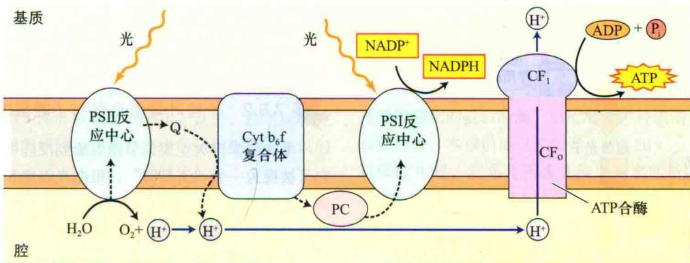

## C 线粒体

图7.33 细菌、叶绿体和线粒体中光合和呼吸电子流的相似性。在以上3种电子流中，电子传递都与质子跨膜转运相偶联，产生了跨膜质子动力势（ $\Delta p$ ）。质子动力势中的能量被ATP合酶用于合成ATP。A. 光合紫细菌的反应中心具有循环电子流，通过细胞色素 $\mathrm{bc}_{1}$ 复合体产生质子势能。B. 叶绿体具有非循环电子流，氧化水，还原 $\mathrm{NADP}^{+}$ ，质子由水的氧化和细胞色素 $\mathrm{b}_{6}\mathrm{f}$ 复合体氧化 $\mathrm{PQH}_{2}$ （图中标为“Q”）产生。C. 线粒体将NADH氧化为 $\mathrm{NAD}^{+}$ ，并将氧气还原为水，质子由NADH脱氢酶、细胞色素 $\mathrm{bc}_{1}$ 复合体和细胞色素氧化酶泵出。3个系统中ATP合酶的结构非常相似。

运和ATP形成的比例是14/3或4.67，但实际测量值经常低于该值，原因尚不明确。

## 7.8 光合作用系统的修复和调节

光合系统面临着一些特殊的考验，它虽可吸收大量光能并将其转化为化学能，但在分子水平上，光子的能量可能具有破坏性，尤其是在逆境下。光能过量时会产生一些有害物质，如超氧化物、单线态氧和过氧化物；如果不能安全地散失这些光能，就会对系统造成损伤（Asada，1999；Li et al., 2009），因此光合生物具有复杂的调节和修复机制。

有些机制可以调节天线系统中的电子流，防止反应中心的过度激发和确保两个光合系统被同等驱动。尽管这些机制很有效，但并不意味着万无一失，有时仍会产生有毒物质，需要其他的机制去清除这些化合物，尤其是清除有毒的氧化物。本节将探讨避免系统遭受光损伤的保护机制。

有了这些保护和清除机制之后，损伤仍然有可能发生，还需要另外的机制来修复系统。图7.34概括了不同水平上的调节和修复系统。

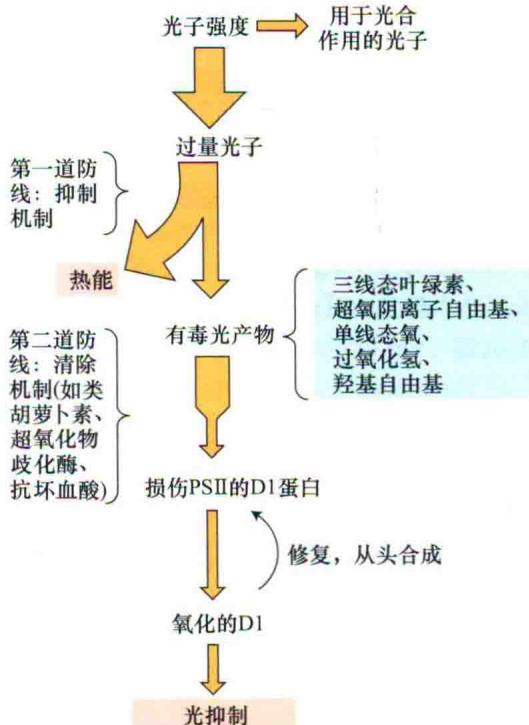  
图7.34 光子捕获的调节、光损伤的避免和修复概要图。避免遭受光损伤可以从多个水平上进行。第一道防线是以热能的形式来淬灭过多的激发能，从而防止破坏。如果这道防线失败，仍然形成了有毒的光产物，可以通过第二道防线的多个清除系统来消除。如果第二道防线仍然失败，光产物将会破坏光系统Ⅱ的D1蛋白，导致光抑制。D1蛋白从PSⅡ反应中心被切离并降解，新合成的D1蛋白会被重新插入到PSⅡ反应中心，形成有功能的单位（改编自Asada，1999）。

## 7.8.1 类胡萝卜素作为光保护剂

类胡萝卜素除了作为辅助色素，在光保护（photo-protection）中也有重要作用。如果光能没有被光化学反应所储存，光合膜将很容易被色素吸收的大量能量所破坏，这就是为什么需要保护机制的原因。

光保护机制可被视为一个安全阀，在过量的能量对生物造成伤害前将它们释放。储存在激发态叶绿素中的能量，通过激发能转移或光化学反应被快速耗散的过程，称为激发态淬灭（quenched）。

如果激发态叶绿素没有在激发能转移和光化学反应中被快速淬灭，它就会和分子态氧反应形成激发态氧——单线态氧（singlet oxygen）。这种极活泼的单线态氧会和许多细胞组分，特别是脂类反应并造成伤害。类胡萝卜素通过快速淬灭激发态叶绿素来行使其光保护功能，由于激发态的类胡萝卜素没有足够的能量形成单线态氧，因此它会衰减回到基态，能量以热能形式释放。

缺少类胡萝卜素的突变体，在光和分子态氧同时存在的情况下不能存活，因为这种条件对于生氧光合生物非常不利；对于不生氧光合细菌来说，缺少类胡萝卜素的突变体只能在实验室的无氧培养基中生长。

## 7.8.2 一些叶黄素也参与了能量的耗散

非光化学淬灭主要调节激发能到反应中心的传递，它可被视为一个“流量阀”，根据光强度和其他条件来调节流向PSⅡ反应中心的激发能流量。在多数藻类和植物中这个过程似乎是调节天线系统的关键环节。

非光化学淬灭（nonphotochemical quenching）通过光化学途径之外的途径淬灭叶绿素荧光（图7.5）。非光化学淬灭使得天线系统中大部分由强光照引起的激发能被转化为热能而淬灭（Krause and Weis，1991；Baker，2008）。非光化学淬灭参与保护光合细胞器，避免它被过度激发并由此而造成损伤。

非光化学淬灭的分子机制还不完全明了，但是有迹象表明有几种内在机制不同的淬灭过程与之相关。现已知类囊体内腔的pH和天线复合体的聚合状态在其中起重要作用；3种称为叶黄素（xanthophylls）的类胡萝卜素——紫黄质、花药黄质和玉米黄质，参与了非光化学淬灭过程（图7.35）。

在强光照下，紫黄质在紫黄质脱环氧化酶的催化作用下经过中间体花药黄质，转变成玉米黄质，质子和玉米黄质结合到捕光天线蛋白质上，引起其结构变化，导致淬灭和热能耗散；当光强度减弱时，过程发生逆转（Demmig-Adams and Adams，1992；Horton and Ruban，2004）。

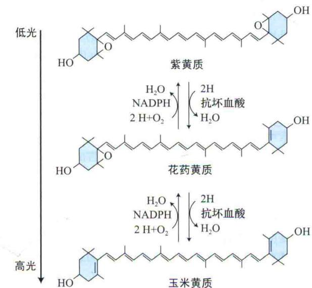  
图7.35 紫黄质、花药黄质和玉米黄质的化学结构。光系统Ⅱ的高度淬灭状态与玉米黄质相关，未淬灭状态与紫黄质相关。在外界条件变化特别是光强度变化时，酶催化这两种类胡萝卜素的相互转变，中间物是花药黄质。玉米黄质的形成需要抗坏血酸盐作为辅助因子，而紫黄质的形成需要NADPH。

非光化学淬灭可能主要与光系统Ⅱ的外周天线复合体——PsbS蛋白有关（Li et al., 2000）。最近研究表明，在非光化学分子淬灭机制中，瞬时电子转移过程可能起重要作用（Holt et al., 2005）。此外，还可能存在其他机制。目前该领域仍然是一个活跃而充满了争议的研究领域。

## 7.8.3 光系统Ⅱ反应中心易被损伤

另外一个严重影响光合细胞器稳定性的效应是光抑制。当给予PSⅡ反应中心过多激发能时，会导致其失活和损伤（Long et al., 1994）。光抑制（photoinhibition）是一组复杂的分子事件，是过量光产生的对光合作用的抑制。

第9章中将详细讨论，光抑制在初期阶段是可逆的，但是长时间的抑制会导致光系统的损伤，以至于PSⅡ反应中心不得不通过解聚来修复（Melis，1999）。被损伤的主要对象是PSⅡ反应中心复合体中的D1蛋白（图7.24）。当D1被过量光损伤时，必须从膜上切除，代之以新合成的分子。由于PSⅡ反应中心的其他组分不会被过度激发所破坏，且可以再循环利用，因此D1蛋白是唯一需要被合成的组分。

## 7.8.4 光系统I被保护以避免活性氧的损伤

光系统Ⅰ特别容易受到活性氧的损伤。PSⅠ的铁氧还蛋白受体是一个很强的还原剂，可以很容易将分子态氧还原成超氧化物（ $O_{2}^{-}$ ），此还原过程可以与电子输送至NADP $^{+}$ 的过程和其他过程相竞争。超氧化物是一种对生物膜非常有害的物质，当它形成时，可以通过超氧化物歧化酶和抗坏血酸过氧化物酶等系列酶的作用来清除。

## 7.8.5 类囊体垛叠允许能量在光系统间进行分配

高等植物的光合作用由两个光吸收特性不同的光系统驱动，由此带来一个特殊的问题：如果能量输运到PS I和PS II的速率没有精确匹配，以至于光合作用的速率受到光照（如低光强度）限制的话，那么电子流的速率将会受到接收能量不足的那个光系统的限制。在效率最高的情况下，两个光系统的能量输入应当相同，但是仅仅依靠色素的排列不能达到这个要求，因为一天中不同时刻的光强度和光谱分布只对其中的一种光系统有利（Allen and Forsberg，2001；Finazzi，2005）。

针对不同的条件，调节能量从一个光系统到另一个光系统的转移可以解决这个问题。已有证据显示这种调节机制能在不同实验条件下起作用。研究表明，光合作用总的量子产额几乎不受波长影响（图7.12），提示了存在这样一种机制。

类囊体膜具有一个能使LHCⅡ表面的特定苏氨酸残基磷酸化的蛋白激酶，LHCⅡ是一种膜结合的天线色素蛋白质，本章前面已经提及（图7.20）。当LHCⅡ未被磷酸化时，它向光系统Ⅱ传递更多能量；当它被磷酸化时，则向光系统Ⅰ传递更多能量（Haldrup et al., 2001）。

这个蛋白激酶在PS I 和 PS II 间的电子载体——质体醌的还原态增加时激活。当 PS II 比 PS I 被更频繁激活时，被还原的质体醌增加，从而激酶被激活，进而使 LHC II 磷酸化。可能是由于被磷酸化的 LHC II 与带负电荷的相邻膜间的电荷排斥作用，使得被磷酸化的 LHC II 从膜的垛叠区域移动进入未垛叠区域（图7.18）。

## 7.9 光合作用系统的遗传、组装和进化

叶绿体有自己的DNA、mRNA和蛋白质合成机器，但是很多叶绿体蛋白质由核基因编码，合成后输送进叶绿体。在这节将会讨论叶绿体主要组分的遗传、组装和进化。

## 7.9.1 叶绿体基因的遗传不遵循孟德尔规律

叶绿体和线粒体通过分裂而不是从头合成（de novo synthesis）来复制自己。这种复制方式并不奇怪，因为这些细胞器包含了核中没有的基因信息。在细胞分裂时，叶绿体在两个子细胞间分配。在大多数有性生殖的植物中，只有母本植物将其叶绿体传给合子。在这些植物中，叶绿体编码的基因不遵循正常的孟德尔遗传定律，因为后代只从一个亲本中得到叶绿体，结果造成非孟德尔（non-Mendelian），或者说母系遗传（maternal inheritance）。多种性状通过此方式遗传，Web Topic 7.10中讨论的抗除草剂性状就是一个例子。

## 7.9.2 多种叶绿体蛋白质在细胞质合成后被输入叶绿体

叶绿体蛋白质可由叶绿体或核DNA编码。叶绿体编码的蛋白质在叶绿体核糖体上合成；核编码的蛋白质在细胞质核糖体上合成后运进叶绿体。许多核基因包含了内含子，即不编码蛋白质的碱基顺序，内含子在mRNA加工中被去除，蛋白质在细胞质中合成。

叶绿体发挥功能所必需的基因在细胞核和叶绿体基因组中的分布没有明显的特征，但是这些基因对于维持叶绿体的正常作用非常重要。有些叶绿体基因对于细胞的其他功能，如血红素和脂类的合成是必需的。编码叶绿体蛋白质的核基因的表达调控很复杂，与两种光敏色素（见第17章）、蓝光（见第18章）及其他因素（Eberhard et al., 2008）介导的光依赖的调节过程有关。

细胞质中合成的叶绿体蛋白质的转运是一个受到严密控制的过程（Chen and Schnell，1999；Benz et al., 2009）。例如，与碳固定反应有关的Rubisco酶（见第8章）有两种亚基：一个由叶绿体编码的大亚基和一个由核编码的小亚基。Rubisco的小亚基在细胞质中合成，转运进叶绿体，然后在叶绿体中组装。

在这个例子和其他已知的例子中，核编码的叶绿体蛋白质以前体蛋白质的形式合成，N端含有称为转运肽（transit peptide）的氨基酸序列。N端序列引导前体蛋白质进入叶绿体，帮助它通过外层和内层的被膜，然后被切除。电子载体质体蓝素是一个由核基因编码的水溶性蛋白质，它在叶绿体内腔中发挥作用，因此它必须穿越3层膜到达内腔中的目的位点。质体蓝素的转运肽很大，当它引导蛋白质穿越叶绿体内膜和类囊体膜时，要经历多步加工。

## 7.9.3 叶绿素的生物合成和降解经过复杂的过程

叶绿素是复杂的分子，它们在光合作用中巧妙地执行光吸收、能量转移和电子转移的功能（图7.6）。与其他所有生物分子一样，叶绿素由生物途径合成，在这个过程中简单的分子被装配成更复杂的分子（Beale，1999；Eckhardt et al., 2004；Tanaka and Tanaka,

2007），合成途径中的每一步都由酶催化完成。

叶绿素的生物合成途径由12个以上的步骤组成（参见Web Topic 7.11）。整个过程可分为几个阶段（图7.36），每个阶段相对独立，但在细胞中是高度协调的。这种协调非常关键，因为游离的叶绿素和一些光合作用的中间产物对细胞有破坏作用，这种破坏主要由于叶绿素可以高效吸收光能，如果没有相应蛋白质的存在就缺少利用能量的途径，从而导致有毒害的单线态氧的产生。

衰老叶片中的叶绿素降解及其生物合成途径有很大不同（Takamiya et al., 2000; Eckhardt et al., 2004）。首先是由叶绿素酶去除叶醇尾巴，其次是由镁脱螯合酶去除镁离子，最后卟啉结构被依赖氧的加氧酶打开形成一个开链四吡咯结构。

四吡咯结构进一步被转变成水溶性的无色产物，这些无色代谢物随后被运出衰老的叶绿体，进入液泡，并一直储存在那里。虽然叶绿体中与叶绿素结合的蛋白质可被循环利用以合成新的蛋白质，但是叶绿素代谢产物不能进一步被加工或循环利用。蛋白质的循环利用对于合理使用植物的氮元素非常重要。

## 7.9.4 复杂光合生物由简单生物进化而来

在植物和藻类中发现的复杂光合细胞器是长期进化的结果。通过分析非生氧光合细菌和蓝细菌（蓝藻）等简单的原核光合生物可以推测出该进化过程的很多信息。

叶绿体是一种半自主的细胞器，它有自身的DNA和一套完整的蛋白质合成机器。组成光合细胞器的许多蛋白质、叶绿素和脂类均在叶绿体中合成，其他蛋白质则由核基因编码并从细胞质中输入。为什么会有这种奇特的分工呢？许多专家认为，叶绿体是由蓝细菌和一种简单的非光合真核细胞的共生关系进化而来，这种关系称为内共生（endosymbiosis）（Cavalier-Smith，2000）。

起初蓝细菌可以独立生活，但是随着时间的推移，许多维持细胞正常功能所需要的基因信息丢失，大量合成光合细胞器所需的信息被转移到核中，使得叶绿体脱离寄主就无法存活，最终成为细胞的一个组成部分。

在一些藻类中，叶绿体来源于真核光合生物的内共生（Palmer and Delwiche，1996）。在这些生物中，叶绿体被3层，有时是4层膜所包围，这些膜可能是早期生物细胞膜的残余。线粒体也被认为起源于内共生，但形成比叶绿体要早得多。

关于光合作用进化的其他问题的答案还不甚明了。这些问题包括最早的光系统的性质，两个光系统如何连通和生氧复合体的进化起源（Blankenship and Hartman, 1998; Xiong et al., 2000; Allen, 2005）。

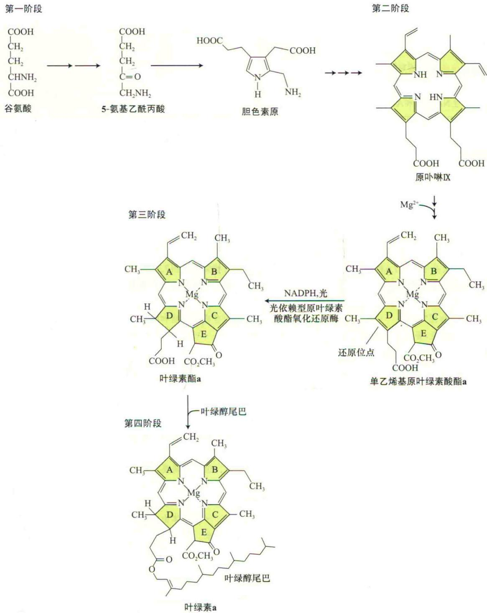  
图7.36 叶绿素的生物合成途径。合成开始谷氨酸被转化成5-氨基乙酰丙酸（ALA）；两分子ALA缩合形成胆色素原（PBG）；4个PBG分子连接成为原卟啉IX；镁离子进入；然后环E依赖光的作用进行环化；环D还原；最后连接叶醇尾巴，整个过程完成。此图中省略了过程中的许多步骤。

植物光合作用利用光能，将二氧化碳和水合成为碳水化合物，并产生氧气。碳水化合物中储存的能量被用于驱动植物细胞的代谢活动，并为所有的生命提供能量来源。

## 高等植物中的光合作用

· 叶绿体中，叶绿素吸收光能，用于氧化水，释放氧气，产生NADPH和ATP（类囊体反应）。

· NADPH和ATP被用于还原二氧化碳，合成糖（碳固定反应）。

## 基本概念

· 光既是粒子又是波，它以光子的形式传送能量，其中部分能量被植物吸收并利用（图7.1\~图7.3）。

· 吸收了光能的叶绿素可以发荧光，将能量转移给另外一个分子，或利用该能量来驱动化学反应（图7.5和图7.10）。

· 所有光合生物都包含了多种具有独特结构和光吸收特性的色素分子（图7.6和图7.7）。

## 了解光合作用的关键实验

· 藻类光合作用的作用光谱显示氧气释放量与波长有关（图7.8和图7.9）。

· 天线色素-蛋白质复合体收集光能，并将它转移到反应中心复合体（图7.10）。

· 光驱动NADP $^{+}$ 还原和ATP合成。放氧生物具有两个光系统（PS I 和 PS II），依次作用（图7.12\~图7.14）。

## 光合细胞器的构成

· 叶绿体类囊体膜上有反应中心、捕光色素复合体和电子载体蛋白质（图7.18）。PS I 和 PS II 在类囊体中空间上是分离的。

## 吸光天线系统的构造

· 天线系统将能量汇集到反应中心（图7.19）。

· 两个光系统的捕光蛋白结构上相似（图7.20）。

## 电子传递机制

· Z方案显示了从 $H_{2}O$ 到 $NADP^{+}$ 经过PSⅡ和PSⅠ载体的电子流（图7.14和图7.21）。

· 4个大的蛋白质复合体转运电子：PSⅡ、细胞色素 $b_{6}f$ 复合体、PSⅠ和ATP合酶。

· PS I 反应中心叶绿素最大吸收波长为700 nm；PS II 反应中心叶绿素最大吸收波长为680 nm。

\- PSⅡ反应中心是一个多亚基的蛋白质-色素复合体（图7.24和图7.25）。

·锰离子（ $\mathrm{Mn}^{2+}$ ）是氧化水所必需的。

· 2个疏水性质体醌从PSⅡ接受电子（图7.22和图

7.26）。

· 当电子流经细胞色素 $b_{6}f$ 复合体（图7.22和图7.27）时，质子被转运进类囊体腔中（图7.22和图7.27）。

· 质体醌和质体蓝素在PSⅡ和PSⅠ间转运电子（图7.28）。

\- NADP $^{+}$ 被PS I反应中心还原，反应过程利用了3个Fe-S中心和铁氧还蛋白作为电子载体（图7.29）。

· 环形电子流通过质子泵生成了ATP，但不产生NADPH。

· 除草剂可能阻碍了光合电子流（图7.30）。

## 叶绿体中的质子转运和ATP合成

· 体外将pH 4缓冲液中平衡过的叶绿体类囊体转移到pH 8的缓冲液中，导致ADP和 $P_{i}$ 反应形成ATP，支持了ATP合成的化学渗透假说（图7.31）。

· 质子顺电化学势梯度（质子动力势）移动，通过ATP合酶合成ATP（图7.32）。

\- ATP合酶在催化过程中， $\mathrm{CF}_{0}$ 部分像一个微型的马达那样转动。

· 叶绿体、线粒体和紫细菌中的质子转运具有一定的相似性（图7.33）。

## 光合系统的调节和修复

· 光损伤的保护和修复包括：淬灭和热量散失，中和有害光产物和PSⅡ的合成修复（图7.34）。

· 叶黄素（类胡萝卜素）参与非光化学淬灭过程（图7.35）。

· 激酶介导的LHCⅡ磷酸化促使LHCⅡ移动到类囊体非垛叠，将能量传递给PSⅠ（状态2）。脱磷酸化时，LHCⅡ移动到类囊体的垛叠部分，将更多能量传递给PSⅡ（状态1）。

## 光合系统的遗传、组装和进化

· 叶绿体有自身的DNA、mRNA和蛋白质合成系统，但仍然需要核基因编码的蛋白质。

· 叶绿体遗传不遵循孟德尔遗传定律。

· 叶绿素生物合成可以分为4个阶段（图7.36）。

· 叶绿体由蓝细菌和简单的非光合真核细胞共生进化而来。

(葛晓春 译)

## WEB MATERIAL

## Web Topics

## 7.1 Principles of Spectrophotometry

Spectroscopy is a key technique for the study of light reactions.

7.2 The Distribution of Chlorophylls and Other Photosynthetic Pigments
The content of chlorophylls and other photosynthetic pigments varies among plant kingdoms.

7.3 Quantum Yield
Quantum yields measure how effectively light drives a photobiological process.

7.4 Antagonistic Effects of Light on Cytochrome Oxidation
Photosystems I and II were discovered in some ingenious experiments.

7.5 Structures of Two Bacterial Reaction Centers
X-ray diffraction studies resolved the atomic structure of the reaction center of photosystem II.

7.6 Midpoint Potentials and Redox Reactions
The measurement of midpoint potentials is useful for analyzing electron flow through photosystem II.

7.7 Oxygen Evolution
The S state mechanism is a valuable model for water splitting in PS II.

7.8 Photosystem I The PS I reaction is a multiprotein complex.

7.9 ATP Synthase
The ATP synthase functions as a molecular motor.

7.10 Mode of Action of Some Herbicides
Some herbicides kill plants by blocking photosynthetic electron flow.

7.11 Chlorophyll Biosynthesis
Chlorophyll and heme share early steps of their biosynthetic pathways.

Web Essay

7.1 A Novel View of Chloroplast Structure Stromules extend the reach of the chloroplasts.

# 第8章

# 光合作用：碳反应

本书第5章讨论了植物生长并完成生命周期（life cycle）需要矿物质和光。因为星球上的物质是一定的，必须持续地供给能量，以此维系生物圈（biosphere）中的营养物质循环。没有能量输入，熵（entropy）将会增加，物质流动最终停止。到达地球表面的太阳辐射能是维持地球生命的最终能源（DOE，2008；Sinclair，2009）。植物的储能反应可将这种能（大约 $3\times10^{21}$ J/年）转化为碳水化合物（大约 $2\times10^{11}$ t碳/年）。

被捕获到的太阳能被转化为各种形式的化学能，这是地球上最原始的生物化学反应之一。100万年以前，异养细胞通过与蓝藻细菌以初级的共生形式获得将太阳能转化为化学能的能力。最近，借助于质体、蓝藻细菌和真核细胞中蛋白质的氨基酸序列比较，可将这一古事件的后代进行分类，所谓原始色素体生物/泛植物（Archaeplastidae）家族包括三大分支：绿色植物界（Viridiplantae/Chloroplastidae：绿藻、陆地植物）、红藻植物（Rhodophyta）和灰色藻类（Glaucophytae/Glaucocystophyte：一种单细胞藻，含有类似于蓝藻细胞的称为蓝色小体的质体）（Rodríguez-Ezpeleta et al., 2005；Deschamps et al., 2008a）。

原始共生体产生了各种细胞器。一般认为，共生体到细胞器过渡中，在宿主细胞受保护的环境中，一些不必要的功能丧失，也获得了额外的代谢途径（Deschamps et al., 2008b）。但是，该过程的细节在泛植物的分支中变化很大。例如，原始的（胞）内共生体不仅得到了产生氧气的光合作用能力，而且可以合成新的化合物（如淀粉）。虽然所有的后代保留了这种合成多聚糖的能力，但红藻植物和灰色藻类在胞质中生产并储存淀粉，而绿色植物界中的此项工作在质体中完成。

从第7章可知：在叶绿体类囊体膜上，从水（ $\mathrm{H}_2\mathrm{O}$ ）到分子氧（ $\mathrm{O}_2$ ）的光化学氧化反应所产生的能量被用来产生腺苷三磷酸（adenosine triphosphate，ATP）、还原型铁氧还蛋白及还原型嘧啶核苷酸（reduced pyridine nucleotide，NADPH）。随后，光反应产物ATP和NADPH从类囊体膜流向周围液相（叶绿体基质），并驱动大气 $\mathrm{CO}_{2}$ 酶促还原反应，产生碳水化合物或其他细胞成分（图8.1）。在叶绿体基质中进行的后续反应一直被认为是不依赖光的，故称为暗反应（dark reactions）。但是，基质中的反应依赖光化学反应产物，并被光直接调控。因此，这些反应称为光合作用碳反应（carbon reactions of photosynthesis）更为合理。

本章将首先阐述循环反应，即大气 $CO_{2}$ 到生命所需的有机化合物的合成的全过程，也就是卡尔文-本森循环。接着，讨论为什么光呼吸损失少许同化的 $CO_{2}$ 是不可避免的现象。光呼吸降低 $CO_{2}$ 光合同化效率，因此也将阐述有关降低 $CO_{2}$ 损失的生物化学机制： $CO_{2}$ 泵（参见Web Topic 8.1）、 $C_{4}$ 代谢（ $C_{4}$ metabolism），以及景天（科）酸代谢（crassulacean acid metabolism，CAM）。最后将以描述固定 $CO_{2}$ 的2种主要的光合作用产物：淀粉（暂时在叶绿体中储存并积累的多糖）和蔗糖（从叶片输出到植物其他发育或储存器官的二糖）结束本章。

## 8.1 卡尔文-本森循环

自养生物能够利用环境中的物理或化学能量，将大气中 $CO_{2}$ 转化为有机化合物分子骨架，以此满足细胞需要。自养生物固定 $CO_{2}$ 最重要的途径是卡尔文-本森循环（Calvin-Benson cycle），其存在于很多原核生物和

图8.1 陆地植物叶绿体光合作用中的光反应和碳反应。在类囊体膜上，太阳光激发光合电子传递系统[光合系统Ⅱ（PSⅡ）+光合系统Ⅰ（PSⅠ）]中的叶绿素，驱动ATP和NADPH产生（见第7章）。在基质中，卡尔文-本森循环中的系列酶促反应消耗ATP和NADPH，将CO₂还原为碳水化合物（磷酸丙糖）。

所有光合真核生物（从最原始的藻类到最高等的被子植物）。这个途径将碳元素（C）氧化态从最高值（ $\mathrm{CO}_{2}$ 中的+4）降低到糖分子水平（例如，—CO—羰基基团中的+2；—CHOH—二级醇类基团中的0）。考虑到C氧化态降低的特点，卡尔文-本森循环也可以称为还原磷酸戊糖循环（reductive pentose phosphate cycle）。本章节将介绍卡尔文-本森循环如何使用光反应产生的ATP和NADPH中储存的能量来固定 $\mathrm{CO}_{2}$ （图8.1），以及此循环如何被调控。

## 8.1.1 卡尔文-本森循环包括3个阶段：羧化、还原和再生

20世纪50年代，M. Calvin、A. Benson（Benson，1951）、J. A. Bassham及其同事利用一系列精巧的实验阐释了卡尔文-本森循环（参见Web Topic 8.2）。叶绿体中的卡尔文-本森循环包括高度协作的3个阶段（图8.2）。

（1） $CO_{2}$ 受体分子的羧化（carboxylation）。循环中第一个酶促反应是： $CO_{2}$ 、 $H_{2}O$ 和5C受体分子（核酮糖-1，5-二磷酸）形成2分子3C中间物（3-磷酸甘油酸）。

（2）3-磷酸甘油酸的还原（reduction）。在光合产物ATP和NADPH驱动下，3-磷酸甘油酸通过两步酶促反应被还原成为3C糖（磷酸三糖）。

（3） $CO_{2}$ 受体分子核酮糖-1，5-二磷酸的再生（regeneration）。循环结束在核酮糖-1，5-二磷酸再生，期间经过10个酶促反应，消耗1个ATP。

C是以磷酸三糖的形式输出，与大气 $CO_{2}$ 的供给是平衡的。而后叶绿体中卡尔文-本森循环产生的磷酸三糖被转化为其他的细胞成分（如蔗糖和棉籽糖）。这些产物被分配到植物异养器官，以此维持生长或转化为储存物质。

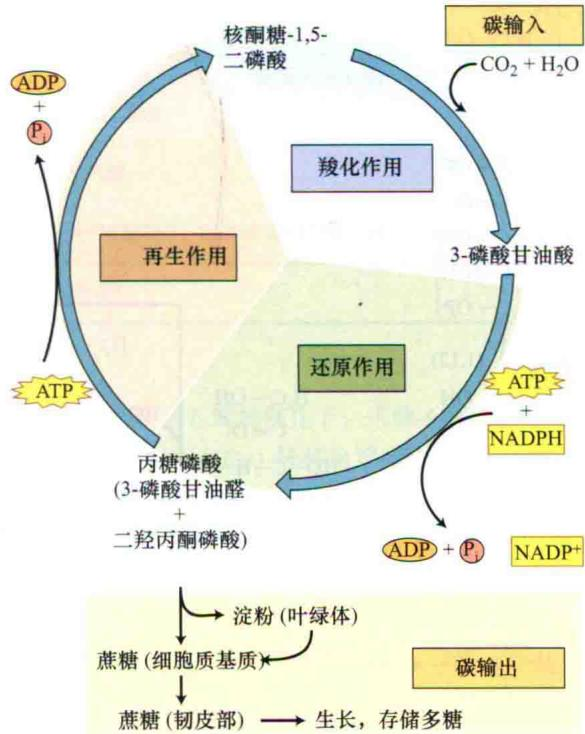

图8.2 卡尔文-本森循环的3个阶段。①羧化反应， $CO_{2}$ 和1个碳骨架共价结合；②还原反应，生成一种碳水化合物（磷酸三糖），此过程消耗光化学形成的ATP和NADPH还原当量；③再生反应，重新合成 $CO_{2}$ 受体分子核酮糖-1，5-二磷酸。在稳定状态时， $CO_{2}$ 输入量等于磷酸三糖输出量。后者或者作为叶绿体中淀粉生物合成的前体，或者流入细胞质合成蔗糖。蔗糖被装载到韧皮部流体，运到生长需要或者多糖生物合成的植物其他部分。

## 8.1.2 核酮糖-1，5-二磷酸的羧化反应固定 $\mathrm{CO}_{2}$ 并合成磷酸三糖

卡尔文-本森循环的第一步反应中，3分子 $CO_{2}$ 、3分子 $H_{2}O$ 和3分子核酮糖-1，5-二磷酸反应，产生6分子

3-磷酸甘油酸（图8.3，表8.1反应1）。该反应由叶绿体中核酮糖-1，5-二磷酸羧化酶/加氧酶（Ribulose-1, 5-bisphosphate carboxylase/oxygenase, Rubisco）催化（参见Web Topic 8.2）（Cleland et al., 1998）。这步反应的前半步是1个H+从核酮糖-1，5-二磷酸的C-3位置被剥离（图8.4），气体分子CO₂与Rubisco形成不稳定的烯二醇中间体；后半步是不可逆反应生成2-羧基-3酮基阿拉伯糖醇-1，5-二磷酸。最后，中间物经过水合作用产生2分子3-磷酸甘油酸。

卡尔文-本森循环的还原阶段是还原3-磷酸甘油酸中来自于羧化反应的C（图8.3，表8.1反应2和反应3）。

（1）首先，光反应产生的ATP使3-磷酸甘油酸的羧基磷酸化，产生一个混合酐（mixed anhydride），即1,3-二磷酸甘油酸，反应由3-磷酸甘油酸激酶催化（表8.1反应2）。

（2）接下来，光反应产生的NADPH将1,3-二磷酸甘油酸还原为3-磷酸甘油醛（表8.1反应3），位于叶绿体的NADP-甘油醛-3-磷酸脱氢酶催化此反应（表8.1反应3）。

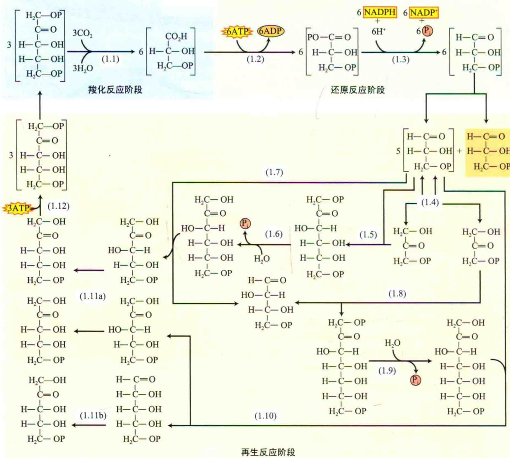

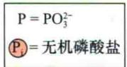

表8.1 卡尔文-本森循环中的反应

<table><tr><td>酶</td><td>反应</td></tr><tr><td>1.核酮糖-1,5-二磷酸羧化酶-加氧酶(Rubisco)</td><td>3核酮糖-1,5-二磷酸+3 $CO_2$ +3 $H_2O$ →63-磷酸甘油酸+6 $H^+$ </td></tr><tr><td>2.3-磷酸甘油酸激酶</td><td>63-磷酸甘油酸+6ATP→61,3-二磷酸甘油酸+6ADP</td></tr><tr><td>3.NADP-甘油醛-3-磷酸脱氢酶</td><td>61,3-二磷酸甘油酸+6NADPH+6 $H^+$ →63-磷酸甘油醛+6NADP+6 $H_i^+$ </td></tr><tr><td>4.丙糖磷酸异构酶/甘油醛磷酸异构酶</td><td>23-磷酸甘油醛←→2二羟丙酮磷酸</td></tr><tr><td>5.醛缩酶</td><td>3-磷酸甘油醛+二羟丙酮磷酸→果糖-1,6-二磷酸</td></tr><tr><td>6.果糖-1,6-二磷酸酶</td><td>果糖-1,6-二磷酸+ $H_2O$ →果糖-6-磷酸+ $P_i$ </td></tr><tr><td>7.转羟乙醛酶/转酮醇酶</td><td>果糖-6-磷酸+甘油醛-3-磷酸→赤藓糖-4-磷酸+木酮糖-5-磷酸</td></tr><tr><td>8.醛缩酶</td><td>赤藓糖-4-磷酸+二羟丙酮磷酸→景天庚酮糖-1,7-二磷酸</td></tr><tr><td>9.景天庚酮糖-1,7-二磷酸酶</td><td>景天庚酮糖-1,7-二磷酸+ $H_2O$ →景天庚酮糖-7-磷酸+ $P_i$ </td></tr><tr><td>10.转羟乙醛酶/转酮醇酶</td><td>景天庚酮糖-7-磷酸+3-磷酸甘油醛→核糖-5-磷酸+木酮糖-5-磷酸</td></tr><tr><td>11a.核酮糖-5-磷酸差向异构酶</td><td>2木酮糖-5-磷酸→2核酮糖-5-磷酸</td></tr><tr><td>11b.核糖-5-磷酸异构酶</td><td>核糖-5-磷酸→核酮糖-5-磷酸</td></tr><tr><td>12.核酮糖-5-磷酸激酶</td><td>3核酮糖-5-磷酸+3ATP→3核酮糖-1,5-二磷酸+3ADP+3 $H^+$ </td></tr><tr><td colspan="2">总反应: $3CO_2$ +5 $H_2O$ +6NADPH+9ATP→3-磷酸甘油醛+6NADP+3 $H^+$ +9ADP+8 $P_i$ </td></tr></table>

注： $P_{i}$ 代表无机磷酸

## 8.1.3 核酮糖-1，5-二磷酸再生并继续同化 $\mathrm{CO}_{2}$

为防止卡尔文-本森循环中间产物耗竭，需要不断地摄取大气中 $CO_{2}$ ，因此 $CO_{2}$ 受体（acceptor）核酮糖-1，5-二磷酸的再生不能间断。再生阶段，3分子核酮糖-1，5-二磷酸（3分子×5C/分子=15C）来自于5分子3-磷酸甘油醛的C重组反应（5分子×3C/分子=15C）（图8.3）。第6个3-磷酸甘油醛分子（1分子×3C/分子=3C总）代表3分子 $CO_{2}$ 净同化结果，可被植物C代谢所利用。其他5分子3-磷酸甘油醛重组成为3分子核酮糖-1，5-二磷酸，所经历的反应见表8.1中4\~12和图8.3。

（1）2分子3-磷酸甘油醛转化为二羟丙酮磷酸，反应由磷酸丙糖异构酶催化（表8.1反应4）。

（2）1分子二羟丙酮磷酸和第三分子3-磷酸甘油醛进行醛醇缩合反应，反应由醛缩酶催化，生成果糖-1,6-二磷酸（表8.1反应5）。

（3）果糖-1，6-二磷酸在叶绿体特有的果糖-1，6-二磷酸酶催化下，水解成为果糖-6-磷酸（表8.1反应6）。

（4）在转羟乙醛酶催化下，果糖-6-磷酸分子中的1个2C单位（即 $C_{1}$ 和 $C_{2}$ ）转移给第4个3-磷酸甘油醛分子，形成木酮糖-5-磷酸。果糖-6-磷酸分子中剩余的4个C（ $C_{3}$ 、 $C_{4}$ 、 $C_{5}$ 、 $C_{6}$ ）形成赤藓糖-4-磷酸（表8.1反应7）。

（5）随后，由醛缩酶催化，赤藓糖-4-磷酸和剩余的二羟丙酮磷酸分子结合，产生7C糖：景天庚酮糖-1,7-二磷酸（表8.1反应8）。

（6）在专一的景天庚酮糖-1，7-二磷酸酶催化下，景天庚酮糖-1，7-二磷酸水解为景天庚酮糖-7-磷酸（表8.1反应9）。

（7）景天庚酮糖-7-磷酸提供1个2C单位（ $C_{1}$ 和 $C_{2}$ ）给第5个（也是最后1个）3-磷酸甘油醛，在转酮醇酶催化下产生木酮糖-5-磷酸。景天庚酮糖-7-磷酸的剩余5个C（ $C_{3}\sim C_{7}$ ）成为核糖-5-磷酸（表8.1反应10）。

（8）由核酮糖-5-磷酸差向异构酶催化，2分子木酮糖-5-磷酸转化为2分子核酮糖-5-磷酸（表8-1反应11a），第三分子核酮糖-5-磷酸是在核糖-5-磷酸异构酶的催化下，由核糖-5-磷酸转化而来（表8.1反应

11b）。

（9）最后，磷酸核酮糖激酶（也称核酮糖-5-磷酸激酶）催化下，由ATP提供磷酸基团，使3分子核酮糖-5-磷酸磷酸化，再生成为3个 $CO_{2}$ 受体分子核酮糖-1，5-二磷酸（表8.1反应12）。

因此，在消耗能量（ATP）和还原力（NADPH）条件下，叶绿体类囊体膜上的卡尔文-本森循环的羧化和还原反应产生磷酸三糖。

$$
3 \mathrm{CO} _ {2} + 3 \text { 核   酮   糖 } - 1, 5 - \text { 二   磷   酸 } + 3 \mathrm{H} _ {2} \mathrm{O} + 6 \mathrm{NADPH} + 6 \mathrm{H} ^ {+} + 6 \mathrm{ATP}
$$

$$
\longrightarrow 6 \text {   磷酸三糖   } + 6 \mathrm{NADP} + 6 \mathrm{ADP} + 6 \mathrm{P} _ {\mathrm{i}}
$$

这6个磷酸三糖中：5个经过再生反应而恢复成为 $CO_{2}$ 受体分子核酮糖-1，5-二磷酸；第6个磷酸三糖代表 $CO_{2}$ 净同化，用作其他代谢过程的“建筑砖块”。

5磷酸三糖+3ATP→3核酮糖-1，5-二磷酸+3ADP

总之，利用9个ATP和6个NADPH将3个 $CO_{2}$ 固定成为1个磷酸三糖。也就是说，卡尔文-本森循环固定 $CO_{2}$ 时，ATP：NADPH比率是3：2。

## 8.1.4 还原阶段使光合作用的 $\mathrm{CO}_{2}$ 同化作用进入稳态

当叶片在黑暗中生存相当长一段时间（如晚上），基质中卡尔文-本森循环的许多中间物浓度很低。因此，当叶片转移到光下时，几乎所有的基质中的磷酸丙糖转化为核酮糖-1，5-二磷酸再生所需要的中间物。将黑暗条件下的叶片或离体叶绿体照光后，其反应清楚地说明代谢物建成关联性。实验发现： $CO_{2}$ 固定开始于一个延滞（a lag）之后，这段时间也称为诱导期（induction period）。在光照开始的几分钟时间内，光合作用速率随着时间增加。在诱导期，这种光合速率增加是由于卡尔文-本森循环中间产物浓度增加和光激发酶活性（稍后讨论）。在诱导期内，由卡尔文-本森循环的羧化和还原反应产生的6个磷酸丙糖主要用于 $CO_{2}$ 受体分子——核酮糖-1，5-二磷酸再生。

相反，当光合作用达到一个稳定阶段（steadystate），大气 $CO_{2}$ 同化增加了植物碳水化合物的储备。在此期间，5/6磷酸丙糖用于 $CO_{2}$ 受体分子核酮糖-1，5-二磷酸的再生，1/6磷酸丙糖用于增加碳水化合物含量（图8.2）。这种净增的磷酸丙糖既用于叶绿体中淀粉合成，也用于胞质中蔗糖合成。一般来讲，主要产物蔗糖被植物分配到异养器官中去，进行后续的代谢或转化为储存物质（如淀粉和果聚糖）。有关卡尔文-本森循环中的能量利用效率详细分析参见Web Topic 8.4。

  
图8.4 Rubisco催化的核酮糖-1，5-二磷酸羧化和氧化反应。核酮糖-1，5-二磷酸和Rubisco结合有利于一种与酶紧密相连的烯醇式中间产物的形成，此中间物的 $C_{2}$ 易被 $CO_{2}$ 或 $O_{2}$ 攻击。与 $CO_{2}$ 结合时，产物是一种六碳中间物（2-羧基-3-酮基-1，5-二磷酸）；与 $O_{2}$ 结合时，产物是一种活跃的五碳中间物（2-氢过氧化-3-酮基-1，5-二磷酸）。这些中间物在 $C_{3}$ 位置发生水解反应，致使 $C_{2}$ 和 $C_{3}$ 之间碳键分裂，产生2分子3-磷酸甘油酸（羧化反应）或1分子2-磷酸甘油酸和1分子3-磷酸甘油酸（加氧酶反应）。加氧酶活性的重要生理效应将在“ $C_{2}$ 氧化光合碳循环”中讲述。

## 8.2 卡尔文-本森循环的调控

卡尔文-本森循环中的能量有效利用需要专一调控机制，此机制不仅保证光照条件下循环中所有中间产物的浓度合适，而且能在黑暗条件下关闭循环。为了顺应环境刺激而产生必要的代谢物，叶绿体通过调整酶含量（μmoles酶/叶绿体）和催化能力[μmoles转化的底物/（min·μmoles酶）]而达到合适的生物化学转化效率。

基因表达和蛋白质生物合成效率决定着细胞器中酶含量。值得注意的是，叶绿体基质酶数量由细胞核和叶绿体基因组的表达共同控制（Maier et al., 1995; Purton, 1995）。核基因编码的酶由细胞质中80S核糖体负责翻译，之后进入质体。质体编码的蛋白质存在于基质中，由叶绿体基质中的类似于原核生物70S核糖体进行翻译。

光通过专一的光受体（如光敏色素和蓝光受体）调节叶绿体基质中核基因组编码的酶的表达（Neff et al., 2000）。但是，核基因表达与该细胞器中光合体系中其他组分的表达是同步的。多数信号过程的调控在核与质体间是顺行性（anterograde）进行（即核基因产物控制着质体基因的转录和翻译）。此种情况中的范例是：基质Rubisco由核编码的8个小亚基（S）和质体编码的8个大亚基（L）组装过程。但是，有些调控为逆向性（retrograde）进行（即信号从质体向细胞核传递），如与叶绿素有关的蛋白质合成过程。

酶合成对催化速率的改变是缓慢的，与之形成鲜明对比的是：叶绿体酶通过翻译后修饰而改变的酶的比活力[μmoles转化的底物/（min·μmoles酶）]可以迅速响应光照（Wolosiuk et al., 1993）。酶动力学特征（kinetic property）调节的两个基本机制如下。

（1）共价键变化引起的酶化学修饰，如氨基甲酰化 $\left(\mathrm{Enz}-\mathrm{NH}_{2}+\mathrm{CO}_{2}\rightleftharpoons\mathrm{Enz}-\mathrm{NH}-\mathrm{CO}_{2}^{-}+\mathrm{H}^{+}$ 或二硫键还原 $\left[\mathrm{Enz}-(\mathrm{S})_{2}+\mathrm{Prot}-(\mathrm{SH})_{2}\rightleftharpoons\mathrm{Enz}-(\mathrm{SH})_{2}+\mathrm{Prot}-(\mathrm{S})_{2}]$ 。

（2）代谢物结合、细胞内离子组成改变（如pH、 $Mg^{2+}$ ）造成的非共价互作修饰。

这两种分子机制调节单个酶的结构和活性。但是，卡尔文-本森循环中的各种酶分布在叶绿体基质内部或其外周，分别与蛋白质或类囊体膜密切结合。因此，卡尔文-本森循环中的酶活性被上述机制调节；同时，酶可与叶绿体其他组分可逆性结合成为超级分子复合体，并因此而调节酶活性。在这些超级分子复合体中和类囊体膜表面，酶与其调节蛋白密切结合有利于卡尔文-本森循环的底物和产物在这些复合体内部或复合体之间的转运，从而提高了卡尔文-本森循环工作效率。

接下来讨论有关调节机制，如光依赖的调节机制，即光照-黑暗转换的数分钟内，5种关键酶的专一性改变：①Rubisco；②果糖-1，6-二磷酸酶；③景天庚酮糖-1，7-二磷酸酶；④核酮糖-5-磷酸激酶（磷酸核酮糖激酶）；⑤NADP-甘油醛-3-磷酸脱氢酶。

## 8.2.1 光照提高Rubisco活性

虽然Rubisco在生物圈的C循环中起关键作用，但是它的催化效率极其低下（每秒固定1\~12个 $CO_{2}$ ）。George Lorimer及其同事解析了这种似乎矛盾的特点，发现：Rubisco在进行催化之前必须被激活。进一步的研究显示， $CO_{2}$ 分子在Rubisco活化过程中扮演双重角色：一方面 $CO_{2}$ 参与该酶由非活性形式转化为活性形式（调节作用），另一方面 $CO_{2}$ 又是羧化反应的底物（催化作用）（Wolosiuk et al., 1993）。

作为调节者， $\mathrm{CO}_{2}$ 慢速与Rubisco酶活性中心的特定赖氨酸基团发生反应（图8.5中Rubisco调节）。而后，所形成的氨基甲酸盐衍生物（一个新的阴离子位点）快速与 $\mathrm{Mg}^{2+}$ 结合，酶即被活化。因为三元复合体Rubisco- $\mathrm{CO}_{2}-\mathrm{Mg}^{2+}$ 形成过程中释放2个质子，被光照的叶绿体基质中的pH和 $\mathrm{Mg}^{2+}$ 浓度升高而活化Rubisco酶（见下文）。在这个阶段，作为底物的 $\mathrm{CO}_{2}$ 分子与核酮糖-1,5-二磷酸反应，即结合到Rubisco活性位点（图8.5中的催化）。最终，Rubisco释放2分子3-磷酸甘油醛（图8.5中的产物）。

糖磷酸类分子（如核酮糖-1，5-二磷酸）和Rubisco紧密结合防止发生羰基化反应。但是，Rubisco和相关蛋白质（Rubisco活化酶）结合（此过程消耗ATP）导致Rubisco结构变化，释放糖磷酸类的分子，同时为酶通过羰基化反应和与金属原子结合而活化打下基础（图8.5中Rubisco活化酶；Web Topic 8.5）（Portis，2003）。Rubisco活化酶是一类伴侣分子功能类的、具有ATP酶活性的蛋白质家族成员。ATP和Rubisco活化酶的结合引发14\~16个Rubisco活化酶多肽自我关联后，与Rubisco结合。Rubisco羧化酶活性的激发，将结合的ATP水解作用耦合到Rubisco活化酶的亚基寡聚化或Rubisco构象变化。在正常的大气 $CO_{2}$ 浓度下，缺乏

Rubisco活化酶的拟南芥突变体表现出严重的光合作用缺损。

  
图8.5 $\mathrm{CO}_{2}$ 在Rubisco催化的反应中用作激活剂和底物。调节作用（绿色框）：激活剂 $\mathrm{CO}_{2}$ 与Rubisco反应形成E-氨甲酸盐（ $\mathrm{E - NH - CO_2^-}$ ）加合物， $\mathrm{Mg}^{2+}$ 与之形成E-氨甲酸盐复合物（ $\mathrm{E - NH - CO_2\cdot Mg^{2 + }}$ ），使之稳定。在光照的叶绿体基质中， $\mathrm{pH}$ （低 $\mathrm{H^{+}}$ 浓度）和 $\mathrm{Mg}^{2 + }$ 浓度增加有利于Rubisco活性状态（ $\mathrm{E - NH - CO_2\cdot Mg^{2 + }}$ 复合物）形成。Rubisco活化酶（米黄色框）：糖磷酸（SugP）的紧密结合启动E-氨甲酸盐加合物产生。在Rubisco活化酶介导的循环中，Rubisco活化酶催化的ATP水解作用导致Rubisco构象变化，减少了它与糖磷酸的亲和性。催化作用（蓝色框）：在酶的活性位点形成 $\mathrm{E - NH - CO_2\cdot Mg^{2 + }}$ 复合物之后，Rubisco与核酮糖-1，5-二磷酸（RuBP）结合，再与其他的底物（ $\mathrm{CO}_{2}$ 或 $\mathrm{O}_2$ ）结合，分别开始羧化酶和加氧酶活动（图8.4）。催化反应的产物或者是2分子3-磷酸甘油酸（羧化酶活性），或者是3-磷酸甘油酸和2-磷酸乙醇酸各1分子（加氧酶活性）。

很多植物的Rubisco活化酶具有2条多肽（大约分别为42 kDa和47 kDa），二者来自于同一个pre-mRNA的不同拼接；除了较长的肽C端多出了额外的氨基酸残基外，所编码的2条多肽是相同的。许多植物中的长链亚基含有2个半胱氨酸，二者可以进行巯基和二硫键之间的可逆性转换[(Rubisco活化酶)—(S) $_{2}$ +2H $^{+}$ +2e $\leftrightarrow$ (Rubisco活化酶)—(SH) $_{2}$ ]（Portis，2003）。巯基和二硫键的可逆转换（以硫氧还原蛋白依赖的机制催化，此机制将在后面的章节中讨论）调节ATP酶活性对ATP/ADP的敏感性。因此，Rubisco中，Rubisco活化酶中的ATP酶活性调节可能引起光介导的基质中电子传递体的氧化还原状态[(因子)—H $_{2}$ $\leftrightarrow$ (因子)氧化态+2H $^{+}$ +2e]和磷酸化势能(ATP/ADP)变化。因为2个Rubisco活化酶亚基在Rubisco活性调节中发挥功能，参与此机制的其他成分尚不清楚。一些植物（如烟草）中，光照自然地激发Rubisco活性仅发生在较短肽链。另外，在仅仅长链亚基表达的转基因拟南芥中，光照对Rubisco活性的调节与野生型中的情况一致。

一些植物中的Rubisco活性可被天然的2-羧基阿伯醇-1-磷酸 $\left[\mathrm{H}_{2} \mathrm{O}_{3} \mathrm{P}-\mathrm{O}-\mathrm{CH}_{2}-\mathrm{C}\left(\mathrm{CO}_{2}-\right) \mathrm{OH}-\right.$ $CHOH-CHOH-CH_{2}OH$ 抑制，此物和羧化反应中的6C中间物（图8.4中的2-羧基-3-酮基阿伯醇-1，5-二磷酸）很相似。多种叶片中的这种抑制剂的含量很低，但是，在黑暗条件下，豆类植物（大豆和扁豆）叶片中的2-羧基阿伯醇-1-磷酸浓度却很高。夜间，该抑制剂增加并与Rubisco结合，白天来临后，此抑制剂被活化的Rubisco活化酶清除。一种特异性磷酸酶使2-羧基阿伯醇-1-磷酸失去磷酸基团，从而加速2-羧基阿伯醇-1-磷酸的消失。

## 8.2.2 光利用铁氧还蛋白-硫氧还蛋白系统调控卡尔文-本森循环

除了Rubisco，光还利用铁氧还蛋白-硫氧还蛋白系统调控卡尔文-本森循环中的其他4个酶活性，铁氧还蛋白-硫氧还蛋白系统包括：铁氧还蛋白、铁氧还蛋白-硫氧还蛋白还原酶、硫氧还蛋白（图8.6）。B.B. Buchanan、P. Schürmann和R.A.Wolosiuk及其同事的实验是：利用光合电子传递链的产物（还原型铁氧还蛋白）来调控4种酶活性（果糖-1，6-二磷酸酶、景天庚酮糖-1，7-二磷酸酶、核酮糖-5-磷酸激酶和NADP-甘油醛-3-磷酸脱氢酶），从而揭示出此氧化还原体系的作用机制（Buchanan and Balmer，2005；Mora-Garcia et al., 2006）（图8.6）。借助于铁-硫酶家族的铁氧还蛋白-硫氧还蛋白还原酶，还原性的铁氧还蛋白将具有泛调控作用的硫氧还蛋白中唯一的二硫键（—S—S—）转换为还原态（HS—SH）。接下来，还原型的硫氧还蛋白将氧化态的靶酶转化为还原型，因此加强了该酶的催化能力（图8.6；Web Topic 8.6）。

虽然还原型的硫氧还蛋白是叶绿体酶的普通还原剂，但是靶向二硫键的调节具有唯一的结构和热动力学特点。硫氧还蛋白调节的酶的氨基酸序列既不包含半胱氨酸的保守序列，也不包含形成酶活性位点部分所需要的调节作用的半胱酸。有些情况下，由还原型硫氧还蛋白活化的叶绿体基质中的一些酶进一步被光驱动的其他过程（如代谢物的形成、离子的运输）协同调节（Wolosiuk et al., 1993）。因此，铁氧还蛋白-硫氧还蛋白系统将类囊体膜上的叶绿素光吸收和叶绿体基质中的代谢活动联系起来。

与卡尔文-本森循环关联之初，铁氧还蛋白-硫氧还蛋白系统也是可逆性地参与还原叶绿体各种过程的蛋白质中的二硫键。虽然还原作用对许多酶的影响机制还不清楚，但硫氧还蛋白调节许多叶绿体蛋白质结构和活性的理念已经得到蛋白质组学研究（已鉴定涉及硫氧还蛋白的其他过程）的支持。例如，硫氧还蛋白作为还原剂保护细胞免受活性氧损伤，活性氧包括过氧化氢 $\left(\mathrm{H}_{2}\mathrm{O}_{2}\right)$ 、超氧阴离子 $\left(\mathrm{O}_{2}^{-}\right)$ 、羟基自由基 $\left(\mathrm{OH} \cdot\right)$ （Buchanan and Balmer, 2005; Mora-Garcia et al., 2006; Aran et al., 2009）。

  
图8.6 铁氧还蛋白-硫氧还蛋白系统。铁氧还蛋白-硫氧还蛋白系统将类囊体膜感知的光信号与叶绿体基质中的酶活性联系起来。有关还原性磷酸戊糖循环（卡尔文-本森循环）的酶活化始于光下光合电子传递链（PSII+PSI）将铁氧还蛋白还原（见第7章）。还原型的铁氧还蛋白与2个质子一起去还原铁-硫酶之铁氧还蛋白-硫氧还蛋白还原酶的具有催化活性的二硫键（—S—S—），最后还原调节性的硫氧还蛋白中唯一的二硫键（—S—S—）（细节参见Web Topic 8.6）。还原型的硫氧还蛋白（—SHHS—）随后还原靶酶的关键的（调节性的）二硫键，促使它转变为活性状态。在此状态下，靶酶催化底物变成产物。黑暗条件下，硫氧还蛋白中巯基重新形成二硫键，进而使靶酶的还原形式（—SHHS—）恢复为氧化形式（—S—S—），活性随之丧失。氧化磷酸戊糖循环中的一种酶——葡萄糖-6-磷酸脱氢酶的氧化态（黑暗）具有活性，可以被铁氧还蛋白还原而失活。

黑暗条件下，靶酶的失活几乎是还原过程（激活）的逆向过程。氧或活性氧将还原型硫氧还蛋白（—SHHS—）转化为氧化态（—S—S—），结果将还原型靶酶转化为氧化态，使其失去催化能力。最近发现：硫氧还蛋白可以通过巯基-二硫键之间的转换改变多种生物过程（从种子萌发到癌症）中的酶活性（Montrichard et al., 2009）。

## 8.2.3 依赖光的离子运动调节卡尔文-本森循环中的酶活性

和叶绿体酶的翻译后修饰同步的是：光驱动基质中离子组成发生可逆变化。在光照条件下，质子从叶绿体基质流向类囊体内腔，而 $Mg^{2+}$ 从类囊体内腔释放到叶绿体基质，两个过程相偶联。这种离子穿梭降低了基质中 $H^{+}$ 浓度（pH从7增加到8），同时增加了 $Mg^{2+}$ 浓度（2\~5 mmol/L）。黑暗降临时，这种叶绿体基质离子组成变化逆向进行。

催化活性需要 $Mg^{2+}$ 的卡尔文-本森循环酶类（Rubisco、果糖-1，6-二磷酸酶、景天庚酮糖-1，7-二磷酸酶、核酮糖-5-磷酸激酶）在pH 8时比pH 7时更为活跃。可见，光介导的 $Mg^{2+}$ 和 $H^{+}$ 增加可以提高卡尔文-本森循环中关键酶的活性（Heldt，1979）。

## 8.2.4 光对叶绿体酶组合为超级分子复合体的调控

相关酶组成的超级分子复合体对酶催化能力有重要影响，并因此改变代谢途径的活力。这种代谢策略的存在已被证实，从叶绿体基质中分离出2种超级分子复合体：磷酸核酮糖激酶超级酶分子复合体、与CP12（大约8.5 kDa蛋白）结合的甘油醛-3-磷酸脱氢酶超级分子复合体，二者通过二硫键紧密结合在一起。超级分子复合体的形成、磷酸核酮糖激酶和3-磷酸甘油醛脱氢酶的催化活性与特定半胱氨酸的一SH处于氧化状态有密切关系（Marri et al., 2009）。

在蓝藻细菌及几乎所有的藻类中，用于光合作用的3-磷酸甘油醛脱氢酶是一种同源四聚体（ $\mathrm{A}_4$ ）；当磷酸核酮糖激酶和CP12形成分子内二硫键时，将该四聚体结合在一起（图8.7）。但是，一旦硫氧还蛋白介导磷酸核酮糖激酶和CP12分子内二硫键消失，它们将失去与 $\mathrm{A}_4$ -3-磷酸甘油醛脱氢酶形成超级分子复合体的能力，因而将全部催化能力传递给磷酸核酮糖激酶和3-磷酸甘油醛脱氢酶。在还原力较低的黑暗条件下，还原型与氧化型硫氧还蛋白比率低下，磷酸核酮糖激酶和CP12之间的二硫键得以恢复；接着，氧化型的磷酸核酮糖激酶和CP12招募 $\mathrm{A}_4$ -3-磷酸甘油醛脱氢酶，形成超级分子复合体。此时，3-磷酸甘油醛脱氢酶和磷酸核酮糖激酶初步具备催化能力。

虽然陆地植物拥有 $A_{4}-3-$ 磷酸甘油醛脱氢酶及其相

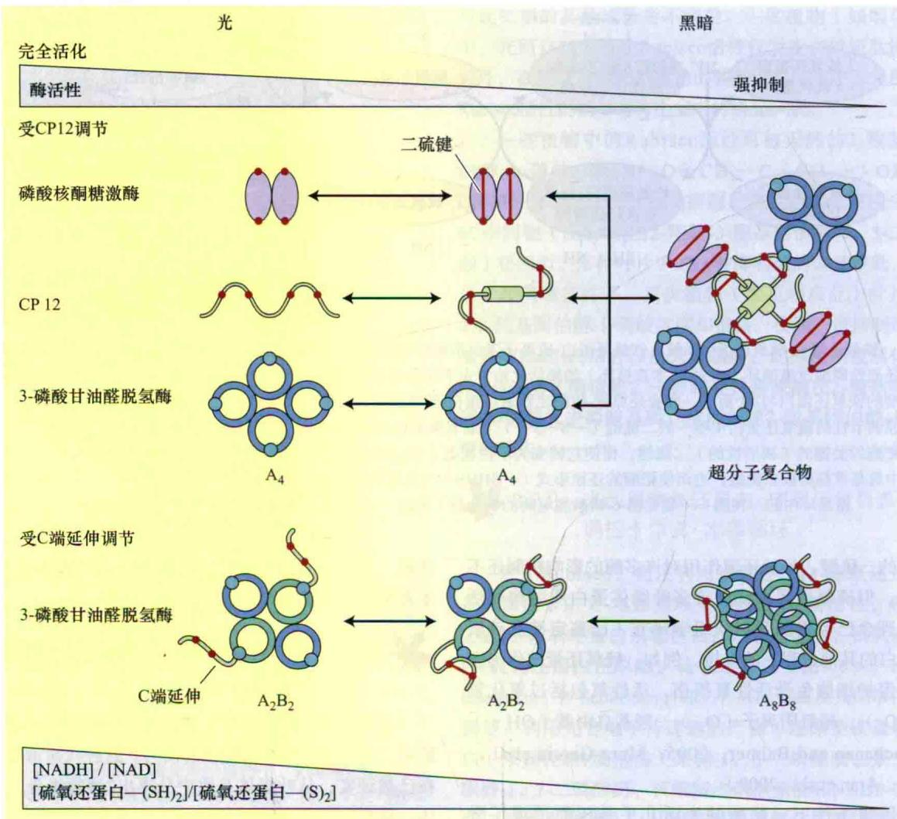  
图8.7 叶绿体磷酸核酮糖激酶和3-磷酸甘油醛脱氢酶的调节。在叶绿体基质中，3-磷酸甘油醛脱氢酶的两种形式参与卡尔文-本森循环。在黑暗条件下，磷酸核酮糖激酶和3-磷酸甘油醛脱氢酶是没有活性的。还原型硫氧还蛋白/氧化型硫氧还蛋白{[硫氧还蛋白-(SH)2]/[硫氧还蛋白-(S)2]}较低，因此有利于CP12、磷酸核酮糖激酶及3-磷酸甘油醛脱氢酶的A₂B₂结构的C端延伸部位中形成二硫键。氧化态的CP12和磷酸核酮糖激酶招募A₄-3-磷酸甘油醛脱氢酶，形成CP12-磷酸核酮糖激酶-A₄-3-磷酸甘油醛脱氢酶超级分子复合体。与此同时，A₂B₂-3-磷酸甘油醛脱氢酶异四聚体聚合形成A₈B₈-3-磷酸甘油醛脱氢酶。在这个阶段，各酶的活性受到强烈抑制。在光照条件下，磷酸核酮糖激酶和3-磷酸甘油醛脱氢酶展现出最大催化能力。还原型硫氧还蛋白/氧化型硫氧还蛋白{[硫氧还蛋白-(SH)2]/[硫氧还蛋白-(S)2]}增加时，二硫键的减少使酶复

合体解散。在这个阶段，被释放的（游离的）磷酸核酮糖激酶和3-磷酸甘油醛脱氢酶完全处于活化状态。

关的调节系统，但其叶绿体中还有该酶的第二种结构的酶——异四聚体 $A_{2}B_{2}$ 。B亚基的氨基酸序列与A亚基同源，前者C端延伸部分有2个半胱氨酸，其—SH基团可被硫氧还蛋白调节。当B亚基C端区域的半胱氨酸残基被还原（光下），3-磷酸甘油醛脱氢酶便具备了催化功能。在氧化状态（黑暗）时，二硫键的产生促使四聚体 $A_{2}B_{2}$ 组合成为无酶促活性的十六聚体 $A_{8}B_{8}$ 。

夏季，为了适应光照强度变化，超级分子复合体的形成则代表一种光合作用机制：通过可逆性地调节磷酸核酮糖激酶和3-磷酸甘油醛脱氢酶的活性。白天，云层和冠层遮盖改变了到达不同叶片的光照强度和光质。其后果：在自然光照射时，为了迅速调节相关酶活性，超级分子复合体的解聚和再聚合必须在数分钟内完成。按照此模式可以预见：在正常的光-暗周期条件下，缺少CP12的蓝藻细菌突变体不能正常生长，但在持续光照条件下能够正常生长（Tamoi et al., 2005）。

## 8.3 $\mathrm{C}_{2}$ 氧化光合碳循环

如图8.4所示，Rubisco有能力催化核酮糖-1，5-二磷酸的羧化和加氧反应（Miziorko and Lorimer，1983）。羧化反应产生2分子3-磷酸甘油酸，而氧化反应（图8.5中的“催化”）产生2-磷酸乙醇酸和3-磷酸甘油酸（图8.5中的“产物”）各1分子。Rubisco催化的核酮糖-1，5-二磷酸加氧反应触发了在叶绿体、叶片过氧化物酶体和线粒体之间相伴发生的酶促反应的网状合作（参见Web Topic 8.7）。这个称为光呼吸（photorespiration）的过程致使卡尔文-本森循环固定的 $CO_{2}$ 部分损失，同时发生的是：光合作用活跃的叶片吸收氧（Ogren，1984；Leegood et al., 1995；Foyer et al., 2009）。

利用各种光呼吸拟南芥突变体，这种竞争性反应对植物生长的负面影响已被揭示：在正常的大气 $CO_{2}$ 浓度（0.03%），突变体出现了生长迟滞、早衰及细胞死亡现象；相反，在高浓度 $CO_{2}$ （0.3%或更高）环境中，这些突变体生长正常。此外，在 $CO_{2}$ 浓度增加的温室中，一些农作物产量大幅度增加。在本章节中，将讲述 $C_{2}$ 氧化光合循环的重要特征：这些反应部分地收回了卡尔文-本森循环中由氧造成的C损失。接下来将呈现通过改变叶片光呼吸作用而提高作物生物量所做的努力。

## 8.3.1 核酮糖-1，5-二磷酸的羧化反应和氧化反应是竞争性反应

作为Rubisco不同的底物， $CO_{2}$ 和 $O_{2}$ 与核酮糖-1，5-二磷酸发生竞争性结合，因为羧化反应和氧化反应发生在同一活性位点。1分子 $O_{2}$ 与核酮糖-1，5-二磷酸的2，3-烯二醇异构体结合，产生一种不稳定的中间物，并快速分裂为2-磷酸乙醇酸和3-磷酸甘油酸（图8.4和图8.7，表8.2反应1）。无论分类学上的起源如何，具有催化核酮糖-1，5-二磷酸的氧化反应能力是所有Rubisco共同特点。甚至厌氧自养细菌中的Rubisco也能催化体外的加氧反应。厌氧自养细菌的这种著名的特征暗示：加氧反应是酶活性部位的内在特性，而不是对暴露在地球大气氧气中的适应性机制。

叶绿体中，核酮糖-1，5-二磷酸加氧反应产生的2-磷酸乙醇酸可被专一的叶绿体磷酸酶迅速水解，生成乙醇酸（表8.2反应2）。乙醇酸后续的代谢在过氧化酶体和线粒体两个细胞器中联合进行（见第1章）（Tolbert，1981）。

乙醇酸利用叶绿体被膜的内膜上的一种特殊蛋白运出，再扩散进入过氧化物酶体。在那里，一种黄素单核苷酸依赖的氧化酶——乙醇酸氧化酶（表8.2反应3）催化 $O_{2}$ 氧化乙醇酸，产生 $H_{2}O_{2}$ 和乙醛酸。过氧化氢酶清除 $H_{2}O_{2}$ 并释放 $O_{2}$ （表8.2反应4），同时，乙醛酸和谷氨酸通过转氨作用生成甘氨酸（表8.2反应5）。

甘氨酸离开过氧化物酶体进入线粒体（图8.8）。线粒体中，在一种由甘氨酸脱羧酶和丝氨酸羟甲基转移酶形成的多酶复合物的催化下，2分子甘氨酸和1分子 $NAD^{+}$ 反应产生丝氨酸、NADH、 $NH_{4}^{+}$ 和 $CO_{2}$ 各1分子（表8.2反应6和7）。此反应将 $NAD^{+}$ 还原反应和C原子的氧化反应相偶联，因为2分子甘氨酸（氧化态： $C_{1}$ 为+3， $C_{2}$ 为-1）被转化为丝氨酸（氧化态： $C_{1}$ 为+3， $C_{2}$ 为0， $C_{3}$ 为-1）和 $CO_{2}$ （氧化态：C为+4）。

新形成的丝氨酸从线粒体扩散回到过氧化物酶体（图8.8），在此被转化为羟基丙酮酸（表8.2反应8），之后，被NADH依赖性还原酶转化为甘油酸（表8.2反应9）。苹果酸-草酰乙酸穿梭将NADH从细胞质转移到过氧化物酶体中，以维持此反应过程中足够的NADH浓度。最终，甘油酸重新进入叶绿体，在此进行磷酸化，产生3-磷酸甘油酸（图8.8，表8.2反应10）。

与此同时，甘氨酸氧化释放的 $NH_{4}^{+}$ （表8.3反应6）从线粒体的基质中快速扩散到叶绿体。同时，依赖ATP的谷氨酰胺合成酶催化 $NH_{4}^{+}$ 与谷氨酸反应，产生谷氨酰胺（图8.8，表8.2反应11）。随后，在铁氧还蛋白依赖的谷氨酸合酶的催化下，谷氨酰胺与2-酮戊二酸反应，产生2分子谷氨酸（表8.2反应12）。

在光呼吸过程中，3个同时进行的循环阐明了C、N、O原子流通情况（图8.9）。

（1）在第一个循环中，C原子以2分子乙醇酸的形式离开叶绿体，又以1分子甘油酸的形式返回，同时在线粒体中留下1分子 $CO_{2}$ 。

（2）在第二个循环中，N原子以1分子谷氨酸的形式离开叶绿体，又以1分子 $NH_{4}^{+}$ 形式返回，最终与1分子2-酮戊二酸相关（图8.8）。结果，总氮量保持不变，因为线粒体中无机氮（ $NH_{4}^{+}$ ）的形成和叶绿体中谷氨酰胺的合成相平衡。

（3）在第三个循环（与 $O_{2}$ 有关）中，Rubisco和乙醇酸氧化酶所催化的反应各消耗2分子 $O_{2}$ ，但是过氧化氢酶从 $H_{2}O_{2}$ 释放1分子 $O_{2}$ （表8.2反应4）。因此，当2分子核酮糖-1，5-二磷酸进入 $C_{2}$ 氧化光合循环时，共有3分子 $O_{2}$ 被还原。

活体中，卡尔文-本森循环和 $C_{2}$ 氧化光合循环之间的平衡主要由3个因素决定：1个和植物本身遗传特性有关（Rubisco酶动力学特征），2个和环境有关（温度、底物 $CO_{2}$ 和 $O_{2}$ 浓度）。随着外部温度增加：①调节Rubisco的动力学常数，提高氧合速率，使其高于羧化速率（Ku and Edwards，1978）；②在液气平衡状态时，溶液 $CO_{2}$ 浓度降低幅度大于 $O_{2}$ 浓度降低幅度（参见Web Topic 8.8）。

因此，在温度较高的气候条件下，与光合作用（羧化反应）关联的光呼吸（加氧作用）的增加严重限制光合作用C同化效率。总之，温度逐步升高使平衡偏离非卡尔文-本森循环，而倾向于 $C_{2}$ 氧化光合循环（见第9章）。

  
图8.8 $\mathrm{C}_{2}$ 氧化光合循环运行由3个细胞器——叶绿体、过氧化物酶体和线粒体互作完成。括号中的数字代表的是表8.2中的反应（编者注）。在叶绿体中，Rubisco加氧酶作用产生2分子2-磷酸乙醇酸；在磷酸乙醇酸磷酸酶作用下，将2-磷酸乙醇酸转化为2分子无机磷酸和2分子乙醇酸。2分子乙醇酸（4C）和1分子谷氨酸从叶绿体进入过氧化物酶体。在过氧化物酶体中，乙醇酸被乙醇酸氧化酶氧化成乙醛酸。乙醛酸：谷氨酸氨基转移酶催化乙醛酸和谷氨酸转变为甘氨酸和2-酮戊二酸。甘氨酸从过氧化物酶体进入线粒体，在这里2分子甘氨酸（4C）经甘氨酸脱羧酶复合体和丝氨酸羟甲基转移酶连续作用，产生了1分子丝氨酸（3C）， $\mathrm{CO}_{2}$ （1C）和 $\mathrm{NH}_{4}^{+}$ 。而后，丝氨酸转运回过氧化物酶体，在丝氨酸氨基转移酶和羟基丙酮酸还原酶的作用下，变为甘油酸（3C）。甘油酸和2-酮戊二酸（来自过氧化物酶体）及 $\mathrm{NH}_{4}^{+}$ （来自线粒体）返回叶绿体，恢复部分碳（3C）及在光呼吸中所有氮素损失。甘油酸被磷酸化为3-磷酸甘油酸，并返回卡尔文-本森循环。在叶绿体基质中，谷氨酰胺合成酶和硫氧还蛋白依赖性谷氨酸合酶（GOGAT），利用无机氮（ $\mathrm{NH}_{4}^{+}$ ）和2-酮戊二酸恢复最初被谷氨酸截获而损失的氮。

表8.2 $C_{2}$ 氧化光合碳循环反应

反应 $^{a}$ 

1. 2核酮糖-1, 5-二磷酸+2O $_{2}$ ——→2 2-磷酸乙醇酸+2 3-磷酸甘油酸

2. 2 2-磷酸乙醇酸+2H $_{2}$ O——→2乙醇酸+P $_{i}$ 

3. 2 乙醇酸+2O $_{2}$ ——→2 乙醛酸+2H $_{2}$ O $_{2}$ 

4. 2H $_{2}$ O $_{2}$ ——→2 H $_{2}$ O+O $_{2}$ 

5. 2乙醛酸+2谷氨酸——→2甘氨酸+α-酮戊二酸

6. 甘氨酸+NAD $^{+}$ +[GDC]——→CO $_{2}$ +NH $_{4}$ $^{+}$ +NADH+亚甲基-[GDC]

7. 亚甲基-[GDC]+甘氨酸+H $_{2}$ O——→丝氨酸+[GDC]

8. 丝氨酸+α-酮戊二酸——→羟基丙酮酸+谷氨酸

9. 羟基丙酮酸+NADH+H $^{+}$ ——→甘油酸+NAD $^{+}$ 

10. 甘油酸+ATP——→3-磷酸甘油酸+ADP

11. 谷氨酸+NH $_{4}$ $^{+}$ +ATP——→谷氨酰胺+ADP+P $_{i}$ 

12. α-酮戊二酸+谷氨酰胺+2Fd $_{red}$ +2H $^{+}$ ——→2谷氨酸+2Fd $_{oxid}$ 

C $_{2}$ 氧化光合循环的净反应

2核酮糖-1, 5-二磷酸+3O $_{2}$ +H $_{2}$ O+谷氨酸

↓（反应1~反应9）

甘油酸+2 3-磷酸甘油酸+NH $_{4}$ $^{+}$ +CO $_{2}$ +P $_{i}$ +α-酮戊二酸

叶绿体中的两个反应还原谷氨酸分子：

α-酮戊二酸+NH $_{4}$ $^{+}$ +[(2Fd $_{red}$ +2H $^{+}$), ATP]

↓（反应11和反应12）

谷氨酸+H $_{2}$ O+[(2Fd $_{oxid}$), ADP+P $_{i}$]

并还原3-磷酸甘油酸分子：

甘油酸+ATP

↓（反应10）

3-磷酸甘油酸+ADP

因此，C $_{2}$ 氧化光合循环消耗3 mol大气氧分子（2 mol在Rubisco氧化酶活化中，1 mol在过氧化物酶体的氧化中）引发了如下结果

(1) 1 mol CO $_{2}$ 释放

(2) 2 mol ATP和2 mol还原力（2Fd $_{red}$ +2H $^{+}$)被消耗

这用于

(1) 完成3C骨架返回到卡尔文-本森循环

(2) NH $_{4}$ $^{+}$ 和α-酮戊二酸发生还原反应，再生成谷氨酸

a 部位：叶绿体；过氧化物酶体；线粒体

## 8.3.2 光呼吸依赖光合电子传递系统

8.2反应6）。

在完整叶片中，光合作用C代谢折射出卡尔文-本森循环和 $C_{2}$ 氧化光合循环2个相反的循环之间的综合的平衡。这些与ATP供给和还原当量（还原型铁氧还蛋白）的光合电子传递系统密切相关（图8.9）。为了将无用的2-磷酸乙醇酸转化为3-磷酸甘油酸，光合磷酸化供给甘油酸转化为3-磷酸甘油酸（表8.2反应10）所需ATP，而羟基丙酮酸还原酶所消耗的NADH（表8.2反应9）通过甘氨酸脱羧酶作用的产物得到补偿（表

在过氧化物酶体中，经过乙醛酸：谷氨酸氨基转移酶催化的转氨基作用，N进入 $C_{2}$ 循环（表8.2反应5）；之后，通过两种方式离开该循环：①将甘氨酸转化为丝氨酸，此反应被甘氨酸脱羧酶复合体和丝氨酸羟甲基转移酶催化（表8.2反应6和反应7）；②丝氨酸氨基转移酶催化的转氨基作用（表8.2反应8）。在光合电子传递系统提供ATP和还原型的铁氧还原蛋白条件下，通过分别与谷氨酰胺合成酶（glutamine synthetase）（表8.2反应11）和铁氧还蛋白依赖性的谷氨酸合酶（glutamatesynthase，GOGAT）合作（表8.2反应12），废物 $NH_{4}^{+}$ 重新被利用。

  
图8.9 $\mathrm{C}_{2}$ 氧化光合循环依赖叶绿体代谢。 $\mathrm{C}_{2}$ 氧化光合循环需要来自于类囊体膜上光反应产生的ATP和还原等价物，在3个细胞器中运行：叶绿体，过氧化物酶体和线粒体。“碳循环”利用①NADPH和ATP将卡尔文-本森循环中的核酮糖-1，5-二磷酸维持在合适水平，②ATP将 $\mathrm{C}_{2}$ 氧化光合循环中的甘油酸转变为3-磷酸甘油酸。“氮循环”利用ATP和还原等价物，将光呼吸循环中的 $\mathrm{NH}_{4}^{+}$ 和2-酮戊二酸弥补谷氨酸。在过氧化物酶体中，“氧循环”清除因 $\mathrm{O}_{2}$ 氧化羟基乙酸而形成的 $\mathrm{H}_{2} \mathrm{O}_{2}$ 。

总结得

$$
2 \text {   核酮糖   } - 1, 5 \text {-二磷酸   } + 3 \mathrm{O} _ {2} + \mathrm{H} _ {2} \mathrm{O} + \mathrm{ATP} +
$$

$$
\begin{array}{r l} & [ 2 \mathrm{Fdred} + 2 \mathrm{H} ^ {+} + \mathrm{ATP} ] \longrightarrow 3 \mathrm{PGA} + \mathrm{CO} _ {2} + 2 \mathrm{P} _ {\mathrm{i}} + \mathrm{ADP} + \\ & [ 2 \mathrm{Fdoxid} + \mathrm{ADP} + \mathrm{P} _ {\mathrm{i}} ] \end{array}
$$

总之，通过核酮糖-1，5-二磷酸加氧反应，卡尔文-本森循环中流失的2分子磷酸乙醇酸（4个C）转化为1分子3-磷酸甘油酸（3个C）和1分子 $CO_{2}$ （1个C），此过程需要1分子ATP水解（Lorimer，1981；Sharkey，1988）。另外，1分子ATP和2分子还原型铁氧还原蛋白对于光呼吸过程中释放的氨分子完全再吸收是必要的。与非光呼吸（ $O_{2}$ 浓度低， $CO_{2}$ 浓度高）过程相比较，光呼吸（空气中 $O_{2}$ 浓度高， $CO_{2}$ 浓度低）过程固定 $CO_{2}$ 需要消耗更多的ATP和还原力。

光呼吸作用与卡尔文-本森循环同时存在，帮助线粒体实现从生物能到C代谢和N同化的各种反应。但是，植物生理学家对此过程的价值有争论。一种理论是：此过程促进C回收，否则就以2-磷酸乙醇酸的形式损失掉。 $C_{2}$ 氧化光合循环以甘油酸的形式回收75%的C，这些C本来以2-磷酸乙醇酸的形式从卡尔文-本森循环中损失。

## 8.3.3 胁迫条件下光呼吸保护光合器官

Rubisco活性位点的 $CO_{2}$ 和 $O_{2}$ 浓度、这些气体与酶的内在亲和性决定了核酮糖-1,5-二磷酸的羧化反应和氧化反应的相对速率。在Rubisco活性位点，不可避免地产生中间物2-磷酸乙醇酸，此中间物是活跃分子，与 $CO_{2}$ 和 $O_{2}$ 都可以发生反应（图8.4）。进化早期阶段，当时 $CO_{2}/O_{2}$ 较高，氧合反应发生的可能性很小。当大气 $O_{2}$ 浓度升高后，氧合反应显著加强。于是，现在大气中 $CO_{2}/O_{2}$ 降低，光呼吸成为以2-磷酸乙醇酸形式部分回收C的不可或缺的途径。3-磷酸甘油酸的产生阻止了进入死胡同的甘油酸的致死性积累。支持这种观点的证据是：缺少甘油酸激酶的拟南芥突变体出现甘油酸积累，这些植株在正常的空气中不能正常生长发育，但在高浓度 $CO_{2}$ 空气中能够存活（Boldt et al., 2005）。

另一种理论是：进化对光呼吸的影响不仅表现在降低了碳损失，也降低了胁迫（如高光强、高温、 $CO_{2}$ 或水分亏缺）条件下叶绿体产生过多的还原剂，并因此导致光合器官的光抑制。当电子受体受限时，光合器官可以使用别的底物解除电子流产生的过剩还原力。与用来改善光抑制伤害的其他机制不同， $C_{2}$ 氧化光合循环可以解除多余的还原当量，因此可以阻止光合电子链的过度还原。因此，缺乏光呼吸酶的拟南芥突变体可以在高浓度 $CO_{2}$ （2%）环境中生存，它们一旦被转移到正常的空气（0.03%的 $CO_{2}$ ）环境中，即迅速死亡。

鉴于此，必须承认的重要进展是：光合细胞中 $\mathrm{H}_2\mathrm{O}_2$ 主要来源于光呼吸，尤其是乙醛酸氧化酶催化的反应。虽然这种活性氧被认为有毒害作用，但 $\mathrm{H}_2\mathrm{O}_2$ 也是信号分子，参与激素和胁迫的应答反应（Foyer et al., 2009）。许多研究显示：当胞内 $\mathrm{H}_2\mathrm{O}_2$ 浓度超过抗氧化酶（过氧化氢酶和过氧化物酶）的清除能力时，光呼吸产生的 $\mathrm{H}_2\mathrm{O}_2$ 不仅触发程序性细胞死亡，也可以调控胞内氧化还原动态平衡。

## 8.3.4 光呼吸有可能用于提高作物产量的生物工程

解决现实中食物和能源短缺问题，在很大程度上依赖于陆地植物对光合 $CO_{2}$ 同化的提高的适应程度。因此，有效地提高生物量被认为是增加世界食物和能源。当 $O_{2}$ 与 $CO_{2}$ 竞争Rubisco活性位点胜出时，Rubisco加氧酶的活性降低了进入卡尔文-本森循环的C量。在此基础上，加强光合作用效率或减少光呼吸可以提高小麦、水稻、棉花产量（Khan，2007）。为了弄清楚如何利用遗传改造叶细胞以提高生物量，科学家尝试了对 $C_{2}$ 氧化光合循环的各种改造：从修饰Rubisco活性位点到引入全新的、同时进行的光呼吸途径。

尽管做了很多努力，但是企图通过改变Rubisco性能来减少光呼吸的尝试一直不成功。另外，光呼吸循环相关的突变体有助于人们理解其生化途径，但是这些植株在大气 $CO_{2}$ （0.03%）中生长矮化，并出现条件性地致死表型（Reumann and Weber，2006）。令人感兴趣的是，其中的一些突变体虽然矮化，但在抑制光呼吸（如将 $CO_{2}$ 浓度提高到0.1%\~0.3%）时能够继续生长。

因为 $C_{2}$ 氧化光合循环是陆地植物必需的，所以改善光合效率的其他途径是将可以挽回2-磷酸乙醇酸中C损失的补充机制引入卡尔文-本森循环。这种有前景的方法保证植物为基本的代谢过程而保留完整的功能性光呼吸途径。支撑这种可能性的是：细菌（E. coli）乙醇酸代谢途径已被成功地引入到陆地植物拟南芥叶绿体（Kebish et al., 2007）（图8.10）。这些转基因植株的叶绿体具有完整的 $C_{2}$ 氧化光合循环功能，同时可以完成细菌乙醛酸脱氢酶（乙醇酸→乙醛酸）（表8.3反应3）、乙醛酸聚醛酶[乙醛酸→丙醇二酸半醛（tartronic semialdehyde）+CO $_{2}$ ]（表8.3反应4）及丙醇二酸半醛还原酶（丙醇二酸半醛→甘油酸）（表8.3反应5）所催化的附加反应。

  
图8.10 大肠杆菌（E. coli）的乙醇酸代谢途径被导入陆生植物叶绿体，使光呼吸乙醇酸再利用。括号中的数字代表的是表8.3中的反应（编者注）。给转基因植株以光照，Rubisco加氧酶活性可以促使产生2-磷酸乙醇酸、2-磷酸乙醇酸的磷酰基部分被水解，产生乙醇酸。在这个阶段，E. coli乙醇酸代谢途径导入拟南芥转基因株系的叶绿体内，将乙醇酸从光呼吸转移到一个替代途径中（红色方框和红色箭头标注）。首先，乙醇酸被乙醇酸脱氢酶氧化成乙醛酸。然后，细菌的乙醛酸羧化酶催化2分子乙醛酸脱水缩合，生成1分子丙醇二酸半醛并释放1分子 $CO_{2}$ 。最后，丙醇二酸半醛被丙醇二酸半醛还原酶催化产生甘油酸，甘油酸通过 $C_{2}$ 氧化循环进入卡尔文-本森循环。

将细菌乙醇酸途径引入到陆地植物叶绿体，可以降低光呼吸代谢物在过氧化物酶体和线粒体之间的流动。虽然基因工程改造的乙醇酸支路是光呼吸途径，该路径依赖Rubisco加氧酶活性并需要 $CO_{2}$ 的参与，但此途径不同于内源的对应途径，此内源路径可以避开线粒体和过氧化物酶体中光呼吸反应。因此，将植物的乙醇酸代谢途径转换为细菌的代谢方式可以减少能量（1分子ATP、2分子还原型铁氧还蛋白）消耗，这些能量被用于谷氨酰胺合成酶（表8.2反应11）及谷氨酸合酶（表8.2反应12）连续介导氨的再利用过程。值得注意的是，同叶绿体基质中能量需求低和C原子再利用增加相一致，这些基因工程植株生长较快、生物量增加、可溶性糖含量更高。

表8.3 改造后的C₂氧化光合碳循环反应

<table><tr><td>反应a</td><td>酶</td></tr><tr><td>1.2核酮糖-1,5-二磷酸+2O2→2 2-磷酸乙醇酸+2 3-磷酸甘油酸</td><td>核酮糖-1,5-二磷酸羧化/加氧酶</td></tr><tr><td>2.2 2-磷酸乙醇酸+2H2O→2乙醇酸+2Pi</td><td>磷酸乙醇酸磷酸酶</td></tr><tr><td>13.2乙醇酸+2NAD+→2乙醛酸+2NADH+2H+</td><td>乙醇酸脱氢酶</td></tr><tr><td>14.2乙醛酸+H+→丙醇二酸半醛+CO2</td><td>乙醛酸聚醛酶</td></tr><tr><td>15.丙醇二酸半醛+NADH+H+→甘油酸+NAD+</td><td>丙醇二酸半醛还原酶</td></tr><tr><td>10.甘油酸+ATP→3-磷酸甘油酸+ADP</td><td>甘油酸激酶</td></tr><tr><td colspan="2">基因工程改造的C2氧化光合循环的净反应</td></tr><tr><td></td><td>2核酮糖-1,5-二磷酸+2O2+2H2O+NAD+↓(反应1,反应2,反应13~反应15)甘油酸+2 3-磷酸甘油酸+NADH+H+CO2+2Pi</td></tr><tr><td colspan="2">这个反应被叶绿体甘油酸激酶催化,还原3-磷酸甘油酸:</td></tr><tr><td></td><td>甘油酸+ATP↓(反应10)3-磷酸甘油酸+ADP</td></tr></table>

a部位：叶绿体

## 8.4 无机碳浓缩机制

大约3.5亿年前，大气中 $CO_{2}$ 含量明显下降而 $O_{2}$ 浓度却显著增加，这一变化引起了植物对环境的一系列适应，而这种环境能使光合作用有机体中光呼吸增强。这些适应性变化涉及各种各样措施：积极地从环境吸收 $CO_{2}$ 和 $HCO_{3}^{-}$ ，达到在Rubisco周围积累无机碳的目的（Giordano et al., 2005）。紧接着，增加Rubisco附近 $CO_{2}$ 浓度的 $CO_{2}$ 浓缩机制是减少加氧反应。原核生物蓝藻细菌、真核生物藻类、水生植物的原生质膜上 $CO_{2}$ 和 $HCO_{3}^{-}$ 泵已被广泛研究（见Web Topic 8.1）。

以下章节关注陆地植物进化而来的，在Rubisco羧化反应位点进行 $CO_{2}$ 浓缩的两种不同机制：① $C_{4}$ 光合作用的碳固定（ $C_{4}$ ）；②景天（科）酸代谢（CAM）。

这两种机制存在于一些被子植物，连同卡尔文-本森循环“插件”——将大气 $CO_{2}$ 吸收与Rubisco底物供给分离开来。

## 8.5 无机碳浓缩机制: $\mathrm{C}_{4}$ 碳循环

为了降低Rubisco加氧酶活性和光呼吸循环中的碳损失，陆地植物 $C_{4}$ 光合作用进化成一种主要的浓缩碳机制，以此弥补大气 $CO_{2}$ 浓度降低带来的不利影响。在这一部分内容中，讲述 $C_{4}$ 光合作用的生化特点：不同类型的细胞将无机碳整合到碳骨架的协同作用、光介导的酶活性改变、碳浓缩机制维持许多热带植物生长的重要性。

## 8.5.1 苹果酸和天冬氨酸是 $C_{4}$ 循环的羧化反应产物

20世纪50年代晚期，H. P. Kortschack和Y. Karpilov分别利用 $^{14}$ CO $_{2}$ 标记的甘蔗和玉米中四碳酸进行了早期实验。在光条件下，接受 $^{14}$ CO $_{2}$ 处理几秒后，便发现叶片中70%\~80%的 $^{14}$ C出现在苹果酸和天冬氨酸等四碳酸中，而这一现象在只能进行卡尔文-本森循环光合作用的叶片中没有发生。

为了进一步认识这些初步观察到的现象，M. D. Hatch 和 C. R. Slack 提出了 $C_{4}$ 光合碳循环（ $C_{4}$ cycle， $C_{4}$ 循环；也称为 Hatch-Slack 循环）。他们认为：苹果酸和天冬氨酸是甘蔗叶片光合作用中初步稳定的、可检测的中间物，而且苹果酸的 $C_{4}$ 变成3-磷酸甘油酸的 $C_{1}$ （Hatch and Slack，1966）。后来的转化变得清晰起来，因为他们发现：这种新的代谢途径发生在2种不同形态的、不同类型的细胞——叶肉细胞（mesophyll cell）和维管束鞘细胞（bundle sheath cell）中，并被各自的膜所隔离（“扩散屏障”，图8.11）。 $C_{4}$ 循环中，磷酸烯醇式丙酮酸羧化酶（phosphoenol-pyruvate carboxylase，PEPCase），而不是Rubisco，催化在接近于空气的组织中发生的初始羧化反应（表8.4反应1）（见Web Essay 8.1）（Sage，2004）。其结果是四碳酸跨越扩散屏障流入维管束区域，在此四碳酸脱羧、释放 $CO_{2}$ ，后者

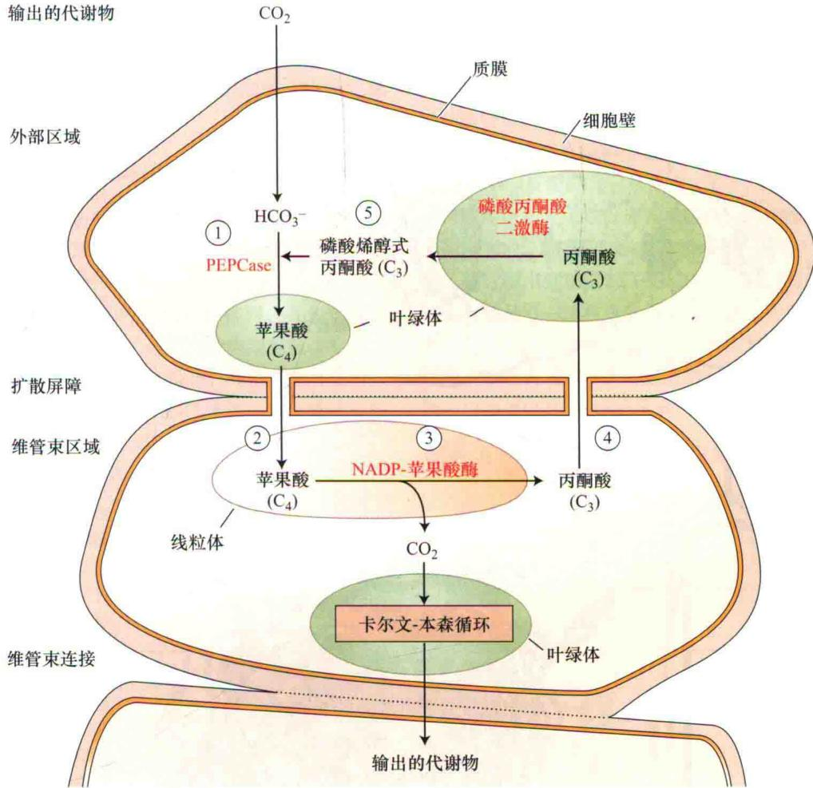  
图8.11 C $_{4}$ 光合碳循环包括在叶细胞中两个不同区室中的5个连续步骤。①在叶肉细胞的边缘（靠外区域），即接近于外界环境处，磷酸烯醇式丙酮酸羧化酶（phosphoenol-pyruvate carboxylase，PEPCase）催化HCO $_{3}^{-}$ 和PEP（一种三碳化合物）发生反应，四碳反应产物草酰乙酸分别被NADP-苹果酸脱氢酶和草酰乙酸氨基转移酶转变为苹果酸或天冬氨酸（根据不同的物种）（表8.4）。为了能够简单明了，在此仅给出苹果酸的反应。②四碳酸通过渗透屏障进入维管束区域。③脱羧酶（如NAD-苹果酸酶）作用于四碳酸，使其释放出CO $_{2}$ ，并生成三碳酸（如丙酮酸）。释放出的CO $_{2}$ 被维管束区的叶绿体摄取，在周围建立起一个高浓度CO $_{2}$ 环境（相对于O $_{2}$ ），从而促进CO $_{2}$ 在卡尔文-本森循环中同化。④剩余的三碳酸（如丙酮酸）返回和外界大气接触的区域。⑤关闭C $_{4}$ 循环，HCO $_{3}^{-}$ 受体（磷酸烯醇式丙酮酸）通过丙酮酸磷酸二激酶再生，进入另一轮循环。每摩尔CO $_{2}$ 固定需消耗2分子ATP，促使C $_{4}$ 循环朝着箭头方向进行。这样，将大气CO $_{2}$ 泵入卡尔文-本森循环。同化的碳在细胞质中被转变成蔗糖，之后，离开叶绿体进入韧皮部，再被运至植物体的其他部位。

图8.12 叶片 $C_{4}$ 光合作用途径。A. 在几乎所有已知的 $C_{4}$ 植物中，光合作用 $CO_{2}$ 吸收需要形成Kranz结构（左侧图）。这种结构特征将光合作用反应分在两种不同类型的细胞内——叶肉细胞和维管束鞘细胞（围绕叶脉同轴排列）。维管束鞘细胞环绕维管组织，与此同时，一个外部的叶肉细胞环包绕维管束并与细胞间隙相邻。把用于固定 $CO_{2}$ 的细胞和用于还原碳的细胞分隔开的膜结构，对于陆生植物 $C_{4}$ 光合作用高效进行是十分必要的。一些陆生植物，以Borszczowia aralocaspica和Bienertia cycloptera为典型，在单个细胞中存在有效的 $C_{4}$ 划分（右侧图）。对这些植物的光合作用关键酶进行研究，同样发现了两种类型的叶绿体，这些叶绿体位于不同细胞质区室内，并具有叶肉细胞和Kranz结构中维管束鞘细胞类似的功能。B. $C_{4}$ 双子叶植物（坛紫菜，菊科）中的Kranz结构。C. 单细胞 $C_{4}$ 光合作用。 $C_{4}$ 循环的图表是叠加在Borszczowia aralocaspica（左）和Bienertia cycloptera（右）电子显微照片上的（B图由Athena McKown惠赠，C图引自Edwards et al., 2004）。

被卡尔文-本森循环中Rubisco固定。虽然 $C_{4}$ 植物都有PEPCase催化的基本的羧化反应，但是各种 $C_{4}$ 植物在Rubisco附近区域浓缩 $CO_{2}$ 途径呈现很大差别（参见Web Topic 8.9）。

20世纪五六十年代，一些开创性的研究发现： $C_{4}$ 循环与叶片特殊结构——Kranz结构（Kranz德语意思是花环）有关，该结构内层是微管组织包围的环状排列的维管束鞘细胞，外层是与表皮紧密相连的叶肉细胞。这种特殊的叶片组织可以保证酶的区域化，且这些区域化的酶在2种不同类型的细胞中是 $C_{4}$ 途径行使功能所必需的。但是，现在也有明显例证表明：一些绿藻、双子叶植物、水生或陆地植物可以进行单细胞 $C_{4}$ 光合作用（Edwards et al., 2004；Muhaidat et al., 2007）（图8.12A）（参见Web Topic 8.10）。因此，代谢物在两个区域间的流转可以保障梯度扩散驱动的 $C_{4}$ 循环运转，此现象不仅发生在细胞之间，也发生在细胞内部。

## 8.5.2 参与 $\mathrm{C}_4$ 循环的两种不同类型的细胞

最初发现的植物叶片 $C_{4}$ 循环关键特点是：微管组织被2种不同类型的光合细胞包围，内圈是维管束鞘细胞（bundle sheath cell），外圈为叶肉细胞（mesophyll cell）。维管束鞘细胞的叶绿体向心排列，并包含大淀粉颗粒和非垛叠类囊体膜。另外，叶肉细胞包含有无规律排列的叶绿体，其中类囊体垛叠，几乎不含有淀粉。在这种解剖结构中， $CO_{2}$ 从外部气体被运输到维管束鞘细胞经5个连续步骤（图8.12B，表8.4）。

（1）在叶肉细胞中，PEPCase催化磷酸烯醇式丙酮酸的羧化反应，固定 $HCO_{3}^{-}$ （表8.4反应1）。随后，此反应的产物——草酸乙酸被NADP-苹果酸脱氢酶还原成苹果酸（表8.4反应2），或者和谷氨酸进行转氨基作用变成天冬氨酸（表8.4反应3）。

（2）将四碳酸（苹果酸或天冬氨酸）转运到环绕着维管束的维管束鞘细胞。

（3）四碳酸脱羧产生 $CO_{2}$ ，后者由卡尔文-本森循环还原成碳水化合物。此反应之前，一些 $C_{4}$ 植物在天冬氨酸转氨酶的催化下，将天冬氨酸重新变为草酰乙酸（表8.4反应3）。不同亚型的 $C_{4}$ 植物雇佣不同的脱羧酶从不同的有机酸中截取 $CO_{2}$ ，这种作用通过提高 $CO_{2}/O_{2}$ 而有效地减少Rubisco加氧酶反应（表8.4反应4和反应5）（参见Web Topic 8.9）。

（4）由脱羧基反应产生的三碳骨架（丙酮酸或丙氨酸）运回叶肉细胞。

（5） $HCO_{3}^{-}$ 受体再生。在丙酮酸磷酸二激酶催化下，丙酮酸（三碳酸残基）产生磷酸烯醇式丙酮酸（表8.4反应7）。期间，腺苷酸激酶催化AMP生成ADP，反应消耗另1分子ATP（表8.4反应8）。当三碳化合物丙氨酸从维管束鞘细胞输出，在丙氨酸转氨酶作用下脱氨形成丙酮酸，然后在丙酮酸磷酸二激酶催化下发生磷酸化作用（表8.4反应6）。

酶的区域化可以保证无机碳被叶肉细胞从环境气体中初步吸收，被卡尔文-本森循环中的维管束鞘细胞固定，最后输出到韧皮部（图8.11）。因为与 $C_{4}$ 循环相关的酶大量且专一地在这些细胞中表达。研究Amaranthus edulis（苋果）PEPCase缺失突变体发现，因为维管束鞘细胞中缺乏有效的 $CO_{2}$ 固定机制，使得 $C_{4}$ 植物中的光呼吸作用显著提高（Dever et al., 1996）。

## 8.5.3 $\mathrm{C}_{4}$ 循环在维管束鞘细胞的叶绿体中浓缩 $\mathrm{CO}_{2}$

起初用 $C_{4}$ 循环描述热带草本植物，现在知道：该循环可以在包括单子叶和双子叶植物的18个家族中进行，在禾本科（玉米、黍、高粱、甘蔗）、藜科（Atriplex spp.）和莎草科（多个属）中尤为显著（Edwards and Walker，1983）。所有的C4循环运行需要两种类型的、含有叶绿体的细胞（前已述及）的有效协作：排列在Kranz结构中不同位置的叶肉细胞和维管束鞘细胞（图8.12B）。连接这两种细胞的胞间连丝在维管束鞘细胞（维管区）中制造了比叶肉细胞（外界区）中更高的CO2浓度，有利于其输出（图8.11）。提高Rubisco羧化位点CO2浓度可以抑制核酮糖-1，5-二磷酸加氧反应和光呼吸。

表8.4 $C_{4}$ 光合碳循环的反应

<table><tr><td>酶</td><td>反应</td></tr><tr><td>1.PEPCase</td><td>磷酸烯醇式丙酮酸+ $HCO_{3}^{-}$ →草酸乙酰+ $P_{i}$ </td></tr><tr><td>2.NADP-苹果酸脱氢酶</td><td>草酸乙酰+NADPH+ $H^{+}$ →苹果酸+NADP $^{+}$ </td></tr><tr><td>3.天冬氨酸转氨基酶</td><td>草酰乙酸+谷氨酸→天冬氨酸+2-氧戊二酸</td></tr><tr><td>4.NAD(P)-苹果酸酶</td><td>苹果酸+NAD(P) $^{+}$ →丙酮酸+ $CO_{2}$ +NAD(P) $H$ + $H^{+}$ </td></tr><tr><td>5.磷酸烯醇式丙酮酸脱羧酶</td><td>草酰乙酸+ATP→磷酸烯醇式丙酮酸+ $CO_{2}$ +ADP</td></tr><tr><td>6.丙氨酸转氨基酶</td><td>丙酮酸+谷氨酸→丙氨酸+ $\alpha$ -酮戊二酸</td></tr><tr><td>7.丙酮酸磷酸二激酶</td><td>丙酮酸+ $P_{i}$ +ATP→磷酸烯醇式丙酮酸+AMP+ $PP_{i}$ </td></tr><tr><td>8.腺苷酸激酶</td><td>AMP+ATP→2ADP</td></tr><tr><td>9.焦磷酸酶</td><td> $PP_{i}$ + $H_{2}O$ → $2P_{i}$ </td></tr></table>

注： $P_{i}$ 和 $PP_{i}$ 分别代表无机磷酸和焦磷酸

除解剖结构差异之外，这些细胞在酶组成上有很大不同。PEPCase和Rubisco分别位于叶肉和维管束鞘细胞，而脱羧酶位于维管束鞘细胞的不同区室：NADP-苹果酸酶位于叶绿体中（表8.4反应4），NAD-苹果酸酶位于线粒体中（表8.4反应4），磷酸烯醇式丙酮酸羧激酶位于细胞质中（表8.4反应5）。光合作用的过渡性储存产物——淀粉绝大部分聚积在维管束鞘细胞的叶绿体中。

$C_{4}$ 植物叶肉和维管束鞘细胞中的叶绿体在其他结构和生化特征上存在差异。PSⅡ活性伴随线性电子流向PSⅠ，并产生NADPH和ATP，这些反应一般发生在基粒含量较多的叶绿体中；而PSI推动的电荷环形流动绝大部分产生ATP，此过程发生在基粒含量较低的叶绿体中。这两种类型的叶绿体与 $C_{4}$ 光合作用能量需求密切相关。苹果酸是 $C_{4}$ 植物的优势产物，将苹果酸转化为草酰乙酸的植物比利用天冬氨酸进行此转化的植物消耗更多的还原力（表8.4反应2和反应3）。因此，NADP-苹果酸酶类型的 $C_{4}$ 植物叶肉细胞叶绿体中具有发达的基粒，苹果酸从叶肉细胞运至维管束鞘细胞。与之相反，NAD-苹果酸酶类型的 $C_{4}$ 植物中，叶肉细胞固定 $CO_{2}$ 的原初产物是天冬氨酸，此反应需要较少的还原力，因此电子直接流向PSⅠ。因为PSⅠ中的电子环流产生的ATP可以驱动丙酮酸向磷酸烯醇式丙酮酸的转变（表8.4反应7），NAD-苹果酸酶类型的 $C_{4}$ 植物叶肉细胞叶绿体比维管束鞘细胞含有较少的基粒。

重组DNA技术在植物代谢研究中的应用，大大推进了人们对 $C_{4}$ 光合作用调控的理解。利用PEPCase和Rubisco比率改变的转基因植物，可以研究这些酶的相对水平是否决定 $C_{4}$ 光合作用效率。反义抑制Rubisco而降低其含量的Flaveria叶片中，PEPCase水平没有受到协同性影响（Siebke et al., 1997；von Caemmerer et al., 1997）。虽然这些转基因植物的维管束鞘细胞中 $CO_{2}$ 浓度更高，但 $CO_{2}$ 增加不能被保持，因而光合作用效率降低。相反地，低光下，高表达碳酸酐酶的烟草维管束鞘细胞中的 $HCO_{3}^{-}$ 经过胞间连丝渗漏到叶肉细胞，光合作用下降。此现象显示：尽量限制 $CO_{2}$ 从维管束中扩散出来对于 $C_{4}$ 光合作用的效率很重要（Ludwig et

al., 1998)。

像第1章描述的那样，绿色植物的叶绿体由其被膜的双层膜包围着从细胞质独立起来，管制很多专一的代谢物运输体。利用液相色谱和串联质谱分析方法，分析来自于大豆（一种 $C_{3}$ 植物）和玉米（一种 $C_{4}$ 植物）叶肉细胞叶绿体膜，发现：叶绿体被膜对 $C_{4}$ 光合作用需求的适应性（Brautigam et al., 2008）。 $C_{3}$ 植物和 $C_{4}$ 植物的叶肉细胞中的叶绿体本质上相似，但在叶绿体被膜蛋白质组上存在量的差异。值得一提的是， $C_{4}$ 植物被膜上的参与丙糖磷酸和磷酸烯醇式丙酮酸转运蛋白比 $C_{3}$ 植物丰富得多。这种高丰度确保 $C_{4}$ 植物叶绿体被膜的代谢中间物流通量比 $C_{3}$ 植物中更高。

$C_{3}$ 植物维管束周围存在 $C_{4}$ 类光合作用，暗示：从 $C_{3}$ 途径稍加修饰就可演化为 $C_{4}$ 光合作用。一些 $C_{3}$ 植物（如烟草）的木质部和韧皮部细胞附近表现出 $C_{4}$ 光合作用特征——使用维管系统的苹果酸作为碳源（Hibberd and Quick，2002）。同时，这些细胞中有 $C_{4}$ 途径所特有的酶[NAD（P）-苹果酸酶和磷酸烯醇式丙酮酸羧激酶]。这说明 $C_{3}$ 植物已经具备 $C_{4}$ 光合作用所必需的基本生化成分。与这些研究结果一致的观点是： $C_{4}$ 光合作用是从 $C_{3}$ 代谢发展而来，期间进行了一些关键酶的调节或组织专一性改变。

## 8.5.4 单个细胞中的 $C_{4}$ 循环也能够浓缩 $CO_{2}$

研究发现：一些有机体中的 $C_{4}$ 光合作用不具有Kranz结构，说明 $C_{4}$ 固定碳的模式比已知的模式更加多样化（参见Web Topic 8.10）。两种生长于亚洲的植物Borszczowia aralocaspica和Bienertia cycloptera能在单个绿色组织细胞中完成整个 $C_{4}$ 光合作用（Sage，2002；Edwards et al., 2004）（图8.12B）。单细胞的海洋原生生物硅藻类也可以在单细胞中进行 $C_{4}$ 光合作用。

## 8.5.5 光调控重要 $\mathrm{C_4}$ 酶活性

除了提供ATP和NADPH，光对于 $C_{4}$ 循环中几种特殊酶的调控也至关重要。因此，光子流量变化可以改变NADP-苹果酸脱氢酶、PEPCase和丙酮酸磷酸二激酶活性（表8.4反应1、反应2和反应7），其调节机制包括两种：硫基-二硫键转换[Ens-(Cys-S) $_{2}$ $\leftrightarrow$ Ens-(Cys-SH) $_{2}$ ]和一些特殊氨基酸残基的磷酸化-脱磷酸化[如丝氨酸，Ens-Ser-OH $\leftrightarrow$ Ens-Ser-OP]。

经典的铁氧还蛋白-硫氧还蛋白系统调节NADP-苹果酸脱氢酶活性（图8.6）。叶片受到光照时，此酶被还原（激活），黑暗时被氧化（失活）。另外，一种专一的丝氨酸-苏氨酸激酶——PEPCase激酶催化PEPCase的磷酸化，加速环境 $CO_{2}$ 的吸收（参见Web

Topic 8.1）（Izui et al., 2004）。夜间，磷酸化的丝氨酸被蛋白磷酸酶2A脱磷酸化，使PEPCase催化能力恢复到基本（低）水平。此外，一种很独特的蛋白质严格调节丙酮酸磷酸二激酶（pyruvate-phosphate dikinase, PPDK）活性随昼/夜节律的变化（Burnell and Hatch, 2006）。丙酮酸磷酸二激酶（PPDK）翻译后活性受到一种双功能酶——苏氨酸激酶-磷酸酶调节，此双功能酶既可以催化依赖ADP的丙酮酸磷酸二激酶的磷酸化（PPDK+ADP↔PPDK-P+AMP），也可以催化依赖 $P_{i}$ 的丙酮酸磷酸二激酶的脱磷酸化（PPDK-P+ $P_{i}$ ↔PPDK+ $PP_{i}$ ）。通过激酶-磷酸酶调节，黑暗导致 $P_{i}$ 基团附加到丙酮酸磷酸二激酶专一的苏氨酸上，导致该酶失活。磷酸解离的磷酸基团可以恢复丙酮酸磷酸二激酶催化能力。

## 8.5.6 炎热干燥气候下， $C_{4}$ 循环降低光呼吸和水分损失

前已述及，温度升高可以降低Rubisco羧化活性和 $CO_{2}$ 溶解能力，因此限制 $C_{3}$ 植物光合作用中 $CO_{2}$ 同化速率。对于 $C_{4}$ 植物来说，两个特性可以克服高温对光合作用的不利影响。

第一，当高温和 $CO_{2}$ 浓度降低时，PEPCase和底物 $HCO_{3}^{-}$ 亲和性足够高。又因为起初的羧化反应中 $HCO_{3}^{-}$ 不与 $O_{2}$ 竞争，所以Rubisco加氧酶活性大部分被抑制。PEPCase活性升高有助于 $C_{4}$ 植物在高温下减少气孔开度而保持水分，因此在等于或高于 $C_{3}$ 植物的 $CO_{2}$ 固定率的情况下， $C_{4}$ 植物更节约水量。

第二，维管束鞘细胞中高浓度 $CO_{2}$ 可以限制 $C_{2}$ 氧化光合循环（Maroco et al., 1998）。

以上两个特征使得光合作用更加有效运行，赋予 $C_{4}$ 植物更有利的竞争优势，也就是说，在干燥、炎热的环境中，光呼吸的消耗有更重要的意义。

## 8.6 无机碳浓缩机制：景天酸代谢(CAM)

生活在季节性降水稀少的干旱地区，许多植物（包括具有重要经济价值的菠萝、龙舌兰、仙人掌和兰花）在Rubisco位点存在另外一种 $CO_{2}$ 浓缩机制。这种重要的光合碳固定反应称为景天酸代谢（CAM），这个名称用来纪念在Bryophyllum calycinum（一种肉质的景天科植物）上所进行的初次研究（Cushman，2001）。与 $C_{4}$ 的机制一样，在缺水环境中，CAM光合作用似乎在过去的3.5亿年中已经出现，捕获大气 $CO_{2}$ 并捕食呼吸产生的 $CO_{2}$ 。

CAM植物的突出特点是能够生活在降雨少、蒸发量高到不足以维持作物生长的环境中，且能够获得很高的生物量。与CAM植物减少水分损失相适应的结构特点是：厚表皮、低表面积/体积、大液泡、气孔开度小；白天，叶肉细胞紧密排列而减少 $CO_{2}$ 损失。一般情况下，CAM植物每得到1g $CO_{2}$ 需要损失50\~100g水、 $C_{4}$ 植物损失250\~300g水， $C_{3}$ 损失400\~500g水（见第4章）。因此，CAM植物的优势是可以在干旱环境（如沙漠地带）中生存。

如上所述， $C_{4}$ 植物在脱羧反应的前几秒钟内在一个区域（如叶肉细胞）中形成四碳酸，而卡尔文-本森循环中 $CO_{2}$ 再固定反应发生在另一个区域（如维管束鞘细胞）。对于CAM植物而言，大气 $CO_{2}$ 最初被四碳酸捕获直至最后 $CO_{2}$ 被嵌入联系紧密的碳骨架空间上，而时间上不同步，在24h光照-黑暗环节律中几乎相差12h（图8.13）。

夜晚，借助于储存的碳水化合物分解而来的磷酸烯醇式丙酮酸，胞质PEPCase将大气（和呼吸）中的 $CO_{2}$ 固定并形成草酰乙酸（表8.4反应1）。胞质NAD-苹果酸脱氢酶将草酰乙酸转化为苹果酸，作为夜晚的剩余物储存在酸性液泡中（表8.4反应2）。白天，储存的苹果酸被运到叶绿体中，并利用与 $C_{4}$ 植物类似机制进行脱羧，即通过胞质NADP-苹果酸酶、线粒体NADP-苹果酸酶或线粒体磷酸烯醇式丙酮酸羧激酶进行脱羧反应（表8.4反应4和反应5）。被释放的 $CO_{2}$ 在卡尔文-本森循环中重新固定，而补充的三碳酸转化为磷酸丙糖，然后 $C_{4}$ 植物通过糖异生反应再将其转化为淀粉或蔗糖。

以每天24h计的CAM循环，C吸收速率和酶活性的变化被分为4个不同的阶段：阶段1（夜间）、阶段2（清晨）、阶段3（白天）、阶段4（下午晚些时候）（参见Web Topic 8.11）。在夜间的阶段1，气孔开放，叶片进行呼吸， $CO_{2}$ 被捕捉并以苹果酸的形式储存于液泡。PEPCase吸收 $CO_{2}$ 主要发生在阶段1。在白天的阶段3，气孔关闭，叶片进行光合作用，储存的苹果酸被脱掉羧基。Rubisco活性中心 $CO_{2}$ 浓度升高的结果是缓解了光呼吸的负面效应。短暂的阶段2和阶段4分别为阶段3和阶段1做准备。Rubisco活性在阶段2提高、在阶段4下降。相反，PEPCase活性在阶段4提高，在阶段2下降。

不同的CAM植物，每个时间段的长度和对总碳平衡的贡献差异很大。组成型的CAM植物在夜间不停地吸收 $CO_{2}$ ，而相对应的兼性CAM途径仅仅在水分胁迫时启用CAM途径。

卡尔文-本森循环产生的磷酸丙糖是在叶绿体中以淀粉储存还是用于蔗糖合成取决于植物种类。这些碳水化合物最终不仅保证植物的生长，也保证第二天晚上的羧化反应的底物。总之，紧密相连的羧化反应和脱羧反应在时间上的分离可以减少Rubisco的无效运行，优化

黑暗: 气孔开放

  
图8.13 景天科酸代谢（CAM）。在景天科酸代谢中，摄取 $CO_{2}$ 和通过卡尔文-本森循环的 $CO_{2}$ 固定被暂时分开。括号中的数字代表的是表8.4中的反应。对大气中 $CO_{2}$ 摄取发生在夜间，此时气孔是张开的。在这一阶段，细胞质基质中气态 $CO_{2}$ 增加 $HCO_{3}^{-}$ 水平（ $CO_{2}+H_{2}O\longleftrightarrow HCO_{3}^{-}+H^{+}$ ）。这部分 $CO_{2}$ 来自于外界大气和线粒体中的呼吸作用。随后，胞质PEPCase（PEP羧化酶）催化 $HCO_{3}^{-}$ 和磷酸烯醇式丙酮酸发生反应。磷酸烯醇式丙酮酸来自于叶绿体淀粉在夜间分解，最终导致四碳酸（草酰乙酸）被还原成苹果酸，苹果酸导致液泡酸化。在白天，夜晚被储存在液泡中的苹果酸返回到细胞质基质中。苹果酸脱羧酶（NAD-苹果酸酶）作用于苹果酸，使其释放出 $CO_{2}$ ， $CO_{2}$ 又通过卡尔文-本森循环被重新固定在碳骨架中。实质上，白天叶绿体中淀粉积累可以看作夜间无机碳的净吸收。白天，气孔关闭不仅阻止运输过程中水分的散失，同时能够阻止内部 $CO_{2}$ 与外界大气交换。

了水分利用，因此可以提高胁迫环境中的光合性能。

## 8.6.1 CAM是灵活感受环境刺激的机制

在水分亏缺环境中，CAM植物高效利用水分可能说明物种多样性及新物种形成。生长于沙漠的CAM植物（如仙人掌）通过在凉爽的夜晚打开气孔，在干燥炎热的白天关闭气孔而得到水分高效利用。白天，关闭气孔减少水分损失，但由于 $H_{2}O$ 和 $CO_{2}$ 拥有共同的运输途径，因此 $CO_{2}$ 必须在夜晚摄取。光照可以动员储存在液泡的苹果酸，为卡尔文-本森循环中专一的脱羧酶——NAD（P）H-苹果酸酶和烯醇式丙酮酸激酶同化 $CO_{2}$ 打基础（Drincovich et al., 2001）。

当气孔关闭时，脱羧酶和线粒体呼吸作用释放的 $CO_{2}$ 都不能从叶片逃逸。因此，内部产生的 $CO_{2}$ 被卡尔文-本森循环固定，将其转化为碳水化合物。气孔关闭不仅可以保水，而且有助于提高内部 $CO_{2}$ 浓度，以此提高核酮糖-1，5-二磷酸光合作用中的羧化反应。非洲刺梨（Opuntia stricta）不经意间被带入澳大利亚生态系统中，这些植物适应环境的情况能说明CAM陆地植物适应干旱环境的潜在的优越性。在不足1个世纪的时间里，这种刺梨从较少的1840株植物迅速扩展到占地2.5亿亩 $^{①}$ 的种群。

遗传背景和环境因素决定了CAM植物的生化和生理能力的表达程度。虽然许多室内生长的、多汁的、观赏类的景天科植物（如长寿花）等标准的CAM类植物表现出昼夜节律性，其他的（如猪胶树属）在对生叶片中同时进行 $C_{3}$ 光合作用和CAM（Lüttge et al., 2008）。夜间PEPCase与白天Rubisco同化 $CO_{2}$ 量（ $CO_{2}$ 总同化量）比率受以下因素综合调节：①气孔行为；②有机酸含量和储存的碳水化合物积累量的波动；③初级（PEPCase）和二级（Rubisco）羧化酶活性；④脱羧酶活性；⑤ $C_{3}$ 碳骨架合成和分解。

许多CAM植物根据环境长期变化特点而调整 $CO_{2}$ 摄入的类型。在使用CAM光合途径的植物中，如冰叶日中花（Mesembryanthemum crystallinum L.）、龙舌兰、猪胶树（Clusia），缺水时使用CAM光合途径；而水分充足时，逐渐过渡到 $C_{3}$ 类型。其他环境因素（如盐分、温度、光强度或光质量）也影响一些植物CAM实施程度。这种调控形式需要多种CAM基因应答环境胁迫信号而表达（Adams et al., 1998; Cushman, 2001; Lüttge et al., 2008）。

干旱环境中，关闭气孔保水机制也许不是CAM进化的唯一原则，因为令人费解的是：水生植物中也有CAM作用机制（Mommer and Visser，2005；Lawlor，2009）。推测：CAM机制有利于植物在水环境中获得无机碳（即 $HCO_{3}^{-}$ ），因为水中气体扩散阻力太大，限制了 $CO_{2}$ 可利用性。

## 8.7 光合作用中淀粉和蔗糖的积累与分流

真核细胞的显著性特点是各代谢舱室之间形成错综复杂的功能网络。真核生物必须把糖从它合成和吸收位点（源）移送到使用它们的细胞（库）中去（为了生长和能量）。动物血管可以运输葡萄糖，而植物微管运输的是蔗糖。葡萄糖主要特点是 $C_{1}$ 上的醛基，因此这种单糖（还原端）能够在碱性条件下还原铜离子（ $Cu_{2}^{+}+e^{-}\longrightarrow Cu^{+}$ ）（参见Web Topic 8.12）。醛基基团使葡萄糖对蛋白质中的氨基具有天然活性（产生蛋白糖），因此，血管中糖浓度必须控制在很窄的范围内（健康人体内6\~8 mol/L）。植物利用糖苷键将蔗糖 $[\beta-D-Fruc-(2\rightarrow1)-\alpha-D-gluc]$ 与海藻糖 $[\alpha-D-Gluc-(1\rightarrow1)-\alpha-D-Gluc]$ 中的己糖残基连接在一起。二糖的形成掩盖了葡萄糖（ $C_{1}$ 上的醛基）和果糖（ $C_{2}$ 上的酮基）的活性基团，因此在碱性条件下也不能进行铜离子还原反应。蔗糖和海藻糖反应活性低于葡萄糖，各种植物组织中的这两种二糖含量变化较大。胞间高水平蔗糖有利于从源向库运输。胞内低水平的海藻糖使叶绿体淀粉合成与胞质C含量协调一致（Kolbe et al., 2005）。

植物生物化学家面临的主要挑战是：如何解释叶绿体中光合作用产生这些化合物（光合产物）与叶细胞各种代谢过程间的关系。大多数叶片光合作用同化的 $CO_{2}$ 生成蔗糖，其最终产物是淀粉。但是它们产生的途径是完全分离的：蔗糖在胞质合成，淀粉在叶绿体合成。白天，蔗糖被持续地从叶片胞质流向异养型的库组织，而淀粉颗粒则在叶绿体中积聚（参见Web Topic 8.13）。大多数植物中，蔗糖是从叶片（源）运向储存组织（库）的主要化合物（图8.14）。白天，叶绿体中的一些淀粉类的光合产物的流转可以保障植物在夜里有足够的碳水化合物转化为可以输出的蔗糖。植物叶片淀粉和蔗糖积累水平相差很大。一些植物（如大豆、甜菜、拟南芥）叶片中淀粉与蔗糖的比例在白天时间几乎是不变的。另外一些植物（如菠菜、法国豆），当蔗糖积累超过叶片或库组织的储存能力时，启动淀粉生物合成机制。环境因子（尤其是白天长短）也可以影响叶片对所固定的C在蔗糖和淀粉之间的分配；与长日照下的植物不同，短日照下的植物更多地将光合产物转化为淀粉，因此保障长夜时间段充足糖供给。

  
图8.14 陆生植物的碳流动。在白天，光合作用同化吸收的碳用于叶绿体中淀粉的形成，或者将其运输到细胞质中合成蔗糖，蔗糖随后被运输到植物的非光合作用部位。来自于卡尔文-本森循环的丙糖磷酸可能用于①叶绿体ADP-葡萄糖（蔗糖合成的供体）合成，或者②迁移到细胞质中合成蔗糖。在夜间，糖苷键断裂产生麦芽糖和葡萄糖，两者跨过叶绿体膜来填充磷酸己糖库，有利于高效合成蔗糖。在这一不间断的基础之上，蔗糖将叶片中无机碳（ $\mathrm{CO}_{2}$ ）的同化吸收与有机碳的利用连接在一起，用于植物的生长和在非光合作用部位糖的储存。图中标示的ADP-葡萄糖向质体的转运过程仍存在争议。

光合作用产生的糖从源（叶片）运输到达非光合作用的库（茎、根、块茎、籽粒），期间穿过微管组织（韧皮部）。在一些植物中，其他的碳水化合物便于向外输出：葫芦和拟南芥中以蔗糖-半乳糖寡聚糖（棉籽三糖、水苏四糖、毛蕊花糖）、苹果树以山梨醇、芹菜以甘露醇形式运输。茎、根和幼叶把输入的糖作为生长能源和储存多聚糖的材料（块茎和籽粒）。淀粉是大多数植物中储存的常见碳水化合物，其他多糖（主要是果聚糖）也被发现储存于许多植物的营养组织中（参见Web Topic 8.14）。

黑暗来临， $CO_{2}$ 同化作用停止，叶绿体淀粉降解开始。夜间，叶绿体淀粉含量大幅度下降，因为它们被转化为蔗糖并输出。叶绿体基质淀粉在白天和黑夜间的变化很大，这就是储存在叶绿体的多糖称为过渡性淀粉（transitory starch）的原因。过渡性淀粉的功能是：①作为储存能源，夜间光合作用不能合成糖时，提供充足的碳水化合物；②过渡性储存物质可以保障光合作用进程快于白天蔗糖的利用。

植物碳代谢随着库组织的能量和生长需求而变化（Rolland et al., 2006）。库组织中的糖浓度降低可以刺激光合速率和储存器官碳水化合物动员。另外，叶片中含有充足的糖可促进植物生长和碳水化合物在储存器官的储存。糖运输是同化的碳分配的关键，因为此过程将叶片（源）的可利用的碳水化合物和库组织储存多糖的形成联系起来（见第10章）。碳分配是植物生理学的重要内容，理解这一过程也是提高作物产量所必需的。

## 8.8 叶绿体淀粉产生与动员

淀粉是植物主要的储存碳水化合物。在自然界的多糖化合物中，只有纤维素丰度超过它。淀粉组装成为半晶状列阵而成为不溶颗粒（参见Web Topic 8.13）。电子显微研究有关淀粉积累和相关酶定位显示：叶片叶绿体毫无疑问是淀粉合成的场所。这种巨大分子的结构和物理化学特性对于许多酶定位和活性是关键的，这些酶可将叶绿体中可溶的部分和不可溶的淀粉粒区分开来。本章节接下来的部分将分析：白天叶绿体中碳的同化和积累、夜晚淀粉粒降解的过程。

## 8.8.1 白天叶绿体合成淀粉

淀粉是一种复杂的同聚物，包括两种成分：直链淀粉和高度分支淀粉。其结构、大小，以及直链淀粉和支链淀粉的比例在不同的植物中差异很大。α-D-葡萄糖残基通过α-D-1，4-糖苷键形成很长的线性连接，而通过α-D-1，6-糖苷键形成支链。在直链淀粉中，α-D-1，6-糖苷键在总连接键中的比率极低（不足1%），但对于支链淀粉的形成很重要（5%\~6%）。因此，前者是线性的，后者是分支的。与支链淀粉（大约 $10^{6}$ 糖单位）致密的结构相比，直链淀粉相对舒展，分子质量较低（500\~20000个糖单位）。

α-D-1，4-糖苷键连接的直链淀粉的生物合成过程经过3个连续步骤：起始、延长和多糖链的终止。ADP-葡萄糖为光合作用活跃的叶片中淀粉合成提供糖基。虽然叶绿体中ADP-葡萄糖起源饱受争议（Baroja-Fernandez et al., 2005；Neuhaus et al., 2005），叶绿体ADP-葡萄糖磷酸化酶催化了大多数这种淀粉前体的合成（图8.15反应1）（Zeeman et al., 2007）。在延长过程中，线性的直链淀粉不时地增加新的α-D-1，6-糖苷键，多数植物中的支链淀粉由此产生。之后，淀粉的延长由淀粉合酶负责，该酶催化ADP-葡萄糖的糖基转移到已经存在的α-D-1，4-葡聚糖引物的非还原端，并保持糖苷键的差向异构构型，也就是说：葡聚糖链延长的糖基转移单体为α构象，与ADP-葡萄糖供体构象一致（图8.15反应2）。多种研究增进了人们对多聚糖链延长和分支的主要步骤的理解，但是对其起始和终止知之甚少。

虽然释放氧的真核生物（从绿藻到陆地植物）中存在多种淀粉合酶异构体。这些同工酶大致分为两组：第一组主要和基质颗粒有关，参与直链淀粉合成、支链淀粉中葡聚糖的延伸；第二组是淀粉合酶，分布在基质和淀粉粒之间，随着生物种类、组织、发育阶段而变化，主要用于支链淀粉的生物合成。

支链淀粉的形成需要淀粉分支酶，它能将1段α-D-1，4-葡聚糖转移到同一葡聚糖的糖单体的 $C_{6}$ 上（图8.15反应3）。类似于淀粉合酶，淀粉分支酶由很多异构体组成，它们不仅随着要转移的葡聚糖链长度而不同，而且分布在可溶性基质或微小淀粉颗粒等不同区域。

淀粉颗粒的结构与2种分支酶——异淀粉酶和不对

分支酶使α-D-1,4-糖苷键断裂并将释放出的寡糖转移到一个线性葡聚糖上，形成α-D-1,6-糖苷键

ADP-葡萄糖生物合成

淀粉分支

称酶（disproportionating enzyme，D-酶）有关，这些酶非均一地实施分支。由于随机分支，水溶性多聚糖一般不会参入半晶状、不溶性淀粉颗粒，异淀粉酶可以修剪支链，强迫形成支链淀粉的晶状区域。修剪掉的糖链可以被整合到淀粉颗粒（图8.16反应4）。D-酶回收（可溶）寡糖进入淀粉颗粒的生物合成途径，涉及葡聚糖转移酶反应。

（葡萄糖） $a+$ （葡萄糖） $b\rightarrow$ （葡萄糖） $a+b-n+$ （葡萄糖）n

图8.15 淀粉合成途径：淀粉的延伸和分支。淀粉在植物体中的生物合成是一个复杂的过程，包括：ADP-葡萄糖生物合成、“引物”形成、线性α-D-1，4-葡聚糖的延伸及各种各样的分支反应。淀粉合成首先要形成ADP-葡萄糖（反应1）。接着是在淀粉合酶作用下，糖基通过α-D-1，4-糖苷键成功加入，使多糖延伸（反应2）。淀粉合酶具有多种构型。这一生物合成途径中“引物”形成过程依然不明了。最后，分支酶催化形成葡聚糖链中的分支位点（反应3）。

这里a和b均大于等于3，且n小于等于4（图8.16反应5）（Zeeman et al., 2007）。这个反应的产物成为淀粉合酶和分支酶作用的底物（图8.16反应2和反应3）。

为了在叶绿体环境中恰当地发挥功能，这些基本的酶反应呈现动态平衡调节机制。因此，ADP-葡萄糖焦磷酸酶的活性（硫氧还蛋白依赖的机制）可以加强叶绿体淀粉生物合成。目前的证据表明：此酶活性可被游离的硫氧还蛋白（Kolbe et al., 2005）或者含有一种特殊的NADP-硫氧还蛋白还原酶碳结构的硫氧还原蛋白

  
图8.16 淀粉合成途径：支链淀粉的生物合成。反应2和反应3在图8.15中。还原性末端表示葡糖糖的醛基不构成糖苷键的一部分。根据对底物的不同要求，去分支酶是异淀粉酶或支链淀粉酶（反应4），前者对疏松的支链淀粉分支起作用，而后者对葡聚糖聚合物的紧密分支则显现出了高活性。被释放的低聚麦芽糖可能转而为颗粒结合淀粉合酶组建足够的“引物”（反应2），或者作为不对称酶（D-酶；反应5）的底物。实质上，D-酶催化低聚麦芽糖的裂解及随后的α-D-1，4糖苷键连接的葡聚糖从一个低聚麦芽糖供体 $\left[\left(\alpha - D - 1, 4 - \text{glucan}\right)_m\right]$ 到一个相应受体 $\left[\left(\alpha - D - 1, 4 - \text{glucan}\right)_n\right]$ 的转移。在这个阶段，被削短的低聚麦芽糖将作为一种底物或延伸的“引物”（反应2），而被延长的低聚麦芽糖将作为分支过程的一种底物。

所调节（Michalska et al., 2009）。对于游离的硫氧还蛋白，ADP-葡萄糖焦磷酸酶的活性主要被光调节，铁氧还蛋白-硫氧还蛋白还原酶参与此过程。换句话说，NADP-硫氧还蛋白还原酶C补充了光照条件下铁氧还蛋白-硫氧还蛋白系统中酶的氧化还原活性。但是，在黑暗中的叶片，铁氧还蛋白则是借由戊糖磷酸氧化途径中糖氧化反应期间产生的NADPH，独立完成氧化还原（见第11章）。为了适应游离的ADP-葡萄糖焦磷酸酶硫氧还蛋白，或者NADP-硫氧还蛋白还原酶C的动态变化，造粉体改变淀粉生物合成，以此适应异养库组织代谢物流动。最近研究显示，游离的硫氧还蛋白，或者含有NADP-硫氧还蛋白还原酶C结构的硫氧还蛋白也调节造粉体中ADP-葡萄糖焦磷酸酶，以此适应韧皮部蔗糖浓度。此现象折射出植物中碳的存在状态（Michalska et al., 2009）。

除脊椎动物以外，所有生物都能合成海藻糖[α-D-Gluc-(1→1)-α-D-Gluc]，绝大多数植物不会积累很多的这种非还原性二糖。但是，拟南芥海藻糖合成基因异常丰富（Paul et al., 2008）。在此背景下，2个实验证明海藻糖-6-磷酸可能是另一种信号，可将细胞质碳水平与叶绿体淀粉合成联系起来。首先，给拟南芥叶片饲喂海藻糖加强了淀粉合成，与硫氧还蛋白介导的ADP-葡萄糖焦磷酸酶活性相关。其次，使用海藻糖-6-磷酸处理离体叶绿体明显地提高了ADP-葡萄糖焦磷酸