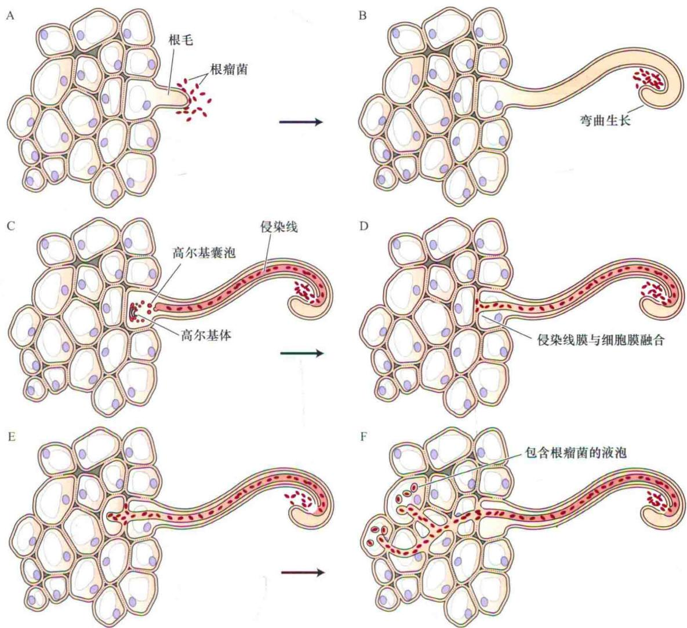  
图12.12 根瘤器官形成中的侵染过程。A. 根瘤菌在植物释放的化学引诱剂的作用下吸附在突出的根毛上。B. 在根瘤菌生成因子作用下，根毛发生不正常的弯曲生长，并且根瘤菌在卷曲部位增殖。C. 该部位根毛细胞壁降解，导致源于根细胞高尔基体分泌囊泡的侵染线的形成和根瘤菌的入侵。D. 侵染线到达根细胞的底部，它的膜与根细胞质膜融合。E. 根瘤菌被释放到根细胞的非原生质体并从中间的薄层组织中穿过到达下表皮质膜而导致新侵染线的产生，最终形成开放的通路。F. 侵染线伸长并分枝直到达到目的细胞，在目的细胞处，由植物膜系统组成的囊泡所包围的固氮菌被释放到胞质中。

## 12.5.7 固氮酶复合体固氮

生物固氮像工业固氮一样，是将分子态氮直接转化为氨，其总反应式如下：

$$
\mathrm{N} _ {2} + 8 \mathrm{e} ^ {-} + 8 \mathrm{H} ^ {+} + 1 6 \mathrm{ATP} \longrightarrow 2 \mathrm{NH} _ {3} + \mathrm{H} _ {2} + 1 6 \mathrm{ADP} + 1 6 \mathrm{P} _ {\mathrm{i}}\tag{12.10}
$$

此过程中，将一分子 $N_{2}$ 还原成2分子的 $NH_{3}$ ，需要转移6个电子并伴随两个质子被还原成 $H_{2}$ 。该反应由固氮酶复合体（nitrogenase enzyme complex）催化（Dixon and Kahn，2004；Seefeldt et al.，2009）。

固氮酶复合体可分成两种组分——铁（Fe）蛋白和钼铁（MoFe）蛋白，它们自身均没有活性（图12.13）：

（1）在两种组分中，Fe蛋白相对较小，由两个分子质量为30\~72 kDa的相同的亚单位组成，因有机体不同而存在差异。每个亚组分含有一个Fe-S簇（4Fe和 $4S^{2-}$ ），参与由 $N_{2}$ 转化为 $NH_{3}$ 的氧化还原反应。 $O_{2}$ 可使Fe蛋白不可逆失活，半衰期是30\~45 s（Dixion and Wheeler，1986）。

（2）MoFe蛋白含有4个亚基，在不同的物种中分子质量为80\~235 kDa。每个亚基含有两个Mo-Fe-S簇。 $O_{2}$ 同样可使MoFe蛋白失活，在空气中，其半衰期为10 min。

在整个固氮还原反应过程中（图12.13），铁氧还蛋白是铁蛋白的电子供体，后者进一步水解ATP并还原MoFe蛋白。随后，MoFe蛋白可以将多种底物还原（表

  
图12.13 固氮酶催化反应。铁氧还蛋白还原铁蛋白。ATP结合铁蛋白和水解被认为引起了铁蛋白构象的改变，这种改变利于氧化还原反应的进行。Fe蛋白还原MoFe蛋白，后者再还原 $N_{2}$ （引自Dixon and Wheeler，1986；Buchanan et al., 2000）。

12.4），虽然在自然条件下它只与 $N_{2}$ 和 $H^{+}$ 反应。固氮酶催化的反应之一——将乙炔还原为乙烯，已成为测定固氮酶活性的方法之一（参见Web Topic 12.2）。

表12.4 固氮酶的催化反应

<table><tr><td> ${\mathrm{N}}_{2} \rightarrow {\mathrm{{NH}}}_{3}$ </td><td>分子态氮的固定</td></tr><tr><td> ${\mathrm{N}}_{2}\mathrm{O} \rightarrow {\mathrm{N}}_{2} + {\mathrm{H}}_{2}\mathrm{O}$ </td><td>亚硝态氮氧化还原</td></tr><tr><td> ${\mathrm{N}}_{3}^{ - } \rightarrow {\mathrm{N}}_{2} + {\mathrm{{NH}}}_{3}$ </td><td>叠氮化物还原</td></tr><tr><td> ${\mathrm{C}}_{2}{\mathrm{H}}_{2} \rightarrow {\mathrm{C}}_{2}{\mathrm{H}}_{4}$ </td><td>乙炔还原</td></tr><tr><td> $2{\mathrm{H}}^{ + } \rightarrow {\mathrm{H}}_{2}$ </td><td>氢气生成</td></tr><tr><td>ATP→ADP+Pi</td><td>ATP水解放能</td></tr></table>

固氮反应中的能量传递是复杂的。由 $N_{2}$ 和 $H_{2}$ 反应生成 $NH_{3}$ 的反应是一个 $\Delta G^{0'}$ （自由能变化）为-27 kJ/mol的放能反应（附录1所讨论的放能反应）。但是工业上用 $N_{2}$ 和 $H_{2}$ 生产 $NH_{3}$ 的过程则是一个耗能的（endergonic）过程，需要投入大量的能量，因为打破 $N_{2}$ 中的氮氮三键需要高的活化能。同样原因，虽然自由能的精确变化仍不清楚，但固氮酶催化 $N_{2}$ 的还原反应也需要投入大量能量（见反应式12.10）。

豆科植物碳水化合物代谢的研究表明，每固定1 g N₂需要消耗12 g有机碳（Heytler et al., 1984）。依据反应式（12.10），生物固氮总反应的ΔG⁰约为-200 kJ/mol。因为总反应是高度放能的反应，铵的生成被固氮酶复合体的慢反应（单位时间——每秒内还原的N₂分子数约为5）所限制。为了补偿这种慢反应的周转时间，类菌体就会合成大量的固氮酶（最高可占细胞总蛋白量的20%）。

在自然条件下，大量的 $H^{+}$ 被还原为 $H_{2}$ ，这个反应和 $N_{2}$ 的还原反应竞争来自固氮酶的电子。在根瘤菌中，供应给固氮酶的能量中30%\~60%被用于合成 $H_{2}$ ，这在很大程度上降低了固氮的效率。然而有一些根瘤菌含有氢化酶，该酶可裂解 $H_{2}$ ，并产生电子用于 $N_{2}$ 的还原，因而提高了固氮效率（Marschner，1995）。

## 12.5.8 酰胺和酰脲是氮的转运形式

固氮的原核生物共生体可释放出氨，氨在由根瘤再经由木质部传给叶片之前，共生体会快速将其转化成为有机形式以避免受到毒害作用。固氮的豆科植物可依据其木质部汁液成分的不同而分为酰胺输出型和酰脲输出型。酰胺（主要是天冬酰胺或谷氨酰胺）是起源于温带地区的豆科植物氮的主要输出形式，如豌豆（Pisum）、三叶草（Trifolium）、蚕豆（Vicia）和小扁豆（Lens）。

酰脲则是起源于热带地区的豆科植物氮的主要输出形式，如大豆（Glycine）、四季豆（Phaseolus）、花生（Arachis）和南方菜豆（Vigna）。三种主要的酰脲形式是尿囊素、尿囊酸和瓜氨酸（图12.14）。尿囊素在过氧化物体中由尿酸合成，尿囊酸在内质网中由尿囊素合成，鸟氨酸合成瓜氨酸的位点目前还不明确。这三种成分最终被释放到木质部中并转运到茎叶，在那里被迅速分解为铵，铵再进入前述的同化过程。

## 12.6 硫的同化

有机体中，硫是最重要的多功能元素之一（Hell，1997）。蛋白质中的二硫键起到支架和调节的作用（见第8章）。硫通过Fe-S簇参与电子的传递（见第7章和第11章）。多种酶和辅酶，如脲酶和辅酶A的催化位点都含有硫。前述的根瘤菌的结瘤因子、大蒜的防腐剂蒜氨酸和花椰菜中的抗癌剂——异硫氰基-4R丁烷等次生代谢物质（不参与生长和发育基本途径的化合物）中都含有硫。

  
图12.14 被用于氮转运的主要酰脲复合物。它们将氮由固氮位点转运到合成位点，在那里经脱氨作用为氨基酸和核苷酸的合成提供氮源。

硫的多功能性在一定程度上是因为它拥有氮原子的某些特征：具有多种稳定的氧化态形式（multiple stable oxidation states）。在本部分将对调节硫同化的酶促反应步骤和催化硫还原进入含硫氨基酸——半胱氨酸和甲硫氨酸的生化反应过程进行阐述。

## 12.6.1 硫以硫酸根的形式被植物吸收

经 $H^{+}-SO_{4}^{2-}$ 的同向转运体（见第6章）从土壤溶液中吸收来的硫酸根（ $SO_{4}^{2-}$ ）中的硫是高等植物细胞内硫的主要来源。土壤中的 $SO_{4}^{2-}$ 则主要来自于表面母岩材料的风化。然而，工业化引起的大气污染又增加了硫的来源。化石燃料的燃烧可释放出气态形式的硫，如二氧化硫（ $SO_{2}$ ）和硫化氢（ $H_{2}S$ ）等，它们随雨水降落到地面。

气态的 $SO_{2}$ 会与 $OH^{-}$ 和 $O_{2}$ 反应形成三氧化硫（sulfur trioxide， $SO_{3}$ ）， $SO_{3}$ 溶解在水中后会生成一种强酸——硫酸（ $H_{2}SO_{4}$ ），它是酸雨的主要来源。植物也可以通过气孔吸收和利用空气中的 $SO_{2}$ 气体，但长时间（超过8 h）暴露在含有高浓度 $SO_{2}$ （超过0.3 ppm）的大气中时， $SO_{2}$ 形成的硫酸会造成植株大部分组织坏死。

## 12.6.2 硫酸根同化前需要将其还原成半胱氨酸

含硫化合物合成的第一步是将硫酸根还原成半胱氨酸（图12.15）。硫酸根很稳定，要进行后续反应，就必须先将其活化。首先，ATP与硫酸根作用，生成5'-腺苷酰硫酸（又称作腺苷-5-磷酸硫酸，缩写成APS）和焦磷酸（PP $_{i}$ ）（图12.15）：

$$
\mathrm{SO} _ {4} ^ {2 +} \mathrm{Mg-ATP} \longrightarrow \mathrm{APS+PP} _ {\mathrm{i}}\tag{12.11}
$$

催化该反应的酶——ATP-硫酰化酶有两种形式：主要的一种存在于质体中，次要的一种存在于胞质中（Leustek et al., 2000）。活化这个反应是非常困难的，为了促使反应继续进行，生成的APS和PP $_{i}$ 必需立刻被转化成其他化合物。PP $_{i}$ 被无机焦磷酸酶水解为无机磷酸（P $_{i}$ ），反应如下：

$$
\mathrm{PP} _ {\mathrm{i}} + \mathrm{H} _ {2} \mathrm{O} \longrightarrow 2 \mathrm{P} _ {\mathrm{i}}\tag{12.12}
$$

另一产物APS被迅速还原或磷酸化，其中还原过程是主导过程（Leuster et al., 2000）。

APS的还原是发生在质体中的一个多步反应。首先，还原型谷胱甘肽（GST）转移两个电子到APS还原酶，将APS还原，生成亚硫酸根（ $SO_{3}^{2-}$ ）：

$$
\mathrm{APS} + 2 \mathrm{GSH} \longrightarrow \mathrm{SO} _ {3} ^ {2 -} + 2 \mathrm{H} ^ {+} + \mathrm{GSSG} + \mathrm{AMP}\tag{12.13}
$$

其中，GSSG代表氧化型的谷胱甘肽（GSH中的SH和GSSG中的SS分别代表S—H和S—S键）。

其次，亚硫酸还原酶接受来自铁氧还蛋白（ $Fd_{red}$ ）的6个电子，还原 $SO_{3}^{2-}$ 生成硫化物（ $S^{2-}$ ）：

$$
\mathrm{SO} _ {3} ^ {2 -} + 6 \mathrm{Fd} _ {\mathrm{red}} \longrightarrow \mathrm{S} ^ {2 -} + 6 \mathrm{Fd} _ {\mathrm{ox}}\tag{12.14}
$$

生成的 $S^{2-}$ -和乙酰丝氨酸（OAS）反应生成半胱氨酸和乙酸，生成OAS的反应则由丝氨酸乙酰转移酶催化：

$$
\text {   丝氨酸+乙酰CoA   } \longrightarrow \mathrm{OAS+CoA}\tag{12.15}
$$

O-乙酰丝氨酸和 $S^{2-}$ 作用生成半胱氨酸和乙酸的反应则由OAS-硫裂解酶催化：

$$
\mathrm{OAS} + \mathrm{S} ^ {2 -} \longrightarrow \text { 半   胱   氨   酸 } + \text { 乙   酸 }\tag{12.16}
$$

存在于胞质中的APS的磷酸化作用是一个可以选择的途径。首先APS激酶催化APS和ATP作用生成3'-磷酸腺苷-5'-磷酰硫酸（PAPS）：

$$
\mathrm{APS} + \mathrm{ATP} \longrightarrow \mathrm{PARS} + \mathrm{ADP}\tag{12.17}
$$

转硫酸酶然后可将硫酸根从PAPS转移给多种化合物，如胆碱、油菜素类固醇、黄酮醇、五倍子酸糖苷、芥子油苷、多肽和多糖等（Leuster et al., 1999）。

## 12.6.3 硫酸根的同化多发生在叶片内

硫酸根还原为半胱氨酸的过程必须转移8个电子，同时使硫的氧化数从+6变到-2。谷胱甘肽、铁氧还蛋白、NAD（P）H，或者O-乙酰丝氨酸成为这个过程多个步骤中的电子供体（图12.15）。在拟南芥中，除了亚硫酸盐还原酶和还原型谷胱甘肽合成酶以外，其余所有与硫同化有关的酶都是由小基因家族编码的。现在仍不清楚是否这是一种功能上的冗余或是否所有的基因都有专一的功能或专项定位（Kopriva，2006）。叶片中

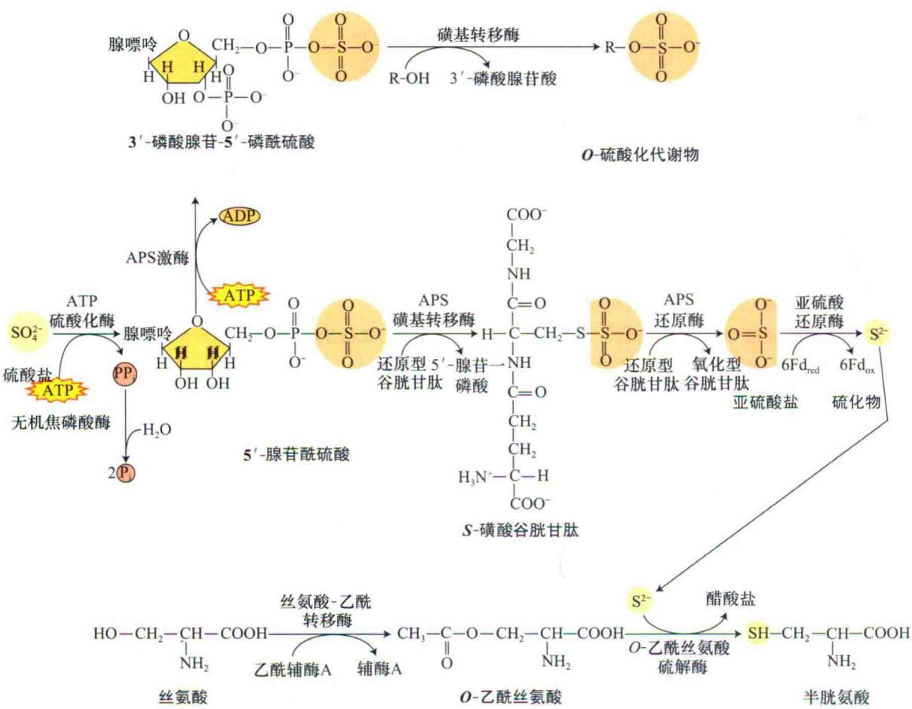  
图12.15 参与硫同化过程的化合物的结构及它们的生成路径。ATP硫酸化酶从ATP裂解出焦磷酸盐，并用硫酸根将其替代。经谷胱甘肽和铁氧化还原蛋白的还原反应，APS生成硫化物。硫化物或亚硫化物与O-乙酰丝氨酸作用生成半胱氨酸。

代。经谷胱甘肽和铁氧化还原蛋白的还原反应，APS生成硫硫的同化比根系中的更为活跃一些，这可能因为光合作用提供了还原型的铁氧还蛋白，而光呼吸作用又可产生丝氨酸进一步去激发O-乙酰丝氨酸的生成（见第8章）的缘故。叶片中同化的硫主要以谷胱甘肽的形式经韧皮部输送到蛋白质的合成位点（叶和根的生长点及果实）（Bergmann and Rennenberg，1993）：

谷胱甘肽也可作为一种信号，协调根系对硫酸盐的吸收和茎尖对硫酸盐的同化。

## 12.6.4 甲硫氨酸的合成前体物质是半胱氨酸

甲硫氨酸是蛋白质中的另一种含硫氨基酸，其在质体中由半胱氨酸合成（更多是细节参见Web Topic 12.3）。合成的半胱氨酸和甲硫氨酸被用于合成蛋白质，或用于为诸多其他化合物提供S，如乙酰CoA和S-腺苷甲硫氨酸。S-腺苷甲硫氨酸在乙烯合成（见第22章）和木质素合成的转甲基反应中起重要作用（见第13章）。

## 12.7 磷酸盐的同化

植物根系通过 $H^{+}-HPO_{4}^{2-}$ 的转运体很容易吸收土壤溶液中的磷酸根（ $HPO_{4}^{2-}$ ）（见第6章），被吸收的磷酸根随后化合到各种有机物中，包括磷酸糖、磷脂和核苷酸。磷酸盐同化过程的主要切入位点是细胞中能量的流通形式ATP的形成。在这个反应过程中，无机磷通过磷酸酯键结合到腺苷二磷酸的第二个磷酸基团上。

A

在线粒体中，ATP合成所需的能量来自于NADH的氧化磷酸化（见第11章）；而在叶绿体中，ATP的合成也被光的光合磷酸化所驱动（见第7章）。除了线粒体和叶绿体中可合成ATP外，胞质中的糖酵解过程也可同化磷酸盐。

糖酵解过程可将无机磷化合到1,3-二磷酸甘油酸中，形成高能量的酰基磷酸基团。它可为ADP提供磷酸供体，发生底物水平的磷酸化反应，生成ATP（见第11章）。在高等植物中，磷酸盐基团一旦被同化进ATP，就可以通过多种不同的反应，使许多化合物发生磷酸化。

## 12.8 阳离子的同化

植物细胞吸收的阳离子通过非共价键与有机化合物结合形成复合体（关于非共价键的讨论，见附录1）。植物可以同化大量营养元素的阳离子，如钾、镁和钙，并以相同方式同化微量元素的阳离子，如铜、铁、锰、钴、钠和锌。本部分将阐述配位键和静电键在植物同化几种阳离子过程中所起的关键作用、根系吸收铁离子的特殊需求和随之而来的铁在植物体内的同化

作用。

## 12.8.1 阳离子和碳化合物形成非共价键

阳离子和碳化合物形成的非共价键有两种类型：配位键和静电键。在配位化合物的形成过程中，碳化合物的几个氧或氮原子提供共用电子对与阳离子形成共用键，从而中和掉阳离子的正电荷。

多价阳离子和碳化合物形成的键是典型的配位键（coordination bond），如铜-酒石酸复合物（图12.16A）和镁-叶绿素a复合物（图12.16B）。可作为配位化合物而被同化的营养元素包括铜、锌、铁和镁。钙也可以和组成细胞壁的多聚半乳糖醛酸形成配位化合物（图12.16C）。

静电键（electrostatic bond）是由于带正电荷的阳离子与带负电荷的基团之间相互作用而形成的，如碳化合物中碳酸根（—COO $^{-}$ ）。与配位键中情形不同的是，静电键中的阳离子保留着它的正电荷。单价阳离子，如钾（K $^{+}$ ），可以和许多有机酸中的羧基形成静电键（图12.17A）。然而，多数植物细胞吸收的及用作渗透调节和酶激活剂的K $^{+}$ 仍在胞质和液泡中以游离态存在。二价阳离子（如钙）可以和果胶酸盐（图12.17B）

  
叶绿素a

  
图12.16 配位化合物实例。含碳化合物中的氧或氮原子提供共用电子对（以点表示）与阳离子形成一个配位键，即形成配位化合物。A. 铜离子与酒石酸中的羟基氧共用电子。B. 镁离子和叶绿素a中的氮原子共用电子。虚线表示氮原子与镁离子间共用电子对形成的配位键。C. 多聚半乳糖酸是细胞壁胶质的主要成分，它和钙离子相互作用形成“蛋盒”模型。右边是半乳糖酸残基中的羟基氧与单个钙离子形成的配位键的放大图（Rees，1977）。

B  
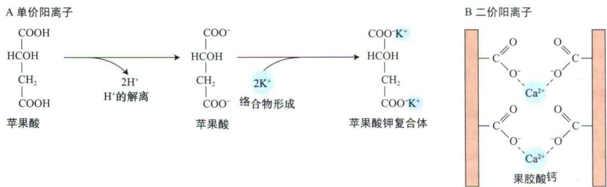  
图12.17 静电键（离子键）化合物实例。A. 单价阳离子 $K^{+}$ 和苹果酸形成苹果酸钾复合体。B. 二价阳离子 $Ca^{2+}$ 和果胶酸形成果胶酸钙复合物。二价阳离子可以和含有负电荷羧基的平行链形成交叉连接。钙的交叉连接形成细胞壁的骨架成分。

及多聚半乳糖醛酸的羧基形成静电键（见第15章）。

总之，如镁离子（ $Mg^{2+}$ ）和钙离子（ $Ca^{2+}$ ）等阳离子可通过和氨基酸、磷脂，以及其他一些带负电的分子形成配位键或静电键而被同化。

## 12.8.2 根调节根际环境以获取铁离子

铁在铁-硫蛋白中非常重要（见第7章），铁-硫蛋白在酶促氧化还原反应中起着催化剂的作用（见第5章），如前面所述的氮的新陈代谢过程。植物从土壤中吸收铁。土壤溶液中的铁通常以三价Fe离子（ $\mathrm{Fe}^{3+}$ ）存在于氧化物中，如 $\mathrm{Fe(OH)}^{2+}$ 、 $\mathrm{Fe(OH)}_{3}$ 和 $\mathrm{Fe(OH)}_{4}^{-}$ 。在中性pH条件下， $\mathrm{Fe}^{3+}$ 高度不溶。因此，植物根系已经进化了几种机制来增加铁的溶解度以便于吸收利用（图12.18）。这些机制包括：

（1）土壤酸化，以增加 $Fe^{3+}$ 的溶解度。

（2）将 $Fe^{3+}$ 还原成更易溶解的亚铁（ $Fe^{2+}$ ）。

（3）释放能与铁形成稳定的可溶性复合物的化合物（Marschner，1995）（第5章），这些化合物被称为

A  
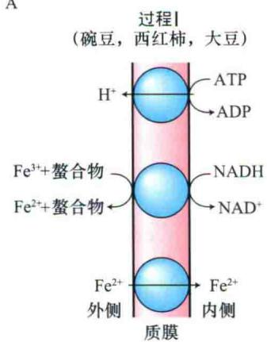

铁的螯合剂（图5.3）。

根系通常会酸化根区的土壤。在吸收和同化阳离子时（特别是铵），根系会排放出质子和释放出有机酸（如苹果酸和柠檬酸），以提高铁和磷酸盐的可用性（图5.5）。铁的缺失可刺激根系排放质子。另外，根细胞质膜上含有一种酶，称为铁螯合还原酶（iron-chelating reductase），它以NADH或NADPH作为电子供体（图12.18A），可将 $Fe^{3+}$ 还原成亚铁离子（ $Fe^{2+}$ ）。铁匮乏时该酶的活性增强。

根系会分泌几种化合物与铁形成稳定的螯合物，如苹果酸、柠檬酸、石炭酸和毒鱼豆酸。禾本科牧草可产生一类特殊的铁螯合剂，称为铁载体（siderophores）。铁载体是由一些蛋白质中不存在的氨基酸和与 $Fe^{3+}$ 形成的高度稳定的化合物组成的，如麦根酸。禾本科牧草的根细胞质膜上含有 $Fe^{3+}$ -载体的转运系统，可将螯合物转运到胞质中。在铁缺乏的情况下，禾本科牧草根系会释放大量的 $Fe^{3+}$ -载体到土壤中，以增强 $Fe^{3+}$ -载体转运系统的能力（图12.18B）。

  
图12.18 植物根系吸收铁离子的两个过程。A. 双子叶植物，如豌豆、西红柿和大豆的铁吸收过程。其螯合剂为有机酸，如苹果酸、柠檬酸、石炭酸和酒石酸。B. 禾本科植物，如大麦、玉米和燕麦的铁吸收过程。禾本科植物分泌的铁螯合剂可吸收土壤颗粒中的铁，形成的复合物可以降解，并将铁释放到土壤中与其他配体进行交换，或将铁直接转运进根系（引自Guerinot and Yi，1994）。

根系吸收的铁或铁的螯合物被首先氧化成三价铁形式，再与柠檬酸盐或烟草胺形成离子化合物后被转运到叶片中（Jeong and Gueriont，2009）。

进入叶片后，铁要进行一个重要的同化反应，即螯合到原卟啉中。原卟啉存在于叶绿体和线粒体细胞色素的血红素中（见第7章）。这个反应受亚铁螯合酶催化（图12.19）（Jones，1983）。植物体中多数的铁存在于血红素基团中。另外，电子传递链的铁-硫蛋白（见第7章）中含有与脱辅基蛋白的半胱氨酸残基上的硫原子以共价键相连的非血红素铁。在 $Fe_{2}S_{2}$ 的中心位置也含有Fe，该物质含有两个铁离子（均与半胱氨酸残基上的硫原子相连）和2分子无机硫化物。

游离的铁离子（铁离子没有和碳化合物结合）可以和 $\mathrm{O}_{2}$ 作用形成高度危害的羟自由基OH·（Halliwell and Gutteridge，1992）。植物细胞将多余的铁储藏在被称为植物铁蛋白（phytoferritin）的铁-蛋白复合体中以减弱这种破坏（Bienfait and van der Mark，1983）。对拟南芥突变体的研究表明，虽然铁蛋白对于保护活性氧伤害是必需的，但是它们并不能作为主要的Fe元素贮备而用于幼苗发育或者光合器官行使正常功能（Ravet et al., 2009）。植物铁蛋白由24个相同的亚基形成的中空球形蛋白壳组成，其分子质量约为480 kDa。球形外壳内部是一个由5400\~6200个铁原子以铁氧化物-磷酸复合体形式组成的中心核。

植物铁蛋白释放铁的机制还不清楚，但打破球形外壳似乎是很必要的。植物细胞中游离铁的水平调节

  
图12.19 亚铁螯合酶的还原反应。亚铁螯合酶催化铁离子进入卟啉环中央形成整合物，见图7.36卟啉环的生物合成。

着新的植物铁蛋白的生物合成过程（Lobreaux et al., 1992）。人类对植物铁蛋白有着高度兴趣，因为在这种蛋白复合物中存在的铁更易被人体吸收，而含有丰富植铁蛋白的食物，如大豆，可以解决膳食性贫血问题（Welch and Graham, 2004）。

## 12.9 氧的同化

植物细胞对氧的同化很大比例（90%）是由呼吸作用完成的（见第11章）。将氧同化到有机化合物中的另一重要途径就是结合水中的氧（见表8.1中的反应）。在氧固定（oxygen fixation）过程中，仅有较小比例的氧可以经加氧酶同化到有机化合物中。植物中最重要的加氧酶是核酮糖-1.5-二磷酸羧化酶/加氧酶（Rubisco）。它在光呼吸过程中将氧同化进入有机化合物中，同时释放能量（见第8章）。其他的加氧酶见Web Topic 12.4。

## 12.10 营养物质同化的能学

在营养物质的同化过程中，将稳定的低能量的无机化合物转变成高能量的有机化合物通常需要大量的能量。例如，硝酸盐还原到亚硝酸盐，再还原到铵需要转移10个电子，占去了根和茎中总能量消耗的25%（Bloom，1997）。因此，一棵植物要用它1/4的能量来同化不足其干重2%的氮。

许多这种同化反应是在叶绿体的基质中进行的。那里拥有强有力的还原剂，如在光合作用电子传递中产生的NADPH、硫氧还蛋白和铁氧还蛋白。营养物质同化与光合作用电子传递相偶联的过程被称为光合同化作用（photoassimilation）（图12.20）。虽然光合同化作用与卡尔文循环发生在同一部位，但是只有当光合电子传递过程产生的还原剂量超过卡尔文循环的需要量时——如在强光低二氧化碳的条件下——光合同化作用才能进行（Robinson，1988）。高浓度的二氧化碳抑制 $C_{3}$ 植物叶片中（图12.21）（参见Web Topic 12.1）和 $C_{4}$ 植物维管束鞘细胞中（见第8章）硝酸盐的同化（Becker et al., 1993）。

这些还原剂在卡尔文循环和完全同化之间分配的调节机制急待研究，因为21世纪内大气中的二氧化碳含量可能会倍增（见第9章），这将会影响到植物-营养物质间的关系。

  
图12.20 叶片中矿物质氮的同化过程概要。经木质部从根部转运来的硝酸盐再通过硝酸根-质子同向转运体（NRT）转运到细胞质中被叶肉细胞吸收。在细胞质中，硝酸盐被硝酸还原酶（NR）还原为亚硝酸盐，之后亚硝酸盐随同质子一起被转移到叶绿体基质中。在叶绿体基质中亚硝酸盐被亚硝酸还原酶（NiR）还原为铵，铵通过谷氨酰胺合成酶（GS）和谷氨酸合酶（GOGAT）被转移至谷氨酸，又回到胞质中，通过转氨酶（Asp-AT）的转氨基作用将谷氨酸转变为天冬氨酸。最终天冬氨酸被天冬酰胺合成酶（AS）转变为天冬酰胺。每步反应所消耗能量换算成等位的ATP量标注在各个反应的上方。

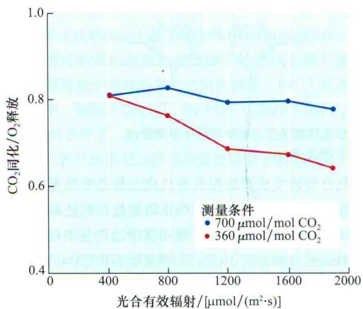  
图12.21 小麦幼苗的同化系数（AQ=CO₂同化量/O₂释放量）随光量（光合有效辐射）的变化情况。硝酸盐的光同化作用与AQ密切相关，因为光合同化过程中把电子转移到硝酸盐和亚硝酸盐的反应会增加光合作用中光反应释放的O₂量，而暗反应对CO₂的同化速率与电子传递速率保持一致。因此，进行硝酸光合同化作用的植物表现出较低的AQ。在大气CO₂浓度（360 μmol/mol，红色线）的测量，AQ随着瞬时光辐射的下降而下降，表明光合同化率的增加。高CO₂浓度（700 μmol/mol，蓝色线）条件下，在所有的光照强度上AQ均保持恒定，说明CO₂固定反应与光合同化作用竞争还原剂，

并抑制硝酸盐的光合同化作用（Bloom et al., 2002）。

## 小结

营养物质的同化是植物将自身生长和发育所必需的无机营养物质螯合到碳化合物组分当中去的过程，这是

一个耗能过程。

## 环境中的氮

\- 氮被固定进入氨（ $\mathrm{NH}_3$ ）或硝酸盐（ $\mathrm{NO}_3^-$ ）以后，会经由几种有机或无机的形式最终回到分子态氮（图12.1）。

· 高浓度的铵（ $\mathrm{NH}_{4}^{+}$ ）对于活的组织是有毒的，但高浓度的硝酸盐可以在植物组织中安全的贮存和转移（图12.2）。

## 硝酸盐的同化

\- 植物根系积极吸收硝酸盐，然后在细胞质中将它还原为亚硝酸盐（ $\mathrm{NO}_2^-$ ）（图12.3）。

\- 硝酸盐、光和碳水化合物共同影响着硝酸还原酶的转录和翻译（图12.4）。

\- 黑夜和 $\mathrm{Mg}^{2+}$ 可以钝化硝酸还原酶的活性。这种钝化速度比减弱该酶的合成或加速其降解更为快速。

· 在叶绿体或质体中，硝酸还原酶催化还原硝酸盐为铵（图12.5）。

· 根、冠均可同化硝酸盐（图12.6）。

## 铵的同化

\- 植物细胞通过快速的转化铵进入氨基酸而避免铵的毒害（图12.7）。

\- 氨经转氨基反应（包括谷氨酸和谷氨酰胺）可合成其他氨基酸中。

· 天冬酰胺是氮转运和存储过程中的关键化合物。

## 氨基酸的生物合成

\- 氨基酸的碳骨架源于糖酵解和三羧酸循环的中间产物（图12.8）。

## 生物固氮

\- 生物固氮是大气中 $\mathrm{N}_2$ 形成氨的过程（图12.1和表12.2）。

\- 几种类型的固氮细菌和高等植物形成共生关系（图12.9、图12.10和表12.3）。

## 固氮要求厌氧条件。

\- 共生固氮的原核生物与寄主植物形成特殊的结构产生作用（图12.9和图12.10）。

\- 共生关系起始于固氮细菌向根系的迁移，此过程由根系分泌的化学诱导剂介导。

· 诱导剂激活根瘤菌的NodD蛋白，然后诱导共生信号分子Nod因子的生物合成（图12.11）。

\- Nod因子诱导根毛弯曲、根瘤菌增殖固定、细胞壁降解和细菌进入根毛细胞质膜，并形成侵染线（图12.12）。

· 在激增的根瘤菌的填充下，侵染线沿着根瘤发育的方向延长，这个过程从皮层细胞开始（图12.12）。

· 在植物信号作用下，根瘤中的细菌停止分裂，并分化成固氮拟杆菌。

\- $\mathrm{N}_2$ 还原为 $\mathrm{NH}_3$ 是由固氮酶复合物催化完成的（图12.13）。

· 固定的氮是通过氨基化合物或酰脲的形式被运移的（图12.14）。

## 硫的同化

\- 植物中同化的硫大部分来自于从土壤溶液中吸收的 $\mathrm{SO}_4^{2-}$ 。植物也可以代谢经气孔进入的气态 $\mathrm{SO}_2$ 。

· 含硫有机化合物的合成起始于 $SO_{4}^{2-}$ 还原为半胱氨酸的过程（图12.15）。

\- $\mathrm{SO}_4^{2-}$ 在叶片中被同化，以谷胱甘肽的形式从韧皮部输出到生长点。

## 磷的同化

· 根系从土壤溶液中吸收 $HPO_{4}^{2-}$ ，并随着ATP的形成而被同化。

· 在植物细胞中，通过ATP，磷酸基被转移到多种不同的碳化合物中。

## 阳离子的同化

· 多价阳离子与碳分子形成配位键（图12.16）。

· 单价阳离子与羧酸盐形成配位键（静电键）（图12.17）。

\- 有几种机制可以从土壤溶液中吸收足量的难溶性 $\mathrm{Fe}^{3+}$ （图12.18）。

· 一旦进入叶片，铁要经历一个重要的同化反应（图12.19）。

· 为限制游离的铁离子引起的自由基危害，植物细胞以植物铁蛋白的形式贮存剩余的铁离子。

## 氧的同化

\- 植物细胞同化的氧中，大部分来源于呼吸作用和Rubisco加氧酶的活化，但是其他加氧酶也可催化直接氧固定（图12.20）。

## 营养物同化的能量

· 耗能的营养物质同化是与光合电子传递相偶联的，这个过程产生强还原性物质（图12.21）。

· 仅当光合电子传递产生的还原物超过卡尔文循环的需求时，光合同化作用才会产生（图12.22）。

(周 云 李文娆 译)

## WEB MATERIAL

## Web Topic

12.1 Development of a Root Nodule
Nodule primordia form opposite to the protoxylem poles of the root vascular bundles.

12.2 Measurement of Nitrogen Fixation
Acetylene reduction is used as an indirect measurement of nitrogen reduction.

12.3 The Synthesis of Methionine
Methionine is synthesized in plastids from cysteine.

12.4 Oxygenases
Oxygenases are enzymes that catalyze oxygen assimilation.

## Web Essays

12.1 Elevated $\mathrm{CO}_{2}$ and Nitrogen Photoassimilation In leaves grown under high $\mathrm{CO}_{2}$ concentrations, $\mathrm{CO}_{2}$ inhibits nitrogen photoassimilation because it competes for reductant.

## 第 13 章

# 次生代谢和植物防御反应

在自然界中，植物生长在许多潜在的天敌之中，生活在包括各种细菌、病毒、真菌、线虫、螨虫、昆虫、哺乳动物和一些草食动物等的生态系统中。基于植物体本身的特性，它不能通过移动的方式来逃避这些草食动物和病原菌，只能用其他方式保护其免受其危害。植物的第一道防线为外表面、表皮（蜡质外层）和周皮（次生保护层），不仅可以限制水分丧失，还形成了一种细菌和真菌进入植物体的屏障（有关这些保护层的讨论，请看Web Topic 13.1）。

许多植物化合物被称作次生代谢物，可以抵御草食动物和病原菌对植物的侵害。还有一些次生代谢物具有重要的生理功能，如木质素是植物结构支持物的组分，花青素是植物色素。

本章我们将讨论植物抵制草食动物和病原菌的一些自我保护机制。还将讨论三种主要的次生代谢产物：萜类、酚类和含氮化合物的结构和主要合成途径。次生代谢物诱导植物抗虫防御反应将作为次生代谢物的生态效能的重要例子进行深入讨论。最后我们将论述病原菌侵害植物时产生的特异性反应、寄主-病原菌互作的遗传学控制及其感染相关的细胞信号转导途径。

## 13.1 次生代谢

植物产生大量的、种类多样的、对其生长和发育似乎没有直接功用的有机物，这些有机物合称为次生代谢物、次生产物或天然物。次生代谢物在植物光合作用、呼吸作用、溶液运输、迁移、蛋白质合成、营养吸收或分解，以及许多初级代谢物的形成过程中无直接的作用，这些初级代谢物（碳水化合物、蛋白质、核酸和脂类）的形成在本书其他部分讨论。

与初级代谢物不同，次生代谢物的分布在植物界受到严格限制。某些特殊的次生代谢物往往只存在于一种或一些相关的物种中，而初级代谢物遍布于整个植物界。

## 13.1.1 次生代谢物帮助植物抵御草食动物和病原菌

在相当长的时期内，人们对大多数植物次生代谢物的适应意义并不了解。这些次生代谢物被认为是无功能的代谢产物或代谢废物。19世纪到20世纪初有机化学家首先对其进行了研究，发现它们可以用作医用药物、毒药、香料以及工业的原材料。

最近研究发现，许多次生代谢物在植物中具有重要的生态学功能。

（1）保护植物免受草食动物的侵害及病原菌的侵染。

（2）作为授粉植物和种子扩散过程中动物的诱惑剂（气味、颜色、味道）。

（3）作为植物与植物竞争、植物与微生物共生的一种介质。

次生代谢物的生态学功能深刻地影响着植物的竞争和生存能力。

次生代谢物也与农业有很多关系，这些起防御反应的化合物通过抵制真菌、细菌和草食动物来增加植物的适应能力，但是不合适作为人类的食品。人们试图通过人工选择的方法来减少多种重要的作物产生次生代谢物（当然可能会造成这些作物更易受到昆虫的侵害或疾病的侵染）。

本章还将讨论植物次生代谢物的主要类型、合成途径，在植物，特别是在植物防御反应中的作用。

## 13.1.2 次生代谢物被分成三类

植物次生代谢物主要分为三类：萜类、酚类和含氮化合物。图13.1显示了简化的次生代谢物合成途径及与初级代谢物的相互关联。在本章接下来的三节中，我们

将依次讨论这些化合物。

## 13.2 萜类

萜或类萜化合物是较多的一种次生代谢物。这类物质一般不溶于水，由乙酰CoA或糖代谢的中间成分转化而来。这部分的主要内容包括萜类的生物合成，以及萜

  
图13.1 次生代谢物生物合成的主要途径及与初生代谢物的关系图。

类如何抵御草食动物。

## 13.2.1 萜类由异戊二烯单位组成

所有的萜类都是由支链异戊烷骨架的5碳单位组成（也称作 $C_{s}$ 单位）：

$$
\begin{array}{c} \mathrm{H} _ {3} \mathrm{C} \\ \mathrm{CH} - \mathrm{CH} _ {2} - \mathrm{CH} _ {3} \\ \mathrm{H} _ {3} \mathrm{C} \end{array}
$$

萜类的基本结构组分有时也称异戊二烯单位，因为在高温时容易分解为异戊二烯，因此萜类有时也称类异

戊二烯。

$$
\begin{array}{c} \mathrm{H} _ {3} \mathrm{C} \\ \mathrm{CH} - \mathrm{CH} = \mathrm{CH} _ {2} \\ \mathrm{H} _ {2} \mathrm{C} \end{array}
$$

虽然由于有广泛的代谢修饰使其很难保留5碳单位残基，但可以根据它们包含的 $C_{5}$ 单位的数目分类。含10个碳的萜，包含两个 $C_{5}$ 单位称为单萜；15个碳的萜（3个 $C_{5}$ ）是倍半萜；20个碳的萜（4个 $C_{5}$ ）称为双萜。较大的萜有三萜（30个碳）、四萜（40个碳）和多萜 $\left(\left[C_{5}\right]_{n}, n>8\right)$ 。

## 13.2.2 萜类的两条合成途径

初生代谢物以两种不同的方式合成萜类，研究较深入的一个是甲羟戊酸途径，3个乙酰CoA分子逐步缩合为甲羟戊酸（图13.2），这个重要的6碳中间产物经过焦磷酸化、脱羧、脱氢产生异戊烯焦磷酸（IPP），IPP是合成萜类物质的活化的5碳单位。

IPP也可以由糖酵解或光合作用碳还原循环中的中间产物经过另外一系列反应形成，这个途径称为甲基苏糖醇磷酸（MEP）途径，发生在叶绿体和其他质体中（Lichtenthaler，1999）。3-磷酸甘油和来自丙酮酸的二碳单位缩合形成五碳的中间成分5-磷酸-1-脱氧-D-木酮糖，这个中间物经过重排和还原形成甲基苏糖醇磷酸酯并最终转变为IPP（图13.2）。

  
图13.2 萜类生物合成图。5碳单位合成的两种途径。磷酸化的中间成分，IPP和DMAPP，结合成10碳、15碳及更大的萜类物质。

## 13.2.3 IPP和其异构体形成大分子的萜类

IPP和其异构体二甲基丙烯焦磷酸（DMAPP）都是萜类合成的活性5碳单位，连接后形成大分子的萜类物质。IPP和DMAPP首先形成牻牛儿焦磷酸（GPP），这是几乎所有10碳单萜的前体（图13.2）。GPP能和另一个IPP结合形成15碳倍半萜的前体法尼焦磷酸（FPP）。再加上一个IPP分子形成20碳的牻牛儿牻牛儿焦磷酸（GGPP），是所有双萜的前体分子。FPP和GGPP最终分别聚合成三萜（ $C_{30}$ ）和四萜（ $C_{40}$ ）。

现在普遍认为，倍半萜和三萜的合成是通过细胞质的甲羟戊酸途径合成的，而单萜、二萜、四萜是通过叶绿素的MEP途径合成的。然而，有时这两个途径会发生交叉，导致混合的合成方式。

## 13.2.4 萜类在生长发育中的作用

某些次生代谢物在植物生长发育中起重要作用，因而应该把它们划为初级代谢物更加合适。如赤霉素（见第20章）作为一类重要的植物激素就是双萜。油菜素甾醇（见第24章）作为调节植物生长发育的重要激素也是由三萜转化而来。

作为细胞膜的主要成分固醇类是三萜的衍生物，它与磷脂相互作用对稳定细胞膜的结构十分重要。红、黄、橘黄的类胡萝卜素是四萜，作为光合作用的附属色素行使功能，保护光合组织免受光氧化的损伤（见第7章）。植物激素脱落酸（见第23章）也是类胡萝卜素前体降解的 $C_{15}$ 萜形成的。

长链多萜醇统称长醇，具有细胞壁和糖蛋白合成中糖分子运输载体的作用（见第15章）；类萜侧链有助于将特定的分子锚定在膜上，如叶绿素的叶醇侧链（见第7章）。然而，绝大多数萜类物质被认为是作为次生代谢物参与了植物的防御反应。

## 13.2.5 萜类物质使植物能够防御草食生物

萜类是许多草食昆虫和草食哺乳动物的毒素或拒食剂，因此它在植物界起到重要的防御作用（Gershenzon and Croteau，1992）。如一种被称为单萜酯的拟除虫菊酯，存在于菊花的叶和花中，表现出强烈的杀虫活性。无论是天然的还是人工合成的拟除虫菊酯由于在环境中的低持久性及对动物的微弱毒性作用，现已成为一种广泛的商业杀虫剂。松柏类植物如松树和杉木中的单萜一般存在于针叶、树枝和树干的树脂道中。这些化合物对许多昆虫都是有毒的，其中包括世界上对松柏类植物危害最大的小蠹虫。松柏类植物就是通过产生更多的单萜来抵御这些小蠹虫的（Trapp and Croteau，2001）。

许多植物含有不稳定的单萜和倍半萜混合物，称为香精油，这类物质可以把气味传递给整个植物。薄荷油、柠檬油、罗勒油及鼠尾草油等香精油都是由植物产生的。薄荷油的主要单萜组分是薄荷醇；柠檬油的单萜成分是柠檬烯（柠烯）（图13.3）。

A  

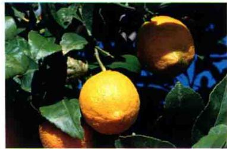

柠檬烯  
B  
  
薄荷醇

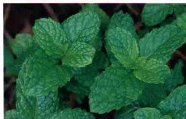  
图13.3 柠檬烯（A）和薄荷醇（B）结构图。这两种常见的单萜可以防止以植物为食的昆虫和其他微生物的侵害（A图，柠檬树图片©Soren Pilman/istockphoto；B图，薄荷图片©Jose Antonio Santiso Fernände/istochphoto.）。

众所周知，香精油具有抗虫的作用，经常在表皮突起的腺毛中发现，表现出植物的毒性，并以此来抵制草食动物。腺毛中的萜类一般储存在细胞壁的可变外部空间（图13.4）。用蒸汽蒸馏的办法可以分离出香精油，香精油可以用作食品香味剂和制作香水，具有很大的商业价值（见Web Essay 13.1）。

一类不易挥发的、能抵抗草食动物的三萜类物质是柠檬苦素类似物，柑橘类植物中常见的苦涩物质。也许最有效的昆虫拒食剂是印苦楝子素，来自亚洲和非洲的印度楝树中复杂的柠檬苦素类化合物（图13.5A），低剂量约千万分之一的印苦楝子素都能成为某些昆虫的拒食剂，其具有广泛的毒性（Aerts and Mordue，1997；Veitch et al., 2008）。由于印苦楝子素对哺乳动物的低毒性，所以具有成为商业昆虫防控剂的潜力。目前，在北美和印度几种含有印苦楝子素的制品正在推广应用。

  
70 μm

图13.4 常见于植物表面腺毛中的单萜和倍半萜。该扫描电镜图（伪色化的）展示的是鼠尾草花萼表面上的腺毛（显微镜下的腺毛，紫色）。这些腺毛正在分泌香精油（球状，白色）（©Andrew Syred/Photo research, Inc.）。

植物蜕皮激素首次是从蕨类植物多足蕨（Polypodium vulgare）中分离出来的，是一种和昆虫蜕皮激素结构基本相同的植物类固醇（图13.5B）。昆虫摄入的植物蜕皮激素可以阻断其蜕皮和其他生长发育过程，造成昆虫死亡。另外，也发现植物蜕皮激素还具有防御植物内寄生线虫的功能（Soriano et al., 2004）。

A 印苦楝子素，一种柠檬苦素类化合物  

皂苷是类固醇和三萜形成的糖苷，因它具有类皂的性质而得名。由于在同一分子中具有脂溶性（类固醇或三萜）和水溶性（糖）两种特性，可以作为一种清洁剂，在水中混溶时会形成圆滑透明的泡沫。皂苷的毒性是由于其可以和类固醇形成一种复合物，因而阻止了消化系统中类固醇的吸收，另外皂苷一旦进入血液就会破坏细胞膜（关于三萜的更多相关知识见Web Topic 13.2）。

强心苷和皂苷是具有抵制草食脊椎动物活性的三萜。强心苷是具苦味的糖苷类物质（含有糖或糖类物质的化合物），对高等动物有很强的毒杀作用。在人体中，通过影响 $Na^{+}/K^{+}$ ATP酶的活性来损伤心脏肌肉组织。通过精细的剂量调节，可以减缓心跳的频率和增强心跳的力度。强心苷是从毛地黄（Digitalis）中提取的，在医学上是用来治疗某些类型心脏病的处方药，并已为成千上万的病人提供了治疗。

B α-蜕皮酮，一种昆虫蜕皮激素  
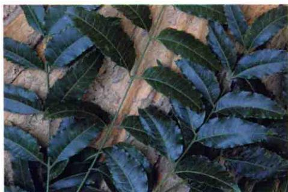

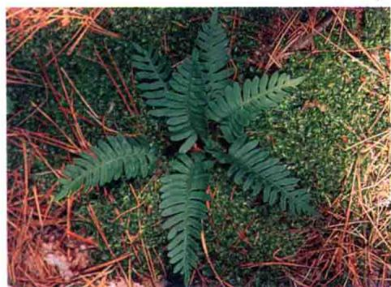  
图13.5 两种三萜的结构。印苦楝子素（A）和α-蜕皮激素（B）都是有效的杀虫剂，印苦楝子素对200多种昆虫有效，因此可以作为天然杀虫剂使用。α-蜕皮激素是由植物产生的昆虫蜕皮激素的固醇类激素原——20-羟基蜕皮激素，α-蜕皮激素可以导致草食昆虫的不规律蜕皮（A图，印度楝叶子照片，©RN Photos/istockphoto；B图，多足蕨叶子照片，©blickwinkel/Alamy.）。

## 13.3 酚类化合物

植物产生了大量的次生代谢物，其中一类包含一个苯环，即芳香环上有一个羟基功能基团，这些物质统称为酚类化合物，植物酚是包含10 000个不同成分的混合物，其中有一些能溶解在有机溶剂中，一些是水溶性的羧酸和糖苷，还有一些是大的非溶性的多聚体。

酚类化合物不仅结构多变，在植物中的作用也多种多样。许多酚类物质能够防御草食动物和病原菌，有些可作为植物的结构材料，有些能够吸引传粉者和果实散播者、吸收有害紫外线，或抑制附近竞争性植物的生长。在简要的论述一下酚类生物合成后，我们将讨论几种主要的酚类化合物及它们具体的生物学功能。

## 13.3.1 苯丙氨酸是大多数植物酚类物质合成的中间成分

从生物代谢的观点看，植物酚类物质有几种主要的生物合成途径并产生一系列混合物。莽草酸途径和丙二酸途径是两种主要的合成途径（图13.6）。莽草酸途径参与植物酚类物质的合成，丙二酸途径虽然是真菌和细菌中酚类物质的重要来源，但在高等植物中意义不大。

莽草酸途径就是把糖酵解和磷酸戊糖途径产生的碳水化合物前体分子转化为苯丙氨酸、酪氨酸和色氨酸等芳香族氨基酸（见Web Topic 13.3）（Herramnn and Weaver，1999）。这个途径中的一个中间产物是莽草酸，因此称为莽草酸途径。广谱性除草剂草苷磷（商业名 Roundup）就是通过抑制该途径中间步骤来杀死植物的（附件1）。莽草酸途径在植物、真菌和细菌中都很常见，但在动物中不存在。由于动物缺乏合成苯丙氨酸、酪氨酸和色氨酸这三种芳香族氨基酸的途径，因此这三种氨基酸是动物的必需营养成分。

植物中最多的一种酚类化合物是由苯丙氨酸经过脱氨形成桂皮酸，再由桂皮酸衍生而来（图13.7）。酚类化合物的形成需要苯丙氨酸氨裂解酶（PAL）催化，此酶是有关植物次生代谢中研究最多的一种酶。苯丙氨酸氨裂解酶处于初生代谢和次生代谢的交叉点上，因此它催化的反应对许多酚类物质的形成都具有重要的调节作用。

环境因子，如营养不充分、光（通过影响光敏色素）和真菌感染均会影响苯丙氨酸氨裂解酶的活性。这个调节的起点是转录的启动，如真菌感染可触发编码苯丙氨酸氨裂解酶mRNA的转录，导致苯丙氨酸氨裂解酶量的增加，进而刺激酚类化合物的生物合成。由于植物中存在多个苯丙氨酸氨裂解酶的基因，因此其活性的调控更加复杂，有的基因只在特异的组织中表达，而有的仅在特异的环境条件下才表达（Logemann et al., 1995）。

在PAL催化的反应之后，还有一些反应在苯环上增加羟基和其他取代成分，反式桂皮酸、p-香豆酸，以及它们的衍生物都是简单的酚类化合物，统称为苯丙烷类化合物，它们都含有一个苯环和一个三碳侧链。

  
图13.6 植物酚类物质合成途径。高等植物中，大多数酚类物质是由苯丙氨酸衍生而来，苯丙氨酸是莽草酸途径的一个产物。括号中的式子表示碳原子的基本排列， $C_{6}$ 代表苯环， $C_{3}$ 为一个3碳链；苯丙氨酸之后更详细的转化过程见图13.7。

  
图13.7 苯丙氨酸合成酚类物质示意图。许多植物酚类的形成都是由苯丙氨酸开始的，包括：简单的苯丙烷类、香豆素、苯甲酸衍生物、木质素、花青素、异黄酮、缩合单宁酸和黄酮类化合物。

维管植物中广泛存在一些单酚类化合物，它们具有不同的功能，主要包括以下结构：

（1）简单的苯丙烷类化合物，如反式桂皮酸、p-香豆酸及其衍生物咖啡酸，这些都有一个基本的苯丙烷类化合物碳骨架（图13.8A）。

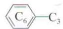

（2）苯丙烷内脂（环酯）称香豆素也有一个苯丙烷骨架（图13.8B）。

（3）苯甲酸衍生物也是从苯丙氨酸的侧链去掉一个2碳形成一个碳骨架（图13.8C和图13.7）。

图13.8 酚类物质在植物中具有多种不同的重要功能。A. 土壤中的咖啡酸和阿魏酸可以抑制邻近植物的生长；B. 补骨脂素是一种呋喃氧杂萘邻酮，表现出草食昆虫的光损害；C. 水杨酸是参与植物病原菌系统性抗性的一种生长调节因子。

与许多其他的次生代谢产物一样，植物体能将这些简单酚类化合物的基本碳单位形成更复杂的产物。

现在已经明确了形成更多更广酚类化合物的生物合成途径，研究者已经将注意力放在了该途径的调节上。例如，一种特异性酶PAL在控制这个途径的速度上起着重要的作用。一些转录因子通过与此途径中某些合成基因启动子区的结合来启动调节酚的代谢，这些转录因子可以激活大部分基因的转录（Jin and Martin，1999）。

## 13.3.2 紫外线能激活一些简单的酚类物质

许多简单的酚类物质在防御草食昆虫和真菌时起着重要的作用。尤其令人感兴趣的是某些呋喃香豆素的光毒性，这些香豆素含有一个呋喃环（图13.8B）。这些化合物一旦被光激活就会有毒性，太阳光的紫外区（UV-A 320\~400 nm）可以激发呋喃香豆素产生高能电子态而被活化。活化的呋喃香豆素可以嵌入DNA双链区，与胞嘧啶和胸腺嘧啶结合，阻止转录和修复，进而逐渐导致细胞死亡。

光毒性呋喃香豆素在几种伞形植物中含量特别多，包括芹菜、欧洲防风草和欧芹。受到挤压伤害和感病状态下，芹菜中的光毒性呋喃香豆素含量可以增高100倍，芹菜采摘者和商店顾客也都知道在处理这些芹菜时，可能会得皮疹。一些昆虫之所以能适应含有呋喃香豆素或其他光毒性物质的植物，是因为它们生活在丝质茧里或卷曲的叶子里，由此可将具有激活作用的光波过滤掉。

## 13.3.3 酚类释放到土壤里可抑制其他植物的生长

植物体的叶片、根或腐烂的垃圾可释放各种各样的初生和次生代谢物到环境中，这些化合物对邻近植物影响的研究被称作植物化感作用。假如一种植物通过释放化学物质到土壤中抑制了其他植物的生长，可以使其自身得到更多光照、水分和营养物质，这是进化的适应。一般来说，术语“植物化感作用”已经运用到对相邻植物的抑制上，尽管它准确的定义也包括相互有利的效应。

简单的苯丙素类化合物和苯甲酸衍生物经常被认为有植物化感效应，试验证明咖啡酸和阿魏酸（图13.8A）在土壤中达到一定量时会抑制许多植物的萌发和生长（Inderjit et al., 1995）。

植物化感效应最大的优点是在农业应用上的巨大潜力（Kruse et al., 2000）。由于杂草或前期作物的残余引起的作物减产在某种程度上来说就是植物化感的缘故。运用杂草的植物化感来提高农业生产将具有远大的前景（见Web Essay 13.2）。

## 13.3.4 木质素是一种复杂的酚类大分子

除了纤维素之外，植物中含量最多的有机物就是木质素，它是一种高分支的苯丙素类化合物多聚体：

木质素扮演初生和次生两种作用。因为很难从植物中提取，其详细结构还不清楚，木质素能共价结合到纤维素和细胞壁的多糖分子上。

木质素一般由三种不同的苯丙素醇形成：松柏醇、香豆醇和芥子醇。这些醇都是苯丙氨酸经过各种桂皮酸衍生物合成的。苯丙素类化合物通过产生自由基中间成分的酶催化聚合成多聚体物质。三种单体的比例也因品种、器官甚至细胞壁的层数不同而不同。在聚合物中的苯丙素醇有多个C—C键和C—O—C键，形成三维空间复杂的分支结构。与淀粉、橡胶或纤维素不同，木质素的单体似乎不是以一种简单重复的方式结合在一起的。最近的研究表明，在木质素合成过程中引导蛋白可能结合了苯丙素类物质的单体，导致了大的、重复的单位骨架的形成（Davin and Lewis，2000；Hatfield and Vermerris，2001）（见Web Topic 13.4 假定木质素分子的部分结构）。

木质素存在于植物输导组织管胞、木质部导管的细胞壁中。起源于初生壁和与纤维素、半纤维素联系密切的薄壁细胞，积累在厚厚的次生细胞壁中。木质素的韧性能增强茎和导管组织的硬度，保持植物向上生长，在负压无组织断开的情况下使水、矿物质通过木质部源源不断向上运输。由于木质素是水运输的一个关键成分，因此合成木质素的能力对于植物适应干旱是非常重要的。

除了提供机械运输外，木质素在植物保护中也具有重要的功能。它表面的粗糙可防止动物食用，它化学的持久性使其难于被草食动物消化。通过与纤维素和蛋白质结合，木质素也降低了这些物质的可消化性。木质化可以抑制病原菌的生长，这也是对感染和伤害的一种反应。

## 13.3.5 4种主要的类黄酮

类黄酮是最多的植物酚类化合物之一，类黄酮基本的碳骨架包括15个碳原子以1个三碳链相连的两个芳香环排列而成，由莽草酸途径和丙二酸途径形成（图13.9）。

基于碳三氧化的程度，类黄酮可分为不同的几类类型，本书主要讨论图13.7所示的四种类型：花青素、黄酮、黄酮醇和异黄酮。

  
类黄酮骨架  
图13.9 类黄酮的碳骨架。类黄酮是由来自莽草酸和丙二酸途径的产物合成的。类黄酮由两个芳香环和一个三碳桥形成的基本骨架包含15个碳。数字显示的是类黄酮环中碳的位置。

类黄酮碳骨架基本单位可能有许多取代物。羟基通常在4、5和7的位置，也可能在其他位置上。糖分子也常有，事实上大多数的类黄酮通常以糖苷的形式存在。

羟基和糖基都可以增加类黄酮的水溶性，别的取代物如甲醚或修饰的异戊基使类黄酮变成亲脂性的（疏水性）。不同的类黄酮具有不同的生物学功能，包括形成色素和防御反应。

## 13.3.6 花色素是可吸引动物的具有颜色的类黄酮

植物色素能产生视觉效应有助于吸引昆虫传粉和种子传播。这些色素主要有两类：类胡萝卜素和类黄酮。类胡萝卜素是黄色、橘黄色和红色的萜类化合物，也是光合作用中的辅助色素（见第7章）。类黄酮包括一系列色素的酚类物质。类黄酮组最普遍的是花青素，在果实和花中主要呈现红色、粉色、紫色和蓝色。

花青素为一类糖苷，在B环的 $C_{3}$ 或其他位置上有一个糖基（图13.10A）。没有这个糖基，花青素就是花色素（图13.10B）。影响花青素颜色的因素很多，如花色素B环羟基和甲氧基的数量（图13.10A）、芳香酸是否酯化到主要骨架上，以及这些物质溶于细胞内液泡后的pH。花青素螯合铁离子、黄铜辅色素可形成一个超分子复合物。鸭跖草的蓝色素是由6个花青素、6个黄铜和2个镁离子组成的大分子复合物（Kondo，1992），图13.10和表13.1表示的是最常见的花色素和它们的颜色。

既然这么多因素影响花青素和类胡萝卜素的颜色，所以自然界中花和果实的颜色千变万化也就不奇怪了。花色的进化是由传粉者的选择压力决定的，这些花粉传播者具有不同颜色的喜爱。

A  
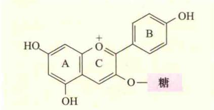  
花色素苷

B  
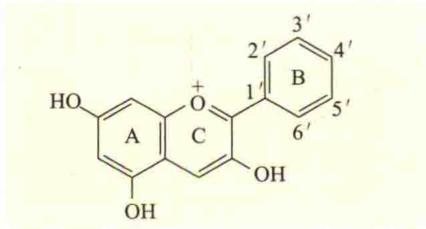  
花色素  
图13.10 花青素（A）和花色素（B）的结构。花色素的颜色部分取决于B环上的取代成分（表13.1）。羟基的增加导致更长波长光的吸收就显蓝色。甲氧基（—OCH₃）取代羟基后吸收较短，此波长的光显深红色。

表13.1 取代环对花色素颜色的影响

<table><tr><td>花色素</td><td>取代环</td><td>颜色</td></tr><tr><td>花葵素</td><td>4&#x27;—OH</td><td>橘红色</td></tr><tr><td>花青素</td><td>3&#x27;—OH, 4&#x27;—OH</td><td>紫红色</td></tr><tr><td>翠雀素</td><td>3&#x27;—OH, 4&#x27;—OH, 5&#x27;—OH</td><td>蓝紫色</td></tr><tr><td>芍药花素</td><td>3&#x27;—OCH3, 4&#x27;—OH</td><td>玫瑰红</td></tr><tr><td>矮牵牛色素</td><td>3&#x27;—OCH3, 4&#x27;—OH, 5&#x27;—OCH3</td><td>紫色</td></tr></table>

## 13.3.7 类黄酮可保护植物免受紫外线的损伤

黄酮和黄酮醇是在花中存在的另外两种主要的类黄酮物质（图13.7），这两种物质相对于花青素吸收更短波长的光，因此人们是看不见的。但蜜蜂这些昆虫相比人类能看到更短波长的波，所以蜜蜂能感知作为诱惑剂的黄酮和黄酮醇（图13.11）。花中的黄酮醇经常由点、线、同心圆组成一个均匀的模型，这个就是通常的蜜源标记，可帮助昆虫找到花粉和蜜源的位置。

A  

黄酮和黄酮醇不仅存在于花中，在所有绿色植物中都有，这两种类黄酮主要是保护细胞免受强紫外线（280\~320 nm）的损伤。黄酮和黄酮醇分布在叶和茎的表皮层，这样可以吸收可见光区域。另外，实验证明长期暴露于紫外光下的植物增加了黄酮和黄酮醇的合成，紫外光能诱导DNA突变，对细胞中的大分子也有潜在的损伤作用。

拟南芥中缺失苯基苯乙烯酮合成酶的突变体不能产生类黄酮。缺失类黄酮，这些突变体相对于野生型来说对紫外光更加敏感，在正常的条件下长势也很差。当过滤掉紫外光时，突变体长势恢复正常（Li et al., 1993）。拟南芥在避免紫外伤害中一类简单的苯丙素类酯也起到了重要作用。

最近发现类黄酮还有其他功能，如黄酮和黄酮醇可以通过豆类的根分泌到土壤中，这是由豆科植物和氮固定共生体相互作用介导的，在第12章中也描述了这种现象。在第19章中也将讨论，最新研究表明类黄酮在植物生长发育如生长素极性运输的模型中起到重要的作用。

## 13.3.8 异黄酮类化合物具有抗菌活性

异黄酮是一种类黄酮，由一个芳香环（B环）位置颠倒形成（图13.7）。异黄酮分布于豆类植物中，具有不同的生理功能活性。如鱼藤酮，可作为杀虫剂、农药（毒鼠药）、灭鱼药（毒鱼剂）；另外一些具有抗雌激素效果。例如，经常在富含异黄酮的三叶草上放牧，会导致羊不育。异黄酮环系统的三维结构类似于类固醇（图13.5B），会使这些物质结合到雌激素受体上。异黄酮对抗肝癌也有作用，因此多吃大豆食品是有益的。

B  
  
图13.11 人类肉眼看到的黑眼苏珊花（Rudbeckia sp.）（A）和蜜蜂看到的黑眼苏珊花（B）。A. 对于人类，黑眼苏珊花有黄色的花瓣和棕色的中心盘。B. 对于蜜蜂，花瓣的顶端是浅黄，花的内部是深黄，中心盘是黑色。在花瓣的内部而不是花顶端发现分布着吸收紫外光的黄酮醇。黄酮醇的这种分布及昆虫对部分紫外光区的敏感性，有助于蜜蜂看到这种同心圆的结构模式，帮助它们定位花粉和蜜源。专用光来刺激蜜蜂视觉系统的光谱敏感性（图片由 Thomas Eisner提供）。

过去几年来，异黄酮一直被大家认为是对细菌或真菌反应的植物抗毒素、杀菌剂，帮助植物抵制病原菌的侵染。本章的最后将详细讨论植物抗毒素。

## 13.3.9 单宁酸抵制草食动物的侵害

除了木质素外，第二类具有防御反应的植物酚类化合物是单宁酸。术语“单宁酸”第一次是用来描述一种能将加工的动物毛皮转变为皮革的化合物，单宁酸能结合动物毛皮的胶原蛋白来增加它们对热、水和微生物的抗性。

单宁酸主要有两种：缩合的和可水解的。缩合单宁酸是由类黄酮聚合而成（图13.12A），是木本植物的基本成分。由于缩合单宁酸用强酸处理会水解为花色素，所以有时也称作花色素原。

可水解单宁酸是由酚酸、五倍子酸和一些单糖分子聚合而成的异聚物（图13.12B）。它们比缩合单宁酸小，在稀酸作用下容易水解。大多数的单宁酸分子质量为600\~3000 Da。

单宁酸通常是有毒的，草食动物吃了含有单宁酸的食物后，会大大地降低草食动物的生存能力。另外，许多动物都不吃含单宁酸高的植物，如牛、鹿和猿这些哺乳动物均能避开单宁酸含量高的植物和植物器官，如未成熟的葡萄含有较高的单宁酸，成熟时才能食用。

农作物一般产生很少的次生代谢物，但也有一些例外。人们经常倾向于吃含单宁酸较少的食物，如苹果、黑莓、茶和葡萄。最近发现红酒中的多聚酚（单宁酸）能有抑制血管紧缩形成内皮素1信号分子的作用（Corder et al., 2001）。红酒中的单宁酸经常被说成是红酒中有益身体健康的物质，特别是适量地饮用红酒能减少心脏病的发生。最近研究显示，另一种酚类化合物白藜芦醇二苯乙烯苯丙素被认为是红酒中有益健康的物质。

A 缩合单宁酸  

B 可水解单宁酸  
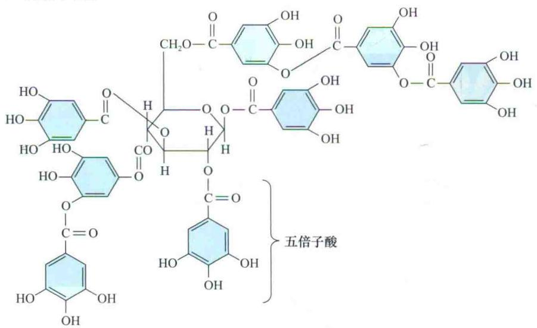  
图13.12 两种类型的单宁酸结构。A. 缩合单宁酸的结构，n通常是1\~10，也可能在B环上有第3个羟基；B. 来自漆树（Rhus semialata）的可水解单宁酸是由葡萄糖和8个五倍子酸组成的。

适量的特定多酚可能对人体是有益的，但大多数单宁酸的防御特性是因为它的毒性，即它能够结合非特异的蛋白质。一直以来人们都认为植物单宁酸在草食动物内脏中形成了蛋白复合物，这种复合物是由单宁酸的羟基和蛋白质负电位之间形成氢键而成的（图13.13A）。最近更多的证据表明单宁酸和其他一些酚也能共价结合到日常食物的蛋白上（图13.13B）。草食动物内脏中都有能氧化植物叶中的酚类物质成醌的酶（Felton et al., 1989）。醌是一类高正电荷的分子，能稳定地与蛋白亲质子的基团— $\mathrm{NH}_{2}$ 和—SH结合（Appel, 1993）。这种蛋白质-单宁酸对草食动物有负面影响，单宁酸能使草食动物的消化酶失活，使单宁酸和植物蛋白的复合物很难被草食动物消化。

## A 单宁酸与蛋白质之间的氢键

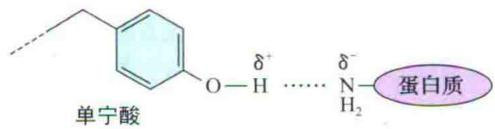

B 蛋白质氧化后的共价键

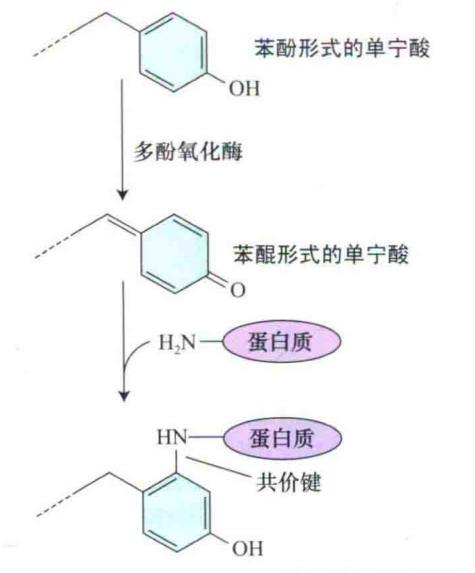  
与蛋白质相连的单宁酸

图13.13 单宁酸与蛋白质相互作用的机制。A. 氢键在单宁酸的酚羟基和蛋白质的负电位之间形成。B. 酚羟基共价结合到蛋白质上，这是由氧化酶如多酚氧化酶催化的。

以富含单宁酸植物为食的草食动物，似乎拥有一个可以排除单宁酸的消化系统。例如，一些啮齿哺乳动物和兔子能分泌脯氨酸含量高的能分解单宁酸的唾液蛋白，这种蛋白质与单宁酸具有很高的亲和性。由于能消化食物中的单宁酸，就大大地减少了单宁酸的毒性作用（Butler，1989）。大量脯氨酸残基使蛋白质形成疏水性较高的不稳定的和开放的构型，这样很容易和单宁酸结合。

植物单宁酸也具有防御病原菌的功能。如许多植物的非生心材都含有高浓度的单宁酸来抵制真菌和细菌的侵害。

## 13.4 含氮化合物

大多数植物次生代谢物都含有氮。生物碱和含氰糖苷都是常见的抗草食动物的含氮次生代谢物质，由于其毒性及药物的特性，因此有很大的应用价值。大多数含氮次生代谢物都是由氨基酸生物合成的。

这一部分将讨论各种含氮次生代谢物的结构和生物学属性，主要包括：生物碱、含氰糖苷、芥子油苷和非蛋白氨基酸。

## 13.4.1 生物碱对动物生理的作用

生物碱大约有15 000种，是含氮次生代谢物中的大家族，其中20%存在于微管植物中。这些物质中的氮原子通常是杂环的一部分，这种杂环含有氮原子和碳原子。生物碱作为一类物质，最显著的作用是对草食动物的药用效果。

就像其名字一样，生物碱大都是碱性的，胞质中的pH通常是7.2，液泡中为5\~6，氮原子通常是质子化的，因此，生物碱是带正电荷、水溶性的物质。

生物碱一般是由一少部分常见氨基酸如赖氨酸、酪氨酸和色氨酸合成的。但是，一些生物碱的碳骨架含有萜类途径的成分。表13.2列举了主要生物碱的种类及其氨基酸前体。几个不同种类的生物碱包括烟碱及其相关物质（图13.14）都是源于精氨酸合成途径中的一个中间产物鸟氨酸。维生素B烟酸是这类生物碱嘧啶环（6个）的前体。烟碱的吡咯环（5个）来源于鸟氨酸（图13.15），烟酸也是 $NAD^{+}$ 和 $NADP^{+}$ 的成分，是代谢中的电子载体。

植物中生物碱的作用已经研究了至少100年，曾被认为是含氮废物（类似动物中的尿素和尿酸）、氮储藏化合物或生长调节物质，但很少有证据表明这些物质的功能。现在认为大多数生物碱具有防御食肉动物特别是哺乳动物的作用，因为它们具有广泛的毒性和拒食作用（Hartmann，1992）。

表13.2 主要的生物碱、其前体和每一种的例子

<table><tr><td>生物碱类</td><td>结构</td><td>生物合成前体</td><td>实例</td><td>用途</td></tr><tr><td>吡咯烷</td><td></td><td>鸟氨酸(天冬氨酸盐)</td><td>烟碱</td><td>刺激剂</td></tr><tr><td rowspan="2">托烷</td><td rowspan="2"></td><td rowspan="2">鸟氨酸</td><td>阿托品</td><td>防止肠痉挛、别的毒药的解毒剂、检测瞳孔扩张</td></tr><tr><td>可卡因</td><td>刺激中枢神经系统、局部麻醉</td></tr><tr><td>哌啶</td><td>[XCYI]</td><td>赖氨酸(乙酸盐)</td><td>毒芹碱</td><td>毒药</td></tr><tr><td>硝吡咯菌素</td><td>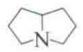</td><td>鸟氨酸</td><td>倒千里光碱</td><td>没有</td></tr><tr><td>喹嗪</td><td>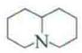</td><td>赖氨酸</td><td>羽扇豆宁</td><td>心脏节律的复位</td></tr><tr><td rowspan="2">异喹啉</td><td rowspan="2">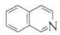</td><td rowspan="2">酪氨酸</td><td>可待因</td><td>止痛,镇咳</td></tr><tr><td>吗啡</td><td>止痛</td></tr><tr><td rowspan="3">吲哚</td><td rowspan="3"></td><td rowspan="3">色氨酸</td><td>裸头草碱</td><td>迷幻剂</td></tr><tr><td>利血平</td><td>治疗高血压、精神病</td></tr><tr><td>马钱子碱</td><td>鼠药、治疗视觉紊乱</td></tr></table>

许多家畜的死亡是由于吃了含有生物碱的植物。在美国，每年都有相当比例的放养家畜由于食用了大量含生物碱的植物，如鲁冰花、飞燕草和千里光而导致死亡。这种现象可能是由于家畜不会像野生动物一样遵循自然选择来逃避有毒植物。当然也有一些家畜更喜欢吃含有生物碱的植物而不是一些无害的草料。

  
可卡因

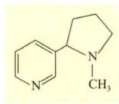  
烟碱

  
吗啡

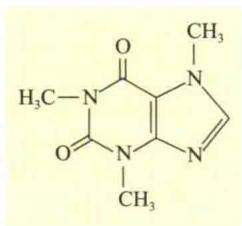  
咖啡因  
典型的生物碱  
图13.14 生物碱的实例。一类含氮的次生代谢物，通常具一个杂环。咖啡因是一类类似核酸鸟嘌呤和腺嘌呤的嘌呤类生物碱。烟碱的吡咯环（5环）形成于鸟氨酸；嘧啶环（6环）来源于烟酸。

图13.15 始于烟酸的烟碱生物合成。烟酸是由天冬氨酸盐和3磷酸甘油醛缩合的，盐酸也是 $NAD^{+}$ 和 $NADP^{+}$ 的成分，参与重要氧化还原反应。5环的烟碱来源于鸟氨酸——一个精氨酸合成途径的中间成分。  
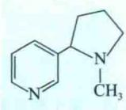  
烟碱

几乎所有的生物碱只要达到一定的量就是有毒性的，如马钱子碱、阿托品和毒芹碱（来自有毒的芹叶钩吻）都是典型的有毒生物碱。在药理学上，少量的生物碱是有益的，如微量的吗啡、可待因和东莨菪碱已用于疾病的治疗。可卡因、烟碱和咖啡因（图13.14），也广泛地运用到非医疗领域，作为刺激药物、镇静止疼药。

在细胞水平，生物碱的作用方式也是不同的。许多生物碱都具有抑制神经系统的成分，特别是一些化学传导物质；其他生物碱会影响膜运输、蛋白合成或多种酶活性。

双吡咯烷类生物碱也是一类植物生物碱，是草食动物适应并忍耐这些植物的防御反应物质（Hartmann，1999）。植物体内会自然产生吡咯类生物碱，如非毒性的氮氧化物。生物碱一旦进入植食昆虫消化道里，就立刻还原成无电荷、疏水的第三类生物碱（图13.16），这种形式的生物碱很容易通过生物膜表现为毒性。而一些草食动物如朱砂蛾（Tyria jacobae）在进化中获得了一种能力，能在消化道吸收这种生物碱后把第三双吡咯烷类生物碱还原为无毒氮氧化形式生物碱。这些草食动物就把这些氮氧化的生物碱储存到体内来抵御侵害它们的肉食动物。

不是所有的生物碱都是植物体自己合成的。许多草类植物质体内拥有的真菌共生体能合成各种类型的生物碱，这类植物比那些没有共生体的长势更好，且能防御植食昆虫和哺乳动物的侵害。不幸的是，当某些携带共生体的草类如作为重要的牧羊草料的牛毛草，当其体内含有较高的生物碱时，对家畜就是有毒害的。因此要培育那些没有携带毒性物质，而且还可以起到防御昆虫的牛毛草（见Web Essay 13.3）。

## 13.4.2 含氰苷释放有毒的氰化氢

在植物中除了生物碱之外，还发现了许多起保护作用的含氮化合物。这些物质主要分为两类：含氰苷和芥子油苷，它们本身没有毒性，但一旦分解就可以释放出毒素，植物被压碎时可释放一些可挥发性的毒素。众所周知，含氰苷释放的是一种毒气氰化氢。

植物中含氰苷的分解可分为两个酶解过程。自产含氰苷的植物也必须用酶来分解成糖，并释放出氰化氢。

（1）第一步是由糖苷酶裂解糖分子，这个酶可以将与糖分子相连的其他物质分开（图13.17）。

（2）第二步是水解产物 $\alpha-$ 羟腈或氰醇能自发地分解为氰化氢，羟腈裂解酶可以增加这一步的反应速度。

含氰苷在植物中一般是不分解的，因为含氰苷和裂解酶是被隔开在不同的细胞区间或不同的组织中。例如，高粱中的含氰苷——蜀黍苷位于表皮细胞的液泡中，而水解或裂解酶分布于叶肉细胞中（Poulton，1990）。正常的情况下，这种区域化可以阻止糖苷的分解。当叶子被损伤时，特别是被草食动物进食时，植物体不同组织的细胞内容物就混合在一起，产生氰化氢形式的物质。

含氰苷在植物界分布广泛，在豆科、禾本科和蔷薇科的一些种中常有存在。许多证据表明含氰苷具有保护植物的功能。氰化氢具有快速反应毒性，能抑制蛋白代谢，如含铁细胞色素氧化酶，这是线粒体呼吸的关键

图13.16 自然界中两种形式的双吡咯烷类生物碱：氮氧生物碱和第三生物碱。无毒的氮氧生物碱在大多数草食动物消化道内还原为有毒的第三生物碱。然而，一些适应的草食动物可以将第三生物碱转化为无毒的氮氧生物碱。在刘寄奴属植物中的生物碱千里光碱就可以进行这种转化。

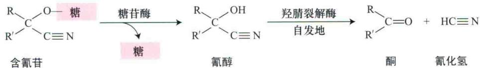  
图13.17 酶水解含氰苷释放出氰化氢的过程。R和R'代表烷烃基或芳烃基。假如R是苯基，R'为氢，糖是β龙胆二糖，那么这个化合物就是苦杏仁苷（含氰苷分布于杏树、樱桃和桃树的种子中）。

酶。含氰苷可以抵御草食昆虫和其他草食动物的进食，如蜗牛和鼻涕虫。和其他次生代谢物一样，一些草食动物能抵抗大剂量的氰化氢，适应吃一些高含量含氰苷的植物。

木薯（Manihot esculenta）的块茎是一种在许多热带国家食用的高碳水化合物食物，含有非常高的含氰苷。传统的加工方法如磨碎、碾碎、浸透和干燥可除去或降解木薯块茎中的含氰苷。然而，在这些以木薯块茎作为主食的地区，慢性的氰化物中毒导致许多人肢体部分瘫痪，因为这些传统的脱毒方法不是完全有效的。另外，许多以木薯为食的人们营养不良，也是含氰苷的毒性作用的结果。

目前，人们正采用传统的育种和基因工程手段来减少木薯中含氰苷的含量。然而，完全去除这些含氰苷是不切实际的，因为这是木薯几百年来储存在体内的用来抵抗昆虫的物质。

## 13.4.3 芥子油苷释放挥发性的毒素

第二种植物糖苷是芥子油苷或称芥菜油糖苷，它分解后释放防御性物质，分布在十字花科如甘蓝、花椰菜和萝卜及相关的植物中，芥子油苷分解后产生具有蔬菜气味的化合物。

芥子油苷可通过水解酶葡糖硫苷酶或黑芥子酶裂解葡萄糖与硫原子形成的键进行水解（图13.18）。根据水解的条件，芥子油苷的非糖成分糖苷配基重排并失去硫酸酯产生一些刺激性、有化学活性的物质，如异氰酸盐和腈。这些产物可以作为毒素和拒食剂来抵抗草食动物。像含氰苷一样，芥子油苷也是储存在与水解酶隔离的完整的植物中，仅当植物被压碎时才将它们和水解酶混在一起。

和其他次生代谢物一样，某些特定的动物能食用这些含芥子油苷的植物，而且对其毫无伤害。对于草食动物如纹白蝶，芥子油苷主要是刺激其进食和产卵，而水解产生的异氰酸盐则主要作为挥发性的引诱剂。除此之外，毛虫可以改变芥子油苷的水解反应，从而可以产生较少的毒性氰（Wittstock et al., 2004）。

近些年大多数研究都集中在南美和欧洲的主要油料作物油菜的芥子油苷上。植物育种专家尽力培育出一些芥子油苷含量低的油菜种子，以使榨出油后的油渣能做成高蛋白的动物食物。大田中培育的第1代低芥子油苷含量的作物由于不能抵御有害物的侵害，是不能存活的。但最近培育出的几种作物，种子中芥子油苷较低但叶片中却很高，这种作为即有较强的抗性，也能为动物提供具有较高蛋白质的食物。

## 13.4.4 非蛋白氨基酸对草食动物是有毒的

植物和动物蛋白质由大约20种氨基酸组成。许多植物蛋白中也包含一些异常的氨基酸称为非蛋白氨基酸，这些氨基酸不参与形成蛋白质，而是以游离的形式存在起防御作用。非蛋白氨基酸与形成蛋白质的氨基酸类似，如刀豆氨酸和精氨酸、铃兰氨酸和脯氨酸的结构非常接近（图13.19）。

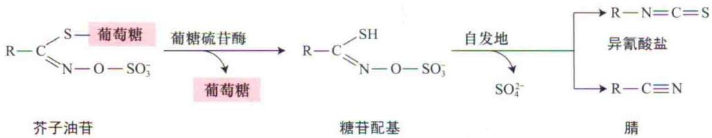  
图13.18 芥子油苷水解成挥发性的芥子气的过程。R表示烷烃基或芳烃基。假如R是 $CH_{2}=CH-CH_{2}^{-}$ ，这个化合物就是黑芥子硫苷酸钾，是黑芥种子和山葵根中的主要芥子油苷。

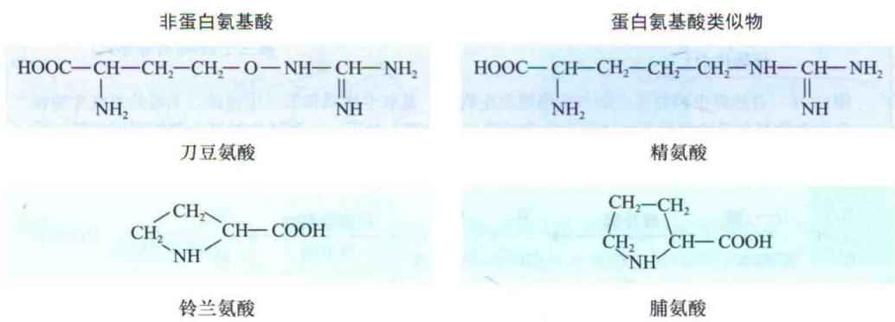  
图13.19 非蛋白氨基酸和蛋白氨基酸类似物。植物中以游离形式存在的具防御反应的化合物的非蛋白氨基酸不参与到蛋白质合成中。

非蛋白氨基酸的具有各种毒性，有的能抑制蛋白氨基酸的合成和吸收，如刀豆氨酸，可被错误地引入到蛋白质中，被草食动物摄入后，可被精氨酸的tRNA分子识别，在蛋白质合成过程中被结合到有精氨酸的位点上，导致其立体结构或催化位点被破坏，降低与底物结合能力或丧失催化反应的能力（Rosenthal，1991）。

已经显示几种非蛋白氨基酸，包括β-N-草酰-L-α，β-二氨基丙酸、二氨基苯甲酸（DABA）、二氨基丙酸（DAPA）、3-N-草酰-2，3-二氨基丙酸和2-氨基-6-N-草酰尿丙酸，以乙酰化的形式存在于饲用豆类中，对反刍动物有毒性（McSweeney et al., 2008）。

这些化合物对合成非蛋白氨基酸的植物是没有毒性的。例如，刀豆种子能合成大量的刀豆氨酸，但是刀豆的蛋白质合成机制能区别刀豆氨酸和精氨酸，这样就不会把刀豆氨酸引入到自己的蛋白质合成中。一些以非蛋白氨基酸为食的昆虫体内也有类似的机制。

## 13.5 诱导植物防御反应抵抗植食昆虫

植物体进化了一系列防御机制来防止昆虫的取食。这些机制主要分为两类：组成型防御反应和诱导型防御反应。组成型防御是植物固有的防御反应，具有特异性，以储存化合物、结合化合物（降低毒性）或活性化合物前体的形式存在，这些物质都很容易受伤害诱导激活。迄今为止，大多数防御反应都是组成型防御反应。在有些情况下，同种杀虫化合物会参与组成型和诱导型两种防御反应。

诱导型防御仅发生在植物被伤害之后。原则上，诱导型防御反应需要组成型防御反应的一些成分，但这些物质必须具有高效、快速被激活的特性。

能引起植物损伤的害虫有三类。

（1）韧皮部害虫：如蚜虫和粉虱，能伤害表皮和叶肉细胞。植物对这类害虫的防御反应更类似于病原菌的侵害而不是草食动物的伤害（尽管对植物的直接伤害很小，但当这些害虫携带有病毒的载体时，伤害增大）。

（2）细胞害虫：如螨虫和牧草虫，能物理伤害植物细胞，类似于刺吸式昆虫的侵害。

（3）咀嚼式害虫：如毛虫（蛾子和蝴蝶的幼虫）、蝗虫和甲虫，对植物造成较大的伤害。以下讨论的草食昆虫就是这种害虫。

## 13.5.1 植物可识别昆虫唾液的特异性成分

植物对草食昆虫的防御反应主要是伤害反应和源于昆虫化合物激发子的反应。尽管草食昆虫对植物的伤害反应类似于机械伤害诱导的反应，但昆虫唾液中的一些化合物可以增强这个刺激。除此之外，昆虫化合物激发子可以触发系统的信号转导，启动植物的防御反应（Web Essay 13.4）。

草食昆虫唾液中的激发子大多是脂肪酸-氨基酸复合物（或脂肪酸胺）（Alborn，1997），这些化合物激发的反应类似于咀嚼式昆虫产生的防御反应，和机械损伤的不同，这些化合物的生物合成依靠植物中的亚麻酸（18:3）和亚油酸（18:2），昆虫摄入了含有这些脂肪酸的植物后，内脏中的酶会把植物中的脂肪酸结合到昆虫中的氨基酸如典型的谷氨酸上。由于最初的发现，有些激发子已经被鉴定出来了，最近的研究显示特殊的激发子在植物中变化很大（Schmelz et al., 2009）。

植物被昆虫反复消化后，激发子成为昆虫唾腺的一部分，在草食地留下痕迹，植物然后识别激发子和激活一系列复杂的信号转导途径用于诱导防御反应。

## 13.5.2 茉莉酸是一类可激活许多防御反应的植物生长物质

大多数参与植物抗草食动物反应的信号途径是硬脂酸途径，这一途径会产生植物激素——茉莉酸（JA或jasmonate）（图13.20）。当植物遭遇草食动物侵袭时，体内的茉莉酸水平迅速升高，促使植物中许多参与防御反应的蛋白质合成。植物中的茉莉酸是由亚麻酸开始合成的，然后从膜脂中释放出来。两个细胞器参与了茉莉酸的生物合成：叶绿体和过氧化物酶体。亚麻酸来源的中间成分在叶绿体中形成，然后运输到过氧化物酶体，由β氧化途径中的酶（见第11章）完成到茉莉酸的转化（Web Essay 13.5）。

甲基茉莉酸可以诱导参与植物防御反应的基因转录，在这些诱导的基因中许多都是编码次生代谢过程中关键酶，对于这些基因的激活机制也逐渐清晰。最近的研究显示茉莉酸与生长素（见第19章）和赤霉素（见第20章）一样能通过一个保守的机制进行作用（图13.21）。然而与这些激素信号相比，茉莉酸的激活首先需要在氨基酸合酶（JAR protein）的作用下与氨基酸缩合，氨基酸合酶属于羧酸合酶。例如JAR1酶可催化甲基茉莉酸与异亮氨酸形成JA-Ile，产生JA依赖的防御信号反应的一部分（Fonseca et al., 2009）。

有生物活性的JA-Ile然后与COI1蛋白结合，COI1是一种F-box蛋白，是SCF蛋白复合物（ $\mathrm{SCF}^{\mathrm{COII}}$ ）中的一个成员。SCF蛋白复合物可通过多聚泛素化降解蛋白。COI1首先作为一个信号分子——假单胞菌中的冠缨碱被鉴定出来，冠缨碱具有与JA-Ile类似的结构，甲基茉莉酸与COI1的结合力较JA-Ile强（Web Essay 13.5）。

  
图13.20 亚麻酸（18:3）转变为茉莉酸的途径。前三个步骤发生在叶绿体中，导致12氧植物二烯酸合成。这个中间产物运输到过氧化物酶体内经过β氧化还原转变为茉莉酸。

最近有两个独立的课题组鉴定了 $SCF^{CO11}$ 复合物的靶蛋白是JAZ蛋白家族（Cnini et al., 2007；Thines et al., 2007）。这些研究清楚地显示， $SCF^{CO11}$ 复合物结合了JA-Ile可与JAZ蛋白结合。JAZ蛋白是一个甲基茉莉酸信号转导途径中的一个负调控因子。 $SCF^{CO11}$ JA-Ile复合物与JAZ蛋白结合可导致多聚泛素化，使得JAZ蛋白通过26S蛋白酶体不断地进行降解。JAE的降低进一步激活了参与甲基茉莉酸途径的转录因子的表达。这一信号系统被 $SCF^{CO11}$ 复合物负反馈调节，激活的基因中包括JAZ抑制蛋白，JAZ蛋白合成和降解的比例受JA-Ile浓度的控制，显示出一种反应强度和持续的

时间。

在这个途径中还有一个重要的转录因子-MYC2，是茉莉酸信号转导途径的核心调控元件，另一个重要的转录因子是ORCA3。ORCA3是最早从抗癌植物马达加斯加长春花中鉴定到的，这个转录因子不仅能激活生物碱合成途径中关键基因的表达，而且也能激活提供生物碱合成的初级代谢物的合成，所以它是马达加斯加长春花中代谢途径的主要调节器。

甲基茉莉酸的抗虫机制主要来自于对于拟南芥JA缺失突变体的研究（McConn et al., 1997）。这些突变体对真菌蚋是敏感的，而野生型具有抗真菌蚋的作用。外源施加甲基茉莉酸可使突变体具有与野生型一样的抗性。

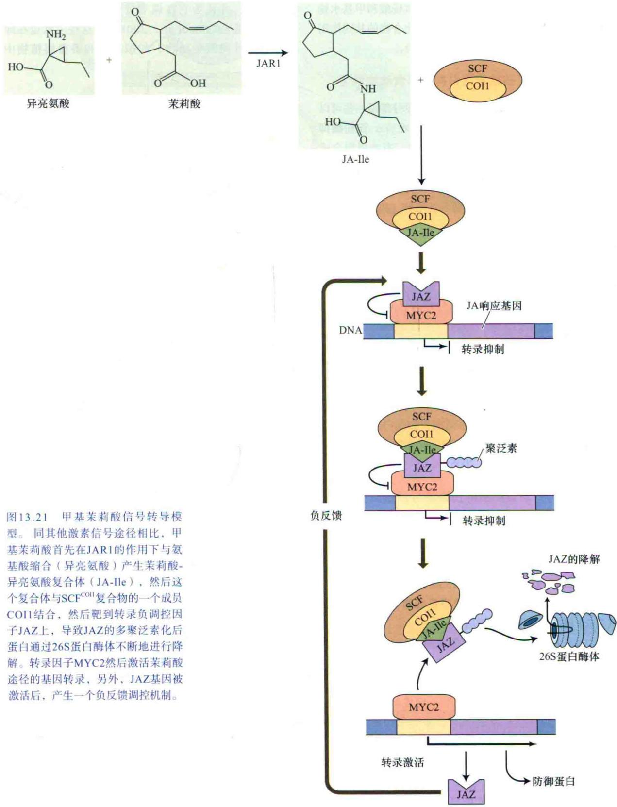

几种其他信号化合物包括乙烯、水杨酸和甲基水杨酸也被草食昆虫诱导。这些信号转导化合物的共同作用对于诱导防御反应的完全激活是必需的。

## 13.5.3 某些植物蛋白抑制草食动物消化

茉莉酸诱导植物防御反应的许多成分都是一些可以抑制草食动物消化的蛋白。如豆类合成的α-淀粉酶抑制剂，可以抑制α-淀粉酶的消化活性。有些植物合成的植物凝集素，是一种可以结合糖或含有碳水化合物的防御蛋白。在被草食动物消化之后，凝集素可以紧贴着消化道与上皮细胞结合阻止营养的吸收（Peumans and van Damme，1995）。

植物中常见的抗消化蛋白是蛋白酶抑制剂，一般存在于豆类、番茄和其他植物中。这些蛋白酶进入草食动物的消化道之后，通过特异性紧密地结合到蛋白水解酶如胰岛素和胰凝乳蛋白酶的活性位点，阻止蛋白的消化。以含有蛋白酶抑制剂的植物为食的昆虫，生长发育会受到严重的抑制。

用转基因烟草实验证明了蛋白酶抑制剂的防御性，转基因植株积累较多的蛋白酶抑制剂，对草食昆虫的防御性较非转基因植物强（Johnson et al., 1989）。像葡聚糖一样，一些草食昆虫能够适应植物蛋白酶抑制剂，通过合成消化蛋白酶来抵制这种抑制作用（Jongsma et al., 1995; Oppeata et al., 2005）。

## 13.5.4 草食昆虫的伤害诱导系统抗性

草食昆虫导致番茄体内蛋白酶抑制剂迅速积累，甚至远端的未损伤区也有积累（Schilmiller and Howe, 2005）。番茄幼苗中系统产生的蛋白酶抑制剂是由一系列复杂的信号分子激发的（图13.22）。

（1）损伤的番茄叶合成原系统素，一个大分子（200个氨基酸）的前体蛋白。

（2）原系统素被蛋白水解成短（18个氨基酸）的多肽分子称为系统素。

（3）系统素从损伤的细胞中释放到原生质体中。

（4）在临近完好的组织中（韧皮部软组织），系统素结合到质膜细胞表面的受体上（见Web Essay 13.6）。

（5）系统素结合到受体上起始细胞内信号，导致茉莉酸的合成和积累。

（6）茉莉酸通过未知的机制从韧皮部运输到植物中的其他组织。

（7）茉莉酸从目标组织中释放，并最终激活编码

蛋白酶抑制剂基因的表达。

自系统素被发现以来，番茄中的许多系统素已经被鉴定，并认为它在调节抗虫的防御反应中具有重要的作用（Chen et al., 2008）。这些多肽也在除茄科植物外的其他植物，如拟南芥和番薯属植物中发现。

## 13.5.5 草食动物诱导的挥发物具有复杂的生态学功能

草食昆虫损伤植物会诱导植物产生挥发性物质（挥发物），这是一个自然界中次生代谢物复杂生态学功能的特例。这些释放的化合物分子对昆虫是特异性的，主要包括三种典型的次生代谢物：萜类、生物碱和酚。此外，所有生物在遭遇伤害时都能释放脂类衍生物，如绿叶挥发物，一种六碳醛、醇和脂的混合物。

这些挥发物的生态功能是复杂多样的（Web Essay 13.7），在一般情况下，能吸引攻击性昆虫、草食动物和寄生虫的天敌，这些害虫一般利用这些挥发物找到它们的食物和寄主来繁衍其后代。这些挥发物是植物叶在蛾子产卵期释放的，可以阻止雌蛾进一步产卵和草食动物的侵害。除此之外，许多挥发物吸附在植物叶的表面用其味道作为草食动物的拒食剂。

植物体能区分不同的植食昆虫并触发不同的反应。如美国西部大盆地沙漠地区中的一种野生烟草（Nicotiana attenuata），可产生高水平的烟碱。当受到抗烟碱的毛虫侵入时，内在的烟碱含量没有变化，相反，释放的挥发性的萜类物质可以抵御毛虫等食肉动物（Karban and Baldwin，1997）（Web Essay 13.8）。野生的烟草和其他植物很清楚地知道损伤其叶片的植食昆虫的类型。植食昆虫可以通过它们造成的伤害类型或分泌的特定化学物质判断其存在的信号。

挥发性物质在植物保护中的作用是一个令人感兴趣的谜团，昆虫侵害植物后释放的特定挥发物能作为信号传递给邻近的植物来诱导防御反应基因的表达。除几种类萜之外，绿叶挥发物在这个过程中扮演有力的信号分子（Arimura，2000）。如玉米喷洒绿叶挥发物后，可以迅速诱导大量的茉莉酸及其相关基因的表达。然而，更重要的发现是，经过绿叶挥发物处理的玉米能增强对植食昆虫攻击的反应（Engelberth et al., 2004）。这些绿叶挥发物能优化或降低各种植物的防御反应，包括植物抗毒素和一些抗生素（下一部分讨论）（Web Essay 13.9）。

## 13.5.6 昆虫应对植物的防御反应的策略

尽管植物进化的机制都是来保护植物本身的，但在植物和昆虫之间所谓的共进化中，昆虫也产生了一些克服植物防御的适应性，它像植物防御反应一样包括组成性的（一直存在）和诱导性的（被植物激活的）适应。组成性适应广泛地存在于特异的植食昆虫中，这类昆虫是以少量的植物为食，而诱导性适应则存在于一般植物为食的昆虫中。尽管在自然界中植物-昆虫相互作用是导致不适宜条件下其生存和发育的基础，但这些都不是很清楚。

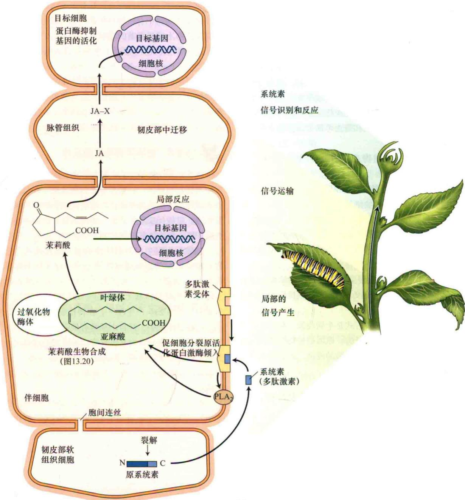  
图13.22 受伤番茄迅速诱导的蛋白酶抑制剂生物合成的系统素信号转导途径。损伤的番茄叶子（图形底部）在韧皮部软组织细胞中合成原系统素，最后经加工成系统素。韧皮部软组织释放的系统素结合到其邻近细胞质膜的受体上，激活导致茉莉酸生物合成的信号级联反应。接着可能以结合物形式经过筛管分子运输到未受伤的叶子。在这里的叶肉细胞内启动信号反应，导致蛋白酶抑制基因的激活。植物细胞中的胞间连丝促进这个途径的信号传播。

## 13.6 植物对病原菌的防御反应

尽管植物没有动物复杂的免疫系统，但很奇怪的是，植物体可以抵御由真菌、细菌、病毒或线虫引起的各种疾病。本章将讨论植物体抵抗侵染的不同进化机制，主要包括杀菌剂的产生及程序性死亡（见第16章），也称过敏反应。我们也将讨论植物免疫反应的两种类型：获得性系统抗性和诱导性系统抗性。

## 13.6.1 病原菌对抗宿主植物的多种策略

植物持续暴露在各种病原菌中。这些病原菌已经进化出各种方式侵染它们的宿主植物。或通过分泌细胞溶解酶到角质层和细胞壁消化这些机械障碍，或通过植物的气孔、皮孔进入植物体，或通过被草食昆虫破坏的受伤处进入植物体，或以草食昆虫作为媒介进入植物体，韧皮部取食的害虫如粉虱和蚜虫可携带病原菌直接进入植物的脉管系统。

病原菌一旦进入植物通常使用三种主要的方式利用宿主植物。

（1）腐生性病原菌通过分泌降解酶或毒素到植物的细胞壁，进一步杀死植物细胞，导致许多组织损伤，造成植物坏死。死亡的植物组织成为病原菌的食物来源。

（2）植物被活体营养菌感染后，有不同的应对策略。植物被感染后，植物组织仍然是活着的，仅有少量损伤的细胞作为病原菌的食物来源。

（3）半活体营养菌侵染时，最初植物细胞是活着的，然后进入细胞坏死阶段，病原菌导致损伤的组织进一步扩大。

病原菌的入侵和感染方式是个别现象，在生态系统内植物疾病的流行也是罕见的。原因是植物已经进化出有效的防御机制抵抗各种病原菌的侵染，之后我们将更加详细地讨论病原菌的作用方式。

强的杀菌活性，因此推测它们具有抵御病原菌的功能。这些次生代谢物中有一种皂角苷，是三萜物质，通过结合到类固醇上破坏真菌的细胞膜。

## 13.6.2 侵染前植物可产生抗菌复合物

遗传学实验已经证明了皂角苷具有抵御燕麦病原菌的功能（Papadopoulou et al., 1999）。降低燕麦内皂角苷水平的突变体比野生型抵抗病原菌的能力差。令人奇怪的是，能在燕麦中正常生长的真菌可帮助植物去除皂角苷的毒性。丧失脱毒作用的真菌突变体不能侵染燕麦，但可成功的感染不含任何皂角苷的小麦。

## 13.6.3 侵染可诱导抗菌反应

在被病原菌感染之后，植物体内会引发一系列防御反应来抵制病原菌。一般反应是过敏反应，即包围在感染点周围的细胞快速地死亡，阻断致病菌的营养来防止其传播。过敏反应发生之后，在侵染位点会留下小的死亡组织区，植物体其他部位则不受影响。

过敏反应发生前会有活性氧和一氧化氮的迅速积累。感染区域的细胞通过还原分子氧合成许多有毒的化合物，主要包括超氧阴离子（ $O_{2}^{-}\cdot$ ）、过氧化氢（ $H_{2}O_{2}$ ）和羟自由基（·OH）。NADP氧化酶定位在质膜上（图13.23）产生 $O_{2}^{-}\cdot$ ，在转化成·OH和 $H_{2}O_{2}$ 。

前面讨论的几种典型的次生代谢物体外检测具有很

这些活性氧中，羟自由基具有最强的氧化能力，与其他分子一起参与自由基链反应，导致脂的过氧化，酶失活及核酸分子的降解（Lamb and Dixon，1997）。活性氧有助于细胞的死亡或作为超敏反应的一部分直接杀死病原菌。

在感染的叶子部位伴随着氧化会产生一些一氧化氮（NO）（Delledonne et al., 1998）。NO为动物和植物中许多信号途径的第二信使，是从精氨酸通过NO合成酶合成的。在此反应中，胞内钙离子浓度的增高对NO合成酶的激活是必要的，而NO和活性氧水平的升高是超敏反应所必需的，其中的一种信号分子升高不能诱导细胞死亡。

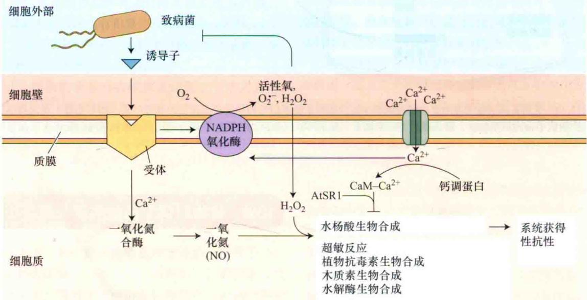  
图13.23 感染诱发的抗病反应。称之为激发子的致病分子可启动激活防御反应的复杂信号途径。一些细菌蛋白诱导子可直接注射到细胞内，同R基因产物相互作用，氧化猝发和一氧化氮的产生进一步刺激超敏反应和其他防御机制。

许多物种可以通过合成木质素或胼胝质参与对真菌或细菌病原体反应（见第10章），这些聚合物作为一道屏障，隔离病原菌与植物阻止其传播。其中相关的反应是细胞壁蛋白的修饰，细胞壁中富含脯氨酸的蛋白在病原菌侵入时靠过氧化氢介导的反应氧化交联在一起（图13.23）（Bradley et al., 1992）。这个过程增加了细胞壁在感染位点的亲和力，增强了其抵御微生物消化的能力。

另一个抵御侵染的防御反应是可降解致病菌细胞壁的水解酶形成，葡聚糖酶、几丁质酶和一些其他的水解酶在真菌感染后诱导。几丁质为乙酰氨基葡萄糖残基的聚合物，是真菌细胞壁的主要成分。这类水解酶属于病原菌感染相关的一类蛋白，就是所说的致病机理相关的（PR）蛋白。

## 13.6.4 病原菌入侵时会产生植物抗毒素

植物体对细菌或真菌侵入反应研究最深入的是植物抗毒素的形成。植物抗毒素是一类不同的次生代谢物，积累在感染位点周围具有强烈的抗菌活性。

都是一样的，但是不同的植物采用不同的次生代谢物作为植物抗毒素，如豆科植物紫花苜蓿和大豆，异类黄酮作为植物抗毒素；而茄科植物马铃薯、烟草和番茄，倍半萜是植物抗毒素（图13.24）。

在大多数植物中抵御微生物的植物抗毒素产生机制

植物抗毒素在植物被感染前是探测不到的，但受到微生物的侵入后通过新的生物合成途径迅速大量合成，控制的关键是基因转录的启动。因此，植物体似乎没有储存任何酶进行植物抗毒素的生物合成。相反，当微生物侵入后，它们立即开始转录、翻译相应的mRNA，进而开始合成一些酶。

尽管生物学分析发现积累一定浓度的抗毒素可防止病原菌，但其在完整植物中防御的重要性还不知道。最近在植物和病原菌上的遗传修饰实验提供了植物抗毒素体内功能的直接证据。例如，携带有可促进苯丙类抗毒素白藜芦醇生物合成的转基因烟草比非转基因烟草抗真菌病原菌的能力更强（Hain et al., 1993）。同样拟南芥对真菌的抗性主要依赖色氨酸衍生的植保素（camalexin），因为植保素合成缺失突变体比野生型更易受感染。另外携带可降解植物植保素的转基因病原菌可正常的感染抵御它们的植物（Kombrink and Somssich., 1995）。

## 13.6.5 植物可特异性识别致病菌释放的物质

同一物种不同植物个体间的抗病能力有很大的不同，主要表现在反应速度和强度上的不同。抗性植物对病原菌表现更快、更强的反应速度。因此，了解植物如何感知病原菌的存在并启动防御反应是非常重要的。

萜类途径中 $C_{5}$ 单位形成的额外环  
  
美迪紫檀素(来自苜蓿)

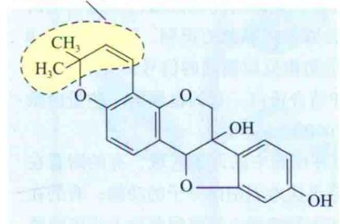  
大豆抗毒素(来自大豆)

豆科植物中的异类黄酮（来自豌豆）  
  
日齐素(来自马铃薯和番茄)

  
辣椒素(来自胡椒和烟草)  
茄科植物中的倍半萜(马铃薯)  
图13.24 在两种植物中发现的植物内毒素的结构。

抗病反应的第一步是有一个病原菌的识别系统。植物有各种识别病原菌的受体，被称为微生物相关分子模式（MAMP）。这个受体来源于病原菌进化上保守的大分子，如来源于真菌细胞壁或细菌鞭毛的结构分子（Hammonk-kosak and Kanyuka，2007）。研究较多的受体是pep13，是疫病属细胞壁谷氨酰胺转氨酶专有的一个13氨基酸的多肽，另一个是flg22，来源于细菌鞭毛蛋白的22个氨基酸的衍生物。

MAMP可以被一个特异的受体识别，然后激活特异的植物防御反应，包括产生大量的植物内毒素。这些MAMP受体的有效性是惊人的，一个受体能识别一个特定的MAMP类群。例如，鞭毛（flg22）受体FLS2能使植物识别所有的移动（带有鞭毛的）细菌。同样无特征的受体pep13能使植物识别所有的卵菌纲的病原菌，因此这些病原菌不能导致植物感病。这种方式被称作先天免疫。

第二个对真菌的系统抗性是通过植物R基因（抗性基因）和来源于病原菌的无毒力基因（avr）介导的。研究者分离到了20多种植物抗性基因，称为R基因，具有抵御真菌、细菌和线虫的功能。大多数R基因通过编码蛋白受体来识别并结合来自致病菌的特异性分子，这个结合能使植物体增加对病原菌的警惕性（图13.23）。特异性的病原菌诱导子主要包括蛋白、多肽、固醇，以及来源于病原菌细胞壁、外膜或分泌成分的多聚糖（Boller，1995）。

R基因产物是富含亮氨酸结构域的蛋白。这一结构域参与诱导子的结合以及病原菌的识别。除此之外，R基因产物可启动激活防御反应模式的信号转导。一些R基因编码ATP或GTP结合蛋白，有的也编码一些蛋白激酶结构域（Yang，2000）。

R基因产物分布在细胞中的许多区域，有的附着在细胞膜的外层，具有迅速地识别诱导子的功能；有的在胞质内，具有监测注入到细胞内的致病菌分子或致病菌感染后代谢成分改变的功能。R基因组成了植物中一个较大的家族，基因组经常串联在一起。R基因簇的结构可以使R基因通过染色体之间的改变多样化。

R基因（寄主受体）和avr基因（诱导子）的相互关系是非常特异的，常常被称为基因对基因的抗性。这种基因特异的抗性类型，必须是病原菌avr基因即诱导子能被宿主上受体即R基因产物迅速地识别。同样，只有某些病原菌具有avr基因能够被R基因特异性地识别。这种关系也能解释为什么植物对特异病原菌的抗性，某一个基因的单突变就可改变其相互作用导致植物感病，对植物生长产生严重的影响。avr基因显示的是编码促感

染因子。

## 13.6.6 激发子诱导信号转导级联反应

植物被真菌感染几分钟后，致病菌激发子就能被R基因或MAMP受体识别，启动一种动态的信号转导网络，进而导致最终的防御反应（图13.23）。这个级联反应首先发生的是细胞膜离子透性的改变，R基因激活刺激 $Ca^{2+}$ 和 $H^{+}$ 的内流，以及 $K^{+}$ 和 $Cl^{-}$ 的外流（Nurnberger and Scheel，2001）。 $Ca^{2+}$ 的内流激活氧化猝发，直接引起防御反应（前面描述），这和别的防御反应信号转导一样。病原菌诱导的信号转导的主要成分有一氧化氮、有丝分裂原蛋白（MAP）激酶、钙依赖的蛋白激酶、一些激素，如茉莉酸和水杨酸。除了在系统激活抗性中的一些重要调节因子外，水杨酸在各种病原菌的过敏反应中通过激活PR蛋白也起了很重要的调节作用。病程相关蛋白PR在病原菌侵染时被诱导，在这一过程中起着保护的作用。

最近发现一个 $Ca^{2+}$ 参与的负反馈机制可调节水杨酸的水平， $Ca^{2+}$ 对于活性氧的产生和一氧化氮的形成是必需的（图13.23）。钙调素（CaM）是一个带有4个Ca结合位点的钙结合蛋白。CaM本身没有活性，但和 $Ca^{2+}$ 结合后，引起构象变化，再激活其他的信号途径。拟南芥中 $Ca^{2+}\cdot CaM$ 复合体靠激活一个转录因子（AtSR1）控制病原菌诱导的水杨酸的积累，SR是水杨酸途径中的一个抑制子（图13.23）（Du et al., 2009）。

## 13.6.7 病原菌感染后植物会产生抗性

当植物从病原菌感染中存活下来，体内会增强其对病原菌的抗性，抵抗病原菌的再次入侵，这种现象被称为系统获得性抗性（SAR）（图13.25），是由初次感染后经过一段时间形成的（Ryals et al., 1996）。系统获得性抗性似乎是由某些防御性化合物含量增加引起的，这些物质以前提到过，包括几丁质和一些水解酶。

尽管SAR诱导的机理还不清楚，但水杨酸可能就是其内源的一个信号。植物被感染后在感染地带苯甲酸衍生物的水平迅速升高，促进SAR在植物体的其他部位形成。SAR从植物感染位点到其他部位传导的测量表明这种简单扩散是非常快的（3 cm/h），因此一定有微管系统的参与（van Bel and Gaupel，2004）。在烟草微管系统中有甲基水杨酸的移动信号（Park et al.，2007），其他植物也有SAR传送的现象。拟南芥中DIR1基因特异表达在韧皮部中，突变后抑制了SAR反应（Maldonado et al.，2002），DIR1基因编码一个酯转移蛋白，长距离信号转导可能来源于这种酯类物质。在感染位点积累的另一个物质是 $H_{2}O_{2}$ ，可能在SAR中也扮演一定的角色。然而，和水杨酸不同的是 $H_{2}O_{2}$ 不能作为长距离的信号起作用（van Bel and Gaupel，2004）。

茉莉酸 (JA)  
乙烯(E)  
  
图13.25 初始病原体感染可能通过引起系统获得抗性（systemic acquired resistance，SAR）增加以后病原体攻击的抗性。系统获得抗病性通过韧皮部从感染位点传播到植物的其他部位，引起整株植物抗性的增加。水杨酸及水杨酸甲酯在这一过程中显著增加，并引起致病机理相关蛋白的生产。水杨酸甲酯通常是在SAR过程中产生，并作为一种SAR引起的挥发性信号传递至邻近植物。

除了韧皮部移动信号外，挥发性物质也可能参与了SAR的诱导。例如，水杨酸甲酯能作为诱导SAR的信号传递给远端的组织和邻近的植物体（图13.25）（Shulaev et al., 1997）。

## 13.6.8 植物与非病原菌的相互作用能诱导系统性抗性

与SAB相比，植物同非病原菌相互作用能诱导系统性抗性（ISR）（图13.26）。植物被根际微生物侵染不仅能刺激植物产生根瘤，而且能通过植物产生级联信号。这一级联信号，包括茉莉酸和乙烯通过植物被激活后会增强植物的抗菌反应。系统激活的防御方式不包括水杨酸的参与。水杨酸作为信号分子不能诱导典型的PR蛋白的积累。

某一种防御机制是被ISR实现的，其余的防御反应仅仅在病原菌侵入后才被起始，最终导致快速和强烈的防御反应。这种防御反应的优势是减少植物资源的投入，否则会影响植物的性能，导致生长抑制和产量降低的后果。在这个激活和响应的模式中，ISR与先前所描述的由绿叶挥发物所参与的防卫反应的启动过程非常相似。

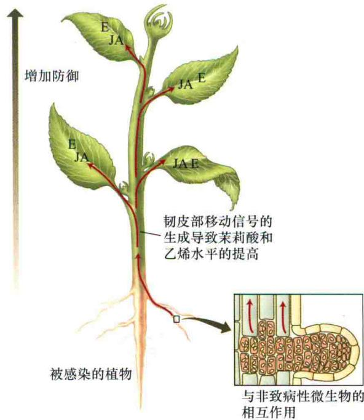  
图13.26 非病原微生物通过产生诱导系统抗性（ISR）抵御病原菌的侵染。非病原微生物，如根际细菌能激活茉莉酸和乙烯参与的通过植物触发ISR的信号转导。与直接的防御反应不同，ISR是增强了抗病原菌的防御水平。

## 小结

由于植物是固定不动的，因此它通过产生次生代谢物来抵御动物或与环境相互作用。这种次生代谢物的主要作用是吸引有益的有机物，如传粉者和种子传播者或抗环境因子的保护者以抵抗草食动物和病原菌的侵害。

## 次生代谢

· 对于起防御反应的次生代谢物，可吸引传粉者和种子传播者，也可作为植物与植物，植物与微生物之间的媒介。

· 次生代谢物可分为三类：类萜、酚类和含氮化合物（图13.1）。

\- 植物中次生代谢物的分布是非常严格的，某一种次生代谢物只存在于一类或一种植物中。

## 类菇

· 类萜的合成有两个途径，甲羟戊酸途径和甲基苏糖醇磷酸（MEP）途径，两种均能产生异戊烯焦磷酸（IPP）（图13.2）

· IPP和它的异构体二甲基丙烯焦磷酸（DMAPP）结合形成牻牛儿焦磷酸（GPP），这是几乎所有10碳单萜的前体。GPP和另一个IPP结合形成15碳倍半萜的前体法尼焦磷酸（FPP）。FPP是几乎所有倍半萜的前体。

· 有些类萜在植物生长发育中具有重要的作用，对草食动物具有毒性和拮抗的作用（图13.3和图13.5）。

## 酚类化合物

· 酚类化合物是一种混合物，通过莽草酸途径合成（图13.6和图13.7）。

· 木质素是苯丙素醇的聚合物，存在于植物细胞壁中，起着支持和输导作用。另外，它的机械支持可抵制被动物食用和免受病原菌的侵害。

· 类黄酮包括花青素、黄酮、黄酮醇和异黄酮。其分子骨架包括15个碳原子以1个三碳链相连的两个芳香环排列而成。类黄酮是通过莽草酸途径和丙二酸途径合成的（图13.9）。

· 花青素是有色的类黄酮，在植物中主要呈现红色，粉色，紫色和蓝色（图13.10）。

· 黄酮醇和异黄酮存在于所有绿色植物的叶片中，保护植物免受强紫外线的损伤，异黄酮的苯环结构类似于类固醇，可作为一种杀虫剂、农药和灭鱼药。

· 单宁酸是由类黄酮聚合而成，单宁酸多聚物中包含酚酸。由于单宁酸能与蛋白质结合，所以它具有毒性，会大大地降低食草动物的生长和生存能力。在抵御病原菌中也有作用（图13.12和图13.13）。

## 含氮化合物

· 含氮次生代谢物是从氨基酸起始合成的，包括抗草食动物的生物碱和含氟糖苷。这些化合物是具有毒性和药性。

· 生物碱是碱性的、水溶性的物质，通常也起源于氨基酸，包括赖氨酸、酪氨酸和色氨酸，有些生物碱起源于萜烯途径。大多数生物碱对于动物和人类是有毒性的，有些生物碱作用于神经系统，有些则影响膜受体、蛋白质合成或大分子酶的活性（图13.14和图13.15）。

· 双吡咯烷类生物碱能被草食动物耐受和适应（图13.16）。与草类植物共生的真菌能合成各种类型的生物碱，用于促进植物的生长和防御昆虫和哺乳动物的侵害。

· 含氰苷和芥子油苷本身没有毒性，但当植物被破坏或粉碎后就可以释放出毒素。含氰苷释放的毒气为氰化氢（HCN）（图13.17）。芥子油苷存在于油菜中，分解后可释放出一种蛋白毒素——异硫氰酸酯（图13.18）。

· 非蛋白氨基酸也具有毒性，有些可阻止蛋白氨基酸的合成和吸收，有些可被错误地引入到蛋白质中使其丧失功能（图13.19）。

## 诱导植物抗虫的防御反应

\- 植物抗虫的防御反应可分为组成型防御反应和诱导型防御反应。

\- 诱导型防御反应仅仅发生在植物被草食昆虫伤害或昆虫唾液中的一些诱导物刺激之后才能启动。

· 在抗虫防御反应中，植物中的茉莉酸水平迅速升高，可诱导参与防御反应的基因转录。茉莉酸是由亚麻酸开始合成的，从膜脂中释放，然后通过十八烷酸途径转化（图13.20）。

· 茉莉酸与氨基酸，如异亮氨酸缩合后被激活，茉莉酸-异亮氨酸复合体（JA-Ile）结合到受体复合体上，降解转录抑制子，导致茉莉酸响应途径基因的表达（图13.21）。

· 茉莉酸可诱导防御蛋白的产生，如植物凝集素和蛋白酶抑制剂及其他一些次生代谢物。

· 草食昆虫也能通过合成多肽信号，如系统素诱导系统抗性。系统素可从原生质体中释放出来，然后结合到韧皮部细胞的表面受体，进而激活茉莉酸合成途径。茉莉酸通过植物输送诱导编码蛋白酶抑制剂的基因表达（图13.22）。

· 草食昆虫损伤植物时会诱导挥发性物质或挥发物的释放，挥发物可吸引攻击草食动物的天敌，也可以作为一种信号传递给邻近的植物来诱导防御反应基因的表达。

## 诱导植物抗病的防御反应

· 病原菌已经形成了多种途径对宿主植物进行侵害，包括分泌细胞溶解酶到角质层和细胞壁，或通过植物的气孔、皮孔、或受伤处进入植物体。草食昆虫可以作为各种病毒和病原菌的载体。

· 病原菌通常采用三种策略攻击植物：腐生的，寄生的和半腐生的。

· 抗病原菌的普通防御反应是过敏反应，即感染点周围的细胞快速地死亡，限制了致病菌的扩散。过敏反应会导致活性氧和一氧化氮的迅速积累（图 13.23）。

· 植物被感染后会产生水解酶破坏真菌病原菌的细胞壁。许多植物产生植物抗毒素。植物抗毒素是一类不同的次生代谢物，积累在感染位点周围具有强烈的抗菌活性（图13.24）。

· 一些植物有受体能识别进化上保守的病原体来源的物质，被称为微生物相关分子模式（MAMP）。

\- 植物R基因与病原菌来源的avr基因相互作用能识别特异的病原菌。R基因编码的受体能识别avr基因，avr基因产物结合到受体上会激活抗菌反应的信号转导途径。

· 当植物从病原菌感染中存活下来常常会抵抗病原菌的再次入侵，这一过程被称为系统获得性抗性（SAR）（图13.25）。

\- 植物同非病原菌相互作用能诱导系统抗性（ISR），这一过程被茉莉酸和乙烯介导（图13.26）。

(林娟译)

## WEB MATERIAL

## Web Topics

## 13.1 Cutin, Waxes, and Suberin

Plant surfaces are covered with layers of lipid material protecting them against water losses and blocking the entry of pathogenic microorganisms.

## 13.2 Structure of Various Triterpenes

The structures of several triterpenes are given.

## 13.3 The Shikimic Acid Pathway

The shikimic acid pathway converts simple carbohydrate precursors derived from glycolysis and the pentose phosphate pathway to the aromatic amino acids and salicylic acid.

## 13.4 Detailed Chemical Structure of a Portion of a Lignin Molecule

The partial structure of a hypothetical lignin molecule from European beech (Fagus sylvatica) is displayed, showing the complexity of this macromolecule.

## Web Essays

13.1 Engineering Fruit Aromas
The terpenoid pathway can be engineered to improve fruit aromas.

13.2 Secondary Metabolites and Allelopathy in Plant Invasions: A Case Study of Centaurea maculosa
The invasive weed Centaurea maculosa, which is rapidly taking over pastureland in the western United States, secretes the polyphenol catechin into the rhizosphere, which suppresses the growth and germination of neighboring plants.

## 13.3 Alkaloid-Making Fungal Symbionts

Fungal endophytes can enhance plant growth, increase resistance to various stresses, and act as “defensive mutualists” against herbivores.

13.4 Early Signaling Events in the Plant Wound Response A complex signaling network, which includes reactive oxygen species and rapid ion fluxes, is rapidly activated in wounded plants.

## 13.5 Jasmonates and Other Fatty Acid-Derived Signaling Pathways in the Plant Defense Response

The importance of fatty acid-derived signaling pathways as regulators of diverse plant defense strategies is becoming increasingly recognized. The complexity of the individual pathways and their mutual interactions are discussed in the context of direct and indirect defense strategies.

## 13.6 The Systemin Receptor

The systemin receptor from tomato is an LRR-receptor kinase.

## 13.7 The Plant Volatilome

The release of volatile organic compounds by plants provides an example of the diversity of secondary metabolites and the ecological implications thereof.

13.8 Unraveling the Function of Secondary Metabolites

Wild tobacco plants use alkaloids and terpenes to defend themselves against herbivores.

13.9 Smelling the Danger and Getting Prepared: Volatile Signals as Priming Agents in the Defense Response

By releasing volatiles, herbivore-damaged plants not only attract natural enemies of the attacking insect herbivore, but also signal this event to neighboring plants, allowing them to prepare their defenses against impending herbivory.

## 单元Ⅲ 生长和发育

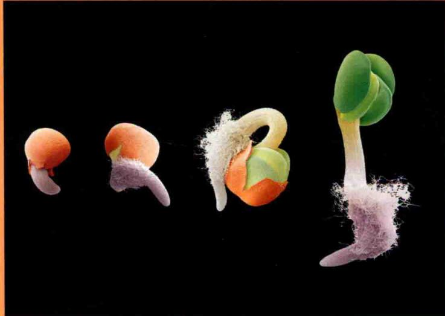

# 第 14 章

信号转导

植物体内的信号转导机制是人们长期神往的研究领域。达尔文利用金丝雀蘿草和燕麦幼苗进行了植物向光性生长的开创性研究。他观察到胚芽鞘顶端可以感受单侧光照射，而且植物的茎组织会向光照方向弯曲。达尔文认为，必定存在某种信号物质从胚芽鞘的一个区域转移到另一个区域并引起弯曲反应。温特等后来证明这种信号物质为生长素（见第19章）。

通过这些经典的研究，人们认为植物可以感受多种来自环境的或植物自身的生理信号，并精细调控其生长发育过程。植物细胞通过特异的感受蛋白或受体来感知这些内部的或外部的信号。一旦受体感受到这些信号，必须将这些信号传递下去（即将信号从一种形式转化为另一种形式），放大这些信号并触发细胞反应。受体通常修饰或激活或利用称为第二信使（secondary messenger）的胞内信号分子来完成对外界信号的传递和放大的功能，胞内第二信使进一步触发细胞反应（如基因转录）。总之，典型的信号转导途径包括以下几个步骤：

## 信号→受体→信号转导→反应

最近50年中，这一框架一直主导着我们对植物细胞信号转导的理解。植物中许多信号转导中间步骤和特定事件已经得到了鉴定，这些中间步骤构成了所谓的信号转导途径（signal transduction patyway）。

20世纪中叶植物信号转导领域具有里程碑意义的研究成果为光受体光敏色素的鉴定（见第17章）。早期的研究表明红光对种子萌发的影响可以被远红光所逆转（Borthwick et al., 1952）。这种红光和远红光的拮抗效应后来被证实通过光敏素而起作用，而光敏素是一种受光调控的功能可逆转换的光控开关（Butler et al., 1959）。

20世纪80年代以后，利用模式植物拟南芥的分子遗传学研究，极大丰富了人们对植物信号转导的认识。例如，通过遗传学方法得以鉴定了几乎所有类型的植物激素的受体（Chow and McCourt，2006）。此外，拟南芥突变体筛选方法进一步鉴定了多种受体（包括光与激素）的下游信号中间成分，这些信号转导中间成分的鉴定使人们对植物信号转导的复杂性的认识上升到一个全新的层次（McCourt，1999）。

21世纪伊始拟南芥基因组测序的完成，为植物信号转导体系的认识提供了新的前所未有的机遇。基因组测序表明植物与动物存在相当多的信号转导途径的共性。然而，基因组信息同时也清晰地表明，植物中存在一些不同于动物的全新的信号蛋白组分。因此，植物与动物信号系统存在某些关键的差别，这同时也反映了从单细胞祖先进化到多细胞有机体时植物与动物的不同进化途径。

本章中，首先从植物细胞与动物细胞信号转导途径的异同比较开始，突出强调两者在基因序列与蛋白功能水平的差异与相似性。接下来，我们将讨论植物信号转导途径中主要功能蛋白的失活、降解或阻抑蛋白解除的作用机制。这一作用机制往往涉及基因表达的失活，进而引起植物对基因表达变化的响应。我们将论及植物如何整合其他信号途径并最终作出响应。最后，我们将从微米到米、从秒到年等多种物理尺度或时间跨度水平上讨论植物的信号转导过程。

PLANT PHYSIOLOGY

## 14.1 植物细胞与动物细胞的信号转导

植物与动物使用不同的信号体系以调节其生长发育过程。例如，植物生命周期中许多关键的发育事件（如萌发、叶片形成、开花）受环境信号（如温度、光、日照长度）的调节，与此相比，动物的发育过程主要受生理（即内部信号）的调控。这些差异反映了植物的固着生活方式与动物可移动的生活方式的差异。本节中我们将讨论植物与动物信号转导系统的相似与差异。

## 14.1.1 植物与动物具有相似的信号转导组分

尽管植物与动物在发育方面存在明显的差异，但它们在信号体系方面却存在许多共性。例如，植物细胞与动物细胞都使用共同的胞内第二信使物质而触发生理反应，如钙离子、脂信号分子、pH变化等（图14.1）。

  
图14.1 信号转导的一般模式与实例。环境或生理信号被受体所感知后激活一系列包括第二信使物质的信号级联反应，最终引起植物细胞的生理反应。

动物细胞和植物细胞同样会使用大量的激酶受体和激酶信号传递蛋白。激酶（kinase）是一类可催化磷酸化反应的蛋白：将来自于ATP的磷酸基团添加到底物蛋白上。激酶受体和激酶信号传递蛋白具有激酶活性，并行使信号受体和信号传递体的功能。磷酸化通常会改变底物蛋白的活性，底物蛋白可能被激活也可能失活。

质膜是感受胞外信号的理想部位，因而动物与植物受体激酶通常位于质膜。信号分子与受体的胞外侧结合将触发产生胞内信号级联反应。例如，植物中油菜素内酯受体（BRI1，油菜素内酯不敏感1）与动物成纤维细胞生长因子（FGFR）均包含激酶结构域。对于动物成纤维细胞生长因子受体而言，受体结合将触发受体的自身磷酸化并形成二聚体（图14.2A）。与此相似，植物激素油菜素内酯与受体（BRI1）结合也将触发受体的自身磷酸化并与第二个称为BRI1相关的受体激酶（BAK1）受体形成二聚体（图14.2B）。这一过程详见第24章。

## 14.1.2 受体激酶触发的信号转导级联

受体激酶触发的胞内信号转导级联（intracellular signal transduction cascade）必定修饰其他靶蛋白的活性。这种靶蛋白可在多种氨基酸残基上被磷酸化（丝氨酸、苏氨酸、酪氨酸或组氨酸）。这种胞内靶蛋白往往自身也是蛋白激酶，被磷酸化时可能激活或者失活。这种调节激酶活性的机制在动植物中是普遍存在的。就动物中FGF受体而言，配体的结合导致FGF受体的磷酸化，并激活一系列被称为MAP激酶级联（MAP kinase cascade）途径的蛋白激酶（图14.2A）。MAP（丝裂原活化蛋白）激酶级联的名称来自于其包含一系列顺次磷酸化激活的蛋白激酶，如接力赛跑者手中的棒一般。在此级联系统中第一个激酶是Raf，具有MAP激酶激酶激酶（MAPKKK）活性。MAPKKK磷酸化MAP激酶激酶（MAPKK），MAPKK进一步磷酸化MAP激酶（MAPK）。MAPK作为接力队的最后成员，进入细胞核并进一步激活其他蛋白激酶，以及特异的转录因子或调节蛋白。这种MAP激酶级联途径同样存在于植物中，包括重要的抗病反应的信号转导途径等。

激酶级联途径的重要功能之一是将始于质膜的信号进行放大。每个被磷酸化的激酶都将调控除自身外的多种靶蛋白的活性。在这个由几个激酶构成的信号级联放大途径中，数量不多的配体分子与膜受体结合，通过由几个蛋白激酶构成的信号级联过程，可磷酸化成千上万的靶蛋白并改变其活性。

蛋白激酶活性的改变最终可能引起基因表达的改变。就动物成纤维细胞生长因子（FGF）信号而言，被磷酸化的蛋白ERK进入细胞核并磷酸化被称为Et's的转录因子，这些Et's转而调节FGF下游靶基因的转录。对植物激素油菜素内酯而言，激素与其受体的结合引起阻抑蛋白BIN2（油菜素内酯不敏感2）的失活。BIN2是一种蛋白激酶，在正常情况下阻止那些调控油菜素内酯下游基因表达的转录因子在细胞核内的积累。BIN2的失活导致这些转录因子在核内的积累，进而结合于特异的启动子并调控油菜素内酯依赖的基因表达。

除了蛋白激酶，去除靶蛋白上磷酸基团的蛋白磷酸酶在信号转导过程中同样发挥着重要作用。例如，油菜素内酯信号组分BSU1就是一种可以使BIN2中的关键位置磷酸-酪氨酸残基脱磷酸化失活的蛋白磷酸酶。在植物激素ABA（脱落酸）的信号途径中蛋白磷酸酶同样发挥着重要作用（见第23章）。蛋白磷酸酶2C（PP2C）家族已经被证明以ABA依赖的方式脱磷酸化蛋白激酶SnRK2。首先，PP2C结合于SnRK2激酶的C端结构域Ⅱ，这种结合不依赖于ABA的存在。当ABA不存在时，PP2C通过去掉SnRK2激酶活性中心的磷酸基团而抑制其激酶活性（图14.3A）。

B 植物油菜素内酯途径  
  
图14.2 动物与植物细胞中从质膜到细胞核的基于激酶的信号过程。A.动物细胞中，酪氨酸蛋白激酶受体与成纤维细胞生长因子配体（FGF）结合，触发MAP激酶信号途径（这一途径由Raf激酶、MEK和MAPK构成）的激活，将始于质膜的信号识别过程传递到细胞核。B.植物细胞中，受体BRI1对油菜素内酯（BR）的识别导致受体的自身磷酸化，并磷酸化质膜相关的油菜素内酯信号激酶（BSK）的磷酸化。BSK的磷酸化促使其与蛋白磷酸酶BSU1互作。BSU1脱磷酸化并使BIN2激酶失活，BIN2是一个阻抑蛋白，BIN2将BR转录因子磷酸化并从细胞核中输出，从而起到抑制BR转录因子的作用。BIN2的失活导致BR诱导的基因转录得以继续。FGF，成纤维细胞生长因子；FGFR，FGF受体；BRI1，油菜素内酯不敏感1；BAK1，BRI1相关的蛋白激酶；BIN2，油菜素内酯不敏感2。

当ABA存在时，其受体直接与PP2C磷酸酶结合（Park et al., 2009），这种结合阻断了PP2C对SnRK2激酶的脱磷酸化作用（Umezawa et al., 2009；Vlad et al., 2009）。SnRK2蛋白激酶被释放后可磷酸化其靶蛋白，其中AREB/ABF转录因子被磷酸化激活后可启动ABA特异的基因表达（图14.3B）。因而，ABA信号转导途径依赖于这种PP2C磷酸酶和SnRK2激酶活性转换和平衡。

总之，植物和动物类似，利用受体与激酶或磷酸酶信号组分的偶联而参与多种重要的信号转导途径。

## 14.1.3 植物的信号转导组分从原核生物和真核生物的祖先演化而来

植物与动物有着相似的信号组分包括蛋白激酶和磷酸酶等。基因组测序表明它们却包含截然不同的信号转导组分。例如，动物基因组常包含上百种G蛋白偶联的受体（G protein-coupled receptor，GPCR），这些G蛋白偶联的受体可传递多种信号，包括激素、气味、味觉甚至光信号等。GPCR信号通过大的基因家族编码的异

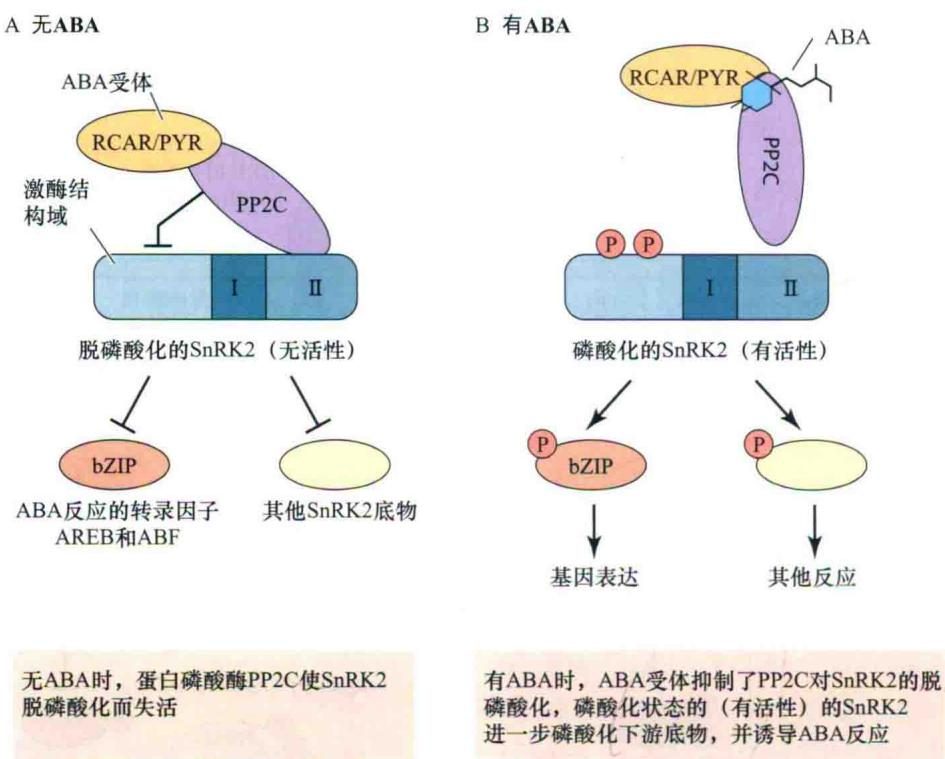  
图14.3 基于蛋白激酶和磷酸酶的ABA信号途径。A. 无ABA存在时，PP2C蛋白磷酸酶使SnRK2激酶脱磷酸化并失活。B. 有ABA存在时，ABA受体RCAR/PYR与PP2C互作并抑制其磷酸酶活性，使SnRK2激酶从负调节的抑制状态中得以释放，活化的SnRK2进一步磷酸化ABA-反应的转录因子（bZIP）和其他未知底物并诱导ABA反应。ABA. 脱落酸；SnRK2.SNF1相关的蛋白激酶2；PP2C. 蛋白磷酸酶2C

## 三聚体G蛋白而起作用。

与动物相反，目前人们还没有鉴定得到植物中存在的GPCR。而且，拟南芥基因组中也只存在单拷贝的异三聚体G蛋白基因（Jones and Assmann，2004）。这一差别清楚的提示我们，不可以把植物简单地看作“绿色动物”，因为植物和动物这两类真核生物存在信号转导途径构成和信号传递机制的显著差异。

高等植物具有一套独特的信号转导组分和信号传递机制，其主要原因之一就是植物的信号传递系统源自于其原核的和真核祖先的共同进化。植物叶绿体的信号转导组分来自于单细胞真核祖先和原核祖先。例如，拟南芥基因组包含2个隐花色素相关的基因（CRY1和CRY2）。隐花色素（cryptochromes）属于细菌的黄素蛋白，作为DNA光裂合酶在紫外线照射而产生的嘧啶二聚体修复中起作用。拟南芥中隐花色素缺失了关键的氨基酸残基而失去了DNA修复的功能。然而，它们介导了光调控的茎伸长、叶片扩展、光周期调控的开花以及昼夜节律（见第18章）。

许多重要的植物信号组分均来自于细菌。细胞分裂素受体和乙烯受体的序列与细菌的双组分调节基因相关。细菌的双组分调节系统由组氨酸激酶的传感蛋白和响应调节蛋白构成（图14.4）。传感蛋白（sensorprotein）的功能是接受信号输入并将信号传递给响应调节蛋白，响应调节蛋白引起细胞反应，通常为基因表达的变化。传感蛋白有两个结构域，一个为输入结构域用于接受细胞外的环境信号，另一个为传递结构域用于将信号传递给响应调节蛋白。

响应调节蛋白（response regulator protein）也包含两个结构域，一个为接受结构域用于接受来自传感蛋白的信号，另一个为输出结构域，如DNA结合的结构域，引起细胞反应。信号从传递结构域到接受结构域的转导，通过蛋白质磷酸化而实现。传递结构域可利用ATP对自身靠近氨基末端的特异组氨酸残基进行磷酸化（图14.4）。磷酸基团进一步传递给响应调节蛋白的接受结构域中部的一个特定的天冬氨酸残基上。天冬氨酸残基的磷酸化引起响应调节蛋白的构象变化并通常激活基因表达。

植物激素细胞分裂素通过类似于细菌双组分系统磷酸化的信号感受机制而被植物感知（图14.4；第21章）。细胞分裂素受体CRE1、AHK2和AHK3氨基酸序列与双组分系统的组氨酸激酶相关。然而，序列分析表明，细胞分裂素受体同时包含类似细菌的传感蛋白的组氨酸激酶（传递）结构域和响应调节蛋白的接受结构域（图14.4）。因而这些受体被称为杂合传感组氨酸蛋白

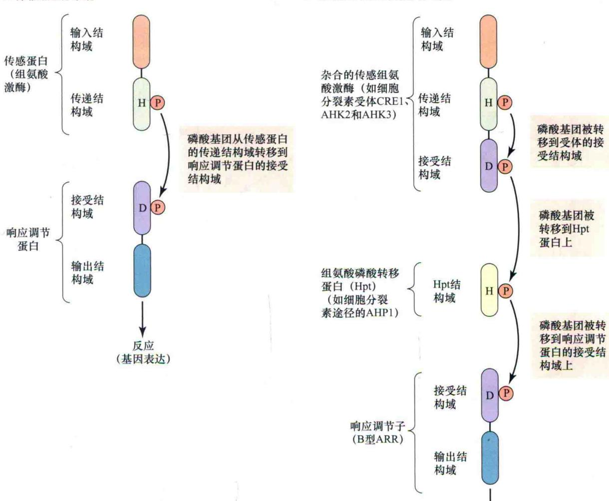  
图14.4 植物与细菌存在相似的信号感受机制和组分。双组分系统（A）由传感蛋白和响应调节蛋白构成，这一系统仅存在于原核细胞，但其演化出的包含磷酸基团传递中间体蛋白的三步磷酸化组分（B）在原核细胞和真核细胞均存在。植物双组分系统受体蛋白中接受结构域和传递结构域结合为一个蛋白。一个独立的组氨酸磷酸转移蛋白（Hpt）也称为AHP1可将磷酸基团从受体的接受结构域转移给响应调节蛋白的接受结构域（ARR）。这种双组分系统完成了细胞分裂素的感受和信号转导。基因CRE1、AHK2和AHK3编码细胞分裂素受体，这些受体可磷酸化Hpt结构域蛋白AHP1，此后磷酸基团被转移给B型ARR蛋白。AHK，  
拟南芥组氨酸激酶；AHP，拟南芥组氨酸磷酸转移蛋白；ARR，拟南芥响应调节子。

激酶。

因此，细胞分裂素与受体的结合触发受体传递结构域中组氨酸残基的自身磷酸化，此后磷酸基团再传递给接受结构域的天冬氨酸残基。磷酸基团进一步传递给被称为组氨酸磷酸转移蛋白（Hpt或AHP）上。磷酸化的AHP作为细胞分裂素信号的中间传递者起作用，将接受于质膜的细胞分裂素信号传递至定位于细胞核的调节蛋白（ARR），引起基因表达的改变。

## 14.1.4 植物可在细胞的多种部位感受信号

此前我们列举的大多数例子中信号都在细胞质膜部位被感受（图14.2和图14.4）。然而，植物可在细胞的多种位点感受外部信号。例如，光可在质膜、细胞质和细胞核被完全不同的受体所感受（图14.5）。基因PHOT1和PHOT2编码的光受体被称为向光素，它们可以在质膜接受蓝光信号并介导植物的向光性、叶绿体运动和气孔张开反应。相反，隐花色素基因CRY1和CRY2编码的蓝光受体定位于细胞核内。

光敏素基因编码的红光/远红光受体在胞质和细胞核均有分布。光可诱导位于胞质的受体构象发生变化暴露出核定位信号（nuclear localization signal，NLS），并导致光敏素从细胞质转移到细胞核。光敏素进入核后与转录因子结合并诱导基因表达的改变（见第17章）。

植物中激素可在细胞中多种部位被感受（图

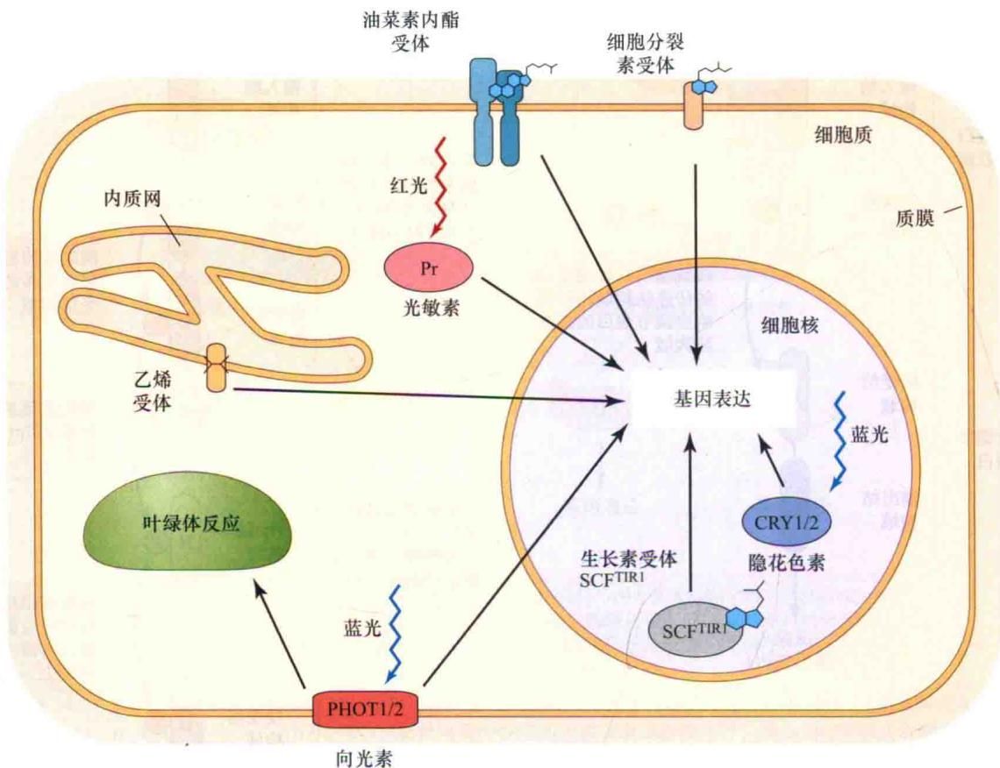  
图14.5 植物可在细胞的多种部位感受信号。膜受体可在质膜感受信号（油菜素内酯、细胞分裂素和蓝光）或内质网感受信号（乙烯），而其他信号可在胞质（红光）或细胞核（生长素和蓝光）被感受。信号反应通常为基因的诱导表达，也可能为已存在蛋白质或细胞器的修饰。

14.5）。例如，油菜素内酯和细胞分裂素在质膜分别被BRI1和CRE1/AHK2/AHK3所感受（Li and Chory, 1997; Inoue et al., 2001）。相反，植物激素乙烯被位于内质网的受体ETR1所感受（Chen et al., 2002）。乙烯（ $\mathrm{C}_2\mathrm{H}_4$ ）作为一种小的亲脂性分子很容易进入细胞及各种细胞器。生长素受体SCF $^{\mathrm{TIR1}}$ 定位在细胞核内，因而带电荷的配体吲哚乙酸（IAA）需通过扩散或主动运输才能进入细胞（Kramer and Bennett, 2006）。

## 14.1.5 植物信号转导往往涉及阻抑蛋白的失活

动物中许多信号转导途径往往表现为一系列正调节因子的激活。例如，对于成纤维细胞生长因子信号而言，受体与配体的结合将激活受体激酶，从而通过激活起调节作用的蛋白激酶而诱导基因的表达，在此就是MAP激酶级联系统的正调节刺激基因表达（图14.6A）。相反，植物中大多数信号转导途径通过失活阻抑蛋白而实现。例如，乙烯与受体ETR1结合后导致阻抑蛋白CTR1的失活（图14.6B）。这种负调节因子的失活导致转录因子EIN3的激活，并引起转录水平的反应（见第22章）。油菜素内酯与受体蛋白BRI1的结合导致阻抑蛋白BIN2的失活，引起转录因子BES1和BZR1的激活（图14.6C；见第24章）。

为什么植物细胞的信号途径利用负调节，而不是像动物细胞一样使用正调节途径？基于负调节信号转导途径的数学模型提示我们，负调节途径可更加快速的诱导下游基因的表达（Rosenfeld et al., 2002）。对于胁迫环境如干旱的反应速度对于固着生活的植物来说至关重要。因此，植物细胞中这种大量的信号负调节系统也许是长期进化的选择结果。

我们已经讨论了植物细胞中阻抑蛋白失活的几种不同的分子机制（图14.7）。如上所述，在油菜素内酯信号系统中利用了蛋白质的脱磷酸化而使阻抑蛋白BIN2失活（见第24章）。光触发抑制因子COP1的出核，而使HY5类转录因子在核内积累并激活基因表达（见第17章）。

阻抑蛋白失活的另外一种信号转导途径是蛋白质的降解，此机制在生长素信号途径中首次被发现（Gray et al., 2001）。在这一途径中，当生长素与受体复合物结合时，引起生长素/3-吲哚乙酸（AUX/IAA）阻抑蛋白被多个称为泛素（ubiquitin）的小分子蛋白所标记（图14.7C），启动了蛋白质降解系统。这种泛素标记的目标蛋白将被降解，这一蛋白降解途径称为泛素化途径（ubiquitination pathway）（见第2章）。在生长素存在时，AUX/IAA阻抑蛋白被泛素标记并降解，从而使生长素响应的转录因子ARF被激活并诱导基因表达（图14.7C）。

  
图14.6 植物细胞与动物细胞信号转导途径的功能配置的差别。动物细胞中大多数信号转导途径通过正调节步骤的激活并最终激活转录因子。相反，植物细胞中多数信号转导途径通过转录抑制因子的失活而起作用。支持此论点的三个例子如下：A. 在动物细胞中，成纤维生长因子（FGF）与受体结合启动MAP激酶的级联激活，最后的MAP激酶激活转录因子并启动基因表达。B. 与动物的FGF途径不同，植物乙烯信号转导途径在无乙烯与受体激活时处于活化状态，无乙烯存在时，信号组分CTR1可能通过MAP激酶级联途径抑制基因的表达，这一过程中MAP激酶级联途径使转录调节因子EIN2失活。在乙烯存在时，CTR途径被阻断，EIN2活化并激活特异的转录因子。C. 油菜素内酯（BR）信号途径同样使转录抑制因子BIN2失活，BIN2正常表现为抑制油菜素内酯诱导的基因转录。图中正常字体表示失活的信号组分，加粗字体表示活化的信号组分。

## 14.1.6 蛋白质降解是植物信号途径的普遍方式

自从人们观察到生长素信号途径中泛素依赖的蛋白质降解现象以来（Leyser et al., 1993），关于蛋白质降解在信号转导机制中的作用得到了广泛而深入的研究。到目前为止，泛素依赖的蛋白质降解几乎在所有的植物激素信号转导途径中都存在，这些途径包括茉莉酸（JA）和赤霉素（GA）。茉莉酸信号参与植物的抵抗食草动物和寄生病原菌反应（见第13章），而赤霉素则调节种子萌发、茎秆的伸长，以及叶片大小与形状决定等重要的生长发育过程（见第20章）。

茉莉酸和赤霉素与生长素的信号转导途径类似（图14.8），这些信号途径均有各自的泛素E3连接酶亚组复合物SCF的参与，导致转录抑制因子的降解。JA受体COI1通过影响JAZ阻抑蛋白的降解而调控JA的信号反应（Xie et al., 1998; Yan et al., 2007; Thines et al., 2007）。与AUX/IAA蛋白类似，JAZ蛋白同样抑制JA反应的基因表达。JA诱导泛素依赖的JAZ阻抑蛋白的降解从而释放并激活转录因子MYC2，进而诱导JA响应的基因表达。

细胞核

A 激酶失活  

图14.7 植物细胞中往往通过阻抑蛋白的失活而传递信号。A. 在油菜素内酯信号途径中，BIN2负调节因子通过抑制其激酶活性而失活。B. 光敏素吸收红光引起COP1抑制因子离开细胞核。C. 生长素与其受体复合物的结合，启动了泛素依赖的AUX/IAA阻抑蛋白被26S蛋白酶体降解。这三个例子中，阻抑蛋白的失活造成转录因子的激活。

B 抑制子重定位

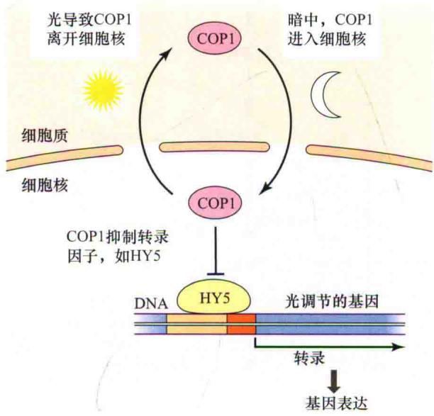

C 抑制子降解

失活的转录因子

## A 生长素反应

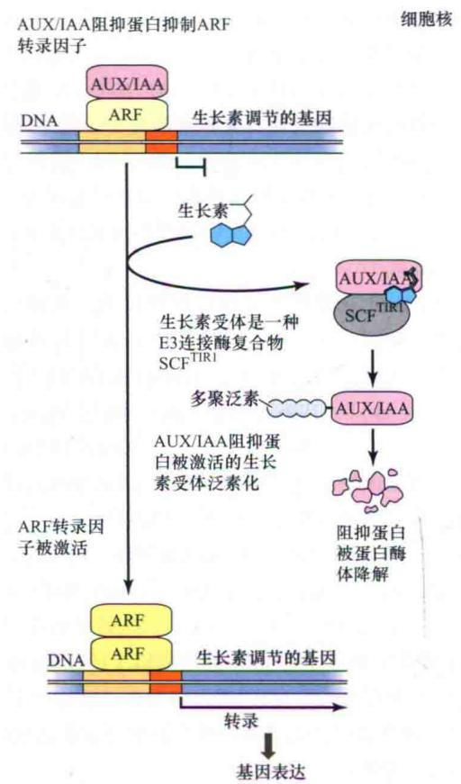

## B 茉莉酸反应

DELLA阻抑蛋白抑制PIF3/4转录因子

JAZ阻抑蛋白抑制MYC2转录因子

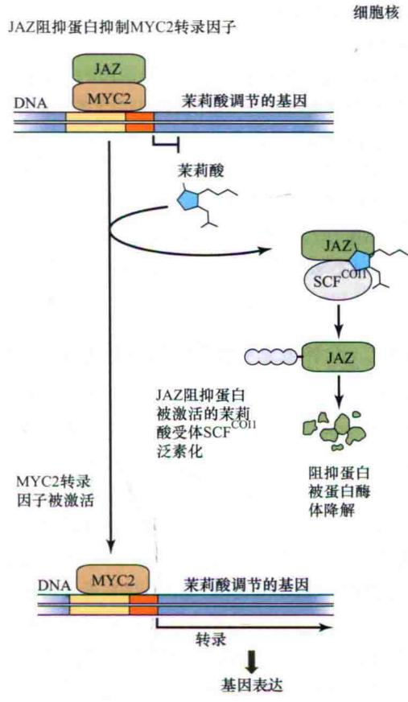

## C 赤霉素反应

图14.8 几种植物激素受体是SCF泛素化复合物的一部分。生长素、茉莉酸（JA）和赤霉素（GA）信号促进SCF泛素化组分与各自信号阻抑蛋白互作。生长素（A）和茉莉酸（B）直接促进SCF $^{TIR1}$ 复合物和SCF $^{COH1}$ 复合物分别与AUX/IAA和JAZ阻抑蛋白间的互作。相反，赤霉素（C）需要另一个额外的蛋白GID1参与形成SCF $^{SLY1}$ 与DALLA蛋白的复合物。多个泛素（多泛素化）标记的这些阻抑蛋白将被降解。这些阻抑蛋白的降解使得ARF、MYC2和PIF3/4转录因子激活，分别诱导生长素、茉莉酸和赤霉素响应的基因表达。

具生物活性的赤霉素主要依赖于泛素化的DELLA阻抑蛋白（DELLA repressor protein）的快速代谢周转（Jiang and Fu，2007）而发挥作用。DELLA蛋白自身会抑制植物的生长，包括根的延长和光调控的下胚轴伸长等，GA可促进DELLA的降解而解除DELLA的抑制作用。GA与其受体GID1结合启动泛素依赖的DELLA的降解。DELLA的降解释放并激活转录因子，从而激活基因表达（de Lucas et al., 2008）。到目前为止，拟南芥中5个DELLA基因已得到鉴定，包括gal-3（RGA）的阻抑蛋白，GA不敏感（GAI），类RGA1（RGL1），RGL2和RGL3（Fleet and Sun, 2005）。

## 14.1.7 几种激素受体为泛素化途径的组分

泛素化途径参与了大多数（如果不是全部）激素感受信号系统。简言之，泛素首先与E1连接酶共价结合（图14.9），然后泛素标签被转移到E2连接酶，随后，该酶与一个很大的由Skp、cullin和F-box构成的复合物连接，该复合物被定名为SCF，它是E3连接酶（E3 ligase）的一种。E3连接酶名字中（ $\mathrm{SCF}^{\mathrm{TIR1}}$ ）的上标部分标明了复合物中的F-box蛋白。F-box蛋白通常将靶蛋白募集到SCF复合物中以便该靶蛋白被E3连接酶泛素化并被26S蛋白酶体降解，26S蛋白酶体是由多个蛋白构成的复合体用于降解泛素标记的蛋白。

  
图14.9 生长素受体由两个蛋白组分构成：SCF复合物组分T1R1和阻抑蛋白AUX/IAA。泛素成分首先被E1连接酶激活并被E2连接酶添加到靶蛋白上。T1R1以生长素依赖的方式将AUX/IAA蛋白募集到SCF $^{TIR1}$ 复合物中。AUX/IAA蛋白一旦被募集将被SCF $^{TIR1}$ 复合物中的E3连接酶泛素化，被泛素化的蛋白将被26S蛋白酶体降解。

生长素受体基因TIR1编码SCF复合物的F-box蛋白组分（Ruegger et al., 1998）。TIR1作为生长素受体可将AUX/IAA蛋白募集到SCF复合物中（Dharmasiri et al., 2005; Kepinski and Leyser, 2005）。通常，靶蛋白的磷酸化修饰（或其他氨基酸修饰）是它们和F-box蛋白结合的先决条件。然而，AUX/IAA蛋白与TIR1的结合无需蛋白的预先修饰作用，但生长素作为“分子胶合剂”促使TIR1和AUX/IAA的结合（Tan et al., 2007；图14.8）。

自从生长素作用机制被发现以来，其他几种重要的植物激素也被发现可促进F-box蛋白与其靶蛋白的结合。例如，最近研究证明F-box蛋白COI1为JA的受体（Xie et al., 1998; Yan et al., 2007; Thines et al., 2007）。与生长素类似，JA促进COI1与JA响应基因表达的抑制因子JAZ的结合（图14.8）。GA信号同样涉及SCF复合物的参与，然而，GA受体GID1自身并不具备F-box蛋白的功能，而是GA促进DELLA蛋白与GA受体GID1的结合（Griffiths et al., 2006; Willige et al., 2007; Nakajima et al., 2006）。这种结合反过来又促进DELLA蛋白与包含F-box蛋白SLY1的E3泛素连接酶 $SCF^{SLY1}$ 间的结合（McGinnis et al., 2003）。实际上，GA受体GID1与DELLA的结合触发了后者通过F-box蛋白SLY1的降解。

如上述所讨论，生长素、茉莉酸和赤霉素绕过了膜结合受体及复杂的胞质信号转导链，并最终引起基因表达变化的信号转导系统（图14.2），它们的信号直接调控核定位的阻抑蛋白的稳定性，并诱导基因表达响应（图14.6）。这种短的信号转导途径可快速的改变基因的表达。然而，这种短的信号途径同时也失去了像激酶级联反应那样的信号放大作用（图14.2）。这种短的信号转导途径中转录活性直接与信号分子的丰度相关，因为信号分子的丰度决定了阻抑蛋白被降解的数量。这种信号转导途径构成上的关键差别可能有助于解释为什么需要更高浓度的生长素和赤霉素信号分子来诱发生物学反应，而其他激素如油菜素内酯则不需要如此高的浓度就可以达到同样的生物学反应。

## 14.1.8 阻抑蛋白的失活诱导基因表达

大多数信号转导途径最终将通过选择性诱导靶基因表达而引起生物学反应。植物体内，基因的激活表达通常是依赖于阻抑蛋白的失活而实现，即转录因子的去抑制作用（图14.2、图14.7和图14.8）。

就生长素的例子而言，AUX/IAA阻抑蛋白被降解时激活了生长素反应转录因子（ARF）依赖的基因表达（图14.8A）。生长素响应基因在其启动子区通常含有生长素反应元件（AuxRE）的结合位点（Hagenand Guilfoyle, 2002）。转录因子ARF结合于AuxRE位点并刺激基因转录（Hagen and Guilfoyle, 2002; Ulmasov et al., 1999）。AUX/IAA蛋白序列包含四个保守的结构域，分别命名为结构域I\~IV（Dharmasiri and Estelle, 2002）。结构域Ⅲ和IV同时存在于转录因子ARF序列中，因而使ARF和AUX/IAA间可形成异二聚体（Guilfoyle et al., 1998）。这种异二聚体阻断了ARF转录因子介导的基因转录（Guilfoyle et al., 1998; Tiwari et al., 2003）。生长素刺激AUX/IAA蛋白释放ARF转录因子，从而使ARF结合于靶基因的AuxRE启动子位点（图14.8）。

对于赤霉素而言，DELLA蛋白也被降解，并激活PIF家族转录因子的特异成员PIF3和PIF4，因而PIF3/PIF4刺激基因转录（图14.8C）。DELLA蛋白定位于核内，被认为是转录因子的调节因子。没有证据表明DELLA蛋白含有DNA结合结构域，说明DELLA可能间接通过与组织特异的转录因子互作而调节基因表达。光调控的下胚轴伸长也属于这种调节机制，光抑制下胚轴伸长也是依赖于DELLA蛋白的过程，但GA可以促进这一过程。Lucas等（2008）和Feng等（2008）的研究证明，对细胞伸长有重要调节作用的PIF家族转录因子可直接与DELLA蛋白结合。因此，DELLA蛋白的作用是使PIF转录因子处于无活性的复合物状态，高水平的GA将刺激DELLA蛋白的降解并释放其对PIF的抑制作用，PIF进而诱导基因表达（图14.8）。

## 14.1.9 植物已经进化出信号反应的关闭或削弱机制

我们有理由相信，对于细胞来说关闭信号反应与启动信号反应同等重要。植物已经进化出了多种机制以实现这一调控过程。植物细胞通过蛋白质脱磷酸化可以调节大量的信号转导中间组分的活性，如受体和转录因子。例如，光受体光敏素在细胞核内被泛素E3连接酶COP1泛素化并降解（见第17章）。与此类似，参与乙烯调节基因表达的转录因子EIN3（图14.6B）依赖于泛素途径被F-box蛋白EBF1和EBF2降解（见第22章）。

反馈调节的另外一种关键作用是信号的弱化途径。例如，AUX/IAA基因编码生长素响应的蛋白，在它们的启动子区存在生长素反应元件的结合位点（Hagen and Guilfoyle，2002）。因此，AUX/IAA蛋白可以结合到自身基因的启动子区并抑制自身基因的表达。

激素信号途径往往受到多种负反馈机制的共同调节。这一机制在GA信号途径中表现得最为突出（图14.10）。具生物学活性的GA（如 $GA_{4}$ ）通过复杂的途径经过多步酶催化而合成（Hedden and Phillips, 2000）。这一合成途径的最后两步催化酶属于GA20ox和GA3ox基因家族成员，它们的表达受GA的抑制。因此，GA可抑制自身的合成。

相反，GA可以刺激GA代谢酶GA2ox基因的表达（Thomas et al., 1999; Zentella et al., 2007），也就是说GA可诱导自身的降解。另外，DELLA蛋白可以刺激GA受体基因GID1的表达，这样就增加了细胞对GA的敏感性，因此，很有可能DELLA蛋白也将被降解（图14.10）。这样，在GA生物合成、感受和失活途径中存在多种正反馈和负反馈调节机制。这些机制共同精细调节植物生长发育过程中GA的水平和响应。

## 14.1.10 信号转导途径的相互交叉与整合

植物细胞中，信号转导途径从来都不是孤立的发挥作用，而是作为复杂信号转导网络的一部分起调控作用。对这一点的认识有助于我们理解为什么植物激素与其他信号互作时，有时候表现增效（增加的或正作用）作用，而有时候又表现为拮抗（抑制或负调节）作用。最经典的例子如GA和ABA在调控种子萌发中的相互拮抗作用（见第20章和第23章）。

信号途径间的这些互作方式称为交叉调节（cross-regulation），可以分为几种类型（Kappusamy et al., 2009）（图14.11）。

（1）初级交叉调节机制（primary cross-regulation）：截然不同的信号途径分别正调节或者负调节共同的信号组分。

（2）次级交叉调节机制（secondary cross-regulation）：第一种信号途径的输出结果调节第二种信号的感受或强度。

（3）三级交叉调节机制（tertiary cross-regulation）：两种截然不同信号途径的输出结果相互影响。

拟南芥下胚轴细胞的伸长受光和赤霉素共同调节，可以看作是负的初级交叉调节机制的代表（图14.12；de Lucas et al., 2008; Feng et al., 2008; Sadeghi-aliabadi et al., 2008）。这一例子中，光和GA调节共同的下游信号组分，两个密切相关的转录因子PIF3和PIF4，最终刺激下胚轴的伸长。PIF3/4的积累分别受GA的正调控和光的负调控。

黑暗诱导的下胚轴伸长是由于PIF3/4积累的结果（图14.12）。然而，在光下，红光光受体PHYB致使PIF3/4降解因而导致细胞延伸削弱表现为下胚轴缩短。在GA存在时，PIF3/4转录因子直接与DELLA蛋白结合而失活。但是，过高的GA水平导致DELLA蛋白的降解，并释放PIF3/4转录因子并促进细胞伸长（图14.8C）。

次级交叉调节机制涉及一种信号的输出结果调节第二种信号输入的强度和感受过程（图14.12）。拟南芥中生长素和乙烯抑制根细胞伸长的过程属于次级交叉

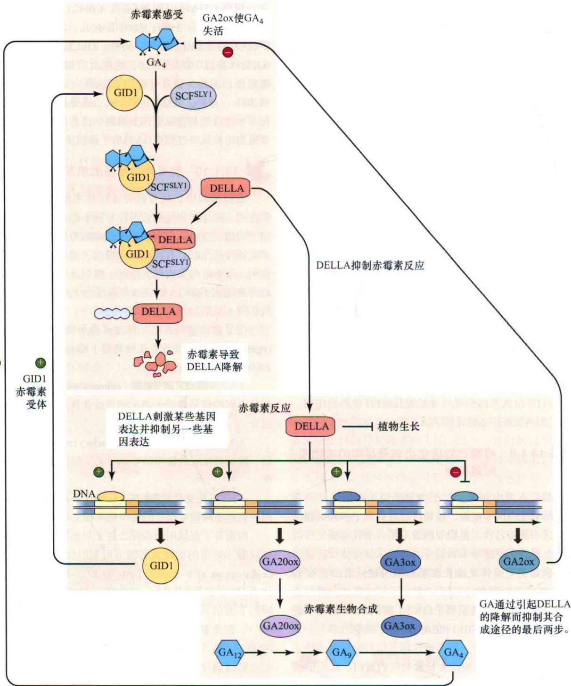  
图14.10 GA的信号反应受一系列GA生物合成与信号转导的反馈调节机制共同调控。GA20ox和GA3ox基因编码的酶参与GA合成的最后步骤，但是GA2ox参与有生物活性赤霉素 $\mathrm{GA}_4$ 的降解。GID1编码赤霉素受体，此受体与配体赤霉素结合导致DELLA蛋白被募集到SCF $^{\mathrm{SLY1}}$ 复合物中，并被泛素化而降解。无GA时，DELLA蛋白正调节GID1、GA20ox和GA3ox（信号增强），并负调节GA2ox（信号削弱）。反过来，具生物活性的GA和激活状态的GID1增强DELLA蛋白的降解（信号增强），但GA2ox阻断DELLA蛋白的降解（信号削弱）。

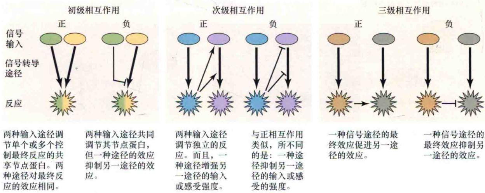

图14.11 信号转导途径作为复杂信号互作网络的一部分而起作用。三种类型的交叉调节途径：初级交叉、次级交叉和三级交叉。椭圆型代表信号输入，粗箭头代表信号传递，星型代表信号反应（输出）。细线箭头表示一种信号途径对另一种信号途径的正调节作用，带短棒的细线代表一种信号途径对另一种信号途径的负调节作用。以上三种类型的信号互作分别属于正作用或反作用。初级相互作用中两种信号的输入对共同信号组分蛋白或蛋白复合体的作用叠加，并直接互作调控信号反应。在次级信号互作中，一种信号途径的输出反应调节第二种信号的输入感受。在三级互作中，两种信号途径的独立输出相互影响对方的信号反应。

调节机制。这一机制中，乙烯信号通过刺激生长素的合成而间接抑制根细胞的伸长（Stepanova et al., 2007; Swarup et al., 2007）。

最后，三级交叉调节机制中两种截然不同信号途径的输出结果相互影响（图14.11）。最近的研究表明，生长素和细胞分裂素途径互作调控根系的生长发育（Muller and Sheen，2008）。在这一例子中，生长素负调节细胞分裂素应答途径的输出信号，这一反应属于B型拟南芥反应调节子（Arabidopsis response regulator，ARR）（图14.4）。生长素通过诱导A型ARR的表达而反馈抑制B型ARR调节子的作用而实现其作用。

人们已逐步清晰的认识到，植物的信号途径不是简单的线性转导过程而是多种信号途径间存在互相交叉和相互影响。对于这种复杂信号途径的理解往往需要建立新的科学研究方法，其中系统生物学（systems biology）方法就是新研究方法的重要代表，该方法利用数学和计算机模型来模拟细胞信号途径的复杂网络并能够更好地预测其输出结果（Locke et al., 2006; Coruzzi et al., 2009; Middleton et al., 2010）。

## 14.2 信号传递的时空性

植物信号不仅限于单个细胞内的转导网络。作为多细胞有机体，植物已经进化出了一套复杂的信号转导机制，以应对组织、器官乃至个体水平上每个细胞的生长发育需要。此部分中，我们讨论的信号将涉及更宽的生理范围，从数纳米到数米的距离跨度、从数秒到数年的时间跨度。

## 14.2.1 植物信号在多种距离跨度上的转导

信号传递可以在非常短的距离内发生（即细胞之间）。例如，拟南芥主根的辐射形态受转录因子“短根”（SHORT-ROOT，SHR）的调节（图14.13）。SHR基因在根的中心中柱细胞中转录和翻译（图14.13A和C）。SHR蛋白通过胞间连丝进入内皮细胞，在内皮细胞中SHR激活决定细胞命运的调节因子SCARECROW（SCR）的表达（图14.12B和C）。因而转录因子SHR被认为是调节邻近细胞和组织的短距离信号因子（见第16章）。

一个器官复杂的生长反应往往涉及多种细胞类型的信号转导过程。根沿重力方向的定向生长反应（称为向地性；第19章）便是此方面的一个典型例证。简单说，根尖干细胞可通过特化的充满淀粉的质体（称为淀粉粒）而感知重力方向的变化（图14.14A）。重力诱导的淀粉粒位置的变化引起生长素外向转运体PIN3的重新分布，并在根尖产生生长素梯度（Friml et al., 2002）。重力诱导的生长素梯度通过侧根冠从中柱细胞传递到伸长区细胞（Swarup et al., 2005）。

侧根冠细胞中表达生长素内向转运体AUX1和外向转运体PIN2，从而可快速地将这种激素运入和运出（图14.14 B和C）。此外，PIN2在侧根冠上表面的不对称定位导致生长素朝伸长区的分布（图14.14C箭头），然而，AUX1的均匀分布对于侧根冠对生长素的吸收是必需的（图14.14 B）。因此，生长素既可以看作短距离信号也可以看作长距离信号，其在邻近的细胞、组织和器官中发挥作用依赖于其特异的转运体的分布（见第

A PIF3/4转录因子在暗中积累  
  
暗中：下胚轴细胞伸长

B PIF3/4转录因子在光下被降解  
  
光下：下胚轴细胞不伸长

C GA导致DELLA蛋白被26S蛋白酶体降解，同时PIF3/4转录因子积累  
  
施用GA：下胚轴细胞伸长

D 无GA时，DELLA蛋白与PIF3/4转录因子结合  
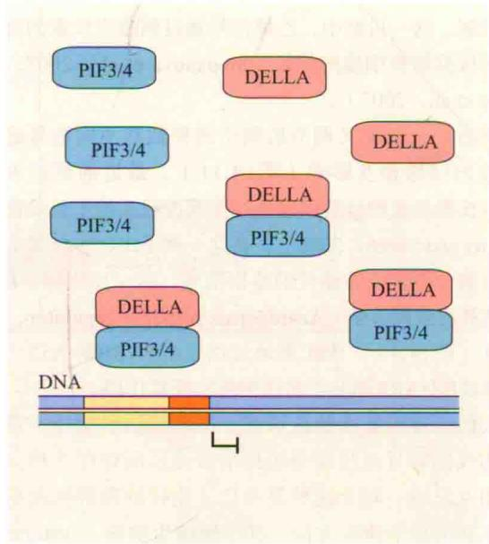  
无GA：下胚轴细胞不伸长  
图14.12 GA和光分别正和负调控其共同的下游信号组分PIF3和PIF4转录因子的积累。A. 暗中生长的下胚轴由于PIF3/4转录因子的积累而伸长。B. 在光下，PIF3/4转录因子作为红光/远红光受体光敏素（Pr/Pfr）的靶标而被降解，导致了细胞延伸减弱，下胚轴缩短。C. 高水平的GA导致DELLA蛋白降解，释放PIF3/4转录因子并刺激细胞伸长。D. 在GA不存在时，PIF3/4转录因子直接与DELLA阻抑蛋白结合并失活。

19章）。

植物中一个器官的生长发育往往受来自另外一个器官的信号的影响。例如，茎尖分生组织从营养生长到生殖生长的转变（称为开花诱导）可被来自叶片的信号触发启动（Imaizumi and Kay，2006）。长日照诱导的信号可诱导“开花时间基因”（FLOWERING TIME，FT）的表达，该基因编码一个转录因子，在拟南芥叶片韧皮部伴胞细胞中表达（Takada and Goto，2003）

（见第25章）。FT蛋白然后被转运到茎尖（Corbesier et al., 2007; Jaeger and Wigge, 2007; Matthieu et al., 2007; Notaguchi et al., 2008）。在茎尖，FT与另外一个转录因子开花位点（FLOWERING LOCUS D, FD）互作，并协同激活目标基因促进开花（Abe et al., 2005; Wigge et al., 2005）。FT-FD蛋白互作完美诠释了植物中转录调节因子可通过长距离作用调控发育进程，此作用与动物不同。

A SHR基因在拟南芥根中表达  

B SHR蛋白在拟南芥根的定位  

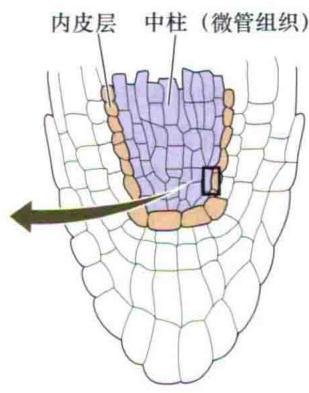  
图14.13 “短根”（SHR）蛋白在中柱和内皮细胞间的短距离运动，并调节根的辐射形态。A. SHR基因启动子驱动的GUS蛋白的蓝色染色显示SHR基因在微管系统中表达。B. SHR启动子驱动的SHR-YFP（黄色荧光蛋白）融合蛋白显示SHR蛋白在微管系统和内皮细胞中均可被检测到。C. SHR蛋白可从中柱细胞向邻近的一层细胞运动。在这些细胞中，SHR通过SCR及其信号输出启动内皮细胞的分化。SHR蛋白对于内皮层的分化产生是必需的。SHR.SHORT-ROOT；SCR.SCARECROW；GUS.葡糖苷酸酶；YFP.黄色荧光蛋白（A图和B图由Malcolm Bennett惠赠）。

A 拟南芥根尖  

B 生长素内向转运体AUX1的定位  

C 生长素外向转运体PIN2的定位  
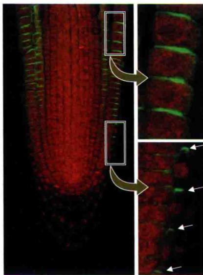  
图14.14 在外层根组织中生长素的转运由特化的生长素内向和外向转运体介导。A. 生长素转运体将生长素从根尖的重力感受细胞通过侧向根冠细胞进行转运。这种转运深刻影响着伸长区细胞的生长反应。B、C. 共聚焦图像显示拟南芥根尖细胞和组织中生长素内向转运蛋白AUX1的定位（B：红色）和生长素外向转运蛋白PIN2（C：绿色）的定位。AUX1. AUXIN RESISTANT1生长素抗性1；PIN2. PIN-FORMED 2（B图和C图由Malcolm Bennett惠赠）。

## 14.2.2 植物信号在从数秒到数年的时间跨度范围转导

植物中信号诱导的反应需要多长时间呢？以上所描述的信号转导途径发挥作用需要数十分钟到数小时，这取决于它们诱导基因表达快慢程度的不同。植物细胞中，一个基因的转录、mRNA加工，以及mRNA从核到胞质的转运，整个过程需要花费30 min。此外，蛋白质合成、细胞内转运也需要花费时间。对于植物生长和发育过程来讲，上述时间消耗也许是恰当的。

然而，植物的许多反应需要更加快速，需要在数秒内完成。例如，植物经常遇到由于云团掠过造成的光强忽高忽低的快速变化。强光对于植物细胞的光合组织会造成极大的伤害。植物叶片细胞对高光强的反应之一便是叶绿体的快速转向，使叶绿体的边缘面向光源，这样就使其表面受光最小化（见第9章）。这种从信号到反应在数秒内如何完成呢？

很显然，这种反应不可能涉及基因转录和翻译的过程。因而，植物细胞中必然存在利用已有蛋白的活性改变而进行信号转导的机制。在上述例子中，叶绿体的重新取向就是受向光素（PHOTOTROPIN，PHOT）的调控，向光素是一类定位于质膜的蓝光光受体（图14.5）。这种光激活的蛋白激酶可诱导植物细胞骨架的快速变化和重新组建，从而引起叶绿体在数秒内重新取向。

有些植物的信号反应需要数月甚至数年的时间。例如，对许多植物而言，一段时期的寒冷对于开花是必需的（Baurle and Dean，2006）。一段时期的寒冷（即冬季）必须被感受进而产生反应（开花潜能）。这一重要的过程称为春化作用（vernalization）。尽管对于冷的感受机制人们目前还不清楚，但这一信号途径的下游过程涉及染色质重塑。例如，春化作用依赖基因VIN3（VERNALIZATION INDEPENDENT 3），该基因对于染色体蛋白称为组蛋白（DNA旋绕其上）的修饰是必需的（图14.15）（见第2章）。

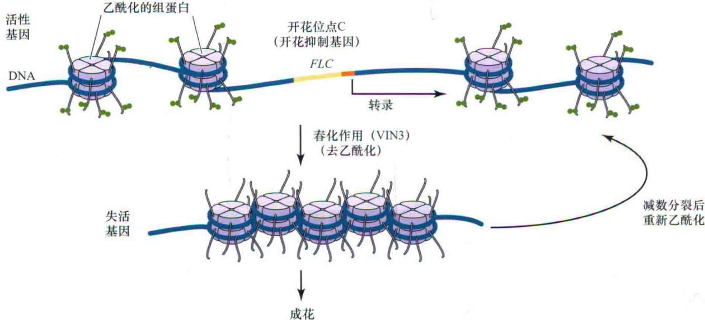  
图14.15 温度通过修饰FLC基因周围的染色质蛋白而控制开花。春化作用导致FLC基因所在部位的染色质重塑，并积累异染色质化特异的组蛋白修饰，最终表现为FLC转录受抑制。减数分裂之后，受抑制的FLC基因重新表达并阻止过早开花。

VIN3基因的表达仅受长时间冷处理的诱导（Sung and Amasino，2004）。VIN3引起开花抑制因子基因FLOWERING LOCUS C（FLC）所在部位组蛋白去乙酰化（见第25章），去乙酰化导致FLC所在部位的DNA更加紧密地压缩在染色体中，并阻止FLC基因的转录，因而解除了其对开花的抑制作用。

最后，数以年计的信号反应在植物中并不罕见。数以年计的信号反应包括两年生植物的春化作用和乔木的开花，某些情况下种子休眠可维持几个世纪甚至数千年。

总之，植物中信号转导过程的时间跨度从数秒到数年不等。信号反应的速度取决于信号转导过程是否涉及蛋白质活性的变化（快速形式，以秒计）、基因表达的变化（相对较快的形式）或染色质重塑（最慢的形式，可能需要数月）。

## 小结

植物细胞可感受多种外部或内部信号并作出响应，这一信号过程包括：信号→感受→转导→反应。植物通过一系列高度保守的信号转导机制将信号与反应联系

起来。

## 植物与动物的信号转导

· 信号转导机制中涉及与激酶受体偶联的激酶级联反应（图14.2）和双组分系统（14.4），这些信号机制在植物与其原核祖先、植物与其真核祖先中高度保守。

· 植物同时也进化出了许多独特的信号转导机制，例如，利用泛素化系统的组分作为激素受体而起作用（图14.8和图14.9）。

· 大多数植物的信号转导机制通过阻抑蛋白的失活而起作用（图14.6）。

\- 阻抑蛋白可进行翻译后修饰（如磷酸化）、重定向或泛素依赖的降解（图14.7）。

\- 阻抑蛋白的去除往往会激活转录因子，诱导基因表达的变化，这些都是植物应答反应的基础。

· 拟南芥和水稻的突变体筛选有助于阐明植物的信号转导途径。然而，由于基因功能的冗余性，有时候这种遗传筛选的优势又受到限制，基因冗余性表现为多个基因编码功能相同的多个成员，因而某个基因成员的缺失会被其他家族成员所掩盖。

· 化学遗传学等新的筛选方法的建立，可以克服基因冗余性，例如，ABA受体家族的鉴定就是一个化学遗传筛选的很好的例证（图14.3）。

· 植物的信号途径并不是严格的线性转导过程，实际上，植物信号途径利用了复杂的反馈机制进行调节或

关闭信号反应（图14.10）。

· 信号转导途径存在相互交叉调节，形成信号互作网络（图14.11和图14.12）。

· 研究复杂信号途径需要称为系统生物学的新的科学研究方法，此方法利用数学和计算机模型来模拟非线性的生物学网络，以更好地对输出结果进行预期。

## 信号转导的时间和空间跨度

· 植物信号转导途径网络并非在单个细胞中发挥作用，而是可能存在多种物理空间上的跨度，从微米（组织或细胞内部）到米（器官、系统、甚至个体）（图14.13和图14.14）。

· 细胞内信号机制涉及多种生物分子发挥作用，包括激素、转录调节因子、小RNA等。

· 植物信号转导存在多种时间跨度，从数秒到数年等。植物的快速反应（数秒或数分钟范围内）涉及蛋白活性的改变，但不涉及基因表达的变化。

· 数小时或数天这种时间维度范围的植物反应，往往涉及基因表达的变化。

· 长时间维度范围（数月或数年）的植物反应，往往涉及关键的调节基因附近染色质蛋白受环境调控的翻译后修饰，因而影响这些调节基因的表达（图14.15）。

(王棚涛 宋纯鹏 译)

# 第 15 章

# 细胞壁：结构、生物合成和扩展

植物细胞与动物细胞不同，由一层坚韧的细胞壁包围。这一层薄的细胞壁是由许多纤维丝构成的骨架，并嵌入细胞分泌的多糖基质而组成。多糖基质和纤维丝之间通过许多共价键和非共价键的共同作用而连接在一起，形成一个坚实的网络结构。基质中可能还含有结构蛋白、酶类、酚类聚合物及其他一些对细胞壁理化特性起修饰作用的物质。

原核生物、真菌、藻类和植物的细胞壁在化学组成和分子结构上各有不同，但它们具有三种相同的功能：控制细胞体积、决定细胞的形状和保护易碎的原生质体。然而，如后面将要讨论的，植物细胞壁还具有与其他生物体细胞壁明显不同的功能，并且这些不同的功能由细胞壁结构的复杂性和组成与形态的多元化来体现。

除上述生物学功能外，植物细胞壁在发展人类商业上也具有重要作用。植物细胞壁主要用于工业生产如造纸、纺织（棉布、亚麻布、亚麻制品等）、木材和其他的木制产品。另外，植物细胞壁也可用于制造合成纤维（如人造纤维）、塑料、胶片、涂料、胶黏剂、凝胶剂及增稠剂等。现今，世界各地都在努力开发低成本的技术和方法，以期将纤维素类生物质转化为生物燃料从而取代石油燃料，如汽油。据报道，在美国每年能获得十亿吨纤维素类生物质，由此转化而来的生物燃料几乎能够代替当前运输业所消耗石油的1/3。作为自然界最丰富的有机碳库，植物细胞壁还参与生态系统的碳循环（见Web Topic 15.1）。

本章首先讲述植物细胞壁的结构和组成、生物合成机制与装配。然后讲述在细胞膨胀过程中初生壁的作用。通过对比细胞的膨胀生长，来讨论几类特定细胞的顶端生长机制，特别是有关细胞极性建成和细胞膨胀率的调控机制。最后，我们将阐述伴随着细胞的分化、成熟和防御，细胞壁的动态变化。

## 15.1 植物细胞壁的结构和合成

如果没有细胞壁，植物将完全不是我们现在所看到的样子。相反，雄伟的大树将会像阿米巴样细胞组成的无形团块。实际上，细胞壁对于植物生长、发育、维持和繁殖都是必需的。

（1）细胞壁决定了植物体结构的机械强度，使植物能长到一定的高度。

（2）细胞壁和细胞黏着在一起，防止它们从一个细胞滑动到另一个细胞，这种细胞运动的限制和动物细胞有显著的不同，它限定了植物发育的进程（见第16章）。

（3）植物形态建成从根本来说是依赖于细胞壁的特性。因为植物细胞的增大主要是因为细胞壁的伸展能力而受到限制。

（4）作为包围细胞的一种坚韧的外皮，细胞壁犹如细胞的“外骨骼”，控制细胞的形状，允许细胞发育时形成很大的膨压。如果没有细胞壁抵制膨压产生的作用力，植物水分关系会截然不同（见第3章）。

（5）木质部的蒸腾水流要求有一个机械强度坚韧的细胞壁来抵制因木质部负压引起的萎缩。

（6）细胞壁作为一个扩散屏障，它控制着从外界到达细胞膜的大分子的大小，它也是病原体入侵的主要结构屏障。

组成细胞壁的多聚糖大多是由光合作用同化的碳转化而来，在植物发育的某些特定阶段或糖饥饿状态时，其中一些多聚物可能被水解成单糖来满足细胞的需求。这种现象在种子中储藏养分的胚乳和子叶中非常明显。在种子发育期间易消化的多糖填满细胞壁，并且在种子萌发时快速代谢以供胚的生长需要。此外，细胞壁的寡糖组分可能在细胞分化和病原体及共生体的识别中起重要作用。

植物细胞壁功能和角色的多样性要求细胞壁结构具有一定的多样性。本节我们首先简要叙述一下植物细胞壁的形态和结构，接着讨论细胞壁的构造、成分及不同形态细胞壁的生物合成。

## 15.1.1 植物细胞壁的结构多样性

图15.1为植物器官的染色切片，最明显能看到的结构是细胞壁，在不同的细胞类型中其外形和成分有很大的差异。例如，在髓和皮层中，薄壁组织的细胞壁一般很薄（约100 nm），并且很少有明显的特征。相反表皮细胞、厚角组织、木质部导管和管胞，韧皮纤维和其他厚壁组织的细胞壁都比较厚（约1000 nm或更多，有时有很多层）。这些细胞壁表面有杂乱无章的刻纹，而且有木质素、角质、木栓质、蜡质、硅石或结构蛋白等物质浸入其中，从而改变其理化特性。

  
图15.1 毛茛（Ranuculus repens）茎秆横切图。显示不同类型组织细胞壁在形态上的多样性。注意加厚的厚壁组织细胞壁和木质部细胞的纹孔壁（图片引自Andrew/PhotoResearchers Ins.）。

同一细胞不同部位细胞壁的厚度、内含物种类和数量、细胞纹路、纹孔密度和胞间连丝都不尽相同。如表皮细胞外层的细胞壁胞间连丝较少，且常被角质化和蜡质化，而且比其他部分的细胞壁厚得多。在保卫细胞中，与气孔相邻的细胞壁（腹壁）要比背壁厚得多。单个细胞中细胞壁所具有的结构多样性显示了细胞的极性和差异化的功能，这是由于胞壁成分定向分泌到不同细

胞表面所导致的。

除形态多样性之外，细胞壁一般具有两种主要的结构：初生壁和次生壁。这种分类不是基于结构上或生物化学的差异，而是基于产生细胞壁的细胞的发育状态。初生壁（primary wall）被定义为由生长细胞形成的细胞壁。通常它们薄而结构简单（图15.2A和B；图15.3A），但是有些初生壁较厚且多层化，例如，厚角组织或表皮的初生壁就存在这种情况（图15.2C）。

次生壁（secondary wall）是在细胞停止生长后形成的，在质膜和初生壁之间形成。在细胞的分化阶段次生壁的结构和组成高度特化（图15.3 B和C）。在输水组织（木质部）、纤维细胞、管胞和导管中具有显著增厚的次生壁，其中的木质素（lignin）使得次生壁更加坚固并具有防水作用。然而，并非所有的次生壁都有木质化加厚。有些初生壁未被次生壁覆盖而呈凹陷状（图15.3B）；这些区域可以加速细胞间水分和其他物质的运动。

胞间层（middle lamella）很薄，常存在于相邻细胞壁的连接处。胞间层与其他初生壁和次生壁的组成不同，它富含果胶多聚糖（在禾本科植物中没那么突出）并且还可能包含结构蛋白。胞间层是在细胞分裂过程中细胞板形成时产生的。

从第1章我们知道，细胞壁常被极细的连接膜的线状通道穿过，这些通道称之为胞间连丝（plasmodesmata）。胞间连丝连接相邻的细胞，为细胞间提供交流通道，允许相邻细胞间小分子物质的被动运输和蛋白质及核酸的主动运输。

## 15.1.2 初生壁由嵌入多糖基质的纤维素微纤丝组成

在初生壁中，纤维素微纤丝嵌入有非纤维素多糖与少量结构蛋白形成的水合基质（图15.4和表15.1）。这种结构赋予正在生长中的细胞壁弹性与强度的完美组合，使其同时具有可伸展性和坚固性。纤维素微纤丝（cellulose microfibril）是一个纳米级（nm， $10^{-9}$ m）的结晶带，从而使细胞壁加固。有时，细胞壁的一边会比另一边坚固，这主要取决于纤维丝在胞壁中是如何堆积的。

作为同一类物质，基质多糖（matrix polysaccharide）由一些不同结构的多糖组成，传统上被分为半纤维素或果胶，这种不够精确的分类是基于它们的可提取性。从用热水或钙螯合剂处理过的细胞壁中提取出来的多糖即为果胶，而更紧密结合在细胞壁上的非纤维素多糖被称为半纤维素，这些多糖需要更强的提取条件，如0.4\~4.0 mol/L KOH。

A  
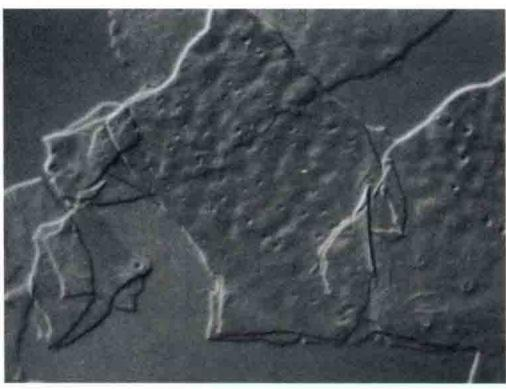  
20 μm

B  
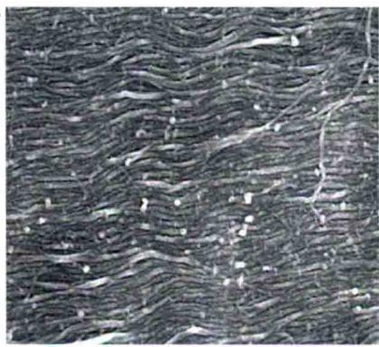  
200 nm

C  

图15.2 初生壁在三种视野下的图片。A. 利用Nomarski optics法在光学显微镜下从洋葱薄壁组织中取下的细胞壁碎片表面图。在这种视野下细胞壁看起来像一个表面布满小凹槽的薄片，这些凹槽可能是纹孔场，胞间连丝通过纹孔场建立起细胞间的联系。B. 扫描电镜下正在生长的黄瓜下胚轴细胞壁表面形态。显示了细胞壁纤维的纹理和近似平行排列的微纤维，它们沿着细胞长轴横向排列。微纤维是外层覆盖有基质多聚物的纤维素微纤丝。C. 生长中的大豆下胚轴外表皮细胞壁（横断面）电子显微照片。细胞壁有很多层，内层比外层厚且清晰，因为外层是细胞壁早期形成的区域，在细胞扩展过程中被延展而变薄（A图引自McCANN et al., 1990；B图引自Marga et al., 2005；C图引自Roland et al., 1982）。

A  
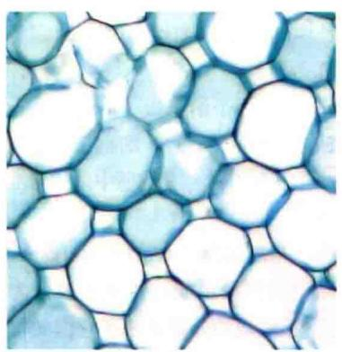

B  

C  
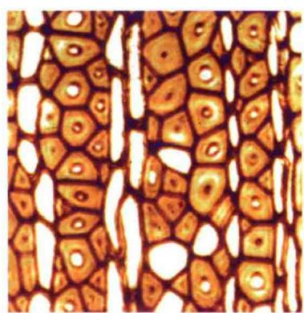  
图15.3 细胞壁结构多样性。水稻茎细胞薄壁组织（A）与地下蕨类植物茎的维管束次生厚壁组织（B）及四籽木木质部纤维（C）的比较（A图和B图引自Gerry DelongLOSF/Photolibrary.com；C图由Bailey-Wetmore Wood Collection惠赠）。

表15.1 植物细胞壁的结构成分

<table><tr><td>类别</td><td>主要成分</td></tr><tr><td>纤维素</td><td>(1→4)β-D-葡聚糖微纤丝</td></tr><tr><td>果胶</td><td>同聚半乳糖醛酸聚鼠李糖半乳糖醛酸结合阿拉伯糖聚糖、半乳糖聚糖和阿拉伯半乳聚糖(I型)侧链木葡聚糖</td></tr><tr><td>半纤维素</td><td>木聚糖葡甘露聚糖阿拉伯糖基木聚糖胼胝质(1→3)β-D-葡聚糖(1→3,1→4)β-D-葡聚糖(常见于草本植物)</td></tr><tr><td>木质素</td><td>参见图15.18</td></tr><tr><td>结构蛋白</td><td>参见表15.2</td></tr></table>

图15.4 初生壁主要结构组分和可能排列方式示意图。纤维素微纤丝（灰色棒状）在细胞表面合成，外包半纤维素（蓝线和紫线），并通过半纤维素和其他微纤丝连接起来。果胶（红线、黄线和绿线）形成一个连通的基质，控制微纤丝的空间结构和细胞壁的孔隙度。果胶和半纤维素在高尔基体中被合成，并通过质膜上的小泡分送到细胞壁上，沉积在细胞表面。为了便于观察，左边仅显示了半纤维素-纤维素形成的网络结构，右边主要是果胶网络（引自Cosgrove，2005）。

半纤维素（hemicellulose）是特有的结合在纤维素表面的一层长的线性多糖，侧翼常常带一些短的分支。它们将不同的纤维素微纤丝交联起来，形成相互粘连的网状结构（图15.4左下角部分），或者在微纤丝的表面形成一个光滑的外壳阻止微纤丝之间接触。这些分子也被称为交联多糖（cross-linking glycan），但在本章中，我们将使用半纤维素这个更传统的名称。从后面的叙述中我们知道半纤维素包括一些不同的多糖。

果胶（pectin）是填充于纤维素-半纤维素网状结构中的水合凝胶物质。作为纤维素网络的亲水填充物，果胶可以防止这种纤维素网络结构的凝集和解体，果胶也决定了细胞壁对大分子物质的通透性。和半纤维素一样，果胶也含有几种不同的多糖。这些多糖常被称为“果胶域”，因为它们相互之间以共价键连接形成巨大的大分子结构，这方面与半纤维素中相互独立的聚合物不同。由一些果胶域组成的中性侧链可以结合到纤维素表面，尽管这种结合要比半纤维素弱得多。

细胞壁多糖由不同的单糖组成并根据它们所含的单糖而命名（图15.5）。例如，半乳聚糖（galactan）是由半乳糖（galactose）单体聚合而成，葡聚糖（glucan）是由葡萄糖聚合而成，木聚糖（xylan）是由木糖聚合而成等等。聚糖（glycan）是糖分子组成的多聚物的总成，是多糖的同义词。

多糖是糖残基末端相连的线性聚合物，有时包含由不同糖分子组成的侧链。对于支链多糖来说，多糖的主链通常是指最长的那一条链。例如，木葡聚糖（xyloglucan）的主链是由葡萄糖残基构成的葡聚糖主链上连接有木糖组成的侧链。阿拉伯木聚糖（Arabinoxylan）是由木糖残基构成的，木聚糖主链连接有阿拉伯糖侧链。这种命名法有时很长，例如，葡萄糖醛酸阿拉伯木聚糖（glucuronoarabinoxylan）是一个带糖醛酸单元的阿拉伯木聚糖。然而复合命名法不一定能显示出侧链结构。如葡甘露聚糖（glucomannan）的主链含有葡萄糖和甘露糖形成的聚合物。因此，命名是基于聚合物中的主要糖类，而不是为了显示它的详细结构。

植物细胞壁含有结构蛋白（structural protein），但是它们的具体功能尚不清楚。目前研究显示，它们的作用可能包括加固细胞壁和辅助其他细胞壁成分恰当的聚合在一起，例如，在细胞板形成时这些结构蛋白可能起着这样的作用（Cannon et al., 2008）。

初生壁的干重组成大约是：25%的纤维素、30%的半纤维素、40%的果胶和2%\~5%的结构蛋白。然而，在很多物种中发现初生壁组分与上述数值有很大偏离（Harris and store，2008），如禾本科植物胚芽鞘细胞壁含有60%\~70%的半纤维素，20%\~25%的纤维素，仅有10%的果胶。谷类植物胚乳细胞壁可能只含有2%的纤维素，构成胚乳细胞壁的大部分是阿糖基木聚糖。甜菜和西芹的薄壁组织的细胞壁主要含纤维素和果胶，仅4%的半纤维素（Thimm et al., 2002）。花粉管顶部的壁似乎是大部分果胶和少量的加强顶部结构的纤维素。仙人掌（Opuntia）的棘状突起，其细胞壁中包含50%的纤维素和50%的半乳聚糖（一种被归类为果胶的中性多糖）。

纤维化的次生壁是另一个极端，纤维素含量很高（在棉纤维中>90%），而果胶质的量少到可以忽略不计。细胞壁的组成成分和多糖结构并不是一成不变，而是在发育过程中不断变化的，这种变化是由于壁的合成模式和酶的活性发生改变的结果，从而能够修剪侧枝并且消化壁果胶和半纤维素（Gibeaut et al., 2005）。

在活的植物组织中，初生壁中含有大量的水分，这些水分大部分位于基质中，占基质的70%\~80%。基质的水合状态对于细胞壁的物理特性有很重要的决定作用。例如，除去细胞壁中的水分会使其变得坚硬而缺乏延展性——这是水分缺乏时植物生长受到抑制的一个影响因素。细胞壁脱水对于在木质化的过程中强化细胞壁也很重要，此过程中细胞壁脱水形成了很坚硬的细胞壁从而防止了酶的攻击。

在接下来的部分我们将详细介绍细胞壁中每种主要多聚物的结构。我们给出初生壁的一个基本模型，但需要强调的是：在不同的物种和细胞类型中会有一些不同的特异性基质多糖，并且不同类型细胞壁多聚物（纤维素、半纤维素、果胶和一些次生壁中的木质素）的相对比例也相差很大。细胞壁组成成分的宽泛性清楚地表明，植物细胞的细胞壁可以根据不同需求形成相应的细胞壁。

## 15.1.3 纤维素微纤丝是在质膜中合成的

纤维素是由无数（1→4）-β-D葡聚糖组成，也就是β-葡萄糖残基通过（1→4）糖苷键连接线性链状分子（糖结构图15.5和Web Topic 15.2）。由于每个葡萄糖是由相邻的葡萄糖残基旋转180°，纤维素的重复结构单元可以看成为纤维二糖，即（1→4）-β-D葡萄糖二糖（图15.5E）。

在纤维素中，许多单个的葡聚糖主链紧密相连形成纤维丝，葡聚糖通过氢键和范德华力的作用形成一个高度有序的带（晶体状，crystalline），它是疏水的且不易受酶的降解。因此，纤维素具有不易溶解、坚硬、化学性质稳定和抵抗酶解的性质。纤维素酶解的最大障碍是从这种晶体微纤维上分解出单个葡聚糖分子需要消耗大量的能量，这是酶解糖残基之间相连的糖苷键必要的步骤（Skopec et al., 2003）。在纤维素微纤丝内部，高度有序的葡聚糖排列和相邻的葡聚糖之间大量的非共价键使得纤维素具有更高的刚性抗拉强度。其化学性质稳定、不溶性、抗酶解特性使得纤维素成为形成坚固细胞壁的极为理想的材料。

纤维素微纤丝的长度是不确定的，其直径大小和有序程度也根据来源不同有很大的差别。例如，陆生植物的纤维素微纤丝直径为2\~5 nm，而藻类植物的则接近20 nm，且排列也比陆生植物规则的多（更加晶格化）（Kennedy et al., 2007；Sturcova et al., 2004）。微纤丝的直径取决于其横断面上平行排列的葡聚糖链的数目，在最细的晶状核心只有6条链，而较大的则可达30\~50条。单个微纤丝也可以紧密结合在一起形成大的纤丝，如木材组织中的细胞壁。

在纤维素微纤丝中，根据生物来源不同，单个葡聚糖链由2000甚至超过25 000个葡萄糖残基组成（Brown，

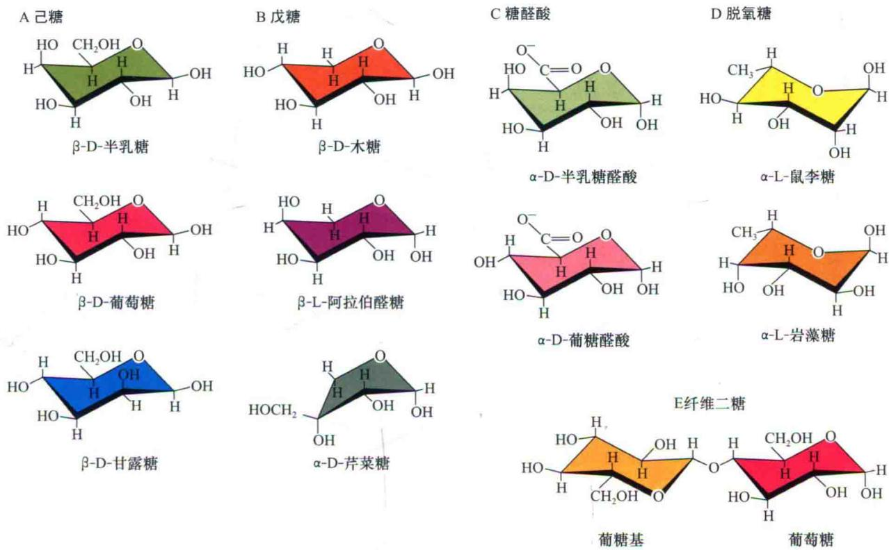  
图15.5 植物细胞壁中糖类的常见构象。A. 己糖（六碳糖）。B. 戊糖（五碳糖）。C. 糖醛酸（酸性糖）。D. 脱氧糖。E. 纤维二糖，显示两个反向的葡糖残基间的（1→4）-β-D链。除芹菜糖外所有的蔗糖都是吡喃糖形式，芹菜糖只存在呋喃糖形式。然而在胞壁多糖中，L-果胶糖多以呋喃糖形式存在。

Jr.et al., 1996）。由于微纤丝中葡聚糖分子的重叠和交错，使得微纤丝要比单个葡聚糖分子长（1\~12 μm）。

有关纤维素微纤丝精确的分子结构是不确定的。有些微纤丝组织结构模型显示它有一个亚结构，亚结构中高度有序的区域被无序的非定型区域连接在一起，而其他的模型则显示固态晶状核心被相对无序的结构包围（图15.6）。在高度有序的晶状区域中，邻近的葡聚糖以氢键、范德华力、疏水相互作用等所有非共价键连接在一起。植物中的纤维素晶状结构以两种形式存在，称为同质Iα和Iβ，二者的区别在于组成它们的平行的葡聚糖链在结合成束时的方式略有不同。在体外用化学和物理方法处理时这两种形式可以相互转变。形成这两种晶状结构的意义目前还不清楚。

电子显微证据表明，藻类和陆地植物微纤丝的合成是由一些巨大的蛋白质复合体催化的，这些蛋白复合体又称为莲座状粒子（particle rosette）或终端复合物（terminal complexe），它们镶嵌在质膜中（图15.7）（Kimura et al., 1999），由6个亚基组成，每个亚基又包括多个纤维素合酶（cellulose synthase）。纤维素合酶能够合成形成微纤丝的单个（1→4）-β-D葡聚糖分子（参见Web Topic 15.3）。纤维素合酶复合酶可能包含额外的蛋白，但是这些蛋白没有被确认。

高等植物纤维素合酶由一个被称为CesA（纤维素合酶A，cellulose synthase A）的基因家族编码，这是一个多基因家族，在所有陆地植物中都有发现（Yin et al., 2009）。CesA家族是一个大的超家族的一部分，这个超家族也包括一些Csl家族基因（cellulose synthase-like，纤维素合酶类似物）的一些家族。CslA基因编码的酶负责（1→4）-β-D甘露聚糖的合成；CslF和CslH基因编码的酶负责一种混合糖苷键链接的多糖，即（1→3；1→4）-β-D-葡聚糖的合成，CslC基因编码的酶可能负责木葡聚糖主链上的（1→4）-β-D-葡聚糖的合成。

Csl家族其他成员可能编码其他酶用来合成其他多糖主链。然而，木聚糖主链的合成可能是一类截然不同的酶，被命名为GT43（糖基轻移酶家族43，glycosyl transferase family 43）（Fincner，2009）。这些合成酶是糖-核苷酸多糖糖基转移酶（sugar-nucleotide polysaccharide glycosyltransferases），它们能把单糖从糖核苷酸转移到正在延伸的多糖链末端。

纤维素合酶穿越了膜，其催化位点位于质膜的胞质侧，纤维素合酶能将供体糖-核苷酸上的糖残基转移到正在延伸的葡聚糖链上。糖供体是尿苷二磷酸葡糖（UDPG）。有一些证据表明，用于合成纤维素的UDPG中的葡糖来自于蔗糖（Amor et al., 1995；

C 纤维素微纤丝横切面  
A  
  
单一的纤维素微纤丝

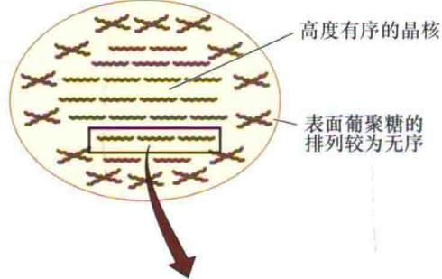  
D相邻葡聚糖链之间的氢键连接

图15.6 纤维素微纤丝的结构模型。微纤丝中高度有序的晶状结构区与相对无序的区域相结合，一些半纤维素也可能被微纤丝捕获而结合在其表面。A. 除去基质多糖后，洋葱薄壁组织初生壁扫描电镜图。显示的是由纤维素微纤丝形成的纤维结构。B. 单个纤维素微纤丝。由24\~48个（1→4）-β-D-葡聚糖链紧密结合在一起形成的晶状结构。C. 纤维素微纤丝的横切面图。纤维素结构模型由高度有序的（1→4）-β-D-葡聚糖构成晶状核心和相对无序的外层结构组成。D. 纤维素的晶状区由精细排列的葡聚糖组成，(1→4)-β-D-葡聚糖内部以氢键连接，而相互之间无氢键连接（引自McCann et al., 1990; Matthews et al., 2006）。

  
图15.7 细胞纤维素的合成。A. 电子显微镜下显示新合成的纤维素微纤丝立即被分泌到质膜外。B. 冷冻断裂标记复合体显示纤维素合酶与抗体的反应，7个清晰的带标记的莲座区和一个不带标记的区域构成的标记区（箭头）。B图的内插图为挑选的两个放大的用免疫金标记的CesA颗粒（顶端复合物）。这些金纳米颗粒是箭头指示的暗环。C. 颗粒区（最右边）与单个CesA蛋白（最左边）关系模型。6个CesA蛋白（3个不同的基因编码）组成一个颗粒，在显微镜下可观察到其装配成一个六聚体，该六聚体负责合成36条葡聚糖链，进而形成有序的微纤丝（A图引自Gunning and Steer，1996；B图引自Kimura et al., 1999；C图引自Doblin et al., 2002）。

Salnikov et al., 2001）。该观点认为，蔗糖合酶（sucrose synthase）通过UDPG从蔗糖转运葡糖到正在延伸的纤维素链上，此过程中蔗糖合酶起到代谢通道的作用（图15.8）。遗传学的证据表明了3个不同的CesA蛋白（由3个不同的CesA基因编码）对于形成一个功能性纤维素合酶复合体是必需的。

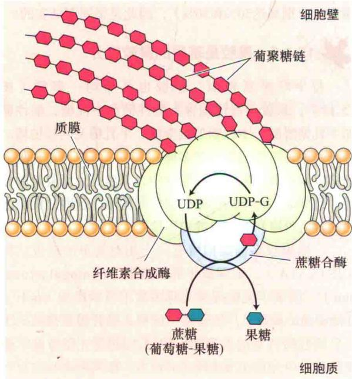  
图15.8 含纤维素合成酶的多亚基复合物合成纤维素的模型。葡萄糖残基从UDPG供体转移到正在伸长的葡聚糖链上，蔗糖合酶起到代谢通道的作用将葡萄糖从蔗糖转运到UDPG上，UDPG也可以直接从质膜上获得（引自Amor et al., 1995）。

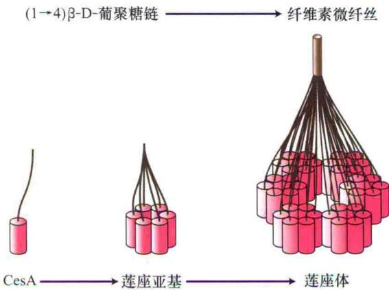

固醇-葡萄糖苷（固醇与一个或多个葡萄糖残基链链接）（图15.9）被认为是一个引发体或起始受体，即接受新的葡萄糖残基从而使葡聚糖链延伸（Peng et al., 2002）。当葡聚糖链延伸到足够长时，固醇可被葡聚糖内切酶从葡聚糖链上剪切下来，进而使正在伸长的葡聚糖链通过细胞膜伸出细胞外，在胞外与其他的葡聚糖链形成一个晶状带并和半纤维素结合在一起，形成一个坚固而富有弹性的网状结构（图15.4）。一些半纤维素在形成时可能被包入微纤丝中（Hayasi, 1989），这可能增加了晶状微纤丝的无序性，并使其锚定在基质中。

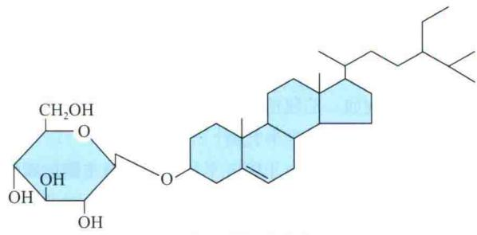  
β-谷甾醇葡糖苷  
图15.9 纤维素合成作用中最初的引发体（如葡聚糖链延伸受体）固醇糖苷的结构。图为β-谷甾醇葡糖苷由一个固醇（右边）连接一个葡萄糖残基（左边）构成，外加的葡萄糖残基与β-谷甾醇葡糖苷中的葡萄糖基结合，形成葡聚糖，进而形成纤维素微纤丝。

## 15.1.4 基质多糖在高尔基体中合成并通过囊泡分泌到细胞壁上

在纤维素微纤丝晶状体之间，初生壁的基质是高度水合相。基质多糖是由高尔基体膜上的糖基转移酶合成的，然后通过囊泡的胞吐作用转运到细胞壁上（图15.4）（Web Topic 15.4）。由前面描述可知，Csl超家族基因编码的糖基转移酶可以合成一些基质多糖主链。为制造多糖分支，糖残基被其他一些糖基转移酶加到多糖主链上（Ccheible and Pauly，2004）。

基质多糖比纤维素微纤丝更加无序，而且绝大多数没有像纤维素一样聚集成高度有序的结构。这种无序的结构特征是由多糖侧链和它的非线性构象决定的。然而，红外光谱和核磁共振（NMR）研究表明细胞壁中半纤维素和果胶有一定的取向，可能是由于这些多聚物沿纤维素微纤丝长轴排列的物理趋势的结果（Wilson et al., 2000）。

## 15.1.5 半纤维素是结合于纤维素的基质多糖

半纤维素是一种在结构上紧密结合在细胞壁上的非均质多糖（图15.10），能用强碱（2\~4 mol/L NaOH）将它们从除去果胶的细胞壁上洗脱下来，强碱会破坏氢键，导致纤维素膨胀、水化而无序。植物能合成不同种类的半纤维素，因细胞类型、发育状态和植物种类而不同。

许多陆生植物的初生壁中（双子叶植物、除草之外的大多数单子叶植物及其近缘种），数量最多的半纤维素是木葡聚糖（xyloglucan）（图15.10A），在细胞壁中含量高达20%。和纤维素一样，木葡聚糖有一个由（1→4）-β-D葡萄糖残基连接的主链。然而和纤维素不同的是木葡聚糖有一些短的侧链，含木糖和末端前的半乳糖，末端为岩藻糖。

在木葡聚糖的主链上几乎每四个葡萄糖残基就有一个不存在取代（不带糖侧链），但是这个分数会由于β-木糖苷酶的作用而增大，β-木糖苷酶能除去木糖侧链。在取代度低的情况下，木葡聚糖将更密切地与纤维素结合（Chambat et al., 2005）。木葡聚糖分支有相当大的分类变化，例如，茄属植物含阿拉伯糖，但是没有海藻糖，有时在分支上不含半乳糖。

在木葡聚糖中，由于侧链干扰了葡聚糖主链的线性排列，从而阻止了木葡聚糖组装成一条有序的微纤丝。木葡聚糖的长度（50\~500 nm）超过了两个微纤丝之间的空间距离（20\~40 nm），它们可以将邻近的几个纤维素微纤丝连接在一起。在它们形成时，木葡聚糖将很可能被纤维素微纤丝捕获：在这种情况下，纤维素的结晶度将被破坏，并且木葡聚糖也将紧紧地锚定在纤维

丝上。

与双子叶植物的细胞壁相比，单子叶植物的初生壁包含少量的木葡聚糖和果胶（分别为10%左右）、较多的葡萄糖酸阿拉伯糖基木聚糖（glucuronoarabinoxylan）（图15.10B）及混接（1→3；1→4）-β-D-葡聚糖。混接的葡聚糖被认为紧紧结合在纤维素表面，形成非黏性表层，葡萄糖酸阿拉伯糖基木聚糖起交互连接的作用（Carpita et al., 2001）。葡萄糖酸阿拉伯糖基木聚糖的取代度差别很大，与低取代度相比，高取代度的混接形式结合到纤维素的能力会更弱（Carpita, 1983）。

在阿魏酸存在的情况下，单子叶植物的细胞壁是靠阿魏酸（ferulic acid），羟基苯丙烯酸而交联在一起，它们通过酯键与葡萄糖酸阿拉伯糖基木聚糖的阿拉伯糖侧链相连（图15.10B）。邻近分子的阿魏酸盐残基能在氧化酶的作用下发生氧化交联反应，从而在两个葡萄糖酸阿拉伯糖基木聚糖链之间形成共价连接（Burr and Fry，2009）。阿魏酸的酯化同样发生在某些植物家族中果胶域RG1的阿拉伯聚糖和半乳糖侧链上，如苋科（Amaranthaceae）（包括甜菜和菠菜）。这些阿拉伯聚糖和半乳聚糖也能结合在纤维素表面（Zykwinska et al., 2007a）；因此，与纤维素表面的结合并不是半纤维素独有的特性。

木质组织的次生壁（次生木质部）含有很少的木聚糖或果胶；基质多糖多是没有支链的木聚糖和葡苷露聚糖，它们紧紧结合在纤维素上。这些壁富含纤维素和木质素（分别高达50%和30%），因此是坚硬而结实的。

## 15.1.6 果胶是基质的凝胶组分

与半纤维素相似，果胶也是非均一多糖（图15.11），果胶的特征是含有酸性糖和中性糖，酸性糖如半乳糖醛酸，中性糖如鼠李糖、半乳糖及阿拉伯糖。果胶是最易溶解的细胞壁多糖，大多可用热水和钙螯合剂将它们提取出来。在细胞壁中，果胶是大而复杂的分子，且形成多种不同的果胶多糖结构域，这些结构域之间通过共价键和非共价键相连接。

一些果胶多糖结构域有一个相对简单的初级结构（图15.11A），如同聚半乳糖醛酸（homogalacturonan）。同聚半乳糖醛酸又称多聚半乳糖醛酸（polygalacturonic acid），是通过（1→4）糖苷键连接的α-D-半乳糖醛酸残基的多聚物。图15.12的荧光图像显示聚半乳糖集中分布在细胞连接的地方，即两个细胞发育形成的空间。

细胞壁中含量较多的另一个果胶多糖是聚鼠李糖半乳糖醛酸Ⅰ（rhamnogalacturonanⅠ，RGⅠ），其长长的主链是由鼠李糖和半乳糖醛酸残基交替形成（图

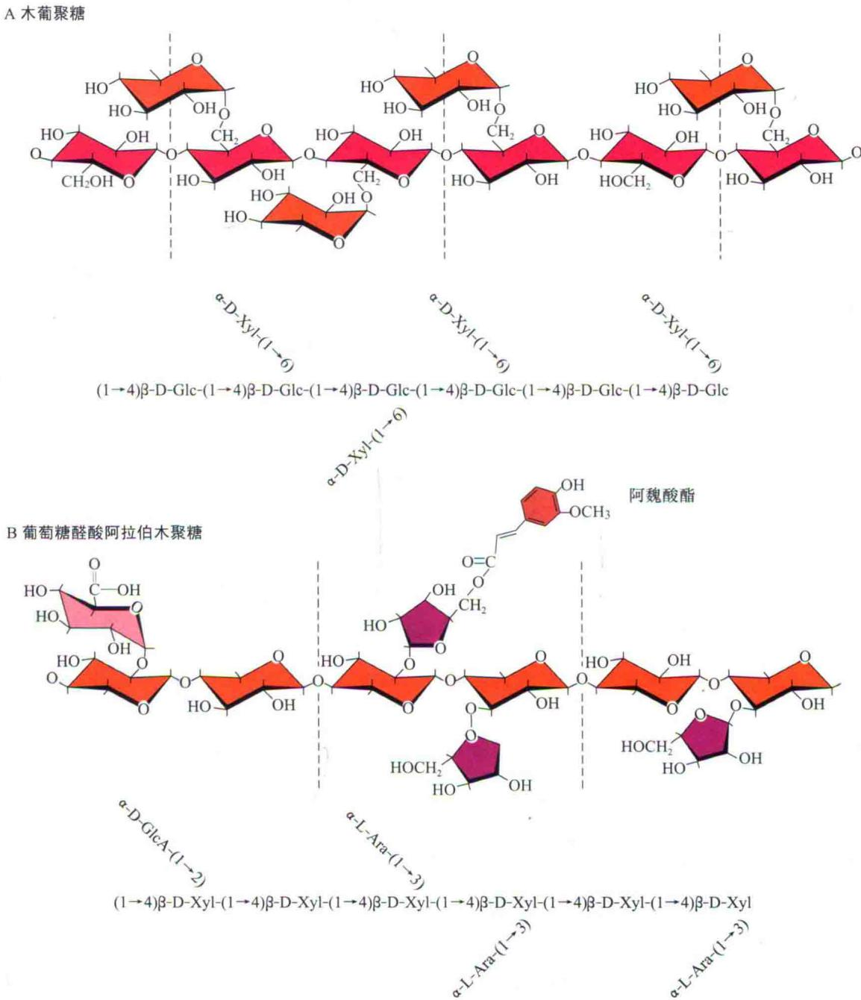  
图15.10 普通半纤维素的部分结构（详细的碳水化合物命名法，参见Web Topic 15.1）。A. 木葡聚糖有一个由（1→4）-β-D葡萄糖残基组成的主链，并通过（1→6）糖苷键与α-D-木糖结合而形成侧链，在某些情况下，木糖侧链上还结合有半乳糖和岩藻糖。B. 葡萄糖醛酸阿拉伯木聚糖有一个由（1→4）连接的β-D-木糖主链，它们有时也会含有包括阿拉伯糖，4-O-甲基葡萄糖醛酸或者其他糖的侧链（引自Carpita and McCann，2000）。

15.11B）。RG I 的分子质量很大，同时带有长短不一的阿拉伯聚糖和半乳聚糖的侧链，以及链接在某些鼠李糖残基上的 I 型阿拉伯半乳聚糖。

分子结构更复杂的果胶多糖是具有很多分支侧链的聚鼠李糖半乳糖醛酸Ⅱ（rhamnogalacturonan Ⅱ，RGⅡ），它含有一个多聚半乳糖醛酸主链，主链上覆盖有4种不同的复杂的侧链，而这些侧链至少由10种不同的单糖通过多种方式相连接。尽管RGⅠ和RGⅡ的名称相似，但它们的结构不同。在细胞壁中RGⅡ单元之间通过硼酸二酯相互交联（Ishii et al., 1999），这种交联对于细胞壁的结构和机械强度是非常重要的。如拟南芥RGⅡ合成改变的突变体表现明显的生长异常，很明显是由硼酸酯键交联不稳定引起的。RGⅡ的硼酸交联缺失导致细胞壁过度膨胀，增加了细胞壁的孔隙度，使细胞壁的机械强度下降（O'Neill et al., 2004）。

细胞壁中的果胶多糖是通过共价键以线性方式相互连接起来的（Coenen et al., 2007）。图15.13A展示不同果胶结构域是如何彼此连接的假想方案，但这种模型还未得到一致认可。

A 同聚半乳糖醛酸  
B 聚鼠李糖半乳糖醛酸I  

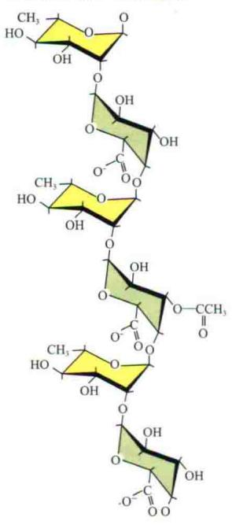

C 阿拉伯聚糖  
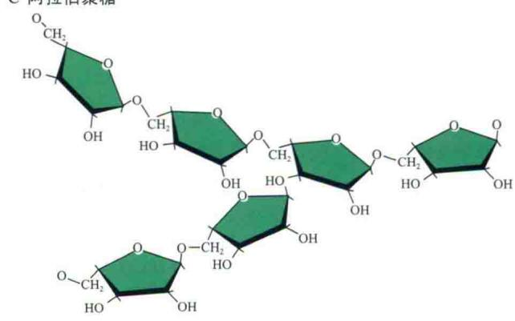

D 阿拉伯半乳聚糖  
  
图15.11 典型果胶的局部结构。A. 同聚半乳糖醛酸，又称多聚半乳糖醛酸或果胶酸，由（1→4）键连接的α-D-半乳糖醛酸（GalA）组成，偶尔有鼠李糖残基插入，羧基常被甲酯化。B. 聚鼠李糖半乳糖醛酸Ⅰ（RGⅠ），分子质量很大，主链由（1→4）α-D-半乳糖醛酸和（1→2）α-D-鼠李糖交替形成。在鼠李糖上有侧链，其组成主要为阿拉伯聚糖。C. 阿拉伯聚糖。D. 阿拉伯半乳聚糖。这些侧链有长有短，半乳聚糖醛酸常被甲酯化（引自Carpita and McCann，2000）。

  
图15.12 烟草茎秆三重荧光标记显示的三个相邻薄壁组织细胞的初生壁，它们的边界处所形成的细胞间空隙。蓝色部分是荧光增白剂卡尔科弗卢尔（calcofluor）（表示纤维素），红色和绿色部分是和两个单克隆抗体结合的果胶同聚半乳糖醛酸不同的抗原决定簇（免疫特定区域）（W. Willats惠赠）。

果胶典型的特性是形成凝胶，一种由高度水合的多聚物形成的松散网络结构，因此，在实践中，果胶常用于制备果酱、果冻或凝胶。在果胶凝胶中，相邻果胶链上带电荷的羧基（ $\mathrm{COO}^{-}$ ）基团通过 $\mathrm{Ca}^{2+}$ 连接在一起， $\mathrm{Ca}^{2+}$ 可与果胶酸钙结合形成复合物。如图15.13B所示， $\mathrm{Ca}^{2+}$ 与果胶形成的庞大的 $\mathrm{Ca}^{2+}$ 桥网络。

果胶的修饰会改变它们在细胞壁中的构型和连接方式。果胶在高尔基体中合成时，许多酸性残基被甲基、乙酰基和其他未知基团酯化。甲酯化作用掩盖了羧基基团上的电荷，阻止了两个果胶链上钙桥的形成，从而减弱了果胶形成凝胶的能力。

果胶一旦被分泌到细胞壁中，酯基就会被细胞壁中的果胶酯酶去除，这样羧基上的电荷就暴露出来，增强了果胶形成一个刚性凝胶态的能力并降低细胞壁的可扩展性（Derbyshire et al., 2007b）。随着自由羧基的形成，去酯化作用也增加了细胞壁中的电荷，这可能进一步影响了细胞壁中的离子浓度和细胞壁酶的活性。果胶除了通过钙桥连接外，也可能通过多种共价键彼此连接，包括如上所述的阿魏酸二聚体（仅在一些植物中被发现）。

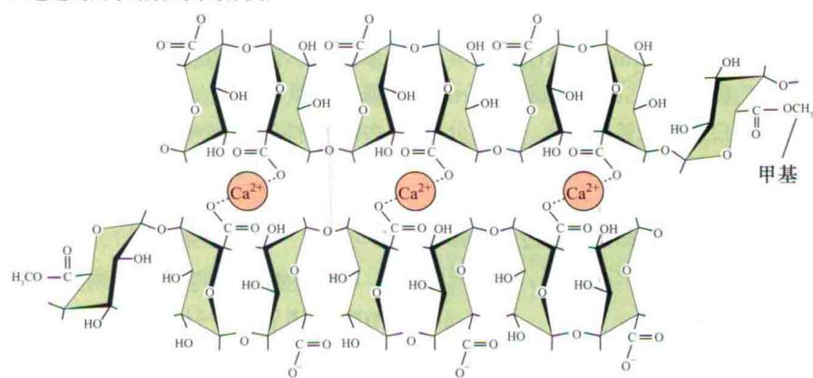  
图15.13 A. 不同果胶结构域彼此之间以线性方式排列，包括聚鼠李糖半乳糖醛酸Ⅰ（RGⅠ）、多聚半乳糖醛酸（HG）聚鼠李糖半乳糖醛酸Ⅱ（RGⅡ）。这个结构不是精确量化的；多聚半乳糖醛酸（HG）应扩大10倍以上，聚鼠李糖半乳糖醛酸Ⅰ（RGⅠ）应扩大2倍以上。Kdo为2-脱氧-3-辛酮糖酸；Dha为二羟丙酮。B. 钙离子与非酯化的羧基离子之间结合形成果胶网络。当被甲酯化基团阻碍时，羧基基团不能参与这种相互交织的网状结构的形成，同样的，主链上的侧链也干涉网状结构的形成（A图引自Mohnen，2003；B图引自Carpita and McCann，2000）。

## 15.1.7 结构蛋白在细胞壁中交互连接

前面讲述的多糖为细胞壁的主要成分，此外，细胞壁还含有一些结构蛋白。这些蛋白质通常根据它们所含的优势氨基酸进行分类——如富羟脯氨酸糖蛋白（hydroxyproline-rich glycoprotein，HRGP）、富甘氨酸蛋白（glycine-rich protein，GRP）、富脯氨酸蛋白（proline-rich protein，PRP）等（表15.2）。一些细胞壁蛋白质一级结构可能会具有多种特征，很多细胞壁结构蛋白具有高度重复的一级结构，其中有的形成简单的螺旋杆状，而有的则被高度糖基化（图15.14）。

体外研究表明，新分泌的细胞壁结构蛋白是相对可溶性的，但随着细胞的成熟或对伤害的应激反应，这些蛋白质变得越来越不可溶，但这种不可溶的变化过程的生化本质可能涉及蛋白质中酪氨酸残基的氧化交联。

表15.2 细胞壁的结构蛋白

<table><tr><td>细胞壁结构蛋白的种类</td><td>碳水化合物百分比/%</td><td>代表性组织定位</td></tr><tr><td>富羟脯氨酸糖蛋白</td><td>约55</td><td>形成层、维管薄壁组织</td></tr><tr><td>富脯氨酸蛋白</td><td>0~20</td><td>木质部、纤维、皮层</td></tr><tr><td>富甘氨酸蛋白</td><td>0</td><td>初生木质部和韧皮部</td></tr></table>

细胞壁结构蛋白的组分随着细胞类型、成熟阶段和刺激作用的不同有很大的变化。伤害、病原体入侵，以及能激活植物防御反应的分子处理（诱导子），都能增加编码这些蛋白质的基因的表达（见第13章）。组织学研究表明，细胞壁结构蛋白通常位于特异的细胞或组织中，如HRGR大多位于形成层、韧皮部薄壁组织和多种类型的厚壁组织中；GRP和PRP则通常位于木质部导管和纤维中，因而是这些带有次生壁细胞的一种特性。

  
图15.14 番茄HRGP分子中重复的羟脯氨酸结构单元。图示为高度糖基化和分子内同型二酪氨酸键的形成（引自Carpita and McCann，2000）。

除了上面所列的结构蛋白外，细胞壁还含有阿拉伯半乳聚糖蛋白（arabinogalactan protein，AGP），其总量通常不超过细胞壁干重的1%（Seifert and Roberts, 2007）。这些水溶性蛋白几乎全被糖基化。糖组分占AGP干重的90%以上，且主要是半乳糖和阿拉伯糖（图15.15）。在植物组织中发现存在AGP多聚体，这种多聚体也存在于细胞壁或质膜连接部位（通过一个称为GPI锚定子的糖基化磷脂酰肌醇基团相连），它们表现出组织和细胞特异性的表达模式。

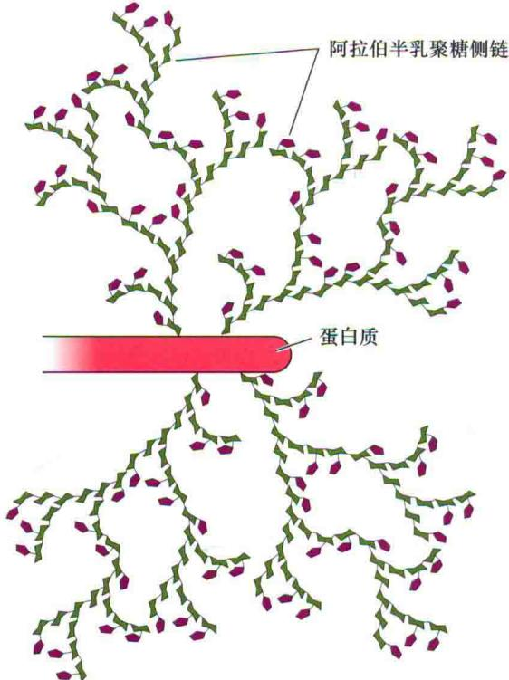  
图15.15 高度分支的阿拉伯半乳聚糖分子（引自Carpita and McCann，2000）。

AGP可能在细胞分化过程中起细胞粘连和细胞信号的作用。用外源AGP或AGP特异性结合剂处理悬浮培养细胞时，发现细胞的增殖和胚的发育受到影响，因而，为后一种观点提供了实验依据。AGP在细胞生长、营养、引导花粉管穿过花柱组织有一定作用。另外，在分泌囊泡中，AGP也可能作为多糖伴侣分子，使新合成的多糖在分泌到细胞壁之前减少自发聚合。

## 15.1.8 新的初生壁是在胞质分裂过程中组装起来的

初生壁是在细胞分裂终期从头开始形成的，新生细胞板（cell plate）与母细胞壁融合时两个子细胞分离并形成稳定的细胞壁。

当高尔基体小泡和内质网腔聚集在分裂细胞的纺锤体中心区时，细胞板形成。这种聚集作用由成膜体（phragmoplast）来组织，成膜体是在细胞分裂后期晚些时候或末期开始时由微管、膜和囊泡相互聚集在一起形成的一种复合体（见第1章）。囊泡膜彼此融合，并与后来形成的质膜融合组成新的质膜，从而将子代细胞分开。囊泡内容物是形成新的胞间层和初生壁的前体。

单个聚合物的“生命”过程可以如下列出：

## 合成 $\rightarrow$ 沉积 $\rightarrow$ 组装 $\rightarrow$

## 修饰（有时会影响细胞壁的延展性）

无论何时，壁聚合物存在于任何或所有的生命阶段。主要胞壁多聚物的合成与沉积在前面已经讲述过了。在这里我们将介绍它们组装成凝聚性网络的过程和这些多聚物的修饰及细胞扩张的影响。

细胞壁多聚物分泌到细胞外之后，必定会装配成一个相互粘连的结构，也就是说单个的多聚物会按照一定的规律排列和相互连接，这是初生细胞壁的特性，并且同时赋予其抗扩张强度和延展性。尽管细胞壁装配的详细机制还不完全清楚，但对于这个过程有两种假说：自装配和酶介导的装配。

自装配（self-assembly）自装配模型其机制简单而极具吸引力。细胞壁多糖具有显著的自发凝聚成有序结构的趋势。例如，用强溶剂将纯化的纤维素溶解，经挤出即可自发形成稳定的纤维即人造丝。

同样的，半纤维素也能被强碱溶解，当强碱去除后，这些多糖就会聚集成像细胞壁超微水平的有序的网络结构，这种聚集使得半纤维素分离成组分多聚物。相反，果胶比较容易溶解并且往往形成分散的各向同性（自由分布）的网络（凝胶）。

这种现象表明，胞壁多聚物有聚集成一些有序结构的内在趋势。但这并不能解释所有的过程，因为在体外当半纤维素结合到纤维素上时，这种结合比在真正的细胞壁中的结合弱得多。这种差别暗示，维持胞壁中稳固的网络还需要一些其他的过程。

酶介导的装配（enzyme-mediated assembly）除自装配外，细胞壁中的酶类也可能参与细胞壁的组装。介导细胞壁装配的主要酶类是木葡聚糖内糖基转移酶（xyloglucan endotransglucosylase，XET），该酶属于木葡聚糖内糖基转移酶/水解酶（xyloglucan endotransglucosylase/hydrolase，XHT）家族，能够剪切木葡聚糖主链，并使剪切开的一端连接在一个受体木葡聚糖的自由端（图15.16）。新合成的木葡聚糖通过这样的转移反应整合到细胞壁上（Thompson and Fry，2001；Rose et al., 2002）可能使细胞壁更坚硬。

其他在细胞壁装配过程中起辅助作用的细胞壁酶有糖苷酶、果胶甲基酯酶和多种氧化酶。一些糖苷酶能转移半纤维素侧链。这种去分支作用增加了半纤维素粘连到纤维素微纤丝表面的趋势。果胶甲基酯酶水解甲酯从而形成游离的羧基，增加了果胶中酸性基团的浓度，增强了果胶形成 $Ca^{2+}$ 桥凝胶网络的能力。氧化酶如过氧化物酶可催化壁蛋白、果胶和其他壁聚合物中酚类基团（酪氨酸、苯丙氨酸、阿魏酸）之间的交联。这种氧化交联以复杂的途径把木质素亚基连接在一起（图15.17），它们也同样能把其他细胞壁成分连在一起如

阿魏酰木聚糖。

图15.16 木葡聚糖内糖基转移酶（XET）剪接木葡聚糖多聚物形成新的构象示意图。第1步：酶切木葡聚糖分子（供体木葡聚糖）形成一个长的有活性的复合体，木葡聚糖共价结合到酶分子上。第2步：之后酶分子转移木葡聚糖链到第二个木葡聚糖（受体木葡聚糖）的非还原端，从而形成一个杂合产物（引自Fry，2004）。

## 15.1.9 细胞壁扩张停止后次生壁的形成

细胞壁停止扩张后，细胞有时会继续合成一个次生壁（secondary wall）。管胞、纤维和其他对植物起支持作用的次生壁可能相当厚（图15.18）。在蒸腾过程中由于剧烈的蒸腾作用产生的巨大水张力极可能导致导水细胞的崩溃，而木质部的刚性次生壁对防止细胞崩溃起着重要作用。正如上文提到的，木质次生壁包含木聚糖而不是木葡聚糖，而且还有很高比例的纤维素。与初

  
图15.17 图示木质素酚类亚基如何渗透到纤维素微纤丝之间的空间，形成网状连接。（图中忽略了基质的其他组分）。

A  

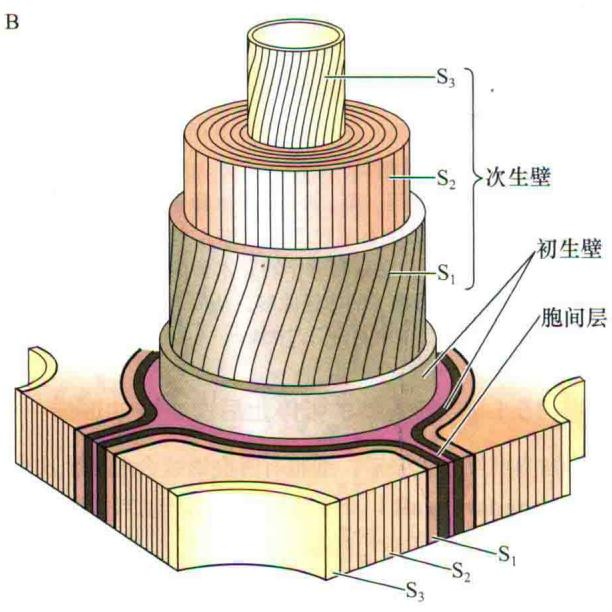

D  
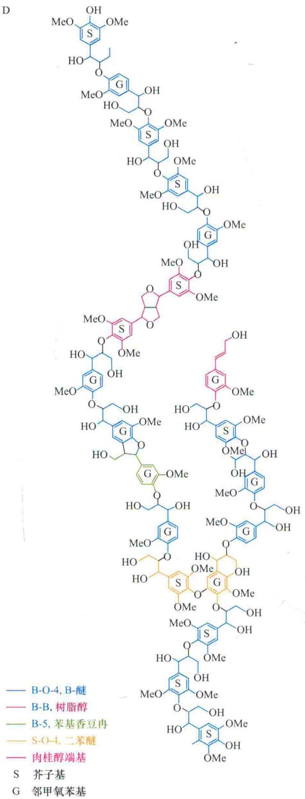

C 木质醇单体

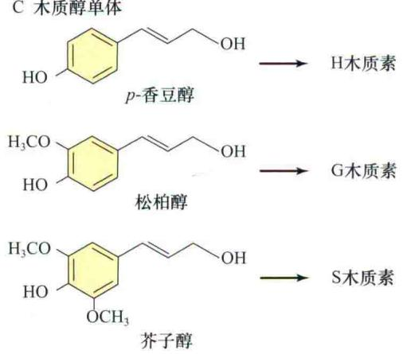

— B-O-4, B-醚
— B-B, 树脂醇
— B-5, 苯基香豆冉
— S-O-4, 二苯醚
— 肉桂醇端基
S 芥子基
G 邻甲氧苯基

图15.18 A. 罗汉松石细胞横切面，可观察到次生壁由多层组成。B. 管胞和其他具有较厚次生壁的细胞中的胞壁组成示意图。三个明显的层（S1、S2和S3）在初生壁内部形成。C. 组成H、G和S型木质素的木质素单体在数目上不同于酚环中的甲氧基。D. 目前认可的木质素结构模型，由S和G木质素单体亚基组成，彼此之间由过氧化物酶和漆酶产生的自由基交错连接。表明这是成千上万种可能的异构体之一（A图引自David Webb；D图引自Ralph et al., 2007）。

生壁相比，次生壁中纤维素微纤丝的取向更加有序，彼此平行排列，并且有明显的层次。在木质组织中，次生壁常常充满了木质素，从而加固了细胞壁并具有排水作用。

木质素（lignin）是一种复杂的由苯丙烷亚基组成的酚类聚合物，称为单体木素醇（monolignol），源于苯丙氨酸（见第13章），并且包含苯丙环上的0\~2个甲氧基（图15.18C）。由松柏醇组成的木质素称为G型木质素（G lignin），而由芥子松柏醇组成的木质素为S型（S lignin），H型木质素（H lignin）由p-香豆醇组成。这三种类型木质素的比例在不同类型的植物和细胞中是不一样的，并且这种比例影响木质组织的坚韧性和制浆性能（Vannolme et al., 2008）。

人们认为细胞分泌木质素单体葡糖苷到细胞壁从而形成木质素，此时葡萄糖残基被葡萄糖苷酶酶解。随后的多聚化过程细节还没有被完全掌握，但可能是从木质素单体氧化耦合阿魏酸或其他酚类残基开始的，而后共价结合到细胞壁的木聚糖上。多数人认为单体木素醇是通过形成自由基随机氧化和耦合，并在壁中被过氧化物酶和漆酶氧化，形成一个可变的大分子结构（图15.18D）。第二个假说（Davin and Leuis，2005）认为细胞壁蛋白控制多聚化过程，形成非常规则的结构。

在细胞壁中形成的木质素，可驱除基质中的水分，并与基质中的多聚糖相互交联，通过共价键连接形成一个疏水网络，这种共价结合主要是通过阿魏酸或其他的酚类残基结合到木聚糖上。木质素也可结合或包裹在纤维素上，从而加固了整个细胞壁（图15.17）。

木质素通过加固细胞壁和疏水作用，从而降低了细胞壁对来自病原菌水解酶攻击的敏感性。木质素还降低了动物对植物材料的消化能力，并干扰了制浆工艺（把木材转变为分散的纤维）。目前通过木质素含量和结构的遗传改良，使得植物的可消化性和营养成分得到改善，并提高了细胞壁作为造纸原料和生物燃料（用于汽车燃料的乙醇）的价值。

## 15.2 细胞的扩张方式

在植物细胞扩张过程中，新生细胞壁多聚物不断被合成与分泌，从而使原始细胞壁不断增大。细胞壁扩张可能高度区域化[如顶端生长（tip growth）]，也可能均匀分布于细胞壁表面[扩散生长（diffuse growth）]（图15.19）。最典型的顶端生长是根毛和花粉管，它与细胞骨架形成过程特别是微丝紧密相连（参见Web Essay15.1）。植物体内其他细胞大多是扩散生长，与微丝骨架和微管的动态变化相联系（Szymaski and Cosgrove，2009）。还有一些如纤维细胞、部分石细胞和香毛簇细胞是介于扩散生长和顶端生长之间。

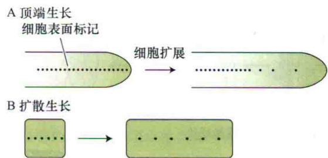

图15.19 顶端生长和扩散生长中细胞表面的不同扩张方式。
A. 顶端生长的细胞延伸被限制在细胞一端的半圆顶上。如果在细胞表面标记而且允许细胞继续生长，越靠细胞顶端标记的距离拉得越远。根毛和花粉管是表现顶端生长的典型的植物细胞。
B. 如果标记在扩散生长的细胞表面，当细胞生长时，所有标记之间的距离都增加。多细胞植物中多数细胞都以扩散生长的方式生长。

即使在扩散生长的细胞中，不同部位细胞壁的生长速率和生长方向也有所不同。如在树干的皮层薄壁细胞中，末端壁扩散生长就比侧壁生长慢得多。这种差异生长可能是由于特殊细胞壁的结构或酶类变化引起的，也可能是由于对不同细胞壁产生应力变化引起的。细胞壁不均匀扩张使得植物细胞具有不同的形态。

## 15.2.1 微纤丝方向影响细胞扩散生长的方向

在生长过程中初生壁的生化结构是疏松的，允许细胞壁由于受到来自细胞膨压产生的机械力而弯曲。膨压在细胞各个方向上都产生相等的外向力。因此细胞极性生长很大程度上决定于细胞壁的结构，尤其是纤维素微纤丝的排列方向。

当细胞开始在分生组织中形成时，它们是等径的，即它们在各个方向都有相同的直径。如果初生壁纤维素微纤丝的方向是随机排列或各向同性（isotropic），细胞将在各个方向上同等生长，迅速扩张成一个圆球（图15.20A）。增大的苹果中细胞即以这种方式进行生长。然而，在绝大多数植物细胞壁中，纤维素微纤丝以特定的方向即各向异性（anisotropic）方式排列，或者在某一个方向优先排列。纤维素的排列加固了细胞壁，以至于细胞壁在垂直于纤维素的排列的方向上更加具有扩展性。

在侧生细胞壁扩散生长时，如茎和根的皮层薄壁细胞和维管细胞，以及丝状绿藻（Nitella）巨大的节间细胞，纤维素微纤丝沿细胞长轴以合适的角度在细胞周缘（横向地）聚积。细胞周缘排列的纤维素微纤丝好像箍在桶上的绳子，限制细胞的围长扩张，而有利于细胞伸长生长（图15.20B）。然而单个的纤维素微纤丝实际上并不能形成围绕细胞的封闭的环状结构而形成浅螺旋，且在细胞壁扩展过程中彼此分开。

  
B 横向排列的纤维素微纤丝

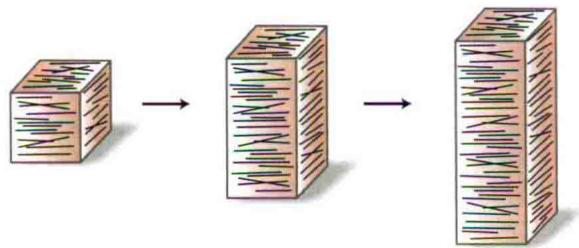  
图15.20 新聚积的纤维素微纤丝的方向决定细胞扩展的方向。A. 如果加固细胞壁的纤维素微纤丝无定向排列，细胞将在各个方向上都相等扩展，形成一个圆球。B. 当多数加固细胞壁的纤维素微纤丝有相同的方向时，细胞的扩展方向与微纤丝的排列方向成一定的角度，而微纤丝加固方向的扩张就受到限制。图示的微纤丝的方向是横向的，所以细胞的扩展是纵向的。

细胞增大时，细胞壁沉积作用仍在继续。根据多网络生长假说（multinet growth hypothesis），细胞增大时，每个连续的胞壁层被拉伸和薄化，所以微纤丝被迫纵向即沿着生长的方向重新定位。与多网络生长假说相一致，细胞壁电子显微照片显示，最新沉积的内层细胞壁有横向定位的纤维素微纤丝，而老的外层胞壁的微纤丝则较无序地排列。同样的在拟南芥根伸长荧光成像时发现细胞伸长过程中纤维素束由横向生长转变为纵向伸长（Anderson et al., 2009）。

然而其他观察结果如浮游生物多网络生长的普遍性使人产生质疑。一些细胞有多层细胞壁，它们纵横交错的纤维素排列横式不可能是简单的被动重排。在研究细胞壁微纤丝应答胞壁张力而被动重新定向的实验中，以模拟正常生长的条件下，从正在生长的子叶下胚轴分离到被机械拉伸的细胞壁碎片，并对这种拉伸作用对胞壁纤维素微纤丝方向的影响进行了检测。令人惊奇的是，细胞壁纵向伸长20%\~30%却并未改变内壁表面微纤丝的横向角度，表明微纤丝在细胞表面以一种协调的方式相互分离，这与多网络生长假说相反（Marga et al.,

A  

B  

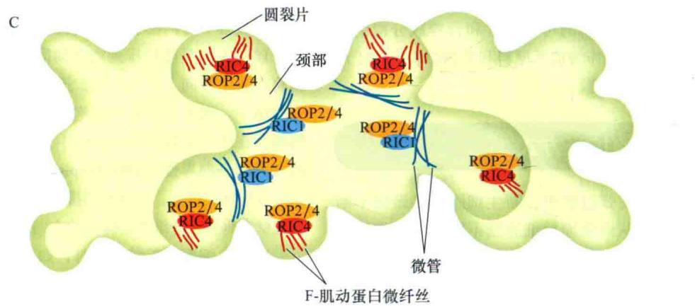  
图15.21 叶扁平细胞的镶嵌生长受ROP GTP酶的调控。A. 拟南芥叶铺板细胞的扫描电镜图，具拼图玩具式的外观。B. 铺板细胞的免疫荧光图象显示了更为清晰的细胞镶嵌生长形成的凸起和凹进。C. ROP GTP酶和它们的效应器（RIC）在叶形态建成中的作用模型。当被RIC4活化时，ROP2/4 GTP酶启动肌动蛋白微丝在细胞生长的凸起区形成。然而，当ROP2/4 GTP酶被RIC1活化，则使微管结合在凸起区的颈部。这些细胞骨架的改变可能在定位细胞壁生长方向时起信号作用（A图由Dan Szymanski惠赠；B图自Settleman，2005，由J Settleman惠赠；C图引自Fu et al., 2005）。

2005）。

因此，新的胞壁层沉积（内壁）行为与老的胞壁（外壁）可能是不同的。这种差异可能是由于老的细胞壁在胞壁伸展过程中变薄及碎片化引起的，结果外壁层对细胞扩展方向的影响比新沉积的内壁层小得多。所以，占细胞壁1/4的内壁层几乎承受了所有由于膨压而产生的张力，并决定着细胞伸长的方向（参见Web Topic 15.5）。

到目前为止我们仅考虑了一个扩散生长的简单模型。然而许多双子叶植物表皮的所谓铺板细胞（pavement cell）表现出更为复杂的情况。这些细胞的边缘是多凸起的，如拼图玩具似的形成相互镶嵌的模式（图15.21A、B）。这种镶嵌细胞壁的扩展方式结合了扩散生长和顶端生长两个方面，并且需要一类称为ROP（来自植物的Rho相关GTP酶）GTP酶的GTP-结合蛋白的参与，这些蛋白质的活化是由一类称为RIC（ROP-interacting CRIB motif-containing protein）的蛋白质来完成（图15.21C）。这些蛋白质参与细胞骨架（微丝和微管）的组织，为控制细胞壁的局部生长提供材料和催化剂（Szymanski and Cosgrove，2009）。细胞骨架是怎样影响细胞生长的呢？这个问题将在下节讨论。

## 15.2.2 周质微管影响新沉积的微纤丝的取向

新沉积的纤维素微纤丝通常与细胞质中靠近质膜的微管束的排列相一致（图15.22）（Baskin，2001；Baskin et al., 2004）。一个典型的例子是，在木质部导管元件中，结合周质微管的部位既是次生壁加厚的位点也是纤维素合酶A（CeaA）定位的位点（Gardiner et al., 2003）。而且通过药物处理或遗传缺陷破坏微管组织常会导致胞壁结构的紊乱和无序生长。例如，一些药物结合到微管蛋白亚基上会使它们解聚，一些药物可以结合微管的亚基微管蛋白使微管发生解聚。用微管解聚药物如黄草消（oryzalin）处理正在生长的根，细胞的扩展就表现出侧面膨胀，形成鳞茎状和肿瘤状（图15.23A、B）。

A  
B  
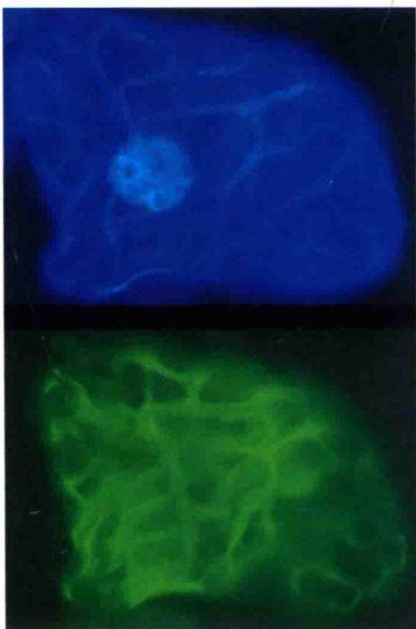

黄草消阻断生长是由于细胞扩展的各向同性引起的，即它们呈球状扩展而不是伸长生长。在生长的细胞中药物诱导的微管破坏作用干扰了纤维素的横向沉积。纤维素微纤丝在微管缺失情况下可以继续合成，但是它们随意沉积，导致细胞在各个方向上的扩张都是均等的。

这些相关现象说明微管在微纤丝合成时起轨道作用，引导或指导复合物的运动（参见Web Essay 15.2）。最近研究表明，通过重组DNA的方法融合表达CesA与YFP荧光蛋白，可以在活细胞中观察到CesA的运动（Gutieerez at al., 2009; Paredez at al., 2006）。已经观察到在质膜中CesA单元随着微管轨道移动（图15.23C），也有观察发现它们插入到与微管相连的高尔基体质膜中。通过共聚焦显微镜获得的结果可以详细阐

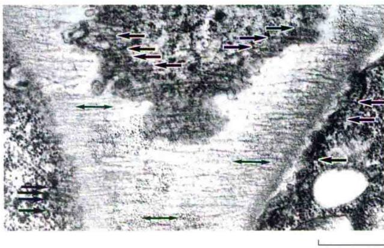  
5 μm  
图15.22 细胞周质中微管的方向反映了扩展细胞的胞壁中新沉积的纤维素微纤丝的方向。A. 微管的排列能被微管蛋白的荧光标记抗体显示，而calcofuor可使细胞壁中的纤维素微纤丝染色。将悬浮培养的鱼尾菊细胞进行不同的染色，结果显示细胞质中微管（绿色）的排列模式与细胞壁中纤维素微纤丝（蓝色）的排列方向相一致。B. 细胞壁中纤维素微纤丝的排列能在电子显微镜下观察到，图示一种水蕨的根部正在伸长的筛管分子显微照片，根的长轴和筛管分子相垂直，细胞壁微纤丝（双箭头）和周质微管（单箭头）是横向排列的（图15.7）（A图由Robert W Seagul惠赠；B图由A Hardbam惠赠）。

A 对照（无药物处理）

1 $\mu$ mol/L 米谷蛋白

B 对照（无药物处理）

1 $\mu$ mol/L 米谷蛋白  
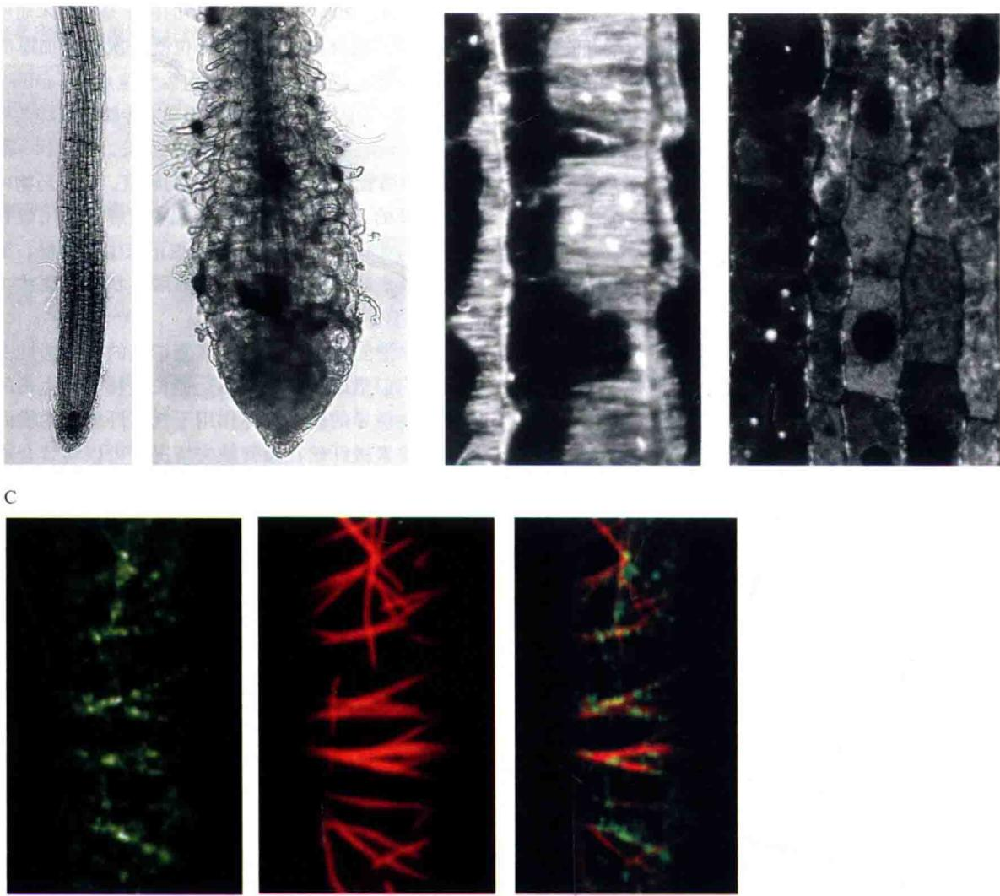  
图15.23 破坏周质微管导致细胞径向扩张的增加而细胞伸长减少。A. 微管解聚物黄草消（1 $\mu$ mol/L）处理拟南芥幼苗根部2天，药物改变了细胞的极性生长。B. 通过间接免疫荧光技术和微管蛋白抗体显示的微管。在对照中，周质微管和细胞扩展成一定的角度，用1 $\mu$ mol/L 米谷蛋白处理根部后，很少有微管存在。C. CesA蛋白（左图）和微管（中图）荧光标记图像显示在质膜中CesA在微管引导下的运动轨迹，从而引导纤维素微纤丝的方向。右图为两图的重叠图（A、B图引自Baskin et al., 1994, T Baskin惠赠；C图引自Gutierrez et al., 2009）。

明细胞骨架是如何指导细胞壁组织的（Szymanski and Cosgrove, 2009）。

## 15.3 细胞的扩张速率

植物细胞在达到成熟之前体积一般能扩大10\~100倍。在极端情况下，与分生组织中的原初细胞相比，其体积能扩大10 000倍以上（如木质部导管元件）。细胞壁承受如此巨大的扩张但并没有丧失其完整性，也没有变薄。由此可见，新合成的多聚物不断地整合到细胞壁上并未改变其既有结构的稳定性。尽管如前所述自装配和木葡聚糖内糖基转移酶（XET）在多聚物整合到细胞壁过程中起重要作用，但是这种整合是如何精确完成的目前还不清楚

这种整合过程可能对于快速生长的细胞如根毛、花粉管和其他特殊的顶端生长的细胞是非常关键的。在这些细胞中，细胞壁沉积作用的范围和表面扩展趋向于管状细胞顶端半圆顶上，细胞扩展和细胞壁沉积一定是紧密协调的。

在具有顶端生长方式的快速生长的细胞中，数分钟内细胞壁表面就就能扩大2倍，并且使细胞壁不扩展的部分发生移位。细胞壁的这种扩展方式比典型的扩散生长方式的细胞扩展速率快得多，以每小时1%\~10%的速率增长。由于扩展速率很快，顶端生长的细胞因此对细胞壁薄化和膨胀高度敏感。尽管顶端生长和扩散生长表现出不同的生长机制，但两种类型中胞壁扩张方式非常相似，如多聚物的整合过程、壁应力松弛及胞壁多聚物移动过程等。

细胞壁扩张的速率受很多因素影响，其中细胞类型和所处的发育时期是重要的影响因子。激素如赤霉素和生长素的活动也影响下游的结果。环境条件如光照和水分也能调节细胞的扩张。虽然这些内外环境因子都可调控细胞的扩张，但其导致细胞壁松弛的方式可能不同，因而，结果（不可逆伸张）就可能不同。从这个意义上来讲，我们称其为细胞壁的柔化特性（yielding property）。

在这部分我们首先分析细胞壁屈服特性的生物化学和生物物理参数。仅就使细胞能够伸张而言，具一定机械强度的细胞壁必须以某种方式变得疏松。植物细胞扩张过程中细胞壁的疏松形式称为应力松弛（stress relaxation），在下一节会进一步解释。

根据生长素作用的酸生长假说（见第19章），引起细胞壁应力松弛和柔化的机制之一是细胞壁的酸化作用，这是由于质膜上质子泵的激活导致细胞壁酸性增加。稍后我们将探讨酸诱导细胞壁疏松和应力松弛的生化基础，包括一种特殊的称为扩展蛋白（expansin）的细胞壁松弛蛋白的作用。

当细胞扩张到最大时，生长速率减小直至最后完全停止。本节最后我们将讨论导致细胞生长终止的细胞壁刚化作用的过程。

## 15.3.1 细胞壁应力松弛作用促进水分吸收和细胞伸长

由于细胞壁是限制细胞扩张的主要机械性限制因素，因此其物理特性备受关注（Cosgrove，1993）。作为一种水合多聚物，细胞壁具有介于固体和液体之间的物理特性，我们称之为黏弹性（viscoelastic property）或流变学特性（rheological property）。正在生长的细胞的细胞壁一般没有非生长细胞的细胞壁硬，在合适的条件下，生长细胞的细胞壁显示出长期不可逆拉伸或柔化（yielding）特性，这在非生长细胞中几乎没有。

应力松弛（stress relaxation）是理解细胞壁如何增大的一个重要概念（Cosgrove，1997）。名词应力（stress）用在这儿表示机械紧张，即每单位面积上的力。细胞壁所经受的应力来自于细胞膨压。典型的正在生长的植物细胞膨压在0.3\~1.0 MPa。膨压挤压着细胞壁并在细胞壁中产生一个均衡的物理张力。由于细胞几何学（一个薄的细胞壁控制着高压下的细胞体积）的原因，细胞壁张力有10\~100 MPa的压强——实际上是一个非常大的压力。

这个简单的事实对于细胞扩大机制有重要的意义。由于动物细胞能通过改变形状来应答细胞骨架产生的压力，这种压力与植物细胞壁抵制产生的膨压相比是微不足道的。植物细胞必须控制细胞壁扩展的方向和速率来改变形状，这通过偏向性沉积纤维素（这决定细胞壁扩张的方向）和选择性疏松胞壁多聚物之间的连接来实现。这种生化疏松能使纤维素微纤丝和它们连接的基质多糖相互滑动。因此增加了细胞壁的表面积，同时减少了细胞壁的物理压力。

细胞壁的应力松弛是非常重要的，因为它使生长的植物细胞膨胀和水势降低，从而能够吸收水分和扩张。没有应力松弛作用，细胞壁合成作用只能增厚细胞壁而不能使其扩张；事实上胞壁的沉积与扩张在多数情况下并没有密切的联系（Derbyshire et al., 2007a）。例如，在非生长细胞次生壁沉积过程中，没有应力松弛作用的产生，结果多糖沉积导致细胞壁增厚。

细胞主要靠吸水来扩大其体积，这些水分主要以液泡的形式存在，并在扩大的细胞中占据越来越大的体积，这里我们主要讲述生长的细胞是如何调节水分吸收，以及这种吸收是如何和细胞壁的柔化协调一致的。

在所有的植物细胞中，水分吸收是个被动过程。此过程没有启动水泵，而是生长的细胞利用应力松弛来降低细胞内水势，所以水分被自发地吸收来应答水势的变化，并没有直接消耗能量。

用物理术语来说，我们定义水势差 $\Delta\Psi_{w}$ （用MPa 表示）为细胞外水势（ $\Delta\Psi_{0}$ ）减去细胞内水势的水势（ $\Psi_{i}$ ）（见第3章和第4章）。吸水速率等于水势差 $\Delta\Psi_{w}$ 乘以细胞表面积（A，单位 $m^{2}$ ）乘以质膜对水分的渗透性（Lp，单位m/s·MPa）。

膜Lp是用来衡量水分通过膜的难易程度，它是膜的物理结构和水孔蛋白活性的函数（见第3章）。水分吸收速率定义为 $\Delta V/\Delta t$ ，单位是 $m^{3}/s$ 。假设一个正在生长的细胞和纯水（水势为0）接触，则：

$$
\begin{array}{r l} \text {水分吸收速率} & = \Delta V / \Delta t \\ & = A \times \mathrm{Lp} (\Psi_ {0} - \Psi_ {\mathrm{i}}) \\ & = A \times \mathrm{Lp} (0 - \Psi_ {\mathrm{i}}) \\ & = - A \times \mathrm{Lp} (\Psi_ {\mathrm{p}} + \Psi_ {\mathrm{s}}) \end{array}\tag{15.1}
$$

这个公式表明水分吸收速率只依赖于细胞面积、膜对水分的渗透性、细胞膨压 $\Psi_{p}$ 和渗透势 $\Psi_{s}$ 。

式(15.1)对于纯水中生长细胞和非生长细胞都是有效的。但是我们如何解释生长的细胞能持续吸水一段时间而非生长的细胞很快终止水分吸收的呢？

在非生长细胞中，水分吸收将增加细胞体积，引起原生质体挤压细胞壁，因此增加细胞膨压 $\Psi_{p}$ ， $\Psi_{p}$ 增加将增加细胞水势 $\Psi_{w}$ ，使 $\Delta\Psi_{w}$ 很快达到零，在短短几秒内，水分吸收停止。

在生长细胞中，因为细胞壁是“疏松的”，因而 $\Delta\Psi_{w}$ 就不会为零：膨压产生的压力使细胞壁不可逆地膨胀，细胞体积的增大不仅减小了细胞壁所承受的压力，同时也降低了细胞的膨压，这个过程被称为应力松弛（stress relaxation），它是生长细胞和非生长细胞物理特性的最根本差别。

应力松弛可以理解如下：在膨胀的细胞中，细胞内容物挤压着细胞壁，引起细胞有弹性（如可逆的）延伸并产生反作用力，即细胞应力。在生长的细胞中，生化疏松能引起细胞壁通过非弹性（不可逆的）变形来应答细胞壁应力。因为水分几乎是不可压缩的，减小细胞膨压和细胞应力只需要细胞壁极小的扩展即可满足。因此，应力松弛就是在基本上不改变细胞壁体积的情况下使得细胞壁压力减小。

细胞壁应力松弛的结果是细胞水势减小、水分流入细胞、引起细胞壁扩展并增加细胞表面积和体积。植物细胞的持续生长同时伴随着细胞壁的应力松弛（往往减小细胞膨压）和水分吸收（增大细胞膨压）。

许多实验证据表明，细胞壁松弛和扩展依赖于膨压。当膨压减小时，细胞壁松弛，细胞生长减慢。细胞生长常常在膨压达到零之前停止。细胞生长停止时的膨压值称为屈服阈值（yield threshold）（常用字母Y表示）。依赖于膨压的细胞壁的扩展可用下面公式表示：

$$
G R = \Delta V / \Delta t = m (\Psi_ {\mathrm{p}} - Y)\tag{15.2}
$$

这里GR是细胞生长速率，m是与生长速率相关的超过屈服阈值的膨压系数。系数m通常称为胞壁伸展性（wall extensibility），用数学术语来说，它被定义为生长速率和膨压函数曲线的斜率。

在稳定生长期，式（15.2）中的GR和式（15.1）中的水分吸收速率相等。即细胞增大的体积等于吸收水分的体积。这两个公式被绘制成图15.24。此图表明细胞扩展和水分吸收这两个过程的膨压变化恰好相反。例如，膨压的增加增大胞壁的扩展但减少水分的吸收。正常情况下，在一个生长的细胞中膨压是动态平衡的，平衡点正好在两条线相交的地方。在这个点上，两个公式都适用，并且水分吸收正好和壁腔的增大相对应。

图15.24中两直线的交点是稳态的条件，偏离这个点的任何情况都将会引起吸水过程和胞壁扩展之间瞬时的不平衡。这种不平衡会使膨胀重新回到这个交叉点，也就是细胞生长所需的动态稳定点。

典型的细胞生长调节（如激素或光调节）是通过调节胞壁疏松和应力松弛的生化过程来完成的，这样的变化可以用m或Y的变化来衡量。

如前所述，胞壁应力松弛引起的水分吸收使细胞变大，并且驱使胞壁应力和膨压恢复到它们的平衡值。然而，如果通过物理方法阻断生长细胞吸收水分，胞壁的松弛会逐渐减小细胞膨压，这种状况是可以检测到的。如通过压力探测仪（pressure probe）测定细胞膨压、用干湿计（psychrometer）或压力腔（pressure chamber）

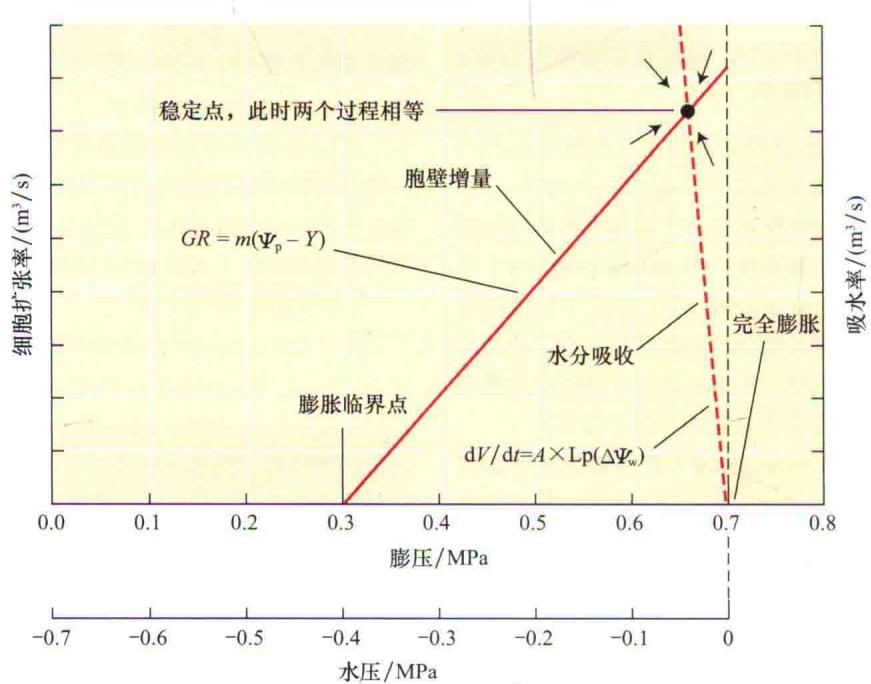  
图15.24 图示水分吸收和细胞膨大与细胞膨压和水势变化的两个等式关系。细胞扩展和水分吸收速率的数值是对应的。两个等式交叉点表示生长稳定期。水分吸收和细胞壁扩展的任何不平衡状态都将引起细胞膨压的改变，从而使细胞重新回到两个等式交叉点表示的稳定状态。

测定细胞水势（参见Web Topic 3.6）。图15.25显示了这样的实验结果。

  
图15.25 应力松弛引起细胞膨压（水势）减小。在这个实验中，离体豌豆幼苗茎段在有生长素和无生长素的溶液中孵育之后，吸干表面水分并密封到一个潮湿的空间内，在不同的时间测量细胞的膨压。用生长素处理的茎段膨压迅速减小到屈服阈值（Y），这是胞壁快速松弛引起的。未加生长素处理的茎段松弛速率较慢。对照茎段除了始终通过与一水滴保持接触来防止胞壁的松弛外，其余处理与用生长素处理的一组进行同样的处理（引自Cosgrove，1985）。

## 15.3.2 酸诱导的生长是由扩展蛋白 (expansin) 介导的

细胞壁生长的一个共同特征是它们在酸性pH条件下比在中性pH时扩展要快得多（Cosgrove，1989；Rayle and Cleland，1992），这种现象称为酸生长（acid growth）。在活细胞中，当用酸性缓冲液或药物克梭孢素处理生长的细胞时，酸生长表现非常明显。克梭孢素通过激活质膜上的 $H^{+}-ATP(H^{+}泵)$ 酶来诱导细胞壁酸化。

根毛的发生就是一个酸诱导生长的例子。当表皮细胞开始向外鼓起时，此处细胞壁的pH降到了4.5（Bibikova et al., 1998）。细胞壁的酸化与生长素诱导生长有关，但是这并不能解释生长素诱导的所有的生长机制（见第19章）。而且，这种pH依赖的胞壁扩展机制似乎对所有陆生植物都是一个进化上保守的过程（Cosgrove, 2005），并且参与了各种各样的生长过程。

酸生长现象也可以在缺乏正常细胞、代谢、合成过程的独立的细胞壁中观察到。进行这样的观察需要用一个伸长计，把壁放在张力下测量pH依赖的壁延展（图15.26）。

延展（creep）指依赖时间的不可逆的扩展，尤其指由胞壁多聚体之间相对滑动而产生的扩展。当生长的细胞在中性缓冲液中（pH 7）培养时，用一个伸长计夹住，当施加压力时，壁有短暂的延伸，但很快就停止了；当把壁转移到酸性缓冲液（pH 5或更小）中时，壁开始快速扩展，有时会持续数小时。

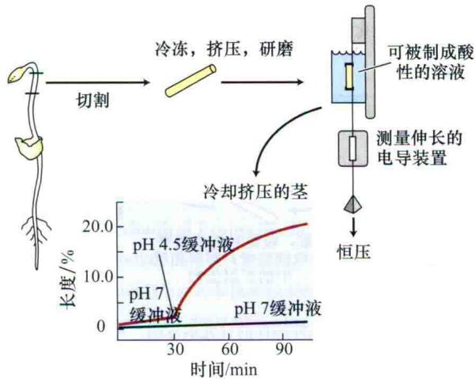  
图15.26 用伸长计测量酸诱导的离体细胞壁的伸展。从杀死的细胞获得的胞壁样品被夹放在伸长计的张力下，伸长计用一个电导和一个夹子连在一起用来测量长度。当壁周围的溶液用酸性缓冲液取代时（如pH 4.5），随时间的推移，壁可持续进行不可逆的伸展。

酸诱导的延展是正在生长的细胞壁的特性，但在成熟的（非生长的）细胞壁中却观察不到。当胞壁用蛋白水解酶或其他能使蛋白质变性的化学物质处理时，它就失去了对酸化响应的能力。这个结果表明酸生长特性不仅是由胞壁的理化特性决定的（如果胶凝胶特性的减弱），还被一种或多种壁蛋白所催化。

酸生长需要蛋白质的催化，这个观点已被一些补充实验所证实。在这些实验中，通过加入正在生长的壁的蛋白提取物，使加热失活的壁几乎完全恢复了酸生长反应（图15.27）。这种激活物被证明是一组扩展蛋白（expansin）（McQueen-Mason and Cosgrove, 1995）。这些蛋白质催化pH依赖的胞壁扩展和应力松弛，它们有明显的催化剂量效应（大约5000份壁需1份蛋白质，干重）。

关于胞壁流变中延展行为的分子基础还不很清楚，但大量的证据表明扩展蛋白引起胞壁延展是通过削弱壁多糖之间的非共价键来实现的。蛋白结构和结合实验表明扩展蛋白在纤维素与一种或多种半纤维素之间的接触面起作用（Yennawar et al., 2006）。

随着一些植物基因组测序的完成，已知扩展蛋白基因属于一个很大的超基因家族，可以分成两个主要的扩展蛋白家族， $\alpha$ -扩展蛋白（EXPA， $\alpha$ -expansin）和 $\beta$ -扩展蛋白（EXPB， $\beta$ -expansin），以及两个未知功能的小家族（Sampedro and Cosgrove，2005）。这两种类型的扩展蛋白在细胞壁的不同多聚体中起作用，并且在细胞生长、果实成熟和其他一些壁松弛的情况下协同起作用（见Web Topic 15.6、15.7）。

  
图15.27 分离细胞壁伸展性的补充示意图。A. 与图15.26相同方式准备的胞壁样品经过简单的热处理使内源酸扩展反应失活。为了恢复这种反应，从正常生长的细胞提取胞壁蛋白，并加到含细胞壁样品的溶液中。B. 加入的含扩展蛋白的蛋白质混合物后，胞壁样品的延展能力得到恢复（引自Cosgrove，1997）。

除扩展蛋白外，一些实验表明吲哚-（1→4）-β-D-葡聚糖酶（endo-（1→4）-β-D-glucanases）在胞壁疏松中起作用，尤其是生长素诱导细胞伸长的时候（见 Web Topic 15.8）。

## 15.3.3 许多结构变化是与壁扩展停止相伴随的

细胞成熟过程中发生的生长停止一般是不可逆的，并且伴随着壁扩展性的减弱，这已为多种生物物理方法测定的结果所证实。胞壁的这些物理特性的改变可能是由下面这些变化引起的：①壁松弛过程减弱，②壁交联增加，③壁的组成发生变化，从而更具刚性的结构或更不易解聚的壁结构形成。这些观点都获得一些证据的支持（Cosgrove，1997）。

成熟细胞壁的一些修饰作用可以促进胞壁的硬化：

（1）新分泌的基质多糖在结构上可以变化，以便和纤维素或其他壁多聚体形成更紧密的复合物，或者它们可以阻止壁的解聚能力。

（2）除去禾本科植物细胞壁的（1→3，1→4）β-D-葡聚糖时这些壁的生长也就停止，而且可以导致壁的硬化。

（3）在禾本科（仅含少量的果胶）和真双子叶植物中，果胶的去酯化导致形成更刚性的凝胶，这似乎与生长停止是相联系的。

（4）壁中酚基的交联（如HRGP中的酪氨酸残基、阿魏酸残基与基质多糖或木质素交联）一般与壁成熟同时发生，并且可能是过氧化酶介导的，推断这个酶是一个壁僵化酶。

因此，壁中许多结构改变发生在生长过程中或生长停止后，目前，还无法确定其中哪种变化对胞壁停止扩展起显著作用。

## 小结

细胞壁的结构对植物的构架、机械强度和功能至关重要。细胞分化时，胞壁被分泌并组装成一个形态和构成各异的复杂结构。

## 植物细胞壁的结构与合成

细胞壁的造型和组成因细胞种类和物种的不同会有很大的差异（图15.1\~图15.3）。

\- 初生壁在生长活跃的细胞中合成，在特定细胞中次生细胞壁在细胞停止扩展后会沉积下来。

· 初生壁的基本模式是网状的纤维素微纤丝包埋于由半纤维素、果胶和结构蛋白形成的基质中（图15.4、图15.6和表15.1）。

· 纤维素微纤丝是在细胞表面合成的高度有序的葡聚糖链阵列，通过包含多个纤维素合成酶（CesA）蛋白的颗粒合成的（图15.7和图15.8）。

· 基质多糖在高尔基体中合成后通过囊泡分泌（图 15.4）。

· 半纤维素结合在纤维素微纤丝表面，果胶形成亲水凝胶并通过钙离子交联在一起（图15.13）。

· 壁的组装过程部分是物理过程，部分有酶的介导作用如木葡聚糖内糖基转移酶（XET）（图15.16）。

· 木质素是由苯丙素亚基在细胞壁中氧化交联在一起形成的复杂的聚合体，从而将基质和纤维素固定为疏水难溶的物质（图15.17和图15.18）。

· 木本植物组织中的次生壁比初生壁含有更高比例的纤维素和木聚糖，其中充满木质素（图15.18）。

## 细胞的扩张模式

· 细胞扩张可能高度位置化（顶端生长）或者均匀分布在细胞表面（扩散生长）（图15.19）。

· 在扩散生长的细胞中，细胞生长的方向是由纤维素微纤丝的方向决定的，纤维素微纤丝的方向又是由细胞质中微管的方向决定的（图15.20）。

· 复杂的细胞生长模式，如在许多植物叶表皮发现的“交错”（jigsaw）模式，涉及G蛋白信号指导的细胞骨架的组织，从而指导胞壁局部范围的合成和生长（图15.21）。

## 细胞扩张速率

· 胞壁生化成分的缺失会导致壁产生应力松弛，从而使得生长的细胞中水分的吸收与胞壁的扩张相偶联（图15.24）。

· 激素（如生长素）的作用和环境条件（光和有效水分）通过改变壁的伸展性和曲张度来调节细胞的扩大（图15.25）。

· 酸诱导胞壁的扩张是初生壁的特性，这种作用是通过扩展素蛋白疏松微纤丝之间的交联来介导的（图15.26和图15.27）。

\- 细胞成熟时停止生长涉及胞壁交联和硬化等多种机制。

(王道杰 译)

## WEB MATERIAL

## Web Topics

15.1 Plant Cell Wall Plays a Major Role in Carbon Flow Through Ecosystems.
Much of the carbon of ecosystems is tied up in plant cell walls.

15.2 Terminology for Polysaccharide Chemistry
A brief review of terms used to describe the structures, bonds, and polymers in polysaccharide chemistry is provided.

15.3 Molecular Model for the Synthesis of Cellulose and Other Wall Polysaccharides That Consist of a

## Disaccharide Repeat

A model is presented for the polymerization of cellobiose units into glucan chains by the enzyme cellulose synthase.

## 15.4 Matrix Components of the Cell Wall

15.4 Matrix Components of the Cell Wall
The secretion of xyloglucan and glycosylated proteins by the Golgi can be demonstrated at the ultrastructural level.

15.5 The Mechanical Properties of Cell Walls: Studies with Nitella
Experiments have demonstrated that the inner 25% of the cell wall determines the directionality of cell expansion.

15.6 Wall degradation and plant defense
Cell wall degradatio occurs during senscence, fruit ripening, and pathogen attack.

15.7 Structure of Biologically Active Oligosaccharins Some cell wall fragments have been demonstrated to have biological activity.

15.8 Glucanases and other Hydrolytic en Zymes may Modify the Matrix.
Some evidence suggests that endo(1→4)-β-D-glucanases(EGases) may play a role in auxin-induced cell elongation.

## Web Essays

15.1 Calcium Gradients and Oscillations in Growing Pollen Tube
Calcium plays a role in regulating pollen tube tip growth.

## 15.2 Microtubules, Microfibrils, and Growth

The orientations of microtubules and/or microfibrils are not always correlated with the directionality of growth.

# 第 16 章

# 生长与发育

和动物相比，植物有着一套更为有趣的发育模式，除了它们所具有的多样化发育进程外，人们对这些发育形式是如何形成的也非常好奇。例如，红杉树经历上千年时间的生长后，会形成大到可以允许汽车通过的树干。而拟南芥则可以在一个多月的时间内完成其生活周期，并且只产生很少的一些叶片（图16.1）。尽管这两种植物在上述方面存在差异，但它们与所有的多细胞植物一样，有着相似的胚胎发育机制，而其差异很大程度上是由不同的胚胎后发育过程逐步积累产生的。与此形成对比的是，动物的发育模式则相对较为明晰，其基本的躯体结构在胚胎形成时期就已经定型。

植物和动物间的区别可以理解为生存策略的不同。由于具有光合能力，植物主要依赖于灵活的生长方式来赋予其在位置固定的情况下适应较为不利生长环境的能力，这种灵活性在植物的向光性方面体现的尤为明显，因为光环境会随着时间不停地发生变化。而动物作为异养生物，则进化出更多的运动能力来适应环境。在本章中，我们将会讨论植物发育的本质特征及其规范植物可塑性生长模式的详细机制，来解释植物是如何进行灵活的生长方式。

研究植物生长发育的生物学家面临两个主要问题：首要问题是需要明确并贴切的描述植物的实时变化。随着植物的生长，其复杂程度也会相应增加，倘若如此，如何用最简单的方式来描述其复杂的生物现象？细胞分裂和膨大以及特异性分化过程是与什么发育阶段偶联？环境因素如何影响植物的生长过程？

当发育机制已经获得较为详尽的阐述后，生物学家就开始着手处理涉及发育机制本质的第二个问题。如何用基因决定模式来解释生长的特殊形式？这些内在机制是如何与外界因素[如营养水平、能量输入（energy input）及环境胁迫（stress）]相偶联的？介导这些偶联的机制有哪些？涉及哪些组分，这些组分在细胞、组织水平上是如何有规律地组织在一起？在时间和空间的动态调控又是如何实现的？

为了解决上述问题，本章将先对植物组织和生活史的基本特点及它们与基本生长过程之间的联系进行一个简要的总览。作为本章的背景知识，在附录二中提供了可用来对生长发育进行详细定量描述的不同方法。在此基础上，我们将讨论生理、分子及遗传学方法是如何用于研究并阐述植物生长发育过程的调控机制。

## 16.1 植物生长发育总览

几乎所有的陆地植物都有一个重要生命特征是不可移动性。通过自身光合作用的能力，位于有利位置的植物能够轻而易举地获得生长和生存所需要的能量和营养。由于不能够移动，植物无需像动物那样进化出用于运动的复杂解剖结构。对植物来说，它需要一套相对刚性的结构以利于捕捉光能和吸收营养。因此，与动物细胞不同的是植物细胞中相邻细胞紧紧地结合在一起，相对不易变形且具有木质化和紧密排列的特点，这种刚性结构强烈限制了植物如何生长。植物中细胞的逐渐增加是通过位于特定部位的分生组织中细胞的分裂活性来完成的。相比之下，动物发育的很多方面，包括初生组织层的形成，都是通过细胞迁移到新的位置而完成的。

植物固定附着的习性使它具有相对简单的组织，同时也面临着巨大挑战。因为植物不能重新迁移到有利的环境，而必须去适应所处的生存环境。尽管这种适应是在生理水平产生的，但植物需要通过营养发育程序精心设计的可塑性发育来达到适应环境的目的。这一适应性生长的关键因素是一群命运尚不确定的分生组织细胞，通过调控这些细胞的增殖和分化，植物可以产生复杂多样的形态特征来适应所处的环境。

## 孢子体发育的三个主要阶段

种子植物孢子体发育需要经历三个主要阶段（图16.2）：胚胎发生、营养发育和生殖发育。

胚胎发生 胚胎发生是指由单细胞向具有典型基本组织的多细胞生物体发展的过程。在大多数种子植物中，胚胎发生位于花的心皮内一个特化结构——胚珠。整个胚胎发育的先后顺序具有高度可预测性，这可能反映了胚胎被母体形成的珠被有效包裹是种子形成所需的过程。胚胎发生为植物基本形态建成提供了一个清晰模式。这些发育过程是通过建立了极性，使得细胞的行为根据它们在胚胎中的位置有所区分。

在这个空间框架内，细胞群功能特化形成表皮、皮层和维管组织。被称为顶端分生组织的细胞群形成茎和根的生长点，从而可以在随后的营养生长过程中产生更多的组织和器官。在植物胚胎形成末期，一系列生理变化使得胚胎能够经历长期的休眠和承受恶劣的环境（参见 Web Topic 16.1）。

图16.1 从无限生长过程形成的两个对比鲜明的植物范例。A. 吊灯树，一株著名的北美红杉树，历经了约2400年的沧桑。B. 拟南芥小巧的外形及其较短的生命周期，使之成为研究植物生长与发育机制的模式植物（A© David L.Moore/Alamy；B由David McIntyre拍摄）。  

营养发育 伴随着种子的萌发，胚胎休眠状态被打破，通过利用自身储存的营养物质，种子进入植物的营养生长期。不同物种的种子萌发和许多因素有关，包括湿度、持续的低温、热和光照（参见 Web Topic 16.1）。植物最初吸收子叶（如豌豆）或胚乳（如单子叶的草本类）中储存的营养物质，通过根和茎的顶端分生组织形成植物的基本形态（Weigel and Jürgens, 2002）。通过光形态建成（见第17章）和芽的进一步发育，使幼苗具有光合自主性，从而保证植物可以继续进行营养生长。

与动物不同的是，植物这种生长方式常常是无限的，这种生长不是预先设计好的，而是属于没有明确终点的可变生长。无限生长赋予侧生器官发育重复进行，使得植物能形成最适应当地生存环境的形态结构。

生殖发育 经历一段时间的营养生长后，植物在受到诸如个体大小、温度和光周期等多种内外因子的综合诱导下转变为生殖发育。在显花植物中，由营养生长到生殖生长的转变涉及特化的花分生组织（能够形成花器官）的形成，然后按照固定模式顺序发育产生一系列器官，这已经成为研究植物发育的典型范例，这将在第25章详细叙述。

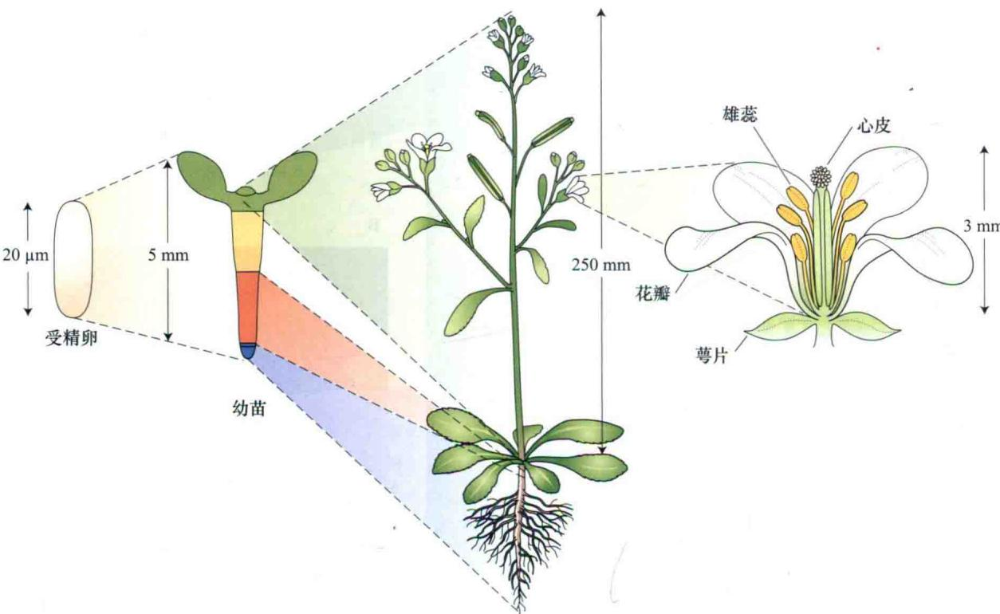  
成年植物  
图16.2 孢子体发育的主要时期。在胚胎发生时期，单细胞的受精卵细胞产生基本的但是有极性的组织，其特征是一些未决定命运细胞群，其中包括初生根和茎尖分生组织。在营养生长期，受内在程序和环境因素的影响，植物的生长模式表现出无限生长的状态，从而产生多种形态的根茎。在生殖生长期，植物的茎尖分生组织（SAM）重编程产生一系列典型的花器官，包括心皮和雄蕊，并在这些花器官内部是单倍体配子体世代的开始。

在接下来的部分里，我们将通过讨论几种基本的植物发育的例子，分析如何利用分子及遗传学方法来更好的解释植物生长过程中的位置特异性问题。

## 16.2 胚胎发生：极性的起源

在种子植物中，胚胎发生是使一个单细胞的受精卵转变成含有成熟种子的极其复杂个体的过程。因此，胚胎发生包括了植物基本结构建立的一系列发育过程，包括基本形态的构成（形态建成）、功能组织结构的形成（器官建成）和细胞分化（differentiation）形成不同的组织（组织发生）。这种植物基本结构的重要特征是在茎尖和根轴存在有顶端分生组织（图16.2），它是保持植物以无限生长模式（indeterminate patterns）进行营养生长的关键。最终胚胎在发育过程中生理上的复杂变化使其具有经受长期的失活状态（休眠）的能力，以及感知和响应环境信号，使植物具有重新生长（发芽）的能力。

在下面的章节中，我们从几个角度来了解胚胎发生的复杂性。首先我们通过解剖学方法比较单子叶和双子叶植物的胚胎发生过程，来凸显种子植物之间胚胎发育的异同。随后，我们探究引起胚胎生长和分化的复杂模式的信号及其本质，并通过一些例子来证明位置依赖信号的重要性。最后，将通过讨论实例来说明如何利用分子和遗传学方法研究将信号转化成植物有序生长的组织模式及这种模式的内在机制。

## 16.2.1 单子叶和双子叶植物的胚胎发生类型不同，但胚胎发育的基本特征是相同的

解剖学比较表明，不同种子植物间胚胎发生的类型不同，如单子叶植物和双子叶植物。以拟南芥（双子叶植物）和水稻（单子叶植物）为例，它们在胚胎发育过程中的细节不同，但具有建立主要生长轴等共同的基本胚胎发育特征。以下是拟南芥胚胎发生过程（水稻胚胎发生的介绍详见Web Topic 16.2）。

拟南芥的胚胎发生 由于拟南芥胚胎较小，其胚形成过程中细胞分裂的模式相对简单且易于跟踪观察（Mansfield and Briarty，1991）。拟南芥胚胎发生中被认同的五个发育阶段都直接和胚胎的形状特点联系在一起。

（1）合子期（zygotic stage）它是二倍体植物生活周

B

C

H  

D  

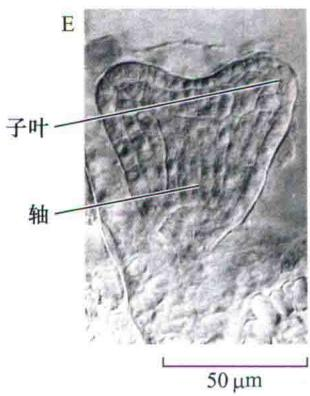

G  

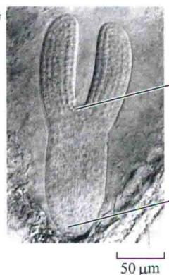

  
图16.3 通过精确的细胞分裂模式阐述拟南芥胚胎的发生过程。A. 第一次受精卵裂后的单细胞胚，形成顶细胞和基细胞。B. 2细胞胚。C. 8细胞胚。D. 中期球形胚，发育成了独特的原表皮层（表面层）。E. 早期心形期。F. 晚期心形期。G. 鱼雷胚期。H. 成熟胚（引自West and Harada，1933；图片由K. Matsudsira Yee拍摄，由John Harada提供，得到美国植物生物学家协会许可）。

期中的第一个时期，开始于精卵结合后形成受精卵的单细胞阶段。细胞在不对称横向分裂后进行极性生长，产生一个小的顶细胞和一个细长的基细胞（图16.3A）。

（2）球形胚期（globular stage）顶细胞经过一系列分裂（图16.3B\~D）产生具有辐射对称性（图16.3C）的8细胞（八分体）球形胚。细胞分裂增加了球形胚内细胞的数量（图16.3D），从而形成位于外层的可发育为表皮的原表皮层。

（3）心形胚期（heart stage）通过未来茎尖分生组织两侧区域细胞的快速分裂形成胚胎两侧对称的子叶原基（图16.3E、F）。

（4）鱼雷胚期（torpedo stage）这一时期是通过细胞沿胚轴延长和子叶进一步发育形成的（图16.3G）。

（5）成熟胚期（mature stage）在胚胎形成的末期，胚胎和种子丧失了水分及代谢活性，进入休眠期（将在第23章中进行讨论）。这一时期贮存物质在细胞中大量积累（图16.3H）。

拟南芥和水稻作为双子叶和单子叶植物的代表，通过比较它们的胚胎发生过程可知，它们在胚胎的大小、形状、细胞数目和分裂模式等方面存在着差异。尽管如此，但所有种子植物胚胎形成还是会有许多共性。最基本的共性可能就是关于极性（polarity）方面的。从单细胞的合子期开始，胚胎在整个发育过程中沿两条轴线表现出越来越大的极性：顶部-基部轴（apical-basal axis），处于胚胎的芽顶端和根尖之间，而辐射轴（radial axis），垂直于顶部-基部轴，从植物中心向外延伸。

在接下来的章节中，我们将研究这些轴极性是如何建立起来的，这些特定的分子过程是如何调控这种极性发育过程的。我们主要以拟南芥为讨论对象，这不仅因为拟南芥是作为分子生物学和遗传学研究的模式植物，还因为它在胚胎发育早期具有简单和高度模式化的细胞分裂。通过观察这个简单模式的变化，就可以比较容易地识别影响胚胎发育的生理及遗传因子。图16.4中所描述的拟南芥早期细胞的分裂有助于对下面讨论的理解（关于在简单藻类合子中极性建立的讨论，见Web Topic 16.3）。

## 16.2.2 顶部-基部极性在胚胎发生早期建立

极性是种子植物的基本特征，植物的组织和器官按照从茎尖分生组织到根尖分生组织这条线性轴，以类似于铅印模板式地有序地排列。极性轴最早在合子中就已出现，合子细胞在初次分裂前会伸长3倍左右，而其细胞内的组分也呈极性分布。合子的顶端有浓厚的细胞

PLANT PHYSIOLOGY

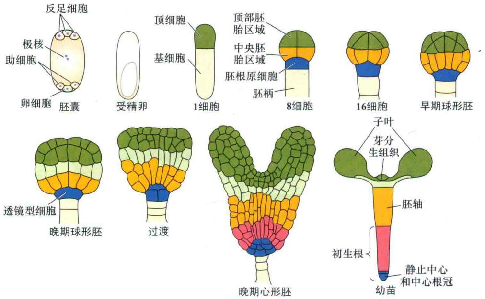  
图16.4 拟南芥胚胎形成的模式。上图表明幼胚发育的一系列连续发育阶段的特定细胞如何决定幼苗形成的特定解剖结构特征。不同的颜色标出相关的同源细胞群，即这些细胞可以追溯到共同祖先。随着受精卵进行不对称分裂，较小的顶端子细胞分裂形成8细胞的原胚，原胚分为2层，每层4个细胞。上层发育成顶端分生组织和侧翼与子叶原基相连的大部分，下层产生胚轴和部分子叶、胚根和根顶端分生组织的上部分细胞。受精卵分裂的基部子细胞产生一系列非胚胎细胞，形成连接胚囊到胚胎的胚柄。与原胚相邻的胚柄上部细胞称为胚根原（蓝色标示），将成为胚胎的一部分。胚根原将分裂形成静止中心和形成根冠的干细胞（起始）。

质，而基部则含有一个中央大液泡。当合子进行非对称分裂成为短的、胞质浓的顶细胞（apical cell）和稍长、有液泡的基细胞（basal cell）时，细胞质浓度的差异就可以被捕捉到（图16.3A和图16.4）。

合子分裂成的两个细胞也可以通过它们随后不同的发展命运来区分。几乎整个胚胎及以后形成的成熟植株都是来源于较小的顶细胞，它的两次垂周分裂及随后的一次水平分裂产生了8细胞（八分体）的球形胚（图16.3C和图16.4）。

基细胞的发育潜力相对有限。一系列的横向分裂（在与顶部-基部轴垂直的角度上产生新的细胞壁）产生了纤维状的胚柄（suspensor），将胚胎固定在亲本的维管系统上。仅有最上部基细胞的分裂产物参与成熟胚的形成，被称为胚根原细胞（hypophysis）。经过这些细胞的进一步分裂，它们发育为根冠柱、相应的根冠组织和静止中心，都是根顶端分生组织的重要组成部分，本章后面的部分将进一步讨论（图16.4）。

在八细胞球形胚期，除了位置的差异外，上下层的细胞在形态上没有太多的差异。所有的八细胞进一步进行平周分裂（periclinally）（新形成的细胞壁平行于表面）形成一个新的被称为原表皮层（protoderm）的细胞层。原表皮层的细胞随后进行垂周分裂（anticlinally）（新细胞壁垂直于组织表面）从而使一个细胞厚度的表皮面积增加。在球形胚早期，上下端细胞的命运就开始显现出明显不同：

（1）顶端区（apical region）源于细胞的顶部区域，产生子叶和茎尖分生组织。

（2）中部区（middle region）源于细胞的基部区域，产生胚轴（胚性干细胞）、根和根分生组织顶部区域。

（3）胚根原细胞（hypophysis）源于胚柄的最上部细胞，产生余下的根分生组织。

## 16.2.3 位置依赖性信号转导调控胚胎的形成

拟南芥早期胚胎发生过程中这种重复分裂模式，表明细胞保持一种固定的分裂顺序是这个发育阶段所必需的。如果胚胎形成过程中单个细胞的命运很早就固定或决定下来，则可以解释这种分裂模式的一致性；一旦这些细胞的命运被确定了，这些细胞就会按固定的程序进行发育。起源性依赖（lineage-dependent）机制恰恰可比作细胞胚胎按照自我包含的指令进行一系列标准部件结构的组装。

尽管这种起源性依赖机制已经在动物发育中被证实，但用这一机制来解释植物的胚胎发育还存在一些难点。首先，这一起源性依赖机制很难解释其他植物（在水稻甚至是与拟南芥亲缘关系相近的植物）中存在的更为多变的细胞分裂方式。其次，即便在拟南芥中，当通过灵敏的命运作图技术预测单个细胞命运时，也可发现在正常胚胎形成过程中细胞分裂行为会出现一些有限的变化（图16.5）。最后，以一种拟南芥的突变体作为极端特例来分析，虽然该突变体与野生型相比有显著不同的分裂模式，但在该突变体中仍有构建出基本胚胎特征的能力（Torres-Ruiz and Jürgens，1994；图16.6）。从这个角度看来，拟南芥中相对可预测的细胞分裂模式可能简单反映了其胚胎的体积小，而使胚胎细胞的早期分裂在极性和物理位置方面受到限制。因此，除了按固定的顺序进行细胞分裂外，一定还有其他程序指导着胚胎的进一步的发育。

  
不同的拟南芥幼苗  
图16.5 特定胚胎细胞的命运不是固定不变的。研究追踪了幼胚中单个细胞的命运。顶部图表示随机切除转座子激活了单个细胞中GUS基因的表达，提供了可遗传标志，因此GUS基因可以标记这个细胞及其后代细胞。胚胎中转座子的切除过程导致幼苗中GUS表达。在底部图中，该实验中的幼苗可以根据GUS表达区域的强度和位置加以分类（标记为A\~F）。左边幼苗模式图显示线性排列的区域，每一个区域来源于幼胚。一些相似区域，如E和F，很可能源于胚胎中相似位置的细胞，只是终点有异，但是不同分区间的表达量仍有较大的重叠。例如，类型D的底部区域和类型E顶端部分重叠，却不与类型F重叠。另外，幼苗中区段D和E的细胞也是有重叠的（子叶和根的交界处），说明细胞分化按它的位置而非来源。这个例子为细胞的位置是其命运的主要决定因子提供了直接证据（引自Scheres et al., 1994）。

鉴于胚胎形成中细胞分裂的可变性，位置依赖性（position-dependent）的信号机制可能比起源依赖性机制发挥了更大的作用。这个机制通过依赖于细胞在发育胚胎中的位置来调整细胞行为。这种机制可以解释不同的细胞分裂模式如何最终成为一个统一完整的胚胎个体。这种位置依赖的信号模式一般认为具有三类通常的功能组成。

（1）在发育结构中必定存在独特的位置信息。

（2）单个细胞必定存在关于自身位置相对于应用位置信息的评价途径。

（3）细胞必须具备应对本来应有位置信息的恰当的反应能力。

接下来我们将讨论调控植物胚胎轴模式建成机制的本质，首先鉴定该过程的关键因子，然后研究它们之间如何互作。我们首先讨论生长素如何将位置信息提供给发育中的胚胎，并且又是如何通过调控下游生长素依赖的进程来参与胚胎发育。

## 16.2.4 在胚胎形成中生长素可能以一个可移动的化学信号起作用

在动物的一些特定的位置依赖性的发育过程中，一种被称为形态发生素（morphogen）的物质对位置信息图16.6 过度的细胞分裂没有阻碍基本辐射模式元素的形成。拟南芥的fass（即ton2）突变体，在细胞任何分裂阶段都不能形成微管早前期带。这种突变植株的细胞分裂和平面延伸很不规则，所以它们的形态发生严重变化。但是，它们还是在正确的部位形成了可辨认的组织和器官。虽然这样的组织和器官极不正常，但是没有影响到辐射组织模式。上图为野生型拟南芥：A.早期球形胚阶段；B.从顶部观察到的幼苗；C.根的横切面。下图对应各阶段的纯合突变体fass：D.早期胚胎的形成；E.从顶部观察到的突变体幼苗；F.突变体根的横切面表明细胞随机定向排列，但是仍然是一个近似野生型组织排列顺序：外部表皮层覆盖了一个多细胞组成的皮层，它围绕着维管柱（引自Traas et al., 1995）。

A  
野生型拟南芥  

B  
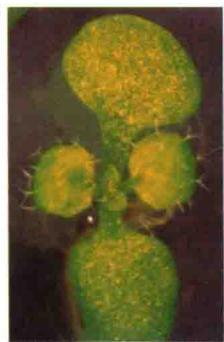

C  

D  
fass: 纯合突变体  
  
50 μm

E  
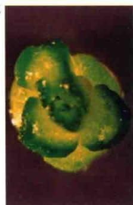

F  
  
60 μm

的提供起着关键作用。通过合成、运输和转换的综合作用，在发育的动物体内形成了形态发生素分子的浓度梯度分布，继而引发了一系列的浓度依赖反应。考虑到植物胚胎的发育也存在有位置依赖性，那么在植物中是否也存在有一种类似的形态发生素依赖机制呢？

某些激素的浓度变化、可移动性及它们能引起的一系列生理反应表明，这些分子有成为形态发生素的可能，生长素就是一个典型的例子。对于许多植物来说，生长素（吲哚-3-乙酸，IAA）或者合成的类似物，都能诱导体细胞形成胚胎（见第19章）。这种现象不仅表明生长素在胚胎形成中的潜在影响，也说明在缺失母体提供的信息时，胚胎形成程序也能进行的内在本质特征。

生长素及其抑制剂在不成熟胚胎上的体外实验还证明，胚胎发生的后期阶段也对生长素浓度敏感（图16.7A和B）（Liu et al., 1993）。人工干扰生长素水平导致的杯状顶端的表型与生长素转运体PIN1基因缺失的突变体表型非常类似（图16.7C），表明生长素在胚胎正常发育中起到非常重要的作用。但如果生长素要起到形态发生素的作用，不仅要能引起所影响组织的特异浓度依赖反应，也要能在整个发育的胚胎内形成浓度梯度分布。通过外施不同浓度的生长素（表16.1），建立的模式图显示了生长素的直接运输是如何参与建立发育过程中的胚胎内生长素模式化分布的（图16.8）。

## 16.2.5 突变体分析有助于鉴定在胚胎组织发育过程中的重要基因

通过对各种类型突变体的分析，可以得到胚胎的基本极性是如何建立的，以及随后的模式是如何发生的相关信息（Laux et al., 2004）。阻碍胚胎早期形成的突变体被称为胚胎致死突变，如果这些突变体是隐性的，那么通过观察杂合体植株经自交后生长出的不饱满的种子或者果荚就可以识别出来。虽然这些突变体阻止发育的现象可以与相应基因在胚胎形成中的作用对应，但还是很难断定该基因是特异地在胚胎形成中起作用还是具有更广泛的代谢功能。

A 添加了反式肉桂酸的野生型芥菜  
  
100 μm

B 野生型拟南芥  
  
50 μm

C pinl1-1突变体  
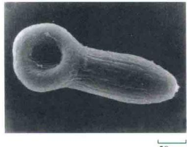  
图 16.7 生长素在胚胎发育过程中作用的证据。A. 反式肉桂酸（一种能减弱生长素水平，抑制其运输的类黄酮）处理芥菜胚胎10天，可改变芥菜胚胎形态。B. 野生型拟南芥胚胎。C. 拟南芥pin1-1突变体的胚胎。值得注意的是，体外施用生长素抑制剂和由PIN基因突变导致的生长素运输紊乱均引起了相似的子叶不能正常分离的表型（引自 Liu et al., 1993）。

表16.1 评价植物体内生长素水平的通用方法的总结

<table><tr><td>方法</td><td>敏感性</td><td>特异性</td><td>分辨率</td><td>注释</td></tr><tr><td>质谱分析</td><td>中等</td><td>高</td><td>组织或器官水平</td><td>可以区分生长素的不同形态</td></tr><tr><td>通过质量和电荷确定某些分子身份</td><td></td><td></td><td></td><td></td></tr><tr><td>免疫印迹检测法</td><td>高</td><td>中等</td><td>细胞水平</td><td>依赖于生长素和抗体结合的亲和度以及抗体的特异性</td></tr><tr><td>利用抗体识别特异性的分子构象</td><td></td><td></td><td></td><td></td></tr><tr><td>报告基因</td><td>高</td><td>高</td><td>细胞水平</td><td>指示生长素依赖响应的位置,但在某种程度上报告基因的活性可能会受其他因素的限制</td></tr><tr><td>利用生长素激活的启动子启动基因表达,该基因表达产物可以被检测</td><td></td><td></td><td></td><td></td></tr><tr><td>PIN蛋白的定位</td><td>中等</td><td>中等</td><td>细胞水平</td><td>用于评价主要生长素运输系统中生长素可能的极性运输方向,但该方法不能直接用于检测其他类型的生长素</td></tr><tr><td>生长素转运体的极性分布来指示生长素的水平</td><td></td><td></td><td></td><td></td></tr></table>

  
2细胞阶段

  
球形胚

  
早期心型胚阶段

图16.8 胚胎发育早期依赖于PIN的生长素移动。箭头指示生长素的移动方向。这是根据PIN蛋白的不对称分布和DR5生长素反应报告基因的活性推断出来的（参考第19章）。蓝色标记区域为生长素浓度最大的细胞。

在分离特异影响胚胎形成的突变体中，筛选得到一些幼苗缺陷突变体，它们可以发育形成成熟的种子，但这些种子萌发形成的幼苗均不正常（Mayer et al., 1991）。在这些突变体中，正常的顶-基形态被打乱，结果造成缺失茎尖分生组织或根尖分生组织，或者两者都缺失。这些突变体缺陷的特征表明正常的顶-基模式的形成需要相关基因的参与（图16.9）。通过图位克隆技术克隆相关基因，可以深入了解这些基因的功能作用。

（1）GURKE（GK），因突变体的外形类似黄瓜而得名，它简化了或没有了子叶和茎尖分生组织，编码一种乙酰辅酶A羧化酶（Baud et al., 2004）。因为乙酰辅酶A羧化酶对于极长链脂肪酸（VLCFA）及鞘脂类的正确合成是必需的，所以这些分子或其衍生物可能对形成胚胎顶部的正确模式也必不可少的。

A 野生型和 gnom 突变体  
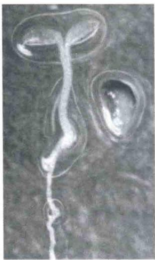  
GNOM基因控制顶-极性

B 野生型和 monopteros 突变体  
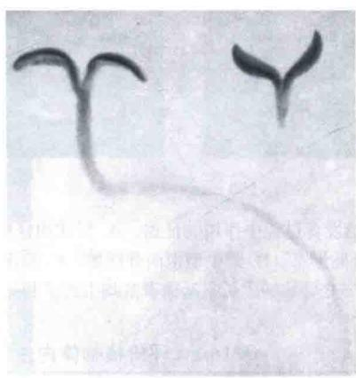  
MONOPTEROS基因控制初生根的形成

C 突变类型示意图  

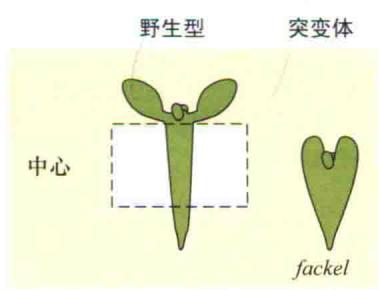

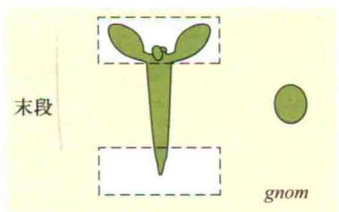  
图16.9 通过突变体筛选分离拟南芥胚胎发生过程中必须的基因。图中显示的是相同发育阶段的突变体与野生型之间的类型比较：A. GNOM基因帮助建立顶-基极性，右边为纯合突变体gnom。B. MONOPTEROS基因在基部模式化和主根形成过程中是必需的。纯合突变体monopteros植株（右侧）有下胚轴、正常的茎尖分生组织和子叶，但没有主根。C. 四种类型缺失突变体。右边的突变体缺少左边野生型的虚线区域所示的组织和器官（A图引自Willemsen et al., 1998；B图引自Berleth and Jurgens, 1993；C图引自Mayer et al., 1991）。

（2）FACKEL（FK），以前认为它是形成下胚轴所必需的。突变体显示了复杂的模式形成缺陷，包括畸形的子叶、下胚轴及根部变短等，并常常形成丛生芽和重生根的分生组织。FK编码一种固醇C-14还原酶，表明固醇在胚胎形成模式中起到非常重要的作用。

（3）GNOM（GN），编码一种鸟嘌呤核苷交换因子（GEF），通过建立PIN生长素输出载体的极性分布，从而使生长素形成极性分布（Steinmann et al.,

1999; Geldner et al., 2003)。

（4）MONOPTEROS（MP），根和下胚轴等基部器官形成所必需，编码一种生长素响应因子（ARF）（Berleth and Jurgens，1993；Hardtke and Berleth，1998）。

虽然克隆这些基因揭示了它们各自所编码蛋白质可能具有的生理功能，但仍需进一步分析揭示这些功能是如何帮助建立正常的胚胎顶-基轴的。接下来的章节我们通过关注GN和MP的功能来了解生长素作为形态发生

素的一系列的模型。

## 16.2.6 GNOM蛋白决定了生长素输出蛋白的极性分布

就GN基因本身来说，它的功能是作为一个鸟核苷交换因子（GEF）起作用，这并没有直接说明它如何有利于胚胎的顶-基区域的形成。但值得注意的是，外施生长素转运体的抑制剂可模拟或者是得到很多与gn突变体类似的表型，表明GN活性是生长素正常转运所必需的。实验证明GN蛋白的GEF的活性是生长素输出蛋白PIN极性定位所必需的，PIN蛋白又是生长素输出蛋白系统的重要组成部分。通过该实验，进一步解释了GN如何影响生长素的输出（Galweiler et al., 1998；见第19章）。

GN，像其他的GEF类相关蛋白一样，能促使囊泡在胞内运输将其所携带的特定蛋白（包括PIN类蛋白）转运至胞内靶点。GN的突变能破坏PIN蛋白正常的极性分布。进一步的研究表明GN的GEF活性对PIN的定位起有重要作用。当用GEF活性的抑制剂BFA处理细胞后，可以看到PIN的极性分布受到了破坏。但对于细胞含有结构改变的GN，因而不能结合BFA时，BFA处理后则观察不到PIN分布的异常。而编码PIN蛋白的基因缺失导致细胞分裂显示出与gn突变体相似的异常表型，进一步证实了PIN蛋白活性缺失是引起gn突变体中胚胎发育模式的改变的原因。

上述的这些结果表明，胚胎的顶-基模式依赖于胚胎中生长素浓度的差异分布，这种差异至少部分是由PIN所介导的生长素运输而产生的。为了支持这个模型，通过观察生长素报告基因在胚胎发育的各个阶段的表达分布来推测生长素的分布情况后发现，其分布与由PIN蛋白的极性分布而影响的生长素的分布情况是一致的。在2细胞阶段，基细胞的顶端细胞壁中PIN蛋白的优先积累与顶端细胞中高水平的生长素是相关联的。在胚胎的发育后期，PIN蛋白的分布发生逆转，随着PIN蛋白在顶端细胞基面高水平表达，使基部生长素的水平也随之提高（图16.8，球形胚时期）。在过渡阶段，PIN蛋白的分布变得更加复杂，内部细胞倾向于形成向下的生长素流动，同时这种流动可以通过表面细胞层向上的生长素流动来进行平衡（图16.8，早期心型胚阶段）（Friml et al., 2003；Blilou et al., 2005）。

## 16.2.7 MONOPTEROS编码一个生长素激活的转录因子

MP基因的克隆揭示了它是编码生长素响应因子 [auxin response factor（ARF）]蛋白家族成员的基因，暗示其参与生长素依赖的过程。在生长素存在的情况下，ARF调节参与生长素应答的特定基因的转录。在没有生长素的情况下，MP则能通过与特定抑制子IAA/AUX蛋白相互作用使活性受到抑制。而生长素又可以通过诱导这些抑制子蛋白的降解，释放MP蛋白，使ARF能够激活它们的靶基因进而引发对生长素的响应（见第19章）。

许多证据表明，MP至少调控一部分生长素反应。除了导致胚胎的基部缺失（图16.9B、C），mp突变体还表现出维管系统的缺陷，这一点和人为阻抑生长素水平或运输后得到的表型相似，表明MP可能是参与生长素依赖的维管发育的调控基因。

不同的研究小组已经证明了由生长素调节MP活性的模型。这些研究均关注一个称为bodenlos（bdl）的突变体，在bdl突变体中，胚胎基部的缺失表型与mp突变体的表型一致，表明了这两个基因在功能上是有关联的（Hamamm et al., 2002）。对BDL基因的分子克隆结果表明它编码众多IAA/AUX阻遏蛋白中的一个成员。正常形态的GDL可以抑制MP的活性，但这种抑制可以被生长素所促发的BDL的降解而解除。生物化学研究表明突变后的BDL可以不被生长素诱导降解，因此能持续与MP结合，抑制它的活性从而表现出与mp类似的表型。综上所述，GN和MP共同组成了由生长素调控的基本极性生长轴建立的部分机制。

## 16.2.8 辐射模式引导组织层的形成

胚胎发育中除了顶-基轴上细胞和组织的差别外，从胚胎内部到表皮延伸出的辐射轴上也有差别。在拟南芥中，沿辐射轴的组织分化最初在球形胚中出现（图16.10），平周分裂将胚胎分成三个放射状的区域。最外层的细胞形成单细胞厚度的表皮层称为原表皮层（protoderm），原表皮层最终分化为表皮。基本分生组织（ground meristem）的细胞在原表皮层下，随后基本分生组织形成皮层（介于维管组织和表皮间的基本组织），而在根和胚轴中，产生内皮层（栓化细胞层，阻止水和离子通过质外体进出中柱；见第4章）。位于中心区域的则为原形成层（procambium），最终产生维管组织，包括在根中产生中柱鞘。

在胚胎的轴模式中可以看到，不同物种间细胞分裂模式类型显著不同，同时在细胞分裂模式被破坏的突变体中，基本辐射模式依然能建立，因此，精确严格的细胞分裂次序并不是建立基本辐射模式所必需的。生长素的运输在胚胎顶-基轴模式的建立中起到重要的作用，与该模式不同，辐射模式的分子基础并不清楚。尽管如此，对胚胎的详细解剖和分子分析提供了一些胚胎辐射模式建立过程中关键线索（见Web Essay 16.1及第1章中讨论细胞分裂界面如何形成的）。

  
图16.10 拟南芥胚胎形成过程中辐射模式形成的顺序简图。用5个连续胚胎发育阶段的纵切面说明不同组织的来源。从原表皮层（左）到最终维管组织的形成（右）。注意观察干细胞是如何增加组织数量的。最右边图显示的是晚期心形胚基部的横切面（其临近的左图所示横线是横切的具体位置）。

胚胎的原表皮层呈现出了辐射轴的一个明显、特别的特征，由于位于最表面的一层因此原表皮层组织可以很容易根据其位置而确认。从胚胎发育的早期开始，原表皮层就具有了一套暴露在外界的细胞壁，因此理论上它可以更方便地和外界环境交流信息，此外，这些表皮细胞还是胚胎内信号从一个细胞进入另一个细胞移动的边界。以上两点说明，原表皮具有区别于内部细胞层的独特性质。例如，对于柑橘的研究表明，胚胎表面的表皮层从最早的合子期就开始出现，并一直持续到了成熟期，表明原表皮层细胞的细胞壁构成了一个与外界交流的边界（Bruck and Walker，1985）。

这些结果表明与表皮相关的因子可能为辐射模式建立提供重要线索。在胚后发育期，由原表皮层生成的表皮作为植物与周围环境的互作界面有着非常重要的作用。最近研究表明表皮本身制约了更多的内层的生长（见第24章）。

通过遗传学研究发现了两个基因，拟南芥MERISTEM LAYER1（ATML1）和PROTODERMAL FACTOR2（PDF2），它们在最表层表皮细胞形成表皮特征中发挥了重要的作用（Lu et al., 1996; Abe et al., 2003）。两者编码同源的转录调节因子，都在胚胎形成早期的胚胎外部细胞中表达。这种表达是形成正常表皮所必需的，因为它们发生突变时植株的表皮会出现异常，表现出叶肉细胞的特征（图16.11A和B）。

两个基因的蛋白产物通过识别表皮特定基因启动子所共有的8碱基对识别序列而调节它们的表达。ATML1和PDF2与这些启动子序列的结合促进了基因的转录，而这些基因产物导致了表皮的分化。ATML1和PDF2基因自身的启动子含有这种识别序列，表明有一种正反馈循环来维持它们的表达。然而，控制这些基因在表皮表达的信号的本质仍然不清楚。

A 野生型  
  
表皮

叶肉  
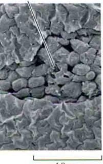  
10 μm

B atml/pdf 2 突变体  
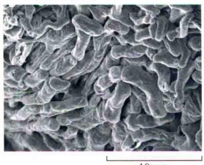  
10 μm

C 凝胶阻滞分析  
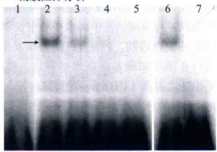  
图16.11 ATML1和PDF2是形成正常表皮所必需的。比较野生型（A）和双突变体atml1/pdf2（B）显示突变表皮与野生型（在A中剥去部分表皮）中的叶肉相似。C凝胶阻滞实验显示PDF2蛋白可以专一的结合到特定的序列上，这个序列存在于受PDF2蛋白调控的基因启动子中。与PDF1启动子的L1盒子有相同序列的标有21个核苷酸序列的探针L1与融合有PDF2的麦芽糖结合蛋白（MBP-PDF2）混合。结合有蛋白质的DNA探针，形成带有标签的复合物，它可以在凝胶中以一个条带的形式被看到（第2列，箭头）。如果L1仅与麦芽糖结合蛋白混合则没有复合物出现（第1列），如果MBP-PDF2与突变的L1探针混合，也没有混合物出现（第7列）。当逐渐增加没有带标签的L1探针（竞争者）的量（100\~300或1000倍的量；第3、4和5列）时，复合物标签逐渐消失（引自Abe et al., 2003）。

进一步的遗传分析发现了一些参与了更多内部组织形成的基因的特性，包括维管系统和皮层。拟南芥WOODENLEG（WOL）基因的缺失突变体，会引起产生木质部和韧皮部前体的一轮重要细胞分裂的缺失（图16.12）。这种缺失导致维管系统只有木质部而没有韧皮部。WOL[也称细胞分裂素受体1（CRE1）]基因编码细胞分裂素的受体之一，表明这种激素可以作为辐射模式建立的组分（Mähönen et al., 2000; Inoue et al., 2001）（见第21章）。但是，因为fass突变能促进细胞的额外分裂，并且通过构建wol fass的双突变体发现fass能阻遏wol的表型，因此wol突变体中韧皮部的缺失是由于在相应位置前体细胞层的缺失，而不是由特定韧皮部细胞的失活所引起的。

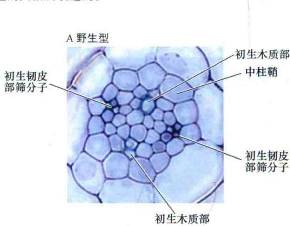

激素信号和转录因子共同在调控顶-基模式和辐射轴模式的建立过程中有重要的作用。接下来的部分我们用一个已经研究透彻的例子来说明特定转录因子在细胞层移动的特性如何有助于这种模式的建立。

## 16.2.9 转录因子在胞间的转运参与了皮层和内皮层细胞的分化

皮层和内皮层组织的发育，为相邻两个细胞层间基因表达活性通信是如何影响辐射模式的建立提供了典型的例子。拟南芥的两个基因，SCARECROW（SCR）和SHORTROOT（SHR）是形成正常皮层和内皮细胞所必需的（Di Laurenzio et al., 1996；Helariutta et al., 2000）。两者编码的蛋白序列相近，均为GEAS转录因子家族成员。GRAS名称来源于该家族首先被发现的几个成员，包括GIBBERELLIN-INSENSITIVE（GAI）、REPERESSOR OF GAI1-3（RGA）和SCR。

  
图16.12 拟南芥细胞分裂素受体（WOL）基因编码的细胞分裂素受体是正常韧皮部发育所必需的。野生型（A）和wol突变体（B）根部的比较表明wol突变体缺少韧皮部组成成分并且细胞层数明显减少（引自Mahonen et al., 2000）。

在SCR或SHR活性减少的突变体中，形成独立皮层和内皮层的细胞分裂过程无法正常进行。任一基因的突变都会阻碍细胞分裂分化成独立的细胞层（图16.13）。在scr突变体中，虽然只有单层细胞但其同时表现出内皮层和皮层二者的特征，这表明突变体仍能表达每层的特征，但是不能将它们分开形成不同的细胞层。fass突变后能使突变体恢复至较为正常的生长类型支持了这种解释，和恢复wol的能力相似，fass能补偿scr的分裂缺陷，从而使具有皮层和内皮特征的细胞层分开形成各自的细胞层。

相比之下，shr突变体不仅有和scr相类似的细胞分裂缺陷，而且还不能形成具有特异内皮层性状的细胞。在shr缺失突变体中，单一的未分裂层丧失了内皮层的特征，如缺乏凯氏带，并且激活了一些正常条件下在皮层中被抑制的基因。由于SHR的mRNA表达位置通常局限在更内部的原生维管组织中，因此这种

需要SHR基因活性来特化内皮特征的现象有些令人费解。

这种现象通过更详尽的研究得到了解释（Nakajima et al., 2001），尽管SHR的mRNA仅限于在维管中表达，但是翻译的产物却不是这样，SHR蛋白被转运到相邻外层细胞内，在那里它通过调控一些特定基因的转录来诱导内皮层特征的形成（图16.14）。SHR蛋白在皮层与内皮层的分化上的作用方式，为解释特定转录因子如何依赖它们在细胞层间的运动来发挥作用提供了清晰的例子。

## 16.2.10 许多发育过程需要大分子物质的胞间运动

相邻组织相互作用引发的特定的发育过程，这种现象称为诱导效应（induction），是许多多细胞生物体

B 突变体
韧皮部

Short-root (shr)  
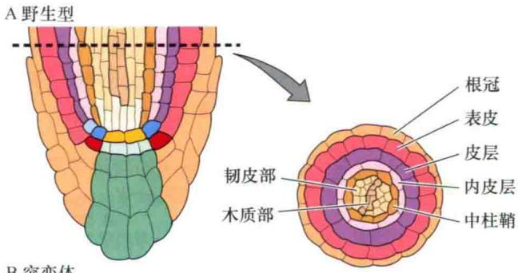

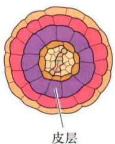  
野生型中SHR的表达A野生型的胚

木质部  
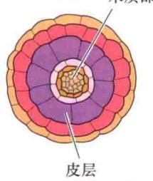  
Wooden-leg (wol)  
图16.13 正常和突变体根辐射模式的比较，表明特定基因在空间上的特定功能。A. 野生型的根部。不同颜色代表不同细胞类型。B. 三个缺失根辐射发育模式的拟南芥突变体scr、shr、wol（引自Nakajima and Benfey，2002）。

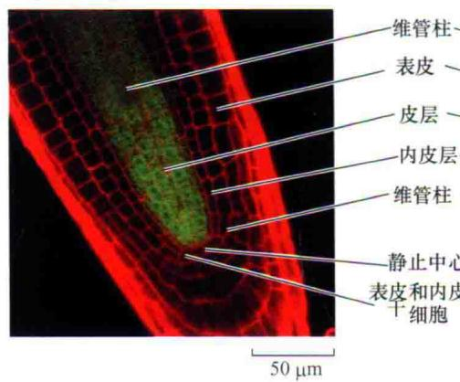

B 野生型的根  

SCR的表达C野生型的根  

Dshr突变体的根  
  
图16.14 拟南芥根发育过程中SHR和SCR基因控制组织发育模式形成过程。在这里，SHR和SCR蛋白通过与绿色荧光蛋白（GFP）融合后（呈绿黄色）利用激光共聚焦扫描显微镜成像技术观察基因表达的定位模式。（A和B）SHR蛋白的定位。A.在野生型拟南芥的胚胎发育过程中，SHR蛋白定位于原生维管组织中。B.在初生根继续生长的过程中，SHR蛋白仍定位于圆柱状的维管柱中，但同时也会移动到相邻近的内皮层中。（C和D）SCR蛋白的定位。C.在野生型的根中，SCR蛋白位于静止中心（QC）、内皮层以及表皮和内皮干细胞（CEI）中。而皮层、维管柱和表皮中没有SCR蛋白。D.在shr突变体的根中，SCR的表达水平显著降低，并且仅在同时具有皮层和内皮特征的突变体细胞层出现（引自Helariutta et al., 2000）。

采用的生存战略。诱导效应本质上依赖于各种类型的胞间通信。就像动物一样，在植物中很多类型的胞间通信是由一些激素分子介导完成的，这些激素分子的运动有时是被动的，有时则是通过激素所特有的运输系统来完成的（如PIN蛋白）。除了激素之外，植物还有运输更大分子的能力，如通过胞间连丝运输转录因子。这些膜内衬的管道，穿过细胞壁把相邻细胞的胞质连接在一起（见第1章），这些胞间连丝是动态的结构，能够根据分子的大小和组成，选择性的让它们通过（Haywood et al., 2002; Maule, 2008）。

大分子通过胞间连丝的胞间运动，受很多复杂因素控制。尽管超过1 kDa的大分子的运动通常会受到限制，但是通过调整胞间连丝可以让更大分子或特定的蛋白通过，如转录因子SHR。跟踪染料分子或者带有GFP标签的不同大小的蛋白运动的研究显示胞间连丝状态的变化与胚胎的发育过程相偶联。在胚胎发育早期，较大分子的运输相对比较容易，而在发育后期组织轮廓清晰后分子的运输就受到很大的限制（图16.15）（Kim et al., 2005）。这种区域化胞间通信模式，可以部分的解释为什么植物的很多发育过程在组织结构轮廓成熟的区域比单个细胞水平内存在有更多的调控方式（Rinne and van der Schoot, 1998）。

  
图16.15 发育过程中胞间蛋白移动能力的变化。图示小（B、H、N）、中（C、I、O）、大（D、J、P）型GFP报告蛋白在不同年龄（早心形期，A\~F；晚心形期，G\~L；中鱼雷胚期，M\~R）胚胎中的分布。所有构建的载体用一个仅能在胚胎较小区域内转录的STM启动子来控制，这可由原位杂交（A、G和M）与非扩散性GUS的融合（E、K、Q）及ER-GFP报告蛋白（F、L、R）的表达来显示。小蛋白质在各个阶段（B、H和N）都更易移动，而大蛋白质的移动性弱些，并在较老的胚胎中具有更多的限制（C和D，I和J，O和P）。箭头表明胚柄细胞（C）的细胞核和STM启动子在下胚轴中的异位表达（L和P\~R）。箭头处指根。缩写：c. 子叶；h. 下胚轴；r. 根（引自Kim et al., 2005）。

## 16.3 分生组织：无限生长型的基础

植物的发育过程具有很大的可塑性，这很大程度上归功于一个被称为分生组织（meristem）的特化组织的存在（Esau，1965；Gifford and Foster，1987）。广义上的分生组织的定义是保持繁殖能力的细胞群，它们的命运是不确定的。许多在植物营养生长中发挥作用的分生组织是根据它们在植物体的位置而命名的。

根顶端分生组织[root apical meristem（RAM）]和茎尖分生组织[shoot apical meristem（SAM）]分别处于根和茎的顶端。居间分生组织（intercalary meristem），正如它们的名字一样是指镶嵌在分化过的组织区域内的具有增殖能力的组织。而侧生分生组织（marginal meristem）处于发育器官的边缘部分，功能和居间分生组织类似。小型的表层细胞簇被称为拟分生组织（meristemoid），其可生成诸如表皮毛或者气孔等组织（参见Web Essay 16.2 植物分生组织的历史回顾）。在下节中我们将概述SAM和RAM的基本特征，并通过提出一个有用的模型来理解调控这些细胞的分裂和最后去向的机制。

## 16.3.1 RAM和SAM利用相似的无限生长策略使之保持无限生长模式

尽管在一棵植株上很难想象存在有比根和茎差异更大的两个部位，但是RAM和SAM的某些特征及它们在植物无限生长模式中起的作用却是相似的。它们空间结构特征都是一簇细胞，称作起始细胞（initials）。这些细胞分裂速度慢且分化方向不定。这些细胞的后代由于细胞的极性分裂模式的影响发生位移，并最终获得各种不同的分化命运，如成为叶和根的辐射性和纵向的组织或发育为侧生器官等。

从这个角度可以清楚地看出RAM和SAM都必须有一套机制来平衡不断补充到不同分化组织中的新细胞的数量。RAM和SAM的这种共性是否意味着它们采用了的相似的调控机制？这些机制是如何使根和叶维持各自的特征并使其生长能够适应环境变化的？根和叶截然不同的生长及器官发生模式是否需要RAM和SAM也存在有不同的特殊功能？为了回答这些问题，我们将接着讨论RAM和SAM的基本特征，以及一些通过遗传学方法找到参与RAM和SAM建立和维持的相关信号途径的例子。

## 16.4 根顶端分生组织

根的很多形态都会受到它所处的环境影响。根具有固定植物的作用，同时又可以在土壤中吸收水分和矿物营养，根具有复杂的生长和向性运动模式，使得其便于探索和开发充满障碍的环境。与茎不同，根产生侧生器官，使得它能更好地适应环境。根顶端分生组织（RAM）经过分裂产生细胞、进一步分化和伸长直至远离顶部的过程和茎尖的情况类似。但是，根毛或侧生器官次生生长是在远离根尖的位置进行的，只有在细胞伸长完成后，侧生器官才会形成。通过这种方式可以避免由于距根末梢太近而受到剪切伤害。根和枝条的另外一个不同点是RAM覆盖有根冠。

在以下部分，我们将详细介绍根器官组成，探讨不同区域根的细胞行为是如何引起其生长和功能的特化。然后，我们综合分析依赖于生长素和依赖于细胞分裂素基因表达模式的实验证据，揭示其如何共同调控根的生长。

## 16.4.1 根尖有四个发育区

根据不同的细胞行为将根分为不同的区域能够很好地描述根部发育的基本特性。尽管这些区域的边界划分不可能绝对准确，但将根划分为以下几个区域后，能够提供一个非常有用的空间框架，有利于我们对根发育的具体机制进行探讨（图16.16）。

  
图16.16 初生根的简图，表明根冠、分生区、伸长区和成熟区。

（1）根冠（root cap）位于根的末端。它是唯一一个位于比分生组织区域更为末端的位置的初始衍生物。它覆盖在顶端分生区上，保护根尖在穿越土壤时免受机械损伤，此外，根冠还可以感知重力，使根具有向重力性，并可分泌一些物质帮助根系穿越土壤和活化无机养分。

（2）分生区（meristematic zone）位于根冠下方，它包含一簇起有原分生组织作用的细胞，这些细胞以极性分裂模式进行分裂，产生的细胞进一步分裂和分化成根的各种成熟组织。分生区的细胞有小的液泡，具有非常强的伸展及分裂能力。

（3）伸长区（elongation zone），细胞快速和显著伸长的区域。尽管伸长区内的一些细胞在伸长过程中仍可继续分裂，但其分裂速度会随着与分生组织距离的逐渐增加而逐渐减慢，直至停止分裂。

（4）成熟区（maturation zone）是细胞获得分化特性的区域。细胞在分裂和伸长停止后进入成熟区，在这个区域侧生器官（如侧根和根毛）开始形成。虽然细胞分化可能在早些时候就已开始，但是细胞在进入这个区域后才达到成熟状态。

在拟南芥中这四个区域仅占据着根尖的前几毫米。尽管在许多其他物种中这些区域会更长些，但生长依旧仅局限在根的末端区域。

## 16.4.2 不同根组织的起源可以追溯到特异的起始细胞

由于根的各组织的发育过程是渐进和线性的，因此可以较为容易地从近顶端区域找到这些组织各自的特化的起始细胞。我们通过观察大多数植物根系的纵切图可以发现，根的长的纵列细胞在近顶端的区域汇合（图16.17A）。位于这个汇合区域中心的细胞比周围细胞的分裂速度都要慢，因此该区域被称为静止中心[quiescent center (QC)]。

能分化成各种不同组织的起始细胞和由邻近QC细胞组成的区域之间的物理联系很紧密，暗示了这些类型的细胞在功能上可能是相互依赖的。有人认为把静止中心和相邻分生组织细胞区分开来多少有些牵强，因为在很多高等植物的根中QC细胞有时在分裂后会取代相邻的起始细胞。基于同样的道理，其他物种的QC与分生组织细胞的关系也不同。在一些高等植物中，QC包含数十至数百个细胞，而且这个数量在植物的生命周期中会发生变化。但在低等维管植物，如水蕨（Azolla）中，位于中心的单个顶端细胞在整个营养生长期都保持着低的且持续稳定的有丝分裂活性，其同时执行了QC和起始细胞的功能（对于此问题的讨论参见Web Topic 16.4）。

与胚胎发生时的细胞分裂模式相似，在不同物种中，QC及其周围起始细胞的特性也各不相同。表明位置依赖机制对指定这些细胞类型起到很重要的作用。与研究胚胎发生过程相似，许多对根发育机制的了解也来自于对模式植物如拟南芥的研究，这是因为在拟南芥中单个细胞的行为可以被监视，拟南芥的根很小，比较透明，而且根细胞数目也较少，易于观察，很适合作为研究根发育过程的材料。

拟南芥的QC仅包含4\~7个细胞，因为拟南芥的QC细胞在胚后发育阶段极少发生分裂，因此很容易识别扰乱QC及其周围起始细胞活性的因素。在拟南芥中有四种不同的起始细胞和QC相邻，可以根据它们的位置和所产生的组织对其分别进行定义（图16.17B）：

（1）根冠柱起始细胞（columella initials）。定位在QC的正下方，这些起始细胞产生根冠的中心部分（根冠柱）。

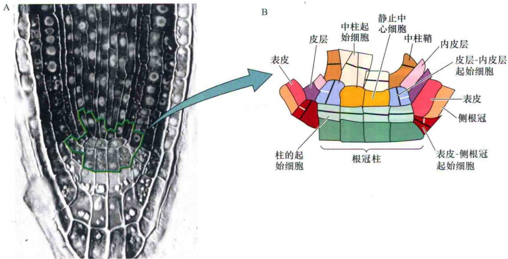  
图16.17 拟南芥根的所有组织是由根部顶端分生组织的一小部分起始细胞发育而成的。A. 跨根中心的纵切图。绿色区域是含干细胞的原分生组织，是所有根组织的起源。B. A图的原分生区的图解。在这个纵切面上仅可看到四个静止中心细胞中的两个。粗黑线条所标示的是干细胞发生细胞分裂时的分裂面。白线条表示发生在皮层-内皮层和表皮-侧根冠干细胞中的第二次细胞分裂（引自 Schiefelbein et al., 1997，由 J.Schiefelbein提供，美国植物生物学家协会授权再版）。

（2）表皮-侧根冠起始细胞（epidermal-lateral root cap initials）。与QC相邻，这些起始细胞首先垂周分裂，产生子细胞，子细胞经一次平周分裂成为两列细胞，细胞成熟后转变为侧生根冠和表皮。

（3）皮层-内皮层起始细胞（cortical-endodermal initials）。位于表皮-侧根冠起始细胞的内侧或附近，皮层-内皮层起始细胞先垂周分裂为子细胞，然后再平周分裂形成皮层和内皮层细胞层。

（4）中柱起始细胞（stele initials）。位于QC的正上方（近侧），产生维管系统，包括中柱鞘。

## 16.4.3 细胞切除实验可解释决定细胞身份的定向信号转导过程

为了检验和完善这样一个假说：QC和周围的起始细胞的行为受到位置依赖性信号机制的影响。一系列的实验被用来证实特定的细胞会促使其进入特定的发育过程。通过将正常拟南芥RAM细胞的分裂模式与利用显微聚焦激光束破坏（或切除）一个或更多的特定细胞的植株RAM细胞的分裂模式作比较（van Berg et al., 1995），就可以评估位置信息对细胞命运的影响。

当QC被切除掉时，相邻起始细胞不能正常分裂并且提早分化（图16.17B），表明QC可以产生一种能够维持相邻的起始细胞不发生分化，而且保证它们可以正常分裂的可移动信号。如果切除邻近起始细胞的分化细胞，则会引起起始细胞呈现异常的特性，产生异常的细胞类型。这些实验表明，特定起始细胞的特性依赖于分化程度较高的邻近组织所发出的信号。

## 16.4.4 生长素有助于根顶端分生组织的形成和维持

正像胚胎发育过程中生长素对顶端和基部极性的建立有很大作用一样，令人信服的例证表明其也参与了RAM的定位并调控了RAM的复杂行为。在正常的根中，QC是生长素浓度最高的区域。如果用化学方法改变生长素浓度最高区域的位置，QC的位置也会随之发生改变。相反，如果生长素浓度最高区域消失，植物QC也会缺失（Sabatini et al., 1999; Jiang et al., 2003）。

和胚胎中的情况相似，根中生长素的相对水平在很大程度上是由PIN蛋白的极性分布所决定的。通过观察根不同部位PIN蛋白的分布差异可以预测生长素在根中的流动方向和相对水平。通过建立这些模型发现，根中的生长素源于地上部分和较浅的表层细胞，经过幼苗的中心区域向下运输，最终汇集在QC和根冠柱组织（图16.18）。然后生长素从这些末端区域运送到表层，再向上运输至地上部分。这种流动模式被比拟为一个倒置的喷泉。

A PIN 蛋白的分布图  
  
皮层/表皮
内皮层/中柱鞘
中柱
静止中心
小柱

B 生长素流动的模式图  
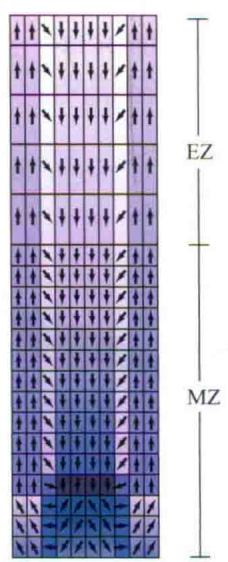

C DR5::GFP表达  
  
图16.18 PIN蛋白在根中的分布反映出生长素的流动模式。A. 不同根组织的PIN蛋白（红色区域）的非对称定位。B. PIN蛋白定位模式预测了生长素浓度较高的区域是QC的位置（颜色越深表示生长素浓度相对越高）。C. 通过检测DR5::GFP报告基因的活性来预测生长素浓度分布高低和上述预测是一致的。缩略词：EZ. 伸长区；MZ. 分生区；QC. 静止中心（引自Grieneisen et al., 2007）。

不论是以正常根，还是利用经过物理化学或基因方法扰乱生长素或PIN表达水平的根为材料，通过这种模式来预测生长素水平已经得到普遍的认可（Grieneisen et al., 2007）。总之，这些结果表明在根中生长素极性流动的稳定模式是维持RAM活性的重要因素。

## 16.4.5 根对生长素的响应依赖特异的转录因子

现在已经了解了生长素在根中的梯度分布情况，但还需要进一步解释浓度差异是如何引起下游反应的，包括局部区域细胞的分裂、伸长和分化（图16.19）。至少部分的下游反应与生长素响应因子有关（其受生长素调节的具体机制参见第19章）。当生长素超过临界浓度时，会降解IAA/AUX的阻遏蛋白，IAA/AUX的阻遏蛋白可以和像MONOPTEROS这样的ARF结合，抑制ARF的转录调节活性。与在胚胎发育时期根的形成一样，在植物营养生长阶段MP和其他ARF依旧通过生长素依赖的方式参与维持根的正常生长。

遗传学研究表明，另外一些种类作用于ARF下游的转录因子也参与调节根的生长。其中有两个属于AP2家族的转录因子PLETHORA1（PLT1）和PLETHORA2（PLT2）（Aida et al., 2004），这两个PLT基因在生长素浓度高的QC区域的表达很活跃。PLT基因的突变体则不能形成QC或维持正常的QC功能，表明这些基因正常的转录调节是形成这些部位所必需的。反之，人为增加根近侧区域的PLT表达量则会导致QC的异位（出现错误定位）（Galinha et al., 2007）。这些实验结果共同证明了这样一个模型，生长素作为位置信号诱导特异的转录调控程序，进而介导了形成和维持RAM所需的特有

的细胞行为。

WOX基因编码了第三类参与调控RAM的转录因子家族成员，该家族不仅在RAM中有重要作用，而且在整个植株中都起到很重要的作用。这些基因与WUSCHEL（WUS）基因具有序列同源性，WUS基因是形成SAM所必需的，它们都拥有一个同源的DNA结合基序[WOX的命名是由WUSCHEL和同源域（homeobox）而来]。与PLT基因一样，WOX基因表达也对生长素活性敏感，表现为在mp和bd1突变体（缺少生长素活性）中，WOX基因转录产物的分布会发生变化（Haecker et al., 2004）。在叶芽中，WUS在近顶端区域的表达对于维持未分化的起始细胞具有重要的作用（本章稍后会讨论）。而在根中，WOX5有类似的作用，其参与维持QC周围起始细胞的稳定性（Sarker et al., 2007）。

## 16.4.6 RAM中细胞分裂素的活性是根发育所必需的

尽管我们对于根的生长和发育的讨论集中在生长素方面，但是近期的研究表明细胞分裂素以与生长素相反的功能也参与调节根的生长发育。这两种激素截然相反的功能最早在生理实验中被发现，生长素在地上部合成，由上向下的运输到根部，相反，细胞分裂素在根中合成，向顶端运输到地上部。同样，在组织培养和活体内生长素都能促进根的发育，而细胞分裂素则抑制根的生长，促进叶的生长发育。

尽管已知的细胞分裂素和生长素信号转导通路中所包含的组分有着很大的区别，但可以利用类似的研究方法来有效地研究两种激素的信号通路。已知将DR5与报告基因融合后可检测生长素的活性（详见第19章），而细胞分裂素也可采用相似方法，通过将能被细胞分裂素激活的启动子序列与报告因子GUS和GFP融合来检测CK的活性（Müller and Sheen, 2008）。

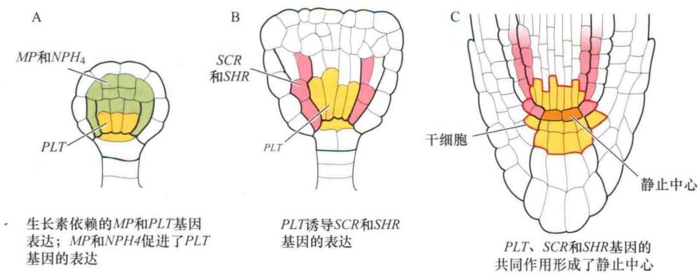  
图16.19 根中细胞类型特化的模型。A. 早期依赖于生长素的MP和NPH4基因的表达。MP和NPH4的表达促进了PLT在基部区域的表达。B. PLT的表达促进了SCR和SHR的表达。C. PLT、SCR和SHR基因的表达使位于中心的细胞成为静止中心，它们能影响周围细胞维持其分生细胞活性（引自Aida et al., 2004）。

这种通过报告基因的方法了解激素活性的实验结果表明，细胞分裂素的信号最早出现在根发育的球形胚时期的胚根原细胞中。胚根源细胞发生分裂后，基部细胞中的细胞分裂素消失，但仍存在于根尖细胞中，根尖细胞进一步分裂形成QC。同时，对连有DR5报告基因的研究表明生长素具有相反的表达模式，表明生长素和细胞分裂素具有相反的活性（图16.20）。

更多的分子和遗传学分析表明基部细胞的细胞分

A TCS::GFP

裂素活性的缺失是由于高的生长素活性直接导致的。ARR7和ARR15两基因抑制了细胞分裂素的作用。这两个基因的启动子中具有生长素的响应元件（AuxRE），它们和DR5报告基因一样，受到生长素的调控。如果人为去掉这些序列，ARR7和ARR15在基细胞中的表达则会降低，进而导致细胞分裂素活动异常。扰乱ARR7和ARR15的表达会导致植物出现异常表型，表明基部细胞中细胞分裂素信号的抑制对正常的发育十分重要。同时发现顶端细胞中存在细胞分裂素活性是必要的，因为细胞分裂素活性的丧失会导致根的结构发生很大变化。

B TCS::GFP  
C ARR7::GFP  
E DR5::GFP  
D ARR15::GFP  
  
图16.20 胚胎中生长素的信号和细胞分裂素的信号作用正好相反。A. TCS::GFP（细胞分裂素的报告基因）在球状体形成早期的胚根原细胞中表达。B. 球状体形成后期基部细胞的TCS::GFP表达下调。C. ARR7::GFP在基部细胞的表达量最高。D. ARR15::GFP的表达模式（ARR7 和ARR15能够抑制细胞分裂素的响应）。E. DR5::GFP（生长素的报告基因）在基部表达量最高。中间一列图是顶部图方框所示区域的放大图；底部一列图是相应于顶部一列的模式图注释（引自Müller and Sheen，2008）。缩写：hy.胚根原细胞；bc.基部细胞；lsc.镜型细胞；s.胚柄。

## 16.5 茎顶端分生组织

和根的顶端分生组织一样，茎的顶端分生组织需要有一系列维持未分化状态细胞，使之可以无限生长（图16.21）。但是这两种类型的分生组织也存在有显著差异，这种差异主要体现在它们的后代细胞如何参与新器官的形成方面。如侧根是在根尖相当靠后的位置出现，而叶片和相邻的侧枝则在非常靠近茎顶端起始细胞群的位置形成。此外，位于根尖的包裹并保护根顶端的起始细胞群是根冠，而在茎中相应位置的组织则是覆盖并包裹了茎尖幼嫩的叶原基。

对于描述在茎尖专一发生的一系列活动来讲，特殊的解剖学术语被证明非常有用。在本章中，茎顶端分生组织（shoot apical meristem）特指起始细胞及它们未分化的后代细胞，但不包括那些距顶端较近且已有特定发育命运的细胞。而茎尖（shoot apex, plural apices）则更广义的包括顶端分生组织和大多数刚形成的叶原基。

和我们前面所讲到的胚胎及根的例子一样，随着物种、发育阶段和生长环境等因素的不同，SAM的大小、形状和组成方式也各不相同（Steeves and Sussex, 1989）。在维管植物中，苏铁科植物SAM的个头最大，它的直径可以超过3 mm，而拟南芥的SAM则是另外一种极端，它的直径只有不到50 μm，并且只包含有几十个细胞。然而即使对于特定的植物，SAM的大小也会随着时间而变化，并且它的形状可以在平坦与突起之间转换。这种转换有时是由叶片连续的起始引起的，在这个过程中，位于侧翼的SAM中的细胞已经开始特异的分化。其他的转换原因则是由于生长过程中的季节差异引起的，如休眠及开花的起始。

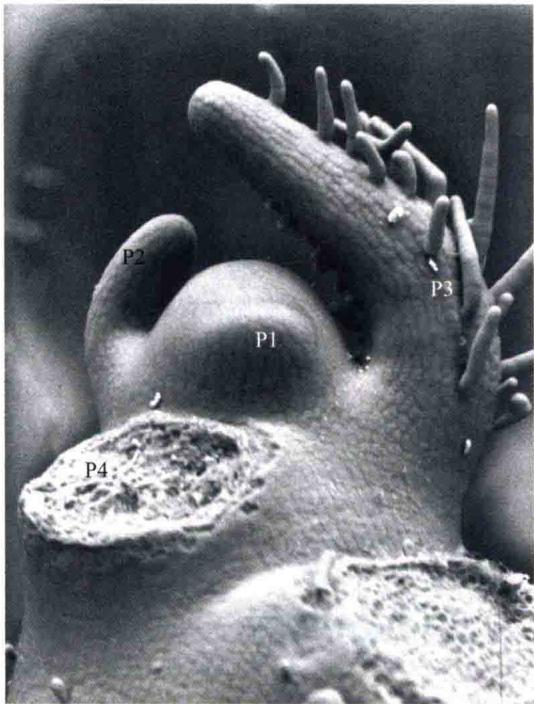  
图16.21 番茄的茎尖。这张SEM扫描电镜照片显示了茎尖的基本结构，包括位于中央的圆拱状端区域，其中含有未分化的起始细胞，以及一系列的叶原基（P1、P2、P3），这些叶原基一般位于茎尖的侧面。P4是为了能看到较幼嫩的叶原基而将较老叶片移除后其起始细胞的基部（引自Kuhlemeier and Reinhardt，2001。由D.Reinhardt惠赠）。

下面我们将首先探讨SAM的基本结构，分析与其功能相符的细胞活动在区域上的差别。接下来提供证据来证实，和RAM一样，SAM的维持同样受到激素和转录因子活性的调控。

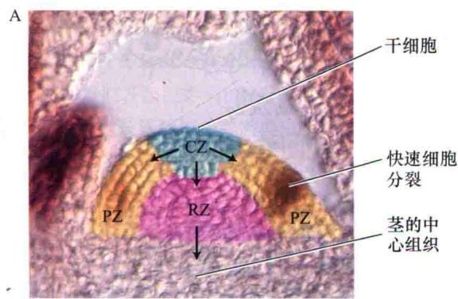

## 16.5.1 茎顶端分生组织有明显的分区和分层

探讨茎顶端分生组织的细胞组成能为详细描述SAM的生长发育提供有用的框架。茎尖的结构组成可以利用显微技术来进行很好的描述（Bowman and Eshed，2000）。茎尖的纵切面显示其SAM呈带状分区（zonation），带状分区最早用来描述裸子植物SAM组织中存在区域性细胞学差异（Gifford and Foster，1987），后来被扩展到其他种子植物中用来描述细胞分裂时存在的区域差异（图16.22）。

和根中形成QC的细胞类似，在茎顶端分生组织的中央区（CZ），也有一簇很少发生分裂的细胞。外周区域也被称为周缘区（peripheral zone），由胞质密度较高的细胞组成，并且这些细胞分裂活动比较活跃，可以形成后代细胞并最终分化成为侧生器官例如叶片等。处于中央位置且临近CZ的肋状区（rib zone）也含有分裂细胞，并可以形成茎的内部组织（图16.22A）。

这些区域差异除了在分裂频率上具有区别外，在细胞分裂的极性模式上也存在差异。在大多数裸子植物中，这些差异反映出了表皮细胞的分层排列方式，这些细胞层有时被统称为原套（tunica）（图16.22B）。原套是由相邻的一层或多层细胞叠加在一起形成的，其中包括了大多数的原表皮层，每一个原表皮层细胞都源于特定的茎顶端起始细胞，而且每一层的厚度是由占主导地位的细胞垂周分裂所决定（参见下文的讨论）。与此不同的是，原套所包裹的细胞也就是原体（corpus），虽然也是由特定的茎顶端起始细胞分化而来，但是它们可以进行各个方向的分裂。

  
图16.22 拟南芥茎尖分生组织可以通过细胞学分区或者细胞层来进行分析。A. 茎尖分生组织拥有多个具有不同特征和功能的细胞学分区。中心区（CZ）包含了干细胞，分裂缓慢，但却是形成植物体组织的来源。周缘区（PZ）的细胞分裂速度快，环绕着中心区并能够产生叶原基。肋状区（RZ）位于中心区下面，产生茎的中心组织。B. 茎顶端分生组织具有能够形成特定茎尖组织的细胞层。L1和L2位于外层，多数细胞分裂是垂周方向，而L3层的细胞分裂的平面则更为随机。L1产生茎的表皮，L2和L3层产生内部组织（引自Bowman and Eshed，2000）。

## 16.5.2 茎组织起源于不同的顶端起始细胞

研究表明，和根组织类似，茎组织也是起源于少数的顶端起始细胞（Poethig，1987）。在经典研究中，在茎的顶端施加秋水仙素，可以诱导多倍体细胞形成。这些细胞尽管生长相对正常，但是从其日益庞大的核体积及细胞大小上很容易被辨认出来。通过对秋水仙素处理并生长一段时间的植物的茎尖切片进行观察，可以发现在特定的细胞层出现了大量的多倍体细胞并能延伸到顶端区域。这种现象可以通过每个多倍体细胞层起源于顶端起始细胞簇中的一个细胞的设想来解释。

通过对大量被标记的区域如表皮层和更深层的组织进行研究，证实了在SAM中存在有一系列具有不同功能的起始细胞。茎尖最顶端的起始细胞可以独立繁殖并形成表皮层（L1），相邻的位于内侧的起始细胞形成亚表皮层L2，更为内层的则形成L3层（图16.23）。许多情况下标记细胞仅包围茎周围的某一部分，暗示每层均来源于起始细胞中相对应的一小部分。

在对这些细胞系进行研究后发现，这些起始细胞的特征是由位置依赖的机制来决定的。出现在茎顶端区域的标记细胞有时会出现随着时间的变化在宽度及厚度方面会有急剧变化。这些变化可能是由于随机分裂使得标记的起始细胞被其他细胞取代或者被相邻的起始细胞所取代。这种动力学行为暗示了顶端起始细胞的特征，包括它们的分裂模式，它更多地反映了其在茎尖顶端区域上的相应位置，而不是严格的程序性形成。

与此类似，由起始细胞进化而来的后代细胞同样受到位置依赖特异性的调控。如出现一次比较罕见的平周分裂导致起源于L2的细胞占据表皮层位置的情况，那么这些细胞就会改为采取表皮细胞的特征以适应其新的位置。

## 16.5.3 PIN蛋白的定位影响了SAM的形成

和RAM一样，SAM的形成同样是与胞间生长素运输的复杂多变相关的。在胚胎发育的早期阶段，由于PIN蛋白的极性分布，特别是PIN1，导致生长素在顶端区域聚集，但是在过渡阶段由于PIN蛋白的位置发生了复杂的变化，进而导致生长素发生完全且定向的重新分布。尽管目前对于决定这些变化的因子并不十分清楚，但是已知激酶PINOID和磷酸酶PP2可以改变PIN磷酸化状态，进而影响PIN蛋白的定位（Michniewicz et al., 2007）（见第19章）。

另外，一些编码不同的转录因子家族的基因包括PINOID、DORNROSCHEN和Class III HD-ZIP，破坏它们的基因功能后，其突变体表型分析表明这些转录因子可以间接的影响PIN蛋白的定位（Izhaki and Bowman, 2007；Chandler et al., 2007）。通过解析这些突变体的胚胎发育模式，发现在细胞发育和分裂之前，PIN蛋白均存在不正常分布。

在处于中央位置的顶端区域中，生长素的含量相对较低，这是胚发育过程中生长素运输复杂性的一个方面的体现（图16.24）。离开中央区的生长素与顺着胚的表层向上运输的生长素交汇于正在发育子叶的顶部，从而使此处生长素的浓度最高。这部分生长素继续向下运输进而在子叶汇集，再次形成一处生长素浓度较高的区

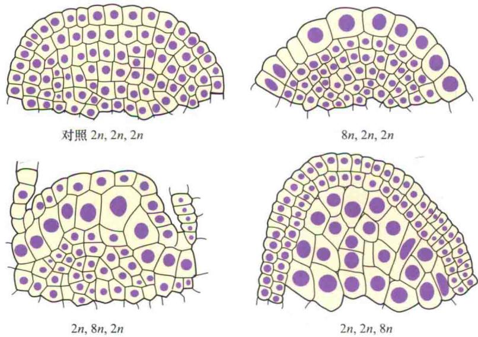  
图16.23 秋水仙素处理后的茎尖，其中一些细胞层包含有体积增大和多倍体细胞核，证明茎尖分生组织中存在特异繁殖系形成的细胞层（引自Steeves and Sussex，1989）。