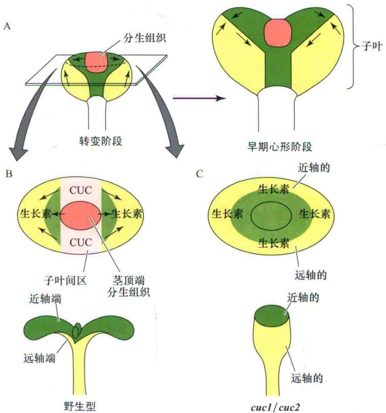  
图16.24 依赖于生长素的茎顶端分生组织模式图。A. 转变期和心形期早期的拟南芥胚胎的生长素运输方向（箭头）。B 和 C. 野生型（B）或 CUP-SHAPED COTYLEDON 双突变体（cuc1/cuc2）（C）像 A 图中所示的顶端区域横切面，表明胚胎中的这部分区域将要发展为顶端分生组织、子叶间区、子叶的近轴和远轴区、基轴区。在野生型的胚中，SAM 和子叶间区由于生长素水平较低，因此 CUC 的表达量比较高；而在子叶原基的旁侧区域则正好相反。在 cuc1cuc2 双突变体中，子叶间不能正常分离，因而阻碍了茎尖分生组织的形成（引自 Jenik and Barton，2005）。

域，即前面所述的静止中心。ARF的一种如MP，可以促进维管发育，进而可以最大限度地加强这种直接运输模式。

MP的缺失突变体及和它关系较近的ARF NON-PHOTOTROPIC HYPOCLTYL 4（NPH4）的突变体，不但在一些基础结构例如根上都存在缺陷，而且它们也不能正常的形成子叶（Jenik and Barton，2005）。这两种突变体的表型类似，都能影响PIN蛋白介导的生长素运输，这些结果与生长素反应依赖需要MP、NPH4行使功能的模型一致。

## 16.5.4 胚胎发育阶段SAM的形成需要转录因子的协同表达

尽管已经分离获得在SAM形成及维持过程中起作用的许多类型的重要基因，但是通过筛选不能形成SAM或者不稳定SAM突变体，凸显出三种另外类型的转录因子重要性。其中，编码同源异构型的转录因子WUS（Mayer et al., 1998），在胚胎发育阶段的16细胞期，在接近顶端的区域表达。之后在过渡阶段，编码NAC家族转录因子的CUP-SHAPED COTYLEDON（CUC）1、2、3基因，在正在发育的子叶顶端之间的带状区域表达（Aida et al., 1997）。之前基因相继的活化最终导致SHOOT MERISTEMLESS（STM）编码的另一类转录因子在晚期心形胚中表达，表达位置在CUC表达位置内部的一个圆形区域（Long et al., 1996）。因此，WUS和STM可以帮助细胞维持正常繁殖的状态，并进而确保茎组织生长和分化与形成新的未分化细胞之间处于平衡状态（Lenhard et al., 2002）。

CUC和随后的STM表达，表明在中央区有活性的生长素处于比较低的水平（图16.25和图16.24）。例如，在MP和NPH4的突变体中，由于子叶侧翼位置的生长素信号被阻断，导致CUC在这些区域不能正常表达。对正常发育的胚用生长素抑制剂（图16.6）处理后，同样会显示出与cuc突变体表型相类似的缺陷生长表型（杯状子叶），这就更加证实了生长素在胚胎发育过程中的作用。CUC类似基因在胚中央区的表达，为进一步的程序性发育过程提供了一个有利环境，包括STM基因的位置特异性表达，起初STM在CUC优势表达的条形区域中表达，但随后STM集中在中心的环状区域内表达。此外，在cuc突变体的胚中，STM基因不能表达，这种情况同样是由于STM的表达模式依赖于CUC基因的表达活性所引起的。

  
图16.25 顶端区域的形成涉及相应基因的顺序表达。上排图表明内部的WUS最先表达，进而诱导临近的外部细胞中CLV3的表达。下排图表示在虚线所示平面的横切，并着重强调了子叶和茎顶端不同区域基因的表达模式（引自Laux et al., 2004）。

生长素对WUS早期建立过程的调控作用仍不是很清楚，但是通过对生长素信号被干扰的胚进行研究后发现，有一些WOX相关基因的表达水平发生了改变，表明这些基因的表达模式同样是受生长素调控的（Haecker et al., 2004）。

## 16.5.5 负反馈调控限制了顶端分生组织的大小

在起始的后代细胞开始转变成茎的不同组织和器官这一特定过程中，我们希望能够发现一些新的未分化细胞的产生和由它们分化形成不同类型的组织和器官之间平衡的未知机制。通过对CLAVATA（CLV）1、2、3基因进行分析，至少部分揭示了这种机制，并且正反馈和负反馈调控结合参与了该过程。

上述三种CLV基因的功能研究是首先通过研究它们相对应的拟南芥突变体而实现的，突变体中SAM总体积变大，导致所形成的侧生器官尤其是花器官的数量明显增加，因此很容易被辨别出来（Sharma et al., 2003）。这三个基因的功能缺失性突变体的表型类似，暗示这些蛋白在限制分生组织大小方面的功能存在相互依赖，通过生物化学及分子生物学的分析进一步证实了上述推测。分子克隆结果显示这三种基因分别编码了一个跨膜受体激酶信号复合物的不同组分（图16.26；第

14章有该类受体信号转导途径的相关介绍）。

CLV1编码一个富含亮氨酸重复的激酶（LRR 激酶），包含一个胞外的配体结合区域、一个跨膜区域、一个胞内的激酶区域。已知在植物中有上百种编码此类蛋白的基因，而这种基因的多样性使得细胞可以对不同的胞外信号作出胞内反应。CLV2编码一个类似的蛋白质，但是缺少相应的激酶区。这两个蛋白质的富含亮氨酸区域可以在CLV1和CLV2之间相互作用形成异源二聚体，而这对CLV1酶的活性是必需的（图16.26）。

此外，CLV1/CLV2复合体的激酶活性需要有CLV3基因编码的一个小的分泌蛋白的存在，其可能作为CLV1/CLV2复合物的配体进而行使功能（Rojo et al., 2002）。生物化学分析已经证实，一旦合成开始，水溶性的CLV3蛋白就被分泌到质外体中。由于它的蛋白分子质量比较小（11 kDa）并且具有亲水性，因此CLV3蛋白可以很容易的从质外体中自由扩散，并激活结合在附近细胞表面的受体，进而抑制可能导致分生组织异常增大的一系列进程。

那么有活性的CLV复合体是如何抑制分生组织生长的呢？根据目前大家公认的模型，CLV的活性通过一系列信号级联反应，最终抑制WUS基因的表达，而WUS则是SAM中细胞分裂的关键基因（图16.27）（Schoof et al., 2000）。和这个模型一致的是，在clv突变体中，WUS的表达量增强，进而导致SAM的体积增大。相反如果超表达CLV3则会造成WUS的基因转录完全被抑制，进而导致植物出现wus突变体的表型即分生组织缺失。因此，即使到目前为止，这个信号级联途径的中间成分并不清楚，但是已有证据证实了CLV可以抑制

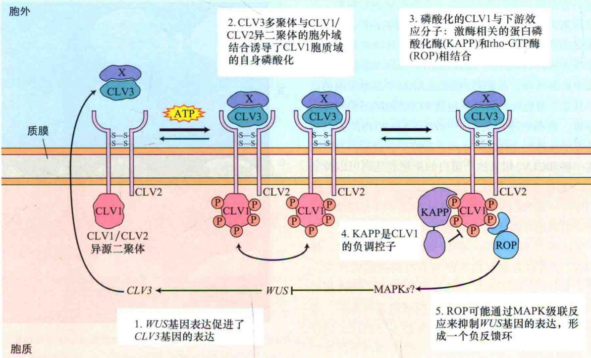

图16.26 CLAVATA1/CLAVATA2（CLV1/CLV2）受体激酶信号转导级联模型，并与WUS基因形成负反馈循环调节（见第14章的网站资料上关于受体激酶信号途径的更多信息）（引自Clark，2001）。  
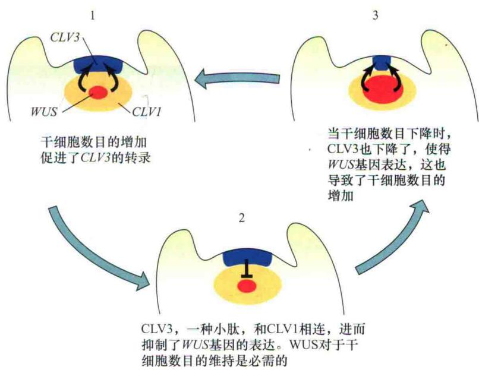  
图16.27 茎顶端分生组织维持起始细胞活性反馈调节环模型

WUS的转录。

前面的研究结果表明了控制分生组织大小的机制，但是这里又出现了一个新的问题：CLV本身限制分生组织的活性是否也受到调节呢？分子生物学研究发现，WUS可以促进CLV3的转录活性，因此WUS的表达不但可以激活顶端起始细胞的活性、促进分生组织生长，而且可以诱导CLV的活性增加，进而通过反馈调节机制限制WUS的转录活性。这个反馈调节机制告诉我们一个简单但又非常重要的事实：未分化细胞的产生与形成特定组织和器官的细胞之间存在一个动态平衡。

## 16.5.6 RAM和SAM以类似的机制维持起始细胞的活性

在对SAM和RAM中起始细胞分析比较后，科学家提出一个问题：它们是否存在一个类似的调控机制。目前已经有几个证据证实了这种可能性的存在。首先，如我们前面所讨论的，SAM和RAM中起始细胞的活性均依赖于WOX转录因子家族的活性：WUS促进SAM中起始细胞的活性，而WOX5能促进RAM中起始细胞的活性。其次，最近的实验结果包括WOX5和WUS的特异表达分析，表明在适当的组织中WOX5和WUS的蛋白功能是可以互换的（Sarker et al., 2007）。最后，有研究证实一些和CLV3相关的小蛋白如果超表达则可以抑制RAM中起始细胞的活性（Fiers et al., 2005）。这些多肽的作用可能和CLV3类似，通过和CLV1/CLV2结合抑制WUS的表达进而抑制SAM的生长。

WUS除了可以增强一些转录因子基因的表达，例如CLV3作为自我限制的反馈调节机制的组成部分，同时，WUS还可以调节相关基因的表达来维持起始细胞处于未分化状态或者促进这些细胞进行分裂。通过将WUS超表达后，利用基因芯片技术寻找转录活性发生改变的基因，就可以鉴定这些受WUS调节的基因（Leibfried et al., 2005）。研究发现，一些可以抑制细胞分裂素应答反应的A型ARR细胞分裂素应答调控因子的转录水平在4 h内发生了急剧降低，暗示WUS可以直接抑制这些基因的转录活性。即使这些蛋白的合成被放线菌酮抑制后，WUS的抑制效应依然存在，说明WUS是直接抑制ARR基因的表达，而不是通过中间调控因子来实现的。利用WUS的抗体可以检测到WUS蛋白和ARR7启动子区形成的复合体存在，说明WUS和ARR基因的启动子区可以直接地相互作用。遗传互补实验证实，人为超表达ARR7基因后可以导致类似wus突变体的表型出现，提供了更多的证据证实了细胞分裂素同样在SAM的维持过程中起作用（图16.28）。

通过分析STM发现细胞分裂素和SAM之间还有更多的联系。植物在部分缺失STM活性时会导致SAM不能很好地维持，但是通过外源添加细胞分裂素可以使SAM恢复稳定状态，表明STM也参与细胞分裂素依赖的信号途径。利用分子生物学实验已经证实了这个假说的正确性，异戊烯基转移酶在细胞分裂素的合成过程中起重要作用，而STM可以促进编码异戊烯基转移酶的基因表达（Jasinski et al., 2005; Yanai et al., 2005）。

总之，多个证据证实在SAM和RAM中细胞分裂素依赖的信号传导途径在维持SAM和RAM二者中未决定起始细胞活性中起重要作用。像中WUS和WOX5这类基因在调控SAM和RAM过程中所显现的明显可以相互变换角色特征，说明根和茎是由一个共同的未知结构进化而来。

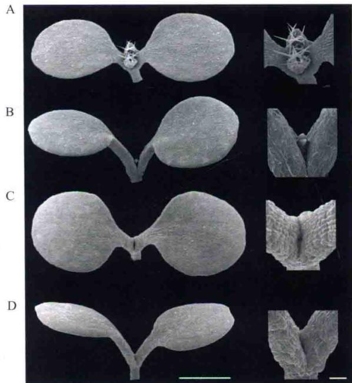  
图16.28 在拟南芥中超表达A型ARR细胞分裂素反应调控因子ARR7可以导致类似wus突变体的表型。A.弱表达ARR7植株表型和野生型类似；B.较高表达ARR7的植株出现了野生型和wus突变体的过渡表型；C.强表达ARR7的植株表型和wus突变体类似；D.wus突变体表型。幼苗刻度为 $1\mathrm{mm}$ ，分生组织为 $100~{\mu\mathrm{m}}$ （引自Leibfried et al., 2005）。

## 16.6 营养器官发生

尽管胚胎发生在植物基本极性和生长轴的建立过程中起重要作用，但植物的其他方面则随着营养器官的发育过程而改变。对于绝大多数植物来说，茎形态建成主要受依赖于确定的侧生器官例如叶片等的产生，不定侧枝的形成及向外生长的共同调节。尽管植物的根系通常不容易见到，但由于不定侧根的受控生长和自然生长，变得和地上部分一样的复杂。下面我们将讨论支撑这些生长模式的分子机制。和胚胎发生类似，营养器官的形成同样也主要依赖于激素活性的区域性差异，它能够导致基因表达在转录水平上发生复杂变化并最终引发营养器官特定形式的发育进程。

## 16.6.1 生长素聚集的区域可以促进叶原基的形成

植物学领域存在的一个长期问题是茎上叶片的排列方式或者叶序（phyllotaxy）是如何形成的，现在已经得到了解决。植物有三种基本叶序排列方式：互生、交替对生（对生）和螺旋状叶序，并且它们都与叶原基在茎尖分生组织出现的类型直接相关（图16.29）。这些生长模式依赖于一些因素的作用，包括不同种中决定叶序特性的固有因素。导致分生组织大小或形状发生变化的突变（如abphyll和clv）或者环境因子也能影响叶序类型，这说明位置特异性机制在其中起重要作用。通过一些经典实验例如在茎尖用手术刀切口后，附近的叶序排列就会处于混乱状态也说明位置依赖的重要性（Steeves and Sussex，1989）。

A 轮生

B 对生

C 螺旋生

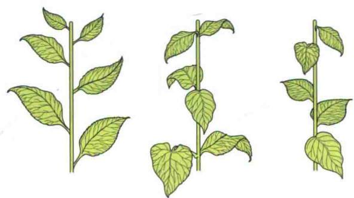  
图16.29 叶沿枝轴方向的三种排列方式（叶序类型）。花序和花也可使用相同的术语进行描述

拟南芥和番茄茎尖实验说明，生长素能影响叶片的起始位置。例如，通过直接向茎尖分生组织施加少量生长素能诱导叶在茎尖不正常的位置形成，这说明生长素是决定叶片起始位置的关键因子（图16.30）。通过施加生长素运输抑制剂也能改变叶片的生长位置模式进一步证明了上面所述的观点。

图16.30 叶片形成的位点和生长素的极性运输有关。图中箭头所示生长素运输模式，这个模式是由PIN蛋白的不对称分布而推断的。P0、P1、P2和P3为叶原基的年龄，P0是叶开始明显发育的阶段，而P1、P2和P3代表不断变老的叶。叶原基起始于生长素富集的区域。生长素的向顶运动在中心（CZ）和周边区域（PZ）的边界处被阻断，使得这个位置的生长素浓度升高，进而启动叶发育（P0）。新形成的叶原基（P1）作为一个生长素的库，阻止其正上方新叶的形成。远离PZ的成熟老叶被取代，使得向顶的生长素运输恢复，从而使得另一个叶起始发生（引自Friml et al., 2003）。

目前已经有一些回补实验证实叶原基的位置和生长素聚集的位置相关。尽管在如此小的区域内很难直接检测生长素的水平，但是利用DR5报告基因系统能够确定生长素的最大浓度所在的位置，DR5报告基因的活性与叶原基位置紧密相关。这些高浓度位置的形成可以通过细胞中PIN蛋白的不对称分布来解释，PIN蛋白的不对称分布介导了来自于茎基部的生长素沿表面向下运输和从茎尖侧面运输的生长素在上述高浓度位置的汇合（图16.30）（Reinhardt et al., 2003）。

## 16.6.2 基因表达空间调控决定了叶平面的形式

SAM的侧面开始出现一系列细胞就代表着叶式开始形成的早期步骤。和维管组织的形成类似，对于大多数叶片来说都会形成特有的平面形式，这样能有利于它们最有效地接受光照及促进气体交换，并能够高效地调节蒸腾模式。叶平面结构是如何建立的是一个有趣的问题，通过一系列的实验，科学家逐渐有了答案。

最明显的问题是，叶的平面结构和组织结构有何关系？与茎相似，叶也能用基-顶轴描述，也就是从叶基部指向顶部。但是和茎不同的是，茎的纵切面上只有一个放射状的轴，而叶上有两个：第一个侧轴，指跨越叶片宽度从边缘到另一个边缘；第二个轴称为近-远轴（和动物的背腹轴形成对比），从叶的上表面到下表面。

发育生物学研究揭示了伴随叶平面形成的复杂的细胞分裂模式。最先可以观察到的叶起始标志是SAM亚表皮层细胞的平周分裂，形成了一个决定将来叶片基-顶轴的凸起。接着在整个叶原基上都可以发现细胞分裂，但是随着叶的成熟，细胞分裂逐渐局限于一个更靠近基部的区域。尽管在叶发育过程中可以预测细胞分裂的大致分布，但是在最终成为叶的叶原基中个体细胞的作用存在明显的差异。细胞起源关系能明显区分的植物叶片中可以清晰地看到这种差异的存在（图16.31）。但是这些细胞之间的形状及大小上的差别很难用固定的细胞分裂模式来解释。相反，叶发育的过程必需是由位置差异所决定的，包括大小和形状，稳定的细胞分裂和扩张最终形成特定的方式。

尽管我们已经知道生长素在特定位置的聚集开启了叶子的形成，但是随后的极性生长是如何调控的依然存在许多问题。通过分析叶发育特定方面异常的相关突变体已经给了我们一些启示。其中的一个例子，金鱼草突变体phantastica（phan），起初的叶片发育完全正常，但是在随后的过程中叶片的侧轴无法正常建立，导致出现圆柱形的叶片出现。这种不正常的侧轴生长方式也相应地存在异常的近远轴，并且这些改变的叶片只显示出近端轴的特性（Waites et al., 1998）（图16.32）。

  
图16.31 英国常春藤（Hedear helix）的平周嵌合体叶肉组织源于一种以上的无性系细胞。花斑色叶为不同组织的无性系起源提供了线索。分生组织的一些起始细胞中影响叶绿体发育的重要基因发生了突变，从这些突变的干细胞衍生而来的细胞缺少叶绿体，呈白色。而其他干细胞发育而来的细胞有正常的叶绿体，呈绿色（S. Poethig惠赠）。

通过对果蝇中控制翅膀生长机制的研究，人们提出一个假设：正常的叶片（叶面）的侧向生长是被近端和远端组织类型协同诱导的。根据这个模型，PHAN的主要功能是促进具有近端轴组织的形成。而分子生物学研究发现，PHAN和拟南芥的ASYMMETRIC LEAVES I（AS1）基因类似，编码一个MYB家族转录因子。至少它的部分功能是可以下调KNOX家族基因的表达，而KNOX已经证实在SAM的形成过程中具有重要作用。

叶原基中KNOX表达量的下调对于正常叶子的形成是必需的。一旦下调被阻断就会导致叶子的正常极性生长受到障碍，例如，phan和as1突变体中会导致不正常叶子的形成，同样，在阻止KNOX表达量下调的突变体叶子中也有类似表型的存在。

与能特化近轴面细胞类型的PHAN和AS1基因相反，YABBY基因家族对于远轴面特性细胞的特化非常重要（Bowman and Eshed，2000）。YABBY基因家族成员编码很可能起转录因子作用的锌指蛋白。该基因家族第一个被鉴定出来的成员CRABS CLAW（CRC），是通过它的拟南芥功能缺失突变体的表型鉴定出来的，该突变体的心皮组成发生了混乱（图16.33）。

综合对多个拟南芥YABBY基因家族成员突变体的研究可以得出更多关于该家族基因的功能特征。这些多突变体均表现出远轴特征被近轴代替，引起花和营养器官表现出似叶缺陷，表明YABBY家族的成员在功能上存在冗余。过表达YABBY基因会导致突变体植物的远轴组织的异常形成，进一步说明远轴端促进YABBY基因的活性。

  
近轴表皮
栅栏叶肉组织
海绵叶肉组织
——木质部——
——韧皮部——
——薄壁组织
远轴表皮

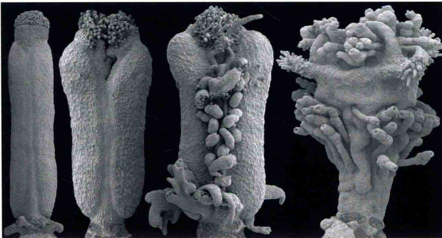  
野生型  
crc-1  
crc-1 kan1-2  
kan1-2 kan2-1

远轴细胞特化所需要的第二类基因以KANADI基因家族为代表（Eshed et al., 2004）。与YABBY家族相类似，KANADI基因间也存在功能冗余。当观察这些基因的多重缺失突变体时，发现远轴特征明显消失（图16.33）。过量表达KANADI时也可以观察到远轴组织异常形成的表型。

图16.33 正常近远轴极性的建立需要YABBY和KANADI基因。野生型和这两个基因家族成员的单、双突变体的果荚比较解释了正常组织的极性建立是如何依赖于这些基因活性。其极性建成需要这些基因的参与。突变体crabs claw（crc）为YABBY基因缺陷型突变体。在突变体中，远轴面组织（种皮或者荚果）被胎座组织不同程度的替代，包括胚珠通常应在形成荚果的心皮内表皮找到（引自Bowman et al., 2002）。

第三类参与近远轴形成的转录因子基因编码Class III HD-Zip蛋白（参见网络章节16.5）。

## 16.6.3 根和茎起始的不同机制

我们已经知道，侧根从离根尖分生组织一定距离的地方才能开始发育（Malamy and Benfey，1997）。只有当来自RAM的细胞停止伸长时，侧根起始组织才开始出现。根起始的第一个组织学标记是中柱鞘中一小簇细胞的平周分裂（见第1章），导致了更多的分裂及在与主根轴垂直平面上的生长，至新根尖突破表皮和主根皮层而长出。同时，一个新的RAM在侧根根尖形成，使自己保持持续性生长（图16.34）。侧根的形成和生长的类型受多种内源因子影响，如生长素浓度及土壤可用性营养等环境因子的影响。

  
图16.34 拟南芥侧根形成的模型。表明原基发育的6个主要阶段。不同组织用不同的颜色标示。到了阶段6，主根所有的组织都能在典型的侧根辐射模型中找到。

茎侧生器官起始的方式则完全不同。茎的侧生器官通过整合几层不同来源的细胞系而生成，而不是只来自于内层的一层细胞。在大多数物种里，侧枝形成的主要方式是通过腋生分生组织而实现。这些分生组织在叶原基的叶腋处发育，这样分枝形成的类型直接与调控叶序的SAM活性相关。和根一样，侧枝的生长受激素及环境因子（如光）的调控。顶端优势的现象，也就是顶芽抑制腋芽的生长，主要是由顶芽的生长素和一个第二信使类胡萝卜素裂解物的独角金内酯调控，我们将在第19章深入讨论激素控制的侧枝形成。

## 16.7 衰老和细胞程序性死亡

每个秋季，居住在温度适宜的地区的人们都可以欣赏到落叶的五颜六色。甚至从航天飞行器上也可以欣赏到壮观的森林颜色的变化。日照长短的变化和气候的变冷，引发了叶衰老，进而使得叶子改变了颜色。衰老（senescence）和坏死（necrosis）不同，尽管它们都能导致死亡。坏死是由于机械性损伤、毒害或者其他外伤引起的死亡。但是，衰老却是一种能量依赖的发育过程，由环境因子和植物自身的遗传程序所控制。

在本章的最后一个小节里，我们讨论不同类型衰老的细节，而且我们将提供更多的证据来证实衰老是程序性和适应性的发育模式。我们将从分子和遗传水平讨论衰老的例子。

## 16.7.1 叶衰老是一种适应性和严格调控的过程

叶衰老是细胞内容物的程序性降解进而导致营养元素再运输的过程。在衰老过程中，水解酶分解许多细胞蛋白质分子、碳水化合物和核酸。糖、核苷酸和氨基酸等营养成分可通过韧皮部转运回植物体，并重新用于合成过程。许多矿物质也被运出衰老的器官并重新运回植物体的其他部位。既然衰老使得营养元素被转运回植物正在生长的部位，那么这可以被认为是植物在干旱或者温度胁迫等不同环境条件下的一种生存策略。

不仅是对于胁迫的一种应答，衰老也反映了正常的发育过程。当新的叶片从茎尖分生组织开始形成，老叶就逐渐被遮蔽并丧失了有效进行光合作用的能力。叶子的衰老通常和脱落（abscission）相关，这个过程是叶柄中的特定细胞分化而形成一个脱离层，使得衰老的器官从植物体脱落。在第22章我们将讨论乙烯对于脱落的控制。总之，程序性衰老（无论是胁迫或者激素引起）代表着有用资源在新叶的形成过程中的再利用。

营养元素的再运输在衰老的早期过程是可逆的，而在后期则是不可逆的。尽管衰老器官的营养元素可以在植物的其他部位被重新利用，但是衰老意味着潜在能量的流逝。因此，我们可以推测衰老的起始是受环境因素和生长发育因素复杂调控的。本节我们将揭示衰老在植物生长发育过程中的重要作用。我们将会看到许多种类型的衰老，并且它们各自都有自己所独特的遗传程序。在第21章和第22章，将描述细胞分裂素和乙烯如何作为信号分子来调控植物的衰老。

## 16.7.2 衰老的不同类型

不同的器官均能出现衰老症状，并能对多种不同的信号作出响应。许多一年生的植物，包括小麦、玉米和大豆等主要的农作物，在结实后都会迅速变黄并死亡，即使在最优的生长环境中也是如此。一次繁殖后整株植物的衰老称为一次结实性衰老（monocarpic senescence）（图16.35）。

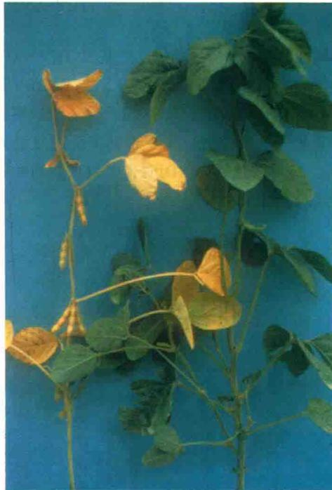  
图16.35 大豆（Glycine max）的单次结实性衰老。左侧的整株植物在开花和结果（荚）后走向了衰老。右侧的植物由于花的持续摘除，而保持绿色和营养生长（L. Nooden惠赠）。

其他的衰老类型如下：

（1）草本多年生植物地上枝的衰老。

(2) 季节性叶片衰老（落叶植物）。

（3）程序性叶片衰老（当达到一定叶龄后死亡）。

（4）肉质果实的衰老，干果的衰老。

(5) 储存性子叶和花器官的衰老。

（6）特定细胞类型的衰老（如毛状体、管胞和导管分子）。

不同类型衰老的触发原因是不同的。可能有内源因素，如引发一次结实性衰老的繁殖过程，也有可能有外部因素如落叶植物在秋天叶片衰老的原因是日照长短和温度。但不论是哪种起始刺激因子，不同类型的衰老之间可能有着共同的内在程序，使某种可受调控的衰老基因起始了一个级联的次级基因表达，最终导致衰老和死亡。

由于衰老在农业生产和农作物果实的储存方面有着重要的意义，因此在过去的年代里如何调控衰老吸引了大家的注意力。这里我们将模式植物拟南芥作为一个重要的模式物种。利用两种互补的方法研究了衰老调节的遗传因素：①研究在衰老过程中表达量上调的基因；②研究那些突变或者异位表达后能改变衰老表型的基因。

在衰老起始后许多基因的表达都发生了急剧的改变。光合作用相关基因的表达被减弱是意料之中的结果，但在同一时间有上千个基因的表达量却获得了增加。这些基因被命名为衰老相关基因（SAGs），包括那些涉及降解过程的转录因子及基因。SAGs包括编码水解酶的基因，如蛋白酶、核糖核酸酶和脂酶等，以及涉及乙烯生物合成的酶类如ACC合成酶和ACC氧化酶（见第12章）。其他的SAGs在衰老的过程中扮演着其他的作用。这些基因编码了涉及分解产物的转化和重新运输的酶，如谷氨酸合成酶，它能催化从铵到谷氨酸的转化，并负责衰老组织中的氮的再循环。果胶酶对叶子的脱落和果实成熟过程中细胞壁的降解非常重要。

一些重要的发现阐述了衰老调节的复杂性：

（1）环境因素。例如，随着季节变化，日照长短和温度的变化能够影响落叶植物的衰老，而胁迫包括病原菌和温度胁迫能诱导许多植物种类叶片的衰老。

（2）激素控制的衰老过程。乙烯长久以来被认为可以诱导衰老，而细胞分裂素则抑制衰老。乙烯感受缺陷的突变体其衰老明显延迟，同样，增强细胞分裂素感受突变体同样其衰老延迟。另外其他的一些植物激素同样可以对衰老过程进行调控。

（3）氧化胁迫能够破坏蛋白质和细胞结构。许多植物细胞的胞内损害积累会诱导衰老的发生。但是植物具有解除活性氧毒害的能力。因此氧化胁迫更多的是作为一种信号分子而不是直接引发脱落和随后的衰老过程。

（4）新陈代谢状态调控了叶片衰老。衰老过程中糖类的聚集，其中糖的受体己糖激酶起了主要作用。

（5）大分子的降解可以通过多种方式影响衰老过程。拟南芥泛素依赖的蛋白降解突变体的衰老会出现延迟。这个结果暗示衰老综合征抑制蛋白被特定蛋白酶体降解后会诱导衰老发生。而当衰老起始后衰老过程本身就包括了大量大分子物质的降解。

（6）固有的发育因素在生长发育早期衰老被抑制，而在后期则诱导衰老起始。因此衰老是依赖于年龄变化的。即使在处于比较恶劣的环境或者外源施加能够诱导衰老的植物激素乙烯，幼嫩的叶子也不会发生衰老。然而到目前为止并没有发现能够一直呈现绿色叶子的突变体或者环境因素。

图16.36总结和揭示了调控叶衰老的大致框架。

环境因素、胁迫和新陈代谢及激素水平能影响衰老的起始，但是它们的缺陷在于不能单独诱导衰老的起始。只有结合存在一些其他因素或者某种信号达到足够高的水平时衰老的起始才能被诱导。因此植物必需有一套机制能够整合相关的信号并将诱导衰老信号传入下一个步骤，如通过检测植物固有的发育因素和年龄变化（如叶片是否到达一定的年龄）来决定衰老是否发生。类似的是，到达一定年龄后或者对于一次结实性衰老一旦开始结出果实，就能够诱导衰老的发生。

图16.36的模型揭示了植物如何整合多种因素，并最终决定采用何种方式更有益：是组织自我牺牲进而将营养元素再运输，还是继续具有光合活性并通过产生同他产物来促使植物生长。最需要解决的问题在于固有的发育因素和年龄相关的变化有哪些，以及叶片如何整合这些不同的环境因素和发育因子进而来调控衰老过程。

## 16.7.3 衰老涉及潜在的光毒性叶绿素的有序降解

衰老通常伴随着细胞内容物发生变化。在细胞学水平上，一些细胞器受到损伤而另外一些则保持有生物活性。在叶衰老过程中叶绿体是第一个衰老的细胞器，它的类囊体蛋白成分及基质的酶类会被破坏。叶绿体的这种程序性降解需要有功能的细胞或细胞核保持完整结构和功能，直到叶衰老的后期阶段。叶绿体的降解对于营养元素的再运输非常重要，因为叶绿素结合蛋白可以提供整个细胞20%的氮元素，但是叶绿体的降解能够释放潜在的光毒性叶绿素。因此需要一种精细机制使叶绿素排列在膜上。

通过研究所谓的常绿突变体解释了叶绿素的降解途径。现在已经鉴定出两种不同类型的绿色维持的突变体：功能型绿色维持的突变体维持有光合作用的能力，而且相对野生型来说绿色的时间维持得更长。但其细胞内容物的降解过程与野生型一样。后一种则为非功能型绿色维持的突变体虽然也比野生型绿色维持的时间更长，但其在叶绿素的降解方面是不正常的。玉米突变体lls1（for lethal leaf spot 1）和拟南芥突变体acd1（for accelerated cell death 1）最初被认为在抵御病原菌入侵方面存在缺陷，因为其仅在遇到病原菌后会出现致死表型。但是当处于暗处理的情况下，突变体的叶子却能维持绿色。分子克隆技术揭示了这两个基因编码参与叶绿素降解的酶。

  
图16.36 在整个生长发育期，外界环境因子调控叶衰老的模式图。

## 16.7.4 程序性细胞死亡是一种特化的衰老类型

衰老可以发生在整株植物水平，如一次结实性衰老，也可以发生在器官水平或者细胞水平，如维管分子的衰老。细胞个体激活其内在的衰老过程叫做程序性细胞死亡（programmed cell death，PCD）。PCD在动物发育中起着重要的作用，其分子机制已被广泛研究。PCD能被特定的发育信号或潜在的致死事件诱导，如病原体攻击或细胞分裂时DNA复制的错误。它包含一组特定基因的表达，协调细胞成分的分解，最终导致细胞死亡。动物中PCD通常伴随着一系列形态学和生物化学方面的改变，也就是细胞凋亡（apoptosis）（apoptosis一词来自于希腊词汇，意味着脱落，像秋天的叶子一样）。在细胞凋亡过程中，细胞核凝聚，由于核小体间DNA的降解导致核DNA片段化。

对植物中PCD的了解远少于动物（Pennell and Lamb，1997）。一些植物细胞，特别是位于衰老组织部位的细胞，显示出和动物细胞中PCD类似的形态学变化。木质部导管分子衰老时，细胞核和染色质降解，胞质消失。这些变化是由于编码核酸酶和蛋白酶基因被激活而引起的。

植物中PCD的另一个重要功能是对抗病原体生物。当一个病原生物感染植物后，来自病原体的信号使被感染部位细胞迅速积聚高浓度的有毒的酚类物质而死亡。

死亡的细胞形成了一个小的细胞死亡环形岛，称为枯斑，它能够隔离感染部位并阻止其扩散到周围正常的组织。这种基于病原体攻击的快速定位的细胞死亡称为超敏反应（见第13章）。拟南芥突变体甚至在没有病原体存在时，能模仿感染效果，并触发整个级联反应，导致枯斑形成，证明超敏反应是一个可遗传的程序化过程，而不是简单的枯死。

位置依赖性机制能够直接影响植物的发育，例如胚发育过程中极性的建成，根和茎分生组织的维持及叶片的形成。

## 小结

通常位置依赖性机制决定了植物生长发育的进程，例如，正在发育的胚其极性的建立、根和茎分生组织的维持和叶片的形成。

## 植物生长和发育总览

· 分生组织细胞处于未分化状态，并且在植物生长和发育过程中起核心作用（图16.1）。

· 植物发育过程含有三个重要阶段：胚胎发生、营养生长和生殖生长（图16.2）。

## 胚胎发生：极性的起源

· 在种子植物中，顶部-基部极性在胚胎发生早期就已经建立（图16.3和图16.4）。

· 位置依赖性信号引导胚胎发生（图16.5）。通过对拟南芥突变体进行研究已经证实一些进程不单单是细胞分裂按照固定顺序进行，还必须指导辐射模式形成

(图16.6)。

· 生长素（indole-3-acetic acid）作为一种可移动的化学信号可能在胚胎发生过程中起作用（图16.7、图16.8和表16.1）。

· 通过筛选幼苗缺陷型突变体已经揭示了对于正常顶部-基部模式建立所需要的基因及其功能（图16.9）。

· 辐射模式引导了层状组织的形成（图16.10）。两个拟南芥基因是形成正常表皮所必需的（图16.11）。内部组织包括维管组织和皮层的形成需要不同基因的参与（图16.12\~图16.14）。

· 分生组织：无限生长型的基础。

\- 根和茎分生组织利用相似的机制使得植物可以无限生长。

· 顶端分生组织的形成和维持与受调控的激素活性模式有关。

## 根顶端分生组织

· 不同的根组织起源于4种不同类型的起始细胞（图16.17）。

· 在PIN蛋白作用下，生长素向下运输到达根部，并且在QC和中柱组织中进行集中（图16.18）。

· 在QC中生长素高度集中，并激活一系列转录因子（图16.19）。

\- 细胞分裂素在来源于胚根原的两个细胞的顶-基轴建立的过程中起着与生长素相反的作用（图16.20）。

## 茎顶端分生组织

· 茎顶端分生组织和根顶端分生组织在结构上存在差异（图16.16、图16.21和图16.22）。

· 茎组织是由不同的顶端起始细胞分化而来（图16.23）

· PIN蛋白的定位决定了SAM中生长素的含量，它能够引导生长素从起始处运离和触发叶原基形成（图16.24）。胚胎发生阶段SAM的形成需要转录因子的协同调控和负反馈调控，以便于促进细胞增殖（图16.25）。

\- CLV蛋白激酶通过抑制WUS基因的表达进而限制细胞增殖（图16.26和图16.27）。

· 在SAM和RAM中，细胞分裂素帮助未分化细胞群体数量保持稳定（图16.28）。

## 营养器官形成

· 叶序类型是和叶子形成模式直接相关的（图 16.29 和图 16.30）。

· 特异基因表达在时空上的调控决定了叶平面的形式（图16.32）。

· YABBY和KANADI基因家族成员对正常远轴形成是必需的（图16.33）。

· 根和茎起始的机制不同（图16.34）。

## 衰老和细胞程序性死亡

· 衰老和细胞程序性死亡是可控并且有序的过程，在这个过程中发生了细胞和生物化学上的变化，并为营养元素的再循环做准备，以便有益于未来的发育进程。

· 植物显示出不同类型的衰老现象（图16.35）。

· 多种信号包括内部和外部信号，整合在一起共同调控衰老（图16.36）。

(刘 浩 王 伟 艾鹏慧 译)

## WEB MATERIAL

Web Topics

16.1 Embryonic Dormancy
The ability of seeds to lie dormant for long periods and then germinate under favorable conditions reflects the activity of complex physiological programs.

16.2 Rice Embryogenesis
Embryogenesis in rice is typical of that found in most monocots, and is distinct from that of Arabidopsis.

16.3 Polarity of Fucus Zygotes
A wide variety of external gradients can polarize the growth of cells that are initially apolar.

16.4 Azolla Root Development
Anatomical studies of the root of the aquatic fern Azolla have provided insights into cell fate during root development.

16.5 Class III HD-Zip Transcription Factors Promote Adaxial Development through a microRNA-Sensitive Mechanism Molecular genetic analyses of an important family of transcription factors have clarified their role in establishing adaxial identity.

16.6 During Senescence Photoactive Chlorophyllide Is Converted into a Colorless Chlorophyll Catabolite The biochemistry of chlorophyll breakdown is described.

Web Essays

16.1 Division Plane Determination in Plant Cells
Plant cells appear to utilize mechanisms different from those used by other eukaryotes to control their division planes.

16.2 Plant Meristems: A Historical Overview
Scientists have used many approaches to unraveling the secrets of plant meristems.

## 第 17 章

# 光敏色素和光调控的植物发育

大家曾仔细观察过所食用的三明治吗？是否想知道其中的豆芽为什么会长成那个样子吗？大多数食用的苗芽（如紫色苜蓿和绿豆芽）是在黑暗中萌发和生长的，在暗处它们经历了一种被称作暗形态建成（skotomorphogenesis，skoto在希腊语中表示“黑暗”）的特殊生长发育过程，由此形成了茎细长、子叶卷曲、不能积累叶绿素的黄化苗（etiolated seedling）（图17.1）。现在，假设这些三明治中的幼苗生长在土壤中，你可以想象，这些幼苗延伸的茎推动幼嫩的子叶破土而出，呈现出钩状顶端（图17.1D）。幼苗出土后，其子叶（双子叶植物）或其胚乳（单子叶植物）中所贮存的有限能量几乎消耗殆尽，幼苗必须开始制造自己所需的食物。

从暗形态建成到光形态建成（photomorphogen-esis）的转化是一个迅速而复杂的过程。暗中生长的豆芽经一束较弱的闪光照射，数小时内即可发生若干发育改变，如茎的伸长速率下降、钩状弯曲开始伸直及绿色植物特有的色素开始合成等。因此，光作为信号可诱导幼苗的形态变化，即由适应地下生长，到适应地面生长（有效捕获光能，并把光能转化成植物生长、人类及植食性动物生活所必需的糖类、蛋白质和脂类）。

在促进植物光形态建成的各种色素中，最重要的是那些负责吸收红光和蓝光的相关色素。与保卫细胞和向光弯曲相关的蓝光受体将在第18章专门阐述。本章论述的重点是光敏色素（phytochrome），该色素是一种以吸收红光和远红光为主，同时对蓝光也有一定吸收的色素蛋白。从本章和第25章我们可得知，光敏色素在光调控的植物营养生长和生殖生长中起关键作用。

我们首先从光敏色素的发现和红光\远红光可逆现象谈起，接着我们从引起生理反应所需不同光量和波长对光敏色素进行分类，然后论述光敏色素的结构特性，以及光诱导的光敏色素构象的变化。光敏色素多基因家族所编码的色素蛋白可调控植物的不同反应过程。近年来，人们在光敏色素反应的分子研究方面已取得了巨大进展，鉴定了几个相互作用的成员。最后将探讨光敏色素在确保植物适应多变环境过程中的生态功能。

## 17.1 光敏色素的光化学和生物化学特性

光敏色素是一种分子质量约为125 kDa的蓝色色素蛋白，由于蛋白分离和纯化技术的限制，直到1959年才确定了它独特的化学组分。然而，人们在更早时间就已在整株水平上研究过光敏色素的诸多生物学特性。

有关光敏色素在植物发育过程中作用的研究，最早开始于19世纪30年代关于红光诱导的形态建成反应，尤其是在种子萌发方面。这些反应目前在植物发育过程中广泛存在，许多不同种类绿色植物整个生活史的各个时期，几乎都存在其中的一种或多种光形态建成反应（表17.1）。

光敏色素研究史上一个关键性的突破是发现红光（650\~680 nm），对形态建成的效应可被接下来照射的（710\~740 nm）远红光所逆转。这种现象首先是在种子萌发过程中得到证实，后来又在茎、叶的生长及开花的诱导等过程中发现（见第25章）。1935年，人们最早发现了红光能促进莴苣种子的萌发，而远红光能抑制其萌发

A 光下生长的玉米  

B 暗中生长的玉米  

C 光下生长的芥菜  

D 暗中生长的芥菜  
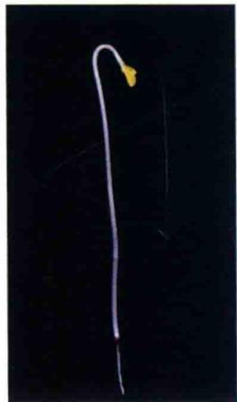

图17.1 玉米（Zea mays）（A和B）和芥菜（Mustard, Eruca sp）（C和D）幼苗在光下（A和C）或暗中（B和D）的生长。单子叶植物玉米的黄化特征包括缺绿、叶变窄、叶卷曲、胚芽鞘和中胚轴细长等。双子叶植物芥菜的黄化特征包括缺绿、叶小、下胚轴伸长，顶端呈钩状弯曲（图片A、B由Patrice Dubois提供；图片C、D由David McIntyre提供）。

表17.1 不同高等植物和低等植物的光敏色素所诱导的典型的光可逆反应

<table><tr><td>分类</td><td>属</td><td>发育阶段</td><td>红光的效应</td></tr><tr><td rowspan="5">被子植物</td><td>莴苣(Lactuca)</td><td>种子</td><td>促进萌发</td></tr><tr><td>燕麦(Avena)</td><td>幼苗(黄化的)</td><td>促进去黄化(如叶子的展开)</td></tr><tr><td>芥菜(Sinapis)</td><td>幼苗</td><td>促进叶原基的形成、原叶发育、花色素苷的生成</td></tr><tr><td>豌豆(Pisum)</td><td>成体</td><td>抑制节间伸长</td></tr><tr><td>苍耳(Xanthium)</td><td>成体</td><td>抑制开花(光周期反应)</td></tr><tr><td>裸子植物</td><td>松树(Pinus)</td><td>幼苗</td><td>增强叶绿素积累率</td></tr><tr><td>蕨类植物</td><td>敏感蕨(Onoclea)</td><td>幼年配子体</td><td>促进生长</td></tr><tr><td>苔藓植物</td><td>苔藓(Polytrichum)</td><td>出芽</td><td>促进质体复制</td></tr><tr><td>绿藻门</td><td>藻类(Mougeotia)</td><td>成熟配子体</td><td>促进叶绿体向弱光处移动</td></tr></table>

（Flint and Mcalister，1935）。但实质性的突破是在多年后的1952年，当莴苣种子暴露在交替变化的红光\远红光下，最后一次用红光处理的种子萌发率接近 $100\%$ ，而最后一次用远红光处理的种子萌发受到严重抑制（图17.2）（Borthwick et al., 1952）。这一重要实验说明，红光和远红光诱导的反应不仅仅是相反的，而且也是相互拮抗的。

对上述结果存在两种可能的解释，一种是认为植物中存在两种色素，吸收红光的色素和吸收远红光的色素，这两种色素以相互拮抗的方式调控种子萌发；另一种认为植物中存在两种形式可相互转化的单一色素：红光吸收型和远红光吸收型（Borthwick et al., 1952）。人们选择了单一色素模式，这也是二者中更为激进的一个想法，因为当时人们还没有发现过这种光可逆的色素。几年后，人们首次在植物中提取到了光敏色素，并在体外实验中，验证了它独特的光可逆特性，从而证实了该假设（Butler et al., 1959）。

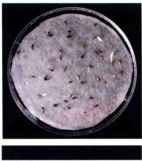  
黑暗

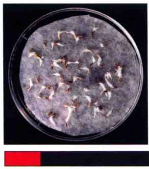  
红光

  
红光 远红光

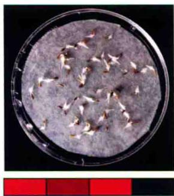  
红光 远红光 红光

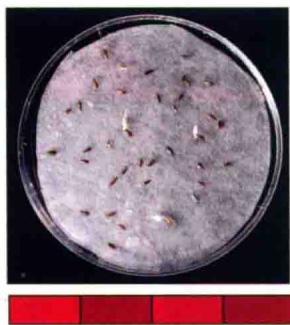  
红光 远红光 红光 远红光  
图17.2 莴苣种子萌发是光敏色素调控的典型光可逆反应。红光促进了莴苣种子的萌发，但这种作用可被远红光所逆转。吸涨（水浸泡）的种子经红光/远红光交替处理，光处理的效应依赖于最后一次照光处理。最后一次远红光处理后只有极少数种子萌发（图片由David McIntyre提供）。

## 17.1.1 光敏色素的红光吸收型（Pr）和远红光吸收型（Pfr）之间的相互转化

在暗中生长或黄化的植物中，光敏色素以红光吸收型（Pr）存在，这种蓝色的非激活型可被红光转化为蓝绿色的远红光吸收型（Pfr）。反过来，远红光照射后，Pfr可转化成Pr，这就称之为光逆转性（photoreversibility），这种转变或逆转是光敏色素的最显著的特性，可以概括为

$$
\mathrm{Pr} \xrightarrow [ \text {远红光} ]{\text {红光}} \mathrm{Pfr}
$$

Pr和Pfr这两种形式的相互转变在体内和体外实验中均可被检测到。实质上，体外实验所纯化的光敏色素的大多数光谱性质（如吸收光谱和光可逆性）与体内实验所检测到的光敏色素的光谱性质相同。

值得注意的是，并不是所有光敏色素在受到红光或远红光照射后全部转化成Pfr或Pr型，这是因为Pfr和Pr型的吸收光谱有重叠。因此，当Pr分子暴露在红光下时，它们中的大多数吸收光子转变成Pfr，但是由此产生的Pfr中的一部分吸收红光又转化成Pr（图17.3）。饱和红光照射后，Pfr型在整个光敏色素中约占88%。与此相似，Pr也能吸收极少量的远红光，因此并不能通过宽波谱远红光使所有Pfr转化成Pr，而是达到98%Pr和2%Pfr的平衡，这个平衡被称之为光稳态

( photostationary state )。

两种形式的光敏色素除吸收红光外，还吸收蓝光光谱中的光（图17.3）。因此，蓝光也具有激活光敏色素的效应，它能使Pr和Pfr相互转变。蓝光反应可由一种或多种专一蓝光受体所介导（见第18章）。光敏色素是否参与蓝光反应，通常利用远红光能否逆转该反应来判断，因为远红光只能逆转光敏色素所诱导的反应。

## 17.1.2 Pfr是光敏色素的生理激活型

光敏色素的反应可被红光诱导，理论上讲这些反应的发生是由于Pfr的出现或Pr的消失所致。在大多数情况下，光诱导的生理反应的幅度与产生Pfr的数量存在定量关系，而生理反应与Pr的消失不存在这样的关系。这些证据表明，Pfr是光敏色素的生理激活型。

窄波段红光和远红光的应用是发现和最终分离光敏色素的关键。自然环境下生长的植物，不可能像实验室内那样，在严格控制的红光或远红光条件下生长，自然界中的植物生长在一个较宽波谱的光下，在这种情况下，光敏色素必须发挥其功能来调节植物的生长发育以适应外界光环境的变化。正如图17.3所示，植物树冠本身能对到达具体植物及其叶片的相关光的光质和光量产生很大的影响。

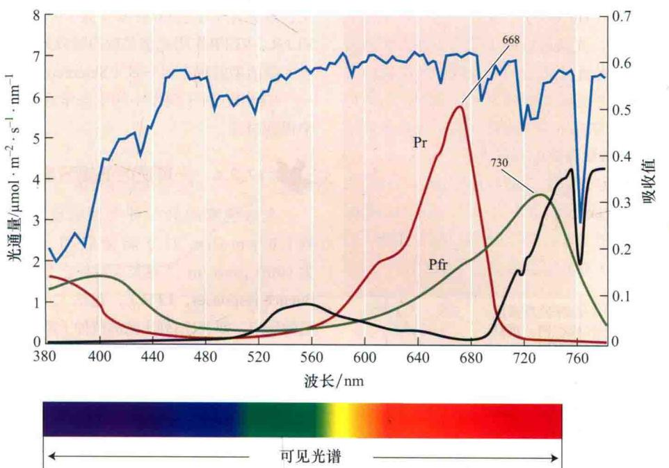  
图17.3 纯化的燕麦光敏色素Pr（红线）和Pfr（绿线）型吸收光谱相互重叠。在树冠的顶端，可见光（蓝线）分布相对均匀，但是在树冠的下层，光敏色素吸收了大部分的红光，使大部分的远红光透射进来。黑线表示了光照射通过叶片后的吸收光谱。因此Pr型和Pfr型的相对比例由植物受到遮阳的程度来决定（引自Kelly and Lagarias 1985，感谢Patrice Dubois）。

## 17.2 光敏色素诱导反应的特点

从反应种类（表17.1）和诱导反应所需要的光强来看，整个植物界中广泛存在着多种不同的光敏色素反应类型。通过对这些反应类型差异性的研究，人们可更清楚地了解到光敏色素Pr的光吸收，以及这一贯穿植物整个生长发育过程中的单个光反应事件作用的多样性。为研究方便起见，光敏色素诱导的反应被人为分成两类：① 快速的生化事件；② 缓慢的形态变化，包括运动和生长。

一些早期的生化反应会影响随后的生长发育。由这些早期的生化事件所形成的信号转导途径的本质在本章的后半部分将会详细论述。这里我们重点讨论光敏色素对整株植物反应的影响。正如我们所知道的那样，这些反应可依据所需光的强度、持续时间及作用光谱被划分为不同的反应类型。

## 17.2.1 光敏色素的反应在延迟时间和逃逸时间的差异性

光敏色素光激活产生的形态反应在延迟时间（开始刺激与呈现反应之间的时间）后才能显现出来，这一延迟时间可能短至几分钟或长至几个星期。其中，更快速的反应一般是细胞器的可逆运动（参见Web Topic 17.1）或细胞体积的可逆改变（膨胀，收缩），但也有一些快速的生长反应。

红光抑制光下生长的猪尾草（Chenopodium album）茎的伸长，这种现象在茎中Pfr相对水平增加后的几分钟内即可看到。拟南芥的动力学研究已证实了这一发现，而且在红光处理后8 min内，光敏色素就可起作用（Parks and Spalding，1999），但在开花诱导反应中，其延迟时间则需长达数周之久（见第25章）。

光敏色素反应延迟时间的长短等信息可有助于研究人员判断那些导致某一特定反应的生化事件的类型。延迟时间越短，所涉及的生化事件的范围越有限。

光敏色素反应的多样性也可从光逆转性的逃逸（escape from photoreversibility）现象中反映出来。远红光只能在一定时间内逆转红光诱导的反应，超出这段时间，该反应就从光控的逆转中“逃逸”。

上述这种“逃逸”现象可用如下假设模型加以解释。即光敏色素调控的形态反应是细胞内诸多相关联的系列生化反应的最终体现。在该系列反应的早期阶段除去Pfr，反应可被完全逆转；但在该系列反应的某个点（不能逆转的点）除去Pfr，此反应就不可逆转了。因此逃逸时间代表所有在系列反应成为不可逆转之前的时间，实质上是Pfr完成它的初级反应所需的时间。不同反应的逃逸时间不同，从不到一分钟到数小时之久。

## 17.2.2 光敏色素的反应可按它们对光量的需求进行区分

光敏色素的反应可根据诱导该反应所需的光量加以区分。光量指光通量（fluence），它定义为一个单位表面积接收光子的数量。光通量标准单位是每平方米微摩尔（ $\mu \mathrm{mol} / \mathrm{m}^2$ ）。除光通量外，一些光敏色素的反应对辐照度（irradiance）①或光通量率敏感。辐照度的单位是每平方米每秒微摩尔[μmol/（ $\mathrm{m}^2 \cdot \mathrm{s}$ ）]（光计量所使用的术语的定义见第9章和Web Topic 9.1）。

每个光敏色素的反应都有特定的光通量范围，在此范围内，反应幅度与光通量成比例。图17.4显示，这些反应根据所需要的光量可分为三个类型：极低辐照度反应（VLFR）、低辐照度反应（LFR）和高辐照度反应（HIR）。

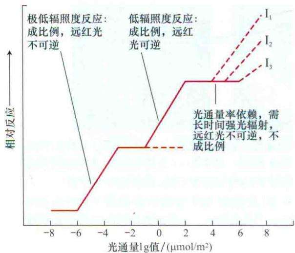  
图17.4 根据对光通量的敏感性所划分的三种类型的光敏色素反应。代表性反应的相对大小与增加的红光通量作图。短时光脉冲激活VLFR和LFR。由于HIR与辐照度和光通量成正比，上述三种不同辐照度的光反应在图中一并连续列出 $\left(I_{1}>I_{2}>I_{3}\right)$ （引自Briggs et al., 1984）。

## 17.2.3 光不可逆转的极低辐照度反应

一些光敏色素的反应可被光通量低至0.0001 $\mu mol/m^{2}$ 的光（一只萤火虫一次闪光所发出光亮的1/10）所启动，该类型反应的饱和光（即需要的最大光量）约为0.05 $\mu mol/m^{2}$ 。例如，光通量在0.001\~0.1 $\mu mol/m^{2}$ 的红光能诱导拟南芥种子的萌发。极低辐照度的红光可刺激暗中生长的燕麦胚芽鞘伸长，抑制其中胚轴（位于胚芽鞘和根之间的伸长的中轴）生长。这种由极低水平的弱光所引起的显著效应，我们称之为极低辐照度反应（very low-fluence responses, VLFR）。

诱导VLFR反应所需要的微弱光量可使低于0.02%的光敏色素转化为Pfr，由于远红光只能使98%的Pfr转化为Pr（见前文），仍保留2%的Pfr，大大超过诱导VLFR反应所需要的0.02%（Mandoli and Briggs，1984）。换句话说，远红光不能使Pfr的浓度低于0.02%，也就不能抑制VLFR。VLFR作用光谱是Pr的吸收光谱，这与Pfr是该反应的激活型的观点相一致（Shinomura et al., 1996）。

VLFR在种子萌发中的生态学意义在Web Essay 17.1中得到讨论。

## 17.2.4 光可逆的低辐照度反应

光敏色素的另一种类型的反应只有当光通量达到 $1.0\mu \mathrm{mol} / \mathrm{m}^2$ 时才能被启动，其饱和光通量约为 $1000~\mu \mathrm{mol} / \mathrm{m}^2$ 。这类反应称之为低辐照度反应（low-fluence responses, LFR），包括大多数的红光远红光可逆的反应，如表17.1列出的莴苣种子需光萌发和叶运动的调控。图17.5显示了拟南芥种子萌发的LFR作用光谱。LFR作用光谱包括一个位于红光区的促进萌发的峰值（660 nm）和一个位于远红光区的主要抑制萌发的峰值（720 nm）。

VLFR和LFR都可被一个短暂的闪光诱导，说明光能量的总值达到了所需要的通量。总的光通量决定于两个因素的作用：光通量率 $[\mu \mathrm{mol} / (\mathrm{m}^2\cdot \mathrm{s})]$ 和光照时间。因此一个短暂的红闪光可诱导某个反应，只需此处理的光有足够的亮度就能满足；反之，如果光照时间足够长，极弱的光也可起到相同的作用。光通量率与光照时间之间的反比关系称之为反比定律（law of reciprocity），它是由R.W.Bunsen和H.E.Roscoe于1850年首先提出的。VLFR和LFR都是遵从反比定律的。也就是说反应的程度（如它可表示为萌发率或下胚轴伸长抑制的程度）与光通量率和光照时间的乘积成正比。

## 17.2.5 光照强度和光照时间成正比的高辐照度反应

第三种类型的光敏色素反应称之为高辐照度反应（high-irradiance responses，HIR），表17.2列出了其中的几种反应。HIR需要长时间或持续的高光照辐射。在反应饱和之前，光照越强反应程度越大，反应饱和之后，光强增加对反应不再起作用（参见Web Topic 17.2）。

此反应之所以称之为高光辐照度反应而不是高通量反应，原因在于此类反应与光的辐照度（粗略说，光的亮度）而非光通量成正比。HIR的饱和光照比LFR强100倍以上，而且反应不能被光所逆转。持续弱光或瞬时强光都不能诱导HIR的发生，因此，该反应不遵守反比定律。然而，Shinomura及其同事研究发现，用短脉冲远红光处理时，FR对胚轴伸长的抑制是遵循反比定律的，这表明光敏色素对光的感受是光照率限制（Shinomura et al., 2000）。

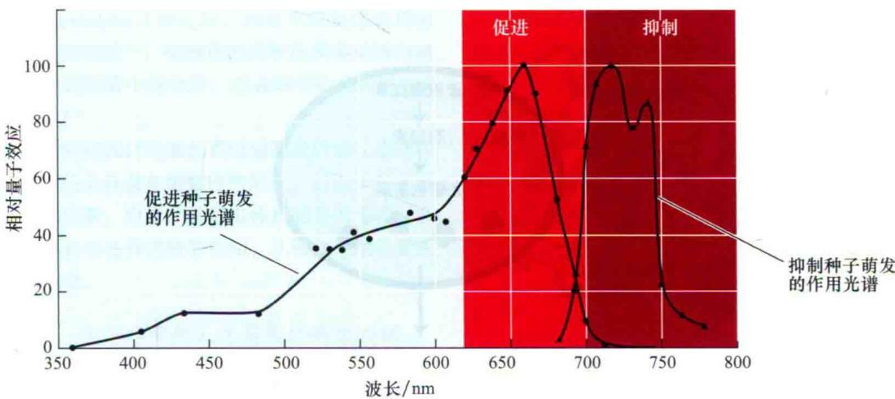

  
图17.5 光可逆促进和抑制拟南芥种子萌发的LFR作用光谱（引自Shropshire et al., 1961）。

表17.2 高光辐照度诱导的一些植物形态建成反应

<table><tr><td>在各种双子叶植物幼苗和苹果皮层部的花色素苷合成</td></tr><tr><td>荠菜、莴苣和矮牵牛幼苗下胚轴伸长的抑制</td></tr><tr><td>天仙子(Hyoscyamus)开花的诱导</td></tr><tr><td>莴苣胚芽弯钩的张开</td></tr><tr><td>荠菜子叶的长大</td></tr><tr><td>高粱中乙烯的生成</td></tr></table>

表17.1列出了许多光可逆的LFR反应，其中的去黄化反应也属于HIR反应类型。例如，白色芥菜（Sinapis alba）幼苗花色素苷合成的低通量的作用光谱在红光波谱中有一个峰，此作用可被远红光逆转，且遵守反比定律；而当暗中生长的幼苗暴露于高光照下数小时后，花色素苷合成的作用光谱的峰值处于远红光和蓝光区，且不可被远红光逆转，其反应程度与光辐照度成正比。因此，同一作用到底由LFR还是HIR完成主要依赖于光照处理情况。

在本章后半部分我们将了解到，各种不同类型光敏色素反应（VLFR、LFR和HIR）是由不同光敏色素分子来调控的。

## 17.3 光敏色素蛋白的结构和功能

天然光敏色素是一种极易溶于水的、相对分子质量为250的色蛋白质（色素-蛋白复合体），它是由两个亚基组成的二聚体，每个亚基有两个组成部分：吸收光的色素分子，即生色团（chromophore）和一个称为脱辅基蛋白（apoprotein）的多肽链（图17.6）。脱辅基蛋白单体相对分子质量为125，由被子植物中的一个小基因家族编码。脱辅基蛋白和生色团共同组成全蛋白（holoprotein）。

高等植物中光敏色素的生色团由排列成直链的四个吡咯环组成，被称为光敏色素质（phytochromobilin）。植物光敏色素脱辅基蛋白单独不能吸收红光或远红光。只有多肽链与生色团共价连接形成全蛋白后才能吸收光。生色团在质体中合成，是由血红素通过叶绿素合成的分支途径合成。光敏色素质被转运到胞质，通过硫醚键与胞质中脱辅基蛋白的半胱氨酸残基相接（图17.6）。光敏色素脱辅基蛋白与它的生色团组装是个自我催化（autocatalytic）的过程，即在不需要添加其他蛋白或辅因子的情况下，把纯化的光敏色素多肽链与纯化的生色团在试剂管中混合后，二者即可结合（Li and Lagarias，1992）。

生色团：光敏色素质  
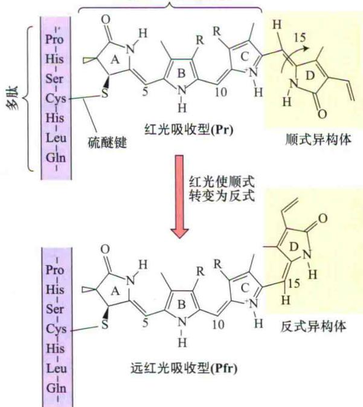  
图17.6 生色团（光敏色素质）的Pr和Pfr型的结构及通过硫醚键与生色团结合的肽键区。红光和远红光可使生色团的C15发生顺反异构化作用（引自Andel et al., 1997）。

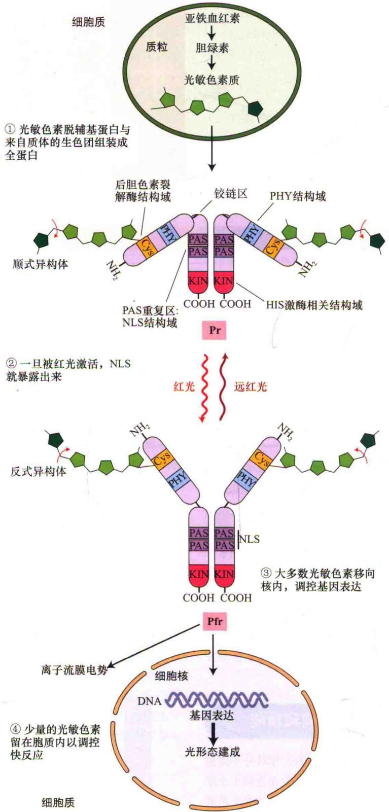  
图17.7 合成和组装后①，红光诱导光敏色素发生可逆的结构变化，从而激活光敏色素②，进而启动光敏色素移向核内以调节基因表达③，胞质中少量的光敏色素可调控快速生化变化④（引自 Montgomery and lagarias, 2002）。

本章节我们将探讨光敏色素脱辅基蛋白的功能结构域、蛋白激酶的活性及在细胞内的定位。但由于存在多种不同的光敏色素，而每一种都由各自的基因编码，在生长发育中都具有各自独特的作用，从而使光敏色素的研究更加复杂化。

## 17.3.1 光敏色素的几个重要功能结构域

图17.7突出显示了几个已鉴定的光敏色素的结构域和光敏色素所介导的多种细胞光反应情况。通过对从植物和其他物种分离出的各种光敏色素的序列比对，发现了几个保守的结构域（Montgomeru and Lagaria, 2002）。光敏色素N端部包括一个PAS结构域 $^{①}$ ，与生色团结合的胆色素裂解酶结构域（GAF）和维持光敏色素Pfr型稳定的PHY结构域（PHY domain）。光敏色素分子N端和C端之间的铰链区在非活性Pr型和活性Pfr型相互转化中起关键作用。

铰链区下游有两个PAS相关结构域（PAS related domain，PRD）重复片段，可调控光敏色素的二聚化。在PRD结构域内有两个核定位序列（nuclear localization sequence，NLS），一旦暴露即可使活性Pfr型定向转移至核内。C端组氨酸激酶相关的结构域（Histidine Kinase-related domai，HKRD）是自我磷酸化必需的，如果光敏色素分子能够被允许二聚化且其仍然保持生物活性，则该结构可以被删除（Matsushita et al., 2003）。这似乎有些出人意料，因为一般情况下激酶结构域会在信号传递中发挥功能，而这一结构域却在光敏色素反应信号的衰减过程中发挥作用（Matsushita et al., 2003）。

研究者从抗辐射、嗜极端细菌（Deinococcus radiodurans）中已得到一种与生色团胆绿素结合的细菌光敏色素N端区的三维结构（Wangner et al., 2005）。这是光敏色素研究领域的一个重大突破。与植物光敏色素不同，细菌光敏色素可利用多种四吡咯生色团并且可能调节不同的下游反应。然而，它们与生色团结合的口袋结构可能是高度保守的。如图17.8所示，生色团与GAF结构域中的活性部位结合，反映出光调节蛋白结构改变的可能机制，即生色团末端的D环的异构化（旋转），改变了它与GAF结构域氨基酸的结合，进而引起蛋白构象变化（有关光敏色素生色团性质的详细内容参见Web Essay 17.2）。

图17.8 嗜极端细菌（Deinococcus radiodurans）光敏色素N端部分的三维晶体结构。胆绿素生色团（紫色）与保守的胱氨酸位点共价连接（红色），并与蛋白骨架紧密结合（引自Wagner et al., 2005）。  

## 17.3.2 光敏色素是一种光调控的蛋白激酶

磷酸化在光敏色素发挥功能过程中具有重要的作用，最早的研究证据表明，红光可调控蛋白质的磷酸化，促进磷酸化依赖的转录因子与光敏色素调控基因启动子的结合。一些高纯度的光敏色素也具有激酶活性。蛋白激酶（protein kinase）是一类催化ATP上的磷酸基团转移到自身或其他蛋白的氨基酸如丝氨酸或酪氨酸上的酶。激酶在信号转导途径中通过添加或移去磷酸来调节一些酶的活性（见第14章）。蛋白磷酸酶（protein phosphatase）是从蛋白质上移去磷酸基团的酶，可通过拮抗蛋白激酶而调节蛋白活性。因此，蛋白激酶和蛋白磷酸酶在信号转导中起相反作用。

目前，已知光敏色素是具有自我磷酸化能力的蛋白激酶（Yeh and Lagarias，1998）。光敏色素的进化是很古老的，可追溯到真核生物的出现时期。细菌光敏色素是光依赖的组氨酸蛋白激酶，作为感应蛋白（sensor protein），可使相应的反应调节子（response regulator）蛋白磷酸化而发挥作用（图17.9A）（见第14章和Web Topic 17.3）。然而，尽管高等植物的光敏色素与组氨酸激酶存在一些同源序列，但并不具有组氨酸激酶活性。相反，它们是丝氨酸/苏氨酸激酶（图17.9B），可能磷酸化其他蛋白。因此，虽然植物与细菌的光敏色素磷酸化位点不同，但其基本功能类似。

## 17.3.3 Pfr在胞质和核的区域化

在细胞质中，光敏色素全蛋白以非活性Pr的二聚体

## A 细菌光敏色素

## B 植物光敏色素

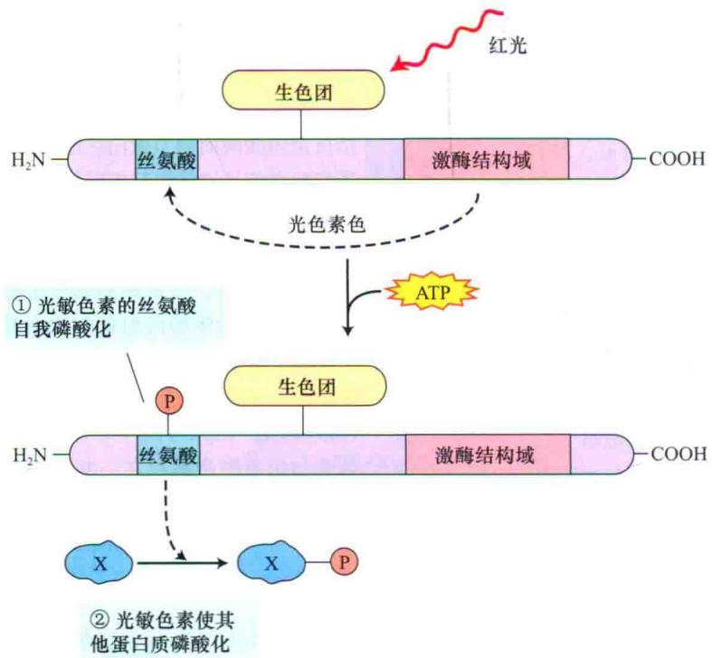  
图17.9 光敏色素是一种自我磷酸化的蛋白激酶。A. 细菌光敏色素是一种双组分系统，光敏色素作为一种能使反应调节子磷酸化的感应蛋白而起作用（见第14章）。B. 植物光敏色素是一种自我磷酸化的丝氨酸/苏氨酸激酶，能使其他蛋白质磷酸化（形成包含 x 的蛋白结构）。

状态存在。当生色团吸光后，其C15和C16间的双键发生顺反异构化，C14-C15单键旋转等（图17.6）。在Pr转化为Pfr过程中，光敏色素全蛋白基序在铰链区也进行着构象变化，使光敏色素C端的核定位序列（NLS）暴露出来，导致光敏色素分子由胞质移向核内（图17.7，Chen et al., 2005）。光敏色素从胞质移向核内是一个光质依赖的过程。因为光敏色素的Pfr型可被选择性地转移至核内（图17.10）。

一旦进入核内，光敏色素即与转录因子相互作用，调节基因转录的变化。因此，光敏色素的一个重要功能是作为光激活的开关，引起基因转录的整体变化。然而，如前所述，一些光敏色素调节的反应（如茎伸长的抑制）非常迅速，在红光或远红光处理后几分钟甚至几秒内即可发生。因此，光敏色素在胞质内也很可能起重要作用，通过调节膜电势和离子流从而对红光和远红光作出相应反应（图17.8）。确实，最近研究表明无需转移至核内，光敏色素仍然能调节多种生长反应（Rosler et al., 2007）。

A  

  
图17.10 拟南芥下胚轴表皮细胞phy-GFP融合蛋白的核定位。荧光显微镜下转基因拟南芥中phyA-GFP（A）或phyB-GFP（B）的表达情况。只有细胞核清晰可见。持续远红光（A）或白光（B）处理植物，可诱导核内蛋白的积累。B图中核内绿色小亮点称为“小斑”，小斑的作用还不清楚（引自Yamaguchi et al., 1999, A. Nagatani惠赠）。

## 17.3.4 光敏色素蛋白受多基因家族编码

光敏色素反应的生理过程非常复杂，很难用仅有一种类型的光敏色素这样的理论来加以解释。早期的生物化学研究表明，细胞中可能存在不同类型的光敏色素。例如，光敏色素在黄化幼苗中最为丰富。因此，大多数早期的生物化学研究都是借助于从非绿色组织中纯化的光敏色素来进行的，因为从绿色组织中仅能提取少量的光敏色素。

不久，人们就证实植物中存在两种类型光敏色素，分别命名为类型Ⅰ和类型Ⅱ光敏色素。在暗中生长的大豆幼苗中，类型Ⅰ的光敏色素的含量比类型Ⅱ的光敏色素约高9倍之多；而在光下生长的幼苗中，这两种类型的光敏色素的含量几乎相当，表明光可使类型Ⅰ的光敏色素发生降解。因此，光敏色素可分为两种类型：光不稳定型（类型Ⅰ）和光稳定型（类型Ⅱ）。事实上，类型Ⅰ光敏色素的Pfr型是不稳定的。

光敏色素研究的一个重大突破使人们认识到，光敏色素蛋白是由一个具有不同生化特性的多基因家族编码。在拟南芥中，该家族有5个结构相关的成员：PHYA、PHYB、PHYC、PHYD和PHYE（Sharrock and Quail，1989）。在单子叶植物水稻中，仅存在3种光敏色素的编码基因：PHYA、PHYB和PHYC（Mathews and Sharrock，1997）。脱辅基蛋白（不含生色团）被表示为PHY；全蛋白（含生色团）被表示为phy。通常，其他高等植物的光敏色素序列则按它们与拟南芥PHY基因的同源序列来命名。在双子叶和单子叶植物中，光不稳定（Ⅰ型）光敏色素是由PHYA编码。在拟南芥中，含量最多的光稳定（Ⅱ型）光敏色素是由PHYB编码。通过下文我们将知道，遗传学研究已表明，PHYA和PHYB在生长发育中起相反的作用。

## 17.4 光敏色素功能的遗传分析

遗传筛选在拟南芥光信号转导途径研究方面具有重要作用。在目前经典的研究中，Marteen Koornneef 最早用遗传学方法鉴定光信号转导途径的中间成分（Koornneef et al., 1980）。他将拟南芥种子浸泡在能使DNA发生点突变的乙酰甲基磺酸（EMS）溶液中以产生突变种子，然后这些突变种子所长出的植株通过自花授粉，进而得到了基因突变的种子库。这一突变“家族”一旦在白光下生长，那些对光感受或光反应缺陷的突变体可根据其伸长的下胚轴（与暗中生长的植株形态相似）这一特征被鉴定出来，最后所有鉴定的突变体可通过单个隐性等位基因来加以区分。

通过已鉴定的突变体植株间的杂交试验研究，已确定了5个突变位点或互补组（HY1-HY5），为拟南芥信号转导的研究奠定了基础。5个HY基因的克隆及序列分析促进了光信号转导的一些中间成分的确定，即光敏色素生色团生物合成的必需基因（HY1和HY2）、光受体PHYB（HY3）、蓝光光受体隐花色素（HY4）和光诱导的转录因子（HY5）。

结合遗传分析、分子生物学和生理学研究等方法，在过去的十多年里，人们在光反应的机制研究方面已取得了巨大进展。这也许并不令人惊讶，这些研究已揭示出光与植物信号转导组分之间存在复杂的互作关系，而这些信号转导组分可调控植物从萌发到开花整个生命周期的多个发育阶段。

本节我们将对经遗传分析鉴定的光敏色素基因家族成员的不同生物学功能，以及它们之间的复杂相互作用进行分析。除VLFR和LFR反应的相反作用外，还鉴定出两种不同类型的高辐照度反应，该反应依赖不同的光敏色素，一类是典型的黄化幼苗远红光HIR，该反应由phyA所介导，另一类是阳生植物的红光（或白光）HIR，该反应由phyB所介导。

## 17.4.1 光敏色素A可介导持续远红光所诱导的反应

在最初建立的hy基因库中，仅发现光敏色素phyB基因突变体。因此，要鉴定phyA突变体，则需要在筛选方法上取得新的突破。正如前文所讨论，由于远红光HIR需要光不稳定（类型Ⅰ）光敏色素，由此推测，phyA作为光受体可感受持续的远红光。如果真是这样的话，phyA突变体将不能对远红光发生反应，并且在这种光下生长的突变体长得高而细长。然而，缺少生色团的突变体也能表现出类似的表型，因为只有与生色团组装成全蛋白质的phyA才能够感受远红光。

为了筛选phyA突变体，人们把在持续远红光照射下长得较高的幼苗移到持续红光照射下生长，phyA缺失的突变体在这种光谱下能正常地生长，而生色团缺失的突变体由于缺少有功能的phyB，无法对持续红光发生反应。通过这种方法筛选的phyA突变体幼苗在白光下能正常生长，表明phyA在感应白光方面没有作用（Whitelam et al., 1993）。这也解释了为什么

Koornneef在最初以长的下胚轴为筛选指标实验中，没能检测到phyA突变体。因此，phyA主要是在远红光去黄化过程中起作用。从这个突变体的特点可知，phyA之外的其他光敏色素并不能感受持续的远红光。光敏色素A也参与了广谱光诱导的拟南芥种子萌发的VLFR反应。因此，缺乏phyA的突变体在微秒闪光下无法萌发，但对低通量范围的红光处理可发生正常的反应（Shinomura et al., 1996）。该结果证明，phyA作为VLFR反应的光受体起重要作用。

对这些结果可能的解释是，在种子发育的早期，如种子萌发和幼苗去黄化阶段，phyA的功能被极大地限制了。然而，最近研究表明事实远非如此。当phyAphyB双突变体在强红光 $[\geqslant 100\mu \mathrm{mol} / (\mathrm{m}^2\cdot \mathrm{s})]$ 下生长时，比phyB单突变体长得更长。另外，野生型植株从黑暗转移到强光照条件后，在相当长一段时间内phyA蛋白都可以被检测到（Franklin et al., 2007）。phyA在拟南芥和水稻开花的光周期调控中同样扮演了重要角色（Valcerde et al., 2004；Takano et al., 2005）。因此，PhyA可能同时介导红光和远红光的生理反应，并且在植物整个生命周期中发挥功能。

## 17.4.2 光敏色素B可介导持续红光或白光所诱导的反应

hy3突变体幼苗在持续白光下生长，其下胚轴伸长，这一特点说明phyB在去黄化中有重要作用。hy3突变导致叶绿素和一些编码叶绿体蛋白质的mRNA缺失，不能应答植物激素反应。

光敏色素B除参与白光和红光调控的HIR反应外，也能调节LFR，如光可逆的种子萌发，这也是导致光敏色素发现的最早实验证据。野生型拟南芥种子的萌发需要光，这种反应在低通量光范围内时表现出红光/远红光可逆特性。phyA缺失的突变体对红光反应是正常的，而phyB缺失的突变体却不能对低通量的红光发生反应（Shinomura et al., 1996）。这个实验证据足以说明phyB可调控光可逆的种子萌发。

在本章后面的论述中，光敏色素PhyB在调节植物对暗处理的反应中发挥重要作用。在被茂密植物树干所覆盖的地表，phyB缺失的突变体生长表型和野生型植株类似。事实上，光敏色素所介导的植物对遮阴的反应如促进开花和快速伸长生长，可能是光敏色素在生态学意义上最重要的功能之一（Smith，1982）。

## 17.4.3 光敏色素C、D和E功能的发现

虽然phyA和phyB是拟南芥中光敏色素的两种主要存在形式，但phyC、phyD和phyE在调控红光和远红光反应中也发挥独特的作用。双突变体和三突变体的构建使评价特定反应中每个光敏色素的相对功能成为可能。phyD和phyE的结构与phyB相似，但并不存在功能冗余。phyD和phyE调节的反应包括叶柄和节间的延长及开花时间控制（见第25章）。拟南芥phyC突变体的特点揭示出phyC、phyA和phyB反应通路间存在复杂的相互作用（Franklin et al., 2003；Monte et al., 2003）。PHY基因的主要功能可能在于其对光敏色素的精确调控，以适应昼夜和季节改变所引起的光环境变化。事实上，在一项对跨纬度渐变生态群的自然变化的研究中已经证实了phyC在调节植物生长和开花时间方面的作用（Balasubramanian et al., 2006）。

## 17.4.4 Phy基因家族间复杂的相互作用

显然，遗传分析已成为分析拟南芥基因功能强有力的工具，但这种方法也有一些局限性。其一，phy突变体表型通常是在假定家族中其他成员活性没有变化的基础上鉴定的。然而，详尽的分子机制研究表明，phyC和部分phyD的积累依赖于活化PhyB及PHYA的转录水平，而且编码PHYB的基因过表达可增加转基因拟南芥体中的phyA、phyC和phyD水平（Hirschfeld et al., 1998）。

最近的研究发现，光稳定phy蛋白能形成同源或异源二聚体（如phyB-phyC）（Clack et al., 2009），这就使遗传数据的解释更加复杂化。因此，功能缺失的phyB突变体或PHYB脱辅基蛋白质过表达的植株可能表现出特定的表型，该表型是一个由多种光敏色素相互作用而改变的动力学结果。考虑到每一个物种在自然种群中每一种光敏色素可能有多个等位基因（Maloof et al., 2001），我们可以想象存在着一个多么令人难以置信的复杂的分子网络。因此，揭示光敏色素基因相互作用的复杂性成为未来研究中具挑战性的课题。

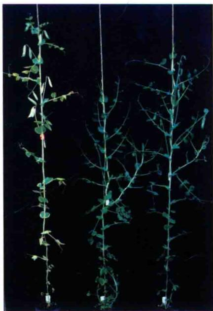  
野生型豌豆  
(phyA缺失突变体)

## 17.4.5 PHY基因在进化过程中的多样化

虽然通过拟南芥的研究我们对光敏色素反应中的许多分子事件有了较深的了解，但在被子植物中，PHY基因家族进化迅速（Mathews and Sharrock，1997），大多数双子叶植物有四个光敏色素亚家族（PHYA、PHYB/D、PHYC/F和PHYE），单子叶植物只有三个（PHYA、PHYB和PHYC）。通过基因复制/缺失、遗传漂变和PHY基因功能的快速的多样化等，光敏色素信号转导网络可随之发生改变，构建新的模式以确保植物适应不同生活环境和不同选择压力。只有具体到某个特定的物种来进行遗传分析研究，我们才能鉴定光敏色素调控途径的相似性和差异性。

例如，phyA缺失对白光下生长的拟南芥和水稻表型影响不大，而phyA功能缺失的豌豆则有高度多效性的表型，包括缩短的节间、衰老的延缓及长日照下产量的增加等。在番茄中，phyA缺失和重复phyB拷贝数可阻止番茄中叶绿素的积累，使结果的花簇或花束长度大大增加（图17.11）。叶绿素在上述这些植物叶片中的积累，表明phyA和phyB在叶绿素积累中的作用是番茄特有的。

  
野生型番茄  
(phyA缺失和phyB双拷贝突变体)  
图17.11 光敏色素缺失改变了豌豆和番茄的生长发育。A. phyA发生突变的豌豆苗表现出开花延迟和节间缩短。B. phyA缺失和phyB双拷贝番茄突变阻止了番茄果中叶绿素的积累和番茄果簇的伸长（引自Weller et al., 1997; 2000）。

不同杂交品种相比较的图片表明，虽然phy家族成员作用模式可能是高度保守的（如phyA介导了VLFR和远红光HIR反应），但其受光受体调控的下游效应子及最终的生理反应等在分类单元中具有明显的差异（图17.12）。

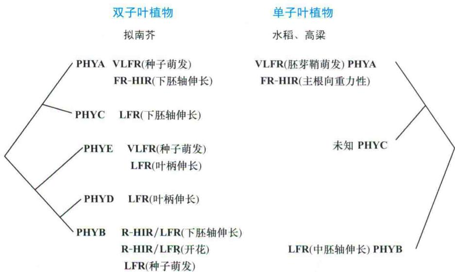  
图17.12 双子叶植物拟南芥（Arabidopsis thaliana）和单子叶植物水稻（Oryza sativa）和高粱（Sorghum bicolor）的光敏色素基因家族结构和功能的差异比较。单子叶植物和双子叶植物PHY基因可能在VLFR、LFR和HIR（如FR-HIR中需phyA）等反应中利用相同的基因家族成员，但其调控的发育现象可能完全不同（如phy所介导VLFR的种子萌发与胚芽鞘的延长）。图中也标明了单子叶植物中没有PHYD和PHYE。

## 17.5 光敏色素信号途径

植物中所有光敏色素调控的变化都是从色素对光的吸收开始。光敏色素一旦吸收光，其分子性质就发生改变，这可能影响到光敏色素与细胞内其他蛋白元件的相互作用，最终引起生长、发育的变化或器官位置的改变（表17.1）。

分子和生物化学技术可有助于揭示光敏色素的早期作用，以及导致一些生理学或发育反应的信号转导途径。这些反应一般可分为两种类型：①离子流动，导致相对迅速的膨压反应；②基因表达的改变，引起较慢的、长期的反应过程。

本节我们将检测光敏色素在膜渗透性和基因表达方面的作用，以及导致这些作用的信号转导途径中可能涉及的级联反应。

## 17.5.1 光敏色素调控的膜电势和离子流

光敏色素能在一次闪光后的数秒内快速改变膜的性质，这种快速的调节现象在单细胞中已检测到，并且在红光和远红光对根及燕麦（Avena）胚芽鞘的表面电势的影响的实验中也提及。在根和燕麦胚芽鞘中，从Pfr产生到能检测到电势开始变化（超极化）之间的延迟时间是4.5 s。细胞生物电势的变化与通过质膜的离子流的改变是一致的。这表明与光敏色素有关的一些胞质应答起始于细胞膜或质膜附近。

藻类（Mougeotia）如何利用红光刺激进行快速的叶绿体运动是长期以来困扰我们的科学难题（见Web Topic 17.1）。在包括拟南芥在内的许多物种中，叶绿体运动是蓝光通过向光素所介导的。在藻类（Mougeotia）中，叶绿体运动的光感受器是一个融合的红光和蓝光受体（Suetsugu et al., 2005）。因此，Mougeotia似乎已经进化到能够利用红光信号通过一个较为典型的蓝光受体来传递叶绿体运动的反应（见第18章）。有趣的是，拟南芥phyA在胞质中的许多功能都可以由蓝光受体介导，这表明也许不久以后，这些信号途径可能会跟高等植物的信号感知一样，合二为一或者开始协同作用。

## 17.5.2 光敏色素调控的基因表达

光形态建成的定义指出，植物的生长发育受光的影响很大。黄化特征包括纺锤形茎、小叶（双子叶植物）和缺绿等。这些黄化特征可通过光照完全逆转，其中涉及一些仅通过基因表达的变化所导致代谢的长期改变。总之，植物启动子的光调节与其他真核生物的基因调节相似，即模块元件的聚集，模块元件的数量、定位、侧翼序列和能引起各种不同的转录模式的结合性能。没有任何一个单一的DNA序列或结合蛋白能与所有受光敏色素调节的基因都发生相互作用。

首先，光调控的基因有如此多的元件，任何元件的组合都能引起光调控基因的表达，这似乎是不可思议的。然而，这些调控序列可通过多种光受体的作用，以确保许多基因的光及组织特异性差异表达。

转录的光激活和抑制过程非常快速，它的延迟时间短至5 min。利用DNA微阵列分析技术（DNA microarray analysis），人们可检测到光变化条件下，植物所有的基因表达模式。（转录的分析方法参见Web Topic 17.4）这些研究显示，核输入启动了包括上千种基因参与的转录级联反应，进而引发了光形态建成的生长发育。通过分析植物从暗处转到光下这一段时间内基因表达谱，人们对PHY基因作用的早期和晚期的靶元件已进行了鉴定（Tepperman et al., 2001；Tepperman et al., 2004）。

PhyA和PhyB的核输入与激发它们活性的光质是密切相关的，也就是说，PhyA的核输入是由远红光和低通量的广谱光所调节的。PhyB的核输入由红光所调节并且可以被远红光逆转（Kircher et al., 1999; Yamaguchi et al., 1999）。因此，在光敏色素信号途径中，Phy蛋白的核输入可能代表了一个主要的控制点。PhyB似乎是利用一个普通的核转入途径，而PhyA的核导入依赖FHY1（Genoud et al., 2008）

在植物暗-光转变过程中那些快速上调的早期基因产物实际上是转录因子本身，这些转录因子可激活其他基因的表达。编码快速上调蛋白的基因称之为初级反应基因（primary response gene）。初级反应基因的表达依赖于信号转导途径（见下文），不依赖于蛋白的合成。与此相对应的晚期基因或次级反应基因（secondary response gene）的表达需要新蛋白的合成。DNA微阵列分析揭示，伴随着从暗形态建成到光形态建成的转变，植物中所有基因的表达谱也随之发生改变。

## 17.5.3 光敏色素相互作用因子（PIF）在phy信号转导的早期起作用

近年来，酵母双杂交文库筛选和免疫共沉淀这两种技术已被广泛应用于植物蛋白间相互作用的研究（参见Web Topic 17.5）。利用这两种方法，人们在拟南芥中已鉴定了几种光敏色素相互作用因子（phytochrome-interacting factor，PIF）（Castillon et al., 2007）。与phyA或phyB相互作用的蛋白作为phy信号网络的分支点，而与phyA和phyB共同作用的蛋白质可能代表汇聚点。

在已鉴定的这些因子中，研究最多的是PIF3，一个基本的螺旋-环-螺旋（bHLH）转录因子，可与phyA和phyB发生相互作用（Ni et al., 1998）。PIF和几个相关PIF或类PIF蛋白（PIF-like protein, PIL）尤其备受关注，因为这个基因家族中至少有5个成员可选择性地与具有活性Pfr构象的光敏色素相互作用。这些蛋白定位于核内并能与DNA结合，说明光敏色素与基因的转录具有紧密的联系。

对PIF家族成员的最近研究表明，PIF主要作为光敏色素信号的负调节子（Shin et al., 2009; Stephenson et al., 2009）。一个PIF家族成员缺失的四突变体在黑暗中生长表现出了组成型光形态建成发育。光敏色素似乎通过磷酸化引发了PIF蛋白的降解，继而被蛋白酶体所降解（Al-Sady et al., 2006）。光敏色素诱导的作为phy反应负调节子的PIF蛋白的快速降解，有利于阐明与phy蛋白活性紧密耦合的光发育反应调节的可能机制。

## 17.5.4 光敏色素与蛋白激酶和磷酸酶的结合

除定位于细胞核的转录因子外，细胞质中与phy蛋白结合的激酶已通过双杂交筛选技术得到鉴定。光敏色素激酶底物1（phytochrome kinase substrate1，PSK1）可与具有活性的Pfr型和非活性的Pr型的phyA和phyB作用（Frankhauser et al., 1999）。该蛋白可从phyA处接受一个磷酸根离子，表明磷酸化是信号转导途径中的一个重要部分。体外（试管中）和体内（植物中）的光敏色素可调节PSK1的磷酸化，并且具有Pfr型光敏色素的反应活性是具有Pr型的光敏色素的两倍。PSK1及其密切相关的PSK2的超表达和功能缺失突变研究表明，这两种分子通过一个负反馈环维持平衡水平。分子生物学与遗传学分析表明，这些蛋白可选择性作用以促进phyA介导的VLFR反应。最近研究结果表明，这些分子参与了PhyA和向光素信号通路的交叉机制（Lariguet et al., 2006）。

光敏色素相关蛋白磷酸酶5（phytochrome-associated protein phosphatase 5，PAPP5）是另外一个与光敏色素互作的因子，它可能通过脱磷酸化有活性的光敏色素来增强被光敏调节的相关生理反应（Ryu et al., 2005）。如图17.13所示，显示了磷酸化调节phy活性的可能模型。暗中，Pr型光敏色素是无活性的，在它的N端的丝氨酸位点可能被磷酸化。红光的吸收可诱导phy构象的改变，激活了铰链区丝氨酸位点的自我磷酸化及接下来细胞核的定向输入。红光也可以作用于phy的降解（见下文）。

铰链区丝氨酸的脱磷酸化增强了phy与下游效应子相互作用，增加了蛋白在光下的稳定性。一个未知的激酶和可能的自我磷酸化可驱动phy向低活性磷酸化状态变化，磷酸化phy不能有效地与它的效应蛋白结合。

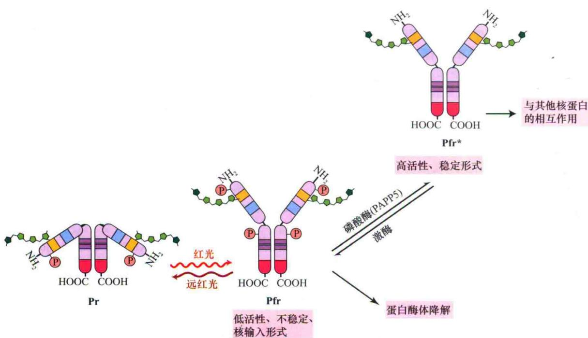  
图17.13 光敏色素的活性受磷酸化状态调控。在红光激活后，与phy相关的磷酸酶PAPP5和目前还未得到鉴定的激酶，调节不同光强或光质下phy的反应活性（引自Ryu et al., 2005）。

## 17.5.5 光敏色素诱导的基因表达涉及蛋白降解

我们常把信号转导级联的启动比作按动一个开关，来激活一个过程，就如同当电话打进时，话机会响一样。然而，如果话机一直响下去会出现什么结果呢？在第一声响后，它就失去了作为信号机制的作用。与此相同，终止或重设一个途径与该事件的启动同样重要。如上所述，蛋白降解作为许多细胞代谢过程调节的普遍机制而存在，其中包括光和激素信号转导、昼夜节律和开花时间控制（见第19章和第25章）。

几个独立的研究组通过遗传筛选已鉴定出相关突变体，该突变体在暗中生长时却表现出光下生长的表型，如子叶张开、叶片伸展及下胚轴缩短等。这些筛选中所鉴定的基因称为组成型光形态建成（constitutive photomorphogenesis，COP），去黄化（de-etiolated，DET）和FUS（光下生长的幼苗体内积累花色素苷，呈现出花色素苷的红色）。克隆和遗传互补显示，这些基因中的大多都是等位的或是相同复合体的一部分。因此，它们总称为COP/DET/FUS。

几个COP/DET/FUS基因的克隆已揭示蛋白降解在光调节反应中的基本作用。COPI编码一个E3泛素蛋白连接酶（Yi and Deng., 2005），它可把一个称为泛素的小多肽尾巴连接到蛋白上（见第1章和第14章）。一旦被泛素蛋白标记，该蛋白将被转移到26S蛋白酶体，蛋白酶体类似一个细胞内的垃圾处理站，可把蛋白质消化成组成它们的氨基酸。COP9和一些其他COP组成COP9信号体（COP9 signalosome，CSN），形成了这个垃圾处理站的盖子，以决定哪些蛋白质可进入这个复合体。

如图17.14显示，COP1能与几种参与光反应的蛋白质（包括转录因子HFR1、HY5和LAF1）相互作用，使其成为暗中降解的靶因子。COP1也可能与phyA-1的抑制子（SUPPRESSOR OF phyA-1，SPA1）蛋白及其家族成员相互作用形成蛋白复合体（Zhu et al., 2008），调节这些转录因子的泛素化（Vierstra, 1994）。光下，COP1从细胞核内转移到胞质（图17.14），排除了它与许多核定位转录因子的相互作用，这些转录因子将与启动子结合，调控光形态建成的发育。

如前所述，phyA蛋白在光下极不稳定，它的降解是由于多拷贝小蛋白泛素与靶蛋白的特异位点结合。COP1使phyA泛素化，促使靶蛋白降解，这一发现促使人们将COP1的功能与光下phyA信号转导的受阻合理地联系在一起（Seo et al., 2004）。在第25章的论述中，COP1同样负责对开花调节因子CO和GI，以及生长素和赤霉素应答相关蛋白的降解。因此，在植物中，蛋白质降解是由光和植物激素所触发的植物生长发育信号通路中的重要组成部分。

  
图17.14 COP蛋白对光形态建成发育相关的蛋白质周转的调节。夜里，COP1进入核内，COP1/SPA1复合体把泛素标签加到一组转录激活子上，转录因子随之被COP9信号体—蛋白酶体复合体降解；白天，COP1离开核，允许转录激活子的积累。蓝色尾巴代表定向转移到COP9信号体复合体（CSN）中的蛋白质上的泛素标签，CSN作为26S蛋白酶体的控制门户。

## 17.6 昼夜节律

植物中许多代谢，如氧的释放和呼吸，都具有约24 h的一个高活性和低活性阶段交替性循环的调控周期性。这些节律性的变化称为近似昼夜节律（circadian rhythm）（自拉丁语circa diem，意思是“大约一天”）。一个节律的周期（period）是一个循环内连续的峰或谷间所经历的时间。由于节律存在于没有外源因子的情况下，因此它被认为是内源的（endogenous）（关于近似昼夜节律的描述，见第25章）。

昼夜节律内源的本质说明它受一个内在的近似昼夜节拍器控制，这种机制称振荡器（oscillator）。内源振荡器与各种生理过程相伴。振荡器的一个重要特点是不受温度影响。它作为生物钟，在各种不同季节和天气条件下，能正常地发挥功能。此生物钟可表现为温度补偿（temperature compensation）。

光是植物和动物中一个重要的调节子。虽然在实验室控制的条件下，昼夜节律经常比24 h长或短一小时或几小时，但由于拂晓时光的同步效果，实质上它们的周期都趋向接近24 h，故称之为导引作用（entra-inment，即环境因素促使生物节律与环境节律同步的

作用）。

生物钟的另一个重要作用是门控作用（gating），既在近似昼夜节律的某个阶段内，当生理或分子反应将要发生时所起到的调节作用。如第25章（植物开花的调控）所述，门控作用严格控制着植物由营养生长向生殖生长的转变。另外门控作用在调节植物的遮阴反应方面也有重要作用（Salter et al., 2003；Nozue et al., 2007）。

昼夜节律的分子基础已引起动植物学家的广泛关注。生物钟突变体的分离是鉴定其他生物体内生物钟基因的一个重要工具。在植物中要分离生物钟突变体，则需要一种能便利监控成千上万植物体的近似昼夜节律的检测方法，以发现稀有的不正常表型。

为了筛选拟南芥生物钟突变体，人们将LHCB[也称CHLOROPHYLL a/b BINDING（CAB）]基因的启动子区与编码荧光素酶的基因相融合。荧光素酶是一种在它的底物荧光素存在下能发光的酶。以农杆菌的Ti质粒为载体构建的含有报告基因的质粒载体被转化到拟南芥中，研究人员通过一个视频照相机能实时监测单株幼苗中生物荧光的时空调节的变化（Millar et al., 1995）。目前，用这个方法总共分离了21个独立toc[timing of CAB（LHCB）expression]突变体株，包括短周期和长周期株系。尤其是toc1突变体已被确认为振荡器机制的核心（Strayer et al., 2001）

另一个重要发现是两个MYB相关转录因子circadianclock-associated1（CCA1）和lateelongated hypocotyls（LHY）的分离和鉴定（关于MYB参见第20章）。CCA1或LHY功能缺失突变体或其组成型超表达均可有效剔除近似昼夜节律和光敏色素对几个基因的调控及生理反应，如叶片运动变得无节律。这些发现足以说明CCA1和LHY是昼夜生物钟的组分。

昼夜振荡器包括一个转录负反馈环 现在已清楚蓝细菌（Synechococcus）、真菌（Neurospora crassa）、果蝇（Drosophila melanogaster）和小鼠（Mus musculus）的昼夜振荡器，这4种生物的振荡器包括几个参与转录-翻译负反馈环的“生物钟基因”。

到目前为止，在拟南芥中已鉴定了3个主要的生物钟基因：TOC1、LHY和CCA1。这些基因的产物全部是调节蛋白。TOC1与其他生物体的生物钟基因没有关系，表明这个植物振荡器是特异的。

在拟南芥中，近似昼夜节律的遗传与分子研究结果已勾画出其模型（Alabadi et al., 2001；Salome and McClung, 2004）。图17.15是拟南芥的一个简化生物钟模型，然而对该模型的计算表明维持强大的生物钟功能需要多个调节环路的共同作用（Locke et al., 2006）。

按照这些模型，在拂晓时分，光和TOC1调节蛋白激活了LHY和CCA1的表达。LHY和CCA1的增加抑制了TOC1基因的表达。因为TOC1是LHY和CCA1基因的正调节子，TOC1表达的抑制引起LHY和CCA1的水平逐渐降低，在白天结束时达到最低水平。随着LHY和CCA1水平的降低，TOC1基因表达解除抑制。TOC1在白天结束时达到最大值，此时LHY和CCA1水平最低。接着

TOC1间接激活了LHY和CCA1的表达（Pouneda-Paz et al., 2009），循环又开始了。

另外的一些蛋白质也有利于中心振荡器的调节。蛋白激酶CK2能与CCA1相互作用，并使CCA1磷酸化。CK2激酶是一个具丝氨酸/苏氨酸活性的多亚基蛋白，它的突变改变了CCA1节律性表达的周期（Sugano et al., 1999）。核蛋白GIGANTEA（GI）也是LHY和CCA1维持高水平表达所必需的，它可能是通过F-Box蛋白ZTL和TOC1的相互作用实现的（Kim et al., 2007），F-box是促进蛋白和蛋白相互作用的基序。F-box是作为泛素蛋白E3连接酶复合体元件被发现的，它是26S蛋白酶体降解的靶蛋白（见第14章）。ZTL蛋白水平在黄昏时分达到高峰，拂晓时分最低。有意思的是，ZTL也是一个蓝光受体，这为中心振荡器的有效控制提供了一种新的机制，即通过光信号途径来调控中心振荡器。

两种MYB调节蛋白LHY和CCA1具有双重功能。除作为振荡器的元件外，它们还调节其他基因的表达，如LHCB和其他“早晨基因”，抑制基因在夜晚表达。光具有增强TOC1基因启动子LHY和CCA1表达的作用，这种增强代表生物钟导引的基本机制。

昼夜生物钟的光调控 为了正常发挥其功能，振荡器必须由其外界环境每天的光/暗循环来驱动。为鉴定此过程光受体的作用，试验中将光敏色素缺失突变体与上文提到的带有荧光素酶报告基因的株系杂交（Somers et al., 1998）。当phyA突变体生长在微弱红光，而不是高通量的红光下时，振荡器的振荡步幅减慢（即周期长度增加），而phyB突变体在高通量的红光下表现出计时缺陷。蓝光受体（blue-light photoreceptors）CRY1和CRY2参与了蓝光介导的昼夜生物钟的导引过程。

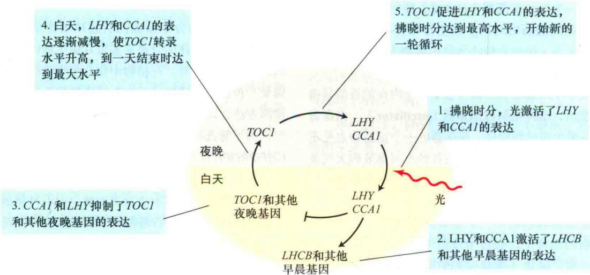  
图17.15 昼夜节律振荡器模型展示了在拟南芥中TOC1与MYB基因LHY和CCA1可能的相互作用。早晨，光增加了LHY和CCA1的表达，LHY和CCA1调控其他白天和夜晚基因。

这些发现表明，拟南芥中的光敏色素和隐花色素都能驱动昼夜生物钟。光的输入显然是由early flowering3（ELF3）和time for coffee（TIC）来调控的。ELF3突变使黄昏时生物钟的振荡终止，而TIC突变使拂晓时的生物钟终止。elf3/tic双突变体完全无节律性，说明TIC和ELF在生理节律的不同阶段与不同的生物钟元件相互作用（Hall et al., 2003）。

基因表达与昼夜节律 光敏色素也可在基因表达水平上与昼夜节律相互作用。在转录水平，昼夜节律和光敏色素可调节编码光系统Ⅱ的捕光色素叶绿素a/b结合蛋白的LHCB基因家族的表达。

在豌豆和小麦叶片中，发现LHCB mRNA水平随每天光-暗循环发生振荡变化，早晨升高，夜晚下降。即使在持续黑暗情况下，也有节律性存在，它显然是一种昼夜节律。但光敏色素可干扰这种表达的循环模式。

当小麦幼苗从一个12 h黑暗/12 h光的循环转移到持续黑暗环境时，节律性可保持一段时间，但慢慢消减（如幅度减小，直至没有峰和谷）。然而，如果植物在移到暗处前照射了一次红闪光，节律性将不会消减（即LHCB mRNA水平与它们在光-暗循环中的一样，持续发生振荡变化）。

与此相反，在白天结束时的一次远红光照射可阻止持续黑暗下LHCB的表达，并且这种远红光效应可被红光所逆转。我们监控的不是恒定条件下慢慢消减的振荡器，而是与振荡器相伴随的生理事件。红光可恢复振荡器与生理过程之间的耦合。

微阵列分析显示，拟南芥中超过30%的基因表达受昼夜节律控制（Michael and Mcclung，2003）。有意思的是，许多参与类似细胞活动的基因表现出相似的节律（Hamer et al., 2000）。例如，许多光合必需基因的转录峰都接近主观日 $^{①}$ 的中心；而细胞壁合成必需基因的转录峰接近主观夜的中心。通过对这些基因的启动子序列进行仔细检测，人们发现了一个称为夜晚元件（evening element）（AAAATATCT）的9核苷酸基序，它可调控许多基因在主观日结束时的表达达到峰值。

昼夜节律与适应 人们很早就知道昼夜节律在植物开花的光周期中起着重要的作用（见第25章），而直到最近人们才得到它们在最优化营养生长下的实验证据（Dodd et al., 2005）。过长或过短周期生物钟的拟南芥突变体生长在模拟白天-夜晚循环下，这些人工的白天-黑夜循环有的与振荡器周期一致，有的不一致。昼夜节律与环境中的光-暗循环一致 [昼夜节律同步（circadian resonance）]的植物比脱离环境节律的植物含有更多叶绿素和生物量。进而，当它们共同生长在竞争实验条件下，与脱离环境节律的植物相比，昼夜节律与环境昼夜节律钟相一致的植物则有更强的竞争力，并最终在竞争中胜出。因此，昼夜节律同步促进植物在最适时间内进行营养生长（光合作用和生物量）和生殖发育，以增强植物进化的适应性。

此外，生物钟在促进多倍体植物的茁壮生长方面也发挥着重要作用。在合成拟南芥多倍体植物中，生物钟功能的改变与光合作用，以及淀粉生物合成需要的一些基因的表达量上调是相关联的。这种关联性表明昼夜节律在调节生物量方面扮演了重要角色（Ni et al., 2009）。

## 17.7 生态学功能

我们已讨论了实验室研究过程中光敏色素所调控的反应。然而，光敏色素在自然环境下植物的生长过程中也起着重要的生态学作用。下面我们将要学习光敏色素是如何参与并调节各种各样日常节律性，以及植物是如何感知周围其他植物的遮蔽并作出相应的反应。另外，我们还将探讨在这些过程中不同光敏色素基因家族成员的特异功能（Web Topic 17.6）。

## 17.7.1 光敏色素能使植物适应光质的变化

所有高等植物从藻类到双子叶植物，都有一个红光/远红光可逆的色素，说明这些波段的光可使植物适应它们生存的环境。在自然光照下，什么环境条件能引起这两种波段光的相对水平的变化呢？

不同环境下，红光（R）和远红光（FR）的比例变化很大，这个比例可被表示为

$$
\frac {\mathrm{R}}{\mathrm{FR}} = \frac {\text {以} 6 6 0 \mathrm{nm为中心的} 1 0 \mathrm{nm波段宽的光子通量率}}{\text {以} 7 3 0 \mathrm{nm为中心的} 1 0 \mathrm{nm波段宽的光子通量率}}
$$

表17.3比较了8种自然环境下光子（400\~800 nm）的总光密度和R：FR值。不同环境下这两个参数变化很大。

与直接的太阳光照相比，日落时分土中5 mm处或其他植物树冠下（如森林地表）有更多的远红光。树冠现象是由于绿色叶片含有大量的叶绿素，吸收红光，而远红光相对可透过叶片。

表17.3 重要生态学光参数

<table><tr><td></td><td>光子流密度/ [μmol/(m2·s)]</td><td>F:FRa</td></tr><tr><td>白天日光</td><td>1900</td><td>1.19</td></tr><tr><td>夕阳</td><td>26.5</td><td>0.96</td></tr><tr><td>月光</td><td>0.005</td><td>0.94</td></tr><tr><td>橡树冠层</td><td>17.7</td><td>0.13</td></tr><tr><td>湖中1m深处</td><td></td><td></td></tr><tr><td>黑海湾</td><td>680</td><td>17.20</td></tr><tr><td>利文湖湾</td><td>300</td><td>3.10</td></tr><tr><td>Loch Borralie</td><td>1200</td><td>1.20</td></tr><tr><td>土中深5mm处</td><td>8.6</td><td>0.88</td></tr></table>

资料来源：Smith，1982  
注：光密度因素（400\~800 nm）以光子流密度给出，光敏色素活性光以R：FR表示

a绝对值来自分光辐射度计的检测；这些值表示各种自然条件的关系，并不是真实的环境值

## 17.7.2 R: FR下降导致阳生植物的伸长

光敏色素的一个重要功能是使植物能感知其他植物的遮阴。植物受到周围植物遮阴时，茎伸长速度加快，这就是避阴反应（shade avoidance response）。随着遮阴程度的增加，R：FR变小（表17.3），远红光的比例越大，Pfr转化成Pr越多，Pfr与总光敏色素的比值（Pfr/P $_{total}$ ）下降。

自然光刺激植物，体内远红光吸收型光敏色素的含量发生变化，此时，发现在遮阴系统即R：FR可以调控的环境中种植所谓的阳生植物（在开阔地带的生境下能正常生长的植物），当光敏色素的红光吸收型Pr含量较高（即低的Pfr： $P_{total}$ ）时，植物的茎伸长加快（图17.16）。换句话说，模拟冠层遮阴（高水平远红光；低Pfr： $P_{total}$ ）可诱导阳生植物获得更多的光使其生长得更快，而对于正常生长在遮阴环境下的“阴生植物”来说，这种关联性就不那么强。当暴露于高R：FR的光下时，阴生植物茎伸长的减慢程度比阳生植物小（图17.16）。因此，光敏色素调控的植物生长和植物物种的生境之间显然存在系统的相关性。这些结果说明光敏色素参与了植物对遮阴的感受。

“阳生植物”或“避阴植物”有一个明显的适应值，当它受到周围植物的遮阴时，可将营养分配到伸长生长更快部位，以获得更多的光照。通过这种方式，阳生植物增强了生长以超过株冠，从而得到更多没有经过过滤的、光合有效光的机会。避阴运动中，植株趋向于节间伸长，结果经常造成叶面积变小，分枝减少，但至少在阳光稀少的情况下，这种对株冠遮阴的适应性还是有作用的。

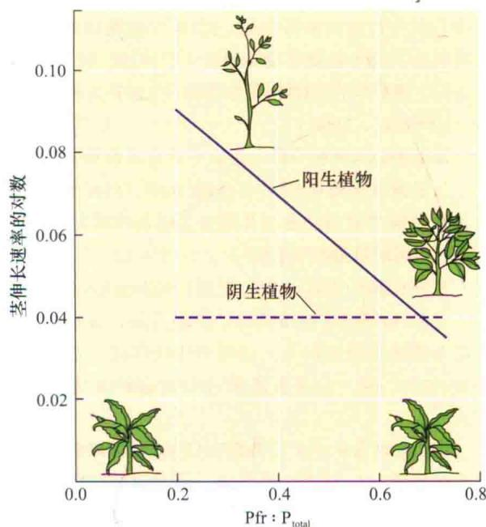  
图17.16 阳生植物（实线）和阴生植物（虚线）光敏色素在遮阴感受中的作用（引自Morgan and Smith，1979）。

拟南芥遗传分析显示，phyB在调节许多植物避阴反应中起着重要的作用，但phyD和phyE也有作用，尤其对叶柄的伸长。PhyA在拮抗phyB、phyD、phyE介导的反应方面起作用（参见本章部分后续内容）。遮阴和未遮阴植物的微阵列分析已证明并扩展了遗传学研究（参见Web Topic 17.7）。关于植物如何利用反射光感知它们周围的植物等，请参见Web Essays 17.3。

研究证据表明，生长素、赤霉素和乙烯等多种激素信号转导途径的整合也参与调控植物发育可塑性的过程。最近几份研究报告显示，PIF蛋白在调节植物避阴反应中发挥着重要作用，并且这些反应中至少有一部分是通过GA信号通路来调节的（图17.17、图14.12和图20.20）。如前文所述，PIF蛋白一般作为植物光形态建成的负调节子发挥功能，而且受光敏色素的负调控。这种PIF蛋白和PHY蛋白功能间的拮抗作用使得植物实现了对光环境变化反应的微调节。

当植物生长在高R：FR条件下时，如在植物树冠处，PHY蛋白在核内聚集，PIF蛋白此时是没有活性的。而当植物在黑暗中或低R：FR条件下时，一部分光敏色素从核内运出，促使有活性的PIF蛋白增加，进而促进伸长反应（Lorrain et al., 2008）。除PIF-PHY互作外，PIF蛋白也受DELLA蛋白的负调节作用。DELLA蛋白是GA信号途径中的一个重要组分（de Lucas et al., 2008；Feng et al., 2008）。因此，PIF蛋白似乎汇合了

图17.17 光信号和植物激素信号途径交叉。暗处，赤霉素促进植物生长，依赖于其与受体结合调节DELLA蛋白的泛素化（参考第14章和第20章）。随后，泛素化的DELLA蛋白被26S蛋白酶体降解。缺少DELLA蛋白时，PIF蛋白对基因的表达可能起正向调控作用，也可能起负向调控作用，这些作用的发挥主要是通过与不同的搭档，即目标基因上游的不同顺式作用元件的互作来实现的。光下，DELLA蛋白与PIF蛋白结合，抑制PIF蛋白与基因互作。同时，PIF蛋白也是PHY蛋白的靶目标，通过磷酸化导致PIF蛋白的泛素化和降解。PIF蛋白缺失后，细胞扩增所需基因不表达，最终导致植物生长缓慢。

由暗形态建成向光形态建成转变（如叶绿素的生物合成）中的各种光信号，并参与了植物对光质变化的微调节反应（如避阴反应）。由于PIF蛋白是转录因子，这更证实了现有的观点，即至少有一部分光敏色素的信号转导通路是相对较短的。

## 17.7.3 颗粒小的种子的萌发通常需要高R：FR值

光质在调控一些种子的萌发中也起重要作用。如前所述，光敏色素是在光依赖的莴苣种子萌发研究中被发现的。

一般来说，颗粒大的种子含有丰富的营养，能维持延伸的幼苗在暗中（如地下）的生长，它们的萌发不需要光。然而，许多草本和草原物种的小颗粒种子的萌发需要光，如果这些种子被埋在光穿透不到的土壤深处，它们大多将一直处于休眠状态，甚至被水合。即使这些种子处于地表或接近地表处时，植物株冠的遮阴水平（即它们接受的R：FR）也可能影响它们的萌发。例如，已有的报道表明，冠层的远红光聚集可抑制许多种类的小颗粒种子的萌发。

对于那些处于森林深处地面的热带物种喇叭树（Cecropia obtusifolia）和韦拉克鲁斯胡椒（Piper auritum）的小颗粒种子而言，如果及时地将一个滤光片（仅冠层遮阴光中的红光成分透过，而阻止远红光成分透过）置于种子上时，这种种子萌发的抑制就会被逆转。虽然株冠透过很少的红光，但足以刺激种子的萌发。大多数远红光抑制作用的解除可能是通过这种光过滤作用和较高的R：FR的存在而实现。通过株冠缝隙接受太阳光的种子比处于稠密遮阴地带的种子更有可能萌发。太阳光能有利于幼苗在耗尽种子中所储存的营养之前，通过光合作用维持自身生长。

## 17.7.4 减少避阴反应可提高农作物产量

避阴反应可能是植物对自然环境的高度适应的结果，有利于植物与其周围植物之间的竞争。但许多农作物种类，从生殖生长到营养生长的能量重新分配，减少了农作物的产量。近年来，如玉米产量的增加，主要通过培育新的耐株间稠密度（诱导了避阴反应）的品种，而不是通过增加单个植株的基础产量。结果，现在的玉米与以前的品种相比，在不降低产量的情况下能在更高植株密度下生长（图17.18）。

图17.18 高密度种植的玉米新品种。传统上，美国本土人把玉米种在小山或小丘上，小丘间有几英尺（1英尺=0.3048 m）的间隔，植株矮小，经常结出许多小谷穗。相比较，现代的杂交种是由机器成行种植的，株与株的间距很小[典型的为30 000\~38 000株/英亩（1英亩=0.4047 hm²）]。虽然多年来商品杂交品种的单株产量已不再持续提高，但总产量一直在增加，主要是在高种植密度下优化植株的性能。图中显示的是一个纽约州的典型玉米地。新品种直立的叶，有利于密植条件下植株捕获光能（T. Brutnell惠赠）。

由于人们对避阴反应的机制有了更深的了解，因此，为通过基因工程手段研究低避阴农作物开辟了广阔的前景。例如，Robson和他的同事构建了超表达phyA的转基因烟草植株（Robson et al., 1996）。这些植株在高密度下生长时，并不表现出典型的避阴反应，在高密度下比在低密度下长得更矮。phyA的超表达使处于富含远红光的遮光处植物体内持续保持phyA，而此时正常幼苗（非phyA的超表达），phyB已开始占主导作用。phyA的存在可引起FR-HIR反应的增加（见前文），并与phyB调控的避阴反应相拮抗。

虽然还有许多机制有待阐述，但研究已显示，光敏色素或它们下游靶因子操纵技术已不失为一种增加作物产量的具有广阔前景的新方法（Sawers et al., 2005）。

## 17.7.5 光敏色素反应呈现出生态型变化

到目前为止，我们知道的所有模式植物的光反应大多数是在有限数量的品种或检索中得到的。例如，已在拟南芥Colmbia和Landsberg生态型中进行了大量的遗传分析。在水稻和玉米中各有两个种系进行了全基因组测序。因此全世界植物研究计划趋于集中在这些品种。

然而，考虑到生态网络中光敏色素的作用时，必须检测更多的种质资源。拟南芥和玉米的光反应研究已揭示出其生理学及光敏色素基因家族方面巨大的生态型变化。例如，拟南芥Wassile wskija（Ws）生态型中一个phyD基因被自发删除，而Le Mans，France（Lm-2）的生态型中带有光稳定型phyA，不能调节持续远红光的反应（Aukerman et al., 1997; Maloof et al., 2001）。这些研究表明，光敏色素反应的多样性可能具有一些适应性的价值。确定光敏色素这些多样性变化是如何使植物适应不同生境的研究，将是未来研究的一大挑战。

## 17.7.6 光敏色素作用的调控

其他光受体的作用是否调节光敏色素的作用？编码调控蓝光反应的隐花色素和向光色素光受体（见第18章）基因的分离，使分析这些光受体是否与光敏色素存在功能上的重叠成为可能（Chory and Wu，2001）。因为隐花色素CRY2基因的突变导致该突变体在持续白光下开花延迟，而已知开花延迟受光敏色素控制。

持续蓝光或远红光处理可促进拟南芥开花，而红光抑制其开花。远红光是通过phyA起作用，红光拮抗效应是通过phyB来调节。既然蓝光促进开花，人们有可能推测cry2突变体开花会延迟。然而，cry2突变体在持续蓝光或红光下的开花时间与野生型是一样的。只有在蓝光和红光共同照射下，才能看到开花延迟。因此，cry2极有可能以直接互作的方式抑制phyB的功能（Mas et al., 2000），促进蓝光下植物开花。

另外的实验已证实隐花色素CRY1也与光敏色素相作用。CRY1和CRY2可与phyA在体外相作用，以依赖phyA的方式被磷酸化。在体内也发现了依赖红光的CRY1的磷酸化。

## 小结

光照调节植物的光形态建成，光敏色素参与调节光形态建成中营养生长和生殖生长的诸多方面（图17.1，表17.1）。

## 光敏色素的光化学和生物化学特性

· 红光在光形态建成中的作用可以被远红光逆转，相似的，远红光的作用也可以被红光逆转（图17.2）。

· 光敏色素存在Pr 和 Pfr 两种形式，Pfr 为其活性形式，这两种形式可以相互转变，形成光稳态（图 17.3）。

## 光敏色素诱导的反应的特性

· 光化学反应具有不受时间和光通量影响的特点（图17.4）。

· 光可逆的反应需要极少量的光（LFR）（图17.5）。

\- 短暂的光脉冲就能够诱导极低辐照度反应和低辐照度反应，但是对于其他的反应来说，这些反应与辐照度成比例关系（表17.2）。

## 光敏色素蛋白的结构和功能

\- 光敏色素是由两个亚基构成的二聚体。每个亚基由吸收光的发色团和与其共价结合的脱辅基蛋白多肽链组成（图17.6和图17.8）。光敏色素只能以二聚体形式吸收红光和远红光。

· 光敏色素折叠形成完整蛋白后，可以被红光激活，随后以生理激活型状态Pfr形式移动到核内调节基因表达（图17.7和图17.10）。

· 光敏色素是一种能够自磷酸化的蛋白激酶（图17.9）。在进化上，其起源早于真核生物。细胞溶质中，光敏色素接受红光和远红光信号后，能在几分钟甚至几秒内改变膜电势和离子流向，光敏色素在细胞核内功能在于调控基因表达。

· 不同性质的光敏色素由同一家族的不同成员编码，拟南芥中该家族成员包括PHYA、PHYB、PHYC、PHYD和PHYE。

## 光敏色素功能的遗传分析

· 光敏色素A介导持续性的远红光反应和红光反应。在拟南芥和水稻中，光敏色素A调控开花。

· 光敏色素B介导持续性的红光和白光反应，并且调节避光反应比如加速开花和促进下胚轴伸长。

· 光敏色素C、D和E也参与发育调节，但是这些功能可能与光敏色素A和B的功能有部分冗余。

· 不同信号通路途径中，光敏色素下游的信号分子各不相同，因此，能在不同物种甚至不同器官中产生不同的反应（图17.11和图17.12）。

## 光敏色素信号途径

· 光敏色素诱导的早期基因产物是能够激活其他基因的转录因子。

\- 对于初级反应的基因来说，信号转导途径与蛋白合成是相互独立的；而次级反应的基因需要新蛋白的合成。

· PIF家族成员是光敏色素反应的负调节子，在这

个信号通路的早期发挥作用。

· 一种蛋白如果只能与光敏色素A或者光敏色素B发生互作，光敏色素信号通路将在该点出现分支，而与光敏色素A和光敏色素B同时互作，信号通路将在该点汇集。

· 光敏色素可以与其他的激酶和磷酸酶相互作用（图17.13）。

· 光敏色素诱导基因表达产生的酶，可以使被蛋白酶体降解的蛋白泛素化（图17.14）。

## 昼夜节律

· 大多数的生物都表现出内源性的生物节律，而这些生物节律受到一种不受温度影响的内部振荡器或者是生物钟的控制。

· 在拟南芥中，转录水平上和翻译水平上的控制是生物钟功能调节这一复杂反馈环路上的重要调节单元（图17.15）。

· 在拟南芥中，光敏色素和隐花色素都参与生物钟调节。

· 光合系统Ⅱ（PSⅡ）中捕光色素蛋白的基因转录受昼夜节律和光敏色素的共同调节。

· 昼夜节律能够优化营养生长。

## 生态功能

· 在自然环境中，光敏色素使植物具有响应遮阴的功能。

· 遮阴行为（高水平的远红光或者低的 Pfr : P $_{total}$ ）诱导喜光植物长得更高（图17.16）。

· 拟南芥中光敏色素B在遮阴回避反应中发挥着主要的作用，在这个过程中光敏色素D和E在叶柄的伸长中也同样发挥着作用。

\- PIF蛋白和赤霉素信号通路相互作用调节植物的遮阴反应（图17.17）。

· 遮阴行为形成的高远红光环境抑制一系列小颗粒种子的物种的萌发。

· 合理密植可以减少遮阴回避行为，提高作物产量（图17.18）。

\- 蓝光反应在功能上可能与光敏色素的信号相重叠。

(赵翔 张骁 译)

## WEB MATERIAL

Web Topics

17.1 Mougeotia: A Choroplast with a Twist

Microbean irradiation experiments have been used to

localize filamentous green alga.

17.2 Phytochrome and High-Irradiance Responses
Dual-wavelength experiments helped demonstrate the role of phytochrome in HIRs.

17.3 The Origins of Phytochrome as a Bacterial Two-Component Receptor
The discovery of bacterial phytochrome led to the identification of phytochrome as a protein kinase.

## 17.4 Profiling Gene Expression in Plants

Progress in bioinformatic tool development and new sequencing technologies are changing the way we look at transcriptional networks.

17.5 Two-Hybrid Screens and Co-immunoprecipitation Protein-protein interactions can be studied using both molecular-genetic and immunological techniques.

## 17.6 Phytochrome Effects on Ion Fluxes

Phytochrome regulates ion fluxes across membranes by altering the activities of ion channels and the plasma membrane proton pump.

17.7 Microarray Studies on Shade Avoidance DNA microarray analyses have helped to characterize both global and specific effects of variations in the R : FR ratio on gene expression.

## Web Essays

## 17.1 Awakened By a Flash of Sunlight

When placed in the proper soil environment, seeds acquire extraordinary sensitivity to light, such that germination can be stimulated by less than 1 second of exposure to sunlight during soil cultivation.

## 17.2 Diversity of Phytochrome Chromophores

Bacterial and higher plant chromophores vary in their structure, attachment chemistries, and spectral properties. By replacing plant chromophores with bacterial chromophores, plants can be engineered to "see" different wavelengths of light.

## 17.3 Know Thy Neighbor Through Phytochrome

Plants can detect the proximity of neighbors through phytochrome perception of the R : FR of reflected light and produce adaptive morphological changes before being shaded by potential competitors.

# 第 18 章

# 蓝光反应: 形态建成和气孔运动

人们都熟悉这样一种现象：放在室内窗边的植物枝条会向着光源的方向生长。这种现象称为向光性，这也是植物如何对单侧光作出反应以改变其生长模式的一个例子。这种植物对光的反应与光合作用的光捕获有着本质的区别。在光合作用中，植物利用光能并把它转化为化学能（见第7章和第8章）。与光合作用相比，向光性是利用光作为信号的一个例子。目前，有两种主要的光信号反应：一种是光敏色素介导的红光反应，这已在第17章中讲过；另一种是蓝光反应（blue-light response）。

有些蓝光反应在第9章中介绍过，例如，光下叶绿体在细胞中的运动及叶片向光转动。与光敏色素反应一样，植物也存在许多蓝光反应。在高等植物、藻类、蕨类、真菌和原核生物中已经有过关于蓝光应答反应的相关报道。除了向光性外，还包括藻类的离子吸收、幼苗下胚轴生长的抑制、叶绿体和类胡萝卜素合成的诱导、基因表达的激活、气孔运动和呼吸的增强。在能运动的单细胞生物中，如藻类和细菌，蓝光调节单细胞生物体接近或远离蓝光的趋光性反应（Sengar，1984）。蓝光也介导如布鲁氏等细菌的感染过程（Swartz et al., 2007）。

一些发生在细胞膜上的电反应可在蓝光照射后数秒内检测到。其他的代谢或形态建成反应，如蓝光刺激链孢霉菌（Neurospora）中色素的合成或藻类（Vaucheria）分枝的形成可能需要数分钟、数小时甚至数天的时间（Horwitz，1994）。

叶绿素和光敏色素吸收可见光中波长为400\~500 nm的蓝光；而其他发色团和一些氨基酸（如色氨酸）吸收紫外光中波长为250\~400 nm的光。那么，人们如何从功能上区分蓝光特异的反应呢？从使用红光的光合作用可以区分蓝光的特异反应，红光可以促进光合作用而对蓝光反应没有作用。通过测定红光/远红光的

可逆反应可区分蓝光反应和光敏色素反应，红光/远红光之间可逆反应是光敏色素反应的特性，而蓝光则没有此类反应。

另一重要特征是，许多高等植物的蓝光反应都具有独特的作用光谱。在第7章已讲过，作用光谱是描述可见光在产生生物响应中相对效力的光谱图（关于光谱学和作用光谱的详细介绍参见Web Topic 7.1）。通过比较发现，蓝光反应的作用光谱与可能的光受体的吸收光谱之间密切相关，这就表明所研究的调节光反应的色素可能就是介导特异光反应的光受体（图7.8）。

作为蓝光调节的向光性、气孔运动、下胚轴生长的抑制及其他一些重要反应的作用光谱，它们在400\~500 nm区域内有一独特的“三指”精细结构（图18.1），而在光合作用、光敏色素或其他光受图18.1 燕麦胚芽鞘中蓝光调节的向光性的作用光谱。作用光谱显示一个生物反应和吸收光谱之间的关系。在400\~500 nm区域内的“三指”结构是一些蓝光反应的特征（引自Thimann and Curry，1960）。

体所介导的光谱中却不具备这种结构（Cosgrove，1994）。

在本章中，我们将介绍植物中一些有代表性的蓝光反应，如向光性、茎生长的抑制和气孔运动等。其中气孔运动将详细论述，因为气孔在叶片气体交换和植物对环境的适应性反应过程中具有重要作用（见第9章）。同时，我们将探讨蓝光受体以及连接机体对光的感知与最终的蓝光应答之间的信号转导通路。

## 18.1 蓝光反应的光生理学

蓝光信号调控植物的诸多生理反应，以使植物感知光的存在及光的方向。本节主要论述典型蓝光反应的形态学、生理学及生物化学变化。

来自侧边的两束不均匀光  

## 18.1.1 蓝光诱导的不对称生长和弯曲

向着光（或特殊情况下背离光）的方向生长叫向光性（phototropism）。真菌、蕨类和高等植物中都存在向光性。向光性是一种光形态建成（photomorphogenetic）反应，黑暗中生长的单子叶和双子叶幼苗尤为显著。在实验研究中通常用单侧光，但是在自然条件下，当幼苗暴露在不同方向的两个光亮度不同的光源下，仍可发生向光性（图18.2）。向光器官内的光梯度，可能对植物感知光信号有着重要的意义（见Web Topic 18.1）。

  
来自侧边的两束均匀光  
图18.2 生长方向和不对称入射光照射之间的关系。显示的子叶图片是从幼苗上面观察得到的。箭头指示向光弯曲的方向。图像展示的是生长方向如何随着光源的位置和强度的改变而变

当一株小草破土而出时，其幼芽被一个称为胚芽鞘（coleoptile）（变形的叶片）的结构覆盖而保护（图

18.3和图19.1）。正如第19章所述，胚芽鞘向光侧和背光侧不同的光强度，导致两侧生长素浓度不均等，进而造成了胚芽鞘不均等的生长和弯曲。

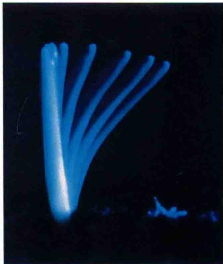  
图18.3 玉米胚芽鞘朝着右边单侧蓝光生长的慢速拍摄照片。左边第一个图像上，胚芽鞘大约3 cm长。连续曝光30 min。注意胚芽鞘弯曲角度随其生长而增加（M.A.Quinones惠赠）。

值得注意的是，向光弯曲只发生在正在生长的器官中，那些停止生长的胚芽鞘和胚芽即使在单侧光照射下，也不再发生向光弯曲。光下生长的草本植物，当其胚芽破土而出，第一片真叶从胚芽鞘尖端伸出时，胚芽鞘就停止生长。黑暗中生长的黄化胚芽鞘可以持续快速生长几天，高达几厘米，但这种情况要视植株种类而定。这些黄化胚芽鞘具有显著的向光反应（图18.3），因此是研究向光性的经典模型（Firn，1991）。

图18.1所显示的作用光谱是通过测量不同波长的光照射下燕麦胚芽鞘的弯曲角度获得的。光谱显示，在大约370 nm处有一峰值，并且正如前面提及的在400\~500 nm区域内有“三指”模型。双子叶植物苜蓿（Medicago sativa）的向光性作用光谱与燕麦胚芽鞘的很相似，表明这两种植物的向光性反应由相同的光受体介导。

在过去的30多年，由于先进的分子技术在拟南芥突变体中的便捷应用，使得这种小双子叶植物茎的向光性研究备受关注（图18.4）。有关拟南芥向光性的遗传与分子生物学知识将在本章后面介绍。

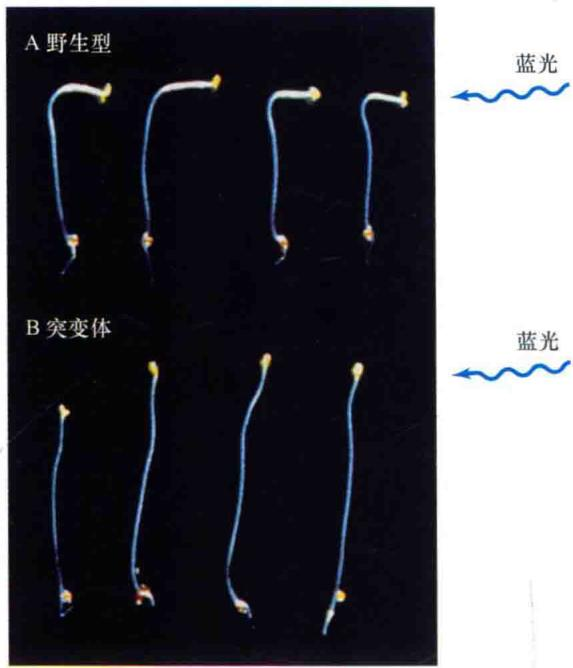  
图18.4 野生型（A）和突变体（B）拟南芥幼苗的向光性。单侧光从右边照射（Dr. Era Huala惠赠）。

## 18.1.2 蓝光快速抑制茎的伸长

实际上，生长在暗处的幼苗茎伸长得很快，当幼苗破土而出时，光抑制茎伸长，这一现象是一个重要的光形态建成反应（见第17章）。照光后黄化幼苗中Pr与Pfr（分别代表光敏色素的红光和远红光吸收形式）之间的转变导致光敏色素依赖的茎伸长速率的急剧下降（图17.1）。

然而，值得注意的是，导致生长速率下降的作用光谱在蓝光区域内具有很强活性，这不能用光敏色素的吸收特性来解释（参考Web Topic 17.2）。实际上，在400\~450 nm蓝光区域内，抑制茎伸长的作用光谱与向光性反应的作用光谱极为相似（比较Web Topic 17.2与图18.1的作用光谱）。

从实验中，人们可以区分生长速率的下降是由光敏色素介导的还是由蓝光特异反应所调节的。如果莴苣幼苗在强黄光背景下，施加低通量的蓝光，其下胚轴生长速率就下降一半多。黄光背景提供了精确的Pr：Pfr比率（见第17章），增加低通量的蓝光并不能显著的改变的这一比率，从而排除了在施加蓝光情况下光敏色素对生长速率下降的影响。上述结果显示，蓝光调节的特异的下胚轴伸长反应与光敏色素介导的反应相互独立。

从时间进程上也可以把蓝光介导的特异的下胚轴反应与光敏色素所介导的下胚轴反应相区分开。由于物种不同，光敏色素介导的生长速率的改变在8\~90 min可检测到变化；然而蓝光反应却很迅速，在15\~30 s即可检测到（图18.5 A）。本章下面部分将讲到光敏色素与蓝光依赖的信号途径在生长速率调控方面的互作。

蓝光诱导的另一个快速反应，就是下胚轴生长速率受到抑制之前所发生的细胞去极化反应（图18.5B）。阴离子通道激活可以导致阴离子（如氯离子）流出细胞，从而引发膜的去极化（见第6章）。阴离子通道的阻断剂NPPB（5-nitro-2-14-phenylbutylamino-benzoate），可抑制依赖蓝光的膜的去极化，减弱蓝光对下胚轴的抑制效应（Spalding，2000）。

  
图18.5 蓝光诱导的黄瓜幼苗生长速率的变化（A）和下胚轴细胞膜的短暂去极化（B）。当膜去极化（用细胞内电极测得）达到最大值时，生长速率（用位置传感器测量）则迅速下降。比较这两种曲线可看出，膜去极化发生在生长速率下降之前。这暗示了这两种现象之间的因果关系（引自Spalding and Cosgrove, 1989）。

## 18.1.3 蓝光促进气孔开放

现在讨论气孔对蓝光的反应。气孔在叶片的气体交换中起着重要的作用（见第9章），这种调节的有效性可影响到农作物的产量（见Web Topic 26.1）。依赖蓝光的气孔运动的几个独特特征使保卫细胞成为研究蓝光反应的一个有价值的实验体系。

（1）蓝光调节的气孔反应，反应迅速并且可逆，此反应仅在保卫细胞中存在（图18.6）。

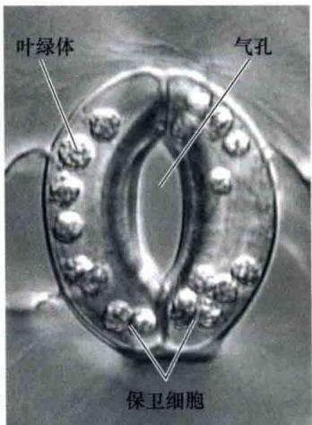

  
20μm

（2）蓝光调节的气孔运动贯穿植物的整个生活周期，而蓝光对向光性和下胚轴伸长的调节，仅发生在植物发育的早期阶段。

（3）蓝光感受和气孔开放之间的信号转导通路已有相当详细的研究。

下面论述气孔对光反应的两个重要方面：驱动气孔运动的渗透调节机制，以及保卫细胞离子吸收过程中受蓝光激活的 $H^{+}$ -ATP酶的作用。

光作为重要的环境信号，调控生长于自然环境下、水分供应充足的植物叶片气孔运动。当到达叶片表面的光增加时，气孔开放；反之气孔关闭（图18.6）。在温室中生长的蚕豆（Vicia faba）叶片，其气孔随入射到叶片表面的太阳光而发生运动（图18.7）。在许多物种及不同情形下都已发现这种光依赖的气孔运动。

气孔对光应答反应的早期研究显示，二氯苯二甲脲（dichlorophenyldi-methylurea，DCMU）（一种光合电子传递系统的抑制剂）可部分抑制由光引起的气孔开放。这些结果表明，保卫细胞叶绿体的光合作用在光依赖的气孔开放过程中起作用。但是，对二氯苯二甲脲部分应答暗示一种涉及二氯苯二甲脲不敏感的机制，这说明非光合作用成分在气孔对光的应答反应中也有作用。有关气孔在可见光照射下对光反应的详细研究表明，光可激活保卫细胞中两种不同的反应：保卫细胞中叶绿体的光合作用（参见Lawson，2009，Web Essay 18.1）和蓝光特异的反应。

既然蓝光除了刺激其特异的气孔反应外，还调节保卫细胞的光合作用（参见图7.8中光合作用的作用光谱），那么仅用蓝光来研究气孔对蓝光的特异反应就显得不合适。为了比较清晰的区分这两种光反应，研究人员使用了双光束实验。首先，用高通量的红光使光合反应达到饱和状态，这样的状态阻止了随后再增强红光或蓝光时光合作用对气孔开启的调节。然后在饱和红光的基础上再附加低通量的蓝光（图18.8）。附加的蓝光可使气孔进一步显著开放，这并不是保卫细胞中光合作用所引起的，因为此时的光合作用已被红光所饱和。

图18.6 光刺激蚕豆离体表皮的气孔开放。光处理开放的气孔（A），暗处理关闭的气孔（B）。气孔开度的大小以显微镜测得的气孔宽度表示（E. Raveh 惠赠）。  
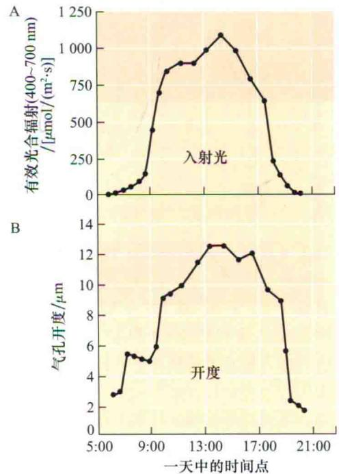  
图18.7 叶片表面的气孔开放与有效光合辐射的曲线。生长于温室中的蚕豆（V. faba）叶片下表皮的气孔开度以测得的气孔宽度表示（A），紧随着照射至叶片的有效光合辐射水平（400\~700 nm）（B），这些都揭示气孔对光的反应是调节气孔开放的主要反应（引自Srivastava and Ieiger，1995a）。

饱和红光背景下，气孔对蓝光反应的作用光谱呈现前面已提及的“三指”模型（图18.9）。这种作用光谱是典型的蓝光反应光谱，与光合作用的作用光谱是有显著区别的。这暗示保卫细胞除进行光合作用外，还对蓝光有特异反应。

图18.8 红光背景下气孔对蓝光的反应。鸭跖草（Commelina communis）的离体表皮上的气孔用饱和红光处理（红色轨迹）。在平行实验中，气孔同时用红光和蓝光照射，如箭头所示（蓝色轨迹）。气孔开度比达到饱和红光时还要大，这表明一种受蓝光刺激的不同的光受体系统介导了气孔的额外增大（引自Schwartz and Leiger，1984）。  
  
图18.9 蓝光刺激的气孔开放的作用光谱图（红光为背景）（引自Karisson，1986）。

用纤维素酶等分解植物细胞壁的相关酶类分解保卫细胞的细胞壁后，可得到用来进行实验的保卫细胞原生质体（guard cell protoplasts）。当照射蓝光时，保卫细胞原生质体就会膨胀（图18.10），表明蓝光可被保卫细胞感知。保卫细胞原生质体的膨胀可显示完整的保卫细胞是如何发挥作用的。由光刺激引起的离子吸收和保卫细胞原生质体有机溶质的积累降低了细胞的水势（增大了渗透压）。因此，水分进入细胞，保卫细胞原生质体膨胀。在具有完整的细胞壁的保卫细胞中，这样的细胞膨胀导致了细胞壁的变形并且导致了气孔开度的增加（见第4章）。

## 18.1.4 蓝光激活保卫细胞质膜上的质子泵

当蚕豆保卫细胞原生质体在背景红光下照射蓝光时，悬浮介质的pH会变得更酸（图18.11）。蓝光诱导的这种酸化作用可被能驱散pH梯度的抑制剂（如CCCP，见下文）所阻断，也可被质子泵 $H^{+}$ -ATP酶的抑制剂（如钒酸盐）抑制，这些已经在第6章介绍过（图18.10B）。上述结果证实，蓝光诱导的酸化作用是蓝光激活保卫细胞膜上的质子泵ATP酶所导致的。

A  
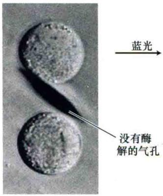

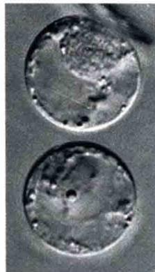  
蓝光下原生质体膨胀

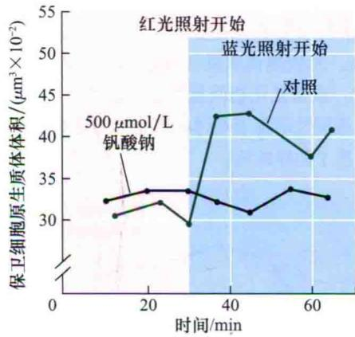  
图18.10 蓝光刺激的保卫细胞原生质体膨胀。A. 无坚硬的细胞壁时，洋葱（Allium cepa）的保卫细胞原生质体膨胀；B. 蓝光刺激的蚕豆（V. faba）保卫细胞原生质体的膨胀，且钒酸盐（一种H $^{+}$ -ATP酶的抑制剂）能阻止这种膨胀反应。蓝光促使保卫细胞原生质体对离子和水分的吸收，为完整保卫细胞的气孔开度的增加提供了机械动力（A图引自leiger and Hepler, 1977；B图引自Amodeo et al., 1992）。

  
图18.11 蚕豆（V. faba）保卫细胞原生质体悬浮介质在蓝光刺激30 s后的酸化作用。这种酸化是由于蓝光对质膜H $^{+}$ -ATP酶的激活作用，并且与原生质体的膨胀相联系（图18.12）（引自Shimazaki et al., 1986）。

在完整的叶片中，蓝光激活质子泵可降低保卫细胞质外体空间的pH，产生离子吸收和气孔开放所需的驱动力。保卫细胞质膜上的 $H^{+}$ -ATP酶已得到分离，并且其特征已被广泛研究（Kinoshita and Shimazaki，2001）。

像质子泵ATP酶这类生电泵的活性，可借助膜片钳实验来进行检测，并以细胞膜的外向电流来表示（有关膜片钳的描述参见Web Topic 6.2）。图18.12 A显示的是用膜片钳记录的经真菌毒素壳梭孢菌素（一种广泛应用的质膜ATP酶的激活子）处理的黑暗中的保卫细胞原生质体的电流。壳梭孢菌素处理可以激活外向电流并形成质子梯度。羰基氰化物间氯苯腙（CCCP，一种使质子具有高度透膜性的离子载体）阻止质子跨膜梯度的形成，抑制了质子的净外流。

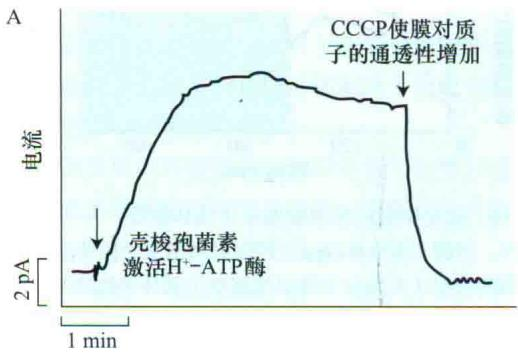

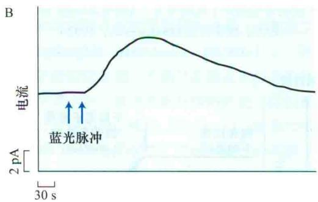  
图18.12 壳梭孢菌素和蓝光所激活的保卫细胞原生质体质膜 $H^{+}$ -ATP酶的活性可以用膜片钳实验所记录的电流来表示。A. 真菌毒素壳梭孢菌素（即 $H^{+}$ -ATP酶的激活子）所激活的保卫细胞原生质体质膜的外向电流（以皮安计量，pA），该电流可被离子载体羰基氰化物间氯苯腙（CCCP）所抑制。B. 由蓝光脉冲刺激的保卫细胞原生质体质膜的外向电流。这些结果表明蓝光激活了 $H^{+}$ -ATP酶（A引自Serano et al., 1988；B引自Assmann et al., 1985）。

壳梭孢菌素刺激保卫细胞原生质体质子的泵出和气孔的开放，CCCP抑制壳梭孢菌素刺激的气孔开放，上述这些发现表明，保卫细胞质膜上的质子泵和气孔开放之间存在一定的关系。蓝光刺激提高质子泵出的速率，表明当辐射到叶片的太阳光中蓝光成分增加会使气孔开度增加，饱和红光背景下的蓝光刺激也可以激活保卫细胞原生质体的外向电子流（图18.12B），图18.11中蓝光刺激的电子流和酸化反应之间的相关性证明实验中所测得的电流是质子从细胞内流向质外体或细胞外时形成的。

## 18.1.5 蓝光反应具有独特的动力学特征和时间滞后现象

有关气孔应答蓝光脉冲瞬时反应的一些特征进一步揭示出蓝光反应的重要特性：反应在光信号关闭后仍存在，这一重要的时间滞后现象可把光信号的开始与反应的开始加以区分开。与典型的光合作用反应不同，光合作用在光信号的刺激下很快激活并且随着光信号的终止而停止反应（图7.13），而蓝光反应在光脉冲照射几分钟后才达到峰值（图18.11和图18.12B）。

生理学上认为，光信号停止后蓝光反应可持续一段时间的原因是，在蓝光作用下蓝光受体由非活性状态转变为活性状态，关闭蓝光光源后，蓝光受体由活性状态转变为非活性状态的过程比较缓慢（Iino et al., 1985）。蓝光脉冲的反应速率依赖于蓝光受体的活性状态与非活性状态之间的转化进程。

蓝光脉冲反应的另一重要特征是滞后时间，即蓝光激活的酸化反应与外向电流的产生都存在大约25 s的滞后性（图18.11和图18.12）。这一滞后时间可能用于完成从光受体感受位点到质子泵H $^{+}$ -ATP酶的信号转导和质子梯度的形成。与之类似，前面已经讨论过的蓝光依赖下胚轴生长抑制的反应也有滞后时间。

## 18.1.6 蓝光调节保卫细胞的渗透平衡

蓝光通过激活质子泵和促进有机溶质的合成来调节保卫细胞的水势。在我们讨论蓝光的这些反应之前，先简要论述一下保卫细胞的渗透活性物质。

1856年，植物学家Hugovon Mohl提出，保卫细胞的膨压变化为气孔开度的变化提供了机械动力（见第4章）。1908年，植物生理学家F.E.Lloyd提出气孔运动的“淀粉-糖”相互转化假说，认为保卫细胞的膨压变化是由淀粉-糖的转变所引起的渗透变化来调节。20世纪40年代，日本学者发现了保卫细胞的钾离子流动，20世纪60年代西方国家再次证明该发现，建立了目前的K+和其平衡离子Cl-与苹果酸盐调控保卫细胞渗透平衡的理论，取代了气孔运动的“淀粉-糖”假说。

气孔开放时，保卫细胞内的K⁺浓度可成倍的增加，从关闭状态的100 mmol/L到开放状态下的400\~800 mmol/L，具体增加值要视物种和具体的实验条件而定。在大多数物种中， $\mathbf{K}^{+}$ 浓度的大幅度变化可被 $\mathrm{Cl^-}$ 和苹果酸根离子来平衡（图18.13A）（Talbott et al., 1996，参见Web Topic 18.2）。另一方面在葱属（Alliun）植物中，如洋葱（A.cepa），其 $\mathbf{K}^{+}$ 仅被 $\mathrm{Cl^-}$ 来平衡（Schnabl and Ziegler, 1977）。

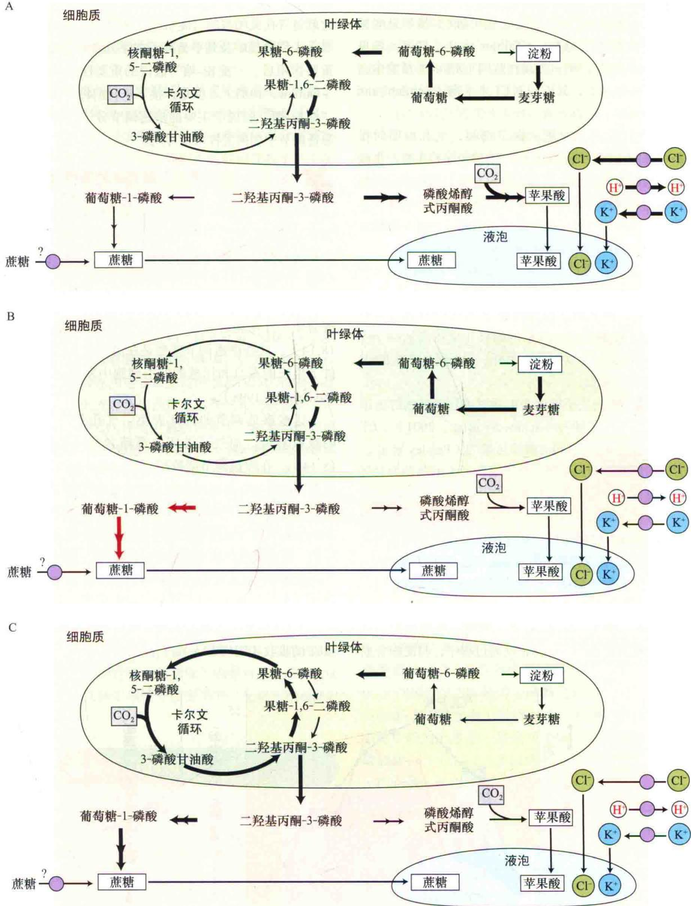  
图18.13 保卫细胞中三条显著不同的渗透调节途径。黑色箭头表示在保卫细胞的每一条渗透调节途径中导致活性渗透溶质积累的主要代谢步骤。A. K⁺离子及其平衡离子，K⁺和Cl⁻的吸收来自于质子梯度驱使的次级转导过程以及由淀粉水解产生的苹果酸。B. 蔗糖的积累来自于淀粉的水解。C. 来自于光合碳固定过程的蔗糖的积累。同时显示出来自质外体的蔗糖的吸收（引自Talbott and leiger，1998）。

Cl⁻在气孔开放时进入保卫细胞，气孔关闭时排出。苹果酸在保卫细胞胞质中，通过经淀粉水解产生碳骨架的代谢途径合成（图18.13B）。保卫细胞中苹果酸的含量随着气孔的关闭而下降，但是目前还不清楚，苹果酸是在线粒体呼吸过程中被代谢消化了，还是被排到细胞质外，或者同时参与两种过程。

前已述及，通过质子泵产生的 $H^{+}$ 所形成的电化学势梯度（ $\Delta\mu_{H^{+}}$ ）驱动了 $K^{+}$ 和 $Cl^{-}$ 的吸收（见第6章和图18.13）。质子的分泌使得保卫细胞跨膜的电动势负值更大。已测得的光依赖的超极化电压高达64 mV（Roelfsema et al., 2001）。另外，质子泵所产生的pH梯度为0.5\~1个单位。

第6章中提到质子梯度为 $K^{+}$ 通过电压调节的钾通道的被动吸收提供了动力（Schroeder et al., 2001）。 $Cl^{-}$ 被认为是通过质子-氯同向载体运输的（Pandey et al., 2007）。因此，蓝光依赖的质子泵所产生的驱动力对气孔开放过程中的离子吸收起重要作用。

与叶肉细胞的叶绿体不同，保卫细胞的叶绿体（图18.6）中存在大的淀粉粒，其淀粉含量在早晨随着气孔的开放而降低，傍晚随着气孔关闭而上升。淀粉不溶于水，是高分子量多聚葡萄糖，对维持细胞的水势不起作用，但是当其水解成葡萄糖和果糖及后来的蔗糖积累（Talbot and Zeiger，1998，图18.13B）后可降低保卫细胞的渗透势（或增大渗透压）。在相反的过程中，当淀粉合成增加时，可溶性糖的含量减少，导致细胞渗透势增加，这就将气孔关闭与的“淀粉-糖”假说联系起来。

人们发现K $^{+}$ 及其平衡离子在保卫细胞渗透调节中起重要作用后，“淀粉-糖”假说的重要性逐渐被忽略了（Outlaw，1983）。但是，接下来我们将阐述蔗糖作为“淀粉-糖”假说中主要的渗透调节分子，在保卫细胞渗透调节中如何发挥重要作用。

## 18.1.7 蔗糖是保卫细胞中的活性渗透溶质

通过研究完整叶片气孔在一天里的运动过程发现，保卫细胞中 $K^{+}$ 的含量在清晨气孔开放时增加，而在下午早些时候，尽管气孔开度继续增加，但 $K^{+}$ 的含量却降低。与之相比，蔗糖含量在清晨上升缓慢，并且随着钾离子的外流，蔗糖逐渐成为保卫细胞中主要的活性渗透溶质。在傍晚时分，气孔关闭，蔗糖含量降低（图18.14）。这些渗透调节模型是在温室或人工培养箱条件下生长的蚕豆和洋葱的保卫细胞中发现的（Talbott and Zeiger，1998）。

这些渗透调节的特征表明，气孔开放主要与 $K^{+}$ 的吸收有关，而气孔关闭与蔗糖含量降低有关（图18.14）。在渗透调节诸阶段，是钾离子起主导作用还是蔗糖起主导作用仍不清楚，但这也为气孔功能的调节奠定了基础。 $K^{+}$ 是白天气孔开放首先的渗透调节溶质。蔗糖的调节则与表皮细胞的气孔运动和叶肉细胞的光合作用二者之间协同调节相关联（Lawson，2009）。

活性渗透溶质来自于何处？研究表明，有三条主要的代谢途径可为保卫细胞提供活性渗透物质（图18.13）。

（1）伴随保卫细胞苹果酸根离子合成的质外体 $K^{+}$ 和 $Cl^{-}$ 的吸收（图18.13A）。

  
时间点  
图18.14 蚕豆完整叶片保卫细胞气孔开度、 $K^{+}$ 和蔗糖浓度在一天中的变化情况。结果表明，早上气孔开放所需的渗透势由 $K^{+}$ 及其平衡离子所调节，而在午后则由蔗糖来调节（引自Talbott and leiger，1998）。

（2）保卫细胞叶绿体中淀粉的水解产生蔗糖（图18.13B）。

（3）保卫细胞叶绿体中光合碳固定过程产生蔗糖（图18.13C）。

不同的环境条件可能激活一条或几条途径。例如，置于 $CO_{2}$ 中的离体蚕豆表皮的气孔受红光刺激而开放，该过程仅依赖于保卫细胞原生质体中叶绿体光合碳固定所产生的蔗糖，并没有检测到 $K^{+}$ 的吸收或淀粉水解（图18.13C）。另外，在不含 $CO_{2}$ 的空气中，碳的固定是被抑制，而红光刺激气孔开放与 $K^{+}$ 钾离子的积累相藕联（图18.13A，Olsen et al., 2002；另见Web Topic 18.2）。

自然界中也存在一些不寻常的渗透调节途径。兰花保卫细胞的叶绿体缺乏叶绿素。兰花的气孔在蓝光下开启，但在典型的红光刺激下并不张开（Talbott et al., 2002）。相反，最近研究结果表明，铁线蕨的气孔缺乏对蓝光的应答而在红光下开启（Doi et al., 2008）。铁线蕨的保卫细胞具有异常多的叶绿体，红光依赖的气孔开放可以被光合作用电子传递的抑制剂DCMU抑制，这表明保卫细胞的光合作用是红光诱导气孔开放驱动力。另外，铁线蕨在 $CO_{2}$ 环境中累积钾离子，但是无论黑暗或红光下都对 $CO_{2}$ 不敏感。有趣的是，这些特异的渗透调节都与保卫细胞中存在异常多的叶绿体相关。此外，铁线蕨的气孔缺乏对蓝光的敏感性。相反，蚕豆气孔对 $CO_{2}$ 和蓝光的敏感性与气孔开放呈现出线性关系（Zhu et al., 1998）。这些结果表明铁线蕨对蓝光和 $CO_{2}$ 不敏感可能是与其缺乏蓝光传递系统有关（参考Web Essay 18.2）。

上述兰花和铁线蕨保卫细胞渗透调节的显著差异，表明保卫细胞具有很强的可塑性。在对完整的叶片的研究中也能发现保卫细胞的可塑性特征（Roelfsema et al., 2002; outlaw, 2003; Fan et al., 2004; Tallman, 2004）。这些可塑性特征包括保卫细胞对蓝光和 $CO_{2}$ 反应的适应，以及保卫细胞光合速率的日变化（Zeiger et al., 2002）。

## 18.2 蓝光反应的调节

目前，蓝光诱导气孔开放的信号转导过程中的几个关键步骤已被证明。质子泵 $H^{+}$ -ATP酶是气孔运动调节的中心环节。 $H^{+}$ -ATP酶的C端有一个调节酶活性的自我抑制结构域（图6.17）。如果这个自我抑制结构域被蛋白酶消除， $H^{+}$ -ATP酶将会被不可逆转地激活。酶活性的降低是通过抑制该区域的催化基团实现的。相反，壳梭胞菌素似乎是通过将这一结构域置换到远离催化基团的部位来激活酶的活性（Kinoshita and Shimazaki，2001）。

蓝光刺激 $H^{+}$ -ATP酶表现对ATP较低的 $K_{m}$ 值，较高的 $V_{max}$ 值，暗示蓝光可激活 $H^{+}$ -ATP酶（见第6章）。 $H^{+}$ -

ATP酶的激活，依赖于其C端丝氨酸和组氨酶的磷酸化。蛋白激酶抑制剂，能抑制 $H^{+}$ -ATP磷酸化，抑制蓝光激活的质子泵和气孔开放。壳梭胞菌素，像 $H^{+}$ -ATP酶磷化一样，解除 $H^{+}$ -ATP酸C端自我抑制区域对 $H^{+}$ -ATP酶催化位点的抑制。

14-3-3蛋白是真核生物中普遍存在的调控蛋白，研究发现14-3-3蛋白可以与磷酸化的保卫细胞H $^{+}$ -ATP酶结合，但是不能和未磷酸化的结合（图18.15）。植物中，14-3-3蛋白通过与细胞核内激活因子的结合调控转录过程，也可以调节如硝酸还原酶等代谢酶的活性。

  
图18.15 H $^{+}$ -ATP酶在调节气孔运动中的作用。蓝光激活H $^{+}$ -ATP酶。该作用主要是通过磷酸化该酶C端的Ser或Thr残基，随后保卫细胞中的分子伴侣14-3-3蛋白与H $^{+}$ -ATP酶磷酸化的C端结合。

目前研究发现保卫细胞中仅1/4的14-3-3蛋白能与 $\mathrm{H^{+}}$ -ATP酶特异结合。蓝光或壳梭胞菌素刺激可促使这种类型的14-3-3蛋白与保卫细胞中 $\mathrm{H^{+}}$ -ATP磷结合，而 $\mathrm{H^{+}}$ -ATP酶C端功能域的去磷酸化作用，则使14-3-3蛋白与 $\mathrm{H^{+}}$ -ATP酶分离（图18.15）。最近研究表明，保卫细胞中的向光素是一种蓝光受体，蓝光可诱导其发生磷酸化，并与14-3-3蛋白结合，详述请参看后面章节（Kinoshita et al., 2003）。

保卫细胞的质子泵运输质子的效率随着蓝光强度的增加而增加（图18.12），质子泵所产生的电化学梯度驱动保卫细胞吸收离子，使保卫细胞不断的膨胀并引起气孔开启。这一过程是蓝光激活丝氨酸/苏氨酸蛋白激酶与蓝光刺激引起的气孔开放这两个过程的重要重要中间步骤（图18.15）。

## 18.3 蓝光受体

Charles Darwin和他的儿子Francis在19世纪进行的向光性反应中证明，植物通过其胚芽鞘尖端感应蓝光。早期的理论假设认为，蓝光受体可能是位于胚芽鞘顶端的类胡萝卜素和黄素这两种色素。虽然人们一直不懈的努力，但是直到20世纪90年代早期，蓝光受体的鉴定才取得突破性进展。关于向光性和抑制茎生长方面的研究成果都归功于一些重要蓝光响应突变体的鉴定和相关基因的分离。

随后我们主要介绍参与蓝光反应的三种受体：隐花色素，主要参与调节抑制茎伸长和开花；向光素，主要参与向光性反应；以及玉米黄质，主要参与蓝光诱导的气孔开放。

## 18.3.1 隐花色素调节植物发育

隐花色素首先在拟南芥中发现，之后在许多生物体包括蓝藻、蕨类植物、藻类、果蝇、老鼠及人类中均发现了这种物质，通过对拟南芥hy4突变体的研究完成了对隐花色素的功能鉴定。在本章前面已提及，拟南芥hy4突变体缺失蓝光调节的下胚轴伸长的抑制反应。由于遗传上的缺陷，hy4植株在蓝光照射时，表现出下胚轴伸长。HY4基因的分离显示，该基因编码一个75 kDa蛋白质，该蛋白质与微生物DNA光裂解酶（photolyase）具有重要同源序列。DNA光裂解酶是一种蓝光激活的酶，具有修复暴露于紫外光下的DNA中的嘧啶二聚体作用（Ahmad and Cashmore，1993）。鉴于其序列的相似性，HY4蛋白质后来被称为隐花色素1（crytochrome 1，CRY1），是抑制茎伸长的蓝光受体。然而植物中的隐花色素并无光裂解酶活性。

与光裂解酶一样，隐花色素由一个黄素腺嘌呤单核苷酸（flavin adenine dinucleotide，FAD）（图11.2B）和一个蝶呤（pterins）构成。蝶呤是吸收光的物质，其衍生物蝶啶通常存在于昆虫、鱼类及鸟类的色素细胞里（蝶呤结构见第12章）。在光裂解酶中，蓝光被蝶呤色素吸收，产生的激发能被传递给黄素腺嘌呤单核苷酸。然而，还不清楚隐花色素的作用机制是否相似，或者是蓝光直接被黄素腺嘌呤单核苷酸吸收。

隐花色素调节多种蓝光应答反应，包括抑制下胚轴伸长、促进子叶伸展、细胞膜去极化、叶柄生长、花青素的产生和生物钟的调控。CRY1超表达的转基因烟草和拟南芥中，强蓝光刺激的下胚轴伸长的抑制明显增强，花青素苷的合成明显增加（图18.16）。

从拟南芥中还分离得到CRY1的同源物CRY2（Lin，2000）。CRY1和CRY2广泛存在植物界。它们之间的区别在于CRY2在蓝光下快速降解，而CRY1表现地更为稳定。

野生型背景下超表达CRY2，得到的转基因植物在下胚轴伸长抑制效应方面作用很小。这表明与CRY1不同，CRY2在抑制下胚轴伸长的反应中并不起作用。但是，CRY2超表达的转基因植物可明显增强蓝光刺激的子叶扩展。除此之外，CRY1参与拟南芥生物钟调节（见第17章），CRY1和CRY2在诱导开花过程中都起作用（见第25章）。隐花色素类似物可调节果蝇、老鼠和人类的生物钟。

光照后CRY1和CRY2都可在细胞核检测到，并且它们都与泛素连接酶COP1（其在体内及体外的实验第17章中已经论述过）相互作用。隐花色素的活性受其磷酸化状态的影响。CRY1和CRY2在体外即可被光敏色素A磷酸化，但是它们与光敏色素A的互作主要发生在体内（见第17章和Web Essay 18.2）。研究表明，磷酸化和蛋白降解在隐花色素介导的蓝光信号转导过程中均起重要作用（Spalding and Folta，2005）。

关于细胞核与细胞质中CRY蛋白质的区别已经在拟南芥中鉴定过了（Wu and Spalding，2007）。与预想不同，CRY1分子存在于细胞核中而不是细胞质中。CRY1可以在几秒的时间内调控细胞膜的去极化，这也是CRY1响应蓝光信号调控最为快速的方式之一。但目前还不清楚该机制是否与依赖蓝光的阴离子通道的激活有关。

## 18.3.2 向光素调节依赖蓝光的向光弯曲和叶绿体运动

已知植物在单向光源照射下会弯向光源生长，以最大限度吸收光，这种向光性反应受蓝光调控（图18.4）。缺乏依赖蓝光的下胚轴向光弯曲的拟南芥突变体分离和鉴定，为研究向光弯曲早期的细胞事件提供了有价值的信息。其中的一个突变体，nph1（nonphototropic hypocotyl），其在遗传上不同于早先提及的hy4（cryl）突变体。nph1突变体缺失下胚轴的向光反应，但具有正常的蓝光刺激的下胚轴伸长的抑制反应，而hy4的表型却与之相反。nph1基因后来被重新命名为phot1，其所编码的蛋白质被命名为向光素（phototropin）（Briggs and Christie，2007）。向光素（Phot1和Phot2）调节植物的向光性、叶绿体的运动、快速抑制黄化苗的生长和叶片的伸展。

A  
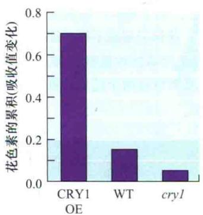

B  
  
图18.16 蓝光诱导拟南芥转基因和突变体植株中花色素的累积（A）和茎伸长的抑制反应（B）。柱状图分别代表编码CRY1基因的超表达植株（CRY1OE）、野生型（WT）和cry1突变体植株。编码CRY1基因的超表达转基因植株对蓝光反应增强，表明该基因在刺激花色素的合成和抑制茎伸长反应中具重要的作用（引自Ahmad et al., 1998）。

向光素C端含有一个Ser/Thr的蛋白激酶区域，N端含有两个相似的LOV（光、氧气和电压）区域，每一区域大约有100个氨基酸。LOV区域与黄素结合，其序列与细菌和哺乳动物体内信号蛋白相类似。这些蛋白质在大肠杆菌（E.coli）和固氮细菌（Azotobacter）中是氧气的感受子，在果蝇（Drosophila）与脊椎动物中则是钾离子通道的电压感受器。

向光素的N端与黄素单核苷酸（flavin mononucleotide，FMN）相结合（图11.2B），并且发生依赖蓝光的自我磷酸化反应。此反应与黄化幼苗生长区域的一个120 kDa膜蛋白的依赖蓝光的自我磷酸化反应很相似。尽管多个研究组分别进行大量的实验但是向光素自我磷酸化之后细胞内所发生变化及其与蓝光反应的关系还不清楚（Inoue et al., 2008）。

最近的光谱学研究表明，黑暗处，一个FMN分子非共价地与一LOV区域结合。经蓝光照射，FMN分子共价地结合在向光素分子的半胱氨酸残基上，形成半胱氨酸-黄素共价加合物（图18.17）（Swartz et al., 2004），这一反应可被黑暗处理所逆转。

  
图18.17 蓝光照射下，FMN与向光素的半胱氨酸残基形成加合物。XH和X-分别代表未鉴定的质子供体和质子受体（引自Briggs and Christie，2002）。

在拟南芥基因组中还有与phot1相联系的另一个基因——phot2。phot1突变体在低强度蓝光[0.01\~1 μmol/(m²·s)]照射下，其下胚轴缺失向光弯曲反应，但是在高强度蓝光[1\~10 μmol/(m²·s)]照射下仍能保持向光反应。phot2突变体具有正常的向光反应，而phot1/phot2双突变体无论在低强度蓝光还是在高强度蓝光下都严重缺失向光反应。这说明phot1和phot2都参与向光反应，phot2仅在高光强或者通过长时间光照下才起作用。

光受体在茎伸长抑制反应中的相互作用 通过对蓝光抑制下胚轴的伸长反应过程中生长速率变化的精细分析，为研究向光素、CRY1、CRY2与PHYA（Parks et al., 2001）之间的相互作用提供了有价值的信息。在蓝光处理30 s后，野生型拟南芥幼苗在开始的30 min内伸长速率快速下降，随后几天内缓慢生长（图18.18）。

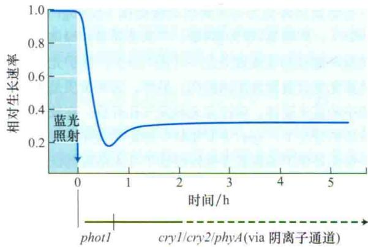  
图18.18 蓝光刺激的拟南芥茎伸长抑制反应中的信号感受与转导通路。在暗处（0.25 mm/h）的伸长速率定为1。蓝光照射30 s，30 min内生长速率下降到接近于零，随后几天内生长速率持续在一个很低水平。当用蓝光处理phot1突变体后，在第一个30 min暗处生长速率保持不变，这表明在第一个30 min内生长的抑制是受向光素控制的。用cry1、cry2和phyA突变体所做的类似实验表明，这三个基因产物在后期控制茎的伸长速率（引自Parks et al., 2001）。

对phot1、cry1、cry2和phyA突变体的同一反应分析发现，在幼苗去黄化过程中，蓝光对茎伸长的抑制反应首先由phot1启动，而CRY1和一定量的CRY2则在30 min后调节反应。经蓝光处理的幼苗，其茎生长速率缓慢主要是由于CRY1的持续作用，这也是拟南芥cry1突变体的下胚轴比野生型长的原因。phyA突变体中并没有发现生长抑制现象，表明光敏色素A至少在蓝光调节的生长反应的早期阶段起作用。

蓝光诱导的叶绿体运动 叶片在不同的光照条件下可改变细胞内叶绿体的分布，叶绿体的重新分布可以调整光吸收和避免光伤害（图9.13）。弱光下，叶绿体在叶肉细胞的上下表面聚集（即“聚集”反应；图9.13B），从而最大限度地增强植物对光的吸收。

强光下，叶绿体移向细胞表面与入射光平行（即“避光”反应；图9.13C），从而尽可能减少植物对光的吸收和避免光伤害。诱导叶绿体重新分配的作用光谱具有典型的蓝光反应特征——精确的“三指”结构。最近的研究表明，phot1突变体的叶肉细胞具有正常的避光反应和微弱聚光反应，而phot2突变体的细胞具有微弱聚光反应，然而缺乏避光反应。在phot1/phot2双突变体中，完全缺失避光和聚光反应（Kadota et al.,

2009）。该结果表明，phot2在避光反应中起着重要作用，而且phot1和phot2在聚集反应中表现功能冗余。

## 18.3.3 玉米黄质对保卫细胞蓝光感受的调节

拟南芥突变体npql（nonphotochemical quenching）的气孔缺少特异的蓝光反应，该突变体中催化类胡萝卜素紫黄质转变为玉米黄质的酶受损（Niyogi et al., 1998）。回顾第7章和第9章，玉米黄质是叶绿体中叶黄素循环途径的主要成分之一（图7.35），保护光合作用色素免受过量激发能的损伤。另外，玉米黄质是保卫细胞中的蓝光受体，调控蓝光激发气孔开放。在缺失玉米黄质的情况下，npql突变体缺少特定的蓝光反应，为玉米黄质是保卫细胞蓝光受体提供了令人信服的证据（图18.19）（Freanina et al., 1999）。

  
图18.19 A. 玉米黄质缺失的突变株nph1及向光素缺失的双突变株phot1/phot2对蓝光的敏感度。在 $100\ \mu mol/(m^{2}\cdot s)$ 的红光背景下分析蓝光反应，这样可以避免由于蓝光刺激的光合作用所导致的气孔开放。通过蓝光刺激光合作用，检测到抑制气孔开放的蓝光反应。黑暗条件下光通量为0。在 $10\ \mu mol/(m^{2}\cdot s)$ 的蓝光照射下，两种突变体的气孔都没有开放。phot1/phot2双突变株在较高蓝光强度照射下气孔开放。事实上，npq1突变体气孔关闭，最有可能是因为，附加的蓝光对光合作用驱动的气孔开放产生了抑制作用。B. 蓝光激活野生型植株的气孔开放。Y轴显示气孔开度的变化，与野生型相比，phot1/phot2气孔的开度明显减小（Talbott et al., 2002）。

另外有证据进一步指出，在保卫细胞中玉米黄质作

为蓝光受体发挥功能。

（1）生长于温室里完整叶片的气孔开放、有效辐射和保卫细胞中玉米黄质的含量日变化之间紧密相关（图18.20）。

  
图18.20 保卫细胞中玉米黄质的含量与有效光合辐射、气孔开度之间的密切关系。A. 叶片表面有效光合辐射和温室生长的蚕豆叶片保卫细胞（黑色线条）及叶肉细胞（绿色线条）中玉米黄质含量的日变化。图中白色区域凸显叶肉细胞和保卫细胞中的叶绿体在低辐射（常常发生在清晨和黄昏）下，对叶黄素循环的敏感性比较。B. 同一叶片的气孔开度用来测定保卫细胞中玉米黄质的含量（引自Srivastava and Zeiger，1995a）。

（2）玉米黄质的吸收光谱（图18.21）与蓝光诱导的气孔开放的作用光谱（图18.9）非常相似。

（3）保卫细胞对蓝光的敏感性随着玉米黄质浓度的增大而增强。紫黄质到玉米黄质的转变依赖于类囊体腔的pH。光驱动的类囊体膜质子泵可酸化类囊体内腔，增加玉米黄质的浓度（图18.22）。由于叶黄素循环的特征，红光照射的保卫细胞积累玉米黄质。离体的表皮上的保卫细胞先被施加不断增加的红光影响比率，然后用很短的蓝光脉冲照射，结果显示蓝光刺激气孔开放与红光预处理的影响比率及在蓝光脉冲照射时保卫细胞内玉米黄质的含量呈线性相关（Srivqtava and Zeiger，1995b）。

（4）蓝光诱导的气孔开放可被3 mmol/L的二硫苏糖醇（DTT）抑制，且这种抑制具有浓度依赖性。DTT

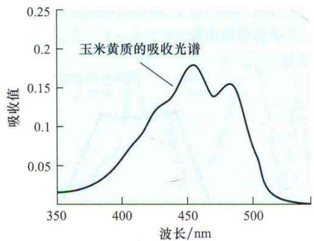  
图18.21 玉米黄质在乙醇中的吸收光谱。

可阻断玉米黄质的合成。作为一种还原剂，DTT可把S—S键还原为—SH基，并有效抑制使紫黄质转变为玉米黄质的酶的活性。DTT并不阻断红光激发的气孔开放（Strivastava and Zeiger，1995b）。

（5）兼性CAM植物冰叶日中花（Mesembryanthemum crystallinum），盐胁迫使其碳代谢从C3模式变为CAM模式（见第8章和第26章）。在C3模式中，气孔积累玉米黄质并且受蓝光刺激张开。CAM效应则抑制了玉米黄质的积累和响应蓝光刺激的气孔开放（Tallman et al., 1997）。

（6）在玉米胚芽鞘向蓝光弯曲的反应中，玉米黄质含量和向光性反应线性相关（Web Topic 18.3）。

## 18.3.4 绿光逆转蓝光刺激的气孔开放

蓝光刺激的气孔开放可被绿光（500\~600 nm）所逆转。当保卫细胞同时接收蓝光和绿光照射时，气孔的蓝光反应将被抑制（见 Web Essay 18.4）。在脉冲实验中，绿光同样能逆转蓝光反应（图18.23）。离体表皮实验中，30 s 的蓝光脉冲可以诱导气孔开放，但若是蓝光脉冲过后给予绿光脉冲，则蓝光诱导的气孔开放被抑制。如果绿光处理后再第二次照射蓝光，气孔开放将得到恢复，这与光敏色素红光和远红光的可逆反应类似（Frechilla et al., 2000）。蓝光和绿光之间的可逆反应已经在几种植物离体表皮实验中得到证实，同时在完整的叶片中也被观察到（参见Web Essay 18.4）。

  
图18.22 玉米黄质在保卫细胞的蓝光感应中的作用。保卫细胞中玉米黄质的浓度随着叶黄素循环的活性而发生改变。将紫黄质转变为玉米黄质的酶是一种类囊体膜蛋白，该酶作用的最佳pH为5.2（Yamamoto，1979）。管腔酸化刺激玉米黄质和碱性紫黄质的形成。腔内的pH取决于入射光的有效辐射水平（蓝光和红光波长作用最有效，参见第7章）及ATP的合成速率，而ATP的形成有赖于能量消耗和跨类囊体pH梯度的消耗。因此，保卫细胞中叶绿体光合作用的活性、管腔pH、玉米黄质含量及蓝光灵敏度在调节气孔开度上相互作用。与叶肉细胞中相应的成分相比，保卫细胞叶绿体中含有丰富的光系统Ⅱ，因此，它们具有较高的光合电子传递速率及较低的碳固定率（Zeiger et al., 2002）。这些特性在低光子通量条件下有利于管腔酸化，同时也解释了保卫细胞叶绿体中玉米黄质的形成（图18.20），管腔pH调控的玉米黄质含量，以及管腔pH与保卫细胞叶绿体中卡尔文-本森循环的紧密结合，进一步表明保卫细胞叶绿体的二氧化碳固定率调节了玉米黄质的含量并整合了保卫细胞对光和二氧化碳的灵敏度（Web

  
图18.23 气孔运动的蓝光-绿光可逆性。当在连续红光 $[120\ \mu mol/(m^{2}\cdot s)]$ 背景下给以30 s蓝光脉冲 $[1800\ \mu mol/(m^{2}\cdot s)]$ ，气孔开放。在蓝光脉冲之后，用绿光脉冲 $[3600\ \mu mol/(m^{2}\cdot s)]$ 处理，可阻止上述蓝光反应，然而，如果在绿光脉冲处理后再给以第二次蓝光脉冲处理，气孔开放则恢复（引自Frechilla et al., 2002）。

培养室中拟南芥完整叶片的气孔受到蓝光、红光和绿光同时照射，关闭绿光时，气孔开放，而再次打开绿光气孔关闭（图18.24）（Talbott et al., 2006）。这种气孔对绿光的敏感性反应不受叶肉和保卫细胞的光合作用的调控，因为光合效率低时气孔会关闭，即使感应到绿光关闭信号。只用红光和绿光照射叶子的实验中，关掉绿光，并未观察到绿光介导的气孔开放。因此，绿光调节的气孔开放反应只有在蓝光存在的情况下才能被观察到，就像在离体的表皮条实验中观察到的那样。在完整叶片的气孔对绿光反应的有重要的生理生态意义，即来自太阳光照射时的绿光子在自然条件下下调蓝光照射下的气孔反应。

向光素缺失双突变体phot1/phot2的气孔，受蓝光刺激后会开放，绿光关闭后，气孔开度进一步增加，但是玉米黄质缺失突变体npql的气孔则无此现象（图

18.24）。上述结果说明，绿光逆转蓝光反应需要玉米黄质，并不需要向光素。

A 野生型  
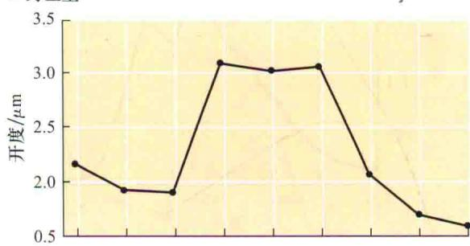

B npql单突变体  

C phot1/phot2双突变体  
  
图18.24 绿光对完整叶片上的气孔开度的调节。生长于蓝光、红光和绿光同时照射的培养室中的拟南芥完整叶片，关闭绿光时气孔开放，再次打开绿光时气孔关闭。气孔对绿光的反应需要蓝光的存在。玉米黄质缺失突变体npql的气孔对绿光不反应，而phot1/phot2双突变体的气孔与野生型有相似的反应（引自Talbott et al., 2006）。

绿光逆转蓝光诱导的气孔开放作用的光谱显示，在540 nm时抑制作用最强，在490 nm和580 nm处还有两个小峰（图18.25）。该作用光谱排除了光敏色素和叶绿素参与的可能性。该作用光谱与蓝光刺激的气孔开放的作用光谱极其相似，但是发生了大约90 nm的红移（移向更长的红光波段）。在蛋白环境中，胡萝卜素的异构化也观察到相似的红移现象。正如前面讨论的，蓝光激发气孔开放的活跃光谱与玉米黄质的吸收光谱是一致的（图18.21）。最近的光谱学研究表明，绿光对玉米黄质的异构化非常有效（Milanowska and Gruszecki，

2005）。玉米黄质的异构化改变了膜上分子的位置取向，这种转变是一个非常有效的信号转导过程。

  
图18.25 蓝光诱导气孔开放（左曲线，源自于Karlsson，1986）及其被绿光所逆转（Frechilla et al., 2000）的作用光谱。蓝光诱导气孔开度的作用光谱，是在红光背景下，通过引起测量小麦叶片蒸腾作用的波长得到的。绿光逆转蓝光诱导气孔开放的作用光谱是在照射恒定的蓝光强度及不同波长的绿光条件下，通过测量蚕豆离体表皮气孔的开度变化得到的。注意这两个光谱是相似的，绿光逆转光谱大约红移90 nm。在蛋白质的环境中，类胡萝卜素异构化之后，观察到相似的光谱红移。

类胡萝卜素蛋白质复合体对光强的感应 一种类胡萝卜素蛋白复合体作为光强感受器为保卫细胞中（Wilson et al., 2008）蓝光-绿光之间的光循环提供了模型（Wilson et al., 2008）。在蓝藻中，橙色的类胡萝卜素蛋白（OCP）是一种与光合作用光系统Ⅱ中的藻胆体天线相关的可溶性蛋白。在第7章中介绍蓝藻是常见的淡水和海洋环境的光合细菌，OCP是一个35 kDa的蛋白质，含有1个非共价结合的类胡萝卜素，3'-海胆酮。玉米黄质和3'-海胆酮在化学结构上有密切关系，它们都是由β-胡萝卜素衍生的（Punginplliet al., 2009）。

蓝光会导致类胡萝卜素和OCP蛋白质结构的变化，将它们在黑暗中的形式转换成在光照下起作用的形式，即被激活的形式（图18.26）。绿光可逆转这一过程，在光合蓝藻中，OCP的这种激活形式在光保护的介入过程中起着不可缺少的作用。此外，OCP的蓝光吸收型与绿光吸收型之间的相互转换所形成的光循环可作为一种有效的光强度感受器发挥重要作用。

  
图18.26 橙色类胡萝卜素蛋白蓝-绿光逆转吸收光谱

这些发现强烈表明，连续蓝/绿光脉冲对气孔开放的可逆调节是受光循环调控的。该过程可能涉及与蛋白相结合的玉米黄质吸收蓝光后转变为具有生理活性的绿光吸收形式，该绿光吸收形式吸收绿光后又重新转变为非活性的蓝光吸收形式。有趣的是，人们在高等植物保卫细胞、胚芽鞘叶绿体及蓝藻的OCP中，发现蓝光刺激的荧光猝灭现象（Web Essay 18.5），该现象可能与植物的光保护相关。

在20世纪40年代的胚芽鞘尖端感知蓝光的实验中，提出类胡萝卜素有可能作为蓝光受体，但此假设因为激活的类胡萝卜素具有非常短的半衰期而被排除。OCP代表一类首次文献报导蛋白与类胡萝卜素结合，作为蓝光受体感受光强的事例。这两个系统在保卫细胞叶绿体玉米黄质感知蓝光与蓝藻OCP的一些光学特征之间有惊人的相似之处，这也值得我们对这两个系统进行更深一步的研究。

光敏色素介导的气孔反应 许多研究试图界定光敏色素在气孔运动中的作用，一直没有得到突破。然而，最近研究发现在兰科苑兰及拟南芥玉米黄质缺失突变体npql中，光敏色素可调节气孔运动（Web Topic 18.4）。

因此，很明显保卫细胞对蓝光的反应可以通过三种不同的信号转导通路，即特异的蓝光受体、保卫细胞中叶绿体的光合作用，以及光敏色素介导的信号转导途径。它在气孔反应的研究中对于确定参与的信号转导通路是有用的，并且确定这些不同反应的试验方法是可行的。这一特定的蓝光反应可由绿光逆转，光合作用的蓝光成分可被饱和的红光阻挡，并且光敏色素反应是远红光的可逆反应。这些方法的应用在前面已有阐述。例如，在拟南芥突变体npq1中观察到的蓝光刺激的气孔开放不能被绿光逆转，但却可被远红光逆转，表明在此过程中参与的光受体是光敏色素（图18.19）。相反，在phot1/phot2中蓝光刺激的气孔开放可被绿光逆转，表明存在一个特殊的蓝光受体调控此反应（Tallbott et al., 2003）。

## 小结

植物利用太阳光，一是作为能量来源；二是作为感受外部环境信息的信号。蓝光信号的反应与光敏色素反应不同。

## 蓝光反应的光生理特性

· 特异的蓝光反应在波长为400\~500 nm有一个“三

指”特性的作用光谱（图18.1）。

· 这些蓝光信号被转导成为电的、代谢的和遗传的过程，从而改变植物生长、发育及其功能（图18.2）。

· 蓝光反应包括向光性、气孔运动、茎伸长的抑制、基因的激活、色素合成、叶的向光运动和细胞内叶绿体的运动等（图18.3\~图18.9）。

· 蓝光诱导的基因的转录、翻译，合成的蛋白质参与植物的光形态建成。

· 蓝光诱导的气孔运动受保卫细胞渗透势的改变驱动（图18.10）。

· 蓝光激活保卫细胞质膜H $^{+}$ -ATP酶，跨膜泵出的质子所产生的电化学势梯度为离子的吸收提供驱动力（图18.11和图18.12）。

· 蓝光也激活淀粉的降解和苹果酸的生物合成，蔗糖或钾离子和其对应共价离子在保卫细胞的积累导致气孔开放（图18.13）。

· 光质可以改变调节气孔运动的不同渗透调节途径的活性（图18.14）。

## 蓝光反应的调节

· 在植物中，14-3-3蛋白调节转录和代谢酶类。

· 仅当H $^{+}$ -ATP酶被磷酸化后，14-3-3蛋白可与其结合。

· 蓝光调节气孔运动，依赖于其对H $^{+}$ -ATP酶的激活（图18.15）。

## 蓝光受体

· 拟南芥中，基因cry1和cry2参与调节了蓝光依赖的茎伸长的抑制、叶片的扩展、花青素的生物合成、开花及生物节律的控制等（图18.16）

\- CRY1蛋白及少量的CRY2在核中积累，并与泛素连接酶COP1在体内体外相互作用。

· 隐花色素的活性受其磷酸化程度的影响。CRY1蛋白也调节质膜阴离子通道活性。

· 向光素蛋白主要作用在于调节植物向光性。蓝光处理后，向光素与黄素FMN结合，发生自我磷酸化（图18.17）。

· 向光素缺失突变体，缺失向光性和叶绿体运动。

\- 蓝光抑制下胚轴伸长由phot1和cry1启动，限制cry2积累来调节（图18.18）。

· 叶绿体中类胡萝卜素和玉米黄质参与了保卫细胞对蓝光的感受（图18.19）。

· 白天气孔开放，光的照射，保卫细胞中玉米黄质的含量和气孔的开度密切相关（图18.20）。

· 玉米黄质的吸收光谱与蓝光激活的气孔开度的活性光谱是一致的（图18.9和图18.21）。

· 用化学或者遗传方法阻止玉米黄质在保卫细胞中积累，则蓝光引起的气孔开放也被阻断。操控保卫细胞中玉米黄质的含量有可能调节气孔对蓝光的反应。

· 保卫细胞蓝光反应信号转导级联包括保卫细胞叶绿体对蓝光的感受、跨叶绿体膜的蓝光信号转导、 $H^{+}$ -ATP酶的激活、保卫细胞膨压形成及气孔的开放等（图18.22）。

· 绿光可逆转保卫细胞的蓝光反应（图18.23）。

· 在完整叶片中，可观察到对蓝光的反应被绿光逆转，表明气孔反应的调节在自然条件下具有实际意义（图18.24）。

· 玉米黄质缺失突变体无绿光逆转效应，表明该逆转反应需要玉米黄质的参与，向光素缺失突变体则有正常的蓝-绿光逆转反应。

· 绿光逆转的活动光谱与蓝光刺激下的气孔的活动光谱及玉米黄质的吸收光谱是相似的（图18.25）。

· 蓝藻类胡萝卜素蛋白复合物，叶黄素蛋白可显示蓝绿光之间的可逆性并且它们是作为一个光受体起作用的（图18.26），橙色的类胡萝卜素提供了一个在保卫细胞中由玉米黄质感受蓝光的分子模型。

(赵翔 张骁 译)

## WEB MATERIAL

Web Topics

18.1 Blue-Light Sensing and Light Gradients
Light gradients within organs might serve as sensing mechanisms.

18.2 Guard Cell Osmoregulation and a Blue Light-Activated Metabolic Switch
Blue light controls major osmoregulatory pathways in guard cells and unicellular algae.

18.3 The Coleoptile Chloroplast
Both the coleoptile and the guard cell chloroplast specialize in sensory transduction.

18.4 Phytochrome-Mediated Responses in Stomata Studies in the orchid Paphiopedilum and the zeaxanthin-less mutant of Arabidopsis, npq1, show that phytochrome regulates stomatal movements.

Web Essays

18.1 Guard Cell Photosynthesis
Photosynthesis in the guard cell chloroplast shows unique regulatory features.

18.2 Predicted Involvement of the Zeaxanthin Sensory Transducing System in the Stomatal Response to

## $CO_{2}$ under Illumination

Under constant light conditions, changes in ambient $CO_{2}$ concentrations modulate guard cell zeaxanthin concentrations and stomatal apertures.

18.3 The Sensory Transduction of the Inhibition of Stem Elongation by Blue Light
The regulation of stem elongation rates by blue light has critical importance for plant development.

18.4 The Blue-Green Reversibility of the Blue-Light

## Response of Stomata

The blue-green reversal of stomatal movements is a remarkable photobiological response.

## 18.5 Blue-Light Stimulation of Fluorescence

Cyanobacteria and guard cells share some photobiological features involving carotenoids and photoprotection.

## 第 19 章

# 生长素——第一种被发现的植物生长激素

没有细胞、组织和器官之间的信息交流，就不可能形成多细胞的、可正常发挥功能的生物。高等植物中，代谢、生长和形态建成的调控与协调通常需要植物体内移动的化学信号。这一假设最早于19世纪由德国植物学家Julis von Sachs（1832\~1897）提出。

Sachs提出，这些化学信号对于不同植物器官的形成和生长起着重要作用。同时，他还提出其他一些外界因素（如重力）可能影响这些化学物质在植物体内的分布。尽管Sachs当时并不知道这些化学物质的本性，但他的想法促进了这些信号的最终发现。

激素是产生于某种细胞或组织的化学信号物质，它们通过与特定的蛋白受体相互作用来调节其他细胞的生理过程。像动物中的激素一样，大多数植物激素在一种特定的组织内合成，而以极低的浓度在其他组织中发挥作用。那些在某一部位合成后被运输到其他部位发挥作用的激素称为内分泌激素；而那些在相邻细胞内合成又在相近的细胞处发挥作用的激素称为旁分泌激素。植物的生长发育受六大类激素的调控，它们分别是生长素、赤霉素、细胞分裂素、乙烯、脱落酸和油菜素甾醇。

植物中还鉴定出一系列在抵抗病原菌和防御食草动物侵害中起重要作用的其他信号分子，包括耦合和非耦合形式的茉莉酸、水杨酸和多肽系统素（见第13章）。最近的研究表明独脚金内酯是一种可传送的信号分子，它调控侧芽的生长（Brewer et al., 2009）；因此，独脚金内酯也可能是一种植物激素。其他类型的分子，如类黄酮（见第13章），既可以在细胞内也可以在细胞外作为信号转导途径的调节子发生作用（Peer and Murphy, 2007）。实际上，植物激素和与激素类似的信号物质的种类还在不断增加。

我们将要讨论的第一种信号物质是生长素。生长素是植物中第一种被研究的促进生长的激素。大多数早期有关植物细胞伸展机制的生理学研究都与生长素的作用相关。生长素信号调控植物生长发育的每一个方面。而且，生长素和细胞分裂素不同于其他植物激素和信号物质的一个重要方面是：它们是植物胚存活所必需的。尽管其他植物激素可以作为调节植物某些特殊生长发育过程的开关，但是植物自始至终都需要一定量的生长素和细胞分裂素。

我们从简要介绍生长素的发现过程开始，接着讲述它们的化学结构和植物组织中生长素的检测方法。再接着讨论生长素的生物合成途径及生长素的极性运输（更多关于生长素合成的内容请阅读附录3），然后介绍从受体结合到基因表达的生长素的信号转导途径的研究现状。最后，我们将简要讲述生长素调节的多种生长发育过程，如茎伸长、顶端优势、根发生、果实发育、分生组织发育和向性生长。生长素和其他激素共同调控了一些生理过程。生长素在这些过程中的作用将会在相关的章节讨论。

## 19.1 生长素概念的出现

在19世纪下半叶，Charles Darwin和他的儿子

Francis研究了植物向性生长（tropisms，源于希腊语tropos，转动的意思）现象。他们的兴趣点之一就是植物的向光弯曲，这种不对称生长的现象称为向光性。在一些实验中，Darwin父子用金丝雀草（Phalariscanariensis）的幼苗作为实验材料。金丝雀草的幼叶被包裹在一种称为胚芽鞘的保护器官中（图19.1）。

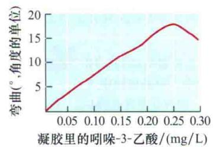

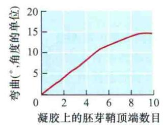

胚芽鞘和幼苗对光非常敏感，特别是蓝光（见第18章）。如果用微弱的蓝光照射胚芽鞘幼苗的一侧，它们将会在1 h之内向着光源弯曲生长。Darwin父子发现胚芽鞘的顶端能感受光。如果用铝箔将胚芽鞘的顶端覆盖，胚芽鞘将不会发生弯曲。控制胚芽鞘弯向光源的那部分区域位于胚芽鞘顶端以下几毫米处，这段区域称为伸长区。

因此，他们推断产生于胚芽鞘顶端的某种信号被运输到伸长区从而引起背光侧比向光侧生长迅速。他们的实验结果于1881年发表在The Power of Movement in Plants上。

此后，许多研究者对胚芽鞘中刺激生长的物质展开了长期的实验研究。在那时已经知道去除胚芽鞘的顶端，胚芽鞘的生长将停止。研究者曾经试图通过将胚芽鞘顶端研磨后检测提取物活性的方法分离并鉴定这种促进生长的化学物质。但是，这种方法失败了，这是因为在研磨组织的过程中，那些在正常情况下存在于细胞区室中的抑制性物质也释放到了提取液中。

1926年Frits Went证明了燕麦（Avena sativa）胚芽

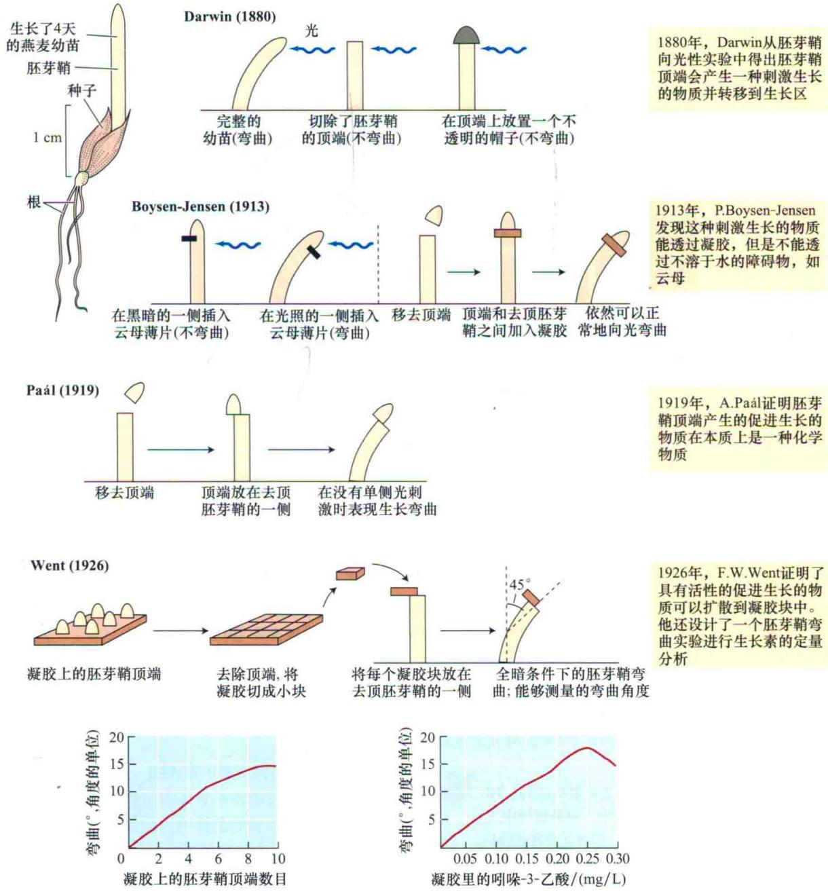  
图19.1 生长素研究的早期实验概述。

B

鞘顶端存在促进生长的化学物质，使研究达到了顶点。Went最大的突破在于他避免使用研磨的方法，而是将那些化学物质从切割开的胚芽鞘顶端直接扩散到凝胶块中。如果将这些凝胶块不对称地放在去掉顶端的胚芽鞘上面，那么在没有单侧光源的情况下这些凝胶块可被用来检测引起弯曲的能力（图19.1）。因为从胚芽鞘顶端释放到凝胶块中的物质能促进胚芽鞘片段的伸长（图19.2），最终，人们采用希腊词auxein将这种物质命名为生长素，意思是“增加”或“生长”。下一步是鉴定这种物质的化学性质，了解它的产生、分布和生理作用。

## 19.2 主要的生长素：吲哚-3-乙酸

Went用凝胶块（后来用琼脂代替了凝胶）进行的研究有力地证明了从胚芽鞘顶端扩散出的促进生长物质是一种化学物质。它产生于一个位置并快速地运输到它发挥作用的位置。这一事实说明它是一种真正的植物激素。

在20世纪30年代中叶，人们确定主要的生长素是吲哚-3-乙酸（indole-3-acetic acid，IAA）。后来又在高等植物中发现了其他几种生长素（图19.3A），但IAA是到目前为止含量最丰富、生理作用最重要的生长素。因为IAA的结构相对简单，研究所和工厂实验室能够快速合成一系列具有生长素活性的分子。有些被作为除草剂应用于园艺和农业生产上（图19.3B）。同时，建立了在植物组织中评价这些不同化合物的生长素活性和转运的几种不同的标准。

一般来讲，生长素可被定义为具有与IAA类似生物活性的化合物。这些生物活性包括促进胚芽鞘和主茎细胞的伸长，在细胞分裂素存在的情况下促进愈伤组织细胞的分裂，促进离体的叶片和主茎上形成不定根，以及调控其他一些与IAA作用相关的生长发育。尽管所有具有活性的生长素的化学结构不同，但是它们有一个共同的特征：带正电荷的芳香环和带负电荷的羧基之间的分子距离约为0.5 nm。

A  
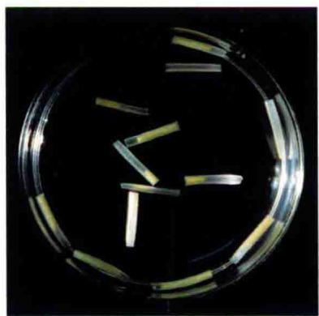

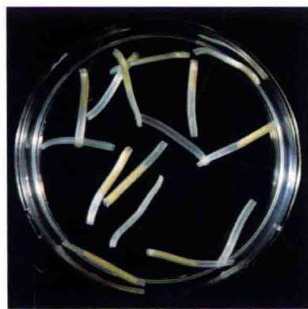  
图19.2 生长素刺激燕麦胚芽鞘片段的伸长。这些胚芽鞘在水（A）或生长素（B）中孵育18 h。半透明状胚芽鞘里面的黄色组织是初生叶（引自M. B. Wilkins）。

A  
  
吲哚-3-乙酸（IAA）

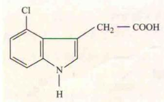  
4-氯-吲哚-3-乙酸 (4-Cl-IAA)

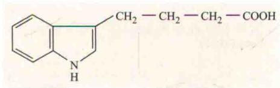  
吲哚-3-丁酸（IBA）  
B  
图19.3 生长素的结构。A. 天然生长素的结构。吲哚-3-乙酸（IAA）存在于所有植物中，但是植物中其他相关化合物也具有生长素的活性。如豌豆中含有的4-氯-吲哚-3-乙酸；玉米和豆科植物中含有的吲哚-3-丁酸（IBA）。B. 两种人工合成的生长素的结构。在园艺和  
农业上，大多数合成的生长素被用作除草剂。

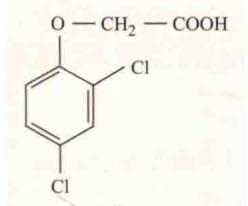  
2,4-二氯苯氧基乙酸（2,4-D）

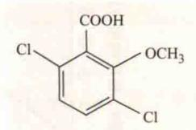  
3,6-二氯-2-甲氧基苯甲酸（麦草畏）

我们将从生长素的化学本质开始讨论，继而讲述生长素的生物合成、运输和代谢。最近，越来越多强有力的分析方法和分子生物学方法的应用使科学家能够鉴定出生长素的前体，研究生长素的降解和其在植物体内的分布。根据研究者所需要的信息，生物样品中生长素类物质的含量和鉴定可以通过生物测定、质谱或酶联免疫吸附测定法（ELISA）进行分析。

## 19.2.1 IAA在分生组织和幼嫩的分裂组织中合成

IAA的生物合成主要发生在快速分裂和生长的组织，特别是枝干中（Ljung et al., 2005）。尽管几乎所有的植物组织都可能产生IAA，但茎尖分生组织和幼嫩的叶片是合成生长素的主要位点（Ljung et al., 2001）。当根伸长和成熟时，尽管根依赖于很多由枝干产生的生长素，但根端分生组织也是合成生长素的重要位点（Ljung et al., 2005）。幼嫩的果实和种子中含有大量的生长素，但是不清楚这些生长素是新合成的还是在发育过程中从其他组织运输来的。

在拟南芥中，生长素集中在幼嫩初生叶的顶端。在叶发育过程中，人们发现生长素集中在叶的边缘，再慢慢转移到叶的基部，然后又转移到叶片中间，这种生长素产生的向基转变与叶发育和维管束分化的向基成熟顺序紧密相关，不过这也许是巧合（Aloni，2001）。

β-葡萄糖醛酸酶（β-glucuronidase，GUS）报告基因是一种很有用的分析工具，用底物处理植物组织时，由于该底物能在β-葡萄糖醛酸酶的作用下水解产生蓝色物质，从而可以观察到组织中GUS的活性和位置（Ulmasov et al., 1997）。通过将GUS报告基因连在一个对生长素有反应的DNA启动子序列后面就可以推断细胞中不连续的部分或者整个器官中自由生长素的分布情况（见第2章）。不论这种自由生长素含量是否达到了最小阈值，GUS基因都可以表达，而且能够检测出它呈现蓝色。

如图19.4所示，生长素可能在幼嫩叶片边缘的特定部位积累。这些部位将发育为吐水孔——地上部腺体状修饰物和维管组织。特别是在叶片边缘，它可以在根压（见第4章）的作用下使液态水通过表皮孔向外分泌。在拟南芥中，在吐水孔分化的早期阶段，人们发现大量生长素积累在幼嫩的有锯齿形的拟南芥叶片的叶垂（leaf lobe）处，形成深蓝色的GUS标记（箭头所示），这个部位很可能是生长素合成的部位（Aloni et al., 2003）。在分化发育的维管束中，可以看到生长素扩散的GUS活性轨迹一直延伸到正在分化的导管中（图19.4）。后面，我们还将讨论生长素在维管分化中的调节作用。

  
图19.4 用一个合成的生长素响应的DR5启动子驱动的GUS报告基因检测生长素在拟南芥幼嫩的叶原基中的积累位置。DR5启动子是根据天然存在的生长素的反应因子人工构建的，能够表明完整的组织中的生长素信号通路的存在。在吐水孔分化的早期阶段，人们发现生长素合成的中心位于有锯齿形的拟南芥叶片的叶边缘处，此处GUS染色呈集中的深蓝色（箭头所示）。呈梯度减弱的GUS活性从叶片边缘一直延伸到正在分化的维管束（箭标）。这个维管束可能作为接受来自叶边缘处的生长素的贮存库（R. Aloni and C.I.Ullrich惠赠）。

## 19.2.2 IAA生物合成的多种途径

结构上，IAA与色氨酸和色氨酸合成的前体吲哚-3-甘油磷酸（indole-3-glycerol phosphate）类似，它们都可以作为IAA生物合成的前体。采用分子遗传学和同位素标记法，发现了参与依赖色氨酸的IAA生物合成途径的酶和中间分子，以及它们催化反应的顺序。在植物中，多种生物合成途径以色氨酸作为前体产生IAA；也鉴定到了一条依赖于色氨酸的细菌IAA生物合成途径。这些途径在附录3中有详细的描述。

## 19.2.3 种子和贮藏器官中含有大量共价结合态的生长素

除生物合成外，组织中很大比例的生长素与高分子质量或低分子质量的化合物共价结合形成结合态。在种子和贮藏器官如子叶中尤其如此。在所有高等植物中都发现了这些“缀合”或“结合”态生长素的存在，人们认为它们没有激素活性。IAA可以与多种不同低分子质量的化合物形成结合态，如氨基酸或糖；IAA也可以与高分子质量的化合物形成结合态，如多肽、复杂的糖苷（多个糖单元）或糖蛋白。在酶反应过程中，很多但不是全部的缀合态生长素将会迅速释放出IAA。那些可以释放自由态生长素的缀合态生长素可作为激素的可逆贮存形式。

IAA缀合物的含量和性质取决于它们发生作用的组织及特定的连接酶。在玉米（corn；Zea mays）胚乳中，将IAA连接到葡萄糖上是了解得最为透彻的反应。最近拟南芥分子遗传学研究促进了我们对植物组织中IAA结合/降解过程调控的认识。

缀合态生长素的代谢是调节自由态生长素水平的最主要影响因子。例如，在玉米（Z.mays）种子的萌发过程中，IAA-肌醇通过韧皮部从胚乳中转移到胚芽鞘。人们认为，大多数产生于玉米胚芽鞘顶端的自由IAA是由种子中的IAA-肌醇通过水解产生的（图19.5A）。

另外，人们发现，光和重力等环境刺激既能够影响生长素缀合（去除自由生长素）的速度，也能够影响自由态生长素释放（缀合态生长素的水解）的速度。缀合态生长素的形成还具有其他功能，包括储存和抵御氧化降解的保护作用等。

吲哚-3-丁酸（indole-3-butyric acid，IBA）是另一种天然生长素。IBA和IBA缀合物也对IAA贮存库有贡献（图19.5A）。氨基酰IBA和葡糖基IBA缀合物可被水解产生自由IBA，这些自由IBA可以在过氧化物酶体中通过酶促β-氧化作用转变为IAA（图19.5A）。

## 19.2.4 IAA的降解途径

作为高效的发育信号，激素必须寿命短并且不能长时间积累。生长素的分解代谢保证了当活性激素的浓度超过最适水平或激素反应完成时对活性激素的降解。同IAA生物合成一样，IAA的酶促降解（氧化）包括不止一条途径（图19.5B）。

通过同位素标记和代谢物鉴定，人们发现了另外两种氧化途径更有可能控制IAA的降解。在一条途径中，IAA的吲哚部分被氧化，形成氧化吲哚-3-乙酸（OxIAA），随后形成OxIAA-葡萄糖（OxIAA-Gluc）。在另一条途径中，IAA-天冬氨酸缀合物被氧化成OxIAA。

  
图19.5 IAA的结合和降解。该图表示的是不同的IAA缀合物及它们合成和降解的代谢途径。单箭头表示的是不可逆途径；双箭头表示的是可逆途径。A. 可逆（贮藏）形式的生长素和生长素缀合物。B. 不可逆（降解）形式的生长素和生长素缀合物。吲哚-3-丁酸（IBA）转变为IAA的β-氧化反应发生在过氧化物酶体。在IAA与己糖结合之前，它可以不可逆地被氧化为氧化吲哚-3-乙酸（OxIAA）。IAA与Asp和Glu共价结合后也可以被不可逆地降解为OxIAA缀合物（引自Woodward and Bartel，2005）。

光照下，IAA可以被非酶促氧化。而且，在体外，植物细胞色素如核黄素可以促进IAA光破坏作用。然而，生长素在光氧化中的生理作用仍然不清楚。在体外，也发现了植物过氧化物酶体可以将IAA的3-亚甲基羟吲哚去羧基化，但是这个反应在植物体内是否发生是未知的（Normanly et al., 2005）。

## 19.3 生长素的运输

枝干和根的主轴及它们的分枝具有顶端—基端的结构极性，而且这种结构极性取决于生长素的极性运输。在Went建立了测定生长素的胚芽鞘弯曲实验后不久，人们发现在离体的燕麦胚芽鞘切段中，IAA主要是从顶部向基部（向基性）运输（图19.6A是“向基”和“向顶”的图示）。这种单方向的运输称为极性运输（polartransport）。生长素是唯一被明确地证实是极性运输的植物生长激素，且该激素的运输存在于所有的植物中，包括苔藓和蕨类植物。

生长素的极性运输是古老的，因为解剖学证据表明在具有3亿7500万年历史的木头化石中发现生长素极性运输。在活的木本植物中，生长素的极性运输遇到芽和分枝等时便会被阻断，这时就会产生生长素“漩涡”（Kramer，2006）。结果，在这些区域进行分化的导管元件便会形成环状结构。研究发现，在木材（代表生长素极性运输）中同一个位置产生的环状结构同样也能够在上溯到泥盆纪前期所形成的原始裸子植物的木头化石中检测到（Rothwell and Lev-Yadun，2005）。

植物中的生长素主要来源于茎的顶端，很长时间以来人们一直认为极性运输是造成从茎尖到根尖的生长素浓度梯度的主要原因。生长素从茎到根的纵向浓度梯度影响多种生长发育过程，包括胚胎发育、茎伸长、顶端优势、伤口愈合和叶片衰老。

生长素在茎干、叶和根中极性运输的最主要部位是维管束（vascular）的薄壁组织，很可能是木质部。草本的胚芽鞘是一个例外，在其胚芽鞘中，向基性运输主要通过非维管束（nonvascular）的薄壁组织。在维管束的薄壁组织中，生长素运输的总方向在胚胎期就建立了，很快在茎尖可以检测到生长素的累积（见第16章）。因为胚胎没有根，所以最开始胚胎中生长素的极性运输是由上向下运输的。在根的维管柱中，植物的一生都维持这种胚胎维管薄壁组织中生长素的向基运输。但是，在萌发后的根中，这种向基的生长素流变成向顶运输，因为生长素被从根茎的节点运向根尖。

  
图19.6 放射标记的生长素表明生长素的极性运输。A. 在植物的基部（根、茎的接合处）根据生长素运输的方向描述生长素的极性运输。生长素从茎向下运输（向着基部）直到根、茎的接合处。从这一点开始，向下的运输称为向顶运输（向着顶端）。生长素从根尖向根、茎接合处的运输也称为从上往下的运输（向着基部）。B. 供体-受体琼脂块法测定生长素的极性运输。极性运输不依赖于重力。

有些生长素运输也发生在韧皮部的筛管中，且依赖于韧皮部的生长素运输由糖的“源-库”分布过程所驱动（见第10章），它对生长素在根中的向顶运输有重要作用。

在韧皮部中，长距离的生长素运输似乎对控制形成层细胞的分化和胼胝质的积累或从筛管的移除起重要的作用。在韧皮部中的生长素的运输也可以转移到木质部的薄壁组织中。通过放射性标记IAA的研究表明，在豌豆（Pisum satovum）茎尖的非成熟组织中生长素可以从非极性韧皮部途径运输而来。

在根中，同样有来自顶端的生长素的向基运输，但是发生在非维管组织。例如，在玉米和拟南芥的根中，在根尖中放射性标记的IAA被向基性地运输了2\~8 mm。根中生长素的向基性运输在向重力性和侧根伸长中都有重要作用。

在以下的内容中，我们将讨论生长素极性运输的细胞机制，也将探讨这些机制如何使植物能够适应不同的环境信号。

## 19.3.1 极性运输需要能量，不依赖于重力

人们利用供体-受体琼脂块法（the donor-receiver agar block method）进行早期的极性运输研究（图19.6B）。将含有放射性同位素标记的生长素的琼脂块（供体块）放在一段组织的一端，受体块放在另一端。生长素通过组织向受体块的转移即可以通过测定受体块中放射活性来确定。这种方法经改进后可以用来测定更小的放射性标记的生长素小液滴在植物不连续表面上的沉积作用。这能提高研究生长素短距离运输的精确性（Peer and Murphy，2007）。

从很多这样的研究中，人们总结出IAA极性运输的一般特性。不同组织中IAA极性运输的程度不一样。在胚芽鞘、植物茎干、叶柄和根表皮中，向基运输占主导地位；然而在根的中柱中，生长素是向顶运输的。极性运输（至少是在短时间内）不受组织的方向影响，所以它是不依赖于重力的。

如图19.7所示，揭示了缺少重力作用对生长素的向基运输的影响。在这个例子中利用的是葡萄的茎梗，将其茎干砍断，放在潮湿的温室中，发现在切割处的基端形成不定根，切割处顶端形成枝干，即使当砍断的位置颠倒也是如此。根在基端形成是因为根的分化受向基运输所积累的生长素的刺激。枝干倾向于在生长素浓度低的顶端形成。

  
图19.7 不论将葡萄硬材的切段倒置（左边两个切段）或正置（右边两个切段），总是在它的基端产生不定根，顶端产生枝条。总是在基端形成根是因为生长素的极性运输不依赖于重力（引自Hartmann and Kester，1983）。

极性运输是以细胞-细胞的形式进行的，而不是以共质体形式。也就是说，生长素通过质膜从这个细胞流出，在中间层物质中扩散，最后通过质膜进入下一个细胞。生长素从细胞的流出称为生长素外流（auxin efflux）；生长素进入细胞称为生长素吸收（auxin uptake）或生长素内流（auxin influx）。极性运输对缺氧、缺少蔗糖及代谢抑制剂的敏感性表明运输过程总的来说需要代谢能量。

在某些组织中，生长素极性运输的速度能够超过3 mm/h，比扩散的速度快，但是比在韧皮部运输的速度慢（见第10章）。在接近茎尖和根尖的分生组织中极性运输的速度较快。活性生长素，包括天然生长素和人工合成的生长素都具有极性运输的特性，其他弱酸、无活性的生长素类似物及IAA缀合物几乎不能运输。极性运输的特异性表明生长素受质膜上的运输蛋白识别。

## 19.3.2 化学渗透模型可能驱动生长素极性运输

在20世纪60年代晚期，由于溶液中化学渗透机制的发现（见第6章），启发人们用该模型来解释生长素的极性运输。生长素极性运输的化学渗透模型认为生长素的吸收受跨膜的质子势（ $\Delta E+\Delta pH$ ）驱动，而生长素流出又受膜势 $\Delta E$ 驱动（质子动势的详细讲解见第7章）。生长素的极性流动受聚集在传导细胞末端的极性定位的输出载体的调控（图19.8）。该模型已经在整株植物中通过实验得到了验证（Li et al., 2005），并且最近几年得到了延伸，包括生长素极性运输过程中通过共质体质子泵驱动的生长素的流入的其他作用。但是， $\Delta E + \Delta pH$ 并不是唯一的能量来源，一类生长素转运子也直接利用ATP作为能量。

## 1. 生长素内流

极性运输的第一步是生长素的内流。生长素可以通过以下两种机制进入植物细胞：来自任一方向的质子型IAAH被动扩散透过磷脂双分子层，或者由 $2H^{+}-IAA^{-}$ 同向运输蛋白参与的次级主动运输运输 $IAA^{-}$ 。

非解离型的吲哚-3-乙酸的羧基发生质子化。它是亲脂的，很容易扩散跨过磷脂双分子层。相反，生长素的解离型带负电荷，因此不容易透过膜。因为在通常情况下，质膜H $^{+}$ -ATPase使细胞壁pH维持为5\~5.5。质外体中15%\~25%的生长素（ $pK_{a}=4.75$ ）呈非解离型，能够被动扩散，透过质膜形成浓度梯度。当胞外pH低于正常值呈较酸性值时，发现植物细胞吸收IAA的量增加，这为证明生长素的吸收是依赖于pH的被动过程提供了第一个实验证据。最近的研究表明，在体内，质体的酸化在驱动生长素运输中也有重要作用（Li et al., 2005）。

有证据表明运输蛋白介导的次级主动吸收机制具有饱和性，这种饱和性是活性生长素特有的。一类通透酶型的生长素吸收载体蛋白AUX1/LAX 2H $^{+}$ -IAA $^{-}$ 是同向运输蛋白，可以共运输2个质子和生长素阴离子（Yang et al., 2006; Swarup et al., 2008）。这种生长素次级主动运输能够比简单扩散积累更多的生长素，因为它的跨膜运输受质子动势的驱动（例如，在质体溶液中有很高的质子浓度）。次级主动运输存在的证据主要是在生长素的沉积加速极性流的移动的细胞中，如侧根的冠细胞中，生长素的吸收是生长素从侧根冠细胞离开的原始动力（Kramer and Bennett, 2005）。

AUX1在根尖和茎尖生长素的吸收中起重要作用。在侧根的冠细胞（图19.9A和B）中，AUX1是生长素离开根尖进入由上往下的生长素运输流所必需的。拟南芥aux1突变体无向重力性生长。用人工合成的生长素萘乙

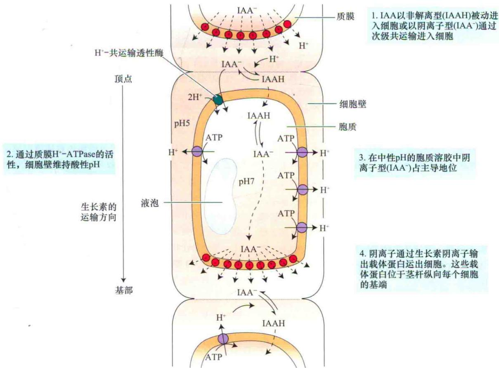  
图19.8 简化的生长素极性运输化学渗透模型。这里表示的是在生长素运输中柱状的一个已经伸长的细胞。其他的向外运输的机制通过在运出的位置和邻近细胞中阻止IAA的再吸收来有助于生长素的运输。

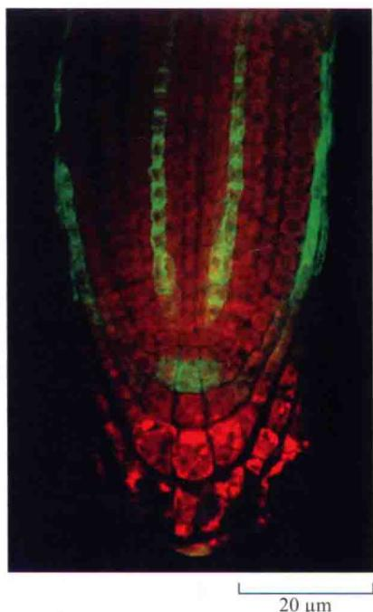

  
图19.9 生长素通透酶AUX1在一些小柱细胞、侧根根冠和中柱组织中表达。AUX/LAX家族的另一个成员LAX3在根的皮层和表皮细胞中起作用。A. 拟南芥根尖的示意图。B. AUX1在中柱的原生韧皮部细胞、小柱中心细胞簇及侧根的根冠细胞中的免疫定位。C. 在围绕正在产生侧根的表皮细胞中，LAX3介导生长素的吸收，从而诱导细胞的伸长及其他可以促使侧根发生的过程（B图引自Swarup et al., 2001；C图引自Swarup et al., 2008）。

酸（1-naphthylene acetic acid，1-NAA）处理，可以恢复这种表型。1-NAA甚至能够在缺乏载体蛋白的情况下很容易地跨过脂类双分子层。当我们研究根的向重力性机制时，根尖中生长素的向基性重新分布显然具有重要意义。

LAX3是生长素通透酶家族的另一成员，它的功能是在一些表皮细胞和皮层细胞中增强生长素的累积，导致细胞的分裂，进而从中柱产生侧根（图19.9C）。这是AUX1/LAX蛋白在一些特化细胞维持生长素高浓度中起作用的另一个例子。

## 2. 生长素外流

一旦IAA进入pH大约为7.2的胞质溶胶中，几乎全部的IAA将会解离成阴离子形式。因为阴离子较难透过质膜，所以生长素积累在胞质溶胶中或者质膜表面，直到位于细胞膜上的转运蛋白将它们运出。根据化学渗透假说，细胞内部负的质膜电势驱动IAA $^{-}$ 运出细胞。

像前面提到的那样，极性运输的化学渗透模型的核心是IAA $^{-}$ 的外流受极性定位的输出载体蛋白驱动。生长素从一个细胞末端的吸收和从每个细胞相反极选择的外流导致了极性运输。定位在细胞膜上的PIN蛋白负责将生长素运出细胞，这与生长素运输的方向一致（图19.10A）（PIN蛋白以拟南芥pin1突变体所形成的针形花序命名，见图19.10B）。

全长的PIN蛋白（在拟南芥中是PIN1、PIN2、PIN3、PIN4和PIN7）介导的生长素外流对植物正常的生长发育非常重要。在每个组织中，不同的PIN蛋白介导了生长素的外流（图19.11A）。在这些PIN蛋白中，PIN1是研究得最为深入的，因为PIN1对极性发育和器官发生的每一个方面都起着重要作用（见第16章）。

完整组织中的生长素运输模型表明此运输过程是依赖能量的，特别是在顶端分生组织附近的比较小的细胞中。生长素有方向地从这些细胞中的一个细胞运出，很可能再回到同一个细胞，除非位于细胞膜上的外流转运蛋白将生长素主动排斥在外（图19.12）。突变体分析也表明应该存在其他的外流机制，这种机制对于阻止在长距离运输流中的生长素扩散进入邻近的组织是必要的。

  
图19.10 拟南芥中的PIN1。A. 拟南芥花序中PIN1蛋白在发挥功能的细胞末端的定位。所见的荧光是用免疫荧光显微镜观察的。B. 拟南芥中的pin1突变体，正常的野生拟南芥如图16.1所示（L. Galweiler和K. Palme惠赠）。

植物细胞中含有的依赖ATP的转运蛋白属于植物ATP结合盒（ATP binding cassette，ABC）膜内在转运蛋白超家族中的P-糖蛋白或者“B”亚家族。这些PGP/ABCB转运蛋白中的一个亚类是膜内在蛋白，功能是作为细胞生长素外流过程中依赖ATP的两性阴离子载体（图19.12）。如果ABCB基因在拟南芥、玉米和高粱中缺失，这些植物将呈现不同程度的矮小，以及向重力性改变和生长素外流减少（图19.13）。

ABCB蛋白家族在拟南芥中有21个成员，水稻中有17个。ABCB家族中的三个成员广泛地参与组织特异性的生长素运输（图19.11B）。但是还不清楚有多少ABCB家族成员在生长素运输中起作用。至少有一些已被表明可以转运苹果酸盐或者其他小分子，而不是生长素。在哺乳动物中，ABCB蛋白家族的功能是多抗药性

  
图19.11 在拟南芥中，转运蛋白PIN和ABCB介导整株植物中生长素极性运输的外流。A. PIN蛋白决定生长素的向基运输。生长素的定向运输与PIN输出辅助蛋白的组织特异性分布有关。PIN1调节IAA沿着胚胎发生的顶端到基部的方向从地上部分到根的垂直运输（见第16章）。AUX1（图19.9）创造了一个生长素的库来驱动向基部的生长素通过PIN2流出载体从根尖向上运输。既然有些生长素的侧向扩散可能会发生，PIN2和PIN3被认为能帮助扩散的生长素重新返回维管束的薄壁组织。维管束的薄壁组织是进行极性运输的地方。两个插图表示在茎尖分生组织中PIN1调节的生长素流动（上图），以及在根尖中PIN调节的生长素环流（下图）。B. 生长素的流动与依赖ATP的ABCB转运蛋白有关。在枝干和根尖的多向箭头表示非方向性的生长素环流。然而，一旦与极性定位的PIN蛋白结合后，便发生定向运输。ABCB4在正在伸长的根毛中调控生长素的

1. 质膜上H $^{+}$ -ATPase(紫色)将质子泵入质外体。质外体的酸性环境通过改变质外体中IAAH和IAA $^{-}$ 的比例影响生长素的运输速度

2. IAAH可以通过诸如AUX1(蓝色)的质子共运输蛋白或扩散(带破折号的箭号)进入细胞。一旦进入胞质溶胶，IAA即变为阴离子，并且可能只有通过主动运输从细胞中运出

3. P-糖蛋白非极性地定位在质膜上，可以驱动生长素主动运输(依赖ATP)

4. 当极性定位的PIN蛋白(黄色)和PGP蛋白相互作用时,会克服回流扩散效应而协同增强主动极性运输

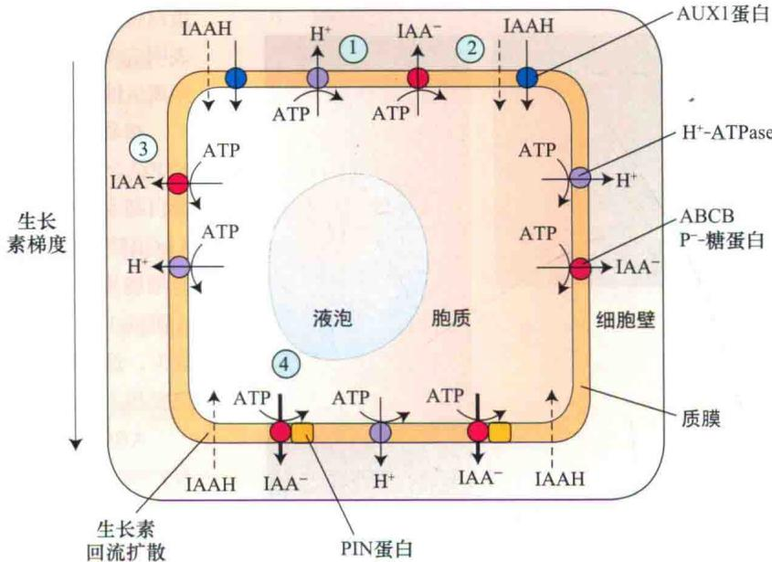

图19.12 在较小细胞中生长素的极性运输模型。由于小细胞具有高的表面积/体积，因此生长素的回流扩散明显。ABCB蛋白被认为通过阻止在载体位置输出的生长素的重新吸收而维持生长素流。在较大的细胞中，ABCB转运蛋白的功能可能是将生长素排出极性流，使其进入邻近细胞。  
  
野生型 br2突变体

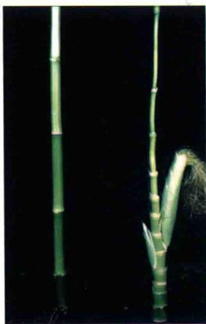  
野生型  
br2突变体

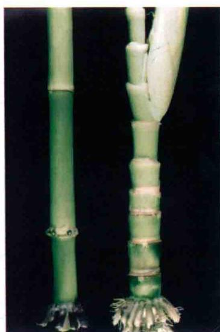  
野生型  
br2突变体  
图19.13 在玉米中BR2（Brachytic 2）基因编码一个糖蛋白，是生长素的正常运输所必需的。br2突变体有短的节间。突变体是用mutator转座子通过插入突变的方法获得的。研究者并不知道Mu8转座子含有BR2基因的片段。这个BR2基因片段的表达产生干扰RNA（interfering RNA，RNAi），使BR2的表达发生沉默（见第2章）。br2突变体的茎秆紧缩低矮（B和C），但是有正常的雄花花穗和玉米穗（A和B）。

转运蛋白，并表现出较差的底物特异性。与哺乳动物中的ABCB家族不同，植物中运输生长素的ABCB对底物有相对严格的特异性。

总的来说，ABCB蛋白是均匀地而不是极性地分布在茎尖和根尖细胞的质膜上。但是，当特异性的ABCB蛋白与PIN蛋白在同一个细胞的同一个位置碰到一起时，生长素运输的特异性增强了，PIN蛋白与ABCB蛋白相互协同以使生长素的运输具有方向性（Blakeslee etal., 2005, 2007; Mravec et al., 2008; Titapiwatanakun et al., 2009)。此外，在一些细胞中，极性定位的ABCB转运蛋白似乎对有方向的生长素运输更有贡献。

## 19.3.3 PIN和ABCB转运蛋白调控细胞中生长素的平衡

关于IAA的亚细胞分布和代谢的研究很少。但是，人们认为IAA在细胞质和其他的亚细胞组分中都有分布。IAA是一个两性分子（既有疏水区域也有亲水区域），因此人们认为细胞中的IAA可能通过它的疏水区域与内膜区域或者蛋白质结合。进一步的生长素的耦合和代谢机制可能在生长素增加后快速地作用于游离的IAA。PIN5、PIN6和PIN8等短的PIN蛋白定位在内质网上。至少PIN5可能通过将IAA转运到内质网从而调控IAA的代谢（Mravec et al., 2009）。

ABCB4是一个PGP型转运蛋白。在根毛中，ABCB4可能调控了生长素的水平。在生长素浓度低时，ABCB4可能在细胞中生长素的吸收中起作用。但是，当生长素浓度达到一个阈值时，ABCB4的功能迅速转变为将生长素泵出细胞（Yang and Murphy, 2009）。这些结果表明，游离的生长素能够被位于细胞内膜或者细胞质膜上的转运蛋白调控（图19.14）。并不令人奇怪的是，所有已知的生长素转运蛋白的丰度在一定程度上受生长素的水平所调节。

## 19.3.4 化学物质抑制生长素的内流和外流

几种人工合成化合物可以作为生长素运输的抑制剂，包括NPA（1-N-naphthylphthalamic acid）、CPD（2-carboxyphenyl-3-phenylpropane-1, 3-dione或“cyclopropyl propane dione”）、TIBA（2, 3, 5-triiodobenzoic acid）、NOA（1-napthoxyacetic acid）、2-[4-(diethylamino)-2-hydroxy-benzoyl]benzoic acid和gravacin等（图19.15）。NPA、TIBA、CPD和gravacin是生长素输出的抑制剂（auxin efflux inhibitor，AEI），NOA是生长素输入的抑制剂。

有些AEI，如TIBA，具有弱的生长素活性。它能够与生长素竞争外流转运蛋白以部分地抑制极性运输。其他AEI，如CPD、NPA和gravacin，它们通过与转运蛋白的调节位点结合干扰生长素的运输。一些抑制剂，如gravacin，特异性地干扰一类转运蛋白对生长素的运输（Rojaspierce et al., 2007）。而其他的抑制剂，如NPA，则与多种蛋白质结合并干扰其活性，其中的一些抑制剂只是方向性地参与生长素的运输。

一些天然的化合物也作为生长素输出抑制剂。最开始被发现有此功能的天然化合物是黄酮类（图19.15B）。黄酮类是ROS清除剂，也是一些金属酶、激酶和磷酸酶的抑制剂（Peer and Murphy，2007）。黄酮类对生长素运输的影响主要是导致这些物质活性的改变。

和一些药理学试剂的例子一样，使用高浓度的抑制剂导致特异性反应降低（Peer et al., 2009）。当使用高浓度的抑制剂时，AEI也可以通过改变蛋白质与蛋白质间的互作以干扰与它们结合的质膜蛋白的运输。稍后将在本节讨论蛋白运输在调节生长素极性运输中的作用。

## 19.3.5 生长素运输的多种调控机制

生长素运输受基因的转录和翻译后修饰机制的调节。编码生长素转运蛋白的基因表达具有组织特异性，

AUX/LAX蛋白调控生长素进入细胞

  
ABP1是内质网生长素结合蛋白。其他的内质网蛋白（ILR1和IAR3）是水解酶，能够使IAA去缀合  
短的PIN蛋白（如PIN5）控制内质网膜上的生长素运输  
图19.14 转运蛋白调控的生长素动态平衡的模型。细胞间的生长素极性运输由细胞膜定位的PIN1类似蛋白和ABCB等生长素流出运输蛋白及生长素流入运输蛋白AUX/LAX调控。细胞内的生长素被分成细胞质和内质网两个区间。PIN5和PIN5类似（PIN6和PIN8）运输蛋白调控内质网中生长素的滞留。大部分生长素结合蛋白（ABP1）与生长素高度结合，定位在内质网中。ILR1和IAR3编码IAA-氨基酸水解酶，能够释放内质网中的自由生长素（引自Mravec et al., 2009）。

## A. 植物中不存在的生长素运输抑制剂

B. 自然界中发现的生长素运输抑制剂

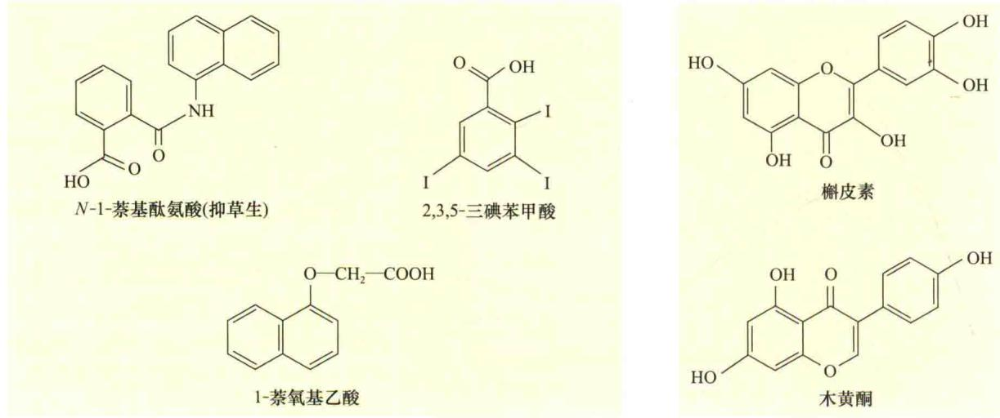  
图19.15 几种人工合成（A）和天然（B）生长素运输抑制剂的结构。

而且组织特异性表达受生长发育和环境因素的影响。其他的因素如蛋白质的磷酸化状态、与其他调控蛋白的相互作用、蛋白水解过程和膜组分等也决定了生长素运输的速度和方向。在这里，我们将讨论调控生长素运输的一些重要因素：激素、蛋白运输和黄酮类。

## 1. 与其他激素的相互作用

几乎已知的所有植物信号组分对生长素运输或者依赖于生长素的基因表达都有影响。生长素本身调控编码生长素转运蛋白基因的表达，从而增加或者减少这些基因的丰度来调控生长素的水平。生长素似乎也影响细胞中很多极性事件，从而为其自身的有方向性的运输流提供一个通道。换句话说，小的生长素流通过转运蛋白和维管组织的建立被扩大并稳定，这些转运蛋白和维管组织又维持了生长素有方向地流向生长中的组织。这种效应在胚胎的极性生长和器官发生中是显著的。特别是PIN1已被表明为这些发育中的重要的生长素流动确定方向。

乙烯通过改变AUX1吸收和PIN1外流转运蛋白的活性和丰度影响生长素运输流。虽然乙烯可能通过改变生长素的合成影响根中生长素运输，但乙烯可能特异性地调控了侧根的发育（Swarup et al., 2007）。

油菜素甾醇、细胞分裂素、茉莉酸、赤霉素、独脚金内酯和一些黄酮也能调控生长素的运输，主要通过改变编码生长素转运蛋白的基因的表达、调控因子的活性或者细胞运输的机制等。我们将在本章或者其他的章节讨论它们在其所调控的生理和发育过程中的相互作用。

## 2. 蛋白质运输的功能

生长素转运蛋白的细胞膜定位包括新合成的蛋白质通过内体次级运输的转运（蛋白质运输）。对于

ABCB转运蛋白来说，正确折叠和糖基化的蛋白质可以通过次级囊泡运输到细胞膜。在细胞膜上，其中的一些ABCB转运蛋白如ABCB19能形成非常稳定的复合物，其中在膜上富含甾醇的复合物中包括PIN1蛋白（Titapwatanakun et al., 2009）。然而，全长的PIN流出转运蛋白和AUX1流入载体的细胞膜定位都受小泡运输的调控。这种运输机制包括细胞膜和内体区室间的胞吞循环（Geldner et al., 2001, 2003；Swarup et al., 2001；Swarz and Bennett, 2003）。这种机制可能也调控了极性定位的PIN转运蛋白如何从质膜上均匀分布变成细胞末端质膜上特定分布。

首先用PIN1阐明胞吞循环。拟南芥根尖中PIN1定位于维管束细胞的底部（图19.16A）。布雷菲尔德菌素（brefeldin A，BFA）能够干扰由ADP-糖基化作用/鸟嘌呤核苷酸交换因子GNOM调控的蛋白质的内吞和分泌（见第16章）。用BFA处理拟南芥的根，导致PIN1异常地在胞内区室聚集（图19.16B）。当用缓冲液洗脱BFA以后，又能恢复PIN1在细胞质膜上的正常定位。但是在洗脱缓冲液中加入肌动蛋白聚合作用抑制剂松胞菌素D（cytochalasin D）能够阻止PIN1在质膜的正常再定位。

这些结果表明PIN能够在细胞底部的质膜和未知的内膜区室之间依赖肌动蛋白快速循环。包括质膜H $^{+}$ -ATPase在内的几种蛋白质能够通过与调节PIN循环相同的BFA敏感机制被靶标于质膜上。

在上面的实验中，如果将高浓度的生长素输出抑制剂TIBA和NPA加入洗脱缓冲液中，它们能够阻止PIN1在质膜上正常的再定位。在黄酮类化合物缺失突变体中，用天然的黄酮醇生长素抑制剂取代洗脱缓冲液中合成的AEI也能够阻止PIN1在质膜的再定位（Peer et al., 2004）。TIBA和NPA也能改变质膜H $^{+}$ -ATPase和其他蛋

  
图19.16 生长素运输抑制剂阻断生长素输出载体PIN1向质膜的分泌。A. 对照，表示根尖中PIN1的不对称定位。B. 布雷菲尔德菌素（BFA）处理后的PIN1的定位。随后用缓冲液洗脱BFA后，PIN1的定位又重新恢复到A中所示。当用生长素运输抑制剂TIBA洗脱BFA时，PIN1如B中所示仍停留在内膜区域（图片由Klaus Palme惠赠）。

白质在胞内的循环，但是，与PIN蛋白一样，不受AEI的影响，除非一大类称为BIG的支架蛋白缺失。这些结果表明，有些AEI在高浓度时是膜循环抑制剂，同时也表明NPA和TIBA也一定直接抑制质膜上输出载体复合物的转运活性。类似的实验表明其他的全长PIN蛋白，如拟南芥中的PIN2和PIN3，被动态的细胞运输机制所调控，只是不同的蛋白质之间有轻微的差别。图19.17表示的是TIBA和NPA对PIN1循环和生长素外流影响的简化示意图。详细的模型请参见Web Essay 19.1。

  
图19.17 PIN复合体的循环依赖于机动蛋白驱动的质膜和内膜区室间的囊泡运输。用布雷菲尔德菌素洗脱后，生长素运输抑制剂TIBA和NPA干扰PIN1蛋白在细胞基面质膜的重新定位（图19.16），表明生长素运输抑制剂可能通过干扰PIN1蛋白的循环而起作用。

在细胞膜上高浓度的生长素可以调控全长PIN蛋白的运输和稳定（Paciorek et al., 2005）。这与生长素渠（auxin canalization）的概念一致，并为这种现象的解释提供了一种机制。然而，生长素是如何调控PIN的运输的是不清楚的，因为这种现象似乎不依赖于已知的生长素信号转导机制。

PIN蛋白的极性运输被蛋白激酶PINOID（根据pinoid突变体与pin1突变体的表型类似而命名）调控。PINOID的功能可能是调控PIN极性发育的开关。磷酸酶PP2A复合物，尤其是RCN1（根据在NPA突变体中根卷曲的表型而命名）亚基在调控PIN的定位上与PINOID活性可能是拮抗的。但是，PINOID和其他的激酶也可以直接调控PIN和/或ABCB的蛋白活性。

## 3. 黄酮类的作用

黄酮类含量过多或过少的拟南芥突变体都表现出生长素运输和生长的改变。一些黄酮类，如flavonols quercetin（图19.15B）和kaempferol，可以取代细胞膜上的AEI（Myrphy et al., 2000）。这些天然产生的植物化合物也抑制特定激酶和磷酸酶的活性（见第14章）。PINOID、RCN1和可以修饰生长素转运蛋白的活性和定位的磷酸转移酶蛋白可能是黄酮类的靶标。但是，我们还不知道在体内直接合成的黄酮类是否可以调控这些蛋白质的活性。

黄酮类也是ABCB转运活性的抑制剂，它们直接抑制为这些转运蛋白提供能量的ATP的水解。黄酮类并没有像预期的那样参与抑制转运蛋白，没有检测到黄酮类对PIN转运活性的直接抑制。因为生长素转运系统的广泛参与，在体内对这些化合物的效应的研究受到了限制( Peer and Murphy, 2007 )。

## 19.4 生长素信号转导途径

研究植物激素作用分子机制的最终目的是建立从受体结合到生理反应的信号转导途径的每一步。就生长素而言，这也许是一项特别令人望而生畏的工作，因为生长素影响许多生理和发育过程。然而，生长素信号的起始步骤非常简单，包括与受体的结合，受体能够通过泛素蛋白酶体途径（见第2章和第14章）调节蛋白质的降解。

一旦受体被激活，受体-酶复合体水解特定的转录抑制因子，从而激活和脱抑制生长素反应基因。虽然大多数的生长素反应可能通过这种机制起作用，但是，不同类型的生长素受体蛋白可能在非转录激活和稳定质膜H $^{+}$ -ATPase中起作用以引起细胞壁快速酸化和细胞伸长。在本章最后一节，我们将探讨两种生长素反应的信号转导途径。

## 19.4.1 主要的生长素受体是可溶性蛋白异源二聚体

可溶性蛋白质复合体是主要的生长素受体，它属于TIR1/AFB蛋白家族和AUX/IAA转录抑制蛋白家族成员（图19.18）（Dharmasiri et al., 2005a, 2005b; Kepinski et al., 2005）。植物TIR1/AFB蛋白家族是根据第一个发现的成员命名的，分别是TRANSPORT INHIBITOR RESPONSE 1和Auxin F-box Binding protein的缩写。它们是一类SCF E3泛素结合酶复合体的F-box蛋白组分。SCF复合体的功能是催化共价结合在泛素分子上的蛋白质发生依赖ATP的降解（关于此信号通路的描述见第14章）。

拟南芥突变体分析鉴定到TIR1（transport inhibitor response 1）。TIR1对生长素依赖的下胚轴伸长和侧根形成具有重要作用。TIR1是一个特定的E3泛素连接酶复合体（称为SCF $^{TIR1}$ ）的组成部分。SCF $^{TIR1}$ 是细胞中生长素信号转导所必需的（Dharmasiri et al., 2005a; Kepinski and Leyser, 2005）。接下来的研究鉴定到了AFB（auxin signaling F-box binding）蛋白。AFB蛋白在结构和功能上都与TIR1类似。

生长素的作用像一个分子胶水，将一个TIR1/AFB和一个AUX/IAA蛋白拉到一起形成异源二聚体。生长素使TIR1/AFB-AUX/IAA异源二聚体稳定，并提高SCF $^{TIR1}$ 复合体与AUX/IAA蛋白的结合。这种“组合的”受体允许生长素作为一个信号。这个信号可以在不同的环境条件下在不连续的组织中有差别地调控多种生长和发育过程。拟南芥有100多个可能的AUX/IAA和TIR1/AFB的组合，这为贯穿整个植物生长发育的广泛而多样的生长素信号反应提供了基础。

## 19.4.2 AUX/IAA蛋白负调控生长素诱导基因

参与TIR1生长素信号转导途径的转录调节因子有两个家族：生长素反应因子和AUX/IAA蛋白。生长素反应因子（auxin response factor，ARF）是短寿命蛋白，并特异地与生长素早期反应基因启动子上的生长素反应元件（auxin response element，AuxRE）TGTCTC结合。拟南芥有23种不同的ARF蛋白，ARF与AuxRE的结合导致基因转录的激活或抑制。激活或抑制取决于特定的ARF。不论组织中生长素的状态如何，ARF极可能结合在生长素早期反应基因的启动子区。

AUX/IAA蛋白是生长素诱导基因表达的重要调节因子。在拟南芥中，这种小的短寿命核蛋白有29个家族成员。AUX/IAA通过与结合DNA的ARF蛋白结合间接地调节基因表达。如果ARF作为转录激活子，AUX/IAA蛋白将抑制转录。

## 19.4.3 生长素与TIR1/AFB-AUX/IAA异源二聚体的结合促进AUX/IAA的降解

生长素诱导基因表达的短信号转导途径是从生长素与一个AUX/IAA蛋白和一个SCF $^{TIR1}$ 泛素连接酶复合体的TIR1/AFB组分的相互作用开始的（图19.18A）。和其他SCF复合体不同，生长素激活SCF $^{TIR1}$ 没有共价修饰。结果，AUX/IAA蛋白迅速地泛素化，随后通过蛋白酶体降解（图19.18B）。在没有负调节因子（AUX/IAA）的情况下，不同的ARF蛋白起到激活或抑制基因表达的作用。

## 19.4.4 生长素诱导的基因分为两类：早期反应基因和晚期反应基因

直接被AUX/IAA-TIR/AFB信号激活的生长素反应基因称为初级反应基因或早期基因（primary response genes or early gene）。它们与在生长素诱导的发育的晚期起作用的基因不同。早期基因的表达需要的时间很短，在几分钟到几个小时之内。在生长素反应中所用的早期基因都在SCF $^{TIR1}$ 信号转导途径中受到诱导。早期反应基因包括：AUX/IAA基因、SAUR基因和GH3基因。

总之，初级反应基因具有以下三种主要功能。

（1）转录 有些早期基因编码调节次级反应基因（或晚期基因）转录的蛋白质。晚期基因是对激素长期反应所必需的。因为晚期基因需要从头合成，它们的表

A

达可以被蛋白质合成抑制剂抑制。

（2）信号分子 其他早期基因参与细胞内联系或细胞与细胞间的信号传递。

（3）生长素缀合或代谢 一些快速诱导的基因编码的蛋白质通过使活性生长素缀合或降解参与活性生长素的清除。这些基因的表达阻止过量的可能限制生长素反应特异性的生长素的累积。

## 1. 生长和发育所需的早期基因

在加入生长素5\~60 min内，可以刺激大多数AUX/IAA基因的表达。AUX/IAA蛋白具有较短的半衰期（大约7 min），这表明它们能迅速降解。

生长素处理2\~5 min内，能够刺激SAUR基因的表达，而且该反应对蛋白质合成抑制剂放线菌酮不敏感，图19.18 生长素结合到TIR1/ABF-AUX/IAA生长素受体复合体和接下来的生长素反应基因的转录激活的模型。A. 在没有生长素时，AUX/IAA抑制子通过与ARF转录激活子结合使其形成无活性形式来抑制生长素诱导基因的转录。生长素的功能像一个分子胶水，起始AUX/IAA和SCF $^{TIR1/ABF}$ 复合体中的TIR1/ABF组分的相互作用。B. 生长素激活的SCF $^{TIR1/ABF}$ 复合体使泛素分子连接到AUX/IAA蛋白上，促进AUX/IAA蛋白被26S蛋白酶体降解。AUX/IAA蛋白的去除和降解使ARF转录激活子形成活性形式。ARF转录激活子与生长素反应元件（AuxRE）结合，激活生长素诱导基因的转录。

表明它们的表达不需要新的转录因子的合成。大豆的5个SAUR基因聚集在一起，它们没有内含子，编码未知功能的多肽，这些多肽相似度很高。由于这种反应非常迅速，SAUR基因的表达已经被作为一种方便的探针用于证明生长素在向光性和向重力性反应中的侧向运输。SAUR基因的功能还远远未知。

从大豆和拟南芥中鉴定出的GH3早期基因家族成员在生长素处理5 min之内受到诱导。GH3蛋白在IAA结合中发挥功能（Staswick et al., 2005）（图19.5）。拟南芥中GH3类似基因的突变导致植株矮小（Nakazawa et al., 2001）。这类基因在光调节的生长素反应中起作用（Hsieh et al., 2000）。因为GH3的表达有力地反映了内源生长素的存在，一种合成的基于GH3的报告基因广泛应用于生长素生物测定中，这种报告基因称为DR5

(图19.5)。

## 2. 胁迫适应的晚期基因

已经鉴定到了在生长素诱导后2\~4 h表达量增加，并参与生长素诱导的生长发育过程的基因。例如，有几个基因编码谷胱苷肽-S-转移酶（GST）。这类蛋白质受多种胁迫条件的刺激，而且受高浓度生长素的诱导。同样，受胁迫诱导的ACC合成酶是乙烯生物合成途径中的限速步骤（见第22章）。没有晚期生长素反应基因直接调控初级生长素反应的报道。

## 19.4.5 不同的受体蛋白可能参与生长素的快速、非转录水平的反应

像本章前文中讨论的，在15 min之内生长素就可以诱导细胞伸长，而生长素诱导的质膜 $H^{+}$ -ATPase活性的增加更快。这些快速的改变还发生在生长素信号组分缺失的突变体中。近期的证据表明，生长素可以直接作用于细胞小泡的运输，进而影响 $H^{+}$ -ATPase的活性。这种对小泡运输的影响或者发生在次级运输系统里，或者发生在细胞膜上。

## 19.5 生长素的作用：细胞伸长

生长素是作为一种参与胚芽鞘向光弯曲的激素被发现的。胚芽鞘弯曲的原因是背光侧和向光侧细胞伸长的速度不同（图19.1）。很长时间以来，植物学家都热衷于细胞分裂速度的调控研究。在本节，将综述生长素诱导细胞伸长的生理学。有些生长素诱导细胞伸长方面的研究在第15章中讨论研究过。

## 19.5.1 生长素促进茎干和胚芽鞘的生长，抑制根的生长

我们已经知道，在茎尖合成的生长素通过向基性运输到茎尖以下的组织，茎干的近尖端区域和胚芽鞘细胞的持续伸长需要不断地获得生长素。因为在正常的健康植株中，伸长区的内源生长素含量最适合生长需要，而外源喷洒生长素只对植物生长起中度和短暂的促进作用。黑暗中生长的幼苗比在光下生长的幼苗对过量的生长素更加敏感，对黑暗中生长的幼苗喷洒生长素甚至可能抑制生长。

然而，将含有伸长区的区段切除以后，将失去内源生长素的来源，植物的生长速度会快速地减弱到基底水平。通常，这段被切除的区域对外源生长素的反应剧烈，并且外源生长素能使它们的生长速率恢复到正常植株的水平。

在长期处理实验中，生长素处理能使截取的胚芽鞘（图19.2）或双子叶植物茎干持续伸长达20 h（图19.19）。在豌豆茎干和燕麦胚芽鞘中，适合伸长的生长素浓度是 $10^{-6}\sim10^{-5}$ mol/L（图19.20）。在其他物种（如拟南芥）中，最适浓度稍微低一些。超过最适浓度所引起的抑制作用主要是由于生长素诱导了乙烯的合成。我们将在第22章了解气体激素乙烯抑制多种植物茎干的伸长。

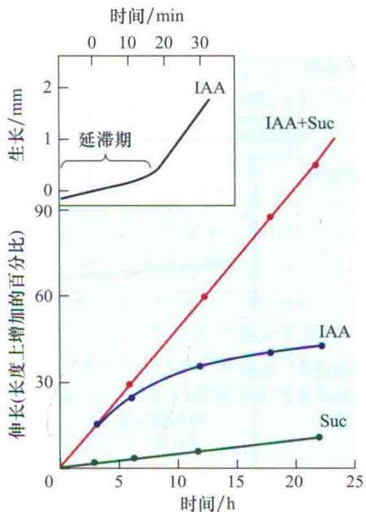  
图19.19 生长素诱导燕麦（Avena）胚芽鞘切段生长的时程图。用长度增加的百分比表示生长速度。生长素在0 h被加入。当培养基含有蔗糖时，该反应能持续20 h。蔗糖之所以能延长生长素对生长的作用时间，主要是因为在细胞生长过程中为维持膨压提供了必要的渗透活性物质。氯化钾能够替代蔗糖。插图表示通过电子位置-感受转导子作图的短期时程图。在此图中，通过长度对时间的绝对长度来表示生长。曲线表示生长素诱导的生长起始有大约15 min的延滞（引自Cleland，

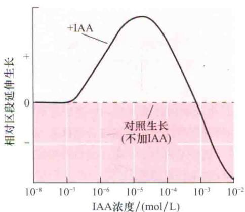  
图19.20 在豌豆茎或者燕麦胚芽鞘切段中，IAA诱导生长的典型剂量反应曲线。图中所示为随着生长素浓度的增加，胚芽鞘或幼小茎切段伸长生长的相对趋势。在高浓度（ $10^{-5}$ mol/L以上），IAA的作用越来越弱；在 $10^{-4}$ mol/L以上，IAA具有抑制作用，如图中曲线下降到虚线下方。虚线表示在不加IAA的情况下的生长曲线。

生长素控制根的伸长一直较难被证明，这或许是因为生长素诱导产生的乙烯也抑制根的伸长。近期的证据表明这两种激素在根组织中有差异地相互作用，进而调控根的生长。但是，即使乙烯生物合成途径被阻断，低浓度（ $10^{-10}\sim10^{-9}$ mol/L）的生长素能促进根的生长，而高浓度（ $10^{-6}$ mol/L）的生长素则仍然抑制根的生长。因此，根的生长可能需要极低浓度的生长素，然而能促进茎胚芽鞘伸长的生长素浓度则强烈地抑制根的生长。

## 19.5.2 双子叶植物茎干的外部组织是生长素的作用靶点

双子叶植物的茎由多种组织和细胞组成。其中只有一部分细胞和组织可能限制生长速度。这点可以通过一个简单的实验证明。将黄化的双子叶植物，如豌豆的茎纵向切开，并将它们放在没有生长素的缓冲液中孵育，结果两片茎向外弯曲。该结果表明在没有生长素的情况下，中心组织（包括髓、维管组织和内皮层）比外部组织（包括外皮层和表皮）伸长速度更快。因此，在没有生长素的情况下，外部组织限制茎的伸展。

然而，当用含有生长素的缓冲液孵育劈开的区段时，结果两片茎向内弯曲，表明在细胞伸长过程中，双子叶植物的外部组织是生长素的主要作用靶点。在拟南芥根中对生长素运动及生长素反应的研究表明，根的伸长区表皮细胞也是生长素作用的主要靶点。

生长素为了达到双子叶植物枝叶的伸长区作用位点，来自茎端的生长素在维管薄壁组织细胞的极性运输流中分布到茎的外部组织。相反，胚芽鞘的非维管组织既能够运输生长素也能够响应生长素。

双子叶植物中生长素的侧向运输过程可能受维管薄壁组织中侧向定位的PIN蛋白和围绕着细胞层均匀分布的ABCB转运蛋白的介导（Friml et al., 2002；Blakeslee et al., 2007）。图19.21中显示了这些蛋白质的定位。在这一章的最后将讨论与植物弯曲反应相关的侧向运输机制。

## 19.5.3 生长素诱导生长的最短延滞期是 $10 \mathrm{~min}$

当茎或胚芽鞘切段插入到一个灵敏的生长测量装置中时，可以以很高的分辨率检测生长素对生长的作用。在无生长素的培养基中，生长速率迅速下降；加入生长素后，能够在10\~12 min的时间内，显著促进茎或胚芽鞘生长（图19.19中左上角的插图）。如图19.20所示，生长素必须达到一定浓度阈值才能引起这种反应。在最适浓度范围之外，生长素起抑制作用。燕麦（Avena sativa）胚芽鞘和大豆（Glycine max）下胚轴在生长素处理30\~60 min后生长速度最快（图19.22）。其最大速度比本底速度快了5\~10倍。在具有渗透活性的溶质如蔗糖或KCl的溶液中，燕麦胚芽鞘切段可维持最大生长速度长达18 h。

生长素刺激的生长需要能量，代谢抑制剂可以在几分钟内抑制该过程。生长素诱导的生长也对蛋白抑制剂如放线菌酮敏感。表明该反应需要蛋白质的合成。RNA抑制剂能在稍微长一些的延滞之后抑制生长素诱导的生长。

虽然生长素诱导生长的延滞期可以通过降低温度或使用低浓度的生长素（使生长素扩散到组织中的时间增长）而加长，但是提高温度、使用高浓度的生长素和刮除茎或胚芽鞘切段表面的蜡质角质层使生长素更快地穿过组织并不能缩短延滞期。因此，最低10 min的延滞时间不是由生长素到达作用位点所需的时间所决定的，而是取决于细胞生化机制引起生长速率增加所需的时间。

## 19.5.4 生长素迅速增加细胞壁的延展性

生长素是怎样在只有10 min的时间内使生长速度增加5\~10倍的？为了解它的机制，我们需首先回顾一下植物细胞增大的过程（见第15章）。植物细胞的伸展分为以下三步。

（1）水跨过质膜的渗透吸收由水势（ $\Delta\psi_{w}$ ）梯度决定。

（2）细胞壁的限制作用产生细胞的膨压。

（3）细胞壁发生生化松弛，细胞在膨压的作用下扩展。

下面的生长方程概括了这些参数对生长速度的影响：

$$
\mathrm{GR} = m \left(\psi_ {\mathrm{p}} - Y\right)
$$

式中，GR表示生长速度， $\psi_{p}$ 表示膨压，Y表示阈值，m是一个系数（细胞壁的伸展性，见第15章），代表了生长速度和 $\psi_{p}$ 和Y之间差值的关系。

原则上，生长素可以通过增加m、 $\psi_{p}$ 或降低Y值增加生长速度。虽然进一步的实验证实生长素在刺激生长时没有增加膨压，但是与之相矛盾的结果是生长素降低了阈值Y。然而，人们普遍相信生长素引起细胞壁伸展参数m的增加，m的增加受质子的调节。

## 19.5.5 生长素诱导的质子外排促进细胞的伸展

根据大家公认的酸生长假设（acid growth hypothesis），氢离子介导生长素对细胞壁松弛的作用。氢离子来源于质膜 $H^{+}$ -ATPase，人们认为生长素促进质膜 $H^{+}$ -ATPase的活性。酸生长假设有下面5个主要预测。

（1）如果磨损表皮使氢离子接近细胞壁，则酸缓冲液能够单独促进细胞短期生长。

（2）生长素应该能增加质子外排的速度（细胞壁酸化），并且质子外排的动力学与生长素诱导的生长十分一致。

（3）中性缓冲液应该能抑制生长素诱导的生长。

（4）能促进质子外排的复合物（除了生长素），应该能促进生长。

（5）细胞壁应该含有适合酸性pH的“细胞壁松弛因子”。

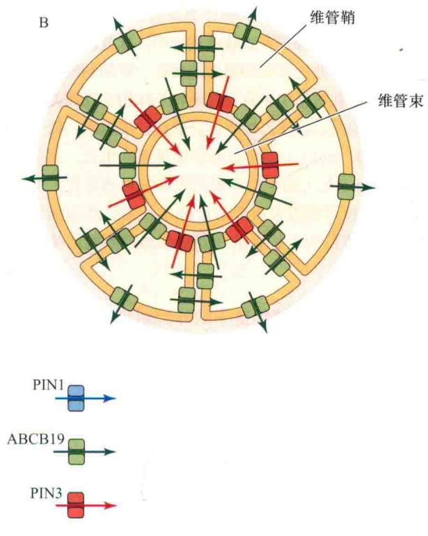

图19.21 双子叶植物维管组织中，PIN1蛋白驱动的由上向下的生长素流。ABCB19和PIN3位于邻近维管组织的维管束鞘细胞。A. PIN3定位在这些细胞向内的侧面，重新分配生长素进入维管束流。ABCB19限制生长素进入这些细胞。箭头的方向表示生长素流的方向。B. 这个区域的横切面示意图显示ABCB19如何向外运输生长素重新分配生长素进入维管束。突变体分析表明PIN3和ABCB19在向性弯曲的生长素侧向分布中起作用。  
  
图19.22 燕麦胚芽鞘和大豆下胚轴切段在 $10\mu \mathrm{mol} / \mathrm{L}$ IAA和 $2\%$ 蔗糖孵育下的生长动力学曲线。图示每个时间点的生长速度（而不是绝对长度）。大豆下胚轴的生长速度在 $1\mathrm{h}$ 后发生波动，而燕麦胚芽鞘的生长速度稳定（引自Cleland，1995）。

这5种假设都已经得到证实。如果表皮磨损，酸性缓冲液能引起生长速度的迅速增加。在10\~15 min的延滞期后，生长素刺激质子外排进入细胞壁，这与生长动力学一致（图19.23）。

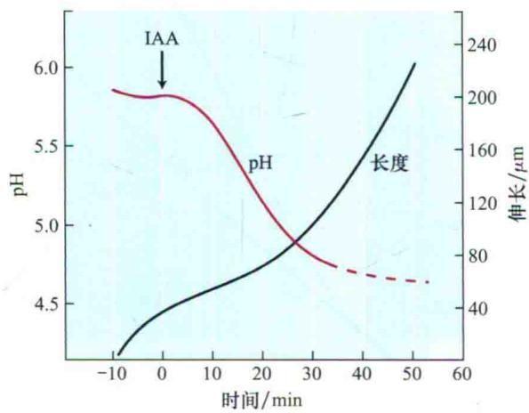  
图19.23 玉米胚芽鞘中生长素诱导的伸长和细胞壁酸化的动力学曲线。细胞壁的pH是用pH微电极测量的。注意细胞壁酸化和伸长速率增加的延滞时间一致（10\~15 min）（引自Jacobs and Ray，1976）。

已经证明，一旦表皮磨损，生长素诱导的生长可以被中性缓冲液抑制。壳梭孢菌素（fusicoccin）是真菌类植物毒素，它既能刺激质子迅速外排，也能刺激茎干和胚芽鞘切段的短暂生长。最后，在酸性pH条件时，细胞壁松弛蛋白扩展素（expansin）通过减弱细胞壁多糖组分间的氢键使细胞壁松弛（见第15章）。

## 19.5.6 生长素诱导的质子外排包括激活和蛋白移动两个过程

拟南芥质膜H $^{+}$ -ATPase介导的质子外排通过与抑制蛋白的相互作用来调控，而不是被质膜上H $^{+}$ -ATPase的丰度调节（见第6章）。细胞生物学研究表明，生长素直接影响PIN转运蛋白和其他细胞膜蛋白的延滞或者胞吞，但其机制未知，虽然我们已经了解生长素激活的转录反应并不参与这个过程（Dhonukshe et al., 2005）。这些结果表明生长素最开始直接作用于质膜去激活质子外排。

在生长素存在时，一个定位在内质网上的生长素结合蛋白ABP1（auxin-binding protein）直接激活H $^{+}$ -ATPase，但是其具体机制是未知的。最近的证据显示PIN（PIN5、PIN6和PIN8）定位在内质网膜上，表明通过内膜系统的蛋白分泌可能在酸化中起作用。不管酸化是怎样被激活的，像本章前面的章节所叙述的那样，生长素诱导的生长事件依赖于已知生长素受体，以及其激活的基因表达。

## 19.6 生长素的作用：植物的向性

虽然很多环境因素影响植物生长，但是由三个主要导引系统控制植物轴的方向。

（1）向光性（phototropism），或与光有关的生长，所有茎和某些根有这种特性。它保证叶可以吸收适量的光进行光合作用。

（2）向重力性（gravitropism），是生长对重力的反应。它使根向下生长进入土壤中，使茎向上生长远离土壤，这一点在萌发的早期阶段尤其重要。

（3）向触性（thigmotropism），或与触摸有关的生长，它使根绕开阻碍物生长，并且使攀援植物的茎缠绕在其他支撑物上生长。

在这一节中，我们将讨论向光或向重力弯曲反应中生长素的侧向分布；也将研究在弯曲生长中产生侧向生长素梯度的细胞机制。尽管向触性也可能产生生长素梯度，但人们对向触性的机制了解甚少。

## 19.6.1 生长素的侧向再分布介导向光性

像前面看到的那样，Charles Darwin和Francis Darwin通过证实感受光的位点和差异生长（弯曲）是相互独立的（顶端感受光而较下部分发生弯曲），提供了有关向光机制的第一条线索。Darwin父子提出某种“影响子”从顶端运输到生长区而导致可见的不对称生长。后来人们证明这种“影响子”就是吲哚-3-乙酸，即生长素。

当枝干垂直生长时，生长素由生长着的顶端极性运输到伸长区。从顶端到基端的生长素运输是发育过程决定的，而不依赖于重力。然而，生长素也可以侧向运输，而且生长素的侧向运动是20世纪20年代俄国的Nicolai Cholodny和荷兰的Frits Went最先提出的向性模型的核心。

根据Cholodny-Went的向光性模型，草类胚芽鞘顶端有高浓度的生长素，并且它有以下另外两种特殊的功能。

(1) 感受单侧光的刺激。

（2）向光刺激导致IAA的向基运输减少而转向侧向运输。

因此，为响应方向性的光刺激，生长素在顶端产生，向背光侧运输，而不是向基部运输。

虽然在各种植物中向光性机制高度相似，但是生长素的合成、光感受及侧向运输的确切位置还很难确定。在玉米胚芽鞘中，生长素在离顶端1\~2 mm处积累，光感受和侧向运输的区域延伸得较远，在距顶端5 mm之内。这种反应也强烈地依赖光照（每单位区域内光子的数量）。到目前为止，在观察的全部单子叶和双子叶植物茎叶中生长素的合成/积累、光感受和侧向运输的区域相似。

两个黄素蛋白——向光素1（phototropins1）和向光素2（phototropins2）是蓝光信号转导途径中的光受体。该途径诱导拟南芥下胚轴和燕麦胚芽鞘在高光照和低光照下的向光弯曲。向光素是可以自磷酸化的蛋白激酶，它的活性受蓝光诱导。蓝光激活该激酶的作用光谱和向光性的作用光谱（包括在蓝光区的多个峰值）十分吻合。在低照度单侧蓝光下，向光素1在磷酸化作用中呈现侧向浓度梯度。

向光素磷酸化导致它从细胞膜上解离，解离后的向光素与生长素转运蛋白或者调控生长素转运蛋白的蛋白质相互作用。在胚芽鞘中，向光素磷酸化的梯度可能诱导生长素向胚芽鞘背光侧运动，并刺激此区域细胞伸长。背光侧的加速生长和向光侧的慢速生长（称为差异生长）导致向光弯曲（图19.24）。

用琼脂块/胚芽鞘弯曲生物测定法对Cholodny-Went模型进行的直接测试支持该模型：在单侧光下，胚芽鞘顶端的生长素侧向运输（图19.25）。从顶端扩散出的生长素总量（这里表示为弯曲角度）在单侧光照射下与在黑暗中的相同（图19.25A、B）。这一结果与有些研究者提出的一样，在胚芽鞘中，光不引起向光侧生长素的破坏。

质外体的酸化似乎在向光生长中起作用。向光弯曲的茎或胚芽鞘背光侧的质外体pH比向光侧较低。pH降低促进生长素的运输。这是通过增加IAA进入细胞的速度及受外流机制驱动的渗透质子势实现的。根据酸生长假设，人们期望这种酸化作用可以促进细胞伸长。这两种过程——生长素吸收的增强和背光侧细胞伸长的促进可能决定了向光弯曲。

  
图19.24 胚芽鞘向光侧和背光侧对30 s脉冲单侧蓝光反应的生长时程图。对照中没有光处理（引自Iino and Briggs，1984）。

在拟南芥进行的实验表明，侧向定位的生长素外流包含了ABCB19的抑制、PIN的去极化和侧向定位的PIN3蛋白的抑制或者重新定位（Noh et al., 2003; Friml et al., 2003; Titapiwatanakun et al., 2009）。生长素分布的变化可以通过生长素响应的报告基因载体DR5::GUS观察到。DR5::GUS是将生长素敏感的启动子DR5连接在GUS报告基因上获得的（图19.26）。

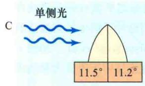  
用一片薄的云母将胚芽鞘尖完全分为两部分；不能检测到生长素的重新分布

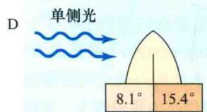  
用一片薄的云母将胚芽鞘尖不完全分为两部分；之后发生生长素的重新分布  
在胚芽鞘尖中生长素转运到背光的一面  
图19.25 玉米胚芽鞘中单侧光可以刺激生长素侧向中心分布的证据。琼脂块中生长素的量用图19.1中的胚芽鞘弯曲实验中琼脂块被诱导后弯曲的角度表示。

较高的一半  
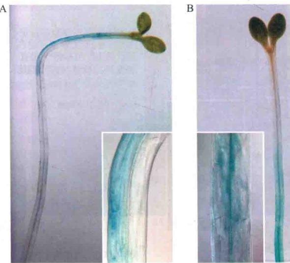

图19.26 在向光性实验中，用DR5::GUS报告基因载体转化植株观察生长素的侧向再分布。A. 拟南芥下胚轴中，在单侧光弯曲反应中形成侧向生长素梯度。蓝色表示下胚轴背光侧积累的生长素（插图）。B. 生长素输出抑制剂NPA处理可以阻断向光弯曲和生长素再分布。在向重力性中发生类似的生长素再分布（图片由Klaus Palme惠赠）。  

## 19.6.2 生长素侧向再分配参与的向重性

当在暗处生长的燕麦幼苗水平放置时，胚芽鞘对重力反应而向上弯曲。根据Cholodny-Went模型，水平放置的胚芽鞘顶端的生长素侧向地运输到低侧，引起胚芽鞘低侧比高侧生长得快。早期的实验结果表明，胚芽鞘顶端可以感受重力，并且使生长素在低侧重新分布。例如，如果胚芽鞘顶端水平放置时，扩散到琼脂块低侧的生长素比高侧的量多（图19.27）。

顶端下面的组织也能响应重力。例如，把垂直生长的玉米胚芽鞘顶端上方2 mm处的帽状部分去除后，再水平放置，即使没有顶端，也会在几个小时内发生向重力弯曲。在切割面处施加IAA会使弯曲速度恢复到正常水平。这个发现表明尽管生长素的产生需要顶端，在顶端下面的组织也可以感受重力刺激和进行生长素的侧向重新分布。

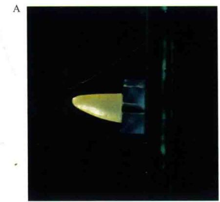

由于生长素再循环（喷泉效应，fountain effect）的存在，生长素在茎端分生组织的侧向分布比在胚芽鞘中的分布更难证明。这种现象与根尖、正在发育的叶片和茎尖原基中的相似（Benkova et al., 2003）。然而，茎的向重力弯曲机制与向光弯曲的机制相似。

## 19.6.3 致密质体是重力的感受子

不同于单侧光，重力在植物器官上部和下部不形成梯度。植物的每一部分感受相同的重力刺激。植物细胞是如何感受重力的呢？可感受重力的唯一途径是通过降落小体和沉淀小体的运动。

很明显，植物中细胞内重力感受子可能是出现在重力感受细胞中的大而致密的淀粉体。这些大的淀粉体（starch-containing plastid）相对于细胞溶胶具有足够高的密度，可以轻易地沉淀在细胞底部（图19.28）。作为重力感受子的淀粉体称为平衡石（statolith）。产生它们的特化的重力感受细胞被称为平衡细胞或平衡囊（statocyte）。究竟是当平衡石通过细胞骨架时，平衡细胞才能检测到平衡石的向下运动，还是只有当平衡石到细胞底部停止时才感受刺激，这个问题还不清楚。

## 1. 茎叶和胚芽鞘中的重力感受

在茎叶和胚芽鞘中，淀粉鞘（starch sheath）感受重力。淀粉鞘是在茎叶维管组织周围的一层细胞。淀粉鞘与根的内皮层相连，与内皮层的不同之处在于淀粉鞘含淀粉体。淀粉鞘中缺乏淀粉体的拟南芥突变体表现出茎干生长失去重力性，但是根的向重力性生长正常。

较低的一半  
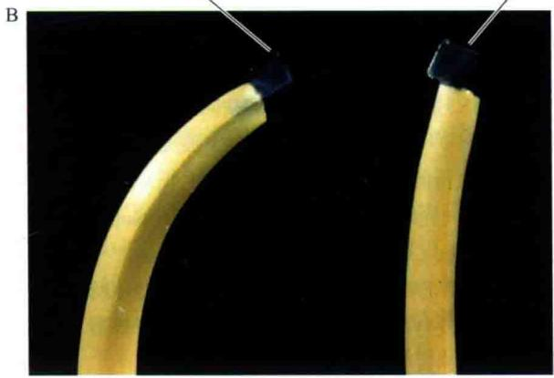  
图19.27 生长素被运输到水平放置的燕麦胚芽鞘顶端靠下的一侧。A. 来自胚芽鞘顶端上半部分和下半部分的生长素扩散到两个琼脂块中。B. 下半部分（左）的琼脂块比上半部分（右）的琼脂块能够使去掉顶端的胚芽鞘弯曲更大（图片由W. B. Wilkins提供）。

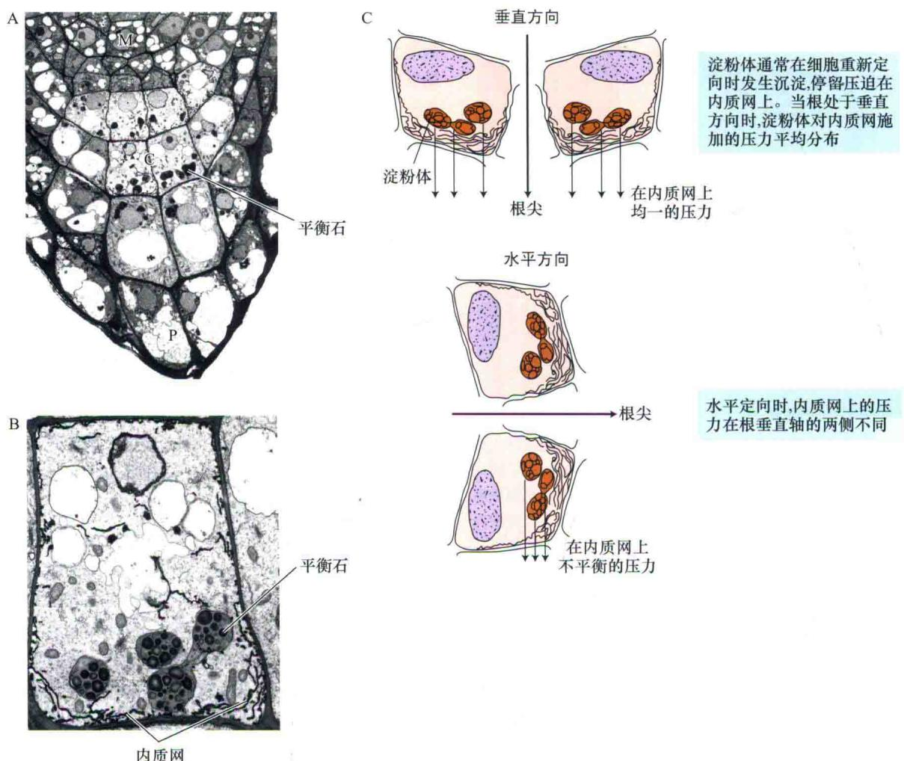  
图19.28 拟南芥通过平衡细胞感受重力。A. 根尖的电镜图，显示顶端分生组织（M）、小柱（C）和外周（P）细胞。B. 小柱细胞的放大图，显示细胞底部停留在内质网顶端的淀粉体。C. 从垂直到水平重新定向过程中发生变化的示意图（A 和 B 图由 Dr. John Kiss 惠赠；C 图基于 Sievers et al., 1996, Volkmann and Sievers, 1979）。

正如第16章提到过的，在拟南芥scarecrow（scr）突变体中，产生内皮层和淀粉鞘的细胞层仍然没有分化。结果，虽然scr突变体的根具有正常的向重力反应，其下胚轴和花序却表现出无向重力性生长反应。基于这两种突变体的表型，我们得出以下结论。

（1）淀粉鞘是茎叶中向重力性所必需的。淀粉鞘中含有ABCB19和PIN3蛋白。在束鞘中它们共同限制生长素流到维管柱。这种向下的生长素流的选择性调控是由维管柱中的PIN1蛋白执行的，选择性地限制侧向生长素流进淀粉鞘细胞可能对向光弯曲起到了奠基性的作用（Noh et al., 2003; Friml et al., 2003; Blakeslee et al., 2007）。

（2）不含有平衡石的根内皮层不是根向重力性所必需的。根中的向性弯曲包括根尖处生长素变成向基运输，而不是从中柱的直接侧向运输。

## 2. 根中的重力感受

初生根中感受重力的位点是根冠。响应重力的大造粉体位于根冠中柱或小柱（columella）的平衡细胞中（图19.29A）。完好的根如果去除根冠，能在不抑制生长的情况下使根的向重性消失。

人们仍然对平衡细胞如何精确地感知下降的平衡石了解甚少。一种假设就是由停留在细胞较低一侧的内质网上的造粉体所产生的接触和压力引发这种反应（图19.28C）。小柱细胞中占主导地位的内质网形式是管状内质网。但是也出现一种不常见形式的内质网，称为“节状内质网”。节状内质网中有5\~7个粗面内质网片层以涡旋方式连接在一个中心接杆上，像花瓣。节状内质网与更典型的管状皮层内质网潴泡不同，它可能在重力反应中起作用。

几条证据支持根中感受重力的“淀粉-平衡石”假说。在不同种类的植物中，造粉体是一直沉淀在小柱细胞中的唯一细胞器。而且沉淀的速度与感受重力性刺激所需要的时间密切相关。一般来说，淀粉缺失突变体的向重力性反应比野生型慢。虽然如此，无淀粉突变体还有部分向重力性。这表明，虽然淀粉是正常的向重力性反应所必需的，但是也可能存在不依赖淀粉的重力感受机制。

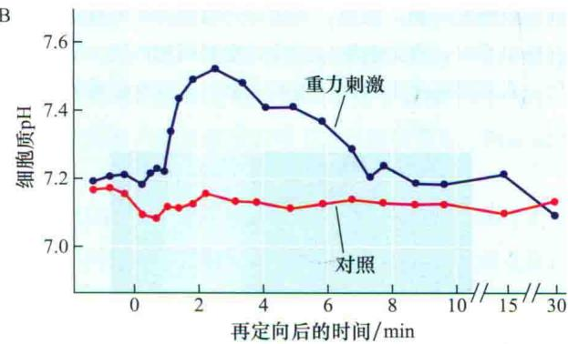

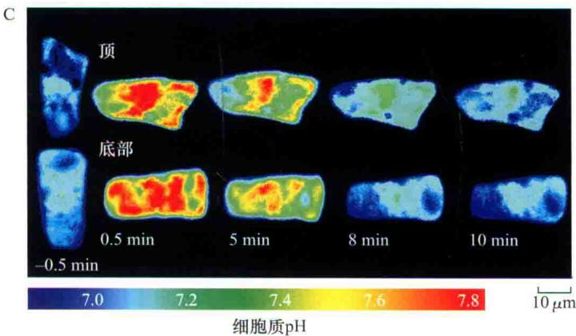  
图19.29 用pH敏感染料进行的实验表明，向重力的信号转导过程中，根冠中柱细胞的pH变化明显。A. 显微照片表示根尖的放大图和根冠不同层面上的两个小柱细胞，分别标以S2（story 2）和S3（story 3）（插图）。两个小柱细胞呈现荧光是因为已经将一个pH敏感的荧光染料显微注射进入这些细胞。因为液泡（V）不含染料，所以是黑的。B. 重力刺激后不超过1 min，胞内pH增加。C. 在A中的两个小柱细胞对向重力刺激反应的pH敏感染料成像图。下方的颜色标尺被用来为B图产生数据（引自Fasano et al., 2001）。

其他细胞器，如细胞核也非常致密，可能作为平衡石起作用。平衡石甚至没有必要落到细胞底部，因为其与内膜或者细胞骨架相互作用也可传递重力信号，但是具体机制还未知。

## 19.6.4 pH和钙离子可能作为第二信使参与重力感受

当重力感受机制检测到根或茎叶的重力载体不一致时，由第二信使参与的信号转导途径传递此信息去纠正这种差异生长。该过程称为重力刺激（gravistimulation）。很多实验表明pH的局部变化和钙浓度梯度参与了该信号转导途径。

在根冠柱细胞对重力产生反应的早期可以检测到胞内pH的变化，用pH敏感的染料检测拟南芥根尖中胞内和胞外的pH，当根被转向水平方向后可以观察到pH的快速变化（Fasano et al., 2001）。在重力刺激2 min后，根冠小柱细胞的胞内pH从7.2增加到7.6，而质外体pH从5.5下降到4.5（图19.29 B和C）。这些变化发生在所有可检测到的向性弯曲的大约10 min之前。

胞质碱化和质外体酸化表明，质膜H $^{+}$ -ATPase的活化发生在根感受重力或信号转导之前。生长素运输的化学渗透模型推测质外体酸化和胞质碱化可能改变受影响细胞对IAA的定向吸收和流出。

早期生理研究表明从贮存库中释放的钙可能参与根向重力性的信号转导过程。例如，用EGTA [ethylene glycol-bis（β-aminoethyl ether）-N, N, N', N'-tetraacetic acid]（一种可以螯合钙离子的化合物）处理玉米根能够阻止细胞吸收钙，抑制根的向重力性生长。将含有钙离子的琼脂块放在垂直放置的根冠一侧，能够诱导根向有琼脂块的一侧生长（图19.30）。与 $[^{3}H]$ -IAA的情况一样，由于受重力刺激， $^{45}Ca^{2+}$ 被极性地运输到

PLANT PHYSIOLOGY

根冠较低的一侧。然而，当用对钙敏感的染料检测细胞内钙水平时，重力刺激后并没有检测到胞内钙分布的变化。这表明钙离子的再分布不是重力反应所必需的。

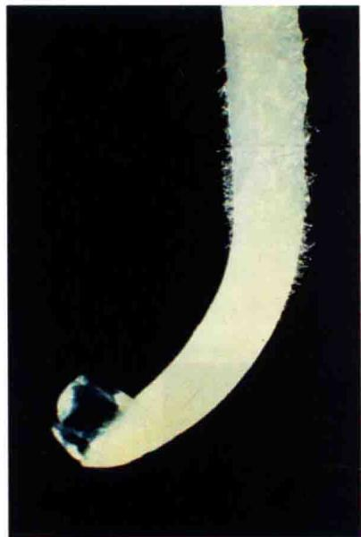  
图19.30 玉米根向含有钙的琼脂块的根冠侧弯曲。该结果表明人为造成的钙浓度梯度可以超越正常的向重力反应。虽然在向重力性反应中钙离子本身不起作用，但它可能在向重力性的信号转导中起作用（Michael L. Evans 惠赠）。

在根的向触性生长中，当正在生长的根尖与坚硬的表面接触时，便超越向重力性引起暂时的弯曲反应。与向重力性弯曲不同的是，在根的向触性反应中能检测到胞内钙库的局部性变化。在拟南芥中，钙离子水平的快速变化的起始不依赖活性氧的增加和质膜pH梯度的降低（Monshausen et al., 2009）。图19.30中所示的对钙的弯曲反应在更大程度上与向触性有关，而非向重力性。

## 19.6.5 生长素在根冠中的侧向再分配

根冠除了在根尖透过土壤时保护顶端分生组织的敏感细胞外，它也是感受重力的地方。因为根冠与发生弯曲的生长区之间有一定的距离，在根冠的重力响应信号应该能诱导产生一种化学信使以调节伸长区的生长。去除一半根冠的显微手术实验表明，在向重力性弯曲中根冠向较低一侧提供一种根生长的抑制物（图19.31）。

根冠含有少量的IAA和脱落酸（abscisic acid，ABA）（见第23章）。当直接给伸长区施用IAA和ABA时，IAA对根生长的抑制作用比ABA强。这表明IAA是根冠抑制因子。与此结论一致，拟南芥ABA的缺失突变体具有正常的根向重力性生长，而在生长素运输有缺陷的突变体（如aux1和pin2）的根中向重力性反应有缺陷。

为了理解生长素在根冠中是如何再分布的，首先综述植物根中生长素的运动模式。IAA被向顶的PIN1/ABCB19调控的流动运输到根尖（图19.11）。在根分生组织中也合成IAA。然而，PIN3、PIN4和ABCB1共同作用将生长素排除在根冠细胞之外，同时，侧根冠细胞中AUX1介导的生长素吸收驱使向基的生长素流离开根尖（Swarup et al., 2003）。PIN2定位在根表皮细胞的基部（顶部）末端，负责将生长素从侧根冠运输到伸长区。在这个部位，PIN2的功能是以一种浓度依赖的方式激活或抑制生长（图19.11）。

  
图19.31 显微手术实验表明根冠对生长素的重新分布和接下来根向重力弯曲中的伸长的不同的抑制是必需的。分子遗传实验已经表明拟南芥中AUX1是根冠中生长素流向外的主要动力（引自Shaw and Wilkins，1973）。

有人认为，在根皮层细胞中受PIN2蛋白介导的生长素回流环（auxin reflux loop）能使生长素返回到伸长区边缘的向顶中柱运输流中（图19.11）。正在生长的根尖中的生长素环流可能在不依赖茎的生长素情况下，使根的生长维持一段时间（Blilou et al., 2005）。

根据向重力性模型，在垂直的根中向基运输的生长素在每个方向是均等的（图19.32A）。然而，当根水平放置时，根冠使大多数生长素流向低侧，而抑制低侧生长（图19.32B）。与该模型一致， $[^{3}H]$ IAA通过水平定向的根冠时是极性运输的，倾向于向下运动。利用报告基因载体DR5::GFP已经证实生长素通过水平放置的根冠而向下运动。该载体含有绿色荧光蛋白（green fluorescent protein，GFP），它在生长素敏感的DR5启动子控制下表达（见第2章）（图19.33）。在GR5::GFP过量表达的植株中，可以通过绿色荧光观测任何可能的细胞中生长素水平的升高。在根的低侧的绿色信号表明了生长素的累积（Peer and Murphy，2007）。

PIN3是PIN蛋白家族的成员之一，它可能参与从垂直到不同方向放置的根中生长素的再分配。在垂直放置的根中，PIN3均一地分布在小柱细胞的周围；当根水平放置时，PIN3倾向于位于低侧的细胞中。有人认为PIN3的再定向能加速生长素向根冠较低一侧的运输。像前面提到的那样，有些PIN蛋白在质膜的胞内分泌区室中快速循环，PIN3可能通过这种机制定位。然而，pin3突变体不是完全没有向重力性的，因此，PIN3可能与其他的非对称事件共同改变生长素流。最可能的非对称事件可能是非质体酸化中的非对称性改变，非质体酸化产生的非对称的化学渗透势改变生长素流的方向。这可能使PIN3重新分布，并在新的方向放大生长素流（渠化）。

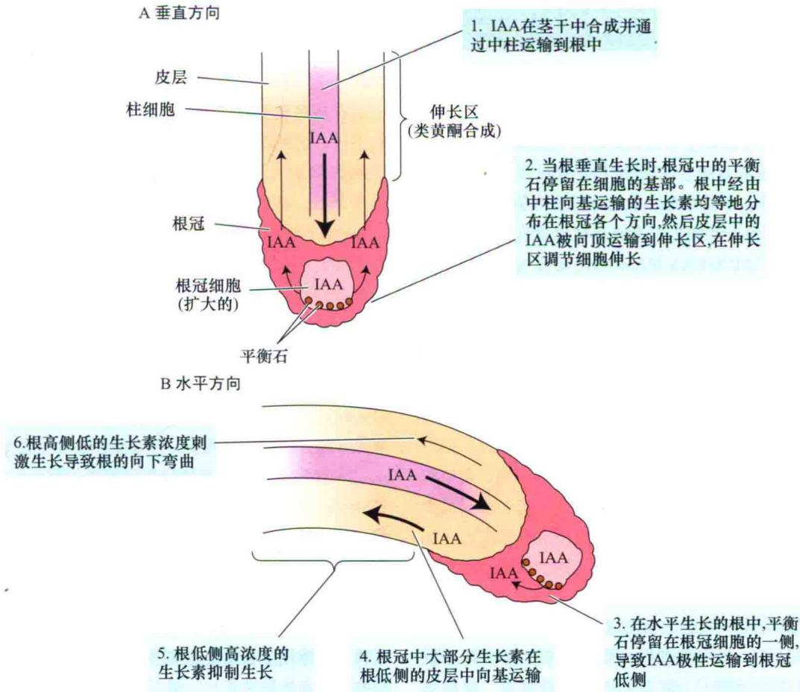  
图19.32 玉米根向重力生长时生长素的再分布模型（引自Hasenstein and Evans，1988）。

B

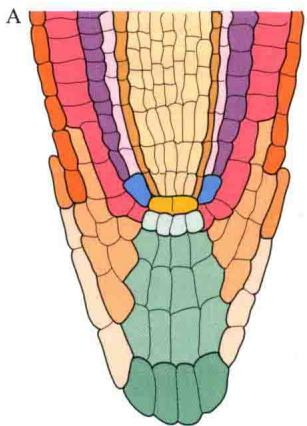

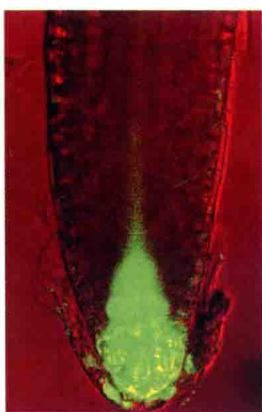

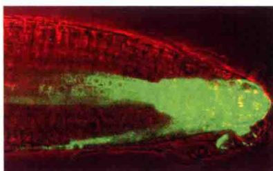

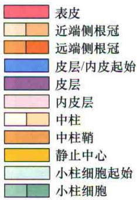  
图19.33 重力刺激致使生长素在侧根细胞的非伸长侧的不对称积累。DR5启动子驱动下的绿色荧光蛋白（GFP）的表达表示生长素的积累。A. 拟南芥根尖示意图，表示参与生长素侧向重新分布的组织。B. 重力刺激之前。C. 重力刺激后3 h，生长素已经在根冠较低侧重新分布（图片由Jiri Friml惠赠）。

## 19.7 生长素对生长发育的影响

虽然最初发现生长素与生长有关，但是生长素几乎影响植物生命周期中从萌发到衰老的每一个时期。植物的形态建成需要依赖生长素的定向极性运输。生长素的极性运输维持基本的茎-根极性和发育过程中的极性生长。在拟南芥、水稻和玉米中的分子遗传研究表明，由PIN蛋白指导的极性的生长素流在植物器官发生的各个方面起作用。AUX/LAX和ABCB转运蛋白的活性在组织伸长和成熟过程中维持生长素极性运输流。

多个PIN的缺失突变体或者调控这些转运蛋白极性定位的细胞组分的缺失突变体都导致严重的胚胎缺陷和多个植物器官的缺失。生长素运输极性是在胚胎发育的早期建立的。调节生长素从胚胎顶极向胚柄（母性附着点）的极性运输的细胞机制存在于成熟组织中。

因为生长素的影响依赖于对靶组织的识别，靶组织对生长素的反应受遗传发育程序的控制，进一步受有无其他信号分子的影响，如激素、钙离子和活性氧。正如我们将在本章和后面章节中谈到的，两个或多个激素的相互作用是遗传发育中的常见问题。

在这部分中，我们将探讨由生长素调节的除细胞伸长外的另外一些发育过程，包括顶端优势、花芽发育、叶重排（叶序）、侧根形成、维管发育、叶脱落和果实形成。通过这些讨论，我们推测生长素的作用机制在所有情况下是类似的，包括相似的受体和信号转导途径。

## 19.7.1 生长素调节顶端优势

在多数高等植物中，发育的顶芽抑制侧芽（腋芽）的生长，这种现象称为顶端优势（apical dominance）。茎端去除后（打顶，decapitation）导致一个或多个侧芽暴长。发现生长素后不久，在蚕豆（Phaselous vulgaris）植株中，人们发现IAA可以代替顶芽以维持对侧芽的抑制作用。图19.34阐明的是20世纪20年代，Kenneth Thigaris和Folke Skoog的经典实验。

在很多其他植物中，也很快证实了这个结果。因此形成了这样的假设：顶芽向基运输的生长素抑制腋芽长出。为了证明这种假设，将含有生长素运输抑制剂TIBA的羊毛脂膏（作为载体）环放在茎尖下方，能够解除对腋芽的抑制作用。

来自茎尖的生长素如何控制侧芽的疯长？Thimann 和 Skoog 最先提出茎尖合成的生长素向基运输到腋芽，他们认为腋芽比其他组织对生长素敏感。如果事实是这样，茎尖去顶之后，腋芽处生长素的浓度应该降低。然而，结果似乎相反。腋芽中生长素含量的测定表明，去掉顶端后，芽中生长素浓度实际是增加的。另外，直接在顶芽上施用生长素能提高茎干中生长素的浓度，但不能抑制正常的腋芽长出。最后，用放射性标记的生长素进行的实验表明生长素并不进入芽中。

A 顶芽完整  

B 去除顶芽  

C 向切割面添加生长素  
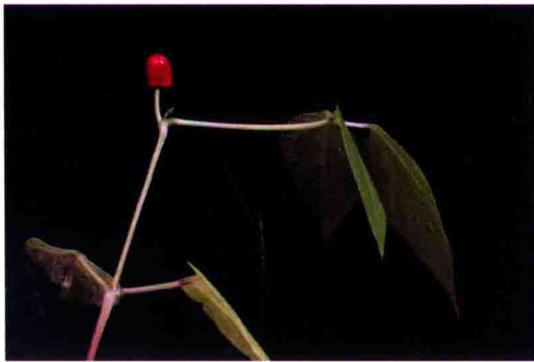  
图19.34 生长素抑制蚕豆（Phaseolus vulgaris）腋芽生长。A. 在完好的植株中，由于顶端优势腋芽被抑制。B. 去除顶芽使腋芽解除顶端优势（箭头所示为侧芽）。C. 向切割面添加含有IAA的羊毛脂膏（含在明胶胶囊中）阻止腋芽的生长（图片由David McIntyre提供）。

如果生长素不进入芽中，那么它必须在远处作用以抑制芽的暴长。但是生长素在哪里作用呢？对拟南芥axr1突变体（Booker et al., 2003）的分子研究提供了答案。AXR1蛋白是初始生长素识别机制的组分。拟南芥axr1突变体对生长素不敏感，导致突变体的表型包括侧枝增多。但是，在axr1突变体的木质部和茎干的维管束（束间厚壁组织）之间的厚壁组织特异表达野生型AXR1蛋白，可以完全恢复正常突变体的顶端优势，表明AXR1作用于这些组织。而且，axr1突变体和野生型之间的嫁接研究证实生长素通过在木质部和茎的维管束间的厚壁组织作用来控制腋芽生长。但是，在这些组织中生长素信号下游的组分是如何调控芽的生长的机制还是不清楚的。生长素在侧枝发育中的功能在Web Essay 19.2中有进一步的叙述。

其他分枝信号：由于AXR1还调控了多种SCF泛素E3连接酶复合体（见第2章和第14章），其他激素也可能参与了控制腋芽生长的过程。细胞分裂素最初被认为与生长素相互作用调控腋芽的生长（见第21章）。在多种植物中，直接向腋芽施用细胞分裂素能够覆盖茎端的抑制效应以刺激芽的生长。但是，在腋芽处生长素的水平调控了细胞分裂素的产生（Tanaka et al., 2006）。同样，细胞分裂素不可能是激活分支的主要的或唯一的信号物质。

对一系列分枝增多的豌豆、水稻和拟南芥突变体的分析中发现了顶端优势中作为信号物质的独脚金内酯（Hayward et al., 2009）。独脚金内酯是一种来源于类胡萝卜素的萜类内酯，最初是作为寄生杂草独脚金的寄主植物的根产生的一种化学物质而鉴定到的，可以刺激独脚金种子的萌发。后来发现独脚金内酯可以促进有益的菌根真菌的菌丝结构的形成。突变体植株和野生型植株的嫁接研究表明，独脚金内酯在根和茎中都能够产生，可能通过木质部运输到茎干。在调控顶端优势中，独脚金内酯如何与生长素相互作用需要进一步研究。

## 19.7.2 生长素运输调节花芽发育和叶序

花分生组织的发育依赖于从近顶端组织运输的生长素。从这些组织运输的生长素也调节叶发生和叶序（phyllotaxy），即从茎端产生的叶的模式。在没有PIN1的情况下，生长素向分生组织的运动受到损害，而且叶和花器官原基的发生被破坏。这是pin1突变体“针状”表型的基础。然而，毫不奇怪的是，通过向顶端分生组织的侧翼涂抹微量含有生长素的羊毛脂膏可以诱导pin1突变体分生组织形成叶原基（图19.35）。

在茎顶端分生组织的叶原基中，PIN1-GFP转基因植株的显微镜观察表明PIN1的分布与生长素流的方向相关。在这些组织的细胞中，PIN1的定位和生长素流的方向是高度动态的。假设生长素的运输是通过AUX1、PIN1和ABCB19的共同作用，生长素运输方向的计算机模型可以精确地预测叶序的模式，模拟出的向基的生长素运输池是存在的（Smith，2008）。

A  

## 19.7.3 生长素促进侧根和不定根的形成

虽然生长素的浓度超过 $10^{-8}$ mol/L时，初生根的伸长被抑制，但是高浓度生长素刺激侧根和不定根的发生。侧根出现在伸长区和根毛区。它起源于中柱鞘中的小细胞群（见第16章）。通过对根分枝模式异常的拟南芥突变体分析表明以下几点。

（1）中柱鞘细胞分裂的发生需要根维管薄壁细胞中IAA的向顶运输。生长素吸收进入根中是由PIN2、AUX1、ABCB19和ABCB1共同作用调控的。

（2）LAX3调控生长素进入皮层和表皮细胞，进而促进细胞扩展和细胞壁修饰。细胞壁的修饰有利于侧根发生。

（3）来自于根中向基流动的IAA有助于侧根伸长，并和来源于茎的生长素共同维持细胞分裂和细胞生长。

生长素水平升高或者外施生长素能够促进不定根

（产生于非生根组织的根）的形成。不定根起源于分化细胞。分化细胞开始分裂，并以一种类似于侧根原基形成的方式发育成根顶端分生组织。在园艺学中，生长素对不定根形成的刺激效应对通过剪切进行的营养繁殖具有重要的利用价值。

## 19.7.4 生长素诱导维管分化

新维管组织直接在发育的芽和生长的幼嫩叶片下方分化（图19.4）。而且去除幼叶以后阻止维管分化。用组织培养的方法可以证明顶芽具有刺激维管分化的能力。当把顶芽嫁接到一簇未分化的细胞或胼胝体以后，在嫁接处木质部和韧皮部便开始分化。

在拟南芥中，通过研究编码转运蛋白、转运蛋白的调控蛋白和生长素信号组分的基因的突变体，以及启动子-报告基因的实验，表明由PIN1调节的生长素运输是叶中维管束分化和模式的主要决定因素。ABCB19在将生长素运输到子叶中起重要作用（Lewis et al., 2009），也被认为有助于叶中生长素的提供。有些组织中的维管分化似乎有与乙烯和其他激素的相互作用。

在所有的植物器官中，维管束的分化都具有极性。在多年生木本植物中，发育的春芽产生的生长素向基刺激维管形成层的活化。新一轮的次生生长从最小的嫩枝开始向根尖方向进行。

受伤害的维管组织的再生也受位于受伤部位幼叶产生的生长素的控制（图19.36）。去除幼叶可阻止维管组织的再生，施加生长素可代替幼叶刺激再生。

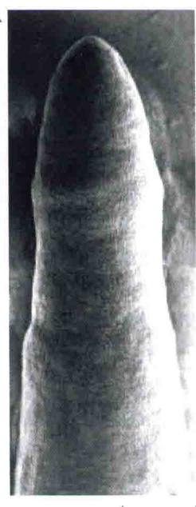  
200 μm

B  
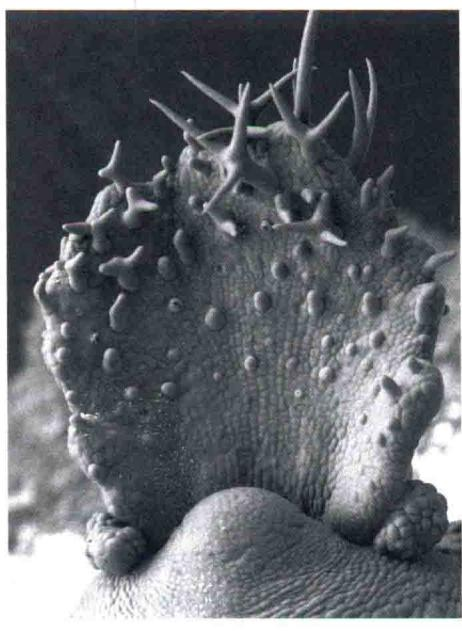  
50 μm  
图19.35 pin1突变体营养性茎尖分生组织上的叶原基的扫描电镜显微图片。A. 未经处理的pin1花序分生组织不能产生叶原基。B. 将一微滴含有IAA的羊毛脂膏放在分生组织的一侧，诱导pin1突变体的花序分生组织产生叶原基（A引自Vernoux et al., 2000；B引自Reinhart et al., 2003）。

## 19.7.5 生长素延迟叶片脱落

叶、花和果实从活的植株分离的现象称为脱落（abscission）。发生脱落的区域称为离区（abscission zone）。对于叶来说，离区位于叶柄基部附近。在大多数植物中，离区中脱落层细胞的分化致使叶脱落。在叶片衰老过程中，脱落层细胞的壁被消化掉，使这层细胞变软而且脆弱。对脆弱的细胞壁的胁迫最终导致叶从脱落层脱离。

生长素水平在幼嫩叶片中较高，成熟叶片中次之，当脱落开始时在衰老叶片中最低。除去叶片只剩下主干上完整叶柄的实验可以很容易地证明叶脱落过程中生长素的重要性。去除叶片后加速了叶柄脱落层的形成，而向叶柄表面切割处涂抹含有IAA的羊毛脂膏状物却阻止脱落层的形成（羊毛脂膏本身不能阻止脱落）。

这些结果表明以下两点。

（1）从叶片运输的生长素阻止脱落。

（2）在叶衰老的过程中，当不再产生生长素时，就引发脱落。

然而，正如将在第22章讨论的那样，乙烯作为正调控因子也在脱落中发挥关键作用。

## 19.7.6 生长素促进果实发育

很多证据表明生长素参与调节果实发育。生长素在花粉管中合成和代谢。而且果实生长的最初刺激可能来自授粉。

授粉引发胚珠生长称为座果（fruit set）。受精后果实的生长可能依赖于正在发育的种子中的生长素。胚乳可能在果实发育的起始阶段提供生长素；在后期阶段，正在发育的胚取而代之成为主要的生长素来源。

图19.37表示的是草莓瘦果（真正的种子，每个瘦果含有一粒种子）产生的生长素对草莓花托生长的影响。

## 19.7.7 合成生长素具有多种商业用途

生长素在农业和园艺学中商业化地应用已有50多年的历史。商业用途包括预防果实和叶脱落、促进菠萝开花、诱导单性结实、疏果（thinning of fruit）和嫁接生根以促进植物繁殖等。如果将离体叶子或茎切段浸入生长素溶液中，会促进生根。生长素还能增强切段末端不定根的发生，它是商用生根复合物的理论基础。生根复合物的主要成分是与滑石粉混合在一起的人工合成生长素。

在有些植物中，无种子的果实可能是天然长成的，或者是生长素处理未授粉的花诱导形成的。这些无种子果实的产生称为单性结实（parthenocarpy）。为刺激单性结实，生长素可能主要诱发座果。反过来，座果可能诱发一定的果实组织产生内源生长素以完成生长发育过程。

A

打顶的主干,在伤口上方的叶和芽被移走以降低内源生长素的含量 在受伤之后立即将含有IAA的羊毛脂黏胶涂抹在伤口上方的茎干

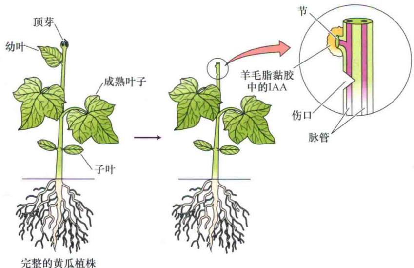

B  
  
木质部分化沿生长素扩散的路径发生在伤口附近  
图19.36 黄瓜（Cucumis sativus）茎组织中，IAA诱导木质部在伤口周围再生。A. 伤口再生的实验方法。B. 荧光显微照片表示在伤口周围正在再生的维管组织。箭头表示伤口位置，即生长素积累的地方和木质部开始分化的地方（B图由R. Aloni惠赠）。

PLANT PHYSIOLOGY

  
图19.37 草莓的果实实际上是一个膨大的花托。花托的生长受“种子”（实际上是瘦果，真正的果实）所产生的生长素的调节。A. 当有瘦果存在时，花托膨大，并形成特有的风味、甜度和红颜色。B. 当去除瘦果时，花托不能正常发育。C. 把IAA喷洒在去除瘦果的花托上能恢复正常的生长和发育（引自Galston，1994）。

乙烯也参与调控果实发育，而且生长素对果实发育的影响可能通过促进乙烯的合成起作用。在商业上用乙烯处理果实的作用将在第22章中讨论。

除了这些应用，合成的生长素，如2，4-D和麦草畏（图19.3B）被广泛地作为除草剂。除草剂可以诱导细胞过度伸展最后导致植株死亡。人工合成的生长素非常有效，是因为它们不像IAA那样能够迅速地被植株代谢。而有些生长素，如2，4-D的运输速度比IAA慢得多，因此能促进它在枝叶的停留。农民用合成的生长素来控制禾谷类作物田里的双子叶杂草（也称为宽叶杂草）（broad-leaved weed）；园丁用它来控制草坪上诸如蒲公英和雏菊之类的杂草。单子叶植物，如玉米和禾本科的草类对人工合成的生长素不太敏感，因为单子叶植物能够通过缀合作用迅速使合成的生长素失活。

## 小结

生长素是植物中发现的第一种激素。它调控了植物发育的各个方面，包括茎的伸长、顶端优势、根的起始、果实发育、分生组织发育和向性生长。生长素可能和其他激素相互作用共同调控这些发育。

## 生长素概念的出现

· 燕麦胚芽鞘尖端的可扩散的化学物质（生长素）促进细胞伸长（图19.1）。

## 主要的生长素是吲哚-3-乙酸

· 主要的天然生长素是吲哚-3-乙酸，也鉴定到了其他的生长素（图19.3）。

· IAA在分生组织和幼嫩的正在分裂的组织合成，随着叶和维管束的成熟向基运输（图19.4）。

· IAA可以被贮存或者降解。当与不同的物质缀合时，它是无活性的。但是酶的作用可以释放自由的（有活性的）IAA。IAA能够被包括不可逆的氧化作用在内的多种途径降解（图19.5）。

## 生长素的运输

· IAA表现出从茎的顶端到基部区域的极性运输（图19.6）。IAA的极性运输需要能量，不依赖重力（图19.7）。

· 极性的生长素流被化学渗透势驱动。生长素流的方向由极性分布的输出蛋白调控，生长素池由生长素吸收蛋白和排斥邻近细胞生长素流的无方向性的输出蛋白产生（图19.8和图19.10）。

\- 质子化的生长素通过沿着细胞膜的扩散和AUX1/LAX质子协同蛋白进入细胞（图19.9）。

· PIN和ATP依赖的（ABCB）转运蛋白指导整株植物中生长素的外流（图19.11和图19.12）。

· 细胞质和ER中生长素的区室化有助于生长素的平衡（图19.14）。

· 生长素的流入和流出可以被抑制（图19.15和图19.16）。

\- 生长素运输被激素和PIN蛋白的运输调控，在细胞膜和内体中循环（图19.17）。

## 生长素信号转导途径

· 结合生长素后，受体-酶复合体使特异的转录抑制子通过蛋白酶体途径降解，激活生长素反应基因的转录（图19.18）。

· 生长素诱导的基因分为早期基因和晚期基因。

## 生长素的作用：细胞伸长

· 生长素促进双子叶植物茎和单子叶植物胚芽鞘的伸长，但是抑制根的生长（图19.19和图19.22）。

· 生长素促进的生长需要能量，能被代谢抑制剂快速地抑制。蛋白质和RNA合成抑制剂也可以抑制生长

素促进的生长。

\- 双子叶植物中侧向的生长素运输由维管束细胞中侧向定位的PIN蛋白和周围细胞中的ABCB转运蛋白调控（图19.21）。

· 与酸生长假说一致，生长素促进质子挤压进入细胞壁（图19.23）。

· 生长素影响PIN蛋白和其他细胞膜蛋白的滞留或内吞作用，表明生长素可能直接作用在细胞膜，从而促进质子外排。

## 生长素的作用：植物的向性

· 向光素是自我磷酸化的蛋白激酶，能够吸收蓝光，诱导向光弯曲。

· 向光素的磷酸化诱导生长素向胚芽鞘的背光面侧向运输，并激活细胞伸长和弯曲（图19.24），这与Cholodny-Went模型一致（图19.25）。

· 向光的生长素运输包含导致生长素侧向再分布的生长素外流蛋白的抑制或者再分布（图19.26）。

· 胚芽鞘尖端感受重力，使生长素向低端再分布，诱导胚芽鞘弯曲（图19.27）。

· 大的、高浓度的平衡石在特化的根细胞的底部给特化的内质网信号压力，进而感受重力（图19.28）。

· 在根冠小柱细胞，细胞质中pH增加与质外体的酸化共同激活质膜 $H^{+}$ -ATPase，是向重力性信号转导的最初事件（图19.29）。

· 在向重力性弯曲的根中，根冠向更低一侧提供生长抑制子（IAA）（图19.31\~图19.33）。

## 生长素对生长发育的影响

· 生长素影响植物从萌发到衰老的生活周期的多个阶段。在这个过程中，生长素的影响依赖于特异组织中由发育激活的基因网络。生长素可能与其他激素、钙离子和活性氧共同调控植物的生长发育。

· 生长素作用在木质部和相关的细胞，抑制侧芽的发育，维持顶端优势（图19.34）。独脚金内酯与生长素相互作用调控侧枝的发育。

·为了正常的发育，花分生组织和叶原基需要PIN调控的从位于亚顶点的组织的生长素运输（图19.35）。

· PIN调控的生长素运输控制叶中维管束分化和模式。维管束的再生也受生长素调控（图19.36）。

· 生长素参与果实发育的调控（图19.37）。

(王海娇 王学路 译)

## WEB MATERIAL

## Web Essays

19.1 Exploring the Cellular Basis of Polar Auxin Transport Experimental evidence indicates that the polar transport of the plant hormone auxin is regulated at the cellular level. This implies that proteins involved in auxin transport must be asymmetrically distributed on the plasma membrane. How those transport proteins get to their destination is the focus of ongoing research.

## 19.2 Strigolactones: The Unmasking of a New Branching Hormone

A brief review of the discovery of a new plant hormone, strigolactone, how it is regulated and how it is integrated into the network of genes and signals controlling shoot branching.

# 第 20 章

# 赤霉素：植物高度和种子萌发的调节因子

1927年，人们发现了生长素，其后，在其结构被阐明为吲哚-3-乙酸后的20多年里，植物学家试图用生长素解释激素调节植物生长发育的所有现象。然而，正如本章和以后的一些章节所阐述的，植物的生长和发育是由许多激素单独或者协同调节的。

第二种被鉴定的植物激素是赤霉素（GA）。现在至少已经发现136种天然的赤霉素（MacMillan，2002），在http://www.plant-hormones.info/galinfo.htm上面可以查阅这些赤霉素的结构特征，该网址内容会根据天然赤霉素的特点和命名的最新变化而及时更新。生长素是一类结构差异很大却具有相似生物活性的化学物质，而赤霉素不同于生长素，它们有相似的化学结构，但生物活性却很不相同。一些没有活性的赤霉素是活性赤霉素的代谢前体或者是活性赤霉素的失活产物。在植物体中通常只有几种有活性的赤霉素存在，它们的活性水平一般与植物茎的高度相关。赤霉素还在其他的生理过程中起重要作用，如种子的萌发、开花和花粉的发育。

赤霉素的生物合成受到遗传、发育和环境因素的严格调控。赤霉素最显著的作用是促进植物茎的伸长。目前已经筛选得到由于赤霉素缺乏而导致植株矮化的突变体。孟德尔遗传定律中控制豌豆植株高矮的一对等位基因就是著名的例子，该单个基因位点能控制活性赤霉素的水平，进而调节植株茎的高度。人们利用这些突变体来阐明赤霉素生物合成的复杂途径和鉴定植物中哪些赤霉素具有内源生物活性。

本章首先说明赤霉素在水稻（Oryza sativa）真菌病原体赤霉菌（Gibberella fujikuroi）中的发现过程，并讨论其化学结构。然后综合阐述赤霉素调节的植物生长发育过程——种子萌发，茎的生长，花的发育，果实的形成和种子的发育。其后讨论赤霉素的生物合成，在不同发育阶段、不同组织和器官中调节活性赤霉素水平的因素及这些因素所起的作用。2005年，人们从水稻中分离鉴定了赤霉素的受体，这为我们近年来发现赤霉素受体的结构奠定基础。有生物活性的赤霉素结合到受体后，启动一系列的信号转导过程，最终导致植物表型的变化。

## 20.1 赤霉素的发现及其化学结构

本部分将简要介绍赤霉素的发现这一突破性的工作，并对本章出现的赤霉素相关的专业术语进行解释，阐述赤霉素的化学结构和命名系统。最后，探讨赤霉素特殊的化学结构和生物活性之间的关系。

## 20.1.1 赤霉素是通过研究一种水稻病害而发现的

赤霉素首次引起西方科学家的关注是在20世纪

50年代，然而它们在更早之前就已经在日本被发现了。日本稻农很早就知道一种真菌病害（“bakanae disease”或恶苗病）会导致水稻生长过高并降低产量。植物病理学家发现这种症状是由病原真菌Gibberella fujikuroi感染水稻后引起的。20世纪30年代，日本科学家在实验室培养这种真菌，分析过滤后的培养液，获得了这种具有促进植物生长活性的化合物的不纯晶体，并将其命名为赤霉素A（gibberellin A）。

## 20.1.2 赤霉酸最初是从培养赤霉菌的过滤液中纯化得到的

20世纪50年代，英国和美国的两个研究组从赤霉菌的培养滤液中纯化了一种化合物，并阐明了其化学结构，将其命名为赤霉酸。同时，日本的科学家从最初的赤霉素A样品中分离和鉴定了三种不同的赤霉素，并分别命名为赤霉素 $A_{1}$ （ $GA_{1}$ ）、赤霉素 $A_{2}$ （ $GA_{2}$ ）和赤霉素 $A_{3}$ （ $GA_{3}$ ）。赤霉素的编号系统的建立由此而来。随后发现日本科学家所分离的 $GA_{3}$ 与美国和英国科学家所发现的赤霉酸相同，因此， $GA_{3}$ 就是指赤霉酸，而赤霉素是对这类激素的总称。

不久之后又发现，虽然 $GA_{3}$ 是赤霉菌培养物中的主要化合物，但其中还有很多不同的赤霉素类化合物（ $GA_{3}$ 通常由工业规模发酵赤霉菌产生，用于农业、园艺和其他的一些科学研究）。由于 $GA_{3}$ 很容易获得，科学家将它广泛地用于不同的植物。赤霉素在矮生和具莲座叶的植物中有促进茎伸长的特殊效应，尤其在矮生豌豆（Pisum sativum）、矮生玉米（corn；Zea mays）（图20.1）和一些莲座叶植物（图20.2）中效果更加明显。

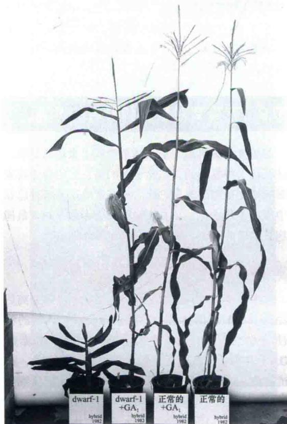  
图20.1 外源的 $GA_{1}$ 处理野生型和矮生型玉米（dl）植株。赤霉素能显著地促进矮生突变体茎的生长，但是对于野生型植株作用不明显（B. Phinney惠赠）。

  
图20.2 甘蓝，一种长日照植物，在短日照条件下保持莲座叶生长，经 $GA_{3}$ 处理后能出现花芽而开花，并形成巨大的花茎（©SylvanWittwer/Visuals Unlimited）。

由于真菌来源的天然 $GA_{3}$ 能使矮生的突变体增高，因此很自然地使人们想到在野生型的植株中是否含有内源赤霉素。对不同植物的提取液进行生物分析发现，在植物体内确实存在一些与赤霉素生物活性相似的物质。在未成熟种子中，这类物质的含量大约为 $1/10^{6}$ ，远高于营养组织（约 $1/10^{9}$ ）。因此未成熟的种子常被用作提取GA的原料。但是化学鉴定GA往往需要几十千克的种子。1958年，人们第一次从植物红花菜豆（Phaseolus coccineus）的未成熟种子中提纯并鉴定了 $GA_{1}$ 。现在，利用灵敏度较高的光谱技术已使人们能用较少的植物材料去鉴定和定量GA。

由于在赤霉菌和不同的植物中发现了越来越多的GA，科学家按赤霉素发现的年代先后顺序调整了赤霉素的编号系统（ $\mathrm{GA}_1 \sim \mathrm{GA}_n$ ）。规定只有天然存在的，化学结构已被阐明的GA用A数字编号系统（http://www.plant-hormones.info/gibberellin\_nomenclature.htm）。赤霉素命名中的编码仅仅是为了记录方便，邻近编码的赤霉素没有代谢关系上的暗示。

## 20.1.3 所有的赤霉素都是以ent-赤霉烷为基本骨架

赤霉素是一类二萜类化合物，由4个含有5个碳原子的类异戊二烯形成。GA都有一个四环的ent-赤霉烷骨架（包含20个碳原子），或20-nor-ent赤霉烷骨架（第20个碳原子缺失，仅含有19个碳原子）。含有20个碳原子的二萜类结构的赤霉素被认为是 $C_{20}$ -GA（如 $GA_{12}$ ）。

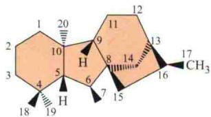  
ent-赤霉烷

其他的赤霉素由于在代谢中缺失了第20个碳原子（结构图中蓝色部分）被称为 $C_{19}$ -GA（如 $GA_{9}$ ）。几乎所有的 $C_{19}$ -GA中， $C_{4}$ 上的羧基与 $C_{10}$ 上的碳原子形成内酯（结构图中红色标记部分）。其他的结构修饰还包括额外功能基团如羟基（—OH）或者双键的插入，这些基团插入的位置和立体化学结构影响赤霉素的生物活性。最具生物活性的GA均在最先发现的赤霉素 $GA_{1}$ 、 $GA_{2}$ 、 $GA_{3}$ 、 $GA_{4}$ 和 $GA_{7}$ 中。这些赤霉素都是一些 $C_{19}$ -GA。它们都有 $C_{4}$ 和 $C_{10}$ 位上形成的内酯（显示为红色）， $C_{6}$ 位上的羧基（COOH，结构图中显示为绿色）和 $C_{3}$ 位上的β-羟基结构（OH，结构图中显示为蓝色）。GA受体三级结构的阐明揭示了活性GA上的这些功能基团如何与GA受体的氨基酸残基相互作用，使活性GA锚定在受体的中央口袋中，然后关闭的“盖子”完全将GA包埋在受体中（Murase et al., 2008；Shimada et al., 2008）。这种活性GA与受体结合后引起受体构象的变化能促进受体与其他蛋白质的相互作用。

  
$\mathrm{GA}_{12}$ $(\mathbf{C}_{20} - \mathbf{G}\mathbf{A})$

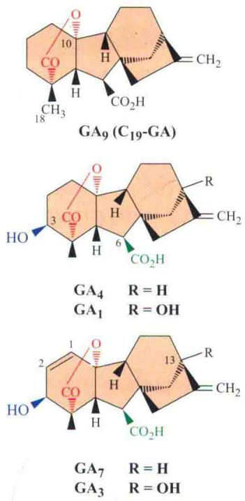

在分子水平上赤霉素的生物活性可能会因功能键位置的不同而不同，如在 $GA_{7}$ 和 $GA_{3}$ 中 $C_{1}$ 和 $C_{2}$ 间的双键，在 $GA_{1}$ 和 $GA_{3}$ 中 $C_{13}$ 上的羟基。这些功能基团或是促进或是抑制GA与受体的结合。另外，2β-OH能阻止其于受体中央口袋“盖子”的疏水作用，使“盖子”不能关闭，进而导致GA的失活（赤霉素结构的深入讨论参见Web Topic 20.1）。

## 20.2 赤霉素对生长和发育的影响

尽管赤霉素最初是从水稻节间病（水稻恶苗病，又称徒长病）中发现的，但除了茎的伸长，内源赤霉素还能影响植物很多的发育过程。赤霉素的这些特性已在农业中应用了几十年，在农作物中改变赤霉素的含量能够影响其植株的大小、果实的形成和发育。

## 20.2.1 赤霉素能促进种子的萌芽

许多种子，尤其是野生种类，当刚和母体分离后，会经历一段时间的休眠，不能立即萌发。休眠的种子即使施水也不能够萌发。脱落酸（ABA）和赤霉素（GA）在种子休眠过程中的作用是相互拮抗的，在很多植物中，这两种激素的相对含量决定了它们休眠的程度。光和低温处理休眠的种子，都能够降低ABA的含量和提高活性GA的含量，使种子结束休眠促进其萌发（Piskurewicz et al., 2008; Seo et al., 2006）。这些种子萌发所需的光和低温的作用能被赤霉素处理所替代。

在种子萌发过程中，GA能够诱导水解酶的合成，如淀粉酶和蛋白酶。这些酶能够降解成熟种子中积累在胚和胚乳里的营养物质。这种对糖类和蛋白质的降解能为种子萌芽提供营养和能量。在谷物萌发过程中GA诱导α-淀粉酶的合成已经被深入地研究，将在后面的章节里详细讨论。

## 20.2.2 赤霉素能促进茎和根的生长

对于已经很高的植物施加赤霉素并不能很明显地促进其茎的伸长，这是由于其植物体内，有活性的赤霉素含量已经很高。然而，在莲座叶植物和禾本科类植物中，赤霉素仍能显著地促进矮化突变体节间的伸长。外源赤霉素能促进矮化玉米茎的伸长，使它们的茎高达到同品种中最高的植株高度（图20.1）。

莲座叶植物最初形成的节间部位在一般生长条件下是不会伸长的。在十字花科（如卷心菜）植物中有致密丛生的莲座叶。长日照植物生长在短日照条件下通常会形成莲座叶。当将其放在长日照条件或用外源赤霉素处理植株时可促进茎的生长和开花（图20.2）。

赤霉素在根的生长上也有重要作用。在赤霉素的生物合成被阻断的矮生豌豆和拟南芥突变体中，与野生型相比，其根较短，用赤霉素处理地上部分能促进地上部和根的生长（Yaxley et al., 2001；Fu and Harberd, 2003）。

## 20.2.3 赤霉素能促进植物从幼年期到成熟期的生长

许多多年生木本植物只有到一定的成熟期才能开花和结果，在此之前它们处于幼年期（见第25章）。赤霉素能促进植物由幼年期向成熟期转变，尽管影响效果的本质因植物的不同而异。许多松科植物，幼年期能持续20年，而用 $GA_{3}$ 或者 $GA_{4}$ 和 $GA_{7}$ 的混合物处理后，非常年幼的植株就能进入生殖期（图20.3）。

## 20.2.4 赤霉素能诱导花的形成和性别决定

正如已经阐明的，赤霉素能替代长日照条件促使一些植物开花，尤其是一些莲座叶植物。光周期和赤霉素在开花上的作用关系是很复杂的，这些将在第25章进行

A 白云杉  

B 白云杉  

C 美洲杉幼苗  
  
图20.3 赤霉素能促进幼年期松科植物球果的形成。A和B.用白云杉（Picea glauca）的繁殖体嫁接，在夏季前于茎内注射水和乙醇混合的 $GA_{4}/GA_{7}$ ，树苗形成雌性球果（经传粉）。C.用GA溶液喷洒生长6周的美洲杉（Sequoiadendron giganteum），8周后，植株形成雌果（S.D.Ross和R.P.Pharis惠赠）。

PLANT PHYSIOLOGY

讨论。

在植物中，相对于雌雄同体的花，单性花的性别决定更容易受遗传调控。然而，它也能被环境因子，如光周期和营养状态所调节，这些环境因素又能为赤霉素所介导。植株在幼年期向成熟期的转变中，赤霉素引起的性别决定因不同的物种而不同。在双子叶植物如黄瓜（Cucumis sativus）、大麻（Cannabis sativa）和菠菜中，赤霉素促进雄花形成，而赤霉素生物合成的抑制因子则促进雌花的形成。而在玉米中，赤霉素抑制雄蕊的发育，促进雌蕊的形成。

## 20.2.5 赤霉素能促进花粉发育和花粉管生长

在赤霉素缺失的矮生型突变体中（如水稻和拟南芥中），花粉囊的发育和花粉的形成受到阻碍，导致雄性不育。经赤霉素处理后，能挽回这种转变。在赤霉素信号应答受阻的突变体中，花粉囊和花粉的发育障碍不能通过外源施用赤霉素逆转，因此这些突变体是雄性不育的（Aya et al., 2009）。此外，通过基因过表达可致GA失活的酶使植物体内有活性的赤霉素含量降低，能严重抑制花粉管的生长（Swain and Singh, 2005）。因此，赤霉素参与花粉的发育和花粉管的形成。GA调控水稻花粉囊的发育将在后面的章节详细讨论。

## 20.2.6 赤霉素能促进果实形成和单性结实

施用赤霉素也能促进座果（授粉后果实形成）和一些果实的生长。例如，施用赤霉素能刺激梨（Pyrus communis）果实形成。在不授粉的情况下，赤霉素能诱导植物单性结实（有果实无种子）。在葡萄（Vitis vinifera）中，应用GA $_{3}$ 处理能使汤普森无核葡萄果实增大（图20.4）。这种处理能够促进果柄的生长，同时降低了真菌对葡萄的感染率，赤霉素对紧密丛生类型的葡萄是否有此效果还有待证明。赤霉素对无核葡萄的这些效应在商业上已广泛应用。

  
图20.4 赤霉素诱导汤普森无籽葡萄的生长。左边的一串是未经赤霉素处理的；右边的一串是在果实发育时用 $GA_{3}$ 处理过的（©Sylvan Wittwer/Visuals Unlimited）。

## 20.2.7 赤霉素能促进早期种子发育

在赤霉素缺失的突变体和赤霉素失活的转基因植株中，植株种子的败育概率大大增加。种子不能正常发育是因为幼嫩种子产生活性赤霉素的水平降低了。用赤霉素处理并不能使正常的种子发育，因为外源赤霉素不能进入新的种子中。然而，如果在败育种子中赤霉素合成基因组成型表达，赤霉素缺失的效应就能得到弥补（Swain and Singh，2005）。总之，这些结果表明了赤霉素在种子的早期发育中起重要作用。

## 20.2.8 赤霉素及其生物合成抑制剂在商业上的应用

赤霉素（典型的是 $GA_{3}$ ）在商业上的用途主要是促进果实生长，在酿酒时促进大麦发芽，增加甘蔗中糖的含量。关于大麦发芽方面内容参见Web Topic 20.2。

赤霉素生物合成抑制剂在农业上主要用于降低农作物高度。例如，在欧洲凉爽潮湿的气候下，禾谷类作物植株生长过高，结果造成严重的倒伏（lodging）（倒伏是指在作物成熟的顶部由于吸收水分过多，茎向地面弯曲使收割机收割困难）。减小节间长度以降低作物株高，可以增加作物的产量。在欧洲，即使栽种矮生小麦，也要喷施GA的生物合成抑制剂——矮壮素来进一步降低植株高度。

在田间或温室中，过高的植物通常不易管理。在开花的园艺作物中需要矮的、健壮的植物，如百合、菊花和猩猩木都需要利用赤霉素生物合成抑制剂严格控制其植株高度。在苗圃、温室和阴棚中这些化合物通常被用来控制观赏植物的大小和体积。

目前有商业应用的赤霉素生物合成抑制剂的化学结构可以参见Web Topic 20.1。关于这一内容的深入讨论参见Web Topic 20.2。

## 20.3 赤霉素的生物合成与失活

赤霉素是一类由四环双萜类化合物组成的大家族。赤霉素合成途径的前半部分已经在第13章阐述过。在这里，讨论赤霉素合成途径的后一阶段过程，详细内容参见Web Topic 20.3和相关文献（Yamaguchi，2008）。我们将探讨赤霉素合成途径中的一些关键酶及其编码基因。了解赤霉素生物合成和失活的重要内容，有助于掌握赤霉素的代谢平衡。通过赤霉素的代谢平衡，可以使植物在其整个生命周期中维持其细胞和组织中适宜的活性GA的水平。这种代谢平衡可以通过调节赤霉素的合成、失活和运输来实现。

人们对赤霉素如何调控植物生长和发育的认识是通过研究受试植物材料中的赤霉素来获得的。由于能从少量的组织中准确地分离和定量各种不同的赤霉素，高灵敏度的物理技术如质谱技术被广泛应用。对植物提取物中GA的鉴定和定量参见Web Topic 20.4。

通过分离鉴定一些株高发生变化的突变体，可以了解在植物体内哪些GA是具有生物活性的。利用这些突变体有助于我们克隆编码GA合成通路中的酶的相关基因。拟南芥和水稻的基因组测序工作进一步发展和完善了数据信息，对快速分离鉴定出参与GA合成和调节的新基因和蛋白质有着重要作用。

## 20.3.1 赤霉素是通过萜类化合物途径合成的

萜类化合物是由五碳的类异戊二烯（isoprenoid）组成的。赤霉素是由4个类异戊二烯形成的双萜类化合物（见第13章）。赤霉素的生物合成分为三个阶段，每一阶段所处的细胞部位不同：包括质体、内质网和细胞质。对合成途径的简单描述见图20.5。对整个合成途径的描述见附录3。

第一阶段，在质体中，4个类异戊二烯形成一个20碳的线性分子牻牛儿牻牛儿焦磷酸（geranylgeranyl diphosphate, GGPP）。GGPP通过两步环化成为四环化合物内根-贝壳杉烯（ent-kaurene），这两步分别被内根-古巴焦磷酸合成酶（ent-copalyl-diphosphate synthase, CPS）和内根-贝壳杉烯合成酶（ent-kaurene synthase, KS）催化完成。

第二阶段，在质体折叠区和内质网中，内根-贝壳杉烯逐步转变为第一种形式的GA—GA $_{12}$ 。两个重要的酶参与了这一过程：内根-贝壳杉烯氧化酶（ent-kaurene oxidase，KO）和内根-贝壳杉烯酸氧化酶（ent-kaurenoic acid oxidase，KAO）。迄今研究发现，在所有植物中形成GA $_{12}$ 的步骤都是一样的。

第三阶段，在细胞质基质中， $\mathrm{GA}_{12}$ 先转变为 $\mathrm{C}_{20}-$ GA，然后转变为 $\mathrm{C}_{19}-\mathrm{GA}$ （包括有活性的赤霉素）。在第三阶段里有两个主要的合成途径被鉴定到。它们都由同一系列的氧化反应构成，唯一不同的是其中一条通路的所有中间产物的 $\mathrm{C}_{13}$ 碳位都带有一个羟基（所以又称为C-13羟基化通路），而另一条通路的所有中间产物的C13碳位都不带有一个羟基（所以又称为非C-13羟基化通路）。在第三阶段，所有的氧化反应都发生在A环。在许多植物中，C-13羟基化途径是主要的途径，尽管在拟南芥和一些葫芦科作物（南瓜）中非C-13羟基化通路是主要途径。在后面的讨论中，产生活性GA的途径（ $\mathrm{GA}_4$ 产生于非C-13羟基化途径； $\mathrm{GA}_1$ 产生于C-13羟基化途径）被称为生物合成途径。而活性GA的代谢称为失活。GA的合成和失活在Web Topic 20.3中有描述。

## 20.3.2 赤霉素合成途径中主要的调节酶

通过对拟南芥、豌豆和玉米赤霉素生物合成途径（图20.6和图20.7）突变体的研究，有助于克隆赤霉素生物合成和降解途径中的编码酶的基因。途径中值得注意的调节点是第三阶段的三个酶，它们是形成有生物活性GA催化反应最后几步的 $GA_{20}$ 氧化酶（ $GA_{20}ox$ ）和 $GA_{3}$ 氧化酶（ $GA_{3}ox$ ），以及使GA失活的 $GA_{2}$ 氧化酶（ $GA_{2}ox$ ）。这三种酶都是双加氧酶（dioxygenase），催化反应需要α-酮戊二酸（2-oxoglutarate）和亚铁离子（ $Fe^{2+}$ ）作为辅助因子。因此，它们被称为酮戊二酸依赖的双加氧酶（2ODD）。在说明它们的调节作用之前，先分别讨论这些酶。

（1） $\mathbf{GA}_{20}$ 氧化酶 在拟南芥中， $\mathrm{GA}_{20}$ 氧化酶是一类包含有5个成员的小家族，命名从AtGA20ox1到AtGA20ox5。这些同源基因（它们起源于单个基因，彼此有相似的序列）在不同的组织、器官和不同的发育阶段表达，尽管它们的表达谱会有些重叠。主要在茎中表达的 $\mathrm{GA}_{20}$ 氧化酶（AtGA20ox1）是由GA5基因编码的（Phillips et al., 1995; Xu et al., 1995）。GA5基因突变体（ga5）呈现半矮化而不是完全矮化的表型（图20.6），这是由于基因的冗余造成的。与此相反，ga1、ga2和ga3突变体特别矮，是因为这几个酶在合成途径的上游第一、第二阶段，分别是古巴焦磷酸合成酶（CPS）、内根-贝壳烯合成酶（KS）和内根-贝壳杉烯氧化酶（KO），由单拷贝基因所编码（图20.6）。

(2) $GA_{3}$ 氧化酶 拟南芥的茎中主要表达的 $GA_{3}$ 氧化酶（AtGA3ox1）是由 GA4 基因编码的（Chiang et al., 1995）。它也属于小基因家族，ga4 突变体与 ga5 一样，是半矮化而不是完全矮化的突变体（图 20.6）。在豌豆中，这个酶是由 LE 基因所编码（图 20.7，将在以后讨论）。在玉米中，这个酶是由 DI 编码的，这个基因的隐性突变体植株都呈现矮化的表型（图 20.1）。

（3） $\mathrm{GA}_{2}$ 氧化酶 在拟南芥中，使GA失活的酶 $\mathrm{GA}_{2}$ 氧化酶的突变体并没有明显的表型。在豌豆中，这个基因突变的幼苗比野生型高而命名为SLENDER（SLN）基因，编码 $\mathrm{GA}_{2}$ 氧化酶。在sln突变体里，突变体的种子在成熟过程中GA合成与失活的比例和野生型不一致，因而在成熟的种子里仍存在一些有潜在活性的赤霉素，在种子萌发过程中它们能够转变为有生物活性的 $\mathrm{GA}_{1}$ ，从而使幼苗的节间增长，呈现一种“苗条”的表型（Reid et al., 1992）。

## 20.3.3 赤霉素调节自身的代谢

与第19章中所阐述的生长素一样，有许多因子对激素的平衡包括合成与失活间的相对平衡有重要的调节作用。植物对活性赤霉素的应答反应之一是抑制赤霉素的生物合成和促进其分解代谢（即失活），从而防止植物茎的过度生长。在有活性的赤霉素生物合成过程中， $GA_{20}ox$ 和 $GA_{3}ox$ 基因编码代谢途径的最后两个酶，抑制赤霉素的生物合成可通过下调这两个基因的表达（抑制表达）完成。赤霉素对自身生物合成的调节属于负反馈调节（negative feedback regulation）。加强赤霉素的失活也是维持植物体内赤霉素平衡的重要手段。可通过上调编码使GA失活的酶 $GA_{2}ox$ 基因的表达来实现。赤霉素启动使自身失活的基因表达过程是正反馈调节（positive feedforward regulation）。

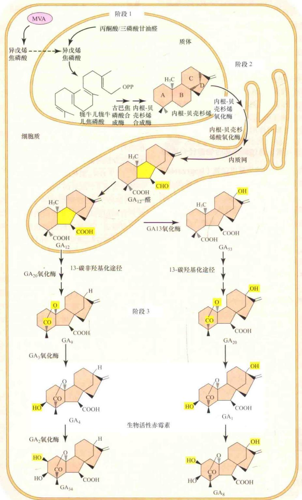  
图20.5 赤霉素生物合成的三个阶段。在第一阶段，由牻牛儿牻牛儿焦磷酸（GGPP）转变为内根-贝壳杉烯。第二阶段是在内质网中发生的，内根-贝壳杉烯酸转变为 $\mathrm{GA}_{12}$ 。 $\mathrm{GA}_{12}$ 通过在 $\mathrm{C}_{13}$ 碳位上的羟基化作用转变为 $\mathrm{GA}_{53}$ 。第三阶段发生在胞质中， $\mathrm{GA}_{12}$ 或 $\mathrm{GA}_{53}$ 通过两条平行途径转变为其他的GA。这种转变包括 $\mathrm{C}_{20}$ 碳位上的一系列氧化及最终失去 $\mathrm{C}_{20}$ 碳位形成 $\mathrm{C}_{19}$ 的GA。通过 $3\beta$ 位上的羟基化作用被氧化为有生物活性的 $\mathrm{GA}_{1}$ 和 $\mathrm{GA}_{4}$ 。 $\mathrm{GA}_{4}$ 和 $\mathrm{GA}_{1}$ 的2碳位羟基化形成无活性的 $\mathrm{GA}_{34}$ 和 $\mathrm{GA}_{8}$ 。在拟南芥和其他一些植物中主要是非 $\mathrm{C}_{13}$ 碳位羟基化作用，在大多数植物中， $\mathrm{C}_{13}$ 碳位上的羟基化作用占优势。CPS为古巴焦磷酸合成酶；KS为内根-贝壳杉烯合成酶；KO为内根-贝壳杉烯氧化酶；KAO为内根-贝壳杉烯酸氧化酶； $\mathrm{GA}_{20}\mathrm{ox}$ 为 $\mathrm{GA}_{20}$ 氧化酶； $\mathrm{GA}_{30}\mathrm{ox}$ 为 $\mathrm{GA}_{3}$ 氧化酶； $\mathrm{GA}_{20}\mathrm{ox}$ 为 $\mathrm{GA}_{2}$ 氧化酶； $\mathrm{GA}_{13}\mathrm{ox}$ 为 $\mathrm{GA}_{13}$ 氧化酶；MVA为甲羟戊醛。

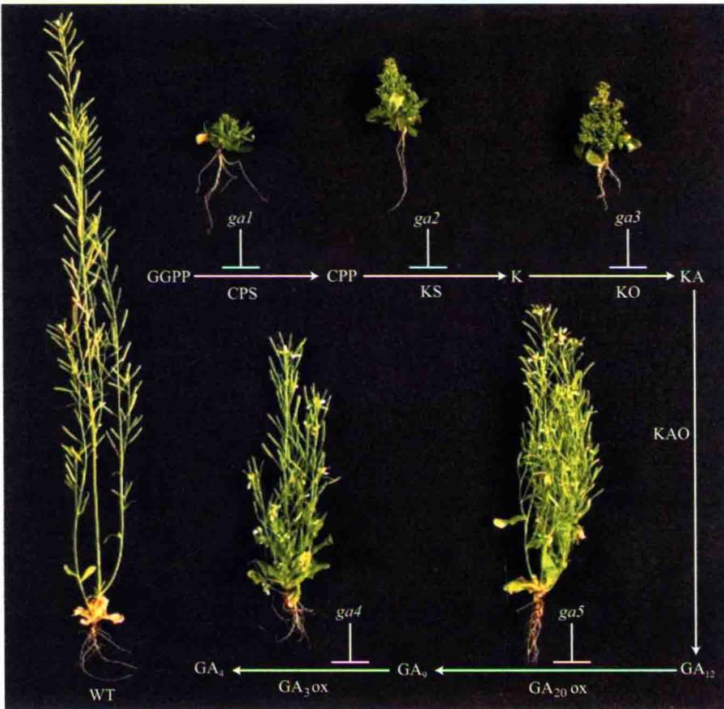

图20.6 拟南芥中野生型和赤霉素缺失突变体的表型，显示了在每一种突变体中赤霉素合成途径被阻断的位置。所有突变体的等位基因都是纯合的，用野生型中小写字母的等位基因符号表示。培养条件：持续光照下生长7周。 $ga_{1}$ 、 $ga_{2}$ 、 $ga_{3}$ 植株是雄性不育的，不能结长角果（荚果）。缩略图见图20.5（V.Sponsel惠赠）。  
  
图20.7 GA生物合成途径中被突变体阻断的代谢位点（拟南芥用绿色表示，豌豆是蓝色，玉米为橘黄色）。缩略图见20.5。拟南芥中 $GA_{1}\sim GA_{5}$ 5个非等位基因是编码赤霉素生物合成途径的酶，由于命名时间较早（尚未了解酶的性质与基因）（Koornneef and van der Veen，1980），遗传分析根据它们进入代谢途径的顺序，将其定位在途径中的不同位置。

每个基因对这一过程的相对重要性，随物种及组织的不同而不同（Hedden and Phillips，2000）。有时这些基因的表达并不完全受这种反馈过程调节，也许是对环境信号的响应。这种动态平衡机制中赤霉素含量的改变，也可能提供一种机制，使赤霉素的浓度重新恢复到正常的水平。

## 20.3.4 赤霉素的生物合成发生在多个植物器官和细胞位点

研究发现，在体外无细胞体系中加入种子或不完整种子的组分，能完成从GGPP到 $C_{19}$ -GA生物合成的所有反应过程，说明正在发育的种子是GA生物合成的场所之一。在豌豆的种子中，受精后不久就有大量的GA产生，说明赤霉素是早期种子发育和果实生长所必需的。在许多植物种子成熟的后期，GA的积累可达到很高水平。

A 生长5天的苗  

D 带种子的成熟角果  
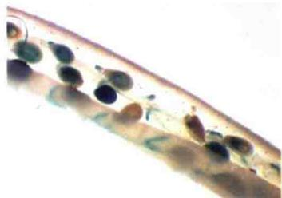

使用报告基因技术研究显示，编码CPS酶（赤霉素生物合成中的第一个酶）的基因GA1在拟南芥的未成熟种子、芽的顶端、根尖和花粉囊中表达（图20.8）（Silverstone et al., 1997a）。毋庸置疑，在gal突变体中，与种子休眠、矮生和雄性不育相关的器官受到了突变影响。这项研究表明早期的赤霉素生物合成和功能表达可以发生在相同的器官中。Yamaguchi等（2001）和Ogawa等（2003）通过比较 $GA_{3}$ 氧化酶（催化没有活性的 $GA_{9}$ 转变为有生物活性的 $GA_{4}$ ）和受活性赤霉素 $GA_{4}$ 上调的基因产物的定位分析，发现一些不能够产生 $GA_{4}$ 的细胞却能够获得 $GA_{4}$ 的响应。因此，研究发现在拟南芥胚萌发过程中 $GA_{4}$ 在同一细胞的合成部位和不同细胞中都起作用，这暗示 $GA_{4}$ 或者 $GA_{4}$ 信号转导途径的下游组分必须从一个细胞转移到另一个细胞。

## 20.3.5 环境条件影响赤霉素的生物合成

赤霉素在介导环境因子对植物发育的影响上起重要作用。光和温度对赤霉素的代谢和信号响应都有影响，更多讨论参见Web Topic 20.5。在大多情况下，环境能够改变除了赤霉素以外很多激素的代谢和响应。活性GA和ABA的比例对不同的组织响应这两种激素是十分重要的。

## 20.3.6 GA $_{1}$ 和GA $_{4}$ 能促进茎的生长

20世纪80年代，人们用GA生物合成突变体（也称为GA缺失的突变体）进行研究得到了两个重要的结果。一方面，确定了GA代谢的途径；另一方面，发现在豌豆和玉米中 $GA_{1}$ 是主要的促进茎生长的有活性的赤霉素，并且其前体无内在的生物活性。

B 生长3天的苗  
  
E 发育中的胚

C 开放的花  

  
图20.8 拟南芥 $GA_{1}$ 启动子与GUS基因融合表达的组织化学分析。 $GA_{1}$ 编码GA生物合成中的第一个酶CPS。 $GA_{1}$ 启动子活性（染蓝色），表明GA可能的合成位点，在整个生活周期中是可见的（引自Silverstone et al., 1997a；T-p.Sun惠赠）。

在豌豆中LE和le是调节高度的两个等位基因，这个遗传特征最初是由孟德尔（Gregor Mendel）于1866年发现的。用 $GA_{20}$ 处理豌豆的le突变体对植株表型没有任何影响，而用 $GA_{1}$ 处理后能恢复突变体的表型（植株的高度）。 $GA_{8}$ 对突变体也没有影响。由此从豌豆中赤霉素的代谢途径（ $GA_{20}\rightarrow GA_{1}\rightarrow GA_{8}$ ），推测在植株中除非转变为 $GA_{1}$ ，赤霉素 $GA_{20}$ 是无活性的，因而 $GA_{1}$ 是植物内源的有生物活性的赤霉素（Ingram et al., 1984）。

用同位素标记的赤霉素进行代谢研究表明，LE基因编码在3β位羟基化 $GA_{20}$ 产生 $GA_{1}$ 的酶。同时证实相对于矮生植株，高茎植株中 $GA_{1}$ 含量更多（Reid and Howell，1995）。Mendel的LE基因已被克隆出来，其隐性等位基因le有一个碱基发生突变，导致编码功能缺失的酶（Lester et al., 1997；Martin et al., 1997）。与野生型相比，隐性纯合突变体le中 $GA_{1}$ 合成减少。由于le突变体仍能产生部分有活性的 $GA_{3}$ 氧化酶，其合成的 $GA_{1}$ 能使le幼苗植株高度达到野生型的30%。

对豌豆其他突变体的研究表明，豌豆的植株高度是与其内源GA $_{1}$ 的含量紧密相关的（Ross et al., 1989）。例如，na突变体中，由于体内赤霉素合成酶KAO活性缺失（图20.7），突变体植株中基本没有GA $_{1}$ ，其成熟植株高度仅1 cm（图20.9）。相反，sln突变体中，由于GA降解途径受阻，幼苗中的GA $_{1}$ 的含量比野生型的多，其植株也较野生型的高（图20.9）。有关豌豆茎生长的其他研究者的数据可以在Web Essay 20.1上查阅。

对其他植物中矮化突变体的研究也证实3β位羟基化 $C_{19}$ -GA是有生物活性能够促进茎的生长的。在玉米中，对GA缺失突变体的研究表明， $GA_{1}$ 是谷物类单子叶植物中调节茎生长的活性GA（Phinney，1984）。在水稻中，情况也是类似的， $GA_{4}$ （非C-13羟基化的 $GA_{1}$ ）和GA受体的亲和度在体外比 $GA_{1}$ 高，因此 $GA_{4}$ 在水稻的生长发育中发挥着重要的作用。在拟南芥和葫芦科的一些植物（如南瓜和黄瓜）中，外施 $GA_{1}$ 的生物活性比 $GA_{4}$ 低，因此，在这些种类中，推测 $GA_{4}$ 是主要的有生物活性的赤霉素。

## 20.3.7 基因工程调节植株的高度

鉴定谷物类植物中有生物活性的赤霉素，通过分析其生物合成和代谢过程中关键的酶，使得利用基因工程手段改变谷物类植物中GA的水平进而影响植株的高度成为可能（Hedden and Phillips，2000）。在很多物种中， $\mathrm{GA}_{20}\mathrm{ox}$ 、 $\mathrm{GA}_{3}\mathrm{ox}$ 和 $\mathrm{GA}_{2}\mathrm{ox}$ 在功能上具有保守性，易于操作。Phillips（2004）列举了一些这方面的例子。例如，编码一个拟南芥 $\mathrm{GA}_{20}$ 氧化酶可以引入白杨（Populustremuloides × P. tremula hybrid，山杨杂种）组成型表达（即在整个植株高水平表达）。使用来自花椰菜花叶病毒启动子（CaMV 35S）实现GA $_{20}$ 氧化酶的组成型表达。幼苗中超表达编码拟南芥GA $_{20}$ 氧化酶基因，能提高白杨幼苗中GA $_{1}$ 的含量，使其长得更高，提高了在造纸业中所需要的木质纤维的长度和质量（Eriksson et al., 2000）。

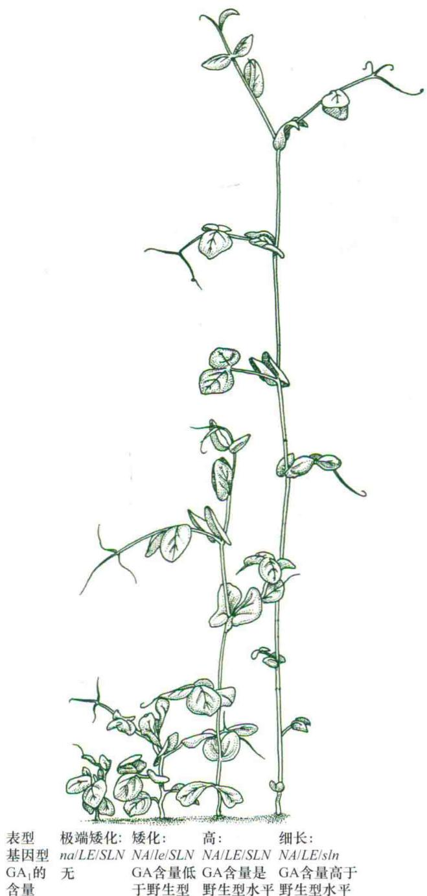  
图20.9 不同基因型和表型的豌豆植株、营养器官中GA含量（所有等位基因都是纯合的）（引自Davies，1995）。

在其他的农作物中，一般生产上的需要是减少生长。通过转化编码 $GA_{1}$ 生物合成酶的 $GA_{20}ox$ 和 $GA_{3}ox$ 的反义组件，或者超表达和 $GA_{1}$ 失活有关的GA2ox基因，都能降低 $GA_{1}$ 的水平。这些方法多用于改造小麦，产生极端矮化表型（Appleford et al., 2007）（图20.10）和水稻（Sakamoto et al., 2003）。

  
野生型
(未转化的)  
过量表达 $GA_{2}$ -氧化酶的转基因植株  
图20.10 基因工程的矮化小麦植株。图最左边是未转化的植株。右边的三个植株是组成型启动子连接豆类中 $GA_{2}$ 氧化酶cDNA的转化植株，内源的 $GA_{1}$ 失活。植株的矮化程度反映了外源基因过表达的量（引自Hedden and Phillips，2000；A. Phillips惠赠）。

## 20.3.8 除了矮化，矮化突变体还有其他缺陷

研究表明，活性GA除了控制植株高度外，还调节其他的生长和发育过程。茎中赤霉素合成受阻的矮化植株中到底发生了什么？很明显，这些突变体多有多态性的表型。拟南芥中矮化突变体ga1、ga2和ga3的休眠种子，除非用GA处理，否则它们不萌发。而且，由于花粉囊和花粉的正常发育需要GA，如果不用GA处理，这些突变体一般雄性不育（图20.6）。

在豌豆中，GA的缺失突变体植株变小，减少种子的发育，这是因为有活性的GA对于茎的伸长和种子的发育是必需的。然而，三个合成基因的纯合突变体都表现为植株矮小，但是种子发育正常，这是基因的冗余性造成的。例如，豌豆的na突变体，尽管合成在KAO位置被阻断（图20.7），植株特别矮小，但能产生可育的种子。这是由于豌豆中另一个NA基因在种子中表达，但在茎和根中不表达（Davidson et al., 2003）。另外，编码KO的LH基因的突变体lh-2（图20.7）降低了茎和种子中GA $_{1}$ 的水平（Davidson and Reid, 2004）。因此lh-2植株矮小，种子明显败育（图20.11）。

## 20.3.9 生长素调节GA的生物合成

有相当多的证据显示生长素能够调节GA的生物合成，在不同的物种中，甚至在同一物种中不同的器官和组织中被生长素上调或下调的GA合成相关的靶基因是不同的。对于这些研究的讨论参见Web Topic 20.6。

  
图20.11 豌豆野生型（左）和lh-2（右）豆荚，表明在GA缺失突变体中种子败育（J.B.Reid惠赠）。

## 20.4 赤霉素信号途径：响应突变体的重要性

GA信号响应减弱的单基因突变体是鉴定编码GA受体或信号转导中间组分基因的重要工具。一般来说，影响信号转导途径的因子可能是正调控的或者负调控的。突变体可以区分为以下三大类。

（1）GA信号正调控因子（positive regulator）的功能缺失突变。这种突变将产生矮化表型，并且是隐性的。突变体由于缺少GA信号转导途径中的必需元件而对外源GA无应答。

（2）GA信号负调控因子（negative regulator）的功能缺失突变。这种突变将产生高的表型，并且也是隐性的。

（3）负调控因子组成型激活的突变。这种突变将产生矮化、对外源GA无应答的表型。这些突变是“功能获得型”、半显性遗传的。

那么这些GA响应突变体与生物合成途径中酶受阻的突变体有什么不同呢？不同点在于GA响应突变体的高度与内源的活性GA浓度不成比例。这是因为GA不敏感的矮化突变体在用活性GA处理以后并不会长高；而组成型超高的突变体[这种表型称之为“细长”（slender）]在GA生物合成抑制剂环境下也不会变矮。

自从20世纪80年代中期分离到GA不敏感突变体gai-1以来（Koornneef et al., 1985），人们大量研究了拟南芥中的GA响应突变体。拟南芥中正调控和负调控因子的测序工作为鉴定一些重要作物（包括水稻、大麦、小麦、玉米和豌豆）中的GA信号调控因子奠定了基础。下面章节对GA信号转导途径的讨论不是按研究历史展开的，但参考文献暗示了研究工作的时间顺序。

## 20.4.1 GID1编码一个可溶性受体

理解GA信号转导途径的一个重大突破来自一个水稻矮化的隐性突变体GA-insensitive dwarf1（gid1）的鉴定（Ueguchi-Tannka et al., 2005）（gid1属于之前描述过的第1类突变体）。GID1编码一个球形蛋白，即GA受体（GA receptor）GID1。虽然过去20多年一直在进行GA受体的鉴定工作，并也研究了一些可能的GA结合蛋白，然而到目前为止只有GID1符合作为GA受体的所有标准（科学家是使用GST-GID1融合蛋白来进行研究的。GST标签使得GID1更容易纯化，且GST-GID1和GID1具有相似的GA结合性质。为了简化，接下来将GST-GID1简称为GID1。类似地，将放射性标记16，17-二氢-GA $_{4}$ 简称为放射性标记GA $_{4}$ ）。

## 一个蛋白质要被鉴定为受体，必须满足以下标准。

（1）配体（这里的GA）与蛋白质的结合必须特异。这意味着可以预测生物活性的GA与GID1结合的亲和力将比低活性的GA更高。而实际在测试10种不同的GA（各自具有不同的生物活性）与GID1的结合时，生物活性GA具有更高的亲和力。这样，GID1能够辨别生物活性GA和其他低活性GA。

（2）配体结合应该能够饱和。当所有的受体分子都已经结合GA以后，其他的放射性标记GA将不能结合受体，这样曲线将变平。实验证明GID1确实这样（图

C  

D  
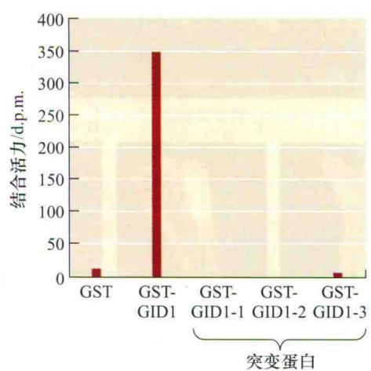  
图20.12 GID1的GA结合特征。A. 一定浓度的放射性标记 $\mathrm{GA}_4$ 与GID1蛋白（GST-GID1融合蛋白）孵育，当增加非标记 $\mathrm{GA}_4$ 浓度时， $\mathrm{GA}_4$ 与GID1蛋白的结合具有饱和性。B. 根据A图数据作的Scatchard图，由斜率计算出了解离常数 $K_{\mathrm{d}}$ 。C. 放射性标记 $\mathrm{GA}_4$ 与GID1的结合/解离速率。放射性标记 $\mathrm{GA}_4$ 与GID1的结合在5 min内就达到最大值的一半（浅绿线）。加入过量的非标记 $\mathrm{GA}_4$ （箭头）后5 min内，结合的放射性标记 $\mathrm{GA}_4$ 就降到了最大值的 $10\%$ 以下（深绿色）。D. 三种不同突变的GID1蛋白（GST-GID1-1，GST-GID1-2和GST-GID1-3）不结合放射性标记 $\mathrm{GA}_4$ ，证明 $\mathrm{GA}_4$ 与野生型蛋白的结合是特异性的（引自Ueguchi-Tanaka et al., 2005）。d.p.m.为每分钟衰变数。

20.12A）。

（3）配体结合应该具有高亲和力。GA与蛋白质结合的亲和力越高，它们就结合得越紧密，也就越不容易解离。通过Scatchard分析可以测出解离常数 $K_{d}$ 。Scatchard分析是将结合的放射性标记GA（x轴）对结合的除以未结合的放射性标记GA（y轴）作图（图20.12B），斜率为 $-1/K_{d}$ 。这里的 $K_{d}$ 值比较低（ $1.4\times10^{-6}$ mol/L），暗示GA与这个蛋白质的结合很紧密。

（4）配体的结合应该是快速的和可逆的。图20.12C显示只需5 min放射性标记GA与GID1的结合就能达到最大值的一半。并且在加入未标记的 $GA_{4}$ 后，放射性标记GA与蛋白质的解离也是非常迅速的。受体蛋白的这些特征使得它能够适应细胞内配体浓度的快速变化。

除了给出这些具有说服力的证明GID1是GA受体的证据之外，Ueguchi-Tanaka等（2005）也证明gid1-1、gid1-2中的单核苷酸突变和gid1-3的单核苷酸丢失都能产生GA不敏感的矮化表型并导致蛋白质不结合放射性标记 $GA_{4}$ （图20.12D）。

鉴定出水稻的GID1后，三个拟南芥里的直系同源基因GID1a、GID1b和GID1c很快就被发现了（Griffiths et al., 2006; Nakajima et al., 2006）（直系同源基因是指不同物种中因来自同一个祖先基因而具有相似序列的基因）。一旦测出一个物种某个基因的序列（如GID1），通过搜索其他物种（如拟南芥）的基因组数据库就能相对容易地找到它的直系同源基因。然而，最初的GID1基因在拟南芥中已经发展成为三个基因，即GID1a、GID1b和GID1c，并且其中的每一个都编码具有功能的GA受体。这三个拟南芥基因中的某一个突变以后，并不会产生可以观察到的表型（茎长度）差异，但如果把这三个基因都突变以后，得到的“三缺突变体”就非常矮（图20.13）。此外，强烈的花药缺陷使得三缺突变体雄性不育。

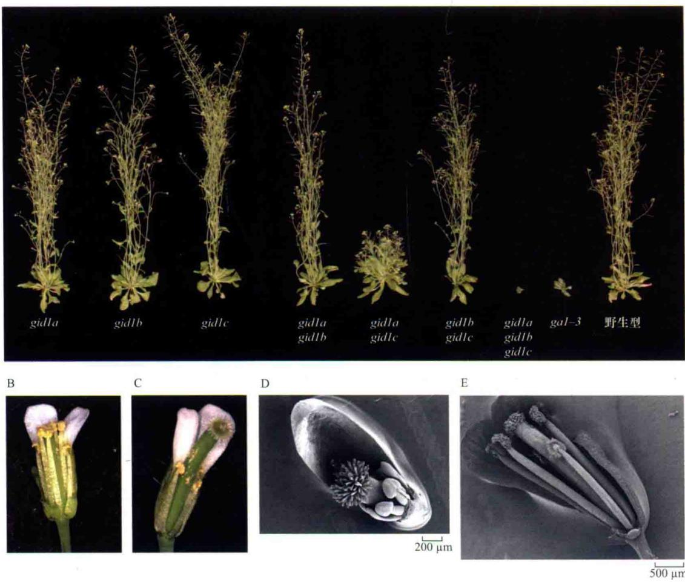  
图20.13 拟南芥突变体gid1a、gid1b和gid1c的表型。A. 37天龄野生型（Col-0）和单突变纯合体的地上部分没有明显的茎长度差异表型。gid1a/gid1c双突变体矮化，而其他双突变体比较高，展现出了基因冗余性。三突变体gid1a/gid1b/gid1c极度矮化。GA缺失突变体gal-3作为对照。B. 野生型拟南芥花的特写。C. gid1a/gid1b双突变体花药缺陷。D和E. gid1a/gid1b/gid1c三突变体（D）和野生型（E）花的扫描电子显微镜照片。为了清晰，两张图中的萼片和花瓣都去掉了（引自Griffiths et al., 2006；S. Thomas惠赠）。

近期也得到了水稻中GID1和拟南芥中GID1a蛋白的三维结构，阐明了为什么生物活性GA必须具有某些特定的官能团（Murase et al., 2008; Shimada et al., 2008）。高分辨率分析集中在结合 $GA_{3}$ 或 $GA_{4}$ 的拟南芥蛋白和结合 $GA_{4}$ 的水稻蛋白。拟南芥蛋白也和DELLA蛋白GAI的N端部分共结晶。之后我们会看到，DELLA蛋白是GA响应的负调控因子。在水稻和拟南芥中，生物活性GA通过C-6位羧基与受体蛋白的中央口袋底部的2个丝氨酸残基和1个水分子形成氢键而锚定在受体的中央口袋中。此外，GA的3β-羟基也与1个酪氨酸残基和桥接水分子形成氢键。GA分子上的一些修饰可以降低结合能力：C-6羧基甲基化和缺少3β-OH的GA与GID1结合的亲和力比生物活性GA低几个数量级。另外，很久以前就知道2β-OH能降低GA活性，它的引入会导致空间干扰和减弱与受体蛋白的结合，即使GA分子具有C-6羧基和3β-羟基。

一个生物活性GA分子的“顶”是疏水的，能够与GID1蛋白的N端螺旋延伸开关区相互作用。N端延伸在GA顶部上方折叠，就像一个关闭的盖子完全将GA包埋在受体中（Murase et al., 2008；Shimada et al., 2008）。一旦GID1的这个“盖子”关闭，其外表面的残基就能够和下一节即将学习到的DELLA蛋白GAI的N端中一些特定氨基酸相互作用（图20.14）。虽然GA和DELLA蛋白间并没有直接相互作用（GA包埋在GID1中），但生物活性GA是GID1的变构激活剂（allosteric activator），使得GID1构象产生变化从而促进其与

DELLA蛋白的结合（图20.15）。紧接着，GA-GID1复合体似乎诱导了DELLA蛋白的DELLA结构域发生从卷曲到螺旋（coil-to-helix）的构象变化，这可能进一步导致了DELLA蛋白其他结构域（所谓的GRAS结构域）的构象变化。

## 20.4.2 DELLA结构域蛋白是赤霉素响应的负调控因子

DELLA结构域蛋白属于GRAS家族转录调节因子中的一个亚家族。所有GRAS蛋白的碳端（GRAS）结构域都有同源性。参与GA响应的蛋白质的氮端具有一个结构域，它含有5个氨基酸：天冬氨酸（D）、谷氨酸（E）、亮氨酸（L）、亮氨酸（L）和丙氨酸（A），因此被称为“DELLA结构域”（图20.16）。现在已经知道，水稻和大麦都只有1个DELLA结构域蛋白而拟南芥有5个。从谷类作物和拟南芥的研究可以总结出DELLA是GA响应的负调控因子。当它们被蛋白质水解而降解时就能产生GA响应。Web Topic 20.7讲述了分离DELLA蛋白和阐述它们功能的历史，在此作简要概括。

## 20.4.3 GA负调控因子突变可能导致过高或矮化表型

抑制GA响应负调控因子功能的突变将使植物变高。这就是我们看到的水稻[slender rice 1（slr1）]和大麦[slender 1（sln1）]“细长”突变体。这些突变体长得极高，看起来像被高剂量生物活性GA处理过（Ikeda et

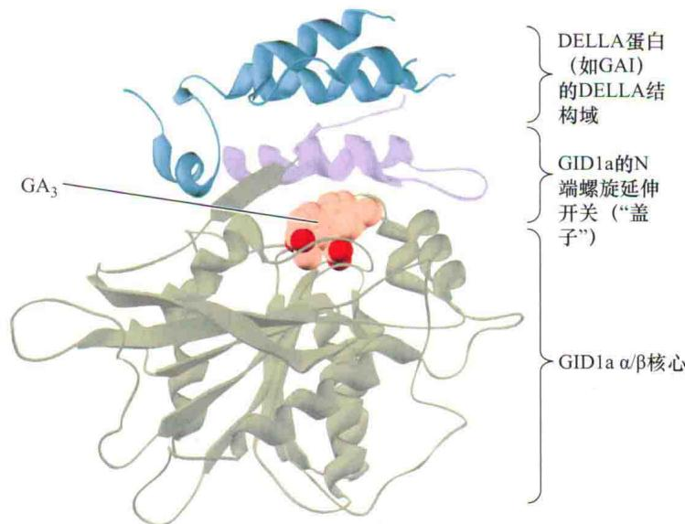  
图20.14 GA₃-GID1a-DELLA复合体的晶体结构。GA₃分子显示为空间填充模型，米色为碳原子，红色为氧原子。生物活性GA（如GA₃）结合到GID1a受体的中央口袋后，延伸开关区就像一个“盖子”一样将GA封闭起来。盖子盖在GA疏水部分（没有暴露的氧原子）的顶上。一旦延伸开关关闭，DELLA蛋白（如GAI）的DELLA结构域就能结合到开关的上部外表面（引自Murase et al., 2008）。

2. DELLA蛋白结合到GA-GID1复合体后N端DELLA结构域构象改变

3. DELLA结构域的构象变化可能诱导了GRAS结构域的构象变化

1. GID1是一个变构蛋白。GA结合后引起构象变化，进而导致N端延伸开关像盖子一样关闭  
  
图20.15 GA诱导GID1构象变化及GA-GID1复合体诱导DELLA构象变化的模型（引自Murase et al., 2008）。

  
图20.16 RGA和GAI抑制蛋白的结构域组成。图中标示了调控结构域DELLA和功能结构域GRAS。

al., 2001; Chandler et al., 2002)。但是这些植物并不含有高浓度内源GA，甚至当它们长在能降低生物活性GA含量的GA生物合成抑制剂中时，这些突变体仍然很高。所以它们的高不是由生物活性GA的含量高引起的，而是由GA响应的组成型开启引起的（这里的水稻和大麦的slender突变体与早先讨论的豌豆中抑制GA失活的slender突变体不同，豌豆的slender突变体的高是由高含量内源GA引起的）。

人们推测水稻和大麦slender突变体中，某个负调控因子丢失了或者失去功能了。克隆它们的slender基因后发现它们是拟南芥中DELLA基因的直系同源基因（Peng et al., 1997; Silverstone et al., 1997b, 1998）。记住，直系同源基因是不同物种中源自于同一个祖先基因的基因。正如我们在GID1中所看到的那样（拟南芥有3个基因而水稻只有1个），拟南芥中有多个DELLA基因，但谷类植物中却没有。事实上，拟南芥有5个DELLA基因，分别编码5个DELLA蛋白：GA-INSENSITIVE（GAI）、REPRESSOR of ga1-3（RGA）、RGL1、RGL2和RGL3，它们都是GA响应的负调控因子。

RGA是从拟南芥纯合突变体gal中筛选到的一个纯合隐性突变体（rgal）中鉴定到的。记住，gal突变阻断了GA生物合成途径早期的一步，所以这个突变体是缺乏GA的。rga突变使得茎足够长以至于部分恢复了gal因GA缺乏而产生的极度矮化表型，这也是这个突变名为repressor of gal的原因。如果一个隐性突变导致了生长，可以推断这个突变一定使某个负调控因子失去了功能（前文描述的第2类突变体）。但是现在知道Koornneef等（1985）分离出的原始突变体GAI（gai-1）也是编码一个DELLA蛋白，却是一个半显性、功能获得型GA不敏感矮化突变体（即符合第3类突变体的特征）。进一步工作证明RGA和GAI都编码GA响应信号途径的负调控因子，但这些负调控因子的不同突变能产生相反的表型，或高或矮，取决于在基因内部的哪个部位发生了突变。发生在这些基因中的不同突变可以分为以下两类。

（1）如果突变发生在碳端GRAS结构域，突变常常是变得更高。

（2）如果突变发生在氮端含DELLA结构域的那部分，突变的蛋白质是一个不可逆的抑制子，因而产生gai-1的GA不敏感矮化表型。

由于拟南芥含有5个同源基因，需要多个同源基因都发生功能丧失突变之后才能显现出GA组成型激活的表型（高）。

谷物中slender突变产生了不同的表型。例如，在野生型水稻中转入一个DELLA结构域中第17个氨基酸缺失的SLR1导致了GA不敏感的矮化表型，而不是GRAS结构域突变后产生的细长表型（Ikeda et al., 2001）。与此类似，如图20.17所示，大麦的sln1d突变是显性的、GA不敏感的矮化，而早先的sln1c却是组成型GA响应表型（细长）（Chandler et al., 2002）。

## 20.4.4 GA信号降解赤霉素响应负调控因子

DELLA蛋白是定位于细胞核的GA激活负调控因子，其在GA信号激活时必须被降解以产生信号响应。为了研究RGA的定位，将RGA和绿色荧光蛋白蛋白（GFP）的基因融合后转化拟南芥，以便转基因植物能够表达RGA-GFP融合蛋白。融合基因由RGA的启动子控制，以便检测到的RGA-GFP能够模拟天然的RGA（Silverstone et al., 2001）。通过免疫共沉淀和荧光显微技术研究确定了生物活性GA对融合蛋白的数量和定位的影响。研究使用了根来观测，因为茎中的叶绿体自发荧光会使GFP分析更加困难。

  
slnlc  
WT  
sln1d  
图20.17 SLN1抑制子基因的两个不同突变体具有相反的表型。图为3个两周龄的大麦幼苗的茎。中间是野生型（WT）。左：sln1c突变体由于在GRAS抑制子区域发生突变，抑制功能丧失，因此具有GA组成型响应的细长表型。右：sln1d突变体中由于DELLA结构域突变导致抑制蛋白难于被降解，因此是功能获得型的显性突变，表现出矮化表型（引自Chandler et al., 2002, P.M. Chandler惠赠）。

在拟南芥根尖中，RGA-GFP定位于细胞核中，当用活性GA处理植物时，GFP的荧光消失了。相反，如果用GA生物合成抑制剂多效唑（paclobutrazol）处理降低GA浓度，细胞核内保持着强的绿色荧光（图20.18）。由于GFP反映了RGA的情况，我们可以从这些实验中知道，出现生物活性GA后，细胞核里面的RGA降解了，而在GA浓度非常低时其不被降解。

我们已经在第479页了解到，生物活性GA是其受体GID1的变构激活剂。在GA缺失的植物中，没有足够的GA结合GID1而使其构象改变关闭“盖子”。没有这个构象变化，DELLA蛋白就不能结合GID1。所以现在我们将看到，DELLA蛋白需要结合GID1来降解。现在我们也可以理解为什么DELLA蛋白的一个N端DELLA结构域突变使得蛋白成为了不可逆抑制子，因为这部分与GA-GID1受体复合体结合。

## 20.4.5 F-box蛋白靶标和降解DELLA结构域蛋白

在水稻和拟南芥中鉴定到了一些矮化的、不能在生物活性GA刺激下降解野生型DELLA蛋白的突变体。隐性突变体水稻GA-insensitive dwarf 2（gid2）和拟南芥sleepy 1（sly1）都具有GA不敏感的矮化表型，并且它们编码直系同源蛋白（Sasaki et al., 2003；McGinnis et al., 2003）。这些表型表明GID2和SLY1基因编码GA信号转导途径中的正调控因子（即第1类突变体）。事实上，这两个基因都编码具有保守F-box结构域的E3泛素连接酶复合体（ubiquitin E3 ligase complex）（又称SCF复合体）元件（Dill et al., 2004；Itoh et al., 2003）（可参见第14章）。一个蛋白质（如DELLA）如果要被26S蛋白酶体降解，那么它必须被一连串泛素蛋白“标记”。F-box蛋白招募蛋白质到SCF复合体上启动标记过程，结果添加了许多泛素分子到这些蛋白质上，接着它们就被26S蛋白酶体降解（关于这一主题的更多信息可参考Web Essay 20.2和第2章、第14章）。

直系同源蛋白GID2（拟南芥）和SLY1（水稻）将DELLA蛋白靶标和降解，并且这种靶标在DELLA蛋白结合到生物活性GA-GID1复合体后增强（图20.19）。正如结合生物活性GA引起GID1构象改变而促使其结合DELLA，DELLA结构域的N端结合到GA-GID1后引起DELLA结构域的构象变化（卷曲到螺旋）。人们推测这接着会诱导GRAS结构域的构象变化，使得其能更容易与F-box蛋白结合。由于促进了SCF复合体对其抑制的靶蛋白的识别，GA-GID1复合体也被称为“泛素化分子伴侣”（ubiquitinylation chaperone）（Murase et al., 2008）。

## 20.4.6 含DELLA结构域蛋白的负调节因子有重要的农业价值

上面的实验说明了在单子叶和双子叶植物中，DELLA结构域蛋白是重要的GA应答负调控因子。另外，GAI的直系同源基因小麦半显性突变Reduced height（Rht-Bla和Rht-Dla）和玉米的d8都在DELLA结构域发生了突变，产生了GA不敏感矮化表型（Peng et al., 1999）。

20世纪早期，小麦和水稻的经典育种方法推动了60年代的“绿色革命”——在拉丁美洲和东南亚，高产、矮生品种的小麦和水稻引种适应了该地区人口的大量增长（Redden，2003）。一般谷类作物在大田中密植时易过高生长，尤其是在肥力充足的情况下，结果造成作物容易倒伏（因风吹、雨淋而塌掉）而使产量大为降低。GA响应降低、短茎的突变小麦栽培品种Rht的传播是“绿色革命”成功的关键（详见Web Essay 20.3中Norman Borlaug博士的诺贝尔奖工作）。如Web Essay 20.4所述，大麦中的绿色革命基因的直系同源基因的突变也具有开发有益农业性状的潜能。

图20.18 作为转录调节因子，RGA蛋白定位于细胞核，其数量受GA水平调节。A. 植物细胞中转化了编码RGA和绿色荧光蛋白（GFP）融合蛋白的载体，使得通过荧光显微镜就能观测细胞核中的RGA。B. 用GA预处理细胞2 h时导致细胞核中RGA消失（上）。用GA合成抑制剂多效唑（paclobutrazol）处理48 h后，细胞核中RGA的含量增加（下）。这些照片证明RGA在有GA时降解，无GA时不降解（自Silverstone et al., 2001）。  
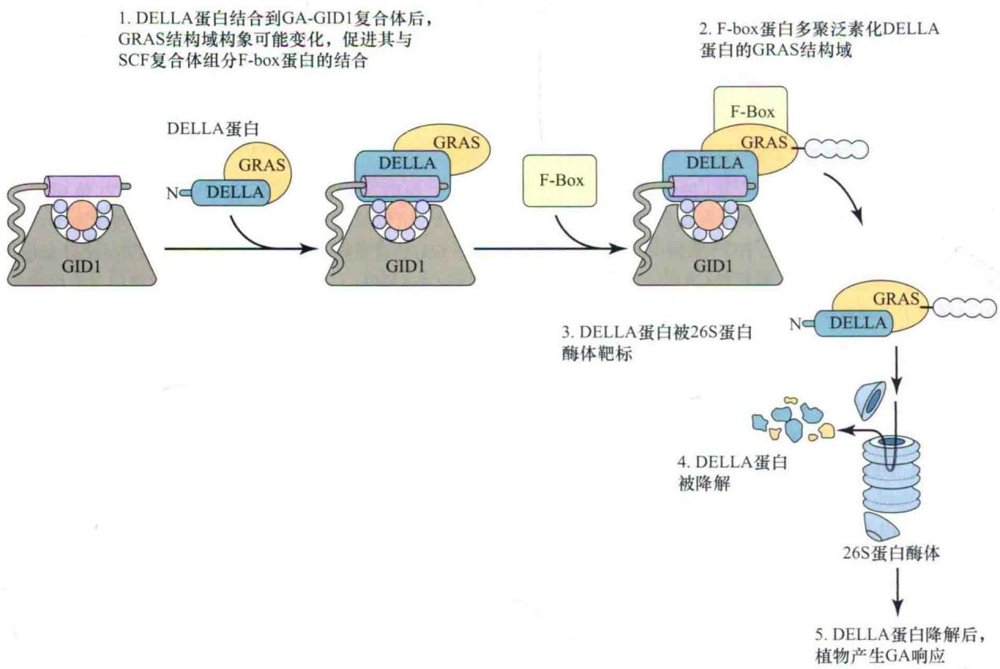  
图20.19 DELLA蛋白通过26S蛋白酶体降解，进而引发转录重编程，导致生长和其他GA响应。