## 20.5 赤霉素响应：DELLA蛋白的早期靶标

从本章的前面部分知道，GA能够影响从种子萌发到开花和果实发育的植物生长发育的多个方面。最近的挑战在于从分子水平上将我们对于GA信号感知的新发现和下游导致生长发育的事件联系起来。拟南芥中大量的基因表达芯片研究对了解“早期GA响应”具有作用，因为这些基因的表达是被DELLA蛋白开启或关闭的（第2章介绍了芯片技术）。几项最近的研究采用了可在特定时间诱导DELLA基因表达的实验体系，这样就可以鉴定出那些表达快速变化的基因。诱导DELLA表达后1\~2 h内表达发生变化的基因很可能就是GA的早期响应基因。

## 20.5.1 DELLA蛋白能激活或抑制基因表达

已经鉴定到了拟南芥的幼苗和花序中DELLA蛋白下游的GA早期响应基因。在幼苗和花序中，几个DELLA的直接靶标就是GA合成酶和受体的基因，暗示了强的稳态调控使GA水平和响应维持在生理极限以内。其他的DELLA直接靶标包括编码转录因子和转录调节因子的基因。有趣的是，幼苗和花序中DELLA蛋白的靶基因很少有重叠，尽管有一小部分属于同一类转录调节因子（如MYB和bHLH类）（Zentella et al., 2007；Hou et al., 2008）。这些发现有助于解释GA激活的特异性及一个激素如何在不同的发育时期和组织产生多种不同的响应。

## 20.5.2 DELLA蛋白通过和其他蛋白质如PIF相互作用来调节转录

由于DELLA蛋白并不含有可识别的DNA结合结构域，那么它们是如何激活和抑制基因转录的呢？可能其他的因子对于DELLA结合DNA是必需的，或者DELLA蛋白通过和其他转录因子相互作用来调节转录，而非自己结合DNA。有最新的证据支持后一种可能。DELLA能够和一类bHLH转录因子光敏色素互作因子（PIF）相互作用。当一个DELLA分子结合到一个PIF分子上时，抑制了PIF激活下游转录。这样，PIF的靶基因就间接被DELLA蛋白下调了。

拟南芥至少有5个PIF蛋白，它们具有各自不同和某些重叠的功能。有些PIF影响幼苗生长，参与暗形态建成（黑暗下的生长发育）到光形态建成（光下的生长发育）的转换。在黑暗下，拟南芥幼苗是黄化的，下胚轴伸长，子叶不能打开和扩展。这种效应至少部分是

PIF激活了促进下胚轴伸长基因的结果（图20.20A）。例如，PIF3和PIF4的靶基因之一是膨胀素（expansin）基因，它编码一个松弛细胞壁的蛋白质，PIF3和PIF4的bHLH结构域结合到靶基因启动子中的G-box元件上。在光下，光激活的光敏色素转移到细胞核中，结合并进而降解PIF，结果就是靶基因（如膨胀素）表达下调和抑制下胚轴伸长（图20.20B）。

最近PIF3和PIF4都被证明能够与DELLA蛋白结合，这种相互作用至少部分是通过PIF蛋白的bHLH DNA结合结构域进行的（de Lucas et al., 2008；Feng et al., 2008）。当PIF蛋白不再结合DNA，PIF的靶基因就不被转录（图20.20B），下胚轴也不伸长。PIF和DELLA的相互作用只在DELLA蛋白数量丰富的时候发生。存在生物活性GA时，DELLA蛋白降解而不能结合PIF，PIF就可以激活转录，幼苗的下胚轴也就长长（图20.20A）。这样DELLA蛋白就被证明是通过直接和bHLH转录因子结合来调节基因转录，而不是通过自身结合DNA实现；GA的效应（下胚轴长）就是PIF调控基因的结果。

## 20.6 赤霉素响应：谷类植物糊粉层

本节和以下两节将探讨在植物生命周期的三个不同时期中GA激活的例子。首先讨论一个经典模式系统，即谷类植物种子萌发时的糊粉层。然后讨论谷类植物的花药发育。糊粉层和花药中，MYB转录因子上调编码参与GA响应的酶的基因。最后，讨论深水稻中的节间伸长和抑制。

谷类植物种子分为三部分：胚、胚乳和种皮果皮融合（种皮-果壳）（图20.21）。胚将发育成为幼苗，并具有一个特化的吸收器官盾片。胚乳由两部分组织构成：中央的淀粉胚乳和糊粉层（图20.21）。非活力的淀粉胚乳是由充满淀粉粒的薄壁细胞组成。糊粉层包围着胚乳，其中的活细胞在萌发时合成并释放水解酶到胚乳中。结果造成胚乳中贮存的营养物质被降解，产生的可溶性糖分、氨基酸和其他物质转运到生长的胚中。分离出来的糊粉层细胞由均一的赤霉素靶细胞构成，不含有GA不响应细胞，为研究GA激活的分子机制提供了独特的研究手段。

α-淀粉酶和β-淀粉酶是负责降解淀粉的酶。α-淀粉酶（存在许多异构体）内切水解淀粉链，生成由α-1,4-糖苷键连接的寡糖。β-淀粉酶则从末端将这些寡糖水解成麦芽糖（二糖）。麦芽糖酶又将麦芽糖分解为葡萄糖。

A 黑暗/高水平GA→长下胚轴  
  
图20.20 拟南芥幼苗中，光信号和GA信号整合调控下胚轴长度。

B 光下/低水平GA→短下胚轴  
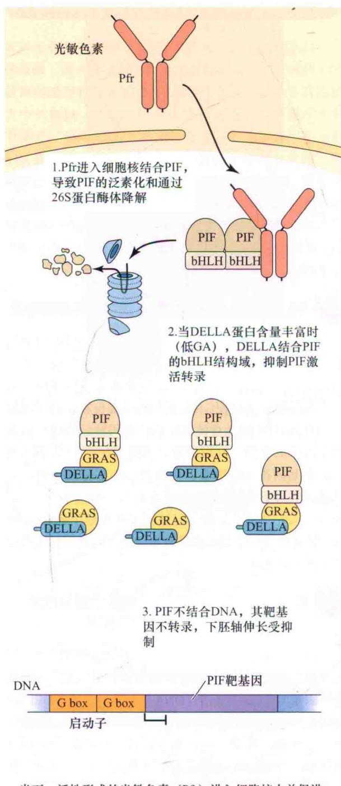

3. PIF不结合DNA，其靶基因不转录，下胚轴伸长受抑制

光下，活性形式的光敏色素（Pfr）进入细胞核中并促进PIF的降解。此外，因为这种情况下GA含量很低，DELLA蛋白不被降解，DELLA蛋白就能与PIF结合而抑制PIF结合DNA。由于这两种原因，PIF诱导基因的转录受抑制，下胚轴不伸长

B  
A  
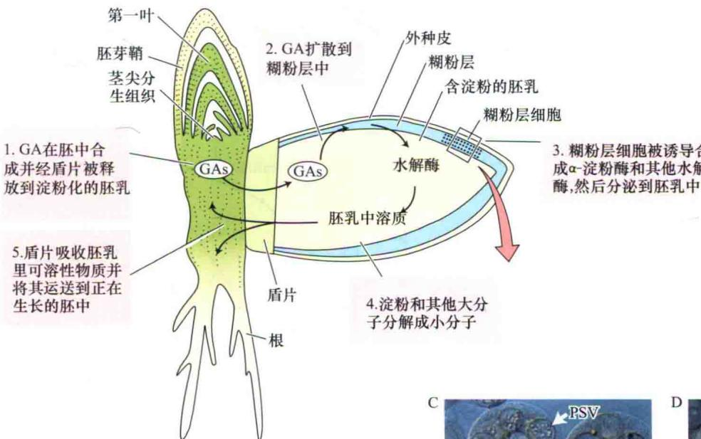

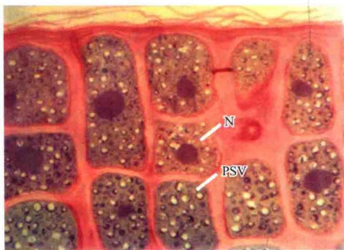

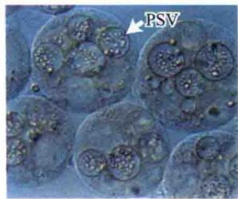

图20.21 大麦种子的结构和不同组织在萌发中的功能。A. 萌发诱导的相互作用图示。B\~D. 大麦糊粉层（B），淀粉酶产生的早期（C）和晚期（D）的糊粉层细胞原生质体的显微照片。（C）中的多个蛋白储存小泡（PSV）融合形成（D）中的大泡，为α-淀粉酶的合成提供氨基酸。G为封闭矿物质的植酸钙球状体；N为细胞核（B\~D引自Bethke et al., 1997, P. Bethke惠赠）。  

## 20.6.1 GA是在胚中合成的

20世纪60年代进行的实验证实了Gottlieb Haberlandt在1890年最初的发现：大麦糊粉层中淀粉降解酶的分泌依赖于胚的存在。随后发现 $GA_{3}$ 能替代胚促进淀粉降解的作用。在发现萌发过程中胚合成并释放GA进入胚乳后，GA的重要性就显而易见了。

## 20.6.2 糊粉层细胞可能有两种类型的GA受体

水稻受体缺陷突变体gid1不能合成α-淀粉酶，这清晰地揭示可溶性受体GID1参与这个经典GA响应过程。在GID1被鉴定之前，其他证据暗示在糊粉层细胞质GA可能与一个膜定位蛋白结合。其他的植物激素，包括生长素（第19章）和脱落酸（第23章）也有证据表明其具有两种类型的受体。虽然目前还没有明确鉴定到细胞膜定位的GA受体，但考虑到GA响应的多样性，存在多个GA受体也就不足为奇了。在糊粉层细胞中，存在 $Ca^{2+}$ 不依赖和 $Ca^{2+}$ 依赖两种GA信号途径，前者引发α-淀粉酶的生成，后者调控α-淀粉酶的分泌。

## 20.6.3 赤霉素增强 $\alpha$ -淀粉酶mRNA的转录

在分子生物学方法验证之前，已经有生理学和生物化学证据显示GA能够提高α-淀粉酶的基因转录水平（Jacobsen et al., 2005）。两个主要证据如下。

（1） $GA_{3}$ 刺激 $\alpha$ -淀粉酶的产生受到转录和翻译抑制剂的阻断。

（2）放射性同位素标记实验证明生物活性GA对α-淀粉酶活性的增强依赖于酶的从头合成途径，而不是激活已存在的酶。

谷类植物种子可以切成两部分，缺少胚的那一半是研究外源GA激活的理想实验材料（胚是整个种子中生物活性GA的来源）。芯片分析证明缺少胚的那一半水稻种子在被 $\mathrm{GA}_3$ 处理 $8\mathrm{h}$ 后，编码几个 $\alpha-$ 淀粉酶异构体的基因就被表达上调了（Bethke et al., 2006; Tsuji et al., 2006）。这些半种子中仅有的GA信号发生的活细胞分布在糊粉层中。在芯片分析的所有基因中，GA处理后编码 $\alpha-$ 淀粉酶异构体的基因上调倍数最高，其次是水解酶和蛋白酶。

纯化出 $\alpha$ -淀粉酶mRNA（其在糊粉层细胞中含量相对较高）后，就能够构建包含 $\alpha$ -淀粉酶结构基因和上游启动子序列的基因序列。负责GA响应的序列称为GA响应元件（GARE），它们位于转录起始点上游200\~300碱基对（Gubler et al., 1995）。迄今为止，所有已经检测过的谷类植物 $\alpha$ -淀粉酶基因的启动子中都发现有这样的GARE，而且这些元件被证明是对 $\alpha$ -淀粉酶基因转录诱导的充分必要条件。

## 20.6.4 GAMYB是 $\alpha$ -淀粉酶基因转录的正调控因子

α-淀粉酶基因启动子中的GARE序列（TAACAAA）与MYB蛋白结合的DNA序列很相似。MYB蛋白是真核细胞中的一类转录因子。植物中有一大类MYB蛋白，基于蛋白质的结构特征可以将它们分为许多亚家族。在大麦和水稻中，R2R3亚家族中的一个MYB蛋白参与GA信号途径，因此被称为GAMYB。大麦GAMYB的序列与拟南芥中的3个MYB蛋白（AtMYB33、AtMYB65和AtMYB101）非常相似。事实上，这些拟南芥AtMYB与谷类GAMYB的结构如此相似，以至于它们任意一个都能“挽救”缺乏GAMYB的大麦突变体的表型（Gocal et al., 2001）。水稻中还鉴定到了两个类似于GAMYB的蛋白，但它们不在糊粉层细胞的GA信号途径中起作用。

GAMYB开启 $\alpha$ -淀粉酶基因转录的假说（即GAMYB是 $\alpha$ -淀粉酶的正调控因子）有以下证据支持。

（1）GAMYB mRNA的合成在GA处理后仅1 h就开始增加了，这种增加能持续数小时（图20.22）。

（2）突变GARE序列使其不能与MYB结合后， $\alpha-$ 淀粉酶的诱导表达终止。

（3）没有GA时，在糊粉层细胞中组成型表达GAMYB能产生与GA处理相同的响应，说明GAMYB是 $\alpha$ -淀粉酶基因表达增强的充分必要条件。

蛋白质翻译抑制剂放线菌酮（cycloheximide）对GAMYB mRNA的产生没有作用，说明蛋白质合成对GAMYB的表达是非必需的。这样，GAMYB可以定义为初级（primary）或者早期响应基因（early response gene）。类似的实验证明 $\alpha$ -淀粉酶基因是次级（secondary）或者后期响应基因（late response gene）。

  
图20.22 GA $_{3}$ 诱导GAMYB和α-amylase的时间过程。GAMYB mRNA的产生比α-amylase的早大约3 h。这个结果与其他结果暗示GAMYB是调节α-amylase转录的GA早期响应基因。在没有GA时，GAMYB和α-amylase mRNA的水平都是非常低的（引自Gubler et al., 1995）。

## 20.6.5 DELLA蛋白被快速降解

GA是如何通过GAMYB转录因子来激活α-淀粉酶转录的呢？现在已经知道，用GA处理大麦糊粉层细胞5 min内，就对DELLA蛋白SLN1产生了效应：细胞核中的GFP-SLN1融合蛋白的数量降低了；处理10 min后，融合蛋白几乎完全消失（Gubler et al., 2002）。然而，GAMYB的数量在GA处理1\~2 h后都没有增高，表明GAMYB虽然是GA的早期响应基因，但它可能不是DELLA蛋白的直接靶基因。我们认为在SLN1降解和GAMYB转录之间还有一个或多个未知步骤。

总结我们从谷类植物糊粉层中学到的内容（图20.23）可知，生物活性GA结合到GID1后，导致DELLA蛋白的降解，再通过某些未知的中间步骤，GAMYB的表达上调，最后GAMYB蛋白结合到α-淀粉酶基因启动子中高度保守的GARE元件上，进而激活转录。α-淀粉酶从糊粉层细胞中通过依赖Ca $^{2+}$ 积累的途径分泌出来，胚乳细胞中淀粉在α-淀粉酶和其他水解酶作用下降解成小分子糖类，然后转运到生长的胚中。

一些GA促进的其他水解酶类基因的启动子中也有GAMYB结合元件，暗示这是糊粉层细胞中GA响应的一个共同途径。

## 1. $GA_{1}$ 从胚进入糊粉层细胞

2. $GA_{1}$ 进入细胞后可能开启一条 $\alpha$ -淀粉酶分泌必需的 $Ca^{2+}$ -钙调蛋白依赖的途径

3. GA $_{1}$ 在细胞核中结合可溶性受体GID1

4. 结合GA $_{1}$ 后，受体GID1产生构象变化促进与DELLA蛋白的结合

5. DELLA蛋白与GA-GID1复合体结合后，SCF复合体组分F-box蛋白就能多聚泛素化DELLA蛋白的GRAS结构域

6. 多聚泛素化的DELLA蛋白通过26S蛋白酶体降解

7. DELLA蛋白降解后，早期响应基因转录启动（图中以GAMYB作为早期响应基因的代表，但有证据显示可能其他的早期基因将比GAMYB更早转录调控）。GAMYB的mRNA在细胞质中翻译

8. 新合成的GAMYB转录因子进入细胞核，结合到编码α-淀粉酶和其他水解酶类基因的启动子上

## 9. 这些基因的转录激活

10. $\alpha$ -淀粉酶和其他水解酶类在粗面内质网上合成、加工并由高尔基体进入分泌小泡

11. 蛋白质通过胞吐作用分泌  
12. 分泌途径依赖一条GA诱导的 $\mathrm{Ca^{2+}}$ -钙调蛋白依赖的途径

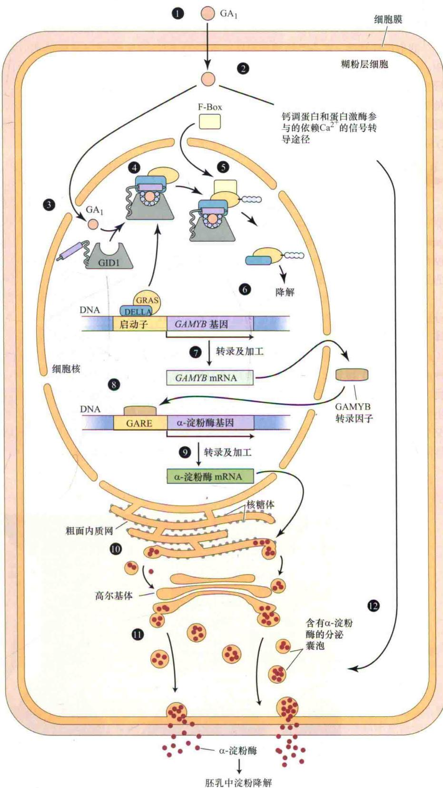  
图20.23 大麦糊粉层中GA诱导 $\alpha$ -淀粉酶合成的综合模型。钙调素不依赖的途径诱导了 $\alpha$ -amylase 的转录，钙调素依赖的途径参与了 $\alpha$ -淀粉酶的分泌。

## 20.7 赤霉素响应：花药发育和雄性育性

我们已经知道，在谷类植物糊粉层细胞的GA响应中，GAMYB转录因子激活了α-淀粉酶基因的表达，导致种子萌发过程中的淀粉降解。GAMYB也参与了其他的GA响应过程。其中Web Topic 20.8探讨的GA对开花作用，以及生物活性GA对花粉发育的作用也都是由GAMYB介导的。

## 20.7.1 GAMYB调控雄性育性

水稻GAMYB功能缺失型突变体已经显示它是花器官发育的正调控因子（Kaneko et al., 2004）。水稻gamyb突变体的花萎缩，花药呈白色（正常为黄色）且没有花粉；其中一些花的异常表型更加明显，最为严重的是雌蕊严重畸形（图20.24）。

水稻的花粉粒由花药最内层细胞发育而来，被分泌型组织绒毡层滋养着。绒毡层细胞形成称为球状体（也称Ubisch体）的突起，球状体被认为在孢粉素（sporopollenin）的释放过程中起作用。孢粉素是一种由脂肪酸衍生物和苯丙素类化合物构成的复杂高聚物，最终形成了花粉粒的弹性外壁。我们将看到，生物活性GA上调了这些化合物的生物合成。正常情况下，当小孢子（将发育成花粉粒）处于发育的四分体时期时，野生型绒毡层细胞将进行程序性死亡（图

20.25）。如果绒毡层细胞死亡太快或者是不死，那么就可能不能形成正常的花粉。gamyb突变体的绒毡层细胞在四分体时期不降解，反而继续长大直至野生型花粉到成熟期时填满花药室。由于绒毡层细胞的繁殖，以及小孢子在四分体时期和空泡期之间瓦解，gamyb突变体的花药中就没有成熟的花粉粒（图20.25）（Aya et al., 2009）。

野生型植物中，生物活性GA参与调控了绒毡层细胞的程序性死亡。此外，GA调控包被花粉粒的孢粉素成分的生物合成。主要有以下证据。

（1）花粉发育中，GA上调了两个脂质代谢酶基因（CYP703A3和KAR）的表达。它们的启动子中都有GAMYB结合元件，突变这些结合元件都能抑制它们的表达。

（2）GAMYB-GUS融合蛋白（GUS即β-葡萄糖苷酸酶）和CYP703A3：GUS（监测CYP703A3基因转录的“启动子：GUS”融合表达系统）在野生型花药中共表达，但在gamyb突变体中CYP703A3：GUS却没有表达（图20.26）。

这些和其他的发现给出了令人信服的证据证明水稻活性花粉粒的形成需要GA诱导GAMYB表达，进而开启合成花粉壁成分的基因转录。缺失生物活性GA或者是GA信号转导途径的元件缺陷将导致水稻雄性不育。

和水稻一样，拟南芥的GA缺失和信号缺陷突变体也是雄性不育的。由于功能冗余性，AtMYB33和

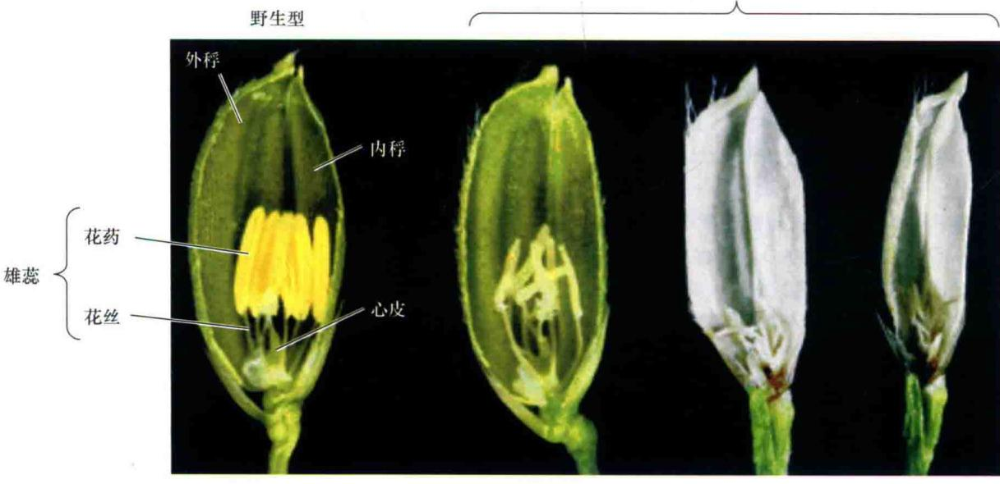  
图20.24 水稻gamyb突变体花器官的表型证明花粉的正常发育需要GAMYB转录因子。最左是一朵野生型的花，右边是gamyb突变体中逐渐增强的表型。缺失GAMYB后，花药呈白色而非正常的黄色，没有花粉。更加严重的表型是白色萎缩的花苞（外稃和内稃）包围在花和畸形的心皮四周（引自Kaneko et al., 2004；M. Matsuoka惠赠）。

gamyb 突变体

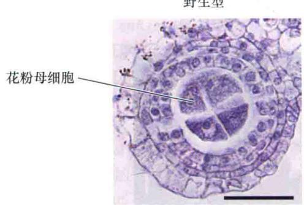

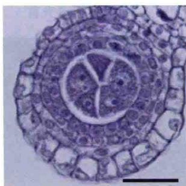  
花粉母细胞期：突变体在减数分裂前是正常的

  
四分体期：减数分裂后，野生型中的绒毡层细胞开始程序性死亡，而gamyb突变体没有

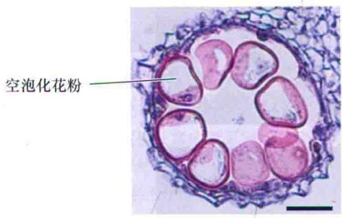

  
空泡期：野生型中空
泡化的花粉清晰可见，
而gamyb突变体中，持
续增殖的细胞填满了
花药室

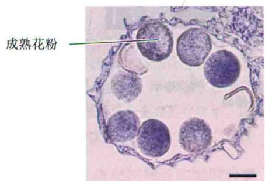

  
成熟期：野生型花药中产生了成熟花粉，而突变体中花粉粒破碎  
图20.25 水稻野生型和gamyb突变体花药发育4个不同时期的组织化学分析。花药横切照片显示，突变体中的绒毡层细胞在四分体时期不进行程序性死亡。此外，突变体的花粉粒不能发育出弹性外壁，最后花粉粒破碎。标尺25 μm（引自Aya et al., 2009, M. Matsuoka惠赠）。

AtMYB65必须双缺以后才有雄性不育的表型（Millar and Gubler，2005）。CYP703A3的拟南芥直系同源基因的启动子中也有一个MYB结合基序，暗示拟南芥中和水稻一样，GA调控了花粉壁成分的合成。

## 20.7.2 水稻糊粉层和花药中的GAMYB下游事件差异巨大

比较水稻的无胚半粒种子和花药的基因芯片结果中GAMYB诱导的基因表达情况，就会发现一些令人惊讶的结果：虽然GAMYB在糊粉层和花药中都调控了许多基因，但它在这两个系统中所调控的基因差异相当巨大（Tsuji et al., 2006）。虽然花药中的许多GAMYB依赖基因并不含有在糊粉层中鉴定到的保守的GARE，但似乎这种GARE不能引起花药中的GAMYB诱导表达，可能其他的因子参与了这个过程。事实上，花药中GAMYB调控基因的启动子并没有糊粉层细胞中的那种顺式作用元件。有可能花药中有不同于糊粉层的其他元件在GA诱导特异性和GAMYB调控表达过程中起作用。

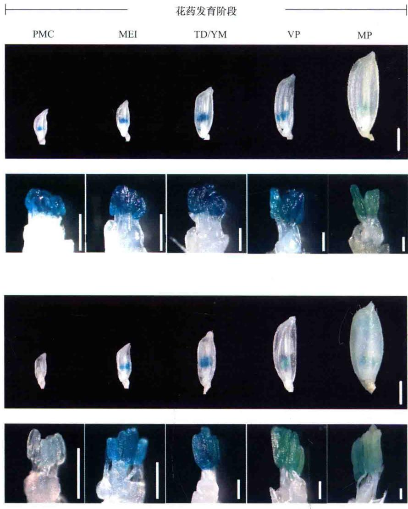  
CYP703A3:GUS和GAMYB-GUS定位相同，但它在发育的最早期不可见而GAMYB-GUS可见。这个结果暗示GAMYB对CYP703A3的表达是必须的

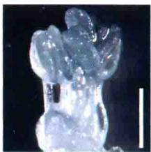  
gamyb突变体中CYP703A3:GUS不表达，再次暗示GAMYB对CYP703A3的表达是必须的  
图20.26 水稻花药中GA诱导型启动子控制的GUS表达情况。A和B.野生型中GAMYB-GUS的表达情况。染色后，GAMYB-GUS位于花药中（B）。C和D.野生型中CYP703A3：GUS的表达情况。染色后CYP703A3：GUS也位于花药中。E.gamyb突变体MEI期的CYP703A3：GUS染色情况。A和C.每个发育时期的整花（标尺1 mm）。B，D和E.雄蕊特写。PMC.花粉母细胞期；MEI.减数分裂期；TD/YM.四分体期/小孢子期；VP.空泡期；MP.成熟期（引自Aya et al., 2009, M. Matsuoka惠赠）。

## 20.7.3 小RNA在花药而非糊粉层中转录后调控MYB

小RNA（miRNA）是一类由小基因编码、转录后调控其他基因表达的20\~25个核苷酸的RNA。miRNA结合到核糖核酸酶复合物上指导其作用于特定的mRNA分子。与这些miRNA杂交的mRNA很快就被核糖核酸酶复合物降解，因此能有效地使它们的目的基因沉默（关于miRNA的详细讨论详见第2章）。

在拟南芥中已发现有3个miRNA能与类GAMYB基因编码区中的一个保守序列互补（Park et al., 2002; Rhoades et al., 2002）。miR159a作为其中之一，能使拟南芥茎中的AtMYB33沉默，过表达或突变miR159a能导致植株严重缺陷。如前所述，拟南芥中AtMYB33参与花器官发育和开花调控。因此，在miR159a的过表达株系中，AtMYB33是沉默的，植株表现为雄性不育和开花时间延迟（Achard et al., 2004）。在水稻花药中，miRNA也能改变GAMYB的表达，但糊粉层中却没有这种现象（Tsuji et al., 2006）。这是GA诱导和GAMYB调控的基因在糊粉层和花药中的另一个不同点。

综上所述，GA诱导α-淀粉酶产生和GA诱导的花器官发育都说明MYB转录因子在谷类植物和拟南芥的GA信号转导中起重要作用。可以预期，它们在除了拟南芥的其他双子叶植物中也非常重要。有趣的是，不同的组织和器官中，GAMYB下游的信号途径不同，这可能是引起GA这种激素能在不同的组织中诱导产生多种不同的反应的原因。

## 20.8 赤霉素响应：茎的生长

GA促进茎生长的效应非常显著，使人们一直认为研究它的作用模式应该比较简单（图20.1和图20.2）。但事实并非如此。正如在生长素中所见到的，我们对植物细胞的生长所知甚少。然而，科学家的确已经掌握了GA诱导的茎伸长的基本特性。在本章的最后部分，我们将回顾水稻中旨在阐明GA促进细胞生长和细胞分裂生理生化机制的研究。

当洪水暴发水位快速上涨时，水稻的茎会迅速伸长。然而这很容易耗尽体内储藏的碳水化合物，降低水稻在洪水退去后的存活率。有趣的是，一种在水下伸长减缓的水稻耐淹株系在洪水消退后具有更高的存活率。这种耐淹株系直接与降低GA敏感性的DELLA蛋白稳定有关。

## 20.8.1 赤霉素促进细胞伸长和细胞分裂

外源生物活性GA处理后，细胞长度和细胞数量都增加了，说明GA既能促进细胞伸长又能促进细胞分裂。一些具有GA诱导生长表型的植物或植物器官比相应的对照具有更多的细胞数目。

（1）高秆豌豆的节间较矮秆的细胞数目更多，而且细胞长度更长。

（2）短日照下生长的长日照植物在活性GA处理后，中柱和莲座叶基本分生组织中的有丝分裂明显加快。

（3）当深水稻浸在水中或用GA处理时，节间伸长的快速增加部分是由于居间分生组织（某些单子叶植物中）细胞分裂的增加。

由于GA诱导的细胞伸长似乎先于细胞分裂，我们首先探讨GA在调控细胞伸长方面的作用。

从第15章已经知道，细胞伸长的速率受细胞壁可扩展性和水分吸收（渗透驱动）影响。GA对渗透参数并无影响，但在活体细胞中GA能使细胞壁扩张，并松弛细胞壁的张力。不同 $GA_{1}$ 含量和不同敏感性的豌豆突变体分析表明，GA降低了细胞壁的壁压阈值（wall yield threshold，即伸展所需的最小压力）。因此，GA和生长素似乎都有改变细胞壁特性的功能。

对于生长素来说，细胞壁的松弛似乎部分是由细胞壁酸化引起的（见第19章），而这似乎不是GA作用的机制，因为至今还没有观察到GA促进了质子泵出。另外，在完全缺失生长素的组织中也不存在GA，GA对生长的促进效应可能依赖生长素诱导的细胞壁酸化。

GA处理与生长开始之间的滞后时间比生长素的长，在深水稻中大约为40 min，在豌豆中为2\~3 h（Yang et al., 1996）。较长的滞后时间表明GA促进生长的机制与生长素不同。与存在一个独立的GA特异的细胞壁松弛机制一致，施加生长素和GA对生长具有叠加效应。

科学家提出了多种解释GA刺激茎生长机制的假说，它们都有一些实验证据支持，但没有一种有确切的答案。例如，有证据表明木葡聚糖内糖苷酶/水解酶（xyloglucan endotransglucosylase/hydrolase，XTH）参与GA促进的细胞壁扩张（Xu et al., 1996）。XTH的功能可能是促使膨胀素（expansin）渗入细胞壁。膨胀素是一种细胞壁蛋白，它能在酸性条件下通过减弱细胞壁多糖间的氢键使细胞壁松弛（见第15章）。深水稻的一种膨胀素OsEXP4在GA处理30 min内或浸入水下时，其转录水平都将增加。而表达OsEXP4反义RNA的植株矮小，在水下不伸长；过表达OsEXP4的植株生长过高（图20.27）（Choi et al., 2003）。综上所述，GA诱导的细胞伸长至少部分是受膨胀素介导的。

## 20.8.2 GA调节细胞周期激酶的转录

在水下深水稻节间生长速率的显著增加，部分是由居间分生组织细胞分裂加快引起的。为了研究GA在细胞周期中的效应，研究者们从深水稻的居间分生组织分离出细胞核并计量每个细胞核中DNA含量（Sauter and Kende，1992）。当植物在深水中时，GA激活从 $G_{1}$ 到S期转换，导致有丝分裂增加。GA对细胞分裂的促进是由于其诱导了一些细胞周期蛋白依赖性蛋白激酶（cyclin-dependent protein kinases，CDK）基因的表达（见第1章）。居间分生组织中调控 $G_{1}$ 到S期的转换和调控 $G_{2}$ 到M期的转换的CDK基因的转录受GA诱导（Fabian et al., 2000）。

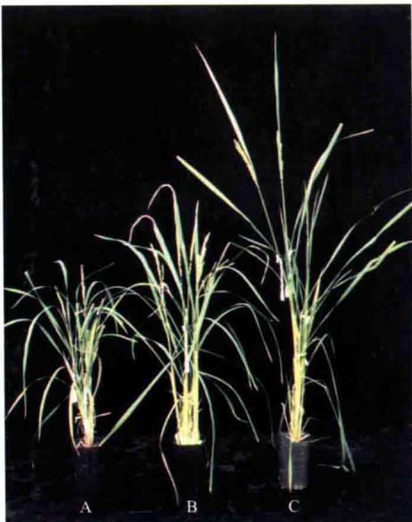

图20.27 OsEXP4正义链和反义链转基因水稻表型。A为反义链株系。B为对照（非转基因）。C为正义链株系。植物的高度与EXP4的量相关。虽然反义链转基因株系中的EXP4基因转录了，但它不能被翻译出蛋白质来，EXP4蛋白质相对于对照减少了。正义链转基因株系中，OsEXP4被过表达而产生了更多的EXP4蛋白（引自Choi et al., 2003；H. Kende惠赠）。

## 20.8.3 降低GA敏感性可以防止作物损失

水位缓慢上涨时，深水稻加速节间伸长，以保持茎的（一部分）气生部分位于水面之上。相反，急速暴发的洪水能诱发快速生长，引起营养物质的过度消耗并常常带来植物的死亡。耐淹的水稻栽培种在洪水暴发时不响应，茎不会极度生长，这样它们就能够更好地保存营养物质，一旦洪水消退后就能更好地恢复。这些耐淹栽培稻拥有Sub1A-1基因。Sub1A-1在被水淹时高度诱导表达，将其转入不耐淹栽培水稻后赋予其耐淹性。Sub1A-1与SLR1及与其类似的SLRL1的表达量增加相关，其表达增加将导致DELLA蛋白积累。组成型过表达Sub1A的转基因植物和水淹时叶中Sub1A高度诱导的植物对GA的敏感性都降低了，并且都在被水急速淹没时不经历自杀性快速生长（Fukao and Bailey-Serres, 2008）（图20.28）。

在老挝、印度、孟加拉国等容易遭受洪水的地区引种表达Sub1A的水稻栽培品种将有望降低毁灭性洪水带来的损失。这些抗洪水淹没的水稻品种也依赖DELLA蛋白来调节茎的生长，与“绿色革命”中培育的抗倒伏小麦栽培品种一样。

通过过去这些年的研究，DELLA蛋白显然在整合植物对包括GA在内的多种激素和特定的环境因素产生响应的过程中非常重要。乙烯、生长素、脱落酸、光和温度都参与DELLA信号途径，其中一些在DELLA蛋白的上游作用，一些则在下游。Web Topic 20.9 将深入讨论这方面的激素相互作用。

  
淹水前

  
淹水后16天

  
恢复后7天

图20.28 组成型和水淹诱导表达Sub1A均能提高水稻在快速淹水后的存活率。照片中显示了组成型过表达系（Sub1A-OE#1和Sub1A-OE#2）、水淹诱导[M202（Sub1A）]和不耐水淹株系（非转基因对照和M202）在淹水之前（上）、淹水后16天（中）和淹水结束后7天（下）的表型。实验开始前的所有植物都处于相同的发育时期。不耐水淹株系在淹水过程中叶片和节间明显伸长（中间照片的第1和第4），这消耗了资源，削弱了淹水结束后的恢复能力（下）。其他植物显示出更低的GA敏感性和淹水后更高的存活率（引自Fukao and Bailey-Serres，

2008; J. Bailey-Serres 惠赠)。

## 小结

赤霉素在植物的生长和发育的许多方面具有重要的调节作用，包括调节种子的萌发、植株的生长、诱导开花、雄蕊的发育、花粉管的生长、花的发育、果实的形成和生长、种子的发育等。所有的GA都有相似的化学结构，然而仅有少数有生物活性。

## 赤霉素的发现和化学结构

· 众所周知，赤霉素能极大地促进禾本科植物和矮生莲座叶植物节间的伸长（图20.1和图20.2）。

· 赤霉素是由4个5碳的类异戊二烯单位组成的四环双萜类化合物。在大多数植物里， $GA_{1}$ 和 $GA_{4}$ 是具有最高生物活性的GA。

## 赤霉素在植物生长发育中的作用

· GA在植物的整个生命周期里是必不可少的，它能够促进种子的萌发、诱导开花、花的性别决定、花粉的发育及花粉管的伸长、果实的形成和生长（图20.3）。

· 在商业生产中，从真菌（Gibberella fujikuroi）中获得的 $\mathrm{GA}_{3}$ （赤霉酸）被用于多种农作物上和酿造工业中（图20.4）。

· 在谷类作物生产中，GA生物合成抑制剂被用作重要的矮化剂。

\- GA的合成和信号突变体都呈现出矮化的植株表型。

## GA的生物合成与失活

\- GA的合成发生在植物的多个器官和细胞内的多个位点。

\- GA是可以移动的，它既可以在合成的部位发挥作用，也可以从合成部位转移到其他部位发挥作用，包括萌发的胚、幼苗、茎尖和发育中的种子。

· GA的合成首先发生在质体里，由牻牛儿牻牛儿焦磷酸环化为内根-贝壳杉烯，然后，在内质网中转变为 $GA_{12}$ ，最后在细胞质中合成有生物活性的 $GA_{1}$ 和 $GA_{4}$ （图20.5）。

· 在研究中，利用GA缺失突变体建立了合成通路（图20.6和图20.7）。

· 内源的有生物活性GA通过提高或抑制GA生物合成或失活酶的转录来调节其自身合成。

· 光周期、温度等环境因素能通过调节GA生物合成途径中的酶基因的转录来调节GA生物合成。

· 通过对豌豆GA缺失突变体的研究进一步证实植物的高度与内源 $GA_{1}$ 的含量相关（图20.9）。

通过遗传工程减少 $GA_{1}$ 的合成或者提高它的降解都能够使植株矮化，进而增加农作物产量（图20.10）。然而，一些GA缺失突变体表现为果实或种子发育缺陷（图20.11）。

## 赤霉素信号途径：响应突变体的重要性

· 一些突变体的GA响应与内源生物活性GA含量不成比例，暗示这些突变的基因可能编码GA受体或信号转导途径中的其他元件。

\- 水稻中的GID1编码一个符合GA受体标准的可溶性蛋白（图20.12）。

· 拟南芥中有3个基因各自编码GA受体，3个基因均突变的“三突变体”才显现出极度矮化表型（图20.13）。

· 活性GA是受体蛋白GID1的变构激活剂，诱导GID1构象变化，促进GID1与负调节因子DELLA蛋白的结合（图20.14\~图20.16）。

\- DELLA蛋白与GA-受体蛋白复合体结合后被泛素化修饰和降解。

\- GA的负调控因子的突变能产生细长或者矮化表型。大麦DELLA蛋白（SLN）的sln1c突变产生组成型GA响应表型（高）；相反，sln1d突变阻断GA响应（矮）（图20.17）。

· GA促进DELLA蛋白在细胞核中的降解。拟南芥的DELLA蛋白RGA在GA出现后降解，导致生长响应（图20.18和图20.19）。

## 赤霉素响应：DELLA蛋白的早期靶标

·DELLA蛋白和其他蛋白质相互作用间接调节转录。

· 光敏色素互作蛋白（PIF）是幼苗在黑暗下和GA出现后上调基因导致下胚轴伸长的转录因子。光信号使PIF降解，不产生GA响应（图20.20）。

## 赤霉素响应：谷类植物糊粉层

\- 萌发过程中，胚中产生的GA促进糊粉层细胞中水解酶的合成和释放进入胚乳（图20.21）。

· 活性GA结合到GID1蛋白后，导致DELLA蛋白的降解，进而上调GAMYB基因（编码转录因子）。GAMYB结合到α-淀粉酶基因启动子的GARE序列而增强转录（图20.22和图20.23）。

## 赤霉素响应：花药发育和雄性育性

\- GA 激活对花粉发育和雄性育性的影响是由 GAMYB 转录因子介导的（图 20.24）。

· GAMYB转录因子对于参与花粉正常发育的基因表达是必需的，它们在花药中受microRNA调控（图20.25和图20.26）。

· 不同组织中GAMYB信号的不同可能是不同组织中GA诱导不同生物学响应的原因。

## 赤霉素响应：茎的生长

\- GA促进细胞伸长和细胞分裂，一个例子是促进水稻在胁迫环境（洪水淹没）下茎的快速但不可持续伸长。

· GA诱导的细胞伸长部分由一类称为膨胀素的蛋白介导。其中一个膨胀素基因OsEXP4的转录在GA处理后或在快速水淹后增加。表达OsEXP4反义链的幼苗在水淹下不生长；过表达OsEXP4导致水稻长高（图20.27）。

· 在水稻中，SUB1A-1基因上调DELLA蛋白，减弱茎对GA的敏感性，阻止不可持续的茎部伸长（图20.28）。

\- DELLA蛋白对整合GA、几种其他激素和环境因子的效应非常重要。

(孙世勇 蒋建军 译)

## WEB MATERIAL

Web Topics

20.1 Structures of Some Important Gibberellins and Their Precursors, Derivatives, and Biosynthetic Inhibitors The chemical structures of various gibberellins and the inhibitors of their biosynthesis are presented.

20.2 Commercial Uses of Gibberellins
Gibberellins have roles in agronomy, horticulture, and the brewing industry.

20.3 Gibberellin Biosynthesis
The GA biosynthetic pathways and GA conjugates in plants are described.

20.4 Gas Chromatography-Mass Spectrometry of Gibberellins Identification and quantitation of individual GAs are accomplished by gas chromatography-mass spectrometry.

20.5 Environmental Control of Gibberellin Biosynthesis The antagonistic relationship between gibberellins and abscisic acid is often mediated by environmental factors.

20.6 Auxin Can Regulate Gibberellin Biosynthesis

Studies in both monocot and dicot species have shown that auxin can up-regulate gibberellin biosynthesis and down-regulate gibberellin inactivation.

20.7 Negative Regulators of GA Response
The DELLA proteins are important regulators of GA response.

20.8 Effects of GA on Flowering Bioactive GAs are involved in the transition to flowering, and interact with the floral meristem identity gene Leafy.

20.9 DELLA Proteins as Integrators of Multiple Signals These proteins are involved in integrating signals from several hormones and multiple environmental factors.

## Web Essays

## 20.1 Gibberellins in Pea: From Mendel to Molecular Physiology

A personal description of GA research using pea, that most recently focuses on the interaction of environmental factors and other hormones on the regulation of GA biosynthesis in this plant.

20.2 Ubiquitin Becomes Ubiquitous in GA Signaling
Homologs of SLY1/GID2 and DELLAs have been found in just about every plant species that has an EST sequence database.

## 20.3 Green Revolution Genes

High yielding dwarf varieties of wheat and rice introduced in the mid-1960s have altered GA biosynthesis or response.

20.4 Overgrowth Mutants of Barley-from Model System to Potential Crops
Self-fertile barley mutants with enhanced GA signaling have potentially useful agronomic traits.

# 第 21 章

# 细胞分裂素: 细胞分裂的调节因子

人们在探寻植物细胞分裂（即胞质分裂）因子的过程中发现了细胞分裂素，并逐渐认识到它具有广泛的生理功能。除了能促进细胞分裂外，其还参与调控许多其他生理和发育过程，包括叶片衰老、养分运输、顶端优势、茎尖分生组织的形成及活性、维管发育、芽休眠的解除及与其他组织间的相互作用等。此外，细胞分裂素还参与许多光调控的发育过程，如叶绿体分化、自养代谢、子叶和叶片伸展等过程。

尽管细胞分裂素调节许多细胞过程，但调控植物生长和发育过程中的细胞分裂是其最基本的功能，也是这类植物生长调节物质的核心功能。因此，我们先简要介绍细胞分裂素在植物正常发育、伤害、菌瘿形成和组织培养过程中对细胞分裂的调控作用。

随后我们将讨论细胞分裂素是如何被合成和修饰，又是如何被感知和进行信号转导的分子机制。最后讨论细胞分裂素的生物学功能、生物合成、代谢及信号转导途径如何影响诸多的生长和发育过程。

## 21.1 细胞分裂和植物发育

初生分生组织或次生分生组织的细胞分裂形成了植物细胞。新形成的植物细胞通常会不断增大及分化，一旦其承担了某种功能——如运输、光合作用、支撑、贮藏或保护等——这些细胞在植物生活周期中将不再进行分裂。这种现象与动物细胞类似，被称为终极分化（terminally differentiated）。

然而这种动植物细胞行为的相似性仅仅是表面现象。几乎每一种成熟时具有细胞核的植物细胞都具有潜在的分生能力，这种特性在植物伤口愈合和叶片脱落等过程中发挥作用。

## 21.1.1 分化的植物细胞具有恢复分裂的能力

植株体内分化的成熟细胞在某些情况下能够恢复分裂能力。多种植物的皮层和韧皮部的成熟细胞能恢复分裂能力形成次生分生组织——维管形成层或木栓形成层。叶片脱落一般发生在叶柄基部的离层，离层是由已停止有丝分裂的成熟薄壁组织细胞再次恢复分裂形成细胞壁较薄弱的细胞层（见第22章）。

植物组织受伤能诱导受伤部位的细胞进行分裂，即使是韧皮部纤维细胞和保卫细胞这样高度特化的细胞在受到伤害诱导时也可能会再次进行分裂。由受伤诱导产生的细胞有丝分裂活性通常具有自限性，分裂数次后衍生的细胞就会停止分裂并进行再分化。但当植物伤口被一种名为根癌农杆菌（Agrobacterium tumefaciens）的土壤细菌侵染时则可以导致肿瘤的形成，这种病害被称为冠瘿病（crown gall）。这种现象也是成熟植物细胞具有有丝分裂潜力的强有力的证据。

如果没有根癌农杆菌的侵染，受伤诱导的细胞分裂会在数天后衰退，一些新产生的细胞会分化成木栓细胞保护层或维管组织。而农杆菌的侵染则会改变伤害诱导的细胞分裂特性，使其在植物的整个生活周期进行无限分裂，从而产生一种类似肿瘤由未分化细胞团构成的组织，这种组织被称为瘿瘤（gall）（图21.1）。我们将在后面对这种重要的病害加以详细讨论。

## 21.1.2 细胞分裂受到可扩散因子的调控

前文所讨论的一些现象表明植物成熟细胞停止分裂是由于没有再接收到引发细胞分裂的特定信号，而这个信号很可能是细胞启动分裂所必需的一种激素物质。奥地利植物生理学家G. Haberlandt在1913年发现马铃薯维管组织中含有一种或多种水溶性物质，这些水溶性物质能刺激受伤的块茎组织进行细胞分裂，因此其最先提出细胞分裂可能是由一种可扩散因子所引发的观点。随后人们为确定这种（这些）可扩散因子是什么进行了不懈的努力，并最终在20世纪50年代发现了细胞分裂素。

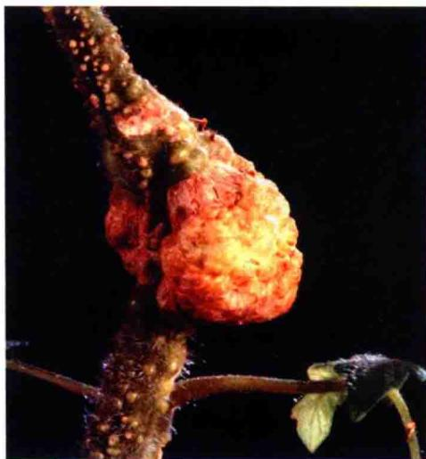  
图21.1 冠瘿病菌（根癌农杆菌）感染番茄茎后形成的瘤状物。上图是冠瘿病菌有毒菌株感染番茄受伤茎两个月后拍摄的照片（引自Aloni et al., 1998, R. Aloni惠赠）。

## 21.1.3 植物组织和器官可离体培养

长期以来，生物学家对植物器官、组织和细胞具有在简单营养培养基上生长的潜能十分好奇，这种培养方法与在试管和培养皿中体外培养微生物相同。在20世纪30年代，Philip White发现番茄的根能在仅含有蔗糖、无机盐和少量维生素而没加入任何激素的简单营养培养基中无限培养（White，1934）。

然而离体的茎部组织在不含激素的培养基中几乎不能生长。即使在培养基中加入生长素，也只可能出现短暂的有限生长。因为生长素所引起的生长通常仅是细胞体积增大而产生的。大多数植物的茎尖即使具有顶端分生组织和侧生分生组织，在不定根形成之前也不能在缺乏激素的培养基上生长，然而一旦茎部组织生根后就能以完整植株的形式恢复正常生长。

以上这些现象表明在根和地上部的分生组织中，调控细胞分裂的机制是不同的，同时也暗示一些根源性因子可能调控了地上部的生长。

茎部组织的冠瘿瘤则与上述情况不同。在冠瘿瘤形成后将植物加热到42℃会把诱导冠瘿瘤形成的细菌杀死，而热处理后的植物能够继续存活并且冠瘿组织可以在没有细菌诱导的情况下继续生长（Braun，1958）。

从上述无菌瘤中取出的组织可以在正常茎部组织无法进行增殖的简单营养培养基上生长。但这些由茎部转化而来的组织不能形成正常的植物器官，只能生长成一团无组织结构、未分化的被称为愈伤组织（callus tissue）的细胞团。

愈伤组织有时会在植物伤口处或两种不同植物茎嫁接的部位自然形成，而无论在植株或培养基上生长的冠瘿瘤，都是一种特殊类型的愈伤组织。冠瘿愈伤组织能够离体培养证明了源于茎部组织的细胞具有在培养基中增殖的潜能，而相关的细菌可以诱导茎细胞产生促进细胞分裂的因子。

## 21.2 细胞分裂素的发现、鉴定和特性

为了寻找这种因子，人们尝试着把各种不同的物质加入培养基中来检测其诱导及维持正常茎组织增殖的能力。结果发现从酵母提取物到番茄汁液等多种物质都对茎组织或至少某些组织的增殖具有促进作用，但椰子胚乳液（又称椰乳）的促进作用最为明显。

如果将生长素和10%\~20%的椰乳添加到Philip White培养基中，则能促使不同种类植物已经分化的成熟细胞持续分裂形成愈伤组织（Caplin and Steward，1948）。这一发现表明椰乳中含有一种或多种能够刺激成熟细胞进入细胞分裂周期并维持下去的因子。

后来得知椰乳中含有的能促进细胞分裂的物质是玉米素（zeatin）（Letham，1974），但这却是在细胞分裂素被发现的数年之后才知道的。人们发现的首个细胞分裂素是人工合成的类似物——激动素（kinetin）。

## 21.2.1 激动素是作为DNA降解产物被发现的

20世纪四五十年代，Wisconsin大学的Folke Skoog和他的合作者在检测多种物质引发和维持培养的烟草髓部组织细胞分裂能力（详见Web Essay 21.1）的实验中发现，核酸的碱基腺嘌呤具有微弱的促进作用。在进一步检测核苷酸能否在这种组织中促进细胞分裂的过程中，却意外发现久置或经高压灭菌处理的鲱鱼精细胞DNA可以强烈地促进细胞分裂。

此后，经过大量工作，人们从高压灭菌过的DNA降解物中分离到一种具有促进细胞分裂作用的小分子物质并将其命名为激动素（kinetin），它是一种腺嘌呤（6-腺嘌呤）衍生物——N $^{6}$ 呋喃甲基腺嘌呤（Miller et al., 1955）。激动素只有在培养基中同时含有生长素时才能促进烟草髓部薄壁细胞进行分裂增殖（详见Web Topic 21.1）。

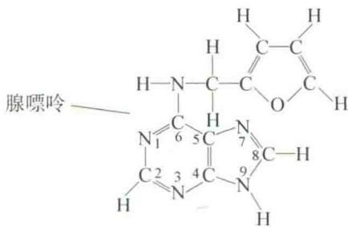  
激动素

激动素并不是天然存在的植物生长调节因子，而且也不是任何物种中DNA分子的碱基。它只是DNA分子高温诱导降解时形成的副产物，此时腺嘌呤核苷的脱氧核糖从吡喃环转化成呋喃环并从腺嘌呤环的第9位原子转移到第6位上。

激动素发现的重要意义在于证明了细胞分裂能够被一种简单的化学物质所诱导，更重要的是，这一发现预示着植物中如果存在某种与激动素结构相似的天然化学分子，也同样能够调控植物细胞的分裂。最终这个假说被证明是正确的。

## 21.2.2 第一个被发现的天然细胞分裂素——玉米素

激动素被发现几年后，人们从玉米（corn；Zea mays）未成熟的胚乳提取物中发现一种具有类似激动素生物活性的物质，将这种物质与生长素一起添加到培养基中能够促进成熟的植物细胞进行分裂。Letham在1973年分离并鉴定出该活性物质为6-反式-(4-羟基-3-甲基-丁-2-烯基氨基）嘌呤，并将其命名为玉米素（zeatin）。

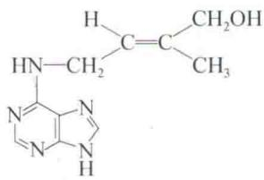  
反式玉米素

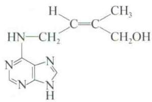  
顺式玉米素  
6-(4-羟基-3-甲基-丁-2-烯基氨基)嘌呤

玉米素分子结构与激动素类似，都是腺嘌呤（氨基嘌呤）的衍生物。虽然它们侧链不同，但侧链都与和腺嘌呤 $C^{6}$ 相连的氮原子（ $=N^{6}$ ）结合。由于玉米素侧链含有一个双键，因此具有顺反异构体。

高等植物中玉米素同时存在顺式和反式两种异构体，在玉米素异构酶（zeatin isomerase）作用下可以相互转换，但这种酶并非在所有植物中都存在。尽管生物学实验发现玉米素反式异构体具有更强活性，但顺式异构体在一些种类的植物中也可能起重要作用。例如，拟南芥中玉米素主要是反式构型，但玉米和水稻中多数玉米素是以顺式构型存在的。此外，拟南芥和玉米细胞分裂素受体都可以与反式玉米素结合并被其活化，但在玉米中顺式玉米素对细胞分裂素受体具有更高的活性。

除了未成熟玉米的胚乳，人们还在许多其他植物和一些细菌中发现了玉米素的存在。虽然玉米素是高等植物中普遍存在最具有生物活性的细胞分裂素，但人们也从植物和细菌中分离出一些其他具有细胞分裂素活性的腺嘌呤类物质，它们与玉米素的区别在于与腺嘌呤 $N^{6}$ 相连的侧链不同（图21.2）。

植物中这些细胞分裂素可以以核苷（riboside）（核糖基团与嘌呤环第9位氮原子相连）、磷酸核糖（ribotide）（核糖环连有磷酸基团）、配糖体（glycoside）（糖基与嘌呤环的第3、7或9位氮原子结合，或与玉米素或二氢玉米素侧链的氧原子相连）或其他形式存在（参见附录3和Web Topic 21.2）。

## 21.2.3 一些合成化合物具有类似细胞分裂素的活性

细胞分裂素被定义为与反式玉米素具有相似生物活性的物质，这些生物活性包括以下几类。

（1）在生长素存在条件下诱导愈伤组织的细胞分裂。

（2）在具有适当比例生长素的培养基中促进愈伤组织形成根或芽。

(3) 延缓叶片的衰老。

（4）促进双子叶植物子叶的展开。

人们通过合成多种化合物并检测其是否具有细胞分裂素活性来寻找细胞分裂素活性所必需的结构，发现几乎所有具有细胞分裂素活性的合成化合物都是第6位N原子被腺嘌呤取代，如苄基腺嘌呤（BA）等。而所有天然存在的细胞分裂素也都是腺嘌呤的衍生物。

  
苄基腺嘌呤
(苄氨基嘌呤) (BA)

很多合成的细胞分裂素类化合物并未在植物中发现。最著名的是二苯脲类细胞分裂素，其中一种称为噻苯隆（thidiazuron）的化合物在商业上被用作脱叶剂和除草剂。

  
$N^{6}-(\Delta^{2}-异戊烯基)-腺嘌呤(iP)$

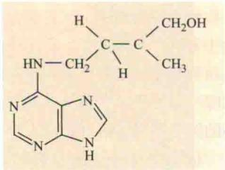  
二氢玉米素(DHZ)

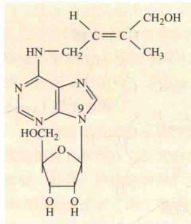  
玉米素核苷

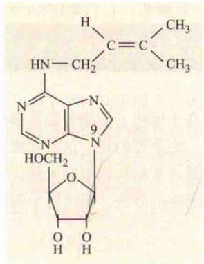  
$N^{6}-(\Delta^{2}-异戊烯基)-腺苷([9R]iP)$

图21.2 一些具有细胞分裂素活性的腺嘌呤类物质结构。  
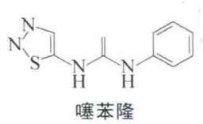

天然存在具有细胞分裂素活性的分子主要通过物理学方法进行检测和鉴定（参见Web Topic 21.3）。

## 21.2.4 细胞分裂素以游离态和结合态两种形式存在

在植物和某些细菌中具有生物学活性的细胞分裂素是以游离状态存在的（不与任何大分子共价结合），游离态的细胞分裂素在被子植物中广泛存在，此外在藻类、藓类、蕨类和针叶类植物中也有发现。

细胞分裂素在被子植物、针叶类植物、藓类植物中的调节作用已得到证实，但它们在所有植物的生长发育和代谢中都可能发挥调控作用。通常玉米素是高等植物和细菌中最丰富的天然游离态细胞分裂素，但二氢玉米素（dihydrozeatin，DHZ）和异戊烯基腺嘌呤（isopentenyl adenine，iP）在高等植物和细菌中也普遍存在，这三类细胞分裂素的多个衍生物已经在植物提取物中被鉴定出来（图21.2和Web Topic 21.2）。大多数细胞分裂素的生物活性形式是游离的碱基（参见Web Topic 21.4）。

转运RNA（tRNA）不仅含有组成其他RNA的4种核苷酸，还含有一些碱基被修饰的稀有核苷酸。在细胞分裂素生物活性测定实验中发现，tRNA水解后一些被修饰的碱基具有细胞分裂素的功能。一些植物中存在有以顺式玉米素作为超修饰碱基的tRNA，但细胞分裂素并不仅仅存在于植物的tRNA中，它参与组成了从细菌到人类所有生物某些特定tRNA的一部分（参见 Web Topic 21.5）。

## 21.2.5 某些植物病原细菌、真菌、昆虫和线虫能分泌游离态的细胞分裂素

一些细菌和真菌与高等植物有着密切的相互作用。许多微生物都能产生和分泌大量的细胞分裂素，有些还可以诱导植物细胞合成包括细胞分裂素在内的植物激素（Akiyoshi et al., 1987）。微生物产生的细胞分裂素有顺式玉米素、iP、反式玉米素和它们的核苷形式（图21.2），如玉米素的2-甲硫基衍生物（参见附录3）。这些微生物感染植物组织后可以诱导植物组织发生分裂，有时这种分裂会使植物形成特殊结构，如微生物与植物组织形成互惠共生关系的结构——丛枝菌根。

除了根癌农杆菌（A. tumefaciens），其他一些病原菌也能刺激植物细胞进行分裂。这些与植物相互作用的细菌、真菌、病毒和昆虫会导致细胞分裂素含量增加，造成顶端分生组织增殖或侧芽生长，而这些部位在正常情况下应该是处于休眠状态（Hamilton and Lowe, 1972）。由于这种增殖会使植物簇生形成笤帚的形态，因而被命名为丛枝病（witches' broom）（图 21.3）。了解最清楚的引起丛枝病的病原体是Rhodococcus fascians（Hamilton and Lowe, 1972）。R. fascians能够产生顺式玉米素、反式玉米素及它们的二甲硫基衍生物等多种不同的细胞分裂素（Pertry et al., 2009）。这些多种细胞分裂素混合物通过宿主体内正常的细胞分裂素信号途径（参见下文）可以将其作用加强，从而改变宿主的发育过程。R. fascians还能够分泌促使宿主植株生长发生改变的生长素IAA。植物的簇生现象也可因自身突变而产生，园艺学上常利用这种现象来培育矮化针叶树。

某些昆虫（insect）分泌的细胞分裂素也可以引发被这些昆虫啃食的植物部位形成央瘿。根结节线虫（root-knot nematode）也能产生细胞分裂素，通过改变寄主发育过程，产生巨大细胞团作为线虫的食物来源（Elzen，1983）。

## 21.3 细胞分裂素的生物合成、代谢和运输

天然存在的细胞分裂素侧链在化学结构上与橡胶、类胡萝卜素、植物激素赤霉素和脱落酸及一些植物抗毒素类防御物质类似，这些化合物全部或至少部分含有异戊二烯单位（见第13章）。

由于玉米素和iP的侧链都是由异戊二烯衍生物合成，因此这些细胞分裂素的侧链与异戊二烯结构相似（参见图21.2和图21.5所示结构）。橡胶和类胡萝卜素这些大分子物质是由多个异戊二烯单位聚合而成，而细胞分裂素只含一个异戊二烯单位。二甲基烯丙基二磷酸（DMAPP）则是形成这些细胞分裂素异戊二烯结构的前体，它可以通过甲羟戊酸途径（主要生成顺式玉米素）或甲基赤藻糖醇磷酸（MEP）途径（主要生成DHZ、iP和反式玉米素）合成（见第13章）。

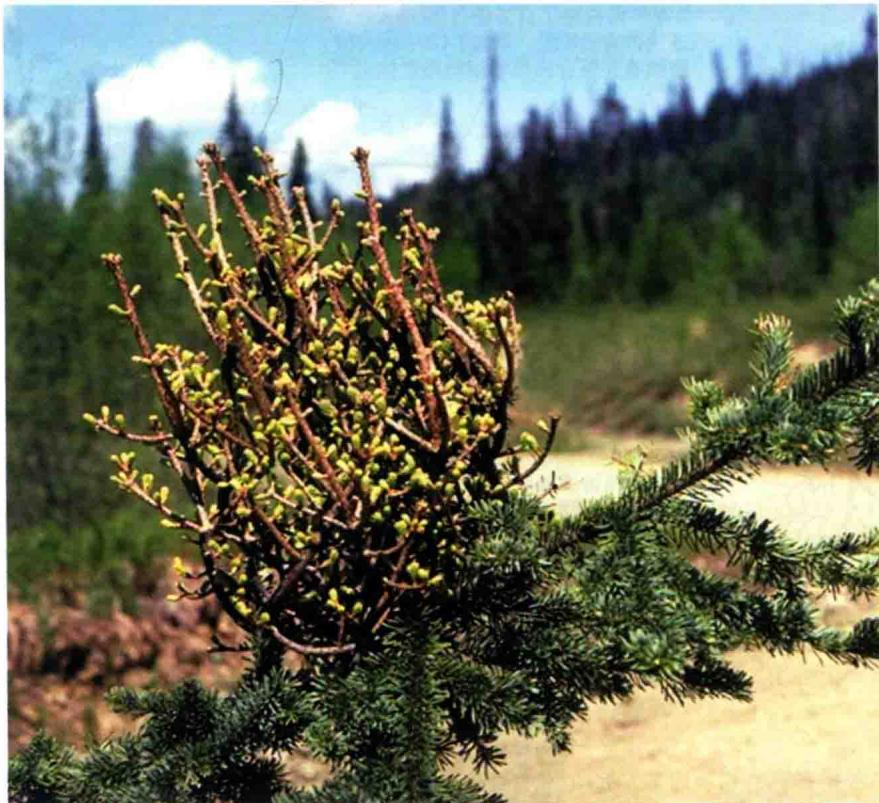  
图21.3 冷杉（Abies sp.）丛枝病。由杉类丛枝锈病真菌——石竹状小栅锈菌（Melampsorella caryophyllacearum）引起的丛枝病（Bob Erickson惠赠，Natural Resources Canada，Canadian Forest Service）。

## 21.3.1 冠瘿瘤细胞具有细胞分裂素合成基因

除去细菌的冠瘿瘤组织在不添加任何激素的培养基中就可以进行细胞增殖，表明冠瘿瘤组织能够合成足够量的生长素和游离的细胞分裂素。当A. tumefaciens侵染植株后，植物细胞将细菌DNA整合到自身染色体中（侵染的详细过程参见第2章）。有毒性的农杆菌体内存在一种大的Ti质粒（Ti plasmid），该质粒是一个独立于染色体DNA之外且不是细菌生存所必需的环状DNA。但Ti质粒通常含有一些能增强细菌在特殊环境下存活能力的基因。

T-DNA是Ti质粒上能整合到宿主植物细胞染色体上的一小部分DNA（图21.4）（Chilton et al., 1977），其携带有合成细胞分裂素、生长素和冠瘿碱（opine）必需的基因。冠瘿碱是一种稀有氨基酸的衍生物（图21.5），没有被根癌农杆菌侵染的正常植物自身不能合成冠瘿碱。

T-DNA基因含有参与细胞分裂素合成的ipt基因（按照惯例细菌中的基因用小写斜体表示），其编码异戊烯基转移酶（IPT），这个酶能将异戊烯基从1-羟基-2-甲基-2-(E)-丁烯4-二磷酸[1-hydroxy-2-methyl-2-(E)-butenyl 4-diphosphate，HMBDP]转移到腺苷一磷酸（AMP）上形成反式玉米素核苷5'-一磷酸（transzeatin riboside 5' -monophosphate，tZRMP）（图21.5）（Akiyoshi et al., 1984; Barry et al., 1984; Sakakibara et al., 2005）。当ipt基因突变失活（inactivated）时会使植物形成“多根状”瘤（tumor），因此又称为tmr基因座。细菌中的这种转换途径与之前推断的正常组织中细胞分裂素合成途径有些相似。

T-DNA中还含有两个编码将色氨酸转变成生长素吲哚-3-乙酸（IAA）酶的基因，这种生长素生物合成途径与未被转染的正常细胞中的合成途径不同，前者含有中间产物吲哚乙酰胺（参见附录3）。T-DNA中的ipt基因和这两个生长素合成酶基因能诱导植物体瘤的产生，因此它们也被称为植物癌基因（phyto-onco-gene）（参见Web Topic 21.7）。

由于T-DNA基因的启动子为植物体内所具有的真核生物启动子，因此这些基因在细菌中不能表达，只有当它们插入到植物基因组中才能被转录并翻译成相应的酶，进而诱导玉米素、生长素和冠瘿碱产生。细菌能利用植物细胞所不能利用的冠瘿碱作为碳源和氮源，通过转染植物细胞，使寄主细胞为其提供只有细菌自己才能利用的营养物质——冠瘿碱，从而获得了更大的生存环境（冠瘿瘤组织）（Bomhoff et al.,

  
图21.4 根癌农杆菌可诱导植物瘤状物产生（引自Chilton，1983）。

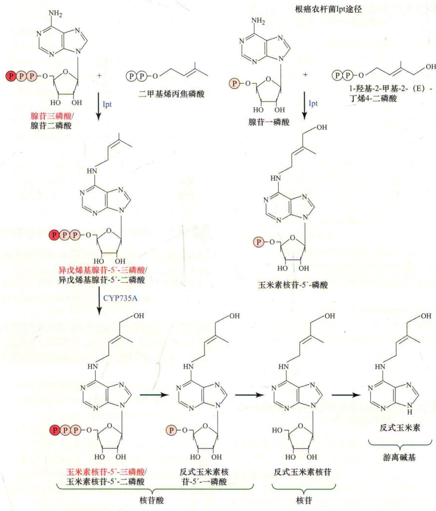  
图21.5 细胞分裂素生物合成途径。细胞分裂素生物合成途径的第一个关键步骤是将二甲基烯丙焦磷酸（DMAPP）提供的异戊二烯侧链加到腺苷（ATP或ADP）上，这些反应产物（iPMP、iPDP或iPTP）可以被细胞色素P450单加氧酶（CPY735A）转化成玉米素（ZTP或ZDP）。反式玉米素能够被一种未知的酶催化为二氢玉米素（DHZ）细胞分裂素（图中未显示）。核苷酸和核苷形式的反式玉米素可以相互转化，游离的反式玉米素可以由普通的嘌呤代谢途径中的酶从核苷催化产生。插图：插图显示的是经由根癌农杆菌Ipt的细胞分裂素生物合成途径。植物和细菌Ipt酶的腺嘌呤核苷底物和侧链供体不同；植物利用ADP和ATP与二甲基烯丙基二磷酸（DMPP）结合，而细菌则利用AMP与1-羟基-2-甲基-2-(E)-丁烯-4-二磷酸（HMBDP）结合。值得注意的是根癌农杆菌Ipt途径的产物是核苷酸形式的玉米素。

1976）。

冠瘿瘤组织与正常植物组织中细胞分裂素合成途径调控的一个重要差别就是在冠瘿瘤中细胞分裂素合成所依赖的T-DNA基因可以在所有被感染的植物细胞中表达，甚至在那些植物自身激素合成基因被抑制的细胞中也可以表达。

## 21.3.2 异戊烯基转移酶（IPT）催化细胞分裂素生物合成的第一步反应

细胞分裂素生物合成的第一个关键步骤是将异戊烯基团转移至腺嘌呤核苷上，催化这个反应的酶最早是在细胞性黏菌盘基网柄菌（Dicivosieium discoideum）中鉴定出来的，随后发现农杆菌中的ipt基因也编码这种酶。拟南芥基因组中有9个编码不同IPT的基因（参见Web Topic 21.8）（Kakimoto，2001；Takei et al., 2001a），其中有7个在大肠杆菌中表达后，可以合成游离的细胞分裂素。与农杆菌中的Ipt蛋白（细菌中的蛋白质按照惯例用首字母大写正体表示）不同，拟南芥中的IPT酶优先利用腺苷三磷酸（ATP）和腺苷二磷酸（ADP）而不是腺苷一磷酸（AMP）作为腺苷原料，并且用二甲基烯丙基二磷酸（DMAPP）而不是HMBDP来合成细胞分裂素的侧链（图21.5）。植物中IPT酶合成细胞分裂素所需的DMAPP主要来源于甲基赤藻糖醇磷酸（MEP）途径，由于植物体内的IPT酶大多存在于质体中，而植物MEP途径也发生在质体中，因此，植物细胞分裂素生物合成过程主要也发生在质体中。IPT基因表达模式的多样性表明植物细胞分裂素的合成也具有多种途径（Miyawaki et al., 2004）。

iP-核苷作为IPT反应的中间产物在合成后随即被进一步转化为玉米素核苷（Takei et al., 2004）。细胞分裂素的核苷酸通过脱磷酸化和去核苷化反应转变为具有最大活性的游离态细胞分裂素（Kurakawa et al., 2007）（图21.5）。

## 21.3.3 细胞分裂素可同时作为本地和长距离的信号分子

许多植物的韧皮部和木质部的分泌液中都含有细胞分裂素。拟南芥和其他植物木质部汁液中的细胞分裂素主要是反式玉米素核苷，而韧皮部中的细胞分裂素则主要是iP和顺式玉米素类核苷。通过对木质部分泌液的分析发现，根部合成的细胞分裂素似乎是与根所吸收的水和矿物质一起通过木质部运送到植株地上部分。当把植株地上部分从靠近地面的位置切断后，木质部的汁液会持续流出一段时间，这种汁液中就含有细胞分裂素。如果根部土壤保持湿润，木质部汁液的流出将会持续数天，而且这期间细胞分裂素的含量不会明显减少，由此可推断汁液中的细胞分裂素是由根部合成。此外，影响根部功能的外界环境变化也能影响木质部汁液中细胞分裂素含量。例如，在玉米根生长的缺氮土壤中添加硝酸盐，能够引起木质部汁液中细胞分裂素含量增加，这与在土壤中添加硝酸盐可以诱导地上部植株中细胞分裂素调节基因表达的表型相一致（Takei et al., 2001b）。

细胞分裂素作为可移动信号分子起作用的直接证据是拟南芥多个IPT基因缺陷突变体的嫁接实验（Matsumoto-Kitano et al., 2008）。该突变植株由于细胞分裂素合成能力减弱，不能产生形成层。但如果将ipt突变体的茎嫁接到野生型的根上，突变体茎则会恢复产生形成层的能力；反过来，野生型的茎嫁接到ipt突变体根上，突变体根部产生形成层的能力也能恢复。因此我们可以得出以下几点重要的结论：首先，来源于根的细胞分裂素很可能并不是地上部正常生长所必需的；其次，这些被转运的细胞分裂素是具有功能的，而且这种根和地上部之间的转运是相互的。

细胞分裂素除了可以作为长距离信号分子外，还能以本地信号或旁路信号发挥作用。它可以使所在位置的顶芽解除休眠状态（参见下文），还可以促进邻近的根顶端分生组织细胞的退化。

## 21.3.4 细胞分裂素能被植物组织迅速代谢

许多植物组织中都存在细胞分裂素氧化酶（cytokinin oxidase），该酶能够将顺式或反式玉米素、玉米素核苷和iP的N-葡萄糖苷侧链切除（参见附录3）。但不能切除二氢玉米素及其缀合物及芳香族细胞分裂素如苄基腺嘌呤等细胞分裂素的侧链。细胞分裂素氧化酶能不可逆地失活细胞分裂素，这对调节或限制细胞分裂素的作用有重要意义。高浓度细胞分裂素会诱导细胞分裂素氧化酶活性升高，或者部分地提高氧化酶mRNA的表达水平。

芳香族细胞分裂素虽然不能被细胞分裂素氧化酶降解，并且与细胞分裂素受体的结合和激活能力也较差，但在生物学分析中却具有较高的活性。

编码细胞分裂素氧化酶的基因最先在玉米中被发现（Houba-Herin et al., 1999; Morris et al., 1999）。拟南芥中的细胞分裂素氧化酶由一个多基因家族编码，并且这些基因表达模式各不相同。有趣的是其中几个基因含有分泌信号序列特征，表明某些成员可能是在胞外行使功能。

如前所述，细胞分裂素侧链可以结合在嘌呤环多个位置（参见附录3）。细胞分裂素腺嘌呤环的第3、7和9位的氮原子能够与葡萄糖残基结合。第9位的氮原子还可以与丙氨酸结合形成羽扇豆酸。细胞分裂素羟基侧链也能够与葡萄糖残基结合，或者与木糖残基结合，分别形成O-葡萄糖苷和O-木糖苷细胞分裂素。

催化葡萄糖残基或木糖残基与玉米素结合的酶已经纯化，其代表性基因也已被克隆（如Martin et al., 1999）。如上所述，无论是通过N-糖苷键还是O-糖苷键与细胞分裂素相连，都只有在配基被移除后细胞分裂素才具有活性。通过N-糖苷键与配基的结合通常是不可逆的，因此通过该方式结合形成的细胞分裂素在生物学分析中通常没有活性，而与O-糖苷键结合的侧链则能够被葡萄糖苷酶水解掉而形成游离的细胞分裂素。含有葡萄糖苷的细胞分裂素很可能作为细胞分裂素的贮存形式存在。玉米中克隆出一个编码葡萄糖苷酶的基因，该酶能将与细胞分裂素相连的糖基切除而释放出游离细胞分裂素（Brzobohaty et al., 1993），在转基因烟草中过表达该基因，则会引起玉米素代谢的紊乱（Kiran et al., 2006）。

休眠的种子常常含有高水平的葡萄糖苷型细胞分裂素和低水平有活性的游离态细胞分裂素，种子萌发时，伴随着游离态细胞分裂素含量的快速增加，葡萄糖苷型细胞分裂素含量迅速降低。

特定细胞中活性细胞分裂素的水平是由从头合成、早期解离、转运入细胞、移除配基、降解及从细胞中运出等多因素综合决定的。

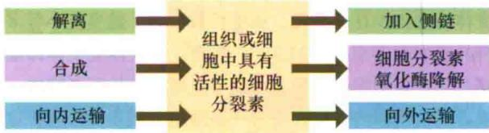

## 21.4 细胞分裂素在细胞和分子水平上的作用模式

细胞分裂素在植物生长发育中的功能多样性与其信号转导途径的多分支性相一致，对于每个分支途径植物都会作出相应的应答。细胞分裂素的感知和信号转导过程是由一个双组分系统所介导的，这种应答模式与细菌感知和应答外界环境变化的方式非常相似。

## 21.4.1 一个与细菌双组分受体相关的细胞分裂素受体已被鉴定

对细胞分裂素受体的了解最初来自于拟南芥CKII基因的发现。当CKII基因超表达时，培养的拟南芥细胞能以不依赖细胞分裂素的方式生长（Kakimoto，1996）。前已述及，植物细胞的分裂通常依赖于细胞分裂素调控，然而，超表达CKII基因的细胞系却能在没有外源细胞分裂素的培养基上正常生长。

CKI1编码的蛋白质在序列上与细菌组氨酸激酶双组分感受器具有相似性，后者是原核细胞中普遍存在的受体（见第14章和第17章）。细菌的双组分调控系统介导了多种对环境刺激的反应，如渗透调节和趋化性等。该系统通常由两个功能元件组成：感受信号的组氨酸激酶感受器（sensor histidine kinase）和下游的反应调节子（response regulator）（其活性受到组氨酸激酶感受器磷酸化调控）。组氨酸激酶感受器通常是膜结合蛋白，含有两个不同的结构域：信号感受结构域（输入结构域）和组氨酸激酶结构域（传递结构域）（图21.6）。

输入结构域在接受激素信号后引起传递结构域中组氨酸激酶活性改变并形成二聚体，随后激酶域中一个保守的组氨酸残基发生自磷酸化反应，之后该磷酸基团转移至同源反应调节子接受域中一个保守的天冬氨酸残基上（图21.6），使反应调节子活化。反应调节子可分为接受域和信号输出域两个结构域，而信号输出域通常具有转录因子的功能。

对CKII基因超表达植株表型的研究及其蛋白质与

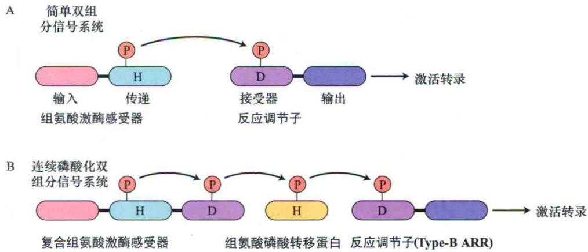

图21.6 双组分信号系统的简单磷酸化和连续磷酸化模式对比图。A. 在简单双组分系统中，输入结构域是信号感知结构域，该结构域调节组氨酸激酶结构域活性，结构域中一个保守的组氨酸残基发生自身磷酸化而激活。随后该磷酸基团被转移至反应调节子接受结构域的一个天冬氨酸残基上。磷酸化的天冬氨酸残基能够调节反应调节子输出结构域的活性。反应调节子通常为转录因子。B. 在多步骤磷酸化的双组分信号系统中，一种组氨酸磷酸转移蛋白（Hpt）参与了额外的磷酸基团的转移。拟南芥的组氨酸磷酸转移蛋白被称为AHP，而其反应调节子被称为ARR。图中H代表组氨酸；D代表天冬氨酸。

细菌受体的相似性都表明CKI1及与其相似的组蛋白激酶是细胞分裂素受体。对CRE1基因的功能鉴定进一步支持了这个假设（Inoue et al., 2001；Yamada et al., 2001）。

CK1基因是从功能获得性突变体（在无细胞分裂素时细胞可以分裂）中被鉴定出来的，采用与筛选CK1基因相反的方法，从施加细胞分裂素未分化组织细胞不能分化为芽的突变体中筛选得到了cre1功能缺失突变体，cre1突变体还对细胞分裂素引起的根伸长抑制表型具有抗性。与CK1类似，CRE1也编码一个类似于细菌组氨酸激酶的蛋白质。

通过在酵母和大肠杆菌中表达CRE1并对其功能进行分析，确认CRE1编码一种细胞分裂素受体。酵母细胞中有一个编码组氨酸激酶感受器的基因SLN1，此基因的敲除会使酵母致死。当在SLN1功能缺陷酵母中表达CRE1基因时，酵母可以在培养基中有细胞分裂素存在的情况下恢复存活能力。在大肠杆菌中进行类似的实验，也发现CRE1能以细胞分裂素依赖的方式恢复组氨酸激酶突变体的表型。由以上实验结果可知，CRE1蛋白的生理活性（指替代SLN1）是细胞分裂素依赖的。此外，拟南芥cre1突变体表现出细胞分裂素不敏感表型，以及纯化的CRE1蛋白与细胞分裂素具有高亲和力等结论共同证实CRE1是一个细胞分裂素受体。

拟南芥基因组中AHK2（ARABIDOPSIS HISTIDINE KINASE2）和AHK3基因与CRE1非常相似，表明细胞分裂素受体与乙烯受体（见第22章）类似，也是由一个多基因家族编码。这些跨膜的杂合型激酶（包括CRE1）都包含有一个相似的胞外CHASE（cyclase/histidine kinase-associated sensing extracellular）结构域。已经证实细胞分裂素以高亲和力与CRE1、AHK2和AHK3的CHASE结构域结合。而拟南芥中其他的不具有CHASE结构域的组氨酸激酶家族成员（包括CKI1）则很可能不是细胞分裂素的受体。此外，AHK2和AHK3的功能与CRE1类似，在酵母和大肠杆菌系统中也都有细胞分裂素依赖的表型，因此，它们也是细胞分裂素受体。这些受体对不同的细胞分裂素有着不同的亲和力，暗示不同的细胞分裂素可能有着各自的信号输出，从而在植物中行使不同的功能。通过构建缺失CRE1、AHK2和AHK3的三突变体（Higuchi et al., 2004; Nishimura et al., 2004），该三突变体表现出少花或无花、根生长被抑制、莲座变小等多种异常发育表型（图21.7）。然而，三受体突变体却能够存活，表明细胞分裂素可能不是植物生长所必需的，或者在植物体内可能存在另一条细胞分裂素信号应答途径，这些都还需进一步深入地研究。

  
图21.7 拟南芥细胞分裂素受体双突变体及三突变体（cre1、ahk2和ahk3）的表型。左边分别是亲本野生型Columbia和WS生态型（引自Nishimura et al., 2004）。

## 21.4.2 细胞分裂素通过激活B型ARR基因来增强A型ARR基因的表达

细胞分裂素的主要效应之一是改变多种基因的表达，最先被细胞分裂素上调表达的是拟南芥反应调节子ARR（ARABIDOPSIS RESPONSE REGULATOR）基因，这些基因与细菌双组分反应调节子的接受域具有同源性，是组氨酸激酶感受器的下游靶蛋白。

拟南芥中，反应调节子由多基因家族编码，分为仅编码接受域的A型ARR（type-A ARR）基因和同时编码接受域和转录因子域的B型ARR（type-B ARR）基因（图21.8）。施加细胞分裂素可以使A型ARR基因而不是B型ARR基因的转录效率快速提高（D' Agostino et al., 2000），这种快速诱导对细胞分裂素是特异性的，也不需要合成新的蛋白质，表明这些基因是初级应答基因（见第17章和第19章）。在对细胞分裂素响应过程中，一部分A型ARR蛋白的稳定性也会随之增强（To et al., 2007），它们能够协调转录反应来增加A型ARR蛋白的水平。

  
图21.8 A型ARR和B型ARR蛋白结构比较。A型ARR仅由一个含有天冬氨酸的接受域组成，而B型ARR蛋白除了具有含有天冬氨酸的接受域外，在其羧基端还含有一个输出域（转录因子）。

由于A型基因受细胞分裂素诱导而快速表达，且它们与组氨酸激酶感受器下游信号元件具有相似性，表明A型基因的表达产物作为位于CRE1细胞分裂素受体下游的信号转导元件参与细胞分裂素的初级应答过程。通过对A型ARR类基因的单基因和多基因功能缺失突变体的表型分析，确认这些元件参与细胞分裂素信号转导途径且有部分功能冗余（To et al., 2004）。A型ARR蛋白以其自身磷酸化状态依赖的方式与其他蛋白质相互作用，参与细胞分裂素信号的负调控（To et al., 2007）。

此外，还有很多基因的表达也受细胞分裂素影响，包括硝酸还原酶基因、LHCB和SSU等光调控基因、PR1等防御相关基因，以及编码rRNA、细胞色素P450、过氧化物酶、伸展蛋白（一种富含羟脯氨酸的细胞壁蛋白）及多种转录因子的基因。细胞分裂素能够提高这些基因的转录效率（如细胞分裂素对A型ARR基因表达的调节）或者增强转录产物RNA的稳定性，从而提高这些基因的表达水平。

B型ARR的表达产物除了具有信号接受域外，还具有DNA结合域和转录激活域（输出域），现已证明B型ARR是细胞分裂素信号途径中A型ARR基因转录的直接上游激活子。增强B型ARR的表达可以增强A型ARR基因转录，而敲除多个B型ARR则会阻遏细胞分裂素对A型ARR的诱导作用（Hwang and Sheen，2001；Sakai et al., 2001）。B型ARR也存在部分功能冗余，但与A型ARR不同的是，B型ARR功能缺失突变体对细胞分裂素不敏感。目前的证据表明B型ARR接受域的磷酸化可以增强包括A型ARR基因在内的一系列基因的转录。

## 21.4.3 组氨酸磷酸转移蛋白参与细胞分裂素信号途径

综上所述，细胞分裂素首先与细胞表面的CRE1/AHK类受体结合，进而启动磷酸基团的转移，最终导致细胞核中B型ARR蛋白磷酸化。那么磷酸基团是如何从质膜上的受体转移到细胞核内B-ARR蛋白的呢？这其中拟南芥组氨酸磷酸基团转移蛋白（AHP）发挥了重要的作用，AHP从被激活的受体上获得磷酸基团后，将其转移到核内B-ARR上。

在由激酶感受器和融合接受域组成的双组分系统中（这是大多数真核生物的组氨酸激酶感受器的结构特征，也包括CRE1家族），受体的信号转导涉及一组组氨酸磷酸基团转移蛋白（histidine phosphotransfer protein，Hpt）参与磷酸基团的转移。磷酸基团首先从ATP转移到组氨酸激酶域的组氨酸上，然后转移到接受域的天冬氨酸残基，随后磷酸基团被转移到Hpt蛋白的组氨酸，最终转移至反应调节子接受域的天冬氨酸残基上（图21.6）。使反应调节子接受域被磷酸化并改变其自身活性。因此HPt蛋白被认为是激酶感受器与反应调节子之间磷酸基团传递中间体。

拟南芥中共有5个Hpt基因，总称为AHP。AHP蛋白既可与组氨酸激酶受体上的接受域直接结合，也可与反应调节子的接受结构域相互作用（Dortay et al., 2006），这也进一步证实了其介导这些信号元件间的磷酸转移作用。在体外实验中，AHP可以接受来自细胞分裂素受体的磷酸基团，并将其转移给反应调节子（Imamura et al., 1999）。如果将拟南芥中多个AHP基因功能阻断，将最终导致对细胞分裂素的不敏感（Hutchison et al., 2006）。总之，前面的发现表明AHP是细胞分裂素受体活化后的下游底物，并将细胞分裂素信号传递至细胞核内，最终在核内磷酸化和活化B型及A型ARR。

图21.9显示了细胞分裂素的信号转导模式。细胞分裂素与受体CRE1、AHK2和AHK3相结合并引起它们的磷酸化，最终导致B型ARR蛋白被磷酸化和活化，B型ARR（转录因子）的激活导致多个介导细胞功能改变

1. 细胞分裂素结合到CRE1二聚体上。细胞分裂素结合CRE1的胞外部分，即CHASE结构域。拟南芥中另外两个感受器激酶（AHK2、AHK3）也含有CHASE结构域，因此也可能是细胞分裂素受体

2. 细胞分裂素与受体的结合激活了它们的组氨酸激酶活性，磷酸基团被转移到与之相连的接受域天冬氨酸残基上

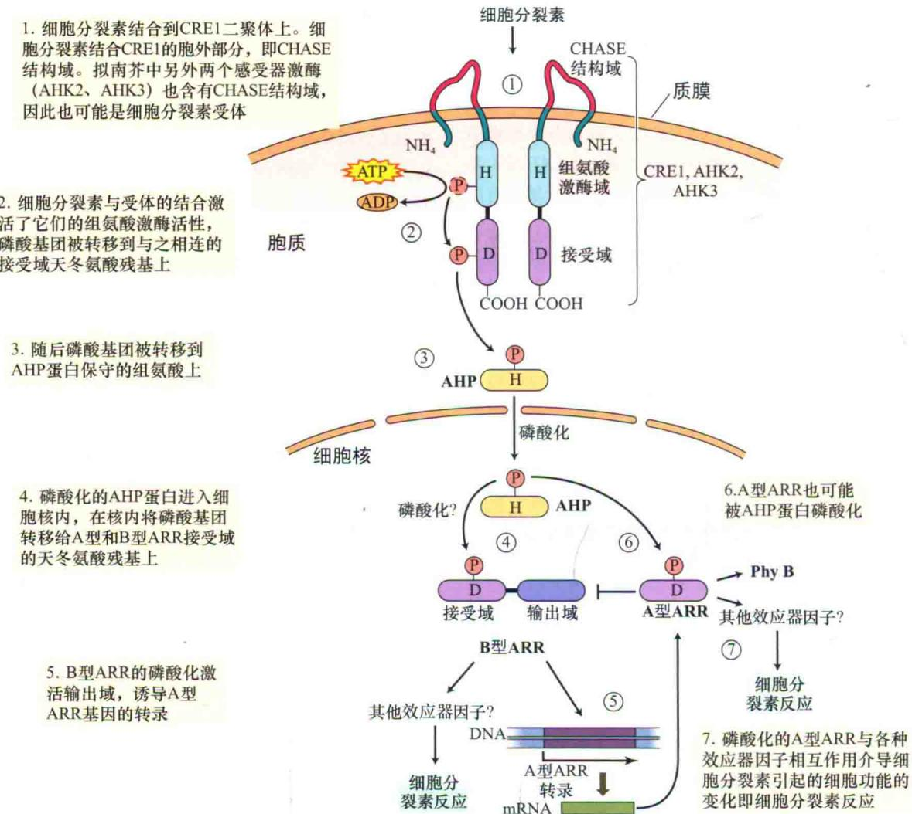

## 3. 随后磷酸基团被转移到AHP蛋白保守的组氨酸上

4. 磷酸化的AHP蛋白进入细胞核内，在核内将磷酸基团转移给A型和B型ARR接受域的天冬氨酸残基上

5. B型ARR的磷酸化激活输出域，诱导A型ARR基因的转录

图21.9 细胞分裂素信号模式图。这个模式图是根据拟南芥相关研究结果建立的，但在其他高等植物中可能也具有类似的细胞分裂素信号途径。

的靶基因转录水平发生变化，如激活细胞周期等。磷酸化的A型ARR蛋白通过与一种未知的底物相互作用来负反馈调节对细胞分裂素的响应（图21.9）。除拟南芥外，在单子叶植物（水稻和玉米）及一种叫小立碗藓（Physcomitrella patens）的苔藓中也发现了细胞分裂素的双组分信号元件，因此，可能所有植物都通过双组分信号元件来感知和传递细胞分裂素信号。

## 21.5 细胞分裂素的生物学功能

尽管细胞分裂素最初是作为细胞分裂因子被发现的，但人们越来越深入地认识到在整株植物中内源细胞分裂素对其生命活动过程有着重要调控作用，因为其不仅参与了调控细胞增殖，也影响着维管发育、顶端优势、营养的获得及叶片衰老等许多其他生理和发育过程，而这些过程能够促进或抑制高等植物一系列生理、

代谢、生化和发育过程。

本节我们将论述细胞分裂素在调节细胞分裂及其在植物其他生长发育过程中所起的多种不同作用。在Web Essay 21.2中还讨论了细胞分裂素在苔藓植物原丝体形成过程中所起的作用。这些调控功能已经得到了实验的证明，即采用对不同种类植物外施细胞分裂素及表达土壤根癌农杆菌（A. tumefaciens）ipt基因等细胞分裂素功能的研究方法。近年来，通过寻找细胞分裂素功能增强或减弱的突变体，如内源细胞分裂素水平或细胞分裂素信号途径发生改变的突变体并对其进行表型分析，进一步阐释了细胞分裂素在植物体的作用。

## 21.5.1 细胞分裂素通过加快茎尖分生组织细胞增殖促进侧芽生长

如前所述，细胞分裂素是离体植物细胞进行分裂的必需因子。同时一系列证据也表明，细胞分裂素对植物体内的细胞分裂也起着重要的调控作用。

在成熟植物个体中细胞分裂活动大多发生在分生组织（见第16章）。细胞分裂素在植物茎尖分生组织的细胞增殖中起正调控作用。丛枝病就是由于细胞分裂素水平增高引起茎尖分生组织细胞过量增殖，最终导致丛生侧枝的形成（图21.3）。过表达细胞分裂素氧化酶或突变IPT基因则会使内源细胞分裂素水平降低，从而削弱细胞分裂素的功能，使茎尖分生组织体积缩小（图21.11），进而导致地上部分发育明显延迟（图21.10）（Werner et al., 2001）。细胞分裂素感受受阻（如构建细胞分裂素受体的三突变体）会引起茎尖分生组织的减少，导致地上部分矮小及无花或少花表型（图21.12）（Higuchi et al., 2004；Nishimura et al., 2004）。

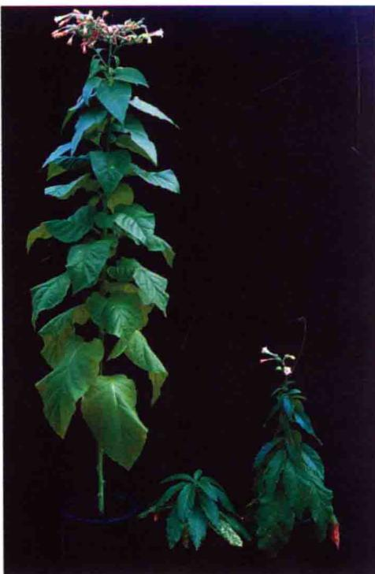  
图21.10 超表达细胞分裂素氧化酶基因的烟草植株。左边是野生型，右边分别是超表达拟南芥细胞分裂素氧化酶基因AtCKX1和AtCKX2的转基因植株。可以看出转基因植物地上部的生长被严重抑制（引自Werner et al., 2001）。

与上述情况相反，阻断细胞分裂素信号途径中某些负调控因子（如前文所述的A型ARR）则会引起玉米茎尖分生组织体积变大（Giulini et al., 2004）。负调控因子作用的削弱会正向调控细胞分裂素信号转导。以上这些结果强烈支持了植物体内源细胞分裂素正向调控茎尖分生组织细胞分裂的观点。与之相似，细胞分裂素也能促进次生分生组织的增殖，类似于细胞分裂素对维管形成层的调节（详见下节）。

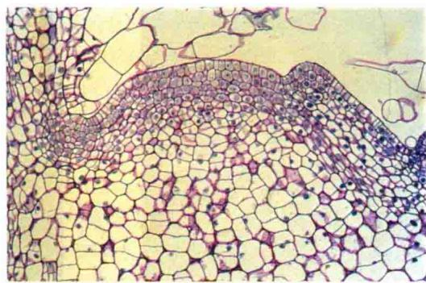

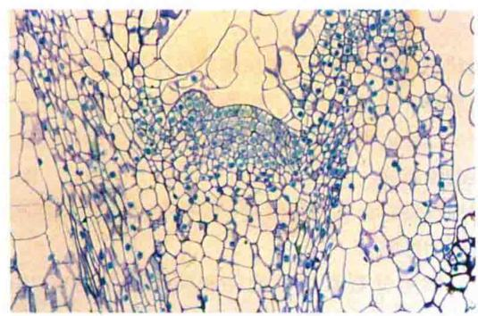  
图21.11 茎尖分生组织的正常生长需要细胞分裂素。A. 野生型烟草茎尖分生组织纵切面。B. 超表达编码细胞分裂素氧化酶AtCKX1基因的转基因烟草茎尖分生组织纵切面。可看到缺乏细胞分裂素植株的茎尖分生组织体积变小（引自Werner et al., 2001）。

## 21.5.2 细胞分裂素与其他激素及一些关键转录因子相互作用

第16章曾讨论过，人们在阐述茎尖分生组织功能的调节机制过程中发现细胞分裂素通过与其他激素及一些关键转录因子相互作用行使功能。细胞分裂素含量增加导致KNOTTED1（KNOX）同源转录因子KNAT1和STM基因表达上调，而这些基因在调节分生组织功能中起重要作用（见第16章）（Rupp et al., 1999）；与此相似，在拟南芥和水稻中，KNOX基因也可通过诱导一系列IPT基因的表达正向调节细胞分裂素的水平，表明KNOX转录因子及细胞分裂素水平的反馈调控功能。此外，利用STM的启动子表达IPT基因，可使细胞分裂水平上升，并部分恢复stm突变体的表型（Yanai et al., 2005；Jasinski et al., 2005），表明KNOX基因的主要功能是促进茎尖分生组织中细胞分裂素的生物合成。

赤霉素也参与茎尖分生组织的生长调节（见第20章）。KNOX蛋白能够下调GA20氧化酶基因表达，而该酶参与赤霉素的生物合成。因此，KNOX蛋白可以在茎尖分生组织建立一个高细胞分裂素和赤霉素比值的平

A

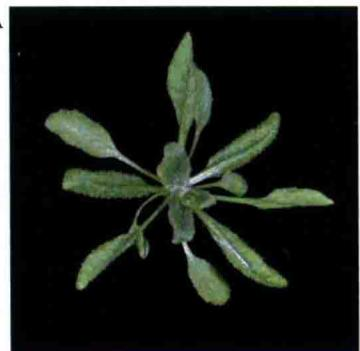  
野生型  
10 mm

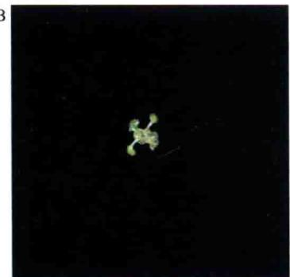  
细胞分裂素受体 10 mm
敲除三突变体  
图21.12 拟南芥野生型和细胞分裂素受体敲除三突变体ahk2 ahk3 cre1莲座叶的比较（引自Nishimura et al., 2004）。

衡状态，从而使分生组织细胞保持增殖状态，而不是分化形成叶原基。此外，细胞分裂素能诱导茎尖分生组织中GA2氧化酶基因的表达，而该酶可以降解具有生物活性的赤霉素（Jasinski et al., 2005）。因此，细胞分裂素通过促进赤霉素降解进一步强化KNOX蛋白对赤霉素水平的影响。

细胞分裂素信号途径和同源域蛋白WUSCHEL（WUS）有着直接的联系。WUS在茎尖分生组织的组织中心表达并诱导干细胞分化为覆盖层细胞（见第16章）。WUS通过结合到A型ARR基因启动子上抑制这些基因的表达（Leibfried et al., 2005）。A型ARR基因的下调表达使茎尖分生组织中特定区域的细胞对细胞分裂素极其敏感，因此茎尖分生组织中这些表达WUS的细胞对合成细胞分裂素有着特有的反应，从而导致茎尖分生组织中不同位置细胞有着不同的命运。

## 21.5.3 细胞分裂素通过促进根尖分生组织细胞脱分化抑制根生长

细胞分裂素在根尖分生组织中所起的作用与在茎尖分生组织中的作用相反。烟草根中细胞分裂素氧化酶的过表达会导致根伸长的增加（图21.13），这种伸长的增加主要是由根尖分生组织体积增大引起（图21.14）。与此类似，一些细胞分裂素感知缺陷突变体也表现出根生长的增加。但当拟南芥中细胞分裂素三个受体同时被突变后，根和茎尖分生组织细胞分裂程度均减弱，而且这些三突变体根生长在持续数天后就会停止，这可能是由于三突变体中维管组织的形成被破坏，尤其是韧皮部发育缺陷导致根尖分生组织功能障碍（参见下文）。

最近对细胞分裂素负调控根尖分生组织机制的研究发现，分生组织大小是由细胞分裂速度及细胞生长和分化退出分生组织的速度共同决定。细胞分裂素能够加速根尖维管的分化（Dello Ioio et al., 2008），从而间接引起根尖分生组织体积的减小。具体来说，细胞分裂素的增加提高了细胞分化为维管组织的速率，从而使分生组织细胞变少，引起根生长的减慢。反之，当细胞分裂素减少时，维管分化速率下降，顶端分生组织细胞数目增多，继而导致根生长的加速（Werner et al., 2003）。

  
图21.13 细胞分裂素抑制了根的生长。细胞分裂素缺乏的、超表达AtCKX1基因的转基因烟草的根系（右边）明显大于野生型的根系（左边）（引自Werner et al., 2001）。

B  
  
图21.14 细胞分裂素抑制根的大小和根细胞分裂活性。A. 野生型。B. AtCKX1超表达转基因型。用荧光染料4',6-二脒-2-苯基吲哚（DAPI）对根进行染色，该染料能够将细胞核中的DNA染色（引自Werner et al., 2001）。

此外，根尖分生组织中生长素也作为细胞分裂正向调节物起作用。但其与细胞分裂素有着不同的功能，前者促进细胞分裂，后者则促进细胞的分化。

Dello Ioio等提出了一个描述生长素和细胞分裂素在根尖分生组织中相互作用的模型（Dello Ioio et al., 2008）。他们认为细胞分裂素通过作用于ARR1（一种B型ARR；图21.8），促进编码Aux/IAA抑制蛋白（SHY2）基因的表达，而生长素则能引起该基因表达产物的降解，其结果是生长素和细胞分裂素以相反方式调节根中Aux/IAA蛋白SHY2的含量。SHY2反过来正向调节细胞分裂素合成相关基因IPT5的表达，并负向调节一系列编码生长素极性运输相关蛋白PIN基因的表达（见第19章）。SHY2在细胞分裂素生物合成和生长素运输中的作用增强了细胞分裂和分化的调控及反馈机制。

## 21.5.4 细胞分裂素调控细胞周期特定组分的活性

细胞分裂素通过影响细胞分裂周期的转变调控细胞分裂。在同步化培养的烟草细胞中，玉米素水平峰值分别出现在S期末期、 $G_{2}/M$ 期过渡期和 $G_{1}$ 期晚期。细胞分裂素生物合成受抑制时细胞分裂也被抑制，而外源细胞分裂素的施加则能使细胞分裂继续进行。

前面已经讨论过，最适浓度生长素存在时，细胞分裂素具有刺激植物组织细胞分裂的功能。有证据表明，细胞分裂素和生长素通过控制周期蛋白依赖性蛋白激酶活性共同参与调控细胞周期。如第1章所述，周期蛋白依赖性蛋白激酶（CDK）与其调节亚基细胞周期蛋白（cyclin）组成了调节真核细胞周期的主要酶类。

Cdc2（cell division cycle 2）是CDK中的主要成员，Cdc2基因表达受生长素调节。生长素处理豌豆根10 min后，CDC2 mRNA就会被诱导表达，烟草髓心在含生长素的培养基中生长时能够诱导产生高水平CDK（John et al., 1993），但生长素诱导产生的CDK是没有酶活性的，且仅仅高浓度的CDK不足以促使细胞进行分裂。

细胞分裂素也与类Cdc25磷酸酶的激活相关，该磷酸酶能够去除Cdc2激酶上的磷酸基团（Zhang et al., 1996），而该磷酸基团可抑制Cdc2激酶的活性。细胞分裂素的这一功能使我们认识到，细胞分裂素和生长素在调节细胞从 $G_{2}$ 期进入M期的过程中存在着潜在的联系。

此外，细胞分裂素还能上调CYCD3基因的表达，该基因编码一个D型细胞周期蛋白（Soni et al., 1995；Riou-Khamlichi et al., 1999），CYCD3在拟南芥茎分生组织和幼叶原基等分生组织中表达，其超表达植株不需要细胞分裂素就可在培养基上进行细胞增殖（图21.15）（Riou-Khamlichi et al., 1999）。这些结果表明，细胞分裂素促进细胞分裂的主要机制是通过增强CYCD3功能实现的，这使我们联想到动物细胞周期的调控，动物细胞D型细胞周期蛋白（D-type cyclin）被多种生长因子调控，并在细胞周期的 $\mathrm{G}_{1}$ 期限制点起关键作用。

  
图21.15 表达CYCD3的愈伤组织能够在无细胞分裂素条件下进行细胞分裂。利用花椰菜病毒35S启动子驱动表达CYCD3的拟南芥转基因株系获得的叶外植体，将其置入生长素加细胞分裂素的培养基或只有生长素的培养基中均能诱导形成愈伤组织。野生型对照愈伤组织需加入细胞分裂素才能生长，而超表达CYCD3的愈伤组织在仅含生长素的培养基中就能生长得很好。图示为生长29天后拍照（引自Riou-Khamlichi et al., 1999）。

## 21.5.5 生长素与细胞分裂素比例决定培养组织的形态建成

在激动素发现不久，人们又发现烟草髓部愈伤组织分化为根还是芽取决于培养基中生长素与细胞分裂素浓度的比例。生长素与细胞分裂素比例高时诱导根形成，比例低时则芽形成，而二者浓度基本相近时可以形成不分化的愈伤组织（图21.16）（Skoog and Miller，1965）。

生长素与细胞分裂素比例决定植物形态建成的效应在冠瘿瘤形成中也存在类似的表现（Garfinkel et al., 1981）。把农杆菌Ti质粒中的ipt基因（tmr位点）突变后，被转染细胞中玉米素的合成受到抑制，导致生长素与细胞分裂素的比例在冠瘿瘤细胞中升高，从而形成根器官而不是未分化的愈伤组织；相反，把合成生长素的基因（tms位点）突变后，会使生长素与细胞分裂素的比例降低从而诱导芽形成（图21.17）（Akiyoshi et al.,

  
图21.16 不同浓度生长素和激动素对烟草愈伤组织的生长和器官形成的调节。在低浓度生长素和高浓度激动素条件下（左下）生成芽，高浓度生长素和低浓度激动素条件下（右上）生成根。两种激素的浓度处于中间或都高时（中间及右下）形成不分化的愈伤组织（Donald Armstrong惠赠）。

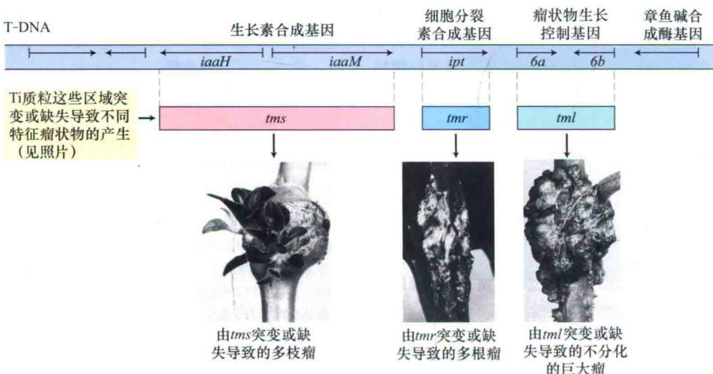  
图21.17 农杆菌Ti质粒图谱，图示T-DNA不同基因突变导致不同形态冠瘿瘤的形成。iaaH和iaaM基因编码参与生长素生物合成的两个酶，ipt编码细胞分裂素合成酶，6b编码一个调控瘤状物生长的转录调节子。这些基因突变导致了图示表型的产生（引自Morris，1986，R.Morris惠赠）。

1983），这些部分分化的冠瘿瘤被称为畸胎瘤。

## 21.5.6 细胞分裂素能解除顶端优势促进侧芽生长

顶端优势的强弱是决定植物形态建成的主要因素之一（见第19章）。玉米等顶端优势强的植物只有一个主轴，侧枝很少或没有侧枝；相反，一些灌木则会生成很多侧芽。植物分枝模式通常由光、养分和基因型决定。如第19章所述，分枝也可通过去除顶芽使初生生长得以继续而触发。

从生理学角度分析，分枝受到多种植物激素间复杂相互作用的调节，这些激素包括生长素、细胞分裂素及最近鉴定出的一种根源性信号。生长素由顶芽向下极性运输抑制侧芽的生长（参见第16章和第19章）。在多种植物中，直接向侧芽施加细胞分裂素会促进侧芽细胞的分裂活性和分枝形成，并且细胞分裂素超表达突变体会形成灌木状丛生分枝。在豌豆茎节区，生长素抑制一系列IPT基因的表达，这些基因编码的酶在细胞分裂素生物合成途径中起着关键的限速作用。另外生长素还可引起细胞分裂素氧化酶的积累，导致细胞分裂素降解（图21.18）。生长素对这些基因表达的调节使顶芽部位的细胞分裂素维持在一个低水平，顶芽移除后生长素量会减少，从而引起IPT水平升高，以及细胞分裂素氧化酶含量的降低（图21.18）。顶芽移除导致茎节部位细胞分裂素浓度增加。茎节部位高浓度的细胞分裂素还会移动至相邻的侧芽，使其打破休眠恢复生长（Tanaka et

al., 2006)。

侧芽生长所需的细胞分裂素是由相邻节间组织合成的发现取代了之前认为所需细胞分裂素来自于根的模式。但最近对具有高度分支表型突变体嫁接研究表明，一种新的被称为独脚金内酯（strigolactone）的根源性植物激素可以抑制侧芽的生长（见第19章和Web Topic 21.9）。因此，侧芽的休眠可能同时受到源自茎尖和根尖的两种长距离信号分子的负调控。

## 21.5.7 细胞分裂素延缓叶片衰老

叶片从植物体上脱落后，即使保持叶片潮湿和供应充足营养，叶绿素、RNA、脂类和蛋白质也会逐渐降解，这种程序性老化导致死亡的现象称为衰老（senescence）（见第16章和第23章）。叶片在暗处比在光下衰老得更快，但用细胞分裂素处理后许多植物的离体叶片都能延迟衰老。

尽管施加细胞分裂素不能完全阻止叶片衰老，但当细胞分裂素喷洒到整株植物上时，会明显地延缓衰老。如果仅对单个叶片进行处理，当其他相同发育阶段的叶片发黄脱落时这个叶片仍然保持着绿色；如果用细胞分裂素处理叶片上的一个小点，则该叶片小点周围其他组织开始衰老时，该处理点仍然保持绿色。当植物叶片被一些真菌感染时也会出现这种“绿岛”现象，如木虱（Pachypsylla celtidis-mamma）侵染朴木（Celtis occidentalis L.）产生虫瘿后，会使被感染组织中细胞分裂素含量升高，从而在衰老变黄的叶片上产生绿岛。

与幼叶不同，成熟叶片几乎不产生细胞分裂素，它们可能靠根部合成的细胞分裂素来延缓衰老。大豆叶片的衰老是由种子成熟而诱发的，即单性结实衰老（monocarpic senescence），当去除种子时就会延缓叶片衰老。尽管种子（seedpod）能调控衰老的起始，但它们是通过控制根源性细胞分裂素到叶片的运输来进行调节。

细胞分裂素中参与延迟衰老的主要物质是玉米素核苷和二氢玉米素核苷，它们随着蒸腾流通过木质部从根部运输到叶片（Noodén et al., 1990）。

为验证细胞分裂素对叶片衰老启动过程的调控作用，将一个与叶片衰老相关基因的启动子和农杆菌的ipt基因（编码异戊烯基转移酶基因）进行重组，并导入烟草植株，使ipt基因在叶片发生衰老时被诱导表达（Gan and Amasino，1995）。结果显示在叶片开始衰老时，转基因植株的细胞分裂素水平与野生型的一样高。

一旦叶片开始衰老，衰老特异的启动子被激活使ipt基因表达，细胞分裂素含量升高，叶片衰老得以延迟；此外高浓度细胞分裂素还可抑制ipt基因进一步表达，避免细胞分裂素过量产生（图21.19）。以上结果表明细胞分裂素是叶片衰老的天然调节物质。

  
表达ipt基因的植株保持 同龄对照表现出早衰了绿色和光合作用  
图21.19 将诱导衰老的启动子与来自农杆菌的细胞分裂素合成基因ipt融合并转入烟草，转基因烟草的叶片衰老被推迟。该ipt基因在衰老信号诱导下，才能表达（引自Gan and Amasino，1995，R.Amasino惠赠）。

拟南芥中AHK3作为细胞分裂素主要受体调节了叶片的衰老。当AHK3功能增加时，叶片衰老会被明显延迟。相反，如果AHK3的功能被破坏，即使其他细胞分裂素受体的功能仍正常，也会导致叶片在成熟前衰老（Kim et al., 2006）。

## 21.5.8 细胞分裂素促进营养物质的运输

细胞分裂素调节营养物质从植物其他器官向叶片的运输，这种现象称为细胞分裂素诱导的养分运输（cytokinin-induced nutrient mobilization）。用细胞分裂素处理叶片后，向植物叶片或一片的某一部分施加 $^{14}$ C或 $^{3}$ H标记的营养物质（糖类、氨基酸等），然后将整株植物进行放射自显影来观察标记的营养物质运输模式和积累位点。结果表明，营养物质优先运输并积累于细胞分裂素处理过的组织。在第10章讲到，营养物质是由产生或储存部位（源）向利用营养物质的部位（库）转运，植物激素可以使植物重新建立营养物质的源-库关系从而影响营养物质的运输。激素可能促进了被处理部位的新陈代谢，导致营养物质运向这个部位。然而也可能并非完全是由于库细胞中营养物质自身的代谢引起，因为细胞分裂素也可以促进非代谢底物类似物的运输（图21.20）。

细胞分裂素水平的改变是植物对所处环境中营养物质含量作出的相应反应。例如，向缺氮的玉米幼苗施加硝酸盐可以引起根部细胞分裂素水平快速升高，并通过木质部把细胞分裂素运向地上部（Takei et al., 2001b）。细胞分裂素水平的升高部分原因是IPT基因家族成员IPT3被诱导表达，环境中磷酸盐含量也可以影响细胞分裂素水平，而且细胞分裂素也可改变磷酸盐和硫酸盐响应基因的表达水平，表明这些响应途径中存在有相互关联的作用网络（Argueso et al., 2009）。

综上所述，植物的营养状况能调节细胞分裂素的水平，细胞分裂素与生长素的比例则又决定了根和芽的相对生长率，高浓度细胞分裂素促进芽的生长，而高浓度的生长素又可以促进根的生长。因此，当营养物质水平低时，细胞分裂素水平也低，导致根的生长加快，使植物更有效地吸收土壤中有限的营养物质；反过来，土壤中营养物质充足可以刺激细胞分裂素的合成，促使地上部快速生长，从而最大限度地提高植物光合能力。

## 21.5.9 细胞分裂素通过光敏色素影响光信号传递

虽然植物种子在黑暗中可以萌发，但在黑暗中与在光下生长的幼苗形态有很大差异（见第17章）。在黑暗中生长的苗被称为黄化苗（etiolated），其下胚轴和茎节间距较长，子叶和真叶叶片不伸展，前质体不能发育成叶绿体而形成黄化质体（etioplast），黄化质体不能合成叶绿素，也不能合成在类囊体系统及光合作用中所需要的酶和结构蛋白；种子在光下萌发时，叶绿体可以在胚中直接由前质体形成。黄化苗经光照后其黄化质体也可以形成叶绿体。

如果黄化苗叶片在光照前用细胞分裂素处理，将形成具有更多基粒的叶绿体，在光下叶绿素和光合作用酶类的合成也会更快（图21.21）。这些结果表明，细胞分裂素与光、营养、发育等其他因素一起共同调节光合色素及相关蛋白质的合成（有关细胞分裂素促进光介导苗A左侧子叶喷洒清水作为对照，苗B的左侧子叶和苗C的右侧子叶分别用50 mmol/L的激动素溶液喷洒

黑点表示放射自显影下放射性氨基酸的分布

结果表明用细胞分裂素处理过的子叶变成了一个营养库。但当标记的子叶用激动素处理时，在施加氨基酸的子叶上留有放射活性（苗C）

## -施加 $^{14}$ C氨基丁酸的位点-

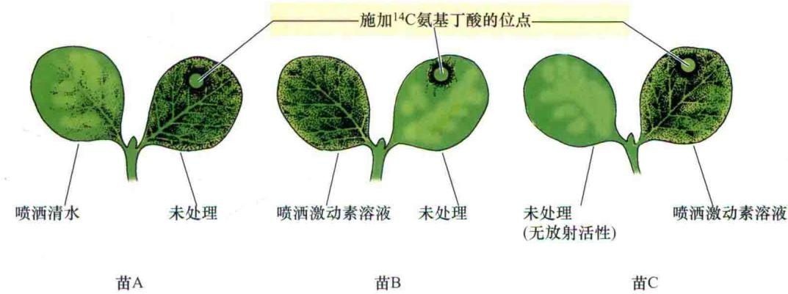  
图21.20 黄瓜幼苗中细胞分裂素诱导氨基酸迁移的实验。放射性标记的氨基酸如氨基丁酸不会被代谢掉。在每株幼苗右边的子叶滴加 $^{14}$ C-氨基丁酸（由K. Mothes观察到的数据绘得）。

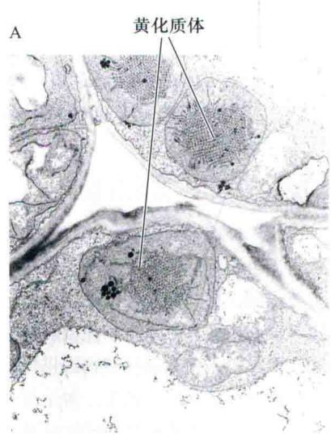

  
图21.21 细胞分裂素影响暗培养下拟南芥野生型幼苗叶绿体的发育。A. 无细胞分裂素处理暗培养条件下的对照，质体发育成黄化质体。B. 细胞分裂素处理的暗培养条件下，质体中形成类囊体（引自Chory et al., 1994, J. Chory惠赠）。

的发育过程更多内容参见Web Topic 21.10）。

许多光反应的关键调节子都是红光受体光敏色素（见第17章）。而细胞分裂素途径中的A型反应调节子ARR4（图21.8）可以通过降低光敏色素PhyB的暗转化速率来使其稳定在Pfr生理活化型，因此，ARR4作为PhyB正调节子参与光反应调节过程（Sweere et al., 2001）。另一个光信号和细胞分裂素信号途径节点是bZIP转录因子HY5蛋白。它作为光形态建成的正向调节子，在光敏色素和隐花色素等多种光受体家族的下游起作用。而细胞分裂素可能通过增加HY5蛋白的稳定性而上调其在植物体内的含量（Vandenbussche et al., 2007）。

拟南芥中细胞分裂素氧化酶对细胞分裂素降解的调节与遮阴反应有关。在树荫下生长的植物所接收红光与远红光的比值（R/FR）要比光下生长的植物低，从而会诱导一系列发育过程的改变，包括下胚轴伸长增强及叶原基快速生长的停止（第17章；Carabelli et al., 2007）。此外，将拟南芥植株暴露在低的R/FR环境中还会引起叶原基中的生长素信号快速增加，进而导致细胞分裂素氧化酶基因表达的积累（Carabelli et al., 2007）。而后者使叶原基中细胞分裂素水平降低，从而降低细胞增殖速度。细胞分裂素还可促进萝卜等一些双子叶植物子叶伸展和变绿（参见Web Topic 21.11）。

此外，细胞分裂素双组分反应途径元件还被发现与植物昼夜节律有关，后者调节了植物生理节奏与每日昼夜循环相一致（参见Web Topic 21.12）。

## 21.5.10 细胞分裂素参与维管发育的调节

细胞分裂素参与了维管组织的发育。对细胞分裂素极度不敏感的拟南芥突变体植株（如细胞分裂素受体三突变体等）根部维管细胞纵列类型会减少，缺少韧皮部和成熟的后生木质部，仅具有原生木质部。这种缺陷与胚根维管原始细胞数量的减少有关。当一种Hpt类似蛋白AHP6发生突变丧失其磷酸转移活性时，突变体的维管发育异常表型得到了恢复（Mähönen et al., 2006）。体外实验发现，AHP6可能阻碍了双组分元件间磷酸基团转移。以上结果表明，细胞分裂素参与调节维管发育过程中细胞增殖和分化平衡，而AHP6在这里作为一个负调节子参与细胞分裂素信号途径。

此外，在维管形成层发育过程中细胞分裂素也是必需的。在转基因杨树形成层细胞中表达细胞分裂素氧化酶会使形成层功能降低进而导致树干变细（Nieminen et al., 2008）。在拟南芥中阻断多个IPT基因功能也会由于缺少形成层而产生较细的茎和根（Matsumoto-Kitano et al., 2008）。因此，在维管原始细胞起始和形成层中次生分生组织的形成均需要细胞分裂素的参与。

## 21.5.11 控制细胞分裂素水平可以改变作物的重要农艺性状

对细胞分裂素合成进行调控将会给农业生产带来巨大效益。超表达细胞分裂素的植株叶片衰老被延迟，从而可以提高植株光合产量。有结果表明，莴苣和烟草中利用衰老诱导的启动子表达ipt基因能使叶片衰老被强烈推迟（图21.19和图21.22）。

此外，细胞分裂素含量还与植物被啃食引起的损伤相关。利用昆虫啃食时产生损伤所诱导的蛋白酶抑制子Ⅱ基因的启动子来诱导表达ipt基因，可以使烟草对昆虫的啃食产生更强抗性，这种烟草叶片被天蛾幼虫啃食的面积减少70%（Smigocki et al., 1993）。

对细胞分裂素含量进行操控还具有增加水稻穗粒产量的潜力。人们在培育不同水稻品种幼苗过程中已经无意中利用细胞分裂素能促进茎尖分生组织生长的特性。粳稻（japonica）和籼稻（indica）两个水稻品种在产量上有着巨大差距，后者可在其圆锥花序上产生更多的穗粒并最终具有更高产量（图21.23）。最近研究发现，籼稻品种能产生更多的穗粒与其细胞分裂素氧化酶活性降低有关（Ashikari et al., 2005），这些酶活性的降低导致花序组织中细胞分裂素含量增加，促进生殖器官发育产生更多种子，最终使产量提升。

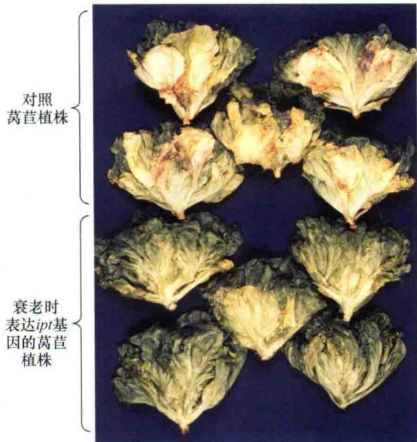  
图21.22 表达细胞分裂素合成酶基因ipt的莴苣叶片衰老延迟。上边5个为非转基因对照植株；下边5个为利用衰老相关基因的启动子（SAG12）驱动ipt基因在衰老时表达的SAG12-IPT转基因植株（引自McCabe et al., 2001）。

## 21.5.12 细胞分裂素参与豆科植物固氮根瘤的形成

固氮类根际细菌在调节土壤中可利用氮含量方面起重要作用，它们通过固氮作用将空气中的氮气转变为植物可以利用的有机氮。固氮菌从植物体获得能量，而作为交换，固氮菌为豆科植物提供可被植物直接利用的固氮产物——氨来使其受益。对于豆科植物而言，氨的合成是一个受到严格控制的耗能过程。

固氮过程主要是在共生体植物根部特化的结构——根瘤（nodule）中进行的。在根瘤形成过程中，根瘤菌诱导豆科植物宿主的根部形态发生改变，这个过程需要根部表皮发生的改变从而使根瘤菌可以侵染宿主，随后激活细胞分化导致根瘤的形成。

已有许多证据表明细胞分裂素与根瘤的形成有关，一些固氮细菌如Rhizobium leguminosarum和Bradyrhizobium japonicum能够产生具有类似细胞分裂素活性的物质。而且施加外源细胞分裂素可以诱导皮层细胞分裂并上调早期根瘤形成相关基因。此外，在豆科植物蒺藜苜蓿（Medicago truncatula）中干扰MtCRE1（拟南芥CRE1的同源物）的表达会导致根瘤形成的关键环节皮层细胞分裂不能起始（Gonzalez-Rizzo et al., 2006; Murray et al., 2007），而相同受体的功能获得型突变体则会在没有根瘤菌的情况下自发形成根瘤

A  
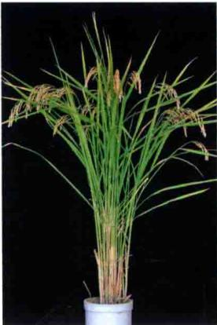  
Koshihikari (japonica)

  
Habataki
(indica)

B  
  
Koshihikari

  
Habataki

图21.23 细胞分裂素调控水稻穗粒产量。细胞分裂素氧化酶被干扰时，印度水稻品种的穗粒数高于日本品种。A. Koshihikari（一个日本水稻品系）和Habataki（一个印度品系）的整株植物对比。B. 每个品系的花序特写。自然突变造成印度品系细胞分裂素氧化酶水平下降并导致该品系植株发育中的幼穗细胞分裂素水平升高。这使得植株有更多的花，最终形成更高的穗粒产量。

（Tirichine et al., 2007）。综上所述，细胞分裂素在根瘤形成过程中起着充分必要的作用。

## 小结

细胞分裂素参与调节植物多种生理过程，如细胞增殖、根和侧芽的形态建成、养分获取、维管组织发育、光反应及衰老等。

## 细胞分裂和植物发育

\- 对于完整的植株，细胞分裂可以由损伤、感染及包括细胞分裂素在内的植物激素所激发（图21.1）。

· 细胞分裂素是在腺嘌呤的第6位N原子上具有取代基团的一类衍生物的统称，在生长素存在的条件下，其可以引发多种植物细胞增殖的起始。

## 细胞分裂素的发现、鉴定和性质

· 玉米素是自然界中存在的丰度最高的游离态的细胞分裂素，此外还有二氢玉米素（DHZ）和异戊烯基腺嘌呤（iP）（图21.2）。

· 一些植物病原菌、真菌、昆虫及线虫可以分泌具有生物活性的细胞分裂素，有时会引起植物的异常生长（图21.3）。

## 细胞分裂素的生物合成、代谢和运输

· 细胞分裂素可以在植物的根部、发育中的胚、幼叶、果实和冠瘿瘤组织合成，同时也可由与植物结合的细菌、真菌、昆虫及线虫合成。

\- 被Ti质粒转染后，冠瘿瘤细胞就得到了携带有合成细胞分裂素、生长素和冠瘿碱所需基因的T-DNA（图21.4）。

· IPT基因催化的反应是细胞分裂素合成途径中的

第一个关键步骤（图21.5）。

\- 细胞分裂素主要以被动运输的方式在木质部和韧皮部中进行运输。

· 细胞分裂素氧化酶通过将细胞分裂素不可逆地失活对其调控。

\- 对细胞分裂素合成、结合和运输的正向和反向调节共同决定了活性细胞分裂素的含量。

## 细胞分裂素在细胞和分子水平的作用机制

· 细胞分裂素是由一类组氨酸激酶受体家族蛋白负责感知的植物激素。

· 细胞分裂素的响应途径包含了一个多步磷酸化过程，该过程通过改变信号元件中组氨酸和天冬氨酸的磷酸化状态使细胞分裂素信号由细胞质膜传递到细胞核中（图21.6和图21.9）。

· 将拟南芥中编码细胞分裂素受体的三个基因敲除后会导致多种细胞分裂素缺陷相关表型（图21.7）。

\- 细胞分裂素与膜受体结合后可以活化位于细胞核中的一系列被称为B型ARR的转录因子，这类转录因子介导了对细胞分裂素在转录水平上的反应。

\- 对细胞分裂素最先响应的A型ARR的基因对细胞分裂素的响应具有负调控作用。

## 细胞分裂素的生物学功能

· 通过超表达细胞分裂素氧化酶或将IPT基因突变使内源细胞分裂素减少后，侧芽的生长会受到严重的抑制，只能产生较小的侧芽顶端分生组织（图21.10和图21.11）。

· 将拟南芥的三个细胞分裂素受体全部突变后植株会失去对细胞分裂素的感知能力，并导致多种发育缺陷，如减小的侧枝顶端分生组织、矮小的侧枝和开花能

力的剧烈降低（图21.12）。

· 细胞分裂素与其他激素及关键的转录因子相互作用来调节侧枝顶端分生组织的功能。

· 与其在侧枝中所起的促进作用相反，细胞分裂素抑制根的生长（图21.13和图21.14）。

· 在根顶端分生组织中，生长素促进细胞分裂，而细胞分裂素促进细胞的分化。

· 细胞分裂素和生长素都参与植物细胞的周期调控，并且都是细胞分裂所必需的（图21.15和图21.16）。

· 生长素与细胞分裂素含量的比值决定了培养的植物组织分化为根还是茎（图21.17）。

· 生长素通过抑制侧芽中的细胞分裂素合成及促进细胞分裂素氧化酶的合成来维持顶芽的休眠（图21.18）。

· 细胞分裂素可以延缓叶片的衰老（图21.19），促进养分的利用（图21.20），参与调节光合色素和蛋白质的合成（图21.21），并调节维管的发育。

· 通过增加的细胞分裂素超表达植株有望筛选获得光合产率增加，且延缓衰老或产量更高的作物品种（图21.22和图21.23）。

(王伟 刘凌云 译)

## WEB MATERIAL

Web Topics

21.1 Cultured Cells Can Acquire the Ability to Synthesize Cytokinins
The phenomenon of habituation is described, whereby callus tissues become cytokinin independent.

21.2 Structures of Some Naturally Occurring Cytokinins
The structures of various naturally occurring cytokinins are presented.

21.3 Various Methods Are Used to Detect and Identify Cytokinins
Cytokinins can be qualified using immunological and sensitive physical methods.

21.4 The Biologically Active Form of Cytokinin Is the Free Base
The recent identification of the cytokinin receptors has allowed the question of the active form of cytokinin to be addressed directly.

21.5 Cytokinins Are Also Present in Some tRNAs in Animal and Plant Cells
Modified adenosines near the 3' end of the anticodons of some tRNAs have cytokinin activity.

21.6 The Structures of Opines
Opines are amino acids that serve as substrates for Agrobacterium during crown gall formation.

21.7 The Ti Plasmid and Plant Genetic Engineering Applications of the Ti plasmid of Agrobacterium in bioengineering are described.

21.8 Phylogenetic Tree of IPT Genes
Arabidopsis contains nine different IPT genes, several of which form a distinct clade with other plant sequences.

21.9 A Root-Derived Hormone, Strigolactone, Is Involved in the Suppression of Branching in Shoots
Evidence for a root-derived signaling molecule that acts as a suppressor of branching in shoots comes from grafting studies in mutants with highly branched phenotypes.

21.10 Cytokinin Can Promote Light-Mediated Development
Cytokinins can mimic the effect of the det mutation on chloroplast development and de-etiolation.

21.11 Cytokinins Promote Cell Expansion and Greening in Cotyledons
Cytokinins increase the entensibilities of the cotyledon cell walls of several dicot species.

21.12 Cytokinins Interact with Elements of the Circadian Clock
An interdependent regulatory loop between the clock genes and cytokinin response genes is discussed.

Web Essays

21.1 1955: The Discovery of Kinetin
An interesting description of the history of the discovery of cytokinins.

21.2 Cytokinin-Induced Form and Structure in MOSS The effects of cytokinins on the development of moss protonema are described.

# 第 22 章

乙烯: 气体激素

19世纪煤气应用于街道照明以后，人们观察到生长于路灯附近的树木比其他树木的叶片更容易脱落。最终发现煤气和空气污染物影响了植物的生长和发育，并鉴定出乙烯是煤气中的活性成分（参见Web Topic 22.1）。

1901年，俄罗斯圣彼得堡植物学院的研究生Dimitry Neljubov在实验室观察到，生长在黑暗条件下的豌豆幼苗表现出三重反应（triple response）的特征：茎伸长减少、横向生长增加（膨大）及不正常的水平

生长（图22.1），当这些植物生长在通风透光的环境中时，它们重新恢复了正常的形态和生长速度，Neljubov从实验室空气中鉴定出了煤气中的乙烯，并认定是该分子导致了上述反应。

1910年，H. H. Cousins首先报道了乙烯是植物组织的天然产物，指出如果将贮藏室中柑橘所散发出的气体转移到香蕉贮藏室中会引起香蕉提早成熟。然而，与其他水果（如苹果）相比，柑橘仅能合成少量乙烯，Cousins实验时所用的柑橘很可能感染了青霉菌（Penicillium），而这些真菌可以产生大量乙烯。1934年，R. Gane等用化学方法鉴定出乙烯是一种植物新陈代谢的自然产物，并且由于它对植物影响巨大，把乙烯确定为一种植物激素。

图22.1 豌豆黄化苗的“三重反应”。与对照（左）相比，用10 ppm乙烯处理6天的豌豆幼苗（右）表现为上胚轴膨大、上胚轴伸长和水平生长（失去负向地性生长）受抑制（S. Gepstein惠赠）。

在长达25年的时间里，人们并没有认识到乙烯是一种重要的植物激素，主要原因是许多生理学家认为乙烯是通过第一个被发现的植物激素——生长素起作用的（见第19章）。人们认为生长素是主要的植物激素，而乙烯仅起着无关紧要的间接生理作用。另外，缺乏定量乙烯的化学技术也阻碍了人们对乙烯的研究。直到1959年气相色谱技术应用于乙烯研究以后，乙烯的重要性被重新发现，人们认识到乙烯作为一种生长调节物质具有重要的生理作用（Burg and Thimann，1959）。

本章将介绍乙烯生物合成途径及乙烯如何在细胞和分子水平发挥作用。最后，我们将对乙烯影响植物生长发育的重要作用进行阐述。

## 22.1 乙烯的结构、生物合成及测定

乙烯是最简单的烯烃（它的相对分子质量为28）：在生理条件下，它比空气更轻，很容易被氧化（参见

Web Topic 22.2)。

$$
\begin{array}{c} \mathrm{H} \\ \mathrm{H} \end{array} \mathrm{C} = \mathrm{C} \begin{array}{c} \mathrm{H} \\ \mathrm{H} \end{array} \text {乙烯}
$$

高等植物几乎所有的器官都能产生乙烯，植物组织类型和发育阶段不同，乙烯的合成速率也不相同。乙烯通常可以通过气相色谱来测定（参见Web Topic 22.3）。在叶片脱落、花器官衰老及果实成熟过程中，乙烯的合成量增加。植物受到伤害和生理胁迫如涝害、病害及高温或干旱时都能诱导乙烯的生物合成。除此之外，病菌感染也能促进乙烯的合成。

甲硫氨酸是乙烯的前体，1-氨基环丙烷-1-羧酸（ACC）是甲硫氨酸转化为乙烯的中间产物。下面我们将看到，乙烯生物合成的完整过程是一个循环，并且与植物细胞的许多代谢循环相交叉。

## 22.1.1 受调控的乙烯生物合成决定其生理活性

体内实验表明，植物组织能将标记的甲硫氨酸 $^{[14]}$ C 转变为乙烯 $^{[14]}$ C，乙烯中的碳来自甲硫氨酸的3位和4位碳原子。甲硫氨酸中的甲硫基（CH $_{3}$ —S）通过杨氏循环不断再生利用（图22.2）。合成乙烯的直接前体是1-氨基环丙烷-1-羧酸（1-aminocyclopropane-1-carboxylic acid, ACC）。总的说来，用外源ACC处理植物组织，则植物中乙烯的生成量大量增加，说明ACC的合成是植物组织内乙烯生物合成的限速步骤。

ACC合酶（ACC synthase，ACS）催化S-腺苷甲硫氨酸转变为ACC（图22.2）。它受到外界环境及内部因素如伤害、干旱胁迫、涝害和生长素等的调节。ACS由多个不同的多基因家族编码，各种乙烯生物合成诱导物以不同方式调控这些基因，如在番茄中，至少有10个ACS基因，分别受到生长素、伤害和（或）果实成熟不同程度的诱导（详情参见Web Topic 22.4）。

ACC氧化酶（ACC oxidase）催化ACC转变为乙烯，这是乙烯生物合成的最后一步（图22.2）。在乙烯快速产生的植物组织如成熟果实中，ACC氧化酶的活性是乙烯生物合成的限速步骤。与ACC合酶类似，ACC氧化酶由多基因家族编码，受不同机制调控（参见Web Topic 22.5）。例如，在成熟番茄的果实和衰老的矮牵牛花中，一些ACC氧化酶基因的mRNA水平显著增加。

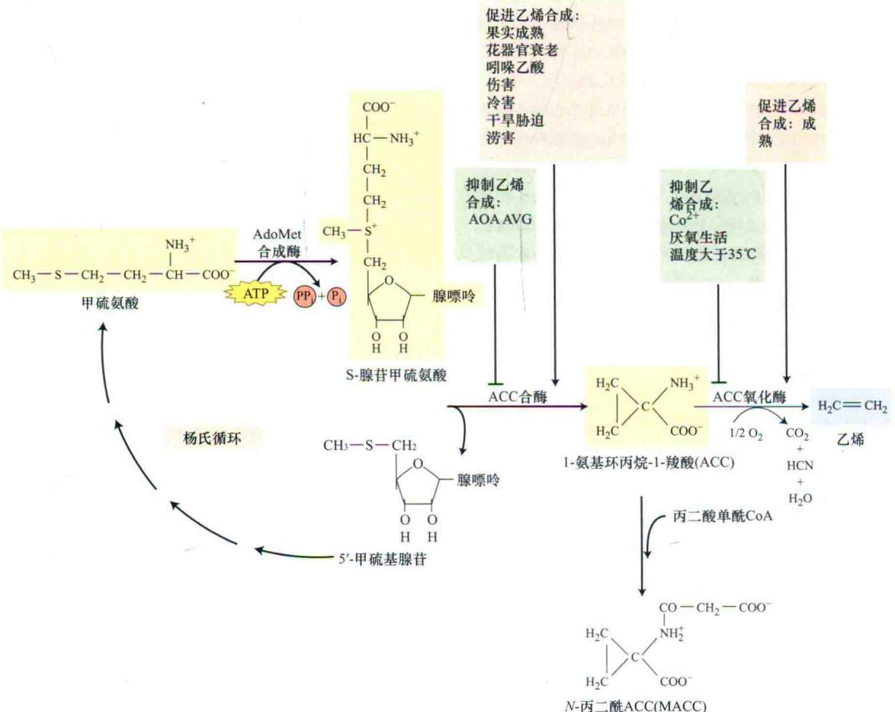  
图22.2 乙烯生物合成途径及杨氏循环。甲硫氨酸是乙烯的前体。乙烯合成途径的限速步骤是由ACC合酶催化S-腺苷甲硫氨酸转变为ACC，最后一步是ACC转变为乙烯，这一步需要氧，由ACC氧化酶催化。甲硫氨酸中的甲硫基（ $\mathrm{CH}_3 - \mathrm{S}$ ）通过杨氏循环重新形成，继续参与合成过程。ACC除了转变为乙烯外，还可转化为缀合物N-丙二酞基ACC。AOA为氨基氧乙酸；AVG为氨基乙氧基乙烯基甘氨酸（引自Mckeon et al., 1995）。

分解代谢 研究者利用 $^{14}C_{2}H_{4}$ 培养植物组织，通过放射性示踪技术研究了乙烯的分解代谢。二氧化碳、环氧乙烷、乙二醇和结合了乙二醇的葡萄糖都被鉴定为乙烯分解作用的代谢产物。然而，由于某些环烯烃类化合物（如1，4-环己二烯）在不抑制乙烯作用的情况下能阻断乙烯分解，因此乙烯分解代谢在调控该激素水平方面并没有显著作用（Raskin and Beyer，1989）。

结论 人们发现植物组织中并非所有ACC都能转变为乙烯。ACC也能形成结合态物质——N-丙二酰ACC（N-malonyl ACC）（图22.2），后者不会被分解，主要积累在液泡等植物组织中。人们也鉴定出了第二种少量的ACC结合物形式[1-(γ-L-谷氨酸)-环丙烷-1-羧酸[1-(γ-L-glutamylamino)cyclopropane-1-carboxylic acid, GACC]。ACC与其他物质的结合可能在控制乙烯生物合成方面起重要作用，其结合方式与生长素和细胞分裂素类似。

ACC脱氨基酶 在很多土壤细菌中都表达一种酶——ACC脱氨基酶，它能将ACC水解成氨和α-丁酸香叶酯（Glick，2005）。这些细菌能够通过清除植物合成和释放的ACC，降低植物产生的乙烯水平，从而促进植物的生长。在转基因植物中表达ACC脱氨基酶能够降低乙烯水平。近来，在拟南芥中发现了编码ACC脱氨基酶的基因，说明内源ACC脱氨基酶在调控乙烯生物合成过程中发挥作用。

## 22.1.2 促进乙烯生物合成的几个因子

乙烯生物合成受一些因素所调控，这些因素包括植物发育阶段、环境条件、其他植物激素及物理和化学伤害。乙烯生物合成也有昼夜节律变化，白天合成量出现峰值，夜间达到最低值。

果实成熟 果实成熟时，ACC和乙烯的合成速率增加，ACC氧化酶（图22.3）和ACC合酶的活性都增强，编码这些酶的基因的mRNA水平也相应提高。然而，给未成熟果实外施ACC仅能轻微增加乙烯产量，表明ACC氧化酶活性增加是果实成熟的限速步骤（McKeon et al., 1995）。

胁迫诱导乙烯生成 胁迫条件如干旱、涝害、冷害、臭氧及机械伤害等都可增加乙烯的生物合成。在这些情况下，乙烯由正常的生物合成途径产生，并且乙烯产量的增加至少部分是由于ACC合酶mRNA转录水平提高所致。这种“胁迫诱导乙烯”参与了胁迫应答的启动，如器官脱落、衰老、伤口愈合和植物抗病性的增强（见第26章）。

昼夜节律调控乙烯生成 在很多植物物种中昼夜节律生物钟调控乙烯的生物生成。通常乙烯水平在中午达到顶峰，在午夜达到低谷。这种调节可能源于部分ACC合酶的转录调控，这一过程在拟南芥中被TOC1/CCA1生物钟介导（Thain et al., 2004）。

  
图22.3 金冠苹果成熟期ACC浓度、ACC氧化酶活性和乙烯的变化。图中数据显示了它们随收获后天数变化的情况。乙烯和ACC浓度的增加及ACC氧化酶活性的增强与果实成熟密切相关（改编自Yang，1987）。

生长素诱导乙烯生成 某些情况下，生长素和乙烯可以引起植物相似的反应，例如，二者都可诱导菠萝开花和抑制茎叶的伸长。引起这些反应可能是由于生长素能够通过增加ACC合酶的活性从而促进乙烯的合成。这些结果表明，先前归因于生长素（吲哚-3-乙酸，IAA）的反应事实上是由植物应答生长素反应产生的乙烯介导的。

外源施加IAA，多个ACC合酶基因的转录水平被提高，乙烯产量升高（Nakagawa et al., 1991；Liang et al., 1992；Tsuchisaka and Theologis, 2004）。蛋白质合成抑制剂阻断IAA诱导的乙烯合成，表明由生长素导致的ACC合酶的合成显著促进了乙烯的产生。

## 22.1.3 ACC合酶的稳定促进乙烯的生物合成

除了生长素，油菜素甾醇和细胞分裂素也能够促进乙烯合成。与生长素类似，这些激素通过增加ACC合酶活性来促进乙烯合成。但是，与生长素相比较，它们不能提高ACC合酶基因的转录水平，而是增加了ACC合酶蛋白的稳定性（Chae and Kieber，2005）。

例如，病菌侵袭、细胞分裂素和油菜素甾醇都能增加乙烯的合成量，部分是由于ACS蛋白的稳定性提高，降解速度减慢导致的。ACS的C端区域在控制其稳定性方面发挥了重要作用（Vogel et al., 1998）。这个区域作为该蛋白质的标志，被26S蛋白酶体识别并被快速降解（见第2章）。促分裂原蛋白（MAP）激酶（受病原菌激活）或钙依赖蛋白激酶都可以磷酸化ACS的C端区域，从而有效阻断其被识别降解。

## 22.1.4 多种抑制子能够抑制乙烯生物合成

激素合成或作用的抑制剂对于人们研究激素生物合成途径及其生理作用非常有用。当难以区分具有相同作用的不同激素对植物组织的影响，或者一种激素影响另一种激素的合成或作用时，抑制剂对研究特别有帮助。

例如，乙烯可以模拟高浓度的生长素抑制茎叶的伸长，导致叶的偏上性（epinasty）（叶片向下弯曲）生长。使用乙烯生物合成和作用的特异抑制剂可以区分生长素和乙烯的不同作用。使用抑制剂的研究表明，乙烯是引起偏上性生长的主要效应物，而生长素则通过显著地增加乙烯合成量间接起作用。

乙烯合成抑制剂 氨基乙氧基乙烯基甘氨酸（aminoethoxyvinylglycine，AVG）和氨基氧乙酸（aminooxyacetic acid，AOA）阻断了S-腺苷甲硫氨酸向ACC的转化（图22.2）。众所周知，AVG和AOA通过辅因子吡哆醛磷酸盐抑制包括ACC合酶在内的酶的活性。α-氨基异丁酸（α-aminoisobutyricacid，AIBA）和钴离子（Co $^{2+}$ ）也是乙烯合成途径的一种抑制剂，阻断乙烯生物合成的最后一步反应，即由ACC氧化酶催化ACC转变为乙烯的反应。

乙烯作用的抑制剂 乙烯的许多效应都可被其特异的抑制剂所拮抗，硝酸银（ $\mathrm{AgNO_3}$ ）或硫代硫酸银 $[\mathrm{Ag}(\mathrm{S}_2\mathrm{O}_3)^{3-}]$ 中的银离子（ $\mathrm{Ag^{+}}$ ）是乙烯作用的有效抑制物。银的作用非常特异，其他任何金属离子都不会增强 $\mathrm{Ag^{+}}$ 的阻抑作用。

高浓度 $\mathrm{CO}_{2}$ （5%\~10%）虽然抑制效率低于 $\mathrm{Ag}^{+}$ ，但也能抑制乙烯的许多作用，如诱导果实成熟。 $\mathrm{CO}_{2}$ 的这种作用被充分运用于果实贮藏，高浓度的 $\mathrm{CO}_{2}$ 可以使果实延期成熟。因为只有高浓度的 $\mathrm{CO}_{2}$ 才有抑制乙烯的作用，所以自然条件下的 $\mathrm{CO}_{2}$ 不可能是乙烯的拮抗物质。易挥发的化合物反式环辛烷（而非其异构体顺式环辛烷）是一种乙烯结合作用的强竞争性抑制剂（Sisler et al., 1990），反式环辛烷与乙烯竞争结合乙烯受体。1-甲基环丙烯（MCP）与乙烯受体结合几乎是不可逆的（图22.4），可有效阻断多种乙烯反应（Sister and Serek, 1997）。这种几乎无味的化合物，已经被注册商标，其商品名为EthylBloc®，且被用于花卉培养上以提高切花和一些水果（如苹果）的货架保鲜期。

乙烯吸收 为避免乙烯气体从原组织中挥发，影响其他的组织器官，在水果、蔬菜和花的储藏过程中适用乙烯捕获系统。高锰酸钾（ $\mathrm{KMnO}_4$ ）能够有效吸收乙烯，将苹果储藏区的乙烯浓度从 $250~\mu \mathrm{L} / \mathrm{L}$ 减少到 $10~\mu \mathrm{L} / \mathrm{L}$ ，

显著延长水果的贮藏寿命。

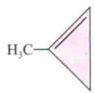

  
1-甲基环丙烯(MCP)  
反式环辛烯

  
顺式环辛烯  
图22.4 阻断乙烯与受体结合的两种抑制剂。顺式环辛烯不是一个有效的抑制剂。

## 22.2 乙烯信号转导途径

尽管乙烯在植物整个生长发育过程中作用范围很广，但人们认为这些情况下乙烯发挥作用的主要步骤是相似的：都涉及与受体结合，随后激活一个或更多个信号转导途径，使细胞产生反应（见第14章）。乙烯最终是通过改变基因的表达模式发挥作用的。对拟南芥突变体的分子遗传学研究为乙烯信号通路组分的发现作出巨大贡献。

在筛选和分离乙烯响应突变体的过程中使用拟南芥黄化苗的三重反应表型（triple-response morphology）（图22.5）（Guzman and Ecker，1990）。利用这样的实验即诱变剂处理后的拟南芥种子，放在含有或不含乙烯的琼脂培养基上黑暗条件下生长3天，鉴定出了以下两类拟南芥突变体。

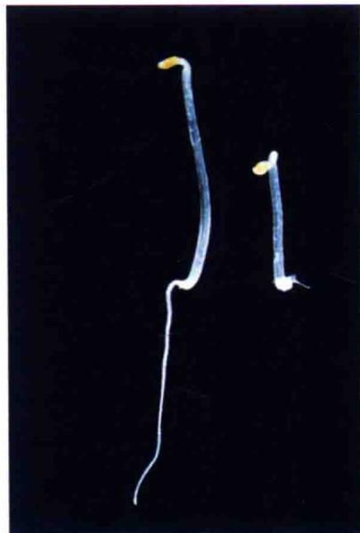  
图22.5 拟南芥的三重反应。在有乙烯（10 ppm，右）和没有乙烯（左）情况下生长3天的拟南芥黄化苗。注意：乙烯的存在导致幼苗子叶下胚轴变短，根伸长受到抑制，顶端弯钩过度弯曲（J. Kieber惠赠）。

（1）不能对外源乙烯作出应答的突变体（抗乙烯突变体或乙烯不敏感突变体）。

（2）即使没有乙烯的情况下，幼苗也能表现“三重反应”（组成型突变体）。

乙烯存在时，绝大多数生长的幼苗都表现出“三重反应”，长得较矮，有些幼苗显著高于“三重反应”幼苗，这些高的、没有“三重反应”的幼苗就是乙烯不敏感突变体（图22.5）。相反，在没有外源乙烯的情况下表现“三重反应”的幼苗称为组成型“三重反应”突变体（图22.9）。

## 22.2.1 乙烯受体与细菌双组分系统组氨酸激酶有关

第一个被鉴定出来的乙烯不敏感突变体是etrl（ethylene-response1）（图22.6），它是通过筛选阻断乙烯反应的拟南芥突变体得到的。ETR1的C端有一半氨基酸序列与细菌的双组分系统组氨酸激酶类似，在细菌中，双组分系统组氨酸激酶作为受体感受各种环境信号，如化学刺激、可利用的磷酸盐含量和渗透压等。

  
图22.6 拟南芥etr1突变体的筛选。拟南芥幼苗在乙烯存在的条件下避光生长3天。注意：所有幼苗除一棵外都出现了“三重反应”，即在顶端弯钩的弯曲处膨大，下胚轴受到抑制并显著膨胀，出现水平生长。etr1突变体对乙烯完全不敏感，其生长与未用激素处理的幼苗类似（图片引自MSU/DOE植物研究实验室的K. Stepnitz）。

如第14章讨论结果，细菌双组分系统由组氨酸激酶传感蛋白和反应调节因子组成。ETR1是在真核生物中发现的第一个组氨酸激酶，此后在酵母、哺乳动物和植物中发现了其他组氨酸激酶。植物光敏素（见第17章）与细胞分裂素受体（见第21章）的序列与细菌双组分组氨酸激酶的序列相似。etrl突变体与细菌受体的相似性和对乙烯的不敏感性表明，ETR1可能是乙烯受体。结合实验证实了这一假说（参见Web Topic 22.6）。

拟南芥基因组还编码另外4个与ETR1类似的蛋白质，它们也具有乙烯受体的功能，分别为ETR2、ERS1（ETHYLENE-RESPONSE SENSOR 1）、ERS2和EIN4（图22.7）。与ETR1相同，这些受体可以与乙烯结合，这些基因的错义突变的表型与最初发现的etrl突变体类似，受体不能与乙烯结合，但在没有乙烯的情况下，它通常能作为乙烯应答途径的调节成分而发挥作用。

所有这5个受体蛋白质至少共享以下两个结构域。

（1）N端结构域至少跨膜三次，含有乙烯结合位点，由于乙烯具有疏水性，因此它很容易到达该结合位点。

（2）乙烯受体的C端（其长度占该蛋白质的一半）形成了一个与组氨酸激酶同源的催化结构域。

乙烯受体的一个亚类的C端也含有与细菌双组分接受器结构域相似的结构域。在其他双组分系统中，受体与配体的结合调节组氨酸激酶结构域活性，并使自身的一个保守的组氨酸残基磷酸化，接着磷酸基团从组氨酸转移到接受器结构域的天冬氨酸残基上，组氨酸激酶结构域和接受器结构域常融合为一个蛋白质（图14.4）。组氨酸激酶活性已在乙烯受体之一的ETR1上得到了证明。然而遗传研究表明，与细菌双组分系统不同，ETR1的组氨酸激酶活性并非仅仅起乙烯受体的作用（Wang et al., 2003），这种酶活性似乎对乙烯的信号转导具有更多的细微影响，从而调节乙烯应答（Qu and Schaller, 2004; Binder et al., 2004a）。其他几种乙烯受体缺乏一些关键性氨基酸（图22.7亚家族2），因而不具有组氨酸激酶活性。

在植物中5个拟南芥受体彼此相互作用，形成大的多亚基复合物（Gao et al., 2008）。此外，乙烯结合可能诱导受体通过26S蛋白酶体降解（Kevany et al., 2007）。

与很多细胞膜相关的受体不同，拟南芥ETR1和其他4个乙烯受体定位于内质网。但是，ETR1至少在根里也可能定位于高尔基体细胞器。不论哪种情况，乙烯受体的细胞内定位与乙烯疏水特性相一致，这使它能够自由通过质膜进入细胞。这方面，乙烯类似于动物的某些疏水信号分子，如类固醇和一氧化氮气体，这些信号分子也是与细胞内受体结合的。

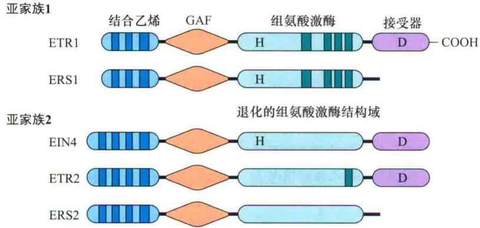  
图22.7 5个乙烯受体蛋白质及其功能结构域示意图。GAF结构域是一个保守的cGMP结合结构域，存在于不同类型的蛋白质中，一般作为小分子结合调节结构域起作用。H和D是参与磷酸化的组氨酸和天冬氨酸残基。注意：EIN4、ETR2和ERS2的组氨酸激酶结构域退化，意味着它们失去了组氨酸激酶催化活性必需的和高度保守的氨基酸。

## 22.2.2 乙烯与其受体高亲和性结合需要辅助因子铜

早在乙烯受体被鉴定之前，科学家们已经预测到，乙烯与受体结合需要一种过渡金属作为辅助因子，很可能是铜或锌。这种预测是基于像乙烯这样的烯烃与过渡金属有很高的亲和力作出的。最近，遗传和生物化学研究已经证实了这些预测。

在酵母中表达ETR1乙烯受体的基因，对其结构和功能的分析表明，铜离子与受体蛋白协同作用，且铜是乙烯与受体高亲和性结合所必需的（Rodriguez et al., 1999）。银离子可以代替铜离子介导乙烯与受体的高亲和性结合，由此表明银离子不是靠干扰乙烯与受体结合，而是靠阻止受体与乙烯结合后蛋白质发生结构改变而抑制乙烯的作用。

乙烯受体发挥作用需要铜离子的体内试验证据来自对拟南芥RAN1（RESPONSIVE-TO-ANTAGONIST1）基因的研究（Hirayama et al., 1999）。ran1的强突变导致不能形成有功能的乙烯受体（Woeste and Kieber, 2000）。克隆RAN1基因后证明，它编码的蛋白质类似于一种酵母蛋白，能帮助辅助因子铜离子转移到铁转运蛋白，RAN1很可能以类似的方式参与和辅助因子铜离子的结合，而这种结合是乙烯受体发挥功能所需的。

## 22.2.3 未结合乙烯的受体在反应中起负调控作用

在拟南芥、番茄和其他大多数植物中，乙烯受体由多基因家族编码。拟南芥5个乙烯受体（ETR1、ETR2、ERS1、ERS2和EIN4）的定点突变（完全失活）研究表明，这些受体的功能是冗余的（Hua and Meyerowitz，1998）。也就是说，失活其中任何一个基因编码的蛋白质并不会有什么效果，但是如果植物的多个受体基因同时被破坏，植物就会表现组成型乙烯反应的表型（图22.8D）。

乙烯受体破坏后，可看到乙烯反应如三重反应组成型表现出来，表明在没有（absence）乙烯的情况下受体是“开”的状态（处于活化状态），即不结合配体（乙烯）时，受体的功能是关闭（shut off）乙烯信号转导途径（图22.8B）。乙烯的结合“关闭”（失活）了受体，从而使信号转导过程得以进行（图22.8A）。

如第14章讨论，乙烯受体作为负调节因子调控信号途径的模式有点违背常理，这与绝大多数动物受体机制不同。动物受体在结合配体后，作为正调节因子在各自的信号转导途径中发挥作用。也就是说，动物受体典型地激活原来非活性的信号通路，引发反应。此外，在没有激素时乙烯受体抑制激素反应。

与失活的受体不同，乙烯受体结合位点的错义突变（最初发现在etr1突变体中）不能结合乙烯，但是仍然可以作为乙烯应答途径的负调控因子起作用。这种错义突变导致植物能够表达一类不被乙烯关闭的一组受体蛋白，并且表现出乙烯显性不敏感表型（dominant ethylene-insensitive phenotype）（图22.8C）。即使乙烯关闭所有正常的受体，但无论乙烯是否存在，突变体的受体都可以将信号传递到细胞，抑制乙烯的反应。番茄中受体的显性乙烯不敏感突变体是无法成熟突变体，它名副其实，果实完全不能成熟。

这种负信号的结果是乙烯受体水平降低增加组织对乙烯的敏感性。因此，功能性乙烯受体是一个重要的机制，通过这一机制植物调节对激素的敏感性。例如，在番茄果实中，两个乙烯受体响应乙烯后能被26S蛋白酶体快速降解，导致乙烯敏感性增加（Kevany et al., 2007）。这对于协调番茄果实的整体成熟时间非常重要。

B

C  
A  

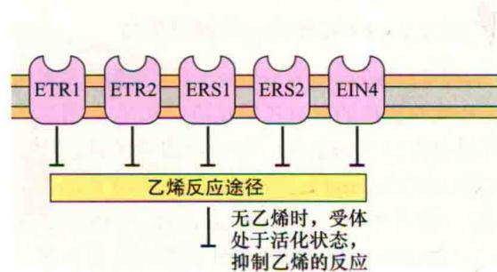

D  
  
图22.8 基于受体突变体表型所做的乙烯受体作用模型。A. 野生型植株中乙烯与受体结合后使受体失活，出现乙烯反应。B. 无乙烯时，受体作为反应的负调控因子发挥作用。C. 错义突变干扰乙烯与受体结合，但是调控位点处于活化状态，突变体出现显性负控制表型。D. 突变破坏调节位点，出现组成型的乙烯反应。

## 22.2.4 丝氨酸、苏氨酸蛋白激酶也参与乙烯信号转导

通过筛选得到了隐性ctrl（constitutive triple response 1，即没有乙烯存在时组成型表现三重反应）突变体，它能组成型激活乙烯反应（图22.9）。隐性突变体激活（activation）乙烯反应的事实说明野生型植物中CTR1蛋白与乙烯受体类似，也作为负调控因子（negative regulator）在反应途径中起作用（Kieber et al., 1993）。

CTR1似乎与Raf相关，Raf是一种促分裂原活化蛋白激酶（mitogen-activated protein kinase kinase, MAPKKK），在从酵母到人的所有生物中，它是参与多种外部调控信号和发育信号传递的丝氨酸/苏氨酸蛋白激酶（见第14章）。动物细胞中，MAP激酶级联的最终产物是磷酸化的转录因子，后者调控核基因表达。有证据表明，在乙烯信号通路MAP激酶级联反应处于CTR1的下游（Yoo et al., 2008），但是在这方面还没有达成共识。

各种证据表明，CTR1蛋白直接与乙烯受体相互作用，形成乙烯感受蛋白质复合物的一部分。遗传学分析显示，CTR1与乙烯受体相互作用为CTR1的功能所必需，因为CTR1突变阻断了这种相互作用；但此外，突变不影响受体蛋白质，只是使植物中的CTR1失活（Huang et al., 2003）。ETR1和乙烯其他受体调控CTR1的确切机制仍不清楚。

  
图22.9 筛选拟南芥组成型“三重反应”突变体。拟南芥幼苗在通气和黑暗条件下生长3天（未施加乙烯）。在众多较高的野生型幼苗中ctr1突变体幼苗非常明显（J. Kieber惠赠）。

## 22.2.5 EIN2编码一种跨膜蛋白

ein2（ethylene-insensitive 2）突变阻断了拟南芥幼苗和成熟植株的所有乙烯反应。EIN2基因编码的蛋白质包含12个跨膜区，与动物阳离子转运体家族的N-RAMP（natural resistance-associated macrophage protein）蛋白非常类似（Alonso et al., 1999），表明EIN2可能作为一种通道或者孔道蛋白发挥作用。然而，到目前为止，研究者们没有证明这种蛋白质具有转运活性，而且该蛋白质在细胞内的确切位置也不清楚。EIN2蛋白被26S蛋白酶体快速降解，这一过程被乙烯抑制（Qiao et al., 2009）。因为EIN2改变乙烯的敏感性，EIN2的降解为进一步研究植物细胞对乙烯的敏感性提供了一种可能的调节机制。

## 22.3 乙烯调控基因表达

乙烯信号的主要作用之一是改变各种靶基因的表达。乙烯影响许多基因mRNA的转录水平，包括纤维素酶基因，与成熟及乙烯生物合成相关的基因。已从乙烯调控基因中鉴定出乙烯反应元件（ethylene response element）或ERE的调控序列。

## 22.3.1 特异转录因子调控乙烯信号途径相关基因表达

乙烯对基因表达起作用的关键成分是转录因子EIN3家族（Chao et al., 1997）。拟南芥中至少有4类EIN3基因，在番茄和烟草中也鉴定出了它们的同源基因。在对乙烯信号作出应答时，EIN3的同源二聚体或其密切关联蛋白结合到被乙烯快速诱导表达的靶基因的启动子区上，如ERF1（ETHYLENE RESPONSE FACTOR 1），从而激活了这些基因的转录（Solano et al., 1998）。

ERF1编码一种转录因子，它属于乙烯反应元件结合蛋白（ERE-binding protein，EREBP）家族。最早在烟草中鉴定出EREBP是ERE序列的结合蛋白（Ohme-Takagi and Shinshi，1995），应答乙烯时一些EREBP的表达被快速上调。拟南芥中EREBP是一个非常庞大的基因家族，但只有少数几个基因受乙烯诱导。

EIN3蛋白稳定性的调节在乙烯信号转导和调控乙烯生物合成途径中发挥重要作用。两个冗余F-box蛋白EBF1和EBF2（EIN3-binding F-box 1和2）能促进泛素化作用，EIN3被标记后就被26S蛋白酶体降解（见第14章）。乙烯可能通过MAP激酶对EIN3的磷酸化来抑制依赖于EBF1/

EBF2的EIN3降解（Yoo et al., 2008），导致EIN3积累及乙烯调控基因随后的表达，这样，乙烯至少部分通过调控EIN3和EIN3类蛋白质（EIL）的水平发挥作用。

## 22.3.2 遗传上位性表明了乙烯信号成分的转导顺序

通过基因突变技术分析了ETR1、EIN2、EIN3和CTR1彼此相互作用的方式（如上位顺序），从而确定了这些蛋白质发挥作用的上下位顺序。将相反表型的两种突变体杂交，从 $F_{2}$ 中鉴定出具有两种突变的株系（双突变体），研究者从乙烯应答突变体中得到了一个ctr1双突变株系（它是组成型表达的乙烯应答突变体），属于乙烯不敏感突变体。

双突变体表现出来的表型揭示出哪一个突变相对另外一个是上位的（Avery and Wasserman，1992）。例如，如果etrl ctrl这种双突变体表现出了ctrl单突变的表型，那么ctrl相对于etrl是上位的。由此推出，CTR1在ETR1下游发挥作用。通过类似的遗传学方法，人们确定了ETR1、EIN2和EIN3相对于CTR1的作用顺序。

ETR1蛋白与预测的下游CTR1蛋白之间存在物理上的相互作用，表明乙烯受体可能直接调控CTR1激酶的活性（Clark et al., 1998）。图22.10的模型对以上内容和其他实验数据作了总结。已经发现在其他植物中存在与这类拟南芥的信号转导相关基因的类似基因（参见Web Topic 22.7）。

这个模型仍然不完全，在这个途径中尚有其他一些乙烯应答组分有待鉴定。此外，了解这些蛋白质的生物化学特性及如何发生相互作用的工作才刚刚开始；且更多的研究将聚焦在系统地揭示乙烯信号感受和转导的分子基础。

## 22.4 乙烯在植物发育和生理反应中的作用

众所周知，乙烯是因为其对植物幼苗生长和果实成熟的效应而被发现的。乙烯调节了植物的许多反应，包括种子萌发、细胞伸长、细胞分化、开花、衰老和脱落。我们将在这一小节详细讨论乙烯的表型效应。

## 22.4.1 乙烯促进某些果实成熟

日常生活中，果实成熟（fruit ripening）指果实达到了可以食用的程度。果实成熟要经过许多转变，如细胞壁被酶解后果实变软、淀粉水解、糖分积累和包括单宁等某些有机酸及苯酚类化合物的消失。

从植物角度看，果实成熟意味着植物种子做好了

失活的CTR1激活可跨膜蛋白EIN2

在没有乙烯的情况下，ETR1和其他乙烯受体激活CTR1激酶，可能通过MAPK级联抑制了乙烯的反应。乙烯与ETR1二聚体结合，使其失活，导致CTR1失活  
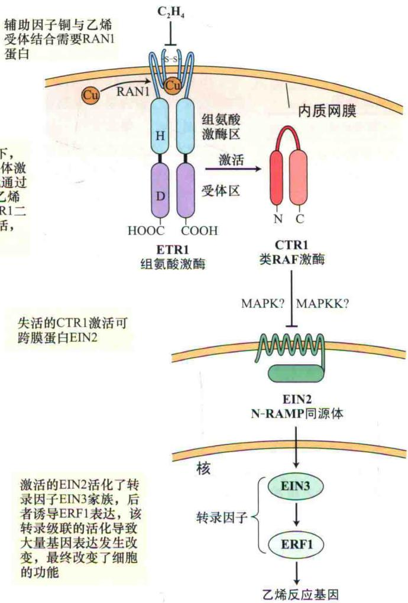

激活的EIN2活化了转录因子EIN3家族，后者诱导ERF1表达，该转录级联的活化导致大量基因表达发生改变，最终改变了细胞的功能

散播的准备。种子的散播依赖于动物的摄食，此时成熟（ripeness）与可食性（edibility）成了很好的同义词。色彩亮丽的花色素和类胡萝卜素通常积累在这些果实的表面，使果实格外醒目。然而，对于依赖机械或其他方式散播的种子，果实成熟意味着这种果实成熟后干燥裂开。

由于果实成熟在农业上很重要，因此有关果实成熟的研究大多集中在可食性果实上。长期以来，人们认为乙烯是促进可食性果实成熟的植物激素，这些果实暴露在乙烯中能加快成熟进程，伴随着果实成熟，乙烯的产量显著增加。然而，大量研究表明，并不是所有果实都对乙烯有反应。

## 22.4.2 响应乙烯的果实表现为跃变型

乙烯催熟的果实，在成熟前具有呼吸作用上升的特征，这个过程称为跃变（climacteric）。呼吸作用上升前这些水果的乙烯含量迅速出现一个峰值（图22.11）。出现呼吸跃变的代表性水果有苹果、香蕉、鳄梨和番茄等。

图22.10 拟南芥中乙烯信号转导模型。乙烯结合到ETR1受体上，该受体是内质网上的内在膜蛋白。细胞中存在乙烯受体的多个异构蛋白体，这里仅用ETR1简单表示。受体通过二硫键形成二聚体。乙烯通过辅助因子铜与受体跨膜结构域结合，RAN1则使辅助因子铜进入乙烯受体与其结合。

  
图22.11 乙烯产生和呼吸作用。香蕉成熟期呼吸速率出现典型跃变，证据是 $CO_{2}$ 显著增加。乙烯生成量的骤然上升先于 $CO_{2}$ 量的增加，表明乙烯是导致成熟的激素（引自Burg and Burg, 1965）。

相比之下，柑橘和葡萄等果实并未表现出呼吸作用增强和乙烯产量增加，它们称为非跃变（nonclimacteric）果实。其他呼吸跃变和非呼吸跃变果实见表22.1。

表22.1 呼吸跃变和非呼吸跃变果实

<table><tr><td>呼吸跃变</td><td>非呼吸跃变</td></tr><tr><td>苹果</td><td>青椒</td></tr><tr><td>鳄梨</td><td>樱桃</td></tr><tr><td>香蕉</td><td>柑橘</td></tr><tr><td>甜瓜</td><td>葡萄</td></tr><tr><td>荔枝</td><td>菠萝</td></tr><tr><td>无花果</td><td>豌豆</td></tr><tr><td>芒果</td><td>草莓</td></tr><tr><td>橄榄</td><td>西瓜</td></tr><tr><td>桃</td><td></td></tr><tr><td>梨</td><td></td></tr><tr><td>柿子</td><td></td></tr><tr><td>李子</td><td></td></tr><tr><td>番茄</td><td></td></tr></table>

外施乙烯处理呼吸跃变果实可以诱导更多的乙烯产生，这种作用称为自我催化（autocatalytic）。在呼吸跃变植物中，乙烯通过以下两个系统产生。

系统1（system 1）：乙烯在植物营养组织中发挥作用，并且抑制自身的生物合成。

系统2（system 2）：乙烯在呼吸跃变果实成熟及某些植物花瓣衰老过程中发挥作用，并刺激自身生物合成，即可以自我催化。

人们认为系统2中乙烯产生的正反馈调节一旦启动，就会导致整个果实完全成熟。当用乙烯处理未成熟的呼吸跃变果实时，果实的呼吸跃变被迅速启动。相比之下，用乙烯处理非呼吸跃变果实，乙烯虽然发挥了促进果实呼吸增强的作用，但是处理并不能引发内源乙烯增加，也不能促进果实成熟。人们阐明了乙烯在呼吸跃变果实成熟中的作用，并将它运用于实际生产中，使果实同步成熟或者使其延期成熟。

尽管外源乙烯对果实成熟的影响效果既清楚又直观，但是要在内源乙烯和果实成熟之间建立一种因果关系是相当困难的。虽然乙烯生物合成的抑制剂（如AVG）或乙烯作用的抑制剂（如 $CO_{2}$ 、MCP或 $Ag^{+}$ ）能延迟甚至阻止果实成熟，但确切证明乙烯为果实成熟所必需的证据来自转基因实验，在反义表达ACC合酶或ACC氧化酶的转基因番茄中（参见Web Topic 22.8），乙烯的生物合成受到抑制，果实成熟完全受阻，外施乙烯则能够使果实成熟的特性得以恢复（Oeller et al., 1991）。

## 22.4.3 无法成熟番茄突变体的受体不能与乙烯结合

用无法成熟（never-ripe）番茄突变体进行的研究进一步证明乙烯为果实成熟所必需。无法成熟番茄突变体名副其实，果实完全不能成熟。分子生物学实验分析证实，在无法成熟番茄中，由于乙烯受体发生突变，使其不能与乙烯结合（Lanahan et al., 1994）。这个分析和通过反义技术抑制乙烯生物合成来抑制果实成熟的实验都清楚证明了乙烯在果实成熟方面的作用，也为人们利用生物技术控制果实成熟开辟了新的途径。

利用番茄互补DNA（cDNA）微阵列证明番茄的许多基因在果实成熟过程中受到显著调控。果实成熟期，细胞壁水解，果实变软，叶绿体丧失，类胡萝卜素和番茄红素大量合成，果实由绿变红，与此同时，一些与口味和香味相关的化合物生成。

运用基因工程方法得到了不能产生乙烯的转基因番茄。分析转基因和野生型番茄的mRNA，发现果实成熟过程中植物体内基因的表达至少受到以下两个独立途径的调节。

（1）乙烯依赖途径（ethylene-dependent pathway），包括番茄红素和挥发性的芳香复合物合成、ACC合酶及呼吸代谢酶类的生物合成。

（2）乙烯不依赖的发育途径（developmental, ethylene-independent pathway），包括编码ACC氧化酶和叶绿素酶的一些基因。

因此不是所有与番茄果实成熟有关的发育过程都依赖于乙烯。

## 22.4.4 根中产生的ACC运输到茎叶造成叶的偏上性生长

叶柄上面一侧（近轴面）生长速度快于叶柄下面一侧（远轴面）导致叶子卷曲向下生长的现象称为偏上性（epinasty）（图22.12）。乙烯和高浓度生长素诱导偏上性生长，而且已经证实，生长素诱导乙烯的产生，起间接作用。正像我们在本章后面讨论的那样，各种胁迫条件如盐胁迫或病原菌侵染都能增加乙烯的生成量并诱导偏上性生长。

番茄及其他双子叶植物受到水淹（涝害）或根部置于无氧条件下时茎叶中的乙烯合成都会增加，导致偏上性生长。由于根部感受环境胁迫，茎叶对胁迫作出反应，因此信号必须从根部传递到茎叶，这个信号就是乙烯的直接前体ACC。对番茄根进行1\~2天水淹处理，其木质部汁液中ACC水平显著增高（图22.13）（Bradford and Yang，1980）。

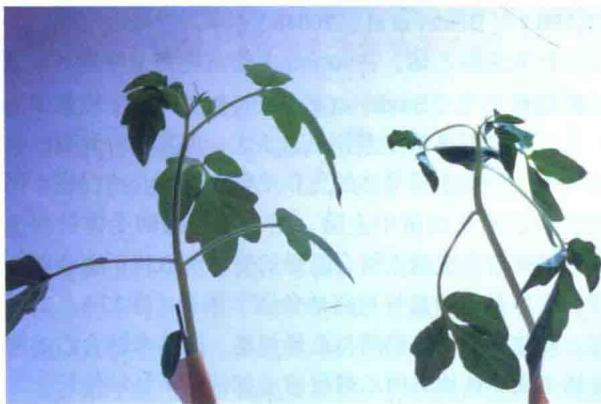  
图22.12 乙烯处理导致番茄发生偏上性生长或叶片向下弯曲（右），原因是叶柄上侧细胞生长快于下侧细胞（S. Gepstein 惠赠）。

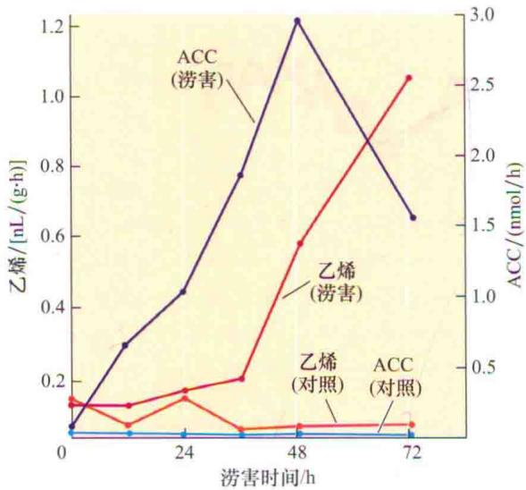  
图22.13 番茄遭受涝害时木质部汁液中ACC和叶柄乙烯产生量的变化。ACC在根中合成，但发生涝害时缺乏氧气，它转变为乙烯的速度很慢。ACC通过木质部运输到茎叶，在茎叶中转变为乙烯。气态乙烯不能运输，因此它通常影响紧靠其合成部位的植物组织。而乙烯的前体物质ACC能够运输，可以在远离ACC合成的部位产生乙烯（引自Bradford and Yang，1980）。

涝害发生时，土壤中的空气间隙充满水，氧在水中扩散的速度很慢，所以被水淹的根部周围，氧的浓度骤减。无氧根部积累的ACC通过蒸腾流被运输到地上部，在地上部有氧的情况下ACC很容易转变为乙烯（图22.2）。

## 22.4.5 乙烯诱导细胞横向扩张

超过0.1 $\mu$ L/L的乙烯能够抑制幼苗纵向生长，促进横向伸长，从而改变其生长特性，导致下胚轴或上胚轴膨大。对于双子叶植物来说，乙烯的这些效应很普遍，导致了部分三重反应（triple response）。在拟南芥中，三重反应指的是下胚轴的抑制和膨胀、根伸长的抑制和幼苗顶端弯钩的过分弯曲（图22.5）。

正如在第15章所讨论的那样，植物细胞伸展的方向由细胞壁中纤维素微丝的方向决定，横向微丝强化了横向的细胞壁，因而膨压促进细胞纵向伸长。微丝的方向由皮层细胞质中皮层微管排列的方向决定。在典型的伸长细胞中，皮层微管横向排列，导致了纤维素微丝的横向排列。

幼苗期植物发生三重反应时，下胚轴微管的横向排列方式被破坏，微管转为纵向排列，微管蛋白这种90°大转向，直接导致了纤维素微丝沉积发生类似的转变。新形成细胞壁沉积作用纵向增强而横向没有增强，因而促进了横向扩张而不是纵向伸长。

微管是如何由一个方向转变为另一个方向的呢？为了研究该现象，人们向豌豆（Pisum sativum）表皮细胞中注射了共价结合荧光染料的微管蛋白，荧光“标签”并不干扰微管的组装。运用这种方法，研究人员能够在聚焦细胞许多层面的激光共聚焦显微镜下检测活体细胞微管的组装。

人们发现，微管由横向转变为纵向并不是通过横向微管完全解聚、新的纵向微管再聚合形成的，而是由于特定部位一些非横向排列微管数量增加导致的（图22.14）。其邻近微管则采用了新的排列方式，于是，在微管采用一致的纵向排列方式之前的某个阶段，不同排列方式出现了共存现象（Yuan et al., 1994）。虽然这些有关微管重新定向的研究结果来自植物的伤害反应而不是乙烯诱导反应，但是可以推测，乙烯通过相似的机制诱导了微管的重排。

横向微管  
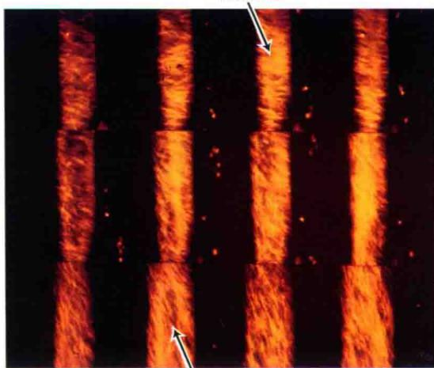  
纵向微管  
图22.14 豌豆茎表皮细胞对伤害发生反应，微管发生再定位，由横向排列转为纵向排列。将能够进入微管的微管蛋白与若丹明结合物微注射到活的表皮细胞中，大约在间隔6 min的时间内皮层微管经历由完全的横向转变为倾斜直到纵向的过程。重新定向时，伴随原方向上微管的消失，在新方向上出现新的不同微管片段（引自Yuan et al., 1994，图片由C. Lloyd惠赠）。

B  

## 22.4.6 乙烯抑制生长的两个不同阶段

如上所述，乙烯对黑暗成长的幼苗下胚轴伸长有抑制作用。对该反应细致的动力学分析表明抑制作用发生在两个不同的阶段（图 22.15A）（Binder et al., 2004a）。

首先，快速抑制阶段发生在接触乙烯的15 min里，大约维持30 min。

第二次生长抑制接着发生，下胚轴伸长达到一个新的稳定的生长水平，这要比没处理的幼苗生长慢。

这两阶段的生长显著不同：第一阶段较第二阶段对乙烯的敏感性更强；EIN2在两个阶段都发挥作用。但是EIN3/EIL1转录因子只在第二阶段起作用（图

A

22.15B）（Binder et al., 2004b）。

接着去除乙烯，在90 min内幼苗能完全恢复到未处理的生长水平（Binder et al., 2004a）。这个现象如何与乙烯结合受体的半衰期是11 h这一事实相一致呢？我们知道，一些乙烯受体的更新受到乙烯结合所促进。因此，当乙烯从幼苗中去除，结合了乙烯的受体被快速降解并被新合成的未结合乙烯的受体所取代。这些新合成的受体是乙烯信号通路的负调节因子（图22.8）。因此，即使一些受体仍然与乙烯相连，这些未结合乙烯的受体也能迅速地关闭乙烯反应（如抑制下胚轴伸长）。亚家族1受体的组氨酸激酶活性在乙烯去除后的恢复阶段可能发挥了重要作用。

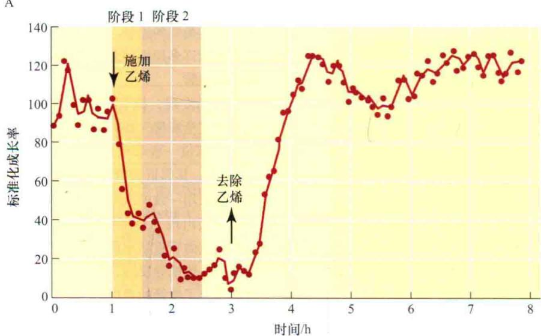

  
图22.15 施加和去除乙烯对黑暗培养的拟南芥幼苗下胚轴伸长影响的动力学分析。A. 首先进行乙烯处理继而去除乙烯条件下拟南芥野生型黄化苗的生长率，施加和去除乙烯的时间点用箭头表示。注意：乙烯处理过程中生长率下降分为两个不同的阶段。B. 进行乙烯处理继而去除乙烯条件下拟南芥野生型、ein2和ein3eil1黄化苗的生长率，施加和去除乙烯的时间点用箭头表示。注意：在ein3eil1拟南芥突变体中第一阶段反应与野生型一致，但是无第二阶段反应（改编自Binder et al., 2004a, 2004b）。

通常双子叶植物黄化幼苗的特征是，在紧临其茎端后面的部位形成一个弯钩（图22.1和图22.5）。这个弯钩有利于幼苗穿透土壤，保护幼嫩的顶端分生组织。

像偏上性生长一样，弯钩的形成和维持均依赖于乙烯诱导的不对称生长。弯钩的闭合形状是由于茎外侧生长速度远快于内侧生长速度导致的。当弯钩暴露在白光下时，由于茎内侧生长速度加快，弯钩打开，内、外侧的生长速度相等（参见附录2）。红光诱导弯钩打开，而远红光可以逆转红光的效应，说明光敏色素是参与该反应的光受体（见第17章）。光敏色素与乙烯的密切配合控制了弯钩的开放。只要黑暗条件下弯钩组织产生乙烯，弯钩内侧细胞的生长就受到抑制。红光抑制乙烯形成，促进内侧细胞生长，于是弯钩打开。

拟南芥生长素不敏感突变体axr1幼苗顶端弯钩无法形成，使用生长素极性运输抑制剂NPA（N-1-naphthylphthalamic acid）处理野生型幼苗能阻止顶端弯钩形成，表明生长素在维持弯钩的结构中起作用。与内侧组织相比，外侧组织生长速度快，反映出了一种依赖于乙烯的生长素浓度梯度，这类似于向光弯曲中茎侧向的生长素浓度梯度（参见第19章和Web Topic 22.9）。

## 22.4.8 乙烯可打破某些植物种子和芽的休眠

种子在正常条件下（水分、氧气、温度均适宜生长）不萌发的现象称为休眠（见第23章）。乙烯可打破某些种子如谷类种子的休眠，引起萌发。除打破休眠外，乙烯还可以提高某些植物种子的萌发率。在花生（Arachis hypogaea）中，乙烯的产生和种子的萌发密切相关。乙烯同样可以打破芽的休眠，有时人们利用乙烯促使土豆和其他植物块茎发芽。

## 22.4.9 乙烯促进水生植物伸长生长

虽然乙烯通常抑制茎的伸长，但乙烯能够促进各种水下植物或部分水下植物茎和叶柄的伸长，包括双子叶植物石龙芮（Ranunculus sceleratus）、杏菜（Nymphoides peltata）、水马齿（Callitriche platycarpa）和水毛茛（Regnellidium diphyllum）。农业上另一个重要的例子是禾谷类深水稻（Oryza sativa）（见第20章）。

水淹可诱导这些植物节间和叶柄快速伸长，使叶片和茎上部留在水面上，乙烯处理的效果与水淹相似。

水下植物快速生长的原因是植物组织产生了乙烯。

虽然缺乏氧气，乙烯合成量减少，但是水下乙烯因扩散而丧失的情况受到抑制，植物水下部分依靠通气组织供应充足氧气，保证了植物生长和乙烯的合成（见第26章）。

在深水稻中，乙烯通过提高节间分生组织细胞赤霉素（GA）的合成量和对赤霉素的敏感性刺激节间伸长，这些细胞应答乙烯反应，对赤霉素的敏感性增加，这是由于GA有效拮抗剂脱落酸（ABA）的水平下降所致。

最近在深水稻中分离了参与该反应的SNORKEL1和SNORKEL2，它们编码了乙烯反应中的两个转录因子（Hattori et al., 2009）。在水淹环境中，乙烯积累并诱导SNORKEL1和SNORKEL2表达，从而使节间显著伸长。

## 22.4.10 乙烯诱导根和根毛形成

乙烯能够诱导植物叶片、茎、花梗，甚至其他根形成不定根。切下番茄和矮牵牛的营养茎叶后，外施生长素可以使其产生许多不定根，但生长素对乙烯不敏感突变体作用很小或者几乎没有作用，说明生长素对不定根的促进作用由乙烯介导（Clark et al., 1999）。乙烯也在冠瘿组织的形态建成中起作用（参见Web Essay 22.1），是豆科根瘤形成的负调控因子（参见Web Topic 22.10）。

在有些物种中乙烯对根毛的形成起正调控作用（图22.16）。人们在拟南芥中对这种调控进行了深入研究，发现拟南芥根毛通常位于皮层细胞接合处上面的表皮细胞中（Dolan et al., 1994）。用乙烯处理根后，并非位于皮层细胞接合处上面的细胞分化形成根毛细胞，而在异常的位置产生了根毛（Tanimoto et al., 1995）。在乙烯抑制剂（如 $\mathrm{Ag^{+}}$ ）存在时，幼苗根毛形成减少，乙烯不敏感突变体也表现出同样的表型。这些现象表明，乙烯正调控根毛形成。

## 22.4.11 乙烯在一些物种中调控开花和性别决定

尽管乙烯抑制许多植物开花，然而乙烯可以诱导菠萝及其亲缘物种开花，在商业上乙烯用来诱导菠萝果实同步成熟。其他植物（如芒果）的花也受乙烯诱导。若同株植物既有雌花又有雄花（雌雄同株），则乙烯可以改变发育中花的性别，如乙烯能促进黄瓜雌花形成。近来，甜瓜里一个与雄性两性同株（开雄花和两性花的植物）有关的基因被认为编码了一个ACC合酶（Boualem et al., 2008）。这个ACC合酶活性降低突变体导致在这个雄性两性同株系上只形成两性花。

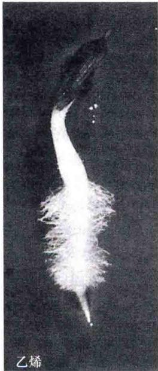  
图22.16 乙烯促进生菜幼苗根毛发生。拍照前用空气（左）或用10 ppm乙烯（右）处理2天的幼苗24 h。注意：乙烯处理的幼苗根毛多（引自Abeles et al., 1992, F. Abeles惠赠）。

## 22.4.12 乙烯促进叶片衰老

如第16章所述，衰老是一种可遗传的程序化发育过程，它影响植物的所有组织。植物生理方面的证据表明，乙烯和细胞分裂素在控制叶片衰老中起以下作用。

（1）外施乙烯或ACC（乙烯前体）加速叶片衰老，外施细胞分裂素延迟叶片衰老（见第21章）。

（2）乙烯产生量增加与叶绿素丧失及褪色有关，它们分别是叶与花衰老的特征；而叶中细胞分裂素水平与衰老的起始呈负相关。

（3）乙烯合成的抑制剂（如AVG或 $Co^{2+}$ ）和乙烯作用的抑制剂（如 $Ag^{+}$ 或 $CO_{2}$ ）阻碍叶片和花的衰老（图22.17）。

综合上述生理研究表明，衰老受乙烯和细胞分裂素平衡的调节。此外，脱落酸（ABA）在控制叶片衰老方面也发挥一定作用。有关ABA在衰老方面的作用，我们将在第23章中讨论。

乙烯调节叶片衰老的直接证据来自对拟南芥进行的分子遗传学研究。根据乙烯不敏感表型，人们鉴定出了乙烯不敏感突变体，如etr1（ethylene-resistant 1）和ein2（ethylene-in-sensitive 2）。与乙烯在叶片衰老中的作用一致，etr1和ein2突变体的生长不仅在萌发早期受到影响，而且在整个生活周期中包括衰老过程都受到了影响（Zacarias and Reid，1990；Hensel et al.，1993；Grbi and Bleecker，1995）。与野生型相比，乙烯突变体叶绿素和其他叶绿体组分保持的时间更长。但由于突变体的生长时间仅比野生型增加了 $30\%$ ，因此乙烯可能增加了衰老的速度，而不是作为起始衰老的发育开关发挥作用（参见Web Topic 22.11）。

## 22.4.13 乙烯介导某些防御反应

如果病原菌与寄主植物在遗传上具有相容性，则植物被病原菌侵染后就会感病。然而，植物受到病原菌侵染时，无论它们存在相容性（致病的）还是非相容性（非致病的）的相互作用，乙烯的产生量通常都会增加。

  
图22.17 抑制乙烯作用后花的衰老受到抑制。将康乃馨切花放在含乙烯抑制剂硫代硫酸银（STS）去离子水中（左）14天后与对照（右）相比，其衰老的速度显著延迟。乙烯作用抑制导致花衰老显著抑制（引自Reid，1995，M.Reid惠赠）。

乙烯不敏感突变体被发现以后，人们利用其确定乙烯对各种病原菌的作用。研究结果表明，乙烯在致病中的作用很复杂，这依赖于寄主与病原菌特定的相互作用，例如，即使抑制植物对乙烯的应答，也并不影响拟南芥对假单胞（Pseudomonas）细菌或烟草对烟草花叶病毒的抗性反应。然而，在这些寄主与病原菌相容的相互作用中，即使病原菌的生长不受影响，消除植物对乙烯的应答也能阻止病症的发展。

此外，乙烯（与茉莉酸一起）（见第13章）为一些植物抗病基因激活所必需。另外，乙烯不敏感的烟草和拟南芥突变体对某些通常不具有致病性的营养坏死（生长在死的寄生组织上）土壤敏感。因此，乙烯与茉莉酸在植物抵御营养坏死病原菌侵染中共同发挥重要作用。另外，乙烯在植物对活体营养（生长在活体组织上）病原菌反应中不起主要作用。

A  
B  

## 22.4.14 乙烯在离层细胞中的作用

叶片、果实、花及其他植物器官脱离植物称为脱落（abscission）（参见Web Topic 22.12）。脱落发生在称为离层（abscission layer）的一些特殊细胞层，在器官发育过程中，离层在形态建成和生物化学方面发生分化。细胞壁降解酶如纤维素酶和多聚半乳糖醛酸酶使离层细胞壁强度变弱（图22.18）。

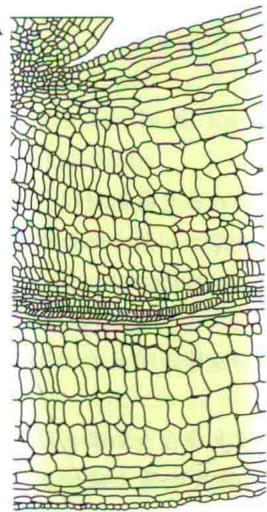

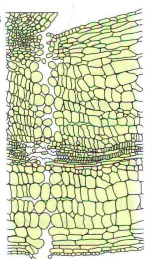  
图22.18 凤仙花（Impatiens）离层形成。A. 在叶脱落过程中，由于离层区的二或三层细胞的细胞壁水解酶的增加，使得细胞壁降解。B. 原生质体脱离细胞壁的束缚，膨大，促使木质部管状细胞分离，促使叶片从茎部分离（改编自Sexton et al., 1984）。

气体乙烯导致桦树叶子脱落，如图22.19所示，两棵树都已在50 ppm的乙烯中熏3天，左侧野生型桦树大部分叶子已脱落，右侧桦树是转化拟南芥乙烯受体

ETR1基因的转基因植株，etrl为显性突变（前面已讨论），转基因桦树对乙烯处理没有反应，因此乙烯处理后叶片不脱落。

  
图22.19 乙烯对桦树（Betula pendula）叶子脱落的影响。左侧为野生型植物；右侧为转化了拟南芥乙烯受体突变基因etr1的转基因植物。基因的表达受到本身启动子的转录控制。突变体桦树的特性之一是用乙烯（50 ppm）熏蒸植株3天后叶子没有脱落（引自Vahala et al., 2003）。

乙烯主要调节脱落过程，而生长素则作为乙烯效应的抑制剂起作用（见第19章）。然而，生长素浓度超过最适浓度后则刺激乙烯生成，因此人们将生长素类似物作为落叶剂使用，例如，“橙剂”的活性组分2，4，5-T在越南战争中作为落叶剂被广泛应用，它的作用是通过增加乙烯的生成量来刺激叶片脱落。

激素控制的叶片脱落过程可分为以下连续的三个不同阶段（图22.20）（Reid，1995）。

（1）叶保持期（leaf maintenance phase）：在植物感受任何启动脱落的信号（内部的或外部的）之前，植物的叶仍然是有功能的健壮的叶。从叶片到茎干存在的生长素浓度梯度使离层对乙烯不敏感。

（2）脱落诱导期（shedding induction phase）：叶片中生长素浓度梯度的减小或消失（通常与叶片衰老相关）导致脱落区对乙烯敏感，通过干扰叶片中生长素的合成和（或）运输加快叶片衰老，从而促进叶片脱落。

（3）脱落期（shedding phase）：脱落区中对低浓度内源乙烯极为敏感的植物细胞不断合成和分泌纤维素酶及其他细胞壁降解有关的酶，导致叶片脱落。

叶保持期的早期，来自叶片的生长素通过使脱落区

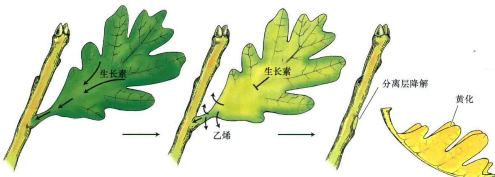  
叶保持期  
叶片中高浓度生长素降低了  
脱落区对乙烯的敏感性，阻止了叶片脱落  
脱落诱导期
叶片中生长素浓度降低，增加了乙烯的产量和脱落区对乙烯的敏感性，脱落期开始  
脱落期
水解细胞壁多糖的酶合成后导致细胞分离和叶片脱落

图22.20 叶片脱落时生长素和乙烯作用的示意图。脱落诱导期，生长素水平下降，乙烯水平升高。激素平衡的变化增加了靶细胞对乙烯的敏感性（引自Morgan，1984）。

细胞对乙烯不敏感阻止叶片脱落。人们早就认识到将叶片（生长素产生位点）去掉后会促进叶柄脱落。用外源生长素处理除去叶片的叶柄可以延迟脱落。然而，在脱落区的近轴侧（靠近茎的一侧）施用生长素却能加快脱落。这些结果表明，控制脱落区细胞敏感性的不是生长素的绝对浓度，而是生长素的浓度梯度（gradient）。

在脱落诱导期，叶片中生长素的量减少，乙烯水平升高。乙烯似乎通过减少生长素合成和运输及增加生长素降解降低其活性。自由态生长素浓度的降低增加了特定靶细胞对乙烯的反应。某些编码特异水解细胞壁多糖和蛋白质酶的基因表达受到诱导，这是脱落期的特点。

定位于脱落区的靶细胞合成了纤维素酶和其他降解多糖的酶，并将它们分泌到细胞壁，这些酶的活性导致细胞壁松弛、细胞分离和脱落。

## 22.4.15 乙烯在商业上具有重要用途

乙烯调控植物许多生理发育过程，是农业上使用最广泛的植物激素之一。生长素和ACC都能导致天然乙烯生物合成，在某些情况下可应用于农业生产。由于乙烯极易扩散，其作为气体很难在田间利用。但是，如果使用释放乙烯的化合物，这种困难就可以被克服。应用最广泛的乙烯化合物——乙烯利，即2-氯乙基磷酸，发现于20世纪60年代，并被冠以各种商业名称，如Ethrel。

以水溶液形式喷洒到植物上的乙烯利很容易被吸收，乙烯利在植物体内也很容易运输，它通过一种化学反应缓慢释放乙烯，发挥作用。

乙烯利能加快苹果、番茄的果实成熟，促进柑橘果实失绿，促使菠萝同步开花和同步结实，并促进花和果实脱落，它可以使棉花、樱桃和胡桃果实变得干瘪或脱落；乙烯利在黄瓜上可以用来提高雌花数量，防止自花授粉，提高产量，也可以用来抑制某些植物末端生长，促进侧向加粗，缩短花梗。

人们通过果实贮藏设施降低贮藏室空气中氧的浓度和温度，从而抑制乙烯产生，延长果实贮藏时间。较高浓度的 $CO_{2}$ （3%\~5%）也能够抑制乙烯的催熟作用。利用低压（抽真空）从贮藏室中除去乙烯和氧，可降低果实成熟的速度，阻止果实过度成熟。乙烯连接抑制剂Ethylbloc®用于延长多种跃变型果实的贮藏时间。

据估计，美国所采收切花的15%\~35%会因为采收后损坏被扔掉，乙烯合成和作用的特异抑制剂在切花采收后的保存中很有用（参见Web Topic 22.13）。

乙烯调节果实成熟，叶和花的衰老凋谢过程，根毛发育和结节产生，苗生长和弯钩打开，至少部分依赖于基因表达变化。

## 乙烯结构、合成和测定

· 乙烯气体在双子叶植物中诱导三重反应（图22.1和图22.5）。

· 乙烯前体是甲硫氨酸，顺次转化为S-腺苷甲硫氨酸、ACC和乙烯（图22.2）。乙烯在它的合成位点附近起作用，乙烯的中间前体ACC能够被运输，因此能够在远离它的合成位点产生乙烯。

· 乙烯合成被一些因素所促进，包括发育状态、环境条件、其他植物激素和物理化学刺激因子（图22.3）。

· 乙烯的合成和感知能够被抑制剂拮抗，其中一些抑制剂已经进行商业应用（图22.4）。

## 乙烯信号转导途径

· 拟南芥黄化苗的三重反应表型有助于分辨功能性

乙烯受体基因和其他信号元件（图22.5\~图22.7）。

· 乙烯受体定位于内质网和高尔基体细胞器。

· 乙烯通过铜辅助因子连接到受体。

· 未连接的受体关闭乙烯反应信号通路，受体连接于乙烯去活化受体，启动信号通路（图22.8和图22.9）。

\- ETR1激活CTR1，一个关闭乙烯反应的蛋白激酶。

## 乙烯对基因表达的调控

· 乙烯通过特异的转录因子影响许多基因的转录。

· 上位相互作用分析揭示ETR1、EIN1、EIN3和CTR1基因的活性序列（图22.10）。

## 乙烯影响的发育和生理效应

· 乙烯影响幼苗生长和果实成熟（图22.11，表22.1）、向性发育（图22.12和图22.13）和种子萌发。

· 激素影响细胞膨大和细胞壁纤维素微丝的方向（图22.14）。

· 乙烯对下胚轴的抑制作用发生在两个不同的阶段（图22.15）。

当一些物种受到水淹时，乙烯促进节间和叶柄迅速伸长。激素调控开花、性别决定和一些物种中的防御反应。

· 乙烯促进根毛形成（图22.16）。

· 乙烯促进花和叶的衰老和凋零（图22.17\~图22.20）。

(苏伟 朱文姣 郝福顺 译)

## WEB MATERIAL

## Web Topics

## 22.1 Ethylene in the Environment Arises Biotically and Abiotically

Ethylene in the environment arises from a variety of sources, including pollution, photochemical reactions in the atmosphere, and production by microbes, algae, and plants.

22.2 Ethylene Readily Undergoes Oxidation
Ethylene can be oxidized to ethylene oxide, which can then be hydrolyzed to ethylene glycol.

## 22.3 Ethylene Can Be Measured by Gas

## Chromatography

Historically, bioassays based on the seedling triple response were used to measure ethylene levels, but they have been replaced by gas chromatography.

22.4 Cloning of the Gene That Encodes ACC Synthase A brief description of the cloning of the gene for ACC synthase using antibodies raised against the partially purified protein.

22.5 Cloning of the Gene That Encodes ACC Oxidase The ACC oxidase gene was cloned by a circuitous route using antisense DNA.

22.6 Ethylene Binding to ETR1 and Seedling Response to Ethylene
Ethylene binding to its receptor ETR1 was first demonstrated by expressing the gene in yeast.

22.7 Conservation of Ethylene Signaling Components in Other Plant Species
The evidence suggests that ethylene signaling is similar in all plant species.

22.8 ACC Synthase Gene Expression and Biotechnology
A discussion of the use of the ACC synthase gene in biotechnology.

22.9 The hookless Mutation Alters the Pattern of Auxin Gene Expression
The hookless mutation of Arabidopsis confirms the interaction between auxin and ethylene in hook formation.

22.10 Ethylene Inhibits the Formation of Nitrogen-Fixing Root Nodules in Legumes
Hyper-nodulating mutants are blocked in the ethylene signal transduction pathway.

22.11 Ethylene Biosynthesis Can Be Blocked with Anti-Sense DNA
Mutants expressing anti-sense DNA coding for ethylene biosynthesis enzymes have delayed leaf senescence and fruit ripening.

22.12 Abscission and the Dawn of Agriculture
A short essay on the domestication of modern cereals based on artificial selection for nonshattering rachises.

22.13 Specific Inhibitors of Ethylene Biosynthesis Are Used Commercially to Preserve Cut Flowers Some inhibitors of ethylene biosynthesis are suitable for commercial use in flower preservation.

## Web Essays

## 22.1 Tumor-Induced Ethylene Controls Crown Gell Morphogenesis

Agrobacterium tumfaciens-induced galls produce very high ethylene concentrations, which reduce vessel diameter in the host stem adjacent to the tumor and enlarge the gall surface giving priority in water supply to the growing tumor over the host shoot.

## 第 23 章

# 脱落酸: 种子成熟和胁迫反应激素

植物生长的时期和生长的程度受到正负调节因子的协调控制，最明显的例子是当环境条件不利时，植物通过种子和芽休眠停止生长，直到环境条件有利时再继续生长。多年来，植物生理学家推测种子和芽的休眠现象是由一些起抑制作用的化合物引起的，所以他们尝试从植物不同组织，特别是休眠芽中提取和分离这些化合物。

早期实验用纸层析的方法分离植物提取液，并根据提取液对燕麦胚芽鞘生长的影响进行生物测定，这些实验使得一些抑制生长的物质被鉴定出来，其中包括一种称为休眠素（dormin）的物质，它是从初秋收集的即将进入休眠的悬铃木叶子中纯化出来的。随后发现休眠素的化学成分与一种促进棉铃脱落的物质脱落酸Ⅱ（abscisin Ⅱ）。相同，所以将这种化合物重新命名为脱落酸（abscisic acid，ABA）（图23.1），反映它参与脱落过程。

ABA现在被认为是一种重要的植物激素，它调节植物的生长和气孔关闭，尤其在植物受到环境胁迫时发挥作用。它的另一个重要功能是调节种子的成熟和休眠。具有讽刺意味的是，ABA是否对脱落起作用仍然存在争议：在很多植物中，ABA促进衰老（即先于脱落的事件），而不是脱落本身。

本章中我们将总结ABA的结构、合成、转运及ABA信号转导机制，最后将介绍生长发育过程中ABA反应的一些典型例子。

## 23.1 ABA的产生、化学结构和测定

脱落酸是一种维管植物中普遍存在的激素，在藓类植物中能检测到，但在苔类植物中不存在（参见Web Topic 23.1）。在真菌的一些属中，ABA是次生代谢物（Milborrow，2001）。从海绵到人的后生动物中也发现有ABA，有些信号机制好像为不同的生物界所共有（参见Web Topic 23.2）。在植物体内，从根尖到顶芽的每个主要器官或活组织中都有ABA分布。ABA能够在有叶绿体或造粉体的几乎所有细胞中合成。

## 23.1.1 ABA的化学结构决定其生理学性质

ABA是含有15个碳原子的化合物，与一些类胡萝卜素分子末端部分类似（图23.1）。这些羧基基团中碳

2的取向决定ABA分子的顺（cis）式和反（trans）式异构体。几乎所有自然界存在的ABA都是顺式构象，通常所说的脱落酸指的就是顺式异构体。

ABA碳环中1'位置有1个不对称碳原子，产生了S和R（或分别为+和-）对映体。S对映体是自然存在的形式，人工合成的ABA是接近等量R型和S型对映体的混合物。在如种子成熟等对ABA的长时间反应中，两种对映体都有活性，在如气孔关闭等对ABA的其他反应中，S对映体是主要的活性形式。

对ABA生物活性所需结构的研究表明，其分子结构的几乎任何改变都会使它失去活性（参见Web Topic 23.3）。

## 23.1.2 生物、物理和化学方法检测ABA

人们利用ABA抑制麦芽鞘生长、种子萌发或赤霉素（GA）诱导 $\alpha$ -淀粉酶合成等多种生物分析方法检测 ABA，另外，诸如促进气孔关闭和基因表达等快速诱导反应也与 ABA 相关，因此也可利用这些特性检测 ABA（参见 Web Topic 23.4）。

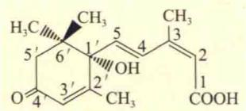  
(S)-顺式-ABA(自然界存在的活性形式)

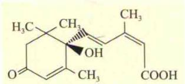  
(R)-顺式-ABA(在气孔关闭中无活性)

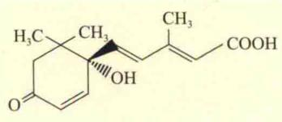  
(S)-2-反式ABA(无活性,但可与有活性的顺式结构相互转化)  
图23.1 有活性和无活性ABA的结构。顺式-ABA的S（+，或反时针排列）和R（-，或顺时针排列）化学结构及（S）-2-反式ABA结构。（S）-顺式-ABA图中的数字代表碳原子编号。

用物理学方法检测ABA比用生物学方法更可靠，因为前者更适宜定量分析，特异性也更强，其中最普遍运用的技术是气相色谱或高效液相色谱（IPLC）。气相色谱可以检测少至 $10^{-13}$ g的ABA含量，但它需要用薄层色谱等方法对样品进行初步纯化。免疫测定的灵敏度和特异性也都非常高。

## 23.2 ABA的生物合成、代谢和运输

与其他激素类似，ABA反应的程度依赖于它在组织中的浓度及组织对它的敏感性。在植物的任何一个发育时期，组织中有活性的ABA浓度取决于ABA的生物合成、代谢、分布和运输。

## 23.2.1 ABA由类胡萝卜素中间体合成

ABA在叶绿体和其他质体中合成，简化的合成途径如图23.2所示（更完整的合成途径参见附录3），ABA合成是从异戊烯二磷酸（isopentenyl diphosphate，IPP）开始的，IPP是生物中的一个异戊二烯单位，也是细胞分裂素、赤霉素和油菜素内酯生物合成的前体，它合成了 $C_{40}$ 叶黄素（如氧化类胡萝卜素）堇菜黄质（violaxanthin）（图23.2），人们发现拟南芥中堇菜黄质合成由ABA1基因编码的酶催化，这提供了确凿的证据，证明ABA通过类胡萝卜素途径合成，而不像在一些植物病原真菌那样通过修饰 $C_{15}$ 类戊二烯合成。在类胡萝卜素途径其他步骤被阻断的玉米（Zea mays）突变体[被命名为viviparous（vp）]中，ABA水平下降，并表现出胚萌现象（vivipary）——果实中种子在与植株相连时的早熟萌发现象（图23.3）。胚萌是许多缺乏ABA种子的特征。

在胁迫条件下，反式堇菜黄质被依赖于拟南芥ABA4产物的反应转化为另一个 $C_{40}$ 化合物——反式新黄质（trans-neoxanthin），接着反式新黄质被目前还未鉴定出来的酶异构化形成9-顺式新黄质，后者被简写为NCED（9'-cis-epoxycarotenoid dioxygenase）（参见附录3）的酶切割形成C15化合物黄氧素（xanthoxin）。黄氧素是中性生长抑制剂，特性类似于ABA，这是ABA合成的第一个关键步骤，也是限速的调节步骤。

NCED由一个基因家族编码，在响应胁迫和发育信号时这些基因的表达会发生变化，因此这些基因在胁迫诱导的ABA合成（与器官特异的ABA合成相比）中的重要性也不相同。NCED在底物类胡萝卜素所在的类囊体基质表面起作用，但其一些家族成员以可溶的形式和膜结合的形式存在，表明酶的活性可能受其在细胞中定位的调节。最后，黄氧素进入胞质，通过氧化转变为ABA，这涉及中间产物ABA醛（ABA-aldehyde）和（或）黄氧酸（ABA醇）。

黄氧素转化为ABA醛由短链类脱氢酶/还原酶（short-chair dehydrogenase/reductase-like，SDR）催化，该酶由拟南芥ABA2基因编码。ABA合成的最后一步由ABA醛氧化酶类（abscisic aldehyde oxidase，AAO）催化，AAO受不同机制调节并需要钼辅基（图23.2）。单个AAO的基因突变的作用有限，因为其他功能冗余家族成员能够补偿其丧失的功能，但如果AAO的突变体（如拟南芥的aba3和番茄的flacca）缺少有功能的钼辅基，则无法合成ABA。

## 23.2.2 植物组织中ABA浓度高度可变

植物在发育过程中或在环境条件改变时，特定组织中ABA的含量和浓度会发生显著变化，如在发育的种子中，ABA的水平会在几天内增加100倍，平均浓度可达到毫摩尔级。种子成熟过程中，ABA浓度会降到非常低的水平。在水分胁迫条件下（如脱水胁迫），叶片中ABA的水平会在4\~8 h内上升50倍（图23.4）。

ABA增加部分是由于其生物合成酶表达量的增加

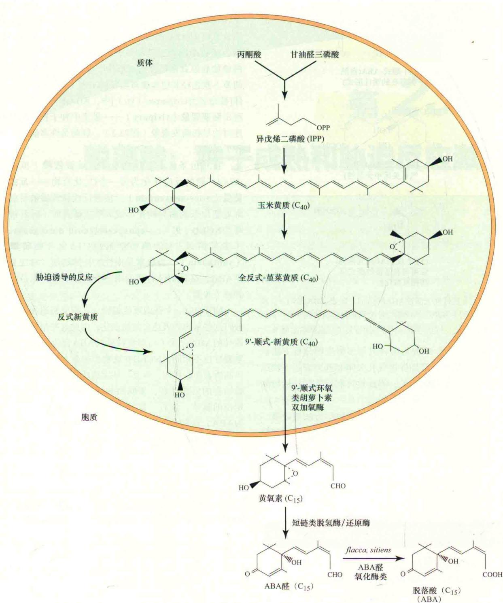  
图23.2 类胡萝卜素途径合成ABA简图。ABA起始合成发生在质体中，由异戊烯二磷酸（IPP）转化为 $C_{40}$ 叶黄素玉米黄质，后者进一步被修饰形成9'-顺式-新黄质，NCED酶裂解9'-顺式-新黄质形成 $C_{15}$ 黄氧素抑制物，然后，黄氧素在胞质中转化为ABA。有助于阐明该途径的ABA缺失突变体列于附录3中。

所致，但特定酶的表达依赖于特定组织和信号的诱导，例如，ABA合成酶中NCED在所有组织中均被诱导，玉米黄质环氧酶（ZEP）在种子和受水分胁迫的根中被诱导，AAO在受胁迫组织中受到差别诱导，SDR则是被糖而不是被脱水胁迫所诱导。目前细胞感受脱水胁迫的机制仍不清楚，但可能与感受细胞膨胀的受体或渗透胁迫受体有关，因为细胞重新吸水后，ABA水平在同等时间内又降低到了正常水平。

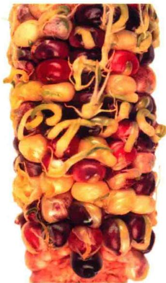  
图23.3 早熟萌发包含果实仍长在植物上时种子的萌发。图中所示的是玉米ABA缺失突变体vivipary 14（vp14）的早萌。VP14蛋白催化9'-顺式环氧类胡萝卜素断裂形成ABA前体黄氧素（Bao Cai Tan和Don McCarty惠赠）。

  
图23.4 水分胁迫下玉米水势、气孔阻力（气孔导度的倒数）及ABA含量的变化。土壤干旱时，叶片水势降低，ABA含量和气孔阻力增加。重新浇水逆转了该过程（引自Beardsell and Cohen，1975）。

生物合成并非组织中ABA浓度调节的唯一因素。与其他植物激素类似，胞质中游离ABA的浓度还受ABA降解、区域化、结合和运输等的调节，例如，水分胁迫下叶片胞质中ABA含量增多是ABA在叶片中合成增多、ABA在叶肉细胞中重新分布、ABA从根部运输到叶及其在叶中重新循环的共同结果。植物重新吸水后ABA浓度的降低是由于ABA降解、ABA从叶片中运走及其合成速率降低所致。类似地，种子中变化的ABA水平反映了ABA合成和失活的动态平衡。ABA要么通过被氧化为红花菜豆酸（phaseic acid，PA）和4-二氢红花菜豆酸（4-dihydrophaseic acid，PA）而失活，要么通过共价结合到另一个分子如单糖上而失活（参见附录3）。

## 23.2.3 ABA通过维管组织转运

ABA靠木质部和韧皮部运输，但通常韧皮部汁液中含量丰富。用放射性标记的ABA处理叶片后发现，ABA既能从根向上运输到茎叶，也可从茎叶向下运输到根，24 h内可在根部发现大量放射性ABA，茎部环剥破坏韧皮部能够阻止ABA在根部积累，表明该激素运输到了韧皮部汁液中。

在根部合成的ABA也可以经过木质部运输到茎叶。当向日葵受到水分胁迫时，ABA浓度可以增加到3000 nmol/L（3.0 μmol/L），而正常浇水的向日葵木质部汁液中ABA的浓度为1.0\~15.0 nmol/L（Schurr et al., 1992）。木质部中因胁迫诱导增加的ABA含量变化幅度在不同物种间差异很大。ABA可能也以结合态的形式运输，然后在叶中被水解释放。

利用检测特定部位ABA浓度报告基因的激活实验表明，水分胁迫过程中ABA首先在茎叶维管束中积累，然后出现在根和保卫细胞中（Christmann et al., 2005）（图23.5）。另外，交互利用野生型和ABA缺失突变体根作为砧木和接穗的实验证明，茎叶中合成的ABA对植物响应根部干旱反应至关重要。

当植物受到水分胁迫时，气孔关闭与叶肉细胞膨压的快速降低相关，如用水直接处理叶片的上表面能阻止胁迫导致的气孔关闭，这些研究说明，开始的根冠通信是由根到茎叶水势梯度改变介导的，然而不排除其他从根运输ABA或传递化学信号等长时间信号。

尽管质外体中3.0 $\mu$ mol/L ABA就足以关闭气孔，但并非木质部汁液中所有ABA都到达了保卫细胞。蒸腾流中许多ABA被叶肉细胞吸收并被代谢掉了。在细胞水平，ABA在植物细胞各部分的分配遵循“阴离子陷阱”机制：这种弱酸解聚（阴离子）形式ABA $^{-}$ 不轻易跨膜，但ABA可以质子化的形式进入细胞，然后积累在碱性区域。ABA也可通过特殊吸收载体转运进入细胞。在植物未受到胁迫时吸收载体有助于质外体保持低的ABA浓度。

在水分胁迫早期阶段，木质部汁液的pH呈碱性，pH大约从6.3增加到了7.2（Wilkinson and Davies，1997）。胁迫诱导质外体碱化有利于ABA解离形式——ABA $^{-}$ 的形成。同时，脱水也能使胞质酸化，从而使ABA从它的合成部位释放，并且ABA被叶肉细胞吸收的量也减少了。这些pH变化增加了ABA通过蒸腾流到达保卫细胞的量（图23.6）。这样叶片中ABA再分配时ABA的总水平并没有增加。因此，木质部汁液中pH增加可能作为另外一种根部信号使气孔在早期关闭。

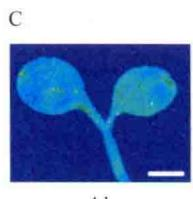

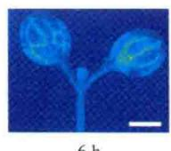

  
图23.5 根响应水分胁迫时依赖ABA的报告系统动态。转pAtHB6::LUC报告基因幼苗根部受到水分胁迫后，记录一定时间发出的依赖于荧光素酶的光（浅蓝和绿色部分）。观察到ABA依赖的LUC表达2 h在下胚轴中出现、4 h在叶脉中出现、6 h则分布于整个子叶，但10 h前根中未出现。刻度为1 mm（引自Christmann et al., 2005）。

## 23.3 ABA信号转导途径

ABA在植物短期生理过程（如气孔关闭）及长期发育过程（如种子成熟）中发挥作用。

（1）短期生理反应往往与离子跨膜流动的改变有关，通常也涉及某些基因的调节，证据来自ABA诱导在保卫细胞中表达的各种转录因子调控气孔的开度。

（2）相比之下，长期反应过程不可避免地涉及基因表达方式的重大变化。

比较所有转录产物发现，在拟南芥和水稻中至少有

10%的基因受ABA调节。

ABA与其受体结合后，产生初级信号，初级信号通过信号转导途径放大，信号转导为ABA短期和长期效应所必需（见第14章）。通过遗传学研究已鉴定了100多个参与ABA信号转导的基因位点（Wasilewska et al., 2008）。尽管许多基因只影响ABA反应的一部分，但一些保守的信号组分既调节短期反应也调节长期反应，表明这些反应具有共同的信号转导机制。我们将重点介绍调节气孔开度和基因表达的机制，这是研究最清楚的两种ABA效应。

## 23.3.1 受体成员包含不同类型的蛋白质

人们利用各种生化、细胞和遗传学方法鉴定ABA受体，结果发现植物中可能存在位于细胞表面和细胞内两种ABA受体（图23.7）（参见Web Topic 23.5），与这一推断一致的是，没有鉴定出所有ABA反应缺乏的突变体。

  
图23.6 水分胁迫时木质部汁液的碱化导致叶片中ABA再分配。

  
图23.7 ABA与三类ABA受体成员相互作用模型。目前鉴定的ABA受体定位在质体（CHLH）、质膜（GTG1和GTG2）、胞质和核（PYR/PYL/RCAR）。所有成员都介导电ABA调节气孔运动时对基因表达和离子电流的效应（简单地用通道A代表），但不清楚与下游哪些信号事件发生交叉。PP2C，蛋白磷酸酶ABI分支；SnRK2，SNF相关激酶；TF，包括ABRE结合转录因子在内的转导因子。实线，直接相互作用；虚线，未知的相互作用；箭头，正调控；丁字形线，抑制作用。

近年来，人们提出了几类可能的ABA受体，但其大多数仍存在争议（McCourt and Creelman，2008；Risk et al., 2009；Müller and Hansson, 2009）。最好的成员包括以下三类。

（1）PYR/PYL/RCAR，存在于胞质和核中的配体结合蛋白STARR超家族成员（Park et al., 2009；Ma et al., 2009）。

（2）CHLH，参与叶绿体合成和信号传递，进而协调质体和核基因表达，定位于质体中的镁离子螯合酶亚基（Shen et al., 2006）。

（3）GPCR类G蛋白（GTG1和GTG2），是一对质膜蛋白，具有内在G蛋白活性，与G蛋白偶联受体（GPCR）同源（Pandey et al., 2009）。尽管GPCR似乎参与ABA信号，但存在与其作为受体矛盾的证据。

下面我们详细讨论PYR/PYL/RCAR蛋白和CHLH，有关GPCR的详细信息请参见Web Topic 23.6。

推断的ABA受体PYR/PYL/RCAR家族（PYR/PYL/RCAR FAMILY）是通过化学遗传筛选具有ABA类似效应的小分子物质鉴定出来的。利用拟南芥种子，通过筛选鉴定出了可作为ABA激动剂（agonist）的pyrabactin（pyridyl-containing ABA activator），即它可模拟植物中ABA的效应（Park et al., 2009）。

通过筛选抗pyrabactin拟南芥突变体鉴定出了PYR1遗传位点，它编码START（steroidogenic acute regulatory protein-related lipid-transfer, a predicted hydrophobic ligand-binding pocket）结构域蛋白超家族成员。随后的核磁共振实验证明ABA和PYR1可直接结合，提示PYR1可能是一个ABA受体。

生物信息学研究鉴定出了多个命名为PYL（PYR1-like）的家族成员，该家族从双子叶植物到苔藓都是保守的，尽管pyr1突变体抗pyrabactin，但正像以前鉴定出的几个ABA不敏感突变体一样，pyr1突变体并未表现出对ABA显著不敏感的特征。然而，综合PYR1和几个同源蛋白缺失三或四突变体表现显著对ABA不敏感的结果，表明这些基因位点功能冗余，因此在正常筛选抗ABA突变体时，这些基因被遗漏了。

酵母双杂交筛选（参见Web Topic 23.7）依赖pyrabactin并与PYR1互作的蛋白质时，鉴定出了一个PP2C类蛋白磷酸酶。以前已证明PP2C参与ABA信号转导。在酵母中PYR1-PP2C相互作用是配体依赖的，该作用也可发生在植物中和体外，并发现其抑制PP2C的活性。随后研究表明，不同的PYR/PYL家族成员在配体选择及依赖配体与多个PP2C同源蛋白成员结合方面存在差异。

同时，几个研究小组在采用酵母双杂交筛选方法研究PP2C相互作用因子时，将与PP2C互作的这一相同家族蛋白命名为ABA受体调节成分（regulatory components of ABA receptors, RCAR）（Ma et al., 2009）。最近，利用两个PYR/PYL家族成员的晶体结构研究表明，ABA结合到受体的内部口袋后，受体构型改变，适合与PP2C相互作用（Miyazono et al., 2009；Nishimura et al., 2009）。以前的研究显示，这些PP2C可与包括转录因子和蛋白激酶在内的其他多个ABA信号成分特异地相互作用。因此，PYR/PYL/RCAR似乎是一类可溶性受体，它们直接与许多通过遗传学方法鉴定出来的下游信号成分联系，有效地形成一个网络。

CHLH蛋白（CHLH protein）是作为拟南芥ABA结合蛋白（ABAR）的同源蛋白从蚕豆叶表皮中纯化得到的（Shen et al., 2006）。CHLH在ABA信号中作用的证据来自CHLH敲减（功能部分丧失）突变体。该突变体对萌发、休眠、气孔调节和ABA诱导的基因表达表现出降低的ABA敏感性，与这些结果一致，CHLH超表达植株对ABA超敏感。CHLH敲除（功能完全缺失）突变体胚不能成熟，产生缺乏存储物质和脱水保护物质的无活力种子。一些ABA信号成分严重缺失的突变体或种子中ABA水平显著降低的突变体表现出相同的表型效应。然而，由于未知的原因，传统的ABA不敏感遗传筛选却未能鉴定出功能降低的CHLH等位突变体。

尽管CHLH也在叶绿体合成和质体到核信号传递中起作用，但这些功能好像由其不同的结构域发挥作用，因为基因的不同突变影响不同的功能。CHLH在ABA信号转导中的作用机制还不清楚，但它定位在质体中，说明一些ABA感受事件一定发生在这些细胞器中，感受事件可能在ABA转运回质体中时发生。

总之，存在多个ABA受体成员与目前已知的非常多的ABA信号途径相一致（图23.7）。信号转导途径的冗余使细胞能够整合一系列激素和环境刺激信号，产生生物学家所谓的“网络稳定性”，以保证反应可发生在各种条件下。尽管由CHLH和GTG蛋白起始的快速细胞事件还不清楚，但所有事件似乎都与ABA信号转导事件相关，将来的研究将揭示它们各自的作用。

## 23.3.2 在ABA信号转导中起作用的第二信使

许多第二信使包括 $Ca^{2+}$ 、活性氧（reactive oxygen species，ROS）、环核苷酸和磷酸酯都参与ABA信号转导。胞质 $Ca^{2+}$ 水平受质膜 $Ca^{2+}$ 的通透性通道活性变化和 $Ca^{2+}$ 从细胞内部区域如中心液泡或各种细胞器进入胞质通道活性变化的调节（McAinsh and Pittman，2009），这些通道反过来又受其他第二信使如ROS调控。NADPH氧化酶产生的ROS如过氧化氢或超氧阴离子作为第二信使激活质膜钙通道（Kwak et al.，2003）。

各种第二信使可诱导钙从细胞内钙库中释放出来，这些信使包括1，4，5-三磷酸肌醇（IP3）、环ADP-核糖（cADPR）及自我放大（钙诱导的）释放的 $Ca^{2+}$ 。ABA在15 min内可刺激ADPR环化酶活性，导致cADPR增加。此外，ABA在保卫细胞中通过硝酸还原酶促进一氧化氮（nitric oxide，NO）合成，NO以cADPR依赖的方式诱导气孔关闭，表明NO在cADPR的上游起作用（Desikan et al., 2002）。

接下来的章节中将介绍与这些第二信使有关的信号转导机制。

## 23.3.3 钙依赖和钙不依赖两条信号转导途径介导ABA信号

人们利用显微注射钙敏感荧光染料 $^{①}$ 如fura-2或indo-1测定胞内游离钙。另一种方法是利用表达钙指示蛋白如水母发光蛋白或yellow cameleon蛋白基因的转基因植物，不需要显微注射就可平行检测多个荧光细胞（Allen et al., 1999）（参见Web Topic 23.8）。利用yellow cameleon已经证明保卫细胞中胞质 $Ca^{2+}$ 浓度会发生振荡，细胞收到的信号不同， $Ca^{2+}$ 的振荡也不相同

(图23.8)。

$\mathrm{Ca^{2+}}$ 振荡直接成像的结果支持胞质 $\mathrm{Ca^{2+}}$ 增加（部分来源于胞内钙库）诱导了气孔关闭的假设。 $\mathrm{Ca^{2+}}$ 增加被解释为“构象偶联”，即 $\mathrm{Ca^{2+}}$ 与一些蛋白质如钙调素（CaM）或类钙调磷酸酶B蛋白（calcineurin B-like protein，CBL）结合改变了它们的构象，构象变化使这些蛋白质相互作用，并改变了各种细胞蛋白的功能。哺乳动物的钙调磷酸酶是催化A亚基和 $\mathrm{Ca^{2+}}$ 结合调节B亚基的异源二聚体，它们可能通过与钙调素相互作用被激活。尽管植物中未发现类钙调磷酸酶A亚基，但植物CBL家族已被鉴定出来。CBL被环境胁迫和ABA差别调控，并且预计其具有不同器官和亚细胞定位（Luan et al., 2002）。

另外， $Ca^{2+}$ 可直接或间接调节蛋白激酶或磷酸酶，改变各种蛋白质的磷酸化状态及活性，因此，在对ABA的整个反应中既可反映 $Ca^{2+}$ 增高的亚细胞分布、频率、幅度和持续时间，也反映在某一细胞中特异 $Ca^{2+}$ 结合蛋白及其目标蛋白的可利用性，这些效应中有的被基因表达改变介导，而其他的则直接影响离子通道活性。

尽管ABA诱导的钙反应是目前ABA诱导气孔关闭模型的主要特征，但ABA在保卫细胞胞质钙不增加的情况下也能诱导气孔关闭（Allan et al., 1994），换句话说，ABA似乎可以通过钙依赖和钙不依赖两条途径起作用。例如，ABA能引起胞质碱化，pH从7.7增加到7.9，导致质膜外向K+通道被激活和气孔关闭。

对明显的钙不依赖信号传递的另一个解释是，ABA增加了细胞内钙敏感性的气孔关闭机制，包括阴离子和K+通道的调节（Siegel et al., 2009）。ABA诱导的这种超敏感性使细胞不存在胞内钙增加的情况下能应答静息钙水平反应，激活钙依赖的信号。改变钙反应阈值的机制称为“钙敏感性启动”假说，这也可解释为什么在不存在ABA情况下有时保卫细胞自发发生细胞内钙增加却不能诱导气孔关闭（Young et al., 2006）。

## 23.3.4 ABA诱导脂类代谢产生第二信使

在动物细胞经典的G蛋白信号转导模式中，激活的Gα亚基激活磷脂酶C（phospholipase C），释放三磷酸肌醇（inositol triphosphate，InsP3）和二酰基甘油（diacylglycerol，DAG）。利用蚕豆保卫细胞的研究表明，ABA刺激磷脂酰肌醇代谢，产生InsP3和六磷酸肌醇（myo-inositol-hexaphosphate，InsP6）。在施用ABA 10 s内即可检测到InP3的水平增加了90%（Lee et al., 1996）。在拟南芥和烟草中用反义DNA抑制ABA诱导磷脂酶C表达的研究证明，ABA对萌发、生长和基因表达的作用需要这种酶（Sanchez and Chua, 2001）。与以上观察到的结果一致，InsP3水平增加的突变体表现对ABA超敏感（Xiong et al., 2001；Wilson et al., 2009）。

ABA可激活鞘氨醇激酶（sphingosine kinase），产生另一类磷脂——鞘氨醇-1-磷酸（sphingosine-1-phosphate，S1P）（图23.9）。鞘氨醇-1-磷酸可促进鸭跖草保卫细胞Ca $^{2+}$ 增加和气孔关闭。此外，S1P信号抑制剂可抑制植物对ABA的响应。尽管S1P能促进野生型拟南芥关闭气孔，但不能引起Gα亚基缺失突变体的气孔关闭，表明鞘氨醇-1-磷酸通过G蛋白起作用，并且G蛋白介导的事件位于S1P信号的下游（Coursol et al., 2003）。

A  

B  

  
图23.8 转基因表达钙荧光指示蛋白yellow cameleon检测的拟南芥保卫细胞中ABA诱导的钙振荡。A. 535 nm和480 nm激发荧光比例的增加表示ABA诱导的重复钙振荡。B. 拟南芥保卫细胞荧光的色彩图像：蓝色、绿色、黄色和红色代表胞质钙浓度的增加（引自Schroeder et al., 2001）。

  
图23.9 被ABA激活后，鞘氨醇激酶催化鞘氨醇的磷酸化反应，产生鞘氨醇-1-磷酸。

另一种可能介导ABA反应的第二信使是磷脂酸（phosphatidic acid，PA），它通过磷脂酶D（phospholipase D，PLD）由磷脂酰胆碱产生。研究表明，含量最多的PLD异型体可以被ABA激活，并且由PLD介导产生的磷脂酸可通过多种机制促进ABA诱导的气孔关闭、基因表达及其他胁迫反应（Zhang et al., 2005）。PLD的活性产物PA可以与各种靶酶包括蛋白磷酸酶、蛋白激酶及代谢酶结合，这中间至少有一种蛋白磷酸酶是ABI1（在下一节中讨论），它与PA结合后活性和定位改变，对ABA信号的抑制作用消失，导致气孔关闭（见Web Topic 23.9）。

这样，多个脂类产生的第二信使（磷脂酰肌醇、DAG、S1P、磷脂酸）及产生和降解这些第二信使的酶参与了增加ABA信号转导的多个反馈回路和途径。

## 23.3.5 蛋白激酶和磷酸酶调节ABA信号途径中的重要步骤

几乎所有生物的信号转导途径中，总有某些步骤与蛋白质的磷酸化和脱磷酸化反应有关，ABA信号途径也不例外。生化与遗传研究已鉴定了多个介导特定ABA信号的蛋白激酶和磷酸酶家族。

## 1. ABA 激活的蛋白激酶

ABA或胁迫激活的蛋白激酶（AAPK或SAPK）在蔗糖非发酵相关激酶2（sucrose non-fermenting related kinase2，SnRK2）家族的许多种类和成员中得到了鉴定。鉴定的第一个SnRK2为气孔调节所必需，并在ROS和Ca $^{2+}$ 信号的上游发挥作用。拟南芥SnRK2家族许多成员受ABA诱导，其他成员则受胁迫诱导，这些激酶诱导的一个重要方面是翻译后激活，但有一些则是转录激活的。遗传研究表明，一些SnRK2在调节幼苗ABA反应时功能是冗余的（Fujii et al., 2007）。

所有测定的ABA或胁迫诱导的SnRK在体外能磷酸化一类名为ABA响应成分结合因子（ABA-response element binding factor，AREB或ABF）的转录因子，使转录因子保守结构域磷酸化，该磷酸化与这些转录活性增加相关。AAPK也能改变RNA结合蛋白的活性，后者可能介导ABA对基因表达的作用（Assmann，2004）。胁迫调控的SnRK2的其他目标包括各种代谢酶及几个14-3-3家族调节蛋白，后者预计与其他信号蛋白相互作用并改变这些信号蛋白的活性。

这些激酶的翻译后控制使植物能对胁迫进行快速反应，并具有调节包括多个调节因子在内的多个目标的能力，进而快速放大胁迫反应。

除了SnRK2激酶外，钙调节激酶和有丝分裂原蛋白激酶（MAPK）也参与调节ABA信号途径的关键过程（参见Web Topic 23.10）。

## 2. 蛋白磷酸酶

用蛋白磷酸酶（protein phosphatases，PP）抑制剂进行的药理学研究表明，几种丝氨酸/苏氨酸磷酸酶（PP1A，PP2A，calcineurin-like PP2B和PP2C）和酪氨酸磷酸酶都调节保卫细胞信号转导，但是其效应可能是正的也可能是负的，而且受许多因素影响。遗传学研究使我们能够对单个蛋白磷酸酶进行分析，现已鉴定出一个特异的PP2A和一些PP2C是ABA信号成分，它们对植物发育具有多种（多重）作用。

## 23.3.6 PP2C直接与ABA受体PYR/PYL/RCAR家族相互作用

对ABA反应最具戏剧性的现象发生在拟南芥编码PP2C的ABI1和ABI2基因（编码PP2C蛋白）突变体上，拟南芥abi1-1和abi2-1突变体的表型与ABA信号缺失突变体一致，包括种子休眠减弱、有萎蔫倾向（由于气孔开度调节存在缺陷）及各种ABA诱导基因表达的降低。气孔反应的丧失包括S型阴离子通道、内向和外向 $\mathbf{K}^{+}$ 通道及肌动蛋白重组对ABA不敏感。突变体尽管对ABA没有反应，但当外部存在高浓度的 $\mathrm{Ca^{2 + }}$ 时，其气孔关闭，表明突变体丧失了启动 $\mathrm{Ca^{2 + }}$ 信号的能力。与这个发现一致，在这些突变体中ABA诱导胞质 $\mathrm{Ca^{2 + }}$ 增加的效应减小。

拟南芥abi1-1和abi2-1突变体是通过筛选对ABA反应降低（decreased）的植株得到的，因此将它们命名为ABA不敏感突变体。基于它们对ABA不敏感的表型，最初人们认为野生型ABI1基因一定促进（promote）ABA反应。然而遗传研究表明，原始突变是显性的：一个基因拷贝的缺失足以通过抑制另一个野生型等位基因的功能基因产物破坏ABA反应。随后，人们得到了ABI1活性丧失的ABI1隐性突变体。与显性ABI1突变体相反，这些隐性ABI1突变体对ABA的敏感性增强（increased）（Gosti et al., 1999）。这样，与开始的设想相反，野生型植物中这些蛋白磷酸酶的功能是抑制ABA反应。

目前遗传学分析显示，ABI1和ABI2是9个密切相关基因形成的亚家族的一部分，该亚家族属于拟南芥更大的PP2C基因家族（Schweighofer et al., 2004）。许多ABI类PP2C基因功能的缺失导致植物对ABA的敏感性增加（increased）。将强启动子控制的这些基因转入植物后导致其对ABA的敏感性降低，证实这些基因的作用是抑制ABA反应。这些家族的许多成员在植物应答ABA反应时表达增加（ABA信号的其他负调节因子在Web Topic 23.11中讨论）。

ABI类蛋白磷酸酶（ABI-class protein phosphatase）似乎与细胞内包括蛋白激酶、 $Ca^{2+}$ 结合蛋白和转录因子在内的许多其他蛋白质相互作用，可能通过使特定丝氨酸或苏氨酸残基脱磷酸调节它们的活性。ABI1的磷酸酶活性对pH和 $H_{2}O_{2}$ 高度敏感，ABA诱导的碱化可增加其活性，但 $H_{2}O_{2}$ 则降低其活性。ABI1的作用也受亚细胞定位的调控，即野生型ABI1蛋白与保持在质膜上的磷脂酸相互作用（Mushra et al., 2006），但显性负调控突变体abil-1抗ABA的表型依赖于突变体蛋白的核定位（Moes et al., 2008）。

正如在第14章和本章539\~540页中讨论的，这些PP2C直接与受体PYR/PYL/RCAR家族蛋白相互作用（Park et al., 2009; Ma et al., 2009），这一依赖ABA的相互作用抑制了PP2C磷酸酶活性，导致正常被PP2C抑制的包括SnRK激活在内的事件解除抑制。显性负调控突变体abil-1蛋白不与受体相互作用，因此保持抑制状态。从信号转导方面看，这些PP2C可被看作“枢纽”，它整合来自受体和第二信使的信息，进而改变了许多下游途径的功能。

总之，蛋白激酶如SnRK2、Web Topic 23.10讨论的其他激酶（CPK/CDPK/CDK，CIPK和MAPK级联）及至少两类蛋白磷酸酶（ABI相关的PP2C和PP2A）调节丝氨酸/苏氨酸的磷酸化，因而调节ABA信号许多下游调节因子的活性，这些酶中许多酶的活性在翻译前和翻译后受到调控，而有的则受反馈调节减弱其反应。

## 23.3.7 ABA与其他激素途径具有共同的信号中间成分

人们发现增加ABA反应（enhanced response to ABA，ERA3）基因是以前鉴定的乙烯信号基因座位——乙烯不敏感（ETHYLENE-INSENSITIVE 2，EIN2）基因的等位基因（Ghassemian et al.，2000）（见第22章）。ERA3基因突变除了表现ABA缺失和乙烯反应外，还导致对生长素、茉莉酸和胁迫反应的缺失。该基因编码一个膜结合蛋白，后者似乎代表了许多不同信号的共同信号中间成分。正如将从14章中想到的，这种相互作用是不同信号途径交叉调节（primary cross-regulation）的一个例子。

## 23.4 ABA调节基因表达

上面已经讨论过，早期ABA信号转导下游，ABA引起基因表达变化。ABA调节种子萌发及植物适应干旱、低温和盐等胁迫过程中许多基因的表达（Rock，2000）。拟南芥和水稻的转录表达研究显示，基因组中5%\~10%的基因受ABA和各种胁迫（如干旱、盐和冷）调节，这些变化中有一半以上为ABA、干旱和盐胁迫反应所共有，但这些胁迫调节基因中有10%也受冷的调节（Shinozaki et al., 2003）。推测ABA诱导的基因和胁迫诱导的基因使植物产生了诱导抗性（见第26章）。

## 23.4.1 ABA介导转录因子对基因表达的激活

人们鉴定出主要有4类可诱导ABA的调节序列，与这些序列结合的蛋白质已得到了鉴定，这些蛋白质包括碱性亮氨酸拉链（bZIP）、B3、MYB和MYC家族成员（参见Web Topic 23.12）。胁迫条件下，基因的表达可以是ABA依赖或ABA不依赖的，其他一些介导植物对冷、干旱或盐胁迫反应的特异转录因子也得到了鉴定（见第26章）。

人们已鉴定出一些参与由ABA导致转录抑制的DNA元件，这些元件中研究得最清楚的是赤霉素反应元件（GARE），它们介导受赤霉素诱导、被ABA抑制的大麦α-淀粉酶基因的表达（见第20章）。

利用遗传学方法已从成熟种子中鉴定了ABA诱导基因激活的4种转录因子：玉米VIVIPAROUS 1（VP1）和拟南芥ABA-INSENSITIVE（ABI）3、4和5，这4种转录因子编码基因中任何一种发生突变都会降低种子对ABA的反应。玉米VP1和拟南芥ABI3基因编码的蛋白质高度类似，而ABI4和ABI5基因编码了另外两个转录因子家族成员（Finkelstein et al., 2002）。

ABA反应成分结合因子是另外一些bZIP转录因子ABI5亚家族成员，这些转录因子与ABA、胚形成、干旱或盐胁迫诱导的基因表达相关。

对vp1、abi3、abi4和abi5突变体的鉴定表明，这些基因中每一个基因都可激活或抑制靶基因的转录，具体效应取决于靶基因，但是这些作用中有些可能是间接的。由于任何基因的启动子都包含有多种调节因子的结合位点，因此很可能这些转录因子通过与不同调节因子形成复合体来起作用，复合体的组成取决于调节因子与结合位点的结合。

以上转录因子的可用性和活性受到许多因素控制，这些因素包括发育和环境调节的基因表达、它们自己或类似因子表达的调节、翻译后修饰，如被特异的SnRK2和钙依赖蛋白激酶（CPK）磷酸化及某些情况下转录因子避免被蛋白酶体降解的稳定作用（Finkelstein et al., 2002）。如图23.10所示，这些调节机制中许多都需要转录因子间、转录因子与激酶、磷酸酶或降解机器组分间的相互作用。其他调节因子的情况参见Web Topic 23.13。

总之，这些研究证明许多转录因子存在于各种调节复合体中，其在ABA诱导的基因表达中起不同作用，这依赖于一个细胞中各个启动子中顺式作用位点与可利用的转录因子的组合情况。

除了转录因子，ABA调节的基因表达也依赖于适当的RNA加工和稳定性（见Web Topic 23.14）。

## 23.5 ABA在发育中的作用和生理效应

脱落酸在种子和芽休眠的起始和维持及植物对胁迫尤其是水分胁迫的反应中起主要作用。此外，ABA通常作为拮抗剂，通过与生长素、细胞分裂素、赤霉素、乙烯和油菜素内酯相互作用，影响植物发育的其他方面。在这一节，我们将探讨ABA的各种生理作用包括ABA在种子发育、种子和芽休眠、萌发、营养生长、衰老和气孔调节中的作用。关于ABA与病菌反应的讨论参见Web Topic 23.15。

## 23.5.1 ABA调节种子成熟

种子发育过程可分为持续时间大致相同的以下3个时期。

（1）第一个时期的特点是细胞分裂和组织分化，受精卵经历胚形成和胚乳组织增殖两个阶段。

（2）第二个时期，细胞分裂停止并积累储藏物质。

（3）最后一个时期，正常种子的胚对脱水产生耐性，种子脱水失去90%的水分。脱水的结果是代谢停止，种子进入静止（quiescent）（休息）状态。在有些情况下，种子也开始休眠。与吸水后萌发的静止期种子不同，休眠种子的萌发需要额外处理或萌发信号出现。与正常种子不同，一些特殊的种子不能经过这一时期，因此成熟时具有很高的含水量，对脱水没有耐性。

后两个时期产生了有活性的种子，种子中含有足够的物质维持萌发，使种子能够在重新生长前等待数周甚至数年时间。典型的情况是，种子中ABA含量在胚形成早期很低，中期达到最大，种子成熟时又降到很低的水平。这样，与胚胎发生中期和末期相对应，种子中ABA积累出现一个较宽的峰值。

由于并非所有组织都有相同的基因型，因此种子

1. 植物对发育或环境信号作出反应时，产生ABA和各种转录因子  
2. 磷脂酶D（PLD）依赖的信号转导、小RNA（miRNA）的调节及许多激酶的激活都与ABA激活的转录因子有关。ABA调节基因的启动子存在不同识别位点的组合（MYBR、MYCR等），多种相应转录因子家族成员都可以结合到这些位点上。每类转录因子中都有多个家族成员参与ABA信号转导  
3. 这些转录因子除了在家族内形成同源或异源二聚体外，有些彼此相互作用，有些则与转录中的其他成分相互作用。特异结合决定了该基因是被活化还是被抑制  
4. 一些转录因子基因相互调节或自我调节，有些情况下受正反馈调节使ABA反应增强  
5. 没有ABA时，这些ABA不敏感（ABI）转录因子被蛋白酶体降解

  
图23.10 介导ABA调节基因表达的机制及转录因子。

中激素的平衡十分复杂。种皮来自母系组织（参见Web Topic 1.3）；合子和胚乳来自父母双方。利用拟南芥ABA缺失突变体进行的遗传学研究表明，合子的基因型控制胚和胚乳中ABA合成，对诱导休眠至关重要；大部分ABA早期峰值的产生由母系基因控制，这有助于抑制胚胎发生中期的胚萌（Raz et al., 2001）。

## 23.5.2 ABA抑制早萌和胚萌

将未成熟胚从种子中移到培养基中培养时，它们会在休眠开始前的发育中期过早发芽——即没有通过正常发育的静止和（或）休眠阶段。将ABA加入培养基可以抑制早萌，这个结果结合种子发育中晚期内源ABA含量高的事实，说明ABA在胚胎发生阶段具有控制胚发育的作用。

进一步证明ABA具有阻止早萌作用的证据来自胚萌现象的遗传研究结果。与胚萌类似的收获前发芽（preharvest sprouting）是一些谷类作物在潮湿气候成熟时的品种特征。人们已从玉米中筛选出了一些胚萌（viviparous）的突变体，它们种子的胚能够直接在与植株相连的穗上萌发，其中有一些是ABA缺失突变体（vp2，vp5，vp7，vp9和vp14）（图23.3），有一个是ABA不敏感突变（vp1）体。用外源ABA处理可以部分阻止ABA缺失突变体的胚萌。玉米的胚萌也需要在胚形成早期合成GA，后者作为正调节信号发挥作用。GA和ABA的双重缺失突变体并不表现出胚萌现象（White et al., 2000）。

与玉米突变体相比，ABA缺失或不敏感拟南芥单基因突变体种子虽然不休眠，但也不发生胚萌，没有胚萌可能是湿度不够，因为在相对湿度高的条件下这样的种子在果实中都能萌发。然而，其他具有正常ABA反应但ABA水平中度下降的拟南芥突变体，即使在低湿度条件下也会出现胚萌，这样的突变体有一个是fusca3 $^{①}$ ，其属于胚胎发生向萌发转变时调节功能丧失的突变体。此外，ABA生物合成或ABA反应缺失突变体与fusca3的双突变体存在高频率的胚萌，表明在拟南芥中存在抑制胚萌的功能冗余控制机制（Finkelstein et al., 2002）。

## 23.5.3 ABA促进种子贮藏物质积累和脱水抗性提高

在胚胎发生中晚期，种子中ABA水平达到最高，这时种子中积累贮藏物质以保证种子萌发后幼苗的生长。在发育的种子中，ABA的另一个重要作用是促使种子获得脱水抗性（desiccation tolerance）。脱水能够严重损害膜和其他细胞成分（见第26章）。当正在成熟的种子开始失水时，胚积累糖和所谓的胚胎发育后期丰富（late-embryogenesis-abundant，LEA）蛋白，人们认为这些分子相互作用，形成类似玻璃的状态（高度黏性的液体，扩散能力非常低，因此限制了化学反应），参与对脱水的抵抗（Buitink and Leprince，2008）。

生理和遗传学研究表明，ABA影响贮藏蛋白、脂类及LEA的合成。例如，外源ABA促进许多植物培养胚中贮藏蛋白和LEA的积累，而一些ABA合成缺陷或不敏感突变体中这些蛋白质的积累变少，甚至用ABA处理植物营养组织也能诱导一些LEA或相关家族成员蛋白质的合成。这些结果说明，大多数LEA蛋白的合成受到ABA控制（参见Web Topic 23.16）。然而，在具有正常ABA水平和ABA反应的其他种子发育突变体中，贮藏蛋白和LEA蛋白的合成水平也降低了，说明ABA仅是胚胎发生过程中控制这些基因表达的信号之一。

胚胎发生时，ABA不仅调节贮藏蛋白和脱水保护物质的积累，还维持成熟胚处于休眠状态直至环境条件适于生长。种子的休眠是植物能够适应不利环境的重要因素。正如我们将在下面几节中讨论的那样，植物已经进化出一系列维持种子休眠的机制，其中有些与ABA有关。

## 23.5.4 ABA和环境因子调控种子休眠

在种子成熟过程中，胚脱水，进入一个静止期。种子萌发可被定义为成熟种子的胚恢复生长，其依赖的环境条件与植物营养生长时相同，必须有充足的水和氧气、适宜的温度，而且必须没有抑制物质存在。

许多情况下，一粒有活性的（活的）种子即使所有生长必需的环境条件都满足后也不萌发，这种现象称为种子休眠（seed dormancy）。种子休眠暂时延迟了种子萌发，使种子有足够的时间散播到地理位置更远的地方，也防止种子在不适宜的环境下发芽，从而最大限度地提高幼苗的存活率。

种子休眠可能来自于种皮强制性休眠、胚休眠或两者兼而有之。种皮和其他包被组织如胚乳、果皮或花以外的器官导致的胚休眠，称为种皮强制性休眠（coat-imposed dormancy）。在水和氧气存在的情况下，这些种子的种皮和周围包被组织一旦被去掉或破坏，胚就很容易萌发。要了解更多种皮强制性休眠的基本机制，请参见相关文献（Bewley and Black，1994）和Web Topic 23.17。

种子休眠本质上是胚的休眠而不是由于种皮或其他包被组织的影响导致的，这种休眠称为胚休眠（embryo dormancy）。在有些情况下，切断子叶可解除胚的休眠。子叶发挥抑制作用的植物如欧洲榛子（Corylus avellana）和欧洲白蜡木（Fraxinus excelsior）。

证明子叶具有抑制生长作用的一个令人感兴趣的证据来自一些植物（如桃树），从这些植物中分离出来的休眠胚可以萌发，但生长异常缓慢，形成矮化植株，然而如果在发育早期去掉子叶，植株的生长很快转变为正常生长。

人们认为抑制物质尤其是ABA的存在及生长促进物质如GA的缺乏导致了胚的休眠。吸胀的种子维持休眠需要重新合成ABA，而胚休眠的丧失往往伴随ABA与GA比值的急剧下降。ABA和GA的水平受到它们合成和代谢的调控，代谢和合成由特异的同工酶催化，同工酶的表达则由发育或环境因子控制。

各种外部因子都可以解除种子胚的休眠，休眠种子对下列三种因素中一种以上的因素具有明显反应。

（1）后熟（after-ripening）。许多种子当它们的水分含量通过脱水降低到特定值时停止休眠的现象称为后熟。

（2）冷（chilling）。低温或冷可使种子丧失休眠。许多种子需要在充分吸水（吸涨）时经历一段寒冷（0\~10℃）时期才能萌发。

（3）光（light）。许多种子在萌发时需要光照，像莴苣，可能短暂的光照即可，或萌发需要间歇光照射，或者只需要长日照或短日照的特定光周期。

关于环境因子影响种子休眠的更多信息参见Web Topic 23.18。关于种子寿命的讨论参见Web Topic 23.19。

## 23.5.5 ABA与GA比例调控种子休眠

阐明ABA在种子初生休眠中的作用时ABA突变体非常有用。拟南芥种子的休眠能够通过后熟和/或冷冻处理解除。已经证明拟南芥ABA缺失突变体（aba）成熟后不休眠。将aba与野生型植株回交，产生的种子在成熟过程和随后吸水时只有胚本身产生ABA时才出现休眠，无论来自母本的ABA还是外源使用ABA都不能有效诱导aba胚的休眠。

此外，发育种子中出现的ABA主要来自母本，并且母本ABA为种子发育的其他方面所需，如ABA有助于抑制胚胎发生中期的胚萌，因此这两种来源的ABA在不同发育途径中均发挥作用。ABA不敏感突变体1（ABA-insensitive 1, abi1）、abi2和abi3种子在发育过程中ABA浓度尽管比野生型高，但种子的休眠显著降低，可能反映了ABA代谢的反馈调节。

ABA缺失番茄突变体似乎也具有相同的功能，表明这种现象可能普遍存在。然而，其他休眠降低突变体中ABA水平正常，突变体对ABA的敏感性也正常，说明休眠还受到其他因子的调节，包括作用于染色质结构的转录调节或转录延伸（Finkelstein et al., 2008），另外一些调节因子已通过研究自然变异的遗传规律得到了鉴定（参见Web Topic 23.20）。

一个可选择的方法是比较种子在不同休眠状态下整个转录组或蛋白质组（存在于给定组织中的所有转录物或蛋白质），从而鉴定表达与休眠相关的基因，这些是另外的休眠调节子，但也可以是休眠效应子（如胁迫诱导基因）或因子，这些因子最终有助于种子避免休眠，这些比较表明干种子转录和转录后过程中存在令人惊讶的活性。

不仅ABA在种子休眠的起始和保持中起作用，其他激素对整个休眠过程也有作用，如大多数植物中，种子中ABA产生的峰值与吲哚-3-乙酸（IAA，也称为生长素，参见第19章）及GA水平降低相一致。

种子中ABA与GA比值非常重要，通过遗传筛选分离得到的第一个ABA缺失突变体（Koornneef et al., 1982）极好地证明了这一点。GA缺失突变体种子在缺少外源GA时不能萌发，把该突变体种子诱变后在温室中种植，用这些诱变植株的种子筛选回复突变体（revertant）——也就是重新获得萌发能力的种子。

回复突变体筛选出来后，被证明是ABA合成突变体，这些突变体能够萌发是因为它们的休眠没有被诱导，因而不需要随后合成GA来打破休眠。相反，从ABA不敏感突变体（abil-1）中筛选萌发抗ABA抑制子鉴定出了GA缺失和抗GA的突变体（Steber et al., 1998），这些研究很好地说明了一个普遍原理，即在调节植物发育时，激素的平衡及对激素反应的能力往往比它们的绝对浓度更关键。

ABA与GA平衡均由转录因子的作用调节和实现。GA促进萌发需要DELLA家族蛋白质的破坏，从而通过促进ABA合成蛋白的表达部分抑制萌发，增加的ABA水平进一步促进ABI转录因子和抑制萌发DELLA蛋白的表达，产生一个正反馈循环（Piskurewicz et al., 2008）。

最近通过遗传筛选ABA种子萌发不敏感突变体抑制子，证明ABA与乙烯、油菜素内酯及生长素之间存在其他相互拮抗的作用。此外，通过筛选蔗糖或盐敏感性不同的突变体，鉴定出了许多新的ABA缺失（或abi4）等位基因突变体，这些研究表明，激素、营养和胁迫信号形成了一个复杂的调节网络，调控下一代的生长。

除了ABA-GA拮抗效应影响种子休眠外，ABA还抑制GA诱导的水解酶合成，这些水解酶对萌发种子中贮藏物质的降解至关重要，例如，GA刺激谷物种子发芽时糊粉层产生α淀粉酶和其他水解酶，分解胚乳中贮藏的有机物（见第20章）。ABA通过抑制α淀粉酶mRNA的转录从而抑制依赖GA的酶合成，ABA至少通过直接和间接两种机制发挥这种抑制效应。

（1）最初被鉴定为ABA诱导基因表达的激活蛋白VP1作为一些GA调节基因的转录抑制子发挥作用（Hoecker et al., 1995）。

（2）ABA抑制GA诱导的GAMYB表达，后者是介导GA诱导α淀粉酶表达的转录因子（Gomez-Cadenas et al., 2001）。

A 茎叶  

## 23.5.7 水势低时ABA促进根的生长并抑制茎叶的生长

ABA在根和茎叶生长中的作用不同，这些作用强烈地依赖于植物的水分状况。图23.11比较了生长在水分充足（高水势， $\Psi_{w}$ ）和缺水条件（低 $\Psi_{w}$ ）下玉米幼苗茎叶和根的生长。实验中使用了两种幼苗：①ABA水平正常的野生型幼苗和②ABA缺陷突变体即胚萌（viviparous）突变体。

水分供应充足时（高 $\Psi_{w}$ ），内源ABA水平正常的野生型植株茎叶的生长比ABA缺陷突变体快（图

23.11A）。突变体生长缓慢，部分原因可能是叶片中水分过量丧失，但水分充足时玉米和番茄ABA缺失突变体茎叶生长仍然受阻，这可能主要是由于乙烯过量产生导致的，因为正常情况下，乙烯受内源ABA抑制，这些结果表明，在充分浇水的情况下，植株中内源ABA通过抑制乙烯产生促进茎叶的生长。与此类似，浇水良好的条件下，野生型植株（内源ABA水平正常）根的生长比ABA缺失突变体快。因此，在水势高时（总ABA水平低），内源ABA轻微促进了根和茎叶的生长。

相比而言，缺水（如低水势，低 $\Psi_{w}$ ）抑制根和茎叶的生长。与水分充足时相比，缺水条件下两种基因型植株的生长均受到抑制。然而，ABA缺失突变体茎叶的生长比野生型快，而野生型根的生长快于突变体（图23.11B）。水分胁迫时内源ABA似乎通过抑制乙烯合成促进根的生长。

ABA也影响植物应答生长素、营养供应和胁迫时根系分枝程度的变化，已经证明生长素主要促进根系分枝，但一些对ABA发生反应的突变体在侧根起始时对生长素的敏感性降低，表明ABA信号是该反应的一部分。与生长素相反，高浓度硝酸盐抑制根系的分枝，但该效应在ABA缺乏和反应突变体中也降低，ABA在控制植物营养平衡中进一步的特化作用可在豆科植物中观察到，在豆科植物中，ABA协调植物对微生物信号的反应调控根系结瘤（Ding et al., 2008）。

植物另一个抑制反应可在持续干旱条件下观察到。

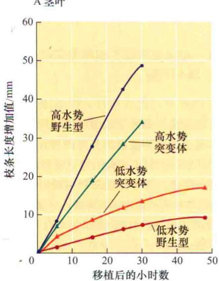

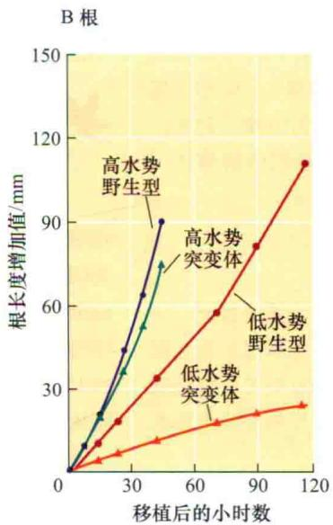

C 根与茎叶的比  
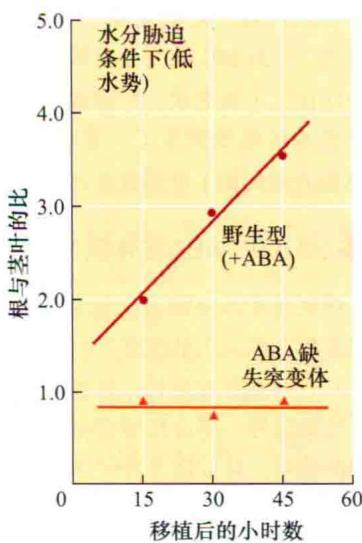  
图23.11 生长在蛭石中的玉米正常植株和ABA缺失突变体[civiparous（vp）]植株在高水势（ $\Psi_{\mathrm{W}} = -0.03 \mathrm{MPa}$ ）和低水势（A中 $\Psi_{\mathrm{W}} = -0.3 \mathrm{MPa}$ ，B中 $\Psi_{\mathrm{W}} = -2.6 \mathrm{MPa}$ ）条件下茎叶（A）和根（B）生长的比较。与对照相比，水分胁迫（低 $\Psi_{\mathrm{W}}$ ）抑制了茎叶和根的生长。C. 水分胁迫下（低 $\Psi_{\mathrm{W}}$ ，与茎叶和根水势的条件稍微有些差别），ABA存在时（如野生型中）根和茎叶生长的速率比没有ABA时（突变体中）高很多（引自Saab et al., 1990）。

在有些植物中，根部会长出许多额外的侧根，但这些侧根的生长一直受到抑制，直到干旱缓解后抑制才解除，这种现象称为干旱生根现象（drought rhizogenesis）（Vartanian et al., 1994）。这些胁迫和营养不平衡的抑制效应至少部分依赖于ABA，因为ABA缺乏突变体和一些ABA反应突变体没有表现出这一抑制作用。

总之，尽管传统观点认为ABA是一种生长抑制剂，但内源ABA只有在水分胁迫下才限制茎叶的生长。而且在这些条件下，若ABA水平高，则内源ABA通过抑制乙烯合成显著促进根的生长。低水势时ABA的总体效应就是显著增加根长与株高的比值（图23.11C），该效应与ABA对气孔关闭的效应一起，帮助植物抵抗水分胁迫（Sharp，2002）。而且，侧根生长的暂时抑制促进了新土壤的利用，导致重新获取水分后新根很快取代了脱水的侧根。但不清楚不同ABA水平如何导致了对生长的相反效应，这些效应可能反映信号是通过根与茎叶中具有不同功能敏感区域或不同下游信号成分的受体传递的。

ABA在干旱反应中作用的另一个例子见Web Essay 23.1。

## 23.5.8 ABA不依赖乙烯促进叶片衰老

脱落酸最初作为脱落诱导因子被分离出来，然而，此后证明ABA仅在几种植物中促进器官脱落，导致器官脱落的主要激素是乙烯。此外，ABA明显参与叶片衰老过程，ABA可能通过促进衰老，间接增加乙烯的合成促进脱落（更多关于ABA和乙烯关系的讨论见Web Topic 23.21）。

人们已经广泛研究了叶片衰老（衰老过程中发生的解剖、生理和生化变化在第16章中介绍）。叶部在黑暗中比在光下衰老快，叶绿素降解后叶片变黄。此外，在一些水解酶的刺激下，蛋白质和核酸的降解增加。ABA极大地促进了叶部及叶片的衰老。

## 23.5.9 ABA在休眠芽中积累

休眠是木本植物适应寒冷气候的一个重要特征。一棵树暴露在冬天很低温度下时，它通过芽鳞保护分生组织，并且抑制芽的生长，这种对低温的反应需要感受机制（感知信号）感应环境变化，还要有控制系统传导所感知的信号，并促进发育使芽休眠。

ABA最初被认为是诱导休眠的激素，因为它在休眠芽中积累，并且当组织暴露在低温下时含量降低。但后来的研究表明，芽中ABA含量并不总是与休眠程度相关。正如我们在种子休眠中看到的那样，这种明显的差异可能反映ABA与其他激素之间存在相互作用，可能芽的休眠和植物的生长受到芽中生长抑制物质与生长诱导物质之间平衡的调节，抑制物质如ABA，诱导物质如细胞分裂素和赤霉素。

尽管人们利用ABA缺失突变体在阐明ABA的作用方面取得了许多进展，但由于缺乏便于研究的遗传系统，ABA在芽休眠中作用的研究进展缓慢，而且研究主要集中在多年生木本植物上。该差别说明遗传学和分子生物学对植物生理学的巨大贡献，表明将这些方法应用到木本植物中非常有必要。

休眠等性状分析起来很复杂，因为它们往往由许多基因共同调控，导致表型退化，这种性状称为数量性状（quantitative trait）。最近的遗传作图研究表明，杨树中磷酸酶ABI1同源蛋白可能调节芽的休眠。有关这方面研究的描述见Web Topic 23.20。

## 23.5.10 应答水分胁迫反应ABA关闭气孔

ABA在冷、盐和水分胁迫中作用的研究结果，证明ABA是一个胁迫激素（见第26章）。如前所述，干旱条件下叶片中ABA浓度可以增加到50倍——这是所有报道中植物对环境信号作出反应时激素浓度变化最剧烈的例子。ABA的重新分布或生物合成在引起气孔关闭时非常有效。水分胁迫下，叶片中ABA的积累在植物减少蒸腾失水中起非常重要的作用（图23.4）。湿度增加后通过增加微管组织和保卫细胞代谢降低了ABA水平，因而导致气孔重新打开。

永久萎蔫突变体可能由于ABA合成和反应缺失不能关闭气孔，在ABA缺失突变体中外施ABA可以使气孔关闭并恢复膨压。相比之下，萎蔫突变体丧失了对ABA的反应能力，萎蔫后不能用外源ABA恢复。

## 23.5.11 ABA调节保卫细胞离子通道和质膜ATP酶

正如在第18章中讨论的那样，保卫细胞内大量 $\mathrm{K}^{+}$ 和阴离子长时间流到胞外导致细胞膨压降低，气孔关闭。 $\mathrm{K}^{+}$ 外向通道打开需要膜的长时间去极化，这可以由两种因素引起：①因正电荷的净内流导致ABA诱导的质膜瞬时去极化，加上②胞质钙的瞬时增加（图23.12）。钙内流结合钙从胞内钙库释放，导致胞质钙浓度从50\~350 nmol/L增高到1100 nmol/L（1.1 μmol/L）（图23.13）（McAinsh et al., 1990）。而且ABA增加了气孔关闭机制对胞内钙水平的敏感性。这些机制导致ABA打开质膜钙激活的慢速（S型）阴离子通道（见第6章）。已证明ABA激活保卫细胞慢速阴离子通道（Schroeder et al., 2001）。ABA也激活保卫细胞另一类阴离子通道——快速激活型（R型）阴离子通道

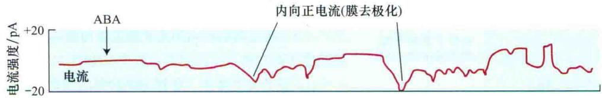

  
图23.12 同时测定蚕豆保卫细胞中ABA诱导的内向正电流和胞质 $Ca^{2+}$ 浓度的增加。用膜片钳技术测定电流；用荧光指示染料测定钙。每次实验，ABA在箭头所示处加到系统中（引自Schroeder and Hagiwara，1990）。

  
图23.13 ABA诱导保卫细胞胞质 $Ca^{2+}$ 浓度（上部曲线）及气孔开度（下部曲线）增加的时间过程。 $Ca^{2+}$ 增加在3 min内开始，在随后5 min内气孔开度降低（引自McAmsh et al., 1990）。

(Raschke et al., 2003)。

这些慢速及快速阴离子通道的长时间开放使大量 $Cl^{-}$ 和苹果酸根阴离子从细胞中逸出，细胞的电化学梯度下降（细胞内为负电荷，这样驱使 $Cl^{-}$ 和苹果酸根阴离子到达细胞外，细胞外 $Cl^{-}$ 和苹果酸根阴离子浓度比细胞内的低）。这样带负电荷的 $Cl^{-}$ 和苹果酸根阴离子外流显著使膜去极化，导致电压门控的 $K^{+}$ 外流通道打开。

除了增加胞质钙浓度外，ABA还导致胞质碱化，使pH从7.7增加到7.9。已证明胞质pH的增加导致质膜外向K+通道活性增加，这明显是通过增加了可激活的通道数量实现的（参见第6章）。abi1突变的一个效应是使这些K+通道对pH不敏感。

除了导致气孔关闭外，ABA还抑制光诱导的气孔开放。另一个导致膜去极化的因素是抑制质膜 $H^{+}$ -ATP酶。ABA间接抑制蓝光诱导的保卫细胞原生质体质子泵（图23.14），这与ABA引起质膜去极化部分由质膜 $H^{+}$ -ATP酶活性降低导致的模型一致。

蚕豆中，至少叶质膜 $H^{+}$ -ATP酶的活性被钙显著抑制。0.3 $\mu$ mol/L钙可抑制50% $H^{+}$ -ATP酶活性，1 $\mu$ mol/L钙可完全抑制该酶的活性（Kinoshita et al., 1995）。似乎有两个因素影响ABA对质膜质子泵的抑制：胞质 $Ca^{2+}$ 浓度增加和胞质碱化。

ABA抑制气孔关闭也与ABA抑制内向 $K^{+}$ 通道相关，内向 $K^{+}$ 通道由质子泵引起膜超极化后打开（见第6章和第18章）。内向 $K^{+}$ 通道的抑制由ABA诱导的胞质钙

10. 膜的去极化活化了质膜上的 $K^{+}_{out}$ 通道
11. $K^{+}$ 和阴离子首先跨质膜从液泡释放至胞质中

  
图23.14 ABA抑制原生质体蓝光刺激的保卫细胞质子泵活性。保卫细胞原生质体悬浮细胞在红光照射下培养，用pH电极检测悬浮培养液中的pH。在所有情况下初始的pH相同（曲线通过转化更易看清楚）（引自Shimazaki et al., 1986）。

1. 蓝光脉冲激活质膜H $^{+}$ -ATPase，将质子泵到外部培养液中使pH降低

2. 培养液中加入 ABA 抑制了 40% 的酸化

浓度增加介导，也似乎由G蛋白信号介导。G蛋白激活蛋白如GTPγS能抑制内向K+通道的活性，但在拟南芥缺乏Gα亚基突变体中，ABA并不抑制内向K+通道或光诱导的气孔开放（Wang et al., 2001）。这样，钙和pH通过以下两种方式影响保卫细胞质膜通道。

(1) 通过抑制内向K+通道和质膜质子泵阻止气孔

开放。

（2）通过激活外向阴离子通道进而激活外向 $K^{+}$ 通道促进气孔关闭。

Gα亚基突变体中，尽管ABA抑制的气孔开放受到阻止，但ABA仍然促进气孔关闭，表明气孔开放的抑制和气孔关闭的促进通过两条不同的途径达到了相同的目的，那就是关闭气孔。正如前面讨论的，磷脂酶D（PLD）和它的产物磷酸（PA）都影响G蛋白对气孔开放的调节，PA通过隔离受抑制的PP2C促进气孔开放。

气孔关闭时，大量（大约0.3 mol/L）离子外流的结果是渗透失水，保卫细胞质膜表面积缩小可达50%。那么减少的膜去了哪里呢？答案似乎是：这些膜以小囊泡的形式通过内吞作用被吸收，这个过程也与ABA诱导的肌动蛋白骨架重组有关，肌动蛋白重组由植物Rho GTPase或“Rops”家族介导（Assmann，2004）。

具有多种感受输入的保卫细胞信号转导都涉及蛋白激酶和磷酸酶。几乎所有生物的信号转导途径中，总有某些步骤与蛋白质的磷酸化和脱磷酸化反应有关。因此认为保卫细胞（有多种信号输入）信号转导也与蛋白激酶和磷酸酶有关，使保卫细胞膜产生电势的 $H^{+}-ATP$

1. ABA与受体结合(为了看得更清楚, 仅显示胞外受体)
2. ABA结合受体后诱导活性氧(ROS)产生, 进而激活质膜上的Ca $^{2+}$ 通道。ROS是由磷脂酶D(PLD)介导的磷脂酸产生的
3. 钙的内流引起了胞内钙的瞬时变化, 进一步促进了钙从液泡中释放
4. ABA刺激NO产生, NO增加了cADPR的水平
5. ABA通过包含SIP、异源三聚体及磷脂酶C和D(PLC和PLD)的信号途径增加了IP3的水平
6. cADPR和IP3的升高激活了液泡上和其他钙通道, 更多的Ca $^{2+}$ 从液泡释放出来
7. 胞内钙的升高阻挡了质膜上的K $^{+}_{\text{in}}$ 通道
8. 胞内钙的升高促进了质膜上Cl $^{-}_{\text{out}}$ (阴离子)通道打开, 引起质膜去极化

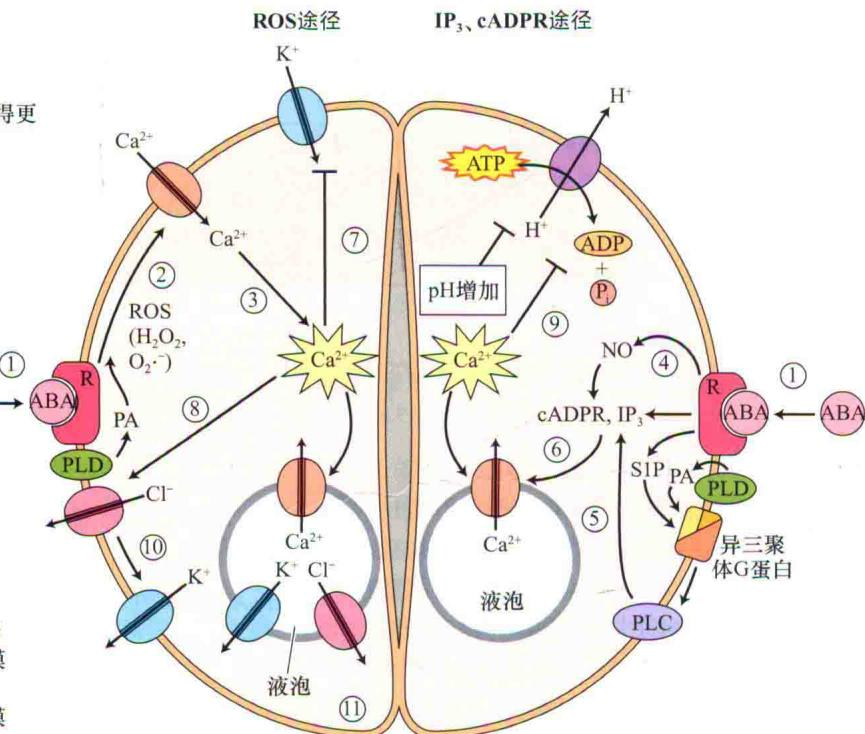  
9. 质膜上的质子泵受到ABA诱导的胞内钙增加和胞内pH升高的抑制，质膜进一步去极化

图23.15 气孔保卫细胞中ABA信号模式图。净效应是细胞中钾离子及阴离子（Cl⁻或苹果酸根离子）丧失。cADPR，环ADP核糖；IP3，1，4，5三磷酸肌醇；NO，一氧化氮；PA，磷脂酸；PLC，磷脂酶C；PLD，磷脂酶D；R，受体；ROS，活性氧；S1P，鞘氨醇-1-磷酸。

酶活性可被一些激酶SnRK和钙依赖蛋白激酶降低，与这一结果一致，蛋白激酶抑制剂抑制ABA诱导的气孔关闭。PP2C和PP2A类蛋白磷酸酶也都参与改变特异H $^{+}$ -ATP酶的活性，导致慢速阴离子通道活性的变化。从这些结果看，蛋白磷酸化和脱磷酸化在保卫细胞信号转导途径发挥重要作用。

图23.15所示为ABA在气孔保卫细胞中作用的简化模式图。为了能表示得更加清楚，仅显示出了细胞表面受体。若要了解更详细的模式图，请参见文献Li et al., 2006和Web Essay 23.2。

## 小结

脱落酸（ABA）发挥短期（快速和可逆的）和长期（持久的）的效应控制植物的发育，该激素在植物应答水分胁迫、干旱、低温和盐胁迫及种子成熟和芽休眠过程中发挥极其重要的作用。

## ABA的产生、化学结构和测定

· ABA与一些类胡萝卜素分子的末端部分类似，以顺式和反式及S和R型形式存在（图23.1）。

· ABA可由生物测定、气相色谱、高压液相色谱和免疫测定方法检测。

## ABA的生物合成、代谢和运输

· ABA由类胡萝卜素前体产生，该前体由质体中的异戊烯二磷酸（IPP）合成，最后在胞质中完成（图23.2）。

· 阻断类胡萝卜素合成的突变降低了ABA水平，导致种子过早萌发（图23.3）。

· 在发育或响应包括脱水等胁迫反应过程中，ABA水平会发生动态改变（图23.4）。

· ABA由氧化降解或通过结合被失活。

· ABA由木质部和韧皮部运输，正常情况下在韧皮部汁液中更丰富。

· 水分胁迫下，ABA首先在茎的微管组织中积累，随后出现在根和保卫细胞中（图23.5）。

· 水分胁迫下，质外体和胞质中pH变化增加了ABA含量，ABA进入保卫细胞后促进气孔关闭（图23.6）。

## ABA信号转导途径

· ABA 短期的反应常常涉及离子流跨膜变化，但也可能包括对某些基因的调控（图 23.15）。

· ABA诱导的持续发育过程（如种子成熟）涉及基因表达模式的重大变化。

·在胞质、核及质体和质膜中鉴定出了ABA受体（图23.7）。

\- 几种第二信使在各种ABA信号反应中都起作用，这些信使包括 $\mathrm{Ca}^{2+}$ （图23.8）、活性氧、环核苷酸和磷脂（图23.9和图23.15）。

· 蛋白激酶和磷酸酶调节ABA信号中重要的步骤（图23.7）。

· ABA与其他激素具有共同的信号中间成分，并在不同信号途径主要交叉调节中发挥作用。

## ABA调节基因表达

· ABA介导转录因子激活基因。

· 转录因子活性调控发育和环境相关基因的表达。

· 转录因子间相互作用，或者转录因子与激酶、磷酸酶或降解机制成分间相互作用调控基因的转录（图23.10）。

## ABA在发育中的作用和生理效应

· ABA在调节种子发育、种子和芽休眠、萌发、营养生长、衰老、气孔调节及胁迫反应中发挥作用。

· 在发育的种子中，胚和胚乳的基因型控制ABA合成，这对诱导休眠至关重要。种皮的母本基因型在胚发生中期控制ABA积累，后者抑制胚萌。

\- 种子发育过程中，ABA促进储藏蛋白、脂及参与脱水耐性形成特异蛋白等的合成。

\- 种子的休眠和萌发由ABA与GA之间的比例控制。

· 在萌发的种子中，ABA抑制GA诱导的水解酶合成。

· ABA对根和茎生长的效应依赖于植物的水分状况（图23.11）。

· ABA极大地促进了叶片衰老，因而增加了乙烯形成和刺激脱落。

· ABA在休眠芽中积累，抑制芽的生长，ABA也可与促进生长的激素如细胞分裂素和赤霉素相互作用。

·在应答水分胁迫反应中，ABA通过使正电荷内流进入保卫细胞诱导膜的瞬时去极化关闭气孔（图23.12）。这些瞬时变化导致细胞中大量K+和阴离子持续外流，从而降低了保卫细胞的膨压（图23.13）。

· 保卫细胞ABA诱导的变化能抑制质膜H $^{+}$ -ATP酶活性，导致膜的去极化（图23.14）。

(郝福顺 译)

## WEB MATERIAL

## Web Topics

23.1 The Structure of Lunularic Acid from Liverworts Although inactive in higher plants, lunularic acid appears to have a function similar to ABA in liverworts.

23.2 ABA May Be an Ancient Stress Signal
Recent reports have documented a role for ABA in regulating stress responses in animals ranging from sea sponges to mammals.

23.3 Structural Requirements for Biological Activity of Abscisic Acid
To be active as a hormone, ABA requires certain functional groups.

23.4 The Bioassay of ABA
Several ABA-responding tissues have been used to detect and measure ABA.

23.5 Evidence for Both Extracellular and Intracellular ABA Receptors
Experiments supporting both types of ABA receptors in different cell types are described.

23.6 The Existence of G Protein-Coupled ABA Receptors Is Still Unresolved
Despite some experimental evidence for the participation of G-proteins in ABA responses, their role as receptors has not yet been demonstrated.

23.7 The Yeast Two-Hybrid System
The GAL4 transcription factor can be used to detect protein–protein interactions in yeast.

23.8 Yellow Cameleon, A Noninvasive Tool for Measuring Intracellular Calcium
The yellow cameleon protein has several features that enable it to act as a reporter for calcium concentration.

23.9 Phosphatidic Acid May Stimulate Sphingosine-1-Phosphate Production
The relationship between phosphatidic acid and the levels of sphingosine-1-phosphate is discussed.

23.10 The ABA Signal Transduction Pathway Includes Several Protein Kinases
Calcium-dependent kinases, calcineurin B-like interacting protein kinases, and MAP kinases have been implicated in the ABA signal transduction pathway.

23.11 The ERA1 and ABH Genes Code for Negative Regulators of the ABA Response
The phenotypes of the eral and abh mutants are described.

23.12 Promoter Elements That Regulate ABA Induction of Gene Expression
ABA induction of gene expression is regulated by several different cis-acting sequences bound by distinct transcription factors.

23.13 Regulatory Proteins Implicated in ABA-Stimulated Gene Transcription

Techniques such as the yeast two-hybrid system have identified several additional ABA transcriptional regulators.

23.14 ABA Gene Expression Can Also Be Regulated by mRNA Processing and Stability
Some mutations affecting basic aspects of RNA metabolism have surprisingly specific effects on the ABA-mediated stress response.

23.15 ABA May Play a Role in Plant Pathogen Responses Several studies link ABA with stimulation or inhibition of plant responses to bacterial and fungal pathogens.

23.16 Proteins Required for Desiccation Tolerance
ABA induces the synthesis of proteins that protect cells from damage due to desiccation.

23.17 The Types of Coat-Imposed Seed Dormancy
The seed coat can inhibit germination by five different mechanisms.

23.18 Types of Seed Dormancy and the Roles of Environmental Factors Many types of seed dormancy exist, some are affected by various environmental factors.

23.19 The Longevity of Seeds
Under certain conditions, seeds can remain dormant for hundreds of years.

23.20 Genetic Mapping of Dormancy, Quantitative Trait Locus, QTL, Scoring of Vegetative Dormancy Combined with a Candidate Gene Approach
QTL analysis is a genetic method for determining the number and chromosomal locations of genes affecting a quantitative trait affected by many unlinked genes.

23.21 ABA-Induced Senescence and Ethylene
Hormone-insensitive mutants have made it possible to distinguish the effects of ethylene from those of ABA on senescence.

Web Essay

23.1 Heterophylly in Aquatic Plants
Abscisic acid induces aerial-type leaf morphology in many aquatic plants.

## 23.2 Hope for Humpty Dumpty, Systems Biology of Cellular Signaling

ABA regulation of stomatal opening is used to illustrate the use of systems biology approaches for modelling cellular signaling

## 第 24 章

# 油菜素甾醇：细胞扩大和发育的调节子

虽然很久以前就知道动物中存在甾醇类激素，但是在植物中发现这类激素的时间却不长。动物甾醇类激素包括性激素（雌性激素、雄性激素和黄体酮）和肾上腺皮质激素（糖皮质激素和盐皮质激素）。油菜素甾醇（brassinosteroid，BR）是一类植物中的甾醇类激素，它们在植物的很多发育过程中起着重要作用，包括茎和根中的细胞分裂和伸长、光形态建成、生殖发育、叶片衰老，以及对胁迫的反应等（Clouse and Sasse，1998）。

植物甾醇类激素是众多科学家经过近30年的努力，在鉴定不同植物花粉中的新型生长促进因子的时候发现的（Steffens，1991）。J.W.Mitchell及其同事的早期研究发现，在成熟油菜花粉的有机溶剂提取物中含有一种具有最高活性促进生长的物质。他们将油菜花粉中这种未鉴定的活性化合物称为油菜素（brassin）（Mitchell et al., 1970）。

很多生理实验验证了油菜素促进生长的特异作用，包括菜豆第二节间的生物测定实验。在测试中，油菜素的作用不同于其他已知植物激素，它可以引起细胞的伸长和分裂，同时引起第二节间的弯曲、膨胀和开裂（Mandava，1988）。

由于在很低浓度就可以强烈诱导生长和分化，Mitchell等于1970年提出，油菜素代表了一类新的植物激素。进一步的研究证明，油菜素不仅诱导茎的伸长，而且可以提高总的生物量和种子产量。据信这类化合物可能有巨大的应用价值，美国农业部为有关实验室提供经费资助，开展对油菜素中活性化合物的纯化和鉴定研究。

研究人员最终从227 kg蜜蜂收集的油菜花粉中纯化到4 mg具有最高生物活性的油菜素化合物，并将其命名为油菜素内酯（brassinolide）（Grove et al., 1979）。对其晶体结构的X射线衍射分析和光谱研究表明油菜素内酯是一种类似于动物甾醇激素的多羟基甾醇。

3年后，日本科学家从栗子树的虫瘿中分离到另一种植物甾醇，称为栗木甾酮（castasterone），被认为是油菜素内酯的前体（Yokota et al., 1982）。不久，同一研究组从长绿阔叶树蚊母树（Dystilium racemosum）中鉴定到一种与油菜素内酯生物活性类似的混合物（Abe and Marumo, 1991）。

尽管油菜素甾醇类物质被认为是一种内源性化合物，并且在生物测定中对植物生长有重要影响，如菜豆第二节间的生物测定，但由于很多年来人们并不清楚它们在植物正常生长和发育中的作用，因此当时并没有被认作一种植物激素。直到20世纪90年代中期对拟南芥的遗传学研究最终证明了油菜素甾醇是植物激素，与其他植物激素一起参与调控植物发育的很多方面，包括茎的生长、根的生长、微管组织的分化、花粉管生长及种子萌发（Clouse and Sasse，1998）。

我们对油菜素甾醇的讨论，将从简述BR的化学结构及证明BR是植物激素的遗传研究开始。随后，将论述从BR受体到它们调节基因表达的信号转导途径。进而，将综述它们的生物合成、代谢及转运途径，然后介绍这类激素影响的一些重要生理过程。最后，将简单评估油菜素甾醇在农业上的潜在应用价值。

## 24.1 油菜素甾醇的结构、发生及遗传分析

在油菜素甾醇的纯化过程中，主要用到了两种生物测定法：菜豆第二节间的生物测定（图24.1）和水稻叶片弯曲的生物测定（图24.2）。这些生物测定法将具生物活性的BR和不具活性的中间产物和代谢物区别开，同时能定量测定活性化合物的含量（图24.3）。

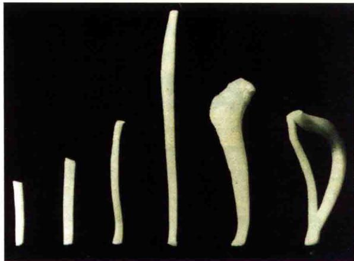  
油菜素甾醇浓度递增

图24.1 油菜素甾醇的菜豆第二节间生物测定。切下的菜豆第二节间在含不同BR浓度的培养液中离体悬浮培养几天。最左边为未处理的对照。低浓度的BR主要诱导伸长性生长，而高浓度则引起茎的增粗、弯曲和开裂（引自Mandava，1988）。  
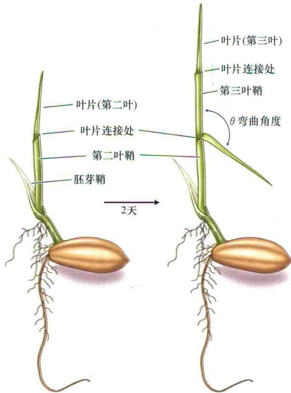  
图24.2 油菜素甾醇影响矮秆水稻叶倾角的实验。将一小滴溶于乙醇的BR涂在叶片和叶鞘的连接处。在高湿度的条件下培养2天后，测定叶片和叶鞘的夹角（ $\theta$ ）。角度的大小与溶液中油菜素甾醇的浓度成正相关。

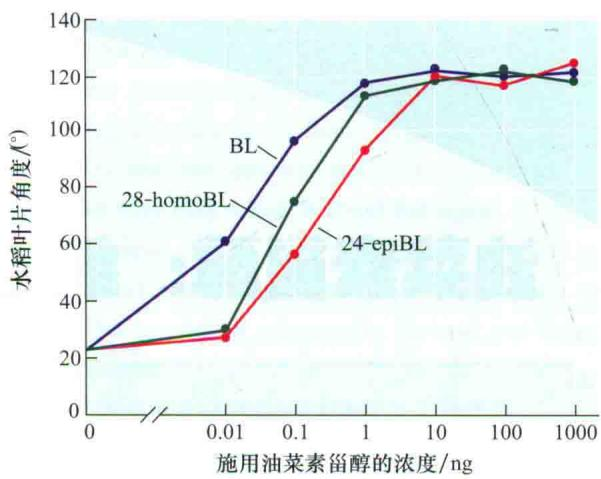  
图24.3 三种具不同活性的BR在水稻叶片弯曲实验中的剂量反应曲线。24-epiBL，24-表油菜素内酯；28-homoBL，28-同油菜素内酯；BL，油菜素内酯。

1979年，人们解析了油菜素甾醇的基本化学结构。当时对于纯化的活性物质进行X射线衍射结晶分析确定了它是一种甾醇类内酯（steroidal lactone）（图24.4）（Grove et al., 1979）。这种化合物被命名为油菜素内酯（brassinolide, BL），根据其结构特征最终鉴定到大约60种相关的植物甾醇，统称为油菜素甾醇（Fujioka and Yokota, 2003）。BL生物合成的直接前体栗木甾酮（castaserone, CS）也有较弱的BR活性。

目前，已经在27个科的种子植物（包括被子植物和裸子植物）、一种羊齿类（问荆，Equisetum arvense）、一种苔藓类（地钱，Marchantia polymorpha）、一种绿藻（水网藻，Hydrodictyon reticulatum）中鉴定到油菜素甾醇。因此，油菜素甾醇显然是一种在陆生植物进化之前，普遍存在于各种植物中的激素。在被子植物的花粉、花药、种子、叶片、茎、根及幼嫩的生长组织中都含有低浓度的油菜素甾醇。

对BL分子结构的了解，使人们能够合成自然界中存在的各类BR和它们的类似物。利用菜豆第二节间或水稻叶片倾角生物测定的方法来测定这些化合物的活性，确定了评价BR活性的以下关键原则（Mandava，1998）。

（1）位于A环上C-2和C-3位置顺式邻双羟基醇的作用。C-2或C-3任一羟基的缺失及它们构象上的任何变化都将导致活性的丧失。

（2）B环内酯7位的作用。尽管B环上有限的修饰不会使活性完全丧失（如栗木甾酮上的B环，图24.10），但是会导致活性显著下降。

（3）甾醇侧链上C-20和C-23羟基的影响。位于

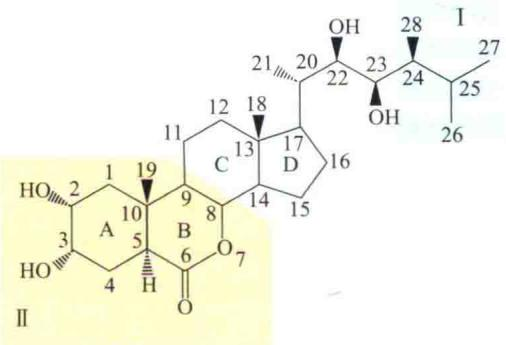  
I

I  
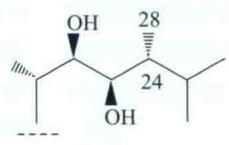  
24-表油菜素内酯

  
28-同油菜素内酯

C-20和C-23上的羟基以 $\alpha$ -构象形式存在时比相应的 $\beta$ -羟基的甾醇活性更高。

图24.4 油菜素甾醇的结构。油菜素内酯（BL）是植物中分布最广和活性最高的油菜素甾醇。BL结构中的碳原子用数字编号，环的类型用字母来表示。发生变化的区域用罗马数字Ⅰ和Ⅱ表示。在区域Ⅰ，24-表油菜素内酯和28-同油菜素内酯的侧链存在差异，但并不显著影响它们的活性。侧链C-22和C-23上的羟基是BR活性所必需的。

C-24上的烷基侧链可以发生变化，只是通常情况下发现其活性降低，如24-表油菜素内酯（24-epiBL）和28-同油菜素内酯（28-homoBL）（图24.3和图24.4）。依据它们的侧链结构，不同的化合物可分为 $C_{27}$ 、 $C_{28}$ 或 $C_{29}$ 油菜素甾醇。因为人工合成24-epiBL比合成BL便宜得多，所以尽管很多生物测定表明24-epiBL的活性只有BL的10%，但是在生理实验中，人们还是经常用24-epiBL来替代BL。

## 24.1.1 BR缺失突变体的光形态建成发生异常

近10年来对BR合成和感受缺失突变体的分离及其表型分析的遗传学研究，为确定油菜素甾醇是植物激素提供了确凿的证据。这些突变体的异常表型证明BR在植物正常发育中是必需的。

A  
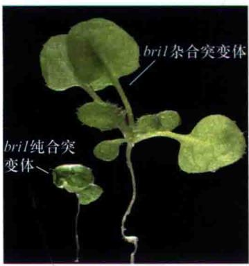

B  
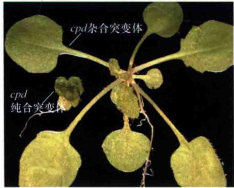

在对完全黑暗条件下生长数天后仍具有光下生长形态（也就是去黄化）的拟南芥幼苗突变体筛选中，最早分离到的BR缺失突变体是det2（de-etiolated 2，去黄化）和cpd（constitutive photomorphogenesis and dwarfism，组成型光形态发生和矮化）（图24.5）（Li et al., 1996; Szekeres et al., 1996）。这两个突变体中油菜素甾醇的生物合成受阻。DET2编码的蛋白质与哺乳动物的甾醇 $5\alpha$ -还原酶在氨基酸序列上很相似（Li et al., 1996）。哺乳动物的甾醇 $5\alpha$ -还原酶催化从睾丸激素到二氢睾丸激素的NADPH依赖性转化，这是甾醇代

C  
det2 突变体  
D  
野生型  

图24.5 拟南芥BR突变体的表型。A. 光照条件下生长3周，与野生型表型相同的bril杂合体（右）相比，纯合的bril突变体（左）明显矮小。B. 光照条件下生长3周，纯合的cpd突变体（左）同样表现出矮小的表型；右边所示是呈野生型表型的杂合突变体。C. 光照条件下生长至成熟，与野生型植株（右）相比，det2突变体（左）表现为矮小的表型。D. 左边是黑暗条件下生长的det2突变体，具有短而粗的下胚轴和伸展的子叶；右边是黑暗条件下生长的野生型（S. Savaldi Goldstein惠赠）。

谢中的一个关键步骤，是正常胚胎中雄性外生殖器和前列腺发育所必需的。同样，CPD基因编码的蛋白质与哺乳动物细胞色素P450单氧化物酶，包括甾醇羟化酶同源。

det2和cpd突变体幼苗对光形态发生的反应受到影响，主要表现为下胚轴短而粗、子叶伸展、有幼嫩的原生叶（在暗生长的野生型幼苗中缺失）及高水平的花青素。以上表型都是野生型在光下而非暗处生长幼苗的表型（图24.5D）。另外，这两个突变体在黑暗条件下生长时，可以检测到受光调节基因的mRNA水平提高。而暗处生长的野生型幼苗表现出典型的黄化表型（下胚轴长、子叶折叠和花青素的缺失）。

除了非典型的暗生长表型外，det2和cpd在光照条件下的生长也不正常。由于细胞大小和细胞间隙减小，两个突变体植株都呈深绿色并且矮小（图23.5 B 和 C），顶端优势丧失（见第9章），并且雄性育性下降。另外，det2和cpd还表现出根短、开花延迟的表型，且即使是在开花后还表现叶片衰老延迟的现象。cpd通常比det2的表型严重，其原因是det2突变体中仍有微量的具有生物活性的BR，而cpd突变体中几乎检测不到具有活性的BR（Szekeres et al., 1996）。对这些矮小突变体外源施加油菜素甾醇能够恢复它们的表型，进一步证明DET2和CPD是油菜素甾醇合成和植物正常光形态建成所必要的（图24.6）。

A cpd  
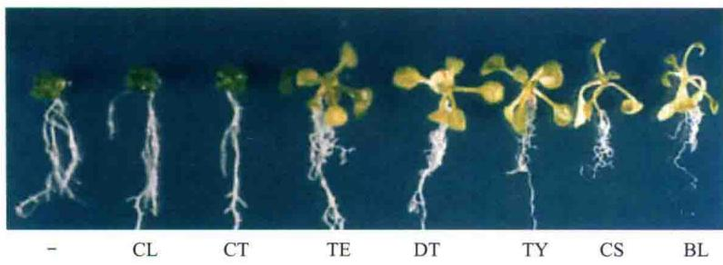

B 野生型  
  
图24.6 BL及其合成（图24.10和附录3）中的中间产物恢复cpd突变体的正常生长。野生型和cpd突变体幼苗不施用油菜素甾醇（负号表示）或用0.2 $\mu$ mol/L BR中间产物处理14天。菜油甾醇（campesterol，CL）和卡它甾酮（cathasterone，CT）对cpd突变体都没有任何影响，因为这些中间产物的合成在CPD蛋白酶催化的反应之前。相反，茶甾酮（teasterone，TE）、3-脱氢茶甾酮（3-dehydroteasterone，DT）、香蒲甾醇（typhasterol，TY）及栗木甾酮（CS）都能恢复cpd的表型，因为它们的合成在CPD酶催化的反应之后。野生型含有适量的中间产物，其生长受到BL及其中间产物的微弱抑制（引自Szekeres et al., 1996）。

## 24.2 油菜素甾醇的信号转导途径

对BR反应的遗传分析，鉴定到位于细胞膜的BR受体和BR信号转导途径中的很多其他组分。从而使人们对BR作用分子机制的研究已经取得了巨大的进展。这里，我们将重点讨论拟南芥中的BR信号转导通路及其主要组分（关于BR信号途径和其他信号转导的比较请参见第14章）。

## 24.2.1 从BR不敏感突变体中鉴定出BR细胞表面受体

为了鉴定拟南芥BR信号转导途径的组分，研究者最初采用遗传筛选的方法，在高浓度BL的条件下分离根正常伸长的突变体，并从中筛选到单一的bri1（brassinosteroid-insensitive 1）（Clouse et al., 1996）。进一步筛选对BL不敏感的突变体，所有得到的其他突变体都是BRI1的等位突变（Li and Chory, 1997），证明BRI1是BR信号转导途径中的重要组分。

接下来的结合实验证明BL能以相当高的专一性直接结合到BRI1，证明了BRI1是BR的受体（Kinoshita et al., 2005）。

油菜素内酯可以结合到受体BRI1的胞外域。BRI1是定位于细胞膜上的富亮氨酸重复（leucine-rich repeat，LRR）的受体激酶（图24.7）。BRI1也被发现能定位于早期内体（亚细胞隔室）中并通过其传递信号（Geldner et al., 2007）。有意思的是，虽然到目前为止，大家认为植物蛋白激酶都是丝氨酸/苏氨酸（serine/threonine, S/T）特异的激酶，但是BRI1却是一个双重特异的蛋白激酶。也就是说，丝氨酸/苏氨酸和酪氨酸位点都能被BRI1自磷酸化，同时这两种修饰都是BRI1激活所必需的（Oh et al., 2009）。

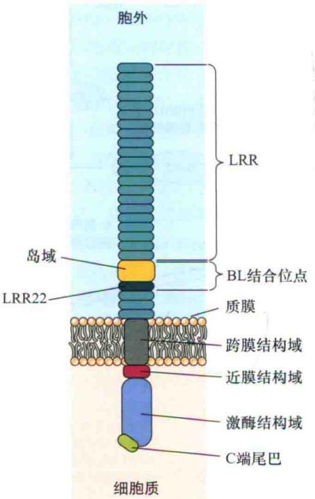  
图24.7 BR受体BRI1的结构域组成。受体BRI1定位于细胞膜上。胞外区域由一段富亮氨酸重复序列（LRR）组成，LRR内含一个岛状域，其功能为油菜素内酯（BL）结合区域的一部分。胞内部分包括一个近膜结构域、一个激酶结构域和C端尾巴。

在拟南芥基因组中，LRR受体激酶可能组成了最大的受体基因家族，超过230个。这个家族具有保守的功能结构域，其N端是一个包括具有很多串联（邻近）富亮氨酸重复的胞外功能域，有个单一跨膜区，以及具有酪氨酸、丝氨酸和苏氨酸蛋白激酶活性的胞质激酶域（图24.7）。以BRI1为例，它含有25个富亮氨酸重复。BRI1还含有一个BR结合必需的，由一系列氨基酸残基形成一个独特“岛”域，它插在第21和第22个富亮氨酸重复之间（Kinoshita et al., 2005）。这个岛域连同其相邻的第22个富亮氨酸重复构成了结合BR所必需的最小区域。

## 24.2.2 磷酸化激活BRI1受体

对大量BRI1等位突变的分析表明，受体的胞外域和胞内激酶域都是BR信号传递到下游所必需的（Friedrichsen et al., 2000; Vert et al., 2005）。BL与BRI1上约100个氨基酸残基构成的新的甾醇结合域结合，该区域包括岛域和邻近的LRR序列（图24.7）。BL结合后使受体激活，其特征是提高受体的自磷酸化活性，并增强了与次级LRR受体激酶、BRI1结合受体激酶BAK1（BRI1-association receptor kinase 1）的结合（图24.8）。

在油菜素内酯存在的情况下，BRI1胞内结构域的很多位点发生体内磷酸化，包括近膜区（juxtamembrane region，JM）、C端尾巴和激酶的催化区域本身。这些磷酸化的位点对受体活性起着调节作用，并控制BRI1的抑制子BKI1（BRI1 -kinase inhibitor 1）从细胞膜上的解离及BRI1与其他蛋白质的互作，如BKA1和BSK（BR-signaling kinase）（Wang et al., 2005a, b; Wang and Chory, 2006; Tang et al., 2008）。

与动物的蛋白激酶类似，BRI1激酶域的特异磷酸化位点是激酶激活所必需的（图14.2）。另外，BRI1的C端对受体的活性起负调节作用。配体结合后，消除了C端的抑制作用，从而提高了BRI1的激酶活性（Wang et al., 2005b）。然而，在解析了BRI1的高分辨率结构后，才能清楚了解BL诱导激活的准确机制（Wang et al., 2005b）。

动物和植物细胞的受体激酶在体内常以二聚体形式起作用。体外实验已经证明，细胞内BRI1受体通常以同一种单体组成的同源多聚体起作用（Wang et al., 2005a）。

BRI1与其配体结合而被激活后，磷酸化的BRI1与另一种LRR激酶BAK1形成异源多聚体（由两个不同的单体组成）并磷酸化BAK1。接下来，BAK1被激活并与BRI1发生反式磷酸化作用。磷酸化的BRI1/BAK1异源二聚体可能是受体的活化形式，它们通过磷酸化激活BSK蛋白质并抑制负调控因子BIN2的活性而诱导BR反应。

## 24.2.3 BIN2是BR诱导基因表达的抑制子

BR存在的情况下，形成活化的BRI1/BAK1异源多聚体开启了BR的信号转导过程，从而调节BR反应基因的转录。BR信号转导途径中下一个步骤由负调节因子BIN2（brassinosteroid insensitive-2）参与（图

  
图24.8 BR信号转导模型。信号在细胞表面感知。

24.8）。BIN2编码一个与酵母和动物中的糖原合成激酶Ⅲ（GSK3）同源的蛋白激酶（Li and Nam，2002）。GSK3是具有组成型活性的丝氨酸/苏氨酸激酶，它们广泛地参与很多信号转导途径，并常起到抑制基因表达的作用。

在BR不存在的条件下，BIN2可能在很多调控位点磷酸化两个核蛋白质BES1（bri1-EMS-suppressor 1）和BZR1（brassinazole-resistant 1）的很多调控位点，从而抑制它们的活性。BES1和BZR1是高度类似的转录调节因子（在氨基酸序列上有90%的同一性identity）。它们是短寿命的蛋白质，可以被26S蛋白酶体降解，这个过程与泛素化相关（图24.8）（泛素途径在第2章、第14章和第19章中也有论述）。

BIN2对BES1和BZR1的磷酸化至少有两方面的调控作用。第一，BES1和BZR1磷酸化状态的改变会影响它们在细胞核和细胞质间的穿梭，这种穿梭运动是由一类称为14-3-3的蛋白质家族介导（Gendron and Wang, 2007）。第二，BES1和BZR1的磷酸化会阻止它们结合到目的启动子，因此阻止它们作为转录调节因子的作用（Vert and Chory, 2006）。

在BR存在的条件下，活化的BRI1/BAK1异源寡聚体激活BSK蛋白质，从而促进BSK蛋白质与植物特异丝氨酸/苏氨酸磷酸酶BSU1（bril suppressor 1）结合并将其激活。接下来激活的BSU1将BIN2脱磷酸化，并通过蛋白酶体系统促进其降解（Peng et al., 2008；Kim et al., 2009）（图24.8中的第4个和第5个步骤），于是导致了脱磷酸化并呈活化状态的BES1和BZR1的积累（图24.9）。抵消BIN2激酶作用的磷酸酶目前并不知道。活化的脱磷酸化的BES1和BZR1进而激活或抑制BR调节基因的表达（图24.8）。

  
图24.9 BL抑制BES1的磷酸化。A.用Western印迹法来鉴定两种形式的BES1：高度磷酸化的形式（PPP）和非磷酸化的形式（P）。在未经BL处理（-BL）的拟南芥植株中，很多BES1处于高度磷酸化的形态。在BL处理（+BL）的植株中，所有的BES1都处于非磷酸化的状态（抗体由Y.Yin制作，G.Vert惠赠）。

## 24.2.4 BES1 / BZR1 调节基因表达

随着拟南芥基因组测序的完成，也有了同时检测数千个基因表达的技术。应用这些包含DNA芯片分析（见第2章和Web Topic 17.7）在内的技术来研究基因的表达，鉴定到数百个受BR诱导的基因，据推测其中的很多基因在生长过程中起作用。另外，还鉴定出受BR抑制的基因。其中的很多下调基因也受到转录因子BES1/BZR1的调节（图24.21）（Vert et al., 2005）。

BES1和BZR1是通过两个独立的遗传筛选发现的。在光照条件下，bes1突变体与过表达DWF4和BRI1的植株类似，变得比野生型更大。与此相反，光下生长的bzr1突变体表现出半矮化的表型。在黑暗条件下，BES1和BZR1突变位点可以抑制bri1弱等位突变的矮小表型并拥有正常长度的下胚轴。这是因为BES1和BZR1突变位点使它们编码的蛋白质不易降解。用遗传学术语来说，BES1和BZR1突变位点是由于其所编码蛋白质累积所造成的半显性的一种功能获得型突变。

尽管它们在序列上有很高的相似性，BES1和BZR1看来可能介导拟南芥中不同靶基因的表达。这可能是因为该植物体内这些转录因子本身受到截然不同的时空调控。BES1通过与其他蛋白质相互作用来促进一组BR诱导基因的表达，这些蛋白质包括不同家族的靶标转录调节因子和染色质重塑因子。其中一个例子就是一个称为BIM1（BES1-interacting Myc-like 1）的转录调节因子。BES1/BIM1的异源二聚体结合到一段称为E盒的特异DNA序列上，激活转录。其中E盒作为BR所诱导基因启动子上的BR反应元件（Yin et al., 2005）。

BZR1是BR生物合成中的抑制子。BZR1直接与很多不同的BR生物合成基因的启动子区域所含有的CGTG（T/C）G元件相结合，从而抑制转录。这样，BZR1在BR生物合成途径的负反馈调节上起着重要的作用（见后文）（He et al., 2005）。

## 24.3 油菜素甾醇的生物合成、代谢及运输

与赤霉素和脱落酸类似，油菜素类甾醇的合成途径是萜类途径的一个分支，开始于两个法尼醛二磷酸聚合形成 $C_{30}$ 三萜三十碳六烯（sequalene）（见第13章）。三十碳六烯接着经过一系列的环闭合，从而形成五环的三萜（甾酮）前体环阿屯醇（cycloartenol）。植物中所有的甾醇类物质都是环阿屯醇一系列的氧化反应和其他修饰的结果。

对BL生物合成途径的了解来自于遗传学和生物化学共同的研究成果（Fujioka and Yokota，2003）。鉴于长春花属的植物（玉黍螺）（Catharanthus roseus）能产生相对高剂量的BRs，因此常用它们的细胞培养进行油菜素甾醇合成途径的生物化学分析。在饲喂试验中利用放射性同位素标记的BR中间产物做示踪，经气相色谱-质谱分析鉴定出它们的代谢衍生物。将这种分析方法与遗传学相结合，来研究拟南芥、番茄及其他植物的BR缺失突变体，从而鉴定出BR生物合成的完整途径。在这一部分我们将列举并讨论这些发现。

## 24.3.1 油菜素内酯是由菜油甾醇合成的

由于其C-24取代的烷基不同，油菜素甾醇的合成可来源于菜油甾醇（campesterol）、谷甾醇（sitosterol）及胆固醇（cholesterol）。在植物膜中，菜油甾醇和谷甾醇的含量丰富，而胆固醇相对较少。所有这三种甾醇在植物细胞中都代谢生成大量的中间产物，但只有其中少数几种具有生物活性（Clouse and Sasse，1998；Sakurai，1999）。

我们将从甾醇的最早前体菜油甾醇开始，对BR生物合成途径进行简要描述，而菜油甾醇最终是由环阿屯醇生成的（图24.10）。经过包括DET2参与的步骤，菜油甾醇首先生成菜油甾烷醇（campestanol）。然后通过早期C-6氧化和后期C-6氧化中的任一条途径，转化为栗木甾醇（CS）。附录3包括了这两条途径的其他信息。

  
图24.10 油菜素内酯（BL）生物合成和代谢途径的简图。BL生物合成的前体是菜油甾醇。黑箭头表示生物合成的次序，实线箭头表示单步反应，虚线表示多步反应。如图所示，BL的中间前体栗木甾酮，可由两条平行的途径合成：早期-氧化和后期-氧化途径。在早期C-6氧化途径中，B环上的C-6氧化反应早于侧链C-22和C-23位置上的相邻羟基化（有关BL的结构见图24.3）。在后期C-6氧化途径中，C-6氧化反应发生在侧链和A环C-2上羟基化之后。这两条途径可能在很多不同的点上相互连接，因此是一个生物合成网络而不是一个线性途径。图中标出了拟南芥催化不同步骤的酶。BL的分解由一个红色箭头表示。

两条途径在CS上合并，CS继而转化成BL（图24.4和图24.10）。在拟南芥、豌豆及水稻中，早期C-6氧化和后期C-6氧化途径共同存在，且可以在不同点上连接（Fujioka and Yokota，2003）。目前，人们还不清楚植物同时拥有这两条相连途径的生物学意义。事实上，在番茄中并没有发现早期C-6氧化途径。两条相连途径的共存增加了BR生物合成的复杂性，它可能为植物在不同的生理环境，如适应各类胁迫提供了有利条件。

所有从菜油甾醇到BL合成途径的突变体，都是由一些编码细胞色素P450单氧化物酶（cytochrome P450 monooxygenase，CYP）的基因突变引起的。拟南芥中DWARF4（DWF4）和CPD基因，编码两个单氧化物酶，CYP90B1和CYP90A1，它们分别使BR合成中间产物中的C-22和C-23位置发生羟基化（Fujioka and Yokota，2003）（图24.4和图24.10）。

参与BR生物合成途径的CYP蛋白质定位在内质网（endoplasmic reticulum，ER）上。这一点与参与赤霉素生物合成（见第20章）的细胞色素P450单氧化物酶类似，因此BL的生物合成很可能也在内质网上。

## 24.3.2 降解代谢和负反馈在控制BR动态平衡上的作用

活性BR的水平同样受到使BL失活的代谢过程调节。几种类型的反应都能导致BL的失活，包括差向异构、氧化、羟基化、磺化及与葡萄糖或脂类的缀合（Fujioka and Yokota，2003）。对这方面的认识仍非常有限，这些知识只是来源于饲喂实验：给植物施用放射性同位素标记的BR，然后鉴定标记的产物和分析内源代谢产物。然而，在植物中，BR途径与这些产物的相关性仍然不清楚。

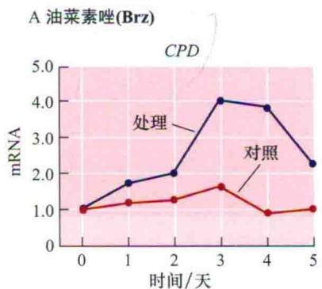

分离到的拟南芥基因BAS1（phyB activation-tagged suppressor-dominant），编码一个具甾醇26-羟化酶活性的细胞色素P450单氧化物酶（CYP72B1），至少阐明了一个通过代谢酶来调节BL浓度的机制。BAS1的过量表达降低了植物体内BL的水平，并导致失去活性的26-羟基化的BL（26-羟基BL的结构，见图24.6）的积累，导致BR缺失植株的矮小表型（Neff et al., 1999）。

具生理活性的BR水平也受负反馈机制调节。也就是说，如果积累过量的BR，它的生物合成将受到削弱，而BR的降解则被促进。实际上，拟南芥对外源施用BL的反应使所有被检测的与BL生物合成相关基因（DWF4、CPD、ROT3及BR6ox1）的mRNA水平都降低了，而参与BR降解的BAS1的mRNA水平却提高了（图24.11）（Tanaka et al., 2005）。

BR生物合成相关基因的下调由BZR1调控，BZR1可以直接与这些生物合成基因启动子上的一个保守元件结合，从而抑制它们的表达（图24.8）（He et al.,

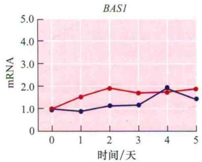

  
图24.11 油菜素甾醇水平的正、负反馈调节。对拟南芥幼苗进行5 $\mu$ mol/L油菜素唑（Brz）处理（A），或者先用5 $\mu$ mol/L Brz（耗尽内源BL）处理后接着用0.1 $\mu$ mol/L BL处理（B），2天后测定CPD（BR合成）和BAS1（BR代谢）的mRNA水平。BR生物合成基因CPD的表达被Brz（A）促进，而受BL（B）的抑制。因此CPD受BL负调控。相反，BL促进BR降解酶基因BAS1的表达。所以BAS1受BL正调控（引自Tanaka et al., 2005）。

0.5 $\mu$ mol/L

2005）。相应地，对BL反应能力减弱的拟南芥突变体，将会比野生型拟南芥累积更多的具有生物活性的CS和BL（Noguchi et al., 1999）。

BR生物合成的特异抑制剂油菜素唑（brassinazole，Brz），是开展BR的遗传、生理及分子研究的有力工具（图24.12）。Brz含有一个由2个碳和3个氮原子组成的三唑。很多三唑化合物能作为细胞色素P450单氧化酶的抑制剂。三唑Brz特异性地抑制BL生物合成中DWF4（单氧化酶CYP90B1）的活性，而DWF4催化C-22上的羟化反应（Asami et al., 2003）。生长在Brz上的植物表现出BR缺失的表型，这种表型可以通过在它们的生长培养基上添加BL来恢复（图24.13）。在这些实验中，植物中的Brz和BL都由根系来摄取。

  
图24.12 抑制油菜素甾醇生物合成的三唑化合物油菜素唑{4-[(4-氯基)-2-苯基-3-(1,2,4)-三唑]-丁-2-醇}的结构。  
Brz 5 $\mu$ mol/L  
1 $\mu$ mol/L

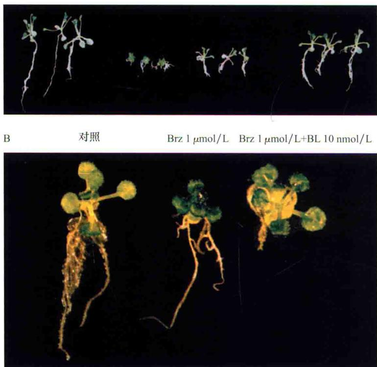  
图24.13 油菜素唑（Brz）对光照生长14天拟南芥幼苗的影响。A. 对照幼苗（左）和5 $\mu$ mol/L、1 $\mu$ mol/L及0.5 $\mu$ mol/L油菜素唑处理的拟南芥幼苗（右）。Brz引起幼苗的矮化程度依赖于Brz的浓度。B. 光照生长14天的拟南芥对照幼苗（左）和1 $\mu$ mol/L油菜素唑（中）或1 $\mu$ mol/L油菜素唑加10 nmol/L油菜素内酯（BL）处理的幼苗（右）。Brz抑制BL的生物合成酶DWF4。施用的BL是在DWF4催化的反应以后合成的，因此可以减轻Brz对生长的抑制作用（引自Asami et al., 2000）。

利用Brz进行的大量研究获得了关于BR体内动态平衡的重要信息，完善了上述有关BL的研究。在含有Brz的培养基上生长的拟南芥耗尽体内的BR后，导致多个BR生物合成基因的表达都受到上调（图24.11）。综上所述，研究结果表明BR的体内动态平衡是由若干靶基因共同的反馈调节来维持（Tanaka et al., 2005）。

BR的动态平衡也受BL生物合成途径中的限速步骤调节。如果一个酶是限速酶，它突变后相对它的直接产物来说，它的底物应该有显著累积。对拟南芥内源BR的测定表明DWF4、CPD和BR6ox1/2可能是BR生物合成途径中的限速步骤，因此对BR的体内动态平衡起着重要作用。实际上DWF4和BR6ox2的过量表达促进了植物的营养生长（图24.14）（Choe et al., 2001；Kim et al., 2005）。

野生型拟南芥

过量表达BR合成基因DWF4的拟南芥

  
图24.14 拟南芥中过量表达BR生物合成的基因DWF4可以显著提高植株的大小。植物生长了25天（引自Choe et al., 2001）。

## 24.3.3 油菜素甾醇在它们合成部位的附近起作用

通常，激素作用的一个重要决定因素是从合成部位到作用部位转运的程度和速度。外源施用的24-表油菜素内酯（24-epiBL）经历了从根到茎叶的长距离转运。例如，当用 $^{14}$ C-24-epiBL处理黄瓜、番茄或者小麦植株的根部，放射性很容易就从根部转移到茎部（Schlagnhaufer and Arteca，1991；Nishikawa et al., 1994）。并且，在含有BL的培养基上，BR缺失的拟南芥突变体矮化的表型能够恢复到野生型的大小。另外，当对根施用BL时，野生型植株的叶柄也会伸长（Clouse and Sasse，1998）。

相反，当 $^{14}$ C-24-epiBL施用在黄瓜叶片的上表面时，很容易被吸收，但是从叶片运出很慢。外源施加的 $^{14}$ C-24-epiBL只有6%被转运到较幼嫩的叶片中（Nishikawa et al., 1994）。这些结果说明，外源BR很容易从根转移到茎叶，但很少从叶中转移出。我们推测，被根吸收的24-epiBL运输到茎叶是通过木质部的蒸腾流。因为木质部流是单向的，而施用于叶片的24-epiBL只能通过韧皮部从叶中运出。24-epiBL不能向叶片外运出的结果表明它很少在韧皮部中运输。

此外，尽管24-epiBL确实能从根运输到茎叶，但内源BR似乎并不能从根部运输到茎部。例如，豌豆和番茄的嫁接实验表明，野生型和BR缺失突变体之间根/茎叶的相互嫁接不能恢复后者向顶或向地方向的表型（图24.15）（Symons and Reid，2004；Montoya et al., 2005）。进一步对BR中间产物的时空分布进行比较，表明它们在所有植物器官中都存在，尽管不同的中间产物在不同器官中的浓度不同（Shimada et al., 2003）。

野生型嫁接到野生型生长正常

BR缺失突变体的根不影响野生型茎叶的生长

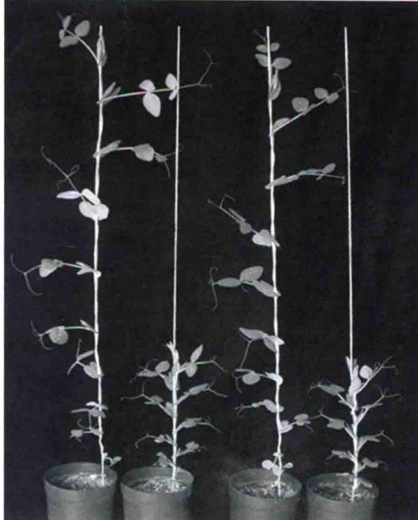  
图24.15 生长45天的野生型和BR缺失突变体豌豆（lkb）的相互嫁接对茎叶表型的影响。利用7天的幼苗做从上胚轴到上胚轴的嫁接。BR缺失突变体矮小的茎叶不能被野生型的根恢复。同样，BR缺失突变体的根也不影响野生型茎叶的生长。两个结果都表明BR不能长距离运输（引自Symons and Reid, 2004）。

与BR生物合成途径的广泛分布相对应，BR信号转导途径的组分（见前文）显然也在植株中广泛表达，尤其是幼嫩的生长组织（Friendrichsen et al.,

2000）。表皮中BR的活性对于茎中器官的发育是决定性的：一方面，表皮表达的CPD和BRI1就足以驱动内侧组织的生长；另一方面，表皮表达的BR代谢酶BAS1可以限制器官发育（Savaldi-Goldstein et al., 2007）。总而言之，这些证据表明：①内源BR在其合成部位或附近发挥功能；②每个器官合成和感受自己的活性BR。

## 24.4 油菜素甾醇对生长和发育的影响

BR作为促进生长的物质，最初是从花粉中分离得到的，在对光形态建成的研究中证明它们有植物激素的作用。自发现以来，BR已被证实参与植物的很多发育过程，包括棉花纤维和侧根的发育、顶端优势的维持、维管的分化及花粉管生长。BR也参与：植物防御、种子发芽及叶片衰亡（关于BR和顶钩维持的讨论见Web Essay 24.1）。有关BR在发育中的很多生理作用还有待研究。本节将讨论一些理解较为透彻的BR反应，包括茎叶和根的生长、维管的分化、花粉管的伸长及种子萌发。

## 24.4.1 BR促进茎叶中细胞扩展和细胞分裂

BR的生长促进作用表现在加速细胞伸长和细胞分裂。如上面讨论过的菜豆第二节间生物测定首次证明了这一点（图24.1）（Mandava，1988）。

水稻叶片倾角生物测定（图24.2）的依据是BR能够诱导细胞伸展。叶片倾斜类似于乙烯引起的偏上性（见第22章）。叶对BR的反应是，靠近鞘叶连接区的近轴（上）面细胞比远轴（下）面细胞伸展得快，引起叶片垂直方向的向外弯曲。BL诱导的叶片近轴面细胞伸展还依赖于细胞壁松弛度的增加。

在遗传学研究中，BR突变体的矮小表型充分证明BR是植物正常生长所必需的（图24.5）。通过显微镜观察发现，BR缺失突变体的叶片细胞不仅比野生型小，而且细胞数目也少，表明BR是茎叶中重要的促进生长类激素（Nakaya et al., 2002）。因此，不难想象，过量表达BR生物合成基因DWF4可以提高内源BR的水平，并相应促进植株伸长（图24.14）（Choe et al., 2001）。实际上，油菜素甾醇最显著的特性之一（首先在菜豆第二节间生物测定中被观察到）是促进细胞伸长和细胞增殖。

BR促进生长最明显的位置是植物幼嫩的和正在生长的茎叶组织。对纳摩尔级浓度BL反应的细胞延伸动力学与对生长素的反应不同。例如，对于大豆上胚轴，BL处理经过45 min滞后期才开始促进伸长，几个小时后达到最高速率。相反，生长素刺激的伸长反应在15 min滞后期后开始，并且在45 min内达到最大速率（图24.16）（Zurek et al., 1994）（见第19章）。这些结果表明对BR的反应包含基因转录在内的较慢途径，而对生长素的快速反应可能不需要基因转录。

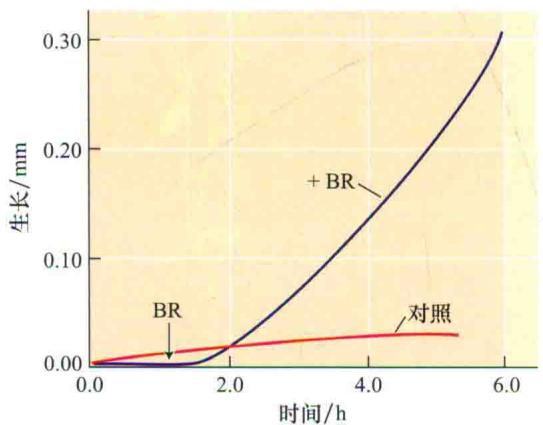  
图24.16 BR刺激大豆上胚轴伸长的动力学分析。在灵敏度生长检测系统中，1.5 cm长的大豆上胚轴用0.1 $\mu$ mol/L BR处理，在45 min的滞后期后，BR诱导生长。需要5 h或者更多的时间，从而达到最大的稳定生长速度（结果未显示）（引自Zurek et al., 1994）。

另一种可能的解释是生长素促进的基因表达比BL诱导的基因表达更加强烈（见第19章）。事实上，研究表明，生长素和BR以相互依赖的方式协同促进茎叶的生长，揭示了每种激素需要另一种激素的存在以达到最优的活性。IAA和BR的协同性在水稻叶片弯曲的生物测定中也得到了验证。生长素和BR的协同作用可以在分子水平持续促进下游共同靶标的表达。

虽然转录增加的精确分子机制在很大程度上是未知的，但是BR和生长素相互作用的不同结点已经被发现。例如，BIN2作为BR信号的负调控元件，可以磷酸化一些同时参与生长素和BR所调控基因表达的转录因子（Vert et al., 2008）。BR也提高生长素的转运，并促进侧根的生长和向地性响应中的不对称生长（见下文）。最后，生长素可以促进一个核蛋白质BRX1的表达，而BRX1可以正调控BR合成基因CPD的表达（Hardtke, 2007）。因此，这两种激素的相互作用发生在多种水平。

细胞的伸展过程包括：细胞壁的松弛，伴随着渗透运输水分进入细胞、保持膨压，以及细胞壁物质的合成、保持壁的厚度（见第15章）。其中的每一步都可能受到BR的调节。人们认为BR通过调节水通道蛋白来增加水分的吸收（Morillon et al., 2001），增强细胞壁的松弛度（图24.17），并且诱导一些细胞壁修饰酶的表达，如木葡聚糖转移酶/水解酶（xyloglucanendotransglucosylase/hydrolase，XTH）和膨大素（见第15章）。

25μm  
  
图24.17 BR增加大豆上胚轴可塑性细胞壁的延展性。大豆上胚轴（1.5 cm）用含或不含0.1 $\mu$ mol/L的BR培养一定的时间，接着用伸展计测定可塑的延展性（见第15章）。处理2 h后，BR显著提高细胞壁的延展性，之后延展性持续升高直到6 h后达到稳定。BR提高了细胞壁的可塑性，说明BR诱导了细胞壁的松弛，这是细胞延展所必需的（引自Zurek et al., 1994）。

控制微管的排列是正常伸长的另一个必要条件。如在第15章中讨论过的，微管的方向有利于纤维素微纤维合成过程中的排列，而细胞壁上微纤维的横向排列是正常细胞伸长所必需的。对拟南芥BR缺失突变体中微管的显微镜观察表明，突变体细胞含极少的微管，同时这些微管的排列缺乏条理。对突变体外源施加BR能够恢复正常的微管丰度和结构（图24.18）。由于BR不会增加细胞微管蛋白的总量，BR必定是通过促进微管晶核形成和排列组织来实现上述功能的（Catterou et al., 2001）。

除了促进细胞伸长之外，BR同时也促进细胞增殖。如我们在第21章看到的，细胞分裂素诱导细胞分裂与D型细胞周期蛋白CYCD3的表达有关。24-epiBL同样也可以增加CYCD3的表达，而且24-epiBL可以替代在拟南芥愈伤组织和细胞悬浮培养中所需的玉米素（Hu et al., 2000）。因此BR和细胞分裂素可能通过相似的机制调节细胞周期。

## 24.4.2 BR既促进又抑制根的生长

BR缺失突变体的典型表型是根的生长受到抑制，所以BR是根正常伸长所需要的。然而，如生长素一样，外源施用不同浓度的BR对根的生长分别有促进和抑制的作用（Mussig，2005）。对BR缺失突变体外源施用低浓度BR，能促进根的生长，而高浓度则抑制根的生长。开始起抑制作用的阈值浓度由使用的BR类似物活性决定。因此，相对活性较高的类似物24-epiBL比低活性的类似物24-epiCS（epicastasterone）所需的阈值浓度要低。

BR对根生长的作用与生长素和赤霉素的作用无关。一种生长素极性运输的抑制剂，2,3,5-三碘苯甲酸（2,3,5-triiodobenzoic acid，TIBA）（见第19章）不能阻止BR对根伸长的诱导作用（Mussig，2005）。当同时施用BR和生长素，对根生长的促进和抑制作用是加性的。此外，施用赤霉素不能恢复BR缺失突变体根生长减弱的表型。综上所述，表明BR对根生长的抑制作用不需要生长素或赤霉素参与。此外，像生长素一样，高浓度的BR刺激乙烯的生成，因此至少BR对根生长的部分抑制效应可能是由乙烯引起的。

低浓度BR也能诱导侧根的形成（图24.19）（Baoet al., 2004）。但是在这些情况下，对于侧根的形成，BR和生长素具有协同作用。目前的模型认为，BR促进侧根的发育，部分是通过影响生长素的极性运输来实现的（见第19章）。BR处理促进顶端生长素运输，是侧根发育所必需的，一种极性生长素运输的抑制剂N-1-萘基邻胺甲酚苯甲酸（1-N-naphthylphthalamic acid, NPA），能抵消BR对侧根发育的促进作用（Bao et al., 2004）。最后，BR促进向地性响应，而且这种作用与提高生长素向外转运蛋白质PIN2在根伸长区的表达相关（见第19章）（Li et al., 2005）。这样，BR通过影响根的伸长和分枝对整个根的形态建成起着重要的作用。

A  
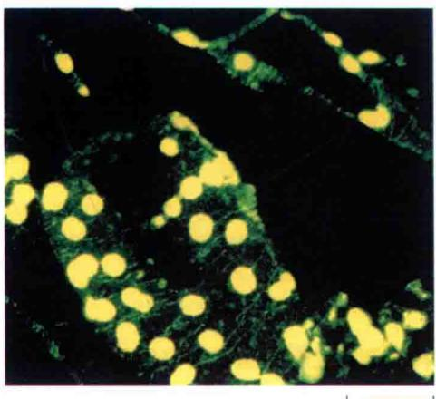

B  
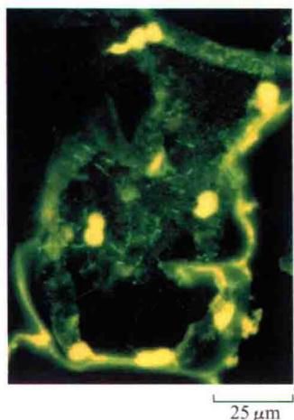

C  
  
图24.18 BR对拟南芥微管结构的影响。在免疫荧光实验中，微管显示为绿色（“条纹”显示它们的排列）。黄色斑点为叶绿素的自发荧光信号。A. 野生型薄壁组织细胞，表明其正常的横向微管排列。B. BR缺失突变体薄壁组织细胞，含极少的、不规则排列的微管。C. BR处理的BR缺失突变体，恢复了正常的微管结构（引自Catterou et al., 2001）。

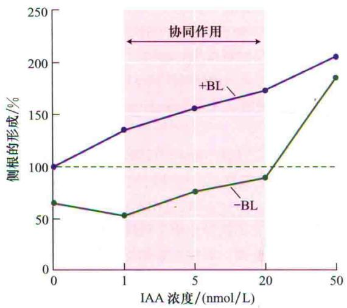  
图24.19 BL和IAA协同作用，促进侧根的发育。拟南芥幼苗在含0 nmol/L、1 nmol/L、5 nmol/L、20 nmol/L及50 nmol/L的IAA，并且含有或者不含1 nmol/L BL的琼脂粉培养基上垂直生长8天，计算每厘米初生根上侧根的数目和可见的侧根原基数。在每种处理下每厘米初生根上的侧根数目用图表列出，相对1 nmol/L BL不含生长素处理的每厘米初生根上的侧根数目来计算百分比（100%，水平虚线）。BL和IAA协同效应发生在1\~20 nmol/L（引自Bao et al., 2004）。

## 24.4.3 BR在导管发育中促进木质部的分化

BR通过促进木质部的分化和抑制韧皮部的分化进而在导管发育中起着重要作用。有证据表明BR突变体的导管系统受损，与野生型相比具有较高的韧皮部与木质部比例（图24.20）（见Fukuda，2004的综述）。并且BR缺失突变体的维管束数目下降，且它们之间的空间排列不规则。相反，过量表达BR受体蛋白（在这一节之后讨论）导致植物产生比野生型更多的木质部。

鱼尾菊（Zinnia elegans）细胞培养是一个研究木质部分化各个时期极佳的体外系统。从幼叶中机械分离单个细胞，黑暗条件下在液体培养基中培养2\~3天，细胞分化成管状分子（tracheary element）（图24.21）。在这个木质部分化系统中，对BR进行测定的结果表明前形成层类似细胞中BR的合成活跃，是其分化成管状分子的基础。BR可能通过调节在发育中起至关重要作用的同源基因的表达（见第16章），而介导前形成层细胞分化出木质部（Fukuda，2004）。

A 野生型拟南芥茎的横切图  
B 拟南芥突变体det2茎的横切图  
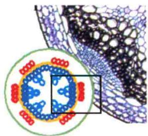

  
图24.20 BR是维管组织正常发育所必需的。左图所示是拟南芥成熟植株花序茎秆基部的维管系统示意图。前形成层细胞（黄色）产生处于外层的韧皮部组织（红色）及处于内层的木质部组织（蓝色）。黑色三角形框包括一个单一的维管束。与野生型（左）相比，BR缺失突变体det2（右）具较低的木质部与韧皮部比例。P，韧皮部（phloem）；Phe，韧皮部冠细胞（phloem cap cell）；X，木质部（xylem）（引自Caño Delgado et al., 2004）。  
鱼尾菊叶肉细胞

  
从鱼尾菊叶肉细胞分化的导管细胞

  
20μm

图24.21 体外培养的鱼尾菊叶肉细胞分化成导管的前（左图）、后（右图）对比。油菜素甾醇对于此分化过程是必需的（引自Fukuda，2004）。  

## 24.4.4 BR是花粉管生长所必需的

花粉中富含BR，因此很容易理解BR对于雄性育性起着重要作用。已经证明，BR促进花粉管从柱头经过花柱到胚囊的生长（Mussig，2005）。例如，在拟南芥BR缺失突变体cpd中，花粉在柱头萌发后花粉管不能伸长，并且花粉管的伸长部分依赖于外源施用的BR（Szekeres et al., 1996; Clouse and Sasse, 1998）。

相似地，受体基因缺陷的BR不敏感突变体，自交时花粉管不能发育，从而引起种子败育。然而，用野生型花粉对突变体进行人工授粉时，产生的种子可育（Clouse et al., 1996）。因此，花粉管的正常生长，同时需要BR和BR信号转导途径。

雄蕊与雌蕊生长高度的不一致，同样是导致雄性育性下降的原因。拟南芥突变体dwf4的BR缺失，细胞不能伸长。dwf4突变体花中的雄蕊也比野生型的要短。由于拟南芥是自花授粉植物，dwf4雄蕊花丝短造成到达柱头表面的花粉粒少。而花粉粒本身是可育的，所以对突变体进行人工授粉能产生正常的种子。

## 24.4.5 BR促进种子萌发

像花粉粒一样，种子中也含有很高水平的BR，而BR同样也促进种子的萌发（Mussig，2005）。BR通过与其他植物激素互作而促进种子的萌发，虽然这些相互作用的分子机制还不清楚。目前已经知道，GA和脱落酸（abscisic acid，ABA）在刺激种子萌发的过程中分别起着正调节和负调节的作用。BR能不依赖GA信号而促进烟草种子的萌发（Leubner-Metzger，2001）。此外，BR能够恢复GA缺失和GA感受突变体种子萌发滞后的表型（图24.22），与野生型相比，BR突变体对ABA的抑制作用更敏感（Steber and McCourt，2001）。这样BR可以刺激萌发，同时是克服ABA抑制作用必需的。众所周知，BR刺激细胞伸长和分裂，而BR很可能是通过刺激胚的生长而促进萌发的。

  
图24.22 BR刺激拟南芥种子的发芽。用递增浓度的24-epiBL，处理赤霉素不敏感的突变体种子，计算发芽的百分率。结果表明，BR促进种子发芽不依赖于赤霉素（引自Steber and McCourt，2001）。

## 24.5 油菜素甾醇在农业上的应用前景

发现油菜素甾醇是一类促进生长激素后，研究人员很快就意识到它们在农业上的潜在应用价值。在过去20年中，大量小规模的研究检验了BR在增加作物产量上的功效。人们发现，施用BL可以提高菜豆产量（根据每株植物的种子量计算）约45%，多种莴苣品种的叶质量提高25%。在水稻、大麦、小麦及小扁豆上，也观察到类似的增产效果。BL也能够促进马铃薯块茎的生长，提高马铃薯对传染病的抗性。BL还可以提高番茄的座果率。

除了这样的小规模研究之外，日本、中国、韩国及俄罗斯也一直利用油菜素甾醇的衍生物进行大规模的田间试验。但是这些田间试验结果很不稳定，可能是由于作物生长时遭受的胁迫程度不同造成的。在理想条件下生长的作物，施用BR对产量没有什么效果，而BR可以显著提高在胁迫条件下生长的作物产量。因此，BR的应用最适宜于胁迫条件下的生长（Ikekawa and Zhao, 1991）。

此外，BR也被证明有利于提高植物的繁殖能力。对如挪威云杉和苹果进行扦插处理的植物进行BR预处理，可以提高它们的生根反应。BR处理也可以促进木薯属植物和菠萝组织培养和微繁。在转基因水稻中表达一个玉米的DWARF4（DWF4）基因可以提高15%\~44%的粮食产量（Wu et al., 2008）。

降低BR的功能也能对农业生产有贡献。例如，在水稻中减弱BR的合成或信号会导致植株变得矮小并使叶片变得直立，而这种改变就允许更高的种植密度，进而提高生物量和最终的产量（Sakamoto et al., 2006）。随着研究者对BR在植物生长发育作用的继续探究，人们将发现油菜素甾醇在农业上更多其他的用途。

## 小结

油菜素甾醇（BR）是甾醇类激素，调节植物生长发育的多个过程，包含茎和根中的细胞分裂和细胞伸长、光形态建成、生殖发育，叶片衰老和逆境响应。

## 油菜素甾醇的结构、发生及遗传分析

\- 生物学测定将活性BR同其他中间产物区分开，并允许定量测定（图24.1\~图24.3）。

\- BR是一类含多羟基的甾醇类激素，其中油菜素内酯（brassinolide，BL）是植物中分布最广且活性最高的BR（图24.4）。

· 在所有植物组织中均已检测到BR存在，同时BR在茎顶端拥有最高的活性。

\- BR是一种普遍存在的植物激素，它的出现先于陆生植物的进化。

\- BR缺失突变体表现出异常的光形态建成，而这一异常可以被外源施加的BL所抑制（图24.5和图24.6）。

## 油菜素甾醇的信号转导途径

\- BL结合到受体BRI1上，BRI1在细胞膜和内体膜上均被发现（图24.7）。

\- BL的结合激活BRI1，激活的BRI1在多个位点上被磷酸化（图24.8）。

· BRI1/BAK1的激活起始了一个级联信号，从而导致BR调控基因的转录。

· 脱磷酸化状态的BES1和BZR1激活或抑制BR的靶基因（图24.9）。

## 油菜素甾醇的生物合成、代谢及运输

· 油菜素甾醇的合成始于菜油甾醇，而其来源于植物甾酮前体环阿屯醇（图24.10）。

· 所有将菜油甾烷醇转化为BL的酶都属于定位于ER的细胞色素P450单氧化物酶。

\- BR的水平可以通过多种机制来控制，包括分解代谢、结合及信号途径的负反馈作用（图24.11\~图24.14）。

\- BR在其合成部位附近发挥作用，并不经历长距离运输（图24.15）。

## 油菜素甾醇对生长和发育的影响

·BR不但参与纤维、侧根和维管系统的发育，也参与顶端优势的维持、花粉管生长、种子萌发、叶片衰老和植物防卫。

\- BR既促进细胞增殖又促进细胞伸长（图24.16和图24.17）。

\- BR维持细胞壁生长所必需的正常的微管丰度和排列组织（图24.18）。

· 低浓度BR促进根的生长，高浓度BR抑制根的生长。

· BR通过改变生长素的极性运输来促进侧根发育。

\- BR促进木质部的分化并抑制韧皮部的分化（图24.20和图24.21）。

\- BR通过与包括GA和ABA在内的其他激素相互作用来促进种子萌发（图24.22）。油菜素甾醇在农业上的应用前景

· BR施加在生长于逆境下的作物上最为有效。

\- BR在提高植物繁殖能力方面有很大作用。

(张姗姗 杨苍劲 王学路 译)

## WEB MATERIAL

## Web Topics

## 24.1 Brassinosteroids and the Apical Hook——An

Ongoing Story in Plant Architecture
A model is proposed for the interactions between ethylene, auxin, and brassinosteroids in the formation of the hook of etiolated seedlings.

# 第 25 章

开花的控制

人们期待春天，期待春天的姹紫嫣红。许多旅游者都把自己的行程安排在特定植物的开花期：如加利福尼亚州南部连绵不断的柑橘园和荷兰的郁金香。在美国华盛顿和日本，樱花被人们认为是英勇的象征。随着一年中春夏秋冬四季的更替，每种花都在其特定的时间开放。植物在进化过程中形成了复杂的花结构并表现出显著的多样性，以吸引不同的传粉者。植物在一年中的正确时间开花对于有性繁殖是至关重要的。异花授粉的植物二者之间的开花时间及与传粉者必须保持同步，这对于结实是最为理想的。

开花与季节有关已众所周知，本章所要探讨的是开花现象中所蕴藏的以下几个基础问题。

(1) 植物如何感知季节变化及昼夜交替?

(2) 哪些环境信号影响植物的开花? 植物又如何感知这些环境信号?

(3) 环境信号又如何诱导花发育过程中的各种变化?

在第16章我们已经讨论了植物根部和茎部的顶端分生组织在营养生长和发育阶段所起的作用。植物在向开花转变的过程中涉及两种主要的变化：顶端分生组织的形态建成及细胞的分化。这些变化最终导致萼片、花瓣、雄蕊和心皮等器官的产生（参见Web Topic 1.3中的图1.2A）。

花药中特化的细胞进行减数分裂产生4个单倍体的小孢子，这些小孢子最终发育成花粉。同样，胚珠中的特化细胞减数分裂后产生4个单倍体的大孢子，但是只有其中的一个进行三次减数分裂后发育成胚囊（参见Web Topic1.3中的图1.2B）。胚囊的出现意味着雌配子体的成熟。而花粉粒伴随着花粉管的出现，则表示雄配子体世代的成熟。雌雄配子体产生配子（卵子和精子），精卵融合形成二倍体的合子，这是新孢子体世代的开始。

很显然，开花意味着植物体形态和细胞类型在结构和功能上与营养生长阶段有本质的不同。向开花的转变同时也意味着顶端分生组织中细胞的命运发生了根本的变化。在本章的第一部分，我们将主要讨论花发育（floral development）过程中的变化。近些年已经发现了一些基因在花器官的形成过程中起着很重要的作用。这些研究结果表明植物是如何通过数目相对较少的关键调控因子来达到调控复杂的发育目的的。茎顶端发生一系列的生理变化并最终使顶端分生组织发育成花的过程称为花的发端（floral evocation）。在本章的第二部分我们将会讨论在花的发端过程中发生的一系列变化。刺激花的发端的发育信号包括一些内在的因素如近似昼夜节律（circadian rhythm）、时相变化（phase change）、激素（hormone）等，以及外在因素如光周期（日长）和温度。在合适的光周期过程中，从叶中产生的可转移的信号称为成花刺激物（floral stimulus），并最终被转运到茎顶端分生组织。植物的顶端必须能够响应这种阳性信号。通常情况下植物要经过一个幼年期，在此期间植物不能开花。开花需要的另一个因素是春化（开花之前较长时间的冷处理）。这些内源信号和外源因子结合使得植物能在特定的时间开花。

## 25.1 花分生组织和花器官的发育

花分生组织与营养生长阶段的分生组织有明显的区别，主要表现在前者的体积比后者大。在营养生长阶段的分生组织中，中心区细胞完成一次分裂周期比较缓慢。由营养生长到生殖生长转换的明显标志是茎顶端分生组织中心区细胞的分裂次数明显增加（见第

16章）。当生殖生长出现时，茎顶端分生组织的体积明显增大，其原因主要是中心区细胞的分裂速度明显加快（图25.1）。利用遗传学和分子生物学技术，已经从拟南芥（Arabidopsis）、金鱼草（Antirhinum）及其他物种中鉴定出了一系列基因，它们组成了一个网状结构，共同控制花的形态建成。

在本节，我们主要讨论研究较为清楚的拟南芥花的发端（图25.2）。首先我们将会描述从营养阶段到生殖阶段转变过程中所发生的基本的形态变化。其次，我们将会讨论分生组织中4轮花器官的排列及由哪些基因控制花的发育。根据公认的ABC模型（图25.6），花器官的特异排列是受三类花器官特性基因的重叠表达调控的。

B  

## 25.1.1 拟南芥茎顶端分生组织随发育而变化

在营养生长阶段，拟南芥的顶端分生组织可以形成节间非常短的叶子，并最终形成基生莲座叶（图25.2A）。一旦生殖发育开始，处于营养阶段的分生组织就会转变成初级花序分生组织。而初级花序分生组织（primary inflorescence meristem）可以形成一种伸长的花序轴用来支撑两种侧生器官：茎生（或花序）叶和花（图25.2）。

茎生叶的腋芽可以形成次级花序分生组织（secondary inflorescence meristem），如图25.2A所示，它们的形成与初级花序分生组织形成模式相似。拟南芥花序分生组织具有无限（indeterminate）生长的特性，因此可以持续生长。花是由花序分生组织侧生的花分生组织（floral meristem）形成的。相对于花序分生组织，花分生组织是有限的。

## 25.1.2 4种不同的花器官形成相互独立的轮

花的分生组织形成4种不同的花器官：萼片、花瓣、雄蕊、心皮（Coen and Carpenter，1993）。这些花器官形成同心的环，称之为轮（whorl），围绕在分生组织周围（图25.3）。最内一轮心皮的出现占用了分生组织顶端的所有细胞，只有花芽发育时花器官原基才出现。在野生型拟南芥花中，各轮排列情况如下（位于细胞分裂区）。

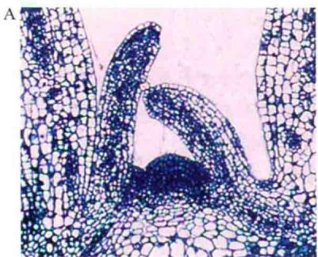

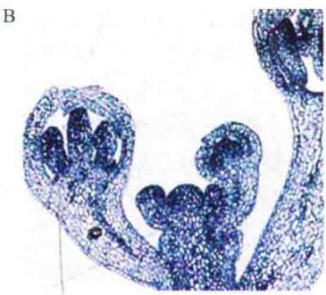  
图25.1 拟南芥茎顶端营养区（A）和生殖区（B）的纵切面图（Grbic and Nelson惠赠）。

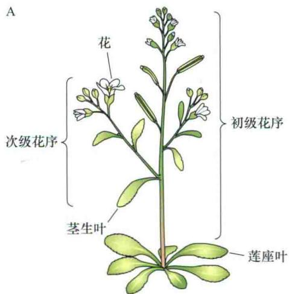

  
图25.2 A. 拟南芥茎顶端分生组织在不同发育阶段产生不同的器官。在发育初期，茎顶端分生组织形成基生的莲座叶。进入开花转变阶段，茎顶端分生组织形成初级花序分生组织，并最终产生可以支撑花的伸长的茎。叶原基在开花转变之前形成茎生叶。而次级花序形成于茎生叶的叶腋。B. 拟南芥植株图片（Richard Amasino惠赠）。

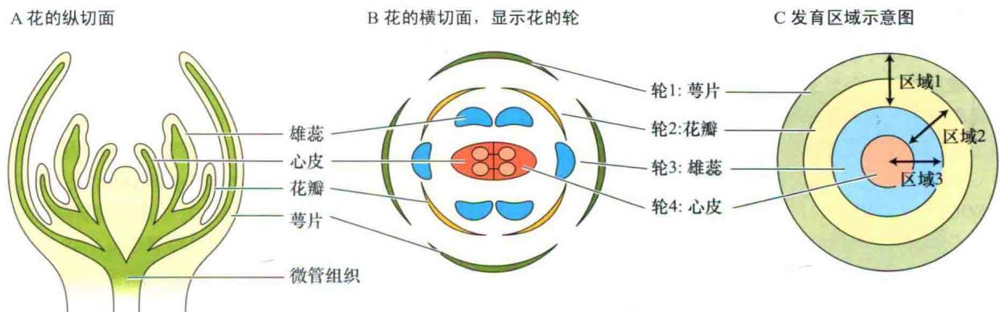  
图25.3 在拟南芥中，花器官是由花分生组织按顺序形成的。A和B.花器官作为连续的轮而产生（同心圆），从萼片开始，并从外向内发展。C.根据协变模型，每个轮的功能由三个重叠的发育区域决定。这些区域和花器官特性基因的表达模式相对应（引自Bewley et al., 2000）。

（1）第一轮为4个萼片，成熟时为绿色。

（2）第二轮为4个花瓣，成熟时为白色。

（3）第三轮为6枚雄蕊，四长二短。

（4）第四轮（最内部）为一个复合器官，雌蕊（雌性生殖结构）由子房和两个融合的心皮组成，并且每个心皮包含多个胚珠和一个短的花柱和柱头（图25.4）。

## 25.1.3 两种主要类型的基因调控花的发育

通过对突变体的研究，目前已鉴定出三种类型的基因调控花的发育：分生组织特性基因、花器官特性基因、级联基因。

（1）分生组织特性基因（meristem identity gene）

编码一些转录因子，它们对于诱导花器官特性基因的起始表达是必需的，并且在花器官形成过程中对花器官特性基因起正调控作用。

（2）花器官特性基因（floral organ identity gene）直接控制花器官的特性，它们编码的蛋白质为转录因子，调控其他基因的表达，后者的表达产物在花器官的形成和功能中起作用。

## 25.1.4 分生组织特性基因调节分生组织的功能

分生组织特性基因在茎顶端的侧面分生组织发育为花原基及花序分生组织发育为花分生组织的过程中起作用（顶端分生组织在其侧面形成花分生组织即花序分生组织）。例如，在一些金鱼草的突变体中，当FLORICAULA（FLO）基因发生突变后，它能形成花序而不能形成花。flo突变导致叶腋部位出现额外的花序分生组织而不是形成花分生组织。因此，FLO为控制花器官分生组织形成的关键基因。

  
图25.4 拟南芥的雌蕊由两个融合的心皮组成，每个心皮包含多个胚珠。A.雌蕊的扫描电镜图，显示柱头、短的花柱和子房。B.雌蕊的纵切图。图示众多胚珠（引自Gasser and Robinson-Beers，1993，美国植物学会C S Gasser授权同意翻印）。

D  
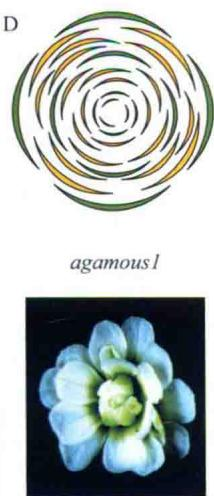

在拟南芥中，SUPPRESSOR OF CONSTANSI（SOC1）、APETALA1（AP1）、LEAFY（LFY）是花器官分生组织形成过程中的关键基因。LFY反馈调节FLO，LFY和SOC1在外界环境及内在因素调控器官引发过程中起着核心作用（Blazquez and Weigei，2000；Borner et al., 2000）。因此LFY和SOC1是花器官发育的关键调节因子。

SOC1一旦被激活即引发LFY的表达，接着LFY开启AP1的表达（Simom et al，1996）。在拟南芥中，LFY和AP1处于一个正反馈调控环中。也就是说，AP1的表达同样可以促进LFY的表达。这种正向反馈环一旦起始就不可逆转，分生组织也便转为开花。

## 25.1.5 通过同源异型突变体发现花器官特性基因

变体中鉴定出来的，在这些突变体中花器官异位表达。例如，拟南芥的AP2基因突变体，萼片突变为心皮，花瓣突变为雄蕊。

决定花器官特异性的基因是通过花同源异型突变体（floral homeotic mutant）而被发现的。通过研究果蝇（Drosophila）的突变体，我们发现了一系列的同源异型基因，它们通过编码转录因子来控制相应位点特异结构的发育。同源异型基因作为一个发育的开关，在特定结构的形成中起着激活整个遗传过程的重要作用。因此同源异型基因的表达赋予器官一定的特性。

研究表明，同源异型基因还编码一些转录因子——调节其他基因表达的蛋白质。植物中许多同源异型基因属于一类MADS-box基因（MADS-box gene），然而，动物的同源异型基因都有一些称之为同源框的序列。

许多决定花器官特性的基因都属于MADS-box家族，其中包括金鱼草中的DEFICIENS基因、拟南芥中的AGAMOUS（AG） $^{①}$ 、PISTILATA（PI）和APETALA3（AP3）基因。MADS-box家族的基因都有特定的比较保守的核苷酸序列，称之为MADS-box，它编码一种蛋白结构，称之为MADS结构域（MADS domain）。MADS结构域使得这些转录因子可以与具有特定核苷酸序列的DNA结合。

并不是所有具有MADS结构域的基因都是同源异型基因。例如，SOC1是一个MADS-box家族的基因，但它在功能上却是分生组织特性基因。

花器官特性基因是从改变花器官特性的同源异型突

## 25.1.6 三种类型同源异型基因控制花器官的特性

在拟南芥中鉴定出5个花器官特性的基因：AP1、AP2、AP3、PI和AG（Bowman et al., 1989; Weigel and Meyerowitz, 1994）。通过对那些改变了结构并在两个毗邻的轮中产生同样花器官的突变体进行研究，鉴定出了上述基因（图25.5）。例如，在ap2突变体中，缺少萼片和花瓣（图25.5B），ap3和pi双突变体中，第二轮产生的是萼片而不是花瓣，在第三轮心皮取代雄蕊（图

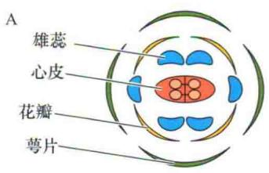

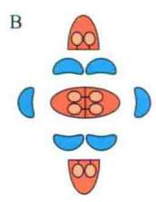

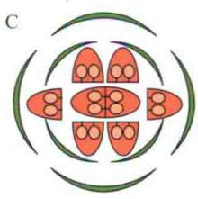

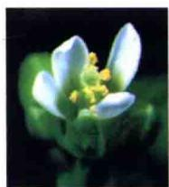

  
图25.5 花器官特性基因发生突变后极大地改变了花的结构。A. 野生型中正常的4轮花器官结构。B. ap2-2突变体缺失了萼片和花瓣。C. pi2突变体缺失了花瓣和雄蕊。D. ag1突变体缺失了雄蕊和心皮（引自Meyerowitz et al., 2002；L. Riechmann惠赠）。

25.5C）。而纯合的ag突变体则缺少雄蕊和心皮（图25.5D）。

虽然这些基因的突变体改变了花器官的特性，但并没有影响花的产生，因此，它们是同源异型基因。一般把它们分为A、B、C三类，分别代表三种不同的功能。由A、B、C三种同源异型基因（ABC模型）所决定的花器官特性将在下一节进行仔细的讲述（图25.6）。

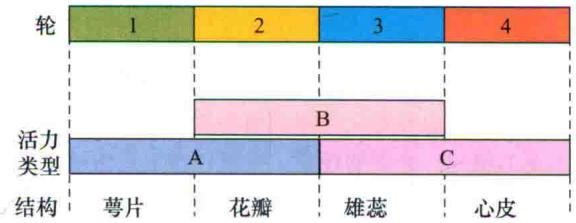

APETALA 3 / PISTILLATA

<table><tr><td>基因</td><td colspan="2">APETALA 2</td><td colspan="2">AGAMOUS</td></tr><tr><td>结构</td><td>萼片</td><td>花瓣</td><td>雄蕊</td><td>心皮</td></tr></table>

图25.6 ABC模型认为花器官特性是在三种不同功能A、B和C同源异型基因相互作用的基础上形成的。第一轮，只有A（AP1和AP2）表达而形成萼片。第二轮，A（AP1/AP2）和B（AP3/PI）表达，从而形成花瓣。第三轮，B（AP3/PI）和C（AG）表达，从而形成雄蕊。第四轮，只有C（AG）表达而形成心皮。另外，在第一轮和第二轮中A功能（AP1和AP2）抑制C（AG）功能，而在第三轮和第四轮中C功能抑制A功能。

（1）A类型活力由API和AP2基因编码，控制第一和第二轮花器官的特性。A功能的缺失会导致在第一轮产生心皮而不是萼片，在第二轮产生雄蕊而不是花瓣。

（2）B类型活力由AP3和PI基因编码，控制第二轮和第三轮花器官的特性。B功能的缺失会导致在第二轮产生萼片而不是花瓣，第三轮产生心皮而不是雄芯。

（3）C类型活力由AG基因编码，控制第三轮和第四轮花器官的特性。C功能的缺失导致在第三轮产生花瓣而不是雄蕊，而且会在第四轮出现新的花而不是心皮。因此，在ag突变体中，花的第四轮被新的萼片取代。花分生组织不再是有限生长，而是形成花中花，并且从内到外依次为：萼片，花瓣，花瓣；萼片，花瓣，花瓣；如此等等。

通过对失去功能的双突变或者三突变体进行研究，从而可以清楚地了解这些花器官特性基因在花发育过程中的作用。四突变体（ap1、ap2、ap3/pi和ag）中，花分生组织最终形成了一个假花。尽管也产生了正常花的轮状结构，但是所有的花器官都被类似于绿色叶片的结构所替代（图25.7）。这个实验支持了18世纪德国自然科学家和诗人Johann Wolfgang von Goethe（1749\~1832）的观点，他认为花器官是高度特化的叶。

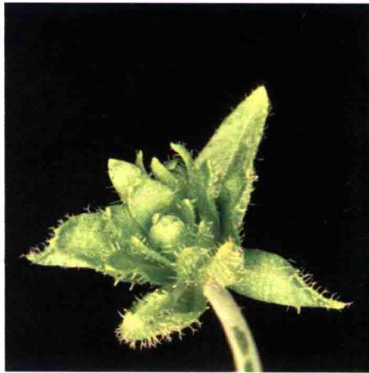  
图25.7 拟南芥四突变体（ap1，ap2，ap3/pi，ag）中类似叶片的结构取代了花器官（John Bowman惠赠）。

随着A、B、C功能基因的发现，另一类型的功能基因D也被发现，D功能由SEPAIIATA（SEP1-3）所特化，它也是MADS-box转录因子。最为注目的是，将D基因与A和B基因组合表达有可能使叶转变为花瓣（Pelazet et al., 2001；Honma and Goto, 2001）。

## 25.1.7 ABC模型解释了花器官特异性的形成

1991年，ABC模型（ABC model）被提出并用来解释同源异型基因如何控制花器官的特性（Coen and Meyerowitz，1991）。这个模型最大的贡献在于它很快解释了在两种远缘物种（金鱼草和拟南芥）上观察到的很多现象，而且对于如何理解相对少的关键因子组合就可以产生一个复杂的结果提供了很好的思路。ABC模型认为，每一轮花器官的形成都是三种类型花器官特性基因形成独特的组合决定的（图25.6）。

(1) A类型活力独自决定萼片的特性。

(2) A和B类型活力在花瓣的形成中起作用。

(3) B和C类型活力决定雄蕊的产生。

（4）C类型活力单独决定心皮的特性。

该模型进一步认为A和C的功能相互拮抗（图25.6）。也就是说，A和C基因除了在花器官决定过程中起作用外，二者相互排斥对方在各自区域表达。

ABC模型可以预测和解释野生型和多数突变体的花器官的形成模式（图25.8）。现在问题的关键在于：①这些花器官特性基因的表达模式是如何获得的；②那些编码转录因子的花器官特性基因在花器官形成过程中又如何调节其他基因的表达；③如何通过改变特定基因的表达来形成特定的花器官。

A. 野生型  
  
B. C功能缺失

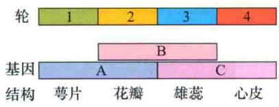

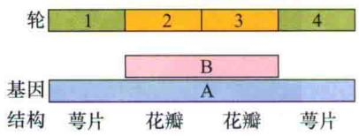

C. A功能缺失  

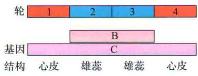

D. B功能缺失  

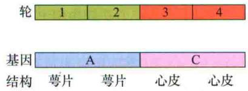

图25.8 ABC模型对花同源异型突变体表型的解释。A. 野生型中三种同源异型基因的功能。B. C功能的丧失导致A在整个花的分生组织中表达。C. A功能的丧失导致在整个分生组织中都有C的表达。D. B功能的丧失导致只有A和C的表达。

## 25.2 花发端的内在和外在因素

植物是不可移动的生物，因此它们必须不断适应其生长和发育的外部环境。动物的大多数发育在胚胎期已完成，而植物的发育贯穿其整个生命过程。事实上没有任何发育结局是提前确定的，因为植物的发育受到整个发育环境因子的影响，如日长、温度、与其他植物的竞争、营养的可利用性及与动物的交互作用。因此，植物被认为是一个用来理解有机体如何感知信息并整合这些信息，从而调控基因组编码的遗传程序的理想系统。

植物的生活周期中，开花是一个重要的发育标志。延迟开花将有利于光合作用碳水化合物的积累供更多种子成熟，但也增加了植物被吃掉、受非生物胁迫而死亡，以及与其他植物竞争引起伤害的潜在风险。基于此，植物进化出一系列非凡的生殖适应机制——如一年生的生命周期和多年生的生命周期。一年生植物如千里光（Senecio vulgaris）在萌发后几周内就可开花，而一些多年生植物如多数森林树木，可能需要经历20年甚至更长的时间才能开花。在植物界不同物种开花的年龄也各不相同，表明年龄或者个体大小可能是决定生殖发育开始的内在（internal）因素。

由植物内在的发育因子决定开花，而不依赖于任何特殊环境条件的途径，称之为自主调节（autonomous regulation）。一些植物的开花表现出对外界环境的绝对依赖性，这些植物的开花为数量效应。如果植物对环境因子有一定的依赖性，但是在这些因素不存在的情况下也能开花，这种开花效应称为兼性或本能效应。拟南芥开花既依赖于环境，同时也存在自主信号促进生殖生长。光周期现象和春化作用是植物基于季节反应的两种最主要的机制。光周期现象（见第17章）是指植物对日长或夜长的反应；春化作用是指低温促进植物开花的现象。其他的信号，如光质、周围温度和非生物胁迫对植物的发育也是非常重要的因素。

无论是内在（自我）因素还是外界（环境感应）因素对植物开花的引发，都使得植物可以在最佳的时间对开花作出精确的调节，从而完成生殖过程。例如，一些特殊物种的群体可以同步开花，这种开花的同步性使得杂交育种成为可能，同时使得植物在比较适宜的环境（如水分和温度）条件下形成种子。

## 25.3 茎尖和时相变化

所有的多细胞有机体都要经过一系列的生长发育阶段，每个阶段都有其明显的特征。对于人类而言，幼儿期、童年期、青春期及成年期代表了普遍的4个发育时期，其中青春期为性成熟的分界期。同样高等植物也经历一系列的发育时期，但只发生在特定的区域。这些转变发生的时间通常依赖于环境条件，以使得植物能够适应环境的变化。这可能是因为植物不断从顶端分生组织产生新器官。

原基起始于顶端分生组织侧面很小的隆起部位，具体是由其接收到的来自环境及植物遗传程序等信息的相互作用决定的，这些原基也可产生叶（营养生长期）或花（生殖生长期）。在这种情况下，植物生长可以看成是模块化的过程，植物的形态建成是由原基的持续特化决定的。沿着茎每个原基形成繁殖器官（phytomer），一个基本的重复单元包括营养体部分和分生组织部分。在形成叶的时候营养体部分几乎占据了所有的细胞，而在花中分生组织部分很大而且包含了营养体部分。这种简单重复单元在植物中非常灵活常见，就像雏菊和橡树一样具有多样化。

各种时相的转变是严格受发育调控的，因为植物必须整合环境和内源信号使其最大限度地适宜于植物的繁殖。以下部分描述了调控这些决定的主要途径。

植物的胚后期发育时期，分为以下三个阶段。

(1) 幼年期。

(2) 成年营养期。

（3）成年生殖期。

从一个时期过渡到另一时期，称之为时相变化（phase change）（Poethig，2003）。

幼年期与成年营养期的主要区别在于，后者可以形成生殖结构：被子植物可以形成花，而裸子植物可以形成球果。但是，花的出现，同时又意味着进入成年生殖期，并且往往又依赖于特定的环境和发育信号。因此花的缺失并不能作为幼年期的可靠标志。

从幼年期向成年期的过渡，往往还伴随着一系列其他营养特征的变化，如叶形态、叶序（叶在茎秆上的排列）、棘刺的出现、生根能力，以及在落叶植物如英国常春藤（Hedera helix）中叶子的去留等（图25.9；参见Web Topic 25.1）。这些变化在多年生木本植物中最明显，但在很多草本植物中同样也很显著。与营养阶段向生殖阶段的骤变不同，植物从幼年期向成年期的过渡是一个渐进的涉及一些中间形式的过程。

卵形成年叶  
  
浅裂幼叶  
图25.9 常春藤（Hedera helix）的幼年期和成年期。幼年的叶子为浅裂掌状，交替排列，具有向上攀爬的能力，没有花。成年期的叶子为卵状，螺旋排列，具有竖直生长的特性，花最终形成果实（L. Rignanese惠赠）。

有时候从一片叶子就可以观察出这种从幼年到成年转变的发生。其中一个典型的例子是18世纪Goethe首先发现豆科的阿拉伯胶树（Acacia heterophylla）从幼年期进入成年期时，叶子转变为柄状（叶柄的形态和叶的功能）。阿拉伯胶树幼年期的叶子为羽状复叶，具有叶轴和小叶；而进入成年期后，则只有一个特殊的结构：扁平的叶柄（图25.10）。

  
图25.10 阿拉伯胶树的叶子。图示羽状复叶（幼年期），扁平的叶柄（成年期）。注意：在中间阶段，顶部的叶子依然保持着幼年期的叶子形状。

在水生植物中，如松叶藻（Hippuris vulgaris），从水生叶到气生叶的形成过程中同样存在这种过渡结构的变化。与阿拉伯胶树一样，这种过渡形式随发育模式的不同有明显的区域性。为了说明玉米（Zea mays）从幼年期到成年期这种过渡形式的变化，提出了组合模型（combinatorial model）（图25.11，Web Topic 25.2）。根据这个模型，地上部分的发育可以被划分为一系列既彼此独立又相互重叠（overlapping）的过程（幼年期、成年期和繁殖期），进而调节一系列发育过程的表达。

叶片从幼年期到成年期发生的过渡变化表明，同一片叶子的不同部位可以表达不同的发育进程。因此，叶尖细胞仍保持着幼年状态，而叶基部的细胞却向成年期转变。在同一片叶子中，两套细胞各自的发育命运却截然不同。

## 25.3.2 位于茎基部幼嫩的组织首先产生

三个发育阶段的依次出现从而使幼嫩组织在茎轴上有序产生。植株的生长高度受控于茎基部首先形成的顶端分生组织、幼嫩组织和器官。在一些能迅速开花的草本植物中，幼年期可能只持续几天，产生少量的幼嫩结构。与此形成对比的是，木本植物有一个相当长的幼年期，有的甚至可能持续30\~40年（表25.1）。在这些植物中，幼年结构在一个发育成熟的植物中占相当大的比例。

A 营养生殖期的成体植株

图25.11 玉米地上部分发育的组合模型示意图。沿着茎的主轴和枝条，幼年期、成年营养期和生殖期梯度重叠表达。连续的黑线表示在所有的发育时期都需要。这三个阶段可能会被单独的发育过程所调节，即当发育过程重叠时，产生一种中间发育过程。A. 营养期的成年幼苗。B. 开花的植株（引自Poetinf, 1990）。

表25.1 一些木本植物的幼年期长度

<table><tr><td>物种</td><td>幼年期长度</td></tr><tr><td>玫瑰</td><td>20~30天</td></tr><tr><td>葡萄</td><td>1年</td></tr><tr><td>苹果</td><td>4~8年</td></tr><tr><td>柑橘类植物</td><td>5~8年</td></tr><tr><td>英国常春藤</td><td>5~10年</td></tr><tr><td>红杉</td><td>5~15年</td></tr><tr><td>无花果</td><td>15~20年</td></tr><tr><td>英国橡树</td><td>25~30年</td></tr><tr><td>欧洲毛榉树</td><td>30~40年</td></tr></table>

资料来源：Clark，1983

一旦分生组织转向成年期，就只有成年的营养结构产生，而且其顶端分生组织向花器官发育，所以成熟期和生殖期分别位于茎的顶部和外围。

在幼年期向成年期过渡的决定因素中，植株的体积大小比其实际年龄更重要。一些抑制植物生长的因素如矿质营养的欠缺、弱光照、水分胁迫、落叶、低温都有可能延长植物的幼年期，甚至会使成熟的茎“重返幼年期”（rejuvenation）。相反，凡是促进植物生长的条件，都可以加速植物向成年期的过渡。当植物生长加速时，如果对它进行正确的开花诱导处理，就会促使植物

开花。

尽管对开花而言，植株大小是个比较重要的因素，但是并不清楚具体哪个器官的大小对开花更重要。在一些烟草属（Nicotiana）物种中，必须具有一定数量的叶子才能使顶端组织积累足够的成花刺激物。

一旦进入成年期，植物在营养繁殖或嫁接过程中就会保持这种相对的稳定。例如，从常春藤（Hedera helix）基部取下来的枝条扦插可以成长为新的幼年植株，而那些从顶端取下来的枝条则发育为成年植株。如果从正在开花的白桦树（Betula verrucosa）基部截取枝条并嫁接到幼年砧木上，在最初的两年内，嫁接的植株并不能开花。但是，从成熟的白桦树顶部取的接穗，嫁接后即可开花。

## 25.3.3 营养、赤霉素和其他信号影响时相的变化

植株其他部分传递的信号也可影响顶端组织从幼年期向成年期的转变。在许多植物中，弱光照可延长幼年期，或者使之转变为幼年期。弱光照带来的后果是植株顶端的碳水化合物供应不足。因此碳水化合物特别是蔗糖，可能在幼年期向成年期的转变中起着重要的作用。碳水化合物被认为是能量和原材料的供应者，能够影响植株的大小。如菊花（Chrysanthemum × morifolium），只有它的顶端达到一定大小后花原基才产生。

除了矿质营养和碳水化合物外，植株顶端还会接受到一些来自其余部位的激素和其他因子。实验证明，对一些松类植物幼苗施以赤霉素（GA），可诱导其产生生殖结构。在松类植物中，加速球果产生的因素（如去根、水胁迫、氮营养饥饿等），可使植物体内积累GA，这些积累的内源（endogenous）赤霉素同样可以调控此类植物的开花。

## 25.3.4 开花能力和成花决定是花引发过程的两个时期

对于草本和木本植物来说，幼年期（juvenility）有不同的涵义。草本植物的幼年分生组织嫁接到正在开花的植株上，它可以稳定地开花（参见Web Topic 25.3），而木本植物却不可以，它们之间有何区别呢？

在烟草（Nicotiana tabacum）中的大量研究表明，花的发端需要顶芽通过两个发育时期（图25.12）（McDaniel，1992），其中一个是开花能力的获得。当给予适宜的发育信号后，顶芽才有能力开花。

例如，一个处于营养阶段的枝条嫁接到正在开花的茎上，这个嫁接后的枝条可以迅速开花。这就说明它有能力对开花的植物体中的成花刺激物作出反应，也就是说它有开花的能力。不能开花的植物意味着它还没有获

得开花的能力。

已获得开花能力的营养芽需要经过的下一阶段是成花决定。即使顶芽从正常的植物中被移除下来也能过渡到下一个发育阶段（开花），就称为成花决定。因此进入成花决定阶段的顶芽，即使它被嫁接到其他不能产生任何成花刺激物的处于营养阶段的植株上，它同样可以开花。

最典型的例子就是在一个日中性的烟草植株中，植株长出41片叶子或者节就能开花。在一个测量腋芽成花决定的实验中，从一个正在开花的植株的基部第34片叶子处去掉其顶部，顶端优势丧失后，第34片叶子的腋芽长出，接着再长出7片叶子（共计41片叶子）后才开花（图25.13A）（McDaniel，1996）。但是当第34个腋芽被摘除，移栽到土里或者是嫁接到基部没有任何叶片的茎上，它在开花前又产生了一整套的叶子。这些结果显示，第34个腋芽还没有进入成花决定阶段。

在另外一个实验中，供体植株在距基部第37片叶子处截除其顶部，在图示的三种情况下（图25.13B），第37个腋芽都是在只产生4个叶片后就开花。这个结果显示，终端芽进入成花决定阶段是在产生37个叶子后。

用不同类型烟草的茎顶端所做的一系列嫁接实验表明，开花前分生组织的产生归因于以下两种因素：叶子产生的成花刺激物的强度，以及分生组织对信号作出反应的能力（McDaniel，1996）。

在某些情况下，即使植株的顶端已经处于成花决定阶段，但是开花仍然有可能被延迟或者抑制，除非它接受到另一个刺激开花的信号（图25.12）。例如，毒麦（Lolium temulentum）在长日照下才能开花。如果毒麦的茎尖分生组织经过一个长达28 h的光照后，置于试管中，结果显示只有在GA存在的情况下，它才可以正常开花。即使在有GA存在的情况下，从一个处于短日照情况下的毒麦上得到的顶端分生组织也不能开花。因此可以推断，长日照对毒麦的成花决定是必需的，而GA对于毒麦成花决定状态的表达也是必需的。

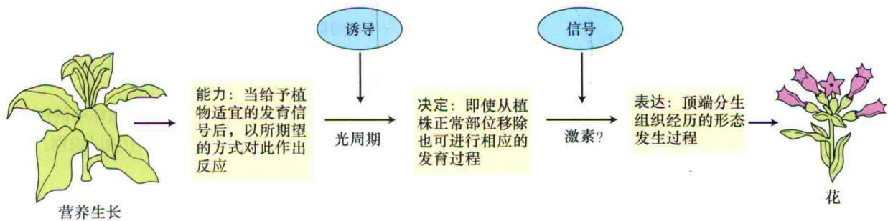  
图25.12 茎顶端营养分生组织细胞获得新的发育命运后花引发的简单模式图。在向开花转变的初期，细胞必须具有开花能力。有能力开花的营养分生组织是一种能通过变成花的决定态（产生花）而对成花刺激物（诱导）作出反应的组织。决定态的表达通常可能还需要一些其他的信号（引自McDaniel et al., 1992）。

  
图25.13 烟草腋芽决定状态示意图。来源于正在开花的供体植株的特殊腋芽被原位嫁接、根植或嫁接于植株基部而被迫生长。阴影部分显示由腋芽产生的叶子和花。A. 腋芽未处于成花决定阶段的结果。B. 腋芽处于成花决定阶段的结果（引自McDaniel，1996）。

一般来说，一旦分生组织获得开花的能力，它就显现出随着年龄增长而开花的趋势。例如，日长决定开花的植物，对于开花来说，短日照或者长日照的循环次数在较老的植物中需求量比较少（图25.14）。在本章的后面内容，我们将会讨论，植株随着年龄增长而开花的这种趋势有其生理学基础，那就是叶片产生成花刺激物的能力增强。

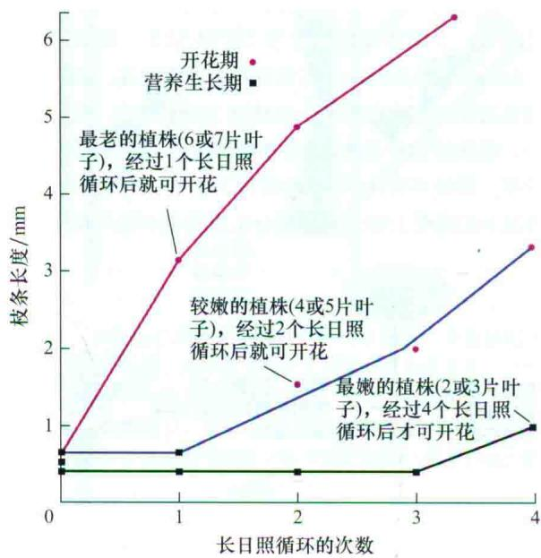  
图25.14 在长日植物毒麦中，年龄对诱导开花的长日照循环次数的影响。起诱导作用的长日照循环为：8 h的自然光光照，而后16 h的低强度的白炽灯光照。年龄越大，开花需要的光诱导循环次数越少。

在讨论植物感受日长之前，先介绍植物如何感受时间的机制，也就是时间生物学（chronobiology）或者生物钟（biological clock）的研究。对生物钟最好的解释是近似昼夜节律。

## 25.4 近似昼夜节律（circadian rhythm）：内在的生物钟

生物有机体都要面对昼夜循环。植物和动物都对昼夜更替显示出有节律的行为。这种有节律的行为包括叶子和花瓣的运动、气孔的开闭、真菌（如Pilobolus和Neurospora）的生长和孢子的形成、果蝇蛹的出现、啮齿类动物的活动时间，以及代谢速率的日变化，如光合

作用和呼吸作用。

当有机体从昼夜循环进入持续黑暗或者持续光照的环境中时，许多有节律的行为在最初几天内仍能持续存在。一般情况下，一个节律循环大致为24 h，后来近似昼夜节律（circadian rhythm）这个词就被广泛认同了（见第17章）。在持续光照和黑暗的环境中，近似昼夜节律并不能直接对光作出反应，它们必须建立在一个内在的起搏器上，也就是内源振荡子。在第17章，已经介绍了内源振荡子的分子模型。

内源振荡子与许多生理过程相偶联，如叶子的运动、光合作用及节律的维持。正因为如此，内源振荡子被认为是生物钟机制及一些生理功能如叶片运动、光合作用的调节者，有时还被认为是生物钟运动的标志。

## 25.4.1 近似昼夜节律的特征

近似昼夜节律源于有规律的周期现象，由以下三个参数加以界定。

（1）周期（period）：在重复的循环中，可比较的两个点之间的时间。典型的周期就是波峰与波峰或者波谷与波谷之间的时间（图25.15A）。

（2）相位（phase） $^{①}$ ：任意点在循环中的位置，通过相互关系的比较可以在其他循环中加以识别。最明显的相位点是波峰和波谷。

（3）振幅（amplitude）：一般被认为是从波峰到波谷的距离。但是即使周期没有变，生物节律的振幅也可能发生变化（图25.15C）。

在持续的光照或者黑暗条件下，节律一般不再是24 h。节律一般随日照时间的变化而变化，根据周期是否短于或者长于24 h，来相应增加或减少节律周期。在自然状态下，内源振荡子一般是和环境信号同步的，为24 h。其中最主要的是光-暗转换过程中的黄昏和暗-光转换过程中的黎明（图25.15B）。

这些环境信号被称为给时者（zeitgeber）。当这些信号被去除后，如转移至持续的黑暗中，节律就会自由运转（free running）。当外界条件符合特定有机体的生物钟特征时，又会恢复为近似昼夜节律周期（图25.15B）。

尽管节律是在自身内部产生的，但是也需要环境信号如光照和温度变化来引发节律的形成。另外，当有机体在一个持续的环境中经过几个循环后，原有的近似昼夜节律就会消失（如振幅降低）。当其发生在环境给时者上时，如果要重新开始有节律的活动，就需要光暗转变或者温度变化来引发（图25.15C）。需要注意的是，生物钟本身并不会消失，只是振荡子和生理功能之间的偶联受到了影响。

D  
A  
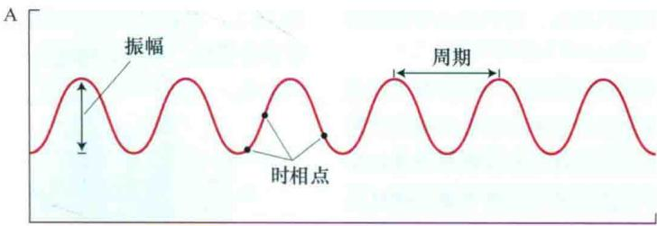  
典型的近似昼夜节律。周期是重复的循环中可比较的两个点之间的时间。相位是重复的循环中的任意点的位置，通过相互关系的比较可以在其他循环中加以识别。振幅是从波峰到波谷的距离

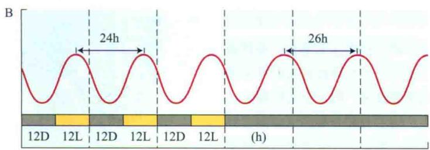  
经过24 h的光-暗循环导引后的近似昼夜节律，如果被置于持续黑暗中，近似昼夜节律就会逆转为自行变化(本例中为26 h)

  
在持续白光下，近似昼夜节律被抑制。如果转移至黑暗环境中，则节律重新启动

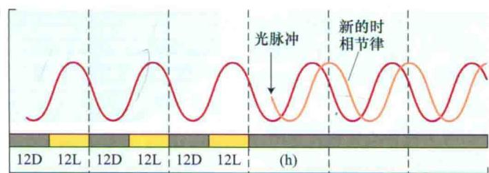  
图25.15 近似昼夜节律的一些特征。  
转移至黑暗后，给予短暂的光脉冲引起的典型的相变反应。节律被改变(延迟)，但是周期没有发生任何变化

在自然条件下，温度存在波动，如果植物不能保持精确的时间，那么近似昼夜节律对它来说就没有意义了。事实上，温度对于自由运转的节律周期来说作用很小甚至于没有作用。在不同的温度条件下，使生物钟遵循时间的作用，称为温度补偿（temperature compensation）。尽管在这条途径中，所有的生化步骤都是温度敏感型的，但是它们对温度的反应可能会互相抵消。例如，媒介物合成速率的变化可以被相对应的降解速率所补偿。植物通过这种方式可以在不同的温度下仍然保持稳定的生物钟调节水平。

## 25.4.2 在不同的昼夜循环中，相位变化调节近似昼夜节律的变化

在近似昼夜节律中，生理过程通常是与内源振荡子相对应的时间点偶联的，特定的时间发生特定的反应。一个振荡子可以与众多的近似昼夜节律相偶联，有时甚至跨阶段偶联。

随着季节的变化，白昼和黑夜也发生变化，那么近似昼夜节律是如何与时间保持一致的呢？研究人员检测了在持续黑暗条件下内源振荡子的反应，以及在自由运转的节律下，内源振荡子对特定的相位点给予短时光脉冲（通常小于1 h）所作出的反应。有机体经过12/12 h的光/暗周期诱导后置于黑暗条件下，使节律自由运转，此时与先前形成的光周期相一致的节律的相位，称为相对白天（subjective day）；与先前形成的暗周期相一致的节律的相位，称之为相对黑夜（subjective night）。

在相对黑夜的起初几个小时如果给予光脉冲，则节律被延迟，有机体认为光脉冲是上一个阶段已经结束（图25.15D）。与此对应的是，在相对黑夜的结束阶段给予光脉冲，则可提高节律的相位，有机体认为光脉冲是新的一天的开始。

如下这种精确的反应是所期望的：即使季节变化后，近似昼夜节律能准确地随时间作出相应的变化。在不同的昼夜循环中，相变反应使得近似昼夜节律能够保持为大致24 h的循环。并且证实在不同季节条件的日长下，节律也能随之发生变化。

B  

## 25.4.3 光敏色素和隐花色素对生物钟的导引

光信号引起相变的分子机制目前还不清楚，但是通过对拟南芥的研究，已经鉴定出了几种在近似昼夜节律及其输入和输出途径中的关键组分。低水平和特殊波长的光可以诱导相变的产生，暗示着光介导的反应需要特异的光受体而不是光合速率。例如，红光介导的亚热带豆科植物雨树（Bamanea）叶片的昼夜运动是光敏色素介导的低影响反应（见第17章）。

拟南芥有5种光敏色素（phytochrome），除了光敏色素C外，其他4种都被证实在生物钟的导引过程中起作用。每种光敏色素都作为一个特定的光受体：红光、远红光或蓝光。另外，植物通过隐花色素（cryptochrome，CRY）感受光，而且CRY1和CRY2蛋白也参与了蓝光介导的生物钟运动，在昆虫和哺乳动物中也是如此（Devlid and Kay，2000，见第18章）。有趣的是，CRY蛋白尽管并不吸收红光，但是对红光介导的生物钟导引同样是必需的。这意味着CRY1和CRY2在光敏色素介导的生物钟导引中起着中间媒介的作用（Yanovsky and Kay，2001）。

在果蝇中，CRY蛋白与生物钟组分相互作用，因此也是振荡子机制的组成部分（Devlid and Kay, 2000）。然而在拟南芥中却并非如此。cry1/cry2双突变体在生物钟的导引方面有所减弱，但是在近似昼夜节律方面却是正常的。在植物中已表明，光激活的CRY2直接上调FT的表达而对蓝光作出响应，从而使其开花（Liu et al., 2008）。

## 25.5 光周期现象：监测日长

我们已经知道，生物钟的存在使得有机体在白天和黑夜的特定时间重复特定的分子和生化事件。光周期现象（photoperiodism）或者说有机体感受日长的能力，使得其在每年的特定时间能够对季节的变化作出相应的反应。近似昼夜节律和光周期现象都能对昼夜循环作出相应的反应。

在赤道，日长和夜长相等，全年都是如此。随着向两级的移动，日长在夏天变长而在冬天变短（图

25.16）。植物已经进化出了相应的机制来感知日长的季节性变化。并且它们的光周期反应受到所处纬度的强烈影响。

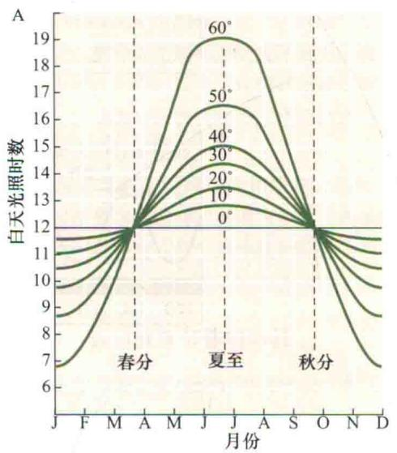

  
图25.16 A. 北半球一年不同时间中纬度对日长的影响。日长的测量是在每月的第20天进行的。B. 全球的经度和纬度图。

动物和植物中都发现了光周期现象。在动物界，日长控制了以下的季节性活动：冬眠、夏天和冬天皮毛的发育，以及冬眠后的苏醒。植物中受日长控制的活动非常多，包括开花、无性生殖、储藏营养物质的器官的形成，以及休眠的发生。

## 25.5.1 根据光周期反应可以对植物进行分类

许多植物在长日照的夏天开花，多年来植物生理学家认为长日照和开花之间的联系在于开花是在长日照下光合产物积累的结果。

20世纪20年代，美国马里兰州贝兹维尔农业研究院的Wightman Garner和Henry Allard两位科学家通过实验证明这个假设是错误的。他们发现一个烟草的突变体，即使在盛夏长至高达5 m，却依然不能开花（图25.17）。然而在冬天温室自然光条件下却能开花。

  
图25.17 马里兰巨大的烟草突变体（右）与野生型烟草（左）。在夏天两种植物都种植在温室里（威斯康星州大学研究生作为标尺）（R.Amasino惠赠）。

这些结果使得Garner 和 Allard 进行了如下实验：在夏天的长日照条件下，将其置于不透光的屋子里，从日落前到次日早晨，以人为提供短日照来改变植物的生长，观察其效果。这种人为控制的短日照同样也可以使植株开花。Garner 和 Allard 得出如下结论：日长在开花中起决定作用，而不是光合积累。这个结论在许多植物及不同条件下都得到了证实。这项工作为以后植物光周期反应的研究奠定了基础。

尽管日长也会影响植物发育的其他方面，但是对开花的影响是研究最多的。根据光周期，有花植物一般分为短日植物和长日植物两大类。

（1）短日植物（short-day plant，SDP）：只有在短日照条件下才能开花的植物，或者短日照可以促进开

花的植物。

（2）长日植物（long-day plant，LDP）：只有在长日照条件下才能开花的植物，或者长日照可以促进开花的植物。

长日植物和短日植物两者最根本的区别在于：在24 h昼夜循环中，长日植物只有在日照长度超过一定时间后才能开花，这个日照长度称之为临界日长（critical day length），而短日植物在其日照长度短于一定时间后才能开花。不同物种，其临界日长也不一样。只有通过对不同日照长度条件下植物的开花情况进行分析，才能准确地进行植物的光周期分类（图25.18）。

长日植物能够有效地衡量春季和夏初日照的延长，直至达到临界日长后才能开花。许多小麦（Triticum aestivum）品种就属于此类。短日植物只有在秋天日长短于临界日长才能开花，如许多菊花品种（Chrysanthemum × morifolium）。然而，日长本身是一个比较模糊的信号，因为它不能区别春秋之间的差异。

植物采用几种方式来避免日长信号的模糊性。一种就是通过幼年期来阻止植物在春天就对日长作出反应。另一种避免日长信号的模糊性的机制是温度与光周期反应的偶联。有些植物如冬小麦，只有经过一个冷周期（春化作用或者越冬）才能对光周期作出反应（我们将在后面的章节中讨论春化作用）。

其他植物通过区别缩短和延长白日来避免日长信号的模糊性，这类植物称为双重日长植物，分为以下两类。

（1）长短日植物（long-short-day plant，LSDP）：长日照后给以短日照才能开花。如落地生根属（Bryophyllum）、伽蓝菜属（Kallanchoe）和夜晚开花的夜香树（Cestrum nocturnum），它们在夏末和秋季，当日照变短时开花。

（2）短长日植物（short-lang-day plant，SLDP）：短日照后给以长日照才能开花。如白车轴草（Trifolium repens）、风铃草（Campanula medium）和景天科拟石莲花属植物（Echeveria harmsii），它们在日照变长后的早春开花。

  
图25.18 长日和短日植物的光周期反应。不同物种的临界期不同。本例中，无论是短日植物还是长日植物，在12\~14 h的光照周期下都能开花。

最后，那些在任何光周期条件下都能开花的植物被称为日中性植物（day-neutral plant，DNP）。日中性植物对于日长不敏感，它们主要是通过自主调控途径，也即内在的发育控制途径来控制开花。一些日中性物种，如菜豆（Phaseolus vulgaris），主要分布在赤道附近，因为那里的日长常年如一。沙漠中的许多一年生植物，如火焰草（Castilleja chromosa）和马鞭草属植物（Abronia villosa），经过进化，无论何时给予充足的水分都能萌发、生长和开花，它们也是日中性植物。

## 25.5.2 叶片是感受光周期信号的部位

无论是长日植物还是短日植物，感受光周期刺激的部位都是叶片。例如，短日照的苍耳属（Xanthium）植物，即使其他部位都处于长日照下，只对其一个叶片进行短日照处理后就足以使其开花。因此，在对光

A  
  
短日植物；夜长超过临界期才能开花，短暂的光照中断暗期阻止开花

B  

营养期

营养期

营养期

营养期

营养期

开花

开花

开花

开花

开花

营养期

周期作出反应后，叶片就向茎顶端传递了一种开花信号。在叶片上发生的光周期调控过程引发向茎顶端传送成花刺激物的现象，就称为光周期诱导（photoperiodic induction）。

即使在离体的叶片上也能发生光周期诱导。例如，在紫苏（Perilla crispa）中，离体的叶片经过短日照处理后，嫁接到在长日照下并未经过短日照诱导的植株上，可使后者开花（Zeevaart and Boyer，1987）。这个结果表明，光周期诱导依赖于叶中发生的反应。

## 25.5.3 植物通过衡量夜长来监测日长

在自然条件下，白天和黑夜的长度形成光暗24 h周期。从根本上讲，植物通过衡量光照或者黑暗的长度来感知临界日长。诸多对光周期的早期研究都致力于决定光暗循环中哪个阶段为开花的决定阶段。结果显示，短日植物的开花时间基本上是由暗期长度决定的（图25.19A）。在短日植物中，如果首先日长超过了临

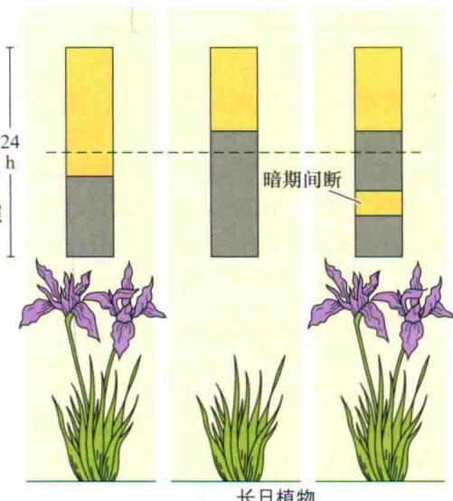  
长日植物；夜长短于临界期才能开花，有一些长日植物，缩短夜长可以诱导开花

图25.19 开花的光周期调控。A. 对短日植物和长日植物的影响。B. 暗期持续时间对开花的影响。用不同的光周期对长日植物或者短日植物进行处理，表明关键变量是暗期的长度。