界日长，但是接下来黑夜足够长的话，也能开花（图25.19B）。与此形成对比的是，短日植物经短日照后，再给予短夜处理，却不能开花。

更多的实验表明，短日植物对光周期的反应是通过衡量夜长来决定的。例如，苍耳（Xanthium strumarium）只有在暗期超过8.5 h才能开花，大豆（Glycine max）约为10 h。在长日植物中，黑暗的持续时间也相当重要（图25.19）。这些植物在短日照之后即使在短夜情况下也能开花。但是如果长日照后给予长夜处理，就不能开花。

## 25.5.4 暗期间断会消除暗期效应

暗期的重要性可以通过下面实验得到证实：在黑暗条件下，给以短暂的白光处理，暗期效应就失去作用，称为暗期间断（night break）（图25.19A）。相反，在日照条件下给以短暂的黑暗处理，并不能消除日照效应的作用（图25.19B）。在许多短日植物中，即使是几分钟的暗期间断，也能阻止其开花，包括苍耳属和牵牛属（Pharbitis）植物。在长日植物中，通常要足够长的光照才能开花。

另外，暗期间断效应也会随间断给予的时间有很大变化。对于长日植物和短日植物而言，在16 h的暗期接近中间的时候进行暗期间断最为有效（图25.20）。

暗期间断效应的发现及其对时间的依赖性，有几个重要的作用。首先它确定了暗期的重要性，以及为研究光周期的时效性提供了有价值的探索。因为只需要少量

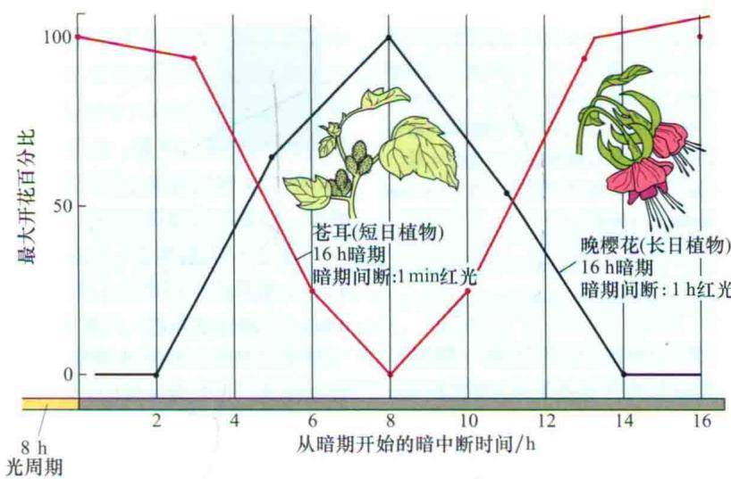  
图25.20 暗期间断的时间对于开花的影响。在一个比较长的暗期中，暗期间断可促进长日植物开花，而抑制短日植物开花。在16 h的暗期中，接近暗期中间的时候暗期间断最为有效。长日植物晚樱花，在16 h暗期中给予1 h的红光照射；苍耳在16 h暗期中给予1 min的红光照射（晚樱花数据引自Vince-Prue，1975；苍耳数据引自Salisbury，1963；Papenfuss and Salisbury，1967）。

的日照，在不影响光合作用和其他非光合作用条件下，研究光受体的行为和特性成为可能。这样的发现同样使得在园艺植物如伽蓝菜属（Kalanchoe）、菊花、一品红（Euphorbia pulcherrima）中，建立起商业化的调控花期的方法。

## 25.5.5 生物钟和光周期的守时性

黑夜长度在开花中的重要性提示我们，研究光周期的守时性，测量暗期长度是首要的。建立在近似昼夜节律基础上的机制已经用很多证据证实了这一点（Bunning，1960）。根据生物钟假说（clock hypothesis），光周期的守时性主要依赖于前面所讲过的振荡子（见第17章）。中央振荡子与涉及基因表达的许多生理过程相偶联，包括光周期依赖性物种的开花。

开花的暗期间断效应，可用来研究光周期守时性中近似昼夜节律的作用。例如，短日照的大豆植株，从8 h的光照移到64 h的暗期，暗期间断所引起的开花效应显示近似昼夜节律的形式（图25.21）。

这类实验更加有力地证明了生物钟假说。如果短日植物只是通过暗期特定中间物质的积累来简单地衡量黑夜的长度，那么任何大于临界夜长的暗周期都能导致植物开花。但是暗期间断发生的时间不能与内源振荡子的特定阶段很好地吻合时，就不能诱导植物开花。这些结果显示，短日植物的开花，除了需要足够长的暗周期外，同样也需要在生物钟周期的特定阶段给予一个黎明的信号（图25.15）。

振荡子在光周期衡量中所起作用的进一步证据来自于对光处理能引起光周期反应相变的观察实验（参见Web Topic 25.4）。

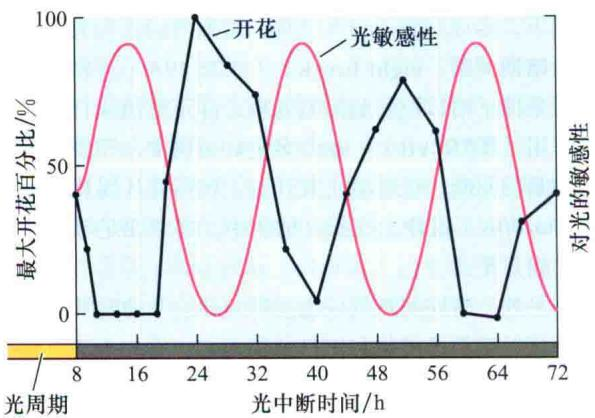

图25.21 暗期间断对节律性开花的影响。在这个实验中，短日植物大豆给予8 h光照和64 h的黑暗周期。在暗期的不同时间给予4 h的暗期间断。开花效应占最大效应的百分比按每个暗期间断处理进行划分。值得注意的是，在暗期的第26 h给予暗期间断能最大程度地诱导植物开花；而在第40 h给予暗期间断则不能诱导开花。而且，这个实验表明，暗期间断效应的敏感性显示近似昼夜节律的规律。这些数据支持了这样一个模型：在短日植物中，只有在光敏感阶段完成后，给予暗期间断或者黎明信号，才能诱导其开花。在长日植物中进行类似实验，暗期间断必须与光敏感阶段一致，才能诱导开花（参见Coulter and Hamner，1964）。

## 25.5.6 协变模型是建立在对光敏感的振荡上

周期为24 h的振荡如何确定临界夜长，例如，对于短日植物苍耳临界夜长为什么是8\~9 h呢？Erwin Bunning 于1936年提出，光周期控制植物的开花，是通过在生物振荡的不同阶段对光敏感性的不同形成的。这个假说最终演变为协变模型（coincidence model）。根据这个模型，生理振荡子控制植物对光的敏感和不敏感的时期。

光促进还是抑制开花主要决定于给光的时期。在近似昼夜节律的光敏感阶段给光，可促进长日植物开花而抑制短日植物开花。如图25.21所示，光敏感和不敏感阶段的振荡在暗期依然存在。在短日植物中，只有在昼夜节律的光敏感阶段完成后给予暗期间断或黎明信号，才能诱导其开花。在长日植物中进行类似实验，只有在在光敏感阶段给予暗期间断，才能诱导开花。也就是说，在与节律的适宜阶段相一致的情况下给予光照才可诱导长日植物和短日植物开花。即使在光暗周期不存在的情况下，振荡子也持续显示出对光的敏感和不敏感，这是生物振荡机制的特征之一。

## 25.5.7 CONSTANS的表达与光促进长日植物开花的协同性

根据协变模型，植物的开花响应只对昼夜周期特定阶段的光敏感。在长日照条件下促进长日植物拟南芥开花的关键组分为CONSTANS（CO）基因。它编码一个调节其他基因表达的锌指结构蛋白。CO最初是在拟南芥co突变体中鉴定出来的。co突变体不能进行光周期反应。CO的表达受生物钟的调控，在黄昏后12 h活性最大（图25.22A）。遗传和分子生物学研究表明，在拟南芥中CO加速对长日照的响应从而促进开花（图25.22B）。

如图25.22B所示，在长日植物拟南芥中，协变模型最主要的一个特征就是：CO在光周期阶段的叶子（光周期刺激物的感受部位）中表达后，才可促进开花。在短日照下，CO mRNA 表达量的增加并不能引起CO蛋白水平的升高。然而在长日照条件下，CO表达引起CO蛋白水平的迅速升高，因为至少部分CO的表达与光周期之间有重叠（图25.22B）（Suarez-Lopez et al., 2001）。

因此，长日照诱导拟南芥开花主要是由于CO蛋白水平的升高。在短日照条件下，由于缺光不能使CO蛋白水平升高，不能诱导开花。因此协变模型的一个主要特征就是在日照和CO的mRNA合成之间有重叠，光照可激活CO蛋白积累，达到使植物开花的水平。CO的mRNA的生物振荡性是光周期感受与生物钟之间的联系纽带。但是日照如何促进CO蛋白的积累呢？

通过在CO前加上一个组成型表达的启动子实验研究，为光照的作用提供了线索。在这种情况下，CO的mRNA应该持续表达，并在整个昼夜循环中都维持在一个稳定的水平。但是结果发现，CO表达的强度依然是周期性的。这就意味着CO蛋白表达丰度是通过转录后机制调控的。

这种转录后机制的基础是光暗条件下，CO降解速度不一样。在暗期，CO与泛素结合，并很快被26S蛋白体降解（见第2章）。而在光照条件下，可增强CO蛋白的稳定性（stability），并使之积累。这就解释了只有当CO的mRNA表达与光周期吻合后才能诱导开花的现象（Valverde et al., 2004）。在黑暗条件下，因为CO蛋白迅速降解，所以其不能积累。

然而，情况是非常复杂的，远非光-暗开关调节CO的表达量这么简单。光对CO蛋白稳定性的影响依赖于光受体。不同的光受体不仅在近似昼夜节律的设置上起作用，它们还直接影响CO蛋白的积累和开花。清晨光敏色素B（phyB）信号途径可以加强CO的降解；然而在夜晚（CO蛋白在长日照下积累后），隐花色素和光敏色素A（phyA）拮抗这种降解作用，因此可使CO蛋白积累（图25.22）（Valverde et al., 2004）。

但是在长日植物中，CO蛋白是如何刺激开花的呢？CO作为转录调控因子，通过刺激关键的花信号FT和SOC1的表达来促进开花。在本章的后面内容中，我们将会讨论到，在刺激分生组织开花时，有证据表明FT蛋白是促进分生组织形成花的韧皮部可移动信号。

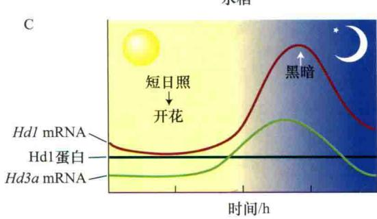

  
图25.22 拟南芥（A 和B）和水稻（C 和D）协变模型的分子基础。A. 拟南芥在短日照条件下，CO mRNA的表达与光照之间的重叠较少。韧皮部CO蛋白积累不足，因此不能使可转运的成花刺激物FT蛋白表达，从而植物保持营养生长阶段。B. 拟南芥在长日照条件下，CO mRNA的丰度（12\~16 h）和日照（理解为光敏色素A和隐花色素）的重叠达到了顶峰，因此使CO蛋白积累。CO激活韧皮部中FT mRNA表达，当后者转运到顶端分生组织后，诱导植物开花。C. 水稻在短日照下，由于Hd1 mRNA与光照之间缺乏协同性，因此阻止了Hd1蛋白的积累，Hd1蛋白为编码转运成花刺激物基因Hd3a的抑制子。Hd1蛋白抑制子不存在的情况下，Hd3a mRNA表达，并被转运到顶端分生组织，因此使得植物开花。D. 水稻在长日照（理解为光敏色素）下，Hd3a mRNA的丰度和日照的重叠达到了顶峰，因此引起Hd1a蛋白抑制子的积累。所以Hd3a mRNA没有表达，植物依然处于营养阶段（引自Hayama and Coupland，2004）。

在短日照植物中也有同样的促进开花的途径，这将在后面讨论。

## 25.5.8 短日照植物在长日照下利用协同机制抑制开花

通过对短日植物水稻开花的研究发现，光周期感受的基本协同机制在水稻和拟南芥中是保守的。在水稻育种的过程中，育种学家已经鉴定出了影响开花的几个等位基因。Heading-date 1（Hd1）和Heading-date 3a（Hd3a）基因编码与拟南芥CO和FT同源的蛋白质。在转基因的拟南芥中过表达FT和在水稻中过表达Hd3a，都可促进植物迅速开花，而不受光周期的影响，说明FT和Hd3a都是开花的强启动子。而且当植物处于诱导的光周期（长日照下的拟南芥和短日照下的水稻）时，内源的FT和Hd3a基因的表达都增加（图25.22C）。另外，水稻的Hd3a和拟南芥CO的表达都显示出相似的模式，即mRNA的规律性积累。

水稻和拟南芥的区别在于，在短日植物水稻中，Hd1抑制Hd3a的表达，也就是说，在水稻中，Hd1与光敏色素介导的光信号阻止开花的协同性主要是通过抑制Hd3a的表达来实现的（图25.22D）（Izawa et al., 2003；Hayama and Coupland, 2004）。相反，在拟南芥中，CO激活下游基因FT的表达。短日植物和长日植物对光周期反应的不同，部分原因是光周期感受系统中CO/Hdl的相反效应。

然而，需要特别说明的是，光周期现象是非常复杂的，对其他可能影响短日植物和长日植物对日长作出反应的调节机制还有待进一步研究。

## 25.5.9 光敏色素为光周期反应中最主要的光受体

暗期间断实验非常适用于研究在光周期反应中接收光信号的受体的特性。在短日植物中，暗期间断抑制短日植物开花是光敏色素控制下的生理过程之一（图25.23）。

在许多短日植物中，暗期间断在Pr（吸收红光的光敏色素）向Pfr（吸收远红光的光敏色素）转换的过程中，只有给予足够剂量饱和其转换过程的光才有效（见第17章）。随后用远红光照射，使之重新转变为没有活性的Pr，又恢复开花反应。

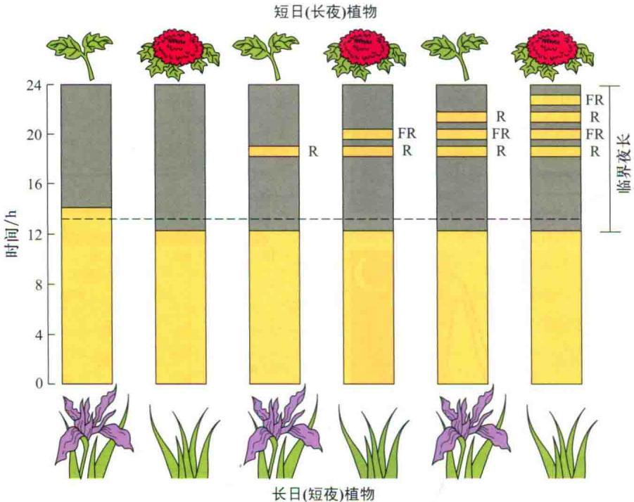  
图25.23 光敏色素通过红光和远红光来控制开花。在长日植物中，在暗期给予瞬间的红光照射可以促进其开花，并且这种效应可以被远红光逆转。这种反应表明有光敏色素的参与。在短日植物中，短暂的红光照射可抑制植物开花，并且这种效应可以被短暂的远红光逆转。

图25.24所示为对短日植物开花起抑制和促进作用的特殊波谱。为了避免叶绿素的干扰，利用在暗处生长的牵牛花，发现在660 nm处的A波峰为Pr的最大光吸收；相反，绿色植物苍耳在有叶绿素存在的情况下，激活波谱和Pr的吸收波谱之间存在差异。激活波谱的存在及暗期间断实验中红光-远红光的互相逆转，证实了光敏色素作为光受体参与了短日植物对光周期的感知。

另外的遗传实验证实，光敏色素在短日植物光周期现象中起关键的作用。水稻PHOTOPERIOD SENSITIVITY 5（Se5）基因编码一个类似于拟南芥HY1的蛋白质。Se5和HY1都是催化光敏色素发色团合成过程中某一步骤的酶。对于Se5突变体，无论在多长的日照条件下都能迅速开花（Izawa et al., 2000）。

长日植物暗期间断实验同样有光敏色素的参与。因此在一些长日植物中，用红光使暗期间断可促进开花。而用远红光则抑制开花（图25.23）。

在长日植物大麦、毒麦和拟南芥中发现，近似昼夜节律通过远红光而促进植物开花（图25.25）（Deitzer，1984），并且与远红光的照射强度及持续时间成一定的比例，因此为高光辐照度反应（high-irradiance-response，HIR）。和其他的高光辐照度反应一样，光敏色素A也是介导远红光效应的光敏色素。与长日植物中光敏色素A在开花中的效应相一致，拟南芥

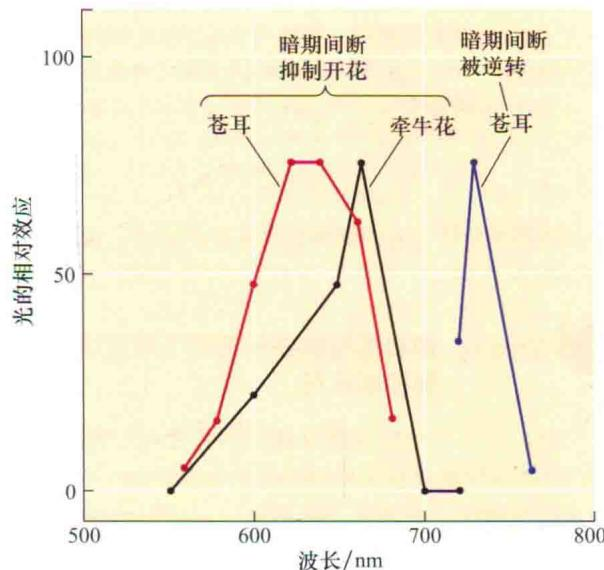  
图25.24 暗期间断实验说明特殊的波谱控制了开花反应，并暗示有光敏色素的参与。在另一个诱导周期中，给予暗期间断可以抑制短日植物的开花。对于短日植物苍耳，620\~640 nm为其红光吸收波谱。725 nm处的光可逆转红光效应。为了避免叶绿素Ⅱ对光吸收的干扰，利用在暗处生长的牵牛花，发现660 nm的暗期间断最有效。因为660 nm能最大程度被光敏色素吸收（苍耳数据参见Hendricks and Siegelman，1967；牵牛花数据参见Saji et al., 1983）。

  
图25.25 远红光对拟南芥开花的影响。在持续的72 h光照过程中，定时给予4 h的远红光照射。图中数据点每6 h采集一次。数据显示近似昼夜节律对远红光促进植物开花也是敏感的。这就支持了在长日植物中，光处理（本例中为远红光）与光敏感性峰一致的话可促进植物开花（引自Deitzer，1984）。

PHYA的突变体开花延迟。然而在一些长日植物中，光敏色素的作用远比在短日植物中的作用复杂，因为蓝光受体也参与了这个反应。

## 25.5.10 蓝光受体参与长日植物的开花调控

一些长日植物如拟南芥，蓝光可以促进其开花，暗示着蓝光受体也可能参与了对开花的调控。在第18章我们已经讲过，CRY1和CRY2基因编码的隐花色素在拟南芥中为控制幼苗生长的蓝光受体。

正如前面提到的，CRY蛋白也参与了对生物钟振荡子的导引。就像Web Topic 25.5中提到的，通过构建带有荧光色素酶报告基因的载体，发现蓝光在开花中具有一定作用，并与近似昼夜节律存在一定联系。在持续的白光照射中，发光周期为24.7 h；但是在持续的黑暗条件下周期为30\~36 h。无论是给予红光还是蓝光，都能使周期缩短为25 h。

为了区别光敏色素与蓝光受体的作用，研究人员对光敏色素突变体hy1进行了转化研究，这种突变体在发色团的合成方面存在缺陷，导致所有的光敏色素缺失（见第17章），利用荧光素酶载体来测定突变对周期长度的影响（Millar et al., 1995）。在持续的白光照射下，hy1与野生型有相似的周期，说明白光对光周期的影响只需少量或者不需要光敏色素的参与。而且在只有光敏色素B能够感受的红光持续照射下（见第17章），hy1的周期显著变长（如它更像持续的暗处理）；然而在持续的蓝光照射下周期没有变长。这些结果显示光敏色素和蓝光受体都参与了对周期的调控。

通过对拟南芥开花突变体elf3（early flowering 3）（参见Web Topic 25.5和25.6）的研究，同样证实蓝光参与了调节近似昼夜节律和开花的调控。通过对CRY2基因的一个突变体的研究（见第18章），更进一步证实了在拟南芥中蓝光受体对光周期诱导是敏感的，这种突变体开花延迟，并且丧失了感受光周期诱导的能力（Guo et al., 1998）。

相反，携带有CRY2功能获得型等位基因的植株开花比野生型还要早（El-din El-Assal，2003）。另外cry1/cry2双突变在长日照条件下比单突变cry2开花稍晚。所以在对开花的调控上，CRY1和CRY2存在功能重叠。

隐花色素除了在生物钟导引上起作用外，光敏色素A还通过直接调节CO蛋白稳定性来调控植物开花。因此综上所述，CO蛋白为调控长日植物开花的启动子。

## 25.6 春化作用：冷处理可以促进植物开花

吸水的种子或正在生长的植株进行冷处理后可减轻对开花的抑制，这个过程就称为春化作用（vernalization）（干燥的种子并不能对冷处理作出反应，因为春化是一个有活性的代谢过程）。不经过冷处理，那些需要春化处理才能开花的植物会延迟开花或一直处于营养生长阶段，而且它也不能对成花信号如光周期诱导作出响应。许多情况下这些植物一直长莲座叶而茎不伸长（图25.26）。

在本节中我们将会讨论一些需要冷处理才能开花的特征，包括温度范围和持续时间、低温感受部位、与光周期的关系，以及可能的分子机制。

## 25.6.1 植物感受春化作用获得开花能力的部位是茎顶端分生组织

不同年龄的植物对春化作用的敏感性也不一样。冬性的一年生植物，如越冬的禾谷类植物（秋季播种，次年夏季开花），在生命周期的早期就显示出对低温的敏感性。事实上，许多冬性一年生植物的种子在萌发前吸水并且开始代谢活动时就可以进行春化作用。其他植物包括许多二年生植物（播种的第一季度进行莲座叶的生长，次年夏季开花），只有当它们的个体达到一定大小时，才对进行春化作用的低温敏感。

适合春化作用的温度为0\~10℃，通常为1\~7℃（Lang，1965）。低温处理的效果随持续时间而增加，图25.26 春化作用可诱导冬性一年生植物拟南芥开花。左图为没有经过冷处理的野生型拟南芥。右图为从幼苗期在稍高于4℃的条件下，经过40天的冷处理，在春化处理结束后三周，长了大约9片叶子后开花（Colleen Bizzell，惠赠）。

  
经过春化的冬性一年生拟南芥

直到饱和为止。通常冷处理需要几个星期，但是不同植物不同品种所需的时间变化范围很大。

当处于去春化的条件下时，如遇高温，春化作用会消失（图25.27）。但是低温处理的时间越长，春化作用的效果持续时间越久。

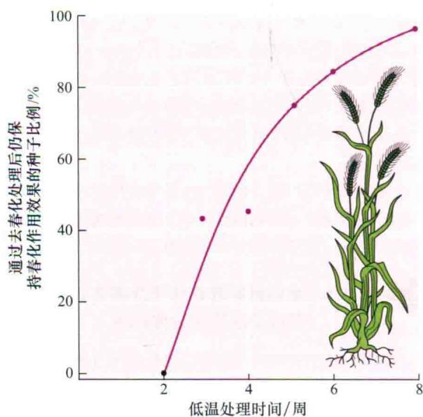  
图25.27 低温处理时间越长，春化作用越稳定。冬性黑麦低温处理时间越长，在低温处理后给予去春化作用的条件，仍能保持春化作用效果的植株越多。在这个实验中，黑麦的种子浸泡在水中，用不同时间的低温进行处理，然后迅速给予35℃3天的去春化处理（数据引自Purvis and Gregory 1952）。

春化作用主要发生在茎顶端分生组织。只有茎顶端被冷处理后，才能诱导植物开花。这种结果看起来与植物的其他部位是否接受冷处理关系不大。离体的茎尖可以春化，种子也可以，形成胚胎的茎尖一样对低温敏感。

在发育过程中，春化作用可使得分生组织获得向花器官转变的能力。但是，在前面我们已经知道，开花能力的获得并不能保证开花一定会发生。对春化处理的需求一般还与特殊的光周期相关联（Lang，1965）。最普遍的联系是：冷处理后给予长时间的光照，这种联系使处于高纬度的植物在夏初就能开花（参见Web Topic 25.7）。

## 25.6.2 春化作用涉及基因表达的表观遗传变化

在低温进行春化作用处理时需要保持一定的代谢活性，供能物质（糖类）和氧气是必需的。低于冰点的温度使代谢活性受到抑制，对春化作用也是无效的。同样，细胞分裂和DNA复制也需要一定的代谢活性。在有些植物中春化能引起一些稳定的变化，使得分生组织能够形成花序（Amsasinio，2004）。

春化作用能稳定影响开花能力的一个模型是：冷处理后，分生组织的基因表达模式发生了变化，这种变化一直持续到春天并贯穿整个生命周期。但是这种基因表达的变化并不涉及DNA序列的变化，而且可通过有丝分裂或减数分裂传递给子代细胞，也称为表观遗传变化（epigenetic change）。而且，在基因水平上的表观遗传变化即使是在信号（如低温）不再存在时也是非常稳定的。从酵母到哺乳动物的许多有机体都可发生基因表达的表观遗传变化，而且通常需要细胞分裂和DNA复制，这也是春化作用的一个方面。

一个与长日植物拟南芥春化作用相关的、起表观调节作用的特异性靶基因已经被鉴定出来。冬性一年生拟南芥需要春化作用和长日照才能促进开花。已经鉴定出了一个开花抑制基因：FLOWERING LOCUS C（FLC）。FLC基因在没有经过春化作用的茎顶端区域高度表达（Michaels and Amasino，2000）。一旦通过春化作用后，在接下来的生命周期中，这个基因的表达被关闭，从而在长日照下可开花（图25.28）。然而在下一个世代中，FLC基因的表达又被开启，需要重新进行冷处理。因此在拟南芥中，FLC基因的表达状态代表了分生组织能力决定的一个重要方面（Amasino，2004）。在拟南芥中的研究表明，FLC直接通过对关键成花信号FT在叶中的表达及转录因子SOCI和FD在茎顶端分生组织的表达的响应而起作用（Searle et al., 2006）。

根据染色质重建模型（chromatin remodeling），对FLC的表观调节与染色质结构的稳定性改变有关。在第1章我们已经知道，在真核生物中，核DNA存在于转录不活跃、结构比较紧密的异染色质区域，或者转录活跃的常染色质区域。异染色质和常染色质的区别在于核糖体上特定组氨酸的共价修饰方式不同（见第2章）。而且这些修饰被认为与异染色质或常染色质的形成有关。

这些共价修饰通常发生在特殊的染色质结构区域，也就是组蛋白密码（histone code）（Jenuwein and Allis, 2001）。

春化作用使常染色质中FLC失去组蛋白修饰功能而获得如异染色质特定赖氨酸残基的甲基化修饰特征（Bastow et al., 2004; Sung and Amasino, 2004）。冷处理使得FLC从常染色质向异染色质转变，并使得基因沉默。

## 25.6.3 植物进化出了一系列的春化作用机制

许多需要春化作用的植物在秋季萌发，然后充分地利用凉爽和潮湿的环境进行生长。对于春化作用的需求使得植物在春季才能开花，从而保证冬季持续营养生长（花对霜冻非常敏感）。需要进行春化作用的植物不但需要感受冷信号，同时需要一套感知冷处理持续时间的机制。例如，在早秋进行短时的冷处理，而后在秋末气温回升，这样对于植物来讲，不会误认为早期的低温就是冬天，而后的气温升高就为春季。一般来说，春化作用只有在足够长时间的冷处理后才会发生，这样的持续时间指示完整的冬天已经结束。

生长在温带地区的二年生植物同样也进化出了一套相应的机制感知冷处理的时间从而打破休眠开始萌发。植物进化出的感知冷处理的机制目前还不清楚。但是在拟南芥中，一些基因在长时间的冷处理后才表达，这些基因对于春化作用是非常重要的（Amasino，2004；Sung and Amasino，2004）。

  
图25.28 要求春化的植物除非经历长时间的低温，否则要么延迟开花要么不能开花。（左）每年冬季低温春化阻止拟南芥FLC基因的表达。（右）拟南芥flc突变体未低温处理也能快速开花（图片由R.Amasino惠赠）。

在所有的开花植物中，春化作用途径不尽相同。上面我们讲过，在拟南芥中，FLC基因是开花的抑制子，使其需要春化处理才能开花。FLC编码一个MADS-box蛋白，与DEFICIENS和AGAMOUS基因相似，在花的发育中起作用。在禾谷类植物中，有一个基因编码包含锌指结构的不同类型的VRN2（vernalization 2）蛋白，它是开花的抑制子，使得开花也需要春化作用（Greenup et al., 2009；Distelfeld and Dubcovsky, 2009）。

有很大一部分有花植物在温暖气候条件下进化，因此没有进化出感知冬季持续时间的机制。随着地质年代的变化，由于大陆漂移和其他因素，地球逐渐形成一些温带气候区。当这些植物适应这种温度条件后，春化作用和芽的休眠反应就可能在各自的种群中进化出了独立的机制。

## 25.7 与开花有关的长距离信号过程

尽管成花诱导发生在茎顶端分生组织上，但光周期植物感知光周期的部位是叶片。这就表明信号必须从叶片长距离传导到茎顶端，这已经在许多植物的嫁接试验中得到证实。这些信号的生化本质是什么一直困扰着生理学家。这个问题最终通过分子遗传学方法得以解决，而且证实成花刺激物是一种蛋白质。在这一部分我们将综述这一成花刺激物或历史上称为开花素的发现背景。它在开化过程中起着长距离信号传输的作用。同时我们也讨论其他各种作为开花激活子或抑制子的生化信号。

## 25.7.1 成花刺激物通过韧皮部运输

叶片中形成的成花刺激物通过韧皮部运输到茎尖分生组织，并最终使其发育成花。如果阻止韧皮部的运输，如环割或者定位热杀死，就会阻止成花刺激物从叶部向外运输而导致不能开花。

成花刺激物的运输速率是可以通过如下方式测量的：在诱导后不同时间移除叶子，然后比较信号从诱导后的叶片到达两个不同距离的花芽所需要的时间，就可知道其运输速率。用这种方法测量运输速率的基本原理是叶片移除及开花之前这种信号物已到达花芽并积累到一定的量。在这种方法中，从叶片运输的足够量信号物所需时间也能被确定。而且通过比较两个不同部位花芽诱导开花的时间可以测量出信号在茎中的移动速率。

利用这种方法研究表明，成花信号的移动速率和糖类在韧皮部的运输速率大致相等或稍低（见第10章）。

例如，短日照的藜属植物（Chenopodium），成熟叶片上的成花刺激物大致是在长夜周期开始后的22.5 h之内输出的。在长日照白芥属植物（Sinapis）中，叶子的成花刺激物早在长日照开始后的16 h就输出（Zeevwaart，1976）。

由于成花刺激物是在韧皮部内与糖类一起运输的，因此很容易认为二者是源-库关系。位于茎顶端与茎基部的叶子相比，前者诱导后更能促进植物开花。与此类似的是，当没有诱导的叶子处于诱导的叶子和花芽之间时，它作为首选物阻止从远端运来的成花刺激物到达目的部位，所以能阻止开花。

## 25.7.2 嫁接实验证实了可转运的成花刺激物的存在

在经过光周期诱导的叶子上可以产生一种生化信号，并转运到一定距离的目的组织（茎顶端）刺激发生一定的反应（开花），这种生化信号具有激素一样的重要效果。20世纪30年代苏联的Mikhail Chailakhyan提出，在植物中存在一种通用的开花刺激物质，他将其命名为开花素（florigen）。

开花素存在的证据来自于如下实验：从已经经过光周期诱导后的供体植株上移植一片叶子或者一个枝条到另外一个从未经诱导的受体植株上，能使后者开花。如短日植物紫苏，将其经过短日照诱导后的一个叶片嫁接到处于长日照条件下没有经过诱导的植株上，能使后者开花（图25.29）。并且不同光周期的植物，其成花刺激物好像为同种物质。因此，从经过长日照诱导的长日照烟草（Nicotiana sylvestris）中截取一段枝条嫁接到短日照马里兰的巨大烟草突变体上，能使后者在没有诱导的条件下开花。

日中性植物的叶片同样可以产生可转运的成花刺激物（表25.2）。例如，将日中性大豆品种Agate的一片叶子嫁接到短日照品种Bilaxi上，即使后者处于没有诱导作用的长日照下也能开花。同样，将日中性烟草（Nicotiana tabacum cv. Trapezond）的芽嫁接到长日照烟草（Nicotiana sylvestris）中，同样可以诱导后者在没有长日照诱导的短日照条件下开花。

嫁接研究表明，有些物种如短日植物苍耳属（Xanthium）、短长日植物落地生根属（Bryophyllum）和长日植物蝇子草（Silene），嫁接不仅能诱导开花，而且这种诱导状态可以通过自身传递下去（Zeevwaart，1976）（见Web Topic 25.8）。在不同的属之间进行嫁接同样可以诱导开花。将正在开花的金盏花（Calendula officinalis）枝条嫁接到处于营养阶段的苍耳茎上，在长日照条件下，同样可使短日植物苍耳开花。与此类似，将长日植物矮牵牛花枝条嫁接到需要冷处理的两年生天仙子（Hyoscyamus niger）上，即使没有经过春化处理，在长日照条件下也可使后者开花（图25.30）。

诱导后的接穗供体 未诱导的接穗供体  
  
图25.29 通过嫁接实验证实在短日植物紫苏中存在叶子产生的成花刺激物。左图：将一片经过短日照诱导植株上的叶片嫁接到没有经过诱导的茎上，可使腋芽开花。供体叶片经过修剪便于嫁接，受体茎上部的叶子去除以促进韧皮部从接穗向受体茎转移。右图：嫁接一片从长日条件下的没有经过诱导的植株叶片只会形成处于营养阶段的枝条（AD Zeevaart惠赠）。

在紫苏中（图25.29），从供体叶片来的成花刺激物通过韧皮部运输到受体植物的茎上，它与来自供体的 $^{14}$ C标记的同化物的运输联系比较紧密，而且这种运输的实现是建立在嫁接处的维管连续分布的基础上（Zeevaart，1976）。这些结果都证实了成花刺激物在韧皮部是与光同化物的转运同时进行的。

## 25.7.3 开花素的发现

上面介绍的嫁接试验表明，从叶子到顶端分生组织长距离信号对刺激开花是很重要的。自20世纪30年代以来，试图分离开花素和抑花素都失败了。在已知的植物激素结构基础上，这些早期的研究几乎都集中于小分子物质，它们相对容易进行生物分析。分离诱导和没有诱导的叶组织的提取物，然后验证它们对成花或抑花的影响。有这样一个典型的实验，收集许多受诱导的韧皮汁进行测验（见第10章）。尽管有一些正面结果的报道，但是都未能经得起进一步推敲。有一种假设认为在分离物中检测成花素失败的原因是成花素不是单一物质，而是一个多因子的组合体，因此很难通过实验使其复原。另一种假设认为成花素可能不是类似于激素的小分子物质，而是一种大分子物质，如蛋白质或RNA，这些大分子不是在植物细胞中既定存在的。后一种假设可以解释为什么从分离物中检测成花素活性是如此困难。研究人员已无路可走，必须寻找新的方法来解决这个问题。

  
图25.30 成花刺激物在不同种属间可以成功地转运。右边的枝条为长日植物矮牵牛的幼苗，砧木为没有春化处理的天仙子。嫁接后保持在长日照条件下（AD Zeevaart惠赠）。

表25.2 成花信号可通过嫁接方式进行传递

<table><tr><td>保持在开花诱导条件下的供体植物</td><td>光周期类型</td><td>诱导开花的受体植物</td><td>光周期类型</td></tr><tr><td>向日葵</td><td>长日照下日中性植物</td><td>向日葵</td><td>长日照下短日植物</td></tr><tr><td>烟草(Delcrest)</td><td>短日照下日中性植物</td><td>烟草(sylvestris)</td><td>短日照下长日植物</td></tr><tr><td>烟草(sylvestris)</td><td>长日照下长日植物</td><td>马里兰巨大烟草</td><td>长日照下短日植物</td></tr><tr><td>马里兰巨大烟草</td><td>短日照下短日植物</td><td>烟草(sylvestris)</td><td>短日照下长日植物</td></tr></table>

一个主要的突破是在拟南芥中通过遗传分析鉴定到FLOWERING LOCUS T（FT）基因。

## 25.7.4 拟南芥FLOWERING LOCUS T蛋白是成花素

根据协变模型，长日植物如拟南芥只有CO基因在光周期下表达后才能诱导其开花。CO基因的表达量在叶子和茎的韧皮部最高（An et al., 2004）。CO的下游目的基因FLOWERING LOCUS T（FT）也在韧皮部特异表达。

与韧皮部的CO相对应，光周期反应缺失的co突变体可以被特异性伴胞启动子在成熟叶子的次生叶脉中特异表达CO基因而得到恢复（An et al., 2004；Ayre and Turgeon, 2004）。相反，在co突变体的顶端分生组织表达CO却不能使光周期反应恢复。因此，CO可能在叶子的韧皮部对长日照作出反应后特异表达而刺激开花。另外嫁接叶子韧皮部表达CO的转基因植株的芽到co突变体，也能使后者开花。这些结果表明，CO的表达产生可通过嫁接转移的成花刺激物，从而引发茎顶端分生组织开花（Ayre and Turgeon, 2004）。

CO活性的信号输出是由FT基因的表达介导的。拟南芥在长日照下CO的表达使FT的mRNA升高。而FT不像CO，FT无论在韧皮部还是在顶端分生组织表达都能刺激植物开花（An et al., 2004；Corbesier and Coupland, 2005）。

FT在芽殖酵母菌和脊椎动物中是一种保守的小的球状调控蛋白。FT的mRNA或FT蛋白是否就是光周期信号通过韧皮部长距离向顶端分生组织转运的成花刺激物（成花素）呢？很多植物中FT基因（或其相关基因，如水稻Hd3a）在光周期诱导的成花过程中表达。当FT基因被转入不受光周期影响成花的植物中时，转基因植物可以不依赖于光周期而开花。现已证实FT蛋白可以从叶片转移到顶端分生组织（Corbesier et al., 2007；Jaeger and Wigge 2007；Mathieu et al., 2007；Lin et al., 2007；Tanak et al., 2007；Zeevaart, 2008年总结）。因此，FT蛋白已经显示出可能是成花素的特征。

根据目前的模型，FT蛋白在光周期诱导下从叶片通过韧皮部向分生组织运输（图25.31）。在分生组织中一旦FT蛋白和FD形成复合物，一个基本的亮氨酸拉链（bZIP）转录因子即在分生组织中表达（Abe et al., 2005；Wigge et al., 2005）。FT和FD复合物激活花特异性基因如APETACAE1的表达（图25.31）。在拟南芥中这种正反馈调节使得分生组织保持成花状态。然而有些植物缺乏这种正反馈调节机制，这些植物在没有持续的光周期存在时分生组织逆转为叶而不是花（Tooke et al., 2005）。

## 25.7.5 赤霉素和乙烯能诱导一些植物开花

在生长类激素中，赤霉素（GA）（见第20章）对开花有很大的影响（参见Web Topic 25.9）。外源赤霉素喷洒于长日植物如拟南芥的莲座叶，或双重日长植物如落地生根，都可使它们开花（Lang，1965；Zeevaart，1985）。

赤霉素可通过激活LEAFY基因的表达来促进拟南芥开花（Blazquez and Weigel，2000）。赤霉素激活LFY表达是由转录因子GAMYB介导的，而GAMYB又被DELLA蛋白负调控（见第20章）。另外，GAMYB水平也受促使GAMYB转录降解的microRNA的调控（Achard et al., 2004）（见第20章）。

在一些没有经过诱导的短日植物及需要春化处理而未处理的植物上喷洒外源赤霉素，同样可诱导它们开花。如前所述，施加赤霉素可以促进一些裸子植物球果的形成。因此，在一些植物中，就像日长和温度这些主要的环境因子一样，外源赤霉素可绕过内源赤霉素而促进开花。

第20章谈到，在植物中含有多种类似于赤霉素的化合物。这些化合物多数要么为赤霉素的前体，要么是无活性的赤霉素代谢物。在长日植物毒麦中，有些情况下不同的赤霉素对开花和茎伸长有不同的影响（参见Web Topic 25.9）。

在一些物种中，如长日照的毒麦（Lolium temuletum），不同的赤霉素在开花和茎伸长方面具有明显的差异效应（见Web Topic25.10和Web Essay 25.1）。在定量化长日植物拟南芥中，一个赤霉素合成突变体在非诱导的短日照时阻止开花，而在长日照下对开花几乎没有效应，表明在某些特殊情况下内源赤霉素对于开花是必需的（Wilson et al., 1992）。因此在拟南芥中，在光周期刺激很少或缺乏时，赤霉素是一种替代的成花刺激物。在许多物种中，一定量的赤霉素对于开花是必需的。

人们将注意力都集中在长日照对赤霉素代谢的影响上（见第20章）。例如，长日植物菠菜（Spinacia oleracea）在短日照条件下赤霉素水平相对较低，植株保持莲座叶状态。一旦被转移到长日照条件下，在13-羟基化途径（ $\mathrm{GA}_{53} \rightarrow \mathrm{GA}_{44} \rightarrow \mathrm{GA}_{19} \rightarrow \mathrm{GA}_{20} \rightarrow \mathrm{GA}_{1}$ ，见第20章）中所有的赤霉素水平都升高。然而具有生理活性的

  
图25.31 拟南芥中众多的开花发育途径：光周期现象、自主途径、春化作用（低温）和赤霉素均会影响开花。光周期途径定位于叶子，并且与可转移的成花刺激物FT蛋白的产生有关。A.拟南芥在长日照下CO蛋白积累使得在韧皮部产生FT的mRNA，然后FT蛋白通过筛管运输到顶端分生组织。B.短日植物如水稻，当抑制蛋白Hd1在短日照下不能积累时，可转运的成花刺激物FT也称为Hd3a表达（虚线表示在短日照下生物钟基因不激活Hd1）。在分生组织中，FT或Hd3a蛋白与FD蛋白相互作用。FT/FD复合物激活AP1和SOC1基因，进而激活LFY基因表达。LEY和AP1基因接着激活花同源异型基因的表达。自主途径和春化途径负调控FLC，FLC在分生组织中是SOC1的负调控因子，在叶中是FT的负调控因子。

$GA_{1}$ 水平升高5倍，是引起茎伸长并开花的主要原因。

除赤霉素外，其他生长类激素也能促进或抑制植物开花。一个很重要的例子就是乙烯和能释放乙烯的化合物对菠萝（Ananas comosus）开花具有显著的促进作用，这种反应仅限于在凤梨家族（Bromeliaceae）中存在。

## 25.7.6 气候变化已经引起开花时间的明显变化

植物对温度高度敏感，而且通过不同方式利用温度信号控制发育。我们知道有些植物需要较长时间的低温（春化）使其开花。此外就是环境温度对生长的影响。

植物可以感知低至1℃的温度变化。在研究过的许多植物中，提高环境温度可以加速开花。很明显，气候变化已经引起植物开花时间的显著变化（Fitter and Fitter, 2002）。植物感知温度的途径还不清楚，但这种感知依赖于FT基因的表达，因为在FT缺失突变体中，环境温度的升高并未加速开花（Baiusubramanian et al., 2006）。

研究表明，不同物种对环境温度的敏感度不同，有些植物非常不敏感，而有些植物特别敏感。这对于理解物种是如何适应气候的变化是非常重要的暗示，因为已有研究表明那些对气候变化有响应的植物可以扩张其生存范围，而那些不能利用环境温度作为发育信号的植物更易灭绝（Willis et al., 2008）。

## 25.7.7 开花转变涉及诸多因子和信号途径

开花转变是一个涉及诸多因子相互作用的复杂系统。对自主调节途径和光周期反应类植物，叶片产生的可移动的信号对茎顶端的决定性来说都是必需的。遗传研究表明，在长日植物拟南芥中存在4种明显的调控开花的发育途径（图25.31）。

（1）光周期途径开始于叶片，有光敏色素和隐花色素的参与（需要注意的是PHYA和PHYB在开花调控方面作用相反；参见Web Topic 25.11）。在长日照条件下，光受体和生物钟之间相互作用使得CO在叶片韧皮部的伴胞中表达。CO激活下游目的基因FT在韧皮部表达。FT蛋白（开花素）是韧皮部转运信号的重要成分，并刺激顶端分生组织形成花。FT蛋白与转录因子FD形成一个复合物。而FT/FD复合物激活下游基因如SOC1、AP1、LEY，这些基因启动侧生花序分生组织中同源异型基因的表达。

（2）在短日照的水稻中，CO的同源基因Hd1是开花的抑制子。然而，在短日照的诱导下Hd1蛋白不能产生。Hd1的缺失引起韧皮部伴胞细胞中Hd3a的表达（Hd3a是FT的家族蛋白）。Hd3a蛋白经韧皮部运输至顶端分生组织，通过与拟南芥类似的途径来刺激开花。

（3）自主和春化途径：植物通过对内源信号（固定的叶片数）或者低温作出反应而开花。与拟南芥的自主开花途径相关的所有基因都在分生组织中表达。自主开花途径通过抑制开花抑制子FLOWERING LOCUS C（FLC）基因的表达而起作用，FLC是SOC1表达的抑制子（Michaels and Amasino，2000）。春化作用同样抑制FLC的表达，但或许是通过另外一种机制（表观遗传变化）。因为FLC基因作为一个共同的目的基因，把自主途径和春化途径联系起来。

（4）赤霉素途径对于早花和非诱导的短日照条件下的开花是必需的。赤霉素途径涉及GAMYB，它是作为一个中间成分，可提高LFY的表达；赤霉素也可能通过独立的途径与SOCI相互作用。

上述4条途径通过增加关键成花调节因子FT在维管中的表达量和SOC1、LFY、AP1在分生组织中的表达量而交聚于一点（图25.31）。图25.32显示拟南芥茎顶端分生组织SOC1基因从短日照（8 h）到长日照（16 h）的表达变化。SOC1的表达在长日照处理后的18 h就可以检测到（Borner et al., 2000）。因此超过8 h短日照临界点的10 h，分生组织就开始对从叶部转移来的成花刺激物作出反应。这个时期与之前测量的成花刺激物从诱导叶中的输出速率相一致（早先已经讨论过）。

SOC1、LFY、AP1基因的表达依次激活下游花器官发育所需的基因如AP3、PISTLLIATA（PI）和AGAMOUS（AG）（图25.6）。

众多开花途径的存在使得被子植物生殖发育具有最大程度的灵活性，并使得植物可以在很广泛的环境下产生种子。途径的重叠性，确保最主要的生理功能——生殖发育对于某些突变和进化保持相对不太敏感。

短日照向长日照转换的时间  
  
0 h

  
18 h

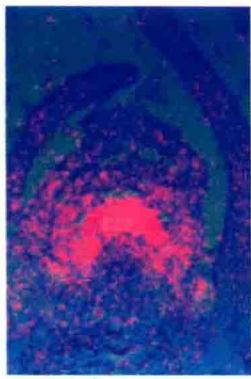  
42 h

  
5天  
图25.32 在拟南芥的顶端分生组织中，花引发情况下SOC1的表达增强。图示时间为从短日照向长日照转移后的时间（引自Borner et al., 2000）。

毫无疑问，在不同物种中，具体的途径也不一样。例如，玉米与自主调节途径有关的基因中，至少有一个基因在叶片中表达（参见Web Topic 25.12）。多种成花途径的存在是被子植物多样性的根源。

## 小结

花器官（花萼、花瓣、雄蕊和心皮）在茎顶端的形成是内源发育过程和环境信号共同作用的结果。控制花形态建成的基因调控网络在一些物种中已建立起来（图25.1和图25.2）。

## 花分生组织和花器官发育

· 4种不同的花器官依次在相对独立的同心轮中产生（图25.3）。

· 拟南芥花分生组织的形成需要激活分生组织特异性基因，如SOC1、LFY和AP1。

· 花器官特异性基因同源异型突变改变了各轮中花器官的类型（图25.5）。

· ABC模型表明每轮中的器官特异性是由三类型花器官特异性基因共同决定（图25.6\~图25.8）。

## 花发端：环境信号的整合

· 内在的（自发的）和外部的（环境感知）控制系统使得植物能够精确地调控开花而进行生殖生长。

· 花发育可能是对日长变化（光周期）或低温持续时间（春化）作出响应的过程。

· 同步开花使得杂交得以进行，并在适宜的条件下形成种子。

## 茎顶端和时相的变化

\- 植物从幼年到成年的变化通常伴随营养体特征的变化（图25.9和图25.10）。

· 组合模型解释了从幼年到成年过渡形式（图 25.11）。

· 花的起源要求顶芽通过两个发育时期：竞争期和决定期（图25.12）。

· 当营养枝（嫁接枝）被嫁接到正在开花的植株上时，使嫁接枝也开花，这就会出现竞争期。

· 只有竞争期的营养芽趋向于开花时，这就是决定期（图25.13）。

· 随着竞争期的出现，分生组织会随着年龄的增长（叶的数目）而出现开花的趋势（图25.14）。

## 昼夜节律；生物钟

· 昼夜节律是建立在内源振荡子上，而不是光的有无；用三个参数进行定义：周期、时相和振幅（图25.15）。

· 温度补偿过程阻止温度变化对生物钟周期产生

影响。

· 光敏色素和隐花色素与生物钟有一定的关系。
光周期现象：监测日长

· 植物在远离赤道的不同纬度地区通过感受日长来感知季节的变化（图25.16）。

· 长日植物的开花要求非常严格的临界日长。短日植物的开花要求日长必须低于临界日长（图25.18）。

\- 长日植物和短日植物是通过叶子来感知光周期刺激。

· 通过衡量夜长来监测日长；短日植物的开花主要是由黑暗的持续时间来决定的（图25.19）。

\- 对于长日植物和短日植物，黑暗的持续效应会因短时间的光照而变得无效（图25.20）。

· 开花对暗期间断的响应表明昼夜节律的存在，从而支持生物钟假说（图25.21）。

· 在一致性模型中，当光照与振荡子时相相一致时长日植物和短日植物就会被诱导成花。

· CO（拟南芥）和Hd1（水稻）通过控制成花刺激基因的转录而调控开花（图25.22）。

· CO蛋白在光和暗中有不同的降解速率。光提高CO蛋白的稳定性，从而允许它在白天积累，在夜晚很快就降解。

· 红光和远红光暗期间断效应暗示光敏色素控制长日植物和短日植物的开花（图25.23和图25.24）。

· 当光处理诱导与光敏性峰值相一致时促进长日植物开花，昼夜节律紧随其后（图25.25）。

## 春化：低温促进开花

· 在敏感性植物中，冷处理是使得植物对成花信号如诱导的光周期作出响应所必需的（图25.26和图25.27）。

· 春化发生时冷处理期间的代谢激活是必需的。

· 春化之后，FIC基因通过表观遗传而关闭，使得植物接下来的生命周期得以进行，从而使得拟南芥对长日照作出响应而开花（图25.28）。

\- FIC表观遗传调控涉及染色质结构的稳定性变化。

· 开花植物进化出多种春化途径。

## 开花涉及的长距离信号

· 在光周期植物中，长距离信号从叶片通过韧皮部转移到茎尖而引起开花（图25.29和图25.30）。

## 成花素的发现

\- FT是一个小的球状蛋白，其特性表明它可能是成花素。

\- FT蛋白在光周期诱导下从叶部经由韧皮部移动到茎顶端分生组织。在分生组织，FT与转录因子FD结合成复合体来激活花特异性基因（图25.31）。

· 控制开花的4条明显的途径交汇在一起提高花关键调控因子FT在维管束中表达和SOC1、LFY和AP1在分生组织中表达（图25.31）。

(王道杰 译)

## WEB MATERIAL

Web Topics

25.1 Contrasting the Characteristics of Juvenile and Adult Phases of English Ivy (Hedera helix) and Maize (Zea mays)
A table of juvenile vs. adult morphological characteristics is presented.

25.2 Regulation of Juvenile by the TEOPOD (TP) Genes in Maize
The genetic control of juvenility in maize is discussed.

25.3 Flowering of Juvenile Meristems Grafted to Adult Plants
The competence of juvenile meristems to flower can be tested in grafting experiments.

25.4 Characteristics of the Phase-Shifting Response in Circadian Rhythms
Petal movements in Kalanchoe have been used to study circadian rhythms.

25.5 Support for the Role of Blue-Light Regulation of Circadian Rhythms
ELF3 plays a role in mediating the effects of blue light on flowering time.

25.6 Genes That Control Flowering Time
A discussion of genes that control different aspects of flowering time is presented.

25.7 Regulation of Flowering in Canterbury bell by Both Photoperiod and Vernalization
Short days acting on the leaf can substitute for vernalization at the shoot apex in Canterbury bell.

25.8 Examples of Floral Induction by Gibberellins in Plants with Different Environmental Requirements for Flowering A table of the effects of gibberellins on plants with different photoperiodic requirements is presented.

25.9 The Different Effects of Two Different Gibberellins on Flowering (Spike Length) and Elongation (Stem Length) $GA_{1}$ and $GA_{32}$ have different effects on flowering in Lolium.

25.10 The Influence of Cytokinins and Polyamines on Flowering
Other growth regulators in addition to gibberellins may participate in the flowering response.

25.11 The Contrasting Effects of Phytochromes A and B on Flowering
PhyA and phyB affect flowering in Arabidopsis and other species.

25.12 A Gene That Regulates the Floral Stimulus in Maize
The INDETERMINATE 1 gene of maize reg- ulates the transition to flowering and is expressed in young leaves.

Web Essay

25.1 The Role of Gibberellins in Floral Evocation of the Grass Lolium temulentum
Evidence that GA functions as a leaf-derived floral stimulus in Lolium is presented.

# 第 26 章

# 非生物胁迫的应答与适应

植物在复杂环境中生长和繁衍，受多种化学和物理的非生物因子胁迫，且这些胁迫随时间和地理位置而发生变化。这些非生物因素包括空气质量和流量（风）、光强和光质、温度、水分的有效性、矿质营养和微量元素含量、盐分及土壤的化学环境（pH和氧化还原电势）等。

这些超出正常环境因子范围的波动通常会对植物的生理和生化产生负面的影响。本章将对这些影响因子进行评估和讨论，其中包括活性氧（ROS）产生、膜稳定性降低、蛋白质变性增加、离子平衡变化、新陈代谢紊乱及物理损伤等，我们也将提出植物如何适应和应答这些非生物环境因子的综合观点。

本章将从遗传变化的贡献和植物整体生殖适度（reproductive fitness）的表型应答进行讨论，继而阐述非生物环境的成分，这些环境因子对植物潜在的生物学效应，以及如何利用有效的生理、生化和分子反应以避免或减轻由非生物胁迫导致的植物伤害。

## 26.1 适应性与表型可塑性

植物生活在一个复杂的环境中，它们通过各种各样的机制来保证自我生存和持续的繁茂生长。环境适应性（adaptation）是指某物种所有成员经过多代的自然选择之后形成的稳定遗传变化。与之相反，某些植物也可以通过直接改变其自身的生理和形态来应答环境变化，以使其在新环境中更好地生存。如果某个个体因反复暴露于新的环境条件而提高了对该环境的适应性，并且这些应答不需要新的遗传修饰，这种应答就是一种驯化（acclimation）。这样的应答通常被称为表型可塑性（phenotypic plasticity）（Debat and David，2001），并且这种特性代表了物种生理和形态学上的非持久性变化，如果主流环境条件改变，那么这种变化是可以逆转的。

## 26.1.1 涉及遗传修饰的适应性

对极端非生物环境适应性的典型例子是生长在蛇纹岩土（serpentine soil）上的植物（Brady et al., 2005）。蛇纹岩土的水分和微量元素含量较低，而重金属含量高，这导致生长在该环境的大部分植物遭受到严重的胁迫。然而，比较常见的是，经过遗传修饰适应在蛇纹岩土壤生长的植物的生长状态，与其密切相关未经过遗传修饰的植物在正常土壤中生长状态基本一致。利用简单的嫁接实验表明，只有对蛇纹岩土有适应能力的植物种群才能在该土壤繁衍生长，并且通过遗传杂交实验揭示了这种适应性的稳定遗传基础。

植物对一系列极端环境条件适应机制的进化通常涉及诸多过程，以达到对这些条件产生的潜在伤害效应的躲避过程。例如，在英国西南部，有一种约克郡草（Holcus lanatus），这种草包含一种很特殊的基因遗传修饰以降低砷酸盐的摄入量，来帮助植物逃避砷盐毒害，从而能够在受污染的采矿地区生存（Meharg and MacNair，1992；Meharg et al.，1992）。相反，生长在没有污染土壤的种群几乎不具有这种基因修饰（Meharg et al.，1993）。

## 26.1.2 表型可塑性有助于植物应答环境变化

植物种群除了遗传变化外，某些单独个体还会显现出表型可塑性。它们可通过直接改变自身的形态和生理机能来应对环境变化。表型可塑性相关的变化并不需要新的遗传修饰，且很多变化都是可逆的。

遗传适应性和表型可塑性均有助于植物对极端非生物环境的整体耐性。在前面的例子中，遗传适应性的植物种群只是减少砷的摄入量，而不能阻止对砷盐的吸收。为了降低砷酸盐积累的毒害作用，适应性植物与非适应性植物利用相同的生化机制来应答组织中砷盐积累所带来的毒害作用。这种机制包括低分子质量砷结合分子的合成，称作植物螯合肽（phytochelatin）（后面将详细讨论），它能够减少砷盐的毒性（Cobbett and Goldsbrough，2002）。约克郡绒毛草在砷污染的采矿地区繁茂生长的能力，依赖于其耐性种群（排斥砷）遗传适应的特异性和表型可塑性，这与所有的其他植物通过合成植物螯合肽来应答砷胁迫是有异曲同工之妙（Hartley-Whitaker et al., 2001）。

另一个表型可塑性的例子是一些盐敏感植物的应答反应，这种植物被称为甜土（glycophytic）植物。尽管该植物在遗传上不适合生长在盐环境下，但如果把甜土植物种植在较高盐分的环境中，它们能够激活许多胁迫反应以促使植物应对盐胁迫造成的生理紊乱。例如，SOS信号途径（盐超敏感突变体中发现的一种依赖于丝氨酸/苏氨酸蛋白激酶的信号途径）通过增加 $Na^{+}$ 外流以减少盐诱导的毒性（Zhu，2002）。这种反应类型通常称作胁迫应答（stress response）。

许多非生物环境因子都会引起胁迫应答，如洪涝、干旱、强紫外线、盐碱、重金属、高温和低温等。我们常用的术语胁迫抗性（stress resistance）与胁迫耐性（stress tolerance），是对表型可塑性不同表达方式的最好理解，即同一种基因型的植物如何应答非生物环境的变化。一种植物在任何既定环境中存活与繁茂生长的能力均涉及遗传适应性与表型可塑性二者的平衡。总之，这些适应和应答能提高植物在生态环境下的生殖适应性，并且转化为稳定的农业产量。

在随后的章节中，我们首先将讨论非生物环境对植物伤害的方式，继而讨论植物应对这种伤害或减少对植物损害的机制。

## 26.2 非生物环境及其对植物的生物学影响

影响植物生长发育的主要非生物因子包括水、土壤溶液中的矿质元素、温度和光。本章节在讨论这些因子的同时，也会考虑到植物在应答恶劣环境时发生的主要和次要的生理生化变化。

## 26.2.1 气候和土壤条件对植物生长的影响

气候和土壤因子极大地影响植物健康生长，包括植物的生长、发育、生殖和存活。气候因子（climatic factor）影响植物的生理性自身调节，这些因子包括大气、光、温度、湿度、冰雹和风。人类也能够通过多种途径影响气候变化，如通过减少水的利用、提高大气中的温室气体含量、释放空气污染物等（参考Web Essay 26.1）。非生物因素亦能互相影响，例如，强光可以提高空气温度，风可以通过蒸发冷却调节温度，洋流可以调节大气温度和降雨量。在任何既定的生态系统中，气候因子可能随季节或十年或更长时间的范围而变化。这些变化可能是平缓而且可预测的，或者是突然变化并且具有间歇性的。

就全球而言，沙漠里的强光照与温带雨林遮掩下的弱光照是光密度变化的典型例子。在南北极地区，一年的光周期变化从持续光照到持续黑夜状态。相反，赤道全年的昼长（大约12 h）是相对恒定的（见第25章）。温度也可能相对稳定，或可能按每天和季节大幅度变化。例如，在潮湿的热带雨林，季节性温差大约为10℃，而在干旱的草原则为80℃（从夏季的40℃下降到冬季的-40℃）。在热带地区，月平均气温在18℃以上，而极地地区则低于0℃。年降雨量也从沙漠地区的15 mm到季风区的11 500 mm，如印度的Mawsynram村。土壤因子（edaphic factor）是影响植物生长、发育及存活的土壤条件，包括空气、湿度和矿质元素成分等。土壤矿物质与有机成分、导水率、离子交换能力、pH、微动物群与微植物群和气候共同决定了植物对土壤中空气、水分和矿质营养的利用率。

土壤按照颗粒的大小进行分类，其范围从最大的沙子到最小的黏土（见第5章）。大颗粒高孔隙度的土壤比小颗粒低孔隙度的土壤保水能力要弱。植物根系必须能够吸收到 $O_{2}$ ，而高孔隙度的土壤通气性较好。土壤的有机物来自于动物、植物及土壤微生物的腐烂分解。从生理学角度上来讲，土壤把植物固定在深土层，以影响其根系发育。

## 26.2.2 非生物因子失衡影响植物的初级和次级效应

当某非生物因子缺乏或者过量（统称失衡，imbalance）时植物就会遭受到生理胁迫。这种非生物因子的缺乏或者过量，可能是缓慢的，也可能具有周期性。前已述及，原生植物（native plant）已经适应的非生物条件可能会对外来植物产生生理胁迫。例如，多数农作物因为它们的适应性所限而种植在特定的地区。据估计，因为不合适的气候和土壤条件，这些农作物的产量仅是它们遗传潜力产量的22%（Boyer，1982）。

环境中的非生物因子失衡导致植物产生初级和次级效应（表26.1）。初级效应（primary effect），如水势降低和细胞脱水，可直接改变细胞的生理和生化特性，然后导致次级效应。这些次级效应（secondary effect），如代谢活性改变、离子细胞毒性、活性氧的产生，将启动和加速破坏细胞的完整性，最终可能导致细胞死亡。不同的非生物因子可能引起类似的初级生理效应，因为它们影响了相同的细胞过程。水分亏缺、盐害、冻害等都会导致流体静压（膨压 $\Psi_{p}$ ）（见第4章）和细胞脱水性降低。不同非生物因子失衡产生的次级生理效应可能会大量重叠。表26.1表明，许多非生物因子失衡导致细胞增殖、光合作用、膜完整性、蛋白稳定性等方面的降低，进而诱导活性氧产生，发生氧化伤害，最终导致细胞死亡。

表26.1 非生物胁迫引起植物生理生化的变化

<table><tr><td>环境因素</td><td>初级效应</td><td>次级效应</td></tr><tr><td rowspan="12">水分亏缺</td><td>水势( $\Psi_p$ )降低</td><td>减少细胞/叶片扩张</td></tr><tr><td>细胞脱水</td><td>降低细胞和代谢的活力</td></tr><tr><td rowspan="10">水力阻力</td><td>气孔关闭</td></tr><tr><td>光抑制</td></tr><tr><td>叶片脱落</td></tr><tr><td>改变碳分配</td></tr><tr><td>细胞壁崩溃</td></tr><tr><td>气穴现象</td></tr><tr><td>膜和蛋白质不稳定</td></tr><tr><td>产生活性氧</td></tr><tr><td>离子毒性</td></tr><tr><td>细胞坏死</td></tr><tr><td rowspan="3">盐度</td><td>水势( $\Psi_p$ )降低</td><td>与水分亏缺相同(如上)</td></tr><tr><td>细胞脱水</td><td></td></tr><tr><td>离子毒性</td><td></td></tr><tr><td rowspan="6">洪水和土壤压实</td><td>低氧</td><td>降低呼吸作用</td></tr><tr><td rowspan="5">缺氧</td><td>发酵代谢</td></tr><tr><td>ATP产量不足</td></tr><tr><td>厌氧微生物产生毒素</td></tr><tr><td>产生活性氧</td></tr><tr><td>气孔关闭</td></tr><tr><td rowspan="3">高温</td><td rowspan="3">膜和蛋白质不稳定</td><td>抑制光合作用和呼吸作用</td></tr><tr><td>产生活性氧</td></tr><tr><td>细胞死亡</td></tr><tr><td>冷害</td><td>膜稳定性降低</td><td>膜功能紊乱</td></tr><tr><td rowspan="3">冻害</td><td>水势降低</td><td>与水分亏缺相同(如上)</td></tr><tr><td>细胞脱水</td><td>细胞结构破坏</td></tr><tr><td>细胞内形成冰晶</td><td></td></tr><tr><td>微量元素毒害</td><td>干扰辅因子结合产生活性氧</td><td>新陈代谢紊乱</td></tr><tr><td rowspan="2">强光</td><td>光抑制</td><td>抑制PSII修复</td></tr><tr><td>产生活性氧</td><td>减少 $CO_2$ 的固定量</td></tr></table>

下一部分我们将对非生物因子如水、矿质元素、温度、光等对植物生理和健康生长的失衡效应展开讨论。

## 26.3 水分亏缺与洪涝

同多数生物一样，植物中水分占细胞体积的最大部分，也是细胞最受限制性的资源。植物体内大约97%的水分会散失到大气中（大多数通过蒸腾作用）。大约2%用于体积膨胀或细胞扩增，1%用于代谢过程，主要是光合作用过程（查阅第3章、第4章）。水分亏缺（water deficit）和过量都会限制植物生长。水分亏缺（水供应不足）大多发生在自然和农业环境条件下，主要是由间歇性的连续无降水造成的。干旱（drought）是一个长时期无降雨而导致植物缺水的气象术语。过剩的水导致洪涝和土壤板结，取代了土壤中的氧气，从而对植物产生有害影响。

## 26.3.1 土壤含水量与空气的相对湿度决定了植物体内的水分含量

植物利用的大部分水是根从土壤中吸收的。当土壤中的水分饱和时（即达到了田间持水量），土壤中的水势（ $\Psi_{w}$ ）接近于0，但是干燥可以使土壤水势下降到-1.5 MPa以下，这种状况持续下去会导致植物萎蔫（见第4章）。土壤脱水也使土壤溶液中的盐浓度增加，从而进一步降低了土壤水势，导致渗透胁迫（osmotic stress）和特定的离子效应（specific ion effect）（将在随后的章节讨论）。

空气的相对湿度决定了叶片气孔与大气之间的蒸腾压力梯度，而这种气压梯度是蒸腾失水的驱动力。极低相对湿度将产生很大的气压梯度，即使土壤中有充足的水分，也会引起植物的水分亏缺。

当土壤变得干燥，其渗透系数急剧下降，尤其是接近永久萎蔫点（即复水后萎蔫的植物不能恢复生长的土壤水含量）。根内水的重新分配经常发生在叶片蒸发量较低的夜间。但在永久萎蔫点（通常约-1.5 MPa），水输送到根部的速度太慢，以至于白天萎蔫的植物夜间不能够完全复水。因此，植物萎蔫后，土壤导水率的降低阻碍了植物复水（如果想更多了解关于土壤导水率与土壤水势的关系，请参阅Web Topic 4.2）。

萎蔫植物体内的阻力进一步阻碍其复水，这种阻碍要比土壤大面积缺水所造成的阻碍大得多（Blizzard and Boyer，1980）。在干旱期间，植物对缺水的抗性与几种因素有关。当植物细胞失水时，细胞皱缩，这主要是因为细胞壁崩溃破裂[被称作胞壁坍塌（cytorrhysis）]。当根萎缩时，根表面与含水的土壤颗粒距离拉远，具有吸水能力的纤细根毛受到伤害。根毛损伤，严重影响了水分吸收。另外，在干燥土壤中，根生长缓慢，根部外皮层被更广泛的木栓质（不透水脂质）所包裹，从而进一步增加了根吸收土壤水分的阻力。

增加植物体内水流阻力的另一个重要因素是气穴现象（cavitation）或木质部水柱张力的破坏。正如第4章讨论中所述，叶面的水分蒸腾作用主要通过在水柱形成张力以拉动植物水分运输。支撑这种巨大张力的黏着力仅仅在依附于壁的狭窄水柱中出现。

在大多数植物中，气穴现象起始于中等水势（-2\~-1 MPa），而且从最大的导管开始。如橡树（Quercus spp.），在水分充足且可以利用的初春生长季节，形成大直径导管，以行使低阻力通路的功能。在夏季，由于土壤水含量减少，这些大导管停止行使功能，在水分供给减少期间，小直径的导管产生，用以运输蒸腾水流。即使此时有大量的可利用水分，其最初的低阻力通路也不可能再有效发挥其功能。

## 26.3.2 水分亏缺导致细胞脱水并抑制细胞扩增

当植物细胞水分亏缺时引起细胞脱水（cellular dehydration），该过程将对植物基本的生理过程产生不利的影响（表26.1）。水分亏缺会导致细胞膨压（ $\Psi_{p}$ ）降低及细胞体的减少，这与细胞脱水有关，也与质外体水势（ $\Psi_{w}$ ）变得比共质体水势低有关。细胞脱水产生的次要影响会引起离子浓缩，并可能对细胞产生毒性。

植物的水分状态（细胞水势， $\Psi_{w}$ ）和相对含水量（RWC），即植物的含水量占其在饱和状态下含水量的百分比——其取决于土壤含水量、根的渗透系数和幼嫩组织。甚至植物根吸水率等于蒸腾作用的失水率，细胞的RWC通常小于100%。只有在夜间蒸汽压差较低时，细胞RWC接近100%，此时叶子的蒸腾速率很低，并且土壤水分接近田间含水量。

细胞的扩展是依赖膨压驱动的过程，而且该现象对水分缺失十分敏感（图3.14）。正如第15章讨论的，细胞扩展可以通过下列公式来表示：

$$
G R = m (\Psi_ {\mathrm{p}} - \gamma)
$$

式中，GR为生长速率； $\Psi_{p}$ 为膨压； $\gamma$ 为起始生长的膨压阈值（抵抗细胞壁变形的最小压力）；m为细胞壁的伸展性（细胞壁对压力的反应）。从上述公式可以看出，膨压降低导致了生长速率下降。值得注意的是，这个公式除了表明胁迫引起了膨压降低继而造成叶片生长缓慢之外，同时也表示了当 $\Psi_{p}$ 降至与 $\gamma$ 相当，而并非降为零时，即可抑制叶片的伸展。正常条件下， $\gamma$ 通常只有0.1\~0.2 MPa，略低于 $\Psi_{p}$ 。因此，即使含水量和膨压降低幅度很小，也可导致叶片生长缓慢，甚至完全停止生长。

水分亏缺不仅使膨压降低，而且使m值降低，γ值增加。细胞壁溶液偏酸性时，胞壁的伸展性（m）通常表现最大（见第15章），在水分亏缺过程中，细胞壁的pH会升高，因此胁迫促使了m值降低。目前，关于水分亏缺胁迫对γ的影响还不太清楚，推测其可能参与细胞壁复杂结构的变化，即使胁迫消除后，这些变化也不可能快速被逆转。遭受水分亏缺的植物，趋向于夜晚形成水合物，叶片生长也通常发生在这一时期。由于胁迫下植物的m和γ发生变化，尽管膨压维持正常水平，其生长速率仍低于正常生长的植物（图26.1）。

  
图26.1 叶片的伸展依赖于叶片的膨压。向日葵（Helianthus annuus）分别种在含有大量水分和限定水分的土壤中，后者可产生适度的水胁迫。复水后，定期测量两个处理组的植株叶片的生长速率（GR）和叶片膨压（ $\Psi_{p}$ ）。叶片伸展性（m）的降低和生长起始膨压阈值（ $\gamma$ ）升高，都限制了胁迫下叶片的生长（改编自Matthews et al., 1984）。

## 26.3.3 洪涝、土壤的紧密度和 $O_{2}$ 不足引起的胁迫

水分亏缺引起胁迫，但是水分过量也可能会对植物产生不利的影响。洪涝（flooding）和土壤的紧密度（soil compaction）都会导致排水减弱，造成细胞对 $O_{2}$ 利用率的减少（Bailey-Serres and Voesenek，2008）。如果植物根系处在排水系统良好、土壤结构优良的情况下，它能从土壤的气态空间获得充足的氧气进行有氧呼吸（见第4章）。土壤中的气态空间能使气态氧扩散至几米的深度。因此， $O_{2}$ 在土壤深处与在湿润空气中的浓度相似。

然而，洪涝情况下，水分将填充土壤孔隙，可利用的氧气减少。溶解氧在积水中扩散很慢，以至于仅土壤表面几厘米处有氧存在。当温度低时，植物处于休眠状态，氧的消耗很慢，相对来说不会产生有害的结果。然而，当温度变得较高（高于20℃），在不足24 h植物的根、土壤中的动物和微生物就能完全消耗尽土壤中的氧。

对洪涝敏感的植物而言，如缺氧长达24 h（没有氧气），就会受到严重伤害。缺氧导致作物的产量大幅度降低，例如，洪涝敏感的豌豆（Pisum sativum），若淹水24 h，其产量会减少50%。而其他植物，尤其是农作物，如玉米和一些还没有适应在持续潮湿条件下生长的作物，水淹对其只有轻微的影响，它们有较好的防御能力。这些植物能短时间耐受缺氧，但缺氧时间不能超过几天。短时期的洪涝胁迫可能会导致植物缺氧（hypoxia）（异常低的 $O_{2}$ ）反应。

土壤缺氧通过抑制细胞呼吸直接伤害植物的根系（见第11章）。临界氧气压力（critical oxygen pressure，COP）是因缺氧而引起呼吸速率开始下降的氧气压力。生长在25℃和充分营养溶液环境条件下的玉米，其根尖的COP值是20 kPa或氧气的体积分数为20%，几乎接近周围空气中的氧气浓度。当 $O_{2}$ 浓度低于临界氧气压力时，根的中央开始变得低氧或缺氧。溶解氧在水溶液中的长距离扩散非常缓慢。此外，作为气态氧从根的表面扩散到根中央的细胞里，存在很大阻力。其结果是细胞呼吸的氧气低于COP值，导致ATP生成减少，无法进行生化反应，并最终导致细胞死亡。

在正常的细胞中，液泡（pH 5.4\~5.8）比细胞质（pH 7.0\~7.2）酸性更强。然而在极端缺氧情况下，由于ATP缺乏而引起由液泡膜 $H^{+}$ -ATP酶泵介导的 $H^{+}$ 进入液泡的主动运输减缓，进而不能维持细胞质和液泡之间正常的pH梯度。质子从液泡逐渐渗透到细胞质中，在低氧条件下细胞质由需氧呼吸转换为乳酸发酵，从而增加细胞的酸性（稍后将在本章讨论）。酸中毒破坏了细胞质中不可逆转的新陈代谢活动，并导致细胞死亡。

土壤氧气不足可促进厌氧菌的生长，对植物产生间接影响。一些土壤厌氧微生物能把 $Fe^{3+}$ 还原为 $Fe^{2+}$ 。由于 $Fe^{2+}$ 具有较大的溶解度，在缺氧的土壤中， $Fe^{2+}$ 的浓度可能升高，当积累到一定水平就会对植物产生毒性。其他厌氧菌可以减少从硫酸盐（ $SO_{4}^{2-}$ ）到呼吸性有毒物质硫化氢（ $H_{2}S$ ）的转变。当厌氧菌有丰富的有机物供应时，它们将释放代谢产物如乙酸和丁酸，进入土壤水分中。这些物质在高浓度时也对植物产生毒害作用。

## 26.4 土壤中矿质元素的失衡

土壤中矿质元素含量的失衡可能间接通过影响植物的营养状况或水分吸收来影响植物健康生长，或者通过对植物细胞的毒性而直接影响植物的适应性。在这一部分我们将讨论高盐和微量元素的毒性水平对植物生长和适应性的影响。

## 26.4.1 土壤矿物质含量通过各种途径对植物产生胁迫

与土壤元素组成相关能够导致植物胁迫的几种异常现象，其中包括高浓度盐（如 $Na^{+}$ 和 $Cl^{-}$ ）、毒性离子（如As和Cd）和低浓度必需矿质营养如 $Ca^{2+}$ 、 $Mg^{2+}$ 、N和P（Epstein and Bloom，2005）。本章中，盐化（salinity）这一术语被用来描述在土壤溶液中盐分的过度积累。盐胁迫包括两个方面：非特异性渗透胁迫（osmotic stress）导致的水分损失和有毒离子的不断积累所产生的特定离子效应（specific ion effect），它们将干扰植物的营养吸收和导致植物细胞中毒（Munns and Tester，2008）。耐盐植物可以遗传性地适应盐化，被称为“盐生植物”（halophyte）（来源于halo，希腊词汇“salty”），不能适应盐化的非盐生植物被称为“甜土植物”（glycophyte）（来源于glyco，希腊词汇“sweet”）。

## 26.4.2 土壤盐化是由自然产生或不适当的水管理行为造成

在自然环境中，有很多因素能够产生盐化。生长在海岸或入海口的植物，伴随着潮汐作用下，海水和淡水相互混合或相互取代，经受着高盐度的侵蚀。在强大的潮汐作用下，有大量的海水逆流涌入江河中。在远离海岸的内陆，地质海洋沉淀物中渗流出来的天然盐分被冲刷入邻近地区。蒸发和蒸腾作用能从土壤中带走纯水，这样就会使土壤的盐度升高。同样，当来自海洋中的水滴在陆地中蒸发后也能够增加土壤的盐度。

人类的行为同样能够导致土壤盐化。在集约农业生产中，不适当的水管理行为可引起大量耕地盐渍化。在世界的很多区域，土壤盐度已经威胁到主要粮食作物的产量。在干旱和半干旱地区的灌溉水通常是含盐的。在美国，科罗拉多河源头的水分中盐的浓度为50 mg/L，而在2000 km外下游的科罗拉多南部，水中的盐浓度为900 mg/L。高盐将严重制约盐敏感作物的生长，如谷类、大豆和草莓。在得克萨斯州，一些用来灌溉的井水，其含盐量甚至可达2000\~3000 mg/L。每年从这些井中引入的1 m深灌溉水将向土壤中增加20\~30 t/hm²的盐分（8\~12 t/acre）。只有盐土植物才能忍受如此高浓度的盐分（图26.2）。甜土植物在含盐灌溉过的土壤上无法正常生长。

盐渍土往往与高浓度的NaCl有关，但在某些区域盐渍土中也存在高浓度的 $Ca^{2+}$ 、 $Mg^{2+}$ 和 $SO_{4}^{2-}$ （Epstein and Bloom，2005）。在钠质化（sodic）的土壤中较高浓度的 $Na^{+}$ （土壤中的 $Na^{+}$ 占据多于10%的阳离子交换量）不仅伤害植物，而且使土壤变得多孔性和渗透性降第一组A(盐土植物)包括海滩滨藜(Suaeda maritima)和台湾滨藜(Atriplex nummularia)。该物种利用低于400 mmol/L浓度的Cl $^{-}$ 刺激生长

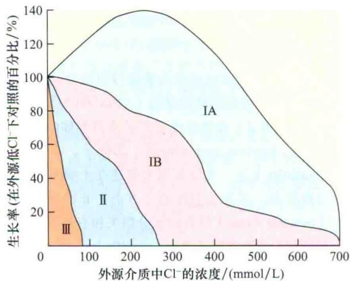

第一组B(盐土植物)包括大米草(Spartina x townsendii)和糖用甜菜(Beta vulgaris)。这些植物耐盐,但是它们生长速度较缓慢

第二组(盐生和非盐生植物)包括缺少盐腺而耐盐的盐生草类,如红牛毛草(Festuca rubra subsp. littoralis)和碱茅(Puccinellia peisonis);非盐生植物,如棉花(Gossypium spp.)和大麦(Hordeum vulgare)。所有这些植物的生长都被高浓度的盐所抑制。本组实验,番茄(Lycopersicon esculentum)处于中性,菜豆(Phaseolus vulgaris)和大豆(Glycine max)对盐敏感

第三组(对盐极其敏感的非盐土植物)中的物种，在低盐浓度下，其生长就会受到抑制，甚至死亡。包括许多果树，如柑橘类的植物、鳄梨树和核果

图26.2 在盐环境和非盐环境中不同物种的相对生长情况（非盐环境作为对照）。曲线划分的区域表示根据不同物种划分的区域。植物生长时期为1\~6个月（引自Greenway and Munns，1980）。

低，导致土壤结构退化。土壤溶液中的盐侵蚀导致植物叶片水分不足及抑制植物生长和新陈代谢。

## 26.4.3 细胞质中高浓度 $Na^{+}$ 和 $Cl^{-}$ 的毒害作用是由特定的离子效应造成的

在细胞外，高盐度能够导致渗透胁迫。一旦位于细胞质中，某些离子无论是以单个离子还是以化合状态存在，均有特定的作用，它们均能干扰植物的营养状况。这种特定的离子效应可能影响整个植物，因为这些离子可以通过蒸腾流进入植物幼嫩组织（Munns and Tester, 2008）。

最普遍的一个特定离子效应的例子是盐碱条件下 $\mathrm{Na}^{+}$ 和 $\mathrm{Cl}^{-}$ 等细胞毒素的积累。在非盐渍环境下，高等植物细胞质中含有大约100 mmol/L的 $\mathrm{K}^{+}$ 和小于10 mmol/L的 $\mathrm{Na}^{+}$ ，只有在这种离子环境下胞质酶具有最佳活性。在盐渍环境中，如果细胞质中的 $\mathrm{Na}^{+}$ 和 $\mathrm{Cl}^{-}$ 浓度提高到100 mmol/L以上，这些离子将成为细胞毒素。高浓度盐通过降低大分子的水合作用导致蛋白质变性及质膜的不稳定。因而，与 $\mathrm{K}^{+}$ 相比， $\mathrm{Na}^{+}$ 是更强的变性剂。

在高 $Na^{+}$ 浓度下，质外体的 $Na^{+}$ 也和高亲和性的 $K^{+}$ 吸收转运蛋白竞争结合位点（见第6章），且 $K^{+}$ 是一种重要的大量元素（见第5章）。此外， $Na^{+}$ 取代了细胞壁上 $Ca^{2+}$ 的结合位点，降低了 $Ca^{2+}$ 在胞质外的活性，并且可能通过非选择性阳离子通道导致大量的钠离子内流（Epstein and Bloom，2005；Apse and Blumwald，2007）。由过量 $Na^{+}$ 引起的胞外 $Ca^{2+}$ 浓度下降也可能限制了胞质中 $Ca^{2+}$ 的可利用性。由于胞质 $Ca^{2+}$ 对激活 $Na^{+}$ 解毒是必需的，通过质膜的外排作用，胞外 $Na^{+}$ 浓度提高，从而阻碍了自身的解毒能力。

潜在的有毒微量元素如铁、锌、铜、镉、镍和砷，在土壤中积累到一定浓度时，对植物均有毒害作用（请参阅Web Essay 5.2）。植物在其基本的生物化学代谢过程中需要一些微量元素（如铁、锌、镍和铜），或者需要这些微量元素的类似物。因此，镉可以代替锌被吸收，砷可以替代磷被吸收。

## 26.5 温度胁迫

中生植物（mesophytic plant）（适合在既不能过于湿润也不能过于干燥的温和环境中生长的陆生植物）在一个大约10℃相对狭小的温度范围内，最适合其生长发育。若超出该范围，由于巨大的持续的温度波动将对其产生多种伤害。在这一部分，我们将讨论三种不同类型的温度胁迫：高温、冰点以上的低温和冰点以下的低温。

## 26.5.1 高温对正在生长的含水量高的组织伤害最为严重

绝大多数高等植物正在生长的活性组织若长期暴露在 $45^{\circ}C$ （ $113^{\circ}F$ ）以上高温不能存活，或者甚至短时间暴露在 $55^{\circ}C$ （ $131^{\circ}F$ ）或更高温度也不能存活。然而，停止生长的细胞或脱水组织（如种子、花粉）可以在更高的温度下保持活性（表26.2）。有些物种的花粉粒能够在 $70^{\circ}C$ （ $158^{\circ}F$ ）下存活，一些干燥种子能够耐受 $120^{\circ}C$ （ $248^{\circ}F$ ）以上的高温。

多数获得充足水分的植物，即使在较高的温度环境条件下，叶片温度通过蒸腾冷却能够使自己的叶温保持在45℃以下（请参阅Web Topic 26.1和第9章）。然而，叶表温度较高且蒸腾冷却较弱就会产生热胁迫。在接近中午的阳光明媚时刻，当土壤水分缺失导致部分气孔关闭，或者相对湿度较高而降低了湿度梯度驱动的蒸腾冷却时，叶表温度能够上升4\~5℃。在白天，植物经历干旱和直射太阳光的辐射，叶表温度的升高更加明显。空气流通差通常也会降低植物的蒸腾冷却作用。种植在湿土中的种子可能更容易受到热胁迫，因为湿润和裸露的土壤颜色比干燥的土壤要暗，其更容易吸收热量。

表26.2 几种植物的致死温度

<table><tr><td>植物种类</td><td>热致死温度/°C</td><td>暴露时间</td></tr><tr><td>黄花烟草(Nicotiana rustica)(野生烟草)</td><td>49~51</td><td>10 min</td></tr><tr><td>南瓜(Cucurbita pepo)</td><td>49~51</td><td>10 min</td></tr><tr><td>玉米(Zea mays)</td><td>49~51</td><td>10 min</td></tr><tr><td>油菜(Brassica napus)</td><td>49~51</td><td>10 min</td></tr><tr><td>柑橘(Citrus aurantium)</td><td>50.5</td><td>15~30 min</td></tr><tr><td>仙人掌(Opuntia)</td><td>&gt;65</td><td>—</td></tr><tr><td>蛛网长生草(Sempervivum)</td><td>57~61</td><td>—</td></tr><tr><td>马铃薯叶(Potato leaves)</td><td>42.5</td><td>1 h</td></tr><tr><td>松树和云杉的幼苗(Pine and spruce seedlings)</td><td>54~55</td><td>5 min</td></tr><tr><td>苜蓿种子(Medicago seeds)</td><td>120</td><td>30 min</td></tr><tr><td>葡萄(Grape)(成熟果实)</td><td>63</td><td>—</td></tr><tr><td>番茄果实(Tomato fruit)</td><td>45</td><td>—</td></tr><tr><td>赤松花粉(Red pine pollen)</td><td>70</td><td>1 h</td></tr><tr><td>各种苔藓(Various mosses)</td><td></td><td></td></tr><tr><td>含水组织(Hydrated)</td><td>42~51</td><td>—</td></tr><tr><td>脱水组织(Dehydrated)</td><td>85~110</td><td>—</td></tr></table>

资料来源：改编自Levitt（1980）的表11.2

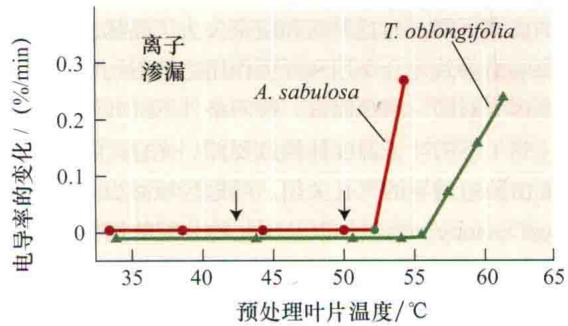

  
图26.3 Atriplex sabulosa和Tidestromia oblongifolia对热胁迫的响应。A. 测量浸没于水中的叶片的离子渗出量。B. 测量无性系活体叶片的光合作用。C. 测量无性系活体叶片的呼吸作用。最初温度为30℃且叶片无伤害，此时测量的数据为对照。将叶子转移至设定的温度，15 min转移至记录数据之前，即对照条件下。箭头表示光合作用开始受到抑制时的温度。A.sabulosa中膜的通透性受热损伤比T.oblongifolia中的更敏感，但在两个物种中对热胁迫的敏感度都低于光合作用。热伤害下，A.sabulosa中的光合作用和呼吸作用比T.oblongifolia更敏感。对这两种植物实验结果表明，相对于呼吸作用和膜的通透性，光合作用对热胁迫更敏感，完全抑制光合作用的温度对呼吸作用无影响（改编自Björkman et al., 1980）。

## 26.5.2 温度胁迫导致细胞膜损伤和酶失活

植物的质膜是由蛋白质和甾醇贯穿的磷脂双分子层组成（见第1章和第11章），任何非生物因素能够通过改变膜的特性而影响细胞的生理功能。脂类的物理性能很大程度影响整合膜蛋白的活动，其中包括氢离子泵有关的ATP三磷酸酶、转运蛋白、通道蛋白及其他蛋白质等（见第6章）。高温能够提高膜脂流动性，降低氢键的强度及膜水相内蛋白质极性基团之间的静电相互作用。因此，高温改变了膜组分和膜结构，并引起离子渗漏（图26.3A）。

高温能够导致酶的校正功能所需要的三维结构或者细胞结构组分丧失，从而引发酶正常结构的改变和活性的缺失。错误组装的蛋白质通常容易聚集或沉淀，严重影响细胞的功能。

## 26.5.3 温度胁迫抑制光合作用

温度胁迫下光合作用和呼吸作用均受到抑制。比较典型的是，高温对光合速率的抑制作用较其对呼吸速率的抑制作用强（图26.3B和C）。虽然高温下叶绿体酶如Rubisco酶、Rubisco激酶、NADP-G3P脱氢酶及PEP羧化酶稳定性较差，然而，导致这些酶变性和失活所需要的温度，比光合作用开始下降时的温度要高（见第9章）。这些结果说明，高温影响光合作用的早期，主要改变叶绿体的膜特性和能量转移机制的解偶联，并非引起蛋白质变性。

在一定时期，光合作用固定 $CO_{2}$ 的量与呼吸作用释放 $CO_{2}$ 的量相等时的温度称为温度补偿点（temperature compensation point）。当温度高于温度补偿点时，光合作用不能利用呼吸作用底物的碳原子。结果贮藏糖物质的能力下降，并且果实和蔬菜失去了甜味。有害的高温影响是导致光合作用和呼吸作用之间不均衡的一个主要原因。对同一植物而言，遮阴条件下的叶子通常比光照（热）下的叶子温度补偿点要低。光合产物的减少也可能由胁迫诱导的气孔关闭、叶冠区域减少（reduction in leaf canopy area），以及同化物分配的调节所致。与 $C_{4}$ 和CAM植物相比，高温下 $C_{3}$ 植物的呼吸速率要比光合速率提高得快，这是因为，高温胁迫下 $C_{3}$ 植物的暗呼吸和光呼吸速率均升高（见第9章）。

## 26.5.4 冰点以上低温能够造成冷害

冷害的温度不适宜植物生长发育但又不足以形成冰冻。通常来说，热带和亚热带植物对冷害敏感。谷类、大豆、大米、番茄、甘薯和土豆都是对冷害敏感的粮食和纤维作物，而西番莲（Passiflora）、薄荷（Coleus）和大岩桐（Gloxinia）是冷害敏感的观赏植物。生长在相对温暖环境的植物（25\~35℃，77\~95°F），如果温度迅速降到10\~15℃（50\~59°F）时就会发生冷害。冷害能抑制生长，使叶片褪色及病变。如果根部受到冷害，植物将由于基本生理功能紊乱如吸水功能紊乱而萎蔫。储藏在冰箱冷藏温度（5\~10℃）下也会造成冷害。

正如高温情况下，细胞膜也会由于冷害而失去稳定性，在这种境况下，降低了膜的流动性而不是增加了膜的流动性。低温下，膜脂流动性变缓，内部所包含的蛋白质就不能正常地行使功能。其结果抑制了许多生化反应，包括H⁺泵ATP酶活性、溶质细胞内外转运、能量传导（请参阅Web Topic 26.2和第7、11章）及酶依赖的代谢反应。

## 26.5.5 冰点温度引起冰晶形成和细胞脱水

冰点导致细胞内和细胞外冰晶的形成。在生理上，细胞内冰晶的形成横跨细胞膜和细胞器。胞外形成的冰晶通常是在细胞内含物结冰前形成，不会对细胞立刻产生物理伤害，但是能够引起细胞脱水。这是因为冰晶的形成实质上降低了质外体中水势（ $\Psi_{w}$ ），从共质体中高的水势到质外体中低的水势产生一个梯度。因此，水分从共质体渗透到质外体，导致细胞脱水（此过程的详细描述请参阅Web Topic 26.3）。由于冷冻脱水造成细胞不可逆的损伤（Uemura et al., 2006）。像种子和花粉粒中的细胞已经脱水，受到冰晶形成的影响相对较低。

通常冰晶首先在细胞间隙和木质部导管中形成，并且沿着导管迅速漫延。这种冰晶的形成不能使耐寒植物死亡，如果温度回升，植物的组织能完全恢复。然而，当植物长期暴露在冰点温度下，细胞外冰晶的增长导致膜的生理性破坏和细胞过度脱水。

冰晶的形成最初需要数百个分子，这几百个水分子形成一个较为稳定的冰晶，该过程叫做冰核形成（ice nucleation），并且它依赖于被水分子包围的一些表面特性。例如，一些多糖和蛋白质有利于冰晶的形成，因此被称为冰的成核剂（ice nucleator）。一些由细菌产生的冰核蛋白，有利于促进冰核的形成，主要通过水分子沿着蛋白质内重复的氨基酸结构域进行排列所致。植物细胞中冰晶的形成，先从内源的冰晶核开始生长，然后再形成相对较大的胞内冰晶，这种胞内形成的大冰晶能对细胞造成极大的伤害，而且通常导致细胞死亡。

## 26.6 强光胁迫

作为光合自养生物，植物依赖和精巧地利用可见光，通过光合作用维持一种有利的碳平衡。电磁辐射的高能波，特别是在紫外线范围内，通过破坏膜系统、蛋白质、核酸以抑制细胞内发生的生化过程。然而，即使在可见光范围内，远高于光合作用的光饱和点的强光造成了强光胁迫（high light stress），这能够破坏叶绿体的结构，降低光合速率，这一过程被称为光抑制作用（photoinhibition）。

## 光抑制产生的活性氧对强光下的植物细胞造成破坏

强光抑制光合作用被称为光抑制（photoinhibition）（见第7章和第9章）。在光系统Ⅱ（PSⅡ）反应中心捕获过量激发光能，通过D1蛋白的直接损伤导致PSⅡ的失活（见第7章）。光合色素过量吸收光能产生的电子超过NADP⁺的可利用量，在PS I作为一种电子库。由PS I产生过量的电子导致活性氧（reactive oxygen species，ROS）尤其是超氧阴离子（O₂⁻）的产生（见第7章）。O₂⁻和其他ROS是低分子质量的信号分子，过量产生将导致蛋白质、脂质、RNA和DNA氧化损伤。过多ROS产生引起氧化胁迫，损坏了细胞的代谢功能，并导致细胞死亡。

光抑制程度依赖于对PSⅡ复合物的光损害及其修复二者之间的平衡（Takahashi and Murata，2008）（见第7章和第9章）。光损伤后的PSⅡ的修复对维持光合作用是极其重要的。在氧化、盐或低温的胁迫下，增强的光抑制对PSⅡ的修复能力的增强效应要大于光抑制对PSⅡ造成的光损伤。例如，过量活性氧抑制编码PSⅡ复合物蛋白的mRNA翻译，从而限制了PSⅡ的修复（Takahashi and Murata，2008）。相反，类囊体膜不饱和的脂肪酸，使膜具有流动性，提高了光系统修复能力和PSⅡ活性的恢复能力（Vijayan and Browse，2002）。

除强光外，植物在许多胁迫过程中都产生大量ROS。ROS是呼吸作用和光合作用的副产物。这些产物的积累来自不同细胞器（主要是叶绿体、线粒体和过氧化物酶体）中的氧代谢，它受植物抗氧化机制调控，从而维持ROS产生和清除二者之间的平衡（Apel and Hirt，2004）。极端的温度、干旱、强光、盐度和离子毒害，均导致活性氧的产生和清除之间的失衡，这造成了大分子的氧化损伤和信号传递功能的紊乱。

## 26.7 保护植物抵御极端环境的生长发育和生理机制

本节中，我们将描述植物响应逆境胁迫来缓解环境胁迫造成的影响。这些响应范围包括：从暂时的代谢调节到器官形态、植物的结构和生命周期的改变。一些应答反应使植物避免处于胁迫状态；而其他应答反应增强了植物耐受胁迫的能力。

## 26.7.1 植物调整生命周期以避开非生物胁迫环境

植物适应极端环境的一个方法是调整自己的生命周期。例如，一年生荒漠植物生命周期短：当水分充足的时候，它们完成自己的生命周期，在干旱时期进入休眠（种子）；温带的阔叶树在冬季来临之前树叶脱落，避免敏感的叶组织受低温损伤。

对于不可预测的胁迫环境（如夏季不稳定的降雨量），一些植物长期的生长习性赋予其一定程度的耐受性。例如，对不稳定的环境，生长和开花周期较长（无限生长）的植物能预先调整叶片和花的生长数量，相对于生活周期短的植物（有限生长），它们对不稳定的极端环境有更强的耐受性。

## 26.7.2 叶片结构的表型变化和形态对植物应答胁迫反应是重要的

叶片是进行光合作用的主要器官，其对植物的生存起着至关重要的作用。为使光合作用正常进行，叶片必须暴露在阳光和空气中，这使它们特别容易受到极端环境的侵害。植物已进化出多种应答非生物环境胁迫的调控机制，以避免或减轻逆境胁迫对叶片的伤害。这些调控机制包括叶面积、叶向值、表皮毛和角质层等的变化。

## 1. 叶面积（leaf area）

总叶面积是反映生物量积累和产量的主要组成指标之一。较大的叶面积为光合作用的产物生产提供有效的表面，但在胁迫条件下不利于作物生长和生存。单独的大叶片或总叶面积较大，这为水分蒸发提供大的表面，有利于降低叶片温度，但导致土壤水分的快速或过度消耗，阻碍太阳能的吸收。植物可以通过以下方式减少它们的叶面积：①减少叶片细胞分裂和生长；②改变叶片形状；③进入衰老，叶片脱落。

水分亏缺和盐碱的生长条件可抑制植物细胞的分裂和伸长。特定的信号级联放大可以减缓或阻止细胞周期进程，进而减缓DNA复制，从而延缓植物生长（Anami et al., 2009）。

膨压降低是水分亏缺最早的生物物理效应。因此，依赖膨压过程，如叶面积扩张（图26.4）和根伸长对水分亏缺是最敏感的。水分亏缺能够改变植物发育过程，它对植物的生长有多种影响，其中之一是限制叶面生长。正如前面章节所讨论的，植物含水量降低，将导致作用于细胞壁的膨压下降，同时影响细胞伸长。

  
图26.4 水分胁迫对向日葵光合作用和叶片扩张的影响。以向日葵为代表的物种表现出叶片扩张对水分胁迫敏感的现象，即使在轻微的水分胁迫条件下，也可完全抑制叶片的扩张，但对光合作用的速率几乎无影响（改编自Boyer，1970）。

叶面生长主要取决于细胞伸展与增大。缺水早期，抑制细胞伸展增大，减缓了叶面的生长。由此生长出的叶子面积较小，从而降低水分蒸发，这样可以较长时期、有效地保护土壤中有限的水供应。叶面积的减少通常被认为是水分亏缺的生理反应。

许多旱区植物的叶片很小，这会在叶表面（边界层）形成较薄的静止空气。薄的边界层（低边界层阻力）便于热量从叶子上转移到空气中（图9.15）。因为它们的边界层阻力小，即使蒸腾作用大大降低时，小叶片也能够使表面温度维持接近空气的温度，避免过热。相比之下，大叶片有比较高的边界层阻力，并且通过直接的方式将热量转移到空气中，也只是耗散较少的热能（单位叶面积）。

随着植物的不断生长，水分不足不仅限制了叶片的大小，而且影响了叶片的数量。引起这种变化的主要原因在于胁迫降低了枝条的数目和生长速率。目前，关于胁迫对茎的生长影响的研究相比叶而言较少，但胁迫条件下，限制叶片生长的因素，也可能是影响茎生长的主要原因。

值得注意的是，叶片的生长和伸展增大，除受水分流量影响外，还依赖于多种生化代谢和分子特征方面的变化。目前，有许多证据支持以上观点。当植物受到外界环境胁迫时，植物不仅改变其自身的生长速率，而且通过多种重要生理过程进行调节，如细胞壁和质膜的生物合成、细胞分裂和蛋白质合成等（Burssens et al., 2000）。

改变叶片形状是植物减小叶面积的另一种方法。在缺水、高温或极端盐碱生长条件下，发育过程中的叶片变窄或可能发育成更深的裂片（图26.5），使叶面积减少，从而减少了水分的丢失和热负荷（定义为维持叶片温度接近空气温度所需的热损失）（见第9章）。此外，一株植物总叶面积（叶子的数量×每片叶子的表面积），即使所有叶子成熟之后，也不是一成不变的。一些植物在轻微水分亏缺时，可能发生落叶现象，这有效地减少了叶面积，降低水分的散失。

  
图26.5 环境的变化影响树叶的形状。橡树（Quercus sp.）左边的树叶来自于树冠的外侧，其气温高于树冠内侧。右边的树叶来自于树冠的内侧。左边的叶子处于树冠外侧，边界层较低，能够更好地通过蒸腾作用降低温度（照片由David McIntyre提供）。

如果植物已经发育形成较为稳定的叶面积，当水分亏缺时，叶子将会开始衰老，最终脱落（图26.6）。事实上，多种干旱落叶的沙漠植物，一旦干旱时，它们将会脱落所有的叶子，而雨后又会很快长出新叶。在水分亏缺期间，叶子的脱落很大程度上是由于植物内源乙烯合成增加和对乙烯的应答（见第22章）引起的。叶子脱落的负面效应是它减少了总的叶冠面积，降低了植物光合作用的总产量。

水分充足的条件下的叶片衰老，叶细胞经过程序性细胞死亡，其涉及叶片细胞内分子结构的降解和重新分配。叶片衰老是植物正常生命周期的一部分，例如，当植物从营养生长到生殖生长转换时，衰老就会发生。相比之下，非生物极端环境会损害叶和根组织，最终导致过早和非正常调控性的衰老；对粮食作物而言，将导致籽粒尺寸和质量的减少，从而大大降低产量。对于许多农作物，在籽粒成熟期间，其干旱的耐受性与作物产量提高、谷物品质及抗倒伏性密切相关。

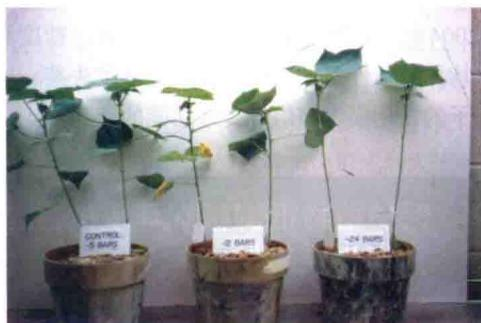  
图26.6 水分胁迫下棉花（Gossypium hirsutum）幼苗的叶子脱落情况。实验过程中，左侧的植株正常浇水，中间和右侧的植株分别受到中等和严重的缺水胁迫。右侧严重缺水的植株，茎的顶端只剩一簇叶片（由B.L.McMichael惠赠）。

极端的环境条件下，一些种类农作物在种子成熟期间，具有维持绿色叶片面积的能力，而同种作物的许多其他基因型的叶片此时将开始衰老。饲料作物如玉米和高粱，具有保留进行光合作用的部分叶子的性状被称为永绿色现象（stay-green）（图26.7）。在干旱条件下，常绿品种的作物在灌浆期仍能使茎和上层叶片保持绿色，这与季末出现干旱衰老的其他杂种作物相比，在产量上有显著优势。常绿高粱品种的籽粒产量每天可能增加0.35 mg/hm²，并且叶片的衰老延迟（Borrell et al., 2000）。转基因烟草植物能够延迟叶片的衰老（通过激活细胞分裂素的生物合成），显示了对干旱耐受性的提高（Rivero et al., 2007）（图26.8）。

  
图26.7 某些玉米基因型表现出一种被称为永绿色（stay-green，叶片保持绿色）的现象。左边的玉米自交系B73表现出典型的谷物成熟时期的衰老，而右边的近交系Mo20W表现为永绿色的现象（由M.R.Tuinstra惠赠）。

A 野生型  

B $P_{SARK}$ ::IPT  
  
图26.8 干旱对野生型和转基因烟草的影响。以成熟的、胁迫诱导的启动子 $P_{SARK}$ （衰老有关受体激酶的启动子区域），诱导表达异戊烯基转移酶（细胞分裂素合成过程中的酶），将其转入烟草，构建转基因烟草植株。图片为野生型（A）和转基因烟草（ $P_{SARK}::IPT$ ）（B），干旱处理15天，复水7天后的结果（由E. Blumwald惠赠）。

## 2. 叶向值（leaf orientation）

在过去60年中北美杂交玉米产量持续增加的主要原因之一是叶夹角的增加，从而使植物总的叶面积增加，叶片能吸收更多的光能。然而，在温暖、阳光充足的环境中，蒸腾的叶温可能与它耐受温度的上限接近。如果减少蒸腾作用，叶片温度过高或额外的能量吸收会损害叶子。在强烈太阳光辐射、高温和/或者土壤水分亏缺的环境中，植物可以改变它们的叶片伸展方向，避免叶子过热。

在水分亏缺时，为防止温度过高，有些植物的叶片伸张方向可能会背离太阳，这些叶子的行为被称为侧向日性（paraheliotropic）。通过叶子的位置与阳光垂直获得能量的叶子被称为横向日性（diaheliotropic）（见第9章）。图26.9显示了水分亏缺对大豆叶片伸张方向的影响。另外，其他因素也可以改变叶片的光合面积，包括萎蔫和叶子卷曲。萎蔫改变叶片的角度，叶卷曲使暴露于太阳的组织降到最少。

A 合理供水  
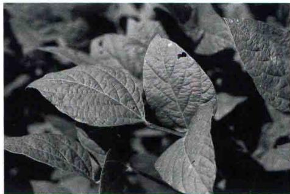

B 轻度水胁迫  
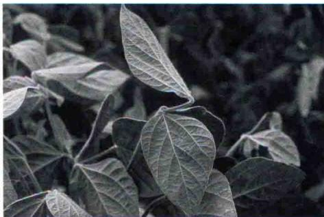

C 严重水胁迫  
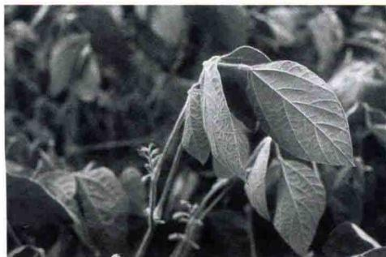  
图26.9 大豆叶片运动应答渗透胁迫的反应。A. 在正常生长条件下，田间生长的大豆（Glycine max）叶片的位置和方向。B. 轻度水分胁迫。C. 严重水分胁迫。轻微胁迫下，大叶片生长状态与萎蔫完全不同；严重水胁迫时，叶片的状态与萎蔫极为相似。轻微水胁迫的显著特征是顶端的叶片竖直，下面的两片叶子下垂；而严重水胁迫的大豆，其叶片几乎不能竖立生长（由D. M. Oosterhuis惠赠）。

在应答低氧胁迫时，叶片伸展方向会发生改变。缺氧促进植物根中乙烯前体ACC（1-氨基环丙烷-1-羧酸）的合成（见第22章）。在番茄中，ACC通过木质部运输到茎，与氧气接触，在ACC氧化酶催化下生成乙烯。番茄和向日葵叶柄的上表面（近轴）有响应乙烯的细胞，当乙烯浓度过高时，细胞扩张得更快。这种扩张导致偏上性（epinasty）生长，叶片向下生长以至于出现叶片下垂（图22.12）。与萎蔫不同，叶片偏上性生长过程中细胞膨压没有发生变化。

## 3. 表皮毛（trichomes）

许多植物叶片表面有毛发状表皮细胞，称为表皮毛。在叶片表面密集的毛状体（也称为软毛）通过反射辐射过来的光，使叶子保持凉爽。有些植物的叶片表面呈银白色，是由于密集的毛状物反射了大量的光。干燥的非腺状毛状体往往反射较多的光，尤其是当其非常密集时。沙漠灌木白色扁果菊（Encelia farinosa）在一年中不同的时期可以生长出两种类型的叶子：冬季是绿色近无毛的叶片，夏季是银白色有软毛的叶片。夏季银白色的叶子要比它们缺乏厚层表皮毛的叶温低几度，这是由于它能反射导致过热的红外射线。然而，有软毛的叶子在凉爽的春天也存在一定的缺陷，因为毛状体也反射光合作用所需的可见光。因此，扁果菊在春季长出没有毛状体的叶子，减少光反射以适应沙漠的环境。

## 4. 角质层 (cuticle)

角质层是一种多层的蜡状物结构，并且与碳氢化合物相关且附着在叶表皮的外层细胞壁上。角质层与表皮毛类似，可以反射光线，以降低热负荷。角质层能限制水和气体的扩散，以及病原体的进入。在植物长期的进化过程中，一些植物生长出厚厚的角质层，以减少蒸腾作用，防止水分亏缺。目前尚不清楚角质层厚度的改变源自于数量上（更多的蜡状物）还是性质上的（不同蜡成分或改变角质层的内层结构）变化。尽管表皮蒸腾仅占叶蒸腾总量的5%\~10%，但在极端环境条件下，表皮的蒸腾作用就显得尤为明显。

## 26.7.3 植物响应水分亏缺时增大了根与地上部的生长比例

轻微的水分亏缺影响根系的发育。根部的吸水作用与植物地上部分的光合作用二者之间功能的平衡，控制了根茎的生物量比例。植物的遗传潜力是有极限的，只有植物的根系吸收水分后，地上部分才会生长，因此，根成为限制地上部分进一步生长的主要器官；相反，只有光合作用的产物供应地上部分生长过剩时，才会供给根的生长与伸长。如果水分供应降低，这种平衡将会被

打破。

当水分输送到植物地上部分受限时，在光合作用活性受到影响之前，其叶片的伸展能力就受到了很大限制（图26.4）。叶片伸展受到抑制，降低了植物对碳和能源的消耗，大部分的同化产物被运输到根部，促进根进一步生长。同时，根生长对土壤微环境中水分的状态非常敏感；根尖在干燥土壤中将失去膨压，而在湿润的土壤中继续保持生长。

在水分亏缺的进程中，土壤上层一般先失去水分。当土壤水分充足时，植物通常有相对较浅的根系；当湿润土壤的上层水分耗尽时，根系向更深土壤不断伸长和生长（Koike et al., 2003）。根系结构上的这种变化被认为是植物防御干旱的第二道防线。

水分亏缺期间，光合作用的产物被分配到根的生长点，促进根的生长，使根伸长到更深的土壤里。与营养生长相比，处于生殖状态的植物，其来自于根生长水分吸收的增加并不显著，因为水分亏缺时，光合产物往往直接输送到果实，而并非运至根部（见第10章）。根和果实二者之间竞争可利用的光合产物，也在一定程度上说明了处于生殖阶段的植物对水分胁迫更加敏感。

## 26.7.4 植物通过调节气孔的开度响应干旱胁迫

植物通过调控气孔开度对环境的变化作出快速的应答反应，如通过调控气孔关闭，避免过度失水，或限制吸收液态或气态污染物。保卫细胞可以通过吸收和散失水分来改变膨压，从而调节气孔的开和关（见第4章和第18章）。

保卫细胞通过蒸腾作用失水而失去膨压，从而调节气孔关闭。与失水胁迫有关的气孔关闭几乎总是主动的、耗能的过程，而并非被动的过程（Buckley，2005）。叶片含水量下降，使保卫细胞中溶质含量降低，在此过程中，脱落酸（ABA）扮演了十分重要的角色（见第23章和Web Topic 26.4）。植物不断调节细胞中ABA的浓度和分布，使其对环境变化作出快速应答反应，如水分可利用性的波动。在叶片和根细胞中，ABA的合成受昼夜节律的调控。ABA生物合成调节的一种方式是，植物在其地上部分和地下部分调节ABA新陈代谢以应答于干旱胁迫。

ABA在保卫细胞中的再分配取决于叶片内的pH梯度、ABA分子的弱酸性和细胞膜的透性（图23.6）。当叶片脱水时，ABA以更快的速度合成，并且越来越多的ABA积聚到叶片的质外体内。这种较高浓度ABA的产生与ABA的快速合成有关，它可以增强或延长ABA诱导气孔关闭的效应。这种ABA诱导气孔关闭的机制已在第23章进行了讨论。

在炎热的气候下，水分供给充足时，增加气孔导度可使灌溉植物的耐热性增强（请参阅Web Topic 26.1）。研究表明，对皮玛棉和小麦进行高产强度选择，增加了气孔导度，并且，气孔导度增加与产量增加呈线性关系。较高的气孔导度提高了叶片冷却速率，降低空气与叶片之间的温差，因为空气温度可能会超过40℃，而叶片进行光合作用的最佳温度通常低于30℃。

## 26.7.5 植物通过积累溶质的渗透调节作用适应干旱的土壤

只有当水势沿着既定路径（详见第3章、第4章）降低时，水分才能够在土壤-植物-大气这个连续体中循环。第3章曾提到： $\Psi_{w}=\Psi_{s}+\Psi_{p}$ ，其中 $\Psi_{w}$ 代表水势， $\Psi_{s}$ 代表渗透势， $\Psi_{p}$ 代表静水压力。当植物根际（根周边微环境）的水势因水分亏缺（请参阅Web Topic 3.7）或盐化而降低时，植物中的水势只有低于土壤中的水势时，植物才能持续吸收水分。静水压力的下降可以降低水势，但是也会导致细胞膨压丧失和生长停滞。此外，细胞的渗透势的调节可以维持细胞间、土壤和植物之间的水势梯度，这种渗透调节并不一定伴随膨压和细胞体积的减小。植物的渗透调节（osmotic adjustment）是由细胞失水引起细胞内溶质浓度升高，从而降低水势的过程。该调节过程涉及每个细胞中溶质含量的净增加，它和水分流失所导致的体积变化无关（图26.10）。除了一些植物能适应极端干旱条件外，植物中 $\Psi_{s}$ 降低的最大幅度一般为0.2\~0.8 MPa。

渗透调节主要有两种形式，植物从土壤中吸收离子，或将离子从其他植物器官转运到根部，从而使根细胞的溶质浓度升高。例如，由于钾离子对细胞内渗透压的影响，对钾离子的吸收和积累将导致渗透势的降低，这种情况经常发生在盐碱地区。钾离子和钙离子都很容易被植物获取。

然而，吸收的离子被用来降低渗透势时却存在一个潜在的问题。一些离子，如钠离子或氯离子，必须处于低浓度下，植物才能正常生长，高离子浓度的环境会对细胞代谢产生有害效应。其他离子，如钾离子，是植物生长大量需求的，但在高浓度下，其能破坏植物的细胞膜或蛋白质，仍会对植物造成不良影响。渗透调节过程中，可以把离子聚集起来并束缚在植物细胞的液泡内，从而使这些离子无法接触到细胞质内的酶类和亚细胞结构。许多盐生植物就是利用将 $Na^{+}$ 和 $Cl^{-}$ 封闭于液泡，辅助渗透调节，来维持或增强植物在盐碱环境中的生长能力。由于液泡体积的增大，液泡中的高浓度离子将为细胞的膨胀提供驱动力。

A 细胞外部水势为-0.6 MPa  
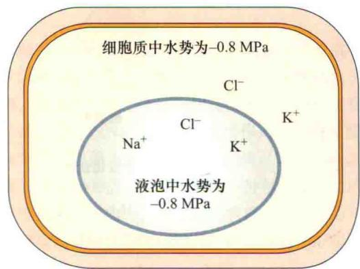

B 细胞外部水势为-0.8 MPa  
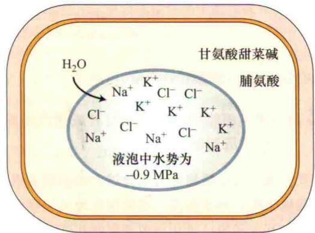  
图26.10 渗透胁迫过程中细胞液的变化。为保持水势梯度，细胞质和液泡的水势必须略低于细胞外水势，使得细胞能够吸收水。A. 细胞外部的水势是-0.6 MPa。细胞通过离子在胞液和液泡中的积累来保持水势的平衡。B. 在干旱、盐和脱水胁迫下，细胞外部的水势是-0.8 MPa。细胞可以通过增加胞质和液泡中溶质浓度来调整渗透平衡。细胞可通过存储于液泡中的无机离子来调整渗透平衡，这些离子对细胞溶质的代谢过程无影响。细胞溶质的平衡是通过可溶性溶质来维持的（通常是不带电荷的），如脯氨酸和甘氨酸甜菜碱。

当离子被束缚在液泡中时，其他的溶质必须聚集在细胞质内，以维持细胞水势平衡，这些溶质被称为相容性溶质（或相容性渗压剂）（compatible solute）。相容性溶质是一类有机化合物，在细胞中具有渗透活性，但对细胞膜结构和酶的活性无影响。植物细胞可以容纳高浓度的该类化合物，且对代谢过程完全没有影响。常见的相容性溶质，包括氨基酸如脯氨酸、糖醇如甘露醇，以及季铵化合物如甘氨酸甜菜碱（图26.11）。其中一些溶质，如脯氨酸，也具备一定的渗透调节功能，它能保护植物在水分缺乏时避免产生有毒的副产品。在生长环境恢复正常时为细胞提供碳源和氮源。每种植物家族往往倾向于使用一个或两个相容性溶质。因为相容性溶质的合成是一个主动的代谢过程，所以是需要能量的。合成这些有机溶质需要相当大的碳量，鉴于此，这些化合物的合成往往会降低作物产量。

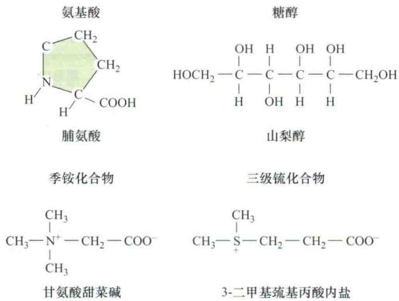  
图26.11 4种分子通常作为可溶性溶质：氨基酸、糖醇、季铵化合物和三级硫化合物。这些化合物分子质量很小，不带净电荷。

## 26.7.6 植物的深层器官发育成通气组织以应对缺氧环境

我们现在讨论植物应对水分过多时的调节机制。多数湿地植物，如水稻及一些能很好地适应潮湿环境的植物，其茎和根已进化出内部纵横相连且充满气体的通道，这些通道为氧气和其他气体提供了低阻力的通路。气体（空气）通过气孔或木质化茎和根的皮孔（lenticel）进入植物体，并通过小分子扩散进行转移，或者由较小的压力梯度提供运输驱动力。在许多能适应湿地生长的植物中，根细胞被充满气体的胞间空隙所形成的通气组织（aerenchyma）明显分隔开。这些湿地植物根部细胞的生长并不依赖于环境的刺激。但一些非湿地的双子叶和单子叶植物，氧亏缺能够诱导植物茎基部和新形成的根系形成通气组织。

其中一个例子是玉米中诱导通气组织的形成（图26.12）。组织缺氧能增强ACC合成酶和ACC氧化酶的活性，进而快速产生ACC和乙烯（见第22章）。乙烯导致根皮层细胞死亡和崩溃，这些死亡和崩溃的细胞预先占据的空间为气体填充，并为氧气流动提供了一定的空隙。乙烯信号转导导致的细胞死亡具有高度的选择性，只有部分细胞具有启动发育程序的潜力，并形成通气组织（Drew et al., 2000）。

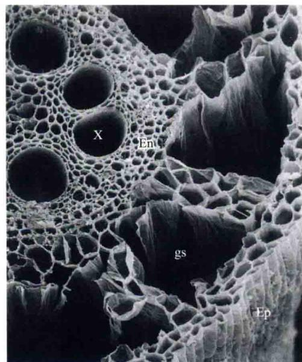  
图26.12 玉米根组织横断切面的电子扫描显微图显示了有氧时的结构变化（150×）。A. 对照根组织，正常供给空气，具有完整的皮层细胞，通过成熟的皮层细胞提供氧气。B. 生长在无氧气培养液中的根组织。皮层（cx）中明显有充气的空隙（gs），它是由细胞的降解而形成的结构。中柱（内皮细胞内部的所有细胞，En）和表皮（Ep）仍保持完整。X为木质部（由J. L. Basq和M. C. Drew惠赠）。

当乙烯诱导细胞形成通气组织起始时，乙烯信号转导引起细胞质内 $Ca^{2+}$ 浓度的升高，是导致细胞死亡的一个原因。提高胞质内 $Ca^{2+}$ 浓度，可以在没有缺氧时促进细胞死亡。反之，降低胞质内 $Ca^{2+}$ 浓度，通常会形成通气组织，并阻止缺氧根系的细胞死亡。

某些植物在形成通气组织之前，能够长时间（数周或数月）忍耐缺氧环境，生长在淹水土壤中。这些植物包括水稻、水稻草（Echinochloa crus-galli var. oryzicola）的胚芽鞘和胚胎、大香蒲（Schoenoplectus lacustris）、盐沼泽香蒲（Scirpus maritimus）和窄叶香蒲（Typha angustifolia）的根状茎。在缺氧环境下，这些根状茎能生存数月，而且能够促使叶片膨胀。

自然条件下，这些根茎能在湖边厌氧的泥土中越冬。当春天来临，叶子伸出泥土或水表面，氧气通过通气组织往下进行扩散，直到地下部分。此时，根组织从无氧（发酵的）转变成有氧代谢模式，利用氧气开始生长。同样，在水稻（湿地）和大米草种子萌发期间，胚芽鞘长出水面，而成为植物浸水部分获取氧气的通道，其中包括根系。虽然水稻是湿地植物，但是其根和玉米一样，不能耐受缺氧环境。随着根部延伸进入缺氧的土壤，根尖通气组织持续形成，使氧气能在根组织中移动，以保证对根尖顶端区域的氧供给。

水稻和其他典型的湿地植物的根组织中，栓化和木质化细胞形成的结构性屏障阻止氧气扩散到土壤外面。残留的氧气可以保证根顶端分生组织的代谢，促使根继续生长到50 cm，或延伸至更深的缺氧土壤中。与之相比，非湿地植物不能像拥有通气组织的湿地植物那样以相同的方式保存氧，以促使根延伸到同样深度的土壤范围，如玉米的根则容易泄漏氧气。因此，在这些植物中的根顶端组织缺乏足够的氧，影响有氧呼吸，严重限制根的延伸，使之不能进入更深的缺氧土壤中。

## 26.7.7 植物保护自身免受有毒离子侵害的方式：外排和内部耐受

为避免生长环境中各种有毒微量元素，包括钠（Na）、砷（As）、镉（Cd）、铜（Cu）、镍（Ni）、锌（Zn）和硒（Se）的毒害，植物长期的进化形成了以下两种自我保护机制：①外排（exclusion），植物通过外排作用将有毒的元素排出体外，使这些有毒元素的浓度低于毒性的阈值；②内部耐受（internal tolerance），通过各种生理与生化适应机制，使植物能够耐受，封闭或者螯合这些有毒元素，防止其浓度的逐步升高（请参阅Web Essay 26.2）。

## 1. 外排

盐敏感的植物一般能耐受适度的盐分，主要由于根部减少向茎中运输有害的离子。园艺师利用植物离子排斥机制，将盐敏感植物嫁接到耐盐砧木上。钙离子在减少从外部环境吸收 $Na^{+}$ 方面起了重要作用，细胞质膜上的电化学势可以促进 $Na^{+}$ 在胞浆中积聚，其含量超过胞外浓度的100\~1000倍。钠离子作为一种带电离子对质膜具有非常低的渗透能力，但它能同时通过低亲和力与高亲和力的运输系统进行转运，其中许多通常是 $K^{+}$ 吸收的转运系统（Epstein and Bloom，2005）（见第6章）。

外部的 $Ca^{2+}$ 在毫摩尔浓度水平时（钙离子在质外体的典型生理浓度），通过减少钠离子的吸收和促进钠离子运输到质外体的流出的机制，从而增加了钾离子转运的选择性并使钠离子的吸收最小化。 $Na^{+}$ 内流是通过非选择性、电压不敏感的门控通道把有毒离子运输进入细胞的。当此通道开放时，钠离子扩散到胞质中，浓度升高。生理水平的钙离子会引起这些渠道封闭，限制钠的摄取（Tracy et al., 2008）。

## 2. 内部耐受

与甜土植物不同，盐生植物可以在幼苗中积累离子，因为叶细胞具有较大容量的液泡离子区域化能力。此外，盐生植物的叶细胞可能具有较强的限制胞内净 $Na^{+}$ 摄取的能力。因此，幼苗细胞中增加液泡的区室化和减少细胞内 $Na^{+}$ 的摄取，这些植物可以增强对自蒸腾流导致根部 $Na^{+}$ 升高的耐受能力（Apse and Blumwald, 2007）。

与盐生植物相比，甜土植物需要减少根的木质部装载 $Na^{+}$ 的数量，从而限制 $Na^{+}$ 从根到茎的运输。然而，无论是何种情况，盐生植物和甜土植物的耐盐性都依靠离子的转运，以控制跨质膜的净离子摄取和进入液泡的离子区域化（请参阅Web Topic 26.6）。

某些盐生植物，如盐雪松（Tamarix spp.）和滨藜（Atriplex spp.），其叶表面已进化出能够分泌盐的特化盐腺。盐腺是这些植物独特的结构，在耐盐性方面具有高度专一性。有些植物在老叶中也积聚有毒离子，并使这些叶子衰老、脱落，从而让更年轻、更有光合生产力的叶子生存。

大量证据表明，盐生植物和甜土植物在体内积累许多离子，并利用这些离子进行必需的渗透调节，以用于细胞扩展（Hasegawa et al., 2000）。高浓度的离子对所有植物的胞内代谢都是有毒的，因此盐生植物和甜土植物将有毒的离子隔离到液泡中，或主动把它们由细胞泵出到质外体中（请参阅Web Topic 26.6）。

植物对毒离子内部耐受的一个极端例子，是发生在一些特定的物种中，某种微量元素的超级积累（hyperaccumulation）现象。超级积累植物可以耐受多种微量元素，包括As、Cd、Ni、Zn和Se，这些微量元素在叶片积累的量，大于茎尖干重的1%（10 000 $\mu$ g/g）。

超级积累作为一种遗传适应已在400多种植物分类群中得到证实，当植物生长在含有低浓度有毒元素的土壤中，甚至也会发生超级积累现象。超级积累是一个主动过程，它保护植物免受病原体和食草类昆虫的侵害。超级积累植物不仅可以抵御由微量元素积累所带来的细胞毒性，而且是通过有效吸收土壤中潜在的有毒元素，清除有毒元素的途径之一。超级积累参与调控基因转录水平的变化，可促使合成许多离子转运体，以参与从土壤中摄取元素和这些元素的液泡区域化（请参阅Web Topic 26.5）。

## 26.7.8 整合作用和主动转运有助于增强植物耐受力

螯合作用（chelation）是一个离子与螯合分子中两个以上的配位原子结合。螯合分子有不同的配位原子，如硫（S）、氮（N）或氧（O），这些原子与它们螯合的离子有不同的亲和力。通过将螯合分子自身处于能结合的离子周围，并形成复合物，使离子的化学活性降低，从而减少其潜在的毒性。该复合体通常易位到植物的其他部分，或贮存在远离细胞质（通常在液泡）的部位。从根到幼芽的长距离运输，也是幼嫩组织形成金属离子超积累的关键方式。研究表明，金属螯合剂烟草香素和自由氨基酸组氨酸常在运输过程中被用于金属的螯合（Ingle et al., 2005）。另外，植物还为离子螯合剂合成其他配体，如植物螯合肽。

植物螯合肽（phytochelatin）是由谷氨酸、半胱氨酸和甘氨酸以（γ-Glu-Cys），Gly的一般形式所组成的低分子质量的硫醇。植物螯合肽是由植物螯合肽合成酶催化合成的（Corbett and Goldsbrough，2002）。硫醇组类化合物一般作为微量元素如Cd和As等离子配体（图26.13）。植物螯合肽一旦合成，即形成植物螯合肽-金属复合物，然后运送到液泡贮存。已被证实植物螯合肽的合成对镉和砷的耐受是必需的。除了螯合作用，主动转运到液泡和运出细胞也有助于提高植物体内金属耐受性。

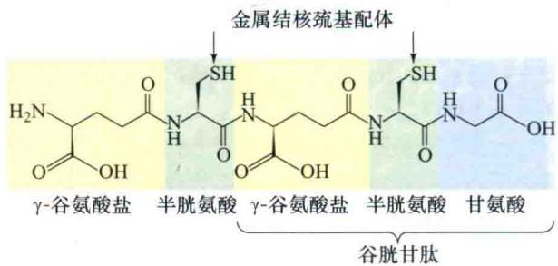  
图26.13 植物螯合肽的分子结构。植物螯合肽利用半胱氨酸中的硫结合金属镉（Cd）、锌（Zn）和砷（As）等。

正如第6章所讨论的，液泡膜上存在两个 $H^{+}$ 泵：V型 $H^{+}$ -ATPase和 $H^{+}$ -焦磷酸酶，为离子进入液泡进行的主动和被动次级运输提供了电化学势梯度（详见第6章）。 $Na^{+}-H^{+}$ 反向运输体AtNHX1（图26.14）主要负责 $Na^{+}$ 内流进入液泡。在质膜上，P型 $H^{+}$ -ATPase泵为离子的次级主动运输提供驱动力（ $H^{+}$ 电化学势）（图26.14），并且在应对盐胁迫反应时，该酶也是胞内驱除多余离子所必需的。 $Na^{+}$ 通过SOS1 $Na^{+}-H^{+}$ 反向转运体穿过质膜而外流。在高NaCl情况下，SOS1被激活，并且通过 $Ca^{2+}$ 信号转导的SOS途径所介导（参阅Web Topic 26.6）。 $Ca^{2+}$ 通过与SOS3结合，进一步激活丝氨酸/苏氨酸蛋白激酶SOS2。SOS2使SOS1磷酸化，从而激活SOS1 $Na^{+}-H^{+}$ 反向转运输体功能。借助这种机制，植物通过 $Na^{+}$ 外流和内流的调节，有效控制 $Na^{+}$ 穿膜的净流量。再者，过量表达SOS1或AtNHX1的转基因植物，增强了对盐的耐受能力（Apse et al., 1999; Shi et al., 2003）（请参阅Web Topic 26.6）。

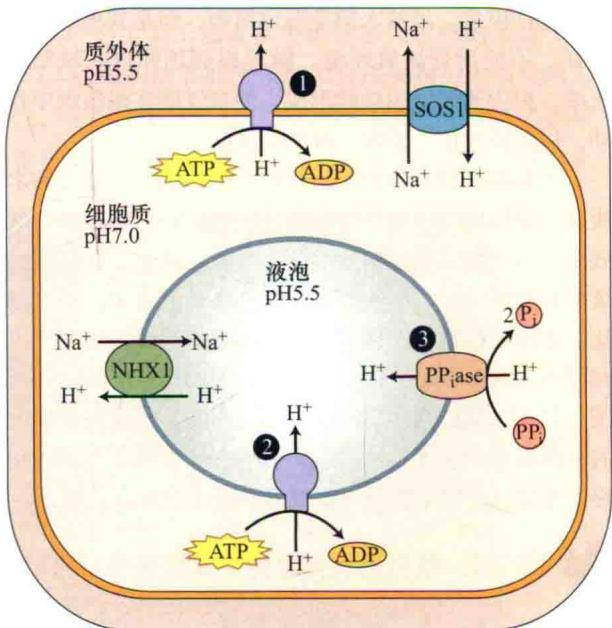  
图26.14 初级和次级主动运输。①定位在质膜上的ATPase质子泵（P-ATPase），②定位在液泡膜上的ATPase质子泵（V-ATPase）和③焦磷酸酶（PPiase）分别是质膜和液泡膜的初级主动运输系统。通过偶联ATP和焦磷酸盐水解作用释放的能量，使质膜和液泡膜质子泵能够逆电化学梯度对 $H^{+}$ 进行运输。 $H^{+}-Na^{+}$ 泵的逆向转运蛋白SOS1和NHX1是次级主动运输系统，对 $Na^{+}$ 的运输是逆电化学梯度进行的，而 $H^{-}$ 的运输是顺电化学梯度。SOS1将 $Na^{+}$ 输出细胞，而NHX1将 $Na^{+}$ 输入液泡。

在自然条件下，植物不同组织耐受冻害的能力相差很大。种子、部分脱水组织和真菌孢子能在接近绝对零度（0 K或-273℃）时存活，这也暗示超低温从本质上来说并不一定都对生物组织有害。只要冰晶形成能被限制在细胞内空间及细胞内脱水不是太严重，含水的营养细胞也可以在冷冻温度下保存生存能力。

冷驯化（cold acclimation）是指将温带植物暴露在不致命的低温（通常在零度以上）条件下，以增加其低温生存能力的过程。自然界低温驯化是植物暴露在初秋短日照和冰点以上的低温条件下，同时植物已停止生长的过程。植物激素ABA可能是促进驯化的扩散因子，即从叶片的韧皮部扩散到越冬的茎部。因此，ABA的积累是冷驯化过程所必需的（Survila et al., 2009）。

冷驯化期间，温带木本植物从木质部导管抽回水分，从而防止主干由于发生冰冻导致水膨胀而造成其破裂。冷驯化也能防止冰冻条件下，细胞内由于形成冰晶而造成损伤。气温回暖后，植物很快丧失了耐寒能力，并且在24 h内它们对低温变得敏感。

在冷驯化过程中植物如何感受温度呢？目前的假说认为，低温改变了脂质的物理性质，提高了膜的伸展性，且导致一个冷传感器未知的激活机制，从而起始相关信号转导途径（Survila et al., 2009）。这些途径激活编码信号蛋白、抗冻蛋白和一些酶等相关基因的表达，这些蛋白质介导了脂质及糖代谢、相容性溶质的生物合成及活性氧清除和代谢重编程，并且这些基因的表达受低温调控（Guy, 1990; Thomashow, 1999; Yamaguchi-Shinozaki and Shinozaki, 2006a, 2006b; Chinnusamy et al., 2006; Survila et al., 2009）。

冷驯化信号转导途径被整合到一个相互作用的信号转导网络，该网络也包括那些用于其他非生物条件的驯化。因此，一些由低温诱导的基因，也能由水分亏缺和盐渍化所诱导（Shinozaki and Yamaguchi-Shinozaki, 2006; Survila et al., 2009）。

最近研究表明，低温信号被钙离子、ABA、特定的钙离子信号转导蛋白、其他激酶和磷酸酶所调节（Survila et al., 2009）。拟南芥ABA不敏感（如abil）突变体或ABA缺失（如aba）突变体，不能被冷驯化。然而，依赖ABA信号和转录调控是必要的，但这只是耐寒驯化的一个方面，并非所有低温诱导的基因都依赖ABA信号转导途径（Yamaguchi-Shinozaki and Shinozaki, 2006a, 2006b; Survila et al., 2009）（请参阅Web Topic 26.7）。

冷驯化涉及 $Ca^{2+}$ （由上述假设的冷传感器介导）从质外体、内质网和液泡进入细胞质，导致胞质渗透势瞬时发生变化，从而诱导冷驯化所必需的低温响应基因的表达（Survila et al., 2009）。与冷驯化相关联的 $Ca^{2+}$ 信号转导蛋白包括钙调素蛋白和类钙调素（CML）蛋白，以及 $Ca^{2+}$ 依赖的蛋白激酶和钙调磷酸酶B类似蛋白（见第6章和第23章）（想了解冷驯化的其他信号转导途径的讨论，请参阅Web Topic 26.7）。

## 26.7.10 植物通过限制冰晶的形成以提高抗冻性

在快速冷冻过程中，原生质体也包括液泡，可能出现过冷现象（supercool）；即使温度低于热力学冰点温度几度，细胞中的水分仍能保持液态，这主要是因为水溶液中含有一定量的溶质。对于加拿大东南部和美国东部的阔叶林中的物种来说，过冷是很常见的现象（请参阅Web Topic 26.3）。细胞可以耐受的过度冷却极限温度大约为-40℃，这时细胞内会自发形成冰晶。自发冰晶的形成确定了低温限制点（low-temperature limit），只有经过过度冷却的高山植被和亚北极区的物种，在这个限制点才可能存活。这也解释了为什么山脉林木线的范围位于-40℃最低等温线的附近。

几种特异的植物蛋白被命名为抗冻蛋白（antifreeze protein），它们能够通过一个不依赖于降低水冰点的机制来限制冰晶生长。低温能诱导抗冻蛋白的合成。这些蛋白质结合在冰晶的表面，阻止或减慢冰晶的进一步增长。蔗糖、多糖、渗透保护剂和一些低温诱导产生的蛋白质也具有防冷冻的效果（Survila et al., 2009）。

## 26.7.11 细胞膜脂质组分影响温度对膜的作用

在极端的环境条件下，植物细胞膜经常被破坏。轻微的温度波动或者其他环境胁迫都可以导致膜结构和功能的改变，进而影响正常代谢。

随着温度降低，细胞膜会经过一个从流动性液晶态到固体凝胶态相的转变。这种相变温度随植物种类（热带物种10\~12℃；苹果3\~10℃）和细胞膜脂质成分不同而不同。抗冷害植物的细胞膜趋向于含有更多的不饱和脂肪酸（表26.3）。与之相反，冷敏感植物细胞膜中含有高比例的饱和脂肪酸链，温度接近0℃时，脂组分易凝固为半晶体状态。一般来说，饱和脂肪酸不含双链，而且含有反式单不饱和脂肪酸的脂类，这种脂类比不饱和脂肪酸脂质的凝固点要高，因为后者的碳氢链间有弯曲，其排列不如饱和脂肪酸紧密（表26.3和Web Topic 26.2）。

植物持续暴露在极端环境温度下，会导致细胞膜的脂质成分发生变化，这是植物适应环境的一种驯化方式。一些跨膜的酶能够引进一个或两个双键到脂肪酸内，从而改变膜脂质的脂肪酸饱和度。例如，在冷冻驯化过程中，如低温驯化时，脱饱和酶活性会升高，脂质中不饱和脂肪酸比例增加（Williams et al., 1988；Palta et al., 1993）。这种修饰降低了膜脂从流动相渐变到半晶体状态时的温度阈值，使膜在更低的温度下能保持流动性，因此能保护植物免受冷害伤害。反之，膜脂质脂肪酸饱和度越高，细胞膜的流动性越差（Raison et al., 1982）。拟南芥的某些突变体中ω-3脂肪酸脱饱和酶活性降低，突变体对光合作用的耐热性增强，这可能是由于叶绿体脂质中脂肪酸的饱和度增加引起的（Falcone et al., 2004）。

表26.3 从抗冷性和冷敏感物种的线粒体中的分离的脂肪酸组分

<table><tr><td rowspan="3">主要脂肪酸a</td><td colspan="6">脂肪酸总含量占体重的百分比/%</td></tr><tr><td colspan="3">抗冷性物种</td><td colspan="3">冷敏感物种</td></tr><tr><td>花椰菜芽</td><td>甘蓝根</td><td>豌豆茎</td><td>菜豆茎</td><td>甘薯</td><td>玉米茎</td></tr><tr><td>软脂酸(16:0)</td><td>21.3</td><td>19.0</td><td>17.8</td><td>24.0</td><td>24.9</td><td>28.3</td></tr><tr><td>硬脂酸(18:0)</td><td>1.9</td><td>1.1</td><td>2.9</td><td>2.2</td><td>2.6</td><td>1.6</td></tr><tr><td>油酸(18:1)</td><td>7.0</td><td>12.2</td><td>3.1</td><td>3.8</td><td>0.6</td><td>4.6</td></tr><tr><td>亚油酸(18:2)</td><td>16.1</td><td>20.6</td><td>61.9</td><td>43.6</td><td>50.8</td><td>54.6</td></tr><tr><td>亚麻酸(18:3)</td><td>49.4</td><td>44.9</td><td>13.2</td><td>24.3</td><td>10.6</td><td>6.8</td></tr><tr><td>不饱和与饱和脂</td><td>3.2</td><td>3.9</td><td>3.8</td><td>2.8</td><td>1.7</td><td>2.1</td></tr><tr><td>肪酸比例</td><td></td><td></td><td></td><td></td><td></td><td></td></tr></table>

资料来源：改编自Lyons et al., 1964  
a 括弧内的数字代表脂肪酸链中碳原子数和双键数

已经通过突变体和转基因植物证实了膜脂对低温耐性的重要性，这些植物特有的酶活性能够导致特异的膜脂组分变化，这种变化不依赖于低温驯化。例如，把一个大肠杆菌的基因转化到拟南芥中，结果能提高高熔点膜脂（饱和的）的比例，该基因的表达极大增加了转基因植物对冷害的敏感性。与此类似，拟南芥fab1突变体可以增大饱和脂肪酸的含量，尤其是16:0组成的脂肪酸（表26.3和表11.3）。经历3\~4周的低温期，突变体的光合作用和生长逐渐被抑制。如果一直暴露在低温下，其叶绿体甚至被破坏。在非冷害温度下，该突变体的生长情况与野生型一致（Wu et al., 1997）（以转基因植物为材料的补充实验请参阅Web Topic 26.2）。

## 26.7.12 温度胁迫下，植物细胞通过某种机制维持蛋白质正确的结构

在极端环境下，蛋白质的结构很容易被破坏。植物自身存在可以限制或者避免蛋白结构被破坏的调控机制，这些机制包括渗透调节和伴侣蛋白。渗透调节主要维持蛋白质的水合作用，而伴侣蛋白能与其他蛋白质结合，促进蛋白质的正确折叠，并阻止一些蛋白质的错误折叠和形成蛋白聚合体，以及维持这些蛋白三级结构的稳定性。如果温度突然升高5\~10℃，植物将会产生一套特有的伴侣蛋白，即热激蛋白（heat shock protein, HSP）。被诱导合成热激蛋白的细胞明显提高了耐热性，甚至致死的高温下也能正常存活。

多种不同的环境胁迫和条件均可诱导热激蛋白的产生，包括水分亏缺、ABA、伤害、低温和盐胁迫等。因此，细胞处在一种胁迫条件下，可能获得了对另一种胁迫的交叉防御功能。番茄果实就属于这种情况，38℃下热激48 h，可以促使HSP的合成和积累，并且能在2℃环境下保护细胞存活21天。

热激蛋白最初是在果蝇（Drosophila melanogaster）中被发现的，认为其是一类普遍存在的因子。后来，在其他动物、人、植物、真菌和微生物中均发现了HSP。在正常、非胁迫的细胞中也发现有一些HSP的存在，并且一些重要的蛋白质是HSP的同源蛋白，但在热胁迫条件下，这些蛋白质含量和活性并不升高（Vierling，1991）。这种热激反应似乎被一种或多种信号转导分子所调节，其中包括一种特殊的转录因子——热激因子（heat shock factor，HSF），该因子在mRNA翻译热激蛋白时起重要作用。

在脱水、极端温度和离子失衡等条件下，从植物中鉴定出其他与热激蛋白类似的蛋白质，它们以相同的方式维持蛋白结构。包括RAB/LEA/DHN（分别是RESPONSIVE TO ABA, LATE EMBRYO ABUNDANT和DEHYDRIN）蛋白家族（见第23章）。一些相容性的溶质也能够影响蛋白质、膜和细胞器的稳定性。

## 26.7.13 清除活性氧ROS（reactive oxygen species）的解毒机制

活性氧ROS是氧的高活性形式，至少含有一个不成对电子。植物在光合作用和呼吸作用的电子传递过程中能产生ROS。在正常需氧条件下，产生的ROS由细胞的抗氧化机制所清除，以避免细胞受氧化损伤。在不同的极端环境条件下，尤其是植物暴露在低温高光强度的环境中（这种条件也可以引起光合抑制），光驱动的光合反应中心的激发与碳固定能量消耗的减少之间的不平衡，会产生高水平的ROS。电离辐射、紫外线和环境污染也可以使植物产生高浓度的ROS。例如，臭氧等强氧化剂也可以使植物直接产生ROS。

在植物细胞中，最常见的ROS形式有超氧化物形式（ $\mathrm{O}_2^{\bullet -}$ ），单线态氧（ $^1\mathrm{O}_2$ ）过氧化氢（ $\mathrm{H}_2\mathrm{O}_2$ ）和羟基自由基（OH·）（图7.34）。植物体内某些酶或抗氧化剂可以降低和限制ROS对植物细胞的伤害。超氧化物歧化酶（SOD）催化阴离子自由基的歧化反应： $2\mathrm{O}_2^{\bullet -} + 2\mathrm{H}^{+} \longrightarrow \mathrm{O}_2 + \mathrm{H}_2\mathrm{O}_2$ 。目前在植物中确定的SOD酶有三种形式，根据金属辅助因子的不同分为：Cu/Zn-SOD（细胞质）、Mn-SOD（线粒体）和Fe-SOD（质体）。每种形式的SOD中的金属离子从超氧化物自由基接受电子，并传递电子以产生氧气和过氧化氢。过氧化氢酶是一种亚铁血红素蛋白，能够催化过氧化氢分解来解毒。有两种形式的过氧化氢酶：细胞质中的过氧化氢酶及过氧化物酶体中起主要作用的过氧化物酶。谷胱甘肽过氧化物酶也可以清除过氧化氢，以解除毒性（在下面会更详细地讨论）。

抗氧化剂和抗氧化系统也参与清除植物细胞内的ROS。植物中常见的抗氧化剂包括水溶性抗坏血酸盐（维生素C）、还原型谷胱甘肽（GSH）和脂溶性的α-生育酚（维生素E）及β-胡萝卜素（维生素A）。臭氧是一种环境气体，可以作为氧化剂使植物产生活性氧。植物暴露在臭氧环境下会产生ROS，抗坏血酸盐在解毒的过程中起着重要作用。

许多抗氧化剂形成一个系统一起发挥作用，通过消除自由基上高活性非成对电子以消除自由基毒性。例如， $\alpha$ -生育酚作为一种过氧化脂质清除剂，与抗坏血酸盐和谷胱甘肽结合发挥作用（在下面的方程中，点代表未配对的电子）。

（1）维生素E从ROS（这个例子中的过氧化脂质）处接受一个自由基。

$$
\mathrm{VitE} + \mathrm{LOO} ^ {\cdot} \longrightarrow \mathrm{VitE} ^ {\cdot} + \mathrm{LOOH}
$$

（2）维生素C还原维生素E自由基。

$$
\mathrm{VitE} ^ {\bullet} + \mathrm{VitC} \longrightarrow \mathrm{VitC} ^ {\bullet} + \mathrm{VitE}
$$

（3）还原型谷胱甘肽或维生素C还原酶还原维生素C自由基。

$$
\mathrm{VitC} ^ {\bullet} + \mathrm{GSH} \longrightarrow \mathrm{VitC} + \mathrm{GSSG}
$$

谷胱甘肽是由甘氨酸、谷氨酸和半胱氨酸缩合形成的三肽，其中半胱氨酸的巯基可以中和活性氧。谷胱甘肽是高度水溶性物质，可以高浓度积累。谷胱甘肽中谷氨酸的γ-羧基和半胱氨酸的α-氨基形成的肽键可以防止水解酶的非特异性破坏。谷胱甘肽还原酶用NADPH维持还原型谷胱甘肽的稳定，还原型谷胱甘肽可以从过氧化物，如过氧化氢中接受一个电子。在植物中，谷胱甘肽抗氧化系统主动地中和活性氧，其中包括 $H_{2}O_{2}$ 、 $O_{2}^{\cdot-}$ 和 $H_{2}O_{2}^{\cdot-}$ 。

（1）还原型谷胱甘肽可以从 $O_{2}^{\bullet-}$ 和 $H_{2}O_{2}^{\bullet-}$ 接受 $e^{-}$ 。

$$
\begin{array}{r l} & \mathrm {O_ {2} ^ {\cdot - } + H^ {+} + GSH\longrightarrow GS^ {\cdot} + H_ {2} O_ {2}} \\ & \mathrm {H_ {2} O_ {2} ^ {\cdot - } + 2 GSH\longrightarrow GSSG+ H_ {2} O} \end{array}
$$

（2）谷胱甘肽过氧化物酶氧化还原型谷胱甘肽。

$$
\mathrm{H} _ {2} \mathrm{O} _ {2} + 2 \mathrm{GSH} \longrightarrow \mathrm{GSSG} + 2 \mathrm{H} _ {2} \mathrm{O}
$$

（3）还原型谷胱甘肽通过谷胱甘肽还原酶再生。

$$
\mathrm{GSSG} + \mathrm{NADPH} \longrightarrow 2 \mathrm{GSH} + \mathrm{NADP} ^ {+}
$$

各种有毒微量元素的超富集可能导致广泛的植物组织氧化损伤。为防止这种氧化损伤，薪莫属（Thlaspi）中的镍（Ni）超富集植物可以过度积累抗氧化剂谷胱甘肽清除活性氧（Freeman et al., 2004）。

## 26.7.14 代谢的变化能使植物应对各种非生物胁迫

环境的变化可能会刺激代谢途径的变化。当植物进行有氧呼吸的氧气供应不足时，根组织首先在乳酸脱氢酶的作用下，把丙酮酸发酵成乳酸，NADH的循环产生 $NAD^{+}$ ，通过糖酵解产生ATP（图26.15）（见第11章）。乳酸的产生，降低了细胞内的pH，乳酸脱氢酶活性被抑制，并且激活了丙酮酸脱羧酶。这些酶活性的变化迅速导致代谢从产生乳酸到产生乙醇的转换。每摩尔的己糖发酵产生的ATP的净产量只有2 mol（相比之下，有氧呼吸时每摩尔的己糖可以产生36 mol的ATP）。因此，氧亏缺伤害根组织代谢的部分原因，是缺乏ATP而驱动了一个基础代谢过程，如根对必需营养元素的吸收过程（Drew，1997）。

水分亏缺限制了叶片的扩展，降低了光合作用及同化物的消耗，从而间接减少了叶片输出光合作用产物的量。由于韧皮部的运输依赖于膨压（见第10章），因此在胁迫发生过程中，韧皮部水势的降低也许会抑制同化物质的转运。实验表明，只有在胁迫的后期，同化物的运输才会受到影响，而此时的其他一些过程，如光合作用已经受到强烈抑制（图26.16）。同化物运输对胁迫相当不敏感，即使胁迫已经达到十分严重时，植物仍可以及时动用它的贮藏物，通过运输以满足生长的需求（如种子生长时）。植物同化物质的持续运输能力是抵御干旱的一个关键因素。

有些植物能够更好地适应干旱环境，如具有 $C_{4}$ 途径和景天酸光合作用模式的植物（见第8章、第9章）。景天酸代谢途径（CAM），它们通过气孔晚上开放、白天关闭的方式适应水分胁迫。由于叶片与空气间存在蒸气压的差异，当叶片和空气的温度都非常低时，夜间驱动蒸腾作用的能力明显降低。因此，CAM植物是水分利用效率最高的植物之一。CAM植物获得1 g干重物质仅消耗125 g水，这个比例是典型的 $C_{3}$ 植物的3\~5倍。

图26.15 缺氧期间，糖酵解产生的丙酮酸最初发酵为乳酸。糖酵解和其他代谢途径产生的质子，通过质膜（运出细胞）和液泡膜（进入液泡）转运出胞质，最终导致了胞质pH的降低。在低pH时，乳酸脱氢酶活性被抑制，丙酮酸脱羧酶被激活。这导致发酵产生的乙醇量增加，而生成的乳酸量减少。乙醇发酵途径要比乳酸发酵途径消耗的质子多。这大大提高了胞质的pH，从而增强植物在缺氧情况下的生存能力。  
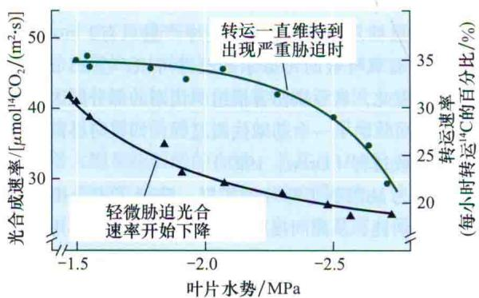  
图26.16 水分胁迫对高粱（Sorghum bicolor）光合作用及物质运输的相对影响。将植物阶段性暴露在 $^{14}CO_{2}$ 中，叶片中放射性物质可作为衡量光合作用的一个尺度，因为 $^{14}CO_{2}$ 的移动而造成放射性减少，可用于衡量同化物运输的速率。轻微的水分胁迫可影响光合作用，而只有在胁迫严重时，同化物的运输才会受到影响（改编自Sung and Krieg，1979）。

在肉质多汁植物中，CAM代谢是很普遍的，如仙人掌。有些肉质植物表现出兼性的CAM代谢途径，当水分缺失和盐胁迫时，这些肉质植物启动CAM代谢途径（见第8章）。这种代谢的转变对胁迫适应非常重要，包括磷酸烯醇式丙酮酸（PEP）羧化酶、丙酮酸-正磷酸二激酶和NADP-苹果酸酶等酶的积累。

正如第8章和第9章所讨论的，CAM代谢涉及许多结构、生理和生化特征变化，包括羧化和脱羧化的改变、大量苹果酸盐进出液泡和气孔周期性逆转等。因此，CAM代谢是植物响应水亏缺的一个重要途径。

## 小结

植物有合适的调控机制以应对威胁生命的极端环境，以帮助植物抵御胁迫，甚至能在各种栖息地中茁壮成长。

## 适应性和表型可塑性

· 对各种环境条件的适应涉及基因的表达变化。

· 表型可塑性包括生理的或发育的变化，这些变化是暂时的，通常是可逆但不可遗传的。

## 非生物环境及其对植物生理的影响

· 大气气体、光、温度、湿度、降水和风是影响植物体内稳态的气候因素。

· 土壤因素，包括土壤组成、渗透系数、离子交换容量和pH，影响空气、水和矿物营养对植物根系的供应。

· 非生物因素的失衡对植物有初级效应和次级效应（表26.1）。

## 水分亏缺和过量

· 水分亏缺可能导致植物根毛损伤，削弱对水的吸收，使细胞空化，因而降低了维管组织中的水流量。

· 水分亏缺降低细胞膨压（ $\Psi_{p}$ ），减小细胞体积。

· 水分亏缺降低胞壁伸展性（m）和增加起始膨压（Y）（图26.1）。

· 洪涝和土壤板结降低根细胞对 $O_{2}$ 的获取能力。

\- $\mathrm{O}_2$ 浓度低于临界氧分压（COP），可以降低根中呼吸作用速率和ATP的产生。

## 土壤矿物质失衡

· 盐胁迫有两种：导致水分亏缺的非特异性的渗透胁迫；有毒离子引起的特异性离子效应。

· 水管理措施不当导致土壤盐度增加（图26.2）。

· 细胞内高浓度 $Na^{+}$ 和 $Cl^{-}$ 使蛋白质变性，破坏细胞膜的稳定性。

## 温度胁迫

· 叶表面温度高和最小量的蒸腾散热能够引起热胁迫（表26.2）。

· 高温不仅改变膜的流动性，而且抑制光合作用和呼吸作用（图26.3）。

· 在温度补偿点以上，光合作用不能补偿呼吸作用消耗的固定碳。

\- 冷害降低膜的流动性、 $\mathrm{H}^{+}$ 泵ATP酶的活性、溶质运输量并阻碍总能量转换通路。

· 冰点温度导致冰晶形成，使细胞脱水并破坏细胞膜和细胞器。

## 强光的胁迫

· 超过光合作用的光饱和点，光通过破坏光合系统引起光抑制。

· 强光照射下电子的过剩导致产生过量的活性氧，破坏蛋白质、脂质、RNA和DNA。

· 过量的光、极端的温度、脱水、盐度和毒性离子都会导致活性氧产生和清除的不平衡。
生长和生理机制保护植物应对极端环境

· 植物改变生命周期及叶面积、叶向值、表皮毛密度、角质层厚度和早衰的变化以应答各种环境的变化（图26.4\~图24.9）。

· 植物根冠生长速率增加来应对水分亏缺。

· 植物通过ABA调节气孔开放来应对脱水环境。

· 当土壤含水量由于蒸发或含盐量提高而下降时，根部细胞可以通过积累溶质继续吸收水分（图26.10）。

· 根部渗透压的调节是通过吸收土壤离子或者从植物其他组织器官转运离子到根部完成的。

· 用于渗透压调节的离子积累发生在液泡中，但需要在细胞质中积累相反电性的离子（图26.11）。

· 水下器官能发育生长出通气组织，能够维持气体交换（图26.12）。

· 植物螯合肽能够螯合特定离子，降低该离子的活性和毒性（图26.13）。

\- 植物的耐盐性依赖于调控跨脂膜转运到茎和液泡的区隔化的净离子摄入。

\- 钠氢离子泵可以使得钠离子转移到液泡中（图26.14）。

· 一种能促使植物冷驯化的扩散因子通过韧皮部从叶片传导到茎部。

· 低温可能会改变膜脂，从而激活基因表达的信号途径（表26.3）。

· 钙离子信号转导蛋白可能参与了冷驯化。

· 低温能够诱导抗冻蛋白的合成，进而抑制冰晶的生长。

\- 耐寒植物的细胞膜含有更多的不饱和脂肪酸（表26.3）。

· 大量热激蛋白能够被不同的环境因子所诱导。

· 正常的光合作用和呼吸作用会产生有害的ROS，通过抗氧化机制防止细胞受损。

· 有氧呼吸所需的氧气不足的时，根部把丙酮酸发酵为乳酸，再转化为乙醇（图26.15）。

\- 中期或短期缺水，会强烈抑制光合作用，而韧皮部的转运不受影响，除非严重缺水（图26.16）。

(李坤 郭敬功 苗雨晨 译)

## WEB MATERIAL

Web Topics

26.1 Stomatal Conductance and Yields of Irrigated Crops
Stomatal conductance predicts yields of irrigated crops grown in hot environments.

26.2 Membrane Lipids and Low Temperatures
Lipid enzymes from mutant and transgenic plants mimic the effects of low-temperature acclimation.

26.3 Ice Formation in Higher-Plant Cells Heat is released when ice forms in intercellular spaces.

## 26.4 Water-Deficit-Regulated ABA Signaling and Stomatal Closure

Plant response to drought includes the accumulation of ABA in leaves, which reduces transpiration by inducing stomatal closure.

## 26.5 Genetic and Physiological Adaptations Required for Zinc Hyperaccumulation

Zinc hyperaccumulation is driven by enhancements in zinc uptake, transport to the shoot, and storage in leaf vacuoles.

## 26.6 Cellular and Whole Plant Responses to Salinity Stress

Control of sodium efflux from cells, translocation to the shoot, and vacuolar compartmentalization allow plants to regulate whole plant sodium level.

26.7 Signaling during Cold Acclimation Regulates Genes That Are Expressed in Response to Low Temperature and Enhances Freezing Tolerance
Cold acclimation is the process by which temperate plants are able to survive over winter at freezing temperatures.

## Web Essays

26.1 The Effect of Air Pollution on Plants
Polluting gases inhibit stomatal conductance, photosynthesis, and growth.

26.2 An Extreme Plant Lifestyle: Metal Hyperaccumulation Plants can overaccumulate highly toxic metals.

## 参考文献

<table><tr><td>附录1</td><td>能量和酶</td><td>A1.7</td><td>酶:生命的催化剂</td></tr><tr><td>A1.1</td><td>生命系统中的能量流</td><td>附录2</td><td>植物生长分析</td></tr><tr><td>A1.2</td><td>能和功</td><td>A2.1</td><td>生长速率和生长曲线</td></tr><tr><td>A1.3</td><td>自发过程的方向</td><td>附录3</td><td>激素生物合成途径</td></tr><tr><td>A1.4</td><td>自由能和化学势</td><td>A3.1</td><td>氨基酸途径</td></tr><tr><td>A1.5</td><td>氧化还原反应</td><td>A3.2</td><td>类异戊二烯途径</td></tr><tr><td>A1.6</td><td>电化学势</td><td>A3.3</td><td>脂类</td></tr></table>

本部分内容可登陆科学出版社教学服务网站访问，访问方式如下：

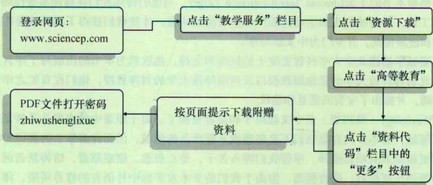

更多资源，请持续关注。

# 第四版译后记

在长期从事植物生理学教学工作中，常为找不到一本完善的植物生理学教学参考书而深感不便。自Lincoln Taiz和Eduardo Zeiger等著的《植物生理学》（第三版，2002）问世后，我们从2004年开始就将其作为本科生和研究生植物生理学教学的主要参考书。该书全面准确地总结和反映所有的植物生理学领域新进展。它不仅具有作为教科书简洁明了的特点，同时也提供了和教学水平相适应的内容。当时我们就萌动了将该书翻译成中文的想法，但由于事务繁多，这个愿望一直没能付诸实施。2006年3月第四版问世时，我在美国遇到王学路博士，当谈及植物生理学教学时，我们不谋而合，而这时又恰逢科学出版社在全国范围内征集国外著名生命科学原著的翻译计划，由此我们才下决心启动这本书的翻译工作，此时距该书第四版的出版已经2年了。

而当翻译工作开始后，我们才知道这是一项非常浩繁的工程，全书共26章750余页，内容之多，翻译难度之大远远超出了我们当初的预想。教材的翻译强调科学性、准确性和简洁易读，有其特殊的难处。从专业名词概念的翻译，到新的专业词汇修订统一，从不同学科内容到语言的表述风格和形式等，分析整理，颇费心力时间。中间我和学路几次懈怠，几度都想放弃。在这里，首先我要感谢河南大学和复旦大学的一批师生，先后有数十人在科研和教学工作之余，参与本书的翻译和校阅工作。尤其是一直坚持在河南大学植物逆境生物学重点实验室和我一起创业的年青同事们，他们的热情和智慧给了我极大地鼓励。更应提及的是我们实验室的周云老师，其在组织翻译、校阅和协调，并对全书的图文编排等工作付出了的辛勤劳动。

其次，我们要感谢本书的主编Lincoln Taiz和Eduardo Zeiger，当他们得知我们在翻译本著作的中文版时，非常支持和鼓励我们的工作，并由他们出面主动说服国外出版商的同意，才使我们获得了翻译该著作的版权。他们一直关心翻译的进度和进展情况，并专门为中文版写序。

另外，我们还要诚挚感谢北京大学许智宏院士的鼓励和支持，他欣然为本书的出版写了序言。感谢华南师大的王小菁教授、西北农林科技大学的张继澍教授以及河南师范大学的刘萍教授，他们在百忙之中专门抽时间对本书的全稿进行了校阅，并提出了宝贵的意见和建议。

如今，Plant Physiology（第四版）的中文版终于和读者见面了。由于原著中的内容几乎涉足当今国际上植物生物学研究的所有领域，有不少内容是我们不甚熟悉或未曾涉及的领域，因而许多章节的翻译对我们来说无异于是一次重新学习和更新知识的艰难跋涉。尽管我们埋头苦干，劳心焦思，细察原意，熔铸新名词，模拟原风格，对每个章节内容的翻译反复校对，修改提高，但由于我们的学术水平和中外语言的修养所限，译文中疏忽甚至错误之处在所难免，对此我们恳请有关专家、学者以及学生读者们不吝赐教，批评指正。

为了尊重原著，在中文版中，我们同样没有对网络章节（第2章和第14章）的内容进行翻译，此部分内容可参考该书的网站。

Plant Physiology（第四版）中文版的出版得到了河南大学出版基金和复旦大学出版资金的资助。我们还要真诚地感谢科学出版社各位编辑、校对人员，他们为本书的出版付出了大量心血。

掩卷沉思，面对后基因组学时期植物生理学蓬勃发展的新时代，颇感兴奋。衷心希望我们为此书付出的慷慨时间和劳动，能对国内植物生理学教学和科研有所贡献。

宋纯鹏

2009年夏写于河南大学苹果园