# 第5章 分子生物学研究法（上）——DNA、RNA及蛋白质操作技术

<!-- 章节边界按正文内容恢复；原始 MinerU 内容保留如下。 -->

# 分子生物学研究法(上) ——DNA、RNA 及蛋白质操作技术

5.1 重组 DNA 技术史话

5.2 DNA 基本操作技术

5.3 RNA 基本操作技术

5.4 基因克隆技术

5.5 蛋白质与蛋白质组学技术

分子生物学研究之所以从20世纪中叶开始得到高速发展,其中最主要的原因可能是现代分子生物学研究方法、特别是基因操作和基因工程技术的进步。基因操作主要包括DNA分子的切割与连接、核酸分子杂交、凝胶电泳、细胞转化、核酸序列分析以及基因的人工合成、定点突变和PCR扩增等,是分子生物学研究的核心技术。基因工程是指在体外将核酸分子插入病毒、质粒或其他载体分子,构成遗传物质的新组合,使之进入新的宿主细胞内并获得持续稳定增殖能力和表达。该项技术其实是核酸操作的一部分,只不过我们在这里强调了外源核酸分子在另一种不同的宿主细胞中的繁衍与性状表达。事实上,这种跨越天然物种屏障、把来自任何生物的基因置于毫无亲缘关系的新的宿主生物细胞之中的能力,是基因工程技术区别于其他技术的根本特征。本章将在回顾重组DNA技术发展史的基础上,讨论DNA操作技术、基因克隆、表达分析技术及蛋白质组学、单核苷酸多态性分析等现代生物学领域里最广泛应用的实验技术和方法。

## 5.1 重组 DNA 技术史话

近半个多世纪来,分子生物学研究取得了前所未有的进步,主要有三大成就:第一,在20世纪40年代确定了遗传信息的携带者,即基因的分子载体是DNA而不是蛋白质,解决了遗传的物质基础问题;第二,50年代提出了DNA分子的双螺旋结构模型和半保留复制机制,解决了基因的自我复制和世代交替问题;第三,50年代末至60年代,相继提出了“中心法则”和操纵子学说,成功地破译了遗传密码,阐明了遗传信息的流动与表达机制。

DNA 分子体外切割与连接技术及核苷酸序列分析技术的进步直接推动了重组 DNA 技术的产生与发展。因为重组 DNA 的核心是用限制性内切核酸酶 (restriction endonuclease, RE) 和 DNA 连接酶对 DNA 分子进行体外切割与连接，所以，科学家认为，这些工具酶的发现和应用是现代生物工程技术史上最重要的事件 (表 5-1)。1967 年，世界上有 5 个实验室几乎同时报道了通过合成相邻核苷酸之间的磷酸二酯键，修复缺口或催化黏合完全分离的两个 DNA 片段的 DNA 连接酶。1972 年，Boyer 实验室发现有一种内切核酸酶 EcoR I 能特异性识别 GAATTC 序列，将双链 DNA 分子在这个位点切开并产生具有黏性末端的小片段。他们还发现，能够把 EcoR I 酶切产生的任何不同来源的 DNA 片段通过 DNA 连接酶彼此“黏合”起来。此后，大量类似于 EcoR I 但具有独特识别序列的内切核酸酶被陆续发现，它们中的大多数识别的序列为回文序列且切割后形成黏性末端，少数为非回文序列（如 Bsa I），也有些切割成平末端（如 Pvu II）(图 5-1)。

表 5-1 重组 DNA 技术史上的主要事件

<table><tr><td>年份</td><td>事件</td></tr><tr><td>1869</td><td>F. Miescher 首次从莱茵河鲑鱼精子中分离 DNA</td></tr><tr><td>1957</td><td>A. Kornberg 从大肠杆菌中发现了 DNA 聚合酶 I</td></tr><tr><td>1959-1960</td><td>Uchoa 发现 RNA 聚合酶和信使 RNA,并证明 mRNA 决定了蛋白质分子中的氨基酸序列</td></tr><tr><td>1961</td><td>Nirenberg 破译了第一个遗传密码;Jacob 和 Monod 提出了调节基因表达的操纵子模型</td></tr><tr><td>1964</td><td>Yanofsky 和 Brenner 等人证明,多肽链上的氨基酸序列与该基因中的核苷酸序列存在着共线性关系</td></tr><tr><td>1965</td><td>Holley 完成了酵母丙氨酰 tRNA 的全序列测定;科学家证明细菌的抗药性通常由“质粒”DNA 所决定</td></tr><tr><td>1966</td><td>Nirenberg、Uchoa、Khorana 和 Crick 等人破译了全部遗传密码</td></tr><tr><td>1967</td><td>第一次发现 DNA 连接酶</td></tr><tr><td>1970</td><td>Smith、Wilcox 和 Kelley 分离了第一种限制性内切核酸酶,Temin 和 Baltimore 从 RNA 肿瘤病毒中发现反转录酶</td></tr><tr><td>1972-1973</td><td>Boyer、Berg 等人发展了重组 DNA 技术,于 1972 年获得第一个重组 DNA 分子,1973 年完成第一例细菌基因克隆</td></tr><tr><td>1975-1977</td><td>Sanger 与 Maxam 和 Gilbert 等人发明了 DNA 序列测定技术,1977 年完成了全长 5 387 bp 的噬菌体 φ174 基因组测定</td></tr><tr><td>1978</td><td>首次在大肠杆菌中生产由人工合成基因表达的人脑激素和人胰岛素</td></tr><tr><td>1980</td><td>美国联邦最高法院裁定微生物基因工程可以被专利化</td></tr><tr><td>1981</td><td>Palmiter 和 Brinster 获得转基因小鼠,Spradling 和 Rubin 得到转基因果蝇</td></tr><tr><td>1982</td><td>美、英批准使用第一例基因工程药物——胰岛素,Sanger 等人完成了入噬菌体 48 502 bp 全序列测定</td></tr><tr><td>1983</td><td>获得第一例转基因植物</td></tr><tr><td>1984</td><td>斯坦福大学获得关于重组 DNA 的专利</td></tr><tr><td>1986</td><td>遗传修饰生物体(GMO)首次在环境中释放</td></tr><tr><td>1988</td><td>Watson 出任“人类基因组计划”首席科学家</td></tr><tr><td>1989</td><td>DuPont 公司获得转肿瘤基因小鼠——“Oncomouse”</td></tr><tr><td>1992</td><td>欧洲 35 个实验室联合完成酵母第三染色体全序列测定(315 kb)</td></tr><tr><td>1994</td><td>第一批基因工程西红柿在美国上市</td></tr><tr><td>1996</td><td>完成酵母基因组全序列测定( $1.25 \times 10^{7}$  bp)</td></tr><tr><td>1997</td><td>英国爱丁堡罗斯林研究所获得克隆羊</td></tr><tr><td>2000</td><td>完成第一个高等植物拟南芥的全序列测定( $1.2 \times 10^{8}$  bp)</td></tr><tr><td>2001</td><td>完成第一个人类基因组全序列测定( $2.7 \times 10^{9}$  bp)</td></tr><tr><td>2012</td><td>首次报导具有革命性的基因编辑体系——CRISPR/Cas9 技术</td></tr></table>

当然,仅仅能在体外利用限制性内切核酸酶和 DNA 连接酶进行 DNA 的切割和重组,还远远不能满足基因工程的要求,因为大多数 DNA 片段不具备自我复制的能力,只有将它们连接到具备自主复制能力的 DNA 分子上,才能在宿主细胞中进行繁殖。这种具备自主复制能力的 DNA 分子就是所谓分子克隆的载体 (vector),病毒、噬菌体和质粒等小分子量复制子都可以作为基因导入的载体。

图 5-1 几种主要限制性内切核酸酶所识别的序列、切割位点及常用的保护碱基  

分子克隆的载体种类繁多,但目前全世界各实验室广泛使用的质粒载体大多是从以下几种载体派生出来的。pSC101是第一代质粒载体(图5-2a),全长9.09 kb,带有四环素抗性基因(tet $^{r}$ ),具有EcoR I、HindⅢ、BamH I、Sal I、Xho I、Pvu II以及Hpa I 7种限制性内切核酸酶的单酶切位点。该载体是一种严紧型复制控制的低拷贝质粒,平均每个宿主细胞仅有1\~2个拷贝,因此,从带有该质粒的宿主细胞中很难大量提取质粒DNA,不利用后续实验的进行;而ColE1质粒载体则是松弛型复制控制的多拷贝质粒(图5-2b),每个宿主细胞中的拷贝数可达到1 000\~3 000个;pBR322质粒载体同样具有较高的拷贝数(1 000\~3 000个),便于制备重组DNA,它由3个不同来源的部分组成(图5-2c),第一部分来源于pSF2124质粒易位子Tn3的氨苄青霉素抗性基因(amp $^{r}$ ),第二部分来源于pSC101质粒的四环素抗性基因(tet $^{r}$ ),第三部分则来源于ColE1的派生质粒pMB1的DNA复制起点(ori)。最后一类是pUC质粒载体(图5-2d),由包括来自pBR322质粒的复制起点(ori),氨苄青霉素抗性基因(amp $^{r}$ ),大肠杆菌β-半乳糖苷酶基因(lacZ)启动子及编码α-肽的DNA序列,特称为lacZ'基因等4部分所组成。一旦有外源DNA插入位于lacZ'基因5'端的多克隆位点(MCS)处,lacZ'基因功能被破坏,不能产生功能型半乳糖酶。

lacZ'基因编码β-半乳糖苷酶氨基端146个氨基酸的α-肽，IPTG（异丙基-β-D-硫代半乳糖苷)诱导该基因表达，所合成的β-半乳糖苷酶α-肽与宿主细胞编码的缺陷型β-半乳糖苷酶互补，产生有活性的β-半乳糖苷酶，水解培养基中的X-gal(5-溴-4-氯-3-吲哚-β-D-半乳糖苷)，生成蓝色的溴氯吲哚。利用这一原理可对重组载体进行蓝白斑筛选，在含X-gal的培养基中，非转化菌落呈蓝色，含有重组DNA分子的菌落呈白色。

获得了用外源 DNA 片段和载体分子连接后的重组载体后,还必须通过一个细菌转化的过程将其重新导入到宿主细胞中,才能保证重组载体的增殖。1970 年,Mandel 和 Higa

(a)  
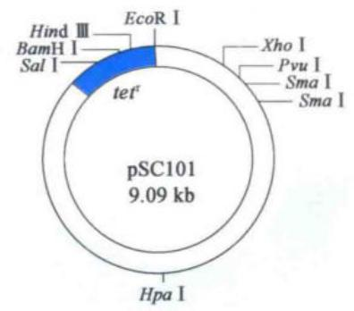

(b)  

## 图 5-2 分子克隆中最常见的载体演变

(a) pSC101 质粒载体，全长 9.09 kb，带有四环素抗性基因 ( $tet^{r}$ ) 及 7 种限制性内切核酸酶的单酶切位点，在 HindⅢ、BamH I 和 Sal I 等 3 个位点插入外源基因，会导致 tet 失活；(b) ColE1 质粒载体；(c) pBR322 质粒载体；(d) pUC18 质粒载体。

发现,大肠杆菌细胞经适量氯化钙处理后,能有效地吸收 $\lambda$ 噬菌体 DNA。1972 年,又有实验室报道,经氯化钙处理的大肠杆菌细胞能够有效摄取质粒 DNA。从此,大肠杆菌就成了分子克隆中最常用的转化受体。同年,美国斯坦福大学的 Berg 等人在体外用限制性核酸内切酶 EcoR I 分别消化病毒 SV40 和 $\lambda$ 噬菌体 DNA,再用 T4 DNA 连接酶将两种不同的酶切片段连接起来,首次获得了同时含有 SV40 和 $\lambda$ 噬菌体 DNA 的重组 DNA $^{(图 5-3a)}$ 。1973 年,Cohen 实验室也成功地进行了体外 DNA 重组,他们将分别经限制性内切核酸酶处理的含有编码卡那霉素抗性基因的大肠杆菌质粒 R6-5 DNA 与含有编码四环素抗性基因的另一种大肠杆菌质粒 pSC101 DNA 混合后加入 T4 DNA 连接酶,得到的重组杂种 DNA 分子表现出既抗卡那霉素又抗四环素的双重抗性特征(图 5-3b)。

由来自大肠杆菌的质粒 DNA 形成的重组 DNA 分子可以在原来的宿主细胞中增殖，这似乎还比较容易理解。那么，不同物种的外源 DNA 片段是否也可以在大肠杆菌细胞中增殖呢？为了回答这个问题，Cohen 和 Boyer 等人合作，把非洲爪蟾核糖体蛋白基因片段与 pSC101 质粒 DNA 片段重组后导入大肠杆菌，证明动物基因也能进入大肠杆菌细胞并转录出相应的 mRNA 分子。上述实验表明：

① 类似 pSC101 的质粒 DNA 分子可以作为基因克隆的载体, 从而将外源 DNA 导入宿主细胞。

② 来自高等生物非洲爪蟾基因片段可以被成功地转移到原核细胞中并实现功能表达。

图 5-3 科学家早期构建的重组 DNA

(a) 经 EcoR I 酶切后的 $\lambda$ 噬菌体 DNA 和猿猴病毒 SV40，在 T4 DNA 连接酶的催化下形成重组 DNA；(b) 含有编码卡那霉素抗性基因的质粒 R6-5 与含有编码四环素抗性基因的质粒 pSC101 分别经 EcoR I 酶切，并在 T4 DNA 连接酶的作用下形成重组质粒 DNA，其能同时降解卡那霉素和四环素，具有双重抗性。

③ 质粒 DNA-大肠杆菌细胞作为一种成功的基因克隆体系,有可能在重组 DNA 或基因工程研究中发挥重要作用。

## 5.2 DNA 基本操作技术

自从 1953 年 DNA 分子双螺旋被发现,分子生物学研究得到各国科学家的高度重视并且迅速发展成一门新兴学科,这首先要归功于各种 DNA 操作核心技术——包括基因组 DNA 提取、凝胶电泳、PCR、重组载体的构建及基因组 DNA 文库的构建等技术的迅速发展与应用。时至今日,分子生物学研究已经进入三维基因组和三维蛋白质结构大数据时代,但最基本的 DNA 操作技术仍然不可或缺。

## 5.2.1 基因组 DNA 的提取

广义的基因组(genome)是指一个单倍体细胞内细胞核、线粒体和叶绿体中所包含的全部DNA分子,而我们通常说的基因组DNA则特指细胞核内染色体上的包括编码区和非编码区在内的全部DNA分子。获取高相对分子质量和高纯度的基因组DNA,可以使后续实验如PCR反应、Southern杂交、文库构建或者基因组测序等结果更加可信可靠。

根据不同材料的性质,提取基因组 DNA 时方法略有不同。一般首先将组织材料磨碎或细胞材料均匀分散。因为植物组织具有细胞壁结构,较难破碎,所以一般先用液氮速冻帮助研磨,随后加入裂解液破碎细胞,释放细胞核及核内的染色质。动物组织及细胞材料一般加入 SDS 进行裂解。SDS 是一种阴离子去污剂,可溶解细胞膜,并使蛋白质变性,释放出染色质中的 DNA。植物组织一般加入一种阳离子去污剂——CTAB,它可以更好地除去细胞壁中的多糖成分,溶解细胞膜,并与释放出来的核酸形成复合物。用苯酚和氯仿做有机相来分离裂解后的各种细胞组分,包括蛋白质、糖类、酚类等有机物,使之与溶解于水相的 DNA 相分离。最后用乙醇洗涤分离后的 DNA,吸收与 DNA 相结合的水分子,使之沉淀并得到进一步的纯化。将 DNA 沉淀晾干后,溶解于超纯水或 Tris-HCI 和 EDTA 配制的 TE 缓冲液中(图 5-4a)。基因组 DNA 制备后可以在 4℃适当保存,但最好尽快使用。

图 5-4 基因组 DNA 的提取  
  
(a) 基因组 DNA 提取的主要实验流程；(b) 陆地棉不同组织的核 DNA 样品电泳图。

实验中还常将含有 DNA 样品的细胞破碎液通过一个硅胶膜纯化柱,使 DNA 吸附在硅胶膜上而与其他成分分开,进一步在低盐浓度下从硅胶膜上直接洗脱 DNA,得到纯度较高的 DNA 样品。

DNA 的浓度和纯度可以通过测定其 $OD_{260}$ 和 $OD_{280}$ 来判断。 $OD_{260}$ 为 1 时相当于浓度为 50 $\mu g/mL$ ，而 $OD_{260}/OD_{280}$ 的比值如果在 1.8～2.0 之间，表示所提取的 DNA 纯度较好，如果样品中有蛋白质或酚污染，则 $OD_{260}/OD_{280}$ 的比值将明显低于 1.8。

提取基因组 DNA 时一定要保证核酸一级结构的完整性, 确保所提取的 DNA 片段显著大于 50 kb。在操作时要尽可能避免机械力对 DNA 的损伤。可通过琼脂糖凝胶电泳检测基因组 DNA 片段大小。常用相对分子质量为 50 kb 的 $\lambda$ 噬菌体作为检测基因组 DNA 质量的参照(图 5-4b)。

## 5.2.2 核酸凝胶电泳

自从琼脂糖(agarose)和聚丙烯酰胺(polyacrylamide)凝胶被发现以来,按相对分子质量大小分离DNA的凝胶电泳技术,已经成为分析鉴定重组DNA分子及蛋白质与核酸相互作用的重要实验手段。

在生理条件下,核酸分子中的磷酸基团呈离子化状态,把这些核酸分子放置在电场当

图5-5 琼脂糖凝胶电泳

(a) 琼脂糖凝胶电泳装置，电泳仪为电泳槽施加电压，添加适量的电泳缓冲液，将琼脂糖凝胶置于其中，DNA 即可在凝胶中由负极向正极迁移；(b) 将琼脂糖粉末加入电泳缓冲液中加热熔化，倒入凝胶模具中并插入梳子形成上样孔，待其冷却后拔去梳子，即制备好琼脂糖凝胶。凝胶电泳完毕后在紫外下显示 DNA 条带。

(a)  

中,它们会向正电极方向迁移(图5-5)。由于核酸分子中的磷酸基团在结构上的重复性,相同数量的双链DNA几乎具有等量的净电荷,因此它们能以同样的速度向正电极方向迁移。在一定的电场强度下,DNA分子的这种迁移速度,亦即电泳的迁移率,就完全取决于核酸分子本身的大小。因此,可以通过电泳将不同相对分子质量的核酸分子彼此分离开来。

将琼脂糖粉末加热到熔点后冷却凝固便会形成良好的无反应活性的电泳介质。凝胶的分辨能力与凝胶的类型和浓度有关(表5-2)。琼脂糖凝胶分辨DNA片段的范围为0.2\~50 kb，而要分辨较小相对分子质量的DNA片段，则要用聚丙烯酰胺凝胶，其分辨范围为1\~1 000 bp。凝胶浓度的高低影响凝胶介质孔隙的大小，浓度越高，孔隙越小，其分辨能力就越强。反之，浓度降低，孔隙就增大，其分辨能力也就随之减弱。

表 5-2 琼脂糖及聚丙烯酰胺凝胶分辨 DNA 片段的能力

<table><tr><td>凝胶类型及含量</td><td>分离 DNA 片段的大小范围 /bp</td></tr><tr><td>0.3% 琼脂糖</td><td>50 000 ~ 1 000</td></tr><tr><td>0.7% 琼脂糖</td><td>20 000 ~ 1 000</td></tr><tr><td>1.4% 琼脂糖</td><td>6 000 ~ 300</td></tr><tr><td>4.0% 聚丙烯酰胺</td><td>1 000 ~ 100</td></tr><tr><td>10.0% 聚丙烯酰胺</td><td>500 ~ 25</td></tr><tr><td>20.0% 聚丙烯酰胺</td><td>50 ~ 1</td></tr></table>

因为溴化乙锭(ethidium bromide, EB)能插入到 DNA 或 RNA 分子的相邻碱基之间，并在紫外光照射下发出荧光，所以，常在琼脂糖凝胶冷却凝固前，加入适量溴化乙锭，电泳完毕后将凝胶放置在 300 nm 波长的紫外光下，可十分灵敏而快捷地检测出凝胶介质中的 DNA（约 50 ng）条带。

用普通琼脂糖凝胶电泳很难分离大于50 kb的DNA分子,为了进行超大片段DNA研究,科学家发明了脉冲电场凝胶电泳(pulsed-field gel electrophoresis, PFGE)技术,用于分离超大相对分子质量(有时甚至是整条染色体)DNA。在脉冲电场中,DNA分子的迁移方向随着电场方向的周期性变化而不断改变(图5-6)。由于琼脂糖凝胶的电场方向、电流大小及作用时间都在交替变换,DNA分子必须随时调整运动方向以适应凝胶孔隙的无规则变化。相较于相对分子质量较小的 DNA, 相对分子质量较大的 DNA 需要更多的脉冲次数来更换其构型和运动方向。应用脉冲电场凝胶电泳技术, 可成功地分离到相对分子质量高达 $10^{7}$ bp 的 DNA 大分子。

  
超大分子，不能有效地被一般电泳分离

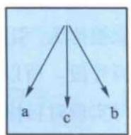  
a、b表示每次电泳的不同方向，c为DNA分子的最终移动方向

  
应用脉冲电场技术,可分离高达 $10^{7}$ bp的DNA分子  
图 5-6 DNA 脉冲电场凝胶电泳示意图

## 5.2.3 聚合酶链式反应技术

聚合酶链式反应(polymerase chain reaction, PCR)技术是目前体外快速扩增特定基因片段最常用的方法。20世纪80年代，美国Cetus公司的Kary Mullis发明了该技术。

PCR 技术的原理并不复杂。首先将模板 DNA(质粒、基因组 DNA 或 mRNA 反转录产生的 cDNA) 在临近沸点的温度下加热分离成单链 DNA 分子, 然后 DNA 聚合酶在一对引物 (一小段单链 DNA) 的引导下以单链 DNA 为模板并利用反应混合物中的 4 种脱氧核苷三磷酸(dNTP) 合成新的 DNA 互补链(图 5-7)。DNA 聚合酶是一种天然产生的能催化 DNA(包括 RNA) 合成和修复的生物大分子。所有生物体基因组的准确复制都依赖于这类酶的活性。PCR 反应中使用的 DNA 聚合酶不同于一般的聚合酶, 它具有很强的耐高温性, 在高温下数小时不丧失酶活性。DNA 聚合酶开始工作时先要产生一小段双链 DNA 来启动(“引

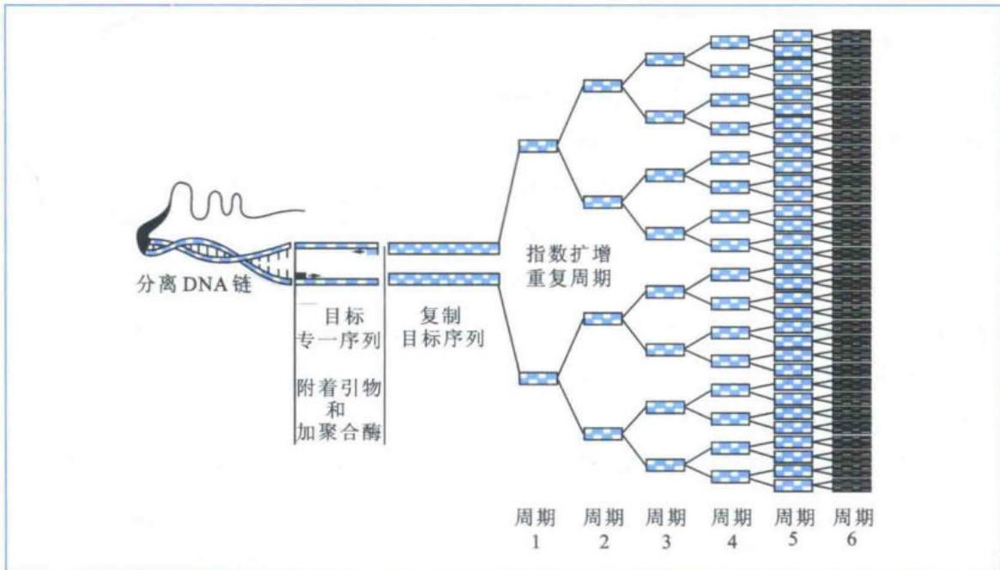  
图 5-7 聚合酶链式反应(PCR)技术原理示意图

图5-8 PCR指数扩增时循环次数与DNA产物量比较

<table><tr><td>1</td><td>2</td></tr><tr><td>2</td><td>4</td></tr><tr><td>3</td><td>8</td></tr><tr><td>4</td><td>16</td></tr><tr><td>5</td><td>32</td></tr><tr><td>6</td><td>64</td></tr><tr><td>7</td><td>128</td></tr><tr><td>8</td><td>256</td></tr><tr><td>9</td><td>512</td></tr><tr><td>10</td><td>1 024</td></tr><tr><td>11</td><td>2 048</td></tr><tr><td>12</td><td>4 096</td></tr><tr><td>13</td><td>8 192</td></tr><tr><td>14</td><td>16 384</td></tr><tr><td>15</td><td>32 788</td></tr><tr><td>16</td><td>65 536</td></tr><tr><td>17</td><td>131 072</td></tr><tr><td>18</td><td>262 144</td></tr><tr><td>19</td><td>524 288</td></tr><tr><td>20</td><td>1 048 576</td></tr><tr><td>21</td><td>2 097 152</td></tr><tr><td>22</td><td>4 194 304</td></tr><tr><td>23</td><td>8 388 608</td></tr><tr><td>24</td><td>16 777 216</td></tr><tr><td>25</td><td>33 554 432</td></tr><tr><td>26</td><td>67 108 864</td></tr><tr><td>27</td><td>134 217 728</td></tr><tr><td>28</td><td>268 435 456</td></tr><tr><td>29</td><td>536 870 912</td></tr><tr><td>30</td><td>1 073 741 824</td></tr><tr><td>周期</td><td>拷贝</td></tr></table>

导”)新链的合成,这一小段引导新链合成的 DNA 序列就被称为“引物”,引导 DNA 聚合酶特异性扩增目标基因片段。所以,通过设计特定基因两端的引物序列,即可实现对目标基因的扩增。

做 PCR 时, 只要在试管内加入模板 DNA、引物、dNTP 及缓冲液(酶催化反应的缓冲液), DNA 聚合酶就能在数小时内将目标序列扩增 100 万倍以上。模板 DNA 分子首先在高温下解开成单链, 适当降温后引物立即与该模板 DNA 特定序列相结合, 产生双链区, DNA 聚合酶从引物 3' 端开始复制其互补链, 迅速产生与目标序列完全相同的拷贝。在后续反应中, 所有新形成的 DNA 双链, 都会在高温下解开成单链, 体系中的引物分子再次与其互补序列相结合, DNA 聚合酶也再度复制模板 DNA。由于在 PCR 反应中所选用的一对引物, 是按照与扩增区段两端序列彼此互补的原则设计的, 因此, 每一条新生链的合成都是从引物的退火结合位点开始并朝相反方向延伸的, 每一条新合成的 DNA 链上都具有新的引物结合位点。整个 PCR 反应的全过程, 即 DNA 解链(变性)、引物与模板 DNA 相结合(退火)、

DNA 合成(链的延伸)3 步, 可以被不断重复。经多次循环之后, 反应混合物中所含有的双链 DNA 分子数, 即两条引物结合位点之间的 DNA 区段的拷贝数, 理论上的最高值应是 $2^{n}$ (图 5-8), 能满足进一步遗传分析的需要。

## 5.2.4 重组载体构建

要完成对目的基因的功能研究,首先要获取它的重组表达载体,而第一步则是引物设计。引物长度一般为18\~27 bp,GC含量控制在40%\~60%, $T_{m}$ 值在60℃左右。两个DNA引物的5'端还需要各加上一个外切核酸酶的识别位点及其保护碱基,以利于外切核酸酶稳定结合到DNA双链并发挥切割作用,而所选择的外切核酸酶必须与载体上的多克隆位点相匹配(图5-9a)。

引物合成后,选择合适的 DNA 聚合酶和模板 DNA,用 PCR 扩增目的基因片段(图 5-9b)。通过琼脂糖凝胶电泳检测目标条带是否符合预期,如果条带单一,只需要将 PCR 产物通过硅胶膜纯化柱进行纯化就可以了;若条带不单一,还需要在电泳后,在紫外灯下对目标条带进行割胶回收,溶胶后同样用硅胶膜纯化柱纯化。

用相同的外切核酸酶在适当温度下分别双酶切目的基因片段和载体 DNA $^{(图 5-9c)}$ 。根据所加 DNA 总量，确定酶切 10 min 至数小时，保证酶切完全。用 T4 DNA 连接酶进行连接反应 $^{(图 5-9d)}$ ，根据插入目的基因片段与载体各自的 DNA 浓度及片段长度的不同，一次连接反应需要投入的插入片段与载体 DNA 总量的摩尔比应控制在 $(8 \sim 10)$ : 1 时较有利于连接反应的进行。连接温度为 $22^{\circ}C$ 时，T4 DNA 连接酶的活性较高，1 \~ 2 h 即可完成连接，但酶较易失活，连接不稳定； $4^{\circ}C$ 或 $16^{\circ}C$ 连接时，酶的活性维持时间较长，连接后更稳定，但通常需要反应 8 h 以上。

图 5-9 常规重组载体的构建示意图  
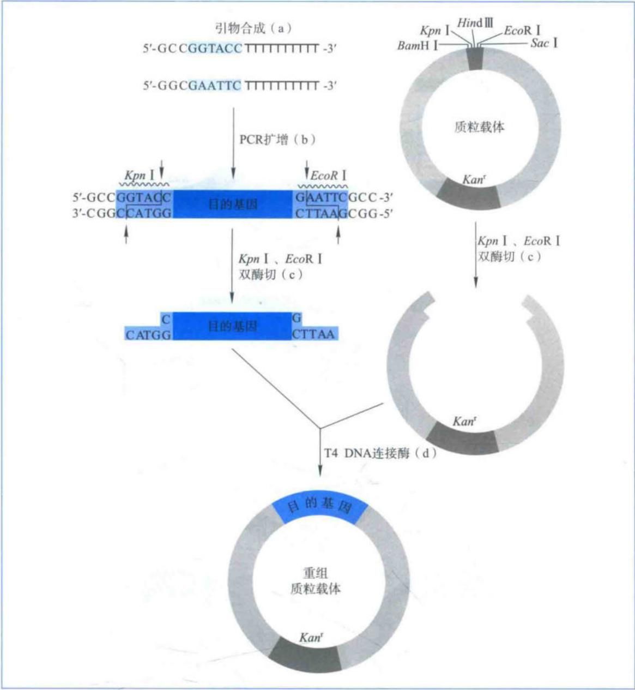  
(a) 合成目的基因片段两端的引物；(b) PCR 扩增目的基因；(c) 对目的基因和质粒载体进行双酶切；(d) T4 DNA 连接酶将酶切后目的基因和质粒载体连接成一个整体。

近几年,一种称为恒温一步法且不依赖 T4 DNA 连接酶的克隆技术已得到广泛应用。首先将载体线性化,通过引物设计在插入片段两端引入线性化载体的末端序列 (15\~25 bp), PCR 扩增插入片段后,其两端具有与线性化载体末端相同的序列。然后,按一定比例加入插入片段和线性化载体,再加入 dNTP,在 T5 外切核酸酶、DNA 聚合酶和 Taq DNA 连接酶的混合催化下,50℃恒温反应 15\~30 min 即可完成连接反应(图 5-10)。

由于连接成功的重组载体数量有限,远远不能满足实验需求,有必要通过细菌转化以获得大量重组载体的拷贝(图5-11a)。大肠杆菌在 $CaCl_{2}$ 溶液处理后,细胞膨胀,细胞膜通透

## 图 5-10 恒温一步法构建重组载体示意图

对载体进行双酶切，使其线性化，在插入片段两端引入与线性化载体末端一致的序列。线性化载体和插入片段在一种混合酶的催化下，50℃恒温反应15\~30 min即可完成连接反应。首先T5外切核酸酶消化DNA片段5'端产生单链突出部分，插入片段和线性化载体末端重新退火成双链，然后DNA聚合酶填补退火双链两边的缺口，Taq DNA连接酶将缝隙黏合，完成连接反应。

性发生改变,易于吸附外源 DNA,这种状态的细胞被称作感受态细胞。将连接产物与感受态细胞在试管中混匀,于冰上静置 30 min,然后转移到 42℃热刺激 30\~90 s,此时连接产物就可能被感受态细胞吸收。再将其置于 37℃摇床复苏约 1 h,然后均匀地涂布在含有抗生素的培养基上,37℃培养箱中倒置培养(图 5-11b)。因为连接产物,即重组后的质粒载体上带有抗性基因和表达元件,进入大肠杆菌后所产生的蛋白质能降解被大肠杆菌细胞吸收的抗生素,从而使重组大肠杆菌细胞能够在培养基中存活下来。

过夜培养后培养基上应该长出很多单菌落，随机挑取部分菌落，用菌内的重组质粒做DNA模板，进行菌落PCR（colony PCR）扩增，鉴定目的基因片段是否插入载体中(图5-11c)。挑取阳性菌落于液体培养基中37℃培养10\~13h，而后采用碱裂解法提取细菌中的质粒

DNA。在强碱性溶液中裂解菌体,释放质粒 DNA,然后用酸中和反应,离心收集上清液后,通过硅胶膜纯化柱纯化出质粒 DNA(图 5-11d),经酶切鉴定和测序确定序列无误后用于进一步的实验。

图 5-11 细菌转化及重组质粒提取示意图

(a) 将重组后的质粒载体转化到大肠杆菌中；(b) 过夜培养大肠杆菌，让重组质粒拷贝数增加；(c) 鉴定出含有重组质粒的单菌落；(d) 裂解菌体，获取重组质粒载体。

<!-- END OFFICIAL API PART part_002 -->

<!-- BEGIN OFFICIAL API PART part_003 -->

## 5.2.5 实时定量PCR

由于 PCR 技术具有极高的敏感性,扩增产物总量的变异系数常常达到 10%\~30%。因此,人们普遍认为应用简单方法对 PCR 扩增的产物进行最终定量是不可靠的。随着技术的进步,20 世纪 90 年代末期出现了实时定量 PCR(real time quantitative PCR,qPCR) 技术,利用带荧光检测的 PCR 仪对整个 PCR 过程中扩增 DNA 的累积速率绘制动态变化图,从而消除了在测定终端产物丰度时有较大变异系数的问题。

实时定量 PCR 反应在带透明盖的塑料小管中进行, 激发光可以直接透过管盖, 激发荧光探针。荧光探针事先混合在 PCR 反应液中, 只有与 DNA 结合后, 才能够被激发出荧光。随着新合成目的 DNA 片段的增加, 结合到 DNA 上的荧光探针增加, 被激发产生的荧光也相应增加。最简单的 DNA 结合的荧光探针是非序列特异性的, 例如荧光染料 SYBR Green I, 激发光波长 520 nm, 这种荧光染料只能与双链 DNA 结合(图 5-12)。

利用 SYBR Green I 可以检测 PCR 反应中获得的全部双链 DNA, 但是不能区分不同的双链 DNA。为了进一步确保荧光检测的就是靶 DNA 序列, 人们又设计了仅能与目的 DNA 序列特异结合的荧光探针, 如 TaqMan 探针。TaqMan 探针是一小段被设计成可以与靶 DNA 序列中间部位结合的单链 DNA(一般为 50 \~ 150 bp), 并且该单链 DNA 的 5' 和 3' 端带有短波长和长波长两个不同荧光基团。这两个荧光基团由于距离过近, 在荧光共振能量转移 (FRET) 作用下发生荧光淬灭, 因而检测不到荧光。PCR 反应开始后, 随着双链 DNA 变性产生单链 DNA, TaqMan 探针结合到与之配对的靶 DNA 序列上, 并被具有外切酶活性的 Taq DNA 聚合酶逐个切除而降解, 从而解除荧光淬灭的束缚, 荧光基团

图5-12 SYBR Green I作探针的实时定量PCR实验过程图示

加入到 PCR 反应体系中的荧光染料 SYBR Green I 仅能与双链 DNA 结合, 被激发出绿色荧光, 其荧光强度反映 PCR 产物的产量。

在激发光下发出荧光,所产生的荧光强度直接反映了被扩增的靶 DNA 总量(图 5-13)。

通过实时定量 PCR 确定靶基因表达强度时,每次实验都应设阴性对照和 4 个以上的标准品(将已知浓度的 DNA 模板进行一系列的稀释后成为标准品),每个样品都至少平行做 3 个重复。通常以 10\~15 个循环的荧光值作为阈值或基线,也可以以阴性对照荧光值的最高点作为基线。图 5-14a 显示随着扩增反应循环数增加,代表扩增产物含量的荧光强度增加;图 5-14b 中标准曲线由标准样品浓度的 lg 值和其相对应的 Ct 值所组成。Ct 值是产物荧光强度首次超过

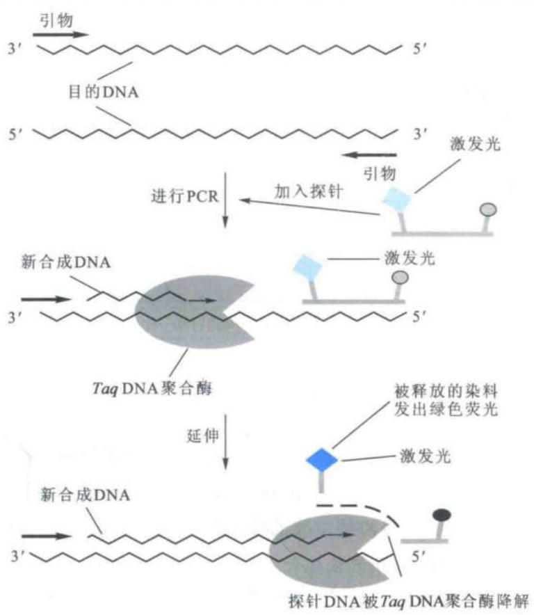

## 图5-13 应用TaqMan探针的实时定量PCR技术

TaqMan 探针具有 3 个要素: 一端的短波长荧光基团(菱形), 一段目的 DNA 特异的碱基序列和另一端的长波长荧光基团(小圆形), 探针上的荧光基团十分接近, 因此两个荧光基团相互发生淬灭, 不产生绿色荧光。探针上的特异的碱基序列被设计成能与目的 DNA 中部序列结合, 在 PCR 反应中, 当 Taq 聚合酶延伸链时, 它的核酸酶活性会逐个切掉结合在目的 DNA 中部的 TaqMan 探针的碱基, 从而使两个荧光基团被释放出来, 解除了荧光淬灭的束缚。短波长的荧光基团在激发光下产生绿色荧光, 它的荧光强度反映新合成目的 DNA 的产量。

设定阈值时,PCR 反应所需的循环数。利用标准曲线,可以确定样品中待检测靶 DNA 的绝对含量。

野生型拟南芥(WT)整株中 WUS 基因的表达丰度很低,3 次重复的平均 Ct 值为 $31.23 \pm 0.32$ , 而在拟南芥抑癌基因失活突变体植株中 WUS 基因的表达丰度显著增加, 3 次重复的平均 Ct 值为 $21.92 \pm 0.13$ 。两者的差值 $\Delta Ct$ 值为 $9.31 \pm 0.19$ , 设定实验中 PCR 扩增效率为 1.8 (理论值为 2), WUS 基因在突变体整株与野生型拟南芥整株中表达丰度的

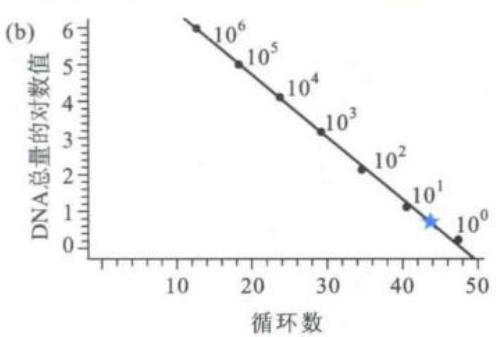  
图 5-14 用实时定量 PCR 法分析未知样品靶基因的绝对表达量

(a)扩增曲线：由已知总量(起始量从1至1000000个拷贝)的7个标准品和一个未知样品(三角形连线)得到的扩增曲线。随着PCR循环数(横坐标)的增加，代表PCR产物产量的荧光强度(纵坐标)增加。(b)标准曲线：纵坐标是每个标准品中所含DNA总量的对数值 $(\mathrm{lg})$ ，横坐标是每个标准品PCR产物荧光强度首次超过设定阈值(a中虚线)时反应所需的循环数（ $Ct$ 值）。由扩增曲线获得未知样品的 $Ct$ 值，通过对标准曲线的线性回归分析可计算出未知样品中靶DNA的起始量(星号)。

相对比值为 n，则 $n=1.8^{\Delta Ct}$ 。由此算出 WUS 基因在突变体植株中的表达丰度比在野生型拟南芥植株中提高了 $239 \pm 26.25$ 倍 $^{(表5-3)}$ 。

表 5-3 实时定量 PCR 相对定量实验的数据处理

<table><tr><td></td><td>野生型拟南芥(WT)</td><td>突变体拟南芥(Mu)</td><td> $\Delta Ct(AvgCt_{WT}-AvgCt_{Mu})$ </td><td>相对比值( $1.8^{\Delta Ct}$ )</td></tr><tr><td rowspan="3">WUS Ct 值</td><td>31.49</td><td>21.78</td><td></td><td></td></tr><tr><td>30.87</td><td>21.95</td><td></td><td></td></tr><tr><td>31.34</td><td>22.04</td><td></td><td></td></tr><tr><td>平均值(Avg)</td><td> $31.23 \pm 0.32$ </td><td> $21.92 \pm 0.13$ </td><td> $9.31 \pm 0.19$ </td><td> $239 \pm 26.25$ </td></tr></table>

\* 拟南芥野生型和突变体样品经由拟南芥管家基因(UBQ10)进行均一化处理。

## 5.2.6 基因组 DNA 文库的构建

把某种生物的基因组 DNA 切成适当大小, 分别与载体组合, 导入微生物细胞, 形成克隆。基因组中所有 DNA 序列(理论上每个 DNA 序列至少有一份代表) 克隆的总汇被称为基因组 DNA 文库, 常被用于分离特定的基因片段、分析特定基因结构、研究基因表达调控, 还可以用于全基因组物理图谱的构建和全基因组序列测定等。

构建基因组 DNA 文库的第一步是制备大小合适的随机 DNA 片段，在体外将这些 DNA 片段与适当的载体相连成重组子，转化到大肠杆菌或其他受体细胞中，从转化子克隆群中筛选出含有靶基因的克隆。为保证能从基因组文库中筛选到某个特定基因，基因组文库必须具有一定的代表性和随机性。也就是说文库中全部克隆所携带的 DNA 片段必须覆盖整个基因组。在文库构建中通常采用两种策略提高文库代表性：一是用机械切割法或限制性内切核酸酶切割法随机断裂 DNA，以保证克隆的随机性。二是增加文库重组克隆的数目，以提高覆盖基因组的倍数。预测一个完整基因组文库应包含的克隆数目，可用 Clark 和 Carbon 于 1975 年提出的公式：

$$
N = \ln (1 - p) / \ln (1 - f)
$$

式中，N 表示一个基因组文库所应该包含的重组克隆数目；p 表示所期望的靶基因在文库中出现的概率；f 表示重组克隆平均插入片段的长度和基因组 DNA 总长的比值。

为了获得整个基因簇或一个基因及其两翼延伸序列,实验中所制备的 DNA 随机片段一般约 20 kb 或更大。以人为例,其基因组大小为 $3 \times 10^{9}$ bp,若 p = 99%,平均插入片段大小为 20 kb,则 $N = 6.9 \times 10^{5}$ 。

构建基因组文库最常用的是 $\lambda$ 噬菌体载体(克隆能力 $15\sim 20\mathrm{kb}$ )和限制性内切酶部分消化法。常用识别4个核苷酸的限制性内切核酸酶Sau3A部分消化基因组DNA，因为Sau3A与BamH I是一对同尾酶，所以由Sau3A酶切产生的DNA片段可插入到经BamH I消化的 $\lambda$ 噬菌体载体上(基本流程如图5-15所示)。提取真核基因组DNA，用Sau3A局部消化，消化产物经琼脂糖凝胶电泳或者蔗糖梯度离心，收集相对分子质量为 $15\sim 20\mathrm{kb}$ 范围的DNA片段。同时用BamH I消化 $\lambda$ 噬菌体载体DNA，纯化后用T4连

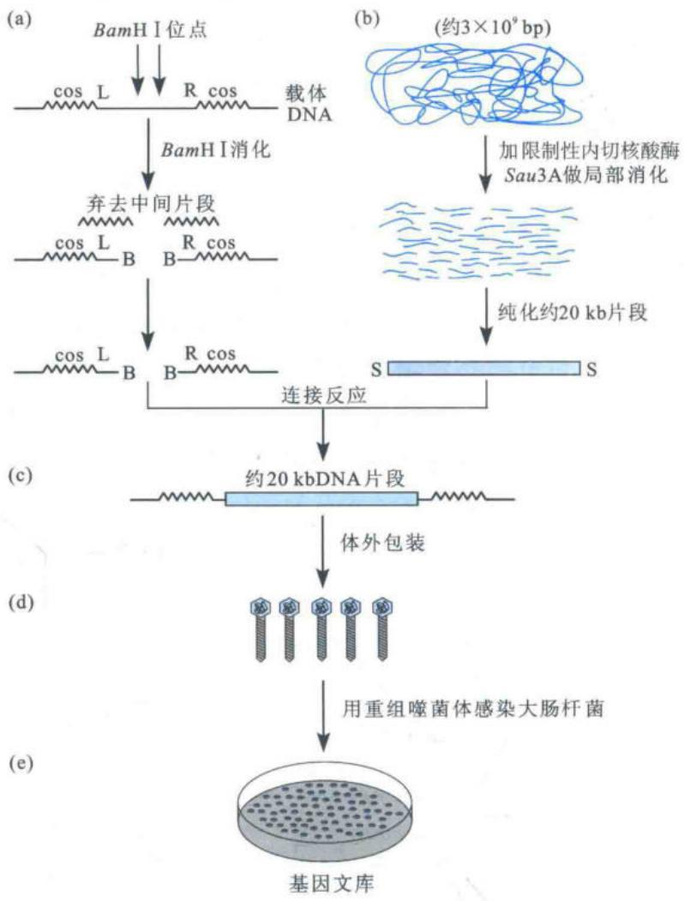

图 5-15 用 Sau3A 限制性内切核酸酶消化真核生物基因组 DNA 并利用 $\lambda$ 噬菌体载体构建基因组文库的过程图示

(a) 载体 DNA 片段的制备；(b) 真核基因组 DNA 片段的制备；(c) 体外连接载体 DNA 及基因组 DNA 片段的反应；(d) 体外包装；(e) 感染大肠杆菌细胞。B=BamH I 末端；S=Sau3A 末端。

接酶与收集的 DNA 片段相连接,形成嵌合分子。体外包装后用重组噬菌体感染大肠杆菌受体细胞,产生噬菌斑,组成包含该真核生物基因组绝大部分序列的 DNA 文库。 $\lambda$ 噬菌体文库构建方法简单高效,所获得的文库易于用分子杂交法进行筛选,因此被广泛用于细菌、真菌等基因组较小物种的研究。

此外,还有许多高容量克隆载体,如柯斯质粒、细菌人工染色体(BAC)、P1源人工染色体(PAC)、酵母人工染色体(YAC)都可用于基因组文库的构建。这些载体的优点是可以插入大片段DNA,如柯斯质粒可以接受大至45 kb的插入,但是稳定性相对较差,在大量的复制过程中容易出现缺失现象。BAC、YAC、PAC可以容纳70\~1000 kb的外源片段,主要用于基因组作图,测序和克隆序列的比对。

## 5.3 RNA 基本操作技术

真核生物基因组 DNA 非常庞大,而且含有大量重复序列,无论用电泳分离技术还是用杂交方法都难以直接分离到靶基因片段。而 cDNA(complementary DNA) 是来自反转录的 mRNA, 不含冗余序列, 通过特异性探针筛选 cDNA 文库, 可以较快地分离到相关基因。由于单链 RNA 分子不稳定且易发生降解, 在自然状态下难以被扩增, 因此, 为了研究 mRNA 所包含的功能基因信息, 一般将其反转录成稳定的 DNA 双螺旋, 再插入到可以自我复制的载体中。一个高质量的 cDNA 文库代表了生物体某一器官或者组织 mRNA 中所含的全部或绝大部分遗传信息。

## 5.3.1 总RNA的提取

细胞中的总 RNA 包括编码蛋白质的 mRNA 和不编码蛋白质的 ncRNA(rRNA、tRNA 以及其他 RNA)。一个典型的动物细胞约含 $10^{-5}\mu \mathrm{g}$ RNA, 其中 $80\% \sim 85\%$ 为 rRNA, $15\% \sim 20\%$ 为 tRNA 及其他 ncRNA, 这些 RNA 分子具有确定的大小和核苷酸序列, 特别是总 RNA 电泳后 rRNA 的 2 条特征性条带 28S 和 18S 是鉴定总 RNA 纯度和完整性的重要参数。mRNA 占总 RNA 的 $1\% \sim 5\%$ , 同时, 由于 mRNA 呈单链状, 容易受核酸酶的攻击, 对 RNA 的操作要求比 DNA 操作更严格, 要保证实验环境、所用器皿及溶液均没有 RNA 酶的污染。

总 RNA 的抽提方法有多种, 目前实验室常用的方法是用异硫氰酸胍 - 苯酚抽提法。Trizol 试剂是使用最广泛的抽提 RNA 专用试剂, 主要由苯酚和异硫氰酸胍组成, 可以迅速破坏细胞结构, 使存在于细胞质及核内的 RNA 释放出来, 并使核糖体蛋白与 RNA 分

图 5-16 总 RNA 提取

(a) 总 RNA 提取的主要实验流程；(b) 陆地棉不同组织的总 RNA 样品电泳图。

子分离, 还能保证 RNA 的完整。提取 RNA 时, 首先用液氮研磨材料, 匀浆, 加入 Trizol 试剂, 进一步破碎细胞并溶解细胞成分。然后加入氯仿抽提, 离心, 分离水相和有机相, 收集含有 RNA 的水相, 通过异丙醇沉淀, 获得比较纯的总 RNA, 用于下一步 mRNA 的纯化 $^{(图5-16a)}$ 。也可以将含有 RNA 样品的细胞破碎液通过硅胶膜纯化柱纯化。要根据不同植物组织的特点, 预先去除酚类、多糖或其他次生代谢产物对 RNA 的干扰。

同样可以通过测定 RNA 样本的 $OD_{260}$ 和 $OD_{280}$ 来判断其浓度和纯度。 $OD_{260}$ 为 1 时相当于浓度为 50 $\mu g/mL$ ,

当 $OD_{260}/OD_{280}$ 的比值在 1.8～2.0 之间，表示纯度较好，如果样品中有蛋白质或酚污染，则 $OD_{260}/OD_{280}$ 的比值将明显低于 1.8。而 $OD_{260}/OD_{280}$ 的比值大于 2.0，则说明提取的 RNA 可能有降解。可通过琼脂糖凝胶电泳检测 RNA，但要保证整个操作过程中没有 RNase 的污染。电泳后如果 rRNA 大小完整，而且 28S rRNA 和 18S rRNA 亮度接近 2:1，mRNA 分布均匀，则认为 RNA 质量较好（图 5-16b）。

## 5.3.2 mRNA 的纯化

真核细胞的 mRNA 分子最显著的结构特征是具有 5' 端帽子结构 ( $m^{7}G$ ) 和 3' 端的 poly(A) 尾巴, 这种 poly(A) 结构为真核生物 mRNA 的提取提供了极为方便的选择性标志, 实验中常用寡聚 (dT)-纤维素柱层析法获得高纯度 mRNA。该方法利用 mRNA 3' 端含有 poly(A) 的特点, 当 RNA 流经寡聚 (dT) 纤维素柱时, 在高盐缓冲液的作用下, mRNA 被特异性地结合在柱上, 再用低盐溶液或蒸馏水洗脱 mRNA。经过两次寡聚 (dT) 纤维柱后可得到较高纯度的 mRNA。实验中常用 poly(AT) Tract mRNA 分离系统将生物素标记的寡聚 (dT) 引物与细胞总 RNA 温育, 加入与微磁球相连的抗生物素蛋白以结合 poly(A) mRNA, 通过磁场吸附作用将 poly(A) mRNA 从总 RNA 中分离 (图 5-17)。

图 5-17 mRNA 的分离纯化过程简图  

## 5.3.3 cDNA 的合成

cDNA 的合成包括第一链和第二链 cDNA 的合成, 整个流程如图(图 5-18)所示。第一链 cDNA 的合成是以 mRNA 为模板, 反转录时加入寡聚(dT)做引物, 在反转录酶催化下形成 cDNA。寡聚(dT)引物一般包含 12\~20 个脱氧胸腺嘧啶核苷酸, 后面加一个连接引物(通常为 Xho I 等酶切位点)以便于克隆构建。

在 cDNA 合成的过程中, 应选用活性较高的反转录酶及甲基化 dCTP, cDNA 两端应加上不同内切酶所识别的接头序列, 保证所获得双链 cDNA 的方向性(图 5-19)。反应体系中一般加入甲基化 dCTP, 保证新合成的 cDNA 链被甲基化修饰, 以防止构建克隆时被限制性内切酶切割。第二链 cDNA 的合成是以第一链为模板, 由 DNA 聚合酶催化。常用 RNase H 切割 mRNA-cDNA 杂合链中的 mRNA 序列所产生的小片段为引物合成第二条 cDNA 的片段, 再通过 DNA 连接酶的作用连成完整的 DNA 链。此时加入含有另一个酶切位点的黏性接头 (如 EcoR I), 与 cDNA 相连接后用 Xho I 酶切, 使 cDNA 双链 5' 端和 3' 端分别具有 EcoR I 和 Xho I 黏性末端, 保证它与载体相连时有方向性。因为绝大多数大肠杆菌细胞都会切除带有 5'-甲基胞嘧啶的外源 DNA, 所以实验中常选用 mcrA-mcrB-菌株以防止 cDNA 被降解。

图 5-18 cDNA 合成过程示意图  

图 5-19 定向 cDNA 合成及分子修饰  

## 5.3.4 cDNA 文库的构建

由于 cDNA 的长度一般在 0.5 \~ 8 kb 之间, 常用的质粒载体和噬菌体类载体都能满足要求。cDNA 文库的载体选择要根据该文库的用途来确定, 例如常用的 Uni-zap XR 载体是一种 λ 噬菌粒载体, 具备噬菌体的高效性和质粒载体系统可利用蓝白斑筛选的便利, 可容纳 0 \~ 10 kb DNA 插入片段。该载体内部含有 pBluescript 载体的全部序列, 重组后可通过体内剪切反应 (in vivo excision) 将 cDNA 插入片段转移到质粒系统中进行筛选、克隆和序列分析。

含有 cDNA 插入片段的重组噬菌粒只有经过体外蛋白外壳包装反应,才能成为有侵染和复制能力的成熟噬菌体。DNA 和蛋白提取物的浓度、二者的体积比、反应温度及时间对包装效果都有很大影响,而包装反应结果的好坏对重组噬菌体的侵染能力至关重要。

用经包装的噬菌体感染大肠杆菌培养物后涂布在琼脂平板上，便会产生成千上万个独立噬菌斑，每个噬菌斑由一个重组噬菌体分子形成。一个比较完整的 cDNA 文库常包含大于 $5 \times 10^{5}$ 的独立克隆。一旦获得含有某种组织器官 cDNA 信息的噬菌粒文库，就可用于筛选目的基因、大规模测序、基因芯片杂交等功能基因组学研究。

## 5.3.5 基因文库的筛选

基因文库的筛选是指通过某种特殊方法从基因文库中鉴定出含有所需重组 DNA 分子的特定克隆的过程。主要筛选方法包括核酸杂交法、PCR 筛选法和免疫筛选法等。

## 1. 核酸杂交法

核酸杂交法以其广泛的适用性和快速性成为基因文库筛选中最常用的方法之一,常用放射性标记的特异 DNA 探针进行高密度的菌落杂交筛选(图 5-20)。将圆形硝酸纤维素膜放在含有琼脂培养基的培养皿表面,将待筛选菌落从其生长的平板上转移到硝酸纤维素膜上,进行适当温育。同时保留原来的菌落平板作对照。取出已经长有菌落的膜,用碱液处理,使菌落发生裂解,DNA 随之变性。接着用蛋白酶 K 处理硝酸纤维素膜去除蛋白质,形成菌落 DNA 的印迹。80℃烘烤滤膜,将 DNA 固定在膜上。将滤膜与放射性标记的 DNA 或 RNA 探针杂交,通过放射性自显影显示杂交结果。在 X 光底片上显黑色斑点的就是实验中寻找的目的克隆,可以通过对应于平板上的位置找到相应克隆。

也可用杂交筛选法进行重组噬菌斑的筛选。将硝酸纤维素膜覆盖在琼脂平板表面，使之与噬菌斑直接接触，噬菌斑中大量没有被包装的游离DNA及噬菌体颗粒便一齐转移到膜上。可从同一噬菌斑平板上连续印几张同样的硝酸纤维素膜，进行重复实验，而且可以使用两种或数种不同的探针筛选同一套重组子，提高结果的可靠性。

## 2. PCR 筛选法

PCR 筛选法与核酸杂交筛选法具有同样的通用性,而且操作简单,但前提是已知足够的序列信息并获得基因特异性引物。例如要从一个基因组 DNA 文库筛选目的基因,首先将整个文库(以质粒或菌落的形式均可)保存在多孔培养板上,用设计好的目的基因探针对每个孔进行 PCR 筛选,鉴定出阳性的孔,把每个阳性孔中的克隆再稀释到次级多孔板中进行 PCR 筛选。重复以上程序,直到鉴定出与目的基因对应的单个克隆为止。

图 5-20 通过核酸杂交筛选目的克隆流程图  
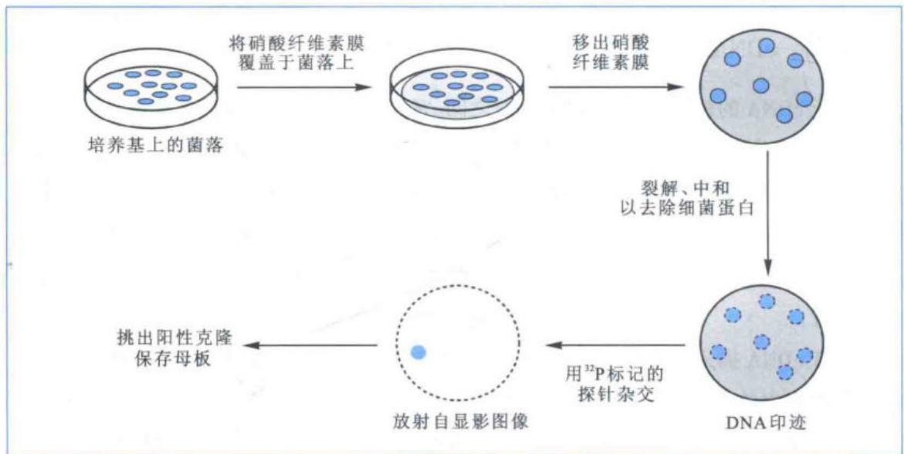

  
图 5-21 噬菌体表达文库的免疫化学筛选法示意图

## 3. 免疫筛选法

由于免疫筛选法是基于抗原抗体特异性结合原理,所以该法适用于对表达文库的筛选。也就是说如果该 DNA 或者 cDNA 文库是用表达载体构建的,每个克隆都可以在宿主细胞中表达,产生所编码的蛋白质,就可以用免疫筛选法进行筛选。即使实验中靶基因的序列完全未知,只要拥有针对该基因产物的特异性抗体,也能用这个方法进行筛选。

免疫检测与菌落或噬菌斑的核酸杂交相似,先将菌落或噬菌斑影印到硝酸纤维素膜上,原位溶解菌落释放抗原蛋白,再用抗体与固定了抗原的膜杂交,抗原抗体结合后,再用标记的二抗与之反应,通过对标记物的检测,就可以找到阳性克隆(图5-21)。

## 5.3.6 非编码 RNA 研究

高等真核生物的基因组中,蛋白质编码区只占很少一部分,非蛋白质编码区占据基因组中绝大部分位置。而高等真核生物基因组中一半以上的DNA会转录为RNA,所以大部分RNA是不编码蛋白质的,这些RNA被统称为非编码RNA(non-coding RNA,ncRNA)。非编码RNA种类很多,依据功能不同,可分为两类,一类是组成型的非编码RNA,如rRNA和tRNA,它们是蛋白质合成机器的重要组成成员;另一类是调控型的非编码RNA,包括miRNA(microRNA)、siRNA(small interfering RNA)、piRNA(piwi-interacting RNA)、snRNA(small nuclear RNA)、snoRNA(small nucleolar RNA)、lncRNA(long non-coding RNA)及circRNA (circular RNA) 等, 它们在转录和翻译水平调控基因表达, 维持基因组的稳定, 或在细胞功能与命运的决定中发挥至关重要的作用。由于非编码 RNA 在序列特征及调控功能上的复杂性, 目前的研究主要集中在非编码 RNA 基因的发现和生物学功能的鉴定层面上。

非编码 RNA 不像 mRNA 那样有一个标志性的 poly(A) 尾巴的结构, 无法通过寡聚 (dT) 直接分离, 而其他的分离方式又会受到含量较大的 rRNA 及部分 tRNA 的干扰, 所以目前只能依据非编码 RNA 的大小和形态结构, 通过以下几种方式分离出不同的非编码 RNA $^{(图 5-22)}$ 。

  
图5-22 不同非编码RNA的分离方法示意图

对于较短的,如 miRNA、siRNA、piRNA 等常常小于 50 nt 的非编码 RNA 的分离。提取总 RNA 后,用聚丙烯酰胺电泳分离出小于 50 nt 的 RNA,割胶回收并用乙醇将 RNA 沉淀出来,一般加入糖原和乙酸钠做助沉剂,也可用专一性吸附小片段 RNA 的硅胶膜柱子纯化。用 T4 RNA 连接酶处理纯化后的 RNA 样品,在其 3' 端连接一段寡核苷酸序列如 poly(dA),在反转录酶催化下合成 cDNA 第一链,用 DNA 聚合酶催化形成双链 cDNA。用 A 尾酶(A-tailing)在双链 cDNA 的 3' 端加上一个 dAMP,再将带有一个 dTMP 的接头引物加到双链 cDNA 的两端,进行 PCR 扩增,进一步用于测序或文库构建等。

也可以从总RNA样品中去除rRNA和tRNA，再分离其他非编码RNA。该方法首先合成rRNA和tRNA特异性生物素标记的寡核苷酸探针，这些探针与各种rRNA及tRNA杂交，杂合链因为带有生物素标记而被偶联了链霉亲和素的磁珠高效捕获，链霉亲和素与生物素之间稳定的非共价结合使得生物素标记的双链分子紧密结合在磁珠上。用磁铁将磁珠从样品中分离，就排除了这两种组成型RNA的干扰。将剩余的RNA样品随机打断成200\~300 bp的片段，用六聚体引物N6反转录合成cDNA。这个样品中包含了全部mRNA和非编码RNA的信息，测序完成后，借助mRNA的典型特征，如起始子、终止子、可读框及剪切位点等将其分离去除，再根据各种非编码RNA的结构特征，通过不同的生物学软件进行归类分析。

非编码 RNA 中有一类具有闭合环状结构的 RNA 分子, 称 cirRNA, 利用它的这一特殊结构可单独将其分离出来。将 rRNA 和 tRNA 从总 RNA 中除去后, 使用具有 3' 端核糖核酸外切酶活性的 RNase R 专一性降解单链线性 RNA 分子, 即可将 mRNA 和其他线性非编码 RNA 一并除去, 留下环状的 RNA 分子。将环状 RNA 分子随机打断, 用六聚体引物 N6 在反转录酶的催化下合成 cDNA, 按前面介绍的程序进行建库测序等后续分析。

## 5.4 基因克隆技术

在当今生命科学的各个研究领域中，“克隆”（clone）一词已被广泛使用。在多细胞的高等生物个体水平上，人们用克隆表示由具有相同基因型的同一物种的两个或数个个体组成的群体，所以说，从同一受精卵分裂而来的单卵双生子（monozygotic twins）便是属于同一克隆。在细胞水平上，克隆一词是指由同一个祖细胞（progenitor cell）分裂而来的一群带有完全相同遗传物质的子细胞。在分子生物学上，人们把将外源DNA插入具有复制能力的载体DNA中，使之得以永久保存和复制这种过程称为克隆。由于真核生物基因组DNA十分复杂，实验中常通过筛选由mRNA产生的cDNA文库来分离到目的基因片段。高等生物虽然可拥有3万\~5万种不同的基因，但在一定时间段的单个细胞或组织中，仅有15%左右的基因得以表达，产生出5000\~10000种不同的mRNA分子，使得筛选过程相对简单些。

## 5.4.1 RACE技术

cDNA 末端快速扩增法 (rapid amplification of cDNA ends, RACE) 是一项在已知 cDNA 序列的基础上克隆 5' 端或 3' 端缺失序列的技术，在很大程度上依赖于 RNA 连接酶连接和寡聚帽子的快速扩增。已知 cDNA 序列可来自序列表达标签，减法 cDNA 文库，差式显示和基因文库筛选。主要操作步骤如下 (图 5-23):

① 获得高质量总 RNA。含有大量完整 mRNA、tRNA、rRNA 和部分不完整 mRNA。

② 去磷酸化作用。带帽子结构的 mRNA 不受影响。

③ 去掉 mRNA 的 5' 帽子结构, 加特异性 RNA 寡聚接头并用 RNA 连接酶相连接。

④ 以特异性寡聚 dT 为引物, 在反转录酶的作用下, 反转录合成第一条 cDNA 链, 包含了寡聚接头的互补序列。

⑤ 分别以第一链 cDNA 为模板进行 RACE 反应。5' RACE 以 5' 端 RNA 寡聚接头的部分序列和基因特异的 3' 端反向引物进行 PCR 扩增，获得基因的 5' 端序列。3' RACE 以 5' 端基因特异的引物和 3' 端寡聚 dT 下游部分序列为引物进行 PCR 扩增，获得基因的 3' 端序列。如果只对 3' 端序列感兴趣，可以越过 2、3 两步，直接从第 4 步开始进行 3' RACE。

⑥ 将纯化后的 PCR 产物克隆到载体 DNA 中, 进行序列分析。除了获得全长 cDNA 之外, RACE 技术还被用于获得 5' 和 3' 端非转录序列, 研究转录起始位点的不均一性, 研

图 5-23 5'(a) 和 3'
(b) RACE 流程图  

① 在反转录酶的作用下，用已知基因片段内部特异性引物(gene-specific primer 1, GSP1)起始cDNA第一条链的合成。

② 用 RNase 混合物降解模板 mRNA 并纯化已合成的 cDNA 第一条链。

③ 由末端转移酶在已合成的 cDNA 链的 3' 端连续加入 dCTP, 形成寡聚 (dC) 尾巴。

④ 以连有寡聚(dC)的锚定引物 AP(anchor primer) 和基因片段内部特异引物 GSP2 进行巢式 PCR 扩增, 以期得到目的基因 5' 端片段。

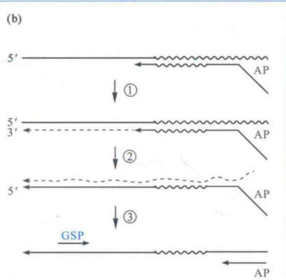  
① 在反转录酶的作用下，以连有可以与 mRNA 3' 多核苷酸末端配对的寡聚 (dT) 锚定引物 AP 起始 cDNA 第一条链的合成。  
② 用 RNase 降解模板 mRNA。

③ 用锚定引物 AP 和基因片段内部特异引物 GSP 进行 PCR 扩增，以期得到目的基因 3' 端片段。

究启动子区的保守性。

## 5.4.2 RAMPAGE 技术

高等真核生物往往具有复杂的基因组,很多基因的表达都具有组织特异性,可变的启动子选择是造成基因在不同组织特异表达的根本原因,所以有必要对启动子做全面而深入的分析。RAMPAGE(RNA annotation and mapping of promoters for the analysis of gene expression)技术是在基因表达的加帽分析技术(cap analysis of gene expression, CAGE)和前面介绍的 RACE 技术的基础上进一步优化的实验技术,是一种在全基因组范围内鉴定所有蛋白质编码基因和部分非编码 RNA 基因的转录起始位点,确定启动子的具体位置,并且能够高通量检测基因表达水平的方法。

首先在带接头序列的随机引物作用下反转录已除去 rRNA 和 tRNA 的总 RNA 样本, 加入山梨醇和海藻糖可提高酶的热稳定性。将反转录酶的工作温度从 42℃ 提高到 55\~60℃, 以进一步解开 RNA 模板可能的二级结构, 削弱 RNA 5' 端由于 GC 含量较高而相对牢固的二级结构, 使得反转录能延伸到 RNA 5' 端帽结构处。在 RNA 链的末端引入生物素标记, 利用 NaIO₄ 的氧化特性, 通过氧化反应将位于所有 RNA 5' 端帽子结构处以及 3' 端的二醇基团打开, 并使其氧化产物醛基与长臂生物素酰酐反应, 从而在 RNA 5' 端帽子结构处以及 3' 端加上一个生物素。由于随机引物很少刚好结合到 RNA 的 3' 端, 因此 RNA 的 3' 端在大多数情况下仍然是单链, 用 RNase I 特异性切割单链状态的 RNA, 去掉 3' 端的生物素标记。最后, 用偶联了链霉亲和素的磁珠筛选出 5' 端帽结构处加上生物素标记的 RNA-cDNA 双链。然后用 RNase H 将磁珠上的 RNA 降解掉, 再从磁珠上分离单链 cDNA。

得益于反转录酶的末端转移酶(terminal deoxynucleotidyl transferase, TdT)活性, 它能催化脱氧核糖核苷酸结合到 DNA 分子的 3' 羟基端, 使反转录产生的 cDNA 3' 端加上了 3 个胞嘧啶脱氧核糖核苷酸(dCTP), 同时 RNA 的 5' 端帽结构(m $^{7}$ G)也有利于 dCTP 的添加。所以, 在反转录时加入一段末端有 3 个鸟嘌呤核糖核苷酸(GTP)的锚定引物, 即可让所有反转录产生的 cDNA 3' 端带上这一锚定引物。利用这一锚定引物和随机引物上的接头序列做引物进行 PCR 扩增, 形成双链 cDNA $^{(图 5-24)}$ , 然后用一种纳米级的微球磁珠进行纯化和相对分子质量大小筛选。筛选获得包含帽子结构端序列的 200\~700 bp 的 cDNA 后便可用高通量二代测序技术进行序列分析等。

## 5.4.3 Gateway 大规模克隆技术

随着越来越多的动植物基因组全序列被测定,前所未有的编码基因(开放读码框)被识别,但是,要阐明这些基因的功能,就必须把不同的开放读码框连入各种载体,进行蛋白质表达、抗体制备、宿主细胞或植物转化、表型分析、细胞内定位以及目的蛋白与其他分子的相互作用等后续研究。传统的酶切连接方法不能满足大规模克隆的需要,只有通过一种高效的对载体和宿主没有依赖性的克隆系统,才能完成这项繁杂的工作。Gateway 基因大规模克隆技术利用 $\lambda$ 噬菌体进行位点特异性 DNA 片段重组,实现了不需要传统的酶切联接过程的基因快速克隆和载体间平行转移,为大规模克隆基因组注释的开放读码框提供了保障。

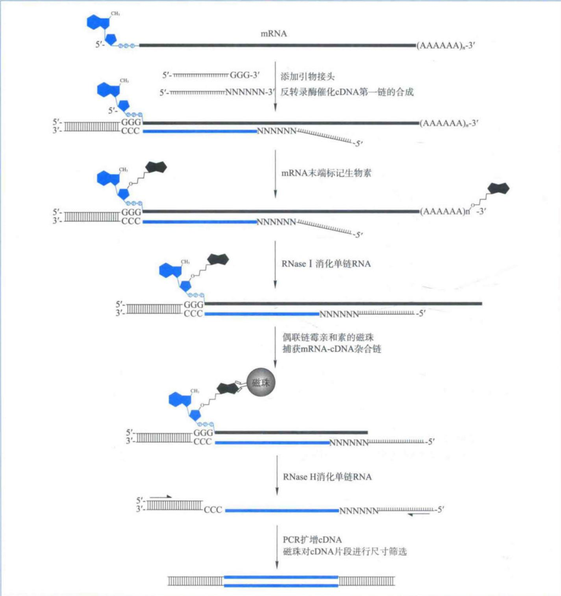  
图5-24 RAMPAGE技术操作流程图

Gateway 克隆技术主要包括 TOPO 反应和 LR 反应两步。TOPO 反应将目的基因 PCR 产物连入 Entry 载体，该载体上的 CCCTT 能被拓扑异构酶所识别，切开后通过该酶 274 位上的酪氨酸与切口处的磷酸基团形成共价键，被偶联在载体上。加入 PCR 产物后，载体上 3' 突出端 GTGG 与 PCR 产物的互补性末端接头序列 CACC 配对, 使 PCR 产物以正确方向连入 Entry 载体(图 5-25a)。

  
图5-25 Gateway大规模克隆策略  
(a) TOPO 反应, 将由 PCR 得到的目的基因连入 Entry 载体; (b) LR 反应, 通过位点特异性重组将目的基因从 Entry 载体连入表达载体。

LR 反应被用于将目的片段从 Entry 载体中重组入表达载体。Entry 载体上基因两端具有 attL1 和 attL2 位点，目的载体上含有 attR1 和 attR2 位点，在重组蛋白的作用下发生定向重组，形成新的位点 attB1 和 attB2，将目的基因转移到表达载体中(图 5-25b)。

## 5.4.4 基因的图位克隆法

基因的图位克隆法（map-based cloning）是分离未知性状目的基因的一种好方法，从理论上说，所有具有某种表型的基因都可以通过该方法克隆得到。首先，通过构建遗传连锁图，将目的基因定位到某个染色体的特定位点，并在其两侧确定紧密连锁的RFLP或RAPD分子标记。其次，通过对许多不同生态型个体的大量限制性内切酶和杂交探针的分析，找出与目的基因距离最近的分子标记，通过染色体步移技术将位于这两个标记之间的基因片段分离并克隆出来(图5-26)，再根据基因功能互作原理鉴定目的基因。

在 RFLP 作图中, 连锁距离是根据重组率来计算的, 1 cM(厘摩) 相当于 1% 的重组率。人类基因组中, 1 cM≈1000 kb; 拟南芥中, 1 cM≈290 kb; 小麦中, 1 cM≈3500 kb。

由于水稻基因组比较小,与其他单子叶植物有较高的共线性现象,其基因组序列已经被测定,基因转化系统也比较完善,所以成为单子叶植物功能基因研究的模式系统。科学家已利用自主筛选的水稻突变体和高密度分子标记遗传图谱,应用该技术成功地分离出多个具有重要生理功能的水稻基因,包括控制水稻分蘖的关键基因 MOC1 和控制植株茎秆强度的脆杆基因 BC1。图 5-27 介绍了图位法克隆 BC1 基因的实验流程。

图5-26 染色体步移法克隆基因示意图

(a) 首先将 BCl 位点定位于水稻 3 号染色体 (Chr3) 着丝粒区的分子标记 C524a 和 RM16 之间。(b) 覆盖 BCl 位点的 BAC 大片段, 数字表示从 7068 个 bcl-2 突变体 $F_{2}$ 植株中鉴定出的重组子数目。(c) BCl 位点的精细定位。BCl 位点被定位于 CAPS (cleaved amplified polymorphic sequence) 分子标记 P2 和 P4 之间 3.3 kb 的 DNA 区段, 并与 P3 标记共分离。(d) BCl 基因结构。实心矩框为编码区, 空心矩框为 5' 和 3' 非翻译区, 矩框之间的线段为内含子。bcl-1 和 bcl-2 表示两个脆杆突变体的突变位点。

图 5-27 用图位克隆法获得水稻脆杆基因 BCl  
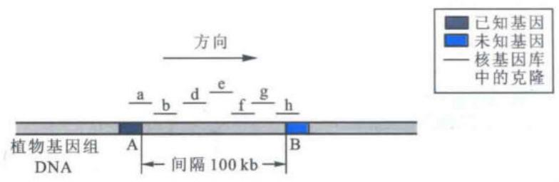

## 5.4.5 热不对称交错多聚酶链式反应克隆 T-DNA 插入位点侧翼序列

热不对称交错多聚酶链式反应(thermal asymmetric inter-laced PCR, TAIL-PCR)常用于扩增T-DNA插入位点侧翼序列，从而获得转基因植物插入位点特异性分子证据(图5-28)。该方法使用一套巢式(nested)特异引物(T-DNA边界引物, TR)和一个短的随机简并引物(AD)。第一轮反应(primary reaction, PCR I)是TAIL-PCR的重要环节，先进行5轮高严谨性循环，特异性引物TR1与模板退火，只能发生单引物循环，T-DNA上游侧翼序列得到线性扩增。再大幅度降低退火温度，使AD及TR1均与模板DNA相结合，指数扩增一个循环。此后，两个高严谨、一个低严谨循环交替进行，共15个循环。特异性序列(两端分别拥有TR1和AD序列)和非特异性序列I（只有TR1，没有AD序列）大大超过非特异性序列Ⅱ(两端均为AD序列)。

PCR II 以 TR2 为特异性引物与 AD 配对, 进行 12 个 TAIL-PCR 循环, 特异性序列再次被优先扩增, 非特异性序列 I 也大大降低, 此时已没有明显的背景片段。PCR III 是真正意义上的 PCR, 用 TR3 为特异性引物与 AD 配对, 共 20 个循环, 进一步扩增特异性序列。

  
图 5-28 热不对称交错多聚酶链式反应 (TAIL-PCR) 流程图

## 5.5 蛋白质与蛋白质组学技术

蛋白质组学是蛋白质(protein)和基因组(genome)研究在形式和内容两方面的完美组合,该技术致力于研究某一物种、个体、器官、组织或细胞在特定条件、特定时间所表达的全部蛋白质图谱。蛋白质组与基因组既相互对应又存在显著不同,因为基因组是确定的,组成某个体的所有细胞共同享有固定的基因组,而各个基因的表达调控及表达程度却会根据时间、空间和环境条件发生显著的变化,所以,不同器官、组织或细胞内拥有不同的蛋白质组。由于蛋白质分离(改进后的双向电泳技术和高效液相层析技术)和鉴定技术(现代质谱)的快速发展,以及基因组学研究和生物信息学的交叉渗透,蛋白质组学研究在近年来获得了长足的进展。

## 5.5.1 双向电泳技术

到目前为止,双向电泳(two-dimensional electrophoresis,2-DE)技术是分离大量混合蛋白质组分的最有效方法,该技术主要依赖于蛋白质等电聚焦(isoelectric focusing,IEF)及SDS-聚丙烯酰胺凝胶(SDS-PAGE)双向电泳技术(图5-29),通过等电点和相对分子质量分离不同的蛋白质。

蛋白质是两性分子,在不同 pH 的缓冲液中表现出不同的带电性,因此,在电流的作用下,在以两性电解质为介质的电泳体系中,不同等电点的蛋白质会聚集在介质上不同的区域(等电点)从而被分离。因为聚丙烯酰胺凝胶中的去垢剂 SDS 带有大量的负电荷,与之相比,蛋白质所带电荷量可以忽略不计。所以,蛋白质在 SDS 凝胶电场中的运动速度和距离完全取决于其相对分子质量而不受其所带电荷的影响,不同相对分子质量的蛋白质将位于凝胶的不同区段而得到分离。

固相化 pH 梯度技术 (immobilized pH gradients, IPG) 的应用, 建立了稳定的可精确设定的 pH 梯度, 直接避免了载体两性电介质向阴极漂移等许多缺点, 增大了蛋白质上样量, 大大提高了双向凝胶电泳结果的可重复性。随着各种试剂质量的不断提高和新试剂的开发, 双向凝胶的分辨率空前提高, 其最大分辨率已达到每块胶 10 000 个蛋白点。

## 5.5.2 荧光差异显示双向电泳技术

早期的蛋白质组学研究内容主要是蛋白质组的表达模式,即利用常规2-DE技术鉴定并建立某一生物体在特定时期的全部蛋白表达谱。然而蛋白质组在生物体的生命进程中是动态变化的,不同生物的个体、组织或细胞在不同发育时期、分化阶段,以及不同的生理、病理条件下基因表达是不一致的,所对应的蛋白质组也具有特异性。于是,比较蛋白质组学(comparative proteomics)应运而生,并逐渐成为后基因组学时代的重要技术。

图 5-29 用 2-DE 胶展示拟南芥种子萌发 48 h 后的蛋白质表达情况  
  
第5章 分子生物学研究法(上) 仅供个人科学教研

得益于 CyDye DIGE 荧光标记染料的发现和应用,荧光差异显示双向电泳技术(2-D fluorescence difference gel electrophoresis, 2D-DIGE)在传统 2-DE 技术上结合多重荧光分析技术,基本克服了传统 2-DE 的系统误差问题,提高了实验结果的可重复性和可信度。以最小标记法为例,试验中用 3 种荧光染料对不同样本分别进行标记,所有标记样本混合后,在同一块胶上通过双向电泳得到有效分离,对每块凝胶进行 Cy2、Cy3 和 Cy5 3 次扫描,所得图像经过统计分析软件进行自动匹配和统计分析,鉴别和定量分析不同样本间的生物学差异(图 5-30)。该技术可检测低至 25 pg 的单一蛋白质,能对多达 5 个数量级的蛋白质浓度变化给出线性反应,而常规银染法只能检测低至1\~60 ng的蛋白质,仅有约2个数量级的线性动态范围。虽然2D-DIGE极大地降低了实验中出现的系统误差,但由于所用荧光染料在不同波长激发光下表现出不同的荧光特性,低丰度蛋白质定量仍较易出现偏差。

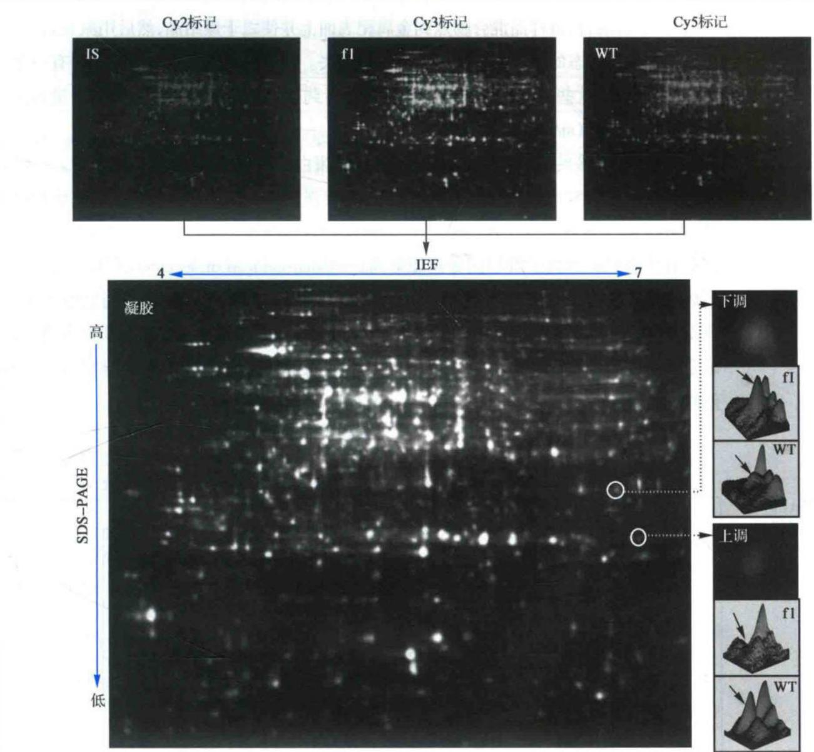  
图 5-30 野生型陆地棉 ‘徐州 142’（WT）和无长绒无短绒突变体（fl）0 DPA 胚珠总蛋白 2D-DIGE 比较分析图谱（另见书末彩插）用 Cy2 标记 WT 和 fl 0 DPA 胚珠等量混合蛋白作为内标（显示为蓝色），Cy3 标记 fl 胚珠蛋白（显示为绿色），Cy5 标记 WT 胚珠蛋白（显示为红色）。图中绿色蛋白点代表 WT 0 DPA 胚珠中相对于 fl 下调的蛋白质，红色蛋白点则代表 WT 0DPA 胚珠中相对于 fl 上调的蛋白质。

## 5.5.3 蛋白质质谱分析技术

蛋白质组学中最有意义的突破是用质谱鉴定电泳分离后的蛋白质。现行的质谱仪可分为3个连续的组成部分，即离子源、离子分离区和检测器。目前常用的是基质辅助的激光解析电离-飞行时间质谱（matrix-assisted laser desorption ionization time-of-flight spectrometry, MALDI-TOF）和电喷雾质谱(electrospray ionisation, ESI-MS)。MALDI-TOF的工作原理是将从2-DE胶中分离得到的或其他来源的蛋白质酶解成小肽段后与基质(主要是有机酸)混合，将样品混合物点到金属靶表面上并使之干燥结晶，然后用激光轰击，将呈离子化气体状态的待分析物从靶表面喷射出去。离子化的气体中每个分子带有一个或更多的正电荷，这些气体肽段在电场中被加速后到达检测器的时间由肽段的质量和其所带电荷数的比值(m/z)决定(图5-31)。

实验中,将感兴趣的蛋白点回收后,进行胰蛋白酶胶内酶解,收集酶解肽段。一级质谱将经蛋白酶降解后的肽段按照质荷比(m/z)及强度(intensity)进行解析,形成肽指纹图谱(PMF),每个母离子峰代表一种肽段,其强度代表了肽段多少。二级质谱是挑选一级质谱中有代表性的母离子峰以诱导碰撞解离(collision-induced dissociation,CID)方式打碎,形成肽段碎片指纹图谱(PFF)。然后,结合一级PMF和二级PFF数据,进行数据库搜索,获得蛋白质的具体鉴定信息(图5-32)。此外,质谱技术还可以用于鉴定蛋白质复合物组成、确定蛋白质翻译后修饰的类型与发生位点,例如用于蛋白磷酸化、硫酸化、糖苷化以及其他修饰的研究。

图 5-31 MALDI-TOF 分子质谱仪原理图  
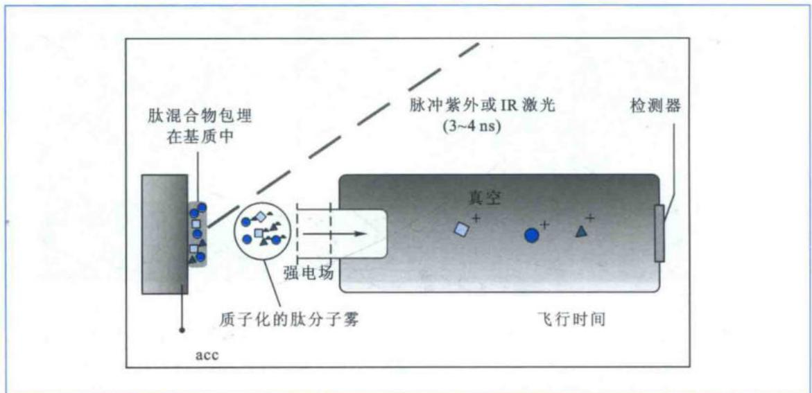

  
图 5-32 典型蛋白质一级和二级质谱鉴定结果(另见书末彩插)

将明显诱导的蛋白点(Spot 1, 左上箭头所示。来自图 5-30 中表达量上调的蛋白点)回收后, 进行胰蛋白酶胶内酶解, 收集酶解肽段。一级质谱将蛋白质经酶解后的肽段按照质荷比(m/z)及强度(intensity)进行解析, 形成肽指纹图谱(PMF), 每个母离子峰代表一种肽段, 其强度代表了肽段多少。二级质谱是挑选一级质谱中有代表性的母离子峰以诱导碰撞解离(CID)方式打碎, 形成肽段碎片指纹图谱(PFF)。然后, 结合一级PMF和二级PFF数据, 进行数据库搜索, 获得具体的蛋白质鉴定信息。

## 思考题

1. 试述 PCR 扩增的原理和步骤。

2. 试比较常规重组载体构建和恒温一步法载体构建的异同点。

3. 比较荧光染料 SYBR Green I 和 TaqMan 荧光探针的主要不同点。

4. 分析基因组 DNA 文库和 cDNA 文库的主要区别。

5. cDNA 合成时的方向性是如何实现的?

6. 热不对称交错多聚酶链式反应(TAIL-PCR)的主要技术和原理?

7. 说说从总 RNA 的提取到分离出非编码 RNA 的主要过程。

8. 已知一个 cDNA 3' 端的部分序列,请设计实验流程得到该基因的全长 cDNA。

9. 试分析 RACE 技术与 RAMPAGE 技术的相同点和不同点。

10. 简述 Gateway 大规模克隆技术原理及基本操作流程。

11. 说说基因图位克隆法的原理和过程。

12. 比较基因组与蛋白质组的主要差别。

13. 说出蛋白质质谱技术的主要原理。

## 参考文献

1. Gefter M L, et al. The enzymatic repair of DNA. I. Formation of circular lambda-DNA. PNAS, 1967, 58: 240-247.

2. Hedgpeth J, et al. DNA nucleotide sequence restricted by the RI endonuclease. PNAS, 1972, 69:3448-

3452.

3. Olivera B M, Lehman I R. Linkage of polynucleotides through phosphodiester bonds by an enzyme from Escherichia coli. PNAS, 1967, 57: 1426–1433.

4. Venter J C, et al. The sequence of the human genome. Science, 2001, 291: 1304–1351.

5. Weiss B, Richardson C. Enzymatic breakage and joining of deoxyribonucleic acid, I. Repair of single-strand breaks in DNA by an enzyme system from Escherichia coli infected with T4 bacteriophage. PNAS, 1967, 57:1021-1028.

6. Wilmut I, et al. Viable offspring derived from fetal and adult mammalian cells. Nature, 1997, 385:810-813.

7. Zimmerman S B, et al. Enzymatic joining of DNA strands: a novel reaction of diphosphopyridine nucleotide. PNAS, 1967, 57: 1841–1848.

数字课程学习

e 教学课件

目在线自测

思考题解析
