# 第7章 原核基因表达调控

<!-- 章节边界按正文内容恢复；原始 MinerU 内容保留如下。 -->

# 原核基因表达调控

7.1 原核基因表达调控总论

7.2 乳糖操纵子与负控诱导系统

7.3 色氨酸操纵子与负控阻遏系统

7.4 其他操纵子

7.5 固氮基因调控

7.6 转录水平上的其他调控方式

7.7 转录后调控

在自然界,原核生物及单细胞真核生物直接暴露在变幻莫测的环境中,能量供应常常没有保障,它们只有适应不同的环境来合成各种不同的蛋白质,使代谢过程适应环境的变化,才能维持自身的生存和繁衍。虽然高等真核生物代谢途径和食物来源都比较稳定,但它们是多细胞有机体,在个体发育过程中出现细胞分化,形成各种组织和器官,而不同类型的细胞所合成的蛋白质在质和量上都是不同的。因此,不论是真核细胞还是原核细胞都有一套准确地调节基因表达和蛋白质合成的机制。

自然选择倾向于保留高效率的生命过程。在单细胞生物群体中,如果出现一个细胞代谢总效率增加的突变细胞,它的生长将略快于野生型,只要有足够的时间,该突变细胞系将占据整个细胞群体的主导地位。例如,在一个每30 min增殖一倍的 $10^{9}$ 细菌群体中,若有一个细菌变成了29.5 min增殖一倍,大约经过80天的连续生长后,这个群体中99.9%的细菌都是29.5 min增殖一倍的生长速度(在这个过程中要不断补充新的培养液,否则细菌将在一两天内停止生长)。

原核生物细胞的基因组较小,编码的蛋白质种类较少。据估计,一个原核细胞中总共含有 $10^{7}$ 个蛋白质分子。大肠杆菌基因组约为 $4.60 \times 10^{6}$ bp,共有4288个开放读码框,如果每个基因等同翻译的话,任何一个多肽应有约2500个拷贝。但是事实上,这些蛋白质并不是以相同拷贝数存在于每个细胞中,有些蛋白质的数量在细胞中相当稳定,而另一些蛋白质的数量则波动很大。例如,每个大肠杆菌细胞有约15000个核糖体,与其结合的约50种核糖体蛋白数量也是十分稳定的。糖酵解体系的酶、DNA聚合酶、RNA聚合酶等细胞代谢过程和生长发育过程中必需的蛋白质,合成速率不受环境变化或代谢状态的影响,这一类蛋白质称为组成型(constitutive)合成蛋白质。其他参与糖代谢的酶和氨基酸、核苷酸合成系统的酶类,其合成速度和总量都随着环境的变化而改变,这些细胞内合成速率明显受环境影响而变化的蛋白质称为适应型或调节型(adaptive or regulated)合成蛋白质。例如一般情况下,一个大肠杆菌细胞中只有15个β-半乳糖苷酶分子,但若将大肠杆菌培养在只含乳糖的培养基中,每个细胞中这个酶的量可高达几万个分子。

细菌中大多数的基本调控机制一般执行如下规律:一个体系在需要时被打开,不需要时被关闭。这种“开-关”(on-off)机制是通过调节基因转录来建立的,也就是说通过调节mRNA的合成来实现。实际上,当我们说一个系统处于“off”状态时,也可能有本底水平的基因表达,常常是每世代每个细胞只合成1或2个mRNA分子和极少量的蛋白质分子。为了方便,我们常常使用“off”这一术语,但必须明白所谓“关”实际的意思并不是说这个基因不表达,而是其表达量特别低,低至很难甚至无法检测到。

## 7.1 原核基因表达调控总论

我们知道,所有生物的遗传信息,都是以基因的形式储藏在细胞内的 DNA(或 RNA)分子中。随着个体的发育,DNA 分子能将其所承载的遗传信息,有序地通过密码子-反密码子系统,转变成蛋白质分子,执行各种生理生化功能,完成生命的全过程。科学家把这个从 DNA 到蛋白质的过程称为基因表达(gene expression)(图 7-1)。对该过程的调节就称为基因表达调控(gene regulation 或 gene control)。基因表达调控是现阶段分子生物学研究的中心课题。要了解生物生长发育的规律、形态结构特征和生物学功能,就必须弄清楚基因表达调控的时间和空间概念。

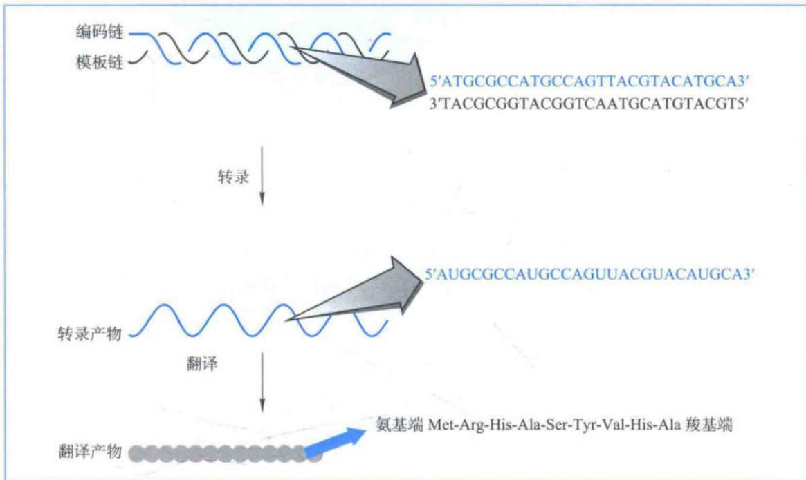  
第一步是由RNA聚合酶以DNA双链中的模板链为模板，合成与模板链序列完全互补(除了T被置换成U之外)的RNA链；第二步以RNA链为模板，在核糖体的作用下翻译成为由氨基酸组成的多肽链。

图 7-1 生物体基因表达的过程

基因表达调控主要表现在以下两个方面：

① 转录水平上的调控(transcriptional regulation);

② 转录后水平上的调控(post-transcriptional regulation)。

转录后水平上的调控又包括两个方面：

① mRNA 加工成熟水平上的调控 (differential processing of RNA transcript);

② 翻译水平上的调控(differential translation of mRNA)。

基因调控的指挥系统也是多样的,不同的生物使用不同的信号来调控基因表达。原核生物中,营养状况(nutritional status)和环境因素(environmental factor)对基因表达起着举足轻重的作用。在真核生物尤其是高等真核生物中,激素水平(hormone level)和发育阶段(developmental stage)是调控基因表达的最主要因素,营养和环境因素的影响力大为下降。

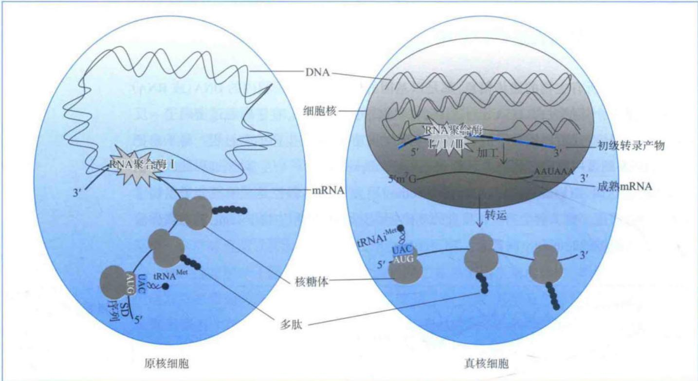  
图 7-2 真核与原核生物转录及翻译调控的总体特征比较

在转录水平上对基因表达的调控决定于 DNA 的结构、RNA 聚合酶的功能、蛋白质因子及其他小分子配基的相互作用。在研究转录及转录调控以前，我们先来分析一下原核与真核生物转录与翻译的特点。因为原核细胞没有细胞核，mRNA 边合成边结合核糖体，所以，原核细胞的转录与翻译过程几乎同时发生，即转录与翻译相耦联（coupled transcription and translation）。而真核生物中，转录产物（primary transcript）需要从细胞核内运转到细胞核外，才能被核糖体翻译成蛋白质。原核生物只存在一种 RNA 聚合酶参与转录，而真核生物中有 3 种 RNA 聚合酶参与（高等植物如水稻中存在 RNA 聚合酶Ⅳ和 V，属于 RNA 聚合酶Ⅱ的同源基因）。而对于转录后水平的调控，原核生物的蛋白质合成于甲酰－甲硫氨酸（tRNA $^{Met}$ ），并且在起始 AUG 序列上游存在一段富含嘌呤的 SD 序列（AGGAGGU），促进翻译起始。在真核生物中不存在 SD 序列，并且蛋白质的合成起始于非甲酰化的甲硫氨酸（tRNAi $^{Met}$ ）（图 7-2）。

## 7.1.1 原核基因表达调控分类

原核生物的基因表达调控主要发生在转录水平上,根据调控机制的不同可分为负转录调控(negative transcription regulation)和正转录调控(positive transcription regulation)。在负转录调控系统中,调节基因的产物是阻遏蛋白(repressor),起着阻止结构基因转录的作用。根据其作用特征又可分为负控诱导和负控阻遏两大类(表7-1)。在负控诱导系统中,阻遏蛋白不与效应物(诱导物)结合时,结构基因不转录;在负控阻遏系统中,阻遏蛋白与效应物结合时,结构基因不转录。阻遏蛋白作用的部位是操纵区。在正转录调控系统中,调节基因的产物是激活蛋白(activator)。正转录调控系统可根据激活蛋白的作用性质分为正控诱导系统和正控阻遏系统。在正控诱导系统中，效应物分子(诱导物)的存在使激活蛋白处于活性状态；在正控阻遏系统中，效应物分子的存在使激活蛋白处于非活性状态(图7-3)。

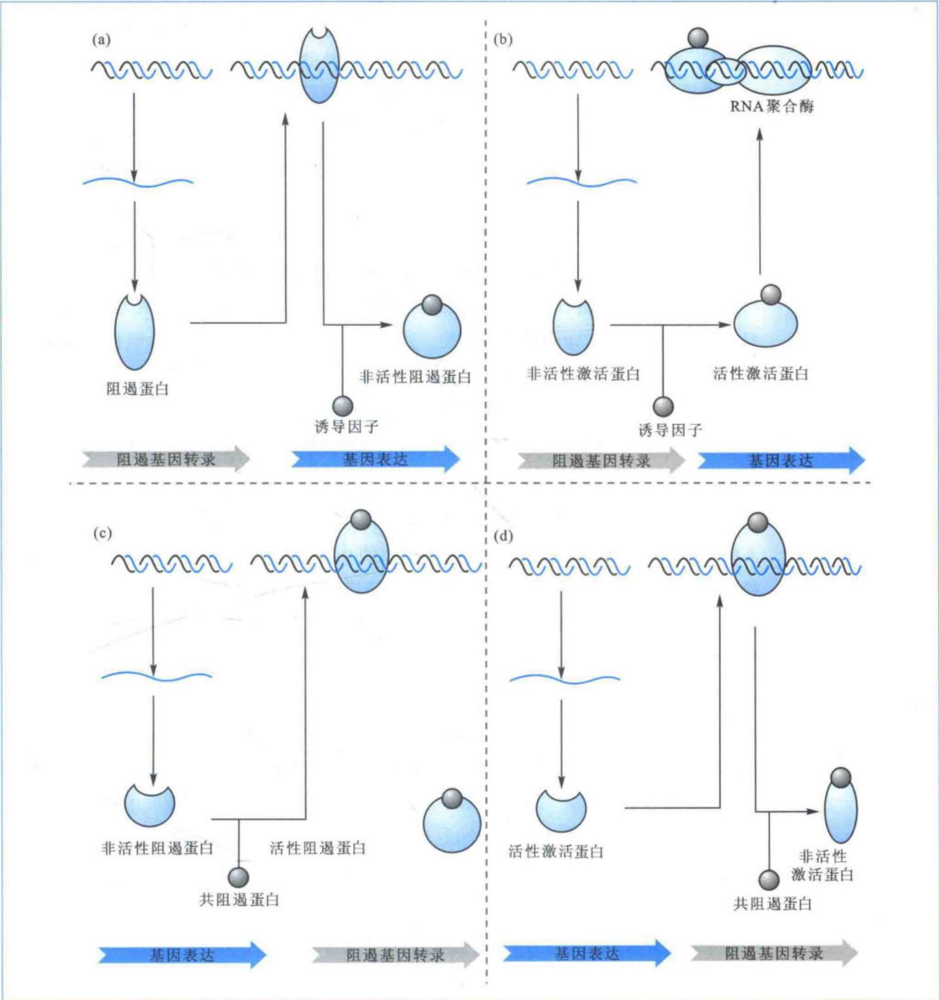  
图 7-3 细菌中的转录调控体系  
(a) 负控诱导系统；(b) 正控诱导系统；(c) 负控阻遏系统；(d) 正控阻遏系统。

表 7-1 负转录调控的类型及其特点

<table><tr><td>调节物结合到 DNA 上</td><td>正调节</td><td>负调节</td></tr><tr><td>是</td><td>开启</td><td>关闭</td></tr><tr><td>否</td><td>关闭</td><td>开启</td></tr></table>

## 7.1.2 原核基因表达调控的主要特点

## 1. 操纵子的调控

原核基因表达调控的一个重要特点就是大多数基因表达调控是通过操纵子机制来实现的，如乳糖操纵子、色氨酸操纵子、阿拉伯糖操纵子等。操纵子机制在原核基因调控中具有较普遍的意义。

## (1) 乳糖操纵子

细菌对环境的改变必须做出迅速的反应,以应对营养供给随时都可能发生的变化。因此,细菌产生了一种调节机制,即在缺乏底物时就阻断相应酶类的合成途径,但同时做好了准备,在特殊的代谢物或化合物的作用下,由原来关闭的状态转变为工作状态,一旦有底物出现,又立即合成这些酶类。这类基因中最典型的例子是大肠杆菌的乳糖操纵子。

大肠杆菌在含有葡萄糖的培养基中生长良好，在只含乳糖的培养基中开始时生长不好，直到合成了利用乳糖的一系列酶，具备了利用乳糖作为碳源的能力才开始生长。细菌获得这一能力的原因就是因为在诱导物乳糖的诱导下开动了乳糖操纵子，表达它所编码的3个酶：β-半乳糖苷酶（使乳糖水解为半乳糖和葡萄糖）、β-半乳糖苷透过酶（使乳糖进入细菌细胞内）、β-半乳糖苷乙酰基转移酶（使β-半乳糖第6位碳原子乙酰化）。这个操纵子开动的效果是十分明显的。以β-半乳糖苷酶为例，在葡萄糖培养基中生长时，每个细菌细胞内只有几个酶分子，但若转移到乳糖培养基中，几分钟后，每个细菌细胞内可产生3000个酶分子。

## (2) 色氨酸操纵子

色氨酸操纵子由启动子和操纵基因区组成,该操纵基因区控制一个编码色氨酸生物合成需要的5种蛋白质的多顺反子mRNA的表达。一般情况下,大肠杆菌中合成色氨酸的操纵子是开启的。如果在培养基中加入色氨酸,使大肠杆菌能直接利用培养基中的色氨酸来维持生活而不需要再费力合成,大肠杆菌往往能在2\~3min内完全关闭该操纵子。这就是说,某一代谢途径最终产物合成酶的基因可以被这个产物本身所关闭,这个现象被称为可阻遏现象,这些起阻遏作用的小分子被称为阻遏物。在这里,色氨酸或与其代谢有关的某种物质在阻遏过程(而不是诱导过程)中起作用。

## 2. 转录起始阶段的调控

在所有的调控方式中,基因表达终止得越早,就越不会将能量浪费在合成不必要的mRNA和蛋白质上,因此,调控其表达开关的关键机制主要发生在转录的起始阶段。

原核生物的 RNA 聚合酶由核心酶和 $\sigma$ 因子组成, 核心酶参与转录延长, 全酶控制转录起始。在转录起始阶段, $\sigma$ 因子负责模板链的选择和转录的起始, 使酶专一性识别模板上的启动子。不同的 $\sigma$ 因子决定特异编码基因的转录激活, 也决定不同 RNA(mRNA、rRNA 和 tRNA) 基因的转录, 参与启动子的识别、结合以及转录起始复合物的异构化, 在细胞发育和对环境的应答反应中起主导作用。

## 3. 转录终止阶段的调控

转录终止阶段的调控一般包括抗终止作用和弱化作用。

能够阻止转录终止的蛋白称为抗终止因子。在终止子上游具有抗终止子作用信号，一部分 RNA 聚合酶能够与抗终止因子结合，跨越终止子序列，顺利通过具有茎-环结构的终止子，使转录继续进行。

当操纵子被阻遏，RNA合成被终止时，起终止转录信号作用的那一段核苷酸被称为弱化子。弱化作用在原核生物中相当普遍，如大肠杆菌中的色氨酸操纵子、苯丙氨酸操纵子、苏氨酸操纵子、异亮氨酸操纵子和缬氨酸操纵子以及沙门氏菌的组氨酸操纵子和亮氨酸操纵子、嘧啶合成操纵子等都含有弱化子。我们将在后面分析色氨酸基因操纵子结构时加以详述。

## 4. 转录后调控

原核生物在转录水平的调控是最直接最有效的调控方式,而转录后调控是在转录生成 mRNA 之后,再在翻译或者翻译后水平上的“微调”,被认为是对转录水平调控的有效补充。如 $\lambda$ 噬菌体的后期基因是长达 26 kb 的一个片段,作为一个单位转录多顺反子 mRNA。然而其不同基因编码的蛋白质表达量相差很大,这就需要通过翻译水平来调控。原核生物转录后调控主要包括 mRNA 自身结构对翻译的调节、反义 RNA 对翻译的调控及翻译阻遏等现象。

## 7.2 乳糖操纵子与负控诱导系统

操纵子学说是关于原核生物基因结构及其表达调控的学说，由法国巴斯德研究所著名科学家 Jacob 和 Monod 在 1961 年首先提出，并在 10 年内经许多科学家的补充和修正得以逐步完善。我们将在本节介绍建立这一模型的研究过程及实验依据，从而帮助读者了解原核生物基因表达调控的主要模式和机制。

大肠杆菌乳糖操纵子(lactose operon)包括3个结构基因:Z、Y和A,以及启动子、控制子和阻遏子等,如图7-4所示。转录时,RNA聚合酶首先与启动区(promoter,P)结合,通过操纵区(operator,O)向右转录。转录从O区中间开始,按 $Z\rightarrow Y\rightarrow A$ 方向进行,每次转录出来的一条mRNA上都带有这3个基因。转录的调控是在启动区和操纵区进行的。

3 个结构基因各编码一种酶: Z 编码 $\beta-$ 半乳糖苷酶, Y 编码 $\beta-$ 半乳糖苷透过酶, A 编码 $\beta-$ 半乳糖苷乙酰基转移酶。

β-半乳糖苷酶是一种作用于β-半乳糖苷键的专一性酶，除能将乳糖水解成葡萄糖和半乳糖外,还能水解其他 $\beta-$ 半乳糖苷(如苯基半乳糖苷)。 $\beta-$ 半乳糖苷透过酶的作用是使外界的 $\beta-$ 半乳糖苷(如乳糖)透过大肠杆菌细胞壁和原生质膜进入细胞内,所以,如果用乳糖为大肠杆菌生长的唯一碳源和能源,这两种酶是必需的。 $\beta-$ 半乳糖苷乙酰基转移酶的作用是把乙酰辅酶 A 上的乙酰基转移到 $\beta-$ 半乳糖苷上,形成乙酰半乳糖,它在乳糖的利用中并非必需。

图7-4 lac操纵子主要组分分析  
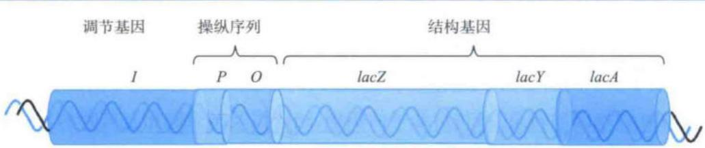

<table><tr><td>DNA</td><td>1040</td><td>82</td><td>3510</td><td>780</td><td>825</td></tr><tr><td>mRNA</td><td></td><td></td><td></td><td></td><td></td></tr><tr><td>多肽</td><td> $3.8 \times 10^{4}$ </td><td></td><td> $1.25 \times 10^{5}$ </td><td> $3.0 \times 10^{4}$ </td><td> $3.0 \times 10^{4}$ </td></tr><tr><td>蛋白质</td><td>四聚体 $5.0 \times 10^{5}$ </td><td></td><td>四聚体 $5.0 \times 10^{5}$ </td><td>膜蛋白 $3.0 \times 10^{4}$ </td><td>二聚体 $6.0 \times 10^{4}$ </td></tr><tr><td>功能</td><td>阻遏子</td><td></td><td> $\beta$ -半乳糖苷酶</td><td>透过酶</td><td>乙酰基转移酶</td></tr></table>

## 7.2.1 酶的诱导——lac 体系受调控的证据

在不含乳糖及 $\beta-$ 半乳糖苷的培养基中， $lac^{+}$ 基因型大肠杆菌细胞内 $\beta-$ 半乳糖苷酶和透过酶的浓度很低，每个细胞内只有 1\~2 个酶分子。但是，如果在培养基中加入乳糖，这两种酶的浓度将很快达到细胞总蛋白量的 6% 或 7%，每个细胞中可有超过 $10^{5}$ 个酶分子。

当有乳糖供应时，在无葡萄糖培养基中生长的 $lac^{+}$ 细菌中将同时合成 $\beta-$ 半乳糖苷酶和透过酶，如图 7-5 所示。进一步用 ${}^{32}P$ 标记的 mRNA 与模板 DNA 进行定量分子杂交，

图 7-5 lac 体系的 “开 - 关” 特性  

表明培养基中加入乳糖 1\~2 min 后,编码 β-半乳糖苷酶和透过酶的 lac mRNA 量就迅速增加。去掉乳糖后,lac mRNA 量立即下降到几乎无法检测到,表明乳糖确实能激发 lac mRNA 的合成。

事实上,研究诱导作用时很少使用乳糖,因为培养基中的乳糖会被诱导合成的 $\beta-$ 半乳糖苷酶所催化降解,从而使其浓度不

  
异丙基巯基半乳糖苷(IPTG)

  
巯甲基半乳糖苷 (TMG)

  
图7-6 3种乳糖类似物结构式  
O-硝基半乳糖苷(ONPG)

断发生变化。实验室里常常使用两种含硫的乳糖类似物——异丙基巯基半乳糖苷（IPTG）和巯甲基半乳糖苷（TMG）来代替。另外，在酶活性分析中常用发色底物 O- 硝基半乳糖苷（ONPG）来做乳糖替代物，研究发现这些乳糖类似物都是高效诱导物 $^{(图7-6)}$ ，因为它们都不是半乳糖苷酶的底物，所以又称为安慰性诱导物（gratuitous inducer）。

为了证实诱导物的作用是诱导新酶合成,而不是将已存在于细胞中的酶前体转化成有活性的酶,科学家设计了同位素示踪实验。他们把大肠杆菌细胞放在加有放射性 $^{35}$ S标记的氨基酸但没有任何半乳糖苷诱导物的培养基中繁殖几代,然后再将这些带有放射活性的细菌转移到不含 $^{35}$ S、无放射性的培养基中,随着培养基中诱导物的加入, $\beta-$ 半乳糖苷酶便开始合成。分离纯化 $\beta-$ 半乳糖苷酶,发现这种酶无 $^{35}$ S标记,说明酶的合成不是由前体转化而来的,而是加入诱导物后新合成的。

## 7.2.2 操纵子模型及其影响因子

1961 年 Jacob 和 Monod 发表 lac 操纵子负控诱导模式时, 生物界反应之强烈, 可与 Watson 和 Crick 在 1953 年发表 DNA 双螺旋模型相媲美。他们还根据基因调控模式预言了 mRNA 的存在, 直接导致了后者的发现, 启动了对于氨基酸密码子的实验研究并使整个分子遗传学体系得以迅速建成和完善。

Jacob 和 Monod 认为诱导酶(他们当时称为适应酶)现象是个基因调控问题,而且可以用实验方法进行研究,他们通过大量实验及分析,加上后人的研究成果,乳糖操纵子的控制模型已经被人们广泛接受 $^{(图7-7)}$ ,其主要内容如下:

① Z、Y、A 基因的产物由同一条多顺反子的 mRNA 分子所编码。

② 该 mRNA 分子的启动区 (P) 位于阻遏基因 (I) 与操纵区 (O) 之间, 不能单独起始半乳糖苷酶和透过酶基因的高效表达。

③ 操纵区是 DNA 上的一小段序列(仅为 26 bp), 是阻遏物的结合位点。

④ 当阻遏物与操纵区相结合时，lac mRNA 的转录起始受到抑制。

⑤ 诱导物通过与阻遏物结合,改变它的三维构象,使之不能与操纵区相结合,从而激发 lac mRNA 的合成。这就是说,有诱导物存在时,操纵区没有被阻遏物占据,所以启动子能够顺利起始 mRNA 的转录。

这一简单模型解释了 lac 体系及其他负控诱导系统,我们会在以后发现这种解释并不是完善的,因为乳糖操纵子中同样也存在着正调控。

图7-7 lac操纵子的负调控模型

<table><tr><td colspan="2">无诱导物,结构基因不表达</td></tr><tr><td></td><td>lacI基因转录产生阻遏物单体,结合形成同源四聚体lacI同源四聚体与O区DNA相结合,阻遏基因转录</td></tr><tr><td colspan="2">诱导物启动lac结构基因转录</td></tr><tr><td></td><td>诱导物使lacI变成不能与O区相结合的非活性形式</td></tr><tr><td></td><td>RNA聚合酶与lac启动子区相结合,起始基因转录mRNA被转录成3个蛋白质</td></tr></table>

## 1. lac 操纵子的本底水平表达

有两个矛盾是操纵子理论所不能解释的。

首先,诱导物需要穿过细胞膜才能与阻遏物结合,而转运诱导物需要透过酶,后者的合成又需要诱导。这样我们必须要解释第一个诱导物是如何到达细胞内的。只有两种可能,或者一些诱导物可以在透过酶不存在时进入细胞,或者一些透过酶可以在没有诱导物的情况下合成。研究表明,第二种解释是正确的。

其次,人们发现乳糖(葡萄糖-1,4-半乳糖)并不与阻遏物相结合,真正的诱导物是乳糖的异构体——异构乳糖(葡萄糖-1,6-半乳糖),而后者是在β-半乳糖苷酶的催化下由乳糖形成的,因此,乳糖诱导β-半乳糖苷酶的合成需要有β-半乳糖苷酶的预先存在。对这一现象的解释同样是:在非诱导状态下有少量的lac mRNA合成(每个世代中有1\~5个mRNA分子),这种合成被称之为本底水平的组成型合成(background level constitutive synthesis)。由于阻遏物的结合并不是绝对紧密的,即使在它与操纵基因紧密结合时,也会偶尔掉下来;这时启动子的障碍被解除,RNA聚合酶开始转录。这种现象以每个细胞周

期 1\~2 次的概率发生。

## 2. 大肠杆菌对乳糖的反应

假设细菌生长在以甘油为碳源的培养基中,按照 lac 操纵子本底水平的表达,每个细胞内可有几个分子的 $\beta-$ 半乳糖苷酶和乳糖透过酶。现在加入乳糖,在单个透过酶分子作用下,少量乳糖分子进入细胞,又在单个 $\beta-$ 半乳糖苷酶分子的作用下转变成异构乳糖。某个异构乳糖与结合在操纵区上的阻遏物相结合并使后者失活而离开操纵区,开始了 lac mRNA 的生物合成。这些 mRNA 分子编码了大量的 $\beta-$ 半乳糖苷酶和乳糖透过酶,其结果导致乳糖大量涌入细胞。多数乳糖被降解成为葡萄糖和半乳糖,但还有许多乳糖被转变成异构乳糖,然后与细胞内的阻遏物结合(虽然合成速度低,但是阻遏物仍继续合成,因此必须有足够的异构乳糖才能使细胞维持去阻遏状态),阻遏物的失活促使 mRNA

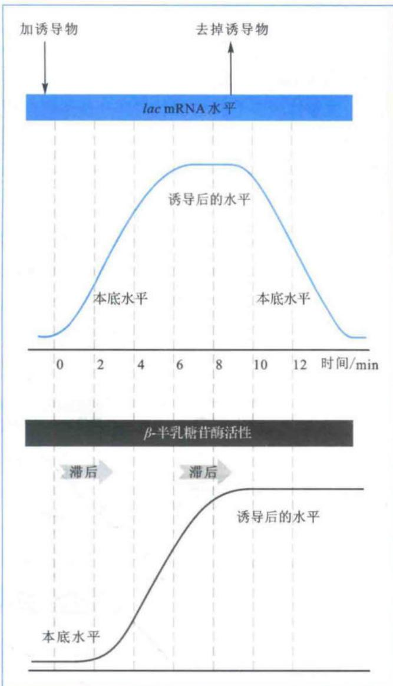  
图 7-8 培养基中有无诱导物对 lac mRNA 及 β-半乳糖苷酶活性的影响

高速合成,进一步提高了透过酶和 $\beta-$ 半乳糖苷酶的浓度(图7-8)。降解产生的葡萄糖被细胞用作碳源和能源,降解产生的半乳糖则被另一套酶体系转变成葡萄糖,这些酶的合成也是可诱导的。

一旦培养基和细胞中的所有乳糖都被消耗完毕,由于阻遏物仍在不断地被合成,有活性的阻遏物浓度将超过异构乳糖的浓度,使细胞重新建立起阻遏状态,导致 lac mRNA 合成被抑制。在细菌中,多数 mRNA 的半衰期只有几分钟,所以在不到一个世代的生长期内,lac mRNA 几乎从细胞内消失。β- 半乳糖苷酶及透过酶的合成也趋向停止,这些蛋白质虽然很稳定,但其浓度随着细胞的分裂而不断被稀释。值得注意的是,如果在原有的乳糖被撤去之后的一个世代中再加入乳糖,这时乳糖可以立即开始降解,因为此时细胞内仍有一定浓度的透过酶和 β- 半乳糖苷酶。

## 3. 阻遏物 lacI 基因产物及功能

现有的研究表明，lac 操纵子阻遏物 mRNA 是在弱启动子控制下组成型合成的。编码的阻遏蛋白 LacI 的 N 端是 HTH (helix-turn-helix) DNA 结合结构域，中间是两个相似的核心结构域,可以和诱导物结合。LacI 的 C 端是一个 $\alpha$ 螺旋,参与阻遏蛋白的聚合。阻遏蛋白单体通过中间核心结构域的相互作用形成二聚体,两个二聚体进一步通过 C 端的 $\alpha$ 螺旋聚合形成四聚体形式的阻遏物。当细胞中不存在诱导物(异构乳糖)时,阻遏物通过二聚体的两个 HTH 结构域特异性地结合在 lac 操纵区中一段 21 bp 的 DNA 序列上,阻止 RNA 聚合酶与 lac 操纵子启动子区的结合,抑制 lac mRNA 的转录。一旦细胞中乳糖水平提高,异构乳糖数量增加,有效结合到阻遏蛋白的核心结构域,引起阻遏蛋白的构象改变,与 DNA 结合的特异性降低,阻遏蛋白不再特异性结合 lac 操纵区而是随机与 DNA 的任意区域相结合。lac 操纵子的转录起始区暴露并被 RNA 聚合酶结合,激活 lac mRNA 的转录。而当乳糖耗尽,诱导物异构乳糖减少,失去诱导物的阻遏蛋白会重新特异性结合 lac 操纵区,阻止基因转录(图 7-9)。

图 7-9 LacI 的蛋白质结构示意图及负控诱导系统  
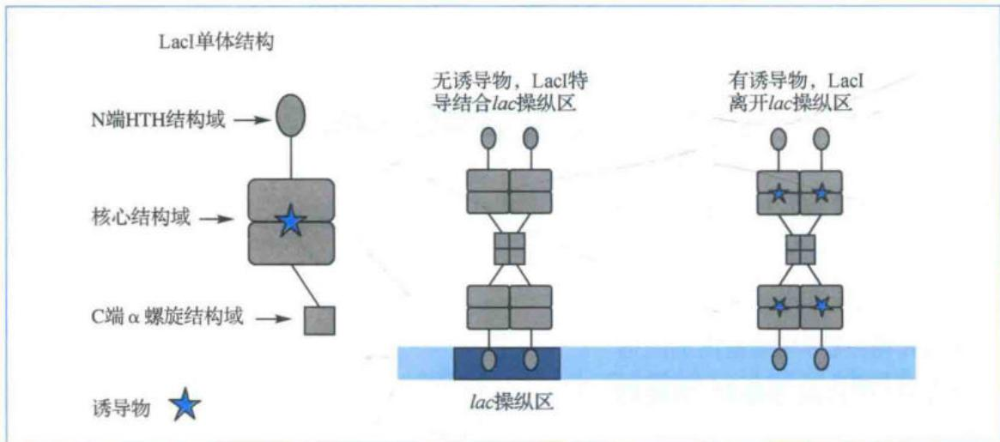

当 lacI 基因由弱启动子突变成强启动子,细胞内就不可能产生足够的诱导物来克服阻遏状态,因此在这些突变体中,整个 lac 操纵子就不可诱导。

## 4. cAMP 与代谢物激活蛋白

广泛存在于动、植物组织中的 cAMP $^{(图 7-10)}$ 是 ATP 在腺苷酸环化酶的作用下转变而来的，在真核生物的激素调节过程中起着重要作用。在大肠杆菌中，cAMP 的浓度受到葡

图7-10 $3^{\prime},5^{\prime}$ -cAMP的化学结构式

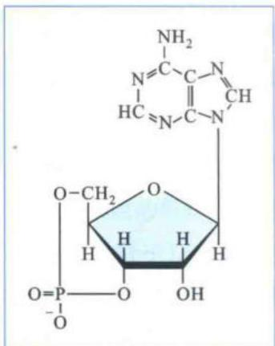

萄糖代谢的调节。如果将细菌放在缺乏碳源的培养基中培养，细胞内cAMP浓度就高；如果在含葡萄糖的培养基中培养，cAMP的浓度就低；如果培养基中只有甘油或乳糖等不经由糖酵解途径的碳源，cAMP的浓度也会很高，因此推测糖酵解途径中位于葡糖-6-磷酸与甘油之间的某些代谢产物是腺苷酸环化酶活性的抑制剂。

大肠杆菌中的代谢物激活蛋白(CAP, catabolite activator protein), 能结合 cAMP, 又被称为环腺苷酸受体蛋白(CRP, cAMP receptor protein), 由 Crp 基因编码。CRP 和 cAMP 都是合成 lac mRNA 所必需的, 凡 Crp 及腺苷酸环化酶基因突变的细菌都不能合成 lac mRNA。CRP 蛋白之间通过相互作用形成二聚体, 每个 CRP 蛋白可以结合一个 cAMP 分子, 只有当 cAMP 装配到 CRP 蛋白上使 CRP 二聚体的构象改变, cAMP-CRP 复合物才能特异地结合到 DNA 上的 CAP 位点 (CAP site)。lac 操纵子上的 CAP 位点位于转录起始位点上游约 60 bp 处, 紧邻 RNA 聚合酶所结合的启动子区。RNA 聚合酶 α 亚基的 C 端结构域 (αCTD) 可以结合 CAP 位点, 并与 CAP 位点附近的 DNA 结合。通过与 αCTD 的相互作用, cAMP-CRP 复合物帮助 RNA 聚合酶结合到启动子区域, 激活 lac mRNA 的转录 (图 7-11)。因为 Crp 基因和环化酶基因的突变细菌即使同时也是 I⁻ 或 O⁺ 突变, 都不能合成出 lac mRNA, 一般认为 cAMP-CRP 是一个不同于阻遏体系的正调控因子, 而 lac 操纵子的功能是在这两个相互独立的调控体系作用下实现的。CAP 不仅参与了 lac 基因的表达调控, 还参与了大肠杆菌中其他基因的表达调控。图 7-12 显示了存在于 gal、lac 和 ara 3 个操纵子上游启动子区的 cAMP-CRP 结合位点的相对位置。

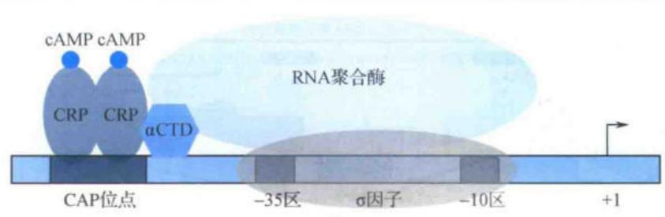  
图7-11 cAMP-CRP 复合物激活lac操纵子

此外，半乳糖、麦芽糖、阿拉伯糖、山梨醇等在降解过程中均转化生成葡萄糖或糖酵解途径中的其他中间产物，所以，这些糖代谢中有关的酶都是由可诱导的操纵子控制的。只要有葡萄糖存在，这些操纵子就不表达，被称为降解物敏感型操纵子（catabolite sensitive operon），实验证明这些操纵子都是由 cAMP-CRP 调节的。对大量操纵子启动区的研究表明，CRP-cAMP 结合位点存在序列特异性 $^{(图 7-13)}$ 。

cAMP-CRP 复合物与启动子区的结合是 lac mRNA 合成起始所必需的, 因为这个复合物结合于启动子上游, 能使 DNA 双螺旋发生弯曲, 有利于形成稳定的开放型启动子 -RNA 聚

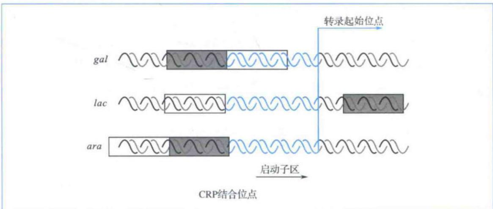  
图 7-12 gal、lac 和 ara 操纵子上游启动子区与 CRP-cAMP 结合位点的相对位置分析

  
图 7-13 大肠杆菌 lac 操纵子启动区 cAMP-CRP 及 -35 区、-10 区序列分析  
图7-14 CRP-cAMP与上游DNA结合后造成模板DNA沿对称序列中央发生了大于 $90^{\circ}$ 的弯曲

图7-15 葡萄糖抑制了lac操纵子基因的表达  
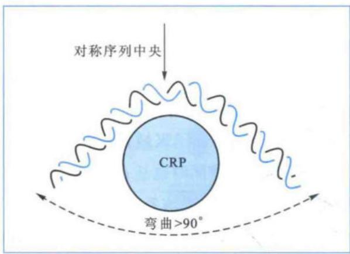

合酶结构 $^{(图7-14)}$ 。而阻遏物则是一个抗解链蛋白(antimelting protein)，阻止形成开放结构，从而抑制RNA聚合酶的功能。

## 5. 葡萄糖对 lac 操纵子的影响

β-半乳糖苷酶在乳糖代谢中的作用是把前者分解成葡萄糖及半乳糖(半乳糖将在gal操纵子的作用下再转化成葡萄糖)。如果将葡萄糖和乳糖同时加入培养基中,大肠杆菌在耗尽外源葡萄糖之前不会诱发lac操纵子(图7-15),没有β-半乳糖苷酶活性;当葡萄糖消耗完以后(图中箭头处),细胞内cAMP浓度增加,β-半乳糖苷酶活性增加,一度停止生长的细胞又恢复分裂。研究发现,葡萄糖对lac操纵子表达的抑制是间接的。例如,有一个大肠杆菌突变体,它在糖酵解途径中不能将葡糖-6-磷酸转化为下一步代谢中间物,这些细菌的lac基因能在葡萄糖存在时被诱导合成。所以,我们说不是葡萄糖而是它的某些降解产

物抑制 lac mRNA 的合成,科学上把葡萄糖的这种效应称之为代谢物阻遏效应(catabolite repression)。当向乳糖培养基中加入葡萄糖时,葡萄糖的降解产物能降低细胞内 cAMP 的含量,CAP 便不能结合在启动子上。此时,即使有乳糖存在,虽已解除了对操纵基因的阻遏,RNA 聚合酶不能与启动子结合,也不能转录,所以仍不能利用乳糖(图 7-16)。

## 7.2.3 lac 操纵子 DNA 的调控区域——P、O 区

已经分离得到含有 lac 操纵子的 DNA 片段, 发现 P 区(即启动子区)一般是从 I 基因结束到 mRNA 转录起始位点下游 5～10 bp, 而 O 区(即阻遏物结合区)位于 -7～+28 位, 该区的碱基序列有对称性, 其对称轴在 +11 位碱基对。图 7-17 分别例举了 gal、aroH、trp、trpR 和 lac 5 个操纵子中 P 区及 O 区的相对位置。实验表明, 阻遏物与 O 区的结合影响了 RNA 聚合酶与启动区结合形成转录起始复合物的效率。

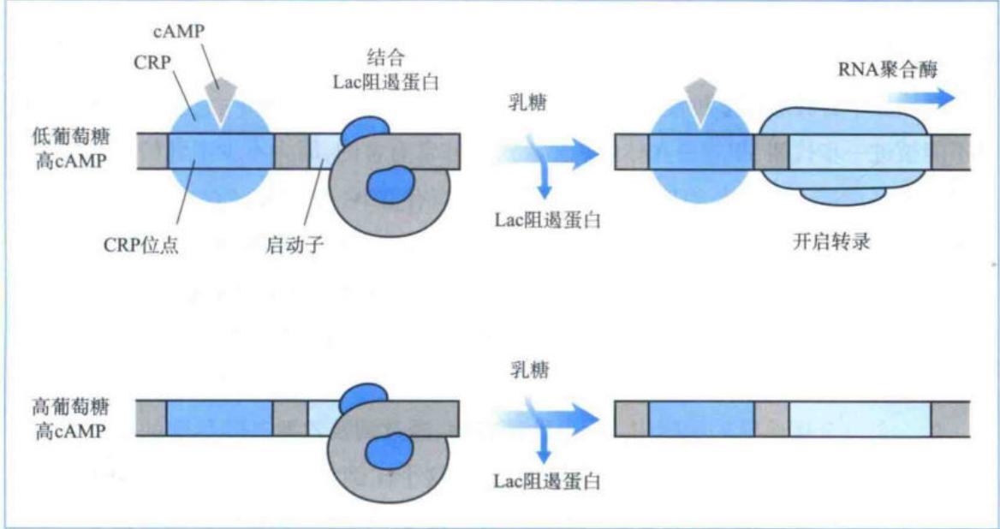  
图 7-16 葡萄糖对 lac 操纵子的调控

## 7.2.4 lac 操纵子中的其他问题

## 1. lacA 基因及其生理功能

lacA 基因存在于 lac 操纵子中, 编码了 $\beta-$ 半乳糖苷乙酰基转移酶。虽然乳糖本身不能被乙酰化,但这个酶能够把乙酰基从供体上转移到半乳糖苷分子上,这具有什么生理意义呢?

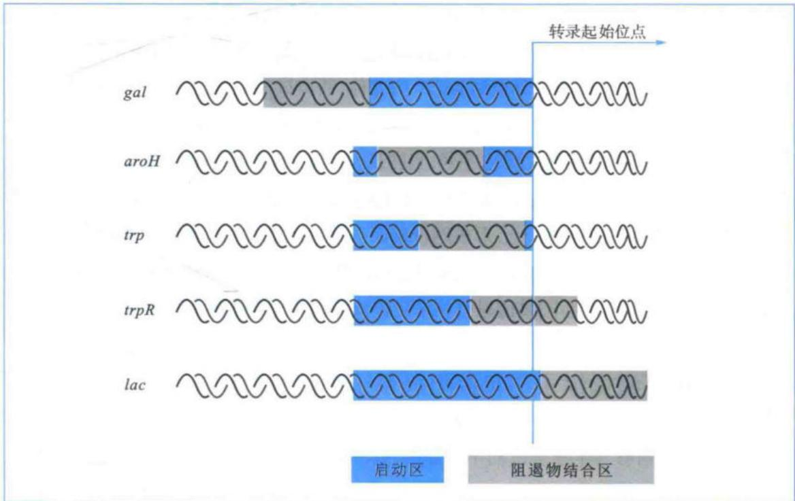  
图7-17 不同操纵子 $P$ 区及 $O$ 区相对位置比较

自然界中存在着许多种能被 $\beta-$ 半乳糖苷酶降解的半乳糖苷分子，它们的分解产物往往不能被进一步代谢，很容易在体内积累。这是非常有害的，因为不少半乳糖苷衍生物在高浓度时是细胞正常生长的抑制物。研究发现，当有IPTG存在时， $\Gamma O^c A^{-}$ 大肠杆菌的生长速度显著慢于相应的 $A^{+}$ 株系，两组细胞的差异仅仅在于后者能将IPTG乙酰化，而乙酰化的IPTG不能被 $\beta-$ 半乳糖苷酶所分解。所以， $A$ 基因虽然不在乳糖降解中起作用，但它抑制了 $\beta-$ 半乳糖苷酶产物的有害性衍生物在细胞内积累，在生物进化中是有意义的。

## 2. lac 基因产物数量上的比较

在一个完全被诱导的细胞中， $\beta-$ 半乳糖苷酶、透过酶及乙酰基转移酶的拷贝数比例为1：0.5：0.2。作为数百万年进化演变的结果，这个比例在一定程度上反映了以 $\beta-$ 半乳糖苷作为唯一碳源时细胞的需要。不同的酶在数量上的差异是由于在翻译水平上受到调节所致。这种调节有以下两种方式：

① lac mRNA 可能与翻译过程中的核糖体相脱离, 从而终止蛋白质链的翻译。这种现象发生的频率取决于每一个后续的 AUG 密码子再度起始翻译的概率。因此, 就存在着一个从 mRNA 的 5' 端到 3' 端的蛋白质合成梯度。对于大多数多顺反子 mRNA 分子来说, 这种现象具有普遍性。

② 在 lac mRNA 分子内部, A 基因比 Z 基因更易受内切酶作用发生降解, 因此, 在任何时候 Z 基因的完整拷贝数要比 A 基因多。事实上, 对于某个活跃表达的多顺反子操纵子, 该 mRNA 所编码的各种蛋白质的相对浓度都由每一个顺反子的翻译频率所决定。

## 3. 操纵子的融合与基因工程

操纵子在自然条件下可能发生融合,典型的例子是 lac 操纵子与负责嘌呤合成的 pur 操纵子的耦联。尽管 pur 操纵子以完全不同于 lac 操纵子的方式进行调节,但它在染色体上位于 lac 操纵子沿转录方向的下游,中间只隔了一个控制细胞对 T6 噬菌体敏感性的 tsx 基因。科学家从 $tsx^{s}Z^{+}$ 细胞中分离到 $tsx^{R}Z^{-}$ 突变体,研究该突变体的 DNA 序列,发现它缺失了从 lac 操纵子的 Z 基因开始,包括整个 tsx 基因以及 pur 操纵基因和 pur 启动子的一部分。这一突变使 Z 基因缺失终止序列,当转录作用从 lac 启动子处开始后,就合成出由一部分 Z 基因编码区和整个 pur 基因转录生成的 mRNA 分子。因此,在这个体系中,pur 操纵子被“嫁接”到 lac 启动子上,形成融合基因。这一现象给了生物学家以很大的启发,因为 lac 启动子是一个很强的启动子,通过它可以使较弱启动子的转录增强,从而增加蛋白质的合成量。到目前为止,基因融合技术已经成为基因工程操作中应用最广泛的技术。

## 7.3 色氨酸操纵子与负控阻遏系统

由于 trp 体系参与生物合成而不是降解, 它不受葡萄糖或 cAMP-CRP 的调控。色氨酸的合成主要分 5 步完成, 有 7 个基因参与整个合成过程 $^{(图 7-18)}$ 。trpE 和 trpG 编码邻氨基苯甲酸合酶, trpD 编码邻氨基苯甲酸磷酸核糖转移酶, trpF 编码异构酶, trpC 编码吲哚甘油磷酸合酶, trpA 和 trpB 则分别编码色氨酸合酶的 $\alpha$ 和 $\beta$ 亚基。研究发现, 在大肠杆菌等许多细菌中, trpD 和 trpG 融合成一个功能基因, trpC 和 trpF 也融合成一个基因, 产生具有双重功能的蛋白质。除上述7个基因之外，细菌中还有pabA和pabB基因分别编码ADC合酶的两个亚基，pabC基因编码ADC裂解酶，ubiC基因编码分枝酸裂解酶，entC基因编码异构分枝酸合酶(图7-19)，这些基因产物都在不同程度上参与了分枝酸代谢，与色氨酸合成有一定关系。

图 7-18 细菌中色氨酸生物合成途径  

图 7-19 细菌中参与分枝酸代谢的主要酶系统  
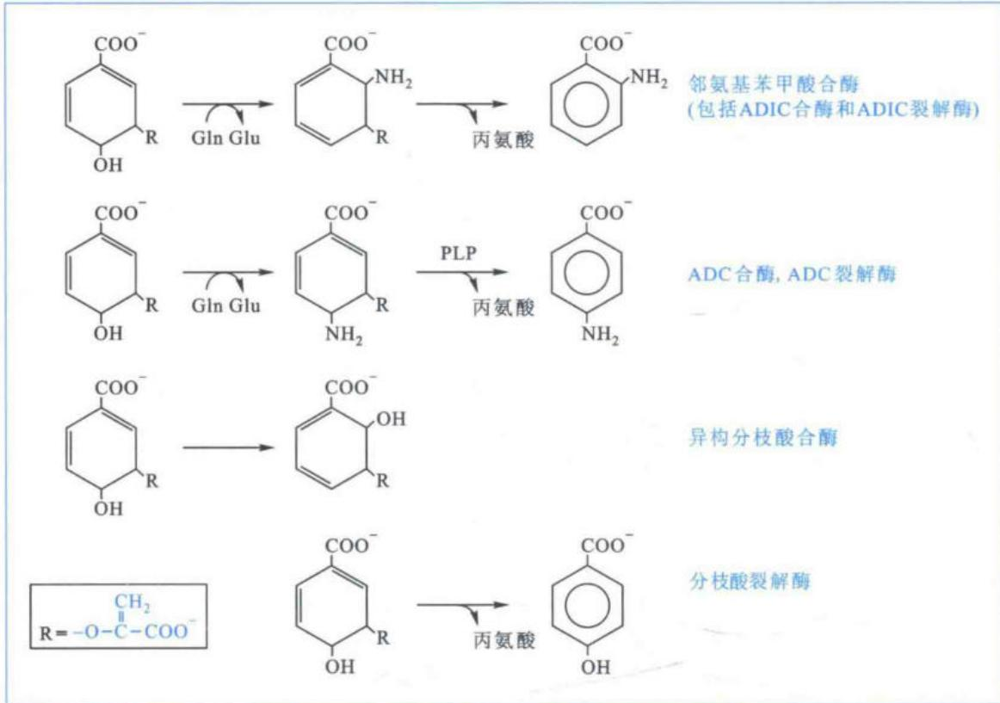

trpE 基因是第一个被翻译的基因, 和 trpE 紧邻的是启动子区和操纵区。另外, 前导区和弱化子区分别定名为 trpL 和 trpa (不是 trpA)。trp 操纵子中产生阻遏物的基因是 trpR, 该基因距 trp 基因簇很远。后者位于大肠杆菌染色体图上 25 min 处, 而前者则位于 90 min 处。在位于 65 min 处还有一个 trpS (色氨酸 tRNA 合成酶), 它与携带有色氨酸的 tRNA $^{Trp}$ 共同参与 trp 操纵子的调控作用 (图 7-20)。trp 操纵子的转录调控包括阻遏系统和弱化系统, 下面分别予以介绍。

## 7.3.1 trp 操纵子的阻遏系统

trpR 基因突变常引起 trp mRNA 的组成型合成,该基因产物因此被称为辅阻遏蛋白 (aporepressor)。除非培养基中有色氨酸,否则这个辅阻遏蛋白不会与操纵区结合。辅阻遏蛋白与色氨酸相结合形成有活性的阻遏物,与操纵区结合并关闭 trp mRNA 转录 $^{(图7-20)}$ 。

研究发现,这个系统中的效应物分子是色氨酸,是由 trp 操纵子所编码的生物合成途径的末端终产物。当培养基中色氨酸含量较高时,色氨酸与游离的辅阻遏蛋白相结合,并使之与操纵区 DNA 紧密结合;当培养基中色氨酸供应不足时,辅阻遏蛋白失去色氨酸并从操纵区上解离,trp 操纵子去阻遏。

  
图7-20 大肠杆菌中的trp操纵子

## 7.3.2 trp 操纵子的弱化作用

随着对色氨酸操纵子的深入研究,发现有些现象与以阻遏作为唯一调节机制的观点不一致,例如,在色氨酸高浓度和低浓度下观察到 trp 操纵子的表达水平相差约 600 倍,然而阻遏作用仅使转录降低 70 倍。此外,使阻遏物失活突变不能完全消除色氨酸对 trp 操纵子表达的影响。显然,trp 操纵子的这种调控与阻遏物的控制无关,必然还有其他调控机制。通过对缺失突变株的研究发现,这种调控机制就是弱化作用(attenuation)。事实上,阻遏-操纵机制对色氨酸来说只是一个一级开关,主管转录是否启动,相当于 trp 操纵子的粗调开关,弱化作用相当于精细开关,对氨基酸的生物合成进行精细调控并决定已经启动的转录是否继续下去。

## 1. 弱化子

弱化系统作为一个细微调控,是通过转录达到第一个结构基因之前的过早终止来实现的,细胞中色氨酸的浓度是实现过早终止的根本原因。

在 trp mRNA 5' 端 trpE 基因的起始密码前有一个长 162 bp 的 mRNA 片段被称为前导区, 其中 123\~150 位碱基序列如果缺失, trp 基因表达可提高 6\~10 倍, 而且无论是在阻遏细胞内还是在永久性突变的细胞内都是这样。研究发现, 当 mRNA 合成起始以后, 除非培养基中完全没有色氨酸, 转录总是在这个区域终止, 产生一个仅有 140 个核苷酸的 RNA 分子, 终止 trp 基因转录, 这就是 123\~150 区序列缺失会提高 trp 基因表达的原因 (图 7-20)。因为转录终止发生在这一区域, 并且这种终止是被调节的, 这个区域就被称为

图 7-21 trp 弱化子 mRNA 的终止区  
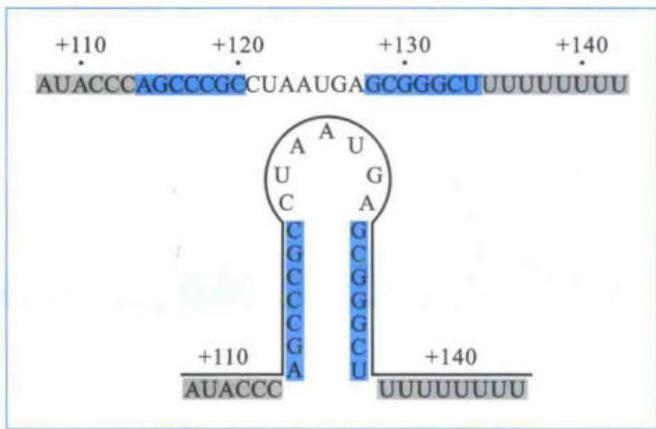

弱化子。研究引起终止的 mRNA 碱基序列(图 7-21)，发现该区 mRNA 通过自我配对可以形成茎－环结构，有典型的终止子特点。

## 2. 前导肽

各种实验表明弱化作用需要负载 $tRNA^{Trp}$ 参与,这意味着前导序列的某些部分被翻译了。分析前导序列发现,它包括起始密码子 AUG 和

终止密码子 UGA; 如果翻译起始于 AUG, 应该产生一个含有 14 个氨基酸的多肽。这个假设的多肽(还未实际观察到)被称为前导肽。前导区序列具有一个非常有意义的特点, 在其第 10 和第 11 位上有相邻的两个色氨酸密码子。这一点很重要, 因为组氨酸操纵子中, 也具有弱化子, 也具有一个类似的能编码前导肽的碱基序列, 此序列中含有 7 个相邻的组氨酸密码子。苯丙氨酸操纵子中同样存在弱化子结构, 其前导序列中也有 7 个苯丙氨酸密码子。这些密码子参与了 trp 及其他操纵子中的转录弱化机制。

trp 前导区的碱基序列已经全部测定, 引人注目的是其中 4 个分别以 1、2、3 和 4 表示的片段能以两种不同的方式进行碱基配对(图 7-22), 有时以 1-2 和 3-4 配对, 有时只以 2-3 方式互补配对。RNase T1 降解实验(此酶不能水解配对的 RNA)表明, 纯化的 trp 前导序列中确有 1-2 和 3-4 的配对方式, 由此定位的 3-4 配对区正好位于终止密码子的识别区, 当这个区域发生破坏自我配对的碱基突变时有利于转录的继续进行(图 7-22)。

图 7-22 原核生物 RNA 中前导序列变构引起转录的终止或弱化  
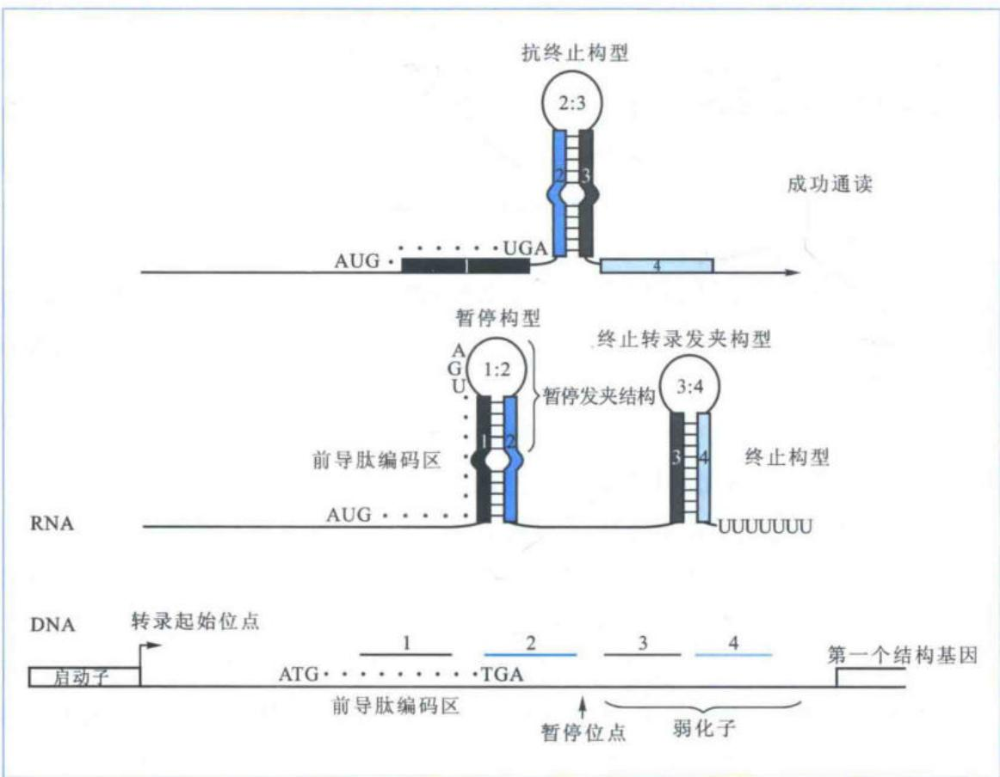

## 3. 转录的弱化作用

转录的弱化理论认为 mRNA 转录的终止是通过前导肽基因的翻译来调节的。因为在前导肽基因中有两个相邻的色氨酸密码子，所以这个前导肽的翻译必定对 $tRNA^{Trp}$ 的浓度敏感。当培养基中色氨酸的浓度很低时，负载有色氨酸的 $tRNA^{Trp}$ 也就少，这样翻译通过两个相邻色氨酸密码子的速度就会很慢，当 4 区被转录完成时，核糖体才进行到 1 区（或停留在两个相邻的 trp 密码子处），这时的前导区结构是 2-3 配对，不形成 3-4 配对的终止结构，所以转录可继续进行，直到将 trp 操纵子中的结构基因全部转录。而当培养基中色氨酸浓度高时，核糖体可顺利通过两个相邻的色氨酸密码子，在 4 区被转录之前，核糖体就到达 2 区，这样使 2-3 不能配对，3-4 区可以自由配对形成茎－环状终止子结构，转录停止，trp 操纵子中的结构基因被关闭而不再合成色氨酸 $^{(图7-23)}$ 。所以，弱化子对 RNA 聚合酶的影响依赖于前导肽翻译中核糖体所处的位置。已从大肠杆菌和沙门氏菌中陆续发现了不少具有弱化作用的操纵子，它们都具有前导肽，并且前导肽中都富含该操纵子所合成的那种氨基酸。

  
图 7-23 trp 操纵子的转录与翻译调控  
(a) 高色氨酸时；(b) 低色氨酸时。

## 4. trp 操纵子弱化机制的实验依据

对一个前导区及 D 基因缺失的 trp 操纵子突变体 (trpΔLD102) 研究发现, 该细菌在补充了过量色氨酸的培养基中有高于野生型亲本株系 8\~10 倍的色氨酸合成酶活性, 这种去阻遏作用不论在 trpR $^{+}$ 或 trpR $^{-}$ 菌株中都存在 $^{(表7-2)}$ 。

从表 7-2 中可以看出前导区的调节作用。trpΔED53 的 L 区中不缺失弱化子，而 trpΔLD102 L 区中缺失弱化子。缺失前导区后的表达比有前导区的表达要高得多，充分说明 trp 操纵子的表达调控除阻遏作用外，还受到前导区的影响，失去了这个因素就失去了

表 7-2 trpL 缺失突变株与非缺失菌株色氨酸合成酶活性比较(相对单位)

<table><tr><td>株系</td><td> $trpR^{+}$ </td><td> $trpR^{-}$ </td></tr><tr><td> $Trp\Delta ED53(trpa^{+})$ </td><td>0.17</td><td>11.8</td></tr><tr><td> $Trp\Delta LD102(trpa^{-})$ </td><td>1.82</td><td>100</td></tr></table>

一个调控机制。

trpL29 是增强终止的突变型, 它的前导序列 29 位核苷酸由原来的 G 变为 A, …… AUG……→……AUA……, AUG 是前导肽的起始密码, 变为 AUA 后便不能起始蛋白质合成, 有利于 trp mRNA 形成 1-2、3-4 稳定的二级结构, 从而增强终止。这一突变型的邻氨基苯甲酸合成酶活性很低, 并且对色氨酸不敏感。因为前导肽根本不能翻译下去, 即使在色氨酸饥饿条件下仍然不能做出解除终止的反应。

另一个增强终止的突变型是 trpL75, 其 75 位上的 G 变成了 A。野生型 75 位上的 G 在 2 区内, 它可以与 3 区内 118 位上的 C 形成氢键, 当 G 变为 A 后, 减弱了 2 区和 3 区形成茎-环结构的能力, 导致终止增强, trpL75 对色氨酸饥饿不能做出反应。此外, 缺失了 3' 端 4 个 U 的突变株 ΔtrpLC1419, 也导致终止解除, 说明 3' 端 U 对转录终止起作用。

细菌通过弱化作用弥补阻遏作用的不足,因为阻遏作用只能使转录不起始,对于已经起始的转录,只能通过弱化作用使之中途停顿下来。阻遏作用的信号是细胞内色氨酸的多少,弱化作用的信号则是细胞内载有色氨酸的 tRNA 的多少。它通过前导肽的翻译来控制转录的进行,在细菌细胞内这两种作用相辅相成,体现着生物体内周密的调控作用。

细菌中为什么需要有弱化子系统呢？一般认为，阻遏物从有活性向无活性的转变速度较慢，需要有一个能更快地做出反应的系统，以保持培养基中适当的色氨酸水平。弱化子能较快地通过抗终止的方法来增加 trp 基因表达，迅速提高内源色氨酸浓度。

那么,为什么还要有阻遏体系呢?没有阻遏体系,似乎只有弱化也可以调节色氨酸酶系的合成。目前认为阻遏物的作用是在有大量外源色氨酸存在时,阻止非必需的先导mRNA的合成,它使这个合成系统更加经济。事实上,自然界中存在着不同类型的合成体系。组氨酸操纵子拥有在功能上与trp操纵子完全相同的弱化子结构,但没有阻遏物,它的表达完全受弱化子调节。

## 7.3.3 trp 操纵子的其他调控机制

大肠杆菌中共有 5 个基因参与色氨酸生物合成, 构成色氨酸操纵子。其中 $trpG \sim D$ 和 $trpC \sim F$ 为融合基因, 翻译出的多肽具有双重功能。有两个启动子(一个位于操纵子 5', 一个位于 $trpG \sim D$ 编码区, 称为内源启动子)控制整个操纵子的转录, 能够感受色氨酸和无负载的 tRNA $^{Trp}$ 的浓度变化。

枯草杆菌(Bacillus subtilis)色氨酸操纵子包括6个基因,处于一个12个基因的大操纵子内。其他基因控制部分芳香族氨基酸的生物合成。B. subtilis 还有第7个色氨酸合成基因 trpG(又称 pabA)，位于叶酸操纵子中。翻译出来的 TrpG-PabA 多肽链能发挥两个酶的作用，一个用于色氨酸途径，一个用于叶酸途径。B. subtilis 的色氨酸操纵子也有两个启动子区。RNA 聚合酶在任何一个启动子区起始转录都会受到色氨酸和无负载 tRNA $^{Trp}$ 的调控(图 7-24)。

  
图 7-24 B. subtilis 和 E. coli 色氨酸操纵子的结构比较

大肠杆菌色氨酸操纵子受到由色氨酸激活的阻遏蛋白的调节作用。一旦转录越过前导区，开始结构基因的转录，又会受弱化子的调控，感受无负载的 $\mathrm{tRNA}^{\mathrm{Trp}}$ 的变化，使转录机器在前导区附近停止或者继续结构基因的转录。在Bacillus subtilis色氨酸操纵子中，色氨酸激活TRAP调节蛋白并使之与前导RNA相结合，形成RNA终止子结构终止转录。而无负载 $\mathrm{tRNA}^{\mathrm{Trp}}$ 的聚集使TRAP蛋白失活，从而激活转录和翻译。另外，当无负载 $\mathrm{tRNA}^{\mathrm{Trp}}$ 的浓度升高时，由trpA基因编码的AT蛋白与TRAP蛋白结合，抑制该蛋白形成转录终止复合物从而激活色氨酸操纵子的转录(图7-25)。

## 7.4 其他操纵子

## 7.4.1 半乳糖操纵子

大肠杆菌半乳糖操纵子(galactose operon)在大肠杆菌遗传图上位于17 min处,包括3个结构基因:异构酶(UDP-galactose-4-epimerase,galE)、半乳糖-磷酸尿嘧啶核苷转移酶(galactose transferase,galT)、半乳糖激酶(galactose kinase,galK)。这3个酶的作用是使半乳糖变成葡糖-1-磷酸。半乳糖操纵子的调节基因是galR,位于遗传图上55 min处。gal操纵子与lac操纵子所不同的是galR与galE、T、K及操纵区O等的距离都很远,而galR产物对galO的作用与lacI-lacO的作用相同。在galR和galO突变体中,E、T、K基因得到组成型表达。gal操纵子的诱导物主要是半乳糖。图7-26是几个相关联操纵子的代谢途径及基因图谱。半乳糖的跨细胞膜运转需要galP基因产物参与。

图 7-25 B. subtilis 中色氨酸操纵子的调控机制  
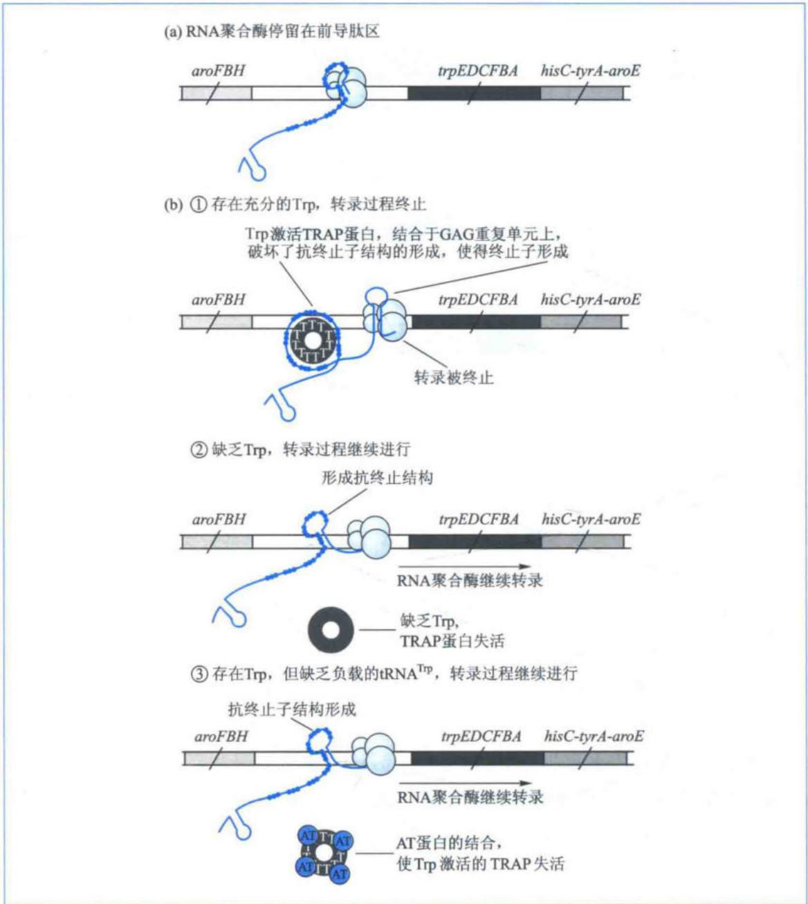

此外，gal 操纵子还有两个特点：①它有两个启动子，其 mRNA 可从两个不同的起始点开始转录；②它有两个 O 区，一个在 P 区上游 -67 \~ -73，另一个在结构基因 galE 内部。

## 1. cAMP-CRP 对 gal 启动子的作用

因为半乳糖的利用效率比葡萄糖低，人们猜想葡萄糖存在时半乳糖操纵子不被诱导，但实际上有葡萄糖存在时，gal操纵子仍可被诱导。现已分离到一些突变株，其中一类突变株能在不含葡萄糖的培养基中高水平合成半乳糖代谢酶类（gal结构基因高效表达）；另一类突变株中，gal基因的表达完全依赖于葡萄糖，培养基中如无葡萄糖存在，这些细菌的gal基因不表达，不合成半乳糖代谢酶类。分析gal操纵子P-O区的碱基序列发现有两个相距仅为5bp的启动子，gal操纵子可以从两个启动子分别起始基因转录，每个启动子拥有各自的RNA聚合酶结合位点 $S_{1}$ 和 $S_{2}^{(图7-27)}$ 。cAMP-CRP对从 $S_{1}$ 和 $S_{2}$ 起始的转录

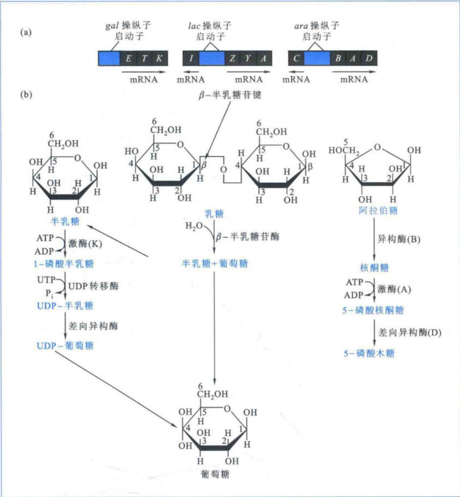

图7-26 gal操纵子、lac操纵子和ara操纵子的结构及其代谢途径

  
图7-27 gal操纵子启动区 $S_{1}$ 和 $S_{2}$ 序列分析

有不同的作用。

从 $S_{1}$ 起始的转录只有在培养基中无葡萄糖时才能顺利进行，RNA 聚合酶与 $S_{1}$ 的结合需要半乳糖、CRP 和较高浓度的 cAMP。当腺苷环化酶突变 $(cya^{-})$ 或 cAMP 受体蛋白突变 $(crp^{-})$ 时，gal 操纵子不能从 $S_{1}$ 起始转录。此时如在体外系统中加入 cAMP-CRP，就能够诱发从 $S_{1}$ 起始的转录。体外转录的实验证明，cAMP-CRP 能够刺激 gal 操纵子转录，用含有 gal 操纵子调节区的 DNA 片段作模板进行体外转录时，发现 cAMP-CRP 抑制从 $S_{2}$ 的转录而刺激从 $S_{1}$ 的转录。当有 cAMP-CRP 时，转录从 $S_{1}$ 开始，当无 cAMP-CRP 时，转录从 $S_{2}$ 开始。

从 $S_{2}$ 起始的转录则完全依赖于葡萄糖, 高水平的 cAMP-CRP 能抑制由这个启动子起始的转录, 因此, cAMP-CRP 在 gal 操纵子中所起的调节作用比在 lac 操纵子中更为复杂。大肠杆菌的 $cya^{-}$ 或 $crp^{-}$ 突变型不能利用乳糖, 但可以利用半乳糖作为唯一碳源。

有一个gal启动子突变株，不能利用培养基中的半乳糖，若将此突变株再行突变为 $cya^{-}$ 或 $crp^{-}$ ，细胞就恢复了利用半乳糖的能力。因为第一次突变失去了从 $S_{1}$ 起始转录的能力，却不影响从 $S_{2}$ 起始转录的能力。细胞中cAMP-CRP的存在抑制了从 $S_{2}$ 开始的基因转录，使gal操纵子既不能从 $S_{1}$ 起始又无法从 $S_{2}$ 起始转录。双重突变后，无论是 $cya^{-}$ 突变，还是 $crp^{-}$ 突变，都能移去cAMP-CRP对 $S_{2}$ 的阻遏作用，导致gal基因表达，恢复利用半乳糖作为能源的能力。

一般认为，cAMP-CRP有利于RNA聚合酶 $-S_{1}$ 区复合物形成开链构象，从而起始基因转录。同时，由于 $S_{1}$ 和 $S_{2}$ 区的核苷酸部分重叠，这一复合物的存在干扰了RNA聚合酶 $-S_{2}$ 复合物的形成，抑制 $S_{2}$ 起始的基因转录。

## 2. 双启动子的生理功能

为什么 gal 操纵子需要两个转录起始位点？这与半乳糖在细胞代谢中的双重功能有关。半乳糖不仅可以作为唯一碳源供细胞生长，而且与之相关的物质——尿苷二磷酸半乳糖（UDPgal）是大肠杆菌细胞壁合成的前体。在生长过程中，细胞必须随时合成差向异构酶，以保证尿苷二磷酸的供应。在没有外源半乳糖的情况下，细胞通过半乳糖差向异构酶（galactose epimerase, galE 基因产物）的作用由 UDP-葡萄糖合成 UDPgal。因为细胞壁合成过程对差向异构酶的需要量很小，本底水平的组成型合成就能够满足细胞生理需要。实际上，gal mRNA 的组成型合成水平已高于 lac 操纵子所合成 lac mRNA 的水平，显然这部分 mRNA 是在没有半乳糖的情况下合成的。

现在设想只有 $S_{1}$ 一个启动子,那么由于这个启动子的活性依赖于 cAMP-CRP,当培养基中有葡萄糖存在时就不能合成异构酶。假如唯一的启动子是 $S_{2}$ ,那么,即使在有葡萄糖存在的情况下,半乳糖也将使操纵子处于充分诱导状态,这无疑是一种浪费。所以,无论从必要性或经济性考虑,都需要一个不依赖于 cAMP-CRP 的启动子( $S_{2}$ )进行本底水平的组成型合成,以及一个依赖于 cAMP-CRP 的启动子( $S_{1}$ )对高水平合成进行调节。这就是说,只有在 $S_{2}$ 活性完全被 cAMP-CRP 抑制时,调控作用才是有效的。

## 7.4.2 阿拉伯糖操纵子

阿拉伯糖(arabinose)是另一个可以为代谢提供碳源的五碳糖。在大肠杆菌中阿拉伯糖的降解需要3个基因:araB、araA和araD,它们形成一个基因簇,简写为araBAD。它们分别编码3个酶:araB基因编码核酮糖激酶(ribulokinase),araA编码L-阿拉伯糖异构酶(L-arabinose isomerase),araD编码L-核酮糖-5-磷酸-4-差向异构酶(L-ribulose-5-phosphate-4-epimerase)。在gal操纵子中,基因的排列序列就是代谢途径中酶的作用序列,而这个操纵子却不同,阿拉伯糖的代谢是以araA、araB、araD的序列进行的。另外还有两个负责将阿拉伯糖运入细胞的基因,即araE和araF,它们的位置远离这个基因簇,araE和araF分别编码一个膜蛋白和一个位于细胞壁与细胞膜之间的阿拉伯糖结合蛋白。

与 araBAD 相邻的是一个复合的启动子区域、两个操纵区 $(O_{1}, O_{2})$ 和一个调节基因 araC，这个调节基因的性质与我们已介绍过的 lac 及 gal 操纵子中的调节基因的性质全然不同。AraC 蛋白同时显示正、负调节因子的功能。在 lac 和 gal 操纵子中，阻遏蛋白只能作为负调节因子，而 cAMP-CRP 蛋白只能是正调节因子。araBAD 和 araC 基因的转录是分别在两条链上以相反的方向进行的。在标准的遗传学图谱上，araBAD 基因簇从启动子 $P_{BAD}$ 开始向右进行转录，而 araC 基因则是从 $P_{c}$ 向左转录（图 7-28）。

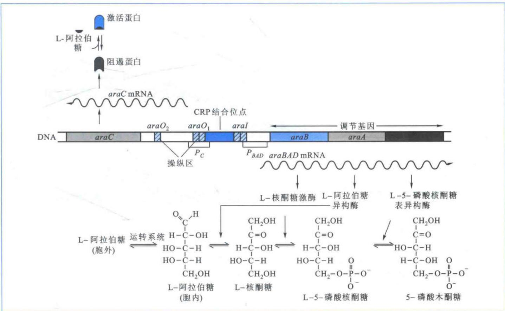  
图7-28 ara操纵子上游调控区序列与功能分析

ara 操纵子也是可诱导的,阿拉伯糖本身就是诱导物。在野生型操纵子中,只有阿拉伯糖存在时才转录出 araBAD mRNA,而有葡萄糖存在时则不转录。腺苷酸环化酶缺陷型和 crp $^{-}$ 突变株也不形成 araBAD mRNA,说明从 $P_{BAD}$ 起始的转录过程也需要 cAMP-CRP。

## 1. AraC 蛋白的正、负调节作用

AraC 蛋白既是 ara 操纵子的正调节蛋白, 又是其负调节蛋白 $^{(图 7-29)}$ 。我们来分析以下实验结果。首先, 当 araC 基因内发生点突变或缺失突变, 会产生不能合成 araBAD mRNA 的 araC $^{-}$ 突变株。其次, 构建基因型为 F'araC $^{+}$ /araC $^{-}$ 的局部二倍体细胞后发现这类细胞中 ara 操纵子可以被诱导, 说明 araC $^{-}$ 等位基因是隐性的。如果 araC $^{-}$ 突变体的产物是突变型的阻遏物, 那么, araC $^{-}$ 对于 araC $^{+}$ 来说至少应有部分显性。

遗传学上的其他证据如 araC 基因的琥珀突变,也说明 araC 基因产物是一种蛋白质,这一点又通过 AraC 蛋白的纯化得到了进一步证实。所以说,araBAD mRNA 的合成需要一个有功能的 AraC 蛋白,这个蛋白质与诱导物阿拉伯糖相结合后,诱导 araBAD 基因表达 $^{(图 7-29)}$ 。

  
图 7-29 ara 操纵子的表达调控  
(a) 当细胞内没有 AraC 蛋白时，由 $P_{c}$ 启动子起始 araC 基因转录；(b) 当体系中葡萄糖水平较高，阿拉伯糖水平较低时，AraC 蛋白与操纵区 $O_{2}$ 以及 araI 诱导因子结合区上半区相结合，形成 DNA 回转结构，ara BAD 基因不表达；(c) 当体系中有阿拉伯糖但无葡萄糖存在时，AraC 蛋白与阿拉伯糖相结合，改变构象成为激活蛋白，AraC 蛋白同源二聚体分别与 $araO_{1}$ 和 araI 区相结合，DNA 回转结构被破坏，RNA 聚合酶在 AraC 蛋白和 cAMP-CRP 的共同作用下起始 $P_{BAD}$ 所调控的结构基因表达。

有实验证明, 当 AraC 蛋白以正调控因子作用时, 起始转录还需要 cAMP-CRP 的共同参与。在第一个实验里, 人们发现当反应体系中只含有 ara 操纵子 DNA、RNA 聚合酶、AraC 蛋白及 cAMP-CRP 中的一个成分, araBAD mRNA 的转录不能起始, 说明只有 AraC 蛋白和 cAMP-CRP 协同作用才能起始 araBAD 的转录。在第二个实验里, 人们用电镜直接观察 ara 操纵子 DNA 分子(这种技术可以看到结合了 RNA 聚合酶的 DNA 分子) 发现, 除非 AraC 蛋白和 cAMP-CRP 同时存在, RNA 聚合酶一般不能与该操纵子 DNA 相结合。

## 2. AraC 蛋白的两种形式

AraC 蛋白作为 $P_{BAD}$ 活性正、负调节因子的双重功能是通过该蛋白质的两种异构体来实现的。一般认为，Pr 是起阻遏作用的形式，可以与现在尚未鉴定的类操纵区位点相结合，而 Pi 是起诱导作用的形式，它通过与 $P_{BAD}$ 启动子结合进行调节。推测 Pr 和 Pi 这两种结构处于一种相互平衡之中。在没有阿拉伯糖时，Pr 形式占优势；一旦有阿拉伯糖存在，它就能够与 AraC 蛋白结合，使平衡趋向于 Pi 形式。

## 3. 营养状况对 ara 操纵子活性的影响

图 7-30 是在各种营养状态下 ara 操纵子的表达情况。在图 7-30(a) 中，培养基含有葡萄糖，cAMP-CRP 没有与操纵区位点相结合，AraC 蛋白处于 Pr 形式并与操纵区 A 位点结合，RNA 聚合酶不能与 $P_{C}$ 结合，araC 基因虽然仍有转录，但受到抑制，只有少量 AraC 蛋白形成，整个系统几乎处于静止状态。它虽然不是完全关闭，但是尽可能地关闭了。图 7-30(b) 中没有葡萄糖糖，也没有阿拉伯糖，因为没有诱导物，尽管有 cAMP-CRP 与操纵区位点相结合，AraC 蛋白仍以 Pr 形式为主，无法与操纵区 B 位点相结合，无

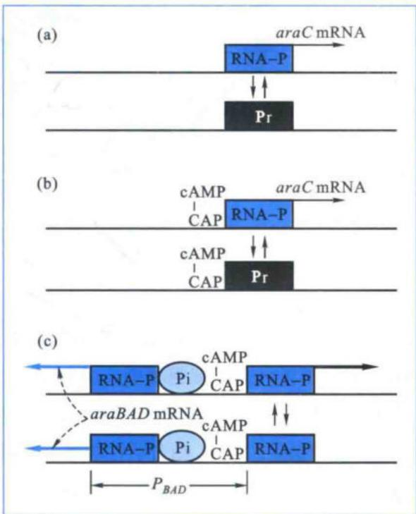  
图 7-30 各种营养状态下 ara 操纵子的表达调控(RNA-P 代表 RNA 聚合酶)

araBAD mRNA 转录。图 7-30(c) 中无葡萄糖, 有阿拉伯糖, 大量 araC 基因产物以 Pi 形式存在, 并分别与操纵区 B、A 位点相结合, 在 cAMP-CRP 的共同作用下, araC 和 araBAD 基因大量表达, 操纵子充分激活。

## 7.4.3 阻遏蛋白 LexA 的降解与细菌中的 SOS 应答

当细菌 DNA 遭到破坏时(如受到紫外线照射), 细菌细胞内会启动一个被称为 SOS 的诱导型 DNA 修复系统。研究发现, 参与 SOS DNA 修复系统的许多基因虽然分散在染色体的各个部位, 但都同时受 LexA 阻遏蛋白的抑制, 平时表达水平很低。

  
图 7-31 大肠杆菌中 LexA 蛋白阻遏的 SOS DNA 损伤修复系统操纵子的表达调控模式

SOS 体系的诱导表达过程其实就是把 LexA 阻遏蛋白从这些基因的上游调控区移开的过程。

一般情况下,recA基因表达并不完全受LexA阻遏,所以,每个细胞中可有1000个RecA蛋白单体分散在细胞质中。当DNA严重受损时,DNA复制被中断,单链DNA缺口数量增加,RecA与这些缺口处单链DNA相结合,被激活成为蛋白酶,将LexA蛋白切割成没有阻遏和操纵区DNA结合活性的两个片段,导致SOS体系(包括recA基因)高效表达,DNA得到修复(图7-31)。只要有活化信号存在,该操纵子就一直处于活性状态。当修复完成后,活化信号消失,RecA蛋白又回到非蛋白水解酶的形式,LexA蛋白才逐步积累起来,并重新建立阻遏作用。一旦RecA蛋白的合成停止,细菌开始生长并进行分裂,RecA又逐渐地稀释到原先的本底水平。

## 7.4.4 二组分调控系统和信号转导

细胞生活在不断变化的环境中,温度、pH 和渗透压变化,氧分压变化,营养的变化及细胞浓度的变化等都要求细菌必须随时做出相应的反应以求得生存。前面讨论的诱导和阻遏转录调控系统均是通过环境中的小分子效应物(诱导物或阻遏物)直接与调节蛋白结合进行转录调控,但是在较多情况下,外部信号并不是直接传递给调节蛋白,而是首先通过传感器(sensor)接收信号,然后以不同方式传到调节部位,这个过程就是信号转导(signal transduction)。目前已知的最简单的细胞信号系统称为二组分调控系统(two-components regulatory systems),由两种不同的蛋白质组成:即位于细胞质膜上的传感蛋白(sensor protein)和位于细胞质中的应答调节蛋白(response regulator protein)。因传感蛋白具有激酶活性,所以又称传感激酶。表7-3列出了大肠杆菌中存在的各种二组分调控系统。传感激酶常在与膜外环境的信号反应过程中被磷酸化,再将其磷酸基团转移到应答调节蛋白上,磷酸化的应答调节蛋白即成为阻遏蛋白或激活蛋白,通过对操纵子的阻遏或激活作用调控下游基因表达(图7-32)。

图 7-32 细菌中参与信号转导的二组分调控系统  
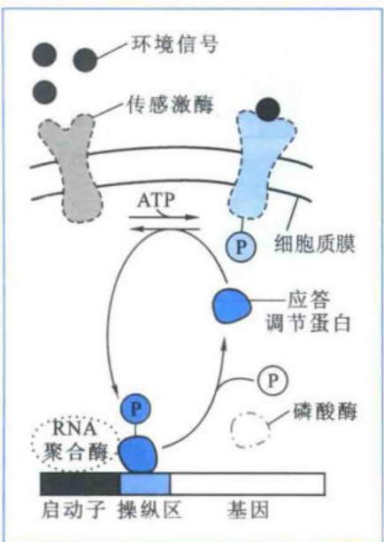

表 7-3 大肠杆菌中存在的二组分调控系统

<table><tr><td>刺激信号/功能</td><td>传感蛋白</td><td>应答调节蛋白</td></tr><tr><td>氧气缺乏</td><td>ArcB</td><td>ArcA</td></tr><tr><td>渗透压,包被蛋白</td><td>EnvZ</td><td>OmpR</td></tr><tr><td>渗透压,钾离子运输</td><td>KdpD</td><td>KdpE</td></tr><tr><td>磷酸盐清除</td><td>PhoR</td><td>PhoB</td></tr><tr><td>氮代谢</td><td>NtrB</td><td>NtrC</td></tr><tr><td>硝酸盐呼吸作用</td><td>NarX</td><td>NarL</td></tr><tr><td>硝酸盐和亚硝酸盐呼吸作用</td><td>NarQ</td><td>NarP</td></tr></table>

## 7.4.5 多启动子调控的操纵子

## 1. rRNA 操纵子

大肠杆菌 rRNA 操纵子 (rrnE) 上有两个启动子 $P_{1}$ 和 $P_{2}$ (图7-33)。在对数生长期细菌中， $P_{1}$ 起始的转录产物比 $P_{2}$ 起始的产物多 3\~5 倍，所以 $P_{1}$ 是强启动子。但是当细菌处于紧急状态时，如氨基酸饥饿条件下，细胞中 ppGpp 浓度增加， $P_{1}$ 的作用被抑制。因为 rRNA 是细胞中蛋白质合成机器

  
图 7-33 大肠杆菌 rrnE 上有两个启动子 ( $P_{1}$ 和 $P_{2}$ )

随着 ppGpp 浓度增加， $P_{1}$ 逐渐关闭，而 $P_{2}$ 活性不变。

核糖体的重要组成部分,不能完全停止供应,由 $P_{2}$ 起始的 rrnE 基因转录就显得越来越重要。在贫瘠的培养基中,细胞增殖缓慢时, $P_{2}$ 是合成 rRNA 的主要启动子。

## 2. 核糖体蛋白 SI 操纵子

与 rrnE 操纵子相类似的有核糖体蛋白 SI 操纵子 (rpsA), 它也受应急反应调节。rpsA有 4 个启动子,可能是大肠杆菌中启动子最多的操纵子。 $P_{1}$ 、 $P_{2}$ 是强启动子,平时主要依靠它们来启动基因的表达,合成 SI 蛋白。 $P_{3}$ 、 $P_{4}$ 是弱启动子,只有在紧急情况下, $P_{1}$ 、 $P_{2}$ 启动子受 ppGpp 的抑制,由 $P_{3}$ 、 $P_{4}$ 起始合成的 SI 蛋白维持了生命的最低需要。

图 7-34 DnaQ 蛋白操纵子表达活性受 RNA 聚合酶调节  
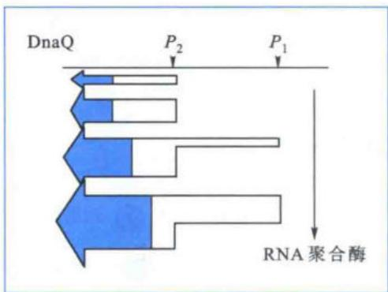

## 3. DnaQ 蛋白操纵子

DnaQ 蛋白是 DNA 聚合酶全酶的亚基之一，

其主要功能是校正 DNA 复制中可能出现的错误。已知这一操纵子受 RNA 聚合酶活性的调节，并拥有两个启动子(图 7-34)。在 RNA 聚合酶活性较低时，操纵子的转录由弱启动子 $P_{2}$ 控制；而 RNA 聚合酶活性较高时，就开始利用强启动子 $P_{1}$ 。因为细胞内 RNA 聚合酶活性与细胞的增殖速度有关，也就是说，在细胞染色体复制比较缓慢时，RNA 聚合酶活性往往较低，此时 DnaQ 蛋白的合成靠弱启动子 $P_{2}$ 来维持。当细胞增殖速度加快，RNA 聚合酶活性升高时， $P_{1}$ 就被激活，DnaQ 蛋白的合成就大大增加。

总之,操纵子中有不同的启动子,它们有不同的强度,其启动作用又受不同因子的调控。许多因素相互作用,才使基因表达更加有效,更加协调。在不同的生活环境中,不同的启动子精密地调节基因的表达量,这对维持细菌的生存起着非常重要的作用。

## 7.5 固氮基因调控

氮是所有生物的基本组成成分,蛋白质、核酸及许多小分子代谢产物都是氮化合物。没有氮,就没有生命。虽然地球大气的78%是氮气,但是有能力直接利用这种游离态氮的生物种类却很少,绝大部分生物只能利用化合态氮。固氮是将游离态氮转化为化合态氮的过程。据科学家估计,每年通过雷电等自然现象转化的氮占总固氮量的5%左右,人类通过合成氨工业转化的氮占总固氮量的30%左右,而总固氮量一半以上是由生物固氮过程贡献的。氮气分子是已知最稳定的双原子分子,打开N≡N三键需要大量的能量。人类的合成氨法是在高温高压条件下由催化剂催化将氮气和氢气合成氨气的,每年消耗了人类总能耗的1%,属于高能耗高污染生产过程。因此,合理有效地利用生物固氮资源可以缓解人类的能源和生态危机。

已经发现的能够固氮的生物都是原核细菌、放线菌和蓝藻。根据这些固氮生物的生活状态可以将它们分为3类:第一种是自养(free-living)固氮菌,它们独立生活,利用光合作用或者化能合成的能量支持生物固氮过程;第二种是共生(symbiotic)固氮菌,它们可以和植物形成互相依赖的共生关系,利用植物提供的养料高效固氮,而向植物提供氮化合物,其中研究最广泛的是在豆科植物中形成根瘤的根瘤菌;第三种是联合(associative)固氮菌,它们可以和植物形成比较松散的互利关系,依附在植物根系附近,吸收植物根系分泌的营养成分,回馈氮化合物。

## 7.5.1 固氮酶

20 世纪 60 年代初期,有科学家将晾干的厌氧微生物芽孢梭菌细胞溶于稀盐溶液中,离心后取上清液,加入 ${}^{15}N_{2}$ ,一定时间后发现反应体系中产生了 ${}^{15}NH_{3}$ 。进一步研究发现,无细胞提取液中的固氮酶活性会很快地完全被空气所破坏。现已查明,所有的固氮生物中都有催化固氮反应的固氮酶,这些固氮酶的结构和功能都很保守。固氮酶催化的反应如下:

$$
\mathrm{N} _ {2} + 8 \mathrm{e} ^ {-} + 8 \mathrm{H} ^ {+} + 1 6 \mathrm{MgATP} \longrightarrow 2 \mathrm{NH} _ {3} + \mathrm{H} _ {2} + 1 6 \mathrm{MgADP} + 1 6 \mathrm{Pi}
$$

固氮酶由铁蛋白(Fe-protein)和铁钼蛋白(FeMo-protein)两个蛋白质组分构成。铁钼蛋白中一个 $\alpha$ 亚基和一个 $\beta$ 亚基之间相互作用形成 $\alpha\beta$ 异二聚体，铁钼蛋白是由两个 $\alpha\beta$ 异二聚体聚合形成的轴对称 $\alpha_{2}\beta_{2}$ 异四聚体。每个 $\alpha\beta$ 异二聚体结合一个[8Fe-7S]的P金属簇和一个铁钼辅因子(FeMo cofactor)，铁钼辅因子由一个[7Fe-Mo-9S-X]金属簇的钼原子上连接一个高柠檬酸(homocitrate)构成，其中的X原子最近被发现是一个碳原子。铁蛋白是由两个亚基形成的二聚体，每个亚基含有一个MgATP结合位点，两个亚基之间由一个[4Fe-4S]金属簇连接。铁蛋白可以和铁钼蛋白的一个 $\alpha\beta$ 异二聚体结合，一个固氮酶中包含一个铁钼蛋白异四聚体和两个与之结合的铁蛋白异二聚体。铁蛋白、铁钼蛋白、铁钼辅因子和这些金属簇都是固氮反应不可缺少的。在缺钼条件下，有些固氮生物可以合成铁钒辅因子或者铁铁辅因子代替铁钼辅因子。

固氮酶催化的固氮反应是一个氮还原反应,每还原一个氮气分子,需要传递8个电子。首先,铁氧还蛋白和黄素氧还蛋白等电子供体向铁蛋白提供电子,将 $\left[4Fe-4S\right]^{2+}$ 还原为 $\left[4Fe-4S\right]^{+}$ 。电子从铁蛋白的 $\left[4Fe-4S\right]^{+}$ 传递到铁钼蛋白的 $\left[8Fe-7S\right]$ 金属簇,这个过程依赖铁蛋白水解MgATP,这时铁蛋白会离开铁钼蛋白重新结合ATP并接受电子。这步反应每次只传递一个电子,每秒只能传递大约5个电子,是固氮反应的限速步骤。在铁钼蛋白中, $\left[8Fe-7S\right]$ 金属簇向铁钼辅因子传递电子。铁钼辅因子是结合氮分子并催化氮还原反应的活性位点。

在还原氮的同时,固氮酶还有一个次要的活性,它能把氢质子还原成分子氢。这一反应不利于提高固氮酶活性,因为它既消耗了能量又产生了能竞争性抑制固氮活性的氢分子。根瘤菌中有些株系 $(Hup^{+})$ 能通过氢化酶的作用催化氢和氧的结合,从而利用反应中释放的氢。这一反应使得在质子还原过程中丢失的某些ATP再生,还有助于除去固氮酶附近的分子氧。

## 7.5.2 与固氮有关的基因及其表达调控

固氮酶催化氮还原是一个很慢的反应,所以在细菌需要通过固氮反应获得氮源的情况下,细菌需要合成大量的固氮酶。最多时,固氮酶可占细胞总蛋白量的20%。同时,固氮酶对氧高度敏感,较低的氧分压就能破坏固氮酶的活性。在已经研究的固氮酶中,只有一种高温环境的固氮菌携带的固氮酶是耐受氧的。为了防止氧损害固氮酶造成资源浪费,固氮菌有一套响应氧浓度的基因调控机制。另外，反应产物氨的浓度也会影响固氮酶基因的表达。

## 1. NifA 和 $\sigma^{54}$ 共同激活固氮酶基因的转录

固氮酶系统中包含许多基因:编码固氮酶各个蛋白质组分的基因、参与各种金属簇和辅因子合成的基因,以及一些编码转录调控因子基因。固氮酶基因(nif)的转录是由NifA和 $\sigma^{54}$ 因子共同激活的。nif基因转录所依赖的 $\sigma^{54}$ 因子与其他 $\sigma$ 因子都不一样,它识别和结合的是DNA上-24和-12区。NifA蛋白由3个结构域组成,C端的HTH型DNA结合结构域可以识别并结合nif操纵子的上游激活位点(UAS,upstream activator sequences);中间是保守的AAA $^{+}$ ATP酶活性结构域,可以结合并水解ATP,并且可以与RNA聚合酶(RNAP)及 $\sigma^{54}$ 相互作用,使NifA聚合成多聚体;N端是调控结构域主要负责NifA活性的调控。 $\sigma^{54}$ 也称为RpoN因子,是RNA聚合酶全酶的组分之一,主要作用是与NifA或NtrA相互作用后,使RNA聚合酶定位在固氮基因的启动子区域。NifA的多聚体结合到UAS位点,同时与RNA聚合酶的 $\sigma^{54}$ 因子结合,影响了 $\sigma^{54}$ 因子的构象并使DNA解链形成开放式转录起始复合物,激活nif基因转录。这个过程依赖于ATP的水解(图7-35)。

## 2. 固氮基因调控体系中的级联调控模式

固氮基因的表达主要由 NifA 和 $\sigma^{54}$ 共同在转录水平上调控，而 NifA 的活性和表达水平又受其他调控因子的调节，因此，整个固氮基因调控体系是一个级联调控体系。图 7-36 显示了克氏肺炎杆菌中的级联调控。nifL 和 nifA 基因位于同一个操纵子。在缺氧环境下，

图 7-35 NifA 激活
nif基因转录  
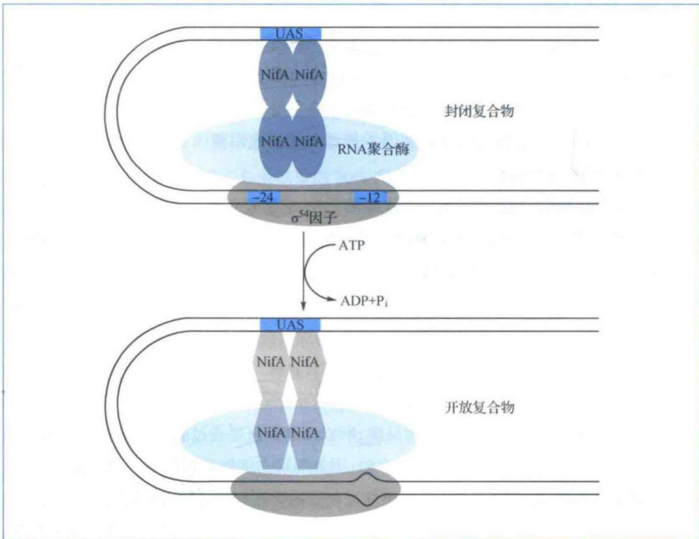

  
图 7-36 固氮基因受到氧浓度和氨浓度影响的级联调控

NifL 不能结合 NifA；在有氧环境下，NifL 可以结合 NifA 并抑制 NifA 的 ATP 酶活性，遏制 nif 基因转录。除了氧浓度，细胞中氨的浓度也会影响固氮基因的表达。NtrC 蛋白是 nifA 操纵子的激活因子，它的结构和功能类似 NifA，结合上游 DNA 并与 RNA 聚合酶的 $\sigma^{54}$ 因子相互作用。当 NtrC 被磷酸化，可使 DNA 解链形成开放复合物并起始转录。细胞中谷氨酰胺的浓度与游离氨的浓度呈正相关，当谷氨酰胺浓度低时，glnD 编码的尿苷转移酶能够将尿甘酸（UMP）转移到 GlnB 和 GlnK 蛋白上。此时，NtrB 使 NtrC 磷酸化，nifA 操纵子被 NtrC 激活；谷氨酰胺浓度高时，GlnB 和 GlnK 蛋白都不发生尿苷化，GlnB 结合 NtrB 并使 NtrC 去磷酸化，nifA 操纵子被关闭。另外，氧浓度低时，不带 UMP 的 GlnK 会抑制 NifL 结合 NifA，保证 NifA 激活 nif 基因表达。NifL 是 NifA 的负调控因子，仅在部分固氮菌中存在，nifL 型固氮菌的 NifA 则不受 NifL 的调控。例如深红红螺菌（Rhodospirillum rubrum）、草螺菌（Herbaspirillum seropdicae）和巴西固氮螺菌（Azospirillum brasilense）等固氮菌的 NifA 在氮匮乏时由 GlnB 负责激活；茎瘤固氮根瘤菌（Azorhizobium caulinodans）的 NifA 在氨富余时受到 GlnB 及 GlnK 的抑制。不同固氮生物中的调控模式在细节上有很大差异，但是基本上都是响应氧浓度和氨浓度的级联调控模式。

## 7.5.3 根瘤的产生以及根瘤相关基因的调控

## 1. 根瘤的产生

根瘤菌在豆科植物根际的生长以及与宿主植物根毛幼嫩部位的接触是感染发生的第一步。通常情况下，根瘤菌特定小种的宿主范围都是很狭窄的，如 Rhizobium trifolii 主要感染三叶草，R. phaseoli 主要感染菜豆，R. Leguminosarum 主要感染豌豆 $^{(表7-4)}$ 。当然，每个小种中可能有些株系能感染宿主以外的其他豆科植物。

表 7-4 感染各种植物的不同根瘤菌

<table><tr><td>主要类群</td><td>根瘤菌名</td><td>宿主植物</td></tr><tr><td>苜蓿类</td><td>R. meliloti</td><td>苜蓿</td></tr><tr><td>三叶草类</td><td>R. trifolii</td><td>三叶草</td></tr><tr><td>豌豆类</td><td>R. leguminosarum</td><td>豌豆、某些菜豆及扁豆</td></tr><tr><td>菜豆类</td><td>R. phaseoli</td><td>菜豆</td></tr><tr><td>黄芩类</td><td>R.loessense</td><td>黄芩</td></tr><tr><td>羽扇豆类</td><td>B. lupine</td><td>羽扇豆</td></tr><tr><td>大豆类</td><td>B. japonicum</td><td>大豆</td></tr><tr><td>豇豆类</td><td>Cowpea rhizobia</td><td>花生、豇豆、金合欢属</td></tr></table>

根瘤菌细胞以极性的方式与根毛接触，并附着到植物细胞上。这种接触的专一性是由植物凝血素和细菌细胞壁之间的相互作用所决定的。植物凝血素是由植物细胞所产生的一种糖蛋白，它对含有半乳糖、N-乙酰葡糖胺和甘露糖的寡聚糖复合体具有糖类结合特异性，对糖基有很高的亲和力与专一性，现已鉴定出根瘤菌细胞壁上的一种脂多糖组分很可能就是植物凝血素的受体。有实验表明，根瘤菌能产生一定量的寡聚糖来刺激植物凝血素的分泌，由基因型所决定的根瘤菌宿主范围，可能受到植物基因组的影响，因为特定的植物凝血素只能识别特定的细菌表面受体。

## 2. 豆血红蛋白及根瘤素基因的调控

豆血红蛋白(leghemoglobin, Lb)在体内的主要功能是调节根瘤细胞氧含量, 它是根瘤细胞中植物基因组编码的最主要的蛋白质, 其血红素辅基可能是由细菌编码的。脱辅基后的 Lb 蛋白相对分子质量为 $1.56 \times 10^{4} \sim 1.59 \times 10^{4}$ 。已经发现存在 4 种不同的 Lb 异构体 (Lba、Lbc1、Lbc2 和 Lbc3), 它们在氨基酸序列上虽然只有微小差异, 但仍然由不同的基因编码。分析 Lba 和 Lbc 基因的核苷酸序列表明, 它们的读码框中插入了 3 个长短不一的内含子, 因此这些基因的总长度不一样。氨基酸序列分析证实, Lb 与动物肌红蛋白存在同源性。

除了 Lb 以外, 至少还有 20 种其他多肽是由植物基因组编码但只在根瘤菌诱导的细胞中得到表达, 这些蛋白质 (包括 Lb) 统称根瘤素 (nodulin)。科学家通过被 B. japonicum 感染的大豆根瘤细胞对根瘤素进行了详细的研究, 并根据其生理功能将其分为 3 类: 第一类是根瘤结构蛋白; 第二类是负责将类菌体固定的氮素同化并转移到植物体内的酶系统; 第三类是维持类菌体功能所必需的蛋白质。Lb 就属于第三类根瘤素, 它在根瘤固氮体系中起着不容忽视的作用, 因为细胞内氧浓度一般都在数百微摩尔左右, 而固氮酶只能在几十纳摩尔 O₂ 浓度下才能正常工作, 这对矛盾就是依靠 Lb 得到解决的。如果将细胞内 O₂ 浓度降低到几十纳摩尔以下, 呼吸系统的主要酶类早已停止了反应, 根本不可能为细胞的生命活动提供能量。Lb 对 $O_{2}$ 有极高的亲和力，它与大量自由 $O_{2}$ 相结合，既大大降低了自由 $O_{2}$ 浓度，又能将分子氧直接输送到呼吸链，真可谓一石二鸟，天衣无缝(表7-5)。

表 7-5 大豆根瘤细胞内氧浓度变化分析

<table><tr><td></td><td>类菌体周膜空间</td><td>含类菌体的宿主细胞质</td></tr><tr><td>Lb 含量</td><td>300 μmol/L</td><td>3 000 μmol/L</td></tr><tr><td>Lb 氧化程度</td><td>20%</td><td>20%</td></tr><tr><td>氧吸附量</td><td>60 μmol/L</td><td>600 μmol/L</td></tr><tr><td>自由氧浓度</td><td>11 nmol/L</td><td>11 nmol/L</td></tr><tr><td>吸附氧 / 自由氧</td><td>5 500</td><td>55 000</td></tr></table>

曾有人用大豆根瘤特异性 cDNA 进行选择性杂交,并利用与多核糖体相结合的多腺苷化 RNA 进行体外翻译,发现每一个含类菌体的根瘤细胞内可有 600 000 个与核糖体相结合的 mRNA 分子,其中大约有 90 000 个(15%)是 Lb mRNA 分子。总之,共生固氮是一个很有意思的体系。人类虽然不一定能在不久的将来使禾谷类植物固氮,但对豆科植物与固氮菌的相互识别及固氮基因调控因子的研究,却一定可以更加丰富我们对植物和微生物界的认识。

## 7.6 转录水平上的其他调控方式

转录过程涉及转录机器附着于 DNA, 识别启动子序列, 起始 RNA 的合成、延伸和终止。转录的任何一步都受到调控, 其中某些步骤是主要的调控点, 比如 RNA 转录的起始相对延伸和终止来说。自然选择使得生物的调控策略达到最优化。转录过程的调节是生物基因表达调节最有效的方式。

## 7.6.1 $\sigma$ 因子的调节作用

参与大肠杆菌中基因表达调控最常见的蛋白质可能是 $\sigma$ 因子。对大肠杆菌基因组序列进行分析后发现至少存在 7 种 $\sigma$ 因子，并根据其相对分子质量的大小或编码基因进行命名 $^{(表7-6)}$ ，其中 $\sigma^{70}$ 参与最基本的生理功能基因的转录调控，如碳代谢、生物合成等。

表 7-6 大肠杆菌中的各种 $\sigma$ 因子比较

<table><tr><td>σ因子</td><td>编码基因</td><td>主要功能</td></tr><tr><td> $σ^{70}$ </td><td>RpoD</td><td>参与对数生长期和大多数碳代谢过程基因的调控</td></tr><tr><td> $σ^{54}$ </td><td>RpoN</td><td>参与多数氮源利用基因的调控</td></tr><tr><td> $σ^{38}$ </td><td>RpoH</td><td>分裂间期特异基因的表达调控</td></tr><tr><td> $σ^{32}$ </td><td>RpoS</td><td>热休克基因的表达调控</td></tr><tr><td> $σ^{28}$ </td><td>RpoF</td><td>鞭毛趋化相关基因的表达调控</td></tr><tr><td> $σ^{24}$ </td><td>RpoE</td><td>过度热休克基因的表达调控</td></tr><tr><td> $σ^{19}$ </td><td>FecL</td><td>参与调节铁离子转运相关基因的表达调控</td></tr></table>

图 7-37 大肠杆菌中的 $\sigma$ 因子(以 $\sigma^{70}$ 为例)主要包括4个结构域  
  
图 7-38 $\sigma^{70}(\mathrm{a})$ 和 $\sigma^{54}(\mathrm{b})$ 因子识别并结合在所调控基因上游的不同区域

除参与氮代谢的 $\sigma^{54}$ 以外, 其他 5 种 $\sigma$ 因子在结构上具有同源性, 所以统称 $\sigma^{70}$ 家族。研究发现, 所有 $\sigma$ 因子都含有 4 个保守区 (图 7-37), 其中第 2 个和第 4 个保守区参与结合启动区 DNA, 第 2 个保守区的另一部分还参与双链 DNA 解开成单链的过程。与上述 $\sigma$ 因子特异性结合 DNA 上的 -35 区和 -10 区不同, $\sigma^{54}$ 因子识别并与 DNA 上的 -24 和 -12 区相结合 (图 7-38)。在与启动子结合的顺序上, $\sigma^{70}$ 类启动子在核心酶结合到 DNA 链上之后才能与启动子区相结合, 而 $\sigma^{54}$ 则类似于真核生物的 TATA 区结合蛋白 (TATA-binding protein, TBP), 可以在无核心酶时独立结合到启动子上。大肠杆菌中主要是 $\sigma^{70}$ 因子参与转录调控, 在特定的情况下, 其他 $\sigma$ 因子也可取代 $\sigma^{70}$ 因子, 引导 RNA 聚合酶开启特定的基因转录。例如大肠杆菌面临高温环境时, 细胞中参与热休克基因调控的 $\sigma^{32}$ 因子的数量会迅速增加。这些 $\sigma^{32}$ 因子会替代一部分 RNA 聚合酶中的 $\sigma^{70}$ 因子, 引导这些 RNA 聚合酶到热休克基因的启动子上, 激活热休克基因的转录。

不同的 $\sigma$ 因子可以独立地起作用,但是,为了保证细胞准确响应不同的环境信号变化, $\sigma$ 因子之间常常交互作用构成网络调控模式,使得原核基因的表达稳定而平衡。 $\sigma$ 因子本身的活性受到蛋白水解酶的调控,也能被同源的抗 $\sigma$ 因子失活。这些抗 $\sigma$ 因子能够与特定的 $\sigma$ 因子结合,阻止它们与 RNA 聚合酶组装。

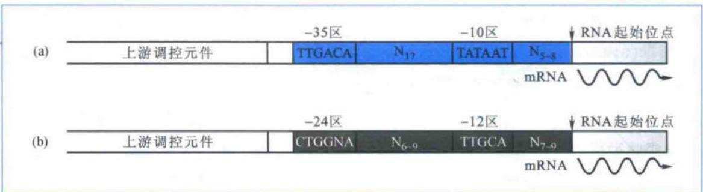

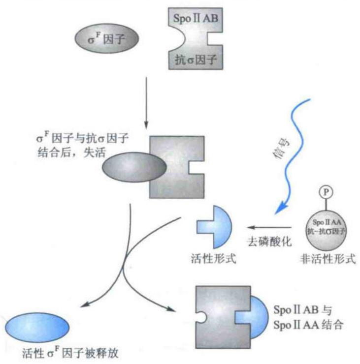

图7-39 $\sigma^{\mathrm{F}}$ 的两种存在形式

营养物缺乏时,革兰氏阳性菌 Bacillus 会形成孢子来度过困难时期。其孢子的形成需要 4 种不同的 $\sigma$ 因子。 $\sigma^{\mathrm{E}}$ 和 $\sigma^{\mathrm{K}}$ 存在于母细胞中,一旦开始形成孢子就产生 $\sigma^{\mathrm{F}}$ 和 $\sigma^{\mathrm{G}}$ 。 $\sigma^{\mathrm{E}}$ 和 $\sigma^{\mathrm{K}}$ 先以非活性的前体形式被合成,经过特定的蛋白酶作用转变成活性形式。 $\sigma^{\mathrm{F}}$ 也是以非活性形式(与抗 $\sigma$ 因子 Spo II AB 结合)存在于孢子中,环境刺激导致 Spo II AA 抗-抗 $\sigma$ 因子去磷酸化,并特异性地与抗 $\sigma$ 因子 Spo II AB 结合,释放出有活性的 $\sigma^{\mathrm{F}}$ (图 7-39)。活性 $\sigma^{\mathrm{F}}$ 促使早期孢子形成相关基因(包括 $\sigma^{\mathrm{G}}$ 和需要进入母细胞中降解前体 $\sigma^{\mathrm{E}}$ 蛋白酶基因)的转录。活性 $\sigma^{\mathrm{G}}$ 主要激活后期孢子形成相关基因和需要进入母细胞中降解前体 $\sigma^{\mathrm{K}}$ 的蛋白酶基因的转录。

## 7.6.2 组蛋白类似蛋白的调节作用

细菌中存在一些非特异性的 DNA 结合蛋白,用来维持 DNA 的高级结构,被称为组蛋白类似蛋白(histone-like proteins)。细菌中的 H-NS 蛋白,就以非特异性的方式结合 DNA,维持其高级结构。H-NS 包含 2 个结构域,一个 DNA 结合结构域和一个蛋白质-蛋白质相互作用结构域。H-NS 先结合到 DNA 上,然后通过蛋白质-蛋白质相互作用形成四聚体或者多聚体,帮助维持 DNA 的高级结构。另外,H-NS 与大肠杆菌基因组上分散的大量基因的调控区有较高的亲和性,这些基因大都与环境条件的变化有关。H-NS 非特异性结合在这些 DNA 上,抑制这些基因的转录。这些基因的转录激活需要特定的转录因子参与。

## 7.6.3 转录调控因子的作用

能够与基因的启动子区相结合,对基因的转录起激活或抑制作用的 DNA 结合蛋白被称之为转录调控因子。大肠杆菌基因组中有300多个基因编码这样的蛋白质，它们大多数是序列特异性的DNA结合蛋白，能够与特定的启动子结合。有些能够调控大量基因的表达，而有些仅调控一两个基因的表达。转录调控因子CRP、FNR、IHF、Fis、ArcA、NarL和Lrp调控了 $50\%$ 基因的表达，而约有60个转录因子仅能特异性结合一两个启动子。有些转录因子对某个基因起激活作用，却对另一个基因起抑制作用。有些转录因子对同一基因也能发挥两种不同的作用，如AraC蛋白在结合阿拉伯糖前后就分别起着抑制和激活阿拉伯糖操纵子基因转录的作用。许多基因的启动子区有多个转录调控因子的结合位点，这些转录调控因子的共同作用才能使RNA聚合酶顺利地结合在DNA上起始基因转录的过程。

## 7.6.4 抗终止因子的调节作用

抗终止因子是能够在特定位点阻止转录终止的一类蛋白质。当这些蛋白质存在时，RNA聚合酶能够越过终止子，继续转录DNA。这种基因表达调控机制主要见于噬菌体和少数细菌中。在RNA聚合酶到达终止子之前与抗终止因子结合，因为在终止子上游存在抗终止作用的信号序列，只有与抗终止因子相结合的RNA聚合酶才能顺利通过具有茎-环结构的终止子，使转录继续进行(图7-40)。

参与大肠杆菌抗终止作用的蛋白是 Nus 蛋白。转录起始不久， $\sigma$ 因子从 RNA 聚合酶上解离下来，NusA 蛋白就结合到了核心 RNA 聚合酶上。NusA 的结合增加了 RNA

图 7-40 抗终止因子的通读作用  

聚合酶在终止子发夹结构处暂停的过程，从而促进抗终止作用的发生。NusA 和 $\sigma$ 因子不能同时结合到 RNA 聚合酶上。只要 RNA 聚合酶结合在 DNA 上，NusA 就不会从 RNA 聚合酶上解离，而 $\sigma$ 因子可以取代游离 RNA 聚合酶上的 NusA，因此，在转录起始和终止的过程中 RNA 聚合酶分别受到 $\sigma$ 因子和 NusA 的调控。大肠杆菌核糖体 RNA 编码基因 rrn 的转录就是抗终止转录的典型。当结合有 NusA 的 RNA 聚合酶遇到 boxA 终止序列时，NusB/S10 抗终止因子在 NusG 的帮助下与 RNA 聚合酶相结合，实现抗终止（图 7-41）。

  
图 7-41 抗终止子参与大肠杆菌 rrn 基因转录的调控  
当结合有NusA的RNA聚合酶遇到BoxA终止序列时，NusB/S10抗终止因子可在NusG的作用下与RNA聚合酶结合，实现抗终止。

## 7.7 转录后调控

基因表达的转录调控是生物最经济的调控方式——既然用不着某种蛋白质，就用不着转录了。但转录生成 mRNA 以后，再在翻译或翻译后水平进行“微调”，是对转录调控的补充，它使基因表达的调控更加适应生物本身的需求和外界条件的变化。

## 7.7.1 mRNA 自身结构元件对翻译的调节

## 1. 起始密码子

原核生物的翻译要靠核糖体 30S 亚基识别 mRNA 上的起始密码子 AUG, 以此决定它的开放读码框, AUG 的识别由 fMet-tRNA 中含有的碱基配对信息 (3'-UAC-5') 来完成。原核生物中还存在其他可选择的起始密码子, 14% 的大肠杆菌基因起始密码子为 GUG, 3% 为 UUG, 另有两个基因使用 AUU。这些不常见的起始密码子与 fMet-tRNA 的配对能力较 AUG 弱, 从而导致翻译效率的降低。有研究表明, 当 AUG 被替换成 GUG 或 UUG 后, mRNA 的翻译效率降低了 8 倍。

## 2. 5' 非翻译区 (5' UTR)

遗传信息翻译成多肽链起始于 mRNA 上的核糖体结合位点 (ribosome binding site, RBS), 一般是起始密子 AUG 上游的包括 SD 序列在内的一段非翻译区, 该序列与核糖体 16S rRNA 的 3' 端互补配对, 促使核糖体结合到 mRNA 上, 有利于翻译起始。RBS 的结合强度取决于 SD 序列的结构及其与起始密码 AUG 之间的距离。SD 与 AUG 之间相距一般以 4\~10 个核苷酸为佳, 9 个核苷酸为最佳。

此外，mRNA 的二级结构也是翻译起始调控的重要因素。因为核糖体的 30S 亚基必须与 mRNA 结合，要求 mRNA 5' 端有一定的空间结构。SD 序列的微小变化，往往会导致表达效率上百倍甚至上千倍的差异，这是由于核苷酸的变化改变了形成 mRNA 5' 端二级结构的自由能，影响了核糖体 30S 亚基与 mRNA 的结合，从而造成了蛋白质合成效率上的差异。例如，lacI mRNA 是在弱启动子的控制下组成型合成的，其 5' UTR 的 RNA 序列不利于核糖体的结合，导致 lacI mRNA 只能低效地翻译出少量 LacI 蛋白，保证每个细胞里通常只有大约 10 个 LacI 阻遏蛋白的四聚体存在。lacI 转录和 LacI 蛋白翻译总

<!-- END OFFICIAL API PART part_003 -->

<!-- BEGIN OFFICIAL API PART part_004 -->

是维持在低水平,这就保证了细菌在遇到乳糖时能够很快产生足够的诱导物来解除阻遏状态。

## 3. 核糖开关

有些 mRNA 还含有一种名为核糖开关(riboswitch)的表达调控元件。核糖开关是一段具有复杂结构的 RNA 序列，在原核生物中通常位于 mRNA 的 5' UTR 区域。与其他调控元件不同，核糖开关能够感受细胞内诸如代谢物浓度、离子浓度、温度等的变化而改变自身的二级结构和调控功能，从而改变基因的表达状态。核糖开关可能通过影响转录的起始、延伸和终止，或者通过控制核糖体与 mRNA 的结合，或者通过调节 mRNA 的稳定性来调控基因表达。在真核生物中，核糖开关还会通过控制 mRNA 的剪接来调控基因表达。

在枯草杆菌(Bacillus subtilis)中,许多参与甲硫氨酸途径的基因在5' UTR有一段大约200 bp的RNA被认为是SAM感受型核糖开关(SAM-sensing riboswitch)。在一些基因中,如图7-42(a),核糖开关在没有结合SAM时,RNA的二级结构使得核糖体结合位点(RBS)被暴露在外,核糖体结合到mRNA上开始翻译蛋白质;而一旦结合了SAM,核糖开关的二级结构发生改变,与核糖体相结合的RBS位点被封闭,蛋白质翻译就被抑制。而在另一些基因中,SAM感受型核糖开关一旦结合了SAM,就会在编码区上游产生转录终止的构象,提前终止转录(图7-42(b))。

枯草杆菌的 glmS 基因编码一种合成葡糖胺 -6- 磷酸 (glucosamine-6-phosphate, GlcN6P) 的酶, 在 glmS mRNA 的 5' UTR 序列中有一段核酶 (ribozyme) 结构。没有 GlcN6P 结合该核酶时, glmS mRNA 可以正常翻译出蛋白质; 而当翻译得到的酶催化 GlcN6P 合成反应,提高了细胞中 GlcN6P 的浓度时,GlcN6P 就与核酶相结合,有活性的核酶会切割 glmS mRNA,阻止蛋白质翻译(图 7-43)。

图 7-42 SAM 感受型核糖开关  

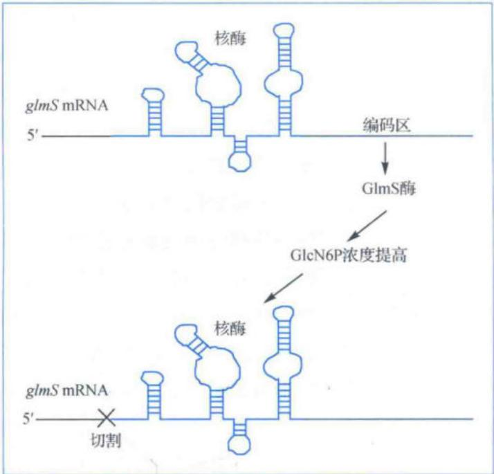  
图 7-43 核酶型核糖开关

  
图7-44 热敏型核糖开关

有些核糖开关不受代谢物调节,但受到其他因素的影响。如单核增生性李斯特菌(Listeria monocytogenes) pfrA 基因的 5' UTR 有一段被称为热敏 RNA(thermosensor RNA) 的发夹结构封闭了 RBS 位点。当温度由 30℃ 升高到 37℃ 时,发夹结构会打开释放出 RBS 位点,使 pfrA 基因的表达水平提高 5 倍(图 7-44)。

## 7.7.2 mRNA 稳定性对转录水平的影响

所有细胞都有一系列核酸酶,用来清除无用的 mRNA。一个典型的细菌 mRNA 半衰期为 2\~3 min。mRNA 分子被降解的可能性取决于它们的二级结构。大肠杆菌有一个 CsrAB 调节系统。CsrA 为一个 RNA 结合蛋白,CsrB 是一个非编码的 RNA 分子。CsrA 可以结合到受其调控的 mRNA 上,也可以与 CsrB 的 RNA 分子相结合。每个 CsrB RNA 分子最多可结合 18 个 CsrA 蛋白。

在静止期细菌细胞内,糖以糖原的形式被储藏起来;在细胞快速生长周期,通过糖酵解途径消耗糖,这两个过程的平衡就是由 CsrAB 调节系统来完成的。CsrA 蛋白可激活糖酵解过程并抑制葡萄糖和糖原的合成。在糖原合成途径中,如果 CsrA 蛋白结合到 glg 基因的 mRNA 分子上,该 mRNA 分子就易于受核酸酶攻击,其降解过程加快,其作为蛋白质合成模板的功能就受到抑制(图 7-45)。

## 7.7.3 调节蛋白的调控作用

细菌中有些 mRNA 结合蛋白可激活靶基因的翻译。大肠杆菌 BipA 蛋白就具有依赖

图7-45 CsrA蛋白调控glg mRNA的稳定性  

于核糖体的 GTP 酶活性,能够激活转录调控蛋白基因 fis mRNA 的翻译,是 fis 蛋白质合成所必需的。

相反，mRNA特异性抑制蛋白则通过与核糖体竞争性结合mRNA分子来抑制翻译的起始。大肠杆菌中核糖体蛋白就存在翻译抑制现象。rRNA基因正常转录和翻译，产生核糖体蛋白，由于这些蛋白质与rRNA分子的亲和力较强，只要细胞中有足够的rRNA分子，核糖体蛋白就不会结合到自身mRNA分子上。当细胞中缺乏足够的rRNA分子时，核糖体蛋白只能结合到自身mRNA分子上，导致该mRNA的RBS位点被封闭，蛋白质合成停止(图7-46)。这种机制保证了rRNA和核糖体蛋白在数量上的平衡。

图 7-46 核糖体蛋白对自身 mRNA 翻译的抑制作用  

## 7.7.4 小RNA的调节作用

RNA 调节是原核生物基因表达转录后调节的另一种重要机制。细菌响应环境压力(氧化压力、渗透压、温度等)的改变,会产生一些长度在 50\~500 nt 之间的非编码小 RNA 分子。这些小RNA能结合mRNA或蛋白质，通过改变靶mRNA的稳定性，影响蛋白质-RNA的结合或者mRNA的翻译来调节基因表达。原核细胞中的非编码RNA称为非编码小RNA（small non-coding RNA）即sRNA。原核生物sRNA以反式编码sRNA为主，并且大部分都需要RNA分子伴侣Hfq蛋白的协助来发挥作用，主要是通过不严格的碱基互补配对与靶mRNA结合，抑制或促进靶mRNA的翻译，加速或减缓靶mRNA的降解。

细菌铁蛋白用来储存细胞中过剩的铁离子。bfr基因编码细菌铁蛋白，而anti-bfr基因编码反义RNA。培养基中铁离子浓度较低时，不需要细菌铁蛋白；当铁离子浓度升高时，就需要细菌铁蛋白行使功能。然而，细胞中无论铁离子浓度高低，bfr基因都正常转录成mRNA，而anti-bfr基因的转录却受到能够感应铁离子浓度变化的Fur蛋白的调控。细胞中铁离子过多时，Fur蛋白作为抑制因子起作用，关掉与铁摄取有关的众多操纵子，包括anti-brf基因的表达，使bfr基因能正常翻译出细菌铁蛋白，储存过剩的铁离子。在铁离子浓度低时，anti-bfr基因转录产生大量反义RNA，与bfr mRNA配对，阻止细菌铁蛋白基因的翻译(图7-47)。

此外，大肠杆菌中受氧化压力诱导产生的OxyS和受低温诱导产生的DsrA基因也可以反式编码sRNA的方式调控多个基因的翻译。OxyS可以与fhlA（编码细菌甲酸盐代谢中的转录激活蛋白)mRNA的核糖体结合位点的部分序列配对，也可以与fhlA编码序列中的特定序列配对，阻止核糖体的结合从而抑制fhlAmRNA的翻译。DsrA可以通过促进编码胁迫相关 $\sigma$ 因子rpoS基因的翻译和克服类核相关的H-NS蛋白的转录沉默来调节转录和翻译。在大肠杆菌中，DsrA主要有两种形式，一种是全长转录形式(full-length transcript, Fform)，一种是被截短的转录形式(truncated transcript, Tform)，这两种形式的比例会随着温度的变化而存在差异。当温度较低时候，DsrA以F形式为主。DsrARNA具有3个茎-环，其第一个茎-环结构具有85个核苷酸，对于rpoS的翻译是必须的，而对于抗H-NS活性则是不必要的而第二个茎-环对于抗沉默是必需的。第三个茎-环结构为转录终止子，可被trp转录终止子取代而不丧失DsrA功能。DsrA的第一个茎-环区域可以借助Hfq蛋白与rpoSmRNA的前导序列互补配对，导破坏了rpoSmRNA核糖体结

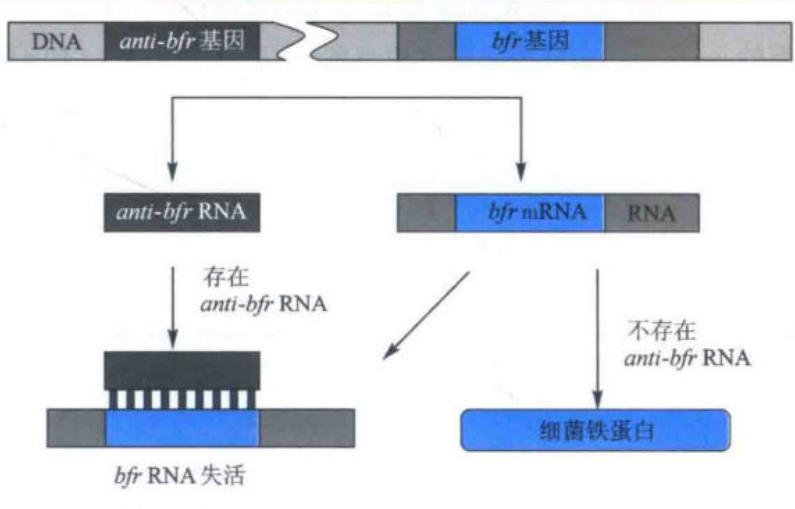  
图7-47 反义RNA对bfr基因翻译的抑制作用

图 7-48 反式编码 sRNA 结合在靶 mRNA 的茎 - 环结构上, 使茎 - 环结构打开, 促进靶 mRNA 翻译

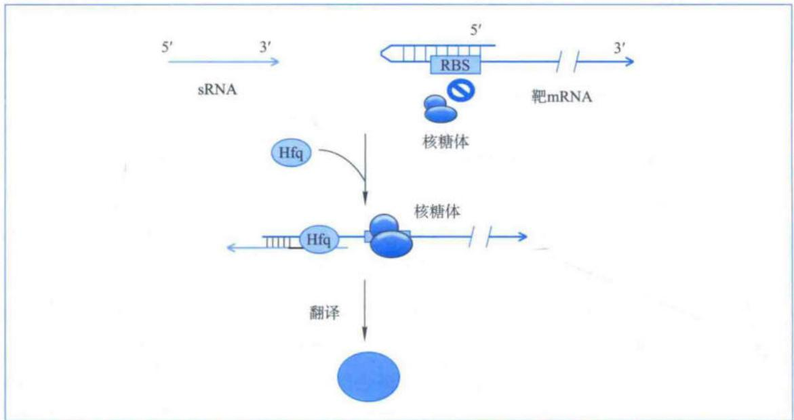

合位点序列处的茎-环结构,释放核糖体结合位点,激活mRNA的翻译(图7-48),促进σ因子的表达,这表明DsrA与rpoS mRNA的配对可能对于翻译调控是重要的。通过核磁共振研究DsrA和DsrA/rpoS复合物的结构,发现sRNA含有第二个茎-环的动态构象平衡,这可能是DsrA调节其多个靶mRNA翻译的重要机制。

## 7.7.5 稀有密码子对翻译的影响

在大肠杆菌 DNA 复制时,冈崎片段之前的 RNA 引物是由 dnaG 基因编码的引物酶催化合成的,细胞对这种酶的需求量不大,而引物酶过多对细胞是有害的。已知 dnaG、rpoD 和 rpsU(30S 核糖体上的 S21 蛋白)属于大肠杆菌基因组上的同一个操纵子,而这 3 个基因产物在数量上却大不相同,每个细胞内仅有 50 个拷贝的 dnaG 蛋白,却有 2800 个拷贝的 rpoD 蛋白,更有高达 40000 个拷贝的 rpsU 蛋白。细胞通过翻译调控,解决了这个问题。

研究 dnaG 序列发现其中含有不少稀有密码子。分别计算大肠杆菌中 25 种结构蛋白和 dnaG、rpoD 序列中 64 种密码子的利用频率，可以看出 dnaG 与其他两类有明显不同(表 7-7)。很明显，稀有密码子 AUA 在高效表达的结构蛋白及 σ 因子中均极少使用，而在表达要求较低的 dnaG 蛋白中使用频率就相当高。此外，UCG(Ser)、CCU(Pro)、CCC(Pro)、ACG(Thr)、CAA(Gln)、AAU(Asn) 和 AGG(Arg) 等 7 个密码子的使用频率在不同蛋白质中也有明显差异。

表 7-7 几种蛋白质中异亮氨酸密码子使用频率比较

<table><tr><td>蛋白质</td><td>AUU/%</td><td>AUC/%</td><td>AUA/%</td></tr><tr><td>结构蛋白</td><td>37</td><td>62</td><td>1</td></tr><tr><td>σ亚基</td><td>26</td><td>74</td><td>0</td></tr><tr><td>dnaG蛋白</td><td>36</td><td>32</td><td>32</td></tr></table>

许多调控蛋白如 LacI、AraC、TrpR 等在细胞内含量也很低, 这些蛋白质的编码基因中密码子的使用频率和 dnaG 相似, 而明显不同于结构蛋白。科学家认为, 由于细胞内对应于稀有密码子的 tRNA 较少, 高频率使用这些密码子的基因翻译过程容易受阻, 影响了蛋白质合成的总量。

## 7.7.6 重叠基因对翻译的影响

重叠基因最早在大肠杆菌噬菌体 $\Phi X174$ 中发现，例如 $B$ 基因包含在 $A$ 基因内， $E$ 基因包含在 $D$ 基因内，用不同的阅读方式得到不同的蛋白质。当时认为重叠基因的生物学意义是它可以包含更多的遗传信息，后来发现丝状RNA噬菌体、线粒体DNA和细菌染色体上都有重叠基因存在，暗示这一现象可能对基因表达调控有影响。现用trp操纵子中的trpE基因和trpD基因之间的翻译耦联现象来说明这个问题。

trp 操纵子由 5 个基因 (trpE、D、C、B、A) 组成, 在正常情况下, 操纵子中 5 个基因产物是等量的, 但 trpE 突变后, 其邻近的 trpD 产量比下游的 trpBA 产量要低得多。研究 trpE 和 trpD 以及 trpB 和 trpA 两对基因中核苷酸序列与翻译耦联的关系, 发现 trpE 基因的终止密码子和 trpD 基因的起始密码子共用一个核苷酸。

$$
t r p E — — \text { 苏氨酸 } — — \text { 苯丙氨酸 } — — \text { 终止 }
$$

$$
\mathrm{ACU} - \mathrm{UUC} - \mathrm{UGA} \text { u   g   g   c   u }
$$

$$
\mathrm{AUG} — — \mathrm{GCU}
$$

$$
\text {   甲硫氨酸——丙氨酸——trpD   }
$$

由于 trpE 的终止密码子与 trpD 的起始密码重叠, trpE 翻译终止时核糖体立即处在起始环境中, 这种重叠的密码保证了同一核糖体对两个连续基因进行翻译的机制。实验证明, 耦联翻译可能是保证两个基因产物在数量上相等的重要手段。除了上述 trpE 和 trpD 基因之外, trpB 和 trpA 基因也存在着翻译耦联现象, 因为这两个基因的产物等量存在于细胞中, 而其核苷酸序列同样是重叠的。

$$
t r p B — — \text { 谷氨酸 } — — \text { 异亮氨酸 } — — \text { 终止 }
$$

$$
\mathrm{GAA} - \mathrm{AUC} - \mathrm{UGAuggaa}
$$

$$
\mathrm{AUG} - \mathrm{GAA}
$$

$$
\text {   甲硫氨酸——谷氨酸——trpA   }
$$

此外,大肠杆菌 gal 操纵子(galETK)中也存在着一种基因重叠现象。galT 的终止密码子虽然与 galK 的起始密码子相隔 3 个核苷酸,galK 基因的 SD 序列却位于 galT 基因终止密码子之前,尽管这一现象与前述耦联翻译并不完全相同,但因为核糖体结合在 mRNA 上,可以覆盖 20 个核苷酸,包括 SD 序列和 galK 基因的起始密码子,所以当 galT 翻译终止时,核糖体还没有脱落就直接与 SD 序列结合,开始 galK 的翻译,也能保证两个基因的等量翻译,这也是一种翻译耦联。

## 7.7.7 翻译的阻遏

蛋白质阻遏或激活基因转录的例子已经屡见不鲜,那么,蛋白质是否也能对翻译起类似的调控作用呢?在大肠杆菌 RNA 噬菌体 Qβ 中发现了这种现象。Qβ 噬菌体基因组包含有 3 个基因,从 5' 到 3' 方向依次是与噬菌体组装和吸附有关的成熟蛋白基因 A、外壳蛋白基因和 RNA 复制酶基因。当噬菌体感染细菌,RNA 进入细胞后,这条称为 (+)链的 RNA 立即作为模板指导合成复制酶,并与宿主中已有的亚基结合行使复制功能。但是,Qβ(+)RNA 链上此时已有不少核糖体,它们从 5' 向 3' 方向进行翻译,这无疑影响了复制酶催化的从 3' 向 5' 方向进行的(-)链合成。克服这个矛盾的办法便是由 Qβ 复制酶作为翻译阻遏物进行调节。

体外实验证明,纯化的复制酶可以和外壳蛋白的翻译起始区结合,抑制蛋白质的合成。由于复制酶的存在,核糖体便不能与起始区结合,但已经起始的翻译仍能继续下去,直到翻译完毕,核糖体脱落,与(+)RNA 3'端结合的复制酶便开始了RNA的复制。这里复制酶既能与外壳蛋白的翻译起始区结合,又能与(+)链RNA的3'端结合。序列分析表明,这两个位点上都有CUUUUAAA序列,能形成稳定的茎-环结构,具备翻译阻遏特征。

## 7.7.8 魔斑核苷酸水平对翻译的影响

实验证明,核糖体蛋白(R 蛋白)通过反馈阻遏作用保证所有 R 蛋白合成的协同进行。那么,细胞如何保证蛋白质合成的总速度与蛋白质合成机器主要成分 rRNA 的合成速率相一致,保证在不进行蛋白质合成时没有 RNA 的合成?起这个调控作用的最早信号是不载有氨基酸的 tRNA。

大肠杆菌营养缺陷型 $(trp^{-}his^{-})$ 在缺少任何一种必需氨基酸的培养基上生长时,不但蛋白质合成速度立即下降,RNA合成速度也下降。由于色氨酸和组氨酸不是RNA的前体,因此认为RNA合成速度下降是蛋白质合成受阻后的次级反应。研究另一个大肠杆菌突变株发现,当氨基酸供应不足时,这个突变株细胞内蛋白质合成虽然停止了,但RNA的合成速度却没有下降。科学上把前一种现象称为严紧控制(基因型 $rel^{+}$ );后一种现象称为松散控制(基因型 $rel^{-}$ )。

$rel^{+}$ 和 $rel^{-}$ 菌株除上述生理现象不同之外，缺乏氨基酸时 $rel^{+}$ 菌株能合成鸟苷四磷酸（ppGpp）和鸟苷五磷酸（pppGpp）， $rel^{-}$ 菌株则不能合成鸟苷酸。因为这两种化合物是在层析谱上检出的斑点，当时称为魔斑（magic spot）。在旺盛生长的细胞中有65%\~90%的tRNA是载有氨基酸的。当氨基酸缺乏时，不负载氨基酸的tRNA增多，这种不负载氨基酸的tRNA仍能与核糖体的A位结合，核糖体上不负载氨基酸的tRNA是细胞产生严紧控制的信号。在正常的蛋白质合成过程中，将AA-tRNA运转到正在延伸的多肽上需要GTP，也许由于这一反应的停止，大量GTP便被用作合成魔斑核苷酸的前体(图7-49)。

参与这个反应的除 relA 基因所编码的 ATP-GTP 3' 焦磷酸转移酶外, 还需要翻译起始因子 EFTu 和 EFG 等。当细菌的生存条件恢复时, 一种名为 spoT 的基因编码降解 (p)

ppGpp 的酶,因此应急反应随着(p) ppGpp 的消失很快逆转。ppGpp 是多效性的,它的主要作用除了影响 RNA 聚合酶与启动子结合的专一性外,还可以影响核糖体蛋白

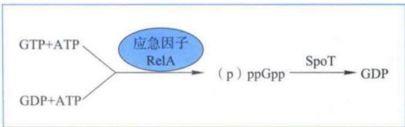  
图7-49 ppGpp的合成及降解

的活性,从而成为细胞内严紧控制的关键。有人将 ppGpp 和 cAMP 这类物质称为警报素 (alarmone)。在细胞较好的营养状况下,胞内 ppGpp 水平较低,IF2 介导的翻译起始能够顺利进行;当细胞营养状况较差,缺乏氨基酸时,胞内的 ppGpp 水平大大提高,抑制了细胞因子 IF2 介导的翻译起始步骤,使得没有进入翻译起始的 70S 核糖体单体大大增加,造成活性核糖体比例降低(图 7-50),可在很大范围内做出如抑制核糖体和其他大分子合成等应急反应,活化某些氨基酸操纵子的转录表达,抑制与氨基酸运转无关的系统,活化蛋白水解酶等,以节省或开发能源,渡过难关。

图 7-50 活性核糖体调控模型  

## 思考题

1. 简述代谢物对基因表达调控的两种方式。

2. 什么是操纵子学说？

3. 简述乳糖操纵子的调控模型。

4. 什么是葡萄糖效应？

5. 什么是弱化作用？

6. 简述抗终止因子的调控机制。

7. 简述反义 RNA 的调控机制。

8. 简述原核基因转录后调控的不同方式。

9. 简述 ppGpp 是如何参与细菌的应急反应。

10. 什么是 $\sigma$ 因子，简述 $\sigma$ 因子在原核基因调控中的作用。

## 参考文献

1. Bae B, Davis E, Brown D, et al. Phage T7 Gp2 inhibition of Escherichia coli RNA polymerase involves misappropriation of $\sigma70$ domain 1.1. Proceedings of the National Academy of Sciences of the United States of America, 2013, 110: 19772–19777.

2. Dai X, Zhu M, Warren M, et al. Reduction of translating ribosomes enables Escherichia coli to maintain elongation rates during slow growth. Nature Microbiology, 2016, 2, 16231.

3. Fouqueau T, Blombach F, Werner F. Evolutionary origins of two-barrel RNA polymerases and site-specific transcription initiation. Annual Review of Microbiology, 2017, 71.

4. Groisman E A. Feedback control of two-component regulatory systems. Annual Review of Microbiology, 2016, 70: 103–124.

5. Hoch J A. A Life in Bacillus subtilis signal transduction. Annual Review of Microbiology, 2017, 71:1.

6. Jastrab J B, Darwin, K H. Bacterial proteasomes. Annual Review of Microbiology, 2015, 69: 109.

7. Martinezpastor M, Tonner P D, Darnell C L, et al. Transcriptional regulation in Archaea: from individual genes to global regulatory networks. Annual Review of Genetics, 2017, 51: 143.

8. Mettert E L, Kiley P J. How is Fe-S cluster formation regulated? Annual Review of Microbiology, 2015, 69:505.

9. Narula J, Tiwari A, Igoshin O A. Role of autoregulation and relative synthesis of operon partners in alternative sigma factor networks. Plos Computational Biology, 2016, 12.

10. Quereda J J, Cossart P. Regulating bacterial virulence with RNA. Annual Review of Microbiology, 2017, 71:263-280.

11. Sporer A J, Kahl L J, Price-Whelan A, et al. Redox-based regulation of bacterial development and behavior. Annual Review of Biochemistry, 2016, 86:777-797.

12. Yang Y, Darbari V C, Zhang N, et al. TRANSCRIPTION. Structures of the RNA polymerase- $\sigma$ 54 reveal new and conserved regulatory strategies. Science, 2015, 349:882–885.

数字课程学习

e 教学课件

目在线自测

思考题解析
