图 3-11 SD 序列与 16S rRNA 3' 端反向互补, 在核糖体与 mRNA 的结合过程中发挥重要作用

  
后，mRNA-rRNA 杂合体被打破，为核糖体在 mRNA 模板上的移动创造了条件。

## 3.4.3 真核生物 mRNA 的特征

凡是编码功能蛋白的真核基因都通过 RNA 聚合酶Ⅱ进行转录, 真核基因几乎都是单顺反子, 只包含一个蛋白质的信息, 其长度在几百到几千个核苷酸之间。一个完整的基因, 不但包括编码区 (coding region), 还包括 5' 和 3' 端长度不等的特异性序列, 它们虽然不编码氨基酸, 却在基因表达的过程中起着重要作用。所以, “基因” 的分子生物学定义是: 产生一条多肽链或功能 RNA 所必需的全部核苷酸序列! 真核生物 mRNA 结构上的最大特征是 5' 端的帽子及 3' 的多 (A) 结构 (图 3-12a)。

## 1. 真核生物 mRNA 的 5' 端存在“帽子”结构

真核生物(不包括叶绿体和线粒体)的mRNA 5'端都是经过修饰的,基因转录一般从嘌呤(主要是A,也可能是G)起始,第一个核苷酸保留了5'端的三磷酸基团并能通过其3'-OH位与下一个核苷酸的5'磷酸基团形成二酯键,转录产物的起始序列为pppApNpNp……。然而,如果在体外用核酸酶处理成熟mRNA,其5'端并不产生预期的核苷三磷酸,而产生以5'→5'三磷酸基团相连的二核苷酸,5'终端是一个在mRNA转录后加上去的甲基化鸟嘌呤(图3-12)。

mRNA 5' 端加 “G” 的反应是由鸟苷酸转移酶完成的, 这个反应非常迅速, 很难在体外或体内测得 5' 自由三磷酸基团的存在。据测算, 在新生 mRNA 链达到 50 个核苷酸之前, 甚至可能在 RNA 聚合酶 II 离开转录起始位点之前, 帽子结构就已加到 mRNA 的第一个核苷酸上了。这就是说, mRNA 几乎一诞生就是戴上帽子的。一般认为, 帽子结构是 GTP 和原 mRNA 5' 三磷酸腺苷 (或鸟苷) 缩合反应的产物, 新加上的 G 与 mRNA 链上所有其他核苷酸方向正好相反, 像一顶帽子倒扣在 mRNA 链上, 故而得名。

mRNA 的帽子结构常常被甲基化。第一个甲基出现在所有真核细胞的 mRNA 中(单细胞真核生物 mRNA 主要是这个结构)，由鸟嘌呤 -7- 甲基转移酶 (guanine-7-methyltransferase) 催化，称为零类帽子(cap0)。帽子结构的下一步是在第二个核苷酸(原 mRNA 5'第一位)的 2'-OH 位上加另一个甲基，这步反应由 2'-O- 甲基转移酶完成。一般把有这两个甲基的结构称为 1 类帽子(cap1)，真核生物中以这类帽子结构为主。当 mRNA 原第一位核苷酸是腺嘌呤时，其 N $^{6}$ 位有时也被甲基化，这一反应只能在 2'-OH 被甲基化以后才能发生。在某些生物细胞内，mRNA 链上的原第二个核苷酸的 2'-OH 位也可能被甲基化，因为这个反应只以带有 1 类帽子的 mRNA 为底物，所以被称为 2 类帽子(cap2)。有 2 类帽子的 mRNA 只占有帽 mRNA 总量的 15% 以下。

  
图 3-12 真核生物 mRNA 结构
(a) 真核生物 mRNA 的结构特征; (b) 真核生物 mRNA 的帽子结构。

(b)  
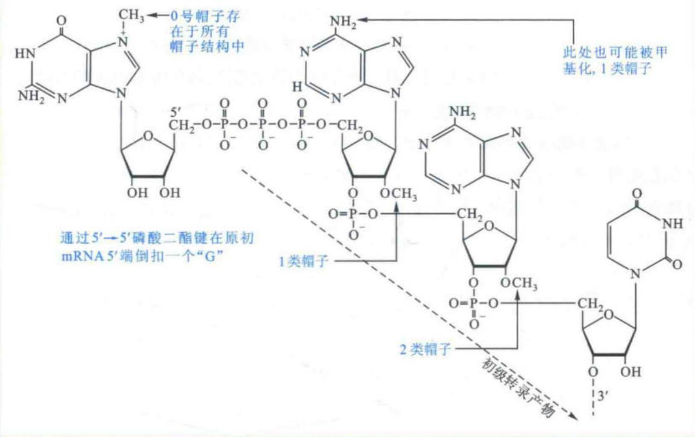

帽子结构可能使 mRNA 免遭核酸酶的破坏。实验表明，去除珠蛋白 mRNA 5' 端的 7-甲基鸟嘌呤后，该 mRNA 分子的翻译活性和稳定性都明显下降。而且，有帽子结构的 mRNA 更容易被蛋白质合成的起始因子所识别，从而促进蛋白质的合成。在呼肠孤病毒中，含甲基化 5' 端 mRNA 的蛋白质合成速度比不含甲基的 mRNA 要快。用化学方法除去 5' 端的甲基以后，上述 mRNA 作为蛋白质合成模板的活性消失，说明 mRNA 5' 端甲基化的帽子是翻译所必需的。已经发现在呼肠孤病毒中无 m $^{7}$ G 的 mRNA 不能与核糖体 40S 小亚基结合，证明甲基化的帽子结构可能是蛋白质合成起始信号的一部分。

## 2. 绝大多数真核生物 mRNA 具有多(A)尾

除组蛋白基因外,真核生物 mRNA 的 3' 端都有多(A)序列,其长度因 mRNA 种类不同而变化,一般为 40\~200 个。多(A)序列是在转录后加上去的,可能在细胞核中的核内不均一 RNA 阶段就已经加上了多(A)。目前还不清楚 RNA 聚合酶 II 所转录基因的精确终止位点,但研究发现,几乎所有真核基因的 3' 端转录终止位点上游 15\~30 bp 处的保守序列 AAUAAA 对于初级转录产物的准确切割及加多(A)是必需的(图 3-13)。实验证明,尽管多(A)位点及 AATAAA 的存在对于基因的转录和成熟意义重大,但 RNA 聚合酶 II 却不在多(A)位点终止,而往往继续转录,因此,大部分已知基因的初始转录产物拥有多(A)位点下游 0.5\~2 kb 核苷酸序列。

加多(A)时需要由内切酶切开 mRNA 3' 端的特定部位,然后由多(A)合成酶催化多腺苷酸的反应。如果将上述保守序列切除,该基因组合的转录活性就会消失。点突变实验将 AAUAAA 变为 AAGAAA,虽然维持了该基因的转录活性,却发现 mRNA 的剪接加工受阻,因而没有功能性 mRNA 产生。

多(A)是mRNA由细胞核进入细胞质所必需的形式,它大大提高了mRNA在细胞质中的稳定性。当mRNA刚从细胞核进入细胞质时,其多(A)尾一般比较长,随着mRNA在细胞质内逗留时间延长,多(A)逐渐变短消失,mRNA进入降解过程。此外,翻译起始因子eIF4F和包绕在多(A)尾的poly(A)结合蛋白之间的相互作用使真核mRNA保持环状,因而多(A)还能增强mRNA的可翻译能力。

真核生物 mRNA 大都具有多(A)尾,这一特性已被广泛应用于分子克隆。常用寡聚dT片段与 mRNA 上的多(A)相配对,作为反转录酶合成第一条 cDNA 链的引物。

尽管大部分真核 mRNA 有多(A)尾,细胞中仍可有多达 1/3 没有多(A)的 mRNA,我们把带有多(A)的 mRNA 称为多(A) $^{+}$ ,而把没有多(A)的 mRNA 称为多(A) $^{-}$ 。现已查明,约 1/3 的多(A) $^{-}$ mRNA 编码了不同形式的组蛋白, 其余 2/3 的多(A) $^{-}$ mRNA 可能带有与多(A) $^{+}$ 组分相同的遗传信息。

图 3-13 真核生物 mRNA 的加多(A)反应  

## 3.5 原核生物 RNA 聚合酶与 RNA 转录

## 3.5.1 原核生物 RNA 聚合酶

在细菌中,一种 RNA 聚合酶几乎负责所有 mRNA、rRNA 和 tRNA 的合成。大多数原核生物 RNA 聚合酶的组成是相同的,大肠杆菌 RNA 聚合酶是原核生物 RNA 聚合酶中研究最清楚的酶,它首先由 2 个 α 亚基、一个 β 亚基、一个 β' 亚基和一个 ω 亚基组成核心酶,然后加上一个 σ 亚基后则成为聚合酶全酶(holoenzyme),相对分子质量为 $4.65 \times 10^{5}$ (图 3-14)。

原核生物转录的起始需要全酶参与,由 $\sigma$ 因子辨认起始点,延长过程仅需要核心酶的催化。转录的真实性取决于有特异的转录起始位点,转录起始后按照碱基互补原则准确地转录模板 DNA 序列及具有特异的终止部位。RNA 的合成是在模板 DNA 的启动子位点上起始的,而这个任务是靠 $\sigma$ 因子来完成的。RNA 聚合酶的核心酶虽可合成 RNA,但不能找到模板 DNA 上的起始位点,所以核心酶的产物是不均一的,而且 DNA 的两条链都可作为核心酶的模板。只有带 $\sigma$ 因子的全酶才能专一地与 DNA 上的启动子结合,选择其中一条链作为模板,合成RNA链。 $\sigma$ 因子的作用在于帮助转录起始,因此也称为起始亚基,一旦转录开始,它就脱离了起始复合物,而由核心酶负责RNA链的延伸。研究发现,由 $\beta$ 和 $\beta'$ 亚基组成了聚合酶的催化中心,它们在序列上与真核生物RNA聚合酶的两个大亚基有同源性。 $\beta$ 亚基能与模板DNA、新生RNA链及核苷酸底物相结合(表3-2)。

  
图 3-14 大肠杆菌 RNA 聚合酶的主要成分与功能

表 3-2 大肠杆菌 RNA 聚合酶的组成分析

<table><tr><td>亚基</td><td>基因</td><td>相对分子质量</td><td>亚基数</td><td>组分</td><td>功能</td></tr><tr><td> $\alpha$ </td><td>rpoA</td><td> $3.65 \times 10^{4}$ </td><td>2</td><td>核心酶</td><td>核心酶组装,启动子识别</td></tr><tr><td> $\beta$ </td><td>rpoB</td><td> $1.51 \times 10^{5}$ </td><td>1</td><td>核心酶</td><td rowspan="2"> $\beta$ 和 $\beta'$ 共同形成RNA合成的活性中心,与DNA模板结合,催化磷酸二酯键形成</td></tr><tr><td> $\beta'$ </td><td>rpoC</td><td> $1.55 \times 10^{5}$ </td><td>1</td><td>核心酶</td></tr><tr><td> $\omega$ </td><td>?</td><td> $1.1 \times 10^{4}$ </td><td>1</td><td>核心酶</td><td>未知</td></tr><tr><td> $\sigma$ </td><td>rpoD</td><td> $7.0 \times 10^{4}$ </td><td>1</td><td> $\sigma$ 因子</td><td>存在多种 $\sigma$ 因子,用于识别不同的启动子,促进转录起始</td></tr></table>

α亚基可能与核心酶的组装及启动子识别有关,并参与RNA聚合酶和部分调节因子的相互作用。实验证明,T4噬菌体感染大肠杆菌后对α亚基的一个精氨酸残基进行ADP糖基化修饰,造成RNA聚合酶全酶对启动子亲和力降低。

σ因子的作用是负责模板链的选择和转录的起始，它是酶的别构效应物，使酶专一性识别模板上的启动子。在细胞内σ因子的数量只有核心酶的30%，因此任何时候只有三分之一的聚合酶以全酶形式存在。σ因子可以极大地提高RNA聚合酶对启动子区DNA序列的亲和力(图3-14)，酶底结合常数提高 $10^{3}$ 倍，酶底复合物的半衰期可达数小时甚至数十小时。σ因子还能使RNA聚合酶与模板DNA上非特异性位点的结合常数降低 $10^{4}$ 倍，使非特异性位点酶底复合物的半衰期小于1s。核心酶在T7噬菌体DNA上约有1300个结合位点，平均结合常数为 $2\times10^{11}$ 。加入σ因子后则出现两类位点，大部分位点的结合常数在 $10^{8}\sim10^{9}$ 之间，但有8个位点的结合常数在 $10^{12}\sim10^{14}$ 之间，从而表明σ因子不仅增加聚合酶对启动子的亲和力，还降低了它对非专一位点的亲和力。

在某些细菌细胞内含有能识别不同启动子的 $\sigma$ 因子, 以适应不同生长发育阶段的要求, 调控不同基因转录的起始 $^{(表3-3)}$ 。

表 3-3 大肠杆菌中的 $\sigma$ 因子能识别并与启动子区的特异性序列相结合

<table><tr><td>因子</td><td>基因</td><td>功能</td><td>-35区</td><td>间隔/bp</td><td>-10区</td></tr><tr><td> $\sigma^{70}$ </td><td>rpoD</td><td>广泛</td><td>TTGACA</td><td>16~18</td><td>TATAAT</td></tr><tr><td> $\sigma^{32}$ </td><td>rpoH</td><td>热休克</td><td>TCTCNCCCTTGAA</td><td>13~15</td><td>CCCCATNTA</td></tr><tr><td> $\sigma^{54}$ </td><td>rpoN</td><td>氮代谢</td><td>CTGGNA</td><td>6</td><td>TTGCA</td></tr></table>

与大肠杆菌相比，T3 和 T7 噬菌体的 RNA 聚合酶在结构上要简单得多，它们由一条多肽链组成，相对分子质量小于 $1 \times 10^{5}$ 。在 $37^{\circ}C$ 下，它们的转录速度为每秒 200 个核苷酸。但是，这种简单的聚合酶只能起始存在于噬菌体中的几个启动子的转录。因此，大肠杆菌

RNA 聚合酶组成上的复杂性可能反映了它必须与大量蛋白质因子相互作用这个事实。

当 RNA 聚合酶按 $5'\rightarrow3'$ 方向延伸 RNA 链时, 解旋的 DNA 区域也随之移动。聚合酶可以横跨约 40 个碱基对, 而解旋的 DNA 区域大约是 17 个碱基对。自由核苷酸能被聚合酶加到新生的 RNA 链上, 并形成 DNA-RNA 杂合体。随着聚合酶在模板上的运动, 靠近 $3'$ 端的 DNA 不断解旋, 同时在 $5'$ 端重新形成 DNA 双链, 将 RNA 链挤出 DNA-RNA 杂合体。RNA 的 $3'$ 端有 20\~30 个核苷酸与 DNA 或聚合酶相结合 (图 3-5)。

图 3-15 转录启动子区 DNA 序列的分离纯化过程图示  
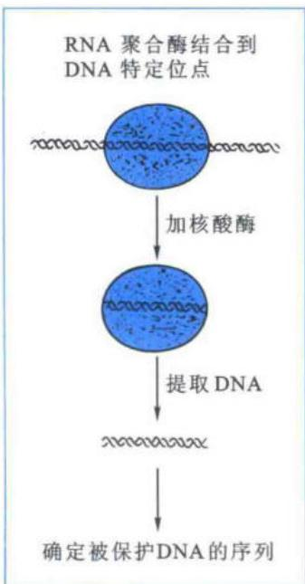

## 3.5.2 原核生物启动子结构

启动子区是 RNA 聚合酶的结合区, 其结构直接关系到转录的效率。那么, 启动子区有什么结构特点呢?

Pribnow 设计了一个实验,他把 RNA 聚合酶全酶与模板 DNA 结合后,用 DNase I 水解 DNA,然后用酚抽提,沉淀纯化 DNA 后得到一个被 RNA 聚合酶保护的 DNA 片段(图 3-15),有 41\~44 个核苷酸对。他先后分离了 fd 噬菌体、T7 噬菌体的 A₂ 及 A₃ 启动子、λ 噬菌体的 Pᵣ 启动子及大肠杆菌乳糖操纵子的 UV5 启动子等 5 段被酶保护的区域,并进行了序列分析,以后又有人做了 50 多个启动子的序列分析后发现,在被保护区内有一个由 5 个核苷酸组成的共同序列,是 RNA 聚合酶的紧密结合点,现在称为 Pribnow 区(Pribnow box),这个区的中央大约位于起点上游 10 bp 处,所以又称为 -10 区。

提纯被保护的片段后却发现，RNA聚合酶并不能重新结合或并不能选择正确的起始点，表明在保护区外可能还存在与RNA聚合酶对启动子的识别有关的序列。果然，科学家不久就从噬菌体的左、右启动子 $\mathrm{P_L}$ 及 $\mathrm{P_R}$ 和SV40启动子的-35bp附近找到了另一段共同序列：TTGACA。经过数年的努力，分析了46个大肠杆菌启动子的序列以后确证绝大部分启动子都存在这两段共同序列，即位于-10bp处的TATA区和-35bp处的TTGACA区(图3-16)。现已查明，-10位的TATA区和-35位的TTGACA区是RNA聚合酶与启动子的结合位点，能与 $\sigma$ 因子相互识别而具有很高的亲和力。

$$
\begin{array}{r l} & - 3 5 \text {   区   } \\ & \dots \dots \mathrm{T} _ {8 5} \mathrm{T} _ {8 3} \mathrm{G} _ {8 1} \mathrm{A} _ {6 1} \mathrm{C} _ {6 9} \mathrm{A} _ {5 2} \dots \dots \mathrm{T} _ {8 9} \mathrm{A} _ {8 9} \mathrm{T} _ {5 0} \mathrm{A} _ {6 5} \mathrm{A} _ {1 0 0} \dots \dots \end{array}
$$

## 3.5.3 原核生物启动子中 -10 区与 -35 区的最佳间距

在原核生物中，-35区与-10区之间的距离通常是 $16\sim 19$ 碱基对，小于15碱基对或大于20碱基对都会降低启动子的活性(图3-17)。保持启动子这两段序列以及它们之间的距离是十分重要的，否则就会改变它所控制基因的表达水平。这可以被解释为一旦-35区相对于-10区旋转所产生的超螺旋发生改变(增减一个碱基对就会使两者之间的夹角发生 $36^{\circ}$ 的变化), 若要使酶与 DNA 在这个区域内保持正确的取向, 就必须使二者之一发生扭曲, 需要增加结合自由能。

图 3-16 大肠杆菌 RNA 聚合酶全酶所识别的启动子区  

<table><tr><td colspan="2">上游元件</td><td>-35区</td><td>间隔区</td><td>-10区</td><td>间隔区</td><td>转录起始位点</td></tr><tr><td colspan="7">理论上一致性序列+1</td></tr><tr><td></td><td>NNAAAATTTT-T</td><td>N</td><td>TTGACA</td><td> $N_{17}$ </td><td>TATAAT</td><td> $N_6$ </td></tr><tr><td colspan="7">rrnBP1启动区序列</td></tr><tr><td></td><td>AGAAAATTATTTAAATTTCCT</td><td>N</td><td>GTGTCA</td><td> $N_{16}$ </td><td>TATAAT</td><td> $N_8$ </td></tr><tr><td colspan="2">trp</td><td>TTGACA</td><td> $N_{17}$ </td><td>TTAACT</td><td> $N_7$ </td><td>A</td></tr><tr><td colspan="2">lac</td><td>TTTACA</td><td> $N_{17}$ </td><td>TATGTT</td><td> $N_6$ </td><td>A</td></tr><tr><td colspan="2">recA</td><td>TTGATA</td><td> $N_{18}$ </td><td>TATAAT</td><td> $N_7$ </td><td>A</td></tr><tr><td colspan="2">araBAD</td><td>CTGACG</td><td> $N_{18}$ </td><td>TACTGT</td><td> $N_6$ </td><td>A</td></tr></table>

在细菌中常见两种启动子突变。一种叫下降突变(down mutation)，如果把 Pribnow 区从 TATAAT 变成 AATAAT 就会大大降低其结构基因的转录水平。另一类突变叫上升突变 (up mutation)，即增加 Pribnow 区共同序列的同一性。例如，在乳糖操纵子的启动子中，将其 Pribnow 区从 TATGTT 变成 TATATT，就会提高启动子的效率，提高乳糖操纵子基因的转录水平。

图3-17 -10区和-35区的最佳距离  

## 3.5.4 原核生物 RNA 聚合酶对启动子的识别和结合

大肠杆菌 RNA 聚合酶与启动子的相互作用主要包括启动子区的识别、酶与启动子的结合及 $\sigma$ 因子的结合与解离。

一般认为,RNA聚合酶并不直接识别碱基对本身,而是通过氢键互补的方式加以识别。在启动子区DNA双螺旋结构中,腺嘌呤分子上的 $N^{6}$ 、鸟嘌呤分子上的 $N^{2}$ 、胞嘧啶分子上的 $N^{4}$ 都是氢键供体,而腺嘌呤分子上的 $N^{7}$ 、 $N^{3}$ ,胸腺嘧啶分子上的 $O^{4}$ 、 $O^{2}$ ,鸟嘌呤分子上的 $N^{7}$ 、 $O^{6}$ 、 $N^{3}$ 和胞嘧啶分子上的 $O^{2}$ 都是氢键受体。由于它们分别处于DNA双螺旋的大沟或小沟内,因此都具有特定的方位,而酶分子中也有处于特定空间构象的氢键受体与供体,当它们与启动子中对应的分子在一定距离内相互补时,就形成氢键,相互结合。这种氢键互补学说较为圆满地解释了启动子功能既受DNA序列影响,又受其构象影响这一事实。当保守区某些碱基的取代不影响DNA上氢键的方位和特性时,启动子原有的功能保持不变;当局部DNA构象或电荷密度改变影响了这些基团的相对方位时,启动子的功能就会受到影响。

## 3.5.5 原核生物 RNA 转录周期

原核生物 RNA 的转录周期可以用图 3-18 表示。下面详细介绍转录起始、延伸和终止过程中的主要特点。

## 1. RNA 转录起始

① RNA 聚合酶全酶对启动子的识别,聚合酶与启动子可逆性结合形成封闭复合物 (closed complex)。此时,DNA 链仍处于双链状态。

② 伴随着 DNA 构象上的重大变化,封闭复合物转变成开放复合物(open complex),聚合酶全酶所结合的 DNA 序列中有一小段双链被解开(图 3-18, 图 3-19)。对于强启动子来说,从封闭复合物到开放复合物的转变是不可逆的,是快反应。

③ 开放复合物与最初的两个 NTP 相结合, 并在这两个核苷酸之间形成磷酸二酯键后转变成包括 RNA 聚合酶、DNA 和新生 RNA 的三元复合物 (ternary complex)。

新生的三元复合物可以进入两条不同的反应途径:一是合成并释放2\~9个核苷酸的短RNA转录物,即所谓的流产式起始。转录起始后直到形成9个核苷酸短链的过程是通过启动子阶段,此时RNA聚合酶一直处于启动子区,在这个阶段,聚合酶合成的产物长度小于10个核苷酸,这些转录产物如果不进一步延长,新生的RNA链与DNA模板链的结合不够牢固,就很容易从DNA链上掉下来并导致转录重新开始。其次,如果RNA聚合酶成功地合成9个以上核苷酸,就形成了一个稳定的三元复合物并离开启动子区,转录就进入正常的延伸阶段。所以，三元复合物通过某个启动子的时间代表这个启动子的起始转录作用的强弱。三元复合物通过这个启动子的时间越短，表明该基因转录起始的频率越高。含有 $\sigma$ 因子的聚合酶全酶的作用是启动子的选择和转录的起始，而核心酶则在 RNA 链的延伸中发挥作用。

图 3-18 原核生物 RNA 聚合酶的转录周期  

## 2. 新生 RNA 链的延伸

当 RNA 聚合酶催化新生的 RNA 链的长度达到 9～10 个核苷酸时， $\sigma$ 因子从转录复合物的 RNA 聚合酶全酶上脱落下来，RNA 聚合酶离开启动子，核心酶沿模板 DNA 链移动并使新生 RNA 链不断伸长的过程就是转录的延伸。

进入延伸阶段, DNA 和聚合酶分子都发生了构象变化。RNA 聚合酶从起始阶段的全酶构象转变为延伸阶段的核心酶构象。核心酶与 DNA 模板的结合是松弛状的非特异性结合, 有利于核心酶沿着 DNA 模板向前移动。当 $\sigma$ 因子存在时, $\beta$ 和 $\beta'$ 亚基的构象是与 DNA 专一性结合所要求的构象, 不含有 $\sigma$ 因子的核心酶也失去了对特异性序列识别和结合的能力。

由核心酶、DNA 和新生 RNA 所组成的转录延伸复合物是转录循环中一个十分重要的环节。与转录起始复合物相比，延伸复合物极为稳定，可以长时间地与 DNA 模板相结合而不解离。在延伸过程中，新生的 RNA 链中只有 8\~9 个核苷酸与 DNA 模板保持碱基互补状态，RNA 链的其余部分则从模板上剥落下来，并从 RNA 出口通道离开。

## 3. 延伸 RNA 聚合酶同时具有合成和校对两种功能

在 RNA 延伸过程中,除了 RNA 合成之外,RNA 聚合酶还要通过两种机制来执行校对功能。一是聚合酶利用其活性位点,在一个简单的逆向反应中,通过重新加入焦磷酸来去除错误插入的核糖核苷酸。该修复方式既可以去除错误碱基也可以去除正确碱基,但由于其在错误碱基处花的时间比在正确碱基处更长,所以去除错误碱基的频率更高。此种校对方式称为焦磷酸编辑(pyrophosphorolytic editing)。

另一种校对机制被称为水解编辑(hydrolytic editing)，它是由一些Gre因子激发的。Gre因子其实主要是延伸刺激因子，帮助聚合酶快速延伸，克服较难转录区域的“停滞不前”现象，同时去除含有错误配对的序列。

图3-19 RNA合成的起始

## 4. RNA 转录的终止

一般情况下,RNA 聚合酶起始基因转录后,它就会沿着模板 $5'\rightarrow3'$ 方

向不停地移动,合成 RNA 链,直到碰上终止信号时,RNA 聚合酶才停止加入新的核苷酸,与模板 DNA 相脱离并释放新生 RNA 链。终止发生时,所有参与形成 RNA-DNA 杂合体的氢键都必须被破坏,模板 DNA 链才能与有义链重新组合成 DNA 双链。

根据体外实验中 RNA 聚合酶是否需要辅助因子参与才能终止 RNA 链的延伸, 可将大肠杆菌中的终止子分为不依赖于 $\rho$ 因子和依赖于 $\rho$ 因子两大类。

在不依赖于 $\rho$ 因子的终止反应中, 没有任何其他因子参与, 核心酶就能终止基因转录。现已查明, 模板 DNA 上存在终止转录的特殊信号——终止子, 又称内在或固有终止子 (intrinsic terminator), 每个基因或操纵子都有一个启动子和一个终止子。

内在终止子有两个明显的结构特点:① 终止位点上游一般存在一个富含 GC 碱基的反向重复序列(大约 20 个核苷酸),由这段 DNA 转录产生的 RNA 容易形成发夹结构。② 在终止位点前面有一段由 4\~8 个 A-T 碱基对序列,其转录产物的 3' 端为寡聚 U。这些元件要在它们被转录之后才会影响聚合酶,即它们是以 RNA 形式发挥作用的。这种结构特征的存在决定了转录的终止。在新生 RNA 中出现发夹结构会导致 RNA 聚合酶的暂停,破坏 RNA-DNA 杂合链 5' 端的正常结构。寡聚 U 的存在使杂合链的 3' 端部分出现不稳定的 rU·dA 区域,两者共同作用使 RNA 从三元复合物中解离出来(图 3-20)。

图3-20 由基因序列决定的转录终止过程示意图  

终止效率与二重对称序列和寡聚 U 的长短有关,随着发夹结构(至少 6 bp)和寡聚 U 序列(至少 4 个 U)长度的增加,终止效率逐步提高。

依赖于 $\rho$ 因子的终止指有些终止位点的 DNA 序列缺乏共性,而且不能形成强的发夹结构,因而不能诱导转录的自发终止。体外转录实验表明,RNA 聚合酶并不能识别这些转录终止信号而停止转录,只有在加入大肠杆菌 $\rho$ 因子后该聚合酶才能在 DNA 模板上准确地停止转录。 $\rho$ 因子是一个由 6 个相同亚基组成的六聚体 $^{(图3-21)}$ ,它的相对分子质量约为 $2.8 \times 10^{5}$ ,它具有 NTP 酶和解螺旋酶活性,能水解各种核苷酸三磷酸,它通过催化 NTP 的水解促使新生 RNA 链从三元转录复合物中解离出来,从而终止转录。大肠杆菌的 $\rho-$ 依赖型终止子占所有终止子的一半左右。

目前认为， $\rho$ 因子是RNA聚合酶终止转录的重要辅助因子，它的作用机制可用“穷追”(hot pursuit)模型来解释。RNA合成起始以后， $\rho$ 因子即附着在新生的RNA链 $5^{\prime}$ 端的某个可能有序列或二级结构特异性的位点上，利用ATP水解产生的能量，沿着 $5^{\prime} \rightarrow 3^{\prime}$ 方向朝转录泡靠近，其运动速度可能比RNA聚合酶移动的速度快些；当RNA聚合酶移动到终止子而暂停时， $\rho$ 因子到达RNA的 $3^{\prime}-OH$ 端追上并取代了暂停在终止位点上的RNA聚合酶，它所具有的RNA-DNA解螺旋活性使转录产物RNA从模板DNA上释放，随后，转录复合物解体，完成转录过程(图3-20)。

  
图 3-21 ρ 因子参与的 RNA 转录终止模式  
(a) $\rho$ 转录终止因子的晶体结构, 表明 $\rho$ 蛋白是由 6 个单体形成一个开放的环(来自于 Skordalakes E and Berger J M. Cell 2003, 114:135); (b) $\rho$ 因子的“穷追”(hot pursuit)模型。

## 3.6 真核生物 RNA 聚合酶与 RNA 转录

真核生物的 RNA 聚合酶高度分工,转录过程中往往需要包括转录因子在内的多种蛋白因子参与,因此,真核生物基因转录过程比与原核生物更为复杂。

## 3.6.1 真核生物 RNA 聚合酶

真核生物中共有3类结构相对更复杂的RNA聚合酶，它们在细胞核中的位置不同，负责转录的基因不同，对 $\alpha-$ 鹅膏蕈碱的敏感性也不同(表3-4)。 $\alpha-$ 鹅膏蕈碱是一种来自真菌毒蕈的八肽二环剧毒物，它对真核生物的3种RNA聚合酶有不同的浓度依赖性作用。在动、植物及昆虫细胞中，RNA聚合酶II的活性可被低浓度的 $\alpha-$ 鹅膏蕈碱所抑制，但聚合酶I却不受抑制。在动物细胞中高浓度的 $\alpha-$ 鹅膏蕈碱可抑制聚合酶III的转录，而在昆虫中则不具有抑制作用。

表 3-4 真核细胞中 3 类 RNA 聚合酶特性比较

<table><tr><td>酶</td><td>细胞内定位</td><td>转录产物</td><td>相对活性</td><td>对α-鹅膏蕈碱的敏感程度</td></tr><tr><td>RNA聚合酶I</td><td>核仁</td><td>rRNA</td><td>50%~70%</td><td>不敏感</td></tr><tr><td>RNA聚合酶II</td><td>核质</td><td>hnRNA</td><td>20%~40%</td><td>敏感</td></tr><tr><td>RNA聚合酶III</td><td>核质</td><td>tRNA</td><td>约10%</td><td>存在物种特异性</td></tr></table>

## 1. 真核生物 RNA 聚合酶的分类

RNA 聚合酶 I 存在于细胞核的核仁中, 其转录产物是 45S rRNA 前体, 经剪接修饰后生成除了 5S rRNA 外的各种 rRNA。rRNA 与蛋白质组成的核糖体是蛋白质合成的场所。RNA 聚合酶 I 在低离子强度时活性最高。

RNA 聚合酶Ⅱ位于细胞核质内，在核内转录生成 mRNA 的前体分子，即核内不均一 RNA（hnRNA, heterogeneous nuclear RNA），经剪接加工后生成的 mRNA 被运送到胞质中作为蛋白质合成的模板。RNA 聚合酶Ⅱ在较高离子强度，特别是高 $Mn^{2+}$ 条件下，有较高的活性。

RNA 聚合酶Ⅲ也位于细胞核质内, 催化的主要转录产物是 tRNA、5S rRNA、snRNA(核内小 RNA), 其中 snRNA 参与 RNA 的剪接。RNA 聚合酶Ⅲ在很宽的离子强度范围内均有活性, 离子优选 $Mn^{2+}$ 。

除了细胞核中的 RNA 聚合酶之外, 真核生物线粒体和叶绿体中还存在着不同的 RNA 聚合酶。线粒体 RNA 聚合酶只有一条多肽链, 相对分子质量小于 $7 \times 10^{4}$ , 是已知最小的 RNA 聚合酶之一, 与 T7 噬菌体 RNA 聚合酶有同源性。叶绿体 RNA 聚合酶比较大, 结构上与细菌中的聚合酶相似, 由多个亚基组成, 部分亚基由叶绿体基因组编码。线粒体和叶绿体 RNA 聚合酶活性不受 $\alpha-$ 鹅膏蕈碱所抑制。

## 2. 真核生物 RNA 聚合酶的组成分析

3类真核生物RNA聚合酶一般都由 $8\sim 16$ 个亚基所组成（表3-5），相对分子质量超过 $5\times 10^{5}$ 。其中，RNA聚合酶II的两个大亚基，RPB1和RPB2，与细菌核心酶的两个大亚基 $(\beta$ 和 $\beta^{\prime})$ 是同源的；其RPB3和RPB11与 $\alpha$ 亚基、RPB6与 $\omega$ 亚基是同源的。虽然不同生物3类聚合酶的亚基种类和大小各异，它们的结构都比原核生物RNA聚合酶复杂但有相似性。存在两条普遍遵循的原则：一是聚合酶中有两个相对分子质量超过 $1\times 10^{5}$ 的大亚基；二是同种生物3类聚合酶都有几个共同的亚基，有“共享”小亚基的倾向，即有几个小亚基，如RPB6、RPC5和RPC9，是其中3类或2类聚合酶所共有的。

表 3-5 真核生物 RNA 聚合酶的亚基

<table><tr><td>RNA 聚合酶I</td><td>RNA 聚合酶II</td><td>RNA 聚合酶III</td></tr><tr><td>RPA1</td><td>RPB1</td><td>RPC1</td></tr><tr><td>RPA2</td><td>RPB2</td><td>RPC2</td></tr><tr><td>RPC5</td><td>RPB3</td><td>RPC5</td></tr><tr><td>RPC9</td><td>RPB11</td><td>RPC9</td></tr><tr><td>RPB6</td><td>RPB6</td><td>RPB6</td></tr><tr><td>其他 9 个亚基</td><td>其他 7 个亚基</td><td>其他 11 个亚基</td></tr></table>

注：亚基按照相对分子质量由大到小的顺序排列。

## 3. 真核生物 RNA 聚合酶的结构

晶体结构研究表明,无论是原核生物还是真核生物,RNA 聚合酶有着共同的结构形态,其形状大体像一只蟹爪(图3-22)。2006年度诺贝尔化学奖得主罗杰·科恩伯格等通过对酵母的RNA聚合酶Ⅱ的晶体结构的研究全面地揭示了各亚基间的相互关系,证明有多个通道分别允许DNA、RNA和核糖核酸进出RNA聚合酶的活性中心裂隙(图3-23)。RNA聚合酶Ⅱ分成4个主要作用模块(module),其中包括围绕在活性中心(active center)周围的一个钳子形结构域(clamp)。蟹爪的两个钳子主要是由最大的两个亚基(RPB1和RPB2)构成。酶的活性位点是由这两个亚基的一些区域共同组成的,位于钳子基部的一个被称为“活性中心裂隙”的区域内。只有当钳子形结构域处于开放状态时,才允许启动子DNA序列进入,起始基因转录。钳子形结构域延伸出来的3个平滑结构域可能在转录过程中起到促进RNA解旋以及帮助DNA重新形成螺旋的作用。

  
图 3-22 原核生物和真核生物 RNA 聚合酶的晶体结构的比较  
(a) 噬热水生菌(Thermus aquaticus)RNA聚合酶的核心酶的结构；(b) 酿酒酵母(Saccharomyces cerevisiae)RNA聚合酶Ⅱ的结构(来自于Cramer P. et al. 2001, Science 292:1863)。

## 3.6.2 真核生物启动子对转录的影响

所谓启动子是指确保转录精确而有效地起始的 DNA 序列。真核生物的基因由 3 类不同 RNA 聚合酶负责转录,所以这些基因的启动子结构也有各自的特点。由 RNA 聚合酶Ⅱ所转录的编码蛋白质的基因数目最多,这里只介绍 RNA 聚合酶Ⅱ所转录的真核生物

(a)  

(b)  
  
图3-23 模板DNA进入转录复合体的路径  
(a) 俯瞰图: 双螺旋 DNA 用倾斜的圆筒表示, 转录因子 TF II 的结合位点用虚圈表示; (b) 后视图: DNA 从钳子形结构和墙体 / 平滑结构域的中间穿越。

图3-24 真核生物RNA聚合酶Ⅱ所识别的启动子区  

启动子的特点。

1979 年美国科学家 Goldberg 首先注意到真核生物中由 RNA 聚合酶 II 催化转录的 DNA 序列 5' 上游区有一段与原核生物 Pribnow 区相似、富含 TA 的保守序列。由于该序列前 4 个碱基为 TATA，所以又称为 TATA 区 (TATA box)。此后 10 多年间，科学家通过对许多基因启动子区的分析，发现绝大多数功能蛋白基因的启动子都具有共同的结构模式。简单地说，真核基因的启动子在 -25～-35 区含有 TATA 序列 (图 3-24)，是核心启动子的组成部分，在核心启动子上游 100～200 bp 范围内，还存在一个转录调控区，有多个启动元件，如在很多基因的 -70～-80 区含有 CCAAT 区 (CAAT box)，在 -80～-110 含有 GCCACACCC 或 GGGCGGG 区 (GC box)。习惯上，将 TATA 区上游的保守序列称为上游启动子元件 (upstream promoter element, UPE) 或称上游激活序列 (upstream activating sequence, UAS)。

比较原核和真核基因转录起始位点上游区的结构,发现两者之间存在很大的差别(图 3-25)。原核基因启动区范围较小,一般情况下,TATAAT(Pribnow 区)的中心位于 $-7\sim -10$ ，上游 $-30\sim -70$ 区为正调控因子结合区， $+1\sim -20$ 区为负调控因子结合区。真核基因的调控区较大，TATAA/TA区位于 $-20\sim -30$ ，而 $-40\sim -110$ 区为上游激活区。除Pribnow区之外，原核基因启动子上游只有TTGACA区（ $-30\sim -40$ ）作为RNA聚合酶的主要结合位点，参与转录调控；而真核基因除了含有可与之相对应的CAAT区之外，大多数基因还拥有GC区和增强子区等各种调控元件。

图 3-25 原核和真核生物基因转录起始位点上游区的结构比较  
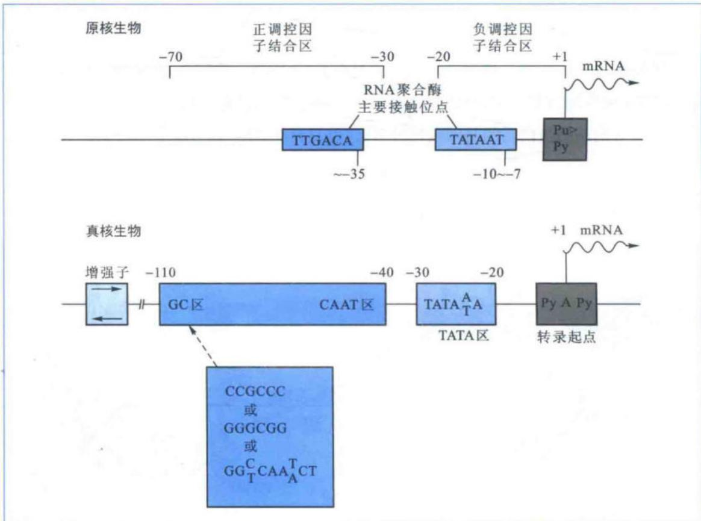

  
图 3-26 SV40 基因启动子上 TATAAA 及邻近区域对基因转录活性的影响

TATA区和上游启动子元件(CAAT区或GC区)的作用有所不同。前者的主要作用是使转录精确地起始,如果除去TATA区或进行碱基突变,转录产物下降的相对值不如CAAT区或GC区突变后明显,但发现所获得的RNA产物起始点不固定。研究SV40晚期基因启动子发现,上游激活区的存在与否,对该启动子的生物活性有着根本性的影响。若将该基因5'上游-21\~-47核苷酸序列切除,基因完全不表达(图3-26)。

上游启动子元件 CAAT 区和 GC 区主要控制转录起始频率, 基本不参与起始位点的确定。CAAT 区对转录起始频率的影响最大, 该区任一碱基的改变都将极大地影响靶基因的转录强度, 而启动区其他序列中 1\~2 个碱基的置换则没有太大的影响。此外, 在 TATA 区和相邻的 UPE 区之间插入核苷酸也会使转录减弱, 在人类 β- 血红蛋白基因启动区的两个 UPE 序列之间插入 15 个核苷酸, 该启动子完全失去功能。CAAT 和 GC 区相对于 TATA 区的取向 (5'→3' 或 3'→5'), 对转录强度的影响不大。

尽管这3种保守序列都有着重要功能,但并不是每个基因的启动子区都包含这3种序列。真核细胞中存在着大量特异性或组成型表达的、能够与不同基因启动子区UPE相结合的转录调控因子。基因转录实际上是RNA聚合酶、转录调控因子和启动子区各种调控元件相互作用的结果。

## 3.6.3 转录起始复合物的组装

真核细胞 RNA 转录起始过程中模板的识别与原核细胞有所不同。真核生物 RNA 聚合酶不能直接识别基因的启动子区，需要至少 7 种与 $\sigma$ 因子在细菌转录中所执行的功能类似的，被称为转录调控因子（transcription factor, TF）的辅助蛋白质 $^{(表3-6)}$ ，按特定顺序结合于启动子上，帮助 RNA 聚合酶特异性地结合到靶基因的启动子上并解开 DNA 双链。因为不少辅助因子本身就包含多个亚基，所以它们与聚合酶形成的转录前起始复合物(preinitiation transcription complex, PIC) 相对分子质量特别大, 包含 40 多条肽链, 总相对分子质量高达 $2 \times 10^{6}$ , 该复合物保证转录有效的起始。

转录因子和 RNA 聚合酶Ⅱ必须以特定的顺序结合到启动子序列上。形成 PIC 的第一步，TFⅡD 与启动子核心元件 TATA 区相结合，RNA 聚合酶Ⅱ、TFⅡA、TFⅡB 等才能依次结合。此后，TFⅡE、TFⅡH、TFⅡJ 等迅速靠近已形成的复合物（图 3-27）。PIC 的装配过程具有严格的顺序性，各组分的分工明确，如果缺少一种或几种成分，则不能起始转录，或者只有很低的转录速率。

此外，RNA 聚合酶Ⅱ最大亚基的 C 端结构域 CTD 重复序列上有多个位点能够发生磷酸化 $^{(图3-27)}$ ，可能通过影响聚合酶与转录因子的相互作用来影响 RNA 聚合酶Ⅱ在 PIC 上的组装，进而调节转录起始。CTD 的磷酸化与非磷酸化的互变，对于转录延伸过程也具有重要的调节作用。

图 3-27 由 RNA 聚合酶Ⅱ和各种转录因子组装成转录前起始复合物指导基因转录

表 3-6 真核生物 RNA 聚合酶 II 所形成的转录起始复合物

<table><tr><td>蛋白质</td><td>亚基数</td><td>亚基的相对分子质量 / × $10^{3}$ </td><td>功能</td></tr><tr><td>RNA聚合酶II</td><td>12</td><td>10~220</td><td>催化RNA的生物合成</td></tr><tr><td>TBP</td><td>1</td><td>38</td><td>与启动子上的TATA区相结合</td></tr><tr><td>TFIIA</td><td>3</td><td>12,19,35</td><td>使TBP及TFIIB与启动子的结合比较稳定</td></tr><tr><td>TFIIB</td><td>1</td><td>35</td><td>与TBP相结合,吸引RNA聚合酶和TFIIF到启动区上</td></tr><tr><td>TFIID</td><td>12</td><td>15~250</td><td>与各种调控因子相互作用</td></tr><tr><td>TFIE</td><td>2</td><td>34,57</td><td>吸引TFIIH,有ATP酶及解链酶活性</td></tr><tr><td>TFIIF</td><td>2</td><td>30,74</td><td>结合RNA聚合酶II并在TFIIB帮助下阻止聚合酶与非特异性DNA序列相结合</td></tr><tr><td>TFIHH</td><td>12</td><td>35-89</td><td>在启动子区解开DNA双链,使RNA聚合酶II磷酸化,接纳核苷酸切除修复体系</td></tr></table>

## 3.6.4 增强子及其功能

除了启动子以外,近年来发现还有另一序列与转录的起始有关。在SV40的转录单元上发现它的转录起始位点上游约200碱基对处有两段72碱基对长的重复序列,它们不是启动子的一部分,但能增强或促进转录的起始,除去这两段序列会大大降低这些基因的转录水平,若保留其中一段或将之取出插至DNA分子的任何部位,就能保持基因的正常转录。因此,称这种能强化转录起始的序列为增强子或强化子(enhancer)。除SV40外,还在反转录病毒基因、免疫球蛋白基因、胰岛素基因、胰糜蛋白酶基因等许多基因的启动区中陆续发现了增强子的存在。

有人曾把 $\beta-$ 珠蛋白基因置于带有上述 72 碱基对序列的 DNA 分子上, 发现它在体内的转录水平提高了 200 倍。而且, 无论把这段 72 碱基对序列放在转录起点上游 1400 碱基对处还是下游 3300 碱基对处, 它都有转录增强作用。增强子很可能通过影响染色质 DNA-蛋白质结构或改变超螺旋的密度而改变模板的整体结构, 从而使得 RNA 聚合酶更容易与模板 DNA 相结合, 起始基因转录。

## 增强子具有下列特点：

① 远距离效应 一般位于上游 -200 碱基对处,但可增强远处启动子的转录,即使相距十多个千碱基对也能发挥作用。

② 无方向性 无论位于靶基因的上游、下游或内部都可发挥增强转录的作用。

③ 顺式调节 只调节位于同一染色体上的靶基因,而对其他染色体上的基因没有作用。

④ 无物种和基因的特异性,可以连接到异源基因上发挥作用。

⑤ 具有组织特异性 SV40 的增强子在 3T3 细胞中比多瘤病毒的增强子要弱,但在 HeLa 细胞中 SV40 的增强子比多瘤病毒的要强 5 倍。增强子的效应需特定的蛋白质因子参与。

⑥ 有相位性 其作用和 DNA 的构象有关。

⑦ 某些增强子可应答外部信号 如热休克基因在高温下才表达,金属硫蛋白基因在镉和锌的存在下才表达,另外一些增强子可以被固醇类激素所激活。

## 3.7 RNA 转录的抑制

RNA 转录的抑制剂根据其作用性质主要可以分为 3 大类: 第一类是嘌呤和嘧啶类似物, 它们作为核苷酸代谢拮抗剂而抑制前体 RNA 的合成; 第二类是 DNA 模板功能抑制剂, 通过与 DNA 结合而改变模板的功能; 第三类是 RNA 聚合酶的抑制物, 它们与 RNA 聚合酶结合而抑制其活力。表 3-7 是一些典型的 RNA 转录的抑制剂。

表 3-7 常见的转录抑制剂

<table><tr><td>抑制剂</td><td>靶点</td><td>抑制作用</td></tr><tr><td>碱基类似物(5-氟尿嘧啶等)</td><td>核苷酸</td><td>抑制和干扰核苷酸合成</td></tr><tr><td>利福霉素</td><td>细菌全酶</td><td>和β亚基结合,抑制起始</td></tr><tr><td>利迪链霉素</td><td>细菌核心酶</td><td>和β亚基结合,抑制起始</td></tr><tr><td>放射线素D</td><td>DNA模板</td><td>与DNA结合,阻止延伸</td></tr><tr><td>α-鹅膏蕈碱</td><td>真核RNA聚合酶II</td><td>与RNA聚合酶II结合</td></tr></table>

## 3.7.1 嘌呤和嘧啶类似物

一些人工合成的碱基类似物,如5-氟尿嘧啶、6-氮尿嘧啶、6-巯基嘌呤、8-氮鸟嘌呤等能够抑制和干扰DNA或RNA合成。这些碱基类似物或者作为代谢拮抗物直接抑制核苷酸合成有关的酶类,或者通过掺入核酸分子形成异常的核酸结构,从而影响核酸的进一步延伸。碱基类似物进入体内后一般先转变为相应的核苷酸后才能发挥抑制作用。6-巯基嘌呤在体内首先转变为巯基嘌呤核苷酸,并阻断细胞内嘌呤核苷酸的合成。它是重要的癌症治疗药物,用于治疗急性白血病和绒毛上皮癌等。8-氮鸟嘌呤形成核苷酸后既能抑制嘌呤核苷酸的合成,还能掺入到RNA中,形成非正常的RNA,从而抑制相应蛋白质的合成。5-氟尿嘧啶进入体内后首先转变为F-UMP,再转变为脱氧核糖核苷酸(F-dUMP),抑制胸腺嘧啶核苷酸合成酶并阻碍胸腺嘧啶渗入RNA分子。5-氟尿嘧啶也具有抑制肿瘤细胞生长的功能。在正常细胞中,5-氟尿嘧啶能被分解为α-氟-β-氨基丙酸,但在癌细胞中则不被分解,这是5-氟尿嘧啶在临床上被用来作为化疗药物的原因之一。

## 3.7.2 DNA 模板功能抑制剂

放线菌素、烷化剂和嵌入染料能与DNA结合使其失去模板功能，进而抑制RNA转录。放线菌素D(actinomycin D)具有抗菌和抗癌作用，是DNA模板功能的抑制物，可与DNA形成非共价复合物，抑制其作为模板的功能。1 mmol/L的放线菌素D就可有效抑制RNA转录,但需要 10 mmol/L 才能抑制 DNA 的复制。

烷化剂如氮芥、磺酸酯、氮丙啶等分子中带有能使 DNA 烷基化的活性烷基，同时作用于 DNA 的两条链，使之发生交联，抑制其模板功能。烷化剂的毒性较大，能够引起细胞突变，具有致癌作用。有些烷化剂，如环磷酰胺，能选择性杀伤肿瘤细胞，因而在临床上被用于治疗恶性肿瘤。

某些具有扁平芳香族发色团的嵌入剂，如吖啶类染料和溴化乙锭等可插入双链DNA相邻的碱基对之间，因此又称为嵌入染料。嵌入剂通常含有吖啶或菲啶环，它们的大小与碱基相当，插入后使DNA在复制中缺失或增添一个核苷酸，导致移码突变。溴化乙锭(ethidium bromide, EB)是高灵敏度的荧光试剂，与核酸结合后抑制其复制和转录。实验中常用来检测样品中DNA和RNA的浓度。

## 3.7.3 RNA 聚合酶抑制剂

某些抗生素或化学药物,如利福霉素(rifamycin)、利迪链霉素(streptolydigin)和α-鹅膏蕈碱都是RNA聚合酶的抑制物。其中,利福霉素能强烈地抑制革兰氏阳性菌和结核杆菌,具有广谱抗菌作用,能特异性地抑制细菌RNA聚合酶的活性。利迪链霉素与细菌RNA聚合酶的β亚基结合,抑制转录的起始。α-鹅膏蕈碱主要抑制真核生物RNA聚合酶。

## 3.8 真核生物 RNA 的转录后加工

## 3.8.1 真核生物 RNA 中的内含子

真核基因大多是断裂的,也就是说,一个基因可由多个内含子和外显子间隔排列而成。研究表明,内含子在真核基因中所占的比例很高,甚至超过99%(表3-8)。

断裂基因的存在表明真核细胞的基因结构和 mRNA 合成过程比原核细胞要复杂得多, 因为真核基因表达往往伴随着 RNA 的剪接过程 (splicing), 从 mRNA 前体分子中切除被称为内含子 (intron) 的非编码区, 并使基因中被称为外显子 (exon) 的编码区拼接形成成熟 mRNA $^{(图 3-28)}$ 。

表 3-8 部分人类基因中内含子序列所占的比例分析

<table><tr><td>基因</td><td>长度 /kb</td><td>内含子数量</td><td>内含子所占比例 /%</td></tr><tr><td>胰岛素</td><td>1.4</td><td>2</td><td>67</td></tr><tr><td>β-珠蛋白</td><td>1.4</td><td>2</td><td>69</td></tr><tr><td>血清蛋白</td><td>18</td><td>13</td><td>89</td></tr><tr><td>胶原蛋白组分VII</td><td>31</td><td>117</td><td>71</td></tr><tr><td>VIII因子</td><td>186</td><td>25</td><td>95</td></tr><tr><td>萎缩性肌强直因子</td><td>2 400</td><td>78</td><td>&gt;99</td></tr></table>

## 图 3-28 真核基因中存在非编码的内含子区

所示基因含有4个外显子和3个内含子。转录从启动子区开始，产生了包括全部外显子和内含子的前mRNA。通过剪接除去内含子，并将外显子连接起来，得到成熟的mRNA。

## 3.8.2 真核生物 tRNA 前体的转录后加工

真核生物 tRNA 基因有内含子, 其前体必须经过剪接。其内含子具有下列特点: ①长度和序列没有共同性, 一般有 16\~46 个核苷酸; ②位于反密码子的下游; ③内含子和外显子间的边界没有保守序列, 所以与 mRNA 的剪接不同, tRNA 前体的剪接不符合一般规律。

由于 tRNA 分子具有高度保守的二级结构, 真核生物 tRNA 前体内含子的精确切除信号是 tRNA 分子共同的二级结构。哺乳动物、酵母、果蝇和植物等的 tRNA 的加工基本上相同, 主要包括下面需要酶催化的 3 个过程:

① 内含子的剪接 tRNA 内切核酸酶切割前体分子中的内含子；RNA 连接酶将外显子部分连接在一起。

② 3' 端添加 CCA 真核生物所有 tRNA 前体的 3' 端缺乏 -CCAOH 结构, 在蛋白质翻译过程中没有活性, 因而需要在 tRNA 核苷酸转移酶的催化下在其 3' 端添加 CCA。

③ 核苷酸修饰 tRNA 分子中稀有核苷酸较多, 其修饰很频繁。如 tRNA 甲基化酶能够催化 tRNA 分子特定位置的甲基化等, 但这些稀有核苷酸的功能还有待深入研究。

## 3.8.3 真核生物 rRNA 前体的转录后加工

大多数真核生物 rRNA 基因无内含子。有些虽然有内含子但并不转录。新生 rRNA 前体与蛋白质结合，形成巨大的核糖核蛋白前体（pre-rRNA）颗粒，前体长度约为成熟 rRNA 的 2 倍，因此，rRNA 前体必须被剪接成成熟的 rRNA 分子，此过程在核仁中进行。核仁小 RNA（snoRNA）参与核糖核酸酶对特定立体结构的识别，从而确定切割位点。

在不同真核生物中，rRNA 前体的每个转录单位内各 rRNA 的排列顺序和加工过程都十分保守。以人 HeLa 细胞为例，哺乳动物细胞内 rRNA 前体的剪切过程包括以下 4 个步骤(图 3-29):

① 在 $5'$ 端切除非编码的序列,生成 41S 中间产物。

② 41S RNA 再被切割为两段,一段为 32S,含有 28S rRNA 和 5.8S rRNA,另一段为

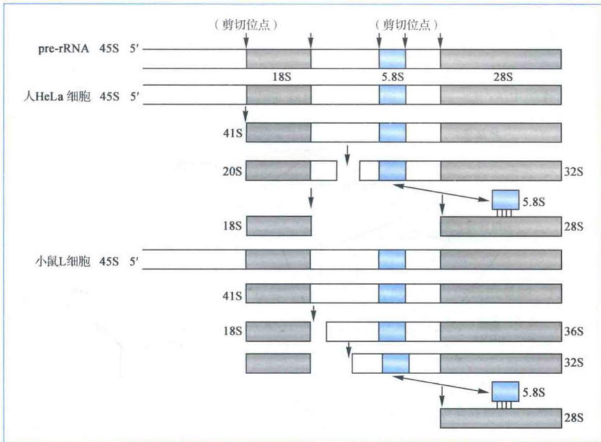  
图 3-29 人 HeLa 细胞和小鼠 L 细胞的 rRNA 前体转录后加工示意图

20S, 含有 18S rRNA。

③ 32S RNA 进一步被剪切成 28S rRNA 和 5.8S rRNA。

④ 20S RNA 被剪切生成 18S rRNA。

## 3.8.4 真核生物 mRNA 的剪接

RNA 剪接主要有 3 种(不包括 tRNA 的加工过程): pre-mRNA 剪接、I 类和 II 类自剪接内含子。

由 DNA 转录生成的原始转录产物——核内不均一 RNA(hnRNA), 即 mRNA 的前体, 经过 5' 加 “帽” 和 3' 酶切加多腺苷酸, 再经过 RNA 的剪接, 编码蛋白质的外显子部分就连接成为一个连续的可读框(open reading frame, ORF), 通过核孔进入细胞质, 就能作为蛋白质合成的模板了。表 3-9 和图 3-30 分别总结了原始 mRNA 成熟期间的主要加工过程。

真核基因平均含有 8～10 个内含子, 前体分子一般比成熟 mRNA 大 4～10 倍。不同生物细胞内含子的边界处存在相似的核苷酸序列, 表明内含子剪接过程在进化上是保守的。比较同源基因的进化过程发现内含子的异化大于外显子, 特定的内含子还可能在进化过程中丢失, 因此, 内含子的 “功能” 及其在生物进化中的地位是一个引人注目的问题。另外, 许多人类疾病是内含子剪接异常引起的, 如地中海贫血患者的珠蛋白基因中, 大约有 1/4 的核苷酸突变发生在内含子的 5′ 或 3′ 边界保守序列上, 或者虽然位于内含子中间但干扰了前体 mRNA 的正常剪接。

图 3-30 初级转录产物的生成及其主要加工剪接过程图示  

表 3-9 RNA 加工过程及其生理功能

<table><tr><td>加工过程</td><td>推测的生理功能</td></tr><tr><td>加帽反应</td><td>mRNA 从细胞核向细胞质运转,翻译起始</td></tr><tr><td>加多 A 反应</td><td>转录终止,翻译起始和 mRNA 降解</td></tr><tr><td>RNA 的剪接</td><td>从 mRNA、tRNA 和 rRNA 分子中切除内含子</td></tr><tr><td>RNA 的切割</td><td>从前体 RNA 中释放成熟 tRNA 和 rRNA 分子</td></tr></table>

## 1. RNA 序列决定了剪接的发生位点

图 3-31 脊椎动物 mRNA 前体中常见的内含子剪接所必需的保守序列

图中显示 $5'$ 剪接位点和 $3'$ 剪接位点的共有序列以及分支点的保守腺苷酸成分。

比较不同基因的核苷酸序列发现，mRNA 前体中内含子的两端边界存在共同的序列，这些序列结构可能是产生 mRNA 前体剪接的信号。多数细胞核 mRNA 前体内含子的 5' 边界序列为 GU, 3' 边界序列为 AG。因此，GU 表示供体衔接点的 5' 端，AG 代表接纳体衔接点的 3' 端。把这种保守序列模式称为 GU-AG 法则，又称为 Chambon 法则。  
除了边界序列之外,外显子与内含子交界处的序列,内含子内部的部分序列也可能参与内含子的剪接(图3-31)。在3'端剪接位点AG的附近有一段富含嘧啶的区域,含有10\~20个嘧啶核苷酸;5'端有一保守序列(5'-GUPuAGU-3')。此外,许多发生分叉剪接的核mRNA内含子3'端上游18\~50个核苷酸处,存在一个序列为 $Py_{80}NPy_{87}Pu_{75}APy_{95}$ 的保守区,其中A为百分之百保守,且具有2'-OH,是参与形成分叉剪接中间物的特定腺嘌呤,

<table><tr><td colspan="2">5&#x27;剪接位点</td><td colspan="2">分支点</td><td colspan="2">3&#x27;剪接位点</td></tr><tr><td>5&#x27;A/CAG</td><td>GUPuAGU</td><td>A</td><td>富Py区</td><td>AG</td><td>G</td></tr><tr><td colspan="2">外显子</td><td colspan="2">内含子</td><td colspan="2">外显子</td></tr></table>

称为分支点。上述保守序列都是 pre-mRNA 剪接过程中各种核糖核蛋白剪接调节因子的结合位点，对于有效和准确的剪接非常重要。

## 2. RNA 剪接中的两步转酯反应

RNA 剪接是由两步转酯反应完成的, 这两步转酯反应使得 pre-mRNA 中原有的某些磷酸二酯键断开, 并形成一些新的磷酸二酯键。

第一步转酯反应是由位于分支位点的保守腺苷酸的2'羟基引发的。它作为亲核基团攻击5'剪接位点保守鸟苷酸的磷酰基团。结果，外显子3'端的核糖与内含子5'端磷酸之间的磷酸二酯键被断开，游离出来的5'磷酸则与分支点保守腺苷酸的2'羟基连接。因此，除了5'→3'骨架磷酸二酯键，新的磷酸二酯键从保守腺苷酸的2'羟基伸出来，产生一个三叉交汇点。

第二步转酯反应中，5'外显子作为亲核基团，攻击3'剪接位点的磷酰基团，导致两个结果：一是把5'和3'外显子连接起来了，二是把内含子作为离去基团释放出去。因为内含子的5'端已经在第一次转酯反应中与分支点腺苷酸相连接，所以新释放出来的内含子形状像一个套索（lariat form）。

在上述两步转酯反应中,没有增加新的化学键,只是断开了两个磷酸二酯键,同时形成了两个新的磷酸二酯键。

## 3. 剪接体与 RNA 剪接

上述的转酯反应是由一个被称为剪接体(spliceosome)的大型复合体介导的。剪接体是mRNA前体在剪接过程中组装形成的多组分复合物，是一种具有催化剪接反映的核糖核蛋白复合体，它包含约150种蛋白质和5种RNA $^{[图3-32]}$ ，大小与核糖体差不多。研究表明，剪接体中的5种RNA(U1、U2、U4、U5和U6)统称为核小RNA(snRNA)。每种snRNA长100\~300核苷酸，与几种蛋白质形成的RNA－蛋白质复合物被称为细胞核小核糖核蛋白(small nuclear ribonuclear protein, snRNP)。它是剪接体的亚单位，剪接体就是由这些snRNP形成的巨型复合体，参与RNA的剪接。但是，每种snRNP执行的任务不同，因此，在剪接反应的不同时期，剪接体中含有不同的snRNP。剪接体中可能还有一些与剪接体松散结合的不属于snRNP的蛋白质。

snRNP 在剪接中的功能如下: ①识别 5' 剪接位点和分支点; ②按需要把这两个位点集结到一起; ③催化或协助催化 RNA 的剪接和连接反应。只有参与剪接反应的 RNA 与 RNA 之间、蛋白质与 RNA 之间以及蛋白质与蛋白质之间具备很好的协同作用, 才能完成复杂的剪接反应。

剪接过程的详细步骤由图 3-33 所示。mRNA 链上每个内含子的 5' 和 3' 端分别与不同的 snRNP 相结合，形成 RNA 和 RNP 复合物。

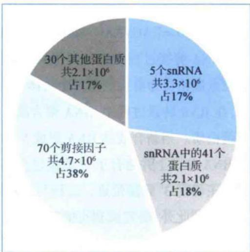  
图 3-32 剪接体是一个巨大的复合物
剪接体大小约为 $1.2 \times 10^{7}$ 。5 种 snRNP 几乎占了总体的一半。剩下的一些蛋白质包括已知的剪接因子以及参与基因表达其他阶段的蛋白质。

图 3-33 真核生物 mRNA 前体中内含子剪接过程示意图  
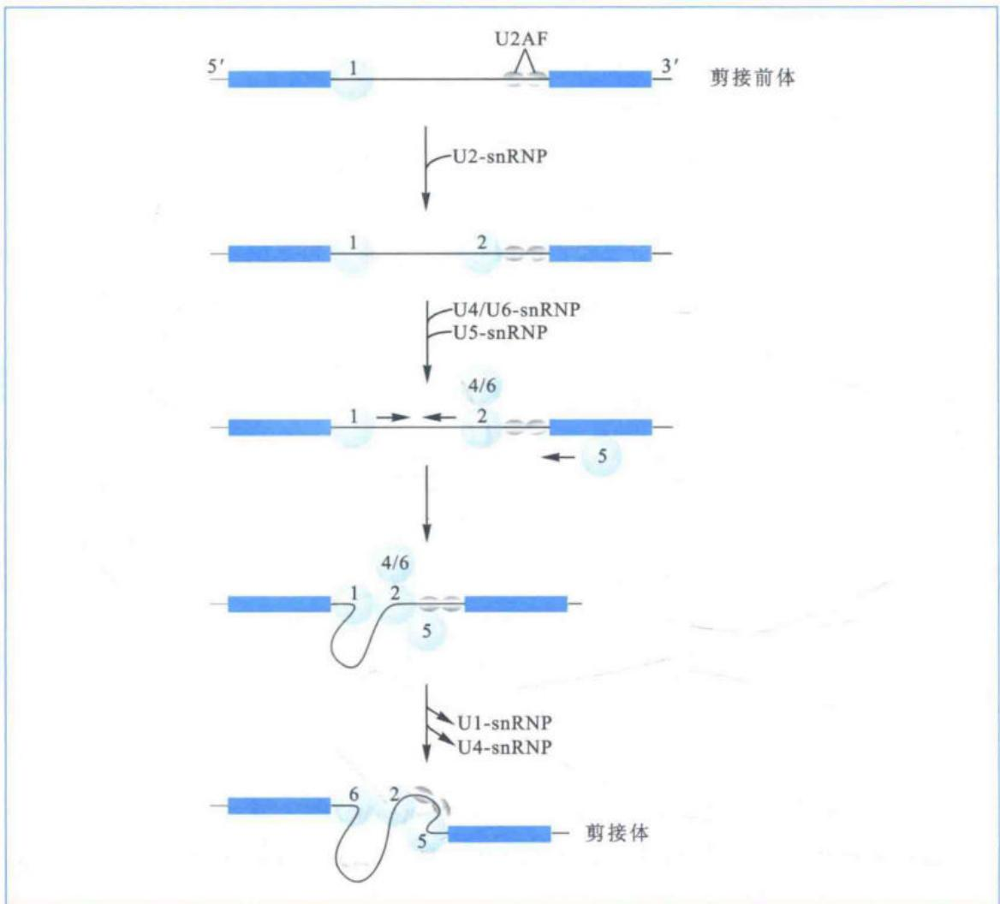

一般情况下,由 U1 snoRNA 以碱基互补的方式识别 mRNA 前体 5'剪接点,由结合在 3'剪接点上游富嘧啶区的 U2AF(U2 auxiliary factor)识别 3'剪接点并引导 U2 snRNP 与分支点相结合,形成剪接前体(pre-spliceosome),并进一步与 U4、U5、U6 snRNP 三聚体相结合,形成 60S 的剪接体(spliceosome),进行 RNA 前体分子的剪接。

哺乳动物细胞中，mRNA 前体上的 snRNP 是从 5' 向下游“扫描”，选择在分支点富嘧啶区 3' 下游的第一个 AG 作为剪接的 3' 位点。AG 前一位核苷酸可以影响剪接效率，一般说来，CAG=UAG>AAG>GAG。如果 mRNA 前体上同时存在几个 AG，可能发生剪接竞争。

RNA 剪接过程中容易发生两类错误,一是遗漏了剪接位点,二是剪接位点邻近的非靶位点被错认为剪接位点。生物体一般通过两种机制来提高选择剪接位点的准确性。首先,在 RNA 转录过程中,RNA 聚合酶Ⅱ携带多种参与 RNA 加工的蛋白质,包括参与剪接的蛋白质。当新合成的 RNA 形成 5' 剪接位点时,这些蛋白质就从 RNA 聚合酶Ⅱ上转移到 RNA 分子上并结合于 5' 剪接位点,准备与下一个 3' 剪接位点的剪接成分相互作用,以识别正确的 3' 剪接位点。这种与转录同步的剪接体组装方式大大减少了外显子遗漏的可能性。此外,研究发现可能有一个富含丝氨酸和精氨酸被称为 SR 蛋白的辅助因子与外显子中的外显子剪接增强子区相结合,通过与剪接机器的相互作用将其引导到邻近的

  
图3-34 RNA剪接的5种模式

剪接位点,以优先识别最靠近外显子的剪接位点,防止错误剪接,确保剪接的准确性和高效性。

## 4. RNA 的可变剪接

在高等真核生物中,内含子通常是有序或组成性地从 mRNA 前体中被剪接,然而,在个体发育或细胞分化时可以有选择性地越过某些外显子或某个剪接点进行变位剪接,产生出组织或发育阶段特异性 mRNA,称为内含子的可变剪接或选择性剪接。人类基因组中,大约 60% 的基因能发生可变剪接,使一个基因产生多个蛋白质产物。图 3-34 显示产生可变剪接的几条主要途径。

## 5. I类和Ⅱ类自剪接内含子

与前面所述的 mRNA 前体中 GU-AG 类(主要)和 AU-AC 类(次要)内含子剪接方式不同的是 I、II 类内含子,因为带有这些内含子的 RNA 本身具有催化活性,能通过自身折叠成一种特殊的构象来进行内含子的自我剪接,而不需要形成剪接体。表 3-10 总结了存在于生物体内的各种内含子。

表 3-10 生物体内的各种内含子

<table><tr><td>内含子类型</td><td>细胞内定位</td></tr><tr><td>GU-AG</td><td>细胞核,前体mRNA(真核)</td></tr><tr><td>AU-AC</td><td>细胞核,前体mRNA(真核)</td></tr><tr><td>I类内含子</td><td>细胞核,前体rRNA(真核),细胞器RNA,少数细菌RNA</td></tr><tr><td>II类内含子</td><td>细胞器RNA,部分细菌RNA</td></tr><tr><td>III类内含子</td><td>细胞器RNA</td></tr><tr><td>双内含子</td><td>细胞器RNA</td></tr><tr><td>tRNA前体中的内含子</td><td>细胞核,tRNA前体(真核)</td></tr></table>

① I 类自剪接内含子 最初在研究原生动物四膜虫 RNA 前体时发现了 I 类内含子，后来在细菌中也发现存在这类内含子。I 类内含子的剪接主要也是发生了两次磷酸二酯键的转移,即两次转酯反应(trans-esterification)。在Ⅰ类自剪接内含子切除体系中,第一个转酯反应由一个游离的鸟苷或鸟苷酸(GMP、GDP或GTP)介导,鸟苷或鸟苷酸的3'-OH作为亲核基团攻击内含子5'端的磷酸二酯键,从上游切开RNA链。在第二个转酯反应中,上游外显子的自由3'-OH作为亲核基团攻击内含子3'位核苷酸上的磷酸二酯键,使内含子被完全切开,上下游两个外显子通过新的磷酸二酯键相连(图3-35)。Ⅰ类内含子释放出线性内含子,而不是一个套索结构。

Ⅰ类自剪接内含子通常比Ⅱ类内含子小,有一个保守的二级结构,包括容纳鸟苷或鸟苷酸结合的口袋以及一段与5'剪接位点序列配对的“内在指导序列”,以确定鸟苷亲核攻击的精确位置。

②Ⅱ类自剪接内含子 这类内含子主要存在于真核生物的线粒体和叶绿体 rRNA 基因中。在Ⅱ类内含子切除体系中，转酯反应无需游离鸟苷酸或鸟苷，而是由内含子本身的靠近 3' 端的腺苷酸 2'-OH 作为亲核基团攻击内含子 5' 端的磷酸二酯键，从上游切开 RNA 链后形成套索状结构。再由上游外显子的自由 3'-OH 作为亲核基团攻击内含子 3' 位核苷酸上的磷酸二酯键，使内含子被完全切开，上下游两个外显子通过新的磷酸二酯键相连（图 3-36）。表 3-11 总结了各种剪接类型的特点。

图 3-35 I 类内含子的自剪接过程  
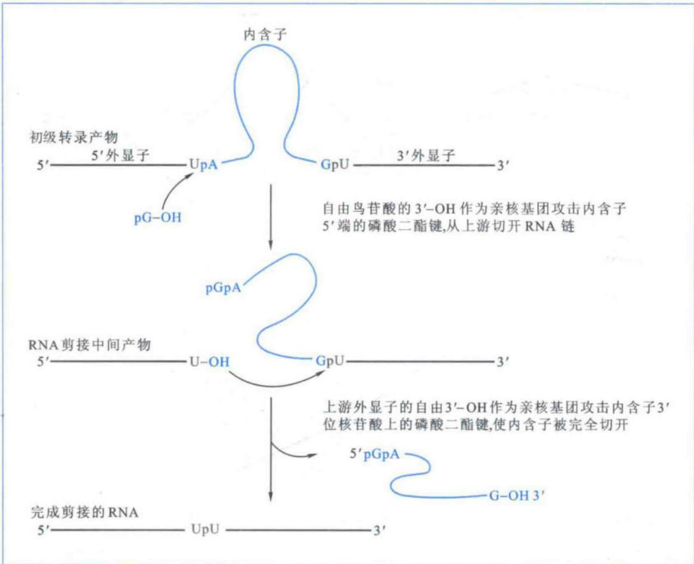

图 3-36 Ⅱ类内含子的自剪接过程  

表 3-11 RNA 剪接的 3 种类型

<table><tr><td>类型</td><td>丰度</td><td>机制</td><td>催化机器</td></tr><tr><td>细胞核 pre-mRNA</td><td>常见,适用于大多数真核基因</td><td>两步转酯反应,分支点为 A</td><td>主要剪接体</td></tr><tr><td>II类自剪接内含子</td><td>罕见,来自某些细胞器的真核基因及原核基因</td><td>与 pre-mRNA 类似</td><td>内含子编码的核酶</td></tr><tr><td>I类自剪接内含子</td><td>罕见,某些真核生物的细胞核 rRNA、细胞器基因,及少量原核基因</td><td>两步转酯反应,分支点为 G</td><td>内含子编码的核酶</td></tr></table>

## 3.9 RNA 的编辑、再编码和化学修饰

## 3.9.1 RNA的编辑

根据中心法则,DNA、RNA 和蛋白质之间存在着直接的线性关系,即连续的序列 DNA 被真实地转录成 mRNA 序列,然后翻译产生蛋白质分子。断裂基因的发现和 RNA 的剪接虽然使得基因表达过程增加了一个步骤,但 DNA 的实际编码序列没有发生变化。

RNA 的编辑 (RNA editing) 是 mRNA 前体的加工方式之一, 通过插入、删除或取代一

图 3-37 位点特异性脱氨基作用引起的哺乳动物载脂蛋白基因转录产物的编辑

(a,b) 胞嘧啶和腺嘌呤的位点特异性脱氨基作用产生尿嘧啶核次黄嘌呤；(c) 哺乳动物载脂蛋白基因转录产物的编辑。

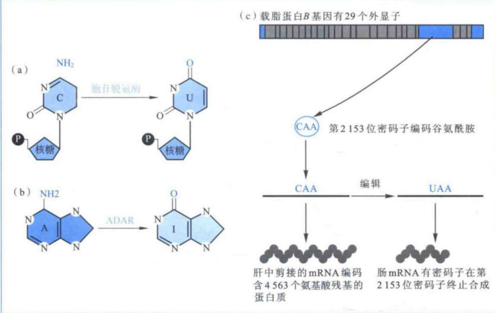

些核苷酸残基,使 DNA 所编码的遗传信息发生变化,是生物细胞内改变 mRNA 序列和蛋白质编码信息的重要途径。介导 RNA 编辑的机制有两种:位点特异性脱氨基作用和指导 RNA 引导的尿嘧啶插入或删除。

哺乳动物载脂蛋白 mRNA 的编辑是广泛研究的典型例子, 图 3-37 是该基因的 DNA 序列以及在哺乳动物肝和肠组织中分离到的 mRNA 序列。载脂蛋白基因编码区共有 4563 个密码子, 在所有组织中其 DNA 序列都相同。在肝中, 该基因转录产生完整的 mRNA 并被翻译成有 4563 个氨基酸的全长蛋白质, 相对分子质量为 $5.1 \times 10^{5}$ 。在肠中合成的却是只包含有 2153 个密码子的 mRNA, 翻译产生相对分子质量为 $2.5 \times 10^{5}$ 的蛋白质。研究发现, 该蛋白质其实是全长载脂蛋白的 N 端, 它是由一个在序列上除了 2153 位密码子从 CAA 突变为 UAA 之外完全与肝 mRNA 相同的核酸分子所编码的, 位点特异性脱氨基作用引起的 C → U 突变使编码谷氨酰胺的密码子变成了终止密码子。

RNA 的编辑虽然不是很普遍,但在真核生物中时有发生(表 3-12),表明这一途径可能是细胞充分发挥生理功能所必需的。

表 3-12 哺乳动物中 RNA 编辑的实例

<table><tr><td>组织</td><td>靶标 RNA</td><td>所改变的碱基</td><td>结果</td></tr><tr><td>肝,肠</td><td>载脂蛋白 B</td><td>C→U</td><td>谷氨酰胺密码子→终止子</td></tr><tr><td>肌肉</td><td>半乳糖苷酶</td><td>U→A</td><td>苯丙氨酸密码子→酪氨酸</td></tr><tr><td>睾丸,肿瘤等</td><td>Wilms 肿瘤基因 -1</td><td>U→C</td><td>亮氨酸密码子→脯氨酸</td></tr><tr><td>肿瘤</td><td>神经纤维瘤基因 -1</td><td>C→U</td><td>精氨酸密码子→终止子</td></tr><tr><td>脑</td><td>谷氨酸受体蛋白</td><td>A→I</td><td>多个谷氨酸密码子→精氨酸</td></tr></table>

载脂蛋白 mRNA 中的 C→U, 谷氨酸受体蛋白 mRNA 中的 A→I, 都属于脱氨基作用的结果, 分别由胞嘧啶和腺嘌呤脱氨酶所催化。通常情况下, 该酶促反应的特异性不强, 腺嘌呤脱氨酶可以作用于双链 RNA 区的任何腺苷酸残基。但是, RNA 的编辑发生在带有具催化作用的脱氨酶亚基的复合体中, 有附加的 RNA 结合区能帮助识别所编辑的特异性靶位点。

除单碱基突变之外，RNA 编辑的另一种形式是尿苷酸的缺失和添加。研究发现，利什曼原虫属细胞色素 b mRNA 中含有许多独立于核基因的尿嘧啶残基，而特异性插入这些残基的信息来自指导 RNA (guide RNA)，因为它含有与编辑后细胞色素 b mRNA 相互补的核苷酸序列。指导 RNA 与被编辑区及其周围部分核酸序列虽然有相当程度的互补性，但该 RNA 上存在一些未能配对的腺嘌呤，形成缺口，为插入尿嘧啶提供了模板 $^{(图 3-38)}$ 。反应完成后，指导 RNA 从 mRNA 上解离下来，而 mRNA 则被用做翻译的模板。

RNA 编辑具有重要的生物学意义：

① 校正作用 有些基因在突变过程中丢失的遗传信息可能通过 RNA 的编辑得以恢复。

② 调控翻译 通过编辑可以构建或去除起始密码子和终止密码子, 是基因表达调控的一种方式。

③ 扩充遗传信息 能使基因产物获得新的结构核功能,有利于生物的进化。

## 3.9.2 RNA 的再编码

有研究发现,mRNA 在某些情况下不是以固定的方式被翻译,而可以改变原来的编码信息,以不同的方式进行翻译,科学上把 RNA 编码和读码方式的改变称为 RNA 的再编码

  
图 3-38 指导 RNA 和 RNA 的编辑机制

(RNA recoding)。

某些有机体进行蛋白质翻译时，mRNA 的读码信号在 tRNA、rRNA 和相关蛋白因子的作用下发生 +1/-1 移位，甚至发生核糖体跳过 50 个核苷酸的情况，我们把前两者称为核糖体程序性 +1/-1 移位，把后者称为核糖体跳跃。最近人们还发现自然界存在第 21 和 22 种氨基酸，即硒代半胱氨酸（selenocysteine）和吡咯赖氨酸（pyrrolysine），两者都是通过终止子通读而编码的。上述的 +1/-1 移码、核糖体跳跃以及终止子通读都是再编码的表现方式，因为它们使用了不同于常规的基因解码规则。RNA 的再编码可以使一个 mRNA 产生两种或多种相互关联但又不同的蛋白质，这也可能是蛋白质合成的一种调节机制。

## 3.9.3 RNA 的化学修饰

除了 RNA 的编辑之外,有些 RNA,特别是前体 rRNA 和 tRNA,还可能有特异性化学修饰。图 3-39 是最常见的 6 大类化学修饰途径及其产物。研究证实,仅人细胞内 rRNA

图 3-39 rRNA 和 tRNA 分子中核苷酸的化学修饰

在核苷酸的碱基或核糖基上加一个或多个- $CH_{3}$ 举例: 鸟嘌呤甲基化产物 $m^{7}G$

## 去氨基化

举例：鸟嘌呤去氨基后成为次黄嘌呤

## 硫代

用硫取代碱基分子上的氧举例：4-硫尿嘧啶

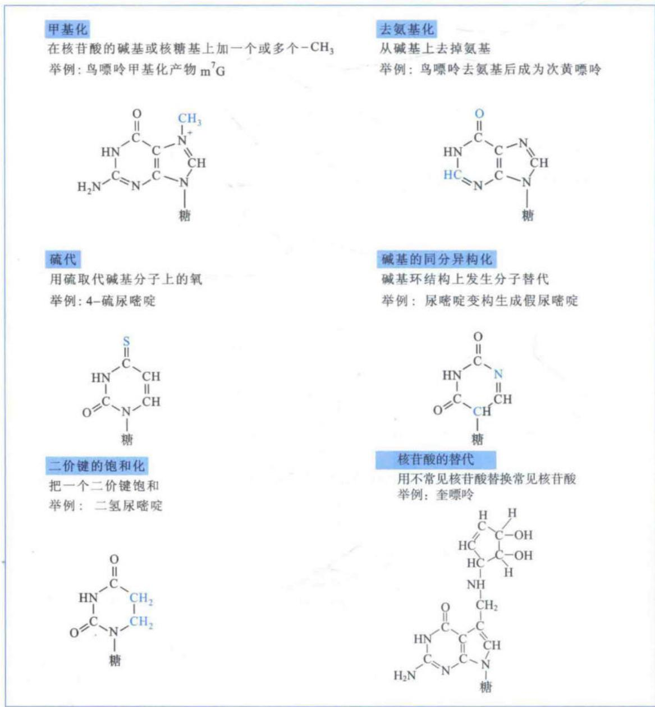

## 二价键的饱和化

举例：二氢尿嘧啶

## 碱基的同分异构化

举例：尿嘧啶变构生成假尿嘧啶

## 核苷酸的替代

用不常见核苷酸替换常见核苷酸举例：奎嘌呤

分子上就存在 106 种甲基化和 95 种假尿嘧啶产物, 虽然尚未发现特征性保守序列, 但有实验证据表明, RNA 的化学修饰可能具有位点特异性。有实验表明, 相对分子质量只有 70\~100 个核苷酸的核仁小 RNA(snoRNA) 参与 RNA 的化学修饰, 因为这些 RNA 能通过碱基配对的方式, 把 rRNA 分子上需要修饰的位点找出来。

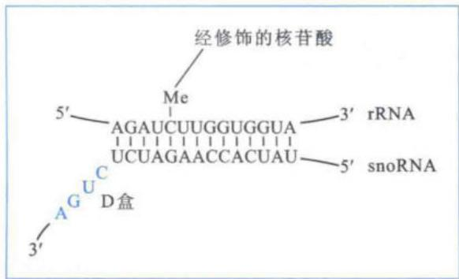  
图 3-40 酵母 U24 snoRNA 指导的甲基化

现在一般认为, snoRNA 上的 D 盒是甲基化酶的识别位点 $^{(图 3-40)}$ 。

## 3.10 mRNA 转运

真核 mRNA 一旦完成加帽、去除内含子和多腺苷酸化等加工成熟过程，就会通过核膜上的特殊结构——核孔复合体（nuclear pore complex）运出细胞核进入细胞质，作为模板翻译产生蛋白质。mRNA 从细胞核进入到细胞质的过程是一个主动转运过程，由 GTP 水解提供能量并受一系列蛋白质的精细调控，防止加工错误或已受损伤的 RNA 进入细胞质，危害细胞正常的生理活动，甚至造成致命的后果。

成熟 mRNA 必须结合一组携带了细胞核跨膜转运信号的蛋白质, 待转运受体识别这些信号后指导 RNA 通过核孔离开细胞核。进入细胞质后, 参与转运的蛋白质组分就会从 mRNA 上解离下来, 被识别后重新回到细胞核, 参与下一轮 mRNA 的运输(图 3-41)。

  
图 3-41 mRNA 从细胞核转运到细胞质

## 3.11 核酶

核酶(ribozyme)是指一类具有催化功能的 RNA 分子,通过催化靶位点 RNA 链中磷酸二酯键的断裂,特异性剪切底物 RNA 分子,从而阻断基因的表达。“ribozyme”是核糖核酸和酶两个词的缩合词。

1982 年 Cech 从四膜虫 rRNA 前体的加工研究中首先发现 rRNA 前体具有自剪接作用, 提出 ribozyme 的概念, 打破了酶都是蛋白质这种传统的观念。1983 年, Altman 等人发现 RNase P 中的 RNA 组分可以催化 tRNA 前体的加工, 之后的研究还发现 T4 RNA、一些植物的类病毒 (viroid)、拟病毒 (virusoid) 等都能进行自剪接。

核酶的催化功能与其空间结构有密切关系,目前已知有多种特殊结构的核酶,如RNase P的RNA亚基(M1 RNA)、锤头型、发夹型丁型肝炎δ病毒RNA、I类内含子和Ⅱ类内含子等。具有自剪切能力的RNA大多数都能形成锤头结构(hammerhead structure)。该二级结构由3个茎(I、Ⅱ、Ⅲ)构成,茎区是由互补碱基构成的局部双链结构,包围着一个由11\~13个保守核苷酸构成的催化中心(图3-42)。核酶剪切通常发生在H(H是除G以外任意的核苷酸)位点。同一核酶分子由具有催化中心的核酶和含有剪切位点的底物部分共同组成锤头结构,底物部分是切割部位两端的核苷酸,它与核酶的茎I和茎Ⅲ结合,在切割之后该底物被释放,由一个新的没有被切割的底物取代,使切割反应得以重复进行。

不同的核酶具有不同的催化功能,可以分为剪切型核酶和剪接型核酶两大类。

① 剪切型核酶 剪切型核酶只剪不接,能够催化自身 RNA 或不同的 RNA 分子,切下特异的核苷酸序列。M1 RNA 是最典型的例子,在高浓度 $Mg^{2+}$ 存在时,它可特异性地剪切 tRNA 前体 5' 端片段。此外,四膜虫 rRNA 前体的剪接产物 L19 也是一种剪切型核酶。

② 剪接型核酶 该类核酶具有序列特异的内切核酸酶、RNA 连接酶等多种酶的活性, 它既能切割 RNA 分子, 也能通过转酯反应形成新的磷酸二酯键, 连接切割后的 RNA 分子。前面介绍的 I 类和 II 类内含子就属于剪接型核酶。

锤头型核酶和发夹型核酶都能够催化产物的连接,但发夹型核酶催化连接反应的活

## 图 3-42 核酶的锤头结构

该酶包括3个茎环区，其间有一个11\~13个保守核苷酸构成的催化中心。N代表该位置上可以为任意碱基，箭头代表切割部位，H代表除了G以外的核苷酸。在类病毒中，茎Ⅲ的顶部并没有被环连接起来。

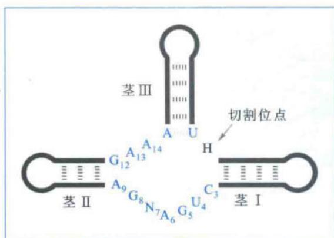

性比催化切割反应的活性高约10倍，而锤头型核酶催化切割反应的活性比催化连接反应的活性高100倍。核酶的发现为基因治疗提供了新的策略，因为根据其自剪切的特点，可以人工合成多种核酶以抑制破坏病毒或癌基因等有害基因的功能。

核酶的发现使我们对 RNA 的重要功能又有了新的认识。因此，核酶是继反转录现象之后对中心法则的又一个重要修

正,说明 RNA 既是遗传物质又是酶。核酶的发现为生命起源的研究提供了新思路,也许曾经存在以 RNA 为基础的原始生命。照这么说,蛋白质世界也可能(仅仅是可能)起源于 RNA 世界!

## 3.12 RNA 在生物进化中的地位

我们曾在本章开篇时说过,基因是唯一能自主复制、世代相传并永久存在的遗传学单位。中心法则也阐明了 DNA 作为遗传信息的贮存者,是生命遗传和生物进化的“中心”。那么,RNA(或许还包括蛋白质!)有没有可能在生物遗传变异的历史演变中起作用呢?

研究发现,RNA不仅具有极大的拷贝数,其变异率高达 $10^{-3}\sim10^{-4}$ 核苷酸/RNA分子,翻译错误率累加可达 $10^{-1}\sim10^{-2}$ 氨基酸/蛋白质分子,能够产生各种不同蛋白质而迅速积累信息。这就是说,RNA在基因表达过程中有一定的离散,正如鸟枪射击会有一些铅弹偏离靶心一样。RNA比相应DNA序列含有更多的遗传信息,可通过剪接、改变和校正阅读框架等方式表达出多种蛋白质异构体(同工酶?),还可能通过反转录产生与RNA信息相一致的DNA分子,直接影响后代的基因型,这种作用也可称之为“反馈效应”。

其次，RNA 还是获得性遗传(表观遗传)的分子基础。所谓获得性遗传是指有机体在生长发育过程中由于环境的影响而不是基因突变所形成的新的遗传性状。在 3 类主要生物大分子中，DNA 是信息分子，蛋白质是功能分子，RNA 既是信息分子，又是功能分子，它在表达过程中起着信息提取和加工的作用。环境可以影响和诱导 RNA 的产生及信息的加工，从而使机体表现出新的性状，这种性状如果传递给子代细胞或个体，就产生获得性遗传。实际上，不仅核酸分子是遗传信息的载体，某些亚细胞结构、细胞器和生物膜也能传递部分遗传信息，它们在环境影响下发生的结构改变有时也能传递给后代。因此，任何主观武断的结论都可能经不起历史的检验。

## 思考题

1. 什么是编码链？什么是模板链？

2. 简述 RNA 的种类及其生物学意义。

3. 简述原核和真核生物 RNA 的结构特征。

4. 简述 RNA 转录的概念及其基本过程。

5. 请说出复制与转录的异同点。

6. 大肠杆菌的 RNA 聚合酶由哪些组成成分？各个亚基的作用是什么？

7. 什么是封闭复合物、开放复合物以及三元复合物？

8. 简述 $\sigma$ 因子的作用。

9. 什么是 Pribnow box？它的保守序列是什么？

10. 说出真核与原核基因转录的异同。

11. 大肠杆菌的终止子有哪两大类？请分别介绍一下它们的结构特点。

12. 真核生物的原始转录产物必须经过哪些加工过程才能成为成熟 mRNA?

13. 简述Ⅰ、Ⅱ类内含子的剪接特点。

14. 什么是套索结构？哪些类型 RNA 的剪接中会形成该结构？

15. 什么是 RNA 编辑？其生物学意义是什么？

16. 核酶具有哪些结构特点？核酶的生物学意义是什么？

## 参考文献

1. Brueckner F, Ortiz J, Cramer P. A movie of the RNA polymerase nucleotide addition cycle. Curr. Opin. Struct. Biol., 2009, 19: 294–299.

2. Campbell E A, Westblade L F, Darst S A. Regulation of bacterial RNA polymerases factor activity: A structural perspective. Curr. Opin. Microbiol., 2008, 11: 121–127.

3. Kornberg R D, Young E T. The molecular basis of eukaryotic transcription. Proc. Natl. Acad. Sci., 2007, 104:12955-12961.

4. Sekine S, Tagami S, Yokoyama S. Structural basis of transcription by bacterial and eukaryotic RNA polymerases. Curr. Opin. Struct. Biol., 2012, 22: 110–118.

5. Hoskins A A, Moore M J. The spliceosome: A flexible, reversible macromolecular machine. Trends Biochem. Sci., 2012, 237: 179–188.

6. Toor N, Keating K S, Pyle A M. Structural insights into RNA splicing. Curr. Opin. Struct. Biol., 2009, 19: 260–266.

数字课程学习

e 教学课件

目在线自测

思考题解析

# 生物信息的传递(下) ——从 mRNA 到蛋白质

4.1 遗传密码——三联子

4.2 tRNA

4.3 核糖体

4.4 蛋白质合成的生物学机制

4.5 蛋白质运转机制

4.6 蛋白质的修饰、降解与稳定性研究

蛋白质是基因表达的最终产物, 是组成细胞的主要成分(图 4-1)。蛋白质的生物合成是一个比 DNA 复制和转录更为复杂的过程, 主要包括:

① 翻译的起始 核糖体与 mRNA 结合并与氨酰 tRNA 生成起始复合物。

② 肽链的延伸 由于核糖体沿 mRNA 5' 端向 3' 端移动, 开始了从 N 端向 C 端的多肽合成, 这是蛋白质合成过程中速度最快的阶段。

③ 肽链的终止及释放 核糖体从 mRNA 上解离, 准备新一轮合成反应。

核糖体是蛋白质合成的场所,mRNA 是蛋白质合成的模板,转移 RNA (transfer RNA, tRNA) 是模板与氨基酸之间的接合体。此外,在合成的各个阶段还有许多蛋白质、酶和其他生物大分子参与。例如,在真核生物细胞中有 70 种以上的核糖体蛋白质,20 种以上的 AA-tRNA 合成酶,10 多种起始因子、延伸因子及终止因子,50 种左右 tRNA 及各种 rRNA、mRNA 和 100 种以上翻译后加工酶参与蛋白质合成和加工过程。蛋白质合成是一个需能反应,要有各种高能化合物的参与。据统计,在真核生物中有将近 300 种生物大分子与蛋白质的合成有关,细胞用来进行合成代谢总能量的 90% 消耗在蛋白质合成过程中,而参与蛋白质合成的各种组分约占到细胞干重的 35%。

在真核生物细胞核内合成的 mRNA, 只有被运送到细胞质部分才能被翻译生成蛋白质。所谓翻译是指将 mRNA 链上的核苷酸从一个特定的起始位点开始, 按每 3 个核苷酸代表一个氨基酸的原则, 依次合成一条多肽链的过程。尽管蛋白质合成过程十分复杂, 但合成速度却高得惊人, 如大肠杆菌只需要 5 s 就能合成一条由 100 个氨基酸组成的多肽, 而且每个细胞中成百上千个蛋白质的合成都能有条不紊地协同进行。

图 4-1 细胞的化学组分中,蛋白质的含量在生物大分子中占有非常高的比例

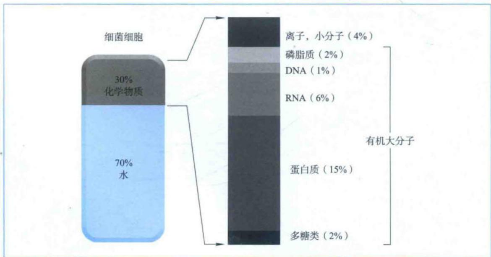

## 4.1 遗传密码——三联子

贮存在 DNA 上的遗传信息通过 mRNA 传递到蛋白质上, mRNA 与蛋白质之间的联系是通过遗传密码的破译来实现的。mRNA 上每 3 个核苷酸翻译成蛋白质多肽链上的一个氨基酸, 这 3 个核苷酸就称为密码, 也叫三联子密码即密码子 (codon)。翻译时从起始密码子 AUG (initiation codon) 开始, 沿着 mRNA 5' → 3' 的方向连续阅读密码子, 直至终止密码子 (termination codon) 为止, 生成一条具有特定序列的多肽链——蛋白质 $^{[图4-2]}$ 。新生的多肽链中氨基酸的组成和排列顺序决定于其基因的碱基组成及其顺序, 因此, 作为基因产物的蛋白质最终是受基因控制的。

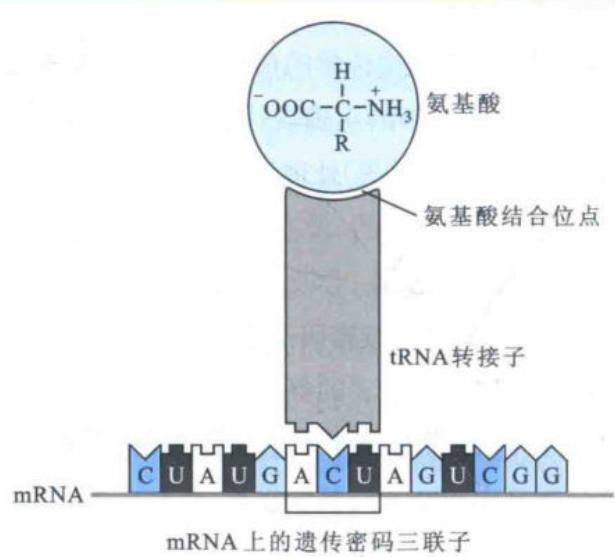  
图 4-2 Crick 关于 tRNA 分子破译 mRNA 遗传密码三联子的原始构想

遗传密码是20世纪60年代通过设计出色的生物化学和遗传学实验阐明的，它是科学上的杰出成就之一，它不仅为研究蛋白质的生物合成提供了理论依据，也证实了中心法则的正确性。70年代以来，分子生物学技术如DNA、RNA序列测定及氨基酸序列测定技术的进步，使遗传密码的存在得到验证。下面我们介绍遗传密码的来源及其特性。

## 4.1.1 三联子密码及其破译

蛋白质中的氨基酸序列是由 mRNA 中的核苷酸序列决定的, 所以, 要知道它们之间的关系就要弄清核苷酸和氨基酸数目的对应关系。mRNA 中只有 4 种核苷酸, 而蛋白质中有 20 种氨基酸, 以一种核苷酸代表一种氨基酸是不可能的。若以两种核苷酸作为一个氨基酸的密码 (二联子), 它们能代表的氨基酸有 $4^{2} = 16$ 种, 还是不足 20 种。而假定以 3 个核苷酸代表一个氨基酸, 则可以有 $4^{3} = 64$ 种密码, 完全可以满足编码 20 种氨基酸的需要。

图 4-3 用核苷酸的插入或删除实验证明 mRNA 模板上每 3 个核苷酸组成一个密码子  
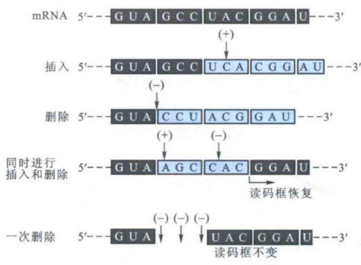

经过反复研究, Crick 等人首先从遗传学的角度证实三联子密码的构想是正确的。他们发现 T4 噬菌体 rⅡ位点上两个基因的正确表达与它能否侵染大肠杆菌有关, 用吖啶类试剂(诱导核苷酸插入或从 DNA 链上丢失)处理使 T4 噬菌体 DNA 发生移码突变(frameshift mutation), 从而指导生成一个完全不同的、没有功能的蛋白质, 使噬菌体丧失感染能力。若在模板 mRNA 中插入或删除一个碱基, 会改变该密码子以后的全部氨基酸序列。若同时对模板进行插入和删除试验, 保证后续密码子序列不变, 翻译得到的蛋白质序列就保持不变(除了发生突变的那个密码子所代表的氨基酸之外)。如果同时删除 3 个核苷酸, 翻译产生少了一个氨基酸的蛋白质, 但序列不发生变化(图 4-3)。另外, 对烟草坏死卫星病毒的研究发现, 其外壳蛋白亚基由 400 个氨基酸组成, 而相应的 RNA 片段长约 1200 个核苷酸, 与假设的密码三联子体系正好相吻合。

遗传密码的破译,即确定代表每种氨基酸的具体密码,在20世纪60年代初期是一项困难的任务。尽管如此,由于体外蛋白质合成体系的建立和核酸人工合成技术的发展,科学家实际上只花了几年时间就解开了这个谜。

## 1. 以均聚物、随机共聚物和特定序列的共聚物为模板指导多肽的合成

制备大肠杆菌的无细胞合成体系，在含 DNA、mRNA、tRNA、核糖体、AA-tRNA 合成酶及其他酶类的抽提物中加入 DNase，降解体系中的 DNA，耗尽 mRNA 时，体系中的蛋白质合成即停止，当补充外源 mRNA 或人工合成的各种均聚物或共聚物作为模板以及 ATP、GTP、氨基酸等成分时又能合成新的肽链，新生肽链的氨基酸顺序由外加的模板所决定。因此，分析比较加入的模板和合成的肽链即可推知编码某些氨基酸的密码。

1961 年, Nirenberg 使用能在没有模板的情况下将核苷酸连接起来的多核苷酸磷酸化酶, 把多(U)作为模板加入到上述无细胞翻译体系中, 再向体系中加入放射性标记的同种氨基酸, 每次测一种氨基酸, 在做了 20 次不同的实验后发现, 新合成的多肽链是多苯丙氨酸, 从而认定 UUU 代表苯丙氨酸(Phe) $^{(图4-4)}$ 。以多(C)及多(A)做模板得到的分别是多脯氨酸和多赖氨酸, 这样很快就解决了 3 个氨基酸的密码子(当然, 一个氨基酸可能有几

## 图 4-4 无细胞翻译体系证明 UUU 编码苯丙氨酸

将人工合成的 mRNA 加入到一个含有核糖体、tRNA、多核苷酸磷酸化酶以及其他小分子的无细胞翻译体系中，然后将放射性标记的氨基酸加入到该系统中，分析所产生的多肽。结果发现 poly(U) 编码只含有苯丙氨酸的多肽。

个密码子)。幸运的是,由于上述无细胞体系中 $Mg^{2+}$ 浓度很高,人工合成的多聚核苷酸不需要起始密码子就能指导多肽的生物合成,读码起始是随机的。在生理 $Mg^{2+}$ 条件下,没有起始密码子的多核苷酸不能被用作多肽合成的模板。

Nirenberg 及 Ochoa 等又用各种随机的共聚物或特定序列共聚物作模板合成多肽，例如，以只含 A、C 的共聚核苷酸作模板，任意排列时可出现 8 种三联子，即 CCC、CCA、CAC、ACC、CAA、ACA、AAC、AAA，获得由 Asn、His、Pro、Gln、Thr、Lys 等 6 种氨基酸组成的多肽。

他们发现,以多二核苷酸作模板可合成由2个氨基酸组成的多肽,如以多(UG)为模板合成的是多Cys和Val,因为多(UG)中含Cys和Val的密码:

$$
5 ^ {\prime} \dots \dots \text { UGU   GUG   UGU   GUG   UGU   GUG } \dots \dots 3 ^ {\prime}
$$

无论读码从 U 开始还是从 G 开始, 都只能有 UGU(Cys) 及 GUG(Val) 两种密码子。

以多三核苷酸作为模板可得到有3种氨基酸组成的多肽。如以多(UUC)为模板,可能有3种起读方式:

$$
5 ^ {\prime} \dots \dots \text { UUC   UUC   UUC   UUC   UUC } \dots \dots 3 ^ {\prime}
$$

$$
\text { 或 } 5 ^ {\prime} \dots \dots \mathrm{UCUUCUUCUUCUUCU} \dots \dots 3 ^ {\prime}
$$

$$
\text {或} 5 ^ {\prime} \dots \dots \mathrm{CUU CUU CUU CUU CUU CUU} \dots \dots 3 ^ {\prime}
$$

根据读码起点不同,产生的密码子可能是 UUC(Phe)、UCU(Ser) 或 CUU(Leu),所以得到的多肽可能是多苯丙氨酸、多丝氨酸或多亮氨酸,由此可知 UUC、UCU、CUU 分别是苯丙氨、丝氨酸及亮氨酸的密码子。当然,以多三核苷酸为模板时也可能只合成 2 种均聚多肽,以多(GUA)为例:

$$
5 ^ {\prime} \dots \dots \mathrm{GUA} \mathrm{GUA} \mathrm{GUA} \mathrm{GUA} \mathrm{GUA} \dots \dots 3 ^ {\prime}
$$

$$
\text { 或 } 5 ^ {\prime} \dots \dots \mathrm{UAGUAGUAGUAGUAGUAG} \dots \dots 3 ^ {\prime}
$$

$$
\text {或} 5 ^ {\prime} \dots \dots \mathrm{AGUAGUAGUAGUAGU} \dots \dots 3 ^ {\prime}
$$

由第二种读码方式产生的密码子 UAG 是终止密码, 不编码任何氨基酸, 因此, 只产生 2 种密码子 GUA (Val) 或 AGU (Ser), 所以合成的多肽要么是多缬氨酸, 要么是多丝氨酸。

## 2. 核糖体结合技术

Nirenberg 和 Leder 还用核糖体结合技术来解决密码问题。这个方法是以人工合成的三核苷酸如 UUU、UCU、UGU 等为模板，在含核糖体、AA-tRNA 的适当离子强度的反应液中保温，然后使反应液通过硝酸纤维素滤膜。他们发现，游离的 AA-tRNA 因相对分子质量小能自由通过滤膜，加入三核苷酸模板可以促使其对应的 AA-tRNA 结合到核糖体上，体积超过膜上的微孔而被滞留，这样就能把已结合到核糖体上的 AA-tRNA 与未结合的 AA-tRNA 分开。若用 20 种 AA-tRNA 做 20 组同样的实验，每组都含 20 种 AA-tRNA 和各种三核苷酸，但只有一种氨基酸用 $^{14}$ C 标记，看哪一种 AA-tRNA 被留在滤膜上，进一步分析这一组的模板是哪个三核苷酸，从模板三核苷酸与氨基酸的关系可测定该氨基酸的密码子。例如，模板是 UUU 时，Phe-tRNA 结合于核糖体上，可知 UUU 是 Phe 的密码子（表 4-1）。

表 4-1 三核苷酸密码子能使特定的氨酰 tRNA 结合到核糖体上

<table><tr><td rowspan="2">密码子</td><td colspan="3">与核糖体相结合的 $^{14}C$ 标记的氨酰 tRNA</td></tr><tr><td>Phe-tRNA $^{\text{Phe}}$ </td><td>Lys-tRNA $^{\text{Lys}}$ </td><td>Pro-tRNA $^{\text{Pro}}$ </td></tr><tr><td>UUU</td><td>4.6*</td><td>0</td><td>0</td></tr><tr><td>AAA</td><td>0</td><td>7.7</td><td>0</td></tr><tr><td>CCC</td><td>0</td><td>0</td><td>3.1</td></tr></table>

\* 数字代表特定氨酰 tRNA 与带有模板三核苷酸的核糖体相结合的效率。随机结合 =1。

## 4.1.2 遗传密码的性质

## 1. 密码的连续性

翻译由 mRNA 的 5' 端的起始密码子开始,一个密码子接一个密码子连续阅读直到 3' 终止密码,密码间无间断也没有重叠,即起始密码子决定了所有后续密码子的位置,说明三联子密码是连续的。

## 2. 密码的简并性

按照 1 个密码子由 3 个核苷酸组成的原则,4 种核苷酸可组成 64 个密码子,现在已经知道其中 61 个是编码氨基酸的密码子,另外 3 个即 UAA、UGA 和 UAG 并不代表任何氨基酸,它们是终止密码子,不能与 tRNA 的反密码子配对,但能被终止因子或释放因子识别,终止肽链的合成 $^{(表4-2)}$ 。细菌中 3 种终止密码子的使用频率是不同的,UAA 是最常用的,UGA 比 UAG 的使用频率更高一点,但 UGA 出错的可能性更大一些。

因为存在 61 种密码子而只有 20 种氨基酸, 所以许多氨基酸有多个密码子, 实际上除甲硫氨酸(AUG)和色氨酸(UGG)只有一个密码子外, 其他氨基酸都有一个以上的密码子, 其中 9 种氨基酸有 2 个密码子, 1 种氨基酸有 3 个密码子, 5 种氨基酸有 4 个密码子, 3 种氨基酸有 6 个密码子(表 4-3)。

由一种以上密码子编码同一个氨基酸的现象称为简并(degeneracy)，对应于同一氨基酸的密码子称为同义密码子(synonymous codon)。另外，AUG 和 GUG 既是甲硫氨酸及缬氨酸的密码子又是起始密码子，这种双重功能在生物学上的意义尚不清楚。

表 4-2 通用遗传密码及相应的氨基酸

<table><tr><td rowspan="2">第一位(5&#x27;端)核苷酸</td><td colspan="4">第二位(中间)核苷酸</td><td rowspan="2">第三位(3&#x27;端)核苷酸</td></tr><tr><td>U</td><td>C</td><td>A</td><td>G</td></tr><tr><td rowspan="4">U</td><td>苯丙氨酸(Phe,F)</td><td>丝氨酸(Ser,S)</td><td>酪氨酸(Tyr,Y)</td><td>半胱氨酸(Cys,C)</td><td>U</td></tr><tr><td>苯丙氨酸(Phe,F)</td><td>丝氨酸(Ser,S)</td><td>酪氨酸(Tyr,Y)</td><td>半胱氨酸(Cys,C)</td><td>C</td></tr><tr><td>亮氨酸(Leu,L)</td><td>丝氨酸(Ser,S)</td><td>终止(Stop)</td><td>终止(Stop)</td><td>A</td></tr><tr><td>亮氨酸(Leu,L)</td><td>丝氨酸(Ser,S)</td><td>终止(Stop)</td><td>色氨酸(Trp,W)</td><td>G</td></tr><tr><td rowspan="4">C</td><td>亮氨酸(Leu,L)</td><td>脯氨酸(Pro,P)</td><td>组氨酸(His,H)</td><td>精氨酸(Arg,R)</td><td>U</td></tr><tr><td>亮氨酸(Leu,L)</td><td>脯氨酸(Pro,P)</td><td>组氨酸(His,H)</td><td>精氨酸(Arg,R)</td><td>C</td></tr><tr><td>亮氨酸(Leu,L)</td><td>脯氨酸(Pro,P)</td><td>谷氨酰胺(Gln,Q)</td><td>精氨酸(Arg,R)</td><td>A</td></tr><tr><td>亮氨酸(Leu,L)</td><td>脯氨酸(Pro,P)</td><td>谷氨酰胺(Gln,Q)</td><td>精氨酸(Arg,R)</td><td>G</td></tr><tr><td rowspan="4">A</td><td>异亮氨酸(Ile,I)</td><td>苏氨酸(Thr,T)</td><td>天冬酰胺(Asn,N)</td><td>丝氨酸(Ser,S)</td><td>U</td></tr><tr><td>异亮氨酸(Ile,I)</td><td>苏氨酸(Thr,T)</td><td>天冬酰胺(Asn,N)</td><td>丝氨酸(Ser,S)</td><td>C</td></tr><tr><td>异亮氨酸(Ile,I)</td><td>苏氨酸(Thr,T)</td><td>赖氨酸(Lys,K)</td><td>精氨酸(Arg,R)</td><td>A</td></tr><tr><td>甲硫氨酸(Met,M)</td><td>苏氨酸(Thr,T)</td><td>赖氨酸(Lys,K)</td><td>精氨酸(Arg,R)</td><td>G</td></tr><tr><td rowspan="4">G</td><td>缬氨酸(Val,V)</td><td>丙氨酸(Ala,A)</td><td>天冬氨酸(Asp,D)</td><td>甘氨酸(Gly,G)</td><td>U</td></tr><tr><td>缬氨酸(Val,V)</td><td>丙氨酸(Ala,A)</td><td>天冬氨酸(Asp,D)</td><td>甘氨酸(Gly,G)</td><td>C</td></tr><tr><td>缬氨酸(Val,V)</td><td>丙氨酸(Ala,A)</td><td>谷氨酸(Glu,E)</td><td>甘氨酸(Gly,G)</td><td>A</td></tr><tr><td>缬氨酸(Val,V)</td><td>丙氨酸(Ala,A)</td><td>谷氨酸(Glu,E)</td><td>甘氨酸(Gly,G)</td><td>G</td></tr></table>

表 4-3 密码子的简并性

<table><tr><td>氨基酸</td><td>密码子个数</td><td>氨基酸</td><td>密码子个数</td></tr><tr><td>丙氨酸</td><td>4</td><td>亮氨酸</td><td>6</td></tr><tr><td>精氨酸</td><td>6</td><td>赖氨酸</td><td>2</td></tr><tr><td>天冬酰胺</td><td>2</td><td>甲硫氨酸</td><td>1</td></tr><tr><td>天冬氨酸</td><td>2</td><td>苯丙氨酸</td><td>2</td></tr><tr><td>半胱氨酸</td><td>2</td><td>脯氨酸</td><td>4</td></tr><tr><td>谷氨酰胺</td><td>2</td><td>丝氨酸</td><td>6</td></tr><tr><td>谷氨酸</td><td>2</td><td>苏氨酸</td><td>4</td></tr><tr><td>甘氨酸</td><td>4</td><td>色氨酸</td><td>1</td></tr><tr><td>组氨酸</td><td>2</td><td>酪氨酸</td><td>2</td></tr><tr><td>异亮氨酸</td><td>3</td><td>缬氨酸</td><td>4</td></tr></table>

同义密码子一般都不是随机分布的,因为其第一、第二位核苷酸往往是相同的,而第三位核苷酸的改变并不一定影响所编码的氨基酸,这种安排减少了变异对生物的影响。一般说来,编码某一氨基酸的密码子越多,该氨基酸在蛋白质中出现的频率也越高,只有精氨酸是个例外,因为在真核生物中 CG 双联子出现的频率较低,所以尽管有 6 个同义密码子,蛋白质中精氨酸的出现频率仍不高,如图 4-5。

## 3. 密码的通用性与特殊性

遗传密码无论在体内还是体外,也无论是对病毒、细菌、动物还是植物而言都是通用的,所以密码子具有通用性。20世纪70年代以后对各种生物基因组的大规模测序结果也充分证明生物界基本共用同一套遗传密码。密码子的通用性有助于我们研究生物的进化。同时,遗传密码的通用性在遗传工程中得到充分运用,比如在细菌中大量表达人类的外源蛋白——胰岛素等。

虽然密码子具有通用性,但也发现极少数例外。在支原体中,终止密码子 UGA 被用来编码色氨酸;在嗜热四膜虫中,另一个终止密码子 UAA 被用来编码谷氨酰胺。对人、牛及酵母线粒体 DNA 序列和结构的研究还发现,在线粒体中也有一些例外情况(表 4-4),如 UGA 编码色氨酸,而非终止密码子;甲硫氨酸可由 AUA 编码等,体现了遗传密码的特殊性。

图 4-5 除了 Arg 以外, 编码某一特定氨基酸的密码子个数与该氨基酸在蛋白质中的出现频率相吻合  
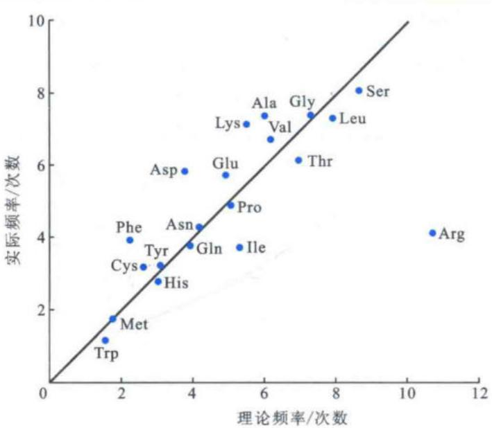

表 4-4 线粒体与核 DNA 密码子使用情况的比较

<table><tr><td>生物</td><td>密码子</td><td>线粒体 DNA 编码的氨基酸</td><td>核 DNA 编码的氨基酸</td></tr><tr><td>所有</td><td>UGA</td><td>色氨酸</td><td>终止子</td></tr><tr><td>酵母</td><td>CUA</td><td>苏氨酸</td><td>亮氨酸</td></tr><tr><td>果蝇</td><td>AGA</td><td>丝氨酸</td><td>精氨酸</td></tr><tr><td>哺乳类</td><td>AGA/G</td><td>终止子</td><td>精氨酸</td></tr><tr><td>哺乳类</td><td>AUA</td><td>甲硫氨酸</td><td>异亮氨酸</td></tr></table>

## 4.1.3 密码子与反密码子的相互作用

在蛋白质生物合成过程中，tRNA的反密码子在核糖体内是通过碱基的反向配对与mRNA上的密码子相互作用的 $^{(图4-6)}$ 。1966年，Crick根据立体化学原理提出摆动假说(wobble hypothesis)，解释了反密码子中某些稀有成分(如I)的配对，以及许多氨基酸有2个以上密码子的问题。

根据摆动假说,在密码子与反密码子的配对中,前两对严格遵守碱基配对原则,第三对碱基有一定的自由度,可以“摆动”,因而使某些tRNA可以识别1个以上的密码子。一个tRNA究竟能识别多少个密码子是由反密码子的第一位碱基的性质决定的,反密码子第一位为A或C时只能识别1种密码子,为G或U时可以识别2种密码子,为I时可识别3种密码子(表4-5)。如果有几个密码子同时编码一个氨基酸,凡是第一、二位碱基不同的密码子都对应于各自独立的tRNA。原核生物中有30\~45种tRNA,真核细胞中可能存在50种tRNA。

(a)  
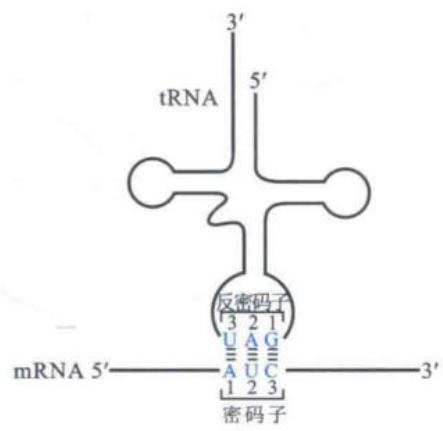  
(b)

$$
\begin{array}{c c c} 3 & 2 & 1 \\ \underline {{G}} - \underline {{C}} - \underline {{I}} \\ \underline {{=}} & \underline {{=}} & \underline {{=}} \\ C - G - A \\ 1 & 2 & 3 \end{array}
$$

$$
\begin{array}{c c c} 3 & 2 & 1 \\ \underline {{G}} - \underline {{C}} - \underline {{I}} \\ \underline {{=}} & \underline {{=}} & \underline {{=}} \\ C - G - U \\ 1 & 2 & 3 \end{array}
$$

$$
\begin{array}{c c c} 3 & 2 & 1 \\ \underline {{\mathrm{G}}} - \underline {{\mathrm{C}}} - \underline {{\mathrm{I}}} & (5 ^ {\prime}) \\ \overline {{\overline {{\mathrm{C}}}}} - \overline {{\mathrm{C}}} - \overline {{\mathrm{I}}} & \\ \mathrm{C} - \mathrm{G} - \mathrm{C} & (3 ^ {\prime}) \\ 1 & 2 & 3 \end{array}
$$

图 4-6 mRNA 上的密码子与 tRNA 上的反密码子配对示意图

(a) 密码子与 tRNA 反密码子臂上相应序列配对；(b) 当反密码子第一位是 I 时，密码子第三位可以是 A、U 或 C。

表 4-5 tRNA 上的反密码子与 mRNA 上密码子的配对与“摆动”分析

<table><tr><td colspan="3">1. 反密码子第一位是C或A时,只能识别一种密码子</td></tr><tr><td>反密码子</td><td>(3&#x27;)X-Y-C(5&#x27;)</td><td>(3&#x27;)X-Y-A(5&#x27;)</td></tr><tr><td>密码子</td><td>(5&#x27;)Y-X-G(3&#x27;)</td><td>(5&#x27;)Y-X-U(3&#x27;)</td></tr><tr><td colspan="3">2. 反密码子第一位是U或G时,可分别识别两种密码子</td></tr><tr><td>反密码子</td><td>(3&#x27;)X-Y-U(5&#x27;)</td><td>(3&#x27;)X-Y-G(5&#x27;)</td></tr><tr><td>密码子</td><td>(5&#x27;)Y-X-A/G(3&#x27;)</td><td>(5&#x27;)Y-X-C/U(3&#x27;)</td></tr><tr><td colspan="3">3. 反密码子第一位是I时,可识别3种密码子</td></tr><tr><td>反密码子</td><td>(3&#x27;)X-Y-I(5&#x27;)</td><td></td></tr><tr><td>密码子</td><td>(5&#x27;)Y-X-A/U/C(3&#x27;)</td><td></td></tr></table>

## 4.2 tRNA

tRNA 在蛋白质合成中处于关键地位,它不但为每个三联密码子翻译成氨基酸提供了接合体,还为准确无误地将所需氨基酸运送到核糖体上提供了运送载体,所以,它又被称为第二遗传密码。虽然 tRNA 分子各自的序列不同,但所有的 tRNA 都具有共同的特征:存在经过特殊修饰的碱基,tRNA 的 3' 端都以 CCA-OH 结束,该位点是 tRNA 与相应氨基酸结合的位点。

## 4.2.1 tRNA 的三叶草二级结构

tRNA 参与多种反应,并与多种蛋白质和核酸相互识别,这就决定了它们在结构上存在大量的共性。由于小片段碱基互补配对,三叶草形 tRNA 分子上有 4 条根据它们的结构或已知功能命名的手臂(图 4-7):

受体臂(acceptor arm)因是结合氨基酸的位点而得名,主要由链两端序列碱基配对形成的杆状结构和3'端未配对的3\~4个碱基所组成,其3'端的最后3个碱基序列永远是CCA序列,伸出双链之外,最后一个碱基的3'或2'自由羟基(—OH)可以被氨酰化。

其余手臂均由碱基配对产生的杆状结构和无法配对的套索状结构所组成。

TψC臂是根据3个核苷酸命名的,其中ψ表示拟尿嘧啶,是tRNA分子所拥有的不常见核苷酸。

反密码子臂是根据位于套索中央的三联反密码子命名的。反密码子的两端由5'端的尿嘧啶和3'端的嘌呤界定。

D 臂是根据它含有二氢尿嘧啶 (dihydrouracil) 命名的。

图 4-7 显示了最常见 tRNA 分子的三叶草二级结构形式。tRNA 一般有 76 个碱基，相对分子质量约为 $2.5 \times 10^{4}$ 。不同的 tRNA 分子可有 74～95 个核苷酸不等。tRNA 分子长度的不同主要是由其中的 D 臂、TψC 臂和多余臂引起的，在 D 臂中存在多至 3 个可变核苷酸位点。tRNA 分子中最大的变化发生在位于 TψC 和反密码子臂之间的多余臂 (extra arm) 上。

图 4-7 tRNA 的三叶草形二级结构  

tRNA 的稀有碱基含量非常丰富,有 70 余种。每个 tRNA 分子至少含有 2 个稀有碱基,最多有 19 个,多数分布在非配对区,特别是在反密码子 3' 端邻近部位出现的频率最高,且大多为嘌呤核苷酸,这对于维持反密码子环的稳定性及密码子、反密码子之间的配对是很重要的。基因组研究发现,原核生物与真核生物细胞中所拥有的各种 tRNA 基因总数很不一样。

所有的 tRNA 都能够与核糖体的 A 位点(新进入的氨酰 tRNA 的结合位点)和 P 位点(肽酰 tRNA 的结合位点)结合,此时,tRNA 分子三叶草型顶端突起部位通过密码子-反密码子的配对与 mRNA 相结合,而其 3' 端恰好将所运转的氨基酸送到正在延伸的多肽上。此外,所有 tRNA(除了起始 tRNA 外)都能被翻译辅助因子 EF-Tu(原核生物)或 eEF1(真核生物)所识别而与核糖体相结合,起始 tRNA 能被原核生物的起始因子 IF-2 或真核生物的起始因子 eIF-2 所识别。

## 4.2.2 tRNA 的 L-形三级结构

有人在二级结构基础上做了酵母 $tRNA^{Phe}$ 、 $tRNA^{fMet}$ 和大肠杆菌 $tRNA^{fMet}$ 、 $tRNA^{Arg}$ 等的

图 4-8 酵母 tRNA $^{Phe}$ 的三级结构示意图（根据 X 射线衍射数据绘制）

(a) 和 (b) 表示用不同方法构建的模型。

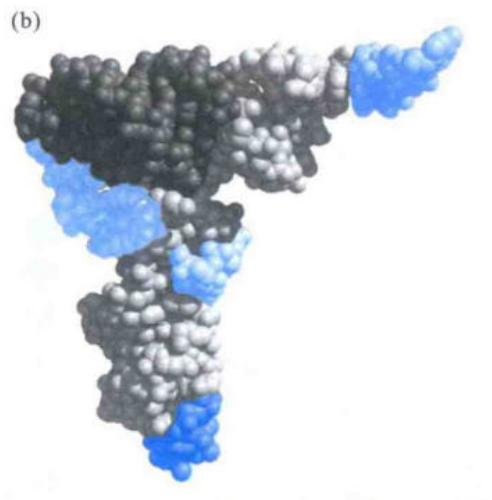

三级结构,发现都呈 L 形折叠(图 4-8),而这种结构是靠氢键来维持的。tRNA 的三级结构与 AA-tRNA 合成酶对 tRNA 的识别有关。

tRNA 的 L 形三级结构,保留了二级结构中由于碱基互补而产生的双螺旋杆状结构,又通过分子重排创造了另一对双螺旋。受体臂和 TψC 臂的杆状区域构成了第一个双螺旋,D 臂和反密码子臂的杆状区域形成了第二个双螺旋,两个双螺旋上各有一个缺口。TψC 臂和 D 臂的套索状结构位于“L”的转折点。所以,受体臂顶端的碱基位于“L”的一个端点,反密码子臂的套索状结构生成了“L”的另一个端点。

tRNA 高级结构上的特点为我们提供了研究其生物学功能的重要线索, 因为 tRNA 上所运载的氨基酸必须靠近位于核糖体大亚基上的多肽合成位点, 而 tRNA 上的反密码子必须与小亚基上的 mRNA 相配对, 所以分子中两个不同的功能基团是最大限度分离的。这个结构形式很可能满足了蛋白质合成过程中对 tRNA 的各种要求而成为 tRNA 的通式, 研究证实 tRNA 的性质是由反密码子而不是它所携带的氨基酸所决定的。

## 4.2.3 tRNA的功能

转录过程是信息从一种核酸分子(DNA)转移到另一种结构上极为相似的核酸分子(RNA)的过程,信息转移靠的是碱基配对。翻译阶段遗传信息从 mRNA 分子转移到结构极不相同的蛋白质分子,信息是以能被翻译成单个氨基酸的三联密码子形式存在的,在这里起作用的是 tRNA 的解码机制。

根据 Crick 的接合体假说,氨基酸必须与一种接合体接合,才能被带到 RNA 模板的恰当位置上正确合成蛋白质。所以,氨基酸在合成蛋白质之前必须通过 AA-tRNA 合成酶活化,在消耗 ATP 的情况下结合到 tRNA 上,生成有蛋白质合成活性的 AA-tRNA。同时,AA-tRNA 的生成还牵涉到信息传递的问题,因为只有 tRNA 上的反密码子能与 mRNA 上的密码子相互识别并配对,而氨基酸本身不能识别密码子,只有结合到 tRNA 上生成 AA-tRNA,才能被带到 mRNA-核糖体复合物上,插入到正在合成的多肽链的适当位置上。

下面的实验证明模板 mRNA 只能识别特异的 tRNA 而不是氨基酸。 $^{14}$ C 标记的半胱氨酸与 $tRNA^{Cys}$ 结合后生成 $[^{14}C]$ -半胱氨酸- $tRNA^{Cys}$ ，经 Ni 催化可生成 $[^{14}C]$ -Ala-tRNA $^{Cys}$ ，再把 $[^{14}C]$ -Ala-tRNA $^{Cys}$ 加进含血红蛋白 mRNA、其他 tRNA、氨基酸以及兔网织细胞核糖体的蛋白质合成系统中，结果发现 $[^{14}C]$ -Ala-tRNA $^{Cys}$ 插入了血红蛋白分子通常由半胱氨酸占据的位置上，这表明在这里起识别作用的是 tRNA 而不是氨基酸。

## 4.2.4 tRNA 的种类

## 1. 起始 tRNA 和延伸 tRNA

有一类能特异地识别 mRNA 模板上起始密码子的 tRNA 叫起始 tRNA, 其他 tRNA 统称为延伸 tRNA。起始 tRNA 具有独特的、有别于其他所有 tRNA 的结构特征。原核生物起始 tRNA 携带甲酰甲硫氨酸 (fMet), 真核生物起始 tRNA 携带甲硫氨酸 (Met)。原核生物中 Met-tRNA $^{fMet}$ 必须首先甲酰化生成 fMet-tRNA $^{fMet}$ 才能参与蛋白质的生物合成。

## 2. 同工 tRNA

由于一种氨基酸可能有多个密码子,因此有多个 tRNA 来识别这些密码子,即多个 tRNA 代表一种氨基酸,我们将几个代表相同氨基酸的 tRNA 称为同工 tRNA (cognate tRNA)。在一个同工 tRNA 组内,所有 tRNA 均专一于相同的氨酰 tRNA 合成酶。同工 tRNA 既要有不同的反密码子以识别该氨基酸的各种同义密码,又要有某种结构上的共同性,能被 AA-tRNA 合成酶识别。所以说,同工 tRNA 组内肯定具备了足以区分其他 tRNA 组的特异构造,保证合成酶能准确无误地加以选择。到目前为止,科学家还无法从一级结构上解释 tRNA 在蛋白质合成中的专一性。有证据说明,tRNA 的二级和三级结构对它的专一性起着举足轻重的作用。

## 3. 校正 tRNA

在蛋白质的结构基因中,一个核苷酸的改变可能使代表某个氨基酸的密码子变成终止密码子(UAG、UGA、UAA),使蛋白质合成提前终止,合成无功能的或无意义的多肽,这种突变称为无义突变(nonsense mutation),而无义突变的校正 tRNA 可通过改变反密码子区校正无义突变。

错义突变(missense mutation)是由于结构基因中某个核苷酸的变化使一种氨基酸的密码变成另一种氨基酸的密码。错义突变的校正tRNA通过反密码子区的改变把正确的氨基酸加到肽链上，合成正常的蛋白质。如某大肠杆菌细胞色氨酸合成酶中的一个甘氨酸密码子GGA错义突变成AGA(编码精氨酸)，指导合成错误的多肽链。甘氨酸校正tRNA的校正基因突变使其反密码子从CCU变成UCU，它仍然是甘氨酸的反密码子但不结合GGA而能与突变后的AGA密码子相结合，把正确的氨基酸(甘氨酸)放到AGA所对应的位置上。

校正 tRNA 在进行校正过程中必须与正常的 tRNA 竞争结合密码子,无义突变的校正 tRNA 必须与释放因子竞争识别密码子,错义突变的校正 tRNA 必须与该密码的正常 tRNA 竞争,都会影响校正的效率。所以,某个校正基因的效率不仅决定于反密码子与密码子的亲和力,也决定于它在细胞中的浓度及竞争中的其他参数。一般说来,校正效率不会超过50%。无义突变的校正基因tRNA不仅能校正无义突变,也会抑制该基因3'端正常的终止密码子,导致翻译过程的通读,合成更长的蛋白质,这种蛋白质过多就会对细胞造成伤害。同样,一个基因错义突变的矫正也可能使另一个基因错误翻译,因为如果一个校正基因在突变位点通过取代一种氨基酸的方式校正了一个突变,它也可以在另一位点这样做,从而在正常位点上引入新的氨基酸。

## 4.2.5 氨酰 tRNA 合成酶

每个 tRNA 分子如何与 20 个氨基酸中正确的一个连接上？这个任务由氨酰 tRNA 合成酶（AA-tRNA synthetase）来承担，它确保了 tRNA 只与正确的氨基酸相偶联。氨酰 tRNA 合成酶是一类催化氨基酸连接于 tRNA 的 3' 端的特异性酶，其反应如下：

$$
\mathrm{AA} + \mathrm{tRNA} + \mathrm{ATP} \rightarrow \mathrm{AA} - \mathrm{tRNA} + \mathrm{AMP} + \mathrm{PPi}
$$

它实际上包括两步反应：

第一步是氨基酸活化生成酶-氨基酰腺苷酸复合物。

$$
\mathrm{AA} + \mathrm{ATP} + \mathrm{酶(E)} \rightarrow \mathrm{E-AA-AMP+PPi}
$$

第二步是氨酰基转移到 tRNA 3' 端腺苷残基的 2' 或 3'-羟基上。

$$
\mathrm{E-AA-AMP+tRNA} \rightarrow \mathrm{AA-tRNA+E+AMP}
$$

蛋白质合成的真实性主要决定于 tRNA 能否把正确的氨基酸放到新生多肽链的正确位置上,而这一步主要决定于 AA-tRNA 合成酶是否能使氨基酸与对应的 tRNA 相结合。AA-tRNA 合成酶既要能识别 tRNA,又要能识别氨基酸,它对两者都具有高度的专一性。不同的 tRNA 有不同的碱基组成和空间结构,每种特异性 AA-tRNA 合成酶通过对其独特结构的识别来保证翻译的正确进行(图 4-9)。受体臂是 AA-tRNA 合成酶识别特异性的关键因素,若位于该臂上的鉴别者碱基发生变化,会使某个 tRNA 所识别的密码子发生变化,从一种 AA-tRNA 合成酶变成另一种 AA-tRNA 合成酶。

图 4-9 氨酰 tRNA 合成酶识别 tRNA 的独特结构

(a) tRNA 结构中氨酰 tRNA 合成酶识别的必需元件；(b) 谷氨酰 tRNA 合成酶与 tRNA $^{Gln}$ 结合的晶体结构图。

困难的是这些酶怎么去识别结构上非常相似的氨基酸。例如，异亮氨酸只比缬氨酸多一个甲烯基团，而异亮氨酰tRNA合成酶对异亮氨酸的亲和力比对缬氨酸大225倍。考虑到体内缬氨酸的浓度比异亮氨酸高5倍，缬氨酸被错误活化渗入到异亮氨酸位点上去的概率应该是1/40，但实际上错误频率(误差率)只有约 $1.5 \times 10^{-5}$ ，表明还存在其他重要的校正手段以增加蛋白质合成的真实性。科学家发现，异亮氨酰tRNA合成酶在催化口袋附近还有一个编辑口袋，对腺苷酰基化产物进行校对，因此，被错误活化的缬氨酸不会被结合到 $tRNA^{Ile}$ 上，而是被酶本身水解，活化阶段产生的误差在后一个阶段被校正。

## 4.3 核糖体

核糖体是指导蛋白质合成的大分子机器。生物细胞内，核糖体像一个能沿 mRNA 模板移动的工厂，执行着蛋白质合成的功能。它是由几十种蛋白质和几种核糖体 RNA (ribosomal RNA, rRNA) 组成的亚细胞颗粒。一个细菌细胞内约有 20 000 个核糖体，而真核细胞内可达 $10^{6}$ 个，在未成熟的蟾蜍卵细胞内则高达 $10^{12}$ 个。这些颗粒既可以游离状态存在于细胞内，也可与内质网结合，形成微粒体。核糖体和它的辅助因子为蛋白质生物合成提供了必要的条件。

运载有肽链起始或延伸必需氨基酸的 AA-tRNA, 往往以令人难以置信的速度进入核糖体, 在起始或延伸因子的作用下, 与 mRNA 模板和延伸中的肽链相互作用, 卸去所载氨基酸后立即退出核糖体, 以保证新一轮合成反应的顺利进行。

核糖体蛋白约占原核细胞总蛋白量的 10%, 占细胞内总 RNA 量的 80% $^{(表4-6)}$ 。在真核细胞内, 核糖体 RNA 所占的比例虽然有所下降, 但仍然占总 RNA 的绝大部分, 是细胞总蛋白的一个重要组成部分。无论原核或真核细胞内核糖体的含量都是与细胞蛋白质合成活性直接相关的。

在真核生物中,大多数正在进行蛋白质合成的核糖体都不是在细胞质内自由漂浮,而是直接或间接与细胞骨架结构有关联或者与内质网膜结构相连的。细菌核糖体大都通过

表 4-6 核糖体及其他组分在大肠杆菌细胞内的分布

<table><tr><td>组分</td><td>占细胞总量</td><td>细胞内数量</td></tr><tr><td>细胞壁</td><td>10%</td><td>1</td></tr><tr><td>细胞膜</td><td>10%</td><td>2</td></tr><tr><td>DNA</td><td>2%</td><td>1</td></tr><tr><td>mRNA</td><td>2%</td><td> $3.5 \times 10^{3}$ </td></tr><tr><td>tRNA</td><td>3%</td><td> $1.6 \times 10^{5}$ </td></tr><tr><td>rRNA</td><td>21%</td><td> $8 \times 10^{5}$ </td></tr><tr><td>核糖体蛋白</td><td>9%</td><td> $2 \times 10^{4}$ </td></tr><tr><td>可溶性蛋白</td><td>40%</td><td> $10^{6}$ </td></tr><tr><td>小分子</td><td>3%</td><td> $7.5 \times 10^{6}$ </td></tr></table>

与 mRNA 的相互作用, 被固定在核基因组上。

核糖体包括两个亚基,大亚基约为小亚基相对分子质量的两倍。按照惯例,大、小亚基的命名是根据离心时的沉降系数而定的。沉降系数的单位是 Svedberg(S;S 值越大,沉降系数越大),它是由形状和大小共同决定的,因而不是质量的衡量标准。原核细胞中,大亚基的沉降系数是 50 Svedberg,所以称为 50S 亚基,而小亚基称为 30S 亚基。完整的原核细胞的核糖体称为 70S 核糖体。真核细胞的核糖体大一些,由 60S 和 40S 两个亚基组成 80S 的核糖体。

每个亚基包含一个主要的 rRNA 成分和许多不同功能的蛋白质分子, 这些分子大都以单拷贝的形式存在。大亚基除了含有主要 rRNA 组分外, 还有一些相对分子质量较小的 RNA。核糖体亚基中的主要 rRNA 基因虽然有许多个拷贝, 但其序列十分保守, 暗示 rRNA 序列在组成功能核糖体的过程中有着重要的作用。表 4-7 是大肠杆菌核糖体的基因组成成分, 从已知的大肠杆菌 rRNA 和蛋白质序列来看, 细菌的核糖体是完全相同的。

表 4-7 大肠杆菌核糖体基本成分

<table><tr><td></td><td>核糖体</td><td>小亚基</td><td>大亚基</td></tr><tr><td>沉降系数</td><td>70S</td><td>30S</td><td>50S</td></tr><tr><td>总体相对分子质量</td><td> $2.52 \times 10^6$ </td><td> $9.30 \times 10^5$ </td><td> $1.59 \times 10^6$ </td></tr><tr><td>主要 rRNA(碱基数)</td><td></td><td>16S(1541)</td><td>23S(2004)</td></tr><tr><td>主要 rRNA(碱基数)</td><td></td><td></td><td>5S(120)</td></tr><tr><td>RNA 相对分子质量</td><td> $1.66 \times 10^6$ </td><td> $5.60 \times 10^5$ </td><td> $1.10 \times 10^6$ </td></tr><tr><td>RNA 所占比例</td><td>66%</td><td>60%</td><td>70%</td></tr><tr><td>蛋白质数量</td><td></td><td>21</td><td>36</td></tr><tr><td>蛋白质相对分子质量</td><td> $8.57 \times 10^5$ </td><td> $3.70 \times 10^5$ </td><td> $4.87 \times 10^5$ </td></tr><tr><td>蛋白质所占比例</td><td>34%</td><td>40%</td><td>30%</td></tr></table>

## 4.3.1 核糖体的结构

## 1. 核糖体由大小两个亚基组成

核糖体是一个致密的核糖核蛋白颗粒,可以解离为两个亚基,每个亚基都含有一个相对分子质量较大的 rRNA 和许多不同的蛋白质分子。这些大分子 rRNA 能在特定位点与蛋白质结合,从而完成核糖体不同亚基的组装。原核生物核糖体由约 2/3 的 RNA 及 1/3 的蛋白质组成。真核生物核糖体中 RNA 占 3/5,蛋白质占 2/5。原核生物、真核生物细胞质及细胞器中的核糖体存在着很大差异(表 4-8)。

## 2. 核糖体蛋白

核糖体上有多个活性中心,每个中心都由一组特殊的核糖体蛋白(ribosomal protein, r-protein, r-蛋白)构成。虽然有些蛋白质本身具有催化功能,但若将它们从核糖体上分离出来时,催化功能就会完全消失。所以,核糖体是一个许多酶的集合体,单个酶或蛋白质只有在这个总体结构内才拥有催化性质,它们在这一结构中共同承担了蛋白质生物合成的任务。核糖体中许多蛋白质(可能还包括 rRNA)的主要功能可能就是建立这种总体结构,使各个活性中心处于适当的相互协调的关系之中。

表 4-8 几种不同生物核糖体及 rRNA 的组成

<table><tr><td rowspan="2">核糖体</td><td rowspan="2">来源</td><td colspan="2">大亚基</td><td colspan="2">小亚基</td></tr><tr><td>沉降系数</td><td>RNA</td><td>沉降系数</td><td>RNA</td></tr><tr><td rowspan="3">80S</td><td rowspan="3">脊椎动物</td><td>60S</td><td>20~29S</td><td>40S</td><td>18S</td></tr><tr><td></td><td>5S</td><td></td><td></td></tr><tr><td></td><td>5.8S</td><td></td><td></td></tr><tr><td rowspan="3">80S</td><td rowspan="3">无脊椎动物、植物</td><td>60S</td><td>25S</td><td>40S</td><td>16~18S</td></tr><tr><td></td><td>5S</td><td></td><td></td></tr><tr><td></td><td>5.8S</td><td></td><td></td></tr><tr><td>70S</td><td>原核生物</td><td>50S</td><td>23S</td><td>30S</td><td>16S</td></tr><tr><td>55S</td><td>脊椎动物线粒体</td><td>40S</td><td>16~17S</td><td>30S</td><td>10~13S</td></tr></table>

已知大肠杆菌核糖体小亚基由21种r-蛋白组成，分别用S1……S21表示，大亚基由36种r-蛋白组成，分别用L1……L36表示。真核生物细胞核糖体蛋白质中，大亚基含有49种r-蛋白，小亚基有33种r-蛋白，它们的相对分子质量在 $8.0\times10^{3}\sim4.0\times10^{4}$ 之间。

除了作为组成核糖体的基本成分,研究还发现,某些核糖体亚基蛋白在细胞内具有重要的调控功能。核糖体蛋白(RP)产生突变,能够调节p53的活性并影响人类疾病和肿瘤发生。例如,核糖体60S大亚基的重要组分核糖体蛋白L11(ribosomal protein L11,RPL11)在进化上是一种高度保守的蛋白质,RPL11在细胞质中合成后,经核孔运输到细胞核中,并在核仁上参与核糖体的组装。组装成熟的核糖体经核孔又进入细胞质中,发挥合成蛋白质的功能。核仁为RPL11在细胞内的富集区域。近年来,研究人员发现真核生物中RPL11具有调节抑癌蛋白p53及癌蛋白c-Myc活性功能等作用。其他核糖体蛋白,如RPL5、RPS13、RPS7、RPS14和RPS19等也被发现与某些疾病的发生相关。

原核细胞核糖体高精度三维结构的确定在原子水平上揭示了核糖体合成蛋白质的生化机制,有助于科学家深入了解核糖体与起始因子、mRNA 和 tRNA 之间的相互关系,明

确翻译的起始、肽链延伸以及翻译终止的过程(图4-10)。实验表明,大多数核糖体蛋白质位于核糖体的周边,核糖体RNA不单单是核糖体的结构成分,它们还直接承担了核糖体的某些关键功能,例如三维结构证明肽基转移中心完全是由RNA组成的。图4-11是在高倍电图 4-11 核糖体结构模型及原核与真核细胞核糖大、小亚基比较

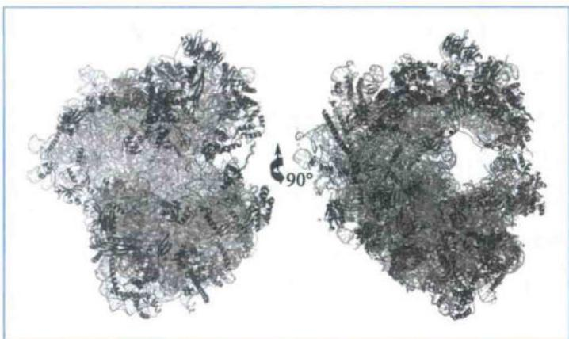  
图 4-10 核糖体三维结构示意图(另见书末彩插)  
核糖体由大、小亚基组成。每个亚基又由RNA和蛋白质两部分组成，其中，50S亚基的RNA部分由灰色表示，蛋白质以紫色表示。30S亚基的RNA部分以淡蓝色表示，蛋白质以深蓝色表示。50S亚基都位于30S亚基之上。旋转90°后右图显示的空洞为tRNA结合位点。图像使用PyMOL软件制作。

(a) 电镜数据模式图: 大亚基位于整个分子的左侧, 细绳代表 mRNA, 位于两个亚基之间的是两个 tRNA 分子; (b) 原核生物 70S 核糖体 (相对分子质量 $2.7 \times 10^{6}$ ) 和真核生物 80S 核糖体 (相对分子质量 $4.2 \times 10^{6}$ )。

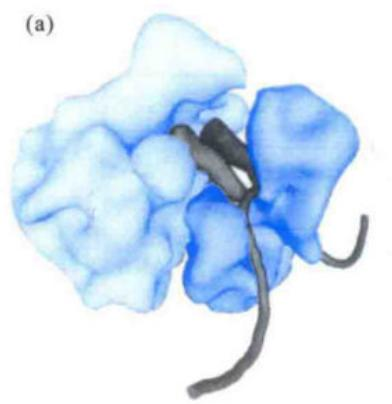

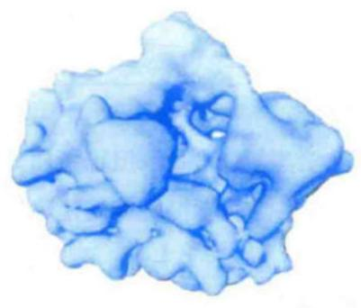

(b)  

镜下得到的原核生物 70S 核糖体大、小亚基相结合的模型, 核糖体分子可容纳两个 tRNA 和约 40 bp 长的 mRNA。

## 3. 核糖体 RNA(rRNA)

核糖体内的 rRNA 不仅是核糖体的重要结构成分,也是核糖体发挥生理功能的重要元件。下面详细介绍各类 rRNA 的组成和功能特点。

① 5S rRNA 细菌 5S rRNA 含有 120 个核苷酸(革兰氏阴性菌)或 116 个核苷酸(革兰氏阳性菌)。5S rRNA 有两个高度保守的区域,其中一个区域含有保守序列 CGAAC,这是与 tRNA 分子 TψC 环上的 GTψCG 序列相互作用的部位,是 5S rRNA 与 tRNA 相互识别的序列。另一个区域含有保守序列 GCGCCGAAUGGUAGU,与 23S rRNA 的中一段序列互补,这是 5S rRNA 与 50S 核糖体大亚基相互作用的位点,在结构上有其重要性。

② 16S rRNA 16S rRNA 在蛋白质的合成中起着积极作用, 它与 mRNA、50S 亚基和 P 位和 A 位的 tRNA 的反密码子直接作用。其长度在 1475\~1544 个核苷酸之间, 含有少量修饰碱基。该分子虽然可被分成几个区, 但全部压缩在 30S 小亚基内。16S rRNA 的结构十分保守, 其中 3' 端一段 ACCUCCUUA 的保守序列, 与 mRNA 5' 端翻译起始区富含嘌呤的序列互补。在 16S rRNA 靠近 3' 端处还有一段与 23S rRNA 互补的序列, 在 30S 与 50S 亚基的结合中起作用。

③ 23S rRNA 作为核糖体大亚基的主要成分,23S rRNA 能催化肽键的形成。该蛋白质与处于 A 和 P 位点的 tRNA 的 CCA 末端之间的碱基配对,帮助氨酰 tRNA 的 $\alpha$ 氨基基团攻击结合于肽酰 tRNA 多肽上的羰基,并稳定入位后的氨酰 tRNA。其准确的催化机制有待于进一步研究。23S rRNA 基因的一级结构包括 2904 个核苷酸,它还能与

5S rRNA 相互作用。核糖体 50S 大亚基上约有 20 种蛋白质能不同程度地与 23S rRNA 相结合。

④ 5.8S rRNA 是真核生物核糖体大亚基特有的 rRNA, 长度为 160 个核苷酸, 含有修饰碱基。它还含有能够与 tRNA 作用的识别序列, 这说明 5.8S rRNA 可能与原核生物的 5S rRNA 具有相似的功能。

⑤ 18S rRNA 酵母 18S rRNA 由 1789 个核苷酸组成, 它的 3' 端与大肠杆菌 16S rRNA 有广泛的同源性。其中酵母 18S rRNA、大肠杆菌 16S rRNA 和人线粒体 12S rRNA 在 3' 端有 50 个核苷酸序列相同。

⑥ 28S rRNA 28S rRNA 长度为 3890\~4500 bp, 目前还不清楚该 rRNA 的功能。

从上述讨论中可以看出 rRNA 与 tRNA 及 mRNA 之间的相互关系以及不同的 rRNA 之间的关系, 这种关系是建立在序列互补或同源的基础之上的。

## 4. 核糖体有 3 个 tRNA 结合位点

氨基酸由氨酰 tRNA 运送到核糖体上并通过这个 tRNA 与携带上一个氨基酸的 tRNA 的相互作用, 将新的氨基酸加到正在生长的新生蛋白质链上。核糖体上有 3 个 tRNA 结合位点, 分别称为 A、P 和 E 位点 $^{(图4-12)}$ 。其中, A 位点是新到来的氨酰 tRNA 的结合位点; P 位点是肽酰 tRNA 结合位点; E 位点是延伸过程中的多肽链转移到氨酰 tRNA 上释放 tRNA 的位点, 即去氨酰 tRNA 通过 E 位点脱出, 被释放到核糖体外的细胞质中去。所以 tRNA 的移动顺序是从 A 位到 P 位再到 E 位, 通过密码子与反密码子之间的相互作用保证反应正向进行而不会倒转。由于 tRNA 的氨酰末端被定位到大亚基上, 而另一端的反密码子与结合小亚基的 mRNA 相互识别, 所以, 每一个 tRNA 结合位点都横跨核糖体的两个亚基, 位于大、小亚基的交界面。

## 4.3.2 核糖体的功能

核糖体存在于每个进行蛋白质合成的细胞中。虽然在不同生物体内其大小有别，但组织结构基本相同，而且执行的功能也完全相同。在多肽合成过程中，不同的 tRNA 将相应的氨基酸带到蛋白质合成部位，并与 mRNA 进行专一性的相互作用，以选择对信息专一的 AA-tRNA。核糖体还必须能同时容纳另一种携带肽链的 tRNA，即肽酰 tRNA (peptidyl-tRNA)，并使之处于肽键易于生成的位置上。

  
图 4-12 核糖体的 3 个 tRNA 结合位点，即 A、P 和 E 位点

左图为细菌核糖体的三维结构。根据 M.M.Yusupov et al., 2001, Science. 292: 883-896 改编。

核糖体包括多个活性中心(图4-12)，即mRNA结合部位、结合或接受AA-tRNA部位(A位)、结合或接受肽酰tRNA的部位(P位)、肽基转移部位及形成肽键的部位(转肽酶中心)。此外，还应有负责肽链延伸的各种延伸因子的结合位点。

核糖体小亚基负责对模板 mRNA 进行序列特异性识别, 如起始部分的识别、密码子与反密码子的相互作用等, mRNA 的结合位点也在此亚基上。大肠杆菌中与翻译的真实性有关的蛋白质 S4 及 S12 也属此亚基。大亚基负责携带氨基酸及 tRNA 的功能, 包括肽键的形成、AA-tRNA、肽酰 tRNA 的结合等。

最新研究表明,正常细胞可能通过调整特定核糖体的数量来控制蛋白质的表达量。这是蛋白质表达控制的一条新途径。用核糖体图谱技术检测与核糖体结合的 mRNA 并确定其蛋白质产物,结果表明,异质化的蛋白质往往负责生成执行特定任务的蛋白质。这些具有异质性的定制核糖体只能生产少数特定的蛋白质,协助细胞控制某些通路蛋白质的表达。一些罕见的疾病症状可能与特定的核糖体缺陷有关。

## 4.4 蛋白质合成的生物学机制

蛋白质(protein)一词从希腊文“proteios”衍生而来,是指按重要性排列居于第一位的东西。尽管现已证明核酸是生命体内最基本的物质,因为蛋白质的合成和结构最终都取决于核酸,但蛋白质仍是生物活性物质中最重要的大分子组分,生物有机体的遗传学特性仍然要通过蛋白质来得到表达。

蛋白质的生物合成包括氨基酸活化,肽链的起始、伸长、终止以及新合成多肽链的折叠和加工,现将各阶段的必需成分列于表 4-9。

表 4-9 蛋白质合成各阶段的主要成分简表

<table><tr><td>阶段</td><td></td><td>必需成分</td></tr><tr><td rowspan="4">1. 氨基酸的活化</td><td>20 种氨基酸</td><td></td></tr><tr><td>20 种氨酰 tRNA 合成酶</td><td></td></tr><tr><td>20 种或更多的 tRNA</td><td></td></tr><tr><td> $ATP, Mg^{2+}$ </td><td></td></tr><tr><td rowspan="7">2. 肽链的起始</td><td>mRNA</td><td></td></tr><tr><td>N-甲酰甲硫氨酰 tRNA</td><td></td></tr><tr><td>mRNA 上的起始密码子(AUG)</td><td></td></tr><tr><td>核糖体小亚基</td><td></td></tr><tr><td>核糖体大亚基</td><td></td></tr><tr><td> $GTP, Mg^{2+}$ </td><td></td></tr><tr><td>起始因子(IF-1、IF-2、IF-3)</td><td></td></tr><tr><td>阶段</td><td>必需成分</td></tr><tr><td rowspan="5">3.肽链的延伸</td><td>功能核糖体(起始复合物)</td></tr><tr><td colspan="2">AA-tRNA</td></tr><tr><td colspan="2">伸长因子</td></tr><tr><td colspan="2"> $GTP, Mg^{2+}$ </td></tr><tr><td colspan="2">肽基转移酶</td></tr><tr><td rowspan="3">4.肽链的终止</td><td>GTP</td></tr><tr><td colspan="2">mRNA上的终止密码子</td></tr><tr><td colspan="2">释放因子(RF-1、RF-2、RF-3)</td></tr><tr><td>5.折叠和加工</td><td>参与起始氨基酸的切除、修饰等加工过程的酶</td></tr></table>

## 4.4.1 氨基酸的活化

蛋白质的生物合成是以氨基酸作为基本建筑材料的,且只有与 tRNA 相结合的氨基酸才能被准确地运送到核糖体中,参与多肽链的起始或延伸。表 4-10 是蛋白质中全部 20 种氨基酸的主要特征分析,而图 4-13 是这些氨基酸的结构式。氨基酸必须在氨酰 tRNA 合成酶的作用下生成活化氨基酸——AA-tRNA。研究发现,至少存在 20 种以上具有氨基酸专一性的氨酰 tRNA 合成酶,能够识别并通过氨基酸的羧基与 tRNA 3' 端腺苷酸核糖基上 3'—OH 缩水形成二酯键。同一氨酰 tRNA 合成酶具有把相同氨基酸加到两个或更多个带有不同反密码子 tRNA 分子上的功能。

表 4-10 参与蛋白质合成的 20 种氨基酸主要特征分析

<table><tr><td>氨基酸</td><td colspan="2">简称</td><td>相对分子质量</td><td>pI</td><td>疏水性指数*</td><td>出现频率</td></tr><tr><td colspan="7">非极性</td></tr><tr><td colspan="7">带脂肪族R基团</td></tr><tr><td>甘氨酸</td><td>Gly</td><td>G</td><td>75</td><td>5.97</td><td>-0.4</td><td>7.2</td></tr><tr><td>丙氨酸</td><td>Ala</td><td>A</td><td>89</td><td>6.01</td><td>1.8</td><td>7.8</td></tr><tr><td>缬氨酸</td><td>Val</td><td>V</td><td>117</td><td>5.97</td><td>4.2</td><td>6.6</td></tr><tr><td>亮氨酸</td><td>Leu</td><td>L</td><td>131</td><td>5.98</td><td>3.8</td><td>9.1</td></tr><tr><td>异亮氨酸</td><td>Ile</td><td>I</td><td>131</td><td>6.02</td><td>4.5</td><td>5.3</td></tr><tr><td>甲硫氨酸</td><td>Met</td><td>M</td><td>149</td><td>5.74</td><td>1.9</td><td>2.3</td></tr><tr><td colspan="7">带芳香族R基团</td></tr><tr><td>苯丙氨酸</td><td>Phe</td><td>F</td><td>165</td><td>5.48</td><td>2.8</td><td>3.9</td></tr><tr><td>酪氨酸</td><td>Tyr</td><td>Y</td><td>181</td><td>5.66</td><td>-1.3</td><td>3.2</td></tr><tr><td>色氨酸</td><td>Trp</td><td>W</td><td>204</td><td>5.89</td><td>-0.9</td><td>1.4</td></tr><tr><td colspan="7">极性</td></tr><tr><td colspan="7">R 基团呈中性</td></tr><tr><td>丝氨酸</td><td>Ser</td><td>S</td><td>105</td><td>5.68</td><td>-0.8</td><td>6.8</td></tr><tr><td>脯氨酸</td><td>Pro</td><td>P</td><td>115</td><td>6.48</td><td>1.6</td><td>5.2</td></tr><tr><td>苏氨酸</td><td>Thr</td><td>T</td><td>119</td><td>5.87</td><td>-0.7</td><td>5.9</td></tr><tr><td>半胱氨酸</td><td>Cys</td><td>C</td><td>121</td><td>5.07</td><td>2.5</td><td>1.9</td></tr><tr><td>天冬酰胺</td><td>Asn</td><td>N</td><td>132</td><td>5.41</td><td>-3.5</td><td>4.3</td></tr><tr><td>谷氨酰胺</td><td>Gln</td><td>Q</td><td>146</td><td>5.65</td><td>-3.5</td><td>4.2</td></tr><tr><td colspan="7">R 基团带正电荷</td></tr><tr><td>赖氨酸</td><td>Lys</td><td>K</td><td>146</td><td>9.74</td><td>-3.9</td><td>5.9</td></tr><tr><td>组氨酸</td><td>His</td><td>H</td><td>155</td><td>7.59</td><td>-3.2</td><td>2.3</td></tr><tr><td>精氨酸</td><td>Arg</td><td>R</td><td>174</td><td>10.76</td><td>-4.5</td><td>5.1</td></tr><tr><td colspan="7">R 基团带负电荷</td></tr><tr><td>天冬氨酸</td><td>Asp</td><td>D</td><td>133</td><td>2.77</td><td>-3.5</td><td>5.3</td></tr><tr><td>谷氨酸</td><td>Glu</td><td>E</td><td>147</td><td>3.22</td><td>-3.5</td><td>6.3</td></tr></table>

\* 负值表示亲水性,正值表示疏水性。

tRNA 与相应氨基酸的结合是蛋白质合成中的关键步骤, 因为只要 tRNA 携带了正确的氨基酸, 多肽合成的准确性就相对有了保障。

在细菌中,起始氨基酸是甲酰甲硫氨酸,所以,与核糖体小亚基相结合的是N-甲酰甲硫氨酰 $tRNA^{Met}$ ,它由以下两步反应合成:

$$
\mathrm{Met} + \mathrm{tRNA} ^ {\mathrm{fMet}} + \mathrm{ATP} \longrightarrow \mathrm{Met} - \mathrm{tRNA} ^ {\mathrm{fMet}} + \mathrm{AMP} + \mathrm{PPi}
$$

然后,由甲酰基转移酶转移一个甲酰基到 Met 的氨基上。

$$
N ^ {1 0} - \text {   甲酰四氢叶酸   } + \mathrm{Met-tRNA} ^ {\mathrm{fMet}} \longrightarrow \text {   四氢叶酸   } + \mathrm{fMet-tRNA} ^ {\mathrm{fMet}}
$$

真核生物中,任何一个多肽合成都是从生成甲硫氨酰- $tRNAi^{Met}$ 开始的,因为甲硫氨酸的特殊性,所以体内存在两种 $tRNA^{Met}$ 。只有甲硫氨酰- $tRNAi^{Met}$ 才能与40S小亚基相结合,起始肽链合成,普通 $tRNA^{Met}$ 中携带的甲硫氨酸只能被掺入正在延伸的肽链中。

## 4.4.2 翻译的起始

蛋白质合成的起始需要核糖体大、小亚基，起始 tRNA 和几十个蛋白因子的参与，在模板 mRNA 编码区 5' 端形成核糖体 -mRNA- 起始 tRNA 复合物并将甲酰甲硫氨酸放入核糖体 P 位点。

原核生物的起始 tRNA 是 fMet-tRNA $^{fMet}$ ，真核生物是 Met-tRNA $^{Met}$ 。原核生物中 30S 小亚基首先与 mRNA 模板相结合，再与 fMet-tRNA $^{fMet}$ 结合，最后与 50S 大亚基结合。而在真核生物中，40S 小亚基首先与 Met-tRNA $^{Met}$ 相结合，再与模板 mRNA 结合，最后与 60S大亚基结合生成 $80S \cdot mRNA \cdot Met-tRNA^{Met}$ 起始复合物。起始复合物的生成除了需要 GTP 提供能量外，还需要 $Mg^{2+}$ 、 $NH_{4}^{+}$ 及 3 个起始因子（IF-1、IF-2、IF-3）。起始因子与 30S 小亚基的结合较为松散，用 $1\ mol/L\ NH_{4}Cl$ 处理即可使之游离。

图4-13 20种氨基酸的结构  

## 1. 原核生物翻译的起始

细菌中翻译的起始需要如下7种成分：

① 30S 小亚基；

② 模板 mRNA;

③ fMet-tRNA $^{fMet}$ ;

④ 3个翻译起始因子,IF-1、IF-2和IF-3;

⑤ GTP;

⑥ 50S 大亚基；

图4-14 翻译起始复合物的形成  

⑦ $Mg^{2+}$

翻译起始又可被分成3步(图4-14)。

第一步,30S 小亚基首先与翻译起始因子 IF-1、IF-3 结合,通过 SD 序列与 mRNA 模板相结合。

第二步, 在 IF-2 和 GTP 的帮助下, fMet-tRNA $^{fMet}$ 进入小亚基的 P 位, tRNA 上的反密码子与 mRNA 上的起始密码子配对。

第三步,带有 tRNA、mRNA、3 个翻译起始因子的小亚基复合物与 50S 大亚基结合,GTP 水解,释放翻译起始因子。

30S 亚基具有专一性的识别和选择 mRNA 起始位点的性质, 而 IF-3 能协助该亚基完成这种选择。研究发现, 30S 亚基通过其 16S rRNA 的 3' 端与 mRNA 5' 端起始密码子上游碱基配对结合。Shine 及 Dalgarno 等证明几乎所有原核生物 mRNA 上都有一个 5'-AGGAGGU-3' 序列, 这个富嘌呤区被命名为 SD 序列 (Shine-Dalgarno sequence), 它与 30S 亚基上 16S rRNA 3' 端的富嘧啶区序列 5'-GAUCACCUCCUUA-3' 相互补(图4-15)。

各种 mRNA 的核糖体结合位点中能与 16S rRNA 配对的核苷酸数目及这些核苷酸到起始密码子之间的距离是不一样的,反映了起始信号的不均一性。一般说来,相互补的核苷

酸越多,30S 亚基与 mRNA 起始位点结合的效率也越高。互补的核苷酸与 AUG 之间的距离也会影响 mRNA-核糖体复合物的形成及其稳定性。

只有 fMet-tRNA $^{fMet}$ 能与第一个 P 位点相结合, 其他所有 tRNA 都必须通过 A 位点到达 P 位点, 再由 E 位点离开核糖体。

已知 IF-2 对于 30S 起始复合物与 50S 亚基的连接是必需的, 而 IF-1 则在 70S 起始复合物生成后促进 IF-2 的释放, 从而完成蛋白质合成的起始过程。

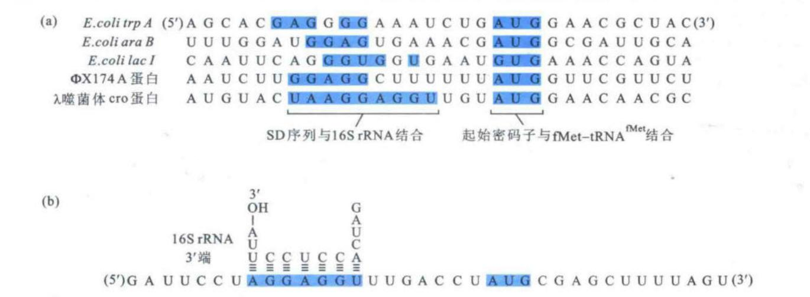  
图 4-15 细菌 mRNA 分子上往往存在一个与 16S rRNA 3' 端相互补的 SD 序列

## 2. 真核生物翻译的起始

真核生物蛋白质生物合成的起始机制与原核生物基本相同,其差异主要是核糖体较大,有较多的起始因子参与,其mRNA具有 $m^{7}GpppNp$ 帽子结构, $Met-tRNA^{Met}$ 不甲酰化,mRNA分子5'端的“帽子”和3'端的多(A)都参与形成翻译起始复合物。

有实验说明帽子结构能促进起始反应,因为核糖体上有专一位点或因子识别 mRNA 的帽子,使 mRNA 与核糖体结合(图 4-16)。帽子在 mRNA 与 40S 亚基结合过程中还起稳定作用。实验表明,带帽子的 mRNA 5' 端与 18S rRNA 的 3' 端序列之间存在不同于 SD 序列的碱基配对型相互作用。

40S 起始复合物形成过程中有一种蛋白因子——帽子结合蛋白 (eIF-4E), 能专一地识别 mRNA 的帽子结构, 与 mRNA 的 5' 端结合生成蛋白质 -mRNA 复合物, 并利用该复合物对 eIF-3 的亲和力与含有 eIF-3 的 40S 亚基结合。

除了帽子结构以外,40S小亚基还能识别mRNA上的起始密码子AUG。Kozak等提出了一个“扫描模型”来解释40S亚基对mRNA起始密码子的识别作用(图4-17)。按照这

个模型,40S 小亚基先识别在 mRNA 的 5' 端的甲基化帽子,然后沿 mRNA 移动,当 40S 小亚基遇到 AUG 时,由于 Met-tRNAi $^{Met}$ 反密码子与 AUG 配对,导致移动暂停。存在于 -4 位和 +1 位的碱基对于 AUG 是否被识别为起始密码子具有重要的影响。在 AUG 之前的第三个嘌呤(G 或 A)以及紧跟其后的 G,可以显著影响翻译效率。最后一步,60S 亚基与 40S 复合物结合生成 80S 起始复合物。在第一个 40S亚基离开起始点之前,会有更多的小亚基识别5'端,形成40S亚基的队列。

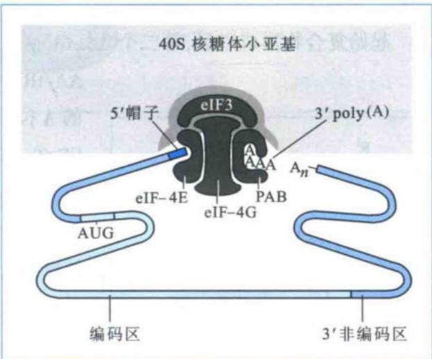  
图 4-16 真核生物翻译起始复合物的形成

图 4-17 真核生物核糖体从 mRNA 的 5' 端向下游含有起始密码子 AUG 的核糖体结合位点滑动  

起始过程中 mRNA 与 40S 小亚基结合时还需要 ATP, 这可能是因为蛋白质合成中消除 mRNA 二级结构是一个耗能过程, 需由 ATP 水解提供能量。另外根据 “扫描模型”, 在 40S 亚基沿 mRNA 移动过程中也需要能量。

## 4.4.3 肽链的延伸

与翻译的起始不同,蛋白质延伸机制在原核细胞和真核细胞之间是非常相似的。起始复合物生成,第一个氨基酸(fMet/Met-tRNA)与核糖体结合以后,肽链开始伸长。按照mRNA模板密码子的排列,氨基酸通过新生肽键的方式(图4-18)被有序地结合上去。肽链延伸由许多循环组成,每加一个氨基酸就是一个循环,每个循环包括AA-tRNA与核糖体结合、肽键的生成和移位。

## 1. 后续 AA-tRNA 与核糖体结合

起始复合物形成以后,第二个 AA-tRNA 在延伸因子 EF-Tu 及 GTP 的作用下,生成

图 4-18 多肽链上肽键的形成——缩合反应  

AA-tRNA·EF-Tu·GTP复合物,然后结合到核糖体的A位上。这时GTP被水解释放,通过延伸因子EF-Ts再生GTP,形成EF-Tu·GTP复合物,进入新一轮循环(图4-19)。

模板上的密码子决定了哪种 AA-tRNA 能被结合到 A 位上。由于 EF-Tu 只能与 fMet-tRNA 以外的其他 AA-tRNA 起反应，所以起始 tRNA 不会被结合到 A 位上，这就是 mRNA 内部的 AUG 不会被起始 tRNA 读出,肽链中间不会出现甲酰甲硫氨酸的原因。

  
图 4-19 细菌中肽链延伸的第一步反应: 第二个氨酰 tRNA 的结合

该氨酰 tRNA 首先与 EF-Tu·GTP 形成复合物, 进入核糖体的 A 位, 水解产生 GDP 并在 EF-Ts 的作用下释放 GDP 并使 EF-Tu 结合另一分子 GTP, 进入新一轮循环。

## 2. 肽键的生成

经过上一步反应后，在核糖体·mRNA·AA-tRNA复合物中，AA-tRNA占据A位，fMet-tRNA $^{fMet}$ 占据P位。在肽基转移酶(peptidyl transferase)的催化下，A位上的AA-tRNA转移到P位，与fMet-tRNA $^{fMet}$ 上的氨基酸生成肽键(图4-20)。起始tRNA在完成使命后离开核糖体 P 位点，A 位点准备接受新的 AA-tRNA，开始下一轮合成反应。

图 4-20 细菌中肽链延伸的第二步反应: 肽链的生成  

## 3. 移位

肽键延伸过程中最后一步反应是移位,即核糖体向 mRNA 3' 端方向移动一个密码子(图 4-21)。此时,仍与第二个密码子相结合的二肽酰 tRNA₂ 从 A 位进入 P 位,去氨酰 tRNA 被挤入 E 位,mRNA 上的第三位密码子则对应于 A 位。EF-G 是移位所必需的蛋白质因子,移位的能量来自另一分子 GTP 水解。

用嘌呤霉素作为抑制剂做实验表明,核糖体沿 mRNA 移动与肽酰 tRNA 的移位这两个过程是耦联的。

  
图 4-21 细菌中肽链延伸的第三步反应: 移位  
核糖体通过 EF-G 介导的 GTP 水解所提供的能量向 mRNA 模板 3' 端移动一个密码子，使二肽酰 tRNA₂ 完全进入 P 位，准备开始新一轮肽链延伸。

肽链延伸是由许多个这样的反应组成的,原核生物中每次反应共需3个延伸因子,EF-Tu、EF-Ts及EF-G,它们都具有GTP酶的活性,EF-Tu和EF-Ts能够促进AA-tRNA进入A位,EF-G则促进移位和卸载tRNA的释放。真核生物细胞需EF-1(对应于EF-Tu和EF-Ts)及EF-2(相当于EF-G),消耗2个GTP,向生长中的肽链加上一个氨基酸。

## 4.4.4 肽链的终止

肽链的延伸过程中,当终止密码子 UAA、UAG 或 UGA 出现在核糖体的 A 位时,没有相应的 AA-tRNA 能与之结合,而释放因子 (release factor, RF) 能识别这些密码子并与之结合,水解 P 位上多肽链与 tRNA 之间的二酯键。接着,新生的肽链和 tRNA 从核糖体上释放,核糖体大、小亚基解体,蛋白质合成结束。释放因子 RF 具有 GTP 酶活性,它催化 GTP 水解,使肽链与核糖体解离。

释放因子有两类。Ⅰ类释放因子识别终止密码子，并能催化新合成的多肽链从P位点的tRNA中水解释放出来；Ⅱ类释放因子在多肽链释放后刺激Ⅰ类释放因子从核糖体中解离出来。细菌细胞内存在3种不同的释放因子(RF1、RF2、RF3)，其中，RF1和RF2为Ⅰ类释放因子。RF1能识别UAG和UAA，RF2识别UGA和UAA。一旦RF与终止密码相结合，它们就能诱导肽基转移酶把一个水分子而不是氨基酸加到延伸中的肽链上。RF3为Ⅱ类释放因子，与核糖体的解体有关。真核细胞的Ⅰ类和Ⅱ类释放因子分别只有一种，eRF1和eRF3。Ⅰ类释放因子eRF1能够识别3个终止密码子。

综上所述,蛋白质翻译是一个循环进行的过程,每一个循环包括大、小亚基之间及其与mRNA的结合,翻译mRNA,然后各自分离。这种结合和分离称为核糖体循环(图4-22)。当mRNA和起始tRNA结合于游离的小亚基上,翻译过程就开始了,这个小亚基-mRNA复合物随后就能吸引大亚基结合,从而形成完整的、结合有mRNA的核糖体。蛋白质合成开始,从mRNA的5'端起始密码子向3'端移动。当核糖体从一个密码子移位到另一个密码子,一个接一个的活化tRNA就进入核糖体的解码和肽基转移酶中心。当核糖体遇到终止密码子时,已合成的多肽链就被释放出来,核糖体大、小亚基分离,各自离开mRNA。这些已分离的亚基就可以结合到新的mRNA分子上,开始下一轮蛋白质合成的循环。体外反应体系中,核糖体的解离或结合取决于离子浓度。在大肠杆菌内, $Mg^{2+}$ 浓度在 $10^{-3}$ mol/L 以下时,70S 解离为亚基,浓度达 $10^{-2}$ mol/L 时则形成稳定的 70S 颗粒。

图4-22 蛋白质翻译过程总览  
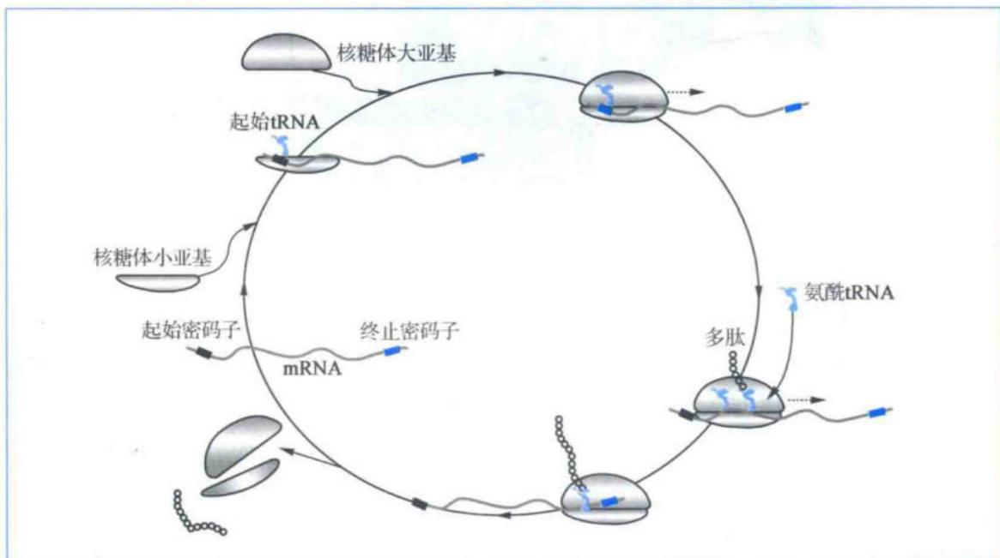

  
图4-23 多核糖体翻译蛋白质  
(a) 真核细胞多核糖体的电镜照片(来自于 John Heuser); (b) 一系列核糖体同时翻译同一 mRNA 分子。多(A) 尾结合蛋白与 eIF-4G 亚基的相互作用促进 mRNA 的环化, 提高 mRNA 的翻译。

## 4.4.5 多核糖体与蛋白质合成

虽然一个核糖体一次只能合成一条多肽,但每个 mRNA 分子却能同时被多个核糖体结合同时进行翻译。结合多个核糖体的 mRNA 称为多核糖体 (polyribosome 或 polysome, 图 4-23)。由于核糖体的体积巨大,mRNA 链上一般每 80 个核苷酸结合一个核糖体。多(A)尾结合蛋白与 eIF-4G 亚基相互作用促进 mRNA 的环化,提高 mRNA 的翻译效率,一个 mRNA 分子能够利用大批核糖体同时指导多个多肽链的合成。与完成翻译后再开始新的蛋白质合成相比,这种多重起始意味着在短时间内一条 mRNA 能够被高效地翻译,合成数量更多的蛋白质分子。

真核生物和细菌都利用多核糖体,但因为细菌的 mRNA 无需加工,其转录和翻译在同一空间进行,在转录刚开始不久就开始合成蛋白质,所以细菌中的蛋白质合成效率更高。

## 4.4.6 蛋白质前体的加工

新生的多肽链大多数是没有功能的,必须经过加工修饰才能转变为有活性的蛋白质。

## 1. N 端 fMet 或 Met 的切除

细菌蛋白质氨基端的甲酰基能被脱甲酰化酶水解,不管是原核生物还是真核生物,N端的甲硫氨酸往往在多肽链合成完毕之前就被切除。有些动物病毒如脊髓灰质炎病毒的mRNA可翻译成很长的多肽链,含多种病毒蛋白,经蛋白酶在特定位置上水解后得到几个有功能的蛋白质分子(图4-24)。

## 2. 二硫键的形成

mRNA 中没有胱氨酸的密码子,而不少蛋白质都含有二硫键,这是蛋白质合成后通过两个半胱氨酸的氧化作用生成的。二硫键的正确形成对稳定蛋白的天然构象具有重要的作用。

图 4-24 新生蛋白质经蛋白酶切割后变成有功能的成熟蛋白质

左: 新生蛋白质在去掉 N 端一部分残基后变成有功能的蛋白质; 右: 某些病毒或细菌可合成无活性的多蛋白质, 经蛋白酶切割后成为有功能的成熟蛋白。

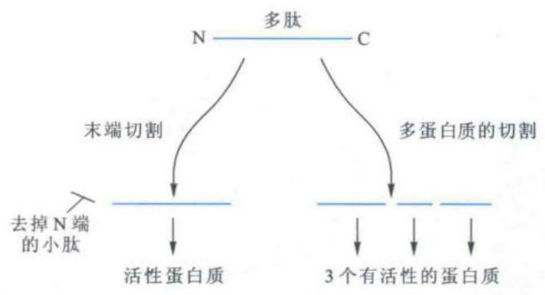

## 3. 特定氨基酸的修饰

氨基酸侧链的修饰作用包括磷酸化(如核糖体蛋白质)、糖基化(如各种糖蛋白)、甲基化(如组蛋白、肌肉蛋白质)、乙酰化(如组蛋白)、泛素化(多种蛋白质)等。图4-25是生物体内最普通发生修饰作用的氨基酸残基及其修饰产物,如在第二章中所介绍的,组蛋白N端35个残基中可能出现包括磷酸化、甲基化、乙酰化和泛素化在内的多种修饰。糖蛋白主要是通过蛋白质侧链上的天冬氨酸、天冬酰胺、丝氨酸、苏氨酸、谷氨酸等残基加上糖基形成的,内质网可能是蛋白质N-糖基化的主要场所。胶原蛋白上的脯氨酸和赖氨酸多数是羟基化的。

① 磷酸化(phosphorylation) 主要由多种蛋白激酶催化,发生在丝氨酸、苏氨酸和酪氨酸等3种氨基酸的侧链。

② 糖基化(glycosylation) 它是真核细胞蛋白质的特征之一。大多数糖基化是由内

图 4-25 生物体内最常见的被修饰的氨基酸及其修饰产物

(a) 磷酸化;(b) 羧基化;(c) 甲基化。

(c)  

(b)  
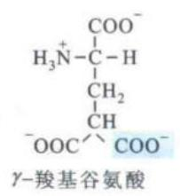

质网中的糖基化酶(glycosylase)催化进行的。所有的分泌蛋白和膜蛋白几乎都是糖基化蛋白质。

③ 甲基化(methylation) 蛋白质的甲基化是由甲基转移酶催化的。甲基化包括发生在 Arg、His 和 Gln 的侧基的 N-甲基化以及 Glu 和 Asp 侧基的 O-甲基化。

④ 乙酰化(acetylation) 发生在赖氨酸侧链上的 $\varepsilon-NH_{2}$ ，由乙酰基转移酶催化。

⑤ 泛素化和类泛素化修饰(ubiquitination & ubiquitin-like modifications) 发生在赖氨酸残基侧链上,由 E1、E2 和 E3 一系列酶催化(具体见 4.6 节)。

## 4. 切除新生肽链中的非功能片段

新合成的胰岛素前体是前胰岛素原,必须先切去信号肽变成胰岛素原,再切去B肽,才变成有活性的胰岛素(图4-26)。不少多肽类激素和酶的前体都要经过加工才能变为活性分子,如血纤维蛋白原、胰蛋白酶原经过加工切去部分肽段才能成为有活性的血纤维蛋白、胰蛋白酶。一般说来,由多个肽链及其他辅助成分构成的蛋白质,在多肽链合成后还需经过多肽链之间以及多肽链与辅基之间的聚合过程,才能成为有活性的蛋白质。

  
图 4-26 前胰岛素原蛋白翻译后成熟过程示意图

## 4.4.7 蛋白质的折叠

由核糖体合成的所有新生肽链必须通过正确的折叠才能形成动力学和热力学稳定的三维构象,从而表现出生物学活性或功能。因此,可以说蛋白质折叠是翻译后形成功能蛋白质的必经阶段。如果蛋白质折叠错误,其生物学功能就会受到影响或丧失,严重者甚至会引起疾病。新合成的蛋白质分子如何形成具有功能的空间结构?蛋白质的结构与功能的关系等问题成为结构生物学研究的热点。

多肽链的折叠是一个复杂的过程,新生多肽一般首先折叠成二级结构,然后再进一步折叠盘绕成三级结构。对于单链多肽蛋白质,三级结构就已具有蛋白质的功能;对于寡聚蛋白质,一般需要进一步组装成更为复杂的四级结构,才能表现出天然蛋白的活性或功能。

有些蛋白质只有在另一些蛋白质存在的情况下才能正确完成折叠过程,形成功能蛋白质。分子伴侣(molecular chaperone)是目前研究比较多的能够在细胞内辅助新生肽链正确折叠的蛋白质。它是一类序列上没有相关性但有共同功能的保守性蛋白质,它们在细胞内能帮助其他多肽进行正确的折叠、组装、运转和降解。目前认为细胞内至少有两类分子伴侣家族,即热休克蛋白(heat shock protein)家族和伴侣素(chaperonin)。

① 热休克蛋白 它是一类应激反应性蛋白,包括 HSP70、HSP40 和 GrpE 3 个家族,广泛存在于原核及真核细胞中。三者协同作用,促使某些能自发折叠的蛋白质正确折叠形成天然空间构象。

② 伴侣素 伴侣素包括 HSP60 和 HSP10(原核细胞中的同源物分别为 GroEL 和 GroES)，它主要是为非自发性折叠蛋白提供能折叠形成天然结构的微环境(图 4-27)。

分子伴侣在新生肽链折叠中主要通过防止或消除肽链的错误折叠,增加功能性蛋白质折叠产率来发挥作用,而并非加快折叠反应速度。分子伴侣本身并不参与最终产物的形成。

图 4-27 伴侣素形成一个闭合的寡聚复合体，在其内部对蛋白质进行折叠

右图为 GroEL 与 GroES 帽子结合的三维结构。

## 4.4.8 蛋白质合成的抑制剂

蛋白质生物合成的抑制剂主要是一些抗生素，如嘌呤霉素、链霉素、四环素、氯霉素、红霉素等，此外，如5-甲基色氨酸、环己亚胺、白喉毒素、干扰素、蓖麻蛋白和其他核糖体灭活蛋白等都能抑制蛋白质的合成。这些抑制剂不仅对于研究蛋白质的合成机制十分重要，也是在临床上治疗细菌感染的重要药物。

抗生素对蛋白质合成的作用可能是阻止 mRNA 与核糖体结合(氯霉素),或阻止 AA-tRNA 与核糖体结合(四环素类),或干扰 AA-tRNA 与核糖体结合而产生错误(链霉素、新霉素、卡那霉素等),或作为竞争性抑制剂抑制蛋白质合成。

链霉素是一种碱性三糖,可以多种方式抑制原核生物核糖体,能干扰fMet-tRNA与核糖体的结合,从而阻止蛋白质合成的正确起始,也会导致mRNA的错误。若以多(U)作模板,则除苯丙氨酸(UUU)外,异亮氨酸(AUU)也会被掺入。用抗链霉素细菌的50S亚基及对链霉素敏感细菌的30S亚基重组获得的核糖体对链霉素是敏感的,而用敏感菌的50S亚基及抗性菌的30S亚基组成的核糖体对链霉素有抗性,表明链霉素的作用位点在30S亚基上。

图 4-28 是几种常见蛋白质合成抑制剂的化学结构式。

嘌呤霉素是 AA-tRNA 的结构类似物, 不需要延伸因子就可以结合在核糖体的 A 位上, 抑制 AA-tRNA 的进入。它所带的氨基与 AA-tRNA 上的氨基一样, 能与生长中的肽链上的羧基反应生成肽键, 这个反应的产物是一条 3' 羧基端挂了一个嘌呤霉素残基的小肽, 肽酰嘌呤霉素随后从核糖体上解离出来, 所以嘌呤霉素是通过提前释放肽链来抑制蛋白质合成的 $^{(图4-29)}$ 。

此外，青霉素、卡那霉素、氯霉素、四环素和红霉素只与原核细胞核糖体发生作用，从

  
图4-28 几种常见蛋白质合成抑制剂的结构式

图4-29 嘌呤霉素抑制蛋白质合成的分子机制

(a) 嘌呤霉素的结构类似于氨酰 tRNA, 能与核糖体 A 位点相结合;

(b) 肽酰嘌呤霉素。

而阻遏原核生物蛋白质的合成,抑制细菌生长。白喉毒素和放线菌酮只作用于真核生物核糖体。潮霉素、嘌呤霉素和链霉素既能与原核细胞核糖体结合,又能与真核生物核糖体结合,妨碍细胞内蛋白质合成,影响细胞生长。因此,临床上需要根据其作用原理优先选择相应的抗生素。

表 4-11 总结了上述各种抗生素影响翻译的主要特点。

表 4-11 不同抗生素的靶标以及所产生的后果

<table><tr><td>抗生素/毒素</td><td>目标细胞</td><td>分子目标</td><td>后果</td></tr><tr><td>氯霉素</td><td>原核细胞</td><td>50S亚基的肽酰转移酶中心</td><td>阻断A位点的氨酰tRNA为进行肽基转移反应的正确定位</td></tr><tr><td>四环素</td><td>原核细胞</td><td>30S亚基A位点</td><td>抑制氨酰tRNA结合到A位点</td></tr><tr><td>潮霉素</td><td>原核和真核细胞</td><td>30S亚基A位点附近</td><td>阻挠A位点tRNA到P位点的移位</td></tr><tr><td>嘌呤霉素</td><td>原核和真核细胞</td><td>大亚基的肽酰转移酶中心</td><td>链终止子;模仿A位点的氨酰tRNA的3'端,作为新的多肽链的接受者</td></tr><tr><td>红霉素</td><td>原核细胞</td><td>50S亚基的多肽出口通道</td><td>阻断成长中的多肽链从核糖体的出口,阻遏翻译</td></tr><tr><td>青霉素</td><td>原核细胞</td><td>作用于肽葡聚糖转肽酶</td><td>抑制细菌细胞壁的合成</td></tr><tr><td>链霉素</td><td>原核和真核细胞</td><td>作用于30S亚基</td><td>干扰氨酰tRNA与核糖体的结合;导致mRNA的错误</td></tr><tr><td>卡那霉素</td><td>原核细胞</td><td>作用于30S核糖体亚基</td><td>干扰氨酰tRNA与核糖体的结合,使细菌蛋白质合成发生错误。</td></tr><tr><td>白喉毒素</td><td>真核细胞</td><td>化学修饰EF-2</td><td>抑制EF-2的功能</td></tr><tr><td>放线菌酮</td><td>真核细胞</td><td>60S亚基的肽酰转移酶中心</td><td>抑制肽酰转移酶活性</td></tr><tr><td>蓖麻毒素</td><td>原核和真核细胞</td><td>60S亚基的肽酰转移酶中心</td><td>阻挠翻译因子GTP酶的活化</td></tr></table>

## 4.5 蛋白质运转机制

在生物体内,蛋白质的合成位点与功能位点常常被一层或多层细胞膜所隔开,这样就产生了蛋白质运转的问题。核糖体是真核生物细胞内合成蛋白质的场所,几乎在任何时候,都有数以百计或千计的蛋白质离开核糖体并被输送到细胞质、细胞核、线粒体、内质网和溶酶体、叶绿体等各个部分,补充和更新细胞功能。由于细胞各部分都有特定的蛋白质组分,因此合成的蛋白质必须准确无误地定向运送才能保证生命活动的正常进行。蛋白质是怎样从合成部位运送至功能部位的?它们又是如何跨膜运送的?跨膜之后又是依靠什么信息到达各自“岗位”的?对于膜蛋白来说,究竟是什么因素决定它为外周蛋白还是内在蛋白,为部分镶嵌还是跨膜分布,在膜的外侧还是内侧?这些都是十分有趣的问题,也是生物膜研究中非常活跃的领域(图4-30)。

一般说来,蛋白质运转可分为两大类:若某个蛋白质的合成和运转是同时发生的,则属于翻译运转同步机制;若蛋白质从核糖体上释放后才发生运转,则属于翻译后运转机制。这两种运转方式都涉及蛋白质分子内特定区域与细胞膜结构的相互关系。

表 4-12 列举了跨膜运输和镶入膜内的几种主要蛋白质。从表中可知,分泌蛋白质大多是以翻译运转同步机制运输的。在细胞器发育过程中,由细胞质进入细胞器的蛋白质大多是以翻译后运转机制运输的。而参与生物膜形成的蛋白质,则依赖于上述两种不同的运转机制镶入膜内。

表 4-12 几类主要的蛋白质运转机制

<table><tr><td>蛋白性质</td><td>运转机制</td><td>主要类型</td></tr><tr><td>分泌</td><td>蛋白质在结合核糖体上合成,并以翻译运转同步机制运输</td><td>免疫球蛋白、卵蛋白、水解酶、激素等</td></tr><tr><td>细胞器发育</td><td>蛋白质在游离核糖体上合成,以翻译后运转机制运输</td><td>核、叶绿体、线粒体、乙醛酸循环体、过氧化物酶体等细胞器中的蛋白质</td></tr><tr><td>膜的形成</td><td>两种机制兼有</td><td>质膜、内质网、类囊体中的蛋白质</td></tr></table>

图 4-30 蛋白质合成和运转过程示意图  
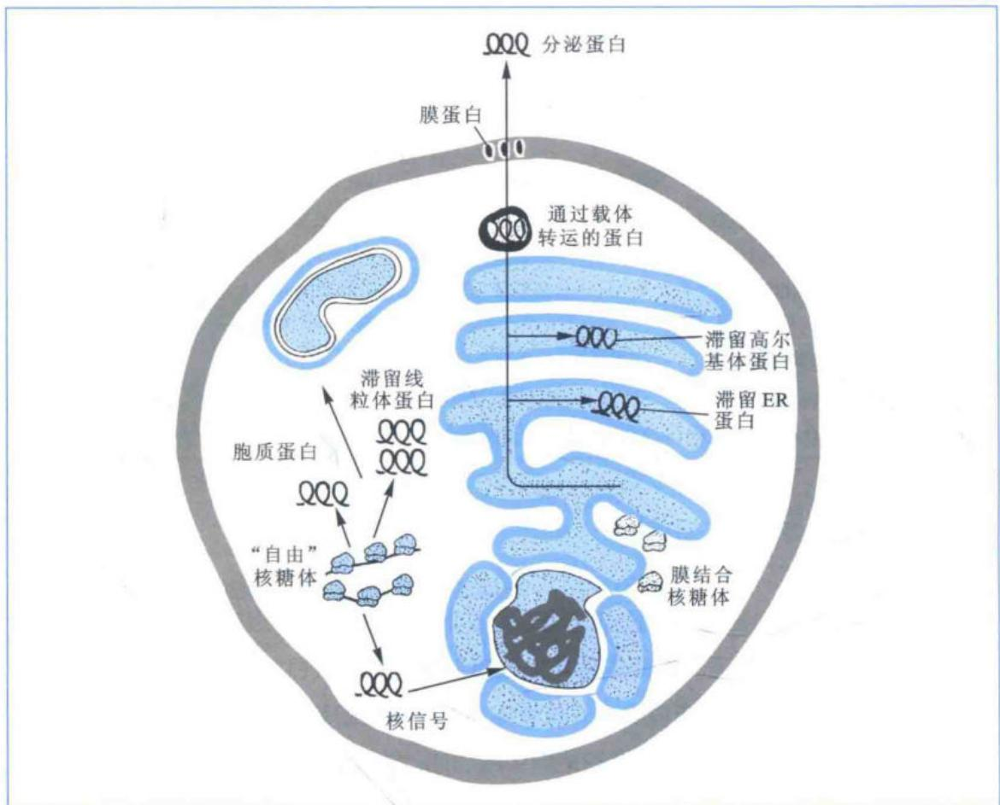

## 4.5.1 翻译运转同步机制

一般认为,蛋白质定位的信息存在于该蛋白质自身结构中,并且通过与膜上特殊受体的相互作用得以表达,这就是信号肽假说的基础。这一假说认为,蛋白质跨膜运转信号也是由 mRNA 编码的。在起始密码子后,有一段编码疏水性氨基酸序列的 RNA 区域,这个氨基酸序列就被称为信号序列(图 4-31)。信号序列在结合核糖体上合成后便与膜上特定受体相互作用,产生通道,允许这段多肽在延长的同时穿过膜结构,因此,这种方式是边翻译边跨膜运转。

  
图 4-31 蛋白质通过其 N 端的信号肽在内质网中运转到不同的细胞器

绝大部分被运入内质网内腔的蛋白质都带有一个信号肽,该序列常常位于蛋白质的氨基端,长度一般为13\~36个残基,有如下3个特点:①一般带有10\~15个疏水氨基酸;②在靠近该序列N端常常有1个或数个带正电荷的氨基酸;③在其C端靠近蛋白酶切割位点处常常带有数个极性氨基酸,离切割位点最近的那个氨基酸往往带有很短的侧链(丙氨酸或甘氨酸)。

根据信号肽假说,同细胞质中其他蛋白质的合成一样,分泌蛋白的生物合成开始于结合核糖体,当翻译进行到50\~70个氨基酸残基之后,信号肽开始从核糖体的大亚基露出,被糙面内质网膜上的受体识别,并与之相结合。信号肽过膜后被内质网腔的信号肽酶水解,正在合成的新生肽随之通过蛋白孔道穿越疏水的双层磷脂。一旦核糖体移到mRNA的“终止”密码子,蛋白质合成即告完成,翻译体系解散,膜上的蛋白孔道消失,核糖体重新处于自由状态(图4-32)。

信号肽在蛋白质运输过程中发挥如下作用：

① 完整的信号多肽是保证蛋白质运转的必要条件。信号序列中疏水性氨基酸突变成亲水性氨基酸后，会阻止蛋白质运转而使新生蛋白质以前体形式积累在胞质中。

② 仅有信号肽还不足以保证蛋白质运转的发生。要使蛋白质顺利跨膜，还要求运转蛋白质在信号序列以外的部分有相应的结构变化。

③ 信号序列的切除并不是运转所必需的。如果把细菌外膜脂蛋白信号序列中的甘氨酸残基突变成天冬氨酸残基，能抑制该蛋白信号肽的水解，但不能抑制其跨膜运转。

④ 并非所有的运转蛋白质都有可降解的信号肽。卵清蛋白是以翻译运转同步机制进入微粒体中的，但它并没有可降解的信号序列。据此，“信号肽”应当定义为：能启动蛋白质运转的任何一段多肽。

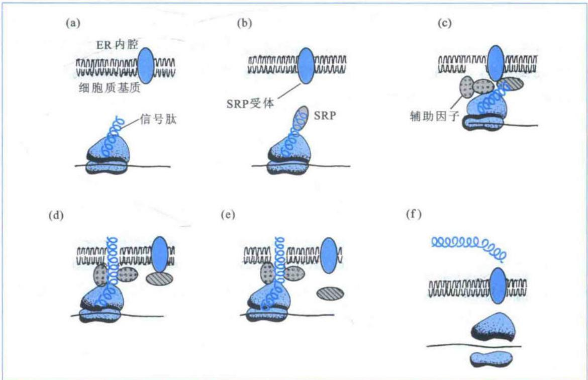  
图 4-32 蛋白质跨膜运转的信号肽假说及其运输过程

## 图 4-33 新生蛋白质通过同步转运途径进入内质网内腔的主要过程

①核糖体组装、翻译起始；②位于蛋白质N端的信号肽序列首先被翻译；③SRP与核糖体、GTP以及带有信号肽的新生蛋白质相结合，暂时中止肽链延伸；④核糖体-SRP复合物与膜上的受体相结合；⑤GTP水解，释放SRP并进入新一轮循环；⑥肽链重新开始延伸并不断向内腔运输；⑦信号肽被切除；⑧多肽合成结束，核糖体解离并恢复到翻译起始前的状态。

研究新生肽向内质网内腔运转过程发现,SRP(信号识别蛋白)和DP(停靠蛋白,又称SRP受体蛋白)介导了蛋白质的跨膜运转过程。SRP能同时识别正在合成需要通过内质网膜进行运转的新生肽和自由核糖体,它与这类核糖体上新生蛋白的信号肽结合是多肽正确运转的前提,但同时也导致了该多肽合成的暂时终止(此时新生肽一般长约70个残基)。SRP-信号肽-多核糖体复合物即被引向内质网膜并与SRP的受体——DP相结合。只有当SRP与DP相结合时,多肽合成才恢复进行,信号肽部分通过膜上的核糖体受体及蛋白运转复合物跨膜进入内质网内腔,新生肽链重新开始延伸。整个蛋白质跨膜以后,信号肽被水解,形成高级结构和成熟型蛋白质,并被运送到相应细胞器。SRP与DP的结合很可能导致受体聚集而形成膜孔道,使信号肽及与其相连的新生肽得以通过。此时,SRP与DP相分离并恢复游离状态。待翻译过程结束后,核糖体的大、小亚基解离,受体解聚,通道消失,内质网膜也恢复完整的脂双层结构(图4-33)。进入内质网内腔后,蛋白质常以运转载体的形式被送入高尔基体或形成运转小泡,分别运送到各自的亚细胞位点。

## 4.5.2 翻译后运转机制

研究发现,叶绿体和线粒体中有许多蛋白质和酶是由细胞质提供的,其中绝大多数以翻译后运转机制进入细胞器内。

## 1. 线粒体蛋白质跨膜运转

线粒体是细胞的“动力站”，它虽然含有遗传物质（DNA、RNA）以及核糖体等，但它的DNA信息含量有限，大部分线粒体蛋白质都是由核DNA编码，在细胞质自由核糖体上合成。被释放至细胞质，再跨膜运转到线粒体各部分。与分泌蛋白质通过内质网膜进行运转不同，通过线粒体膜的蛋白质是在合成以后再运转的。这个过程有如下特征：

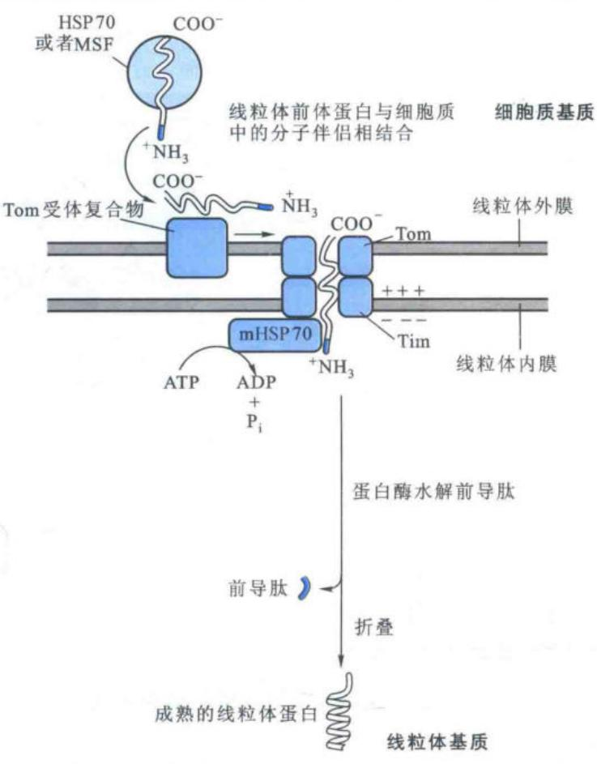  
图4-34 线粒体蛋白质跨膜运转

① 通过线粒体膜的蛋白质在运转之前大多数以前体形式存在,它由成熟蛋白质和位于 N 端的一段前导肽(leader peptide)共同组成。迄今已有 40 多种线粒体蛋白质前导肽的一级结构被阐明,它们含 20\~80 个氨基酸残基,当前体蛋白过膜时,前导肽被一种或两种多肽酶所水解,释放成熟蛋白质。

② 蛋白质通过线粒体内膜的运转是一种需要能量的过程。

③ 蛋白质通过线粒体膜运转时,首先由外膜上的 Tom 受体复合蛋白识别与 HSP70 或 MSF 等分子伴侣相结合的待运转多肽,通过 Tom 和 Tim 组成的膜通道进入线粒体内腔。蛋白质跨膜运转时的能量来自线粒体 HSP70 引发的 ATP 水解和膜电位差(图 4-34)。

## 2. 前导肽的作用与性质

拥有前导肽的线粒体蛋白质前体能够跨膜运转进入线粒体，在这一过程中前导肽被水解，前体转变为成熟蛋白，失去继续跨膜能力。因此，前导肽对线粒体蛋白质的识别和跨膜运转显然起着关键作用。

前导肽一般具有如下特性:带正电荷的碱性氨基酸(特别是精氨酸)含量较为丰富,它们分散于不带电荷的氨基酸序列之间;缺少带负电荷的酸性氨基酸;羟基氨基酸(特别是丝氨酸)含量较高;有形成两亲(既有亲水又有疏水部分) $\alpha$ 螺旋结构的能力。带正电荷的碱性氨基酸在前导肽中有重要的作用,如果它们被不带电荷的氨基酸所取代,就不能发挥牵引蛋白质过膜的作用。

图4-35 前导肽的不同区域可能在蛋白质跨膜运转过程中起不同的作用  

前导肽跨膜运转时首先与线粒体外膜上的受体相结合,实验表明,并非线粒体蛋白质前体都共用一种受体,但 Tom 受体可能是线粒体蛋白质跨膜运转时最主要的受体蛋白。线粒体有内、外两层膜,前导肽的不同部位可能在蛋白质的跨膜运输过程中发挥不同的作用(图 4-35)。有些前导肽含有“止运入”肽段,当该肽段被跨膜通道中的受体蛋白识别时,所运输的多肽将被定位在膜上。

## 3. 叶绿体蛋白质的跨膜运转

大多数科学家认为,叶绿体多肽是胞质中的游离核糖体上合成后脱离核糖体并折叠成具有三级结构的蛋白质分子,多肽上某些特定位点结合于只有叶绿体膜上才有的特异受体位点。叶绿体定位信号肽一般有两个部分,第一部分决定该蛋白质能否进入叶绿体基质,第二部分决定该蛋白质能否进入类囊体 $^{(图4-36)}$ 。在这一模型中,蛋白质运转是在翻译后进行的,在运转过程中没有蛋白质的合成。

叶绿体蛋白质运转过程有如下特点：

① 活性蛋白水解酶位于叶绿体基质内,这是鉴别翻译后运转的指标之一。从完整的叶绿体内提取的可溶性物质,能够把 RuBP 羧化酶小亚基前体降解或加工为成熟小亚基,离心后产生的叶绿体基质和破碎的叶绿体也具有这种功能,而类囊体和提纯的叶绿体膜都无此特性。在叶绿体蛋白质的翻译后运转机制中,活性蛋白酶是可溶性的,这一点也不同于分泌蛋白质的翻译运转同步机制,因为后者活性蛋白酶位于运转膜上。因此,可根据蛋白水解酶的可溶性特征来区别这两种不同的运转机制。

② 叶绿体膜能够特异地与叶绿体蛋白的前体结合。叶绿体膜上有识别叶绿体蛋白质的特异性受体，保证叶绿体蛋白质只能进入叶绿体内。

③ 叶绿体蛋白质前体内可降解序列因植物和蛋白质种类不同而表现出明显的差异。

图4-36 叶绿体蛋白质跨膜运转  
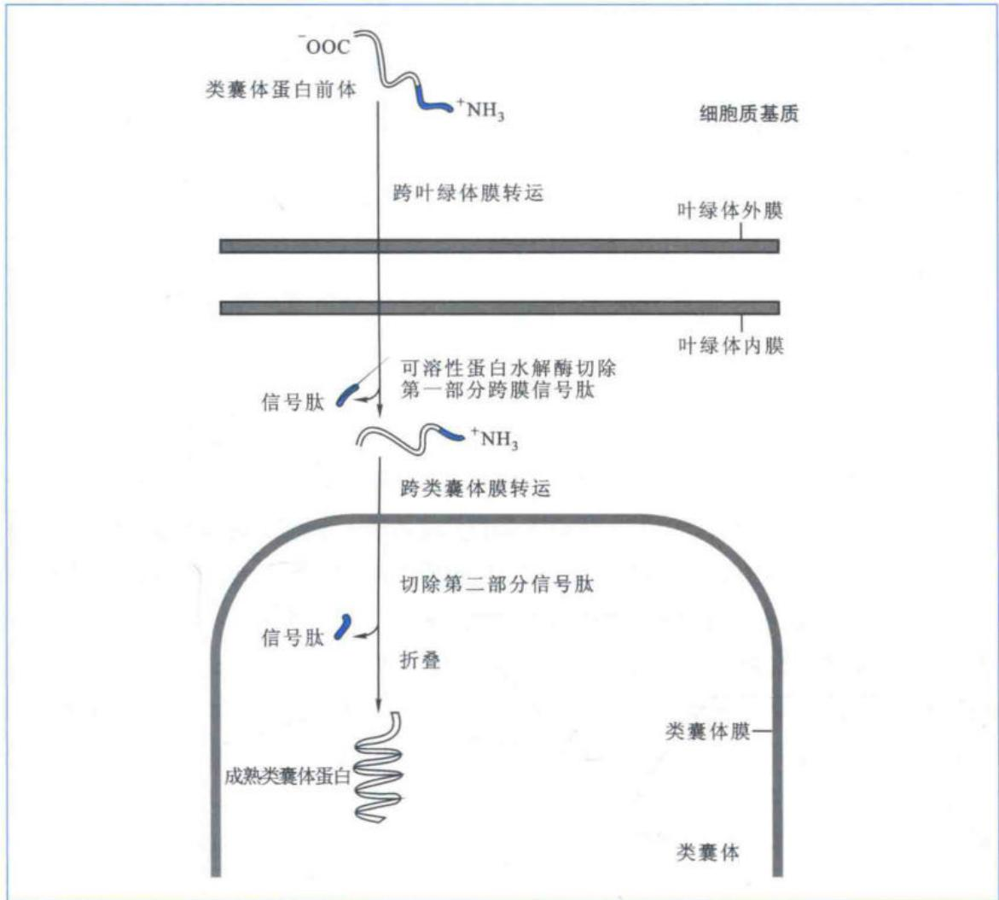

## 4.5.3 核定位蛋白的运转机制

真核细胞的细胞核通过核孔与核外相通,因此,核孔是进行双向运转的分子通道。在细胞质中合成的蛋白质一般通过核孔进入细胞核。所有核糖体蛋白都首先在细胞质中被合成,运转到细胞核内,在核仁中被装配成40S和60S核糖体亚基,然后运转回到细胞质中行使作为蛋白质合成机器的功能。RNA、DNA聚合酶、组蛋白、拓扑异构酶及大量转录、复制调控因子都必须从细胞质进入细胞核才能正常发挥功能。

在绝大部分多细胞真核生物中,每当细胞发生分裂时,核膜被破坏,等到细胞分裂完成后,核膜被重新建成,分散在细胞内的核蛋白必须被重新运入核内。真核细胞核膜上的核孔复合体(nuclear pore complex,NPC)是细胞核内外进行物质交换的主要通道,相对分子质量较小的蛋白质可自由通过NPC或采取被动扩散的方式进入细胞核,而相对分子质量大于 $4\times10^{4}$ 的蛋白质则需要通过主动运转进出细胞核。以这种方式进出细胞核的蛋白质需要在其氨基酸序列上带有特殊的核定位信号序列(nuclear localization signal,NLS)和出核信号序列(nuclear export signal,NES),才能被相应的核运转蛋白识别。

目前已经发现有多种类型的核定位信号，包括经典核定位信号和其他类型的NLS。

这些信号都具有一个带正电荷的肽核心,通常是一短的富含碱性氨基酸的序列,它能与入核载体相互作用,将蛋白质运进细胞核。第一个被确定的NLS序列的蛋白质是SV40的T抗原,它在细胞质中合成后很快积累在细胞核中,是病毒DNA在核内复制所必需的。其野生型的氨基酸序列为Pro-Lys-Lys-Lys-Arg-Lys-Val,该序列中的单个氨基酸突变所产生的突变型能阻止这种蛋白质进入细胞核而停留在细胞质中。

NLS 可以位于核蛋白的任何部位,也能够引导其他非核蛋白进入细胞核。入核信号与前导肽的区别在于:①由含水的核孔通道来鉴别;②入核信号是蛋白质的永久性部分,在引导入核过程中,并不被切除,可以反复使用,有利于细胞分裂后核蛋白重新入核。

蛋白质向核内运输过程需要一系列循环于核内和细胞质的蛋白因子包括核运转因子（importin）α、β和一个低相对分子质量GTP酶(Ran)参与。α和β组成的异源二聚体是核定位蛋白的可溶性受体，与核定位序列相结合的是α亚基。由上述3个蛋白质组成的复合物停靠在核孔处，依靠Ran GTP酶水解GTP提供的能量进入细胞核，α和β亚基解离，核蛋白与α亚基解离，α和β分别通过核孔复合体回到细胞质中，起始新一轮蛋白质运转(图4-37)。

经典的出核信号序列(NES)是由疏水性氨基酸尤其是亮氨酸和异亮氨酸富集的区域构成,其保守性氨基酸排序为 $\Phi X_{1-3}\Phi X_{2-3}\Phi X\Phi$ ,其中, $\Phi$ 代表疏水性氨基酸 L、I、F 或 M,而 X 代表任意氨基酸。经典的 NES 大多为 CRM1 依赖性,它能够被出核因子 CRM1(chromosome region maintenance 1)/exporting/Xpo1 识别并结合,从而携带该蛋白质出核。

图 4-37 核定位蛋白跨细胞核膜运转过程示意图  
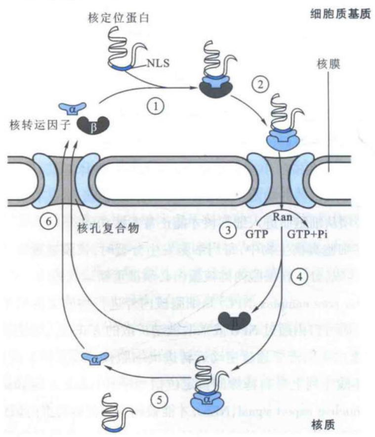

  
图 4-38 细菌中蛋白质的跨膜运转

对于原核细胞来说,同样存在蛋白质运转的问题。研究表明,细菌同样能通过定位于蛋白质 N 端的信号肽将新合成的多肽运转到其内膜、外膜、双层膜之间或细胞外等不同部位。细菌中新翻译产生的蛋白质与胞质中的分子伴侣 SecB 相结合后就能被运送到细胞膜运转复合物 SecA-SecYEG 上,结合有新生肽的 SecA 在自身 ATP 酶活性作用下水解 ATP 并嵌入细胞膜之中,导致与 SecA 相结合的被运转蛋白 N 端约 20 个氨基酸通过膜运转复合物到达胞外。SecA 再与另一个 ATP 相结合,变构嵌入膜内的同时再次把所运转蛋白的第二部分运出胞外,如此反复,直到把所运转蛋白质全部送到胞外(图 4-38)。

## 4.6 蛋白质的修饰、降解与稳定性研究

越来越多的证据表明,生物体内蛋白质的降解过程是一个有序的过程。在大肠杆菌中,蛋白质的降解是通过一个依赖于 ATP 的蛋白酶(称为 Lon)来实现的。当细胞中出现错误的蛋白质或半衰期很短的蛋白质时,该酶就被激活。Lon 蛋白酶每切除一个肽键要消耗两个分子的 ATP。

## 4.6.1 泛素化修饰介导的蛋白质降解

蛋白质的半衰期从 30 s 到许多天不等。虽然大部分真核蛋白的半衰期为数小时至数天，像血红蛋白这样少数蛋白质的半衰期与细胞周期同样长（成红细胞 = 110 天）。在真核生物中，除了通过溶酶体以及自噬通路，蛋白质的降解主要依赖于泛素蛋白（ubiquitin）。泛素是一类低相对分子质量的蛋白质，只有 76 个氨基酸残基，序列高度保守（从酵母和人细胞中提取的泛蛋白几乎完全相同）。泛素化是指泛素分子在泛素激活酶、结合酶、连接酶等的作用下，对靶蛋白进行特异性修饰的过程，在该过程中，泛素 C 端甘氨酸残基通过酰胺键与底物蛋白的赖氨酸残基的 $\varepsilon$ 氨基结合。在蛋白质分子的一个位点上可结合单个或多个泛素分子。

  
图 4-39 泛素化 / 去泛素化修饰及其在蛋白质降解和细胞生理功能中的调节作用。  
泛素在 E1、E2 和 E3 的作用下与底物蛋白相连接的过程。该过程是一个可逆的过程，可以在去泛素化酶(DUB)的作用下去除底物(S)上的泛素化修饰。K11 和 K48 位的多泛素化修饰使蛋白质通过 26S 蛋白酶体降解；K63、K29 位等的泛素化修饰不是蛋白质发生降解，而是参与细胞内众多生理过程的调节。

泛素化修饰涉及泛素激活酶 E1、泛素结合酶 E2 和泛素连接酶 E3 等 3 个酶的级联反应(图 4-39): 首先在 ATP 提供能量的情况下, 泛素激活酶 E1 黏附在泛素分子尾部的 Cys 残基上激活泛素, E1 酶再将激活的泛素分子转移到泛素结合酶 E2 上, 再由 E2 酶和一些种类不同的泛素连接酶 E3 酶共同识别靶蛋白, 对其进行泛素化修饰。该修饰是一个可逆的过程, 去泛素化酶 (DUB) 可以去除相应底物的泛素化修饰。目前已经鉴定 2 种 E1, 50 余种 E2、600 余种 E3 和 100 余种 DUB。底物泛素化修饰的特异性是由连接酶 E3 决定的, 可以对靶蛋白进行单泛素化和多泛素化修饰。如图 4-40 所示, E2 酶的外形就像一个夹子, 将靶蛋白固定在中间的空隙内。蛋白质泛素化以后, 被标记的蛋白质常被运送到相对分子质量高达 $1 \times 10^{6}$ 的蛋白质降解体系中直到该蛋白质完全被降解。

蛋白质的泛素化修饰是翻译后修饰的一种常见形式,该过程能够调节不同细胞途径中的各种蛋白质。其中,泛素-蛋白酶体途径是最先被发现的,也是一种较普遍的内源蛋白质降解方式。蛋白酶体(proteasome)因其密度梯度离心沉降系数为26S,故又称其为26S蛋白酶体。它是由1个20S催化颗粒(catalytic particle,CP)和2个19S调节颗粒(regulatory particle, RP)组成的桶状结构(图4-41)。19S为调节亚单位，位于桶状结构的两端，识别多泛素化蛋白并使其去折叠。19S亚单位上还具有一种去泛素化的同功肽酶，使底物去泛素化。20S为催化亚单位，位于两个19S亚单位的中间，其活性部位处于桶状结构的内表面，可避免细胞内环境变化所造成的影响。进一步的研究发现，并非所有泛素化修饰都会导致蛋白质降解。有些泛素化修饰还能参与多种生物功能的调控，在蛋白质的定位、代谢、功能、调节和降解中都起着十分重要的作用，能参与细胞周期、增殖、凋亡、分化、转移、基因表达、转录调节、信号传递、损伤修复、炎症免疫等几乎一切生命活动的调控，在肿瘤、心血管等疾病发病中起着十分重要作用。此外，蛋白质的泛素化也是研究、开发新药物的新靶点。

(a)  

(b)  

## 4.6.2 蛋白质的 SUMO 化修饰

除了泛素化修饰,细胞内还有一些与泛素化修饰相类似的反应,称为类泛素化修饰,如 SUMO 化修饰(小泛素化修饰,SUMOylation)和 NEDD 化修饰(NEDDylation)等。小泛

图 4-40 泛素连接酶 E3 与结合酶 E2 或底物复合物的三维结构

(a) SCFSkp2-E2 复合物的结构. Cul1、Rbx1、Skp1 和 Skp2 复合物的结构外形就像一个夹子, 其中间的空隙内可结合底物蛋白; (b) DDB1-CUL4A-ROC1 泛素连接酶与猴病毒 5 的 V 蛋白复合物的晶体结构。

## 图 4-41 26S 蛋白酶体依赖的蛋白质泛素化降解

蛋白酶体是由1个20S催化颗粒(CP)和2个19S调节颗粒(RP)组成的桶状结构。一旦底物蛋白被多泛素化(连接至少4个泛素分子)，它或者直接与19S调节颗粒上的泛素受体结合(a)，或者通过19S调节颗粒上的连接物受体间接结合到蛋白酶体(b)，然后被剪切成小的肽段而降解，泛素会被再利用。修改自Ravid and Hochstrasser, Nat Rev Mol Cell Biol, 679-690, 2008。

图4-42 SUMO化修饰和泛素化修饰的比较  

素相关修饰物 (small ubiquitin-related modifier, SUMO) 是泛素类蛋白家族的重要成员之一, 由 98 个氨基酸组成, 在进化上高度保守。SUMO 与泛素之间具有 $18\%$ 的同源性, 并且两者都具有典型的 $\beta \beta \alpha \beta \beta \alpha \beta$ 折叠, 但两者表面电荷分布不同, 暗示其功能不同。小泛素相关修饰物经由一系列酶介导的生化级联反应共价结合于底物蛋白的赖氨酸残基上 (图 4-42)。与泛素相类似, SUMO 也以前体形式被合成, 并且在羧基端水解酶的作用下加工为成熟的 SUMO。SUMO 化修饰也需要 E1、E2 和 E3 的参与。首先, 依赖于 ATP 的 SUMO 活化酶 E1 的链接亚基与 SUMO 的 Gly 残基相链接, 激活 SUMO, 再由 SUMO 结合酶 E2 的半胱氨酸催化亚基通过识别一个保守序列 $\Psi - K - X - D / E$ ( $\Psi$ 代表疏水性氨基酸, 赖氨酸残基 K 是 SUMO 偶联位点, X 可以是任何氨基酸, D 或 E 为酸性氨基酸), 这种把 SUMO 转移到底物的赖氨酸残基上, 稳定靶蛋白使其免受降解的过程称为 SUMO 化修饰。

SUMO 化修饰类似于但又不同于泛素化修饰。SUMO 化修饰既能协同泛素化，又能拮抗泛素化修饰。与泛素介导的蛋白质降解不同，SUMO 阻碍泛素对底物蛋白的共价修饰，提高了底物蛋白的稳定性（图 4-43）。它能修饰许多在基因表达调控中发挥重要作用的蛋白质，包括转录因子、转录辅助因子以及染色质结构调控因子。SUMO 化修饰影响蛋白质亚细胞定位和蛋白质构象，广泛参与细胞内蛋白质与蛋白质相互作用、DNA 结合、信号转导、核质转运、转录因子激活等重要过程。

图4-43 SUMO化修饰的通路及其与泛素化的关系

蛋白质的 SUMO 化修饰能够阻止泛素化引起的蛋白质降解。SUMO 化修饰需要 AOS1/UBA2 和 UBC9 多种酶；去 SUMO 化是在 ULP 家族蛋白的催化下完成。

## 4.6.3 蛋白质的 NEDD 化修饰

NEDD8 含有 81 个氨基酸, 是一种类泛素蛋白修饰分子, 与泛素分子的一致性为 59%, 相似性高达 80%, 其相似程度是众多类泛素分子中最高的。研究表明, NEDD8 能像泛素一样在体内固有酶簇作用下被共价结合到底物蛋白上, 参与蛋白质翻译后修饰, 这一过程被称为 NEDD 化修饰 (NEDDylation) (图 4-44)。NEDDylation 的发生机制与泛素化相似, 需要酶 E1、E2、E3 介导的一系列酶促反应。NEDD8 可以通过其 C 端第 76 位的甘氨酸与底物的赖氨酸共价结合。底物的去 NEDD 化是由去 NEDD 化酶介导的, NEDD8 在去 NEDD 化后重新进入循环 (图 4-45)。需要注意的是, 一些底物在发生 NEDD 化修饰时会和泛素化修饰共用相同的 E3 连接酶, 但与泛素化介导的蛋白酶体依赖的蛋白质降解不同, NEDD 化修饰不会引起蛋白质的降解, 而主要通过该种修饰来调节蛋白质的功能。NEDD 化可能参与细胞增殖分化、细胞发育、细胞周期、信号转导等重要生命过程的调控, NEDD

  
图4-44 NEDD8 修饰的生化反应

  
图 4-45 NEDD 化修饰的通路  
NEDD化修饰的主要通路包括NEDD8前体活化的过程，通过E1（UBA3-APPBP1）激活，与E2（UBC12）结合，通过E3连接到底物上的NEDD化过程以及相反的去NEDD化过程。

  
图 4-46 蛋白质的泛素化和类泛素化修饰的生理效应  
① K48位的泛素化导致底物蛋白通过26S蛋白酶体的降解。② K63位的多泛素化引起蛋白质功能的改变。③ K29位的多泛素化引起溶酶体依赖的蛋白质的降解。特定的多泛素化④、单泛素化⑤、NEDD化⑦以及SUMO化⑧等能够改变蛋白质的功能，使蛋白质亚细胞定位发生变化等，参与细胞内多条重要生物学通路。⑥与泛素受体分子(ubiquitin receptor molecule,UR)结合(coupled monoubiquitination)是另一种生物过程的调控方式。NEDD8与SUMO-1类似易于引起单修饰，而SUMO-2和SUMO-3能够引起修饰分子链的形成。

化异常会导致人类的神经退行性疾病和癌症。

目前发现的 NEDD 化底物蛋白只有 Cullin 家族蛋白、原癌基因产物 Mdm2、p53 肿瘤抑制因子、p73、表皮生长因子受体 EGFR、乳腺癌相关蛋白 3(BCA3) 等。更有趣的是，这些被 NEDD 化修饰的底物要么本身可以被泛素化修饰，要么是泛素化 E3 连接酶的组分，暗示 NEDD8 和泛素之间在进化上存在某种特定的联系。因为 NEDD8 参与 NEDD 化过程的关键位点是赖氨酸残基，该残基同时也可以发生乙酰化、甲基化和泛素化，人们普遍认为，在不同的生理条件下，在蛋白质的同一赖氨酸残基上可能发生不同的修饰以满足不同的生理需求（图 4-46）。深入探讨这些翻译后修饰的动态平衡与相互关系将有助于我们阐明蛋白质翻译后修饰的生物学功能。

## 4.6.4 蛋白质一级结构对稳定性的影响

成熟蛋白质 N 端的第一个氨基酸(除已被切除的 N 端甲硫氨酸之外,但包括翻译后修饰产物)在蛋白质的降解中有着举足轻重的影响(表 4-13)。当某个蛋白质的 N 端是甲硫氨酸、甘氨酸、丙氨酸、丝氨酸、苏氨酸和缬氨酸时,表现稳定。其 N 端为赖氨酸、精氨酸时,表现最不稳定,平均 2\~3 min 就被降解了。泛素调控的蛋白质降解具有重要的生理意义,它不仅能够清除错误蛋白质,对细胞生长周期、DNA复制以及染色体结构都有重要的调控作用,而且对于理解细胞的许多生理过程和新药的开发也具有重要意义。

表 4-13 蛋白质的半衰期与 N 端氨基酸残基的关系

<table><tr><td>N端残基</td><td>半衰期</td></tr><tr><td>稳定型残基</td><td></td></tr><tr><td>甲硫氨酸、甘氨酸、丙氨酸、丝氨酸、苏氨酸、缬氨酸</td><td>&gt;20 h</td></tr><tr><td>不稳定型残基</td><td></td></tr><tr><td>异亮氨酸、谷氨酰胺</td><td>~30 min</td></tr><tr><td>酪氨酸、谷氨酸</td><td>~10 min</td></tr><tr><td>脯氨酸</td><td>~7 min</td></tr><tr><td>亮氨酸、苯丙氨酸、天冬酰胺、赖氨酸</td><td>~3 min</td></tr><tr><td>精氨酸</td><td>~2 min</td></tr></table>

## 思考题

1. 简述破译遗传密码的主要过程。

2. 遗传密码有哪些特性？说出遗传密码简并性的生物学意义。

3. 终止密码子主要有哪几种？

4. tRNA 在组成和结构上有哪些特点?

5. tRNA 如何转运活化氨基酸至 mRNA 模板上?

6. 原核生物与真核生物的核糖体组成有哪些异同点？

7. 什么是 SD 序列, 其功能是什么?

8. 核糖体主要有哪些活性中心?

9. 真核生物与原核生物在翻译的起始过程中有哪些不同？

10. 链霉素为什么能够抑制蛋白质的合成？

11. 哪些抗生素只能特异性地作用于原核生物核糖体？哪些只作用于真核生物核糖体？哪些能同时抑制原核和真核生物核糖体？

12. 什么是分子伴侣,有哪些重要功能?

13. 什么是信号肽？它在序列组成上有哪些特点，有何功能？

14. 简述线粒体和叶绿体蛋白质的跨膜运转机制。

15. 蛋白质有哪些翻译后加工修饰, 其作用机制和生物学功能是什么?

16. 什么是核定位信号序列, 其主要功能是什么?

## 参考文献

1. Ling J, Reynolds N, Ibba I. Aminoacyl-tRNA synthesis and translational quality control. Annu. Rev. Microbiol., 2009, 63: 61–78.

2. Ramakrishnan V. Ribosome structure and the mechanism of translation. Cell, 2002, 108: 557–572.

3. Selmer M, Dunham C M, Murphy F V, et al. Structure of the 70S ribosome complexed with mRNA and tRNA. Science, 2006, 313: 1935–1942.

4. Laursen B S, Sorenson H P, Mortenson K K, et al. Initiation of protein synthesis in bacteria. Microbiol. Mol.

Biol.Rev., 2005, 60: 101-123.

5. Sonenberg N, Hinnebusch A G. Regulation of translation initiation in eukaryotes: Mechanisms and biological targets. Cell, 2009, 136: 731–745.

6. Gebauer F, Hentze M W. Molecular mechanisms of translational control. Nat. Rev. Mol. Cell Biol., 2004, 5: 827–835.

## 数字课程学习

e 教学课件

目在线自测

思考题解析

# 分子生物学研究法(上) ——DNA、RNA 及蛋白质操作技术

5.1 重组 DNA 技术史话

5.2 DNA 基本操作技术

5.3 RNA 基本操作技术

5.4 基因克隆技术

5.5 蛋白质与蛋白质组学技术

分子生物学研究之所以从20世纪中叶开始得到高速发展,其中最主要的原因可能是现代分子生物学研究方法、特别是基因操作和基因工程技术的进步。基因操作主要包括DNA分子的切割与连接、核酸分子杂交、凝胶电泳、细胞转化、核酸序列分析以及基因的人工合成、定点突变和PCR扩增等,是分子生物学研究的核心技术。基因工程是指在体外将核酸分子插入病毒、质粒或其他载体分子,构成遗传物质的新组合,使之进入新的宿主细胞内并获得持续稳定增殖能力和表达。该项技术其实是核酸操作的一部分,只不过我们在这里强调了外源核酸分子在另一种不同的宿主细胞中的繁衍与性状表达。事实上,这种跨越天然物种屏障、把来自任何生物的基因置于毫无亲缘关系的新的宿主生物细胞之中的能力,是基因工程技术区别于其他技术的根本特征。本章将在回顾重组DNA技术发展史的基础上,讨论DNA操作技术、基因克隆、表达分析技术及蛋白质组学、单核苷酸多态性分析等现代生物学领域里最广泛应用的实验技术和方法。

## 5.1 重组 DNA 技术史话

近半个多世纪来,分子生物学研究取得了前所未有的进步,主要有三大成就:第一,在20世纪40年代确定了遗传信息的携带者,即基因的分子载体是DNA而不是蛋白质,解决了遗传的物质基础问题;第二,50年代提出了DNA分子的双螺旋结构模型和半保留复制机制,解决了基因的自我复制和世代交替问题;第三,50年代末至60年代,相继提出了“中心法则”和操纵子学说,成功地破译了遗传密码,阐明了遗传信息的流动与表达机制。

DNA 分子体外切割与连接技术及核苷酸序列分析技术的进步直接推动了重组 DNA 技术的产生与发展。因为重组 DNA 的核心是用限制性内切核酸酶 (restriction endonuclease, RE) 和 DNA 连接酶对 DNA 分子进行体外切割与连接，所以，科学家认为，这些工具酶的发现和应用是现代生物工程技术史上最重要的事件 (表 5-1)。1967 年，世界上有 5 个实验室几乎同时报道了通过合成相邻核苷酸之间的磷酸二酯键，修复缺口或催化黏合完全分离的两个 DNA 片段的 DNA 连接酶。1972 年，Boyer 实验室发现有一种内切核酸酶 EcoR I 能特异性识别 GAATTC 序列，将双链 DNA 分子在这个位点切开并产生具有黏性末端的小片段。他们还发现，能够把 EcoR I 酶切产生的任何不同来源的 DNA 片段通过 DNA 连接酶彼此“黏合”起来。此后，大量类似于 EcoR I 但具有独特识别序列的内切核酸酶被陆续发现，它们中的大多数识别的序列为回文序列且切割后形成黏性末端，少数为非回文序列（如 Bsa I），也有些切割成平末端（如 Pvu II）(图 5-1)。

表 5-1 重组 DNA 技术史上的主要事件

<table><tr><td>年份</td><td>事件</td></tr><tr><td>1869</td><td>F. Miescher 首次从莱茵河鲑鱼精子中分离 DNA</td></tr><tr><td>1957</td><td>A. Kornberg 从大肠杆菌中发现了 DNA 聚合酶 I</td></tr><tr><td>1959-1960</td><td>Uchoa 发现 RNA 聚合酶和信使 RNA,并证明 mRNA 决定了蛋白质分子中的氨基酸序列</td></tr><tr><td>1961</td><td>Nirenberg 破译了第一个遗传密码;Jacob 和 Monod 提出了调节基因表达的操纵子模型</td></tr><tr><td>1964</td><td>Yanofsky 和 Brenner 等人证明,多肽链上的氨基酸序列与该基因中的核苷酸序列存在着共线性关系</td></tr><tr><td>1965</td><td>Holley 完成了酵母丙氨酰 tRNA 的全序列测定;科学家证明细菌的抗药性通常由“质粒”DNA 所决定</td></tr><tr><td>1966</td><td>Nirenberg、Uchoa、Khorana 和 Crick 等人破译了全部遗传密码</td></tr><tr><td>1967</td><td>第一次发现 DNA 连接酶</td></tr><tr><td>1970</td><td>Smith、Wilcox 和 Kelley 分离了第一种限制性内切核酸酶,Temin 和 Baltimore 从 RNA 肿瘤病毒中发现反转录酶</td></tr><tr><td>1972-1973</td><td>Boyer、Berg 等人发展了重组 DNA 技术,于 1972 年获得第一个重组 DNA 分子,1973 年完成第一例细菌基因克隆</td></tr><tr><td>1975-1977</td><td>Sanger 与 Maxam 和 Gilbert 等人发明了 DNA 序列测定技术,1977 年完成了全长 5 387 bp 的噬菌体 φ174 基因组测定</td></tr><tr><td>1978</td><td>首次在大肠杆菌中生产由人工合成基因表达的人脑激素和人胰岛素</td></tr><tr><td>1980</td><td>美国联邦最高法院裁定微生物基因工程可以被专利化</td></tr><tr><td>1981</td><td>Palmiter 和 Brinster 获得转基因小鼠,Spradling 和 Rubin 得到转基因果蝇</td></tr><tr><td>1982</td><td>美、英批准使用第一例基因工程药物——胰岛素,Sanger 等人完成了入噬菌体 48 502 bp 全序列测定</td></tr><tr><td>1983</td><td>获得第一例转基因植物</td></tr><tr><td>1984</td><td>斯坦福大学获得关于重组 DNA 的专利</td></tr><tr><td>1986</td><td>遗传修饰生物体(GMO)首次在环境中释放</td></tr><tr><td>1988</td><td>Watson 出任“人类基因组计划”首席科学家</td></tr><tr><td>1989</td><td>DuPont 公司获得转肿瘤基因小鼠——“Oncomouse”</td></tr><tr><td>1992</td><td>欧洲 35 个实验室联合完成酵母第三染色体全序列测定(315 kb)</td></tr><tr><td>1994</td><td>第一批基因工程西红柿在美国上市</td></tr><tr><td>1996</td><td>完成酵母基因组全序列测定( $1.25 \times 10^{7}$  bp)</td></tr><tr><td>1997</td><td>英国爱丁堡罗斯林研究所获得克隆羊</td></tr><tr><td>2000</td><td>完成第一个高等植物拟南芥的全序列测定( $1.2 \times 10^{8}$  bp)</td></tr><tr><td>2001</td><td>完成第一个人类基因组全序列测定( $2.7 \times 10^{9}$  bp)</td></tr><tr><td>2012</td><td>首次报导具有革命性的基因编辑体系——CRISPR/Cas9 技术</td></tr></table>

当然,仅仅能在体外利用限制性内切核酸酶和 DNA 连接酶进行 DNA 的切割和重组,还远远不能满足基因工程的要求,因为大多数 DNA 片段不具备自我复制的能力,只有将它们连接到具备自主复制能力的 DNA 分子上,才能在宿主细胞中进行繁殖。这种具备自主复制能力的 DNA 分子就是所谓分子克隆的载体 (vector),病毒、噬菌体和质粒等小分子量复制子都可以作为基因导入的载体。

图 5-1 几种主要限制性内切核酸酶所识别的序列、切割位点及常用的保护碱基  

分子克隆的载体种类繁多,但目前全世界各实验室广泛使用的质粒载体大多是从以下几种载体派生出来的。pSC101是第一代质粒载体(图5-2a),全长9.09 kb,带有四环素抗性基因(tet $^{r}$ ),具有EcoR I、HindⅢ、BamH I、Sal I、Xho I、Pvu II以及Hpa I 7种限制性内切核酸酶的单酶切位点。该载体是一种严紧型复制控制的低拷贝质粒,平均每个宿主细胞仅有1\~2个拷贝,因此,从带有该质粒的宿主细胞中很难大量提取质粒DNA,不利用后续实验的进行;而ColE1质粒载体则是松弛型复制控制的多拷贝质粒(图5-2b),每个宿主细胞中的拷贝数可达到1 000\~3 000个;pBR322质粒载体同样具有较高的拷贝数(1 000\~3 000个),便于制备重组DNA,它由3个不同来源的部分组成(图5-2c),第一部分来源于pSF2124质粒易位子Tn3的氨苄青霉素抗性基因(amp $^{r}$ ),第二部分来源于pSC101质粒的四环素抗性基因(tet $^{r}$ ),第三部分则来源于ColE1的派生质粒pMB1的DNA复制起点(ori)。最后一类是pUC质粒载体(图5-2d),由包括来自pBR322质粒的复制起点(ori),氨苄青霉素抗性基因(amp $^{r}$ ),大肠杆菌β-半乳糖苷酶基因(lacZ)启动子及编码α-肽的DNA序列,特称为lacZ'基因等4部分所组成。一旦有外源DNA插入位于lacZ'基因5'端的多克隆位点(MCS)处,lacZ'基因功能被破坏,不能产生功能型半乳糖酶。

lacZ'基因编码β-半乳糖苷酶氨基端146个氨基酸的α-肽，IPTG（异丙基-β-D-硫代半乳糖苷)诱导该基因表达，所合成的β-半乳糖苷酶α-肽与宿主细胞编码的缺陷型β-半乳糖苷酶互补，产生有活性的β-半乳糖苷酶，水解培养基中的X-gal(5-溴-4-氯-3-吲哚-β-D-半乳糖苷)，生成蓝色的溴氯吲哚。利用这一原理可对重组载体进行蓝白斑筛选，在含X-gal的培养基中，非转化菌落呈蓝色，含有重组DNA分子的菌落呈白色。

获得了用外源 DNA 片段和载体分子连接后的重组载体后,还必须通过一个细菌转化的过程将其重新导入到宿主细胞中,才能保证重组载体的增殖。1970 年,Mandel 和 Higa

(a)  

(b)  

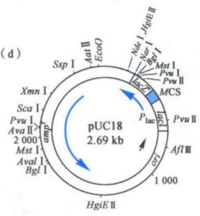

## 图 5-2 分子克隆中最常见的载体演变

(a) pSC101 质粒载体，全长 9.09 kb，带有四环素抗性基因 ( $tet^{r}$ ) 及 7 种限制性内切核酸酶的单酶切位点，在 HindⅢ、BamH I 和 Sal I 等 3 个位点插入外源基因，会导致 tet 失活；(b) ColE1 质粒载体；(c) pBR322 质粒载体；(d) pUC18 质粒载体。

发现,大肠杆菌细胞经适量氯化钙处理后,能有效地吸收 $\lambda$ 噬菌体 DNA。1972 年,又有实验室报道,经氯化钙处理的大肠杆菌细胞能够有效摄取质粒 DNA。从此,大肠杆菌就成了分子克隆中最常用的转化受体。同年,美国斯坦福大学的 Berg 等人在体外用限制性核酸内切酶 EcoR I 分别消化病毒 SV40 和 $\lambda$ 噬菌体 DNA,再用 T4 DNA 连接酶将两种不同的酶切片段连接起来,首次获得了同时含有 SV40 和 $\lambda$ 噬菌体 DNA 的重组 DNA $^{(图 5-3a)}$ 。1973 年,Cohen 实验室也成功地进行了体外 DNA 重组,他们将分别经限制性内切核酸酶处理的含有编码卡那霉素抗性基因的大肠杆菌质粒 R6-5 DNA 与含有编码四环素抗性基因的另一种大肠杆菌质粒 pSC101 DNA 混合后加入 T4 DNA 连接酶,得到的重组杂种 DNA 分子表现出既抗卡那霉素又抗四环素的双重抗性特征(图 5-3b)。

由来自大肠杆菌的质粒 DNA 形成的重组 DNA 分子可以在原来的宿主细胞中增殖，这似乎还比较容易理解。那么，不同物种的外源 DNA 片段是否也可以在大肠杆菌细胞中增殖呢？为了回答这个问题，Cohen 和 Boyer 等人合作，把非洲爪蟾核糖体蛋白基因片段与 pSC101 质粒 DNA 片段重组后导入大肠杆菌，证明动物基因也能进入大肠杆菌细胞并转录出相应的 mRNA 分子。上述实验表明：

① 类似 pSC101 的质粒 DNA 分子可以作为基因克隆的载体, 从而将外源 DNA 导入宿主细胞。

② 来自高等生物非洲爪蟾基因片段可以被成功地转移到原核细胞中并实现功能表达。

图 5-3 科学家早期构建的重组 DNA

(a) 经 EcoR I 酶切后的 $\lambda$ 噬菌体 DNA 和猿猴病毒 SV40，在 T4 DNA 连接酶的催化下形成重组 DNA；(b) 含有编码卡那霉素抗性基因的质粒 R6-5 与含有编码四环素抗性基因的质粒 pSC101 分别经 EcoR I 酶切，并在 T4 DNA 连接酶的作用下形成重组质粒 DNA，其能同时降解卡那霉素和四环素，具有双重抗性。

③ 质粒 DNA-大肠杆菌细胞作为一种成功的基因克隆体系,有可能在重组 DNA 或基因工程研究中发挥重要作用。

## 5.2 DNA 基本操作技术

自从 1953 年 DNA 分子双螺旋被发现,分子生物学研究得到各国科学家的高度重视并且迅速发展成一门新兴学科,这首先要归功于各种 DNA 操作核心技术——包括基因组 DNA 提取、凝胶电泳、PCR、重组载体的构建及基因组 DNA 文库的构建等技术的迅速发展与应用。时至今日,分子生物学研究已经进入三维基因组和三维蛋白质结构大数据时代,但最基本的 DNA 操作技术仍然不可或缺。

## 5.2.1 基因组 DNA 的提取

广义的基因组(genome)是指一个单倍体细胞内细胞核、线粒体和叶绿体中所包含的全部DNA分子,而我们通常说的基因组DNA则特指细胞核内染色体上的包括编码区和非编码区在内的全部DNA分子。获取高相对分子质量和高纯度的基因组DNA,可以使后续实验如PCR反应、Southern杂交、文库构建或者基因组测序等结果更加可信可靠。

根据不同材料的性质,提取基因组 DNA 时方法略有不同。一般首先将组织材料磨碎或细胞材料均匀分散。因为植物组织具有细胞壁结构,较难破碎,所以一般先用液氮速冻帮助研磨,随后加入裂解液破碎细胞,释放细胞核及核内的染色质。动物组织及细胞材料一般加入 SDS 进行裂解。SDS 是一种阴离子去污剂,可溶解细胞膜,并使蛋白质变性,释放出染色质中的 DNA。植物组织一般加入一种阳离子去污剂——CTAB,它可以更好地除去细胞壁中的多糖成分,溶解细胞膜,并与释放出来的核酸形成复合物。用苯酚和氯仿做有机相来分离裂解后的各种细胞组分,包括蛋白质、糖类、酚类等有机物,使之与溶解于水相的 DNA 相分离。最后用乙醇洗涤分离后的 DNA,吸收与 DNA 相结合的水分子,使之沉淀并得到进一步的纯化。将 DNA 沉淀晾干后,溶解于超纯水或 Tris-HCI 和 EDTA 配制的 TE 缓冲液中(图 5-4a)。基因组 DNA 制备后可以在 4℃适当保存,但最好尽快使用。

图 5-4 基因组 DNA 的提取  
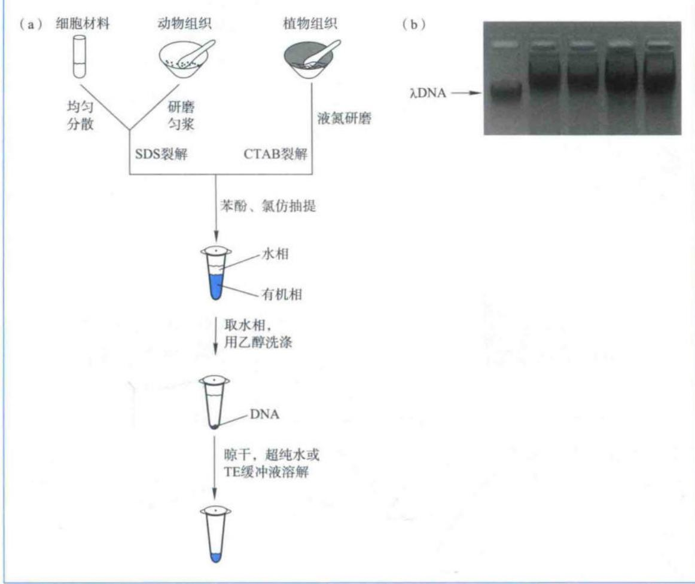  
(a) 基因组 DNA 提取的主要实验流程；(b) 陆地棉不同组织的核 DNA 样品电泳图。

实验中还常将含有 DNA 样品的细胞破碎液通过一个硅胶膜纯化柱,使 DNA 吸附在硅胶膜上而与其他成分分开,进一步在低盐浓度下从硅胶膜上直接洗脱 DNA,得到纯度较高的 DNA 样品。

DNA 的浓度和纯度可以通过测定其 $OD_{260}$ 和 $OD_{280}$ 来判断。 $OD_{260}$ 为 1 时相当于浓度为 50 $\mu g/mL$ ，而 $OD_{260}/OD_{280}$ 的比值如果在 1.8～2.0 之间，表示所提取的 DNA 纯度较好，如果样品中有蛋白质或酚污染，则 $OD_{260}/OD_{280}$ 的比值将明显低于 1.8。

提取基因组 DNA 时一定要保证核酸一级结构的完整性, 确保所提取的 DNA 片段显著大于 50 kb。在操作时要尽可能避免机械力对 DNA 的损伤。可通过琼脂糖凝胶电泳检测基因组 DNA 片段大小。常用相对分子质量为 50 kb 的 $\lambda$ 噬菌体作为检测基因组 DNA 质量的参照(图 5-4b)。

## 5.2.2 核酸凝胶电泳

自从琼脂糖(agarose)和聚丙烯酰胺(polyacrylamide)凝胶被发现以来,按相对分子质量大小分离DNA的凝胶电泳技术,已经成为分析鉴定重组DNA分子及蛋白质与核酸相互作用的重要实验手段。

在生理条件下,核酸分子中的磷酸基团呈离子化状态,把这些核酸分子放置在电场当

图5-5 琼脂糖凝胶电泳

(a) 琼脂糖凝胶电泳装置，电泳仪为电泳槽施加电压，添加适量的电泳缓冲液，将琼脂糖凝胶置于其中，DNA 即可在凝胶中由负极向正极迁移；(b) 将琼脂糖粉末加入电泳缓冲液中加热熔化，倒入凝胶模具中并插入梳子形成上样孔，待其冷却后拔去梳子，即制备好琼脂糖凝胶。凝胶电泳完毕后在紫外下显示 DNA 条带。

(a)  
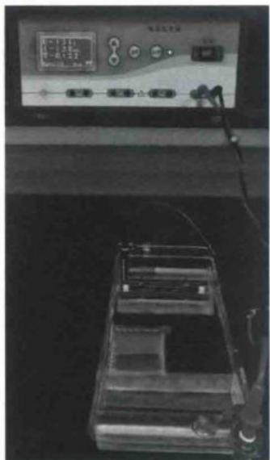

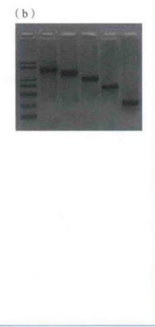

中,它们会向正电极方向迁移(图5-5)。由于核酸分子中的磷酸基团在结构上的重复性,相同数量的双链DNA几乎具有等量的净电荷,因此它们能以同样的速度向正电极方向迁移。在一定的电场强度下,DNA分子的这种迁移速度,亦即电泳的迁移率,就完全取决于核酸分子本身的大小。因此,可以通过电泳将不同相对分子质量的核酸分子彼此分离开来。

将琼脂糖粉末加热到熔点后冷却凝固便会形成良好的无反应活性的电泳介质。凝胶的分辨能力与凝胶的类型和浓度有关(表5-2)。琼脂糖凝胶分辨DNA片段的范围为0.2\~50 kb，而要分辨较小相对分子质量的DNA片段，则要用聚丙烯酰胺凝胶，其分辨范围为1\~1 000 bp。凝胶浓度的高低影响凝胶介质孔隙的大小，浓度越高，孔隙越小，其分辨能力就越强。反之，浓度降低，孔隙就增大，其分辨能力也就随之减弱。

表 5-2 琼脂糖及聚丙烯酰胺凝胶分辨 DNA 片段的能力

<table><tr><td>凝胶类型及含量</td><td>分离 DNA 片段的大小范围 /bp</td></tr><tr><td>0.3% 琼脂糖</td><td>50 000 ~ 1 000</td></tr><tr><td>0.7% 琼脂糖</td><td>20 000 ~ 1 000</td></tr><tr><td>1.4% 琼脂糖</td><td>6 000 ~ 300</td></tr><tr><td>4.0% 聚丙烯酰胺</td><td>1 000 ~ 100</td></tr><tr><td>10.0% 聚丙烯酰胺</td><td>500 ~ 25</td></tr><tr><td>20.0% 聚丙烯酰胺</td><td>50 ~ 1</td></tr></table>

因为溴化乙锭(ethidium bromide, EB)能插入到 DNA 或 RNA 分子的相邻碱基之间，并在紫外光照射下发出荧光，所以，常在琼脂糖凝胶冷却凝固前，加入适量溴化乙锭，电泳完毕后将凝胶放置在 300 nm 波长的紫外光下，可十分灵敏而快捷地检测出凝胶介质中的 DNA（约 50 ng）条带。

用普通琼脂糖凝胶电泳很难分离大于50 kb的DNA分子,为了进行超大片段DNA研究,科学家发明了脉冲电场凝胶电泳(pulsed-field gel electrophoresis, PFGE)技术,用于分离超大相对分子质量(有时甚至是整条染色体)DNA。在脉冲电场中,DNA分子的迁移方向随着电场方向的周期性变化而不断改变(图5-6)。由于琼脂糖凝胶的电场方向、电流大小及作用时间都在交替变换,DNA分子必须随时调整运动方向以适应凝胶孔隙的无规则变化。相较于相对分子质量较小的 DNA, 相对分子质量较大的 DNA 需要更多的脉冲次数来更换其构型和运动方向。应用脉冲电场凝胶电泳技术, 可成功地分离到相对分子质量高达 $10^{7}$ bp 的 DNA 大分子。

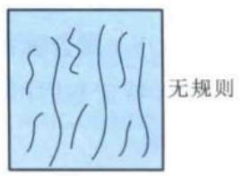  
超大分子，不能有效地被一般电泳分离

  
a、b表示每次电泳的不同方向，c为DNA分子的最终移动方向

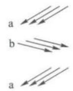  
应用脉冲电场技术,可分离高达 $10^{7}$ bp的DNA分子  
图 5-6 DNA 脉冲电场凝胶电泳示意图

## 5.2.3 聚合酶链式反应技术

聚合酶链式反应(polymerase chain reaction, PCR)技术是目前体外快速扩增特定基因片段最常用的方法。20世纪80年代，美国Cetus公司的Kary Mullis发明了该技术。

PCR 技术的原理并不复杂。首先将模板 DNA(质粒、基因组 DNA 或 mRNA 反转录产生的 cDNA) 在临近沸点的温度下加热分离成单链 DNA 分子, 然后 DNA 聚合酶在一对引物 (一小段单链 DNA) 的引导下以单链 DNA 为模板并利用反应混合物中的 4 种脱氧核苷三磷酸(dNTP) 合成新的 DNA 互补链(图 5-7)。DNA 聚合酶是一种天然产生的能催化 DNA(包括 RNA) 合成和修复的生物大分子。所有生物体基因组的准确复制都依赖于这类酶的活性。PCR 反应中使用的 DNA 聚合酶不同于一般的聚合酶, 它具有很强的耐高温性, 在高温下数小时不丧失酶活性。DNA 聚合酶开始工作时先要产生一小段双链 DNA 来启动(“引

  
图 5-7 聚合酶链式反应(PCR)技术原理示意图

图5-8 PCR指数扩增时循环次数与DNA产物量比较

<table><tr><td>1</td><td>2</td></tr><tr><td>2</td><td>4</td></tr><tr><td>3</td><td>8</td></tr><tr><td>4</td><td>16</td></tr><tr><td>5</td><td>32</td></tr><tr><td>6</td><td>64</td></tr><tr><td>7</td><td>128</td></tr><tr><td>8</td><td>256</td></tr><tr><td>9</td><td>512</td></tr><tr><td>10</td><td>1 024</td></tr><tr><td>11</td><td>2 048</td></tr><tr><td>12</td><td>4 096</td></tr><tr><td>13</td><td>8 192</td></tr><tr><td>14</td><td>16 384</td></tr><tr><td>15</td><td>32 788</td></tr><tr><td>16</td><td>65 536</td></tr><tr><td>17</td><td>131 072</td></tr><tr><td>18</td><td>262 144</td></tr><tr><td>19</td><td>524 288</td></tr><tr><td>20</td><td>1 048 576</td></tr><tr><td>21</td><td>2 097 152</td></tr><tr><td>22</td><td>4 194 304</td></tr><tr><td>23</td><td>8 388 608</td></tr><tr><td>24</td><td>16 777 216</td></tr><tr><td>25</td><td>33 554 432</td></tr><tr><td>26</td><td>67 108 864</td></tr><tr><td>27</td><td>134 217 728</td></tr><tr><td>28</td><td>268 435 456</td></tr><tr><td>29</td><td>536 870 912</td></tr><tr><td>30</td><td>1 073 741 824</td></tr><tr><td>周期</td><td>拷贝</td></tr></table>

导”)新链的合成,这一小段引导新链合成的 DNA 序列就被称为“引物”,引导 DNA 聚合酶特异性扩增目标基因片段。所以,通过设计特定基因两端的引物序列,即可实现对目标基因的扩增。

做 PCR 时, 只要在试管内加入模板 DNA、引物、dNTP 及缓冲液(酶催化反应的缓冲液), DNA 聚合酶就能在数小时内将目标序列扩增 100 万倍以上。模板 DNA 分子首先在高温下解开成单链, 适当降温后引物立即与该模板 DNA 特定序列相结合, 产生双链区, DNA 聚合酶从引物 3' 端开始复制其互补链, 迅速产生与目标序列完全相同的拷贝。在后续反应中, 所有新形成的 DNA 双链, 都会在高温下解开成单链, 体系中的引物分子再次与其互补序列相结合, DNA 聚合酶也再度复制模板 DNA。由于在 PCR 反应中所选用的一对引物, 是按照与扩增区段两端序列彼此互补的原则设计的, 因此, 每一条新生链的合成都是从引物的退火结合位点开始并朝相反方向延伸的, 每一条新合成的 DNA 链上都具有新的引物结合位点。整个 PCR 反应的全过程, 即 DNA 解链(变性)、引物与模板 DNA 相结合(退火)、

DNA 合成(链的延伸)3 步, 可以被不断重复。经多次循环之后, 反应混合物中所含有的双链 DNA 分子数, 即两条引物结合位点之间的 DNA 区段的拷贝数, 理论上的最高值应是 $2^{n}$ (图 5-8), 能满足进一步遗传分析的需要。

## 5.2.4 重组载体构建

要完成对目的基因的功能研究,首先要获取它的重组表达载体,而第一步则是引物设计。引物长度一般为18\~27 bp,GC含量控制在40%\~60%, $T_{m}$ 值在60℃左右。两个DNA引物的5'端还需要各加上一个外切核酸酶的识别位点及其保护碱基,以利于外切核酸酶稳定结合到DNA双链并发挥切割作用,而所选择的外切核酸酶必须与载体上的多克隆位点相匹配(图5-9a)。

引物合成后,选择合适的 DNA 聚合酶和模板 DNA,用 PCR 扩增目的基因片段(图 5-9b)。通过琼脂糖凝胶电泳检测目标条带是否符合预期,如果条带单一,只需要将 PCR 产物通过硅胶膜纯化柱进行纯化就可以了;若条带不单一,还需要在电泳后,在紫外灯下对目标条带进行割胶回收,溶胶后同样用硅胶膜纯化柱纯化。

用相同的外切核酸酶在适当温度下分别双酶切目的基因片段和载体 DNA $^{(图 5-9c)}$ 。根据所加 DNA 总量，确定酶切 10 min 至数小时，保证酶切完全。用 T4 DNA 连接酶进行连接反应 $^{(图 5-9d)}$ ，根据插入目的基因片段与载体各自的 DNA 浓度及片段长度的不同，一次连接反应需要投入的插入片段与载体 DNA 总量的摩尔比应控制在 $(8 \sim 10)$ : 1 时较有利于连接反应的进行。连接温度为 $22^{\circ}C$ 时，T4 DNA 连接酶的活性较高，1 \~ 2 h 即可完成连接，但酶较易失活，连接不稳定； $4^{\circ}C$ 或 $16^{\circ}C$ 连接时，酶的活性维持时间较长，连接后更稳定，但通常需要反应 8 h 以上。

图 5-9 常规重组载体的构建示意图  
  
(a) 合成目的基因片段两端的引物；(b) PCR 扩增目的基因；(c) 对目的基因和质粒载体进行双酶切；(d) T4 DNA 连接酶将酶切后目的基因和质粒载体连接成一个整体。

近几年,一种称为恒温一步法且不依赖 T4 DNA 连接酶的克隆技术已得到广泛应用。首先将载体线性化,通过引物设计在插入片段两端引入线性化载体的末端序列 (15\~25 bp), PCR 扩增插入片段后,其两端具有与线性化载体末端相同的序列。然后,按一定比例加入插入片段和线性化载体,再加入 dNTP,在 T5 外切核酸酶、DNA 聚合酶和 Taq DNA 连接酶的混合催化下,50℃恒温反应 15\~30 min 即可完成连接反应(图 5-10)。

由于连接成功的重组载体数量有限,远远不能满足实验需求,有必要通过细菌转化以获得大量重组载体的拷贝(图5-11a)。大肠杆菌在 $CaCl_{2}$ 溶液处理后,细胞膨胀,细胞膜通透

## 图 5-10 恒温一步法构建重组载体示意图

对载体进行双酶切，使其线性化，在插入片段两端引入与线性化载体末端一致的序列。线性化载体和插入片段在一种混合酶的催化下，50℃恒温反应15\~30 min即可完成连接反应。首先T5外切核酸酶消化DNA片段5'端产生单链突出部分，插入片段和线性化载体末端重新退火成双链，然后DNA聚合酶填补退火双链两边的缺口，Taq DNA连接酶将缝隙黏合，完成连接反应。

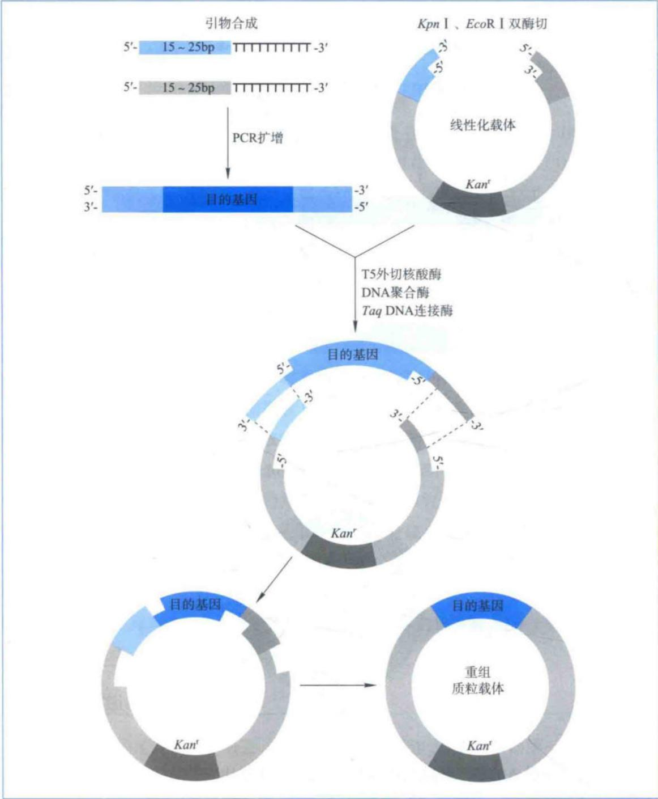

性发生改变,易于吸附外源 DNA,这种状态的细胞被称作感受态细胞。将连接产物与感受态细胞在试管中混匀,于冰上静置 30 min,然后转移到 42℃热刺激 30\~90 s,此时连接产物就可能被感受态细胞吸收。再将其置于 37℃摇床复苏约 1 h,然后均匀地涂布在含有抗生素的培养基上,37℃培养箱中倒置培养(图 5-11b)。因为连接产物,即重组后的质粒载体上带有抗性基因和表达元件,进入大肠杆菌后所产生的蛋白质能降解被大肠杆菌细胞吸收的抗生素,从而使重组大肠杆菌细胞能够在培养基中存活下来。

过夜培养后培养基上应该长出很多单菌落，随机挑取部分菌落，用菌内的重组质粒做DNA模板，进行菌落PCR（colony PCR）扩增，鉴定目的基因片段是否插入载体中(图5-11c)。挑取阳性菌落于液体培养基中37℃培养10\~13h，而后采用碱裂解法提取细菌中的质粒

DNA。在强碱性溶液中裂解菌体,释放质粒 DNA,然后用酸中和反应,离心收集上清液后,通过硅胶膜纯化柱纯化出质粒 DNA(图 5-11d),经酶切鉴定和测序确定序列无误后用于进一步的实验。

图 5-11 细菌转化及重组质粒提取示意图

(a) 将重组后的质粒载体转化到大肠杆菌中；(b) 过夜培养大肠杆菌，让重组质粒拷贝数增加；(c) 鉴定出含有重组质粒的单菌落；(d) 裂解菌体，获取重组质粒载体。