是维持在低水平,这就保证了细菌在遇到乳糖时能够很快产生足够的诱导物来解除阻遏状态。

## 3. 核糖开关

有些 mRNA 还含有一种名为核糖开关(riboswitch)的表达调控元件。核糖开关是一段具有复杂结构的 RNA 序列，在原核生物中通常位于 mRNA 的 5' UTR 区域。与其他调控元件不同，核糖开关能够感受细胞内诸如代谢物浓度、离子浓度、温度等的变化而改变自身的二级结构和调控功能，从而改变基因的表达状态。核糖开关可能通过影响转录的起始、延伸和终止，或者通过控制核糖体与 mRNA 的结合，或者通过调节 mRNA 的稳定性来调控基因表达。在真核生物中，核糖开关还会通过控制 mRNA 的剪接来调控基因表达。

在枯草杆菌(Bacillus subtilis)中,许多参与甲硫氨酸途径的基因在5' UTR有一段大约200 bp的RNA被认为是SAM感受型核糖开关(SAM-sensing riboswitch)。在一些基因中,如图7-42(a),核糖开关在没有结合SAM时,RNA的二级结构使得核糖体结合位点(RBS)被暴露在外,核糖体结合到mRNA上开始翻译蛋白质;而一旦结合了SAM,核糖开关的二级结构发生改变,与核糖体相结合的RBS位点被封闭,蛋白质翻译就被抑制。而在另一些基因中,SAM感受型核糖开关一旦结合了SAM,就会在编码区上游产生转录终止的构象,提前终止转录(图7-42(b))。

枯草杆菌的 glmS 基因编码一种合成葡糖胺 -6- 磷酸 (glucosamine-6-phosphate, GlcN6P) 的酶, 在 glmS mRNA 的 5' UTR 序列中有一段核酶 (ribozyme) 结构。没有 GlcN6P 结合该核酶时, glmS mRNA 可以正常翻译出蛋白质; 而当翻译得到的酶催化 GlcN6P 合成反应,提高了细胞中 GlcN6P 的浓度时,GlcN6P 就与核酶相结合,有活性的核酶会切割 glmS mRNA,阻止蛋白质翻译(图 7-43)。

图 7-42 SAM 感受型核糖开关  
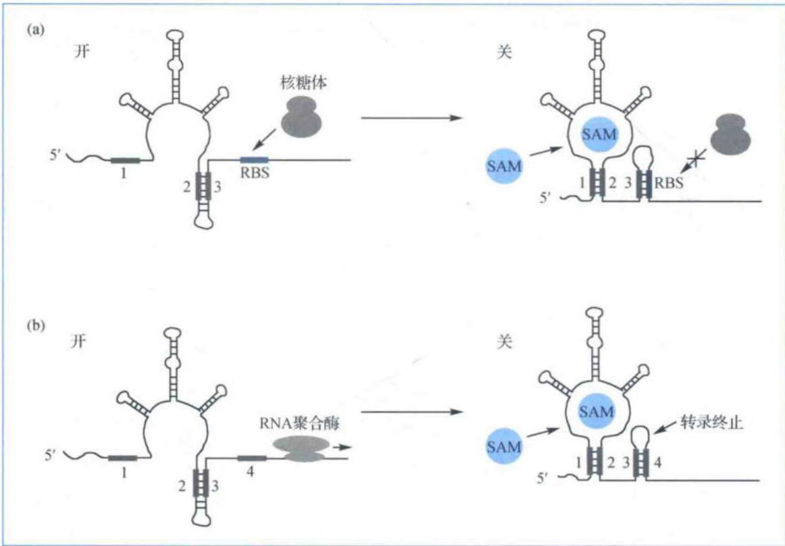

  
图 7-43 核酶型核糖开关

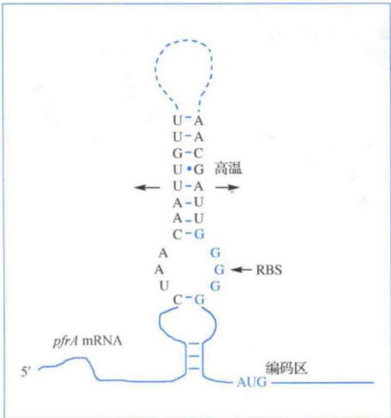  
图7-44 热敏型核糖开关

有些核糖开关不受代谢物调节,但受到其他因素的影响。如单核增生性李斯特菌(Listeria monocytogenes) pfrA 基因的 5' UTR 有一段被称为热敏 RNA(thermosensor RNA) 的发夹结构封闭了 RBS 位点。当温度由 30℃ 升高到 37℃ 时,发夹结构会打开释放出 RBS 位点,使 pfrA 基因的表达水平提高 5 倍(图 7-44)。

## 7.7.2 mRNA 稳定性对转录水平的影响

所有细胞都有一系列核酸酶,用来清除无用的 mRNA。一个典型的细菌 mRNA 半衰期为 2\~3 min。mRNA 分子被降解的可能性取决于它们的二级结构。大肠杆菌有一个 CsrAB 调节系统。CsrA 为一个 RNA 结合蛋白,CsrB 是一个非编码的 RNA 分子。CsrA 可以结合到受其调控的 mRNA 上,也可以与 CsrB 的 RNA 分子相结合。每个 CsrB RNA 分子最多可结合 18 个 CsrA 蛋白。

在静止期细菌细胞内,糖以糖原的形式被储藏起来;在细胞快速生长周期,通过糖酵解途径消耗糖,这两个过程的平衡就是由 CsrAB 调节系统来完成的。CsrA 蛋白可激活糖酵解过程并抑制葡萄糖和糖原的合成。在糖原合成途径中,如果 CsrA 蛋白结合到 glg 基因的 mRNA 分子上,该 mRNA 分子就易于受核酸酶攻击,其降解过程加快,其作为蛋白质合成模板的功能就受到抑制(图 7-45)。

## 7.7.3 调节蛋白的调控作用

细菌中有些 mRNA 结合蛋白可激活靶基因的翻译。大肠杆菌 BipA 蛋白就具有依赖

图7-45 CsrA蛋白调控glg mRNA的稳定性  
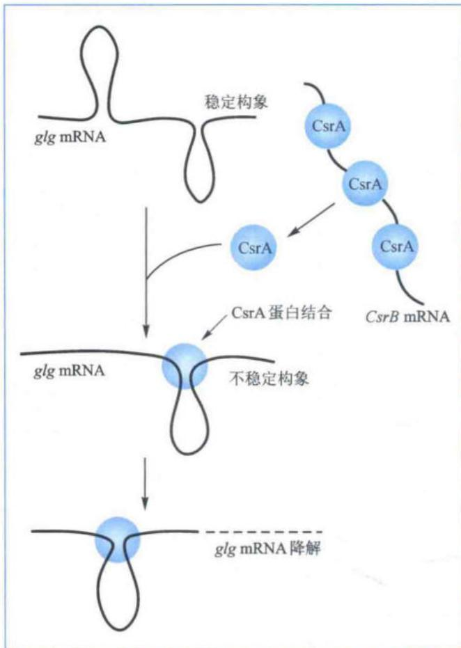

于核糖体的 GTP 酶活性,能够激活转录调控蛋白基因 fis mRNA 的翻译,是 fis 蛋白质合成所必需的。

相反，mRNA特异性抑制蛋白则通过与核糖体竞争性结合mRNA分子来抑制翻译的起始。大肠杆菌中核糖体蛋白就存在翻译抑制现象。rRNA基因正常转录和翻译，产生核糖体蛋白，由于这些蛋白质与rRNA分子的亲和力较强，只要细胞中有足够的rRNA分子，核糖体蛋白就不会结合到自身mRNA分子上。当细胞中缺乏足够的rRNA分子时，核糖体蛋白只能结合到自身mRNA分子上，导致该mRNA的RBS位点被封闭，蛋白质合成停止(图7-46)。这种机制保证了rRNA和核糖体蛋白在数量上的平衡。

图 7-46 核糖体蛋白对自身 mRNA 翻译的抑制作用  


## 7.7.4 小RNA的调节作用

RNA 调节是原核生物基因表达转录后调节的另一种重要机制。细菌响应环境压力(氧化压力、渗透压、温度等)的改变,会产生一些长度在 50\~500 nt 之间的非编码小 RNA 分子。这些小RNA能结合mRNA或蛋白质，通过改变靶mRNA的稳定性，影响蛋白质-RNA的结合或者mRNA的翻译来调节基因表达。原核细胞中的非编码RNA称为非编码小RNA（small non-coding RNA）即sRNA。原核生物sRNA以反式编码sRNA为主，并且大部分都需要RNA分子伴侣Hfq蛋白的协助来发挥作用，主要是通过不严格的碱基互补配对与靶mRNA结合，抑制或促进靶mRNA的翻译，加速或减缓靶mRNA的降解。

细菌铁蛋白用来储存细胞中过剩的铁离子。bfr基因编码细菌铁蛋白，而anti-bfr基因编码反义RNA。培养基中铁离子浓度较低时，不需要细菌铁蛋白；当铁离子浓度升高时，就需要细菌铁蛋白行使功能。然而，细胞中无论铁离子浓度高低，bfr基因都正常转录成mRNA，而anti-bfr基因的转录却受到能够感应铁离子浓度变化的Fur蛋白的调控。细胞中铁离子过多时，Fur蛋白作为抑制因子起作用，关掉与铁摄取有关的众多操纵子，包括anti-brf基因的表达，使bfr基因能正常翻译出细菌铁蛋白，储存过剩的铁离子。在铁离子浓度低时，anti-bfr基因转录产生大量反义RNA，与bfr mRNA配对，阻止细菌铁蛋白基因的翻译(图7-47)。

此外，大肠杆菌中受氧化压力诱导产生的OxyS和受低温诱导产生的DsrA基因也可以反式编码sRNA的方式调控多个基因的翻译。OxyS可以与fhlA（编码细菌甲酸盐代谢中的转录激活蛋白)mRNA的核糖体结合位点的部分序列配对，也可以与fhlA编码序列中的特定序列配对，阻止核糖体的结合从而抑制fhlAmRNA的翻译。DsrA可以通过促进编码胁迫相关 $\sigma$ 因子rpoS基因的翻译和克服类核相关的H-NS蛋白的转录沉默来调节转录和翻译。在大肠杆菌中，DsrA主要有两种形式，一种是全长转录形式(full-length transcript, Fform)，一种是被截短的转录形式(truncated transcript, Tform)，这两种形式的比例会随着温度的变化而存在差异。当温度较低时候，DsrA以F形式为主。DsrARNA具有3个茎-环，其第一个茎-环结构具有85个核苷酸，对于rpoS的翻译是必须的，而对于抗H-NS活性则是不必要的而第二个茎-环对于抗沉默是必需的。第三个茎-环结构为转录终止子，可被trp转录终止子取代而不丧失DsrA功能。DsrA的第一个茎-环区域可以借助Hfq蛋白与rpoSmRNA的前导序列互补配对，导破坏了rpoSmRNA核糖体结

  
图7-47 反义RNA对bfr基因翻译的抑制作用

图 7-48 反式编码 sRNA 结合在靶 mRNA 的茎 - 环结构上, 使茎 - 环结构打开, 促进靶 mRNA 翻译


合位点序列处的茎-环结构,释放核糖体结合位点,激活mRNA的翻译(图7-48),促进σ因子的表达,这表明DsrA与rpoS mRNA的配对可能对于翻译调控是重要的。通过核磁共振研究DsrA和DsrA/rpoS复合物的结构,发现sRNA含有第二个茎-环的动态构象平衡,这可能是DsrA调节其多个靶mRNA翻译的重要机制。

## 7.7.5 稀有密码子对翻译的影响

在大肠杆菌 DNA 复制时,冈崎片段之前的 RNA 引物是由 dnaG 基因编码的引物酶催化合成的,细胞对这种酶的需求量不大,而引物酶过多对细胞是有害的。已知 dnaG、rpoD 和 rpsU(30S 核糖体上的 S21 蛋白)属于大肠杆菌基因组上的同一个操纵子,而这 3 个基因产物在数量上却大不相同,每个细胞内仅有 50 个拷贝的 dnaG 蛋白,却有 2800 个拷贝的 rpoD 蛋白,更有高达 40000 个拷贝的 rpsU 蛋白。细胞通过翻译调控,解决了这个问题。

研究 dnaG 序列发现其中含有不少稀有密码子。分别计算大肠杆菌中 25 种结构蛋白和 dnaG、rpoD 序列中 64 种密码子的利用频率，可以看出 dnaG 与其他两类有明显不同(表 7-7)。很明显，稀有密码子 AUA 在高效表达的结构蛋白及 σ 因子中均极少使用，而在表达要求较低的 dnaG 蛋白中使用频率就相当高。此外，UCG(Ser)、CCU(Pro)、CCC(Pro)、ACG(Thr)、CAA(Gln)、AAU(Asn) 和 AGG(Arg) 等 7 个密码子的使用频率在不同蛋白质中也有明显差异。

表 7-7 几种蛋白质中异亮氨酸密码子使用频率比较

<table><tr><td>蛋白质</td><td>AUU/%</td><td>AUC/%</td><td>AUA/%</td></tr><tr><td>结构蛋白</td><td>37</td><td>62</td><td>1</td></tr><tr><td>σ亚基</td><td>26</td><td>74</td><td>0</td></tr><tr><td>dnaG蛋白</td><td>36</td><td>32</td><td>32</td></tr></table>

许多调控蛋白如 LacI、AraC、TrpR 等在细胞内含量也很低, 这些蛋白质的编码基因中密码子的使用频率和 dnaG 相似, 而明显不同于结构蛋白。科学家认为, 由于细胞内对应于稀有密码子的 tRNA 较少, 高频率使用这些密码子的基因翻译过程容易受阻, 影响了蛋白质合成的总量。

## 7.7.6 重叠基因对翻译的影响

重叠基因最早在大肠杆菌噬菌体 $\Phi X174$ 中发现，例如 $B$ 基因包含在 $A$ 基因内， $E$ 基因包含在 $D$ 基因内，用不同的阅读方式得到不同的蛋白质。当时认为重叠基因的生物学意义是它可以包含更多的遗传信息，后来发现丝状RNA噬菌体、线粒体DNA和细菌染色体上都有重叠基因存在，暗示这一现象可能对基因表达调控有影响。现用trp操纵子中的trpE基因和trpD基因之间的翻译耦联现象来说明这个问题。

trp 操纵子由 5 个基因 (trpE、D、C、B、A) 组成, 在正常情况下, 操纵子中 5 个基因产物是等量的, 但 trpE 突变后, 其邻近的 trpD 产量比下游的 trpBA 产量要低得多。研究 trpE 和 trpD 以及 trpB 和 trpA 两对基因中核苷酸序列与翻译耦联的关系, 发现 trpE 基因的终止密码子和 trpD 基因的起始密码子共用一个核苷酸。

$$
t r p E — — \text { 苏氨酸 } — — \text { 苯丙氨酸 } — — \text { 终止 }
$$

$$
\mathrm{ACU} - \mathrm{UUC} - \mathrm{UGA} \text { u   g   g   c   u }
$$

$$
\mathrm{AUG} — — \mathrm{GCU}
$$

$$
\text {   甲硫氨酸——丙氨酸——trpD   }
$$

由于 trpE 的终止密码子与 trpD 的起始密码重叠, trpE 翻译终止时核糖体立即处在起始环境中, 这种重叠的密码保证了同一核糖体对两个连续基因进行翻译的机制。实验证明, 耦联翻译可能是保证两个基因产物在数量上相等的重要手段。除了上述 trpE 和 trpD 基因之外, trpB 和 trpA 基因也存在着翻译耦联现象, 因为这两个基因的产物等量存在于细胞中, 而其核苷酸序列同样是重叠的。

$$
t r p B — — \text { 谷氨酸 } — — \text { 异亮氨酸 } — — \text { 终止 }
$$

$$
\mathrm{GAA} - \mathrm{AUC} - \mathrm{UGAuggaa}
$$

$$
\mathrm{AUG} - \mathrm{GAA}
$$

$$
\text {   甲硫氨酸——谷氨酸——trpA   }
$$

此外,大肠杆菌 gal 操纵子(galETK)中也存在着一种基因重叠现象。galT 的终止密码子虽然与 galK 的起始密码子相隔 3 个核苷酸,galK 基因的 SD 序列却位于 galT 基因终止密码子之前,尽管这一现象与前述耦联翻译并不完全相同,但因为核糖体结合在 mRNA 上,可以覆盖 20 个核苷酸,包括 SD 序列和 galK 基因的起始密码子,所以当 galT 翻译终止时,核糖体还没有脱落就直接与 SD 序列结合,开始 galK 的翻译,也能保证两个基因的等量翻译,这也是一种翻译耦联。

## 7.7.7 翻译的阻遏

蛋白质阻遏或激活基因转录的例子已经屡见不鲜,那么,蛋白质是否也能对翻译起类似的调控作用呢?在大肠杆菌 RNA 噬菌体 Qβ 中发现了这种现象。Qβ 噬菌体基因组包含有 3 个基因,从 5' 到 3' 方向依次是与噬菌体组装和吸附有关的成熟蛋白基因 A、外壳蛋白基因和 RNA 复制酶基因。当噬菌体感染细菌,RNA 进入细胞后,这条称为 (+)链的 RNA 立即作为模板指导合成复制酶,并与宿主中已有的亚基结合行使复制功能。但是,Qβ(+)RNA 链上此时已有不少核糖体,它们从 5' 向 3' 方向进行翻译,这无疑影响了复制酶催化的从 3' 向 5' 方向进行的(-)链合成。克服这个矛盾的办法便是由 Qβ 复制酶作为翻译阻遏物进行调节。

体外实验证明,纯化的复制酶可以和外壳蛋白的翻译起始区结合,抑制蛋白质的合成。由于复制酶的存在,核糖体便不能与起始区结合,但已经起始的翻译仍能继续下去,直到翻译完毕,核糖体脱落,与(+)RNA 3'端结合的复制酶便开始了RNA的复制。这里复制酶既能与外壳蛋白的翻译起始区结合,又能与(+)链RNA的3'端结合。序列分析表明,这两个位点上都有CUUUUAAA序列,能形成稳定的茎-环结构,具备翻译阻遏特征。

## 7.7.8 魔斑核苷酸水平对翻译的影响

实验证明,核糖体蛋白(R 蛋白)通过反馈阻遏作用保证所有 R 蛋白合成的协同进行。那么,细胞如何保证蛋白质合成的总速度与蛋白质合成机器主要成分 rRNA 的合成速率相一致,保证在不进行蛋白质合成时没有 RNA 的合成?起这个调控作用的最早信号是不载有氨基酸的 tRNA。

大肠杆菌营养缺陷型 $(trp^{-}his^{-})$ 在缺少任何一种必需氨基酸的培养基上生长时,不但蛋白质合成速度立即下降,RNA合成速度也下降。由于色氨酸和组氨酸不是RNA的前体,因此认为RNA合成速度下降是蛋白质合成受阻后的次级反应。研究另一个大肠杆菌突变株发现,当氨基酸供应不足时,这个突变株细胞内蛋白质合成虽然停止了,但RNA的合成速度却没有下降。科学上把前一种现象称为严紧控制(基因型 $rel^{+}$ );后一种现象称为松散控制(基因型 $rel^{-}$ )。

$rel^{+}$ 和 $rel^{-}$ 菌株除上述生理现象不同之外，缺乏氨基酸时 $rel^{+}$ 菌株能合成鸟苷四磷酸（ppGpp）和鸟苷五磷酸（pppGpp）， $rel^{-}$ 菌株则不能合成鸟苷酸。因为这两种化合物是在层析谱上检出的斑点，当时称为魔斑（magic spot）。在旺盛生长的细胞中有65%\~90%的tRNA是载有氨基酸的。当氨基酸缺乏时，不负载氨基酸的tRNA增多，这种不负载氨基酸的tRNA仍能与核糖体的A位结合，核糖体上不负载氨基酸的tRNA是细胞产生严紧控制的信号。在正常的蛋白质合成过程中，将AA-tRNA运转到正在延伸的多肽上需要GTP，也许由于这一反应的停止，大量GTP便被用作合成魔斑核苷酸的前体(图7-49)。

参与这个反应的除 relA 基因所编码的 ATP-GTP 3' 焦磷酸转移酶外, 还需要翻译起始因子 EFTu 和 EFG 等。当细菌的生存条件恢复时, 一种名为 spoT 的基因编码降解 (p)

ppGpp 的酶,因此应急反应随着(p) ppGpp 的消失很快逆转。ppGpp 是多效性的,它的主要作用除了影响 RNA 聚合酶与启动子结合的专一性外,还可以影响核糖体蛋白

  
图7-49 ppGpp的合成及降解

的活性,从而成为细胞内严紧控制的关键。有人将 ppGpp 和 cAMP 这类物质称为警报素 (alarmone)。在细胞较好的营养状况下,胞内 ppGpp 水平较低,IF2 介导的翻译起始能够顺利进行;当细胞营养状况较差,缺乏氨基酸时,胞内的 ppGpp 水平大大提高,抑制了细胞因子 IF2 介导的翻译起始步骤,使得没有进入翻译起始的 70S 核糖体单体大大增加,造成活性核糖体比例降低(图 7-50),可在很大范围内做出如抑制核糖体和其他大分子合成等应急反应,活化某些氨基酸操纵子的转录表达,抑制与氨基酸运转无关的系统,活化蛋白水解酶等,以节省或开发能源,渡过难关。

图 7-50 活性核糖体调控模型  
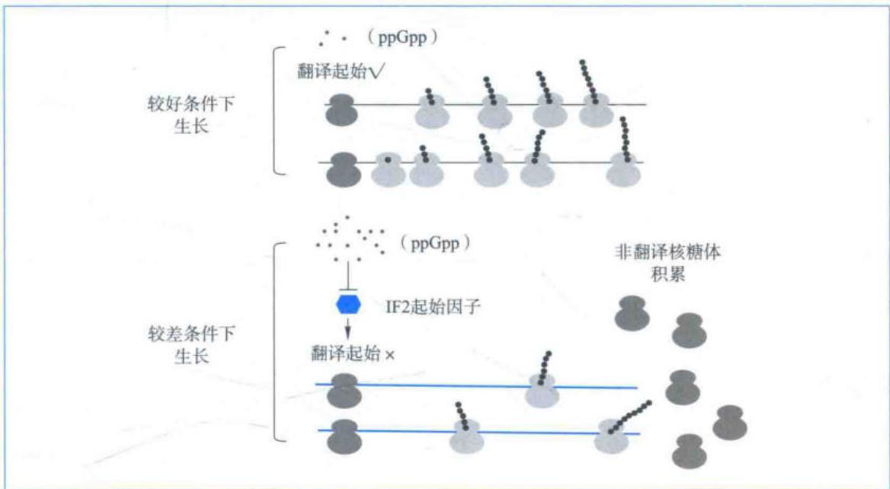

## 思考题

1. 简述代谢物对基因表达调控的两种方式。

2. 什么是操纵子学说？

3. 简述乳糖操纵子的调控模型。

4. 什么是葡萄糖效应？

5. 什么是弱化作用？

6. 简述抗终止因子的调控机制。

7. 简述反义 RNA 的调控机制。

8. 简述原核基因转录后调控的不同方式。

9. 简述 ppGpp 是如何参与细菌的应急反应。

10. 什么是 $\sigma$ 因子，简述 $\sigma$ 因子在原核基因调控中的作用。

## 参考文献

1. Bae B, Davis E, Brown D, et al. Phage T7 Gp2 inhibition of Escherichia coli RNA polymerase involves misappropriation of $\sigma70$ domain 1.1. Proceedings of the National Academy of Sciences of the United States of America, 2013, 110: 19772–19777.

2. Dai X, Zhu M, Warren M, et al. Reduction of translating ribosomes enables Escherichia coli to maintain elongation rates during slow growth. Nature Microbiology, 2016, 2, 16231.

3. Fouqueau T, Blombach F, Werner F. Evolutionary origins of two-barrel RNA polymerases and site-specific transcription initiation. Annual Review of Microbiology, 2017, 71.

4. Groisman E A. Feedback control of two-component regulatory systems. Annual Review of Microbiology, 2016, 70: 103–124.

5. Hoch J A. A Life in Bacillus subtilis signal transduction. Annual Review of Microbiology, 2017, 71:1.

6. Jastrab J B, Darwin, K H. Bacterial proteasomes. Annual Review of Microbiology, 2015, 69: 109.

7. Martinezpastor M, Tonner P D, Darnell C L, et al. Transcriptional regulation in Archaea: from individual genes to global regulatory networks. Annual Review of Genetics, 2017, 51: 143.

8. Mettert E L, Kiley P J. How is Fe-S cluster formation regulated? Annual Review of Microbiology, 2015, 69:505.

9. Narula J, Tiwari A, Igoshin O A. Role of autoregulation and relative synthesis of operon partners in alternative sigma factor networks. Plos Computational Biology, 2016, 12.

10. Quereda J J, Cossart P. Regulating bacterial virulence with RNA. Annual Review of Microbiology, 2017, 71:263-280.

11. Sporer A J, Kahl L J, Price-Whelan A, et al. Redox-based regulation of bacterial development and behavior. Annual Review of Biochemistry, 2016, 86:777-797.

12. Yang Y, Darbari V C, Zhang N, et al. TRANSCRIPTION. Structures of the RNA polymerase- $\sigma$ 54 reveal new and conserved regulatory strategies. Science, 2015, 349:882–885.

数字课程学习

e 教学课件

目在线自测

思考题解析

# 真核基因表达调控

8.1 真核基因表达调控相关概念和一般规律

8.2 真核基因表达的转录水平调控

8.3 真核基因表达的染色质修饰和表观遗传调控

8.4 非编码 RNA 对真核基因表达的调控

8.5 真核基因其他水平上的表达调控

## 8.1 真核基因表达调控相关概念和一般规律

## 8.1.1 真核基因表达的基本概念

一个细胞或病毒所携带的全部遗传信息或整套基因即基因组(genome)，它包括每一条染色体和所有亚细胞器的DNA序列信息。基因(gene)则是指能产生一条肽链或功能RNA所必需的DNA片段。它包括编码区和其上下游区域，以及在编码片段间(外显子)的间断切割序列(内含子)。基因经过转录、翻译，产生具有特异生物学功能的蛋白质分子或RNA分子的过程称为基因表达(gene expression)。基因表达是受内源及外源信号调控的。这个调控的过程称为基因表达调控(gene regulation or regulation of gene expression)。

## 8.1.2 真核基因的断裂结构

## 1. 外显子与内含子

Gilbert 第一个用 “intron” 来描述存在于原始转录产物或基因组 DNA 中, 但不包括在成熟 mRNA、rRNA 或 tRNA 中的那部分核苷酸序列。现已查明, 大多数真核基因都是由蛋白质编码序列和非蛋白质编码序列两部分组成的 (表 8-1)。编码序列称为外显子 (exon), 非编码序列称为内含子 (intron)。在一个结构基因中, 编码某一蛋白质不同区域的各个外显子并不连续排列在一起, 而常常被长度不等的内含子所隔离, 形成镶嵌排列的断裂方式。所以, 真核基因有时被称为断裂基因 (interrupted gene)。不同基因拥有数量和大小都不同的内含子, 如胶原蛋白基因长约 40 kb, 至少有 40 个内含子, 其中短的只有 50 bp, 长的可达到 2000 bp。

表 8-1 不同真核生物基因的平均长度及单个基因平均拥有外显子数量比较

<table><tr><td>物种</td><td>外显子数 / 基因</td><td>核基因平均长度 /kb</td><td>mRNA 平均长度 /kb</td></tr><tr><td>酵母</td><td>1</td><td>1.6</td><td>1.6</td></tr><tr><td>真菌</td><td>3</td><td>1.5</td><td>1.5</td></tr><tr><td>线虫</td><td>4</td><td>4.0</td><td>3.0</td></tr><tr><td>果蝇</td><td>4</td><td>11.3</td><td>2.7</td></tr><tr><td>鸡</td><td>9</td><td>13.9</td><td>2.4</td></tr><tr><td>哺乳类</td><td>7</td><td>16.6</td><td>2.2</td></tr></table>

许多情况下,高等真核基因核 DNA 序列中对应于外显子的部分可能还不到 10%。图 8-1 是哺乳动物二氢叶酸还原酶基因,全长 25\~31 kb,但其 6 个外显子总长只有 2 kb。

少数基因,如组蛋白及 $\alpha$ 型、 $\beta$ 型干扰素基因,根本不带内含子。目前尚不清楚内含子的生理功能。在某些基因中,完全除去内含子以后,照样可以产生有活性的 mRNA;而另一些基因,如 SV40 T 抗原基因,一旦除去内含子,成熟 mRNA 运入细胞质的过程就完全被阻断。研究发现,只有真核生物具有切除基因中内含子,产生功能型 mRNA 和蛋白质的能力,原核生物一

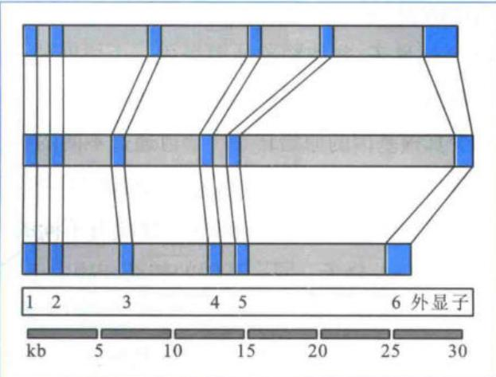  
图 8-1 哺乳动物二氢叶酸还原酶的基因结构

般不具有这种本领。如果要在原核细胞里表达真核基因，必须首先构建切除内含子的重组基因，才有可能得到所研究的蛋白质。

断裂基因的结构形式为某些重要蛋白质的编码区域提供了进行重组的潜在位点,使这些 DNA 序列有充分的机会进行重复和组合,非常有利于真核基因的进化。

## 2. 外显子与内含子的连接区

真核基因断裂结构的另一个重要特点是外显子－内含子连接区(exon-intron junction)的高度保守性和特异性碱基序列。外显子－内含子连接区就是指外显子和内含子的交界或称边界序列，它有两个重要特征：内含子的两端序列之间没有广泛的同源性，因此内含子两端序列不能互补，说明在剪接加工之前，内含子上游序列和下游序列不可能通过碱基配对形成发夹二级结构。外显子－内含子连接区序列虽然很短，但却是高度保守的，因此，该序列可能与剪接机制密切相关，是RNA剪接的信号序列。我们将在转录初级产物的加工这一节中做详细介绍。

序列分析表明,几乎每个内含子5'端起始的两个碱基都是GT,而3'端最后两个碱基总是AG,由于这两个碱基的高度保守性和广泛性,有人把它称为GT-AG法则,即:5'GT……AG 3'。由于内含子两端的序列不同,可定向标明内含子的两个末端,根据剪接加工过程沿内含子自左向右进行的原则,一般将内含子5'端接头序列称为左剪接位点,3'端接头序列称为右剪接位点,有时也将前者称为供体位点(donor site),将后者称为受体位点(acceptor site)。

外显子－内含子连接区的保守序列几乎存在于所有高等真核生物基因中，表明可能存在着共同的剪接加工机制。但是在线粒体基因和酵母 tRNA 基因中不存在这类保守序列，暗示存在着不同类型的加工剪接过程。

## 3. 外显子与内含子的可变调控

在基因转录、加工产生成熟 mRNA 分子时, 内含子通过剪接加工被去掉, 保留在成熟 mRNA 分子中的外显子被拼接在一起, 最终被翻译成蛋白质。因此通过反转录酶的作用, 由成熟 mRNA 产生的 cDNA 分子中, 只含有外显子, 没有内含子。

初级转录产物内含子与外显子边界序列在剪接酶或 RNA 本身的作用下, 发生磷酸二酯键断裂,并产生连接两个外显子的化学键。有些真核基因,如肌红蛋白重链基因虽有41个外显子,却能精确地剪接成一个成熟的mRNA,我们称这种方式为组成型剪接。一个基因的转录产物通过组成型剪接只能产生一种成熟的mRNA,编码一个多肽。但是,有不少真核基因的原始转录产物可通过不同的剪接方式,产生不同的mRNA,并翻译成不同的蛋白质。另外一些核基因由于转录时选择了不同的启动子,或者在转录产物上选择不同的多(A)位点而使初级转录产物具有不同的二级结构,因而影响剪接过程,最终产生不同的mRNA分子。同一基因的转录产物由于不同的剪接方式形成不同mRNA的过程称为选择性剪接。

小鼠淀粉酶基因表达的组织特异性变化就是一个例子(图8-2)。已知在肝和唾液腺中都合成这个酶,由同一个基因编码。在这两种组织中,淀粉酶mRNA的编码序列完全相同,只是5'端起始部分长度不同。它的编码序列起始于第2号外显子,该外显子与其余一系列外显子相连,形成完整的编码序列。不同组织中不编码蛋白质的第一号外显子的序列却不相同。在肝中,mRNA 5'端的161个碱基是由位于第2号外显子转录起始点上游4500碱基对处的L外显子编码的。在唾液腺中,mRNA 5'端的50个碱基是由位于转录起始点上游7300碱基对处的S外显子编码的。这样,L外显子和S外显子分别为淀粉酶mRNA提供了不同的起始序列。事实上,L外显子只是唾液腺淀粉酶基因中内含子序列的一部分,将在mRNA成熟过程中被切除。有实验证明,由S外显子起始的转录产物是由L外显子起始转录产物的100倍以上。由于一个基因的内含子成为另一个基因的外显子,形成基因的差别表达,这是真核基因断裂结构的一个重要特点。

图 8-2 不同外显子的使用导致 $\alpha-$ 淀粉酶基因在不同组织中的表达差异

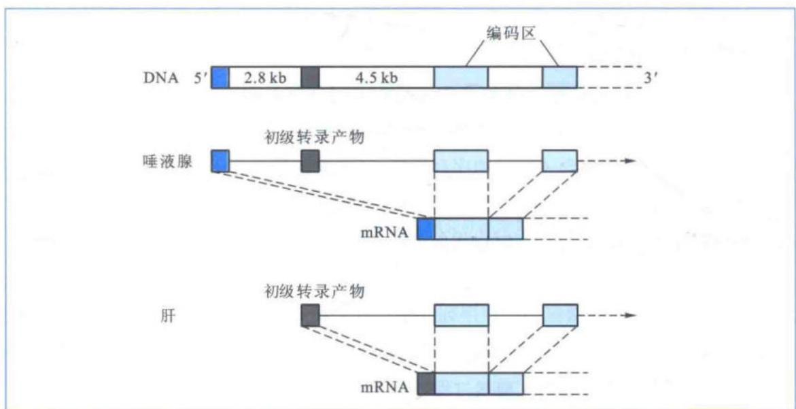

## 8.1.3 基因家族

在原核细胞中,密切相关的基因往往组成操纵子,并且以多顺反子 mRNA 的方式进行转录,整个体系被置于一个启动子的控制之下。真核细胞的 DNA 是单顺反子结构,很


图8-3 细菌中rRNA基因家族各成员的分布与成熟过程分析

少出现置于一个启动子控制之下的操纵子。真核细胞中许多相关的基因常按功能成套组合，被称为基因家族(gene family)。同一家族中的成员有时紧密地排列在一起，成为一个基因簇；更多的时候，它们却分散在同一染色体的不同部位，甚至位于不同的染色体上，具有各自不同的表达调控模式。

## 1. 简单多基因家族

简单多基因家族中的基因一般以串联方式前后相连。在大肠杆菌中，16S、23S和5S rRNA基因联合成一个转录单位，各种rRNA分子都是从这个转录单位上剪切下来的(图8-3)。事实上，细菌中所有rRNA和部分tRNA都来自这个沉降系数为30S（约6500个核苷酸）的前rRNA。初级转录产物首先被特异性甲基化，然后分别经RNaseⅢ、RNaseP和RNaseE在特定位点切开，生成17S rRNA、tRNA、35S rRNA和5S rRNA前体分子，最后由特定核酸酶降解部分非必需序列，得到成熟的16S rRNA、tRNA、23S rRNA和5S rRNA。参与前rRNA降解成熟过程的RNase P是一个核酶。基因组分析表明，大肠杆菌中共有7个这样的拷贝，每一个拷贝中只有tRNA基因的种类、数量和存在部位有些变化。个别拷贝中5S rRNA基因下游还发现了部分共同转录的tRNA基因。

在真核生物中, 前 rRNA 转录产物的沉降系数为 45S (约有 14000 个核苷酸), 包括 18S、28S 和 5.8S 3 个主要 rRNA 分子。前 rRNA 分子中至少有 100 处被甲基化 (主要是核糖的 2-OH 甲基化), 初级转录产物也被特异性 RNA 酶切割降解, 产生成熟 rRNA 分子。这个过程需要 snoRNAs 的参与 (图 8-4)。5S rRNA 作为一个独立的转录单位, 由 RNA 聚合酶 III (而不是聚合酶 I) 完成转录。

## 2. 复杂多基因家族

复杂多基因家族一般由几个相关基因家族构成,基因家族之间由间隔序列隔开,并作为独立的转录单位。现已发现存在不同形式的复杂多基因家族。

我们先来看一下海胆的组蛋白基因家族 $^{(图8-5)}$ 。在这种动物中，5个分别编码不同组

图 8-4 脊椎动物中 rRNA 基因家族主要成员的分布与成熟过程分析蛋白的基因处于一个约为6 000 bp 的片段中, 分别被间隔序列所隔开。这 5 个基因组成的串联单位在整个海胆基因组中可能重复多达 1 000 次。串联单位中的每一个基因分别被转录成单顺反子 RNA, 这些 RNA 都没有内含子, 而且各


基因在同一条 DNA 链上按同一方向转录, 每个基因的转录与翻译速度都受到调节。因为组蛋白只有在适合于染色体复制的情况下才大量合成, 而且所合成的 $H_{2}A$ 、 $H_{2}B$ 、 $H_{3}$ 和 $H_{4}$ 摩尔数相等, $H_{1}$ 的量恰好是前者的一半。这是染色体组蛋白的实际比例。研究还表明, 在一个特定的细胞中, 并不是所有串联的单位都得到转录。胚胎发育的不同阶段或不同组织中, 有不同的串联单位被转录, 暗示可能存在具有不同专一性的组蛋白亚类和发育调控机制。

图8-5 复杂的多基因家族  


果蝇 tRNA 基因家族具有两个海胆组蛋白家族所没有的特点,那就是在基因家族中含有 3 个 tRNA $^{Lys}$ 基因,而且基因家族中的每个基因都单独按各自的方向进行转录。

## 3. 发育调控的复杂多基因家族

血红蛋白是所有动物体内输送分子氧的主要载体,由 $2\alpha2\beta$ 组成的四聚体加上一个血红素辅基(结合铁原子)后形成功能性血红蛋白。已知所有动物物种中血红蛋白基因的基本结构都相同 $^{(图8-6)}$ 。然而,在生物个体发育的不同阶段,却出现几种不同形式的 $\alpha$ 和 $\beta$ 亚基。人 $\alpha$ 珠蛋白基因簇位于 16 号染色体短臂上,约占 30 kb,其中 $\zeta$ 为胚胎期基因 $^{(表8-2)}$ 。β珠蛋白基因簇位于11号染色体短臂上，占50\~60 kb，其中ε为胚胎期基因， $G\gamma$ 和 $A\gamma$ 为胎儿型基因，δ和β为成人期基因 $^{(图8-7)}$ 。

  
图 8-6 珠蛋白基因的基本结构(以人的 $\beta-$ 珠蛋白基因结构为例)

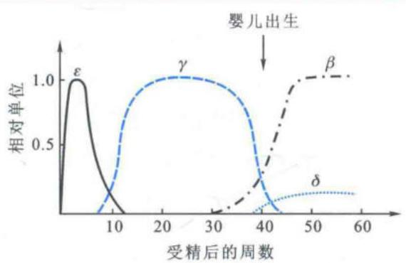  
图 8-7 人体发育过程中不同类型 β-珠蛋白的含量变化

表 8-2 不同发育阶段血红蛋白亚型

<table><tr><td>发育阶段</td><td>组成</td></tr><tr><td>胚胎期(8周以前)</td><td> $\zeta_{2} \varepsilon_{2}$ 、 $\zeta_{2} \gamma_{2}$ 和 $\alpha_{2} \varepsilon_{2}$ </td></tr><tr><td>胎儿期(8~41周)</td><td> $\alpha_{2} \gamma_{2}$ </td></tr><tr><td>成人期(出生以前)</td><td> $\alpha_{2} \delta_{2}$ 和 $\alpha_{2} \beta_{2}$ </td></tr></table>

胚胎期类 $\alpha-$ 珠蛋白, 最先以 $\zeta_{2}$ 型出现, 以后逐渐被 $\zeta_{1}$ 型所取代。在胎儿期有两类等分子数 $\beta$ 型链, 即 G $\gamma$ 型和 A $\gamma$ 型链 (在肽链的同一位点上, 一条链含有甘氨酸, 另一条含有丙氨酸)。因此, 胚胎型血红蛋白中含有两个 $\zeta_{2}$ 型 $\alpha$ 链和两个 $\varepsilon_{2}$ 型 $\beta$ 链 (即 $2\zeta_{2}2\varepsilon_{2}$ )。新生儿出生后, $98\%$ 的血红蛋白中含有两个 $\alpha_{2}$ 亚单位和两个 $\beta$ 亚单位, $2\%$ 的血红蛋白含两个 $\alpha_{2}$ 亚单位和两个 $\delta$ 亚单位。在每个基因家族中, 基因排列的顺序就是它们在发育阶段的表达顺序 (图8-8)。

原始鱼类、海蚕及昆虫只有单个珠蛋白基因，两栖类的 $\alpha$ 和 $\beta$ 基因则紧密地连锁在同一条染色体上，而低等哺乳动物和鸟类的 $\alpha$ 和 $\beta$ 基因有多种亚型，基因家族分别位于不同的染色体上。科学家认为，原始珠蛋白大约产生于 8 亿年前，由单基因编码，现代珠蛋白基因家族是由同一个原始基因通过一系列重复、突变和转位演变而成的。原始生物的体积都很小,虽然只有一个血红蛋白亚基,运氧能力有限,但也能满足生理功能的需要。随着物种的进化,动物体积相对变大,对氧的需求量越来越大,在这一进化压力下,血红蛋白基因通过自发突变产生杂合基因,编码出对氧的结合和释放能力要大大高于单分子血红蛋白的四聚体。在哺乳动物的进化过程中,两条β链基因又发生突变和重复,形成了胎儿中ε和γ型珠蛋白。胎儿血红蛋白对氧的亲和力比成人更大,因而有利于胎儿的快速发育。

  
图 8-8 人细胞中 $\alpha$ 和 $\beta$ -珠蛋白基因簇结构

## 8.1.4 真核基因表达的方式和特点

## 1. 基因表达的方式

根据对刺激的反应模式,可分为组成性表达和选择性表达两大类。

某些基因在个体的所有细胞中持续表达,这些基因通常被称为管家基因(housekeeping gene),其表达模式又被称为组成性基因表达(constitutive gene expression)。管家基因通常具备以下特点:①是细胞结构和代谢过程中所必需的基因,例如编码 rRNA、肌动蛋白、微管蛋白等的基因。②通常能够保持较高的表达量。根据这些特点,实验研究中常把 rRNA、肌动蛋白或微管蛋白基因作为 RT-PCR 的对照。

在特定环境信号刺激下,相应的基因被激活,基因表达产物增加,这种基因称为可诱导基因(inducible gene)。而如果基因被环境信号所被抑制,这种基因就是可阻遏基因(repressible genes)。基因表达调控大多数是对这些基因的转录和翻译速率的调节,从而导致其编码产物的水平发生改变并影响其功能。

## 2. 基因表达的时空特异性

基因表达的时间特异性(temporal specificity)，即按功能需要，某一特定基因的表达严格按特定的时间顺序发生。多细胞生物基因表达的时间特异性又称阶段特异性(stage specificity)。时间特异性基因表达普遍存在于各种生命过程中，例如上一节所提及的人体不同类型珠蛋白基因的表达，就是根据人体发育过程中不同阶段的需要在特定的时段特异表达。

基因表达的空间特异性(spatial specificity)，是指在个体生长过程中，某种基因产物按不同组织空间顺序出现。基因表达伴随时间顺序所表现出的这种分布差异，实际上是由细胞在不同器官的分布所决定的。所以，空间特异性又称细胞或组织特异性(cell or tissue specificity)。空间特异性的基因表达也普遍存在于动植物生长发育的各个阶段，如果蝇胚胎发育中许多调节体节形成的基因表达均呈现出显著的组织特异性。基因表达调控能够维持细胞的增殖、分化，维持个体的生长、发育，有助于生物体更好地适应外界环境变化。

## 8.1.5 真核基因表达调控一般规律

真核生物和原核生物在基因表达调控上的巨大差别是由两者基本生活方式不同所决定的。原核生物一般为自由生活的单细胞，只要环境条件合适，养料供应充分，它们就能无限生长、分裂，因此，它们的调控系统就是要在一个特定的环境中为细胞创造高速生长的基础,或使细胞在受到损伤时,尽快得到修复。它们主要是通过转录调控,以开启或关闭某些基因的表达来适应环境条件(主要是营养水平的变化)。环境因子往往是调控的诱导物,群体中每个细胞对环境变化的反应都是直接和基本一致的。

真核生物(除酵母、藻类和原生动物等单细胞类之外)主要由多细胞组成,每个真核细胞所携带的基因数量及总基因组中蕴藏的遗传信息量都大大高于原核生物,如人类细胞单倍体基因组就包含有 $3\times10^{9}$ bp 总 DNA,约为大肠杆菌总 DNA 的 800 倍,是噬菌体总 DNA 的 10 万倍左右!真核生物基因组 DNA 中有许多重复序列,基因内部还常插入不翻译成蛋白质的序列,都影响了真核基因的表达。真核生物的 DNA 还常与蛋白质(包括组蛋白和非组蛋白)结合,形成十分复杂的染色质结构。染色质构象的变化、染色质中蛋白质的变化及染色质对 DNA 酶敏感程度的变化等都会对基因表达产生重要影响。此外,真核生物染色质被包裹在细胞核内,基因的转录(核内)和翻译(细胞质内)被核膜所隔开,核内 RNA 的合成与转运、细胞质中 RNA 的剪接和加工等无不扩大了真核生物基因调控的范围,使真核生物基因调控达到了原核生物所不可能拥有的深度和广度。对大多数真核细胞来说,基因表达调控的最明显特征是能在特定时间和特定的细胞中激活特定的基因,从而实现“预定”的、有序的、不可逆转的分化、发育过程,并使生物的组织和器官保持正常功能。

真核生物基因调控可分为两大类,第一类是瞬时调控或称可逆性调控,它相当于原核细胞对环境条件变化所做出的反应,包括某种底物或激素水平升降时,或细胞周期不同阶段中酶活性的调节;第二类是发育调控或称不可逆调控,是真核基因调控的精髓部分,它决定了真核细胞生长、分化、发育的全部进程。根据基因调控在同一事件中发生的先后次序,又可将其分为转录水平调控(transcriptional regulation)及转录后水平调控(post-

transcriptional regulation), 前者可以分为遗传水平的 DNA 调控和表观遗传水平的染色质调控, 后者又进一步分为 RNA 加工成熟过程的调控 (RNA processing)、翻译水平的调控 (translational regulation) 及蛋白质加工水平的调控 (protein maturation and processing) 等 (图 8-9)。

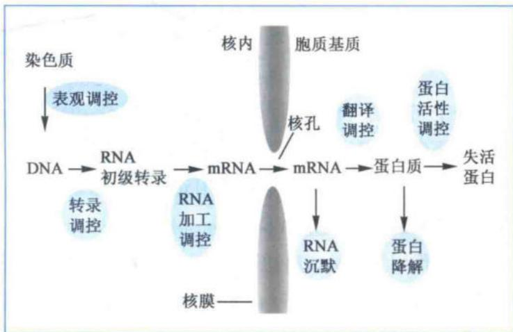  
图8-9 真核基因表达调控的主要步骤

研究基因调控主要回答 3 个问题：

① 什么是诱发基因转录的信号？

② 基因调控主要是在哪一步(模板 DNA 的转录、mRNA 的成熟或蛋白质合成)实现的?

③不同水平基因调控的分子机制是什么？

## 8.2 真核基因表达的转录水平调控

真核细胞与原核细胞在基因转录、翻译及 DNA 的空间结构方面存在如下几个方面的差异：

① 在真核细胞中,一条成熟的 mRNA 链只能翻译出一条多肽链,很少原核生物中常见的多基因操纵子形式。

② 真核细胞 DNA 与组蛋白和大量非组蛋白相结合, 只有一小部分 DNA 是裸露的。

③ 高等真核细胞 DNA 中很大部分是不转录的, 真核细胞中有一部分由几个或几十个碱基组成的 DNA 序列, 在整个基因组中重复几百次甚至上百万次。此外, 大部分真核细胞的基因中间还存在不被翻译的内含子。

④ 真核生物能够有序地根据生长发育阶段的需要进行 DNA 片段重排,还能在需要时增加细胞内某些基因的拷贝数,这种能力在原核生物中也是极为鲜见的。

⑤ 在原核生物中,转录的调节区都很小,大都位于转录起始位点上游不远处,调控蛋白结合到调节位点上可直接促进或抑制 RNA 聚合酶对它的结合。在真核生物中,基因转录的调节区则大得多,它们可能远离核心启动子达几百个甚至上千个碱基对。虽然这些调节区也能与蛋白质结合,但是并不直接影响启动子区对于 RNA 聚合酶的接受程度,而是通过改变整个所控制基因 5' 上游区 DNA 构型来影响它与 RNA 聚合酶的结合能力。

⑥ 真核生物的 RNA 在细胞核中合成, 只有经转运穿过核膜, 到达细胞质后, 才能被翻译成蛋白质。原核生物中不存在这样严格的空间间隔。

⑦ 许多真核生物的基因只有经过复杂的成熟和剪接过程,才能被顺利地翻译成蛋白质。

## 8.2.1 真核基因的一般结构特征

一个完整的真核基因,不但包括编码区(coding region),还包括5'和3'端长度不等的特异性序列,它们虽然不编码氨基酸,却在基因表达的过程中起着重要作用(图8-10)。基因转录调节的基本要素包括顺式作用元件(cis-acting elements)、反式作用因子(trans-acting factors)、RNA聚合酶(RNA polymerase)(图8-11)。

顺式作用元件是指启动子(promoters)和基因的调节序列。主要包括启动子(promoter)、增强子(enhancer)、沉默子(silencer)等。反式作用因子是指能够结合在顺式作用元件上调控基因表达的蛋白质或者RNA。RNA聚合酶是催化基因转录最主要的酶。原核生物只有一种RNA聚合酶，真核生物有3种RNA聚合酶，催化转录不同RNA产物。由于真核生物3种RNA聚合酶中，只有聚合酶Ⅱ能够转录信使RNA前体，并在加工成熟后按照三联子密码的原理翻译成蛋白质产物，我们在这里主要讨论RNA聚合酶Ⅱ的基因转录及其调控过程。启动子、调节序列和调节蛋白通过DNA-蛋白质相互作用、蛋白质-蛋白质相互作用影响RNA聚合酶活性。

$$
\text {第8章 真核基因表达调控 仅供个人科学教研}
$$

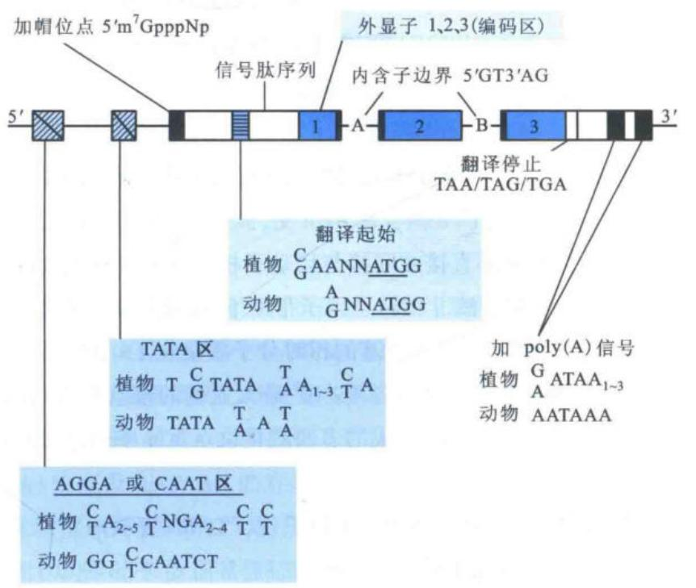  
图8-10 真核基因的一般构造示意图

  
图8-11 转录调控模式

## 1. 启动子

真核基因启动子由核心启动子和上游启动子两个部分组成,是在基因转录起始位点(+1)及其5'上游100\~200 bp以内的一组具有独立功能的DNA序列,每个元件长度为7\~20 bp,是决定RNA聚合酶Ⅱ转录起始点和转录频率的关键元件。

① 核心启动子(core promoter)是指保证 RNA 聚合酶Ⅱ转录正常起始所必需的、最少的 DNA 序列,包括转录起始位点及转录起始位点上游 -25 \~ -30 bp 处的 TATA 盒。核心启动子单独起作用时,只能确定转录起始位点并产生基础水平的转录。

TBP: TATA 区结合蛋白 (T A T A - b o x binding protein);
TAF: TBP 相关因子 (TBP associated factors);
TF II : pol II 相关转录因子 (pol II associated TF)。

② 上游启动子元件(upstream promoter element, UPE)包括通常位于-70 bp附近的CAAT盒(CCAAT)和GC盒(GGGCGG)等,能通过TFIID复合物调节转录起始的频率,提高转录效率。

## 2. 转录模板

包括从转录起始位点到 RNA 聚合酶Ⅱ转录终止处的全部 DNA 序列。

## 3. RNA 聚合酶Ⅱ

RNA 聚合酶Ⅱ是一类能够直接或间接与启动子核心序列 TATA 盒特异结合、并启动转录的调节蛋白。RNA 聚合酶Ⅱ在转录因子帮助下，形成转录起始复合物。RNA 聚合酶Ⅱ由至少 10～12 个亚基组成，各亚基的相对分子质量在 $1 \times 10^{4} \sim 2.4 \times 10^{5}$ 之间，有些亚基也在聚合酶 I、Ⅲ中共用。其中 $2.4 \times 10^{5}$ 最大亚基的羧基端含有由 7 个氨基酸残基（Tyr-Ser-Pro-Thr-Ser-Pro-Ser）组成的多磷酸化位点重复序列，称为羧基端结构域（CTD）。

## 4. RNA 聚合酶Ⅱ基础转录所需的蛋白质因子(以“TFⅡ”表示)

在生理条件下，RNA聚合酶Ⅱ转录某个基因时通常需要与20种以上的蛋白质因子结合形成转录起始复合物(图8-12)。TFIID、TFIIB和TFIIF与RNA聚合酶Ⅱ可在启动子上形成最初级复合物，开始转录mRNA，加入TFIE和TFIHH后形成完整的转录复合物并转录出长链RNA，加入TFIIA可进一步提高转录效率。RNA聚合酶Ⅱ沿模板滑动时，TFIID及TFIIA滞留在转录起始位点上，其他因子随聚合酶向模板DNA的3'端移动。

关于 RNA 聚合酶Ⅱ如何整合成为转录起始复合物从而发挥作用,目前有两种假说,一种认为是一步结合,另一种认为是分步结合。“一步结合”论者认为,RNA 聚合酶Ⅱ先同大量的转录因子和转录相关蛋白结合成转录复合体,然后在 TATA 结构域结合蛋白(TBP)的帮助下结合到 DNA 上,起始基因转录。“分步结合”理论则认为,在起始转录的过程中,TATA 结构域结合蛋白(TBP)和 11 个 TBP 相关因子先后结合到 TATA 盒上,最终构成有功能的转录起始复合物,起始靶基因转录。通常情况下,TFⅡB 首先与 DNA 结合,使 RNA 聚合酶更接近所生成 RNA 与 RNA 聚合酶分离的位点,并帮助其结合到 DNA 上。对于真核生物来说,基因的转录受到 RNA 聚合酶Ⅱ C 端(RNA PolⅡ C-terminal domain,CTD)的时间、空间调节的影响。CTD 拥有含 25\~52 个氨基酸的结构域,都包含 7

图 8-12 RNA 聚合酶Ⅱ在靶基因启动子区与各种蛋白质因子结合形成转录起始复合物示意图  
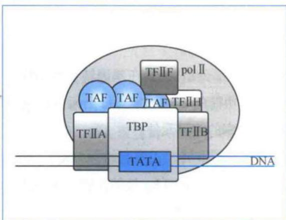

元重复序列 $Y_{1}S_{2}P_{3}T_{4}S_{5}P_{6}S_{7}$ ，这个7元重复序列上2位和5位的丝氨酸是蛋白质的主要磷酸化位点。CTD的磷酸化导致其结构中部分脯氨酸的构象发生变化，使之更容易与其他转录相关因子结合，从而提供一个动态的有利于形成转录复合物的平台。

在 RNA 聚合酶Ⅱ参与转录调节的整个过程中, 其 CTD 上 2 位和 5 位丝氨酸的

磷酸化能够引发并确保转录过程各个步骤的顺利进行。在转录起始阶段，CTD上5位丝氨酸的磷酸化是形成转录起始复合物的必要前提。此外，该位点磷酸化还有利于募集加帽酶，促进mRNA加帽过程顺利进行。在转录延伸阶段，磷酸化的5位丝氨酸逐步去磷酸化，2位丝氨酸逐步转化为磷酸化形式，该位点的磷酸化有助于在转录终止过程中确保3' RNA加工过程顺利进行。转录结束后，CTD7元重复序列上的两个丝氨酸都保持去磷酸化状态，有助于转录复合物的解离，使RNA聚合酶Ⅱ与新的启动子相结合，启动新一轮基因转录。

研究 RNA 聚合酶Ⅱ起始的基因转录的终止位点发现,几乎所有真核基因的 3' 端都存在一个多(A)位点,该位点上游 15\~30 bp 处的保守序列 AATAAA 对于初级转录产物的准确切割及加多(A)是必需的。点突变实验将 AATAAA 变为 AAGAAA,虽然维持了该基因的转录活性,却发现 mRNA 的剪接加工受阻,因而不能产生功能性 mRNA。

尽管多(A)位点及AATAAA的存在对于基因的转录和成熟意义重大,但RNA聚合酶Ⅱ却不在该位点终止转录,大部分已知基因的初级转录产物拥有多(A)位点下游0.5\~2 kb序列。到目前为止,科学家尚未发现某个单一位点具有特异的转录终止性能。但是,小鼠β-珠蛋白基因的终止区(terminator)能被用来终止腺病毒基因的转录,农杆菌胭脂碱合成酶基因终止区能被用来终止几乎所有的外源基因,说明可能存在共同的转录终止机制。

## 8.2.2 增强子及其对转录的影响

增强子是指能使与它连锁的基因转录频率明显增加的 DNA 序列,最早发现于 SV40 早期基因的上游,有两个长 72 bp 的正向重复序列。病毒、植物、动物和人类正常细胞中都发现有增强子存在。重组实验表明,如果把 SV40 增强子上的两个 72 bp 重复序列同时删除,基因表达的水平会降低很多。但如果把该增强子的一个重复序列放回原处或重组 DNA 的任何位置上,则基因转录正常。如果将人 β- 血红蛋白基因克隆到带有 72 bp 重复序列的 DNA 上,这个基因在体内的表达将提高 200 倍以上,即使 72 bp 序列位于该基因转录起始位点上游 3 kb 对或下游 2.5 kb,仍不例外。

作为基因表达的重要调节元件,增强子通常具有下列特性:

① 增强效应十分明显。一般能使基因转录频率增加 10～200 倍,有的可以增加上千倍,如经人巨大细胞病毒增强子增强后的珠蛋白基因表达频率比该基因正常转录高 600～1000 倍。

② 增强效应与其位置和取向无关。不论增强子以什么方向排列 $(5'\rightarrow3'$ 或 $3'\rightarrow5')$ ，甚至与靶基因相距3000碱基对或在靶基因下游，均表现出增强效应。

③ 大多为重复序列,一般长约 50 bp,适合与某些蛋白因子结合。其内部常含有一个核心序列:(G)TGGA/TA/TA/T(G),该序列是产生增强效应时所必需的。

④ 其增强效应有严密的组织和细胞特异性,说明增强子只有与特定蛋白质(转录因子)相互作用才能发挥功能。

⑤ 没有基因专一性,可以在不同的基因组合上表现增强效应。

⑥ 许多增强子还受外部信号的调控,如金属硫蛋白基因启动区上游所带的增强子,就可以对环境中的锌、镉浓度做出反应。

那么,增强子的作用原理是什么呢?由于增强子常在电镜下呈现环状结构,其活性与半周 DNA 双螺旋(5 bp)的奇、偶倍数有关,表明它的功能受 DNA 双螺旋空间构象的影响。增强子可能有如下 3 种作用机制:①影响模板附近的 DNA 双螺旋结构,导致 DNA 双螺旋弯折或在反式作用因子的参与下,以蛋白质之间的相互作用为媒介形成增强子与启动子之间“成环”连接,活化基因转录;②将模板固定在细胞核内特定位置,如连接在核基质上,有利于 DNA 拓扑异构酶改变 DNA 双螺旋结构的张力,促进 RNA 聚合酶Ⅱ在 DNA 链上的结合和滑动;③增强子区可以作为反式作用因子或 RNA 聚合酶Ⅱ进入染色质结构的“入口”。

在研究工作中,科研工作者利用增强子的功能构建 T-DNA 序列。例如用 4 倍重复的 CaMV 的 35S 增强子序列可以大大增强目的基因的转录。若通过转基因方法将该 T-DNA 片段整合到植物基因组中,植物基因组上与 T-DNA 插入位点相近的基因表达量增高,就能获得这个基因过表达的转基因植物。

另外,科研工作者还构建包含一个报告基因(lacZ)和基本启动子的转化载体,将其整合到基因组中。这段启动子本身不足以启动报告基因,但是如果插入位点附近有增强子,报告基因就会表达。因此只要通过观测报告基因的表达情况(如时空特异性等)就可以知道这个增强子的作用,进而研究由这个增强子调控的内源基因的表达特性。

## 8.2.3 反式作用因子

真核生物启动子和增强子是由若干 DNA 序列元件组成的,由于它们常与特定的功能基因连锁在一起,因此被称为顺式作用元件。这些序列组成基因转录的调控区,影响基因的表达。在转录调控过程中,除了需要调控区外,还需要反式作用因子(图 8-13)。根据不同功能,常将反式作用因子分为以下 3 类:具有识别启动子元件功能的基本转录因子、能识别增强子或沉默子的转录调节因子,以及不需要通过 DNA-蛋白质相互作用就参与转录调控的共调节因子(transcriptional regulator / co-factor)。

实验中,常将前两类反式作用因子统称为转录因子(transcription factor, TF),包括转录激活因子(transcriptional activator)和转录阻遏因子(transcriptional repressor)。这类调节蛋白能识别并结合转录起始点的上游序列或远端增强子元件,通过DNA-蛋白质相互作用而调节转录活性,并决定不同基因的时间、空间特异性表达。共调节因子本身无DNA结合活性,主要通过蛋白质-蛋白质相互作用影响转录因子的分子构象,从而调节转录活性。实验中,常将与转录激活因子有协同作用的那一类共调节因子称为共激活因子,将与转录阻遏因子有协同的作用那一类共调节因子称为共阻遏因子。所有共激活因子都能识别靶位点(启动子、增强子),而靶位点的特异性则由DNA结合域的特定序列决定。DNA结合域结合在特定的序列上,从而将激活因子上的转录激活域带到基础转录区域附近。

图 8-13 真核生物中转录因子活性调节的主要方式  
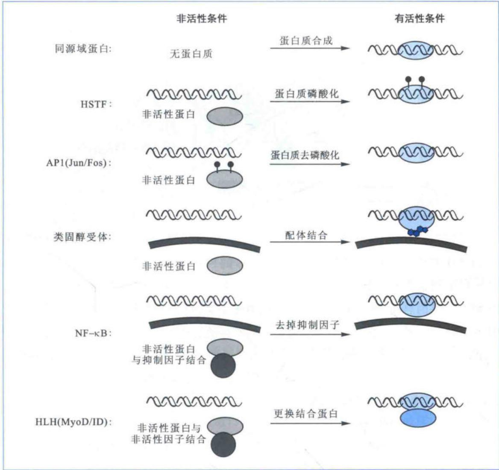

通常情况下直接作用的激活因子具有 DNA 结合域和转录激活域。没有转录激活域的激活因子可能与具有转录激活域的共激活因子一起行使功能。基础转录区域中许多元件是激活因子的靶位点。

一般认为,如果某个蛋白质是体外转录系统中起始 RNA 合成所必需的,它就是转录复合物的一部分。根据各个蛋白质成分在转录中的作用,能将整个复合物分为 3 部分:

① 参与所有或某些转录阶段的 RNA 聚合酶亚基 不具有基因特异性。

② 与转录的起始或终止有关的辅助因子 不具有基因特异性。

③ 与特异调控序列结合的转录因子 它们中有些被认为是转录复合物的一部分, 因为所有或大部分基因的启动区都含有这一特异序列。更多的则是基因或启动子特异性结合调控蛋白, 它们是起始某个(类)基因转录所必需的。

科研工作者根据顺式作用元件和反式作用因子间能够互相作用的原理,创造出酵母双杂交实验、酵母三杂交实验等实验技术(图8-14)。

在植物学相关领域,科研工作者利用相关原理构建出诱导型的含有标签的转化载体。首先,设计特殊的启动子,保证融合的转录因子(包括 DNA 结合域、转录激活域和受体调

图 8-14 酵母三杂交基本原理

酵母三杂交常用于实验分析蛋白质和RNA之间的互作关系。实验将一个蛋白A与DNA结合域蛋白融合表达，将另一个蛋白B与能够激活下游信号的激活域蛋白融合表达，当有RNA能与蛋白A、蛋白B互相作用时，由于DNA结合域蛋白结合在DNA结合位点，将激活域拉到恰当的结构位点，从而激活下游报告基因。


控域)组成性表达。一旦实验中加入化学小分子,该小分子与受体调控结构域相结合,导致融合表达的转录因子构象发生变化,由细胞质转移进入核内。融合蛋白就能特异性识别相关的DNA结合域并与之结合,该蛋白质的转录激活域就能激活相关基因高水平表达。

在诸多转录因子中被广泛研究的主要有识别 TATA 区

的 TFⅡD, 识别 CAAT 区的 CTF, 识别 GGGCGG 的 SP1 以及识别热激蛋白启动区的 HSF。已知每个细胞中可含有约 60 000 个 SP1, 而 CTF 的含量则高达每细胞 300 000 个。在 SV40 早期基因启动子区, 从 -70\~-110 区, 有 6 个 GC 区同方向串联排列, 基因活跃表达时, 6 个区全部与 SP1 结合。在胸腺嘧啶激酶基因的启动子上, 各有一个 GC 区分别位于 TATA 区和 CAAT 区 5' 上游端。研究认为, SP1 与 GC 区结合后, 可同时在 DNA 链的不同方向与 CAAT 区结合因子 (CTF 或 NF1) 及 TATA 区结合因子 TFⅡD 发生作用, 从而促进 RNA 聚合酶Ⅱ识别特定类型的启动子。

## 1. DNA 识别或结合域

反式作用因子是能直接或间接地识别或结合在各类顺式作用元件核心序列上(表8-3)，参与调控靶基因转录效率的蛋白质。

常见的 DNA 结合域包括碱性氨基酸结合域、酸性激活域、谷氨酰胺(Q)富含域、脯氨酸(P)富含域等。通常情况下，配体调节受体大多有 DNA 结合域和转录激活域。而甾醇类受体通常都是转录因子，其 N 端都有保守的 DNA 结合域，C 端都有激素结合域。

表 8-3 部分球蛋白基因 5' 调控区序列的保守性比较

<table><tr><td>基因</td><td>-80区</td><td>-30区</td></tr><tr><td>小鼠 $\beta^{min}$ </td><td>GGCCAATCTGCTC</td><td>GGTATATAAA</td></tr><tr><td>小鼠 $\beta^{maj}$ </td><td>GGCCAATCTGCTC</td><td>AGCATATAAG</td></tr><tr><td>兔 $\beta$ </td><td>GGCCAATCTAC--</td><td>GGCATAAAAG</td></tr><tr><td>山羊 $\beta^A$ </td><td>AGCCAATCTGCTC</td><td>GGCATAAAAG</td></tr><tr><td>山羊 $\beta^C$ </td><td>AGCCAATCTGCTC</td><td>GGCATAAAAG</td></tr><tr><td>人 $\beta$ </td><td>GGCCAATCTACTC</td><td>GGCATAAAAG</td></tr><tr><td>人 $\delta$ </td><td>AACCAATCTGCTC</td><td>-GCATAAAAG</td></tr><tr><td>人 $A^Y$ </td><td>GACCAATAGCCTT</td><td>GGCATAAAAG</td></tr><tr><td>人 $G^Y$ </td><td>GACCAATAGCCTT</td><td>GGCATAAAAG</td></tr><tr><td>人 $\alpha$ </td><td>GACCAATGACTTT</td><td>GGCATAAAAG</td></tr></table>

注：斜体表示高度保守的序列。

  
图 8-15 同源域蛋白通过其第三个螺旋与双链 DNA 的大沟相结合, 其 N 端的延伸部分则与 DNA 的小沟相结合, 提高了稳定性

## (1) 螺旋 - 转折 - 螺旋 (helix-turn-helix, H-T-H) 结构

这一类蛋白质分子中有至少两个 $\alpha$ 螺旋，中间由短侧链氨基酸残基形成“转折”，近羧基端的 $\alpha$ 螺旋中氨基酸残基的替换会影响该蛋白质在 DNA 双螺旋大沟中的结合。控制酵母交配型 MAT 基因座以及果蝇体节发育的调节基因 (antp、ftz、ubx) 等同源盒 (homeobox) 基因所编码的蛋白都有 H-T-H 结构。与 DNA 相互作用时，同源域蛋白的第一、二两个螺旋往往靠在外侧，其第三个螺旋则与 DNA 大沟相结合，并通过其 N 端的多余臂与 DNA 的小沟相结合 (图 8-15)。

同源域是指编码60个保守氨基酸序列的DNA片段，它广泛存在于真核生物基因组内，由于最早从果蝇homeotic loci(该遗传位点的基因产物决定了躯体发育)中克隆得到而命名，同源转换基因与生物有机体的生长、发育和分化密切相关。许多含有同源转换区的基因具有转录调控的功能，同源转换区氨基酸序列很可能参与形成了DNA结合区。表8-4总结了部分含同源转换区转录因子所识别的DNA序列，Oct-1、Oct-2与Pit-1/GHF-1所识别的核心序列仅有一个碱基之差，而果蝇en、ftz和ubx基因产物能识别完全相同的DNA序列。eve基因产物除识别与前者相同的序列外，还识别另一个靶序列。

表 8-4 含有同源转换区的转录因子及其 DNA 靶序列

<table><tr><td>蛋白因子</td><td>靶 DNA 序列</td></tr><tr><td>Oct-1、Oct-2</td><td>ATTTGCAT</td></tr><tr><td>Pit-1/GHF-1</td><td>TATGCATAA</td></tr><tr><td>EN、FTZ、UBX</td><td>TCAATTAAAT</td></tr><tr><td>Eve</td><td>TCAATTAAAT TCAGCACCG</td></tr><tr><td>Bicoid</td><td>TCAATCCC</td></tr></table>

Oct-1 和 Oct-2 专一结合于启动子内 8 碱基区, 它们都含有 75 个氨基酸的 pou 区和 60 个氨基酸的同源转换区。尽管 Oct-1 和 Oct-2 中的同源盒与经典的果蝇同源转换区变异较大 (60 个氨基酸中只有 20 个相同, 外加 8 个保守性替换), 该区在这两个蛋白质中却是高度保守的 (60 个氨基酸中有 53 个相同)。哺乳类转录因子 Pit-1/GHF-1 及线虫 unc-86 基因中都存在类似于 Oct-1 的结构。分析 20 个含同源转换区的果蝇基因发现, 该区的保守性高达 $80\% \sim 90\%$ ；即使与亲缘关系很远的哺乳类同源转换区相比较，同源率也在 $35\% \sim 40\%$ 以上（图8-16）。突变Oct-2或果蝇eve和ftz基因同源转换区某些核苷酸，可以完全防止这些转录因子与DNA相互作用。一般认为，同源转换区蛋白之所以具有转录调节功能，与这些蛋白质C端类似于原核基因阻遏物螺旋-转角-螺旋结构有关。

  
图 8-16 各种同源域 DNA 结合蛋白中保守序列分析

## (2) 锌指 (zinc finger) 结构

锌指结构家族蛋白大体可分为锌指、锌扭(twist)和锌簇(cluster)结构,其特有的半胱氨酸和组氨酸残基之间氨基酸残基数基本恒定,有锌参与时才具备转录调控活性。重复的锌指结构都是以锌将一个α螺旋与一个反向平行β片层的基部以锌原子为中心,通过与一对半胱氨酸和一对组氨酸之间形成配位键相连接,锌指环上突出的赖氨酸、精氨酸参与DNA的结合。由于结合在大沟中重复出现的α螺旋几乎联成一线,这类蛋白质与DNA的结合很牢固,特异性也很高。类固醇激素受体家族含有连续的两个锌指结构,其中两个锌原子将两个α螺旋装配成类似H-T-H的结构,再以同源或异源性二聚体的方式将两个 $\alpha$ 螺旋结合在相邻的两个大沟中 (图 8-17)。

图 8-17 典型的类固醇激素受体结构示意图  


大部分蛋白质中的锌指区都聚合成一组,但也发现少量蛋白质如果蝇中的Hunchback因子,有不止一个锌指簇。锌指簇在这些调控蛋白上的分布也很不相同,在ADR1中,锌指区只占一个很小的结构区,而在TFⅢA中,整个蛋白质几乎被各个锌指区所覆盖。由于锌指区最早是从RNA聚合酶Ⅱ和Ⅲ的转录因子中发现的,所以一般认为,某个蛋白质如果拥有一个或多个成簇的锌指区,那么它就很可能是转录因子,这就是为什么尽管我们不了解TDF、Kruppel及Hunchback的功能,但仍把它们归纳在表8-5中的原因。

表 8-5 一些转录因子和蛋白质通过 Cys2/His2 与 DNA 相结合

<table><tr><td>蛋白质</td><td>来源</td><td>相对分子质量</td><td>锌指数</td><td>DNA结合区/bp</td><td>靶序列</td><td>功能</td></tr><tr><td>TFIIIA</td><td>哺乳类</td><td> $7.3 \times 10^{4}$ </td><td>9</td><td>50</td><td>5S基因</td><td>与RNA聚合酶III作用,促进5S基因转录</td></tr><tr><td>SP1</td><td>哺乳类</td><td> $1.1 \times 10^{4}$ </td><td>3</td><td>10</td><td>GC区</td><td>与RNA聚合酶II作用,广泛性调控因子</td></tr><tr><td>ADR1</td><td>果蝇</td><td> $1.5 \times 10^{4}$ </td><td>2</td><td>22</td><td>ADH2基因</td><td>与RNA聚合酶II作用,激活ADH2基因</td></tr><tr><td>TDF</td><td>哺乳类</td><td>?</td><td>13</td><td>?</td><td>?</td><td>决定雄性性别</td></tr><tr><td>Kruppel</td><td>果蝇</td><td> $6.0 \times 10^{4}$ </td><td>5</td><td>?</td><td>?</td><td>胚胎分化</td></tr><tr><td>Hunchback</td><td>果蝇</td><td> $8.0 \times 10^{4}$ </td><td>4+2</td><td>?</td><td>?</td><td>胚胎分化</td></tr></table>

此外,有些锌指蛋白具有不同的序列:

$$
\mathrm{Cys} - \mathrm{X} _ {2} - \mathrm{Cys} - \mathrm{X} _ {1 3} - \mathrm{Cys} - \mathrm{X} _ {2} - \mathrm{Cys}
$$

这一结构被称为 Cys2/Cys2 锌指, 表 8-6 是部分具有这种锌指的转录因子及其一般特征。从表中可以看出, 这些蛋白质一般不具有大量重复性锌指, 它们与 DNA 的结合区域短而具有对称性。删除突变分析证实, 锌指区是这些蛋白质与 DNA 相结合所必需的。有人将雌激素受体蛋白中的两个锌指区删去, 换上从糖皮质素受体中切出来的两个锌指区后发现, 这个融合蛋白只能与糖皮质素受体基因靶序列 GRE 相结合, 而不再识别雌激素受体基因本身的靶序列 ERE, 说明这类调控蛋白中的锌指区在与靶序列相结合的过程中起着主导作用。

表 8-6 具有 Cys2/Cys2 锌指区的转录因子

<table><tr><td>蛋白</td><td>相对分子质量</td><td>锌指数</td><td>靶序列</td></tr><tr><td>皮质糖受体</td><td> $9.4 \times 10^{4}$ </td><td>2</td><td>GRE 中 20 bp</td></tr><tr><td>雌激素受体</td><td> $6.6 \times 10^{4}$ </td><td>2</td><td>ERE 中 20 bp</td></tr><tr><td>GAL4</td><td> $9.9 \times 10^{4}$ </td><td>1</td><td>UAS $_{G}$  中 17 bp</td></tr><tr><td>腺病毒 E1A</td><td>约  $3.0 \times 10^{4}$ </td><td>1</td><td>?</td></tr></table>

实验表明 Cys2/Cys2 锌指区与 Cys2/His2 锌指区是不同的。如果把固醇类受体蛋白锌指区中的后两个 Cys 突变成为 His, 那么靶基因就不会被这个经过改造的转录因子所识别和激活。


锌指结构中每一个 $\alpha$ 螺旋可以特异地识别 $3\sim 4$ 个碱基。利用不同的锌指结构识别特异DNA序列的特点以及核酸酶能够切断靶DNA的原理，科研工作者获得了一类被称为锌指核酸酶（zinc-finger nucleases，ZFN)的新型限制性内切核酸酶。根据改变锌指结构通用序列中7个X序列就能识别不同的DNA序列这一特征，人工设计识别特异DNA序列的 $\alpha$ 螺旋，用TGEK作为螺旋间的连接序列，构建成对人工锌指结构域和FokI融合蛋白(ZFN)，就能在指定区域切断DNA双链(图8-18)。目前，科研工作者已利用ZFN技术进行多种基因编辑或基因敲除实验，已建成能识别多种DNA序列的ZFN库。现在还不能识别所有随机挑选的DNA序列。

## (3) 碱性 - 亮氨酸拉链 (basic-leucine zipper)

即 bZIP 结构 $^{(图8-19)}$ ，是肝、小肠上皮、脂肪细胞以及某些脑细胞中存在的一大类 C/EBP 家族蛋白质，它们的特征是能够与 CCAAT 区和病毒的增强子结合。C/EBP 家族蛋白的羧基端 35 个氨基酸残基具有能形成 $\alpha$ 螺旋的特点，其中每隔 6 个氨基酸就有一个亮氨酸残基，这就导致第 7 个亮氨酸残基都在螺旋的同一方向出现。由于这类蛋白质都以二聚体形式与 DNA 结合，两个蛋白质 $\alpha$ 螺旋上的亮氨酸一侧是形成拉链型二聚体的基础。然而，亮氨酸拉链区并不能直接结合 DNA，只有肽链氨基端 20～30 个富含碱性氨基酸结构域与 DNA 结合。若不形成二聚体，该碱性区对 DNA 的亲和力明显降低。所以，这类蛋白质的 DNA 结合结构域实际是以碱性区和亮氨酸拉链结构域整体作为基础的 $^{(图8-20)}$ 。

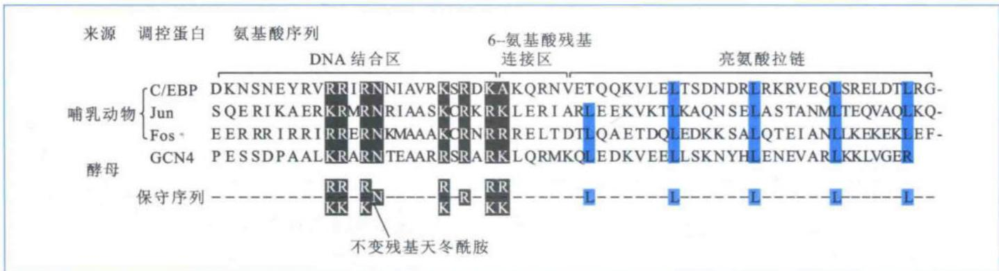  
图 8-19 碱性亮氨酸拉链结构域转录激活因子序列比较

  
图 8-20 碱性亮氨酸拉链转录激活蛋白与调控区 DNA 相结合的示意图

## (4) 碱性 - 螺旋 - 环 - 螺旋 (basic-helix/loop/helix)

即 bHLH 结构。在免疫球蛋白 $\kappa$ 轻链基因的增强子结合蛋白 E12 与 E47 中，羧基端 100～200 个氨基酸残基可形成两个双性 $\alpha$ 螺旋，被非螺旋的环状结构所隔开，蛋白质的氨基端则是碱性区，其 DNA 结合特性与亮氨酸拉链类蛋白相似。肌细胞定向分化的调控因子 MyoD-1、原癌基因产物 Myc 及其结合蛋白 Max 等都属于 bHLH 蛋白。研究发现，bHLH 类蛋白只有形成同源或异源二聚体时，才具有足够的 DNA 结合能力。当这类异源二聚体中的一方不含有碱性区（如 Id 或 E12 蛋白）时，该二聚体明显缺乏对靶 DNA 的亲和力 $^{(图 8-21)}$ 。

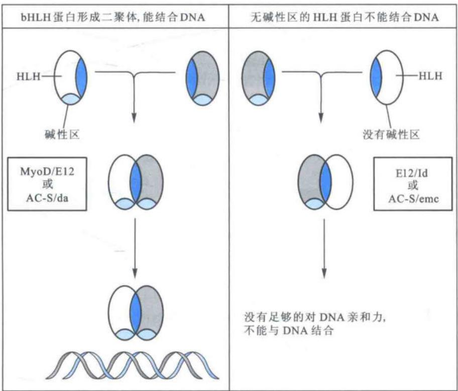  
图 8-21 bHLH 蛋白的 DNA 结合能力分析

## 2. 转录活化结构域

在真核生物中,反式作用因子的功能由于受蛋白质-蛋白质之间相互作用的调节变得精密、复杂,完整的转录调控功能通常以复合物的方式来完成,这就意味着并非每个转录因子都直接与DNA结合。因此,是否具有转录活化域就成为反式作用因子中唯一的结构基础。反式作用因子的功能具有多样性,其转录活化域也有多种,通常依赖于DNA结合结构域以外的30\~100个氨基酸残基。不同的转录活化域大体上有下列几个特征性结构:

① 带负电荷的螺旋结构 哺乳动物细胞中糖皮质激素受体的两个转录活化域，AP1 家族的 Jun 及 GAL4 都有酸性的螺旋结构，这种酸性螺旋结构特异性诱导转录起始的活性并不是很强，它们可能与 TFⅡD 复合物中某个通用因子或 RNA 聚合酶Ⅱ本身结合，并有稳定转录起始复合物的作用(图 8-22)。

② 富含谷氨酰胺的结构 SP1 是启动子 GC 盒的结合蛋白,除结合 DNA 的锌指结构以外,SP1 共有 4 个参与转录活化的区域,其中最强的转录活化域很少有极性氨基酸,却富含谷氨酰胺,达该区氨基酸总数的 25% 左右。哺乳动物细胞中的 Oct1/2、Jun、AP2、血清应答因子(SRF)等都有相同的富含谷氨酰胺的结构域。

③ 富含脯氨酸的结构 CTF-NF1 因子的羧基端富含脯氨酸(达 20%\~30%), 很难形成 α 螺旋。在 Oct2、Jun、AP2、SRF 等哺乳动物因子中也有富含脯氨酸的结构域。

利用顺式作用元件和反式作用因子间相互作用的原理,科研人员研发了许多调控基因表达的技术。其中最新的应用当属 TALEN 技术(TALEN=transcription activator-like effector + Fok I nuclease fusion protein),该技术利用转录激活因子 34 个氨基酸重复肽段中第 12、13 个氨基酸可以特异识别 DNA 单个碱基的特性,串联合成可识别目的碱基序列的

## (a) GAL4 酸性结构域

DSAAAHHDNSTIPLDFMPRDALH

GFDWSEEDDMSDGLPFLKTDPNNGF

(b) SP1 谷氨酰胺结构域

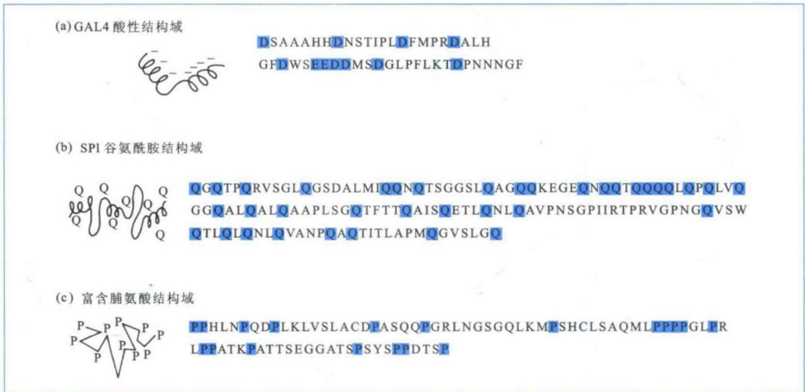

(c) 富含脯氨酸结构域

图8-22 常见的转录活化结构域

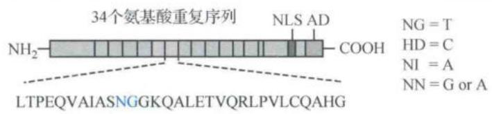  
图8-23 TALEN的作用原理

TALE 蛋白,与内切核酸酶 Fok I 融合表达,可切割特异识别序列下游 9\~13 bp,从而实现敲除指定内源基因的功能(图 8-23)。

## 8.3 真核基因表达的染色质修饰和表观遗传调控

在真核生物中,发生在转录之前的、染色质水平上的结构调整,称之为基因表达的表观遗传调控,主要包括 DNA 修饰(DNA 甲基化)和组蛋白修饰(组蛋白乙酰化、甲基化)两个方面。

## 8.3.1 真核生物 DNA 水平上的基因表达调控

分子生物学的最新研究表明,在个体发育过程中,用来合成 RNA 的 DN\ 模板也会发生规律性变化,从而控制基因表达和生物体的发育。

高度重复基因的形成通常与个体分化阶段 DNA 的某些变化有关。例如,一个成熟的红细胞能产生大量的可翻译出成熟珠蛋白的 mRNA,而其前体细胞却不产生珠蛋白。许多情况下,这种变化是由于基因本身或它的拷贝数发生了永久性变化。这种 DNA 水平的调控是真核生物发育调控的一种形式,它包括了基因丢失、扩增、重排和移位等方式,通过这些方式可以消除或变换某些基因并改变它们的活性。这些调控方式与转录及翻译水平的调控是不同的,因为它使基因组发生了改变。

## 1. “开放”型活性染色质(active chromatin)结构对转录的影响

真核基因的活跃转录是在常染色质上进行的。转录发生之前，染色质常常会在特定的区域被解旋松弛，形成自由DNA。这种变化可能包括核小体结构的消除或改变、DNA本身局部结构的变化甚至从右旋型变为左旋型(Z-DNA)等，这些变化可导致结构基因暴露，促进转录因子与启动区DNA结合，诱发基因转录。

用 DNA 酶 I 处理各种组织的染色质时, 发现处于活跃状态的基因比非活跃状态的 DNA 更容易被 DNA 酶 I 所降解。鸡成红细胞 (erythroblast) 染色质中, β- 血红蛋白基因比卵清蛋白基因更容易被 DNA 酶 I 切割降解。与此相反, 鸡输卵管细胞的染色质中被 DNA 酶 I 优先降解的是卵清蛋白基因, 而不是 β- 血红蛋白基因。那么, 活跃状态的 DNA 为什么更易于受核酸酶的攻击而降解呢? 研究发现, 活跃表达基因所在染色质上一般含有一个或数个 DNA 酶 I 超敏感位点 (hypersensitive site), 它们大多位于基因 5' 端启动区, 少数在其他位置。非活性态基因的 5' 端相应位点却不表现对 DNA 酶 I 的超敏感性。果蝇唾腺染色体中, 胶原蛋白基因 sgs4 的转录区上游 330 碱基对和 405 碱基对左右各有一个超敏感位点,有突变体缺失了包括这两个超敏感位点大约100个碱基对的DNA序列后就不再具备合成胶原蛋白的能力,说明两个完整的超敏感位点是sgs4基因转录所必需的。

图 8-24 “灯刷形”染色体(a)及存在于“活性”染色质区的环状DNA结构(b)
(a)中箭头所示为不同姐妹染色体对之间的交叉点。  
(a)  
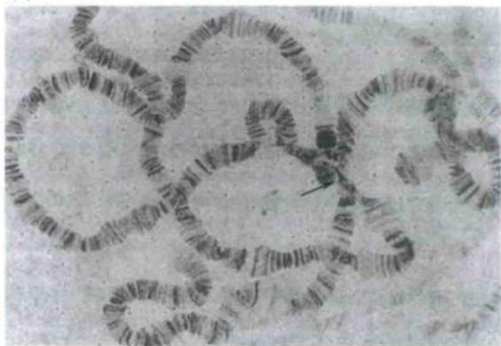

(b)  
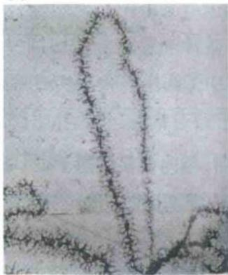

鸡成红细胞中 $\beta$ 血红蛋白基因 5' 端 -50\~-280 碱基对区是超敏感位点。有人用专一切割单链 DNA 的 SI 核酸酶处理该基因活跃表达的染色体 DNA，证实有 DNA 被水解，说明该基因活跃表达时启动区部分序列可能解开成单链，从而不能继续缠绕在核小体上，使启动区 DNA “裸露” 在组蛋白表面，形成了对 DNA 酶 I 的超敏感现象。上述事实充分说明，超敏感位点的产生可能是染色质结构规律性变化的结果。正是由于这种变化，使 DNA 容易与 RNA 聚合酶和其他转录调控因子相结合，从而启动基因表达，同时也更易于被核酸酶所降解。

有证据表明,存在于“灯刷形”染色体(lamp brush)上的环形结构可能与基因的活性转录有关(图8-24)。“灯刷形”染色体只有在两栖类动物卵细胞发生减数分裂时才能被观察到,它是染色体充分伸展时的一种形态。此时,两对姐妹染色体常常通过“交叉点”(chiasmata)连成一体[图8-24(a)]。高倍电镜下观察发现,灯刷形染色体上存在许多突起的“泡”状或“环”状结构,有时还能看到RNP沿着这些突起结构移动,表明这些DNA正在被RNA聚合酶所转录[图8-24(b)]。 $^{3}\mathrm{H}$ 尿嘧啶核苷酸标记实验表明,最活跃的DNA转录区结构较为伸展,形成蓬松区。

## 2. 基因扩增

基因扩增是指某些基因的拷贝数专一性大量增加的现象,它使细胞在短期内产生大量的基因产物以满足生长发育的需要,是基因活性调控的一种方式。例如,非洲爪蟾的卵母细胞中原有 rRNA 基因(rDNA)约 500 个拷贝,在减数分裂 I 的粗线期,这个基因开始迅速复制,到双线期它的拷贝数约为 200 万个,扩增近 4000 倍,可用于合成 $10^{12}$ 个核糖体,以满足卵裂期和胚胎期合成大量蛋白质的需要。在基因扩增之前,整个 rDNA 区位于单个核仁中(人们发现大部分动物细胞中都有这种含 rDNA 的核内小体)。在该细胞发育成卵母细胞的过程中(约 3 周时间),不但 rDNA 数量猛增,核仁数量也大大增加,每个核中可有几百个这样的小核仁。一旦卵母细胞成熟,多余的 rDNA 就没有用了,将被逐渐降解。受精之后,染色体 DNA 开始复制,并通过有丝分裂的方式,不断扩大细胞群体。在此期间,多余的 rDNA 继续被降解, 直到分裂产生几百个细胞时, rDNA 的过剩现象就不复存在了。

## 3. 基因重排与变换

将一个基因从远离启动子的地方移到距它很近的位点从而启动转录,这种方式被称为基因重排。通过基因重排调节基因活性的典型例子是免疫球蛋白结构基因和T细胞受体基因的表达,前者是由B淋巴细胞合成的,而后者则由T淋巴细胞合成。免疫球蛋白的肽链主要由可变区(V区)、恒定区(C区)以及两者之间的连接区(J区)组成(表8-7),V、C和J基因片段在胚胎细胞中相隔较远。编码产生免疫球蛋白的细胞发育分化时,通过染色体内DNA重组把4个相隔较远的基因片段连接在一起,从而产生了具有表达活性的免疫球蛋白基因(图8-25)。

表 8-7 人类基因组中免疫球蛋白基因主要片段的数量比较

<table><tr><td rowspan="2">成分</td><td rowspan="2">基因位点</td><td rowspan="2">染色体</td><td colspan="4">基因片段数量</td></tr><tr><td>V</td><td>D</td><td>J</td><td>C</td></tr><tr><td>重链</td><td>IGH</td><td>14</td><td>86</td><td>30</td><td>9</td><td>11</td></tr><tr><td>轻链(K链)</td><td>IGK</td><td>2</td><td>76</td><td>0</td><td>5</td><td>1</td></tr><tr><td>轻链(λ链)</td><td>IGL</td><td>22</td><td>52</td><td>0</td><td>7</td><td>7</td></tr></table>

此外，人血红蛋白基因表达也有这种现象。β链基因家族的调节基因和受体基因原来是被间隔序列分隔开的，因此这些结构基因没有活性。在胚胎发育早期，由于间隔序列 $S_{1}$ 缺失，导致调节基因 $R_{1}$ 和受体基因 $A_{1}$ 连接在一起，形成调节启动基因 $(R_{1}A_{1})$ ，邻近的结构基因转录产生ε肽链。在胚胎发育后期（3\~9个月），由于间隔序列 $S_{2}$ 缺失，使调节基因 $R_{2}$ 和 $A_{2}$ 连接在一起，形成调节启动基因 $(R_{2}A_{2})$ ，邻近的结构基因转录产生γ肽链。人出生以后，由于 $S_{3}$ 的缺失，形成了 $R_{3}A_{3}$ 调节启动基因，激活β和δ结构基因转录，产生β和δ肽链。α肽链基因的变换也按这个模式进行，形成了人类血红蛋白肽链组成的规

  
图 8-25 免疫球蛋白重链基因片段重排与组织特异性表达

律性变化。

## 8.3.2 DNA 甲基化与基因活性的调控

DNA 甲基化是最早发现的修饰途径之一,这一修饰途径可能存在于所有高等生物中并与基因表达调控密切相关。大量研究表明,DNA 甲基化能关闭某些基因的活性,去甲基化则诱导了基因的重新活化和表达。DNA 甲基化能引起染色质结构、DNA 构象、DNA 稳定性及 DNA 与蛋白质相互作用方式的改变,从而控制基因表达。研究证实,CpG 二核苷酸中胞嘧啶的甲基化导致了人体 1/3 以上由于碱基转换而引起的遗传病。我们将在本节中对 DNA 甲基化和去甲基化的机制、DNA 甲基化对发育过程中基因表达的调控以及与之有关的研究进展作一简述。

## 1. DNA 的甲基化

DNA 甲基化修饰现象广泛存在于多种有机体中。在染色体水平上，DNA 甲基化在着丝粒附近水平最高；在基因水平上，DNA 甲基化高水平区域涵盖了多数的转座子、假基因和小 RNA 编码区。甲基化似乎对于长度较短的基因有较强的转录调控能力，而对长基因的调控能力十分微弱。实验证明，这个过程不但与 DNA 复制起始及错误修正时的定位有关，还通过改变基因的表达参与与细胞的生长、发育过程及染色体印迹、X 染色体失活等的调控。DNA 甲基化主要形成 5-甲基胞嘧啶(5-mC) 和少量的 $N^6$ -甲基腺嘌呤 $(N^6\text{-mA})$ 及 7-甲基鸟嘌呤(7-mG, 图 8-26)。在真核生物中，5-甲基胞嘧啶主要出现在 CpG 序列、CpXpG、

图 8-26 5-甲基胞嘧啶、 $N^{6}$ -甲基腺嘌呤和7-甲基鸟嘌呤结构式  


CCA/TGG 和 GATC 中。因为高等生物 CpG 二核苷酸序列中的 C 通常是甲基化的，极易自发脱氨，生成胸腺嘧啶，所以 CpG 二核苷酸序列出现的频率远远低于按核苷酸组成计算出的频率。由于这些 CpG 二核苷酸通常成串出现在 DNA 上，这段序列往往被称为 CpG 岛。

真核生物细胞内存在两种甲基化酶活性:一种被称为日常型甲基转移酶,另一种是从头合成型甲基转移酶,前者主要在甲基化母链(模板链)指导下使处于半甲基化的DNA双链分子上与甲基胞嘧啶相对应的胞嘧啶甲基化。该酶催化特异性极强,对半甲基化的DNA有较高的亲和力,使新生的半甲基化DNA迅速甲基化,从而保证DNA复制及细胞分裂后甲基化模式不变。后者催化未甲基化的CpG成为mCpG,它不需要母链指导,但速度很慢。这类甲基化酶是导致特异基因受甲基化调控的主要因子,在基因表达的表观遗传学研究中有十分重要的地位。

## 2. DNA 甲基化抑制基因转录的机制

DNA 甲基化导致某些区域 DNA 构象变化,从而影响了蛋白质与 DNA 的相互作用,抑制了转录因子与启动区 DNA 的结合效率。研究表明,当组蛋白 $H_{1}$ 与含 CCGG 序列的甲基化或非甲基化 DNA 分别形成复合体时,DNA 的构型存在着很大的差别,甲基化达到一定程度时会发生从常规的 B-DNA 向 Z-DNA 的过渡。由于 Z-DNA 结构收缩,螺旋加深,使许多蛋白质因子赖以结合的元件缩入大沟而不利于基因转录的起始。有实验用序列相同但甲基化水平不同的 DNA 为材料,比较其作为 RNA 聚合酶转录模板的活性,发现甲基的引入不利于模板与 RNA 聚合酶的结合,降低了其体外转录活性。

5- 甲基胞嘧啶在 DNA 上并不是随机分布的,基因的 5' 端和 3' 端往往富含甲基化位点,而启动区 DNA 分子上的甲基化密度与基因转录受抑制的程度密切相关(图 8-27)。对于弱启动子来说,稀少的甲基化就能使其完全失去转录活性。当这一类启动子被增强时(带有增强子),即使不去甲基化也可以恢复其转录活性。若进一步提高甲基化密度,即使增强后的启动子仍无转录活性。因为甲基化对转录的抑制强度与 MeCP1 (methyl CpG-binding protein 1) 结合 DNA 的能力成正相关, 甲基化 CpG 的密度和启动子强度之间的平衡决定了该启动子是否具有转录活性。

  
图 8-27 DNA 甲基化对基因转录的抑制作用  
箭头粗细表示转录活性强弱，空心圆表示DNA未甲基化，小黑点表示DNA甲基化，椭圆形表示MeCPI松散结合，长方形表示MeCPI紧密结合。

图 8-28 3 个珠蛋白的基因编码区及启动区的 CpG 密度比较 (a) 以及甲基化对这些基因表达强度的影响分析 (b)
无: 没有甲基化; 部: 部分甲基化。 $\beta$ - 珠蛋白 mRNA 作为对照。

研究证实, 小鼠 $\alpha-$ 珠蛋白基因和人 $\gamma-$ 珠蛋白基因内 CpG 密度较低, 前者 1.4 kb 序列内含有 28 个 CpG (相当于每 50 bp 有一个 CpG), 后者 3.3 kb 序列内含有 26 个 CpG (相当于每 126 bp 有一个 CpG), 而人 $\alpha-$ 珠蛋白基因内 CpG 密度很高, 1.5 kb 序列中有 141 个 CpG (相当于每 10 bp 有一个 CpG) (图 8-28(a))。可以用细菌 Hha I 甲基转移酶处理人 $\alpha-$ 珠蛋白基因使其低水平甲基化 (平均每 62 个 bp 有一个 mCpG, 1.5 kb 序列中有 24 个 mCpG), 也可以用 Sss I 甲基化酶把该基因上所有 CpG 全部甲基化。将上述 CpG 密度不同、甲基化水平也不同的基因导入人 HeLa 细胞发现, 一旦 CpG 完全甲基化, 这 3 个基因都不表达。但如果在这些基因的启动区装上 SV40 增强子序列, CpG 密度较低的基因如小鼠 $\alpha-$ 珠蛋白基因和人 $\gamma-$ 珠蛋白基因就得到表达, 高 CpG 密度但只有部分甲基化的人 $\alpha-$ 珠蛋白基因也能被转录，CpG 密度高同时又完全甲基化的人 $\alpha-$ 珠蛋白基因仍然不被转录 $^{(图8-28(b))}$ 。


DNA 的甲基化还提高了该位点的突变频率。真核生物中 5-mC 主要出现在 5'-CpG-3' 序列中，5-mC 脱氨后生成的胸腺嘧啶 (T) 不易被识别和矫正。因此，特定部位的 5-mC 脱氨基反应，将在 DNA 分子中引入可遗传的转化 (C→T)，若位点突变发生在 DNA 功能区域，就可能造成基因表达的紊乱。在脑瘤、乳腺癌和直肠癌细胞中，p53 基因第 273 位密码子含 CpG 序列，常由 CGT 突变为 CAT 或 TGT (Arg→His 或 Cys)。在非小细胞肺癌中 p53 基因该位点 C→T 的突变频率高达 59.3%。由于 CpG 甲基化增加了胞嘧啶残基突变的可能性，5-mC 也作为内源性诱变剂或致癌因子调节基因表达。

## 8.3.3 组蛋白乙酰化对真核基因表达的影响

蛋白质乙酰化普遍存在于生物体细胞内,涉及许多生理生化过程。目前主要研究组蛋白乙酰化对基因表达调控的影响。

## 1. 组蛋白的基本组成

组蛋白(histone)是组成核小体的基本成分,核小体(nucleosome)是组成染色质的基本结构单元。核小体由组蛋白八聚体(由两个包含 $H_{2}A$ 、 $H_{2}B$ 、 $H_{3}$ 和 $H_{4}$ 的四聚体组成)和缠绕两圈的DNA组成。在相邻的核小体之间有一个20\~200 bp的间隔区,在电子显微镜下,一列核小体看上去像一串珠子,每个珠子的直径大约是10 nm。另一个组蛋白 $H_{1}$ 结合在核小体核心之外,起到稳定核小体序列和染色质的高级结构的作用。

## 2. 核心组蛋白的乙酰化和去乙酰化

核心组蛋白朝向外部的 N 端部分被称为“尾巴”，可被组蛋白乙酰基转移酶和去乙酰化酶修饰，加上或去掉乙酰基团。图 8-29 是已报道的组蛋白 N 端“尾巴”主要被修饰位点。

  
图 8-29 已知组蛋白 N 端“尾巴”主要被修饰位点  
N, 组蛋白 N 端; C, 组蛋白 C 端; A, 乙酰基团; P, 磷酸基团; M, 甲基基团; Ub, 泛素基团; HAT, 乙酰基转移酶; HDAC, 去乙酰化酶。

图 8-30 具有组蛋白乙酰基转移酶活性的蛋白质参与转录调控示意图  
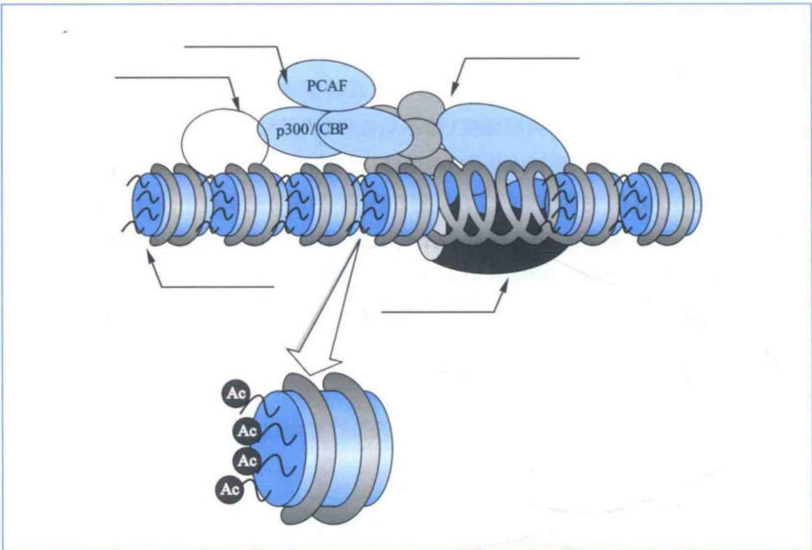

## 3. 组蛋白乙酰基转移酶

催化组蛋白乙酰化反应的是组蛋白乙酰基转移酶(histone acetyltransferase, HAT)。目前已经发现的HAT酶主要有两类：一类与转录有关，另一类与核小体组装以及染色质的结构有关。HAT并不是染色质结合蛋白，但是可以通过与其他蛋白质相互作用来影响染色质的结构。许多转录激活因子都有HAT活性(图8-30)，与转录有关的HAT催化亚基是酵母调控蛋白质GCN5的同源物，而GCN5本身具有乙酰化组蛋白 $\mathrm{H}_{3}$ 和 $\mathrm{H}_{4}$ 的活性。

TAFⅡ250组蛋白乙酰基转移酶是TFⅡD复合物的一个亚基，它的主要功能是与启动子结合协助起始转录，能使组蛋白 $\mathrm{H}_{3}$ 和 $\mathrm{H}_{4}$ 乙酰化。转录共激活子PCAF也能使这两个组蛋白乙酰化。组蛋白乙酰基转移酶p300/CBP也是转录共激活子，通过与增强子结合蛋白相互作用来调节转录，能使组蛋白 $\mathrm{H}_{2}\mathrm{A},\mathrm{H}_{2}\mathrm{B},\mathrm{H}_{3}$ 和 $\mathrm{H}_{4}$ 乙酰化。

## 4. 组蛋白去乙酰化酶

组蛋白去乙酰化酶(histone deacetylase, HDAC)负责去除组蛋白上的乙酰基团, 目前研究比较深入的是人类中的 HDAC1 和酵母中的 Rpd3。HDAC 和 Rpd3 都形成很大的蛋白复合体发挥作用。Rpd3 能特异性去除组蛋白上的乙酰基团, 使核小体相互靠近, 并在转录共抑制子 Sin3 及 R 的协同作用下, 抑制基因转录(图 8-31)。

## 5. 组蛋白乙酰化及去乙酰化对基因表达的影响

组蛋白乙酰基转移酶和去乙酰化酶通过使组蛋白乙酰化和去乙酰化对基因表达产生影响。组蛋白 N 端“尾巴”上赖氨酸残基的乙酰化中和了组蛋白尾巴的正电荷，降低了它与 DNA 的亲和性，导致核小体构象发生有利于转录调节蛋白与染色质相结合的变化，从而提高了基因转录的活性。核心组蛋白 $H_{2}A$ 、 $H_{2}B$ 、 $H_{3}$ 和 $H_{4}$ 通过组蛋白“尾部”选择性乙

酰基化影响核小体的浓缩水平和可接近性。研究发现，受乙酰化修饰的组蛋白形成的核小体的结构比未经修饰的组蛋白核小体松散。由于乙酰化的组蛋白抑制了核小体的浓缩，使转录因子更容易与基因组的这一部分相接触，有利于提高基因的转录活性。

组蛋白乙酰基转移酶和去乙酰化酶只能有选择地影响一部分基因的转录。哺乳动物和酵母中

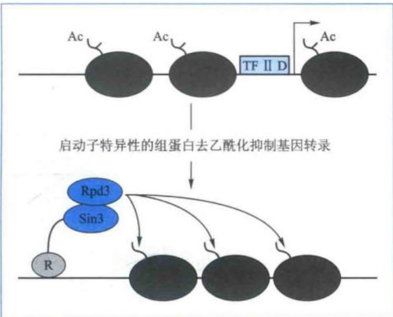  
图 8-31 组蛋白去乙酰化酶复合体能与靶基因启动子区结合,抑制基因转录

得到的实验数据都表明,转录抑制主要是由于新产生的 HDAC/Rpd3 复合体专一性结合于某个或某类基因启动子区附近的组蛋白位点并使之去乙酰化,导致染色质结构发生不利于基因转录的变化。

视网膜母细胞瘤蛋白(retinoblastoma protein, Rb)是另一类被广泛研究的肿瘤抑制因子,该蛋白质主要与E2F类转录激活因子相互作用,抑制主要参与细胞周期调控的靶基因的转录活性。研究发现,与E2F类转录激活因子相结合的Rb能进一步募集去乙酰化酶1(HDAC1),使这类基因的启动子区发生特异性的去乙酰化反应,导致该区段染色质浓缩,靶基因转录活性消失(图8-32)。

  
图 8-32 组蛋白去乙酰化酶与肿瘤抑制因子 Rb 相互作用抑制靶基因转录

## 8.3.4 组蛋白甲基化对于真核基因表达的调控

## 1. 组蛋白甲基化的功能

目前已知的识别各种组蛋白赖氨酸甲基化修饰的蛋白质或者与这些识别蛋白相互作用的蛋白质非常多，暗示组蛋白赖氨酸的甲基化十分重要。一般来说，各种组蛋白甲基化修饰在染色体上的分布以及功能不尽相同，比如H3K9me3标记通常与异染色质化有关，H3K27me3通常与抑制基因表达有关，而H3K4me3常被视作转录活化区的标记(表8-8)。近年的研究发现，异染色质化区域可以分成非组成型和组成型异染色质化，这两种情况的组蛋白甲基化修饰也不相同。

表 8-8 常见的组蛋白修饰

<table><tr><td>组蛋白甲基化</td><td>染色体常见分布</td><td>主要功能</td></tr><tr><td>H3K9me3</td><td>中心粒、端粒</td><td>组成型异染色质</td></tr><tr><td>H3K27me3</td><td>沉默基因</td><td>沉默基因</td></tr><tr><td>H3K4me3</td><td>转录起始位点</td><td>转录活性区标记</td></tr><tr><td>H3K36me3</td><td>转录区</td><td>转录活性区标记</td></tr></table>

① 非组成型异染色质化 多发生在不同生长发育时期一些需要被沉默的基因区域。动物中最常见的一种形式就是雌性的随机失活的一条 X 染色体。研究发现，失活的 X 染色体上有很高水平的 H3K27me3 修饰，而且 H3K27me3 的修饰上往往伴有 polycomb 抑制复合物（polycomb repressor complexes, PRCs）。核心 PRC 是一个三元复合物，其中一个成员 E(Z) 是 H3K27 甲基转移酶，因此 PRC 介导的异染色质化通常会由异染色质成核中心向周围扩散 H3K27me3 修饰，将附近一段区域内的染色质都异染色质化 $^{(图8-33)}$ 。随着越来越多的染色质免疫共沉淀－测序（ChIP-chip, ChIP-seq）数据报道，人们发现动物染色体上具有高水平 H3K27me3 修饰的染色体片段往往很长，覆盖染色体大片区域，而拟南芥中这种修饰却集中于基因转录区，覆盖长度只有一个基因。这个现象暗示动植物中可能采取了不同的 H3K27 甲基化修饰抑制基因表达的策略。

② 组成型异染色质化 通常发生在染色质中心粒、端粒区域，常由 HP1 蛋白介导，该蛋白质形成二聚体识别并结合 H3K9me2/3。因为 HP1 能与 H3K9 甲基转移酶 SUV39

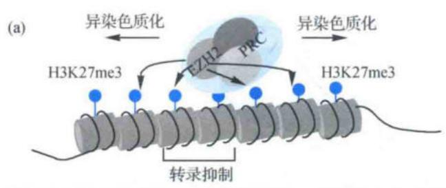

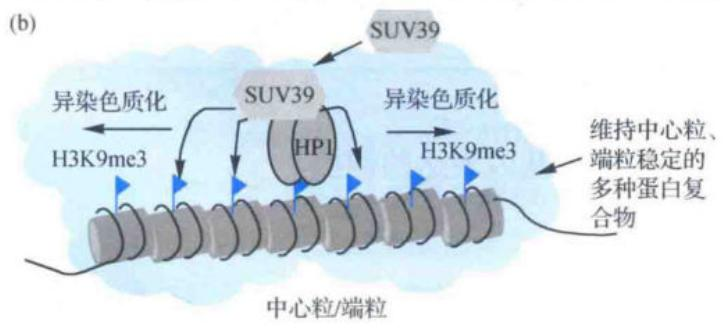  
图8-33 异染色质化的功能

(a) 为组蛋白甲基化引起的基因组中某些区域被非组成型异染色质化。某些特定发育时期带有 H3K27me3 标记的染色质区域会在特定转录调节因子作用下被 PRC 特异识别、结合并在 H3K27 甲基转移酶作用下将该区域附近的其他染色质上的组蛋白三甲基化，从而引起大范围的异染色质化导致整个区域发生基因表达沉默。(b) 则代表了一类在细胞内通常会发生的组成型异染色质化，该过程一般发生在中心粒和端粒附近，HP1 识别组蛋白 H3K9me2/3 标记，然后招募 SUV39 使新生成的组蛋白发生三甲基化，这样就会使得中心粒和端粒附近的区域始终保持异染色质状态。

发生相互作用,导致了高水平的 H3K9me3 修饰。与 H3K27 的机制相似,细胞分裂时母细胞的 H3K9me2/3 标记结合了 HP1 蛋白,HP1 又招募 SUV39 到邻近染色质区域催化新组装组蛋白产生新的 H3K9me3 标记,保持中心粒、端粒的异染色质化(图 8-33)。

③ 表观修饰的遗传 表观修饰是可遗传的,当母细胞分裂出子细胞时,母细胞染色质具有的特定表观修饰会在子代细胞 DNA 的相同位置重现。一般认为表观修饰的遗传是通过已经存在的标记招募相应甲基转移酶到染色质附近而实现的。比如细胞分裂时母细胞 H3K27me3 标记与 PRC 相互作用,新复制的 DNA 因为附近有 PRC 存在,被 E(Z) 催化生成新的 H3K27me3,因此子代细胞被打上同样的标记。

④ 常表达染色质 该区域比异染色质区有更宽松的修饰环境,也存在一些较普遍的标记,如基因的增强子区常有 H3K4me1 修饰。各种组蛋白甲基化修饰有不同的分布倾向,H3K4me3 常富集在转录起始区,而 H3K36me3 在整个转录区都有比较高的水平。酵母中 Set1 基因编码 H3K4 甲基转移酶,可与 C 端(CTD)第 5 位丝氨酸被磷酸化的 RNA 聚合酶Ⅱ相互作用。Set2 是 H3K36 甲基转移酶,可与 C 端(CTD)第 2 位丝氨酸被磷酸化的 RNA 聚合酶Ⅱ相结合,而第 2 位丝氨酸磷酸化正是 RNA 聚合酶Ⅱ在转录延伸过程中的标记,随着转录的进行而增多。因此,不同甲基转移酶蛋白和不同磷酸化状态的 RNA 聚合酶Ⅱ相互作用,导致两种组蛋白甲基化在基因区的不同分布方式(图 8-34)。

## 2. 组蛋白甲基转移酶

组蛋白上有两种残基,赖氨酸和精氨酸,可以被甲基化修饰。据此将组蛋白甲基转移酶分成两类,即组蛋白赖氨酸甲基转移酶(histone lysine methyltransferase,HKMT)和蛋白质精氨酸甲基转移酶(protein arginine methyltransferase,PRMT)。目前,已从各个物种中鉴定出一批HKMT,它们几乎都拥有甲基转移酶催化活性区SET结构域。不同的HMKT催化不同的底物,最早发现的甲基转移酶是与组成型异染色质化有关的SUV39H1,催化H3K9的甲基化。有的底物特异性催化H3K9,有的只催化H3K4甲基化。DIM5能催化

  
图8-34 组蛋白修饰分布倾向  
酵母中启动子区的RNA聚合酶Ⅱ是第5位丝氨酸被磷酸化，该磷酸化状态的RNA聚合酶Ⅱ能够与H3K4甲基转移酶Set1发生相互作用，使得启动子区发生H3K4me3修饰，进一步招募HAT使得该区域发生乙酰化，使得转录起始区域保持较高的转录起始效率。而在转录过程中RNA聚合酶Ⅱ第2位丝氨酸被磷酸化，该磷酸化状态的RNA聚合酶Ⅱ与H3K36甲基转移酶Set2相互识别，进而招募HDAC使得转录区域发生去乙酰化，转录起始事件发生频率比较低，使得转录延伸顺利进行。

图 8-35 组蛋白甲基转移酶家族  


H3K9 的单、双、三甲基化，而 SET7/9 只能催化 H3K4 的单甲基化。结构生物学研究表明酶催化中心的一些关键氨基酸所构成的不同的空间位阻决定该酶能够添加多少个甲基，因为如果将 DIM5 和 SET7/9 相应的核心氨基酸互换，那么 DIM5 只能催化单甲基化，而 SET7/9 则可以催化三甲基化 $^{(图 8-35)}$ 。

精氨酸甲基转移酶(PRMT)分成一型和二型,一型催化单甲基和非对称双甲基化,二型催化单甲基和对称双甲基化。常见精氨酸甲基转移酶有PRMT 1,4,5和6。此外,在果蝇和拟南芥的相关研究中还发现有PRMT家族成员参与调控pre-mRNA的可变剪切,从而影响生物的昼夜节律。

## 3. 组蛋白去甲基化酶

曾经有很长一段时间,人们认为组蛋白甲基化修饰是稳定存在的,没有主动的去甲基化过程。2002年以后才逐渐发现生物体内存在为数不少的组蛋白去甲基化酶。最早发现的赖氨酸去甲基化酶是LSD1(lysine-specific demethylase),该酶用FAD为辅助因子,可在体外系统中催化H3K4me1/2的去甲基化,但不能催化三甲基化的去甲基反应。体内研究发现,LSD1可与不同的复合物相互作用并通过这些复合物被募集到相应的染色质区域。与不同的复合物相结合还能改变LSD1催化底物的特性。当LSD1与Co-REST抑制复合物相结合时催化H3K4me1/2的去甲基化,若与雄激素受体结合则可催化H3K9的去甲基化。因此,同一个去甲基化酶可以行使转录激活和转录抑制两种相反的功能,视与其合作的因子而定。

研究发现,存在于许多赖氨酸去甲基化酶中的jumonji结构域是去甲基化酶的催化活性结构域。在最早鉴定的赖氨酸去三甲基化酶JMJD2中,JMJD2可催化H3K9me3和H3K38me3的去甲基化,酶催化活性区为JmjC结构域(图8-36)。

## 8.3.5 RNA 水平修饰对基因表达的影响

RNA 水平的化学修饰能影响自身活性、定位以及稳定性等多个方面。真核生物的 RNA 上存在 100 多个化学修饰, 然而只有极少数的修饰方式广泛存在于 mRNA 上。其中, $N^{6}$ -甲基腺苷化修饰 ( $N^{6}$ -methyladenosine, $\mathrm{m}^{6}\mathrm{A}$ ) 是 mRNA 上较为常见的一种 RNA 修饰方式,并且有报道表明这种方式可以在转录后水平调控基因表达,影响多个重要的生理调控过程。

  
图 8-36 具有 JmjC 结构域的组蛋白去甲基化酶

$N^{6}-$ 甲基腺苷化修饰 $(m^{6}A)$ 指的是mRNA中腺嘌呤第6位氮原子上的甲基化修饰，这种修饰广泛存在于各个物种中。 $m^{6}A$ 既不容易受化学修饰，如硫酸氢盐处理的影响，也不会影响RNA中基本的碱基配对能力。因此，尽管这种修饰很早就被发现，但是 $m^{6}A$ 所

具有的生物学功能一直到后期才被发现报道。结合新一代测序技术(NGS)和基于抗体亲和技术,人们发现小鼠和人类细胞中将近7000种mRNA上拥有 $m^{6}A$ 修饰位点。另外,随着mRNA $m^{6}A$ 去甲基化酶

  
图 8-37 mRNA 上可逆的 $m^{6}A$ 修饰

的鉴定,人们进一步确认了 $m^{6}A$ 的动态调控方式(图 8-37)。

## 1. $\mathrm{m}^{6}\mathrm{A}$ 修饰甲基化酶

通过体外转录或合成 mRNA, HeLa 细胞核提取物能在体外催化 $m^{6}A$ 修饰的形成。为进一步鉴定负责 $m^{6}A$ 甲基化活性的每一个组分, 这些提取物被分为不同级别的片段, 最终, 人们筛选到包含 3 个成员的甲基转移酶复合体, 分别将其命名为 MT-A1、MT-A2 以及 MT-B。其中, MT-A1 在催化过程中起主要作用。随后, 研究者又新鉴定到一个 $7 \times 10^{4}$ 大小的甲硫氨酸结合亚基, 命名为 methyltransferase-like 3 (METTL3)。人 METTL3 上负责甲基活性的两个功能区域已经被鉴定, 分别是 CM I 和 CM II (图 8-38)。其中, CM I 是甲硫氨酸结合区域, 而 CM II 包含负责甲基活性的催化残基。Northern 印迹杂交分析表明 METTL3 广泛表达在人体组织中, 并在睾丸中有较高的表达。HepG2 细胞中 METTL3 基因表达量降低后会加速细胞凋亡。同时, 分析 HepG2 细胞中 METTL3 基因表达量下调前后的差异表达基因发现, p53 信号途径的基因在 METTL3 基因表达发生改变后得到了富

图 8-38 不同物种中负责 m $^{6}$ A 修饰的甲基转移酶结构示意图


集。免疫荧光分析表明 METTL3 基因定位于核质，尤其是在富集有 mRNA 加工因子的核散斑体中，这些结果与 $m^{6}A$ 修饰调控精子发生过程的功能相吻合。

除了哺乳动物外，METTL3的同源基因也已经在酵母、果蝇以及拟南芥中被鉴定到(图8-38)。所有的这些蛋白质都包含两个一致的甲基转移酶基序CMI和CMII。酵母中的甲基转移酶是IME4/SPO8，主要参与调控减数分裂和孢子形成过程。IME4基因失活的酵母突变体表现出mRNA上的 $\mathrm{m}^6\mathrm{A}$ 修饰消失并且孢子形成会受影响。拟南芥中METTL3的同源基因MT-A也在分裂的组织中大量表达，尤其是在生殖发育器官、茎顶端分生组织以及新形成的侧根中。MT-A的失活会导致 $\mathrm{m}^6\mathrm{A}$ 修饰的缺失，并且胚胎发育停滞在球型期。Dm IME4是果蝇中METTL3的同源基因，主要表达在卵巢和睾丸中。这说明在演化水平上，负责 $\mathrm{m}^6\mathrm{A}$ 修饰的甲基转移酶在调控配子发育过程中功能保守。甲基化修饰只在MT-A和MT-B复合体同时存在时才发生，这暗示了METTL3还需要在其他的因子参与下才能发挥功能。负责 $\mathrm{m}^6\mathrm{A}$ 修饰的甲基转移酶是目前所鉴定的甲基转移酶中较为复杂的一类。研究发现用核酸酶处理或者甲基鸟苷抗体过滤都不能影响HeLa细胞核提取物的甲基化活性，这一结果表明RNA本身并不是酶组分所必需的。拟南芥中，MT-A在体内和AtFIP37蛋白互作。AtFIP37是果蝇中雌性发育致死相关蛋白FL(2)(D)以及人中肾母细胞瘤相关蛋白WTAP的同源蛋白。拟南芥中AtFIP37蛋白破坏后会导致胚胎致死，表现为胚胎发育停留在球型期。另外，METTL3 mRNA在胚胎发育过程中表达量会发生改变，这进一步暗示了 $\mathrm{m}^6\mathrm{A}$ 修饰在发育过程中的重要作用。

## 2. $\mathrm{m}^{6}\mathrm{A}$ 修饰去甲基化酶

$m^{6}A$ 甲基化修饰是一个动态的修饰过程。和 DNA 以及组蛋白中甲基转移酶和去甲基转移酶行使的可逆甲基化作用相似， $m^{6}A$ 甲基化修饰也是一个可逆的过程。有报道表明 FTO 和 ALKBH5 是调控 $m^{6}A$ 去甲基化修饰的两个重要的酶。FTO 和 ALKBH5 属于 AlkB 家族，具备保守的铁离子结合基序以及一个酮戊二酸盐互作区域 $^{(图8-39)}$ 。

已知人 FTO 基因具有调控肥胖以及能量平衡的作用,但其作为去甲基酶发挥的功能却被人们了解得不多。另外,一个基于 mRNA 的光交联蛋白组学分析结果表明 ALKBH5是一个 mRNA 结合蛋白。ALKBH5 的缺失能提高小鼠管状 mRNA 中 $m^{6}A$ 修饰的水平，进一步导致睾丸萎缩和精子数量、运动能力的降低等。这暗示了 ALKBH5 通过去甲基化 mRNA 上的 $m^{6}A$ 修饰调控了精子发生的过程。有意思的是，ALKBH5 基因表达能在基因毒性应激或在低氧情况下被精氨酸去甲基转移酶 PRMT7 调控，这也说明 ALKBH5 广泛参与多个生物学过程调控。FTO 和 ALKBH5 都具有 $m^{6}A$ 去甲基转移酶活性并且在生物体中广泛表达，然而除了作为去甲基转移酶外，它们所具备的生物学功能各不相同，这很有可能与它们本身的特异表达模式相关。例如，FTO 在大脑和肌肉中具有较高的表达，而 ALKBH5 却在睾丸和肺中具有较高的表达。

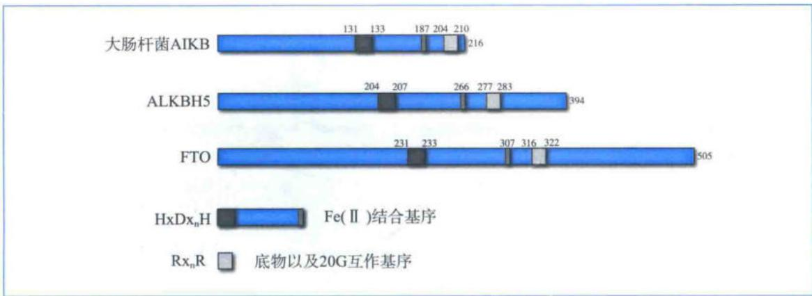  
图 8-39 不同物种中负责 $m^{6}A$ 修饰的去甲基转移酶结构示意图。

## 3. $\mathrm{m}^{6}\mathrm{A}$ 修饰调控基因表达的机制

$m^{6}A$ 修饰能够调控基因表达，并且这一调控机制被扰乱时往往会导致人类疾病的产生。目前的研究认为， $m^{6}A$ 修饰是通过改变RNA的二级结构，使得某种RNA结合蛋白能够能接近RNA序列，从而干扰 $m^{6}A$ 修饰的进行，进一步调控基因表达。研究表明， $m^{6}A$ 调控基因表达需要几种基本的组分，包括将 $m^{6}A$ 修饰信息“写入”mRNA的甲基化酶蛋白复合物，将 $m^{6}A$ 修饰信息“擦除”的去甲基化酶以及一种“阅读” $m^{6}A$ 修饰信息的蛋白(图8-40)。

“写入”蛋白功能受损时,会导致多种组织出现发育停滞的现象。在人中,编码“擦除”蛋白的基因发生遗传性质的改变后会导致糖尿病和癌症的发生。同时,测序技术的发展使人们对 $m^{6}A$ 修饰位点的了解从几个变成了几千个,并且这些位点在人和小鼠中高度保守。另外,负责 $m^{6}A$ 修饰的“阅读”蛋白也参与基因的表达。所有的“阅读”蛋白都能直接结合一种叫作“YTH”的RNA结合域。这个区域结合甲基化RNA的亲和度比非甲基化RNA高数倍。

另一方面，RNA 的二级结构也对基因表达有影响。例如，当一个单链 RNA(ssRNA) 的两个区域形成一个碱基对双链，末端未配对碱基形成环状时，就能产生 RNA 茎－环结构。这一结构会通过调控相关蛋白，使其作用在 RNA 的茎、环或者茎－环部位。同时，RNA 的茎－环也可以作为 RNA 水平的调控开关。当其响应到不同的因子后，茎－环结构发生改变，进一步影响细胞功能。这些因子包括一些物理化学参数，例如 pH、温度以及离子结合和代谢情况等，也可以是一些生物大分子包括核酸以及蛋白质等。研究表明，mRNA 上有成千个这样的调控开关，而这些开关往往都受 RNA 修饰激活。之前报道鉴定

## 图 8-40 m $^{6}$ A 修饰调控选择性剪切

选择性剪切指的是由单个基因产生不同mRNA的过程。剪切可以直接去除内含子和外显子之间的阻隔(a所示);当腺嘌呤碱基(A)被某一“写入”蛋白甲基化后,就会形成 $m^{6}A$ 修饰 $(A-CH_{3})$ ,进而结合一个“阅读”蛋白,使得剪切产生的mRNA中全部是外显子。“擦除”蛋白可以逆转 $m^{6}A$ 修饰;当 $m^{6}A$ 修饰发生在RNA的茎-环结构上时,这种修饰能通过碱基配对改变环的结构。HNRNPC调控蛋白能结合在环上的尿嘧啶核苷酸链上,产生包含全部外显子的产物(c所示)。

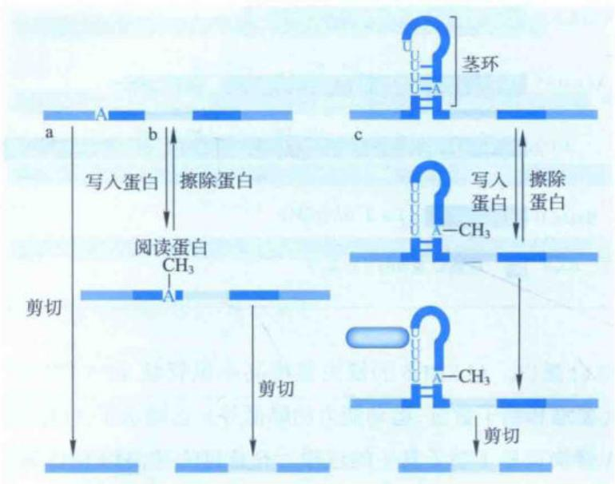

了一个长链非编码 RNA MALAT1 茎 - 环上 $m^{6}A$ 修饰位点。随后，有研究表明，一个富含 ssRNA 的结合蛋白 HNRNPC 倾向于结合在甲基化形式的 MALAT1 上。HNRNPC 蛋白能调控转录后基因表达过程，例如可变剪切。HNRNPC 结合位点包含一段尿嘧啶核苷酸，其位于 $m^{6}A$ 修饰位点对面的茎 - 环上。研究表明， $m^{6}A$ 位点的甲基化能通过破坏碱基对的稳定和增加富含尿嘧啶核苷酸单链的长度而进一步改变茎 - 环结构，使得结合位点更加接近 HNRNPC。一般情况下，MALAT1 的 $m^{6}A$ 修饰不会直接招募效应蛋白（reader），而是通过间接地改变 RNA 的结构完成这个过程，即甲基化作为一个改变茎 - 环结构的开关，同时茎 - 环结构的改变能进一步促进相关蛋白质与之结合。这两个步骤的结合精准地调控了由 $m^{6}A$ 修饰开关控制的一系列生物学事件。

## 4. $\mathrm{m}^{6}\mathrm{A}$ 修饰对RNA代谢的影响

不同类型的 mRNA 转录本中包含的 $m^{6}A$ 修饰位点不尽相同。例如，催乳素 mRNA 中只有一个 $m^{6}A$ 修饰位点；鲁斯氏肉瘤病毒 mRNA 则包含 7 个 $m^{6}A$ 修饰位点；二氢叶酸还原酶 (DHFR) 转录本中包含了 3 个 $m^{6}A$ 修饰位点；SV40 mRNA 中则包含有超过 10 个以上的 $m^{6}A$ 修饰位点，然而组蛋白和珠蛋白 mRNA 中则没有 $m^{6}A$ 修饰。转录物研究表明，46% 的 mRNA 只包含一个 $m^{6}A$ 修饰的峰，37.3% 的 mRNA 包含两个 $m^{6}A$ 修饰的峰，剩余的 mRNA 则包含超过两个以上的 $m^{6}A$ 修饰峰。这一结果暗示了 $m^{6}A$ 修饰本身对 RNA 代谢过程具有调控作用。进一步研究发现 $m^{6}A$ 修饰可通过影响 RNA 代谢包括 mRNA 的剪切、稳定性、核输出以及翻译等过程，最终影响基因的表达，调控多个生物学过程（图 8-41）。

① $m^{6}A$ 修饰对 mRNA 剪接的影响 前体 mRNA 的剪接是调控基因表达较为关键的一个步骤, 其过程包括内含子的切除以及细胞核中初级转录物外显子的联合, 最终产生成熟的 mRNA。有研究证据表明 $m^{6}A$ 修饰和 mRNA 剪接过程相关。例如, 在环亮氨酸处理的腺肉瘤病毒感染细胞中, 前体 mRNA 的含量升高, 而相应的成熟 mRNA 含量却降低。核内牛催乳素bPRL的定量S1核酸酶定位图揭示腺苷类似物(NPC)处理的CHO细胞的细胞核比未处理细胞中多含4\~6倍的bPRL前体。在环亮氨酸处理的CHO细胞中，核内不均一RNA(hnRNA)的相对分子质量会从低往高处迁移。相似的结果也在NPC处理的SV40 RNA中观察到，这暗示了 $\mathrm{m}^6\mathrm{A}$ 修饰有助于RNA剪接的发生。目前关于 $\mathrm{m}^6\mathrm{A}$ 修饰调控剪接的机制还不是很清楚。有研究认为甲基化的发生可能会干扰剪接因子和mRNA之间的相互作用。另外， $\mathrm{m}^6\mathrm{A}$ 修饰位点有可能是某些RNA结合蛋白的锚定位点或者 $\mathrm{m}^6\mathrm{A}$ 修饰后会使得某些A-U碱基配对不稳定从而影响了RNA的二级结构等。与甲基化酶或去甲基化酶互作的蛋白质也可能参与了剪接过程的调控。

  
图 8-41 m $^{6}$ A 对 RNA 代谢的影响

② $m^{6}A$ 修饰对核输出过程的影响 剪接完成后,成熟的 mRNA 需要从细胞核中运出进入细胞质进一步完成翻译或者降解。在 STH(S-tubercidinylhomocysteine) 处理的 HeLa 细胞中,mRNA 在核内的停留时间提高了 40%。有证据表明不同类型的 RNA 利用不同的途径通过核孔复合物调控核输出过程。mRNA 的核输出主要通过 TAP-P15 复合物以及一些接头蛋白、SR 蛋白和 TREX 复合体完成。由于 ASF/SF2 的磷酸化水平与剪接或者核输出有关,研究者们认为由 ALKBH5 缺失造成的 ASF/SF2 磷酸化水平下降将加强 ASF/SF2 和 TAP/P15 复合体的互作,从而进一步提高核内 mRNA 的输出。ALKBH5 去甲基化对细胞内 mRNA 加工因子的定位具有重要影响,推测 ALKBH5 靶定的 mRNA 转录物中 $m^{6}A$ 的甲基化状态可能影响了这些加工因子在细胞内的动态变化过程。

## 5. $\mathrm{m}^{6}\mathrm{A}$ 对翻译过程的影响

大多数的 $m^{6}A$ 修饰发生在外显子区域, 剪切完成后 $m^{6}A$ 修饰仍然保留在成熟的 mRNA 上。因此, $m^{6}A$ 修饰也可能会影响 mRNA 转录物的翻译。有证据表明, 将小鼠 DHFR mRNA 在体外进行甲基化和翻译后, 甲基化的转录本的翻译水平比未甲基化的转录物高 1.5 倍。相似地, 将环丝氨酸处理的细胞中纯化出的细胞质转录物进行体外翻译后发现, 低甲基化的 mRNA 产生 DHFR 蛋白数量比甲基化程度高的 mRNA 产生的蛋白质量少 20%。

## 8.4 非编码 RNA 对真核基因表达的调控

非编码 RNA (non-coding RNA, ncRNA) 是一类不编码蛋白质的 RNA。尽管人类基因组上四分之三的基因可以进行转录，然而只有一小部分的基因能够继续翻译成蛋白质。根据 RNA 的大小，非编码 RNA 可以分为小分子非编码 RNA，包括干扰小 RNA (short interfering RNA, siRNA)、微 RNA (miRNA) 等，以及长链非编码 RNA (lncRNA) (图 8-42)。其中 siRNA 和 miRNA 往往在基因沉默发面发挥功能，从而进一步影响基因表达。

图 8-42 人类基因组中编码 RNA 与非编码 RNA 的比较


## 8.4.1 干扰小RNA

## 1. 干扰小 RNA (siRNA) 的发现

早在 1988 年就有 RNAi 现象的报道。当时的研究人员希望通过转基因过表达的手段使得牵牛花的颜色变深，但在他们得到的诸多转基因牵牛花中，有些花不但颜色没有更深，反而变成白色了。以后相类似现象也在其他转基因植物中出现，被称为基因表达的共抑制现象（co-suppression）。人们发现不论引入靶基因的正义链（sense）还是反义链（anti-sense），都有可能导致内源靶基因表达量下降。这种现象在许多真核生物中都有报道，在线虫、果蝇的研究中被称为 RNA 干扰。

1998 年,研究人员通过实验发现 RNAi 的重要特性是以双链 RNA(dsRNA) 行使功能。通过微注射将基因 MEX3 的反义 mRNA 和 dsRNA 注射入线虫性腺细胞中,在子代胚胎中用原位杂交方法检测内源 MEX3 的表达水平。没有注射的胚胎中,MEX3 表达量很高;


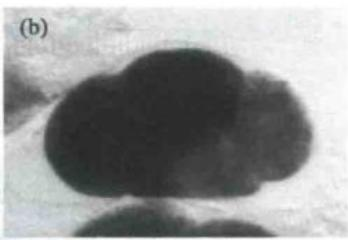


注射了反义 RNA 的, MEX3 表达量明显降低; 而注射了双链 RNA 的胚胎中几乎检测不到 MEX3 的表达 $^{(图 8-43)}$ 。

实验表明,双链 RNA 对内源基因表达的干扰效率远高于单链的 RNA,真正起到 RNA 沉默作用的应该是双链 RNA。此外,研究还发现,引入的外源 RNA 只对同源基因有高沉默效率,暗示它们之间可能需要形成配对的基础。2000 年 RNAi 研究有了重要进展,揭示了 dsRNA 介导的 RNAi 现象的许多重要特性。研究者开发了一套基于果蝇细胞提取物的体外 RNAi 研究系统,发现不论是否有靶 mRNA 的存在,引入的外源 dsRNA 的正义、反义链都会被切割成 21\~23 nt 的小片段,相对应的靶 mRNA 也会被降解成长度差为 21\~23 nt 的片段,说明这种降解很可能是由 21\~23 nt 小片段介导的,并且这种降解需要 ATP 提供能量。现在,已统一将介导这种沉默现象的小片段 RNA 称为干扰小 RNA(short interfering RNA, siRNA)。

## 图 8-43 RNAi 注射实验明确 RNA 是以双联形式行使功能的

利用原位杂交技术检测4-细胞胚胎时期的线虫内源MEX3 RNA（以深色表示）。(a)正常胚胎，无杂交探针；(b)未注射RNA，杂交探针检测线虫胚胎细胞内源MEX3 RNA；(c)注射MEX3 RNA反义链，杂交探针检测出MEX3 RNA水平略有下降；(d)注射双链MEX3 RNA，杂交探针未检测出内源MEX3 RNA。

## 2. siRNA 的生物合成

病毒 RNA 以及由环境、实验因素引入的外源 RNA 都可能是 siRNA 的来源。此外，基因组重复片段、转座子等序列也可能产生 siRNA。通常一个长为 21 nt 的双链小 RNA，其中 19 nt 形成配对双链，3' 端各有两个不配对核苷酸，而 5' 端为磷酸基团。其中一条链为引导链（guide strand），介导 mRNA 的降解；另一条链为乘客链（passenger strand），在 siRNA 形成有功能的复合体前被降解。

siRNA 的产生过程主要包括着 3 个核心步骤: 经 Dicer 切割形成双链小片段; 组装复合物; 形成有活性的沉默复合物 (RNA induced silencing complex, RISC) (图 8-44)。

① Dicer 切割 Dicer 是一类 RNaseⅢ蛋白, 主要包括一对 RNaseⅢ结构域、双链 RNA 结合域、解旋酶结构域和 PAZ 结构域。PAZ 结构域可以结合双链 RNA 的两个 3' 不配对核苷酸。两个 RNaseⅢ结构域形成分子内二聚体结构, 各催化剪切一条链, 产生双链断裂(图 8-45)。结构生物学研究表明, PAZ 结构域和 RNaseⅢ催化切点约相距 6.5 nm, 与 20 多个核苷酸的长度相当, 因此, Dicer 本身可以作为一把裁剪的尺子, 用来切出长为 21\~23 个核苷酸的 siRNA。


图 8-45 Dicer 结构及切割示意图  


② R2D2 的装配 siRNA 的装载需要双链 RNA 结合蛋白 R2D2 的帮助。R2D2 包含两个一前一后的双链 RNA 结合结构域，有报道认为 R2D2 可以结合双链小 RNA 热稳定性较高的一端。由于引导链的 5' 端稳定性一般较差，因此，R2D2 常结合在引导链 3' 端一侧。Dicer 和 R2D2 形成异源二聚体，Dicer/R2D2/siRNA 三者形成 RISC 装载复合物。R2D2 招募 Argonaute 蛋白，开始组装 RISC。

③ RISC 的装配和成熟 Argonaute 与 Dicer 可以发生蛋白质 - 蛋白质相互作用, Argonaute 首先与 Dicer 交换, 结合到 siRNA 双链的一端, 然后与 R2D2 交换, 将整个双链小 RNA 都转载到 Argonaute 中。此时, Argonaute 将乘客链降解, 形成有功能的沉默复合物。

## 3. siRNA 介导的基因沉默机制

已知 siRNA 介导的基因沉默主要发生在两个水平上, 即转录后水平的 mRNA 的降解以及染色体水平上形成异染色质。实验证明靶 mRNA 可以被 siRNA 切割成若干片段, 片段之间往往长度均为 21\~23 个核苷酸, 而且被切割出的片段长度由 siRNA 与 mRNA 的哪段区域互补配对所决定。有研究表明, siRNA 介导的 mRNA 的降解需要核酸酶催化以及镁离子的帮助。

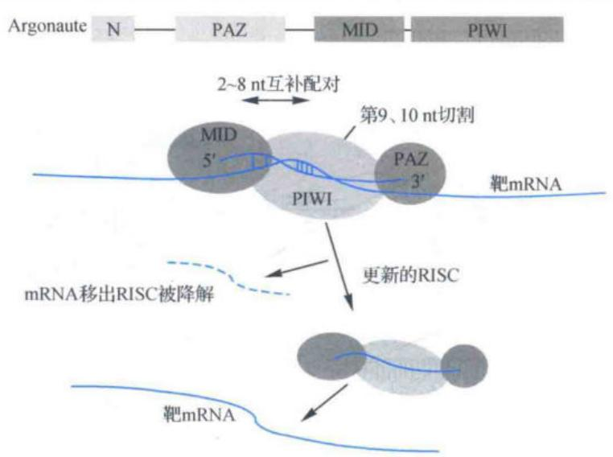

图 8-46 Argonaute 蛋白与 RISC 的组装、成熟

在装配好的 RISC 中, siRNA 引导链的 5' 端与 Argonaute 蛋白的 MID 结合, 延伸 MID/PIWI 界面至 3' 端与 PAZ 结合。通常 siRNA 的第 2\~8 个核苷酸被认为是核心种子序列, 用来提供与靶 mRNA 的特异性配对。长约 10 个核苷酸的 mRNA-siRNA 配对物位于 PIWI 功能域, 切割往往发生在第 9、10 个核苷酸上, 由 PIWI 催化将靶 mRNA 切断, 并使被切断的 mRNA 离开 RISC(图 8-46)。

RNA 依赖的 RNA 聚合酶(RNA-dependent RNA polymerase, RDRP)使 siRNA 继续扩增，产生次级 siRNA 放大效应。植物、线虫和酵母中都发现存在以 RNA 为模板的 RNA 扩增机制，但哺乳动物和果蝇的基因组分析却没有发现相关基因。有多种机制可导致以 RNA 为模板的 RNA 扩增。通常情况下，成熟的真核 mRNA 与各种蛋白质，如 5' 帽子结合蛋白和 3' 多腺苷酸结合蛋白相结合，这些结合蛋白保护了 mRNA，使 RDRP 无法靠近 mRNA。当细胞中缺少这些 RNA 结合蛋白时，RDRP 可以结合 mRNA 并以其为模板，扩增出双链 RNA，经 Dicer 切割等步骤产生 siRNA，来降解内源 RNA。这个过程也可视作机体清除错误 mRNA 的机制。

对于结合蛋白完好的 mRNA, 如果体内有与它相配对的 siRNA, 该 siRNA 便作为扩增的引物以 mRNA 为模板合成双链 RNA, 产生新的 RISC, 新扩增产生的各种次级 siRNA 可以与靶 mRNA 的不同区域配对, 更大范围地降解靶 mRNA $^{(图 8-47)}$ 。植物中的研究发现, 次级 siRNA 可以传递到其他细胞中, 它既可以在相邻的细胞 - 细胞间近距离传递, 也可以通过韧皮部在不同组织间广泛传播。

## 4. siRNA 的生物学意义

RNAi 的生物学意义可以简单概括为如下 3 点: ① 在转录水平、转录后水平参与基因的表达调控; ② 维持基因组的稳定; ③ 保护基因组免受外源核酸侵入。

入侵病毒与被入侵宿主借助 RNAi 的机制相互抑制,如同人类社会的军备竞赛。宿主可以病毒 RNA 为模板,通过 RDRP 合成病毒的双链 RNA,经过 Dicer 切割组装成

图 8-47 次级 siRNA 的产生

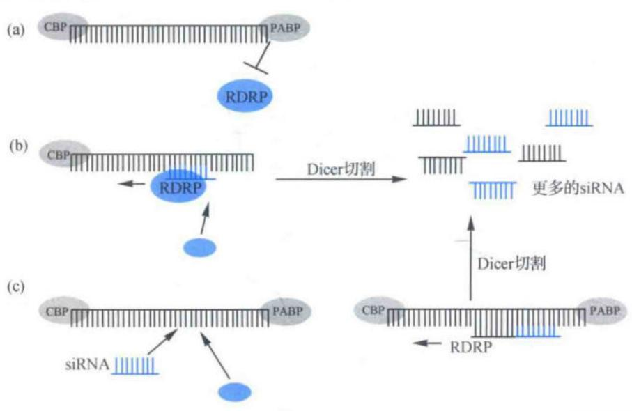

RISC, 降解病毒 RNA, 从而抑制病毒对宿主细胞的破坏。这样的 siRNA 还可以通过胞间连丝在细胞 - 细胞间传递, 通过韧皮组织远距离传输到其他组织和器官中, 让这些细胞以及组织提前具有抵抗病毒的能力。另一方面, 病毒也进化出与宿主抗病基因序列相似的 RNA, 借助相似的机制生成 RISC, 降解宿主细胞抗病基因的 mRNA。这种 siRNA 也会在宿主体内传播, 增加了未被侵染的细胞的易感性。

## 8.4.2 miRNA

## 1. miRNA 的发现

1993 年, 研究者第一次确定了 microRNA lin-4 的存在。lin-4 是调控线虫胚胎后期发育的重要基因, 它可以负调控 Lin-14 蛋白, 使该蛋白质水平在线虫特定发育时期——第一幼虫期初期, 开始下降, 保证幼虫具有正常的发育模式。他们克隆了 4 种不同种的线虫的 lin-4 基因, 都能够很好地恢复 lin-4 突变体表型。惊人的是, 对 lin-4 的基因组序列进行开放阅读框预测发现, lin-4 基因并不编码蛋白质。通过 Northern 印迹等实验进一步分析 lin-4 的转录情况发现, 转录物在线虫中形成一大一小两个片段 (61 个和 22 个核苷酸)。这两个片段同时对应在 lin-4 基因序列的同一区域, 并且转录方向也是一致的。二级结构预测发现, 大片段可以形成不完美配对的茎 - 环结构, 小片段则是真正起作用的 miRNA。序列比对发现, lin-4 转录物的小片段和 lin-14 mRNA 的 3'UTR 区域的重复序列互补配对, 可以形成 lin-4:lin-14 RNA-RNA 杂合结构, 因此实现了 lin-4 对 lin-14 的转录后调控 (图 8-48)。

## 2. miRNA 的生物合成

miRNA 在动物和植物基因组中普遍存在, 是一类重要的行使基因功能但不编码蛋白质的基因。与许多真核生物基因的转录物相似, miRNA 的最初转录产物 pri-miRNA 5' 端有加帽, 3' 端有多腺苷酸结构, 这类基因的转录能够被 RNA 聚合酶 II 的抑制剂 alpha-

amani 所抑制。研究还发现, RNA 聚合酶Ⅱ与许多 miRNA 的启动子区结合在一起。因此, 与许多真核基因相类似, miRNA 也由 RNA 聚合酶Ⅱ转录, 并具有自己的启动子区域, 它们的表达会受到各种时空上的调节。动物和植物中形成成熟的 miRNA 的基本过程很相似: 先由 RNA 聚合酶Ⅱ产生的较长的初级转录物 pri-miRNA, 中间有一段不完美配对的茎-环结构。经过第一步切割产生 pre-miRNA, 再经第二步切割产生双链 miRNA, 双链解链形成成熟的

  
图 8-48 lin-4 对 lin-14 的转录后调控

长 21 个核苷酸左右的单链 miRNA。参与整个过程的基因和切割过程在动植物中略有不同。

动物中 miRNA 前体的两次切割都需要有 RNaseⅢ内切核酸酶以及双链 RNA 结合蛋白完成。Drosha 是一种 RNaseⅢ，将 pri-miRNA 的 3' 端和 5' 端切割产生长约 70 个核苷酸、5' 端带磷酸基团，3' 端为羟基的 miRNA 前体（pre-miRNA），保留茎－环结构区，并且切割端具有 2～3 个核苷酸的 3' 不配对碱基，这是由 RNaseⅢ的性质所决定的。Drosha 的正确切割还需要一类双链 RNA 结合蛋白，在果蝇中是 Pasha 蛋白，在线虫中是 Pash-1 蛋白，而在哺乳动物中则为 DGCR8 蛋白的帮助。切割后的前体 pre-miRNA 经由 Exportin 5/RanGTP 运出细胞核进入胞质中。胞质中的 RNaseⅢ为 Dicer，切割 pre-miRNA 茎－环结构环的一端形成成熟的长约 21 个核苷酸的双链 miRNA，即 miRNA-miRNA\*，其中的 miRNA 链是之后真正行使功能的成熟 miRNA 链。有研究认为，哪条链作为 miRNA 由其 5' 端热不稳定性所决定，5' 端相对不稳定的链更有可能成为 miRNA。

植物中没有 Drosha 的同源基因, pri-miRNA 的两步切割由 Dicer 的同源基因 Dicer-Like1(DCL1) 完成。DCL1 在细胞核内, pri-miRNA 经 DCL1 两步切割, 两端形成双链 miRNA, 由 Exportin5 的同源基因 HASTY 运输出细胞核。与动物中的 miRNA 不同, 植物双链 miRNA 两个 3' 端的自由羟基被甲基转移酶 HEN1 甲基化, 以羟甲基的形式存在。甲基化的 3' 端被保护不受降解, 还有助于形成成熟的 RISC $^{(图 8-49)}$ 。

## 3. miRNA 的功能

miRNA 的功能主要有两个方面: 一是和 siRNA 一样装载成 RISC 后使互补配对的 mRNA 降解。其次, miRNA 可抑制 mRNA 的翻译, 降低靶基因的蛋白质水平但不影响其 mRNA 的水平。

miRNA-RISC 的原理和 siRNA 相似,但由此介导的基因沉默还需要一些其他功能比较保守的元件的参与。果蝇的研究发现,靶 mRNA 的降解除了需要 AGO 蛋白以外,还需

图 8-49 动、植物 miRNA 产生过程比较


要 GW182、脱腺苷基因（NOT1/CAF1）、脱帽相关基因（DCP）等，说明这种转录后沉默机制需要经历“脱帽脱尾”事件。GW182 蛋白还可以与多腺苷酸结合蛋白（PABP）相互作用。

到目前为止,尚不能确定 miRNA 介导的翻译抑制发生在哪个阶段。有研究者将 miRNA 转染到人的实验细胞系中,添加翻译抑制剂 hippuristanol(抑制 eIF4A)阻断翻译过程,再通过密度梯度离心分离分析核糖体,发现有 miRNA 的体系中靶 mRNA 很快从翻译的多核糖体中移出,可检测到更多的自由核糖体,他们据此推测 miRNA 介导的翻译抑制可能是通过形成 miRNA:mRNA 配对分子,阻碍有功能的核糖体与 mRNA 结合、装配,发生核糖体的 “drop-off” (图 8-50)。

## 8.4.3 长链非编码 RNA

## 1. 长链非编码 RNA(lncRNA) 的种类

lncRNA 指长度大于 200 bp 的非编码 RNA。根据基因组位点或者相关的 DNA 链特征，lncRNA 可以进一步分为正义 lncRNA、反义 lncRNA、基因内 lncRNA、基因间 lncRNA、增强子 lncRNA 或环状 lncRNA 等 $^{(图 8-51)}$ 。

正义 lncRNA 是指基因位点通过共享相同的启动子和某个蛋白编码基因有重叠；反义 lncRNA 指基因位点以反向的方式插入在某个已知的蛋白编码基因中；基因内 lncRNA 指基因位于某个蛋白编码基因的内含子区；基因间 lncRNA 指的是编码 lncRNA 的基因位点位于两个蛋白编码的基因中；增强子 lncRNA 指的是编码 lncRNA 的基因位点位于某一蛋白编码基因的增强子区域；环状 lncRNA 则指通过共价键形成闭合的环 lncRNA，其一

  
图 8-50 miRNA 介导的翻译抑制机制

  
图 8-51 长链非编码 RNA 的类型
e, 增强子; exon, 外显子。

般来自可变剪切的编码蛋白基因。

## 2. 长链非编码 RNA 的作用机制

## (1) lncRNA 作为信号分子行使功能

研究表明, lncRNA 可以作为信号分子、诱饵分子、引导分子以及骨架分子等形式对基因表达进行调控。大部分 lncRNA 由 RNA 聚合酶 II 负责转录。lncRNA 表现出细胞类型特异表达的特征, 并且能响应各种外界刺激, 这表明其表达会在转录水平受调控。因此, lncRNA 可以作为分子信号形式功能(图 8-52), 即每个 lncRNA 的转录都具有时空表达特异性, 以进一步整合不同的发育信号、细胞内容物以及响应不同的外界刺激等。这一类型的 lncRNA 一部分具有调控功能, 另外一部分则只是转录的副产物。lncRNA 能参与调控

图8-52 lncRNA作为信号分子的基因调控机制示意图

作为信号分子, lncRNA 的表达与结合的转录因子或信号途径相关, 从而对相关基因调控具有时空特异性。


转录起始、延伸或终止等阶段。这些情况下，调控元件的染色质状态只被相关的 lncRNA 表达影响。作为信号分子的 lncRNA 可进一步用来标记时空、发育阶段以及调控基因表达。

哺乳动物为携带两个常染色体等位基因的二倍体生物。通常情况下这些等位基因遗传信息一个来自母本，一个来自父本。然而，部分基因的表达则会通过表观调控的方式只取决于母本或是父本基因，这种现象称为基因印记。近来的证据表明，一些lncRNA能通过与染色体互作以及招募染色质修复装置等进一步参与介导大量基因的转录沉默。例如，在小鼠胎盘中，长链非编码RNA Kcnq1ot1和Air能聚集在所沉默的等位基因的启动子染色质区域，并以等位基因特异的方式，进一步介导抑制效应的组蛋白修饰的发生。Kcnq1ot1是一个来自父本的长为90 kb的长链非编码RNA，其介导了Kcnq1印记区域的一类基因的沉默。Kcnq1ot1与组蛋白甲基转移酶G9a和PRC2互作，通过招募多梳复合体，迅速在顺式作用元件到转录位点之间形成一个抑制区域。同时，非编码RNA本身在Kcnq1区域双向沉默基因方面具有关键作用，其作用机制类型于Xist RNA。

Xist 是一种在 X 染色体失活中起重要作用的非编码 RNA。在雌性动物发育中，Xist RNA 在失活的 X 染色体上表达，进一步覆盖在 X 染色体上进行转录，此时大量的组蛋白被甲基化，导致 X 染色体上的基因表达被抑制，X 染色体失活。其反义转录物 Tsix 能抑制 Xist 的表达，而另外一种非编码 RNA Jpx 能在失活的 X 染色体中积累，并进一步激活 Xist 的表达。

## (2) lncRNA 作为诱饵分子行使功能

启动子或增强子的转录对 lncRNA 的转录调控具有重要作用。作为诱饵分子的 lncRNA 转录并结合在蛋白质靶点上，但不会附加额外的功能。这一类的 RNAs 作为一种“分子过滤器”，进一步诱导 RNA 结合蛋白与之结合。这些蛋白质可以是转录因子、染色质修复子或者其他类型的调控因子等(图 8-53)。

同一个基因具有不同的启动子在基因表达中是一种较为普遍的现象。不同基因的这种可选调控机制各不相同。人 DHFR 基因（二氢叶酸还原酶，dihydrofolate reductase）具有依赖 RNA 的转录抑制调控机制。DHFR 基因弱启动子上游的 lncRNA 通过和启动子序列以及通用转录因子ⅡB(TFⅡB)结合形成一个稳固的非编码 RNA-DNA 复合体，进一步抑

作为引导分子,IncRNA 招募染色质修饰酶对靶基因进行调控,或以顺式或反式的方式对远距离的靶基因表达进行调控。

  
图 8-53 lncRNA 作为诱饵分子的基因调控机制示意图  
作为诱饵分子, lncRNA 能将转录因子或相关的其他类型蛋白带离染色质或将其带入染色质的核心区域。

制前起始复合体在主启动子上的聚集。当 lncRNA 被特异的 siRNA 沉默后，TFⅡB 仍然占据在主启动子上。这是一个动态变化的过程，并且展现出特异的调控机制，这一机制能进一步靶定或抑制启动子，这也暗示了基因间 lncRNA 作为一个诱饵分子对邻基因表达调控的重要性。

有报道鉴定了一种叫作 Gas5(生长停滞特异转录物 5, growth arrest-specific 5) 的 lncRNA。细胞在 Gas5 的作用下能营造一种耐糖皮质激素的状态。Gas5 抑制了糖皮质激素受体通过其中的一个茎-环结构形成 RNA 基序，这一作用类似于糖皮质响应基因启动子区域中的激素响应元件 DNA 基序类似物。随后，Gas5 作为诱饵分子，竞争性结合在糖皮质激素受体的 DNA 结合区域，有效地阻止了受体与染色体的互作。

## (3) lncRNA 作为引导分子行使功能

第三种类型的 lncRNA 可以作为 RNA 结合蛋白的引导分子, 进一步介导核糖体蛋白复合体定位在特定的靶点上(图 8-54)。目前研究表明, lncRNA 可通过顺式(邻近的基因)或反式(远处的基因)的方式介导基因表达的改变。

这些 RNA 在转录水平的调控作用表明染色质结构上的改变不仅是一种局部效应,也是一种远距离的结构影响。例如,Air 或者 eRNAs 这类的 lncRNA 可以通过转录调控的局部序列元件,如启动子或者增强子等,扩大其影响范围。相反的,对于 HOTAIR 以及 linc-p21 这类的 lncRNA,长距离的基因调控作用则需要额外的互作组分参与,并且这些组分需要正确的定位在所作用的位点。总之,lncRNA 能以共转录或作为小 RNA 的互补靶标最终以顺式作用方式进一步介导染色质的改变;当 lncRNA 作为 RNA-DNA 异源双链核酸分子如 RNA:DNA:DNA 三重复合物或特定染色质表面的 RNA 识别特征时,则会结合在靶 DNA 上以反式调控的方式介导染色质发生改变。


  
图 8-55 由 lncRNA COLDAIR 介导的基因调控过程

lncRNA 介导的基因调控组分包括抑制复合体、激活复合体以及转录因子。然而，无论是从距离还是机制上讲，总体的调控原则就是通过一段中间延伸的 DNA 来运输调控信息，进一步调控靶基因的表达，最终使得表观基因组发生改变。其中，一些 lncRNA 以顺式调控方式发挥作用。例如，Air 通过启动子位置，特异与 lncRNA 和染色质互作，进一步沉默等位染色体上靶基因的转录。随后，启动子区域聚集的 Air 招募 G9a，导致靶点 H3K9 及其等位基因甲基化并沉默表达。受冷诱导的植物 lncRNA COLDAIR 则在建立及维持稳定的抑制性染色质中起作用。春化过程中，COLDAIR 引导 PRC2 到调控开花的抑制子 FLC 染色体上，通过三甲基化 H3K27 抑制基因表达(图 8-55)。这些发现表明 lncRNA 能通过与染色体特异结合，以顺式方式介导抑制组蛋白修复物质的招募，进一步从表观遗传水平沉默转录。

lncRNA 也能通过转录共激活复合体或共抑制复合体, 如 CBP 蛋白和 p300 组蛋白去乙酰化转移酶, 进一步调控基因的表达。RNA 结合蛋白 TLS 通过一个拴在 cyclin D1 启动子区域的 lncRNA 招募到染色体上。lncRNA 与 TLS 的结合反过来导致 TLS 构象改变。这样的构象改变使氨基端抑制了 p300 和 CBP 的组蛋白去乙酰化转移酶活性, 从而抑制基因表达(图 8-56)。尽管这一机制是否具有普遍性还未知, 然而高度保守的 lncRNA 以及转录共调控子上大量的 RNA 结合区域的发现增加人们对该调控机制普遍性的认可。

和这些顺式调控的 lncRNA 不同,一些 lncRNA 则以反式作用的方式对基因表达进行调控,即通过染色体进一步扩大其对基因的转录影响。有报道表明 lncRNA HOTAIR 的表达与癌症转移有关。在原发性和转移性乳腺癌中均发现 HOTAIR 表达有所提高。另外,癌细胞中 HOTAIR 的缺失会导致 PRC2 基因高表达的细胞侵袭性降低。这些发现表明非编码 RNA 介导的多梳蛋白复合体在乳腺肿瘤发生中起着关键性作用,尤其暗示了 HOTAIR 这类的 lncRNA 能通过反式作用的方式靶定染色质修复复合体的定位、酶活等,进一步调控细胞的表观遗传状态。

## (4) lncRNA 作为骨架分子行使功能

lncRNA 能作为一个中心平台招募相关生物学过程中的分子组分进一步调控基因表达。在许多不同的生物学过程中,这一精确的调控对分子间的相互作用及信号转导的特异性和动态过程具有至关重要的作用。这一类型的 lncRNA 具有不同的功能区域,并结合不同的效应分子,是较为复杂的一类 lncRNA。lncRNA 可能在同一个时间会结合多个效应分子,进一步带入具有转录激活或抑制作用的效应蛋白(图 8-57)。

  
图 8-56 lncRNA 介导的蛋白质构象改变控制基因表达过程

lncRNA 与染色质修复复合体之间的互作对 INK4a 基因的转录抑制具有重要的作用。肿瘤抑制子位点 INK4b/ARF/INK4a 在正常细胞和癌细胞中的表达受多梳蛋白复合体介导的 H3K27 甲基化的影响。研究表明，反义非编码 RNA ANRIL 与 INK4b 具有相同的位点，其能和 PRC1、PRC2 复合体组分具有直接相互作用。ANRIL 和 PRC1、PRC2 之间的任意互作被打破都会影响 INK4b 靶基因的转录抑制。因此，ANRIL 作为一类典型支架分子，招募不同染色质修复复合体最终使得靶基因沉默，动态调控基因转录活性。

另外,上文中提到 lncRNA HOTAIR 结合 PRC2,从而甲基化 H3K27,促进基因抑制的

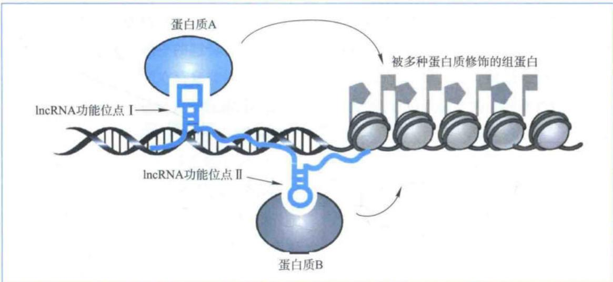  
图 8-57 lncRNA 作为骨架分子的基因调控机制示意图  
作为骨架分子, lncRNA 结合多种蛋白质形成核糖核蛋白复合体 (RNP)。lncRNA-RNP 复合体进一步作用染色体影响组蛋白修饰。

图 8-58 HOTAIR 作为骨架分子介导的基因沉默过程

HOTAIR 分别通过其 5' 端和 3' 端分别连接组蛋白甲基化酶 PRC2 和去甲基酶 LSD1，进一步导致 H3K27 和 H3K4 的去甲基化，抑制靶基因的表达。

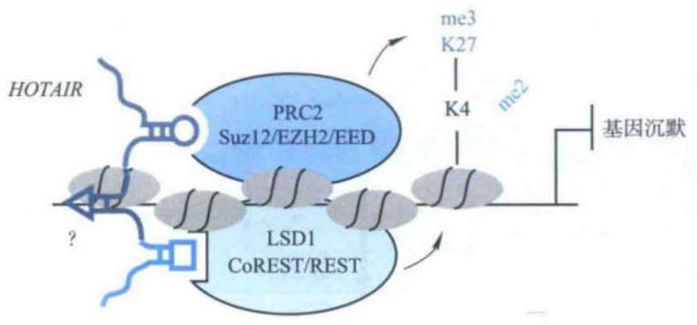

发生。后续的报道发现 PRC2 结合在 HOTAIR 5' 端的前 300 个氨基酸上，而 HOTAIR 3' 端的前 700 个氨基酸则会和第二个复合体，包括 LSD1、CoREST 以及 REST 等互作，进一步去甲基化 H3K4，阻止基因激活。这表明 HOTAIR 能靶定多个染色质修复复合体，作为一个骨架分子，在 PRC1、PRC2 复合体和 LSD1/CoREST/REST 复合体之间起到桥梁分子的作用，将这些不同的分子打包成为一个整体(图 8-58)。HOTAIR/PRC2/LSD1 复合体可以同时通过多个机制实现基因表达的抑制。HOTAIR 的表达能诱导 PRC2 和 LSD1 复合体之间的相互作用，而 HOTAIR 缺失则导致靶基因上这些复合体的丢失。值得一提的是，在不同类型的细胞中，许多额外的 lncRNA 能和 PRC2、LSD1 复合体互作。这些额外的 lncRNA 很有可能也包含许多结合不同蛋白复合体的位点，从而带来更为特异的靶基因上组蛋白修复的不同组合。

## 8.5 真核基因其他水平上的表达调控

## 8.5.1 蛋白质磷酸化对基因转录的调控

真核基因转录前基因组中某些位置上的染色质结构改变为伸展型或“开放”状态，为基因的活化奠定了基础并起着“开关”的作用。染色质的伸展结构使细胞核中相应位置上的基因有可能成为RNA聚合酶Ⅱ转录的模板，从而启动基因的表达，开始将遗传信息从DNA转移到RNA上并翻译为蛋白质，实现了遗传信息传递的“中心法则”。

蛋白质的磷酸化与去磷酸化过程(图 8-59)是生物体内普遍存在的信号转导调节方式,几乎涉及所有的生理及病理过程,如糖代谢、光合作用、细胞的生长发育、神经递质的合成

图 8-59 蛋白质的磷酸化及去磷酸化过程  


细胞表面受体与配体分子的高亲和力特异性结合,能诱导受体蛋白构象变化,使胞外信号顺利通过质膜进入细胞内,或使受体发生寡聚化而被激活。一般情况下,受体分子活化细胞功能的途径有两条:一是受体本身或受体结合蛋白具有内源酪氨酸激酶活性，胞内信号通过酪氨酸激酶途径得到传递；二是配体与细胞表面受体结合，通过G蛋白介异的效应系统产生介质，活化丝氨酸/苏氨酸或酪氨酸激酶，从而传递信号。按照“碰撞耦联”或称“动态受体”学说，受体的侧向流动性使受体分子与效应分子在胞质膜

  
图 8-60 酪氨酸受体蛋白激酶磷酸化与细胞癌变示意图  
酪氨酸受体蛋白激酶与表皮生长因子(EGF)相结合后,刺激了该受体蛋白的激酶活性,引发一系列生理反应。原癌蛋白ErbB虽然没有正常酪氨酸受体蛋白激酶的胞外结构域,其胞内结构域却具有蛋白激酶活性,刺激细胞持久分裂,诱发癌变。

磷脂双层内相互作用,这是信号转导的关键。酪氨酸激酶受体侧向扩散使受体寡聚化,是活化信号转导时受体-受体间自身磷酸化所必需的。对于依赖G蛋白介导的配体信号转导途径来说,配体与受体结合后,G蛋白和受体-配体复合物由于各自在细胞膜内侧向扩散而发生瞬时随机碰撞导致G蛋白活化效应分子。研究认为,信号转导是维系外部刺激与细胞反应的桥梁,千变万化的环境因子使信号转导的途径与机制成了变幻莫测的迷宫。在已知的上游信号转导途径中,酪氨酸蛋白激酶(protein tyrosine kinase,PTK)途径及受体耦联的G蛋白途径广为引人注目(图8-60)。

## 1. 受 cAMP 水平调控的 A 激酶

科学家把依赖于 cAMP 的蛋白激酶称为 A 激酶(PKA)，它能把 ATP 分子上的末端磷酸基团加到某个特定蛋白质的丝氨酸或苏氨酸残基上。被 A 激酶磷酸化的氨基酸 N 端上游往往存在两个或两个以上碱性氨基酸，特定氨基酸的磷酸化(X-Arg-Arg-X-Ser-X)改变了这一蛋白质的酶活性，动物细胞中这一酶活性代表了 cAMP 所引起的全部反应。在不同的细胞体系中，A 激酶的反应底物是不一样的，这就决定了 cAMP 能在不同靶细胞中诱发不同的反应，非活性状态的 PKA 全酶由 4 个亚基 R2C2 所组成，相对分子质量为 150～170，调节亚基与 cAMP 相结合，引起构象变化并释放催化亚基，后者随即成为有催化活性的单体(图 8-61)。

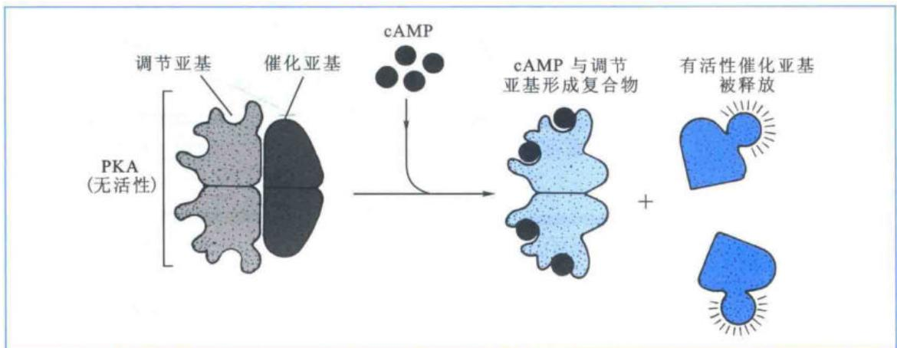  
图 8-61 cAMP 调控的 A 激酶活性

已经证实,许多转录因子都可以通过 cAMP 介导的蛋白质磷酸化过程而被激活,因为这类基因的 5' 端启动区大都拥有一个或数个 cAMP 应答元件(cAMP-response element, CRE),其基本序列为 TGACGTCA。膜上的受体 R 与外源配基(ligand)相结合,引起受体构象变化,并与 GTP 结合蛋白相结合,R 与 G 蛋白耦合激活了与膜相关的腺苷酸环化酶(AC),导致胞内 cAMP 浓度上升,活化 A 激酶,释放催化亚基并进入核内,实施底物磷酸化。被磷酸化的底物,如 CREB、CREM 等,可作为转录激活因子诱发基因转录。

## 2. C 激酶与 $\mathrm{PIP}_2$ 、 $\mathrm{IP}_3$ 和 DAG

图 8-62 激酶信号传递与基因表达示意图

磷酸肌醇级联放大的细胞内信使是磷脂酰肌醇-4,5-二磷酸 $\mathrm{(PIP_2)}$ 的两个酶解产物：肌醇1,4,5-三磷酸 $(\mathrm{IP}_3)$ 和二酰基甘油(DAG)。 $\mathrm{IP}_3$ 和DAG是该途径的主要活性分子，G蛋白通过活化的受体调控磷酸肌醇酶系统的活性。图8-62是C激酶信号传递示意图，因为该蛋白激酶活性是依赖于 $\mathrm{Ca^{2+}}$ 的，所以称为C激酶(PKC)。 $\mathrm{IP}_3$ 引起细胞质 $\mathrm{Ca^{2+}}$ 浓度升高,导致 C 激酶从胞质转运到靠近原生质膜内侧处,并被 DAG 和 $Ca^{2+}$ 的双重影响所激活。DAG 激活 C 激酶的原因是前者大大提高了 C 激酶对于 $Ca^{2+}$ 的亲和力,从而使得 C 激酶能被生理水平的 $Ca^{2+}$ 离子所活化。C 激酶是一个 $7.7 \times 10^{4}$ 的蛋白质,主要实施对丝氨酸、苏氨酸的磷酸化,它具有一个催化结构域和一个调节结构域。DAG 结合后还能解除调节区所造成的抑制作用,提高酶活性。

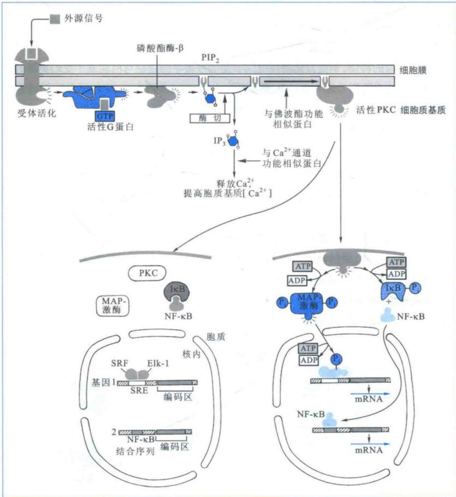

## 3. CaM 激酶及 MAP 激酶

$\mathrm{Ca}^{2+}$ 的细胞学功能主要通过钙调蛋白激酶(CaM-kinase)来实现,它们也是一类丝氨酸/苏氨酸激酶,但仅应答于细胞内 $\mathrm{Ca}^{2+}$ 水平。MAP 激酶(mitogen-activated proteinkinase, MAP-kinase,又称为 extracellular-signal-regulated kinase,ERKS)活性受许多外源细胞生长、分化因子的诱导,也受到酪氨酸蛋白激酶及 G 蛋白受体系统的调控。MAP 激酶的活性取决于该蛋白质中仅有一个氨基酸之隔的酪氨酸、丝氨酸残基是否都被磷酸化(图 8-63),图中 Jun、E1K-1 等为转录因子,其磷酸化状态的改变能够影响其后介导的基因转录起始与否。科学家把能同时催化这两个氨基酸残基磷酸化的酶称为 MAP-激酶-激酶,它的反应底物是 MAP 激酶。MAP-激酶-激酶本身能被 MAP-激酶-激酶-激酶所磷酸化激活,后者能同时被 C 激酶或酪氨酸激酶家族的 Ras 蛋白等激活,从而在信息传导中发挥功能。

## 4. 蛋白质磷酸化与细胞分裂调控

细胞通过 p53 及 p21 蛋白控制 CDK(cyclin-dependent protein kinase) 活性,调控细胞分裂的进程。如果 p21 蛋白过量,大量周期蛋白(cyclin)E-CDK2 复合物与 p21 蛋白相结合,使 CDK2 丧失磷酸化 pRb 蛋白的功能。没有被磷酸化的 pRb 蛋白与转录因子 E2F 相结合并使后者不能激活一系列与 DNA 合成有关的酶,导致细胞不能由 G₁ 期进入 S 期,细

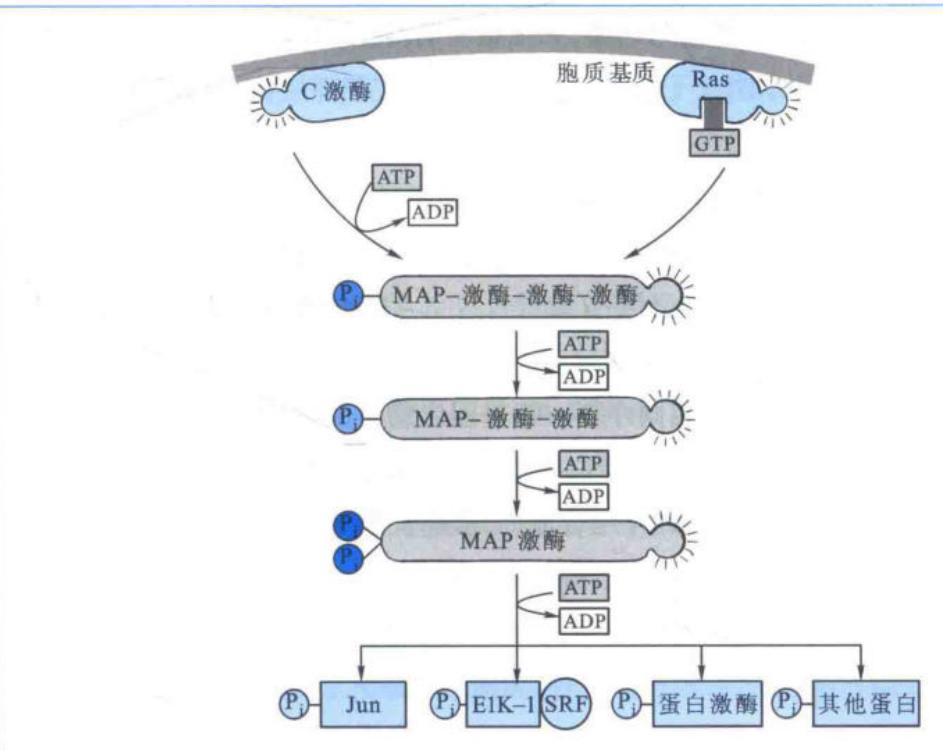  
图 8-63 Ras 蛋白和 C 激酶激活丝氨酸 / 苏氨酸“瀑布式”磷酸化(级联磷酸化), 引起相关生理反应图示

图 8-64 pRb 蛋白的磷酸化和去磷酸化过程控制了细胞分裂的周期性


胞分裂受阻。如果细胞中 p53 基因活性降低，p21 蛋白含量急剧下降，周期蛋白 E-CDK2 复合物就能有效地将 pRb 蛋白磷酸化。此时，pRb 蛋白不能与 E2F 相结合，使后者发挥转录调控因子的作用，激活许多与 DNA 合成有关的基因表达，使细胞从 $G_{1}$ 期进入 S 期，引发细胞分裂（图 8-64）。

## 8.5.2 蛋白质乙酰化对转录活性的影响

肿瘤抑制因子 p53 蛋白与人类多种肿瘤有着密切的关系，因此可能是该领域中研究最为深入的蛋白质。p53 参与多种信号通路，如细胞周期调控、DNA 损伤修复、血管的生成与抑制以及细胞凋亡等的调控。已知 p53 蛋白的活性受翻译后修饰（如磷酸化、乙酰化等）机制调控，经修饰的 p53 蛋白能与不同的靶分子或蛋白复合体相结合，从而抑制或激活参与特定生理反应的靶基因。p53 在所有细胞中都转录产生 2.2～2.5 千核苷酸的 mRNA，编码由 393 个氨基酸组成的相对分子质量为 $5.3 \times 10^{4}$ 的蛋白质（p53 蛋白）。根据 p53 的结构特点可将其分为 3 个不同区域：N 端酸性区（1～80 位氨基酸残基）、C 端碱性区（319～393 位）和中间（100～300 位）的疏水区 [图 8-65(a)]。

p53 能识别不同构象靶基因的相同序列。靶基因启动子的拓扑结构和 p53 蛋白（及与其相互作用的辅助蛋白）的构象决定该蛋白质是否与启动子区相互作用。乙酰化使 p53 蛋白的 DNA 结合区域暴露，增强了 DNA 结合能力，从而促进了靶基因的转录 $^{[图 8-65(b)]}$ 。CBP/p300 等蛋白复合体既能诱导染色体结构发生有利于结合 p53 蛋白的改变，又使 p53 蛋白被乙酰化，从而显著提高受 p53 调控的靶基因的转录活性。

  
图 8-65 p53 蛋白乙酰化有利于激活靶基因转录  
(a) p53 蛋白基本结构示意图；(b) p53 蛋白的乙酰化提高了它的 DNA 结合能力。

## 8.5.3 激素对基因表达的影响

## 1. 激素对靶基因的影响

许多类固醇激素(如雌激素、孕激素、醛固酮、糖皮质激素和雄激素, 图 8-59)以及一般代谢性激素(如胰岛素)的调控作用都是通过起始基因转录而实现的。靶细胞具有专一的细胞质受体, 可与激素形成复合物, 导致三维结构甚至化学性质的变化。经修饰的受体与激素复合物通过核膜进入细胞核内, 并与染色质的特定区域相结合, 导致基因转录的起始或关闭。研究发现, 体内存在的许多糖皮质类激素应答基因都有一段大约20 bp的顺式作用元件(激素应答元件, 简称 HRE), 该序列具有类似增强子的作用, 其活性受激素制约。表 8-12 是3种激素应答序列成分保守性分析。靶细胞中含有大量激素受体蛋白, 而非靶细胞中没有或很少有这类受体, 这是激素调节转录组织特异性的根本原因。

糖皮质激素通过核穿梭(nuclear shuttling)激活下游信号通路。该激素与相应受体结合,改变其构象,使之进入细胞核内,结合在能够促进转录的相应增强子上,从而促进下游基因的转录。实验中,利用糖皮质激素地塞米松(dexamethasone,DEX)激活靶基因表达的原理,构建可诱导表达融合蛋白系统。首先,将糖皮质激素受体GR和要研究的核蛋白X构建成融合蛋白,转基因到酵母、动物细胞或者植物中。不施加外源DEX时,融合蛋白与HSP90形成复合物,由于构象和空间位阻等原因,融合蛋白存在于胞质中,不能定位到细胞核内。添加DEX时,DEX扩散入胞与GR相结合,融合蛋白构象改变,核定位信号暴露,行使入核功能,导致下游基因表达。

雌激素刺激鸡输卵管中卵清蛋白合成可能是激素诱导转录作用的典型例子。将雌激素注入鸡体内，输卵管组织便开始合成卵清蛋白 mRNA。只要有雌激素或类雌激素（如二乙基己烯雌酚）存在，合成便能继续下去。一旦停止供应激素，合成速度便下降直至完全消失。多肽激素胰高血糖素接触靶细胞时，首先与受体结合，并激活膜上的腺苷酸环化酶，使之以 $Mg^{2+}-ATP$ 为底物生成环腺苷酸和焦磷酸。细胞内 cAMP 浓度升高，导致蛋白激酶活性增强,特定酶系的磷酸化水平及酶活性都得到改善,促进糖原最终分解为葡萄糖-1-磷酸 $^{(图8-67)}$ 。

图8-66 几种常见的疏水性小分子激素的结构式  
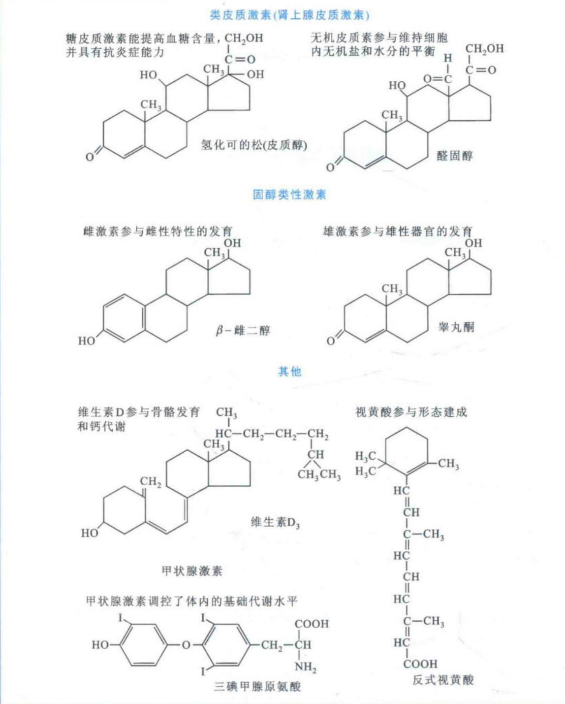

## 8.5.4 热激蛋白对基因表达的影响

现代分子生物学上把能与某个(类)专一蛋白因子结合,从而控制基因特异表达的 DNA 上游序列称为应答元件(response element),如热激应答元件(heat shock response element,HSE)、糖皮质应答元件(glucocorticoid response element,GRE)、金属应答元件(metal response element,MRE)等,这些应答元件与细胞内专一的转录因子相互作用,协调相关基

图 8-67 胰高血糖素激活糖原分解连锁反应  
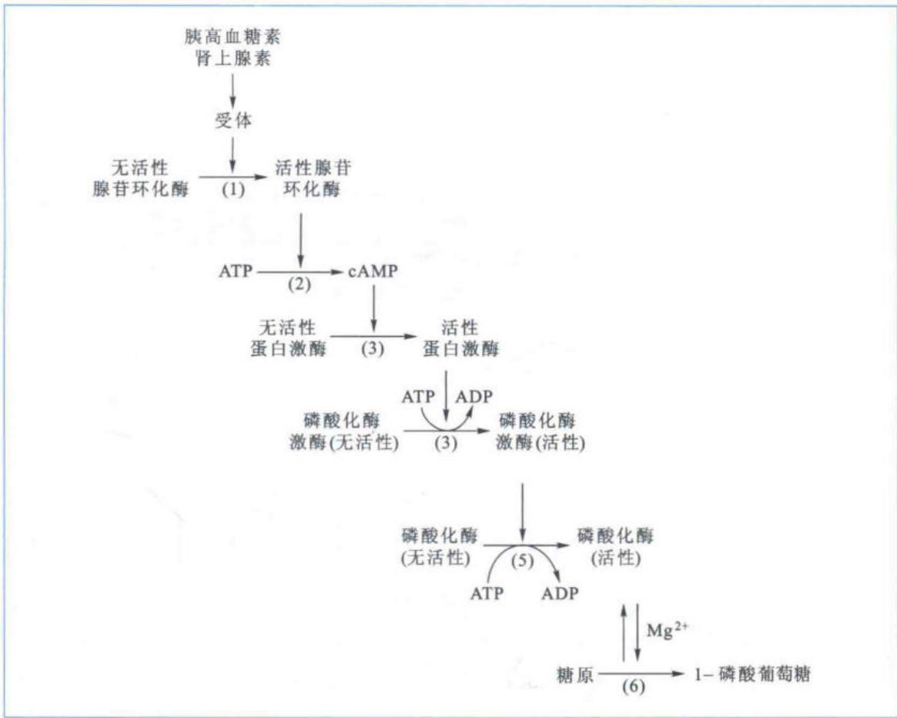

因的转录(表8-9)。

许多生物在最适温度范围以上,能受热诱导合成一系列热休克蛋白(heat shock protein, HSP)。受热后,果蝇细胞内HSP70 mRNA水平提高1 000倍,就是因为热激因子(heat shock factor,HSF)与HSP70基因TATA区上游60碱基对处的HSE相结合,诱发转录起始。

表 8-9 特异转录因子与各类应答元件的相互作用

<table><tr><td>调控因子</td><td>应答元件</td><td>DNA 序列</td><td>结合蛋白</td><td>相对分子质量</td></tr><tr><td>热激</td><td>HSE</td><td>CNNGAANNTCCNNG</td><td>HSF</td><td> $9.3 \times 10^{4}$ </td></tr><tr><td>镉</td><td>MRE</td><td>CGNCCCGGNCNC</td><td>?</td><td>?</td></tr><tr><td>佛波酯</td><td>TRE</td><td>TGACTCA</td><td>AP1</td><td> $3.9 \times 10^{4}$ </td></tr><tr><td>血清</td><td>SRE</td><td>CCATATTAGG</td><td>SRF</td><td> $5.2 \times 10^{4}$ </td></tr></table>

按相对分子质量的大小以及同源程度可将热休克蛋白分为 HSP90、HSP70、小分子 HSP 及泛素 4 个家族, 各家族 HSP 又由多种不同形式或经不同修饰的蛋白质分子所组成。HSP 分布广泛, 诱导迅速, 即使在非热休克细胞中也存在着由热休克同源基因编码的类似蛋白质。真核细胞的热休克蛋白可能具有机体保护功能并在细胞的正常生长和发育中起重要作用, HSP70 的主要功能是参与蛋白质的代谢, 而泛素的主要功能是清除细胞内的变性蛋白质。HSP 还常与具有不同功能的多种蛋白质形成天然复合物, 参与有关蛋白质折叠、亚基的组装、细胞内运输以及降解等过程。热休克蛋白参与靶蛋白活性和功能的调节，却不是靶蛋白的组成部分，因此，一般称它为分子伴侣或伴侣蛋白(chaperonine)。现将主要HSP家族及其生理功能列于表8-10。

表 8-10 主要 HSP 家族及其生理功能

<table><tr><td>家族</td><td>主要成员</td><td>主要生理功能</td><td>免疫应答中的可能作用</td></tr><tr><td>HSP90</td><td>HSP90,HSP83</td><td>促进甾醇激素受体与激素的结合及与DNA结合,调节激酶磷酸化活性</td><td>抗肿瘤,提高自身免疫性能</td></tr><tr><td>HSP70</td><td>HSP70,BiP,Dnat,Hsc70,Grp78</td><td>参与蛋白质折叠和去折叠、蛋白质转位及多聚复合物的组装</td><td>免疫球蛋白装配,类抗原加工,病原体抗原及自身免疫性诱导</td></tr><tr><td>小分子HSP</td><td>HSP27,Gro23,HSP16</td><td>参与蛋白质折叠和去折叠及多聚复合物的装配</td><td>病原体抗原及自身免疫性诱导</td></tr><tr><td>泛素</td><td>泛素</td><td>蛋白质降解</td><td>类抗原加工,淋巴细胞回巢,自身免疫性诱导</td></tr></table>

HSP 基因中内含子数量都很少. 至今为止尚未发现 HSP70 基因中有内含子, 而人 HSP90、果蝇 HSP82、人 HSP27、鸡 HSP108 和泛素等都只有少量内含子。HSP 的这一基本特征保证了它们一旦起始转录不需剪接就可产生出成熟 mRNA 以适应 HSP 大量快速表达的需要, 防止严重的热休克影响 mRNA 前体的剪接。

在没有受热或其他环境胁迫时，HSF主要以单体的形式存在于细胞质和核内。单体HSF没有DNA结合能力，HSP70可能参与了维持HSF的单体形式。受到热激或其他环境胁迫时，细胞内变性蛋白增多，它们都与HSF竞争结合HSP70，从而释放HSF，使之形成三体并输入核内。HSF一旦形成三体，便拥有与HSE特异结合、促进基因转录的功能。这种能力可能还受磷酸化水平的影响，因为热激以后，HSF不但形成三体，还会迅速被磷酸化。HSF与HSE的特异性结合，引起包括HSP70在内的许多热激应答基因表达，大量产生HSP70蛋白。随着热激温度消失，细胞内出现大量游离的HSP70蛋白，它们与HSF相结合，形成没有DNA结合能力的单体并脱离DNA(图8-68)。

## 8.5.5 翻译水平调控

在蛋白质生物合成的起始反应中主要涉及细胞中的4种装置,这就是:①核糖体,它是蛋白质生物合成的场所;②蛋白质合成的模板mRNA,它是传递基因信息的媒介;③可溶性蛋白因子,这是蛋白质生物合成起始物形成所必需的因子;④tRNA,它是氨基酸的携带者。只有这些装置和谐统一才能完成蛋白质的生物合成。

## 1. 真核生物 mRNA 的“扫描模式”与蛋白质合成的起始

大量实验证明,在真核生物起始蛋白质合成时,40S核糖体亚基及有关合成起始因子首先与mRNA模板靠近5'端处结合,然后向3'方向滑行,发现AUG起始密码子时,与60S大亚基结合形成80S起始复合物。这就是Kozak提出的真核生物蛋白质合成起始的

图8-68 热激蛋白调控的基因表达机制  


“扫描模式”。

为什么核糖体滑行到 mRNA 的第一个 AUG, 即在离 5' 端最近的起始密码位点就停下来并起始翻译呢? 现在认为, 这是由 AUG 的前 (5' 方向) 和后 (3' 方向) 序列所决定的。调查了 200 多种真核生物 mRNA 中 5' 端第一个 AUG 前后序列发现, 除少数例外, 绝大部分都是 A/G NNAUGG, 说明这样的序列对翻译起始来说是最为合适的。所以, “扫描模式” 相当合理地说明了许多真核生物 mRNA 的单一顺反子性质, 也合理地解释了为什么将 mRNA 水解之后, 它内部的起始密码子会被活化。因为 mRNA 的水解产生出了新的 5' 端, 所以它又可以成为 40S 起始复合物的进入位点。

那么,真核生物中具有相关生物功能的基因通过什么样的补偿机制得以协同表达呢?有人提出,真核生物通过“融合基因”的方式产生出多顺反子的替代物,即“多聚蛋白质”。多聚蛋白质是由相当长的mRNA编码的,如色氨酸合成酶,它的α亚基(相对分子质量28727)和β₂亚基(相对分子质量42756)在大肠杆菌中分别由不同基因编码,但是,在真核生物酵母中,这两个多肽融合形成相对分子质量为76000的双功能蛋白质。红色链孢霉的arom基因簇也编码多功能蛋白,参与多芳香化合物的生物合成。此外,酵母的his4基因编码了一个三功能蛋白质。从功能上说,哺乳动物的脂肪酸合成酶(相对分子质量 $2.4\times10^{5}$ )相当于大肠杆菌中一组7个之多的功能各不相同的多肽。所以,基因融合可能补偿了真核生物核糖体不能利用多顺反子型mRNA来协调各种不同蛋白质生物合成的缺陷。

## 2. mRNA 5' 端帽子结构的识别与蛋白质合成

因为绝大多数真核生物 mRNA 5' 端都带有“帽子”结构, 所以, 核糖体起始蛋白质的

合成,首先面临的问题是如何识别这顶“帽子”。

真核生物 mRNA 5' 端可有 3 种不同的帽子, 即 O 型、I 型和 II 型, 其主要差异在于帽子中碱基甲基化程度的不同。表 8-11 列举了这 3 种不同类型帽子的结构。

表 8-11 真核生物 mRNA 的帽子结构

<table><tr><td>种类</td><td>结构</td><td>mRNA</td></tr><tr><td>O型</td><td> $m^{7}Gppp^{A}/GpNp^{-}$ </td><td>酵母、黏菌</td></tr><tr><td>I型</td><td> $m^{7}GpppA_{mp}Gm pNp^{-}$ </td><td>海胆胚、卤虫</td></tr><tr><td>II型</td><td> $m^{7}GpppN_{1mp}N_{2p}$ </td><td>哺乳动物</td></tr><tr><td></td><td> $m^{7}GpppN_{1mp}N_{2mp}$ </td><td>哺乳动物</td></tr></table>

真核生物的加帽子反应发生在 mRNA 前体刚转录出来不久或尚未转录完成时,催化这一过程的是鸟苷酸转移酶和甲基转移酶,它们都位于细胞核内。据认为,细胞中的帽子化酶是同时具有 RNA 三磷酸酯酶和鸟苷酸转移酶活性的多功能酶。通过鸟苷酸转移酶生成的是 5'-5' 磷酸二酯键。从 O 型到 I 型帽子的生成都在细胞核内进行,由 I 型帽子进一步加工成 II 型帽子在细胞质内进行。

## 3. mRNA 的稳定性与基因表达调控

在高等真核生物中转运铁蛋白受体(TfR)和铁蛋白负责铁吸收和铁解毒。这两个mRNA上存在相似的顺式作用元件,称为铁应答元件(iron responsive element, IRE), IRE与IRE结合蛋白(IREBP)相互作用控制了这两个mRNA的翻译效率。当细胞处于缺铁或高铁水平时,能产生两个数量级的蛋白水平差异,却没有在mRNA水平上发现存在显著差异。研究表明,位于5'非翻译区的IRE控制了铁蛋白mRNA的翻译效率,去掉这个非翻译区IRE,可造成铁蛋白的永久性高水平翻译。当细胞缺铁时,IREBP与IRE具有高亲和力,两者的结合有效地阻止了铁蛋白mRNA的翻译,与此同时,TfR mRNA上3'非翻译区中的IRE也与IREBP特异结合,有效地阻止TfR mRNA的降解,促进TfR蛋白的合成(图8-69)。

## 4. 可溶性蛋白因子的修饰与翻译起始调控

许多可溶性蛋白因子,即起始因子,对蛋白质合成的起始有着重要的作用,对这些因子的修饰也会影响翻译起始。

① eIF-2 磷酸化对翻译起始的影响 用兔网织红细胞粗抽提液研究蛋白质合成时发现,如果不向这一体系中添加氯高铁血红素,几分钟之内蛋白质合成活性急剧下降,直到完全消失。这就是说,当没有氯高铁血红素存在时,网织红细胞粗抽提液中的蛋白质合成抑制剂就被活化,从而抑制蛋白质合成。现已查明,该抑制剂 HCI 是受氯高铁血红素调节的,它其实是 eIF-2 的激酶,可以使 eIF-2 的 α 亚基磷酸化,并由活性型变成非活性型。没有生物活性的 HCI 也可以通过自身的磷酸化变成活性型,这个过程可能是自我催化的,并与一个被称为 HS 因子的热稳定蛋白有关。氯高铁血红素能够阻断 HCI 的活化过程(图 8-70)。

  
图 8-69 人铁蛋白及转运铁蛋白受体 mRNA 的翻译调控机制

实验表明，eIF-2 的 $\alpha$ 亚基磷酸化以后，eIF-2 与 eIF-2B 紧密结合，直接影响了 eIF-2 的再利用，从而抑制翻译，影响蛋白质合成起始复合物的生成。eIF-2 磷酸化阻碍蛋白质生物合成这一现象，同样可由添加氧化型谷胱甘肽或双链 RNA 等引发。

② CBPⅡ活性与翻译的起始 在脊髓灰质病毒感染的 HeLa 细胞中,有帽子结构的

宿主 mRNA 的翻译受阻, 宿主蛋白质合成停止, 但没有帽子结构的脊髓灰质炎病毒 mRNA 的翻译却不受影响。研究表明, 宿主细胞 CBPⅡ失活是导致这种 mRNA 选择性翻译的根本原因。如果在这种感染细胞抽提液的蛋白质合成体系中加入由兔网织红细胞中提取的 CBPⅡ,

  
图8-70 eIF-2、HCI及氯高铁血红素的相互关系

就能恢复有帽子 mRNA 的翻译活性。添加 CBPⅡ对脊髓灰质炎病毒 RNA 的翻译没有影响。

在蛋白质生物合成的过程中,特别是在起始反应中,mRNA 的“可翻译性”是起决定作用的,其 5' 端的帽子结构、二级结构、与 rRNA 的互补性以及起始密码附近的核苷酸序列都是蛋白质生物合成的信号系统。蛋白质生物合成的调控就是通过 mRNA 本身所固有的信号与可溶性蛋白因子或者与核糖体之间的相互作用而实现的。

## 思考题

1. 简述基因家族的分类及其主要表达调控模式。

2. 简述何为外显子、内含子及其结构特点和可变调控。

3. 简述 DNA 甲基化对基因表达的调控机制。

4. 简述真核生物转录元件组成及其分类。

5. 简述增强子的作用机制。

6. 简述反式作用因子的结构特点及其对基因表达的调控。

7. 如何确定拟南芥基因组 T-DNA 插入的位点?

8. 如何确定影响某表型的相关基因?

9. 如何通过实验的方法分析 CTD 上 S2 和 S5 不同磷酸化 pattern 的功能?

10. 如何鉴定 activation tagging 的转基因植物中是哪个基因的表达上调而导致所观测的表型?

11. 举例说明蛋白质磷酸化如何影响基因表达。

12. 说明组蛋白乙酰化和去乙酰化影响基因转录的机制。

13. 说明激素影响基因表达的基本模式。

14. 说明分子伴侣的分类及其影响基因表达的机制。

## 参考文献

1. Akhade V S, Pal D, Kanduri C. Long noncoding RNA: genome organization and mechanism of action, Adv Exp Med Biol., 2017:47-74.

2. Edupuganti R R, Geiger S, Lindeboom R G H, et al. N $^{6}$ -methyladenosine (m $^{6}$ A) recruits and repels proteins to regulate mRNA homeostasis. Nat Struct Mol Biol., 2017, 24: 870–878.

3. Fu Y, Dominissini D, Rechavi G, et al. Gene expression regulation mediated through reversible m $^{6}$ A RNA methylation. Nat Rev Genet., 2014, 15: 293–306.

4. Roberts T C, Morris K V, Weinberg M S. Perspectives on the mechanism of transcriptional regulation by long non-coding RNAs. Epigenetics, 2014, 9: 13.

5. Theler D, Allain F H. Molecular biology: RNA modification does a regulatory two-step. Nature, 2015, 518:492-493.

6. Wu R, Jiang D, Wang Y, et al. N $^{6}$ -Methyladenosine (m $^{6}$ A)methylation in mRNA with adynamic and reversible epigenetic modification. Molecular Biotechnology, 2016, 58: 450–459.

## 数字课程学习


教学课件

目在线自测

思考题解析

# 疾病与人类健康

9.1 肿瘤与癌症

9.2 人类免疫缺陷病毒(HIV)

9.3 乙型肝炎病毒(HBV)

9.4 人禽流感的分子机制

9.5 严重急性呼吸综合征的分子机制

9.6 基因治疗

9.7 肿瘤的免疫治疗

## 9.1 肿瘤与癌症

癌(cancer)也称恶性肿瘤, 是一群不受生长调控、过度增殖且不受常规的区域限制的细胞。良性肿瘤细胞虽然也是过度增殖的细胞群, 却仅局限在自己的正常位置, 不侵染周围其他组织和器官。因此, 绝大多数癌是由肿瘤细胞经过一系列突变转化而来的(图9-1)。癌症是人类生存的头号敌人。今天, 科学家已经能够对许多种癌症做出早期诊断, 延长患者的生存期, 但并未从根本上征服这个病魔。20世纪50年代以来, 对肿瘤医学的研究有3项最为突出的成就: ①癌基因的发现及其研究的深入; ②染色体畸变与致癌基因表达相互关系的揭示; ③抑癌基因的发现及表达调控。已经发现了上百个原癌基因(proto-oncogene) 和许多抑癌基因(anti-oncogene), 证明细胞癌变的分子基础是基因突变, DNA的变化和不正常活动导致了细胞癌变。

图9-1 肿瘤组织示意图  


癌基因(oncogene)可分为两大类:一类是病毒癌基因(viral oncogene, V-onc),编码病毒癌基因的主要有DNA病毒和RNA病毒。DNA病毒包括乙型肝炎病毒、猴病毒40和多瘤病毒、乳头瘤病毒、腺病毒、疱疹病毒和痘病毒。RNA病毒主要是反转录病毒。反转录病毒致癌基因(retrovirus oncogene)可能是研究最多的病毒基因,它们能使靶细胞发生恶性转化。第二类是细胞转化基因(cellular oncogene, C-onc),它们能使正常细胞转化为肿瘤细胞,这类基因与病毒癌基因有显著的序列相似性。事实上,细胞转化基因可能就是存在于人体正常细胞中的原癌基因的突变产物,它们广泛存在于生物界,有相当强的保守性,属于管家基因,正常表达时对细胞的生长和分化有调控作用。

## 9.1.1 反转录病毒致癌基因

早在 1910 年, Rous 就发现带有肉瘤病毒(一种反转录病毒)的鸡肉瘤无细胞滤液能在鸡体内诱发新的肉瘤。这种病毒的基因组是由单链 RNA 组成的, 一般只有 6\~9 kb。RNA 上的基因数目很少, 它们被包裹在由 gag 和 env 两个基因编码的蛋白质外壳中, 其

中 env 基因指导外壳蛋白的合成, gag 基因则指导“鞘”蛋白的合成, 这些“鞘”蛋白好像“道钉”一样“箍”在外壳的表面, 维持外壳蛋白结构的稳定性(图 9-2)。反转录病毒的复制由其自身基因组上 pol 基因编码的反转录酶指导完成。当病毒感染细胞时, 病毒最外层囊膜不进入

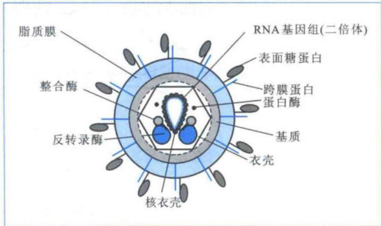  
图 9-2 反转录病毒颗粒示意图

细胞,含有基因组 RNA 和反转录酶的核心颗粒进入细胞并在病毒核心颗粒内开始利用自身携带的反转录酶(可能还需要某些宿主细胞因子)进行病毒基因组的反转录,合成含有完整病毒基因组信息的线性双链 DNA 并被运入细胞核,在病毒整合酶作用下随机整合进入宿主细胞基因组 $^{(图9-3)}$ 。

被整合的病毒 DNA 分子称为原病毒(provirus)。由于反转录病毒一般不会引起细胞死亡,所以,原病毒象孟德尔单一基因遗传一样传给子代细胞。整合的原病毒 LTR 含有细胞 RNA 聚合酶Ⅱ以及识别细胞转录因子的所有信号和原件,能转录出完整病毒 mRNA,并利用宿主细胞中的蛋白质合成机器,翻译病毒外壳蛋白和其他相关蛋白质,最后组装成病毒颗粒。已在各种反转录病毒中发现了大量致癌基因,它们感染后诱导宿主产生肿瘤的主要原因是激活特定基因表达,从而破坏宿主细胞本身固有的平衡,导致细胞发生转化。

最早发现的致癌基因是劳斯氏(Rous)肉瘤病毒中的 V-Src 基因,它编码了一个被称为 p60 $^{Src}$ 的蛋白质。序列分析表明,该蛋白有 514 个氨基酸,是一个磷酸化蛋白。其 C 端 250 个氨基酸是活性区域,负责将磷酸基团转移到酪氨酸残基上。它的作用主要是使多个靶蛋白发生磷酸化,从而影响它们的功能,加速细胞癌变过程。

p60 $^{Src}$ 使多个蛋白质中的酪氨酸发生磷酸化以后, 又如何促使细胞发生癌变呢? 科学家发现, 一种存在于细胞基部质膜附着点内被称为枢纽蛋白 (vinculin) 的细胞骨架蛋白磷酸化可能是引起细胞癌变的中心环节。已知质膜附着点的主要作用是通过细胞膜固着蛋白, 将细胞固定在所处的表面, 它也能使肌动蛋白的纤丝依附在上面。位于附着点内的枢纽蛋白则起着连接肌动蛋白纤丝束和细胞膜固着蛋白的作用。正常情况下, 该蛋白上的酪氨酸残基只有轻度磷酸化。在转化细胞中, 由于 p60 $^{Src}$ 结合在附着点内靠近或位于枢纽蛋白处,使这一蛋白的磷酸化水平提高了20倍以上,明显降低了枢纽蛋白连接肌动蛋白纤丝束和细胞膜固着蛋白的功能,导致肌动蛋白纤丝束松散,细胞黏附能力减弱,容易发生脱落和转移。

图 9-3 含有反转录病毒完整基因组信息的双链 DNA 整合到宿主细胞基因组 DNA 上  


## 1. 急性转化型和非急性转化型

根据反转录病毒转化细胞的能力,可将其分为急性转化型和非急性转化型两大类。急性转化型反转录病毒具有3个主要特征:①这类病毒感染动物后,很短时期内(几天或几周)就出现实体瘤或白血瘤(leukemia);②它们所带的癌基因一般位于病毒基因组内部,也可位于基因组的3'端,但不会插入结构基因内部;③具有体外转化细胞的能力。非急性转化型则正好相反,它们感染宿主细胞后需要较长时间(几个月,数年甚至数十年)才会致癌。

## 2. V-onc 基因的起源

研究发现,反转录病毒基因组中所带有的 onc 基因并非来自病毒本身,而是这些病毒在感染动物或人体之后获得的细胞原癌基因(图 9-4)。这些动物或人原癌基因经病毒修饰和改造后,成为病毒基因组的一部分并具有了致癌性,其作用的靶分子也往往发生改变。已经证实,各种脊椎动物染色体 DNA 上都有与 Src 相类似的 DNA 序列,说明它是正常细胞所固有的。因为正常细胞中这些基因是不表达的,只有在细胞发生癌变时才有活性,所以称为原癌基因。一般说来,细胞原癌基因大都是断裂基因,带有插入序列,而病毒的致癌基因往往是一个完整的没有断裂的读码框。

目前已鉴定了超过100个致癌基因，最常见的是ras与myc基因家族。突变的Haras基因产物与结肠癌、肺癌、胰腺癌等相关，K-ras与恶性骨髓瘤、成淋巴细胞瘤等有关，而N-ras则多见于泌尿系统癌症。研究发现，c-myc表达主要在 $\mathrm{G}_0 / \mathrm{G}_1$ 交界或 $\mathrm{G}_{1}$ 早期，而C-H-ras和C-K-ras则主要在 $\mathrm{G}_{1}$ 中晚期。 $\mathrm{G}_{1}$ 期对于细胞生长的控制具有关键性意义，因为该时相中存在一个“生长控制点”，在正常情况下，细胞可根据对信号的应答，发挥“生长控制点”的调节作用，使细胞通过该点，进入S、M期再回到 $\mathrm{G}_{1}$ 期，或者阻止细胞通过该控制点而使其进入 $\mathrm{G}_0$ 期。c-myc的表达可能使细胞获得了通过“生长控制点”的潜能，而c-ras的表达似乎加强了c-myc的这种作用潜能，二者协同作用使细胞向S期过渡成为可能。也就是说，c-myc 和 c-ras 的协同作用是细胞分裂的必要步骤。在肿瘤细胞中，“生长控制点”不起作用，所以瘤细胞一直处于细胞周期循环之中。

  
图 9-4 劳斯肉瘤病毒基因结构及 c-Src 原癌基因的转变  
宿主细胞原癌基因(上)和不含癌基因的反转录病毒基因组及所编码的主要蛋白质(中);含有癌基因的劳斯肉瘤病毒基因结构(下)。

## 9.1.2 原癌基因(细胞转化基因)产物及其分类

除了病毒感染会诱发细胞癌变外,尚有许多非病毒因子(如放射性物质、化学试剂亚硝酸、烷化剂等)也能诱导细胞转化。这些因子并没有把致癌基因或其他致癌的遗传信息带入细胞,而仅仅通过某种激活机制改变了细胞内原有的遗传信息,使细胞发生恶性转化。对大量致癌因子的研究证明,它们的作用都是使基因发生突变(图9-5),充分说明内源基因在细胞转化中的地位。实验证明,此时引起细胞恶性转化的因子仍然是DNA,化学诱变后的细胞中同样存在着决定细胞命运的致癌基因。从人膀胱癌T24肿瘤细胞中提取DNA,转染正常小鼠成纤维细胞使之变为转化细胞。从发生转化的成纤维细胞集落中分离单细胞,培养、扩增后再提取DNA,第二次转染正常小鼠成纤维细胞,又出现转化细胞集落。如果细胞转化特性是由分散在不同DNA片段上的遗传因子决定的,那么,在这个基因重复导入过程中细胞的转化特性可能消失。事实上,经过连续多次基因导入后,细胞仍被转化,说明致癌因子可能存在于一个特定的区域。

  
图 9-5 黄曲霉素 (aflatoxin) 导致细胞发生癌变的分子机制

根据原癌基因产物在细胞中的位置将其分为3大类:第一类是与膜结合的蛋白质,主要有 erbB、neu、fms、mas 和 Src 基因产物;第二类是可溶性蛋白,包括 mos、sis 和 fps 基因产物;第三类是核蛋白,包括 myc、ets、jun 和 myb 等。根据这些蛋白质的功能,它们又常被分为6类,即蛋白激酶类、生长因子类、生长因子受体类、GTP 结合蛋白类、核蛋白类和功能未知类。原癌基因产物的一个共同特征是它们都能诱发一系列与细胞生长分化有关的基因表达,从而改变细胞的表型。

## 9.1.3 原癌基因的表达调控

原癌基因在正常细胞中通常以单拷贝形式存在,只有低水平的表达或根本不表达。在很多情况下,原癌基因的结构发生了点突变或插入、重排、缺失及扩增等,改变其转录活性 $^{(图9-6)}$ 。

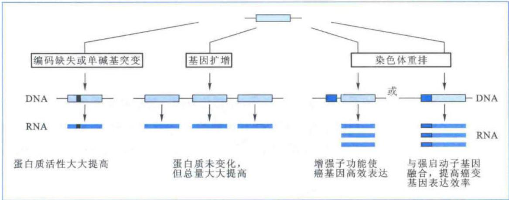  
图 9-6 细胞中原癌基因转变为癌基因的主要途径

## 1. 点突变

虽然原癌基因活化导致癌变的原因多种多样,但点突变可能是最常见的机制。在 ras 基因家族中,存在着许多原癌基因发生点突变的实例。Ha-ras 和 K-ras 基因最初是从小鼠肉瘤病毒中分离出来的,N-ras 是从人神经母细胞瘤细胞系中分离得到的,C-ras 基因存在于非肿瘤细胞生物机体中,可能是细胞发挥正常的生理功能所必需的。研究发现,ras 基因编码了一个相对分子质量为 $2.1 \times 10^{4}$ 的癌蛋白(p21),从人类膀胱癌细胞系 T24 DNA 中克隆的 Ha-ras 基因能够诱发 NIH/3T3 细胞转化,而从正常细胞 DNA 中克隆的该原癌基因没有这种功能。因为 T24 膀胱癌细胞中 Ha-ras 基因的表达水平较之正常细胞并无明显提高,科学家推测点突变使癌基因产物 p21 蛋白的结构和功能发生了某些变化(图9-7)。

<table><tr><td rowspan="2"></td><td colspan="3">第一外显子</td><td colspan="3">第二外显子</td><td rowspan="2">转化活性</td></tr><tr><td>11</td><td>12</td><td>13</td><td>60</td><td>61</td><td>62</td></tr><tr><td>原C-H-ras</td><td>...GCC丙氨酸</td><td>...GCC丙氨酸</td><td>GGT...甘氨酸</td><td>...GGC甘氨酸</td><td>CAG谷氨酰胺</td><td>GAG...谷氨酸</td><td>-</td></tr><tr><td>膀胱癌C-H-ras</td><td>...GCC丙氨酸</td><td>GTC缬氨酸</td><td>GGT...甘氨酸</td><td>...GGC甘氨酸</td><td>CAG谷氨酰胺</td><td>GAG...谷氨酸</td><td>+</td></tr><tr><td>肺癌C-H-ras</td><td>...GCC丙氨酸</td><td>GTC缬氨酸</td><td>GGT...甘氨酸</td><td>...GGC甘氨酸</td><td>CTG亮氨酸</td><td>GAG...谷氨酸</td><td>+</td></tr><tr><td>MSV-H-ras</td><td>...GCC丙氨酸</td><td>AGA精氨酸</td><td>GGT...甘氨酸</td><td>...GGC甘氨酸</td><td>CTG亮氨酸</td><td>GAG...谷氨酸</td><td>+</td></tr><tr><td>乳腺癌NMU-H-ras</td><td>...GCC丙氨酸</td><td>GAA谷氨酸</td><td>GGT...甘氨酸</td><td>...GGC甘氨酸</td><td>? ?</td><td>GAG...谷氨酸</td><td>+</td></tr><tr><td>原C-K-ras</td><td>...GCT丙氨酸</td><td>GGT甘氨酸</td><td>GGC...甘氨酸</td><td>...GGT甘氨酸</td><td>CAA谷氨酰胺</td><td>GAA...谷氨酸</td><td>-</td></tr><tr><td>肺癌C-K-ras</td><td>...GCT丙氨酸</td><td>TGT半胱氨酸</td><td>GGC...甘氨酸</td><td>...GGT甘氨酸</td><td>CAA谷氨酰胺</td><td>GAA...谷氨酸</td><td>+</td></tr><tr><td>大肠癌C-K-ras</td><td>...GCT丙氨酸</td><td>GTT缬氨酸</td><td>GGC...甘氨酸</td><td>...GGT甘氨酸</td><td>CAA谷氨酰胺</td><td>GAA...谷氨酸</td><td>+</td></tr><tr><td>MSV-K-ras</td><td>...GCT丙氨酸</td><td>AGT丝氨酸</td><td>GGC...甘氨酸</td><td>...GGT甘氨酸</td><td>CAA谷氨酰胺</td><td>GAA...谷氨酸</td><td>+</td></tr></table>

图9-7 ras基因的点突变及转化活性分析

如人类肺癌细胞系 Hs242 的转化基因与 Ha-ras 高度相似, 在这个基因中导致转化活性的遗传损伤是第二个外显子中引起 p21 蛋白第 61 位谷氨酰胺被亮氨酸所替代的一个点突变。所以, p21 分子某些部位发生单个氨基酸替代足以引起蛋白质构象的改变, 并使细胞获得转化活性。

在肺癌和结肠癌细胞系中也发现了 K-ras 型转化基因。肺癌细胞系含有第 12 位密码子由 TGT 取代 GGC，从而以半胱氨酸取代甘氨酸的 K-ras2 转化基因；而 SW480 结肠癌细胞系也含有 K-ras 转化基因，其第 12 位密码子为 GTT，编码了缬氨酸。这两个细胞系都经历了点突变激活过程，突变部位就是人类膀胱癌细胞系 T24Ha-ras 的对应部位。现在已经证明由 NIH/3T3 细胞转染检出的 ras 原癌基因中，第 12 位密码子是个突变“热点”。

## 2. LTR 插入

LTR 是反转录病毒基因组两端的长末端重复序列 (long terminal repeat), 其结构中含有强的启动子序列, 当 LTR 插入原癌基因启动子区域或邻近部位后, 可从根本上改变基因的正常调控规律。最早发现 LTR 插入激活现象是在慢性反转录病毒感染的细胞中。LTR 插入到 c-myc 5' 上游启动子附近, 使 c-myc 的转录水平大大增加。其他原癌基因中也发现了类似现象。LTR 插入后, 与血小板衍生生长因子 β 链 (PDGF-β) 相似的 c-sis 基因的转录和翻译水平均有明显增加。表 9-1 是受 LTR 插入激活的部分原癌基因。

表 9-1 LTR 插入激活的原癌基因

<table><tr><td>原癌基因</td><td>LTR 来源</td><td>诱发的肿瘤</td></tr><tr><td></td><td>禽类白血病病毒</td><td>禽类黏液性囊性淋巴瘤</td></tr><tr><td rowspan="2">myc</td><td>鼠白血病病毒</td><td>鼠T细胞淋巴瘤</td></tr><tr><td>猫白血病病毒</td><td>猫T细胞淋巴瘤</td></tr><tr><td>erbB</td><td>禽类白血病病毒</td><td>禽类红白血病</td></tr><tr><td>H-ras</td><td>禽类白血病病毒</td><td>禽肾细胞瘤</td></tr><tr><td>K-ras</td><td>小鼠白血病病毒</td><td>小鼠髓性细胞白血病</td></tr><tr><td>myb</td><td>禽类白血病病毒</td><td>禽类黏液性囊性淋巴瘤</td></tr><tr><td>fms</td><td>小鼠白血病病毒</td><td>小鼠髓性细胞白血病</td></tr><tr><td>Int-1</td><td>小鼠乳头瘤病毒</td><td>小鼠乳腺癌</td></tr><tr><td>Pim-1</td><td>小鼠白血病病毒</td><td>小鼠T细胞淋巴瘤</td></tr><tr><td>Lck</td><td>小鼠白血病病毒</td><td>小鼠T细胞淋巴瘤</td></tr><tr><td>evi-1</td><td>小鼠白血病病毒</td><td>小鼠髓性细胞白血病</td></tr></table>

## 3. 基因重排

在大多数类型的人肿瘤中存在染色体数目和结构异常现象,说明存在原癌基因重排的可能。现已查明基因重排包括原癌基因之间,以及原癌基因与非原癌基因之间的重排。重排后基因内部结构可不受影响,也可能发生改变。在 Burkitt 淋巴瘤中,Ig 基因与 c-myc之间发生重排。正常情况下，c-myc定位于 $8q^{24}$ ，免疫球蛋白重链基因(IgH)定位于 $14q^{32}$ ，轻链 $\lambda$ 基因(Ig $\lambda$ )定位于 $22q^{12}$ ，轻链k基因(IgK)定位于 $2p^{11}$ 。重排时，c-myc从其上游区到第2外显子的区域内断裂，易位至IgH、IgK或Ig $\lambda$ 的位点，使Ig基因与c-myc相连在一起，Ig基因5'端的启动子发挥作用，使原来不表达的c-myc大量表达。由于人体的特殊需求，通常Ig基因的表达能力非常强。c-myc一旦与Ig基因启动子和增强子重组后，可使原来的调控机制失去作用，导致极高水平的表达。在正常人体细胞中，非受体型酪氨酸蛋白激酶基因abl位于第9号染色体上，表达量极低，不会诱发癌变。在慢性骨髓瘤病人细胞中，该基因却被转移到第22号染色体上，与bcr基因相融合，表达量大为提高，导致细胞分裂失控，发生癌变(图9-8)。

  
图 9-8 abl 原癌基因通过选择性染色体重排转变成细胞癌基因

## 4. 缺失

很多原癌基因 5' 上游区存在负调控序列,一旦该序列发生缺失或突变,就丧失抑制基因表达调控的能力。如 Brukitt 淋巴瘤中 c-myc 可因负调控序列的缺失或 LTR 插入破坏其结构而增强表达。

## 5. 基因扩增

使每个细胞中基因拷贝数增加,从而直接增加可用的转录模板数以提高基因表达。某些正常细胞在生长、发育过程中需要大量相关蛋白质,可通过基因扩增的方式来达到提高表达量的效果。细胞也可通过基因扩增的产物来抵抗环境胁(如对化学物质和药物的抗性等),以获得生存能力。在肿瘤细胞中,DNA扩增事件的发生频率至少比在正常细胞中高上千倍。一旦发生基因扩增,肿瘤细胞就获得了选择性生长优势。实验证明,癌基因常常是肿瘤细胞中DNA扩增的靶位点,在各种人类肿瘤中已发现了十几种癌基因的扩增。

## 9.1.4 基因互作与癌基因表达

## 1. 染色体构象对原癌基因表达的影响

基因表达不仅取决于基因本身及其相邻区域的一级结构,也取决于其空间构象。当两个基因相距太近时,往往不易形成有利于高效转录的空间结构。因此,基因与基因之间的间隔距离被定义为“基因领域”(gene territory)。同一DNA链上两个具有相同转录方向的基因间隔小于一定长度时,影响有效转录所必需的染色质结构的形成,从而使这两个基因中的一个或两个均不能转录或转录活性显著降低,产生所谓基因领域效应(gene territorial effect)。对大量基因的分析表明,基因之间的间隔距离与两个基因的总长度相关,当两个基因的总长度在0.3 kb至5 kb之间时,最佳间隔距离与两个基因的总长度成正相关。

正常人 c-myc 定位于第 8 号染色体,在其两侧分别存在强表达基因,在基因领域效应的影响下,c-myc 转录受抑制。在 Burkitt 淋巴瘤中,由于发生基因重排,使 c-myc 基因一侧的强表达基因消失,从而消除了对 c-myc 的基因领域效应,使后者的转录活性增强。由于 c-myc 转录增强,反过来对另一侧的基因产生了基因领域效应,使原来强表达的基因变为不表达状态。

在正常小鼠细胞中，c-myc 的 $5'$ 上游区域也存在一个强表达基因，其长度约为 15 kb，它距 c-myc 只有 3 kb 左右，很显然，这一间隔距离太短，与基因有效转录应有的最小距离相差甚远，此时，c-myc 受基因领域效应的影响非常大，表达完全受到抑制。在小鼠乳腺癌细胞中，上述间隔距离被显著拉长，激活 c-myc 转录。

## 2. 原癌基因终产物对基因表达的影响

这种影响包括某种原癌基因产物对另一种原癌基因表达的调控作用,也包括某种原癌基因产物对自身表达的反馈调控作用。一些原癌基因的产物是生长因子类、生长因子受体类或激素受体类物质,这些物质作为细胞外信号或信息传递物质,会对原癌基因的表达产生调控作用。癌基因产物通过介质传递生长刺激信号主要有3种方式:①癌基因产物本身模拟了生长因子,因而与相应的受体作用,以自分泌的方式刺激细胞生长;②癌基因产物模拟了已结合配体的生长因子受体,从而在无外源生长因子时提供了促进细胞分裂的信号;③癌基因产物作用于细胞内生长控制途径,解除此途径对外源刺激信号的需求。人血小板衍生生长因子(PDGF)与猴肉瘤病毒(SSV)的V-ras癌基因产物,上皮生长因子(EGF)与Src及V-erb癌基因产物之间,都存在着极高的相似性,表明生长因子与癌基因转化有关。

## 3. 抑癌基因产物对原癌基因的调控

因为抑癌基因产物能够抑制细胞的恶性增殖,所以它也被认为是一种隐性癌基因。当细胞内由于某种原因造成这些基因的表达受抑制时,原癌基因就活跃表达,引起细胞癌变。一般来说,抑癌基因在细胞生长中起负调控作用,主要是抑制增殖、促进分化、成熟和衰老,引导多余的细胞进入程序化死亡途径,而原癌基因的作用则正好相反;原癌基因通常是显性的,激活后参与促进细胞增殖和癌变过程,而抑癌基因是隐性的,抑癌基因的两个等位基因中失去任何一个都不影响其抑癌功能,只有两个等位基因全部失活才能失去抑癌功能;不仅体细胞中可能发生抑癌基因突变,生殖细胞中也可能发生抑癌基因突变并通过生殖细胞得到遗传,而原癌基因突变只发生在体细胞中。

p53 是通过杂合缺失鉴定的一个抑癌基因，在星形细胞癌、乳癌、肺癌、肠癌及骨肉瘤中都有高频率缺失现象。从癌细胞中得到的 p53 基因，其保守序列区有单一位点的突变，推测可能由于这一突变导致 p53 基因产物结构与功能的改变，失去抑癌活性。另外，在人类某些肿瘤细胞中也可观察到 p53 等位基因的缺失，这种缺失同样影响了肿瘤的发生。p53 这种抑癌作用可能是通过其蛋白质与 DNA 的结合而实现的。这种结合既影响 DNA 的复制，又影响基因的转录。

Rb 基因是从视网膜纤维瘤中克隆到的另一个抑癌基因, 其功能是阻止处于 $G_{0}/G_{1}$ 期的细胞进入 S 期, 从而控制细胞增殖。正常 Rb 基因的表达几乎可抑制所有培养细胞的分裂。

细胞的癌变绝非单一因素引起,它可能是显性的癌基因与隐性的抑癌基因经过多阶段的协同作用而形成的。一般说来,在一种肿瘤中起主要作用的几乎不可能是两种以上的癌基因,但很可能涉及两个以上抑癌基因的突变。

## 4. 外源信号对原癌基因表达的影响

细胞外信号(包括生长因子、激素、神经递质、药物等)作用于靶细胞后,通过细胞膜受体系统或其他直接途径被传递至细胞内,再通过多种蛋白激酶的活化,对转录因子进行修饰,然后引发一系列基因的转录激活(图9-9)。这一过程进行得很快,通常在几分钟至几十分钟内即可完成。据测定,在这么短时间内,有70\~80种基因的转录被激活,其中包括众多的原癌基因。研究表明,c-fos基因的转录激活可能是最快、最显著的,信号刺激后几分钟内即可检测到 c-fos 基因产物。随后，另一些编码核蛋白的原癌基因如 c-myc、c-myb、c-erbB、c-ets 等的转录也相继被激活。这些对细胞外信号反应迅速的基因被称为快速反应基因。

  
图 9-9 许多原癌基因参与细胞信号转导过程

快速反应基因的转录有两个特点:①不受蛋白质合成抑制剂的阻断。在许多情况下,还会因为蛋白质合成抑制剂抑制了不稳定蛋白质的合成而使转录产物的半寿期显著延长。②快速反应基因的转录激活维持时间很短,通常在半小时内完成,然后逐渐恢复原状。从这一点看,这类基因产物的主要功能是作为转录因子及调节因子去调节别的基因表达,以介导细胞外信号在细胞水平上的应答。

## 9.2 人类免疫缺陷病毒(HIV)

人类免疫缺陷病毒(HIV),俗称艾滋病(AIDS)病毒,诱发人类获得性免疫缺损综合征。该病毒在分类上属反转录病毒科(Retroviridae)慢病毒属中的灵长类免疫缺陷病毒亚属,过去还有人将其命名为LAV、ARV、IDAV和HTLV3,现统一命名为HIV。1983年,法国巴斯德研究所的Montaginer和美国国家卫生研究院癌症研究所Gallo等人首次证实HIV是艾滋病的病因。该病已在30多年间席卷全球,几乎没有一个国家或地区可以幸免。已发现人免疫缺损病毒主要有两种,即HIV-I和HIV-II。HIV-I是从欧洲和美洲分离的毒株,与猴艾滋病毒只有约45%的相似性,它的致病力很强,是引起全球艾滋病流行的主要病原。HIV-II与猴艾滋病毒的相似性高达75%,其毒力较弱,引起艾滋病的病程较长,症状较轻,且主要局限于非洲西部(表9-2)。有关HIV的研究主要是针对HIV-I进行的。

表 9-2 反转录病毒科主要成员

<table><tr><td>属名</td><td>典型成员</td></tr><tr><td>哺乳动物C型拟转录病毒属</td><td>小鼠乳腺瘤病毒</td></tr><tr><td>D型拟转录病毒属</td><td>鼠白血病病毒</td></tr><tr><td>禽C型拟转录病毒属</td><td>Mason-Pfizer猴病毒</td></tr><tr><td>泡沫病毒属</td><td>禽白血病病毒</td></tr><tr><td>人嗜T淋巴细胞病毒</td><td>人泡沫病毒</td></tr><tr><td>白血病毒属</td><td>人嗜T淋巴细胞病毒I型</td></tr><tr><td>慢病毒属</td><td>人类免疫缺陷病毒</td></tr></table>

## 9.2.1 HIV 病毒颗粒的形态结构及传播

艾滋病病毒粒子是一种直径约为 120 nm 的球状病毒, 粒子外包被着由两层脂质组成的脂膜, 这种结合有许多糖蛋白分子(主要是 gp41 和 gp120)的脂质源于宿主细胞的外膜。蛋白质 p24 和 p18 组成其核心, 内有基因组 RNA 链, 链上附着有反转录酶, 其功能是催化病毒 RNA 的反转录 $^{(图9-10)}$ 。

HIV 病毒广泛存在于感染者的血液、精液、阴道分泌物、乳汁、脑脊液、有神经症状的脑组织液等体液中，其中以血液、精液、阴道分泌物中浓度最高。HIV 可以依靠血液、血液制品，以及人体分泌液，如精液和乳汁等传播。研究发现，艾滋病患者经长期鸡尾酒疗法治疗后，血液中可能检测不到艾滋病病毒，但是眼泪中的病毒数量和新近确诊艾滋病人血液中病毒含量相差并不大，

  
图 9-10 HIV-I 病毒粒子结构模型图
gp120 和 gp41 是外膜蛋白, MA 是内膜蛋白, CA 是外壳蛋白, NC 是核衣壳蛋白, RT 是反转录酶。

但目前尚无眼泪传播艾滋病毒的临床病例。

HIV 主要感染 T4 淋巴细胞,也可以感染其他类型如 B 淋巴细胞和单形核细胞等。HIV 感染后可引起明显病变,形成多核巨细胞,并导致细胞死亡。HIV 病毒可以通过所感染细胞扩散到全身,已在淋巴细胞、脑、胸腺、脾等组织发现了该病毒。不同毒株在试管内感染细胞的能力差异很大,说明自然界广泛存在着突变株。迄今为止,尚缺乏研究艾滋病的理想动物模型。与人类亲缘关系最近的黑猩猩感染 HIV 后,早期情况与人相似,会产生抗体和暂时性 T 细胞比例失调,但后期并不发展成艾滋病的临床病症。

## 9.2.2 HIV 基因组及其编码的蛋白质

## 1. HIV 基因组结构

HIV 基因组由两条单链正链 RNA 组成, 每个 RNA 基因组约为 9.7 kb。在 RNA 5' 端有一帽子结构 (m⁷G5'GmpNp), 3' 端有多 (A) 尾巴。HIV 的主要基因结构和组织形式与其他反转录病毒相同, 均由 5' 端 LTR、结构蛋白编码区 (gag)、蛋白酶编码区 (pro)、具有多种酶活性的蛋白编码区 (pol)、外膜蛋白 (env) 和 3' 端 LTR 组成。HIV 较其他反转录病毒复杂, 因为它有较多的调控基因。为了最大程度地利用有限的基因, HIV 基因编码区有很多重叠, 尤其在基因组的 3' 端。HIV 基因组中的部分基因如 Tat 和 Rev 是不连续的, 被插入的内含子分隔成两个外显子 (图 9-11)。HIV-I 至少有 4 个功能性的剪接供体位点和 6 个受体位点。

## 2. HIV 编码的蛋白质及其主要功能

HIV 具有独特的粒子结构, 其结构蛋白主要包括 4 个基因。gag 基因编码病毒的核心蛋白, 翻译时先形成一个 $5.5 \times 10^{4}$ 的前体蛋白 (p55), 然后在 HIV 蛋白酶的作用下被切割成 p17、p24、p153 个蛋白。P24 和 p17 分别组成 HIV 颗粒的外壳 (CA) 和内膜蛋白 (MA), p15 进一步被切割成与病毒 RNA 结合的核衣壳蛋白 (NC)p7 和 p6。pol 基因编码病毒复制所需的酶类包括反转录酶 p66、整合酶 p32。从 pol 和 gag 基因重叠区内起始的一段序列为 PR 基因, 它编码蛋白酶 p10。P10 在切割上述 HIV 蛋白前体产生成熟蛋白

图 9-11 HIV-I 基因组结构及所编码的主要蛋白质

gag 基因编码了由 p55 前体蛋白切割形成的 MA(p17)、CA(p24) 和 NC(p15) 等 4 个结构蛋白(因为 p15 进一步被切割为 p7 和 p6); PR(p10) 是蛋白酶, IN(p32) 是整合酶, p66 和 p51 是反转录酶; gp120 和 gp41 是主要外壳蛋白。酰胺化的 MA 附着于病毒包膜的内部, 酰胺化用橘红色小片段表示。


的过程中起主要作用。env基因编码了 $8.8 \times 10^{4}$ 的蛋白质，经糖基化后其相对分子质量增至 $1.6 \times 10^{5}$ ，是HIV包膜糖蛋白gp160的前体。该前体蛋白在蛋白酶作用下被切割成gp120和gp41，gp120暴露于病毒包膜外，称为外膜蛋白，感染细胞时可与细胞的CD4受体蛋白相结合；外膜糖蛋白gp120与CD4结合后，与G蛋白偶联受体(GPCR)家族中的一个跨膜蛋白发生相互作用。这种跨膜蛋白被称为辅助受体，在HIV感染中发挥重要作用。gp41被称为跨膜蛋白(TM)，嵌入病毒包膜脂质中。当gp120与CD4受体结合后，其构象改变导致与gp41分离，游离的gp41可插入细胞膜，形成膜融合使病毒核心颗粒进入细胞内。辅助受体对HIV的侵染和致病是非常重要的，研究表明，CD4分子与gp120及辅助受体的相互作用促进随后的膜融合和病毒侵袭的细胞内信号传导。图9-12表示HIV-I与CD4及辅助受体CXCR4、CCR5在感染小神经胶质细胞和巨噬细胞时发生相互作用的情况。表9-3是已经发现的辅助受体，表9-4则系统介绍了HIV编码的主要蛋白及其功能。

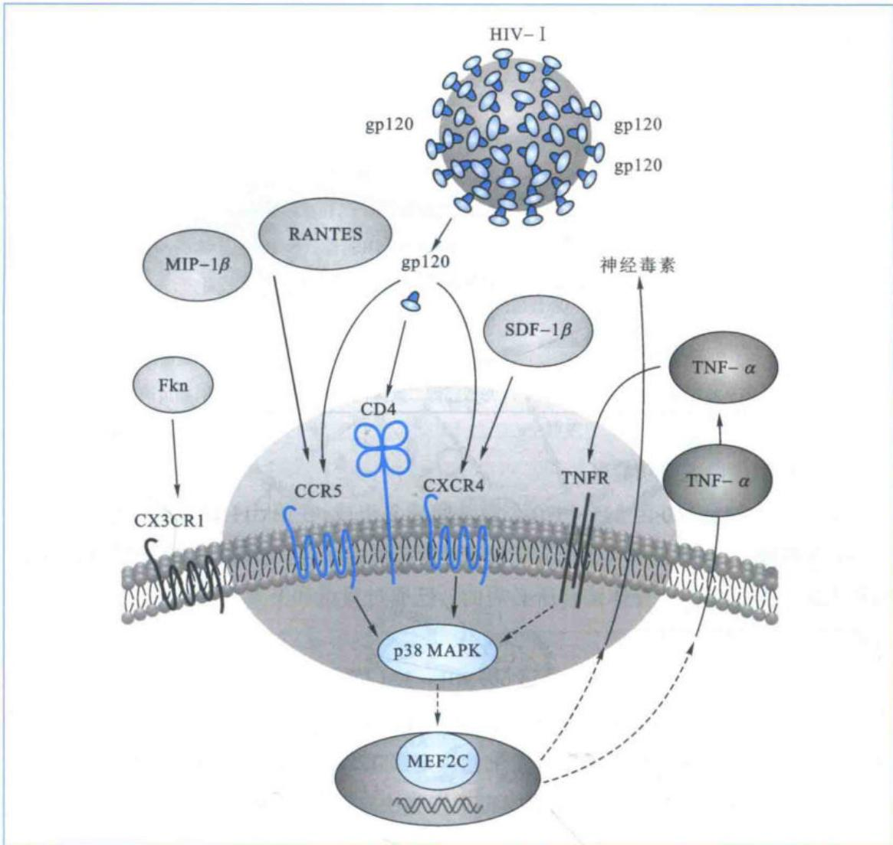  
图 9-12 HIV-I 感染小神经质细胞和巨噬细胞过程中信号传导及与其受体 CD4 和辅助受体相互作用示意图

表 9-3 HIV-Ⅰ、HIV-Ⅱ和 SIV 的辅助受体及表达模式分析

<table><tr><td>辅助受体</td><td>病毒</td><td>细胞类型或组织</td></tr><tr><td>CCR1</td><td>HIV-II</td><td>活化的体细胞、单核细胞、树突状细胞</td></tr><tr><td>CCR2b</td><td>HIV-I,HCV-II SIV</td><td>单核细胞、T细胞</td></tr><tr><td>CCR3</td><td>HIV-I,H1V-II</td><td>嗜曙红细胞、树突状细胞、TH2</td></tr><tr><td>CCR4</td><td>HIV-II</td><td>TH2、脑</td></tr><tr><td>CCR5</td><td>HIV-I,HIV-II,SIV</td><td>活化的T细胞、单核细胞、树实状细胞</td></tr><tr><td>CCR8</td><td>HIV-I,HIV-II,SIV</td><td>TH2、脑腺细胞、脑</td></tr><tr><td>CCR9</td><td>HIV-I</td><td>淋巴细胞、脑、胎盘</td></tr><tr><td>CXCR2</td><td>HIV-II</td><td>中性粒细胞、脑</td></tr><tr><td>CXCR4</td><td>HIV-I,HIV-II,SIV</td><td>淋巴细胞、单核细胞、脑</td></tr><tr><td>CXCR5</td><td>HIV-II</td><td>B细胞</td></tr><tr><td>CXCR6</td><td>HIV-I,SIV</td><td>淋巴细胞</td></tr><tr><td>CXCR7(RCD1)</td><td>HIV-I,HIV-II,SIV</td><td>单核细胞、脑</td></tr><tr><td>ROC1</td><td>HIV-I,HIV-II,SIV</td><td>淋巴细胞、脑</td></tr></table>

表 9-4 HIV 编码的主要蛋白质及其功能

<table><tr><td>基因产物</td><td>功能</td></tr><tr><td>Gag</td><td>核心蛋白</td></tr><tr><td>Pol</td><td>多种酶功能</td></tr><tr><td>Env</td><td>包膜蛋白</td></tr><tr><td>Tat(Tat-3、Ta)</td><td>RNA 沉默抑制因子,转录激活子</td></tr><tr><td>Rev(Art、Trs)</td><td>调控 RNA 剪切和运输,与 RRE 结合增加 env 的翻译</td></tr><tr><td>Vif(Sor、A、P′、Q)</td><td>侵染因子,病毒在巨噬细胞扩散所必需</td></tr><tr><td>Vpr(R)</td><td>增加病毒复制</td></tr><tr><td>Vpu</td><td>辅助病毒组装和释放,以及 gp160/CD4 复合体的解聚</td></tr><tr><td>Nef(3&#x27;ORF、B、E、F)</td><td>形成同源二聚体,引起多效应性的影响,如负调控 CD4</td></tr></table>

## 3. HIV 膜蛋白主要功能区

HIV-I 中的 gp160 由 845\~870 个氨基酸残基组成，在第 511 位被蛋白酶切割后产生 gp120 和 gp41，其氨基端与其他分子以非共价键形式结合。gp120 有 24 个糖基化位点，糖基化是 gp120 与 CD4 受体结合所必需的。已通过重组和突变实验定位了 gp120 蛋白的多个功能区，简述如下。

① 主要抗原决定簇 包括 V3 区(第 301～324 位的环状肽段)的主抗原决定簇及若干个较弱的决定簇,其中有两个分别位于 gp41 的 616～632 位和 724～751 位。

② T 细胞决定簇 两个辅助性 T 细胞决定簇 T2 和 T1 分别在 105～117 位的 C1 区和 421～436 位的 C4 区，一个主要细胞毒 T 细胞决定簇位于第 308～322 位，与 V3 区有部分重叠。另有 3 个较弱的细胞毒 T 细胞决定簇在 gp41 上。

③ CD4 受体结合区: 该区位于 423 \~ 427 位 (C4 区)。在上述功能区以外的某些氨基酸突变也能影响 gp120 的功能, 说明上述各功能区发挥作用还依赖于整个分子特定的空间构象。

## 9.2.3 HIV 的复制

HIV 主要侵染人体的 T 淋巴细胞及巨噬细胞,并通过病毒膜蛋白 gp120 与细胞表面的 CD4 受体蛋白结合。CD4 分子含有两个免疫球蛋白结构域,它在人体内所结合的正常配体是 II 型 MHC 抗原。HIV 与受体结合后,病毒核心蛋白和两条 RNA 链进入细胞(图 9-13)。反转录酶以病毒 RNA 为模板合成单链 DNA,并由宿主细胞 DNA 聚合酶合成双链 DNA(原病毒)。双链 DNA 经环化后进入细胞核,在病毒整合酶的作用下,整合入细胞染色体中,病毒核酸随细胞的分裂而传至子代细胞,可长期潜伏。

在病毒复制期间,整合到 DNA 上的原病毒被转录成 RNA 前体,其中一些通过 RNA 剪接产生成熟的 mRNA。这些 mRNA 从细胞核输出到细胞质中,并被翻译为调控蛋白 Tat 和 Rev. 新产生的 Rev 蛋白迅速移动到细胞核中,并与未剪接的全长病毒 RNA 结合,帮助其离开细胞核。一些全长 RNA 作为病毒子代基因组起作用,而另一些则翻译产生结构蛋白 Gag 和 Env。Gag 蛋白与病毒基因组 RNA 结合, 将其包装成新的病毒颗粒。最后病毒核衣壳经过细胞膜以出芽方式形成完整病毒体释放到细胞外。HIV 复制的主要过程如下: ① 原病毒整合到宿主染色体上, 无症状; ② 原病毒利用宿主细胞的转录和合成系统转录产生病毒 mRNA, 其中一部分编码病毒蛋白, 与基因组 RNA 组装成新的病毒颗粒, 从宿主细胞中释放出来侵染其他健康细胞; ③ 宿主细胞瓦解死亡。

图 9-13 HIV-I 在人体细胞内的复制和侵染过程示意图  


对 HIV-Ⅰ编码的 RNA 酶 H 和反转录酶的 X 射线衍射晶体结构分析发现, 合成前病毒第一条 DNA 链的过程中没有宿主细胞 DNA 酶的参与, 完全由 HIV-Ⅰ反转录酶完成。该酶由两个 N 端完全一致的亚单位 (p66 和 p51) 组成, 具有 DNA 聚合酶活性, 其 N 端功能区以病毒 RNA 为模板催化合成互补 DNA 链。此外, p66 的 C 端功能区还能在 p51 亚基的协同作用下降解病毒模板 RNA 链。

HIV 的转录从基因组 5' 端 LTR 起始, 先形成一条长链 RNA 并迅速切割成短 mRNA分子,用于指导合成HIV调控蛋白,但不翻译结构蛋白。当调控蛋白Rev达到一定阈值后,转录由早期向晚期变换。此时,主要是转录长链mRNA并指导合成结构蛋白,组装成完整的病毒颗粒。HIV复制的复杂调控机制使HIV感染细胞后产生不同的结果。在复制和表达量非常高的情况下可立即杀死细胞,低水平复制和表达时仅造成细胞功能失常,而不复制、不表达时病毒基因组以DNA形式与染色体整合,与宿主长期共存。这就是艾滋病在临床上潜伏期长短不一、病程快慢不一的主要原因。HIV前病毒整合是随机的,并不要求特定的DNA序列,因而可以整合到染色体上的任何部位。

## 9.2.4 HIV 基因表达调控

与大多数反转录病毒相比，HIV 的最大特点就是含有许多调控基因。这些基因编码相应的调控蛋白，它们在病毒 RNA 的转录、转录后加工、蛋白质翻译、包装以及病毒颗粒的释放等各个过程中发挥重要作用。在这些过程中，除 HIV 自身的调控蛋白外，还有许多宿主细胞的调控蛋白参与。

## 1. LTR 序列

LTR 位于 HIV 基因组两端, 其序列是高度保守的, 在 HIV-Ⅰ与 HIV-Ⅱ及 SIV 之间的保守性高达 95% 以上。HIVI 的 5' 端 LTR (5'-LTR) 和 3' 端 LTR (3'-LTR) 都可以启动转录, 但 HIV 的转录由位于 5'-LTR 内的启动子控制。来自 5'-LTR 的转录调控可能抑制了 3'-LTR 的启动子活性, 在 5'-LTR 缺陷的情况下, 可以激活来自 3'-LTR 的转录。5'-LTR 含有 HIV 基因调控所必需的多个特定调控区, 能够劫持宿主细胞转录装置, 严格控制病毒基因组的转录。HIVI 的 5'-LTR 在结构上分为 U3、R 和 U5 区域(图 9-14)。HIV 转录起始于 5'-LTR R 区域的转录起始位点 (TSS), 然后转录产物通过 U5 区域加帽并进行延伸至整个病毒基因组。转录终止通常发生在 3'-LTR 的 R 区域内。转录终止时, 3'-LTR 的 U5 区编码 poly(A) 信号进行加尾。5'-LTR 包含相对于 TSS 核苷酸 -454 \~ +188 之间的区域。根据各区调控功能的异同进一步划分为 4 个主要功能元件: 调控单位 (-455 \~ -104), 增强子区域 $(-109\sim-79)$ ，核心单位 $(-78\sim-1)$ 和TAR区域 $(+1,+60)$ （图9-14），并在其中发现了许多细胞转录因子结合位点 $^{(图9-15)}$ 。

图 9-14 HIV 基因组 LTR 结构示意图  


  
图 9-15 HIV 基因组 5'-LTR 区中的 DNA 和 RNA 结合蛋白的作用位点

## (1) 核心调控元件

该元件从 LTR 起始延伸到 -78 位核苷酸, 包含多个可与细胞转录调控因子结合的区域。鸡卵蛋白转录因子(COUP-TF), 结合于 LTR-371\~-334 位, 激活蛋白 1 (activator protein 1, AP1) 结合于 LTR 的 -347\~-329 位。激活 T 细胞核因子(NFAT) 在 LTR-292\~-255 位和 -216\~-203 位上有两个结合位点。上游激活因子(USF) 结合于 -173\~-160 位, T 细胞因子 -1α(TCF-1α) 结合于 -139\~-124 位。除 COUP-TF 和 USF 对 HIV 的转录起负调控作用外, 其余均为正调控因子。AP1 是由含亮氨酸拉链结构的 C-Jun 和 C-Fos 家族成员组成的二聚体, COUP-TF 家族中的低相对分子质量蛋白质含有锌指结构, USF 为螺旋-环-螺旋结构, TCF-1α 含有高速泳动族基序(HMC motif)。该区域还包括 3 个 CCAAT / 增强子结合蛋白(C / EBP) 结合位点, 激活转录因子 / 环 AMP 应答位点、淋巴细胞增强因子(LEF-1) 结合位点, c-Myb 结合位点、Ets-1 结合位点和核因子 NF-κB 结合位点。核因子 NF-κB 与 HIV-I 感染后的调节区域结合并对病毒转录产生负影响。在核心调控区域的上游 -130\~-201 之间的序列, 包含在 T 细胞中高度表达的 LEF-1、NF-AT 和 Ets-1 转录因子的共有结合位点, 在外周血淋巴细胞和一些 T 细胞系中对病毒表达具有非常重要的调节作用。

## (2) 增强子区域

该区域主要包括核因子 $\kappa B(NF-\kappa B)$ 结合位点(结合于 -104～-81 位)。NF- $\kappa B$ 含有锌指结构及锚定蛋白重复序列，由间隔 3～4 个核苷酸的两个 10 bp 的 GGGACTTTCC 序列组成，负责调控 HIV 基因在多种细胞特别是 T 淋巴细胞中的高效表达。在多种 HIV 亚型中均存在 NF- $\kappa B$ 和相关因子的 10 bp 共有结合位点的串联重复序列，类似的序列在其他病毒如 SV40、巨细胞病毒及白细胞介素 -2 受体、 $\beta-$ 干扰素等基因的特异性和诱导型表达过程中都发挥了重要的调控作用。HIVI 增强子区域内的两个 NF- $\kappa B$ 结合位点也可以被 NF-AT 因子结合；NF-AT 与位于 U3 区域的 NF- $\kappa B$ 基序的末端 3' 端半结合，具有与 p50 相似的序列偏好，并且调节 HIV 启动子活性，增加 T 细胞中的感染性。

## (3) 核心转录单位

HIV-I LTR 核心转录单位的结构与其他病毒或细胞启动子的转录起始区相似,有 TATA 区、SP1 结合位点和转录起始位点 TSS。这些序列对转录的激活具有重要作用,一旦缺失将使 LTR 失去启动子活性。

在核心转录单位 -78～-46 位点的富含 GC 区有 3 个连续的 SP1 结合位点。SP1 蛋白含有 DNA 结合结构和两个富含谷氨酰胺的结构域，可形成二聚或三聚体。当 3 分子 SP1 与 LTR 结合后，由于彼此间以及 SP1 与周围蛋白的相互作用改变了 DNA 的空间结构，诱导了依赖于 DNA 的蛋白激酶对 SP1 的磷酸化作用，激活 HIV-I 基因转录。HIV-I LTR 的 -28～-24 位含有 TATA 元件，其两侧还有一个 CAXXTG 的同向重复序列，该重复序列可能是转录因子螺旋－环－螺旋 DNA 结合蛋白的识别位点。不同 HIV-I 亚型的遗传学研究表明，病毒能够使用重叠的 CATA 区而不是典型的 TATA 区，并且某些亚型包含 4～5 个 Sp1 位点。TATA 区和 Sp 位点对于病毒转录起始、保持启动子活性以及 Tat 蛋白介导的反式激活都是必需的。

最近的研究表明三联基序蛋白 TRIM22 干扰 Sp1 结合从而抑制预起始复合物 (PIC) 形成和原病毒转录。TATA 盒侧翼的 CTGC 基序也显示为体外转录起始和活细胞中 Tat 依赖性激活所需的。另外，紧接 TSS 上游的转录因子 ZASC1 结合位点，显示出 ZASC1 与 Tat 和正向转录延伸因子 b(P-TEFb) 相互作用并协同促进 HIV-I 转录延伸的调节作用。

## (4) 反式激活因子应答元件

在 HIV 基因组 +1～+60 位的核苷酸序列是反式激活因子(Tat)激活 HIV-I 转录所必需的,称为反式激活应答元件(TAR)。该序列存在于 HIV 基因组 RNA 和原病毒 DNA 上,是 HIV 复制所不可缺少的重要调控位点。TAR 是含有多个调节元件和两个 CTCTCGG 重复序列拷贝的短 RNA 转录物,从而介导 Tat 向 HIV-I 启动子的募集。体外研究表明,该 RNA 元件具有发夹样结构,作为 Tat 的结合位点,对于反式激活是必不可少的。

研究发现,TAR 可以产生一个 miRNA,通过降低细胞凋亡通路下游基因 ERCC1 和 IER3 表达,阻止细胞凋亡,以利于病毒的复制。另外,还在 TAR 元件中发现 Psi 元件,Gag 和 Rev 蛋白可以识别该元件进行病毒基因组和结构蛋白的组装。

## (5) TSS 下游区域

TSS 下游的序列在调节转录中的作用近年来才引起重视。HIV-I 5'-LTR 在 TSS 下游同样含有转录因子结合位点，其中一些在不同的 HIV-I 株系和亚型中是非常保守的。重要的下游 HIV-I 调控结合位点是：3 个激活转录因子 AP-1 结合位点分别位于 +87～+94 位、+118～+125 位和 +155～+163 位，NFATc2 和 C/EBP 结合于 U5 区域的 +158～+171 位，类 AP-3 结合位点在 +162～+177 位，NFAT 结合位点与类 AP-3 相同，DBF-1 结合位点和 Sp 位点位于 U5 区域下游，分别为 +200～+219 位和 +270～+278 位（图 9-16）。

包括 AP1、C / EBP、NFAT 在内的一些因子通过募集染色质重塑和组蛋白修饰辅因子复合物来促进转录激活，从而改善 RNA 聚合酶Ⅱ复合物对染色质的亲和力。其他因子可能通过影响转录起始和延伸来促成转录激活。总的来说，这个区域可能有助于调节

  
图 9-16 HIV 基因组 5'-LTR 的 TSS 下游区域转录因子结合位点

  
图 9-17 Tat 蛋白的结构示意图

HIV-I 对激活信号的转录反应。

## 2. 参与 HIV 复制的调控蛋白

## (1) Tat 蛋白

该蛋白质是一个转录激活因子,在 HIV-I、HIV-II 和 SIV 中高度保守,是病毒复制所必需的。HIV-I 的 tat 基因与 env 编码区有部分重叠,它含有两个外显子,编码了由 101 个氨基酸残基组成的 Tat 蛋白。第一个外显子所编码的 67 个氨基酸组成的多肽同样具有反式激活作用 $^{(图9-17)}$ 。Tat 蛋白有 3 个功能域,第一个是与其他已知转录调控蛋白激活功能区结构基本一致的酸性氨基酸区,与 Tat 激活 HIV-I 基因表达有关。第二个功能区富含 Cys,在其 16 个氨基酸残基中就有 7 个 Cys,可与二价金属离子结合并形成 Tat 二聚体。在这 7 个 Cys 中有 6 个是维持 Tat 活性所必需的,替代其中的任意一个均可使 Tat 失活却不影响 Tat 与金属离子的结合。该肽段能与相对分子质量 $3.0 \times 10^{4}$ 的宿主细胞核蛋白相结合。

Tat 蛋白还是一个 RNA 沉默抑制因子。缺失突变和点突变结果表明，抑制 RNA 沉默功能区位于该蛋白质的 38～72，且这段区域不具有转录激活功能，说明 Tat 蛋白的转录激活功能和 RNA 沉默抑制功能是分开的。HIV-Ⅰ和Ⅱ也编码一个称为 Tax 的异源转录激活因子，它的主要作用是通过宿主细胞中的转录因子与 LTR 中的顺式作用元件结合，从而调控基因转录。

研究认为，Tat 的主要作用可能是促进 RNA 聚合酶Ⅱ（RNAP Ⅱ）转录起始复合物的组装。在 HIV-Ⅰ整合入宿主基因组后，RNAP Ⅱ在位于 5'-LTR 的病毒启动子处组装并开始转录病毒 RNA 的过程。在没有 Tat 蛋白存在的情况下，转录起始位点附近的顺式作用元件虽然也指导转录复合物的形成，但其延伸效率较低，只能转录出短的不完整的病毒转录物。加入 Tat 蛋白后，短链 RNA 转录产物浓度迅速下降，取而代之的是长链 RNA。

Tat 的第三个功能区由一组带正电的碱性氨基酸残基构成, 行使两个主要功能。一个是 +48 \~ +52 位的 GRKKR 序列, 是核 - 核仁定位信号, 可介导自身或异种蛋白进入细胞核。若将此肽段与 β- 半乳糖苷酶融合即可使后者在核内聚集。该肽段第二个功能是与 TAR RNA 凸出部分的特异性结合, 通过 Tat 第 52 和第 53 位 Arg 残基与后者的磷酸基团相互作用得以实现。

## (2) Tat 与 TAR 对 HIV 复制的协同调控作用

实验表明,Tat 和 TAR 结合并不能有效地激活 HIV 基因表达,还依赖于如下因素:

TAR 序列及完整高级结构的影响。Tat 虽能结合环区有突变的 TAR 蛋白,但此时不能激活 HIV 的表达。

宿主细胞因子协同作用的影响。在不同细胞内，Tat的活性可有上千倍的差异。在人鼠杂交细胞中，只有在保持人第12号染色体的杂交瘤细胞中，Tat才能有效地激活HIV-I转录。研究发现，Tat与TBP-I结合形成复合体而发挥作用，说明Tat与TAR对HIV复制的调控还需宿主细胞编码蛋白的协同作用。

上游启动子和增强子序列。当 TAR 远离其上游启动子时，它的活性迅速下降。而且这种依赖作用对非激活细胞和 Tat 激活细胞的表现是不一样的，增强子 SP1 序列在 Tat 诱导细胞中对 HIV 转录的促进作用远远大于非激活细胞，去除 SP1 序列甚至可提高非激活细胞中 HIV 的转录。而 NF- $\kappa$ B 序列在对两种细胞的作用正好与 SP1 相反。TATA 启动子序列的改变对未激活细胞影响很小，却可明显降低 HIV 在 Tat 诱导细胞中的复制。

Tat 的主要辅助因子是细胞周期蛋白 T1(CCNT1), 它与细胞周期蛋白依赖性激酶 9 (CDK9) 一起构成正转录延伸因子 b(P-TEFb)。这种异二聚体宿主激酶可以磷酸化激活暂停的 RNAP II, 并调节大多数细胞基因的延伸。Tat 将 P-TEFb 复合物募集到新生的 TAR RNA 中, 该 RNA 将激酶定位在停滞的聚合酶附近用于磷酸化依赖性激活。有趣的是, CCNT1 也有助于 RNA 结合, 因为它与 TAR 环中的碱基接触以实现高亲和力相互作用。Tat-P-TEFb 复合物有效地刺激病毒基因表达, 启动生命周期的后整合步骤, 最终导致病毒萌芽和新细胞的感染。

## (3) Rev 蛋白

rev 基因由两个外显子组成, 分别编码 25 个氨基酸和 91 个氨基酸的两个肽段, 最终组装成有 116 个氨基酸、相对分子质量为 $1.9 \times 10^{4}$ 的调控结构蛋白表达活性的 Rev 蛋白 (图 9-18)。它是一个重要的反式激活因子, 调控 RNA 剪切和运输, 与 RRE 结合增加 env 的翻译。对 HIV 的许多调控蛋白编码基因有负调控作用, 而对其结构蛋白基因有正调控作用。Rev 蛋白的上述作用是通过与 env 和 gag/pol mRNA 上的一段 234 个核苷酸的 Rev 效应元件实现的, 是 HIV-I 特异的。它的主要功能是增加细胞质中未经编辑的基因组全长转录产物, 增加含有 Rev 效应原件 RNA 的稳定性, 并促进它们向细胞质运转。Rev 蛋白还通过阻碍剪接子的组装来抑制 RNA 的编辑, 增加这些 mRNA 的翻译, 从而促进 HIV 基因表达由早期 (转录调控蛋白 mRNA) 向晚期 (转录 HIV 结构蛋白 mRNA) 的转变。在rev 基因缺陷型 HIV 前病毒中, 仅有早期基因表达。只有加入 Rev 蛋白后, 晚期基因才开始转录。Rev 蛋白还在结构蛋白 mRNA 进入细胞质的过程中发挥作用。

  
图9-18 Rev蛋白的结构示意图

已经证实, Rev 蛋白和 RRE (Rev response element) 的结合是通过 Rev 蛋白中富含碱性氨基酸的一段 14 肽 (EGTRQARNRRRRWR) 与 RRE 二级结构 IIB 茎区特异性结合实现的 $^{(图9-19)}$ 。第一个 Rev 蛋白与 RRE 的结合有助于其他 Rev 蛋白的结合, 这些蛋白质不是结合在 RRE 的特异位点上,而是直接结合到第一个 Rev 蛋白上,形成多聚体。Rev 蛋白功能的实现依赖于它向核内的运转,而这一过程是通过 Rev 蛋白的核定位信号功能区完成的。宿主细胞蛋白可结合到 Rev 蛋白近 C 端的功能区,协助加工和转运 HIV mRNA。

  
图 9-19 Rev 蛋白与 RRE 区的结合

Rev 蛋白导出细胞核的主要辅助因子是染色体维持因子 1(CRM1)。CRM1 通常向细胞质运输富含亮氨酸的核输出序列(NES)的蛋白质,并且通常不参与 mRNA 输出。Rev 通过充当适配器劫持 CRM1 用于病毒 RNA 的输出,其中 Rev NES 结合宿主输出因子,而 Rev 核定位信号(Rev-NLS)结合 RRE。有趣的是,最近的研究表明,病毒出核复合物中含有 CRM1 的二聚体。考虑到 CRM1 已被证明只能作为单体运输细胞成分,Rev 依赖的 CRM1 二聚化可能是提高对低亲和力 RevNES 位点的识别的一种方式。组装这种病毒-宿主输出复合体可以使含有内含子的 HIV-I 遗传信息在细胞质内运输,以完成病毒生命周期的后期阶段。

## (4) Nef 蛋白

一般认为，Nef蛋白是一个负调控因子和磷酸化蛋白，相对分子质量为 $2.7 \times 10^{4}$ ，它不是HIV复制所必需的，但可抑制由HIV LTR特异性转录的HIV-I前病毒基因的表达。研究发现，烷基化后定位于细胞膜上的Nef蛋白比未烷基化并弥散于细胞核及细胞质内的Nef蛋白抑制HIV-I基因表达的效率比后者高10倍，推测Nef可能是通过膜细胞信使分子获得对HIV LTR的调控作用。Nef的存在可提高和维持HIV在体内的含量，并在HIV病理过程中起作用。此外，Nef蛋白形成同源二聚体，引起多效应性的影响，如负调控CD4、MHC I以及MHC II。

## (5) Vpr 蛋白

该蛋白质又称病毒 R 蛋白, 由 96 个氨基酸组成, 它不是 HIV 复制所必需的, 但存在于病毒颗粒中。Vpr 蛋白与 p6 Gag 存在特异性相互作用, 每个病毒粒子包装大约 250 个 Vpr 拷贝, 病毒核心中也发现 Vpr。含有 vpr 基因的 HIV 毒株与无 vpr 基因的 HIV 毒株相比, 前者在细胞中生长较快, 引发细胞病变也较强。无 vpr 基因的 HIV-Ⅱ不能在巨噬细胞中繁殖。Vpr 蛋白可作用于 HIV-Ⅰ的 LTR 区, 使它所调控的 HIV 复制速度提高 2\~3 倍, 说明 Vpr 在病毒早期侵染中有作用。

Vpr 蛋白在 HIV-Ⅰ复制中最重要的一个功能是能够结合并协助将病毒整合前复合体导入不分裂的细胞和细胞周期阻滞细胞的细胞核。病毒 cDNA 整合到宿主染色体 DNA 中过程通常被核膜所阻止。HIV-Ⅰ进入宿主基因组的两种主要方式是：细胞分裂时，核膜被分解；或者借助 IN 蛋白和 Vpr 在核孔的相互作用，通过输入核内整合复合体进入细胞核。Vpr 还能在细胞周期的 $G_{2}$ 阶段阻断细胞分裂，诱导细胞凋亡并产生其他致病作用，有可能增加了病毒复制、传播和免疫逃逸。

## (6) Vpu 蛋白

这个蛋白质是 HIV-Ⅰ特有的,其他灵长类动物免疫缺陷病毒以及 HIV-Ⅱ和 SIV 均无此基因。它编码由 81 个氨基酸组成的磷酸化蛋白,称为病毒 U 蛋白,主要存在于细胞膜中。vpu 基因的翻译受 Rev 调控,HIV 复制时并不需要 vpu 基因的表达,但若缺失 vpu基因可使感染性病毒粒子的产量降低5\~10倍，大大减少了病毒颗粒在细胞膜上的释放。据此，人们推测Vpu蛋白可能促进HIV-I病毒粒子的组装、成熟和释放。此外，Vpu蛋白有助于gp160/CD4复合体的解聚。

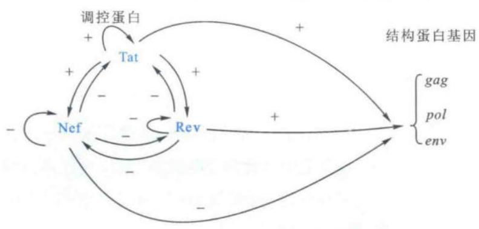  
图 9-20 Tat、Rev 和 Nef 对 HIV 基因表达的影响分析

## (7) Vif 蛋白

该蛋白质是相对分子质量为 $2.3 \times 10^{4}$ 的病毒感染性因子，是 HIV-I 侵染所必需的。缺失 vif 基因的 HIV-I 虽然仍在细胞内正常复制并产生病毒粒子，但这些粒子的侵染性不及野生 HIV-I 病毒粒子的 1/1000。Vif 蛋白是病毒在巨噬细胞间扩散所必需的。图 9-20 揭示了 Tat、Rev 和 Nef 对 HIV 基因表达的综合性影响。

## 9.2.5 HIV 的感染及致病机制

HIV 初次感染人体后,立即大量复制和扩散,此时,感染者血清中出现 HIV 抗原,从外周血细胞、脑脊液和骨髓细胞中均能分离出 HIV。这是 HIV 原发感染的急性期。大约 70% 以上的原发感染者在感染后 2\~4 周内出现急性感染症状,包括发热、咽炎、淋巴结肿大、关节痛、中枢及外周神经系统病变、皮肤斑丘疹、黏膜溃疡等,持续 1\~2 周后进入 HIV 感染的无症状潜伏期。在这个时期感染者无任何临床症状,外周血中 HIV 抗原含量很低甚至检测不到。但随感染时间的延长,HIV 重新开始大量复制并造成免疫系统损伤。临床上病人感染逐步发展到持续性全身性淋巴腺病(PGL)、艾滋病相关综合征(APC)等,直至发展到艾滋病。

在 HIV 自然感染过程中,机体可产生高滴度的抗 HIV 多种蛋白质的抗体,主要是细胞类型特异性的中和抗体,其主要作用是在急性感染期降低血清中的病毒含量或部分清除病毒。HIV 的感染也刺激机体产生细胞免疫应答,对于杀伤 HIV 感染的细胞,阻止 HIV 经细胞接触而扩散等可能发挥重要作用,还能协助清除急性感染期 HIV 感染灶和 HIV 感染早期的少量有 HIV 复制的细胞。

人体一旦被 HIV 感染,便会终生带毒,随着时间延续,发病的可能性也逐渐增加。感染 7\~8 年内一般有约半数的带毒者发病,体内产生大量病毒颗粒,并造成感染细胞死亡。属于典型的反转录病毒科慢病毒亚科病毒特征。此外,HIV 还通过以下途径导致免疫功能下降:① HIV 粒子表面的 gp120 蛋白脱落,与正常细胞膜上 CD4 受体结合,使该细胞被免疫系统误认为病毒感染细胞而遭杀灭；②因 T 细胞 CD4 受体被 gp120 封闭，影响了其免疫辅助功能；③ HIV 的 gp120 蛋白可刺激机体产生抗 CD4 结合部位的特异性抗体，阻断 T 细胞功能；④带有病毒包膜蛋白的细胞可与其他细胞融合形成多核巨细胞而丧失功能。

研究还发现,除了主要感染富含 CD4 蛋白的 T 细胞外,HIV 还能感染只带少量 CD4 蛋白或无此受体蛋白的 B 细胞、巨噬细胞、树突状细胞、郎格罕氏细胞、肠上皮细胞、脑内的星形细胞和小神经胶质细胞以及毛细血管内皮细胞等。HIV 可侵染巨噬细胞并随该细胞游走至体内许多组织细胞组织或脏器。HIV 还可侵染脑和肠细胞,因此,艾滋病患者的中枢神经系统常常发生病变,并伴有腹泻等症状。

尽管 HIV 有上述导致细胞病变的作用,但还不足以解释 HIV 感染所造成的免疫系统尽管 HIV 有上述导致细胞病变的作用,但还不足以进行性损伤直至崩溃的严重病症。因为即使是艾滋病人,其外周血淋巴细胞中也仅有极少数的细胞被 HIV 感染。有研究报道,鼠反转录病毒和鼠免疫缺陷病毒感染的小鼠中病毒基因编码一种超抗原,可导致小鼠体内特定的 T 细胞亚群的消失和免疫缺陷的发生,暗示艾滋病人中也可能存在 HIV 编码的超级抗原,导致特定 T 细胞亚群缺失并使机体的免疫防御网出现重大漏洞,对某些致病微生物处于无反应状态。这种免疫病理机制可以解释艾滋病人既出现了严重的免疫系统缺陷,病人血液中却只有极少部分淋巴细胞带有 HIV 这种十分矛盾的现象。

## 9.2.6 艾滋病的治疗及预防

迄今为止,虽然对艾滋病的研究受到了高度重视,仍无任何药物可以完全抑制 HIV 在感染者体内的增殖并彻底治愈艾滋病。目前,已批准的抗 HIV 病毒药物主要有以下几类(表9-5)。图 9-21 是核苷酸型和非核苷酸型反转录酶抑制 HIV 病毒的作用机制。

目前治疗艾滋病的标准疗法是高效抗反转录病毒疗法(highly active antiretroviral therapy, HAART), 又称为抗反转录病毒鸡尾酒疗法, 该疗法可以阻断正在进行的病毒复制, 减少单一用药产生的抗药性, 使机体被破坏的免疫功能部分甚至全部恢复, 从而延长患者生命, 改善生活质量。但该疗法无法彻底清除潜伏感染的静息性记忆 CD4+ T 细胞等细胞内的 HIV 病毒, 无法完全治愈 (sterilizing cure) 艾滋病。全球唯一实现 HIV 完全治愈的病人是著名的“柏林病人”, 2007 年, 一位同时罹患艾滋病和急性髓性白血病的患者在柏林接受了异源 CCR5 受体缺陷型的骨髓造血干细胞移植。20 个月后，接受骨髓移植的艾滋病患者在没有任何抗病毒药物治疗的情况下，其血液、骨髓和肠中艾滋病毒检测均为阴性。但由于很难找到与患者白细胞抗原匹配并对 HIV 天然免疫的供体干细胞，且移植手术危险性高，费用昂贵，使得该疗法难以复制和推广。

表 9-5 已被批准的抗 HIV 药物  
```txt
核苷酸型反转录酶抑制剂
Abacavir (ABC)
Stavudine (d4T)
Didanosine (ddI)
Zalcitabine (ddc)
Lamivudine (3Tc)
Zidovudine (AZT)
Emtricitabine (FTC)
Tenofovir disoproxil fumarate (TDF)

非核苷酸型反转录酶抑制剂
Efavirenz
Nevirapine
Delavirdine
Etravirine
Rilpivirine

蛋白酶抑制剂
Amprenavir
Indinavir
Lopinavir
Nelfinavir
Ritonavir
Saquinavir (已经退出市场)
Saquinavir mesylate
Tipranavir
Fosampernavir Calcium
Darunavir
Atazanavir sulfate
Nelfinavir mesylate

融合酶抑制剂
Enfuvirtide
CCR5 受体抑制剂
Maraviroc

HIV 整合酶转移抑制剂
Raltegravir
Dolutegravir
Elvitegravir
```

(a) 核苷酸型反转录酶抑制剂。由于它在结构上与脱氧核苷酸的相似性，掺入后使病毒DNA的合成不能进行。(b) 非核苷酸型反转录酶抑制剂。与反转录酶相结合，通过限制该酶的移动性而影响它的活性。  
  
图 9-21 核苷酸型和非核苷酸型反转录酶抑制剂的作用机制分析

受治疗“柏林病人”的启发,科学家们采用锌指核酸酶(zinc-finger nuclease,ZFN)介导的特异性基因敲除等基因组编辑手段,对来源于患者本人的CD4 $^{+}$ T细胞的CCR5或者CXCR4受体进行突变,并在体外进行扩增后重新输回患者体内。几周后,患者体内艾滋病毒含量急剧下降,其后恢复HAART治疗,在36周观察期内,患者体内病毒均降至未能检出水平,可见敲除CCR5受体基因对治疗艾滋病是有效的。但由于回输的CD4 $^{+}$ T细胞属于已成熟的T细胞,复制能力有限,在外周血中会慢慢消减,需要反复回输,且对T细胞或者造血干细胞的体外改造、扩增和回输是非常复杂的过程,费用昂贵,风险性高,难以大规模临床应用。

整合在宿主免疫细胞基因组中的 HIV 前病毒是潜伏库存在的根本原因。近年来，随着对 HIV 病毒潜伏储存库形成机制的研究以及基因组编辑技术的重大突破，研究者利用锌指核酸酶、类转录激活因子效应物核酸酶(transcription activator-like effector nulease, TALENS)以及 CRISPR/Cas9 等基因组编辑技术，定向突变、清除或沉默病毒潜伏储存库细胞中的 HIV 前病毒靶片段。

近年来,从 HIV 感染者体内发现并分离到很多广谱中和抗体,因此,以诱导广谱中和抗体为目的的包膜免疫原设计成为目前疫苗研究领域的最新方向。随着与 HIV 侵染有