# 第1章 生命的分子基础

全书分三篇共36章。本章是第一篇的头一章，实际上也是全书的头一章，因此它肩负着“开宗明义”的任务。全书所涉及的一些共同问题，在这里作一个简要的、引论式的介绍：生物化学研究些什么？生物化学作为一门学科是怎样产生和发展起来的？生物化学与蓬勃兴起的分子生物学又有什么关系？此外本章还将介绍一些生物化学的背景知识：生物分子及其三维结构，非共价相互作用，水，细胞和生物分子的起源与进化等。

## 一、生命属性与生物化学

地球上生物的种类繁多,数量巨大,生命现象错综复杂,要给生命(life)或者生物(living thing)下一个确切的定义是非常困难的。然而跟无生命物体相比较,还是可以概括出若干生命或生物(这两个词的含义有差别,但常被同等使用,这里便是如此)所特有的性质,被称为生命属性或生物属性,如生长、发育、繁殖、化学成分同一性、结构有序性、新陈代谢、遗传、变异、进化、适应和应激性等。这些属性大体上可以归纳为以下3个方面:

## （一）化学成分复杂而同一、结构错综而有序

活生物(living organism)从单细胞的细菌、酵母到多细胞的高等动、植物都是由细胞构建而成的。细胞是生命的基本单位，它们的形体很小，为肉眼所不能见，但内部结构错综复杂。一个最简单的细胞也含有上千种不同的分子，有的参与细胞的结构成分，有的存在于细胞溶胶(cytosol)中。这些分子成分，除水、氧、氮和某些无机离子外，主要是蛋白质、核酸、糖类、脂质以及它们的单体亚基（monomeric subunit）等有机分子。这些有机分子在自然界都是生命活动的产物，因此被称为生物分子(biomolecule)。蛋白质、核酸和多糖是分别由几种称为单体亚基的较小分子共价聚合而成的线型高分子，称为生物大分子(biomacromolecule)。脂质因它的聚集体具有大分子的性质而被看成是“准生物大分子”。在所有的生物体内，这些大分子各自都有相同的结构模式和生物学功能。例如酶(一类蛋白质)作为生物催化剂，脱氧核糖核酸(一种核酸)作为遗传物质，多糖作为结构成分或贮能分子，脂质参与生物膜组成等。由此可见生物界在化学成分上有着高度的复杂性和同一性。

生物分子在生物体内不是随机堆积的,而是组织成严谨有序的结构。就一个细胞来说,胞内含有细胞核和各种细胞器如线粒体、叶绿体等,它们是由超分子复合体(或称超分子结构)如生物膜、染色体和核糖体等组建而成,超分子复合体又是由蛋白质、核酸和脂质等大分子缔合而成。这些说明生物分子组织成细胞是有结构层次(structural hierarchy)的。层次从低到高:单体亚基、大分子、超分子复合体、细胞器直至细胞。对多细胞的生物来说,在细胞这一层次以上,还有组织、器官、系统直至生物个体。由单体亚基聚合成生物大分子是通过共价键连接的。大分子作为结构单元进一步组织成超分子复合体以及再往高层次组织直至形成个体,都是借助非共价相互作用(non-covalent interaction)完成的。生物大分子、超分子复合体甚至细胞器,不论它们怎样复杂,其本身还不是生命,只有组织成像细胞这样的有序系统,各种生物分子各居其位、各司其职,并处于相互作用中,才能呈现出生命现象。当然,这些生物分子中,蛋白质、核酸起着关键性的作用。生物一旦失去这种有序性和相互作用,生命也就完结了。

与生物相比,无生命物体——黏土、砂子、岩石或海水——所含化学成分的复杂性和组织化(organization)程度相对低多了,它们一般是随机混合在一起的。

## （二）利用环境的能量和物质进行自我更新

活细胞是生物进行新陈代谢的基本单位。新陈代谢（metabolism）简称代谢，它是生物体内发生的各种酶促反应的总和或总称。在细胞内进行的新陈代谢常称为中间代谢（intermediary metabolism）或细胞代谢。细胞代谢包括相反相成的两个方面：合成代谢（同化作用）和分解代谢（异化作用）。合成代谢（anabolism）是指由小分子前体合成大分子细胞成分如蛋白质、核酸等的需能反应。分解代谢（catabolism）是指有机营养物分子如糖类、脂质和蛋白质等被降解成中间物进而降解成终产物的产能反应。细胞内几千种酶促反应，按代谢功能（如产能、生物合成等）被组织成许多个不同的连续反应序列，这些序列被称为代谢途径（metabolic pathway）。在每个途径中，上一步反应的产物成为下一步反应的反应物，每一步都有相应的专一性酶催化。这些途径中，有些是分解代谢方面的，如糖酵解途径（在细胞溶胶中）、柠檬酸循环、氧化呼吸链和脂肪酸氧化（后3个途径在线粒体中），它们的主要代谢功能是产生能量，并以便于利用的化学能形式贮存于腺苷三磷酸（ATP）和还原型烟酰胺腺嘌呤二核苷酸磷酸（NADPH）等分子中。另一些途径是合成代谢方面的，如糖原合成（在胞质的糖原颗粒中）、脂肪酸合成（在细胞溶胶中）、蛋白质合成（在粗面内质网上）、核酸合成（细胞核内）以及它们的单体亚基合成，它们的主要代谢贡献是利用分解代谢释放的能量（储存在ATP、NADPH等）进行大分子的生物合成。

分解代谢途径和合成代谢途径相互交织在一起，形成一个酶促反应网络。这种代谢网络在分子、细胞和整体3个水平上受到严格调控，使新陈代谢在时空上严整有序，有条不紊（见第28章）。如果某代谢环节被阻断，有序性遭破坏，生命就会受到威胁，甚至终结。活生物或活细胞要维持生存和繁衍后代，就必须不断地与环境进行物质交换和能量交流。与此相应的有物质代谢和能量代谢，前者着重生物的物质更新，后者强调能量的摄取、转化和利用。生物的能量摄取、转化和利用是生物化学的中心课题之一。活生物主要以两种方式从环境中获取能量：一种是以日光（辐射能）形式被光自养生物（photoautotroph）（绿色植物和光合细菌）的光合细胞捕获并转化为化学能，贮存于ATP、NADPH和有机营养物（燃料分子）中；另一种是以有机营养物形式被异养生物（heterotroph）（动物、真菌和细菌）摄取，通过分解代谢转化为化学能，贮存于ATP等分子中。实际上生物所需的能量都是直接或间接地来自日光能。光合磷酸化和氧化磷酸化中的电子流是能量转化的基础。能量转化中的化学能（一种势能）是最重要的能量形式，前面提到的ATP是通用的化学能载体，称为载能分子（energy-carrying molecule），是代谢网络中偶联吸能反应（合成代谢途径中）和放能反应（分解代谢途径中）的媒介物。通过放能反应和吸能反应的偶联，可以利用前一反应释放的能量驱动后一反应的进行。细胞做功时发生各种形式的能量转化，涉及化学能（ATP）转化为其他化学能（合成各种生物大分子）、机械能（肌纤维收缩、细菌纤毛运动等）、渗透能（肾透析、维持细胞渗透压）和电能（神经传导、电鳗放电）等；此外还有光能转化为化学能（叶绿体中）、光能转化为电能（视网膜中）等。

热力学第二定律告诉我们，在宇宙或孤立系统（isolated system）中任何能量的转化都会导致无序性（混乱度）的增加，无序性常用一个称为熵（entropy）的热力学函数来度量（见第16章）。这样，生物或细胞随着生命活动的进行，能量形式的不断转化，其体内的熵值应该不断升高。然而事实并非如此，甚至相反。这是因为活生物或活细胞是一个开放系统（open system），也即它与环境既有物质的交换，又有能和熵的交流。从环境中摄取的是低熵高能的日光和有机营养物，送回环境的是低能高熵的简单物质（代谢产物）和热。热是分子的随机运动，是无序性（熵）的一种常见形式。从热力学角度看，正在生长的生物或细胞是一个熵值不断减少的独立王国，它生存于熵值不断增加的宇宙（系统+环境）之中。这表明生物界也是遵循那些支配无机界的自然法则的。

然而活生物和无生命物体仍有着质上的区别，前者只有作为一个开放系统跟环境不断地发生能量和物质的交换才能维持和发展自己，而后者如果对环境是开放的，则趋于崩溃和瓦解，例如暴露在空气中的金属会氧化生锈，岩石会被风化。此外活生物利用能量的效率也远高于无生命的机器。例如，老式蒸汽机的能量转化率只有8%，即使现代的汽车引擎最好的能量转化率也超不过25%。然而，活细胞能够将葡萄糖分子中的35%的能量转化为可利用的能量(ATP)。活细胞是化学引擎，它是在恒温恒压下发生作用的，而蒸汽机和内燃机在没有温度差和压力差的条件下无法把燃料中的化学能转化为机械能以驱动机器的运转。

## （三）自我复制和自我装配是生命状态的精华

任何一个个别生物都不能长期生存,它只有通过繁殖(reproduction)才能使生命得以延续。在繁殖过程中,亲代把自己性状的信息传递给子代,子代按所得的遗传信息生长发育,因而子代总是具有跟亲代相同或相似的性状,这就是遗传(heredity)。但是子代和亲代之间,子代的个体之间,终究不是完全一样的,性状之间多少会有差别,这种现象称为变异(variation)。遗传和变异是相伴而行的,通过长期优选劣汰的自然选择,生物从简单到复杂、从低级到高级不断地变化发展,这就是进化(evolution)或称演化。这样就会导致生物多样性的形成,导致生物对环境的适应,以及生物结构与功能的统一。

生物长期演化的历史以遗传信息的方式被记录在核酸分子上。现代生物学已充分证明脱氧核糖核酸（DNA）是遗传信息的主要载体。作为遗传物质，要求信息贮量大，性能稳定，复制忠实、表达准确等。看来，DNA能满足这些要求。DNA是由两股多核苷酸链，通过互补的核苷酸碱基配对结合而成的双链分子，具有双螺旋结构（见第11章）。双螺旋中多核苷酸链上4种碱基的排列顺序是不受限制的，它们可以构成数目巨大的排列方式。假设一个基因（gene，一段DNA序列）的平均大小为1000个碱基对，则有 $4^{1000}$ 种排列方式。可见一个长链DNA分子可以容纳不可估量的遗传信息。DNA是以互补双链形式存在于细胞中的，这无疑增加了遗传信息的稳定性，有利于它的保存。

自复制(self-replication)涉及生物和细胞的遗传与繁殖,但遗传和繁殖的分子基础是DNA复制,即以亲代DNA为模板,通过互补碱基配对和DNA聚合酶催化,合成跟亲代DNA相同的子代DNA分子。DNA复制是采取半保留方式进行的,即双螺旋中的每股单链都被用作模板,结果是分配给子代的DNA复制品,其中一股是亲代原有的。这种复制方式有利于遗传信息的损伤修复和忠实传递(见第30章)。已有很好的证据表明,现存的许多细菌跟10亿年前生活的细菌几乎有着相同的大小、形状和内部结构,含有同样的前体分子和酶。尽管如此,复制过程中还是可能发生核苷酸序列的改变,称为突变(mutation)。基因突变和基因重组(recombination)是生物发生变异和进化的分子基础。

遗传信息的表达(expression)，简单地说就是一个生物的基因型向表型的转化。基因型(genotype)是指一个生物的遗传成分，表型(phenotype)是指一个生物可观察得到的特征或性状。蛋白质既是信息分子更是功能分子，是表型特征的分子基础。遗传信息从DNA到蛋白质，中间经过转录和翻译两个步骤，转录在细胞核内发生，翻译在细胞质中进行。转录(transcription)是指DNA的一股链上的遗传信息传递给RNA的过程。转录方式类似DNA复制，也是以DNA为模板，按碱基配对原则，在RNA聚合酶参与下完成的。合成的RNA是单链分子，单链比双链更具柔性，能折叠成特殊的空间结构，使RNA既像DNA那样具有贮存和传递遗传信息的作用，又像蛋白质那样具有催化和调节的功能。翻译(translation)是指在蛋白质合成期间，转录在RNA分子上的遗传信息规定多肽链的氨基酸序列的过程。参与翻译过程的RNA有信使RNA(messenger RNA,mRNA)、转移RNA(transfer RNA,tRNA)和核糖体RNA(ribosomal RNA,rRNA)。mRNA携带规定蛋白质氨基酸序列的遗传信息，在蛋白质合成中起模板作用。在mRNA(或DNA)上遗传信息以三联体密码(triplet code)的形式存在，三联体是指3个连续的核苷酸序列，它是蛋白质合成中规定一个特定的氨基酸的密码单位，称为密码子(codon)。tRNA在分子的一端携带一个氨基酸，在分子的一个环上含有一个与它所携带的氨基酸相应的反密码子(anti codon)，由它通过碱基配对识别mRNA上的密码子。rRNA与几十种蛋白质一起构成超分子结构的核糖体(ribosome)。核糖体是蛋白质合成的场所，mRNA和tRNA在这里正确定位，在一些辅助因子的参与下，催化肽键的形成。蛋白质生物合成是由上述3种RNA协同完成的，这是细胞新陈代谢中最为复杂的过程（见第32、33章）。

自装配(self-assembly)是作为组分的生物大分子(或称亚基)自发缔合成复合体、超分子复合体、进而缔合成细胞器、更高层次的生物结构直至整个生物个体的过程。装配的原则是:① 分层次逐级装配,这样形成的结构,一是节省装配所需的遗传信息,二是装配过程中可以剔去有缺陷的亚基结构,以减少材料的浪费。② 装配的驱动力是疏水相互作用(熵效应),装配的结果是使自由能(恒温恒压下能做有用功的能量部分)降至最低,因而是一个自发过程;装配的专一性是由相互作用表面的结构互补性(包括氢键、离子键形成的基团配对)来提供的。③装配所需的信息一般完全包含在亚基上,有的分存于亚基和先存结构(pre-exiting structure)中,如生物膜的装配。生物膜是脂质和蛋白质等缔合而成的超分子结构,它的脂双层可借原有的脂质结构提供的信息进行自我装配而生长;但决定生物大分子缔合的遗传信息主要来自核酸分子。蛋白质合成时 mRNA 的一维信息被翻译为多肽链氨基酸序列的一维信息,并立即通过肽链的自发折叠转化为蛋白质天然构象的三维信息。这就是超分子复合体和更复杂生物结构的形态发生(morphogenesis)的分子基础和遗传基础。

生物的自复制能力在无机界是找不出一个真正可以与它类比的例证的。只有饱和溶液中出现的结晶现象可以用来作为比喻，因为结晶过程产生更多的在晶格结构（lattice structure）上跟原初加入的晶种（seed crystal）相同的晶体。然而晶体的生长远不能与细胞或生物的增殖相提并论，虽然它们都能产生自己的“后代”。这是因为最复杂的晶体也比不上最简单的细胞。诚然，晶体内部也是井然有序的，但它是静态的、刚性的结构，不像活细胞那样是动态的、柔性的构造。

从上述看来,生物化学(biochemistry)是研究生命属性的化学本质的科学,简言之就是生命的化学。生物化学研究表明,所有活生物中生物分子的相互作用,无例外地遵守支配无生命世界的那些物理和化学定律,并且还要遵循它们自己的一套规则或原理。生物化学在研究活生物和活细胞的结构、功能、机制和化学过程中,用分子语言概括出来的这套规则或原理,例如“所有的活生物都用同样的几套单体亚基构建生物大分子”“活生物都利用从有机营养物或日光中获取的能量以建造和维持它们复杂而有序的结构”“遗传信息被编码在DNA的4种单体亚基的线性序列中”等,有些学者把它们称为生命的分子逻辑学(molecular logic of life)。顺便指出,形形色色的生命世界之所以具有生物化学上的同一性或统一性(unity)是因为所有的生物有着一个共同的进化起源或祖先。

## 二、生物化学与分子生物学

## （一）现代生物化学的发展和分子生物学的兴起

现代生物化学从产生到现在不过200多年，作为一门独立的学科，实际上还是20世纪的事，20世纪50年代初进入迅猛发展的时期。追本溯源，现代自然科学起源于15世纪后半叶，那时西方资本主义刚刚兴起，新兴的资产阶级出于发展生产和反对封建教会的需要提倡自然科学。到了18世纪后半叶，相当于清乾隆年间，欧洲的资本主义国家进入了大规模的技术改造和技术革命的阶段，大工业、大农业蓬勃发展。生产的大发展为自然科学提供了新的事实资料和实验工具，使研究领域迅速扩展。这时期物理学、化学、生物学和地质学等学科相继建立，并出现了许多重大发展。进入19世纪，能量守恒和转化定律的发展，价和结构理论在化学上的应用，细胞学说和达尔文进化论的建立，使物理学、化学和生物学进入了新的发展时期。这些学科取得的成就有力地推动了现代生物化学的形成和发展。

现代生物化学的发展大体上可以分为三个阶段。第一阶段（1770—1900），以研究各种生物体的化学成分为主，研究这些成分的分离、纯化和性质。这段时期取得的主要成就有：从动、植物产物中分离出多种氨基酸、甘油、柠檬酸、乳酸、尿酸、糖原、核酸、胰酶等，并对它们的化学结构进行了分析和测定。这些研究多是叙述性的、静态的即形态学的，因此这部分内容被称为静态生物化学（steady biochemistry）或叙述生物化学。又由于这段时期生物化学更多地依附于有机化学，因此也称有机生物化学。第二阶段（1900—1950），主要任务是研究活生物和活细胞内发生的各种化学变化、酶促反应，即新陈代谢。这段时期取得的主要成就有：分离纯化出多种结晶酶，确定了酶的蛋白质化学本质，发展了酶促化学动力学，搞清楚了糖酵解途径，提出了 Krebs 循环（柠檬酸循环），阐明了氧化磷酸化、光合磷酸化、电子传递链、脂肪酸 $\beta-$ 氧化和尿素循环等途径。这些研究构成了新陈代谢内容，由于新陈代谢是动态的即生理学的过程，因此又称动态生物化学（dynamic biochemistry）。第三阶段（1950 年以后），由于各种现代化的设备与技术，如电镜、超速离心机、层析和电泳技术、X 射线衍射分析技术等的发明和应用，这阶段的生物化学研究主要集中在生物大分子及其超分子复合体的结构和功能，包括大分子的相互作用和超分子的自我装配以及一些重要的生物学过程,如细胞分化、胚胎发育、遗传变异、肌肉收缩、免疫应答、记忆思维、光合作用、生物固氮和癌变的分子基础。这一发展阶段的特点是更加重视对生命本质的了解,取得的成就也更加辉煌。测定了一大批蛋白质和酶分子的一级结构(氨基酸序列);建立了DNA分子的双螺旋结构模型;完成了许多个物种的基因组测序(测定核苷酸序列);人类基因组的测序也取得极大进展,已证实人类的24条染色体含有32亿对碱基和3万\~3.5万个基因;阐明了遗传信息的传递和表达(复制、转录和翻译)的全过程;此外,肽、蛋白质和核酸的人工合成、生物膜、光合作用、代谢和基因表达调控、分子克隆技术、基因治疗等诸方面也都有突破性的成就。

回顾历史,现代生物化学是由有机化学和生理学派生的“溪流”逐渐汇合而成的,它具有鲜明的交叉学科或边缘学科的性质。进入20世纪50年代生物化学有机地融合了微生物学、遗传学和细胞学的有关知识,形成了今日的分子生物学(molecular biology)。分子生物学这一术语是1945年由Astbury首次提出的,他所指的是对生物大分子的化学和物理结构的研究。1953年Watson和Crick提出DNA双螺旋结构模型,被认为是真正开启了分子生物学的大门。因为他们的模型解释了DNA、RNA和蛋白质这三类大分子如何相互协作决定一个生物体的一切生命特性。并因此把分子生物学定义为研究这三类生物大分子及其彼此关系的科学,即关于分子遗传学的科学。广义的分子生物学是指在分子水平上研究生命过程,特别是研究细胞成分的物理化学的性质和变化及其与生命现象的关系的科学。总之在某种意义上说,分子生物学是生物化学发展的一个新阶段。这两个学科的关系从一些有关的学术刊物、学术会议和学术机构的名称冠有“生物化学与分子生物学”的字样可见一斑。古人说得好“青出于蓝而胜于蓝”,分子生物学正方兴未艾,蓬勃发展,几乎渗透到生命科学的各个领域,出现分子遗传学、分子细胞学、分子生理学、分子植物学、分子仿生学(molecular bionics)、分子胚胎学、分子心理学等名称。

## （二）现代生物化学发展中的一些重要学术中心和学者

C. W. Scheele(1742—1786) 瑞典化学家、药剂师。因为家无恒产，14岁即随一位药剂师做学徒，历时8年。在这期间他废寝忘食地学习化学，并经常在业余时间进行化学实验。他一生中从生物材料中分离出许多新的物质（实际上它们都是代谢的中间产物），如前述及的柠檬汁中的柠檬酸（citric acid）、酸牛奶中的乳酸（lactic acid）、酒石中的酒石酸（tartaric acid）、苹果中的苹果酸（malic acid）、五倍子中的没食子酸或称五倍子酸（gallic acid）和膀胱结石中的尿酸（uric acid），当将油脂与碱共热时发现了甘油（glycerol）。Scheele的工作被认为是静态生物化学的开始。

A. Lavoisier(1743—1794) 法国化学家。他与他的同事用量热计测量了生物体消耗氧气时所释放的热量，并得出结论说：细胞呼吸和木炭燃烧没有本质区别，只不过呼吸是一种缓慢地燃烧，两者都是一个氧化过程。他的发现有力地推翻了当时盛行的燃素说（phlogiston theory）并开始把研究工作扩展到能量代谢方面。其实人们可以在Lavoisier的工作中找到动态生物化学的根源。

J. Liebig(1803—1873) 德国化学家,农业化学的奠基人。他和 Berzelius 一起发展了土壤和生物材料的元素定量分析技术。1826 年他在德国 Giessen 大学建立了化学实验室,并首创在大学里进行化学实验教学。1842 年他出版了《有机化学在生理学和病理学中的应用》一书,在书中他对生物学过程的化学基础作了广泛的探讨,并首次提出新陈代谢(stoffwechsel,德文)这一术语。他撰写的几本专著深刻地影响着后来的生物化学工作。

E. F. Hoppe-Seyler(1825—1895) 德国医学家。他因将生理化学(实际上就是生物化学)建成一门独立的学科而著称。1864年他首次结晶出血红蛋白。1877年他首次提出“biochemie”这一德文名词(汉译为生物化学,英文“biochemistry”一词是1903年由Neuberg首次使用的)。Hoppe-Seyler建立了著名的斯特拉斯堡研究所(Strausbourg Institute)(1870年法普战争结束后,法国将斯特拉斯堡割让给德国,1919年又复归法国)。他在这里任生理化学教授,在科学研究和培养学生方面做出突出成绩。Hoppe-Seyler一生中培养了许多优秀的学生。早期的有F. Miescher(1844—1895),他因1868年在Tubengen的Hoppe-Seyler实验室里从脓细胞的核中分离出核素(nuclein,后来被证明是脱氧核糖核蛋白)而被认为是细胞核化学的创始人;后来的有A. Kossel(1853—1927),他因对蛋白质和细胞核化学的研究而获得诺贝尔生理学或医学奖。

L. Pasteur(1822—1895) 法国微生物学家、化学家。他从事微生物发酵过程的化学研究，并发现有些微生物是有氧发酵，有些是无氧发酵。他建立了跟生物化学有密切关系的微生物学（microbiology）。从他和他同时代的学者如法国生理学家 C. Bernard(1813—1878) 等的研究工作中发展出来的最重要的概念是“从生物化学的观点来看，各种不同生物之间是统一的”。

E. Fischer(1852—1919) 德国有机化学家。他的工作带来了结构生物化学(structural biochemistry)发展的高峰，并完全改变了对活生物的重要有机成分——糖、脂和蛋白质——的化学研究方向。Fischer应用有机化学的技术从复杂的生物材料中分离出较简单的物质，对这些物质的结构采取先降解、后合成的策略加以推演和确定。

F. G. Hopkins (1864—1947) 英国生物化学家。他创建了英国剑桥普通生物化学学派和中心。Hopkins 学化学出身，后改学医学。他在剑桥（Cambridge）初期，付出了巨大的艰辛，体现出他创建普通生物化学学派的理想、襟怀和毅力。在 1912 年前后 Hopkins 既无教授职位，又无正式的实验室和像样的仪器，但他改装了地下室，使用陈旧的设备，完成了动物饲养实验，并发现了食物的辅助因子，维生素（vitamin）。因此他和荷兰医师 Eijkman (1858—1930) 共获 1929 年诺贝尔生理学或医学奖。有许多知名学者在 Hopkins 的剑桥生物化学中心工作。他们从事不同方面的研究，这些方面有植物色素的生化遗传、离体叶绿体的能学、酶学、肌肉收缩的生化机制、胚胎发生的生物化学等。此研究中心是名副其实的普通生物化学学派。

Павлов ИП(1849—1936) 俄国生理学家。他把实验外科学发展到高峰，并在消化生理学和神经生理学方面作出了杰出的贡献。他的实验外科学手段深刻地影响消化生理学和消化生物化学的发展，特别是代谢病的病原学的研究，例如用胰切除术可产生实验性糖尿病（diabetes），表明高血糖与胰病变有关。他的这些研究使他享有世界性的荣誉。

J. B. Summer(1887—1955) 美国化学家。他的经典贡献是1926年获得世界上第一个结晶的酶——脲酶(urease)，并证实它是一种蛋白质。酶的催化现象早在1835年已被Berzelius注意到了，但在Summer的工作之前它的化学成分尚不清楚。20世纪初叶有一种流行的看法：酶是一类未被认识的有机化合物。当时有些权威就怀疑和嘲笑他的工作。Summer是一个顽强和坚韧不拔的人，他有令人信服的证据武装自己，不屈服于权威。此后，1930—1936年，Northrop得到胃蛋白酶(pepsin)、胰蛋白酶(trypsin)和胰凝乳蛋白酶(chymotrypsin)的结晶，这些结晶酶被证实也都是蛋白质。从此确立酶的化学本质是蛋白质。后来发现极少数酶是RNA，如核酶(ribozyme)。

美国生物学家 J. D. Watson(1928—)和英国生物物理学家 F. Crick(1916—2004)都在英国剑桥大学工作,1953年因建立 DNA 双螺旋结构模型,为分子生物学的创建奠定了理论基础而著称于世。新西兰出生的英国物理学家 M. Wilkins(1916—2004)完成了对 DNA 的 X 射线衍射研究,这对证实 Watson 和 Crick 所建立的 DNA 分子模型是至关重要的。他们三人共获 1962 年诺贝尔生理学或医学奖。

F. Sanger(1918—) 英国生物化学家。他和他的同事们经 10 年的研究,于 1955 年确定了牛胰岛素的化学结构,并于 1958 年获得诺贝尔化学奖。1980 年因设计出一种测定 DNA 的核苷酸序列的方法,与 Gilbert 和 Berg 共获 1980 年诺贝尔化学奖。

## （三）发展中的我国生物化学

我国是世界上文化发展最早的国家之一，对人类的历史作出过巨大的贡献。远在上古时代就在实践中认识发酵（fermentation），并利用它进行酿酒、作醋、造酱、制饴等。《尚书》记载“若作酒醴，尔惟曲蘖”，意思是说造酒必须用曲，古称曲为酒母，又称酶，与媒通。按现代生物化学观点来看，曲就是促进谷物淀粉糖化和酒化的媒介物（粗酶）。《论语》中有“不得其酱不食”之说；《诗经·大雅》里“绵”这首诗中有“周原膾膾，堇荼如饴”的诗句，意思是周原土地真肥美，野菜苦菜甜如饴。饴就是饴糖即麦芽糖。实际上古人已在利用微生物产生的酶使蛋白质（豆类）、淀粉（谷类）等降解成简单的具有甜味、鲜味的产物，包括氨基酸、单糖、双糖等。公元6世纪，北魏贾思勰著的《齐民要术》中记载的酿造酒、醋、酱、饴的方法已有发展，并专门记载了制造各种曲的方法，当时已认识到利用曲的滤出液也可用以酿造。关于这种想法已相当接近于现代酶的概念。《黄帝内经·素问》中写道“五谷为养，五畜为益，五果为助，五菜为充”，可见古人的养身之道很符合现代营养学的观点。五谷和五畜提供糖、脂和蛋白质，五果和五菜提供维生素、无机盐、膳食纤维和水。7大营养要素俱全，这是一种完全的食谱。公元4世纪晋朝葛洪著的《肘后百一方》中有用海藻酒治瘿病的记载。瘿病就是现在所说的地方性甲状腺肿，它是由于缺碘造成的；现在已知海藻如海带和紫菜等含有丰富的碘。公元7世纪唐朝孙思邈(581—682)著有《千金要方》和《千金翼方》两部医书，在书中记载了牛肝能治雀目。雀目就是夜盲症，它是因为缺乏维生素A引起的，而动物肝正含有丰富的维生素A。书中还谈到现在看来是缺乏维生素 $B_{1}$ 而引起的脚气病，对此孙思邈用含维生素 $B_{1}$ 多的中药（杏仁、防风、吴茱萸、蜀椒等）或谷皮，和粥吃来治疗。

中国近代史上由于众所周知的原因，政治、经济、教育、科学、技术诸方面都落后于欧美各国。20世纪初，一些有识之士出国留学，志在报效祖国。到了20年代他们开始陆续回国。吴宪（1893—1959）是其中的一个，后来他成为国际著名的生物化学家、营养学家，中国生物化学事业的主要奠基人。1919年吴宪在美国哈佛医学院留学期间，与导师Folin建立了血糖（葡萄糖）测定的新方法，被命名为Folin-Wu法，此方法曾多年为许多实验室和医院所采用。他于1920年留学回国，1920—1942年在北京协和医学院任职，亲手创建了协和生物化学系并任该系主任教授。在此期间，吴宪不仅在临床生物化学、蛋白质变性学说、营养学、免疫学等领域作出突出贡献，并且培养了一大批人才，如刘思职、张昌颖、陈同度、郑集、万昕、汪猷、杨恩孚、周启源、刘士豪、刘培南等。他们日后都成了我国著名的生物化学家、营养学家或医学家。1942—1945年北京协和医学院因被日寇侵占而停办。1947年复校。复校后的第一任生物化学系主任由北京大学教授沈同兼任（1947—1948期间）。1950年从美国留学回国的梁植权（1914—2004）到协和生物化学系工作，1958—1984年任该系主任。他研究的主要领域是蛋白质和核酸，在人血清蛋白质多态性和异常血红蛋白的化学结构和分布的研究中取得了很好的成果。协和生物化学系在蛋白质、核酸、基因工程、生物膜和免疫学诸方面都作出了显著的成绩，并培养出一批生物化学与医学分子生物学研究领域的中坚骨干。

1945—1956年期间，从英国剑桥回国的有王应睐、邹承鲁（酶学专家）、曹天钦（蛋白质学专家）和张友端（维生素学专家），从比利时回国的有周光宇（微生物生化学专家），从美国回国的有王德宝（核酸专家）和纽经义（蛋白质结构专家）。他们都在中国科学院上海生物化学研究所工作。1958年前，王应睐（1907—2001）为建立生物化学研究所而奔忙，建成后任该所所长至1984年。王应睐是中国生物化学事业的奠基人之一。他在营养学、维生素、血红蛋白、琥珀酸脱氢酶等方面都取得出色成果。上海生物化学研究所在他主持下，跟国内其他单位通力协作，于1965年成功地人工合成了结晶牛胰岛素，又于1983年采用有机合成和酶促合成相结合的方法，完成了酵母丙氨酸转移核糖核酸（ $\mathrm{tRNA}^{\mathrm{Ala}}$ ）的人工全合成。上海生物化学研究所在蛋白质、酶、核酸、中间代谢、基因工程、多肽激素等方面都取得国际水平的研究成果，并且培养出一批颇有建树的学科带头人。

读者如果希望更详细地了解生物化学发展历史,可参看本书前主编沈同(1911—1992)为第2版撰写的绪论。下面抄录该绪论的最后一段话,谨作为对沈同教授的怀念:

“生物化学虽有近二百年的历史,但是还在发展之中。目前看得到的一些未知领域,例如:地球上生命是怎样起源的?地球以外的天体上有没有生命?遗传物质是怎样进化的?一个受精卵中的遗传物质怎样发生成个体?怎样发生为各种器官和组织的?细胞器的进化途径还有争论,癌的问题、病毒问题、人体自身免疫问题、大脑的记忆、推理的分子生物学、生物行为有什么规律,其分子的基础又是什么?还有环境生态等问题。总之生物化学是在发展之中。

我国青年学者,包括将从留学归来的学者必将在发展中的生物化学领域里有所发现,有所创新,在理论与实践方面做出更突出的贡献。”

## 三、生命物质的化学组成

## （一）生命元素

18世纪后半叶开始,化学家们对生命物质或称活质(living matter)的化学组成逐渐有所了解,如法国

Lavoirsier 已经知道生物是由碳、氢、氧、氮和磷等元素组成的。至今已知地壳中天然存在的 90 多种化学元素，约有 30 种是生物所必需的，这些元素被称为生命元素（bioelement）（表 1-1）。生命元素的原子序数都是比较低的，即比较轻的元素。高于 Se（原子序数 34）的只有 5 种：Br、Mo、Sn、I 和 Ba。生命物质中的元素组成与生物圈（生物可接近的地壳和大气层）的元素组成既相似又有显著差异。看来化学元素不是随机参入生物体内，是在进化过程中被选中的。某些生命元素取决于环境中原料的可得性（availability）。某些元素决定于其原子或分子对生命过程中特异作用的适合性（fitness）。

表 1-1 生物中发现的元素 (生命元素)

<table><tr><td colspan="2">大量元素</td><td colspan="3">微量元素</td></tr><tr><td>所有生物中 $^1$ </td><td>所有生物中 $^2$ </td><td>所有生物中</td><td colspan="2">某些生物中</td></tr><tr><td>H(1) $^3$ </td><td>Na+(11)</td><td>Mn(25)</td><td>B(5)</td><td>As(33)</td></tr><tr><td>C(6)</td><td>Mg $^{2+}$ (12)</td><td>Fe(26)</td><td>F(9)</td><td>Se(34)</td></tr><tr><td>N(7)</td><td>Cl-(17)</td><td>Co(27)</td><td>Al(13)</td><td>Br(35)</td></tr><tr><td>O(8)</td><td>K+(19)</td><td>Cu(29)</td><td>Si(14)</td><td>Mo(42)</td></tr><tr><td>P(15)</td><td>Ca $^{2+}$ (20)</td><td>Zn(30)</td><td>V(23)</td><td>Sn(50)</td></tr><tr><td>S(16)</td><td></td><td></td><td>Cr(24)</td><td>I(53)</td></tr><tr><td></td><td></td><td></td><td>Ni(28)</td><td>Ba(56)</td></tr></table>

① 构成细胞与组织结构成分的元素；② 以单原子离子形式存在的元素；③ 括号内的数字是原子序数。

以原子总数的百分数表示活生物中4种最丰富的元素是 $\mathrm{H}(49\%)$ 、O(25%)、C(25%)、N(0.27%)，它们构成大多数细胞的质量的 $99\%$ 以上；但地壳中最丰富的是O(47%)、Si(28%)、Al(7.5%)、Fe(4.5%)。因此H、O、C和N被认为是根据适合性被选中的。诚然，H、O、N、C具有一个共同的特点：它们都是很轻的元素。一般说元素愈轻，形成的键愈强。H、O、N、C能借共用电子对分别形成1、2、3和4个稳定的共价键，具有广泛的化学结合方式，可构成各种各样的有机化合物。

碳与氧可形成二氧化碳 $\left(\mathrm{CO}_{2}\right)$ ， $CO_{2}$ 是一种溶于水的稳定气体，很适于生物之间的碳循环。硅的化学性质则与碳的有显著不同，硅虽然也有4个价电子，并且在生物圈中更为丰富，但在生命物质中仅有微量存在。由于Si原子的体积较大，所以Si—Si键比C—C弱，硅的多聚物在有水存在时不稳定。硅与碳明显不同，Si与O结合将生成难溶于水的二氧化硅或二氧化硅的网状多聚物（即石英）。因此在需氧环境中，Si倾向于使自己离开循环。

次丰富的生命元素是 Ca、P、K、Mg、Cl、S、Na。其中 P 和 S 由于具有独特的化学性质，即 P 或 S 形成的键当有水存在时常不稳定，因而形成这些键需要相当大的能量。但由于这些键被水解时这一能量又再被释放出来，所以含 P 和 S 的分子，如腺苷三磷酸（ATP）和乙酰辅酶 A 在生命系统或称活系统（living system）中，适于担当能量载体的角色（见第 16 章）。Ca、K、Mg、Cl、Na 常以单原子离子形式存在于细胞溶胶（cytosol）中，这些离子在生物体内主要起维持渗透平衡、形成在神经传导和主动运输过程中的离子梯度，以及中和生物大分子上的电荷等非特异的作用。由于生命物质与海水有相似的离子组成，并且 $Ca^{2+}$ 、 $K^{+}$ 、 $Mg^{2+}$ 、 $Cl^{-}$ 、 $Na^{+}$ 在生物体内所起的作用是一般性的，因此这些离子被认为是根据可得性而不是适合性被选中的。

其他的生命元素在生物中含量甚微，称为微量元素（trace element），如 Mn、Fe、Co、Cu、Zn 等。微量元素仅出现在某些生物分子中，通常对特异的蛋白质的功能，包括对许多酶的功能是必需的（见第 6 章）。例如 Fe 和 Cu 能以两种氧化态中的任一种形式稳定存在，因此它们很适合在细胞色素酶类的活性部位起作用，在这里 Fe 和 Cu 是作为呼吸作用的电子传递反应中的接纳体和供体（见第 19 章）。

前面讲到的4种最丰富的和7种次丰富的生命元素也称为大量元素（bulk element）。大量元素是细胞和组织的结构成分，膳食中每日需要量以克数计算（ $\mathrm{Mg}$ 除外）。对于微量元素需要量则少得多，人对Fe、Cu和Zn的要求，每日以毫克数计，对其他微量元素的需要量则更少。植物和微生物对元素的需要量与动物大体相似，但获得这些元素的方式不同。

## （二）生物分子是碳的化合物

活生物的化学可以看成是碳化合物的化学，碳占细胞干重的 $50\%$ 以上。碳可与氢原子形成单键，与氧和氮原子形成单键或双键（图1-1）。在生物学中最有意义的是碳原子有彼此共用电子对、形成稳定的C—C单键的能力。每个碳原子能与1、2、3或多至4个其他碳原子形成单键。两个碳原子也能共用2个（或3个）电子对，形成双（或三）键。

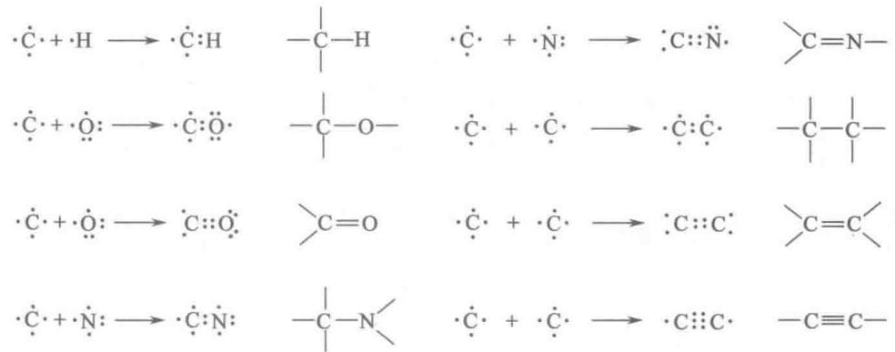  
图1-1 碳原子成键的多能性  
碳能与其他原子特别是与其他碳原子形成共价单键、双键和三键，但三键在生物分子中很少出现

一个碳原子形成的4个单键，从碳核投射到四面体的4个顶角（图1-2），任何两个键之间的键角约为 $109^{\circ}28'$ ，平均键长为 $0.154\mathrm{nm}$ （纳米）。绕每个单键可以自由旋转，除非连接在C—C单键的两个碳原子上的基团很大或者高荷电，这种情况旋转将受到限制。双键的键长较短（ $0.134\mathrm{nm}$ ），并且是刚性的，只允许极有限的绕轴旋转。

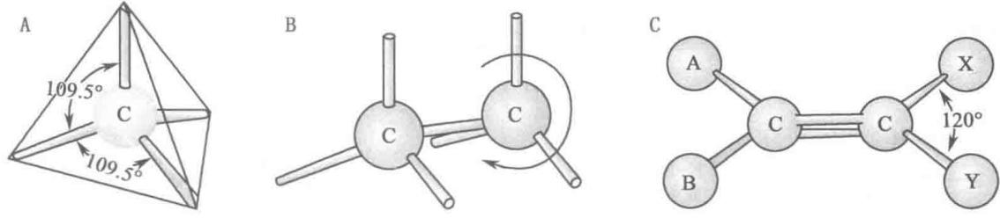  
图1-2 碳成键的几何学  
A. 碳原子 4 个单键的四面体排列, 示出键长和键角的大小; B. C—C 单键能自由旋转, 以乙烷 $\left(\mathrm{CH}_{3}-\mathrm{CH}_{3}\right)$ 分子为例; C. 双键较短, 不能自由旋转。双键连接的每个碳上, 两个单键的夹角为 $120^{\circ}$ 。两个双键连接的碳和标为 A、B、X、Y 的原子都处在一个平面上

生物分子中,共价连接的碳原子可以形成线型链、分支链和环状结构。具有共价连接的碳[骨]架 $^{①}$ (carbon skeleton)或称碳主链(carbon backbone)的分子称为有机化合物(organic compound)。碳架只与氢结合的有机化合物称为烃或碳氢化合物(hydrocarbon)。大多数的生物分子可以看成是烃的衍生物,也就是烃骨架上的氢原子被称为官能团(functional group)的其他原子的基团—OH、—NH、—COO、—CHO和—CO等所取代而相应形成的醇、胺、酸、醛和酮等(图1-3)。因此生物分子也就是有机分子即有机化合物。许多生物分子是多功能的,含有两种或多种不同的官能团,每种官能团都有自己的化学特性和反应。一种化合物的化学“个性”就决定于官能团的化学以及官能团在三维空间的排布。

碳在成键方面的多能性(versatility)是生物在它们起源和进化期间选择碳的化合物作为细胞分子机器

甲基

乙基

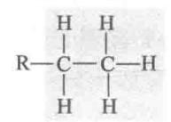

醚基

$$
\mathrm{R} ^ {1} - \mathrm{O} - \mathrm{R} ^ {2}
$$

胍基

酯基

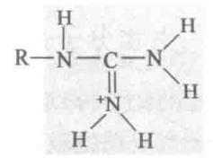

咪唑基

苯基

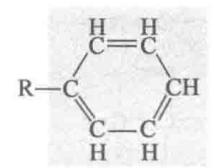

乙酰基

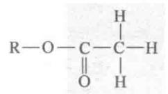

巯基
(硫氢基)

$$
\mathrm{R} - \mathrm{S} - \mathrm{H}
$$

羰基（醛）

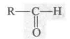

酐基（两个羧酸）

二硫基

羰基（酮）

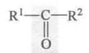

氨基
(质子化)

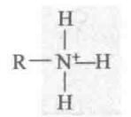

硫酯基

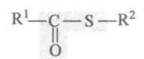

羧基

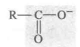

酰胺基

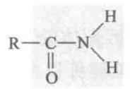

磷酸 [基]

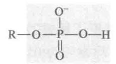

羟基（醇）R—O—H

亚氨基

磷酸酐

烯醇基

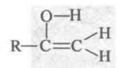

N-取代亚氨基

  
图1-3 生物分子中一些常见的官能团

图中用 R 代表“任一取代基”。它可以是一个氢原子，一般是一个含碳基团。当一个分子中有两个或多个取代基时，则用 $R^{1}$ 、 $R^{2}$ 等来表示

的主要因素。没有其他的化学元素能够像碳这样形成如此不同的大小、形状和组成的分子。

## （三）生物小分子与代谢物

在所有细胞的水相(细胞溶胶)中都溶有大约1000种不同的有机小分子( $M_{r} 100 \sim 500$ )①,它们是细胞中基本代谢途径的重要代谢物。这些代谢物和途径是在早期细胞中形成,并在进化过程中被保留下来的。这一套通用的小分子包括常见的氨基酸、核苷酸、糖及其磷酸化衍生物,以及单羧酸、二羧酸和三羧酸等。这些分子是极性的或带电荷的,溶于水,并以微摩尔( $\mu$ mol)到毫摩尔(mmol)的浓度存在。这些分子只有被细胞主动捕获时才能进入细胞，因为质膜对它们是不通透的，但有专一的膜转运蛋白（membrane transporter）能催化某些分子在进出细胞或在真核细胞各区室（compartment）之间的运动。还有一些其他的生物小分子，它们专属某些种类的细胞或生物所有。例如，维管植物除了含有一套通用的代谢物之外，还有另一套称为次生代谢物（secondary metabolite）的小分子，对植物的生命起着特殊的作用。这些代谢物包括那些给植物以特有香味的化合物，以及像吗啡（morphine）、奎宁（quinine）、尼古丁（nicotine）和咖啡因（caffeine）这样的一些物质。这些物质除了对植物自身有作用外，因为对人体有生理效应，而具有价值。

在特定的条件下一个给定的细胞中的整个小分子群体（代谢中间物、信号分子、次生代谢物）已被称为该细胞的代谢物组（metabolome），与基因组（genome）和蛋白质组（proteome）这些术语并列（见第36章）。

## （四）生物大分子及其单体亚基

细胞中许多生物分子是大分子（macromolecule），它们是一些相对分子质量 $(M_{r})$ 在5000以上的多聚体。较短的多聚体称为寡聚体（oligomer，希腊文oligos，少的意思）。多聚体是由小的、相对简单的前体（precursor）聚合而成。这些前体分子称为单体亚基或单体，又称构件（building block）或构件分子，如氨基酸、核苷酸和单糖等。蛋白质、核酸和多糖是由 $M_{r}$ 为500或<500的单体亚基组成的生物大分子（biomacromolecule）。大分子的合成是细胞的主要耗能活动。大分子自身可以进一步组装成超分子复合体（supermolecular complex），形成像核糖体（ribosome）这样的功能单位。表1-2示出大肠杆菌（Escherichia coli）细胞中各类生物分子的相对含量（占细胞总重量的百分数）和分子种类的约略数目。水是大肠杆菌细胞中，实际上也是所有其他细胞和生物中，最丰富的化合物。然而细胞中所有的固体物质都是有机分子，主要是蛋白质、核酸、多糖和脂质。无机盐和其他矿物元素只占细胞总干重的很小一部分。

表 1-2 大肠杆菌 (E. coli) 细胞的分子组成

<table><tr><td>分子类别</td><td>相对含量/%</td><td>分子种类</td><td>分子类别</td><td>相对含量/%</td><td>分子种类</td></tr><tr><td>水</td><td>70</td><td>1</td><td>多糖</td><td>3</td><td>10</td></tr><tr><td>蛋白质</td><td>15</td><td>3 000</td><td>脂质</td><td>2</td><td>20</td></tr><tr><td>核酸</td><td></td><td></td><td>单体亚基和中间物</td><td>2</td><td>&gt;500</td></tr><tr><td>DNA</td><td>1</td><td>1~4</td><td>无机离子</td><td>1</td><td>20</td></tr><tr><td>RNA</td><td>6</td><td>&gt;3 000</td><td></td><td></td><td></td></tr></table>

蛋白质(protein)是氨基酸通过酰胺键(肽键)连接而成的多聚体,构成细胞除水以外的最大部分,在生物体内起动态功能(如酶、抗体、受体这类蛋白质)和结构元件(如微管蛋白、胶原蛋白)的作用。蛋白质也许是所有生物分子中最多能的,它有一系列的功能。在一个给定细胞中执行功能的所有蛋白质的总和称为细胞的蛋白质组(proteome)。核酸(nucleic acid),DNA 和 RNA,是核苷酸借磷酸二酯键连接而成的多聚体,其功能主要是贮存和传递遗传信息。多糖(polysaccharide)由单糖如葡萄糖通过糖苷键聚合而成。它们的主要功能是:①作为富能的燃料贮库;②作为细胞壁(在植物和细菌中)的刚性结构成分;③作为[细]胞外的识别元件,与其他细胞上的蛋白质结合。跟细胞表面上的蛋白质或脂质相连接的较短的单糖多聚体(寡糖)起特异的细胞信号作用。脂质(lipid)是水不溶性的烃类的衍生物,为生物膜的结构成分、高能的燃料贮库、色素和胞内信号等。

蛋白质、核酸和多糖是由几十个到几百万个单体亚基组成的高分子量化合物。蛋白质的相对分子质量 $(M_{\mathrm{r}})$ 在5000到100万；核酸可达几十亿；多糖像淀粉也有几百万。单个脂质分子则小得多， $M_{r}$ 为750\~1500，不属于大分子，但是脂质可借非共价缔合形成很大的聚集体（aggregate）。生物膜（biomembrane）由脂质聚集体和蛋白质分子构成的。蛋白质和核酸由于它们的单体亚基序列富含信息，经常被称为信息大分子（informational macromolecule）。如上面提到的某些寡糖也是信息分子。

大肠杆菌细胞中生物分子种类约有7000种(表1-2)，人体内蛋白质的种类估计在100000种左右，但没有一种是和大肠杆菌中的完全一样的。如果地球上存在 $1.5 \times 10^{6}$ 种生物，则据估算各种生物共含有 $10^{10} \sim 10^{12}$ 种不同的蛋白质，约 $10^{10}$ 种不同的核酸。但迄今发现各种蛋白质中只有20种单体氨基酸；DNA和RNA中各有4种核苷酸；多糖的单体单糖为数也不多，并且各种生物中的单体分子都是一样的。单体分子是一专多能的，例如氨基酸既可参与蛋白质组成，又可以转化为某些激素、生物碱、色素和其他物质。这说明生物是遵循最经济（最节省）的原则。

## 四、生物分子的三维结构:构型与构象

## （一）生物分子的大小

生物分子不仅种类繁多,在分子大小方面跨度也很大(表 1-3)。生物分子的大小对其功能有很大的影响,这是因为生物分子间的相互作用总是立体专一的,而立体专一性是通过结构互补实现的,例如底物与酶、抗体与抗原、激素与受体的专一结合。因此了解生物分子的大小是必要的。

表 1-3 生物分子与细胞组分的大小

<table><tr><td>名称</td><td>长度/nm $^1$ </td><td> $M_r$ </td><td>质量/pg $^2$ </td></tr><tr><td>水</td><td>0.3</td><td>18</td><td></td></tr><tr><td>丙氨酸</td><td>0.5</td><td>89</td><td></td></tr><tr><td>葡萄糖</td><td>0.7</td><td>180</td><td></td></tr><tr><td>磷脂</td><td>3.5</td><td>750</td><td></td></tr><tr><td>核糖核酸酶</td><td>4.0</td><td>12 600</td><td></td></tr><tr><td>免疫球蛋白(IgG)</td><td>14.0</td><td>150 000</td><td></td></tr><tr><td>肌球蛋白</td><td>160</td><td>470 000</td><td></td></tr><tr><td>核糖体(细菌)</td><td>18</td><td>2 520 000</td><td></td></tr><tr><td>噬菌体 φX174</td><td>25</td><td>4 700 000</td><td></td></tr><tr><td>丙酮酸脱氢酶复合体</td><td>60</td><td>7 000 000</td><td></td></tr><tr><td>烟草花叶病毒(TMV)</td><td>300</td><td>40 000 000</td><td> $6.64×10^{-5}$ </td></tr><tr><td>线粒体(肝)</td><td>1 500</td><td></td><td>1.5</td></tr><tr><td>大肠杆菌细胞</td><td>2 000</td><td></td><td>2</td></tr><tr><td>叶绿体(菠菜叶)</td><td>8 000</td><td></td><td>60</td></tr><tr><td>肝细胞</td><td>20 000</td><td></td><td>8 000</td></tr></table>

① 1 nm(纳米) = $10^{-3} \mu m$ (微米) = $10^{-6} mm$ (毫米) = $10^{-9} m$ (米); ② 1 pg(皮克) = $10^{-3} ng$ (纳克) = $10^{-6} \mu g$ (微克) = $10^{-9} mg$ (毫克) = $10^{-12} g$ (克)。

## （二）立体异构与构型

立体异构[现象](stereoisomerism)在生物分子中普遍存在,并且具有重要的生物学意义。因此在这里介绍几个有关的立体化学术语。

## 1. 异构与构型

[同分]异构(isomerism)是指存在两种或多种化学组成（composition）相同即分子式相同的化合物的现象。异构现象主要有结构异构和立体异构两种。结构异构(structural isomerism)是指具有相同分子式的分子因原子的连接次序不同(因而形成的化学键不同)即分子的构造(constitution)不同产生的，结构异构须用结构式来区别。立体异构是指具有相同结构式的分子因原子的空间排列不同引起的。分子中原子的固定空间排列被称为分子的构型(configuration)，用它来描述立体异构体的三维结构关系。立体异构体或构型须要用立体模型(stereomodel)、透视式(perspective formula)或投影式(projection formula)来表示(图1-5)。

立体异构一般分为几何异构（geometric isomerism）和旋光异构或称光学异构（optical isomerism）。几

## 何异构也称顺反异构(cis-trans isomeris

同异构也称顺反异构（cis-trans-isomer）或环限制了取代基团统链轴自由旋转造成的。这样产生的立体异构体称为几何异构体或顺反异构体（拉丁文 cis“在这一侧”，取代基在双键或环面的同一侧；trans“跨越”，取代基在相对的各一侧）（图 1-4A）。顺反异构体不存在不可叠合的镜像对（mirror image pair），因而都不具有旋光性（除非异构体同时符合旋光异构的手性要求），但在化学和物理性质以及生物活性方面有很明显的差别。图 1-4A 示出的马来酸（maleic acid）和延胡索酸（fumaric acid）就是丁烯二羧酸的顺反异构体。旋光异构是由于分子具有手性（chirality）而引起的。这样形成的立体异构体称为旋光异构体或光学异构体（optical isomer）（图 1-4B）。旋光异构体是一组至少存在一对不可叠合的镜像（对映体）的立体异构体，一般都有旋光性（除非异构体出现对称元素而失去手性）。

构型的立体化学特点是只有共价键发生断裂,分子构型才能改变。

  
图1-4 立体异构体的构型  
A. 几何(顺反)异构体(投影式); B. 旋光异构体(透视式)

## 2. 旋光[活]性

当光波通过尼柯尔棱镜(Nicol prism)时,由于棱镜的结构只允许沿某一平面震动的光波通过,其他光波都被阻断,这种光称平面偏振光(plane-polarized light)。但这种光通过旋光物质(optically active substance)的溶液时,则光的偏振面(plane of polarization)会向右(顺时针方向或称正向,符号+)旋转或向左(逆时针方向或称负向,符号-)旋转。使偏振面向右旋转的(dextrorotatory)称右旋光物质,如(+)-甘油醛;向左旋转的(levorotatory)称左旋光物质,如(-)-甘油醛。

旋光物质(手性化合物)引起平面偏振光的偏振面发生旋转的能力(即旋转角度的大小和方向)称为旋光[活]性(optical activity)或旋光度(optical rotation);在一定条件下旋光度 $\alpha_{\lambda}^{t}$ 与待测液的浓度(c)和平面偏振光通过待测液的路径长度(l)的乘积成正比:

$$
\alpha_ {\lambda} ^ {t} = \left[   \alpha   \right] _ {\lambda} ^ {t} c l \quad \text {或} \quad \left[   \alpha   \right] _ {\lambda} ^ {t} = \frac {\alpha_ {\lambda} ^ {t}}{c l}
$$

式中比例常数 $[\alpha]$ 称为比旋或旋光率（specific rotation），即单位浓度和单位长度下的旋光度（单位：度/°），比旋是旋光物质的特征物理常数； $t$ 为测定时的温度， $\lambda$ 为所用光的波长，一般用钠光（ $\lambda = 589 \mathrm{~nm}$ ，D谱线），此时比值可写为 $[\alpha]_{\mathrm{D}}^{t}$ ； $l$ 为样品管长度，以分米（dm，1 dm=10 cm）表示；浓度 $c$ ，用每毫升待测液中所含旋光物质克数（g/mL）表示。 $\alpha_{\lambda}^{t}$ 为旋光仪测得的读数，比旋数值前面加+或-号，以指明旋光方向。某一物质的 $[\alpha]$ 值，甚至旋光方向，与测定时的温度、光的波长、溶剂种类、溶质浓度以及溶液 pH 等有关，因此测定比旋时必须标明这些因素。

## 3. 手性中心

手性中心(chiral center)是指具有4个不同取代基团的四面体碳原子,也称手性碳原子或不对称碳原子(asymmetric carbon)或立体原中心(stereogenic center),常以 $C^{*}$ 表示。含一个 $C^{*}$ 的分子只能有两个旋光异构体,一般含n个 $C^{*}$ 的分子可以有 $2^{n}$ 个旋光异构体。

有机化合物的旋光性与分子内部的结构有关,根据对称性原理,凡是分子中存在对称面(镜面)、对称中心和四重交替对称轴这些对称元素(symmetry element)之一的,都可以和它的镜像叠合,并必定是无手性的(achiral),因而都没有旋光性。凡是分子中没有上述3种对称元素的,都不能与它的镜像叠合,因而都有旋光性。分子的这种不能与自己的镜像叠合的关系，犹如人的左右手关系，因此称这种分子具有手性或称它为手性分子（chiral molecule）。有机分子中出现手性的最常见（虽然不是唯一）的原因是存在手性中心（而缺失对称元素）。手性与旋光性是一对孪生子。

## 4. 对映体和非对映体

对旋光异构来说，构型就是手性碳原子的4个取代基在空间的相对取向。这种取向形成两种而且只有两种可能的四面体形式，即两种构型（立体异构体）。下面以含一个手性碳原子的甘油醛(2,3-二羟丙醛)为例说明构型概念。甘油醛分子中的C2(第2位碳)是一个 $\mathrm{C}^*$ ，因此甘油醛可以有两种构型。它们的立体模型和透视式如图1-5所示。

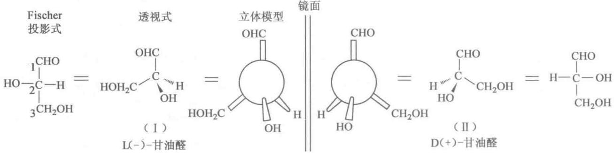  
图 1-5 甘油醛的构型(DL 命名系统)  
图中透视式的解释见后面“三维结构的分子模型”部分。习惯上 Fischer 投影式中水平方向的键表示突向页面的前方，垂直方向的键伸向页面的后方。书写投影式时通常规定碳链处于垂直位置，羰基写在碳链的上端。这样的投影式在页面上可以旋转 $180^{\circ}$ 而不改变原来的构型，但不允许旋转 $90^{\circ}$ 或 $270^{\circ}$ ，更不能离开页面加以翻转

从图 1-5 可以看出一个手性碳原子的取代基在空间的两种取向是物体与镜像的关系，并且两者不能叠合。可见甘油醛(I)和(II)是两个不同的旋光异构体，这种互为不能叠合的镜像的立体异构体被称为对映体(enantiomer)。彼此不成镜像的旋光异构体，称为非对映体(diastereomer)，见图 1-6。一对对映体除具有程度相同而方向相反(+或-)的旋光性和不同的生物活性外，其他的物理性质和化学性质完全相同。

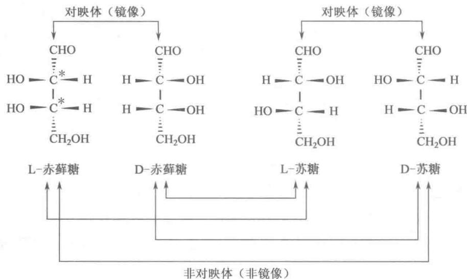  
图 1-6 丁醛糖的旋光异构体

两个对映体的等摩尔溶液称为外消旋混合液(racemic mixture)，无旋光性；这种现象称为[外]消旋作用(racemization)。任何一个旋光异构体都只有一个对映体，它的其他旋光异构体（非对映体），在物理性质、化学性质和生物活性方面都与之不同。

## 5. 相对构型与绝对构型

早期研究旋光物质时,虽然已知用上述的立体模型来表示甘油醛的两个旋光异构体,但不知道哪个模型代表左旋分子,哪个代表右旋分子。于是1891年Emil Fischer提出一个人为规定,右旋甘油醛具有甘油醛(Ⅱ)的构型,并称为D型,这样甘油醛(Ⅱ)就标为D(+)-甘油醛,而甘油醛(I)标为L(-)-甘油醛,并选定甘油醛作为其他旋光化合物构型的参考标准。根据这种人为规定的构型标准物确定的化合物构型称为相对构型。1951年前确定的化合物构型只能认为是相对构型(relative configuration)。由于X射线衍射技术的发展,测定了某些对映体的真实空间结构,并证实原来人为规定的甘油醛构型与真实的构型,即绝对构型(absolute configuration),是一致的。因此过去测得的构型也就成为绝对构型。

## （三）构型的命名系统

生物分子间的相互作用涉及异构体的构型。因此生物分子的命名和它的结构的表示，在立体化学上必须是明确的。在生物化学中习惯使用 DL 命名系统，单糖和氨基酸的绝对构型是根据甘油醛的绝对构型（图 1-5）确定的。跟 L-甘油醛相联系的立体异构体被指定为 L-型，如 L-丙氨酸（第 2 章）；跟 D-甘油醛相联系的被指定为 D-型，如 D-葡萄糖（第 9 章）。应该强调指出，构型（D，L）与旋光方向（+，-）没有必然的联系。

虽然 DL 构型命名系统在反映旋光化合物之间的构型联系方面有它的优点。但是对于含有多于一个手性中心的化合物，使用 RS 命名系统更为方便。1956 年 Cohn R, Ingold C 和 Prelog V 三人提出的 RS 命名系统可以明确无误地规定任何一个手性碳原子的绝对构型，因此被普遍采用。

应用 RS 表示法的第一步是标定跟手性碳原子直接相连的 4 个取代基的优先性 (priority) 顺序。顺序规则 (sequence rule) 的基础是原子序数高的原子比原子序数低的原子优先性大。生物化学中重要基团的优先性顺序（从大到小）是—SH, —OCOR, —OR, —OH, —NHR, —NH₂, —COOR, —COOH, —CONH₂, —CHO, —CHROH, —CH₂OH, —C₆H₅, —CH₃, —T, —D, —H。第二步是旋转手性四面体碳，使那个优先性最小的取代基离开观察者最远，另 3 个取代基面向观察者。最后一步，看一看，面向观察者的 3 个取代基按优先性大小的顺序，是顺时针方向还是逆时针方向，如果是顺时针方向（右手），则为 R 构型（R 源自拉丁文 rectus，右），如果是反时针方向（左手），则为 S 构型（S 源自拉丁文 sinister，左）。现以甘油醛为例说明 RS 表示法（图 1-7）。首先标出手性中心的 4 个取代基的优先性顺序：①—OH，②—CHO，③—CH₂OH，④—H；然后使手性中心与—H 以价键取向位于视轴上，并使手性中心靠近观察者；最后观察处于手性中心和观察者之间的 3 个取代基从①到②到③的方向是顺时针还是逆时针的，本例中（-）-甘油醛是逆时针的（左手），为 S 构型，其对映体（+）-甘油醛是顺时针的为 R 构型。应该指出 RS 和 DL 构型并不一定是相互对应的。

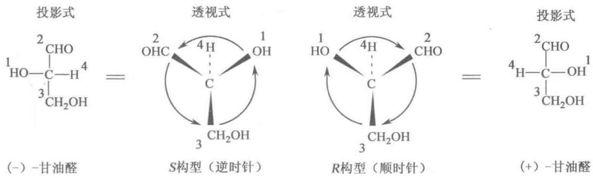  
图 1-7 甘油醛构型的 RS 命名系统

## (四) 构象

构象(conformation)是指一个分子所采取的特定形态(shape)。这一术语用来描述有机分子的动态立体化学,反映分子中在任一瞬间各原子的实际相对位置,因而有时把构象看作是三维结构(three-dimensional structure)、立体结构和空间结构的同义词。由于分子中单键自由旋转和键角有一定的柔性,一个分子在不同瞬间可以有不同的构象。一种特定的构象也称为构象异构体(conformational isomer)或构象体(conformer)。构象的立体化学特点是不需任何共价键的破裂即可发生构象转变。在简单的烃类如乙烷中绕C—C单键的旋转几乎是完全自由的,因此乙烷可采取多种可互变的构象。其中两种是极端形式:

交叉型和重叠型(图 1-8)，交叉型相对地最为稳定，是占优势的构象，重叠型最不稳定。这两种构象不可能被分离开来，因为它们之间的变化速度太快（每秒钟数百万次）。然而当每个碳的一个或多个 H 原子被其他基团取代时，取代基或是很大，或是荷电，它们绕 C—C 键旋转的自由度将受到约束，因而限制了构象的数目。

生物分子构象的立体化学可采用 X 射线晶体学 (X-ray crystallography) 方法研究, 此方法精度很高, 可测出分子中每一个原子的位置, 但要求待测样品是晶体。在细胞中, 生物分子几乎总不是以晶体形式存在, 而是溶于细胞溶胶或与胞内其他成分缔合 (如酶-底物复合体) 的。生物大分子在细胞条件下只有一种或几种稳定的构象。核磁共振 (NMR) 波谱学方法可提供生物分子在溶液中的三维结构信息。因此 NMR 和 X 射线衍射技术在研究三维结构方面彼此可以很好的互补。

  
图1-8 乙烷的构象  
当乙烷的两个碳原子绕键轴相对旋转时，处在完全重叠型（扭角 $0^{\circ}$ 、 $100^{\circ}$ 等）的构象势能最高，完全交叉型（扭角 $60^{\circ}$ 、 $180^{\circ}$ 等）的构象势能最低

## （五）三维结构的分子模型

图 1-9 示出生物分子三维结构的透视式和 3 种分子模型: 骨架式、球棍式和空间填充式。透视式主要用于在纸面上表示四面体碳的空间构型; 透视式中手性中心和实线键处于纸面上, 虚线键或虚楔形键伸向纸面背后, 楔形键突出纸面, 伸向读者; 4 个键相互之间的夹角约为 $109^{\circ}28'$ 。骨架模型 (skeletal model), 形象很简单, 只给出分子的骨架, 原子的位置可设想在键的交叉处及其端点上, 但这种模型正确地反映出键角和原子间的相对距离。球棍模型 (ball-stick model), 很像骨架模型, 也反映出正确的键角和键长, 它们同属晶体学模型。当在纸面上表示球棍模型时, 示出的原子 (球), 根据棍 (键) 的近粗远细的视差告诉我们它是在纸面的前方或后方。空间填充模型 (space-filling model) 最接近真实, 此模型中每个原子的半径与它的范德华半径成比例 (表 1-4), 因此, 它的外缘是其他原子所不能进入的界限。

  
图1-9 三维结构的分子模型（以L-丝氨酸为例）

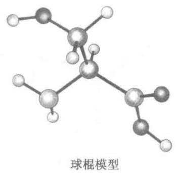

表 1-4 几种生物学上重要原子的范德华半径和共价单键半径 ${}^{1}$

<table><tr><td>原子</td><td>范德华半径/nm</td><td>共价单键半径/nm</td></tr><tr><td>H</td><td>0.120</td><td>0.030</td></tr><tr><td>O</td><td>0.140</td><td>0.066</td></tr><tr><td>N</td><td>0.154</td><td>0.070</td></tr><tr><td>C</td><td>0.185</td><td>0.077</td></tr><tr><td>S</td><td>0.185</td><td>0.104</td></tr><tr><td>P</td><td>0.190</td><td>0.110</td></tr></table>

① 不同书籍中数据略有区别，此表中的数据取自 J. Emsley，元素手册，1994。

## （六）生物分子间的相互作用是立体专一的

在活细胞中手性分子一般只以一种手性形式存在,例如蛋白质中的氨基酸残基都是 L-型的;淀粉等多糖中的葡萄糖残基是 D-型的,因为催化合成这些分子的酶本身也是手性的。但在实验室中化学合成一个含手性碳原子的化合物,一般将产生所有可能的手性形式,例如合成含一个手性碳的化合物常以 D,L 两种手性形式的等摩尔混合物存在,称为[外]消旋物(racemate)。有机合成的药物都是 D,L 型的消旋物,只有其中的一种异构体是有生理效应和治疗效果的。

立体专一性(stereo-specificity)是指区分立体异构体的能力,它是酶和其他蛋白质的一种特性,也是活细胞的分子逻辑学的一个特征。如果蛋白质上的结合部位跟一个手性化合物的L型异构体互补,则不能跟它的D型异构体互补。例如琥珀酸脱氢酶只能催化琥珀酸脱氢生成延胡索酸(反丁烯二酸),不能生成马来酸(顺丁烯二酸)(见图1-4和第18章)。酶还能区别手性原(prochiral)对称性碳原子的两个H原子,其中一个是R-原(pro-R)的 $H_{R}$ ,另一个是S-原(pro-S)的 $H_{S}$ (图1-10A)。所谓手性原对称性碳原子是指与之连接的4个基团中只有两个基团是相同的对称性碳原子;R-原(或S-原)H原子是指如果增加它的顺序优先性,例如用D(氘)替代H时,则与之连接的手性原碳(如还原型烟酰胺C4)变成R-构型(或S-构型)手性碳(参看图1-7和图1-10A)。许多脱氢酶都需要以辅酶I( $NAD^{+}$ )或辅酶II( $NADP^{+}$ )为辅酶。脱氢或加氢时都发生在烟酰胺C4上。一类脱氢酶专门作用于R-原H原子,如醇脱氢酶和苹果酸脱氢酶等,并称为A型脱氢酶;另一类专门作用于S-原H原子,如谷氨酸脱氢酶和α-甘油-3-磷酸脱氢酶,称为B型脱氢酶。又如人工增甜剂天冬苯丙二肽酯也称阿斯巴甜或天冬甜精(aspartame)即L-天冬氨酰-L-苯丙氨酸甲酯和它的苦味的立体异构体L-天冬氨酰-D-苯丙氨酸甲酯,很容易被味觉感受器区别开来,虽然它们两个手性碳中只有一个碳的构型不同(图1-10B)。

  
图1-10 酶的立体专一性和立体异构体对人体的不同生理效应  
A. 还原型烟酰胺辅酶(NADH 和 NADPH)的结构,图中示出手性原对称碳原子(C4);B. 人工增甜剂天冬苯丙二肽酯及其一个立体异构体的结构

## 五、生物系统中的非共价相互作用

按照定义分子是由共价键,即共用电子对连接在一起的一组特定的原子,作用于分子间的力是非共价的。生物分子主要是通过非共价力(non-covalent force)即非共价相互作用,彼此影响,相互作用,行使它们的功能的。非共价相互作用也作用于大分子内的相邻基团之间,是稳定生物大分子三维结构的作用力(见第3章)。一般说,个别的这种相互作用是微弱的,但它们的数量大,总合起来就是一股强大的力量。它们被用于稳定生物化学反应中的过渡态、传递精细的信息以及形成复杂的大分子、超分子复合体、细胞器等生物结构。

生物系统中的非共价力有离子相互作用、氢键、范德华力和疏水相互作用。

## （一）离子相互作用

离子相互作用(ionic interaction)，也称离子键、盐键或盐桥。它是发生在带电荷基团之间的一种静电相互作用(electrostatic interaction)，带异种电荷基团之间为引力、带同种电荷基团之间为斥力。静电相互作用的吸引力 $F$ 与电荷量的乘积 $(q_{1}$ 和 $q_{2})$ 成正比，与电荷质点间距离的平方 $(r^2)$ 成反比，在溶液中此吸引力随周围介质的介电常数 $(\varepsilon)$ 增大而降低：

$$
F = \frac {q _ {1} q _ {2}}{\varepsilon r ^ {2}}
$$

在疏水环境中,例如在蛋白质分子内部,介电常数比在水中低,这时相反电荷之间的吸引力相应增大。离子相互作用对环境非常敏感,因加入非极性溶剂而加强,加入盐类而减弱,因此,盐浓度的改变对生物分子的结构会发生重大影响。

## （二）氢键

氢键(hydrogen bond)本质上也是一种静电相互作用。由电负性较大的原子和氢原子共价结合的基团如 N—H 和 O—H 具有很大的偶极矩，成键电子云的分布偏向电负性较大的原子。因此氢原子核周围的电子云密度小，氢核几近裸露，这一正电荷氢核遇到另一个电负性大的原子则产生静电吸引，称氢键：

$$
\mathrm{x} - \mathrm{H} \dots \mathrm{y}
$$

这里 x、y 是电负性大的原子（N、O、S 等），x—H 基本上是共价键，H…y 是较强的范德华引力即氢键。x 是 H（质子）的供体（donor），y 是 H（质子）的接纳体（acceptor）。氢键具有两个重要特征：方向性和饱和性。方向性（directionality）是指相互吸引的方向沿氢（质子）接纳体 y 的孤电子对轨道轴，接纳体 y 与供体 x 之间的角度接近 $180^{\circ}$ （即氢供体、氢和氢接纳体成一直线），此时键的强度最大，如果两者之间有夹角则强度减弱。饱和性（Saturability）是指一般情况下 x—H 只能和一个 y 原子相结合，因为氢原子非常小，而供体和接纳体原子都相当大，这样将排斥另一接纳体原子再和 H 原子结合。氢键的这种高度方向性，能够使两个氢键结合的基团维持特有的几何排列。氢键的这种性质给与富有分子内氢键的蛋白质和核酸分子以非常精确的三维结构。

氢键形成具有协同性(cooperativity)，即一个氢键的形成能促进其余氢键的形成。氢键的键能比共价键小很多，但比范德华力大(见表1-5)。水对氢键的作用是它可以作为氢键的供体和接纳体与其他氢键竞争，因而减弱了原来的氢键强度(减弱后仅有约 $5\ kJ\cdot mol^{-1}$ )。

## （三）范德华力

广义的范德华力(van der Walls force)(范德华相互作用)包括3种较弱的静电相互作用,即定向效应、诱导效应和分散效应。定向效应(orientation effect)发生在极性分子之间或极性基团之间。它是永久偶极间的静电相互作用,氢键可被认为属于这种范德华力。诱导效应(induction effect)发生在极性物质与非极性物质之间,这是永久偶极与由它诱导而来的诱导偶极之间的静电相互作用。分散效应(dispersion effect)是在多数情况下起主要作用的范德华力;它是非极性的分子(或基团)之间仅有的一种范德华力,即狭义的范德华力,也称为London分散力,通常范德华力就是指这种作用力。这是瞬时偶极间的相互作用,偶极方向是瞬时变化的。瞬时偶极是由于所在分子或基团中绕核电子的电荷密度的随机波动即电子运动的不对称性造成的。瞬时偶极可以诱导附近的原子产生瞬时的,相反的偶极。此诱导偶极反过来又稳定了原来的偶极,因此在它们之间产生了相互作用。狭义范德华力是一种很弱的作用力,而且随非共价键合原子(noncovalently-bonded atom)间距离(R)的6次方倒数即 $1/R^{6}$ 而变化。当非共价键合原子相互挨得太近时,由于电子云重叠,将产生斥力。实际上范德华力包括吸引力和斥力两种相互作用。因此范德华力(吸引力)只有当两个非共价键合原子处于一定距离时才能达到最大,这个距离称为接触距离(contact dis-tance)或范德华距离,它等于两个原子的范德华半径(van der Walls radius)之和。范德华半径是每种原子的特征,是一种原子允许另一种原子可以与它接近到什么程度的量度。空间填充模型中原子就是按与范德华半径成比例的尺寸制作的。某些生物学上重要原子的范德华半径及共价单键半径见表1-4。虽然就其个别来说范德华力是很弱的,但是范德华相互作用数量大,作用力的总和相当可观,范德华力不仅具有加和效应,而且具有位相效应(当分子或基团相同时,其瞬时偶极矩同位相,从而产生最大的相互作用),因此成为维持生物结构的重要因素之一。水能迫使非极性(疏水)基团趋于聚集,因此水对范德华力的影响可看成是起加强的作用。

表 1-5 生物分子中常见的几种共价键和非共价力的键能或强度

<table><tr><td>共价键</td><td>键能 $^1/(kJ·mol^{-1})$ </td><td>共价键</td><td>键能/ $(kJ·mol^{-1})$ </td><td>非共价力</td><td>键能/ $(kJ·mol^{-1})$ </td></tr><tr><td>C—C</td><td>348</td><td>N—H</td><td>389</td><td>氢键</td><td>13~30</td></tr><tr><td>C—H</td><td>414</td><td>O—H</td><td>461</td><td>范德华力</td><td>0.4~4.0</td></tr><tr><td>C—N</td><td>293</td><td>P—O</td><td>419</td><td>疏水相互作用</td><td> $12~20^{2}$ </td></tr><tr><td>C—O</td><td>352</td><td>P=O</td><td>502</td><td>离子键</td><td>12~30</td></tr><tr><td>C=O</td><td>712</td><td>S—S</td><td>214</td><td></td><td></td></tr><tr><td>C—S</td><td>260</td><td>S—H</td><td>339</td><td></td><td></td></tr></table>

① 键能是指断裂该键所需的自由能；② 实际上它并不是键能，此能量大部分并不用于伸展过程中键的断裂。

## （四）疏水相互作用

疏水相互作用(hydrophobic interaction)(熵效应)是指在介质水中的疏水(非极性)分子或分子基团倾向于聚集在一起的现象。疏水相互作用并不是疏水分子(或疏水基团)之间有什么吸引力的缘故,而是因为跟疏水分子或基团接近的水分子是排列相当有序的,像是疏水分子(或基团)被封闭在一个由许多水分子构成的笼样壳(cage-like shell)内。笼样壳虽然不像由非极性溶质和水形成的笼形化合物(clathrate compound)那样排列成晶格般的笼形结构(图1-11),不过两者的效果是一样的。水分子的有序排列都使熵降低,只是程度不同。有序的水分子数目也即熵降低的数值,跟封闭在笼内的疏水溶质的表面积是成正比的。熵降低或者说表面能(surface energy)增高,使得系统力求把这些有序的水分子转变为自由的水分子(熵增加, $\Delta S$ 正值)以缩小界面,降低能量。可见疏水相互作用是熵驱动的自发过程( $\Delta G=\Delta H-T\Delta S$ ,此过程 $\Delta H$ 接近零, $\Delta S$ 正值,故 $\Delta G$ 是负值),热力学告诉我们自发过程要求自由能变化为负值。疏水相互作用在维持生物大分子的三维结构方面占有突出地位。

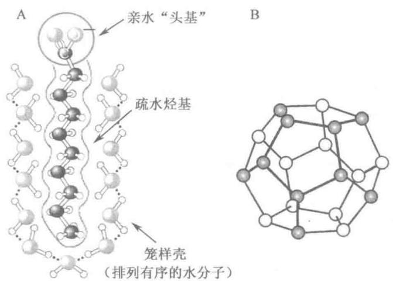

## 图 1-11 笼样壳和笼形结构

A. 水中两亲化合物的疏水基团外周的水分子样壳；B. 水分形成的笼子组成的五边形十二面体笼形结构，中央是直径为 $0.5 \mathrm{~nm}$ 的空腔，此十二面体是笼形化合物中常见的构件；C. $n - \left(\mathrm{C}_{4} \mathrm{H}_{9}\right)_{3} - \mathrm{S}^{+} \mathrm{~F}^{-} \cdot 23 \mathrm{H}_{2} \mathrm{O}$ 的笼形结构的一部分，三丁烷基硫离子（以深色示出），窝藏在氢键连接的水分子网内，在完整的网上每个水分子氧与其他水分子形成四面体氢键（图中箭头所指）

疏水相互作用在生理温度范围内随温度升高而加强（T 的升高与熵增加具有相同的效果），但超过一定温度后（50\~60℃，因侧链而异），又趋减弱。因为超过这个温度，疏水基团周围的水分子有序度降低（ $\Delta S$ 正值减小），因而有利于疏水基团进入水中。非极性溶剂、去污剂是破坏疏水相互作用的试剂，因此是生物大分子的变性剂。尿素和盐酸胍既能破坏氢键，又能破坏疏水相互作用，因此是强变性剂。

## （五）非共价相互作用对大分子的结构和功能是关键的

非共价相互作用跟共价键相比是非常弱的。断裂 $1 \, \text{mol}(6 \times 10^{23}$ 个）C—C 单键需要 348 kJ 的能量，断裂 1 mol C—H 约需要 414 kJ，然而断裂 1 mol 典型的范德华力只需要 4 kJ，其他几种非共价相互作用也远比共价键弱得多（表 1-5）。在 25℃ 的水溶剂中可利用的热能跟这些弱相互作用的强度是同一数量级，溶质-溶剂（水）分子之间的相互作用和溶质-溶质相互作用在能量上几乎同样有利，所以这些弱相互作用是在不断地形成和不断地断裂的。

虽然这几种相互作用个别是很弱的，但总合起来效果是很显著的。例如一个酶与底物非共价结合可以涉及几个氢键、一个或几个离子键、范德华力以及疏水相互作用。每形成一个弱相互作用都使系统自由能有净的降低，这里释放的自由能称为结合能（binding energy, $\Delta G_{b}$ ），它与该相互作用的键能，数值相等符号相反（表1-5）。一个非共价相互作用的稳定性（stability）可用参与该相互作用的两个分子（或基团）的结合反应平衡常数（equilibrium constant, $K_{eq}$ ）来表示。平衡常数与自由能变化（结合能）是指数关系（ $\Delta G = -RT \ln K_{eq}$ ，见第16章），也即稳定性是按指数关系随结合能变化的。因此10个或20个弱相互作用给与分子的稳定性要比从这些小的结合能的简单加和大许多。

大分子如蛋白质、DNA 和 RNA 含有多个弱相互作用的位点，总的结合力可以是很大的。大分子最稳定的结构，也即天然的结构，通常是弱相互作用达到最大值时的结构。一个多肽链或多核苷酸链折叠成它的三维形态就是由这一原理确定的。抗原和特异抗体的结合依赖于许多弱相互作用的总合结果。酶与底物非共价结合时释放的结合能 $\Delta G_{b}$ ，其意义已超出简单地稳定酶-底物复合体的相互作用， $\Delta G_{b}$ 还是酶用来降低反应活化能（activation energy）的自由能的主要来源（见第6章）。换言之，酶和底物之间的弱结合相互作用是酶催化的真正驱动力。激素或神经递质与它的细胞受体蛋白质结合也是靠许多弱相互作用。酶和受体跟它的底物或配体相比，体积大因而表面积广，这样可以给相互作用提供较多的机会。从分子水平看，发生相互作用的生物分子之间的互补性（complementarity）反映了这些分子的表面上极性基团、荷电基团和疏水基团之间的互补性和弱相互作用。有关的例子将在后面各章中遇到。

## 六、水和生命

## （一）水的结构和性质

水占大多数生物质量的 $70\% \sim 90\%$ ，它组成生物体的一个连续相。生物体内的全部化学反应都是在水中进行的，而且很多反应有水本身的参与，例如各种水解反应；水也是某些反应的产物，例如消除反应。作为生命介质的水具有某些独特的化学和物理性质，特别适合于生命活动，没有水就没有生命。与一般溶剂（甲醇、乙醇和丙酮等）相比，水具有高热容、高熔点、高沸点、高蒸发热、高介电常数、高表面张力和密度比固态水(冰)大等物理特性。这些特性具有重要的生物学意义。

水之所以具有这些特性,是与水分子的独特结构有关。水分子中氧原子的4个轨道是不等性 $SP^{3}$ 杂化的,这与正四面体碳相似但不相同,其中两个未共用电子对(孤电子对)占据在两个 $SP^{3}$ 杂化轨道中,孤电子对所占用的杂化轨道电子云比较密集,对成键电子对所占用的杂化轨道起着排斥和压缩的作用,结果两个O—H键的夹角被压缩成 $104^{\circ}45'$ (图1-12A),而不是正四面体杂化的 $109^{\circ}28'$ 。由于这种不等性杂化使水分子具有极性,两个水分子间可以发生静电吸引,并适于形成氢键。水是形成氢键的H供体又是H接纳体。冰中每个水分子可以与邻近水分子形成4个氢键呈四面体的几何结构(图1-12B)。冰中O—O之间的距离为0.276 nm。液态水中0℃时每个水分子在任一时刻平均形成3.4个氢键,15℃时O—O之间的距离略比冰中的大,为 0.297 nm。液态水和冰之间氢键的数量相差不大,但水中每个氢键的平均寿命只有 $10^{-11}$ s。因此液态水的结构是一种时间和空间上的统计结果,它既是流动的(氢键破裂时)又是固定的(氢键形成时),这是液态水既不同于冰,也不同于水蒸气的结构特点。冰中围绕每个水分子可以形成4个氢键(这是一个水分子能形成的最多氢键数)即四面体式氢键结合。整个冰是有规则的晶格结构,是氢键结合的三维网。结果是水分子相互连接成六元环排列(图1-12C)。这种环在具有特有的6重对称轴的雪花中找到它的宏观复制品。冰的这种晶格结构使它的密度比液态水小,这是冰总是浮在水面上的原因。水蒸气则相反,它的水分子几乎失去全部可能的氢键,处于完全自由运动的状态。破坏冰的晶格需要断裂足够比例的氢键,因此要求较大的能量,这也是冰的熔点为什么比许多有机溶剂的熔点高的原因。融化冰或蒸发水需要从系统中吸收热量:

$$
\begin{array}{r l r}{\mathrm {H_ {2} O(固态)\rightarrow H_ {2} O(液态)}}&{}&{\Delta H = + 5. 9 \mathrm{kJ/mol}}\\{\mathrm {H_ {2} O(液态)\rightarrow H_ {2} O(气态)}}&{}&{\Delta H = + 4 4. 0 \mathrm{kJ/mol}}\end{array}
$$

  
图 1-12 A. 水分子的结构；B. 冰中水分子四面体氢键结合；C. 冰中水分子三维网

融化或蒸发时，水由高度有序排列的固态分子变成有序度下降的液态分子或完全无序的气态分子。在室温下，冰的融化和水的蒸发是自发发生的过程。水分子倾向于通过氢键缔合在一起，但能量上推动它们无序化的力量超过了这种倾向。前面曾提到过，发生自发过程，自由能变化 $(\Delta G)$ 必须是负值： $\Delta G = \Delta H - T\Delta S$ ，这里 $\Delta G$ 代表驱动力， $\Delta H$ 是焓变，来自于键的形成和断裂， $\Delta S$ 是无序度的改变。因为融化和蒸发的 $\Delta H$ 是正值，显然熵的增加造成 $\Delta G$ 为负值，并驱动这些变化。

水中氢键的形成是协同的,即当两个 $H_{2}O$ 分子之间形成一个氢键时,作为 H 供体的 $H_{2}O$ 分子成为更好的 H 接纳体,而作为 H 接纳体的 $H_{2}O$ 分子变成更好的 H 供体。因此 $H_{2}O$ 分子参与氢键形成是一种相互加强的现象。虽然个别的氢键强度不很大(表 1-5),但水是处于氢键网中的,因此水的内聚力(internal cohesion)很大,正是它使水具有上述的那些物理特性。

## （二）水是生命的介质

生命过程要求溶解各种离子和大、小分子。水具有显著的溶解能力，使它成为胞内和胞外的通用介质。水的溶解能力主要是由于它能形成氢键和具有偶极的本质。凡是能形成氢键的分子如羟基化合物、胺、巯基化合物、酮、醛、酯和羧酸等都能溶于水，并称之为亲水化合物（hydrophilic compound）。离子化合物如 NaCl 虽然不能作为氢的供体或接纳体,但也能很好地溶于水。这是因为水是一种偶极分子,偶极与离子相互作用致使水溶液中的阳离子和阴离子被水化,即被称为水化层(hydration shell)的水分子层所围绕。离子化合物倾向于溶于水,除形成水化层因素外,另一因素是水的介电常数高,因而降低正、负离子之间的吸引力。从能量角度考虑,当盐如 NaCl 溶解时, $Na^{+}$ 和 $Cl^{-}$ 离开盐的晶格,获得较大的自由度。其结果是系统的熵增加,这是使盐易溶于水的主要原因。溶液的形成伴随着有利的自由能变化: $\Delta G=\Delta H-T\Delta S$ ,这里 $\Delta H$ 有一个小的正值,而 $\Delta S$ 是一个大的正值,因此 $\Delta G$ 是负值。

脂肪烃和芳香烃及其衍生物不能形成氢键，因而不能溶于水，称为疏水化合物（hydrophobic compound）。这些化合物在水中将产生疏水相互作用。生物学上一类很重要的分子，它们同时具有亲水的头基和疏水的尾部，称为两亲化合物（amphipathic compound），如蛋白质、固醇、磷脂、糖脂以及脂肪酸盐等。它们在水中的“溶解”状态很特殊，能形成单层（在水表面）、微团和双层微囊，这些结构是形成生物膜的基础（见第10章）。由这些分子组成的结构是由它们的非极性区之间的疏水相互作用来稳定的。脂质之间、脂质和蛋白质之间的相互作用是生物膜中的最重要的决定因素。非极性氨基酸之间的疏水相互作用也参与稳定蛋白质的三维结构。

水和极性溶质之间的氢键形成也能引起水分子的有序化,但它的能量效果要比非极性溶质造成的小。极性底物跟酶的互补的极性表面结合有部分驱动力来自熵增,因为酶置换了底物的有序水和底物置换了酶表面的有序水。

## （三）溶质影响水的依数性

各种溶质都能改变溶剂水的物理性质:降低蒸汽压、升高沸点、降低冰点(熔点)和产生渗透压现象。这些性质被称为水溶液的依数性(colligative property;拉丁文 colligare,“集合一起”),因为溶质对所有这4种性质的影响都是基于同样的原因:溶液中水的浓度比纯水中的低。溶质浓度对水的依数性质的影响跟溶质的化学性质无关,只依赖于给定量的水中各种形式的溶质质点(分子、离子)数目。例如在水中能解离的化合物如 NaCl,它对渗透压的影响等于等摩尔数的非解离溶质如葡萄糖的两倍。

水分子倾向于从高水浓度的区域(即纯水或稀溶液)向低水浓度的区域(浓溶液)移动,这跟一个系统

本质上倾向于无序化是一致的。当纯水（或稀溶液）与溶液（或浓溶液）用半透膜(semipermeable membrane)，一种只允许水通过而不允许溶质通过的膜，如玻璃纸、火棉纸等隔开时，水分子将从纯水（稀溶液）向溶液（或浓溶液）进行单方向的净移动，这种现象称为渗透(osmosis)。由于渗透结果溶液的体积增加，液面升高，直至达到一定的水静压力时，保持平衡。这时的水静压力即是渗透压(osmotic pressure)，也即为抗衡溶剂向溶液进行净移动(渗透)所需施加于溶液的压力(图1-13)。渗透压实际上被认为是溶质质点对于半透膜的撞击力。

理想溶液中溶液的渗透压与溶质浓度的关系可用 van't Hoff 公式表示：

$$
\pi = i c R T
$$

这里 R 是气体常数 $[8.315\mathrm{J}/(\mathrm{mol}\cdot\mathrm{K})]$ ，T 是绝对温度 (K)，ic 项是溶液的摩尔渗透压浓度 (osmolarity)，其中 c 是溶质的摩尔浓度，i 是 van't Hoff 因子，它是溶质解离成两种或多种离子形式的量度。在稀 NaCl 溶液中溶质完全解离成 $Na^{+}$ 和 $Cl^{-}$ ，此时质点（离子）数为溶质 NaCl 分子数的两倍，因此 i=2。对于所有非电离溶质 i=1。对于几种 (n) 溶质的溶液， $\pi$ 是各种质点形式的渗透压的总和：

$$
\pi = R T (i _ {1} c _ {1} + i _ {2} c _ {2} + \dots + i _ {n} c _ {n})
$$

  
图1-13 渗透与渗透压测定

由于渗透压差引起的水穿过半透膜的移动,即渗透,是大多数细胞生命中的一个重要因素。质膜对水比对大多数其他小分子、离子和大分子的通透能力大。这种通透性(permeability)主要是由于膜中的蛋白质通道(水孔蛋白,aquaporin)选择性地允许水通过。跟细胞溶胶的摩尔渗透压浓度相等的溶液被称为是该细胞的等渗溶液(isotonic solution)。生活在等渗溶液中的细胞既不会获得也不会丢失水分。在高渗溶液(hypertonic solution)中,即在摩尔渗透压浓度比细胞溶胶高的溶液中,细胞因水外移而萎蔫。在低渗溶液(hypotonic solution)中,即在摩尔渗透压浓度比细胞溶胶低的溶液中,细胞因进水而膨胀。在自然环境中细胞一般比它的实验环境含有较高浓度的生物分子和离子,所以渗透压倾向于驱动水进入细胞。如果没有什么抗衡的措施,水的这种向内移动会使细胞膨胀,最终引起细胞的破裂,称为渗透溶解(osmotic lysis)。

生物在进化过程中已经发展出几种防止这种灾变的机制。细菌和植物的质膜外面包裹着一层有足够刚性和强度的非膨胀细胞壁，能抵抗渗透压和防止渗透溶解。在多细胞动物中血浆和组织液（组织的胞外液）被维持在接近细胞溶胶的摩尔渗透压浓度。血浆中高浓度的清蛋白和其他蛋白质对摩尔渗透压浓度作出很大贡献。细胞也主动泵出 $Na^{+}$ 和其他离子到组织液中以保持与其环境的渗透压平衡。

因为溶质对摩尔渗透压浓度的效果取决于被溶解质点的数目而不是它的质量,因而大分子(蛋白质、核酸、多糖)对一个溶液的摩尔渗透压浓度的效果远小于等质量的单体成分。例如1 g由1 000个葡萄糖单位组成的多糖与1 mg葡萄糖有同样的摩尔渗透压浓度效果。

作为贮存燃料的糖类是多糖(淀粉或糖原)而不是葡萄糖(或其他简单的糖),因为这样不致引起贮存细胞内渗透压的巨大增加。

植物利用渗透压获得刚性。在植物细胞的液泡内有很高的溶质浓度，能吸引水进入细胞，但是非膨胀的细胞壁将产生向内侧收缩的压力（称胞壁压）阻止细胞进一步膨胀，因此施加于细胞壁的渗透压不再增加，维持平衡[此渗透压称为膨压(turgor pressure)]，但已使细胞、组织和植物体变得硬挺。渗透作用对实验操作有着重要影响。在分级分离有膜裹着的细胞器（如线粒体、叶绿体和溶酶体）时，必须在等渗溶液中进行，以防止过量的水分进入细胞器而引起膨胀破裂。用于细胞分级分离的缓冲液，一般含有足够浓度的蔗糖或某些其他惰性溶质以保护细胞器免遭渗透溶解。

## （四）水、弱酸和弱碱的电离

## 1. 平衡常数

像所有的可逆反应一样,水、弱酸和弱碱的电离(解离)也可以用平衡常数 $K_{eq}$ (或K)来描述。平衡常数 $K_{eq}$ 是表明在指定温度下一个化学反应的限度,即平衡位置的特征值。对于一般的可逆反应:

$$
a \mathrm{A} + b \mathrm{B} \rightleftharpoons c \mathrm{C} + d \mathrm{D}
$$

达到平衡时,反应物(A 和 B)和产物(C 和 D)的浓度分别为 $\left[A\right]_{eq}$ 、 $\left[B\right]_{eq}$ 、 $\left[C\right]_{eq}$ 和 $\left[D\right]_{eq}$ 。平衡浓度与平衡常数的关系如下：

$$
K _ {\mathrm{eq}} = \frac {[ \mathrm{C} ] _ {\mathrm{eq}} ^ {c} [ \mathrm{D} ] _ {\mathrm{eq}} ^ {d}}{[ \mathrm{A} ] _ {\mathrm{eq}} ^ {a} [ \mathrm{B} ] _ {\mathrm{eq}} ^ {b}}
$$

上述表达式中如果 $a+b=c+d$ ，则 $K_{eq}$ 无量纲，若 $a+b\neq c+d$ ，则 $K_{eq}$ 含有量纲。根据在特定条件下（如一定浓度、pH 和离子强度等）实验测得的平衡浓度计算出的平衡常数称为实验平衡常数、浓度平衡常数或表观平衡常数 $K_{\mathrm{eq}}(\text{或 }K')$ 。用热力学方法计算得到的平衡常数称为热力学（或真实）平衡常数，或标准平衡常数 $(K^{\ominus})$ 。严格地说在非理想溶液中，应该像计算热力学平衡常数那样用有效浓度即活度（activity）代替平衡关系式中的浓度项。但是生物化学中经常处理的浓度都是比较稀的，因此除需要特别精确的工作外，一般根据达到平衡时测得的浓度算出的平衡常数 $K_{eq}$ 即可，实际上它与真实值 $(K^{\ominus})$ 很接近。标准自由能变化 $\Delta G^{\ominus}$ 与平衡常数 $K_{eq}$ 的关系 $(\Delta G^{\ominus}=-RT\ln K_{eq})$ 详见第 16 章。

## 2. 水的电离(解离)

用精确的电导仪可以测出纯水有微弱导电性,说明水能电离出少量的离子(25℃ 纯水中在任一瞬间每 $10^{9}$ 个 $H_{2}O$ 分子约有 2 个被解离）。水是两性物质，在同一反应中 $H_{2}O$ 既可作为酸，供给质子，又可作为碱，接纳质子，所以水能进行自体电离（auto-ionization）：

$$
\mathrm{H} _ {2} \mathrm{O} + \mathrm{H} _ {2} \mathrm{O} \rightleftharpoons \mathrm{H} - \underset {\mathrm{H}} {\overset {\text {   }} {\mathrm{O}}} \dots \underset {\mathrm{H}} {\overset {\text {   }} {\mathrm{O}}} - \underset {\mathrm{H}} {\overset {\text {   }} {\mathrm{O}}} \rightleftharpoons \underset {\mathrm{H}} {\overset {\text {   }} {\mathrm{O}}} ^ {+} - \mathrm{H} + \mathrm{OH} ^ {-}
$$

虽然在水中 $H^{+}$ 都是以水合氢离子(hydronium ion)形式 $H_{3}O^{+}$ 存在(极少数以 $H^{+}$ 形式出现)，为方便起见上式仍可简写成：

$$
\mathrm{H} _ {2} \mathrm{O} \rightleftharpoons \mathrm{H} ^ {+} + \mathrm{OH} ^ {-}\tag{1-1}
$$

因为这样并不妨碍对该反应过程的了解和对结果的讨论。根据式1-1,水电离的平衡常数：

$$
K _ {\mathrm{eq}} = \frac {[ \mathrm{H} ^ {+} ] [ \mathrm{OH} ^ {-} ]}{[ \mathrm{H} _ {2} \mathrm{O} ]}\tag{1-2}
$$

在 $25^{\circ}$ C 纯水中 $H_{2}O$ 的摩尔浓度 (molarity) 是 55.5 mol/L，并且当 $H^{+}$ 和 $OH^{-}$ 的浓度很低时（约 $1 \times 10^{-7}$ mol/L），此值基本不变。因此可将 55.5 mol/L 代入平衡常数表达式 1-2 得：

$$
K _ {\mathrm{eq}} = \frac {[ \mathrm{H} ^ {+} ] [ \mathrm{OH} ^ {-} ]}{(5 5 . 5 \mathrm{mol/L})}
$$

经重排得：

$$
(5 5. 5 \mathrm{mol/L}) (K _ {\mathrm{eq}}) = [ \mathrm{H} ^ {+} ] [ \mathrm{OH} ^ {-} ] = K _ {\mathrm{w}}\tag{1-3}
$$

这里 $K_{w}$ 代表 55.5 mol/L 和 $K_{eq}$ 的乘积, 它是 25℃ 时水的离子积, 称为水的离子积常数 (ion product constant of water)。

根据电导测定,纯水 $25^{\circ}C$ 的 $K_{eq}$ 值为 $1.8 \times 10^{-16} \, mol/L$ 。将此值代替式 1-3 的 $K_{eq}$ ，得水的离子积：

$$
K _ {\mathrm{w}} = \left[ \mathrm{H} ^ {+} \right] \left[ \mathrm{OH} ^ {-} \right] = (5 5. 5 \mathrm{mol/L}) \times (1. 8 \times 1 0 ^ {- 1 6} \mathrm{mol/L}) = 1. 0 \times 1 0 ^ {- 1 4} (\mathrm{mol/L}) ^ {2}
$$

这样, $25^{\circ} \mathrm{C}$ 的水溶液中 $\left[\mathrm{H}^{+}\right]\left[\mathrm{OH}^{-}\right]$ 的乘积总是等于 $1 \times 10^{-14} (\mathrm{~mol} / \mathrm{L})^{2}$ 。当 $\mathrm{H}^{+}$ 和 $\mathrm{OH}^{-}$ 的浓度完全相等时,例如在纯水中,此溶液被称为中性 $\mathbf{pH}$ (neutral pH)的溶液。此时,可按下式:

$$
K _ {\mathrm{w}} = \left[ \mathrm{H} ^ {+} \right] \left[ \mathrm{OH} ^ {-} \right] = \left[ \mathrm{H} ^ {+} \right] ^ {2} = \left[ \mathrm{OH} ^ {-} \right] ^ {2}
$$

计算出 $\left[H^{+}\right]$ 和 $\left[OH^{-}\right]$ 。解氢离子浓度得：

$$
\left[ \mathrm{H} ^ {+} \right] = \sqrt {K _ {\mathrm{w}}} = \sqrt {1 \times 1 0 ^ {- 1 4} (\mathrm{mol/L}) ^ {2}}
$$

$$
\left[ \mathrm{H} ^ {+} \right] = \left[ \mathrm{OH} ^ {-} \right] = 1 0 ^ {- 7} \mathrm{mol/L}
$$

水的离子积是一个常数， $\left[H^{+}\right]$ 的任何变动将使 $\left[OH^{-}\right]$ 向相反的方向变化。于 $25^{\circ}C$ ，在任何水溶液中如果 $\left[H^{+}\right]$ 为 $10^{-3} \, mol/L$ ， $\left[OH^{-}\right]$ 一定是 $10^{-11} \, mol/L$ 。由于这种 10 的负方的数字书写时不方便，计算也麻烦，所以 Sørensen 建议在稀溶液中氢离子浓度最好用 pH 来表示。

## 3. pH 的意义

水溶液的 pH 被定义为氢离子浓度(更确切,水合氢离子活度)以 10 为底的负对数或氢离子浓度的倒数的对数 $^{①}$ :

$$
\mathrm{pH} = - \lg [ \mathrm{H} ^ {+} ] = \lg \frac {1}{[ \dot {\mathrm{H}} ^ {+} ]}\tag{1-4}
$$

pH 表达的氢离子浓度可以有一个很宽的范围(从 0 到 14)，这个范围已概括了各种生物体液中的氢离子浓度。使用 pH 标度(pH scale)时，应注意它是对数的关系，不是算术关系。两种溶液的 pH 差 1 个单位，它们的氢离子浓度差 10 倍。pH>7，该溶液是碱性的，此时 $\left[OH^{-}\right]>\left[H^{+}\right]$ 。pH<7，溶液是酸性的，此时 $\left[H^{+}\right]>\left[OH^{-}\right]$ 。羟离子浓度也可用 pOH 表示，这里 $pOH=-\lg\left[OH^{-}\right]$ 。根据 $\left[H^{+}\right]\left[OH^{-}\right]=10^{-14}$ 可以推导出：

$$
\mathrm{pH} + \mathrm{pOH} = 1 4
$$

溶液的 pH 可以用指示剂染料如石蕊（Litmus）、酚酞（phenolphthalein）和酚红（phenol red）等进行粗略测定。生物化学（或临床）实验室中需要精确 pH，可用装有玻璃电极的 pH 计（pH meter）测量。pH 测定是生物学中一项十分重要而经常使用的手段，因为溶液的 pH 对大分子的结构和生物活性的影响很大，例如酶的催化活性对 pH 有很强的依赖关系（见第 6 章）。

## 4. 弱酸和弱碱的电离(解离)

强酸(如盐酸、硫酸和硝酸)和强碱(如 NaOH 和 KOH)在稀的水溶液中几乎是完全解离的。对生物化学工作者比较感兴趣的是弱酸和弱碱的行为,弱酸和弱碱在水中溶解时并不完全解离。弱酸和弱碱在生物系统中普遍存在,并在新陈代谢及其调节中起着重要作用。

根据 Brönsted-Lowry 的酸碱质子理论,凡是能供给质子的分子或离子都是酸(acid),也即酸是质子的供体;凡是能接纳质子的分子或离子都是碱(base),也即碱是质子的接纳体。它们的相互关系如下:

$$
\begin{array}{c c c} \mathrm{H} ^ {+} & \\ \mathrm{HA} + \mathrm{B} ^ {-} & \Longleftrightarrow \mathrm{A} ^ {-} + \mathrm{HB} \\ \text {酸} & (\text {碱}) & \text {共轭碱} (\text {共轭酸}) \end{array}
$$

这里原初的酸(HA)和生成的共轭碱( $A^{-}$ )组成一个共轭酸碱对(conjugate acid-base pair);原初的碱( $B^{-}$ )和生成的共轭酸(HB)组成另一个共轭酸碱对。如上式所示,依照 Brönsted 和 Lowry 的理论,酸碱反应(包括酸碱解离、酸碱中和、盐水解等)是两个共轭对之间的质子传递(protolysis)过程。

弱酸(HA)在水中的电离反应：

$$
\mathrm{HA} + \mathrm{H} _ {2} \mathrm{O} \rightleftharpoons \mathrm{A} ^ {-} + \mathrm{H} _ {3} \mathrm{O} ^ {+}\tag{1-5}
$$

可用电离平衡常数 $K_{\mathrm{eq}}$ 来描述：

$$
K _ {\mathrm{eq}} = \frac {[ \mathrm{H} _ {3} \mathrm{O} ^ {+} ] [ \mathrm{A} ^ {-} ]}{[ \mathrm{HA} ] [ \mathrm{H} _ {2} \mathrm{O} ]}
$$

由于作为溶剂的水,其浓度是一个常数,可以把 $\left[H_{2}O\right]$ 和 $K_{eq}$ 合并,重新定义一个平衡常数,称为酸解离常数(acid dissociation constant) $K_{a}$ :

$$
K _ {\mathrm{a}} = K _ {\mathrm{eq}} \left[ \mathrm{H} _ {2} \mathrm{O} \right] = \frac {\left[ \mathrm{H} _ {3} \mathrm{O} ^ {+} \right] \left[ \mathrm{A} ^ {-} \right]}{\left[ \mathrm{HA} \right]}
$$

又因 $[\mathrm{H}_3\mathrm{O}^+] = [\mathrm{H}^+]$ ，所以 $K_{\mathrm{a}}$ 表达式一般写成：

$$
K _ {\mathrm{a}} = \frac {[ \mathrm{H} ^ {+} ] [ \mathrm{A} ^ {-} ]}{[ \mathrm{HA} ]}
$$

它跟假设 HA 直接解离成 $H^{+}$ 和 $A^{-}$ :

$$
\mathrm{HA} \rightleftharpoons \mathrm{H} ^ {+} + \mathrm{A} ^ {-}\tag{1-6}
$$

的结果是一样的。其实反应式1-5和1-6传达的是同一信息，但按式1-6处理比较方便。

跟 pH 类似, $pK_{a}$ 被定义为:

$$
\mathrm{p} K _ {\mathrm{a}} = \lg \frac {1}{K _ {\mathrm{a}}} = - \lg K _ {\mathrm{a}}
$$

$\mathrm{pK}_{\mathrm{a}}$ 可以用实验方法测得（见图1-14）。酸的强度，即酸释放质子的倾向，愈强，它的 $K_{\mathrm{a}}$ 愈大， $\mathrm{pK}_{\mathrm{a}}$ 愈小。碱的强度即碱接纳质子的能力，除可用碱解离常数（或称碱水解常数） $K_{\mathrm{b}}$ 表示外，还可以方便地用它的共轭酸的酸解离常数 $K_{\mathrm{a}}$ （或 $\mathrm{pK}_{\mathrm{a}}$ )来表示，因为 $K_{\mathrm{a}} \times K_{\mathrm{b}} = K_{\mathrm{w}}$ ，或 $\mathrm{pK}_{\mathrm{a}} + \mathrm{pK}_{\mathrm{b}} = \mathrm{pK}_{\mathrm{w}}$ 。碱的强度愈强，它的 $K_{\mathrm{b}}$ 愈大（ $\mathrm{pK}_{\mathrm{b}}$ 愈小），而它的共轭酸的 $K_{\mathrm{a}}$ 则愈小（ $\mathrm{pK}_{\mathrm{a}}$ 愈大）。

## 5. 弱酸的滴定曲线

一个已知体积的酸溶液可用已知浓度的强碱,一般用 NaOH 溶液,进行滴定。将 NaOH 溶液逐滴地加入待测的酸溶液,直至其中的酸完全被中和(被消耗)。滴定终点(等当量点)根据指示剂染料或 pH 计来确定。原溶液中的酸浓度可以从所加的 NaOH 体积和浓度来计算。

溶液的 pH 对所加的 NaOH 量作图, 称为酸的滴定曲线(或解离曲线), 从中可以得到弱酸的 $pK_{a}$ 。现在考虑 0.1 mol/L 醋酸溶液在 25℃ 用 0.1 mol/L NaOH 溶液滴定的问题。此滴定涉及两个可逆过程(下式中 HAc 代表醋酸):

$$
\mathrm{H} _ {2} \mathrm{O} \rightleftharpoons \mathrm{H} ^ {+} + \mathrm{OH} ^ {-}\tag{1-7}
$$

$$
\mathrm{HAc} \rightleftharpoons \mathrm{H} ^ {+} + \mathrm{Ac} ^ {-}\tag{1-8}
$$

平衡时溶液中各种成分的浓度必须同时满足式1-7和1-8的平衡常数。它们的平衡常数分别为：

$$
K _ {\mathrm{w}} = \left[ \mathrm{H} ^ {+} \right] \left[ \mathrm{OH} ^ {-} \right] = 1 \times 1 4 ^ {- 1 4} (\mathrm{mol/L}) ^ {2}\tag{1 - 9}
$$

$$
K _ {\mathrm{a}} = \frac {[ \mathrm{H} ^ {+} ] [ \mathrm{Ac} ^ {-} ]}{[ \mathrm{HAc} ]} = 1. 7 4 \times 1 0 ^ {- 1 4} \mathrm{mol/L}\tag{1-10}
$$

在滴定开始,尚未加入任何 NaOH 时,醋酸已有少许电离,电离的程度可从它的解离常数(式 1-10)算出。

随 NaOH 逐渐加入, 加入的 $OH^{-}$ 和醋酸溶液中的游离 $H^{+}$ 结合而成 $H_{2}O$ , 结合的程度是满足式 1-9 中平衡关系的要求。随着游离 $H^{+}$ 的除去, HAc 进一步解离以满足自身的平衡常数 (式 1-10)。当滴定继续进行时, 最后的结果是随 NaOH 的加入, 越来越多的 HAc 电离, 生成 $Ac^{-}$ 。在滴定的中点 (midpoint), 即准确加入 0.5 当量 NaOH 的地方有一半原来的醋酸发生解离, 结果质子供体的浓度等于质子接纳体的浓度, 即 $[HAc] = [Ac^{-}]$ 。在此中点, 呈现一个很重要的关系式: HAc 和 $Ac^{-}$ 的等浓度溶液的 pH 在数值上精确地等于醋酸的 $pK_{a}$ 4.76 (图 1-14)。

随滴定继续进行,剩余的未解离醋酸被逐渐转化为醋酸根。滴定终点(end point)出现在pH大于7.0处。所有的醋酸都失去质子,给与 $OH^{-}$ ,形成 $H_{2}O$ 和醋酸根。整个滴定过程同时存在两个平衡(式1-7和式1-8),每个平衡始终遵从它的平衡常数。

具有各种不同解离常数的弱酸,如醋酸 $(pK_{a}=4.76)$ 、二氢磷酸 $(pK_{a}=6.86)$ 和铵离子

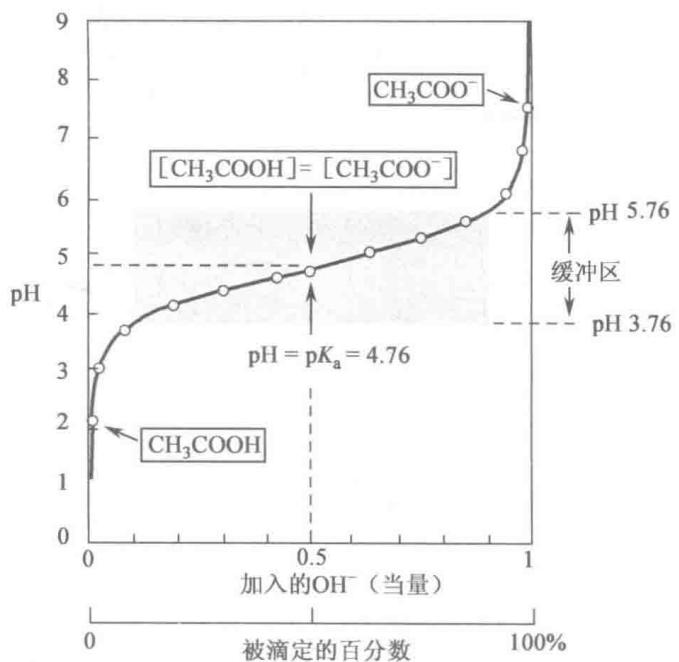  
图1-14 醋酸的滴定曲线

25℃时用氢氧化钠溶液滴定0.1 mol/L的醋酸。阴影框表示以 $pK_{a}$ 为中心的有效缓冲区，一般介于弱酸滴定10%\~90%之间。注意，1当量的 $OH^{-}$ 等于加入的0.1 mol/L NaOH量

$NH_{4}^{+}(pK_{a}=9.25)$ ，它们的滴定曲线形状几乎是一样的，只是沿pH轴，位移距离不同，因为这3个酸的强度不同即丢失质子的倾向不同。 $CH_{3}COOH$ 在 pH 4.76 已有一半解离（见图 1-14）； $H_{2}PO_{4}^{-}$ 在 pH 6.86 解离一半（此时， $\left[H_{2}PO_{4}^{-}\right]=\left[HPO_{4}^{2-}\right]$ ）； $NH_{4}^{+}$ 直至 pH 9.25 才解离一半（ $\left[NH_{4}^{+}\right]=\left[NH_{3}\right]$ ）。

弱酸的滴定曲线表明(图 1-14)，弱酸(HA)及其阴离子(A⁻)组成的共轭酸碱对能起缓冲剂的作用。

## 6. 缓冲剂和缓冲作用

活细胞和活生物保持专一而恒定的胞内 pH, 一般在 pH 7 左右, 以维持生物分子处于最适的离子状态。在多细胞生物中胞外液的 pH 也不断受到调节。维持 pH 的恒定性主要是依靠生物缓冲剂来达到的。

缓冲剂或称缓冲液(buffer)是一类能够抵抗外来少量酸( $H^{+}$ )或碱( $OH^{-}$ )引起的pH变化、维持pH基本不变的水溶液系统。一个缓冲系统是由一种弱酸和它的共轭碱组成的。如图1-14所示,醋酸和醋酸根离子的混合液即是一个缓冲系统。图中醋酸滴定曲线有一个相对平坦的范围,在它的中点(pH 4.76)两边各延伸约1个pH。在此范围内,向系统加入给定量的 $H^{+}$ 或 $OH^{-}$ 要比在范围外加入同样量的酸或碱,对pH造成的影响小得多。这一相对平坦的范围是醋酸-醋酸盐共轭对的缓冲区(buffering region)。缓冲区的中点,质子供体(HAc)和质子接纳体( $Ac^{-}$ )的浓度完全相等,这时系统的缓冲能力最大,即加入 $H^{+}$ 或 $OH^{-}$ 引起的pH变化最小。每种共轭酸碱对都有特征的有效缓冲范围,例如 $HAc-Ac^{-}$ 的缓冲区在pH 3.76和pH 5.76之间。

缓冲系统之所以具有缓冲作用,是因为系统中弱酸如醋酸(HAc)解离度很小,共轭碱(如 $Ac^{-}$ )的存在进一步抑制了它的解离;并且缓冲液中,弱酸及其共轭碱(如 HAc 和 $Ac^{-}$ )的浓度都比较大,而 $H^{+}$ 浓度相对较小。在缓冲系统例如 $HAc-Ac^{-}$ 中存在下面的解离平衡:

$$
\mathrm{HAc} \rightleftharpoons \mathrm{H} ^ {+} + \mathrm{Ac} ^ {-}
$$

当向缓冲系统中加入少量强酸， $\mathrm{Ac}^{-}$ 则与 $\mathrm{H}^{+}$ 结合成 $\mathrm{HAc}$ ，使平衡向左移动；当达到新的平衡时，溶液中 $[\mathrm{HAc}]$ 略有增加， $[\mathrm{Ac}^{-}]$ 略有减少， $\mathrm{pH}$ 基本不变， $\mathrm{Ac}^{-}$ 有抵御外来少量强酸的能力，称 $\mathrm{Ac}^{-}$ 为抗酸物质。当向缓冲系统中加入少量强碱时， $\mathrm{HAc}$ 则与 $\mathrm{OH}$ 反应生成 $\mathrm{Ac}^{-}$ 和 $\mathrm{H}_{2} \mathrm{O}$ ，使平衡向右移动；在新的平衡条件下， $[\mathrm{Ac}^{-}]$ 稍有增加， $[\mathrm{HAc}]$ 稍有减少，但 $\mathrm{pH}$ 基本不变， $\mathrm{HAc}$ 具有抵抗外来少量强碱的作用，称 $\mathrm{HAc}$ 为抗碱物质。在 $\mathrm{HAc}-\mathrm{Ac}^{-}$ 系统中因为存在较多的抗酸和抗碱的物质，才能抵御外来的少量强酸或强碱的影响。

前面曾提到各种弱酸的滴定曲线跟图1-14所示的有着几乎相同的形状，这表明滴定曲线反映出一个基本规律或关系。任一弱酸的滴定曲线可用Henderson-Hasselbalch方程式来描述，此方程只是弱酸解离常数表达式另一种有用的陈述方式。共轭酸碱对中弱酸(HA)的解离常数：

$$
K _ {\mathrm{u}} = \frac {[ \mathrm{H} ^ {+} ] [ \mathrm{A} ^ {-} ]}{[ \mathrm{HA} ]}
$$

解出氢离子浓度：

$$
\left[ \mathrm{H} ^ {+} \right] = K _ {\mathrm{a}} \frac {\left[ \mathrm{HA} \right]}{\left[ \mathrm{A} ^ {-} \right]}
$$

两边取负对数并经整理得：

$$
\mathrm{pH} = \mathrm{p} K _ {\mathrm{a}} + \lg \frac {[ \mathrm{A} ^ {-} ]}{[ \mathrm{HA} ]}
$$

这就是 Henderson-Hasselbalch 方程。此式表明缓冲液的 pH 主要决定于共轭酸碱对中弱酸的 $pK_{a}$ ，其次决定于共轭酸和共轭碱的浓度比。当 $[A^{-}]=[HA]$ 时，也即溶液的 pH 等于 HA 的 $pK_{a}$ 时，具有最好的缓冲能力。一般当 $[A^{-}]/[HA]$ 之比在 1/10 到 10/1 的范围内，具有较好的缓冲能力。因此 pH 从 $(pK_{a}+1)$ 到 $(pK_{a}-1)$ 的区间是缓冲液的有效范围。此外利用 Henderson-Hasselbalch 方程可以计算在任一 pH 条件下质子供体 (HA) 和质子接纳体 $(A^{-})$ 的浓度比 $( [A^{-}]/[HA] )$ 以及其他项的数值。

## 七、生命的基本单位——细胞

## （一）生物三域——细菌、古菌和真核生物

所有生物的细胞,根据它们的构造不同可以分为两大类型:一类称原核细胞(prokaryotic cell;prokaryocyte),另一类称真核细胞(eukaryotic cell;eukaryocyte)。这两类细胞的主要区别在于遗传物质(DNA)是否有核膜裹着,有核膜裹着的为真核细胞,裸露的为原核细胞。此外原核细胞比真核细胞小(参见表1-3),结构也简单得多,除了表面的细胞膜以外,没有成形的核,也没有其他的细胞器;但有一个不定形的拟核(nucleoid)或称核区(nuclear area)。真核细胞除了成形的核(nucleus)以外,还有其他细胞器如线粒体、叶绿体(植物细胞)和高尔基体等。属于原核细胞的单细胞(或群体)生物称为原核生物(prokaryote),包括细菌(bacteria)[或称真细菌(eubacteria)]和古菌(archaea)[原称古细菌(archaebacteria)]两大类。原核生物在教科书中常以大肠杆菌(E.coli)作为代表。属于真核细胞的单细胞或多细胞生物称为真核生物(eukaryote),包括动物、植物和真菌,常以肝细胞、菠菜叶细胞作为代表。

20 世纪 80 年代 R. H. Whittaker 根据 C. R. Woese 等人于 1977 年对原核生物和真核生物的 rRNA 核苷酸序列比较的结果提出了三域学说（图 1-15），认为所有生物都由一个共同的先祖（progenitor）分 3 条进化途径形成 3 个域（domain）。单细胞微生物根据遗传学和生物化学研究可以区分为细菌域和古菌域。细菌栖息于土壤、表层水和其他活生物或死生物的组织中。古菌被认为是属于跟细菌不同的另一域，它们生活在一些极端的环境——盐湖、热泉、高酸性沼泽以及大洋深处。已有的证据表明，古菌和细菌在早期就发生趋异进化。所有的真核生物构成了第三域。真核生物是从产生古菌那个分支进化而来的，因此真核生物与古菌的亲缘关系比与细菌的亲缘关系更接近。

  
图 1-15 生物三域系统树  
此系统树是基于各类生物的 rRNA 核苷酸序列的相似性: 序列越相似分支的位置越接近, 分支的距离代表两种序列差异的程度

在细菌域和古菌域里的生物又可根据它们的栖息地不同分为两个大类:需氧菌(aerobe)和厌氧菌(anaerobe)。在有充足氧供应的环境中生活的某些微生物是在把电子从燃料分子传递给氧的过程中获取能量的。适应于在厌氧(实际是缺氧)环境中生活的微生物是把电子传递给硝酸盐(形成 $N_{2}$ )、硫酸盐(形成 $H_{2}S$ )或 $CO_{2}$ (形成 $CH_{4}$ )来得到能量的。从厌氧环境中进化来的许多微生物是专性(obligate)厌氧菌,当暴露在氧中时则死亡。其他是兼性(facultative)厌氧菌,它们在有氧和无氧环境中都能生长。

根据生物如何获得为合成细胞材料所需的能量和碳,对它们进行分类。按能量的来源不同可以分成两大类:① 光养生物(phototroph),捕获并利用日光能;② 化养生物(chemotroph),从氧化化学燃料获取能量。有些化养生物是无机营养型（lithotroph），它们氧化无机燃料，例如氧化 $\mathrm{HS}^{-}\rightarrow \mathrm{S}^{0}$ （元素硫）、 $\mathrm{S}^0\to \mathrm{SO}_4^-$ 、 $\mathrm{NO}_2^- \rightarrow \mathrm{NO}_3^-$ 或 $\mathrm{Fe}^{2 + }\rightarrow \mathrm{Fe}^{3 + }$ 。有些是有机营养型（organotroph），它们氧化环境中可利用的各种有机化合物。光养生物和化养生物各自又可分为：①自养生物（autotroph），从 $\mathrm{CO}_{2}$ 中获得全部所需的碳；②异养生物（heterotroph），从有机营养物中得到所需的碳。

## （二）细胞是所有生物的结构和功能单位

从图 1-16 和图 1-17 可以看出, 各种类型的细胞都有某些共同的结构特点。

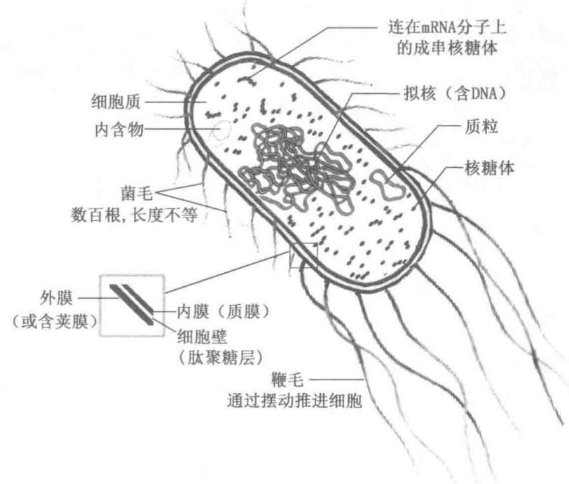  
图 1-16 细菌细胞(以大肠杆菌为代表)的共同结构特点  
大肠杆菌属于革兰氏阴性菌。革兰氏阳性菌是指能保留革兰氏染色（Gram's stain）者，革兰氏阴性菌则不能。革兰氏染色是一种碱性染料，结晶紫和碘的络合物，1882年H.C.Gram首先使用

## 1. 细胞膜 (cell membrane) 和细胞壁 (cell wall)

细胞膜也称质膜（plasma membrane），是细胞表面的被膜；它规定了一个细胞的周边，把细胞的内含物与环境隔开。质膜的厚度为7\~8 nm，是穿插有蛋白质分子的脂双层（见第10章）。质膜最重要的特性之一是选择性透性（selective permeability）或半透性，即有选择地允许物质通过。质膜对无机离子和大多数荷电或极性化合物是一道屏障；但质膜上的转运蛋白质允许某些离子和分子通过。膜上的受体蛋白质向细胞传递信号（如激素），膜酶参与某些代谢反应途径。因为质膜中脂质分子和蛋白质分子不是共价结合的，所以整个膜结构明显具有柔性，允许细胞的形状和大小发生改变。随着细胞的生长，新合成的脂质和蛋白质分子被插入质膜；细胞分裂产生两个细胞，每个细胞都具有自己的质膜。生长和细胞分裂不丢失膜的完整性。

对于动物细胞,在它的质膜外面常有一层由糖蛋白、蛋白聚糖和脂多糖等组成的柔韧而黏性的覆盖物(coat),它起细胞-细胞识别、细胞通讯和免疫保护等作用(见第9章)。对于植物细胞,质膜外面还有细胞壁,其成分是纤维素、果胶和木质素等,这些成分是细胞代谢的产物(见第9章);细胞壁的主要功能是支持和保护,同时防止细胞在低渗介质中因吸水而胀裂,以维持细胞正常状态。对于细菌细胞,质膜外面还有肽聚糖构成的细胞壁;有些细菌在细胞壁外面还有一层外膜(见图9-34)。

## 2. 细胞核 (cell nucleus) 或核区 (nucleoid)

所有的细胞,至少在生命的一段时间,具有核或拟核,在这里储存和复制基因组。拟核存在于细菌和古菌中,它是一个没有膜与它的细胞质隔开的无定形“染色体”,由一个环状分子 DNA 和有关的蛋白质组成。真核生物中核物质被包裹在一个称为核被膜(nuclear envelope)的双层膜中。膜上有核孔允许某些物质进出核内外。核内含有染色质、核仁和核基质。染色质(chromatin)是遗传物质,主要成分是DNA和组蛋白。核仁(nucleolus)是富含蛋白质和RNA分子的圆形颗粒状结构,内含转录rRNA的基因(rDNA)。核基质(nuclear matrix)为透明液体,液体内布满蛋白质构成的纤维状网,染色质和核仁等都在其中。

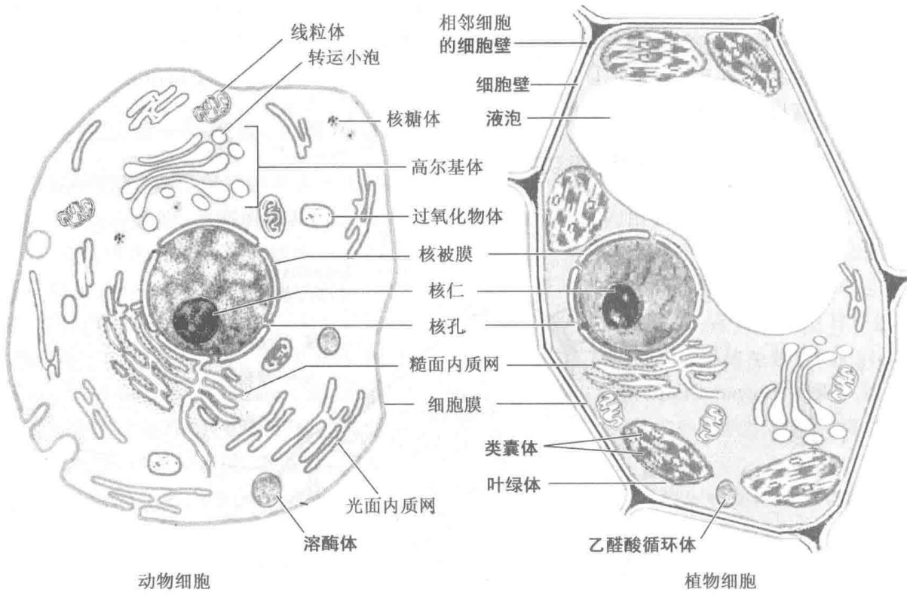  
图1-17 真核细胞结构模式图  
动物细胞一般直径为 $5 \sim 30 \mu m$ ，植物细胞直径为 $10 \sim 100 \mu m$ ；用粗体字标出的结构是动物细胞或植物细胞所特有的。真核微生物的结构类似动、植物细胞，有许多还含有特化的细胞器（本图未示出）

## 3. 细胞质 (cell plasm) 和细胞溶胶 (cytosol)

细胞膜包裹着的内部是[细]胞质,它包括称为细胞溶胶的液体部分和各种具有专一功能的悬浮颗粒,如真核细胞中的各种细胞器。细胞溶胶是高度浓缩的溶液;内含各种酶和编码这些酶的RNA分子、合成这些大分子的单体亚基(氨基酸和核苷酸)、几百种称为代谢物的有机小分子(合成代谢和降解代谢的中间物)、对许多酶促反应所必需的化合物——辅酶(coenzyme)、无机离子以及各种包含物(conclusion),如肝细胞中的糖原颗粒和脂肪细胞中的脂肪滴。细胞溶胶是多种代谢活动的场所,它在细胞中的物质运输、能量转换和信息传递方面也起重要作用。

## （三）原核细胞的代表——大肠杆菌

原核细胞有着一些共同的结构特点(图 1-16)，但也显示出不同类群的特化，特别是在细胞被膜的结构和成分方面。

细菌几乎是原核细胞的代名词，大肠杆菌(Escherichia coli, E. coli)更是原核细胞的典型。大肠杆菌是人体消化道中的一种通常是无害的栖居者。它的细胞长约 $2\mu \mathrm{m}$ ，直径小于 $1\mu \mathrm{m}$ ，有一个保护性的外膜和一个包裹着细胞质和拟核的内膜。内、外膜之间有一层薄而坚硬的多聚体——肽聚糖；肽聚糖层称为细胞壁，它给细菌细胞以刚性和形状，增强细胞在低渗介质中抵抗膨胀的能力。外膜是由脂蛋白、脂多糖和磷脂组成的脂双层膜，外膜只对某些物质如青霉素、溶菌酶和去污剂等具有屏障作用，它的脂多糖具有抗原性和内毒素作用（见第9章）；有些细菌在细胞的最外面还有一层由胞内制造并分泌的胶状物（多糖或/和多肽）——荚膜(capsule)或黏液层(slime layer)，荚膜在产生细菌毒力和保护细菌免遭被宿主细胞吞噬方面起着重要作用。内膜是真正的质膜，高度选择性地管控物质的通透；负责把营养物质转化为ATP的酶也定位于此膜上。内、外膜和细胞壁一起构成细胞被膜（cell envelope）。大肠杆菌的这种被膜结构是某些细菌（革兰氏阴性菌）所共有的；蓝细菌（cyanobacteria）也属于这类，但它的内膜系统较发达，并带有光合色素。其他细菌（革兰氏阳性菌）没有外膜，最外面就是较厚的肽聚糖层（细胞壁），紧接着的内层是质膜（见图9-34A）。

值得注意的是古菌细胞的刚性是由另一种多聚糖——假肽聚糖提供的；它们的细胞被膜构造与革兰氏阳性菌似乎相似，也没有外膜，但古菌的膜脂和多糖的结构和成分明显不同于细菌，有它们自己特有的膜脂（见图10-12）。

大肠杆菌的细胞溶胶含有约 15 000 个核糖体（它比真核生物的核糖体小，但功能相同；每个核糖体由一个大亚基和一个小亚基组成，每个亚基含约 65% RNA 和 35% 蛋白质）、约 1 000 种不同的酶（每种酶有 10 到数千个拷贝）、不到 1 000 种 $M_{r}$ 少于 1 000 的有机化合物（代谢物和辅酶）和若干无机离子。大肠杆菌的拟核（核区）含有唯一的一个环状 DNA 分子；跟大多数细菌一样，胞质中还含有一个或多个小的环状 DNA 片段，称质粒（plasmid）。在自然界，某些质粒有抵抗环境中的毒物和抗生素的能力。在实验操作中这些 DNA 片段很容易掌控，是基因工程的有力助手（见第 3 篇）。

大多数细菌(包括大肠杆菌)都是以单个细胞存在的,但有些细菌(例如黏细菌)显示出简单的社会行为,形成多细胞的群体(聚集体)。

## （四）真核细胞含有多种膜质细胞器

典型的真核细胞(图1-17)比细菌大很多,直径5\~100 $\mu$ m,细胞体积比细菌大 $10^{3}\sim10^{6}$ 倍。真核细胞的特点,除有被膜围着的细胞核外,还有若干具有专一功能的膜质细胞器以及细胞骨架。细胞器有:线粒体、内质网、高尔基体、溶酶体和微体。除此以外,植物细胞还含有叶绿体和液泡(图1-17)。在许多细胞的胞质中还存在含淀粉和油脂这样一些营养物的颗粒和小滴。

细胞器可以借助差速离心和等密度离心技术从细胞溶胶中分离出来。这是研究细胞器的结构和功能的必要步骤。关于亚细胞组分的分级分离参见第5章。

## 1. 线粒体 (mitochondrion) 和叶绿体 (chloroplast)

线粒体的外形呈颗粒状或短杆状，横径0.5\~1 $\mu$ m，长2\~3 $\mu$ m，相当于一个细菌大小；数目因细胞种类不同而异。线粒体的结构相当复杂，它是内、外两层膜包裹的囊状细胞器，有发达的膜系统，内膜向基质折叠成若干个所谓嵴（cristae）；它的内、外膜在脂质组成和酶的活性方面都不同；基质中有自己的一套遗传系统，包括DNA和核糖体。线粒体是细胞呼吸和能量转换的中心，含有细胞呼吸所需的各种酶和电子传递体。它的主要功能是将贮存在糖类和脂质中的化学能转换为细胞代谢中可直接利用的载能分子——ATP。关于线粒体结构和功能的细节见第19章。

质体（plastid）是植物细胞的细胞器，其中最重要的一种是叶绿体，它是光合作用的场所，主要功能是将光能转化为化学能。叶绿体的形状、大小和数目随植物和细胞的种类不同而异。叶绿体和线粒体一样也有发达的膜系统，组织成若干扁平的类囊体（thylakoid）。光合作用所需的色素和电子传递系统都位于类囊体膜中（有关细节参见第23章）。

## 2. 内质网(endoplasmic reticulum, ER)和高尔基体(Golgi apparatus)

内质网是细胞质中的一个由许多膜质囊腔和小管彼此相连并相通的膜系统。内质网也与核被膜的外层相连，与核周腔（核被膜内外层之间的空隙）相通；这一相通的内质网容积称为潴泡（cistern）。内质网分为光面内质网（SER）和糙面内质网（RER）；前者的膜上没有核糖体颗粒，这是脂质合成和药物代谢的场所；后者的膜上粘满了颗粒状核糖体——蛋白质合成的机器，所以糙面内质网的功能是合成并转运蛋白质。

高尔基体也称高尔基复合体（Golgi complex），几乎存在于所有的动、植物细胞中。它由一系列的扁平的单层囊和泡组成。高尔基体的功能是作为内质网上合成的蛋白质加工和包装场所，并负责把蛋白质运送到其他细胞器或胞外。内质网产生的转运小泡移动到高尔基体区，与高尔基体融合；小泡中的蛋白质在这里分类加工后,高尔基体又以掐离(pinching-off)的方式形成小泡,出现在它的周边,泡内含有被高尔基体包装了的分泌物质。这些小泡离开高尔基体,移向细胞外周或其他细胞区室,给它们输送分泌产物。转运小泡在内质网、高尔基体和细胞膜之间来回穿梭,运输脂质和蛋白质。

## 3. 溶酶体 (lysosome) 和微体 (microbody)

溶酶体是单层膜的小泡，直径0.25\~0.5 $\mu$ m，数目不等，大小也有很大的变化。泡内含有多种水解酶，如蛋白酶（protease）、核酸酶（nuclease）和磷酸酶（phosphatase）。溶酶体是从高尔基体通过芽殖形成的。溶酶体的主要功能是消化那些以吞噬（phagocytosis）和胞饮（pinocytosis）方式摄入细胞的物质，同时还能降解已失去功能的胞内碎片。溶酶体如果发育不全，缺失一种或多种酶，则可引起机体疾病，甚至致命的疾病。

微体（microbody）也是单层膜的泡状体，直径约 $0.5 \mu m$ ，常见的一种微体是过氧化物酶体（peroxisome），动、植物细胞中均有存在。它含有过氧化氢酶（catalase）、尿酸氧化酶（urate oxidase）、D-氨基酸氧化酶和其他氧化酶类。过氧化物酶体参与某些营养物（如脂肪酸）的氧化，它能把这些细胞器中氧的还原产物 $H_{2}O_{2}$ 分解成 $H_{2}O$ 和 $O_{2}$ ，而起解毒作用。另一种微体称乙醛酸循环体（glyoxysome），存在于植物细胞特别是发芽种子的细胞中，它含有乙醛酸循环的关键酶。

## 4. 液泡(vacuole)

液泡是植物细胞所特有的。在年幼细胞中只是一些分散的小液泡，随年龄增长小液泡逐渐合并成一个大液泡。其大小可达细胞体积的50%以上，并占据了细胞的中央，常把核和细胞质挤压到细胞的边缘。液泡中的液体称为细胞液（cell sap），其中含有溶解的糖、有机酸盐、蛋白质、无机盐、各种色素、 $O_{2}$ 和 $CO_{2}$ 等。液泡的功能是运输和贮存营养物质和细胞废物。

## 5. 细胞骨架 (cytoskeleton)

真核细胞中的细胞溶胶不是简单的均质溶液。细胞样品经荧光染色(fluorescent staining,一种用荧光抗体标记细胞成分的技术)后,在荧光显微镜下可观察到细胞溶胶中存在着一个由几种类型的蛋白质纤丝交织成的三维网,称为细胞骨架。

细胞骨架的蛋白质纤丝共有3种类型：微管、肌动蛋白丝和中间丝。微管（microtubule）是直径约24 nm的中空长管状纤维。细胞分裂时的纺锤体、纤毛和鞭毛都是由微管构成的。构成微管的亚基是微管蛋白二聚体（tubulin dimer）此二聚体由一个 $\alpha-$ 和一个 $\beta-$ 微管蛋白组成（见第3章）。微管或成束或分散存在于细胞中。肌动蛋白丝（actin filament）也称微丝，直径约为7 nm，它的亚基是肌动蛋白，称G-肌动蛋白，缔合的纤丝称F-肌动蛋白。中间丝或中间纤维（intermediate filament）是一类直径为7\~12 nm的纤丝。构成中间丝的最常见的蛋白质是角蛋白（keratin）；此外还有波形蛋白、结蛋白等（见第4章）。微管和肌动蛋白丝主要担当动态的角色；肌动蛋白丝涉及细胞的游动性（motility），而微管起长丝状轨道的作用，沿着它细胞器可借助专一性机制被快速转运。中间丝只起结构性作用，维持细胞形状。

每种类型的蛋白质纤丝都是由简单蛋白质亚基构成的，亚基通过非共价缔合形成粗细均匀的纤丝。这些纤丝没有永久的结构，而是随细胞生理状态的变化，时而解离成亚基，时而重新装配成纤丝。它们在细胞中的位置也不固定，随着有丝分裂（mitosis）、胞质分裂（cytokinesis）、变形运动（amoeboid motion）或细胞形状的改变而发生显著变化。

总之真核细胞的内部是一个具有结构纤维网和若干膜质细胞器的复杂系统。膜质小泡可以从一个细胞器上芽殖出来又与另一个细胞器融合。细胞器可以沿微管纤维从细胞质的一处移动到另一处，移动是受需能的马达蛋白(motor protein)驱使的。各种细胞器组成的内膜系统(endomembrane system)把专一性的代谢过程分隔开来，并提供进行酶促反应的表面。胞吐(exocytosis)和胞吞(endocytosis)是一种涉及膜的裂殖和融合的运输机制，它在细胞质和环境介质之间提供了一条胞内产生的物质的分泌和胞外物质的摄入的通道。

## 八、生物分子的起源与进化

生命起源是宇宙进化的一部分。宇宙的起源虽有多种理论，但都未能充分说明。比较流行的看法是宇宙始于150亿～200亿年前的一次突发性的大爆炸。此后逐渐凝聚成现在这个由几亿颗恒星组成的宇宙。太阳是其中的一颗恒星。一般认为太阳及其行星是同时由大爆炸时产生的气体尘埃凝聚而成的，氢是宇宙中最原初也是最丰富的元素；在形成星球的热核反应中氢生成氦，氦再生成碳、氮、镁、铁等元素。约在45亿年前产生了地球本身和今天在地球上找到的各种化学元素。根据对现在火山口的气体分析，推测原始大气层是还原性的，主要由氢的化合物如 $H_{2}O$ 、 $NH_{3}$ 、 $CH_{4}$ 和 $H_{2}S$ 等组成。很可能在生命起源时的大气仍然有很大的还原作用，而没有氧气存在。氧主要是光合作用的产物，是很晚才出现的。大约35亿年前或更早，一些生命开始在地球上出现。地球上最初的生命是怎样产生的？对此曾提出过多种假说：神创论、宇生论、自然发生说和进化起源说等。因为进化起源说有比较充分的根据和实验证明，所以被多数学者所接受。进化起源说认为：在地球诞生后的头10亿年间，即生命出现之前，地球经历了化学进化（chemical evolution）或称前生物进化（prebiotic evolution）阶段，也即从无机小分子到原始生命形成即细胞起始的阶段。细胞继续进化，从原核细胞到真核细胞，从真核单细胞到真核多细胞，直至形成今天的生物界，这段历史称为生物进化（biological evolution）阶段。

## （一）最初的生物分子是通过化学进化产生的

## 1. 化学进化的理论

20 世纪 20 年代苏联生物化学家 A. I. Oparin (A. И. Опарин) 和英国遗传学家 J. B. S. Haldane 分别提出了地球历史的早期生命起源的理论。他们假设原始大气层富含氨、甲烷、硫化氢和水蒸气等，但基本上没有氧，是一种还原态大气，与今日的氧化态大气很不相同。他们的理论认为：紫外线和宇宙射线等的辐射能、闪电的电能和火山爆发的热能或海洋中热风口的热能都可以引起原始大气中的 $NH_{3}$ 、 $CH_{4}$ 、 $H_{2}S$ 和 $H_{2}O$ 等的反应，生成多种简单的有机分子——生物小分子，如氨基酸、嘌呤、嘧啶、单糖、脂肪酸等。这些生物小分子溶于雨水进入江河湖泊，最后汇聚到海洋。过了若干百万年后，远古海洋变成富含多种简单有机物质的温暖溶液，称为“原始汤”（primordial soup），在这原始汤里这些生物小分子经受了非生物缩合作用（abiotic condensation）形成了原始的多肽、多核苷酸、多糖和脂质等生物大分子。再过若干百万年，这些大分子进一步缔合成超分子复合体或多分子系统，包括原始的膜、酶系和复制模板等。此后若干百万年间，这些超分子复合体聚集在一起装配成有膜裹着的多核苷酸和多肽系统——原始细胞的前体或最原始的细胞。

概括起来,化学进化过程大体分为4个连续的阶段:①从无机小分子合成生物小分子;②从生物小分子(作为单体)缩合成生物大分子;③生物大分子缔合成超分子复合体;④超分子复合体组装成原始细胞。

## 2. 实验室中化学进化的演示

Oparin 等人的生命起源假说很多年来一直停留在推测阶段, 直至 1953 年美国学者 S. Miller 在 Urey 实验室中用一个简单的火花放电装置, 处理那些被认为是原始大气中存在的 $CH_{4}$ 、 $NH_{3}$ 、 $H_{2}$ 和 $H_{2}O$ 等气体混合物, 经过一星期或更长一些时间, 分析封闭的反应瓶中的内容物 (图 1-18)。所得混合物的气相中含有 CO、 $CO_{2}$ 、 $N_{2}$ 以及未反应完的起始物质, 水相中含有多种有机化合物包括一些氨基酸、羟酸、醛和氰化氢 (HCN)。这个实验确定了在相对较温和的条件下和相对较短的时间内非生物合成生物分子的可能性。

此后利用各种形式的能量(热、紫外线、 $\gamma$ 射线、超声波、震荡以及 $\alpha$ 、 $\beta$ 粒子轰击)，已从 $CH_{4}$ 、 $NH_{3}$ 、 $H_{2}O$

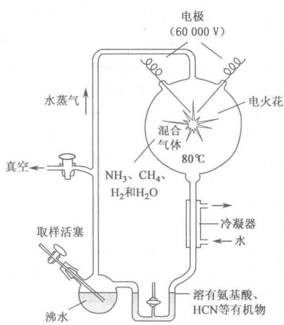  
图 1-18 Miller 的火花放电装置

等原料合成出几百种有机化合物,包括组成蛋白质的20种氨基酸、参与核酸组成的5种碱基、各种羧酸（一、二、三羧酸）、脂肪酸以及各种单糖（三、四、五、六碳糖）；除小分子化合物外，还有多核苷酸、多肽、多糖等大分子的形成。实验发现 HCN 的自缩合产物是单体亚基缩合反应的有效催化剂，地壳中存在的某些离子 $\left(\mathrm{Cu}^{2+},\mathrm{Ni}^{2+}\right.$ 和 $\left.\mathrm{Zn}^{2+}\right.$ 等)也能提高缩合反应的速率。

总之,实验室实验已提供了有力的证据,证明活细胞的许多化学成分包括生物大分子在内都能在前生物条件下生成。核酶(RNA本质的酶,见第6章)的发现暗示了RNA在前生物进化中起着关键的作用,既是催化剂,又是信息贮库(见第32章),它可能是最早的基因和最早的酶。

## 3. 原始生物分子(primordial biomolecule)

至今发现的所有生物中的所有生物大分子都是由相同的一套(约30种)构件分子构成的。这一事实有力地证明现代生物都是由同一个原始细胞系遗传而来的。这30种基本构件分子称为原始生物分子：20种氨基酸、5种碱基、2种单糖（葡萄糖和核糖）、1种醇（甘油）、1种脂肪酸（棕榈酸）、1种胺（胆碱）。几十亿年的自然选择已精选出能充分利用原始生物分子的化学和物理特性来进行能量转换和自我复制的细胞系统。进化过程中原始生物分子发生了特化和分化。现在在各种生物中共存在近300种氨基酸、几十种碱基、几百种单糖及其衍生物和几十种脂肪酸。生物体中的色素、激素、抗生素、维生素、生物碱也都是由这些原始生物分子衍生而来的。因此原始生物分子被认为是生物体内的各种有机化合物的生物学祖先(biological ancestry)。

## （二）RNA或相关前体可能是最早的基因和催化剂

在现代生物学中,核酸编码规定酶结构的遗传信息,酶催化核酸的复制和修复,这两类生物分子是相互依存的。那么核酸和蛋白质究竟孰为先呢?

最好的答案是,它们大约是同时出现,但核酸稍在先。前面谈过,生命最本质的东西是新陈代谢和自我复制,前者离不开起催化作用的酶,后者少不了储存遗传信息的核酸。现代生物学已证明 DNA 是遗传

信息的载体；但也发现少数RNA病毒靠RNA的自我复制传递遗传信息；有些RNA在一定条件下充当催化剂的角色，如核酶。这些发现暗示了RNA分子或一个类似的分子可能就是地球上出现的第一个基因和第一个催化剂。现在越来越多的事实证实了这种推想，并为多数学者所认可。这种认为RNA是第一个基因又是第一个催化剂的假说，被称为“RNA世界”说（RNA world theory）。根据这种假说（图1-19），生物进化的最早阶段之一是一个RNA分子在原始汤中偶然形成，它能够催化另一些具有同样序列的RNA的形成——一个自我复制、自我永存的RNA。这样自我复制的RNA分子的浓度将以指数的方式增加，一个分子形成两个，两个形成四个，等等。自我复制的忠实性大概不够完美，所以过程中会产生RNA的变体，某些变体可能更具有自我复制的能力。在竞争核苷酸中，效率最高的自我复制序列取得胜利，效率差的复制序列从群体中淡出。

作为遗传信息库的 DNA 和起催化作用的蛋白质之间的功能分化, 按“RNA 世界”说, 是较后发生的事。自我复制的 RNA 分子发展出新的变体, 它具有催化氨基酸缩合成肽的额外能力。偶然机会, 这样形成的肽加强了 RNA 的复制能力, 并且 RNA 和辅助肽这一对分子, 在序列方面发生了进一步的修饰, 产生出越

  
图 1-19 “RNA 世界”说的分子进化情景

来越有效的自我复制系统。值得注意的是，在现代细胞的蛋白质合成机器（核糖体）中是RNA分子，不是蛋白质分子，催化肽键的形成。这与“RNA世界”的假说是一致的。

原始的蛋白质合成系统进化之后的某一时刻,又有了进一步的发展:与自我复制的 RNA 分子序列互补的 DNA 分子接受了保存“遗传”信息的功能,而 RNA 分子进化到担当蛋白质合成方面的角色(关于

DNA 分子比 RNA 分子更稳定,因而更适于作为遗传信息储库的解释见第 11 章)。蛋白质被证明是多能的催化剂,在整个进化过程中接受了大部分的催化功能。在原始汤中脂质样的化合物在自我复制的分子集群周围形成了相对不透性的膜层。蛋白质和核酸集中在这样的脂膜封闭区内有利于自我复制所需的分子相互作用。

## （三）原始细胞的出现——生物学进化的开始

生命既然是在地球上发生的，在漫长的历史岁月中就会留下它的踪迹，古生物化石就是其中之一。1996年在格陵兰工作的科学家在岩石中找到了38.5亿年前生命的化学证据——碳质形式的“化石分子”。在澳大利亚西部Warawoona和南非Swazi land的沉积岩中都发现35亿年前的丝状体化石，被认为是原始微生物的遗迹。在35亿年前的地层中还发现很多被称为叠层石（stromatolite）的化石，叠层石是原始蓝细菌和光合细菌等原核生物代谢产生的碳质和硅质沉积物。

地球诞生后的头10亿年间，因为大气中几乎没有氧，又因为没有微生物来清扫自然过程形成的有机化合物，所以这些化合物相对地比较稳定。化合物的稳定加上岁月的悠长，这为生命起源和进化创造了条件。认为：在化学进化的较后阶段，地球上的某个地方出现了类似于细胞的实体或细胞前体。这种前体可能是无膜到有膜裹着的RNA-多肽系统，它能够由RNA作为模板（兼催化剂）复制自己的结构，多肽作为催化剂协助复制。细胞前体通过进一步的自然选择，一个能够生长繁殖、具有原始代谢能力并有脂膜裹着的DNA-RNA-蛋白质系统诞生了，这就是地球上的第一个细胞（无疑是原核细胞）。生物学进化阶段就这样开始了。

最早的细胞可能是从无机燃料如硫化亚铁和碳酸亚铁(它们在早期的地球上都很丰富)中获得能量。例如下面反应：

$$
\mathrm{FeS} + \mathrm{H} _ {2} \mathrm{S} \longrightarrow \mathrm{FeS} _ {2} + \mathrm{H} _ {2}
$$

能产生足够的能量来驱动 ATP 或类似化合物的合成。它们所需的有机化合物可能来自于化学进化期间积累了丰富有机分子的海洋。另一可能的来源被认为是地球外的太空，因为 2006 年那次星团太空飞行 (the stardust space mission) 带回来的彗星尾部的尘埃颗粒含有多种有机化合物。

早期的单细胞生物逐渐获得从环境的化合物摄取能量的能力,并利用这个能量合成自己所需的前体分子,因此对外界的依赖性逐渐变小。其中一个很有意义的进化事件是:发展出能捕获日光能的色素(pigment),摄取的光能可用来还原(“固定”) $CO_{2}$ 成为有机化合物。这意味着有些原核细胞它们的能源由化能向光能转化,碳源由异养型(有机物)向自养型( $CO_{2}$ )转化。发生转化的原因可能是“原始汤”中的有机化合物逐渐耗尽,ATP不足,原核细胞第一次遇到了严重威胁。这种压力推动细胞中酶合成能力的进化,出现了光能自养型和化能自养型的原核生物。早期光合过程中原初的电子供体可能是 $H_{2}S$ ,产生元素S或硫酸盐( $SO_{4}^{2-}$ )作为副产品。后来的细胞发展出利用 $H_{2}O$ 作为光合反应中电子供体的酶促能力,氧作为废物被释出。今天的蓝细菌就是这些光合放氧生物的后代。

因为最早的细胞是在无氧的条件下产生的,所以早期细胞是厌氧的。在这种条件下化能异养生物(chemoheterotroph)氧化有机化合物成为 $CO_{2}$ 是通过把电子传递给像 $SO_{4}^{2-}$ 这样的接纳体而不是传递给 $O_{2}$ 的途径实现的,在这种情况产生 $H_{2}S$ 作为产物。由于产氧光合细菌(如蓝细菌)的出现,地球大气逐渐变得富含氧气。氧是一种很强的氧化剂,对厌氧生物是一种致命的毒物,这给厌氧原核生物带来了第二次严重威胁。应答这种进化压力,微生物中的某些谱系产生出需氧细菌。需氧菌是通过从有机分子把电子传递给 $O_{2}$ 来获取能量的。因为电子从有机分子传递给 $O_{2}$ 的过程释放出很大的能量,所以需氧生物和厌氧生物在含氧环境中竞争时前者比后者具有能量方面的优越性。这个优越性使得需氧生物在富 $O_{2}$ 环境中占了优势。

现今的细菌和古菌几乎生活在生物圈的每个生态角落，并且很多生物实际上都能利用各种有机化合物作为碳和能的来源。生活在淡水和海水中的光合微生物是捕获日光能来制造糖类和所有其他的细胞成分的，它们本身又被其他生物用作食物。进化的过程在继续——在快速繁殖的细菌细胞里，进化将按一个允许我们在实验室中亲眼看到这一过程的时间表在进行。要想在实验室产生一个“原初细胞”（protocell），涉及检测一个简单细胞的基因组，以确定生命所必需的最少基因数目。对一个游离生活的细菌来说，最小的已知基因组是生殖分枝杆菌（Mycobacterium genitalium）的基因组，它含有580 000个碱基，编码483个基因。

## （四）真核细胞是从原核细胞进化而来的

根据化石的记录,约在15亿年前,比原核细胞大、结构更复杂的真核细胞在地球上已出现了(图1-

20)。生命从非核细胞(原核)到具核细胞(真核)的进化顺序也得到了今天生物的比较形态学和比较生物化学的证实。真核细胞与原核细胞的最大差别是真核细胞有膜包围着的核和许多细胞器。那么结构简单的原核细胞如何发展到如此复杂的真核细胞的？原因何在？看来，必然有三大变化发生：第一，当细胞获得更多DNA时，就需要有更精巧的机制以便把DNA与专一蛋白质紧密折叠成若干个单独的复合体，并在细胞分裂时把它们平均分配给子细胞；还需要有特化的蛋白质来稳定已折叠的DNA和拉开在细胞分裂时形成的DNA-蛋白质复合体(染色体)。第二，随着细胞变大，发展出一个胞内膜系统，包括包裹DNA的双层膜。此膜把DNA模板上的RNA合成和核糖体上的蛋白质合成分隔开来，分别成为核内过程和胞质内过程。真核细胞的内膜系统被认为是由原核细胞的质膜内折(infolding)进化而来的，包括核被膜和内质网等。第三，不能进行需氧代谢和光合作用的早期真核细胞吞入了需氧细菌或同时吞入了光合细菌，形成了并最终成为永久性内共生联合体(endosymbiotic association)。某些需氧细菌演化成现代真核生物的

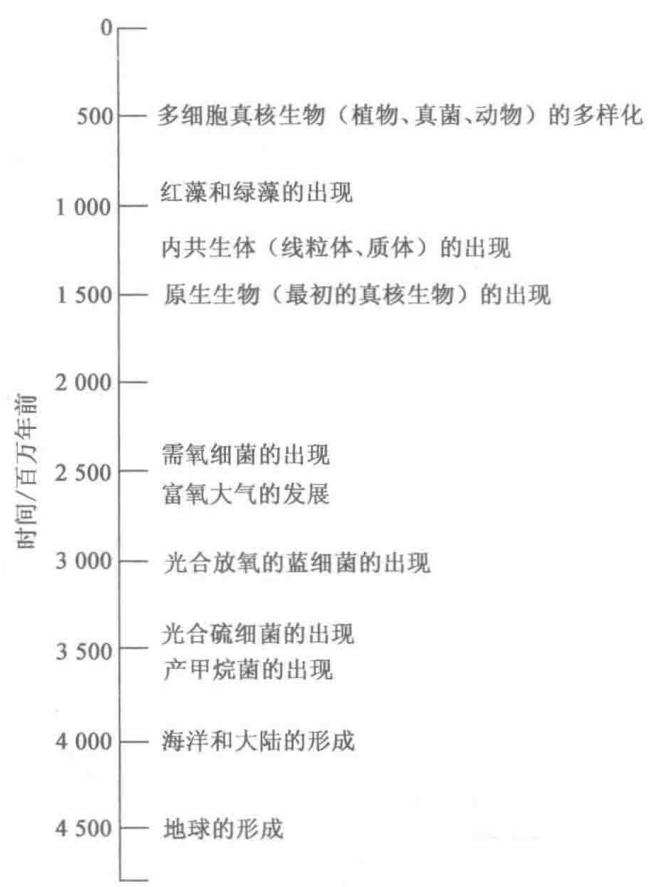  
图 1-20 地球上生命进化的里程碑

线粒体,某些光合蓝细菌变成了质体,例如绿藻的叶绿体;绿藻可能就是现代植物细胞的先祖。

在进化后期的某一阶段,单细胞生物发现它们成串在一起更为有利,这样可以获得比游离生活的单细胞更大的游动性(motility)、效力或繁殖成功率。这种成串生物的进一步进化导致个体细胞之间的永久性联合,并导致群体(colony)内的特化——细胞分化。

细胞特化导致了日益复杂和高度分化的生物进化，在这些生物中某些细胞行使记忆功能，另一些执行消化、光合作用或繁殖的功能等等。许多现代的多细胞生物含有几百种不同类型的细胞，每种类型细胞专门行使一种或几种功能，以支持整个生物。早期进化的基本机制已经通过进化变得更加精巧。例如，作为草履虫（paramecium）纤毛和衣藻（chlamydomonas）鞭毛的搏打运动基础的同一基本结构和机制也被高度分化的脊椎动物精子细胞所使用。

## 提要

生物化学是研究生命属性化学本质的科学,简言之即生命的化学。生命或活生物的属性大体可归纳为:① 化学成分复杂而同一,结构错综而有序;② 新陈代谢;③ 自我复制。

生物化学的发展也离不开生产发展和社会需要。作为交叉学科的生物化学倍受其他学科发展的推进。某种意义上说，分子生物学是生物化学发展的新阶段或新领域。生物化学发展的进程中涌现出许多出色的科学家和学术中心，他们的创新思维和团队精神值得后人学习。

生命物质是由 C、H、O、N 和 P 等化学元素所组成。这些元素是在进化过程中根据可得性和适合性两个原则被选中的。生物分子是碳的化合物；因为碳原子在成键方面的多能性，使得携有各种官能团的碳-碳骨架有多种多样的排列；官能团给与生物分子以生物学和化学的“个性”。活细胞中含有一套（几百种）有机小分子 $M_{r}$ 100\~500，它们是基本代谢途径的重要代谢物。蛋白质、核酸和多糖是生物大分子，是由相对简单的单体亚基 $M_{r}<500$ 聚合而成的线型多聚体 $M_{r}>5\ 000$ ；它们的序列含有决定每个分子的三维结构和生物学功能的信息。

分子构型是指分子中原子的固定空间排列；只有通过共价键的断裂，构型才能改变。对于一个具有4个不同取代基的碳原子（称手性碳或不对称碳），取代基在空间可以有两种不同的排列方式，产生一对光学和生物学性质不同的立体异构体（对映体）；其中只有一个是有生物活性的。分子构象是指分子中原子的实际空间位置；不需要共价键的破裂，通过绕单键旋转即可引起构象改变。生物分子之间的相互作用几乎总是立体专一的，要求相互作用的分子之间在空间上有精确互补的关系。

生物分子主要是通过弱的非共价相互作用,彼此影响,互相吸引,以行使它们的功能。生物结构中的非共价相互作用有离子相互作用、氢键、范德华力和疏水相互作用(熵效应)。个别的这种相互作用是微小的,但许多个别相互作用集中在一起则形成强大的力量。

由于水分子的结构特点,使它成为极性溶质的良好溶剂;它既是发生代谢反应的介质,又是某些生化过程包括水解、缩合和氧化-还原等的反应物或产物。溶质浓度强力影响水的物理性质(依数性)如渗透压。渗透压与维持细胞的正常状态关系很大。

纯水微电离，生成数目相等的 $\mathrm{H}^{+}(\mathrm{H}_{3}\mathrm{O}^{+})$ 和 $\mathrm{OH}^{-}$ 。水的电离程度用平衡常数 $K_{\mathrm{eq}} = ([\mathrm{H}^{+}][\mathrm{OH}^{-}]) / [\mathrm{H}_{2}\mathrm{O}]$ 来表示；从 $K_{\mathrm{eq}}$ 可以导出在 $25^{\circ}\mathrm{C}$ 时水的离子积 $K_{\mathrm{w}} = [\mathrm{H}^{+}][\mathrm{OH}^{-}] = 1\times 10^{-14}(\mathrm{mol / L})^{2}$ ；纯水中 $[\mathrm{H}^{+}] = 10^{-7}\mathrm{mol / L}$ 。 $K_{\mathrm{w}}$ 是一个常数， $[\mathrm{H}^{+}]$ 的任何变动将使 $[\mathrm{OH}^{-}]$ 向相反的方向变化。水溶液的 $\mathsf{pH}$ 反映氢离子浓度： $\mathrm{pH = lg(1 / [H^+] = -lg[H^+]}$ 。

弱酸或弱碱能部分电离；弱酸电离释放 $\mathrm{H}^{+}$ ，降低水溶液的 $\mathrm{pH}$ ；弱碱电离接纳 $\mathrm{H}^{+}$ ，升高 $\mathrm{pH}$ 。其电离程度是每种弱酸或弱碱的特征，常用酸解离常数 $K_{\mathrm{a}} = ([\mathrm{H}^{+}][\mathrm{A}^{-}]) / [\mathrm{HA}] = K_{\mathrm{eq}}$ 来表示。 $K_{\mathrm{a}}$ 的负对数 $\mathrm{p}K_{\mathrm{a}} = \lg (1 / K_{\mathrm{a}}) = -\lg K_{\mathrm{a}}$ 用来表示一个弱酸或弱碱的相对强度。酸愈强， $\mathrm{p}K_{\mathrm{a}}$ 愈低；碱愈强， $\mathrm{p}K_{\mathrm{a}}$ 愈高。 $\mathrm{p}K_{\mathrm{a}}$ 值可通过实验测得。

弱酸(或弱碱)及其盐的混合液能够抵抗因加入少量 $H^{+}$ 或 $OH^{-}$ 引起的 pH 变化。因此这种混合液起着缓冲剂的作用。弱酸(或弱碱)及其盐的溶液 pH 可以由 Henderson-Hasselbalch 方程 $pH = pK_{a} + lg [A^{-}] / [HA]$ 给出。磷酸盐和重碳酸盐缓冲系统维持细胞内、外液体于最适(生理)pH，一般是7左右。

细胞可分为原核细胞和真核细胞两大类。属于原核细胞的有细菌和古菌。细菌、古菌和真核生物构成生物的三域；真核生物与古菌的亲缘关系比它与细菌的亲缘关系更为接近。光氧生物利用日光进行工作；化养生物通过氧化燃料把电子传递给良好的电子接纳体，无机化合物、有机化合物或分子氧，来获得能量。

所有的细胞都有质膜作为边界；胞内的细胞溶胶含有代谢物、辅酶、无机离子和酶等；在拟核（细菌和古菌）或核（真核生物）内含有一套基因。原核细胞有细胞溶胶、一个拟核（核区）和若干质粒。真核细胞除细胞溶胶外有一个细胞核和若干细胞器，一些代谢过程分别被分隔在专一的细胞器中。细胞骨架蛋白质组装成长纤丝，它给细胞以形状和刚性，其中微管并作为轨道移动细胞器于整个细胞中。

地球上的生命很可能是在35亿年前随着一个含RNA分子的膜封闭区室的形成开始的。最初细胞所需的成分可能已在海底的热风口附近或通过闪电、高温和辐射对简单的原始大气分子如 $CO_{2}$ 和 $NH_{3}$ 等的作用下产生了。早期的RNA基因组所起的催化和遗传作用，随时间的推移，分别被蛋白质和DNA所代替。真核细胞从内共生细菌获得光合作用和氧化磷酸化作用的能力。在多细胞生物中，分化类型的细胞专门执行一种或几种对生物的生存所必需的功能。

## 习题

1. 生物化学是研究什么的？它作为一门学科是怎样发展起来的？它与分子生物学有什么关系？

2. (a) 进化过程中生物体的化学元素是怎样被选中的？(b) 硅和碳在周期表中同为ⅣA族元素，都能形成多至4个单键，并且在生物圈中，硅比碳更加丰富，为什么在进化中硅没有像碳那样被选为生命的中心组织元素（作为骨架），而仅以痕量存在于生物体中？

3. 30种原始生物分子（基本构件分子），有立体异构体的，几乎只有一种异构体被生物所选用，例如L-氨基酸，D-单糖等。前生物的合成一定是产生D-和L-型的混合物，并且D-和L-型的丰度应该一样。假定它们的生物学适合性也相同（已有实验证据表明这一假定是可靠），试解释生物只利用一种立体异构体的原因。

4. 多年前两个制药厂生产了一种兴奋剂药物（化学名1-苯-2-氨基-丙烷）：一个厂生产的商品名为苯齐巨林（benzedrine），另一个厂的商品名为德克赛巨林（dexedrine）。这两个药物的许多物理性质和结构式：

$$
\mathrm{CH} _ {2} - \mathrm{CH} (\mathrm{NH} _ {2}) - \mathrm{CH} _ {3}
$$

是一样的。德克赛巨林(仍可买到)的推荐口服剂量是5 mg/日，苯齐巨林(不再有售)的推荐剂量为前者的2倍。显然要达到同样的生理效应，所用的剂量苯丙巨林要比德克赛巨林高。请解释这是为什么。

5. 生物分子间和分子内基团间的非共价相互作用有哪些？它们之间有什么区别？

6. 解释为什么水分子之间形成氢键会造成高热容(热容定义为使1g水的温度升高1℃所需的热量, J/℃)。

7. (a) 配制 0.4 mol/L 的 NaOH 溶液 500 mL 需要多少克固体 NaOH? (b) 将该溶液用质量浓度 (g/L) 和摩尔渗透压浓度表示。

8. 配制 0.5 mol/L 盐酸 2000 mL 需要量取浓盐酸(质量百分比为 37%, 比重 1.20) 多少 mL?

9. 一个弱酸溶液浓度为 $0.02 \mathrm{~mol} / \mathrm{L}$ , 测得 $\mathrm{pH}$ 为 4.6。(a) 该溶液的 $[\mathrm{H}^{+}]$ 是多少? (b) 计算该酸的酸解离常数 $K_{\mathrm{a}}$ 和 $\mathrm{p} K_{\mathrm{a}}$ 值。

10. 下面的共轭酸碱对中: (a) $H_{2}PO_{4}^{-}, H_{3}PO_{4}$ ; (b) $HCO_{3}^{-}, CO_{3}^{2-}$ ; (c) HCOOH, HCOO $^{-}$ ; (d) $H_{2}NCH_{2}COO^{-}, H_{2}NCH_{2}COOH$ , 哪个是共轭酸?

11. 含 0.20 mol/L 醋酸钠和 0.6 mol/L 醋酸 ( $pK_{a}=4.16$ ) 的溶液, 它的 pH 是多少?

12. 计算配置 0.2 mol/L 醋酸盐缓冲液 (pH=5.0) 所需的醋酸和醋酸钠的浓度。

13. 计算醋酸钠和醋酸 $\left(\mathrm{pK}_{\mathrm{a}}=4.76\right)$ 的物质的量比为(a)2:1和(b)1:10的稀溶液的pH。

14. 大肠杆菌是短杆状细菌, 长约 $2 \mu \mathrm{m}$ , 直径 $0.8 \mu \mathrm{m}$ (假设它是一个圆柱体; 圆柱体体积 $V = \pi r^{2} h$ )。(a) 如果大肠杆菌首尾相连恰好能横跨一个直径为 $0.5 \mathrm{~mm}$ 的针头。问需要多少个大肠杆菌细胞? (b) 如果大肠杆菌的平均密度是 $1.1 \times 10^{3} \mathrm{~g} / \mathrm{L}$ 。问一个大肠杆菌的质量是多小? (c) 大肠杆菌的细胞被膜为 $10 \mathrm{~nm}$ 厚。问被膜体积占大肠杆菌总体积的百分数是多少? (d) 大肠杆菌能快速生长和繁殖, 因为它含有约 15000 个合成蛋白质的球形核糖体 (直径 $18 \mathrm{~nm}$ )。问这些核糖体占细胞体积的百分数是多少? (e) 葡萄糖是主要的产能营养物, 在细菌细胞中的浓度约为 $1 \mathrm{mmol} / \mathrm{L}$ 。问在一个大肠杆菌细胞中含有多少个葡萄糖分子?

15. 高速率的细菌代谢要求细菌细胞有高的表面-体积比。(a)为什么表面-体积比会影响代谢的最高速率？(b)计算淋病奈瑟球菌（直径 $0.5\mu \mathrm{m}$ ）的表面-体积比。将它与球状阿米巴（一种大的真核细胞，直径 $150~\mu \mathrm{m}$ ）的表面-体积比相比较。球体表面积 $= 4\pi r^2$ 。

## 主要参考书目

1. 王镜岩, 朱圣庚, 徐长法. 生物化学教程. 北京: 高等教育出版社, 2008.

2. 吴相钰, 陈守良, 葛明德. 陈阅增普通生物学. 4 版. 北京: 高等教育出版社, 2014.

3. 翟中和, 王喜忠, 丁明孝. 细胞生物学. 4 版. 北京: 高等教育出版社, 2011.

4. 沈昭文, 黄爱珠, 汪静英. 前进中的生物化学论文集. 北京: 中国科学技术出版社, 1987.

5. 北京协和医学院生化学系. 回眸 90 年. 北京: 中国协和医科大学出版社, 2010.

6. 米勒, 奥吉尔. 地球上生命的起源. 彭弈欣, 译. 北京: 科学出版社, 1981.

7. 郝守刚, 马学平, 董熙平, 等. 生命的起源与演化(地球历史中的生命). 北京: 高等教育出版社, 2000.

8. Nelson D L, Cox M M. Lehninger Principles of Biochemistry. 5th ed. New York: W. H. Freeman and Company, 2008.
9. Garrett R H, Grisham C M. Biochemistry. 3rd ed. Boston: Thomson Learning, 2004.

(徐长法)

## 网上资源

习题答案

自测题
