## 第6章 酶的催化作用

新陈代谢是生命活动的基础,是生命活动最重要的特征。而构成新陈代谢的许多复杂而有规律的物质变化和能量变化,都是在酶催化下进行的。生物的生长发育、繁殖、遗传、运动、神经传导等生命活动都与酶的催化过程紧密相关,可以说,没有酶的参与,生命活动一刻也不能进行。因此从酶作用的分子水平上研究生命活动的本质及其规律无疑是十分重要的。

## 一、酶研究的简史

人们对酶的认识起源于生产与生活实践。我国人民早在八千年以前就开始利用酶。约公元前21世纪夏禹时代，人们就会酿酒，公元前12世纪周代已能制作饴糖和酱，2000多年前，春秋战国时期已知用曲治疗消化不良的疾病。凡此种种都说明，虽然我们祖先并不知道酶是何物，也无法了解其性质，但根据生产和生活的积累，已把酶利用到相当广泛的程度。西方国家19世纪对酿酒发酵过程进行了大量研究。1810年Jaseph发现酵母可将糖转化为酒精。1857年微生物学家L.Pasteur等人提出酒精发酵是酵母细胞活动的结果，他认为只有活的酵母细胞才能进行发酵。J.Liebig反对这种观点，他认为发酵现象是由溶解于酵母细胞液中的酶引起的。直到1897年，E.Büchner兄弟用石英砂磨碎酵母细胞，制备了不含酵母细胞的抽提液，并证明此不含细胞的酵母提取液也能使糖发酵，说明发酵与细胞的活动无关。从而说明了发酵是酶作用的化学本质，为此E.Büchner获得了1911年诺贝尔化学奖。1833年A.Payen和J.F.Persoz从麦芽的水抽提物中，用酒精沉淀得到了一种对热不稳定的物质，它可使淀粉水解成可溶性的糖。他们把这种物质称之为淀粉酶制剂（diastase），其意思是“分离”，表示可以从淀粉中分离出可溶性糖来。尽管当时它还是一个很粗的酶制剂，但由于他们采用了最简单的提纯方法，得到了一个无细胞酶制剂，并指出了它的催化特性和热不稳定性，因而开始涉及酶的一些本质性问题，所以人们认为A.Payen和J.F.Persoz首先发现了酶。1878年W.Kühne才给酶一个统一的名词，叫Enzyme，这个字来自希腊文，其意思“在酵母中”。1835—1837年，Berzelius提出了催化作用的概念，该概念的产生对酶学和化学的发展都是十分重要的。可见，对于酶的认识一开始就与它具有催化作用的能力联系在一起。1894年E.Fischer提出了酶与底物作用的“锁钥”学说，用以解释酶作用的专一性。1903年V.C.R.Henri提出了酶与底物作用的中间复合物学说。1913年L.Michaelis和M.Menten根据中间复合物学说，导出了米氏方程，对酶反应机制的研究是一个重要突破。1925年G.E.Briggs和J.B.S.Handane对米氏方程作了一项重要修正，提出了稳态学说。1926年美国化学家J.Sumner从刀豆提取出了脲酶并获得结晶，证明脲酶具有蛋白质性质。直到1930—1936年J.H.Northrop和M.Kunitz得到了胃蛋白酶、胰蛋白酶和胰凝乳蛋白酶结晶，并用相应方法证实酶是一种蛋白质后，酶是蛋白质的属性才普遍被人们所接受。为此J.Sumner和J.H.Northrop于1949年共同获得诺贝尔化学奖。1960年F.Jacob和J.Monod提出了操纵子学说，阐明了酶生物合成的调节机制。1963年,S.Moore和W.H.Stein测定了RNase A的氨基酸顺序，1972年获得诺贝尔化学奖。1965年P.Phillips首次用X射线晶体结构分析法阐明了鸡蛋清溶菌酶的三维结构。1969年B.Merrifield等人工合成了具有酶活性的胰RNase。80年代初T.R.Cech和S.Altman分别发现了具有催化功能的RNA——核酶(ribozyme)，这一发现打破了酶是蛋白质的传统观念，开辟了酶学研究的新领域，为此T.R.Cech和S.Altman于1989年共同获得诺贝尔化学奖。90年代初P.Boyer和J.Walker阐明了ATP合酶(ATP synthase)合成与分解ATP的分子机制，于1997年获得诺贝尔化学奖。近几十年来有不少酶的作用机制被阐明。随着DNA重组技术及聚合酶链式反应（PCR）技术的广泛应用，使酶结构与功能的研究进入新阶段。现已发现生物体内存在八千多种酶，有几千种酶被纯化，数百种酶已得

到结晶，而且每年都有新酶被发现。

近几十年来酶学研究得到很大发展，一些新理论和新概念不断涌现。一方面在酶的分子水平上揭示酶和生命活动的关系，阐明酶在细胞代谢调节和分化过程中的作用，酶生物合成的遗传机制，酶的起源和酶的催化机制与调节机制等方面的研究取得进展。另一方面酶的应用研究也得到迅速发展。酶工程已成为当代生物工程的重要支柱。酶的研究成果用来指导有关医学实践和工农业生产，必将会给催化剂的设计、药物的设计、疾病的诊断、预防和治疗、农作物品种选育及病虫害的防治等提供理论依据和新思想、新概念。除了酶已普遍使用于食品、发酵、制革、纺织、日用化学及医药保健等部门，酶在生物工程、化学分析、生物传感器及环保等方面的应用也日益扩大。

## 二、酶是生物催化剂

## （一）酶与一般催化剂的共同点

酶作为生物催化剂(biocatalyst)和一般催化剂相比有共同性:①能显著改变化学反应速率(rate),缩短化学反应达到平衡的时间,但不能改变反应的平衡常数(K),也即虽能增大一个化学反应的前向速率常数( $k_{1}$ )和逆向反应的速率常数( $k_{-1}$ ),但不改变 $k_{1}/k_{-1}$ 的比值;②催化剂在反应系统中量很少,在反应前后它的化学本质和数量保持不变;③通过改变化学反应途径降低化学反应的活化能,提高化学反应速率。总之,酶与其他催化剂一样只能催化完成在热力学上允许的反应。

## （二）反应速率理论与活化能

化学反应的速率决定于反应物本身的化学性质,其次决定于反应的条件,包括反应物的浓度、温度和催化剂等。在反应速率理论的发展中先后形成了两个理论——碰撞理论和过渡态理论。

## 1. 碰撞理论 (collision theory) 与活化能

认为分子必须经过碰撞才能发生反应。在一个化学反应体系中，因为各个分子所含的能量高低不同，每一瞬间并非全部反应物分子都能进行反应，只有那些具有较高能量，处于活化态（activated state）的分子即活化分子才能在分子碰撞中发生化学反应，即为有效碰撞。反应物中活化分子越多，则反应速率越快。活化分子要比一般分子高出一定的能量称为活化能（activation energy），却在反应物转变成产物之前所提供给反应物的能量。可定义为：在一定温度下1 mol反应物全部进入活化态所需要的自由能（free energy），单位为 $kJ \cdot mol^{-1}$ 。反应所需要的活化能愈高相对地活化分子数愈少，反应速率就愈慢。

根据碰撞理论推导的反应速率常数：

$$
k = Z \exp (- E _ {\mathrm{a}} / R T) \text {或} k = Z \mathrm{e} (- E _ {\mathrm{a}} / R T)\tag{6-1}
$$

式中，exp 是 e 指数的另一种表示方式；R 是摩尔气体常数；T 是绝对温度； $E_{a}$ 代表活化能；Z 通常表示 1s 每 L 体积内 1 mol 反应物分子的碰撞次数； $\exp(-E_{a}/RT)$ 是活化分子分率。此式与 Arrhenius 经验公式（反应速率的指数定律）：

$$
k = A \exp (- E _ {\mathrm{a}} / R T)\tag{6-2}
$$

是相当的。Arrhenius公式中速度常数 $k$ 也可分解为两项： $A$ 项称为指数前因子或频率因子，因为它与碰撞频率有关，其实对很多反应，它还与碰撞方位以及其他因素有关，因此人们把方程6-1中的 $Z$ 值修正为 $ZP,P$ 称为频率因子或方位因子； $\exp (-E_{\mathrm{a}} / RT)$ 项称为指数因子，相当于活化分子分率，并表明反应速率与反应温度和活化能是指数关系，也可表示为 $\frac{1}{k} = \left(\frac{1}{A}\right)\mathrm{e}^{E_{\mathrm{a}} / RT}$ ，即 $k$ 与 $\mathrm{e}^{E_{\mathrm{a}} / RT}$ 成反比，因此，假若反应活化能降低，反应速率增加。在指数定律中 $A_{\mathrm{a}}$ 一般被认为与温度无关，仅决定于反应的特性。

碰撞理论对 Arrhenius 经验公式中的指数项、A 因子和活化能都给予较明确的物理意义。但该理论把分子看成是刚球，未考虑分子内部的结构，因此仍有相当的局限性。

## 2. 过渡态理论 (transition state theory)

又称绝对反应速率理论,该理论认为化学反应不仅需要碰撞而且必须经过一个短暂的过渡态或活化复合物(activated complex,符号为“≠”)才能形成产物。例如 L-pro 通过脯氨酸消旋酶转变为 D-pro 反应。

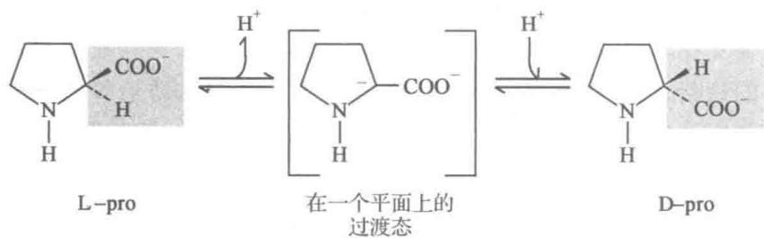

L-pro 在酶促下,首先失去一个质子形成由四面体的 $\alpha-$ 碳原子变成三角形的过渡态,在此形式中三个键于同一平面上, $C_{\alpha}$ 携带上一个负电荷,对称的碳阴离子在一侧重新质子化,可生成 D-pro。由于反应中形成过渡态中间物,降低反应活化能容易生成产物。反应物分子相互碰撞时,它们的动能减小,势能增加,被用于分子内部键的应变和拉伸。当反应物分子进入过渡态时,势能达到某一最高值,因此活化能也可表达为反应物基态和过渡态之间的势能差。

在过渡态理论中,形成活化复合物时除需要满足能量要求外,对分子的空间方位也有一定的要求。因此,这一理论比碰撞理论更符合实际。在这里碰撞理论中的活化能 $E_{a}$ 被一个更恰当的物理量活化自由能 $\Delta G^{\ominus\neq*}$ (见方程6-6)所代替。根据过渡态理论,平衡式可表示如下:

$$
\begin{array}{c c c} {\mathrm{A+B} \xrightarrow {K ^ {*}}} & {\mathrm{AB} ^ {*}} & {\xrightarrow {k} \mathrm{P+Q}} \\ {\text {反应物}} & {\text {活化复合物}} & {\text {产物}} \end{array}
$$

式中， $K^{\neq}$ 是过渡态平衡常数，k 是一级速率常数。A 和 B 的总反应速率 v 决定于活化复合物生成产物这一步骤，即 $v \propto [AB^{\neq}]$ 。反应物和活化复合物处于平衡状态，即：

$$
K ^ {\mathrm{气}} = \frac {[ \mathrm{AB} ^ {\mathrm{气}} ]}{[ \mathrm{A} ] [ \mathrm{B} ]} \quad \text {或} \quad [ \mathrm{AB} ^ {\mathrm{气}} ] = K ^ {\mathrm{气}} [ \mathrm{A} ] [ \mathrm{B} ]\tag{6-3}
$$

活化复合物的势能比反应物和生成物的势能都要高些，因此 $K^{\text{常}}$ 是一个不稳定的平衡常数。当活化复合物分解成为产物时，键断裂所需要的能量从该键的振动自由度转化为反应轴的平动自由度而来，过渡态的分解频率与该键的振动频率是一致的。因此反应总速率 $(v)$ 显然等于活化复合物的浓度和振动频率 $v (= RT/Nh, N$ 是Avogadro常数， $h$ 是planck常数)的乘积。

$$
v = \left[ \mathrm{AB} ^ {\text {   艺   }} \right] v = K ^ {\text {   艺   }} \left[ \mathrm{A} \right] \left[ \mathrm{B} \right] \frac {R T}{N h}\tag{6-4}
$$

根据质量作用定律得反应总速率, $v=k[A][B]$ ，则： $k[A][B]=K^{\text{气}}[A][B]\frac{RT}{Nh}$ ，所以一级速率常数：

$$
k = \frac {R T}{N h} K ^ {\text {气}}\tag{6-5}
$$

这就是过渡态理论得到的基本公式。如果以 $\Delta G^{\ominus}$ 、 $\Delta H^{\ominus}$ 和 $\Delta S^{\ominus}$ 分别表示反应物的基态和过渡态之间的标准自由能、标准焓和标准熵的差值（一般称为标准活化自由能，活化焓和活化熵）。因为 $-\Delta G^{\ominus}=RT/nK^{\ominus}$ ，式(6-5)化为：

$$
k = \frac {R T}{N h} \exp^ {(- \Delta G ^ {\ominus} \neq / R T)}\tag{6-6}
$$

这就是说在一定温度下，反应速率是自由活化能 $\Delta G^{\ominus \asymp}$ 决定。由式(6-6)可看出， $\Delta G^{\ominus \asymp}$ 减少很小便可使 $k$ 值增加很多。表6-1表示在 $25^{\circ}C$ 下一些典型的 $\Delta G^{\ominus \asymp}$ 值用公式(6-6)所算出的与反应速率常数间的关系。从表6-1可知， $\Delta G^{\ominus \asymp}$ 每减少 $20.9\mathrm{kJ}\cdot \mathrm{mol}^{-1}$ 便会使已知条件下的反应速率增加 $4.57\times 10^{3}$ 倍。如果一种酶能把 $\Delta G^{\ominus \asymp}$ 从 $104.6\mathrm{kJ}\cdot \mathrm{mol}^{-1}$ 减少到 $62.8\mathrm{kJ}\cdot \mathrm{mol}^{-1}$ 则实际上它将反应速率增加约2千万倍。

表 6-1 标准活化自由能 $\left( {\Delta {G}^{\ominus  * }}\right)$ 和速率常数的关系

<table><tr><td> $\Delta G^{\ominus} \approx / [kJ \cdot mol^{-1}(kcal \cdot mol^{-1})]$ </td><td> $k/(mol^{-1} \cdot L \cdot s^{-1})$ </td><td> $\Delta G^{\ominus} \approx / [kJ \cdot mol^{-1}(kcal \cdot mol^{-1})]$ </td><td> $k/(mol^{-1} \cdot L \cdot s^{-1})$ </td></tr><tr><td>104.6(25)</td><td> $3.16 \times 10^{-6}$ </td><td>41.8(10)</td><td> $2.91 \times 10^{5}$ </td></tr><tr><td>83.7(20)</td><td> $1.38 \times 10^{-2}$ </td><td>20.9(5)</td><td> $1.33 \times 10^{9}$ </td></tr><tr><td>62.8(15)</td><td>63.7</td><td></td><td></td></tr></table>

但是，

$$
- \Delta G ^ {\ominus} = T \Delta S ^ {\ominus} - \Delta H ^ {\ominus}\tag{6-7}
$$

代入式(6-6)即得：

$$
k = \frac {R T}{N h} \exp^ {(\Delta S ^ {\ominus \text {等}} / R)} \cdot \exp^ {(- \Delta H ^ {\ominus \text {等}} / R T)}\tag{6-8}
$$

式中 $\Delta H^{\ominus}$ 可用 $E_{a}$ 代替，而不致造成很大误差。

$$
k = \frac {R T}{N h} \exp^ {(\Delta S ^ {\ominus k _ {e}} / R)} \cdot \exp^ {(- E _ {a} / R T)}\tag{6-9}
$$

把式(6-9)与Arrhenius公式比较, $\frac{RT}{Nh}\exp^{(\Delta S^{\ominus\neq/R})}$ 相当于Z或A,说明Z或A由标准活化熵决定。当两个分子碰撞结合成活化复合物时,它们必须将失去一些平动和转动自由度, $\Delta S^{\ominus\neq}$ 变为负值,因为分子里有序程度增加了。如果反应物分子是简单的, $\Delta S^{\ominus\neq}$ 的变化是小的,可从统计力学证明碰撞理论里的Z和过渡态理论的A是相同的。如果反应物分子有复杂的构造, $\Delta S^{\ominus\neq}$ 的负值是相当的大,A的数值就会大大地降低,远小于碰撞理论计算的Z值,这就是Z值需要修正为ZP的原因。

## （三）酶通过降低活化自由能提高反应速率

在一般情况下化学反应的进程决定于两种因素:体系自由能的改变和转化速度。第一种是热力学因素,第二种是动力学因素。对于实际上不可逆的反应,转化速度具有决定性的意义。因此,往往由于转化速度大而使反应按热力学上不太有利的方向进行。如果反应是可逆的并且进行得足够快,则这一反应的进程决定于热力学因素,因为平衡状态和达到平衡的速度无关,而只决定于正逆过程速率常数的比值。对于进行得缓慢的可逆反应,两种因素都起作用。有机反应只有在比较少的情况下才达到建立平衡的阶段,因此,复杂过程的结果决定于动力学因素的情况较之决定于热力学因素的情况为多。但在一般情况下两种因素都有明显的影响,这就给研究和解释化学反应过程造成很大的困难。

根据碰撞理论所得公式(6-1)可知,速率常数 k 与反应的温度和活化自由能有关,因此提高温度或降低活化自由能都可以显著地增加反应速率。对于活的生物来说只能或主要借助降低活化自由能来提高反应速率,这就是酶分子承担的催化功能。对于一个酶促反应(enzymatic reaction)来说,酶(E)与反应物通常称为底物(substrate,S)反应先形成酶底物的中间复合物(ES),然后转变成酶-过渡态复合物( $ES^{\text{※}}$ ),再转变成酶与产物中间复合物(EP),最后生成产物(P),释放出E。

$$
\mathrm{E} + \mathrm{S} \rightleftharpoons \mathrm{ES} \rightleftharpoons \mathrm{ES} ^ {\text {   责   }} (\text {   或   } \mathrm{EX} ^ {\text {   责   }}) \rightleftharpoons \mathrm{EP} \longrightarrow \mathrm{E} + \mathrm{P}
$$

图6-1是 $\mathrm{S}\rightarrow \mathrm{P}$ 化学反应过程中能量变化的图解，图中纵轴是自由能水平（ $G$ )，横轴是反应进程或反应坐标。图示出酶促反应和非催化反应所经的能量途径和活化能大小 $(\Delta G^{\ominus \circ})$ 的比较。反应 $(\mathrm{S}\rightarrow \mathrm{P})$ 的前向和逆向的起始点分别称为初态和终态，或统称为基态（ground state），一般是指热力学标准态 $(\ominus)$ 或生物化学标准态 $(^{\ominus}\prime)$ 的自由能水平。S和P之间的平衡反映它们的标准自由能差（ $\Delta G^{\ominus}$ 或 $\Delta G^{\ominus \prime}$ ）。在示出的例子中S的基态自由能高于P的基态自由能，即 $\mathrm{S}\rightarrow \mathrm{P}$ 反应的 $\Delta G^{\ominus} <   0$ ，平衡有利于P方。平衡位置和方向不

受任何催化剂的影响。

有利的平衡并不意味反应能够以可测的速率进行，因为在S和P之间，还有反应能障（energy barrier）需要克服。能障的阈值等于活化自由能 $\left(\Delta G^{\ominus\ddagger}\right)$ 。能障是一座“能山”，“山”的顶点或能峰是过渡态，它崩解成P或S的概率相等。过渡态不是一种稳定的分子形式，只存在飞逝的一瞬间（典型寿命为 $10^{-13}s$ ）。注意，不要把中间复合物和过渡态复合物等同起来，前者是相对稳定的分子形式（寿命为 $10^{-13}\sim10^{-3}s$ ），在能量-反应坐标图上前者处于能谷中。其实，反应能障的存在并不总是坏事，正是它保证了地球上生命的存在。否则，热力学上的自发反应即 $\Delta G<0$ 的反应将随时发生。这样世界上所有的有机物质包括生物大分子、细胞和生物都将被燃烧（氧化）成 $CO_{2}$ 和 $H_{2}O$ 等。

  
图 6-1 酶促反应和非催化反应中活化自由能的变化图中 $\Delta G_{b}^{\ominus}$ 为标准结合自由能变化， $\Delta G_{E}^{\ominus\infty}$ 和 $\Delta G_{U}^{\ominus\infty}$ 分别为酶促反应和非催化反应的标准活化自由能

从图6-1可以看出，酶促反应标准活化自由能 $(\Delta G_{\mathrm{E}}^{\ominus \approx})$ 比非催化反应的标准活化自由能 $(\Delta G_{\mathrm{U}}^{\ominus \approx})$ 显著降低，因而使酶促反应速率加快。例如在没有催化剂存在下，过氧化氢分解所需活化能为 $75.4\mathrm{kJ}\cdot \mathrm{mol}^{-1}$ ，用无机物液态钯作催化剂时，所需活化能降低为 $48.9\mathrm{kJ}\cdot \mathrm{mol}^{-1}$ ，当用过氧化氢酶催化时，则活化能只需 $8.4\mathrm{kJ}\cdot \mathrm{mol}^{-1}$ 。再如，无催化剂时使蔗糖水解所需活化能为 $1339.8\mathrm{kJ}\cdot \mathrm{mol}^{-1}$ ，用 $\mathrm{H^{+}}$ 作催化剂时，活化能降低为 $104.7\mathrm{kJ}\cdot \mathrm{mol}^{-1}$ ，用蔗糖酶时只需要 $39.4\mathrm{kJ}\cdot \mathrm{mol}^{-1}$ 。由此可见酶作为催化剂比一般催化剂更显著地降低活化能，催化效率更高。

酶是怎样克服能障，降低活化能的？这是一个复杂的催化机制问题，看来关键在于形成酶-底物复合物（包括ES和 $\mathrm{EX}^{\text{等}}$ ）。根据方程(6-7)活化自由能（ $\Delta G^{\text{等}}$ ）是由活化熵（ $\Delta S^{\text{等}}$ ）和活化焓（ $\Delta H^{\text{等}}$ ）两项构成的。因此，酶降低反应的活化自由能也可从熵和焓两个方面来考虑。

熵因子方面:有两个效应值得注意,邻近效应和定向效应。邻近(proximity)是指双分子酶促反应中两个底物分子被束缚在酶分子的表面使之彼此接近;定向(orientation)是指两个底物的反应基团之间和底物反应基团与酶催化基团之间的正确定位取向。邻近和定向的效果相当于增加了局部底物浓度和有效碰撞概率。一般说,两个底物分子形成一个活化复合物时,需要经历平动自由度和转动自由度的丢失,造成熵的锐减, $\Delta S^{\text{※}}$ 是负值,于是方程6-7中 $-T\Delta S^{\text{※}}$ 项是正值,这意味着将有一个大的活化自由能( $\Delta G^{\text{※}}$ ),显然对反应是不利的。但在酶促反应中自由度的丢失是在进入过渡态( $EX^{\text{※}}$ )之前形成ES中间复合物时发生的,并由酶与底物非共价结合时释放的自由能,称为结合[自由]能(binding energy, $\Delta G_{b}$ ),补偿了自由度丢失引起的熵减,因此进入过渡态时的 $\Delta S^{\text{※}}$ (绝对值)减小,从而 $\Delta G^{\text{※}}$ 比非催化反应时降低。

焓因子方面:底物形变和诱导契合涉及活化焓 $\Delta H^{\sim}$ 的降低。对于大多数反应来说,底物进入过渡态时都会发生形变(distortion),反应键被拉长、扭曲,处于所谓电子应变或电子张力(electronic strain)状态。底物形变需要给反应系统提供能量( $\Delta H^{\sim}$ )。但在酶促反应中底物形变所需的能量也是由 E 和 S 之间形成弱相互作用时释放的结合自由能(内能)提供的,因而减少了进入过渡态( $EX^{\sim}$ )所需的 $\Delta H^{\sim}$ 。底物与酶结合的同时,通常酶分子也发生形变或构象变化,以“迎合”底物进入过渡态时的需要,即所谓诱导契合(见图 8-1)。诱导契合使酶分子上的催化基团进入适当位置,包括向底物提供广义酸碱催化和共价催化的基团,以削弱反应键,这也是减少 $\Delta H^{\sim}$ 的一种方式。

底物通过与酶结合的方式虽能有效地降低活化自由能 $\left(\Delta G_{\mathrm{E}}^{\infty}\right)$ ，但仍有一部分活化自由能需要从别处获得，才能进入或通过过渡态（图6-1）。鉴于底物已被固定在酶分子上，自身没有留下使其进入过渡态的平动能，因此只能从溶剂分子碰撞酶-底物复合物时的动能中获得这部分能量，这暗示酶分子在反应过程中还可能起能量捕获和传导的作用。

酶降低活化自由能的细节将在第8章酶作用机制中进一步讨论。

## （四）酶作为生物催化剂的特点

酶是细胞所产生的,受多种因素调节控制的具有催化能力的生物催化剂,与一般非生物催化剂相比较有以下几个特点:

## 1. 酶易失活

酶是由细胞产生的生物大分子,凡能使生物大分子变性的因素,如高温、强碱、强酸、重金属盐等都能使酶失去催化活性,因此酶所催化的反应往往都是在比较温和的常温、常压和接近中性酸碱条件下进行。例如:生物固氮在植物中是由固氮酶催化的,通常在27℃和中性pH下进行,每年可从空气中将1亿吨左右的氮固定下来。而在工业上合成氨,需要在500℃,几十个MPa下才能完成。

## 2. 酶具有很高的催化效率

生物体内的大多数反应,在没有酶的情况下,几乎是不能进行的。即使像 $CO_{2}$ 水合作用这样简单的反应也是通过体内碳酸酐酶催化的。

$$
\mathrm{CO} _ {2} + \mathrm{H} _ {2} \mathrm{O} \rightleftharpoons \mathrm{H} _ {2} \mathrm{CO} _ {3}
$$

每个酶分子在 1 s 内可以使 $6 \times 10^{5}$ 个 $CO_{2}$ 发生水合作用, 这样以保证使细胞组织中的 $CO_{2}$ 迅速进入血液, 然后再通过肺泡及时排出, 这个经酶催化的反应, 要比未经催化的反应快 $10^{7}$ 倍。再如刀豆脲酶催化尿素水解的反应:

$$
\mathrm{H} _ {2} \mathrm{N} - \stackrel {\mathrm{O}} {\mathrm{C}} - \mathrm{NH} _ {2} + 2 \mathrm{H} _ {2} \mathrm{O} + \mathrm{H} ^ {+} \longrightarrow 2 \mathrm{NH} _ {4} ^ {+} + \mathrm{HCO} _ {3} ^ {-}
$$

在 $20^{\circ}C$ 酶催化反应的速率常数是 $3 \times 10^{4} s^{-1}$ ，尿素非催化水解的速率常数为 $3 \times 10^{-10} s^{-1}$ ，因此，脲酶催化反应的速率比非催化反应速率大 $10^{14}$ 倍。据报道，如果在人的消化道中没有各种酶类参与催化作用，那么，在体温 $37^{\circ}C$ 的情况下，要消化一餐简单的午饭，大约需要 50 年。经过实验分析，动物吃下的肉食，在消化道内只要几小时就可完全消化分解。再如将唾液淀粉酶稀释 100 万倍后，仍具有催化能力。由此可见，酶的催化效率是极高的。酶催化反应速率对非催化反应速率的比率定为酶的催化力（catalytic power）。酶催化反应的反应速率比非催化反应高 $10^{8} \sim 10^{20}$ 倍，比非生物催化剂高 $10^{7} \sim 10^{13}$ 倍。但应指出，酶催化的反应与非酶催化的反应历程不同，只能估计出一个下限。表 6-2 列出一些酶催化反应与它们非催化反应速率的比较。

表 6-2 酶催化反应与非催化反应速率的比较

<table><tr><td>酶</td><td>非催化反应速率 $k_{\text{un}}/(s^{-1})$ </td><td>酶催化反应速率 $k_{\text{cat}}/(s^{-1})$ </td><td>酶的催化力 $k_{\text{cat}}/k_{\text{un}}$ </td></tr><tr><td>1,6-二磷酸果糖磷酸酶(fructose-1,6-bisphosphatase)</td><td> $2\times 10^{-20}$ </td><td>21</td><td> $1.05\times 10^{21}$ </td></tr><tr><td>β-淀粉酶(β-amylase)</td><td> $1.9\times 10^{-15}$ </td><td> $1.4\times 10^{3}$ </td><td> $7.4\times 10^{17}$ </td></tr><tr><td>碱性磷酸酶(alkaline phosphatase)</td><td> $1.0\times 10^{-15}$ </td><td>14</td><td> $1.4\times 10^{16}$ </td></tr><tr><td>脲酶(urease)</td><td> $3\times 10^{-10}$ </td><td> $3\times 10^{4}$ </td><td> $1.0\times 10^{14}$ </td></tr><tr><td>胰凝乳蛋白酶(chymotrypsin)</td><td> $1.0\times 10^{-10}$ </td><td> $1\times 10^{2}$ </td><td> $1.0\times 10^{12}$ </td></tr><tr><td>糖原磷酸化酶(glycogen phosphorylase)</td><td> $<5\times 10^{-15}$ </td><td> $1.6\times 10^{-3}$ </td><td> $>3.2\times 10^{11}$ </td></tr><tr><td>己糖激酶(hexokinase)</td><td> $<1.0\times 10^{-13}$ </td><td> $1.3\times 10^{-3}$ </td><td> $>1.3\times 10^{10}$ </td></tr><tr><td>磷酸丙糖异构酶(triose phosphate isomerase)</td><td> $4.3\times 10^{-6}$ </td><td> $4.3\times 10^{3}$ </td><td> $1.0\times 10^{9}$ </td></tr><tr><td>醇脱氢酶(alcohol dehydrogenase)</td><td> $<6\times 10^{-12}$ </td><td> $2.7\times 10^{-3}$ </td><td> $>4.5\times 10^{8}$ </td></tr><tr><td>碳酸酐酶(carbonic anhydrase)</td><td> $1.0\times 10^{-2}$ </td><td> $1.0\times 10^{5}$ </td><td> $1.0\times 10^{7}$ </td></tr><tr><td>分枝酸变位酶(chorismate mutase)</td><td> $2.6\times 10^{-5}$ </td><td>50</td><td> $1.9\times 10^{6}$ </td></tr><tr><td>肌酸激酶(creatine kinase)</td><td> $<3\times 10^{-9}$ </td><td> $4\times 10^{-5}$ </td><td> $>1.33\times 10^{4}$ </td></tr></table>

## 3. 酶具有高度专一性

所谓高度专一性(specificity)是指酶对作用的反应物和催化的反应有严格的选择性。这种选择性是通过酶与反应物之间相互作用或是通过基于结构互补的分子识别实现的。酶往往只能催化一种或一类反应，作用于一种或一类物质。而一般催化剂没有这样严格的选择性。氢离子可以催化淀粉、脂肪和蛋白质的水解，而淀粉酶只能催化淀粉糖苷键的水解，蛋白酶只能催化蛋白质肽键的水解，脂肪酶只能催化脂肪酯键的水解，而对其他类物质则没有催化作用。酶作用的专一性，是酶最重要的特点之一，也是和一般催化剂最主要的区别。

## 4. 酶活性受到调节和控制

有机体的生命活动表现了它内部化学反应历程的有序性,这种有序性是受多方面因素调节控制的,一旦破坏了这种有序性,就会导致代谢紊乱,产生疾病,甚至死亡。酶活力受到调节和控制是区别于一般催化剂的重要特征。细胞内酶的调节和控制有多种方式,主要有:

（1）调节酶的浓度 酶浓度的调节主要有2种方式：一种是诱导或抑制酶的合成；一种是调节酶的降解。例如乳糖操纵子(lac operon)可以合成β-半乳糖苷酶、半乳糖苷通透酶和硫半乳糖苷转乙酰酶，它们可以受乳糖或诱导物异丙基硫代-β-D-半乳糖苷(IPTG)的诱导而促进合成。乳糖或IPTG可以与原来存在于该系统的阻遏物结合，使阻遏物和DNA的结合能力降低约1000倍，解除抑制，使3种酶的合成加快，酶浓度提高。大肠杆菌有一种所谓的葡萄糖效应，就是当有葡萄糖存在下，不利用乳糖，表明葡萄糖抑制了上述3个酶的合成。

（2）通过激素调节酶活性 激素通过与细胞膜或细胞内受体相结合而引起一系列生物学效应，以此来调节酶活性（见第14章）。有些酶的专一性是由激素调控的，乳腺组织合成乳糖是一个明显的例子。哺乳动物乳腺组织中合成乳糖是由乳糖合成酶催化的，该酶由两个亚基即催化亚基和调节亚基组成。催化亚基单独存在时不能催化合成乳糖，但能催化半乳糖以共价键的方式连接到蛋白质上形成糖蛋白。调节亚基实际上就是乳汁中的 $\alpha-$ 乳清蛋白，其本身无催化活性，但当与催化亚基结合后，就可以改变催化亚基的专一性，催化半乳糖和葡萄糖反应生成乳糖：

$$
\mathrm{UDP} - \text { 半乳糖 } + \mathrm{D} - \text { 葡萄糖 } \rightleftharpoons \mathrm{UDP} + \text { 乳糖 }
$$

调节亚基合成是受激素控制的。在怀孕期间，催化亚基和调节亚基在乳腺中合成，但调节亚基合成的很少，当分娩后，由于激素急剧增加，调节亚基大量合成，并和催化亚基结合成乳糖合成酶，大量合成乳糖以适应生理的需要。

（3）反馈抑制调节酶活性 许多小分子物质的合成是由一连串的反应组成的，催化此物质生成的第一步的酶，往往被它们终端产物抑制。这种抑制叫反馈抑制(feedback inhibition)(图6-2)，例如由苏氨酸生物合成为异亮氨酸，要经过5步，反应第1步由苏氨酸脱氨酶(threonine deaminase)催化，当终产物异亮氨酸浓度达到足够水平时，该酶就被抑制，异亮氨酸结合到酶的一个调节部位上，通过可逆的别构作用对酶产生抑制。当异亮氨酸的浓度下降到一定程度，苏氨酸脱氨酶又重新表现活性，从而又重新合成异亮氨酸。

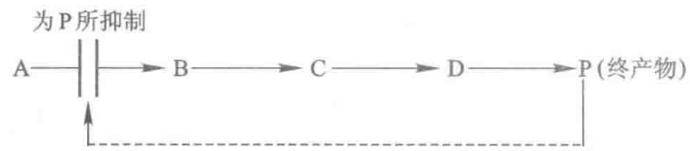  
图 6-2 通过终产物可逆的结合对途径中的第一个酶进行  
反馈抑制

（4）抑制剂和激活剂对酶活性的调节 酶受大分子抑制剂或小分子物质抑制，从而影响酶的活性。例如大分子物质胰蛋白酶抑制剂，可以抑制胰蛋白酶的活性。小分子的抑制剂如一些反应产物，像1,3-二磷酸甘油酸变位酶的活性受到它的产物2,3-二磷酸甘油酸的抑制，从而对这一反应进行调节。

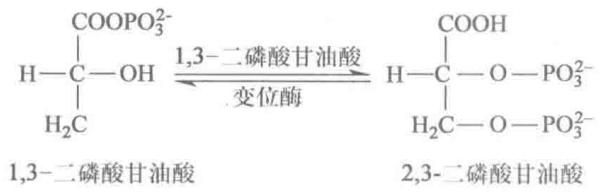

此外某些无机离子可对一些酶产生抑制,对另外一些酶产生激活,从而对酶活性起调节作用。酶活性也可受到大分子物质的调节,例如抗血友病因子(凝血因子Ⅷ)可增强丝氨酸蛋白酶的活性,因此它可明显地促进血液凝固过程。

（5）其他调节方式 通过别构调控、酶原的激活、酶的可逆共价修饰和同工酶来调节酶活性，这些形式的调节将在第8章进行讨论。

## 三、酶的化学本质及其组成

## （一）酶的化学本质

酶的化学本质除有催化活性的核酶(ribozyme)和脱氧核酶(deoxyribozyme)之外都是蛋白质。到目前为止,被人们分离纯化研究的酶已有数千种,经过物理和化学方法的分析证明了酶的化学本质是蛋白质。主要依据是:①酶经酸碱水解后的最终产物是氨基酸,酶能被蛋白酶水解而失活;②酶是具有空间结构的生物大分子,凡使蛋白质变性的因素都可使酶变性失活;③酶是两性电解质,在不同pH下呈现不同的离子状态,在电场中向某一电极泳动,各自具有特定的等电点;④酶和蛋白质一样,具有不能通过半透膜等胶体性质;⑤酶也有蛋白质所具有的化学呈色反应。以上事实表明酶在本质上属于蛋白质。

但是,不能说所有的蛋白质都是酶,只是具有催化作用的蛋白质,才称为酶。

酶的催化活性依赖于它们天然蛋白质构象的完整性,假若一种酶被变性或解离成亚基就会失活。因此,蛋白质酶的空间结构对它们的催化活性是必需的。

## （二）酶的化学组成

酶作为一类具有催化功能的蛋白质,与其他蛋白质一样,相对分子质量很大,一般从一万到几十万甚至百万以上,见表6-3。

表 6-3 一些酶的相对分子质量

<table><tr><td>名称</td><td>相对分子质量/ $\times 10^{3}$ </td><td>氨基酸残基数</td><td>肽链数</td></tr><tr><td>RNA酶A(牛胰)</td><td>13.7</td><td>124</td><td>1</td></tr><tr><td>溶菌酶(鸡蛋清)</td><td>13.93</td><td>129</td><td>1</td></tr><tr><td>胰凝乳蛋白酶(牛胰)</td><td>21.6</td><td>291</td><td>3</td></tr><tr><td>己糖激酶(酵母)</td><td>102.0</td><td>800</td><td>2</td></tr><tr><td>RNA聚合酶(E.coli)</td><td>450.0</td><td>4100</td><td>5</td></tr><tr><td>谷氨酸脱氢酶(牛心)</td><td>1000.0</td><td>8300</td><td>40</td></tr></table>

从化学组成来看酶可分为单纯蛋白质（simple protein）和缀合蛋白质（conjugated protein）两类。属于单纯蛋白质的酶类，除了蛋白质外，不含其他物质，如脲酶、蛋白酶、淀粉酶、脂肪酶和核糖核酸酶等。属于缀合蛋白质的酶类，除了蛋白质外，还要结合一些对热稳定的非蛋白质小分子物质或金属离子，前者称为脱辅酶（apoenzyme 或 apoprotein），后者称为辅因子（cofactor），脱辅酶与辅因子结合后所形成的复合物称为“全酶”（holoenzyme），即全酶=脱辅酶+辅因子。在酶催化时，一定要有脱辅酶和辅因子同时存在才起作用,二者各自单独存在时,均无催化作用。酶的辅因子,包括金属离子及有机化合物,根据它们与脱辅酶结合的松紧程度不同,可分为两类,即辅酶(coenzyme)和辅基(prosthetic group)。通常辅酶是指与脱辅酶结合比较松弛的小分子有机物质,通过透析方法可以除去,如辅酶I和辅酶II等。辅基是以共价键和脱辅酶结合,不能通过透析除去,需要经过一定的化学处理才能与蛋白分开,如细胞色素氧化酶中的铁卟啉,丙酮酸氧化酶中的黄素腺嘌呤二核苷酸(FAD),都属于辅基。所以辅酶和辅基的区别只在于它们与脱辅酶结合的牢固程度不同,并无严格的界线。每一种需要辅酶(辅基)的脱辅酶往往只能与一特定的辅酶(辅基)结合,即酶对辅酶(辅基)的要求有一定的选择性,当换另一种辅酶(辅基)就不具活力,如谷氨酸脱氢酶需要辅酶I,若换以辅酶II就失去活性。但生物体内辅酶(辅基)数目有限,而酶的种类繁多,故同一种辅酶(辅基)往往可以与多种不同的脱辅酶结合而表现出多种不同的催化作用,如3-磷酸甘油醛脱氢酶、乳酸脱氢酶都需要辅酶I,但各自催化不同的底物脱氢。这说明脱辅酶部分决定酶催化的专一性。辅酶(辅基)在酶催化中通常是起着电子、原子或某些化学基团的传递作用。一些可作为酶的辅因子的某些金属离子见表6-4,作为电子、原子和基团转移载体的辅酶和辅基见表6-5。从表6-5可以看出许多维生素就是辅酶(辅基)的前体。

表 6-4 作为酶辅因子的某些金属离子

<table><tr><td>金属离子</td><td>酶</td></tr><tr><td> $Zn^{2+}$ </td><td>碳酸酐酶(carbonic anhydrase)、醇脱氢酶(alcohol dehydrogenase)、羧肽酶(carboxypeptidase)A和B、DNA聚合酶(DNA-polymerase)</td></tr><tr><td> $Cu^{2+}$ </td><td>细胞色素氧化酶(cytochrome oxidase)、超氧化物歧化酶(superoxide dismutase)</td></tr><tr><td> $K^{+}$ </td><td>丙酮酸激酶(pyruvate kinase)、丙酰CoA羧化酶(propionyl CoA carboxylase)</td></tr><tr><td> $Mg^{2+}$ </td><td>己糖激酶(hexokinase)、丙酮酸激酶、6-磷酸葡糖磷酸酶(glucose-6-phosphatase)</td></tr><tr><td> $Mn^{2+}$ </td><td>精氨酸酶(arginase)、核糖核酸还原酶(RNA reductase)、超氧化物歧化酶</td></tr><tr><td> $Fe^{2+}$ 或 $Fe^{3+}$ </td><td>过氧化物酶(catalase)、过氧化氢酶(peroxidase)、细胞色素氧化酶(cytochrome oxidase)</td></tr><tr><td> $Ni^{2+}$ </td><td>脲酶(urease)</td></tr><tr><td> $Mo^{2+}$ </td><td>硝酸盐还原酶(nitrate reductase)、固氮酶(nitrogenase)</td></tr><tr><td>Se</td><td>谷胱甘肽过氧化物酶(glutathione peroxidase)</td></tr><tr><td> $Na^{+}$ </td><td>质膜ATP酶(plasmalemma adenosine triphosphatase)</td></tr></table>

表 6-5 作为电子、原子和基团转移载体的某些辅酶(辅基)

<table><tr><td>辅酶(辅基)</td><td>被转移基团</td><td>需要该辅酶(辅基)的酶</td></tr><tr><td>硫胺素焦磷酸(TPP)</td><td>醛类</td><td>丙酮酸脱氢酶(pyruvate dehydrogenase)</td></tr><tr><td>黄素腺嘌呤核苷酸(FMN、FAD)</td><td>氢原子、电子</td><td>单胺氧化酶(monoamine oxidase)</td></tr><tr><td>烟酰胺腺嘌呤二核苷酸( $NAD^+$ )</td><td></td><td>乳酸脱氢酶(lactate dehydrogenase)</td></tr><tr><td>烟酰胺腺嘌呤二核苷酸磷酸( $NADP^+$ )</td><td>氢负离子(: $H^-$ )、电子</td><td>6-磷酸葡糖脱氢酶(glucose-6-phosphate dehydrogenase)</td></tr><tr><td>辅酶A(CoA)</td><td>酰基</td><td>乙酰CoA羧化酶(acetyl CoA carboxylase)</td></tr><tr><td>磷酸吡哆醛(PLP)</td><td>氨基</td><td>天冬氨酸转氨酶(aspartate aminotransferase)</td></tr><tr><td>生物素(生物胞素)</td><td> $CO_2$ </td><td>丙酮酸羧化酶(pyruvate carboxylase)</td></tr><tr><td>5′-脱氧腺苷酸钴胺素( $CoB_{12}$ )</td><td>氢原子、烷基</td><td>甲基丙二酰-CoA变位酶(methylmalonyl-CoA mutase)</td></tr><tr><td>四氢叶酸(CoF)</td><td>一碳基团</td><td>胸苷酸合酶(thymidylate synthase)</td></tr><tr><td>硫辛酸</td><td>酰基</td><td>丙酮酸脱氢酶(pyruvate dehydrogenase)</td></tr></table>

## （三）单体酶、寡聚酶、多酶复合物

根据酶蛋白分子的特点,又可将酶分为以下3类:

(1) 单体酶 单体酶 (monomeric enzyme) 一般是由一条肽链组成, 例如, 牛胰核糖核酸酶、溶菌酶、羧肽酶 A 等,但有的单体酶是由多条肽链组成,如胰凝乳蛋白酶是由 3 条肽链组成,肽链间二硫键相连构成一个共价整体。单体酶种类较少,一般多是催化水解反应的酶,相对分子质量在 $(13 \sim 35) \times 10^{3}$ 之间。

（2）寡聚酶 寡聚酶(oligomeric enzyme)是由两个或两个以上亚基组成的酶,这些亚基可以是相同的,也可以是不相同的。绝大部分寡聚酶都含偶数亚基,但个别寡聚酶含奇数亚基,如荧光素酶、嘌呤核苷磷酸化酶均含3个亚基。亚基之间靠次级键结合,彼此容易分开。寡聚酶的相对分子质量一般大于 $35\times10^{3}$ 。大多数寡聚酶,其聚合形式是活性型,解聚形式是失活型。相当数量的寡聚酶是调节酶,在代谢调控中起重要作用。

表 6-6 列举了一些含相同亚基的寡聚酶, 表 6-7 列举了一些含不同亚基的寡聚酶。

表 6-6 含相同亚基的寡聚酶

<table><tr><td>酶</td><td>来源</td><td>亚基数</td><td>相对分子质量/ $\times 10^{3}$ </td></tr><tr><td>苹果酸脱氢酶(malate dehydrogenase)</td><td>鼠肝</td><td>2</td><td> $2 \times 37.5$ </td></tr><tr><td>碱性磷酸酶(alkaline phosphatase)</td><td>E. coli</td><td>2</td><td> $2 \times 40.0$ </td></tr><tr><td>肌酸激酶(creatine kinase)</td><td>鸡或兔肌</td><td>2</td><td> $2 \times 40.0$ </td></tr><tr><td>醛缩酶(aldolase)</td><td>酵母</td><td>2</td><td> $2 \times 40.0$ </td></tr><tr><td>己糖激酶(hexokinase)</td><td>酵母</td><td>4</td><td> $4 \times 27.5$ </td></tr><tr><td>醇脱氢酶(alcohol dehydrogenase)</td><td>酵母</td><td>4</td><td> $4 \times 37.0$ </td></tr><tr><td>丙酮酸激酶(pyruvate kinase)</td><td>兔肝</td><td>4</td><td> $4 \times 57.2$ </td></tr><tr><td>过氧化氢酶(catalase)</td><td>牛肝</td><td>4</td><td> $4 \times 57.5$ </td></tr></table>

表 6-7 含不同亚基的寡聚酶

<table><tr><td>酶</td><td>来源</td><td>亚基数及类型</td><td>相对分子质量/ $\times 10^{3}$ </td></tr><tr><td rowspan="2">1,6-二磷果糖磷酸酸酶(fructose-1,6-diphosphatase)</td><td rowspan="2">兔肝</td><td>2A</td><td> $2 \times 29.0$ </td></tr><tr><td>2B</td><td> $2 \times 37.0$ </td></tr><tr><td rowspan="2">琥珀酸脱氢酶(succinate dehydrogenase)</td><td rowspan="2">牛心</td><td> $\alpha$ </td><td>70.0</td></tr><tr><td> $\beta$ </td><td>27.0</td></tr><tr><td rowspan="2"> $Na^{+},K^{+}-ATP$ 酶(adenosine triphosphatase)</td><td rowspan="2">兔肾</td><td> $2\alpha$ </td><td> $2 \times 95.0$ </td></tr><tr><td> $2\beta$ </td><td> $2 \times 45.0$ </td></tr><tr><td rowspan="2">乳酸脱氢酶(lactate dehydrogenase)</td><td rowspan="2">牛心、肝</td><td>4H</td><td> $4 \times 35.0$ </td></tr><tr><td>4M</td><td> $4 \times 35.0$ </td></tr><tr><td rowspan="3">RNA聚合酶(RNA polymerase)</td><td rowspan="3">E.coli</td><td> $2\alpha$ </td><td> $2 \times 39.0$ </td></tr><tr><td> $\beta\beta'$ </td><td>155.0,165.0</td></tr><tr><td> $\sigma$ </td><td>95.0</td></tr><tr><td rowspan="2">组氨酸脱羧酶(histidine decarboxylase)</td><td rowspan="2">乳酸杆菌</td><td> $A_{5}$ </td><td> $5 \times 29.9$ </td></tr><tr><td> $B_{5}$ </td><td> $5 \times 9.0$ </td></tr><tr><td rowspan="2">天冬氨酸转氨甲酰酶(aspartate transcarbamoylase)</td><td rowspan="2">E.coli</td><td> $(C_{3})_{2}$ </td><td> $6 \times 34.0$ </td></tr><tr><td> $(R_{2})_{3}$ </td><td> $6 \times 17.0$ </td></tr><tr><td rowspan="2"> $\alpha$ -L-岩藻糖苷酶(fucosidase)</td><td rowspan="2">大鼠附睾</td><td> $2\alpha$ </td><td> $2 \times 60.0$ </td></tr><tr><td> $2\beta$ </td><td> $2 \times 47.0$ </td></tr></table>

（3）多酶复合物 多酶复合物(multienzyme complex)是由几种酶靠非共价键彼此嵌合而成。所有反应依次连接，有利于一系列反应的连续进行。这类多酶复合物相对分子质量很高，例如脂肪酸合成中的脂肪酸合酶(fatty acid synthase)复合物，是由7种酶和一个酰基携带蛋白构成，相对分子质量为 $2200 \times 10^{3}$ （见第24章）；E. coli丙酮酸脱氢酶复合物(E. coli pyruvate dehydrogenase complex)由60个亚基3种酶组成,相对分子质量约 $4600 \times 10^{3}$ , 在柠檬酸循环中催化丙酮酸的脱羧、脱氢, 最后生成 $CO_{2}$ 和乙酰 CoA 的反应(见第 18 章)。

## 四、酶的命名和分类

迄今为止已发现几千种蛋白质的酶，在生物体中的酶远远大于这个数量。随着生物化学、分子生物学等生命科学的发展，会发现更多的新酶。为了研究和使用的方便，需要对已知的酶加以分类，并给以科学名称。1961年前酶的分类和命名都很混乱，酶的名称往往是沿用下来的，缺乏系统性和科学性，有时会出现一酶数名或一名数酶的情况。1961年国际生物化学学会酶学委员会推荐了一套新的系统命名方案及分类方法，1972年、1978年和1984年又先后作了修改和补充，这一系统，现在已得到国际上普遍的认同。规定给每一种酶一个系统名称（systematic name）和一个习惯名称（俗名）。

由于核酶发现较晚,国际酶学委员会还未规定其分类方法及命名方案。

## （一）习惯命名法

1961年以前使用的酶的名称都是沿用习惯方法命名,称为习惯名。主要依据两个原则:

（1）根据酶作用的底物命名，如催化水解淀粉的酶叫淀粉酶，催化水解蛋白质的酶叫蛋白酶。有时还加上来源以区别不同来源的同一类酶，如胃蛋白酶，胰蛋白酶。

（2）根据酶催化反应的性质及类型命名，如水解酶、转移酶、氧化酶等。有的酶结合上述两个原则来命名，如琥珀酸脱氢酶是催化琥珀酸脱氢反应的酶。

习惯命名比较简单,应用历史较长,尽管缺乏系统性,但现在还被人们使用。

## （二）国际系统命名法

酶的国际系统命名,是根据1972年国际酶学委员会《酶命名法》中的规定——按酶催化的反应命名。规定每种酶的名称应当明确标明酶的底物及催化反应的性质。如果一种酶催化两个底物起反应,应在它们的系统名称中包括两种底物的名称,并以“:”号将它们隔开。若底物之一是水时,可将水略去不写(见表6-8)。酶(名)都用“ase”作为后缀。

表 6-8 酶国际系统命名法举例

<table><tr><td>习惯名称</td><td>系统名称</td><td>催化的反应</td></tr><tr><td>乙醇脱氢酶</td><td>乙醇: $NAD^{+}$ 氧化还原酶</td><td> $乙醇+NAD^{+} \longrightarrow$ 乙醛+NADH</td></tr><tr><td>谷丙转氨酶(丙氨酸转氨酶)</td><td>丙氨酸: $\alpha$ -酮戊二酸转氨酶</td><td>丙氨酸+ $\alpha$ -酮戊二酸—→谷氨酸+丙酮酸</td></tr><tr><td>脂肪酶</td><td>脂肪:水解酶</td><td>脂肪+ $H_{2}O \longrightarrow$ 脂肪酸+甘油</td></tr></table>

## （三）国际系统分类法及酶的编号

国际酶学委员会,根据各种酶所催化反应的类型,把酶分为6大类,即氧化还原酶类、转移酶类、水解酶类、裂合酶类、异构酶类和连接酶类。分别用1、2、3、4、5、6来表示。再根据底物中被作用的基团或键的特点将每一大类分为若干个亚类,每一个亚类又按顺序编成1、2、3、4……等数字。每一个亚类可再分为亚亚类,仍用1、2、3、4……编号。每一个酶的分类编号由4个数字组成,数字间由“·”隔开。第一个数字指明该酶属于6个大类中的哪一类;第二个数字指出该酶属于哪一个亚类;第三个数字指出该酶属于哪一个亚亚类;第四个数字则表明该酶在亚亚类中的排号。编号之前冠以EC(为Enzyme Commission的缩写)。例如:EC 1.1.1表示氧化还原酶,作用于CHOH基团,受体是NAD $^{+}$ 或NADP $^{+}$ ;1.1.2表示氧化还原酶,作用于CHOH基团,受体是细胞色素;1.1.3表示氧化还原酶,作用于CHOH基团,受体是分子氧;编号中第4个数字仅表示该酶在亚亚类中的位置。这种系统命名原则及系统编号是相当严格的,一种酶只可能有一个名称和一个编号。一切新发现的酶,都能按此系统得到适当的编号。从酶的编号可了解到该酶的类型和反应性质。表 6-9 列出了酶的分类, 指明了酶的编号、系统名称、习惯名称及所催化的反应。

表 6-9 酶的分类

<table><tr><td>编号</td><td>系统名称</td><td>习惯名称</td><td>反应</td></tr><tr><td>1</td><td>氧化还原酶类</td><td></td><td></td></tr><tr><td>1.1</td><td>作用于供体的CHOH基</td><td></td><td></td></tr><tr><td>1.1.1</td><td>以 $NAD^{+}$ 或 $NADP^{+}$ 为受体</td><td></td><td></td></tr><tr><td>1.1.1.1</td><td>醇: $NAD^{+}$ 氧化还原酶</td><td>醇脱氢酶</td><td>醇+ $NAD^{+} \rightleftharpoons$ 醛或酮+ $NADH$ </td></tr><tr><td>1.2</td><td>作用于供体的醛基或酮基</td><td></td><td></td></tr><tr><td>1.2.1</td><td>以 $NAD^{+}$ 或 $NADP^{+}$ 为受体</td><td></td><td></td></tr><tr><td>1.2.3</td><td>以 $O_{2}$ 为受体</td><td></td><td></td></tr><tr><td>1.2.3.2</td><td>黄嘌呤:氧氧化还原酶</td><td>黄嘌呤氧化酶</td><td>黄嘌呤+ $H_{2}O+O_{2} \rightleftharpoons$ 尿酸+ $H_{2}O_{2}$ </td></tr><tr><td>1.3</td><td>作用于供体的CH—CH基</td><td></td><td></td></tr><tr><td>1.3.1</td><td>以 $NAD^{+}$ 或 $NADP^{+}$ 为受体</td><td></td><td></td></tr><tr><td>1.3.1.1</td><td>4,5-二氢尿嘧啶: $NAD^{+}$ 氧化还原酶</td><td>二氢尿嘧啶脱氢酶</td><td>4,5-二氢尿嘧啶+ $NAD^{+} \rightleftharpoons$ 尿嘧啶+ $NADH$ </td></tr><tr><td>1.4</td><td>作用于供体的 $CH-NH_{2}$ 基</td><td></td><td></td></tr><tr><td>1.5</td><td>作用于供体的 $CH-NH-$ </td><td></td><td></td></tr><tr><td>1.6</td><td>作用于供体的NADH或NADPH</td><td></td><td></td></tr><tr><td>2</td><td>转移酶类</td><td></td><td></td></tr><tr><td>2.1</td><td>转移C1基团</td><td></td><td></td></tr><tr><td>2.1.1</td><td>甲基转移酶类</td><td></td><td></td></tr><tr><td>2.1.1.2</td><td>S-腺苷甲硫氨酸:胍乙酸-N-甲基转移酶</td><td>胍乙酸转甲基酶</td><td>S-腺苷甲硫氨酸+胍乙酸 $\rightleftharpoons$ S-腺苷高半胱氨酸+肌酸</td></tr><tr><td>2.2</td><td>转移醛基或酮基</td><td></td><td></td></tr><tr><td>2.3</td><td>酰基转移酶类</td><td></td><td></td></tr><tr><td>2.4</td><td>糖基转移酶类</td><td></td><td></td></tr><tr><td>2.6</td><td>转移含氮基团</td><td></td><td></td></tr><tr><td>2.6.1</td><td>氨基转移酶类</td><td></td><td></td></tr><tr><td>2.6.1.1</td><td>L-天冬氨酸:α-酮戊二酸转氨酶</td><td>天冬氨酸转氨酶</td><td>L-天冬氨酸+α-酮戊二酸 $\rightleftharpoons$ 草酰乙酸+L-谷氨酸</td></tr><tr><td>2.7</td><td>转移含磷基团</td><td></td><td></td></tr><tr><td>2.8</td><td>转移含硫基团</td><td></td><td></td></tr><tr><td>3</td><td>水解酶类</td><td></td><td></td></tr><tr><td>3.1</td><td>水解酯键</td><td></td><td></td></tr><tr><td>3.1.1</td><td>羧酸酯水解酶类</td><td></td><td></td></tr><tr><td>3.1.1.7</td><td>乙酰胆碱水解酶</td><td>乙酰胆碱酯酶</td><td>乙酰胆碱+ $H_{2}O \rightleftharpoons$ 胆碱+乙酸</td></tr><tr><td>3.2</td><td>水解糖苷键</td><td></td><td></td></tr><tr><td>3.3</td><td>水解肽键</td><td></td><td></td></tr><tr><td>3.4</td><td>水解肽键以外的C—N键</td><td></td><td></td></tr><tr><td>4</td><td>裂合酶类</td><td></td><td></td></tr><tr><td>4.1</td><td>C—C裂合酶类</td><td></td><td></td></tr><tr><td>4.1.1</td><td>羧基裂合酶</td><td></td><td></td></tr><tr><td>4.1.1.1</td><td>2-氧(代)酸羧基裂合酶</td><td>丙酮酸脱羧酶</td><td>2-氧(代)酸 $\rightleftharpoons$ 醛+ $CO_{2}$ </td></tr><tr><td>4.2</td><td>C—O裂合酶类</td><td></td><td></td></tr><tr><td>4.3</td><td>C—N裂合酶类</td><td></td><td></td></tr><tr><td>5</td><td>异构酶类</td><td></td><td></td></tr><tr><td>5.1</td><td>消旋酶类和差向异构酶类</td><td></td><td></td></tr><tr><td>5.1.3</td><td>作用于糖</td><td></td><td></td></tr><tr><td>5.1.3.1</td><td>D-核酮糖-5-磷酸-3-差向异构酶</td><td>磷酸核酮糖差向异构酶</td><td>D-核酮糖-5-磷酸 $\rightleftharpoons$ D-木酮糖-5-磷酸</td></tr><tr><td>5.2</td><td>顺-反异构酶类</td><td></td><td></td></tr><tr><td>5.3</td><td>分子内氧化还原酶类</td><td></td><td></td></tr><tr><td>5.4</td><td>分子内转移酶类</td><td></td><td></td></tr><tr><td>6</td><td>连接酶</td><td></td><td></td></tr><tr><td>6.1</td><td>形成C—O键</td><td></td><td></td></tr><tr><td>6.1.1</td><td>氨基酸-RNA连接酶类</td><td></td><td></td></tr><tr><td>6.1.1.1</td><td>L-酪氨酸:tRNA连接酶</td><td>酪氨酰-tRNA合成酶</td><td>ATP+L-酪氨酸+tRNA $\rightleftharpoons$ AMP+焦磷酸+L-酪氨酰-tRNA</td></tr><tr><td>6.2</td><td>形成C—S键</td><td></td><td></td></tr><tr><td>6.3</td><td>形成C—N键</td><td></td><td></td></tr><tr><td>6.4</td><td>形成C—C键</td><td></td><td></td></tr></table>

需要指出,酶的分类和命名仅基于酶所催化的反应,与酶的来源无关,各种不同物种来源的催化同一反应的同源酶(homologous enzyme),它们的氨基酸顺序、催化机理可能不同,这种结构上的不同无法用系统命名和分类法加以区别。

EC 规定在第一次出现所涉及的酶发表在论文或专著时,应该将酶的编号、系统名称和来源写出来,以免混乱。

## 五、酶的专一性

## （一）酶对底物的专一性

酶的专一性可分为两种类型：

## 1. 结构专一性

有些酶对底物的要求非常严格,只作用于一种底物,而不作用于任何其他物质,这种专一性称为“绝对专一性”(absolute specificity)。例如脲酶只能水解尿素,而对尿素的各种衍生物不起作用;DNA聚合酶I催化4种脱氧核苷三磷酸合成DNA,在合成DNA时要求有一条DNA链作为模板,新合成DNA链的排列顺序完全由模板DNA链的排列顺序决定,DNA聚合酶I在执行模板给出的指令时特别精确,在新DNA链中插入一个错误核苷酸的机会还不到百万分之一,DNA聚合酶I也可以说具有绝对专一性;此外,如麦芽糖酶只作用于麦芽糖,而不作用于其他双糖;碳酸酐酶只作用于碳酸等,均属于绝对专一性的例子。

有些酶对底物的要求比上述绝对专一性要低一些，可作用一类结构相近的底物，这种专一性称为“相对专一性”（relative specificity）。具有相对专一性的酶作用于底物时，对键两端的基团要求程度不同，对其中一个基团要求严格，对另一个则要求不严格，这种专一性称为“族专一性”或“基团专一性”。例如 $\alpha -\mathrm{D}$ -葡糖苷酶不但要求 $\alpha$ -糖苷键，并且要求 $\alpha$ -糖苷键的一端必须有葡萄糖残基，即 $\alpha$ -葡糖苷，而对键的另一端R基团则要求不严，因此它可催化各种 $\alpha -\mathrm{D}$ -葡糖苷衍生物 $\alpha$ -糖苷键的水解。

有些酶只要求作用于底物一定的键,而对键两端的基团并无严格要求,这种是另一种相对专一性,称为“键专一性”(bond specificity)或称“反应专一性”。例如酯酶催化酯键的水解,对底物 R—C $\begin{array}{c}O\\ \backslash \\ OR^{\prime}\end{array}$ 中的 R

及 R' 基团都没有严格的要求, 只是对于不同的酯类, 水解速率有所不同。

蛋白酶可以催化肽键的水解,不同蛋白水解酶对底物的专一性各不相同。如凝血酶是参与血液凝固过程的一个酶,专一性程度相当高,它对于被水解的肽键羧基一端和氨基一端都有严格要求,只水解羧基端L-精氨酸残基,氨基端为甘氨酸残基所构成的肽键(图6-3)。

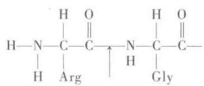  
图 6-3 凝血酶的专一性（箭头表示作用点）

在动物消化道中几种蛋白酶专一性各不相同。如胰蛋白酶只专一地水解赖氨酸或精氨酸羧基形成的肽键，胰凝乳蛋白酶专一地水解由芳香氨基

酸或带有较大非极性侧链氨基酸羧基形成的肽键，弹性蛋白酶专一地水解丙氨酸、甘氨酸及短脂肪链氨基酸羧基形成的肽键，胃蛋白酶水解芳香族或其他疏水氨基酸的羧基或氨基形成的肽键。氨肽酶水解氨基端氨基酸残基，羧肽酶水解羧基端氨基酸残基。当食物中的蛋白质进入动物消化道后，经过上述酶的联合作用，最终水解为氨基酸。图6-4表示消化道中几种蛋白酶的专一性。

  
图 6-4 消化道中几种蛋白酶的专一性  
$R_{1}, R_{2}$ : 芳香氨基酸及其他疏水氨基酸; $R_{3}$ : 丙氨酸、甘氨酸、丝氨酸等短脂肪链氨基酸; $R_{4}$ : 赖氨酸和精氨酸

## 2. 立体异构专一性

当底物具有立体异构体时，酶只能作用其中的一种，这种专一性称为立体异构专一性（stereospecificity）。酶的立体异构专一性是相当普遍的现象。

（1）旋光异构专一性(optical isomerism specificity) 例如 L-氨基酸氧化酶只能催化 L-氨基酸氧化，而对 D-氨基酸无作用：

$$
\mathrm{L} - \text { 氨基酸 } + \mathrm{H} _ {2} \mathrm{O} + \mathrm{O} _ {2} \xrightarrow {\mathrm{L} - \text { 氨基酸氧化酶 }} \alpha - \text { 酮酸 } + \mathrm{NH} _ {3} + \mathrm{H} _ {2} \mathrm{O} _ {2}
$$

又如胰蛋白酶只作用于 L-氨基酸残基构成的肽键或其衍生物, 而不作用于 D-氨基酸残基构成的肽键或其衍生物。 $\beta$ -葡糖氧化酶仅能将 $\beta$ -D-葡萄糖转变成葡糖酸, 而对 $\alpha$ -D-葡萄糖不起作用。上述例子, 均称为旋光异构专一性。

（2）几何异构专一性 当底物具有几何异构体时，酶只能作用于其中的一种。例如，琥珀酸脱氢酶只能催化琥珀酸脱氢生成延胡索酸，而不能生成顺丁烯二酸，称为几何异构专一性。

$$
\begin{array}{c c} \mathrm{CH} _ {2} \mathrm{COOH} & \text {HOOC-CH} \\ | & \| \\ \mathrm{CH} _ {2} \mathrm{COOH} & \xlongequal {\text {琥珀酸脱氢酶}} \quad \mathrm{CH-COOH} \\ \text {琥珀酸} & \text {延胡索酸} \end{array}
$$

酶的立体异构专一性还表现在能区分从有机化学观点来看属于对称分子中的两个等同的基团，只催化其中的一个，而不催化另一个。例如，一端由 $^{14}$ C标记的甘油，在甘油激酶的催化下可以与ATP作用，仅产生一种标记产物，甘油-1-磷酸。甘油分子中的两个—CH $_{2}$ OH基团从有机化学观点来看完全相同，但是酶却能加以区分。另外，用氚标记的方法发现在脱氢酶催化下，底物和NAD $^{+}$ 之间发生氢的转移也有着严格的立体异构专一性，表现在对尼克酰胺环中C4上的氢有选择性。如酵母醇脱氢酶在催化时，辅酶的尼克酰胺环C4上只有一侧可以加氢或脱氢，另一侧则不被作用：

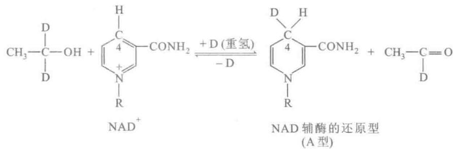

酵母醇脱氢酶的这种专一性被定为 A 型, 凡具有与酵母醇脱氢酶同侧专一性的酶称为 A 型专一性的酶——A 型脱氢酶, 如苹果酸脱氢酶及异柠檬酸脱氢酶等都属于此类型。凡是与酵母醇脱氢酶不同, 处于异侧, 具有另一侧专一性的称为 B 型专一性的酶——B 型脱氢酶, 如谷氨酸脱氢酶, $\alpha-$ 甘油磷酸脱氢酶等。

酶的立体专一性在实践中很有意义,例如某些药物只有某一种构型才有生理效用,而有机合成的药物只能是消旋的产物,若用酶可进行不对称合成或不对称拆分。

## （二）关于酶作用专一性的假说

为了解释酶作用的专一性,曾提出过不同的假说,早在1894年E.Fisher提出“锁钥学说”(lock and

key theory), 即酶与底物为锁与钥匙的关系, 以此说明酶与底物结构上的互补性(图6-5)。该学说的局限性不能解释酶的逆反应, 如果酶的活性中心是“锁钥学说”中的锁, 那么, 这种结构不可能既适合于可逆反应的底物, 又适合于可逆反应的产物。针对刚性模型, 1958年D. Koshland提出“诱导契合”假说(induced-fit hypothesis), 他认为酶分子是高柔性的动态构象分子, 当酶分子与底物分子接近时, 酶蛋白受底物分子诱导, 其构象发生有利于底物结合的变化, 酶与底物在此基础上互补契合进行反应。近年来X射线晶体结构分析的实验结果支持这一假说, 证明了酶与底物结合时, 确有显著的构象变化。因

  
图 6-5 酶与底物的相互关系——酶与底物的“锁钥学说”示意图

此人们认为这一假说比较满意地说明了酶的专一性。图 6-6 表示了酶构象在专一性底物及非专一性底物存在时的变化。

图中黑线条表示带有催化基团①②及结合基团③的肽段，它与带斜线的“酶”共同组成酶分子，A图表示底物与酶分子活性部位的原有构象，B图表示专一性底物引入后，酶蛋白构象改变，诱导契合，使催化基团④⑤并列成有利于结合底物的状态，并形成酶-底物复合物。但是，如果引入了不正常的、非专一性的底物，情况就不同了，C图表示在底物上加入了一个庞大的基团，妨碍了酶的⑥⑦基团的并列，因此不利于酶与底物的结合，例如加入某些竞争性抑制剂等。D图则表示在正常底物上切除某些基团后，酶蛋白的带⑧基的肽链顶住了⑨基的肽链，也阻止了⑩⑪基的并列，因此不利于酶与底物结合，这样，酶也不能起催化作用。

近年来，通过对酶结构与功能的研究，确信酶与底物作用的专一性是由于酶与底物分子的结构互补，

  
图 6-6 专一性、非专一性底物存在时，酶的构象变化模型  
诱导契合是通过分子的相互识别而产生的。诱导契合说有力支持了酶催化过程中过渡态的形成。

## 六、酶的活力测定和分离纯化

## （一）酶活力的测定

酶活力(enzyme activity)也称为酶活性,酶的活力测定实际上就是酶的定量测定。在研究酶的性质、酶的分离纯化及酶的应用工作中都需要测定酶的活力。检查酶的含量及存在,不能直接用重量或体积来衡量,通常是用催化某一化学反应的能力来表示,即用酶活力大小来表示。

## 1. 酶活力

酶活力是指酶催化某一化学反应的能力,酶活力的大小可以用在一定条件下所催化的某一化学反应的反应速率(reaction velocity; reaction rate)来表示,两者呈线性关系。酶催化的反应速率愈大,酶的活力愈高;反应速率愈小,酶的活力就愈低。所以测定酶的活力就是测定酶促反应的速率。酶催化的反应速率可用单位时间内底物的减少量或产物的增加量来表示。在酶活力测定实验中底物往往是过量的,因此底物

的减少量只占总量的极小部分,测定时不易准确,而相反产物从无到有,只要测定方法足够灵敏,就可以准确测定。由于在酶促反应中,底物减少与产物增加的速率相等,因此在实际酶活测定中一般以测定产物的增加量为准。

产物生成量(或底物减少量)对反应时间作图,如图6-7所示。曲线的斜率表示单位时间内产物生成量的变化,所以曲线上任何一点的斜率就是该相应时间的反应速率。从图中的曲线可看出在反应开始的一段时间内斜率几乎不变,但随着时间的延长,曲线逐渐变平坦,斜率发生改变,反应速率降低,显然这时测得的反应速率不能代表真实的酶活力。引起酶促反应速率随时间延长而降低的原因很多,如底物浓度的降低使酶被底物所饱和的程度降低;产物浓度增加加速了

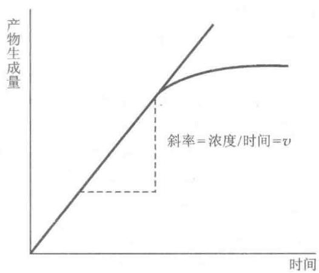  
图6-7 酶促反应的速率曲线

逆反应的进行；反应产物对酶的抑制或激活作用以及随着时间的延长引起酶本身部分分子失活等。因此测定酶活力，应测定酶促反应的初速率（initial rate, $v_{0}$ ）或初速度（initial velocity），从而避免上述种种复杂因素对反应速率的影响。反应初速率与酶量呈线性关系，因此可以用初速率来测定制剂中酶的含量。

酶的催化作用受测定环境的影响,因此测定酶活力要在最适条件下进行,即最适温度、最适 pH、最适底物浓度和最适缓冲液离子强度等,只有在最适条件下测定才能真实反映酶活力的大小。测定酶活力时,为了保证所测定的速率是初速率,通常以底物浓度的变化在起始浓度的 5% 以内的速率为初速率。底物浓度太低时,5% 以下的底物浓度变化实验上不易测准,所以在测定酶的活力时,往往使底物浓度足够大,至少比酶的米氏常数大 5 倍。这样整个酶反应对底物来说是零级反应,反应初速率与底物浓度无关。而对酶来说却是一级反应,反应初速率与酶浓度成正比。这样测得的速率就比较可靠地反映酶的含量。

## 2. 酶的活力单位(U, activity unit)

酶活力的大小即酶含量的多少,用酶活力单位表示,即酶单位(U)。酶单位的定义是:在一定条件下,一定时间内将一定量的底物转化为产物所需的酶量。这样酶的含量就可以用每克酶制剂或与每毫升酶制剂含有多少酶单位来表示(U/g 或 U/ml)。

为使各种酶活力单位标准化,1961年国际生物化学协会酶学委员会及国际纯化学和应用化学协会临床化学委员会提出采用统一的“国际单位”(IU)来表示酶活力,规定为:在最适反应条件(温度25℃)下,每分钟内催化1微摩尔(μmol)底物转化为产物所需的酶量定为一个酶活力单位,即 $1\ IU=1\ \mu mol\cdot min^{-1}$ 。但人们仍常用习惯沿用的单位。例如 $\alpha-$ 淀粉酶的活力单位规定为每小时催化1g可溶性淀粉液化所需要的酶量,也有用每小时催化1ml 2%的可溶性淀粉液所需要的酶量定为一个酶活力单位。不过习惯上沿用的单位表示方法不统一,同一种酶有几种不同的单位,不便于对同一种酶的活力进行比较。

1972 年国际酶学委员会又推荐一种新的酶活力国际单位, 即 Katal(简称 Kat) 单位。规定为: 在最适条件下, 每秒钟能催化 1 摩尔 (mol) 底物转化为产物所需的酶量, 定为 1 Kat 单位 (1 Kat = 1 mol · s $^{-1}$ )。Kat 单位与 IU 单位之间的换算关系如下:

$$
\begin{array}{r l} & 1 \mathrm{Kat} = 6 0 \times 1 0 ^ {6} \mathrm{IU} \\ & 1 \mathrm{IU} = \frac {1}{6 0} \mu \mathrm{Kat} = 1 6. 7 \mathrm{nKat} \end{array}
$$

## 3. 酶的比活力

酶的比活力(specific activity)代表酶的纯度,根据国际酶学委员会的规定比活力用每 mg 蛋白质所含的酶活力单位数表示,对同一种酶来说,比活力愈大,表示酶的纯度愈高。

$$
\mathrm{比活力} = \mathrm{活力U/mg蛋白} = \mathrm{总活力U/总蛋白mg}
$$

有时用每 g 酶制剂或每 ml 酶制剂含有多少个活力单位来表示(U/g 或 U/ml)。比活力大小可用来比较每单位质量蛋白质的催化能力。比活力是酶学研究及生产中经常使用的数据。

## 4. 酶活力的测定方法

通过两种方式可进行酶活力测定,其一是测定完成一定量反应所需的时间,其二是测定单位时间内酶催化的化学反应量。测定酶活力就是测定产物增加量或底物减少量,主要根据产物或底物的物理或化学特性来决定具体酶促反应的测定方法,现将最常用的方法介绍如下:

（1）分光光度法(spectrophotometry) 这一方法主要利用底物和产物在紫外或可见光部分的光吸收的不同,选择一适当的波长,测定反应过程中反应进行的情况。

这一方法的优点是简便、节省时间和样品，可检测到 $nmol \cdot L^{-1}$ 水平的变化。该方法可以连续地读出反应过程中光吸收的变化，已成为酶活力测定中一种最重要的方法。几乎所有的氧化还原酶都可用此法测定，如脱氢酶的辅酶 $\mathrm{NAD(P)H}$ 在 340 nm 有吸收高峰，而氧化型则无（图 6-8），因此对于这类酶的活力测定，可以测定 340 nm 处光吸收的变化。

由于分光光度法有其独特的优点,因此把一些原来没有光吸收变化的酶反应,可以通过与一些能引起光吸收变化的酶反应偶联,使第一个酶反应的产物转变成为第二个酶的具有光吸收变化的产物来进行测量。例如,己糖激酶(hexokinase,HK)催化ATP和葡萄糖的磷酰化反应,它的活力测定可以在含有过量6-磷酸葡糖脱氢酶(glucose-6-phosphate dehydrogenase,G-6-PDH)和NADP $^{+}$ 存在下进行,通过测定NADPH在340 nm光

  
图 6-8 NAD(P) $^{+}$ 和 NAD(P)H 的光吸收曲线

吸收值的增加来达到。

$$
\mathrm{葡萄糖} + \mathrm{ATP} \stackrel {\mathrm{HK}} {\rightleftharpoons} 6 - \mathrm{磷酸葡糖} + \mathrm{ADP}
$$

$$
6 - \text {   磷酸葡糖   } + \mathrm{NADP} ^ {+} \xrightarrow {\mathrm{G-6-PDH}} 6 - \text {   磷酸葡糖酸   } + \mathrm{NADPH} + \mathrm{H} ^ {+}
$$

上述方法称为酶偶联分析法(enzyme coupling assay)。

（2）荧光法(fluorometry) 主要是根据底物或产物的荧光性质的差别来进行测定。由于荧光方法的灵敏度往往比分光光度法要高若干个数量级，而且荧光强度和激发光的光源有关，因此在酶学研究中，越来越多地被采用，特别是一些快速反应的测定方法。荧光测定方法的一个缺点是易受其他物质干扰，有些物质如蛋白质能吸收和发射荧光，这种干扰在紫外区尤为显著，故用荧光法测定酶活力时，尽可能选择可见光范围的荧光进行测定。

（3）同位素测定方法 用放射性同位素的底物，经酶作用后所得到的产物，通过适当的分离，测定产物的脉冲数即可换算出酶的活力单位。该方法的优点是灵敏度极高，可达f mol或更高水平。已知六大类酶几乎都可以用此方法测定。通常用于底物标记的同位素有 $^{3}H$ 、 $^{14}C$ 、 $^{32}P$ 、 $^{35}S$ 和 $^{131}I$ 等。例如测定蛋白激酶的活力，可以通过蛋白激酶催化组蛋白的磷酰化反应，用 $[\gamma-^{32}P]$ -ATP作为底物，用三氯乙酸沉淀法把磷酰化的组蛋白和未反应的 $[\gamma-^{32}P]$ -ATP分开，然后经洗涤烘干，计数。通过放射性同位素计数的改变就能计算出蛋白激酶的活力。

## (4) 电化学方法(electrochemical method)

pH 测定法 最常用的是玻璃电极, 配合一高灵敏度的 pH 计, 跟踪反应过程中 $H^{+}$ 变化的情况, 用 pH 的变化来测定酶的反应速率。也可以用恒定 pH 测定法, 在酶反应过程中, 所引起的 $H^{+}$ 的变化, 用不断加入碱或酸来保持其 pH 恒定, 用加入的碱或酸的速率来表示反应速率。用此法可以测定许多酯酶的活力。

另外还使用离子选择电极法测定某些酶的酶活力,用氧电极可以测定一些耗氧的酶反应,如葡糖氧化酶的活力就可用这个方法很方便地测定。

此外还有一些测定酶活力的方法,例如旋光法、量气法、量热法和层析法等,但这些方法使用范围有限,灵敏度较差,只是应用于个别酶活力的测定。

## （二）酶的分离纯化

酶的分离纯化是酶学研究的基础。研究酶的性质、催化作用、反应动力学、结构与功能关系、阐明代谢途径和作为工具酶等都需要高度纯化的酶制剂以免除其他的酶或蛋白质的干扰。例如基因工程中所使用的各种工具酶都有高纯度的要求，内切酶中不能含有外切酶，反之一样，否则结果无法判断。再如，要区别一个酶催化两种不同的反应是酶本身的特点还是由于该酶制剂中污染了其他的酶杂质，可以用许多方法来进行判断，但是必须是在该酶制剂纯化后才能做出结论。由于使用酶制剂的目的不同，对酶制剂的纯度要求不一样，要根据不同的需要采用不同的方法纯化酶制剂。

已知绝大多数酶是蛋白质,因此酶的分离提纯方法,也就是常用来分离提纯蛋白质的方法。酶的提纯常包括两方面的工作,一是把酶制剂从很大体积浓缩到比较小的体积,二是把酶制剂中大量的杂质蛋白和其他大分子物质分离出去。为了判断分离提纯方法的优劣,一般用两个指标来衡量,一是总活力的回收;二是比活力提高的倍数。总活力的回收是表示提纯过程中酶的损失情况,比活力提高的倍数是表示提纯方法的有效程度。一个理想的分离提纯方法希望比活力和总活力的回收率越高越好,但是实际上常常两者不可兼得。因此考虑分离提纯条件和方法时,不得不在比活力多提高一些和总活力多回收一些之间作适当的选择。

生物细胞中产生的酶有两类,一类由细胞内产生然后分泌到细胞外进行作用的酶,称为胞外酶,这类酶大多都是水解酶类。另一类酶在细胞内合成后并不分泌到细胞外,而是在细胞内起催化作用的称为胞内酶,这类酶数量较多。一般而言,胞外酶比胞内酶更易于分离纯化。

分离纯化蛋白质的方法已在第5章详细介绍,这里不再赘述。根据酶的特点在分离纯化中应注意以下几点:

（1）选材 选择酶含量丰富的新鲜生物材料，一种酶含量丰富的器官或组织往往和含量较低的器官或组织相差上千倍或上万倍。目前常用微生物为材料制备各种酶制剂。

酶的提取工作应在获得材料后立即开始,否则应在低温下保存, $-70\sim-20^{\circ}C$ 为宜。或将生物组织做成丙酮粉保存。

（2）破碎 动物组织细胞较易破碎，通过一般的研磨器、匀浆器、高速组织捣碎机就可达到目的。微生物及植物细胞壁较厚，需要用超声波、细菌磨、冻融、渗透压法、酶消化法或用某些化学溶剂如甲苯、去氧胆酸钠、去垢剂等处理加以破碎，制成组织匀浆。

（3）抽提 在低温下，以水或低盐缓冲液，从组织匀浆中抽提酶，得到酶的粗提液。

（4）分离及纯化 酶是生物活性物质，在分离纯化时必须注意尽量减少酶活性损失，操作条件要温和，全部操作一般在0\~5℃间进行。

根据酶大多属于蛋白质这一特性,用一系列分离蛋白质的方法,如盐析、等电点沉淀、有机溶剂分级、选择性热变性等方法可从酶粗提液中初步分离酶。然后再采用吸附层析、离子交换层析、凝胶过滤、亲和层析、疏水层析及高效液相层析等技术或各种制备电泳技术进一步纯化酶,以得到纯的酶制品。为了得到比较理想的纯化结果,往往采用几种方法配合使用。这要根据不同酶的特点,通过实验选择合适的方法。

盐析法是根据酶和杂蛋白在不同盐浓度的溶液中溶解度的不同而达到分离目的,硫酸铵分级沉淀法可去除抽提液中75%的杂蛋白,并可大大浓缩酶液。盐析法简便安全,大多数酶在高浓度盐溶液中相当稳定,重复性好。

有机溶剂分级法分离酶时,最重要的是严格控制温度,要在-20\~-15℃下进行,冰冻离心得到的沉淀应立刻溶于适量的冷水或缓冲液中,以使有机溶剂稀释至无害的浓度,或将它在低温下透析。

选择性热变性方法是酶分离纯化工作中常用到的一类简便有效的方法,通过热变性可以除去很多核和颗粒性物质,因而常常能把一个混浊的抽提液变成完全澄清的溶液。只要控制好 pH 和保温时间,应用得当,就可较大地提高酶的纯度。

使用各种柱层析技术分级分离酶时,要根据所分离酶的性质选择合适的层析介质,柱大小要适当,特别要注意作为洗脱用缓冲液的 pH 和离子强度,要控制一定的流速。

制备电泳多采用凝胶电泳,要选择好电泳缓冲液,根据电泳设备条件选择一定的上样量,电泳后及时将样品透析,冰冻干燥保存。

重金属离子对于某些酶有破坏作用,为此制备这类酶时,在提取液中加入少量金属螯合剂乙二胺四乙酸(EDTA)或乙二醇双(2-氨基乙醚)四乙酸(EGTA)以防止重金属离子对酶的破坏作用。有些含巯基的酶在分离提纯过程中,往往需要加入某种巯基试剂,如巯基乙醇、二硫苏糖醇(1,4-dithiothreitol, DTT)等,可防止酶的巯基在制备过程中被氧化。有时为了防止内源蛋白酶对酶的水解作用,在提取液加入少量蛋白酶抑制剂,如对甲苯磺酰氟(PMSF)、亮抑蛋白酶肽(Leupeptin)、抑蛋白酶多肽(aprotinin)等。

在酶的制备过程中,每一步骤都应测定留用以及准备弃去部分中所含酶的总活力和比活力,以了解经过某一步骤后酶的回收率,纯化倍数,从而决定这一步的取舍。

$$
\mathrm{总活力} = \mathrm{活力单位数} / \mathrm{mL} \mathrm{酶液} \times \mathrm{总体积(mL)}
$$

$$
\mathrm{比活力} = \mathrm{活力单位数} / \mathrm{mg} \mathrm{蛋白(氮)} = \mathrm{总活力单位数} / \mathrm{总蛋白(氮)} \mathrm{mg}
$$

$$
\mathrm{纯化倍数} = \frac {\mathrm{每次比活力}}{\mathrm{第一次比活力}}
$$

$$
\mathrm{回收率(产率)} = \frac {\mathrm{每次总活力}}{\mathrm{第一次总活力}} \times 1 0 0
$$

（5）结晶 通过各种提纯方法获得较纯的酶溶液后，就可能将酶进行结晶。常用的方法有：盐析、有机溶剂、透析平衡、等电点等结晶方法。酶的结晶过程进行得很慢，如果要得到好的晶体也许需要数天或数星期。通常的方法是把盐加入一个比较浓的酶溶液中至微呈混浊为止。有时需要改变溶液的 pH 及温

度,轻轻摩擦玻璃壁等方法以便达到结晶的目的。

（6）保存 通常将纯化后的酶溶液经透析除盐后冰冻干燥得到酶粉，低温下可较长时期保存。或将酶溶液用饱和硫酸铵溶液反透析后在浓盐溶液中保存。也可将酶溶液制成25%甘油或50%甘油分别贮于-25℃或-50℃冰箱中保存。注意酶溶液浓度越低越易变性，因此切记不能保存酶的稀溶液。

## 七、非蛋白质生物催化剂——核酶

## （一）核酶的发现

自从 1926 年 J. Sumner 首次从刀豆中获得脲酶结晶并证明是蛋白质以来, 现已有数千种酶经研究证明是蛋白质。因此, 长期以来人们一直认为酶的化学本质就是蛋白质。1981 年美国 T. R. Cech 等人发现原生动物嗜热四膜虫 (Tetrahymena thermophila) 的核糖体 RNA(rRNA) 前体能通过自剪接 (self-splicing) 切去间插序列 (intervening sequence, IVS) 或称内含子 (intron), 表明 RNA 也具有催化功能, 称它们为核酶 (ribozyme)。1983 年 S. Altman 等人在研究细菌 RNase P 时发现, 该酶的 RNA 组分能单独完成前体 tRNA 加工。随后又发现了一些植物类病毒 (viroid)、拟病毒 (virusoid) 和卫星 RNA 在复制过程中也能自剪切 (self-cleavage) 和环化。生物体内一些重要 RNA-蛋白质颗粒如剪接体 (spliceosome) 和核糖体 (ribosome) 等也可认为是核酶复合体。

核酶的发现被认为是现代生物化学领域内最令人鼓舞的发现之一,不仅丰富和发展了酶的概念,并对于地球上生命起源的研究具有重要意义。为此 T. R. Cech 和 S. Altmans 共同获得了 1989 年度诺贝尔化学奖。

1994 年, R. R. Breaker 等人首先发现能够催化 RNA 磷酸二酯键水解的单链 DNA 分子, 随后又发现 DNA 还具有连接酶的活性, 称它们为脱氧核酶 (deoxyribozyme)。这样, 在蛋白质和 RNA 之后, DNA 也成酶家族的最新成员。

核酶(ribozyme)是作为生物催化剂的RNA分子,为核糖核酸酶(ribonucleic acid enzyme)的缩写;同样,脱氧核酶(deoxyribozyme)是作为生物催化剂的DNA分子,为脱氧核糖核酸酶(deoxyribonucleic acid enzyme)的缩写。核酸酶(nucleic acid enzyme)是核酶和脱氧核酶的总称,是具有催化功能的核酸分子。这样,酶的新概念应是指具有生物催化功能的蛋白质和核酸。

## （二）核酶的种类

根据分子大小可将核酶分成两类:大分子核酶和小分子核酶。大分子核酶包括Ⅰ型内含子(Ⅰ型 IVS)、Ⅱ型内含子和 RNase P 的 RNA 组分。它们都是由几百个核苷酸组成的结构复杂的大分子。Ⅰ型内含子分布广泛,现发现千种以上。Ⅱ型内含子也发现一百多种。小分子核酶常见的有 4 种类型:锤头状(hammerhead)核酶、发夹状(hairpin)核酶、肝炎 δ 病毒(HDV)核酶和 Vs 核酶。小分子核酶活性片段一般小于 100 个核苷酸,主要生物学功能是通过剪切和环化从滚环复制的中间物上产生单位长度的基因组,都能剪切 RNA 磷酸二酯键,产物具有 5′-OH 基和 2′,3′-环状磷酸二酯键,有些还可以催化连接反应。下面介绍几种常见的核酶。

## 1. L19RNA (L19IVS)

1985 年 T. R. Cech 等人通过对四膜虫 rRNA 前体自剪接机制的深入研究, 发现前体中的内含子具有催化功能, 这个由 395 nt 构成的线状 RNA 分子(称为

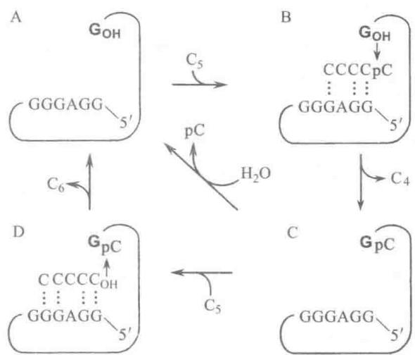  
图 6-9 L19RNA 的催化机制

A. 酶本身；B. $C_{5}$ 通过氢键与酶结合，剩下的 $C_{4}$ 部分可以自由地从酶上解离下来；C. GpC 水解使酶恢复原状 (C→A)；D. 或者是共价结合的 pC 与第二个 $C_{5}$ 分子连接形成 $C_{6}, C_{6}$ 释放后酶恢复原状 (C→D→A)

L19RNA或L19IVS)，相当于四膜虫rRNA前体内含子的 $3^{\prime}$ 部分（切除 $5^{\prime}$ 部分18个nt），这个RNA分子具有特征的三维结构，已测定了活性部位并进行了改造。在体外(in vitro)L19RNA能催化一系列分子间的反应，例如，在一定条件下L19RNA能高度特异地催化寡聚核糖核苷酸底物的切割和连接。五聚胞苷酸 $(C_5,$ pentacytidylate)能被L19RNA转化为或长或短的寡聚体，特别是能将 $\mathrm{C}_5$ 降解成 $\mathrm{C}_4$ 和 $\mathrm{C}_3$ ，而同时形成 $\mathrm{C}_6$ 和更长的寡聚体(图6-9)。因此说明L19RNA既有RNA酶活性，又有RNA聚合酶(RNA polymerase)活性。此核酶催化 $\mathrm{C}_5$ 水解的速率为非催化的水解速率的 $10^{10}$ 倍。

这种 L19RNA 对 $C_{5}$ 的作用比对 $U_{5}$ 快得多，而对 $A_{5}$ 和 $G_{5}$ 则毫无作用。它遵循 Michaelis-Meten 动力学。对于 $C_{5}$ ，其 $K_{m}$ 为 $42 \mu mol \cdot L^{-1}$ 和 $k_{cat}$ 为 $0.033 s^{-1}$ ， $k_{cat}/K_{m}$ 为 $7.9 \times 10^{2} mol^{-1} \cdot L \cdot s^{-1}$ 与 RNaseA 类似。已发现脱氧 $C_{5}$ 为 $C_{5}$ 的竞争性抑制剂， $K_{i}$ 为 $260 \mu mol \cdot L^{-1}$ ，证明底物中的 $2^{\prime}-OH$ 是必需的。这样 L19RNA 表现出了经典的酶促催化的几个标志：高度的底物专一性，Michaelis-Menten 动力学和对竞争性抑制剂的敏感性。

1992 年 J. A. Piccirilli 等人发现 L19RNA 具有氨酰酯酶 (aminoacyl esterase) 的活性, 催化氨酰酯的水解 (图 6-10), 这是氨酰-tRNA 合成酶的逆反应。另外, 发现 L19RNA 还有 RNA 限制性内切酶作用, 如:

$$
- \mathrm{CpUpCpUpN-+G} \longrightarrow - \mathrm{CpUpCpU+GpN}
$$

N-甲酰甲硫氨酰寡核苷酸  
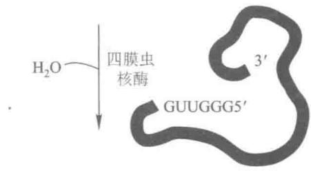

L19RNA 作用底物均是多聚嘧啶核苷酸,因此推测该 RNA 催化剂的活性部位是富含鸟苷酸的寡聚嘌呤核苷酸。催化剂和底物间通过碱基配对形成非共价键发生作用。已研究证明 L19RNA 分子的第 22\~27 位的 5'-GGAGGG-3' 是其催化中心。改造这一序列,可以得到人工 RNA 催化剂。如 3' 端无 G,丧失反应能力,加入 G 后则恢复正常。

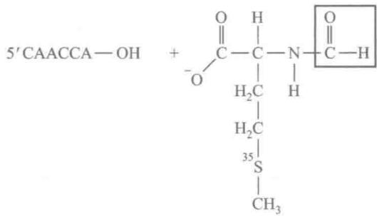  
N-甲酰甲硫氨酸

1997 年 B. Zhang 和 T. R. Cech 得到了一组直接催化肽链生成的人造 RNA 分子, 证明了 RNA 具有肽基转移酶活性。表明 RNA 与蛋白质生物合成有关。

## 2. RNase P 的 RNA 组分是核酶

RNase P 是催化 tRNA 前体 5' 端成熟的内切核酸酶，是由 RNA（称为 MIRNA，含 377 个 nt）和蛋白质（称为 $C_{5}$ 蛋白，含 119 个氨基酸残基）两部分组成，前者占全酶总重量的 77%，后者占 23%。1983—1984 年间 S. Altman图 6-10 四膜虫核酶的氨酰酯酶活性

$^{35}$ S-标记的 N-甲酰甲硫氨酸通过酯键与 RNA 寡核苷酸( $5^{\prime}-CAACCA$ ) $3^{\prime}-OH$ 末端连接。核酶能够催化羧酸酯及磷酸酯的水解。注意氨酰 RNA 酯水解的逆反应是氨酰 RNA 酯的合成(这是蛋白质合成中氨基酸提供给核糖体的化学形式)。该反应提示了,由原始的 RNAs 能够催化形成氨酰-tRNAs 类似物

和 N. Pace 研究发现, 用层析或电泳从 E. coli 的 RNase P 中分离出来的 MIRNA 组分, 在高浓度 $Mg^{2+}$ (20 mmol·L $^{-1}$ 以上) 存在下, 可显示出催化 tRNA 前体成熟的活性, MIRNA 催化 E. coli tRNA $^{tyr}$ 前体的 $K_{m}$ 值与 RNase P 的 $(5\times10^{-7}\ \mathrm{mol}\cdot\mathrm{L}^{-1})$ 相同, $k_{cat}$ 值为 $33\ min^{-1}$ , $k_{cat}/K_{m}$ 为 $1.1\times10^{6}\ mol^{-1}\cdotL\cdot s^{-1}$ 。而分离出的 $C_{5}$ 蛋白在任何条件下都无催化活性, 只起维护 RNA 构象的作用, 而真正的催化剂是 MIRNA。将 MIRNA 的基因进行体外转录, 其转录产物 RNA 具有催化 tRNA 前体 5' 端成熟的活性, 这一研究结果直接证明了 RNA 确有催化功能。但尚未测出真核生物 RNase P 的 RNA 具有催化活性。

另一个蛋白质-RNA复合物酶中RNA单独具有催化功能的例子是兔肌1,4-α-葡聚糖分支酶(1,4-α-dextran branching enzyme)，该酶中RNA共有31个核苷酸残基(31 nt)，其中含8种10个修饰成分，该RNA催化的底物是葡聚糖而非RNA，这是一个很奇特的核酶，有待深入研究。

## 3. 锤头状核酶

R. Symons 在比较研究了一些植物类病毒、拟病毒和卫星病毒自我剪切规律后，于 1986 年提出锤头结

构(hammer head structure)的二级结构模型,来解释RNA的自剪切机制。锤头结构是由13个保守核苷酸碱基和3个螺旋区构成(图6-11),是较小的核酶。所有锤头状核酶具有相似的二级结构和三级结构。典型的二级结构由两部分组成,一个是催化部分,另一个为底物部分。自我剪切活性依赖于结构和构象的完整性,只要满足锤头状的二级结构和13个核苷酸的保守序列,剪切反应就会在锤头结构右上方的GUN序列的3'端自动发生。1989年M. Koizumi等证明只要保证其中11个nt的保守序列不变,剪切反应就可发

  
图 6-11 核酶锤头结构

生。1992年报道小至10 nt以及3 nt的核酶即具有催化活性。例如：在 $Mn^{2+}$ 存在下，UUU可切割 $(5')G\downarrow$ AAA $(3')$ ，UUU便是3 nt的核酶。有人报道5-羟基胞苷能催化氧化还原反应，扩展了核酶的定义。

按已知自剪切原理,剪切是高度专一的,把自剪切转换成分子间剪切,利用锤头结构就可以设计出自然界不存在的各种核酶。利用锤头状结构核酶的 RNA 限制性内切酶活性,可以设计定点切割 tRNA、5S rRNA、28S RNA、mRNA、病毒 RNA 等任何一种靶 RNA 分子。

## 4. 脱氧核酶

脱氧核酶是指具有催化功能的 DNA 分子。脱氧核酶一般获得方法是体外选择。现已发现：① 以 RNA 和 DNA 为底物的具有酯酶活性的脱氧核酶；② 具有 N-糖基化酶活性的脱氧核酶；③ 具有连接酶活性、具有激酶活性和具有氧化酶活性的脱氧核酶。脱氧核酶作为生物催化剂的新成员，越来越受到人们的重视。

## （三）核酶的研究意义及应用前景

现有研究结果表明,核酶都是 RNA 分子,可被体内 RNase 所破坏,从而限制了核酶的直接使用。近年来,利用核酶进行基因治疗的研究已取得很大进展。根据锤头结构或发夹结构原理设计核酶基因,构建于特定的表达载体,在不同细胞内表达已经成功。结果表明核酶基因导入细胞或体内可以阻断基因表达,用作抗病毒感染,抗肿瘤的有效药物。如利用 I 型内含子可进行基因修复,治疗肌强直性营养不良缺陷等疾病;抗 HIV 核酶已进入 II 期临床试验;抗肝炎病毒的核酶在肝细胞培养中成功地抑制了病毒的复制;其他还有抗生殖道感染、抗白血病、抗免疫排斥反应等等。虽然目前还有诸多问题有待解决,但发展前景是诱人的,应用将是广泛的。

在研究了核酶催化氨酰酯的水解可逆反应和转移反应后指出,核酶很可能具有氨酰 tRNA 合成酶和肽基转移酶活性,这些反应均与蛋白质生物合成有关,表明 RNA 在翻译过程和核糖体功能中起着非常重要的作用,问题的突破将是对分子生物学的重要贡献。

也应指出，核酶与蛋白质酶的差异不仅在于化学本质的不同，同时两者的催化活性也相差很大。已知核酶的转换数在0.1\~5之间，比大多数蛋白质酶低几个数量级。从进化角度考虑，生物催化剂从核酶到蛋白质酶的转变，伴随着生物代谢高效率和生命现象的更趋复杂。

图 6-12 表示生物催化分子进化的可能过程, 它表示生物催化功能从 RNA 到蛋白质的转移。现在, 主要的生物催化剂是蛋白质-辅酶(辅基)。

$$
\mathrm{RNA} \rightarrow \mathrm{RNA} - \text {蛋白质} \rightarrow \text {蛋白质} - \mathrm{RNA} \rightarrow \text {蛋白质} - \text {辅酶(辅基)} \rightarrow \text {蛋白质}
$$

$$
\text { 图 } 6 - 1 2 \quad \text { 生物催化分子进化的可能过程 }
$$

具有催化功能 RNA 的重大发现,表明 RNA 是一种既能携带遗传信息又有生物催化功能的生物分子。因此很可能 RNA 早于蛋白质和 DNA,是生命起源中首先出现的生物大分子,而一些有酶活性的内含子可能是生物进化过程中残存的分子“化石”。酶活性 RNA 的发现,提出了生物大分子和生命起源的新概念,无疑将促进对生物进化和生命起源的研究。

## 八、抗体酶

抗体酶(abzyme)是20世纪80年代后期才发现的一种具有催化能力的蛋白质,其本质上是免疫球蛋白,但是在易变区被赋予了酶的属性,所以又称为“催化性抗体”(catalytic antibody),它既具有抗体的高度选择性,又具有酶的高度催化效率。抗体酶是生物学与化学的研究成果在分子水平上交叉渗透的产物,是将抗体的多样性和酶分子的巨大催化能力结合在一起的蛋白质分子设计的新方法。人们早就注意到,酶与抗体这两种蛋白质之间尽管功能不同,但存在着惊人的相似之处,尤其是它们在与各自的配基特异的结合过程中,遵守同样的方式并表现出相似的动力学行为。人们不禁要问:抗体分子极其多样的结合专一性能被用来产生新的酶吗?催化作用的实质是专一结合的相互作用形成过渡态,因此,用过渡态的类似物作为半抗原(hapten)免疫动物将有可能产生有催化活性的抗体。这一设想已得到证实。

1986年P.Schultz与R.Lerner两个实验室同时报道了他们成功地得到了具有酶催化活性的抗体。这标志着抗体酶的研究进入了一个新阶段。P.Schultz等人认为对硝基苯酚磷酸胆碱酯（PNPPC）作为相应羧酸二酯水解反应的过渡态类似物（图6-13），推测用这个类似物作为半抗原诱导产生的单克隆抗体可能对羧酸二酯的水解反应有催化活性。通过对单克隆抗体的筛选，找到一株MOPC167单抗，可使水解反应速率加快 $1.2\times 10^{4}$ 倍， $K_{\mathrm{m}}$ 值为 $208~\mu \mathrm{mol}\cdot \mathrm{L}^{-1},k_{\mathrm{cat}}$ 值为 $6.7\times 10^{-1}\mathrm{s}^{-1}$ ，其 $k_{\mathrm{cat}} / K_{\mathrm{m}}$ 是 $3.2\times 10^{3}\mathrm{mol}^{-1}\cdot \mathrm{L}\cdot \mathrm{s}^{-1}$ 。

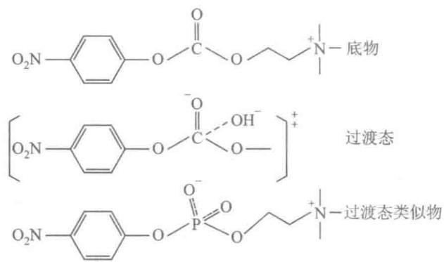  
图 6-13 酯酶的底物、过渡态及过渡态类似物的结构

以后又筛选到另一株抗体酶 T15, 可以使反应加快 $9.2 \times 10^{3}$ 倍。证明该催化反应的动力学行为满足米氏方程, 具有底物专一性及 pH 依赖性等酶反应的特征。随后还初步确定了参与催化反应的氨基酸残基。同时证实, 该抗体酶具有抗原结合位点的 $F_{ab}$ 段单独具有全酶一样的催化效率。

R. Lerner 等人从金属肽酶的研究成果中得到启发, 合成了一个含有吡啶甲酸的膦酸酯类似物为半抗原诱导产生一个单抗 6D4, 用来催化不含吡啶甲酸的相应羧酸酯化合物的水解反应, 使反应加速近 $10^{3}$ 倍, 并表现出底物专一性和对介质 pH 的依赖性等。相关结构如下:

酯 1 和酯 2 用于免疫动物产生的单克隆抗体可以催化碳酸酯的水解反应。

$$
\begin{array}{l} \mathrm {X: - CH_ {3}} \\ \mathrm{R: - H} \\ \mathrm{R:} \quad - \mathrm {CH_ {2} -NH - CH_ {2} -} \quad \mathrm{N-COOH} \end{array} \text {酯3}
$$

而酯 3 和酯 4 是抗体的抑制剂, 竞争性抑制抗体的催化。酯 3 和酯 4 的抑制常数分别是 $0.6 \mu mol \cdot L^{-1}$ 和 $0.16 \mu mol \cdot L^{-1}$ 。

铁螯合酶(ferrochelatase)是血红素生物合成中最终端的酶,催化 $Fe^{2+}$ 插入原卟啉区,为了 $Fe^{2+}$ 的插入,平面状卟啉必须发生弯曲。而N-甲基原卟啉由于N-烷基化使卟啉发生弯曲,N-烷基化原卟啉螯合金属

离子的能力,比未烷基化的对应物快 $10^{4}$ 倍。该化合物类似反应中的过渡态,也是铁螯合酶的强烈抑制剂。P. Schultz 等用 N-甲基原卟啉诱导产生抗体,可以催化平面状卟啉的金属螯合反应。所得抗体每小时每个抗体分子可使 80 个卟啉分子与金属螯合,仅比金属螯合酶速率低 10 倍,抗体酶比非催化反应快 2500 倍。相关结构式如图 6-14 所示。

以上 3 个例子说明了抗体酶研制的原理及途径,为开展抗体酶的研究奠定了基础。

近年来,随着半抗原设计和抗体酶筛选技术

图 6-14 原卟啉及 N-甲基原卟啉结构

的不断提高,有关抗体酶的研究得到迅速发展。在有些情况下,抗体酶催化反应速率达到非催化反应速率的 $10^{4} \sim 10^{8}$ 倍,有些已接近天然酶的反应速率。反应类型不仅是上面讨论过的水解反应和金属螯合反应,现已制备出可以催化酰胺键生成反应、光诱导裂解及聚合反应、氧化还原反应、脱羧反应、转酯反应、分子重排反应以及立体专一性抗体酶。抗体酶所催化的反应类型已达数十种之多。抗体酶的研究不仅有重要的理论价值,为酶的过渡态理论提供了有力的实验证据,而且抗体酶有令人鼓舞的应用前景。如果能制备出按照人们的设计对特定的肽键进行水解的抗体酶,则将为蛋白质结构的研究提供新的手段。在医学上这种抗体酶将有可能用来专一地破坏病毒蛋白质及专一地清除心血管病人血管壁上的血液凝块。正研究设计降解可卡因的催化性抗体,用于帮助治疗可卡因毒瘾。若将具有立体专一性的抗体酶用于制药工业,它有助于避免化学合成中遇到的对映体拆分的难题。抗体酶的固定化已取得成功,具有酯酶活力的抗体酶已用于生物传感器的制造上。不久的将来,人们有可能研制成功用于蛋白质氨基酸序列分析的抗体酶,从而大大简化和快速蛋白质氨基酸序列的测定。

抗体酶技术已受到高度重视,抗体酶的定向设计开辟了一个不依赖于蛋白质工程的酶工程的领域。

## 九、酶工程简介

酶的开发和利用是现代生物技术的重要内容。酶工程（enzyme engineering）是在1971年第一届国际酶工程会议上才得到命名的一项新技术。酶工程主要研究酶的生产、纯化、固定化技术、酶分子结构的修饰和改造以及在工农业、医药卫生和理论研究等方面的应用。天然酶在开发和应用中受到一定限制，一是酶的不稳定性；二是分离纯化难，成本高，价格贵。由于上述原因，尽管已被发现和鉴定的酶有数千种，但是目前国际上工业用和研究用的商品酶的种类也仅数百种。为了解决酶的应用和新酶开发问题，现采用两种方法。一是化学方法，即通过对酶的化学修饰或固定化处理，改善酶的性质以提高酶的效率和降低成本，甚至通过化学合成法制造人工酶；另一种是用基因重组技术生产酶以及对酶基因进行修饰或设计新基因，从而生产性能稳定，具有新的生物活性及催化效率更高的酶。因此酶工程可以说是把酶学基本原理与化学工程技术及基因重组技术有机结合而形成的新型应用技术。根据研究和解决问题的手段不同将酶工

程分为化学酶工程和生物酶工程。

## （一）化学酶工程

化学酶工程也可称为初级酶工程（primary enzyme engineering），是指天然酶、化学修饰酶、固定化酶及人工模拟酶的研究和应用。

## 1. 天然酶

工业用酶制剂多属于通过微生物发酵而获得的粗酶，价格低，应用方式简单，产品种类少，使用范围窄。例如，洗涤剂、皮革生产等用的蛋白酶；纸张制造、棉布退浆等用的淀粉酶；漆生产用的多酚氧化酶；乳制品用的凝乳酶等。天然酶的分离纯化随着各种层析技术及电泳技术的发展，得到长足的进展，目前医药及科研用酶多数从生物材料中分离纯化得到。

## 2. 化学修饰酶

通过对酶分子的化学修饰可以改善酶的性能,以适用于医药的应用及研究工作的要求。化学修饰的途径,可以通过对酶分子表面进行修饰,亦可对酶分子的内部修饰。其主要方法有:

（1）化学修饰酶的功能基 对酶分子的侧链基团，尤其是酶活性部位中的必需基团进行化学修饰，最经常修饰的氨基酸残基既可是亲核的（Ser、Cys、Thr、Lys、His），也可是亲电的（Tyr、Trp），或者是可氧化的（Tyr、Trp、Met）。例如通过脱氨基作用，酰化反应可修饰抗白血病药物天冬酰胺酶（asparaginase）的游离氨基，使该酶在血浆中的稳定性提高若干倍。再如，将 $\alpha-$ 胰凝乳蛋白酶（ $\alpha-$ chymotrypsin）表面的氨基修饰成亲水性更强的一 $\mathrm{NHCH}_2\mathrm{COOH}$ ，使酶抗不可逆热失活的稳定性在 $60^{\circ}\mathrm{C}$ 时提高1000倍，在更高温度下，稳定化效应更好，以致难以在同一温度下与天然酶比较。

（2）交联反应 用某些双功能试剂能使酶分子间或分子内发生交联反应。如将人 $\alpha$ -半乳糖苷酶A（ $\alpha$ -galactosidase A)经交联反应修饰后，其酶活性比天然酶稳定，对热变性与蛋白质水解酶的稳定性也明显增加。用戊二醛将胰蛋白酶和碱性磷酸酶（basic phosphatase)交联而成杂化酶，可作为部分代谢途径的有用模型，测定复杂的生物结构。若将两种大小、电荷和生物功能不同的药用酶交联在一起，则有可能在体内将这两种酶同时输送到同一部位，提高药效。

（3）大分子修饰作用 可溶性高分子化合物如肝素（heparin）、葡聚糖（dextran）、聚乙二醇（polyethylene glycol）可修饰酶蛋白的侧链，提高酶的稳定性，改变酶的一些重要性质。如 $\alpha-$ 淀粉酶（ $\alpha-$ amylase）与葡聚糖结合后热稳定性显著增加，在 $65^{\circ}C$ 结合酶的半寿期为 63 min，而天然酶的半寿期只有 2.5 min。再如用葡聚糖修饰超氧化物歧化酶（superoxide dismutase, SOD），聚乙二醇修饰天冬酰胺酶（asparaginase），肝素、葡聚糖或聚乙二醇修饰尿激酶，修饰过的酶在血液中的半寿期无一例外的成几倍、几十倍的增长，抗原性消失，耐热性提高，并具有耐酸、耐碱和抗蛋白酶的作用。还有报道，将聚乙二醇连到脂肪酶（lipase）、胰凝乳蛋白酶上，所得产物溶于有机溶剂，可在有机溶剂中有效地起催化作用。

## 3. 固定化酶

固定化酶（immobilized enzyme）是20世纪50年代发展起来的一种新技术。通常酶催化反应都是在水溶液中进行的，而固定化酶是将水溶性酶用物理或化学方法处理，使之成为不溶于水的，但仍具有酶活性的状态。在1971年第一届国际酶工程会议上，正式建议采用“固定化酶”的名称。酶的固定化方法大致分为物理法和化学法，物理法有吸附法和包埋法；化学法有共价偶联法和交联法（图6-15）。经过固定化的酶不仅仍具有高的催化效率和高度专一性，而且固定化酶提高了对酸碱和温度的稳定性，增加了酶的使用寿命；可简化工艺，反应后易与反应产物分离，减少了产物分离纯化的困难，而提高了产量和质量。由于它具有上述优点，固定化酶已成为酶应用的一种主要形式，据报道，已有100多种酶进行了固定化。目前，固定化酶已经在工农业、医药、分析、亲和层析、能源开发、环保和理论研究等方面得到了广泛应用，取得了丰硕成果。例如我国已用固定化氨基酰化酶拆分D、L-氨基酸，用固定化的葡糖异构酶（glucose isomerase）生产高果糖玉米糖浆，用固定化酶法生产脂肪酸，半合成新青霉素等。自60年代以来，为了检测目的，制出了附有固定化酶的酶电极，其中应用的电极部分包括各种离子电极、氧电极和 $\mathrm{CO}_{2}$ 电极等，酶电极兼有酶的专一性、灵敏性及电位测定简单性的双重优点，目前已有80多种固定化酶用于酶电极中。

模拟生物体内的多酶体系，将完成某一组反应的多种酶和辅因子固定化，可制作特定的生物反应器。近年来，以固定化微生物组成的生物反应器已获得工业应用。例如固定化酵母细胞反应器连续发酵生产酒精、啤酒，该技术我国于1982年即研制成功并投入生产。现已可用固定化细胞生产有机溶剂、有机酸、氨基酸、抗生素、单克隆抗体和酶等。生物传感器是利用生物高分子物质来检测特殊化合物的一种电子元件，利用酶组成的生物传感器已经使用几十年。它们由固定化酶和离子敏感型电极组成，可以用于测定由酶催化的反应底物。生物传感器工作时非常迅速，非常灵敏。近年来，在用酶制造生物传感器的基础上，又发展了利用微生物细胞或动、植物细胞组织形成的生物传感器。活细胞的利用，为生物传感器的再生提供了可能。生物传感器在近期必将获得更广泛的应用和发展。

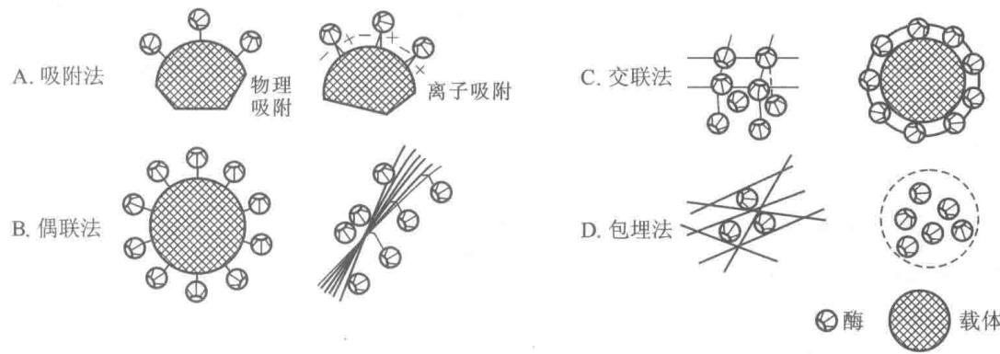  
图6-15 固定化酶制备方法

## 4. 模拟酶

模拟酶(mimic enzyme)是在深入了解酶的结构和功能以及催化作用机制的基础上,用有机化学半合成法或全合成法合成的比天然酶简单的非蛋白质分子,又称为人工酶(artificial enzyme)催化剂。固氮酶的模拟最令人瞩目,人们从天然固氮酶由铁蛋白和铁铜蛋白两种组分得到启发,提出了多种固氮酶模型。再如将电子传递催化剂 $\left[\mathrm{Ru}\left(\mathrm{NH}_{3}\right)_{3}\right]^{3+}$ 与巨头鲸肌红蛋白结合,产生了一种“半合成的无机生物酶”,这样把能与 $O_{2}$ 结合,而无催化功能的肌红蛋白转变成能氧化各种有机物(如抗坏血酸)的半合成酶,它接近于

天然的抗坏血酸氧化酶的催化效率。全合成酶不是蛋白质，而是一些有机物。它们通过并入酶的催化基团与控制空间构象，从而像天然酶那样专一性地催化化学反应。利用环糊精成功地模拟了胰凝乳蛋白酶、RNase、转氨酶、碳酸酐酶等。例如1985年Bender等人利用β-环糊精的空穴作为底物的结合部位，以连在环糊精侧链上的羧基、咪唑基及环糊精自身的一个羟基共同构成催化中心，制成了名为β-benzyme的胰凝乳蛋白酶模拟酶（图6-16）。实验表明，模拟酶催化简单酯反应的速率与天然酶相近，但模拟酶的热稳定性与pH稳定性大大优于天然酶，模拟酶的活力至少在80℃仍能保持，在pH2\~13的大范围内都是稳定的。1977年人工合成的八肽：Glu-Phe-Ala-Glu-Glu-Ala-Ser-Phe具有溶菌酶的活力可达到天然酶的50%。1993年曾报道了人工合成了两种“肽酶”（pezyme），每种仅含有29个氨基酸，但分别具有胰凝乳蛋白酶及胰蛋白酶的催化活性。人工模拟酶的研究虽已取得一些可喜的成果，但是达到实际应用还有很长的距离。

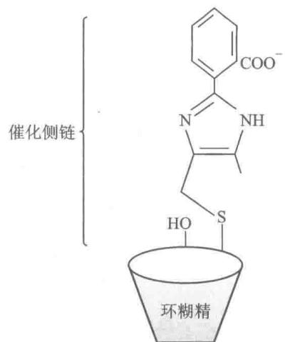  
图 6-16 人工模拟酶 $\beta$ -benzyme，有一小的侧链连接到环糊精上，可模拟胰凝乳蛋白酶

## （二）生物酶工程

生物酶工程是酶学和以 DNA 重组技术为主的现代分子生物学技术相结合的产物,因此,亦可称为高级酶工程(advanced enzyme engineering)。主要包括 3 个方面内容:用基因工程技术大量生产酶(克隆酶);对酶基因进行修饰,产生遗传修饰酶(突变酶);设计新酶基因,合成自然界不曾有的新酶(图 6-17)。

酶基因的克隆和表达技术的应用,已有可能克隆各种天然的酶基因。目前,在酶生产的基因工程研究中，已成功地实现 $\alpha-$ 淀粉酶基因的克隆，使产酶能力提高 3～5 倍，这是第一个获得美国食品药品管理局（FDA）批准用基因工程菌生产的酶制剂。此外青霉素酰胺酶基因和耐热菌亮氨酸合成酶基因已在 E. coli 中表达成功。利用 DNA 重组技术，提高葡萄糖异构酶、木糖异构酶、纤维素酶、糖化酶等酶活力的研究，已取得初步成果。在医用酶方面，继第一代溶血栓剂尿激酶、链激酶基因克隆表达以后，现在第二代溶血栓剂尿激酶原及组织型纤溶酶原激活物（tPA）表达成功，已投入生产。据报道有几百种酶的基因已经克隆成功，其中一些已进行了高效表达。

20 世纪 70 年代以来, 被称为第二代基因工程的蛋白质工程 (protein engineering) 迅速兴起, 使得人们有可能根据蛋白质结构的研究结果, 按照既定的蓝图, 利用

  
图 6-17 生物酶工程示意图

定点诱变(site-directed mutagenesis)技术,改造编码蛋白质基因中的DNA顺序,经过寄主细胞的表达,能够产生被改造的具有特定氨基酸顺序、高级结构、理化性质和生物功能的新蛋白质(参见第35章)。目前,蛋白质工程技术在生产酶(遗传修饰酶)方面的应用,已取得令人鼓舞的成果。通过对酶基因的遗传修饰,可改变酶的催化活性、底物专一性、最适pH;改变含金属酶的氧化还原能力;改变酶的别构调节功能;改变酶对辅酶的要求;可提高酶的稳定性。表6-10列举了一些遗传修饰酶。

表 6-10 酶的选择性修饰

<table><tr><td rowspan="2">酶</td><td colspan="2">修饰</td><td rowspan="2">酶性质的改变</td></tr><tr><td>修饰部位</td><td>原氨基酸残基 新氨基酸残基</td></tr><tr><td rowspan="2">枯草杆菌蛋白酶</td><td>222</td><td>Met→Lys</td><td>最适 pH 由 8.6 变为 9.6</td></tr><tr><td>166</td><td>Gly→Lys</td><td>水解邻近 Glu 肽键能力提高 500 倍</td></tr><tr><td>T4 溶菌酶</td><td>3</td><td>Ile→Lys</td><td>提高耐热性</td></tr><tr><td>天冬氨酸氨甲酰转移酶</td><td>165</td><td>Tyr→Ser</td><td>失去别构调节性质</td></tr><tr><td rowspan="2">胰蛋白酶</td><td>216</td><td>Gly→Ala</td><td>提高 Arg 底物的专一性</td></tr><tr><td>226</td><td>Gly→Ala</td><td>提高 Lys 底物的专一性</td></tr><tr><td>二氢叶酸还原酶</td><td>27</td><td>Asp→Asn</td><td>活性降低为正常酶的 0.1%</td></tr><tr><td rowspan="2">酪氨酰-tRNA 合成酶</td><td>51</td><td>Thr→Ala</td><td rowspan="2">对底物 ATP 的亲和力提高 100 倍</td></tr><tr><td>51</td><td>Thr→Pro</td></tr><tr><td rowspan="2">β-内酰胺酶</td><td>70~71</td><td>Ser·Thr→Thr·Ser</td><td>完全失活</td></tr><tr><td>70~71</td><td>Thr·Ser→Ser·Ser</td><td>恢复活性</td></tr><tr><td rowspan="3">环氧化物水合酶</td><td>108</td><td>Phe→Leu</td><td rowspan="3">可以催化顺-二氯环氧乙烷新底物明显增加  $V_{\text{max}}/k_{\text{cat}} k_{\text{cat}}/K_{\text{m}}$  比值</td></tr><tr><td>214</td><td>Ile→Leu</td></tr><tr><td>248</td><td>Cys→ILe</td></tr></table>

DNA 合成技术的迅速发展为酶的遗传设计开创了令人鼓舞的美好前景。只要有遗传设计蓝图，就能人工合成酶基因。现在的关键问题是如何设计超自然的优质酶基因，即如何绘制优质酶基因的遗传设计图案。但随着计算机技术和化学理论的进步和发展，酶或其他生物大分子的模拟在精确度、速率及规模上都会得到大的改善。相信遗传设计新酶的研究在不久的将来，会受到人们的更多关注，并取得进展。

酶工程作为现代生物工程的支柱，有着广阔的发展前景。随着酶学、分子生物学基础理论的研究，化

学工程技术和基因工程技术的不断发展和更新，酶工程必将发展成为一个更大的生物技术产业。

# 提要

生物体内的各种化学变化都是在酶催化下进行的。酶是由生物细胞产生的，受多种因素调节控制的具有催化能力的生物催化剂。与一般催化剂相比有其共同性，但又有显著的特点，酶的催化效率高，具有高度的专一性，酶活性受到调节和控制，酶作用条件温和，但不够稳定，酶易失活。

酶作为生物催化剂与其他催化剂一样，只能催化完成热力学上允许的反应。酶促反应中，首先酶与底物结合形成ES复合物，释放结合自由能 $(\Delta G_{\mathrm{b}})$ ，补偿了自由度丢失引起的熵减，减少了进入过渡态（ $\mathrm{ES}^{\ddagger}$ ）所需的活化熵（ $\Delta H^{\ddagger}$ ），从而降低了过渡态的活化自由能，提高反应速率。

酶的化学本质除有催化活性的核酶和脱氧核酶之外都是蛋白质。根据酶的化学组成可分为单纯蛋白质和缀合蛋白质两类。缀合蛋白质是由不表现酶活力的脱辅酶及辅因子（包括辅酶、辅基及某些金属离子）两部分组成。脱辅酶部分决定酶催化的专一性，而辅酶（或辅基）在酶催化作用中通常起传递电子、原子或某些化学基团的作用。

根据各种酶所催化反应的类型,把酶分为六大类,即氧化还原酶类、转移酶类、水解酶类、裂合酶类、异构酶类和连接酶类。按规定每种酶都有一个习惯名称和国际系统名称,并且有一个编号。

酶对催化的底物有高度的选择性,即专一性。酶往往只能催化一种或一类反应,作用于一种或一类物质。酶的专一性可分为结构专一性和立体异构专一性两种类型。用“诱导契合说”解释酶的专一性已被人们所接受。

酶的分离纯化是酶学研究的基础。已知大多数酶的本质是蛋白质，因此用分离纯化蛋白质的方法纯化酶。在酶的制备过程中，每一步都要测定酶的活力和比活力，以了解酶的回收率及提纯倍数，以便判断提纯的效果。酶活力是指在一定条件下酶催化某一化学反应的能力，可用反应初速率来表示。测定酶活力即测酶反应的初速率。酶活力大小来表示酶含量的多少，通常用酶的国际单位数表示。每mg蛋白质所含酶的活力单位数叫做酶的比活力，代表酶的纯度。

具有催化功能核酶的发现,开辟了生物化学研究的新领域,提出了生命起源的新概念。根据发夹状或锤头状二级结构原理,可以设计出各种人工核酶,用作抗病毒和抗肿瘤的防治药物将会有良好的应用前景。

抗体酶是一种具有催化能力的蛋白质,本质上是免疫球蛋白,但是在易变区赋予了酶的属性,抗体酶具有酶的一切性质。抗体酶的发现,不仅为酶的过渡态理论提供了有力的实验证据,而且抗体酶将会得到广泛的应用。

酶工程是将酶学原理与化学工程技术及基因重组技术有机结合而形成的新型应用技术，是生物工程的支柱。根据研究和解决问题的手段不同将酶工程分为化学酶工程和生物酶工程。随着化学工程技术及基因工程技术的发展，酶工程发展更为迅速，必将成为一个很大的生物技术产业。

## 习题

1. 酶作为生物催化剂有哪些特点？

2. 何谓酶的专一性？酶的专一性有哪几类？如何解释酶作用的专一性？研究酶的专一性有何意义？

3. 酶活性有哪些调节方式，试说明之。

4. 辅基和辅酶有何不同？在酶催化反应中起什么作用？

5. 酶分哪几大类？举例说明酶的国际系统命名法及酶的编号。

6. 什么叫酶的活力和比活力？测定酶活力应注意什么？为什么测定酶活力时要测定酶反应的初速率？应如何选择底物浓度？

7. 什么叫核酶和抗体酶？它们的发现有什么重要意义？

8. 解释下列名词: (a) 生物酶工程; (b) 固定化酶; (c) 活化能; (d) 过渡态; (e) 寡聚酶; (f) 酶国际单位和 Kat 单位;

(g)酶偶联分析法；(h)诱导契合说；(i)反馈抑制；(j)多酶复合物。

9. 用 $AgNO_{3}$ 对在 10 mL 含有 1.0 mg/mL 蛋白质的纯酶溶液进行全抑制，需用 0.342 μmol $AgNO_{3}$ ，求该酶的最低相对分子质量。

10. $1\mu \mathrm{g}$ 纯酶 $(\mathrm{M}_r92\times 10^3)$ 在最适条件下，催化反应速率为 $0.5\mu \mathrm{mol}\cdot \mathrm{min}^{-1}$ ，试计算：

(a)酶的比活力。(b)转换数。

[酶的转换数 $(k_{\mathrm{cat}})$ : 当酶被底物饱和时每秒钟每个酶分子将底物转变成产物的分子数]

11. 1 g 鲜重的肌肉含有 40 单位的某种酶, 其转换数为 $6 \times 10^{4} min^{-1}$ , 试计算该酶在细胞内的浓度 (假设新鲜组织含水 80%, 并全部在胞内)。

12. 焦磷酸酶可以催化焦磷酸水解成磷酸，其相对分子质量为 $120 \times 10^{3}$ ，由 6 个相同亚基组成。纯酶的 $V_{max}$ 为 2800 U/mg 酶。它的一个活力单位规定为：在标准测定条件下，37℃，15 min 内水解 10 μmol 焦磷酸所需要的酶量。问：

(a) 每 mg 酶在每秒钟内水解多少 mol 底物？

(b) 每 mg 酶中有多少 mol 的活性部位(假设每个亚基上有一个活性部位)?

(c) 酶的转换数是多少?

13. 称取 25 mg 蛋白酶粉配制成 25 mL 酶溶液，从中取出 0.1 mL 酶液，以酪蛋白为底物，用 Folin-酚比色法测定酶活力，得知每小时产生 1500 μg 酪氨酸。另取 2 mL 酶液，用凯氏定氮法测得蛋白氮为 0.2 mg。若以每分钟产生 1 μg 酪氨酸的酶量为 1 个活力单位计算，根据以上数据，求出：

(a) 1 mL 酶液中所含蛋白质量及活力单位。

(b) 比活力。

(c) 1 g 酶制剂的总蛋白含量及总活力。

14. 有 1 g 淀粉酶制剂,用水溶解成 1 000 mL,从中取出 1 mL 测定淀粉酶活力,测知每 5 min 分解 0.25 g 淀粉。计算每 g 酶制剂所含的淀粉酶活力单位数?

（淀粉酶活力单位的定义：在最适条件下每小时分解1 g淀粉的酶量称为1个活力单位）

15. 某酶的初提取液经过一次纯化后，经测定得到下列数据：试计算比活力、回收率及纯化倍数。

<table><tr><td></td><td>体积/mL</td><td>活力单位/(U/mL)</td><td>蛋白质/(mg/mL)</td></tr><tr><td>初提取液</td><td>120</td><td>200</td><td>10</td></tr><tr><td> $(NH_4)_2SO_4$ 盐析</td><td>5</td><td>800</td><td>4</td></tr></table>

16. 许多提取的酶液, 假设在 $37^{\circ}$ C 保温, 酶将变性失活。然而在底物存在下 $37^{\circ}$ C 保温, 酶保持催化活性。试解释这一相互矛盾的事实。

17. 酶是怎样克服反应能障,降低活化自由能的?

## 主要参考书目

1. 王镜岩, 朱圣庚, 徐长法. 生物化学教程. 北京: 高等教育出版社, 2008.

2. 袁勤生. 现代酶学. 2 版. 上海: 华东理工大学出版社, 2007.

3. Berg J M, Tymoczko J L, Stryer L. Biochemistry. 7th ed. New York: W. H. Freemam and company, 2012.

4. Garrett R M, Grisham C M. Biochemistry. 5th ed. Boston: Brooks/cole, Cengage Learning, 2013.

5. Nelson D L, Cox M M. Lehninger Prenciphes of Biochemistry. 5th ed. New York: W. H. Freemam and company, 2008.

6. International Union of Biochemistry and Molecular Biology Nomenclature Committee. Enzyme Nomenclature. New York: Academic Press, 1992.

(张庭芳)

## 网上资源
