## 第 8 章 酶作用机制和酶活性调节

## 一、酶的活性部位

## （一）酶活性部位的特点

通过各种研究证明,酶的特殊催化能力只局限在大分子的一定区域,也就是说,只有少数特异的氨基酸残基参与底物结合及催化作用。这些特异的氨基酸残基比较集中的区域,即与酶活力直接相关的区域称为酶的活性部位(active site)或活性中心(active center)。通常又将活性部位分为结合部位和催化部位,前者负责与底物的结合,决定酶的专一性;后者负责催化底物键的断裂形成新键,决定酶的催化能力。对需要辅酶的酶来说,辅酶分子,或辅酶分子上的某一部分结构,往往也是酶活性部位组成部分。虽然酶在结构、专一性和催化模式上差别很大,就活性部位而言有其共同特点。

（1）活性部位在酶分子的总体中只占相当小的部分，通常只占整个酶分子体积的 $1\% \sim 2\%$ ，酶分子中大多数氨基酸残基不与底物接触。已知几乎所有的酶都由100多个氨基酸残基所组成，相对分子质量在 $10\times 10^{3}$ 以上，直径大于 $2.5\mathrm{nm}$ 。而活性部位只有几个氨基酸残基所构成。酶分子的催化部位一般只由 $2\sim 3$ 个氨基酸残基组成，而结合部位的残基数目因不同的酶而异，可能是一个，也可能是数个。表8-1为某些酶活性部位的氨基酸残基。

表 8-1 某些酶活性部位的氨基酸残基

<table><tr><td>酶</td><td>氨基酸残基数</td><td>活性部位的氨基酸残基</td></tr><tr><td>核糖核酸酶 A(ribonuclease A)</td><td>124</td><td> $His_{12}, His_{119}, Lys_{41}$ </td></tr><tr><td>溶菌酶(lysozyme)</td><td>129</td><td> $Asp_{52}, Glu_{35}$ </td></tr><tr><td>胰凝乳蛋白酶(chymotrypsin)</td><td>241</td><td> $His_{57}, Asp_{102}, Ser_{195}$ </td></tr><tr><td>胰蛋白酶(trypsin)</td><td>223</td><td> $His_{57}, Asp_{102}, Ser_{195}$ </td></tr><tr><td>弹性蛋白酶(elastase)</td><td>240</td><td> $His_{57}, Asp_{102}, Ser_{195}$ </td></tr><tr><td>胃蛋白酶(pepsin)</td><td>348</td><td> $Asp_{32}, Asp_{215}$ </td></tr><tr><td>HIV-1 蛋白酶(HIV-1 proteinase)</td><td>99×2(二聚体)</td><td> $Asp_{25}, Asp_{25'}$ </td></tr><tr><td>木瓜蛋白酶(papain)</td><td>212</td><td> $Cys_{25}, His_{159}$ </td></tr><tr><td>枯草杆菌蛋白酶(subtilisin)</td><td>275</td><td> $His_{64}, Ser_{221}, Asp_{32}$ </td></tr><tr><td>碳酸酐酶(carbonic anhydrase)</td><td>259</td><td> $His_{94}-Zn-His_{96} \mid His_{119}$ </td></tr><tr><td>羧肽酶 A(carboxypeptidase A)</td><td>307</td><td> $Arg_{127}, Glu_{270}, Tyr_{248}, Zn^{2+}$ </td></tr><tr><td>醇脱氢酶(alcohol dehydrogenase)</td><td>374×2(二聚体)</td><td> $Ser_{48}, His_{51}, NAD^{+}, Zn^{2+}$ </td></tr></table>

（2）酶的活性部位是一个三维实体。酶的活性部位不是一个点，一条线，甚至也不是一个面。活性部位的三维结构是由酶的一级结构所决定且在一定外界条件下形成的。活性部位的氨基酸残基在一级结构上可能相距甚远，甚至位于不同的肽链上，通过肽链的盘绕、折叠而在空间结构上相互靠近。可以说没有酶的空间结构，也就没有酶的活性部位。一旦酶的高级结构受到物理因素或化学因素影响时，酶的活性

部位遭到破坏，酶即失活。

（3）酶的活性部位并不是和底物的形状正好互补的，而是在酶和底物结合的过程中，底物分子或酶

分子,有时是两者的构象同时发生了一定的变化后才互补的,这时催化基团的位置也正好在所催化底物键的断裂和即将生成键的适当位置。这个动态的辨认过程称为诱导契合(induced-fit),如图8-1所示。

（4）酶的活性部位是位于酶分子表面的一个空穴或裂缝（crevice）内。底物分子（或一部分）结合到裂缝内并发生催化作用。裂缝内是相当疏水的区域，非极性基团较多，但在裂缝内也含有某些极性的氨基酸残基，以便与底物结合并发生催化作用。其非极性性质在于产生一个微环境，提高与底物的结合能力有利于催化。在此裂缝内底物有效浓度可达到很高。

  
图 8-1 底物和酶相互作用的诱导契合模型酶在与底物结合后改变了形状。活性部位在形状上只有在与底物结合后才与后者互补

（5）底物通过多种次级键较弱的力结合到酶上。酶与底物结合成 ES 复合物主要靠次级键：氢键、盐键、范德华力

(van der Waalsforce)和疏水相互作用(见第3章)。ES复合物的平衡常数可在 $10^{-8}\sim10^{-2}$ mol·L $^{-1}$ 范围内变化,相当于相互作用的自由能在-50.2\~-12.6kJ·mol $^{-1}$ 范围内变化。这些数值可与共价键的强度作个比较,共价键的自由能变化范围为 $-4.6\times10^{2}\sim-2.1\times10^{2}$ kJ·mol $^{-1}$ 。

（6）酶活性部位具有柔性(flexibility)或可运动性。邹承鲁对酶分子变性过程中构象变化与活性变化进行了比较研究，发现在酶的变性过程中，当酶分子的整体构象还没有受到明显影响之前，活性部位已大部分被破坏，因而造成活性的丧失。说明酶的活性部位相对于整个酶分子来说更具柔性，这种柔性或可运动性，很可能正是表现其催化活性的一个必要因素。

活性部位的形成要求酶蛋白分子具有一定的空间构象,因此,酶分子中其他部位的作用对于酶的催化作用来说,可能是次要的,但绝不是毫无意义的,它们至少为酶活性部位的形成提供了结构的基础。所以酶的活性部位与酶蛋白空间构象的完整性之间,是辩证统一的关系。

## （二）研究酶活性部位的方法

## 1. 酶分子侧链基团的化学修饰法

这种方法需要选择一种化合物,当其与被研究的酶作用时能专门与活性部位氨基酸残基侧链基团共价结合,然后将这个带标记化合物的酶水解,肽键被打开,但标记化合物共价键不被打开,因此可以分离得到带有标签的肽段,即可分析出活性部位的氨基酸残基,由此可确定活性部位在一级结构上的位置,并为X射线晶体结构分析法提供资料。

酶分子中可以被化学修饰的侧链基团很多，如巯基、羟基、咪唑基、氨基、羧基、吲哚基和胍基等。可以用做化学修饰的试剂也很多，目前已有70多种，但非常专一的并不多。

化学修饰法有一定的缺陷,因为化学修饰有可能使活性部位之外的某个氨基酸残基的侧链改变,而影响酶分子的正常空间结构,因而导致酶活性的丧失。为了排除这种可能,常常比较在底物或竞争性抑制剂存在与否进行化学修饰所得结果。如果底物或抑制剂存在下保护了活性部位,则一般可以认为该试剂是作用于活性部位的。

（1）非特异性共价修饰 某些化学试剂能和酶蛋白中氨基酸残基的侧链基团反应而引起共价结合、氧化或还原等修饰反应，使基团的结构和性质发生改变。如果某基团修饰后不引起酶活力的变化，可以初步认为，此基团可能是非必需基团。反之，如修饰后引起酶活力的降低或丧失，则此基团可能是酶的必需基团。有两点可作为化学试剂已经和活性部位基团结合的鉴别标准。其一是酶活力的丧失程度和修饰剂浓度成一定的比例关系，即修饰剂的浓度和酶活力丧失的速率常数 $k$ 成正比。其二是底物或与活性部位结合的可逆抑制剂可保护共价修饰剂的抑制作用，此法不但可以肯定某种基团是必需基团，还可以确信此

基团位于酶的活性部位。

（2）特异性共价修饰 某一种化学试剂专一地修饰酶活性部位的某一氨基酸残基，使酶失活。通过水解分离标记的肽段，即可判断出被修饰的酶活性部位的氨基酸残基。例如二异丙基氟磷酸（DFP）能专一性地与酶活性部位的丝氨酸残基的羟基共价结合，使酶活力丧失。例如，DFP与胰凝乳蛋白酶作用，标记在特定的丝氨酸残基上，形成二异丙基磷酰化酶（DIP-酶），酶活性完全丧失，反应式如下：

$$
\begin{array}{r l} & \mathrm {E - Ser - OH + (CH_ {3}) _ {2} CH - O} \\ & \mathrm {(CH_ {3}) _ {2} CH - O} \\ & \mathrm {\overset {\parallel} {O}} \end{array} \xrightarrow [ ]{\mathrm{P-F}} \mathrm {E\cdot Ser - O - P - O - CH(C H_ {3}) _ {2}} \\ & \text {   酶   } \quad \text {   DFP   } \quad \text {   DIP - E   }
$$

DFP 一般不与蛋白质反应,也不与胰凝乳蛋白酶原和变性的胰凝乳蛋白酶反应,它也不和天然胰凝乳蛋白酶活性部位 $Ser_{195}$ 以外的 27 个 Ser 结合,可见活性部位 Ser 处于一个特殊的结构中,对 DFP 敏感。由于 DFP 与 Ser-OH 形成的酯键结合牢固,当用 $6 \, mol \cdot L^{-1} HCl$ 对 DIP-酶进行部分水解,然后将水解产物进行分离,从中得到含有 DIP 基团的片段 (DIP-O-Ser-肽),分析该片段的氨基酸顺序,并与已知的胰凝乳蛋白酶的氨基酸顺序相比较。不仅知道该酶活性部位附近的氨基酸顺序,也可得知 DIP 标记在该酶分子的 $Ser_{195}$ 残基上。类似的工作对其他蛋白水解酶及酯酶——弹性蛋白酶、凝血酶、胰蛋白酶及乙酰胆碱酯酶等进行了研究,这些酶的活性部位都含有 Ser,具有相似的肽段。表 8-2 列举了一部分用 DFP 标记酶的 DIP-肽段的氨基酸顺序。从表中可以看出许多酶活性部位都含有丝氨酸,某些蛋白水解酶活性部位有一个共同的 Gly-Asp-Ser-Gly-Gly-Pro 顺序。

表 8-2 一些酶活性部位的氨基酸顺序

<table><tr><td>酶</td><td>氨基酸顺序</td></tr><tr><td>牛胰蛋白酶</td><td>......Ser · Cys · Gly ·Gly · Asp · Ser · Gly · Gly · Pro · Val......</td></tr><tr><td>牛胰凝乳蛋白酶</td><td>......Ser · Cys · Met ·Gly · Asp · Ser · Gly · Gly · Pro · Leu......</td></tr><tr><td>猪弹性蛋白酶</td><td>......Gly · Cys · Gln ·Gly · Asp · Ser · Gly · Gly · Pro · Leu......</td></tr><tr><td>猪凝血酶</td><td>......Asp · Ala · Cys · Glu ·Gly · Asp · Ser · Gly · Gly · Pro......</td></tr></table>

又如牛肝谷氨酸脱氢酶共含有30个Lys残基侧链，2,4,6-三硝基苯磺酸盐只作用于 $\mathrm{Lys}_{126}$ 侧链而引起酶失活，证明 $\mathrm{Lys}_{126}$ 是该酶活性中心的必需氨基酸残基。

（3）亲和标记( affinity labeling)法 上述特殊基团标记法往往专一性差,不太特异地标记活性部位。为了提高化学修饰剂对酶活性部位的专一性修饰作用,合成了一些与底物结构相似的共价修饰剂。这种修饰剂有两个特点:① 可以较专一地引入酶的活性部位,接近底物结合位点。② 具有活泼的化学基团可以与活性部位的某一基团结合形成稳定的共价键。因其作用机制是利用酶对底物的特殊亲和力将酶加以修饰标记,故称为亲和标记。亲和标记试剂又称“活性部位指示试剂”。用于胰凝乳蛋白酶和胰蛋白酶活性部位的亲和标记是两个非常成功的例子。对甲苯磺酰-L-苯丙氨酸乙酯(TPE)是胰凝乳蛋白酶的底物,而对甲苯磺酰-L-苯丙氨酰氯甲基酮(TPCK)是它的亲和标记试剂,结构相似。当胰凝乳蛋白酶与TPCK保温后,酶活力完全丧失,二者的结合是共价的与定量的。TPCK不与胰凝乳蛋白酶原,变性的胰凝乳蛋白酶也不和DIP-胰凝乳蛋白酶结合,可见该酶必须有空间结构完整的活性部位才能与TPCK结合。与TPCK已结合的酶,也不再与DFP反应,说明烷化作用发生在活性部位上。胰凝乳蛋白酶分子中有两个His残基(40,57),与TPCK烷化后经水解,分析其水解肽段,发现只是与 $His_{57}$ 结合,发生在 $N^{3}-(咪唑环)$ 上,说明 $His_{57}$ 是胰凝乳蛋白酶活性部位的一个氨基酸残基。TPE及TPCK结构式及修饰反应如下:

  
对甲苯磺酰 - L - 苯丙氨酸乙酯 (TPE)

  
对甲苯磺酰 -L-苯丙氨酰氯甲基酮
(TPCK)

邹承鲁研究了酶必需基团的化学修饰和酶活性丧失的定量关系,他从统计学上考虑,根据不同情况得出一系列公式。根据这些公式,就可以对实验结果进行处理得出关于必需基团数的结论。邹的公式、方法和作图,现已成为国际上通过侧链基团化学修饰和酶活性丧失定量关系来确定必需基团数的主要方法。

## 2. 动力学参数测定法

活性部位氨基酸残基的解离状态和酶的活性直接相关，因此通过动力学方法求得有关参数后，就可对酶的活性部位的化学性质作出判断。溶液 $\mathrm{pH}$ 对酶活力有显著影响， $\mathrm{pH}$ 对表观米氏常数 $(K_{\mathrm{m}}^{\prime})$ 的影响可以反映酶-底物复合物的解离情况， $\mathrm{pH}$ 对 $V_{\max}^{\prime}$ 和 $K_{\mathrm{m}}^{\prime}$ 的影响反映了自由酶的解离情况，由此可以了解与酶活性有关的氨基酸残基的解离，便可知道哪个氨基酸残基与酶活性有关。例如RNase活性部位两个组氨酸残基（ $\mathrm{His}_{12}, \mathrm{His}_{119}$ ）就是用这个方法判断出的，并经过了X射线晶体结构分析研究和其他方法所证实。

## 3. X 射线晶体结构分析法

X 射线晶体结构分析法可以解析酶分子的三维结构，有助于了解酶活性部位氨基酸残基所处的相对位置与实际状态，以及与活性部位有关的其他基团。1965 年 D. Phillips 等人，首次用射 X 射线晶体结构分析法，以 0.2 nm 的水平测定了溶菌酶（lysozyme）的空间结构及其作用机制。通过溶菌酶的三维结构可以看出：溶菌酶活性部位有关氨基酸的排列位置；酶-底物复合物中，底物周围氨基酸的排列状况；根据被水解的糖苷键邻近氨基酸残基的分析，确定了溶菌酶的催化基团为 Glu $_{35}$ 和 Asp $_{52}$ 。再如，通过 X 射线晶体结构分析，表明胰凝乳蛋白酶活性部位由 Ser $_{195}$ 、His $_{57}$ 、Asp $_{102}$ 组成，这 3 个氨基酸残基联在一起形成一个“电荷中继网”（charge relay network），使 Ser $_{195}$ 的羟基具有非常高的亲核性。Ile $_{16}$ 是凝乳蛋白酶原转变为酶的关键，X 射线晶体结构分析表明，其作用可能是通过 Ile $_{16}$ 氨基和 Ser $_{195}$ 邻近的 Asp $_{194}$ 羧基形成静电键，促成电荷中继网的建立。

由于第三代同步辐射的出现和实际应用,使 X 射线晶体结构分析达到一个新的水平,至今已完成晶体结构分析的酶在 3000 种以上。显然,用 X 射线晶体结构分析方法研究酶的活性部位及结构和功能的关系已成为重要手段。

## 4. 定点诱变法

迄今为止，已有几百个酶的基因被克隆。根据蛋白质结构研究的结果，可以利用定点诱变（site-directed mutagenesis）技术，改变编码蛋白质基因中的DNA顺序，研究酶活性部位的必需氨基酸。例如1987年C.Craik等人将胰蛋白酶 $\mathrm{Asp}_{102}$ 诱变为 $\mathrm{Asn}_{102}$ ，突变体的 $k_{\mathrm{cat}}$ 比野生型低5000倍，突变体水解酯底物的活性仅是天然胰蛋白酶的万分之一，可见 $\mathrm{Asp}_{102}$ 对胰蛋白酶催化活性是必需的。再如，羧肽酶A中 $\mathrm{Tyr}_{248}$ 原认为催化所必需，1985年S.Gardell等人用寡核苷酸定位突变把 $\mathrm{Tyr}_{248}$ 的密码子(TAT)变为Phe的密码子(TTT)。含有这一基因的重组质粒在酵母中进行表达,发现突变酶的 $k_{cat}$ 值和天然酶一样,但其 $K_{m}$ 值高出6倍。这一结果说明 $Tyr_{248}$ 参与底物的结合,与催化活性无关。由于 DNA 重组技术的日趋成熟,目前越来越多地利用定点诱变技术研究酶的结构和功能的关系。

此外，质谱分析、旋光色散（ORD）、园二色性（CD）荧光偏振、拉曼光谱和核磁共振（NMR）等也成为酶蛋白三维结构研究的重要手段，在此不再赘述。

## 二、酶催化反应的独特性质

酶催化反应的某些独特性质为许多反应所共有,可概括如下:

（1）酶反应可分成两类，一类反应仅仅涉及电子的转移，这类反应的速率或转换数在 $10^{8}s^{-1}$ 数量级；另一类反应涉及到电子和质子两者或者其他基团的转移，它们的速率在 $10^{3}s^{-1}$ 数量级。大部分反应属第二类。

（2）酶的催化作用是由氨基酸侧链上的功能基团和辅酶为媒介的。主要的是 His, Ser, Cys, Lys, Glu 和 Asp 的侧链常常直接参加催化过程。辅酶或金属离子与酶协同在一起发挥作用，比只利用氨基酸侧链来说，为催化过程提供了更多种类的功能基团。将在第 13 章详细讨论。

（3）酶催化反应的最适 pH 范围通常是狭小的。除少数例外，最适 pH 接近于中性。

（4）除核酸酶、蛋白酶和水解黏多糖的酶外，一般的酶分子与它们的底物分子相比是大得多的。而酶活性部位通常只比底物稍大一些，这是因为在大多数情况下，只有活性部位围着底物。此外，一个大的酶分子结构对稳定活性部位的构象是必要的。

（5）酶除了具有进行催化反应所必需的活性基团外，还有别的特性，使上述反应的进行更有利，并使更复杂的多底物反应按一定途径进行，这些已超出了较简单催化剂的范畴。酶的复杂的折叠结构使这些作用成为可能。酶具有的4个主要有利条件是：

① 在活性部位存在 1 个以上的催化基团, 所以能进行协同催化;

② 存在有结合部位,因此底物分子可以以反应中固有的方位结合在活性部位附近;

③ 在有 2 个或 2 个以上底物分子参加反应的情况中, 存在着 1 个以上的底物分子结合部位;

④ 底物以某种方式被结合到酶分子上,使底物分子中的键产生张力,从而有利于过渡态复合物的形成。

通过对酶催化反应机制的实例介绍,就可以最具体地了解酶催化作用的上述特点。

## 三、酶促反应机制

在酶催化过程中,酶分子与底物分子相互作用,经过一系列化学变化,最后由底物生成产物。阐明酶催化过程中酶分子与底物分子的相互作用及其反应过程中键的裂解和新键形成的机理,即称为酶促反应机制。通过对酶促反应机制的研究,可进一步了解酶分子结构与催化功能的关系,以及酶催化作用具有催化效率高和专一性强的原因,为新酶分子的合理设计提供理论基础。

## （一）基元催化反应

酶的催化作用是由一些基元催化反应组成的,但是这些基元催化反应在酶的作用过程中又有其独特之处。基元催化是由某些基团或小分子催化的反应,包括酸碱催化、共价催化和金属离子催化等,它们也常见于有机化学中。

## 1. 酸碱催化 (acid-base catalysis)

酸碱催化是通过瞬时的向反应物提供质子或从反应物接受质子以稳定过渡态，加速反应的一类催化机制。在水溶液中通过高反应性的质子和氢氧离子进行的催化称为专一的酸碱催化（specific acid-base catalysis）或狭义酸碱催化；而通过 $\mathrm{H^{+}}$ 和 $\mathrm{OH^{-}}$ 以及能提供 $\mathrm{H^{+}}$ 及 $\mathrm{OH^{-}}$ 的供体进行的催化称为总酸碱催化

(general acid-base catalysis) 或广义酸碱催化。这两种酸碱催化类型通过图 8-2A 和 B 来区分，专一的酸碱催化的表观速率常数 ( $k_{obs}$ ) 仅依赖于溶液的 pH 而不受缓冲液的浓度影响；总酸碱催化的 $k_{obs}$ 除依赖于 pH 外，还与缓冲液的浓度成正比。

在生理条件下,因 $H^{+}$ 和 $OH^{-}$ 的浓度甚低,故体内的酶反应以总酸碱催化作用较为重要。在很多酶的活性部位存在几种参与总酸碱催化作用的功能基,如氨基、羧基、巯基、羟基、酚羟基

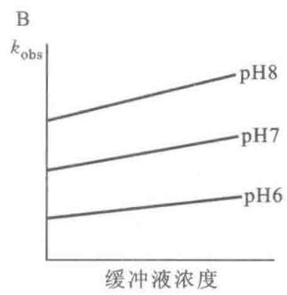  
图 8-2 专一酸碱催化作用(A)和总酸碱催化作用(B)

及咪唑基，它们能在近中性 $\mathrm{pH}$ 的范围内，作为催化性的质子供体或受体，即作为Brφnsted酸或碱而参与总酸或总碱催化作用（表8-3）。总酸或总碱的催化可提高反应速率 $10^{2} \sim 10^{5}$ 倍。事实上，质子转移是最普通的生物化学反应。这类反应有：羰基的加成作用，酮基和烯醇的互变异构，肽和酯的水解以及磷酸和焦磷酸参与的反应等。

表 8-3 酶分子中可作为总酸碱催化的功能基团

<table><tr><td>氨基酸残基</td><td>广义酸基团(质子供体)</td><td>广义碱基团(质子受体)</td></tr><tr><td>Glu, Asp</td><td> $-COOH$ </td><td> $-COO^{-}$ </td></tr><tr><td>Lys, Arg</td><td> $-NH_{3}$ </td><td> $-NH_{2}$ </td></tr><tr><td>Tyr</td><td>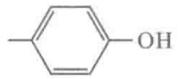</td><td>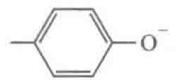</td></tr><tr><td>Cys</td><td> $-SH$ </td><td> $-S^{-}$ </td></tr><tr><td>His</td><td></td><td> $-C=CH$  $|$  $HN$  $\backslash$  $C$  $H$ </td></tr><tr><td>Ser</td><td> $-OH$ </td><td> $-O^{-}$ </td></tr></table>

酸碱催化效率取决于总酸碱的解离常数(pK)，对于总酸催化作用，则：

$$
\lg k _ {\mathrm{a}} = C _ {\mathrm{A}} - \alpha (\mathrm{p} K _ {\mathrm{a}})\tag{8-1}
$$

对于总碱催化作用,则:

$$
\lg k _ {\mathrm{b}} = C _ {\mathrm{B}} - \beta (\mathrm{p} K _ {\mathrm{b}})\tag{8-2}
$$

其中 $k_{\mathrm{a}}$ 和 $k_{\mathrm{b}}$ 分别代表总酸催化和总碱催化的反应速率常数， $C_{\mathrm{A}}$ 和 $C_{\mathrm{B}}$ 为常数，是纵坐标上的截距，它的大小由反应类型、温度及溶剂系统等因素决定。 $\alpha$ 和 $\beta$ 为直线的斜率，称为Brφnsted系数（图8-3A和B），它们是衡量酸碱强度对反应速率影响的灵敏度指标。 $\alpha$ 或 $\beta$ 值的范围在0\~1之间。具有 $\alpha$ 或 $\beta$ 值接近1的反应对酸或碱的强度是最灵敏的。此时在水溶液中所有可能存在的组分中，只有 $\mathrm{H^{+}}$ 和 $\mathrm{OH^{-}}$ 能强得足够使反应速率显著提高，故反应速率只取决于溶液的 $\mathrm{pH}$ 。因此，具有 $\alpha$ 或 $\beta \approx 1$ 的总酸或总碱催化作用实际上是专一的酸碱催化作用。在另一方面，如果 $\alpha$ 或 $\beta$ 接近于0，则反应速率对催化剂的酸度或碱度几乎无关，因此具有 $\alpha$ 或 $\beta \approx 0$ 的一种总酸或总碱催化的反应实际上是未被酸或碱所催化的反应。上面式(8-1)及式(8-2)所表示的关系称为Brφnsted催化作用定律。

影响酸碱催化反应速率的因素有两个，即酸或碱的强度(pK值)及质子传递的速率。在表8-3所列的功能基中组氨酸咪唑基的解离常数 $pK_{a}$ 介于5.6\~7.0之间（由它在蛋白质分子中的环境而定），因此在接近于生物体液pH的条件下，即在中性条件下，有一半以酸形式存在，另一半以碱形式存在，即可作为质子供体，又可作为质子受体在酶反应中发挥催化作用。同时咪唑基接受质子和供出质子的速率十分迅速，其半衰期小于 $10^{-10}s$ 。由于咪唑基有如此特点，所以在很多蛋白质中His含量虽少，却占很重要地位。推测His很可能在进化过程中,不是作为一般的结构蛋白成分,而是被选择作为酶分子中的催化结构而保留下来的。

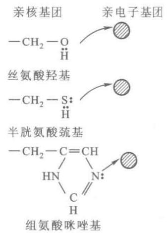

  
图 8-3 Brφnsted 作图
A. 广义酸催化; B. 广义碱催化

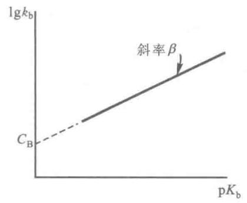  
图8-4 酶蛋白上的重要亲核基团

参与总酸碱催化作用的酶很多,例如溶菌酶、天冬氨酸蛋白酶类和丝氨酸蛋白酶类等。有关这些酶的酸碱催化机制,将在下一节中做详细讨论。

## 2. 共价催化 (covalent catalysis)

共价催化又称亲核催化（nucleophilic catalysis）或亲电子催化（electrophilic catalysis），在催化时，亲核催化剂或亲电子催化剂能分别放出电子或汲取电子并作用于底物的缺电子中心或负电中心，迅速形成不稳定的共价中间复合物，降低反应活化能，使反应加速。

酶蛋白氨基酸侧链提供各种亲核中心，图8-4表示了酶蛋白上最常见的3种亲核基团，即丝氨酸羟基、半胱氨酸巯基、组氨酸咪唑基。这些基团容易攻击底物的亲电中心，形成酶-底物共价结合的中间物。底物中典型的亲电中心，包括磷酰基、酰基和糖基（图8-5）。形成的共价中间物在随后步骤中被水分子或第二种底物攻击生成所需的产物。共价亲电催化也在包含辅酶产生的亲电中心观察到。值得注意的是，进行共价催化的大多数酶都具有乒乓动力学机制（见第7章）。

  
图8-5 酶和底物形成共价结合的中间物  
在每一情形中，酶上的亲核中心(X:)攻击底物上的亲电中心

现已知 100 多种酶在催化过程中形成共价中间物, 表 8-4 列举了某些典型的例子。底物与酶分子中亲核基团分别形成酰基-丝氨酸、酰基-半胱氨酸、磷酸丝氨酸、磷酸组氨酸和西佛碱(Schiff base)。

表 8-4 形成共价 ES 中间物的一些酶  

亲电催化与亲核催化相反,它是由亲电催化剂起催化反应的。亲电催化剂通常涉及产生亲电子中心的辅酶。以磷酸吡哆醛为辅酶的天冬氨酸转氨酶(asparate amino-transferase)和丙氨酸消旋酶(alanine racemase)等都可能是通过亲电子机制催化的。

## 3. 金属离子催化 (metal ion catalysis)

在所有已知的酶中,几乎 1/3 的酶催化活性需要金属离子,根据金属离子-蛋白质结合作用的大小将需要金属的酶分为两类:

（1）金属酶(metalloenzymes) 具有紧密结合的金属离子,多属于过渡金属离子如 $Fe^{2+}$ 、 $Fe^{3+}$ 、 $Cu^{2+}$ 、 $Zn^{2+}$ 、 $Mn^{2+}$ 或 $Co^{3+}$ 。

（2）金属-激活酶(metal-activated enzyme) 含松散结合的金属离子,通常为碱金属和碱土金属离子,如 $Na^{+}$ 、 $K^{+}$ 、 $Mg^{2+}$ 或 $Ca^{2+}$ 。

金属离子通常以 3 种方式参与催化作用:① 通过结合底物使其在反应中正确定向;② 通过金属离子氧化态的变化进行氧化还原反应;③ 通过静电作用稳定或屏蔽负电荷。下面举例讨论金属离子的催化作用。

金属离子通过电荷稳定性促进催化:金属离子的催化作用往往和酸的催化作用相似,但有些金属离子不止带一个正电荷,作用比质子要强。另外,不少金属离子有络合作用,并且在中性 pH 溶液中, $H^{+}$ 浓度很低,但金属离子也能以高浓度存在。如 $Cu^{2+}$ 和 $Ni^{2+}$ 催化二甲草酰乙酸脱羧,是被金属离子催化的非酶促反应例子:

<!-- END OFFICIAL API PART part_003 -->

<!-- BEGIN OFFICIAL API PART part_004 -->

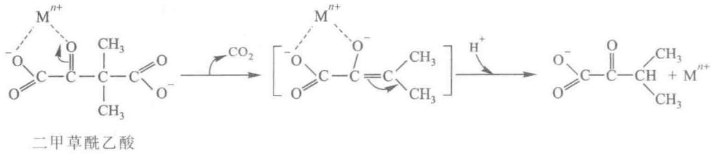

金属离子 $\left(\mathrm{M}^{n+}\right)$ 与二甲草酰乙酸螯合，以静电引力稳定过渡态形式的烯醇离子。乙酰乙酸不能与金属离子螯合，则金属离子不能催化脱羧。金属的催化还远远不能很好地解释酶的催化反应，如 $Mn^{2+}$ 的催化和含 $Mn^{2+}$ 酶的催化速率可差 $10^{8}$ 倍。

金属离子通过电荷的屏蔽促进催化:如激酶的真正底物是 $Mg^{2+}-ATP$ 复合物而不是 ATP, 如:

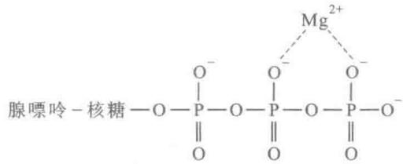

在这里， $Mg^{2+}$ 的作用除了它的定向效应外，还对磷酸基团的负电荷起静电屏蔽作用。否则这些电荷将排斥亲核攻击的电子对，特别是那些具有阴离子性质的亲核体。

金属离子通过水的电离促进亲核催化:金属离子的电荷使它的结合水分子比自由水更具酸性,因此甚至在低于中性 pH 下,溶液中具有 $OH^{-}$ 离子。例如, $\left(\mathrm{NH}_{3}\right)_{5}\mathrm{Co}^{3+}\left(\mathrm{H}_{2}\mathrm{O}\right)$ 的水分子根据下面反应电离:

$$
\mathrm {(NH_ {3}) _ {5} Co^ {3 + } (H_ {2} O)\rightleftharpoons(NH_ {3}) _ {5} Co^ {3 + } (OH^ {-}) + H^ {+}}
$$

产生的金属离子结合的羟基是一种有力的亲核体。

氧化还原反应中包含了金属离子价的变化,许多氧化还原酶含有金属的辅基,电子的转移和金属离子的配基数目及性质有很大的关系。

## （二）酶具有高催化能力的原因

酶和一般催化剂一样，也是通过降低活化自由能加速反应的（见第6章）。酶降低活化自由能所需的大部分能量都来自酶与底物之间的非共价相互作用。酶不同于非酶催化剂就是因为酶是通过与底物结合成ES复合物而起催化作用的。在ES复合物中每形成一个弱相互作用都伴随着少量自由能的释放以稳定相互作用。来自酶-底物相互作用的自由能称为结合能（binding energy, $\Delta G_{\mathrm{b}}$ ）。 $\Delta G_{\mathrm{b}}$ 的意义已超出简单的稳定作用，实际上它是被酶用来降低反应活化自由能的主要能源。

目前认为酶的催化能力之所以比非酶催化剂高,主要有以下一些因素在降低活化自由能方面起了作用:①邻近效应和定向效应;②底物形变和诱导契合;③多元催化和协同效应;④活性部位微环境影响。

## 1. 邻近 (proximity) 和定向 (orientation) 效应

从降低活化自由能 $(\Delta G^{\text{气}})$ 的角度看，邻近效应和定向效应是属于熵因子（见第6章）。酶促反应中当两个底物与酶结合成复合物时，底物将经受自由度的损失或者说造成熵的丢失。但是这种热力学上不利的熵丢失（entropy loss），在底物进入过渡态之前，已得到酶跟底物结合时所释放结合能的补偿。因此进入过渡态的活化熵，比非催化反应要小，即有小的负值。邻近效应和定向效应本质上是由于两个底物被束缚在酶的表面上引起的，因此一个分子间的反应变成了一个类似分子内的反应。邻近效应的直接结果是底物在活性部位的“有效浓度”比底物在溶液中的浓度要高得多，因此反应速率增加。其实，熵与有效浓度是相联系的。一个分子的熵，是它的平动熵、转动熵和振动熵等的总和。其中平动熵为主要部分，它与分子所占的溶液体积成正比，而一个分子所占的平均体积与其浓度成反比，因此分子的熵丢失必然伴随着它

的浓度升高。

为了测定酶促反应的邻近效应，酶学家进行了模型实验，比较了分子间反应速率与相应的或相似的分子内反应速率。但必须指出，因为反应级数不同，实际上难以比较。为了比较，常取这两种反应的速率常数之比值以表示“有效浓度”，也即当双分子反应中一个反应物A的浓度较低并与一个可比的分子内反应的反应物浓度一样时，另一个反应物B需要达到多大浓度才能使两个反应的速率相等。一个典型的实例是咪唑催化乙酸-p-硝基苯酯 $(p-\text{nitrophenylacetate})$ 的水解（图8-6A）。在一定条件下，测得此分子间反应的二级速率常数为 $35\ mol^{-1}\cdot L\cdot min^{-1}$ ，相应的分子内反应（图8-6B）的一级速率常数为 $839\ min^{-1}$ ，两者的比值为 $24\ mol\cdot L^{-1}$ 。此比值具有浓度单位，可认为它是分子内反应中p-硝基苯酯基的“有效浓度”，也即如果在双分子反应中[咪唑] $=1\ mol\cdot L^{-1}$ ，则另一个底物——乙酸-p-硝基苯酯的浓度为 $24\ mol\cdot L^{-1}$ 才能达到浓度为 $1\ mol\cdot L^{-1}$ 的分子内反应的速率。

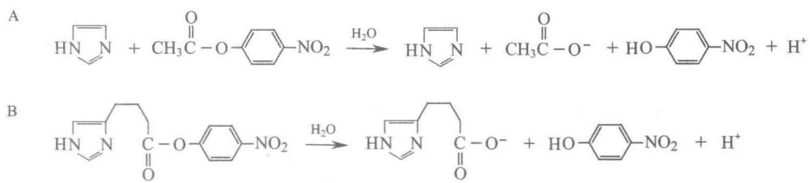  
图8-6 催化中邻近反应的一个实例  
A. 咪唑催化乙酸-p-硝基苯酯的水解(慢); B. 相应的分子内反应(快), 其速率为分子间反应的 24 倍

定向反应是指反应物的反应基团之间和酶的催化基团与底物的反应基团之间的正确取位产生的效应。正确定向取位问题在游离的反应物体系中很难解决，但当反应体系由分子间反应变为分子内反应后，这个问题就有了解决的基础。正确定向取位对加速反应的意义可以通过以分子内羧基催化酯水解的模型实验加以说明。表8-5列出了二羧酸单苯酯水解的相对速率和结构关系，该表说明了分子间反应和分子内反应有效浓度的关系，以及结构对分子内反应的影响。

表 8-5 二羧酸单苯酯水解相对速率和结构关系

<table><tr><td>结构</td><td>相对速率</td><td>结构</td><td>相对速率</td></tr><tr><td> $CH_3COO^-+CH_3COOR$ </td><td>1.0</td><td>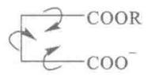</td><td> $2.2\times 10^5$ </td></tr><tr><td>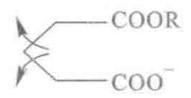</td><td> $1.0\times 10^3$ </td><td>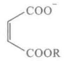</td><td> $1.0\times 10^7$ </td></tr><tr><td>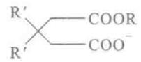</td><td> $3.0\times 10^3\sim 1.3\times 10^6$ </td><td>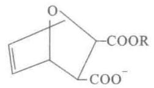</td><td> $1.0\times 10^8$ </td></tr></table>

从表可看出，羧基和酯之间，自由度愈小，愈能使它们邻近，并有一定的取向，反应速率就愈大。然而对一个双分子反应来说，要使其中一个底物浓度达到 $10^{3} \sim 10^{8} \mathrm{~mol} \cdot \mathrm{L}^{-1}$ 时，才能和分子内的反应速率相同，这样大的浓度实际上是办不到的。例如在纯水中，水的浓度也不过是 $55 \mathrm{~mol} \cdot \mathrm{L}^{-1}$ 。

再如邻羟苯丙酸的内酯形成,当两个甲基取代了苯环邻近的丙酸基碳原子上的氢,使羧基与羟基之间能更好地定向时,两个速率常数之比 $\frac{1.5\times10^{6}}{5.9\times10^{-6}}=2.5\times10^{11}$ ,反应速率可提高 $2.5\times10^{11}$ 倍。

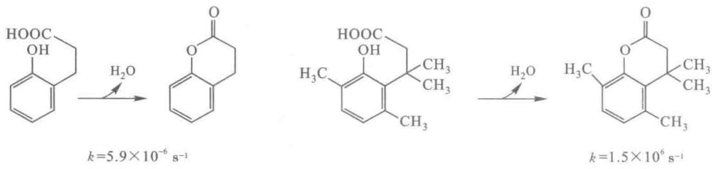

M. I. Page 和 W. P. Jencks 认为, 邻位效应与定向效应在双分子反应中起的促进作用至少可分别达 $10^{4}$ 倍, 两者共同作用则可使反应速率升高 $10^{8}$ 倍, 这与许多酶催化力的计算是很相近的 (表 6-2)。

## 2. 底物形变(distortion)和诱导契合(induced fit)

从能量角度看底物形变和诱导契合是属于焓因子(见第6章)，涉及活化焓 $\Delta H^{\circ}$ 的降低。当酶遇到其专一性底物时，酶中某些基团或离子可以使底物分子内敏感键中某些基团的电子云密度增高或降低，产生“电子张力”，使敏感键的一端更加敏感，底物分子发生形变，见图8-7A，底物比较接近它的过渡态，降低了反应活化能，使反应易于发生。例如乙烯环磷酸酯的水解速率是磷酸二酯水解速率的 $10^{8}$ 倍，这是因为环磷酸的构象更接近于过渡态。

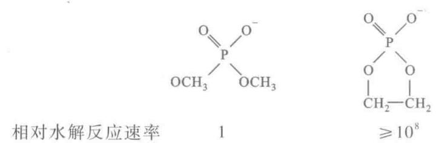

再如,溶菌酶与底物结合时引起 D-糖环构象改变,由椅式变成半椅式。当磷酸二羟丙酮与磷酸丙糖异构酶结合时,底物分子发生了扭曲。

前已指出,酶与底物结合时,酶构象发生改变的同时,底物分子也发生形变,即所谓诱导契合,如图8-7B所示,从而形成一个互相契合的酶-底物复合物,进一步转换成过渡态,大大增加了酶促反应速率。

## 3. 多元催化和协同效应

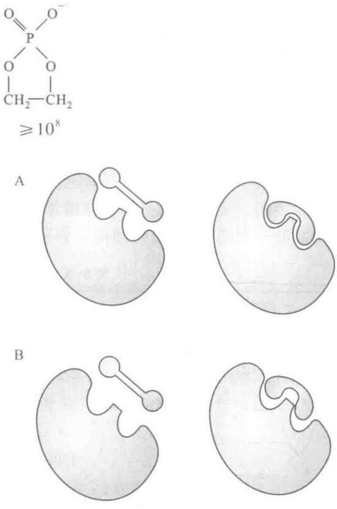

在酶催化反应中,常常是几个基元催化反应配合在一起共同起作用。例如胰凝乳蛋白酶是通过活性部位中 $Asp_{102}$ 、 $His_{57}$ 、 $Ser_{195}$ 组成的“电荷中继网”催化肽键水解,包括亲核催化和广义碱催化协同作用(见下面一节)。再如核糖核酸酶在水解其底物时, $His_{12}$ 起着广义碱催化作用,从核糖2'-OH上接受一个质子,而 $His_{119}$ 却起着广义酸的作用,和磷酸的氧原子形成氢键。这种多元催化协同作用的结果,是使酶反应加速的一个因素。

图 8-7 底物和酶结合时构象变化示意图  
A. 底物分子发生形变；B. 底物分子和酶都发生形变

## 4. 活性部位微环境的影响

在酶分子的表面有一个裂缝,而活性部位就位于疏水环境的裂缝中,它是一个低介电区域。化学基团的反应活性和化学反应的速率在非极性介质与水性介质中有显著差别。这是由于在非极性环境中的介电常数比在水介质的介电常数低。在非极性环境中两个带电基团之间的静电作用比在极性环境中显著增高。当底物分子与酶的活性部位相结合,就被埋没在疏水环境中,这里底物分子与催化基团之间的作用力将比活性部位极性环境的作用力要强得多,这一疏水的微环境大大有利于酶的催化作用。此外,一些酶促反应表明,由于特殊的微环境,在一个溶液中可以同时存在高浓度酸和高浓度碱,使氨基酸残基侧链基团的 $pK$ 值偏离正常值，以在反应中起酸或碱的催化。溶菌酶的例子就充分说明了微环境对酶催化反应的影响（下节详细讨论）。

上面讨论了加速酶促反应的几个因素,必须指出上述诸因素,不是同时在一个酶中起作用,也不是一种因素在所有的酶中起作用。更可能的情况是对不同的酶,起主要作用的因素不同,各自都有其特点,可能分别受一种或几种因素的影响。

## 四、酶催化反应机制的实例

上一节讨论了酶促反应的催化机制，涉及基元催化中的酸碱催化、共价催化和金属离子催化，也介绍了一些加速酶促反应速率的因素。近几十年来人们采用各种物理、化学方法及分子生物学方法对一些酶的催化机制进行了研究，从而较好地阐明了一些酶的催化过程及其反应机制。将通过下面几个实例帮助更深入地了解酶促反应的催化机理。

## (一) 溶菌酶

溶菌酶(lysozyme)是一种天然的抗菌剂,存在于鸡蛋清及动物的眼泪中,其生物学功能是催化某些细菌细胞壁多糖的水解,从而溶解这些细菌的细胞壁。细胞壁多糖是N-乙酰葡糖胺(N-acetylglucosamine, NAG)-N-乙酰胞壁酸(N-acetylmuramic acid, NAM)的共聚物,其中的NAG及NAM通过 $\beta-1,4$ 糖苷键而交替排列(图8-8)。

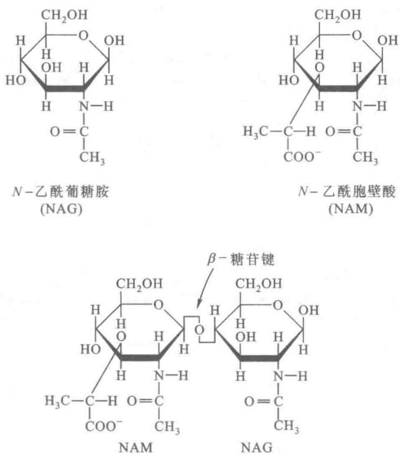  
图 8-8 NAM 通过 $\beta(1\rightarrow4)$ 糖苷键与 NAG 连接

溶菌酶相对分子质量为 $14.6 \times 10^{3}$ ，由 129 个氨基酸残基组成的单肽链蛋白质，含有 4 对二硫键，其一级结构如图 8-9 所示。

溶菌酶是一种葡糖苷酶,能催化水解 NAM 的 C1 与 NAG 的 C4 之间的糖苷键(图 8-10),但不能水解 NAG C1 和 NAM C4 之间的 $\beta(1\rightarrow4)$ 糖苷键。几丁质是甲壳类动物甲壳中所含的多糖,仅由 NAG 残基通过 $\beta(1\rightarrow4)$ 糖苷键连接而成,几丁质也是溶菌酶的底物。

底物与酶结合后,酶催化哪一个键水解呢?用大小不同的NAG寡聚体作底物测定被溶菌酶水解的相对速率,结果如表8-6。从表中可见:少于4个糖的寡聚体水解速率甚小,当由四聚体增加到五聚体时,水

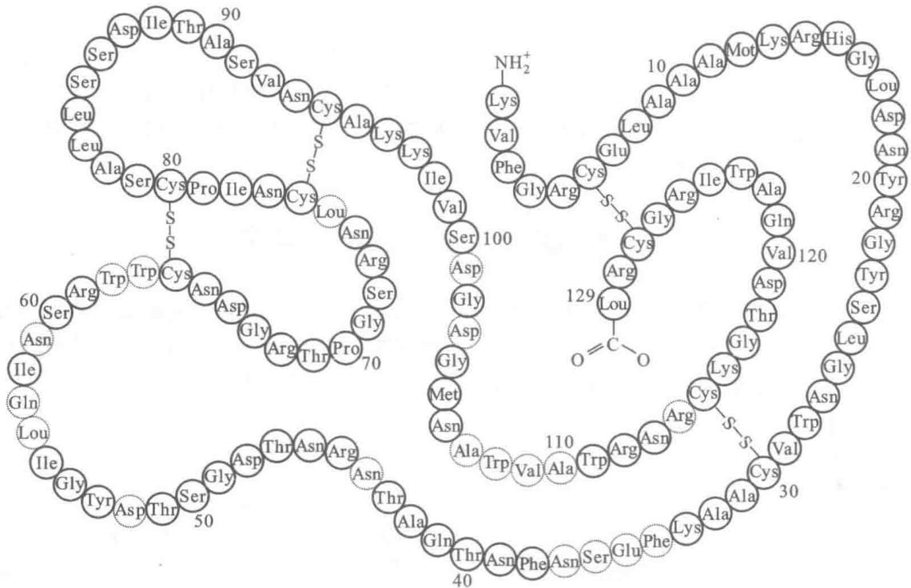  
图 8-9 鸡蛋清溶菌酶的氨基酸顺序, 活性部位中的残基用小点圈出

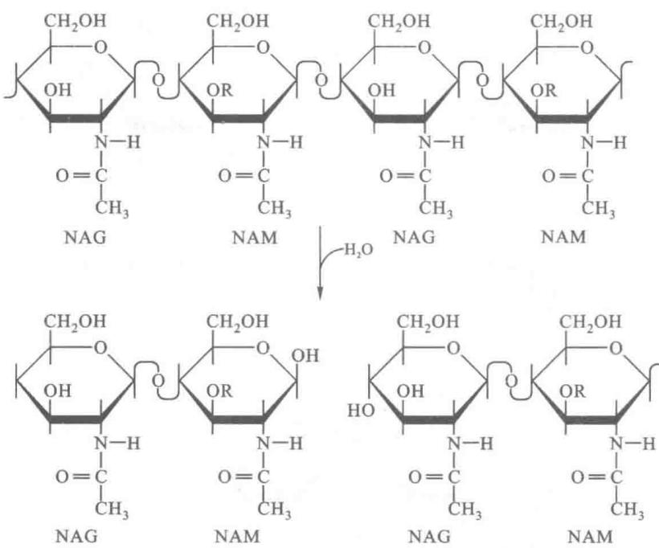  
图 8-10 溶菌酶催化水解 NAM 及 NAG 间的糖苷键

$$
\mathrm{R} \text {   为   } \mathrm{CH} _ {3} - \mathrm{CH} - \mathrm{COO} ^ {-}
$$

解速率猛增 500 倍,五聚体增加到六聚体,速率增加近 8 倍,六聚体增加到八聚体,速率不再变化。这种情况与 X 射线晶体结构分析结果一致,活性部位所在的裂缝正好被 6 个糖残基所装满。

表 8-6 溶菌酶对不同 NAG 寡聚体的水解

<table><tr><td>底物/(浓度为 $10^{-4}$ mol·L $^{-1}$ )</td><td>相对水解速率</td><td>底物/(浓度为 $10^{-4}$ mol·L $^{-1}$ )</td><td>相对水解速率</td></tr><tr><td>(NAG) $_2$ </td><td>0</td><td>(NAG) $_5$ </td><td>4000</td></tr><tr><td>(NAG) $_3$ </td><td>1</td><td>(NAG) $_6$ </td><td>30000</td></tr><tr><td>(NAG) $_4$ </td><td>8</td><td>(NAG) $_8$ </td><td>30000</td></tr></table>

$(NAG)_{3}$ 是溶菌酶的竞争性抑制剂,因此 A-B,B-C 糖苷键均不可能是被水解的键。而 C 环的空间对 NAM 来说体积太大,只能是 NAG。C-D 也不可能成为裂解的部位,而 NAM 不能适合到部位 C 中,进一步排除了另一个裂解部位:E-F 键。胞壁多糖是一个 NAM 和 NAG 交替的高聚物,从而 NAM 不能占据部位 C 时也就不能占据部位 E。细菌的细胞壁多糖恰好是具有 NAM-NAG 键,溶菌酶的作用专一性又要求作用在 NAM-NAG 键,而 C-D 和 E-F 都不是这种类型的键,所以水解部位只能发生在 D-E 之间(图 8-11)。

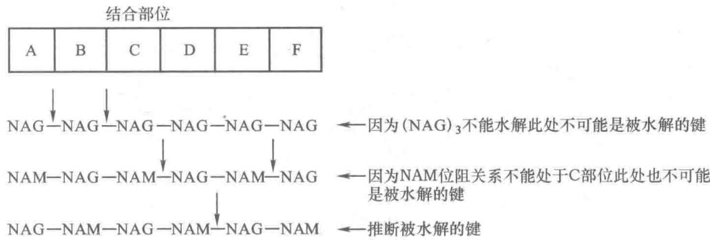  
图 8-11 D 和 E 之间的糖苷键是溶菌酶的作用部位

D. Phillips 等人 1965 年以 0.2 nm 分辨率的 X 射线晶体结构分析法阐明了溶菌酶的三维结构, 如图 8-12。

溶菌酶分子近椭圆形,大小为 $4.5 \, nm \times 3.0 \, nm \times 3.0 \, nm$ 。它的构象较复杂, $\alpha$ 螺旋仅占 25%,在分子的一些区域有伸展着的 $\beta$ 片层构象。溶菌酶分子的内部是非极性疏水区。疏水的相互作用在溶菌酶的折叠构象中起重要作用。在溶菌酶分子表面为极性基团,使得酶是亲水的,表面上有一个较深的裂缝,其大小恰好能容纳多糖底物的6个单糖,这是溶菌酶的活性部位。用X射线晶体结构分析法研究了竞争性抑制剂( $NAG_{3}$ )对溶菌酶的抑制作用,图像分析表明( $NAG_{3}$ )仅仅占据了大约半个裂缝。从活性部位的几何大小看出酶的最小底物应该是( $NAG_{6}$ )。实验中用( $NAG_{6}$ )为底物,确实能被酶迅速水解。图8-13显示了酶活性部位刚好能容纳一个六糖分子,A、B、C、D、E、F表示6个糖残基的位

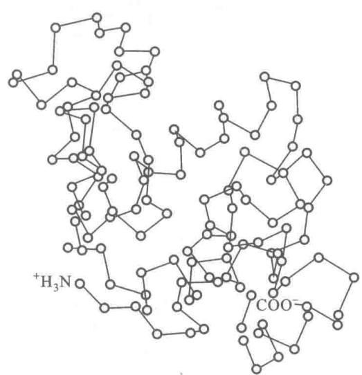  
图8-12 溶菌酶的三维结构

置,只是第4个糖残基D环因空间的原因必须由正常的椅式变形为能量较高的半椅式构象。因此糖苷键的稳定性降低,键就容易从这里断裂。

进一步问题是酶的催化作用,究竟键是在糖苷氧原子的哪一侧被裂解的?回答这个问题,可以在 $H_{2}^{18}O$ 溶液中酶促水解底物( $NAG$ ) $_{6}$ ,发现只有D糖C1上含有 $^{18}O$ ,而E糖的C4羟基只含普通的O,由此可知这个键断裂在D糖基的C1和E残基的糖苷键的O之间(图8-14)。分析D-E键周围的微环境,最活泼的基团显然是 $Asp_{52}$ 和 $Glu_{35}$ ,它们分别位于糖苷键两侧。 $Asp_{52}$ 位于糖苷键的一侧,而 $Glu_{35}$ 在另一侧。这两个酸性侧链具有明显不同的微环境。 $Asp_{52}$ 是在一个明显的极性环境中,在那里它在一个复杂的氢键网络中起着氢键受体的作用。相反, $Glu_{35}$ 位于非极性区。这样在pH5下,这是溶菌酶水解几丁质的最适pH。 $Asp_{52}$ 侧链羧基为解离的 $COO^{-}$ 形式,而 $Glu_{35}$ 的侧链羧基则为质子化未电离的COOH形式,侧链基团的氢原子与这个糖苷键氧原子的距离大约为0.3nm(图8-15),这个距离正好能够形成氢键。

D. Phillips 等人根据上述研究资料提出了溶菌酶的催化作用机制,要点如下:

（1） $\mathrm{Glu}_{35}$ 的一COOH 提供一个 $\mathrm{H}^{+}$ 到 D 环与 E 环间的糖苷键 O 原子上。 $\mathrm{H}^{+}$ 的转移使 D 环的 C1 键与糖苷键 O 原子间的键断开，并形成正碳离子过渡态中间产物（图 8-16）。

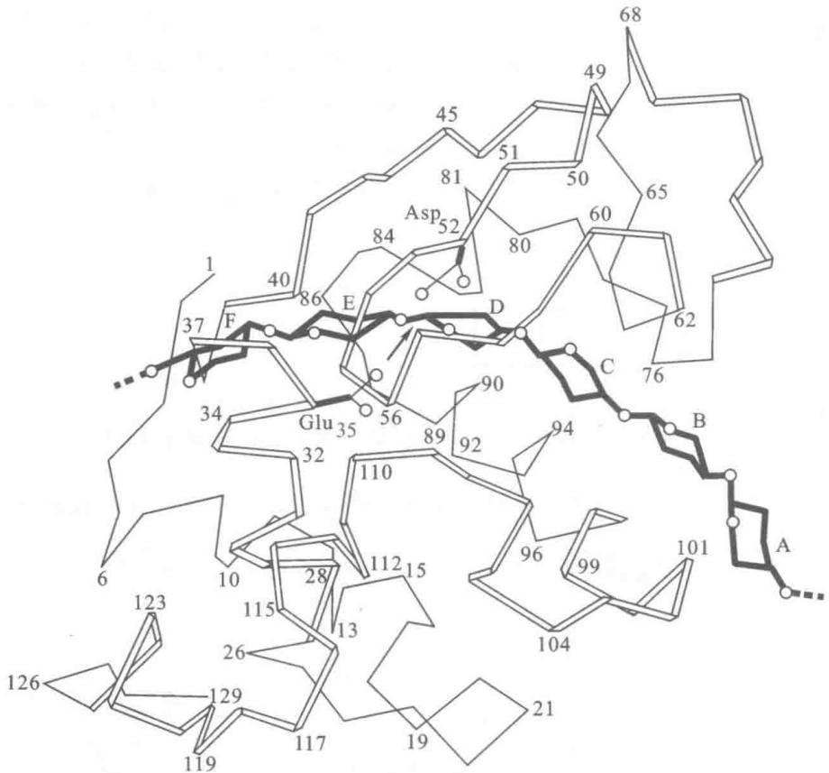  
图 8-13 溶菌酶-底物复合物  
表示 $\mathrm{Glu}_{35}$ 及 $\mathrm{Asp}_{52}$ 对D环的作用及D环有形变

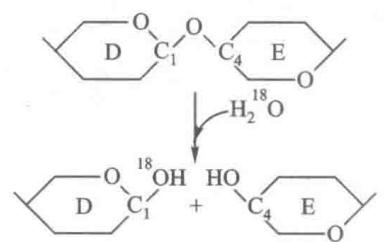

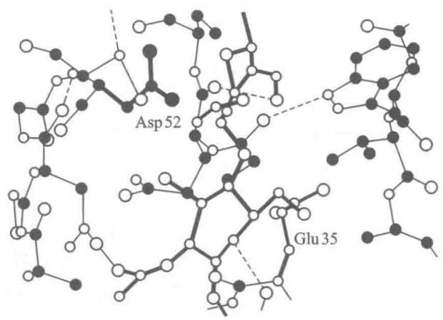  
图8-15 溶菌酶活性部位的部分结构

图8-14 溶菌酶在 $\mathrm{H}_2^{18}\mathrm{O}$ 溶液中水解底  
物，证明在D-E环之间 $\mathrm{C}_1 - \mathrm{O}$ 键断裂  
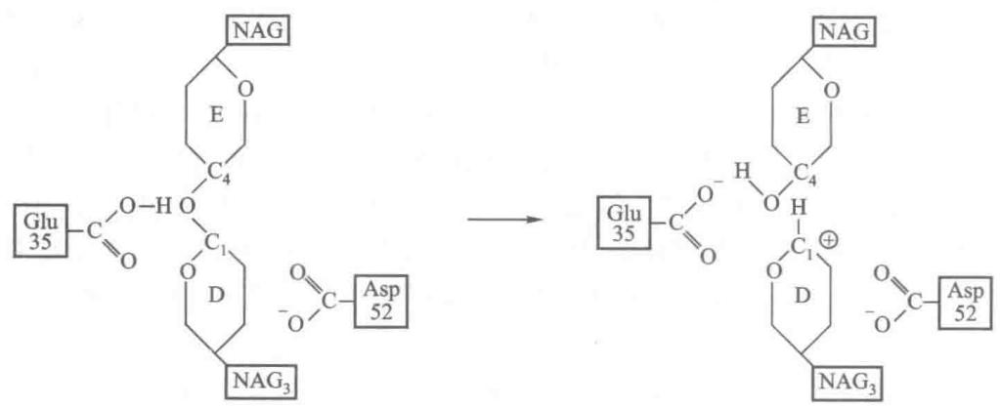  
图8-16 溶菌酶催化作用  
第一步是质子转移,糖苷键被裂解,形成一个正碳离子中间物

(2) 含有 E 及 F 残基的 NAG 二聚体离开酶分子。

（3）正碳离子中间产物进一步与来自溶剂的 $OH^{-}$ 发生反应（图 8-17） $Glu_{35}$ 质子化，由 A、B、C 和 D 残基组成的 NAG 四聚体通过扩散离开酶分子，然后溶菌酶为新的一轮催化过程做好了准备。

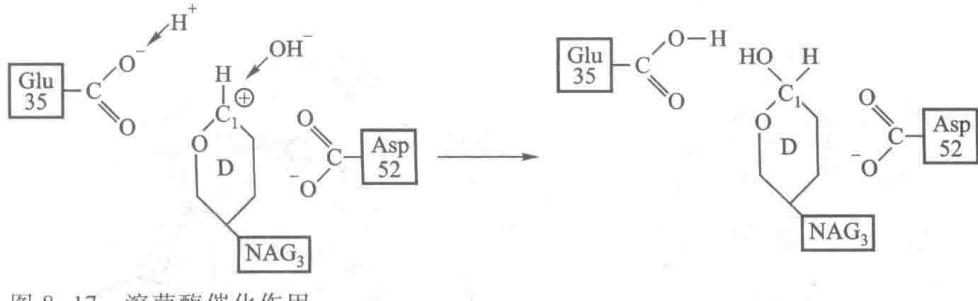  
图 8-17 溶菌酶催化作用  
第二步是 $OH^{-}$ 和 $H^{+}$ 分别加合到正碳离子中间物和 $Glu_{35}$ 的侧链后，水解反应完成

上述的催化机制中,关键要素为:

（1）广义的酸催化， $Glu_{35}$ 以酸的形式提供质子，它和糖苷键氧原子的距离为 0.3 nm，正是合适的作用距离。

（2）正碳离子中间产物的形成与稳定，一方面由于 $Asp_{52}$ 带有负电荷的羧酸基通过静电相互作用稳定 D 环中 C1 的正电荷；另一方面由于 D 环的形变，由椅式构象变为半椅式，使 D 环上 C1、C2、C5、和 O 都在一个平面上，氧原子的负电性可以使正碳离子稳定。因此可以说，在结合底物时，酶迫使底物采取了接近于过渡态的构象。

D. Phillips 根据晶体学研究提出的底物结合方式和催化作用机制,通过各种化学实验得到证实,Phillips 机制几十年来得到广泛接受。但是,近年来有人提出溶菌酶另外一种催化作用机制,认为催化的第一步反应形成共价中间物而不是正碳离子中间物。2001 年 W. Stephen 等人用突变溶菌酶(将 Glu $_{35}$ 突变为 Gln)和人工合成底物降低酶促反应速率,通过质谱仪和 X 射线晶体结构分析验证了共价中间物的存在。至于溶菌酶哪种作用机制阐明的更符合事实,有待人们设计更多令人信服的实验来证明。

## (二) 碳酸酐酶

## 1. 碳酸酐酶(carbonic anhydrase)使 $CO_{2}$ 水合反应更快

$CO_{2}$ 是需氧代谢的主要终端产物，在哺乳动物中， $CO_{2}$ 被释放进入血液并转运到肺呼出。在红细胞中 $CO_{2}$ 同水反应，反应产物为中等强度的碳酸 $(pK_{a}=3.5)$ ，而后失去一个质子转变为碳酸氢离子 $\left(\mathrm{HCO}_{3}^{-}\right)$ 。

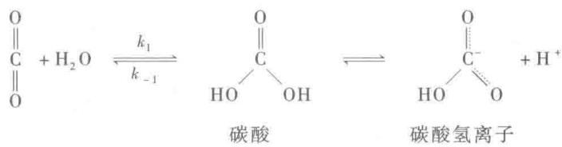

甚至在无催化剂时，水合反应也以中等快地速度进行。在 $37^{\circ}\mathrm{C}$ ，接近中性 $\mathrm{pH}$ ，二级速率常数 $k_{1}$ 是 $0.0027\mathrm{mol}^{-1}\cdot \mathrm{L}\cdot \mathrm{s}^{-1}$ ，该值相当于在水中 $([\mathrm{H}_2\mathrm{O}] = 55.5\mathrm{mol}\cdot \mathrm{L}^{-1})$ 实际的一级速率常数 $0.15\mathrm{s}^{-1}$ 。 $\mathrm{HCO_3^-}$ 脱水合的可逆反应甚至更迅速，速率常数 $k_{-1} = 50\mathrm{s}^{-1}$ 。这些速率常数相应的平衡常数 $K = 5.4\times 10^{-5}$ ，在平衡时 $[\mathrm{CO}_{2}] / [\mathrm{H}_{2}\mathrm{CO}_{3}]$ 比率 $340:1$ 。

$CO_{2}$ 水合和 $HCO_{3}^{-}$ 脱水合常被偶联成迅速过程，即特殊的转运过程。几乎所有的有机体都含有碳酸酐酶，它所增加地反应速率远远超过自发进行的速率。碳酸酐酶显著地促进 $CO_{2}$ 水合，水合 $CO_{2}$ 的速率 $k_{cat}=10^{6}s^{-1}$ ，即每秒钟每个酶分子可水合百万个 $CO_{2}$ 分子，其催化效率指数 $(k_{\mathrm{cat}}/K_{\mathrm{m}})$ 为 $8.3\times10^{7}\mathrm{mol}^{-1}\cdot\mathrm{L}\cdot\mathrm{s}^{-1}$ ，已达到酶催化效率的完美程度。

## 2. 碳酸酐酶含有一个催化活性必需的锌离子

1932年发现碳酸酐酶后不到10年，就确认有一个锌结合于酶的单肽链上 $(M_{\mathrm{r}}30\times 10^{3})$ ，而且这个锌离子对酶的催化活性是必需的。碳酸酐酶是首先被发现含锌的酶，现在已知几百种酶都含有锌。X射线晶体结构分析研究提供了碳酸酐酶中有关锌部位最详细和最直接的信息。在人类至少有7种碳酸酐酶，每种都有各自的基因，其实质顺序的同一性，显然说明它们是同源的。碳酸酐酶Ⅱ作为红细胞的主要蛋白组分，已被广泛的研究（图8-18），它也是最具活性的碳酸酐酶之一。

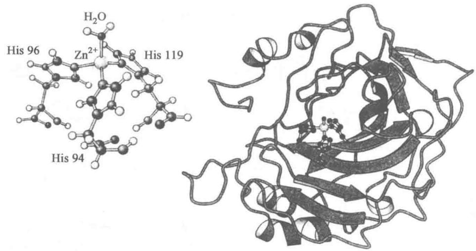  
图8-18 人碳酸酐酶Ⅱ的结构和它的锌部位  
左图表示锌离子与3个His残基的咪唑环和1个水分子相结合；右图表示锌位于靠近酶中心的裂缝中

在生物系统锌仅以+2态存在,1个锌原子常常结合4个或更多个配基,在碳酸酐酶中,3个配位被3个His残基的咪唑环所占据,另外一个配位被1个水分子占据(或依赖于pH的 $OH^{-}$ ),因为占据配位的分子是电中性的, $\mathrm{Zn(His)}_{3}$ 单位整个电荷保持+2。

## 3. 催化作用必需锌活化水分子

从 pH 对碳酸酐酶活性的影响可知, 结合到正电荷锌中心的水分子 $pK_{a}$ 从 15.7 降低到 7(图 8-19), 随着 $pK_{a}$ 的降低, 许多水分子在中性 pH 失去 1 个质子产生高浓度的羟离子结合到锌原子。锌-结合羟离子 $(\mathrm{OH}^{-})$ 是强的亲核剂, 比水更容易攻击 $CO_{2}$ 。邻近锌部位, 碳酸酐酶也有一个疏水区作为 $CO_{2}$ 结合部位。基于上述观察, 提出了 $CO_{2}$ 水合的机制(图 8-20)。

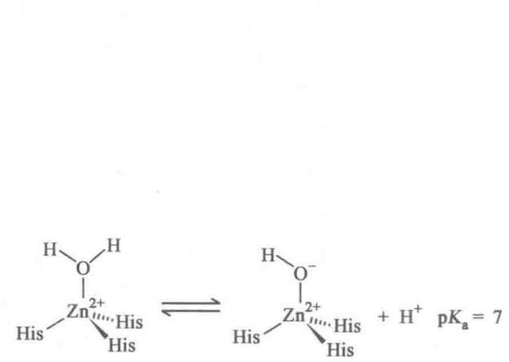  
· 图 8-19 锌-结合水的 $pK_{a}$  
结合锌降低了水的 $\mathrm{pK}_{\mathrm{n}}$ 从15.7变为7

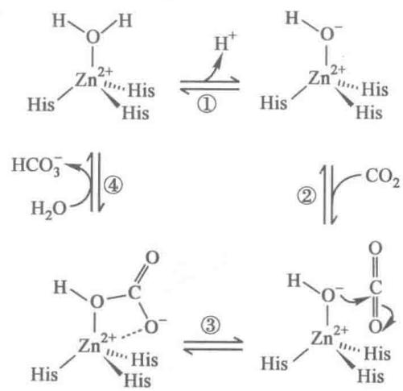  
图 8-20 碳酸酐酶催化机制  
反应经历4个步骤：①水脱质子；②结合 $\mathrm{CO}_{2}$ ；③羟基亲核攻击 $\mathrm{CO}_{2}$ ；④水置换 $\mathrm{HCO}_3^-$

（1）锌离子促进从水分子释放1个质子产生1个羟离子；

(2) $CO_{2}$ 底物结合到酶活性部位, 并且将羟离子反应定位到适当位置;

（3）羟离子攻击 $CO_{2}$ 转换成碳酸氢离子 ( $HCO_{3}^{-}$ )；

（4）释放 $HCO_{3}^{-}$ ，催化部位再生，并结合另外的水分子。

这样,水分子结合锌离子,通过促进质子释放和将水分子定位于紧邻的反应物,则有助于形成过渡态。用人工合成的类似物模型系统进行了研究,为该反应机制的可能性提供了证据,结果表明该模型系统有力的证明锌-结合羟基的机制是正确的。

## 4. 质子梭能促进酶活性形式的迅速再生

研究证明,为了克服从锌-结合水分子对质子转移速度的限制,碳酸酐酶有一个质子梭(proton shuttle)转移质子到缓冲剂。为实现 $CO_{2}$ 水合的高速率,需要存在缓冲剂,认为缓冲剂参加反应,并能结合和释放质子。许多缓冲剂分子成分要达到碳酸酐酶活性部位也显太大,碳酸酐酶Ⅱ形成一个质子梭让缓冲剂组分在溶液中参加反应。这个梭的主要组分是 $His_{64}$ 。该残基从锌-结合水转移质子到蛋白质表面,而后到缓冲剂(图8-21),促进了酶活性形式的自生。因此酶的催化功能通过质子梭的作用而增强。

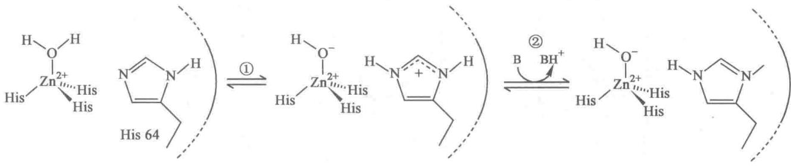  
图8-21 His质子梭  
① His $_{64}$ 从锌-结合水分子吸取一个质子产生亲核羟离子并质子化 His;② 缓冲剂 B 从 His 除去一个质子再生为未质子化的形式

## （三）丝氨酸蛋白酶

丝氨酸蛋白酶(serine protease)是一类最有特色的酶家族。这个家族包括胰蛋白酶(trypsin)、胰凝乳蛋白酶(chymotrypsin)、弹性蛋白酶(elastase)、凝血酶(thrombin)、枯草杆菌蛋白酶(subtilisin)、纤溶酶(plasmin)、组织纤溶酶原激活剂(tissue plasminogen activator, tPA)和其他有关的酶类。头3种酶为消化酶，在胰腺中合成，并以非活性的酶原形式分泌到消化道中，在消化道中酶原通过除去部分肽链转变成活性酶形式。凝血酶在血凝级联(blood clotting cascade)中是一个重要的酶。枯草杆菌蛋白酶是一种细菌蛋白酶，而纤溶酶能裂解血凝块的纤维多聚体。tPA特异地激活纤溶酶原成为纤溶酶，后者有溶解血块的能力。最后，乙酰胆碱酯酶(acetylcholinesterase)虽然本身不是一种蛋白酶，而是一种丝氨酸酯酶，但具有丝氨酸蛋白酶的相关作用机制，能降解神经递质乙酰胆碱。

## 1. 消化作用的丝氨酸蛋白酶

胰蛋白酶、胰凝乳蛋白酶和弹性蛋白酶执行着相同的反应——裂解肽键，虽然它们结构和作用机制很相似，但专一性明显不同。胰蛋白酶裂解碱性氨基酸 Arg 或 Lys 羰基侧肽键，胰凝乳蛋白酶选择裂解芳香氨基酸如像 Phe 和 Tyr 羰基侧肽键，弹性蛋白酶不像前 2 种酶的专一性，它主要裂解小的中性氨基酸残基羰基侧肽键。这 3 种酶相对分子质量约 $25 \times 10^{3}$ ，并且具有相似的顺序（图 8-22）和三级结构。D. Blow 于 1967 年解析了胰凝乳蛋白酶的三维结构（图 8-23）。此分子是一个紧密的椭球体，大小为 $5.1 \mathrm{~nm} \times 4.0 \mathrm{~nm} \times 4.0 \mathrm{~nm}$ ，在 C 端含一个 $\alpha$ 螺旋（残基 230 到 245）和几个 $\beta$ 片层域。多数芳香和疏水残基包埋在蛋白质内部，而多数带电的或者亲水的残基分布在分子表面。3 个极性残基—— $\mathrm{His}_{57}$ 、 $\mathrm{Asp}_{102}$ 和 $\mathrm{Ser}_{195}$ 在活性部位形成熟知的催化三联体（catalytic triad）（图 8-24）。这 3 个残基也存在于胰蛋白酶和弹性蛋白酶。酶活性部位位于酶分子表面凹陷的小口袋中，可用于鉴别酶对残基的专一性（图 8-25）。例如在胰凝乳蛋白酶中，有一个被疏水氨基酸环绕的口袋，大的足以容纳一个芳香残基。在胰蛋白酶口袋中，有一个负电荷 $\mathrm{Asp}_{189}$ 在底部，有利于结合正电荷 Arg 和 Lys 残基。另一方面弹性蛋白酶有一个浅的口袋，在开口处具有大的 Thr 和 Val 残基，仅仅小的、不大的残基能够容纳在它的口袋中。肽底物的骨架以反平行的方式氢键结合到残基 $215 \sim 219$ 上，这样被裂解的肽键就紧密地与 $\mathrm{His}_{57}$ 和 $\mathrm{Ser}_{195}$ 相结合。

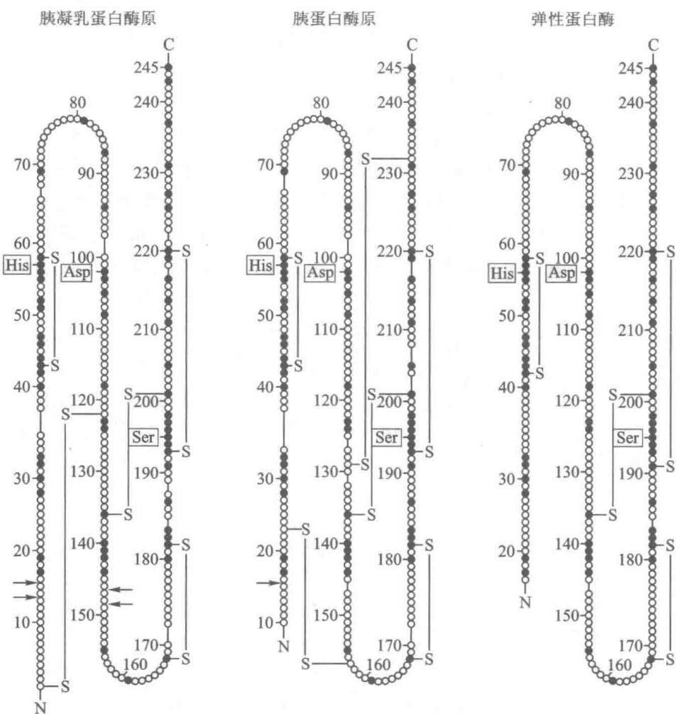  
图 8-22 胰凝乳蛋白酶原、胰蛋白酶原和弹性蛋白酶氨基酸顺序的比较  
每个圆圈代表一种氨基酸。号码是根据胰凝乳蛋白酶原的顺序。实圈表示所有3种蛋白质相同的残基。二硫键用黑线表示，已标出3种催化上重要的活性部位的残基（His $_{57}$ 、Asp $_{102}$ 、Ser $_{195}$ ）位置

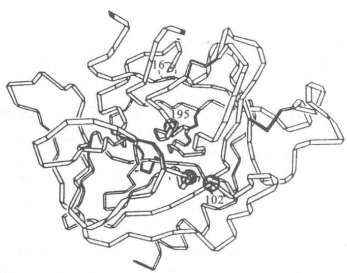  
图8-23 $\alpha$ -胰凝乳蛋白酶的三维结构  
只表示出 $\alpha$ -碳原子，在催化中起重要作用的残基用圆圈标出

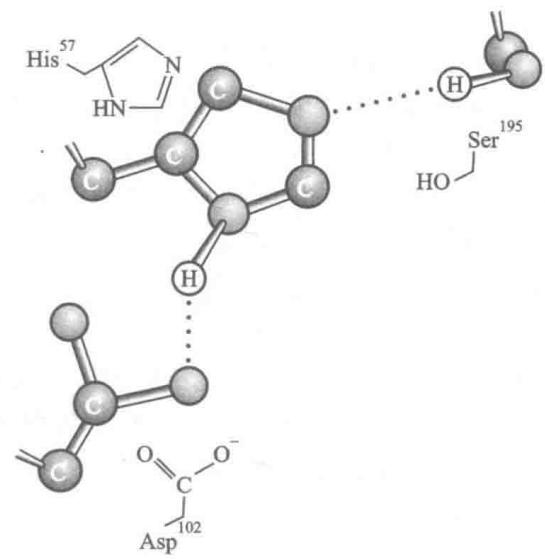  
图 8-24 胰凝乳蛋白酶的催化三联体

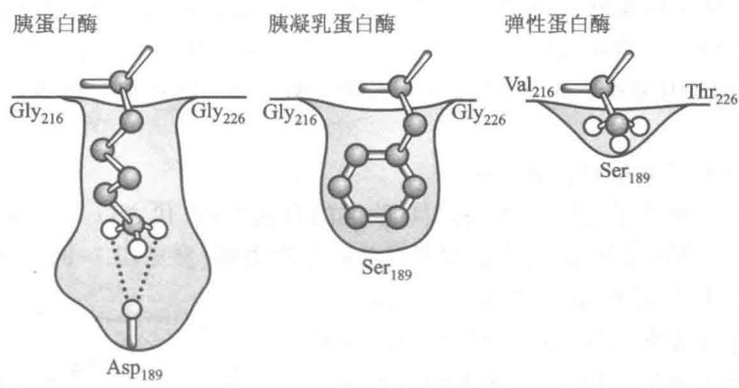  
图 8-25 胰蛋白酶、胰凝乳蛋白酶和弹性蛋白酶底物结合口袋

胰凝乳蛋白酶与底物类似物复合物的晶体学研究已说明了专一性识别部位的位置以及敏感肽键的可能取向。甲酰色氨酸与胰凝乳蛋白酶结合，将其吲哚侧链正好装进 $\mathrm{Ser}_{195}$ 附近的口袋中（图8-26）。这个较深的沟足以说明胰凝乳蛋白酶对芳香族和其他大的疏水性侧链的专一性。胰凝乳蛋白酶与多肽底物类似物复合体晶体结构分析指出了底物主链和酶的主链之间形成广泛的氢键。氢键的模式与反平行β片层中的相似。

## 2. 胰凝乳蛋白酶中的催化三联体

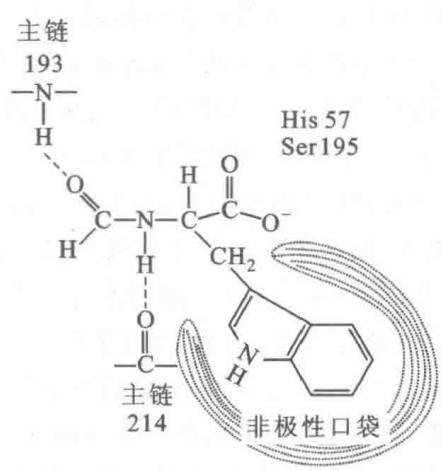

胰凝乳蛋白酶的催化活性依赖于 $Ser_{195}$ 的异常反应活性。在生理条件下， $-CH_{2}OH$ 基一般是很不活泼的。究竟什么原因使它在胰凝乳蛋白酶的活性部位中这样活泼呢？从这个酶三维结构的 X 射线晶体结构研究中得出一个可能的解释。正如从亲和标记工作中可预料到的， $His_{57}$ 确与 $Ser_{195}$ 相邻近， $Asp_{102}$ 的羧基侧链也在其附近（图 8-27）。这 3 个残基形成催化三联体（catalytic triad）。

图 8-26 底物类似物甲酰-L-色氨酸与胰凝乳蛋白酶结合情况的示意图

在没有底物时， $\mathrm{His}_{57}$ 是未质子化的（图8-28），然而当 $\mathrm{Ser}_{195}$ 羟基氧原子对底物进行亲核攻击时，它从 $\mathrm{Ser}_{195}$ 接受一个质子， $\mathrm{Asp}_{102}$ 的 $\mathrm{COO}^{-}$ 作用是稳定过渡态中 $\mathrm{His}_{57}$ 的正电荷形式，此外， $\mathrm{Asp}_{102}$ 定向 $\mathrm{His}_{57}$ 并保证从 $\mathrm{Ser}_{195}$ 接受一个质子处于适当的互变异构形式。

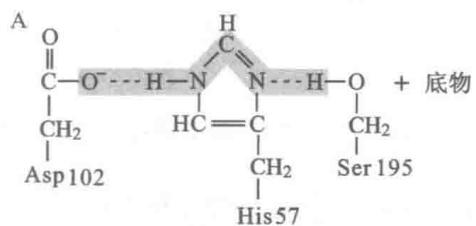

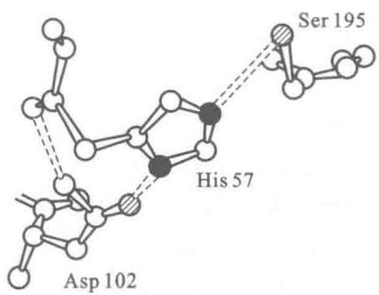  
图 8-27 胰凝乳蛋白酶中 Ser-His-Asp 催化三联体的构象

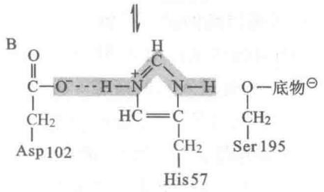  
图 8-28 催化三联体-电荷转移系统  
电荷在阴影所示的线路上可来回“接力赛跑”，这里 His57 起着广义酸碱的作用

为了证明催化三联体对丝氨酸蛋白酶催化中的作用，采用定点诱变的技术对枯草杆菌蛋白酶催化三联体的三个氨基酸残基 $\left(\mathrm{Ser}_{221},\mathrm{His}_{64},\mathrm{Asp}_{32}\right)$ 分别用Ala代替 $Ser_{221}$ ， $His_{64}$ 和 $Asp_{32}$ 得到3种突变酶，发现 $k_{cal}$ 明显降低，仅为野生型酶的0.005%， $K_{m}$ 并未改变。实验说明了丝氨酸蛋白酶的催化作用是通过催化三联体进行的。

## 3. 胰凝乳蛋白酶催化机制的动力学研究

丝氨酸蛋白酶是水解酶类,但它并不催化水对肽键的直接水解,代之以只形成一个过渡性的共价酰基-酶中间物。关于酰基-酶中间物的最先证据来自前稳态动力学(参见图7-8)的研究。

胰凝乳蛋白酶催化机制可通过水解人工合成底物——简单的有机酯进行研究，如乙酸-p-硝基苯酯、氨基酸类似物的甲酯如甲酰苯丙氨酸甲酯、乙酰苯丙氨酸甲酯和苯甲酰丙氨酸甲酯。乙酸-p-硝基苯酯是一种特别有用的模型底物，因为硝基酚产物在400 nm有强烈的光吸收，容易被观察。当用它进行凝乳蛋白酶动力学研究时，发现反应分两个不同的阶段，开始以突发速率生成p-硝基苯酚，随后成为一个慢的稳态速率（图8-29）。第一步是乙酸-p-硝基苯酯与胰凝乳蛋白酶结合后形成一个酶-底物（ES）复合物（图8-30），底物的酯键被裂解。然后产物之一的p-硝基苯酚从酶上释放出来，而底物乙酰基就以共价键与酶的 $Ser_{195}$ 结合。随后水分子攻击乙酰-酶复合物，释放出乙酸根离子，并使酶再生（图8-30）。p-硝基苯酚开始生成时的迅速突发阶段相当于乙酰-酶复合物的形成，这步反应称为酰化作用（acylation）。在慢的稳态阶段相当

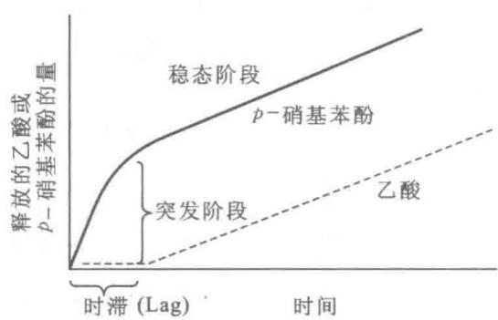  
图 8-29 胰凝乳蛋白酶催化乙酸-p-硝基苯酯水解的动力学曲线  
突发地产生 p-硝基苯酚之后，紧接着是更慢的、稳态的释放。在一个初始的延缓周期之后，即观察到乙酸的释放。这个动力学模型与酰化-酶中间物的迅速形成是一致的。更慢的、稳态的释放产物相当于酰基-酶中间物限速的裂解

于乙酰-酶复合物通过水解再生为游离的酶,第二步称为脱酰作用(deacylation),是胰凝乳蛋白酶催化酯水解的限速步骤。

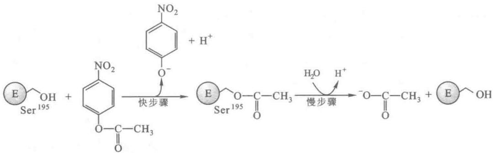  
图 8-30 酰基-酶中间物的迅速形成(酰化),随后缓慢地释放产物(脱酰)

实际上，酰基-酶复合物是相当稳定的，从而在适当条件下可以分离出来。

## 4. 丝氨酸蛋白酶的催化机制

肽水解的可能机制如图8-31所示，通过酰化和脱酰化两步进行。底物肽的骨架结合到邻近的催化三联体，从专一侧链进入它的口袋。催化三联体的 $\mathrm{Asp}_{102}$ 通过一个氢键定位并固定 $\mathrm{His}_{57}$ 。反应的第一步， $\mathrm{His}_{57}$ 作为一个广义碱从 $\mathrm{Ser}_{195}$ 吸取一个质子，促进 $\mathrm{Ser}_{195}$ 亲核攻击要断裂肽键的羰基碳。这是一个协调步骤， $\mathrm{Ser}_{195}$ 攻击羰基碳前质子转移，将留下一个相当不稳定的Ser氧的负电荷，形成酰基酶共价复合物。在下一步骤中，从 $\mathrm{His}_{57}$ 质子供体给肽的酰胺氮，得到共价的质子化胺，形成四面体中间物，随后促进键的断裂，和产物胺的解离。肽上氧的负电荷是不稳定的，这个四面体中间物是短暂的，能迅速地断裂除去产物胺。酰基酶中间物有一定稳定性，甚至用不能进一步反应的底物类以物能够分离出来。然而，用正常的肽底物，随后为脱酰化，用水亲核攻击羰基碳，产生另一个过渡态四面体中间物（图8-31）。在这一步中

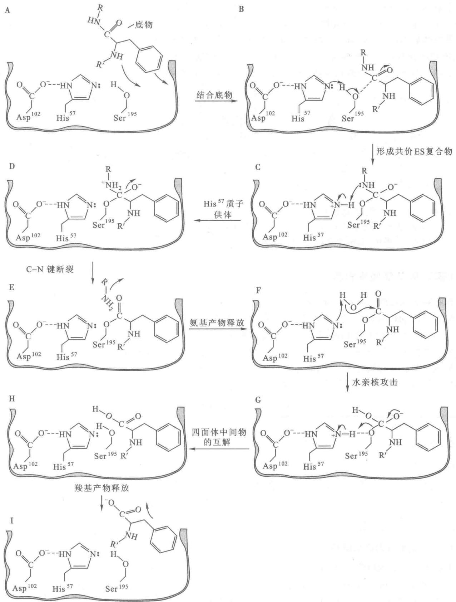  
图8-31 胰凝乳蛋白酶反应的详细机制

His $_{57}$ 作为广义碱从攻击的水分子接受一个质子。随后通过 His $_{57}$ 提供质子给 Ser 氧，以协调的方式帮助四面体中间物瓦解。羧基脱去质子，并从活性部位脱离，完成了整个反应。丝氨酸蛋白酶的催化机制说明了过渡态稳定性的原理，也提供了一种典型的酸-碱催化和共价催化的例子。

## 5. 其他三类蛋白水解酶——半脱氨酸蛋白酶、天冬氨酸蛋白酶和金属蛋白酶

半胱氨酸蛋白酶类(cysteine proteases)中研究较多的为木瓜蛋白酶(papain)，这类酶参与酶催化作用的是半胱氨酸残基和组氨酸残基，半胱氨酸残基被组氨酸残基激活，而后作为亲核剂攻击肽键。天冬氨酸蛋白酶类(aspartic proteases)如胃蛋白酶、肾素等，活性部位由2个天冬氨酸残基构成(详见下面部分)。金属蛋白酶类(metal proteases)如嗜热菌蛋白酶、羧肽酶A和碳酸酐酶[见本节(二)]，含有金属离子 $\mathrm{Zn}^{2+}$ ，通过活化的水分子作为亲核剂，攻击肽羰基。这三类酶活性部位具有以下的作用特点：① 活化水分子或别的亲核体；② 极化的肽羰基；③ 形成一个四面体中间物，如图8-32所示。

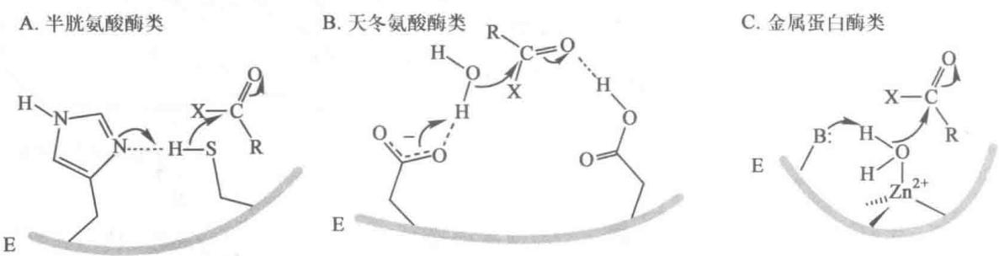  
图 8-32 三类蛋白酶的激活机制  
A. 半胱氨酸蛋白酶中 His $^{-}$ 活化的 cys; B. 天冬氨酸蛋白酶中 Asp $^{-}$ 活化的水分子; C. 金属蛋白酶中金属离子-活化的水分子, 图 C 中 B 代表碱 (常常是 Glu), 帮助金属离子结合水脱质子

## （四）天冬氨酸蛋白酶

天冬氨酸蛋白酶(aspartic protease)作为一个蛋白水解酶的家族产生于哺乳动物、霉菌和高等植物。这些酶在酸性pH(或有时中性)表现活性,并且在活性部位具有两个Asp。天冬氨酸酶具有各种功能(表8-7),包括消化(胃蛋白酶和凝乳酶)、溶酶体蛋白的降解(组织蛋白酶D和E)和调节血压(肾素是一种天冬氨酸蛋白酶,包括产生血管紧张肽,它是一种刺激平滑肌收缩和降低盐及体液分泌的激素)。天冬氨酸蛋白酶有多种底物专一性,但它们通常是断裂两个疏水氨基酸残基之间的肽键。例如,胃蛋白酶的选择性底物为被断裂肽键两侧为芳香氨基酸残基。

表 8-7 天冬氨酸酶的某些代表

<table><tr><td>名称</td><td>来源</td><td>功能</td></tr><tr><td>胃蛋白酶(pepsin)</td><td>动物胃</td><td>消化饮食蛋白</td></tr><tr><td>凝乳酶(chymosin)</td><td>动物胃</td><td>消化饮食蛋白</td></tr><tr><td>组织蛋白酶D(cathepsin D)</td><td>脾、肝和许多其他动物组织</td><td>溶酶体蛋白消化</td></tr><tr><td>肾素(renin)</td><td>肾</td><td>转换血管紧张肽原成为血管紧张肽I;调节血压</td></tr><tr><td>HIV-1蛋白酶(HIV-1 protease)</td><td>AIDS病毒</td><td>加工.AIDS病毒蛋白</td></tr></table>

## 1. 天冬氨酸蛋白酶的结构

多数天冬氨酸蛋白酶含有323\~340个氨基酸残基，相对分子质量近 $35\times10^{3}$ 。天冬氨酸蛋白酶多肽链含有两个相似的结构域，折叠形成三级结构，它是由近似双重对称的2个相似叶片构成的。每个结构域由2个 $\beta$ 片层和2个短的 $\alpha$ 螺旋构成。这2个结构域通过6股反平行的 $\beta$ 片层桥联起来（图8-33）。酶的活性部位是一个深的、伸展的裂缝，是由2个并列的结构域形成的，大的足以容纳大约7个氨基酸残基。例如猪胃蛋白酶中2个催化的天冬氨酸残基 $Asp_{32}$ 和 $Asp_{215}$ 就位于活性部位裂缝的中心，N-结构域形成一个“活板”（flap）延伸到活性部位上，可以

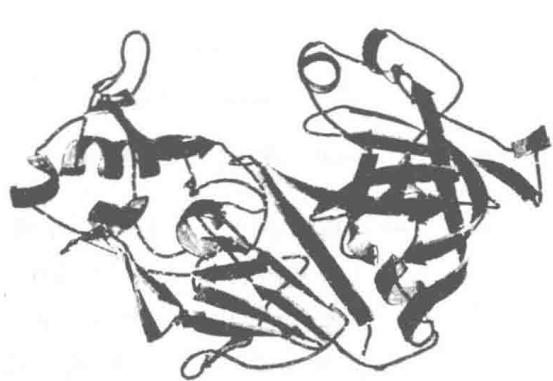  
图 8-33 胃蛋白酶的结构(一个单体)

帮助活性部位固定底物。

## 2. 天冬氨酸蛋白酶的作用机制

与同胰蛋白酶、胰凝乳蛋白酶和其他丝氨酸蛋白酶相比，曾提出假设，天冬氨酸蛋白酶可能是通过活性部位的天冬氨酸形成共价酶-底物中间物。但是，并没有分离出共价中间物，因此多认为天冬氨酸蛋白酶不是生成共价酶-底物中间物，而是广义酸-广义碱的催化机制。

蛋白酶活性的 pH 依赖性支持了广义酸-广义碱的催化模式,假设天冬氨酸残基要么作为广义酸要么作为广义碱。这个模式要求当底物结合时,一个天冬氨酸羧基质子化,另一个脱质子。从天冬氨酸蛋白酶的 X 射线晶体结构分析资料表明,邻近的 2 个天冬氨酸活性部位结构是高度对称的。这 2 个天冬氨酸表现为“催化二联体”(catalytic diad)的作用(类似于丝氨酸蛋白酶的催化三联体)。该二联体的质子在自由酶或酶-底物复合物中可以被共价结合到天冬氨酸基团的任何一个。例如:胃蛋白酶中, $Asp_{32}$ 可以脱质子而 $Asp_{215}$ 质子化或者相反。

在最广泛接受的机制中(图8-34)，随着底物的结合，2个协调的质子转移，促进水对底物羰基碳的亲核攻击，在该机制中显示， $\mathrm{Asp}_{32}$ 作为一种广义碱从活性水分子接受一个质子，而 $\mathrm{Asp}_{215}$ 作为一种广义酸提供一个质子给肽羰基氧，得到的中间产物称为酰胺水合物（amide hydrate）。注意这2个天冬氨酸残基的质子化状态现在与自由酶的正相反(图8-34)。酰胺水合物通过类似于它形成的机制被破坏，离子化的天冬氨酸羧基(图8-34中 $\mathrm{Asp}_{32}$ )作为一种广义碱从酰胺水合物一个羟基接受质子，同时另外一个天冬氨酸 $(\mathrm{Asp}_{215})$ 的质子化羧基作为一种广义酸提供一个质子给释放的肽产物之一的氮原子，即完成这一水解过程。

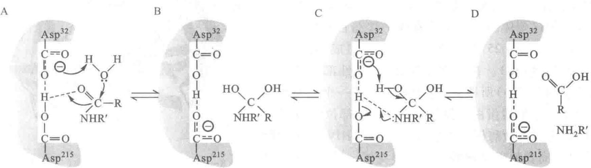  
图 8-34 天冬氨酸蛋白酶作用机制  
在第一步中，2个协调质子的转移促进了水对底物羰基碳的亲核攻击。在第三步中，一个天冬氨酸残基（在胃蛋白酶中 $\mathrm{Asp}_{32}$ ）从酰胺水合物中的一个羟基接受一个质子，而另外一个天冬氨酸（ $\mathrm{Asp}_{215}$ ）提供一个质子给释放胺的氮

然而，S. Piana 和 P. Carloni 于 2000 年报道了天冬氨酸酶分子动态模拟是与活性部位含有 2 个 Asp 的低障氢键（low-barrier hydrogen bond, LBHB，当氢交换的障碍降到或低于氢零点的能量水平，即为 LBHB 的相互作用）一致的。因此，提出了天冬氨酸蛋白酶新的作用机制（图 8-35），从 Piana 和 Carloni LBHB 游离酶（E 状态）的结构模型开始。此模型中，在同一平面构象中 LBHB 持有成对的 Asp 羧基，同催化水分子位于一个十原子环形结构的对侧。随着结合底物，电子逆时针方向流动，推动 2 个质子向顺时针方向产生结合 2 个质子酶形式（FT）的四面体中间物。然后，电子顺时针方向移动，推动 2 个质子逆时针方向，产生结合一个单质子酶形式（ET'）的兼性离子中间物。而后兼性离子互解，裂解底物的 C—N 键，一种产物解离，脱离双质子 FQ 形式的酶。最后，脱质子和重水合使十原子环形结构 E 再生。

## 3. AIDS 病毒 HIV-1 蛋白酶是一种天冬氨酸蛋白酶

获得性免疫缺陷综合征(AIDS,艾滋病)和引起它的病毒介质,人免疫缺陷病毒(HIV-1)的近期研究,获得一种新的天冬氨酸蛋白酶(HIV-1蛋白酶)。HIV-1蛋白酶裂解HIV-1基因组的多聚蛋白(polyprotein)产物,产生为病毒生长和细胞感染所需的几种蛋白。

HIV-1 蛋白酶是哺乳动物天冬氨酸蛋白酶的病毒仿制品, 是一个相同亚基的二聚体, 模仿胃蛋白酶和其他天冬氨酸蛋白酶的双叶单体结构。HIV-1蛋白酶亚基含99个残基、相对分子质量为 $11\times10^{3}$ 的多肽，同单体蛋白酶单独的结构域是相似的。X射线晶体结构的研究显示，在同型二聚体的分界面形成HIV-1蛋白酶的活性部位，由Asp25和Asp25'两个天冬氨酸残基组成，每个亚基贡献一个（图8-36）。在同型二聚体中，活性部位被两个相同的“活板”（flap）所覆盖，每个亚基提供一个。与此相比，而单体天冬氨酸蛋白酶仅具有一个活性部位“活板”。

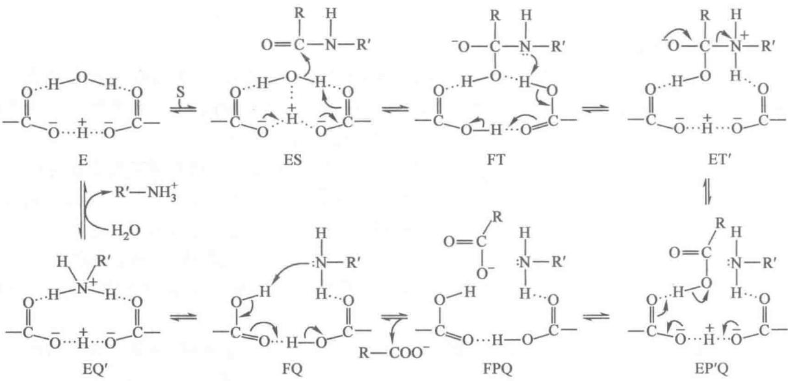  
图 8-35 天冬氨酸蛋白酶作用机制  
E 代表催化的 Asp 之间具有低障氢键的酶形式；F 代表 2 个 Asp 质子化并被常规氢键连接的酶形式；S 代表结合底物；T 代表四面体酰胺水合中间物；P 代表结合羧基的产物和 Q 代表结合胺的产物

Meek 等人所做酶促动力学的研究表明 HIV-1 蛋白酶的作用机制同其他天冬氨酸蛋白酶很类似。活性部位的 2 个 Asp 羧基促进水对肽键的攻击而断裂,被水攻击裂解的

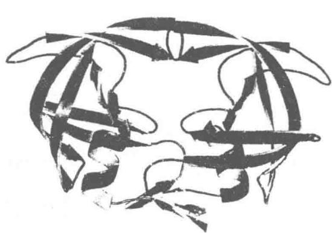  
图 8-36 HIV-1 蛋白酶的结构(二聚体)

羰基生成的初始产物是一种不稳定的四面体中间物，然后再分解成产物（图8-37）。

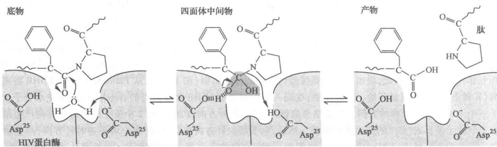  
图 8-37 HIV 蛋白酶作用机制  
活性部位的2个Asp残基(从不同亚基)作为广义酸-碱催化,促进水分子攻击肽键,在反应途径中生成不稳定的四面体中间物

## 4. HIV-1 蛋白酶抑制剂—治疗 AIDS 的药物

根据 HIV-1 蛋白酶的作用机制(图 8-37)在酶促过程中生成非共价四面体过渡态复合物,人们依此设计出各种过渡态类似物作为该酶的抑制剂。这些蛋白酶抑制剂与酶紧密结合形成非共价复合物,可认为是酶的不可逆抑制剂,这些蛋白酶抑制剂已作为治疗 AIDS 的有效药物。

HIV-1 蛋白酶容易裂解 Phe 和 Pro 残基之间的肽键, 酶活性部位有一个口袋, 能结合靠近被裂解芳香基的肽键。几种 HIV 蛋白酶抑制剂的结构如图 8-38 所示。尽管这些结构有所不同, 但它们都有一个核心结构——具有一个羟基的主键靠近含有一个苄基的支链。这个排列靶向芳香基结合口袋的苄基, 邻近羟基模拟正常反应中四面体中间物的负电荷氧, 形成一个过渡态类似物。每种抑制剂结构的其他部分, 设计为适合于进入和结合酶表面不同的裂缝, 以提高整体的结合能力。这些有效药物大大地提高了患有 AIDS 病人的寿命和生活质量。

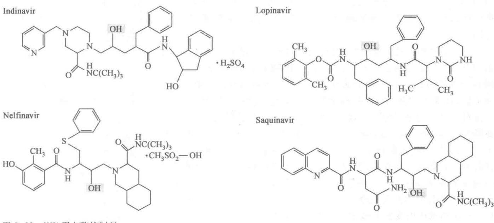  
图 8-38 HIV 蛋白酶抑制剂  
羟基充当过渡态类似物模拟四面体中间物的氧，邻近的苄基帮助药物定位于活性部位的适当位置

## 五、酶活性的别构调节

酶活性是受多种因素调节控制的，在第6章中曾做过初步介绍。下面主要讨论酶活性的别构调节。

别构调节普遍存在于生物界,许多代谢途径的关键酶利用别构调节来控制代谢途径之间的平衡。基因表达不论是调节蛋白对转录水平的控制,还是转录后的加工(如 tRNA 的修饰成熟),或者是偶联的转录—翻译衰减机制的控制都直接或间接地与别构调节相关。因此研究酶的别构调控有重要的生物学意义。

## （一）酶的别构效应和别构酶的性质

## 1. 酶的别构效应

酶分子的非催化部位与某些化合物可逆地非共价结合后发生构象的改变,进而改变酶活性状态,称为酶的别构调节(allosteric regulation),又称别构调控(allosteric control)。具有这种调节作用的酶称为别构酶(allosteric enzyme)。凡能使酶分子发生别构作用的物质称为效应物(effector)或别构剂,通常为小分子代谢物或辅因子。如因别构导致酶活性增加的物质称为正效应物(positive effector)或别构激活剂,反之称为负效应物(negative effector)或别构抑制剂。

酶的别构效应包括涉及酶与底物结合时催化部位和催化部位之间的相互作用即同促效应（homotropic effect），和涉及酶与调节物结合时调节部位与活性部位之间的相互作用即异促效应（heterotropic effect）。有些别构酶除底物兼作效应物之外没有其他调节物，也即底物是同促调节物，这类酶只有同促效应，称为同促[别构]酶。有些别构酶除底物外，尚有异促调节物：或是异促抑制剂，或是异促激活剂，或者两者兼而有之，这类酶称为异促[别构]酶。异促酶既有同促效应（V系统别构酶除外，见下面）又有异

促效应。

## 2. 别构酶的性质

（1）别构酶一般都是寡聚酶，通过次级键由多亚基构成 在别构酶分子上有和底物结合和催化底物的活性部位，也有和调节物（regulator）或效应物结合的调节部位，这两种部位可能在同一亚基上，也可能分别位于不同亚基上。每个别构酶分子可以有一个以上的活性部位和调节部位，因此可以结合一个以上的底物分子和调节物分子。理论上结合底物的最大数目，应与其催化部位数目相等，结合效应物的最大数目与其调节部位的数目相等。在同促[别构]酶中活性部位和调节部位是相同的。调节部位与活性部位虽然在空间上是分开的，但这两个部位可相互影响，通过构象的变化，产生协同效应。可发生在底物-底物、调节物-底物、调节物-调节物之间，可以是正协同也可以是负协同。

（2）别构酶的动力学 因别构酶有协同效应，故其[S]对v的动力学曲线不是双曲线，而是S形曲线(正协同)或表观双曲线(负协同)(图8-39)，两者均不符合米氏方程。这种S形曲线表明酶结合一分子底物(或调节物)后，酶的构象发生了变化，这种新的构象大大地增加对后续底物分子的亲和性，促进后续分子与酶的结合，表现为正协同性（positive cooperativity），这种酶称为具有正协同效应的别构酶。表观双曲线表明，在底物浓度较低的范围内酶活力上升很快，但随后底物浓度虽有较大的提高，但反应速率升高却很小，表现为负协同性（negative cooperativity），这种酶称为具有负协同效应的别构酶，如下面介绍的3-磷酸甘油醛脱氢酶。负协同性可以使酶的反应速率对外界环境中底物浓度的变化不敏感。由于别构酶不符合米氏方程，因而被别构酶催化反应达到最大反应速率一半时的底物浓度用 $[S]_{0.5}$ 或 $K_{0.5}$ 代替。

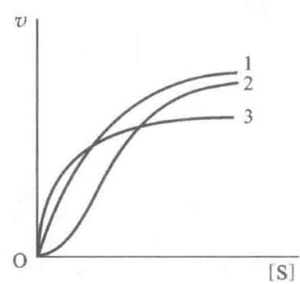  
图 8-39 正、负协同别构酶与非别构酶的动力学曲线比较
1. 非别构酶；2. 正协同；3. 负协同

为了区分符合米氏方程的“正常”酶，具有正协同效应的别构酶和具有负协同效应的别构酶，D. Koshland 建议用协同指数 (cooperativity index, CI) 来鉴别不同的协同作用以及协同的程度。CI 是指酶分子中的结合位点被底物饱和 90% 和饱和 10% 时底物浓度的比值。故协同指数又称饱和比值 (saturation ratio, Rs)，即：

$$
\mathrm{Rs} = \frac {\mathrm{位点被} 90\% \mathrm{饱和时的底物浓度}}{\mathrm{位点被} 10\% \mathrm{饱和时的底物浓度}} = 81^ {\frac {1}{n}}
$$

n: 代表协同系数(Hill 系数)

典型的米氏类型的酶 Rs=81

具有正协同效应的别构酶 Rs<81, Rs 愈小, 正协同效应愈显著;

具有负协同效应的别构酶 Rs>81, Rs 愈大, 负协同效应愈显著。

也常使用 Hill 系数 $(n)$ （见第 4 章）来判断酶属于哪一种类型。符合米氏方程的酶 n=1，具有正协同效应的酶 n>1, n 愈大，正协同效应也愈大。具有负协同效应的酶 n<1，则 n 愈大，负协同效应愈小。因此，Hill 系数可以作为判断协同效应的一个指标。

（3）K型效应物和V型效应物：异促别构酶的异促效应物可分K型效应物和V型效应物两类。K型效应物可改变底物的 $K_{0.5}$ ，可以增大或减小，而 $V_{max}$ 不变。异促激活剂能使它们的S形饱和曲线向双曲线方向转变， $K_{0.5}$ 变小。而异促抑制剂使S形饱和曲线更加S形化， $K_{0.5}$ 增大（图8-40A）。V型效应物不改变底物的 $K_{0.5}$ 值， $V_{max}$ 发生变化，酶的底物饱和曲线都是双曲线。正异促调节物（激活剂）使饱和曲线的 $V_{max}$ 升高，负异促调节物（抑制剂）使 $V_{max}$ 降低（图8-40B）。这两种类型的效应物在生物体内可能担当不同生理条件下的调节功能。K型适合于体内的[S]经常处在 $K_{0.5}$ 附近，且是限速浓度；而V型适合于体内的[S]对酶来说是饱和浓度。

（4）别构酶经加热或用化学试剂等处理，可引起别构酶解离，失去调节活性，但催化活性仍被保留，称为脱敏作用(desensitization)。脱敏后的酶表现为米氏酶的动力学双曲线,如图8-41所示。

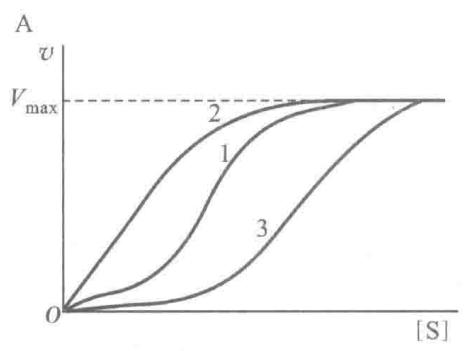  
1. 未加效应物；2. 加激活剂；3. 加抑制剂

图 8-40 A 为 K 型效应物, B 为 V 型效应物  
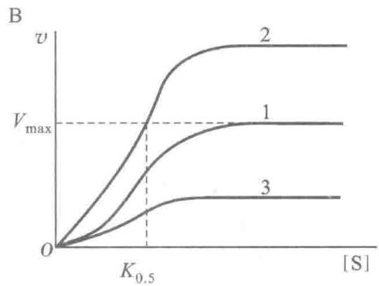

## （二）别构模型

为了解释别构酶协同效应的机制,并推导出动力学曲线的方程式,不少人曾提出多种酶分子模型,其中最重要的为齐变模型和序变模型两种别构模型(allosteric model),分别介绍如下:

1. 齐变模型(concerted model, 也称 MWC 模型) 1965 年 J. Monod、J. Wyman 和 J. P. Changeux 是用别构酶的构象改变来解释协同效应的最早分子模式。此模型的要点如下：

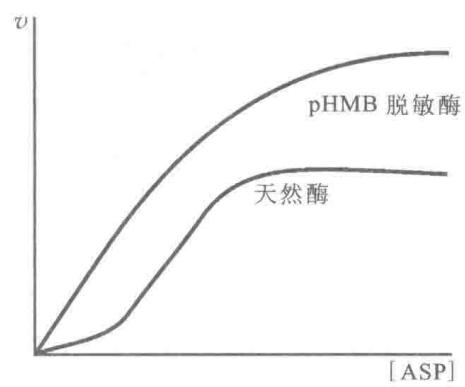  
图 8-41 ATCase 用对羟汞苯甲酸 (pHMB)
处理失去别构性质, 变为正常的米氏酶
脱敏的 ATCase 活性比天然酶大 50%

（1）别构酶是由确定数目的亚基组成的寡聚酶，各亚基占有相等的地位，因此每个别构酶都有一个对称轴。

(2) 第一个亚基对一种配体(或调节物)只有一个结合位点。

（3）每种亚基有两种构象状态，一种为有利于结合底物或调节物的松弛型构象(relaxed state, R 型)即 R 态，另一种为不利于底物或调节物结合的紧张型构象(tensed state, T 型)即 T 态。这两种型式在三级和四级结构上，在催化活力上都有所不同。这两种状态可以互变，要取决于外界条件，也取决于亚基间的相互作用。按此模式，构象的转变采取同步协同方式，或者说采取齐变方式，即各亚基在同一时间内均处于相同的构象状态。如果是一亚基从 T 态变为 R 态，则其他亚基也几乎同时转变成 R 态，不存在 TR 杂合态。

（4）当蛋白质由一构象状态转变至另一构象状态时，其分子对称性保持不变，因此，这一模式又称为对称模式。如图8-42所示。

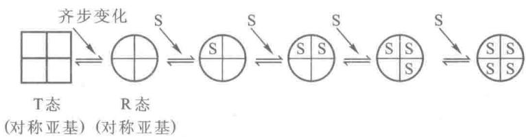  
图8-42 别构酶的齐变模型

(5) 假设别构抑制剂是稳定 T 态, 而别构激活剂是稳定 R 态(图 8-43)。

根据 MWC 模型, 可以得到别构酶的动力学方程, 在此不再赘述。

根据此模式,正调节物(如底物)与负调节物浓度的比例决定别构酶究竟处于哪一种状态。当无小分子调节物存在时,平衡趋向于“T”态,当有少量底物时,平衡即向“R”态移动,当构象已转为“R”态后,又进一步大大地增强对底物的亲和性,给出S形动力学曲线。

这个模型可以很容易地解释正负调节物的作用。假定“R”态有利于与正调节物结合，“T”态有利于与负调节物作用。在齐变模型中，同促效应必然是正协同的效果，而异促效应则可能有正的，也可能有负的效果。例如ATCase结合N-甲酰磷酸和Asp是同促效应，CTP的抑制作用是负异促效应，ATP的激活作用，是正异促效应。该模型的最大局限性是不能解释负协同效应。由底物调节的效应，最好是用齐变模型来说明。

2. 序变模型 (sequential model, 也称 KNF 模型) 这是 D. Koshland、G. Nemethyl 和 D. Filmer 于 1966 年提出来

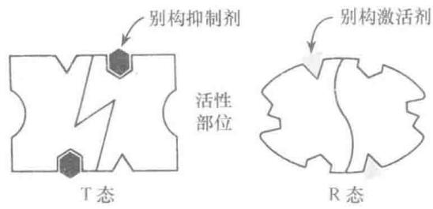  
图8-43 别构调节物的作用  
别构抑制剂稳定 T 态, 别构激活剂稳定 R 态

的模型。是 Adair 模型(血红蛋白与 $O_{2}$ 结合的模型)与诱导契合学说在别构酶研究上的一种发展,此模型的要点如下:

（1）当配体不存在时，别构酶只有一种构象状态存在(T)，而不是处于 $R \rightleftharpoons T$ 的平衡状态，只有当配体与之结合后才诱导T态向R态转变。

（2）别构酶的构象是以序变方式进行的，而不是齐变。当配体与一个亚基结合后，可引起该亚基构象发生变化，并使邻近亚基易于发生同样的构象变化，即影响对下一个配体的亲和力。当第二个配体结合后，又可导致第三个亚基类似变化，如此顺序传递，直至最后所有亚基都处于同样的构象。这种序变机制的特点有各种TR型杂合态。见图8-44。

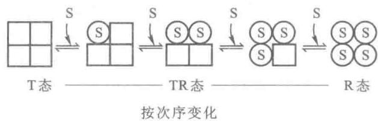  
图8-44 别构酶的序变模型

（3）亚基间的相互作用可能是正协同效应，也可能是负协同效应，前者导致下一亚基对配体有更大的亲和力，后者则降低亲和力。

KNF 模型与 MWC 模型的不同点在于: 无底物效应物时, 酶分子中亚基只存在一种构象状态 (T 态); 酶分子中全部亚基不是同时由 T 态转变成 R 态, 而是逐个转变的; MWC 中不存在 RT 复合体, 而在 KNF 模型

中存在;底物在 KNF 模型中可以为正协同效应,也可以为负协同效应,取决于已结合底物的亚基对相邻亚基的影响,这种影响若是增大其他亚基对底物的解离常数,则产生负协同效应,若减少其他亚基对底物的解离常数时,则产生正协同效应。因此 KNF 模型可以同时解释别构抑制、别构激活、正协同效应和负协同效应。

非底物调节的效应,用序变模式说明较好。例如钙调蛋白与 $Ca^{2+}$ 的结合是以序变方式进行的正协同效应。该模型可适用于大多数别构酶。

还有许多别构酶有更为复杂的调节过程,为了说明各种别构酶的特殊调节作用及动力学,还提出了其他一些模型。有人认为不能用一种模型去解释所有别构酶的行为,很可能某些别构酶的行为符合于序变模型,而另一些酶的行为符合于齐变模型。这些模型从不同角度对别构酶的协同性和别构调节机制作了解释,并为进一步探讨别构酶的生理意义提供了讨论的基础。不过这些模型都有一定的局限性,别构酶作用的真正机制可能更为复杂。

## （三）别构酶的调节功能

别构酶的协同效应对生物体内的代谢调节具有重要的生理意义。体内各种代谢通路中的起始点或在一些分支点常常出现一些关键性的别构酶。它们往往受到代谢通路末端产物的反馈抑制，有些还受到另一些代谢物（一般不是终端产物）的激活，而这些抑制和激活是通过异种别构效应来实现的。因而这些酶的活动可以很灵敏地受到代谢产物浓度的影响，这对机体的自身代谢控制具有重要意义。例如，长链脂肪酰 CoA 是脂肪酸合成通路的终产物，它可以抑制乙酰 CoA 羧化酶，从而抑制脂肪酸合成的起始反应。这对防止体内脂肪酸合成过多，让乙酰 CoA 转向氧化产能有重要的意义。又如别构激活的例子，脂肪酸 β 氧化产生的乙酰 CoA 是糖异生的关键酶之一——丙酮酸羧化酶的别构激活剂，故体内脂肪酸的氧化可加速糖异生作用。

正协同效应提供了底物浓度对于酶反应速度影响很为敏感的区间，即S形曲线的中间“陡段”（图8-39），如果细胞内的底物浓度在此段范围内，底物浓度本身会对酶反应速率产生显著的影响。而底物浓度处于很高或很低水平时，又因处于S形曲线的平段，可使反应速率不致改变过大，起到一定的“缓冲”作用。这样既可在底物浓度处于极端时不太明显的影响反应速率；又可使底物浓度适当时，可以灵敏地调节代谢速率。例如氨甲酰磷酸既是合成CTP又是合成Arg的原料，L-天冬氨酸转氨甲酰酶的正协同效应使氨甲酰磷酸在两条合成途径中获得合理的分配。

负协同效应提供一个酶反应速率对底物浓度相对不敏感的区域(图8-39)，这或许与体内保证一些重要的不断进行的反应少受其他反应的干扰有关。例如3-磷酸甘油醛脱氢酶是糖分解通路中的重要酶，与供能有关。该酶作为一种别构酶就是通过负协同效应来保证其主要代谢通路的(见下一部分)。

## （四）别构酶的实例

## 1. 天冬氨酸转氨甲酰酶(aspartate transcarbamylase, ATCase)

（1）ATCase 被嘧啶途径的终产物反馈抑制 ATCase 是嘧啶核苷酸(CTP)生物合成多酶体系反应序列中的第一个酶,其正常底物为天冬氨酸及氨甲酰磷酸,ATCase 所催化的反应如下:

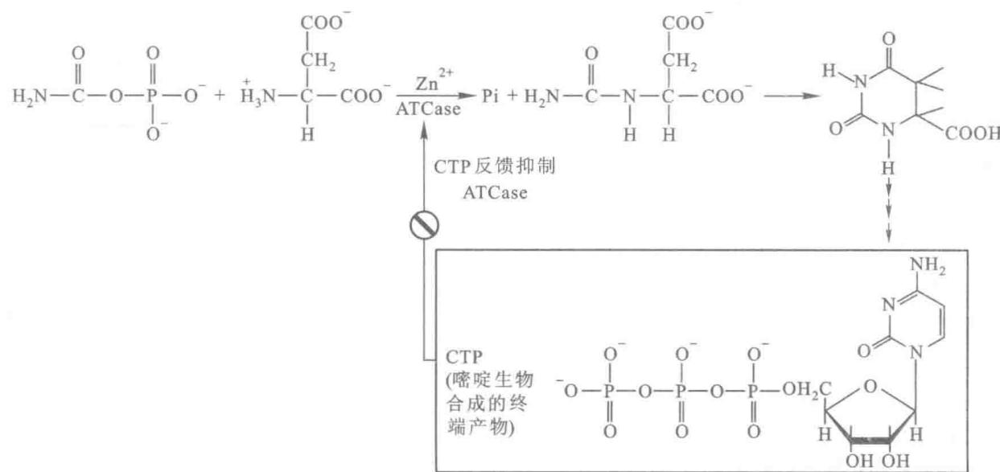

J. Gerhart 和 A. Pardee 发现了 ATCase 被该生物合成途径的终产物 CTP 反馈抑制,而且,他们发现 N-氨甲酰磷酸和天冬氨酸的结合是协同的,反映到反应速率对底物浓度的 S 曲线中(图 8-45),它不服从米氏动力学。协同结合使底物浓度只在一个很窄的范围内开启 N-氨甲酰天冬氨酸的合成。CTP 在不影响酶的 $V_{max}$ 的情况下,通过降低酶与底物的亲和性来抑制 ATCase。抑制程度可达到 90%,具体情况视底物浓度而定。ATP 则相反,它是 ATCase 的激活剂,可增强酶与底物的亲和性,也不影响 $V_{max}$ 。ATP 和 CTP 相互竞争调节部位,高水平的 ATP 可阻止 CTP 对酶的抑制作用。在 ATCase 中(但不是所有的别构

CTP 和 ATP 对 ATCase 调节的生物学意义有两个方面, 首先 ATP 起信号激活作用, 提供 DNA 复制的能量, 导致需求的嘧啶核苷酸的合成。其次, CTP 的反馈抑制, 则保证当嘧啶核苷酸充足时, 不需要该途径继续合成 N-氨甲酰天冬氨酸及其后续中间物。

（2）ATCase 由催化亚基和调节亚基构成 当用汞化物如 p-羟汞苯甲酸处理该酶时，同巯基反应则 ATCase 失去调节活性（图 8-46）。用汞化物处理过的 ATCase, ATP 和 CTP 不再影响其催化活性，而且底物结合变为无协同性。相反，修饰酶仍具有天然酶相同的最大催化活性。

J. Gerhart 和 H. Schachman 进行超离心研究, 表明汞化合物可使

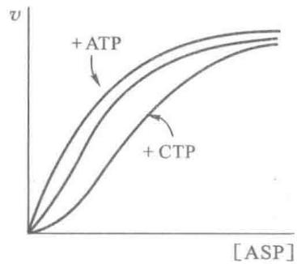  
图8-45 ATCase的别构效应ATP是激活剂而CTP是抑制剂

ATCase解离成两种亚基(图8-47)。天然酶沉降常数为11.6S，相对分子质量为 $310\times10^{3}$ ，而解离的亚基是2.8S, $34\times10^{3}$ 和5.8S, $100\times10^{3}$ 。这两种亚基可借助电荷的显著不同或大小不同，通过离子交换层析或蔗糖密度梯度离心分开，分离后加入过量的巯基乙醇，可从分离的亚基中除去结合的p-羟汞苯甲酸基：

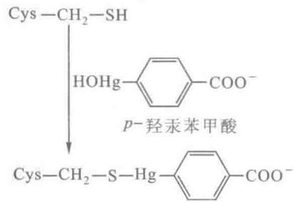  
图 8-46 p-羟汞苯甲酸对 ATCase 中 Cys 残基巯基的修饰作用

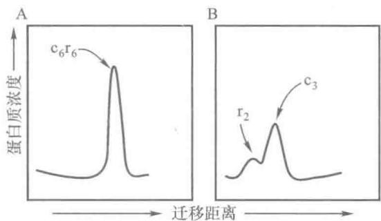  
图8-47 超离心研究ATCase  
A. 天然 ATCase; B. 通过汞化物解离成调节亚基和催化亚基的酶

大的亚基叫催化亚基，有催化活性不与ATP和CTP结合，不呈现S形动力学曲线；小的亚基叫调节亚基，无催化活性能与ATP和CTP结合。催化亚基 $(\mathrm{c}_3)$ 含有3条c链（每条 $34\times 10^{3}$ ），而调节亚基 $(\mathbf{r}_2)$ 含有2条r链（每条 $17\times 10^{3}$ ）。催化亚基和调节亚基混合时可迅速结合，得到的复合物具有天然酶相同的结构， $\mathrm{c_6r_6}$ （含有2个催化亚基，3个调节亚基）：

$$
3 \mathrm{r} _ {2} + 2 \mathrm{c} _ {3} \longrightarrow \mathrm{r} _ {6} \mathrm{c} _ {6}
$$

因而，重组的酶具有天然酶同样的别构性质。ATCase是由分离的催化亚基和调节亚基构成的，在天然酶中相互作用产生别构行为。由于ATCase的催化和调节功能容易被分开，也易复原，因此ATCase被选择为别构调节酶的研究对象。

（3）ATCase及其与双底物类似物PALA复合物的三维结构W.Lipscomb及其同事曾以 $0.26\mathrm{nm}$ 的分辨率阐明了ATCase的三维结构。他们也解决了ATCase与别构抑制剂CTP以及与一种底物类似物的复合物的结构问题。这个酶的图案是有特色的（图8-48）。3个调节二聚体 $(\mathbf{r}_2)$ 在一个赤道面上，1个催化三聚体 $(\mathrm{e}_3)$ 在赤道面上边，另一个催化三聚体在赤道面下边。该酶有一个很大的居中的洞穴，可经由几个通道到达此洞。ATCase球体的直径为 $13\mathrm{nm}$ 左右，为血红蛋白大小的2倍。ATCase是由2个 $\mathbf{c}_3$ 部分和3个 $\mathbf{r}_2$ 部分组成，其中一半是 $\mathbf{c}_3\mathbf{r}_3$ 。所以从上面看去，便可看到它的一半，即 $\mathbf{c}_3\mathbf{r}_3$ （图8-49）。这样可以看到了3个完全相同的cr单位，彼此关系是旋转120度。每一个在外周的r链上有2个结构域，外边的1个含有CTP的结合部位，里边的1个与相同三聚体中一个催化链相互作用。这样，调节二聚体内的每一条r链同催化三聚内的一条c链相互作用，c链同r链的一个结构域相接触，通过一个 $\mathrm{Zn}^{2+}$ 与4个Cys残基(109,119,139和140)的硫原子相配位，形成四面体的几何构象起着稳定作用。汞化物对羟汞苯甲酸能使催化亚基和调节亚基解离，就是因为汞强力的与半胱氨酸残基结合而取代 $\mathrm{Zn}^{2+}$ ，导致r基结构域不稳定。

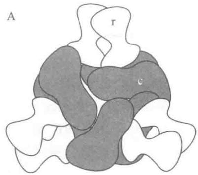

活性部位在哪里呢？在形成 N-氨甲酰天冬氨酸时，氨甲酰磷酸首先通过多个静电引力和氢键的相互作用结合，然后与天冬氨酸结合，其氨基则攻击氨甲酰磷酸的羰基碳（图 8-50A），形成了一个四面体的过渡态（图8-50B）。N-(膦乙酰基)-L-Asp[N-(phosphonacetyl)-L-asparate, PALA]（图8-50C）是该酶的强竞争性抑制剂，它与双底物复合物的过渡态类似。PALA能与ATCase紧密结合，解离常数约为 $10\mathrm{nmol}\cdot \mathrm{L}^{-1}$ 。这种不发生反应的双底物类似物已被证明在ATCase的研究中是很有价值的。ATCase-PALA复合物的X射线晶体结构分析证明6个活性部位中的每一个都位于催化三聚体内的成对c链之间的界面附近。由于PALA带有很强的负电荷，以静电引力与活性部位中的4个Arg和1个Lys结合（图8-51），也可通过许多氢键与酶结合。由属于2条催化链的残基形成活性部位。特别是一条链的许多残基与相邻链的Ser和Lys残基形成一个结合PALA的口袋。

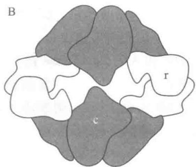  
图 8-48 ATCase 中亚基的排列  
A. ATCase 三重对称轴的俯视；  
B. ATCase 的垂直观；c 代表催化肽链；r 代表调节肽链

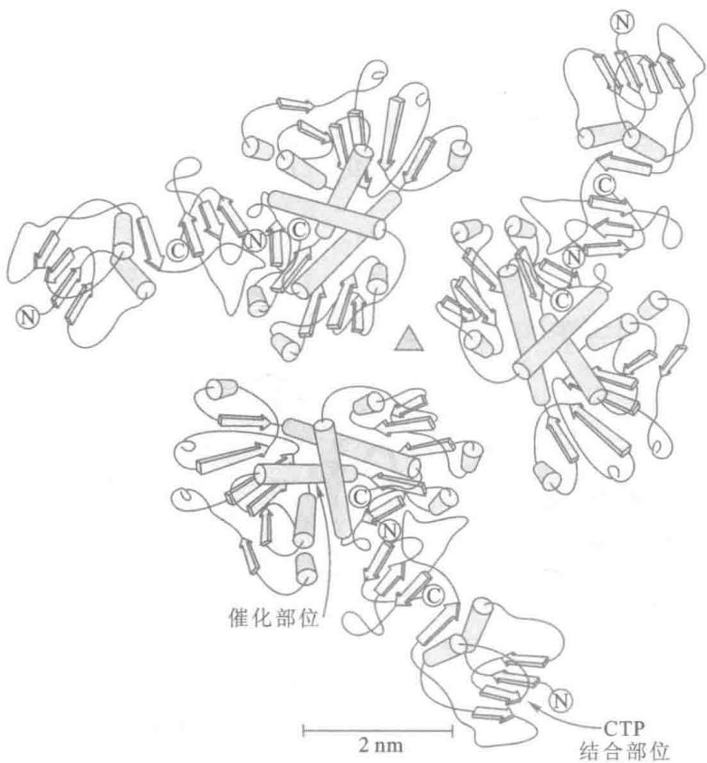

A. 结合底物  
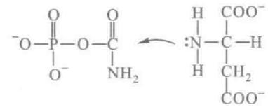  
B. 过渡态

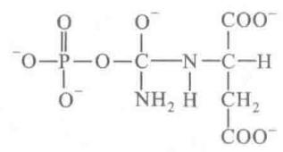

C. N-(膦乙酰基)-L-天冬氨酸  
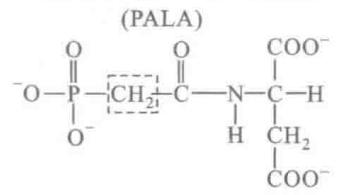  
图8-49 ATCase半分子 $(\mathrm{c}_3\mathrm{r}_3)$ 的三维结构  
催化部位远离调节部位，黑三角表示 ATCase 三重对称轴  
图 8-50 A. Asp 的氨基亲核攻击氨甲酰磷酸的羰基碳原子；B. 过渡态；C. PALA 类似于一对结合底物的过渡态

His $_{134}$ 的咪唑侧链与PALA的羰基氧原子之间的氢键也是值得注意的。当Asp的氨基攻击羰基碳原子时，氨甲酰磷酸的羰基氧原子就带负电荷。His $_{134}$ 质子化的形式能够稳定四面体过渡态中这一带负电荷的原子。

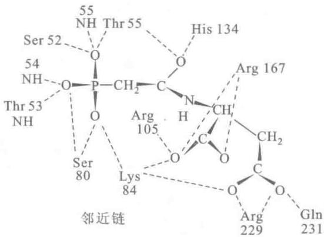  
图 8-51 ATCase 的活性部位（PALA 结合在 ATCase 催化部位上的方式）  
在此示意图中未画出所有已形成的静电键和氢键。His $_{134}$ 可以稳定过渡态中羰基氧原子上的负电荷。此结合部位在催化链的界面上。Ser $_{80}$ 和Lys $_{84}$ 是由邻近的催化链贡献的残基

（4）ATCase 的别构作用通过四级结构的大变化来传递 超离心研究表明，与底物的结合导致 ATCase 的沉降系数降低 3%。这一发现表明 ATCase 与底物结合后使酶分子扩展，增加了摩擦系数。未与底物结合的 ATCase 及其与 PALA 复合物的 X 射线晶体结构研究揭示出：伴随着与此双底物类似物的结合，四级结构发生了大的变化（图 8-52）。催化三聚体彼此移开了 1.2 nm，并绕对称 3-重轴旋转了 $10^{\circ}$ 。

此外，每一调节二聚体围绕其双重轴旋转了 $15^{\circ}$ 。PALA的结合也导致每一条催化链的三级结构的重要变化（图8-53），ATCase由T态变成R态。每一个催化链含有1个氨甲酰磷酸结合结构域（N端）和1个天冬氨酸结合结构域（C端），2种底物的结合导致这些结构域靠近 $0.2\mathrm{nm}$ ，并引起它们转换为R构象。由 $230\sim 245$ 残基组成的称为 $240~s$ 环在这个转换过程中经历了较大的重定向（图8-53）。 $240~s$ 环的转动释放几个基团，使它们能够同底物相互作用并促进催化。在这一别构转变中， $\mathbf{c}_3$ 的催化链被拉得彼此靠近了，从而形成最优化的活性部位。

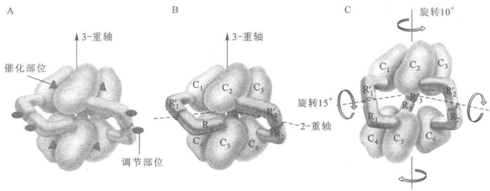  
图8-52 ATCase催化链的别构转换  
A. ATCase 的结构; B. ATCase 无配基的 T 态; C. ATCase 配基结合的 R 态 (催化三聚体移开 1.2 nm, 旋转 $10^{\circ}$ , 转换成高亲和性 R 态)

人们进一步了解到 ATCase 的别构效应是发现其在相当大的立体空间范围内起着调节活性的作用。在同一个 $c_{3}$ 中，活性部位相距 2.2 nm。每一调节亚基外面一半中的 CTP 结合部位距最近的活性部位大于 5.0 nm。因此，底物的协同结合和 CTP 的反馈抑制是通过长距离而传递的。实际上，信息是从一个 $c_{3}$ 单位的活性部位传递到其他 $c_{3}$ 的活性部位。在这个长距离的传递过程中，通过肽链之间各个表面的相互作用，就在如此大的空间范围内发生着别构相互作用。所以，正如在血红蛋白中那样，在 ATCase 中传递别构效应方面，不同多肽链之间的界面作为分子开关而起着关键作用。

（5）底物结合到 ATCase 上引起高度协同的别构转变 含有颜色报告基团的 ATCase 光谱学研究提供了进一步观察别构转变的本质。ATCase 同硝基甲烷反应在它的每个催化链中生成一种有颜色的硝基酪氨酸基 ( $\lambda_{max}=430\ nm$ ) (图 8-54)，在每个催化部位上一个必需的 Lys 也被修饰，阻断了与底物的结合。然后将双倍修饰酶的催化三

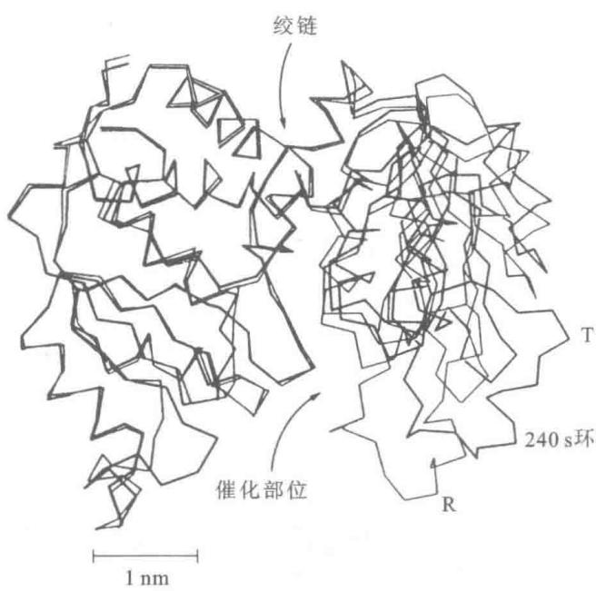  
图 8-53 催化链从 T 态转换成 R 态时三级结构的变化在 T→R 转变中铰链的移动导致两个结构域更靠近在一起，注意，氨甲酰磷酸结合结构域（左边）与天冬氨酸结合结构域（右边）相比变化小。240s 环在位置上经历了更大的变化。活性部位位于结构域之间的裂缝中

聚体同天然酶的三聚体组合形成杂交酶。底物类似物琥珀酸结合到天然 $c_{3}$ 部分的催化部位上，即改变了杂交酶另外 $c_{3}$ 部分中的硝基酪氨酸的可见吸收光谱（图8-54C）。因此，底物类似物结合到一个三聚体的活性部位就能改变另外三聚体上硝基酪氨酸基的环境，也即通过长程相互作用改变了 $c_{3}$ 的构象。表明琥珀酸的结合导致了T→R的协调转变。

A  
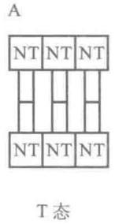

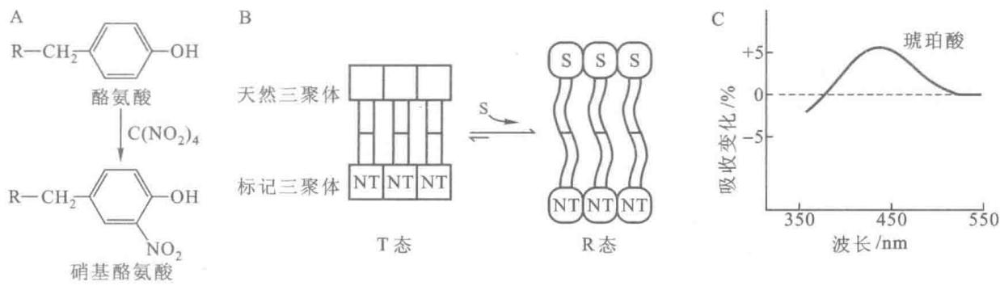

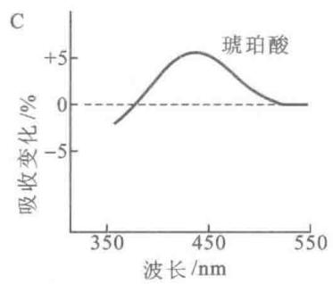  
图8-54 在ATCase中按齐变方式发生长程别构效应  
A. Tyr 的硝基化形成一个有颜色的硝基酪氨酸基作为一个报告基团；B. 制备含有硝基酪氨酸的 $c_{3}$ 三聚体，天然 $c_{3}$ 三聚体和天然 r 亚基杂合 ATCase 分子。琥珀酸(S) 结合到一个三聚体的天然催化部位上，以硝基酪氨酸吸收光谱的变化作为证据，说明另外三聚体的硝基酪氨酸环境发生变化；C. 琥珀酸的结合导致协同的 T→R 转变

（6）ATP 和 CTP 通过改变 T 和 R 态之间的平衡来调节 ATCase 的活性 根据齐变模型别构激活剂使所有亚基构象平衡向 R 型转变，而别构抑制剂使它向 T 态变化。构建了不同的 ATCase 杂合体来检查这个预言。正常的调节亚基同含有硝基酪氨酸的催化亚基结合，在没有底物的情况下，加 ATP 则 430 nm 吸收增加，加琥珀酸也引起同样变化（图 8-55）。这样 ATP（一种别构激活剂）使平衡向 R 态改变。相反，在没有底物时加 CTP，则 430 nm 吸收降低，因此，别构抑制剂使平衡向 T 态改变。沉降速率实验进一步提供证据 ATP 和 CTP，像琥珀酸一样，诱导构象的变化。这样，齐变模式说明了 ATP 和 CTP 诱导的（异促），以及底物诱导的（同促）ATCase 的别构相互作用。

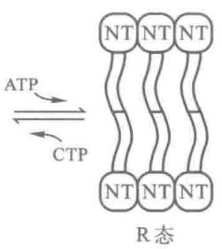

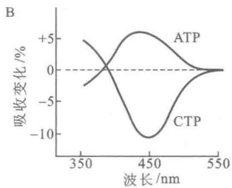  
图 8-55 ATP 和 CTP 结合 ATCase 的调节亚基导致构象改变  
A. 含有硝基酪氨酸催化亚基和天然调节亚基杂合的 ATCase; B. 加 ATP 激活剂使酶的别构平衡向 R 态改变, 相反, CTP 抑制剂使别构平衡向 T 态改变, 可由硝基酪氨酸光谱的改变所证明

## 2. 3-磷酸甘油醛脱氢酶(3-phosphoglyceraldehyde dehydrogenase)

3-磷酸甘油醛脱氢酶则是另一类具有负协同效应的别构酶代表,它的别构行为可用 KNF 模型来说明。该酶是糖分解途径中的重要酶,与供能有关,催化下列反应:

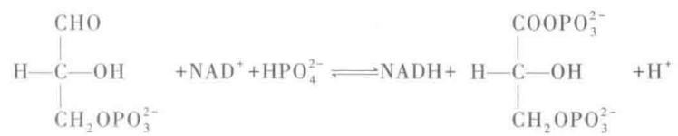

此酶具有4个亚基,可以和4个 $NAD^{+}$ 结合,但结合常数不同,结合 $NAD^{+}$ 后的解离常数见表8-8。酶结合 $NAD^{+}$ 后,发生构象变化。 $NAD^{+}$ 和酶结合的解离常数很小,因此,虽然底物 $NAD^{+}$ 浓度很低,也能顺利地和酶结合,但是当 $NAD^{+}$ 浓度升高时,酶结合了两个 $NAD^{+}$ 后,再要结合第三、第四个 $NAD^{+}$ 就不那么容易。除非 $NAD^{+}$ 的浓度提高两个数量级,才会有进一步的结合。也就是说这时再要提高酶反应速率是较难的,需要底物浓度大大提高才行。实验结果发现3-磷酸甘油醛脱氢酶只能结合两分子 $NAD^{+}$ ,即此酶结合 $NAD^{+}$ 的位点,只有一半能与 $NAD^{+}$ 起反应,叫半位反应性(half site reactivity)。半位反应性是一种极端负协同效应。说明在一定的底物浓度范围内,底物浓度的变化不足以影响酶反应速率。这就是负协同别构酶的特点。

表 8-8 3-磷酸甘油醛脱氢酶与 ${\mathrm{{NAD}}}^{ + }$ 结合的解离常数 $\left( {\mathrm{{mol}} \cdot  {\mathrm{L}}^{-1}}\right)$ 表

<table><tr><td rowspan="2">解离常数</td><td>虾肌</td><td colspan="2">免肌</td></tr><tr><td>平衡透析测定</td><td>超离心测定</td><td>平衡透析测定</td></tr><tr><td> $K_1$ </td><td> $<5\times 10^{-9}$ </td><td> $<5\times 10^{-8}$ </td><td> $<10^{-10}$ </td></tr><tr><td> $K_2$ </td><td> $<5\times 10^{-9}$ </td><td> $<5\times 10^{-8}$ </td><td> $<10^{-9}$ </td></tr><tr><td> $K_3$ </td><td> $6\times 10^{-7}$ </td><td> $4\times 10^{-6}$ </td><td> $3\times 10^{-7}$ </td></tr><tr><td> $K_4$ </td><td> $1.3\times 10^{-5}$ </td><td> $3.5\times 10^{-5}$ </td><td> $2.6\times 10^{-5}$ </td></tr></table>

在有机体中有许多需要 $NAD^{+}$ 的代谢途径, 其中酵解过程特别重要, 在供氧不足的情况下, 它们以一定的速率稳定地进行反应。因为 3-磷酸甘油醛脱氢酶为此过程的负协同别构酶, 对底物 $NAD^{+}$ 浓度的变化不敏感, 所以, 当 $NAD^{+}$ 浓度很低时, 其他需要 $NAD^{+}$ 的代谢反应都随之减缓时, 酵解过程仍然能以一定的速率顺利地进行。由此可以看到负协同效应别构酶的重要生理意义。

## 六、酶活性的共价调节

上一节讨论过的别构调节是亚基之间的非共价相互作用。共价调节则是利用酶蛋白的共价变化来调节酶的活性。有些共价变化是可逆的，例如蛋白质的磷酸化；有些是不可逆的，例如酶原的激活。下面讨论这几种形式酶活性的共价调节。

## （一）酶的可逆共价修饰

酶的可逆共价修饰（reversible covalent modification）作用是通过共价调节酶（covalently modulated enzyme）进行。共价调节酶通过其他酶对其多肽链上某些基团进行可逆的共价修饰，使处于活性与非活性的互变状态，从而调节酶活性。目前已发现有几百种酶被翻译后都要进行共价修饰，事实上部分代谢过程是通过共价修饰调节的。其中一部分处于代谢的分支途径，对其代谢流量起调节作用的关键酶，属于这种酶促共价修饰系统。由于这种调节的生理意义广泛，反应灵敏，节约能量，机制多样，在体内显得十分灵活，加之它们常受激素甚至神经的指令，导致级联式放大反应，所以日益引人注目。目前已知至少有5\~6种类型的可逆修饰的酶，如表8-9所示。

表 8-9 一些酶的共价修饰反应

<table><tr><td>修饰反应</td><td>共价修饰</td><td>已知的接受共价修饰的氨基酸残基</td></tr><tr><td>磷酸化(phosphorylation)</td><td>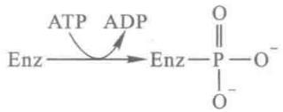</td><td>Tyr, Ser, Thr, His</td></tr><tr><td>腺苷酰化(adenylylation)</td><td>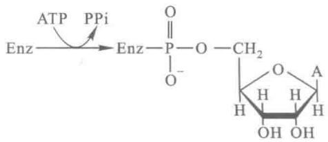</td><td>Tyr</td></tr><tr><td>尿苷酰化(uridylylation)</td><td>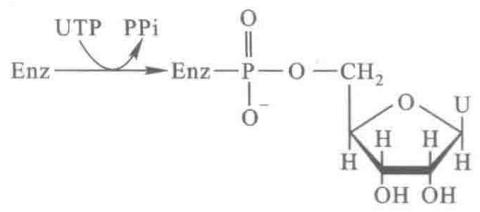</td><td>Tyr</td></tr><tr><td>ADP-核糖基化(ADP-ribosylation)</td><td>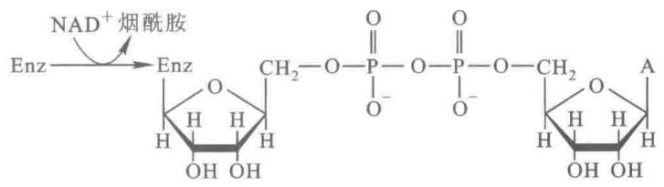</td><td>Arg, Gln, Cys, 白喉酰胺(一种修饰的 His)</td></tr><tr><td>甲基化(methylation)</td><td>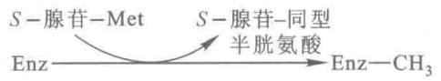</td><td>Glu</td></tr><tr><td>乙酰化(acetylation)</td><td>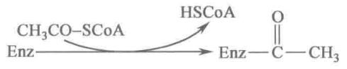</td><td>Lys、α-NH2(氨基端)</td></tr><tr><td>γ-羧基化(γ-carboxylation)</td><td>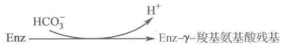</td><td>Glu</td></tr></table>

## 1. 蛋白质的磷酸化和脱磷酸化是共价调节酶活性的重要方式

现已证明蛋白质的磷酸化与脱磷酸化过程是生物体内存在的一种普遍的调节方式，几乎涉及所有的生理及病理过程，如代谢调控、细胞的增殖及生长发育、转录调控、基因表达、肌肉收缩、神经递质的合成与释放，甚至癌变等，并在细胞信号的传递过程中占有极其重要的位置。真核细胞中 $\frac{1}{3}$ 到 $\frac{1}{2}$ 的蛋白质可以磷酸化。在各个信号系统中，一个共同的环节就是由蛋白激酶和蛋白磷酸酶催化的蛋白质的磷酸化与脱磷酸化反应。蛋白质的磷酸化是指由蛋白激酶催化的把ATP或GTPγ位磷酸基转移到底物蛋白质氨基酸残基上的过程，其逆过程是由蛋白磷酸酶催化的，称为蛋白质的脱磷酸化。

$$
\text { 蛋白质 } \xrightarrow [ n \mathrm{Pi} ]{n \mathrm{NTP}} \xrightarrow [ \text { 蛋白激酶 } ]{\text { 蛋白磷酸酶 }} \xrightarrow [ \mathrm{H} _ {2} \mathrm{O} ]{n \mathrm{NDP}} \text { 蛋白质 } - n \mathrm{Pi}
$$

上式中 NTP 代表 ATP 或 GTP 等, Pi 代表无机磷酸。

一般认为在生理条件下,几乎所有的蛋白激酶都以 ATP 为磷酸基的供体,而且几乎所有的磷酸化反应都需要 $Mg^{2+}$ ,其功能是 ATP 被利用前首先要与 $Mg^{2+}$ 形成 $ATP-Mg^{2+}$ 的复合物。底物蛋白质被磷酸化的氨基酸残基有两类:

(1) Thr、Ser、Tyr、Asp、Glu……“P-O”键连接；

(2) Lys、Arg、His……“P-N”键连接。

主要是磷酸化 Ser、Thr，个别为 Tyr。被磷酸化的氨基酸残基可以是一个、两个或多个。多数蛋白激酶表现出一定的底物特异性，但很少具有绝对特异性。一种蛋白质可作为几种蛋白激酶的底物和一种蛋白激酶有多种底物的情况是很常见的。底物蛋白质被磷酸化的氨基酸残基附近的氨基酸组成和顺序常常构成被蛋白激酶辨认的特殊区域（共有序列）。例如，信使依赖性蛋白激酶（messenger dependent protein kinase）需要底物被磷酸化的 Ser 或 Thr 残基附近（N 端方向）有碱性氨基酸，即 Arg 或 Lys 残基，特定顺序是：

$$
- \mathrm{Arg} - \mathrm{Arg} - \mathrm{X} - \mathrm{X} - \mathrm{Ser(p)} / \mathrm{Thr(p)} - \mathrm{X} -
$$

$$
\mathrm{或} - \mathrm{Lys} - \mathrm{Arg} - \mathrm{X} - \mathrm{X} - \mathrm{Ser(p)} / \mathrm{Thr(p)} - \mathrm{X} -
$$

(或一个 X, X 可以是任何氨基酸残基)

此外,蛋白质的高级结构也对蛋白激酶的底物特异性产生很大影响。

磷酸化引入的磷酰基是带两个负电荷的基团,它的氧能与蛋白质的某些基团,如多肽主链上的亚酰胺基形成氢键,磷酸化了的残基侧链上的两个负电荷能排斥邻近的带负电荷的残基(Asp 和 Glu)。因此可以设想当被修饰的侧链位于三维结构是的关键区域时,磷酸化对蛋白质的构象,并因而对底物结合和催化活性都将产生很大的影响。一般说，修饰影响酶的活性，或是直接的，或是改变酶对别构效应物的应答。

借可逆磷酸化调控酶活性的一个最典型例子是骨骼肌和肝的糖原磷酸化酶（glycogen phosphorylase），它催化糖原分子的非还原端磷酸解产生1-磷酸葡糖（G-1-P），而糖原分子缩短一个残基，反应如下：

$$
\begin{array}{c}\text {(葡萄糖)} _ {n} + \mathrm{Pi} \rightarrow \text {(葡萄糖)} _ {n - 1} + 1 - \text {磷酸葡糖}\\\text {糖原} \quad \text {缩短了的糖原链}\end{array}
$$

形成的 G-1-P 被磷酸葡糖变位酶转变成 6-磷酸葡糖（G-6-P），在肌肉中 G-6-P 进入糖酵解（参见第 17 章）合成 ATP 为肌肉收缩提供能量。在肝中 G-6-P 水解生成葡萄糖，通过循环系统运输到其他组织。糖原磷酸化酶以两种形式存在：有活性（或活性大）的磷酸化酶 a 和无活性（或活性小）的磷酸化酶 b（图 8-56）。骨骼肌磷酸化酶是由两个相同的亚基（842 个残基， $M_{r}$ 97 400）组成的二聚体。每亚基含有一个辅因子磷酸吡哆醛，一个活性部位（在该亚基的中央）和一个别构部位（在亚基间的界面处附近）。此外每亚基还有一个调节性磷酸化部位，即 Ser14 残基，以及糖原颗粒结合部位（图 8-57）。在磷酸化酶 a 和 b 的共价结构差别仅在 Ser14，a 是磷酸化的而 b 没有磷酸化。

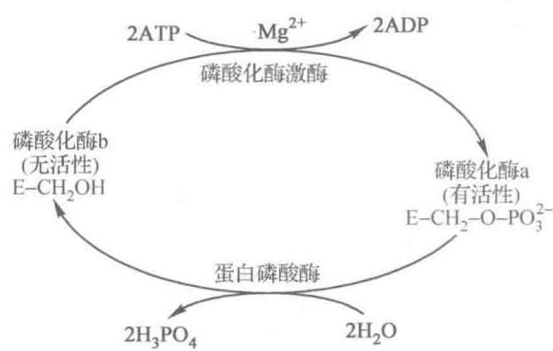  
图 8-56 糖原磷酸化酶两种形式的转变

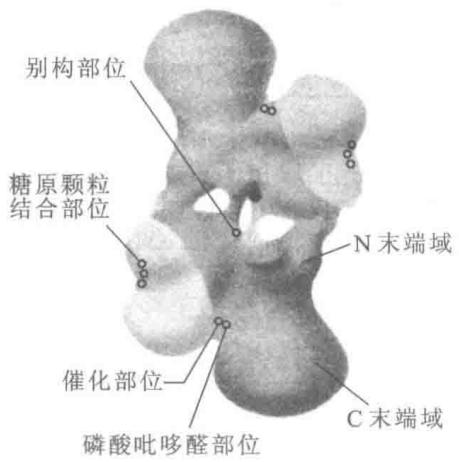  
图 8-57 糖原磷酸化酶 b(二聚体) 结构的示意图

磷酸化酶 b 被磷酸化后，活性部位的构象、结构和催化活性都发生了改变。磷酸化时，亚基的 N 端肽（包括 10\~22 残基）摆动 $120^{\circ}$ ，并进入亚基的界面。构象的变化使 Ser14 移动了 3.6 nm 以上。糖原磷酸化酶也是一种别构酶，它的活性既受到可逆磷酸化的调控，也受到几个别构效应物的调控（图 8-58）。AMP 是骨骼肌磷酸化酶 b 的正异促效应物；ATP 和 6-磷酸葡糖是它的负异促效应物；正、负效应物竞争同一结合部位。X 射线晶体结构的研究，揭示了糖原磷酸化酶在别构效应物存在下 T ⇌ R 转变的分子基础。虽然糖原磷酸化酶亚基中心核心结构 T 态和 R 态是相同的，重要变化发生在 T 态和 R 态之间亚基的界面，亚基界面构象的变化是与活性部位结构变化相联系，对催化作用是重要的。在 T 态带负电荷的 $Asp_{283}$ 羧基面向活性部位，这样对结合阴离子底物磷酸是不利的，当转换成 R 态时， $Asp_{283}$ 从活性中心被置换，而由 $Arg_{569}$ 代替，在活性部位带负电荷的 Asp 为带正荷的 Arg 交换，有利于阴离子结合。这些别构调控对于调节正常代谢要求的糖原磷酸化酶是一个合适的机制。

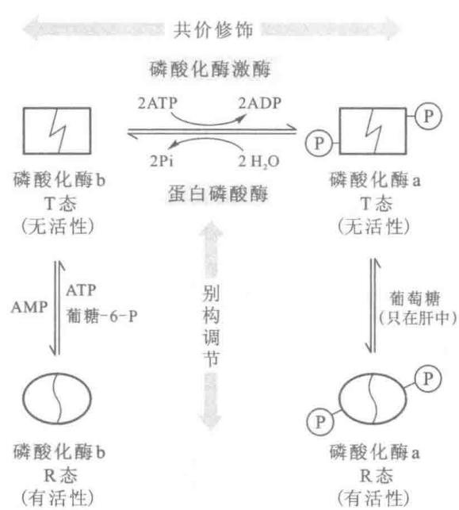  
图8-58 骨骼肌和肝中磷酸化酶的共价修饰和别构调节种

在大多数生理条件下,磷酸化酶 b 处于无活性的 T 态,因为它受到 ATP、6-磷酸葡糖的别构抑制;只有肌细胞内的能荷（energy charge）低下时，磷酸化酶b才以有活性的R态存在；而磷酸化酶a则不管AMP、ATP和6-磷酸葡糖的水平如何，几乎完全是有活性的R态。在静止肌肉中几乎所有的磷酸化酶都处于无活性的b形式。运动时肌细胞中AMP水平升高（能荷降低）导致磷酸化酶b的别构激活，即T态向R态转化。总之，肌肉糖原磷酸化酶可通过AMP别构激活，ATP和葡糖-6-P别构抑制调节活性，当ATP和6-磷酸葡糖水平高时，糖原分解被抑制，当细胞能荷低时，即高[AMP]和低[ATP]和[G-6-P]时，糖原分解代谢被激发。

肝磷酸化酶的别构调节和肌肉磷酸化酶的不同:① AMP 不激活肝磷酸化酶 b;② 肝磷酸化酶 a 受葡萄糖的别构抑制,即葡萄糖能使 a 形式的 R ⇌ T 平衡移向 T 方。肝中糖原降解的目的是,当血糖水平低下时生成葡萄糖,以输出供其他组织之需。别构效应物本身是代谢状况的指示剂,因此磷酸化酶在肌肉中应答 AMP 水平(反映细胞能荷状况),在肝中则应答葡萄糖水平(反映血糖情况)。

磷酸化酶 b 的磷酸化是细胞表面接受了一个激素分子(肾上腺素或胰高血糖素)而启动的一系列反应的最后一步(图 8-59)。这一系列反应称为酶级联(enzyme cascade)。这种级联使一个信号激素分子放大到使许多磷酸化酶 b 分子转化为磷酸化酶 a 分子。实际上从激素作用到磷酸化酶 a 的产生经过了许多步的放大,这就是所谓级联放大(cascade amplification)。级联放大是很可观的,若每步的催化放大是10倍,则一个5步的级联放大中放大倍数等于 $10^{5}$ 。在一步催化反应中的放大称为催化放大,当一种以上的共价修饰依次发生,把催化放大串联起来就成为级联放大。这是酶可逆共价修饰的特点。显然在酶的可逆共价修饰中,酶的活性形式和非活性形式连续互变的状态下,对生物体代谢环境的变化,随时准备应答的可逆共价修饰系统较不可逆共价修饰能作出更多更及时的调控反应。

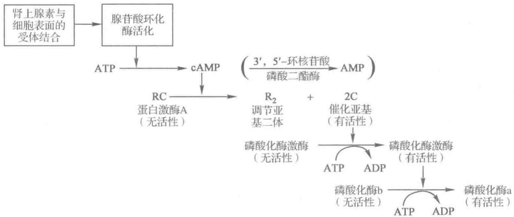  
图8-59 磷酸化酶由激素启动活化的级联机制

通过以上讨论可知,蛋白质磷酸化能有效地控制酶活性的原因:① 磷酸化反应所需自由能是较大的,通过 ATP 提供 $50 \, kJ \cdot mol^{-1}$ 的能量。磷酸化能改变不同功能状态之间的构象平衡,实质上,消耗的能量使蛋白质的构象从一种状态完全转变为另一种状态;② 一个磷酰基对修饰蛋白增加 2 个负电荷,这些新电荷破坏了未修饰蛋白中的静电相互作用,而形成新的静电相互作用,这一结构变化显著地改变了底物的结合和催化活性;③ 一个磷酰基能形成三个或多个氢键,磷酰基的几何四面体使这些键高度定向,以让氢键供体特异的相互作用;④ 磷酸化和脱磷酸化可发生在小于 1 秒钟或超过数小时间隔内,在动力学上能够被调整到满足生理过程对调速的要求;⑤ 磷酸化常常引起高度地放大效应,单个活化的激酶分子在短时间内磷酸化几百个靶蛋白,假若靶蛋白是一种酶,它能转换很大数量的底物分子;⑥ ATP 是细胞的能量货币,它作为磷酰基的供体与细胞代谢能的调节相联系。

## 2. 蛋白激酶

蛋白激酶是一个非常大的家族,目前已经发现至少200多种蛋白激酶。在酵母中已鉴别出113种蛋白激酶基因,在人基因组中已确定868种蛋白激酶基因。之所以把蛋白激酶称为一个家族,是因为各类蛋白激酶具有共同的催化机制,在结构上有很大的相似性,特别是催化亚基或催化部分保存有大约260个氨基酸残基组成的激酶结构域催化核心，说明它们进化上的相关性，很可能有共同的原始祖先基因。根据底物蛋白质被磷酸化的氨基酸残基的种类可以分为：Ser/Thr型，目前发现的蛋白激酶多属于这一类；Tyr型，被磷酸化的底物Tyr残基，数目相对较少。还可根据它们是否有调节物来分，一类叫信使依赖性蛋白激酶，另一类为非信使依赖性蛋白激酶。前者又可分为胞内信使依赖性蛋白激酶如：cAMP依赖性蛋白激酶（PKA），cGMP依赖性蛋白激酶（PKG）， $\mathrm{Ca^{2+}}$ 、磷脂依赖性蛋白激酶（PKC）等；激素或生长因子依赖性蛋白激酶，如表皮生长因子依赖性蛋白激酶，胰岛素依赖性蛋白激酶（胰岛素受体）等。而酪蛋白激酶（I、II型）、组蛋白激酶II、糖原合成酶激酶等属于非信使依赖性蛋白激酶。

## 蛋白激酶的实例

（1）蛋白激酶 A(protein kinase A, PKA) 或 cAMP 依赖性蛋白激酶(cAMP-dependent protein kinase) 20 世纪 60 年代，H. Krebs 在研究糖原的代谢过程中发现的，是普遍存在于动物体内的一种蛋白激酶。PKA 全酶由 4 个亚基组成 $\left(\mathrm{R}_{2}\mathrm{C}_{2}\right)$ ，包括两种亚基，即对 cAMP 高亲和力的 $M_{r}49\times10^{3}$ 的调节亚基(R) 和 $M_{r}38\times10^{3}$ 的催化亚基(C)。在没有 cAMP 时，调节亚基和催化亚基形成无酶促活性的 $R_{2}C_{2}$ 复合物。PKA 可被 cAMP 激活，每 2 分子 cAMP 与每 1 个调节亚基结合导致 $R_{2}C_{2}$ 解离成 1 个 $R_{2}$ 亚基和 2 个 C 亚基。然后自由的催化亚基具有了酶活性。cAMP 与调节亚基的结合解除了对催化亚基的抑制作用。

cAMP是如何激活激酶的呢？每个R链含有除了Ala代替Ser之外与磷酸化相一致的顺序Arg-Arg-Gly-Ala-Ile，在 $\mathbb{R}_2\mathbb{C}_2$ 复合体中，R的假底物（pseudo substrate）顺序占据了C的催化部位，因而妨碍了蛋白质底物的进入，当cAMP结合到R链上时，假底物顺序从催化部位被别构移除，然后释放的C链与磷酸化底物蛋白自由地结合（图8-60）。

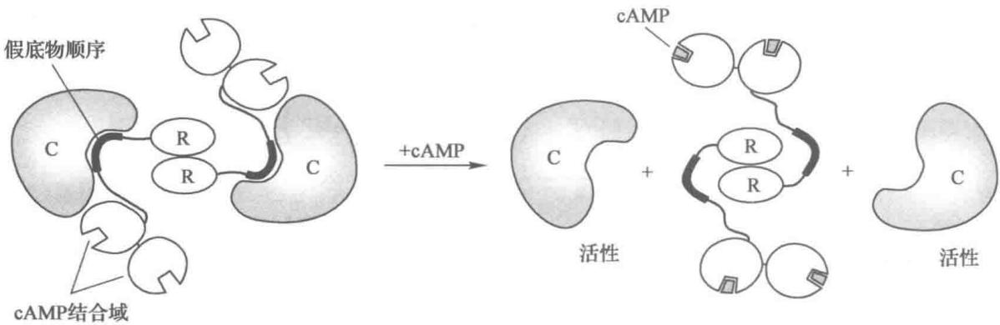  
图 8-60 蛋白激酶 A 与 4 分子 cAMP 结合, 解离抑制的全酶 $\left(\mathrm{R}_{2}\mathrm{C}_{2}\right)$ 成为一个调节亚基 $\left(\mathrm{R}_{2}\right)$ 和 2 个催化活性亚基 (2C), 每条 R 链含有 2 个 cAMP 结合域和一个假底物填充 (以粗黑线表示)

PKA 可以通过磷酸化激活多种酶, 如磷酸化酶激酶、甘油三酯酶、酪氨酸羟化酶、RNA 聚合酶Ⅱ等, 也可通过催化蛋白磷酸化抑制多种酶活性, 如糖原合成酶、乙酰 CoA 羧化酶、丙酮酸激酶等。

（2）磷酸化酶激酶(phosphorylase kinase, PhK) PhK 是糖原代谢中一个关键的调节酶, 其催化的反应是通过磷酸化作用使无活性的磷酸化酶 b(phosphorylase b) 转化成有活性的磷酸化酶 a, 从而加强糖原的分解代谢。磷酸化酶 a 又可通过蛋白磷酸酶的水解而脱去磷酸转变成无活性的磷酸化酶 b, 以此方式调节磷酸化酶的活性(图 8-56)。

PhK 在动物的肌肉组织和肝中都有存在,以兔子肌肉中的研究最为清楚。PhK 由 4 个完全不同的亚基 $\alpha$ 、 $\beta$ 、 $\gamma$ 、 $\delta$ 组成(图 8-61),一般认为全酶以 $[\alpha \beta \gamma \delta]$ 四聚体的形式存在,其中 $\delta$ 亚基为钙调蛋白(CaM),因此 CaM 作为一个整合亚基参与全酶的形成,其功能是作为调节亚基通过与 $\mathrm{Ca}^{2+}$ 结合而激活全酶的活性。有证据表明 $\gamma$ 亚基具有催化功能,并且其氨基酸组成和顺序与其他蛋白激酶的催化部分有很高的相似性。PhK 的活性几乎绝对依赖 $\mathrm{Ca}^{2+}$ ,因此 $\mathrm{Ca}^{2+}$ 、 $\mathrm{CaM}(\delta$ 亚基)是它的主要调节方式。有实验证明 $\alpha$ 、 $\beta$ 亚基的磷酸化是该酶活性的另一种重要调节方式。 $\beta$ 亚基被 PKA 磷酸化可以使 $\gamma$ 亚基活化而具催化活性，随之， $\alpha$ 亚基也可被 PKA 缓慢磷酸化，结果使已磷酸化的 $\beta$ 亚基发生构象的改变，使之变得对蛋白磷酸酶敏感而被脱磷酸化， $\gamma$ 亚基回到被 $\beta$ 亚基的抑制状态，通过 $\alpha$ 、 $\beta$ 亚基的磷酸化状态而调节了 PhK 的活性水平和持续时间。

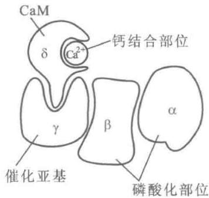  
图8-61 PhK结构示意图

## （二）酶原的激活——不可逆共价调节

体内合成出的蛋白质,有时不具有生物活性,经过蛋白水解酶专一作用后,构象发生变化,形成酶的活性部位,变成活性蛋白。这个不具生物活性的蛋白质称为前体(precursor)。如果活性蛋白质是酶,这个前体称为酶原(zymogen或proenzyme)。该活化过程,是生物体的一种调控机制。这种调控作用的特点,由无活性状态转变成活性状态,与别构调节和可逆共价调节不同,酶原激活过程是一种不可逆的共价调节过程。通过专一性的蛋白水解作用来活化酶和蛋白质,在生物体系中是经常发生的,例如:

（1）使蛋白质水解的消化酶，在胃和胰脏中是作为酶原合成的（表8-10），激活后成为蛋白水解酶。

表 8-10 胃和胰脏的酶原和有活性的酶

<table><tr><td>合成部位</td><td>酶原</td><td>有活性的酶</td><td>合成部位</td><td>酶原</td><td>有活性的酶</td></tr><tr><td>胃</td><td>胃蛋白酶原</td><td>胃蛋白酶</td><td>胰脏</td><td>羧肽酶原</td><td>羧肽酶</td></tr><tr><td>胰脏</td><td>胰凝乳蛋白酶原</td><td>胰凝乳蛋白酶</td><td>胰脏</td><td>弹性蛋白酶原</td><td>弹性蛋白酶</td></tr><tr><td>胰脏</td><td>胰蛋白酶原</td><td>胰蛋白酶</td><td></td><td></td><td></td></tr></table>

(2) 血液凝固系统的许多酶都是以酶原形式被合成出来, 被蛋白水解级联激活后起作用。

（3）有些蛋白激素也是以无活性的前体被合成的。例如胰岛素被合成出来是胰岛素原(proinsulin)，经蛋白酶激活后变成有活性的胰岛素。

（4）存在于皮肤和骨骼中的纤维蛋白——胶原，是由可溶性前体前胶原(procollagen)激活而成。

（5）许多发育过程是由酶原激活调控的。蝌蚪变态成蛙时，在几天的过程中从尾巴吸收大量的胶原，同样地分娩后许多胶原在哺乳动物子宫中被破坏，前胶原酶（procollagenase）转变成胶原酶（collagenase），这一活性蛋白酶为这些变化过程精确地选择时机。蚕茧酶（cocoonase）是昆虫发育的一种关键酶，也是由非活性前体获得的。

（6）细胞凋亡是通过称作胱天蛋白酶（caspase）的蛋白水解酶调节的，它是以胱天蛋白酶原（pro-caspase）的形式合成的。当被各种信号激活时，胱天蛋白酶的作用引起机体中细胞死亡。

首先讨论消化酶的激活,然后再讨论凝血机制。

## 1. 消化系统中的酶原激活

胰凝乳蛋白酶、弹性蛋白酶和羧肽酶等都具有很强的水解蛋白的能力，它们都是以酶原形式在胰脏中产生的。如果在胰脏中就以活化的形式存在，那么胰脏就会被它们水解而破坏，因此胰脏有一些保护措施，防止它们提早活化。胰脏中酶原的激活都要通过胰蛋白酶的作用，可见胰蛋白酶是一个关键，因此在胰脏中存在着较丰富的胰蛋白酶抑制剂，抑制胰蛋白酶的活性。胰蛋白酶抑制剂相对分子质量为 $6 \times 10^{3}$ ，它和胰蛋白酶的活性部位紧密结合，复合物的解离常数为 $0.1 \mathrm{pmol} \cdot \mathrm{L}^{-1}$ ，标准结合自由能大约 $-75 \mathrm{kJ} \cdot \mathrm{mol}^{-1}$ ，其复合物用变性剂处理也不解离。酶原在胰脏中提早活化是胰腺炎的特征，严重的可以致命。胰蛋白酶抑制剂可以治疗胰腺炎。

（1）胰凝乳蛋白酶原的激活 胰凝乳蛋白酶原（chymotrypsinogen）是由245个氨基酸组成的，具有5对二硫键的单肽链蛋白质。当受到胰蛋白酶作用后， $\mathrm{Arg}_{15}$ 与 $\mathrm{Ile}_{16}$ 间的肽键断开，才具有酶活性，这种酶称为 $\pi-$ 胰凝乳蛋白酶。 $\pi-$ 胰凝乳蛋白酶活性最高，但不稳定。它再作用于其他的 $\pi-$ 胰凝乳蛋白酶分子上，使另一分子 $\pi-$ 胰凝乳蛋白酶失去两个二肽（ $\mathrm{Ser}_{14}-\mathrm{Arg}_{15}$ 及 $\mathrm{Thr}_{147}-\mathrm{Asn}_{148}$ ），而形成酶的稳定形式—— $\alpha-$ 胰凝乳蛋白酶。它是由3条肽链组成，A、B两链及B、C两链间各通过一对二硫键相连， $\alpha-$ 胰凝乳蛋白酶的活性只有 $\pi-$ 胰凝乳蛋白酶的 $40\%$ ，其激活过程见图8-62。酶活性部位的氨基酸残基 $\mathrm{His}_{57}, \mathrm{Asp}_{102}$ ，和 $\mathrm{Ser}_{195}$ 分别来自B、C二链。

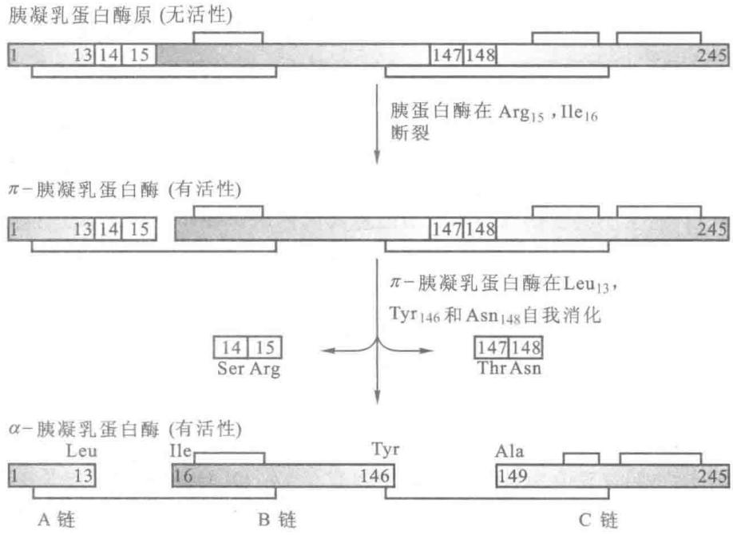  
图 8-62 胰凝乳蛋白酶原的激活过程

胰凝乳蛋白酶原受胰蛋白酶作用后， $\mathrm{Arg}_{15}-\mathrm{Ile}_{16}$ 间的肽键断开，形成了新的 $\mathrm{Ile}_{16}$ 末端，这个新的末端氨基与酶分子内部的 $\mathrm{Asp}_{194}$ 发生静电作用（图8-63），这个氨基的质子化稳定了胰凝乳蛋白酶的活性形式，通过酶活性对 $\mathrm{pH}$ 的依赖性得到说明。由于静电的相互作用触发了一系列的构象变化， $\mathrm{Met}_{192}$ 从酶原的深层移动到活性酶分子表面，第187及第193残基彼此分离更远。这些构象变化的结果形成一个疏水口袋，允许芳香基和大的非极性基结合于底物专一性部位。显然，这样的口袋，在酶原中是不存在的。

（2）胃蛋白酶原的激活 胃蛋白酶原(pepsinogen)是由胃壁细胞分泌的，相对分子质量为 $38.9 \times 10^{3}$ ，由392个氨基酸残基组成。在胃酸 $\mathrm{H}^{+}$ 作用下， $\mathrm{pH}$ 低于5时，酶原自动激活，从氨基端失去44个氨基酸残基——碱性的前体片段后，转变为高度酸性的，相对分子质量为 $34.6 \times 10^{3}$ ，有活性的胃蛋白酶。胃蛋白酶在胃中很酸的环境中消化蛋白质，最适 $\mathrm{pH}$ 为2。胃蛋白酶和天冬氨酸蛋白酶家族其他成员在催化部位含2个天冬氨酸残基，一个是以—COOH形式，另一个是一—COO⁻形式。X射线晶体结构研究说明，在胃蛋白酶原中已形成活性部位，在中性 $\mathrm{pH}$ 下前片段中的6个Lys和Arg的侧链与胃蛋白酶部分中Glu和Asp残基的羧基侧链之间形成盐桥，尤其是前体中的Lys侧链与活性部位的一对天冬氨酸： $\mathrm{Asp}_{215}$ 和 $\mathrm{Asp}_{32}$ 之间的静电相互作用，使得前体片段中的碱性氨基酸将活性部位遮盖，所以酶原不表现催化活性。当 $\mathrm{pH}$ 降低时，由于几个羧基质子化，破坏了前体碎片和胃蛋白酶部分的盐桥，引起构象的重排，暴露出催化部位，水解前体和胃蛋白酶部分间的肽键，酶原被激活。 $\mathrm{H}^{+}$ 激活产生的胃蛋白酶还可以进一步再去激活其他的胃蛋白酶原。

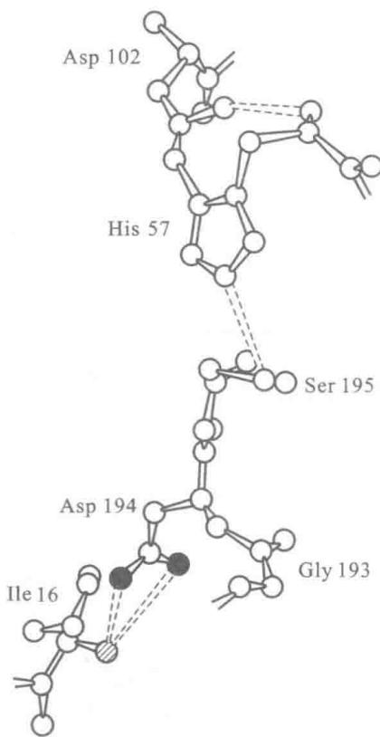  
图 8-63 胰凝乳蛋白酶中 Asp $_{194}$ 和 Ile $_{16}$ 的环境  
Asp $_{194}$ 的羧基和 Ile $_{16}$ 的 $\alpha-NH_{2}$ 之间的相互静电作用对胰凝乳蛋白酶的活性是必需的。这些基团邻近 Ser-His-Asp 催化三联体

（3）胰蛋白酶原的激活 胰蛋白酶原(trypsinogen)是由胰腺细胞分泌的,进入小肠后,在有 $Ca^{2+}$ 的环境中受到肠激酶(enterokinase)的激活,断开酶原中 $Lys_{6}-Ile_{7}$ 之间的肽键,从氨基端水解下一个酸性6肽（图8-64），使构象发生变化，形成胰蛋白酶的活性部位 $(\mathrm{His}_{57},\mathrm{Asp}_{102},\mathrm{Ser}_{195})$ ，由酶原转变成有活性的胰蛋白酶。胰蛋白酶不仅可以激活胰蛋白酶原，而且还可激活胰凝乳蛋白酶原、弹性蛋白酶原脂肪酶原及羧肽酶原。因此被肠激酶激活形成的胰蛋白酶是所有胰脏蛋白酶原的共同激活剂，在它的控制下，可以使所有的胰脏蛋白酶同时起作用。胰蛋白酶对各个胰脏蛋白酶原的激活作用如图8-65所示。

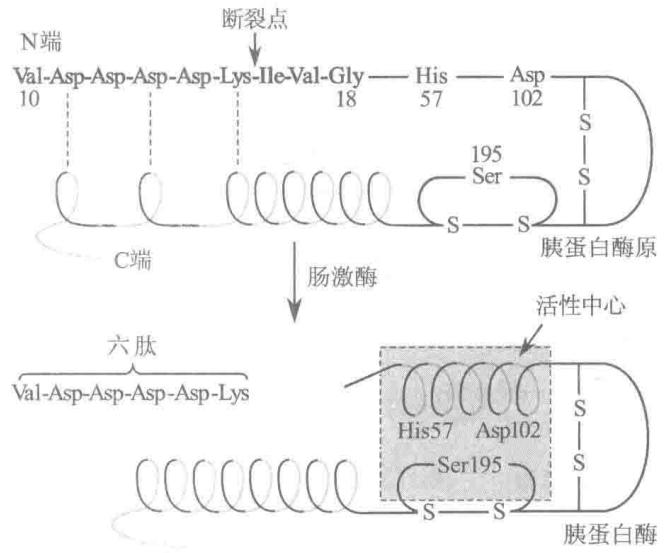  
图 8-64 胰蛋白酶原的激活  
图中标号基于胰凝乳蛋白酶序列

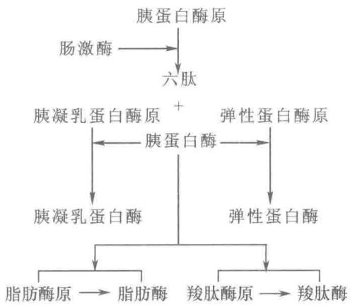  
图 8-65 胰脏蛋白酶原被胰蛋白酶水解激活

## 2. 凝血系统中的酶原激活

生物体意外地被伤害会引起出血，凝血作用是生物体适应外界条件的一种很重要的措施。体内凝血机制大致有3个方面：被伤害的血管收缩以减少血液的流失；血小板黏聚形成栓塞堵住伤口；通过一连串酶原激活反应和凝血因子的作用使血液凝集。

血液凝固是极其复杂的生物化学过程,涉及一系列酶原被激活形成一个庞大的级联放大系统,使血凝块迅速形成成为可能(图8-66)。血浆中的13种凝血因子有7种是丝氨酸蛋白酶:激肽释放酶,XIIa、XIa、IXa、VIIa、Xa和凝血酶(凝血因子常用罗马数字编号,编号右下角字母a表示该因子是激活形式)。血液凝固存在两条途径:外在途径(extrinsic pathway)和内在途径(intrinsic pathway)。外在途径由创伤组织释放的因子III(组织因子)和因子VII所引发,此途径可在数秒钟内形成少量凝血酶,通过凝血酶的自我催化,有利于凝血和止血。内在途径起始于XII与损伤造成的异常表面的物理接触而被激活成XIIa。这两条途径汇合在因子X,以下是最后的共同途径(common pathway)。此途径主要是两个环节:一是凝血酶原(Ⅱ)在因子V $_{a}$ 和Ca $^{2+}$ (Ⅳ)存在下由因子X $_{a}$ 催化断裂成凝血酶;二是血浆中血纤蛋白原在凝血酶和因子VIII $_{a}$ 作用下,转变为血纤蛋白网状结构,网内裹有血液的有形成分如血细胞、血小板等,即所谓血凝块。

凝血系统具有保护作用,这是其一。但如果凝血机能亢进,即血凝过度,则血液中会出现异常的血凝块,称为血栓(thrombus)。血栓会引起严重的疾病,如心肌梗死,脑血栓和肺栓塞等。好在血液中还存在着一个所谓纤溶系统(fibrinolysis system)。该系统包括纤溶酶原(plasminogen)和纤溶酶原激活剂(plasminogen activator,PA),如组织型纤溶酶原激活剂(t-PA)等,它们也都是丝氨酸蛋白酶类。t-PA仅能激活黏附在血凝块上的纤溶酶原,不影响血液中的游离纤溶酶原,因此不会造成过度纤溶而引起出血。近年来t-PA已被应用于临床,治疗急性心肌梗死(acute myocardial infarction)。

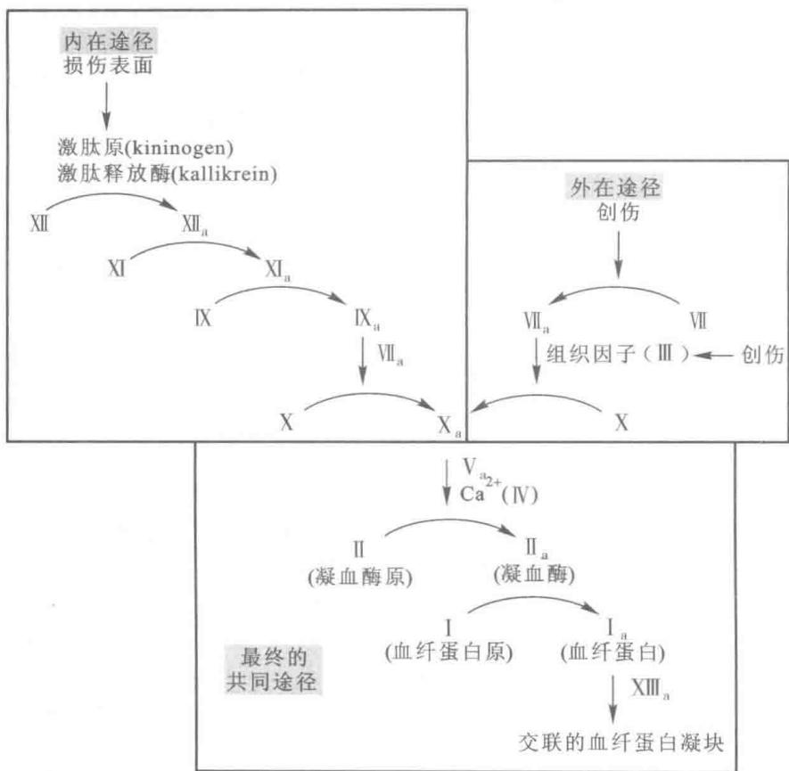  
图 8-66 血液凝固中激活反应的级联放大

## 七、同工酶

1959 年 C. L. Markert 首次用电泳分离法发现动物的乳酸脱氢酶 (lactate dehydrogenase, LDH) 具有多种分子形式，并将其称为同工酶 (isoenzyme; isozyme)。同工酶是指催化相同的化学反应，但其蛋白质分子结构、理化性质和免疫性能等方面都存在明显差异的一组酶，它们被不同基因编码。至今已陆续发现了数百种具有不同分子形式的同工酶，几乎有一半以上的酶作为同工酶而存在。同工酶普遍存在于生物界，包括动物、植物和微生物。同工酶不仅存在于同一个体的不同组织中，甚至同一组织、同一细胞的不同亚细胞结构中。甚至生物在生长发育的不同时期和不同的代谢条件，都有不同的同工酶分布。同工酶是研究代谢调节、分子遗传、生物进化、个体发育、细胞分化和癌变的有力工具，在酶学、生物学和临床医学中均占有重要地位。

在同工酶的研究中,研究得最多的是乳酸脱氢酶,它是糖酵解过程中的关键酶之一,催化下面反应:

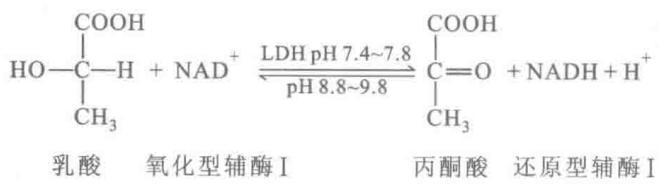

从各种组织中得到的 LDH 相对分子质量约 $140 \times 10^{3}$ ，都是由 4 个亚基聚合的四聚体，每个亚基的相对分子质量约 $35 \times 10^{3}$ ，有 5 种同工酶。由两种不同的结构基因编码成 2 种蛋白亚基，即肌肉型（M）和心肌型（H）亚基，氨基酸顺序有 75% 是相同的。这两种亚基在氨基酸组成上有较大差别，H 型富含酸性氨基酸，而 M 型富含碱性氨基酸，因此在电场中很易分开，从阴极向阳极排列依次为 $\mathrm{LDH}_{5}\left(\mathrm{M}_{4}\right)$ 、 $\mathrm{LDH}_{4}\left(\mathrm{M}_{3}\mathrm{H}\right)$ 、 $\mathrm{LDH}_{3}\left(\mathrm{M}_{2}\mathrm{H}_{2}\right)$ 、 $\mathrm{LDH}_{2}\left(\mathrm{MH}_{3}\right)$ 、 $\mathrm{LDH}_{1}\left(\mathrm{H}_{4}\right)$ 五种形式的同工酶（图 8-67A）。此外在动物睾丸及精子中还发现了另一种基因编码的 x 亚基组成了 $LDH_{x}$ 。

LDH 同工酶有组织特异性, 在不同组织中含量不同, 例如: $LDH_{1}$ 在心肌中相对含量高, 而 $LDH_{5}$ 在肝、骨骼肌中相对含量高(图8-67B)。这反映了LDH同工酶所在器官的特殊的代谢需要。如心脏是以氧化代谢为主的组织,可以有效地利用乳酸,心肌中 $LDH_{1}$ 含量高,对乳酸的 $K_{m}$ 小,易受丙酮酸抑制,故在体内通过三羧循环催化乳酸的氧化,这是和心肌的需要相适应的。相反在骨骼肌中 $LDH_{5}$ 含量高,对乳酸的 $K_{m}$ 大,不易受丙酮酸的抑制,在体内主要通过糖酵解途径使丙酮酸还原成乳酸,故骨骼肌是体内生成乳酸的重要组织。运动时,骨骼肌产生的乳酸随血液输送到心肌利用,成为心肌的主要能源(图8-68)。进一步研究得知,LDH受丙酮酸的抑制作用是由于丙酮酸能与LDH活性部位上的 $NAD^{+}$ 形成三联复合物,这一复合物对 $LDH_{1}$ 的抑制作用远比对 $LDH_{5}$ 大的多。

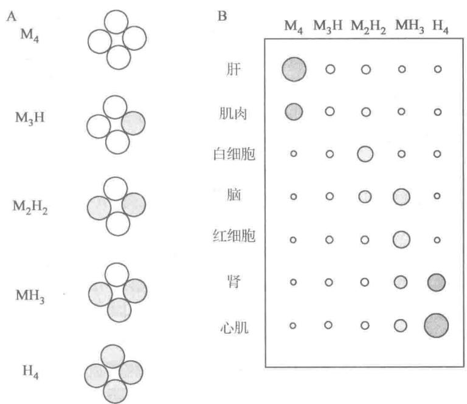

<table><tr><td>B</td><td> $M_{4}$ </td><td> $M_{3}H$ </td><td> $M_{2}H_{2}$ </td><td> $MH_{3}$ </td><td> $H_{4}$ </td></tr><tr><td>肝</td><td></td><td>○</td><td>○</td><td>○</td><td>○</td></tr><tr><td>肌肉</td><td></td><td>○</td><td>○</td><td>○</td><td>○</td></tr><tr><td>白细胞</td><td></td><td>○</td><td>○</td><td>○</td><td>○</td></tr><tr><td>脑</td><td></td><td>○</td><td>○</td><td>○</td><td>○</td></tr><tr><td>红细胞</td><td></td><td>○</td><td>○</td><td>○</td><td>○</td></tr><tr><td>肾</td><td></td><td>○</td><td>○</td><td>○</td><td>○</td></tr><tr><td>心肌</td><td></td><td>○</td><td>○</td><td>○</td><td>○</td></tr></table>

图 8-67 乳酸脱氢酶同工酶(LDH)及其在不同组织中的分布  
A. LDH 的 5 种异构体; B. LDH 同工酶在不同组织中的分布  
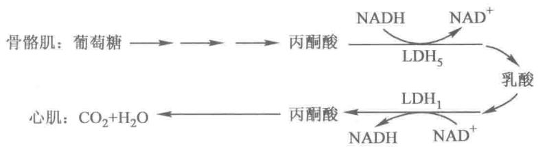  
图8-68 $\mathrm{LDH}_5$ 和 $\mathrm{LDH}_{1}$ 不同的功能

同工酶具有多种多样的生物学功能:① 同工酶与遗传:同工酶作为遗传标志,已广泛被遗传学家用于遗传分析的研究,这是因为:同工酶是分子水平的指标,按照一个基因编码一个同工酶亚基的理论,可从同工酶的表现型变异直接推测其基因型的变异,显然优于某些形态学的指标,后者往往是多个基因型的综合表现型。同工酶可用测定酶活力的方法鉴定,较非酶蛋白质分析方便。同工酶比其他指标灵敏,可以反映出 DNA 上一个碱基的微小变异。② 同工酶和个体发育及组织分化密切相关:在个体发育过程中,从早期胚胎到胎儿组织,再从新生儿到成年,随着组织的分化和发育,各种同工酶也有一个分化或转变的过程。某些同工酶在个体发育时,往往在较晚期的胎儿组织中才开始发生,甚至到出生后才在特定的少数组织中生成,其活力随组织的分化和发育而逐渐增高。这些同工酶在成年动物中的分布常局限于少数组织。一般说来,它们对底物的 $K_{m}$ 值较大,有些还受到激素或饮食成分的调节,与组织的特殊功能有关,如糖异生、尿素合成等。把这类同工酶称为分化型同工酶(differentiation type isozyme)或成年型同工酶(adult type isozyme)。反之,另一些同工酶在胎儿发育的较早期即有明显活性,出生后,在有些组织中,活性反而随分化和发育而逐渐降低,但也可在另一些组织中甚至多数组织中继续占主要地位。这些同工酶往往对底物的 $K_{m}$ 值较小,不受饮食或激素的调节,只参与组织的一般性代谢或与细胞的增殖有关。把这类同工酶称为原始型同工酶(original type isozyme)或胎儿型同工酶(foetal type isozyme)。③ 同工酶与代谢调节:同工酶的产生可能是基因分化的产物,而基因的分化又可能是生物进化过程中为适应愈趋复杂的代谢而引起的一种分子进化,故体内存在同工酶的意义即在于适应不同组织或不同细胞器在代谢上的不同需要。实验结果表明,同工酶在各组织或亚细胞组分中分布的不同以及它们之间底物特异性和动力学的差别,决定了同工酶在体内的功能是不同的,同工酶只是做相同的“工作”,不一定有相同的功能。关于同工酶对代

谢的调节,研究较清楚的是微生物的某些同工酶在分支代谢调节中所起的重要作用。例如 E. coli 中 Thr、Met、Lys 的合成均以 Asp 为原料,整个合成途径的第一个酶是天冬氨酸激酶(aspartate kinase, AK),它共有 I\~Ⅲ种同工酶。其中 AKI 可受 Thr 的反馈抑制,AKII 受 Met 的反馈阻遏,而 AKIII 则受 Lys 的抑制和阻遏。三者协同作用,并与其他调节环节相互配合,便不会因一种产物过剩而影响其他两种氨基酸的合成,保证了 3 种氨基酸合成的平衡(图 8-69)。④ 同工酶与癌基因的表达:研究癌基因的表达在癌的发病机制及探索癌诊断的指标中具有重要的意义。大量的研究证明,癌基因表达发生紊乱,产生一些相应的正常分化组织所没有的或含量极微的基因表达产物,例如 α-甲胎蛋白(α-fetoprotein)及一些胎儿型同工酶。同时正常分化组织所特有的一些功能蛋白,例如清蛋白等血浆蛋白和某些成年型同工酶则降低或消失。这些改变往往和癌的增殖速率和恶性程度有平行关系。由于在组织分化或癌变过程中,同一种酶的同工酶常互相消长,一增一减,所以同工

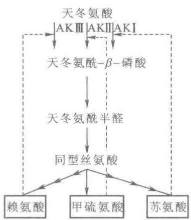  
图8-69 E. coli中Thr、Met和Lys的合成AK:天冬氨酸激酶

酶是研究基因表达的良好指标。⑤ 同工酶与临床诊断: 血清中的同工酶可作为组织损伤的分子标记物。在正常情况下, 细胞膜是不能渗透的, 但是病变和组织损伤时, 细胞膜就变得可渗透, 致使可溶性细胞内含物如酶就会泄漏到血清中, 在发生疾病时, 血清中酶浓度升高, 超过健康况下的血清酶浓度。因此, 血清的酶浓度变化常用来确定病人某种组织发生病变的临床指标。例如, 酸性磷酸酶是由不同分子形式组成的复杂酶谱, 此酶存在于许多组织中, 在成人前列腺中特别高, 此酶已应用于转移前列腺癌的检测。再如, 临床上常通过检测 LDH 同工酶谱的变化, 作为某脏器病变鉴别诊断的依据。

此外，同工酶分析法在农业上已开始用于优势杂交组合的预测，例如番茄优势杂交组合种子与弱优势杂交组合的种子中的脂酶同工酶谱是有差异的，从这种差异分析中可以帮助判断杂交优势。

## 提要

酶的特殊催化能力只局限在酶分子的一定区域，即与酶活力直接相关的区域，称为酶的活性部位。它对于不需要辅酶的酶来说，就是指酶分子中在三维结构上比较靠近的几个氨基酸残基负责与底物的结合与催化作用的部位，对于需要辅酶的酶来说，辅酶分子或辅酶分子上的某一部分结构，往往也是酶活性部位的组成部分。酶活性部位有多个共同特点。研究酶活性部位的方法有：酶分子侧链基团的化学修饰法、动力学参数测定法、X射线晶体结构分析法和定点诱变法等，这些方法可互相配合以判断某个酶的活性部位。

酶是催化效率很高的生物催化剂,这是由酶分子的特殊结构所决定的。它的催化作用包括若干基元催化,即:酸碱催化、共价催化和金属离子催化等。酶的催化效率之所以比非酶催化剂高,主要有以下因素在降低活化自由能方面起了重要作用:①底物和酶的邻近效应与定向效应;②底物的形变与诱导契合;③多元催化和协同效应和④活性部位微环境的影响。但是这些因素不是同时在一个酶中起作用,也不是一种因素在所有的酶中起作用,对于某一种酶来说,可能分别主要受一种或几种因素的影响。

研究酶催化的反应机制,始终是酶学研究的一个重点,通过大量的研究工作,已经对一些酶的作用机制有深入了解,该章对溶菌酶、碳酸酐酶、丝氨酸蛋白酶、天冬氨酸蛋白酶等的催化作用机制进行了详尽的讨论。通过这几个实例,有助于深入了解基元催化及影响酶催化效率各因素的作用。

酶活性是受各种因素调节控制的,除了在第6章中已介绍的几种因素外,主要还有①别构调节:例如

ATCase。②共价调节：包括酶的可逆共价修饰，如蛋白质磷酸化与脱磷酸化；不可逆的共价调节，如酶原的激活及凝血系统酶原激活反应的级联放大。通过以上作用，使酶能在准确的时间和正确的地点表现出它们的活性。别构酶一般都是寡聚酶，有催化部位和调节部位，别构酶往往催化多酶体系的第一步反应或在一些分类点，受反应序列的终产物抑制，终产物与别构酶的调节部位相结合，通过协同效应调节多酶体系的反应速率。别构酶中[S]对v的动力学曲线呈S形曲线（正协同）或表观双曲线（负协同），两者均不符合米氏方程。ATCase作为别构酶的典型代表，已经测定了其三维结构，详细研究了别构机制和催化作用机制。为了解释别构酶协同效应的机制，有两种分子模型受到人们重视，即齐变模型和序变模型。酶原经过蛋白水解酶专一作用释放出肽段，构象发生变化，形成酶的活性部位，变成有活性的酶，这个活化过程，是生物体的一种不可逆地共价调控机制。可逆地共价修饰调控作用是通过共价调节酶进行的，通过蛋白激酶对其多肽链某些基团进行可逆地共价修饰，使处于活性与非活性的互变状态，从而调节酶活性。共价修饰的反应主要是磷酸化、腺苷酰化、尿苷酰化及ADP-核糖基化等。

同工酶是指催化相同的化学反应，但其蛋白质分子结构、理化性质和免疫性能等方面不同的一组酶。同工酶在酶学、生物学及医学研究中占有重要地位。LDH同工酶研究的比较清楚，是由两种不同亚基组成的四聚体，有5种同工酶，在不同组织中含量不同，反映了同工酶的组织特异性。同工酶具有多种生物学功能，值得人们深入研究和应用。

## 习题

1. 解释下列的术语：(a) 共价催化；(b) 一般酸碱催化；(c) 邻近效应和定向效应；(d) 共价修饰；(e) 亲和标记；(f) 酶原激活；(g) 别构酶；(h) 别构效应；(i) 蛋白激酶；(j) 同工酶。

2. 阐明酶活性部位的概念。可使用哪些主要方法研究酶的活性部位？

3. 酶具有高催化效率的因素有哪些？它们是怎样提高酶反应速率的？

4. 假设在合成 $(\mathrm{NAG})_{6}$ 时D和E糖残基之间的糖苷氧已为 ${}^{18}\mathrm{O}$ 所标记。当溶菌酶水解时 ${}^{18}\mathrm{O}$ 将出现在哪个产物中？

5. 请比较溶菌酶、碳酸酐酶、胃蛋白酶和胰凝乳蛋白酶：

(a) 哪种酶的催化活性需要金属离子?

(b) 哪种酶只含一条多肽键？

(c) 哪种酶被 DFP 迅速地失活？

(d) 哪种酶是由酶原激活成的？

(e) 哪种酶有共价催化的机制？

6. TPCK 是胰凝乳蛋白酶的亲和标记试剂，它对 His $_{57}$ 烷基化后使胰凝乳蛋白酶失活。

(a) 为胰蛋白酶设计一个类似于 TPCK 的亲和标记试剂。

(b) 你认为怎样可以检验它的专一性？

7. 胰凝乳蛋白酶、胰蛋白酶和弹性蛋白酶作为生物催化剂,有哪些相似之处?有哪些不同之处?在酶的分子结构上,是哪些因素引起这些差异的?

8. ATCase 是一种别构酶, 其活性部位与别构效应物结合部位分别位于不同亚基上, 有可能设想别构酶上这两种部位存在于同一亚基上吗? 为什么?

9. 对于 ATCase 来说, 琥珀酸起着 Asp(两个底物中的一个) 的竞争性抑制作用。v 对 [Asp] 的依赖关系见图 8-69A (假设在这些实验中第二种底物是过量的, 并可忽略)。在图 8-70B 中 [Asp] 维持在低水平 (图 8-70A 中箭头所指处) 不变, 并加入一系列含量递增的琥珀酸。琥珀酸不能作为底物参与反应。请解释这些结果。

10. 试解释为什么胰凝乳蛋白酶不能像胰蛋白酶那样自我激活？

11. 将枯草杆菌蛋白酶的 $Ser_{221}$ 突变为 Ala，则活性降低 $10^{6}$ 倍，突变 $His_{64}$ 成 Ala 也得到类似的结果，同样降低 $10^{6}$ 倍。因此，若同时突变 $Ser_{221}$ 和 $His_{64}$ 成为 Ala，其活性应降低 $10^{6} \times 10^{6} = 10^{12}$ 倍，这种推断正确吗？为什么？

12. CTP 合成酶催化 UTP 合成 CTP:

$$
\mathrm{UTP+ATP+谷氨酰胺} \rightleftharpoons \mathrm{CTP+谷氨酸+ADP+Pi}
$$

底物 UTP 和 ATP 与酶（为 $\alpha_{4}$ 同型四聚体）结合显示正协同，而另外底物谷氨酰胺显示为负协同。试绘制这三种底物 v 对 $[S]/K_{0.5}$ 的底物饱和曲线，以说明它们的协同效应。

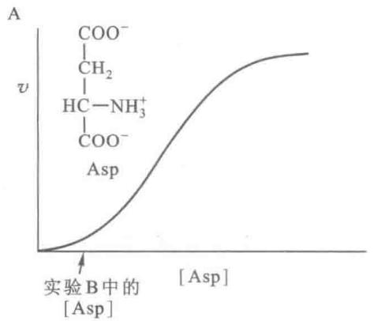

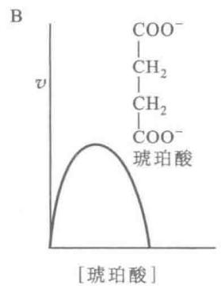  
图8-70 Asp和琥珀酸浓度对ATCase催化速率的影响

13. 对蛋白激酶 A 的叙述中哪一个是正确的？

(a) 通过 ATP 活化。

(b) 在没有激活剂时有 2 个催化亚基(C)和 2 个调节亚基(R)组成。

(c) 激活剂结合后解离成一个 $C_{2}$ 和 2 个 R 亚基。

(d) 在 C 亚基中含有一个假底物顺序。

14. 从右边选择合适答案与左边项目相匹配。

(a) ATCase (1) 蛋白质磷酸化

(b) T态 (2) 需要 $\mathrm{Zn}^{2+}$

(c) R 态 (3) 激活蛋白激酶 A

(d) 磷酸化 (4) 一种同工酶

(e) 激酶 (5) 可逆的共价修饰

(f) 磷酸酶 (6) 激活胰蛋白酶原

(g) cAMP (7) 被 CTP 抑制

(h) 肠激酶 (8) 一种更低活性态的别构酶

(i) 碳酸酐酶 $V_{\mathrm{K}}$ (9) 起始于外在途径

(j) 乳酸脱氢酶 (10) 一种更活性态的别构酶

(k) 组织因子 (11) 除去磷酸

15. 有一种含 2 个相同活性部位的二聚体酶, 当底物结合到一个活性部位就降低对另一个活性部位的亲和性。用齐变模型能说明这种负协同性吗?

16. 酶的可逆共价修饰调节和酶原的蛋白水解调节之间关键不同是什么？

## 主要参考书目

1. 王镜岩, 朱圣庚, 徐长法. 生物化学教程. 北京: 高等教育出版社, 2008.

2. 许根俊. 酶的作用原理. 北京: 科学出版社, 1983.

3. 陈惠黎, 李文杰. 分子酶学. 北京: 人民卫生出版社, 1983.

4. Berg J M, Tymoczko J L, Stryer L. Biochemistry. 7th ed. New York: W. H. Freeman and Company, 2013.

5. Garrett R H, Grishorm C M. Biochemistry. 5th ed. Boston: Brooks/Cole, Cengage Learning, 2012.

6. Nelson D L, Cox MM. Lehninger Principles of Biochemistry. 5th ed. New York: W. H. Freeman and Company, 2008.

7. Tsou C L. Conformational flexibility of active sites. Science, 1993, 262: 380-381.

(张庭芳)

## 网上资源
