## 第 10 章 脂质和生物膜

脂质(lipid)也称脂类,是一类化学上多种多样的生物有机分子,其共同特征是低溶或不溶于水而高溶于非极性溶剂。对大多数脂质而言,化学本质是脂肪酸和醇形成的酯及其衍生物。脂质的元素组成主要是碳、氢、氧,有些尚含氮、磷、硫。按化学组成,脂质大体可分为三类:①简单脂质(simple lipid),由脂肪酸和甘油或长链醇形成的酯,如三酰甘油和蜡;②复合脂质(compound lipid),除含脂肪酸和醇外,尚有所谓非脂分子成分(磷酸、糖和含氮碱等),如甘油磷脂、鞘[氨醇]磷脂、甘油糖脂和鞘[氨醇]糖脂,其中鞘磷脂和鞘糖脂又合称为鞘脂;③衍生脂质(derived lipid),可视为由前面两类脂质衍生而来并具有脂质一般性质的物质,如脂肪酸、萜、类固醇、类二十烷酸(eicosanoid)及其他。按生物学功能,脂质也可分为三类:①贮存脂质(storage lipid),它们是三酰甘油和蜡,三酰甘油是许多生物的主要贮能形式,蜡是海洋浮游生物的能量储库;②结构脂质(structural lipid),是生物膜的结构成分,包括磷脂、胆固醇和糖脂;③活性脂质(active lipid),它们虽是细胞内的小量成分,但具有重要而专一的生物活性,如酶的辅因子、电子载体、吸光色素、蛋白质的疏水锚、消化道中的乳化剂、激素和胞内信使等。

本章将按它们的生物学作用组织讨论各类有代表性的脂质，包括三酰甘油、蜡、磷脂、鞘脂、萜和类固醇等，重点放在它们的化学结构和物理性质；此外还要讨论血浆脂蛋白、生物膜（结构和功能）以及脂质的提取、分离和分析。脂质的产能氧化及其生物合成将在第24章讨论。

## 一、贮存脂质——三酰甘油和蜡

三酰甘油(油和脂)被生物普遍地用作体内能量的贮存形式,蜡是海洋浮游生物的能量储库;两者都是含脂肪酸的化合物。脂肪酸是烃的衍生物,它具有与矿物燃料中的烃几乎相同的低氧化态(即高还原态)。脂肪酸在细胞中氧化产生 $CO_{2}$ 和 $H_{2}O$ ,很像矿物油在内燃机中受控的快速燃烧,是一个高放能反应。

下面讨论在活生物中最普遍存在的脂肪酸和两类含脂肪酸的化合物三酰甘油和蜡,讲解它们的结构和物理性质等。

## （一）脂肪酸是烃的衍生物

从动、植物和微生物中分离出来的脂肪酸已有百多种。在生物体内大量的脂肪酸都以结合形式存在于三酰甘油、蜡、磷脂和糖脂等化合物中，但也有少量的脂肪酸以游离状态出现在组织和细胞中。

## 1. 脂肪酸的结构和命名

脂肪酸(fatty acid, FA)是具有4到36碳长 $\left(\mathrm{C}_{4}\sim\mathrm{C}_{36}\right)$ 烃链的羧酸。脂肪酸中烃链多数是线型的，分支或含环的为数很少。在某些脂肪酸中烃链完全不含双键(烯键)，称饱和脂肪酸(saturated FA)；另一些脂肪酸中含一个或多个双键，称不饱和脂肪酸(unsaturated FA)。只含单个双键的脂肪酸称单不饱和脂肪酸(monounsaturated FA)；含2个或2个以上双键的称多不饱和脂肪酸(PUFA)。不同脂肪酸之间的主要区别在于烃链的长度(碳原子数目)、双键数目和位置。每个脂肪酸都有一个通俗名称和系统名称，不分支的脂肪酸还有一个简写符号(表10-1)。简写的标准惯例(图10-1A)是，写出链长(碳数)和双键数目，两者之间用冒号(:)隔开。例如，饱和的[正]十八[碳烷]酸(硬脂酸)缩写为18:0，含一个双键的十六[碳]单烯酸(棕榈油酸)缩写为16:1。任一双键的位置是指跟羧基碳(标为C1)的关系，用 $\Delta(\text{delta})$ 右上标的数字表示，数字是指双键键合的两个碳原子的序号中较低者，例如在C9和C10之间及C12和C13之间各有一个双键的十八[碳]二烯酸(亚油酸)表示为 $18:2\Delta^{9.12}$ 。有时在序号后面用 $c(\text{cis},\text{顺式})$ 和 $t(\text{trans},\text{反式})$ 标明双键的构型。例如，顺，顺，顺(或全顺)-9,12,15-十八三烯酸( $\alpha$ -亚麻酸)简写为 $18:3\Delta^{9c,12c,15c}$ 。

表 10-1 最常见的生物脂肪酸

<table><tr><td>通俗名称 $^{\text{1}}$ </td><td>系统名称 $^{\text{2}}$ </td><td>简写符号 $^{\text{3}}$ </td><td>结构 $^{\text{4}}$ </td><td>熔点/°C</td></tr><tr><td>月桂酸(lauric)</td><td>n-十二酸(n-dodecanoic)</td><td>12:0</td><td> $CH_3(CH_2)_{10}COOH$ </td><td>44.2</td></tr><tr><td>肉豆蔻酸(myristic)</td><td>n-十四酸(n-tetradecanoic)</td><td>14:0</td><td> $CH_3(CH_2)_{12}COOH$ </td><td>53.9</td></tr><tr><td>棕榈酸(软脂酸)(palmitic)</td><td>n-十六酸(n-hexadecanoic)</td><td>16:0</td><td> $CH_3(CH_2)_{14}COOH$ </td><td>63.1</td></tr><tr><td>硬脂酸(stearic)</td><td>n-十八酸(n-octadecanoic)</td><td>18:0</td><td> $CH_3(CH_2)_{16}COOH$ </td><td>69.6</td></tr><tr><td>花生酸(arachidic)</td><td>n-二十酸(n-eicosanoic)</td><td>20:0</td><td> $CH_3(CH_2)_{18}COOH$ </td><td>76.5</td></tr><tr><td>山嵛酸(behenic)</td><td>n-二十二酸(n-docosanoic)</td><td>22:0</td><td> $CH_3(CH_2)_{20}COOH$ </td><td>81.5</td></tr><tr><td>木蜡酸(lignoceric)</td><td>n-二十四酸(n-tetracosanoic)</td><td>24:0</td><td> $CH_3(CH_2)_{22}COOH$ </td><td>86</td></tr><tr><td>棕榈油酸(palmitoleic)</td><td>十六碳-9-烯酸(顺)(cis-9-hexadecenoic)</td><td>16:1 $\Delta^9$ </td><td> $CH_3(CH_2)_5CH=CH(CH_2)_7COOH$ </td><td>-0.5</td></tr><tr><td>油酸(oleic)</td><td>十八碳-9-烯酸(顺)(cis-9-octadecenoic)</td><td>18:1 $\Delta^9$ </td><td> $CH_3(CH_2)_7CH=CH(CH_2)_7COOH$ </td><td>13.4</td></tr><tr><td>亚油酸(linoleic)</td><td>十八碳-9,12-二烯酸(顺,顺)(cis,cis-9,12-octa-decadienoic)</td><td>18:2 $\Delta^{9,12}$ </td><td> $CH_3(CH_2)_4(CH=CHCH_2)_2(CH_2)_6COOH$ </td><td>-5</td></tr><tr><td>α-亚麻酸(α-linolenic)</td><td>十八碳-9,12,15-三烯酸(全顺)(all cis-9,12,15-octadecatrienoic)</td><td>18:3 $\Delta^{9,12,15}$ </td><td> $CH_3CH_2(CH=CHCH_2)_3(CH_2)_6COOH$ </td><td>-11</td></tr><tr><td>花生四烯酸(arachidonic)</td><td>二十碳-5,8,11,14-四烯酸(全顺)(all cis-5,8,11,14-eicosatetraenoic)</td><td>20:4 $\Delta^{5,8,11,14}$ </td><td> $CH_3(CH_2)_4(CH=CHCH_2)_4(CH_2)_2COOH$ </td><td>-49.5</td></tr></table>

① 英文名称中省去“acid”；② 前缀 n 是正[常]（normal）的意思，表示该脂肪酸链是线型和不分支的；注意碳原子的标号从羧基碳（标为 C1）开始；③ 脂肪酸中每个双键都应该指出它的构型，例如亚油酸的简写为 $18:2\Delta^{9c,12c}$ ，但生物脂肪酸中双键几乎总是顺式的，因此在简写中在表示双键位置的数字后面未标构型符号 c（顺）或 t（反）；④ 所有的脂肪酸都以不解离的形式示出，但在 pH 7 时游离脂肪酸的羧基均处于解离状态。

## 2. 生物脂肪酸的结构特点

来自动物的脂肪酸,结构比较简单,碳骨架为线型,双键数目一般为1\~4个,少数多达6个。细菌所含的脂肪酸绝大多数是饱和的,少数为单烯酸,有些含有分支的甲基或三碳环。植物特别是高等植物中不饱和脂肪酸比饱和脂肪酸丰富,有些植物脂肪酸可含叁键(炔键)、羟基、酮基和五碳环。

生物脂肪酸中最常见的骨架长为 $12\sim 24$ 个碳，一般不分支，并且碳原子数目几乎总是偶数的（表10-1）。这是因为在生物体内脂肪酸是以二碳（乙酸盐）单位连续加入的方式从头合成的（见第24章）。奇数碳的脂肪酸在某些海洋生物中有相当量的存在。在大多数单不饱和脂肪酸中双键的位置几乎总在C9和C10之间 $(\Delta^9)$ ；在多不饱和脂肪酸中通常一个双键也位于 $\Delta^9$ ，其余双键位于 $\Delta^{12}$ 和 $\Delta^{15}$ ，但花生四烯酸是一个例外。生物脂肪酸中双键安排的形式几乎总不是共轭的，即不是单、双键交替排列而是由一个亚甲基（methylene）把双键与双键隔开，如一CH=CH-CH₂-CH=CH-(图10-1B)。只有少数PUFA，如乌柏酸(stillingic acid; $10:2\Delta^{2t,4c}$ )和 $\alpha-$ 桐油酸(eleostearic acid; $18:3\Delta^{9c,11t,13t}$ )，单、双键交替排列成共轭双键系统。这两种系统在化学反应性能上有明显差异：非共轭系统中2个双键之间的亚甲基可直接发生化学反应，形成自由基(radical)；共轭双键系统中由于 $\pi$ 电子有相当大的离域作用，脂肪酸很容易发生聚合反应。含桐油酸的桐油(tung oil)被用于油漆工业就是基于这一性质。视黄醇和胡萝卜素都

是生物分子中具有共轭系统的突出例子，它们的双键系统在视网膜的视觉过程中起着重要作用（见第13章）。生物脂肪酸中双键多数为顺式构型；少数是反式构型，如反式异油酸（vaccenic acid; $18:1\Delta^{11t}$ ）、乌柏酸和 $\alpha-$ 桐油酸。有些反式脂肪酸可在乳品牲畜的瘤胃中发酵产生，并从它们的乳品和肉类中获得。此外顺式脂肪酸与某些催化剂一起加热能变为反式，例如油酸在亚硝酸存在下容易转变为反油酸（elaidic acid, $18:1\Delta^{9t}$ ），后者有较高的熔点（ $43\sim45^{\circ}C$ ）。虽然反油酸不是天然存在的，但植物油进行氢化时有相当量的形成。

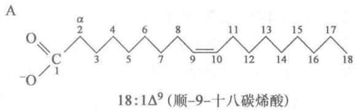

## 3. 多不饱和脂肪酸(PUFA)与必需脂肪酸

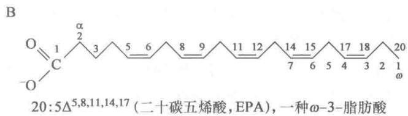  
图10-1 脂肪酸命名的两种惯例

离碳链甲基端的第3碳和第4碳之间具有一个双键的多不饱和脂肪酸（polyunsaturated fatty

A. 标准惯例规定羧基碳为序号 1(C1)，如用希腊文字母标号羧基碳后为 $\alpha$ (C2)。锯齿形的每一线段代表两个相邻碳之间的一个单键。任一双键的位置用 $\Delta$ 右上标数字（该双键中较低的数字）表示。B. 对 PUFA 采用另一惯例：与标准惯例相反方向标号，规定碳链另一端的甲基碳为序号 1，此碳也标为 $\omega$ (omega；希腊文字母表中最后一个)，双键位置是指与 $\omega$ 碳的关系

acid;PUFA),在人体营养方面有着特殊的重要性。因为PUFA的生理作用跟靠近碳链甲基端的第1个双键位置比靠近羧基端的关系更大,所以有时对这些脂肪酸采用另一种命名规则:末端的甲基碳——即离羧基最远的碳——称为 $\omega$ (omega) 碳,并标号为C1。按此规则C3和C4之间有一个双键的PUFA被称为omega-3(ω-3)脂肪酸,在C6和C7之间有一个双键的称omega-6(ω-6)脂肪酸。

人体及哺乳动物能制造多种脂肪酸，但不能向脂肪酸中引进超过 $\Delta^9$ 的双键，因而不能合成亚油酸（ $18:2\Delta^{9,12}$ ，在标准惯例中）和 $\alpha-$ 亚麻酸（ $18:3\Delta^{9,12,15}$ ）。因为这两种脂肪酸对人体功能是必不可少的，但必须由膳食特别是植物性食物中获取，因此它们被称为必需脂肪酸（essential fatty acid）。

亚油酸和 $\alpha$ -亚麻酸分别属于两个不同的PUFA家族： $\omega-6$ 和 $\omega-3$ 脂肪酸。亚油酸是 $\omega-6$ 家族的原初成员，人和哺乳类体内能把它转变为 $\gamma$ -亚麻酸（ $18:3\Delta^{6,9,12}$ ），并继而延长为花生四烯酸（第24章），后者是维持细胞膜的结构和功能所必需的，也是合成一类调节性脂质类二十烷酸的前体。 $\alpha$ -亚麻酸是 $\omega-3$ 家族的原初成员，由膳食供给 $\alpha$ -亚麻酸时，人体能合成两种其他的 $\omega-3$ 脂肪酸：二十碳五烯酸（EPA；eicosapentaenoic acid； $20:5\Delta^{5,8,11,14,17}$ ；见图 $10-1B$ ）和二十二碳六烯酸（DHA；docosahexaenoic acid； $22:6\Delta^{4,7,10,13,16,19}$ ）。体内许多组织如视网膜、大脑皮层中都含有这些重要的 $\omega-3$ PUFA，它们对细胞的功能非常重要。大脑中约一半DHA是在出生前积累的，一半是在出生后积累的，这表明脂质成分在怀孕和哺乳期间的重要性。人体内 $\omega-6$ 和 $\omega-3$ 家族是不能互相转变的。多数人可以从膳食中获得足够量的 $\omega-6$ 脂肪酸（脂质形式），但可能缺乏最适量的 $\omega-3$ 脂肪酸。膳食中 $\omega-6$ 和 $\omega-3$ 脂肪酸的不平衡与心血管疾病风险增加有关联。许多学者认为 $\omega-6$ 对 $\omega-3$ 的最适比是在 $1:1$ 到 $4:1$ 之间。低心血管风险的“地中海膳食”富含 $\omega-3$ PUFA，它们是从叶菜和鱼油中获得的。鱼油中EPA和DHA特别丰富，有心血管病史者常被建议补充些鱼油。 $\omega-6$ 和 $\omega-3$ PUFA的主要膳食来源见表 $10-2$ 。

表 10-2 $\omega  - 6$ 和 $\omega  - 3$ 多不饱和脂肪酸的来源

<table><tr><td>脂肪酸</td><td>来源</td></tr><tr><td>亚油酸( $\omega-6$ )</td><td>植物油(葵花籽、大豆、棉籽、红花籽、玉米胚、小麦胚、芝麻、花生、油菜籽)</td></tr><tr><td> $\gamma$ -亚麻酸和花生四烯酸( $\omega-6$ )</td><td>肉类,玉米胚油等,(或在体内由亚油酸合成)</td></tr><tr><td> $\alpha$ -亚麻酸( $\omega-3$ )</td><td>油脂(芝麻、胡桃、大豆、小麦胚、油菜籽),种子,坚果(芝麻、大豆、胡桃)</td></tr><tr><td>EPA 和 DHA( $\omega-3$ )</td><td>人乳,海洋动物包括鱼类(鲭、鲑、鲱、沙丁鱼等)、贝类和甲壳类(虾、蟹等),(或在体内由  $\alpha$ -亚麻酸合成)</td></tr></table>

## 4. 脂肪酸的物理和化学性质

脂肪酸和含脂肪酸化合物的物理性质很大程度上取决于脂肪酸烃链的长度和不饱和程度。非极性烃链是造成脂肪酸在水中溶解度低的原因，例如月桂酸(12:0; $M_{r}$ 200)在水中的溶解度为0.063 mg/g，远低于葡萄糖( $M_{r}$ 180)1100 mg/g；20℃时硬脂酸(18:0)在水中的溶解度为0.003 mg/g。一般说，脂[肪]酰链愈长，双键愈少，在水中的溶解度愈低。脂肪酸的羧基是极性的，在中性pH时电离，因此短链脂肪酸（少于 $C_{10}$ )略能溶于水。

脂肪酸和含脂肪酸化合物的熔点也受烃链长度和不饱和程度的影响。在室温(25℃)下，12：0到24：0的饱和脂肪酸为蜡样固体，同样链长的不饱和脂肪酸为油状液体。熔点的这种差异是由于脂肪酸分子装配紧密程度不同引起的。在完全饱和的脂肪酸中绕每个碳-碳键都可以自由旋转，这给烃链以很大的柔性；最稳定的构象是完全伸展的形式（图10-2A），此中相邻原子的位阻最小。这些分子可以紧密地装配在一起，形成近乎晶体排列（图10-2D），所有的原子沿长向与相邻分子的原子处于范德华接触中。在不饱和的脂肪酸中，一个顺式双键使烃链形成一个“结节（kink）”（图10-2B）；一个这样的结节在烃链中产生约30°的刚性弯曲（图10-2C）。具有一个或多个结节的脂肪酸不能像完全饱和的脂肪酸那样紧密地装配在一起，因此分子间的相互作用被削弱（图10-2E）。因为破坏有序性差的排列所需的热能较少，所以它们的熔点比相同链长的饱和脂肪酸明显要低；相同链长的不饱和脂肪酸，双键愈多熔点愈低（表10-1）。

  
图 10-2 脂肪酸构象(结构式和空间填充模型)和脂肪酸装配成聚集体

A. 完全饱和的硬脂酸(18:0)处于伸展构象; B. 含顺式双键的油酸(18:1 $\Delta^{9}$ ), 由于双键限制旋转, 在烃链中引入一个刚性弯折, 但所有其他的键旋转自由; C. 脂肪酸链中双键引起的弯折几何结构; D. 伸展型饱和脂肪酸借疏水相互用装配成近似晶体的排列; E. 含顺式双键的不饱和脂肪酸的存在干扰紧密装配, 形成稳定性差的聚集体

在脊椎动物中游离脂肪酸(未酯化而具有自由羧基的脂肪酸)是以与蛋白质载体(血清清蛋白)非共价结合的形式参与血循环的。然而脂肪酸在血浆中主要以羧酸衍生物例如酯或酰胺形式(三酰甘油、磷脂、鞘脂等)存在。由于缺乏荷电的羧酸基这些脂肪酸衍生物一般在水中的溶解度比游离脂肪酸更小。

脂肪酸可以发生氧化和过氧化,不饱和脂肪酸在双键处可以发生加成如卤化和氢化。关于这些反应

  
图 10-4 去污剂通过形成微团乳化油和烃

参见有机化学教本，有的将在“三酰甘油”部分讨论。

## 5. 脂肪酸盐与乳化作用

脂肪酸盐具有亲水基(解离的羧基)和疏水基(长的烃链),是典型的两亲化合物(amphipathic compound),是一种离子型去污剂。属于这类去污剂的还有天然的胆汁酸盐(脱氧胆酸钠),人工合成的十二烷基硫酸钠(SDS)等(图10-3)。去污剂都是两亲分子,在油水混合物中,疏水部分被吸引到油(或烃类),亲水部分被吸引到水,在油水界面处形成单分子层(图10-4A)。由于去污剂是可溶性脂,当浓度增加到大于某一浓度(称临界微团浓度,cmc)时,在水中倾向于形成微团,亲水部分朝外,疏水部分聚集在中心。当搅拌分层的油水混合物时,大堆的油可以分散成细小油滴;如果无去污剂存在,搅拌停止油滴又很快聚集成原来的油层。然而有去污剂存在时,油滴被裹上一层去污剂分子,即油滴处于微团状态(图10-4B)。这样油滴作为亲水物体悬于水中而成稳定的乳胶(emulsion),此过程称为乳化(emulsification)。去污剂也称乳化剂。用于清洁时,形成的乳胶(含油)则被濯去。从能量角度看,去污剂是一种表面活性物质(surfactant)。它能降低油滴的界面张力,也即在不改变界面积(即不改变分散度)的情况下能降低系统的表面能(界面张力与界面积的乘积),使分散系统得以稳定。去污剂除用于清洁外,也用于生化实验。离子型去污剂如SDS在高浓度时能使蛋白质完全变性,多肽链处于伸展状态。SDS凝胶电泳中变性蛋白质的迁移率是其相对分子质量的可靠量度(第5章)。非离子型去污剂如Triton X-100(商品名)和辛基葡糖苷(图10-3)在不同浓度以不同方式起作用。这些物质在高于cmc时,能使生物膜溶解,形成以去污剂为主并掺有膜脂、膜蛋白的混合微团;低于cmc时一般不引起蛋白质变性,不形成微团,但能从膜中溶解膜结合的蛋白质,有利于膜蛋白的分离提取。

## （二）三酰甘油是甘油的脂肪酸酯

动植物油脂的化学本质是酰基甘油(acylglycerol)，其中主要是三酰甘油(triacylglycerol；TG)或称甘油三酯(triglyceride)，此外还有少量二酰甘油和单酰甘油。常温下呈液态的酰基甘油称油(oil)，呈固态的称脂[肪]（fat）。植物性酰基甘油多为油（可可脂例外），动物性酰基甘油多为脂（鱼油例外）。固、液态的酰基甘油统称为油脂，也称中性脂肪(neutral fat)或脂肪。

## 1. 三酰甘油的结构

三酰甘油是一个甘油和三个脂肪酸形成的三酯(triester)，其结构通式如图10-5所示。三酰甘油通式中 $\mathbb{R}_1, \mathbb{R}_2$ 和 $\mathbb{R}_3$ 相当于各个脂肪酸的烃链。当 $\mathrm{R}_1 = \mathrm{R}_2 = \mathrm{R}_3$ 时，该化合物称为简单三酰甘油（Simple TG）。例如 $16:0, 18:0$ 和 $18:1$ 的简单三酰甘油分别称为三棕榈酰（酸）甘油酯(tripalmitoleoylglycerol或tripalmitin）、三硬脂酰（酸）甘油酯(tristearoylglycerol或tristearin)和三油酰（酸）甘油酯(trioleoylglycerol或triolein)(图10-6A)。当 $\mathbb{R}_1, \mathbb{R}_2$ 和 $\mathbb{R}_3$ 中任何两个不相同或3个各不相同时，称为混合三酰甘油(mixed TG)，如1-豆蔻酰-2-硬脂酰-3-棕榈油酰甘油(1-myristoyl-2-stearoyl-3-palmitoleoylglycerol)(图10-6B)。混合三酰甘油中脂肪酸可以有不同的排列方式，为确切地命名这些化合物，必须指明每个脂肪酸的名称和位置。大多数天然油脂都是简单三酰甘油和混合三酰甘油的复杂混合物。

  
图10-5 甘油和三酰甘油的结构

  
图 10-6 三酰甘油的结构式和分子模型

二酰甘油（diacylglycerol）或称甘油二酯（diglyceride），单酰甘油（monoacylglycerol）或称甘油单酯（monoglyceride），它们在自然界中存在的量虽不大，却是多种生物合成反应的中间物（第24章）。它们，特别是单酰甘油，由于含有游离羟基在水中具有形成分散态的倾向，在食品工业中常被用作乳化剂。

## 2. 三酰甘油的物理和化学性质

纯的三酰甘油是无色、无臭和无味的稠性液体或蜡状固体。三酰甘油的密度均小于 $1\mathrm{g} / \mathrm{cm}^3$ ，一般为 $0.91\sim 0.94~\mathrm{g / cm^3}$ 。三酰甘油为非极性分子，不溶于水，略溶于低级醇，易溶于乙醚、氯仿、苯和石油醚等非极性有机溶剂，称脂溶剂（fat solvent）。三酰甘油的这些性质解释了油水混合总是分成两相，油相总是在水相之上的原因。三酰甘油能被乳化剂例如胆汁酸盐等所乳化，使油脂能与水“混溶”。由于大多数的天然油脂都是简单和混合三酰甘油的复杂混合物，因此没有明确的熔点，只有一个大概范围。三酰甘油的熔点与其脂肪酸组成有关，一般随组分中不饱和脂肪酸和相对低分子质量脂肪酸的比例增高而降低（表10-3）。植物油，如玉米油和橄榄油，主要是由含不饱和脂肪酸的三酰甘油组成，因此在室温下是液体。只含饱和脂肪酸的三酰甘油例如三硬脂酸甘油酯（牛脂的主要成分）室温下是白色凝脂状固体。

表 10-3 几种食用油脂的主要脂肪酸组成、熔点和碘值

<table><tr><td rowspan="2">油脂</td><td rowspan="2">熔点/°C</td><td rowspan="2">碘值</td><td colspan="5">脂肪酸组成/(g·100 g-1总脂肪酸)</td></tr><tr><td>棕榈酸</td><td>硬脂酸</td><td>油酸</td><td>亚油酸</td><td>其他</td></tr><tr><td>奶油</td><td>28~33</td><td>26~45</td><td>23~26</td><td>10~13</td><td>30~40</td><td>4~5</td><td>7~9 $^{1}$ ,4.6 $^{2}$ </td></tr><tr><td>牛油</td><td>40~50</td><td>31~47</td><td>24~32</td><td>14~32</td><td>35~48</td><td>2~4</td><td>2~3 $^{1}$ ,1~3 $^{2}$ </td></tr><tr><td>羊油</td><td>44~52</td><td>32~50</td><td>25 $^{8}$ </td><td>31</td><td>36</td><td>4.3</td><td>4.6 $^{1}$ </td></tr><tr><td>猪油</td><td>28~46</td><td>46~68</td><td>25~28</td><td>12~18</td><td>43~52</td><td>7~9</td><td>1~3 $^{2}$ ,2~3 $^{6}$ </td></tr><tr><td>大豆油</td><td>-10~16</td><td>122~134</td><td>7~10</td><td>2~5</td><td>22~30</td><td>50~60</td><td>5~9 $^{3}$ ,1~3 $^{7}$ </td></tr><tr><td>花生油</td><td>0~3</td><td>88~98</td><td>6~10</td><td>3~6</td><td>40~64</td><td>18~38</td><td>5~8 $^{7}$ </td></tr><tr><td>菜籽油</td><td>-10</td><td>94~103</td><td>3~10</td><td>3~10</td><td>14~29</td><td>12~24</td><td>1~10 $^{3}$ ,40~54 $^{4}$ </td></tr><tr><td>葵花籽油</td><td>-16~18</td><td>129~136</td><td>10~13</td><td>10~13</td><td>21~39</td><td>51~68</td><td></td></tr><tr><td>玉米油</td><td>-10~-20</td><td>111~128</td><td>8~13</td><td>1~4</td><td>24~50</td><td>34~61</td><td>0.6 $^{3}$ ,2 $^{5}$ </td></tr><tr><td>芝麻油</td><td>-4~-16</td><td>106~117</td><td>8~9</td><td>4~6</td><td>35~49</td><td>38~48</td><td></td></tr></table>

① 肉豆蔻酸；② 棕榈油酸；③ 亚麻酸；④ 芥子酸（22：1Δ $^{13}$ ）；⑤ 花生四烯酸；⑥ C $_{20-22}$ PUFA；⑦ C $_{20-24}$ FA；⑧ 未指出范围者为平均值。

三酰甘油能在酸、碱或脂酶的作用下水解为脂肪酸和甘油。如果在碱溶液中水解，产物之一是脂肪酸盐（如钠和钾盐），俗称皂；油脂的碱水解称为皂化[作用]（saponification）。皂化1 g油脂所需的KOH mg数称为皂化值(价)(saponification value)。皂化值是三酰甘油中脂肪酸平均链长或三酰甘油平均相对分子质量的量度。

油脂分子中的不饱和脂肪酸也能与氢或卤素起加成反应。在催化剂如 Ni 的存在下油脂中的双键与氢发生加成，称为氢化（hydrogenation）。氢化可以将液态的植物油转变成固态的脂，在食品工业中被用于制造人造黄油（margarine）和半固体的烹调脂。不饱和油脂中的烯键与溴或碘发生加成反应而成饱和的卤化脂，此过程称为卤化（halogenation）。卤化反应中吸收卤素的量反映不饱和键的多少。通常用碘值（价）（iodine value）来表示油脂的不饱和程度。碘值指 100 g 油脂卤化时所能吸收碘的克数。

含羟基脂肪酸(如蓖麻油酸)的油脂可与乙酸酐作用,生成乙酰化油脂。油脂的羟基化程度一般用乙酰[化]值(价)(acetylation number)表示。乙酰值指中和从1g乙酰化产物中释放的乙酸所需的KOH mg数。蓖麻油(castor oil)含88%\~94%的蓖麻油酸(ricinoleic acid),即12-羟十八碳-9-烯酸(顺);因此它的乙酰价很高(124\~150),但其他常见的油脂乙酰价在2\~20。

## （三）油脂酸败与脂质过氧化

## 1. 油脂酸败

油脂或富含油脂的食物,长时间暴露在空气中与氧接触会发生变质,产生难闻的气味,这种现象称为酸败(rancidity)。酸败的主要原因是脂质中不饱和脂肪酸的双键发生自动氧化,断裂成碳链较短的并因而容易挥发的醛和酸等;这些化合物容易通过空气扩散到鼻子。所谓自动氧化(auto-oxidation)是指空气中的分子氧在常温常压下对化合物的直接作用,从而导致氧化的发生。为防止自动氧化,可在新鲜油脂和含油脂食物中加入抗氧化剂如α-生育酚等。此外,排除氧气(真空或充氮),降低温度(冷藏),消去其他促进自动氧化的因素(如光、高能辐射)也能防止和延缓酸败发生。

## 2. 脂质过氧化作用

脂质的自动氧化也称脂质的过氧化（peroxidation）。脂质过氧化一般定义为脂质中的多不饱和脂肪酸氧化变质（oxidation deterioration）。多不饱和脂肪酸不仅存在于油脂中，也广泛地参与磷脂和糖脂的组成；

磷脂和糖脂是生物膜的主要成分,因此脂质过氧化将直接干扰和破坏膜的生物功能。脂质过氧化作用是典型的活性氧参与的自由基链[式]反应。下面复习几个有关的重要概念,以便了解脂质过氧化作用。

自由基(radical)是指含有奇数价电子,并因此在一个轨道上具有一个不成对电子(unpaired electron)的原子或原子团。自由基的显著特征是具有顺磁性、反应性强和寿命短;这些特点都与它们存在不成对电子有关。分子成键过程中,电子都倾向于配对,自由基中的不成对电子也是如此。因此大多数自由基都是很活泼的,反应性极强,容易发生反应,生成稳定的分子;这是自由基的一个非常重要的性质。产生自由基的途径很多,但一般是通过辐射、热或单电子氧化还原等方法,使分子或离子发生均裂(homolysis)来获得:

$$
\mathrm{A}: \mathrm{B} \xrightarrow {\text {均裂}} \mathrm{A} \cdot + \mathrm{B} \cdot
$$

式中 A:B 是 A 和 B 两个原子或原子团通过一个共价键（：）形成的分子；A·和 B·是各带一个不成对电子的自由基。通常在自由基结构中具有不成对电子的原子符号上角、上方或近旁，标上一个小圆点以表示自由基。

活性氧（reactive oxygen）是指高反应性的氧或含氧分子如 $\cdot O_{2}^{-}$ 、 $\cdot OH$ 、 $H_{2}O_{2}$ 和 ${}^{1}O_{2}$ （单线态氧）等。氧对一切需氧生物是必不可少的生存条件，但是高浓度氧（特别是氧分压大于 $0.6 \times 10^{2}$ kPa）对生物是有害的，会引起氧中毒。实验已证明，氧中毒是由于氧在机体内大量地被转变为活性氧，后者可以进攻和损害细胞膜（脂质）、蛋白质、酶和 DNA，从而引起组织病变、器官功能失常。

自由基链[式]反应(chain reaction)是自由基反应的最大特点。链反应一般包括引发、增长和终止三个阶段:①引发(initiation)是由产生一个反应性足够强的起始自由基开始的。例如脂质分子LH被抽去一个氢原子则生成起始脂质自由基L·：

$$
\begin{array}{r l} & {\mathrm{LH} \xrightarrow {\text {光子} (h \nu)} \mathrm{L} \cdot + \cdot \mathrm{H}} \\ & {\text {或} \mathrm{LH} + \cdot \mathrm{OH} \longrightarrow \mathrm{L} \cdot + \mathrm{H} _ {2} \mathrm{O}} \end{array}
$$

② 作为链反应引发剂所需的量是很小的,因为反应一经引发,所生成的新自由基(如 L·)就可通过加成、抽氢、断裂等任一种或几种方式使链反应增长(propagation):

$$
\mathrm{L} \cdot + \mathrm{O} _ {2} \longrightarrow \mathrm{LOO} \cdot\tag{10-1}
$$

$$
\mathrm{LOO} \cdot + \mathrm{LH} \longrightarrow \mathrm{LOOH} + \mathrm{L} \cdot\tag{10-2}
$$

上面(10-1)和(10-2)两个步骤可以反复进行,使整个过程成为链式反应;③链反应中两个自由基之间可以发生偶联或歧化反应,生成稳定的非自由基产物,例如:

$$
\mathrm{L} \cdot + \mathrm{L} \cdot \longrightarrow \mathrm{L} - \mathrm{L}
$$

如果这些反应占优势,链反应就会终止(termination)。然而在任何一个给定时刻,反应中的自由基浓度都是很低的,两个自由基互相碰撞的概率极小,因此这样的终止步骤很少发生。但是只要有少量的能够捕捉和清除自由基的抗氧化剂就可以有效地使链反应减慢或终止。

## 3. 脂质过氧化是典型的自由基链式反应

生物膜是生命系统中最容易发生脂质过氧化的场所,因为它具备脂质过氧化的两个必要条件,一是氧气;二是多不饱和脂肪酸(PUFA)。氧气为非极性物质,在膜脂中氧气浓度很高。很多PUFA如花生四烯酸是磷脂的组成成分,它们比其他脂肪酸更容易被氧化。PUFA分子中跟两个双键相连的亚甲基( $-CH_{2}-$ )上的氢比较活泼(图10-1B),这是因为双键减弱了亚甲基碳与氢原子之间的C—H键,使氢容易被抽去。能抽氢并引发脂质过氧化的因子很多,例如羟自由基( $\cdot OH$ )。它从两个双键之间的一 $CH_{2}$ —抽去一个氢原子后,在碳上留下一个不成对电子,形成脂质自由基L·(LH代表脂质或PUFA分子)。L·经分子重排并与 $O_{2}$ 结合,生成脂质过氧自由基LOO·。LOO·能从附近另一个脂质分子LH抽氢生成新的脂质自由基L·。这样反应就形成循环,即进入脂质过氧化的链增长阶段。链增长结果是导致脂质分子LH的不断消耗和脂质过氧化物如LOOH等的大量形成。整个过程如下:

脂质过氧化过程中生成的 LOO·等活性氧自由基也参与链引发和链增长，产生 LOOH。此外，LOO·还可以通过分子内双键加成、环化和断裂，生成各种醛类，主要是丙二醛（malondialdehyde）以及短链的酮、羧酸和烃类。丙二醛的量常被用作脂质过氧化的量度。

## 4. 脂质过氧化对机体的损伤和抗氧化剂的保护作用

脂质过氧化对生物机体损伤的机制很复杂，包括氧化终产物和中间物对生物大分子、膜、细胞和组织的毒害。过氧化反应中生成的中间物自由基如L·和LOO·作为引发剂通过抽氢使蛋白质分子变成自由基，进而引起链式反应：导致蛋白质的聚合。终产物丙二醛跟肽链上的氨基发生作用导致蛋白质分子的交联；跟肽链上的巯基反应使蛋白质或酶失去生物活性，导致代谢异常。

膜的流动性是生物膜结构的主要特征之一。合适的流动性对膜行使功能十分重要。而膜脂的不饱和程度对膜流动性起重要调节作用。脂质过氧化的直接结果是膜的不饱和脂肪酸减少，流动性降低。膜蛋白多是功能蛋白如酶、受体、离子通道和呼吸链等。在正常情况下它们在二维流体膜上能自由侧向移动，处于缔合与解离的动态过程。但过氧化产物引起膜蛋白的共价交联与聚合，使膜蛋白处于永久性缔合状态，必然导致膜功能的异常。此外，脂质过氧化跟动脉粥样硬化的斑块和衰老重要标志之一的老年班或老年色素(age pigment)的形成也有密切关系。

脂质过氧化对机体虽有损伤作用,但体内存有抗氧化的保护系统。正常情况下,过氧化与抗氧化处于平衡中,不致造成对机体的损害。但平衡失调时,脂质过氧化加剧,此时给机体外加适量的抗氧化剂是必要的,以协助机体维持两者平衡,使之处于健康状态。

凡具有还原性而能抑制靶分子自动氧化的即能抑制自由基链反应的物质称为抗氧化剂(antioxidant)。能与自由基反应使之还原成非自由基的抗氧化剂称为自由基清除剂(radical scavenger)。抗氧化剂按其作用性质可分为预防型和阻断型两类。预防型抗氧化剂可以清除引发阶段的自由基，防止链反应的发生，如超氧化物歧化酶（superoxide dismutase；SOD）、过氧化氢酶（catalase）和谷胱甘肽过氧化物酶(glutathione peroxidase)等。阻断型抗氧化剂可以捕捉和清除包括链反应中产生的自由基，中断或延缓链反应的进行，如维生素E、还原型谷胱甘肽和β-胡萝卜素。β-胡萝卜素和维生素E都有淬灭(quench)单线态氧的功能；淬灭是指通过能量转移使一种分子(如单线态氧)从激发态回到基态。

## （四）烹调油的部分氢化产生反式脂肪酸

为了改善烹调用植物油的存放时间和增加它在煎炸时对高温的稳定性,商品植物油常经过部分氢化处理。这一过程使脂肪酸中的许多顺式双键转变为单键，并且增加油的熔点温度，因此在室温下更接近于固体；在食品工业中正是利用这种方法从植物油制作人造黄油（margarine）的。然而植物油的部分氢化带来了一个不好的后果：某些顺式双键转变成反式双键。现有确凿证据表明：反式脂肪酸（常直称为“反式脂肪”）食物的摄入导致心血管病的高发生率；膳食中避免这些脂肪明显降低冠心病的风险。食物的反式脂肪酸升高血液中三酰甘油和LDL（“坏的”）胆固醇，降低HDL（“好的”）胆固醇；这些变化单独就足以增加冠心病的风险。反式脂肪酸还有进一步的不良效应，例如可能会增加机体的炎症反应，后者是心脏病的另一风险因素（关于LDL（低密度脂蛋白）和HDL（高密度脂蛋白）胆固醇的代谢及其对健康的影响见第24章）。许多快餐食品是在部分氢化的植物油中煎炸出来的，因此反式脂肪酸含量很高，例如在美国一份炸鸡块约含5g反式脂肪酸。考虑到这些油脂的不良后果，有些国家如丹麦以及某些城市如纽约严格限制餐馆使用部分氢化的植物油。每天摄入2\~7g量的反式脂肪酸，有害效果就会出现。

## （五）三酰甘油提供储能和保温

在大多数真核细胞中，三酰甘油在含水细胞溶胶中形成微小的油滴分离相，作为代谢燃料的储库。脊椎动物的专门化细胞，称脂肪细胞（adipocyte），贮存大量的三酰甘油，几乎充满了整个细胞。许多植物的种子中也以油的形式贮存三酰甘油，为种子发芽提供能量和合成前体。脂肪细胞和正发芽的种子含有脂酶（lipase），催化贮存脂质的水解，释放脂肪酸，以输送到需要它们作为燃料的地方。利用三酰甘油作为贮存燃料，比多糖例如糖原和淀粉，有两个显著的优点。第一，脂肪酸的碳原子比单糖的碳原子还原性高，1 g油脂在体内完全氧化将产生37 kJ(9 kcal)，而1 g糖或蛋白质只产生17 kJ能量。第二，因为三酰甘油是疏水的，不被水化；因此携带脂肪作为燃料的生物体不必携带与贮存多糖结合的那份额外水化水（2 g/g 多糖）。中等肥胖人在皮下、腹腔和乳腺的脂肪组织中积储的三酰甘油可达15\~20 kg，足以供给几个月所需的能量。然而人体以糖原形式贮存的能量不够一天的需要。葡萄糖和糖原的优点是易溶于水，能快速提供代谢所需的能量。某些动物在皮下贮存的三酰甘油不仅作为能储，而且作为抗低温的绝缘层，例如海豹、海象、企鹅和其他的极生温血动物都填充着大量的三酰甘油。冬眠动物（例如熊）在冬眠前积累大量脂肪也是用作保温和能储。人和动物的皮下和肠系膜脂肪组织还起防震的填充物作用。

## （六）蜡及其用作储能和防水

蜡(wax)是长链 $\left(\mathrm{C}_{14}\sim\mathrm{C}_{36}\right)$ 脂肪酸(RCOOH)和长链 $\left(\mathrm{C}_{16}\sim\mathrm{C}_{30}\right)$ 一元醇 $\left(\mathrm{HOR}^{\prime}\right)$ 形成的酯。简单蜡酯的通式为 $RCOOR^{\prime}$ 。实际上生物蜡是多种蜡酯的混合物，还常含有烃类以及二元酸等，蜡中发现的脂肪酸一般为饱和脂肪酸，醇可以是饱和醇、不饱和醇或固醇。蜡分子含一个很弱的极性头(酯基)和一个非极性尾(一般为两条长烃链)，因此蜡完全不溶于水。蜡的硬度由烃链的长度和饱和度决定。蜡的熔点(60\~100℃)一般比三酰甘油的高。在浮游生物(plankton)——海洋动物食物链底部的浮游微生物——中蜡是代谢燃料的主要贮存形式。蜡的其他功能与它的防水性和高稠度有关，脊椎动物的某些皮肤腺分泌蜡以保护毛发和皮肤，使之柔韧、润滑并防水。鸟类，特别是水禽，从它们的尾羽腺分泌蜡使羽毛能防水。冬青、杜鹃花和许多热带植物的叶覆盖着一层蜡以防寄生物侵袭和水分的过度蒸发。生物蜡被发现在制药、化妆品和其他工业上有许多用途。下面介绍几个重要的生物蜡：

蜂蜡（bee wax）是蜂腹部蜡腺分泌用以建造蜂巢的材料，完全不透水，熔点为60\~82℃；皂化时主要产生 $C_{26}$ 和 $C_{28}$ 烷酸以及 $C_{30}$ 和 $C_{32}$ 醇。白蜡（Chinese wax）也称中国虫蜡，是胭脂虫属（Cocusc）的一种昆虫（C. Cerifera）俗称白蜡虫的分泌物，白蜡的主要成分为 $C_{26}$ 醇和 $C_{26}$ 、 $C_{28}$ 酸所成的酯，熔点为80\~83℃。蜂蜡和白蜡可用作涂料、润滑剂及其他化工原料。

鲸蜡(spermaceti wax)为抹香鲸头部的鲸油冷却时析出的一种白色晶体。抹香鲸(sperm whale)也称巨头鲸，头部占全身总重量的1/3，头部重量的90%由鲸蜡器构成，其中含鲸油约4t，它是三酰甘油和蜡的混合物。鲸蜡主要成分是由棕榈酸和鲸蜡醇(spermol)即十六烷醇形成的酯，熔点为42\~47℃。

羊毛蜡(wool wax)是从羊毛的洗涤废液中回收的,它具有特殊的性质,能形成一种稳定的半固体状乳胶,含水量高达80%。羊毛脂(lanolin)是从羊毛蜡中纯化获得的产品,可用作药品和化妆品软膏的底料。

羊毛蜡中可皂化部分含烷酸60%，羟基酸35%，不可皂化部分为羊毛固醇44%，胆固醇31%，烷醇16%及其他。所谓可皂化部分是指皂化后能溶于水的成分（脂肪酸盐），不可皂化部分为不溶于水而溶于乙醚的成分。

巴西棕榈蜡（carnauba wax）是天然蜡中经济价值最高的一种。由于它的熔点高（86\~90℃）、硬度大和不透水，被用作高级抛光剂，如汽车蜡、船蜡、地板蜡以及鞋油等。巴西棕榈蜡主要是由 $C_{24}$ 和 $C_{28}$ 烷酸及 $C_{32}$ 和 $C_{34}$ 烷醇形成的各种酯的混合物。

## 二、膜结构脂质——磷脂、糖脂和固醇

磷脂(phospholipid)包括甘油磷脂和鞘磷脂两类；它们主要参与细胞膜的组成。甘油磷脂是第一大类膜结构脂质或称膜脂；糖脂主要是鞘糖脂，此外还有甘油糖脂。鞘磷脂和鞘糖脂合称为鞘脂(sphingolipid)，是第二大类膜脂。此外还有固醇也参与膜的组成。

## （一）甘油磷脂是磷脂酸的衍生物

## 1. 甘油磷酸(甘油取代物)的构型

甘油本身不是手性分子(见图10-5)，因为通过它的C2有一个对称面。然而甘油是一个手性原分子(prochiral molecule)，向它的两个— $\mathrm{CH}_2\mathrm{OH}$ 基的任一个加入一个取代基如磷酸，甘油分子中央的碳(C2)则成为手性原子。这样形成的化合物，例如图10-7A中示出的甘油磷酸(glycerol phosphate)按DL系统命名(见第1章)，即根据与甘油醛异构体的立体化学关系命名，在大多数脂质中发现的磷酸甘油异构体可以正确地称为L-甘油-3-磷酸或D-甘油-1-磷酸。另一种规定异构体的方法是sn-系统即立体专一编号系统(stereo-specific numbering system)(图10-7A)。在这一系统中，按定义C1是占据S-原(Pro-S)位置的手性原化合物(如甘油)的基团，也即在Fischer投影式中把甘油中央碳的羟基放在左边，3个碳原子自上而下标为C1、C2和C3。这样，C3羟基被磷酸取代生成的磷酸甘油(此时C2是R构型)称为sn-甘油-3-磷酸(sn-glycerol-3-phosphate)或L-甘油-3-磷酸；其对映体称为sn-甘油-1-磷酸或L-甘油-1-磷酸(这里C2是S构型)。在古菌的脂质(见图10-12)中甘油构型就是sn-甘油-1-磷酸(D-甘油-3-磷酸)。至今在文献中这两种系统都在使用。

  
图10-7 A. $sn$ -甘油-3-磷酸构型；B.1,2-二酰基 $-sn$ -甘油-3-磷酸结构通式

## 2. 甘油磷脂的结构

甘油磷脂(glycerophospholipid;glycerol phosphatide)也称磷酸甘油酯(phosphoglyceride)，它们是由sn-甘油-3-磷酸衍生而来的。在sn-甘油-3-磷酸中甘油的C1和C2以酯键跟两个脂肪酸连接，形成1,2-二酰基-sn-甘油-3-磷酸(图10-7B)，简称磷脂酸(phosphatidic acid)。磷脂酸少量地存在于大多数生物中，它是甘油磷脂的母体化合物，也是甘油磷脂生物合成的前体。磷脂酸的磷酸基进一步被一个高极性或带电荷的醇(XOH)酯化，形成各种甘油磷脂。XOH一般为含氮碱，如胆碱(choline)、乙醇胺(ethanolamine)和丝氨酸等，此外是肌醇和甘油。各种甘油磷脂的名称都由3-sn-磷脂酸派生而来，即前缀“磷脂酰”加极性醇(XO—)名称，例如磷脂酰胆碱，磷脂酰乙醇胺等。在所有的这些磷脂中，XOH通过磷酸二酯键与甘油连接并构成极性头基，两个长的烃链构成非极性尾部(图10-8)。由于甘油磷脂分子中sn-1和sn-2位上酯化的是各种组合的天然脂肪酸，因此任何一种给定的甘油磷脂（例如磷脂酰胆碱）都是不均一的，实

<!-- END OFFICIAL API PART part_004 -->

<!-- BEGIN OFFICIAL API PART part_005 -->

  
图 10-8 甘油磷脂结构通式(A)和磷脂酰胆碱分子模型(B)

际上代表多种分子形式(molecular species)，其中每种形式都有独特的一套脂肪酸。分子形式的分布对不同的生物、同一种生物的不同组织、甚至同一细胞或同一组织中的不同磷酸甘油都是专一的。一般说，甘油磷脂C1位上连接的是 $C_{16}$ 或 $C_{18}$ 饱和脂肪酸，C2位上是 $C_{18}$ 或 $C_{20}$ 不饱和脂肪酸。除少数几个例外，脂肪酸和头基方面变化的生物学意义尚不清楚。几种常见的甘油磷脂及其头基醇的名称和X的结构式列于表10-4。

## 3. 甘油磷脂的一般性质

纯的甘油磷脂为白色蜡状固体。暴露于空气中由于多不饱和脂肪酸的过氧化作用，磷脂颜色逐渐变暗。甘油磷脂溶于大多数含少量水的非极性溶剂，但难溶于无水丙酮，用氯仿-甲醇混合液可从细胞和组织中提取磷脂。

在生理 pH 时, 甘油磷脂分子的磷酸基带 1 个负电荷 ( $pK_{a}^{\prime}=1$ 到 2); 乙醇胺或胆碱部分带 1 个正电荷; 丝氨酸部分带 1 个正电荷 ( $pK_{a}^{\prime}=9.2$ ) 和 1 个负电荷 ( $pK_{a}^{\prime}=2.2$ ); 肌肌醇和甘油基不带电荷。几种甘油磷脂分子的净电荷见图 10-10。因此磷脂属于两亲脂质, 是成膜分子, 在水中能形成双分子层的微囊 (图 10-29)。

甘油磷脂用弱碱水解产生脂肪酸盐和3-磷酰醇甘油（glycerol-3-phosphorylalcohol）。用强碱水解则生成脂肪酸盐、醇（XOH）和3-磷酸甘油。磷酸与甘油之间的键对碱稳定，但能被酸水解。

大多数细胞不断地降解和更换它们的膜脂。甘油磷脂中每一个可水解的键在溶酶体中都有一种专一的水解酶（图10-9）。A型磷脂酶（phospholipase）能除去甘油磷脂的两个脂肪酸中的一个，甘油磷脂的酯键和磷酸二酯键能被磷脂酶专一地水解。这些脂酶根据它们所水解的键（图10-9中箭头所指者）分别命名为磷脂酶 $A_{1}$ 、 $A_{2}$ 、C和D。

磷脂酶 $A_{1}$ 广泛分布于生物界；磷脂酶 $A_{2}$ 主要存在于蛇毒、蜂毒和哺乳类胰脏（酶原形式）中；磷脂酶 C 来源于细

图10-9 磷脂酶的专一性

菌及其他生物组织；磷脂酶 D 多存在于高等植物中。磷脂酶 $A_{1}$ 和 $A_{2}$ 分别专一地除去甘油磷脂中 sn-1 或 sn-2 碳上的脂肪酸，生成仅含一个脂肪酸的产物，称溶血甘油磷脂（lysophosphoglyceride）或溶血磷脂，如溶血磷脂酰乙醇胺。它们是体内甘油磷脂代谢的中间产物，但在细胞或组织中含量很小，如果浓度高，则将对膜造成毒害。因为溶血甘油磷脂是一种很强的表面活性剂，能使细胞膜如红细胞膜溶解。菱背响尾蛇（Crotalus adamanteus）和印度眼镜蛇（Naja naja）的蛇毒含磷脂酶 $A_{2}$ 。在印度眼镜蛇每年毒死数千人。磷脂酶常作为工具酶与薄层层析技术一起用于磷脂的结构分析。

## 4. 几种常见的甘油磷脂(表 10-4)

磷脂酰胆碱（phosphatidylcholine）也称卵磷脂（lecithin），系统名称为1,2-二酰基-sn-甘油-3-磷酸胆碱（1,2-diacyl-sn-glycero-3-phosphocholine）。磷脂酰胆碱和磷脂酰乙醇胺是细胞膜中最丰富的脂质之一（见表10-8）。胆碱成分是一种季胺离子，碱性极强。胆碱具有重要的生物学功能，是代谢中的一种甲基供体；在某些条件下是膳食中必需的，因此有人把它归为B族维生素。乙酰化的胆碱，称乙酰胆碱（acetylcholine）， $\mathrm{(CH_3)_3N^+CH_2CH_2OCOCH_3}$ ，是一种神经递质，与神经冲动的传导有关。卵磷脂和胆碱被认为有防止脂肪肝形成的作用。卵磷脂在蛋黄和大豆中特别丰富，食品工业中广泛用作乳化剂。医药用卵磷脂主要是作为大豆油精炼过程中的副产品获得。

表 10-4 几种甘油磷脂的极性头基及其静电荷

<table><tr><td>甘油磷脂名称</td><td>HO-X 的名称</td><td>极性头基中-X 的结构</td><td>极性头基净电荷(pH=7)</td></tr><tr><td>磷脂酸</td><td>——</td><td>-H</td><td>-2</td></tr><tr><td>磷脂酰乙醇胺</td><td>乙醇胺</td><td>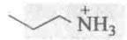</td><td>0</td></tr><tr><td>磷脂酰胆碱</td><td>胆碱</td><td></td><td>0</td></tr><tr><td>磷脂酰丝氨酸</td><td>丝氨酸</td><td></td><td>-1</td></tr><tr><td>磷脂酰甘油</td><td>甘油</td><td>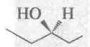</td><td>-1</td></tr><tr><td>磷脂酰肌醇-4,5-二磷酸( $PIP_2$ )</td><td>[肌]肌醇-4,5-二磷酸</td><td>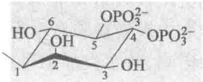</td><td>-4 $^{\text{1}}$ </td></tr><tr><td>心磷脂</td><td>磷脂酰甘油</td><td>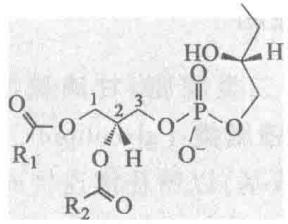</td><td>-2</td></tr></table>

① 注：磷脂酰肌醇-4,5-二磷酸中的磷酸酯，每个约有-1.5个电荷；它们的—OH基中的一个仅部分电离。

磷脂酰乙醇胺（phosphatidylethanolamine）也称脑磷脂（cephalin）；后一名称有时也包括磷脂酰丝氨酸在内。含氮碱部分是乙醇胺，也称胆胺（colamine）。磷脂酰乙醇胺中sn-1位上的脂[肪]酰基也和卵磷脂中一样，主要是棕榈酸和硬脂酸，但sn-2位含有较多的PUFA，如花生四烯酸(20：4)或DHA(22：6)。

磷脂酰丝氨酸(phosphatidylserine)常见于血小板的膜中,也称血小板第三因子。当组织受损血小板被激活时,膜中的磷脂酰丝氨酸由内侧转向外侧,作为表面催化剂与其他凝血因子一起致使凝血酶原活化。

磷脂酰肌醇-4,5-二磷酸（phosphatidylinositol-4,5-bisphosphate; $\mathrm{PIP}_2$ ）广泛存在于真核细胞的质膜中，它是两个胞内信使：肌醇-1,4,5-三磷酸（ $\mathrm{IP}_3$ ）和1,2-二酰基-sn-甘油（DAG）的前体，这些信使参与激素信号的放大（见第14章和第28章）。

磷脂酰甘油（phosphatidylglycerol）在细菌细胞膜中含量丰富。磷脂酰甘油是心磷脂头基的X部分。

双磷脂酰甘油（diphosphatidylglycerol）最先在心肌线粒体膜和细菌细胞膜中找到，因此又称心磷脂（cardiolipin）。它是由两个磷脂酰甘油的磷酸部分通过一个甘油分子共价连接而成（表10-4）。

## （二）某些甘油磷脂含醚键连接的脂肪酰链

某些动物组织和某些单细胞生物富含醚甘油磷脂(ether glycerophospholipid)或称醚脂(ether lipid)。醚脂中甘油骨架上的两个脂[肪]链中的一个是以醚键而不是酯键相连的。醚键连接的脂链可以是饱和的，如烷基醚脂中，也可以在脂链的C1和C2之间含有一个双键，如缩醛磷脂(plasmalogen）（图10-10A）。常见的缩醛磷脂中头基醇X包括胆碱、乙醇胺或丝氨酸。脊椎动物的心肌组织特别富含醚脂，心脏磷脂

的约一半是缩醛磷脂,其中又以缩醛磷脂酰胆碱(phosphatidal choline)含量为多。此外,嗜盐菌、纤毛原生生物和某些无脊椎动物的膜也含有很高比例的缩醛磷脂。醚脂在这些膜中的功能意义尚不清楚;也许它们的抗磷脂酶性质在某些作用中有重要意义,因为此酶能从膜脂中断裂酯键连接的脂肪酸。

至少有一种醚脂，称血小板活化因子（platelet-activating factor, PAF），是一种强力的分子信号，在组织中它的浓度只要达到 $10^{-12} \mathrm{~mol} / \mathrm{L}$ 就会发生效应。在PAF中甘油的 $sn - 1$ 位是 $O-$ 连接(醚连接)的烷基，十六烷基； $sn - 2$ 位是乙酰

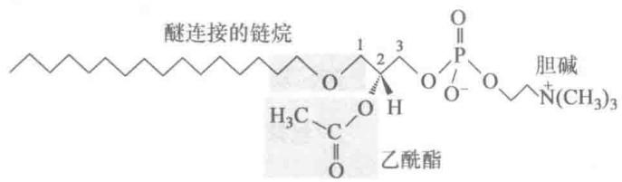  
图 10-10 缩醛磷脂(A)和血小板活化因子(B)

基(图 10-10B)，这使 PAF 比大多数的甘油磷脂和缩醛磷脂更易溶于水。PAF 是从称为嗜碱性粒细胞 (basophil) 的白细胞中释放的，它促进血小板凝集和血小板释放 5-羟色胺（一种血管收缩剂）。PAF 对肝、平滑肌、心、子宫和肺等组织还有多种影响，并在炎症和过敏反应中起着重要作用。

## （三）叶绿体含半乳糖脂和硫脂

植物细胞中占优势的脂质是第二类膜脂：甘油糖脂（glyceroglycolipid）也称糖基甘油酯（glycoglyceride）它们常与鞘糖脂一起归于糖脂类（glycolipids）。甘油糖脂是由1,2-二酰甘油sn-3位上的羟基与糖基（例如一个或两个半乳糖残基）以糖苷键连接而成。最常见的就是半乳糖脂（galactolipid），如单半乳糖二酰甘油（monogalactosyldiacylglycerol；MGDG）和二半乳糖二酰甘油（DGDG）（图10-11）。甘油糖脂主要存在于植物界和微生物中。植物叶绿体的类囊体膜（内膜）含有大量的半乳糖脂；它们占维管植物的总膜脂的70%\~80%，因此可能是生物圈中最丰富的膜脂。磷酸盐经常是土壤中限制性的植物营养素，也许为保存磷酸盐以用于更关键角色的进化压力，选择制造无磷酸脂质的植物。甘油糖脂也出现于哺乳类，但分布不普遍，主要存在于睾丸和精子的质膜中。植物细胞膜也含有硫脂（sulfolipid），其中一个磺基化的葡萄糖残基以糖苷键与二酰基甘油连接；像甘油磷脂中的磷酸基，此磺酸基也带有一个负电荷（图10-11）。

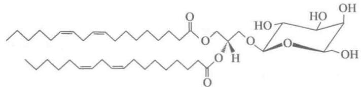  
单半乳糖二酰甘油(MGDG)

  
二半乳糖二酰甘油(DGDG)

  
6-磺基-6-脱氧- $\alpha$ -D-葡糖吡喃二酰甘油(一种硫脂)  
图 10-11 叶绿体类囊体膜的半乳糖脂和硫脂

## （四）古菌具有独特的膜脂

生活在极端条件——高温(沸水)、低 pH、高离子强度等——的生态位(niche)的某些古菌具有含长链(32 碳)分支(8 个甲基)烃的膜脂,烃的每一末端跟甘油连接(图 10-12)。这些连接都是通过醚键完成的;醚键对低 pH 和高温下的水解比细菌和真核细胞中存在的酯键要稳定得多。在完全伸展的状态,这些古菌脂质的长度是磷脂和鞘脂的两倍,能跨过质膜的整个厚度。在伸展分子的每一端是一个由甘油和甘油磷酸基或糖基连接而成的极性头。此类化合物的一般名称,甘油二烷基甘油四醚(glycerol dialkyl glycerol tetraether, GDGT),反映了它们的独特结构。古菌中脂质甘油部分的立体异构体与细菌和真核细胞中的不同,在古菌中甘油中央的碳是 S 构型,细菌和真核细胞中的是 R 构型(图 10-7)。

  
图10-12 在某些古菌中发现的一种特殊膜脂

## （五）鞘脂是鞘氨醇的衍生物

鞘脂(sphingolipid)也有1个极性头基和2个非极性尾部,但与甘油磷脂和甘油糖脂(如半乳糖脂)不同,它不含甘油成分。鞘脂是由1分子的长链( $C_{18}$ )氨基醇——鞘氨醇(sphingosine;4-sphingenine)或其衍生物,1分子长链脂肪酸和1分子极性头基组成。极性头基在鞘磷脂中通过磷酸二酯键被连接,在鞘糖脂中通过糖苷键被连接。鞘氨醇(图10-13)的C1、C2和C3携有3个官能团(分别是—OH、—NH $_{2}$ 和—OH)结构上很像甘油磷脂中甘油的3个羟基。脂肪酸通过酰胺键与鞘氨醇C2上的—NH $_{2}$ 基连接,形成的化合物称神经酰胺(ceramide,Cer),后者在结构上类似于二酰甘油,是所有鞘脂(鞘磷脂和鞘糖脂)的结构母体(图10-13A)。作为神经酰胺衍生物的鞘脂,根据其极性头基的不同,可分为两类:鞘磷脂和鞘糖脂。

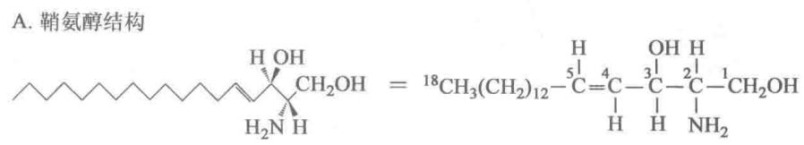  
系统名称：反式-D-赤藓糖型-2-氨基-4-十八碳烯-1,3-二醇

  
图10-13 鞘氨醇和神经酰胺的结构

鞘磷脂(sphingomyelin)是在神经酰胺的C1位上含磷酸胆碱或磷酸乙醇胺作为它的极性头基，因此跟甘油磷脂一起被归于磷脂类。诚然，鞘磷脂在一般性质、三维结构以及极性头基没有净电荷等方面（图10-14）都和磷脂酰胆碱和磷脂酰乙醇胺相似。鞘磷脂存在于动物细胞的质膜，特别是髓鞘（延展的质膜)中。髓鞘(myelin)是一种膜性鞘,它包围某些神经元并使之绝缘,鞘磷脂因之而得名。

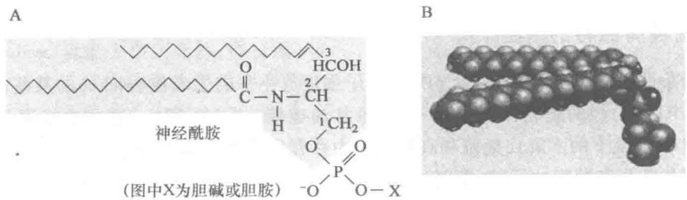  
图 10-14 A. 鞘磷脂结构通式; B. 胆碱鞘磷脂的空间填充模型

鞘糖脂(glycosphingolipid)主要存在于质膜的外表面;它们具有一个通过糖苷键直接连接于神经酰胺C1位—OH基的单糖或寡糖,但不含磷酸基。根据糖基是否含有唾液酸或硫酸成分,鞘糖脂又可分为中性鞘糖脂(或称中性糖脂)和酸性鞘糖脂(包括硫苷脂和神经节苷脂)。

中性糖脂(neutral glycolipid)，它们的糖基不含唾液酸成分，在pH 7时不带电荷。常见的糖基有半乳糖、葡萄糖等单糖，或二糖、三糖等寡糖。第一个被发现的鞘糖脂是由一个半乳糖与神经酰胺连接而成的半乳糖基神经酰胺(galactosylceramide)；因为最先是从人脑中获得，所以又称脑苷脂(cerebroside)或半乳糖脑苷脂(galactocerebroside)(图10-15A)。现已知脑苷脂除半乳糖脑苷脂，Gal(β1→1)Cer，外，还有葡萄糖脑苷脂(glucocerebroside)，Glc(β1→1)Cer；前者是神经组织中的细胞质膜特有的，后者存在于非神经组织的细胞质膜中。红细胞糖苷脂(globoside)也是中性鞘糖脂，极性头基是寡糖链，单糖单位一般是D-Glc、D-Gal或D-GalNAc，例如乳糖基神经酰胺Gal(β1→4)Glc(β1→1)Cer。ABO血型的细胞表面抗原物质(O抗原、A抗原和B抗原)也是鞘糖脂，是由各自的抗原决定簇O、A和B(表9-4)与乳糖基神经酰胺共价连接而成的五糖基神经酰胺或六糖基神经酰胺(图10-15B)(也发现这些鞘糖脂的寡糖头基相应地与O、A和B血型个体的一些血中蛋白质连接)；由于这些糖脂含有岩藻糖，因此也称它们为岩藻糖脂(fucolipid)。鞘糖脂的疏水尾部伸入膜的脂双层，极性糖基露在细胞表面，它们不仅是与血型抗原而且与

  
图10-15 几种鞘糖脂的化学结构

组织和器官的特异性,细胞-细胞识别等有关。

硫苷脂(sulfatide)是鞘糖脂的糖基被硫酸化形成的。最简单的硫苷脂是硫酸脑苷脂(cerebroside sulfate)(图10-15A)。已分离到的硫苷脂有几十种。它们广泛地分布于哺乳动物的各器官中，以脑中含量最为丰富。硫苷脂可能与血液凝固和细胞黏着有关。

鞘脂(sphingolipid)也有极性头基和非极性尾部,但与甘油磷脂不同,它不含甘油成分。

神经节苷脂(ganglioside)也称唾液酸鞘糖脂,是最复杂的一类鞘脂,它们以寡糖链作为极性头基。在寡糖链内部的或末端的半乳糖残基上常以( $\alpha2\rightarrow3$ )糖苷键连接上一个或多个N-乙酰神经氨酸(NeuNAc),它是一种唾液酸,也经常简单地称它为唾液酸(Sia)。唾液酸使神经节苷脂在pH 7时带负电荷,这是它们与红细胞糖苷脂不同的地方。唾液酸鞘糖脂的命名是头一个字母G代表神经节苷脂,第二个字母M、D、T和Q分别表示含1、2、3和4个唾液酸的神经节苷脂,最后的数字1、2、3等表示糖链的序列不同(图10-15C)。神经节苷脂在神经系统特别是神经末梢中含量丰富,种类很多。它们可能在神经冲动传递中起重要作用。

## （六）细胞表面上的鞘脂是生物识别的位点

在一个多世纪前医学化学家 Johann Thudichum 发现鞘脂时,鞘脂的生物学作用还是像“狮身人面像 (Sphinx)”一样的不可思议,因此他把这些化合物命名为 sphingolipid(鞘脂)。在人体的细胞膜中至少已有 60 种不同的鞘脂被鉴定出。其中许多是在神经元的质膜中特别丰富的,某些显然是细胞表面上的识别位点,但至今只有少数几种鞘脂的专一功能被发现。有些鞘脂的糖质部分是定义人的血型的,并因此可以确定输血时一个人能够安全接受的血型(图 10-15B)。

神经节苷脂集中在细胞的外表面，在这里它们提供给胞外分子或相邻细胞的表面以识别点。质膜中神经节苷脂的种类和数量在胚胎发育期间发生剧烈变化。肿瘤形成诱导神经节苷脂新组分的合成，并发现了一种专一的神经节苷脂在很低浓度时就能诱导培养的神经元肿瘤细胞的分化。各种神经节苷脂的生物学作用的研究方兴未艾。

神经节苷脂能被溶酶体的一套酶降解,这些酶催化逐步除去单糖残基,最后生成神经酰胺。这些水解酶的任一种遗传缺失都会导致细胞中神经节苷脂的积累,带来严重的医学后果。

## （七）类固醇具有四个稠合的碳环

类固醇(steroid)中有一大类称为固醇或甾醇(sterol)的化合物, 是一类膜结构脂质, 存在于大多数真核细胞的膜系统中。这类膜脂的特征结构是一个由4个稠环组成的类固醇核, 它在生物体内是由2-碳乙酸开始, 经5-碳异戊二烯单位(isoprene subunit)合成的(第24章)。除了作为膜的结构成分外, 固醇还是某些具有特异生物活性的产物——活性脂质(见下一节)——的前体, 例如类固醇激素是调节基因表达的强力生物学信号。

## 1. 类固醇核的结构

类固醇核的结构以环戊烷多氢菲(perhydrocyclopentanophenanthrene)为基础,如图10-16所示,它是由3个六碳环(A、B、C环)和1个五碳环(D环)稠合而成。在环戊烷多氢菲的A和B环之间和C和D环之间各有一个甲基(C18和C19),称为角甲基;带有角甲基的环戊烷多氢菲称为类固醇核或甾核(steroid nucleus),它是类固醇化合物的母体。甾核的碳原子编号从A环开始,接着是B、C和D环。

类固醇的结构特点:①甾核的 C3 上常为

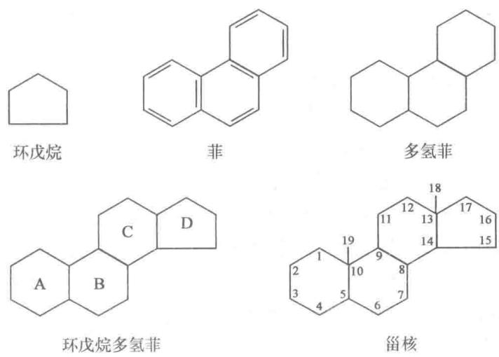  
图10-16 环戊烷多氢菲和甾核的结构

羟基或酮基；② C17 上可以是羟基、酮基或其他各种形式的侧链；③ C4 和 C5 之间及 C5 和 C6 之间常是双键；④ A 环在某些化合物如雌酮 (estrone) 中是苯环，这些类固醇无 C19（角甲基）。

如图 10-17 所示甾核中 3 个六碳环可采取无张力的椅式构象(图右边)，但跟简单的环己烷或吡喃糖环不同，固醇的六碳环不能发生椅-椅互换(环转向)(见图 9-9)。甾核的构象基本上是一个刚性的平面。在固醇中 A 环和 B 环的稠合(A-B)可以是顺式，也可以是反式的；但其他环的稠合(B-C,C-D)都是反式的；这些稠环不允许绕 C—C 键旋转。反式类固醇(如胆甾烷醇)中，C10 上的角甲基(C19)伸向分子平面的上方(称 $\beta$ 取向)，在透视式(图左边)中用实楔形键表示；C5 位上的氢原子伸向分子平面的下方(称 $\alpha$ 取向)，用虚楔形键(或虚线键)表示。A-B 顺式类固醇(如粪固醇)中，C10 上的角甲基和 C5 上的氢原子都伸向分子平面的上方( $\beta$ 取向)。这两种类固醇分子都比较长而扁平，两个角甲基直立地伸向分子平面的上方。类固醇分子平面上的取代基可能是直立的，也可能是平伏的。一般说，由于空间上的原因平伏取代比直立取代稳定；例如胆甾烷醇(及胆固醇)C3 上的羟基是平伏取代的(图 10-17,右上方构象式中)。

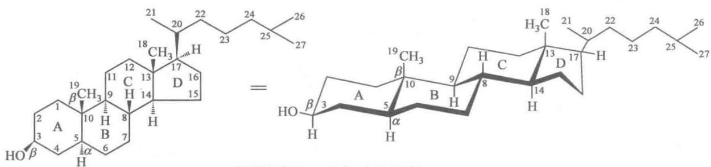  
胆甾烷醇(A-B反式二氢胆固醇)

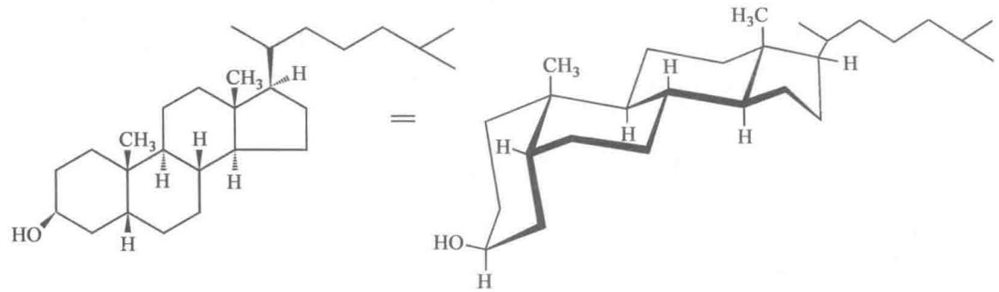  
粪甾醇(A-B顺式二氢胆固醇)  
图 10-17 固醇的立体化学(左边)和构象式(右边)

## 2. 胆固醇和其他动物固醇

固醇化合物的结构特点是在甾核的 C3 上有一个 $\beta$ 取向的羟基，C17 上有一个含 8 到 10 个碳原子的烃侧链。大多数真核生物都能合成固醇，并存在于它们的膜系统中；但细菌不能合成固醇，只有少数几种细菌能把外源的固醇结合到它们的细胞膜中。

胆固醇(cholesterol)在脑、肝、肾和蛋黄中含量很高,它是动物组织中最常见的一种动物固醇(zoosterol)。此外还有胆甾烷醇(cholestanol)也称二氢胆固醇和粪甾醇(coprostanol)它是二氢胆固醇的异构体(图10-17),以及羊毛固醇(lanosterol)(图10-24)和7-脱氢胆固醇等也是动物固醇。胆固醇的化学结构和分子模型如图10-18所示。胆固醇也是一种两亲分子,但它的极性头基(C3上的羟基)是弱小的,而非极性烃体(甾核和C17上的烷烃侧链)是大而刚性的平面;伸展的胆固醇约为16-碳脂肪酸的长度。胆固醇的两亲性质使它对膜中脂质的物理状态具有调节作用(见本章后面)。胆固醇主要参与动物细胞膜的组成,但它也是血中脂蛋白复合体的成分之一,并与动脉粥样硬化斑块的形成有关。胆固醇还是类固醇激素、维生素D和胆汁酸的前体,例如存在于皮肤中的7-脱氢胆固醇在紫外线作用下转化为维生素 $D_{3}$ (第13章)。

胆固醇除人体自身合成外，尚可从膳食中获取。胆固醇既是生理必需的，但过多时又会引起某些疾病；例如胆结石症的胆石几乎是胆固醇的晶体，又如冠心病患者血清总胆固醇含量很高，超过正常值(3.10\~5.70 mmol/L)上限。因此必须控制膳食中的胆固醇量。

  
图 10-18 胆固醇的化学结构和立体模型

自 1784 年从胆石中提取出胆固醇以来,因致力于围绕胆固醇这种生物小分子的研究,已有十几位学者获得诺贝尔奖,足见胆固醇在生物学和医学上的重要性。

## 3. 植物固醇和真菌固醇

植物很少含胆固醇，但含有其他固醇，称植物固醇（phytosterol）。其中最丰富的是 $\beta-$ 谷固醇（ $\beta-$ sitosterol），存在于小麦、大豆等谷物中。 $\beta-$ 谷固醇的结构几乎跟胆固醇一样，只是在C17上的侧链是 $C_{10}$ 不是 $C_8$ ；因为在侧链C24位连有一个 $\beta$ 取向的乙基（C24是手性碳，属 $R$ 构型），所以也称24-乙基胆固醇。常见的植物固醇还有豆固醇（stigmasterol），菜油固醇（campesterol）等（图10-19）。

  
豆固醇（24β-乙基-5,22-胆甾二烯-3β-醇）

$\beta-$ 谷固醇(24 $\beta-$ 乙基胆固醇)  
  
菜油固醇（24α-甲基-5-胆甾烯-3β-醇）

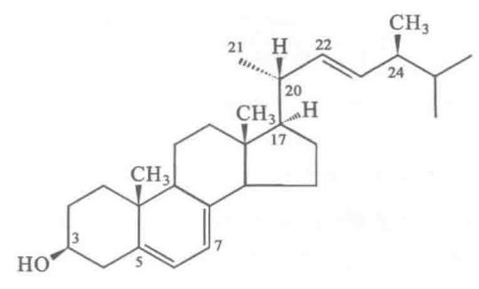  
麦角固醇（24β-甲基-5,7,22-胆甾三烯-3β-醇）  
图 10-19 几种植物固醇和真菌固醇

植物固醇很少被人的肠黏膜细胞吸收，并能抑制胆固醇的吸收。开发降低胆固醇用的植物固醇类药物，不仅与这些固醇本身的结构有关，而且取决于投药的剂型。例如谷固醇在人肠道内少量被吸收，但它的饱和类似物，谷甾固醇（sitostanol），则完全不被吸收。此外，植物固醇在抑制胆固醇方面，以可溶性微团形式投药比固体结晶形式投药更为有效。

真菌类如酵母和麦角菌(Claveceps)产生的麦角固醇(ergosterol)也是维生素D原,经加工处理可以转变成维生素 $D_{2}$ （第 13 章）。此外还有酵母产生的酵母固醇（zymosterol），即 8,24-胆甾二烯-3β-醇，及其他固醇。

## 4. 固醇衍生物

从胆固醇衍生来的有类固醇激素(第14章)、维生素 $D_{3}$ (第13章)和胆汁酸;植物中的强心苷配基和某些皂苷的配基(图9-24)也都是固醇衍生物。

胆汁酸(bile acid)是在肝内由胆固醇直接转化而来。人体内每天合成胆固醇1\~1.5g，其中0.4\~0.6g在肝内转变为胆汁酸，它是机体内胆固醇的主要代谢终产物。人胆汁中含3种胆汁酸：胆酸(cholic acid)、鹅[脱氧]胆酸(chenodeoxycholic acid)和脱氧胆酸(deoxycholic acid)。胆酸和鹅胆酸是在肝中合成的，称为初级胆汁酸；脱氧胆酸是胆酸在肠道中经细菌7-脱羟作用衍生而来的，称为次级胆汁酸。由于在肠道内胆汁酸被重吸收并通过肠肝循环(enterohepatic circulation)，初级和次级胆汁酸均在胆汁中出现。这些胆汁酸的结构见图10-20A。已证实，胆汁酸属A-B顺式类固醇（图10-17），C3、C7和C12位上的羟基均为α取向，C10和C13上的两个角甲基为β取向，羧基伸向羟基一侧，因而胆汁酸分子一个面是亲水的，另一个面是疏水的（图10-20B）。胆汁酸是一种去污剂，具有增溶作用；脱氧胆酸和胆酸都是实验室里用来增溶膜蛋白的重要试剂。

  
图10-20 胆汁酸和结合胆汁酸的结构

在肝中胆汁酸的羧基通过酰胺键与牛磺酸(taurine)或甘氨酸连接,分别生成胆汁酸的牛磺结合物或甘氨结合物,如牛磺胆酸(taurocholic acid)和甘氨胆酸(glycocholic acid)(图10-20C)。这种结合物是胆汁酸的主要形式。胆汁盐是结合物的钠盐或钾盐,它们是很强的去污剂,能溶于油-水界面处,其疏水面与油脂接近,亲水面与水接触,使油脂乳化,便于水溶性脂酶发挥作用,因而促进肠道中油脂和脂溶性维生素的消化吸收。

## 三、活性脂质——作为信号、辅因子和色素

前面我们考虑了两类按功能分类的脂质:贮存脂质和膜结构脂质,它们是细胞的主要成分;膜脂占大多数细胞干重的5%\~10%;贮脂占脂肪细胞质量的80%以上。一般说,这些脂质在细胞中担当比较“被动的”角色。还有另一类脂质——活性脂质,它们的含量虽不多,但在代谢过程中作为代谢物和信使起“主动的”作用。下面介绍几种有代表性的生物活性脂质：类二十烷酸、作为胞内信使的磷脂酰肌醇和鞘氨醇衍生物、类固醇激素、类异戊二烯化合物（如植物挥发性信号分子，脂溶性维生素A、D、E和K，泛醌和质体醌，植物色素和多萜醇）和缩酮化合物等。

活性脂质从化学本质和生物功能上看,可谓是多种多样。但在生物体内它们都是由乙酸(以乙酰-CoA形式)作为最初前体合成的。类萜和类固醇是由中间物5-碳异戊二烯单位缩合而成;缩合中出现的第一个固醇(羊毛固醇)是由30-碳的萜(鲨烯)环化而来,因此羊毛固醇是其他固醇的前体。详细的合成途径见第24章。

## （一）类二十烷酸是局部性的激素

类二十烷酸(eicosanoid; eikosi, 希腊文, “二十”)是由20-碳PUFA(至少含三个双键)衍生而来的, 因为它们都含有20个碳原子, 因此得名。这些化合物包括几类信号分子: 前列腺素、凝血噁烷和白三烯; 人和哺乳动物的很多组织和细胞都能合成它们。合成的前体主要是花生四烯酸(20:4), 少量是 $\gamma$ -高亚麻酸( $\gamma$ -homolinolenic acid; $20:3\Delta^{8,11,14}$ ) 和 EPA(20:5); 当细胞受到某些外来信号作用时 (如组织损伤), 膜磷脂释放出花生四烯酸。前列腺素和凝血噁烷是经环加氧酶(cyclooxygenase)途径或称前列腺素 $\mathbf{H}_2$ 合酶(PGH $_2$ synthase)途径产生; 白三烯是经脂加氧酶(lipoxygenase)途径合成; 关于类二十烷酸的生物合成细节见第24章。类二十烷酸是体内的局部性激素(local hormone), 效应一般局限在合成部位的附近, 在很低浓度(n mol/L 到 p mol/L 数量级)时则能起作用, 半寿期( $t_{1/2}$ )只有几十秒到几分钟, 同一物质在不同的组织中可以产生不同的效应。

前列腺素（prostaglandin, PG）是瑞典学者 S. Bergstrom 和 B. Samuelsson 最先从前列腺的脂质提取物中分离出来，并测定了它的结构。这种物质被注射到动物体内时，能引起平滑肌收缩和血压下降。因为当时以为这种物质是前列腺（prostatic gland）分泌的，1930 年代瑞典生理学家 U. S. von Euler 称它为前列腺素。后来证明这类物质广泛地分布于人和动物组织中。最初被分离的两个前列腺素分别称为前列腺素 E 和前列腺素 F，因为前者优先溶于乙醚（E；ether）而后者溶于磷酸盐缓冲液（F；fosfat，瑞典文，“磷酸盐”）；现在常分别用缩写符号 PGE 和 PGF 来表示。由一个饱和五元环和两条侧链组成的二十烷酸称前列腺烷酸（prostanoic acid），后者可看作是前列腺素类的母体化合物（图 10-21）。天然前列腺素中已发现 8 种不同类型的取代环，分别用 A、B、D、E、F、G、H 和 I 来表示。PGA 和 PGB 在环的 C9 位上有一个酮基和一个双键（前者在 C10 和 C11 之间，后者在 C12 和 C8 之间）；PGD 在 C9 有一个羟基，C11 一个酮基；PGE 与之相反，在 C9 有一个酮基，C11 一个羟基；PGF 在 C9 和 C11 各有一个羟基；PGG 和 PGH 具有相同的戊烷环结构——内过氧化物（endoperoxide），它们的不同仅在侧链 C15 上的取代基，PGG 取代的是一个过氧羟基（—OOH），PGH 是一个羟基；PGI 具有一个双环结构，环戊烷环 C9 上的氧与侧链的 C6 相连形成第二个五元环。每种类型的前列腺素又含多种亚类： $PGE_{1}$ 、 $PGE_{2}$ 、 $PGF_{1}$ 等。亚类名称（如 $PGF_{2\alpha}$ ）中，右下标的数字指环外两条侧链上碳-碳双键的数目，希腊字母 α 表示五碳环中 C9 上—OH 基的空间取向（α 取向）；希腊字母仅出现于 F 类，天然存在的 F 类前列腺素都是 α 构型，即 $F_{\alpha}$ 。几种常见的类二十烷酸见图 10-21。

前列腺素有一系列的生理功能:有的刺激分娩和月经期间子宫肌肉收缩;有的影响进入特定器官的血流、醒-睡周期(wake-sleep cycle)和某些组织对激素如肾上腺素和胰高血糖素的反应性;另一些能升高体温(发烧),促进炎症并产生疼痛。已证实在许多组织中前列腺素是通过专一性细胞受体调节胞内信使合成而起作用的。例如 $PGE_{1}$ 能促进某些细胞中腺苷酸环化酶的活性, $PGF_{2}$ 可提高靶细胞中 $3',5'-环鸟苷酸(cGMP)$ 的水平(见第 14 和 28 章)。虽然前列腺素作用的分子机制知道得还不多,但它们的生理作用已被用于实践。例如 $PGF_{2}$ 被用于足月孕妇的引产,也用于诱导中期流产或死胎分娩。前列腺素还用于畜牧业,诱导一组雌畜同时进入发情期。

凝血噁烷（thromboxane；TX）最先从血小板（也称凝血细胞）中分离获得。它跟前列腺素不同在于有一个氧原子参与成环（含氧六元环；氧杂的饱和烃环俗称噁烷）；对 TXA 来说，另有一个氧原子以环氧丙烷形式存在于六元环中央，突出于环面之下（图 10-21）。其他方面凝血噁烷的结构与前列腺素相似，合成途径和代谢性质两者也相似，因此凝血噁烷可被认为是前列腺素的类似物。 $TXA_{2}$ 从花生四烯酸合成，是血小板产生的主要类前列腺素物质(图 10-21)。 $TXA_{2}$ 的效应是引起动脉收缩、诱发血小板聚集，促进血栓形成，降低通向血栓处的血流。 $TXA_{2}$ 的半寿期只有 30 s；在水中 $TXA_{2}$ 的环氧丙烷被迅速水解，转变为 $TXB_{2}$ ，这是一个无活性的代谢物。

  
图10-21 几种常见的类二十烷酸

白三烯(leukotriene; LT)最早在白细胞中找到, 含 3 个共轭双键, 因而得名。从花生四烯酸形成的白三烯含 4 个双键, 其中 1 个是非共轭双键 (C14 和 C15 之间); 白三烯的缩写为 $\mathrm{LT}_{4}$ , 右下标“4”表示碳-碳双键总数。在白细胞中花生四烯酸经 5-脂加氧酶途径先转变为 5,6-环氧化物 (5,6-epoxide), 称 $\mathrm{LTA}_{4}$ 。后者在水解酶作用下, 加水生成 5,12-二羟衍生物, 称 $\mathrm{LTB}_{4}$ ; 或在还原型谷胱甘肽参与下打开环氧环 (epoxide ring) 形成 $\mathrm{LTC}_{4}$ 。然后酶促除去谷胱甘肽中的谷氨酸残基, 转变为 $\mathrm{LTD}_{4}$ 。再除去甘氨酸残基转变为 $\mathrm{LTE}_{4}$ 。 $\mathrm{LTA}_{4}$ 和 $\mathrm{LTC}_{4}$ 的结构见图 10-21。白三烯是强力的生物信号, 例如 $\mathrm{LTC}_{4}$ 和 $\mathrm{LTD}_{4}$ 能引起平滑肌收缩, 微血管通透性增大 (渗出液增多) 和冠状动脉缩小; 造成肺气管缩小的作用比组胺 (histamine) 强 1000 倍。白三烯的过度产生会引起气喘发作。白三烯的合成是抗气喘药物如强的松 (prednisone; 一个人工合成的胆固醇衍生物) 的一个靶子。过敏性休克期间肺平滑肌的强烈收缩是在对蜂刺、青霉素或其他因素过敏的个体中发生的可能致命的变态反应的一部分。

阿司匹林(aspirin,即乙酰水杨酸)属于非类固醇抗炎药物(NSAIDS),在医学上用于消炎、镇痛、退热已逾百年,但它的作用机制一直不清楚,直至1971年J.Vane发现阿司匹林通过抑制PGH $_{2}$ 合酶而关闭前列腺素的合成。更确切地说,阿司匹林通过乙酰化该酶活性中心的Ser530羟基,不可逆地抑制酶的环加氧酶活性,即抑制前列腺素合成的第一步(PGH $_{2}$ 的形成;见第24章),因此它是一种强抗炎药;属于这类抗炎药还有布洛芬(ibuprofen;异丁苯丙酸)、乙酰氨基苯酚(acetaminophen)等。显然阿司匹林也抑制凝血噁烷 $A_{2}$ 的形成（因为 $TXA_{2}$ 合成的直接前体是 $PGH_{2}$ ），因此它又是一种抗凝剂，被广泛地用于防止过度血凝。每天服用一次小剂量的阿司匹林可以有效地降低血小板聚集。

## （二）磷脂酰肌醇和鞘氨醇衍生物是胞内信使

磷脂酰肌醇及其磷酸化衍生物在几个水平上起调节细胞结构和代谢作用。磷脂酰肌醇4,5-二磷酸(表10-4)在质膜内面(胞质面)作为信使分子的储库;它们在应答跟专一性表面受体相互作用的胞外信号时在胞内被释放。当胞外信号如血管升压素(一种激素,见图2-23)激活膜中的专一性磷脂酶C(图10-9),被活化的磷脂酶C水解磷脂酰肌醇4,5-二磷酸,释放出两个产物,作为胞内信使:一个是肌醇1,4,5-三磷酸( $IP_{3}$ ),水溶性的;另一个是二酰甘油(DAG),仍处于跟膜结合。 $IP_{3}$ 引发 $Ca^{2+}$ 从内质网释放,二酰甘油的结合和细胞溶胶的 $Ca^{2+}$ 浓度升高激活蛋白激酶C。通过对专一性蛋白质的磷酸化,蛋白激酶C引起细胞对胞外信号的应答。关于信号传递(signaling)的机制将在第14章详细介绍。

肌醇磷脂也作为涉及信号传递和胞吞的超分子复合体的成核点(point of nucleation)。某些信号传递蛋白质专一地跟质膜中的磷脂酰肌醇3,4,5-三磷酸的结合，引发在膜的细胞溶胶面上多酶复合体的形成。因此，在应答胞外信号时磷脂酰肌醇3,4,5-三磷酸的形成致使这些蛋白质聚集在该质膜表面的信号传递复合体(见图14-26)。

膜鞘脂也能作为胞内信使的来源。神经酰胺和鞘磷脂(图 10-13 和 10-14)两者是蛋白激酶的强调节剂,神经酰胺或其衍生物参与调节细胞分裂、分化、迁移和程序性细胞死亡(programmed cell death)或称编程性细胞死亡(apoptosis)(见第 28 章)。

## （三）类固醇激素在组织之间运载信息

类固醇是固醇的氧化衍生物；它们有固醇核，但缺少连接在胆固醇D环上的烃链，因此比胆固醇的极性大。类固醇激素通过血流（在蛋白质载体上）从产生的部位移动到靶组织，在那里进入细胞，跟核中高度专一的受体蛋白质结合，引发在基因方面并因此在代谢方面的变化。因为激素对它们的受体有很高的亲和力，很低的激素浓度（nmol或低于nmol）就足以使靶组织产生应答。类固醇激素的主要类别有性激素，包括雄性和雌性激素；肾上腺皮质产生的激素，可的松、皮质醇和醛固酮，它们分别调节葡萄糖代谢和水盐代谢。关于它们的结构和生物功能将在第14章作较详细介绍。有些人工合成的类固醇激素，例如强的松（prednisone）和强的松龙（prednisolone）（图10-22），它们的抗风湿性关节炎和抗过敏的活性都比可的松强。

  
图10-22 几种人工合成的类固醇激素和类固醇样植物激素油菜素内酯

维管植物含有类固醇样的物质,如油菜素内酯(brassinolide)(图10-22),它是一种强植物生长调节剂,能增加茎伸长的速度,并在生长期间影响细胞壁中微纤维的定向。

## （四）许多类异戊二烯（类萜）是活性脂质

## 1. 萜的结构和分类

萜(terpene)是一类结构上极其多种多样的有机分子；尽管如此，它们是相关的化合物。按L.Ruzicka提出的异戊二烯法则，认为萜分子的碳架是由两个或多个5-碳 $\left(\mathrm{C}_{5}\right)$ 异戊二烯单位头-尾连接形成的；连接方式一般是头-尾相连（图10-23）。形成的萜可以是开链的，也可以是含环分子；可以是单环，也可以是双环或多环。这里必须指出，异戊二烯本身不是萜的生物合成前体，真正的前体是两个异戊二烯的“等当物”：异戊烯基焦磷酸(isopentenyl pyrophosphate）和二甲丙烯基焦磷酸(dimethylallyl pyrophosphate)，这些5-碳分子本身又是由3个2-碳单位（乙酰-CoA）经一系列反应缩合而成（详见第24章）。它们头-尾相接形成的第一个10-碳单位是牻牛儿基焦磷酸；相应的醇是牻牛儿醇（图10-24），具有牻牛儿苗即老鹳草(Geranium）所特有的气味。

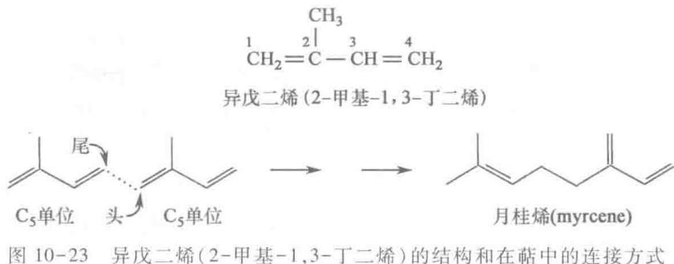  
图10-23 异戊二烯（2-甲基-1,3-丁二烯）的结构和在萜中的连接方式

根据所含异戊二烯单位 $\left(\mathrm{C}_{5}\right)$ 的数目，萜可分为单萜、倍半萜、双萜、三萜和多萜等。由两个 $C_{5}$ 单位构成的萜称单萜，由3个 $C_{5}$ 构成的称倍半萜，由4个 $C_{5}$ 构成的称双萜，其余依此类推。这些萜及其衍生物也称类萜(terpenoid)或类异戊二烯(isoprenoid)。单萜和倍半萜主要在植物中发现，高级萜则在植物和动物中都存在。萜类的一些代表性化合物见图10-24和图10-25。

单萜（monoterpene）碳原子数为 $C_{10}$ ；存在于各种高等植物中，许多是植物精油的成分。开链单萜如香茅醛，存在于香茅油和玫瑰油中；环状单萜如柠檬中的柠檬烯。

倍半萜（sesquiterpene）碳数为 $C_{15}$ ; 倍半萜结构形式多种, 虽知道得不甚多, 但有些是中草药中的研究对象, 如防风根烯和桉叶醇等。

双萜(diterpene) 碳数 $C_{20}$ ; 如叶绿素分子的成分叶绿醇也称植醇(第 23 章)、全反-视黄醇(第 13 章)以及赤霉酸(一种植物激素, 见图 14-14)。

三萜(triterpene) 碳数为 $C_{30}$ ; 属于三萜的如鲨烯和羊毛固醇, 它们是胆固醇和其他类固醇的前体。

四萜（tetraterpene）碳数为 $C_{40}$ ; 除类胡萝卜素外, 其他类型的四萜少见。类胡萝卜素（carotenoid）是有色光合色素, 包括番茄红素、胡萝卜素及其氧化物约 70 种。番茄红素是存在于番茄中的一种色素, 分子中有 11 个共轭双键（图 10-24），胡萝卜素的结构与番茄红素很相似, 只是前者在链的两端或一端含有一个环己烯环。胡萝卜素根据双键数目或位置不同, 有 $\alpha$ 、 $\beta$ 、 $\gamma$ 等 6 种异构体。其中 $\beta$ -胡萝卜素是维生素 A 原（见第 13 章）。存在于玉米和蛋黄中的玉米黄质（zeaxanthin）是 3,3'-二羟基- $\beta$ -胡萝卜素; 节肢动物中的虾青素（astaxanthin）及其氧化产物虾红素（astacin）是 $\beta$ -胡萝卜素的氧化物; 细菌中的紫菌素（rhodomycetin）也是一种类胡萝卜素。泛醌（辅酶 Q）和质体醌的侧链含 5 到 10 个异戊二烯单位。

多萜(polyterpene) 如多萜醇,含9到22个异戊二烯单位;天然橡胶是由几千个异戊二烯单位头-尾连接而成的大分子,异戊二烯可由蒸馏天然橡胶产生。

## 2. 维管植物产生很多种挥发性的信号分子和保护物质

植物产生数以千计的不同的挥发性脂质。它们作为通过空气传播的信号，允许植物彼此间进行通讯，招引传粉者、防御食草动物和吸引能保护植物和抗衡食草动物的生物。例如从膜脂的 $\alpha-$ 亚麻油酸$(18:3\Delta^{9,12,15})$ 衍生来的茉莉酮酸（jasmonate；结构类似前列腺素），在应答遭受虫害时能引发植物进行抵御。茉莉酮酸甲酯给茉莉油以特有的香气，它被广泛地用于香料工业。植物挥发物有些是从脂肪酸衍生而来，更多是由异戊二烯单位缩合而成，如上面提到的牻牛儿醇、香茅醛、柠檬烯和桉叶醇等。

  
图10-24 某些类萜化合物的结构

植物经常散发出异戊二烯，约占光合作用中被固定碳的15%。全球从植被散发的异戊二烯估计达 $3\times10^{11}$ kg/年。散发出的异戊二烯形成气氛，覆盖在植被上，保护叶子免遭因高温（炎夏）引起的不可逆损伤。这可能是因为植物周围空气中的异戊二烯溶入叶细胞膜，并改变脂双层和膜中脂质-蛋白质、蛋白质-蛋白质的相互作用而增加对热的耐受性。

## 3. 维生素(vitamin)A 和 D 是激素的前体

维生素 A 也称视黄醇(retinol)，它以不同的形式行使激素和视色素的功能。一种形式是视黄酸(retinoic acid)，它在上皮组织(包括皮肤)发育过程中通过细胞核中的受体蛋白质调节基因表达。视黄酸是一种外用药维 A 酸(英文商品名为 tretinoin)的活性成分，用于治疗严重的痤疮和具皱皮肤。另一种形式是视黄醛(retinal)，它引发视网膜视杆细胞和视锥细胞对光的应答，产生一个神经信号传给大脑。视黄醛的这一作用详见第 13 章。前面谈到，维生素 D 族有从胆固醇转化来的 D₃ 和麦角固醇转化来的 D₂。维生素 $\mathrm{D}_3$ 也称胆钙化醇（cholecalciferol），它本身无活性，但在肝和肾中被酶转化为有生物活性的 $1\alpha, 25-$ 二羟维生素 $\mathrm{D}_3$ ，简称骨化三醇（calcitriol）。骨化三醇是一种激素，它的主要靶细胞是小肠黏膜、肾小管和骨骼；在小肠黏膜促进钙和磷的吸收，在肾小管促进钙、磷的重吸收；总的生理效应是提高血钙和血磷浓度，以利于新骨生成和钙化。看来《黄帝内经》中说“肾主骨”，这是科学的。与类固醇激素一样，骨化三醇也是通过跟核内专一的受体蛋白相互作用调节基因表达。

## 4. 维生素 E、K 和脂质醌是氧化还原的辅因子

维生素E也称生育酚（tocopherol），它是一个族名，族中的所有成员都含一个取代的芳香环和一个类异戊二烯侧链（见第13章）。生育酚在细胞内多集中在膜的脂双层中，例如线粒体膜中，每2100个磷脂就有一个维生素E分子。维生素E是生物体内最重要的自由基清除剂，主要清除膜中活性氧自由基包括脂质过氧化中产生的LO·和LOO·，以免膜上的不饱和脂肪酸遭到过氧化而损害膜脂，使细胞变得脆弱。维生素K又称凝血维生素；从结构上看，它是2-甲基-1,4-萘醌的衍生物。天然的有维生素 $\mathrm{K}_{1}$ （叶绿醌）和 $\mathrm{K}_{2}$ （甲基萘醌类）；人工合成的有维生素 $\mathrm{K}_{3}$ (2-甲萘醌)。现已知参与血凝过程的许多凝血因子（见第4章和第8章）如因子Ⅱ（凝血酶原）、Ⅶ、Ⅸ和X都含有γ-羧基谷氨酸残基。例如正常的凝血酶原在其N端区含有10个γ-羧基谷氨酸残基。这些残基能与 $\mathrm{Ca}^{2+}$ 螯合，并促进凝血酶原与受伤部位的血小板磷脂膜表面结合以利跟因子 $\mathrm{X}_{\mathrm{a}}$ 和 $\mathrm{V}_{\mathrm{a}}$ 形成复合体，在该复合体作用下凝血酶原转化为凝血酶（Ⅱa）。这些凝血因子的γ-羧基谷氨酸残基是在以维生素K作为辅因子的谷氨酰羧化酶(glutamyl carboxylase)催化下，通过翻译后加工修饰而成的。在这一过程中维生素K的萘醌经历了氧化还原循环。关于维生素E和K的结构、存在和生理功能详见第13章。

泛醌(也称辅酶 Q)和质体醌都是类异戊二烯化合物(图 10-25);它们是氧化还原反应中亲脂的电子载体,分别在线粒体和叶绿体中驱动 ATP 合成。泛醌和质体醌都能接受 1 个或 2 个电子,抑或 1 个或 2 个质子(见第 19 章和第 23 章)。

## 5. 许多植物色素是共轭双烯脂质

共轭双烯是具有共轭双键系统(单键和双键交替的碳链)的脂质,是吸收可见光的色素分子。因为这种结构排列允许电子离域,所以这些分子能被低能电磁辐射(可见光)激发,使它们具有被人和动物看得见的颜色。它们在化学上的细微差别,产生各种颜色明显不同的色素。其中有些是在视觉和光合作用中起着捕光作用的色素,如视黄醛、胡萝卜素等;其他起天然呈色作用,如番茄的红色,胡萝卜的橙黄色,类似的化合物使得鸟羽披上了醒目的红、橙、黄颜色,如金丝鸟的羽毛是亮黄色的,这是因为鸟吃了含类胡萝卜素如玉米黄质和角黄质(canthaxanthin)等(图10-25)植物食料产生的;雄鸟和雌鸟之间的色素形成不同是它们肠道吸收和类胡萝卜素加工的不同结果。这些色素也是类异戊二烯化合物或衍生物。

## 6. 多萜醇在糖生物合成中活化单糖前体

在细菌细胞壁的多糖装配时和真核细胞中单糖单位加入某些蛋白质(糖蛋白)和脂质(糖脂)时,待加入的单糖单位先在化学上把它连接到称为多萜醇(dolichol)的类异戊二烯醇(图10-25)上使之活化。这些化合物跟膜脂有很强的疏水相互作用,能把被连上的单糖锚定在膜上,在这里参与糖-转移反应(详见第21章)。

## （五）聚酮化合物是具有强力生物活性的天然产物

聚酮化合物(polyketide)是一类多种多样的脂质,它们的生物合成途径是 Claisen 缩合,缩合是两个乙酰-CoA 分子之间发生的涉及亲核酰基取代的反应,类似脂肪酸的生物合成,但无两个还原步骤(见第 24 章)。聚酮化合物是次级代谢物(secondary matabolite),对一个生物的代谢来说虽不是关键的化合物,但对产生者在某些生态位中起着辅助性作用。很多聚酮化合物在医学上用作抗生素如红霉素,抗真菌剂如两性霉素 B 以及胆固醇合成抑制剂如洛伐他丁等。

红霉素(erythromycin)是1952年从红链霉菌(Streptomyces erythreus)中获得的一种碱性抗生素。其分子结构中含有一个母核——大环内酯(macrolide)。具有大环内酯的抗生素总称大环内酯类抗生素。提取的红霉素中可分离出 A、B 和 C 三个组分，其中组分 A 的结构式见图 10-26。红霉素是一种广谱抗生素，临床上主要用它治疗耐药性金黄色葡萄球菌所引起的各种严重感染，如肺炎、败血症等。

  
玉米黄质 $\left(C_{40}\right)$ ：作为植物和鸟羽色素的脂质

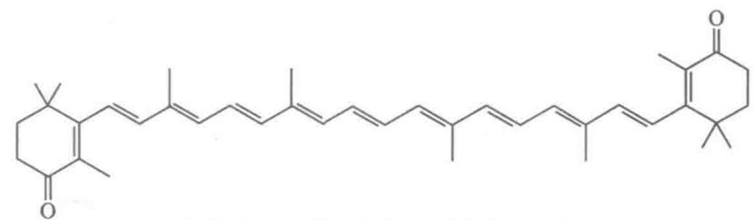  
角黄质 $(\mathrm{C}_{40})$ ：作为植物和鸟羽色素的脂质

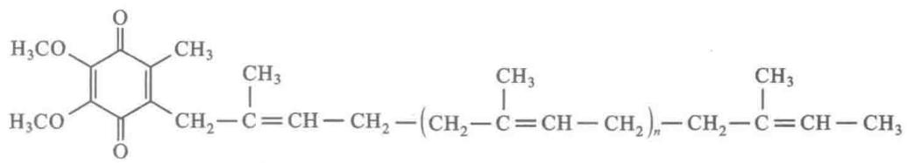  
泛醌(辅酶Q): 线粒体的一种电子载体(n=4\~8)

  
质体醌：叶绿体的一种电子载体 $(n = 4\sim 8)$

  
图10-25 一些其他类萜化合物或衍生物

两性霉素 B(amphotericin B)属于多烯大环内酯类(polyene macrolides)或多烯类的抗真菌抗生素。多烯大环内酯类抗生素的结构特点是在分子中既有经内酯化而闭合的大碳环(38元)，又有一系列的共轭双键(图10-26)。正因为有一系列的共轭双键，所以与大环内酯类抗生素相比它们有不同的生物学性质。两性霉素的结构中含有一个游离氨基(在氨基糖部分)和一个游离羧基(在大环内酯部分)，所以它是一种两性化合物。两性霉素能抑制多种致病真菌的生长。主要用于治疗假丝菌的感染，特别是用于抗阴道假丝菌的感染；口服可减少肠道霉菌和酵母菌的数量；肺部感染可采用雾化吸入。

洛伐他丁（lovastatin）是从土曲霉（Aspergillus terreus）的一个菌株中提取出来的。现在已被广泛推荐作为降低血清胆固醇的药物。每天服用20\~80mg剂量时观察到血清胆固醇水平有明显降低。羟甲戊二酸单酰CoA还原酶（hydroxymethyl glutaryl CoA reductase）简称HMG-CoA还原酶，它是体内胆固醇合成的限速酶；洛伐他丁被口服摄入后则水解为有活性的酸形式，后者是此限速酶的竞争性抑制剂。

## 四、血浆脂蛋白

脂蛋白(lipoprotein)是由脂质和蛋白质以非共价键结合的复合体。脂蛋白中的蛋白质部分称为脱辅基脂蛋白或载脂蛋白(apolipoprotein;apo)。脂蛋白广泛存在于血浆中，因此也称血浆脂蛋白。此外生物

  
图10-26 几种用作药物的聚酮化合物  
膜中跟脂质融合的蛋白质也可看成是脂蛋白，并称为细胞脂蛋白。

## （一）血浆脂蛋白的分类

在血液中游离的脂肪酸只要结合到血浆中的血清清蛋白或其他蛋白质上则可被转运。但磷脂、三酰甘油、胆固醇和胆固醇酯是以更复杂的可溶性脂蛋白颗粒形式被转运的，因为这些脂质基本上都不溶于水。

血浆脂蛋白颗粒中脂质和蛋白质的含量是相对固定的。因为大多数蛋白质的密度为 $1.3 \sim 1.4 \mathrm{~g} / \mathrm{cm}^{3}$ , 脂质聚集体的密度一般为 $0.8 \sim 0.9 \mathrm{~g} / \mathrm{cm}^{3}$ , 所以复合体中蛋白质含量愈高, 复合体的密度愈大。脂蛋白颗粒依密度增加为序可分为乳糜微粒 (chylomicron)、极低密度脂蛋白 (very-low-density lipoprotein; VLDL)、低密度脂蛋白 (low-density lipoprotein, LDL) 和高密度脂蛋白 (high-density lipoprotein, HDL) 等 (表 10-5)。血浆脂蛋白颗粒可利用密度梯度超速离心法 (第 5 章) 把它们分离开来 (图 10-27A); 4 类血浆脂蛋白中有的还存在亚类, 如乳糜微粒残留物 (chylomicron remnant), 它是由乳糜微粒形成的, 其密度范围在 $0.9 \sim 1.006 \mathrm{~g} / \mathrm{cm}^{3}$ , 因此残留物的密度有部分与 VLDL 重叠。此外, HDL 也不是均一的, 这可以从离心图谱 (图 10-27A) 上看出, HDL 峰是一个多相峰, 尚含 $\mathrm{HDL}_{2}$ 和 $\mathrm{HDL}_{3}$ 。血浆脂蛋白也可利用更方便的电泳方法 (第 5 章) 把它们分开。如图 10-27B 所示, 电泳也得到 4 个条带: 一条留在原点, 含乳糜微粒; 另一条称为 $\beta$ -脂蛋白, 它与 $\beta$ -球蛋白一起迁移, 含 LDL; 第三条迁移在 $\beta$ -区的前沿, 称为前 $\beta$ -脂蛋白, 含 VLDL; 第四条称为 $\alpha$ -脂蛋白, 它和 $\alpha$ -球蛋白迁移在一起, 含 HDL。临床实验室的血浆脂蛋白分析一般采用醋酸纤维薄膜电泳进行, 含脂的条带用油红 O (oil red O) 染色显示。

## （二）血浆脂蛋白的结构与功能

血浆脂蛋白都是球状颗粒，由一个疏水脂（包括三酰甘油和胆固醇酯）组成的核心和一个极性脂（磷脂和游离胆固醇）与载脂蛋白参与的外壳层构成（图10-28）。外壳层中极性脂以极性头基面向外部水相，它的非极性尾部向着疏水核心。整个外壳层将内部的疏水脂与外部的溶剂水隔离开来。载脂蛋白富含疏水氨基酸残基，构成两亲的 $\alpha$ 螺旋区，一方面（疏水区）可以与脂质很好结合，另一方面（亲水区）可以与溶剂水相互作用。载脂蛋白的主要作用是:①作为疏水脂质的增溶剂;②作为细胞膜上脂蛋白受体的识别部位(细胞导向信号)。至今已有10多种专一的载脂蛋白(表10-6)被分离和鉴定,它们主要是在肝和肠中合成并分泌的。

表 10-5 主要人血浆脂蛋白的组成和性质

<table><tr><td rowspan="2">脂蛋白的类别</td><td rowspan="2">密度/ $(g \cdot cm^{-3})$ </td><td rowspan="2">颗粒直径/nm</td><td colspan="5">组成/% $^{\text{1}}$ </td></tr><tr><td>蛋白质</td><td>游离胆固醇</td><td>胆固醇酯</td><td>磷脂</td><td>三酰甘油</td></tr><tr><td>乳糜微粒</td><td>&lt;1.006</td><td>50~200</td><td>2</td><td>1</td><td>3</td><td>9</td><td>85</td></tr><tr><td>VLDL</td><td>0.95~1.006</td><td>28~70</td><td>10</td><td>8</td><td>14</td><td>18</td><td>50</td></tr><tr><td>LDL</td><td>1.019~1.063</td><td>20~25</td><td>25</td><td>8</td><td>37</td><td>20</td><td>10</td></tr><tr><td>HDL</td><td>1.063~1.210</td><td>8~11</td><td>55</td><td>2</td><td>15</td><td>24</td><td>4</td></tr></table>

① 质量(干重)分数。

  
图10-27 血浆脂蛋白超离心密度(A)和电泳迁移率(B)之间的对应关系

  
图10-28 血浆脂蛋白的结构图解

乳糜微粒是在肠细胞(enterocyte)即内衬小肠的上皮细胞的内质网(ER)中合成,然后进入血流。由于它的颗粒很大,当在血液中大量存在时,会使血浆或血清呈乳白色。乳糜微粒是最大的脂蛋白,含有很高比例的三酰甘油,占整个乳糜微粒质量的85%到95%,因此它是密度最小的脂蛋白。乳糜微粒的载脂蛋白有apoB-48(乳糜微粒所特有的)、apoA-Ⅳ、apoC-Ⅱ和apoE。乳糜微粒的主要功能是从小肠转运被吸收的膳食三酰甘油、胆固醇及少量其他脂质到血浆和其他组织。乳糜微粒中的三酰甘油被肌肉和脂肪等组织中的毛细血管内壁上的脂蛋白脂酶(lipoprotein lipase)所水解,水解产物脂肪酸被这些组织吸收并用作燃料或脂肪合成的前体。富含胆固醇的乳糜微粒残留物(大部分三酰甘油已被耗去,但仍含胆固醇、apoE 和 apoB-48)被肝所吸收。

表 10-6 人血浆脂蛋白的载脂蛋白

<table><tr><td>载脂蛋白(Apo)</td><td> $M_{r}$ </td><td>血浆中质量浓度/(mg·dL-1)</td><td>脂蛋白中的分布</td><td>功能</td></tr><tr><td>A-I</td><td>28 100</td><td>90~120</td><td>HDL</td><td>活化 LCAT1</td></tr><tr><td>A-II</td><td>17 400(二聚体)</td><td>30~50</td><td>HDL</td><td>抑制 LCAT</td></tr><tr><td>A-IV</td><td>44 500</td><td>15</td><td>乳糜微粒,HDL</td><td>活化 LCAT,转运或清除胆固醇</td></tr><tr><td>B-48</td><td>242 000</td><td>&lt;5</td><td>乳糜微粒</td><td>转运或清除胆固醇</td></tr><tr><td>B-100</td><td>500 000</td><td>80~100</td><td>VLDL, LDL</td><td>与 LDL 受体结合</td></tr><tr><td>C-I</td><td>7 000</td><td>4~7</td><td>VLDL, HDL</td><td></td></tr><tr><td>C-II</td><td>9 000</td><td>3~8</td><td>乳糜微粒,VLDL, HDL</td><td>活化脂蛋白脂酶</td></tr><tr><td>C-III</td><td>9 000</td><td>8~15</td><td>乳糜微粒,VLDL, HDL</td><td>抑制脂蛋白脂酶</td></tr><tr><td>D</td><td>32 500</td><td>8~10</td><td>HDL</td><td></td></tr><tr><td>E</td><td>34 200</td><td>3~6</td><td>乳糜微粒,VLDL, HDL</td><td>引发 VLDL 和乳糜微粒残留物的清除</td></tr></table>

① LCAT 是卵磷脂-胆固醇酰基转移酶的缩写。

极低密度脂蛋白(VLDL)在肝细胞的ER中合成;它的载脂蛋白主要是apoB-100(已知的最大蛋白质之一)、apoC-I、apoC-II、apoC-III和apoE。其功能是从肝转运内源的三酰甘油(肝所需之外的多余部分)和在肝包装的胆固醇到肌肉和脂肪等靶组织。VLDL的三酰甘油也跟乳糜微粒中的一样,被靶组织中毛细血管内壁上的脂酶水解,释放的脂肪酸为脂肪细胞吸收并重新转化为三酰甘油,以胞内脂质小滴形式贮存起来;肌肉细胞与之相反,它主要是氧化脂肪酸以便供能。丢失三酰甘油剩下的VLDL颗粒称为VLDL残留物,也称中间密度脂蛋白(intermediate-density lipoprotein,IDL)。

低密度脂蛋白(LDL)是从VLDL残留物(IDL)中进一步除去三酰甘油产生的。LDL富含胆固醇和胆固醇脂,是血液中总胆固醇的主要载体;它的主要载脂蛋白也是apoB-100。LDL的功能是转运胆固醇到肝外组织如肌肉、肾上腺和脂肪组织;这些靶组织的质膜上有LDL受体,它能识别apoB-100并介导胆固醇和胆固醇酯的吸收。LDL可能与动脉粥样硬化有关,特别是在血管壁受到氧化性损伤时,LDL容易使胆固醇在受伤处沉积。

高密度脂蛋白(HDL)是以称为新生HDL的前体形式在肝和小肠中合成的。分泌出来的新生HDL是圆盘状的；含蛋白质、磷脂和胆固醇，但无胆固醇酯。HDL主要含apoA-I和其他载脂蛋白(表10-6)，此外也含卵磷脂-胆固醇酰基转移酶(lecithin-cholesterol acyl transferase, LCAT), LCAT催化由卵磷脂(磷脂酰胆碱)和胆固醇形成胆固醇酯。在新生HDL颗粒表面上LCAT将血流中遇到的乳糜微粒和VLDL残留物(IDL)的胆固醇和磷脂酰胆碱转变为胆固醇酯，后者开始形成一个核心，使新生的圆盘状HDL转型为成熟的球状HDL颗粒。在转型过程中HDL也收集从死细胞和进行更新的膜等细胞器释放到血浆中的胆固醇和磷脂。然后，成熟的HDL回到肝，在那里卸下胆固醇。HDL中的某些胆固醇酯可由胆固醇酯转移蛋白转移给LDL。可见HDL是除肝外的其他地方的胆固醇清除剂，甚至能除去已形成斑块的胆固醇。临床研究证明，脂蛋白代谢不正常是造成动脉粥样硬化的主要原因。血浆中LDL水平高而HDL水平低的个体容易患心血管疾病。

## 五、生物膜的组成和结构

地球上第一个细胞可能出现于膜的形成,膜把少量的水溶液包围起来与环境分开。膜不仅规定细胞的外边界,而且控制穿过边界(膜)的分子运输。这层膜称为细胞膜或质膜。此外真核细胞中还有内膜系统（system of internal membrane），把内部空间分隔成若干独立的区室（compartment），即所谓细胞器和亚细胞结构。原核细胞的内膜系统不发达，只有少量的内膜结构。细胞的质膜和内膜系统总称为生物膜（biomembrane）。生物膜为组织许多复杂的反应序列、能量转换中心和细胞-细胞通讯中心提供了必要的结构基础。生物膜具有多种功能，生命活动中许多重要过程，如物质运输、能量转换、细胞识别、细胞免疫、神经传导、代谢调控等都与之有关。

生物膜的研究不仅具有重要的理论意义,而且在工、农、医实践方面也有广阔的应用前景。例如医药方面,几乎所有疾病都与膜的变异有密切关系。很多质膜上的受体可能是药物的靶体。人工膜(脂质体)作为药物载体已经进行了大量研究,有的已经进入临床试验阶段。生物膜的研究已深入到生物医学和生物学的很多领域。

## （一）每种膜都有特定的脂质和蛋白质

要了解膜的功能,一种途径是研究膜的组成,例如测定哪些成分是所有的膜共有的,哪些是具有专一功能的膜所特有的。因此讨论膜的结构和功能之前,需要考虑一下膜的分子成分:蛋白质、极性脂质和糖质。蛋白质和脂质构成生物膜的几乎全部质量,糖只作为糖蛋白和糖脂的一部分(占真核细胞质膜质量的2%\~10%)而存在。每种类型的生物膜都含有特定的脂质和蛋白质。脂质和蛋白质的相对比例,因膜的类型不同可以有很大的变动(表10-7);这反映出生物学功能的多样性。例如神经元的髓鞘(一种延展的质膜)是起电的绝缘体作用的,它主要由脂质组成;而细菌质膜以及线粒体和叶绿体膜是很多酶促过程的场所,膜蛋白[质]的含量比膜脂[质]多。一般说,功能复杂的膜,蛋白质的种类和含量较多;功能简单的膜,蛋白质的种类和含量较少。

表 10-7 不同生物中质膜的主要成分

<table><tr><td rowspan="2">类别</td><td colspan="5">组分/100% $^{\text{1}}$ </td></tr><tr><td>蛋白质</td><td>磷脂</td><td>固醇</td><td>固醇类型</td><td>其他脂质</td></tr><tr><td>人神经髓鞘</td><td>30</td><td>30</td><td>19</td><td>胆固醇</td><td>半乳糖脂、缩醛磷脂</td></tr><tr><td>小鼠肝细胞</td><td>45</td><td>27</td><td>25</td><td>胆固醇</td><td>—</td></tr><tr><td>玉米叶细胞</td><td>47</td><td>26</td><td>7</td><td>谷固醇</td><td>半乳糖脂</td></tr><tr><td>酵母</td><td>52</td><td>7</td><td>4</td><td>麦角固醇</td><td>三酰甘油、硬脂酸脂</td></tr><tr><td>草履虫(纤毛原生生物)</td><td>56</td><td>40</td><td>4</td><td>豆固醇</td><td>—</td></tr><tr><td>大肠杆菌(E.coli)</td><td>75</td><td>25</td><td>0</td><td>—</td><td>—</td></tr></table>

① 质量分数。在每一情况数值加起来不等于 $100\%$ ，因为除蛋白质、磷脂和固醇外还有其他成分；例如植物含有很高的糖脂。

膜脂有磷脂、糖脂和固醇等，其中以磷脂为主要成分。磷脂中又以甘油磷脂为主，特别是其中的磷脂酰胆碱和磷脂酰乙醇胺最丰富，也最普遍（表10-8）。动物细胞的质膜几乎都含糖脂，主要是鞘糖脂，如脑苷脂、神经节苷脂等。细菌和植物细胞的质膜大多为甘油糖脂。一般讲，动物细胞的固醇含量比植物细胞的高。而质膜的固醇含量又多于内膜系统的固醇。动物质膜含的是胆固醇；植物质膜含的是植物固醇如谷固醇、豆固醇等；细菌细胞一般不含固醇。

表 10-8 某些生物膜中各种脂质的组成/% $^{1}$

<table><tr><td>脂质名称</td><td>人红细胞</td><td>人髓鞘</td><td>牛心线粒体</td><td>大肠杆菌</td></tr><tr><td>磷脂酸</td><td>1.5</td><td>0.5</td><td>0</td><td>0</td></tr><tr><td>磷脂酰胆碱</td><td>19</td><td>10</td><td>39</td><td>0</td></tr><tr><td>磷脂酰乙醇胺</td><td>18</td><td>20</td><td>27</td><td>65</td></tr><tr><td>磷脂酰丝氨酸</td><td>8</td><td>8</td><td>0.5</td><td>0</td></tr><tr><td>磷脂酰肌醇</td><td>1</td><td>1</td><td>7</td><td>0</td></tr><tr><td>磷脂酰甘油</td><td>0</td><td>0</td><td>0</td><td>18</td></tr><tr><td>心磷脂</td><td>0</td><td>0</td><td>22.5</td><td>12</td></tr><tr><td>鞘磷脂</td><td>17.5</td><td>8.5</td><td>0</td><td>0</td></tr><tr><td>糖脂</td><td>10</td><td>26</td><td>0</td><td>0</td></tr><tr><td>胆固醇</td><td>25</td><td>26</td><td>3</td><td>0</td></tr></table>

不同来源的膜蛋白组分要比它们的膜脂组分变化大，这反映功能上的专门化。此外，某些膜蛋白跟寡糖共价连接。例如在血型糖蛋白中，红细胞质膜的糖蛋白60%的质量由复杂寡糖组成。寡糖连接在专一的氨基酸残基上；Ser、Thr和Asn残基是最常见的连接点（见图9-41）。在质膜外表面形成的这层寡糖-蛋白质复合体称为糖萼(glycocalyx)或细胞外壳(cell coat)。这些天线般的寡糖链影响新生肽的折叠及其稳定性以及胞内定位；并在配体与糖蛋白表面受体的专一性结合中起着重要作用，跟细胞识别和黏着以及细胞免疫等有关（见第9章“糖蛋白”部分）。

## （二）脂双层是膜的基本结构元件

膜脂(甘油磷脂、鞘脂和固醇)虽是两亲分子,但实际上不溶于水。当与水混合时,它们自发地形成微小的脂质聚集体:微团、脂双层和微囊(图10-29);它们都是以脂质分子的尾部借疏水相互作用彼此接触,头基借氢键跟周围的水分子相互作用。脂质聚集体的形成减小了暴露于水的疏水表面积,因而使在脂质-水界面处有序水壳中的水分子数目降至最小(见图1-11A),结果是系统中熵增加。脂质分子之间的疏水相互作用为这些聚集体的形成和维持提供了热力学驱动力。

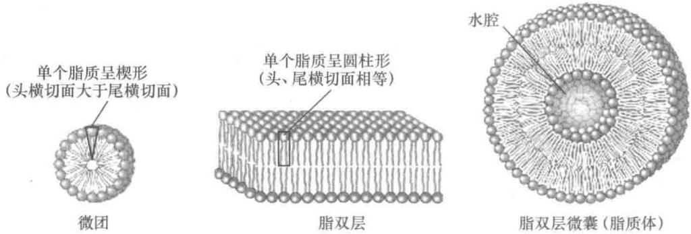  
图10-29 磷脂分子在水中自发形成的几种聚集体（切面观）

脂质在水中组装成何种形式的聚集体，取决于脂质本质和当时条件。微团（micelle）是球形结构，它含有几十到几千个两亲分子。这些分子排列成疏水尾部聚集在内部，在那里水被排出；亲水头基在表面，跟水接触。头基的横切面大于尾部（酰基链）横切面的，如游离脂肪酸、溶血磷脂（只有一条酰基链）和去污剂如十二烷基硫酸钠（SDS）倾向于形成微团。头基横切面等于酰基链横切面的，如甘油磷脂和鞘脂，则有利于脂双层（bilayer）的形成；在每一单层中的疏水部分，排开水，彼此相互作用；在脂双层片的每一表面（“叶面”），亲水头基跟水相互作用。但由于其边缘的疏水区仍暴露在水中，结构相对不稳定，自发地回折，形成中空的球形，称微囊（vesicle）。在实验室中从纯脂质形成的微囊或称脂质体（liposome），跟天然膜一样，对极性溶质基本上也是不通透的。微囊的连续表面消去了暴露的疏水区域，使脂双层在水环境中达到最大的稳定性。现已证实脂双层是生物膜的基本结构。

## （三）膜成分在脂双层两侧的分布是不对称的

膜对大多数极性的和荷电的溶质是不通透的，但对非极性化合物允许它们通过。脂双层本身的厚度约为3 nm，如果包括从膜两侧伸出的蛋白质在内（电镜下横切面观呈三层），膜厚度为5\~8 nm。

膜蛋白在脂双层两侧(两个单层)的分布是不对称的(图 10-30)。某些蛋白质只从膜的一侧伸出,另一些则在膜的两侧都有暴露的结构域，并且暴露在两侧的结构域也是不同的；蛋白质在脂双层中定向的不对称性使膜有“正反面”的区别，这反映膜在功能上的不对称性。膜中的蛋白质和脂质形成一个镶嵌图案，但跟用瓷砖和灰膏镶嵌起来的不同；膜是一种流体，镶嵌的图案可以不断地自由变化；因为其组分之间的相互作用大多是非共价的，这使得单个脂质和蛋白质分子能够在膜平面上自由地作侧向运动。但跟膜脂不同，膜蛋白不能从脂双层的一层翻转到另一层，这有利于膜蛋白的不对称分布的维持。

  
图 10-30 膜成分分布的不对称性(流动镶嵌模型)

质膜的脂质在脂双层两个单层的分布,虽然也是不对称的,但没有像膜蛋白那样的绝对。例如,在红细胞的质膜中,含胆碱的脂质(磷脂酰胆碱和胆碱鞘磷脂)主要存在于质膜的胞外面(外层),而磷脂酰丝氨酸、磷脂酰乙醇胺和磷脂酰肌醇更多是在胞质面(内层)。脂质在质膜内外层分布的变化是有生物学效果的。例如,血小板只有它质膜中的磷脂酰丝氨酸移到外层,才能在血凝块形成中起作用。对很多其他类型的细胞,磷脂酰丝氨酸暴露在细胞外表面,标示着一个细胞将遭程序性细胞死亡(programmed cell death)的破坏。

糖质在脂双层的分布也是不对称的,无论质膜还是内膜系统中糖脂和糖蛋白的寡糖分布都是不对称的。质膜的糖蛋白总是把携有寡糖的结构域定向在细胞的外表面。

## （四）有三类膜蛋白跟膜结合的方式不同

膜蛋白根据在膜上定位和跟膜脂结合的牢固程度可分为外周膜蛋白质、内在膜蛋白质和兼在蛋白质。

外周膜蛋白质(peripheral membrane protein)分布在脂双层的内、外层表面上，借静电相互作用和氢键跟内在蛋白质的亲水结构域或膜脂的极性头基结合(图10-31)。大多数外周蛋白质通常只要用比较温和的(能干扰静电相互作用和破坏氢键的)方法，如改变 $\mathrm{pH}$ 或离子强度、用螯合剂除去 $\mathrm{Ca}^{2+}$ 或加入尿素或碳酸盐，即可把它们从膜上分离下来。外周膜蛋白质一般占膜蛋白的 $20\% \sim 30\%$ 。

内在膜蛋白质(integral membrane protein)主要是靠跟脂双层的疏水相互作用与膜结合的。蛋白质分子的非极性氨基酸残基常以 $\alpha$ 螺旋形式与脂双层的疏水部分相互作用（细菌膜的内在蛋白质中常见有借多股β桶结合的）。内在蛋白质，有的只是部分埋在脂双层中，有的则横跨整个膜层（图10-30）；有的（如血型糖蛋白）跨越脂双层只是单个螺旋段（图10-30，图3-46），有的（如细菌视紫红质）是来回多个螺旋段（见图3-47）。内在蛋白质与脂双层结合得很牢固，只有用那些能够破坏跟脂双层疏水相互作用的介质，如去污剂、有机溶剂或变性剂，才能将它们提取出来。有些内在膜蛋白质本身并不进入膜内，而是跟一个或几个脂质分子如脂肪酸，类异戊二烯或糖基磷脂酰肌醇(glycosyl phosphatidylinositol;GPI)共价相连，并以它们为疏水锚钩(anchor)锚定在脂双层中（见图10-31和图9-38B），这些膜蛋白可用专一性酶处理，例如以GPI为锚钩的内在蛋白质(GPI-锚定蛋白质)用磷脂酶C水解即可被释放。内在膜蛋白质占膜蛋白的 $70\% \sim 80\%$ 。

  
图 10-31 三类膜蛋白: 外周蛋白质, 内在蛋白质和兼在蛋白质

兼在蛋白质(amphitropic protein)有时存在于细胞溶胶,有时处于跟膜结合之中。它们对膜的亲和力在有些场合是由于这些蛋白质跟一个膜蛋白或膜脂的非共价相互作用或静电相互作用,在另些场合是因为存在一个或多个跟兼在蛋白质共价结合的脂质(图10-31)。一般说,兼在蛋白质跟膜的可逆结合是受调节的;例如磷酸化作用或配体结合可以使该蛋白质发生构象改变,暴露出原先接近不到的膜结合部位。因此兼在蛋白质有时跟膜结合,有时不与膜结合;这取决于调节过程的类型,如可逆的棕榈酰化(palmitoylation),如图10-31。

## （五）生物膜是动态的

所有生物膜的一个显著特点是它们的柔性(flexibility)——不丢失它的完整性而改变形状的能力。这一性质的基础是脂双层中脂质分子之间的非共价相互作用和单个脂质的运动性(mobility)，因为脂质不是相互共价锚定的。可见膜是处于流动状态的，既包括膜脂，也包括膜蛋白的流动。合适的流动性(fluidity)对膜表现它的正常功能十分重要。例如物质转运、能量转换、信息传递、细胞分裂和融合、胞吞和胞吐等都跟膜的流动性有密切关系。

## 1. 脂双层中的脂质能以有序液态或无序液态存在

虽然脂双层的整体结构是稳定的,但膜平面内的单个磷脂分子具有很大的运动自由度,这取决于温度和脂质组成。低于正常生理温度,膜脂运动慢,脂双层变成半固体的有序液态(liquid-ordered state; $L_{o}$ )或称类晶态(paracrystalline state)或凝胶态(gel state),在这种状态单个脂质的所有运动形式都受到很大限制(图10-32A)。在生理温度以上,膜脂运动加快,脂肪酸烃链处于不断的运动中,包括绕长脂酰链C—C键的旋转和单个脂质分子在脂双层内的侧向扩散(图10-33A);此时脂双层是流动的无序液态(liquid-disor-

dered state; $L_{d}$ ), 或称液晶态 (liquid-crystalline state) (图 10-32B)。从 $L_{o}$ 态过渡到 $L_{d}$ 态, 脂双层总的形状和大小保持不变, 但单个脂质分子的运动 (侧向和旋转) 程度有变化。

对哺乳动物在生理温度范围(20\~40℃)，长链脂肪酸(如16:0和18:0)倾向于组装成 $L_{0}$

  
有序液态 $L_{0}$ （凝胶态）  
无序液态 $L_{d}$ （液晶态）  
图10-32 脂双层的两种极端状态

很快
(1μm/s)

凝胶态,但不饱和脂肪酸中的结节干扰装配,有利于处在 $L_{d}$ 态。短链脂肪酸也有同样的效果。一个膜的固醇含量(随不同生物和细胞器有很大变化;表10-7)是脂质状态的另一重要的决定因素。固醇(例如胆固醇)对脂双层流动性的影响似乎是反常的:固醇跟含不饱和脂酰链的磷脂相互作用,使脂酰链挤得更紧,并限制它们在脂双层中的运动;固醇跟携有长饱和脂酰链的磷脂和鞘脂结合,反而加快膜的流动性,此膜在没有胆固醇时是采取 $L_{o}$ 态的。其实,前者是因为固醇刚性环系统减少了它附近脂酰链绕 C—C 键旋转的运动自由度造成的,后者是因为刚性甾核阻挠了脂酰链的有序装配的结果。

为获得恒定的膜流动性,细胞在各种生长条件下调节它们的膜成分。例如细菌在低温下培养时比在高温下培养时,合成的不饱和脂肪酸更多,而饱和脂肪酸则更少。脂质成分的这种调整结果是在低温或高温下培养的细菌,约有同样程度的膜流动性。推测这是对脂双层中的许多蛋白质——酶、转运蛋白和受体——行使功能所必需的。

## 2. 脂质的跨膜运动需要酶催化

在生理温度下,脂质分子从脂双层的一层(一面)翻到另一层的运动称为跨膜运动(transmembrane movement)或翻转扩散(flip-flop diffusion)(图10-33A)。翻转扩散在大多数膜中即使发生也是很慢的,但在脂双层的同一层中进行的侧向扩散则很快(10-33B)。由于膜脂都是两亲分子,要从脂双层的一层翻转到另一层,它必须穿过脂双层的疏水区;这是一个需能过程,自由能变化是一个大的正值,因此比侧向扩散的速度要慢得多。然而这种高耗能的翻转在原核和真核细胞中都有发生。一个称为翻转酶(flippase)的转位蛋白(translocator)催化翻转扩散。此酶催化氨基磷脂(磷脂酰乙醇胺和磷脂酰丝氨酸)从质膜的胞外层到细胞溶胶层(内层)的转位,并因而造成磷脂的不对称分布:磷脂酰乙醇胺和磷脂酰丝氨酸主要在细胞溶胶层,鞘脂和磷脂酰胆碱在胞外层。翻转酶每转位一分子磷脂消耗约一个ATP分子(图10-33C)。此外还发现两个其他类型的磷脂转位蛋白质,但对它们了解得还不多。一个称转出酶(floppase;暂用译名——编者),催化质膜磷脂从细胞溶胶层转移到胞外层,它跟翻转酶一样,需要ATP。另一个称促翻转酶(scramblase),沿该脂浓度梯度(从高浓度层到低浓度层)跨膜转移任一种膜磷脂。它们的活性不依赖于ATP。爬行酶活性导致脂双层两面的头基组成有控制的随机化(转移趋于平衡)。

B. 非催化侧向扩散

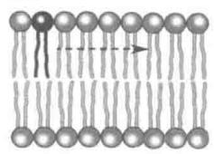

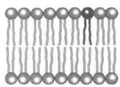

C. 催化跨膜转位

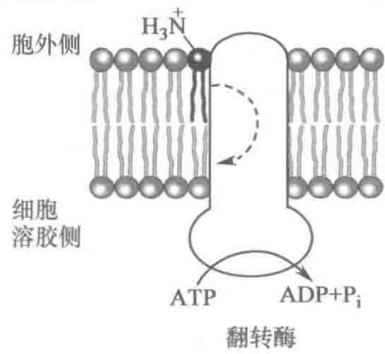  
氨基磷脂(PE和PS)从胞外层移动到胞内层  
图10-33 单个磷脂在脂双层中的运动

## 3. 脂质和蛋白质在膜内作侧向扩散

脂质在膜内的侧向扩散(lateral diffusion)或侧向移动是指磷脂分子在脂双层的同一层中与邻近分子进行交换；也即，这些分子在膜内进行布朗运动(图10-33B)。侧向扩散在生物膜和人工膜中都能发生，而且速度很快。例如，红细胞质膜外层中的一个脂质分子进行侧向扩散，在几秒钟内就能绕红细胞一圈。该脂双层平面内的这种快速侧向扩散在几秒钟内可使各个分子的位置趋于随机化(均匀分布)。

很多膜蛋白的行为好像它们被漂浮在脂质的海洋里。和膜脂一样，这些蛋白质能在脂双层的流体平面内自由地侧向扩散，并处于恒定的运动中。测定膜蛋白（或膜脂）的侧向扩散常采用光漂白荧光恢复法

(fluorescence recovery after photobleaching; FRAP) (图 10-34)。这种方法是利用强激光使膜上某一微区(5 μm²)内标有荧光探针的膜蛋白(或膜脂)进行彻底漂白,然后用荧光显微镜可观察到其他部位的膜蛋白(未经光漂白的)因侧向扩散进入该微区,微区内荧光又重新出现,表明膜蛋白发生侧向运动。光漂白后的荧光恢复速率是蛋白质(或脂质)侧向扩散速率的量度。

某些膜蛋白在细胞或细胞器的表面缔合成大的聚集体（“小块”）；例如乙酰胆碱受体在突触的神经元质膜上形成密集的近似晶状的小块，在这里单个蛋白质分子彼此不会发生相对移动。另一些膜蛋白被锚定在细胞内部的结构（如细胞骨架）以阻止它们的自由扩散。例如红细胞质膜上的血型糖蛋白和氯化物-重碳酸盐交换蛋白（chloride-bicarbonate exchanger）都是通过锚蛋白（ankyrin）被拴在丝状的细胞骨架蛋白质——血影蛋白（spectrin）上，因此这些膜蛋白的运动受到很大的限制（图10-35）。

## （六）质膜的内在蛋白质参与表面黏着、信号传递和其他细胞过程

质膜中几个家族的内在蛋白质提供细胞和细胞之间以及细胞和胞外基质蛋白质之间的专一性连接位点。整联蛋白（integrin）是表面黏着蛋白质，它介导细胞跟胞外基质和跟其他细胞包括某些病原体的相互作用。整联蛋白也在跨质膜的两个方向传递整合有关胞内、外环境的信息的信号。所

  
图 10-34 光漂白荧光法测定膜蛋白或膜脂的侧向扩散速率

有的整联蛋白都是杂二聚体(heterodimer)，由两个不同的亚基 $\alpha$ 和 $\beta$ 组成。每个亚基借一个跨膜螺旋锚定在质膜内。 $\alpha$ 和 $\beta$ 亚基的胞外大结构域缔合成一个专一性结合位点，以结合胞外蛋白质如胶原蛋白和纤连蛋白(fibronectin)，这些胞外蛋白质含有一个共同的整联蛋白结合决定簇：Arg-Gly-Asp。

涉及表面黏着的其他蛋白质是钙黏着蛋白（cadherin），它能跟相邻细胞中的同一种钙黏着蛋白进行同嗜性同种间（homophilic）的相互作用。另一是选择蛋白，它有胞外结构域；在 $\mathrm{Ca}^{2+}$ 存在下，该结构域能跟相邻细胞表面上的专一多糖结合。选择蛋白主要存在于各类血细胞和衬在血管壁上的内皮细胞中。它们是血液凝固的必需部分。

内在膜蛋白质还在许多其他细胞过程中起作用。它们用作转运蛋白和离子通道，用作激素、神经递质和生长因子的受体（第14章）。它们担当氧化磷酸化（第19章）、光合磷酸化（第23章）以及免疫系统中细胞-细胞和细胞-抗原识别的中心角色(第4章)。内在蛋白质也在膜融合(包括胞吞、胞吐和病毒入侵宿主细胞)中起重要作用。

  
图10-35 红细胞膜的氯化物-重碳酸盐交换蛋白的运动受膜骨架限制

## （七）生物膜的流动镶嵌模型

从19世纪末到20世纪中叶对生物膜的结构曾提出过多种模型，包括脂双层模型、三夹板模型和单位膜模型等。1972年美国S.T.Singer和G.R.Nicolson吸取了前人提出的模型中合理部分，并总合膜的电镜观察、化学组成及其分布不对称性的研究、膜通透性和膜流动性的物理研究，提出了流动镶嵌模型（fluid mosaic model）。该模型认为：膜是蛋白质和磷脂组成的动态结构；脂双层是一种流体基质，实质上是蛋白质的二维溶剂。脂双层的每层中脂质分子的非极性尾部面向双层片的核心，极性头基面向外侧，跟每侧的水介质相互作用；蛋白质埋在双层片中，借脂质和蛋白质的疏水结构域之间的疏水相互作用维系在一起。在这里膜脂和膜蛋白能作旋转和侧向运动。Singer和Nicolson还指出，这些蛋白质部分地或

全部地嵌入脂双层中，有些甚至横跨整个脂双层（图10-36）。此模型跟以往提出的各种模型主要差别在于：它突出膜的流动性和膜蛋白分布的不对称性。流动镶嵌模型虽还存在很多局限性，例如近年来很多实验结果表明，膜各部分的流动性是不均匀的。由于脂质组成不同、膜蛋白-膜脂的和膜蛋白-膜蛋白的相互作用以及环境因素（如温度、pH等）的影响，在一定温度下有的膜脂处于凝胶态 $(\mathrm{L}_{\mathrm{o}})$ ，有的则呈流动的液晶态 $(\mathrm{L}_{\mathrm{d}})$ 。即使都处于 $\mathrm{L}_{\mathrm{d}}$ 态，膜中各部分的流动性也不全相同。这样，整个

  
图10-36 Singer和Nicolson提出的膜结构流动镶嵌模型

膜可视为具有不同流动性的“微区”相间隔的动态结构。因而 Jain 和 White 提出了一种“板块镶嵌”模型。然而至今尚无一个模型像流动镶嵌模型那样受到广泛的应用。

## 六、脂质的提取、分离和分析

脂质存在于细胞、细胞器和胞外体液如血浆、胆汁、乳和肠液中。欲研究某一特定部分（例如红细胞、线粒体或脂蛋白）的脂质，首先须将它们所在的组织、细胞或细胞器分离出来。由于脂质不溶于水，它们的提取和随后的分级分离都要求使用有机溶剂和某些特殊技术，这跟用于纯化水溶性分子如蛋白质和糖质是很不相同的。一般说，复杂的脂质混合物分离是根据它们在非极性溶剂中的极性或溶解度差别进行的。含酯键连接或酰胺键连接的脂肪酸的脂质可用酸、碱或高度专一的水解酶处理使成可用于分析的成分。

## （一）脂质用有机溶剂提取

非极性脂质(三酰甘油、蜡和色素等)用乙醚、氯仿或苯等容易从组织中提取出来,因为这些溶剂不致使脂质因疏水相互作用而集聚在一起。膜脂(磷脂、糖脂、类固醇等)要用极性有机溶剂如乙醇或甲醇提取,这种溶剂既能降低脂质分子间的疏水相互作用,又能减弱膜脂与膜蛋白之间的氢键键合和静电相互作用。常用的提取剂(extractant)是氯仿、甲醇和水(体积比1:2:0.8)的混合液。按此体积比配制的混合液是混溶的,形成一个相。组织(如肝)在此混合液中匀浆以提取所含脂质;匀浆后形成的不溶物包括蛋白质、核酸和多糖用离心或过滤方法除去。向所得的提取液(extract)加入过量的水使之分成两个相,上相是甲醇/水,下相是氯仿。脂质留在氯仿相,极性大的分子如蛋白质、多糖进入极性相(甲醇/水)。取出氯仿并蒸发浓缩,取一部分干燥,称重;其余用于下步分离分析。

## （二）吸附层析分离不同极性的脂质

被提取的脂质混合物可采用基于各类脂质极性不同分开的层析手段进行分级分离。例如硅胶吸附柱层析(柱层析装置参见图2-14)可把脂质分成非极性、极性和荷电的多个组分。硅胶(silica)是硅酸 $\mathrm{Si(OH)_4}$ 的一种形式，一种极性的不溶物。当脂质混合物(氯仿提取液)通过柱中的硅胶时，由于极性脂质跟极性硅酸结合得紧密被留在柱上；中性脂质则直接通过柱子，出现在最先流出的氯仿洗涤液中。然后用逐步提高极性的溶剂洗涤，极性脂质按极性增加的顺序被洗脱。不带荷电的极性脂质(如脑苷脂)用丙酮洗脱，极性强的或带荷电的脂质(如甘油磷脂)用甲醇洗脱。分别收集各个组分，在不同的层析系统中再层析，以分离单个脂质组分。例如磷脂组分可进一步分离成磷脂酰胆碱、鞘磷脂、磷脂酰乙醇胺等。如果采用高效液相色谱(HPLC,见第5章)或薄层层析(TLC)进行脂质分离则速度更快，分辨率更高。

硅胶薄层层析(装置见图2-16)利用同一原理。硅胶薄层涂抹在一块能黏附它的玻璃板上。溶于氯仿的少量脂质样品点加在玻璃板一边的附近,然后把玻璃板的这一边浸入加有有机溶剂或溶剂混合液的浅槽中;整套装置封闭在被溶剂蒸气饱和的箱(或缸)内。随溶剂在玻璃板上上升(由于毛细管作用),也带着脂质一起移动。极性小的脂质移动最快,因为它们跟硅酸结合的程度小。分开的脂质可以用一种称罗丹明(rhodamine)的染料喷洒玻璃板,这种染料与脂质结合后,会发出荧光;或用碘蒸气熏蒸玻璃板,碘与脂肪酸中的双键发生可逆反应,结果含不饱和脂肪酸的脂质显示出黄色或棕色。几种其他的喷显剂也用于检测一些特异的脂质。为了后面分析,含被分开的脂质区域可从板上刮下,脂质用有机溶剂提取回收。

## （三）气-液色谱用于分析挥发性脂质混合物

气-液色谱(gas-liquid chromatography; GLC)是分离混合物的挥发性组分的。分离的原则是按它们溶于填充在色谱柱中的惰性材料的相对倾向,或是按它们被惰性气体(如氦、氢或氮)流动所推进的挥发和过柱的相对速度。除某些脂质具有天然挥发性外,大多数脂质沸点很高,6-碳以上的脂肪酸沸点都在200℃以上。因此进行分析前必须先将脂质转变为它们的衍生物(如酯类)以增加挥发性(即降低沸点)。为分析油脂或磷脂样品中的脂肪酸,首先需要在甲醇/HCl或甲醇/NaOH混合物中加热,使脂肪酸成分发生转酯[基]作用(transesterification),从甘油酯转变为脂肪酸甲酯。然后将甲酯混合物加样到气-液色谱柱上,加热柱子,使样品挥发,以利GLC分析。在柱材料中溶解度最大的脂肪酸酯留在柱上的时间最长;溶解度小的脂质被惰性气流带走,最先从柱中出来。洗脱顺序主要决定于柱中固体吸附剂的性质和脂质混合物组分的沸点。利用GLC技术,各种链长和各种不饱和度的脂肪酸混合物可以得到完全分开。气-液色谱仪的基本组件如图10-37所示。

  
图 10-37 气-液色谱仪的基本组件

## （四）专一性水解有助脂质结构测定

某些种类的脂质对在特异条件下的降解特别敏感，例如三酰甘油、甘油磷脂和固醇酯中酯键连接的脂肪酸只要用温和的酸或碱处理则被释放。而鞘脂中酰胺键连接的脂肪酸则需要在较强的水解条件下才能被释放。专一性水解某些脂质的酶也被用于脂质结构的测定。前面谈到过的磷脂酶 $\mathrm{A}_1$ 、 $\mathrm{A}_2$ 、C和D（见图10-9）都能断裂甘油磷脂分子中的一个特定的键，并产生具有特征溶解度和层析行为的产物。例如磷脂酶C作用于磷脂，释放一个水溶性的磷酰醇（例如从磷脂酰胆碱释放出磷酸胆碱）和一个氯仿溶的二酰甘油，这些成分可以分别加以鉴定，以确定完整磷脂的结构。专一性水解跟这些产物的TLC、GLC或HPLC鉴定相结合常可用来测定一个脂质的结构。

## （五）质谱与脂质结构测定和脂质组学

脂质或其挥发性衍生物的质谱分析是确定烃链长度和双键位置的最佳技术。相似的脂质（例如，两个相同链长、在不同位置上不饱和的脂肪酸，或两个含不同数目异戊二烯单位的类异戊二烯）的物理化学性质是非常相像的，从各种色谱洗脱的顺序经常不能把它们区分开来。然而，当从一个色谱柱流出的洗脱物（eluate）加样到质谱仪上进行分析，一个脂质混合物的组分只要根据它们唯一的分级分离谱就能同时得到分离和鉴定。随着质谱法分辨率的不断提高，有可能粗提取液无须进行预分级分离就能在很复杂的混合物中鉴定出单个脂质。这种“鸟枪”（shotgun）法可以避免脂质组分的再分离（亚类的分离），因而速度更快。

为探索细胞和组织中脂质的生物学作用,重要的是要知道什么脂质以什么比例存在,并要知道这些脂质的组成随胚胎发育、疾病或药物治疗发生的变化;这些内容构成了脂质组学(lipidomics)。脂质组学的目的是试图编录所有的脂质及其功能。应用具有高处理量和高分别率的质谱技术可以提供在特定条件下专一类型细胞中存在的全部脂质的定量编目——脂质组(lipidome),以及脂质组随分化、疾病(如癌症)或药物治疗的变化方式。一个动物细胞含有上千种不同的脂质,大概每一种都有专门的功能。越来越多的脂质它们的功能为人们了解,但仍然还有大量未探索的脂质组,为下一代的生物化学家和生物学家提供丰富的新课题,等待解决。

## 提要

脂质是细胞的水不溶性成分,结构多种多样,能用有机溶剂如乙醚、氯仿等进行提取。脂质按化学组成可分为单纯脂质、复合脂质和衍生脂质;按生物功能可分为贮存脂质、结构脂质和活性脂质。

脂肪酸是多数脂质的烃成分,通常具有偶数碳原子(一般12到24)。脂肪酸可分为饱和与不饱和的,双键几乎总是顺式的。脂肪酸的物理性质主要决定于烃链长度与不饱和程度。必需脂肪酸是指对人体的功能不可缺少,但必须由膳食提供的两种多不饱和脂肪酸:亚油酸和 $\alpha-$ 亚麻酸;前者属 $\omega-6$ 家族,后者属 $\omega-3$ 家族。

三酰甘油是由脂肪酸与甘油形成的三酯。三酰甘油可分为简单三酰甘油和混合三酰甘油；天然油脂是简单和混合三酰甘油的混合物。三酰甘油与碱共热可发生皂化，生成脂肪酸盐（皂）和甘油。三酰甘油跟游离脂肪酸一样，它的不饱和键能发生氢化、卤化和过氧化等作用。三酰甘油是主要的贮存脂质，以脂肪滴形式存在于细胞中。

脂质过氧化是典型的活性氧参与的自由基链式反应。活性氧( $\cdot O_{2}^{-}$ 、 $\cdot OH$ 、 $H_{2}O_{2}$ 和 $^{1}O_{2}$ 等)使生物膜发生脂质过氧化,造成膜的损伤、蛋白质和核酸等大分子的异常。脂质过氧化与多种疾病有关。体内的抗氧化剂如超氧化物歧化酶(SOD)、维生素E和 $\beta-$ 胡萝卜素等是与脂质过氧化抗衡的保护系统。

三酰甘油是食物的重要成分。食品工业中植物油的部分氢化会使某些脂肪酸的顺式双键转化为反式构型。食物中的反式脂肪酸是冠心病的一个重要风险因素。

蜡是指长链脂肪酸和长链一元醇或固醇形成的酯。天然蜡如蜂蜡是多种蜡酯的混合物。蜡是海洋浮游生物中代谢燃料的主要贮存形式。蜡还有其他的生物功能如防水、防侵袭等。

具有极性头和非极性尾的极性脂质是生物膜的主要成分。最丰富的极性脂质是甘油磷脂；最简单的甘油磷脂是3-sn-磷脂酸，它是其他甘油磷脂的母体。磷脂酸进一步被一个极性醇（如胆碱、乙醇胺等）酯化，则形成各种甘油磷脂。常见的甘油磷脂是磷脂酰胆碱和磷脂酰乙醇胺。甘油磷脂的极性头基在pH 7附近荷电。

叶绿体膜富含半乳糖脂和硫脂，它们是甘油糖脂。前者由二酰甘油跟1个或2个相连的半乳糖残基组成，后者由二酰甘油跟一个磺酸化的糖残基组成，并因此是一个荷电的头基。

某些古菌含有独特的膜脂,它有一个很长的链烷基,在链烷基的两端以醚键跟甘油相连,还有一个糖基和/或一个甘油磷酸基跟甘油连接以提供一个极性的或荷电的头基。这类脂质在这些古菌生活的苛刻条件下是稳定的。

鞘脂含有鞘氨醇，一个长链的脂肪族氨基醇，但不含甘油。鞘氨醇的2-位氨基以酰胺键与脂肪酸连接形成神经酰胺，它是鞘脂类的母体。神经酰胺的1-位羟基被磷酰胆碱或磷酰乙醇胺酯化则形成相应的鞘磷脂：胆碱鞘磷脂和乙醇胺鞘磷脂。神经酰胺的1-位羟基以糖苷键跟糖基连接则成鞘糖脂。重要的鞘糖脂有脑苷脂、红细胞糖苷脂和神经节苷脂。细胞表面的鞘糖脂是细胞识别的位点。

固醇含有4个稠合的碳环(环戊烷多氢菲)和一个羟基。固醇存在于大多数真核细胞的膜中,但细菌不含固醇。胆固醇是动物中的主要固醇,是膜的结构成分,也是体内类固醇激素和胆汁酸的前体。

有些种类的脂质存在量虽然较少,但起着辅因子和信号的关键作用。类二十烷酸,包括前列腺素、凝血酶和白三烯;它们由花生四烯酸合成,是一类极强的局部性激素。

磷脂酰肌醇-4,5-二磷酸经水解产生2个胞内信使：二酰甘油（DAG）和肌醇-1,4,5-三磷酸（ $\mathrm{IP}_3$ ）。磷脂酰肌醇-3,4,5-三磷酸是参与生物信号传递的超分子蛋白质复合体的成核点。

类固醇激素如性激素和皮质激素都由固醇衍生而来,它们作为强力的生物信号改变靶细胞中的基因表达,从而影响代谢和生理方面的变化。

许多由异戊二烯单位 $(\mathrm{C}_5)$ 合成的类萜（类异戊二烯）是生物活性脂质。例如维生素A、D、E和K在动物的代谢和生理活动中起重要作用。维生素A和D是相应激素的前体。泛醌和质体醌分别是线粒体和叶绿体的电子载体。脂质共轭双烯，如胡萝卜素、玉米黄质等，作为花朵和水果中的色素，以及给鸟的羽毛以亮丽的颜色。多萜醇（长醇）活化和锚定简单糖到细胞膜上；聚糖基然后用于合成复杂糖质、糖脂和糖蛋白。

聚酮化合物如红霉素、两性霉素 B 等是天然产物，被广泛用于医学。

血浆脂蛋白是血浆中转运脂质的脂蛋白颗粒。这些颗粒都有一个由三酰甘油和胆固醇酯组成的疏水核心和一个由磷脂、胆固醇和载脂蛋白参与的极性外壳。载脂蛋白（apo）是脂蛋白中的蛋白质部分，主要作用是增溶疏水脂质和作为脂蛋白受体的识别部位。脂蛋白颗粒依密度增加为序可分为乳糜微粒、VLDL、LDL和HDL。VLDL从肝运载胆固醇、胆固醇酯和三酰甘油到其他组织，在那里三酰甘油为脂蛋白脂酶所降解，VLDL转变为LDL。富含胆固醇和胆固醇酯的LDL被受体介导的胞吞所摄取，胞吞过程中LDL的载脂蛋白B-100为质膜中的受体所识别。HDL是除肝以外的其他组织的胆固醇清除剂。

细胞的外周膜(质膜)和内膜系统统称生物膜。膜主要由蛋白质(包括酶)、脂质(主要是磷脂)和糖类等组成。脂双层是膜的基本结构元件。膜对极性的和荷电的溶质一般是不通透的,但对非极性化合物则允许它们通过。膜脂和膜蛋白在脂双层中的定向是不对称的,使膜有“正反面”的之分,这也反映膜在功能上的不对称性。质膜的糖蛋白总是把携有寡糖的结构域定向在细胞的外表面。膜蛋白可分为三类:外周膜蛋白质、内在膜蛋白质和兼在蛋白质。膜的流动性是膜结构的主要特征;脂酰链的热运动使脂双层内部成为流体;流动性受温度、脂肪酸组成和固醇含量的影响。膜脂和膜蛋白可以进行侧向扩散,速度很快;膜脂还可以发生翻转扩散,但速度比前者慢得多,除非有翻转酶的参与。整联蛋白是质膜的跨膜蛋白质,起连接细胞-细胞以及在胞外基质和细胞质之间运载信息两个方面的作用。膜的流动镶嵌模型仍是迄今应用最广的。

测定脂质组成时，脂质首先需要用有机溶剂从组织中提取，再用薄层层析、气液色谱或高效液相色谱分离。单个的脂质可根据其层析行为、对专一性酶水解的敏感性或质谱来鉴定。高分别率的质谱无须预分级分离即可进行脂质粗混合物分析。脂质组学的任务是利用先进的分析技术，测定一个细胞或组织中的全套脂质（脂质组）并组建有注释的数据库，比较不同类型和不同条件下的细胞脂质。

## 习题

1. 天然脂肪酸在结构上有哪些共同的特点？

2. (a) 由甘油和三种不同的脂肪酸(如豆蔻酸、棕榈酸和硬脂酸)可形成多少种不同的三酰甘油(包括立体异构体)? (b) 其中从量方面的组成不同考虑, 形成三酰甘油可有多少种?

3. (a) 为什么饱和的 18 碳脂肪酸——硬脂酸的熔点比 18 碳不饱和脂肪酸——油酸的熔点高？(b) 干酪乳杆菌产生的乳杆菌酸（19 碳脂肪酸）的熔点更接近硬脂酸的熔点还是更接近油酸的熔点？为什么？

4. 画出 $\omega - 6$ 脂肪酸 $16:1$ 的结构式。

5. 从植物种子中提取出 $1\mathrm{g}$ 油脂，把它等分为两份，分别用于测定该油脂的皂化值和碘值。测定皂化值的一份样品消耗 $\mathrm{KOH}65\mathrm{mg}$ ，测定碘值的一份样品消耗碘 $(\mathrm{I}_2)510\mathrm{mg}$ 。试计算该油脂的平均相对分子质量和碘值。

6. 某油脂的碘值为 68，皂化值为 210。计算每个油脂分子平均含多少个双键。

7. (a) 解释与脂质过氧化有关的几个术语: 自由基、活性氧、自由基链式反应、自动氧化、抗氧化剂和自由基清除剂; (b) 为什么 PUFA 容易发生脂质过氧化?

8. 为解决甘油磷脂构型上的不明确性, 国际生物化学命名委员会建议采取立体专一编号命名原则。试以磷酸甘油为例说明此命名原则。

9. 写出下列化合物的名称: (a) 在低 pH 时, 携带一个正净电荷的甘油磷脂; (b) 在中性 pH 时, 携带负净电荷的甘油磷脂; (c) 在中性 pH 时, 净电荷为零的甘油磷脂。

10. 给定下列分子成分: 甘油、脂肪酸、磷酸、长链醇和糖。试问 (a) 哪两个成分在蜡和鞘磷脂中都存在? (b) 哪两个成分在脂肪和磷脂酰胆碱中都存在? (c) 哪些 (个) 成分只在神经节苷脂而不在脂肪中存在?

11. 今有两个无标签的样品: 一个鞘磷脂, 一个磷脂酰胆碱。试用化学、层析或酶学方法把它们鉴别开来。

12. 指出下列膜脂的亲水成分和疏水成分: (a) 磷脂酰乙醇胺; (b) 鞘磷脂; (c) 半乳糖脑苷脂; (d) 神经节苷脂; (e) 胆固醇。

13. 从第2章中我们知道茚三酮在弱酸溶液中能专门跟一级胺(伯胺)反应生成紫蓝色产物。试问鼠肝磷脂的薄层层析谱上喷上茚三酮溶液能显色的是哪些(个)磷脂?

14. (a) 造成类固醇化合物种类很多的原因是什么? (b) 人和动物体内胆固醇可转变为哪些具有重要生理意义的类固醇物质?

15. 胆酸是人胆汁中发现的 A-B 顺式类固醇(图 10-20)。请按图 10-17 所示的椅式构象画出胆酸的构象式，并以直立键或平伏键标出 C3, C7 和 C12 位上的 3 个羟基。

16. 一种血浆脂蛋白的密度为 $1.08 \mathrm{~g} / \mathrm{cm}^{3}$ , 载脂蛋白的平均密度为 $1.35 \mathrm{~g} / \mathrm{cm}^{3}$ , 脂质的平均密度为 $0.90 \mathrm{~g} / \mathrm{cm}^{3}$ 。问该脂蛋白中载脂蛋白和脂质的质量分数是多少？

17. 一种低密度脂蛋白(LDL)含 apo B-100( $M_{\mathrm{r}}$ 为500000)和总胆固醇(假设平均 $M_{\mathrm{r}}$ 为590)的质量分数分别为25%和50%。试计算 apo B-100与总胆固醇的摩尔比。

18. 对于饱和脂酰链中单键碳的碳-碳距离约为 0.15 nm。试估计一个完全伸展的棕榈酸分子的长度。如果 2 个棕榈

酸分子端-端相接,它们的总长度与生物膜中的脂双层厚度相比,将如何?

19. 图 10-34 中描述的实验是在 $37^{\circ} \mathrm{C}$ 完成的, 如果实验在 $10^{\circ} \mathrm{C}$ 进行, 你预料对扩散速率会有怎样的影响? 为什么?

20. 人红细胞膜的内层(单层)主要是由磷脂酰乙醇胺和磷脂酰丝氨酸组成,外层主要是由磷脂酰胆碱和鞘磷脂组成。虽然膜的这些磷脂在流体脂双层中可以扩散,但膜的两面(内、外层)始终保持这种不同的分布。这是如何做到的?

## 主要参考书目

1. 王镜岩, 朱圣庚, 徐长法. 生物化学教程. 北京: 高等教育出版社, 2008.

2. 赵保路. 氧自由基和天然抗氧化剂. 北京: 科学出版社, 1999.

3. 鞠焜先, 邱宗荫, 丁世家, 等. 生物分析化学. 北京: 科学出版社, 2007.

4. Nelson D L, Cox M M. Lehninger Principles of Biochemistry. 6th ed. New York: W. H. Freeman and Company, 2013.

5. Garrett R H, Grisham C M. Biochemistry. 3rd ed. Boston: Saunders College Publishing, 2004.

6. Stryer L. Biochemistry. 6th ed. New York: W. H. Freeman and Company, 2006.

7. Meyers R. Molecular Biology and Biotechnology—a Comprehensive Desk Reference. VCH Publishers Inc, 1995.

8. McMurry I. Organic Chemistry. 3rd ed. California: Brooks/Cole Publishing Company, 1992.

(徐长法)

## 网上资源

习题答案
