## 第 11 章 核酸的结构和功能

核酸(nucleic acid)的结构和功能是生物化学和分子生物学的重要研究领域。生物的特征是由生物大分子所决定的,生物大分子有4类:核酸、蛋白质、多糖和脂质复合物。糖和脂质是由酶(蛋白质)催化合成的,它们与蛋白质结合,增加了蛋白质结构与功能的多样性。核酸是遗传信息载体,蛋白质的合成取决于核酸;然而生物功能需要通过蛋白质来实现,包括核酸合成也有赖于蛋白质的作用。核酸有两类,即脱氧核糖核酸(deoxyribonucleic acid,DNA)和核糖核酸(ribonucleic acid,RNA)。因此,最重要的生物大分子是DNA、RNA和蛋白质。由生物大分子和有关生物分子以及无机分子或离子共同构成生物机体不同层次的结构;生物大分子之间以及与其他分子之间的相互作用决定了一切生命活动。有关核酸的结构、功能、性质和研究方法将分两章予以介绍。

## 一、核酸的发现和研究简史

由于核酸的结构与功能比较复杂,分子很不稳定,在4类生物大分子中,它的研究开始最晚。现代生物化学建立于18世纪下半叶。“蛋白质”一词最早于1838年由J.J.Berzelius所提出,“核酸”这个词的出现要晚半个世纪。然而对它的研究却改变了整个生命科学的面貌,并由此而诞生了分子生物学这一当今发展最迅速、最有活力的学科。

## （一）核酸的发现

1868 年瑞士青年科学家 F. Miescher 由脓细胞分离得到细胞核，并从中提取出一种含磷量很高的酸性物质，称为核素（nuclein）。他的导师 F. Hoppe-Seyler 对其发现十分惊讶，经过重复验证后才于 1871 年将原论文和补充论文一起发表在 Med. Chem. Unters. 上。此后，Miescher 转向研究鲑鱼精子头部的物质，除分离到酸性高含磷化合物（即现在所知的 DNA）外，还提取出一种碱性化合物，称为鱼精蛋白（protamine）。Miescher 被认为是细胞核化学的创始人和 DNA 的发现者。Miescher 的工作为其后继者所继续。其中，最主要者为 R. Altmann，他发展了从酵母和动物组织中制备不含蛋白质的核酸的方法，核酸这个名称就是由 Altmann 在 1889 年最先提出来的。

胸腺的细胞核特别大，酵母的细胞质很丰富，这是两种容易提取核酸的材料，因此这两种核酸也就研究得最多。O. Hammarsten 于 1894 年证明酵母核酸中的糖是戊糖，1909 年由 P. A. Levene 和 W. A. Jacobs 鉴定是 D-核糖。当时曾认为胸腺核酸中的糖是己糖，直至 1930 年才由 Levene 确定为 2-脱氧-D-核糖。两类核酸的碱基也有差别，在 19 世纪末和 20 世纪初分别得到鉴定。这就是说，在 19 世纪末已经发现有两类核酸存在，虽然对它们的化学本质还不完全清楚。

## （二）核酸的早期研究

Miescher 的发现曾给生物学家带来巨大希望。Hoppe-Seyler 认为，核素“可能在细胞发育中发挥着极为重要的作用”。1885 年细胞学家 O. Hertwig 提出，核素可能负责受精和传递遗传性状。1895 年遗传学家 E. B. Wilson 推测，染色质与核素是同一种物质，可作为遗传的物质基础。然而，随后核酸化学的研究却偏离了最初的正确方向。

核酸中的碱基大部分是由 A. Kossel 及其同事所鉴定。1910 年因其在核酸化学研究中的成就而被授予诺贝尔医学奖，但他却认为决定染色体功能的是蛋白质，因而在获奖后转而研究染色体蛋白质。P. A. Levene 在鉴定核酸中的糖以及阐明核苷酸的化学键中作出了重要贡献，但他认为核酸是以四核苷酸为单位的简单聚合物,从而使生物学家失去对它的关注,他的“四核苷酸假说”曾严重阻碍核酸研究达30年之久。当时还流行一种错误的看法,认为胸腺核酸代表动物核酸;酵母核酸代表植物核酸,这种观点也误导了对核酸生物功能的认识。

理论研究的重大发展往往首先从技术上的突破开始。20世纪40年代微量生化分析技术有很大的发展，T. Caspersson的显微紫外分光光度测定，J. Brachet的组织化学，A. L. Dounce的亚细胞部分分级分离，以及J. N. Davidson的生化分析都有力证明细胞含有两类核酸，脱氧核糖核酸（DNA）存在于细胞核，核糖核酸（RNA）存在于细胞质，它们都是动物、植物和细菌细胞共同具有的重要组成成分。碱基成分的精确测定推翻了“四核苷酸假说”，并证明了核酸的高度特异性。1944年O.T.Avery证明，细菌的转化因子是DNA。其后，噬菌体实验进一步证明DNA是遗传物质。细胞化学的研究还发现，蛋白质合成能力强RNA含量也丰富。于是开始认识到DNA功能是传递遗传信息，RNA功能是合成蛋白质。

## （三）DNA 双螺旋结构模型的建立

20世纪上半叶，数理学科进一步渗入生物学，生物化学本身是一门交叉学科，也就成为数理学科与生物学之间的桥梁。数理学科的渗入不仅带来了新的理论和思想方法，而且引入了许多新的技术和实验方法。1953年J.D.Watson和F.Crick提出DNA双螺旋结构模型，就是在学科融合的背景下产生的。该模型的提出被认为是20世纪自然科学中最伟大的成就之一，它给生命科学带来深远的影响，并为分子生物学的发展奠定了基础。

分子生物学的先驱者沿着三条思想路线去探讨生命的本质，并形成了三个学派：结构学派、信息学派和生化遗传学派。结构学派以英国物理学家 W. T. Astbury、J. D. Bernal 和他们的学生为代表，他们的兴趣在于用 X 射线结晶学技术研究生物大分子的三维结构，并认为这是解决生物学问题的根本途径。Astbury 曾用 X 射线衍射的方法研究蛋白质和 DNA 的结构，他于 1945 年最早使用分子生物学这一术语。他认为研究生物分子的三维结构，研究它们的起源和功能问题，是当代分子生物学的主旨。

信息学派以物理学家 M. Delbrück 与微生物学家 S. Luria 领导的“噬菌体小组”为代表。这一学派深受量子论思潮的影响，Delbrück 就是量子论奠基者 N. Bohr 的学生。量子论的另一奠基者 E. Schrödinger 在其《生命是什么？》一书中指出，“有机体赖负熵为生”，并认为最重要的问题是“基因的信息内容”。他的观点当时有很大影响力。噬菌体小组致力于揭示染色体上的信息编码，他们认为噬菌体就是裸露的染色体。1952 年噬菌体小组的两个成员 A. Hershey 和 M. Chase 用 $^{32}\mathrm{P}$ 标记噬菌体的 DNA, $^{35}\mathrm{S}$ 标记蛋白质，然后感染大肠杆菌。结果只有 $^{32}\mathrm{P}-\mathrm{DNA}$ 进入细菌细胞内， $^{35}\mathrm{S}-$ 蛋白质仍留在细胞外，从而有力证明 DNA 是噬菌体的遗传物质。Watson 是噬菌体小组中最年轻的成员，1950 年在 Luria 指导下取得博士学位，其年 22 岁。他善于集思广益，博采众长，从别人的工作中吸取所需要的东西，对新事物敏感。1951 年他在剑桥遇到正在 M. Perutz 小组做研究生的 Crick，两人便开始合作探求 DNA 的分子结构。

生化遗传学派包括一批用生物化学方法从事遗传学研究的科学家,他们试图阐明基因是如何行使功能而控制特定性状的。早在1909年A. Garrod就发表了“代谢的先天错误”的论文,表明孟德尔遗传因子很可能是通过代谢过程的特定步骤而发挥其功能。其后,G.W.Beadle和E.L.Tatum利用红色面包霉的营养缺陷型突变体于20世纪40年代证明了“一个基因一种酶”的假说。

Watson 和 Crick 提出 DNA 双螺旋结构模型的主要依据是: 已知的核酸化学结构知识; E. Chargaff 发现的 DNA 碱基组成规律; M. Wilkins 和 R. Franklin 得到的 DNA X 射线衍射结果。此外, W. T. Astbury 对 DNA 衍射图的研究以及 L. Pauling 提出蛋白质的 $\alpha$ 螺旋结构也都有启发作用。DNA 双螺旋结构模型的建立说明了基因的结构、信息和功能三者之间的关系, 因而使三个学派得到统一, 并推动了分子生物学的迅猛发展。

20 世纪 50 年代许多实验室对 DNA 双螺旋结构模型进行验证。1956 年 A. Kornberg 发现 DNA 聚合酶, 可用以在体外复制 DNA。1958 年 Crick 总结了当时分子生物学的成果, 提出了“中心法则”(central dogma), 即遗传信息从 DNA 传到 RNA, 再传到蛋白质, 一旦传给蛋白质就不再转移。

每当 DNA 研究取得理论上或技术上的重大进展,都会带动 RNA 研究出现一个高潮。60 年代 RNA 研究取得巨大发展。1961 年 F. Jacob 和 J. Monod 提出操纵子学说并假设了 mRNA 的功能。1965 年

R. W. Holley 等最早测定了酵母丙氨酸 tRNA 核苷酸序列。1966 年由 M. W. Nirenberg 等的多个实验室共同破译了遗传密码。所有这些成果都是在“中心法则”的框架内取得的。虽然 1970 年 H. M. Temin 等和 D. Baltimore 从致瘤 RNA 病毒中发现了逆转录酶，但只看作是对“中心法则”的补充，并没有从根本上动摇“中心法则”的基础。

## （四）DNA克隆技术的兴起和RNA研究的重大突破

20 世纪 70 年代前期诞生了 DNA 重组技术 (DNA recombinant technology)。这一技术体系是在三项关键技术的基础上建立起来的, 即 DNA 切割、分子克隆和快速测序技术。W. Arber 最早发现细菌细胞中存在 DNA 限制性内切酶。1970 年 H. O. Smith 分离纯化出特异的限制酶。次年 D. Nathans 用限制酶切割猿猴空泡病毒 40 的 (SV40) DNA, 绘制出酶切位点的图谱, 即限制图谱。DNA 的特异切割使得分离基因或其片段成为可能。许多 DNA 修饰酶, 包括 DNA 连接酶、DNA 聚合酶、逆转录酶等, 可用于基因操作, 这些酶统称为工具酶。1972 年 P. Berg 将外源 DNA 片段插入 SV40 病毒环状 DNA 分子内, 获得第一个 DNA 体外重组体。由于 SV40 病毒具有致癌的潜在危险, Berg 未将其重组体进行克隆 (克隆的意思是无性繁殖)。1973 年 S. Cohen 等用细菌的质粒重组体得到克隆。1975 年 F. Sanger 等建立了 DNA 的酶法测序技术。1976 年 A. M. Maxam 和 W. Gilbert 建立了 DNA 的化学测序技术。此后, DNA 重组技术不断获得改进和发展。

将 DNA 重组技术用于改变生物机体的性状特征,改造基因,以至改造物种统称为基因工程或遗传工程(genetic engineering)。工程一词原指大规模的建筑和其他施工项目,现用于表示对基因的分子施工。在 DNA 重组技术的带动下又发展出分子水平、细胞水平和个体水平的各种生物技术和生物工程。70 年代 DNA 重组技术的出现,被认为是分子生物学的第二次革命。它改变了分子生物学的面貌,并导致一个新的生物技术产业群的兴起。

DNA 重组技术的出现极大推动了 DNA 和 RNA 的研究。80 年代 RNA 研究出现了第二个高潮，取得了一系列生命科学研究领域最富挑战性的成果。1981 年 T. Cech 发现四膜虫 rRNA 前体能够通过自我剪接切除内含子，表明 RNA 也具有催化功能，称为核酶（ribozyme）。这是对“酶一定是蛋白质”的传统观点一次大的冲击。1983 年 R. Simons 等以及 T. Mizuno 等分别发现反义 RNA（antisense RNA），表明 RNA 还具有调节功能。其后发现一个基因转录产物通过选择性拼接可以形成多种同源异形体（isoform）蛋白质，从而使“一个基因一条多肽链”的传统观念也受到冲击。1986 年 R. Benne 等发现锥虫线粒体 mRNA 的序列可以发生改变，称为编辑（editing），于是基因与其产物蛋白质的共线性关系也被打破。1986 年 W. Gilbert 提出“RNA 世界”的假说，这对“DNA 中心”的观点是一次有力的冲击。1987 年 R. Weiss 论述了核糖体移码，说明遗传信息的解码也是可以改变的。许多传统观点被打破，RNA 已成为最活跃的研究领域之一。

## （五）人类基因组计划开辟了生命科学新纪元

1986年，美国微生物学和分子生物学家、诺贝尔奖获得者H. Dulbecco在Science杂志上率先提出“人类基因组计划”（简称HGP）。基因组是指染色体上的整套基因，其英文名genome前三个字母取自基因gene，后三个字母取自染色体chromosome。人类细胞有22对常染色体，一对性染色体(X和Y)，单倍体 $(22 + X + Y)$ 基因组大约有 $3\times 10^{9}$ 碱基对。完成人类基因组DNA全序列测定的意义是十分明显的。人类对自己遗传信息的认识将有益于人类健康、医疗、制药、人口、环境等诸多方面的实践，并且对生命科学也将有极大贡献。但是投入大量人力、物力、时间去完成这项工作是否值得？其间还可能遇到许多事先想象不到的问题。经过3年多的激烈争论，1990年10月美国政府决定出资30亿美元，正式启动这项工作，拟用15年时间(1990—2005年)完成“人类基因组计划”。“人类基因组计划”是生物学有史以来最巨大和意义深远的一项科学工程，它首先在美国启动，并很快便得到国际科学界的重视和支持，英国、日本、法国、德国和中国科学家先后加入这个国际合作计划。中国是在1999年加入的，承担了 $1\%$ 的测序任务。美国Celera公司也用其自己的测序方法，独立绘制人类基因组图谱。由于技术上的突破，进度一再提前，基因组序列的测定于2003年全部完成。在人类基因组计划的带动下，许多生物基因组DNA全序列也已陆续被测定。生命科学进入了后基因组时代(post-genomic era)。

在后基因组时代,科学家们对基因组的研究重心已从绘图和测序转移到在整体水平上对基因组功能的研究。这种转向的第一个标志就是产生了一门称为功能基因组学(functional genomics)的新学科。由于生物功能是由结构决定的,功能基因组学需要从测定基因产物的结构入手进行研究,因此又产生了结构基因组学(structural genomics)这一新的研究领域。结构基因组学的任务是系统测定基因组所代表的全部大分子的结构,目前更多关注仍限于对蛋白质结构的研究。

生物功能是通过蛋白质来体现的,蛋白质有其自身活动规律,显然仅仅从基因层面进行研究不能充分揭示蛋白质在细胞生命运动中的作用。因此,在功能基因组学的基础上产生了蛋白质组学(proteomics)。蛋白质组学是在整体水平上研究细胞内蛋白质组分及其活动规律的新学科。“蛋白质组”这一概念是于1994年由澳大利亚学者M. Wilkins和K. Williams首先提出来的,是指细胞内基因组表达的所有蛋白质。这两位学者认为,生命科学的研究重点将转移到在蛋白质组水平上揭示细胞的生命活动规律。人类基因组中编码蛋白质的基因总数不超过3万,通过组合能够产生蛋白质的数目大约是基因数的10倍,通常细胞内只有一小部分基因表达,合成的肽链需经加工修饰才能成为有活性的蛋白,基因表达及表达后加工修饰均存在复杂的调控机制。所以细胞基因组图谱及其转录谱、mRNA或cDNA谱并不代表蛋白质组。此外,蛋白质的许多性质和功能,不仅要在蛋白质的一级结构和表达水平上来认识,而且还必须从蛋白质空间结构、动态变化以及分子间相互作用来加以阐明。自从1997年举行第一次国际“蛋白质组学”会议以来,在这个研究领域内基础研究和实际应用都得到了迅速发展。

RNA 也是基因组产生的重要功能分子。近年来不断发现新的 RNA 功能和新的 RNA 基因，RNA 结构与功能的研究是功能基因组学的一个重要方面。与蛋白质组学相对应，形成了 RNA 组学(RNomics)或核糖核酸组学(ribonomics)，以研究细胞全部功能 RNA 的结构和作用。RNA 结构基因组学的任务主要是研究所有非编码 RNA(non-coding RNA, ncRNA)，以及与其作用的分子和形成复合物（如核糖体、各种核糖核蛋白颗粒等）的结构特征；而通常所说的结构基因组学实际上只是蛋白质结构基因组学。

基因组学和蛋白质组学分别从基因和蛋白质层面探讨生命活动规律，而实际上细胞内许多生命活动都是由低分子量代谢物参与作用的，如物质代谢、能量转化、信号转导等，因此从整体上研究代谢物也十分重要。代谢组学(metabonomics/metabolomics)研究生物体内所有代谢物的总体组分、动态变化及其与生理机能的关系。它在医疗诊断、药物开发、营养保健等许多领域都有重要实践意义。

20 世纪末 21 世纪初,陆续兴起了一系列“组学”。除上述功能和结构基因组学、蛋白质组学以及 RNA 组学外,主要的还有:环境基因组学(environmental genomics),对参与或介导环境因子引起生物机体表型改变的相关基因进行识别、鉴定,并研究其功能;比较基因组学(comparative genomics),依据基因组图谱和测序资料,对已知基因和基因组结构进行比较,以了解基因的功能、表达调节和进化关系;表观基因组学(epigenomics),在基因组的水平上研究不改变基因组序列,而通过表观遗传修饰发生的遗传现象和规律。所有这些“组学”都是后基因组学衍生的学科,或者说是后基因组学的组成部分,故而后基因组时代又被称为“组学”时代。

人类基因组计划带动生命科学进入一个新的发展时期,其主要特点为:生命科学已不再限于研究单个基因、单个蛋白质和单个生物分子,研究重点业已转向整个基因组和多分子系统,转向生物分子间的相互识别和相互作用,以及它们在相互作用过程中结构的动态变化。生命科学开始摆脱了把生命运动简单还原(分解)为分子和原子变化的还原论(reductionism)思想影响,得益于系统科学、信息科学和复杂性科学的理论和研究方法,系统生物学(systems biology)和生物信息学(bioinformatics)得以兴起,从而进入整体的、在分解基础上综合的研究。在研究技术上不断引入各类新技术(如光谱、核磁、微电子、芯片、纳米技术等),生命科学研究能力获得空前提高,尤其是生物分子的识别、检测和操作技术、高通量生物技术和生物信息技术得到迅猛发展。例如,人类基因组计划由6国有关科学家花费了13年时间才得以完成,现在采用激光、高通量芯片和单分子测序技术,只要数天甚至一天就能完成全基因组测序工作。

生命科学和生物技术的快速发展推动生物技术产业以前所未有的规模发展。当今是信息经济时代，信息技术产业在世界经济中起着领头的作用，据估计它对世界经济的贡献达到20%左右，为人类带来巨大效益和财富。生物技术产业正在以更快的速度增长。科学家和经济学家们预测，信息经济时代之后将是生物经济时代，其时生物技术产业超过信息技术产业而成为新的领头产业。

## 二、核酸的种类和分布

所有生物细胞都含有两类核酸:脱氧核糖核酸(DNA)和核糖核酸(RNA)。生物机体的遗传信息以密码形式编码在核酸分子上,表现为特定的核苷酸序列。DNA是主要的遗传物质,通过复制而将遗传信息由亲代传给子代。RNA的功能与遗传信息在子代的表达有关。DNA和RNA在结构上的差异与其不同的功能密切相关。DNA通常为双链结构,含有D-2-脱氧核糖,并以胸腺嘧啶取代RNA中的尿嘧啶,使DNA分子稳定并便于复制。RNA为单链结构,含有D-核糖和尿嘧啶(另3种碱基两者相同),与其在解读过程中的信息加工机制有关。

## （一）脱氧核糖核酸

原核细胞中 DNA 集中在核区。真核细胞中 DNA 分布在核内，组成染色体（染色质）。线粒体、叶绿体等细胞器也含有 DNA。病毒或只含 DNA，或只含 RNA，从未发现两者兼有的病毒。原核生物染色体 DNA、质粒 DNA、真核生物细胞器 DNA 都是环状双链 DNA（circular double-stranded DNA）。所谓质粒是指染色体外 DNA 分子，它们能够自主复制，并给出附加的性状。真核生物染色体是线状双链 DNA（linear double-stranded DNA），末端具有高度重复序列形成的端粒（telomere）结构（表 11-1）。

表 11-1 DNA 分子大小和结构特征

<table><tr><td>来源</td><td>碱基(对)数目</td><td>结构特征</td></tr><tr><td>病毒</td><td></td><td></td></tr><tr><td>多瘤病毒(PyV)</td><td>5 297</td><td>环状双链</td></tr><tr><td>痘病毒(Vaccinia)</td><td> $2.0 \times 10^{5}$ </td><td>线状双链,末端形成封闭突环</td></tr><tr><td>虹彩病毒(CIV)</td><td> $2.55 \times 10^{5}$ </td><td>线状双链,末端冗余,循环变换</td></tr><tr><td>腺病毒(Ad)</td><td>35 937</td><td>线状双链,末端反向重复, $5'-P$ 与引物蛋白质连接</td></tr><tr><td>微小病毒(MVM)</td><td> $5 \times 10^{3}$ </td><td>线状单链,分叉发夹结构</td></tr><tr><td>噬菌体 $\phi X174$ </td><td>5 387</td><td>环状单链</td></tr><tr><td>噬菌体 $\lambda$ </td><td>48 502</td><td>线状双链, $5'$ 端12个核苷酸单链形成互补黏性末端</td></tr><tr><td>细菌</td><td></td><td></td></tr><tr><td>生殖道支原体</td><td> $0.58 \times 10^{6}$ </td><td>环状双链</td></tr><tr><td>大肠杆菌</td><td> $4.6 \times 10^{6}$ </td><td>环状双链</td></tr><tr><td>古菌</td><td></td><td></td></tr><tr><td>詹氏甲烷球菌</td><td> $1.66 \times 10^{6}$ </td><td>环状双链</td></tr><tr><td>真核生物</td><td></td><td></td></tr><tr><td>啤酒酵母(单倍体)</td><td> $1.35 \times 10^{7}$ </td><td>线状双链,共16个单倍体染色体DNA分子,末端为端粒结构</td></tr><tr><td>黑腹果蝇(二倍体,4对染色体)</td><td> $1.65 \times 10^{8}$ </td><td>线状双链,共5个单倍体染色体( $3+X+Y$ )DNA分子,末端为端粒</td></tr><tr><td>人(二倍体,23对染色体)</td><td> $3.3 \times 10^{9}$ </td><td>线状双链,共24个单倍体染色体( $22+X+Y$ )DNA分子,末端为端粒</td></tr></table>

病毒必须依赖宿主细胞才能生存,因此可以看作是游离的染色体或携带遗传信息的分子。适应各种特殊环境下复制、重组和装配的要求,病毒 DNA 种类很多,结构各异。动物病毒 DNA 通常是环状双链或线状双链。前者如乳头瘤病毒、多瘤病毒、杆状病毒和嗜肝 DNA 病毒等。后者如痘病毒、虹彩病毒、疱疹病毒和腺病毒等。线状 DNA 的末端常有特殊的结构。例如,痘病毒 DNA 的末端很特别(图 11-1A),互补双链相连接,形成封闭的突环(loop)。DNA 分子两端常为重复序列,如为正向重复(direct repeat),经酶切开再连接即发生重组,分子内两端连接使 DNA 成环,分子间连接使 DNA 形成串联体(concatemer)。许多病毒 DNA 以串联体形式进行包装，当病毒空外壳装满DNA时未进入部分即被切去。若病毒包装的DNA大于病毒基因组时，即产生末端冗余（terminal redundancy）。有时各病毒颗粒内DNA并不完全相同，而呈现循环变换（circular permutation）。如虹彩病毒6型，其病毒DNA比基因组大 $12\%$ ，串联体包装第二个病毒颗粒时基因组DNA前端少了 $12\%$ ，后端添了 $24\%$ ，仍然具有完整的基因组，依次发生循环变化（图11-1B）。腺病毒DNA末端为反向重复(inverted repeat)，5'端磷酸与引物蛋白连接（图11-1C）。微小病毒科的病毒，如小鼠微小病毒(MVM)，为线状单链DNA(linear single-stranded DNA)，病毒颗粒或含正链DNA，或含负链DNA，以含负链DNA为多，末端形成分叉发夹结构（图11-1D）。植物病毒基因组大多是RNA，DNA较少见。少数植物病毒DNA或是环状双链，或是环状单链。噬菌体DNA多数是线状双链，如 $\lambda$ 噬菌体，T系列噬菌体；也有为环状双链，如覆盖噬菌体PM2；或环状单链，如微噬菌体 $\phi X174$ 和丝杆噬菌体fd和M13。

A. 痘病毒DNA末端封闭突环  
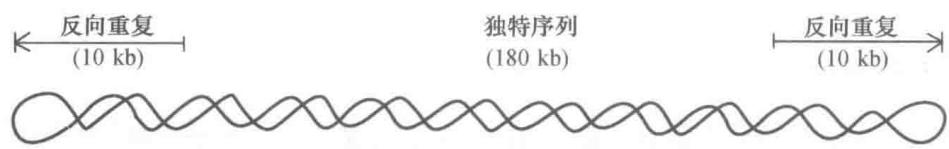

B. 虹彩病毒DNA末端冗余, 循环变换(数字爱表相邻基因组片段)  
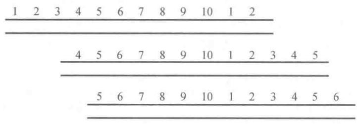

C. 腺病毒DNA末端反向重复

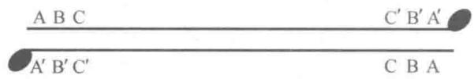

D. 微小病毒DNA末端分叉发夹结构  
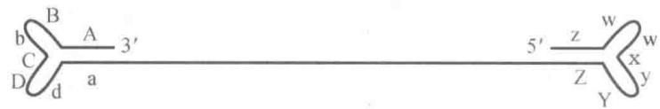  
图 11-1 几种病毒 DNA 的末端结构

## （二）核糖核酸

参与蛋白质合成的 RNA 有三类: 转移 RNA (transfer RNA, tRNA), 核糖体 RNA (ribosomal RNA, rRNA) 和信使 RNA (messenger RNA, mRNA)。无论是原核生物或是真核生物都有这三类 RNA。两者 tRNA 的大小和结构基本相同, rRNA 和 mRNA 却有明显的差异。原核生物核糖体小亚基含 16S rRNA, 大亚基含 5S rRNA 和 23S rRNA; 高等真核生物核糖体小亚基含 18S rRNA, 大亚基含 5S、5.8S 和 28S rRNA; 低等真核生物的小亚基含 17S rRNA, 大亚基含 5S、5.8S 和 26S rRNA。原核生物的 mRNA 结构比较简单, 由编码序列和非编码序列组成。原核生物有些功能相近的基因组成操纵子, 作为一个转录单位, 产生多顺反子 mRNA (polycistronic mRNA)。真核生物 mRNA 结构复杂, 有 5' 端帽子, 3' 端 poly(A) 尾巴, 以及非翻译区调控序列, 但功能相关的基因不形成操纵子, 不产生多顺反子 mRNA。真核生物细胞器有自身的 tRNA、rRNA 和 mRNA, 与原核生物较相近。

20 世纪 80 年代以来,陆续发现许多新的具有特殊功能的 RNA,几乎涉及细胞功能的各个方面。这些 RNA 或是以大小来分类,如 4.5S RNA、5S RNA 等。在凝胶电泳中 7S 位置分出两个 RNA 条带,分别称为 7SK RNA 和 7SL RNA。这些 RNA 分子大小在 300 个核苷酸左右或更小,常统称之为小 RNA (small RNA, sRNA)。最近发现一些长度在 20 多核苷酸起调节作用的 RNA 称为微 RNA (microRNA, miRNA)。RNA 或是以在细胞中的位置来分类,如核内小 RNA (small nuclear RNA, snRNA)、核仁小 RNA (small nucleolar RNA, snoRNA)、胞质小 RNA (small cytoplasmic RNA, scRNA)。已知功能的 RNA 也可以用功能来命名和分类,如反义 RNA (antisense RNA)、小分子干扰 RNA (small interfering RNA, siRNA)、小分子时序 RNA (small temporal RNA, stRNA)、指导 RNA (guide RNA, gRNA)、核酶 (ribozyme) 等。

病毒和亚病毒 RNA 种类很多, 结构也是多种多样。含有正链 RNA 的病毒, 例如脊髓灰质炎病毒 (poliovirus) 和噬菌体 Qβ。含有负链 RNA 的病毒, 如狂犬病病毒 (rabies virus) 和水泡性口炎病毒 (vesicular-stomatitis virus)。含有双链 RNA 的病毒, 如呼肠孤病毒 (reovirus)。比病毒结构更简单的病原体称为亚病毒, 亚病毒包括类病毒 (viroid)、卫星病毒 (satellite virus) 和朊病毒 (prion) 等。类病毒是已知最小的致病 RNA, 不含蛋白质, 如马铃薯纺锤形块茎类病毒 (PSTV) 和柑橘裂皮类病毒 (CEV)。类病毒 RNA 约含 300 个核苷酸 (相对分子质量 $1 \times 10^{5}$ ), 环状单链并通过链内碱基配对形成棒状结构。卫星病毒或卫星 RNA 是指没有辅助性病毒 (helper virus) 的协助, 在宿主细胞内不能复制的病毒或 RNA。前者可形成病毒颗粒, 后者包被于辅助性病毒的衣壳内。卫星病毒和卫星 RNA 能够干扰辅助病毒的复制, 可以看作是病毒的寄生物。

## 三、核酸的化学组成

核酸是一种多聚核苷酸（polynucleotide），它的基本结构单位是核苷酸（nucleotide）。采用不同的降解法，可以将核酸降解成核苷酸。核苷酸可分为核糖核苷酸（ribonucleotide）和脱氧核糖核苷酸（deoxyribonucleotide）两类。两者基本化学结构相同，只是所含戊糖不同。核糖核苷酸是核糖核酸的结构单位；脱氧核糖核苷酸是脱氧核糖核酸的结构单位。细胞内还有各种游离的核苷酸和核苷酸衍生物，它们具有重要的生理功能。由此可见，对于核酸和蛋白质系统来说，核苷酸相当于氨基酸，碱基相当于氨基酸的功能基。

核苷酸还可以进一步分解成核苷（nucleoside）和磷酸。核苷再进一步分解生成碱基（base）和戊糖。核酸中的戊糖有两类：D-核糖（D-ribose）和D-2-脱氧核糖（D-2-deoxyribose）。核酸的分类就是根据所含戊糖种类不同而分为核糖核酸（RNA）和脱氧核糖核酸（DNA）。DNA中的碱基主要有四种：腺嘌呤、鸟嘌呤、胞嘧啶、胸腺嘧啶；RNA中的碱基主要也是四种，三种与DNA中的相同，只是尿嘧啶代替了胸腺嘧啶。现将两类核酸的基本化学组成列于表11-2中。

表 11-2 两类核酸的基本化学组成

<table><tr><td></td><td>DNA</td><td>RNA</td></tr><tr><td rowspan="2">嘌呤碱(purine base)</td><td>腺嘌呤(adenine)</td><td>腺嘌呤(adenine)</td></tr><tr><td>鸟嘌呤(guanine)</td><td>鸟嘌呤(guanine)</td></tr><tr><td rowspan="2">嘧啶碱(pyrimidine base)</td><td>胞嘧啶(cytosine)</td><td>胞嘧啶(cytosine)</td></tr><tr><td>胸腺嘧啶(thymine)</td><td>尿嘧啶(uracil)</td></tr><tr><td>戊糖(pentose)</td><td>D-2-脱氧核糖(D-2-deoxyribose)</td><td>D-核糖(D-ribose)</td></tr><tr><td>酸(acid)</td><td>磷酸(phosphoric acid)</td><td>磷酸(phosphoric acid)</td></tr></table>

## (一) 碱基

核酸中的碱基分两类:嘧啶碱和嘌呤碱。

## 1. 嘧啶碱

嘧啶碱是母体化合物嘧啶的衍生物。嘧啶上的原子编号有新旧两种方法。

国际“有机化学物质的系统命名原则”中采用的是新系统，所以本书也采用这个系统。核酸中常见的

胞嘧啶

嘧啶有三类:胞嘧啶、尿嘧啶和胸腺嘧啶。其中胞嘧啶为 DNA 和 RNA 两类核酸所共有。胸腺嘧啶只存在于 DNA 中,但是 tRNA 中也有少量存在;尿嘧啶只存在于 RNA 中。植物 DNA 中有相当量的 5-甲基胞嘧啶。一些大肠杆菌噬菌体 DNA 中,5-羟甲基胞嘧啶代替了胞嘧啶。

胸腺嘧啶  
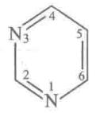

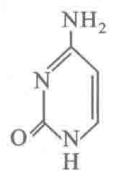  
嘧啶
(旧系统)

  
尿嘧啶

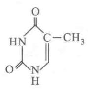

  
5-羟甲基胞嘧啶(5-hydroxymethylcytosine)

## 2. 嘌呤碱

核酸中常见的嘌呤碱有两类:腺嘌呤及鸟嘌呤。嘌呤碱是由母体化合物嘌呤衍生而来的。

  
嘌呤

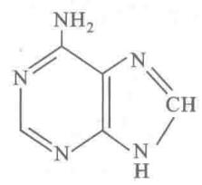  
腺嘌呤

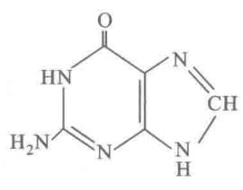  
鸟嘌呤

应用 X 射线衍射分析法已证明了各种嘌呤和嘧啶的三维空间结构。嘌呤和嘧啶环很接近平面，但稍有挠折。

自然界存在许多重要的嘌呤衍生物。一些生物碱，如茶叶碱（1,3-二甲基黄嘌呤）、可可碱（3,7-二甲基黄嘌呤）、咖啡碱（1,3,7-三甲基黄嘌呤）等都是黄嘌呤（2,6-二羟嘌呤）的衍生物。有些植物激素，如玉米素（ $N^{6}$ -异戊烯腺嘌呤）、激动素（ $N^{6}$ -呋喃甲基腺嘌呤）等也是嘌呤类物质。此外，还有些抗生素也是嘌呤类衍生物（详见抗生素部分）。

## 3. 稀有碱基

除了表 11-4 中所列 5 种基本的碱基外, 核酸中还有一些含量甚少的碱基, 称为稀有碱基。稀有碱基种类极多, 大多数都是甲基化碱基。tRNA 中含有较多的稀有碱基, 可高达 10%。表 11-3 为核酸中一部分稀有碱基的名称。目前已知的稀有碱基和核苷达近百种。

表 11-3 核酸中的稀有碱基

<table><tr><td>DNA</td><td>RNA</td><td>DNA</td><td>RNA</td></tr><tr><td>尿嘧啶(U)*</td><td>5,6-二氢尿嘧啶(DHU)</td><td></td><td> $N^{6},N^{6}$ -二甲基腺嘌呤( $m_{2}^{6}A$ )</td></tr><tr><td>5-羟甲基尿嘧啶( $hm^{5}U$ )</td><td>5-甲基尿嘧啶,即胸腺嘧啶(T)</td><td></td><td> $N^{6}$ -异戊烯基腺嘌呤( $i^{6}A$ )</td></tr><tr><td>5-甲基胞嘧啶( $m^{5}C$ )</td><td>4-硫尿嘧啶( $s^{4}U$ )</td><td></td><td>1-甲基鸟嘌呤( $m^{1}G$ )</td></tr><tr><td>5-羟甲基胞嘧啶( $hm^{5}C$ )</td><td>5-甲氧基尿嘧啶( $mo^{5}U$ )</td><td></td><td> $N^{2},N^{2},N^{7}$ -三甲基鸟嘌呤( $m_{3}^{2,2,7}G$ )</td></tr><tr><td> $N^{6}$ -甲基腺嘌呤( $m^{6}A$ )</td><td> $N^{4}$ -乙酰基胞嘧啶( $ac^{4}C$ )</td><td></td><td>次黄嘌呤(I)</td></tr><tr><td></td><td>2-硫胞嘧啶( $s^{2}C$ )</td><td></td><td>1-甲基次黄嘌呤( $m^{1}I$ )</td></tr><tr><td></td><td>1-甲基腺嘌呤( $m^{1}A$ )</td><td></td><td></td></tr></table>

\* 括号中为缩写符号。

## （二）核苷

核苷是一种糖苷，由戊糖和碱基缩合而成。糖与碱基之间以糖苷键相连接。糖的第一位碳原子（C1）与嘧啶碱的第一位氮原子(N1)或与嘌呤碱的第九位氮原子(N9)相连接。所以，糖与碱基间的连键是N—C键，一般称之为N-糖苷键。

核苷中的 D-核糖及 D-2-脱氧核糖均为呋喃型环状结构。糖环中的 C1 是不对称碳原子，所以有 $\alpha-$ 及 $\beta-$ 两种构型。但核酸分子中的糖苷键均为 $\beta-$ 糖苷键。

应用 X 射线衍射法已证明,核苷中的碱基与糖环平面互相垂直。

根据核苷中所含戊糖的不同,将核苷分成两大类:核糖核苷和脱氧核糖核苷。对核苷进行命名时,必须先冠以碱基的名称,例如腺嘌呤核苷、腺嘌呤脱氧核苷等。糖环中的碳原子标号右上角加撇“’”,而碱基中原子的标号不加撇“’”,以示区别。腺嘌呤核苷和胞嘧啶脱氧核苷的结构式如下:

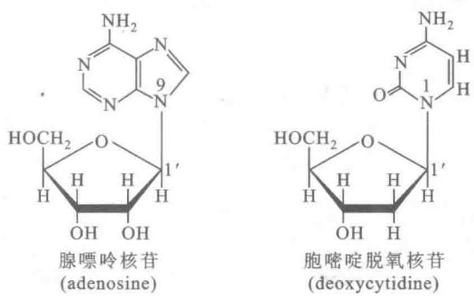  
表 11-4 为常见核苷的名称。

表 11-4 各种常见核苷

<table><tr><td>碱基</td><td>核糖核苷</td><td>脱氧核糖核苷</td></tr><tr><td>腺嘌呤</td><td>腺嘌呤核苷(adenosine)</td><td>腺嘌呤脱氧核苷(deoxyadenosine)</td></tr><tr><td>鸟嘌呤</td><td>鸟嘌呤核苷(guanosine)</td><td>鸟嘌呤脱氧核苷(deoxyguanosine)</td></tr><tr><td>胞嘧啶</td><td>胞嘧啶核苷(cytidine)</td><td>胞嘧啶脱氧核苷(deoxycytidine)</td></tr><tr><td>尿嘧啶</td><td>尿嘧啶核苷(uridine)</td><td>—</td></tr><tr><td>胸腺嘧啶</td><td>—</td><td>胸腺嘧啶脱氧核苷(deoxythymidine)</td></tr></table>

RNA 中含有某些修饰和异构化的核苷。修饰碱基如前所述。核糖也能被修饰，主要是甲基化。tRNA 和 rRNA 中还含有少量假尿嘧啶核苷（以符号 $\varphi$ 表示），它的结构很特殊，核糖不是与尿嘧啶的第一位氮（N1），而是与第 5 位碳（C5）相连接。细胞内有特异的异构化酶催化尿嘧啶核苷转变为假尿嘧啶核苷。有些 tRNA 中含有 W(Y) 核苷和 Q 核苷，其碱基母核不是嘌呤环，但可以把它们看作是鸟嘌呤核苷的衍生物（见结构式）。从酵母苯丙氨酸 tRNA 中分离出一种荧光核苷 Y，后在其他来源的苯丙氨酸 tRNA 中也分离到这种核苷。这类核苷都含有二甲基三杂环部分，化学名为 1, $N^{2}$ -异丙烯-3-甲基鸟苷。不同来源的该类核苷在碱基杂环上的侧链 R' 不同，R 为核糖。Y 核苷后又被称为 W 核苷。Q 核苷的碱基骨架为 7-去氮鸟嘌呤，在第 7 位（C7）上连以侧链 R'，不同 Q 核苷的 R' 不同。假尿嘧啶核苷、W(Y) 核苷和 Q 核苷的结构式如下：

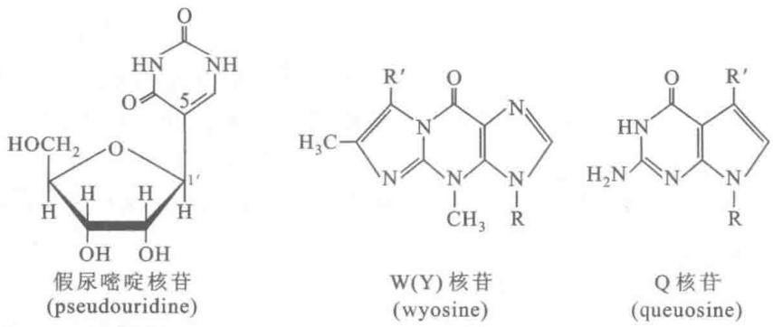

## （三）核苷酸

核苷中的戊糖羟基被磷酸酯化,就形成核苷酸。因此核苷酸是核苷的磷酸酯。下面为两种核苷酸的结构式。

核糖核苷的糖环上有3个自由羟基，能形成3种不同的核苷酸：2'-核糖核苷酸，3'-核糖核苷酸和5'-核糖核苷酸。脱氧核苷的糖环上只有2个自由羟基，所以只能形成两种核苷酸：3'-脱氧核糖核苷酸和5'-脱氧核糖核苷酸。生物体内游离存在核苷酸多是5'-核苷酸。用碱水解RNA时，可得到2'-与3'-核糖核苷酸的混合物。

常见的核苷酸列于表 11-5 中。

表 11-5 常见的核苷酸

<table><tr><td>碱基</td><td>核糖核苷酸</td><td>脱氧核糖核苷酸</td></tr><tr><td>腺嘌呤</td><td>腺嘌呤核苷酸(adenylate,AMP)</td><td>腺嘌呤脱氧核苷酸(deoxyadenylate,dAMP)</td></tr><tr><td>鸟嘌呤</td><td>鸟嘌呤核苷酸(guanylate,GMP)</td><td>鸟嘌呤脱氧核苷酸(deoxyguanylate,dGMP)</td></tr><tr><td>胞嘧啶</td><td>胞嘧啶核苷酸(cytidylate,CMP)</td><td>胞嘧啶脱氧核苷酸(deoxycytidylate,dCMP)</td></tr><tr><td>尿嘧啶</td><td>尿嘧啶核苷酸(uridylate,UMP)</td><td>—</td></tr><tr><td>胸腺嘧啶</td><td>—</td><td>胸腺嘧啶脱氧核苷酸(deoxythymidylate,dTMP)</td></tr></table>

## （四）核苷酸的衍生物

核苷酸除作为核酸的结构单元外,其游离分子和衍生物具有多种生理功能,广泛参与细胞的各种生命活动,并起着关键的作用,因此这是一类极为重要的生物分子。据推测,核苷酸可能也是生命起源之初最早出现的生物分子。

细胞内有一类多磷酸核苷酸,它们是能量载体、核酸合成的前体和重要的辅酶。5'-二磷酸核苷(5'-nucleoside diphosphate, 5'-NDP) 是核苷的焦磷酸酯, 5'-三磷酸核苷 (5'-nucleoside triphosphate, 5'-NTP) 是核苷的三磷酸酯。最常见的是腺苷三磷酸 (5'-adenosine triphosphate, ATP)。ATP 的结构式如下:

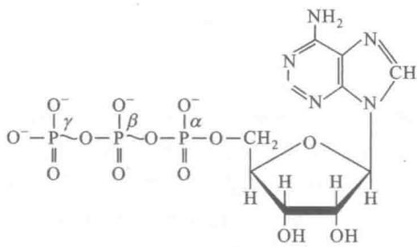

多磷酸核苷酸的磷酸基团之间以酸酐键(anhydride bond)连接,此酸酐键在热力学上极不稳定,易水解并释放出大量自由能,故称为“高能键”(high-energy bond),以符号“\~”表示。“高能键”这个术语容易与化学中使用的“键能”(bond energy)相混淆,而且不确切,水解反应释放自由能受种种因素影响,并不仅限于“键”本身。然而,“高能键”这个术语已被广泛使用,简洁易懂,故迄今仍被沿用。ATP含有两个高能键,可水解下末端磷酸基团和焦磷酸基团,水解时自由能变化 $\Delta G^{\ominus}$ 分别为-30.5 kJ/mol(-7.3 kcal/mol)和-45.6 kJ/mol(-10.9 kcal/mol)。

$$
\begin{array}{r l r} \mathrm {ATP+ H_ {2} O\longrightarrow ADP+ Pi} & & \Delta G ^ {\ominus \prime} = - 3 0. 5 \mathrm{kJ/mol} \\ \mathrm {ATP+ H_ {2} O\longrightarrow AMP+ PPi} & & \Delta G ^ {\ominus \prime} = - 4 5. 6 \mathrm{kJ/mol} \end{array}
$$

ATP 还能够转移出三种基团: 磷酸基团 \~ ①、焦磷酸基团 \~ ①\~ ②和腺苷酸基团 \~ AMP, 将相应的自由能转移给受体分子。由于 ATP 的 $\Delta G^{\ominus}$ 居于中间位置, 它可以从代谢物降解或光合作用中产生, 并将获得的能量用于生物合成、细胞运动和膜运输等需能过程, 因此 ATP 是生物机体通用的能量载体。UTP、GTP 和 CTP 具有类似的高能键, 它们与 dNTP 分别是 RNA 和 DNA 合成的前体。

腺苷酸还是许多辅酶的组成部分。烟酰胺腺嘌呤二核苷酸（NAD）、烟酰胺腺嘌呤二核苷酸磷酸（NADP）、黄素腺嘌呤二核苷酸（FAD）和辅酶A中都含有腺苷酸，辅酶 $B_{12}$ 则含有脱氧腺苷（详见维生素和辅酶一章）。在这些辅酶中，腺苷酸并不参与辅酶的功能，但却有助于底物或辅酶与酶的结合。对这种情况的一种合理解释认为，ATP广泛参与细胞的各种反应，故而细胞内无处不在，含量丰富，能与之识别和作用的蛋白质组件，核苷酸结合折叠子（nucleotide-binding fold），也必然存在于多种酶（蛋白质）中。新的蛋白质可借助基因重组和突变而产生，结合腺苷的结构便常出现于各类蛋白质。从进化的观点来看，含有腺苷酸或腺苷的辅酶较易与酶结合，于是这类辅酶便被选择下来。

细胞能接收环境信号并给出适当的反应。当激素或化学信号分子(第一信使)作用于细胞膜受体时,信号传递到细胞内部,在胞内合成第二信使,经级联系统将信号放大,以调节基因表达或细胞代谢。腺苷3',5'-环磷酸(adenosine 3',5' cyclic monophosphate,cAMP)和鸟苷3',5'-环磷酸(guanosine 3',5'-cyclic monophosphate,cGMP)是两种重要的第二信使,它们的结构式如下:

  
腺苷3', 5'-环磷酸 (cAMP)

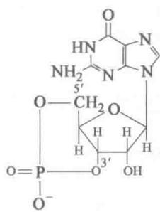  
鸟苷3', 5'-环磷酸 (cGMP)

cAMP 由质膜内侧的腺苷酸环化酶催化 ATP 合成；cGMP 由鸟苷酸环化酶催化 GTP 合成。详见激素和信号转导部分。

B 代表碱基, 竖线代表戊糖碳链, P 代表磷酸基, 与 P 相连的斜线表示 $3', 5'$ -磷酸二酯链

此外,还有多种调节核苷酸。例如细菌在氨基酸饥饿时便会合成出鸟苷 $5^{\prime}-$ 二磷酸, $3^{\prime}-$ 二磷酸（ppGpp），这是由 ATP 将焦磷酸基转移给 GDP 而成，它能抑制 rRNA 和 tRNA 的合成，从而降低细菌的蛋白质合成速度和生长速度。

## （五）核苷酸的聚合物

核酸是由核苷酸线性(不分支)聚合而成的生物大分子。细胞内有一些聚合度较低的核苷酸聚合物,主要是核糖核苷酸聚合物,它们往往具有特殊的生物功能(详见 RNA 的生物功能)。由几个或几十个核苷酸(一般指 50 个以下)连接而成的聚合物称为寡核苷酸(oligonucleotide)。由几十个至上百个核苷酸(50 个以上)连接而成的聚合物称为多(聚)核苷酸(polynucleotide)。更大的聚合物则为核酸。

核酸可被酸、碱和酶水解。核酸水解产生各种寡核苷酸、核苷酸、核苷和碱基。这就证明，核苷酸是核酸的结构单位，核苷和碱基都是由核苷酸水解而来。核酸的酸碱滴定曲线显示，在核酸分子中的磷酸基只

有一级解离,它的另两个酸基必定与糖环的羟基形成了磷酸二酯键。由此可见,核酸中的核苷酸以磷酸二酯键彼此相连。RNA 的核糖上有 3 个羟基,即 $2'-3'-$ 和 $5'-$ 羟基,核苷酸之间是由哪两个羟基形成磷酸二酯键的?用磷酸二酯酶可以水解核酸的磷酸二酯键。牛脾磷酸二酯酶可从核酸的 $5'$ 端逐个水解下 $3'-$ 核苷酸;蛇毒磷酸二酯酶从核酸的 $3'$ 端逐个水解下 $5'-$ 核苷酸(图 11-2)。这就清楚说明 RNA 以 $3',5'-$ 磷酸二酯键连接核苷酸。DNA 的糖为 2-脱氧核糖,只能形成 $3',5'-$ 磷酸二酯键。实验也证明此结论。

  
图 11-2 多核苷酸链被磷酸二酯酶水解

核酸酶在核酸结构分析中十分有用。借助酶作用的特异性可用以鉴别共价键的性质。牛脾磷酸二酯酶和蛇毒磷酸二酯酶都是

非专一性的外切核酸酶,但它们识别不同羟基形成的磷酸酯键。前者水解 5'-羟基形成的磷酸酯键;后者水解 3'-羟基形成的磷酸酯键。

核酸的共价结构(一级结构)有几种表示方法。上图为竖线式,用竖线代表戊糖,B为碱基,P为磷酸基。也可用文字式来表示,以字母代表核苷或核苷酸。原则上5'端在左侧,3'端在右侧,磷酸二酯键的走向为3'→5'。在文字式中,P在核苷之左表示与5'-羟基相连,在右表示与3'-羟基相连。有时,多核苷酸链中磷酸基P也可省略,仅以字母表示核苷酸的序列。这两种写法对DNA和RNA都适用。

## 四、DNA 的结构和功能

前已介绍，DNA是由脱氧核糖核苷酸聚合而成的长链生物大分子。与蛋白质类似，DNA也有不同层次的结构。DNA的一级结构是指其核苷酸链的共价结构，亦即核苷酸序列。DNA的二级结构是指由次级键形成的双螺旋(duplex)或多股螺旋(multiplex)结构。DNA的三级结构是指其超螺旋(superhelix)结构。有些书上将DNA的拓扑结构(topology)也列为二级结构，因其由DNA双螺旋缠绕数改变所引起。也有一些书将DNA三股螺旋(triplex)或四股螺旋(tetraplex)列为三级结构。本书按照比较公认的看法，将DNA螺旋结构归为二级结构，超螺旋结构归为三级结构。

## (一) DNA 的一级结构

DNA 的一级结构是由数量极其庞大的 4 种脱氧核糖核苷酸通过 3',5'-磷酸二酯键连接起来的直线形或环形多聚体（图 11-3 表示 DNA 的一个小片段）。DNA 的相对分子质量非常大，通常一个染色体就是一个 DNA 分子，最大的染色体 DNA 可超过 $10^{8}$ bp，也即 $M_{r}$ 大于 $1 \times 10^{11}$ 。如此大的分子能够编码的信息量是十分巨大的。为了阐明生物的遗传信息，首先要测定生物基因组的序列。迄今已经测定基因组序列的生物数近万种，其中包括病毒、大肠杆菌、酵母、线虫、果蝇、拟南芥、玉米、水稻、鸡、小鼠、猩猩和人类的基因组。病毒基因组较小，但十分紧凑，有些基因是重叠的（overlapping）。细菌的基因是连续的，无内含子；有些功能相关的基因组成操纵子，有共同的调节和控制序列；调控序列所占比例较小；很少重复序列。真核生物的基因是断裂的，有内含子；功能相关的基因不组成操纵子；调控序列所占比例大；有大量重复序列。重复序列可分为低拷贝重复，中等程度重复和高度重复。重复序列或取向一致（正向重复）或取向相反（反向重复）。回文结构（palindrome）也即反向重复。有时同一条链上序列彼此反向重复，称为镜像重复（mirror repeat），它们相互并不互补。越是高等的真核生物其调控序列和重复序列的比例越大。

人类基因组的大小为 3.286 Gb (gigabases, $10^{9}$ bp), 其中 2.95 Gb 为常染色质 (染色较弱, 富含基因)。真正用于编码蛋白质的序列仅约占基因组的 1%。也就是说, 编码蛋白质的基因只占基因组的 25%, 其中 1% 是用于形成 mRNA 的外显子 (exon), 24% 是剪接过程中需切除的内含子 (intron)。基因组中超过一半是各种类型的重复序列, 其中 45% 为各种转座子 DNA (包括转座子和逆转座子等), 3% 为简单的高度重复序列, 5% 为近期进化中倍增的 DNA 片段。编码蛋白质的基因大约为 25000 个。与人类基因组相比, 酵母细胞的编码基因为 6034, 果蝇为 13601, 蠕虫为 18424, 而拟南芥为 25498。

## （二）DNA 的双螺旋结构

Watson 与 Crick 提出 DNA 双螺旋结构模型 (double helix model), 揭示了 DNA 分子结构与功能的关系, 其主要有三个方面的依据: 一是已知核酸的化学性质和核苷酸键长与键角的数据; 二是 Chargaff 发现的 DNA 碱基组成规图 11-3 DNA 中多核苷酸链的一个小片段及缩写符号

A. DNA 中多核苷酸链的一个小片段；B. 为竖线式缩写；C. 为文字式缩写

律,显示碱基间的配对关系;三是对 DNA 纤维进行 X 射线衍射分析的结果。

E. Chargaff 等科学家在 20 世纪 40 年代应用纸层析及紫外分光光度技术测定各种生物 DNA 的碱基组成。结果发现 DNA 碱基组成有物种特异性，不同科的 DNA 碱基组成不同；而同一种生物不同组织和器官的 DNA 碱基组成是一样的，不受生长发育、营养状况以及环境条件的影响。1950 年 Chargaff 总结出 DNA 碱基组成的规律，称为 Chargaff 规则，其主要内容为：① DNA 的腺嘌呤和胸腺嘧啶摩尔数相等，即 A = T；② 鸟嘌呤和胞嘧啶的摩尔数也相等，即 G = C；③ 含 6-氨基的碱基数等于含 6-酮基的碱基数，即 A + C = G + T；④ 嘌呤的总摩尔数等于嘧啶的总摩尔数，即 A + G = C + T。这些规律暗示，在 DNA 分子中 A 与 T、G 与 C 之间存在着配对关系。

比较直接测定生物大分子结构的方法是用 X 射线晶体衍射技术。但是 DNA 分子太大,很难制得晶体。用针从浓的 DNA 溶液中抽出纤维,可使 DNA 分子成束整齐排列,即可用于衍射研究。1938 年 Astbury 等用小牛胸腺 DNA 纤维作 X 射线衍射分析,发现在子午线上有 0.334 nm 的衍射点。他认为这反映了 DNA 中扁平核苷酸间的距离;但是由于他认为核苷酸是直线排列的,无法解释其他衍射点,也与核酸的一些化学性质不符。稍后 Franklin 和 Wilkins 对 DNA 的 X 射线衍射进行了更多的研究,获得清晰的衍射图。

在前人研究工作的基础上, Watson 和 Crick 于 1953 年提出了 DNA 分子双螺旋结构模型(图 11-4)。该模型具有以下特征：

（1）两条反向平行的多核苷酸链围绕同一中心轴相互缠绕；两条链均为右手螺旋。

  
图 11-4 DNA 分子双螺旋结构模型(A)及其图解(B)

（2）嘌呤与嘧啶碱位于双螺旋的内侧。磷酸与核糖在外侧，彼此通过 $3^{\prime}, 5^{\prime}-$ 磷酸二酯键相连接，形成分子的骨架。碱基平面与纵轴垂直，糖环的平面则与纵轴平行。多核苷酸链的方向取决于核苷酸间磷酸二酯键的走向，以 $\mathrm{C}^{\prime}3 \rightarrow \mathrm{C}^{\prime}5$ 为正向。两条配对链偏向一侧，形成一条大沟（major groove）和一条小沟（minor groove）。

（3）双螺旋的平均直径为 2 nm，两个相邻的碱基对之间的高度距离为 0.34 nm，两个核苷酸之间的夹角为 $36^{\circ}$ 。因此，沿中心轴每旋转一周有 10 个核苷酸，高度（即螺距）为 3.4 nm。

（4）两条核苷酸链依靠彼此碱基之间形成的氢键而结合在一起。根据分子模型的计算，一条链上的

嘌呤碱必须与另一条链上的嘧啶碱相匹配，其距离才正好与双螺旋的直径相吻合。碱基之间A只能与T相配对，形成两个氢键；G与C相配对，形成三个氢键。所以G-C之间的结合较为稳定（图11-5）。

（5）碱基在一条链上的排列顺序不受任何限制。但是根据碱基配对原则，当一条多核苷酸链的序列被确定后，即可决定另一条互补链的序列。这就表明，遗传信息由碱基的序列所携带。

在生理条件下,DNA 分子是稳定的,有许多因素维持着 DNA 的双螺旋结构,其中最主要的作用力来自两方面:一是配对碱基间的氢键,单个氢键虽然很弱,无数碱基对累积的氢键能量就相当大了。二是堆积力(stacking force),扁平的碱基对之间藉 $\pi,\pi$ 电子相互作用产生吸引力,这是范德华力(van der Waals force)的一种形式。碱基对的疏水性,造成疏水作用,也是堆积力的

  
图 11-5 DNA 分子中的 A-T, G-C 配对（图中长度单位为 nm）

成因之一。

由于 Watson 和 Crick 的模型是根据 DNA 纤维的 X 射线衍射资料推导出来的, 它所提供的只是 DNA 结构的平均特征。后来, 对 DNA 合成片段晶体所作的 X 射线衍射分析才提供了更为精确的信息。K. Dickerson 等人用人工合成的多聚脱氧核糖核苷酸(十二聚体)晶体进行 X 射线衍射分析后, 认为这种十二聚体的结构与 Watson 和 Crick 模型所提供的结构十分相似, 但在结构上并不像 Watson-Crick 模型所说的那样均一。这是由于碱基序列的不同, 以致在局部结构上有较大的差异。这些差异是:

（1）Watson-Crick 模型认为每一螺周含有 10 个碱基对，所以两个核苷酸之间的夹角是 $36^{\circ}$ 。但 Dickerson 合成的十二聚体中，两个碱基间的夹角可由 $28^{\circ}$ 至 $42^{\circ}$ 不等。实际平均每一螺周含 10.4 个碱基对。分子大小的各参数也随序列不同而有变动。

（2）Dickerson所研究的十二聚体结构中，组成碱基对的两个碱基的分布并非在同一平面上，而是沿长轴旋转一定角度，从而使碱基对的形状像螺旋桨叶片的样子（图11-6），故称为螺旋桨状扭曲（propeller twisting）。这种结构可提高碱基堆积力，使DNA结构更稳定。

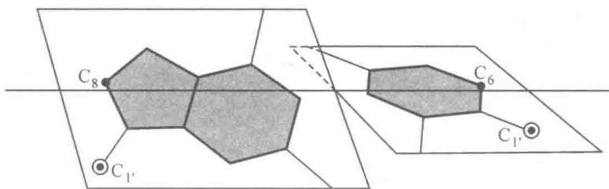  
图11-6 碱基对的螺旋桨状结构

DNA 的结构可受环境条件的影响而改变。Watson 和 Crick 所建议的结构代表 DNA 钠盐在较高湿度下 (92%) 制得的纤维的结构, 称为 B 型 (B form)。由于它的水分含量较高, 可能比较接近大部分 DNA 在细胞中的构象。DNA 能以多种不同的构象存在, 除 B 型外通常还有 A 型、C 型、D 型、E 型和左手双螺旋的 Z 型。这里包括天然的和人工合成的各种双螺旋 DNA。其中 A 型和 B 型是 DNA 的两种基本的构象, Z 型则比较特殊。C 型、D 型和 E 型与 B 型接近, 可看成同一族。

在相对湿度为 75% 以下所获得 DNA 纤维的 X 射线衍射分析资料表明，这种 DNA 纤维具有不同于 B 型的结构特点，称为 A 型（A-DNA）。A-DNA 也是由两条反向的多核苷酸链组成的右手双螺旋；但是螺体较粗而短，碱基对与中心轴之倾角不同，呈 $19^{\circ}$ 。RNA 分子的双螺旋区以及 RNA-DNA 杂交双链具有与 A-DNA 相似的结构。

由于呋喃糖环并非平面，糖环上通常有一个或两个原子偏离平面，糖环因此而折叠。如若折叠偏向 $C_{5}$ 一侧称为内式（endo）；若偏向另一侧称为外式（exo）。A 型为 $C_{3}$ 内式，B 型为 $C_{2}$ 内式。碱基平面绕 N-糖苷键旋转产生顺式（syn）和反式（anti）构象。反式构象是指嘌呤六元环或嘧啶的 2-酮基指向远离糖的方向；顺式构象则指向糖。碱基与糖的旋转位置在立体结构上是受限制的，天然核苷中反式更合宜。A 型和 B 型均为反式。

自然界双螺旋 DNA 大多为右手螺旋，但也有左手螺旋。A. Rich 在研究人工合成的 d(CGCGCG) 寡核苷酸结构时发现存在左手螺旋的构象。六聚体 (dC·dG) 的晶体结构中，自身互补的寡核苷酸排列成反平行，每转 12 个碱基对为一圈，螺距 4.56 nm，碱基对移向边缘，只有小沟，大沟被胞嘧啶的 C5 和鸟嘌呤的 N7、C8 原子填充。与右手螺旋不同，在左手螺旋中糖环折叠和糖苷键的构象对于嘧啶碱和嘌呤碱各不相同。dC 是 C₂' 内式，碱基反式；dG 是 C₃' 内式，碱基顺式。因此，磷酸和糖的骨架呈现 Z 字形 (zigzag) 走向，Z 型名称即源于此 (图 11-7)。随后发现天然 DNA 局部也有 Z 型结构。

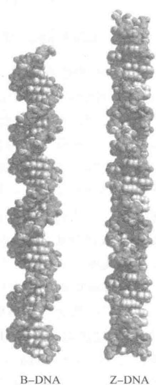  
图11-7 Z-DNA与B-DNA之比较

共价结构的改变涉及共价键的断裂与连接。构象受环境条件的影响，它的改变不涉及共价键。DNA的各型构象在一定条件下可以相互转变。除上述相对湿度能影响DNA纤维的构象外，溶液的盐浓度、离子种类、有机溶剂等都能引起DNA构象的改变。增加NaCl浓度可使B型转变为A型。当DNA是钠盐时，A、B、C三种形态都能出现；改成锂盐时，只有B型和C型可能出现。Z型DNA的序列必须含鸟嘌呤，并且嘌呤碱与嘧啶碱交替出现，在此条件下存在盐和有机溶剂有利于Z型的形成。DNA的甲基化使大沟表面暴露的胞嘧啶形成5-甲基胞嘧啶，即可导致B-DNA向Z-DNA的转化。DNA的变构效应可能与基因表达的调节有关。

表 11-6 列出了 A 型、B 型和 Z 型 DNA 的主要特征数据。由于各实验室测定样品的方法和条件各不相同，所得数据有较大出入，所列数据可作为了解各类构象特性的比较。

表 11-6 A 型、B 型和 Z 型 DNA 的比较

<table><tr><td rowspan="2"></td><td colspan="3">螺旋类型</td></tr><tr><td>A</td><td>B</td><td>Z</td></tr><tr><td>外形</td><td>粗短</td><td>适中</td><td>细长</td></tr><tr><td>螺旋方向</td><td>右手</td><td>右手</td><td>左手</td></tr><tr><td>螺旋直径</td><td>2.55 nm</td><td>2.37 nm</td><td>1.84 nm</td></tr><tr><td>碱基轴升</td><td>0.23 nm</td><td>0.34 nm</td><td>0.38 nm</td></tr><tr><td>碱基夹角</td><td>32.7°</td><td>34.6°</td><td> $60^{\circ}$ 1</td></tr><tr><td>每圈碱基数</td><td>11</td><td>10.4</td><td>12</td></tr><tr><td>螺距</td><td>2.53 nm</td><td>3.54 nm</td><td>4.56 nm</td></tr><tr><td>轴心与碱基对的关系</td><td>不穿过碱基对</td><td>穿过碱基对</td><td>不穿过碱基对</td></tr><tr><td>碱基倾角</td><td>19°</td><td>-1.2°</td><td>-9°</td></tr><tr><td>糖环折叠</td><td> $C_{3}$ 内式</td><td> $C_{2}$ 内式</td><td>嘧啶  $C_{2}$ 内式,嘌呤  $C_{3}$ 内式</td></tr><tr><td>糖苷键构象</td><td>反式</td><td>反式</td><td>嘧啶反式,嘌呤顺式</td></tr><tr><td>大沟</td><td>很狭、很深</td><td>很宽、较深</td><td>平坦</td></tr><tr><td>小沟</td><td>很宽、浅</td><td>狭、深</td><td>很狭、很深</td></tr></table>

① Z-DNA 的核苷酸交替出现顺反式，故以 2 个核苷酸为单位，转角为 $60^{\circ}$ 。

## （三）DNA 的三股螺旋和四股螺旋

早在20世纪50年代，双螺旋结构发现之后不久就已观察到一些人工合成的寡核苷酸能够形成三股螺旋，寡核苷酸包括核糖核苷酸和脱氧核糖核苷酸。K. Hoogsteen于1963年首先描述了三股螺旋的结构。在三股螺旋中，通常是一条同型寡核苷酸（即或为寡嘧啶核苷酸，或为寡嘌呤核苷酸）与寡嘧啶核苷酸-寡嘌呤核苷酸双螺旋的大沟结合。第三股的碱基可与Watson-Crick碱基对中的嘌呤碱形成Hoogsteen配对。第三股与寡嘌呤核苷酸之间为同向平行。根据第三股的组成可分为不同的型，例如： $\mathrm{Py}\cdot \mathrm{Pu}*\mathrm{Py}$ 、 $\mathrm{Py}\cdot \mathrm{Pu}*\mathrm{Pu}$ 和 $\mathrm{Py}\cdot \mathrm{Pu}*\mathrm{rPy}$ 等。“·”表示Watson-Crick配对，“\*”表示Hoogsteen配对。一般认为，三股中碱基配对方式必须符合Hoogsteen模型，即第三个碱基以A或T与 $\mathrm{A} = \mathrm{T}$ 碱基对中的A配对；G或C与 $\mathrm{G} = \mathrm{C}$ 碱基对中的G配对，第三个碱基C必须质子化，以作为与G的N7结合的氢键供体，并且它与G配对只形成两个氢键(图11-8)。

三股螺旋中的第三股可以来自分子间,也可以来自分子内。铰链 DNA(hinged-DNA)是一种分子内折叠形成的三股螺旋。当 DNA 的一段多聚嘧啶核苷酸或多聚嘌呤核苷酸组成镜像重复,即可回折产生 H-DNA,该重复序列又称为 H 回文结构(H-palindrome)。例如,交替出现的 T 和 C 序列,其互补链为交替的 A 和 G 序列,在其中间取一核苷酸,两侧即为镜像重复,就可能形成 H-DNA 结构(图 11-9)。在酸性 pH 或负超螺旋张力的情况下即可发生 B-DNA→H-DNA 转变。酸性 pH 促使胞嘧啶质子化,从而提高了形成三股螺旋时以 Hoogsteen 氢键与鸟嘌呤配对的能力。

H-DNA 存在于基因调控区和其他重要区域,从而显示出它具有重要生物学意义。实验表明,启动子的 S1 核酸酶敏感区存在一些短的、同向或镜像重复的聚嘧啶-嘌呤区，该区域可以形成 H-DNA，因而产生可被 S1 酶消化的单链结构。

  
T·A\*T

  
图 11-8 三股螺旋 DNA 中的碱基配对图中左上角的碱基位于第三股

C·G\*G  
  
图11-9 H-DNA的结构

DNA 还能形成四股螺旋,但只见于富含鸟嘌呤区。四股 DNA 链(tetraplex 或 quadruplex)借鸟嘌呤之间氢键配对形成稳定的 G-四链体(guanine quartet)(图 11-10A)。四股螺旋 DNA 链的走向,可以是全部相同方向,也可以是两两相反(图 11-10B)。染色体 DNA 某些富含鸟嘌呤的区域,通过回折形成四股螺旋,如在着丝粒和端粒区域可出现此类结构,其生物学意义目前还不清楚。

## (四) DNA 的超螺旋

DNA 的三级结构是在二级结构基础上,通过扭曲和折叠所形成的特定构象,其中包括单链与双链、双螺旋与双螺旋的相互作用,以及一些具有拓扑学特征的结构。上述三股螺旋和四股螺旋仅就螺旋结构而言,仍为二级结构,但涉及分子回折和链之间的相互作用,故有些书中将之列为三级结构。超螺旋则是 DNA 三级结构的一种形式。

当 DNA 双螺旋分子在溶液中以一定构象自由存在时,双螺旋处于能量最低的状态,此为松弛态。

  
图11-10 四股螺旋DNA的结构  
A. G-四碱基体可能的氢键配对方式；B. 四股螺旋链的几种走向

如果使这种正常的 DNA 分子额外地多转几圈或少转几圈, 就会使双螺旋中存在张力。如若双螺旋分子的末端是开放的, 这种张力可以通过链的转动而释放出来, DNA 可恢复正常的双螺旋状态。但若 DNA 分子的两端是固定的, 或者是环状分子, 这种额外的张力就不能释放掉, DNA 分子本身就会发生扭曲, 用以抵消张力。这种扭曲称为超螺旋 (superhelix) 或超卷曲 (supercoil), 是双螺旋的进一步螺旋。

20 世纪 60 年代, J. Vinograd 对环状 DNA 分子的拓扑结构进行了研究, 作出很大贡献。DNA 的拓扑学公式就是他提出来的。拓扑学 (topology) 是数学的一个分支, 它研究图形的几何性质, 而不理会其“度量”。许多 DNA 是双链环状分子 (double-stranded circular molecule), 如细菌染色体 DNA、质粒 DNA、细胞器 DNA、某些病毒 DNA 等。细菌染色体 DNA 太大, 很难分离出完整的分子。但可以提取到相对分子质量不太大的质粒和病毒的天然环状 DNA。通常在这类制剂中可以观察到 3 种形式的 DNA: 共价闭环 DNA (covalently closed circular DNA, cccDNA), 这类 DNA 常呈超螺旋型 (superhelical form); 双链环状 DNA 的一条链断裂, 称为开环 DNA (open circular DNA, ocDNA), 分子呈松弛态; 环状 DNA 双链断裂, 成为线状 DNA (linear DNA)。1966 年 Vinograd 发现 cccDNA 的双链互绕数 (intertwining number) $\alpha$ 等于螺旋圈数 (helical turn) $\beta$ 与超螺旋数 (superhelical number) $\tau$ 之和, 即:

$$
\alpha = \beta + \tau\tag{11-1}
$$

在上述公式中， $\beta$ 值是由双螺旋的构象所决定的，也即是松弛状态下的螺旋圈数。例如： $2.6\mathrm{kb}$ 的环状DNA，如为B型，其 $\beta$ 值为 $2600 / 10.4 = 250$ 。若双螺旋互绕圈数大于构象规定的螺旋圈数，即 $\alpha >\beta$ ，此时DNA为卷曲过量（overwinding）；互绕圈数小于构象规定的螺旋圈数，即 $\alpha < \beta$ ，此时DNA为卷曲不足（underwinding）。无论卷曲过量或不足，都将产生超螺旋。 $\alpha$ 值必定是整数，因为闭环分子的螺旋数总是整数。 $\beta$ 和 $\tau$ 值则不一定是整数。 $\alpha$ 与 $\beta$ 值根据螺旋走向取正负，右手螺旋为正（+），左手螺旋为负（-）。超螺旋为 $\alpha$ 与 $\beta$ 之差，当 $\alpha$ 大于 $\beta$ 时超螺旋为正， $\alpha$ 小于 $\beta$ 时超螺旋为负。如果外力部分撑开双螺旋，此时 $\alpha$ 值不变， $\beta$ 值变小（因双螺旋区缩小），将产生正超螺旋，即向左拧用以抵消过量右手螺旋产生的张力（图11-11B）。主链共价键不经断开-再连接， $\alpha$ 值不变，但体内存在多种拓扑异构酶（topoisomerase）可以改变 $\alpha$ 值, 从而改变 DNA 的拓扑结构。为了比较超螺旋强度, 需要引入一个新的参数, 比超螺旋 (specific superhelix) 或超螺旋密度 (superhelical density), 以 $\sigma$ 来表示。 $\sigma = (\alpha - \beta) / \beta$ 。细胞 DNA 通常处于负螺旋状态, 其 $\sigma$ 值为 -0.07 \~ -0.05。

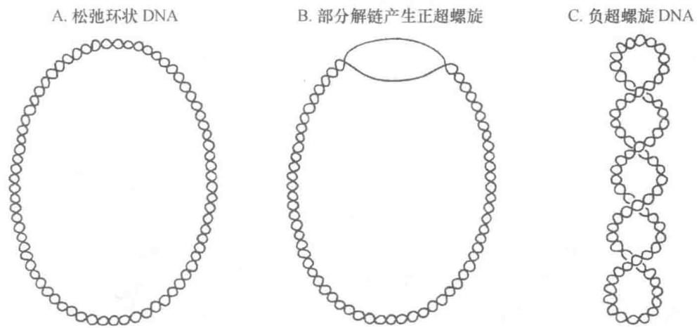  
图11-11 cccDNA的拓扑结构

与此同时，数学家在研究闭合带的拓扑性质中取得重要成果。1969年J.H. White推导出闭合带两边之间的连环数（Linking number, $L_{k}$ ）等于带的扭转数（twisting number, $T_{w}$ ）与轴曲线的高斯积分（Gauss integral）之和，高斯积分后被称为缠绕数（Writhing number, $W_{r}$ ）。其关系为：

$$
L _ {k} = T _ {w} + W _ {r}\tag{11-2}
$$

比较上述两个公式可以看出， $\alpha$ 与 $L_{k}$ 相同，两公式也十分类似。但公式(11-1)只涉及DNA的拓扑结构，各参数受DNA的构象限制，并且都是可以测量的；公式(11-2)是抽象的数学公式，对 $T_{w}$ 与 $W_{r}$ 的定义和公式(11-1)不同，并且不可测量。许多书中混淆了两者的差别。问题不在于采用什么符号，关键是要掌握它的确切含义。

## （五）DNA 贮存遗传信息

子代与亲代相似是生物界的普遍现象。这意味着亲代细胞必定有某种机制影响或决定子代细胞的性状。那么，这种遗传机制（遗传功能）的承载物质是什么？许多科学家在探索这个问题。十九世纪中期，两位杰出的科学家 G. Mendel 和 F. Miescher 几乎同时朝这个问题迈出了关键的一步。1865 年 Mendel 发表了他著名的豌豆杂交论文，后被 C. Correns 于 20 世纪初归结为“性状分离定律”和“自由组合定律”，从而奠定了遗传学基础。Miescher 于 1868 年提交的论文中公布他从脓细胞核中分离出核素（DNA）的结果。两位科学家的工作都不被同时代的学术界所接受。Mendel 的论文直到 1900 年才被 Hugo de Vries、Carl Correns 和 Erich von Tschemak 所重新发现和极力推崇；而 Miescher 的发现却迟至 20 世纪 40 年代始重受关注。其时，一系列实验证明，DNA 是遗传物质。

## 1. DNA 是染色体的主要成分

早在 19 世纪后期,有关细胞分裂、染色体行为和受精过程的研究为遗传的染色体学说奠定了基础。Miescher 从细胞核中提取出核素,于是有些生物学家推测核素是染色体的组成物质。20 世纪前期,Levene 的“四核苷酸假说”广为流行,该假说否定核酸特异性,较长时间阻碍了核酸的研究。直到 20 世纪 40 年代,Chargaff 发现 DNA 碱基组成规律和种属特异性,才推翻“四核苷酸假说”。由此可见,科学研究不仅要有“实验手段”,还要有“想象力”。

20 世纪 30—40 年代细胞化学技术有了很大发展, 对细胞中 DNA 含量测定结果表明, 任何一种生物细胞其 DNA 含量都是恒定的, 不受外界环境、营养条件和细胞本身代谢状态的影响。细胞具有固定数目的染色体, 与 DNA 含量一致, 单倍体生殖细胞的 DNA 含量正好是双倍体体细胞的一半。这些数据都符合遗传物质的特性。表 11-7 列出几种动物细胞中 DNA 的平均含量。

表 11-7 细胞的 DNA 含量 (每个细胞/pg)

<table><tr><td>生物种类</td><td>体细胞(二倍体)</td><td>精细胞(单倍体)</td><td>生物种类</td><td>体细胞(二倍体)</td><td>精细胞(单倍体)</td></tr><tr><td>牛</td><td>6.5</td><td>3.4</td><td>蟾蜍</td><td>7.3</td><td>3.7</td></tr><tr><td>小鼠</td><td>5.3</td><td>2.7</td><td>鲤鱼</td><td>3.4</td><td>1.6</td></tr><tr><td>鸡</td><td>2.4</td><td>1.3</td><td></td><td></td><td></td></tr></table>

每个细胞中 DNA 含量与生物机体的复杂性有关,生物机体越复杂,遗传信息量越大,就需要更多遗传物质携带遗传信息。从图 11-12 可见,生物进化程度越高,每个细胞中 DNA 含量(C 值)也越高。例如,细菌每个细胞约含 DNA 0.006 pg( $6 \times 10^{-12}$ g),而高等动物每个细胞约含 6 pg,比细菌多近千倍。但是,细胞 DNA 含量与进化程度并不是简单的平行关系,相同进化程度的生物在不同物种间细胞 DNA 含量可以差别很大。例如,昆虫、两栖类不同种之间细胞 DNA 含量可以相差数十倍,开花植物甚至可以相差数百倍。不少动植物的细胞 DNA 含量远大于人类细胞 DNA 含量(6.57 pg)。这种现象称为 C 值悖理(C value paradox)。造成此现象的原因是基因组 DNA 存在重复序列和染色体的多倍性。此外,基因组除染色体基因外还有染色体外基因(extrachromosomal gene)和细胞器基因,它们往往以多拷贝形式存在。图 11-12 列出一些细胞的大致 DNA 含量(以单倍体基因组的碱基对数来表示)。

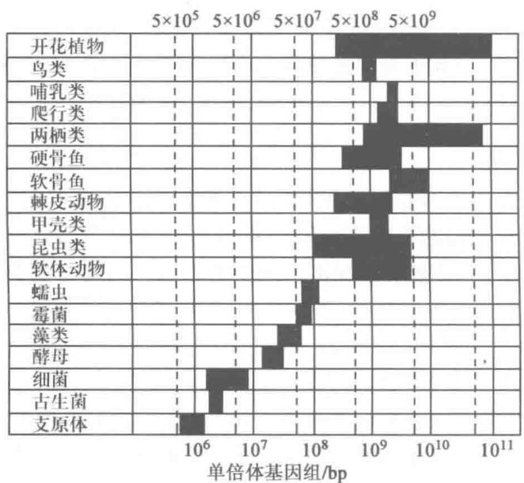  
图11-12 一些细胞的DNA含量

由此可知，DNA 的信息量只与 DNA 的复杂度 (complexity) 有关，而 DNA 的复杂度是指单倍体细胞基因组 DNA 非重复序列的碱基对数，并不等于细胞 DNA 含量。信息量 (I) 与概率 (P) 有关，可按以下公式计算：

$$
I = - k \ln P
$$

k 是常数, P 由 DNA 的碱基对数 (n) 决定:

$$
P = \frac {1}{4 ^ {n}}
$$

生物在进化过程中,借助基因扩增和重组,基因组 DNA 增大,信息量增加。随机突变经中性漂移而固定,增加了生物的多样性,也增加了适应的潜力。然而,只有经过自然选择,才使生物性状具有适应性。DNA 的大小只表明它可能编码信息的量,它实际具有的编码信息,是在进化过程中获得的。换句话说,遗传漂变和自然选择赋予 DNA 有义信息。现有生物分子的结构都是进化的结果。

## 2. DNA 是细菌的转化因子

细菌的转化现象,最初是在1928年由F.Griffith所发现。肺炎球菌通常包有一层黏稠的多糖荚膜,形成光滑的菌落,称为S型,这个多糖荚膜是细菌致病所必需的;失去荚膜的突变株就没有致病能力,称为粗糙不光滑的菌落,称为 R 型。Griffith 发现,单独给小鼠注射活的 R 型肺炎球菌,或单独注射加热杀死的 S 型肺炎球菌都不能致病。但是若将两者混合后一起注射,则可使小鼠得肺炎致死,并且从小鼠体内可分离出 S 型肺炎球菌。这一事实说明,非致病的 R 型肺炎球菌可被存在于 S 型菌中一种耐热成分转化为 S 型。在这之后他又发现,S 型菌加热杀死后的无细菌提取液,也能在体外经试管培养,使 R 型菌转化为 S 型菌。转化产生的 S 型后代,还能继续繁殖,并遗传此性状。

1944 年 O. Avery 等人首次证明 DNA 是细菌遗传性状的转化因子。他们从有荚膜、菌落光滑的Ⅲ型肺炎球菌（Pneumococcus）细胞（ⅢS）中提取出纯化的 DNA，加到无荚膜、菌落粗糙的Ⅱ型细菌（ⅡR）培养物中，结果发现 DNA 能使一部分ⅡR 型细胞获得合成ⅢS 型细胞特有荚膜多糖的能力。蛋白质及多糖物质没有这种转化能力。若将 DNA 事先用脱氧核糖核酸酶降解，也就失去转化能力（图 11-13）。这一实验不可能是表型改变，也不可能是恢复突变，因为ⅡR 型菌产生的是ⅢS 型的荚膜。它有力地证明了 DNA 是转化物质。已经转化了的细菌，其后代仍保留合成Ⅲ型荚膜的能力，说明此性状可以遗传给后代。

  
图11-13 肺炎球菌转化作用图解

然而,当时多数生物学家都还以为 DNA 只是简单聚合物,蛋白质才是遗传物质,并没有认识到 Avery 发现的重要意义。对 Avery 的实验抱怀疑态度,认为也许是 DNA 制剂中混杂了少量不被检测出来的蛋白质起作用;或是认为 DNA 只不过是一种特异诱变剂,改变了菌体的特性。直到 20 世纪 50 年代初,Hershey 和 Chase 证明噬菌体的遗传物质是 DNA 后,才逐渐改变了学术界的看法。

在此之后,许多细菌的遗传性状都用 DNA 转化获得成功;并且真核生物也同样可用 DNA 进行转化。其实,细菌的转化现象十分普遍。在自然界,细菌借此而获得新的有用基因。由于滥用抗生素而使不少致病菌提高了对药物的抗性,R 质粒(抗性质粒)的横向扩散也是其中原因之一。在实验室,借助转化而得以构建各种基因工程菌。

## 3. DNA 是病毒遗传信息载体

1952 年属于噬菌体小组的 Hershey 和 Chase 用 $^{32}$ P 标记 T2 噬菌体的 DNA，用 $^{35}$ S 标记噬菌体的蛋白质，然后用此双标记的噬菌体去感染大肠杆菌。经短暂培养后，将培养物搅拌数分钟，使吸附在大肠杆菌表面的噬菌体脱落。通过离心，上清液中可检测到 $^{35}$ S 标记物， $^{32}$ P 却在管底菌体内。这就有力证明了进入宿主细胞内的是噬菌体 DNA，它携带了噬菌体的全部遗传信息。在 Hershey 和 Chase 实验的启发下，Watson 和 Crick 才于 1953 年提出 DNA 双螺旋结构模型。1969 年，Delbrück、Hershey 和 Luria 共获诺贝尔生理学或医学奖，以表彰他们在噬菌体遗传学研究中的功绩。

有些病毒不含 DNA 而含 RNA, 例如多数植物病毒都是 RNA 病毒。1955 年 H. Fraenkel-Conrat 和 B. Singer 将提纯的烟草花叶病毒 (TMV) 外壳蛋白和 RNA 在体外混合, 它们可以自装配成棒状的病毒。如果将甲株的 RNA 与乙株的外壳蛋白混合, 所得到重组 TMV 具感染力和产生的子代病毒特征都与甲株完全相同, 而与乙株相异; 反之亦然。实际上, 从 TMV 中分离出来的 RNA 也具有感染性, 只是比天然完整病毒的感染力要低得多。Fraenkel-Conrat 的重组实验表明, RNA 也可以是遗传因子, 携带亲代传递给子代的遗传信息。

1970 年 D. Baltimore 和 H. Temin 同时发现动物致瘤 RNA 病毒含有逆转录酶, 当病毒 RNA 侵入宿主细胞后可以逆转录成 cDNA, 然后整合到宿主染色体 DNA 中去。其后知道, 嗜肝 DNA 病毒和植物花椰菜花叶病毒 (CaMV) 虽是 DNA 病毒, 但其病毒 DNA 是由病毒 RNA 逆转录而来的。这说明 RNA 能指导 DNA 的合成。

病毒感染宿主细胞后,病毒核酸(无论是 DNA 还是 RNA)可以在细胞内单独复制;或是整合到宿主染色体 DNA 中去(RNA 需逆转录成 cDNA)随宿主 DNA 一起复制。游离的或整合的病毒核酸,在适当条件下又可装配成病毒粒子,而离开宿主细胞。总之,病毒不能离开细胞独立生活,病毒的一切生命活动都需要在细胞内进行,这就是说病毒核酸所能做的事(包括 RNA 复制和逆转录)都是细胞核酸原本就可做的事,病毒核酸只是获得了游离的能力。

上述真核生物、细菌和病毒的遗传实验都证明，DNA 是携带遗传信息的分子。

## 五、RNA 的结构与功能

核糖核酸(RNA)是由几十至几千个核苷酸聚合而成,在生物体内通常都以单链的形式存在。RNA的化学组成和单链结构使其远不如DNA稳定,从而增加了RNA研究的难度。因此,RNA的研究落后于DNA,经常是DNA的研究取得突破后有关理论和技术用来研究RNA,带动了RNA研究的发展。

## (一) RNA 的一级结构

RNA 是无分支的线形多聚核糖核苷酸,除含有常见的 4 种碱基外,有时还含有某些稀有碱基。图11-14 为 RNA 分子中的一小段,以示 RNA 结构。

  
图 11-14 RNA 分子中一小段结构

RNA 的种类甚多, 结构各不一样。参与蛋白质生物合成的 RNA 有三类: tRNA、rRNA 和 mRNA。酵母丙氨酸 tRNA 是第一个被测定核苷酸序列的 RNA, 由 76 个核苷酸组成。tRNA 通常由 60\~95 个核苷酸组成,相对分子质量都在25 000左右,沉降常数为4S。它含有较多稀有碱基,可达碱基总数的10%\~15%,因而增加了识别和疏水作用。3'端皆为CpCpAOH;5'端多数为pG,也有为pC的。tRNA的一级结构中有一些保守序列,与其特殊的结构与功能有关。

细菌和真核生物的 5S rRNA 由 120 个核苷酸组成,无稀有碱基,可与 tRNA、大亚基的 rRNA 和蛋白质相识别和作用。真核生物 5.8S rRNA 由 160 个核苷酸组成,含有修饰核苷,如假尿嘧啶核苷(ψ)和核糖被甲基化的核苷(Gm、Um),它与细菌 5S rRNA 有共同序列,表明它可能起着细菌 5S rRNA 某些相似的功能。细菌的 16S 和 23S rRNA 分别有约 10 个和 20 个甲基化核苷。脊椎动物 18S 和 28S rRNA 分别有 40 多和 70 多个甲基化核苷,其中 80% 的为甲基化核糖。此外,还有不少假尿嘧啶核苷和修饰的假尿嘧啶核苷。与 tRNA 不同,rRNA 的甲基化较多发生在核糖上,而且真核生物 rRNA 的修饰核苷比原核生物要多。rRNA 除作为核糖体的骨架外,还分别与 mRNA 和 tRNA 作用,催化肽键的形成,促使蛋白质合成的正确进行。

原核生物或以单个基因,或以多个基因组成的操纵子作为转录单位,前者产生单顺反子 mRNA (monocistronic mRNA),后者产生多顺反子 mRNA (polycistronic mRNA),即一条 mRNA 链上有多个编码区 (coding region),5'端、3'端和各编码区之间为非翻译区 (untranslated region, UTR),见图 11-15。原核生物 mRNA,包括噬菌体 RNA,都无修饰碱基。

  
图11-15 细菌mRNA

真核生物的 mRNA 都是单顺反子, 其一级结构的通式如图 11-16 所示。真核生物 mRNA 的 5' 端有帽子 (cap) 结构, 然后依次是 5' 非翻译区、编码区、3' 非翻译区, 3' 端为聚腺苷酸 (polyadenylic acid, poly(A)) 尾巴。其分子内有时还有极少量甲基化的碱基。

  
图11-16 真核生物mRNA

绝大多数真核细胞 mRNA 3'端有一段长 20\~250 的聚腺苷酸。poly(A) 是在转录后经 poly(A) 聚合酶 (poly(A) polymerase) 的作用添加上去的。poly(A) 聚合酶专一作用于 mRNA，对 rRNA 和 tRNA 无作用。poly(A) 尾巴可能与 mRNA 从细胞核到细胞质的运输有关。它还可能与 mRNA 的半寿期有关，新生 mRNA 的 poly(A) 较长，而衰老的 mRNA poly(A) 较短。

5'端帽子是一个特殊的结构。它由甲基化鸟苷酸经焦磷酸与mRNA的5'端核苷酸相连，形成5',5'-三磷酸连接(5',5'-triphosphate linkage)。帽子结构通常有三种类型(m $^{7}$ G $^{5'}$ ppp $^{5'}$ Np,m $^{7}$ G $^{5'}$ ppp $^{5'}$ NmpNp和m $^{7}$ G $^{5'}$ ppp $^{5'}$ NmpNmpNp)，分别称为O型、I型、II型。O型是指末端核苷酸的核糖未甲基化，I型指末端一个核苷酸的核糖甲基化，II型指末端两个核苷酸的核糖均甲基化。在这里G代表鸟苷，N代表任意核苷；m在字母左侧表示碱基被甲基化，右上角数字表示甲基化位置，右下角数字表示甲基数目；m在字母右侧表示核糖被甲基化。这种结构有抗5'-外切核酸酶的降解作用。在蛋白质合成过程中，它有助于核糖体对mRNA的识别和结合，使翻译得以正确起始。I型帽子的结构如下：

U 系列的核内小 RNA(snRNA)，如 U1 至 U5 snRNA，也有 5' 帽子结构。但它们的帽子是三甲基鸟苷三磷酸 $\left(\mathrm{m}_{3}^{2,2,7}\mathrm{G}^{5'}\mathrm{ppp}^{5'}\mathrm{AmpNp}\right)$ ，而不是 mRNA 的甲基鸟苷三磷酸 $\left(\mathrm{m}^{7}\mathrm{G}^{5'}\mathrm{ppp}^{5'}\mathrm{Np}\right)$ 。此外，动植物病毒 RNA 也有 5' 帽子结构和 3' 聚腺苷酸；但有的没有 5' 帽或 3' 聚腺苷酸。一些植物病毒 RNA 有类似 tRNA 的 3' 端结构，可以接受氨基酸。

## （二）RNA的高级结构

RNA是单链线型分子，在溶液中可通过碱基堆积形成单链右手螺旋。嘌呤碱与嘌呤碱之间 $\pi$ 电子相互作用的堆积力和疏水力较强，夹在两个嘌呤碱之间的嘧啶碱可被排除在螺旋之外。这种单链螺旋很不稳定，易受溶液中各种因素的影响，因而有较大柔性。但RNA可通过自身回折形成较稳定的局部双螺旋（二级结构），并借助链内次级键而发生折叠（三级结构）。RNA链内除形成A·U和G·C碱基对外，还可形成G·U碱基对（如图11-17），RNA双螺旋构象类似于DNA的A型。不配对的碱基可排除在双螺旋区之外，形成突起(loop)。RNA链中磷酸基的氧和糖的羟基也可参与形成氢键，增加三级结构的稳定性。当RNA链回折在不连续序列之间碱配对，形成犹如打结的结构，称为假结(pseudoknot)(图11-18)。除tRNA外，几乎全部细胞中的RNA都与蛋白质形成核蛋白复合物（四级结构）。RNA和RNA与蛋白质的复合物(RNP)担负着细胞的各种重要功能。

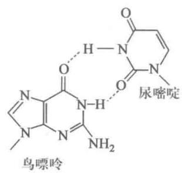  
图11-17 $\mathrm{G}\cdot \mathrm{U}$ 碱基对

  
图11-18 RNA链的假结

## 1. tRNA 的高级结构

tRNA 参与蛋白质生物合成,起着转运氨基酸和识别密码子的作用,转移 RNA 的名称即由此而得。合成蛋白质的氨基酸有 20 种,每一种氨基酸都有其相应的一种或几种 tRNA。而所有种类的 tRNA 都有十分相似的二级结构和三级结构。tRNA 功能复杂,结构小巧,近于完美,这是长期成功进化的结果。

tRNA 的二级结构都呈三叶草形(图 11-19)。茎环结构的突环(loop)区好像是三叶草的三片小叶；双螺旋的茎(stem)构成叶柄。由于双螺旋结构所占比例很大，tRNA 的二级结构十分稳定。三叶草形二级机构由氨基酸臂(amino acid arm)或受体臂(acceptor arm)、二氢尿嘧啶环(dihydrouracil loop, DHU)、反密码子环(anticodon loop)、额外环(extra loop)或可变环(variable loop)和胸苷-假尿苷-胞苷环(TψC loop)等5个部分组成。氨基酸臂含有7对碱基，5'端为磷酸基，3'端为CCA-OH，可接受活化的氨基酸。DHU环(D环)由8\~12个核苷酸组成，含有两个二氢尿嘧啶故得名，由3\~4对碱基的双螺旋区构成茎。反密码子环由7个核苷酸组成，中间3个核苷酸为反密码子，可以识别mRNA上的密码子，其茎含5对碱基。额外环大小不等，故又称为可变环，常由3\~18个核苷酸组成。TψC环(T环)由7个核苷酸组成，其茎也含5对碱基。

  
图 11-19 tRNA 三叶草形二级结构  
R, 嘌呤核苷酸; Y, 嘧啶核苷酸; $\psi$ , 假尿嘧啶核苷酸; \* 代表修饰碱基; ● 代表螺旋区碱基; ○ 代表不配对碱基

1974 年 S. H. Kim 等采用高分辨率 X 射线衍射仪测定酵母苯丙氨酸 tRNA 的晶体结构，揭示了 tRNA 具有倒 L 形的三级结构（图 11-20）。tRNA 的三叶草形二级结构通过折叠，使氨基酸臂与 TψC 茎环形成一连续的双螺旋区，构成倒 L 的一横；而 DHU 环、额外环和反密码子的茎环共同构成字母 L 的一竖。形成三级结构的氢键许多与 tRNA 中的不变核苷酸有关。除 Watson-Crick 碱基对外，还有非配对的碱基之间、碱基与核糖-磷酸骨架之间以及第三个碱基与碱基对之间形成氢键。tRNA 中几乎所有相邻碱基都通过疏水作用相互堆积，看来这种堆积作用是稳定 tRNA 构象的主要因素。

tRNA 的三级结构与其生物学功能有密切关系。tRNA 含有大量修饰核苷酸，它们可能参与三级结构的形成，同时也增加了 tRNA 的识别功能。除参与蛋白质合成外，tRNA 还有许多其他的生物学作用。例如，谷氨酰-tRNA 参与叶绿素的生物合成，某些氨酰-tRNA 参与细菌细胞壁糖肽以及细胞膜氨酰磷脂酰甘油的合成，tRNA 是转录酶的引物，tRNA 还可以参与细胞代谢和基因表达的调节。这是一类十分重要的生物大分子，很可能也是一类最古老的生物分子。细胞内 tRNA 的种类很多，每一种氨基酸都有其相应的一种或几种 tRNA。

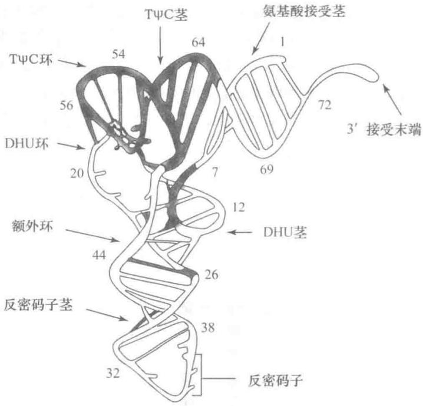  
图 11-20 酵母苯丙氨酸 tRNA 的三级结构  
黑色阶梯表示碱基间形成三级结构的氢键,阿拉伯数字表示 tRNA 序列中核苷酸的编号

## 2. rRNA 的高级结构

蛋白质生物合成是细胞代谢最核心和最复杂的过程，有数百种生物大分子直接参与作用。核糖体是蛋白质合成的场所，它由3\~4种rRNA和50\~80种蛋白质所组成。在电子显微镜下可以看到核糖体包含小亚基和大亚基两部分。采用免疫电镜、化学交联、中子衍射和X射线衍射等技术，才得出核糖体的精细结构。根据传统看法，rRNA是核糖体的骨架，蛋白质肽键的合成是由核糖体蛋白所催化的，该酶活性称为肽基转移酶(peptidyl transferase)。直到20世纪90年代初，H.F.Noller等证明大肠杆菌23S rRNA能够催化肽键形成，才确认核糖体RNA是一种核酶，从而改变了传统的观点。

2000年对核糖体晶体学研究取得划时代意义的重大成果，几个实验室分别解析了核糖体小亚基和大亚基高分辨率的结构。核糖体含有超过4500个核苷酸的rRNA以及数十种蛋白质分子，对于如此复杂的复合物能在原子水平上揭示其结构，这充分体现了当今结构生物学所能达到的最高水平。在小亚基的16S rRNA中， $46\%$ 的碱基配对形成的50个大小不等的茎环结构，组成4个结构域，并折叠成两叶（图11-21）。A型RNA螺旋之间相互作用决定了30S小亚基的形状，核糖体蛋白结合在外表，没有蛋白质完全埋在RNA中，也极少存在于和50S亚基的界面处。核糖体的解码中心（decoding centre）位于小亚基上。通过小亚基的晶体结构显示出结合tRNA的A、P、E部位以及结合mRNA的部位，这些部位虽然有蛋白质，但看起来除去蛋白质并不会改变其结构，表明解码是小亚基rRNA的功能。

大亚基 23S rRNA 有 6 个结构域,彼此连接成为一个整体,并不像小亚基 rRNA 那样结构域轮廓分明。大亚基有三个突起,5S rRNA 紧密结合在中间突起上,核糖体蛋白质同样位于外表。肽基转移酶中心 (peptidyl transferase centre) 位于大亚基上,该反应中心只有 rRNA,并无蛋白质,这就更清楚证明肽键的合成是由大亚基 rRNA 所催化。

真核生物的核糖体也是由小亚基和大亚基所组成，但比原核生物核糖体更大，结构更复杂。哺乳动物小亚基18S rRNA和大亚基28S rRNA与原核生物的16S和23S rRNA相似。真核生物大亚基还含有5S和5.8S rRNA。5.8S rRNA与28S rRNA碱基配对，它与原核生物23S rRNA5'端序列同源，推测由其演变而来。

## 3. 其他 RNA 的高级结构

游离的 mRNA 可以产生高级结构,但在核糖体上翻译时 mRNA 必须解开。mRNA 产生的高级结构对翻译效率有显著影响,有可能借此作为调节翻译的一种方式。

  
图11-21 16S和5S rRNA的二级结构

核酶(ribozyme)的催化功能与其空间结构密切相关,因此核酶具有较稳定的高级结构。如上所述,大亚基 rRNA 是一种核酶。类型 I 和类型 II 自我拼接的内含子,RNaseP 的 RNA 亚基(M1 RNA),某些病毒、类病毒和卫星病毒自我加工的 RNA 都是核酶。核酶可以是单独的 RNA 或是 RNA 与蛋白质的复合物。核酶 RNA 可以在水溶液中形成单链或双链螺旋,折叠成特定的空间结构,反应底物被结合在活性中心,定向排列,并提供反应所需的条件(例如某些反应需要的疏水环境)。RNA 虽无蛋白质的众多反应基团,但易结合金属离子,许多核酶都需金属离子参与作用。有些核酶还可借助碱基、氨基酸、咪唑和其他小分子化合物作为辅助因子。

R. Symons 比较了一些类病毒 RNA 具有自我剪切作用的结构后提出了锤头(hammerhead)核酶的模型,它约有 40 个核苷酸,是已知最小的核酶,由 13 个保守核苷酸连接区和三个螺旋区构成,形似锤头故得名(图 11-22A)。将锤头核酶分成两部分,16 核苷酸的酶链(含连接区的保守序列)与 25 核苷酸的底物链(含切割位点),相互间通过碱基对结合在一起。其 X 射线结构分析表明,确是形成三个 A 型螺旋区,但整个外形更像丫形,而不太像锤头形(图 11-22B)。自然界存在的自我切割的核酸以锤头核酶较为常见,并已得到广泛应用。

此外还存在发夹形(hairpin)、斧头形(axe)和VS核酶,这些核酶都比较小,统称为小型核酶。发夹形核酶最初在负链烟草环斑病毒卫星RNA(sTRSV)中发现(图11-23),其大小约为70个核苷酸。天然斧头核酶存在于人类丁型肝炎病毒(HDV)的正链和负链RNA中。HDV是一个1700核苷酸组成的单链环状RNA病毒,其基因组以滚环方式进行复制。斧头核酶由两个假结结构所构成,在复制后RNA加工过程中起作用。该自我剪切的核酶约由90个核苷核组成,可被分为25核苷酸的催化部分和65核苷酸的底物部分(图11-24)。链孢霉线粒体Varkud卫星RNA(VS RNA)的自我剪切结构完全不同于上述三种核酶,由多个茎环结构组成,因此是另一种核酶,它的大小约为160核苷酸。

RNA 一般都与蛋白质形成复合物，并以复合物的形成执行细胞功能。在核糖核蛋白复合物中，何者起主要作用？按照传统的看法，蛋白质是主体，RNA 是辅基，或者说只起着“衣架”（coat hanger）的作用。进一步研究发现 RNA 在其中起着关键的作用。于是 RNA 成为主体，蛋白质只是辅基或是支架。RNA 的某些功能只与其序列，即一级结构有关；但许多功能，尤其是核酶功能，与其空间结构有关。因此，不仅要了解各类 RNA 的一级结构，还要了解它们的二级结构、三级结构和与蛋白质形成复合物的四级结构或更高级的结构。

  
图11-22 锤头型核酶的结构  
A. 锤头核酶的二级结构；B. 锤头核酶的三级结构

  
图11-23 发夹型核酶的结构  
A. 发夹核酶与底物的二级结构；B. 发夹核酶的三级结构

## （三）RNA 表达遗传信息

DNA 将遗传信息由亲代传递给子代；在子代 RNA 使遗传信息得以表达。RNA 是单链分子，并能折叠成特殊的空间结构，这就使 RNA 既能像 DNA 那样编码和贮存遗传信息，又能像蛋白质那样具有催化和调节功能。RNA 能够转录和加工遗传信息，控制蛋白质合成，并在细胞内执行各种功能。基因对表型的影响是通过基因产物来实现的，基因产物包括蛋白质和 RNA 两类，而前者也是在后者控制下合成的，故而 RNA 对表型有专一效应。

转录水平的调节使得细胞在不同环境和时空条件下,表达不同基因编码的信息。转录是一个传真的过程,初级转录物(primary transcript)RNA与被转录DNA的序列基本一致。RNA在转录后常常要经过一系列的加工才成为成熟的、有功能的RNA。一般性加工(general processing),包括切割(cutting)、修剪(trimming)、添加(appending)、修饰(modification)和异构化(isomerization),不改变RNA的编码序列,是一个抽提有效信息的过程。选择性加工(alternative processing)改变编码序列,包括剪接(splicing)、编辑(editing)和再编码(recoding),则改变了携带的遗传信息。不同的加工可以得到不同的表达产物,因此基因的表达有赖于RNA的解读(reading)。加工需要有催化功能的RNA(核酶)作用,或在RNA指导下经酶作用。总之,如果说DNA是遗传信息的储存器,RNA则是遗传信息的处理和显示器。

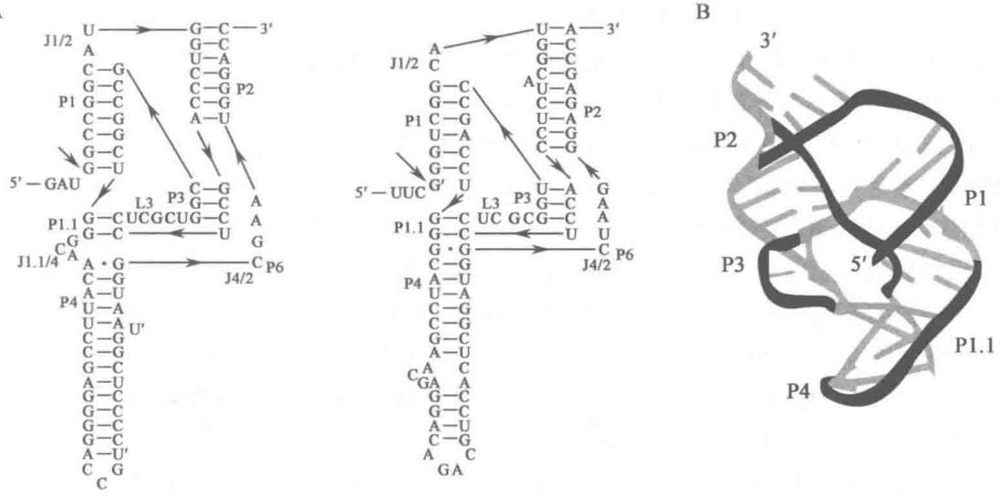  
图 11-24 斧头型核酶的结构  
A. HDV 基因组和反基因组斧头核酶的二级结构；B. 斧头核酶的二级结构

RNA 的功能多种多样。它合成蛋白质、加工遗传信息、调节基因表达、组装染色体以及构成某些病毒的基因组，几乎参与细胞的一切生命活动。

## 1. RNA 参与蛋白质的合成

早在20世纪40年代，细胞化学研究证明，在生长和分泌细胞中，蛋白质合成旺盛，RNA含量也丰富，于是推测RNA的功能可能是参与蛋白质合成。20世纪50年代中期，P.Zamecnik实验室用放射性同位素 $^{14}$ C标记氨基酸，然后在大鼠肝匀浆或其他生物材料制成的无细胞系统（cell-free systems）中追踪 $^{14}$ C-氨基酸掺入蛋白质的过程，发现氨基酸在酶催化下被ATP激活，之后连到一种可溶性RNA（soluble RNA，sRNA）上，并被带到微粒体（microsome），进入蛋白质中。所谓微粒体即是内质网的碎片，其中含有核糖核蛋白颗粒（ribonucleoprotein particle）。其时，Crick认为将核酸语言（由核苷酸编码）转变为蛋白质语言（由氨基酸编码）需要一种转接器（adapter）。1958年，按sRNA的功能将其称为转移RNA（transfer RNA，tRNA），后来证实此RNA即相当于Crick的转接器。当年还将核糖核蛋白颗粒称为核糖体（ribosome），知道核糖体是蛋白质合成的场所。曾经以为核糖体RNA（ribosomal RNA，rRNA）是蛋白质合成的模板，但随后发现rRNA碱基组成与DNA不一致，而且代谢稳定，与作为模板的要求不符。当噬菌体T₂感染大肠杆菌后，在宿主细胞内产生一类RNA，其碱基组成与噬菌体T₂DNA一致，并且代谢不稳定，实际上正常细胞内也有这类代谢不稳定的RNA。1961年J.Monod和F.Jacob将这类RNA命名为信使RNA（messenger RNA，mRNA），它才是合成蛋白质的模板。

现在知道,三类 RNA 控制着蛋白质的合成。tRNA 是转接器,或者说是翻译者(transtator),它携带活化的氨基酸到核糖体上,由其反密码子识别 mRNA 的密码子,起翻译作用。rRNA 是装配者(assembler),它与数十种蛋白质组成核糖体,使 mRNA 和 tRNA 在其上正确定位,并催化肽键的合成。mRNA 起指导者(instructor)作用,它从 DNA 处获得遗传信息,作为蛋白质合成的模板,决定蛋白质的氨基酸序列。RNA 通过合成蛋白质使遗传信息得以表达。

## 2. RNA 具有催化功能

长期以来一直以为 RNA 的功能只是参与蛋白质合成。1958 年 Crick 在其著名的论文“论蛋白质的合成”中详细阐述了分子生物学的“中心法则”。在分子生物学早期，对于贮存于 DNA 分子内的遗传信息如何得以复制，如何传递给蛋白质，以及对 DNA 和 RNA 碱基序列与蛋白质氨基酸序列之间线性关系的理解，“中心法则”起了积极的促进作用；然而，“中心法则”将遗传信息的表达看作犹如录放机的播放过程，以为是不变的，不了解RNA在解读遗传信息过程的加工和调节作用，“中心法则”束缚了对RNA功能多样性的认识。直到上世纪80年代这种看法才开始发生改变。

1982 年 Cech 证明, 四膜虫 rRNA 前体 (pre-rRNA) 的剪接 (splicing) 由类型 I 内含子 RNA 自我催化完成。次年 Altman 证明大肠杆菌 RNase P 剪切 (cleavage) tRNA 前体 (pre-tRNA) 可由其 RNA (M1 RNA) 单独完成。由此证明, 某些 RNA 具有催化功能, 称为核酶。RNA 可催化多种反应, 包括 RNA 底物中磷酸二酯键的转移、水解和连接, DNA 的水解, 肽键和酰胺键的转移和水解, NADH 的氧化还原和 1,4-α-葡聚糖的分支反应等。其中以蛋白质合成的转肽反应和 RNA 信息加工的剪切和剪接反应最为重要。

小型核酶家族,如锤头核酶、发夹核酶、HDV 假结核酶和链孢霉 VS 核酶,可在特异位点催化核酸降解 (nucleolysis),以切除多余序列。在自然界上述核酶多用于病毒、类病毒和卫星 RNA 复制时形成的基因组串联体的自我剪切。如将核酶分离出来也可用于降解靶 RNA,因此用途很多。它们有类似的作用机制,当底物 RNA 链与核酶结合时,剪切处的 2'-羟基对磷酸二酯键的磷原子发动亲核攻击,形成 2',3'-环磷酸酯和 5'-羟基,反应式如下:

在该反应中磷酸二酯键并未被水解，反应是可逆的；但是VS核酶与底物仅在剪切点一侧结合，底物另一侧是游离的，因此反应不可逆。RNase P的M1 RNA分子较大，对Pre-tRNA的剪切为水解反应（hydrolysis），不形成环磷酸酯，产物为带5'-磷酸基的tRNA。

真核生物的基因多数是断裂的(interrupted)，其内含子需在转录后RNA加工水平上通过剪接切除。RNA剪接共有4种方式：类型I自我剪接、类型Ⅱ自我剪接、剪接体（spliceosome）的剪接和核tRNA的酶促剪接。类型I内含子核酶催化的剪接过程包括两次转酯反应：先由游离的鸟苷酸或鸟苷提供3'-羟基，内含子的5'-磷酸基转移其上；然后由第一个外显子产生的3'-羟基攻击第二个外显子的5'-磷酸基，两个外显子得以连接，内含子则被切除。类型Ⅱ内含子核酶催化的剪接过程也包括两次转酯反应，但由靠近3'剪接点的内含子腺苷酸提供2'-羟基。剪接体含有类似类型Ⅱ的核酶，剪接过程与类型Ⅱ自我剪接类似。

RNA 转录后加工是一个抽提信息或重新组合信息的过程,需要识别 RNA 的序列和高级结构,十分复杂,单靠酶难以完成,因此或由核酶来完成,或由核酶在蛋白质辅助下完成,或在 RNA 指导下由酶来完成。真核生物细胞内存在许多小 RNA 起着加工的指导作用,如核内小 RNA (small nuclear RNA, snRNA) 指导 mRNA 前体的剪接,核仁小 RNA (small nucleolar RNA, snoRNA) 指导 rRNA 前体的剪接,以及 RNA 编辑 (RNA editing) 中的指导 RNA (guide RNA, gRNA) 等。

## 3. RNA 对基因表达的调节作用

基因表达有赖于 RNA 对遗传信息的解读, 在表达的各个阶段都存在调节 (regulation) 和控制 (control), RNA 在其中起着重要的作用。RNA 作为调节物 (regulator) 能够识别 DNA 和 mRNA 的序列或结构, 从而在转录和翻译水平上调节和控制基因表达。控制是指靶位点被调节物关闭 (阻遏) 或打开 (激活），相关表达过程得以在一定范围内进行。一些基因含有相同或类似的靶位点，可以被同一调节物协同控制。调节是指调节物对基因表达过程量的调整。调节物本身也可被调节和控制，有时受一些可反映环境条件的小分子所调节和控制，或被另一些调节物所调节和控制，由此构成调控网络。

早在上世纪中期即有一些科学家推测 RNA 在基因表达过程中起调节控制作用。但直到 1983 年由 T. Mizuno 等以及 R. Simons 等分别在大肠杆菌中发现反义 RNA(antisense RNA)，才开始了解其调节的具体过程。Mizuno 等人从大肠杆菌中分离出一种 RNA(174 个核苷酸)，与低渗外膜蛋白 Omp F 的 mRNA 5' 端序列互补，可与之结合而使其失去翻译活性。Simons 等证明，大肠杆菌转座子 Tn10 在合成转座酶 mRNA 的同时还合成出一条与其 5' 端序列互补的小 RNA，可抑制 mRNA 的活性，从而使转座酶维持在一定的水平，避免转座频率过高而导致宿主死亡。他们将这类 RNA 称为干扰 mRNA 的互补 RNA(mRNA-interfering Complementary RNA, micRNA)。其后知道利用反义链进行调节的现象在原核生物和真核生物中均十分普遍。

细菌存在数百个编码调节 RNA(regulatory RNA) 的基因, 这些调节 RNA 长度在 50\~200 个核苷酸之间, 统称之为小 RNA(small RNA, sRNA)。sRNA 通常与靶基因转录物部分互补, 因此属于反义 RNA。它们在不同水平上(转录、加工和翻译)或影响许多基因的表达, 或只影响一个基因的表达; 主要通过 RNA-RNA 的相互作用, 使靶 RNA 失活或被降解。大肠杆菌在氧胁迫(oxydative stress)下的反应是研究此类控制系统的一个很好例子。S. Altuvia 等发现大肠杆菌可被过氧化氢诱导产生一种小 RNA, 称为 oxyS RNA, 109 个核苷酸, 不编码蛋白质, 能抗氧的毒害和抗诱变。实际过程极为复杂, 过氧化氢活化转录激活蛋白 Oxy R, 该激活蛋白促进多个基因转录, 其中包括 oxyS RNA。而后者可以激活或阻遏数十个基因表达, 并有多种蛋白质因子和 RNA 调节物参与协同调节。

RNA干扰(RNA interference, RNAi)现象最初是在秀丽新小杆线虫(Caenorhabditis elegans)中发现的。1998年A. Fire、C. Mello及其同事在用反义RNA抑制线虫控制胚胎极性基因的表达时发现，双链RNA比有义RNA(sense RNA)或反义RNA(antisense RNA)更为有效，他们将此双链RNA引起特异序列基因沉默的现象称为RNA干扰。dsRNA通过注射、喂饲或浸泡即可干扰线虫有关基因的表达，少量dsRNA进入细胞可引发系统(全身)反应，并且还能传递给后一代。随后证实RNA干扰广泛存在于各类真核生物中。其实，早在1990年R.Jorgensen和他的同事将色素基因导入矮牵牛花，结果花的紫色反而被抑制，这表明不仅外源基因本身失活，还可使体内同源基因也受抑制，他们称此现象为共抑制(cosuppression)。与此同时，一些实验室发现RNA病毒能诱导同源基因沉默，植物还能借助类似共抑制的机制识别和降解病毒RNA。在链孢霉中也发现外源基因引起沉默的现象，曾称为基因遏制。无论是外源基因的导入，或是病毒RNA的入侵，均能产生dsRNA，因此基因共抑制和遏制与RNA干扰并无本质差别。由于Fire和Mello最早明确提出RNA干扰，故而他们共同获得了2006年诺贝尔生理学或医学奖。

现在知道，RNA 干扰是生物机体演化产生用以对付外源基因入侵、某些转座子和高度重复序列的转录或内源异常 RNA 生成的一种重要机制。上述情况都可能会产生双链 RNA。RNA 内切酶 Dicer 是一种类似细菌 RNase III 的酶，它可识别和剪切长的 dsRNA，产生 21\~25 个核苷酸长的短双链 RNA，即短的干扰 RNA（short interfering RNA, siRNA）。siRNA 可通过多条途径抑制同源基因的表达：它可促使含有互补序列的 mRNA 降解；以多种方式抑制 mRNA 的翻译；或者在启动子处诱导染色质修饰使基因沉默。无论通过何种途径，siRNA 在发挥其作用时都需要与有关蛋白质一起形成 RNA 诱导的沉默复合物（RNA-induced silencing complex, RISC）。在此复合物中，由水解 ATP 提供能量使双链 siRNA 解开，并促使单链 siRNA 与其互补的 mRNA 配对。结果或使靶 mRNA 降解，或使其翻译受抑制，可能取决于 siRNA 与靶 mRNA 之间的匹配关系。如果两者完全互补，后者被降解；若两者并不完全互补，则主要是翻译受抑制。靶 mRNA 的降解由 RISC 的核酸酶来完成。RISC 还能进入核内，由 siRNA 与其互补的基因组序列配对。当复合物结合到染色质上时，即能招募与染色质修饰有关的蛋白质聚集在基因的启动子处，使染色质修饰并改变结构，导致基因转录沉默。RNAi 的效率很高，极微量的 siRNA 可以使靶基因完全关闭。因此推测它可借助依赖 RNA 的 RNA 聚合酶（RNA-dependent RNA polymerase, RdRp）获得扩增。值得指出的是，当给予 mRNA 某一区段特异的 siRNA 时，还能产生该区段邻近序列的 siRNA。这就表明 siRNA 与 mRNA 配对可以发生 RNA 复制,从而二次产生 siRNA。事实上某些 RNAi 还能由亲代传递给子代。

尤为引人注目的是，从线虫中先后发现控制发育时序的小分子 RNA lin-4 和 let-7，称为小分子时序 RNA（small temporal RNA, stRNA）；前者长 22 个核苷酸，后者为 21 个核苷酸。它们与控制发育程序的蛋白质 mRNA 3' 非编码区互补，可抑制其翻译功能。后来陆续发多种与 lin-4 和 let-7 类似的 RNA，大小在 22 核苷酸左右，广泛存在于所研究的各类生物中，被称为微（小）RNA（microRNA, miRNA）。目前已有数以千计存在于线虫、果蝇、哺乳动物、人、水稻、拟南芥等真核生物的 miRNA 被报导。miRNA 与 siRNA 有许多相似之处，如长度均为 20 多个核苷酸，都由 Dicer 酶加工产生，都与蛋白质形成复合物以影响基因活性。但与 siRNA 不同，miRNA 由其基因转录产生大的前体 RNA，自身回折形成双链，先经内切酶 Drosha 切断，再由 Dicer 酶不对称剪切成小片段，然后解开形成单链分子，主要在转录后和翻译水平起调节作用。人类大约有上千个 miRNA 基因，或分布在编码基因的内含子中，或在基因间隔区。miRNA 的发现极大丰富了对于 RNA 在基因表达调控中重要性的认识。

上述起调节作用的 RNA 与被调节的靶分子不是同一分子, 因此是反式作用(trans-acting); 然而, 许多 mRNA 自身具有调控其翻译活性的结构, 这种顺式作用(cis-acting)的结构称为 RNA 开关(RNA switch), 简称核糖开关或核开关(riboswitch)。核开关在原核生物和真核生物的一些 mRNA 中都有, 但对原核生物更重要, 因为真核生物还存在许多其他的调控方式。2002 年 R. R. Breaker 发现大肠杆菌编码维生素 B1 的辅酶(TPP)生物合成相关酶的 mRNA 可以通过感受 TPP 含量来调节其活性, TPP 含量高时酶的生成就受阻遏。与核酶类似, 核开关也由一些 RNA 茎环结构所组成, 某些小分子代谢物可以结合其上, 从而影响 mRNA 的结构和功能。核开关可以位于 mRNA 的 5' 非翻译区, 也可以在 3' 非翻译区, 或在 mRNA 前体的内含子处。其作用可以发生在转录水平, 或是提前转录终止, 或是改变剪接方式; 也可以发生在翻译水平, 或是阻遏, 或是激活。有些核开关本身是一种核酶, 在小分子代谢物激活下 mRNA 被自身核开关的核酶所降解。

过去总以为 RNA 转录后加工切下的小片段是无用的下脚料, 现在却发现它们也可能成为调节 RNA 或具有其他特殊功能的 RNA。总之, 凡具有某种特定功能的 RNA 统称功能 RNA (functional RNA, fRNA)。其中, mRNA 编码合成蛋白质的信息; 其余的 RNA 则为非编码 RNA (noncoding RNA, ncRNA), 如长度超过 200 个核苷酸则为长非编码 RNA (long noncoding RNA, lnc RNA)。过去总以为只有编码基因才能转录, 现在却发现人类基因组 90% 以上的序列都能转录, 而编码序列不到基因组的 2%。如此众多的非编码 RNA 意味着什么? 科学家们正在试图揭开这个奥秘。

## 4. RNA 对染色体结构的组装作用

在染色体中含有少量 RNA, 一些科学家推测这类 RNA 可能在染色体结构的组装中起某种作用。研究显示, 细菌染色体 DNA 并非完全散开的, 它们在细胞内组装成致密体, 称为拟核 (nucleoid)。基因组环状双链 DNA 以超螺旋形式存在, 其上结合碱性蛋白质和未知 RNA, 组成 10\~40 kb 的突环结构域。如果破坏 RNA, DNA 即散开, 说明 RNA 对形成 DNA 结构域是必要的, 详细情况迄今尚不清楚。

真核生物染色体结构十分复杂。基因组线状双链 DNA 与组蛋白形成核小体（nucleosome），具有不同层次的折叠压缩结构，构成常染色质（euchromatin）和异染色质（heterochromatin）两类染色质（chromatin）。异染色质是对碱性染料着色较深，更为浓缩的染色质，大多不能转录。在有丝分裂时，染色质浓缩成染色体（chromosome）。染色体 DNA 的末端为高度重复序列构成的端粒结构，与染色体的复制和稳定有关。端粒酶含有合成端粒 DNA 序列的 RNA 模板，是一种逆转录酶。染色质的异染色质化和染色体的形成都需要某些非编码 RNA 参与。例如，哺乳动物雌性细胞含有两条 X 染色体，在发育早期随机关闭其中一条，便成为异染色质小体，此性分化和剂量补偿效应的起始和维持均由长非编码 RNA 即 Xist RNA 介导。

病毒可看作是游离的染色体。有些病毒的组装需要 RNA 参与作用，如枯草芽孢杆菌噬菌体 $\phi29$ ，其噬菌体颗粒的组装有赖于组装 RNA（package RNA，pRNA）。由 6 个 pRNA 聚合形成六聚体圆环，位于噬菌体衣壳前体的入口处，该圆环裹住 DNA，通过旋转将 DNA 送入衣壳内，旋转所需能量由水解 ATP 供给。因此 pRNA 同时也是一种分子马达。

## 5. RNA 的表型效应

生物亲代通过 DNA 复制将遗传信息传递给子代，在子代通过 RNA 转录和蛋白质翻译使遗传信息得以表达。20 世纪后期开始与 20 世纪中期对基因表达的看法有较大的不同：① 20 世纪中期认为所有表达性状（表型）都是通过蛋白质产生的，而 20 世纪 80 年代后才认识到 RNA 参与细胞各种功能，性状是由 RNA 和蛋白质共同产生的。② 20 世纪中期认为 RNA 仅起着将遗传信息由 DNA 传给蛋白质的中介作用，80 年代后才认识到 RNA 可根据内外条件的改变重新组合遗传信息；蛋白质虽然在加工中能切成有活性的多肽，而蛋白质的剪接和修饰只和活性有关，不能重新组合信息。③ 21 世纪初期，人类基因组测序获得令人吃惊的结果：人类的编码基因数目不到 30 000，外显子（编码序列）仅占基因组 1%；然而转录组学的研究结果更令人吃惊：基因组 90% 的序列都能被转录。这就是说，RNA 携带基因组 90% 的信息，而蛋白质只携带基因组 1% 的信息，似乎表明生物机体的时空调节信息远大于结构信息。所谓表型是指基因型在一定环境条件下表现的性状，也就是说表型是基因表达的结果，表达受 RNA 和蛋白质调节物的调节，并受环境影响，其中选择性主要取决于 RNA。

生物体内 DNA 和 RNA 的合成需要蛋白质的酶活性催化,而蛋白质的合成又需要核酸的指令,那么生命起源的初期先出现核酸还是先出现蛋白质?这个问题类似“先有鸡还是先有蛋”。1982 年 Cech 证明 RNA 具有催化功能,称之为核酶。既然 RNA 能像 DNA 一样携带和复制遗传信息,又能像蛋白质一样催化生化反应,可以设想最早出现的生命物质是 RNA,而不是 DNA 或蛋白质。因而 W. Gilbert 于 1986 年提出“RNA 世界(RNA World)”的假说,认为生命起源于“RNA 世界”,后来才分化产生“蛋白质世界”和“DNA 世界”。这一假说显得十分合理,因此提出不久便被广泛接受。从“RNA 世界”到“三驾马车”(DNA、RNA 和蛋白质)的复杂系统,RNA 将复制功能转给 DNA,将大部分生理功能转给蛋白质,而自身始终掌控着表达过程的信息处理。一切生命活动取决于 DNA、RNA 和蛋白质三者的相互作用,但三者的作用还是有区别的,遗传信息的解读主要靠 RNA,蛋白质只起辅助作用。

## 提要

1868年Miescher发现核素（相当于DNA）。RNA的研究开始于19世纪末，1894年Hammarsten证明酵母核酸中的糖是戊糖。Levene曾对核酸化学结构和核酸中糖的鉴定作出重要贡献，但他的“四核苷酸假说”严重阻碍了核酸研究。直到20世纪40年代，新的核酸研究技术证明DNA和RNA都是细胞重要组成，并且是特异的大分子。Chargaff等揭示了DNA的碱基配对规律。Watson和Crick在前人工作基础上于1953年提出DNA双螺旋结构模型，说明基因结构、信息和功能三者间的关系，奠定了分子生物学基础。Crick提出分子生物学“中心法则”。20世纪60年代RNA研究出现高潮，Holley测定了酵母丙氨酸tRNA核苷酸序列，Nirenberg等破译了遗传密码，三类RNA参与蛋白质合成过程也基本弄清。70年代在DNA重组技术和测序技术的带领下，生物技术和生物工程得到迅猛发展。RNA研究出现第二个高潮，RNA的催化功能和调节功能相继被发现，冲破了传统观点。人类基因组计划是生物学有史以来最伟大的科学工程。该计划的完成，使生命科学进入后基因组学的时代，各类组学纷纷兴起，生命科学已不再限于对单个因子、单个基因、单个生物分子的研究，而是侧重综合研究，侧重对生物分子间相互识别、相互作用和动态的研究。

核酸有两类:脱氧核糖核酸(DNA)和核糖核酸(RNA)。DNA是生物主要的遗传物质,分布在原核细胞的核区,真核细胞的核和细胞器以及DNA病毒中。DNA通常是双链分子,环状或线状,线状DNA(无论单链或双链)的末端常有特殊结构。RNA种类很多,功能各异,分布在细胞或RNA病毒中,通常是单链分子。RNA或以功能分,或以大小分,或以在细胞中的位置分。有关RNA的功能不断有新的发现,RNA最基本的功能是解读遗传信息。

核酸是一类多聚核苷酸，其基本结构单元是核苷酸。DNA由4种碱基（胞嘧啶、胸腺嘧啶、腺嘌呤和鸟嘌呤）、D-2-脱氧核糖和磷酸所组成；RNA则由4种碱基（胞嘧啶、尿嘧啶、腺嘌呤和鸟嘌呤）、D-核糖和磷酸所组成。在DNA和RNA中都含有少量修饰碱基和核苷。细胞内还有一些游离的核苷酸、核苷酸

衍生物和寡聚物，具有重要的生理功能。

DNA 的一级结是指其核苷酸序列,一些特别的序列常有其特殊功能。DNA 的二级结构是指其双链、三链和四链螺旋结构。通常 DNA 以双螺旋形式存在,并可呈现不同的构象,A 型和 B 型是右手螺旋,在嘌呤和嘧啶交替出现的区段一定条件下可出现左手螺旋的 Z 型。三股螺旋出现在同型核苷酸链(即同为嘧啶或同为嘌呤)之间,第三股碱基与双螺旋的嘌呤碱形成 Hoogsteen 配对。H 回文结构有助于蛋白质的识别。在染色体 DNA 的着丝粒和端粒处还可见到 G-四链体形成的四股螺旋。从染色体行为、细菌转化和病毒感染中都表明 DNA 是遗传物质。

RNA 的一级结构主要指核苷酸序列,也包括 5' 端和 3' 端的化学结构及内部修饰。RNA 常以单链形式存在,但可回折形成局部双螺旋的二级结构,在此基础上折叠形成三级结构。RNA 有多种功能,几乎参与细胞所有生命活动。tRNA、rRNA 和 mRNA 参与蛋白质合成。tRNA 携带氨基酸,识别密码子,起翻译的作用。rRNA 与蛋白质组成核糖体引入 mRNA 和 tRNA,催化肽键合成,起装配的作用。mRNA 传递遗信息,给出合成蛋白质的指令,起信使的作用。RNA 具有催化功能,主要作用于合成肽键和加工 RNA。功能 RNA 可分为编码 RNA 和非编码 RNA 两类。许多非编码 RNA 都是调节 RNA,如 siRNA、miRNA 和核开关,有些长非编码 RNA 能调节染色质结构和活性。有些 RNA 在染色体组装中起重要作用。RNA 对表型有选择专一性效应。

## 习题

1. Miescher 的发现有何意义？

2. 为什么早期核酸研究进展比蛋白质研究缓慢？

3. Watson 和 Crick 提出 DNA 双螺旋结构模型的背景和依据是什么？

4. 为什么说 Watson 和 Crick 提出 DNA 双螺旋结构模型是 20 世纪最伟大的科学成就之一？

5. 什么是“中心法则”？如何看待这一“法则”提出的意义和局限性？

6. 什么是 DNA 重组技术？为什么说它的兴起导致分子生物学第二次革命？

7. 试述20世纪后半世纪RNA研究的两次高潮。主要成就是什么？有何深远意义？

8. 为什么人类基因组计划提出之初会有很大争议？它有何重大意义？

9. 为什么说生命科学已进入后基因组时代？它的意思是什么？

10. 当前有哪些最重要的组学？它们主要的研究领域是什么？

11. 生物化学与分子生物学、系统生物学和生物信息学有何关系？

12. 试分析还原论观点对生物化学与分子生物学的影响。

13. DNA 和 RNA 在化学组成和结构上有何差别？这些差别与其功能有何关系？

14. 游离核苷酸、核苷酸衍生物和多聚物有何生物功能？推测这类物质在生命起源中可能的作用？

15. 核酸中主要含有哪些稀有碱基和核苷？有何生物学意义？

16. 已经揭示的人类基因组结构有何特点？

17. 何谓正向重复？何谓反向重复？何谓镜像重复？

18. DNA 双螺旋结构模型有哪些基本要点？这些特点能够解释哪些基本生命现象？

19. DNA 晶体结构研究对 Watson 和 Crick 模型有何修正？比较 A-DNA、B-DNA 和 Z-DNA 的主要特征。它们存在的条件是什么？

20. 何谓 Hppgsteen 碱基对？它与 Watson-Crick 碱基对有何不同？

21. H-DNA存在的条件是什么？有何生物学意义？

22. 何谓 G-四链体？它的存在与链的走向有何关系？

23. 当 cccDNA 结合溴化乙锭、补骨脂素和放线菌素等嵌合物时，碱基对间每插入一个嵌合分子将使 DNA 螺旋减少 $26^{\circ}$ ，即 $\Delta\beta$ 为 -0.072，现有一种 5.2 kb 的质粒，超螺旋密度 ( $\sigma$ ) 为 -0.05，当其结合嵌合分子后 $\sigma$ 由 -0.05 变为 +0.015。问每一质粒结合多少分子嵌合物？

24. 何谓遗传物质？如何证明 DNA 是遗传物质？

25. 细胞具有恒定量的 DNA 说明什么？生殖细胞（精子和卵）的 DNA 量只有体细胞的一半，其 A+T/G+C 的比值是否

和体细胞一样？A=T、G=C 的关系是否仍存在？

26. DNA 的信息量与复杂度有何关系？当 DNA 的量增加一倍时信息量增加多少？

27. RNA 主要有哪些种类？比较其结构与功能的特点。

28. 试分析 RNA 三级结构的作用力。

29. 参与蛋白质合成的 RNA 有哪些种类？它们各起何作用？

30. 核酶有哪几种类型？它们各自催化什么反应？

31. 何谓非编码 RNA? 非编码 RNA、调节 RNA 和指导 RNA 这三个术语间有何关联?

32. RNA 在染色体组装中起何作用？

33. RNA 和蛋白质在解读遗传信息中各起什么作用?

34. 如何看待 RNA 携带遗传信息远比蛋白质为多？

## 主要参考书目

1. 王镜岩, 朱圣庚, 徐长法. 生物化学教程. 北京: 高等教育出版社, 2008.

2. Chargaff E, Davidson J N. The Nucleic Acids. New York: Academic Press, 1955.

3. Nelson D L, Cox M M. Lehninger Principles of Biochemistry. 6th ed. New York: W. H. Freeman, 2012.

4. Berg J, Tymoczko J, Stryer L. Biochemistry. 7th ed. New York: W. H. Freeman, 2010.

5. Krebs J E, Kilpatrick S T, Goldstein E S. Lewin's Genes XI. Boston: Jones and Bartlett Publishers, 2013.

6. Watson J D, et al. Molecular Biology of the Gene. 7th ed. San Francisco: Pearson Education, 2013.

(朱圣庚)

## 网上资源

习题答案
